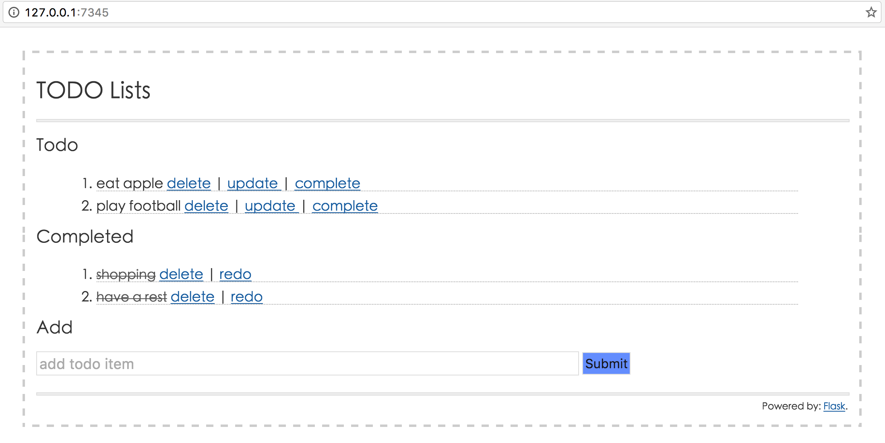

# flask 实战

[项目代码](https://github.com/ethan-funny/flask-todo-app)。

本章主要介绍如何开发一个 Web TODO 应用，用于管理个人的任务清单，该项目改编自 [flask-simple-todo](https://bitbucket.org/wwq0327/flask-simple-todo)，由于原项目已经很久没更新了，我对其进行了修改和完善，改编后的代码可以在[这里](https://github.com/ethan-funny/flask-todo-app)找到。

目前，该应用主要的功能有：

*   添加待办事项
*   修改待办事项
*   删除事项
*   完成事项

界面如下：



# 开始实战

我们会从下面三个方面对该项目进行介绍：

1.  生成项目结构
2.  设计数据模型
3.  编写业务逻辑

# 项目结构规范

我们在前面所举的例子基本都是写在一个单一的脚本文件中，比如 `app.py`，这在做一些简单的测试中是可行的，但是在较大的项目中则不应该这么做。好的项目结构可以让人更易于查找代码，也易于维护。当然了，每个团队都有自己的项目规范，在这里，我分享自己在平时的开发中经常用到的项目结构，仅供参考。

我们以该 [TODO](https://github.com/ethan-funny/flask-todo-app) 项目为例，介绍项目结构。

为了方便，这里使用 shell 脚本生成项目基础骨架：

```py
# !/bin/bash

dirname=$1

if [ ! -d "$dirname" ]
then
    mkdir ./$dirname && cd $dirname
    mkdir ./application
    mkdir -p ./application/{controllers,models,static,static/css,static/js,templates}
    touch {manage.py,requirements.txt}
    touch ./application/{__init__.py,app.py,configs.py,extensions.py}
    touch ./application/{controllers/__init__.py,models/__init__.py}
    touch ./application/{static/css/style.css,templates/404.html,templates/base.html}
    echo "File created"
else
    echo "File exists"
fi 
```

将上面的脚本保存为文件 `generate_flask_boilerplate.sh`，使用如下命令生成项目骨架：

```py
$ sh generate_flask_boilerplate.sh flask-todo-app 
```

生成的项目骨架如下所示：

```py
flask-todo-app
├── application
│   ├── __init__.py
│   ├── app.py
│   ├── configs.py
│   ├── controllers
│   │   ├── __init__.py
│   ├── extensions.py
│   ├── models
│   │   ├── __init__.py
│   ├── static
│   │   ├── css
│   │   │   └── style.css
│   │   └── js
│   └── templates
│       ├── 404.html
│       ├── base.html
├── manage.py
├── requirements.txt 
```

该项目骨架包含三个顶级文件(夹)：application 目录、manage.py 文件和 requirements.txt 文件，在一般情况下，我们可能还需要一个 tests 目录，存放单元测试的代码，在这里，我们没有把它包含进来。下面，我解释一下该项目骨架：

*   application 目录存放 Flask 程序，包含业务逻辑代码、数据模型和静态文件等
    *   configs.py 存放项目配置
    *   models 目录存放数据模型文件
    *   templates 目录存放模板文件
    *   static 目录用于存放静态文件，如 js、css 等文件
*   manage.py 用于启动我们的 Web 程序以及其他的程序任务
*   requirements.txt 文件列出了项目的安装依赖包，便于在其他机器部署

# 数据模型设计

# 数据模型

该项目是一个 TODO 应用，可以对任务清单进行增加、修改、删除等，相应地，我们需要设计一个数据模型来存储相应的数据和状态。不难想到，表的字段主要有以下几个：

*   id: 标识每条记录的字段，是表的主键，Integer 类型；
*   title: 即任务清单的标题，String 类型；
*   posted_on: 任务创建时间，DATE 类型；
*   status: 任务的状态，Boolean 类型；

因此，我们的数据模型定义如下 (完整代码参考[这里](https://github.com/ethan-funny/flask-todo-app))：

```py
# -*- coding: utf-8 -*-

from application.extensions import db
from datetime import datetime

__all__ = ['Todo']

class Todo(db.Model):
    """数据模型"""
    __tablename__ = 'todo'

    id = db.Column(db.Integer, primary_key=True)
    title = db.Column(db.String(255), nullable=False)
    posted_on = db.Column(db.Date, default=datetime.utcnow)
    status = db.Column(db.Boolean(), default=False)

    def __init__(self, *args, **kwargs):
        super(Todo, self).__init__(*args, **kwargs)

    def __repr__(self):
        return "<Todo '%s'>" % self.title 
```

## 创建数据库

这里，我们使用 [Flask-Migrate](https://github.com/miguelgrinberg/Flask-Migrate) 插件管理数据库的迁移和升级，详细用法可以查看 [Flask-Migrate](https://github.com/miguelgrinberg/Flask-Migrate)。

在项目的根目录下按顺序执行如下命令，生成 migratios 文件夹、数据迁移脚本和更新数据库。

```py
$ python manage.py db init   # 初始化，生成 migratios 文件夹
  Creating directory /Users/admin/flask-todo/migrations ... done
  Creating directory /Users/admin/flask-todo/migrations/versions ... done
  Generating /Users/admin/flask-todo/migrations/alembic.ini ... done
  Generating /Users/admin/flask-todo/migrations/env.py ... done
  Generating /Users/admin/flask-todo/migrations/env.pyc ... done
  Generating /Users/admin/flask-todo/migrations/README ... done
  Generating /Users/admin/flask-todo/migrations/script.py.mako ... done
  Please edit configuration/connection/logging settings in '/Users/admin/flask-
  todo/migrations/alembic.ini' before proceeding.

$ python manage.py db migrate  # 自动创建迁移脚本
INFO  [alembic.runtime.migration] Context impl SQLiteImpl.
INFO  [alembic.runtime.migration] Will assume non-transactional DDL.
INFO  [alembic.autogenerate.compare] Detected added table 'todo'
  Generating /Users/admin/flask-todo/migrations/versions/70215a3905e0_.py ... done

$ python manage.py db upgrade   # 更新数据库
INFO  [alembic.runtime.migration] Context impl SQLiteImpl.
INFO  [alembic.runtime.migration] Will assume non-transactional DDL.
INFO  [alembic.runtime.migration] Running upgrade  -> 70215a3905e0, empty message 
```

# 编写业务逻辑

我们的业务逻辑代码主要在 controllers 目录中，新建一个 `todo.py` 文件, 核心代码如下 (完整代码参考[这里](https://github.com/ethan-funny/flask-todo-app))，代码说明可以参考注释：

```py
# -*- coding: utf-8 -*-

import flask
from flask import request, redirect, flash, render_template, url_for
from application.extensions import db
from application.models import Todo

todo_bp = flask.Blueprint(
    'todo',
    __name__,
    template_folder='../templates'
)

# 主页
@todo_bp.route('/', methods=['GET', 'POST'])
def index():
    todo = Todo.query.order_by('-id')
    _form = request.form

    if request.method == 'POST':
        # 添加任务
        title = _form["title"]
        td = Todo(title=title)
        try:
            td.store_to_db()  # 将数据保存到数据库
            flash("add task successfully!")
            return redirect(url_for('todo.index'))
        except Exception as e:
            print e
            flash("fail to add task!")

    return render_template('index.html', todo=todo)

# 删除任务
@todo_bp.route('/<int:todo_id>/del')
def del_todo(todo_id):
    todo = Todo.query.filter_by(id=todo_id).first()
    if todo:
        todo.delete_todo()
    flash("delete task successfully")
    return redirect(url_for('todo.index'))

# 编辑 (更新) 任务
@todo_bp.route('/<int:todo_id>/edit', methods=['GET', 'POST'])
def edit(todo_id):
    todo = Todo.query.filter_by(id=todo_id).first()

    if request.method == 'POST':
        Todo.query.filter_by(
            id=todo_id
        ).update({
            Todo.title: request.form['title']
        })
        db.session.commit()
        flash("update successfully!")
        return redirect(url_for('todo.index'))

    return render_template('edit.html', todo=todo)

# 标记任务完成
@todo_bp.route('/<int:todo_id>/done')
def done(todo_id):
    todo = Todo.query.filter_by(id=todo_id).first()
    if todo:
        Todo.query.filter_by(id=todo_id).update({Todo.status: True})
        db.session.commit()
        flash("task is completed!")

    return redirect(url_for('todo.index'))

# 重置任务
@todo_bp.route('/<int:todo_id>/redo')
def redo(todo_id):
    todo = Todo.query.filter_by(id=todo_id).first()
    if todo:
        Todo.query.filter_by(id=todo_id).update({Todo.status: False})
        flash("redo successfully!")
        db.session.commit()

    return redirect(url_for('todo.index'))

# 404 处理
@todo_bp.errorhandler(404)
def page_not_found():
    return render_template('404.html'), 404 
```

上面只是核心的业务逻辑，关于模板渲染，数据模型的定义等可以参考[完整代码](https://github.com/ethan-funny/flask-todo-app)。

由于该项目的业务逻辑比较简单，因此也就不做过多介绍，相信读者可以轻松看懂代码，如果有问题，也可以在 github 上面提 issue，欢迎指正。