# 求职就绪

# PYTHON

掌握使用最广泛的初级编程语言，开启你的第一份职业

HAYTHEM BALTI

合著者：KIMBERLY A. WEISS

MTHREE 技能系列

## 目录

- [封面](Cover)
- [书名页](Title Page)
- [引言](Introduction)
    - [本书涵盖哪些内容？](WHAT DOES THIS BOOK COVER?)
    - [读者支持](READER SUPPORT FOR THIS BOOK)
- [第一部分：Python 入门](PART I: Getting Started with Python)
    - [第1课：搭建 Python 编程环境](Lesson 1: Setting Up a Python Programming Environment)
        - [PYTHON 概览](PYTHON OVERVIEW)
        - [使用 REPLIT 在线平台](USING REPLIT ONLINE)
        - [JUPYTER NOTEBOOK 入门](GETTING STARTED WITH JUPYTER NOTEBOOK)
        - [VISUAL STUDIO CODE 快速入门](A QUICK LOOK AT VISUAL STUDIO CODE)
        - [从命令行使用 PYTHON](USING PYTHON FROM THE COMMAND LINE)
        - [总结](SUMMARY)
        - [练习](EXERCISES)
    - [第2课：理解编程基础](Lesson 2: Understanding Programming Basics)
        - [计算机编程的未来](THE FUTURE OF COMPUTER PROGRAMMING)
        - [编程语言](PROGRAMMING LANGUAGES)
        - [数据类型与变量](DATA TYPES AND VARIABLES)
        - [总结](SUMMARY)
        - [练习](EXERCISES)
    - [第3课：探索 Python 基本语法](Lesson 3: Exploring Basic Python Syntax)
        - [使用单行命令](USING WITH SINGLE-LINE COMMANDS)
        - [使用分号](USING SEMICOLONS)
        - [使用反斜杠续行](CONTINUING WITH BACKSLASH)
        - [处理大小写结构](WORKING WITH CASE STRUCTURE)
        - [添加注释](ADDING COMMENTS)
        - [使用 INPUT 函数](USING THE INPUT FUNCTION)
        - [存储输入](STORING INPUT)
        - [理解变量类型](UNDERSTANDING VARIABLE TYPES)
        - [显示变量值](DISPLAYING VARIABLE VALUES)
        - [变量命名](NAMING VARIABLES)
        - [总结](SUMMARY)
        - [练习](EXERCISES)
    - [第4课：使用 Python 基本数据类型](Lesson 4: Working with Basic Python Data Types)
        - [数据类型回顾](REVIEW OF DATA TYPES)
        - [数字数据类型](NUMBER DATA TYPES)
        - [识别数据类型](IDENTIFYING DATA TYPES)
        - [数学运算](MATHEMATICAL OPERATIONS)
        - [运算顺序 (PEMDAS)](PEMDAS)
        - [常用数学函数](COMMON MATH FUNCTIONS)
        - [数学库函数](MATH LIBRARY FUNCTIONS)
        - [在用户输入中使用数字](USING NUMBERS WITH USER INPUT)
        - [布尔类型与布尔运算](BOOLEAN TYPES AND BOOLEAN OPERATIONS)
        - [逻辑运算](LOGIC OPERATIONS)
        - [比较运算符](COMPARATIVE OPERATORS)
        - [总结](SUMMARY)
        - [练习](EXERCISES)
    - [第5课：使用 Python 控制语句](Lesson 5: Using Python Control Statements)
        - [控制结构回顾](CONTROL STRUCTURES REVIEW)
        - [理解顺序控制结构](UNDERSTANDING SEQUENCE CONTROL STRUCTURE)
        - [理解选择语句](UNDERSTANDING SELECTION STATEMENTS)
        - [理解条件语句](UNDERSTANDING CONDITIONAL STATEMENTS)
        - [IF-ELSE 语句](IF-ELSE STATEMENTS)
        - [处理嵌套条件](WORKING WITH NESTED CONDITIONS)
        - [嵌入条件](EMBEDDING CONDITIONS)
        - [总结](SUMMARY)
        - [练习](EXERCISES)
    - [第6课：综合应用：个人所得税计算器](Lesson 6: Pulling It All Together: Income Tax Calculator)
        - [开始](GETTING STARTED)
        - [步骤 1：收集需求](STEP 1: GATHER REQUIREMENTS)
        - [步骤 2：设计程序](STEP 2: DESIGN THE PROGRAM)
        - [步骤 3：创建输入](STEP 3: CREATE THE INPUTS)
        - [步骤 4：计算应纳税所得额](STEP 4: CALCULATE THE TAXABLE INCOME)
        - [步骤 5：计算税率](STEP 5: CALCULATE THE TAX RATE)
        - [步骤 6：更新应用程序](STEP 6: UPDATE THE APPLICATION)
        - [步骤 7：处理用户界面](STEP 7: ADDRESS THE UI)
        - [自主练习](ON YOUR OWN)
        - [总结](SUMMARY)
- [第二部分：循环与数据结构](PART II: Loops and Data Structures)
    - [第7课：使用循环控制程序流程](Lesson 7: Controlling Program Flow with Loops)
        - [迭代概述](ITERATIONS OVERVIEW)
        - [循环的结构](THE ANATOMY OF A LOOP)
        - [FOR 循环](THE FOR LOOP)
        - [WHILE 循环](THE WHILE LOOP)
        - [FOR 循环与 WHILE 循环的比较](FOR VS. WHILE LOOPS)
        - [字符串与字符串操作](STRINGS AND STRING OPERATIONS)
        - [遍历字符串](ITERATING THROUGH STRINGS)
        - [总结](SUMMARY)
        - [练习](EXERCISES)
    - [第8课：理解基本数据结构：列表](Lesson 8: Understanding Basic Data Structures: Lists)
        - [数据结构概述——第一部分](DATA STRUCTURE OVERVIEW—PART 1)
        - [创建列表](CREATING LISTS)
        - [确定列表长度](DETERMINING LIST LENGTH)
        - [使用列表索引](WORKING WITH LIST INDEXES)
        - [列表中的负索引](NEGATIVE INDEXING IN LISTS)
        - [列表切片](SLICING LISTS)
        - [向列表添加项目](ADDING ITEMS TO A LIST)
        - [插入列表项目](INSERTING LIST ITEMS)
        - [删除列表项目](REMOVING LIST ITEMS)
        - [连接列表](CONCATENATING LISTS)
        - [列表推导式](LIST COMPREHENSION)
        - [列表排序](SORTING LISTS)
        - [复制列表](COPYING LISTS)
        - [总结](SUMMARY)
        - [练习](EXERCISES)
    - [第9课：理解基本数据结构：元组](Lesson 9: Understanding Basic Data Structures: Tuples)
        - [元组与元组操作](TUPLES AND TUPLE OPERATIONS)
        - [元组索引值](TUPLE INDEX VALUES)
        - [元组中的负索引](NEGATIVE INDEXING IN TUPLES)
        - [元组切片](SLICING TUPLES)
        - [不可变性](IMMUTABILITY)
        - [连接元组](CONCATENATING TUPLES)
        - [搜索元组](SEARCHING TUPLES)
        - [总结](SUMMARY)
        - [练习](EXERCISES)
    - [第10课：深入数据结构：字典](Lesson 10: Diving Deeper into Data Structures: Dictionaries)
        - [数据结构概述——第二部分](DATA STRUCTURE OVERVIEW—PART 2)
        - [字典入门](GETTING STARTED WITH DICTIONARIES)
        - [生成字典](GENERATING A DICTIONARY)
        - [从字典中检索项目](RETRIEVING ITEMS FROM A DICTIONARY)
        - [使用 KEYS() 方法](USING THE KEYS() METHOD)
        - [使用 ITEMS() 方法](USING THE ITEMS() METHOD)
        - [回顾 KEYS()、VALUES() 和 ITEMS() 方法](REVIEWING THE KEYS(), VALUES(), AND ITEMS() METHODS)
        - [使用 GET() 方法](USING THE GET() METHOD)
        - [使用 POP() 方法](USING THE POP() METHOD)
        - [使用 IN 运算符](WORKING WITH THE IN OPERATOR)
        - [更新字典](UPDATING A DICTIONARY)
        - [复制字典](DUPLICATING A DICTIONARY)
        - [清空字典](CLEARING A DICTIONARY)
        - [总结](SUMMARY)
        - [练习](EXERCISES)
    - [第11课：深入数据结构：集合](Lesson 11: Diving Deeper into Data Structures: Sets)
        - [集合](SETS)
        - [从集合中检索项目](RETRIEVING ITEMS FROM A SET)
        - [向集合添加项目](ADDING ITEMS TO A SET)
        - [创建空集合](CREATING AN EMPTY SET)
        - [理解集合的唯一性](UNDERSTANDING SET UNIQUENESS)
        - [在集合中搜索项目](SEARCHING ITEMS IN A SET)
        - [计算集合长度](CALCULATING THE LENGTH OF A SET)
        - [从集合中删除项目](DELETING ITEMS FROM A SET)
        - [清空集合](CLEARING A SET)
        - [弹出集合中的项目](POPPING ITEMS IN A SET)
        - [删除集合](DELETING A SET)
        - [确定集合的差集](DETERMINING THE DIFFERENCE BETWEEN SETS)
        - [集合的交集](INTERSECTING SETS)
        - [集合的并集](COMBINING SETS)
        - [总结](SUMMARY)
        - [练习](EXERCISES)
    - [第12课：综合应用：提示输入地址](Lesson 12: Pulling It All Together: Prompting for an Address)
        - [步骤 1：开始](STEP 1: GETTING STARTED)
        - [步骤 2：接受用户输入](STEP 2: ACCEPT USER INPUT)
        - [步骤 3：显示输入值](STEP 3: DISPLAY THE INPUT VALUE)
        - [步骤 4：修改输出](STEP 4: MODIFY THE OUTPUT)
        - [步骤 5：分割文本值](STEP 5: SPLIT A TEXT VALUE)
        - [步骤 6：仅显示门牌号](STEP 6: DISPLAY ONLY THE HOUSE NUMBER)
        - [步骤 7：显示街道名称](STEP 7: DISPLAY THE STREET NAME)
        - [步骤 8：添加句点](STEP 8: ADD THE PERIOD)
        - [总结](SUMMARY)
    - [第13课：使用函数组织代码](Lesson 13: Organizing with Functions)
        - [函数概述](FUNCTIONS OVERVIEW)
        - [在 PYTHON 中定义函数](DEFINING FUNCTIONS IN PYTHON)
        - [函数语法](FUNCTION SYNTAX)
        - [默认输入值](DEFAULT INPUT VALUES)
        - [参数语法](PARAMETER SYNTAX)
        - [任意参数](ARBITRARY ARGUMENTS)
        - [关键字参数](KEYWORD ARGUMENTS)
        - [任意关键字参数](ARBITRARY KEYWORD ARGUMENTS)
        - [总结](SUMMARY)
        - [练习](EXERCISES)
- [第三部分：Python 面向对象编程](PART III: Object-Oriented Programming in Python)
    - [第14课：融入面向对象编程](Lesson 14: Incorporating Object-Oriented Programming)
        - [面向对象编程概述](OBJECT-ORIENTED PROGRAMMING OVERVIEW)
        - [定义类](DEFINING CLASSES)
        - [创建对象](CREATING OBJECTS)
        - [使用方法](WORKING WITH METHODS)
        - [类属性](CLASS ATTRIBUTES)
        - [总结](SUMMARY)
        - [练习](EXERCISES)
    - [第15课：包含继承](Lesson 15: Including Inheritance)
        - [理解继承](UNDERSTANDING INHERITANCE)
        - [创建父类](CREATING A PARENT CLASS)
        - [创建子类](CREATING A CHILD CLASS)
        - [多级继承](INHERITING AT MULTIPLE LEVELS)
        - [方法重写](OVERRIDING METHODS)
        - [总结](SUMMARY)
        - [练习](EXERCISES)
    - [第16课：综合应用：构建汉堡店](Lesson 16: Pulling It All Together: Building a Burger Shop)
        - [应用程序需求](REQUIREMENTS FOR OUR APPLICATION)
        - [规划代码](PLAN THE CODE)
        - [创建类](CREATE THE CLASSES)
        - [创建食物项目类](CREATE THE FOOD ITEM CLASS)
        - [创建主文件](CREATE THE MAIN FILE)
        - [显示输出](DISPLAY THE OUTPUT)
        - [关联代码文件](TIE THE CODE FILES TOGETHER)
        - [总结](SUMMARY)
- [第四部分：使用 Python 进行数据处理](PART IV: Data Processing with Python)
    - [第17课：处理日期和时间](Lesson 17: Working with Dates and Times)
        - [日期和时间入门](GETTING STARTED WITH DATES AND TIMES)
        - [获取当前日期和时间](GETTING THE CURRENT DATE AND TIME)
        - [分割日期字符串](SPLITTING A DATE STRING)
        - [使用 DATETIME 属性](USING DATETIME ATTRIBUTES)
        - [创建自定义 DATETIME 对象](CREATING CUSTOM DATETIME OBJECTS)
        - [比较 DATETIME 值](COMPARE DATETIME VALUES)
        - [使用 UTC 格式](WORKING WITH UTC FORMAT)
        - [应用时间戳](APPLYING TIMESTAMPS)
        - [算术运算与日期](ARITHMETIC AND DATES)
        - [计算天数差](CALCULATING THE DIFFERENCE IN DAYS)
        - [仅使用日期（不含时间）](USING DATE WITHOUT TIME)
        - [仅使用时间（不含日期）](USING TIME WITHOUT DATE)
        - [总结](SUMMARY)
        - [练习](EXERCISES)

## 第18课：处理文本文件

- 文件处理概述
- 文件输入/输出简介
- 处理文本文件
- 打开文件
- 从文件读取文本
- 向文件添加内容
- 覆盖文件内容
- 创建新文件
- 使用OS模块
- 删除文件
- 总结
- 练习

## 第19课：处理CSV文件

- 读取CSV文件
- 使用DictReader类
- 创建数据集列表
- 使用writerow()
- 追加数据
- 将行写入为列表
- 从字典写入行
- 总结
- 练习

## 第20课：处理JSON文件

- 处理JSON文件
- 使用dump()创建JSON文件
- 使用dumps()转换为JSON
- 格式化JSON数据
- 使用json.loads()
- 遍历JSON数据
- 读写JSON数据
- 总结
- 练习

## 第五部分：数据分析与异常处理

## 第21课：使用Lambda函数

- 创建Lambda函数
- 处理多个输入
- 将Lambda函数置于函数内部
- 使用map()函数
- 结合map和Lambda函数
- 使用filter()函数
- 结合filter和Lambda
- 使用reduce()函数
- 总结
- 练习

## 第22课：处理异常

- 内置异常
- 使用try和except
- 处理多个except
- 组合异常类型
- 在try中使用多个操作
- 使用raise关键字
- 探索通用异常类
- 添加finally
- 总结
- 练习

## 第23课：综合应用：Python中的词频分析

- 检查数据
- 读取数据
- 对数据集进行分词
- 统计每条评论中的单词数
- 总结

## 第24课：使用ETL脚本进行数据抽取、转换与加载

- Python中的ETL脚本
- 设计并实现自定义ETL脚本
- 抽取类
- 转换类
- 加载类
- 总结
- 练习

## 第25课：改进ETL脚本

- 将抽取类转换为静态方法
- 将转换类转换为静态方法
- 总结
- 练习

## 第六部分：附录

### 附录A：流程图

- 流程图基础
- 常用流程图形状

### 附录B：创建伪代码

- 什么是伪代码？

### 附录C：安装MySQL

- MySQL安装
- 验证安装
- MySQL Notifier

### 附录D：安装Vinyl DB

- 数据库结构
- 创建数据库

### 附录E：安装MongoDB

- 安装MongoDB社区版
- 运行MongoDB

### 附录F：导入到MongoDB

- 索引
- 版权信息
- 关于作者
- 关于技术撰稿人
- 关于技术编辑
- 致谢
- 最终用户许可协议

## 表格列表

第4章

表4.1 部分数学库函数与常量

第5章

表5.1 Python条件运算符

第6章

表6.1 2020年税率
表6.2 基于等级的应缴税款

第8章

表8.1 数据结构类型
表8.2 切片参数
表8.3 从列表中删除元素的方法比较

第10章

表10.1 数据结构
表10.2 常用字典方法

## 插图列表

第1章

图1.1 Replit.com主页
图1.2 Replit注册对话框
图1.3 Replit欢迎对话框
图1.4 从零开始构建新程序
图1.5 准备就绪的Replit桌面环境
图1.6 在Replit中输入代码
图1.7 在Replit中运行Python脚本
图1.8 Replit中的文件菜单
图1.9 在Replit Shell中运行Python
图1.10 从Replit下载项目
图1.11 创建新文件
图1.12 返回Replit
图1.13 Jupyter Notebook
图1.14 Jupyter Notebook界面
图1.15 添加新文件夹
图1.16 Jupyter Notebook中的新Python文件
图1.17 在Jupyter Notebook中运行Python脚本
图1.18 在Jupyter Notebook中重命名文件
图1.19 文件夹中的新文件
图1.20 在Jupyter Notebook中保存.py文件
图1.21 扩展图标
图1.22 扩展对话框
图1.23 安装Python扩展
图1.24 Python下载页面
图1.25 Python安装向导
图1.26 安装进行中

第3章

图3.1 在Repl.it中运行清单3.1
图3.2 使用input()函数
图3.3 IDE中的语法错误

第5章

图5.1 顺序控制结构
图5.2 if语句的流程
图5.3 清单5.2的流程图

第7章

图7.1 确定性迭代

第8章

图8.1 列表索引
图8.2 访问超出列表范围
图8.3 负索引
图8.4 mySlicedList索引

第15章

图15.1 继承
图15.2 Person基类
图15.3 多级继承

附录A

图A.1 顺序结构
图A.2 分支程序流程
图A.3 循环程序流程
图A.4 我们伪代码的流程图
图A.5 流程线
图A.6 分支（两条线合并）与桥接流程线
图A.7 合并流程线
图A.8 终止符
图A.9 输入/输出平行四边形
图A.10 处理符号
图A.11 判断符号
图A.12 判断

附录C

图C.1 MySQL产品安装
图C.2 应用配置设置
图C.3 成功连接到服务器
图C.4 连接到MySQL密码提示
图C.5 MySQL提示符
图C.6 默认元数据库

附录D

图D.1 Vinyl数据库结构

附录E

图E.1 MongoDB下载页面
图E.2 MongoDB下载表单
图E.3 MongoDB安装向导
图E.4 服务配置对话框
图E.5 安装MongoDB Compass窗口
图E.6 安装进行中

## 附录 F

[图 F.1 导入确认](Figure F.1 Import confirmation)

# 即战力 Python®

HAYTHEM BALTI
与 KIMBERLY A. WEISS 合著

WILEY

## 引言

随着过去十年数据的激增，Python 成为数据处理和分析的可行语言。其简洁的语法、强大的工具箱和库，使 Python 成为数据领域的标准语言。

学习 Python 是一个绝佳选择，原因有很多：

- 作为一种通用语言，Python 可在所有平台和操作系统上运行，这使得 Python 程序和应用具有极强的可移植性。
- Python 在全球范围内被广泛使用，并受益于一个庞大且高度活跃的在线社区。在撰写本文时，Python 在 Tiobe 指数中排名第三。
- Python 是数据分析、数据工程和数据科学的标准语言。如果你想成为一名数据开发者，学习 Python 是必须的，因为它提供了许多内置和外部库，允许你开发机器学习模型或 ETL 流程，或分析数据。

> **注意** 你可以在 [https://www.tiobe.com/tiobe-index/](https://www.tiobe.com/tiobe-index/) 找到 Python 的 Tiobe 指数。

## 一本书中的 Python 课程

本书包含一个完整的 Python 课程，mthree Global Academy 和 Software Guild 使用该课程来培训我们的学员学习 Python 以及其他主题，例如数据分析和数据科学。

## 助你即战力的特性

《即战力 Python》概述了 Python 语言，并教授如何利用 Python 基础知识创建能够处理和分析数据的 Python 程序。

如果你通读本书，输入代码清单并尝试运行代码，那么你将获得与许多其他书籍类似的体验。如果你还采取动手实践的方式完成练习，你将能更好地将所学提升到新的水平。

最重要的是，本书（以及整个“即战力”系列）超越了许多书籍所提供的内容，它包含的课程能帮助你将所学的一切整合起来，其方式更接近你在专业世界中会遇到的情况。这包括构建一个比大多数书籍中提供的标准简短代码清单更全面的示例。如果你完成了“整合所有知识”课程，那么你将为许多可用的 Python 工作做好更充分的准备。

## 本书涵盖什么内容？

如前所述，本书是一门完整的 Python 课程。它分为几个部分，每个部分包含若干课时。通过学习本书中的课程，你不仅将学习 Python 编程，还将为从事 Python 编程工作做好准备。

**第一部分：Python 入门** 本书的第一部分重点帮助你设置使用 Python 的环境。这将包括安装 Python 和设置学习本书所需工具的帮助。你还将学习如何输入和运行 Python 程序。本节还概述了 Python 的基础知识，包括语法、基本数据类型和控制语句。

**第二部分：循环与数据结构** 本书的第二部分重点介绍循环和数据结构。这将深入探讨 Python 中存在的不同类型的循环，例如 for 循环和 while 循环。此外，本节将涵盖 Python 中的基本数据结构，包括列表、元组、字典和集合。这四种数据结构为所有存储和处理数据的程序奠定了基础。最后，我们将学习如何创建和利用函数来创建可重用的代码。

**第三部分：Python 中的面向对象编程** 本书的第三部分重点介绍面向对象编程（OOP），这是 Python 和许多其他编程语言中一个重要且强大的概念。你将利用 Python 和 OOP 概念（如继承）来创建类，并构建优雅且可重用的解决方案以应对复杂的程序。

**第四部分：使用 Python 进行数据处理** 本书的第四部分深入探讨使用 Python 处理数据和操作文件。你将从学习 lambda 表达式开始，它为 Python 提供了一些函数式编程能力。这部分内容包括使用 map、reduce 函数和 filter。接下来将教你如何访问和使用各种文件类型中的数据，包括文本文件、CSV 文件和 JSON。

**第五部分：数据分析与异常处理** 本书的第五部分教你一个确保程序用户获得良好体验的关键概念：异常处理。你将学习异常以及如何使用它们来处理 Python 程序中的错误。最后，你将运用所学的一切来设计和开发一个提取-转换-加载（ETL）Python 库，该库可用于从各种源读取和写入数据，以及对数据执行标准转换和处理。

**第六部分：附录** 本书的最后一部分是供你参考的补充材料。这包括多个附录，提供了关于流程图和创建伪代码的补充信息。还有附录帮助你安装本书中使用的各种数据库程序，包括 MySQL、Vinyl DB 和 MongoDB。

## 本书的读者支持

有几种方式可以获得本书所需的帮助。

## 配套下载文件

在学习本书中的示例时，你应该手动输入所有代码。这将帮助你学习并更好地理解代码的功能。

然而，在某些课程中，会引用下载文件。你可以从 [www.wiley.com/go/jobreadypython](http://www.wiley.com/go/jobreadypython) 下载这些文件。

## 如何联系出版商

如果你认为在本书中发现了错误，请告知我们。在 John Wiley & Sons，我们深知为客户提供准确内容的重要性，但即使我们尽最大努力，错误仍可能发生。

为了提交可能的勘误，请通过电子邮件将其发送至我们的客户服务团队 [wileysupport@wiley.com](mailto:wileysupport@wiley.com)，邮件主题为“Possible Book Errata Submission”。

# 第一部分
Python 入门

- [第 1 课](Lesson 1)：设置 Python 编程环境
- [第 2 课](Lesson 2)：理解编程基础
- [第 3 课](Lesson 3)：探索基本 Python 语法
- [第 4 课](Lesson 4)：使用基本 Python 数据类型
- [第 5 课](Lesson 5)：使用 Python 控制语句
- [第 6 课](Lesson 6)：整合所有知识：所得税计算器

# 第 1 课
设置 Python 编程环境

如引言中所述，本书旨在让你全面理解 Python 编程语言及其丰富的库，并让你接触使用 Python 进行应用开发。为此，你需要一个工具来输入和运行你的 Python 程序。在第一课中，我们将介绍相关工具并展示如何开始使用它们。

## 学习目标

在本课结束时，你将：

- 了解一些可用的 Python 工具。
- 了解在哪里可以访问在线 Python 工具来输入和运行 Python 脚本。
- 创建并运行你的第一个 Python 脚本。

> **注意** 如果你不理解本课中介绍的一些术语和代码，请不要担心。相反，请专注于按照本课描述设置你的编程环境。本书的其余部分将专注于教你这些术语和代码！

## Python 概述

Python 是一种通用的、解释型的编程语言。Python 在易用性和可理解性与强大功能和速度之间取得了平衡。由于其专注于快速开发应用，它已成为软件开发的重要工具。使用 Python 时，你编写的程序随后使用 Python 执行。程序通常保存为扩展名为 .py 的文本文件，并使用 Python 程序进行解释。

因为 Python 是开源的，所以有多种开发环境和发行版可用于编写 Python 程序。要进行 Python 编程，你需要一个文本编辑器或集成开发环境（IDE）以及一个 Python 解释器。在许多情况下，如果你安装了一个 IDE，它也会为你安装 Python。你也可以在你的系统上安装 Python 解释器，并使用任何你想要的文本编辑器。

在本课中，我们将介绍安装 Python 和一些公开可用的工具。在展示如何在本地安装 Python 之前，我们将介绍 Replit，这是一个你可以在线使用的集成开发环境，无需在本地安装任何东西。它相对容易使用，并包含了开始学习 Python 所需的一切。我们还将向你展示如何安装另外两个开发环境：Anaconda Jupyter

## 使用 Replit 在线平台

Replit 是一个流行的在线 IDE，可用于学习包括 Python 在内的多种编程语言。通过使用 Replit，你可以输入 Python 代码并直接运行，无需在本地机器上安装任何软件。这意味着你可以立即开始编写 Python 程序，并且能够从任何联网的计算机访问你的程序和工具。

> **注意** Replit 最初名为 Repl.it，但在 2021 年左右更改了名称。同时，其网址也从 Repl.it 更改为 [Replit.com](https://Replit.com)。

## 创建 Replit 账户

你可以在 [www.Replit.com](https://www.Replit.com) 找到 Replit。访问该页面时，你应该会看到一个类似于 [图 1.1](#Figure_1.1) 的页面。


**图 1.1** [Replit.com](https://replit.com) 主页

你会注意到页面中央有一个标有 < > *开始编码* 的按钮。点击此按钮将带你到一个要求登录的对话框。这类似于点击页面右上角的 *登录* 按钮。在开始使用 Replit 编码之前，你需要注册一个账户。值得庆幸的是，Replit 提供免费账户，应该能满足你完成本书所需的一切。点击任一按钮将显示一个类似于 [图 1.2](#figure-1-2) 的对话框。


**图 1.2** Replit 注册对话框

如果你计划使用 Replit，你应该通过输入一个 2 到 15 个字符的用户名、一个用于验证账户的有效电子邮件地址和一个密码来创建账户。输入信息后，点击 *创建账户* 按钮。或者，你也可以使用 Google、GitHub 或 Facebook ID 登录。

如果你输入了可接受的账户信息，注册过程将带你进入 Replit 桌面，并显示一个类似于 [图 1.3](#figure-13) 的欢迎对话框。

> **注意** 你可能会看到一个略有不同的初始设置流程。你可能会被提示进行一个调查，其中包含与你计划使用 Replit 做什么相关的问题。Replit 将根据你对这些问题的回答来定制 IDE。


**图 1.3** Replit 欢迎对话框

## 在 Replit 中创建 Python 程序

在欢迎对话框中，你可以选择从头开始构建或探索示例 repls。选择 *从头开始构建* 继续。这将显示一个对话框，用于构建你的第一个 repl，如 [图 1.4](#figure-14) 所示，它只是 Replit IDE 中的一个程序区域。


**图 1.4** 从头开始构建新程序

你应该从下拉菜单中选择 Python，并在第二个框中输入你的 repl 名称。在 [图 1.4](#) 中，我们输入了 **JobReadyPython**。你可以做同样的操作。选择语言并提供名称后，点击 *创建 repl* 继续。

你的第一个 repl 工作区将被创建，你将进入 Replit 桌面。更重要的是，因为你选择了 Python，桌面将被预配置为允许你编写 Python 代码。桌面如 [图 1.5](#) 所示。

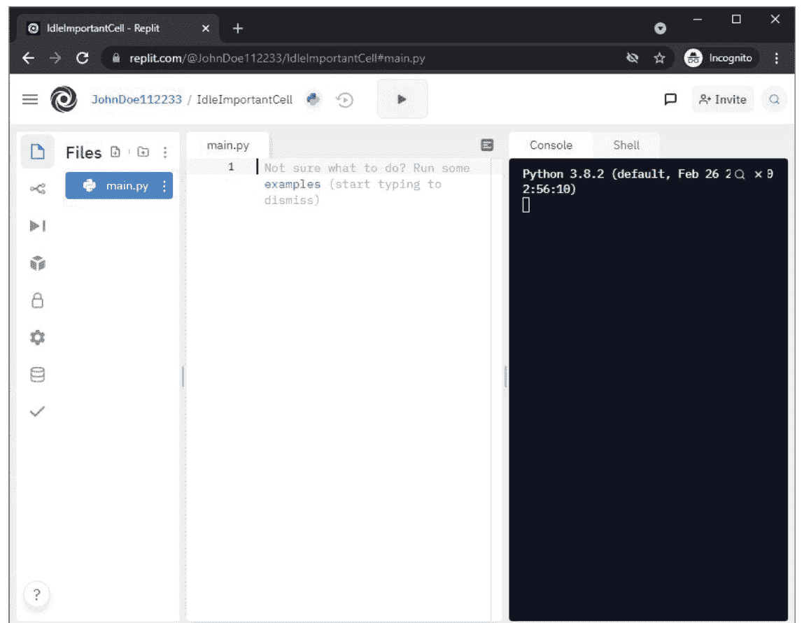

**图 1.5** 准备就绪的 Replit Python 桌面

如果你查看 Replit 桌面，你会看到它分为三个部分。最左边是文件对话框和项目选项图标。你可以在 [图 1.5](#figure-15) 中看到，你的 Python 项目默认以一个名为 `main.py` 的文件开始。

中间部分有一个标签页，显示你将编写 Python 代码的编辑器。当前显示的标签页显示的是 `main.py` 文件。如果你点击数字 1 的右侧，你将能够输入代码。请注意，编辑器在那里显示了一些文本；然而，它不是你文件的一部分，一旦你输入内容，它就会消失。如果你想查看一些示例，可以点击该文本。

桌面的右侧显示控制台窗口。控制台窗口是运行程序时输出显示的地方。使用 IDE，你将在中间部分编写程序，然后点击屏幕顶部的运行按钮（▶）。结果（或错误）随后将显示在右侧的对话框区域。

要查看实际操作，请在 IDE 中间对话框的 `main.py` 文件中输入 [清单 1.1](#listing-11)。这是用于打印语句的基本 Python 代码。你需要确保使用相同的大小写和空格。

```
清单 1.1
使用 Replit 编辑器

print("This is my first Python program!")
print("It is beautiful!")
```

当你输入此内容时，你会注意到 Replit 编辑器将为你提供有用的信息，如 [图 1.6](#) 所示。这是使用 IDE 的好处之一。

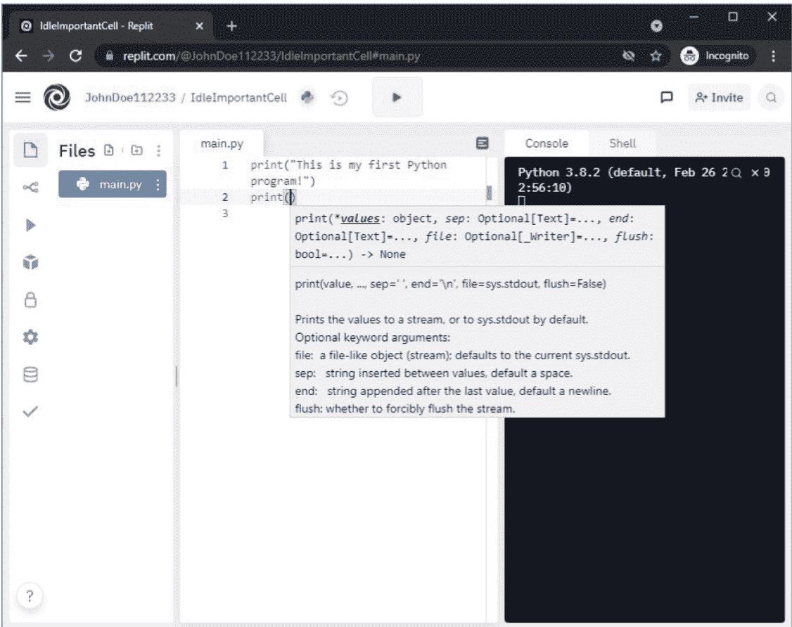

[图 1.6](#) 在 Replit 中输入代码

## 在 Replit 中运行 Python 程序

一旦你输入了 [清单 1.1](#) 中的代码，点击顶部的运行按钮（▶）。你使用的 print 函数将文本显示到控制台，因此你将看到引号内的文本显示在 IDE 的右侧，如 [图 1.7](#figure-1-7) 所示。

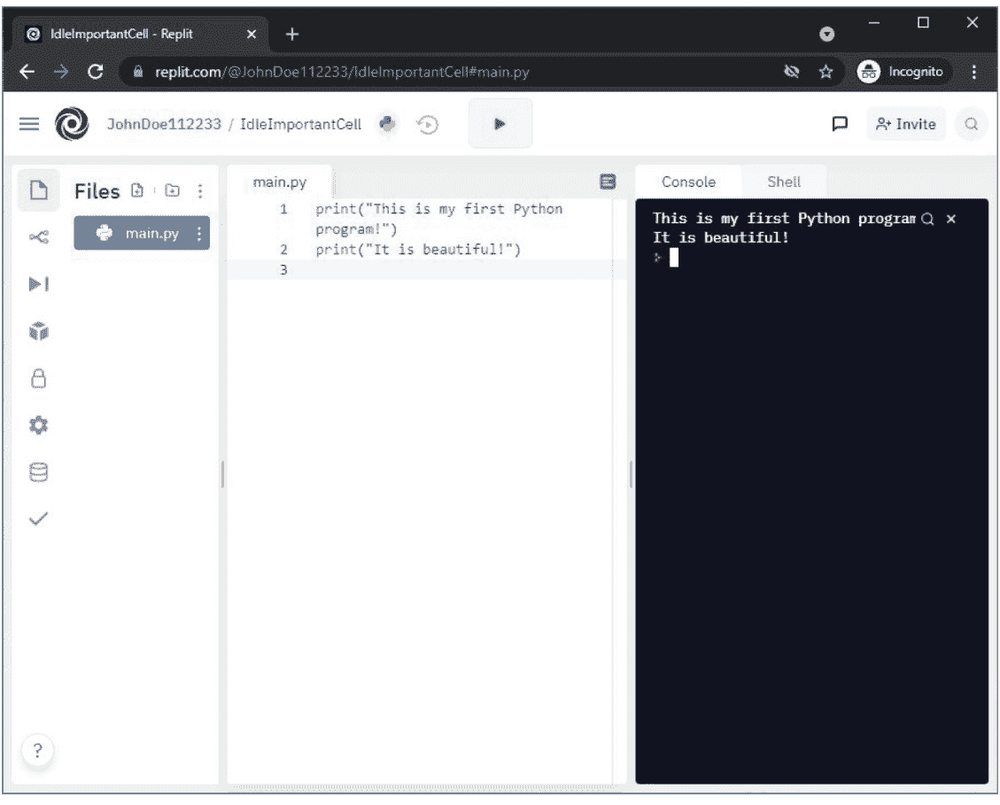

**图 1.7** 在 Replit 中运行 Python 脚本

恭喜！你已经输入并执行了你的第一个 Python 程序。如果你输入了错误的内容，那么在运行程序时可能会收到错误。如果是这样，该错误将显示在控制台窗口中，而不是预期的结果。你可以阅读错误陈述，并可能确定哪里做错了。

> **注意** 当 IDE 显示错误时，它可能包含一个行号。显示的行号可能不是有问题的那一行，但通常会很接近。如果你在代码的第二行漏掉了右括号，你收到的错误可能会指示第 3 行，因为解释器直到第 3 行才知道括号缺失。

## 其他 Replit 任务

本书的范围不包括教你关于 Replit 的所有内容；然而，以下部分介绍了一些核心任务，当你在本书中使用 Replit IDE 处理代码时，你会发现它们很有用。这些包括：

- 重命名你的代码文件
- 保存你的代码文件
- 向 Python 项目添加其他文件
- 获取更多 Replit 帮助

## 重命名你的代码文件

Python 文件的默认名称是 `main.py`。你可以将此名称更改为任何你想要的名称，但你应该保留扩展名 `.py` 以表明它是一个 Python 程序。

要重命名源代码文件，请点击 IDE 左侧文件对话框中文件名右侧的三个点。这将显示一个菜单，如 [图 1.8](#figure-1-8) 所示。

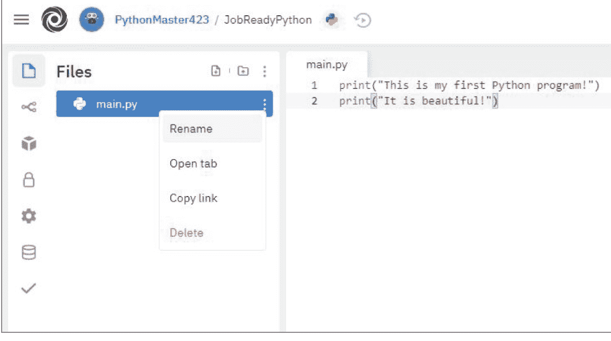

**图 1.8** Replit 中的文件菜单

你可以点击 *重命名*，这将允许你直接在文件对话框中重命名文件。你会注意到此菜单还允许你删除文件。

如果你重命名了 `main.py` 文件，你会发现 Replit 将不再运行该程序。默认情况下，Replit 运行名为 `main.py` 的文件，因此如果你重命名它，当你使用运行按钮时，Replit 将在控制台中给出错误。你可以通过在 IDE 右窗格的 Shell 标签页中运行程序来解决此问题。使用 Shell 就像从操作系统命令行运行程序。要从命令行运行 Python 脚本，你需要输入 **python**，后跟带扩展名的文件名。要运行 MyFirstProgram.py 中的脚本，你需要在 Shell 中输入以下内容：

```
python MyFirstProgram.py
```

因为 MyFirstProgram.py 是我们之前创建的重命名后的 main.py，它将显示相同的输出。[图 1.9](#) 显示了输入命令后的 Replit Shell 及其输出结果。

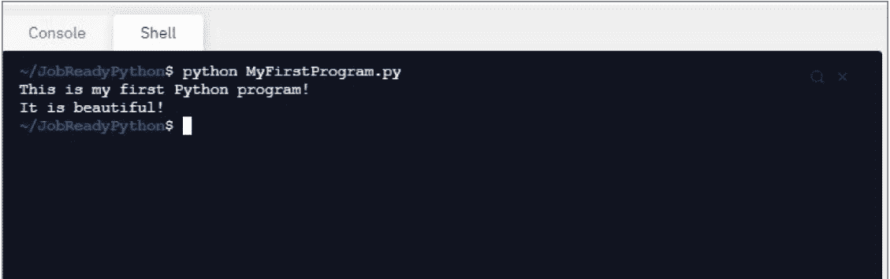

**图 1.9** 在 Replit Shell 中运行 Python

> **注意** Shell 区分大小写，因此你需要全部小写输入 python，并且文件名的大小写必须与你保存文件时使用的一致。

## 在本地保存你的代码文件

如果你想将源代码副本保存到本地机器，你可以从在线 IDE 复制粘贴，或者你可以将项目中的所有内容下载为一个压缩的 zip 文件。要下载项目，请点击文件对话框顶部 *文件* 一词右侧的三个点。这将提供一个类似于 [图 1.10](#) 的菜单，允许你下载代码。下载后，你可以解压缩 zip 文件以获取各个文件。

## 为你的 Python 项目创建新文件

当你在本书中学习课程时，你的项目将变得更加复杂。许多课程会让你一次输入并运行一个清单，但当你构建更高级的程序时，你将需要创建额外的文件来存放你的脚本。Replit 将允许你创建多个文件。

你可以通过点击文件对话框中的 *添加文件* 图标（  ）来创建一个额外的文件。这将提示你输入新文件的名称，如图 1.11 所示。你可以在打开的框中输入新文件名，然后按 *Enter* 键来创建它。

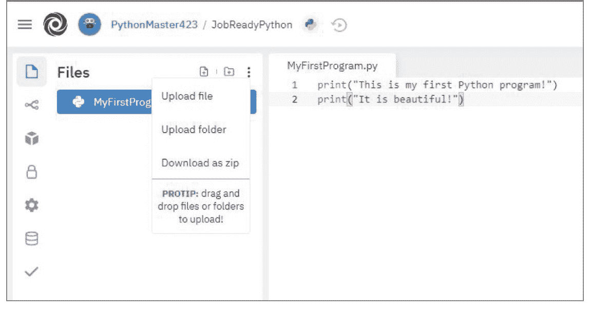

**图 1.10** 从 Replit 下载项目

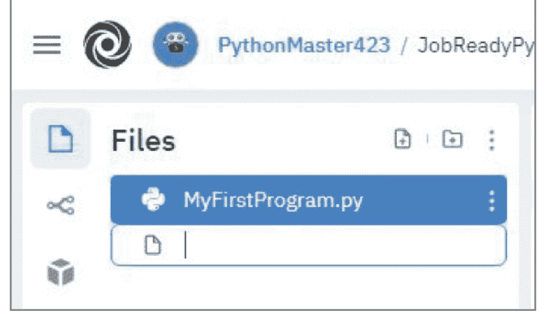

**图 1.11** 创建新文件

## 将文件添加到你的 Python 项目

除了创建新文件，你还可以将文件上传到你的项目中。这些文件可能是数据库文件、图像、文本文件或额外的源文件。你可以通过点击文件对话框顶部 *文件* 一词右侧的三个点来调出你在图 1.10 中看到的菜单。从显示的菜单中，你可以将文件或文件夹上传到你的项目中。点击菜单选项将打开你操作系统的文件对话框，让你选择要包含的文件。

## 返回 Replit

你在 Replit 中创建的脚本将保留在 [Replit.com](https://replit.com) 上。如果你离开 [Replit.com](https://replit.com) 或者从不同的站点或浏览器加载 [Replit.com](https://replit.com)，你可能不会返回到之前看到的工作区，而是可能看到一个类似于图 1.12 的页面。如果是这样，你可以点击左侧菜单中的 *我的 repls* 选项来找到你的项目。一旦你的项目显示出来，你就可以选择它，返回到本课程前面看到的 IDE。


## 获取更多 Replit 帮助

如前所述，教授 Replit 的所有功能超出了本书的范围。那可能需要一整本书来介绍。此时，你已经知道足够多的知识来输入本书课程中的代码并运行它们。如果你想了解更多关于 Replit 的信息，你可以点击菜单并选择 *教程* 或 *获取帮助* 选项。两者都将提供指向额外信息来源的链接。

## JUPYTER NOTEBOOK 入门

Jupyter Notebook 是另一个可用于编写 Python 程序的开发环境。以下部分介绍安装 Anaconda 发行版，这是一个包含 Python 3 和多个库的开源 IDE。Anaconda 和 Replit 的主要区别在于，你可以将 Anaconda 安装在本地机器上，而不是在线使用它。

要安装 Anaconda 发行版，请从个人版的 Anaconda 下载页面开始：[https://www.anaconda.com/products/individual](https://www.anaconda.com/products/individual)。在此页面上，你可以点击 *下载* 按钮来下载适用于你计算机的最新版本安装包。有适用于 Windows、macOS 和 Linux 的可下载版本。

## 安装 Anaconda Jupyter Notebook

下载完成后，打开文件并按照说明使用默认设置安装 Anaconda。软件安装后，你需要选择一个允许编写 Python 程序的开发环境。最受欢迎的开发环境之一是 Jupyter Notebook，它作为 Anaconda 发行版的一部分安装。

安装 Anaconda 发行版后，你将能够从 Windows 开始菜单打开 Jupyter Notebook，如图 1.13 所示。


**图 1.13** Jupyter Notebook

> **注意** 如果你使用的是 Mac，请打开 Anaconda Navigator 应用程序，然后从那里启动 Jupyter Notebook。

当你打开 Jupyter Notebook 时，一个脚本将在命令窗口中运行，用户界面将在浏览器窗口中打开。在工作时，你应该保持命令窗口打开，但如果它妨碍你，可以将其最小化。如果关闭命令窗口，你将需要重新启动 Jupyter Notebook 才能继续工作。

用户界面在你的默认浏览器中打开，你将看到计算机上存储的文件夹列表，类似于图 1.14。

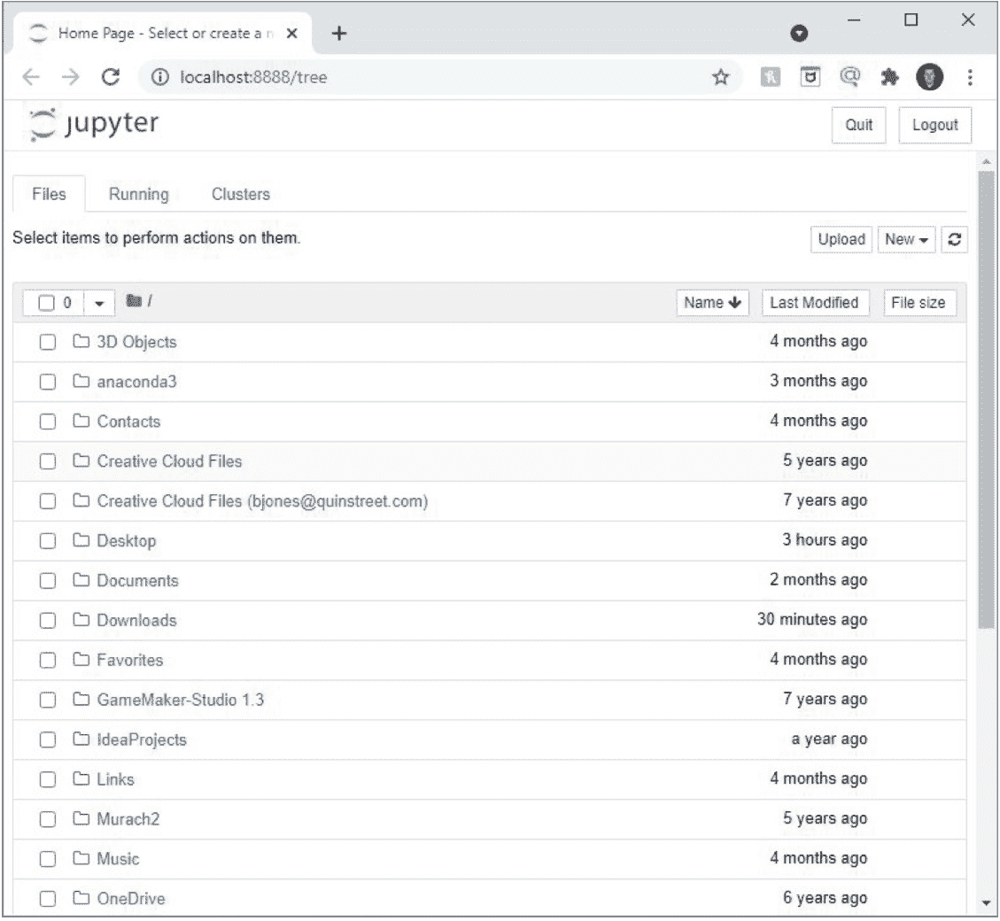

**图 1.14** Jupyter Notebook 界面

## 创建新的 Jupyter Notebook 文件

要在 Jupyter Notebook 中创建 Python 文件，你需要先导航到要创建文件的位置。到达那里后，你可以创建并运行 Python 脚本。

首先在 Jupyter Notebook 中打开要保存新文件的文件夹。你可以点击并导航到你在图 1.14 中看到的浏览器界面中显示的文件夹。例如，我们点击了 *文档* 文件夹进入其中。你也可以通过点击界面右上角区域的 *新建* 下拉选项来创建新文件夹，如图 1.15 所示。

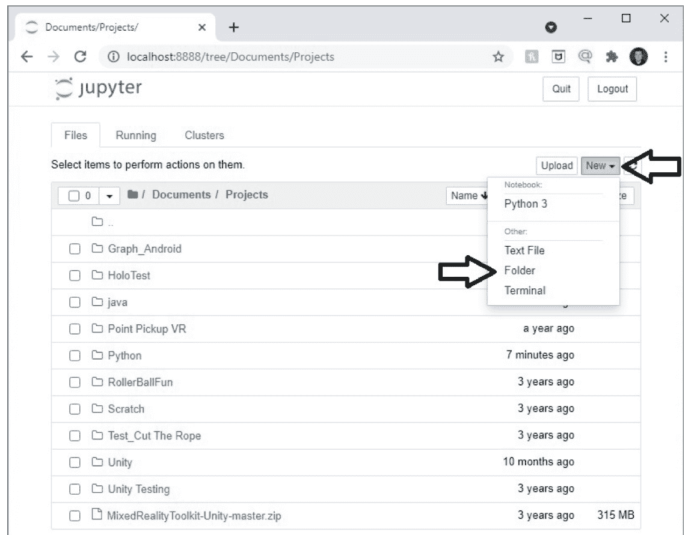

**图 1.15** 添加新文件夹

导航到要放置文件的文件夹后，你可以通过再次点击右上角的 *新建* 按钮，然后点击 Python 3 来添加文件。你可以在图 1.15 所示菜单的顶部看到此选项。

新文件将在浏览器的新标签页中打开，如图 1.16 所示。新文件将包含一个可供你使用的单元格。

让我们使用 Python print 命令显示一条“Hello, World!”消息：

```python
print("Hello, World!")
```

在第一个单元格中输入代码后，点击页面顶部工具栏中的 *运行* 按钮，或使用键盘快捷键 Shift+Enter 来查看结果。输出将立即显示在代码单元格下方的新块中。在这种情况下，“Hello, World”将显示在活动单元格下方，如图 1.17 所示。

你会看到运行代码后创建了一个新单元格。你可以在新单元格中输入新代码，也可以点击现有单元格进行修改。如果你想再次运行同一个单元格，请点击它，然后再次点击 *运行* 按钮。

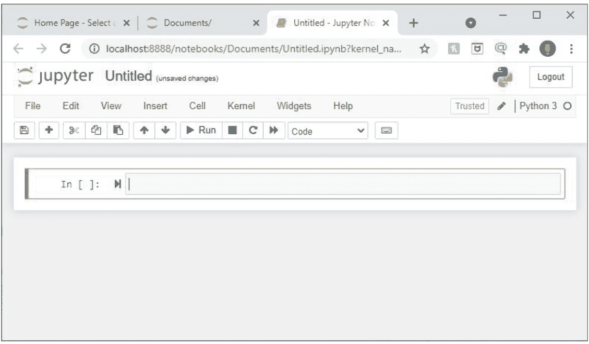

**图 1.16** Jupyter Notebook 中的新 Python 文件

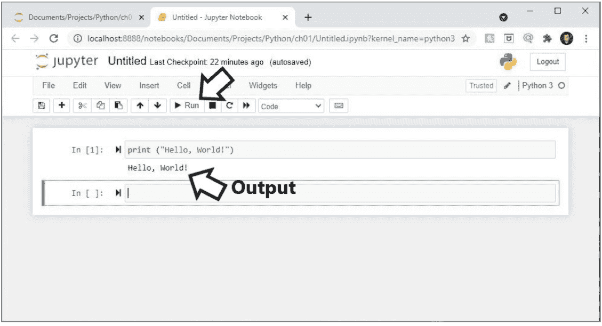

**图 1.17** 在 Jupyter Notebook 中运行 Python 脚本

## 重命名 Jupyter Notebook 项目文件

你可以通过点击页面顶部的标题来重命名文件。将打开一个弹出窗口，如图 1.18 所示，允许你输入文件的新名称。输入你想要使用的名称，然后点击 *重命名*。

> **注意** 你也可以从菜单中选择 *文件*，然后选择 *重命名...* 来重命名文件。

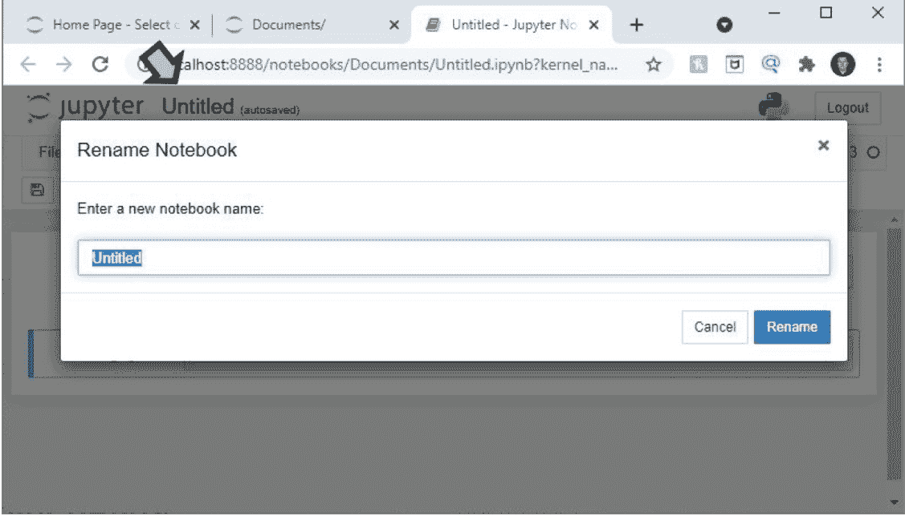

**图 1.18** 在 Jupyter Notebook 中重命名文件

打开页面时，新名称将出现在窗口顶部。新文件也将出现在当前文件夹的文件列表中。

你可以通过按 Ctrl+S 或从菜单中选择 *文件*，然后选择 *保存并检查点* 来将你的工作保存为 Jupyter Notebook 文件。你也可以点击磁盘图标。关闭保存的文件后，你应该会注意到它列在文件夹中。在图 1.19 的情况下，我们将文件重命名为“Hello World”。你可以看到它现在已保存为 Jupyter Notebook 文件。

## 将 Python 文件保存到本地

当文件在窗口中打开时，你可以将代码保存为 Python 文件（.py 扩展名）。你只需选择 *文件*，然后选择 *下载为*，接着从菜单中选择 *Python (.py)*，如图 1.20 所示。这将以文本格式保存当前文件中代码的副本，并带有 .py 扩展名。

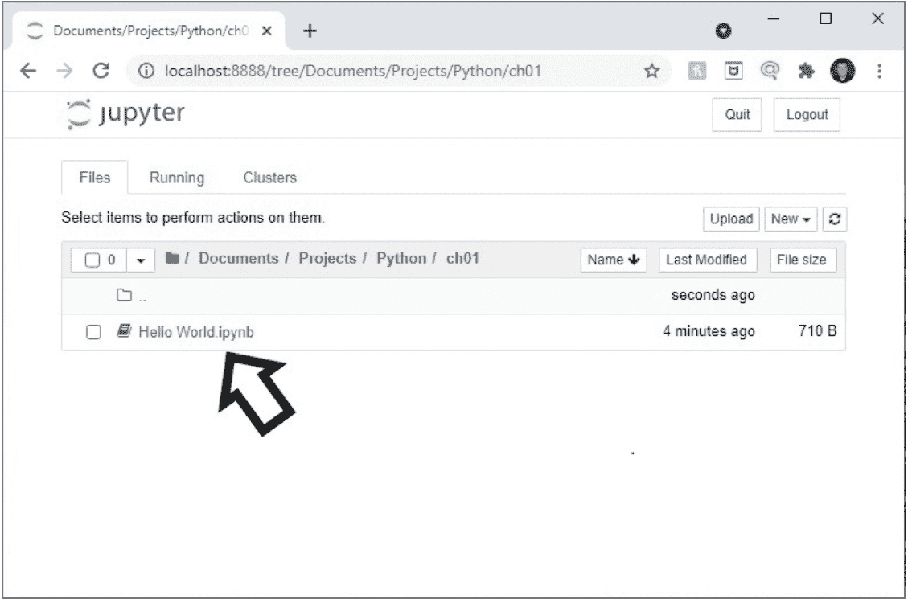

**图 1.19** 文件夹中的新文件

## 打开现有的 Jupyter Notebook 文件

正如你在图 1.19 中看到的，Jupyter Notebook 文件使用文件扩展名 .ipynb，如果你尝试直接从文件管理器打开文件，你的计算机将无法识别它。要打开现有文件，你需要使用前面的步骤启动 Jupyter Notebook。当你在浏览器窗口中看到文件夹列表时，你可以再次导航找到要打开的文件。例如，如果你想打开一个名为 HelloWorld.ipynb 的文件，该文件位于 Documents/Projects/Python/ch01 中，你可以通过点击路径中的每个文件夹来导航：*文档*，然后 *项目*，然后 *Python*，然后 *ch01*。到达那里后，你应该能看到该文件。

要打开文件，只需点击它。文件将在新的编辑器标签页中打开，同时保持文件夹标签页打开，以便你希望时可以轻松切换回去。

> **其他资源**

**注意** 有关 Jupyter Notebook 的更多信息，请参阅 Jupyter Notebook 文档：[http://jupyter-notebook-beginner-guide.readthedocs.io/en/latest/what_is_jupyter.html](http://jupyter-notebook-beginner-guide.readthedocs.io/en/latest/what_is_jupyter.html)。

## 快速了解 Visual Studio Code

你已经了解了 Replit，它可以在不安装任何本地软件的情况下在线使用；你也了解了 Anaconda Jupyter Notebook，它可以在本地使用。还有其他可用的集成开发环境（IDE）。Microsoft Visual Studio Code 允许你免费开始编写 Python 代码。

Visual Studio Code 是一个强大的 IDE，允许你在 Windows、macOS 和 Linux 上运行 Python 脚本。作为额外的好处，它还可以用于许多其他编程语言。请注意，这只是众多可供你使用的 IDE 之一。讨论如何使用 Visual Studio Code 超出了本书的范围；但是，我们将引导你下载一份副本并添加 Python 扩展。

### 获取 Visual Studio Code

你可以在 [https://code.visualstudio.com/](https://code.visualstudio.com/) 获取 Visual Studio Code 的副本。当你到达此页面时，你会找到一个下载副本的选项。你应该选择、下载并安装适合你操作系统的稳定版本。

下载 Visual Studio Code 程序后，你可以运行它来安装 IDE。当你运行安装程序时，首先会被要求接受许可协议，然后设置你希望程序文件安装在计算机上的位置，选择系统文件夹，并选择其他任务，例如创建桌面图标。

当你第一次运行 Visual Studio Code 时，你会看到一个欢迎屏幕，可能还有发行说明。

### 将 Python 扩展添加到 Visual Studio Code

为了能够完全使用 Visual Studio Code 进行 Python 开发，你需要向 IDE 添加一个扩展。你可以通过点击页面左侧的 *Extensions* 图标或按 Ctrl+Shift+X 来完成此操作。图 1.21 显示了你应该点击的图标。

当你点击 *Extensions* 图标时，IDE 左侧窗格中会弹出扩展对话框，如图 1.22 所示。此对话框显示已安装的语言支持，并提示你在 Marketplace 中搜索其他扩展。你可以在搜索框中输入 **Python** 并按 Enter 开始搜索。当你搜索 Python 时，你可能会收到许多搜索结果。这些是由各种人员和组织编写的不同 Python 工具和扩展。我们建议你选择开发者为 Microsoft 的 “Python”。你可以点击右侧的 *Install* 按钮，如图 1.23 所示，开始安装扩展。

EXTENSIONS

Search Extensions in Marketplace

INSTALLED

- C/C++ 1.3.1
  C/C++ IntelliSense, debugging, and code bro...
  Microsoft
- ESLint 2.1.20
  Integrates ESLint JavaScript into VS Code.
  Dirk Baeumer

RECOMMENDED

- Debugger for Firefox 2.9.4
  Debug your web application or browser exten...
  Firefox DevTools

图 1.22 扩展对话框

图 1.23 安装 Python 扩展

扩展将被安装，并显示一个包含扩展详细信息的欢迎页面。欢迎页面还应该为你提供一个 Python 入门页面。

> **注意** 再次强调，详细讨论如何使用 Visual Studio Code 超出了本书的范围。你可以通过 IDE 帮助菜单上的链接找到帮助和教程。其中包括一些入门视频。

## 从命令行使用 Python

如果你在本地机器上安装了 Jupyter Notebook 或 Visual Studio Code，那么你应该已经安装了 Python。如果你没有在本地安装 Python IDE，你可以单独下载并安装 Python。

你可以在 [https://www.python.org/downloads/](https://www.python.org/downloads/) 找到 Python 文件。当你访问此页面时，会有一个按钮用于下载当前版本的 Python，类似于图 1.24 所示。还有链接可以获取其他操作系统的下载文件。

图 1.24 Python 下载页面

要安装 Python，请下载并运行适合你操作系统的文件。如果你在 Windows 上运行此文件，你会看到如图 1.25 所示的安装向导。

图 1.25 Python 安装向导

建议你点击此对话框上的两个复选框，为所有用户安装启动器并将 Python 添加到 `PATH`，以便可以使用命令行从系统上的任何文件夹访问它。如果你想更改安装位置，可以点击 *Customize installation* 链接。自定义链接还允许你添加或删除一些正在安装的功能。建议除了勾选图 1.25 主对话框上的两个框外，其他所有内容都使用默认值。

点击 *Install Now* 开始安装。这将开始安装并显示一个状态栏，如图 1.26 所示。

安装完成后，将显示一个对话框指示成功。你可以点击 *Close* 按钮。此时，你已将 Python 安装到系统中，可以关闭对话框。

安装 Python 后，你现在可以从命令行运行 Python 脚本。为此，请导航到保存 Python 文件的目录。在命令行中，输入 **python** 后跟文件的全名。如果文件名为 `hello.py`，请输入：

```
python hello.py
```

Python 将运行该脚本并显示输出。

> **注意** 如果你使用的是 Windows 10 或更高版本，你也可以在 Microsoft Store 中查找 Python 并从那里下载。

图 1.26 安装进行中

# 总结

在本课中，你了解了许多可用于编写和运行 Python 脚本的集成开发环境（IDE）。介绍了三种不同的工具，并提供了有关安装 Python 以从命令行运行的信息。如果你不确定使用哪个工具，我们建议从 Replit 开始，因为它可以在线轻松获取，无需任何安装。

现在你已经完成了第 1 课，你应该

- 了解一些可用的 Python 工具。
- 了解在哪里可以访问在线 Python 工具来输入和运行 Python 脚本。
- 创建并运行你的第一个 Python 脚本。

## 练习

大多数课程将以一个或多个练习结束，你可以通过这些练习来帮助确认你对课程的理解。你应该在进入下一课之前完成每个练习。本课的练习是：

- 练习 1：说你好
- 练习 2：它是做什么的？
- 练习 3：计数
- 练习 4：水果代码

> **注意** 软件开发技能是相互构建的，因此未来课程中的许多练习也可能需要理解早期课程中介绍的技能和工具。

### 练习 1：说你好

注册一个 Replit 帐户并输入本课中介绍的清单 1.1。运行该清单并确认你得到课程中显示的结果。将引号内的文本更改为显示你的名字。

如果你安装了不同的 IDE，则将清单 1.1 输入其中并执行代码。同样，确认你得到课程中显示的结果。

### 练习 2：它是做什么的？

将清单 1.2 中的代码输入 IDE 并运行它。输出是什么？

```
清单 1.2
它是做什么的？

x = 2
while(x < 100000):
    print(x)
    x = x**2
```

你需要确保完全按照所示输入代码。你应该包括所有空格和标点符号。你还应该确保使用相同的字符大小写。Print 与 print 不同。

> **注意** 提示：如果你正确输入了所有内容，运行脚本时应该显示五个数字。

### 练习 3：计数

将[清单 1.3](Listing 1.3)中的代码输入到IDE中并运行它。输出是什么？不用担心代码实际在做什么。重点是将代码输入到你的IDE中并让它运行。

```
清单 1.3
计数

print("Getting ready to count...")
for x in range(10):
    print("I'm counting and at ", x) # 确保缩进这一行！
print("Done counting!")
```

再次强调，确保你完全按照所示输入代码。运行脚本时，你应该看到类似以下的输出：

```
Getting ready to count...
I'm counting and at  0
I'm counting and at  1
I'm counting and at  2
I'm counting and at  3
I'm counting and at  4
I'm counting and at  5
I'm counting and at  6
I'm counting and at  7
I'm counting and at  8
I'm counting and at  9
Done counting!
```

## 练习 4：水果代码

输入[清单 1.4](Listing 1.4)并运行它。同样，重点是将代码输入到你的IDE中并运行它。在后面的课程中，你将了解更多关于这段代码在做什么。

```
清单 1.4
水果代码

fruit = input("Enter your favorite fruit and press Enter: ")
print("Your favorite fruit is ", fruit)
```

运行此代码时，输出应如下所示，但显示的是你输入的水果：

```
Enter your favorite fruit and press Enter: pear
Your favorite fruit is  pear
```

## 第 2 课
理解编程基础

本课概述了与计算机编程领域相关的一般概念。所提供的信息将帮助你理解所有类型编程共有的基本概念，无论你使用哪种语言编写计算机代码，并为你提供一些可用于设计自己程序的基本工具。

## 学习目标

在本课结束时，你将能够：

- 解释计算机编程中的基本概念，包括计算思维和创建算法。
- 识别与大多数计算机语言相关的概念，包括保留字、运算符、语句和语法。
- 描述什么是变量以及语言如何使用数据类型。

## 计算机编程的未来

在计算机编程领域工作最重要的部分之一是理解事物在变化。变化可能很慢，也可能一夜之间发生，但人们常说，在计算机科学领域，唯一确定的事情就是事情会改变。即使考虑到当今社会已经习以为常的奇迹，新技术也总是层出不穷。

虚拟现实让人们可以像在办公室一样工作，像在健身房一样锻炼，像亲自旅行一样探索新地方，所有这些都可以在舒适的客厅里完成。

任何选择从事技术工作的人都必须愿意持续学习。不仅每天都有新的硬件被发明出来，软件和软件编程语言也处于不断的修订和演进之中。尽管在可预见的未来，软件开发的基本概念不会改变，但人们实现这些概念的方式将发生巨大变化。很有可能，本文中教授的一些元素在一两年内就会过时。

优秀的软件开发者会关注该领域正在发生的事情，并且有很多资源可以做到这一点。以下是一些例子：

- 杂志和通讯让专业人士可以阅读关于即将出现的技术。许多电子通讯是免费的，如果你觉得某个通讯对你没用，你随时可以退订。
- 许多开发者制作涵盖软件开发特定主题的播客。你可以在通勤或做家务时订阅并收听。
- 你可能还想寻找或组建定期会面讨论当前行业话题的小组。这些小组不仅是该领域变化的信息来源，还可以帮助成员建立人脉以获得工作机会。这包括本地的面对面小组，以及通过社交媒体或Meetup等会议软件组织的在线小组。

## 什么是编程？

编程，总的来说，无非是告诉某物（名词）去做某事（动词），通常目标是解决问题。在本书的背景下，我们将对计算机进行编程。

## 什么是程序？

计算机可以计算任何可计算的东西。我们可以使用计算来分析数据、创建网站和自动化机器响应。编程使我们能够为计算机提供一套高效且可调的指令，以执行解决问题的任务。事实上，从开发者的角度来看，程序通常被称为**解决方案**。

实际上，人类可以做计算机能做的任何事情，只要有正确的指令集和实现这些指令的方法。然而，由于计算机每秒可以执行这些指令数十亿次，我们花费的时间要长得多。人类在遵循指令方面也出了名的糟糕，即使经过大量编程也是如此，这就是为什么我们犯的错误比计算机多得多。

与此同时，计算机实际上只能做我们告诉它们做的事情，所以它们会毫无差错地遵循任何指令。即使是那些看似能自己学习新行为的所谓“智能”计算机，也依赖于输入来调整这些行为。这意味着，如果计算机出错，那是编写指令或创建数据集的人（或者更可能是多人）的错。

这些设备在能力上似乎也无限，但实际上存在限制。它们可以快速完成任务，但某些部分，如处理器和RAM，比其他部分（如硬盘驱动器和网络连接）更快。它们也无法在指令不完整或资源不足的情况下执行任何任务，即使它们拥有完成任务所需的指令。一个设计用来预测下一届奥斯卡获奖者的程序，如果没有足够的数据就会失败；一辆自动驾驶汽车，如果没有足够的传感器来了解道路上的其他情况，就会撞车。这些失败是由于程序设计造成的，而不是因为机器在执行任务而不是人类。

## 计算思维

**计算思维**一词指的是一种专注于解决问题所需步骤的设计方法。它本质上是一种思维方式，允许我们将一个更大的问题分解成更小、更易处理的问题，然后我们使用这些较小的问题作为解决当前更大问题的垫脚石。

计算思维的一个方面是*提前规划*，以确保在需要时资源可用。例如，当你早上出门去上班或上学时，你会带上你的公文包或背包，不是因为你在通勤途中需要它们，而是因为你知道你*会*在到达目的地时需要里面的东西。同样，你可能会从口袋里拿出车钥匙或检查你是否有公交卡，以确保你拥有到达那里所需的资源。

另一个技能是使用**算法**。虽然关于计算机的电视节目和电影会让算法听起来像是一个复杂的计算机过程，但算法实际上只是一套具有预定义目标的指令。当你组装一个模型、组装一件盒装家具，甚至按照食谱做饭时，你都在使用别人编写的算法。作为软件开发者，你将不得不为你的解决方案定义算法，你现在就可以开始这样做，即使没有计算机或任何编程语言知识。

为其他人编写指令相对容易，因为我们可以假设大多数人都共享一些可以建立的基础知识。当食谱告诉你加入一杯面粉时，它假设你知道一杯是多少，杯子在厨房里的存放位置，面粉在厨房里的存放位置，如何判断杯子装满了面粉，以及你应该把面粉倒入碗中*而不是*连杯子一起。

然而，为计算机编写算法更复杂，因为*计算机没有背景知识*。例如，如果我们编写一个制作披萨的程序，它必须包含详细的指令，说明在哪里找到杯子，在哪里找到面粉，如何判断杯子是否装满，以及如何将面粉从杯子转移到碗中。

> **注意** 要查看一个关于编写制作花生酱三明治算法的幽默方法，请观看视频 [https://youtu.be/Ct-l00UqmyY](https://youtu.be/Ct-l00UqmyY)。

## 编程语言

编程语言是我们人类与计算机沟通、指令和交互的方式。正如计算机在几十年间不断进化一样，我们用来与它们沟通的语言也在进化。今天软件开发者可以选择许多不同的语言；然而，它们都有相似的组件和结构。

计算机本身只使用二进制数字序列（我们通常表示为1和0）。计算机做出的每一个“决定”，遵循的每一个指令，执行的每一个动作，都被分解成一系列“是”或“否”的问题，答案以1或0的形式得出。因此，最初的程序员使用二进制值（比如打孔卡和磁带）将指令输入计算机。随着时间的推移，开发者们创造了更易于人类读写的编程语言，如今软件开发者有许多不同的语言可供选择。以下是一些常见编程语言的简短列表，但还有更多：

- C
- C++
- C#（读作 *C sharp*）
- Java
- JavaScript
- Python
- Swift
- Go

现代编程语言在很大程度上基于人类自然语言，尤其是英语，因此它们共享一些特征。然而，由于我们需要在向计算机发出指令时确保指令清晰无歧义，编程语言比人类语言更具结构性。

然而，计算机仍然只说二进制语言。这意味着无论我们选择使用哪种语言编写程序，该程序都必须转换为二进制代码，计算机才能读取并执行其指令。现代语言包含一个**编译器**，它将开发者编写的计算机代码翻译成计算机可读的二进制代码。

## 常见组件

所有现代编程语言都包含四个基本组件：语句、语法、保留字和运算符。

## 语句

程序中的每条指令都称为**语句**，每条语句在程序中都有特定的用途。语句可以执行计算、定义变量或常量、启动循环、创建类或方法，或做出决策。

## 语法

**语法**组件与语句协同工作。一种语言的语法包括我们必须遵循的规则，以便用该语言编写语句，包括语句中单词出现的顺序、大小写字母的使用、标点符号、空格，甚至缩进。

人类语言也依赖语法来创造意义。思考以下句子中逗号的使用（或未使用）：

- 我喜欢烘焙、我的家人和我的朋友。
- 我喜欢烘焙我的家人和我的朋友。

没有逗号，第二句话就呈现出令人不安的不同含义。同样，在英语中，改变词序会完全改变以下句子的含义：

- 猫抓住了苍蝇。
- 苍蝇抓住了猫。

如果我们把单词随机排列，句子就完全没有意义：

- 猫的抓住了苍蝇的。

语法的另一个重要方面是空格的使用。在英语中，我们通常使用空格来分隔单词，但我们对*单词*的概念比编程语言所认为的单词更灵活。例如，在英语中，使用包含两个或多个独立单词的名称很常见，比如“洛克菲勒中心”或“迈克尔·琼斯”。由于编程语言更严格，我们不能在命名的事物（如变量或类）中包含空格。当我们在程序中命名某物，且名称应包含两个或多个英语单词时，我们可以使用以下策略之一：

- 在通常使用空格的地方使用下划线，比如 `total_price`。
- 将单词串联在一起，但使用大写字母来标识单个单词。这种情况有两种选择：
    - **camelCase：** 名称以小写字母开头，然后每个后续单词首字母大写。
    - **PascalCase：** 名称中每个单词首字母大写。
- 所有字母仅使用小写或大写，比如 `roomarea` 或 `TOTALPRICE`

最后一种选择通常不鼓励使用，因为人类阅读没有适当间隔的单词会更困难。大多数编程语言也区分大小写（意味着 `totalPrice` 与 `TotalPrice` 不同），因此最好在开发过程早期就建立命名约定，并在后续所有地方遵循该约定。特定语言通常有推荐的命名约定，开发团队中的每个人都应同意并遵循相同的命名约定。每种语言都有自己的语法变体。例如，在 Java 中，任何语句都必须以分号结尾，而在 Python 中，分号通常是可选的，你只需在语句末尾按 Enter 键即可。学习一门语言（或学习第二语言）的一部分就是识别该语言的语法要求。

> **注意** 本课程为您提供概念概述。随着您在本书中的学习，您将了解更多关于此处使用的术语。如果您目前不知道变量或类是什么，请不要担心。

## 保留字

所有计算机语言都有**保留字**，这些词是特定于该语言编译器的，并且对编译器具有预定义的含义。这些有时也称为**关键字**。因为这些词在语言中具有特定含义，我们在编写自己的程序时不能将它们用于其他目的。

虽然每种语言都有自己的保留字集，但一些常见示例包括：

- **IF** 用于表示算法必须根据给定值的状态做出决策。这类似于我们在英语中使用这个词的方式：“*如果*下雨，我今天就待在家里。”
- **WHILE** 用于表示只要满足给定条件，指令（或一组指令）就应该重复。这类似于英语：“*当*下雨时，我会待在家里。”
- **PRINT** 向用户生成输出。在计算机早期，输出总是打印在纸上，但如今，许多语言使用 *print* 的变体在显示器或类似屏幕上创建输出。

您通常可以在任何语言的文档中找到该语言的保留字，这些文档几乎总是在线可用。

## 运算符

所有计算机语言都严重依赖**运算符**。运算符是一种符号，允许在值之间进行某种比较或操作。我们称包含运算符的语句为**操作**。

数学运算符是最常见的：

- +（加法）
- -（减法）
- *（乘法）
- /（除法）
- %（取模；除法运算符的余数）

所有语言也对包含两个以上运算符的语句使用运算符优先级。您应该记住首字母缩略词“Please Excuse My Dear Aunt Sally”，它提醒我们数学运算按以下顺序执行：首先是括号，然后是指数、乘法和除法，最后是加法和减法。

编程语言也严重依赖**比较运算符**，我们使用它们将一个值与另一个值进行比较，以确定语句是真还是假。最常见的包括：

- =（等于）
- !=（不等于）
- >（大于）
- <（小于）
- >=（大于或等于）
- <=（小于或等于）

另一个常见类别是逻辑运算符，也用于确定给定语句是真还是假：

- &&（与）
- ||（或）
- !（反转值的真假，所以 !FALSE 是 TRUE）

## Hello, World!

学习新编程语言的常见第一步是在屏幕或打印机上生成短语“Hello, world!”。这个练习向学习者介绍了新语言的基本语法以及一些保留字。

清单 2.1 到 2.3 中的代码片段展示了如何在不同语言中编写此指令。在每个示例中，除了“Hello, world!”之外的大多数单词都是该语言的保留字。

```
清单 2.1
Python

print "Hello, world!"
```

```
清单 2.2
Java

public class Hello {
    public static void main(String[] args) {
        System.out.println("Hello, World!");
    }
}
```

```
清单 2.3
C#

using System;

namespace HelloWorldSample
{
    class Program
    {
        static void Main(string[] args)
        {
            Console.WriteLine("Hello World!");
        }
    }
}
```

通读这些示例，看看您是否能识别出任何相似之处。您能说出每个保留字在代码片段中的作用吗？这些语言在标点符号的使用上有何不同，例如逗号、分号、方括号和圆括号？

## 数据类型和变量

现代编程语言依赖于变量和常量的使用，以了解程序在执行操作时应使用哪些值。学习编程语言时，理解数据的存储方式以及理解常用数据类型非常重要。

## 数据类型

计算机程序中的许多指令依赖于**值**。例如，一个标准的加法操作需要三个值：要相加的两个数字以及得到的和。

```
1 + 2 = 3
```

一个基本的打印语句通常只包含一个值，即指令将要显示给用户的值。

```
print("Hello, world!")
```

一个 if 语句可能只包含两个相互比较的值，以确定该语句是 True 还是 False。

```
if a > b
```

这些值本身具有多种**数据类型**，这些类型决定了计算机是否可以执行该语句。虽然不同的编程语言在支持的数据类型以及如何识别这些类型方面略有不同，但最常见的数据类型包括：

- 文本
- 数字
- 真/假
- 日期/时间
- 数据集合

不同的编程语言对这些概念使用不同的术语，但这些概念本身在任何编程语言中都会出现。

## 文本

文本正如其名：由字母、标点符号、符号甚至数字组成的值。在计算机编程中，我们经常使用术语**字符串**来指代文本值，因为该值本身是由一串单个字符组成的。

以下语句展示了一个示例：

```
print("Hello, world!")
```

在这种情况下，将要打印的值是引号内的字符串：

```
Hello, world!
```

当我们不打算对值执行数学运算时，字符串可以包含数字。例如，邮政编码（10045）或电话号码（905-555-4785）通常被视为字符串，因为我们不太可能将它们相加或求平方根。

## 数字

我们计划进行数学运算的值在任何编程语言中都必须被视为数字。大多数语言还区分**整数**和**小数**值：

- 整数是小数点右边没有数字的整数，例如 4 或 8467。我们最有可能使用整数来计数事物（如库存中的物品），或者当我们只想考虑完整的对象而不是部分对象时。

- 小数值，在某些语言中也称为**双精度浮点数**或**单精度浮点数**，允许小数点右边有值，即使给定的实际值没有任何小数部分。我们使用小数值处理与金钱相关的任何事物，例如价格或工资，以确保我们可以存储整个数字，包括所有小数位。我们通常也使用小数值来测量事物，包括长度和重量，这样我们就不会局限于整数单位。

虽然我们可以像处理文本一样处理数字（特别是用于标识而不是作为数学值的数字），但没有语言允许将文本用作数字。

## 真/假

条件操作（包括 if 语句）取决于一个值是 True 还是 False。例如，以下语句中 c 的值将是 True 或 False，具体取决于分配给 a 和 b 的值：

```
a > b = c
```

我们通常将这些称为**布尔值**。它们通常翻译为 True 或 False，但也可以表示为 Yes/No、On/Off，甚至 1/0。因为只有两个选项，我们也称这些为*二进制值*。

## 日期/时间

作为人类，我们倾向于将日期视为日历上的内容，包括月、日、年，而时间包括小时、分钟和秒。然而，计算机需要一种更数字化的方式来处理这个概念。在大多数系统中，日期/时间是一个单一的数据类型，其功能更像是一个组合数字，而不是独立的部分。在一种常见的方法中，日历值表示为小数点左边的数字，其中每个单位是一天；而小时、分钟和秒是小数点右边的值，代表一天的一部分。

使用日期/时间数据的关键部分是在人类表示值的方式（例如：“02/07/2020 12:57”）和计算机表示值以执行计算的方式之间进行转换。作为程序员，我们必须定义人类使用的日期格式，以便程序知道如何解释和显示该值。

## 数据集合

我们经常在编程中使用数据集合，大多数语言支持将数据集合作为一种数据类型。**数据集合**正如其名：被视为一个单元的单个值的集合。常见的例子包括*列表*、*集合*和*数组*。

一些语言，如 Python，允许数据集合包含不同数据类型的项目。在以下 Python 示例中，名为 `list_of_items` 的列表包含字符串值、一个整数和一个浮点数：

```
list_of_items = ["Kate", "124 W Main Street Boston", 24, 4.0]
```

其他语言，包括 Java 和 C#，要求集合中的所有项目具有相同的数据类型，并且在创建集合时必须声明该数据类型。这些语言被称为“强类型”，它们通常有助于确保数据被当作预期的类型处理，例如将数字视为数字而不是字符。以下示例在 Java 中创建了一个名为 teamScores 的整数数组：

```
int[] teamScores = {
    2, 45, 4, 8, 99,
    23, 67, 1, 88, 42
};
```

数据集合允许我们将一组定义的值作为一个单元使用，例如班级名册或库存清单，同时也允许我们管理和检索该集合中的单个值。

## 变量

假设你被要求设计一个程序，该程序将计算客户订单所需的地毯数量，然后使用该数量计算订单的总成本。已知 Bob Smith 的房间是 10 英尺乘 20 英尺，所选地毯是每平方英尺 2 美元，你可以将其表示为：

```
10 * 20 = 200
200 * 2 = 400
```

结果是 Bob 需要支付 400 美元的地毯费用。

现在假设 Mary Jones 也想要新地毯，但她的房间是 15 英尺乘 25 英尺，她想要的地毯是每平方英尺 1.75 美元。如果我们只使用这些值，我们就必须从头开始重新编写程序：

```
15 * 25 = 375
375 * 1.75 = 656.25
```

虽然这看起来是一个非常简单的程序，重新编写它并不需要太长时间，但大多数程序要复杂得多。因此，开发者更喜欢使用可以重复使用的更抽象的值，而不是每次运行程序时都必须更新的实际值。

我们可以使用以下语句描述计算总成本的步骤：

1. 将房间的*长度*乘以房间的*宽度*，得到总*平方英尺数*。
2. 将*平方英尺数*乘以*地毯价格*，得到*总成本*。

这样写出来表明我们的程序使用了五个不同的值：

- 长度
- 宽度
- 总平方英尺数
- 地毯价格
- 总成本

在这种情况下，我们使用**变量**来表示程序所需的值。它们被称为变量，因为每次运行程序时，确切的值可能会变化，并且它们的值可以在程序开始和结束之间发生变化。

当我们使用变量时，我们创建的代码比在程序中硬编码值（如我们在前两个示例中所做的那样）更具可重用性。使用伪代码，我们的程序可能看起来像这样：

```
length * width = total_footage
total_footage * price = total_cost
```

然后我们会添加步骤来输入长度、宽度和价格的值，以及在最后输出最终成本：

```
length = [user_input_length]
width = [user_input_width]
price = [user_input_price]

length * width = total_footage
total_footage * price = total_cost

print total_cost
```

虽然这可能看起来比我们开始的两行代码更复杂，但这个程序现在可以适用于任何房间和任何地毯，只要我们在运行程序之前手头有这些值。更重要的是，作为编写程序的软件开发者，我们不需要知道这些值会是什么。作为一个额外的优势，任何人（甚至是对代码或程序一无所知的人）都可以轻松地看出程序应该做什么，因为变量名比值本身更有意义。

## 保留内存

变量的另一个作用是在运行程序的准备阶段，在这方面，你可以将变量想象成餐桌上的一个座位。如果你正在举办晚宴，你可能提前知道有多少人计划参加。甚至在你开始烹饪之前，你可能已经在餐桌上摆好了餐具，以确保你有足够的空间容纳每个人。虽然你最终可能会让不同的人坐在不同的位置，但你提前预留了这些位置，以确保在需要时知道在哪里找到它们。

我们在编写计算机程序时以类似的方式使用变量。当我们**声明一个变量**（如前面的语句 `length = [user_input_length]`）时，我们预留了一个位置在计算机内存中，我们为该位置命名。当后续引用变量（`length * width`）时，程序会通过变量名在内存中找到该位置，并检索当前存储的值。

进一步扩展晚餐餐具摆放的比喻：随着用餐进程，餐具摆放的内容可能会变化。例如，开胃菜可能是汤，随后主菜会取代汤碗的位置。

变量的工作方式类似——随着程序运行，赋给变量的值可能发生变化。例如，在杂货店购物时，收银员每扫描一件商品，总金额通常会实时更新。该程序的伪代码可能如清单2.4所示。

```
清单2.4
杂货店程序伪代码

purchase_total = 0
product_price = 0

//while循环计算小计，直到扫描完最后一件商品
while products to buy
    product_price = [upc_scan]
    purchase_total = purchase_total + product_price
    print purchase_total

print purchase_total

end program
```

在以下代码行中，`purchase_total`的当前值会被包含最新扫描商品价格的新值替换：

```
purchase_total = purchase_total + product_price
```

这实际上在每次扫描新商品时更新当前总额，使最终的`purchase_total`反映订单中所有商品的总价。当程序检索该最终值时，它从初始值为0的同一内存位置获取数据。

请注意，这意味着无论顾客购买多少商品，我们只需两个变量（`purchase_total`和`product_price`）。如果无法重复使用变量，我们就需要为每件商品的价格和每个小计分别设置占位符。

## 变量与数据类型

编程语言在变量与数据类型的协作方式上存在差异，通常采用动态类型或静态类型。

## 动态类型

JavaScript和Python等语言会根据赋给变量的值自动分配数据类型。如果后续程序中为变量赋了不同数据类型的值，变量的数据类型也会随之改变。这称为**动态类型**。

例如，以下语句序列在Python中是有效的：

```
x = 75 // 数据类型为整数（int）
x = 6.458 // 数据类型为浮点数（float）
x = "Hello, world!" // 数据类型为字符串（str）
```

由于我们在每条语句中使用相同变量（`x`），若在Python中运行此代码，`x`的最终值将是"Hello, World!"。

## 静态类型

在Java和C#等其他语言中，声明变量时必须指定数据类型，且存储在变量中的值必须符合该数据类型。由于变量声明后数据类型无法更改，我们称之为**静态类型**。

以下示例在Java中声明了一系列变量：

```
// 创建名为quantity的整数变量，值为75
int quantity = 75;

// 创建名为price的浮点变量，值为6.458
float price = 6.458;

// 创建名为greeting的字符串变量，值为"Hello, world!"
String greeting = "Hello, world!";
```

请注意，在此代码片段中，每个变量都有不同的名称。如果像之前的Python示例那样为每个变量使用相同名称，在Java中会出问题。存储在整数变量中的浮点值会截断（或删除）小数点后的数字，而将文本存储在定义为数字的变量中根本不可能。

> **注意** 静态类型也称为强类型。

## 常量

虽然程序中使用的大多数值都应作为变量（即使你预先知道该值且不太可能改变），但有时我们应使用常量。

使用常量时，我们实际上是将值**硬编码**到程序中，使其在未来难以更改。这意味着在使用常量前需要仔细考虑。

以下是使用硬编码常量的三个示例。

### 示例1：圆的面积

计算圆的面积时，使用公式：

```
A = π r2
```

在此公式中，面积（A）和半径（r）应使用变量，因为这两个值会随不同圆而变化，但π是固定不变的值。这种情况下，我们应使用常量表示π的值，而非变量。

### 示例2：税率

某州当前销售税率为4%，且数十年来保持不变。事实上，没有证据表明该税率未来可能改变。

虽然这看似可以硬编码到程序中的常量值（基于其未来不太可能改变），但谨慎起见，最好使用赋值为4%的变量。这既能适应未来税率变化，也便于程序适配不同销售税率的州。

此外，使用变量能提高代码可读性。其他开发者查看代码时，看到名为`state_sales_tax`的变量能立即理解其含义，而常量值0.04的目的则不够透明。

### 示例3：输出消息

显示给用户的消息不一定是变量：大多数在程序中定义一次后不会改变，即使在多处使用。但同一程序中可能有多种消息，且不同程序可能使用不同消息。

例如，程序启动时可能提示用户输入姓名：

```
print("Hi! Please enter your name: ")
```

只要这是唯一需要显示的消息，这样即可。但你可能想通过使用"Good morning!"或"Good afternoon!"等短语代替简单的"Hi!"来增加趣味性。这需要使用变量，逻辑大致如下：

```
if time between 5am and noon
    greeting = "Good morning!"
else if time from noon to 5pm
    greeting = "Good afternoon!"
else if time between 5pm and 9pm
    greeting = "Good evening!"
else
    greeting = "Good night!"

print(greeting + "Please enter your name: ")
```

在此示例中，我们使用带if语句的变量根据时间确定合适的问候语。然后将变量值与常量（"Please enter your name: "）组合，生成用户启动程序时看到的输出。

# 总结

许多软件开发者认为编程兼具艺术性与科学性。正如著名画家巴勃罗·毕加索运用画布和画笔等工具向世界传达意象，程序员使用计算机及其外围设备等工具执行指令。代码及其设计代表艺术性，而代码与应用程序及外围设备的执行则体现科学性。

现代编程语言比计算机处理指令的二进制码更人性化，每种语言都有自己的保留字和语法。学习编写计算机程序意味着熟悉如何用选定语言编写指令，包括学习语言的保留字、语句写法和所需语法。

随着你学习本书并编写Python程序，你会发现本课内容将被详细回顾。你将学习如何用Python应用这些知识，就像毕加索创作杰作一样，编写出自己的精彩程序。

完成第2课后，你应该能够：

- 解释计算机编程的基本概念，包括计算思维和创建算法。
- 识别与大多数计算机语言相关的概念，包括保留字、运算符、语句和语法。
- 描述变量是什么以及语言如何使用数据类型。

## 练习

此处的练习为你提供额外的实践机会，以加深你对本课所学概念的应用，并达成学习目标。建议你按照描述完成每个练习。练习如下：

**练习 1：日常任务**
**练习 2：Python 编程**

## 练习 1：日常任务

在接下来的几天里，当你处理日常任务时，请思考并为这些任务定义算法。考虑为以下任务写出步骤：

- 系鞋带
- 装洗碗机
- 整理床铺
- 制作花生酱果冻三明治

你会如何为计算机编写这些任务的步骤？写下步骤，看看另一个人是否能完全按照你写的内容执行。

## 练习 2：Python 编程

在上一课中，你学习了如何输入和运行 Python 应用程序。在[清单 2.5](Listing 2.5)中输入以下代码并运行它。请注意，该清单使用了注释、变量、保留字、运算符和其他编程元素。你将在本书的后续部分了解更多关于这些内容。

### 清单 2.5
一个 Python 程序

```python
# A short python program
user_input_length = input("Enter a length (whole number): ")
user_input_width = input("Enter a width (whole number): ")
user_input_price = input("Enter a price (numbers and decimal only): ")

length = int(user_input_length)
width = int(user_input_width)
price = float(user_input_price)

# Do calculations
total_footage = length * width
total_cost = total_footage * price

# display results
print("-------------------")
print("Length: ", length)
print("Width: ", width)
print("Total Footage: ", total_footage)
print("Total Cost: ", total_cost)
```

当你运行此程序时，系统会提示你输入三个数字。

## 第 3 课
探索基本 Python 语法

在本课中，我们将开始编写 Python 程序。我们将从 Python 语法、注释、变量、用户输入和数据类型的入门介绍开始。

## 学习目标

学完本课后，你将能够：

- 创建单行和多行表达式，以在 Python 中执行基本任务。
- 在 Python 程序中包含注释。
- 在 Python 程序中声明和使用变量。
- 编写一个接受用户输入的 Python 程序。

> **注意** 在学习本课及后续课程时，你将需要一个集成开发环境，如[第 2 课](Lesson 2)中所述。我们建议你将书中的每个清单输入到你的开发环境中并运行代码。最好的学习方式是实践，因此你应该输入代码并尝试修改，观察结果。

在本课中，你将看到一些关键术语。这些术语包括：

- **语法** 指的是字母、单词和字符在代码中出现的顺序，包括何时使用作为运算符的标点符号（如分号、方括号、圆括号和斜杠）。虽然所有编程语言都有语法规则，但不同语言之间有所不同。将单词顺序放错或字符位置放错会导致语法错误，阻止代码运行。
- **注释** 是 Python 中不执行的代码。注释可用于解释 Python 代码，或使其更具可读性，也可以在测试期间使用。
- **变量** 是分配给内存中用于存储信息的区域的名称。
- **用户输入（input 函数）** 允许开发者向程序用户请求输入。你可以使用 input 函数让程序停止并等待用户输入数据。
- **数据类型** 决定了存储在内存空间中的信息的“类型”或格式（例如数字与字母），而变量是分配给内存中用于存储信息的区域的名称。
- **命令** 是在执行时指示应用程序执行某些特定操作的语句。
- **运算符** 是用于执行算术或逻辑计算的符号。
- **代码片段** 是编程中使用的一个术语，描述较小部分的编程代码。代码片段通常不能独立运行，必须包含在更大的代码块中才能工作。

## 使用单行命令

编写 Python 脚本时，我们通常每行写一个语句，其中语句是一个完整的命令。Python 按照代码中出现的顺序执行每个语句。语法如下：

| 命令 | 第 1 行参数 |
|---|---|
| 命令 | 第 2 行参数 |

作为 Python 开发者，你可能需要开发或维护代码中的各种功能。假设你被要求为一家金融机构构建一个银行应用程序，以便与客户沟通信息并促进交易。[清单 3.1](Listing 3.1)中的 Python 代码使用 `print()` 命令打印两条消息。

```python
# LISTING 3.1
# Printing in Python

print("Hello, welcome to the banking portal.")
print("In this portal, you can handle all your banking needs.")
```

当你运行此代码时，将显示以下内容：

Hello, welcome to the banking portal.
In this portal, you can handle all your banking needs.

你应该将清单中的代码复制到你的 IDE 中并运行它。例如，你可以将其复制到[第 1 课](Lesson 1)中介绍的 Repl.it 中，然后单击“运行”以在[图 3.1](Figure 3.1)中查看输出。

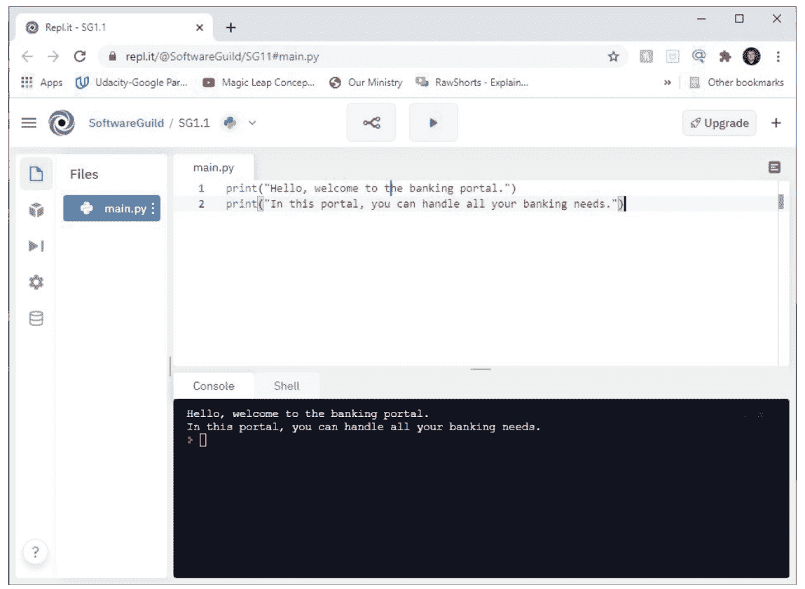

**图 3.1** 在 Repl.it 中运行[清单 3.1](Listing 3.1)

你应该尝试使用 `print()` 命令，更改一个或两个语句，并至少添加一个额外的 print 语句。

## 使用分号

我们可以选择用分号结束语句。只要每行只有一个语句，分号就是可选的。在 Python 中，分号表示分隔，而不是终止。它允许你在同一行编写多个语句：

```python
command('Statement1'); command('Statement 2'); command('Statement3')
```

例如，你可以在同一行输入多个用分号分隔的 print 语句：

```python
print("Hello, world!"); print("How are you doing?")
```

如果你将此代码片段输入到你的 IDE 中并运行它，你将看到预期的输出：

```
Hello, world!
How are you doing?
```

在银行应用程序中，你可能需要使用多行代码向客户传达信息。让我们看看如何创建一个选项菜单。随着我们继续构建银行应用程序，我们希望添加一个菜单系统。考虑创建一个代码片段所需的语法，以显示以下消息：

Hello, welcome to the banking portal.
In this portal, you can handle all your banking needs.
Please enter a selection from the following menu
Type Login to log in
Type Quit to quit

要创建此文本菜单，你可以使用之前见过的多个 print 语句。在每行末尾添加分号将有助于表示每行是独立的。[清单 3.2](Listing 3.2)提供了一个解决方案。输入此清单并运行它，以查看其是否与预期输出匹配。

```python
# LISTING 3.2
# Banking application menu

print("Hello, welcome to the banking portal.");
print("In this portal, you can handle all your banking needs.");
print("Please enter a selection from the following menu");
print("Type Login to log in");
print("Type Quit to quit");
```

如前所述，实际上并不需要在命令（也称为指令）末尾加分号，除非在同一行编写了多个指令。这意味着你可以删除[清单 3.2](Listing 3.2)中的分号，代码将以相同的方式执行。事实上，以下代码片段：

```python
print("Hello, welcome to the banking portal");print("In this portal, you can handle all your banking needs")
```

与以下代码相同：

```python
print("Hello, welcome to the banking portal")
print("In this portal, you can handle all your banking needs")
```

在银行应用程序中，你可能需要使用多行代码向客户传达信息。让我们通过使用分号的方式使[清单 3.2](Listing 3.2)中的代码更简洁。由于我们可以在同一行编写多个指令，因此我们必须在每个指令末尾使用分号，如[清单 3.3](Listing 3.3)所示。

## 使用反斜杠继续

如果一条指令需要多行书写，我们可以在行末使用反斜杠运算符（`\`）。Python 会将反斜杠后的行解释为当前指令的延续。

清单 3.4 展示了一个跨多行编写的指令示例。

```
清单 3.4
多行指令

print("This is a loooooooooooonggggggggggggg \nstringgggggggggggggggggggggggggggggggggg")
```

运行此清单后，将显示以下输出：

'This is a loooooooooooonggggggggggggg stringgggggggggggggggggggggggggggggggggg'

随着我们继续构建银行应用，尝试输出效果以及用户如何查看我们的信息非常重要。同时，我们也可以尝试代码的格式化方式，以便团队成员在编辑和维护代码时进行审查。

请在你的 IDE 中输入清单 3.5。

```
清单 3.5
断开的多行指令

print(
"Hello, welcome to the banking portal.   In this portal, you can handle
all of your banking needs.
Please enter a selection from the following menu. Type Login to log in.
Type Quit to quit"
)
```

运行此清单时，你将得到类似以下的错误：

```
File "main.py", line 2
    "Hello, welcome to the banking portal.
                    ^
SyntaxError: EOL while scanning string literal
```

如何修复代码，同时保持指令分布在四行上？答案是使用反斜杠，如[清单 3.6](Listing 3.6)所示。

```
清单 3.6
多行银行指令

print(
"Hello, welcome to the banking portal. \nIn this portal, you can handle all of your banking needs. \nPlease enter a selection from the following menu. Type Login to log in.
Type Quit to quit" \n)
```

## 处理大小写结构

Python 中的一切都是区分大小写的。" Print " 与 " print" 不同。代码会为 `Print` 命令报告错误，因为 Python 只识别小写的 `print` 为有效命令。输入并运行[清单 3.7](Listing 3.7)以查看实际结果。

```
清单 3.7
展示 Python 的大小写敏感性

print("This will be displayed.")
Print("This will throw an error.")
```

执行此代码时，我们看到 `Print` 与 `print` 不同。第二行代码因 `Print` 命令而抛出错误，因为它不是有效的 Python 命令。以下是运行[清单 3.7](Listing 3.7)的输出：

```
This will be displayed.
--------------------------------------------------------------------------------
NameError                                Traceback (most recent call last)

<ipython-input-7-2793b3127a9b > in <module>

      1 print("This will be displayed.")

---- > 2 Print("This will throw an error.")

NameError: name 'Print' is not defined
```

> **注意** 你经常会接手并维护一段不是你编写的代码。你可能需要追踪代码中的错误。正如你在本课中所看到的，格式、语法和大小写都会影响代码是否正常工作。

## 添加注释

我们使用注释来记录代码。在代码中添加注释是行业内的常见做法。这确保了更高的连续性和代码的易用性。如果我们知道谁做了什么、为什么做以及何时做的，代码就更容易处理。我们还有其他更详细、更规范的文档来源，但代码中的简短注释对于解释正在发生的事情非常有价值。

在开发过程中，你可能不是唯一在代码中工作的人。注释允许我们通过在代码中留下“隐形笔记”与他人交流。

在 Python 中，注释以井号（`#`）开头，允许我们添加代码解释器会忽略且不会尝试运行的注释。注释是为我们一起工作的同事准备的，用于解释更新、操作、推理以及其他问题，这些问题可以帮助我们与其他开发人员一起维护应用程序。

Python 会忽略井号右侧的所有文本，但如果下一行没有井号，它*会*读取下一行。在[清单 3.8](Listing 3.8)中，前两行是注释。

```
清单 3.8
使用注释

# this is a comment
# this is another comment
print("This is an instruction.")
```

执行此代码时，你会看到前两行被忽略：

This is an instruction.

回到我们的银行场景，我们可以在创建的代码上方添加注释，以记录谁编写了代码、代码何时编写以及代码最后编辑的时间。如[清单 3.9](Listing 3.9)所示。

```
清单 3.9
带注释的更新银行菜单

# add comment with the date where you added this code
# example: Written by Robert Smith on 05/07/2020
# example: Last edited on 05/08/2020
print("Hello, welcome to the banking portal.")
print("In this portal, you can handle all your banking needs.")
print("Please enter a selection from the following menu.")
print("Type Login to log in.")
print("Type Quit to quit.")
```

> 注意 井号（`#`）也被称为数字符号、哈希符号或磅符号。

## 使用 input 函数

大多数有用的程序从某个来源接受输入，处理这些输入，然后将结果输出到某个目的地。我们可以使用 Python 中的 `input()` 函数来请求用户输入。`input()` 函数的语法是：

`input(prompt)`

其中 *prompt* 是一个字符串，表示在获取输入之前将显示的可选文本或消息。

当 `input()` 函数执行时，可选的文本或消息（如果在引号中指定）将显示在输出屏幕上，要求用户输入一个值。程序流程将停止，直到用户提供输入。作为输入输入的任何数据都将被转换为字符串。例如，如果输入一个整数值，`input()` 函数仍会将其转换为字符串。

在以下示例中，我们想从用户那里获取输入：
`input("How are you? ")`
当这行代码执行时，引号中的文本将显示，计算机等待用户输入一些内容。[图 3.2](#) 显示了如果用户回复 **“I am great!”** 会看到的内容。


[图 3.2](#) 使用 `input()` 函数

输入极其重要，是我们创建应用程序交互性的基本领域之一。想想网站上的表单、在线购物体验或应用程序中的搜索功能；这些都是输入作为关键组成部分的领域，使用户能够创建内容、产生输出和执行操作。

[清单 3.10](#) 是一个更好的例子。回到我们的银行示例，让我们使用 `input()` 函数要求用户登录或退出。请记住，此输入尚未存储，因此当你输入任何内容时不会发生任何事情，并且你将无法将其存储以供以后使用。

```
清单 3.10
在菜单中添加 input()

print("Hello, welcome to the banking portal.")
print("In this portal, you can handle all your banking needs.")
print("Please enter a selection from the following menu.")
print("Type Login to login")
print("Type Quit to quit")
input("Enter Login or Quit: ")
```

现在，当执行此清单时，系统将提示用户输入 **Login** 或 **Quit**。

> **提示** 因为用户输入发生在 input() 函数中显示的文本之后立即发生，所以在引号末尾包含一个空格是很好的，这样输入的文本就不会紧贴着提示符。

## 存储输入

存储输入是应用程序执行过程中的一个重要过程。在[清单 3.10](Listing 3.10)中，虽然我们提示用户输入一个值，并且用户能够输入该值，但没有对它做任何处理。input() 函数返回给我们用户输入的值，但在[清单 3.10](Listing 3.10)的情况下，没有对它做任何处理。

当我们想要存储一系列输入值时，我们可以将每个输入与一个变量关联起来。我们可以对捕获的数据执行许多操作。这可以包括在程序执行期间分析、更改或以其他方式操作它。使用创建的变量，我们可以引用从用户那里收到的值。

在[清单 3.11](Listing 3.11)中，我们再次使用 input() 函数，但这次我们创建了两个变量 `firstname` 和 `lastname`，并将每个变量与一个输入语句关联。

```
清单 3.11
将输入存储在变量中

firstname = input("Please enter your first name: ")
lastname = input("Please enter your last name: ")
print("Your name is:")
print(firstname + " " + lastname)
```

当[清单 3.11](Listing 3.11)执行时，系统会提示用户输入他们的名字和姓氏，这些值存储在名为 `firstname` 和 `lastname` 的变量中。输入的值随后通过将变量传递给 `print()` 函数，可以将内容打印到屏幕上。如果输入的名字是 **Mary**，姓氏是 **Smith**，那么输出应如下所示：

```
Please enter your first name: Mary
Please enter your last name: Smith
Your name is:
Mary Smith
```

> **注意** [清单 3.11](Listing 3.11) 中的 `print` 函数可能看起来有些复杂。`firstname` 变量的值与一个空格（" "）连接，然后再与 `lastname` 变量的值连接。最终结果就是你看到的输出。

回顾 [清单 3.10](Listing 3.10) 中展示的银行菜单，系统要求用户选择“登录”或“退出”；然而，用户的输入从未被捕获。为了捕获用户的响应，我们可以再次使用一个变量。[清单 3.12](Listing 3.12) 展示了更新后的银行菜单，它将用户输入捕获到一个名为 `selection` 的变量中。

```
**清单 3.12**
**捕获菜单选择**

print("Hello, welcome to the banking portal.")
print("In this portal, you can handle all your banking needs.")
print("Please enter a selection from the following menu.")
print("Type Login to log in")
print("Type Quit to quit")
selection = input("Enter your selection now: ")
print(selection)
```

执行此清单时，系统会提示用户输入选择，然后打印如下内容：

```
Hello, welcome to the banking portal.
In this portal, you can handle all your banking needs.
Please enter a selection from the following menu.
Type Login to log in
Type Quit to quit
Enter your selection now: Login
Login
```

> **注意** 虽然银行菜单在改进，但它显然还不完美。如果你输入了 **Frog**，它就会显示 **Frog**。随着你学习本书的深入，你将学会如何改进这个程序！不过，现在你已经知道如何捕获用户输入的内容了！

## 理解变量类型

正如你现在所看到的，我们使用变量在程序中存储数据。与其他编程语言不同，Python 没有用于声明变量的命令。相反，变量是在你第一次给它赋值时创建的。例如：

```
variable = "John"
x = "John"
nbr = 42
age = 29
```

因为 Python 使用 *动态类型* 变量，所以我们不必为它们分配数据类型。Python 会根据与变量关联的值自动确定合适的数据类型。

变量用于在应用程序执行过程中存储值。正如我们已经看到的，变量可以存储用户输入，但它们也是存储其他内容的一种方式，例如计算结果，以便将来使用和调用。

我们通常在程序开头定义变量，以便在程序的后续部分中可以在语句和计算中使用它们。两种最常见的存储类型是字符串（文本的编程术语）和数字。

在 [清单 3.13](Listing 3.13) 中，我们将研究使用几个变量存储多个值，以说明 Python 存储和处理各种数据类型的能力。

```
清单 3.13
声明变量

t=0       #一个存储整数的变量
message="Hello World"  #一个存储字符串的变量
tax_rate=0.06 #一个存储小数的变量
isFromNH = False  #一个存储布尔值 True 或 False 的变量
pets = ["Maya","Marley"] #一个存储字符串列表的变量
winning_numbers= [45,7,25,7,2,6,4,11]  #一个存储整数列表的变量
```

> 注意 记住，`#` 符号表示注释的开始。从 `#` 开始到行尾的所有内容都会被忽略。

运行此代码块不会产生任何输出，因为代码只是定义了变量，这些变量可能在程序的后续部分中被其他过程使用。然而，此清单确实演示了创建几种不同数据类型变量的过程，包括整数、字符串、浮点值、布尔值、字符串列表和整数列表。你将在下一课中了解更多关于这些类型的知识。

## 显示变量值

定义变量后，我们可以使用 `print()` 命令来显示变量的内容。你已经见过 `print()` 的使用，所以格式应该很熟悉：

```
print( output_variable )
```

例如，以下代码定义了一个变量并打印其值：

```
x = "fun"
print( "Python is" + x )
```

这将打印出以下内容：

```
Python is fun
```

使用变量来改变和自定义输出非常重要。数据会对应用程序的功能产生巨大影响，因为它会影响用户在屏幕上看到的内容。
通常，我们越能自定义输出，用户就越有可能采用和支持该应用程序。根据用户的需求定制应用程序非常重要，这肯定会让我们对应用程序的态度更加积极。

在 [清单 3.14](Listing 3.14) 中，我们使用一系列 `print()` 命令，在用户运行代码时，将我们在 [清单 3.13](Listing 3.13) 中创建的每个变量的值显示到用户的屏幕上。正如我们将看到的，将变量设置为适当的值并为变量输出适当的格式非常重要。给用户正确的信息和正确的格式可以防止信息被遗漏。

```
清单 3.14
打印不同的变量类型

t = 0    #一个存储整数的变量
print(t)
message="Hello World"  #一个存储字符串的变量
print(message)
tax_rate=0.06 #一个存储小数的变量
print(tax_rate)
isFromNH = False  #一个存储布尔值 True 或 False 的变量
print(isFromNH)
pets = ["Maya","Marley"] #一个存储字符串列表的变量
print(pets)
winning_numbers= [45,7,25,7,2,6,4,11]  #一个存储整数列表的变量
print(winning_numbers)
```

`print()` 函数的输出受变量中存储的数据类型影响。当你运行 [清单 3.14](Listing 3.14) 时，预期输出如下：

```
0
Hello World
0.06
False
['Maya', 'Marley']
[45, 7, 25, 7, 2, 6, 4, 11]
```

如果我们重新审视银行菜单，我们也可以添加一些额外的变量，并处理打印格式。在 [清单 3.15](Listing 3.15) 中，代码中添加了三个变量，用于存储以下内容：

- 银行门户的版本。我们将从版本 1.1 开始。
- 银行名称。使用你选择的银行名称。
- 一个名为 `isLogged` 的变量，其值等于 `False`。

```
清单 3.15
带有变量和更多格式的银行菜单

pversion = 1.1
bname="Digital Bank"
isLogged = False
print("Hello, welcome to "+bname)
print("You are using the banking portal version ");print(pversion)
print("In this portal, you can handle all your banking needs.")
print("Please enter a selection from the following menu.")
print("Type Login to log in")
print("Type Quit to quit")
selection=input("")
print("You have selected")
print(selection)
```

假设输入了“**Login**”，预期输出为：

```
Hello, welcome to Digital Bank
You are using the banking portal version
1.1
In this portal, you can handle all your banking needs.
Please enter a selection from the following menu.
Type Login to log in
Type Quit to quit
**Login**
You have selected
Login
```

## 变量命名

Python 对变量有严格的命名规则，包括以下几点：

- 变量名可以使用大写或小写字母、数字或下划线字符。不允许使用其他字符。
- 变量名必须以字母或下划线开头。
- 变量名区分大小写。

除了这些变量名规则外，Python 允许变量名具有无限长度。虽然较长的名称有助于使变量名有意义，但最佳实践是尽可能保持变量名相对较短。非常长的名称可能难以重用，因为输入它们需要更多时间，而且长度使得在重新输入名称时更容易出错。

在 [清单 3.16](Listing 3.16) 中，创建了三个有效变量和两个无效变量。Python 将对最后两个变量抛出错误，因为它们不符合前面描述的标准。

```
清单 3.16
声明变量

age = 33 #正确
_age = 33 #正确
__age = 33 #正确
5_age = 33  #不正确
-age = 33 #不正确
```

当你运行此清单时，你将得到以下错误：

```
File "<ipython-input-4-813e410b451b >", line 4
5_age = 33  #不正确
    ^
SyntaxError: invalid token
```

请注意，如果你使用 IDE 运行 [清单 3.16](Listing 3.16)，即使没有运行清单，IDE 也会通知你语法错误。例如，在 [图 3.3](Figure 3.3) 中，你可以看到 Repl.it IDE 显示存在问题，因为第四行的变量下面有一条波浪线。

> **注意** 在 [图 3.3](Figure 3.3) 中，只有第一个错误被波浪线高亮显示。你可能会发现，当你修复一个错误时，其他错误也会被识别出来！

# 总结

在本课中，我们学习了用Python编写程序的基础知识，包括语法、接受用户输入以及将值存储在变量中。

既然你已经完成了第3课，你现在应该能够：

- 创建单行和多行表达式，以在Python中执行基本任务。
- 在Python程序中添加注释。
- 在Python程序中声明和使用变量。
- 编写一个接受用户输入的Python程序。

## 练习

以下练习提供了额外的实践，以加深你对本课所学概念的应用，并实现本课的学习目标。

建议你在开始下一个练习之前，按照描述完成每个练习并运行代码，以确保其按预期工作。练习如下：

- 练习1：显示文本
- 练习2：遵循注释
- 练习3：修复代码
- 练习4：损坏的变量
- 练习5：损坏的名称
- 练习6：你在哪里？

### 练习1：显示文本

修复以下代码：

```
print("Hello, welcome to the banking portal.")
print("In this portal, you can handle all of your banking needs.")
print("Please enter a selection from the following menu.")
print("Type Login to log in")
print("Type Quit to quit")
```

### 练习2：遵循注释

从这里提供的代码块开始，根据需要添加代码以遵循注释中的说明。你可以添加必要的代码，但不应删除任何现有代码。在进入下一个代码块之前，运行每个代码块以确保其按预期工作。

```
# 添加一行新代码，将引号中的文本显示到输出块中，
# 而不重复引号中的文本。
output = "I love Python!"

# 在此行下方添加你的代码
# 仅将文本 Python is fun! 显示到输出块中，
# 而不删除任何现有代码
print("Python is fun!")
print("Python is also easy!")
```

### 练习3：修复代码

以下每个代码块都包含至少一个会阻止其运行的错误。修复错误并测试以确保代码按预期运行。每个代码块顶部的注释会告诉你代码应该做什么。

```
# 将引号中的文本显示到输出块中
print("Python is fun!")
```

```
# 将引号中的文本显示到输出块中，
# 而不将任何现有代码移动到不同的行
print("Python is fun!") print("Python is also easy.")
```

```
# 将引号中的文本显示到输出块中，
# 而不将任何现有代码移动到不同的行
print("Python is fun!")
```

```
# 将每个变量名更改为适合Python的名称。
# 不要重复使用相同的变量名。
first_name = "Rebecca" # 名
last_name = "Roberts" # 姓

# 更改变量名后，更新下面的代码
# 以打印出每个名字。
print(first_name)
print(last_name)
```

### 练习4：损坏的变量

修复以下代码以创建三个有效的变量名。添加print()语句以显示与每个变量关联的值，并运行代码以验证没有错误。

```
name = "Alex"
age = 35
list_of_states = ["Kentucky", "New Jersey"]
```

### 练习5：损坏的名称

修复以下代码以创建有效的变量名：

```
thisisavalidvariablenamethoughitisverylong = 5
thisIsASecondVariableNameThatIsVeryLong = "help"
print(thisisavalidvariablenamethoughitisverylong)
print(thisIsASecondVariableNameThatIsVeryLong)
```

### 练习6：你在哪里？

创建一个脚本，提示用户输入他们出生的州名和他们现在居住的州名。将每个值保存在各自的变量中，并向用户显示输入的值。

## 第4课：使用基本的Python数据类型

Python支持多种基本数据类型，这些类型决定了程序中的内容将如何工作和交互。本课涵盖了类型为数字和布尔值的变量。本课还介绍了运算符以及如何使用它们来改变变量的值以产生更新的输出。

## 学习目标

在本课结束时，你将能够：

- 在Python中使用多种数据类型，包括数字和布尔值。
- 使用Python执行使用数字的运算。
- 使用Python执行使用布尔值的逻辑运算。

### 数据类型回顾

每种现代编程语言都使用数据类型来确定程序中特定值可以执行哪些操作。例如，数字可用于数学计算，而布尔值可用于在程序中创建条件活动。

在像Java和C#这样的编程语言中，程序员在声明变量时必须显式定义变量的类型。然而，Python会自动为变量分配类型，这意味着它会根据值本身逻辑地为变量的值分配数据类型。换句话说，如果我们只用一个数字定义一个变量，Python会将其视为数字。如果我们将值放在引号中，Python会将其视为字符串。

在本课中，我们将回顾变量的概念，然后探讨Python如何处理存储在数字类型变量中的数字。本课中有几个关键术语需要注意：

- **变量**是内存中用于存储信息的区域。
- **数据类型**决定了存储在内存空间中的数据的“类型”。
- **字符串数据类型**是字符数据的序列。
- **二元算术运算**是执行数学运算的命令，例如加法（+）、减法（–）、乘法（*）和除法（/）。

### 数字数据类型

Python支持几种数字数据类型，包括整数和浮点数。*整数*是包括0、正整数和负整数的数字。Python中的整数字面量书写时不带逗号，前导负号表示负值。*浮点数*是数学中任何由整数、小数点和小数部分组成的实数。

变量是内存中用于存储信息的区域。变量可以存储各种类型的数据。变量及其声明告诉应用程序将使用什么数据类型以及如何引用和操作该数据。在编程中，我们说要“声明一个变量”。然而，Python中没有变量声明！Python允许我们为变量赋值，它就会存在。

因为Python根据输入的值自动分配类型，如果我们使用整数作为变量的值，Python会将该值视为整数。如果值包含小数点右边的数字，Python会将该数字视为浮点数。

清单4.1展示了如何使用多种数字类型声明数字变量。

```
清单 4.1
声明数字变量

age = 33            # 整数
tax_rate = 0.06     # 浮点类型
coordinates = 1+3.4j # 复数类型 z : a+b*j
print(age)
print(tax_rate)
print(coordinates)
```

在此清单中，创建并使用了三个名为age、tax_rate和coordinates的变量。每个变量都被赋予了一个值。age被赋予一个整数，tax_rate被赋予一个浮点数，coordinates被赋予一个复数类型。当你运行此清单时，你会看到以下结果：

```
33
0.06
(1+3.4j)
```

数据类型在任何应用程序中都很重要，但对于金融应用程序尤其重要，因为计算和编程可能取决于数据类型。如果处理不当，整数和小数之间的差异可能会带来问题。交易和财务报表使用小数，而整数在需要浮点数时无法存储小数。

考虑清单4.2中的场景，该清单创建了用于银行应用程序的变量。

## 代码清单 4.2
银行应用的变量

```python
acctBal = 13445
savInterest = .025
months = 12
alphanum = 1 + 52.4j
print(acctBal)
print(savInterest)
print(months)
print(alphanum)
```

代码清单 4.2 创建了一个变量来存储账户余额、一个利率（以小数百分比表示）和一个月份。它还存储了一个复数变量。然后，该清单打印每个变量的值，如下所示：

```
13445
0.025
12
(1+52.4j)
```

## 识别数据类型

由于 Python 在后台处理类型，我们有时需要知道 Python 为给定值分配了什么类型。我们可以使用 `type` 函数来获取变量的类型。例如，如果我们有一个名为 `val` 的变量，我们可以这样获取其类型：

```python
type(val)
```

我们可以使用 `print()` 函数打印返回的类型：

```python
print(type(val))
```

在开发银行应用的过程中，我们的开发人员有时可能希望确保类型被定义为他们预期的那样，以确保后续计算达到预期结果。代码清单 4.3 包含一系列具有数字数据类型的值，以及一个定义为字符串的变量。我们使用 `type` 函数来识别每个变量的类型。

虽然这里的大多数示例都是数字，但也包含了一个字符串值，以展示 Python 在为变量分配类型方面的灵活性。字符串变量将在本课后面详细讨论。

## 代码清单 4.3
检查变量的类型

```python
a = 5  # int type
b = 6.7  # float type
c = 1 + 2j  # complex type
d = "2020"  # string type inside quotation marks
print(a)
print(type(a))
print(b)
print(type(b))
print(c)
print(type(c))
print(d)
print(type(d))
```

当你执行此清单时，你会看到变量的值被显示，然后是其类型：

```
5
<class 'int'>
6.7
<class 'float'>
(1+2j)
<class 'complex'>
2020
<class 'str'>
```

如果我们将代码清单 4.3 中展示的内容应用到我们的银行示例中，我们就可以开始设置变量来保存账户信息。然后，我们可以使用 `type` 函数来确认我们存储的内容是否符合预期，如代码清单 4.4 所示。

## 代码清单 4.4
为银行创建变量

```python
acctBal = 13445
savInterest = .025
months = 12
alphanum = 1 + 52.4j
numString = "12345"
print(type(acctBal))
print(type(savInterest))
print(type(months))
print(type(alphanum))
print(type(numString))
```

执行此清单的输出显示了为每个变量创建的数据类型：

```
<class 'int'>
<class 'float'>
<class 'int'>
<class 'complex'>
<class 'str'>
```

如你所见，我们的账户余额 (`acctBal`) 和月份 (`months`) 被存储为整数，而储蓄账户的利息 (`savInterest`) 被存储为浮点数。

## 数学运算

既然我们已经回顾了变量并讨论了数字类型变量，让我们看看 Python 如何支持对数字类型数据进行二元算术运算。表达式提供了一种简便的方法来对数据值执行操作以产生其他数据值。表达式的操作数被求值，然后将其运算符应用于这些值以计算表达式的值。

Python 支持以下类型的运算符：

- 算术运算符
- 比较（关系）运算符
- 赋值运算符
- 逻辑运算符
- 位运算符
- 成员运算符
- 身份运算符

让我们看看几个数学运算符以及如何在代码中使用它们。算术表达式由你在代数学习中熟悉的运算数和运算符组成：

- 加法 (+)
- 减法 (-)
- 乘法 (*)
- 除法 (/)
- 取模 (%)
- 整除 (//)
- 幂 (**)

> **注意** 取模返回除法方程的余数。例如，5 除以 2 的余数是 1。整除运算符返回除法方程的整数部分。例如，5 除以 2 的整除值是 2。

在代码清单 4.5 中，展示了几个不同算术运算的示例。请注意，我们在前两行声明了初始变量，然后使用这些变量执行一系列操作，并将每个结果赋给一个新变量。

## 代码清单 4.5
算术运算

```python
a = 50
b = 6
c = a + b  # sum of a and b
d = a - b  # difference between a and b
e = a * b  # product of a and b
f = a / b  # quotient of a and b
g = a // b  # floored quotient of a and b
h = a % b  # remainder of a / b
i = a ** b  # a to the power of b

print(c)
print(d)
print(e)
print(f)
print(g)
print(h)
print(i)
```

在此清单中，你可以看到创建了几个变量。前两个（`a` 和 `b`）只是被赋值。之后，创建的变量被赋值为一个方程的结果。当执行代码清单 4.5 时，你会看到运算的结果，如下所示：

```
56
44
300
8.333333333333334
8
2
15625000000
```

现在我们知道了 Python 使用的数学运算，让我们在银行示例的代码中添加几个变量，并执行一些在银行业务中可能遇到的数学计算。在代码清单 4.6 中，移除了之前银行代码中添加的 `print()` 语句。`alphanum` 变量也被移除了。

## 代码清单 4.6
使用数字变量更新的银行程序

```python
acctBal = 13445
locBal = 16000
savBal = 4000
savInterest = .025
locInterest = .098

months = 12
years = 8.5
numString = "12345"

result1 = acctBal + savBal - locBal
print(result1)
result2 = acctBal - locBal * locInterest
print(result2)
result3 = savBal * months * savInterest
print(result3)
result4 = acctBal / savBal / locBal
print(result4)
result5 = savBal * 1 + savInterest / months ** years
print(result5)
```

在此清单中，除了我们之前有的账户余额 (`acctBal`) 外，我们还添加了名为 `locBal` 的信用额度余额数字变量，以及名为 `savBal` 的储蓄余额数字变量。这些变量都被赋予了值。还添加了用于利率的小数变量，这些利率可以应用于信用额度余额和储蓄余额。添加的另一个值是年数 (`years`)，可以在计算中使用。

创建这些变量后，代码执行了几个计算并打印结果：

- 账户余额 (`acctBal`) 加上储蓄余额 (`savBal`) 减去信用额度余额 (`locBal`)。
- 账户余额 (`acctBal`) 减去信用额度余额 (`locBal`) 乘以信用额度利率百分比 (`locInterest`)。
- 储蓄余额 (`savBal`) 乘以月份变量 (`months`) 再乘以储蓄利率 (`savInterest`)。
- 账户余额 (`acctBal`) 除以储蓄余额 (`savBal`) 再除以信用额度余额 (`locBal`)。
- 储蓄账户余额 (`savBal`) 乘以 1 加上储蓄利率 (`savInterest`) 除以月份变量 (`months`) 的年变量 (`years`) 次幂。

当执行代码清单 4.6 时，计算结果如下：

```
1445
11877.0
1200.0
0.000210078125
4000.000000000017
```

> **注意** 你可能注意到计算结果似乎不正确。请继续阅读下一节以了解更多关于正在发生的情况。

## 运算符优先级 (PEMDAS)

在代码清单 4.6 中，对于某些数学表达式，我们没有得到预期或想要的结果。与其他数学系统一样，Python 在评估包含多个操作的语句时遵循 PEMDAS 的优先级规则。PEMDAS 指的是每个操作被评估的顺序：

- 任何在**括号**内的操作首先被评估；如果有嵌套括号，Python 从最内层的括号开始向外处理。
- **幂**（使用运算符 `**`）在括号内的任何操作之后、任何其他操作之前计算。
- 接下来是**乘法**和**除法**。
- **加法**和**减法**最后被评估。

让我们看几个 PEMDAS 实际应用的例子。首先，让我们看看 **a** 加 **b** 乘以 **c**：

```
a + b * c
```

如果我们不包含括号，Python 将按以下顺序评估此表达式：

1. **b** 乘以 **c**
2. **a** 加上 **b** 乘以 **c** 的结果

如果我们希望 Python 先执行加法，则该操作必须在括号内：

```
(a + b) * c
```

另一个例子是 **a** 除以 **b** 的 **c** 次幂的余数：

```
a % b ** c
```

如果我们完全不包含括号，Python 将按以下顺序评估此表达式：

## 运算符优先级

顺序：

- 1. **b** 的 **c** 次幂
- 2. 将 **a** 除以 **b** 的 **c** 次幂的结果
- 3. 保存上一步的余数

如果我们想让 Python 先计算余数，再计算余数的 **c** 次幂，就必须将取模运算放在括号中：

```
(a % b) ** c
```

请查看 [清单 4.7](Listing 4.7) 中的代码，并在查看输出之前预测 d、e、f 和 g 的计算值。

```
清单 4.7
预测计算的输出

a = 10
b = 20
c = 30

d = a - b * c
print("a - b * c:")
print(d)

e = (a - b) * c
print("a - (b * c)")
print(e)

f = a % b ** c
print("a % b ** c:")
print(f)

g = (a % b) ** c
print("(a % b) ** c:")
print(g)
```

此清单通过包含一个不带括号的等式和一个添加了括号的等式，说明了前面提出的观点。如你所见，当执行此清单时，由于括号的存在，输出结果是不同的：

```
a - b * c:
-590
a - (b * c)
-300
a % b ** c:
10
(a % b) ** c:
```

## 代码清单 4.8
修正银行应用计算

```python
acctBal = 13445;
locBal = 16000;
savBal = 4000;
savInterest = .025;
locInterest = .098;
months = 12;
years = 8.5;
numString = "12345"

compInt = savBal*((1 + (savInterest/months))**(months*years))
print(compInt)
result1 = (savBal+acctBal)-locBal
print(result1)
result2 = (acctBal-locBal)*locInterest
print(result2);
result3 = ((savInterest/months)+1)**(months*years)
print(result3);
```

从代码清单中我们可以看到，描述的计算已被添加，并且使用了括号来确保运算顺序符合我们的要求。现在执行此代码清单，我们将得到以下结果：

```
4945.971040318913
1445
-250.39000000000001
1.2364927600797282
```

虽然这些结果肯定更准确，但它们可以以更简洁的方式呈现。例如，最好将数字四舍五入到更少的小数位。

## 常用数学函数

在 Python 中，有许多有用的函数和其他资源被组织在我们称为模块的代码库中。*函数*只是一段被调用来执行任务的代码。数学模块包含几个执行基本数学运算的函数。

以下是 Python 中包含的一些内置数学函数：

- pow(a, b)：计算 **a** 的 **b** 次幂；是 **a**\*\***b** 的替代方法
- round(a)：将 **a** 四舍五入到最接近的整数
- round(a, b)：将 **a** 四舍五入到 **b** 位小数
- bin(a)：将十进制值 **a** 转换为其二进制值

你可以像使用 `type` 和 `print` 函数一样使用这些函数。你只需调用它们并传递相应的值。在[代码清单 4.9](#)中，多个值被设置到变量中，然后与这些方法一起使用。

## 代码清单 4.9
使用 Python 数学函数

```python
a = 10
b = 20
c = 15.578
d = 15.494
e = 15.50000
f = pow(a, b)
g = round(c)
h = round(d)
i = round(e)
j = round(d, 1)
k = bin(a)

print(f)
print(g)
print(h)
print(i)
print(j)
print(k)
```

你应该逐步执行此代码清单，以查看每个数学函数的调用是如何工作的。例如，`pow` 函数使用 `a` 和 `b` 调用，它们分别是 10 和 20。结果，计算了 `a` 的 `b` 次幂（即 10 的 20 次幂）。然后打印结果 100000000000000000000。

接下来，代码清单重点关注 `round` 函数。`round` 函数使用三个不同的值调用，以向你展示它是四舍五入而不是简单地截断。这些值被设置为 `g`、`h` 和 `i`，然后打印出来。第四次调用 `round` 函数时，包含第二个参数 1，表示四舍五入应到一位小数。结果是 15.494 被四舍五入为 15.5。

最后，代码清单调用了 `bin` 函数。二进制函数将十进制数转换为二进制（基数为 2）值。

执行此代码清单时，最终结果为：

```
100000000000000000000
16
15
16
15.5
0b1010
```

在我们的银行应用中，为了更好地显示结果，我们应该对结果值进行四舍五入。用户不需要在他们的账户余额中看到像 4945.971040318913 这样的值。让我们从[代码清单 4.7](Listing 4.7)中获取代码，并按照此处指定的方式进行更新：

- 复利结果四舍五入到两位小数。
- 账户余额减去信用额度余额，乘以信用额度利率，结果向下取整。
- 信用额度利率乘以月数和年数，加 1，乘以信用额度余额，结果四舍五入到一位小数。

[代码清单 4.10](Listing 4.10)展示了添加了这些四舍五入规则的更新后的应用。

## 代码清单 4.10
添加了四舍五入的银行应用

```python
acctBal = 13445;
locBal = 16000;
savBal = 4000;
savInterest = .025;
locInterest = .098;
months = 12;
years = 8.5;
numString = "12345"

compInt = savBal * (((1 + (savInterest/months))**(months*years)))
print(round(compInt,2))
result1 = (savBal+acctBal)-locBal
print(result1)
result2 = (acctBal-locBal)*locInterest
print(round(result2,2));
result3 = ((savInterest/months)+1)**(months*years)
print(result3);
result4 = ((locInterest*months*years)+1)*locBal
print(round(result4,1))
```

现在当我们执行代码清单时，结果看起来好多了：

```
4945.97
1445
-250.39
1.2364927600797282
175936.0
```

## 数学库函数

前面描述的算术运算和函数是 Python 固有的，但有时我们需要执行更高级的操作。Python 包含一个单独的数学库，其中包括各种必须在脚本使用之前导入的附加函数。数学库中的一些函数和常量在[表 4.1](#)中介绍。

**[表 4.1](#)** 部分数学库函数和常量

| 函数 | 描述 |
| :--- | :--- |
| `ceil(x)` | 返回大于或等于 x 的最小整数 |
| `cos(x)` | 返回 x 的余弦值，其中 x 以弧度为单位 |
| `e` | 返回欧拉数 (2.718....) |
| `fabs(x)` | 返回 x 的绝对值 |
| `floor(x)` | 将浮点值 x 向下舍入到最接近的整数并返回该值 |
| `gcd(x, y)` | 返回两个整数 (x 和 y) 的最大公约数 |
| `isqrt(x)` | 返回 x 向下舍入到最接近整数后的平方根 |
| `pi` | 返回圆周率的数学常数，即圆的周长与其直径的比值 (3.141592653589793) |
| `pow(x, y)` | 返回 x 的 y 次幂 |
| `sin(x)` | 返回 x 的正弦值，其中 x 以弧度为单位 |
| `sqrt(x)` | 返回 x 的平方根 |
| `tan(x)` | 返回 x 的正切值，其中 x 以弧度为单位 |
| `trunc(x)` | 移除 x 中小数点右侧的所有值以创建一个整数，并返回该值 |

> **注意** 要获取数学模块方法和常量的完整列表，你可以访问在线文档 [https://docs.python.org/3/library/numeric.html](https://docs.python.org/3/library/numeric.html)。

要完成这些更高级的操作，我们必须使用语法 `import math` 导入 Python 的数学模块。关于 `import` 函数的详细信息超出了本课程的范围；但是，我们将看到如何在自己的代码中使用这些函数。[代码清单 4.11](#)导入了数学模块并使用了其中的几个函数。

## 代码清单 4.11
使用数学模块函数

```python
import math  #we need to import the math module before using it

a = 6.1
print(a)
b = math.trunc(a) #the integral part of the float
print(b)
c = math.floor(a) #round down
print(c)
d = math.ceil(a) #round up
print(d)
print(math.pi) #print the value of pi
```

在此代码清单的第一行中，我们使用 import 关键字导入数学模块，以便我们可以访问它包含的函数。然后我们将 a 的值设置为 6.1，以便我们可以用它来说明几个函数。我们通过调用 trunc() 将 b 设置为 a 的截断值。我们使用 floor() 函数将 a 向下舍入，并将结果放入 c。最后，我们使用 ceil() 函数将 a 向上舍入，并将该值放入 d。所有这些值与数学函数的 pi 值一起打印：

```
6.1
6
6
7
3.141592653589793
```

> 注意 import 关键字将在本书后面更详细地介绍。

回顾我们的银行场景，典型的功能包括转移交易金额、计算利息和利率、计算交易后的当前余额，然后根据需要将金额四舍五入到适当的结果。现在我们已经将数学库添加到组合中，我们可以执行在银行场景中可能遇到的额外计算。在[代码清单 4.12](Listing 4.12)中，我们将从零开始创建一个 Python 脚本，使用我们现在可以访问的一些新函数进行一些财务计算。

## 代码清单 4.12
一个新的银行 Python 脚本

```python
import math;

loan1=12383.89
loan2=48339.99
roundLoanA = math.ceil(loan1*.078)
roundloanB = math.floor(loan2*.19)
print(roundLoanA+roundloanB)
```

此代码清单首先导入数学模块，以便我们可以访问数学函数。然后设置两个变量 loan1 和 loan2，代表两笔贷款的余额。有了我们的贷款金额，我们将贷款乘以可以被视为利率的值。在这种情况下，我们将 loan1 乘以 .078。我们还将 loan1 向上舍入，并将结果存储在名为 roundLoanA 的变量中。对于 loan2，我们乘以 .19 并向下舍入。然后将结果存储在名为 roundLoanB 的新变量中。计算完成后，我们打印 roundLoanA 和 roundLoanB 的总和。

执行此代码清单的输出为：

```
10150
```

## 在用户输入中使用数字

Python 自动将*字符串数据类型*分配给用户输入，即使输入仅包含数字字符。在[代码清单 4.13](#)中，我们提示用户输入一个数字——他们出生的年份——Python 返回该值。

## 代码清单 4.13
你是什么时候出生的（有错误）？

```python
year_born = input("Enter the year you were born: ")
current_year = input("Enter the current year: ")
print(type(year_born))
print(type(current_year))

age = current_year - year_born

print("Your age is:")
print(age)
```

当你执行此代码清单时，你会发现你可以输入你出生的年份，当前年份没有任何问题。当 Python 被要求从当前年份中减去出生年份以计算用户年龄时，Python 报告了一个错误。你可以在输出中看到这一点：

```
Enter the year you were born: 1985
Enter the current year: 2021
<class 'str'>
<class 'str'>
Traceback (most recent call last):
  File "main.py", line 6, in <module>
    age = current_year - year_born
TypeError: unsupported operand type(s) for -: 'str' and 'str'
```

我们看到这个错误是因为两个输入值都是字符串值，而 Python 无法对字符串值执行数学运算。这意味着在将用户输入用于数学运算之前，我们必须将其从字符串转换为数值数据类型。我们可以使用内置的 `int()` 或 `float()` 函数来实现这一点，具体取决于我们使用的值。

清单 4.14 与前面的示例相同，不同之处在于我们转换了输入值并将其存储为 `born_int` 和 `current_int`。然后我们在数学运算中使用转换后的值。

```
清单 4.14
你何时出生（无错误）？

year_born = input("Enter the year you were born: ")
current_year = input("Enter the current year: ")

# 将字符串转换为整数
born_int = int(year_born)
current_int = int(current_year)

age = current_int - born_int

print("Your age is:")
print(age)
```

现在当我们运行清单时，数学运算在没有错误的情况下完成，并显示结果：

```
Enter the year you were born: 1985
Enter the current year: 2021
Your age is:
36
```

> **注意** 尽管清单 4.13 中的数学运算没有错误地完成了，但你发现程序的问题了吗？该程序没有考虑月份。

回到银行应用程序，通常会执行许多计算，例如检查客户在贷款或信用卡申请中的债务收入比，或者计算应计利息。清单 4.15 提示用户输入每月债务还款额和每月总收入金额。

```
清单 4.15
计算债务比率

monthlyDebt = input("Enter the monthly debt payments: ");
grossIncome = input("Enter the gross monthly income: ");

# 将字符串转换为整数
debtInt = int(monthlyDebt);
incomeInt = int(grossIncome);

diRatio = debtInt / incomeInt;
print(diRatio);
```

用户输入的数字用于通过将每月债务还款额除以每月总收入来计算贷款的债务收入比。在进行计算之前，我们应用刚刚学到的知识，使用 `int()` 函数将输入的数字转换为整数值。

清单 4.15 将值转换为整数。在清单 4.16 中，我们回到计算账户的简单利息。在这种情况下，我们要求用户输入账户余额、利率和以年为单位的时间段。这些信息将用于计算。

```
清单 4.16
计算简单利息

acctBal = input("Please enter an account balance: ");
intRate = input("Please enter an interest rate: ");
time = input("Please enter a period of time in years: ");
acctInt = int(acctBal);
rateInt = float(intRate);
timeInt = int(time);
result = acctInt * rateInt * timeInt;
acctBal = result + acctInt;
print(acctBal);
```

请注意，这个清单很简单，因为它没有复利。相反，它只是将余额、利率和时间段相乘，然后将其加到原始余额上。计算完成后，显示结果：

```
Please enter an account balance: 1000
Please enter an interest rate: .05
Please enter a period of time in years: 10
1500.0
```

> 注意 在这个清单中，我们使用了 `float()` 函数来转换利率。值得考虑的是应该使用 `float()` 还是 `int()`。在这种情况下，你需要考虑读者将输入什么值以及他们将使用什么格式。例如，如果利率是 5%，他们会输入 5、.05 还是其他值？

## 布尔类型和布尔运算

既然我们已经讨论了数值类型，我们将继续讨论 Python 中的数据类型，即布尔数据类型。布尔类型的值要么是 True，要么是 False。这两个基本值非常强大，因为它们允许我们创建复杂的条件操作，使程序在运行代码时能够根据其他变量的状态产生特定的结果。

> 注意 布尔数据类型通常用于表达式产生“是”或“否”答案的情况。Python 支持 True 或 False 布尔值。

我们可以通过为名称赋值来声明布尔变量，就像我们为其他变量所做的那样。如清单 4.17 所示，如果值是 True 或 False，Python 将该值视为布尔类型（`bool`）。

```
清单 4.17
创建布尔变量

bool1 = True
bool2 = False
print(bool1)
print(type(bool1))
print(bool2)
print(type(bool2))
```

你可以在这个清单中看到创建了两个名为 `bool1` 和 `bool2` 的变量。它们分别被赋值为 True 和 False。为了表明这些是作为布尔值创建的，打印每个变量中的值及其类型：

```
True
<class 'bool'>
False
<class 'bool'>
```

### 转换为布尔值

我们可以使用内置的 `bool()` 函数将值转换为 True 或 False 的布尔值。通常，除非传递给它的值是 0、False、None 或空对象，否则 `bool()` 将返回 True。例如，以下对 `bool()` 的调用返回 True：

```
bool("Hello")
```

清单 4.18 展示了 `bool()` 的一些额外示例。

> 注意 我们将在本书后面更详细地介绍 None 和空对象。空对象的一个例子是空字符串：""。

```
清单 4.18
使用 bool()

a = 0
b = 1
print(a)
print(bool(a))
print(b)
print(bool(b))
print(bool("Hello"))
```

在这个示例的第一部分，我们看到值 0 对应于 False，而任何非 0 的值对应于 True。输出证实了这一点：

```
0
False
1
True
True
```

> **注意** `bool()` 是一种原始类型，这意味着值（在这种情况下是 True/False）直接存储在变量中。布尔函数返回布尔值 True 或 False。

清单 4.19 进一步使用了 `bool()` 函数。在这个清单中，几个额外的值被传递给 `bool()`，并打印结果。

```
清单 4.19
更多使用 bool()

test = 0
print(test,':',bool(test))
test = [1]
print(test,':',bool(test))
test = []
print(test,':',bool(test))
test = 1.1
print(test,':',bool(test))
test = "1"
print(test,':',bool(test))
test = False
print(test,':',bool(test))
test = True
print(test,':',bool(test))
test = 'Easy string'
print(test,':',bool(test))
test = ""
print(test,':',bool(test))
test = ''
print(test,':',bool(test))
```

在这个扩展的清单中，我们首先为变量 `test` 赋值。第一次我们将 `test` 赋值为 0。然后我们将 `test` 传递给 `bool()` 并打印值。当调用打印函数时，它打印三样东西。首先打印存储在 `test` 中的值，然后打印一个冒号（:），最后打印从 `bool(test)` 调用返回的值。

打印信息后，为 `test` 分配一个新值。使用新的打印再次显示结果。这使用了多个不同的值，最后两个是空字符串。输出让你看到哪些评估为 True，哪些评估为 False：

```
0 : False
[1] : True
[] : False
1.1 : True
1 : True
False : False
True : True
Easy string : True
 : False
 : False
```

> **提示** 尝试清单 4.19。更改分配给 `test` 的值，看看 `bool()` 调用的结果是什么。

### 逻辑运算

你现在已经了解了 Python 可以处理的各种操作，我们已经讨论了数学运算。现在让我们讨论逻辑运算符。Python 本质上支持布尔类型上的逻辑运算，包括 `and`、`or` 和 `not`。

标准逻辑运算包括以下内容：

-   **and**：一个二元语句，其中两个值都必须为 True，操作才评估为 true。否则，操作评估为 False。
-   **or**：一个二元语句，其中任一或两个值必须为 True，操作才评估为 True。仅当两个值都为 False 时，操作才评估为 False。
-   **not**：一个一元语句，返回与原始值相反的值。

清单 4.20 中的代码有助于说明这些逻辑运算。

## 代码清单 4.20
使用逻辑运算符

```python
a = True
print(a)

b = False
print(b)

c = not a
print(c)

d = a or b
print(d)

e = a and b
print(e)
```

执行此代码清单时，你可以看到每行代码执行时打印出的值：

```
True
False
False
True
False
```

通过回顾[代码清单 4.20](Listing 4.20)中的代码输出，你应该能够回答[代码清单 4.21](Listing 4.21)中显示的问题。当此代码清单运行时，你应该判断每个语句的结果是 True 还是 False，然后将你的预测与随后显示的结果进行比较。

## 代码清单 4.21
是 True 还是 False？

```python
a = input("What is the output of the following operation (True and True)? ")
aTest = True and True
print("True and True = ", aTest)

b = input("What is the output of the following operation (False or False)? ")
bTest = False or False
print("False or False = ", bTest)

c = input("What is the output of the following operation (False and False)? ")
cTest = False and False
print("False and False =", cTest)

d = input("What is the output of the following operation (not False)? ")
dTest = not False
print("not False = ", dTest)

e = input("What is the output of the following operation ( (not False) or False )? ")
eTest = ( (not False) or False )
print("(not False) or False = ", eTest)

f = input("What is the output of the following operation ( (not True) and (not False) )? ")
fTest = ( (not True) and (not False) )
print("(not True) and (not False) = ", fTest)
```

以下显示了执行代码的结果。请注意，你输入的答案不会影响显示正确答案的实际结果：

What is the output of the following operation (True and True)? **True**
True and True =  True
What is the output of the following operation (False or False)? **False**
False or False =  False
What is the output of the following operation (False and False)? **True**
False and False = False
What is the output of the following operation (not False)? x
not False =  True
What is the output of the following operation ( (not False) or False )? x
(not False) or False =  True
What is the output of the following operation ( (not True) and (not False) )? x
(not True) and (not False) =  False

在继续之前，考虑一下可以添加到我们银行应用程序中的功能。在与应用程序用户交互时，很可能需要询问许多问题，例如：

- 你有储蓄账户吗？
- 你有支票账户吗？
- 你想创建一个储蓄账户吗？
- 你想创建一个支票账户吗？

对于这些问题，你可能希望创建布尔变量来存储用户的答案，以便在应用程序的其余部分中使用。[代码清单 4.22](Listing 4.22)向用户提出这些问题，并将值保存到变量中以供后续使用。

```python
# LISTING 4.22
# Querying a banking customer

savings = input("Do you have a savings account?: ")
checking = input("Do you have a checking account?: ")
opensave = input("Would you like to open a savings account?: ")
opencheck = input("Would you like to open a checking account?: ")
print(savings)
print(type(savings))
print(checking)
print(type(checking))
print(opensave)
print(type(opensave))
print(opencheck)
print(type(opencheck))
```

此代码清单的输出显示了用户输入的值和结果数据类型：

```
Do you have a savings account?: **Yes**
Do you have a checking account?: **No**
Would you like to open a savings account?: **No**
Would you like to open a checking account?: **Yes**
Yes
<class 'str'>
No
<class 'str'>
No
<class 'str'>
Yes
<class 'str'>
```

这些答案可以在我们的银行应用程序中稍后使用，例如在进行交易有效性比较或检查账户或申请人是否满足某些条件时。

## 比较运算符

让我们通过探索比较运算符来继续扩展我们对运算符的知识。Python 使用*比较运算符*来比较两个对象的值并返回 True 或 False。这些运算符是：

| 运算符 | 描述 |
| :--- | :--- |
| < | 小于 |
| <= | 小于或等于 |
| > | 大于 |
| >= | 大于或等于 |
| == | 等于 |
| != | 不等于 |
| is | 等于（相等性） |
| is not | 不等于（不等性） |

在[代码清单 4.23](Listing 4.23)中，一个值被分配给变量 a 和 b，然后对这两个值执行各种比较，每个结果都等于 True 或 False。

> **注意** Python 支持 == 和 is 用于相等性语句，以及 != 和 is not 用于不等性语句。

```python
# LISTING 4.23
# Using the comparison operators

a = 6
b = 5
print("Is a greater than b?", a > b)            #greater than
print("Is a less than b?", a < b)               #less than
print("Is a greater or equal to b?", a >= b)    #greater or equal
print("Is a less or equal to b?", a <= b)       #less or equal
print("Is a equal to b (option 1)?", a == b)    #test for equality
print("Is a equal to b (option 2)?", a is b)    #test for equality
print("Is a not equal to b (option 1)?", a != b)    #test for inequality
print("Is a not equal to b (option 2)?", a is not b) #test for inequality
```

当你执行此代码清单时，你可以看到每个比较的结果：

```
Is a greater than b? True
Is a less than b? False
Is a greater or equal to b? True
Is a less or equal to b? False
Is a equal to b (option 1)? False
Is a equal to b (option 2)? False
Is a not equal to b (option 1)? True
Is a not equal to b (option 2)? True
```

> **提示** 更改[代码清单 4.23](Listing 4.23)中 a 和 b 的值，使它们相等，然后再次运行脚本，看看结果是什么。

想象在我们的银行应用程序中，用户发起了一笔转账交易，但账户中没有足够的资金进行转账。可以使用比较运算符来检查转账的有效性或其他数字是否不匹配。

# 总结

Python 支持多种基本数据类型，这些类型决定了程序中内容的工作方式和交互方式。本课涵盖了数字和布尔类型的变量。它介绍了运算符，并教会我们如何使用运算符来改变变量的值以产生更新的输出。

既然你已经完成了[第 4 课](Lesson 4)，你现在应该能够：

- 在 Python 中使用多种数据类型，包括数字和布尔值。
- 使用 Python 执行数字运算。
- 使用 Python 使用布尔值执行逻辑运算。

## 练习

这里的练习将让你有机会练习本课中介绍的技能和工具，以及本课的目标。

请注意，软件开发技能是相互构建的，因此这里的许多活动也需要前面课程中介绍的技能和工具。这里的练习包括：

- **练习 1：提示用户**
- **练习 2：操作数学**
- **练习 3：仅整数**
- **练习 4：当前值**
- **练习 5：单利**
- **练习 6：真或假**
- **练习 7：玩数字**
- **练习 8：做数学**
- **练习 9：街道地址**

### 练习 1：提示用户

创建一个程序，提示用户输入一个数字，然后显示输入数字的类型（例如，复数、整数或浮点数）。

例如，如果用户输入 6，输出应该是 int（表示整数）。

### 练习 2：操作数学

更新以下代码，使结果等于 576。不要更改任何现有值、运算符或它们出现的顺序。

```python
# do not change the order in which the numbers and
# operators appear in the next line

result = 5 + 3 ** 2 * 9

print(result) # the output should be 576
```

### 练习 3：仅整数

创建一个程序，提示用户输入一个浮点数，并返回该浮点数的整数部分。

### 练习 4：当前值

编写一个程序，根据给定的初始存款、利率、每年计算利息的次数以及自初始存款以来的年数，计算并显示存款的当前价值。

程序应提示用户输入每个值，并使用以下公式计算存款的当前价值：

```
V = P(1 + r/n)^nt
```

其中

- V = 价值
- P = 初始存款
- r = 利率（以小数表示，例如 0.05）
- n = 每年计算利息的次数
- t = 自初始存款以来的年数

程序应以对用户有意义的方式显示输入的每个值（因此

## 练习5：单利计算

编写一个程序，提示用户输入本金、利率和贷款天数，然后计算并返回贷款期间的单利。使用以下公式：

```
interest = principal * rate * days / 365
```

## 练习6：真或假

创建一个程序，显示三个求值为True的语句和三个求值为False的语句。

示例：

```
a = 0
b = 1
```

输出：a < b = True

## 练习7：数字游戏

创建一个程序，提示用户输入一个数字，并计算以下内容：

- 输入数字的布尔值
- 输入数字的二进制等价形式
- 输入数字的平方根

程序应向用户显示以下内容：

- 用户输入的数字，使用类似“您选择了值。”的短语。
- 数字的布尔值，使用类似“您数字的布尔值是值。”的短语。
- 数字的二进制等价形式，使用类似“您数字的二进制等价形式是值。”的短语。
- 数字的平方根，使用类似“您数字的平方根是值，”的短语，其中值四舍五入到三位小数。

## 练习8：数学运算

创建一个程序，完成以下任务：

- 提示用户输入一系列五个整数。
  - 必须提示用户输入五个数字。
- 输入第五个数字后，程序停止提示输入值，并执行以下计算：
    - 整数的乘积
    - 整数的平均值
    - 整数的总和
- 执行计算后，程序应向用户显示以下内容：
    - 用户输入的值
    - 每个计算结果，使用标识该值的短语

## 练习9：街道地址

编写一个程序，执行以下步骤：

- 从一个包含楼栋/门牌号、街道名称和街道类型（例如，Street、Avenue、Boulevard等）的街道地址开始。
    - 您可以使用任何您希望的地址，缩写是可接受的。
    - 一个例子是25 Main Street。
- 向用户显示完整地址。
- 仅显示门牌号，使用类似“楼栋或门牌号是25。”的短语。
- 显示街道名称，使用类似“街道名称是Main Street。”的短语。

## 第5课
使用Python控制语句

Python支持多种控制结构，这些结构决定了程序中的内容如何工作和交互。本模块探讨了使创建算法成为可能的那些控制结构。

## 学习目标

在本课结束时，您将能够：

- 使用`if`语句来确定程序的结果。
- 使用`if-else`语句来定义两种可能的结果。
- 使用嵌套的`if`语句来定义两种以上可能的结果。

## 控制结构回顾

计算机只理解机器语言，它只使用二进制代码（对人类表示为0和1），但人类很难用二进制编写代码。因此，程序员在指定的编程语言（如Python）中创建算法，这些算法指示计算机采取特定操作以达到预期结果。当程序员编写代码并随后编译代码时，编译后的代码从高级语言（在本例中为Python）转换为计算机可以理解的机器级语言。这种从高级语言到低级语言的转换允许计算机执行给定的指令。

为了使问题“可计算”，必须构建一个算法。如果程序员无法构建算法，我们说该问题无法计算。然而，如果问题是可解决的，指令可以使用三个重要的**控制结构**来呈现：

- 顺序结构
- 选择结构
- 循环结构

Python以各种形式支持这些结构。本质上，控制结构控制着数据在程序中的流动。

在学习本课时，您会看到一些关键术语。这些包括：

- **顺序控制结构**是程序中程序代码的逐行顺序执行。
- **选择控制结构**允许程序员提出问题，然后根据结果执行不同的操作。
- **条件运算符**在`if`语句块中用于数值比较。

## 理解顺序控制结构

顺序控制结构是本课将讨论的三种控制结构中最简单的一种。本质上，**顺序控制结构**是程序中程序代码的逐行顺序执行。顺序控制结构的语法很简单：

```
statement 1
statement 2
statement 3
```

顺序结构可能执行一系列`print`语句或一组数学计算。图5.1显示了数据如何顺序地流经该结构。

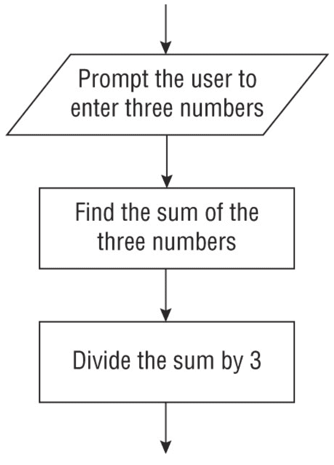

**图5.1** 顺序控制结构

清单5.1中的代码提供了一个数据在Python应用程序中顺序流动的示例。

```
LISTING 5.1
Sequential flow of data

print((2 + 3) * 4)
print(2 ** 10)
print(6 / 3)
print(7 / 3)
print(7 // 3)
print(7 % 3)
print(3 / 6)
print(3 // 6)
print(3 % 6)
print(2 ** 100)
```

Python将按所示顺序从上到下执行这些语句。因此，输出将按print语句出现的相同顺序打印：

```
20
1024
2.0
2.3333333333333335
2
1
0.5
0
3
1267650600228229401496703205376
```

> 注意 顺序语句是在顺序结构中用于执行代码的代码语句。由于顺序语句的简单性，我们的银行应用程序利用顺序结构来控制数据在应用程序中的流动。我们可以使用一系列语句在用户登录时向他们显示应用程序说明。

## 理解选择语句

在每种编程语言中，能够根据某些条件执行适当的代码块至关重要。**选择语句**是在选择结构中用于执行代码的代码语句，它们允许程序员提出问题，然后根据结果执行不同的操作。大多数编程语言提供这种结构的两种版本：if和if-else。二元选择的一个例子是使用if-else语句。

if语句创建一个基本的条件语句，如果条件为True，则执行一个代码块，使用语法：

```
if condition:
    statement
```

其中*condition*是一个可以求值为True或False的语句。如果条件求值为True，Python将执行其后的语句。如果条件求值为False，Python将跳过该语句并继续执行下一组指令。

在某些情况下，我们可能希望测试条件是否为False，而不仅仅是测试True。因此，我们经常明确陈述条件的结果。例如，如果我们明确要测试True，可以使用语句：

```
if condition == True:
```

否则，当我们想测试False时，可以使用：

```
if condition == False:
```

我们经常使用流程图来创建程序在遇到if语句时将遵循的步骤的可视化表示，使用菱形表示条件，如图5.2所示。菱形通常有一个输入，一个求值为是（True）或否（False）的问题，每种可能性有一个输出。

> **注意** 如果您不想使用流程图，可以不使用，但它们可以帮助您逐步了解程序，无论是在开始编写代码之前，还是在调试产生意外结果的语句时。

## 理解条件语句

选择结构最简单的形式是 `if` 语句。我们有时称之为二元选择，因为存在两条可能的执行路径。

标准的 `if-else` 代码块只使用一个条件。如果该条件为 `True`，则执行第一组指令。如果该条件为 `False`，则执行 `else` 代码块中的指令。语句中的标题行以关键字 `if` 开头，后跟一个布尔表达式，并以冒号 (`:`) 结尾。我们将随后缩进的语句称为一个代码块。第一个未缩进的语句标志着代码块的结束。

如果布尔表达式求值为 `True`，则按顺序执行第一个代码块中的语句。如果布尔表达式求值为 `False`，则跳过第一个代码块，转而执行 `else` 子句下的语句。

> **注意** `if` 语句的两个子句下可以出现无限数量的语句，但每个代码块中必须至少有一条语句。

我们经常在条件语句中使用条件运算符。表 5.1 列出了我们可以在 `if` 语句代码块中用于数值比较的最常见的*条件运算符*。

**表 5.1** Python 条件运算符

| 运算符 | 定义 |
| :--- | :--- |
| > | 大于 |
| >= | 大于或等于 |
| < | 小于 |
| <= | 小于或等于 |
| == | 等于 |
| != | 不等于 |

让我们来看一个条件运算符实际应用的例子。清单 5.3 展示了一个单一条件：age >= 16。如果一个人的年龄大于或等于 16 岁，他就可以驾驶。如果年龄小于 16 岁，则不能驾驶。

```
清单 5.3
一个人能驾驶吗？

age = 21

condition = (age >= 16)
#condition 的求值结果将为 True 或 False

if condition == True:
    #如果 age 的值大于或等于 16，则为 True
    print("This person is allowed to drive.")

else:
    #如果 age 的值小于 16，则为 False
    print("This person is NOT allowed to drive.")
```

查看代码，你可以看到我们将一个年龄变量设置为 21。我们也可以让用户输入他们的年龄。然后我们将年龄与 16 进行比较，看它是否大于或等于 16，并将 True 或 False 的结果设置到名为 condition 的变量中。使用 if 语句，我们检查 condition 是否为 True。如果是，则打印一条消息。如果 condition 不为 True，则执行 else 代码块，并打印不同的消息。当年龄为 21 时运行清单的输出是：

This person is allowed to drive.

如果你在第一行将年龄改为小于 16 的值，那么 if 语句将求值为 False，并将执行 else 代码块。

> 注意 你可能已经注意到，在清单 5.2 中，if 语句只是写了 if condition。在清单 5.3 中，if 语句被写成 if (condition == True)。这些是等效的语句。因为 if 语句是在检查 True 值，所以添加 "== True" 有些多余。然而，添加 "== True" 确实能让代码的功能更清晰。

条件语句在我们的银行应用程序中可以有很多用途；它们可用于提供分析或错误处理。例如，可以对银行应用程序进行编程，使用条件运算符来发现异常情况，例如转账金额是否超过账户余额，或者用户是否指定了错误的账户号码。

## IF-ELSE 语句

当我们使用简单的 if 语句时，我们评估一个单一条件，并根据该条件的状态产生一个结果。虽然我们可以包含一系列 if 语句（甚至通过比较各个 if 条件来构建复杂的条件），但这种方法的缺点是，Python 会在执行代码时评估每条语句，即使从逻辑上讲只有一条语句可能为真。

另一种方法是使用 if-else 语句，而不是两个（或更多）单独的 if 语句。if-else 的优点在于，只有当 if 条件不满足时，才会评估语句的 else 部分。如果满足初始条件，Python 可以跳过代码块中剩余的代码，这有助于加快代码的运行时速度。然而，标准的 if-else 代码块只支持两种结果：一种用于条件为 True 的情况，另一种用于条件为 False 的情况。

在清单 5.4 的示例中，我们将存储的用户名与猜测的用户名进行比较。在这种情况下，只有两种可能的结果：用户名相同或不同。

```
清单 5.4
检查用户名

correct_username="admin"
guessed_username = "Admin"

if correct_username == guessed_username:
    #仅当猜测的用户名等于正确的用户名时才会显示
    print("Access Granted")
else:
    #仅当猜测的用户名不等于正确的用户名时才会显示
    print("Access Denied")
```

虽然我们可以使用两个单独的 if 语句来比较值，但 if-else 结构允许我们只陈述一次比较。如果值相同，Python 将显示“if-true”响应，并跳过语句的 else 部分。如果初始 if 语句为 false，Python 将跳过该代码块中的指令，直接转到 else 代码块执行其中的指令。

当你查看清单 5.4 中的代码时，你可以看到 correct_username 和 guessed_username 不相同。因此，条件进入 else 代码块，显示的输出是：

Access Denied

清单 5.2 中的代码展示了 Python 中 if 语句的一个例子。注意，我们使用一个名为 condition 的简单条件来测试是否为 True，并提供了另一个条件语句，如果 condition 为 False，则会产生不同的输出。

```
清单 5.2
在 Python 中使用 if 语句

password = "admin"
condition = (password == "admin")

# 如果 condition 等于 True，意味着密码正确
if condition:
    print("password correct")
# 如果 condition 等于 False，意味着密码不正确。
if condition == False:
    print("password incorrect")
```

在这个清单中，你可以看到第一行将密码设置为“admin”。请注意，虽然这是一个很好的例子，但你实际上永远不想在清单中像这样硬编码密码。话虽如此，这个清单随后检查分配的密码是否等于字符串“admin”。如果 password 中的值确实等于 admin，那么设置给变量 condition 的值将为 True。如果不相等，那么设置给 condition 的值将为 False。

在这种情况下，结果是 False，因为 Python 区分大小写，所以 *admIn* 与 *admin* 不同。这意味着第一个 if 语句求值为 False，因此其 print 语句被跳过，程序控制流转向下一个 if 语句。该 if 语句为 true，因为 condition 确实等于 False。因此，执行该 print 语句，产生以下输出：

```
password incorrect
```

如果你在第二行将检查改为查看密码是否等于“admIn”，那么 condition 将求值为 True。图 5.3 使用流程图展示了清单 5.2 中代码的逻辑。

这些类型的结构对于我们的银行应用程序中的身份验证至关重要。在现实世界中，我们的银行应用程序可能会使用数据库来存储用户凭证，这些凭证将以“哈希”值的形式存储以确保安全。哈希是一种以安全方式转换为数字的值，该过程不可逆，无法揭示密码。

在我们的场景中，我们没有任何机制来存储凭证，因此我们指定变量作为用户凭证，以提供类似的体验。我们的银行应用程序需要确保未授权用户不被允许访问，这最终要求选择语句对用户名和密码组合求值为 True。

> **注意** 正如我们讨论的，随着`if`语句嵌套和复杂度的增加，其复杂性也随之提升。在我们的银行应用程序中，有时可能需要根据具体情况纠正错误或提供特定通知，这正是`if-else`语句可以发挥作用的地方。

## 处理嵌套条件

Python使用`elif`关键字作为“else if”的缩写，它允许我们将多个不同的条件串联起来，每个条件本身必须是True或False。使用`elif`的语法如下：

```
if expression1:
    statement(s)  # 表达式1的代码块

elif expression2:
    statement(s)  # 表达式2的代码块

elif expression3:
    statement(s)  # 表达式3的代码块

else:
    statement(s)
```

虽然`if`和`if-else`提供了基于当前条件产生特定结果的可接受方式，但它们最适用于结果明确（True或False）的情况，且在条件中较难包含灰色地带。然而，在现实中，我们经常需要程序在多种结果之间进行选择，而不仅仅是一两种。

一个程序需求可能是根据个人的收入提供特定的陈述，但同时还需要包含收入范围的选项——例如根据收入为儿童保育提供折扣——或者当用户输入无法代表年龄的值（如姓名或日期）时，Python可以显示错误消息。`elif`运算符允许我们在条件块中嵌套一系列条件，并产生几种不同选项中的一种。

虽然该结构必须包含至少一个`elif`语句，但它可以包含任意数量的`elif`语句，以处理所有可能的情况。

在评估此结构时，Python执行以下操作：

1.  如果`expression1`中的条件评估为True，Python将执行`expression1`代码块中的语句，并跳过结构中的其余代码。
2.  如果`conditional1`为False，Python将按顺序评估每个`elif`语句，直到找到一个为True的条件。然后，它执行该`elif`语句的指令，并跳过结构中的其余代码。
3.  如果没有条件为True，Python将执行else块中的指令。

在清单5.5中，我们在一个简短的代码片段中使用了elif。该清单以一个单词开始，然后将该单词与一系列其他单词进行比较。

```
清单 5.5
使用 elif

color="morning"

if color=="red":
    print("The color is red.")
elif color=="blue":
    print("The color is blue.")
elif color=="yellow":
    print("The color is yellow.")
else:
    print("Please enter a valid color.")
```

如果存储在color中的单词与预期的单词之一匹配，Python将告诉我们该单词代表什么颜色。如果存储的单词与任何预期的单词都不匹配，用户将看到提示输入更合适的值。在这种情况下，当清单执行时，您将看到：

Please enter a valid color.

在清单5.6中，我们更新了清单5.5，使其更实用。在此清单中，系统会提示用户输入一种颜色，然后根据颜色显示相应的消息。

```
清单 5.6
选择颜色

color=input("Please enter a color [red, green, yellow, blue, pink]: ")
if color == "red":
    print("The color is red.")
elif color == "green":
    print("The color is green.")
elif color == "yellow":
    print("The color is yellow.")
elif color == "blue":
    print("The color is blue.")
elif color == "pink":
    print("This color is pink.")
else:
    print("Please enter a valid color that is on the list.")
```

值得注意的是，清单5.6本可以仅使用if-else语句而不是elif来创建。清单5.7展示了不使用elif的代码。通过比较清单5.6和5.7，您可以看到elif语句使我们的代码更加简洁和易于阅读。

```
清单 5.7
使用 if-else 选择颜色

color=input("Please enter a color [red, green, yellow, blue, pink]: ")
if color == "red":
    print("The color is red.")
else:
    if color == "green":
        print("The color is green.")
    else:
        if color == "yellow":
            print("The color is yellow.")
        else:
            if color == "blue":
                print("The color is blue.")
            else:
                if color == "pink":
                    print("This color is pink.")
                else:
                    print("Please enter a valid color that is on the list.")
```

使用elif有助于减少代码的开销要求，并降低if-else语句的复杂性。让我们再次考虑我们一直在创建的银行应用程序。想象一下，我们的银行应用程序有一个贷款处理模块，该模块会查看申请人并根据其信用度进行评级。elif语句可以处理“灰色地带”，并允许根据申请人的不同情况产生不同的结果，例如，如果信用度低则利率较高，或者如果没有信用记录则贷款期限较短。

我们将创建银行应用程序的一部分，执行以下步骤：

1.  创建一个变量并询问用户的信用评分。
2.  如果评分小于或等于450，我们将打印：“This credit score is very low.”
3.  如果评分大于450但小于或等于650，我们将打印：“This credit score is low.”
4.  如果评分大于650但小于或等于800，我们将打印：“This credit score is good.”
5.  如果评分在800以上，最高到850，我们将打印：“This credit score is excellent.”
6.  最后，如果该值与任何这些范围都不匹配，程序应告诉用户输入有效的信用评分。

清单5.8展示了我们检查用户信用评分的代码。

```
清单 5.8
检查信用评分

creditscore = int(input("Please enter a credit score: "))

if creditscore <= 450:
    print("This credit score is very low.")
elif creditscore <= 650 and creditscore > 450:
    print("This credit score is low.")
elif creditscore <= 800 and creditscore > 650:
    print("This credit score is good.")
elif creditscore > 800 and creditscore <= 850:
    print("This credit score is excellent.")
else:
    print("Please enter a valid credit score between 0 and 850")
```

此清单首先提示用户输入其信用评分。第一行代码可能看起来很复杂，但它类似于您见过的代码。`input()`函数提示用户输入一个值。`input()`函数返回的值被传递给`int()`函数，该函数将其从字符串更改为整数。然后，该整数被放入变量`creditscore`中。所有这些都在第一行代码中完成。

然后，输入的值通过`if`和`elif`条件内的检查进行处理。您可以看到条件运算符用于根据各种值评估`creditscore`。如果没有任何条件评估为True，则执行`else`代码块，该代码块要求用户输入0到850之间的有效分数。

> 提示 请记住，Python始终将用户输入视为字符串，但您不能将字符串与数字进行比较。

## 嵌入条件

在以下代码中，创建了一个值为True或False的变量，我们在条件语句中使用了该变量：

```
condition = (age >= 16)
    #condition 将评估为 True 或 False
if condition == True:
```

我们可以通过将条件直接嵌入`if`语句中来简化此代码，如下所示：

```
if age >= 16:
```

清单5.9重复了清单5.3中给出的驾驶年龄示例，不同之处在于条件语句嵌入在if语句中，而不是作为单独的变量存在。

```
清单 5.9
嵌入条件

age = 21

if age >= 16:
    #如果 age 的值大于或等于 16，则为 True
    print("This person is allowed to drive.")

else:
    #如果 age 的值小于 16，则为 False
    print("This person is NOT allowed to drive.")
```

与之前一样，当此清单执行时，将显示相同的输出：

This person is allowed to drive.

在清单5.10中，展示了第二个清单以说明嵌入条件。在此清单中，使用了一个名为string.isupper()的新Python方法。此内置方法评估字符串中字符的大小写。如果字符全部为大写，则返回True，否则返回False。

我们的程序提示用户输入一个字母。如果字符是大写，则显示消息“The user entered an uppercase letter.”。如果字符是小写，则显示消息“The user entered a lowercase letter.”。

```
清单 5.10
检查字符的大小写

letter=input("Please enter a single letter: ")
if letter.isupper():
    print("The user entered an uppercase letter.")
else:
    print("The user entered a lowercase letter.")
```

运行此清单时，您应该会得到预期的输出，如下两个示例所示：

Please enter a single letter: r
The user entered a lowercase letter.

请输入一个字母：R
用户输入了一个大写字母。

> **提示** Python 支持使用 `string.isupper()` 和 `string.islower()` 方法来评估字符串中字符的大小写。你将在单独的课程中学习更多关于方法的知识。

# 总结

为了让一个问题“可计算”，必须构建一个算法。如果程序员无法构建算法，我们就说这个问题无法计算。然而，如果问题是可解的，那么指令可以使用三种重要的控制结构来呈现：顺序、迭代和选择。Python 以多种形式支持这些结构。本质上，控制结构控制着数据在程序中的流动。

在本课中，我们探讨了使创建算法成为可能的那些控制结构。既然你已经完成了[第5课](Lesson 5)，你应该能够：

- 使用 `if` 语句来确定程序的结果。
- 使用 `if-else` 语句来定义两种可能的结果。
- 使用嵌套的 `if` 语句来定义两种以上可能的结果。

## 练习

以下练习旨在让你展示本课的学习目标。

你应该完成每个练习，并确保代码运行无误。这里的练习包括：

- **练习1：你富有吗？**
- **练习2：猫还是狗**
- **练习3：判断题测验**
- **练习4：四季之歌...**
- **练习5：公司野餐**

## 练习1：你富有吗？

编写一个程序，询问用户钱包里有多少钱。如果用户输入20美元或更多，程序应输出“你真富有！”，如果输入少于20美元，则输出“你破产了！”。

## 练习2：猫还是狗

编写一个程序，执行以下步骤：

1. 询问用户是否养猫。（是/否回答）
2. 询问用户是否养狗。（是/否回答）
3. 如果用户的回答表明他们既养猫又养狗，输出“你一定非常爱宠物！”
4. 否则，输出“也许你需要更多宠物。”

最后一步适用于用户有猫但没有狗、有狗但没有猫，或者既没有猫也没有狗的情况。

编写两个不同版本的程序：一个只使用 `if` 语句，另一个使用 `if-else` 语句。

## 练习3：判断题测验

创建一个程序，向用户提出几个问题，用户将回答“真”或“假”。在程序结束时，显示所有问题、正确答案和用户的答案，以及用户的正确回答率（正确回答的问题数/问题总数）。

## 练习4：四季之歌...

编写一个程序，使用 `elif` 根据单个用户输入产生五种不同的可能结果：

1. 询问用户现在是什么季节（秋天、冬天、春天或夏天）。
2. 如果用户输入秋天，输出“我敢打赌那里的树叶很美！”
3. 如果用户输入冬天，输出“希望你为下雪做好了准备！”
4. 如果用户输入春天，输出“我能闻到花香！”
5. 如果用户输入夏天，输出“确保你的空调正常工作！”
6. 如果用户输入的值不对应任何季节，输出“我不认识那个季节。”

用户应该能够以任何大小写输入季节名称，程序仍然能正常工作。

**挑战：** 在程序按上述方式运行后，修改程序，使用户可以输入“fall”或“autumn”并得到相同的结果。

## 练习5：公司野餐

你的公司组织了一次提升士气的活动。他们将在公园举办野餐和运动日，当然，他们想玩团队建设游戏。

为此，他们想根据参与者的姓氏将他们分配到特定的团队。他们已经选好了团队名称，但希望你编写一个程序，将每个人分配到正确的团队。

以下是规格说明：

- 如果一个人的名字以A、B、C或D开头，那么他们在“红龙”队。
- 如果名字以E、F、G或H开头，他们在“黑暗巫师”队。
- 如果名字以I、J、K或L开头，他们在“移动城堡”队。
- 如果名字以M、N、O或P开头，他们在“金色飞贼”队。
- 如果名字以Q、R、S或T开头，他们在“夜之守卫”队。
- 如果名字以U、V、W、X、Y或Z开头，他们在“黑洞”队。

以下是输出示例：

```
你姓什么？韦斯莱
啊哈！你在“黑洞”队！
祝你在比赛中好运！
```

示例使用的是姓氏，但如果你愿意，也可以选择使用名字。你也可以使用不同的输出消息，只要清楚地说明该人所在的团队即可。

> **提示** 确保使用每个组中的至少两个名字来测试程序，以确保其按预期工作。

## 第6课：融会贯通：所得税计算器

在本课中，我们将前面课程中的许多概念整合在一起。我们不会介绍关于Python的新信息，而是将通过一个实际应用来演示你已经学过的内容。在这个同步编码练习中，我们将逐步创建一个计算器，根据个人的收入计算其所得税。

> **注意** 重要！
本同步编码练习中的信息基于2020年的美国税法。如果你选择为其他年份更新此计算器，你应该查找你想要使用的年份的当前值。但是，这个特定的计算器仅适用于收入相对简单、仅基于工资和小费的个人。对于更复杂的报税情况，包括其他形式的收入和税收抵免或扣除，需要更高级的计算器。请咨询税务专家或业务分析师以了解更高级的报税要求。

## 学习目标

在本课结束时，你将能够：

- 展示对基本Python工具的理解，包括使用语法基础、定义变量和接受用户输入。
- 解释基本的Python数据类型，并描述每种数据类型之间的区别。
- 在Python应用程序中使用数字和数字运算。
- 在Python应用程序中使用布尔值，特别是在条件语句的使用中。
- 使用条件语句来确定程序的结果。

## 开始准备

要完成这个同步编码练习，你需要一个支持Python 3的集成开发环境（IDE），例如以下之一：

- Jupyter Notebook（Anaconda发行版的一部分）
- IDLE
- Visual Studio Code

虽然你可以使用像Replit这样的在线工具来测试小段代码，但我们建议你养成使用安装的IDE来编写较大程序的习惯。

在进行同步编码练习时，请确保在进入下一步之前理解每一步。对于涉及编写代码的步骤，所有代码都应在进入下一步之前正常工作。频繁运行代码以检查问题，并在发现问题后立即修复。

## 步骤1：收集需求

在开始为任何程序编写代码之前，你应该花时间确定该应用程序的需求和预期用途。当你与客户合作时，你应该在流程早期就需求达成一致，以确保你理解客户的期望，并确保你的最终程序满足这些期望。

在这种情况下，客户需要一个简单的所得税计算器，该计算器将根据美国W-2表格上报告的工资和小费收入，为个人单身报税者计算纳税义务。请记住，对于许多人来说，计算所得税可能会因其他形式的收入（如股息和利息支付）而变得复杂，因此，如果你要为更复杂的报税情况创建计算器，你应该咨询税务专家，以了解其他形式的收入如何影响纳税申报表。

### 使用的值

在本例中，我们使用的是2020年美国税法的值。如果你想计算其他年份的所得税，你可能需要更新计算中使用的值。

具体来说，我们假设以下值来根据总收入计算应纳税所得额：

- 所有纳税人允许12,200美元的标准扣除额。
- 对于每个受抚养人，纳税人允许额外2,000美元的扣除额。

美国的税率根据赚取的金额而变化。在2020年，[表6.1](Table 6.1)中的值用于根据个人的应纳税所得额计算其所得税。

## 表 6.1 2020 年税率

| 税率 | 单身个人应税收入 |
|---|---|
| 10% | 不超过 $9,875 |
| 12% | $9,876 至 $40,125 |
| 22% | $40,126 至 $85,525 |
| 24% | $85,526 至 $163,300 |
| 32% | $163,301 至 $207,350 |
| 35% | $207,351 至 $518,400 |
| 37% | $518,401 或以上 |

## 用户界面

我们希望程序从用户那里接受以下输入值：

- 总收入
- 被抚养人数量

此时，我们也将假设用户将通过终端窗口访问程序，而不是通过表单。

## 其他标准

数字标准如下：

- 总收入必须输入到最接近的分。
- 应税收入以十进制数表示。
- 应缴税款以整数表示。

所有呈现给用户的文本都应使用正确的语法和拼写。

## 步骤 2：设计程序

在最终确定程序的功能后，你应该花时间设计程序。设计程序可以包括伪代码或流程图。让我们从描述程序将执行的操作的伪代码开始：

```
用户输入：总收入
用户输入：被抚养人数量
应税收入 = 总收入 - 12,200 - (2000 * 被抚养人数量)
应缴税款 = 根据税率表计算出的金额
打印 应缴税款
```

你可能会发现为自己创建一个流程图来识别这些步骤很有用。请记住，你只需要铅笔和纸就可以创建流程图，但它可以帮助你可视化程序将做什么，并识别程序中所需的步骤。

> **注意** [附录 A](https://example.com) 提供了有关流程图的更多信息，[附录 B](https://example.com) 提供了有关创建伪代码的更多信息。

## 步骤 3：创建输入

编写程序时，将其分解为更小的部分是一个好习惯。然后你可以单独构建这些部分，并在进行过程中测试它们是否按预期工作。如果你试图一次性编写整个程序（即使是一个像我们这里处理的相对较短的程序），你最终可能会遇到难以追踪的错误。如果你在进入下一个部分之前让每个部分都正常工作，那么当问题发生时，更容易进行故障排除。

对于代码实践，我们使用 35987.65 作为总收入值，两个被抚养人，除非另有说明。当你使用输入值测试代码时，你可以使用不同的值来看看会发生什么。

我们将从创建用户输入开始。我们知道我们希望用户输入他们的总收入，并且我们需要将输入保存在一个变量中：

```
# 定义用户输入
gross_inc = input("请输入您 2020 年 W-2 表上的总收入：")
```

让我们也添加一个打印语句，以便我们可以验证是否存储了正确的值。你的代码现在应该看起来像 [清单 6.1](https://example.com)。

```
**清单 6.1**
提示输入收入

# 定义用户输入
gross_inc = input("请输入您 2020 年 W-2 表上的总收入：")
print(gross_inc)
```

将此代码添加到你的 IDE 并运行程序。它应该会提示你输入一个值，并在你输入后立即显示该值。

```
请输入您 2020 年 W-2 表上的总收入：**35987.65**
35987.65
```

一旦此代码正常工作，我们就可以为被抚养人数量创建提示，并将其添加到我们的代码中，如 [清单 6.2](https://example.com) 所示。

```
清单 6.2
添加额外的提示

# 定义用户输入
gross_inc = input("请输入您 2020 年 W-2 表上的总收入：")
print(gross_inc)

num_dep = input("您申报了多少个被抚养人？ ")
print(num_dep)
```

输出现在应该如下所示：

```
请输入您 2020 年 W-2 表上的总收入：**35987.65**
35987.65
您申报了多少个被抚养人？ **2**
2
```

一旦输入语句能够正确收集值，我们就可以删除打印语句。我们将只是将它们注释掉，如 [清单 6.3](Listing 6.3) 所示，以防我们以后需要恢复它们。

```
清单 6.3
注释掉打印语句

# 定义用户输入
gross_inc = input("请输入您 2020 年 W-2 表上的总收入：")
# print(gross_inc)

num_dep = input("您申报了多少个被抚养人？ ")
# print(num_dep)
```

程序仍然会接受用户输入值，但不会显示这些值。

## 步骤 4：计算应税收入

我们从规划步骤中知道，应税收入的公式是：

应税收入 = 总收入 - 12,200 - (2000 * 被抚养人数量)

数值 12,200 和 2000 来自 2020 年的美国税务计算。

请记住，使用变量不仅可以将值保存到命名的内存位置，而且如果我们正确命名它们，它们可以帮助我们更好地将公式映射到操作。在这种情况下，你可以在 [清单 6.4](Listing 6.4) 中看到我们有变量 `gross_inc` 和 `num_dep`，我们已将它们插入到语句中，然后我们将计算结果赋给一个新变量。我们还可以打印结果以帮助我们确保该值是合适的。

```
清单 6.4
添加应税收入公式

# 定义用户输入
gross_inc = input("请输入您 2020 年 W-2 表上的总收入：")
# print(gross_inc)

num_dep = input("您申报了多少个被抚养人？ ")
# print(num_dep)

# 计算应税收入
tax_income = gross_inc - 12200 - (2000 * num_dep)
print (tax_income)
```

如果你运行这个程序，Python 会返回一个错误：

```
---------------------------------------------------------------------------
TypeError                                 Traceback (most recent call last)
<ipython-input-7-cf539198992d > in <module>
----> 1 tax_income = gross_inc - 12200 - (2000 * num_dep)
      2 print (tax_income)

TypeError: unsupported operand type(s) for -: 'str' and 'int'
```

请记住，Python 将任何用户输入视为文本（或 *字符串*）值，并且与大多数其他编程语言一样，它不能使用字符串值执行数学运算（如减法和乘法）。我们需要更新代码以将输入值转换为数字。

我们从步骤 1 中知道，收入应该允许小数位。这意味着数字值应该是一个 *浮点数*。我们可以在 Python 中轻松转换该值：

```
gross_inc_float = float(gross_inc)
```

然而，被抚养人的数量应该是一个整数——一个人要么是被抚养人，要么不是。我们可以使用 `int` 函数来转换输入：

```
num_dep_int = int(num_dep)
```

让我们更新代码以包含这些转换并使用新变量。[清单 6.5](Listing 6.5) 显示了我们更新后的清单。

```
清单 6.5
添加转换

# 定义用户输入
gross_inc = input("请输入您 2020 年 W-2 表上的总收入：")
# print(gross_inc)

num_dep = input("您申报了多少个被抚养人？ ")
# print(num_dep)

# 将输入值转换为数字
gross_inc_float = float(gross_inc)
num_dep_int = int(num_dep)

# 计算应税收入
tax_income = gross_inc_float - 12200 - (2000 * num_dep_int)
print (tax_income)
```

如果你使用与代码实践中之前相同的输入，你应该得到以下值：

19787.65

## 步骤 5：计算税率

下一步是计算我们正在使用的值的人的应缴税款。我们知道所得税税率取决于应税价值本身，使用步骤 1 中介绍的表 6.1 中的值。

然而，事情在这里变得复杂了。在美国税法中，应税收入被切分成与表 6.1 中所示的税率表相匹配的值，并且每个切片使用该切片的适当税率。例如，如果一个人的应税收入为 $80,000，则应缴税款计算如下：

- 前 $9,875 按 10% 征税：

  9875 * .1 = 987.6

- $9,876 至 $40,125 的金额按 12% 征税：

  40145 - 9875 = 30270
  30270 * .12 = 3632.4

- 剩余部分按 22% 征税：

  80000 - 40125 = 39875
  39875 * .22 = 8772.5

- 然后我们将三个值相加得到总应缴税款：

    tax_due = 987.6 + 3632.4 + 8772.5
    tax_due = 13392.5

让我们看看如何编写代码，将其分解为切片（或 *层级*）。第一层适用于应税收入低于 $9,875 的情况。因为这是第一层，我们只需将应税收入乘以 10% 来计算应缴税款。我们将把它添加到我们的程序中，如 [清单 6.6](#listing-66) 所示。

```
清单 6.6
添加税款计算的第一层

# 定义用户输入
gross_inc = input("请输入您 2020 年 W-2 表上的总收入：")
# print(gross_inc)

num_dep = input("您申报了多少个被抚养人？ ")
# print(num_dep)

# 将输入值转换为数字
gross_inc_float = float(gross_inc)
num_dep_int = int(num_dep)

# 计算应税收入
tax_income = gross_inc_float - 12200 - (2000 * num_dep_int)
print (tax_income)

# 计算应缴税款
tax_due = tax_income * 0.1

# 打印结果
print(tax_due)
```

如果你用总收入 $20,000 和两个被抚养人来测试这个，你应该得到以下输出：

```
请输入您 2020 年 W-2 表上的总收入：20000
您申报了多少个被抚养人？ 2
3800.0
380.0
```

### 添加条件语句

现在我们理解了数学运算，我们可以使程序更加灵活。具体来说，我们希望它查看应税收入，确定该值的正确税率，并使用该税率计算应缴税款。这要求我们使用条件语句。因为这一步有点复杂，我们现在只看应税收入。一旦我们理解了其中的原理后，就可以将代码整合到程序的早期版本中。

创建一个新程序，仅包含根据应纳税所得额计算应缴税款的基本逻辑，但暂时忽略扣除项。我们将从 [清单 6.7](#) 中所示的 $4,000 开始，这属于 10% 的税率档。

```
清单 6.7
对 4000 征税

tax_income = 4000
tax_due = tax_income * 0.1

# 打印结果
print(tax_due)
```

这应该会给我们一个 400.0 的结果，即 4000 的收入值乘以 0.1 的税率。

现在让我们更新代码，以计算属于 22% 税率档的应纳税所得额。在这种情况下，我们首先需要一个针对 10% 税率档的 *if* 子句：

```
tax_income = 4000

if tax_due <= 9875
    tax_due = tax_income * 0.1
tax_due =       # 22% 税率档的计算

# 打印结果
print(tax_due)
```

计算有点复杂。我们首先计算前 $9,875 的 10%：

```
9875 * .1
```

然后从应纳税所得额中减去 9875，并计算该值的 12%：

```
(tax_income - 9875) * .12
```

然后我们将这些值相加来计算应缴税款：

```
tax_due = (9875 * .1) + ((tax_income - 9875) * .12)
```

更新 [清单 6.7](#) 中的代码以包含此计算，并使用一个属于 22% 税率档的应纳税所得额值。[清单 6.8](#) 显示了更新后的代码。

```
清单 6.8
添加第二档逻辑

tax_income = 35000

if tax_income <= 9875:
    tax_due = tax_income * 0.1
tax_due = (9875 * .1) + ((tax_income - 9875) * .12)

# 打印结果
print(tax_due)
```

如果你从 35000 的应纳税所得额值开始，结果应该是：

4002.5

现在我们理解了从一个税率档到下一个税率档的数学原理，我们可以添加下一个税率档了。

## 创建嵌套条件语句

为了在条件构造中处理两个以上的选项，我们使用嵌套条件语句。因为税率表是一系列“最高”值，我们可以简单地使用小于或等于 (<=) 条件语句，这些语句对应于当前税率档的最高值。

在 Python 中，我们使用 `elif` 在初始条件和 `else` 值之间创建嵌套条件。让我们首先将 12% 的税率档设为一个 `elif` 语句，我们已经在 [清单 6.9](Listing 6.9) 中完成了。

```
清单 6.9
使用 elif 语句的第二档

tax_income = 35000

if tax_income <= 9875:
    tax_due = tax_income * 0.1
elif tax_income <= 40125:
    tax_due = (9875 * .1) + ((tax_income - 9875) * .12)

# 打印结果
print(tax_due)
```

运行代码以确保你得到与之前相同的结果：

4002.5

现在添加 22% 的税率档，如 [清单 6.10](Listing 6.10) 所示。

```
清单 6.10
添加 22% 税率档

tax_income = 80000

if tax_income <= 9875:
    tax_due = tax_income * 0.1
elif tax_income <= 40125:
    tax_due = (9875 * .1) + ((tax_income - 9875) * .12)
elif tax_income <= 85525:
    tax_due = (9875 * .1) + ((40125 - 9875) * .12) + (tax_income - 40125) * .22)

# 打印结果
print(tax_due)
```

现在情况变得更加复杂了，所以请查看代码以确保你理解它。
为了计算 40125 到 85525 之间的值的税款，我们执行以下步骤：

1.  计算第一档最大值的 10%：
    9875 * .1

2.  计算第二档最大值的 12%：
    (40125 - 9875) * .12

3.  计算剩余部分的 22%：
    ((tax_income - 40125) * .22)

4.  将三个值相加。

让我们对 24% 的税率档做同样的事情，如 [清单 6.11](Listing 6.11) 所示。

### 清单 6.11
添加 24% 税率档

```
tax_income = 150000

if tax_income <= 9875:
    tax_due = tax_income * 0.1
elif tax_income <= 40125:
    tax_due = (9875 * .1) + ((tax_income - 9875) * .12)
elif tax_income <= 85525:
    tax_due = (9875 * .1) + ((40125 - 9875) * .12) + ((tax_income - 40125) * .22)
elif tax_income <= 163300:
    tax_due = (9875 * .1) + ((40125 - 9875) * .12) + ((85525 - 40125) * .22) + ((tax_income - 85525) * .24)

# 打印结果
print(tax_due)
```

注意，我们在这里看到了很多重复。我们知道 9875 的 10% 总是 987.5，并且我们不断重用像 40124 和 9875 这样的值。事实上，你很可能从一个 `elif` 复制粘贴代码到下一个，然后根据需要进行更新。

每当我们看到这样的重复时，我们也应该看到引入变量的机会。使用变量不仅可以消除重复从而简化我们的代码，而且变量本身也会使代码更易于阅读。变量还可以使代码更灵活。

在 2020 年，我们为每个税率档设定了固定的范围，但这些范围在其他年份可能会有所不同。如果我们使用变量而不是常量，我们只需要在一个地方更新这些值，而不是在代码中替换每个值的每个实例。

我们将首先创建引用每个税率档最高值的变量。在 `if` 代码块上方创建这些变量，如 [清单 6.12](Listing 6.12) 所示，以便我们可以在计算中使用它们。

```
清单 6.12
声明最高范围值变量

tax_income = 150000

max10 = 9875
max12 = 40125
max22 = 85525
max24 = 163300
max32 = 207350
max35 = 518400

if tax_income <= max10:
    tax_due = tax_income * 0.1
#[...]
```

我们还可以计算每个税率档的最大应缴税款，并将这些值分配给变量，如 [清单 6.13](Listing 6.13) 所示。

```
清单 6.13
使用变量计算各档最大税款

tax_income = 150000

max10 = 9875
max12 = 40125
max22 = 85525
max24 = 163300
max32 = 207350
max35 = 518400

tier10_tax = max10 * .1
tier12_tax = tier10_tax + ((max12 - max10) * .12)
tier22_tax = tier12_tax + ((max22 - max12) * .22)
tier24_tax = tier22_tax + ((max24 - max22) * .24)
tier32_tax = tier24_tax + ((max32 - max24) * .32)
tier35_tax = tier32_tax + ((max35 - max32) * .35)

if tax_income <= max10:
    tax_due = tax_income * 0.1
#[...]
```

在这里，我们通过加上前一档的最大值并根据当前税率档计算剩余税率，来计算每个税率档的最大应缴税款。

现在我们可以用适当的变量替换计算中的硬编码值，如 [清单 6.14](Listing 6.14) 所示。

```
清单 6.14
使用变量更新税款计算

tax_income = 150000

max10 = 9875
max12 = 40125
max22 = 85525
max24 = 163300
max32 = 207350
max35 = 518400

tier10_tax = max10 * .1
tier12_tax = tier10_tax + ((max12 - max10) * .12)
tier22_tax = tier12_tax + ((max22 - max12) * .22)
tier24_tax = tier22_tax + ((max24 - max22) * .24)
tier32_tax = tier24_tax + ((max32 - max24) * .32)
tier35_tax = tier32_tax + ((max35 - max32) * .35)

if tax_income <= max10:
    tax_due = tax_income * 0.1
elif tax_income <= max12:
    tax_due = tier10_tax + ((tax_income - max10) * .12)
elif tax_income <= max22:
    tax_due = tier12_tax + ((tax_income - max12) * .22)
elif tax_income <= max24:
    tax_due = tier22_tax + ((tax_income - max22) * .24)
elif tax_income <= max32:
    tax_due = tier24_tax + ((tax_income - max24) * .32)

# 打印结果
print(tax_due)
```

很容易看出代码变得简单多了，但花时间检查代码以了解其功能也是值得的。首先，每个 `if` / `elif` 子句都引用了该税率档的最大值。适当的最高值也用于计算当前税率档的应纳税所得额：

```
elif tax_income <= max24:
    tax_due = tier22_tax + ((tax_income - max22) * .24)
```

其次，当我们定义各档税款值时，每个 `elif` 结果所需的大部分数学计算已经为我们完成了，因为这些表达式计算了每个税率档可能的最高应缴税款。然后，我们可以在计算下一个税率档的应缴税款时简单地包含该值：

```
elif tax_income <= max24:
    tax_due = tier22_tax + ((tax_income - max22) * .24)
```

最后，如果将来某个给定范围的最大值发生变化，我们只需更改分配给 max 变量的值，这比必须替换代码中使用该值的每个实例要高效得多。

现在让我们用剩余的税率档完成代码。尝试自己完成，然后将你的代码与 [清单 6.15](Listing 6.15) 中显示的代码进行核对。

```
清单 6.15
添加剩余税率档后的税款计算

tax_income = 150000

max10 = 9875
max12 = 40125
max22 = 85525
max24 = 163300
max32 = 207350
max35 = 518400

tier10_tax = max10 * .1
tier12_tax = tier10_tax + ((max12 - max10) * .12)
tier22_tax = tier12_tax + ((max22 - max12) * .22)
tier24_tax = tier22_tax + ((max24 - max22) * .24)
tier32_tax = tier24_tax + ((max32 - max24) * .32)
tier35_tax = tier32_tax + ((max35 - max32) * .35)

if tax_income <= max10:
    tax_due = tax_income * 0.1
elif tax_income <= max12:
    tax_due = tier10_tax + ((tax_income - max10) * .12)
elif tax_income <= max22:
    tax_due = tier12_tax + ((tax_income - max12) * .22)
elif tax_income <= max24:
    tax_due = tier22_tax + ((tax_income - max22) * .24)
elif tax_income <= max32:
    tax_due = tier24_tax + ((tax_income - max24) * .32)
elif tax_income <= max35:
    tax_due = tier32_tax + ((tax_income - max32) * .35)
elif tax_income > max35:
    tax_due = tier35_tax + ((tax_income - max35) * .37)

# 打印结果
print(tax_due)
```

注意，最后一个 `elif` 代码块仅使用大于符号，而不是小于或等于。这是因为任何超过 $518,400 的收入都按 37% 的税率征税。没有最高

## 第六步：更新应用程序

既然我们已经完成了应缴税款的计算，现在可以将它们整合到我们最初的程序中。由于我们在计算中使用了相同的 `tax_income` 变量，我们只需将新代码添加到现有程序中，替换掉原来的应缴税款计算部分，如 [清单 6.16](#) 所示。

```
清单 6.16
更新了税款计算的税务程序

# 声明变量
max10 = 9875
max12 = 40125
max22 = 85525
max24 = 163300
max32 = 207350
max35 = 518400

tier10_tax = max10 * .1
tier12_tax = tier10_tax + ((max12 - max10) * .12)
tier22_tax = tier12_tax + ((max22 - max12) * .22)
tier24_tax = tier22_tax + ((max24 - max22) * .24)
tier32_tax = tier24_tax + ((max32 - max24) * .32)
tier35_tax = tier32_tax + ((max35 - max32) * .35)

# 定义用户输入
gross_inc = input("请输入您2020年W-2表格上的总收入：")
# print(gross_inc)

num_dep = input("您申报了多少名受抚养人？")
# print(num_dep)

# 将输入值转换为数字
gross_inc_float = float(gross_inc)
num_dep_int = int(num_dep)

# 计算应纳税所得额
tax_income = gross_inc_float - 12200 - (2000 * num_dep_int)
print (tax_income)

# 计算应缴税款
if tax_income <= max10:
    tax_due = tax_income * 0.1
elif tax_income <= max12:
    tax_due = tier10_tax + ((tax_income - max10) * .12)
elif tax_income <= max22:
    tax_due = tier12_tax + ((tax_income - max12) * .22)
elif tax_income <= max24:
    tax_due = tier22_tax + ((tax_income - max22) * .24)
elif tax_income <= max32:
    tax_due = tier24_tax + ((tax_income - max24) * .32)
elif tax_income <= max35:
    tax_due = tier32_tax + ((tax_income - max32) * .35)
elif tax_income > max35:
    tax_due = tier35_tax + ((tax_income - max35) * .37)

# 打印结果
print(tax_due)
```

请注意，我们在应用程序的开头添加了变量。在应用程序早期定义变量是一种常见做法，以确保它们在应用程序本身需要时可用。像这样将它们分组也有助于调试，以防我们需要查看变量最初是如何声明和初始化的。

更新代码后，再测试几次以确保它产生预期的结果。请记住，完整的代码从总收入开始，并计算扣除额以确定应纳税所得额。

## 如果应纳税所得额为负数怎么办？

税务计算器未能解决的另一个问题是应纳税所得额小于零的情况。例如，如果一个人的总收入为 10,000 美元，并且有两名受抚养人，那么他们的应纳税所得额为 -$6,200。请注意，这是一个逻辑错误，而不是语法错误。在我们的程序中输入初始收入值 10000 和 2 不会导致 Python 抛出错误。事实上，它会清楚地告诉你这个人欠 -$620，这个金额实际上没有意义。

在美国税法中，应纳税所得额小于 0 的人完全不需要缴税。我们可以更新程序来考虑这一点，如 [清单 6.17](Listing 6.17) 所示。

```
清单 6.17
针对低收入进行调整

# 初始化变量
max10 = 9875
max12 = 40125
max22 = 85525
max24 = 163300
max32 = 207350
max35 = 518400

tier10_tax = max10 * .1
tier12_tax = tier10_tax + ((max12 - max10) * .12)
tier22_tax = tier12_tax + ((max22 - max12) * .22)
tier24_tax = tier22_tax + ((max24 - max22) * .24)
tier32_tax = tier24_tax + ((max32 - max24) * .32)
tier35_tax = tier32_tax + ((max35 - max32) * .35)

# 定义用户输入
gross_inc = input("请输入您2020年W-2表格上的总收入：")
# print(gross_inc)

num_dep = input("您申报了多少名受抚养人？")
# print(num_dep)

# 将输入值转换为数字
gross_inc_float = float(gross_inc)
num_dep_int = int(num_dep)

# 计算应纳税所得额
tax_income = gross_inc_float - 12200 - (2000 * num_dep_int)
print (tax_income)

if tax_income <=0:
    tax_due = 0
elif tax_income <= max10:
    tax_due = tax_income * 0.1
elif tax_income <= max12:
    tax_due = tier10_tax + ((tax_income - max10) * .12)
elif tax_income <= max22:
    tax_due = tier12_tax + ((tax_income - max12) * .22)
elif tax_income <= max24:
    tax_due = tier22_tax + ((tax_income - max22) * .24)
elif tax_income <= max32:
    tax_due = tier24_tax + ((tax_income - max24) * .32)
elif tax_income <= max35:
    tax_due = tier32_tax + ((tax_income - max32) * .35)
elif tax_income > max35:
    tax_due = tier35_tax + ((tax_income - max35) * .37)

# 打印结果
print(tax_due)
```

使用一些较小的数字运行程序，确保它产生正确的结果且没有错误。

## 代码是否符合标准？

作为对代码的最后检查，将我们现有的代码与预期标准进行比较。具体来说，数字标准如下：

- 总收入必须输入到最接近的分。
- 应纳税所得额表示为十进制数。
- 应缴税款表示为整数。

我们确实允许用户输入浮点值作为总收入，并且我们确实让程序将应纳税所得额表示为十进制数。然而，您应该至少注意到一个例子，其中应缴税款包含小数点后的值。

我们可以通过将计算值转换为整数来修复这个问题。在 Python 中，这种转换将导致数字使用标准舍入程序（对于小数值为 .5 或更高的值向上舍入，否则向下舍入）。更新应缴税款的 `print` 语句：

```
# 打印结果
print(int(tax_due))
```

使用不同的输入多次运行代码，确保应缴税款表示为整数。

## 第七步：处理用户界面

一旦程序按预期运行，您应该花时间改进用户界面（UI）。我们已经通过清楚地说明用户应该输入哪些数据做了一点，但我们也想稍微清理一下输出。

在这种情况下，我们希望程序清楚地说明输入了哪些值以及计算出的值，使用短语来标识这些值。此时，我们可以取消注释之前用于测试的 `print` 语句，并对其进行修饰以使其更有意义：

```
# 定义用户输入
gross_inc = input("请输入您2020年W-2表格上的总收入：")
print("您的总收入是 $" + gross_inc + "。")

num_dep = input("您申报了多少名受抚养人？")
print("您有 " + num_dep + " 名受抚养人。")
```

这里我们在第一个 print 语句中包含 $ 符号，以便该符号出现在数字前面，结果看起来像钱。我们还在每个语句末尾包含一个句点。输出语句应如下所示：

您的总收入是 $35987.65。
您有 2 名受抚养人。

我们还想清楚地说明应纳税所得额：

```
# 计算应纳税所得额
tax_income = gross_inc_float - 12200 - (2000 * num_dep_int)
print ("您的应纳税所得额是 $" + str(tax_income) + "。")
```

请注意，前两个 print 语句工作正常。程序应该提示您输入值并在 print 句子中显示该值。

但是，应纳税所得额语句按原样编写将无法工作。正如我们不能对字符串值执行数学运算（这就是为什么我们必须将输入值转换为数字），我们也不能将字符串与数字连接。这意味着我们必须使用 `str` 函数将数字转换为字符串：

```
print ("您的应纳税所得额是 $" + str(tax_income) + "。")
```

这应该生成如下语句：

您的应纳税所得额是 $19787.65。

现在让我们对接缴税款做类似的事情：

```
# 打印结果
print ("您的应缴税款是 $" + str(int(tax_due)) + "。")
```

请注意，Python 允许我们将浮点值转换为整数，然后在单个步骤中将整数转换为字符串。这给我们以下结果：

您的应缴税款是 $2177。

现在让我们完成程序，将所有 print 语句按逻辑顺序放在程序末尾，如清单 6.18 所示。这不是绝对必要的，但它有助于保持代码更有条理。如果相似的代码片段分组在一起，更新程序也更容易。

## 清单 6.18
我们完成的税务程序

# 初始化变量
max10 = 9875
max12 = 40125
max22 = 85525
max24 = 163300
max32 = 207350
max35 = 518400

tier10_tax = max10 * .1
tier12_tax = tier10_tax + ((max12 - max10) * .12)
tier22_tax = tier12_tax + ((max22 - max12) * .22)
tier24_tax = tier22_tax + ((max24 - max22) * .24)
tier32_tax = tier24_tax + ((max32 - max24) * .32)
tier35_tax = tier32_tax + ((max35 - max32) * .35)

# 定义用户输入
gross_inc = input("请输入您2020年W-2表格上的总收入：")

num_dep = input("您申报了多少名受抚养人？")

# 将输入值转换为数字
gross_inc_float = float(gross_inc)
num_dep_int = int(num_dep)

# 计算应纳税所得额
tax_income = gross_inc_float - 12200 - (2000 * num_dep_int)

if tax_income <= 0:
    tax_due = 0
elif tax_income <= max10:
    tax_due = tax_income * 0.1
elif tax_income <= max12:
    tax_due = tier10_tax + ((tax_income - max10) * .12)
elif tax_income <= max22:
    tax_due = tier12_tax + ((tax_income - max12) * .22)
elif tax_income <= max24:
    tax_due = tier22_tax + ((tax_income - max22) * .24)
elif tax_income <= max32:
    tax_due = tier24_tax + ((tax_income - max24) * .32)
elif tax_income <= max35:
    tax_due = tier32_tax + ((tax_income - max32) * .35)
elif tax_income > max35:
    tax_due = tier35_tax + ((tax_income - max35) * .37)

# 向用户报告结果
print("您的总收入为 $" + gross_inc + "。")
print("您有 " + num_dep + " 名受抚养人。")
print("您的应纳税所得额为 $" + str(tax_income) + "。")
print("您应缴纳的税款为 $" + str(int(tax_due)) + "。")

使用之前的输入值，输出应如下所示：

```
请输入您2020年W-2表格上的总收入：35987.65
您申报了多少名受抚养人？2
您的总收入为 $35987.65。
您有 2 名受抚养人。
您的应纳税所得额为 $19787.65。
您应缴纳的税款为 $2374。
```

## 自主练习

一旦您完成了本课程的程序，请使用不同的输入值（包括更低和更高的值）来检查结果。您可以随意使用计算器来抽查结果，以确保结果正确。

同时请考虑，税率和税表可能会逐年变化。我们研究了使用变量来存储每个税级的最大值以及每个税级的最大应缴税额，但程序中仍然存在一些可能发生变化且在整个程序中重复出现的硬编码值。例如：

- 您能否重构程序，为每个税级的百分比使用变量？
- 您能否重构程序，为个人扣除额和受抚养人扣除额的值使用变量？
- 您如何处理每个税级的范围或百分比税值的变化？

同时请记住，代码风格可能因开发者而异。这里的程序展示了一种解决方案，但解决此类问题的方法还有很多，至少同样多。这里的重要要点包括：

- 理解您希望代码做什么来解决手头的问题。
- 理解代码如何解决该问题。
- 编写易于阅读的代码，尤其是对其他开发者而言。
- 编写合理避免重复或重复使用值和计算的代码。

# 总结

在本课程中，我们将您在前几课中学到的许多概念整合到一个可运行的应用程序中。我们逐步讲解了创建一个根据个人收入计算所得税的计算器的过程。您添加了变量，以便将来更容易地为不同的税率更新程序。

既然您已经完成了[第6课](Lesson 6)，您应该能够：

- 展示对基本Python工具的理解，包括使用语法基础、定义变量和接受用户输入。
- 解释基本的Python数据类型并描述每种数据类型之间的区别。
- 在Python应用程序中使用数字和数字运算。
- 在Python应用程序中使用布尔值，特别是在条件语句的使用中。
- 使用条件语句来确定程序的结果。

# 第二部分
循环与数据结构

- [第7课](Lesson 7)：使用循环控制程序流程
- [第8课](Lesson 8)：理解基本数据结构：列表
- [第9课](Lesson 9)：理解基本数据结构：元组
- [第10课](Lesson 10)：深入探讨数据结构：字典
- [第11课](Lesson 11)：深入探讨数据结构：集合
- [第12课](Lesson 12)：综合运用：提示输入地址
- [第13课](Lesson 13)：使用函数进行组织

# 第7课
使用循环控制程序流程

Python支持多种控制结构，用于确定程序中的内容将如何工作和交互。本课程继续探索包括使创建算法成为可能的其他控制结构。课程最后讨论了迭代如何辅助文本处理。

## 学习目标

在本课程结束时，您将能够：

- 创建一个使用`for`循环重复执行某个活动直到满足特定条件的Python脚本。
- 创建一个使用`while`循环只要特定条件成立就重复执行某个活动的Python脚本。
- 使用字符串操作来处理文本。

## 迭代概述

第5课介绍了控制结构。这些结构用于“控制”数据在应用程序中的流动。Python通过顺序、迭代和选择控制语句支持各种结构。在第5课中，讨论了选择和顺序。顺序控制结构（在顺序语句中执行）是一个语句接一个语句地完成。选择控制结构（在选择语句中实现）仅在满足特定条件后才执行。虽然这些类型的代码语句允许应用程序运行，但在大多数情况下，仅使用顺序和选择语句会使程序代码变得非常冗长。

在本课程中，引入了第三种控制结构：迭代。迭代以及迭代代码语句为Python应用程序的设计和开发提供了效率。此外，在本课程中，迭代语句将使用两种特定类型的迭代结构（确定循环和不确定循环）来创建，每种结构都有其独特的用途。

简单来说，迭代控制结构，也称为循环，用于重复操作。循环主要有两种类型：重复预定次数操作的循环（确定循环）和持续操作直到算法确定应停止循环执行的循环（不确定循环）。

在学习本课程时，您会看到一些关键术语。这些术语包括：

- **顺序控制结构**是程序内程序代码的逐行顺序执行。
- **选择控制结构**允许程序员提出问题，然后根据结果执行不同的操作。
- **迭代控制结构**允许程序员重复执行代码。这些迭代结构的例子包括确定循环和不确定循环。

## 循环的剖析

每天早上4点，我的设备都会尖叫：“醒醒！醒醒！醒醒！”计算机可以轻松地输出这些感叹句，不仅三次，而且实际上是数百次。作为开发者，您不需要编写数百条输出语句来完成此操作。

让我们看看如何使用循环来输出这样的语句。在这种情况下，我们将使用`for`循环来输出（打印）语句三次：

```
for eachPass in range(3):
    print("Wake Up!", end = " ")
```

在这个例子中，循环重复调用`print`函数。第一行的常量3告诉循环调用此函数的次数。结果是，当执行此代码时，将向用户显示以下内容：

```
Wake Up! Wake Up! Wake Up!
```

要打印10次或1000次感叹句，您只需将3改为10或1000。这种类型的循环称为`for`循环。

这是一种**确定迭代**，因为循环执行的次数是确定的，基于`range`中指定的数字，在我们的例子中定义为3，如[图7.1](#figure-71)所示。

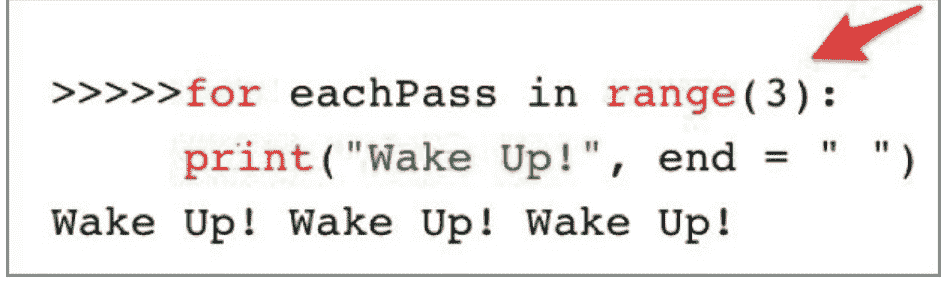

**图7.1** 确定迭代

值得更仔细地研究构成`for`循环的语句：

```
for <variable> in range(<an integer expression>):
    <statement-1>
```

## FOR 循环

循环中的第一行代码被称为**循环头**。从第一行代码中可以看到，我们循环中最相关的信息是显示循环执行迭代次数的整数表达式。冒号（:）终止了循环头。

**循环体**由位于循环头下方的其余代码行中的语句组成。

循环体中的语句在每次遍历时按顺序执行。在 Python 中，这些语句必须缩进并在同一列内对齐。

> **注意** 你的集成开发环境（IDE）应该会自动缩进循环头下方的行。如果你的 IDE 不提供此自动功能，最佳实践是使用四个空格进行缩进。

Python 的 for 循环是一种易于支持确定性**迭代**的控制语句，我们确切知道循环应该执行多少次。for 循环的格式之前已经展示过，但让我们再看一遍：

```
for <var> in <iterable>:
    <statement(s)>
```

当开发者想要将一段代码重复固定次数时，传统上会使用 for 循环。正如你在[清单 7.1](Listing 7.1)的代码中所看到的，我们根据循环头中定义的数字知道循环将进行多少次“遍历”。

```
**清单 7.1**
运行中的 for 循环

for eachPass in range(3):
    print("Wake Up!")
```

当执行此清单时，将显示以下输出：

```
Wake Up!
Wake Up!
Wake Up!
```

如你所见，循环发生了三次。更具体地说，`range(3)` 设置了一个从 0 开始、在达到该值（即 3）之前结束的三个项目编号的序列。Python 的 for 语句按顺序迭代（重复）序列的成员，每次执行块语句。如果你将 range 更改为不同的数字，那么 for 语句将迭代那么多次。

> **注意** 如果你使用过其他编程语言，如 C、C++ 或 Java，你可能会注意到 Python 中的 for 循环不使用花括号（{}）来标记将被循环迭代的代码块的开始和结束。相反，Python 使用缩进来确定要运行的代码。

## WHILE 循环

if 语句评估一个条件，根据该条件执行特定活动，然后继续执行代码中的下一组指令。虽然执行方式相似，但 while 循环会尽可能多地重复一组特定的指令，只要条件为 True。我们使用术语**迭代**来指代一组指令每次运行。

while 循环的基本语法是：

```
while (condition == True):
    <statement(s)>
```

为了按给定次数迭代循环，我们使用一个计数器变量，以恒定的量递增该变量。例如，我们可能将计数器变量增加 1，或者将其加倍。我们通常将该计数器变量称为“增量器”。

在条件中使用的计数器变量的这种变化极其重要，因为它确保条件最终会停止为 True。如果没有这样的条件，我们将陷入一个永远运行的无尽循环，通常称为无限循环。

在[清单 7.2](#)中展示的使用 while 语句的示例中，我们简单地显示整数 0 到 9。

```
清单 7.2
使用 while 语句

i = 0
while ((i < 10) == True):
    print(i)
    i = i + 1
```

此清单经历以下步骤：

1.  它首先将变量 i 设置为 0。
2.  然后使用一个 while 循环，只要 i 小于 10 就会运行。我们可以看到 while 语句检查 i 是否小于 10。如果是，则执行缩进的语句。
3.  在循环内部，while 语句打印 i 的值，然后将 i 递增 1。

结果是循环迭代直到 i 的值等于 10 或更高。在这种情况下，当 i 的值为 10 时，循环停止。当你执行此代码时，你会看到以下输出：

```
0
1
2
3
4
5
6
7
8
9
```

清单 7.3 是第二个示例，它从 100 向后显示整数到 0。100 和 0 都包含在结果中。

```
清单 7.3
反向迭代

i = 100
while ((i >= 0) == True):
    print(i)
    i = i - 1
```

在此清单中，变量 i 被设置为 100。然后只要 i 的值大于或等于 0，就执行一个 while 循环。只要这是真的，就打印 i 的值，然后将该值递减 1。然后再次检查 while 条件，看看 i 的值是否仍然大于或等于 0。最终结果是此循环将打印从 100 到 0 的值。

考虑到我们的银行应用程序，为了使其尽可能高效并满足客户的需求，我们希望确保程序始终正常工作。我们不希望客户遇到程序要么持续处理，要么只是停止并等待他们的输入，一旦接收到输入就忽略它的情况。

在处理 while 循环时，我们必须确保在执行开始时存在一个操作。例如，如果客户输入了错误的账号，并且系统无法识别该账号，应用程序可能不会执行。或者，如果我们构建的代码在*账号有效时*运行，然后系统遇到一个无效的账号，我们可能会遇到问题。重要的是我们的银行应用程序有一个逃生路线，以便当程序遇到不满足循环条件的情况时，程序知道如何处理这种情况。

## 不可执行的 while 循环

因为 while 循环以条件开始，并且仅在满足该条件时才执行循环中的指令，所以如果循环开始时条件就满足，那么 while 循环中的指令可能不会执行。看看[清单 7.4](Listing 7.4)，并考虑执行时会发生什么。

```
清单 7.4
不可执行的 while 循环

i = 1
while (i < 0):
    print("This message will never be displayed.")
```

你可以看到，在此清单中，我们从值 1 开始。在 while 循环中，我们检查 i 的值是否小于 0。因为 1 不小于 0，所以 while 的条件评估为 False，因此 while 循环体中的指令不会执行。

在[清单 7.5](Listing 7.5)中，我们看到了另一个 while 循环体不会被执行的示例。

```
清单 7.5
提示直到获得匹配

input_value = input("Enter the phrase - Hello, World!: ")
while input_value != "Hello, World!":
    print("Please enter only - Hello, World!")
    input_value = input("Enter the phrase - Hello, World!: ")
```

当运行此清单时，它会提示用户输入一个特定的值。如果用户输入了正确的值，程序就会停止。如果用户没有输入正确的值，程序会提示用户再次输入该值，并且*仅*在用户输入正确的值时才停止。

该清单使用 while 循环继续提示用户输入正确的短语。程序不会结束，直到输入了具有请求的确切标点符号和大小写的正确短语：

```
Enter the phrase - Hello, World!: **Hello**
Please enter only - Hello, World!
Enter the phrase - Hello, World!: **Hello World**
Please enter only - Hello, World!
Enter the phrase - Hello, World!: **Hello, World!**
```

> **提示** 请记住，Python 默认情况下始终区分大小写。

## FOR 与 WHILE 循环

`for` 和 `while` 操作相似，因为每个函数都可以迭代数据集中的项目。然而，存在显著差异。

- **for**
  - 根据数据集中的项目数量或使用定义的范围自动确定起点和终点
  - 使用固有的索引值，因此我们不必在脚本中定义这些值
- **while**
  - 要求开发者定义初始条件
  - 使用开发者定义的值，而不是数据集固有的值
  - 需要一个增量器或其他指令来更改初始条件中使用的值，以避免无限循环
  - 如果初始条件不满足，可能根本不会运行

这些差异并不意味着一个函数比另一个更好。相反，我们必须考虑这些差异，以确定哪个循环在处理数据时最有效。

在[清单 7.6](Listing 7.6)中，我们要求用户提供姓名并将姓名添加到程序中。最终，这些姓名将成为我们 ERP 应用程序用户的一部分。

## 代码清单 7.6
收集用户名

```python
names = []
uContinue = ""

while uContinue != "N":
    name = input("What's your name? ")
    print("You entered: "+name)
    names.append(name)
    uContinue = input("Continue (Y or N) ")

print(names)
```

这段代码的结构是提示用户输入姓名。每个输入的姓名都会被追加到 `names` 列表中。收到一个姓名后，代码会询问用户输入“Y”继续，或输入“N”停止。一旦用户表示不想继续，就会打印出姓名列表。

以下展示了程序运行并添加三个姓名的过程：

```
What's your name? John Smith
You entered: John Smith
Continue (Y or N) Y
What's your name? Fred Flintstone
You entered: Fred Flintstone
Continue (Y or N) Y
What's your name? Barney Rubble
You entered: Barney Rubble
Continue (Y or N) N
['John Smith', 'Fred Flintstone', 'Barney Rubble']
```

如果我们想限制输入的姓名数量，代码清单 7.6 需要做什么改动？在代码清单 7.7 中，程序已被修改为最多容纳五个姓名。

```python
names = []
uContinue = ""
count = 0

while count < 5 and uContinue != "N":
    name = input("What's your name? ")
    print("You entered: "+name)
    count += 1
    names.append(name)
    uContinue = input("Continue (Y or N) ")

print(names)
```

你可以看到，清单中添加了一个名为 `count` 的新变量。这个变量用于跟踪已输入的姓名数量。`while` 循环的条件也发生了变化。除了 `uContinue` 不能等于“N”之外，姓名计数 `count` 也必须小于 5。在 `while` 循环体内，每次添加姓名时 `count` 都会递增。现在，当程序执行时，无论用户是否输入了“N”，循环都会在五个姓名后结束。

## 字符串与字符串操作

Python 使用字符串（`str`）数据类来表示由单个字符组成的值，这与数值、布尔值和其他整数值不同。在 Python 中，字符串值总是用引号括起来表示。

我们之前已经创建过字符串变量；然而，代码清单 7.8 展示了另一个创建字符串变量的例子，使用 `name = "John"`。

```python
name="John"
print(name)
print(type(name))
```

运行此清单的输出会显示输入的姓名，并确认 `name` 变量的类型：

```
John
<class 'str'>
```

### 确定字符串的长度

一旦你创建了一个字符串，就可以对它们执行许多特殊操作。例如，我们可以使用 `len()` 方法来计算字符串中的字符数，包括字母、空格和标点符号。`len()` 方法的语法是：

```
len(variable)
```

在代码清单 7.9 中，我们使用 `len()` 来计算字符串中的字符数。请注意，逗号、空格和感叹符都包含在计数中。

```python
message = "Hello, World!"
print(len(message)) #prints the length (number of characters) in a string
```

当你运行这个简短的清单时，你会看到输出就是字符的计数：

```
13
```

> **注意** 你可以更改代码清单 7.9 中赋给 `message` 的字符串文本，以查看显示的不同结果。

代码清单 7.10 展示了使用 `len()` 的第二个例子。此清单提示输入一个姓名并显示其长度。

```python
firstname = input("Please enter your first name: ")
lastname = input("Please enter your last name: ")
print(firstname, lastname)
print(len(firstname) + len(lastname))
```

查看代码，我们可以看到用户被提示输入他们的名字，存储在 `firstname` 变量中。然后提示输入姓氏，存储在 `lastname` 中。程序在打印两个姓名长度之和之前，先打印 `firstname` 和 `lastname` 的值。以下是运行此清单的一个示例：

```
Please enter your first name: John
Please enter your last name: Smith
John Smith
9
```

请注意，打印的总和是两个单独姓名的长度之和，不包括它们之间的空格。空格不是任何一个字符串的一部分。

现在我们可以将这些字符串放入我们之前使用的银行应用程序场景中。首先，在我们的银行应用程序中，我们可以使用字符串来跟踪在整个应用程序中可能不会改变的许多细节。这可以是我们的应用程序名称、版本等：

```python
string1 = "Our Banking Application"
string2 = "version 1.0"
string3 = "beta"
```

除了通用信息外，姓名的准确性对我们的银行客户至关重要。我们的银行门户不仅应该准确地将姓名与账户号码匹配，而且我们希望通过使用客户的首选姓名来称呼他们，以展示良好的客户服务。我们可以设计我们的应用程序，让用户看到一个输入提示：“请输入您的姓名。这使我们能够个性化用户体验。”

### 分割字符串

文本分析中的一个典型任务是识别字符串中的单个单词。这允许进行与词频相关的计算，并创建字符串中不同单词的集合。`split()` 方法用于分隔字符串中的单词。虽然我们可以在需要时定义其他分隔符，但 Python 默认假设单词由空格（如空格和制表符）分隔。

在代码清单 7.11 中，我们将“Hello, World!”短语分割成单独的单词。因为 Python 默认使用空格来界定单词，所以它将标点字符视为相邻单词的一部分。在更复杂的分析中，我们可以在将字符串分割成单个单词之前，使用单独的步骤从原始字符串中删除这些字符。

```python
message = "Hello, World!"

print(message.split())
```

当你运行此清单时，`split()` 会根据空格将 `message` 中的字符串分开，并将它们存储在字符串列表中。因此，将显示以下内容：

```
['Hello,', 'World!']
```

我们的 ERP 银行应用程序有时可能需要为表单或邮寄地址拆分用户或客户的姓名。因此，了解 Python 如何帮助处理字符串中的姓名，以便你可以切片并控制顺序以提高效率，这很有价值。例如，代码清单 7.12 展示了一个简单的姓名分割示例。

```python
fullname = input("Please enter your full name (last name, first name): ")
print(fullname.split())
```

这个清单并不完美，但它在一个你更可能遇到的场景中再次说明了 `split()` 方法。在这种情况下，输入一个姓名，然后将其分割成部分：

```
Please enter your full name (last name, first name): Smith, John
['Smith,', 'John']
```

你会看到姓氏仍然包含来自原始用户输入的逗号。目前这没问题。

### 存储字符

虽然我们可以使用索引值从字符串中检索特定字符，但我们也可以将该值存储在自己的变量中，以防我们想在代码的其他地方使用它。请注意，我们可以使用确定循环或不确定循环来支持过程的效率。

以“John Smith”为例，我们可以创建变量来存储字符串中的特定字符，如代码清单 7.13 所示。

```python
name = "John Smith"
print(name)

char1 = name[0] # stores the first character as char1
print(char1)

char6 = name[5] # stores the fifth character
print(char6)

char_last = name[-1] # stores the last character
print(char_last)
```

此清单创建了一个名为 `name` 的新字符串，并将值“John Smith”放入其中。打印姓名后，使用索引值从字符串中提取各种字符。然后打印这些字符。请记住，第一个索引值是 0，而不是 1，所以 `name[0]` 提取第一个字符，`name[1]` 提取第二个字符。执行此清单时的输出是：

```
John Smith
J
S
h
```

我们的 ERP 银行应用程序可以自动创建用户名，以保持一致性和易用性。具体来说，它可以选择用户姓名的前几个和后几个字符，这可以通过在 Python 中指定字符串的索引值来实现。这可以在不同长度的姓名中统一完成，使选择字符更简单。

### 字符串中的比较运算符

假设一个开发人员需要创建代码来快速处理包含客户银行信息的大型数据列表。该脚本应查找支票账户余额低于某个阈值的客户。脚本应执行此“查找”直到到达文件末尾。开发人员可以利用迭代语句以及条件语句和比较运算符来测试相等性。

字符串在 Python 中使用时，支持比较运算符 `==`（相等）和 `!=`（不相等）；然而，正如我们之前所述，重要的是要记住 Python 中的字符串比较是区分大小写的。“Hello”不等于“hello”。

代码清单 7.14 使用不同的大小写比较相同的姓名。

## 比较字符串

-   `==` 运算符在字符串相同时输出 `True`，不同时输出 `False`。
-   `!=` 运算符在字符串不同时输出 `True`，相同时输出 `False`。

```
清单 7.14
比较字符串

fname_1 = "john"
fname_2 = "john"
fname_3 = "John"

#如果两个字符串相等，这将显示 True
#如果不相等，则显示 False
print(fname_1, "==", fname_2)
print(fname_1 == fname_2)

#如果两个字符串相等，这将显示 True
#如果不相等，则显示 False
print(fname_1, "==", fname_3)
print(fname_1 == fname_3)

#如果两个字符串相等，这将显示 False
#如果不相等，则显示 True
print(fname_1, "!=", fname_3)
print(fname_1 != fname_3)
```

你可以看到，这个清单设置了三个字符串用于比较。然后进行了三种不同的比较，并打印出 `True` 或 `False` 的结果。在每次比较之前，还会打印出被比较的信息，以便从输出中更容易地看出发生了什么：

```
john == john
True
john == John
False
john != John
True
```

在我们的 ERP 银行应用程序中，我们可能遇到的一个常见问题是，当要求用户输入数据时，有些用户只喜欢输入小写字母。其他人会使用大小写混合，而有些人有时会开启大写锁定键（有意或无意）。密码和其他安全字符串通常是区分大小写的，而其他值（如网址和用户名）通常不区分大小写，尽管管理这些值的系统（如 Web 服务器操作系统或编程语言）可能是区分大小写的。虽然我们总是可以要求用户只使用大写或小写，但无法保证他们会这样做。我们可以改用脚本将字符规范化，以便在系统中工作，类似于清单 7.15 所示。

```
清单 7.15
忽略字符大小写

value1 = "username"
value2 = input("Enter your username: ")
print(value1 == value2.lower())
```

这是一个简短的清单，但它展示了如何在比较两个字符串时忽略大小写。该程序假设原始用户名 `value1` 已经是小写格式。程序提示用户输入一个用户名（`value2`），然后将其与保存的用户名（`value1`）进行比较。对字符串使用 `lower()` 方法，将用户输入强制转换为全小写。这意味着，如果用户输入“**username**”，那么无论大小写如何，它都会匹配。以下显示了程序多次运行的情况：

```
Enter your username: **username**
True
Enter your username: **USERNAME**
True
Enter your username: **Fred**
False
Enter your username: **UserName**
True
Enter your username: **User Name**
False
```

如你所见，它接受任何大小写的用户输入。如果两个字符串匹配，则返回 `True`。如果不匹配，则返回 `False`。

> **注意** 自己运行该程序，并使用小写输入、大写输入、混合大小写输入以及拼写错误的输入进行测试。在代码中，“username”是预先存在的值，但如果你愿意，可以将其更改为不同的值。

在我们的 ERP 银行应用程序中，我们希望确保字符串得到正确处理，我们可以采用多种检查来确保字符串具有正确的格式。比较运算符通常参与其中以帮助实现这一点。

## 连接字符串

**连接**是将两个或多个字符串组合成一个新字符串的过程。我们在 Python 中使用 `+` 运算符来连接字符串。类似地，`*` 运算符将列表中的项目重复给定的次数。

尝试将不同类型相加时要小心。Python 不知道如何连接不同的数据类型。如果尝试将字符串添加到列表中，例如：

```
['first'] + "second"
```

解释器将返回一个错误。完成此任务的正确方法是使两个对象具有相同的类型。在这种情况下，我们将字符串放入它自己的列表中，然后将两个列表相加，如下所示：

```
['first'] + ["second"]
```

清单 7.16 展示了连接的使用。

```
清单 7.16
连接字符串

first_name = "John"
last_name = "Smith"

print(first_name)
print(last_name)

full_name = first_name + last_name
print(full_name)

full_name_upper = first_name.upper() + last_name.upper()
print(full_name_upper)
```

这个清单首先创建两个字符串来保存名字。它们是 `first_name` 和 `last_name`。然后打印它们以便可以看到它们的值。接着使用 `+` 运算符连接这两个字符串，并显示结果字符串 `full_name`。最后，对两个字符串调用 `upper()` 方法，并将结果连接在一起。同样，显示最终结果。产生的输出是：

```
John
Smith
JohnSmith
JOHNSMITH
```

在 ERP 银行应用程序中，可能需要将客户姓名用于邮寄的小册子中。格式可能是姓氏在前，名字在后，全部大写。清单 7.17 展示了这一点以及额外的格式化。

```
清单 7.17
为小册子格式化姓名

first_name = "John"
last_name = "Smith"
full_name_upper = last_name.upper() + ", " + first_name.upper()
print (full_name_upper)
```

这个清单获取一个姓名并对其进行格式化。它使用了与前一个清单相同的过程，即通过使用 `upper()` 方法将姓名转换为大写。不同之处在于，一个字面字符串（", "）也与姓氏和名字一起连接。这个字面字符串添加了逗号和空格，产生以下输出：

SMITH, JOHN

在这个清单中，只格式化了一个姓名。对于我们的 ERP 银行应用程序，可能需要在循环中格式化每个姓名，并将其作为小册子或所有客户邮寄标签的一部分打印出来。

## 切片字符串

虽然能够根据索引值从字符串中检索单个值很好，但有时我们需要同时检索多个字符。我们使用术语 *切片* 来指代从字符串中检索一系列字符的过程，而不是检索单个字符。

在 Python 中，我们使用语法 `variable[range]` 从字符串中检索一系列字符。选项包括：

-   `variable[x:y]` 检索从索引 `x` 开始到索引 `y` *之前* 的字符结束的字符串。如果 `y` 等于字符串的长度，则范围将包括字符串中的最后一个字符。
-   `variable[:y]` 检索从索引 0 到索引 `y` *之前* 的字符。这等同于使用 `[0:y]`。
-   `variable[x:]` 检索从索引 `x` 处的字符开始，并包括该字符右侧所有字符的字符串。这等同于使用 `[x:(length)]`。

清单 7.18 展示了切片一个基本的“Hello, World!”字符串，然后检索该字符串的切片。查看清单中的代码，并尝试预测每个 `print` 语句的输出会是什么样子。然后查看输出以检查你的预测。

```
清单 7.18
切片字符串

message = "Hello, World!"

print(message)
print(len(message))

# 从 message 中提取子字符串，从第一个字符
# (索引 0) 到索引值为 4 的字符。
message_1 = message[0:5]

print("message_1 is " + message_1)

# 从 message 中提取子字符串，从第一个字符
# (索引 0) 到索引值为 4 的字符。未指定下界，
# 因此 Python 使用 0。
message_2 = message[:5]

print("message_2 is " + message_2)

# 从 message 中提取子字符串，从第八个字符
# (索引 7) 到索引值为 9 (比 10 少 1) 的字符。
message_3 = message[7:10]

print("message_3 is " + message_3)

# 从 message 中提取子字符串，从第八个字符
# (索引 7) 到最后一个字符。索引 14 超出了字符串的末尾。
message_4 = message[7:14]

print("message_4 is " + message_4)

# 从 message 中提取子字符串，从第八个字符
# (索引 7) 一直到最后一个字符，无论索引值如何。
message_5 = message[7:]

print("message_5 is " + message_5)
```

## 搜索字符串

Python 支持对字符串进行搜索操作，使用 `in` 运算符来检查子字符串是否存在于字符串中。这将执行类似于在网页或其他电子文档中搜索特定单词或短语的操作。

需要注意的是，搜索默认区分大小写，因此搜索“He”与搜索“he”是不同的。规范化大小写意味着用户可以使用任何大小写形式搜索字符串，而无需考虑匹配子字符串的大小写。

正如你在[清单 7.20](Listing 7.20)中将看到的，如果第一个操作数包含在第二个操作数中，`in` 运算符返回 True，否则返回 False。在这种情况下，输出是布尔值：子字符串要么存在于消息中，要么不存在。输出不会告诉我们子字符串在消息中的位置，也不会告诉我们子字符串在消息中出现了多少次。

```
清单 7.20
在字符串中搜索

message = "Hello, World!"

print("He" in message)  # 我们使用 in 运算符检查字符串
                        # "He" 是否存在于 "Hello World" 中

print("he" in message)  # 一切都区分大小写

print("he" in message.lower())

print("ch" in message)
```

在此清单中，我们再次使用字符串“Hello, world!”。我们还使用 print 函数来显示检查结果。在第一次检查中，使用 `in` 关键字，我们查看“He”是否在 message 变量包含的值中。“He”在“Hello, world!”中，因此结果为 True，显示在输出的第一行：

True
False
True
False

第二次检查在存储于 message 的“Hello, World!”字符串中搜索“he”。由于搜索区分大小写，未找到“he”，因此显示 False。第三次检查将“he”与 message 中字符串的小写版本进行比较，结果为 True。最后，检查“ch”是否在我们的消息字符串中，返回 False，因为它不存在。

## 遍历字符串

正如你所学，Python 使用字符串（str）数据类来表示由单个字符组成的值，这与数值、布尔值和其他整数值不同。在 Python 中，字符串值始终显示在引号内。Python 将字符串视为一组单个字符，而不是单个值。for 循环可用于遍历（或移动通过）字符串中的字符。这使我们能够以与在列表中查找名称相同的方式查找特定字符。

在清单 7.21 中，我们遍历“Hello, World!”字符串并逐个提取每个字符。

```
清单 7.21
遍历字符串

# 创建一个字符串变量
message = "Hello, World!"

# 使用 for 循环逐个字符地遍历列表
for ctr in message:
    print(ctr)
```

如你所见，“Hello, World!”再次用作存储在变量 message 中的字符串。使用 for 循环，我们可以遍历 message 的每个字母。使用变量 ctr 来逐步处理字符串中的每个项目（每个字符）。当到达字符串的最后一个字符时，重复自动停止。生成的输出为：

H
e
l
l
o
,
 
W
o
r
l
d
!

值得查看一个稍微复杂的示例，如[清单 7.22](Listing 7.22)所示。在这种情况下，我们将再次使用 for 循环，但这次我们将遍历一个名称列表。这些可能是我们银行应用程序员工的姓名。

在这种情况下，我们将使用一些员工的名字。我们将打印每个员工的姓名，然后列出他们姓名的每个字母。

```
清单 7.22
遍历员工

employees = ["Billy", "Jayden", "Magda", "Luis"]
for ctr in employees:    # 遍历员工列表
    print(ctr)
    for ctr2 in ctr:      # 遍历每个员工
        print(ctr2.upper())
    print("----")
```

查看清单，你会看到我们将每个名称放入变量 employee 中。此变量包含四个字符串，每个字符串都是一个员工的姓名。使用 for 循环遍历员工列表，使用名为 ctr 的计数器来选择每个名称。

在 for 循环的每次迭代中，当前名称将保存在 ctr 变量中。一旦我们有了每个名称，我们就使用 print(ctr) 打印它。然后我们还可以使用嵌套在第一个 for 循环中的第二个 for 循环遍历单个名称：

```
for ctr2 in ctr:
    print(ctr2.upper())
```

此循环看起来应与[清单 7.21](Listing 7.21)中使用的循环相同，只是我们使用 ctr 而不是 message。变量 ctr 将具有来自外层循环的当前名称。一旦代码遍历了单个名称，就会再次调用 print 来显示几个破折号，以将当前名称与下一个名称分开。生成的输出如下所示：

```
Billy
B
I
L
L
Y
```

> **注意** 请记住，索引从 0 开始，而不是从 1 开始。这意味着字符串中的第一个字符是索引 0。第二个字符是索引 1。忘记从 0 开始是一个常见的错误。

此清单首先创建一个名为 `message` 的字符串变量，并将“Hello, World!”放入其中。然后打印 `message` 的值及其长度。之后，提取并显示字符串的各个部分。

在整个清单中，使用注释来描述正在发生的事情。你可以看到第一次切片使用 `message[0:5]`。这从第一个字符（位置 0）开始切片，并取到字符 o，即位置 5 之前的位置。结果是：

```
Hello
```

下一次切片使用 `message[:5]` 将值存储在 `message_2` 变量中。在这种情况下，切片从字符串的开头开始，到索引 5 之前的位置（即索引 4）。同样，结果与执行 `message[0:5]` 相同：

```
Hello
```

第三次切片使用 `message[7:10]`。你可以看到，切片从索引位置为 7 的字符（即第 8 个字符）开始，到索引位置 10 之前的位置。结果是 `message_3` 等于位置 7、8 和 9 的字符，即：

```
Wor
```

第四次切片与第三次类似，只是值从索引位置 7 开始，到索引位置 13（比 14 少 1）。因为 14 超过了字符串的末尾，所以从索引位置 7 到末尾打印字符：

```
World!
```

通常，你应该避免读取超过字符串末尾的内容。最后一次切片显示了使用 `message[7:]` 读取到字符串末尾的替代方法。这从索引位置 7 开始，到末尾：

```
World!
```

运行此清单的完整输出为：

```
Hello, World!
13
message_1 is Hello
message_2 is Hello
message_4 is Wor
message_4 is World!
message_5 is World!
```

拆分“Hello, World!”并不太实用。然而，在我们的 ERP 银行应用程序中，有一个例子说明切片更有意义。获取客户或用户名并将其拆分为多个部分可能是需要发生的事情。例如，如果你进行一次提示以询问客户的姓名，然后你可以使用 Python 将全名拆分为名字和姓氏的单独字符串。清单 7.19 获取一个硬编码的全名并将其拆分为两部分：名字和姓氏。

```
清单 7.19
拆分姓名

name="John Smith"
first_name = name[0:4]
last_name = name[5:10]
print(first_name)
print(last_name)
print(first_name.upper())
print(last_name.upper())

print(name[0:1] + name[5:6])
print(first_name[0:1] + last_name[0:1])

print(name[0:1] + ". " + last_name)
```

> **注意** 你可能已经注意到我们使用了一个特定的名称。对于不同长度的名称，必须使用不同的值重写此代码。现在不用担心这个！

你可以看到清单以名称“John Smith”开始。然后，使用你刚刚学到的切片方法，通过从 name 中切片第一个到第四个字符（索引位置 0 到 3）来提取名字。此值放入 `first_name` 变量中。类似地，第六个（索引位置 5）字符到第十一个字符（索引位置 10）被切片并放入变量 `last_name` 中。

然后清单打印存储的名字和姓氏，然后如你之前所见，以大写形式打印它们。然而，接下来的两个 `print` 语句更有趣，并产生相同的结果。它们都显示 John Smith 的首字母缩写 JS。首先，使用 `name` 变量，切片并打印名字和姓氏的第一个字母。第二个使用从 name 切片的 `first_name` 和 `last_name` 变量，然后切片每个变量的第一个字符进行打印。在输出中，你可以看到它们都产生相同的结果，打印 JS。

最后一个 `print` 语句结合切片来打印名字的首字母和完整的姓氏。为了使其更具可读性，在中间连接了一个字面字符串，在名字首字母后放置一个句点和空格。此清单的完整输出为：

John
Smith
JOHN
SMITH
JS
JS
J. Smith

> **注意** 为了验证你理解索引位置和切片，请尝试修改[清单 7.19](Listing 7.19)以包含中间名。在打印首字母时包含中间名首字母。

能够迭代和选择字符串中的特定字符，对于在表单和数据结构中控制用户或客户姓名非常有用。在我们的银行应用程序中，有时需要为邮寄目的截取姓名或地址。其他时候，可能需要缩短姓名长度，或选择前几个或后几个字符。

> **注意** 请记住，变量命名方式很重要。在[清单 7.22](Listing 7.22)中，使用了变量`ctr`和`ctr2`。以下是同一清单，但使用了更恰当命名的变量。请考虑此版本的清单，并将其与[清单 7.22](Listing 7.22)进行比较，思考哪个更能描述正在执行的操作。

```
employees = ["Billy", "Jayden", "Magda", "Luis"]
for name in employees:
    print(name)
    for letter in name:
        print(letter.upper())
    print("----")
```

# 总结

Python 支持多种控制结构，用于决定程序中的内容如何工作和交互。本课继续探索了使创建算法成为可能的其他控制结构。课程最后讨论了迭代如何辅助文本处理。

现在你已经完成了[第 7 课](Lesson 7)，你应该能够：

- 创建一个使用`for`循环重复执行某个活动直到满足特定条件的 Python 脚本。
- 创建一个使用`while`循环在特定条件成立时重复执行某个活动的 Python 脚本。
- 使用字符串操作来处理字符串变量。

## 练习

以下练习将让你展示已达到本课的学习目标。

你应该完成每个练习，并确保代码运行无误。这里的练习包括：

- 练习 1：分离你的水果
- 练习 2：保持简短
- 练习 3：水果查找器
- 练习 4：可整除
- 练习 5：识别数字
- 练习 6：总和是……
- 练习 7：乘法表
- 练习 8：质数之和
- 练习 9：一次一个字母
- 练习 10：不使用 len() 计算长度
- 练习 11：统计数字
- 练习 12：Fizz Buzz

### 练习 1：分离你的水果

给定列表`fruit_list`，编写一个脚本遍历该列表，并将每个项目打印在单独的行上：

```
fruit_list = ["apple", "banana", "cherry", "gooseberry", "kumquat", "orange", "pineapple"]

# your code here
```

### 练习 2：保持简短

创建一个程序，接受一个字符串输入列表，识别所有包含两个或更多字符的字符串，并将结果存储在另一个列表中。例如，以下列表

```
a = ["a", "bc", "rye", "hello", "c", ""]
```

将产生以下输出：

```
["bc", "rye", "hello"]
```

### 练习 3：水果查找器

从以下代码块中定义的`fruit_list`开始，更新脚本以执行以下任务：

- 提示用户输入水果名称。
- 如果水果在`fruit_list`中，显示适当的消息告知用户其在列表中的索引值。
- 如果水果不在`fruit_list`中，向用户显示适当的消息，并提示他们重试。
- 脚本应重复执行，直到用户在提示符处输入停止词。

```
fruit_list = ["apple", "banana", "cherry", "gooseberry", "kumquat", "orange", "pineapple"]

# your code here
```

> **提示** 告诉用户如何结束循环总是一个好主意！

### 练习 4：可整除

编写两个脚本，每个脚本显示 100 到 1000（含）之间所有能被 50 整除的数字。

- 在一个脚本中使用`range()`函数和`for`循环。
- 在另一个脚本中使用`while`循环而不使用`range()`。

两个脚本的输出应完全相同。

```
# script 1: range
# your code here
# script 2: while
# your code here
```

### 练习 5：识别数字

编写两个脚本。第一个应识别 0 到 100 之间的所有质数，第二个应计算 0 到 100 之间所有数字的总和。

### 练习 6：总和是……

创建一个脚本，要求用户输入可变数量的值，并向用户显示这些值的总和。程序应提示用户输入值，直到用户输入单词“quit”（大写或小写），显示计算中使用的值，然后显示这些值的总和。

### 练习 7：乘法表

编写一个脚本，要求用户输入一个整数值，然后显示从 1 到该输入数字的平方的乘法表。

### 练习 8：质数之和

编写一个 Python 脚本，判断输入的数字是否可以表示为两个质数之和。例如，数字 10 可以表示为两个质数之和：

- 10 = 3 + 7：两个都是质数
- 10 = 5 + 5：两个都是质数

然而，数字 11 不能：

- 11 = 1 + 10：1 和 10 都不是质数
- 11 = 2 + 9：9 不是质数
- 11 = 3 + 8：8 不是质数
- 11 = 4 + 7：4 不是质数
- 11 = 5 + 6：6 不是质数

### 练习 9：一次一个字母

编写一个 Python 脚本，要求用户输入一个字符串，并向用户显示该字符串的字符，每个字符占一行。例如，如果输入是 **Hello**，输出应为：

```
H
e
l
l
o
```

### 练习 10：不使用 len() 计算长度

编写一个 Python 脚本，在不使用`len()`函数的情况下计算字符串的长度。

### 练习 11：统计数字

编写一个 Python 脚本，计算给定整数中每个数字的出现频率。例如，如果输入数字是 334，输出应为：

```
3 occurs 2 times
4 occurs 1 time
```

### 练习 12：Fizz Buzz

编写一个程序，执行以下步骤：

1. 向用户询问一个数字。
2. 输出从 0 开始的计数。
   - 如果计数数字不能被 3 或 5 整除，则显示该计数数字。
   - 将每个 3 的倍数替换为单词“fizz”。
   - 将每个 5 的倍数替换为单词“buzz”。
   - 将同时是 3 和 5 的倍数替换为“fizz buzz”。
3. 继续计数，直到被替换为“fizz”、“buzz”或“fizz buzz”的整数数量达到输入数字。
4. 最后一行输出应为“TRADITION!!”

如果输入 7，以下是输出示例：

```
How many fizzing and buzzing units do you need in your life? 7
0
1
2
fizz
4
buzz
fizz
7
8
fizz
buzz
11
fizz
13
14
fizz buzz
TRADITION!!
```

## 第 8 课
理解基本数据结构：列表

除了在变量中存储单个值外，Python 还支持允许我们在单个变量中存储多个元素的数据结构。在本课中，我们将介绍几种这样的结构，然后更仔细地研究列表。Python 使用列表和其他这些结构作为基本数据类型，每种类型都有特定的功能。

## 学习目标

在本课结束时，你将能够：

- 解释 Python 开发人员可用的几种数据结构。
- 使用列表存储数据集合，并从集合中检索特定值。
- 在列表中添加、删除或更改项目。
- 切片、复制、排序、组合和操作列表。

## 数据结构概述——第 1 部分

在[第 5 课](Lesson 5)中，我们讨论了几种用于控制应用程序中数据流的特定类型的控制结构。随着业务问题变得越来越复杂，开发人员创建了数据结构来帮助解决它们。在 Python 中，我们使用数据结构将多个值组合成一个单元。我们这样做是为了每个组合可以作为一个实体进行处理。正如我们所学到的，字符串是一种特定的数据结构，它将文本组织为字符序列。类似地，*列表*、*元组*、*字典*和*集合*组织数据值。在本课中，我们将介绍列表。在接下来的三课中，我们将分别介绍其他结构：元组、字典和集合。

变量在[第 2 课](Lesson 2)中已介绍。*变量*是内存中预留的区域，用于存储数据。变量代表程序所需的值。它们被称为变量，因为每次运行程序时确切的值可能不同，并且它们的值可以在程序开始和结束之间发生变化。

但是，如果我们需要存储一个信息列表，并且该列表不会改变，该怎么办？例如，如果你需要存储员工目录中不会随时间快速变化的数据怎么办？Python 使用列表、元组、字典和集合来实现这一点。这些数据结构，像字符串一样，组织数据，但扩展了程序员使用任何数据类型的能力。[表 8.1](Table 8.1)介绍了每种结构的简单解释。本课和接下来的三课将扩展和澄清表中的解释。

> **注意** 字符串只能接受文本，因此它们能存储的内容有限。

在接下来的几课中，我们将介绍与数据结构相关的几个术语。这些是：

- **列表：** 列表是称为项目或元素的数据值序列。它允许重复成员。
- **元组：** 元组是有序且不可变（意味着不可更改）的集合。它允许重复成员。
- **字典：** 字典通过与其他数据值的关联来组织数据值，而不是通过顺序位置。它不允许重复成员。
- **集合：** 集合是无序且无索引的集合。集合不允许重复成员。
- **索引：** 索引返回目标元素在列表中的位置。该元素必须在列表中，否则会引发错误。
- **变量：** 变量是内存中预留的值，其值可以随时间变化。

## 表 8.1 数据结构类型

| 结构 | 语法 | 定义 |
| :--- | :--- | :--- |
| **列表** | 列表用方括号括起来：`l = [1, 2, "a"]` | 列表是有序且可更改的。 |
| **元组** | 元组用圆括号括起来：`t = (1, 2, "a")` | 元组是有序且不可变的（无法更改）。 |
| **字典** | 字典用花括号构建：`d = {"a":1, "b":2}` | 字典是无序、可更改且有索引的。字典包含键和值。 |
| **集合** | 集合用花括号书写：`s = {1, 2, 3}` | 集合是项目的无序集合。每个集合元素都是唯一的，并且必须是不可变的（无法更改）。但是，集合本身是可变的。我们可以向其中添加或删除项目。 |

## 创建列表

Python 列表是一个称为项目（或元素）的数据值序列。项目列表是有序的，但也可以更改。列表被认为是 Python 中的基本数据类型，可用于存储项目的集合。以下是列表的一个现实世界示例，一个班级名册：

- Amir
- Lena
- Maya
- Roberta

列表的长度等于列表中项目的数量。我们通过将所有项目或元素放在方括号内并用逗号分隔来创建列表。列表的基本语法是：

```
name_of_list = ['element 1', 'element 2', 'element 3', ... ]
```

如果你要为班级名册创建一个列表，它将是：

```
students = ['Amir', 'Lena', 'Maya', 'Roberta']
```

让我们创建几个列表，包括一个数字列表、一个字符串列表以及一个同时包含字符串和数字的列表。请注意，Python 将每个集合都视为列表，无论集合中包含何种数据。清单 8.1 创建了三个列表。

```
清单 8.1
创建列表

list_of_numbers = [1, 2, 4, 6]
print(list_of_numbers)
print(type(list_of_numbers))

list_of_strings = ["Kate", "Jennifer", "Mike"]
print(list_of_strings)
print(type(list_of_strings))

list_of_items = ["Kate", "124 W Main Street Boston", 24, 4.0]
print(list_of_items)
print(type(list_of_items))
```

清单 8.1 很直接，因为它做了三次相同的事情。它创建一个列表，打印列表中的项目，然后打印列表的类型。当你运行此清单时，你会看到以下输出：

```
[1, 2, 4, 6]
<class 'list'>
['Kate', 'Jennifer', 'Mike']
<class 'list'>
['Kate', '124 W Main Street Boston', 24, 4.0]
<class 'list'>
```

> **注意** 你可能已经注意到，在我们的清单中我们使用了双引号（"），但在输出中是单引号（'）。Python 对单引号和双引号的处理类似，因此你可以在代码中使用任意一种。唯一严格的规则是，在创建字符串时，你需要成对使用它们。你可以创建一个字符串为 "my string" 或 'my string'，但不能是 "my string'。

如你所见，第一个列表 `list_of_numbers` 使用前面显示的语法被赋值了四个数字。将被分配给列表的每个元素都放在方括号内，用逗号分隔。请注意，我们没有使用关键字来定义列表。Python 知道 `list_of_numbers` 是一个列表，因为它被赋予了右侧方括号内列出的值。

然后通过将列表变量传递给 `print` 方法来打印整个列表。接着使用 `type()` 打印 `list_of_numbers`。请注意，类型确实是一个列表。打印完数字后，对字符串列表以及字符串和数字的混合列表执行相同的过程。

清单 8.2 展示了第二个示例。在这种情况下，列表被创建，然后向其中添加了几个项目。具体来说，正在添加以下项目（按此特定顺序）：

- 名
- 姓
- 职位
- 员工编号

```
清单 8.2
员工列表

list1 = []

num = input ("Enter number: ")
print(num)

for num in range(0,int(num)):
    firstname = input("Enter first name: ")
    lastname = input("Enter last name: ")
    position = input("Enter position: ")
    empnum = input("Enter employee number: ")
    list_of_items = [firstname, lastname, position, empnum]
    list1.append(list_of_items)

for ctr in list1:
    print(*ctr, sep = ", ")
```

在这个例子中，我们从一个名为 `list1` 的空列表变量开始。我们知道它是一个空列表，因为它被赋值为一对空方括号。这就是我们将要添加每个员工的列表。

接下来，用户被要求输入一个数字，该数字对应于我们将要收集信息的员工数量。我们将此数字保存在变量 `num` 中。清单打印出该值作为确认。

接下来，`num` 变量在 `for` 循环中使用。使用从 0 到员工数量（`num` 转换为整数）的范围，我们将循环，并且 `for` 语句块中的代码将被执行。在 `for` 循环内，系统会提示用户输入名、姓、职位和员工编号。这些值中的每一个都存储在自己的变量中，然后这些变量被添加到一个名为 `list_of_items` 的新列表变量中。你可以看到这个列表是使用前面显示的语法创建的：

```
list_of_items = [firstname, lastname, position, empnum]
```

一旦我们创建了这个第二个列表，我们就将其附加到我们在清单第一行创建的原始列表中：

```
list1.append(list_of_items)
```

附加后，`for` 循环迭代，并提示输入下一个员工的信息，直到我们达到用户最初输入的数量。

一旦所有员工都已输入，最后一个 `for` 循环遍历员工列表 `list1`，并打印每个项目（由 `ctr` 标识）。`print` 语句还包含一些新内容，即 `sep` 参数。这是一个放置在每个列表中每个打印项目之间的值：在这种情况下，是一个逗号和一个空格。

清单 8.2 涵盖了很多内容。输入并运行该清单以查看输出。以下输出显示输入了三名员工：

```
Enter number: 3
3
Enter first name: Kate
Enter last name: Adams
Enter position: CEO
Enter employee number: 111
Enter first name: Jennifer
Enter last name: Brown
Enter position: VP Development
Enter employee number: 222
Enter first name: Mike
Enter last name: Carson
Enter position: CTO
Enter employee number: 333
Kate, Adams, CEO, 111
Jennifer, Brown, VP Development, 222
Mike, Carson, CTO, 333
```

> **注意** 如果你没有完全理解清单 8.2 中的所有内容，请不要担心。我们将在本课中再次介绍类似的代码。

当涉及到我们的 ERP 银行应用程序时，我们会发现列表也很有价值，因为我们可以使用它们来处理信息集和数据点。这可以用于收集信息，例如姓名或员工编号，并将它们存储在变量中。在应用程序场景中，这可能用于将信息推送到数据库或其他集合中。

## 确定列表长度

既然我们已经学会了如何创建列表，让我们应用这个概念。如果我们想知道列表中元素的数量，我们可以使用 `len()` 函数，它返回列表的长度。`len()` 函数将使用以下语法计算列表中的元素数量：

```
len(list)
```

清单 8.3 创建了一个简单的名称列表，然后使用 `len()` 方法返回元素的数量。

```
清单 8.3
确定名称数量

list_of_strings = ['Kate', 'Jennifer', 'Mike']
howMany = len(list_of_strings)
print(howMany)
```

这是一个简单的清单，它在名为 `list_of_strings` 的列表中创建了三个名称。`list_of_strings` 中的元素数量是通过将其传递给 `len()` 方法来确定的。运行清单 8.3 的结果是打印出 3。你可以在第一行代码中添加额外的名称，看看程序执行时数字如何变化。你也可以通过简单地将最后两行合并为一行来简化清单：

```
print(len(list_of_strings))
```

在我们的 ERP 银行应用程序中，我们可以存储全天访问我们应用程序的客户信息。然后我们可以使用 `len()` 方法与该列表一起，确定使用该应用程序的客户数量。

## 使用列表索引

Python 使用索引来标识列表中的项目，我们可以使用这些索引值来检索特定项目。列表中的每个项目都有一个值和一个索引（它在列表中的位置）。Python 使用从零开始的索引，这意味着列表中的第一个项目的索引值为 0，列表中的最后一个项目的索引值等于列表长度减 1。如果我们尝试使用不存在的索引从列表中检索值，Python 将报告错误。

例如，记住我们的班级名册：

- Amir
- Lena
- Maya
- Roberta

我们使用一个名为 `students` 的简单列表来定义我们的名册：

```
students = ['Amir', 'Lena', 'Maya', 'Roberta']
```

列表中的每个项目，在本例中是每个名字，都被视为集合中的一个独立值。列表的逻辑结构类似于字符串的结构。与字符串中的每个字符类似，列表中的每个项目都有一个唯一的索引来指定其位置。例如，如图 8.1 所示，列表中的第一个位置（或索引）是 0（在我们的例子中是 Amir），列表中最后一个项目（Roberta）的索引是列表长度减 1（因此 Roberta 位于位置 3）。

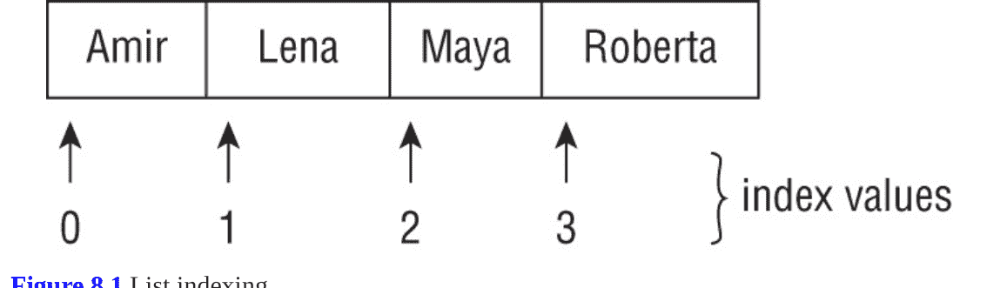

在代码清单 8.4 中，我们展示了一个包含三个名字的列表，然后使用索引访问每个名字。

```
代码清单 8.4
通过索引访问名字

list_of_strings = ["Kate", "Jennifer", "Mike"]
print(list_of_strings)

#使用 [] 和从零开始的索引访问列表中的第一个元素
person_1 = list_of_strings[0] #访问列表的第一个元素
print(person_1)

person_2 = list_of_strings[1] #访问列表的第二个元素
print(person_2)

person_3 = list_of_strings[2] #访问列表的第三个（也是最后一个）元素
print(person_3)

#这将导致错误，因为列表中只有三个项目
person_4 = list_of_strings[3]
```

请注意，此代码清单包含注释，说明正在发生什么。当你运行此代码清单时，你将得到以下输出，其中包含一个错误：

```
['Kate', 'Jennifer', 'Mike']
Kate
Jennifer
Mike
---------------------------------------------------------------------------
IndexError                                Traceback (most recent call last)

<ipython-input-5-c7ee4853e173> in <module>
     14 
     15 #这将导致错误，因为列表中只有三个项目
---> 16 person_4 = list_of_strings[3]

IndexError: list index out of range
```

你可以看到，一个包含三个名字的列表被创建了。因为索引编号从零开始，所以它们的索引范围是从 0 到 2。创建 `list_of_strings` 后，调用 `print` 方法以显示列表确实已创建，并且三个名字已被添加。每个元素通过使用列表名称后跟方括号和索引号来访问。该元素被保存到一个新变量中，然后被打印出来。第一个元素 `list_of_strings[0]` 被赋值给 `person_1`，然后被打印出来。你可以看到它是成功的，因为显示了名字 Kate。第二个和第三个元素也做了同样的处理。

当程序尝试将 `list_of_strings[3]` 赋值给 `person_4` 时，发生了错误。使用索引 3 试图找到一个超出我们列表末尾的名字，如图 8.2 所示。因此，Python 显示了一个错误。如果我们查看错误信息，它甚至指出“list index out of range”（列表索引超出范围）。

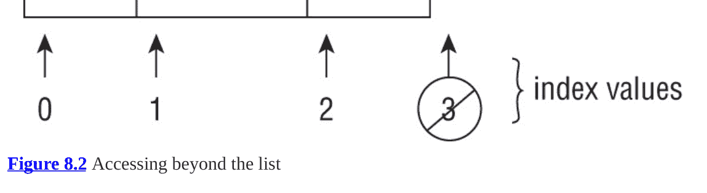

图 8.2 访问超出列表范围

> **注意** 一个常见的错误是尝试使用列表的长度而不是长度减 1 来访问列表的最后一项。这将导致错误，因为这将尝试访问超出列表末尾的元素。请记住，索引计数从 0 开始。

为了使我们的 ERP 应用程序能够高效地使用字符串和列表，它必须能够选择列表中的特定项目进行分析或操作，这一点至关重要。当我们从客户那里获取其账户详情的输入，或者从银行员工那里获取有关客户账户问题的信息时，我们希望确保选择了正确的信息。我们的 ERP 可以通过列表索引来处理和操作列表中的项目。[代码清单 8.5](Listing 8.5) 展示了一个非常简单的例子，说明如何在列表中使用银行客户信息。

```
代码清单 8.5
列表中的客户详情

customer_details = ["Ava McDougle", "ava@email.com", "123-456-7890"]

name = customer_details[0]  # 访问列表的第一个元素
print(name)

email = customer_details[1] # 访问列表的第二个元素
print(email)

phonenumber = customer_details[2] # 访问第三个/最后一个元素
print(phonenumber)
```

这段代码只是展示了一个在列表中使用客户信息的例子。你可以看到，列表中的第一个元素是名字，第二个是电子邮件地址，第三个是电话号码。代码将这些项目中的每一个从列表中复制出来，然后打印它们。

> **注意** 在[代码清单 8.5](Listing 8.5)中，每个列表元素都是一个字符串。我们也可以通过创建一个包含多个 `customer_detail` 列表的列表来创建一个包含客户列表的列表。那将是一个列表的列表。

## 列表中的负索引

使用索引，我们可以轻松地根据元素在列表中的位置获取任何元素。如果我们使用从列表开头（也称为头部）开始的位置，尝试按位置检索元素是很简单的。

但如果我们想获取列表的最后一个元素呢？这是如何实现的呢？

Python 支持负索引，它从列表的末尾开始计数，如[图 8.3](#)所示。重要的是要记住，索引值 -1 始终引用列表中的最后一项，无论列表中有多少项。连续的负值从那里向后计数，因此 -2 是倒数第二项，-3 是倒数第三项，依此类推。如果负索引值引用了一个不存在的项目，Python 将报告错误。在[代码清单 8.6](#)中，我们探讨了负索引。

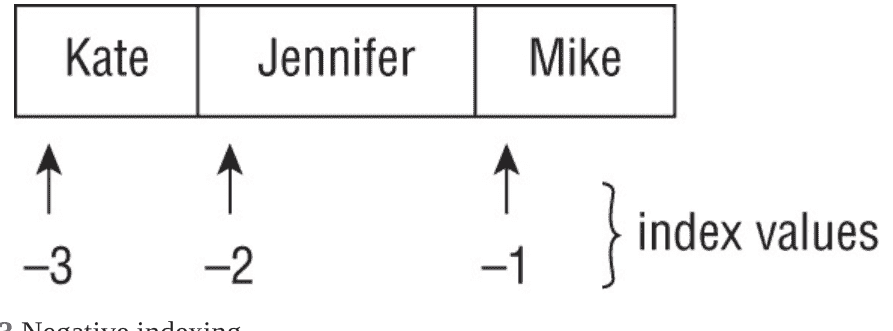

**图 8.3** 负索引

```
python
# 代码清单 8.6
# 访问列表的末尾

list_of_strings = ["Kate", "Jennifer", "Mike"]
person_1 = list_of_strings[-1] #-1 指向列表中的最后一个元素
print(person_1)

person_2 = list_of_strings[-2] #-2 指向列表中的倒数第二个元素
print(person_2)

person_3 = list_of_strings[-3] #-3 指向列表中的倒数第三个元素
print(person_3)

# 这将报告错误，因为列表中只有三个项目
person_4 = list_of_strings[-4]
```

[代码清单 8.6](#) 与[代码清单 8.4](#) 非常相似，不同之处在于元素是从列表末尾访问的，并且随着负索引号的每次变化，我们向列表开头移动，如代码清单中的注释所示。与[代码清单 8.4](#) 类似，当索引达到超出列表的点时，在本例中是 -4，会显示一个错误。在下面的输出中，我们看到名字以相反的顺序显示，然后最终显示错误：

```
Mike
Jennifer
Kate
----------------------------------------
IndexError Traceback (most recent call last)
<ipython-input-8-a726a73b85c5 > in <module>
     10 
     11 # 这将报告错误，因为列表中只有三个项目
---> 12 person_4 = list_of_strings[-4]

IndexError: list index out of range
```

ERP 银行应用程序几乎总是在处理数据以进行分析和操作，从而为组织提供最高效和最有效的信息。例如，我们可能对客户最近执行的几笔交易感兴趣，以了解他们最近的账户活动。如果必须计算长度然后减去预期的字符数，在索引末尾收集信息可能很复杂，但 Python 通过负索引使这变得容易得多。

使用负索引，我们可以快速从列表或字符串的末尾读取，而无需计算任何长度。只需使用负值，Python 就会自动理解你想要移动到字符串的末尾，然后回退适当的元素。[代码清单 8.7](#) 再次展示了一个简单的例子。这一次，我们有一个包含客户最近账户活动的列表。从该列表中，我们可以轻松地显示客户执行的最后三笔交易。

```
代码清单 8.7
访问客户的最后交易

transactions = [
    "1AB23456C0011523D,+$25.00",
    "1AB23456C5541225D,-$56.00",
    "1AB23456C8613005D,-$393.00",
    "1AB23456C3542215D,+$544.23",
    "1AB23456C0145125D,-$5.55",
    "1AB23456C3485125D,-$8.76"]

print("Last transaction: " + transactions[-1])
print("2nd from last transaction: " + transactions[-2])
print("3rd from last transaction: " + transactions[-3])
```

执行此代码清单时，将显示以下内容：

```
Last transaction: 1AB23456C3485125D,-$8.76
2nd from last transaction: 1AB23456C0145125D,-$5.55
3rd from last transaction: 1AB23456C3542215D,+$544.23
```

请注意，此代码清单中的每笔交易都以字符串形式呈现。这些字符串中的每一个都可以被操作以提取交易 ID 和金额。

## 列表切片

索引允许我们访问或更新列表中的单个单元格；然而，有时可能需要从列表中获取数据子集。在第7课中，我们看到字符串可以被切片以提取字符子集。同样，也可以对列表元素进行切片以获取子集。从列表中提取单个切片时，它总是包含连续的元素。

你可以指定切片的起始位置和结束位置：

```
slice[start:end]
```

你还可以指定步长，这允许你按特定倍数进行切片，例如，只取每第三个元素：

```
slice[start:end:step]
```

Python支持列表切片，允许我们用单个命令从列表中检索多个元素。表8.2总结了切片时使用的参数。

**表8.2 切片参数**

| 参数 | 描述 |
| :--- | :--- |
| *start* | 指定起始整数，其位置表示切片的开始位置。此值是可选的。 |
| *end* | 一个整数，表示切片结束的位置。 |
| *step* | 一个整数，表示切片的“步长”或在获取值之间跳过的位置数。默认值为1。此值也是可选的。 |

让我们看看如何对实际列表进行切片的示例。我们有一个列表 `mySlicedList`，其中按字母顺序包含字母 a 到 i。我们想创建一个列表副本，包含位置1到5的数据。图8.4显示了 `mySlicedList` 上的索引。

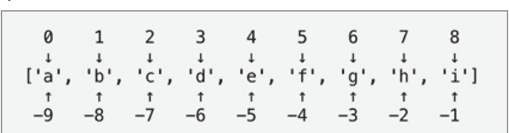

**图8.4 mySlicedList 索引**

遵循前面显示的语法（`my_SlicedList[start:end]`），我们使用：

`my_SlicedList [1:5]`

在这个例子中，**start** 是要包含的第一个元素的索引，**end** 是要停止的项的索引，*不包含在切片中*。因此，`my_SlicedList [1:5]` 返回 `['b', 'c', 'd', 'e']`。这通过运行清单8.8得到确认。

```
清单 8.8
切片字符列表

my_SlicedList = ['a', 'b', 'c', 'd', 'e', 'f', 'g', 'h', 'i']
print(my_SlicedList)
print(my_SlicedList[1:5])
```

生成的输出是：

['a', 'b', 'c', 'd', 'e', 'f', 'g', 'h', 'i']
['b', 'c', 'd', 'e']

我们也可以使用数字而不是字符串作为值。例如，清单8.9中的代码将创建一个名为 `myList` 的列表，其中包含从1开始到11结束的连续数字。

```
清单 8.9
切片数字列表

myList = list(range(1, 11))

print(myList)

mySlicedList = myList[2:6]
print(mySlicedList)
```

我们之前使用过 `range()` 方法。你可能还记得，它生成一个数字列表。在这种情况下，生成一个从1到10（比11小1）的数字列表。当打印 `myList` 时，你可以在输出中看到这一点：

[1, 2, 3, 4, 5, 6, 7, 8, 9, 10]
[3, 4, 5, 6]

你还可以在输出中看到，我们的切片是 `[2:6]` 并赋值给 `mySlicedList`。当我们打印 `mySlicedList` 时，你得到的值从索引位置2（值为3）开始，以及所有后续值，直到但不包括索引位置6的值。记住索引从0开始。

清单8.10展示了另一个例子，其中可以对一组列表进行切片，以从两个对应的列表中创建信息组，一个包含交易日期，另一个包含交易金额。这个列表更复杂。

```
清单 8.10
切片包含对应数据的列表集

trans_date=['2021-04-03', '2021-12-03',
            '2021-13-03', '2021-15-03', '2021-22-03',
            '2021-25-03', '2021-30-03', '2021-03-04']
trans_amt=[2.45,4.50,5.75,10.00,12.30,4.25,15.25,16.20]
print(trans_date)

input_to_date = input("What end date would you like to see all the transaction amounts from? (format: YYYY-DD-MM): ")

trans_date_to = trans_date.index(input_to_date)
#print(trans_date_to)

print(trans_amt[0: int(trans_date_to)+1])
```

在这段代码中，第一个列表（`trans_dates`）中有交易日期，第二个列表（`trans_amt`）中有与这些日期对应的交易金额。`trans_dates` 中索引0处的日期对应于 `trans_amt` 列表中索引0处的金额。因此，在2021-04-03，金额为2.45。你可以看到这两个列表是在清单开头创建的。

然后，清单使用 `print(trans_date)` 打印所有交易日期，接着是一个提示，要求用户输入其中一个日期。程序随后将进行一些计算，并打印直到并包括该日期的所有金额。运行清单并输入第三个日期2021-13-03，将打印前三个金额：

```
['2021-04-03', '2021-12-03', '2021-13-03', '2021-15-03', '2021-22-03', '2021-25-03', '2021-30-03', '2021-03-04']
What end date would you like to see all the transaction amounts from?
(format:YYYY-DD-MM): 2021-13-03
[2.45, 4.5, 5.75]
```

仔细查看代码，你会看到一个 `print` 函数被注释掉了。如果你通过移除 `#` 符号取消注释该行，那么 `trans_date_to` 的值也会被打印出来。这个值是在前一行中确定的，其中使用了 `index()` 函数来搜索 `trans_date` 列表，试图匹配与用户输入值（`input_to_date`）相等的元素。调用 `trans_date.index()` 将返回它找到的第一个等于用户输入值的元素的索引号。在输入2021-13-03的情况下，这将是2。

程序中的下一行：

```
trans_amt[0: int(trans_date_to)+1]
```

使用索引值对 `trans_amt` 列表进行切片，从开头提取项目，直到并包括输入日期的相同索引值。因为 `trans_date_to` 中的值是索引值，所以我们需要将其加1。

## 使用切片对象

切片对象用于指定如何切片序列。你可以使用 `slice()` 获取这个项目子集。与用于创建数据的 `range()` 不同，列表切片用于现有列表。

> **注意** `slice()` 本质上是一个函数。在Python中，函数只是一段代码块，只有在调用函数时才会运行。使用函数时，我们将数据（称为参数）传递给函数，然后允许函数返回数据作为结果。我们将在第13课中更详细地介绍函数。这将包括学习如何创建我们自己的函数。

`slice()` 函数将返回一个切片对象，该对象可用于切片列表。清单8.11是清单8.10的修改版本，它使用对 `slice()` 函数的调用来创建切片对象，然后将其用于 `trans_amt` 列表。

```
清单 8.11
使用 slice()

trans_date=['2021-04-03', '2021-12-03',
    '2021-13-03', '2021-15-03', '2021-22-03',
    '2021-25-03', '2021-30-03', '2021-03-04']
trans_amt=[2.45,4.50,5.75,10.00,12.30,4.25,15.25,16.20]

print(trans_date)

input_to_date = input("What end date would you like to see all the transaction amounts from? (format: YYYY-DD-MM): ")

trans_date_to = trans_date.index(input_to_date)
#print(trans_date_to)

slicenum = slice(0, int(trans_date_to)+1)
slicelist = trans_amt[slicenum]

print(slicelist)
```

在这种情况下，添加了两行：

```
slicenum = slice(0, int(trans_date_to)+1)
slicelist = trans_amt[slicenum]
```

在第一行中，创建了一个名为 `slicenum` 的切片对象，它表示我们想要切片的索引范围。这是从0到 `trans_date_to` 之后的一个元素。由于 `trans_date_to` 是2，这将是从0到3。然后，这个切片对象 `slicenum` 被用作方括号之间的值来切片 `trans_amt` 列表，并创建一个名为 `slicelist` 的切片列表：

```
slicenum = slice(0, int(trans_date_to)+1)
slicelist = trans_amt[slicenum]
```

清单8.11的输出与清单8.10的输出完全相同。我们只是有两种方法来达到相同的结果。

在处理我们的银行应用程序时，也有多种方法可以完成事情。包含人口统计数据的大型数据集在组织中很常见。银行应用程序在任何给定时间都可能处理数百甚至数千个客户，使用诸如列表切片之类的元素并不少见。`slice()` 函数允许我们从较大的数据集中返回指定的数据子集。例如，我们可能想要创建当天前56个客户的子列表。我们可以使用 `slice` 函数以及列表的索引来返回该数据：

```
y = ("customer 1", "customer 2", "customer 2",........"customer 100", )
x = slice(0, 56)
print(y[x]) # 打印前56个客户的姓名
```

## 向列表添加项目

列表是可变的；换句话说，我们可以通过添加新值或删除现有值来更改已定义列表的大小。我们使用 `append()` 方法向现有列表添加项目。每个新项目都添加到现有列表的末尾。`append()` 方法通过简单地传递我们想要添加的值来调用：

```
list.append(value)
```

在清单8.12中，我们从一个空列表开始，然后一次向列表中添加三个名称。

## 代码清单 8.12
向列表中追加名称

```python
list_of_names = [] #创建一个空列表
print(list_of_names)

list_of_names.append("Greg")
print(list_of_names)

list_of_names.append("Mario")
print(list_of_names)

list_of_names.append("Maria")
print(list_of_names)
```

这个代码清单应该很容易理解。首先创建并打印了空列表 `list_of_names`。接着，三次调用 `append()` 方法，并在每次调用后都调用了打印函数。从输出中可以看到，每次追加后，列表中都会添加一个新项：

```
[]
['Greg']
['Greg', 'Mario']
['Greg', 'Mario', 'Maria']
```

如果我们需要在我们的 ERP 银行应用程序中添加客户信息，我们可以提示用户输入数据，然后使用 `append()` 方法将其添加，如代码清单 8.13 所示。

## 代码清单 8.13
将客户信息捕获到列表中

```python
info = [] #info 列表最初是空的
info.append(input("请输入客户的名： "))
info.append(input("请输入客户的姓： "))
info.append(input("请输入客户的账号： "))
info.append(input("请输入客户的账户余额： "))

print(info)
```

在这个代码清单中，我们添加了以下客户信息项：

- 客户的名
- 客户的姓
- 客户账号
- 账户余额

每一项都按照我们希望它们被添加到列表中的顺序，一次添加一项。一旦用户输入了所有四项，信息就会被打印出来：

```
请输入客户的名： **John**
请输入客户的姓： **Adams**
请输入客户的账号： **11-11111-1**
请输入客户的账户余额： **340.59**
['John', 'Adams', '11-11111-1', '340.59']
```

## 插入列表项

列表类型包含多种用于插入和删除元素的方法。另一种方法是 `insert()`，其语法如下：

```
list.insert(index, obj)
```

如前面的语法所示，`insert()` 方法期望一个整数索引和一个新元素作为参数。索引是对象 (`obj`) 需要被插入的索引值（位置）。

> **注意** 方法是“属于”一个对象的函数。

在代码清单 8.14 中，为了说明 `insert()`，我们从一个包含两个项的列表开始。然后，我们将一个新项作为列表的第一项（索引 0）添加，并将第四个项添加到列表的第三个位置（索引 2）。

## 代码清单 8.14
向列表中插入项

```python
list_of_names = ["John", "Mike"]
print(list_of_names)

list_of_names.insert(0, "Amy")  #将 Amy 作为第一项插入，索引为 0
print(list_of_names)

list_of_names.insert(2, "Mario") #将 Mario 作为第三项插入，索引为 2
print(list_of_names)
```

运行此代码清单时，你会看到列表首先被打印出来，然后在每次插入后重新打印：

```
['John', 'Mike']
['Amy', 'John', 'Mike']
['Amy', 'John', 'Mario', 'Mike']
```

如图所示，Amy 被添加到列表的开头（索引 0），然后 Mario 被添加到第三个位置，即索引位置 2。

对于我们的银行场景，随着银行获得新客户或现有客户添加新信息或进行新交易，我们需要更新我们的记录。因此，银行的 ERP 应用程序需要能够在获取新信息时将其添加到客户记录中。ERP 应用程序可以通过 `insert()` 有效地添加新数据元素，而无需删除或重新创建整个列表。这些更新后的信息可以是关于员工或客户的，然后被推送到数据库中进行长期存储。

代码清单 8.15 向我们的客户记录中添加了更多信息，如地址和电话号码。

## 代码清单 8.15
插入额外的客户信息

```python
info = ["John", "Smith", "Boston", "Junior Software Developer"]
info.insert(2, input("请输入地址： "))
info.insert(3, input("请输入电话号码： "))

#此代码应最后执行
print("名: " + info[0])
print("姓: " + info[1])
print("地址: " + info[2])
print("电话号码: " + info[3])
print("城市: " + info[4])
print("职业: " + info[5])
```

在这个代码清单中，你可以看到我们的客户信息 (`info`) 存储在一个列表中，包含名、姓、城市和职业。我们将向此列表添加一个地址和电话号码。系统会提示用户输入这些信息，然后使用 `insert()` 将其添加到姓和城市之间。

`input()` 方法被包含在 `insert()` 方法中，以使代码更紧凑。`insert()` 将使用输入语句返回的值作为其第二个参数。这比执行多个步骤更高效，且同样清晰：

```python
address = input("请输入地址： ")
info.insert(2,address)
phonenumber = input("请输入电话号码： ")
info.insert(3,phonenumber)
```

运行此代码清单时，将显示类似以下内容：

```
请输入地址： **123 Some Street**
请输入电话号码： **317-555-1212**
名: John
姓: Smith
地址: 123 Some Street
电话号码: 317-555-1212
城市: Boston
职业: Junior Software Developer
```

## 删除列表项

我们可以使用 `remove()` 方法从列表中删除项。`remove()` 方法的语法是：

```
remove(value)
```

`remove()` 方法接受值（而不是索引）作为其参数。在列表中值出现多次的情况下，`remove()` 方法只删除该值的第一次出现。例如，我们可能从一个名称列表开始，其中一个名称在列表中包含两次。当我们使用 `remove()` 从列表中删除该值时，只有第一个实例被影响，第二个实例保留在列表中。代码清单 8.16 使用名称“Layla David”说明了这一点。

## 代码清单 8.16
从列表中删除一个名称

```python
list_of_names = ["John Smith", "Layla David", "Maria Smith", "Layla David"]
print(list_of_names)
list_of_names.remove("Layla David")
print(list_of_names)
```

此代码清单创建了一个名称列表 (`list_of_names`)，然后打印它。使用 `remove()` 方法，删除了一个名称（“Layla David”）。然后列表被第二次打印。从最终输出中可以看到，只有该名称的第一个实例被删除：

```
['John Smith', 'Layla David', 'Maria Smith', 'Layla David']
['John Smith', 'Maria Smith', 'Layla David']
```

我们可以想象这样一种场景：我们的 ERP 银行应用程序由于用户错误或导入数据而捕获了一些不正确的信息。我们可以添加使用 `remove()` 方法的函数，以确保我们能够控制这些信息并可以删除不正确的元素。这用于错误纠正。代码清单 8.17 提供了一个极其简化的示例，展示了如何从列表中删除多个项以消除重复项。

## 代码清单 8.17
清理列表

```python
input_list = ["Haythem", "Mike", 1, "Layla",
  "Livia", "Layla", 2, 1, 2, 3, "Mike",
  "Jesse", "Haythem"]
input_list.remove(1)
input_list.remove(2)
input_list.remove("Layla")
input_list.remove("Mike")
input_list.remove("Haythem")
print(input_list)
```

运行此代码清单后，我们可以看到重复项已被删除：

```
['Livia', 'Layla', 1, 2, 3, 'Mike', 'Jesse', 'Haythem']
```

## 删除与移除项

值得注意的是，`remove()` 要求你传递一个值。如果你想根据索引位置从列表中删除一个项，那么你可以使用 `del` 关键字来删除该项。使用 `del` 关键字的语法是：

```
del list[index]
```

请注意，如果你不包含索引，`del` 关键字也可以删除整个列表。例如，以下代码删除名为 `input_list` 的列表中第二个索引位置的项：

```
del input_list[2]
```

然而，以下代码删除整个 `input_list`：

```
del input_list
```

代码清单 8.18 使用一个水果列表说明了 `del` 的用法。首先展示列表，然后删除两个项。

## 代码清单 8.18
删除产品

```python
produce:list = ["Apple", "Banana", "Cherry",
    "Date", "Eggplant", "Fig", "Apple", "Grape "]

print(produce:list)

del produce:list[6]

print(produce:list)
```

执行此代码清单时，它会打印出创建的原始列表。然后，在再次打印列表之前，它会移除索引位置为 6 的项。输出显示第二个“Apple”实例已被移除：

```
['Apple', 'Banana', 'Cherry', 'Date', 'Eggplant', 'Fig', 'Apple', 'Grape ']
['Apple', 'Banana', 'Cherry', 'Date', 'Eggplant', 'Fig', 'Grape ']
```

> 注意 不要忘记索引值是从 0 开始的。我们反复提及这一点，因为这是许多 Python 初学者常犯的错误。

## 使用弹出而非删除

在我们学习从列表中移除项时，讨论 `pop()` 方法会很有帮助。这个方法就像是 `remove()` 方法和 `del` 关键字的结合体。`pop()` 方法的语法如下：

```
pop(index)
```

此外，`pop()` 方法会返回从列表中移除的项的值。代码清单 8.19 是使用 `pop()` 而不是 `del` 关键字重写的代码清单 8.18。调用 `pop()` 返回的值也被捕获到一个名为 `val` 的变量中，并在代码清单末尾显示。

## 代码清单 8.19
从列表中弹出产品

```python
produce:list = ["Apple", "Banana", "Cherry",
    "Date", "Eggplant", "Fig", "Apple", "Grape "]

print(produce:list)

val = produce:list.pop(6)

print(produce:list)
print(val)
```

`produce:list` 的输出是相同的。我们可以看到索引位置为 6 的第二个 Apple 被移除并返回给了变量 `val`：

```
['Apple', 'Banana', 'Cherry', 'Date', 'Eggplant', 'Fig', 'Apple', 'Grape ']
['Apple', 'Banana', 'Cherry', 'Date', 'Eggplant', 'Fig', 'Grape ']
Apple
```

现在你已经看到了从列表中移除项的三种方法。表 8.3 总结了它们的区别。

表 8.3 从列表中移除项的方法比较

| remove() | pop() | del |
| --- | --- | --- |
| 方法 | 方法 | 关键字 |
| 使用值 | 使用索引 | 使用索引 |
| 移除单个项 | 移除单个项 | 移除单个项或整个列表 |
| 无返回值 | 返回被移除的值 | 无返回值 |

## 连接列表

我们可以使用 `+` 运算符在 Python 中连接两个或多个列表。结果是一个包含原始列表中所有项的新列表。连接项的语法是：

```
list1 + list2 + list3
```

代码清单 8.20 展示了一个示例，我们从两个列表开始，每个列表包含两个名称。然后我们将这两个列表连接成一个新的第三个列表，其中包含原始两个列表中的所有项。

## 代码清单 8.20
连接列表

```python
list_of_names_1 = ["Haythem", "Mike"]
print(list_of_names_1)

list_of_names_2 = ["Jesse", "Layla"]
print(list_of_names_2)

list_of_names = list_of_names_1 + list_of_names_2
print(list_of_names)
```

当此程序执行时，创建的两个列表会分别打印出来，以便我们查看其值。然后，通过使用 `+` 连接原始两个列表，创建了一个名为 `list_of_names` 的新列表。接着显示这个合并后的列表，以确认连接已发生：

```
['Haythem', 'Mike']
['Jesse', 'Layla']
['Haythem', 'Mike', 'Jesse', 'Layla']
```

连接运算符和列表如何在我们的 ERP 银行业务中使用呢？随着新用户注册我们的银行服务，我们将在注册过程的不同阶段收集他们的不同信息。例如，我们可能需要他们的用户名、密码、正式姓名、地址、出生日期、社会安全号码等，所有这些都在注册过程的不同阶段收集。然而，在过程结束时，我们希望将为该客户收集的所有信息组合起来，并将其保存为一个引用客户账号的单一列表。Python 允许我们通过使用 `+` 运算符将多个列表组合成一个来轻松实现这一点。

## 列表推导式

基于现有列表创建列表的另一个选项是列表推导式，这是一种使用现有值创建列表的简写方式。例如，假设我们想创建一个包含数字 1-10 的列表。一个选项是使用 `for` 循环来构建列表，如代码清单 8.21 所示。

## 代码清单 8.21
列表生成

```python
numbers = list()

for i in range(0,11):
    numbers.append(i)

print(numbers)
```

在此脚本中，我们从一个名为 `numbers` 的空列表开始。然后我们使用 `for` 和 `range()` 来遍历 `range` 函数中的值，并将每个值单独追加到列表中，产生以下输出：

`[0, 1, 2, 3, 4, 5, 6, 7, 8, 9, 10]`

我们可以使用列表推导式来生成相同的列表，但代码更少，使用代码清单 8.22 中展示的语法。

## 代码清单 8.22
使用 range 的列表推导式

```python
numbers = [i for i in range(0,11)]
print(numbers)
```

在此代码清单中，`for` 循环嵌入在列表定义中，使用相同的 `range()` 函数生成我们希望包含在列表中的值。

我们可以扩展此功能，使用如下语法基于现有列表生成新列表，其中 `transform()` 可以是应用于现有列表中元素以生成新列表新值的任何函数：

`New_list = [transform(element) for element in old_list]`

例如，你可能有一个名称列表，并希望创建一个包含现有名称大写等效项的新列表。我们可以使用列表推导式来实现，如代码清单 8.23 所示。

## 代码清单 8.23
使用现有列表的列表推导式

```python
names = ["Miriam","Mary","Dave","Nick"]

names_upper = [name.upper() for name in names]
print(names_upper)
```

这创建了一个名为 `names_upper` 的新列表，包含以下值：
['MIRIAM', 'MARY', 'DAVE', 'NICK']
如果不使用列表推导式方法，代码会更长，如代码清单 8.24 所示。

## 代码清单 8.24
不使用列表推导式的大写新列表

```python
names = ["Miriam","Mary","Dave","Nick"]
names_upper= []

for name in names:
    names_upper.append(name.upper())

print(names_upper)
```

列表推导式还允许使用条件语句来识别应包含在新列表中的值。在代码清单 8.25 中，我们从一个包含正数和负数的列表开始，然后创建空列表 `positive` 和 `negative`。接着我们使用 `for` 和 `in` 包含一个条件语句，以识别 `numbers` 列表中的哪些值应添加到我们的每个新列表中。

## 代码清单 8.25
带条件语句的列表推导式

```python
numbers = [1,2,-1,6,-5,-2]

positive = []
negative = []

positive = [number for number in numbers if number>=0]
negative = [number for number in numbers if number<0]

print(positive)
print(negative)
```

输出显示数字被添加到了正确的列表中：

```
[1, 2, 6]
[-1, -5, -2]
```

如代码清单 8.26 所示，我们还可以在列表推导式操作中包含 `if-else` 语句，允许我们使用单个语句来评估原始列表中的每个值，并根据该值应用转换。

## 代码清单 8.26
带 if-else 的列表推导式

```python
numbers = [1,2,-1,6,-5,-2]
label = ["positive" if number>=0 else "negative" for number in numbers]
print(label)
```

在这种情况下，Python 检查 `numbers` 列表中的每个值，并根据数字的值将其替换为标签“positive”或“negative”。新的标签列表包含操作的输出：

```
['positive', 'positive', 'negative', 'positive', 'negative', 'negative']
```

## 列表排序

Python 包含 `sort` 方法，允许我们对列表的值进行排序或复制列表。默认情况下，`sort` 方法将按字母顺序（对于文本值，如代码清单 8.27 所示）或升序（对于数字）对列表中的值进行排序。

## 列表排序

本脚本展示了一个简单的姓名列表，然后对其调用`sort()`方法。结果是一个包含相同姓名但按字母顺序排列的列表：

```python
names = ["Miriam", "Mary", "Dave", "Nick"]
print(names)
names.sort()
print(names)
```

```
['Miriam', 'Mary', 'Dave', 'Nick']
['Dave', 'Mary', 'Miriam', 'Nick']
```

但这里有一个重要的点：这会替换原始列表，因此在转换过程中，项目最初出现的顺序就丢失了。

# 复制列表

如果我们想复制一个列表，一个选项是将列表赋值给一个新变量：

```python
a = [1, 2, 3]
b = a
```

这种方法意味着列表保持同步，因此如果我们更改其中一个列表，另一个列表将自动反映这些更改，如清单 8.28 所示。

```python
# 清单 8.28
# 更新复制的列表

a = [1, 2, 3]
b = a

a.append(4)

print(a)
print(b)
```

即使清单 8.28 中的代码没有向列表 `b` 追加值，新值 `4` 也会出现在两个列表中：

```
[1, 2, 3, 4]
[1, 2, 3, 4]
```

如果我们希望列表保持独立（即 `b` 是 `a` 的真正副本，当 `a` 更新时 `b` 不会更新），我们有两个选择。清单 8.29 中显示的较长方法使用 `for` 循环将列表 `a` 中的每个值追加到列表 `b`。

```python
# 清单 8.29
# 复制列表

a = [1, 2, 3]
b = []

for i in a:
    b.append(i)

print(a)
print(b)

a[0] = 0

print(a)
print(b)
```

输出显示，虽然 `b` 最初与 `a` 相同，但当我们更改列表 `a` 中的第一个项目时，列表 `b` 中的第一个项目并未更改：

```
[1, 2, 3]
[1, 2, 3]
[0, 2, 3]
[1, 2, 3]
```

执行此类复制操作更有效的方法是使用 `copy()` 函数，如清单 8.30 所示，它创建一个现有列表的新的、独立的副本。

```python
# 清单 8.30
# copy 方法

a = [1, 2, 3]
b = a.copy()
print(a)
print(b)

a[0] = 0

print(a)
print(b)
```

与清单 8.29 中的方法一样，清单 8.30 的输出显示列表 `b` 独立于列表 `a`，因为我们可以更改一个列表中的值而不更改另一个列表：

```
[1, 2, 3]
[1, 2, 3]
[0, 2, 3]
[1, 2, 3]
```

# 总结

本课介绍了 Python 编程语言中使用的几种数据结构，然后深入探讨了列表数据结构。这些数据结构用于将集合视为单个实体，这是单个变量的一个缺点。

在本课中，我们使用列表来存储数据集合，并从集合中检索特定值。与本课密切相关的是索引值的介绍。索引值指的是有序列表中的一个位置。

现在您已经完成了本课，您应该能够：

- 解释 Python 开发人员可用的几种数据结构。
- 使用列表存储数据集合，并从集合中检索特定值。
- 在列表中添加、删除或更改项目。
- 切片、复制、排序、组合和操作列表。

在下一课中，您将学习一种类似的数据结构——元组，并了解它与列表的区别。

## 练习

以下练习允许您展示本课的目标。您应该完成每个练习，并确保代码运行无误。这些练习旨在测试您对当前课程主题的理解。

按照描述完成每个练习，并在开始下一个练习之前运行代码以确保其按预期工作。本课的练习包括：

- **练习 1：关于你的一切**
- **练习 2：购物清单**
- **练习 3：列表删除**
- **练习 4：列表修改**
- **练习 5：一个完整的列表程序**

### 练习 1：关于你的一切

提示用户回答一系列关于他们自己的 3-5 个问题（例如他们的姓名、年龄、生日或居住地），并将答案保存在列表中。向用户显示结果。

### 练习 2：购物清单

向用户展示一个现有的项目列表（例如杂货店的购物清单），并提示用户添加 2-4 个新项目到列表中。用新项目更新列表并显示更新后的列表。

### 练习 3：列表删除

向用户展示一个包含 7-9 个项目的列表（例如在前面练习中创建的列表）。提示用户输入一个要从列表中删除的项目。从列表中删除指定的项目并显示更新后的列表。

### 练习 4：列表修改

向用户展示一个包含 7-9 个项目的列表（例如在前面练习中创建的列表）。提示用户从列表中选择一个项目进行更新，以及该项目的新值。更改该项目的值并向用户显示新列表。

### 练习 5：一个完整的列表程序

此练习通过让您将所学内容整合到一个完整的程序中来检查您的知识和准备情况。创建一个新程序，完成以下所有操作：

- 创建一个至少包含五个元素的列表。
- 询问用户的名字。
- 询问用户的姓氏。
- 询问用户一个值。
- 询问用户一个操作（“add”或“remove”）。
- 如果操作是“remove”：
    - 如果该值存在于列表中，则从列表中删除该值，并向用户显示更新后的列表。
    - 如果该值不存在于列表中，则显示一条用户友好的错误消息。
- 如果操作是“add”：
    - 如果该值存在于列表中，则显示一条用户友好的错误消息。
    - 如果该值不存在于列表中，则将该值添加到列表中，并向用户显示更新后的列表。
- 重复直到用户输入“quit”。
- 当用户输入“quit”时，显示原始列表、更新后的最终版本列表以及两个列表之间的差异，以及他们的名字和姓氏连接在一起。

## 第 9 课：理解基本数据结构：元组

在本课中，我们继续探讨理解 Python 中的基本数据类型；但是，我们从列表转向元组。在上一课中，您学习了列表，它存储一系列数据值。您了解到存储在列表中的值不必是唯一的，并且您可以添加和删除它们。在本课中，重点转向元组，它是一组值的集合，仍然允许有重复项；但是，这些值是有序且不可更改的。

## 学习目标

在本课结束时，您将能够：

- 使用元组存储数据集合。
- 使用元组检索值。
- 使用索引和元组。
- 切片和组合元组。
- 理解不可变性。
- 搜索元组。

### 元组和元组操作

元组是在 Python 中保存一组相关数据的另一种方式。元组和列表之间最大的区别在于元组是*不可变的*，这意味着在定义元组后，我们无法向元组添加或删除项目。但是，与列表一样，我们可以：

- 存储任何数据类型的值，包括同一元组中的不同数据类型。
- 计算元组的长度。
- 使用索引值从元组中检索特定项目。
- 切片元组以同时检索多个项目。

元组的基本语法是：

```python
thisTuple = ("element1", "element2", "element3")
```

### 元组的语法与列表的语法

与列表一样，元组是 Python 中的一种基本数据结构类型，创建元组的过程与创建列表几乎相同。唯一的区别是，对于元组，我们使用圆括号对值进行分组，而不是创建列表时使用的方括号。我们还必须在首次定义时完整地创建元组。与列表一样，我们可以在元组中使用任何数据类型，并且可以在单个元组中混合数据类型。

要创建一个简单的元组来保存一个人的信息，我们可以这样做：

```python
info = ("Maria", "Smith", 31, "123 Main Street", "000-00-0000")
```

这应该看起来与我们在第 8 课中用于列表的方法非常相似，只是我们使用圆括号而不是方括号（`[]`）来对项目进行分组。清单 9.1 使用了刚刚显示的 `info` 元组。

```python
# 清单 9.1
# 创建元组

age_range = (18, 120)
# 仅包含数字的元组
print(age_range)
print(type(age_range))

# 包含字符串和数字的元组
info = ("Maria", "Smith", 31, "123 Main Street", "000-00-0000")
print(info)
print(type(info))
```

在此示例中，创建了一个仅包含数字的元组，以及第二个元组（我们的 `info` 元组），其中包含字符串和数字。除了创建元组外，清单还打印了存储的值以及每个元组的类型：

```
(18, 120)
<class 'tuple'>
('Maria', 'Smith', 31, '123 Main Street', '000-00-0000')
<class 'tuple'>
```

在编程我们的 ERP 银行应用程序时，了解何时应该使用元组而不是列表非常重要。通常，元组比列表更快。此外，当数据不应更改且需要不可变时，会使用元组。元组可用于保存客户信息，类似于清单 9.2 中所示的内容。

```python
# 清单 9.2
# 包含银行客户信息的元组

Customer = ("John", "Smith", 1005162, 34455.45)
print(Customer)
```

虽然[清单 9.2](https://example.com)非常简单，但你可以看到它包含一个元组，其中包含以下信息：

- 客户的名字
- 客户的姓氏
- 账户号码
- 账户余额

运行该清单会打印出结果：
`('John', 'Smith', 1005162, 34455.45)`

## 元组长度

与列表一样，我们可以使用`len()`方法来计算元组中的元素数量。语法是：
`len(tuple)`

[清单 9.3](https://example.com)以与[清单 9.1](https://example.com)中使用的相同元组开始。除了打印元组外，它还返回每个元组中的项目数量。

```python
# LISTING 9.3
# Checking tuple length

age_range = (18,120)
print(age_range)
print(len(age_range))

info = ("Maria", "Smith", 31, "123 Main Street", "000-00-0000")
print(info)
print(len(info))
```

此清单的输出是：

```
(18, 120)
2
('Maria', 'Smith', 31, '123 Main Street', '000-00-0000')
5
```

与列表一样，有时我们希望确保元组长度不超过某些限制，因为它可能影响其他下游功能，例如目录记录或数据库。同样，这也可以用于字符串，以确保密码长度足够安全或用户名不会太长。[清单 9.4](https://example.com)创建了一个简单的程序示例，该程序检查密码长度以确保其满足至少8个字符的要求。

```python
# LISTING 9.4
# Password length

password = ('P', 'a', 's', 's', 'w', 'o', 'r', 'd')

if len(password) >= 8:
    print("Your password meets the requirements and the length is",
          len(password))
else:
    print("Your password length does not meet the requirements.")
```

在这个程序中，一个名为`password`的变量用于保存可能被视为应用程序密码值的内容（注意，你不应该将密码硬编码到应用程序中）。在这种情况下，放入`password`变量的值拼写出“password”。当此程序执行时，它会检查`password`变量（这是一个元组）的长度，并确保其满足至少8个字符的最小长度。由于它满足条件，因此会显示一条消息以及密码元组的长度：

```
Your password meets the requirements and the length is 8
```

如果从第一行中删除几个字符并重新运行程序，则会显示一条不同的消息，表明该元组不满足要求。具体来说，将第一行更改为：

```python
password = ('P', 'a', 's', 's')
```

将导致以下输出：

```
Your password length does not meet the requirements.
```

## 元组索引值

与列表一样，Python为元组中的每个项目分配一个索引值，第一个项目的值为0，其余项目按顺序分配值。最后一个项目的索引值等于元组长度减1。然后我们可以使用这些值来检索列表中的特定项目，使用以下语法：

```
tuple[index_value]
```

如果我们尝试使用不存在的索引检索项目，Python将报告错误。[清单 9.5](Listing 9.5)中的示例从一个`info`元组开始，并按顺序检索元组中的每个值。

```python
# LISTING 9.5
# Accessing tuple values with an index

info = ("Maria", "Smith", 31, "123 Main Street", "000-00-0000")
print(info)
print(len(info))
print(info[0]) #retrieves the first item in the tuple
print(info[1])
print(info[2])
print(info[3])
print(info[4])
print(info[5]) #this statement reports an error because there are only five items in the tuple
```

此程序创建一个`info`元组，其中包含一个人的信息。信息与长度一起打印，对于元组中的五个项目，长度为5。之后，进行`print`调用，每个调用使用不同的索引，从0到5。因为索引值从0开始，当代码尝试调用`info[5]`时，会发生错误。运行此清单的输出如下，以及显示的错误。请注意，错误表明索引超出了元组的范围：

```
('Maria', 'Smith', 31, '123 Main Street', '000-00-0000')
5
Maria
Smith
31
123 Main Street
000-00-0000
---------------------------------------------------------------------------
IndexError                                Traceback (most recent call last)
<ipython-input-8-69a91fe85df5 > in <module>
      7 print(info[3])
      8 print(info[4])
----> 9 print(info[5]) #this statement reports an error because there are only five items in the tuple

IndexError: tuple index out of range
```

## 元组中的负索引

Python中的元组支持负索引，它从列表的末尾开始计数。在清单 9.6所示的示例中，索引值-1始终引用列表中的最后一个项目，无论有多少个项目。顺序负值从那里向后计数，因此-2是倒数第二个项目，-3是倒数第三个项目，依此类推。如果负索引值引用的项目不存在，Python将报告错误。

查看[清单 9.6](#)中的代码，并预测列表中每个变量引用的值。通过相关输出确认你的答案。

```python
# LISTING 9.6
# Using negative index values with tuples

info = ("Maria", "Smith", 31, "123 Main Street",
    "000-00-0000", "Boston", "Software Developer")
print(info[-1]) #last item in the tuple
print(info[-2]) #second to last item in the tuple
print(info[-9]) #this will report an error because the tuple includes only eight items
```

你可以运行此代码以查看不同的负索引值呈现的内容。调用`info[-1]`将显示元组中的最后一个项目。`info[-2]`将显示元组中的倒数第二个项目。调用`info[-9]`将显示一个错误，因为元组仅包含八个项目。

我们ERP银行应用程序的开发人员更喜欢使用最简单的方法，尤其是那些直接的方法，因此负索引是他们访问列表末尾元素的好方法。在[清单 9.7](#)中，我们的开发人员正在寻找访问元组信息（如新客户姓名）的方法，而无需确定长度。

[清单 9.7](#)中的客户列表包含相当多的客户，我们需要选择三个最新的客户，他们是列表中的最后三个。最后三个客户可以使用负索引获得。

```python
# LISTING 9.7
# Getting the last three customers

info = ("Wendi, Garek", "Pearline, Engdahl", "Kellen, Tristram",
    "Latisha, Franza", "Calla, Hedve", "Janis, Boehike",
    "Fidelia, Schonfeld", "Ottilie, Agile", "Cristabel, Thad",
    "Althea, Truc", "Tonia, Elvyn", "Margalo, Barney", "Jacenta, Joseph",
    "Merle, Gillan")
print(info[-1])
print(info[-2])
print(info[-3])
```

当执行此清单时，列表中的最后三个客户确实被显示：

```
Merle, Gillan
Jacenta, Joseph
Margalo, Barney
```

## 元组切片

Python支持元组中的切片，这允许我们使用单个命令从元组中检索多个元素的范围。我们使用语法`tuple[range]`从元组中检索项目范围。选项包括：

- `tuple[x:y]`：检索从索引x开始到索引y**之前**的项目的值范围。如果y等于列表的长度，则输出包括列表中的最后一个项目。
- `tuple[:y]`：检索从索引0到索引y**之前**的项目。这等同于使用`[0:y]`。
- `tuple[x:]`：检索从索引为x的项目开始并包括该字符右侧所有项目的字符串。这等同于使用`[x:(length)]`。

[清单 9.8](Listing 9.8)演示了切片元组以检索姓名和地址。

```python
# LISTING 9.8
# Slicing a tuple

info = ("Jonathan", "Vance", "679 Birchpond Street","Merrillville", "IN",
"46410")
# we extract only the first two elements from the tuple and
# store them in a new tuple
name = info[0:2]
print("The name is:")
print(name)

# we extract only the last four elements from the tuple and
# store them in a new tuple
address = info[2:6]
print("The address is:")
print(address)
```

如图所示，调用`info[0:2]`仅提取元组中的前两个元素。这些被放入一个名为`name`的新元组中。调用`info[2:6]`从元组中提取最后四个元素，并将它们分配给一个名为`address`的新元组。两个结果都可以在产生的输出中看到：

```
The name is:
('Jonathan', 'Vance')
The address is:
('679 Birchpond Street', 'Merrillville', 'IN', '46410')
```

[清单 9.9](Listing 9.9)提供了第二个示例；但是，这次代码已从之前的清单中更新，以便每个范围仅引用一个索引值。然而，我们可以看到，

## 不可变性

元组是不可变的，这意味着在定义元组后，我们无法添加或删除其中的项目。尝试在元组末尾追加项目、插入新项目或删除现有项目都会导致错误。清单 9.10 到 9.14 是一些简单的示例，展示了由于这种不可变性，许多我们用于列表的方法在元组上无法使用。每个清单的输出都显示在代码之后。你会看到每个示例都显示了一个错误。

```
清单 9.10
元组不支持 append() 方法

info = ("Maria", "Smith", 31, "123 Main Street", "Boston")
print(info)

info.append("MA")
```

清单 9.10 的输出显示了尝试对元组执行追加操作时出现的错误，如下所示：

```
('Maria', 'Smith', 31, '123 Main Street', 'Boston')
---------------------------------------------------------------------------
AttributeError                            Traceback (most recent call last)
<ipython-input-15-841c199b975c > in <module>
      2 print(info)
      3 
----> 4 info.append("MA")

AttributeError: 'tuple' object has no attribute 'append'
```

```
清单 9.11
元组不支持 insert() 方法

info = ("Maria", "Smith", 31, "123 Main Street","Boston")
print(info)

info.insert(5,"MA")
```

清单 9.11 的输出显示了尝试对元组执行插入操作时出现的错误，如下所示：

```
('Maria', 'Smith', 31, '123 Main Street', 'Boston')
Traceback (most recent call last):
  File "main.py", line 4, in <module>
    info.insert(5,"MA")
AttributeError: 'tuple' object has no attribute 'insert'
```

```
清单 9.12
元组不支持 remove() 方法

info = ("Maria","Smith",31,"123 Main Street","Boston")
print(info)

info.remove("Boston")
```

清单 9.12 的输出显示了尝试对元组执行删除操作时出现的错误，如下所示：

```
('Maria', 'Smith', 31, '123 Main Street', 'Boston')
Traceback (most recent call last):
  File "main.py", line 4, in <module>
    info.remove("Boston")
AttributeError: 'tuple' object has no attribute 'remove'
```

```
清单 9.13
元组不支持 pop() 方法

info = ("Maria","Smith",31,"123 Main Street","Boston")
print(info)

info.pop(1)
```

清单 9.13 的输出显示了尝试对元组执行弹出操作时出现的错误，如下所示：

```
('Maria', 'Smith', 31, '123 Main Street', 'Boston')
Traceback (most recent call last):
  File "main.py", line 4, in <module>
    info.pop(1)
AttributeError: 'tuple' object has no attribute 'pop'
```

```
清单 9.14
元组不支持对元素使用 del 关键字

info = ("Maria","Smith",31,"123 Main Street","Boston")
print(info)

del info[1]
```

清单 9.14 的输出显示了尝试使用 `del` 关键字从元组中删除项目时出现的错误，如下所示：

```
('Maria', 'Smith', 31, '123 Main Street', 'Boston')
Traceback (most recent call last):
  File "main.py", line 4, in <module>
    del info[1]
TypeError: 'tuple' object does not support item deletion
```

然而，你应该注意，可以使用 `del` 关键字删除整个元组。语句 `del info` 将删除整个元组。

在开发我们的 ERP 银行应用程序时，记住元组的不可变性和列表的可变性之间的区别很重要。当我们的数据集应该是只读的时，我们可以使用元组，而当信息（如地址或电话号码）需要更新时，列表可能更有益。

## 连接元组

我们可以使用 `+` 运算符在 Python 中连接两个或多个元组。结果是一个包含原始元组中所有项目的新元组。连接元组的语法与连接列表相同：

```
tuple1 + tuple2 + tuple3
```

在清单 9.15 中，我们从两个元组开始，每个元组包含两个名称。然后我们将这些元组连接成一个新的第三个元组，其中包含原始两个元组中的所有项目。

```
清单 9.15
连接元组

tuple_of_names_1= ("Haythem","Mike",)
print(tuple_of_names_1)

tuple_of_names_2= ("Jesse","Layla",)
print(tuple_of_names_2)

tuple_of_names = tuple_of_names_1 + tuple_of_names_2
print(tuple_of_names)
```

结果显示，我们的两个元组确实被合并成了一个新的：

```
('Haythem', 'Mike')
('Jesse', 'Layla')
('Haythem', 'Mike', 'Jesse', 'Layla')
```

就像我们的列表一样，我们的 ERP 银行应用程序通常会连接元组，以引入和混合各种信息片段，从而为分析或操作提供更大的数据集。在清单 9.16 中，我们看到了如何在元组中使用客户数据。

```
清单 9.16
使用元组连接组合银行客户数据

name=("Layla","Bernstein",)
address=("123 Main Street, Leola, AR, 19987",)
contact=("474-887-9483","LBernstein@email.com",)
fullcontact = name + address + contact
print(fullcontact)
```

在清单中，有用于客户姓名和地址的元组，以及他们的联系信息。这三个独立的信息片段被组合成一个新的元组，以提供完整的联系信息。我们可以通过打印结果元组（fullcontact）来确认信息已组合：

```
('Layla', 'Bernstein', '123 Main Street, Leola, AR, 19987', '474-887-9483', 'LBernstein@email.com')
```

## 搜索元组

`for` 和 `in` 运算符在元组上的工作方式与在列表上相同：

- `for` 遍历元组中的项目。
- `in` 检查每个项目以确定其值。

与列表一样，我们可以结合使用 `for` 和 `in` 来确定某个项目是否在元组中，以及该特定值出现了多少次。清单 9.17 展示了一个在元组中搜索名称的示例。

```
清单 9.17
搜索元组

# 创建一个元组
tuple_of_names = ("Kate","Jennifer","Mike","Pete","Alex","Mike")
search_term = "Mike"

# 检查搜索项在元组中至少出现一次
if search_term in tuple_of_names:
    print (search_term + " appears at least once in the tuple.")

# 遍历元组以查看是否可以找到搜索项
for name in tuple_of_names:
    if name == search_term:
        print("We found " + search_term)
```

与之前的清单一样，这个清单首先创建了一个新的元组。该元组名为 tuple_of_names，包含多个名称。然后我们定义了一个变量 search_term，其中包含一个我们将在 tuple_of_names 中尝试查找的名称。

接下来，在我们的清单中，我们展示了如何使用 if 语句通过以下简单格式来查看某个值是否在元组中：

```
if <item> in <tuple>
```

在这种情况下，如果我们的搜索项（search_term）在我们的元组（tuple_of_names）中，那么 if 语句的计算结果为 True，并打印一条消息。我们知道“Mike”在元组中，因此打印了我们的消息。

然后我们可以看到如何使用 for 语句遍历我们的元组以搜索某个项目。在这种情况下，使用一个名为 name 的变量来按顺序存储元组中的每个项目。然后将 name 中的值与搜索项进行比较。如果它们匹配，则显示一条消息，说明找到了该项目。该清单的最终输出是：

```
Mike appears at least once in the tuple.
We found Mike
We found Mike
```

# 总结

本课继续探索 Python 中的基本数据类型；然而，我们从列表转向了元组。你了解到元组是一个值的集合，仍然允许重复项；但是，这些值是有序且不可更改的。

现在你已经完成了第 9 课，你应该能够：

- 使用元组存储数据集合，并从集合中检索特定值。

## 练习

以下练习旨在让你展示已达成本课的学习目标。你应完成每项练习，并确保代码能无错误地运行。这些练习旨在检验你对当前课程主题的理解。

请按照描述完成每项练习，并在开始下一项练习前运行代码以确保其按预期工作。本课的练习包括：

- 练习 1：创建元组
- 练习 2：修改元组
- 练习 3：沃尔多在哪里？
- 练习 4：一个完整的元组程序

## 练习 1：创建元组

创建四个元组：

- 一个包含某人名和姓的元组
- 第二个包含此人当前职业的元组
- 第三个包含此人当前地址的元组
- 第四个包含此人先前地址的元组

将所有元组合并成一个新的单一元组，该元组包含原始元组中的所有项目。

## 练习 2：修改元组

使用上一个活动中的最终元组，编写一个程序执行以下步骤：

- 向用户显示该元组。
- 提示用户输入要更改的值。
- 提示用户输入该项目的更新值。
- 更新该值并向用户显示更新后的元组。

> **提示** 你无法更新元组的内容，但可以更新列表的内容。

## 练习 3：沃尔多在哪里？

编写一个程序来搜索以下元组并找到“Waldo”出现的实例。让你的程序最终显示找到了多少次 Waldo。

```
Names = ( "John", "Fred", "Waldo", "Wally", "Waldorama", "Susan",
    "Nick", "Waldo", "Waldo", "Reese", "Haythem", "Kim", "Ned", "Ron")
```

## 练习 4：一个完整的元组程序

本练习通过让你将所学内容整合到一个完整的程序中，来检验你的知识和对下一课的准备情况。本练习与[第 8 课](Lesson 8)中的练习 5 相同，只是不使用列表，而是使用元组。创建一个新程序，完成以下所有操作：

- 创建一个至少包含五个元素的元组。
- 询问用户的名字。
- 询问用户的姓氏。
- 询问用户一个值。
- 询问用户一个操作（“add”或“remove”）。
    - 如果操作是“remove”：
        - 如果该值存在于集合中，则从元组中移除该值并向用户显示更新后的元组。
        - 如果该值不存在于元组中，则显示一条用户友好的错误消息。
    - 如果操作是“add”：
        - 如果该值存在于元组中，则显示一条用户友好的错误消息。
        - 如果该值不存在于元组中，则将该值添加到元组中，并向用户显示更新后的集合。
- 重复操作，直到用户输入“quit”。
- 当用户输入“quit”时，显示原始集合、更新后的元组最终版本以及两个元组之间的差异，同时显示用户的名字和姓氏连接在一起。

> **提示** 由于元组是不可变的，你可能难以弄清楚如何移除或添加项目。你可能需要创建一个新元组，并在完成后移除原始元组。

# 第 10 课
## 深入数据结构：字典

我们已经了解了如何使用列表和元组来存储数据，其中我们可以使用自动分配的索引值来标识集合中的特定值。Python 还支持使用字典，它使我们能够自己定义索引值，以及集合，它是无序且无索引的。我们将在本课中讨论字典，在[第 11 课](Lesson 11)中讨论集合。

## 学习目标

在本课结束时，你将能够：

- 使用具有定义索引值的字典存储和检索数据集合
- 学习如何遍历字典
- 查看值是否存在于字典中
- 清除字典中的项目

## 数据结构概述——第二部分

在之前的课程中，我们介绍了 Python 中的数据结构，目的是解释、使用和区分列表和元组。快速回顾一下：Python 支持几种内置数据结构。这些包括字符串、列表、元组、字典和集合。在讨论下一个数据结构之前，让我们回顾一下这些项目。

列表、字符串和元组是对象的有序序列。与仅包含字符的字符串不同，列表和元组可以包含任何类型的对象。列表和元组类似于其他编程语言中找到的数组。元组，像字符串一样，是不可变的，这意味着它们不能被更改。列表是可变的，因此如果需要，可以扩展或缩减。

在本课和下一课中，我们将在数据集中存储、检索和操作数据的实践中，进一步探索这些内置集合。表 10.1 总结了我们将涵盖的四种不同的数据结构。

表 10.1 数据结构

| 数据结构类型 | 语法 | 描述 |
| :--- | :--- | :--- |
| **列表** | 列表用方括号括起来：`l = [1, 2, "a"]` | 列表是有序且可变的（可更改的）。 |
| **元组** | 元组用圆括号括起来：`t = (1, 2, "a")` | 元组是有序且不可变的（不能更改）。 |
| **字典** | 字典用花括号构建：`d = {"a":1, "b":2}` | 字典是无序的、可变的、有索引的，并且可以有键和值。 |
| **集合** | 集合用花括号书写：`s = {1, 2, 3}` | 集合是项目的无序集合。每个集合元素都是唯一的，并且必须是不可变的。然而，集合本身是可变的。我们可以向其中添加或移除项目。 |

## 字典入门

**字典**是一个使用定义的键的项目集合。键充当唯一的索引，它不必是整数，并且每个键映射到字典中的一个特定值。字典中的每个项目都是由一个键和一个值组成的一对。字典是无序的。字典用花括号 {} 书写。

与仅存储单个值作为元素的其他数据类型不同，字典将**键: 值**对作为单独的元素保存：我们必须为字典中的每个元素定义键和值。你可以独立访问键或值的列表，从而允许使用更有意义的索引来检索和管理存储在集合中的数据。

我们不能在字典中有重复的键，因为每个键必须是唯一的。字典中的元素之间没有定义的顺序。字典的基本语法是：

```
MyFirstDict = {
    "key1": "value1",
    "key2": "value2",
    "key3": "value3"
}
```

Python 语言包含多种用于处理字典的方法。方法只是一个可以根据对象类型使用的函数（我们将在[第 13 课](Lesson 13)中进一步探讨方法）。[表 10.2](Table 10.2) 包含了我们在应用程序中使用字典时可以使用的各种方法列表。我们将在本课中探讨其中的大部分方法。

表 10.2 常用字典方法

| 方法 | 描述 |
|---|---|
| keys() | 返回一个包含字典键的列表 |
| items() | 返回一个包含每个键: 值对的元组的列表 |
| values() | 返回字典中所有值的列表 |
| get() | 返回指定键的值 |
| pop() | 移除具有指定键的元素 |
| update() | 使用指定的键: 值对更新字典 |
| copy() | 返回字典的副本 |
| clear() | 从字典中移除所有元素 |

让我们为一个学生姓名集合快速创建一个字典。如[清单 10.1](Listing 10.1) 所示，我们首先定义一个名为 `account_dict` 的空字典。然后我们向字典中添加单个项目，为每个条目使用一个唯一的键以及学生的名字。请注意，只要每个项目都有一个唯一的键，就不必按特定顺序添加项目。

## 代码清单 10.1
创建一个字典

```python
accounts_dict = dict()
accounts_dict['X10000'] = 'Anita'   #Assign key X10000 and value Anita
accounts_dict['X10002'] = 'Michael' #Assign key X10002 and value Michael
accounts_dict['X10003'] = 'Nia'     #Assign key X10003 and value Nia
print(accounts_dict)
```

调用 `print` 的输出是字典及其三个键值对的显示：
{'X10000': 'Anita', 'X10002': 'Michael', 'X10003': 'Nia'}

在我们讨论的 ERP 银行应用中，创建键值对集合在分析或快速开发中非常有用。字典使 ERP 应用能够快速检索与键值对关联的各种信息。

代码清单 10.2 是另一个字典示例，它以与代码清单 10.1 相同的数据对开始，但随后添加了另一个键为 'X10003'、值为 'Kyra' 的记录。请查看代码并预测会发生什么。

## 代码清单 10.2
添加另一个键值和名称

```python
accounts_dict = dict()
accounts_dict['X10000'] = 'Anita'   #Assign key X10000 and value Anita
accounts_dict['X10002'] = 'Michael' #Assign key X10002 and value Michael
accounts_dict['X10003'] = 'Nia'     #Assign key X10003 and value Nia
accounts_dict['X10003'] = 'Kyra'    #Assign key X10003 and value Kyra

print(accounts_dict)
```

请记住，一个字典不能在多个记录中包含相同的键。因此，当执行此清单时，第四项不会作为新元素添加。相反，它会更新具有相同键的先前记录。

## 生成字典

在前面的示例中，我们首先创建了一个空字典，然后向该字典添加了项目。另一种选择是在同一步骤中创建字典及其键值对。要一步创建字典和值：

- 字典使用变量命名，就像我们在前面的示例中所做的那样。
- 数据集合包含在花括号 `{}` 中。
- 每个项目使用语法 `"key": value` 定义。
- 项目之间用逗号分隔。

代码清单 10.3 通过一个示例说明了一步创建字典的语法。

## 代码清单 10.3
一步创建字典

```python
myFirstDict = {
    "brand": "Mercedes",
    "model": "GLE",
    "year": 2021
}
print(myFirstDict)
```

运行此代码时，将显示以下数据：
{'brand': 'Mercedes', 'model': 'GLE', 'year': 2021}

字典允许我们将两个与键值对相关的信息列表组合在一起。当我们想将客户 ID 与用户名配对，或者当我们有一个州列表和另一个与其相关的人口信息列表，并且需要将它们组合成字典时，这非常有用。

考虑当新用户注册并选择其州的缩写时。然后，每当需要完整的州名时，都可以根据缩写找到它。在将州缩写与州名关联时，可以按相同顺序创建两个包含州信息的列表：

```python
states_abbrev = ["AL", "AK", "AZ", "AR", "CA", "CO", "CT", "DE",
    "FL", "GA", "HI", "ID", "IL", "IN", "IA", "KS", "KY", "LA",
    "ME", "MD", "MA", "MI", "MN", "MS", "MO", "MT", "NE", "NV",
    "NH", "NJ", "NM", "NY", "NC", "ND", "OH", "OK", "OR", "PA", "RI",
    "SC", "SD", "TN", "TX", "UT", "VT", "VA", "WA", "WV", "WI", "WY"]
states_full = ["Alabama", "Alaska", "Arizona", "Arkansas", "California",
    "Colorado", "Connecticut", "Delaware", "Florida", "Georgia", "Hawaii", "Idaho",
    "Illinois",
    "Indiana", "Iowa", "Kansas", "Kentucky", "Louisiana", "Maine", "Maryland",
    "Massachusetts", "Michigan", "Minnesota", "Mississippi", "Missouri",
    "Montana",
    "Nebraska", "Nevada", "New Hampshire", "New Jersey", "New Mexico", "New York",
    "North Carolina", "North Dakota", "Ohio", "Oklahoma", "Oregon",
    "Pennsylvania",
    "Rhode Island", "South Carolina", "South Dakota", "Tennessee", "Texas",
    "Utah",
    "Vermont", "Virginia", "Washington", "West Virginia", "Wisconsin",
    "Wyoming"]
```

然后可以使用搜索和类似的索引值来提取州名和缩写。然而，使用字典中的键值对可以更轻松地完成此关联，其中包含州名作为值，其关联的缩写作为键，如代码清单 10.4 所示，该清单将两个列表转换为一个包含键值对的单一字典，其中

- 键是州缩写，
- 值是完整的州名。

## 代码清单 10.4
使用字典存储州缩写

```python
states = {
    "AL":    "Alabama",
    "AK":    "Alaska",
    "AZ":    "Arizona",
    "AR":    "Arkansas",
    "CA":    "California",
    "CO":    "Colorado",
    "CT":    "Connecticut",
    "DE":    "Delaware",
    "FL":    "Florida",
    "GA":    "Georgia",
    "HI":    "Hawaii",
    "ID":    "Idaho",
    "IL":    "Illinois",
    "IN":    "Indiana",
    "IA":    "Iowa",
    "KS":    "Kansas",
    "KY":    "Kentucky",
    "LA":    "Louisiana",
    "ME":    "Maine",
    "MD":    "Maryland",
    "MA":    "Massachusetts",
    "MI":    "Michigan",
    "MN":    "Minnesota",
    "MS":    "Mississippi",
    "MO":    "Missouri",
    "MT":    "Montana",
    "NE":    "Nebraska",
    "NV":    "Nevada",
    "NH":    "New Hampshire",
    "NJ":    "New Jersey",
    "NM":    "New Mexico",
    "NY":    "New York",
    "NC": "North Carolina",
    "ND": "North Dakota",
    "OH": "Ohio",
    "OK": "Oklahoma",
    "OR": "Oregon",
    "PA": "Pennsylvania",
    "RI": "Rhode Island",
    "SC": "South Carolina",
    "SD": "South Dakota",
    "TN": "Tennessee",
    "TX": "Texas",
    "UT": "Utah",
    "VT": "Vermont",
    "VA": "Virginia",
    "WA": "Washington",
    "WV": "West Virginia",
    "WI": "Wisconsin",
    "WY": "Wyoming"
}
print(states)
```

如清单所示，字典将两个列表组合成一个包含 **缩写: 名称** 对的单一字典，并打印出生成的 `states` 字典：

{'AL': 'Alabama', 'AK': 'Alaska', 'AZ': 'Arizona', 'AR': 'Arkansas', 'CA': 'California', 'CO': 'Colorado', 'CT': 'Connecticut', 'DE': 'Delaware', 'FL': 'Florida', 'GA': 'Georgia', 'HI': 'Hawaii', 'ID': 'Idaho', 'IL': 'Illinois', 'IN': 'Indiana', 'IA': 'Iowa', 'KS': 'Kansas', 'KY': 'Kentucky', 'LA': 'Louisiana', 'ME': 'Maine', 'MD': 'Maryland', 'MA': 'Massachusetts', 'MI': 'Michigan', 'MN': 'Minnesota', 'MS': 'Mississippi', 'MO': 'Missouri', 'MT': 'Montana', 'NE': 'Nebraska', 'NV': 'Nevada', 'NH': 'New Hampshire', 'NJ': 'New Jersey', 'NM': 'New Mexico', 'NY': 'New York', 'NC': 'North Carolina', 'ND': 'North Dakota', 'OH': 'Ohio', 'OK': 'Oklahoma', 'OR': 'Oregon', 'PA': 'Pennsylvania', 'RI': 'Rhode Island', 'SC': 'South Carolina', 'SD': 'South Dakota', 'TN': 'Tennessee', 'TX': 'Texas', 'UT': 'Utah', 'VT': 'Vermont', 'VA': 'Virginia', 'WA': 'Washington', 'WV': 'West Virginia', 'WI': 'Wisconsin', 'WY': 'Wyoming'}

另一个可以在我们的 ERP 银行应用或其他地方使用的常见示例是包含姓名、年龄和地址值的字典。代码清单 10.5 展示了这个简单的信息字典。

## 代码清单 10.5
客户信息字典

```python
info = {
    "name": "Robert",
    "age": 34,
    "address": "123 Main Street, Louisville, KY"
}

print(info)
```

打印此字典的输出是：

{'name': 'Robert', 'age': 34, 'address': '123 Main Street, Louisville, KY'}

> 注意 每对中使用的字符串值应包含在引号中。非字符串类型不需要引号。

## 从字典中检索项目

字典允许我们分析数据。使用字典，我们可以找到总和、平均值、中位数等。我们可以使用语法 *dict_name[key]* 访问字典中的特定键值对。

在代码清单 10.6 中，我们创建了一个类似于代码清单 10.1 中示例的字典，然后我们检索其中一条记录。请注意，我们不必像使用列表或元组那样知道字典中项目的顺序。我们只需要知道分配给要检索的值的键是什么。

## 代码清单 10.6
检索字典项目

```python
students_dict = dict()
students_dict['X10000'] = 'Michael' #Assign key X10000 and value Michael
students_dict['X10002'] = 'Nia'     #Assign key X10002 and value Nia
students_dict['X10003'] = 'Anita'   #Assign key X10003 and value Anita

print(students_dict['X10002'])
```

当运行代码清单 10.6 时，程序会打印出保存在字典中键为 X10002 的值。输出是：

让我们来看另一个例子。考虑以下两个列表：

```
states = ['CA', 'NY', 'KY']
population = [39557045, 19542209, 4468402]
```

在这两个列表中，州和人口列表的顺序是相同的，例如，CA的人口是39,557,045。我们可以利用这两个列表中的信息来创建一个字典，其中州缩写用作键，相应的值是各自的人口。这已在[清单 10.7](Listing 10.7)中完成。

```
清单 10.7
包含州和人口的字典

state_pop = {
    'CA': 39557045,
    'NY': 19542209,
    'KY': 4468402
}

print(state_pop['CA'])
print(state_pop['NY'])
print(state_pop['KY'])
```

创建字典后，我们能够通过使用州缩写来单独检索每个州的人口。每个打印语句都使用不同的键访问我们的 state_pop 字典。结果是每个州的人口都被显示出来：

```
39557045
19542209
4468402
```

让我们构建一个包含2017年至2021年每年收入的字典。我们可以使用一个字典，其中包含每年的键和该年收入金额的值：

```
yearly_revenue = {
    2017: 1000000,
    2018: 1200000,
    2019: 1250000,
    2020: 1100000,
    2021: 1300000,
}
```

使用我们学过的访问方法，我们可以访问每个值来计算平均收入，并输出所有年份的收入总和。这在[清单 10.8](Listing 10.8)中展示。

```
清单 10.8
处理字典项

yearly_revenue = {
    2017 : 1000000,
    2018 : 1200000,
    2019 : 1250000,
    2020 : 1100000,
    2021 : 1300000,
}

total_income = yearly_revenue[2017]+yearly_revenue[2018]+yearly_revenue[2019]+yearly_revenue[2020]+yearly_revenue[2021]

average_income = total_income/5

print(total_income)
print(average_income)
```

此清单使用年份作为键值来访问 yearly_revenue 字典中的每个项。访问每年的值并将其添加到 total_income 中，然后打印出来。此外，总收入除以年数得到平均值，也一并打印。最终结果是：

```
5850000
1170000.0
```

请注意，由于我们添加了字典中的所有项，我们也可以使用 total_income/len(yearly_revenue) 来计算 average_income。与其他数据结构一样，len() 函数将返回字典中的项数，在本例中我们知道是5。

## 使用 keys() 方法

我们可以使用 for 循环通过 keys() 方法遍历字典。其语法如下：

```
for id in dictionary.keys():
```

这将查看字典中的每个键值，并返回与每个键关联的值。与 for 和 in 的其他用法一样，该过程在字典中的最后一项之后停止。在[清单 10.9](Listing 10.9)的示例中，我们使用 keys() 方法从字典中检索每个学生的姓名作为单个值。

### 清单 10.9
通过ID检索学生姓名

```
students_dict = dict()
students_dict['X10000'] = 'Michael'
students_dict['X10002'] = 'Nia'
students_dict['X10001'] = 'Anita'

for student_id in students_dict.keys():
    print(students_dict[student_id])
```

你可以看到学生ID被用作字典的键，姓名被设置为值。使用for循环，遍历每个学生ID并将其用作索引来打印值（在本例中是学生姓名）。输出结果为：

```
Michael
Nia
Anita
```

如果你想在for循环中也看到每个ID被打印出来，你可以在for循环的主体中添加以下行：

```
print(student_id)
```

字典的大小可以变化，因此我们的银行应用程序能够处理不同数量的值非常重要，以便可以对整个字典进行分析。将for循环与keys()方法结合使用，使应用程序能够遍历字典，对每个键或值或两者都应用操作。

例如，我们可以创建一个包含账户年度收入的字典。然后可以使用for循环不仅显示字典中的单个值，还显示总收入，如[清单 10.10](Listing 10.10)所示。

```
清单 10.10
打印和求和可变数量的项

yearly_revenue = {
    2017 : 1000000,
    2018 : 1200000,
    2019 : 1250000,
    2020 : 1100000,
    2021 : 1300000,
}
total_income = 0
for year_id in yearly_revenue.keys():
    total_income+=yearly_revenue[year_id]
    print(year_id, yearly_revenue[year_id])

print(total_income)
print(total_income/len(yearly_revenue))
```

这个解决方案比[清单 10.8](Listing 10.8)中提出的方案要好得多，因为它可以适应 yearly_revenue 字典中不同数量的项。你会在以下输出中注意到，总收入和平均收入与[清单 10.8](Listing 10.8)中看到的一致：

```
2017 1000000
2018 1200000
2019 1250000
2020 1100000
2021 1300000
5850000
1170000.0
```

## 使用 items() 方法

我们也可以使用 for 循环通过 items() 方法遍历字典。虽然 keys() 方法可用于从字典中检索值，但我们可以使用 items() 方法来检索键或值。

在[清单 10.11](Listing 10.11)中，我们将再次使用 students_dict 字典。这次我们将检索单个键以及单个值。

### 清单 10.11
检索键和值

```
students_dict = dict()
students_dict['X10000'] = 'Michael'
students_dict['X10002'] = 'Nia'
students_dict['X10001'] = 'Anita'

for key,value in students_dict.items():
    print(key)
    print(value)
```

执行此清单时，你可以看到值（学生姓名）和键（学生ID）被打印出来：

```
X10000
Michael
X10002
Nia
X10001
Anita
```

现在我们有了提取键的能力，我们也希望能够回忆起键：值对的值。例如，如果我们的ERP银行应用程序正在跟踪贷款账户，提取键：值对中的值并执行求和以确定贷出多少，或执行利息计算以确定银行每月赚取多少，可能是有益的。

清单 10.12 展示了一个程序，该程序要求用户输入五个贷款账户编号及其对应的余额（键：值对），并将每对分配给同一个字典。然后在最后一步以“键：值”的格式显示字典的内容，每个键：值对占一行。

```
清单 10.12
贷款账户余额

loans = dict()
ctr = 1
while ctr <= 5:
    loan_id = input("Please enter the loan ID for loan "+str(ctr)+": ")
    loan_amt = input("Please enter the loan amount for loan "+str(ctr)+": ")
    loans[loan_id]=loan_amt
    ctr+=1

for key,value in loans.items():
    print(key,": ", value)
```

仔细查看此清单，你可以看到我们创建了一个名为 loans 的新字典来保存我们的贷款ID和金额。使用一个名为 ctr 的计数器和一个 while 循环，提示用户输入五次信息。然后使用以下行添加每个键：值对：

```
loans[loan_id]=loan_amt
```

添加后，计数器递增，并向用户请求下一组信息。输入所有五个条目后，使用 for 循环打印结果。

执行此清单时，输出应反映用户输入的信息：

```
Please enter the loan ID for loan 1: aaa
Please enter the loan amount for loan 1: 100
Please enter the loan ID for loan 2: bbb
Please enter the loan amount for loan 2: 200
Please enter the loan ID for loan 3: ccc
Please enter the loan amount for loan 3: 300
Please enter the loan ID for loan 4: ddd
Please enter the loan amount for loan 4: 400
Please enter the loan ID for loan 5: eee
Please enter the loan amount for loan 5: 500
aaa : 100
bbb : 200
ccc : 300
ddd : 400
eee : 500
```

## 回顾 keys()、values() 和 items() 方法

我们可以使用字典类中的 `keys()` 或 `values()` 方法来检索存储在字典中的键或值。我们可以使用 `items()` 来同时显示键和值。

清单 10.13 演示了在同一个字典上使用所有三种方法——`keys()`、`values()` 和 `items()`——以便你可以看到结果有何不同。

```
清单 10.13
查看不同的方法输出

students_dict = dict()
students_dict['X10000'] = 'Michael'
students_dict['X10002'] = 'Nia'
students_dict['X10001'] = 'Anita'

print(students_dict.keys())
print(students_dict.values())
print(students_dict.items())
```

这个清单再次使用了一个简单的 `student_dict` 字典。接着是三个打印语句，分别使用了本课中展示的三种方法。打印语句向你展示了每个方法返回的集合。在输出中，你会看到：

- `keys()` 返回字典中每个单独键的集合。
- `values()` 返回字典中每个值的集合。
- `items()` 返回字典中每个键:值对的集合。

你在显示的输出中可以清楚地看到结果：

```
dict_keys(['X10000', 'X10002', 'X10001'])
dict_values(['Michael', 'Nia', 'Anita'])
dict_items([('X10000', 'Michael'), ('X10002', 'Nia'), ('X10001', 'Anita')])
```

既然我们已经能够从字典中提取元素，我们也希望确保我们的 ERP 银行应用程序选择了正确的元素并进行了操作。在某些情况下，如果我们想控制某些元素，可以使用 `keys()`、`values()` 和 `items()` 来复制或复制列表。可能会出现类似清单 10.14 所示的情况，我们有一个账户列表，需要将账户 ID 和账户名称分离到单独的列表中。

```
清单 10.14
分离字典

acct_list = {
    "100001" : "Federica, Yolane",
    "100002" : "Celestine, Kirbee",
    "100003" : "Paton, Riannon",
    "100004" : "Abbot, Gilligan",
    "100005" : "Dorine, Chandra",
    "100006" : "Natica, Ginnie",
    "100007" : "Sperling, Lucille",
    "100008" : "Kermit, Iseabal",
    "100009" : "Kat, Tori",
    "100010" : "Estella, Cristine",
    "100011" : "Pauly, Genovera",
    "100012" : "Idelia, Beverley",
    "100013" : "Nickola, Nessie",
    "100014" : "Baudin, Jasmina",
    "100015" : "Bates, Lily",
    "100016" : "Martguerita, Keelia",
    "100017" : "Kirbee, Katharina",
    "100018" : "Camden, Eadie",
    "100019" : "Iphigenia, Roberta",
    "100020" : "Saint, Joelly",
    "100021" : "Lowry, Eadie",
    "100022" : "Keelia, Tani",
    "100023" : "Philoo, Darlleen",
    "100024" : "Artie, Ginnie",
    "100025" : "Ajay, Roseline",
    "100026" : "Frodi, Brandise",
    "100027" : "Daveta, Dorene",
    "100028" : "Liebermann, Paulita",
    "100029" : "Zola, Wynne",
    "100030" : "Heisel, Sue",
    "100031" : "Sigfrid, Jsandye",
    "100032" : "Kimmie, Jean",
    "100033" : "Muriel, Merle",
    "100034" : "Viddah, Nelle",
    "100035" : "Lewes, Selia",
    "100036" : "Lemuela, Marita",
    "100037" : "Kalinda, Tatiania",
    "100038" : "Firmin, Desirae",
    "100039" : "Casimir, Nita",
    "100040" : "Pillsbury, Stevana",
    "100041" : "Willie, Ira",
    "100042" : "Connelly, Etta",
    "100043" : "Cookie, Joleen",
    "100044" : "Himelman, Belva",
    "100045" : "Annabella, Ketti",
    "100046" : "Wandie, Brynna",
    "100047" : "Gaynor, Emelina",
    "100048" : "Christal, Tonia",
    "100049" : "Lowry, Wilma",
    "100050" : "Sholley, Corene"
}

acct_IDs = acct_list.keys()
acct_names = acct_list.values()

print(acct_IDs)
print("========================")
print(acct_names)
```

在过去的例子中，我们合并了列表，但在这个程序中，我们正在将账户 ID 与账户名称分离。这是通过使用 `keys()` 将键提取到 `acct_IDs` 列表中，并使用 `values()` 将值（名称）提取到 `acct_names` 列表中来完成的。结果是字典中的信息被转换成了两个独立的列表。分离后，这些列表被打印出来：

```
dict_keys(['100001', '100002', '100003', '100004', '100005', '100006',
'100007', '100008', '100009', '100010', '100011', '100012', '100013',
'100014', '100015', '100016', '100017', '100018', '100019', '100020',
'100021', '100022', '100023', '100024', '100025', '100026', '100027',
'100028', '100029', '100030', '100031', '100032', '100033', '100034',
'100035', '100036', '100037', '100038', '100039', '100040', '100041',
'100042', '100043', '100044', '100045', '100046', '100047', '100048',
'100049', '100050'])
========================
dict_values(['Federica, Yolane', 'Celestine, Kirbee', 'Paton, Riannon',
'Abbot, Gilligan', 'Dorine, Chandra', 'Natica, Ginnie', 'Sperling, Lucille',
'Kermit, Iseabal', 'Kat, Tori', 'Estella, Cristine', 'Pauly, Genovera',
'Idelia, Beverley', 'Nickola, Nessie', 'Baudin, Jasmina', 'Bates, Lily',
'Martguerita, Keelia', 'Kirbee, Katharina', 'Camden, Eadie', 'Iphigenia,
Roberta', 'Saint, Joelly', 'Lowry, Eadie', 'Keelia, Tani', 'Philoo, Darlleen',
'Artie, Ginnie', 'Ajay, Roseline', 'Frodi, Brandise', 'Daveta, Dorene',
'Liebermann, Paulita', 'Zola, Wynne', 'Heisel, Sue', 'Sigfrid, Jsandye',
'Kimmie, Jean', 'Muriel, Merle', 'Viddah, Nelle', 'Lewes, Selia', 'Lemuela,
Marita', 'Kalinda, Tatiania', 'Firmin, Desirae', 'Casimir, Nita', 'Pillsbury,
Stevana', 'Willie, Ira', 'Connelly, Etta', 'Cookie, Joleen', 'Himelman,
Belva', 'Annabella, Ketti', 'Wandie, Brynna', 'Gaynor, Emelina', 'Christal,
Tonia', 'Lowry, Wilma', 'Sholley, Corene'])
```

## 使用 GET() 方法

我们可以使用 `get()` 方法通过引用该键值对的索引来访问字典中特定的键:值对。这是使用 `dict_name[key]` 的一种替代方法。

在清单 10.15 中，我们创建了一个包含姓名、年龄和地址数据的字典。然后我们使用 `get()` 从字典中检索 "name" 的值。

### 清单 10.15
通过键的值进行检索

```
info = {
    "name": "Robert",
    "age": 34,
    "address": "123 Main Street, Louisville, KY"
}

name = info.get("name") # 直接访问键 name 的值。
print(name)
```

运行此清单的输出是：

```
Robert
```

我们的 ERP 银行应用程序可能需要根据输入的账户 ID 或用户名选择信息片段。这可以通过 `get()` 方法来实现，用于存储客户信息并在需要时调用。我们可能想验证用户是否是客户并拥有账户，或者我们可能想在客户进行交易时调出验证信息。

在清单 10.16 中，我们展示了一个简单的程序，它要求用户输入一个账户号码。然后，如果该账户号码存在于字典中，程序将使用它来访问并显示账户所有者的全名。如果未找到该名称，则会显示一条错误消息。

### 清单 10.16
搜索账户持有人

```
accounts = {
    '001': 'Daniel Atkins',
    '002': 'Rachael Ingram',
    '003': 'Caiden McKee',
    '004': 'Tiara Johns',
    '005': 'Dawson Drake',
    '006': 'Lisa Short',
    '007': 'Karlee Richard',
    '008': 'Kaden Knox',
    '009': 'Kendrick Galvan',
    '010': 'Aidyn Herrera'
}

account = accounts.get(input("请输入一个账户号码（例如 001）："))
if account == None:
    print("未找到账户。")
else:
    print(account)
```

如你所见，调用 `get()` 方法是为了查看用户输入的账户号码是否在 `accounts` 字典中。如果在，该值将存储在 `account` 变量中。如果不在，则会返回值 `None` 并存储在 `account` 中。然后使用 `if` 语句来打印姓名或错误消息。以下显示了两次运行程序的输出：

```
请输入一个账户号码（例如 001）：007
Karlee Richard

请输入一个账户号码（例如 001）：999
未找到账户。
```

## 使用 POP() 方法

我们可以使用 `pop()` 方法，根据给定的输入键从字典中移除并返回一个元素。与 `get()` 方法不同，`pop()` 会从字典中移除该键:值对。我们还可以选择将移除的值（不包括键）存储在一个单独的变量中以供重用。

清单 10.17 展示了一个使用 `pop()` 的例子。

## 代码清单 10.17
使用 pop()

```python
students_dict = dict()
students_dict['X10000'] = 'Michael'
students_dict['X10001'] = 'Nia'
students_dict['X10002'] = 'Anita'

print(students_dict)            #打印原始字典

students_dict.pop("X10000")     #我们移除第一个条目
print(students_dict)            #打印修改后的字典

person = students_dict.pop("X10001") #移除并存储一个条目
print(person)                   #我们显示从 pop 方法返回的元素
print(students_dict)            #打印最终字典以查看变化
```

在这个例子中，我们再次创建了一个包含三个学生姓名的字典。然后，我们使用 pop() 移除键为 "X10000" 的第一个条目，这会将其从字典中删除。当我们再次查看字典时，可以看到该条目已经消失，如输出的前两行所示：

```
{'X10000': 'Michael', 'X10001': 'Nia', 'X10002': 'Anita'}
{'X10001': 'Nia', 'X10002': 'Anita'}
Nia
{'X10002': 'Anita'}
```

你还可以在最后一步看到，我们使用键值 "X10001" 再次 pop() 了另一个条目，并将其存储在一个名为 person 的变量中。然后，我们可以将该条目的值与字典分开显示。最后一行再次打印 students_dict 字典，以便我们查看剩余内容，此时只剩下一个条目。

当涉及到我们的 ERP 银行应用程序时，如果输入了错误的数据，Python 允许我们通过几种方式来移除它。我们可以将应用程序编程为使用 pop() 方法来移除该值。这可以与特定请求相关联，也可以编码为自动执行以处理重复项或错误。对于我们当前的场景，我们需要获取超过特定数量的账户号码以执行维护。

代码清单 10.18 展示了一个示例，说明如何将 acct_list 字典中所有账户号大于 100025 的条目移动到一个新字典中。

## 代码清单 10.18
通过调用 pop() 移除项目

```python
acct_list = {
    "100001" : "Federica, Yolane",
    "100002" : "Celestine, Kirbee",
    "100003" : "Paton, Riannon",
    "100004" : "Abbot, Gilligan",
    "100005" : "Dorine, Chandra",
    "100006" : "Natica, Ginnie",
    "100007" : "Sperling, Lucille",
    "100008" : "Kermit, Iseabal",
    "100009" : "Kat, Tori",
    "100010" : "Estella, Cristine",
    "100011" : "Pauly, Genovera",
    "100012" : "Idelia, Beverley",
    "100013" : "Nickola, Nessie",
    "100014" : "Baudin, Jasmina",
    "100015" : "Bates, Lily",
    "100016" : "Martguerita, Keelia",
    "100017" : "Kirbee, Katharina",
    "100018" : "Camden, Eadie",
    "100019" : "Iphlgenia, Roberta",
    "100020" : "Saint, Joelly",
    "100021" : "Lowry, Eadie",
    "100022" : "Keelia, Tani",
    "100023" : "Philoo, Darlleen",
    "100024" : "Artie, Ginnie",
    "100025" : "Ajay, Roseline",
    "100026" : "Frodi, Brandise",
    "100027" : "Daveta, Dorene",
    "100028" : "Liebermann, Paulita",
    "100029" : "Zola, Wynne",
    "100030" : "Heisel, Sue",
    "100031" : "Sigfrid, Jsandye",
    "100032" : "Kimmie, Jean",
    "100033" : "Muriel, Merle",
    "100034" : "Viddah, Nelle",
    "100035" : "Lewes, Selia",
    "100036" : "Lemuela, Marita",
    "100037" : "Kalinda, Tatiania",
    "100038" : "Firmin, Desirae",
    "100039" : "Casimir, Nita",
    "100040" : "Pillsbury, Stevana",
    "100041" : "Willie, Ira",
    "100042" : "Connelly, Etta",
    "100043" : "Cookie, Joleen",
    "100044" : "Himelman, Belva",
    "100045" : "Annabella, Ketti",
    "100046" : "Wandie, Brynna",
    "100047" : "Gaynor, Emelina",
    "100048" : "Christal, Tonia",
    "100049" : "Lowry, Wilma",
    "100050" : "Sholley, Corene"
}

newlist = dict()

for key,value in list(acct_list.items()):
    if int(key) > 100025:
        newlist[key] = value
        acct_list.pop(key)

print("List after 100025", newlist)
print("========================")
print("List before 100025", acct_list)

#acct_IDs = acct_list.keys()
#acct_names = acct_list.values()
#print(acct_IDs)
#print(acct_names)
```

在这个代码清单中，我们创建了一个相当长的字典，名为 acct_list，其中包含许多账户 ID 键以及与该账户关联的人员姓名作为字典项的值。

该程序的目标是，如果账户 ID 大于 100025，则将 acct_list 字典中的项目移动到一个新字典中。这些记录将从 acct_list 字典中移除，并添加到一个名为 newlist 的新字典中。

一旦我们将 newlist 定义为字典，就会使用一个 for 循环，通过调用 items() 来遍历每个键值对。函数 list() 用于创建字典的副本，以便在循环遍历过程中可以移除值。在循环的每次迭代中，键被转换为整数，然后检查其是否大于 100025。如果是，则根据从 acct_list 中提取的键和值，向 newlist 添加一个新元素。然后，使用键值调用 pop() 从 acct_list 中移除该项目。当打印 acct_list 和 newlist 时，你可以看到记录已经从一个字典转移到了另一个字典：

```
List after 100025 {'100026': 'Frodi, Brandise', '100027': 'Daveta, Dorene', '100028': 'Liebermann, Paulita', '100029': 'Zola, Wynne', '100030': 'Heisel, Sue', '100031': 'Sigfrid, Jsandye', '100032': 'Kimmie, Jean', '100033': 'Muriel, Merle', '100034': 'Viddah, Nelle', '100035': 'Lewes, Selia', '100036': 'Lemuela, Marita', '100037': 'Kalinda, Tatiania', '100038': 'Firmin, Desirae', '100039': 'Casimir, Nita', '100040': 'Pillsbury, Stevana', '100041': 'Willie, Ira', '100042': 'Connelly, Etta', '100043': 'Cookie, Joleen', '100044': 'Himelman, Belva', '100045': 'Annabella, Ketti', '100046': 'Wandie, Brynna', '100047': 'Gaynor, Emelina', '100048': 'Christal, Tonia', '100049': 'Lowry, Wilma', '100050': 'Sholley, Corene'}
========================
List before 100025 {'100001': 'Federica, Yolane', '100002': 'Celestine, Kirbee', '100003': 'Paton, Riannon', '100004': 'Abbot, Gilligan', '100005': 'Dorine, Chandra', '100006': 'Natica, Ginnie', '100007': 'Sperling, Lucille', '100008': 'Kermit, Iseabal', '100009': 'Kat, Tori', '100010': 'Estella, Cristine', '100011': 'Pauly, Genovera', '100012': 'Idelia, Beverley', '100013': 'Nickola, Nessie', '100014': 'Baudin, Jasmina', '100015': 'Bates, Lily', '100016': 'Martguerita, Keelia', '100017': 'Kirbee, Katharina', '100018': 'Camden, Eadie', '100019': 'Iphlgenia, Roberta', '100020': 'Saint, Joelly', '100021': 'Lowry, Eadie', '100022': 'Keelia, Tani', '100023': 'Philoo, Darlleen', '100024': 'Artie, Ginnie', '100025': 'Ajay, Roseline'}
```

代码清单的最后四行被注释掉了。可以取消注释并再次运行程序，以查看包含 acct_list 中剩余键和值的列表。

## 使用 in 运算符

我们可以使用 in 运算符来检查一个键是否存在于字典中。代码清单 10.19 直接展示了一个使用 in 关键字进行此检查的示例。

### 代码清单 10.19
检查键是否存在

```python
info = {
    "name": "Robert",
    "hobbies": ['fishing','dancing'],
    "address": "123 Main Street, Louisville, KY"
}

key1 = "ssn"
if  key1 in info.keys(): # 我们使用 in 运算符来检查
                         # key1 是否存在于键列表中
    print(key1 + " exists in the dictionary.")
    print("The value stored in the dictionary is: " + info[key1])
else:   # 如果键不存在，则显示错误消息
    print(key1 + " does not exist in the dictionary.")

print("***************************************************")

key2 = "name"
if  key2 in info.keys(): # 我们使用 in 运算符来检查
                         # key2 是否存在于键列表中
    print(key2 + " exists in the dictionary.")
    print("The value stored in the dictionary is: " + info[key2])

else:
    print(key2 + " does not exist in the dictionary.")
```

在这个代码清单中，创建了一个名为 info 的字典，使用键 "name"、"hobbies" 和 "address" 以及各种值。然后，我们在键中搜索字符串 “ssn”。如果找到，则显示一条消息以及字典中与该键关联的值。在这种情况下，“ssn” 不是键的一部分。接着进行了第二次检查，以查看 “name” 是否存在。

在键中也是如此。从输出中可以看到：

```
ssn does not exist in the dictionary.
***************************************************
name exists in the dictionary.
The value stored in the dictionary is: Robert
```

我们的ERP银行应用程序可以处理来自客户的许多信息片段，但我们如何确定必要信息是否可用呢？使用`in`运算符可以使我们的应用程序检查该客户记录中是否存在特定的键。清单10.20演示了一个示例过程，我们可以确定键是否存在。

```
LISTING 10.20
ERP app to check for ssn key

account_info = {
    "owner": "Violet Duffy",
    "accounts": ['checking','savings'],
    "address": "123 Main Street, Louisville, KY"
}

user_input = input("Please enter a key to search: ")
if user_input in account_info.keys():
    print(user_input + " exists in the account. The value is set to ",
          account_info[user_input])
else:
    print(user_input + " does not exist in the user account.")
```

此清单提示用户输入他们想要在账户信息（字典）中查找的键。以下显示了使用一个存在的键运行程序时的输出：

```
Please enter a key to search: owner
owner exists in the account. The value is set to  Violet Duffy
```

如果我们使用一个不存在的键再次运行程序，会看到不同的结果：

```
Please enter a key to search: ssn
ssn does not exist in the user account.
```

## 更新字典

我们可以使用`update()`方法来更改字典中的值。使用`update()`时，新条目必须包含你要更新的条目的键。如果键已存在，Python将用新条目替换当前条目。如果不存在具有该键的条目，Python将向字典添加一个新条目。

在清单10.21所示的示例中，

1. 我们创建一个包含三个学生姓名的新字典并打印它。
2. 我们使用`update()`方法更新第一个条目中的姓名，并打印更新后的字典。
3. 我们使用`update()`向字典添加一个新记录，使用一个尚不存在的键。

```
LISTING 10.21
Updating a dictionary

students_dict = dict()
students_dict['X10000'] = 'Michael'
students_dict['X10001'] = 'Nia'
students_dict['X10002'] = 'Anita'

print(students_dict)

new_person = {'X10000':'Jeffrey'} # create a new entry (key: value pair)
students_dict.update(new_person) # use the update method to update the value
                                 # for key 'X10000'
print(students_dict)

new_person = {'X10003':'Erin'}
students_dict.update(new_person)
print(students_dict)
```

在此清单中，我们创建了一个新的`students_dict`字典，包含三个学生ID（键）及其姓名（值）。然后我们打印`students_dict`以显示其包含的值：

```
{'X10000': 'Michael', 'X10001': 'Nia', 'X10002': 'Anita'}
```

然后我们创建一个新学生，其中包含我们希望应用于`students_dict`的更新。你可以看到更新被放置在一个名为`new_person`的变量中。它包含键`X10000`和新姓名Jeffrey。在下一行中，调用`update()`方法以使用`new_person`更新`students_dict`。因为键`X10000`已存在于字典中，所以此更新被应用，Michael被更新为Jeffrey。下一行再次调用打印字典，以便我们可以看到更新已发生：

```
{'X10000': 'Jeffrey', 'X10001': 'Nia', 'X10002': 'Anita'}
```

然后我们将新信息分配给`new_person`，用于更新`students_dict`字典。这次我们使用一个键`X10003`，它将被更新为Erin。因为该键不存在，所以`update()`方法执行的是添加而不是更新。以下显示了运行该清单的所有输出，包括最后一行的添加：

```
{'X10000': 'Michael', 'X10001': 'Nia', 'X10002': 'Anita'}
{'X10000': 'Jeffrey', 'X10001': 'Nia', 'X10002': 'Anita'}
{'X10000': 'Jeffrey', 'X10001': 'Nia', 'X10002': 'Anita', 'X10003': 'Erin'}
```

我们可以在ERP银行应用程序中以多种方式使用`update()`方法。例如，假设一位银行客户搬家或更改了姓氏。银行应用程序需要能够调整字典中的记录以保持其准确性。

清单10.22更改了一个虚构银行账户中的客户信息。代码更新了账户持有人的全名、账户和地址。

```
LISTING 10.22
Updating a dictionary

info = {
    "name": "Enzo",
    "accounts":"",
    "address":"",
}

print(info)
print("====================")

new_name = {'name' : "Enzo Stephens"}
new_accounts = {'accounts': ['Checking', 'Savings','Auto Loan']}
new_address = {'address':'321 Smithfield Lane, New Town, PA, 11876'}
info.update(new_name)
info.update(new_accounts)
info.update(new_address)
print(info)
```

运行此程序时，你可以看到更新前后字典中的值：

```
{'name': 'Enzo', 'accounts': '', 'address': ''}
====================
{'name': 'Enzo Stephens', 'accounts': ['Checking', 'Savings', 'Auto Loan'], 'address': '321 Smithfield Lane, New Town, PA, 11876'}
```

值得注意的是，你也可以在一行中使用`update()`，在每个要更新的键：值对后使用逗号。清单10.23重写了清单10.22，以单次调用`update()`。

## LISTING 10.23
Updating a dictionary in a single call

```
info = {
    "name": "Enzo",
    "accounts":"",
    "address":"",
}

print(info)
print("========================")

new_info = {'name' : "Enzo Stephens", 'accounts': ['Checking',
'Savings','Auto Loan'], 'address':'321 Smithfield Lane, New Town, PA,
11876' }

info.update(new_info)

print(info)
```

运行此程序的输出与前一个清单相同：

```
{'name': 'Enzo', 'accounts': '', 'address': ''}
========================
{'name': 'Enzo Stephens', 'accounts': ['Checking', 'Savings', 'Auto Loan'],
'address': '321 Smithfield Lane, New Town, PA, 11876'}
```

## 复制字典

我们有两种复制字典的选项。第一个选项是简单地通过另一个变量引用该字典。例如，在清单10.24中，我们通过将其赋值给另一个名为`students_dict2`的变量来复制字典。

```
LISTING 10.24
Duplicating a dictionary

students_dict = dict()
students_dict['X10000'] = 'Michael'
students_dict['X10001'] = 'Nia'
students_dict['X10002'] = 'Anita'

students_dict2 = students_dict

print(students_dict)
print(students_dict2)
```

输出显示两个字典是相同的：

```
{'X10000': 'Michael', 'X10001': 'Nia', 'X10002': 'Anita'}
{'X10000': 'Michael', 'X10001': 'Nia', 'X10002': 'Anita'}
```

此方法还确保新字典将始终与原始字典具有相同的值。在清单10.25中，我们更改一个现有值并添加一个新值。

```
LISTING 10.25
Updating a referenced dictionary

students_dict = dict()
students_dict['X10000'] = 'Michael'
students_dict['X10001'] = 'Nia'
students_dict['X10002'] = 'Anita'

students_dict2 = students_dict

print(students_dict)
print(students_dict2)

update_person = {'X10002':'Beth'}
new_person = {'X10003':'George'}

students_dict.update(update_person)
students_dict.update(new_person)

print(students_dict)
print(students_dict2)
```

输出显示，在更新前后，两个字典包含相同的条目：

```
{'X10000': 'Michael', 'X10001': 'Nia', 'X10002': 'Anita'}
{'X10000': 'Michael', 'X10001': 'Nia', 'X10002': 'Anita'}
{'X10000': 'Michael', 'X10001': 'Nia', 'X10002': 'Beth', 'X10003': 'George'}
{'X10000': 'Michael', 'X10001': 'Nia', 'X10002': 'Beth', 'X10003': 'George'}
```

另一个选项是使用`copy()`方法创建字典的真正副本。清单10.26创建了一个包含学生姓名的简短字典并复制了该字典。

```
LISTING 10.26
Copying a dictionary

students_dict = dict()
students_dict['X10000'] = 'Michael'
students_dict['X10001'] = 'Nia'
students_dict['X10002'] = 'Anita'

another_dictionary = students_dict.copy()

print(another_dictionary)
```

同样，使用了`students_dict`。通过对`students_dict`字典调用`copy()`方法，返回一个副本并分配给一个名为`another_dictionary`的新字典。打印时，我们可以看到`another_dictionary`确实是一个副本：

```
{'X10000': 'Michael', 'X10001': 'Nia', 'X10002': 'Anita'}
```

然而，在这种情况下，两个字典保持相互独立，因此对第一个字典的更改不会影响使用`copy()`方法制作的副本，如清单10.27所示。

## 清单 10.27
更新已复制的字典

```python
students_dict = dict()
students_dict['X10000'] = 'Michael'
students_dict['X10001'] = 'Nia'
students_dict['X10002'] = 'Anita'

print(students_dict)

another_dictionary = students_dict.copy()

update_person = {'X10002':'Beth'}
new_person = {'X10003':'George'}

students_dict.update(update_person)
students_dict.update(new_person)

print(students_dict)
print(another_dictionary)
```

输出显示原始字典包含了所需的更新，但新的副本没有：

```
{'X10000': 'Michael', 'X10001': 'Nia', 'X10002': 'Anita'}
{'X10000': 'Michael', 'X10001': 'Nia', 'X10002': 'Beth', 'X10003': 'George'}
{'X10000': 'Michael', 'X10001': 'Nia', 'X10002': 'Anita'}
```

在某些情况下，我们的 ERP 银行应用程序可能需要复制客户记录或交易数据，以便在不更改原始数据集的情况下进行分析或错误检测。使用 `copy()` 方法可以保持原始数据不变。此外，从字典中选择特定记录进行复制，对于银行应用程序选择符合审查标准的特定交易或账户可能很有用。

在 [清单 10.28](Listing 10.28) 中，我们希望确定我们 ERP 银行应用程序中的高净值账户。此清单执行此操作并打印余额超过 10,000 的账户。

## 清单 10.28
确定我们银行中的高净值账户

```python
acct_bals = {
    100000 : 48213,
    100001 : 51734,
    100002 : 57182,
    100003 : 80223,
    100004 : 126407,
    100005 : 6906,
    100006 : 31751,
    100007 : 103604,
    100008 : 56302,
    100009 : 102858,
    100010 : 62231,
    100011 : 74452,
    100012 : 114445,
    100013 : 116356,
    100014 : 93835,
    100015 : 117400,
    100016 : 86871,
    100017 : 110701,
    100018 : 140843,
    100019 : 70847,
    100020 : 121284,
    100021 : 65575,
    100022 : 58480,
    100023 : 91149,
    100024 : 16864,
    100025 : 95236,
    100026 : 112596,
    100027 : 13542,
    100028 : 149743,
    100029 : 64281,
    100030 : 112104,
    100031 : 148971,
    100032 : 22793,
    100033 : 111465,
    100034 : 16781,
    100035 : 36179,
    100036 : 108157,
    100037 : 40644,
    100038 : 20916,
    100039 : 9413,
    100040 : 20919,
    100041 : 147567,
    100042 : 111814,
    100043 : 54442,
    100044 : 7364,
    100045 : 90014,
    100046 : 18668,
    100047 : 125017,
    100048 : 8983,
    100049 : 109160
}

highwealth_list = acct_bals.copy()

for key,value in list(highwealth_list.items()):
    if value < 10000:
        highwealth_list.pop(key)

print(highwealth_list)
```

我们的清单首先创建一个名为 `acct_bals` 的账户字典。这包含了我们将要使用的数据。然后，我们将这个余额字典复制到一个名为 `highwealth_list` 的新字典中。通过创建一个新字典，我们能够操作和删除项目，而不会影响 `acct_bals` 字典中的原始数据。

然后，使用 `for` 循环和 `pop()` 方法删除任何小于 $10,000 的余额。一旦 `for` 循环完成检查，就会打印出结果 `highwealth_list` 字典，以确认较低余额的账户已被移除：

```
{100000: 48213, 100001: 51734, 100002: 57182, 100003: 80223, 100004: 126407, 100006: 31751, 100007: 103604, 100008: 56302, 100009: 102858, 100010: 62231, 100011: 74452, 100012: 114445, 100013: 116356, 100014: 93835, 100015: 117400, 100016: 86871, 100017: 110701, 100018: 140843, 100019: 70847, 100020: 121284, 100021: 65575, 100022: 58480, 100023: 91149, 100024: 16864, 100025: 95236, 100026: 112596, 100027: 13542, 100028: 149743, 100029: 64281, 100030: 112104, 100031: 148971, 100032: 22793, 100033: 111465, 100034: 16781, 100035: 36179, 100036: 108157, 100037: 40644, 100038: 20916, 100040: 20919, 100041: 147567, 100042: 111814, 100043: 54442, 100045: 90014, 100046: 18668, 100047: 125017, 100049: 109160}
```

## 清空字典

我们可以使用 `clear()` 方法从字典中删除所有键值对。这不会删除字典变量。它只是从字典中移除所有数据。如果你想重置并重建字典以快速更新其内容，此函数特别有用。清单 10.29 是一个简单的示例，展示了如何使用 `clear()` 来清空字典。

## 清单 10.29
清空字典

```python
info = {
    "name": "Robert",
    "age": 34,
    "address": "123 Main Street, Louisville, KY"
}

print(info) #display the dictionary
info.clear() #apply the clear method to remove all key: value pairs from the dictionary
print(info) #display the (empty) dictionary
```

创建一个简单的字典并显示其内容。然后调用 `clear()` 清空字典，如再次调用 `print` 所示。输出为：

```
{'name': 'Robert', 'age': 34, 'address': '123 Main Street, Louisville, KY'}
{}
```

请注意，最后的 `print()` 命令显示一个空字典。如果字典不存在，Python 会报告错误，因为它无法识别该变量。

`clear()` 方法也可能在我们的 ERP 银行应用程序中使用。在重复审查或审计期间，我们可能会使用 `clear()` 方法从字典中删除所有键值对，以便它可以执行重复分析，而无需每次都创建新的数据变量。

# 总结

我们已经学习了如何使用列表和元组来存储数据，其中我们可以使用自动分配的索引值来标识集合中的特定值。在本课中，我们了解到 Python 还支持使用字典，这使我们能够自己定义索引值。

现在你已经完成了 [第 10 课](Lesson 10)，你应该能够：

- 使用具有定义索引值的字典来存储、检索和操作数据集合。
- 使用具有定义索引值的字典来存储和检索数据集合。
- 遍历字典中的项目。
- 检查值是否存在于字典中。
- 清空字典中的项目。

## 练习

提供以下练习是为了让你展示已达到本课的目标。你应该完成每个练习，并确保代码运行无误。本课的练习包括：

- **练习 1：处理文本**
- **练习 2：分离高值与低值**
- **练习 3：高值与低值合二为一**
- **练习 4：自我评估**

## 练习 1：处理文本

编写一个程序，输入一个文本文件。该程序应以字典形式按字母顺序打印文件中的唯一单词。

## 练习 2：分离高值与低值

使用以下账户余额字典，编写代码创建两个新字典，从 `acct_bals` 中提取数据，分别命名为 `low_balances` 和 `high_balances`。`low_balances` 字典应包含所有余额低于 100,000 的账户。`high_balances` 应包含所有余额为 100,000 或更高的账户。

创建两个新字典后，打印出每个字典的条目数和平均余额：

```python
acct_bals = {
    100000 : 48213,
    100001 : 51734,
    100002 : 57182,
    100003 : 80223,
    100004 : 126407,
    100005 : 6906,
    100006 : 31751,
    100007 : 103604,
    100008 : 56302,
    100009 : 102858,
    100010 : 62231,
    100011 : 74452,
    100012 : 114445,
    100013 : 116356,
    100014 : 93835,
    100015 : 117400,
    100016 : 86871,
    100017 : 110701,
    100018 : 140843,
    100019 : 70847,
    100020 : 121284,
    100021 : 65575,
    100022 : 58480,
    100023 : 91149,
    100024 : 16864,
    100025 : 95236,
    100026 : 112596,
    100027 : 13542,
    100028 : 149743,
    100029 : 64281,
    100030 : 112104,
    100031 : 148971,
    100032 : 22793,
    100033 : 111465,
    100034 : 16781,
    100035 : 36179,
    100036 : 108157,
    100037 : 40644,
    100038 : 20916,
    100039 : 9413,
    100040 : 20919,
    100041 : 147567,
    100042 : 111814,
    100043 : 54442,
    100044 : 7364,
    100045 : 90014,
    100046 : 18668,
    100047 : 125017,
    100048 : 8983,
    100049 : 109160
}
```

## 练习 3：高值与低值合二为一

重写你在练习 3 中的代码，使其只创建一个新字典来确定低值和高值余额的数量及其平均值。提示：你可以使用 `clear()` 方法。

## 练习 4：自我评估

这个练习稍微复杂一些，作为自我评估提供，让你检查自己的知识和为下一课的准备情况。

创建一个执行以下操作的程序。你会注意到这与你使用列表和元组所做的类似：

- 定义一个至少包含五个元素的字典。
- 要求用户输入一个键。
  - 如果该键已存在，要求用户选择一个操作（“更新”或“删除”）。
    - 如果操作是“删除”：
      - 从字典中删除该条目，并向用户显示更新后的字典。
    - 如果操作是“更新”：
      - 要求用户输入要与该键一起添加的值。
      - 更新字典中该键的值。
      - 向用户显示更新后的字典。
  - 如果输入的键不存在，显示一条消息说明这是一个新键，并要求用户输入要添加的值。当用户输入值后，显示新的列表。
- 重复直到用户输入“quit”。
- 当用户输入“quit”时，显示原始字典、最终版本的

## 第11课
深入探讨数据结构：集合

我们已经了解了如何使用列表、元组和字典来存储数据。在本课中，我们将学习最后一个基础数据结构：集合。集合是一个无序的项目集合，其中每个集合元素都是唯一的，并且必须是不可变的（不能更改）。然而，集合本身是可变的。我们可以向其中添加或删除项目。

## 学习目标

在本课结束时，你将能够：

- 在集合中存储、检索和操作数据。
- 遍历集合。
- 确定值是否存在于集合中。
- 清空或从集合中移除项目。
- 使用多个集合来确定差异，包括交集和并集。

## 集合

如前所述，**集合**是一个无序且无索引的唯一项目集合。具体来说：

- 集合中存储的值没有任何索引。要从集合中检索项目，你需要使用值本身，而不是索引。
- 集合中的每个项目必须是唯一的。你不能在同一个集合中包含多个具有相同值的项目。
- 集合的内容是无序的。你可以按任何顺序添加项目，而Python通常会以不同的、随机的顺序检索它们。

创建集合的步骤与创建其他数据集合（如列表和元组）的步骤类似。主要区别在于使用花括号（{}）将集合定义为集合。

区分字典和集合非常重要。*字典*和*集合*几乎完全相同，只是*集合*实际上不包含值：集合只是唯一键的集合。在清单11.1中，创建了一个名称集合，然后从集合中检索值。

```
清单 11.1
创建一个集合

names = {"Robert", "Mark", "Nancy"}

print(names)
```

执行此清单时，输出应类似于：

{'Robert', 'Nancy', 'Mark'}

需要注意的是，集合中项目的顺序是随机的，因此名称出现的顺序可能与添加时的顺序不同。我们不能假设它们会以添加时的相同顺序返回。

> 注意 如果你查看清单11.1，你会看到它与你见过的列表和元组的清单相似。区分这三种类型的简单方法是：列表用方括号括起来，元组用圆括号括起来，集合用花括号括起来。

我们的ERP银行应用程序可能会被编码来执行趋势和人口统计分析，其中可能会使用集合来确保包含的值是唯一的。例如，该应用程序可以查找数据点，例如他们的客户有多少个不同的名字、哪些不同的地点被标记为欺诈交易、客户使用哪些独特的供应商进行合作和奖励等等。

在清单11.2中，我们创建了一个简单的集合，其中包含各种术语的集合，例如银行账户类型或可在ERP银行应用程序中使用的术语。

```
清单 11.2
集合中的银行术语

banking = {"Checking", "Savings", "Loans", "Dividends"}
print(banking)
```

这又是一个简单的例子，创建了一个包含四个独特银行术语的集合，我们稍后可以使用。打印的输出包含这四个术语：

{'Checking', 'Savings', 'Dividends', 'Loans'}

> **注意** 如果你多次运行清单11.2，每次输出的顺序可能不同。

## 从集合中检索项目

虽然在集合中存储唯一项目很有价值，但从集合中检索信息的能力同样重要。我们可以使用带有`in`的`for`循环来遍历集合。同样，由于集合是无序的，项目的出现顺序可能与添加到集合时的顺序不同。在清单11.3中，我们展示了如何使用`for`循环从清单11.1中使用的同一个集合中逐个检索名称。

```
清单 11.3
遍历集合

names = {"Robert", "Mark", "Nancy"}

for name in names:
    print(name)
```

执行此清单时，集合中的每个名称都会显示：

- Robert
- Nancy
- Mark

## 向集合中添加项目

集合与字典类似，当它们不包含任何值时用处不大。为了有效，可以使用`add()`方法向新的或现有的集合添加新项目，以便在需要时可以稍后调用数据。在清单11.4中，向现有集合添加了额外的名称。

```
清单 11.4
向集合中添加

names = {"Robert", "Mark", "Mohamed"}
print(names)

names.add("Demetrius")
names.add("Alice")
names.add("Rita")

print(names)
```

在此清单中，我们从一个包含三个名称的集合开始，该集合名为`names`。为了确认列表中有什么，我们打印了值。然后使用了三次`add()`方法。在每次调用中，一个新名称被传递给该方法并添加到列表中。一旦完成了对`add()`的三次调用，我们的新列表就被打印出来。我们可以在输出中看到Demetrius、Alice和Rita确实已被添加：

```
{'Robert', 'Mohamed', 'Mark'}
{'Mark', 'Alice', 'Demetrius', 'Rita', 'Robert', 'Mohamed'}
```

## 创建一个空集合

在前面的示例中，我们通过分配花括号内的值来创建集合。Python知道，因为有花括号且值不是键值对，所以正在创建一个集合。我们也可以使用`set()`方法创建一个空集合。如果我们需要准备一个空集合，打算稍后添加数据，这会很有用。清单11.5说明了空集合的创建。

```
清单 11.5
创建一个空集合然后使用它

names_set = set()

print(names_set)

names_set.add("Morgan")
names_set.add("Alice")
names_set.add("Gilbert")

print(names_set)
```

在此清单中，创建了一个名为`names_set`的变量，并被赋予`set()`的返回值。结果是`names_set`是一个可用的空集合。为了确认它是空的，我们打印了`names_set`，输出为：

set()

然后程序继续使用上一节介绍的`add()`方法向集合中添加三个名称。现在当打印`names_set`时，我们看到显示了三个值：

{'Alice', 'Gilbert', 'Morgan'}

完整输出为：

set()
{'Alice', 'Gilbert', 'Morgan'}

为了接收用户输入到集合中，我们的ERP银行应用程序会先声明空集合，然后再请求用户输入。当与循环结合使用时，这可以使集合具有可变长度，因此我们的应用程序可以接收多个数据，例如账户号或交易密钥，并将它们插入到单个集合中。

## 理解集合的唯一性

集合中的每个项目在该集合中必须是唯一的。重复的项目将被忽略。我们可以通过清单11.6所示的示例看到这一点。在此示例中，我们创建了另一个名称集合，其中一些名称在输入时重复。

```
清单 11.6
向集合中添加重复项

names = {"Robert", "Mark", "Nancy", "Robert", "Mark", "Jenny", "Robert"}

print(names)
```

当我们打印`names`集合时，我们看到集合中只存储了不同的值：

{'Nancy', 'Jenny', 'Robert', 'Mark'}

"Robert"和"Mark"的重复副本未被包含。

类似地，清单11.7表明，如果我们尝试使用`add()`方法向集合中添加重复值，那么同样，新元素的添加将被忽略。

```
清单 11.7
集合中的唯一性

names = ["Trystan", "Clarence", "Nancy", "Trystan", "Clarence", "Jenny",
"Trystan"]
print(names)

names_set = set(names)
print(names_set)

names_set.add('Jenny')
print(names_set)
```

在此清单中，我们首先创建了一个名称列表。我们知道这是一个列表，因为在初始化值时使用了方括号。当打印`names`列表时，我们可以在输出的第一行看到所有名称都包含在内，即使是重复的：

```
['Trystan', 'Clarence', 'Nancy', 'Trystan', 'Clarence', 'Jenny', 'Trystan']
{'Jenny', 'Trystan', 'Clarence', 'Nancy'}
{'Jenny', 'Trystan', 'Clarence', 'Nancy'}
```

然后我们创建了一个名为`names_set`的集合，并使用`set()`方法，我们将存储在`names`列表中的名称赋值给它。我们打印`names_set`以显示存储的值。你可以在输出的第二行看到，因为`names_set`是一个集合，所有重复项都消失了。最后，我们调用`add()`方法将"Jenny"添加到我们的集合中。当我们第二次打印集合时，我们看到没有任何变化，因为"Jenny"已经存在，而集合不能有重复项。

关于我们的ERP银行应用程序，强制唯一性的特性可能很有价值。如果考虑到交易记录ID或账户ID应该是唯一的，那么能够确保重复值根本不会被填充到集合中是有用的。从字面上看，集合会忽略任何重复项而不存储这些值。

## 在集合中搜索项目

我们可以使用`in`运算符来检查元素是否存在于集合中。如果值存在于集合中，此操作返回布尔值`True`，如果不存在则返回`False`。在清单11.8中，我们通过在州缩写集合中搜索特定的州来展示这一点。

## 代码清单 11.8
搜索特定状态

```python
states_abbrev = {"AL", "AK", "AZ", "AR", "CA", "CO", "CT", "DE", "FL",
"GA",
"HI", "ID", "IL", "IN", "IA", "KS", "KY", "LA", "ME", "MD",
"MA", "MI", "MN", "MS", "MO", "MT", "NE", "NV", "NH", "NJ",
"NM", "NY", "NC", "ND", "OH", "OK", "OR", "PA", "RI", "SC",
"SD", "TN", "TX", "UT", "VT", "VA", "WA", "WV", "WI", "WY"}

print("DC" in states_abbrev)

print("PR" in states_abbrev)

print("CA" in states_abbrev)
```

此代码清单中每次调用 `print` 的输出将是 `True` 或 `False`。代码清单以一个名为 `states_abbrev` 的州缩写集合开始。使用 `in` 关键字，检查集合中是否存在三个不同的缩写，并打印检查的返回值。如果项目在集合中，则返回 `True`，否则返回 `False`。从输出中我们可以看到，`DC` 和 `PR` 不在 `states_abbrev` 中，而 `CA` 在：

```
False
False
True
```

虽然集合的主要优势之一是它包含唯一值，但我们的 ERP 银行应用程序如果能验证一个值是否存在于集合中，并在不存在时向用户提供错误信息，将会更好。如果应用程序实现了唯一的用户名或账户 ID，像 `in` 运算符这样的函数对于确保该值确实是唯一的且尚未包含在集合中非常有用。在[代码清单 11.9](Listing 11.9)中，我们看到一个检查客户名称是否在我们的客户列表中的场景。

## 代码清单 11.9
在集合中搜索项目

```python
cust_list = {"Wolf Inc",
    "Acme Inc",
    "Murray Ltd",
    "BankCorps",
    "PierBank",
    "BankRoad",
    "Cashop",
    "Welch-Mann",
    "Oberbrunner, Hamill and Marvin",
    "Faust Inc.",
    "Watera",
    "Jacobson LLC",
    "Micron Computers",
}

print(cust_list)
lower_list = [x.lower() for x in cust_list]
if input("Enter a customer name: ").lower() in lower_list:
    print("The customer name you entered matches an existing customer.")
else:
    print("That name did not match any in our customer list.")
```

此程序提示用户输入客户名称，然后确定它是否在现有客户列表中。更重要的是，程序忽略客户的大小写，因此“piersbank”等于“PiersBank”。

分解代码，你可以看到我们首先创建一个名为 `cust_list` 的客户名称集合。我们打印这个名称集合以便更容易查看。下一行：

```python
lower_list = [x.lower() for x in cust_list]
```

使用 `for` 循环遍历我们的客户列表。使用 `lower()` 方法，列表中的每个值都被转换为小写并添加到名为 `lower_list` 的列表中。例如，“PiersBank”被更改为“piersbank”。这行代码的结果是创建了一个名为 `lower_list` 的列表，其中包含 `cust_list` 中所有以小写形式保存的值。

下一行代码做了更多事情。然后我们提示用户输入客户名称，该名称再次使用 `lower()` 方法转换为小写。使用 `in` 关键字检查输入的名称是否包含在我们刚刚创建的 `lower_list` 中。如果在列表中找到该名称，则显示一条消息说找到了，否则显示一条消息说未找到。以下代码显示了两次运行程序的结果，一次是找到的名称，一次是未找到的名称。请注意，找到的名称与我们集合中的值大小写不同，但我们仍然找到了它。

```
{'Acme Inc', 'Cashop', 'PierBank', 'Oberbrunner, Hamill and Marvin', 'Murray Ltd', 'Welch-Mann', 'BankRoad', 'Jacobson LLC', 'Micron Computers', 'BankCorps', 'Watera', 'Wolf Inc', 'Faust Inc.'}
Enter a customer name: BANKRoad
The customer name you entered matches an existing customer.

{'Wolf Inc', 'Acme Inc', 'BankRoad', 'Oberbrunner, Hamill and Marvin', 'Jacobson LLC', 'Murray Ltd', 'Micron Computers', 'Cashop', 'BankCorps', 'Faust Inc.', 'PierBank', 'Watera', 'Welch-Mann'}
Enter a customer name: Piers Bank, Inc.
That name did not match any in our customer list.
```

## 计算集合的长度

我们可以使用 `len()` 方法来计算集合中的元素数量。我们创建一个新集合，然后使用 `len()` 显示集合中的项目数量，如[代码清单 11.10](Listing 11.10)所示。

## 代码清单 11.10
获取集合中的项目数量

```python
food = {"pasta", "burger", "hot dog", "pizza"}
print(food)
print(len(food))
```

运行此代码清单的输出显示集合中的项目，后跟项目数量：

```
{'hot dog', 'pasta', 'pizza', 'burger'}
4
```

如果我们的 ERP 银行应用程序期望集合中有一定数量的元素，那么使用 `len()` 方法来确保集合具有所需数量的元素可能是值得的。我们还需要确保正在分析的数据集与用户期望的数量相匹配。我们也可以用它来确保有匹配数量的元素，特别是在我们合并两个或多个数据点进行联合操作时。

[代码清单 11.11](Listing 11.11)使用 `len()` 来确认添加到我们的 ERP 银行应用程序中的用户名数量。例如，如果用户输入 5，程序将要求用户提供 5 个不同的用户名，这些用户名将存储在一个集合中。

> 注意 请记住，Python 列表和集合是从零开始索引的。

## 代码清单 11.11
检查集合的长度

```python
user_names = set()
integer = int(input("Please enter an integer for the number of usernames you would like to enter: "))
while len(user_names) < integer:
    username = {input("Please enter a username: ")}
    user_names.update(username)
print(user_names)
```

此程序创建一个名为 `user_names` 的新集合。然后提示用户输入一个数字，该数字被转换为整数。然后提示用户输入新名称，直到我们拥有的用户名总数等于他们输入的数量。一旦输入了指定数量的名称，就会显示用户提供的单词集合。以下显示了运行程序的一种可能结果：

```
Please enter an integer for the number of usernames you would like to enter: 5
Please enter a username: JohnDoe
Please enter a username: JohnDoe
Please enter a username: SueSmith
Please enter a username: FredMercury
Please enter a username: HaythemBalti
Please enter a username: RoyRogers
{'FredMercury', 'RoyRogers', 'HaythemBalti', 'JohnDoe', 'SueSmith'}
```

查看输出，你可能注意到输入了六个名称而不是五个。请记住，因为我们使用的是集合，所以存储的值必须是唯一的。当输入第二个“JohnDoe”时，它被视为重复项，因此未被添加。因为我们的 `while` 循环基于集合的长度，所以用户将被提示，直到添加了五个唯一的用户名。

## 从集合中删除项目

我们可以使用 `discard()` 或 `remove()` 方法从集合中删除元素。这些方法的行为不同：

- `discard()` **不会**在要删除的项目不存在时引发错误。
- `remove()` 在要删除的项目不存在时会引发错误。

代码清单 11.12 说明了这两种方法的使用，并强调了它们之间的区别。

## 代码清单 11.12
从集合中删除项目

```python
food = {"pasta", "burger", "hot dog", "pizza"}
print(food)

food.discard("pasta")
print(food)

food.remove("burger")
print(food)

# The next two lines try to remove an item that isn't in the set!
food.discard("pasta")  # this will not report an error
food.remove("pasta")   # this will report an error
```

在此代码清单中，我们首先创建一个食物项目集合，然后打印它。然后我们使用 `discard()` 删除一个项目，*pasta*。然后使用 `remove()` 删除 *burger*。然后我们重复 `discard()` 和 `remove()` 步骤，并尝试使用每个方法从集合中删除一个不存在的项目（*pasta*）。从输出中我们看到，对 `discard()` 的调用没有报告缺失的项目，但最后的 `remove()` 步骤报告了一个错误，因为该项目不再存在于集合中：

```
{'hot dog', 'pasta', 'pizza', 'burger'}
{'hot dog', 'pizza', 'burger'}
{'hot dog', 'pizza'}
---------------------------------------------------------------------------
KeyError                                 Traceback (most recent call last)

<ipython-input-35-753fa67537fd> in <module>
     12 
     13 #this WILL report an error because pasta doesn't exist in the set
     14 anymore.

---> 15 food.remove("pasta")

KeyError: 'pasta'
```

我们也可以在我们的 ERP 银行应用程序中使用 `discard()` 或 `remove()` 方法从集合中取出一个元素，例如无效的账户号码 ID 或名称。如果我们需要提醒用户该值不存在，我们可以使用 `remove()` 方法。如果 ERP 银行应用程序不需要提醒用户，它可以被编程为使用 `discard()`，以便我们可以确保该值不包含在集合中。

在[代码清单 11.13](Listing 11.13)中，`in` 运算符和 `remove()` 方法在一个脚本中使用，该脚本将根据用户输入从集合中删除项目。将询问用户一个名称。如果该名称

## 清空集合

我们可以使用 `clear()` 方法来清空一个集合。当我们想用新数据完全更新一个现有集合时，这非常有用。在清单 11.14 中，我们创建了一个食物集合，清空它，然后用新项目更新它。

```
清单 11.14
清空一个集合

food = {"pasta", "burger", "hot dog", "pizza"}
print(food)

food.clear() # 这将清空 food 集合
print(food)
```

执行此代码后，我们会看到列表中的初始值，随后确认列表已被清空：

```
{'hot dog', 'pasta', 'pizza', 'burger'}
set()
```

想象一下，我们的 ERP 银行应用程序已经完成了最近一次审计的处理，并且需要将数据导入到相同的集合结构中。我们可以将应用程序编程为使用 `clear()` 方法，例如清除审计中的成员名称。这可以使应用程序更加动态，通过在集合不再需要时重用它们，而不是创建新集合。在清单 11.15 中，我们可以看到这样一个动态过程的实际应用。在程序中，被清空的集合是基于用户输入的名称。

```
清单 11.15
清空集合的解决方案

names_1 = {"Ben", "Gary", "Jaiden"}
names_2 = {"Sandra", "Rudy", "Marc"}
names_3 = {"Brittany", "Hope", "Jaylen"}

print("names_1", names_1)
print("names_2", names_2)
print("names_3", names_3)
user_input = input("请输入一个与列表中名称对应的名称：")
if user_input in names_1:
    names_1.clear()
    print("names_1 集合已清空")
elif user_input in names_2:
    names_2.clear()
    print("names_2 集合已清空")
elif user_input in names_3:
    names_3.clear()
    print("names_3 集合已清空")
else:
    print("输入的名称不是任何集合中的变量。")
```

此清单创建了三个名称集合，然后打印它们以便查看。接着提示用户从其中一个列表中输入一个名称。使用 if-elif-else 结构，程序动态确定哪个列表应该被清空，然后执行清空操作。以下是从 `names_2` 集合中输入一个名称后的输出：

```
names_1 {'Jaiden', 'Ben', 'Gary'}
names_2 {'Marc', 'Sandra', 'Rudy'}
names_3 {'Jaylen', 'Hope', 'Brittany'}
请输入一个与列表中名称对应的名称：Rudy
names_2 集合已清空
```

## 弹出集合中的项目

我们可以使用 `pop()` 方法来返回并移除集合中的最后一个元素。因为集合是无序的，所以 `pop()` 方法返回的项目是随机的。`pop()` 方法不接受参数，这意味着你不能用它来从集合中移除特定的项目。

在清单 11.16 中，我们创建了一个包含四个食物项目的集合，并使用 `pop()` 来识别并移除其中一个项目。请注意，虽然“pizza”是添加到新集合中的最后一个项目，但它可能不对应于被弹出的项目，因为集合是无序的。

```
清单 11.16
从集合中弹出项目

food = {"pasta", "burger", "hot dog", "pizza"}

item = food.pop() # item 不一定是 "pizza"，因为集合是无序的。

print(item)
print(food)
```

在此清单的第二行代码中，对创建的 `food` 集合调用了 `pop()` 方法。从 `food` 集合中移除的项目被返回并存储在 `item` 变量中。你可以在随后的两行打印语句中看到此操作的结果，它们显示了 `item` 和 `food` 集合的最终值：

```
hot dog
{'pasta', 'pizza', 'burger'}
```

同样，从 `food` 集合中弹出的内容可能有所不同。你可能会看到与这里显示的 *hot dog* 不同的结果。如果多次执行此清单，可能会看到不同的结果。

## 删除集合

我们可以使用 `del` 方法完全删除一个集合及其内容。在清单 11.17 中，我们创建了一个食物集合，打印它，然后删除它。打印一个不存在的集合会抛出错误。

```
清单 11.17
删除一个集合

food = {"pasta", "burger", "hot dog", "pizza"}

print(food)   # 这将打印

del food      # 删除集合
print(food)   # 这将报告错误，因为
              # 集合不再存在
```

以下是运行此清单的输出。如你所见，它包含一个错误，因为当我们第二次尝试打印 `food` 集合时，它已不存在：

```
{'burger', 'pizza', 'pasta', 'hot dog'}
---------------------------------------------------------------------------
NameError                                Traceback (most recent call last)

<ipython-input-38-36e6a08655fd> in <module>
      3 
      4 del food #删除集合
----> 5 print(food) #这将报告错误，因为集合不再存在

NameError: name 'food' is not defined
```

在完成任何类型的处理或工作后，当不再需要资源时，将其释放回机器可能很有用。我们的 ERP 银行应用程序可以被编程为在审计或分析完成后释放资源，以便再次运行进程或关闭。

在清单 11.18 中，我们有与各种账户关联的名称集合。程序提示用户输入一个名称，然后删除包含该名称的集合。

```
清单 11.18
删除一个账户名称集合

acct_names_1 = {"Hayden", "Rishi", "Jane"}
acct_names_2 = {"Hailee", "Kasen", "Dylan"}
acct_names_3 = {"Leah", "Maxwell", "Rory"}

print("acct_names_1", acct_names_1, "acct_names_2", acct_names_2,
      "acct_names_3", acct_names_3)
user_input = input("请输入一个名称：").capitalize()
if user_input in acct_names_1:
    del acct_names_1
    print("已删除 acct_names_1")
elif user_input in acct_names_2:
    del acct_names_2
    print("已删除 acct_names_2")
elif user_input in acct_names_3:
    del acct_names_3
    print("已删除 acct_names_3")
else:
    print("你输入的名称不在任何集合中。")
```

此清单的大部分内容应该看起来很熟悉，但这里引入了一个新概念。清单首先创建并显示三个集合的内容。接着请求用户输入一个名称。过去，我们使用 `lower()` 方法强制输入为小写。在这个例子中，我们使用一个名为 `capitalize()` 的新方法，它会将输入文本的第一个字母大写，并使其余文本变为小写。这意味着如果用户输入 Hayden、hayden、HAYDEN、HaYdEn 或任何其他大小写格式，结果都将是 Hayden。

一旦输入了账户名称，就使用 if-elif-else 语句来确定该名称是否存在于某个账户名称集合中。如果是，则使用 `del` 删除该名称集合。如果没有包含该名称的集合，则显示错误消息。

## 确定集合之间的差异

有时了解发生了什么变化，或者两个事物之间的差异是什么，这很重要。对于集合也是如此。我们可以使用 `difference()` 方法来比较两个集合，并返回一个包含在第一个集合中出现但不在第二个集合中出现的项目的集合。

在清单 11.19 中，我们有两个集合，每个集合都包含一个不在另一个集合中的项目。`difference()` 方法只查找在第一个集合中但不在第二个集合中的项目，并忽略第二个集合中的其他项目。

## 代码清单 11.19
确定差集

```python
shake_1 = {"kiwi", "banana", "peanut butter"}
shake_2 = {"banana", "kiwi", "spinach"}
shake_3 = shake_1.difference(shake_2)  # 此集合将包含
                                       # shake_1 和 shake_2 的差集

print(shake_1)
print(shake_2)
print(shake_3)
```

你应该仔细查看这个代码清单。`difference()` 方法并不返回两个列表之间的所有差异，而是告诉你原始列表中有哪些元素不在第二个列表中。在输出中，你可以看到将 `shake_2` 与原始列表 `shake_1` 进行比较后得出的差集结果：

```
{'kiwi', 'banana', 'peanut butter'}
{'spinach', 'banana', 'kiwi'}
{'peanut butter'}
```

如果你想查看第二个集合 `shake_2` 中有而第一个列表 `shake_1` 中没有的元素，可以添加以下代码行：

```python
shake_4 = shake_2.difference(shake_1)
```

打印 `shake_4` 将显示：

```
{'spinach'}
```

`difference()` 方法是我们的 ERP 银行应用中一个有价值的分析工具，因为它可以用来查找不匹配的值。例如，我们可能想将用户的位置与所有银行分行的位置进行比较，以确保该州有一个本地分行。

在代码清单 11.20 中，系统会提示用户输入其所在州的缩写。用户输入州名后，系统会显示用户尚未有访问权限的州的缩写列表。

## 代码清单 11.20
用户没有访问权限的州

```python
states_abbrev = {"AL", "AK", "AZ", "AR", "CA", "CO", "CT", "DE", "FL",
                 "GA", "HI", "ID", "IL", "IN", "IA", "KS", "KY", "LA", "ME", "MD", "MA",
                 "MI", "MN", "MS", "MO", "MT", "NE", "NV", "NH", "NJ", "NM", "NY", "NC",
                 "ND", "OH", "OK", "OR", "PA", "RI", "SC", "SD", "TN", "TX", "UT", "VT",
                 "VA", "WA", "WV", "WI", "WY"}

user_input = input("Please enter the abbreviation of a state that is local to you [type 'done' to quit]: ").upper()

local_states = set()

while user_input != 'DONE':
    local_states.update({user_input})
    user_input = input("Please enter another abbreviation of a state near you [type 'done' to quit]: ").upper()

print(states_abbrev.difference(local_states))
```

此代码清单提示用户输入州缩写。用户可以输入“done”来表示输入完成。此时，`difference()` 方法将用于确定他们未输入的州。然后，这些州将显示给用户。以下是输入几个州的示例：

```
Please enter the abbreviation of a state that is local to you [type 'done' to quit]: OH
Please enter another abbreviation of a state near you [type 'done' to quit]: IN
Please enter another abbreviation of a state near you [type 'done' to quit]: IL
Please enter another abbreviation of a state near you [type 'done' to quit]: ky
Please enter another abbreviation of a state near you [type 'done' to quit]: tn
Please enter another abbreviation of a state near you [type 'done' to quit]: MI
Please enter another abbreviation of a state near you [type 'done' to quit]: xx
Please enter another abbreviation of a state near you [type 'done' to quit]: done
{'MN', 'AL', 'VT', 'SD', 'LA', 'WI', 'ID', 'WY', 'AK', 'MA', 'CT', 'IA', 'OK',
 'VA', 'UT', 'ME', 'GA', 'WA', 'ND', 'DE', 'CO', 'MD', 'NY', 'AR', 'NM', 'NV',
 'PA', 'TX', 'OR', 'MT', 'NE', 'MO', 'NJ', 'NC', 'CA', 'HI', 'AZ', 'WV', 'RI',
 'NH', 'MS', 'SC', 'FL', 'KS'}
```

> **提示** 告诉用户如何退出循环总是一个好主意！

## 集合的交集

我们可以使用 `intersection()` 方法来计算两个或多个集合的交集。结果仅包含两个集合共有的值。在代码清单 11.21 中，请注意至少有一个项目同时出现在两个集合中。我们使用 `intersection()` 来识别共享的项目。

### 代码清单 11.21
查找集合中的共同项目

```python
shake_1 = {"kiwi", "banana", "peanut butter"}
shake_2 = {"banana", "kiwi", "spinach"}

# shake_3 集合将包含 shake_1 和 shake_2 的交集
shake_3 = shake_1.intersection(shake_2)

print(shake_1)
print(shake_2)
print(shake_3)
```

运行此代码清单时，将显示 `shake_1` 和 `shake_2` 集合，然后是 `shake_3` 的内容，其中包含它们的交集：

```
{'kiwi', 'banana', 'peanut butter'}
{'banana', 'kiwi', 'spinach'}
{'banana', 'kiwi'}
```

与 `difference()` 方法相反，`intersection()` 方法使我们的 ERP 银行应用能够在不同列表中找到相同的值。这在分析中很有用，可以确定相关的数据点，并开始根据关键值进行匹配，以在数据科学中创建连接和联合（一种数据连接类型）。我们可以在代码清单 11.22 中使用此方法来确定客户是否有本地银行分行。

## 代码清单 11.22
确定本地银行分行

```python
branch_states = {"AZ", "CA", "FL", "GA", "IN", "KY", "MA", "NV", "NY",
                 "NC", "PA", "SC", "TN"}

local_states = set()

user_input = input("Please enter the abbreviation of a state that is local to you [type 'done' to quit]: ").upper()
while user_input != 'DONE':
    local_states.update({user_input})
    user_input = input("Please enter another abbreviation of a state that is local to you [type 'done' to quit]: ").upper()

local_branches = branch_states.intersection(local_states)
if not local_branches:
    print("You are not local to any bank branches.")
else:
    print(branch_states.intersection(local_states))
```

代码包含一个州缩写集合，代表有银行分行的州。与之前的代码清单类似，系统会提示用户输入其所在州的缩写。此值在转换为大写后存储在名为 `local_states` 的新集合中。此过程会重复，直到用户输入“done”（大写或小写均可）。

用户完成输入后，系统会显示用户有访问权限的州（`local_states`）和银行有分行的州（`branch_states`）的列表。如果没有相似的（相交的）州，则会向用户显示一条有意义的消息，告知他们不在任何银行分行的本地范围内。

## 集合的合并

我们可以使用 `union()` 方法来计算两个或多个集合的并集。结果是一个新集合，其中包含至少存在于其中一个集合中的所有项目。在代码清单 11.23 中，我们创建了三个食物项目集合，然后将这三个集合合并为一个新集合。

### 代码清单 11.23
合并集合

```python
shake_1 = {"kiwi", "banana", "peanut butter"}
shake_2 = {"banana", "kiwi", "spinach"}
shake_3 = {"orange", "apple", "almonds"}

# union 方法合并两个或多个集合。我们可以根据需要添加任意数量的集合。

shake_4 = shake_1.union(shake_2, shake_3)

print(shake_4)
```

请注意，“kiwi”和“banana”出现在两个集合中，但每个值在结果中只出现一次：

```
{'banana', 'spinach', 'peanut butter', 'almonds', 'kiwi', 'orange', 'apple'}
```

`union()` 方法为我们的 ERP 银行应用提供了有效合并多个列表的功能，无需创建新集合，同时保留各个集合以供将来参考。有时，分析可能需要合并数据集，例如人口统计和区域信息，这些信息可能用于抵押贷款预批准或贷款承销。

# 总结

在本课之前，我们学习了如何使用列表和元组来存储数据，其中我们可以使用自动分配的索引值来标识集合中的特定值。我们还学习了字典，它使我们能够自己定义索引值。在本课中，我们学习了第四种基本数据结构——集合，它是无序且无索引的。

现在你已经完成了第 11 课，你应该能够：

- 在集合中存储、检索和操作数据。
- 遍历集合。
- 确定值是否存在于集合中。
- 清除或从集合中删除项目。
- 处理多个集合以确定差异，包括交集和并集。

## 练习

以下练习旨在让你展示本课的学习目标。你应完成每项练习，并确保代码能无误运行。练习包括：

- 练习 1：逐行解析
- 练习 2：添加新名称
- 练习 3：弹出账户
- 练习 4：玛丽去过的地方...
- 练习 5：自我评估

## 练习 1：逐行解析

我们的 ERP 银行应用程序需要从一个集合中提取出唯一记录，以形成数据库中的独立行。请使用 `for` 循环从以下集合中检索项目，并将每个项目打印在单独的行上：

```
banking = {"Checking", "Savings", "Loans", "Dividends", "IRAs"}
```

## 练习 2：添加新名称

创建一个包含至少三个客户名称的集合，并打印它。然后向该集合中添加至少三个新项目，并打印更新后的集合。

## 练习 3：弹出账户

使用 `pop()` 的功能可用于 ERP 银行应用程序中，以提取并移除特定的错误值。请创建一个脚本，执行以下步骤：

- 向用户显示该集合以及集合中的项目数量。
- 询问用户是否要从集合中移除一个项目。
- 如果用户选择“是”：
    - 验证集合中至少有一个项目。
    - 从集合中随机移除一个项目。
    - 向用户显示更新后的集合。
    - 提示用户是否要移除另一个项目。
- 如果集合中没有项目，则显示相应的输出消息并结束脚本。
- 如果用户选择“否”，则结束脚本。

请勿在你的解决方案中使用 `clear()`、`remove()` 或 `discard()` 方法。以下是帮助你开始的第一行代码：

```
account_numbers = {"L000012", "L000023", "S0001243", "C122399" }
# your code here
```

## 练习 4：玛丽去过的地方...

以下代码包含玛丽访问过的州的集合：

```
mary_states = {"AZ", "CA", "FL", "GA", "IN", "KY", "MA", "NV", "NY", "NC",
"PA", "SC", "TN", "WA", "WV", "WI", "WY", "OR"}

# your code here
```

请更新代码以执行以下步骤：

- 提示用户输入他们访问过的州的缩写，并将该值存储在一个新集合中。
- 重复提示，并继续将值存储在同一集合中，直到用户输入“done”（不区分大小写）。
- 显示用户或玛丽访问过的州的列表。
- 显示用户和玛丽都未访问过的州的列表。

## 练习 5：自我评估

本练习作为自我评估提供，让你检查自己的知识以及为下一课的准备情况。此评估将课程中呈现的概念结合在一个程序中，没有课程活动中的指导。你会注意到这与第 10 课的练习 4 类似，但这次使用的是集合。请使用你的程序完成以下操作：

- 定义一个包含至少五个元素的集合。
- 询问用户一个值。
- 询问用户一个操作（“add” 或 “remove”）。
  - 如果操作是 “remove”：
    - 如果该值存在于集合中，则从集合中移除该值，并向用户显示更新后的集合。
    - 如果该值不存在于集合中，则显示 “Sorry, the value does not exist.”
  - 如果操作是 “add”：
    - 如果该值存在于集合中，则显示 “your item exists.”
    - 如果该值不存在于集合中，则将该值添加到集合中，并向用户显示更新后的集合。
- 重复上述步骤，直到用户输入 “quit”。
- 当用户输入 “quit” 时，显示原始集合、更新后的最终集合以及两个集合之间的差异。

## 第 12 课
融会贯通：提示输入地址

在本课中，我们将把本书到目前为止所学的所有内容整合到一个程序中，包括声明变量、将值存储到变量中、接受用户输入以及向用户显示输入值。当然，我们还将在此过程中使用正确的 Python 语法，并利用我们已见过的数据类型。

这是一个代码跟随练习，而非像其他章节那样的课程。我们将从一个完全空白的程序开始，一点一点地添加代码，以构建一个完整的程序。你应该从课程开始处按给定的顺序完成步骤。在继续下一步之前，请验证你的代码能按预期运行且无错误。

其中一个步骤包含一个挑战活动。这是可选的，挑战活动的代码不包含在后续步骤中。但我们鼓励你在进入下一步之前自行尝试。我们将在活动结束时提供程序的所有代码，包括挑战活动的解决方案。

## 学习目标

在本课结束时，你将能够：

- 为 Python 脚本添加注释。
- 在 Python 中声明一个变量。
- 接受用户输入并将输入值存储在变量中。
- 显示用户友好的输出语句。
- 使用 `split` 方法将字符串分割成单独的单词。
- 从列表中检索单个值。

### 步骤 1：开始

对于此活动，你需要一个支持 Python 的 IDE。因为这是一个基础应用，如果你愿意，可以使用 Replit，但我们建议使用基于计算机的 IDE 而非基于 Web 的 IDE。好的例子包括 Jupyter Notebook、IDLE 或 Visual Studio Code。

> **注意** 大多数开发者使用基于计算机的 IDE 编写代码，因为它们通常比基于 Web 的 IDE（如 [Replit](https://replit.com/)）更强大。养成使用它们编写大型程序的习惯是好的，尽管 Replit 是一个很好的工具，如果你只想测试一小段代码。

打开你选择的 IDE 并创建一个名为 `project_1` 的新文件。如果你使用的是 Jupyter Notebook，它会自动为文件名添加扩展名 `.ipynb`。否则，请确保文件名以 `.py` 结尾（例如 `project_1.py`）。这会告诉你的 IDE 该文件是 Python 文件，以便在运行代码时使用正确的编译器。

你还应该**记录**你编写的任何程序。虽然文档中的具体细节可能因开发者（或组织）而异，但文档注释应包括你的姓名、程序编写日期以及关于程序创建原因的简短说明。在向新文件添加任何代码之前，请在文件顶部添加以下信息作为注释：

```
# Name: Firstname Lastname
# Date created: Current date
# Purpose: Code-along for Python course
```

注释还可以包含其他信息，例如程序的最新修订版本、程序创建所属的组织，甚至创建程序的个人或组织的联系信息（如电子邮件地址或网站）。如果你愿意，欢迎向当前文件添加额外的注释。

保存对文件的更改。你现在可以运行它（在重大更改后运行程序以检查错误是很好的），但它不会输出任何内容，因为我们目前只有注释，没有可执行语句。

### 步骤 2：接受用户输入

我们希望程序做的第一件事是提示用户输入一个值，并将该值存储以供将来使用。因为我们想存储输入，所以我们首先定义一个变量。记住，声明变量会创建一个命名的内存空间，程序不仅可以用来存储值，还可以在程序的后续部分检索该值。

Python 还允许我们在用于声明变量的同一指令中提示用户输入我们想要存储在变量中的信息。在这种情况下，我们想询问用户的街道地址。将 [清单 12.1](https://example.com) 中的代码添加到你的程序中。

```
清单 12.1
提示输入

# Name: Firstname Lastname
# Date created: Current date
# Purpose: Code-along for Python course

user_address = input("Enter an address (e.g., 123 Main Street): ")
```

注意此代码中的几点：

- 我们创建了一个名为 `user_address` 的变量。Python 将把用户输入的任何内容存储到这个命名的内存空间中。
- 我们使用 `input` 函数告诉 Python 提示用户输入一个值，并使用等号（`=`）将该值赋给 `user_address` 变量。
- 我们包含了一个特定的提示，告诉用户我们希望他们输入什么样的信息。在这种情况下，我们还提供了示例，以使用户更有可能以我们期望的格式输入数据。

> 注意 UX（或用户体验）是一个用于描述应用程序用户友好程度的术语。它不仅指应用程序的外观和易用性，还指引导用户正确使用应用程序以减少因用户输入错误而导致错误的过程。在这种情况下，我们提供示例以帮助确保用户以正确的格式输入街道地址。此外，为了帮助确保良好的用户体验，所有将显示给用户的文本都应使用正确的拼写和语法。

如果你现在运行该命令，程序将提示你输入地址：

```
Enter an address (e.g., 123 Main Street):
```

输入你选择的地址并按回车键。根据你使用的 IDE，你可能会在提示后看到输入内容，例如：

```
Enter an address (e.g., 123 Main Street): 789 Bradford Street
```

在其他 IDE 中，按回车键后你可能什么也看不到。记住，我们正在声明一个变量并将输入值存储在该变量中。存储值的过程可能不会产生输出，除非存储值的方式有误。

一旦你确定可以无误地输入值，请保存程序并继续下一步。

## 步骤 3：显示输入值

在 Python 中，我们使用 `print` 命令向用户显示值。虽然你可以打印一个实际的值，但在大多数情况下，我们让 Python 打印一个变量，这时它会检索存储在命名变量中的值，并将检索到的值显示给用户。

在这里，我们想显示用户输入的地址。将 [清单 12.2](#) 中显示的额外命令添加到你的代码中。

```
清单 12.2
将地址显示回给用户

# 姓名：Firstname Lastname
# 创建日期：当前日期
# 用途：Python 课程同步练习

user_address = input("Enter an address (e.g., 123 Main Street): ")
if user_address.strip(): #检查字符串是否非空（在移除前导
                         #和尾随空格之后）
    print(user_address)
```

运行脚本以测试其是否正常工作。它应该会提示你输入一个值，然后在单独的行上向你显示该值。输入任何你想要的地址，但在我们的示例中，我们将使用 **789 Bradford Street**：

```
Enter an address (e.g., 123 Main Street): **789 Bradford Street**
789 Bradford Street
```

这是一种让用户看到他们输入了什么并验证他们输入了正确信息的好方法。但因为它只显示值，所以该值没有上下文。让我们在下一步中添加上下文。

## 步骤 4：修改输出

让我们在输出开头添加短语“Your address is”。我们通过在 `print` 命令中将短语与变量一起包含来实现这一点，使用加号来**连接**它们。请记住，像这样的文本短语也必须放在括号内。[清单 12.3](#) 显示了我们修改输出后的更新脚本。

```
清单 12.3
修改后的输出

# 姓名：Firstname Lastname
# 创建日期：当前日期
# 用途：Python 课程同步练习
user_address = input("Enter an address (e.g., 123 Main Street): ")
if user_address.strip(): #检查字符串是否非空（在移除
                         #前导和尾随空格之后）
    print("Your address is " + user_address)
```

再次运行程序。你应该会看到新的输出短语和输入的值：

```
Enter an address (e.g., 123 Main Street): **789 Bradford Street**
Your address is 789 Bradford Street
```

> **注意 挑战**

这个输出短语是一个完整的句子，所以我们可能想在末尾添加一个句号。你能自己想出如何做到这一点吗？

## 步骤 5：拆分文本值

一个完整的街道地址包含（至少）两个独立的值：街道名称和建筑物或房屋编号。请记住，任何文本值在技术上都是一个**字符串**。虽然我们人类看到的是单词和短语，但 Python（以及大多数其他编程语言）只看到一串单独的字符，而不是单个或有意义的单词。如果我们想重用字符串值的一部分，我们可以利用这一点。

在这种情况下，我们可以使用 split 函数将完整的地址字符串拆分成单独的部分，使用空格字符作为字符串中定义的分隔符。然后我们可以将每个单独的值存储在一个列表中，然后将这些值与原始字符串的其余部分分开使用。按照 [清单 12.4](Listing 12.4) 所示更新你的代码。

```
清单 12.4
将地址拆分成部分

# 姓名：Firstname Lastname
# 创建日期：当前日期
# 用途：Python 课程同步练习

user_address = input("Enter an address (e.g., 123 Main Street): ")
if user_address.strip(): #检查字符串是否非空（在移除前导
                         #和尾随空格之后）
    print("Your address is " + user_address)
    split_address = user_address.split()
```

当我们运行这段代码时，Python 将使用空格字符作为默认分隔符，将字符串拆分成单独的字符串。这些单独的字符串将作为单独的值存储在名为 `split_address` 的列表中。

如果你此时运行代码，你实际上看不到这个过程。但你可以包含一个临时的打印指令来查看列表本身，如 [清单 12.5](Listing 12.5) 所示。

```
清单 12.5
使用简单打印显示拆分信息

# 姓名：Firstname Lastname
# 创建日期：当前日期
# 用途：Python 课程同步练习

user_address = input("Enter an address (e.g., 123 Main Street): ")
if user_address.strip(): #检查字符串是否非空（在移除前导
                         #和尾随空格之后）
    print("Your address is " + user_address)
    split_address = user_address.split()
    print(split_address)   # 用于验证列表的临时指令
```

输出应如下所示：

```
Enter an address (e.g., 123 Main Street): 789 Bradford Street
Your address is 789 Bradford Street
['789', 'Bradford', 'Street']
```

我们不需要在完整程序中包含这个打印语句，因此在使用它测试 split 函数后，我们可以将其注释掉，如 [清单 12.6](Listing 12.6) 所示。

## 清单 12.6
注释掉不需要的代码

```
# 姓名：Firstname Lastname
# 创建日期：当前日期
# 用途：Python 课程同步练习

user_address = input("Enter an address (e.g., 123 Main Street): ")
if user_address.strip(): #检查字符串是否非空（在移除前导
                         #和尾随空格之后）
    print("Your address is " + user_address)
    split_address = user_address.split()
    #print(split_address)  # 用于验证列表的临时指令
```

> **注意 为什么不删除它？**

如果你添加了临时代码来测试工作代码，当然可以在测试完成后删除它。但是，将其注释掉可以让你在以后需要时重用代码，而无需重新输入。它还提供了一定程度的文档记录，这样你就可以看到你已经测试了什么，以避免多次运行相同的测试。请注意，我们还添加了一个注释，以便我们记住最初包含该代码的原因。

## 步骤 6：仅显示房屋编号

现在我们已经拆分了地址字符串，我们可以独立于其他值使用每个值。例如，假设我们只想打印房屋或建筑物编号，而不包含街道名称。因为该值存储在 `split_address` 列表的第一个元素中，我们可以使用索引值 0 来检索它（请记住，当你有一个数据集合（如列表）时，第一个值的索引始终为 0）。[清单 12.7](https://example.com) 提供了显示房屋编号的更新代码。

```
清单 12.7
显示房屋编号

# 姓名：Firstname Lastname
# 创建日期：当前日期
# 用途：Python 课程同步练习

user_address = input("Enter an address (e.g., 123 Main Street): ")
if user_address.strip(): #检查字符串是否非空（在移除前导
                         #和尾随空格之后）
    print("Your address is " + user_address)
    split_address = user_address.split()
    #print(split_address)  # 用于验证列表的临时指令
    print(split_address[0])
```

这会产生显示房屋编号的输出，但没有任何上下文：

```
Enter an address (e.g., 123 Main Street): 789 Bradford Street
Your address is 789 Bradford Street
789
```

现在，让我们通过更新打印语句使输出更有意义，如清单 12.8 所示。

```
清单 12.8
改进输出

# 姓名：Firstname Lastname
# 创建日期：当前日期
# 用途：Python 课程同步练习

user_address = input("Enter an address (e.g., 123 Main Street):")
if user_address.strip(): #检查字符串是否非空（在移除前导
                         #和尾随空格之后）
    print("Your address is " + user_address)
    split_address = user_address.split()
    #print(split_address)  # 用于验证列表的临时指令
    print("Your house number is " + split_address[0])
```

这给我们如下输出：

```
Enter an address (e.g., 123 Main Street): 789 Bradford Street
Your address is 789 Bradford Street
Your house number is 789
```

## 第7步：显示街道名称

现在让我们设置程序，只显示完整的街道名称，不包含门牌号。在这种情况下，我们需要组合列表中的其余元素，并以用户友好的消息显示它们。按照[清单12.9](Listing 12.9)所示，用新的打印语句更新代码。

```
清单12.9
显示街道名称

# 姓名：Firstname Lastname
# 创建日期：当前日期
# 目的：Python课程同步练习

user_address = input("Enter an address (e.g., 123 Main Street): ")
print("Your address is " + user_address)

split_address = user_address.split()
#print(split_address)  # 用于验证列表的临时指令

print("Your house number is " + split_address[0])
print("Your street is " + " ".join(split_address[1:]))
```

然而，当你运行代码时，你会发现输出并不完全正确。在我们的示例地址中，输出如下所示：

```
Enter an address (e.g., 123 Main Street): 789 Bradford Street
Your address is 789 Bradford Street
Your house number is 789
Your street is Bradford Street
```

## 第8步：添加句号

现在我们可以解决前面步骤中的挑战：如何在输出语句的末尾添加句号。这实际上与上一步在街道名称和街道类型之间添加空格一样简单：只需在每个输出语句的末尾添加`+ "."`，如[清单12.10](Listing 12.10)所示。

### 清单12.10
添加句号

```
# 姓名：Firstname Lastname
# 创建日期：当前日期
# 目的：Python课程同步练习

user_address = input("Enter an address (e.g., 123 Main Street): ")
if user_address.strip(): #检查字符串是否为空（在移除前导和尾随空格后）
    print("Your address is " + user_address+".")
    split_address = user_address.split()
    #print(split_address)  # 用于验证列表的临时指令
    print("Your house number is " + split_address[0]+".")
    print("Your street is " + " ".join(split_address[1:])+".")
```

现在输出将包含句号，这改善了应用程序的用户体验：

```
Enter an address (e.g., 123 Main Street): 789 Bradford Street
Your address is 789 Bradford Street.
Your house number is 789.
Your street is Bradford Street.
```

# 总结

在我们的示例中，我们处理的是一个非常基本的地址，但实际上，地址可能要复杂得多，包括方向指示符（例如，N、S、E、W）以及公寓或单元号。请尝试在本应用程序中使用更复杂的地址。

在本书的后面部分，我们将研究创建一个应用程序，该应用程序可以根据每次运行时可能变化的条件值产生特定的结果。当你能够包含代码，让程序在地址只有三个元素时执行一种操作，或者在地址更复杂时执行不同的操作时，你可能会发现回到这个练习很有用。

## 第13课
使用函数组织代码

函数是一块仅在被调用时才执行的代码。虽然Python包含许多内置函数，但我们也可以编写新的、自定义的函数，以创建可重用的组件，供我们在需要时使用。

## 学习目标

在本课结束时，你将能够：

- 解释定义自定义函数所需的语法。
- 演示函数参数的使用，包括默认值的使用。
- 演示函数中不定或任意参数的使用。
- 使用关键字在函数中定义参数。

### 函数概述

*函数*是一块有组织的、可重用的代码，它使用一个或多个Python语句来完成一个单一的、相关的操作。我们使用函数来帮助实现代码重用、提高可读性以及进行冗余检查（确保我们不会在应用程序中一遍又一遍地使用相同的代码行）。

Python提供了许多内置函数，例如我们在本书中一直使用的`print()`函数；然而，我们也允许创建或定义自己的函数。你在Python程序中自己定义的函数被称为*用户定义函数*。你可以自由地为用户定义函数分配几乎任何名称，但不能使用Python保留字作为函数名称。

在你学习本课的过程中，以下是你应该知道的一些关键术语：

- **函数**是有组织的、可重用的代码块。
- **函数代码块**是作为单元执行的Python程序代码组，例如模块、类定义或函数体。冒号(`:`)用于开始一个函数代码块。
- **用户定义函数**是由用户定义的函数。这些函数使用`def`关键字来定义。
- **内置函数**是内置于Python中的函数。
- **冗余检查**用于检查应用程序中是否不必要地重复了相同的代码行。
- **文档字符串**（*Python documentation*的缩写）用于组织函数、模块、类和方法。文档字符串类似于注释，但文档字符串描述的是函数的功能，而不是如何实现。
- **参数**是函数定义中括号内列出的变量。你可以将参数视为我们在定义函数时定义的变量。它们的目的是存储由函数实参提供的值。
- **实参**是传递给函数的信息片段。实参是在调用函数时发送给函数的值。

### 在Python中定义函数

正如我们之前所述，Python中的函数是一块有组织的、可重用的代码。函数执行一个单一的、相关的操作。Python中的函数可以接受任意数量的参数。在Python中定义函数时，我们必须遵守以下规则：

- Python函数块以关键字`def`开头，后跟函数名和括号`()`。
- 输入参数应放在这些括号内。
- 函数的第一条语句可以是一条可选语句——函数的文档字符串，或docstring。
- 我们使用语句`return [expression]`退出函数。退出函数可以选择性地向函数的调用者返回一个表达式。`Return None`的操作本质上表示函数已成功完成，而没有返回语句的函数则像完成了一样，没有返回值地运行。
- 冒号(`:`)界定了函数代码块的开始，该代码块应缩进。

在使用函数时，我们必须记住函数必须先声明然后调用。让我们看看两者的语法。

用户定义函数通过使用`def`关键字声明，后跟函数名和任何参数（包含在括号中）。然后是一个冒号。函数块在此之后开始，基本语法如下所示：

```
def function_name(function_parameters):
    function_body  # Python语句集
    return          # 可选的返回语句
```

调用不返回任何内容的函数的语法是：

```
function_name(parameters)
```

而调用返回内容的函数的语法是：

```
Myvariable = function_name(parameters)
```

在这种情况下，从函数返回的值存储在Myvariable中。

让我们看看一个Python函数的实际应用。[清单13.1](Listing 13.1)展示了一个用于将两个数字相加并返回结果的用户定义函数。

```
清单13.1
用于数字相加的用户定义函数

def add(num1, num2):
    return num1 + num2

sum1 = add(100, 200)
sum2 = add(8, 9)

print(sum1)
print(sum2)
```

在这种情况下，我们在第一行声明了一个名为add()的函数。在函数体中，两个数字（num1, num2）将被相加，并返回结果。你可以看到，在第1行定义函数时，num1和num2作为参数传递。前两行共同包含了我们整个用户定义函数。

在我们声明函数之后，我们调用该函数两次以执行加法运算。然后我们在清单的最后两行打印输出。运行程序并使用我们新函数的结果是：

```
300
17
```

在我们的第二个示例[清单13.2](Listing 13.2)中，我们定义了一个名为find_greater的函数，它有两个参数：

- **numbers**：一个数字列表
- **threshold**：用作阈值的整数

该函数遍历数字列表，将每个数字与阈值进行比较，并打印大于阈值的数字。

## 代码清单 13.2
`find_greater` 函数

```python
def find_greater(numbers, threshold):
    for num in numbers:
        # we only display the numbers that are above the input threshold
        if (num > threshold):
            print(num)

numbers = [1, 5, 5, 7, 10, 1]
find_greater(numbers, 0)  # find all numbers greater than 0
print("----")
find_greater(numbers, 5)  # find all numbers greater than 5
```

在此代码清单中，我们再次使用 `def` 关键字定义一个函数，后跟函数名 `find_greater`，然后是函数将使用的两个参数。第一行以冒号结尾，表示函数体从下一行开始。接下来的几行是缩进的，表明它们是我们的函数体。在这种情况下，我们使用 `for` 循环遍历通过 `numbers` 参数传入函数的列表中的每个数字。我们用它来检查单个列表元素是否大于同样传入的阈值数字。如果是，则打印该数字。

我们的代码清单接着定义了一个名为 `numbers` 的列表。我们知道这不是函数的一部分，因为我们的代码不再作为函数体的一部分进行缩进。然后，将数字列表连同阈值 0 一起传递给我们新定义的函数。打印一些破折号，然后使用相同的数字列表第二次调用我们新定义的函数，但这次阈值为 5。产生的输出如下：

```
1
5
5
7
10
1
----
7
10
```

代码清单 13.3 是一个类似的例子。在这种情况下，我们定义并实现了名为 `find_div` 的函数，该函数在数字列表中查找所有能被给定值整除的元素。

## 代码清单 13.3
创建一个函数来查找能被某个因子整除的数字

```python
def find_div(transactions, factor):
    for num in transactions:
        if (num % factor == 0):
            print(num)

transactions = [1, 5, 5, 7, 10, 1, 9, 12]
print("Factor of 3:")
find_div(transactions, 3)  # find all transactions divisible by 3
print("Factor of 2:")
find_div(transactions, 2)  # find all transactions divisible by 2
```

代码清单 13.3 与代码清单 13.2 非常相似，只是我们新函数中的数学检查不同。此外，在两次调用我们新定义的函数之间，我们没有简单地打印一条破折号线，而是在每次调用前都执行一个 `print` 语句，以帮助识别输出，如下所示：

```
Factor of 3:
9
12
Factor of 2:
10
12
```

当客户在我们的银行 ERP 应用程序中进行交易时，我们可能还想执行一些分析。也许我们有兴趣了解客户最近 5 笔或 10 笔交易的平均金额。我们也可能想向他们展示这些信息。客户信息可能存储在单独的数据库中。我们可以使用 Python 中的一个函数，该函数接受客户账户号码及其最近的交易，来计算并提供平均交易金额，或者可能是某些特定元素，例如它们是否能被某个数字整除。我们可以通过在 ERP 应用程序的某个地方定义一个函数来为所有客户执行此操作。

## 函数语法

重申一下，在 Python 中创建用户定义函数时，我们使用关键字 `def`，后跟函数名和括号中的必需参数。在此语法中，`function_name` 应使用与变量相同的命名约定：全小写字母，用下划线分隔各个单词。

括号中的参数是函数将在函数内部用于计算和其他操作的输入值。一个函数可以包含任意数量的参数。

在我们的银行 ERP 应用程序中，将有一些我们需要定期执行的任务。其中一项任务可能是检查特定账户号码是否存在于我们的客户数据库中，或者 ERP 应用程序可能需要检查某个值是否违反了最大允许限制以触发审计。我们可以编写几行代码来检查这一点。然而，像这样的常见任务在我们的 ERP 应用程序中相当频繁地执行。与其在应用程序的多个地方重复代码，我们可以创建一个实现我们任务的函数，例如搜索特定的账户号码，并在整个应用程序中使用该函数。以这种方式设计我们的 ERP 应用程序非常有益，因为如果特定任务的实现在任何时候发生变化，我们只需在一个位置修改代码。

在代码清单 13.4 的示例中，我们定义了一个名为 `check_transaction_limit` 的函数，它接受一个参数 `amount` 作为输入，并检查它是否超过或在交易限额内。

## 代码清单 13.4
检查交易限额的函数

```python
def check_transaction_limit(amount):
    # checks if the transaction exceeds the limit
    if amount > 10000:
        print("Above maximum transaction limit!")
    else:
        print("Transaction is within the limit.")

# using the above defined function, we can now check the transaction limits
check_transaction_limit(5000)
check_transaction_limit(13000)
```

这个例子中有两点值得注意。首先，该函数使我们能够避免重复相同的代码。更重要的是，有了这个函数，我们使用该函数的代码变得非常简洁。调用一个名为 `check_transaction_limit` 的函数并传递一个值，可读性要高得多。执行前面的代码清单时，我们看到结果：

```
Transaction is within the limit.
Above maximum transaction limit!
```

## 默认输入值

我们可以为函数参数分配默认值，这样就不必每次调用函数时都提供参数值。当我们运行一个至少有一个参数具有默认值的函数时，我们可以选择提供一个不同的值供函数运行时使用。如果我们不提供值，Python 将使用定义的默认值。

我们为参数定义默认值的方法是将值设置为等于默认值。在代码清单 13.5 的示例中，我们定义了一个名为 `display` 的函数，它接受 `message` 作为其唯一参数，默认值为 "Hello Customer"。

当我们运行该函数时，可以选择提供不同的参数值。如果没有提供值，函数将打印默认消息。

## 代码清单 13.5
使用默认参数值

```python
def display(message="Hello Customer"):
    print(str(message))

# we can use the display method to print several messages.
display("Hello World")
display()    # Default value will be used
display(True)
```

在此代码清单中，我们在前两行代码中创建了一个名为 `display` 的函数。此函数用于显示多条消息。将要显示的消息传递给函数，调用 `print()` 将显示它。

定义函数后，我们调用了它三次。第一次调用时传递了字符串 "Hello World"。您可以在输出中看到传递的字符串被显示。第二次调用函数时，没有传递任何内容。结果，使用了我们在定义函数时在第一行代码中设置的默认值，并显示了 "Hello Customer"。在第三次调用函数时，传递了 `True` 的值，因此也被显示。完整输出为：

```
Hello World
Hello Customer
True
```

在代码清单 13.6 中，我们再次定义了一个 `find_greater` 函数；然而，这次我们可以看到它使用了默认值 0 作为阈值。因此，如果我们不传递或指定 `threshold` 的不同值，它将默认为 0。

## 代码清单 13.6
使用默认值

```python
def find_greater(transactions, threshold=0):
    for trans in transactions:
        # we only display the transactions that are above the input threshold
        if (trans > threshold):
            print(trans)

transactions = [10, 15, 15, 27, 100, 10]
find_greater(transactions)    # find all numbers greater than 0
find_greater(transactions, 15) # find all numbers greater than 15
```

您可以看到阈值被设置为等于零，从而使零成为默认值。当仅传递交易列表调用 `find_greater` 函数时，使用阈值的默认值 (0)。当为阈值传递一个值时，例如在第二次调用 `find_greater` 时传递的 15，则默认值被覆盖。

我们的银行 ERP 应用程序可以执行多项任务，为我们的客户和员工提供价值。其中一项可能提供信息的任务是了解客户在特定月份执行的所有交易；另一项可能是提供给定期间内的最大交易。对于给定的客户账户，我们可以搜索一年中的不同月份，并获取相关月份的交易数据。我们甚至可能想为月份选择提供一个默认值，例如当前月份。我们可以使用 Python 函数中的默认输入值来实现这一点。

## 参数语法

定义函数时，具有默认值的参数必须在函数头中跟在没有默认值的参数后面。代码清单 13.7 中的示例显示了 `display` 函数的两个版本。

## 代码清单 13.7
默认参数的顺序很重要

```python
def display(message1, message2 = "Hello World"):
    print(str(message1) + str(message2))

# 这会引发错误，因为带有默认值的参数
# 出现在没有默认值的参数之前

def display2(message1 = "Hello World", message2):
    print(str(message1) + str(message2))
```

在此代码清单中，第一个函数（display）包含两个参数。第一个参数（message1）在函数运行时需要一个值，但第二个参数（message2）具有默认值 "Hello World"。此函数可以无错误地运行。

第二个函数（display2）颠倒了参数顺序，这是 Python 不允许的。当我们尝试运行此函数时，它会引发错误：

```
---------------------------------------------------------------------------
File "main.py", line 1
    def display2(message = "Hello World", message2):

SyntaxError: non-default argument follows default argument.
```

在我们之前的 ERP 银行应用示例中，我们讨论了查看特定月份的交易数据。我们可能希望进一步概括我们的方法，以提高交易历史记录函数的实用性。我们可能还对其他客户的交易历史感兴趣。我们可以通过将客户账号作为参数之一传递，并将月份（默认值为当前月份）作为另一个参数传递来实现这一点，前提是用户未指定其他日期或账户。现在，我们可以将交易历史记录函数用于数据库中的任何客户。

## 任意参数

默认情况下，函数必须使用正确数量的参数调用。如果一个函数期望两个参数，那么代码必须使用两个参数调用该函数。例如，以下函数期望两个参数，并在调用时获得两个参数：

```python
def the_function(fname, lname):
    print(fname + " " + lname)

the_function("LaChone", "McMillan")
```

在我们不知道确切有多少参数传递给函数的情况下，我们可以在函数定义中的参数名称前添加一个星号（*）。在定义中的参数名称前添加星号允许任意且无限数量的输入。然后，该函数为此参数接收一个元组。此元组包含一定数量的参数，函数可以相应地访问这些参数。

在代码清单 13.8 中，我们定义了一个名为 display_customer_input 的函数，该函数使用名为 *argv 的参数允许不定数量的输入。

## 代码清单 13.8
传递给函数的可变数量信息

```python
def display_customer_input(*argv):
    for arg in argv:
        print(arg)

customer_1 = ["John", "Doe", "Programmer", "80000"]
customer_2 = ["Jane", "Doe", "Scientist", "80000"]
customer_3 = ["Charles", "Painter"]

display_customer_input(*customer_1)
print("----")
display_customer_input(*customer_2)
print("----")
display_customer_input(*customer_3)
```

display_customer_input 函数包含一个 for 循环，该循环在运行时评估每个输入值。然后，程序创建三个独立的客户列表，这些列表将提供可变数量的信息。customer_1 和 customer_2 提供了所有详细信息，但 customer_3 只提供了名字和职业。你可以看到，无论参数数量如何变化，对 display_customer_input 函数的调用对每个客户都有效：

```
John
Doe
Programmer
80000
----
Jane
Doe
Scientist
80000
----
Charles
Painter
```

随着新客户加入我们的公司，我们的 ERP 应用程序应该能够收集他们的信息并保存在我们的数据库中。我们可以将这些输入设为可选。然而，这样做时，我们可能事先不知道客户填写了多少输入。我们可以通过使用 Python 函数的不定数量参数来处理 ERP 应用程序中的此类可变输入。

在代码清单 13.9 的示例中，我们创建了一个名为 compute_sum 的函数，该函数接受不定数量的整数作为输入，并返回这些数字的总和。

## 代码清单 13.9
计算可变数量项目总和的函数

```python
def compute_sum(*numbers):
    total = 0
    for n in numbers:
        total += n
    return total

numbers = 1,5,5,7,10,1
summation = compute_sum(*numbers)
print(summation)
```

你可以看到，由于 number 参数前的星号，compute_sum 可以接受传递的可变数量信息。该函数使用 for 循环来计算它接收到的所有数字的总和。然后返回该总数。在代码清单 13.9 中，使用六个不同的数字调用 compute_sum，并返回总和。基于分配给 numbers 的值，此代码清单的输出为 29。我们可以更改传递的数字数量，我们的函数将继续工作。

## 关键字参数

在任意参数中，我们通过访问参数的元组来访问传递给函数的参数。但是，我们也可以使用关键字参数，使用 key: value 方法。通过使用 key: value 方法，用户为函数创建不定数量的参数，其中每个参数都包含一个变量名和一个值，如代码清单 13.10 所示。

## 代码清单 13.10
使用关键字参数

```python
def my_function(fam1, fam2, fam3):
    print("The youngest family member is "+fam3)

my_function(fam1="Ezekiel",fam2="Sherry",fam3="Louis")
print("----")
my_function(fam2="Homer",fam3="Lisa",fam1="Bart")
```

此代码清单创建了一个名为 `my_function` 的函数，该函数接受三个名为 `fam1`、`fam2` 和 `fam3` 的参数。该代码清单假设 `fam3` 是最年轻的家庭成员，并打印一条消息说明这一点。

第一次调用 `my_function` 时，提供的每个值都被分配给一个参数。因此，“Ezekial” 被分配给 `fam1`。然后，函数在显示输出时使用这些值。第二次调用该函数时，我们看到分配的参数顺序与它们在函数中声明的顺序不匹配。只要所有必需的参数都被分配，这就可以了。你可以看到，在这两种情况下，`fam3` 的值都作为输出的一部分显示：

```
The youngest family member is Louis
The youngest family member is Lisa
```

## 任意关键字参数

如果我们不知道传递给函数的关键字参数的数量，Python 支持使用任意关键字参数。使用任意关键字参数时，参数的顺序无关紧要。

为了解决这个问题，我们只需在函数定义中的参数名称前添加两个星号（`**`），如代码清单 13.11 所示。通过在参数名称前添加两个星号，该函数现在接收一个参数字典并可以访问它们。

## 代码清单 13.11
接受任意参数

```python
def my_function(**family):
    print("Her last name is " + family["lname"])

my_function(fname = "Emery", lname = "McMillan")
```

在此代码清单中，`family` 被定义为接受任意关键字，这意味着它将接收不定数量的参数，这些参数包含关键字和值。调用时，使用的关键字是 `fname` 和 `lname`，分配给它们的值是 “Emery” 和 “McMillan”。在 `my_function` 的方法定义中，你可以看到存储在 `lname` 关键字中的值在 print 语句中显示，产生以下输出：

```
Her last name is McMillan
```

在代码清单 13.12 中，我们做了一个示例，其中我们使用 `**kwargs` 创建不定数量的参数，这些参数包含关键字和值。我们不必在函数本身中定义确切的关键字。相反，我们可以在每次运行函数时定义不同的关键字（和不同的值）。

## 代码清单 13.12
display 函数

```python
def display(**kwargs):
    # 遍历列表...
    for keyword,value in kwargs.items():
        print(keyword + ": " + value)

display(first_name = 'Robert', last_name = 'Johnson')
print("----")
display(first_name = 'Mary', age = "32", location = "Dallas")
```

display 函数使用 **kwargs 声明，这意味着它可以接受不定数量的关键字。关键字/参数对在字典（kwargs）中获取。同样，这些是关键字参数，这意味着每个参数都有一个变量名和一个值。在 display 函数中，我们使用 for 循环遍历列表并显示每个参数。

我们调用了两次 display 函数。第一次调用 display 函数时，我们提供了一个人的名字和姓氏。在第二个示例中，我们提供了一个名字、一个年龄和一个位置。产生的输出是：

```
first_name: Robert
last_name: Johnson
----
first_name: Mary
age: 32
location: Dallas
```

在我们的 ERP 应用程序中，我们可能偶尔希望进行客户调查。作为这些调查的一部分，我们可能还希望为客户提供添加额外反馈的机会。我们的调查可能包含几个部分，每个部分可能有自己的额外反馈选项。在我们努力分析和整理调查结果时，我们将需要处理这些额外反馈的能力。我们可以使用 Python 函数中的关键字参数来实现这一点。

# 总结

在本课之前，我们已经了解了如何使用具有定义索引值的字典来存储、检索和操作数据集合。我们还学习了如何操作集合中的数据。本课在前面课程中学到的许多目标的基础上，介绍了 Python 中函数的使用。

请记住，函数是一个独立的代码块，仅在通过使用其名称调用时执行。虽然 Python 包含许多内置函数，但我们也可以编写新的、自定义函数可以创建可重用的组件，我们可以在需要时随时使用它们。函数可以是内置的，也可以由用户定义。在Python程序中自己定义的函数称为用户定义函数。你可以自由地为用户定义函数分配任何名称，但不能使用Python保留字作为函数名。

函数接受参数和形参。这两者很容易混淆。请记住，参数是函数括号内列出的变量。而实参是在调用函数时传递给函数的值。

既然你已经完成了[第13课](Lesson 13)，你应该能够：

- 解释定义自定义函数所需的语法。
- 演示函数参数的使用，包括默认值的使用。
- 演示函数中不定参数或任意参数的使用。
- 使用关键字在函数中定义参数。

> **注意** 在Python编程中区分函数和方法很重要。你将在关于面向对象编程（包括类和对象）的[第14课](Lesson 14)中了解更多关于方法的内容。

## 练习

以下活动基于本课介绍的工具和概念。完成它们将展示你对使用Python创建可重用函数的理解。练习包括：

- **练习1：较小的数字**
- **练习2：这将是**
- **练习3：找出最大值**
- **练习4：简单计算器**
- **练习5：哪个更大？**

## 练习1：较小的数字

编写一个执行以下任务的程序：

1.  从用户那里接收至少五个、不超过十个整数，并将这些值存储在一个列表中。
    - 给用户一个选项，在接收五个数字后可以停止输入。
    - 当用户选择停止或列表中有十个数字时，停止接受输入。
2.  计算输入数字的平均值，并将此值用作阈值。
3.  创建一个名为`find_lower`的函数，该函数接受数字列表和阈值作为参数，然后计算并显示列表中低于阈值的值。

## 练习2：这将是

创建一个函数，该函数在字符串中搜索一组输入字符，并将该组的每个实例替换为一组新的字符。例如，该函数可用于将所有出现的短语“this is”替换为“this will be”。

## 练习3：找出最大值

定义以下代码片段中使用的`find_largest`函数。该函数应计算输入数字列表中的最大值并打印结果：

```
# 将你的函数代码放在这里

# 不要更改下面的代码
transactions = [1000,55322,511000,700,1050,1200]
find_largest(transactions)
```

## 练习4：简单计算器

设计一个名为`simple_calculator`的函数，该函数对两个操作数执行基本的数学运算（加法、减法、乘法、除法）。使用该函数创建一个程序，允许用户对两个数字进行简单的计算。例如，该程序应允许用户输入他们选择的两个数字，对数字执行选定的操作，并显示结果。

## 练习5：哪个更大？

创建一个函数，该函数使用以下模式接受可变数量的关键字参数：

```
word_1=value, word_2=value,...,word_n = value
```

该函数应返回具有最高对应值的单词，单词和值以元组形式返回。使用以下代码中包含的示例数据，结果将是word_3 6。

```
def compute_max_value(**kwargs):
    #移除pass并将你的代码放在这里
    pass

(word,freq) = compute_max_value(word_1 = 1,word_2 = 3,word_3 = 6,word_4 = 5)
print(word, freq) # 应该返回 word_3 6
```

# 第三部分
Python中的面向对象编程

- [第14课](Lesson 14)：融入面向对象编程
- [第15课](Lesson 15)：包含继承
- [第16课](Lesson 16)：融会贯通：构建一个汉堡店

# 第14课
融入面向对象编程

本课探讨帮助我们使用Python作为面向对象语言的工具，这使我们能够创建类、对象和方法，并在代码的其他部分中重用它们。

## 学习目标

在本课结束时，你将能够：

- 解释面向对象编程中的类。
- 创建一个包含至少三个适合该类的属性的类。
- 使用一个类创建两个或多个独立的对象。
- 在类中定义和使用构造函数。
- 创建一个或多个描述与类相关的行为的方法，并在程序中实现这些方法。
- 在你的类中包含静态方法和类方法。

## 面向对象编程概述

面向对象编程是一种基于对象的编程范式。OOP通过在对象上执行所有计算来解决问题。我们在代码中使用*对象*来表示代码将与之交互的真实世界概念，例如员工ID或员工类型。对象允许我们通过减少冗余代码来简化开发。

有四个原则定义和区分了面向对象编程。这些原则是*封装*、*抽象*、*多态*和*继承*。我们将在下一课中详细讨论继承。

这种方法中的基本对象是*类*，它代表我们希望在整个解决方案中重用的主要事物或概念。我们为每个对象创建一个类，并包含类的属性（或*属性*）来定义它能做什么以及我们如何在代码中使用它。随着你学习本课的深入，以下是需要注意的一些关键术语：

- **类**是一种具有状态和行为的对象类型。（例如：车辆类）
- **对象**是类的一个实例。（例如：本田雅阁、丰田凯美瑞、中型车、豪华车）
- **属性**定义对象的属性。（例如：车辆有四个轮子）
- **封装**是在类周围形成数字屏障，将信息隐藏在程序其余代码之外。
- **抽象**是封装的延伸；抽象使面向对象编程保持简单，因为某些属性和方法对外部代码是隐藏的。
- **多态**是面向对象编程范式中对象能够呈现多种形式的能力。
- **实例化**是在运行构造函数后为对象分配内存的过程。
- **构造函数**是Python在实例化（创建）类中找到的对象定义时调用的独特方法。

## 定义类

当使用面向对象方法进行软件开发时，类代表或描述现实世界的实体。要定义一个类，我们使用关键字`class`，后跟类的名称。在类内部，我们定义其属性，这些属性描述其状态。以下是在Python中创建名为`VehicleClass`的类的基本语法：

```
class VehicleClass:
    pass
```

> **注意** 通常，你不应该在类名中添加“class”一词。我们在这里这样做只是为了清楚地说明示例中发生的事情。在脚本中，我们会将类命名为`Vehicle`。此外，在此代码片段中，单词`pass`被用作将来放入类中的代码的占位符。Python会识别单词`pass`，并允许类在添加实际代码之前正常运行。

我们还使用特定的命名约定（有时称为风格指南）使代码更易于阅读，尤其是在多个开发人员在同一项目上工作时。目前，我们名为`VehicleClass`的类是空的。

我们对创建的类名使用PascalCasing，其中类名中的每个单词都大写（包括第一个单词）。例如：`ClassName`、`Person`、`Product`。我们对属性使用小写字符，并根据需要用下划线分隔单词。例如：`first_name`、`last_name`。

> **注意** 由于Python在命名指南方面可能有点不一致，请始终参考官方风格指南，网址为[https://www.python.org/dev/peps/pep-0008/#naming-conventions](https://www.python.org/dev/peps/pep-0008/#naming-conventions)。

类是一个定义，就像房子的蓝图。蓝图是建筑物的详细模型。它可能向你展示如何建造你的房子，但你不能住在蓝图里。相反，你必须按照蓝图中的计划建造房屋，然后才能入住。同样，在某些情况下，你必须基于类中包含的定义来实例化一个对象，然后才能使用它。

另一种理解方式是将类视为一个想法，而对象是该想法的实例化。例如，类就像德国牧羊犬的概念，而对象则是我那只名叫巴斯特的德国牧羊犬。

一个类包含几个部分。两个核心部分是属性和方法。

## 属性

如前所述，类代表现实世界中的实体，例如车辆或人。类中的属性定义了该类的属性。例如，一个车辆类可能具有诸如品牌、型号、颜色和车辆识别码等属性。这些属性定义了每辆车的独特之处。Python 支持两种属性类型，我们将在本课中介绍：实例属性和类属性。

## 方法

类的另一个重要方面是方法。方法是类中的函数，允许我们执行特定的行为或任务。Python 在类中提供了三种类型的方法：

- 实例方法
- 静态方法
- 类方法

> **注意** 关于属性和方法的更多细节将在本课的后续部分中介绍。

## 创建对象

我们使用类作为创建对象的蓝图。例如，我们知道在现实世界中什么代表一辆汽车（一辆有四个轮子、车门、发动机等的车辆）。如果我们想创建某种类型的汽车，我们会使用汽车的基本原型（类）以及与该类相关的属性（四个轮子、车门、发动机），并创建该类的各种实例或副本（一辆中型车、一辆卡车、一辆 SUV）。在创建这些副本时，我们调用类来实例化对象，这些对象代表类的具体实现。

一旦我们定义了一个类，我们就可以用它来创建类的实例（称为对象）。我们通过将实例变量的名称设置为等于类名后跟括号来实现这一点。例如，如果我们有一个名为 `Person` 的人类类，我们可以使用以下代码片段创建一个名为 `p` 的该类实例：

```
p = Person()
```

> **注意** 对象的属性表示为实例变量。每个对象都有自己的一组实例变量。我们使用这些变量作为对象状态的存储。

当然，类必须存在。让我们深入研究一些代码，以理解所有这些概念的实际应用。考虑以下类：

```
class Person:
    # init method or constructor
    def __init__(self, name):
        self.name = name #name is an instance attribute.
```

在此代码中，使用关键字 `class` 创建了一个名为 `Person` 的类。在 `Person` 类中，我们使用关键字 `def` 创建了一个名为 `__init__` 的方法。`__init__` 方法接受两个变量作为输入：`self` 和 `name`。如前所述，方法是类中执行特定任务的函数。

让我们首先看看 `__init__` 方法并理解它的作用。大多数类都包含一个特定的方法 `__init__`。这是一个特殊的方法，当从类创建对象时会被调用。它允许类定义和初始化类的实例属性。这个方法在其他编程语言中通常被称为构造函数。

构造函数是类中的一个特殊方法，在使用类中找到的定义创建对象实例时被调用。构造函数初始化对象依赖于工作的实例变量。当我们实例化一个类以定义和初始化实例变量时，会调用 `__init__` 方法。在前面的代码中，`__init__` 方法用于实例化 `Person` 对象。

> **注意** 实例变量表示在 `__init__` 方法中找到的数据属性。

其次，让我们看看包含在 `__init__` 方法参数中的 `self` 关键字。关键字 `self` 是对当前 `Person` 对象的引用，可用于定义和访问类中的实例属性。在前面定义的 `Person` 类中，我们只定义了一个名为 `name` 的实例属性，我们使用它来访问 `self` 变量：

```
self.name = name #name is an instance attribute
```

在这种情况下，我们获取创建类时传递的值，并将其应用于类的 `name` 属性。

我们创建的 `Person` 类非常简单。它只包含一个名为 `name` 的实例属性和一个用于创建对象的 `__init__` 方法。尽管它很简单，但我们可以使用 `Person` 类来创建一个对象，如 [清单 14.1](Listing 14.1) 所示。

```
清单 14.1
创建 Person 对象

class Person:
    # init method or constructor
    def __init__(self, name):
        self.name = name #name is an instance attribute.

p = Person("Karl Johnson")
print(p.name)
```

当执行此脚本时，输出是在创建 `Person` 类时传递给它的名称。在这种情况下：

Karl Johnson

在代码中，我们包含了之前介绍的 `Person` 类以及两条额外的指令。第一条指令是

p = Person("Karl Johnson")

这条指令只是创建一个名为 `p` 的对象，该对象派生自 `Person` 类。当执行这行代码时，会传递 "Karl Johnson" 的值。这个值被传递给 `__init__` 方法，该方法被执行以构造我们的 `Person` 对象。

在第二条指令中，我们只是打印对象的 `name` 属性的值：

print(p.name)

通常，我们可以通过调用对象后跟一个句点，然后是属性或方法的名称来访问对象的属性和方法：

object_name.attribute_name

在 [清单 14.1](Listing 14.1) 中，`Person` 类有一个名为 `name` 的属性。我们可以在一个类中使用多个属性，如 [清单 14.2](Listing 14.2) 中较新版本的 `Person` 类所示。

```
清单 14.2
具有多个属性的 Person 类

class Person:

    def __init__(self, fname, lname):
        self.first_name = fname
        self.last_name = lname

person_1 = Person("Lewis", "Montes")
print(person_1.first_name)
print(person_1.last_name)

person_2 = Person("Robin", "Durham")
print(person_2.first_name)
print(person_2.last_name)
```

在此清单中，我们只是将 `Person` 类更改为包含两个实例属性。我们现在有 `first_name` 和 `last_name`，而不是 `name`。如图所示，我们还更改了 `__init__` 方法以接受两个输入 `fname` 和 `lname`，它们将在对象创建期间（即在执行 `__init__` 方法期间）分别分配给 `first_name` 和 `last_name`。

您还可以看到，当我们创建 `Person` 对象 `person_1` 和 `person_2` 时，我们将名字和姓氏作为参数包含在内。创建 `person_1` 时，我们传递了 "Lewis" 和 "Montes"：

```
person_1 = Person("Lewis", "Montes")
```

在这种情况下，如果我们不包含参数，则无法创建对象属性，因此我们会得到错误。在本课的后面，您将看到即使未提供参数，如何初始化对象。

最后，在清单中您可以看到我们可以使用点运算符访问对象的属性：

```
print(person_1.first_name)
```

当清单执行时，打印函数显示包含在我们的 `Person` 对象中的名称：

```
Lewis
Montes
Robin
Durham
```

## 使用方法

Python 类允许将数据和功能捆绑在一起。当我们创建新类时，我们创建了一种新的对象类型。这允许该类型的新实例。每个类实例都有附加的属性来维护类状态；然而，类实例也可以有修改其状态的方法。这是由其类定义的。

*方法*是在类中定义的函数。虽然属性通常指与类相关的属性（如人的名字或动物的腿数），但方法通常描述类可以做什么。一个类可以有任意数量的方法。

允许用户仅观察但不改变对象状态的方法称为*访问器方法*。允许修改对象的方法称为*修改器*。

在 [清单 14.3](Listing 14.3) 中，我们创建了一个名为 `display_info` 的方法，旨在以用户友好的语句显示与 `Person` 类相关的属性——在这种情况下，是他们的名字和姓氏。使用此方法，我们将能够显示一个人的姓名。

```
清单 14.3
向我们的 Person 类添加方法

class Person:
    def __init__(self, fname, lname):
        self.first_name = fname
        self.last_name = lname
    def display_info(self):
        print("Person First Name: " + self.first_name)
        print("Person Last Name: " + self.last_name)

person_1 = Person("Lewis","Montes")
person_1.display_info()

person_2 = Person("Robin","Durham")
person_2.display_info()
```

此清单的大部分内容与前一个清单类似。独特之处在于我们现在在 `Person` 类中定义了一个名为 `display_info` 的方法。这个定义就像我们为函数所做的那样。不同之处在于我们将方法包含在类中。注意方法的代码是缩进的，以表明它在我们的类中。

我们类中的方法可以通过使用 `self` 来访问属性变量。我们不需要将 `self` 传递给我们的方法，因为 Python 会自动为我们执行此操作。简而言之，`self` 是对正在创建的对象的引用，方法可以使用它来访问类中的属性。在访问属性时，我们可以使用 `self` 后跟点运算符，然后是我们想要的类属性。您可以看到，在我们的类方法中使用 `self.first_name` 访问名字。

你可以看到，我们在声明对象并为其属性赋值之后，才访问新定义的方法。我们调用类方法的方式与调用属性相同。我们使用对象实例名、点运算符，然后是方法名。对于 `person_1`，你会看到：

```
person_1.display_info()
```

这会运行该方法，访问 `person_1` 的属性。在后面的代码清单中，对 `person_2` 也做了同样的操作。输出结果如下：

```
Person First Name: Lewis
Person Last Name: Montes
Person First Name: Robin
Person Last Name: Durham
```

> **注意** 我们提到了使用 `self` 来访问当前对象内的属性。这个参数实际上可以叫任何你想要的名字；然而，`self` 被认为是标准做法，因此推荐在你的程序中使用。

在我们的 ERP 银行应用中，我们可能希望访问关于客户或员工的特定信息，并执行与该数据相关的一些任务。也许我们想找出员工或客户的入职日期、客户的交易历史，或者他们最近交易的平均金额——甚至输出他们所有信息的完整列表。我们可以使用与 `Employee` 和 `Customer` 类对象关联的方法在 Python 中实现这一点。

方法使用的另一个例子在代码清单 14.4 中。在该清单中，我们创建了 `BankCustomer` 和 `BankAccount` 类。这些类包含基本属性以及一个用于显示属性的方法。

## 代码清单 14.4
在我们的银行应用中使用方法

```
class BankCustomer:
    def __init__(self,c_id,fname,lname):
        self.first_Name=fname
        self.customer_ID=c_id
        self.last_Name=lname

    def display_info(self):
        print("Customer's first name is " + self.first_Name)
        print("Customer's last name is " +    self.last_Name)
        print("Customer's ID is " + str(self.customer_ID))

class BankAccount:
    def __init__(self,a_id,name,type):
        self.account_ID = a_id
        self.account_Name=name
        self.account_Type= type
    def display_info(self):
        print("The account name is " + self.account_Name)
        print("The account type is " +    self.account_Type)
        print("Account ID is " + str(self.account_ID))

# 设置 customer1
customer1 = BankCustomer(100004,"Layla","Brennan")

# 设置 customer2
customer2 = BankCustomer(100005,"Moises","Cardenas")

# 设置 customer3
customer3 = BankCustomer(100006,"Maria","Pierce")

# 设置 account1
account1 = BankAccount(1004,"Layla's Account","Checking")

customer1.display_info()
customer2.display_info()
customer3.display_info()
account1.display_info()
```

这个清单中的代码有点长，但总体上很直接。创建了两个类，每个类都有自己的属性和 `__init__` 方法。每个类都定义了自己的 `display_info()` 方法，该方法使用打印函数向用户显示类属性。你应该再次注意 `self` 的使用，它允许方法访问当前对象内部局部可用的属性。

同样值得注意的是，`BankCustomer` 和 `BankAccount` 类都有一个名为 `display_info()` 的方法。这些是与各自类相关联的独立方法，因此相同的名字不会造成问题。

在我们银行应用的另一端，我们使用单独的类来表示经理、出纳员和客户服务代表。这些员工类型中的每一个都可以是一个根据角色定制的类，如代码清单 14.5 所示。这些类中的每一个也可以有 `__init__` 方法和显示方法，以构建和呈现它们的特定信息。

## 代码清单 14.5
表示我们银行应用中员工的类

```
class Manager():
    def __init__(self, n, i, t):
        self.name = n
        self.id = i
        self.team = t

    def display(self):
        print("Manager name is: " + self.name)
        print("Manager ID is: " + self.id)
        print("Manager's team is: ")
        for member in self.team:
            print(member)

class Teller():
    def __init__(self, n, i, b):
        self.name = n
        self.id = i
        self.bank_branch = b

    def display(self):
        print("Teller's employee ID is:" + self.id)
        print("Teller's name is: " + self.name)
        print("Teller's bank branch is: " + self.bank_branch)

class CustomerServRep():
    def __init__(self, n, i, c):
        self.name = n
        self.id = i
        self.call_center = c

    def display(self):
        print("Customer Service Rep's employee ID is:" + self.id)
        print("Customer Service Rep's name is: " + self.name)
        print("Customer Service Rep's call center is: " + self.call_center)
```

```
self.call_center)

# 创建经理
m1 = Manager("Julia Juarez", "A1152254", ["Robert A", "LaTerrance S"])
m2 = Manager("Whitney Solomon", "A1155626",["Lilyana J", "Angeline P"])
m1.display()
m2.display()

# 创建出纳员
t1 = Teller("Lamar Mercer", "A1152278", "Columbia Ave.")
t2 = Teller("Karly Robinson", "A1152278", "Constitution Dr.")
t1.display()
t2.display()

# 创建客户服务代表
cs1 = CustomerServRep("Clayton Ryan", "A1152211", "Headquarters")
cs2 = CustomerServRep("Gage Barnett", "A1152212", "Headquarters")
cs1.display()
cs2.display()
```

这个清单创建了前面提到的三个类，然后使用每个类通过构造函数创建了两个示例。然后打印每个示例。输出结果如下：

```
Manager name is: Julia Juarez
Manager ID is: A1152254
Manager's team is:
Robert A
LaTerrance S
Manager name is: Whitney Solomon
Manager ID is: A1155626
Manager's team is:
Lilyana J
Angeline P
Teller's employee ID is:A1152278
Teller's name is: Lamar Mercer
Teller's bank branch is: Columbia Ave.
Teller's employee ID is:A1152278
Teller's name is: Karly Robinson
Teller's bank branch is: Constitution Dr.
Customer Service Rep's employee ID is:A1152211
Customer Service Rep's name is: Clayton Ryan
Customer Service Rep's call center is: Headquarters
Customer Service Rep's employee ID is:A1152212
Customer Service Rep's name is: Gage Barnett
Customer Service Rep's call center is: Headquarters
```

你可能注意到代码清单 14.5 中的每个类都有共同的属性。经理、出纳员和客户服务代表都是我们银行的员工，就像我们银行的所有角色一样，每个员工都会有一个姓名和一个 ID。在第 15 课中，我们将展示另一种面向对象编程的构造——继承，它可以用来更好地组织我们类之间的这些相似性。

## 类属性

如前所述，Python 中的类有两种类型的属性：类属性和实例属性。到目前为止，我们只处理了实例属性，但理解类属性以及何时使用其中一个而不是另一个非常重要。

对于你已经见过的实例属性，使用该类创建的每个对象都有自己属性的副本。你看到这些是在 `__init__` 方法内定义的。

有时我们希望由一个类创建的所有对象共享一个属性。这些属性与整个类相关联，而不是与每个实例相关联。因此，它们被恰当地称为类属性。类属性和实例属性在以下方面有所不同：

- 类属性在类的所有实例之间共享。
- 实例属性特定于从类派生的底层对象。
- 类属性在 `__init__` 方法之外定义。
- 实例属性在 `__init__` 方法之内定义。

为了理解两者的区别，让我们考虑代码清单 14.6 中的例子，其中我们创建了一个 `Manager` 类。

## 代码清单 14.6
一个带有类属性的经理类

```
class Manager:
    level = "L1" # 这是一个在所有对象间共享的类属性

    def __init__(self,fname,lname):
        self.fname = fname # 与对象绑定的实例属性
        self.lname = lname # 与对象绑定的实例属性

p1 = Manager("Haythem","Balti")
print(p1.fname)
print(p1.level)
p2 = Manager("Kim","Weiss")
print(p2.fname)
print(p2.level)
```

`Manager` 类包含一个名为 `level` 的类属性，并被赋值为 L1。这意味着从这个类实例化的任何对象都将拥有一个类属性 `level`，并且其值为 L1。

接下来，在`__init__`方法中，我们为名字（`fname`）和姓氏（`lname`）初始化了两个实例属性。这两个变量对于每个对象来说都是特定且唯一的。
声明类之后，我们创建了两个对象。然后，我们显示了两个对象的`fname`和`level`属性。从以下输出可以看出，两个对象的`level`属性共享相同的值：

Haythem
L1
Kim
L1

使用类属性在我们的ERP银行应用中也很有用。清单14.7展示了另一个在银行应用中可能看到的使用类属性与实例属性的例子。

```
清单 14.7
在我们的账户类中使用类属性

class CheckingAccount:
    type = "checking"
    def __init__(self,id,balance):
        self.account_id = id
        self.balance = balance

ch1 = CheckingAccount("ID13434",120000)
ch2 = CheckingAccount("ID13435",180000)

print(ch1.type)
print(ch2.type)
```

在这段代码中，我们创建了一个名为`CheckingAccount`的类，它包含实例属性`id`和`balance`，以及一个名为`type`的类属性，其值被赋为“checking”。这意味着所有从`CheckingAccount`类创建的对象都将具有相同的`type`值。

## 使用静态方法

你可能注意到，我们迄今为止在类中创建的方法都有一个输入值`self`，它指的是执行该方法的底层对象。这些实例方法只能在类被实例化（即对象被创建）之后才能执行。实例化类之后，我们就可以调用实例方法了。

有时我们可能希望在不创建对象的情况下运行类方法。如果我们的方法不需要对象就能运行呢？请看清单14.8中的脚本。

```
清单 14.8
一个数学方法

class MathFormula:
    def pow(self,x,y):
        return x**y;

m = MathFormula()
print(m.pow(3,3))
```

如果你运行这个清单，你会看到输出了27。在这个脚本中，我们创建了一个名为`MathFormula`的类，其中包含一个名为`pow`的方法。`pow`方法接受`x`和`y`作为输入，并简单地计算x的y次方，即x^y。

如果我们仔细观察，`MathFormula`没有任何属性，`pow`方法也没有对类的任何属性执行任何操作。换句话说，这个方法应该可以直接通过类来运行，而无需实例化对象，因为我们没有操作任何类属性/方法。

这可以通过静态方法的概念来实现。

静态方法是类中的一种方法，可以通过类来执行，而不是在类实例化之后才执行。为了了解静态方法为何有用，让我们看看对清单14.8所做的修改，如清单14.9所示。

```
清单 14.9
一个静态数学方法

class MathFormula:
    @staticmethod
    def pow(x,y):
        return x**y;

print(MathFormula.pow(3,3))
```

代码中有两处变化。首先，我们在`pow`方法的定义之前引入了一个新的指令。这个指令就是`@staticmethod`。这在Python中被称为装饰器，它指示Python将接下来的方法视为静态方法，该方法可以在类未被实例化的情况下执行。一旦一个方法被创建为静态方法，你就不能用它来调用底层类的实例属性/方法。

第二个变化（由第一个变化触发）是我们移除了`pow`方法参数中的`self`引用。现在该方法只接受`x`和`y`值作为输入。
因为该方法现在是静态的，我们可以直接通过类来执行它，如清单所示：
`print(MathFormula.pow(3,3))`
静态方法在某种程度上是受限的，因为它们无法访问实例属性或方法。通常，静态方法可以在单个类中用于执行不相关的任务。例如，在清单14.10中，我们向`MathFormula`类添加了另外两个静态方法。

```
清单 14.10
一个更健壮的数学类

class MathFormula:
    @staticmethod
    def display(message):
        print(message)
    @staticmethod
    def pow(x,y):
        return x**y
    @staticmethod
    def isEven(x):
        if x%2==0:
            return True
        return False

MathFormula.display("hello")
MathFormula.display("world")
MathFormula.display (MathFormula.pow(3,2))
```

如图所示，`MathFormula`类现在几乎像一个库，我们可以包含一组可重用的静态方法来执行各种任务。每个方法都是自包含的，执行其任务时无法引用任何实例属性或方法。运行此清单的输出为：
hello
world
9

## 使用类方法

如前所述，静态方法无法访问实例属性，但如果我们希望类中的静态方法能够访问类属性呢？在这种情况下，我们指的是类方法。类方法与静态方法类似，因为它们也可以在不实例化类的情况下被调用。然而，类方法允许访问类属性。要理解类方法的概念，请看清单14.11中的例子。

```
清单 14.11
一个销售类

class Sales:
    @staticmethod
    def applySalesTax(amount):
        sales_tax = 0.06
        return amount*(1+sales_tax)
    @staticmethod
    def applySalesTaxMany(amounts):
        out = list()
        sales_tax = 0.06
        out = [amount*(1+sales_tax) for amount in amounts]
        return out
```

这里我们创建了一个名为`Sales`的类，用于执行销售和税务相关活动。在第一个静态方法（`applySalesTax`）中，我们将销售税应用于输入金额并返回结果。在第二个方法中，我们使用相同的逻辑将销售税应用于金额列表（在这种情况下，可能是订单中多个商品的价格）。

如图所示，两个方法都使用了`sales_tax`变量。如果能将销售税作为类的属性，使其不与实例属性混淆，那将更好。这意味着类中的所有方法都可以共享该属性。为了做到这一点，我们可以使用*类方法*的概念。在这种情况下，两个方法都需要转换为类方法，如清单14.12所示。

```
清单 14.12
使用类方法

class Sales:
    sales_tax = 0.06
    @classmethod
    def applySalesTax(cls,amount):
        return amount*(1+cls.sales_tax)
    @classmethod
    def applySalesTaxMany(cls,amounts):
        out = list()
        sales_tax = 0.06
        out = [amount*(1+cls.sales_tax) for amount in amounts]
        return out

print(Sales.applySalesTax(20))
print(Sales.applySalesTaxMany([10,20,30]))
```

如图所示，`sales_tax`属性被移出方法，放置在类的基级别，以便每个方法都可以访问它。此外，每个类都添加了`@classmethod`装饰器，以表明它们是类方法。此清单的输出应类似于以下内容：

```
21.200000000000003
[10.600000000000001, 21.200000000000003, 31.8]
```

需要注意的是，与静态方法类似，类方法无法访问任何实例属性（在`__init__`方法中定义的属性）。

# 总结

在本课中，我们介绍了面向对象编程范式。我们回顾了面向对象设计的基础并应用了这些概念。

现在你已经完成了第14课，你应该能够：

- 解释面向对象编程中的类。
- 创建一个包含至少三个适合该类的属性的类。
- 使用类创建两个或多个独立的对象。
- 在类中定义和使用构造函数。
- 创建一个或多个描述与类相关的行为的方法，并在程序中实现这些方法。

## 练习

以下练习旨在让你展示本课的学习目标。你应该完成每个练习，并确保代码能无误运行。练习包括：

- 练习 1：创建你自己的类
- 练习 2：优雅的交通工具
- 练习 3：精简银行业务
- 练习 4：在类中使用计算器

## 练习 1：创建你自己的类

创建一个描述非人物、交通工具或动物的类。该类可以是你希望的任何东西，只要满足以下标准：

- 不要使用人物、交通工具或动物。
- 类别必须足够宽泛，以包含该类别的不同示例。
- 它必须代表一个现实世界的对象。

包含至少三个大多数（如果不是全部）该类实例共有的属性。使用适当的命名约定。

实现适当的 `__init__` 方法和 `display` 函数，分别用于创建和显示对象。

## 练习 2：优雅的交通工具

创建一个描述交通工具的类。在你的类中包含以下内容：

- 交通工具类型、年份、颜色和车门数量的属性。
- 一个构造函数。
- 一个实例方法，用于显示格式化的交通工具信息。
- 一个名为 `has_wheels()` 的方法，如果该交通工具有轮子则返回 `True`，否则返回 `False`。

定义好类后，为不同的交通工具创建几个对象，包括一艘没有轮子的船。为你创建的每个交通工具，调用你的 display 方法以及 `has_wheels` 方法。

包含至少三个大多数（如果不是全部）该类实例共有的属性。使用适当的命名约定。

## 练习 3：精简银行业务

重写 [清单 14.5](Listing 14.5)，为 `BankCustomer` 和 `BankAccount` 类使用构造函数。

## 练习 4：在类中使用计算器

练习设计和实现一个包含多个类的程序。为此，构建一个基本的计算器，允许用户输入两个值和一个运算符，然后输出结果。标准包括以下内容：

- 设计一个名为 `SimpleCalculator` 的类，对两个操作数执行基本的数学运算（加法、减法、乘法、除法）。在类中为每种运算创建一个单独的方法。
- 程序应接受用户输入的两个值和一个运算符，使用这两个值执行选定的运算，并以有意义的方式向用户显示结果。
- 用户应能随时退出程序，在任何字母大小写下使用“Quit”或“Exit”等关键字。如果用户选择退出，程序应以适当的输出消息结束，感谢用户。

# 第 15 课
包含继承

正如我们在上一课所学，面向对象编程使用对象、类和方法来解决问题。在这种编程范式下工作的开发者还必须熟悉多态和继承。继承允许我们从其他类继承属性和方法。多态使用这些继承的方法来执行不同的任务。本课重点介绍继承。

## 学习目标

在本课结束时，你将能够：

- 定义与其父类具有不同属性的继承类。
- 使用覆盖（overriding）用继承类中的属性替换父类中的属性。

继承是面向对象编程中最重要的概念之一，因为它允许我们派生出新的类，这些新类可以自动重用和扩展类似但更通用的类的代码。继承简化了我们的编码过程，并使重用现有代码变得更容易。以下是本课的一些关键术语：

- **继承** 允许定义类从其他类继承方法和属性。
- **父类** 或 **基类** 是被继承的原始类。这可以是任何标准类。
- **子类** 或 **派生类** 是继承父类功能的类。

## 理解继承

在面向对象编程中，我们可以基于现有类创建新类，新类*继承*我们已经为原始类定义的属性和方法。我们必须理解能够区分父类和子类。*父类*是被继承的类，也称为*基类*。*子类*是从另一个类继承的类，也称为*派生类*。[图 15.1](https://example.com) 有助于说明这一点。

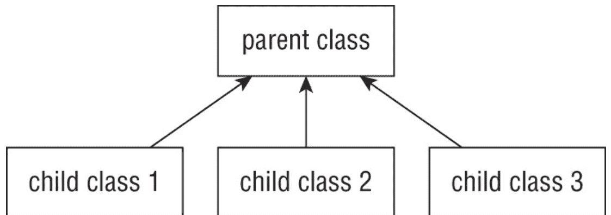

**图 15.1** 继承

例如，我们可以创建一个 Person 类，包含适合任何人的属性，如名字和姓氏。

然后我们可以创建引用人物的其他类，如 Employee、Manager 和 Customer。如果我们独立创建这些类，就必须在每个类中包含一个属性，如 name。相反，作为一种快捷方式，我们可以创建一个子类，继承父类的属性，这意味着我们只需要指定对该特定类重要的额外属性。图 15.2 展示了一个 Person 父类被三个子类继承的情况。

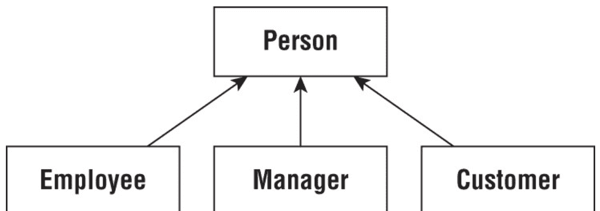

**图 15.2** 一个 Person 基类

员工是一个人。Employee 类包含 Person 类的所有属性，并且可以包含作为员工所特有的额外属性。我们可能需要知道员工的部门、入职时间、薪资率等，这些都将包含在 Employee 类中。

> **注意** 值得重复的是：我们使用术语**基类**或**父类**来指代原始类（在本例中是 **Person** 类），使用术语**子类**来指代派生类（例如 **Employee**）。

## 创建父类

任何类都可以是父类。创建父类的语法与创建标准类的语法相同，正如我们在上一课所学。[清单 15.1](Listing 15.1) 展示了为一个人创建类的示例。继承将允许我们使用这个类。

```
清单 15.1
创建一个基类

class Person:
    def __init__(self,fname,lname):
        self.first_name = fname
        self.last_name = lname
    def display(self):
        print(self.first_name + " " + self.last_name)

x = Person("Asia", "Roberson")
x.display()
```

你应该已经熟悉这段代码中的所有内容。创建了一个名为 Person 的简单类，包含两个属性（first_name 和 last_name）、一个构造函数和一个名为 display 的方法，用于打印名字和姓氏。然后使用 Person 类实例化一个名为 x 的对象，用于执行 display 方法。结果是打印出的名字：

Asia Roberson

## 创建子类

我们已经创建了一个名为 Person 的类，可以用作父类。现在让我们用它来创建一个子类。子类将继承父类的功能。这是通过将父类作为参数传递给子类来实现的：

```
class childClass(ParentClass)
```

我们可以创建一个名为 Employee 的类，通过在类定义中将 Person 传递给 Employee，它将继承 Person 类的属性和方法：

```
class Employee(Person):
    pass
```

这使得 Employee 成为 Person 的*子类*或*派生类*。同样，Person 是 Employee 的*父类*或*基类*。

> **注意** 我们使用 pass 语句作为未来代码的占位符。

Employee 类具有与 Person 类相同的属性和方法。当我们使用 Employee 类实例化一个对象时，因为它是 Person 的子类，我们将能够使用 Person 的属性和方法。这意味着我们可以执行 Person 类中的 display 方法，也可以使用其构造函数：

```
x = Employee("Jason", "Jones")
x.display()
```

这将打印出我们第一个员工的名字：Jason Jones。

让我们通过 [清单 15.2](Listing 15.2) 来实际操作一下，其中我们创建了与 [清单 15.1](Listing 15.1) 中相同的 Person 类，包含名字和姓氏作为属性以及一个 display 方法。

```
**清单 15.2**
创建一个继承自 Person 的 Employee 类

# 创建 Person 类
class Person:        # 这是一个父类或基类
    def __init__(self,fname,lname):
        self.first_name = fname
        self.last_name = lname
    def display(self):
        print(self.first_name + " " + self.last_name)

# 创建继承自 person 类的 employee 类。
class Employee(Person):        # Employee 是一个子类
    pass

e = Employee("Haythem","Balti")
e.display()
```

这个清单的前半部分与 [清单 15.1](Listing 15.1) 相同，其中定义了一个 Person 类。我们看到新代码的地方是在 Person 类定义之后。

在这种情况下，我们定义了一个新的 Employee 类，它自动继承了我们在 Person 类中包含的所有内容，因为 Person 被传递在括号中：

```
class Employee(person):
```

新的 Employee 类的主体只包含 pass，这是未来代码的占位符

## 多级继承

在前面的示例中，我们使用 `Person` 作为任何人的通用类，然后创建了 `Employee` 作为受雇的人员。经理或总监既是人也是员工，因此如[清单 15.4](Listing 15.4)所示，我们可以使用继承，将 `Employee` 作为父类，并创建一个 `Director` 类作为父类 `Employee` 的子类，如[图 15.3](Figure 15.3)所示。`Director` 类继承了 `Employee` 和 `Person` 类的属性和方法。总监既是员工也是人。

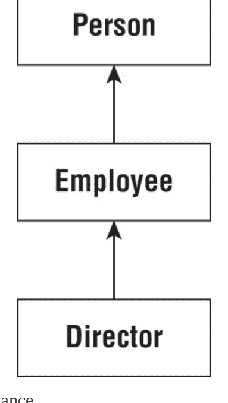

[图 15.3](Figure 15.3) 多级继承

## 清单 15.4
多级继承

```
class Person:
    def __init__(self,fname,lname):
        self.first_name = fname
        self.last_name = lname
    def display(self):
        print("First Name: " + self.first_name)
        print("Last Name: " + self.last_name)

class Employee(Person):
    def __init__(self,emp_id,fname,lname):
        Person.__init__(self,fname,lname)
        self.employee_id =emp_id

class Director(Employee):
    def __init__(self,emp_id,fname,lname,d_level):
        Employee.__init__(self,emp_id,fname,lname)
        self.director_level = d_level

d1 = Director("E24523525","Haythem","Balti","D-LEVEL-1")
d1.display()
print("Employee ID: " + d1.employee_id)
print("Director Level: " + str(d1.director_level))

print("----")

d2 = Director("E425345324534","Haythem","Balti","D-LEVEL-5")
d2.display()
print("Employee ID: " + d2.employee_id)
print("Director Level: " + str(d2.director_level))
```

此清单创建了一个类似于前面清单中的 `Person` 基类。它包含名字和姓氏属性，以及 `__init__` 方法和一个 `display` 方法。这应该看起来很熟悉。

`Employee` 类被定义为继承自 `Person`。这次我们为该类添加了一个名为 `employee_id` 的额外属性。当创建 `Employee` 对象时，它们将拥有 `Person` 类的所有属性以及新增的 `employee_id` 属性。

我们还定义了一个 `__init__` 方法作为 `Employee` 类的构造函数。此构造函数接收员工 ID 以及人的名字和姓氏。`__init__` 方法的下一行调用基类 `Employee` 的构造函数（`__init__` 方法），并传递名字和姓氏（`fname` 和 `lname`）。这将执行 `Employee` `__init__` 方法中的代码。然后，级别（`d_level`）也被赋值给该属性。

`Director` 类的操作方式几乎相同，只是它使用 `Employee` 类作为其父类。`Director` 类添加了另一个属性，即可以使用的总监级别（`d_level`）。

`Director` 类还定义了一个构造函数，该函数接受初始化所有类属性所需的值。这次它调用 `Employee` `__init__` 方法，然后设置总监级别的值。请注意，`Director` `__init__` 方法调用 `Employee` `__init__` 方法。`Employee` `__init__` 方法随后又调用 `Person` `__init__` 方法。

定义好类后，清单创建并显示了两个名为 `d1` 和 `d2` 的 `Director` 对象。然后将这些对象中的值显示到屏幕上：

```
Person First Name: Haythem
Person Last Name: Balti
Employee ID: E24523525
Director Level: D-LEVEL-1
----
Person First Name: Haythem
Person Last Name: Balti
Employee ID: E425345324534
Director Level: D-LEVEL-5
```

> **注意** 在[清单 15.4](Listing 15.4)中，我们调用了 `Person` 的 `display` 方法。在显示关于员工或经理的信息时，我们可能希望包含额外的信息。我们将在下一节学习如何做到这一点。

## 方法重写

我们可以在子类中重新定义从父类继承的方法。这个过程称为*重写*，因为添加到子类的方法将覆盖父类中同名的方法。我们实际上已经在[清单 15.4](Listing 15.4)中使用了这一点，其中我们重写了 `__init__ 方法。我们也可以重载其他方法。

当我们将 `__init__` 方法添加到子类时，子类将不再继承父类的 `__init__` 方法。我们说子类的 `__init__` 方法*重写*了父类 `__init__` 方法的继承。

在[清单 15.5](Listing 15.5)中，我们再次创建了一个 `Person` 类和一个 `Employee` 类。但是，我们为员工重新定义了 `display` 方法，以提供更详细的输出。

## 清单 15.5
重写 display 方法

```
class Person:
    def __init__(self,fname,lname):
        self.first_name = fname
        self.last_name = lname
    def display(self):
        print("Person First Name: " + self.first_name)
        print("Person Last Name: " + self.last_name)

class Employee(Person):
    def display(self):
        print("Employee ID: " + self.employee_id)
        print("Employee First Name: " + self.first_name)
        print("Employee Last Name: " + self.last_name)

ourEmployee = Employee("Haythem", "Balti")
ourEmployee.employee_id = "E15454513"

ourEmployee.display()
```

此清单定义了一个类似于早期清单中的 `Person` 类。新代码位于 `Employee` 类中。在 `Employee` 内部，我们现在有一个 `display` 方法，它打印与员工相关的信息，而不是使用 `Person` 中的内容。执行此清单时，我们看到在 `Employee` 对象（`ourEmployee`）上调用 `display` 方法的输出是：

```
Employee ID: E15454513
Employee First Name: Haythem
Employee Last Name: Balti
```

在我们的 ERP 应用程序中，我们可能希望为选定的员工组提供某些访问和修改权限。这可能是我们公司的高级管理人员或特定部门的高级经理。我们可以通过重写或重新定义控制通用员工类访问权限的特定方法，在 Python 中实现这一点。

我们还可能希望根据员工在我们银行中担任的不同角色，以不同的方式呈现信息。在[清单 15.6](Listing 15.6)中，我们扩展了银行应用程序的类，包括员工、经理、出纳员和客户服务代表。然后我们从这些类创建对象，并展示每个对象如何显示相关信息。

## 清单 15.6
我们银行应用程序中带有重写的类

# 总结

本课继续介绍了Python中的面向对象编程范式。我们已经了解了该范式的基本概念，即多态、抽象、封装和继承。在本课中，我们探讨了继承的概念，让你亲身体验定义使用此特性的新类。

既然你已经完成了[第15课](Lesson 15)，你应该能够：

- 定义与其父类具有不同属性的继承类。
- 使用重写（overriding）用继承类中的属性替换父类中的属性。

## 练习

面向对象编程和继承是你在Python程序中使用的强大构造。以下练习将帮助你巩固本课所学内容。练习包括：

- **练习1：基本继承**
- **练习2：添加属性**
- **练习3：创建更多子类**
- **练习4：狗和猫**
- **练习5：小时工员工**
- **练习6：文件系统**

## 练习1：基本继承

创建一个基于名词主题的基类。这个“*名词*”类可以是动物或车辆之类的东西。不要使用本课示例中使用的名词，如人或员工。创建你的基类，至少包含一个属性，并包括一个构造函数和`display`方法。

使用继承创建一个将从*名词*类继承的类。使用新类创建两个对象，并使用`display`方法显示每个对象的信息。

例如，我们可以从`Animal`类开始，创建一个继承自`Animal`的`Mammal`类，然后创建两个`Mammal`对象。你需要根据你自己的*名词*类确定一个合适的类，以及代表继承类的合适对象。

## 练习2：添加属性

在上一个活动中创建的新类中添加至少两个属性。这些属性应与原始*名词*类中的属性不同，并且特定于新类。

例如，`Animal`类可能包含名称和地点等属性。继承自`Animal`类的`Mammal`类可以包含哺乳动物特有的属性，如性别和毛发长度。

重写`__init__`和`display`方法以显示新属性，然后基于继承类创建至少两个新对象，并使用类属性显示它们。

## 练习3：创建更多子类

创建第二个和第三个类，它们继承自你开始的`Noun`类。

- 每个类至少包含三个特定于类的属性。
- 对于每个新类，重写`__init__`和`display`方法以显示新属性。
- 基于继承类创建至少两个新对象，并使用类属性显示它们。

## 练习4：狗和猫

创建一个类，它继承自你在前面练习中创建的初始继承类。包含至少一个特定于此类的属性。基于此类创建两个对象，并显示每个对象的所有属性。

例如，如果我们从`Animal`类开始，然后创建一个继承自`Animal`的`Mammal`类，我们还可以创建继承自`Mammal`的其他类，如`Dog`和`Cat`，它们将有自己的特定于类的属性。

## 练习5：小时工员工

按如下方式修改[清单15.7](Listing 15.7)中的代码：

- 向`Director`类添加一个名为`team`的属性。团队代表总监管理的员工。`team`属性应该是一个`Employee`对象的列表。
- 实现`add_employee`方法，该方法接受一个`Employee`对象作为输入，并将其添加到`team`属性中。
- 实现`Director`类的`display`方法，以显示关于总监和总监管理的员工列表的信息。
- 创建另一个名为`HourlyEmployee`的类，它继承自`Employee`。
- 向`HourlyEmployee`类添加一个名为`hourly_rate`的属性，该属性代表小时工员工的小时工资率。
- 为`HourlyEmployee`类实现`__init__`方法和`display`方法。

进行这些更改后，通过确保它可以使用`display`方法显示`Director`的属性来验证代码是否有效。

```python
class Employee:
    def __init__(self,n,i):
        self.name=n
        self.id=i
    def display(self):
        print("Employee name is: " + self.name)
        print("Employee ID is: " + self.id)

class Manager(Employee):
    def __init__(self,t,n,i):
        Employee.__init__(self,n,i)
        self.team=t
        self.id=i
    def display(self):
        print("Manager's employee ID is: " + self.id)
        print("Manager's name is: " + self.name)
        print("Manager's team is: " + self.team)

m1=Manager("Robert A, LaTerrance S","Julia Juarez","A1152254")
m2=Manager("Lilyana J, Angeline P","Whitney Solomon","A1155626")
m1.display()
m2.display()

class Teller(Employee):
    def __init__(self,b,n,i):
        Employee.__init__(self,n,i)
        self.bank_branch=b
    def display(self):
        print("Teller's employee ID is: " + self.id)
        print("Teller's name is: " + self.name)
        print("Teller's bank branch is: " + self.bank_branch)

t1=Teller("Columbia Ave.","Lamar Mercer","A1152278")
t2=Teller("Constitution Dr.","Karly Robinson","A1152278")
t1.display()
t2.display()

class CustomerServRep(Employee):
    def __init__(self,c,n,i):
        Employee.__init__(self,n,i)
        self.call_center=c
    def display(self):
        print("Customer Service Rep's employee ID is: " + self.id)
        print("Customer Service Rep's name is: " + self.name)
        print("Customer Service Rep's call center is: " + self.call_center)

cs1=CustomerServRep("Headquarters","Clayton Ryan","A1152211")
cs2=CustomerServRep("Headquarters","Gage Barnett","A1152212")
cs1.display()
cs2.display()
```

虽然这个清单比我们之前处理的要长，但并没有引入新内容。相反，我们只是定义类，然后使用它们来创建对象并显示信息。

我们从基类`Employee`开始，它包含两个字符串属性：`name`和`id`，我们还实现了相应的`__init__`和`display`方法来创建和显示对象。

然后我们使用继承创建另一个名为`Manager`的类，它继承自`Employee`类。这包含一个特定于`Manager`类的额外属性，名为`team`。我们包含一个构造函数以及一个重写`Employee`显示方法的`display`方法。我们的新方法包括显示`Manager`类新添加的`team`属性。

我们还创建了另外两个也继承自`Employee`类的类：一个名为`Teller`的类和另一个名为`CustomerServRep`的类。`Teller`类包含一个特定于`Teller`类的属性，名为`bank_branch`。`CustomerServRep`包含一个名为`call_center`的属性。两者都再次重写了`__init__`和`display`方法。

当清单运行时，每个派生类都用于创建两个对象。对每个对象调用`display`方法。从输出中，我们可以看到每个类都调用了自己的`display`方法来呈现适当的信息：

```
Manager's employee ID is: A1152254
Manager's name is: Julia Juarez
Manager's team is: Robert A, LaTerrance S
Manager's employee ID is: A1155626
Manager's name is: Whitney Solomon
Manager's team is: Lilyana J, Angeline P
Teller's employee ID is: A1152278
Teller's name is: Lamar Mercer
Teller's bank branch is: Columbia Ave.
Teller's employee ID is: A1152278
Teller's name is: Karly Robinson
Teller's bank branch is: Constitution Dr.
Customer Service Rep's employee ID is: A1152211
Customer Service Rep's name is: Clayton Ryan
Customer Service Rep's call center is: Headquarters
Customer Service Rep's employee ID is: A1152212
Customer Service Rep's name is: Gage Barnett
Customer Service Rep's call center is: Headquarters
```

## 代码清单 15.7

练习 5

```python
class Person:
    def __init__(self, fname, lname):
        self.first_name = fname
        self.last_name = lname
    def display(self):
        print("Person First Name: " + self.first_name)
        print("Person Last Name: " + self.last_name)

class Employee(Person):
    def __init__(self, emp_id, fname, lname):
        Person.__init__(self, fname, lname)
        self.employee_id = emp_id
    def display(self):
        print("Employee ID: " + self.employee_id)
        print("Employee First Name: " + self.first_name)
        print("Employee Last Name: " + self.last_name)

class Director(Employee):
    def __init__(self, emp_id, fname, lname, d_level):
        # do not change this code
        Employee.__init__(self, emp_id, fname, lname)
        self.director_level = d_level
        self.team = list()
    def display(self):
        # a method that displays all the attributes of a director object
        pass
    def add_employee(self, emp):
        # a method to add an employee object to the team attribute
        pass

class HourlyEmployee(Employee):
    # implement this class
    pass

# DO NOT CHANGE THIS CODE
d1 = Director("E24523525", "Haythem", "Balti", "D-LEVEL-1")

# create first employee object
e1 = Employee("E4746456456", "Mark", "Smith")
# add employee e1 to the team attribute of the Director class
d1.add_employee(e1)
# create second hourlyemployee object
e2 = HourlyEmployee("E47464578978", "Mary", "Lang")
# add hourly employee e2 to the team attribute of the Director class
d1.add_employee(e2)
```

```python
d1.display()
```

## 练习 6：文件系统

本练习作为自我评估提供，让你检查自己的知识掌握情况以及为下一课的准备程度。此评估将本模块中呈现的概念结合在一个程序中，不提供课程活动中的指导。

使用 Python 对计算机的文件系统进行建模。

1. 创建一个名为 `FileItem` 的类，表示操作系统中的任何文件。
   - 研究并确定操作系统中所有文件共有的属性，例如权限、所有者、大小等。
2. 创建一个名为 `CSVFile` 的类，它继承自 `FileItem`，表示操作系统中的 CSV 文件。
   - 包含 CSV 文件特有的属性。
3. 创建一个名为 `JPGFile` 的类，它继承自 `FileItem`，表示操作系统中的 JPG 文件。
   - 包含 JPG 文件特有的属性。
4. 创建一个名为 `MP3File` 的类，它继承自 `FileItem`，表示操作系统中的 MP3 文件。
   - 包含 MP3 文件特有的属性。

## 第 16 课
融会贯通：构建一个汉堡店

在本课中，我们将构建一个应用程序，将我们迄今为止学到的许多与使用 Python 进行面向对象编程相关的概念整合在一起。具体来说，我们将专注于构建一个在汉堡店接受顾客订单的应用程序。

## 学习目标

在本课结束时，你将能够：

- 使用面向对象的概念为汉堡应用程序设计类。
- 使用你创建的类来创建对象。
- 在 Python 应用程序中使用你的对象。
- 显示包含来自你的类对象数据的输出。

## 我们应用程序的要求

我们的汉堡店应用程序允许顾客定制汉堡和其他商品的订单。在点餐过程中，我们希望顾客能够指定他们想要什么样的食物或饮料，然后我们需要计算订单成本并向用户显示完成的订单。更具体地说，完成的应用程序必须能够执行以下步骤：

- 询问顾客是否想要汉堡、配菜、饮料还是套餐。
  - 套餐必须包含汉堡、配菜和饮料。
- 提示他们输入所选项目的详细信息，例如汉堡的调味品、饮料的种类和大小等。
- 根据他们的选择创建商品。
- 将商品添加到订单中。
- 重复这些步骤，直到顾客不想再点其他东西。
- 显示订单详情，包括价格。
- 感谢顾客的惠顾。
- 让顾客在点餐过程中的任何时候都有选择取消订单。

## 规划代码

作为任何开发过程的第一步，我们首先规划应用程序中需要编码的内容。这个规划步骤可以包括流程图或其他图表，以帮助可视化程序的结构和功能。我们将从大局开始，然后在逐步完成的过程中关注程序的较小部分。

主程序本身必须包括以下步骤：

1. 向顾客问好并询问他们的姓名。
2. 询问顾客想要点什么（一次一个商品！）。
3. 询问顾客的定制选项，例如汉堡配料或饮料大小。
4. 在顾客点单时，将每个商品添加到订单中。
5. 在每个商品后，询问顾客是继续点单还是完成订单。
6. 当顾客完成订单时，程序将显示订单和订单总价。

顾客应该能够点以下任何组合的商品：

- 汉堡
- 饮料
- 配菜

我们还希望允许他们点一个包含汉堡、饮料和配菜并享受折扣的套餐。

> **注意** 你会注意到，我们应用程序的规划和设计包含了大量与之前提到的要求似乎重复的信息。这应该是合理的，因为应用程序的目标就是满足要求。如果你的规划包含了不属于要求的部分，那么你应该考虑它们是否应该被包含，或者它们是否超出了你当前应用程序的范围。

## 创建类

从面向对象编程的角度来看，我们可以在这个场景中识别出多个对象。这些包括：

- 订单本身
- 顾客可以点的商品，我们知道有：
  - 汉堡
  - 饮料
  - 配菜
  - 套餐

我们可以将订单本身定义为一个类。我们也可以将每个可点的商品定义为一个类。然后我们可以在主程序中使用这些类来简化代码。

我们可以从类本身开始，包括我们已经识别出的类：

- order
- burger
- drink
- side
- combo

为了保持代码的组织性，我们将创建一个单独的类文件来存放我们所有的类。稍后我们将创建引用这些类的代码文件。让我们首先创建一个名为 menu.py 的新文件。此文件应在你计划创建汉堡应用程序其余部分的同一文件夹中创建。

> **注意** 在大多数 Python 编辑器中，你可以简单地使用 .py 扩展名来命名文件。如果你使用的是 Jupyter Notebook，请创建一个新的文本文件（扩展名为 .txt），然后将其重命名为 .py 扩展名。

## 创建食物商品类

我们汉堡店菜单上的所有商品都有两个共同属性：商品名称和价格。这意味着我们可以先创建一个引用这些属性的父类，然后为各个菜单商品及其特定属性创建子类。

如代码清单 16.1 所示，向 menu.py 文件添加一个新的 `food_item` 类。

```python
# LISTING 16.1
# The food_item class

class food_item:
    def __init__(self, name, price):
        self.name = name
        self.price = price
    def __str__(self):
        return "Item: " + self.name + "\n" + "Price: $" + str(self.price) + "\n"
    def get_price(self):
        return self.price
```

food_item 类包含三个方法：

- `__init__` 方法，用于初始化我们食物商品的值。
- `__str__` 方法，用于创建从 food_item 类派生的对象的字符串表示。在我们的例子中，我们希望简单地返回以下表示：

  Item: Item Name
  Price: Item Price

- `get_price` 方法，简单地返回食物商品的价格。

> **注意** 因为我们的文件只包含一个类文件，所以它不能独立运行。我们将在主代码中使用这个类，我们将在本课后面创建主代码来运行程序。

## 创建汉堡类

我们可以重用 food_item 类，通过继承派生出汉堡类。在我们的例子中，我们还将跟踪汉堡的调味品。为此，我们将向汉堡添加另一个属性（除了从 food_item 继承的名称和价格），我们称之为 condiments。这个属性将跟踪我们想要在汉堡中添加的调味品列表。

在我们的例子中，我们可以使用一个简单的列表来存储调味品。汉堡类如代码清单 16.2 所示。你可以将其添加到已经包含 food_item 类的 menu.py 文件中。

## 代码清单 16.2
汉堡类

```python
class burger(food_item):
    def __init__(self,name,price):
        super(burger, self).__init__(name,price)
        self.condiments = []
    def add_condiment(self,condiment):
        if condiment not in self.condiments:
            self.condiments.append(condiment)
    def __str__(self):
        s = super(burger, self).__str__()
        s = s + "Condiments:" + ", ".join(self.condiments)
        return s
```

我们汉堡类中的 `__init__` 方法调用 `super()` 方法来初始化从父类 `food_item` 继承的名称和价格。然后，它简单地将配料列表初始化为空。

此外，在汉堡类中，包含了一个 `add_condiment` 方法，该方法只是将一个配料添加到配料列表中。请注意，`add_condiment` 方法首先检查提供的配料是否存在于配料列表中，如果不存在，则将其添加到列表中。

最后，我们重写 `__str__` 方法以生成汉堡对象的字符串表示。在我们的例子中，我们首先希望显示名称和价格，这可以通过调用父类 `food_item` 的 `__init__` 方法来实现。我们通过使用 `super` 函数来完成此操作。最后，我们将父类生成的字符串与汉堡类中的配料列表连接起来并返回该字符串。当此方法执行时，一个汉堡对象将具有以下字符串表示：

```
Item: Item Name
Price: Item Price
Condiments: [Condiment1,Condiment2]
```

## 创建饮料类

除了名称和价格外，饮料还具有与之关联的尺寸。与汉堡类一样，在[代码清单 16.3](Listing 16.3)中，我们将创建一个 `food_item` 的子类，并对其进行自定义以包含尺寸。此代码清单也应添加到你的 `menu.py` 文件中。

## 代码清单 16.3
饮料类

```python
class drink(food_item):
    def __init__(self,name,size,price):
        super(drink, self).__init__(name,price)
        self.size= size
    def __str__(self):
        s = super(drink, self).__str__()
        s = s + "Size: " + str(self.size) + "oz"
        return s
```

与汉堡类类似，我们重写了 `__init__` 方法和 `__str__` 方法。这一次，我们为饮料类添加了 `size` 属性。请注意，在饮料类中添加 `size` 属性也必须在 `__str__` 方法中更新。通过此更新，一个饮料对象将具有以下字符串表示：

Item: *Item Name*
Price: *Item Price*
Size: "*Size in oz*"

## 创建配菜类

我们菜单上的所有配菜价格相同，因此我们可以基于 `food_item` 创建一个子类，而无需添加任何额外内容。[代码清单 16.4](Listing 16.4)展示了用于保存我们配菜对象的类。与之前的类一样，将其添加到你的 `menu.py` 文件中。

## 代码清单 16.4
配菜类

```python
class side(food_item):
    def __init__(self,name,price):
        super(side, self).__init__(name, price)
```

## 创建套餐

套餐比其他食品项目复杂得多。虽然它确实包含名称和价格，但套餐包含多个项目以及基于单个项目价格的折扣价。[代码清单 16.5](Listing 16.5)展示了一个套餐类，同样，应将其添加到你的 `menu.py` 文件中。

## 代码清单 16.5
套餐类

```python
class combo(food_item):
    def __init__(self,name,b,d,s,discount):
        self.name = name
        self.burger = b
        self.drink = d
        self.side = s
        self.discount = discount
        self.price = self.burger.get_price() + self.drink.get_price() + self.side.get_price() - self.discount
    def __str__(self):
        s = ""
        s = s + "Combo: " + self.name + "\n"
        s = s + str(self.burger) + "\n" + str(self.drink)+ "\n" + str(self.side)+ "\n"
        s = s + "Combo Price Before Discount: $" + str(self.burger.get_price()+self.drink.get_price()+self.side.get_price())+ "\n"
        s = s + "Discount: $" + str(self.discount)+ "\n"
        s = s + "Combo Price After Discount: $" + str(self.price)+ "\n"
        return s
```

这里，我们包含一个汉堡、一个饮料和一个配菜，将每个项目的单独价格相加，并应用折扣。结果是套餐中的项目列表和套餐的最终价格。

## 创建订单类

我们需要创建的最后一个类是订单本身。在新文件中创建[代码清单 16.6](Listing 16.6)所示的订单类。我们将此文件命名为 `order.py`。

## 代码清单 16.6
订单类

```python
class order:
    def __init__(self,name):
        self.name = name
        self.items = []
    def add_item(self,item):
        self.items.append(item)
    def get_price(self):
        price = 0.0
        for item in self.items:
            price = price + item.get_price()
        return price
    def __str__(self):
        s = [str(item) for item in self.items]
        return "\n".join(s)
    def display(self):
        print("========================================")
        print("Here is a summary of your order")
        print("Order for " + self.name)
        print("Here is a list of items in the order")

        for item in self.items:
            print("-----------")
            print(str(item))
        print("-----------")
        print("Total Order Amount :$" + str(self.get_price()))
        print("========================================")
```

此类设置一个新订单，具有以下属性：

- 它包含一个 `name` 属性，用于标识（或命名）订单。
- 它创建一个名为 `items` 的新空列表，用于保存订单中的项目。
- 它获取每个项目的价格，并将该价格添加到订单的总价中。
- 它将 `items` 列表中的各个项目连接成一个新字符串，以便向客户显示。
- 我们还定义了一系列向客户输出的语句，包括他们的姓名、所订项目的完整列表以及总价。

## 创建主文件

我们现在有了汉堡店所需的所有项目的类。接下来，我们可以创建主文件，该文件将使用我们刚刚创建的类来提示客户他们想要订购的项目并计算总价。

在与我们刚刚创建的 `menu.py` 文件相同的文件夹中创建一个名为 `main.py` 的新文件。我们将从问候客户并设置订单的代码开始，如[代码清单 16.7](#)所示。

> **注意** 如果你使用的是 Jupyter Notebook，你可以创建并使用一个 `main.ipynb` 文件，只要它与 `menu.py` 在同一文件夹中，就可以从 Jupyter Notebook 运行。

### 代码清单 16.7
创建订单

```python
def order_many():
    print("Welcome to Mary's Burger Shop!")
    q1 = input("May I have your name for the order? ")
    o = order(q1)
    print("Let's get your order in!")
    done = False
    while done == False:
        item = order_once()
        o.add_item(item)
        q1= input("Do you need more items? (Enter n to stop.) ")
        if q1.lower()=="n":
            done = True
    return o
```

这里我们创建了主订单函数，它将执行以下步骤：

- 它问候客户并询问他们的姓名。该姓名存储在变量 `o` 中，作为订单的一部分。
- 它创建一个循环，允许客户一次请求一个项目，直到完成订单。每个项目使用 `add_item` 函数存储在项目列表中。
- 它返回完整的订单。

## 创建 order_once

接下来，我们需要创建一个函数，该函数将接受单个项目并将其添加到订单中。在你的 `main.py` 文件中，将[代码清单 16.8](#)中的函数添加到 `order_many` 函数上方。

## 代码清单 16.8
创建单次订单

```python
def order_once():
    possible_options = [1,2,3,4]
    print("Type 1 for a Burger.")
    print("Type 2 for a Drink.")
    print("Type 3 for a Side.")
    print("Type 4 for a Combo.")
    choice = None
    while choice == None:
        q1 = input("Please enter your choice:")
        if int(q1) in possible_options:
            choice = int(q1)
    item = None
    if choice == 1:
        item = get_burger_order()
    elif choice == 2:
        item = get_drink_order()
    elif choice == 3:
        item = get_side_order()
    elif choice == 4:
        item = get_combo_order()
    return item
```

这里，我们向客户提供一个项目列表，他们可以通过输入一个数字来选择他们想要订购的项目。列表 `possible_options` 用于为每个菜单项分配一个值。我们稍后引用它来验证客户是否输入了适当的值。

客户以用户友好的格式看到选项，以便客户知道他们需要输入什么。我们将 `choice` 和 `item` 初始化为空变量，以便在查看选项时可以向这些变量添加值。

然后，我们包含一个 `while` 循环，只要没有输入有效的选择，就提示客户输入一个项目。客户的选择决定程序接下来将根据一系列 `elif` 子句执行哪个分支。在汉堡（1）的情况下，程序将运行 `get_burger_order` 来收集有关汉堡的详细信息。对于其他每个选择，程序运行相应的函数来获取该项目。从相应函数返回的值被放入 `item` 中，然后从我们的 `order_once` 函数返回。

我们可以看到，该函数根据正在订购的项目调用不同的方法，例如调用 `get_burger_order`。我们需要为这些方法中的每一个编写代码。

## 订购汉堡

让我们从点汉堡的代码开始。我们将首先定义一些要使用的值——具体来说，是汉堡的价格和可用的配料。首先在 `main.py` 文件的顶部添加以下常量：

```
BURGER_PRICE = 6.00
BURGER_CONDIMENTS = ["tomato","lettuce","onion","cheese"]
```

> **注意** 在现实生活中，我们可能希望使用在程序其他地方定义的变量——可能是通过某种数据库。但现在，我们将创建常量来代替。

下一步是定义 `get_burger_order` 函数，该函数包含与点汉堡相关的具体步骤，包括添加配料。将 [清单 16.9](#) 中展示的函数添加到 `order_once` 函数上方。

```
**清单 16.9**
**获取汉堡订单**

def get_burger_order():
    b = burger("Burger",BURGER_PRICE)
    q1 = input("Do you want any condiments on your burger? (y for yes) ")
    if q1.lower() =="y":
        for condiment in BURGER_CONDIMENTS:
            q = input("Do you want " + str(condiment)+"? (y/n): ")
            if q.lower() == "y":
                b.add_condiment(condiment)
    return b
```

这段代码创建了一个汉堡及其初始价格。然后，它使用我们之前定义的列表，询问顾客想要哪些配料。它遍历列表中的每个项目，只有当顾客在提示时输入“y”时才添加该配料。请注意，这是一个严格的“y 或无”选项。如果顾客输入“y”以外的任何内容（甚至什么都不输入），程序都不会将该配料添加到汉堡中。一旦选择了配料，该函数就会返回汉堡及其选定的配料。

现在我们有了一系列程序将要执行的步骤：

- `order_many`：向顾客问好并创建订单。它还创建一个项目列表，用于存储 `order_once` 的输出。
- `order_once`：确定顾客订单中的单个项目。如果顾客点了汉堡（如我们目前的代码所示），它会触发 `get_burger_order` 函数。
- `get_burger_order`：询问顾客他们想要在汉堡上加什么配料。它返回汉堡订单并将其传递给 `order_once`，后者又将该项目传递给 `order_many` 维护的项目列表。

## 添加饮料

请注意，`order_once` 允许顾客点菜单上的任何东西，但在该代码能够工作之前，我们必须创建它引用的其他函数。对于饮料订单，我们需要首先定义相关的常量。你应该用 [清单 16.10](Listing 16.10) 中包含的新常量更新 `menu.py` 文件的顶部。

```
清单 16.10
定义饮料常量

BURGER_PRICE = 6.00
BURGER_CONDIMENTS = ["tomato","lettuce","onion","cheese"]

DRINK_TYPES = ["fanta", "coca cola", "sprite"]
DRINK_SIZES = [12, 16, 20]
DRINK_PRICES = [1.00,2.00,3.00]
```

接下来，我们将创建如 [清单 16.11](Listing 16.11) 所示的函数，该函数提示顾客选择饮料并将其添加到订单中。此代码应添加到 `main.py` 文件中 `get_burger_order` 函数之后。

```
清单 16.11
添加饮料

def get_drink_order():
    print("These are the available drinks:")
    print(DRINK_TYPES)
    print("These are the available sizes:")
    print(DRINK_SIZES)
    choice = False
    drink_name = None
    drink_size = None
    drink_price = None
    while choice == False:
        q1 = input("What drink do you want? ")
        if q1.lower() in DRINK_TYPES:
            choice = True
            drink_name = q1.lower()
        else:
            print("Please enter a valid drink.")
    choice = False
    while choice  == False:
        q1 = input("What size do you want? " + str(DRINK_SIZES) + ": ")
        if int(q1) in DRINK_SIZES:
            choice = True
            drink_size = int(q1)
        else:
            print("please enter a valid size")
    #locate the price of the drink based on the index of the size:
    drink_price = DRINK_PRICES[DRINK_SIZES.index(drink_size)]
    d = drink(drink_name,drink_size,drink_price)
    return d
```

这段代码向顾客展示可用的饮料选项和尺寸，然后提示顾客输入他们的选择。

- 注意使用 `if/else` 来识别顾客是否输入了适当的值。如果他们输入了不同的内容（甚至是拼写错误），它会提示他们重试，直到输入有效的选项。
- 在获得饮料和尺寸后，它将尺寸列表与价格列表进行比较，并使用所选尺寸的索引值来找到相应的价格。
- 它将所有三个值（名称、尺寸和价格）收集到一个 `drink` 类中，并返回该类的值。
- 与 `get_burger_order` 函数一样，结果被传回 `order_once`，后者又将该信息传回 `order_many` 以添加到总订单中。

## 添加配菜

配菜订单函数类似于饮料订单：我们向顾客展示一个选择列表，接受选择，并将值传递给 `order_once`。首先在 `main.py` 文件中添加适当的配菜常量。[清单 16.12](#) 展示了更新后的常量列表。

```
清单 16.12
定义配菜常量

BURGER_PRICE = 6.00
BURGER_CONDIMENTS = ["tomato","lettuce","onion","cheese"]

DRINK_TYPES = ["fanta", "coca cola", "sprite"]
DRINK_SIZES = [12, 16, 20]
DRINK_PRICES = [1.00,2.00,3.00]

SIDE_PRICE = 3.00
SIDES = ["fries","coleslaw","salad"]
```

常量就位后，创建代码来提示顾客选择配菜，并返回其价格。将 [清单 16.13](#) 中的 `get_side_order` 函数代码添加到 `main.py` 文件中 `get_drink_order` 函数之后。

```
清单 16.13
添加配菜订单

def get_side_order():
    print("These are the available sides:")
    print(SIDES)
    choice = False
    side_name = None
    while choice == False:
        q1 = input("What side do you want? ")
        if q1.lower() in SIDES:
            choice = True
            side_name = q1.lower()
        else:
            print("Please enter a valid side.")
    s = side(side_name,SIDE_PRICE)
    return s
```

请注意，这里所有配菜的价格都相同，不像饮料，所以我们只需要在函数的输出中包含该值。与饮料订单一样，如果顾客没有输入预期的值，函数会告诉他们重试。

## 点套餐

套餐包括一个汉堡、一份配菜和一杯饮料，其优势在于为顾客的订单提供折扣。对于我们的汉堡店，套餐的价格比顾客单独点每件商品便宜 2 美元，所以我们需要在常量中定义这一点。[清单 16.14](Listing 16.14) 再次展示了应在 `main.py` 文件顶部的更新后的常量值列表。

```
清单 16.14
定义套餐常量

BURGER_PRICE = 6.00
BURGER_CONDIMENTS = ["tomato","lettuce","onion","cheese"]

DRINK_TYPES = ["fanta", "coca cola", "sprite"]
DRINK_SIZES = [12, 16, 20]
DRINK_PRICES = [1.00,2.00,3.00]

SIDE_PRICE = 3.00
SIDES = ["fries","coleslaw","salad"]

COMBO_DISCOUNT = 2.00
```

[清单 16.15](Listing 16.15) 中展示的套餐函数将重用我们已经创建的函数。你应该将其放在 `main.py` 文件中所有这些函数之后。

```
清单 16.15
获取套餐

def get_combo_order():
    print("Let's get you a combo meal!")
    print("First, let's order the burger for your combo.")
    b = get_burger_order()
    print("Now, let's order the drink for your combo.")
    d = get_drink_order()
    print("Finally, let's order the side for your combo.")
    s = get_side_order()
    c = combo("Combo",b,d,s,COMBO_DISCOUNT)
    #print(str(c))
    return c
```

因为作为套餐一部分点汉堡、饮料或配菜的过程与单独点这些商品完全相同，所以这段代码相对简单。最终结果包含 `COMBO_DISCOUNT` 常量，以便顾客获得折扣，并且它将结果传递给 `order_once`，后者再将其传递给 `order_many` 以添加到订单总额中。

## 显示输出

最后，我们希望程序能打印出顾客所点的菜品以及总价。目前，这些信息都存储在 `order_many` 函数中（包括对顾客的初始问候），因此我们希望从该函数中获取输出并将其显示给顾客。

在主文件末尾添加以下代码：

```
client_order = order_many()
client_order.display()
```

现在我们已经编写了活动代码，但还不能运行它，因为主文件引用了位于另一个文件中的类。最后一步是将它们连接起来。

## 连接代码文件

当我们希望程序运行存在于同一文件之外的代码时，必须使用 `import` 函数，并明确告诉 Python 我们想要导入什么。假设主文件和菜单文件位于同一位置，我们为在菜单文件中定义的每个类添加一个导入语句。在 `main.py` 文件的最顶部添加以下代码：

```
from menu import burger
from menu import drink
from menu import side
from menu import combo
from order import order
```

清单 16.16 包含了我们添加到 `main.py` 文件中的所有代码。

```
清单 16.16
完整的 main.py

from menu import burger
from menu import drink
from menu import side
from menu import combo
from order import order

BURGER_PRICE = 6.00
BURGER_CONDIMENTS = ["tomato","lettuce","onion","cheese"]

DRINK_TYPES = ["fanta", "coca cola", "sprite"]
DRINK_SIZES = [12, 16, 20]
DRINK_PRICES = [1.00,2.00,3.00]

SIDE_PRICE = 3.00
SIDES = ["fries","coleslaw","salad"]

COMBO_DISCOUNT = 2.00

def get_burger_order():
    b = burger("Burger",BURGER_PRICE)
    q1 = input("Do you want any condiments on your burger? (y for yes) ")
    if q1.lower() =="y":
        for condiment in BURGER_CONDIMENTS:
            q = input("Do you want " + str(condiment)+"? (y/n): ")
            if q.lower() == "y":
                b.add_condiment(condiment)
    return b

def get_drink_order():
    print ("These are the available drinks:")
    print (DRINK_TYPES)
    print ("These are the available sizes:")
    print (DRINK_SIZES)
    choice = False
    drink_name = None
    drink_size = None
    drink_price = None
    while choice == False:
        q1 = input("What drink do you want? ")
        if q1.lower() in DRINK_TYPES:
            choice = True
            drink_name = q1.lower()
        else:
            print("Please enter a valid drink.")
    choice = False
    while choice  == False:
        q1 = input("What size do you want? " + str(DRINK_SIZES) + ": ")
        if int(q1) in DRINK_SIZES:
            choice = True
            drink_size = int(q1)
        else:
            print("please enter a valid size")
    #locate the price of the drink based on the index of the size:
    drink_price = DRINK_PRICES[DRINK_SIZES.index(drink_size)]
    d = drink(drink_name,drink_size,drink_price)
    return d

def get_side_order():
    print("These are the available sides:")
    print(SIDES)
    choice = False
    side_name = None
    while choice == False:
        q1 = input("What side do you want? ")
        if q1.lower() in SIDES:
            choice = True
            side_name = q1.lower()
        else:
            print("Please enter a valid side.")
    s = side(side_name,SIDE_PRICE)
    return s

def get_combo_order():
    print("Let's get you a combo meal!")
    print("First, let's order the burger for your combo.")
    b = get_burger_order()
    print("Now, let's order the drink for your combo.")
    d = get_drink_order()
    print("Finally, let's order the side for your combo.")
    s = get_side_order()
    c = combo("Combo",b,d,s,COMBO_DISCOUNT)
    #print(str(c))
    return c

def order_once():
    possible_options = [1,2,3,4]
    print("Type 1 for a Burger.")
    print("Type 2 for a Drink.")
    print("Type 3 for a Side.")
    print("Type 4 for a Combo.")
    choice = None
    while choice == None:
        q1 = input("Please enter your choice:")
        if int(q1) in possible_options:
            choice = int(q1)
    item = None
    if choice == 1:
        item = get_burger_order()
    elif choice == 2:
        item = get_drink_order()
    elif choice == 3:
        item = get_side_order()
    elif choice == 4:
        item = get_combo_order()
    return item

def order_many():
    print("Welcome to Mary's Burger Shop!")
    q1 = input("May I have your name for the order? ")
    o = order(q1)
    print("Let's get your order in!")
    done = False
    while done == False:
        item = order_once()
        o.add_item(item)
        q1= input("Do you need more items? (Enter n to stop.) ")
        if q1.lower()=="n":
            done = True
    return o

client_order = order_many()
client_order.display()
```

# 总结

至此，代码应该能够正常工作以完成定制订单。我们已经创建了所有必要的类和其他代码，以构建一个允许顾客下单的汉堡店应用程序。多次运行你的程序以确保它按预期工作（包括点所有可能的菜品）。

一旦程序运行正常，尝试根据以下想法对其进行一些调整：

- 如何为汉堡添加更多配料（例如芥末酱或番茄酱）？
- 能否添加更多饮料或配菜选项？
- 能否包含免费的水？
- 能否添加改变汉堡成本的选项？例如，添加奶酪可能会使汉堡价格增加一美元，或者顾客可以以更高的价格订购双层肉饼的汉堡。

# 第四部分
使用 Python 进行数据处理

- [第 17 课](Lesson 17)：处理日期和时间
- [第 18 课](Lesson 18)：处理文本文件
- [第 19 课](Lesson 19)：处理 CSV 文件
- [第 20 课](Lesson 20)：处理 JSON 文件

# 第 17 课
处理日期和时间

在之前的课程中，你学习了面向对象编程（OOP）的概念。请记住，OOP 是一种构建程序的方式，它允许将属性和行为组合并重用于对象中。既然你已经理解了这种编程范式，让我们来看看在 Python 中处理数字/日期类型数据时如何使用这些概念。

## 学习目标

在本课结束时，你将能够：

- 描述 Python 的 `datetime` 模块中包含的基于日期、时间或两者的类。
- 将一个值定义为日期或时间。
- 将一个日期时间值拆分为单独的值，如年、月、日和小时。
- 在各种操作中使用时间和日期值。

日期和时间是任何计算机工作的重要概念。我们经常需要在活动执行时为其添加时间戳，根据时间跨度（如小时、天、月或年）汇总数据（如销售量），并识别哪些活动发生在其他活动之前。

虽然人类通常将日期和时间视为单独的值，但计算机倾向于将任何给定的秒视为一个特定的时间点，包括日期作为整个值的一部分。因此，当我们引用日期和时间时，通常需要拆分计算机存储的值，以获取程序中所需的特定值。你将在本课中遇到的一些关键概念和术语包括：

- **Python 的 datetime 模块**提供了用于操作日期和时间的类。
- **now() 函数**用于显示当前日期和时间。
- **today() 函数**返回当前的本地日期和时间。

## 日期和时间入门

Python 包含许多有用的函数，这些函数组织在称为模块的代码库中。`datetime` 模块提供了允许我们在 Python 应用程序中将日期和时间数据类型作为对象进行操作的类。

我们可以使用 `import` 语句将 `datetime` 模块包含在我们的 Python 程序中。`import` 语句结合了两个操作。首先，它搜索指定的模块，然后将该搜索的结果绑定到本地作用域中的一个名称。一旦包含在我们的 Python 程序中，我们就可以访问日期和时间功能。

> **注意** 你可以在 [https://docs.python.org/3/reference/simple_stmts.html#import](https://docs.python.org/3/reference/simple_stmts.html#import) 找到更多关于 `import` 语句的信息。

## 创建日期变量

`datetime` 模块包含一个 `datetime` 类。要创建一个日期，`datetime` 类需要三个参数：年、月、日。我们可以使用 `datetime` 模块的 `datetime` 类（构造函数）通过以下方式创建一个静态日期：

`datetime.date(year, month, day)`

年、月、日的每个值都必须是整数。[清单 17.1](#listing-171) 展示了一个生成日期的简单示例。

```
import datetime

ada_bday = datetime.date(1815, 12, 10)
print(ada_bday)
```

在这种情况下，生成的日期是阿达·洛芙莱斯的生日：1815年12月10日。你可以看到第一行导入了我们的 `datetime` 模块，使我们能够访问 `datetime` 类。然后我们创建一个名为 `ada_bday` 的新变量，并为其分配一个新日期。要获取日期，我们使用 `datetime.date()` 调用 `datetime` 类的 `date` 方法，并传入年（1815）、月（12）和日（10）的整数值。结果显示出生日期：

`1815-12-10`

在[清单 17.2](#listing-172)中，我们将创建日期更进一步。在这个例子中，我们创建一个脚本，询问用户年、月、日。然后我们使用这些来创建一个新的 `datetime` 对象，然后将其显示出来。

## 代码清单 17.2
提示输入日期

```python
import datetime

year = input("Please enter a year from 1900 to 2100: ")
while True:
    if int(year) >= 1900 and int(year) <= 2100:
        break
    else:
        year = input("Please enter a VALID year from 1900 to 2100: ")

month = input("Please enter a month from 1 to 12: ")
while True:
    if int(month) >= 1 and int(month) <= 12:
        break
    else:
        month = input("Please enter a VALID month from 1 to 12: ")

day = input("Please enter a day from 1 to 31: ")
while True:
    if int(day) >= 1 and int(day) <= 31:
        break
    else:
        day = input("Please enter a VALID day from 1 to 31: ")

user_date = datetime.date(int(year),int(month),int(day))
print(user_date)
```

此代码清单使用 `while` 循环和 `if` 语句来验证我们向用户请求的输入。它检查以下验证条件：

- 年份必须在 1900 到 2100 之间。
- 月份必须是 1 到 12 之间的值。
- 日期必须是 1 到 31 之间的值。

在检查中，所有范围都是包含边界的，如果输入值超出范围，则会显示一条用户友好的消息。代码清单首先提示输入年份。然后在 `while` 循环中，检查年份（转换为整数）是否大于或等于 1900 且小于或等于 2100。如果是，则使用 `break` 命令跳出 `while` 循环。这会将程序流程导向 `while` 代码块之后的行，即提示输入月份。如果值不在检查的范围内，则会再次提示用户。此循环会持续进行，直到输入有效的值。

获取月份和日期的逻辑流程相同。值得注意的是，此程序存在一个缺陷。程序没有检查天数是否与给定的月份匹配。

> **注意** 根据月份验证日期是一个留给你的挑战。例如，4月31日不是有效日期，因为4月只有30天。使用当前的代码清单，如果你输入一个无效日期的值，例如4月31日，你将得到一个不友好的 Python 错误。

从用户那里获取年、月、日之后，会创建一个名为 `user_date` 的新 `datetime` 变量。它被初始化为从用户那里获取的值。但请注意，这些值是使用 `int()` 转换为整数的：

```python
user_date = datetime.date(int(year),int(month),int(day))
```

执行此代码清单时，输出将取决于用户的输入。以下是可能结果的一个示例：

```
Please enter a year from 1900 to 2100: 2300
Please enter a VALID year from 1900 to 2100: 2022
Please enter a month from 1 to 12: 0
Please enter a VALID month from 1 to 12: 12
Please enter a day from 1 to 31: 25
2022-12-25
```

## 创建时间变量

我们也可以使用 `datetime` 类的 `time()` 方法创建一个变量来保存时间。要格式化时间，我们将小时、分钟和秒的值作为整数传递给 `time()` 方法：

```python
datetime.time(hour, minute, second)
```

在代码清单 17.3 中，我们设置时间并将其应用于一个名为 `appointment` 的变量。

### 代码清单 17.3
创建时间

```python
import datetime

appointment = datetime.time(10, 30, 00)
print("Appointment time: " + str(appointment))
```

此代码清单只是将预约时间设置为 10:30，然后将其与一些文本一起打印出来：

```
Appointment time: 10:30:00
```

## 创建日期和时间变量

除了 `date()` 和 `time()` 方法之外，`datetime` 类中还有一个 `datetime()` 方法，可以同时处理日期和时间。代码清单 17.4 展示了此方法的实际应用。

### 代码清单 17.4
创建日期时间

```python
import datetime

appointment = datetime.datetime(2022, 12, 10, 10, 30, 00)
print("Appointment time: " + str(appointment))
```

在此代码清单中，我们再次将预约时间设置为 10:30，但这次是在 2022 年 12 月 10 日。你可以看到 `datetime` 的格式结合了我们之前看到的格式：

```
datetime( year, month, day, hour, minutes, second)
```

在代码清单中，我们将这些值赋给 `appointment` 变量，然后打印结果：

```
Appointment time: 2022-12-10 10:30:00
```

## 获取当前日期和时间

我们可以使用 `now()` 或 `today()` 属性来引用当前的系统时间和日期：

- `now()` 始终包含日期和时间。
- `today()` 始终包含日期，但时间是可选的。

在代码清单 17.5 的示例中，我们希望显示当前的日期和时间。这包括以下步骤：

1. 导入 `datetime` 模块。
2. 使用 `datetime` 模块中的 `datetime.now` 类来计算当前时间。
3. 显示由 `datetime.datetime.now()` 生成的值。

### 代码清单 17.5
现在几点了？

```python
import datetime

time_now = datetime.datetime.now()
print(time_now)
```

调用 `datetime.datetime.now()` 将当前日期和时间赋值给变量 `time_now`，然后将其打印出来。你的输出应该类似于以下格式，但应显示你运行程序时计算机的当前日期和时间：

```
2021-03-17 14:22:03.223618
```

我们也可以使用 `today()` 代替 `now()` 来显示当前日期和时间。

## 分割日期字符串

我们可以使用字符串函数来提取日期时间输出的各个部分。例如，在代码清单 17.6 中，我们可以看到日期的年、月、日由破折号（-）分隔，日期和时间之间由空格分隔。

要分割日期，我们首先使用 `split` 函数，使用默认的空格字符来分隔日期和时间。然后，我们指定破折号作为分隔符，将日期分割成三个单独的值。

### 代码清单 17.6
分割日期

```python
d = "2022-07-23 11:26:26.047342"
(d,t) = d.split()
(year,month,day) = d.split("-")
print(year)
print(month)
print(day)
```

我们开始此代码清单时，将一个变量 `d` 设置为等于一个表示日期时间的字符串，其中包含日期和时间。然后，我们使用 `split()` 函数将其分成两部分：日期（`d`）和时间（`t`）。日期存储在 `d` 中，并根据破折号分割成三部分（`year`、`month` 和 `day`）。最后，打印这三部分：

```
2022
07
23
```

我们本可以执行相同的过程来分解时间，只是我们会使用 `t` 并根据冒号进行分割，如代码清单 17.7 所示。

### 代码清单 17.7
分割时间

```python
d = "2022-07-23 11:26:26.047342"
(d,t) = d.split()
(hour, minute,second) = t.split(":")
print(hour)
print(minute)
print(second)
```

运行代码清单时，显示以下内容：

```
11
26
26.047342
```

在代码清单 17.6 和 17.7 中，我们从日期时间的字符串表示开始。如果我们想从日期时间值开始，我们需要在分割之前将其转换为字符串，如代码清单 17.8 所示。

### 代码清单 17.8
分割日期和时间

```python
import datetime

d = datetime.datetime.now()
d = str(d)

(d,t) = d.split()
(year,month,day) = d.split("-")
(hour, minute, second) = t.split(":")

print(year)
print(month)
print(day)
print(hour)
print(minute)
print(second)
```

此代码清单结合了前两个代码清单的操作。它还在定义日期时间变量 `d`（等于当前日期和时间）之前导入了 `datetime` 模块，然后在分割之前将其转换为字符串。输出为：

```
2021
03
17
16
09
00.636453
```

## 使用日期时间属性

虽然我们刚刚看到了如何将日期时间字符串分割成其各个组成部分，但有一种更简单的方法来获取这些部分。`datetime` 模块内置了几个属性：

- `year`
- `month`
- `day`
- `hour`
- `minute`
- `second`
- `microsecond`
- 时区信息（`tzinfo`）

我们可以使用这些属性来提取日期时间值中包含的特定值。例如，以下语句将从当前日期中提取当前年份：

```python
datetime.datetime.now().year
```

在代码清单 17.9 中，当前日期和时间被赋值给一个名为 `time_now` 的变量，然后提取特定的值。

## 代码清单 17.9
使用 datetime 属性进行提取

```python
import datetime

time_now = datetime.datetime.now()

print(time_now)

print(time_now.year)
print(time_now.month)
print(time_now.day)
print(time_now.hour)
print(time_now.minute)
print(time_now.second)
print(time_now.microsecond)
print(time_now.tzinfo)
```

从这个代码清单可以看出，使用属性比将 datetime 转换为字符串再分割要容易得多。输出将是当前日期和时间的分解（因此你的输出会有所不同）：

```
2021-03-17 17:32:10.511058
2021
3
17
17
32
10
511058
None
```

datetime 类在我们的 ERP 银行应用中特别有用。我们经常需要为项目添加日期和时间标签。此外，有时我们需要对带有日期和时间戳的数据进行分析。例如，我们可能希望按年份对所有客户执行的所有交易进行分组。使用 Python datetime 对象，我们可以访问 year、month、day 等属性来执行分析。

## 创建自定义 datetime 对象

我们可以通过向 datetime `__init__` 方法提供 day、month 和 year 的关键字参数来创建自定义 datetime 对象。使用这些关键字，我们可以创建一个静态日期。[代码清单 17.10](Listing 17.10) 展示了实际应用。该清单还显示，使用此方法我们可以按任意顺序提供日期元素。

### 代码清单 17.10
使用命名参数创建自定义日期

```python
import datetime

t1 = datetime.date(year=2013, day=4, month=12)
t2 = datetime.date(year=2013, month=12, day=4)
t3 = datetime.date(day=4, year=2013, month=12)
t4 = datetime.date(day=4, month=12, year=2013)
t5 = datetime.date(month=12, year=2013, day=4)
t6 = datetime.date(month=12, day=4, year=2013)

print(t1)
print(t2)
print(t3)
print(t4)
print(t5)
print(t6)
```

执行后，我们看到所有六种创建日期的方式都产生相同的输出：

```
2013-12-04
2013-12-04
2013-12-04
2013-12-04
2013-12-04
2013-12-04
```

我们的 ERP 应用用户可能希望执行涉及特定日期的各种任务。例如，我们的客户可能希望查看从某个日期开始的账户活动，或者他们可能希望在设置账户时输入他们的出生日期。我们可以接受用户输入，并使用 datetime 模块中的 datetime 类或 date 类创建自定义 datetime 对象。

## 比较 datetime 值

我们可以像比较数值一样比较 datetime 对象。在[代码清单 17.11](Listing 17.11) 中，我们通过创建和比较两个不同的日期来说明这一点。

### 代码清单 17.11
比较日期

```python
import datetime

d1 = datetime.datetime(year=2013, month=12, day=4)
d2 = datetime.datetime(year=2014, month=3, day=12)

print(d1 > d2)  # 检查 d1 是否比 d2 更新
print(d1 < d2)
print(d1 == d2)
```

在这个清单中，我们创建了两个日期 d1 和 d2。然后我们检查 d1 是否大于 d2、小于 d2 以及等于 d2。较新的日期会更大，较旧的日期会更小。此代码的输出结果是 d1 小于 d2：

```
False
True
False
```

> 注意 你可以尝试修改[代码清单 17.11](Listing 17.11) 中的日期，看看结果如何变化。

我们可以使用日期比较来快速确定一个日期是在未来还是过去。在[代码清单 17.12](Listing 17.12) 中，我们创建了一个脚本，该脚本接收用户输入的年、月、日，并将其转换为日期。与之前的[代码清单 17.2](Listing 17.2) 不同，这里没有进行验证。然后脚本使用比较运算符将用户的日期与当前日期进行比较，并显示相应的消息。

### 代码清单 17.12
过去、未来还是现在？

```python
import datetime

year = int(input("请输入年份："))
month = int(input("请输入月份："))
day = int(input("请输入日期："))

d1 = datetime.date(year, month, day)
today = datetime.datetime.today().date()

if d1 > today:
    print("该日期在未来。")
elif d1 < today:
    print("该日期在过去。")
elif d1 == today:
    print("该日期就是今天！")
```

运行此清单时，用户输入三个值，然后用它们创建日期 d1。然后获取今天的日期值并存储在名为 today 的变量中。当调用 datetime 的 today() 方法时，我们还在其后包含了 .date()。这使得 today() 方法只返回日期，不包含时间。

一旦我们有了输入的日期和今天的日期，我们就可以进行简单的比较，以确定输入的日期是来自未来、过去还是今天：

```
请输入年份：1999
请输入月份：12
请输入日期：31
该日期在过去。
```

日期比较也可以在我们的 ERP 应用中使用。我们可能希望为用户提供选项，以选择特定时间段内的交易活动等数据。在这种情况下，我们希望确保下限 datetime 值与上限 datetime 值相比是在过去。我们可以通过比较 Python 中的 datetime 对象来执行此检查。

## 使用 UTC 格式

我们可以使用 datetime.utcnow() 获取协调世界时（UTC）格式的当前时间。UTC 使用基于格林威治子午线的 24 小时制来表示当前时间，无论当前时区如何。开发人员经常使用 UTC 作为生成不依赖于用户位置的单一全球时间的方式。

[代码清单 17.13](Listing 17.13) 展示了如何使用 utcnow() 而不是 now() 来生成 UTC 格式的当前日期和时间。

### 代码清单 17.13
使用 UTC 日期

```python
import datetime
time_utc_now = datetime.datetime.utcnow()

print(time_utc_now)
print("-----")
print(time_utc_now.year)
print(time_utc_now.month)
print(time_utc_now.day)
print(time_utc_now.hour)
print(time_utc_now.minute)
print(time_utc_now.second)
print(time_utc_now.microsecond)
print(time_utc_now.tzinfo)
```

输出应该根据你当前时区与 UTC 的时差进行偏移。例如，如果你在美国东部标准时间（未实行夏令时），你的当前时间比 UTC 少五个小时。在夏令时期间，时差是四小时而不是五小时。以下是在夏令时期间于东部时区下午 4:00 运行时的输出示例：

```
2021-03-17 20:02:56.827604
-----
2021
3
17
20
2
56
827604
None
```

以本地时间存储 datetime 对象可能很有帮助；然而，随着我们的 ERP 应用扩展并覆盖更全球化的用户群，这很容易变得复杂。例如，一个常见问题是在世界某些地区夏令时变更期间存储时间。为了避免此类问题，我们可以将 datetime 对象存储在与位置无关的 UTC 格式中。

## 应用时间戳

Python 可以将日期存储为时间戳，其中日期的时间戳值是自 1970 年 1 月 1 日 UTC 午夜以来的秒数。我们可以使用 datetime 中的 timestamp 类将 datetime 对象转换为时间戳值：

```python
value = datetime.datetime.timestamp(some_date)
```

[代码清单 17.14](Listing 17.14) 展示了如何将当前日期转换为时间戳值。

### 代码清单 17.14
使用时间戳

```python
import datetime
import math    # 包含 math.floor() 方法

d_now = datetime.datetime.now()

tstamp = math.floor(datetime.datetime.timestamp(d_now))

print(d_now)
print(tstamp)
```

这里我们将当前时间（now()）转换为时间戳。我们首先将日期和时间赋值给 d_now。然后我们使用 d_now 作为 timestamp 的参数，它返回时间戳值，我们将其存储在 tstamp 中。当我们打印这个时，我们看到当前的日期时间和时间戳值：

```
2021-03-17 21:41:06.077512
1616017266
```

如果我们第二次运行[代码清单 17.14](Listing 17.14)，我们会看到时间已经推进，因此 d_now 中的值会更晚。我们还会看到 tstamp 中的值也更大，因为我们新的日期时间距离 1970 年 1 月 1 日更远。事实上，如果我们用新的时间戳值减去旧的时间戳值，我们就能大致看出程序运行之间相隔了多少秒。[代码清单 17.15](Listing 17.15) 有助于说明时间戳值的这种变化。

## 代码清单 17.15
检查多个时间戳

```python
import datetime

d_now = datetime.datetime.now()
now_stamp = datetime.datetime.timestamp(d_now)

print(d_now)
print(now_stamp)
print("-----")

for ctr in range(0, 10):
    for ctr2 in range(0, 1000000):
        x = 1           # 执行一些操作以花费一些时间...
        x = x + 1
    print(".")

d_later = datetime.datetime.now()
later_stamp = datetime.datetime.timestamp(d_later)

print(d_later)
print(later_stamp)

print("-----")
print(later_stamp - now_stamp)
```

请注意，此代码清单展示了两个时间戳之间的时间间隔。其功能是循环执行两个 for 循环，其中只是简单地为变量赋值，除此之外不做任何其他操作。

在执行此处理之前，使用当前时间创建一个日期（`d_now`），并用它获取一个名为 `now_stamp` 的时间戳。这些值被打印到屏幕上。完成此操作后，for 循环开始执行，并在外部循环的每次迭代后向屏幕打印一个点。

for 循环处理完成后，我们再次获取当前日期和时间，并将其存储在名为 `d_later` 的变量中。我们使用 `d_later` 获取第二个时间戳。我们再次将这些值打印到屏幕上。

最后，我们打印 `later_stamp` 和 `now_stamp` 之间的差值，以获取“现在”和“稍后”之间的时间差。结果大约是执行打印和循环所花费的秒数。我们代码清单的输出如下：

```
2021-03-17 22:08:49.683516
1616018929.683516
-----
.
.
.
.
.
.
.
.
.
.
2021-03-17 22:08:53.067935
1616018933.067935
-----
3.3844189643859863
```

当你运行此代码时，你应该会看到类似的结果，尽管你的时间可能比我们输出的大约 3.4 秒更高或更低。

对于我们的 ERP 程序，能够向用户展示可识别的日期和时间非常重要，同样重要的是能够将它们转换为时间戳，以便有效地存储到数据库中。Python 使我们能够使用 `datetime` 对象转换为时间戳，从而可以将其插入到数据集中的相应集合中。

## 算术运算与日期

Python 在 `datetime` 模块中包含了 `timedelta` 类。我们可以使用它来向现有的 `datetime` 对象添加或减去周、天、分钟、秒、微秒和毫秒。使用 `timedelta` 向现有日期添加时间的格式如下：

```python
new_date = starting_date + datetime.timedelta(days=0, seconds=0,
microseconds=0, milliseconds=0, minutes=0, hours=0, weeks=0)
```

所有参数都是可选的，因此只需包含你正在使用的参数。此外，`timedelta` 可以从原始日期中添加或减去。要向名为 `myDate` 的现有日期添加 3 天，可以执行以下操作：

```python
myDate = myDate + datetime.timedelta(days=3)
```

在我们的代码清单 17.16 示例中，我们使用 `timedelta` 执行了几个操作。每个操作都从当前日期时间开始。

## 代码清单 17.16
算术运算与日期

```python
import datetime

print(datetime.datetime.now())

# 向当前日期时间添加一天
d1 = datetime.datetime.now() + datetime.timedelta(days = 1)
print(d1)

# 从当前日期时间减去 4 周
d2 = datetime.datetime.now() - datetime.timedelta(weeks = 4)
print(d2)

# 向当前日期时间添加一小时
d3 = datetime.datetime.now() + datetime.timedelta(minutes = 60, hours=1)
print(d3)
```

提醒一下，`timedelta` 需要 `datetime` 模块，因此我们的代码清单以导入开始。打印出当前日期/时间后，执行了三个简单的 `timedelta` 操作，这些操作提供了相对于当前时间的更改。第一个添加一天。第二个使用减法回退 4 周。第三个同时添加 60 分钟和 1 小时（总共 2 小时）。当你运行代码清单时，你应该会看到类似以下的内容，但起始日期是你当前的日期：

```
2021-03-18 01:15:52.388967
2021-03-19 01:15:52.389840
2021-02-18 01:15:52.390711
2021-03-18 03:15:52.391450
```

## 计算天数差

我们也可以用一个日期减去另一个日期来计算两个 `datetime` 对象之间的天数。此减法的结果将是一个 `datetime.timedelta` 值。然后，我们可以通过传递与上一节中显示的相同属性作为参数，从 `timedelta` 值中获取各个元素。代码清单 17.17 展示了如何获取两个日期之间的天数。

## 代码清单 17.17
计算两个日期之间的天数

```python
import datetime

d_now = datetime.datetime.now()
d_other = datetime.datetime(2021,1,1)

print(d_now)
print(d_other)

days_passed = d_now - d_other
print(days_passed)
print(days_passed.days)
```

我们再次从当前日期开始，并将其存储在名为 `d_now` 的变量中。我们还创建了第二个日期，即 2021 年 1 月 1 日，并将其存储在 `d_other` 中。然后，我们从我们的 1 月 1 日日期（`d_other`）中减去当前日期（`d_now`），得到一个存储在 `days_passed` 中的 `timedelta` 值。当我们打印 `days_passed` 时，我们可以看到它包含相当多的信息（你的详细信息将根据你的当前日期而有所不同）：

```
76 days, 1:29:31.105512
```

由于我们感兴趣的是已经过去的天数，我们可以在 `days_passed` 上添加 `days` 属性以仅获取天数，如代码清单最后一行所示。完整输出为：

```
2021-03-18 01:29:31.105512
2021-01-01 00:00:00
76 days, 1:29:31.105512
76
```

代码清单 17.18 提供了一个功能更丰富的示例。在此示例中，提示用户输入年、月、日。使用此信息，进行计算以确定该日期距离今天有多远。如果天数为负数，则我们知道输入的日期在过去。如果为正数，我们知道它在未来。如果日期是今天的日期，则程序会告诉用户六个月后（26 周）的日期是什么。

## 代码清单 17.18
今天是什么日期？

```python
import datetime

year = int(input("Please enter a year: "))
month = int(input("Please enter a month: "))
day = int(input("Please enter a day: "))

d1 = datetime.datetime(year,month,day)
dnow = datetime.datetime.now()

days_passed = dnow - d1

if days_passed.days < 0:
    past_date = dnow +  datetime.timedelta(days_passed.days)
    print("That date is " + str(abs(days_passed.days)) +
          " days in the future. " + str(abs(days_passed.days)) +
          " days ago, the date was " + str(past_date.date())+".")
elif days_passed.days > 0:
    future_date = dnow + datetime.timedelta(days_passed.days)
    print("That date was " + str(abs(days_passed.days)) +
          " days ago. In " + str(abs(days_passed.days)) +
          " days, the date will be " + str(future_date.date())+".")
elif days_passed.days == 0:
    future_date = dnow + datetime.timedelta(weeks=26)
    print("That's today! In six months, the date will be " +
          str(future_date.date())+".")
```

你应该使用过去的日期、未来的日期和当前日期运行此代码清单，以查看 if-else 语句如何与日期配合工作。每次运行时，你应该会看到类似以下的输出：

```
Please enter a year: 2021
Please enter a month: 3
Please enter a day: 18
That's today! In six months, the date will be 2021-09-16.

Please enter a year: 2021
Please enter a month: 1
Please enter a day: 1
That date was 76 days ago. In 76 days, the date will be 2021-06-02.

Please enter a year: 2021
Please enter a month: 12
Please enter a day: 25
That date is 282 days in the future. 282 days ago, the date was 2020-06-09.
```

在我们的 ERP 应用程序中，我们经常可能想要对日期和时间执行算术运算。例如，我们可能希望从用户设置警报之日起，每七天向用户提供一次账户余额通知。我们可以使用 `datetime` 模块中的 `timedelta` 类轻松地在 Python 中执行此任务。

## 使用不带时间的日期

我们在本课前面已经提到过这一点，但我们将在此更详细地介绍。`datetime` 模块包含一个 `date` 类，它表示不带时间的日期。代码清单 17.19 展示了使用 `date` 而不是 `datetime`，后者显示不带时间的日期。

## 代码清单 17.19
显示不带时间的日期

```python
import datetime
time_today = datetime.date.today() # 计算当前日期
print(time_today)
print(time_today.year)
print(time_today.month)
print(time_today.day)
```

在此代码清单中，使用 `date` 而不是 `datetime` 来获取当前日期。然后打印日期。值得注意的是随后的三行代码：通过使用在创建的日期变量上的 `year`、`month` 和 `day` 属性，仅打印当前年份、当前月份和当前日期。以下显示了示例输出：

```
2020-01-22
2020
1
22
```

一个更有趣的例子是代码清单 17.20，它使用 `datetime.date` 获取当前日期，然后使用减法获取一个包含距离圣诞节天数的 `timedelta`。

## 代码清单 17.20
距离圣诞节还有多少天

```python
import datetime

dnow = datetime.date.today()
christmas = datetime.date(dnow.year, 12, 25)

days_until = christmas - dnow

print("Today is: ", dnow)
print("Christmas is just " + str(days_until.days) + " away!")
```

如你所见，该代码清单打印当前日期，然后使用减法计算现在与圣诞节之间的差值。结果通过 `days` 属性打印出来：

```
Today is:  2021-03-18
Christmas is just 282 days away!
```

在我们的 ERP 应用程序中，有时我们可能只对日期感兴趣，而不关心时间，例如用户输入出生日期或查询特定日期的交易活动时。在这种情况下，我们可以直接使用 `datetime` 模块中的 `date` 类，而不是 `datetime` 类。

## 不使用日期只使用时间

正如我们在本课前面所看到的，我们也可以使用 `datetime.time` 类来创建独立于日期的时间对象。作为复习，在代码清单 17.21 中，我们将使用 `time` 类生成一个不特定于日期的时间。然后，我们使用 `time` 从完整的 `datetime` 值中提取一个时间对象。请注意，这两个对象都是 `datetime.time` 对象。

## 代码清单 17.21
只使用时间不使用日期

```python
import datetime
# 我们创建一个时间对象，表示下午 1:45:30，使用 24 小时制
t = datetime.time(13, 45, 30)
print(t)
print(type(t))

current_time = datetime.datetime.now().time()
print(current_time)
print(type(current_time))
```

我们首先使用 24 小时制创建一个表示下午 1:45:30 的时间对象。然后打印其值以便确认，同时打印其类型，从输出中确实可以看到它是 `datetime.time`：

```
13:45:30
<class 'datetime.time'>
10:15:49.422992
<class 'datetime.time'>
```

然后我们创建 `current_time`，通过在调用 `datetime` 的 `now()` 方法后使用 `.time()` 来设置为仅当前时间。我们再次打印值和类型以确认它确实是时间类型而不是日期时间类型。

在我们的 ERP 应用程序中，我们可能希望根据一天中的时间向客户显示问候语，如“早上好”或“下午好”。这与一年中的哪一天无关。因此，我们可以使用 `datetime` 模块中的 `time` 类，而不是 `datetime` 类。在代码清单 17.22 中，我们创建一个根据一天中的时间向用户问好的脚本。

## 代码清单 17.22
根据时间问好

```python
import datetime

noon = datetime.time(12, 00, 00)
current_time = datetime.datetime.now().time()

if current_time >= noon:
    print("Good afternoon!")
elif current_time < noon:
    print("Good morning!")

while True:
    user_input = input("Would you like to enter a time? [Type quit to exit]")
    if user_input.lower() == 'quit':
        break
    elif user_input.lower() == 'yes':
        user_input_time = input("Enter a time [HH:MM:SS format]: ")
        time_split = [int(i) for i in user_input_time.split(":")]
        user_time = datetime.time(time_split[0], time_split[1], time_split[2])
        if user_time >= noon:
            print(str(user_time) + " is in the afternoon.")
        elif user_time < noon:
            print(str(user_time) + " is in the morning.")
```

在这个代码清单中，我们做了两件不同的事情。首先，我们确定当前是中午之前还是之后，并向用户显示一条消息。这是通过获取当前时间并将其与我们设置在名为 `noon` 的变量中的时间（设置为 12:00:00）进行比较来完成的。

然后我们执行代码清单的第二部分，询问用户是否要输入一个时间。如果他们回答“是”，则提示他们输入一个时间，并检查该时间是在中午之前还是之后。运行此代码清单时，我们看到的内容取决于一天中的时间：

```
Good afternoon!
Would you like to enter a time? [Type quit to exit] yes
Enter a time [HH:MM:SS format]: 1:23:00
01:23:00 is in the morning.
Would you like to enter a time? [Type quit to exit] yes
Enter a time [HH:MM:SS format]: 12:40:00
12:40:00 is in the afternoon.
Would you like to enter a time? [Type quit to exit] quit
```

# 总结

在本课中，我们重点介绍了 Python 中 `datetime` 模块内的类如何工作。Python 中的日期不是一种独立的数据类型；但是，Python 提供了一个名为 `datetime` 的模块导入，可以将日期作为日期对象来处理。我们经常需要在活动执行时为其添加时间戳，根据时间跨度（小时、天、月或年）汇总数据（如销售量），并识别在其他活动之前发生了哪些活动。

现在你已经完成了第 17 课，你应该能够：

- 描述 Python 在其 `datetime` 模块中包含的基于日期、时间或两者的类。
- 将一个值定义为日期或时间。
- 将一个日期时间值拆分为单独的值，如年、月、日和小时。
- 在各种操作中使用时间和日期值。

## 练习

以下练习旨在让你展示本课的学习目标。你应该完成每个练习，并确保代码运行无误。

- **练习 1：显示日期**
- **练习 2：闰年**
- **练习 3：过去的时间**
- **练习 4：Unix 日期**
- **练习 5：昨天、今天和明天**
- **练习 6：设置未来的日期**
- **练习 7：五秒之后**
- **练习 8：日期计算器**

## 练习 1：显示日期

编写一个程序来显示以下内容：

- 当前日期和时间
- 当前年份
- 当前月份
- 当前是本年的第几周
- 当前是星期几
- 当前是本年的第几天
- 当前是本月的第几天
- 当前是本周的第几天

## 练习 2：闰年

编写一个函数，提示用户输入一个年份，并检查它是否是闰年。如果输入是闰年，函数应返回 `True`，否则返回 `False`。
确保用各种输入测试你的代码。

## 练习 3：过去的时间

编写一个函数，提示用户输入一个日期（如果用户未输入日期，则使用当前日期），并从该日期减去五天。函数应返回新日期。
将结果显示给用户。

## 练习 4：Unix 日期

编写一个程序，将 Unix 时间戳字符串转换为人类可读的日期。

## 练习 5：昨天、今天和明天

编写一个程序，打印昨天、今天和明天的日期。

## 练习 6：设置未来的日期

编写一个程序，从今天开始，打印接下来五天的日期。

## 练习 7：五秒之后

编写一个程序，在当前时间上增加五秒并显示结果。

## 练习 8：日期计算器

构建几个不同的日期时间计算器，每个计算器执行不同的计算。每个计算器应接受适合该计算器的用户输入，并使用该输入执行指定的计算。

对于每个计算器：

- 你可以定义用户输入值的格式，但该格式对用户来说必须非常清晰。
- 如果用户未按预期格式输入数据，程序应显示适当的消息并提示用户重试。
- 创建适当的函数、类和方法以简化你的代码。
- 用户必须能够随时清除所有输入以重新开始。
- 用户必须能够随时退出程序。

> **注意** 可以通过将用户输入分解为离散值来简化。例如，程序可以分别提示输入日期、月份和年份，而不是要求用户输入一个完整的日期（可能有多种格式）。这会在后端增加更多工作，因为你的程序必须能够将不同的值转换为一个日期，但它可以使程序更不容易出错。

将以下所有计算器放在一个程序中，并允许用户选择他们希望使用的计算器。

### 计算器 1：时间持续时间

将两个不同的时间长度相加或相减。

- 计算器必须包括天、小时、分钟和秒。
- 用户必须能够指定两个不同输入时间之间的加法或减法。
- 输出必须以多种方式显示结果：
  - 天、小时、分钟和秒的数量
  - 天的数量
  - 小时的数量
  - 分钟的数量
  - 秒的数量

例如，如果用户输入一个值为3天5小时15分钟0秒，再加上一个值为7天20小时50分钟10秒，结果将是：

- 11天2小时2分钟10秒
- 11.084838天
- 266.03611小时
- 15,962.167分钟
- 957,730秒

## 计算器2：从日期加减时间

给定一个日期和时间，加上或减去输入的时间长度，并显示结果的日期和时间。

- 计算器必须包含天、小时、分钟和秒，用于输入和输出。
- 用户必须能够选择加法或减法。

例如，如果用户输入2021年12月1日，下午12:04:00，并希望减去5天3小时30分钟，结果将是2021年11月25日，下午08:34:00。

**挑战：** 在输出中包含星期几（星期一、星期二等）。

## 计算器3：年龄计算器

给定一个开始日期和一个结束日期，计算两个日期之间经过的时间，以年、月、日、小时、分钟和秒显示。例如，给定开始日期1994年9月1日和结束日期2021年12月1日，结果将是：

- 25年3个月10天
- 303个月10天
- 1318周6天
- 9,232天
- 221,568小时
- 13,294,080分钟
- 797,644,800秒

**挑战：** 更新计算器，为每个日期包含具体时间。

# 第18课
处理文本文件

在许多情况下，当我们需要为特定目的分析文本内容时，文本已经存在于文件中，因此让Python直接从源文件读取文本可能更高效。这不仅比在运行时手动输入文本更快，而且意味着Python可以查看内容可能随时间变化的文件。这允许Python自动对文件的最新版本执行分析。

此外，我们可能希望将脚本的输出保存以在另一个脚本或其他地方使用。Python允许我们轻松地将输出保存到文件中。

在本课和接下来的两课中，我们将探讨三种主要的文本文件类型：

- 在本课中，我们将回顾纯文本文件（.txt），例如来自书籍的文本，或在线零售商收集的评论。
- 在[第19课](第19课)中，我们将回顾CSV文件（.csv），它包括像表格一样组织成列的记录，通常由结构化数据集生成。
- 在[第20课](第20课)中，我们将回顾JSON文件（.json），它可以表示具有键值对的非结构化数据集。

我们可以使用Python脚本来读取这些文件，向现有文件添加（或追加）内容，以及创建新文件。我们将从本课开始，涵盖纯文本文件。

## 学习目标

在本课结束时，你将能够：

- 了解用于文件输入和输出的常用函数。
- 打开、读取和显示.txt格式的基于文本的文件。
- 向现有文件追加内容。
- 用新数据替换现有文件中的数据。
- 使用Python os模块检查现有文件。
- 创建新的文本文件。
- 删除文本文件。

> **注意** 本课中使用的数据文件位于JobReadyPython.zip文件中的data文件夹中，你可以从[www.wiley.com/go/jobreadypython](http://www.wiley.com/go/jobreadypython)下载。

你可以从Project Gutenberg（[www.gutenberg.org/](http://www.gutenberg.org/)）下载本课中使用的《平面国》（[www.gutenberg.org/ebooks/97](http://www.gutenberg.org/ebooks/97)）和《爱丽丝梦游仙境》（[www.gutenberg.org/ebooks/11](http://www.gutenberg.org/ebooks/11)）文件，这些文件属于公共领域。示例和练习活动中使用的版本包含在本课提供的资源文件中。

## 文件处理概述

与来自人类用户的键盘输入相比，从文件接受输入数据的主要优势是：

- 解除了大小限制。
- 数据可以更快地输入。
- 数据可以与不同的应用程序一起使用。

Python程序可以将数据输出到文本文件。根据其预期用途，文本文件可以被视为字符、单词、数字或文本行。从文本文件获取数据或向文本文件写入数据时，必须使用字符串。数字在输出前必须转换为字符串。数据输入后，字符串必须转换回数字。

在Python（以及其他I/O系统）中，我们使用*路径*来标识要使用的文件的位置。完整路径必须包含代码查找我们想要使用的文件所需的所有目录和子目录，包括文件名和文件扩展名。在学习本课和接下来的两课时，以下是你应该注意的关键术语：

- **路径：** 路径标识要使用的文件的位置。路径可以是**绝对**的或**相对**的。
- **绝对路径：** 包含查找文件所需的所有信息的路径，无论脚本存储在何处。
  - 绝对路径以顶级文件夹前的正斜杠开头，并包含通向目标文件的所有子文件夹，例如/Users/username/Documents/Python Scripts/fileio/data/testfile.txt。
  - 如果Python脚本未与目标文件存储在同一父文件夹中，或者Python脚本可能在系统中的不同位置使用，绝对路径很有用。
- **相对路径：** 从Python脚本存储的目录开始的路径，并包含如何以该目录为起点到达文件的说明。
  - 基于绝对路径的示例，如果Python脚本文件存储在`fileio`子目录中，则到同一文件的相对地址是`data/testfile.txt`。
  - 相对路径更短，但它们依赖于Python脚本的位置才能工作。如果文件和脚本彼此独立存储，或者脚本文件可能在以后移动到不同的目录，绝对路径可能是更好的选择。

> **注意** 请注意，Windows使用反斜杠（ \ ）分隔路径中的文件夹，而Python使用正斜杠（ / ）。这意味着如果你从Windows文件管理器复制路径，你需要将反斜杠更改为正斜杠，Python才能解释该路径。

## 文件输入/输出简介

应用程序开发的目的是获取输入数据，处理数据，并输出信息。Python有几个基本函数来支持该任务。这里列出了一些内置函数。但是，建议参考官方Python文档（https://docs.python.org/3/tutorial/inputoutput.html）以获取所有可用函数。

这里列出的基本函数和方法是：

- `input()`
- `open()`
- `read()`
- `write()`
- `close()`
- `print()`

每个函数都在概述中简要介绍。本课的其余部分将更详细地介绍处理文本文件。接下来的两课将对CSV和JSON文件使用这些函数进行同样的操作。

### `input()` 函数

Python使用`input()`函数从标准输入读取数据，默认情况下来自键盘。`input()`函数假定输入是有效的Python表达式。使用此函数的语法是：

```
input(prompt)
```

*prompt*是向用户显示的字符串。

## open() 函数

在读取或写入文件之前，我们必须打开它。我们使用Python内置的open()函数打开它。这是Python中处理文件的主要函数。open()函数接受两个参数：*filename*和*mode*。

### read() 方法

read()方法从打开的文件中读取一个字符串。需要注意的是，Python字符串除了文本数据外还可以包含二进制数据。read()方法的基本语法是：

```
fileObject.read([count]);
```

### write() 方法

write()方法将任何字符串写入打开的文件。需要注意的是，Python字符串可以包含二进制数据，而不仅仅是文本。write()方法不会在字符串末尾添加换行符（\n）。write()方法的基本语法是：

```
fileObject.write(string);
```

### close() 方法

文件对象的close()方法刷新任何未写入的信息并关闭文件对象，之后不能再进行写入。close()方法的基本语法是：

```
fileObject.close();
```

[清单18.1](清单18.1)是打开文件后使用close的通用示例。

```
清单18.1
简单的文件I/O脚本

f = open("myfile.txt", "r")
print(f.readline())
f.close()
```

### print() 函数

产生输出的最简单方法是使用print()函数，我们在本书中一直使用它。使用print()函数，你可以传递0个或多个用逗号分隔的表达式。print()函数的基本语法是：print("12345")

## 处理文本文件

到目前为止，我们已经回顾了从用户键盘获取输入进行处理的应用程序。然而，更高效的方法是从数据（文本）文件中获取输入。文本文件包含保存在特定位置的非格式化文本，该位置会自动读取到计算机应用程序中。我们称这个位置为**文件路径**，或简称**路径**。

基本文本文件适用于非结构化文档，这些文件通常具有.txt的文件名扩展名。但是，我们也可以使用Python来分析包含使用逗号分隔值（CSV）或JSON表示法格式化数据集的结构化文本文档。这些文件包含非格式化文本，但它们使用逗号和括号等标点符号为内容提供更多结构。

在本课中，我们将首先查看纯文本文件，然后在[第19课](Lesson 19)中深入探讨CSV，在[第20课](Lesson 20)中探讨JSON文件。

## 打开文件

Python使用关键字`open`和`close`分别来打开文件和关闭文件。打开文件的基本语法是：

```
open("path to the file", "r,a,w,x")
```

在此语法中，*path to the file*应该是Python可以用来找到要打开的文本文件的路径，包括文件名和扩展名。第二个参数是以下字母之一：

- r：以只读方式打开文件。如果文件不存在，Python会抛出错误。
- a：以追加方式打开文件。原始内容无法更改，但我们可以向文件添加新内容。如果文件尚不存在，Python将创建它。
- w：以完全编辑选项打开文件，包括更改现有内容或添加新内容。如果文件尚不存在，Python将创建它。
- x：创建具有指定名称的新文件。如果具有该名称的文件已存在，Python会返回错误。

要打开文件进行输入，请使用"r"。如果同名文件不可访问，Python会引发错误。打开thefile.txt进行输入的代码是：

```
f = open("thefile.txt", "r")
```

打开文件的脚本也应该关闭文件，以从内存中移除文件并释放资源：

```
f.close()
```

在[清单18.2](https://example.com)中，我们打开一个包含Edwin Abbott的书*《平面国》*前三段的文本文件，该文件从古腾堡计划下载。文件本身存储在名为data的子目录中，该子目录与这个Python文件在同一目录中，因此我们使用相对路径data/flatland01.txt来定位它。

> **注意**您可以从[www.gutenberg.org/files/97/97.txt](http://www.gutenberg.org/files/97/97.txt)下载*《平面国》*的文本文件。

```
**清单18.2**
打开flatland01.txt文件

python
# 以读取模式打开我们的文件
f = open("data/flatland01.txt", mode="r")

# 读取并显示文本文件
print(f.read())

# 关闭我们的文件资源
f.close()
```

我们使用"r"选项以只读模式打开文件，将其作为名为f的文件对象打开。然后，我们使用read()方法（我们稍后将更详细地介绍）从文件对象（f）读取全部内容，并使用print命令显示。处理完文件对象后，使用close()方法关闭文件对象并释放资源。此清单的输出是：

```
FLATLAND

PART 1

THIS WORLD

SECTION 1  Of the Nature of Flatland

I call our world Flatland, not because we call it so, but to make its nature clearer to you, my happy readers, who are privileged to live in Space.

Imagine a vast sheet of paper on which straight Lines, Triangles, Squares, Pentagons, Hexagons, and other figures, instead of remaining fixed in their places, move freely about, on or in the surface, but without the power of rising above or sinking below it, very much like shadows--only hard with luminous edges--and you will then have a pretty correct notion of my country and countrymen. Alas, a few years ago, I should have said "my universe:" but now my mind has been opened to higher views of things.
```

在这样的国家，你会立刻意识到，不可能有任何你称之为“固体”的东西；但我敢说，你会认为我们至少可以通过视觉区分三角形、正方形和其他图形，如我所描述的那样四处移动。相反，我们看不到任何这类东西，至少无法区分一个图形与另一个图形。除了直线，我们什么也看不见，也不可能看见；我将很快证明这一点的必要性。

在我们的ERP应用程序中，信息可能以大块文本的形式出现。我们可能会收集客户的反馈，或者我们可能正在描述事件中的问题并用于报告。我们可以将客户响应本地存储在文本文件中，然后使用Python读取和分析该文件以进行进一步分析和使用。

## 从文件读取文本

有几种方法可以从输入文件读取数据。最简单的方法是使用read()方法将文件的所有内容作为字符串输入。如果文件包含多行文本，换行符将被嵌入。

清单18.3是使用read()方法的示例。与清单18.2中提供的open()示例一样，我们打开存储在名为data的子文件夹中的文件，并将文件内容读入内存。然后，我们使用print显示文本。

```
清单18.3
读取文本文件的内容

f = open("data/flatland.txt", mode="r")
text = f.read()
print(text)
f.close()
```

这一次，我们将读取的内容返回到名为text的变量中，然后使用print显示该变量的内容。结果与清单18.2中的结果相同。

### 使用read()方法限制内容

在前面的示例中，我们打开并打印了整个文件。在某些情况下，我们只需要文件的部分内容。我们可以限制read()方法以显示文件中特定数量的字符。

在清单18.4中，我们打开同一个文件，但只显示文件中的前100个字符。

```
清单18.4
限制读取量

f = open("data/flatland01.txt", "r")
print(f.read(100)) # 这将提取前100个字符
f.close()
```

由于我们向read()方法传递了100，因此只会读取前100个字符。请注意，这包括所有字符，包括换行符、空格和标准字符。这次的输出是：

FLATLAND

PART 1

THIS WORLD

SECTION 1  Of the Nature of Flatland

I call our world Flatland, not b

让我们看一个使用read()并限制读取字符数的第二个示例。在[清单18.5](Listing 18.5)中，我们使用IncidentTicket.txt文件，该文件在本课开头提到的可下载zip文件中可用，也在[清单18.6](Listing 18.6)中显示。在此清单中，我们定义了一个名为head()的新函数，该函数接受一个文件和一个字符数作为输入。然后，该函数读取文件并返回从文件开头开始的该数量的字符。

```
清单18.5
创建一个从文件读取字符的函数

def head(filepath,num:char):
    f = open(filepath, mode="r")
    output = f.read(num:char)
    f.close()
    return output

# 返回文件data/text.txt中的前20个字符
text = head("IncidentTicket.txt",20)
print(text)
```

你可以看到我们的head()函数完全按照描述执行。它打开传递给它的文件（filepath），然后读取指定数量的字符（num:char）。这些字符被放入一个名为output的变量中，该变量从head()函数返回。

请注意，我们也关闭了已打开的文件。

定义head()函数后，我们使用它。我们使用IncidentTicket.txt文件调用head，并要求返回20个字符。这些字符被放入变量text中，然后打印：

```
Incident_Number:0001
```

如果我们将传递给head()的数字从20更改为50，我们的输出变为：

```
Incident_Number:0001
Customer:Acme_Bank
Technician
```

```
清单18.6
IncidentTicket.txt

Incident_Number: 0001
Customer: Acme_Bank
TechnicianID: 00034
Location: Headquarters
Date: 04/05/2019

Lorem ipsum dolor sit amet, consectetur adipiscing elit. Aliquam ac mauris urna. Integer aliquet finibus ipsum vitae semper. Class aptent taciti sociosqu ad litora torquent per conubia nostra, per inceptos himenaeos. Nulla vehicula scelerisque tristique. Ut in gravida lacus. Fusce posuere ex non luctus accumsan. Donec accumsan orci in leo vehicula tempus. Integer posuere fringilla metus, a efficitur metus blandit ac. Etiam at erat urna. Integer imperdiet diam quam, vel viverra lacus fermentum eget.
```

对于我们的ERP银行应用程序，我们可能需要处理异常大的文件。处理大型数据文件时，我们可能不需要读取文件的全部内容，而只需要读取其中的几个字符。例如，也许我们需要检查事件工单的最终日期，以确定是否需要将其添加到处理周期中。

## 逐行读取

我们可以使用readline()方法逐行读取文件。在清单18.7中，我们读取IncidentTicket.txt文件的前四行。请注意，空行也算作行。

## 代码清单 18.7
读取文本文件的行

```python
f = open("IncidentTicket.txt", "r") # 以读模式打开文件。
print(f.readline()) # 读取第一行
print(f.readline()) # 读取第二行
print(f.readline()) # 读取第三行
print(f.readline()) # 读取第四行

f.close()
```

运行此程序时，IncidentTicket.txt 文件将被打开以供读取。然后，文件句柄 `f` 与 `readline()` 方法一起使用，逐行读取四行，之后关闭文件。输出为：

```
Incident_Number:0001

Customer: Acme_Bank

TechnicianID: 00034

Location: Headquarters
```

在代码清单 18.8 中，我们再次创建一个 `head()` 函数，该函数接受文件路径，但这次还接受一个行数参数。该函数读取文件，返回文件中指定的前几行，最后关闭文件。

## 代码清单 18.8
创建一个读取文件行的函数

```python
def head(filepath, num_lines):
    f = open(filepath, mode="r")
    lines = ""
    for x in range(num_lines):
        lines += f.readline()
    f.close()
    return lines

# 返回文件的前3行
text = head("IncidentTicket.txt", 3)
print(text)
```

这一次，我们以相同的方式打开文件，但我们需要做的不仅仅是简单地将一个数字传递给读取方法。我们创建一个名为 `lines` 的变量来保存从文件中读取的信息。然后，我们使用一个循环，通过 `readline()` 迭代读取文件的行。完成后，我们关闭文件并返回存储在 `lines` 中的信息。输出是 `IncidentTicket.txt` 文件的前三行：

```
Incident_Number: 0001
Customer: Acme_Bank
TechnicianID: 00034
```

传递给 `head()` 的数字可以更改以获得不同的结果。

我们的 ERP 银行应用程序可以通过文本文件来制定事件和报告。为了提供导入和导出功能，该工具可以查看文本文件的前几行，因为标识信息通常位于那里。Python 使用诸如 `readline()` 之类的方法可以轻松实现该功能。

## 遍历文件

一旦我们使用 `open()` 读取文件，文件对象就是一个可迭代的对象，因此可以与 `for` 循环一起使用。这与我们在代码清单 18.8 中使用 `for` 循环的方式不同，如代码清单 18.9 所示。

## 代码清单 18.9
遍历文件

```python
f = open("IncidentTicket.txt", "r")

for line in f:  # 文件对象可以在行级别进行迭代。
    print(line) # 每次迭代，line 包含当前行。

f.close()
```

在这个例子中，我们打开文件并遍历文件的行。你可以看到迭代发生在行级别，因此对于文件中的每一行（称为 `line`），我们使用名为 `f` 的文件对象，然后执行一些操作。在这个例子中，我们所做的就是打印当前行。

因为我们使用的是 `for` 循环，所以当循环到达文件的最后一行时会自动结束。输出是我们的完整文件被打印出来：

```
Incident_Number: 0001

Customer: Acme_Bank

TechnicianID: 00034

Location: Headquarters

Date: 04/05/2019

Lorem ipsum dolor sit amet, consectetur adipiscing elit. Aliquam ac mauris urna. Integer aliquet finibus ipsum vitae semper. Class aptent taciti sociosqu ad litora torquent per conubia nostra, per inceptos himenaeos. Nulla vehicula scelerisque tristique. Ut in gravida lacus. Fusce posuere ex non luctus accumsan. Donec accumsan orci in leo vehicula tempus. Integer posuere fringilla metus, a efficitur metus blandit ac. Etiam at erat urna. Integer imperdiet diam quam, vel viverra lacus fermentum eget.
```

在代码清单 18.10 中，我们来看第二个例子。在这个例子中，我们创建一个名为 `line_starts_with()` 的函数，用于仅打印文本文件中以给定字符开头的行。该函数将接受一个文件名和一个用于过滤行的字符。此代码清单说明了我们如何遍历文件，同时处理我们正在读取的数据。

## 代码清单 18.10
遍历并检查行的开头

```python
def line_starts_with(file_path, fchar):
    f = open(file_path, mode="r")
    output = ""
    for line in f:
        if fchar == line[0]:
            output += line
    return output

# 返回文件 data/text.txt 中所有以 "I" 开头的行。
text = line_starts_with("IncidentTicket.txt", "I")
print(text)
```

你可以看到这个代码清单的大部分内容与之前的代码清单相似。不同之处在于，对于我们读入的每一行（称为 `line`），我们查看第一个字符，并检查它是否与传递给 `line_starts_with()` 的字符 (`fchar`) 匹配。如所见，读入的每一行本质上都是一个字符数组，因此我们可以比较第一个字符 (`line[0]`) 看它是否等于 `fchar`。如果匹配，我们将该行添加到输出中。如果不匹配，我们迭代到文件中的下一行。迭代完成后，我们返回输出。

在这个例子中，我们传递了我们一直在使用的 `IncidentTicket.txt` 文件以及字母 “I”。结果只打印了文件中的一行：

```
Incident_Number: 0001
```

> **注意** 请注意，代码清单 18.10 在检查匹配时不考虑字母的大小写。传递 “i” 不会得到与传递 “I” 相同的结果。如果需要，你可以添加逻辑来修复此问题。

当我们分析 ERP 应用程序中的客户数据时，我们可能希望从存储在本地文件中的客户响应中查找特定的单词、短语或字符。我们可以通过使用 `for` 循环遍历文件对象来在 Python 中实现这一点。

## 向文件添加内容

如果我们以追加（"a"）模式打开文件，我们可以使用 `write()` 方法在文件末尾添加数据。如果 `open()` 方法中指定的文件不存在，Python 将自动创建该文件。

在代码清单 18.11 中，我们以追加模式创建并打开一个文本文件，并写入几行文本。运行脚本后，请检查您的计算机以查看文件是否已创建以及文件中出现了什么文本。

如果你再次运行脚本会发生什么？

## 代码清单 18.11
写入文件

```python
f = open("data/test_file.txt", "a")

f.write("Hello World!")
f.write("Hello World!")
f.write("Hello World!")

f.close()
```

假设在运行脚本之前 `test_file.txt` 文件不存在，当你从计算机打开该文件时，你应该会在一行中看到三个 “Hello World!”：

```
Hello World!Hello World!Hello World!
```

每次运行脚本时，Python 都会在同一行上再添加三次 “Hello World!”。

`write()` 函数本身只是将新文本追加到现有文本的末尾，而不会为新文本创建新行。我们可以通过在每个应该在新行开始的字符串开头添加换行符 `\n` 来解决这个问题，如代码清单 18.12 所示。

## 代码清单 18.12
将事务数据写入文件

```python
import datetime

f = open("ReportFile.txt", "a")

f.write("Acme Bank EBP")
f.write("\nDate:" + str(datetime.date.today()))
f.write("\nReport File 0001")

f.close()
```

此代码清单在当前文件夹或目录中打开或创建一个名为 `ReportFile.txt` 的文件。然后它写入一些银行信息，包括当前日期。在写入第二行和第三行代码时使用了换行符 (`\n`)，这样它们就不会在同一行上。运行此脚本后，请检查文件是否已创建。你的文件应包含类似以下的信息，但日期是你运行程序的日期：

```
Acme Bank EBP
Date:2021-03-26
Report File 0001
```

> **注意** 如果你多次运行代码清单 18.12，你会看到银行名称最终没有出现在新行上。你可以使用额外的换行符来修复此问题。一种方法是将以下行更改为在末尾包含一个换行符：

```python
f.write("\nReport File 0001\n")
```

代码清单 18.13 展示了另一个向文件添加内容的例子。这次代码创建了一个名为 `write_list_2_file` 的函数，该函数接受一个列表作为输入，并将列表中的每个元素作为单独的一行追加到文件中。

## 代码清单 18.13
将列表写入文件

```python
customers = ["Ax Lodevick", "Frank Prys", "Ania Hearle",
"Justus Bodker", "Clementius Druce", "Ganny Penwright",
"Alick Rens", "Gwen Drewitt", "Jessie Wychard",
"Brina Elliss", "Derril Damiral", "Jade Cutajar",
"Brannon Goldsmith", "Valentin Salmons", "Tull Rennix",
"Quintina Whanstall", "Lev Frunks", "Doris Heskin",
"Idalina Moro", "Gillie Ledram"
]

def write_list_2_file(input_list,input_file_path):
    f = open(input_file_path, "a")
    for name in input_list:
        name = "\n"+name
        f.write(name)
    f.close()

write_list_2_file(customers,"Customers.txt")
```

在此代码清单中，我们首先创建了一个客户列表。然后定义了一个函数，该函数打开文件，并将列表中的每个姓名连同换行符一起写入文件。遍历完所有姓名后，文件被关闭。代码清单的最后一部分是调用新定义的函数，传入客户列表和要写入的文件名。

首次运行此代码清单后，你应该在与脚本相同的文件夹中找到一个名为 `Customers.txt` 的文件。该文件应包含每个客户姓名，各占一行，如下所示：

```
Ax Lodevick
Frank Prys
Ania Hearle
Justus Bodker
Clementius Druce
Ganny Penwright
Alick Rens
Gwen Drewitt
Jessie Wychard
Brina Elliss
Derril Damiral
Jade Cutajar
Brannon Goldsmith
Valentin Salmons
Tull Rennix
Quintina Whanstall
Lev Frunks
Doris Heskin
Idalina Moro
Gillie Ledram
```

编辑现有文件或创建新文件的能力对于任何数据分析任务都至关重要。对于我们讨论的 ERP 银行应用程序，我们可能需要在从客户那里获取新数据时，编辑和更新我们分析的数据。我们可以使用 Python 中的文件对象及其相应方法来实现这一点。

## 覆盖文件内容

我们可以使用 `write()` 方法创建一个新的空白文件，或者使用访问模式选项 `"w"` 来覆盖现有文件中的数据。如果指定的文件已存在，Python 将删除现有文件并创建一个同名的新空白文件。这意味着以 `write()` 模式打开现有文件会擦除文件中的任何现有内容，即使没有添加任何新内容。

代码清单 18.14 中的脚本以写模式打开本地的 `test_file.txt` 文件。然后我们使用 `write()` 方法覆盖文件的现有内容。如果该文件尚不存在，Python 将创建它并将文本添加到新文件中。

```
代码清单 18.14
覆盖文件

f = open("data/test_file.txt", "w")

f.write("This will overwrite whatever existed in the file.")

f.close()
```

这个代码清单虽然简短，但说明了要点。当我们打开 data 文件夹中的 `test_file.txt` 文件时，使用了 `"w"` 选项。然后当我们写入文件时，现有内容将被覆盖。运行此代码后，请检查文件是否已创建及其内容。内容应为：

This will overwrite whatever existed in the file.

如果你多次运行脚本会发生什么？你应该会发现，每次运行代码清单时，文件中只包含新写入的数据。每次文件都会被覆盖。

在代码清单 18.15 中，我们扩展了覆盖文件的脚本。这次我们创建一个脚本，要求用户输入两项内容：

- 一个路径和文件名
- 将存储在提供的文件名中的文本。

```
代码清单 18.15
提示用户输入要覆盖的文件

input_1 = input("Please enter a file name: ")
input_2 = input("Enter the text you would like within the file: ")

f = open(input_1, mode="w")
f.write(input_2)
f.close()
```

该脚本提示用户输入文件名（`input_1`）和要保存到文件中的文本（`input_2`）。然后它创建一个以 `input_1` 中存储的值命名的文件（或覆盖同名的现有文件），并将 `input_2` 中存储的文本添加到该文件中。你可以在运行代码清单后检查文件内容，以确认其与提示符处输入的内容匹配。

> 提示 确保为 `input_1` 定义的路径包含适当的文件名和文件扩展名。

运行一次代码后，再次运行代码，指定你刚刚创建的相同文件名，然后输入新的文本。再次检查文本文件以确认它已被覆盖。

在许多场景中，文件被用作临时存储，以便在处理或传递给另一个系统之前对其进行操作或处理。有时日志旨在仅保存特定时间段的信息，之后就会被覆盖，因此覆盖文件在多个方面都有益处，尤其是对于存储空间要求。我们的 ERP 银行应用程序保留每日临时日志，并在第二天覆盖它们，因为数据在那之后不再需要。

## 创建新文件

我们可以使用 `"x"` 选项创建一个新文件。这与 `"w"` 选项不同，因为如果指定的文件已存在，`"x"` 选项会报告错误。因此，`"x"` 应仅用于创建新文件，以及你不希望 Python 覆盖现有文件的情况。

在代码清单 18.16 中，我们从 data 子目录中打开两个文件：第一个是 `another_file.txt`，第二个是之前创建的 `test_file.txt`。

```
代码清单 18.16
创建新文件

# 此文件不应存在...
f = open("data/another_file.txt", "x")
f.close()

# 我们之前创建了此文件...
f = open("data/test_file.txt", "x")
f.close()
```

当我们尝试打开 data 文件夹中的文件 `another_file.txt` 时，它将打开而不会出错，因为该文件尚不存在。然而，第二个文件是我们在本课早期活动中使用的同一个 `test_file.txt` 文件。如果文件已存在，Python 会抛出错误，因为我们使用 `"x"` 选项打开文件。当第一个文件不存在而第二个文件存在时，运行此代码的输出将类似于以下错误：

```
---------------------------------------------------------------------------
Traceback (most recent call last):
  File "<stdin>", line 1, in <module>
FileExistsError: [Errno 17] File exists: 'data/test_file.txt'
```

在代码清单 18.17 中，我们更新了代码清单 18.15，向用户添加了第三个提示。这次我们要求用户输入文件的读/写模式（`"a"`、`"x"`、`"r"` 或 `"w"`），然后以该模式打开文件。

```
代码清单 18.17
提示用户创建文件

input_1 = input("Please enter a file name: ")
input_2 = input("Enter the text you would like within the file: ")
input_3 = input("Enter the read/write mode for the file [a,x,r,w]: ")

f = open(input_1, input_3)
f.write(input_2)
f.close()
```

此代码清单让我们能够以交互方式测试每种模式。

在创建 Python 应用程序时，我们可能需要为数据处理创建一个新文件。在我们的 ERP 应用程序中，我们可能希望将分析后的数据存储在与原始数据分开的文件中，从而引入创建新文件的需求。所有这些功能——创建、编辑和保存文件——都可以在 Python 中使用文件对象及其相应方法来执行。

## 使用 OS 模块

Python 中的 `os` 模块提供了与操作系统交互的内置函数。`os` 模块抽象了平台的功能，提供了导航、创建、删除和修改文件和文件夹的函数。`os` 模块允许我们对文件执行多种操作，包括读取目录内容和删除现有文件。在使用 `os` 模块之前，我们必须先导入它。

有时我们可能想要确认特定目录或路径是否存在。我们可以使用 `os` 模块来协助完成此操作。在代码清单 18.18 的示例中，我们导入 `os` 模块并使用 `exists` 来查看文件是否存在。此命令产生布尔输出，因此我们可以在条件语句中使用它。

```
代码清单 18.18
检查文件是否存在

import os

if os.path.exists("data/missing_file.txt"):
    print("The file exists.")
else:
    print("The file doesn't exist.")
```

在此示例中，我们检查路径名为 `data/missing_file.txt` 的文件是否存在。如果存在，我们打印一条消息说“文件存在”。如果不存在，我们打印另一条消息说“文件不存在”。为了进行判断，我们只需将路径和文件名传递给 `os` 模块中 `path` 类的 `exists()` 方法。

代码清单 18.19 更具功能性。此脚本提示用户输入文件名，然后检查该文件是否存在于相对于 Python 脚本文件的 data 子目录中。

```
代码清单 18.19
检查输入的文件是否存在

import os

file_name = input("Please enter a file name to check for: ")
if os.path.exists("data/"+file_name):
    print("The file exists.")
else:
    print("The file doesn't exist.")
```

## 删除文件

`os`模块包含`remove()`函数，可用于删除现有文件。如果指定的文件不存在，Python将报告错误。

在清单18.20中，我们使用`os.remove()`删除一个应该存在的文件，并尝试删除另一个不应该存在的文件。运行脚本时，第一个文件被成功删除，但当我们尝试删除第二个文件时，Python报告了错误。

```
清单 18.20
删除文件

import os

os.remove("data/test_file.txt") # 从上一个示例中删除文件。
print("文件 test_file.txt 已成功删除。")

# 以下文件不存在，因此会导致错误！
os.remove("data/missing_file.txt")
print("文件 missing_file.txt 已成功删除。")
```

如果你运行了清单18.11，那么你的系统上应该有一个`data/test_file.txt`文件。因此，调用`os.remove("data/test_file.txt")`应该会找到并删除该文件，从而打印出消息：

文件 test_file.txt 已成功删除。

假设你没有名为`data/missing_file.txt`的文件，因此第二次调用`os.remove()`将失败。结果是Python将显示一条错误消息，因为它无法找到该文件：

```
FileNotFoundError: [WinError 2] 系统找不到指定的文件: 'data/missing_file.txt'
```

> 注意 在第23课中，你将学习如何更优雅地处理错误，以便像文件缺失这样的情况不会导致你的程序崩溃。

当然，我们可以在尝试删除文件之前检查文件是否存在。这也有助于避免在上一个清单中看到的错误。在清单18.21中，系统会提示用户输入文件名。如果找到该文件，则将其删除。

```
清单 18.21
提示删除文件

import os

file_name = input("请输入要检查的文件名: ")
directory = "data/"
if os.path.exists(directory+file_name):
    print("文件存在。")
    user_input = input("是否要删除该文件？[yes/no]")
    if user_input.lower() == 'yes':
        os.remove(directory+file_name)
        print("文件 "+directory+file_name+" 已成功删除。")
else:
    print("文件不存在。")
```

在提示用户输入文件名后，此清单使用了我们在本课前面看到的`os.path.exists()`函数。如果文件存在于当前目录下的`data`目录中，则会显示一条消息，并询问用户是否要删除该文件。如果用户选择“是”，则文件将被删除。在输入的文件名不存在的情况下，会显示一条消息说明文件不存在。

以下是文件存在但用户选择不删除时的输出：

```
请输入要检查的文件名: myFile.txt
文件存在。
是否要删除该文件？[yes/no]no
```

以下是文件存在且用户选择删除时的输出：

```
请输入要检查的文件名: myFile.txt
文件存在。
是否要删除该文件？[yes/no]yes
文件 data/myFile.txt 已成功删除。
```

最后，以下是文件不存在时的结果（因为在这种情况下，我们刚刚删除了它）：

```
请输入要检查的文件名: myFile.txt
文件不存在。
```

# 总结

在许多情况下，当我们需要为特定目的分析文本内容时，文本已经存在于文件中，因此让Python直接从源文件读取文本可能更有效率。这不仅比在运行时手动输入文本更快，而且意味着Python可以查看内容可能随时间变化的文件。这允许Python自动对文件的最新版本执行分析。本模块重点介绍了Python中数据的输入、处理和输出。

完成本课后，你应该能够：

- 了解用于文件输入和输出的常用函数。
- 打开、读取并显示.txt格式的基于文本的文件。
- 将内容追加到现有文件。
- 用新数据替换现有文件中的数据。
- 使用Python `os`模块检查现有文件。
- 创建新的文本文件。
- 删除文本文件。

## 练习

以下练习将让你展示实现本章目标的能力。除非另有说明，你可以使用书中提供的任何文件来完成这些活动，创建自己的文件，或查找在线可用的文件。你应该完成每个练习，并确保代码运行无误。练习包括：

- 练习1：读取行
- 练习2：两者结合
- 练习3：全部结合
- 练习4：列出各行
- 练习5：最长单词
- 练习6：列出文本
- 练习7：文本反转

### 练习1：读取行

编写一个函数，提示读者输入一个整数n，并读取文件的前n行。包含一种创造性的方式来处理n大于文件中可用行数的情况。

### 练习2：两者结合

编写一个函数，输入两个文本文件的路径，并将这两个文件连接成一个新文件。

### 练习3：全部结合

编写一个函数，接受可变数量的文本文件，并将它们连接成一个新文件。

### 练习4：列出各行

编写一个函数，逐行读取文本文件，将每一行存储在一个列表中，然后返回该列表。

### 练习5：最长单词

编写一个函数，输入一个文本文件的路径，并返回该文本文件中最长的单词。

### 练习6：列出文本

编写一个函数，输入一个字符串列表，并将该列表写入一个文本文件。列表中的每个元素应该是新文本文件中单独的一行。

### 练习7：文本反转

编写一个函数，输入一个文本文件和一个新的文件名，然后使用新文件名将输入文本文件的内容复制到另一个文件。作为挑战，更新代码，使新文件中的行顺序与原始文件中的行顺序相反。

## 第19课：处理CSV文件

在上一课中，我们介绍了基本文本文件的处理。在本课中，我们将继续学习文件处理，但转向处理CSV文件（.csv），这些文件包含组织成类似表格的列中的记录，通常由结构化数据库生成。我们可以使用Python脚本来读取这些文件、向现有CSV文件添加（或追加）内容以及创建新的CSV文件。

## 学习目标

学完本课后，你将能够：

- 打开、读取并显示.csv格式文件中的信息。
- 将内容追加到现有的.csv文件。
- 用新数据替换现有.csv文件中的数据。

> **注意** 本课使用名为`stocks.csv`和`stocks_short.csv`的文件，这些文件位于名为`data`的相对子目录中。这些文件可以在从[www.wiley.com/go/jobreadypython](http://www.wiley.com/go/jobreadypython)下载的`JobReadyPython.zip`文件中的`data`目录中找到。

### 读取CSV文件

CSV代表*逗号分隔值*。CSV文件是一种结构化的纯文本文件，我们用它来将数据组织成行和列。CSV文件使用逗号或其他字符来分隔数据每一行中的各个列值。因为CSV文件是纯文本，所以这种格式通常用于在不同数据库系统之间传输数据。几乎所有数据库管理系统和电子表格应用程序都具有读写CSV格式原始数据的能力。

Python包含一个`csv`模块，其中包含处理CSV文件的各种类和函数。我们可以使用`csv`库中的`reader`类来读取CSV文件，并以列表形式返回文件内容。

在清单19.1中，我们使用`open()`函数将一个现有的CSV文件打开为名为`f`的文件对象，然后使用`csv.reader`函数从文件中读取行。

## 代码清单 19.1
读取 CSV 文件

```python
import csv

# 使用 open 函数读取 CSV 文件并创建
# 文件对象 f：

with open('data/stocks_short.csv') as f:

    # 使用 csv 模块下的 reader 类，
    # 以逗号作为分隔符来读取文件

    csv_file = csv.reader(f, delimiter=',')
    row = f.readline() # 读取 .csv 文件的第一行
    print(row)
    row = f.readline() # 读取 .csv 文件的第一行
    print(row)
```

此代码清单包含解释正在发生什么的注释。因为我们正在打开一个 CSV 文件，所以我们首先导入 csv 模块。然后我们打开 stocks_short.csv 文件，该文件需要位于当前文件夹下的 data 文件夹中。

你可能已经注意到，我们打开 CSV 文件的方式与第 18 课中打开文本文件的方式不同。在第 18 课中，我们以以下格式打开文件：

```python
f = open('data/stocks_short.csv')
```

或者为了读取，我们可以使用以下格式：

```python
f = open('data/stocks_short.csv', "r")
```

使用 `with` 语句允许我们以一种让 Python 为我们做更多后台工作的方式打开文件。例如，它将负责关闭文件。一旦打开，我们可以在 `with` 语句下缩进的代码中进行处理。在这种情况下，我们创建一个名为 `csv_file` 的读取器，我们可以用它来从 CSV 文件中读取行。我们将创建的文件句柄 `f` 以及用于分隔行中值的字符传递给读取器。在这种情况下，分隔符是逗号。

创建读取器后，我们可以调用 `readline()` 方法来读取文件的一行。我们执行两次，然后打印每次读取的输出：

```
Date,Open,High,Low,Close,Volume

2018-10-02,20,20.1,17.6,18.5,2799073
```

虽然一次读取一行很好，但通常我们想要读取文件中的所有内容。CSV 文件是一个可迭代对象，因此我们可以使用 `for` 循环来显示内容。由于 CSV 文件的结构，列或字段名称出现在输出的第一行，而其他每一行中的数据包括这些列的值。[代码清单 19.2](#) 扩展了前一个清单中的内容。

```python
import csv

with open('data/stocks_short.csv') as f:
    csv_file = csv.reader(f, delimiter=',')
    f.readline()

    # csv_file 是一个可迭代对象，我们可以使用 for 循环对其进行迭代
    for row in csv_file:
        print(row)  # 打印整行
```

我们可以看到，我们使用 `readline()` 调用来读取标题。然后我们使用 `for` 循环使用读取器对象 (`csv_file`) 迭代以读取每一行。结果是文件中的所有行都被打印出来：

```
['2018-10-02', '20', '20.1', '17.6', '18.5', '2799073']
['2018-10-03', '18.2', '18.75', '18.05', '18.65', '155562']
['2018-10-06', '18.48', '19.58', '18.48', '19.24', '188229']
['2018-10-07', '19.25', '19.48', '18.93', '19.24', '176606']
['2018-10-08', '19.17', '19.48', '18.9', '19.13', '37046']
['2018-10-09', '19.16', '19.55', '19', '19.25', '114523']
['2018-10-10', '19.25', '19.36', '18.77', '19', '34775']
['2018-10-13', '18.92', '19.1', '18.64', '19', '52514']
['2018-10-14', '19.03', '19.03', '17.91', '18.1', '126457']
['2018-10-15', '18.07', '19.5', '18', '19.43', '46156']
```

在 [代码清单 19.2](#) 中，我们打印了每一整行。我们也可以打印每一行中的单个项目，如 [代码清单 19.3](#) 所示。

### 代码清单 19.3
遍历 CSV 文件并打印单个项目

```python
import csv

with open('data/stocks_short.csv') as f:
    csv_file = csv.reader(f, delimiter=',')

    for row in csv_file:
        print(row[0], " - ", row[1] )
```

此代码清单在遍历文件之前没有删除标题，因此你可以看到标题项被显示出来。然后该清单显示每一行中的第一个和第二个值，中间用破折号分隔：

```
Date  -  Open
2018-10-02  -  20
2018-10-03  -  18.2
2018-10-06  -  18.48
2018-10-07  -  19.25
2018-10-08  -  19.17
2018-10-09  -  19.16
2018-10-10  -  19.25
2018-10-13  -  18.92
2018-10-14  -  19.03
2018-10-15  -  18.07
```

遍历数据并显示它很好，但通常我们想要做的不止这些。例如，使用股票数据，我们可以计算并显示所有股票项目的平均开盘价。在我们的 stocks_short.csv 文件中，每一行数据包括特定股票项目的值，包括：

- **日期：** 以下数据的日期
- **开盘价：** 该日期的开盘价
- **最高价：** 该日期的最高价
- **最低价：** 该日期的最低价
- **收盘价：** 该日期的收盘价
- **成交量：** 该日期交易的股票数量

在 [代码清单 19.4](Listing 19.4) 中，我们遍历文件以计算并显示所有股票项目的平均开盘价。

## 代码清单 19.4
计算平均开盘价

```python
import csv

with open('data/stocks_short.csv') as f:

    csv_file = csv.reader(f, delimiter=',')
    f.readline()

    sum = 0
    count = 0

    for row in csv_file:
        sum += float(row[1])
        count += 1

    print(sum/count)
```

此代码清单的大部分内容与之前的清单相似。新的是我们定义了 `sum` 和 `count` 变量并将它们初始化为零。然后我们遍历数据行，将 `row[1]` 中的开盘值添加到我们的总和中，并增加我们的计数器。一旦我们遍历完整个文件，我们就打印总和除以计数，这将是平均值：

18.953

到目前为止的示例都使用了 stocks_short.csv 文件。这是一个名为 stocks.csv 的更长文件的缩短版本，该文件也在可下载的 zip 文件中。我们可以更改 `open` 语句以改用 stocks.csv 文件：

```python
with open('data/stocks.csv') as f:
```

然后我们可以看到，这个更大数据集的新平均值是：

19.51039885350318

我们一直在使用我们的银行 ERP 应用程序来整合我们所学的内容。通常，我们的 ERP 应用程序收集的数据——例如带有交易日期的客户交易——将作为 CSV 文件存储在本地。Python 允许我们使用内置的 csv 模块轻松读取 CSV 文件，并对数据进行进一步分析。

## 使用 DICTREADER 类

我们可以使用 csv 包中的 DictReader 类来读取 CSV 文件并返回一个键值对字典，其中每个键是列名，值是原始 CSV 文件中每一行的对应值。

在 [代码清单 19.5](#listing-195) 中，我们遍历 CSV 文件中的数据并为每一行创建一个字典。第一行的列名用作键，每一行数据中的值与键配对。

```python
import csv

with open('data/stocks_short.csv') as f:
    csv_file = csv.DictReader(f, delimiter=',')

    # csv_file 是一个可迭代对象，我们可以使用 for 循环对其进行迭代
    for row in csv_file:
        print(row)
```

你可以看到我们使用 csv 模块下的 DictReader 类，以逗号作为分隔符来读取文件。然后我们遍历每一行并打印整行。输出是：

```
{'Date': '2018-10-02', 'Open': '20', 'High': '20.1', 'Low': '17.6', 'Close': '18.5', 'Volume': '2799073'}
{'Date': '2018-10-03', 'Open': '18.2', 'High': '18.75', 'Low': '18.05', 'Close': '18.65', 'Volume': '155562'}
{'Date': '2018-10-06', 'Open': '18.48', 'High': '19.58', 'Low': '18.48', 'Close': '19.24', 'Volume': '188229'}
{'Date': '2018-10-07', 'Open': '19.25', 'High': '19.48', 'Low': '18.93', 'Close': '19.24', 'Volume': '176606'}
{'Date': '2018-10-08', 'Open': '19.17', 'High': '19.48', 'Low': '18.9', 'Close': '19.13', 'Volume': '37046'}
{'Date': '2018-10-09', 'Open': '19.16', 'High': '19.55', 'Low': '19', 'Close': '19.25', 'Volume': '114523'}
{'Date': '2018-10-10', 'Open': '19.25', 'High': '19.36', 'Low': '18.77', 'Close': '19', 'Volume': '34775'}
{'Date': '2018-10-13', 'Open': '18.92', 'High': '19.1', 'Low': '18.64', 'Close': '19', 'Volume': '52514'}
{'Date': '2018-10-14', 'Open': '19.03', 'High': '19.03', 'Low': '17.91', 'Close': '18.1', 'Volume': '126457'}
{'Date': '2018-10-15', 'Open': '18.07', 'High': '19.5', 'Low': '18', 'Close': '19.43', 'Volume': '46156'}
```

在 [代码清单 19.6](#listing-196) 中，我们再次使用 DictReader。这一次，我们确定 stocks.csv 数据集中最大的销售量。

## 代码清单 19.6
使用 DictReader

```python
import csv
with open('data/stocks.csv') as f:

    csv_file = csv.DictReader(f, delimiter=',')
    vol = None
    max_vol = None

    for row in csv_file:
        vol = int(row["Volume"])
        if max_vol == None or max_vol < vol:
            max_vol = vol

    print(max_vol)
```

运行此代码清单的输出结果为 8182600。

## 创建数据集列表

我们可以读取整个 CSV 文件并将数据存储到一个列表中以备后用。在[代码清单 19.7](Listing 19.7)中，我们从简短的 CSV 数据开始，创建一个名为 `dataset` 的新列表，使用 `DictReader` 将数据的每一行转换为一个新的行对象，并将每个行对象追加到 `dataset` 列表中。

## 代码清单 19.7
从我们的数据集创建列表

```python
def read_csv(filepath, delimiter=","):
    import csv
    dataset = list()
    with open(filepath) as f:

        # 使用 csv 模块的 DictReader 函数，
        # 使用相同的分隔符读取文件
        csv_file = csv.DictReader(f, delimiter=delimiter)

        # csv_file 是一个可迭代对象，我们可以使用
        # for 循环对其进行迭代
        for row in csv_file:
            dataset.append(row)

    return dataset

dataset = read_csv("data/stocks_short.csv")
print(len(dataset)) # 数据集中的行数
print("----")
print(dataset[0])   # 打印数据集中的第一行
print("----")
print(dataset)
```

请注意，我们在 `read_csv` 函数中定义了分隔符，然后在调用 `DictReader` 时引用了相同的分隔符。在输出中，我们显示了数据集的长度（即行数）、仅第一行，然后是整个数据集：

```
10
----
OrderedDict([('Date', '7/7/2006'), ('Open', '492.7'), ('High', '495.9'), ('Low', '490.0999'), ('Close', '490.8'), ('Volume', '807950')])
----
[OrderedDict([('Date', '7/7/2006'), ('Open', '492.7'), ('High', '495.9'), ('Low', '490.0999'), ('Close', '490.8'), ('Volume', '807950')]), OrderedDict([('Date', '7/10/2006'), ('Open', '493.3'), ('High', '496.4'), ('Low', '491.0001'), ('Close', '493.4'), ('Volume', '838869')]), OrderedDict([('Date', '7/11/2006'), ('Open', '493.4'), ('High', '496.7999'), ('Low', '488.6'), ('Close', '496.0001'), ('Volume', '816880')]), OrderedDict([('Date', '7/12/2006'), ('Open', '495.2'), ('High', '497.3'), ('Low', '487.1001'), ('Close', '488.3'), ('Volume', '1374150')]), OrderedDict([('Date', '7/13/2006'), ('Open', '488'), ('High', '488'), ('Low', '478.3'), ('Close', '478.7'), ('Volume', '1633189')]), OrderedDict([('Date', '7/14/2006'), ('Open', '478.5001'), ('High', '480.0999'), ('Low', '474.1'), ('Close', '475.8'), ('Volume', '1539689')]), OrderedDict([('Date', '7/17/2006'), ('Open', '469.1'), ('High', '469.5'), ('Low', '463.3'), ('Close', '463.9999'), ('Volume', '3265409')]), OrderedDict([('Date', '7/18/2006'), ('Open', '464.2'), ('High', '468.9999'), ('Low', '462.2'), ('Close', '465.5'), ('Volume', '1655100')]), OrderedDict([('Date', '7/19/2006'), ('Open', '468.5001'), ('High', '475.0999'), ('Low', '468.3'), ('Close', '472.5'), ('Volume', '2621339')]), OrderedDict([('Date', '7/20/2006'), ('Open', '472.5'), ('High', '474.5'), ('Low', '470.5'), ('Close', '471.1'), ('Volume', '1597130')])]
```

在[代码清单 19.8](https://example.com)中，我们进一步扩展了代码。在这个代码清单中，我们添加了计算整个数据集中收盘价总和的逻辑。

## 代码清单 19.8
使用我们从读取 CSV 文件得到的列表来计算收盘价

```python
def read_csv(filepath, delimiter=","):
    import csv
    dataset = list()
    with open(filepath) as f:
        csv_file = csv.DictReader(f, delimiter=delimiter)
        for row in csv_file:
            dataset.append(row)
    return dataset

dataset = read_csv("data/stocks.csv")
total = 0
for row in dataset:
    total += float(row["Close"])
    print("Close: " + str(row["Close"]))
    print("----")
print(total)
```

你可以看到这段代码的大部分与前面的代码清单相似。在使用我们的 `read_csv` 函数将 CSV 数据转换为列表后，我们使用一个 `for` 循环来累加并打印数据集中的每个收盘值。然后我们打印所有值的总和。请注意，由于我们使用的是 `stocks.csv` 文件，输出是一个很长的列表：

```
Close: 18.5
Close: 18.65
Close: 19.24
Close: 19.24
Close: 19.13
Close: 19.25
Close: 19
Close: 19
Close: 18.1
Close: 19.43
Close: 19.4
Close: 19.08
Close: 19.03
Close: 19.32
...
...
Close: 7.55
Close: 10.02
Close: 10.08
Close: 11.14
Close: 11.07
Close: 11.11
Close: 10.88
Close: 11.28
----
15290.700000000004
```

在我们的 ERP 银行应用程序中，我们经常有大型交易列表，需要检查其准确性以及是否存在欺诈。为了处理数据集，我们需要能够将文件作为一个整体来查看。通过 Python 将整个 CSV 文件作为数据源，可以使我们更好地处理数据。

## 使用 writerow()

我们可以使用 `writer` 类的 `writerow()` 方法，在写入模式下将数据逐行写入文件。

在我们的 ERP 应用程序中，我们通常希望将数据本地存储。例如，我们可能希望创建当天进行的客户交易查询的本地副本，以发现任何异常。为了做到这一点，我们将希望将数据保存在本地以进行进一步分析。我们可以使用 csv 模块中的 writer 方法 `writerow()`，将一行数据（通常是可迭代对象，如列表或列表的列表）作为 CSV 文件写入，如[代码清单 19.9](Listing 19.9)所示。

## 代码清单 19.9
使用 writerow

```python
import csv

row_1 = ["employee_id","first_name","last_name"] # 表头行
row_2 = ["EMP2345235636","robert","balti"] # 第一行
row_3 = ["EMP2498799899","mark","smith"] # 第二行
row_4 = ["EMP2498989890","mary","caldwell"] # 第三行

with open('data/employee.csv', 'w') as csv_file: # 以写入模式打开文件
    # 使用 writer 类创建一个 writer 对象，
    # 我们将用它来将数据写入文件
    writer = csv.writer(csv_file, delimiter=',')
    writer.writerow(row_1) # 写入表头行
    writer.writerow(row_2) # 写入第一行
    writer.writerow(row_3) # 写入第二行
    writer.writerow(row_4) # 写入第三行

f = open('data/employee.csv', 'r')
print(f.read())
f.close()
```

在[代码清单 19.9](Listing 19.9)中，我们定义了一系列行，从一个表头行开始。然后我们以写入模式打开一个 CSV 文件，并逐行迭代数据以将数据添加到文件中。数据应以列表的形式输入到数据集中；否则，单词将被拆分为单个字符。

我们使用 `open` 的 `"w"` 参数，这将覆盖现有文件或在给定路径中创建一个新文件。在此示例中，文件尚不存在，因此 Python 会创建一个新文件并将数据添加到该文件中。

在此代码清单的最后三行代码中，我们打开新的 `employee.csv` 文件并打印其内容。我们看到所有四行都已创建：

```
employee_id,first_name,last_name

EMP2345235636,robert,balti

EMP2498799899,mark,smith

EMP2498989890,mary,caldwell
```

在[代码清单 19.10](Listing 19.10)中，我们提供了使用 `writerow()` 方法的第二个示例。这一次，我们提示用户输入将添加到 CSV 文件中的数据。将收集值，直到用户输入 **quit**。

## 代码清单 19.10
提示用户输入 CSV 文件的数据

```python
import csv
with open('user_input.csv', 'w', newline='') as csv_file:

    while True:
        user_input = input("Please enter text to add to file [enter quit to exit]: ")
        if user_input.lower() == 'quit':
            break
        else:
            writer = csv.writer(csv_file, delimiter=',')
            writer.writerow([user_input])

f = open('user_input.csv', 'r')
print(f.read())
f.close()
```

在此代码清单中，我们正在覆盖或创建一个名为 `user_input.csv` 的新文件。系统会要求用户输入将添加到我们文件中的文本。用户将继续被提示输入文本，直到他们输入 **quit**，此时，文件的现有内容将显示如下：

```
Please enter text to add to file [enter quit to exit]: Banana Cream Pie
Please enter text to add to file [enter quit to exit]: Cherry Pie
Please enter text to add to file [enter quit to exit]: Apple Pie
Please enter text to add to file [enter quit to exit]: Dutch Apple Pie
Please enter text to add to file [enter quit to exit]: Rhubarb Pie
Please enter text to add to file [enter quit to exit]: Sweet Potato Pie
Please enter text to add to file [enter quit to exit]: quit
Banana Cream Pie
Cherry Pie
Apple Pie
Dutch Apple Pie
Rhubarb Pie
Sweet Potato Pie
```

> **提示** 告诉用户如何退出循环总是有用的。

## 追加数据

如果我们以追加模式打开文件，我们可以使用 `writer.writerow()` 方法将数据逐行添加到文件中，而不会影响现有数据。在[代码清单 19.11](Listing 19.11)中，我们以追加模式而非写入模式打开 `employee.csv` 文件。新数据将被添加到文件的末尾。

在不删除任何已有内容的情况下向现有文件追加数据。

## 清单 19.11
向 CSV 文件追加数据

```python
import csv
row_1 = ["EMP4564576566","rodney","evans"] # first row
row_2 = ["EMP9807976875","lesa","clapper"] # second row
row_3 = ["EMP4564564566","mario","cruz"]   # third row

# open file in append mode, which will add the data at the end of the file
with open('data/employee.csv', 'a') as csv_file:

    # use the writer class to create a writer object
    # that we will use to write data into the file
    writer = csv.writer(csv_file,delimiter=',')
    writer.writerow(row_1) # writing the first row
    writer.writerow(row_2) # writing the second row
    writer.writerow(row_3) # writing the third row

f = open('data/employee.csv', 'r')
print(f.read())
f.close()
```

你可以看到，要以追加模式打开文件，我们只需在打开文件时将传递的参数更改为 `'a'`。这告诉文件进行追加而不是覆盖。当我们运行清单时，可以看到运行 [清单 19.9](Listing 19.9) 的数据仍然存在，并且我们的三行新数据被添加到了末尾：

```
employee_id,first_name,last_name

EMP2345235636,robert,balti

EMP2498799899,mark,smith

EMP2498989890,mary,caldwell

EMP4564576566,rodney,evans

EMP9807976875,lesa,clapper

EMP4564564566,mario,cruz
```

通过既能创建新文件又能追加到现有文件的能力，我们现在能够为程序提供覆盖或添加到文件的灵活性。在 [清单 19.12](Listing 19.12) 中，我们使用 `os` 模块来确定文件是否存在。如果文件不存在，则创建一个以写入模式打开的新文件。如果文件确实存在，则打开现有文件以追加数据。其余功能与 [清单 19.10](Listing 19.10) 类似。

## 清单 19.12
追加还是覆盖？

```python
import os,csv

while True:
    if os.path.exists('data/user_input.csv'):
        user_prompt= input("The file exists, what data would you like to append? [type quit to exit]: ")
        if user_prompt.lower() == 'quit':
            break
        else:
            with open('data/user_input.csv', 'a') as csv_file:
                writer = csv.writer(csv_file,delimiter=',')
                writer.writerow([user_prompt]) # writing the first row
    else:
        f = open('data/user_input.csv','w')
        print("The file data/user_input.csv does not exist. It has been created.")

f = open('data/user_input.csv','r')
print(f.read())
f.close()
```

此清单的输出取决于你选择追加还是覆盖。在以下执行中，我们选择追加到文件：

```
The file exists, what data would you like to append? [type quit to exit]:
Peach Pie
The file exists, what data would you like to append? [type quit to exit]:
Apple Pie
The file exists, what data would you like to append? [type quit to exit]: quit
Banana Cream Pie

Cherry Pie

Apple Pie

Dutch Apple Pie

Rhubarb Pie

Sweet Potato Pie

Peach Pie

Apple Pie
```

在我们的 ERP 银行应用程序中，保留交易日志和记录非常重要，以便将来可以追踪和跟踪数据。向文件追加数据允许我们向文件添加额外信息，例如日志的下一行数据。

## 将行作为列表写入

如果数据集包含可识别为行的对象，我们可以使用 `writer` 类中的 `writerows()` 方法一次将多行写入文件。例如，可以使用列表一次写入多行。

在 [清单 19.13](#) 中，我们创建了一个名为 `dataset` 的列表，该列表本身包含多个列表。每个嵌入的列表代表一行数据，因此当我们使用 `writer.writerows` 时，每个嵌套列表都作为新数据行添加到文件中。需要注意的是，每个嵌套列表中的值必须与 CSV 文件中的列顺序相同；否则，数据在更新后的文件中将无法正确组织。

## 清单 19.13
一次将多行写入文件

```python
import csv

dataset = [["EMP9807976877","vicki","gallegos"],
["EMP9807976872","hector","bowen"],
["EMP4564564598","cassandra","wang"]]

# open file in append mode, which will add the data at the end of the file

with open('data/employee.csv', 'a') as csv_file:
    # use the writer class to create a writer object
    # that we will use to write data into the file
    writer = csv.writer(csv_file,delimiter=',')
    # write multiple rows at once using writerows
    writer.writerows(dataset)

f = open('data/employee.csv', 'r')
print(f.read())
f.close()
```

同样，`dataset` 是一个列表的列表，其中每个嵌套列表都是我们数据文件的单独一行。在 `dataset` 列表中创建了三个列表，它们将被添加到 [清单 19.11](#) 中使用的现有 `employee.csv` 文件中。文件以追加模式打开，创建了一个使用逗号分隔符的 writer，然后调用 `writerows()` 将 `dataset` 中的值添加到文件中。当我们打印文件内容时，可以看到三行新数据仅通过一次 `writerows()` 调用就被追加了：

```
employee_id,first_name,last_name

EMP2345235636,robert,balti
EMP2498799899,mark,smith
EMP2498989890,mary,caldwell
EMP4564576566,rodney,evans
EMP9807976875,lesa,clapper
EMP4564564566,mario,cruz
EMP9807976877,vicki,gallegos
EMP9807976872,hector,bowen
EMP4564564598,cassandra,wang
```

在我们的 ERP 应用程序中，每日客户交易查询的数量可能很大，达到数百、数千甚至更多。我们可能希望将所有交易保存在 CSV 文件中以进行进一步分析。我们可以使用 Python 中 writer 对象的 `writerows()` 方法轻松完成此操作。

## 从字典写入行

我们可以使用 `DictWriter` 类将字典对象作为行写入 CSV 文件。在定义字典对象时，我们使用列标题标签作为键，并将每个键与一个值关联。`DictWriter` 类解释这些键并将数据添加到正确的列中。这意味着只要正确识别每个键值对，数据在文件的最终版本中就会被正确组织。

我们可以在 [清单 19.14](Listing 19.14) 中看到实际应用，其中我们创建了三个字典对象，并将每个对象作为单独的一行添加到 CSV 文件中。

## 清单 19.14
将字典对象添加到 CSV 文件

```python
import csv

# create three rows of data; item order is not important because each dictionary
# uses keys to identify each value
row_1 = {"employee_id":"EMP4564576566","first_name":"rodney","last_name":"evans"}
row_2 = {"first_name":"lesa","last_name":"clapper","employee_id":"EMP9807976875"}
row_3 = {"employee_id":"EMP4564564566","last_name":"cruz","first_name":"mario"}

fieldnames = ["employee_id","first_name","last_name"]

with open('data/employee.csv', 'w') as csv_file:
    writer = csv.DictWriter(csv_file,delimiter=',',fieldnames=fieldnames)
    writer.writeheader()
    writer.writerow(row_1) # write the first row
    writer.writerow(row_2) # write the second row
    writer.writerow(row_3) # write the third row

f = open('data/employee.csv', 'r')
print(f.read())
f.close()
```

我们首先创建三个字典对象（`row_1`、`row_2` 和 `row_3`），每个对象都包含我们 CSV 文件的一行数据。请注意，当我们创建每一行数据时，项目顺序并不重要，因为在字典中我们使用键来标识每个值。

当我们使用 `DictWriter()` 打开 writer 对象时，我们添加了一个名为 `fieldnames` 的参数，并为其分配了字段名列表（在这种情况下也称为 `fieldnames`）。这是除了我们之前使用的文件句柄（`csv_file`）和分隔符（`','`）参数之外的。

打开新文件后，我们首先通过调用 `writeheader()` 方法将标题写入文件。然后我们可以将每个字典作为一行写入，数据将被分配到正确的列中，如输出所示：

```
employee_id,first_name,last_name

EMP4564576566,rodney,evans

EMP9807976875,lesa,clapper

EMP4564564566,mario,cruz
```

作为将字典写入CSV文件的第二个示例，在清单19.15中，我们将编写一个脚本，创建一个名为`transactions.csv`的CSV文件，其中包含客户银行卡交易信息。该文件包含以下交易属性：

- 日期
- 客户
- 商户
- 总金额

在此清单中，我们使用字典定义每笔交易的数据，然后将每个字典作为单独的行添加到CSV文件中。此脚本还会检查文件是否存在，如果存在，则在不包含标题的情况下追加数据。

## 清单 19.15
通过字典添加交易记录

```python
import csv, os

count = 0
filename = 'data/transactions.csv'
dataset = {}

trans_date = input("Please enter the transaction date: ")
customer = input("Enter the customer: ")
merchant = input("Enter the merchant name: ")
total = input("Enter the total of the transaction: ")

input_data = {"trans_date": trans_date, "customer": customer,
              "merchant": merchant, "total": total}
print(input_data)

fieldnames = ["trans_date", "customer", "merchant", "total"]

# Open file in append mode, which will add the data at the
# end of the file
if os.path.exists(filename):
    with open(filename, 'a') as csv_file:
        writer = csv.DictWriter(csv_file, fieldnames=fieldnames)
        writer.writerow(input_data)
else:
    with open(filename, 'w') as csv_file:
        writer = csv.DictWriter(csv_file, fieldnames=fieldnames)
        writer.writeheader()
        writer.writerow(input_data)

# Print out the data in the file:
f = open('data/transactions.csv', 'r')
print(f.read())
f.close()
```

首次运行此清单时，你应该会看到类似以下内容：

```
Please enter the transaction date: 12/12/2021
Enter the customer: John P. Smith
Enter the merchant name: The World Bank of Money
Enter the total of the transaction: 13.45
{'trans_date': '12/12/2021', 'customer': 'John P. Smith', 'merchant': 'The World Bank of Money', 'total': '13.45'}
trans_date,customer,merchant,total

12/12/2021,John P. Smith,The World Bank of Money,13.45
```

如果第二次运行此清单，你会看到用户输入的新信息被追加到文件中：

```
Please enter the transaction date: 12/13/2021
Enter the customer: Paul E. Pocket
Enter the merchant name: City Grocery Store
Enter the total of the transaction: 132.91
{'trans_date': '12/13/2021', 'customer': 'Paul E. Pocket', 'merchant': 'City Grocery Store', 'total': '132.91'}
trans_date,customer,merchant,total

12/12/2021,John P. Smith,The World Bank of Money,13.45

12/13/2021,Paul E. Pocket,City Grocery Store,132.91
```

在我们的ERP银行应用程序中，数据可能以字典的形式存在。例如，我们可能有诸如姓名、员工ID、地址或部门等键值对信息。我们可以使用Python csv模块中的DictWriter类，将存储在Python字典对象中的信息本地保存。

# 总结

在本课中，我们继续学习文件操作，但转向处理CSV文件（.csv），这些文件包含像表格一样组织成列的记录，通常由结构化数据库生成。在整个课程中，我们探索了如何使用Python脚本读取这些文件、向现有CSV文件添加（或追加）内容以及创建新的CSV文件。

现在你已经完成了第19课，你应该能够：

- 打开、读取并显示.csv格式文件中的信息。
- 向现有的.csv文件追加内容。
- 用新数据替换现有.csv文件中的数据。

## 练习

以下练习将让你展示实现本章目标的能力。除非另有说明，你可以使用书中提供的任何文件来完成这些活动，创建自己的文件，或查找在线可用的文件。你应该完成每个练习，并确保代码运行无误。练习包括：

- **练习1：读取行**
- **练习2：公司股票**
- **练习3：重新排列文件**
- **练习4：流行音乐演变**
- **练习5：关于汽车的一切**

### 练习1：读取行

编写一个函数，提示用户输入一个整数n，并读取stocks.csv文件的前n行。请包含一种创意方式来处理n大于文件中可用行数的情况。

### 练习2：公司股票

在本练习中，创建一个名为company-stocks.csv的文件，包含三列：

- **company_name：** 公司名称
- **purchase_date：** 股票购买日期
- **shares：** 购买的股份数量

编写一个脚本执行以下任务：

- 提示用户输入五家不同公司的公司名称、购买日期和股份数量。
- 将每家公司的信息添加到一个列表中，并将每个列表添加到一个列表集合中。
- 从用户收集完所有数据后，将新数据追加到company_stocks.csv文件，并向用户显示文件内容。

数据条目应尽可能真实，即使数据并非真实数据。

### 练习3：重新排列文件

编写一个函数完成以下步骤：

- 打开并读取一个CSV文件。
- 计算文件中的行数。
- 将文件拆分为三个独立的CSV文件，使每个文件包含大致相同数量的行。
- 将这三个CSV文件重新组合成一个新文件，其中各部分的顺序与原始文件不同。
    - 例如，如果原始文件被拆分为第1部分、第2部分和第3部分，新文件可以按第3部分、第1部分、第2部分的顺序包含相同的内容。

代码应尽可能自动化，以便用户只需指定原始文件，而无需知道文件包含多少行文本。

> **注意** 练习3并非特别实用；然而，它是练习打开、操作、写入和关闭CSV文件的绝佳练习。

### 练习4：流行音乐演变

在本练习中，使用evolutionPopUSA_MainData.csv文件，你可以在Figshare上找到它：[https://figshare.com/articles/dataset/Main_Dataset_for_Evolution_of_Popular_Mu](https://figshare.com/articles/dataset/Main_Dataset_for_Evolution_of_Popular_Mu)。在完成此活动之前，请花些时间查看该页面上关于数据集的信息。

编写一个程序读取该集合，并找出以下信息：

- 找出是否有艺术家在两个不同的十年中有歌曲出现在Pop USA播放列表中。
- 找出在Pop USA播放列表中歌曲最多的艺术家。
- 找出歌曲最多的集群。
- 找出每个集群中的流派。
- 找出歌曲最多的时代。

### 练习5：关于汽车的一切

本练习使用car_data.csv文件，该文件位于JobReadyPython.zip文件的data文件夹中，可以从[www.wiley.com/go/JobReadyPython](http://www.wiley.com/go/JobReadyPython)下载。

在使用之前，请将链接的文件保存到你的计算机并解压其中包含的CSV文件。确保将解压后的文件放在适当的目录中，以便Python可以访问它。

使用car_data.csv文件中的数据完成以下步骤：

1. 创建一个函数，将car_data.csv文件读入一个列表。列表中的每个元素应该是一个字典，其中键是列名，值是每列中对应的元素。
2. 创建一个函数，使用filter函数根据用户输入识别car_data.csv文件中所有具有特定制造商的记录。例如，如果用户输入“Audi”，该函数应返回car_data.csv文件中所有奥迪汽车。
3. 创建一个函数，使用filter函数识别所有省油的汽车。省油的汽车是指城市油耗大于35 MPG的汽车。
4. 创建一个函数，使用filter函数识别所有马力大于100的汽车。
5. 使用map函数，计算每辆车在城市中行驶100英里的成本。提示用户输入当前每加仑汽油的成本。

## 第20课
处理JSON文件

这是关于使用Python处理文件的第三课。在前两课中，我们学习了处理基本文本文件和CSV文件。本课的重点转向处理JSON文件，它可以表示非结构化数据集和键值对。与其他文件格式一样，我们可以使用Python脚本来读取JSON文件、向现有文件添加（或追加）内容以及创建新文件。

## 学习目标

学完本课后，你将能够：

- 打开、读取和显示JSON文件。
- 向现有JSON文件追加内容。
- 用新数据替换现有JSON文件中的数据。

> **注意** 本书的数据文件位于JobReadyPython.zip文件中，你可以从www.wiley.com/go/jobreadypython下载。部分示例使用了数据文件prize.json，该文件包含在本课提供的压缩数据文件夹中。这是一个大文件，因此本课中的示例为了节省空间而被截断。请在你自己的计算机上运行代码以查看完整输出。

## 处理JSON文件

Python有一个名为JavaScript对象表示法（JSON）的内置包，可用于处理JSON数据。其缩写发音类似于名字“Jason”。我们使用JSON以一种允许我们将数据从一个系统传输到另一个系统的格式来存储非结构化数据集，这与我们使用CSV传输结构化数据集的方式相同。

我们说JSON是非结构化的，因为我们可以创建在同一数据集中包含不同类型数据的记录，这与CSV文件不同，CSV文件中每一行包含基于列标题的类似数据集。例如，如果我们为社交媒体帖子构建一个数据集，一些帖子将包含文本内容，一些将包含图片，一些会标记其他人，而任何帖子都可以包含这些特征中的任意一个或全部。

JSON格式在结构上类似于Python字典。数据集中的每个条目都包含键值对，其中每个键对于该记录是唯一的。

## 使用dump()创建JSON文件

与其他文件类型一样，我们可以使用选项“w”以写入模式打开JSON文件。如果指定的文件存在，现有文件将被删除并替换为新文件。我们可以使用json模块中的dump()函数将Python对象序列化为JSON编码的数据。

在[清单20.1](清单20.1)中，我们创建一个字典并向其中添加一些数据。然后，我们使用json.dump()函数将数据导出到data子目录中的新JSON文件。

```
清单20.1
从Python字典创建JSON文件

import json

# 创建一个字典列表
data = []
data.append({"name":"Andre Richards","DOB":"10/10/1979"})
data.append({"name":"Melinda Jefferson","DOB":"12/31/1979"})

with open('data/person.json', 'w') as outfile:
    json.dump(data, outfile)

# 打印文件内容
f = open('data/person.json', 'r')
print(f.read())
f.close()
```

此脚本创建一个名为data的字典列表，它代表将存储在文件中的项目列表。其中包含两个字典项。接下来在脚本中，JSON文件被打开以供写入。你可以看到文件的打开方式与前面课程中打开文件的方式相同。在这种情况下，为处理文件而创建的句柄是outfile：

```
with open('data/person.json', 'w') as outfile:
```

文件打开后，调用json.dump()，将字典（data）作为第一个参数传递，文件句柄（outfile）作为第二个参数传递。这会将我们的字典项作为JSON数据写入文件。清单的其余部分只是重新打开文件并打印内容，内容应如下所示：

```
[{"name": "Andre Richards", "DOB": "10/10/1979"}, {"name": "Melinda Jefferson", "DOB": "12/31/1979"}]
```

## 使用dumps()转换为JSON

我们可以使用json.dumps()将Python字典转换为JSON编码的字符串对象。我们可以通过将字典对象传递给json.dumps()来实现，它会返回一个字符串。

在[清单20.2](https://example.com)中，我们从一个包含一个人条目的字典开始。请注意，这些数据是非结构化的，因为其中一个值（roles）是一个值列表。我们使用json.dumps()函数将字典转换为可以显示给用户的字符串对象。

```
清单20.2
使用非结构化数据创建JSON文件

import json

json_dict = {
    "first_name": "Robert",
    "last_name": "Balti",
    "role": ["Manager", "Lead Developer"],
    "age": 34
}

# 将字典转换为可以显示的字符串对象。
json_data = json.dumps(json_dict)

print(json_dict)        # dict
print(type(json_dict))

print(json_data)        # string
print(type(json_data))
```

请注意，在此清单中我们只是操作数据，而没有写入文件。我们首先创建一个名为json_dict的字典。然后使用json.dumps()函数将字典转换为JSON编码的字符串，并将其赋值给变量json_data。在脚本中，我们打印存储在这两个变量中的值及其数据类型，以便你可以看到它们的真实类型：

```
{'first_name': 'Robert', 'last_name': 'Balti', 'role': ['Manager', 'Lead Developer'], 'age': 34}
<class 'dict'>
{"first_name": "Robert", "last_name": "Balti", "role": ["Manager", "Lead Developer"], "age": 34}
<class 'str'>
```

在我们的ERP应用程序中，我们经常会遇到非结构化且长度各异的数据。例如，我们可能有客户的交易历史记录，但并非所有客户都执行了相同数量的交易。在这种情况下，我们可以将数据存储为字典，其中键是单个客户的交易编号历史记录。然后，我们可以使用Python中的json模块将交易历史记录字典序列化为JSON编码的数据。

## 格式化JSON数据

我们可以使用自定义缩进使JSON数据的输出更易于阅读。[清单20.3](#)类似于[清单20.2](#)，不同之处在于我们在dumps()函数中添加了一个缩进值。这会导致我们编码的JSON字符串中的每个数据项在输出中单独成行，每行缩进四个空格。结果比所有数据都在一行上更易于阅读。

```
清单20.3
使用缩进格式化输出

import json

json_dict = {
    "first_name": "Robert",
    "last_name": "Balti",
    "role": ["Manager", "Lead Developer"],
    "age": 34
}

json_data = json.dumps(json_dict, indent = 4)

print(json_data)
print(type(json_data))
```

你可以看到我们在json.dumps()函数调用中添加了indent = 4。现在打印json_data时，将为缩进添加四个空格，并且每个值都在自己的行上。你可以看到此输出比上一个清单的输出更易于阅读：

```
{
    "first_name": "Robert",
    "last_name": "Balti",
    "role": [
        "Manager",
        "Lead Developer"
    ],
    "age": 34
}
<class 'str'>
```

请注意，你可以更改分配给indent的值，输出将相应地格式化。例如，更改为indent = 10会添加额外的空格，但其他方面输出相同：

```
{
          "first_name": "Robert",
          "last_name": "Balti",
          "role": [
              "Manager",
              "Lead Developer"
          ],
          "age": 34
}
<class 'str'>
```

虽然计算机读取多种格式的数据没有问题，但很多时候我们需要人类以用户友好的格式读取数据。我们的ERP应用程序通常需要导出日志或提供控制台进行故障排除，因此使此输出更具可读性对于提高效率非常重要。JSON数据的缩进功能使其更易于人类使用，从而加快编码速度。

## 使用json.loads()

我们可以使用json.loads()函数将JSON编码的对象或文件转换为Python字典。在清单20.4中，我们创建一个字典，将字典转换为JSON编码的字符串，然后将字符串转换回Python字典。

```
清单20.4
将JSON编码的对象转换为Python字典

import json

json_dict = {
    "first_name": "Robert",
    "last_name": "Balti",
    "role": ["Manager", "Lead Developer"],
    "age": 34
}

# 将字典转换为JSON格式的字符串对象。
json_data = json.dumps(json_dict)
print(json_data)
print(type(json_data)) # string

# 将JSON编码的对象转换为Python字典。
python_dict = json.loads(json_data)
print(python_dict)
print(type(python_dict)) # dict
```

正如我们在输出中看到的，Python将每个对象视为不同的数据类，尽管两个对象的内容看起来完全相同：

```
{'first_name': 'Robert', 'last_name': 'Balti', 'role': ['Manager', 'Lead Developer'], 'age': 34}
```

6. 使用reduce函数，找出所有汽车的平均城市MPG和高速公路MPG。

7. 使用reduce函数，找出数据库中所有汽车的平均成本。

> **注意** 如果你不记得使用`filter`、`map`和`reduce`函数的细节，请重新学习[第13课](第13课)。

## 遍历 JSON 数据

我们可以使用 `for` 循环来遍历 JSON 文件的内容。在清单 20.6 中，我们通过遍历其内容来分别显示每个 JSON 对象，从而展示 JSON 文件的内容，而无需将数据转换为字典。

### 清单 20.6
遍历 JSON 文件

```python
import json

with open('data/prize.json','r') as jsonfile:
    # use the json module with the load function
    # to read the entire content of the json file
    data = json.load(jsonfile)

# iterate through the file and display each json object separately.
for k in data['prizes']:
    print(k)
```

此脚本加载一个 JSON 文件，然后简单地遍历打开的文件，打印 'prizes' 中的每一行数据。结果包括：

```
{"year":"2018","category":"physics","overallMotivation":"for groundbreaking inventions in the field of laser physics","laureates":[{"id":"960","firstname":"Arthur","surname":"Ashkin","motivation":"for the optical tweezers and their application to biological systems","share":"2"},{"id":"961","firstname":"Gérard","surname":"Mourou","motivation":"for their method of generating high-intensity, ultra-short optical pulses","share":"4"},{"id":"962","firstname":"Donna","surname":"Strickland","motivation":"for their method of generating high-intensity, ultra-short optical pulses","share":"4"}]},{"year":"2018","category":"chemistry","laureates":[{"id":"963","firstname":"Frances H.","surname":"Arnold","motivation":"for the directed evolution of enzymes","share":"2"},{"id":"964","firstname":"George P.","surname":"Smith","motivation":"for the phage display of peptides and antibodies","share":"4"},{"id":"965","firstname":"Sir Gregory P.","surname":"Winter","motivation":"for the phage display of peptides and antibodies","share":"4"}]},{"year":"2018","category":"medicine","laureates":[{"id":"958","firstname":"James P.","surname":"Allison","motivation":"for their discovery of cancer therapy by inhibition of negative immune regulation","share":"2"},{"id":"959","firstname":"Tasuku","surname":"Honjo","motivation":"for their discovery of cancer therapy by inhibition of negative immune regulation","share":"2"}]},
...
{"year":"1901","category":"physics","laureates":[{"id":"1","firstname":"Wilhelm Conrad","surname":"Röntgen","motivation":"in recognition of the extraordinary services he has rendered by the discovery of the remarkable rays subsequently named after him","share":"1"}]},
{"year":"1901","category":"chemistry","laureates":[{"id":"160","firstname":"Jacobus Henricus","surname":"van 't Hoff","motivation":"in recognition of the extraordinary services he has rendered by the discovery of the laws of chemical dynamics and osmotic pressure in solutions","share":"1"}]},
{"year":"1901","category":"medicine","laureates":[{"id":"293","firstname":"Emil Adolf","surname":"von Behring","motivation":"for his work on serum therapy, especially its application against diphtheria, by which he has opened a new road in the domain of medical science and thereby placed in the hands of the physician a victorious weapon against illness and deaths","share":"1"}]},
{"year":"1901","category":"literature","laureates":[{"id":"569","firstname":"Sully","surname":"Prudhomme","motivation":"in special recognition of his poetic composition, which gives evidence of lofty idealism, artistic perfection and a rare combination of the qualities of both heart and intellect","share":"1"}]},
{"year":"1901","category":"peace","laureates":[{"id":"462","firstname":"Jean Henry","surname":"Dunant","share":"2"},{"id":"463","firstname":"Frédéric","surname":"Passy","share":"2"}]}]
```

作为遍历 JSON 数据的另一个示例，清单 20.7 遍历了文件 `bank_transactions.json` 中的银行交易列表。该脚本使用 `for` 循环遍历交易列表，并打印出金额超过 650,000 美元的高额取款。

### 清单 20.7
遍历银行交易 JSON 文件

```python
import json

filename = 'data/bank_transactions.json'

with open(filename, 'r') as jsonfile:
    data = json.load(jsonfile)

for each in data:
    if each['WITHDRAWAL AMT'] != '':
        val = float(each['WITHDRAWAL AMT'])
        if val > 650000:
            print(each['Account No'], "===>", val)
```

> 注意：你可以在 JobReadyPython.zip 的 data 文件夹中找到 `bank_transactions.json` 文件，该文件可从 [www.wiley.com/go/jobreadypython](http://www.wiley.com/go/jobreadypython) 下载。

在此脚本中，你可以看到我们打开文件进行读取，并将内容加载到名为 `data` 的变量中。然后，我们使用 `for` 循环遍历每一行数据。对于每一行，我们检查取款金额是否不为空。如果不为空，则将 `val` 设置为转换为浮点数的取款金额。然后脚本检查 `val` 是否大于 650000。如果是，则显示；否则，循环迭代到下一行信息。

结果输出为：

```
409000611074' === > 654498.0
409000611074' === > 710800.0
409000611074' === > 823240.0
409000611074' === > 785049.0
409000611074' === > 793251.0
409000611074' === > 717850.0
409000611074' === > 709200.0
409000611074' === > 689650.0
```

清单 20.8 与清单 20.7 几乎相同。这一次，我们创建一个脚本，使用 `bank_transactions.json` 文件来提取并添加取款金额，以及计算所有账户的余额总和。

### 清单 20.8
遍历以计算总和

```python
import json

filename = 'data/bank_transactions.json'

with open(filename, 'r') as jsonfile:
    data = json.load(jsonfile)

total = 0
total_balance = 0

for each in data:
    if each['WITHDRAWAL AMT'] != '':
        total += float(each['WITHDRAWAL AMT'])
    if each['BALANCE AMT'] != '':
        total_balance += float(each['BALANCE AMT'])

print("Total Withdrawals: ", total)
print("Total of Balances: ", total_balance)
```

通过此脚本，显示了总取款金额和所有账户的余额总和：

```
Total Withdrawals:  70887681.0
Total of Balances:  861383887.0
```

许多遇到不同或独立架构的应用程序会通过 JSON 等通用数据方法传递信息。在我们的 ERP 应用程序中，有些系统要求我们在某些函数中发送和接收 JSON 数据。当接收到大量 JSON 数据时，我们可以使用 Python 中的循环方法，使解析和访问 JSON 文件中的数据更加容易。

## 读写 JSON 数据

在 Python 中，我们可以使用 `json` 模块来读写 JSON 格式的数据。要显示字典中的数据，我们可以使用 `pprint()` 函数，该函数会格式化数据使其更易于阅读。

为了演示使用这个“漂亮打印”函数写入 JSON 数据，我们将使用课程开始时下载的数据集中包含的示例。在清单 20.9 中，我们打开一个 JSON 文件，使用 `json.load()` 将内容转换为字典，然后使用 pprint 以人类可读的格式显示字典中的数据。

> **注意**：要更好地理解 `pprint()` 的作用，你可能需要在计算机上打开原始 JSON 文件，查看数据在其原始格式中是如何存储的。

### 清单 20.9
使用 pprint

```python
import json

from pprint import pprint

with open('data/prize.json', 'r') as jsonfile:
    data = json.load(jsonfile) # load the json content and serialize it.
print(type(data)) #dict
pprint(data)       # print the entire file content.
```

要使用 pprint，我们需要从 pprint 模块导入它。我们使用以下命令：

```python
from pprint import pprint
```

导入后，我们打开 data 文件夹中的 `prize.json` 文件。提醒一下，如前所述，此文件需要下载。打开文件后，我们使用 `json.load` 将 JSON 文件的内容读入名为 `data` 的字典。数据加载后，我们可以通过打印来确认 `data` 的数据类型。然后我们可以使用 pprint 函数打印文件中的所有数据。结果输出为：

```
<class 'dict'>
{'prizes': [{'category': 'physics',
```

# 总结

本节课的重点转向处理JSON文件，这种文件可以表示非结构化数据集，并采用键值对的形式。在本节课中，我们学习了如何使用`json`模块中的`dump()`函数创建JSON序列化的字符串对象，例如所有客户的交易历史记录。我们还学习了如何使用`json`模块中的`load()`函数将保存的JSON文件读取为字典，以便进行进一步分析。最后，介绍了一个新的打印函数，它允许对许多Python对象进行“美化”打印。

现在你已经完成了[第20课](https://example.com)，你应该能够：

- 打开、读取和显示JSON文件。
- 向现有JSON文件追加内容。
- 用新数据替换现有JSON文件中的数据。

## 练习

以下练习旨在让你展示本节课的学习目标。你应该完成每个练习，并确保代码运行无误。练习包括：

- **练习1：公司银行账户**
- **练习2：格式化账户信息**
- **练习3：诺贝尔奖**
- **练习4：纽约餐厅**
- **练习5：电影**

## 练习1：公司银行账户

创建一个字典，表示一个公司银行账户，包含客户ID、姓名和账号字段。使用`json.dumps()`函数将该字典转换为JSON编码的对象。

## 练习2：格式化账户信息

更新上一个练习活动中的公司账户脚本，添加缩进选项，使输出更易于阅读。

## 练习3：诺贝尔奖

在本活动中，请下载并使用本书下载文件中的`prize.json`文件。你也可以在[https://the-software-guild.s3.amazonaws.com/techstart-1909/data-files/prize.json](https://the-software-guild.s3.amazonaws.com/techstart-1909/data-files/prize.json)找到该文件的副本。如课程中所述，该数据集包含有关诺贝尔奖的信息，包括每位获奖者、获奖时间和奖项类别。

编写一个程序来分析此文件中的数据，以找出以下信息：

- 找出数据集中最近有人获得诺贝尔奖的年份。
- 找出最早有人获得诺贝尔奖的年份。
- 找出获奖次数最多的类别。
- 找出获奖次数最多的获奖者。
- 找出最近获得和平奖的获奖者。
- 找出最近获得医学奖的获奖者。
- 找出哪一年有最多的获奖者共同获得同一奖项。
- 经济学类别颁发了多少个奖项？
- 和平类别颁发了多少个奖项？
- 文学类别颁发了多少个奖项？

> **提示** 在开始本活动之前，打开JSON文件并检查其内容。这将帮助你确定在哪里可以找到回答问题所需的数据。

## 练习4：纽约餐厅

在本活动中，使用本书下载文件中包含的`restaurant.json`文件。如果你还没有副本，请下载它。

该数据集包含纽约市餐厅的记录，包括每家餐厅的位置、提供的菜系类型及其顾客评分。以下是一个示例记录：

```json
{"address": {"building": "1007", "coord": [-73.856077, 40.848447], "street": "Morris Park Ave", "zipcode": "10462"}, "borough": "Bronx", "cuisine": "Bakery", "grades": [{"date": {"$date": 1393804800000}, "grade": "A", "score": 2}, {"date": {"$date": 1378857600000}, "grade": "A", "score": 6}, {"date": {"$date": 1358985600000}, "grade": "A", "score": 10}, {"date": {"$date": 1322006400000}, "grade": "A", "score": 9}, {"date": {"$date": 1299715200000}, "grade": "B", "score": 14}], "name": "Morris Park Bake Shop", "restaurant_id": "30075445"}
```

使用Python分析此文件中的数据，找出以下信息：

- 计算每家餐厅的平均评分。
- 计算每家餐厅的最低评分。
- 计算每家餐厅的最高评分。
- 计算每个行政区每种菜系的平均评分。
- 计算每个行政区每种菜系的最低评分。
- 计算每个行政区每种菜系的最高评分。

## 练习5：电影

在本练习中，首先从[https://github.com/randfun/movies-dataset/blob/master/movies.json](https://github.com/randfun/movies-dataset/blob/master/movies.json)下载Rand.fun的电影JSON数据集。使用该数据集回答以下问题：

- 文件中包含多少部电影？
- 电影*一次分离*是在哪一年制作的？
- 马丁·斯科塞斯执导了多少部电影？

回答完问题后，浏览原始数据集，并针对数据生成另外五个问题。然后编写代码来回答这些问题。

## 第五部分
## 数据分析与异常处理

- [第21课](Lesson 21)：使用 Lambda 函数
- [第22课](Lesson 22)：处理异常
- [第23课](Lesson 23)：综合应用：Python 中的单词分析
- [第24课](Lesson 24)：使用 ETL 脚本进行数据抽取、转换和加载
- [第25课](Lesson 25)：改进 ETL 脚本

## 第21课
使用 Lambda 函数

在本课中，我们将学习分析数据的方法，以便基于这些数据创建有意义的业务报告。

## 学习目标

学完本课后，你将能够：

- 创建 lambda 函数。
- 解释 lambda 函数如何使用输入值。
- 将 lambda 函数作为已定义函数的一部分来使用。
- 使用 Python 的 `map()` 函数将函数应用于可迭代对象的每个元素。
- 使用 Python 的 `filter()` 函数识别集合中满足定义条件的特定元素，并将这些元素提取到新集合中。
- 使用 Python 的 `reduce()` 函数对集合中的元素依次应用某个操作。

有时，创建一个短小的函数并将其嵌入到更大的函数中，而不是创建一个命名函数，会很有用。Lambda 函数使我们能够做到这一点。Lambda 函数是一个小型匿名函数，允许我们在其他函数内部创建表达式。

由于迭代是 Python 中的一项基本任务，因此存在多个迭代函数，它们会自动遍历集合中的一系列值，直到处理完集合中的最后一个值才停止。在学习本课时，你应该了解以下几个关键术语：

- **匿名函数：** 未绑定到标识符的函数定义。
- **Lambda 函数：** 一种可以接受多个参数但只能有一个表达式的匿名函数。
- **`map()`：** `map()` 函数在将给定函数应用于给定可迭代函数的每个项目后，返回一个 map 对象。
- **`reduce()`：** `reduce()` 函数是一种数学技术，应用于可迭代对象，将其归约为单个累积值。

> **注意** 本课使用文件 `stocks.csv`，该文件可在 [www.wiley.com/go/jobreadypython](http://www.wiley.com/go/jobreadypython) 的 `JobReadyPython.zip` 文件的 `data` 文件夹中找到。你可以将此文件保存到你的计算机，并将文件解压到计算机上的适当文件夹中。

## 创建 LAMBDA 函数

我们使用关键字 `lambda` 创建 lambda 函数。该函数可以包含任意数量的参数，但只能包含一个表达式。创建 lambda 的格式为：

`lambda *arguments* : *expression*`

在[清单 21.1](#)中，我们创建了一个名为 `x` 的 lambda 函数，它接受一个名为 `a` 的参数。其表达式为 `a + 10`，即给参数值加上 10。

```
**清单 21.1**
使用 lambda 函数

python
x = lambda a : a + 10
print(x(5))
```

创建 lambda 后，我们将其赋值给 `x`。这意味着 `x` 现在是一个 lambda 函数，可以像普通函数一样使用。在清单中，我们随后用值 5 调用 `x`，得到结果 15。

在[清单 21.2](#)中，我们创建了另一个简单的 lambda 函数。在这个函数中，我们输入 `x` 并返回 `x` 的平方。

> **注意** 在 Python 中，使用 `**` 来表示 a^b。

```
**清单 21.2**
创建用于幂运算的 lambda

python
x = lambda a : a * * 2
print(x(10))
```

你可以看到，这个 lambda 的设置方式与前一个清单相同。调用 `x(10)` 的结果将是 100。

在分析我们的 ERP 应用程序数据时，我们可能会发现自己经常编写小函数来执行特定任务，例如计算客户过去一周交易历史的总和。Python 中的 lambda 函数为我们提供了一种简短的语法方式来完成此操作，作为编写这些小函数的替代方案。

## 处理多个输入

Lambda 函数可以包含多个输入。在这种情况下，当我们使用该函数时，我们在运行时提供的参数值将按照 lambda 函数中定义的输入顺序提供，如[清单 21.3](#)所示。

```
清单 21.3
在 lambda 函数中使用多个输入

x = lambda a, b : a * b
print(x(5, 6))
```

这里，我们创建了一个接受两个参数（`a` 和 `b`）并输出参数乘积的 lambda 函数。我们在运行程序时提供值 5 和 6，因此 lambda 的输出是 5 * 6，即 30。

同样，我们提供给 lambda 函数的值的顺序很重要。当我们对数字进行加法或乘法运算时，这种重要性并不明显，因为加法和乘法是交换运算（意味着无论值在运算中的顺序如何，结果都相同）。然而，对于非交换运算，如减法或除法，如果值的顺序不同，你会得到不同的结果。在[清单 21.4](#)中，我们有两个相同的 lambda 函数，但我们以相反的顺序提供值，因此输出不同。

```
清单 21.4
参数顺序很重要

x = lambda a, b : a / b
print(x(6, 5))

y = lambda a, b : a / b
print(y(5, 6))
```

当我们运行此清单时，我们看到顺序很重要，因为切换传递给 lambda 的参数顺序会改变结果：

1.2

0.8333333333333334

如果我们将[清单 21.4](Listing 21.4)中的代码应用于更具体的示例，如[清单 21.5](Listing 21.5)所示，这一点会更清楚。

```
清单 21.5
每人物品数

PerPerson = lambda items, people : items / people
print(PerPerson(20, 5))  # 正确
print(PerPerson(5, 20))  # 错误
```

这次，我们将 lambda 称为 `PerPerson`，因为它计算每个人收到的物品数量。如果我们有 20 个物品和 5 个人，你可以看到我们传递值的顺序必须与 lambda 中创建的顺序匹配，否则我们会得到错误的答案。运行[清单 21.5](Listing 21.5)的输出是：

4.0
0.25

正确答案是每个人会得到 4 个物品，而不是四分之一个物品。
我们也可以创建具有两个以上参数以及非数字值的 lambda。[清单 21.6](Listing 21.6)展示了另一个示例，这次使用多个字符串。

```
清单 21.6
用于连接字符串的 lambda

x = lambda a, b, c: a + " " + b + " " + c
print(x("This", "String", "Is Concatenated."))
```

这个 lambda 函数功能不多，但它确实说明了我们可以使用两个以上的参数，并且它们不必是数字。在这种情况下，lambda 函数连接三个输入字符串并在它们之间添加空格。然后它用于将三个字符串打印到屏幕上，产生以下输出：

This String Is Concatenated.

在我们的 ERP 银行应用程序中，数据分析任务可能需要我们提供多个输入。在 Python 中，lambda 函数允许我们提供多个输入参数，类似于 Python 中的常规函数。

> **注意** 使用 lambda 函数减少了最终所需的代码量，并在某些情况下为开发人员提供了更快的途径。

## 将 LAMBDA 函数放置在函数内部

使用 lambda 函数的一个原因是定义一个应该是另一个函数一部分的函数。在[清单 21.7](Listing 21.7)中，我们创建了一个名为 `myfunc` 的函数，其中包含一个 lambda 函数。

```
**清单 21.7**
在另一个函数中使用 lambda

python
def myfunc(n):
    return lambda a : a * n

doubler = myfunc(2) # 我们设置 n 的值

print(doubler(11)) # 我们设置 a 的值
```

`myfunc` 函数接受一个参数 `n`，而 lambda 函数接受另一个参数 `a`。当我们调用函数创建 `doubler` 变量时，我们为 `n` 提供了一个值。在这种情况下，我们提供值 2。

当我们打印 `doubler` 的值时，我们为 `a` 提供值。然后当我们用值 11 调用 `doubler` 时，结果是输出 22。

作为第二个示例，在[清单 21.8](Listing 21.8)中，我们创建了一个名为 `pow_n` 的函数，用于计算输入数字 `a` 的 `n` 次幂。

```
**清单 21.8**
在函数内创建 lambda 函数

python
def pow_n(n):
    return lambda a: a ** n

pow_2 = pow_n(2)
print(pow_2(6))
```

在这种情况下，`pow_n` 函数只是返回一个计算数字幂的 lambda 函数。我们使用此函数创建名为 `pow_2` 的 lambda 函数，将 `n` 的值设置为等于 2。然后我们将值 6 传递给 `pow_2`，得到 6 的幂的结果of 2, which is 36.

> **注意** 使用[清单 21.7](Listings%2021.7)和[21.8](21.8)中的函数，用不同的值进行练习，直到你确定自己理解了运行时值如何映射到函数参数。

在我们的ERP应用程序中，我们可能有某些任务需要编写函数来执行。例如，我们可能需要用新的客户交易来更新本地数据库和远程数据库。我们可以编写两个独立的函数`local_update()`和`remote_update()`，每次客户进行交易时，由一个高阶函数`update_all_database()`来调用它们。相反，我们可以通过使用lambda函数在高阶函数内部执行本地和远程更新任务，来提高代码的可读性。

## 使用MAP()函数

Python的`map()`函数允许我们在迭代过程中将一个函数应用于可迭代对象的每个元素。`map()`函数接受两个参数：一个已定义的函数和一个可迭代对象，例如列表、元组、字典或集合。输出是一个map对象，其中包含原始对象的元素，这些元素是应用了指定函数后的结果。

在[清单 21.9](Listing%2021.9)中，我们定义了一个函数`to_upper_case`，用于将字符串字符转换为大写。然后我们使用`map()`函数将`to_upper_case`函数应用于列表中的每个项目。最终的map对象被转换回列表。

```
清单 21.9
将字符转换为大写

def to_upper_case(s):
    return str(s).upper()

names=['haythem','mike','james']
print(names)

names_upper = map(to_upper_case, names) # 将to_upper_case函数应用于names中的每个元素
                                        # 
print(type(names_upper))

names_upper_list = list(names_upper) # 将names_upper map对象转换为python列表。
                                     # 
print(names_upper_list)
print(type(names_upper_list))
```

此清单首先定义了一个名为`to_upper_case()`的函数，该函数接受一个参数，将其转换为大写并返回。然后我们定义了一个名为names的简单姓名列表，并将其打印到屏幕上。

接着我们调用`map()`，并传递`to_upper_case()`函数和names列表。`map()`函数将`to_upper_case()`函数应用于names列表中的每个元素，并将结果作为map返回，如打印names_upper的类型所示。最后，将names_upper map对象转换为Python列表，然后打印该列表及其类型。最终输出为：

```
['haythem', 'mike', 'james']
<class 'map'>
['HAYTHEM', 'MIKE', 'JAMES']
<class 'list'>
```

在[清单 21.10](Listing%2021.10)中，我们有另一个示例，展示了如何将`map()`应用于CSV文件中的数据。

## 清单 21.10
在CSV文件上使用map

```
def fromCSV(path,delimiter,quotechar):
    import csv  # 导入csv模块
    data=list() # 将CSV数据转换为列表
    with open(path, newline='') as csvfile: # 打开文件
        filecontent = csv.DictReader(csvfile, delimiter=delimiter,
                                    quotechar=quotechar)
        # 访问文件内容
        for row in filecontent:  # 遍历行
            data.append(row)    # 将每一行作为字典项保存在data列表中
                                # 
    return data

def extract_month(row):
    # 输入是整行数据
    # 从日期字段中提取月份
    # 将月份字段添加到行中并返回该行
    value = row['Date']
    MM=""
    # python中的split函数用于根据某些分隔符分割字符串
    a = value.split("/")
    MM = a[0]
    # 在此处实现逻辑
    new_row = row.copy()
    new_row.update({'Month':MM})
    return new_row

data=fromCSV(path='data/stocks.csv',delimiter=',',quotechar='|')
print(data[0])

data_mapped = map(extract_month,data)
data_mapped_list = list(data_mapped)
print(data_mapped_list[0])
```

此程序包含多个步骤：

- 我们定义了一个`fromCSV`函数，它将CSV文件的内容导入为字典列表，其中原始文件中的每一行都是一个字典，使用列名作为与数据值关联的键。
- 我们还定义了一个`extract_month`函数，它查看每个字典项中的日期值，使用/作为分隔符分割该值，提取第一个值作为月份，并将该值作为新项附加到原始数据中。
- 我们使用`fromCSV`函数将指定CSV文件中的数据转换为字典值列表。然后，我们将`extract_month`作为映射函数应用于新列表。
- 最后，我们显示每个列表的第一项。

运行此清单的输出为：

```
OrderedDict([('Date', '7/7/06'), ('Open', '492.7'), ('High', '495.9'), ('Low', '490.0999'), ('Close', '490.8'), ('Volume', '807950')])
OrderedDict([('Date', '7/7/06'), ('Open', '492.7'), ('High', '495.9'), ('Low', '490.0999'), ('Close', '490.8'), ('Volume', '807950'), ('Month', '7')])
```

数据分析作为应用程序的一部分并不罕见，包括我们的ERP银行应用程序。在数据分析中，我们通常需要执行某种形式的数据清洗。例如，我们可能对客户的全名感兴趣，但这些信息仅以分开的名字和姓氏提供给我们。我们可以编写一个函数来连接名字和姓氏，以获得客户的全名。然后，我们可以使用Python内置的`map()`函数将此转换应用于整个数据集。

## 结合MAP和LAMBDA函数

我们可以结合`map`和`lambda`函数来创建强大的、定制的操作。例如，我们可能有两个独立的列表想要合并，一个包含员工姓名，另一个包含他们的ID。我们可以使用`map()`函数结合自定义的`lambda`函数，在Python中高效地执行此任务。

在[清单 21.11](Listing%2021.11)的示例中，我们从一个包含四个数字的列表和一个也包含四个数字的元组开始。我们定义了一个`lambda`函数，它接受来自列表的一个值和来自元组的一个值作为输入，并返回这些值的乘积。

然后，我们应用带有`lambda`函数的`map()`函数来遍历列表和元组，分别配对这些值。结果保存到一个新列表中，该列表包含每对数字的乘积。

```
清单 21.11
结合使用lambda和map

list_numbers = [1, 2, 3, 4]
tuple_numbers = (5, 6, 7, 8)
print(list_numbers)
print(tuple_numbers)

map_iterator = map(lambda x, y: x + y, list_numbers, tuple_numbers)

map_list= list(map_iterator) # 将map输出转换为列表

print(map_list)
```

再次注意，map()函数包含一个lambda函数，该函数计算两个值的和。此清单的输出为：

```
[1, 2, 3, 4]
(5, 6, 7, 8)
[6, 8, 10, 12]
```

作为第二个示例，[清单 21.12](Listing%2021.12)计算汇率乘以列表和元组中的交易金额值的结果。

```
清单 21.12
计算汇率和交易金额的乘积

exchange_rate = [1.25, 2, 1.3, 1.18]
transaction_amt = (5, 6, 7, 8)
print(exchange_rate)
print(transaction_amt)

map_iterator = map(lambda x, y: x * y, exchange_rate, transaction_amt)

map_list= list(map_iterator)
print(map_list)
```

此清单的工作方式与[清单 21.11](Listing%2021.11)类似。lambda函数与将要使用的两组值（exchange_rate列表和transaction_amt元组）一起传递给map()函数。执行此清单时的输出为：

```
[1.25, 2, 1.3, 1.18]
(5, 6, 7, 8)
[6.25, 12, 9.1, 9.44]
```

## 使用FILTER()函数

filter()函数接受一个可以计算为True或False的条件和一个可迭代对象（如列表或字典）作为输入。它将该条件应用于对象中的每个元素，并返回那些对条件求值为True的元素。

在[清单 21.13](Listing%2021.13)的简单示例中，我们想要在列表中找到所有以“h”开头的名字。

## 清单 21.13
使用 filter()

```python
def initial_h(dataset):
    for x in dataset:
        if str.lower(x[0]) == "h": # 标准化首字母大小写
                                   # 并查找 'h'
            return True
        else:
            return False

names=['Haythem','Mike','James','Helen','Mary']
print(names)

# 从 initial_h 函数中提取结果为 True 的项到一个新的 filter 对象
names_filtered = filter(initial_h,names)
print(type(names_filtered))

# 将 filter 对象转换为列表对象
names_filtered_list = list(names_filtered)
print(type(names_filtered_list))

print(names_filtered_list)
```

我们首先定义一个 `initial_h` 函数，它检查数据集中的每个项目，并识别出以 "h" 开头的值。我们通过将每个项目转换为小写后检查其第一个位置来实现这一点。对于数据集中检查的每个项目，函数会返回 `True` 或 `False`。

我们在一个 `names` 数据集上使用 `initial_h` 函数进行过滤，将函数返回 `True` 的名称提取到一个新的 `filter` 对象中，然后将其转换为列表。此清单的输出显示了初始列表数据、从 `filter` 返回的类型、转换后的 `filter` 类型，以及运行过滤器的最终输出：

```
['Haythem', 'Mike', 'James', 'Helen', 'Mary']
<class 'filter'>
<class 'list'>
['Haythem', 'Helen']
```

在清单 21.14 中，我们展示了使用第二个函数来过滤与上一个清单相同的数据列表。这次，脚本定义了一个函数，该函数接受一个名称列表作为输入，并返回所有在名称中任何位置包含字母 "e" 的名称。

## 清单 21.14
过滤包含 "e" 的名称

```python
def contains_e(dataset):
    if 'e' in dataset:
        return True
    else:
        return False

names=['Haythem','Mike','James','Helen','Mary']
print(names)

names_filtered = filter(contains_e,names)
print(type(names_filtered))

names_filtered_list = list(names_filtered)
print(type(names_filtered_list))

print(names_filtered_list)
```

输出与上一个清单类似，只是返回了包含小写字母 "e" 的名称：

```
['Haythem', 'Mike', 'James', 'Helen', 'Mary']
<class 'filter'>
<class 'list'>
['Haythem', 'Mike', 'James', 'Helen']
```

在我们的 ERP 应用程序中，我们将执行各种过滤操作。例如，我们可能想知道有多少客户在特定日期开设了账户。我们可能还想进一步了解，在这些客户中，有多少人居住在特定的州。我们可以使用 Python 内置的 `filter()` 函数来执行此类过滤任务。

## 结合使用 filter 和 lambda

我们可以将 `filter()` 函数与 lambda 函数结合使用，以创建更复杂的过滤器。在 [清单 21.15](Listing 21.15) 的示例中，我们导入了之前使用的 `stocks.csv` 文件中的数据。这些数据被导入到一个新列表中，其中原始文件中的每一行都是列表中的一个字典对象。

使用 lambda 函数与 `filter()` 函数，我们然后过滤列表中的数据，仅输出开盘价低于收盘价的记录。lambda 函数使用键值 `Open` 和 `Close` 来创建 `filter()` 函数使用的比较条件。结果是一个 `filter` 对象，其中仅包含满足 lambda 函数中条件的项目。

最后一步，我们将 `filter` 对象转换为列表对象，并显示数据集中的过滤结果。

## 清单 21.15
在我们的 stocks.csv 数据上使用 filter 和 lambda

```python
def fromCSV(path,delimiter,quotechar):
    import csv # 导入 csv 模块
    data=list() # 我们读取的任何数据都将以列表形式返回
    with open(path, newline='') as csvfle: # 打开文件
        filecontent = csv.DictReader(csvfle, delimiter=delimiter,
quotechar=quotechar)
        # 访问文件内容
        for row in filecontent: # 遍历行
            data.append(row) # 将行保存在 data 列表中。每行
# 是一个字典
    return data

data=fromCSV(path='data/stocks_short.csv',delimiter=',',quotechar='|')

# 过滤 data 中所有开盘价低于收盘价的元素
data_filtered = filter(lambda x: x['Open'] < x['Close'], data)
print(type(data_filtered))

data_filtered_list = list(data_filtered) # 将 filter 对象转换为
## 列表
for row in data_filtered_list: # 显示过滤列表中的每个元素
    print(row)
```

使用 `stocks.csv` 文件运行此清单的输出为：

```
<class 'filter'>
OrderedDict([('Date', '7/10/2006'), ('Open', '493.3'), ('High', '496.4'),
('Low', '491.0001'), ('Close', '493.4'), ('Volume', '838869')])
OrderedDict([('Date', '7/11/2006'), ('Open', '493.4'), ('High', '496.7999'),
('Low', '488.6'), ('Close', '496.0001'), ('Volume', '816880')])
OrderedDict([('Date', '7/18/2006'), ('Open', '464.2'), ('High', '468.9999'),
('Low', '462.2'), ('Close', '465.5'), ('Volume', '1655100')])
OrderedDict([('Date', '7/19/2006'), ('Open', '468.5001'), ('High',
'475.0999'), ('Low', '468.3'), ('Close', '472.5'), ('Volume', '2621339')])
```

在我们的 ERP 银行应用程序中，我们可能希望在客户某个月的支出超过存款时通知他们。为此，我们可以将他们的入账交易与该月的期初和期末余额进行比较，并相应地通知我们的客户。我们可以使用 Python 的 `filter()` 函数结合自定义 lambda 函数来执行过滤，从而实现这一点。

## 使用 reduce() 函数

我们使用 Python 的 `reduce()` 函数来计算一组单独值的序列值。例如，给定一组数字，我们可以使用 `reduce()` 函数来计算这些数字的总和。该函数将通过按顺序遍历数字来执行计算，计算前两个值的和，将第三个值添加到该和中，依此类推，直到将集合中的每个数字都包含在计算中。

`reduce()` 函数内置于 Python 2 中。然而，在 Python 3 中，它被移到了 `functools` 模块中。因此，我们必须在脚本中使用它之前包含一个导入语句。

`reduce()` 函数接受两个必需参数：一个函数和一系列该函数将应用的值。无论原始数据集中的单个项目如何，它都返回一个单一的值。

在 [清单 21.16](Listing 21.16) 中，我们使用 `reduce()` 函数将 `list_numbers` 列表中的所有数字相乘。我们通过使用一个成对乘数字的 lambda 函数来实现这一点。

## 清单 21.16
将数字相乘

```python
from functools import reduce

list_numbers = [2, 4, 6, 8]

product = reduce(lambda x, y: x * y, list_numbers)

print(type(product))

print(product)
```

如前所述，lambda 函数通过将两个数字相乘来工作。它从第一个值开始，然后从那里继续：

- **2 * 4 = 8:** 前两个值的乘积
- **8 * 6 = 48:** 第一个乘积与第三个值的乘积
- **48 * 8 = 384:** 第二个乘积与第四个值的乘积

结果是一个等于 2 * 4 * 6 * 8 的整数。清单的完整输出为：

```
<class 'int'>
384
```

> 提示：始终让用户知道如何退出循环总是有帮助的。

在 [清单 21.17](Listing 21.17) 中，我们创建了另一个与上一个清单非常相似的脚本。这次，我们的脚本提示用户输入一系列数字，并确定所有输入值的总和。

## 清单 21.17
使用 reduce 和 lambda 计算总和

```python
from functools import reduce

value_list = []

while True:
    user_input = input("Enter the deposits to add to the series to sum [type quit to exit]: ")
    if user_input.lower() == 'quit':
        break
    else:
        value_list.append(int(user_input))

product = reduce(lambda x, y: x + y,value_list)

print("The total is: " + str(product))
```

此清单首先从 `functools` 模块导入 `reduce`。然后设置一个空列表 `value_list`。提示用户逐一输入存款数字。完成后，他们可以输入 "quit"。然后使用 `reduce()` 函数与 lambda 函数来确定值的总和。以下是运行脚本的一个示例：

```
Enter the deposits to add to the series to sum [type quit to exit]: 300
Enter the deposits to add to the series to sum [type quit to exit]: 250
Enter the deposits to add to the series to sum [type quit to exit]: 199
Enter the deposits to add to the series to sum [type quit to exit]: 42
Enter the deposits to add to the series to sum [type quit to exit]: 100
Enter the deposits to add to the series to sum [type quit to exit]: quit
The total is: 891
```

在我们的银行 ERP 应用程序中，我们将希望显示客户的总账户余额。这是客户执行的所有交易的总和。我们可以使用 Python 内置 `functools` 模块中的 `reduce()` 函数来实现这一点。

## 指定初始值

虽然 `reduce()` 至少需要一个函数和一个要对其执行函数的数据集，我们可以选择性地将初始值作为第三个参数包含进来：

`reduce(function, dataset[, initial value])`

清单 21.18 与示例相同，只是我们包含了一个初始值 5。

```
LISTING 21.18
从初始值开始

from functools import reduce

list_numbers = [2, 4, 6, 8]

product = reduce(lambda x, y: x * y,list_numbers,5) #initial value = 5

print(type(product))

print(product)
```

当我们指定一个初始值时，`reduce()` 函数从该初始值开始，将其与集合中的第一个值配对，并将函数应用于该配对。然后，它继续正常处理其余的值。具体来说，在这个例子中，`reduce()` 函数执行以下步骤：

- **5 * 2 = 10:** 初始值 5 乘以集合中的第一个值 2，得到初始乘积
- **10 * 4 = 40:** 初始乘积与第三个项
- **40 * 6 = 240:** 前一次操作的结果与第三个值
- **240 * 8 = 1920:** 前一次操作的结果与第四个值

结果是一个整数，等于 5 * 2 * 4 * 6 * 8，如输出所示：

`<class 'int'>`
`1920`

在清单 21.19 中，我们修改了清单 21.17 中的脚本。这次脚本提示用户输入账户的先前余额，然后输入自那时以来的所有存款。然后使用 `reduce()` 函数将所有输入的存款相加，以提供新的总余额。

```
LISTING 21.19
计算账户总余额

from functools import reduce

value_list = []
prev_bal = int(input("Enter your previous balance: "))

while True:
    user_input = input("Enter the deposits to add to the series to sum [type quit to exit]: ")
    if user_input.lower() == 'quit':
        break
    else:
        value_list.append(int(user_input))

product = reduce(lambda x, y: x + y, value_list, prev_bal)
print("New balance is: " + str(product))
```

以下是运行此脚本产生的输出示例：

```
Enter your previous balance: 23100
Enter the deposits to add to the series to sum [type quit to exit]: 300
Enter the deposits to add to the series to sum [type quit to exit]: 250
Enter the deposits to add to the series to sum [type quit to exit]: 199
Enter the deposits to add to the series to sum [type quit to exit]: 42
Enter the deposits to add to the series to sum [type quit to exit]: 100
Enter the deposits to add to the series to sum [type quit to exit]: quit
New balance is: 23991
```

在我们的 ERP 应用程序中，我们可能希望每月通知客户他们的余额。为了计算余额，我们取上个月的期末余额，并加上新月份的所有交易。然后，我们可以使用 `functools` 模块中的 `reduce()` 函数，并将上个月的期末余额作为初始值。

## 将 reduce() 与比较操作一起使用

`reduce()` 函数总是按顺序成对地处理数据集中的值。这意味着我们也可以用它来执行像 `max` 和 `min` 这样的比较操作，其中结果是从一组值中得出的单个值。

在清单 21.20 中，我们想要找到一组值中的最高值。结果将是原始值之一，而不是从所有值计算出的集合值。

### LISTING 21.20
在一组值中找到最高值

```
from functools import reduce

list_numbers = [1, 20, 300, 560, 4]

max_element = reduce(lambda a, b: a if a > b else b, list_numbers)

print(max_element)
```

具体来说，我们在 lambda 函数中使用一个比较语句，将原始集合中的每个值与集合中的下一个值进行比较，然后保留两个值中较高的那个用于下一次比较。给定数字 1、20、300、560 和 4，`reduce` 函数将返回以下结果：

- 前两个数字 1 和 20 中较大的那个：20
- 前一个结果与第三个数字 20 和 300 中较大的那个：300
- 前一个结果与第四个数字 300 和 560 中较大的那个：560
- 前一个结果与第五个数字 560 和 4 中较大的那个：560

结果是整数值 560。

作为第二个例子，我们将再次查看账户存款。在清单 21.21 中，我们创建了一个脚本，该脚本输出用户输入的一系列存款值中的最低存款额。

```
LISTING 21.21
找到最低值

from functools import reduce

value_list = []

while True:
    user_input = input("Enter the deposits to determine the lowest deposit [type stop to exit]: ")
    if user_input.lower() == 'stop':
        break
    else:
        value_list.append(int(user_input))

if len(value_list) > 0:
    product = reduce(lambda x, y: x if y > x else y, value_list)
else:
    product = "Nothing."

print("The values you entered were: " + str(value_list))
print("The lowest value is: " + str(product))
```

此脚本接受用户输入的值，直到用户输入“**Stop**”（任何大小写）。一旦用户输入“**Stop**”，脚本会检查确认已输入值（我们的 `value_list` 长度大于 0）。如果输入了值，则调用 `reduce` 来确定列表中的最低值。以下显示了运行脚本的示例：

```
Enter the deposits to determine the lowest deposit [type stop to exit]: 100
Enter the deposits to determine the lowest deposit [type stop to exit]: 200
Enter the deposits to determine the lowest deposit [type stop to exit]: 500
Enter the deposits to determine the lowest deposit [type stop to exit]: 299
Enter the deposits to determine the lowest deposit [type stop to exit]: 42
Enter the deposits to determine the lowest deposit [type stop to exit]: 300
Enter the deposits to determine the lowest deposit [type stop to exit]: stop
The values you entered were: [100, 200, 500, 299, 42, 300]
The lowest value is: 42
```

# 总结

在本课中，我们探讨了分析数据以创建包含有意义信息的业务报告的方法。

既然你已经完成了第 21 课，你应该能够：

- 创建 lambda 函数。
- 解释 lambda 函数如何使用输入值。
- 在定义的函数中使用 lambda 函数。
- 使用 Python 的 `map()` 函数将函数应用于可迭代对象的每个元素。
- 使用 Python 的 `filter()` 函数识别集合中满足定义条件的特定元素，并将这些元素提取到新集合中。
- 使用 Python 的 `reduce()` 函数对集合中的元素顺序应用操作。

## 练习

以下练习旨在让你展示本课的目标。你应该完成每个练习，并确保代码运行无误。练习包括：

- 练习 1：计算平方根
- 练习 2：将文本文件转换为大写
- 练习 3：确定质数
- 练习 4：识别绝对值
- 练习 5：最高数字
- 练习 6：最低数字
- 练习 7：最后一个键
- 练习 8：最高值
- 练习 9：偶数之和
- 练习 10：正数之和
- 练习 11：最高股市成交量
- 练习 12：糟糕的股市日
- 练习 13：最高开盘价
- 练习 14：最高收盘价
- 练习 15：自我评估

### 练习 1：计算平方根

创建一个脚本，使用 `map()` 函数计算输入整数集中每个值的平方根。

### 练习 2：将文本文件转换为大写

创建一个脚本，使用 `map()` 函数将文本文件的内容转换为大写。

### 练习 3：确定质数

创建一个脚本，使用 `map()` 函数确定输入整数列表中哪些整数是质数。

### 练习 4：识别绝对值

创建一个脚本，使用 `map()` 函数计算输入列表中每个整数的绝对值。

### 练习 5：最高数字

创建一个脚本，使用 `reduce()` 函数计算元组中的最高数字。

### 练习 6：最低数字

创建一个脚本，使用 `reduce()` 函数计算元组中的最低数字。

### 练习 7：最后一个键

创建一个脚本，使用 `reduce()` 函数识别字典中按字母顺序排列的最后一个键。例如，如果你有以下输入：

```
dict_my = {"elephant":1, "zebra":4, "panther":5}
```

输出将是：

```
zebra
```

在这种情况下，“zebra”是按字母顺序出现的最后一个键。

### 练习 8：最高值

创建一个脚本，使用 `reduce()` 函数识别字典中的最高值。例如，如果输入是：

```
dict_my = {"elephant":1, "zebra":4, "panther":5}
```

那么输出将是：

```
panther
```

在这种情况下，“panther”具有最高值 5。

### 练习 9：偶数之和

创建一个脚本，使用 `reduce()` 函数计算数字列表中所有偶数的总和。例如，给定列表 [3, 4, 5, 9, 6]，输出应为 10。

## 练习 10：正数之和

创建一个脚本，使用 `reduce()` 函数计算数字列表中所有正数的总和。例如，输入 `[1, 2, -1, -2, 1]` 应输出 4（1 + 2 + 1）。

## 练习 11：最高股市成交量

创建一个脚本，使用 `reduce()` 函数计算 `stocks.csv` 文件中成交量最高的交易日。你可以使用任何适合此任务的函数，但必须至少包含一次 `reduce()` 函数。

以用户友好的格式显示结果。

## 练习 12：股市低迷日

创建一个脚本，使用 `filter()` 函数识别 `stocks.csv` 文件中所有开盘价高于收盘价的记录。

## 练习 13：最高开盘价

创建一个脚本，使用 `filter()` 函数识别 `stocks.csv` 文件中当日最高价为开盘价的所有记录。

## 练习 14：最高收盘价

创建一个脚本，使用 `filter()` 函数识别 `stocks.csv` 文件中当日最高价为收盘价的所有记录。

## 练习 15：自我评估

本练习作为自我评估提供，让你检查自己的知识掌握情况以及为下一课的准备程度。对于此练习，创建一个程序，其中包含作为其他函数一部分的 lambda 函数。创建一个包含以下内容的程序：

- 编写一个名为 `dateReturn` 的函数，它接受一个 `datetime` 参数值。
  - 包含一个 lambda 函数，从 `dateReturn` 函数的参数值中提取并返回日期。
- 编写一个名为 `timeReturn` 的函数，它接受一个 `datetime` 参数值。
  - 包含一个 lambda 函数，从 `timeReturn` 函数的 datetime 值中提取并返回时间。
- 编写另一个名为 `oneword` 的函数，它接受一个字符串输入值。
  - 包含一个 lambda 函数，从输入字符串中提取并返回第一个单词。

`dateReturn` 和 `timeReturn` 函数可以使用相同的 datetime 值。用于 `oneword` 函数的字符串可以是任何包含多个单词的字符串，使用空格分隔单词。

如果你想挑战自己，可以执行以下可选步骤：

- 为函数中使用的 datetime 值和字符串添加用户提示。
- 修改 `oneword` 函数，使其从字符串中随机返回一个单词。

## 第 22 课：处理异常

程序执行期间检测到的错误称为*异常*。具体来说，异常是在程序执行过程中发生的事件，它会中断程序指令的正常流程。错误检测与语法错误（如错误的缩进或缺少冒号）的检测不同，语法错误会完全阻止代码运行。

## 学习目标

在本课结束时，你将能够：

- 定义自定义异常消息，当 Python 在代码中遇到错误时显示这些消息。
- 使用 `try:except` 根据 Python 遇到的错误类型显示消息。
- 使用 `try:except:finally` 在 Python 遇到错误后继续运行脚本。

异常处理是编程中最重要的功能之一，它允许开发者处理由异常引起的运行时错误。在本课中，我们将探讨异常处理，并使用示例演示如何在 Python 中处理异常。可以通过在代码本身中实现适当的异常处理技术来处理异常。Python 允许程序员实现自己的异常处理技术，以及利用内置的异常处理器。你应该了解的与本课相关的关键术语如下：

- **异常处理**是设计用于处理程序执行正常流程中断的代码。
- **Try 块**是允许开发者测试代码块是否存在错误的代码。
- **Except 语句**处理代码中遇到的错误。

### 内置异常

有些异常非常常见，因此 Python 默认内置了它们。这些包括：

- 缺失文件
- 转换或导入时的数据不匹配
- 除以零错误

从数学上讲，任何值都不能除以零，因此当程序出现此错误时，Python 有一个名为 `ZeroDivisionError` 的内置异常。当我们运行清单 22.1 中的简单单行程序时，可以看到这个异常。

```
**清单 22.1**
除以零异常

python
a = 1/0   # 这将抛出除以零异常
```

当我们运行程序时，输出包括错误的名称（在本例中为 `ZeroDivisionError`）以及与该错误关联的默认消息（除以零）：

```
ZeroDivisionError                 Traceback (most recent call last)

<ipython-input-1-87bc6b39f555 > in <module >()
----> 1 a = 1/0 #this will throw a division by zero exception

ZeroDivisionError: division by zero
```

在清单 22.2 中，我们创建了一个 Python 脚本，可用于产生其他类型的内置异常。示例包括缺失文件、错误转换和导入错误。删除行前的 `#` 以查看错误代码。代码一次只会生成一个错误，因此你需要替换 `#` 以查看其他错误。

```
**清单 22.2**
Python 中的异常

python
#file = open('nonexistant_file.txt') #FileNotFoundError
#a = 1/0
#string = 'string'; string/1
```

> **注意** 当你取消清单 22.2 中每一行代码的注释时，你会生成不同的错误。

可以编写处理选定异常的程序。例如，我们 ERP 应用程序的会计模块可能会尝试为没有公司提供保险的员工生成 1095 税表。因为年度总保费等于零，而从数学上讲任何值都不能除以零，Python 将抛出错误而不是停止处理。

### 使用 TRY 和 EXCEPT

我们可以使用 `try` 和 `except` 来帮助识别错误，并添加更用户友好的方式来处理这些错误。例如，如果用户输入的数据导致 `ZeroDivisionError`，我们宁愿通知用户问题以及如何解决它，而不是显示默认错误消息。

在清单 22.3 中，我们创建了一个可能导致 `ZeroDivisionError` 的操作。我们没有像前面的示例那样简单地运行操作，而是将其嵌入到 `try:except` 语句中。

```
清单 22.3
处理 ZeroDivisionError 异常

a = 1
b = 0

try: # 检查操作是否有效
    x = a/b
except ZeroDivisionError as e: # 异常类型是除以零。
    # 异常发生时打印自定义消息
    print("哎呀！我们不能将数字除以零。请重试...")
    print(format(e)) #打印异常错误消息
```

在此清单中，我们将操作嵌入到 `try` 语句中。这告诉 Python 尝试运行该操作，如果未遇到任何错误，程序将输出结果。如果操作确实报告了异常，Python 将执行语句的 `except` 部分。

语句的 `except` 部分仅在 `try` 语句抛出 `ZeroDivisionError` 异常时执行。在这种情况下，它会显示一条用户友好的消息，说明导致错误的原因以及如何避免它，同时显示 Python 对相同错误的内置消息：

```
哎呀！我们不能将数字除以零。请重试...
division by zero
```

清单 22.4 是使用 `try:except` 语句的第二个示例。这次我们创建一个脚本，打开上传的文本文件（`data/bank_transacts.txt`），并定义一个用户友好的异常消息，如果文件不存在则显示该消息。当你运行此清单时，应使用有效路径和无效路径进行测试。

## 代码清单 22.4
处理 FileNotFoundError

```python
try:
    file_object = open("data/bank_transacts.txt", 'r')
except FileNotFoundError as e:
    print("The file was not found")
    print("The error was:\n" + str(e))
```

当此代码清单在文件不存在的情况下运行时，将显示以下内容：

The file was not found
The error was:
[Errno 2] No such file or directory: 'data/bank_transacts.txt'

> 提示 要识别 Python 对错误的命名（以及内置消息），请以产生你想要捕获的错误的方式运行程序。使用 Python 对该错误的输出来构建 except 语句。

在我们的 ERP 应用程序中，考虑以下场景。当尝试更新客户 Gussie Jones（一位不再与公司有业务往来的客户）的记录时，会生成一个异常。具体来说，try 块将生成一个异常，因为 x（Jones 女士的客户 ID）未定义或无效。

## 处理多个 except

我们可以定义一系列 except 语句来覆盖代码中可能发生的所有不同异常，以及一个通用的 except 语句，该语句将在 try 语句抛出异常且其他 except 语句均不适用时出现。当存在多个 except 语句时，如果 try 语句中发生异常，则只有一个会执行。

在代码清单 22.3 的示例中，我们只查看了 ZeroDivisionError 异常，这实际上比尝试使用字符串值执行数学运算更少见。在代码清单 22.5 中，我们为内置的 TypeError 异常添加了第二个 except 语句，当程序使用的值类型对于该操作不正确时，Python 会抛出此异常。

与前面的示例一样，我们将除法运算嵌入 try 语句中，并定义两个不同的 except 语句：原始的 ZeroDivisionError 语句和新的 TypeError 语句。异常语句仅在 try 语句中的操作抛出异常时执行，并且只有与原始 except 匹配的那个才会执行。

作为变量提供的值之一是字符串而不是数字。因为我们不能在数学运算中使用字符串字符，所以 Python 会抛出 TypeError 异常。因此，当我们运行脚本时，第二个 except 语句会执行。

## 代码清单 22.5
添加多个异常

```python
import sys
a = 1
b = 'c'

try:
    x = a/b

# if we have a division by zero, this block will execute
except ZeroDivisionError as e:
    print("Oops, ZeroDivisionError! We cannot divide a number by zero. Try again...")

# if we have an error type (a non-valid integer such as char or string), this block will execute
except TypeError as t:
    print("Oops, TypeError! That was not a valid number. Try again...")

# the following will execute if the try statement fails with a different exception from those above
except:
    print("Unexpected error. Try again.", sys.exc_info()[0])
    raise
```

因为存储在 b 中的值不是数字，所以当执行此代码清单时，我们会得到一个 TypeError。捕获此错误后的输出结果为：

Oops, TypeError! That was not a valid number. Try again...

在代码清单 22.5 中，我们直到 Python 运行操作时才检查错误。然而，从用户的角度来看，通常最好在用户输入值时进行检查，以便用户有机会在程序运行之前更正输入值。在代码清单 22.6 中，我们更新了代码清单，提示用户输入值，然后使用异常处理来检查这些值，以确保它们是数字且不等于零。

## 代码清单 22.6
验证用户输入

```python
value_1 = input("Please enter a number: ")
value_2 = input("Please enter a second number [do not enter 0]: ")
try:
    x = int(value_1)/int(value_2)
    print(x)
except ValueError:
    try:
        x = float(value_1)/float(value_2)
        print(x)
    except ValueError:
        try:
            x = float(value_1)
        except:
            print("The first value entered is not an integer or a float.")
        try:
            x = float(value_2)
        except:
            print("The second value entered is not an integer or a float.")
except ZeroDivisionError:
    print("Oops, there's a zero in the second value. You can't divide by zero.")
```

在逐步分析此脚本时，我们可以看到用户首先被提示输入两个数字 value_1 和 value_2。然后脚本尝试用 value_1 除以 value_2。如果除法成功，则显示结果。如果不成功，那么我们检查异常是否为 ValueError。如果是，我们尝试再次进行除法，但这次我们将输入的两个值都转换为浮点数。同样，如果除法成功，我们打印结果并结束。如果不成功，我们再次检查是否再次抛出 ValueError，这表明至少有一个数字不是浮点数或整数。

如果我们再次遇到 ValueError，那么我们检查哪个值导致了问题。我们首先尝试将 value_1 转换为浮点数，然后尝试将 value_2 转换为浮点数。如果任一操作导致异常，则显示一条消息。

最后，我们还对原始除法进行检查（except），以查看是否是 ZeroDivisionError 导致了问题。如果是，我们打印一条适当的消息。以下是多次运行脚本的输出：

```
Please enter a number: 10
Please enter a second number [do not enter 0]: 20
0.5

Please enter a number: 10
Please enter a second number [do not enter 0]: 20.0
0.5

Please enter a number: 10.0
Please enter a second number [do not enter 0]: 20.0
0.5

Please enter a number: a
Please enter a second number [do not enter 0]: b
The first value entered is not an integer or a float.
The second value entered is not an integer or a float.

Please enter a number: 10
Please enter a second number [do not enter 0]: b
The first value entered is not an integer or a float.

Please enter a number: 10
Please enter a second number [do not enter 0]: 0
Oops, there's a zero in the second value. You can't divide by zero.
```

当我们在 ERP 应用程序的远程数据库中更新记录时，可能会遇到几个问题——连接问题、数据库不存在、重复条目等等。我们可以为所有各种异常做好计划，并使用 Python 中的多个异常来妥善处理它们。在我们的 ERP 银行应用程序中，我们对其进行编程，以处理缺失文件的方式避免导致任何生产中断。

## 组合异常类型

我们可以在同一个 except 语句中组合多个异常类型。有时引发的异常可能有一种共同的处理错误的方式。例如，我们可能尝试打开一个不存在的文件，或者向一个不存在的文件添加记录。

在代码清单 22.7 中，我们将 ZeroDivisionError 和 TypeError 语句合并为一个处理两种类型异常的 except 语句。

## 代码清单 22.7
组合异常

```python
a = 1
b = 'c'
try:
    x = a/b
except (ZeroDivisionError, TypeError) as e:
    print("Input is not a valid number")
    print(format(e))
```

你可以看到，为了组合错误，我们将它们放在 except 关键字后面的括号中。“as e”代码提供了一个变量来存储实际抛出的异常。

我们可以从输出中看到，在这种情况下，抛出的异常（并存储在 e 中）是不支持的操作数类型，即 TypeError：

```
Input is not a valid number
unsupported operand type(s) for /: 'int' and 'str'
```

如果你将代码清单中 b 的值更改为 0，你会看到 e 将指示除以零（ZeroDivisionError）错误：

```
Input is a valid number
division by zero
```

在代码清单 22.8 中，展示了第二个示例，该示例遍历一个值列表并仅返回有效的数字。通过使用 try:except，该代码清单避免了因错误值而提前结束。

## 代码清单 22.8
检查列表中的有效值

```python
def check_numbers(input_list):
    list = []
    for x in input_list:
        try:
            a = float(x)
            list.append(x)
        except ValueError:
            try:
                a = int(x)
                list.append(x)
            except (ValueError, ZeroDivisionError, TypeError):
                print(x + " is not a valid number.")
        except (ZeroDivisionError, TypeError) as e:
            print(x + " is not a valid number.")
    return list

input_list = [1, 'c', "Haythem", 23, 6, 6.7, -1, "String"]
print(input_list)

# check_numbers should return a list that contains the valid numbers.
numbers = check_numbers(input_list)
print(numbers)
```

查看此代码清单，我们看到它首先定义了我们的函数 check_numbers，该函数遍历提供的值列表（input_list）。在循环内，尝试将每个值转换为浮点数。如果转换成功，则将其附加到名为 list 的新列表中。
如果发生异常，代码有两个 except 语句可以检查它。

首先是针对`ValueError`。如果发生`ValueError`异常，代码会尝试将当前值转换为整数。如果成功，该值将被添加到列表中。第二个`except`检查问题是否为`ZeroDivisionError`或`TypeError`。如果是，则打印一条消息，说明该值无法被转换。

定义函数后，代码创建了一个名为`input_list`的列表，其中包含一组值。在传递给`check_numbers`函数之前，该列表会显示在屏幕上。`check_numbers`函数的结果被打印出来，显示了仅包含数字的新列表。输出如下：

```
[1, 'c', 'Haythem', 23, 6, 6.7, -1, 'String']
c is not a valid number.
Haythem is not a valid number.
String is not a valid number.
[1, 23, 6, 6.7, -1]
```

## 在TRY中使用多个操作

我们可以在`try`语句中包含多个操作，但Python只会为遇到的第一个错误显示对应的`except`语句。Python只会执行`try`语句中的操作，直到发现错误，然后执行该错误对应的`except`语句。它会忽略`try`语句中后续的任何错误。为了说明这一点，在清单22.9中，我们在`try`语句中包含了两个操作。

### 清单 22.9
使用多个try语句

```
import sys

b = 0
a = 1
c = 'd'

try:
    # 这将抛出一个异常，该异常将触发一个except语句
    y = a/c

    # 这也会抛出一个异常，但Python会忽略它，因为
    # 它是第二个异常

    x = a/b
    print(x)
    print(y)

except ZeroDivisionError as e:
    print("Oops, ZeroDivisionError! We cannot divide by zero. Try again...")

except TypeError as t:
    print("Oops, TypeError! That was not a valid number. Try again...")

except:
    print("Unexpected error. Try again.", sys.exc_info()[0])
    raise
```

在此清单中，第一个操作（`a/c`）将抛出一个`TypeError`异常，因为它尝试使用字符串字符进行除法。第二个操作（`a/b`）应该抛出一个`ZeroDivisionError`，因为除数是零。在这种情况下，当我们运行程序时，结果是一个`TypeError`异常，因为这是Python发现的第一个错误。输出如下：

```
Oops, TypeError! That was not a valid number. Try again...
```

同样值得注意的是，一旦发生异常，`try`语句中的其余代码也会被跳过。代码的处理将返回到`try`代码块之后的第一行，而不是`try`语句中的任何代码。

在清单22.9中，我们在意外错误的`print`语句中包含了对`sys.exec_info()[0]`的调用。这为用户提供了关于所发生意外错误的额外信息。我们还需要导入`sys`模块才能获取这些额外信息。

> **注意** 作为一个挑战，你能否在清单22.9的`try`语句中添加一个操作，该操作会导致默认的`except`语句执行，而不改变现有的任何一个`except`语句？

## 使用RAISE关键字

我们可以使用`raise`关键字手动引发异常。引发异常的概念意味着程序的执行在该点停止。我们可以选择性地包含一条关联消息。

在下面的代码行中，我们使用`raise`创建一个名为`NameError`的异常，并将该异常与一条特定消息关联：

```
raise NameError('Oswaldo Dunlap caused an Exception')
```

当执行这行代码时，Python会在程序中的该点停止，并显示`NameError`异常和关联的消息：

```
NameError                Traceback (most recent call last)

<ipython-input-14-13413f6f2d8f> in <module>()
----> 1 raise NameError('Oswaldo Dunlap caused an Exception')
NameError: Oswaldo Dunlap caused an Exception
```

清单22.10包含三行被注释掉的代码。这些行各自使用`raise`来定义一种不同于`NameError`的异常类型。你可以取消每行的注释并运行脚本，以查看显示的各种异常。

```
清单 22.10
创建（引发）异常

print("starting...")
#raise ValueError("This is a custom ValueError.")
#raise TypeError("This is a raised TypeError.")
#raise ZeroDivisionError("I raised this ZeroDivisionError.")
print("...ending")
```

请记住，Python一次只会显示一个错误，因此请移除`#`以查看单个引发的错误。请注意，一旦你从某行移除`#`以引发错误，程序将不再执行到第二个`print`语句。

我们的ERP应用程序代码可能会被公司中的其他员工使用。在这种情况下，如果用户提供无效输入，我们可能希望手动引发一个异常，让用户知道错误是什么。例如，我们可能要求交易时间必须指定相应的时区，如果未提供时区，我们可以手动引发一个异常。

## 探索通用异常类

Python包含多种通用异常类，这些类本身又分为异常子类。例如，`FileNotFoundError`异常是更大的`IOError`异常类的一个子类，而`ModuleNotFoundError`异常是`ImportError`类的一个子类。

当我们定义`except`语句时，我们可以引用子类所属的类，而不是特定的子类，并获得相同的结果。这有时更高效，因为同一个异常类可以包含多个子类，这减少了我们需要的`except`语句的数量。

在清单22.11的示例中，我们创建了一个`try`语句，其中包含打开和查看文本文件内容所需的步骤。我们为`IOError`异常包含了一个`except`语句，如果`try`语句中的文件在指定路径中不存在，该语句将执行。这不仅包括`FileNotFoundError`异常，还包括与I/O过程相关的其他异常，例如磁盘空间问题或权限违规。

```
清单 22.11
使用通用的IOError异常

try:
    f = open("data/another_file_do_not_exist.txt", "r")
    print(f.read())
    f.close()
except IOError as e:
    print("Oops! File Not Found.")
    print(format(e))
```

当你运行此清单时，如果文件不存在，将显示以下内容：

Oops! File Not Found.
[Errno 2] No such file or directory: 'data/another_file_do_not_exist.txt'

清单22.12展示了第二个示例，我们尝试导入一个名为`wrong_package`的包。Python抛出一个`ImportError`异常，因为该包不存在，我们使用`except`语句提供自定义错误消息。

```
清单 22.12
尝试导入一个不存在的包

try:
    import wrong_package
except ImportError as e:
    print("Oops! Module Not Found.")
    print(format(e))
```

运行此清单的输出是我们放入`except`代码中的消息：

Oops! Module Not Found.
No module named 'wrong_package'

如果Python找不到指定的文件，脚本应简单地返回“无法访问文件。”。在清单22.13中，我们将打开文件的脚本扩展得更加实用。在此代码中，添加了一个`try:except`语句，通过在`except`语句中包含`IOError`异常类型来处理文件缺失的情况。在这种情况下，会显示一条用户友好的消息，而不是程序停止。

```
清单 22.13
为打开文件添加异常处理

def read_csv(filepath,delimiter=","):
    import csv
    dataset = list()
    try:
        with open(filepath) as f: # 使用open函数读取C.csv文件
                                  # 并创建一个文件对象f

            # 使用csv模块下的reader函数，以逗号为分隔符
            # 读取文件
            csv_file = csv.DictReader(f, delimiter=delimiter)

            # csv_file是一个可迭代对象，我们可以使用for循环对其进行迭代
            for row in csv_file:
                dataset.append(row)
        return dataset
    except IOError as e:
        print("Unable to access file.")

a = read_csv("file.txt","r") # 不要更改此行
```

此代码创建了一个名为`read_csv`的函数，用于打开文件进行读取。当文件被读取进入程序后，内容被放置在一个返回的数据集中。最重要的是，打开和读取文件的逻辑被放置在一个 `try` 语句中。如果发生 `IOError`，则会触发 `except` 语句，并在返回调用代码之前显示一条消息。如果运行此代码清单，而当前目录中没有 `file.txt` 文件，则会显示一条简单的消息：

无法访问文件。

在尝试更新我们的 ERP 应用程序中的文件时，我们可能会遇到多种错误，例如文件不存在、由于访问受限导致的权限错误或其他错误。由于 Python 中的异常遵循层次结构，我们无需为所有可能出现的各种异常做计划，而是可以使用异常的父类来捕获所有可能的错误。在这种情况下，我们将捕获 `IOError`，它是 `FileNotFoundError` 的父类。

## 添加 FINALLY

我们可以在 `try:except` 语句中使用 `finally` 语句，以便无论是否发生异常都执行一段代码。

在代码清单 22.14 中，我们包含了一个 `finally` 语句，无论 `try` 语句是否成功，它都会显示一条消息。具体来说，我们要求 Python 打开一个不存在的文件，这会触发 `except` 语句。通常，Python 会在此时停止脚本，但相反，即使 `try` 语句抛出了错误，它也会完成 `finally` 语句。

```
代码清单 22.14
finally

try:
    f = open("data/text.txt", "r")
    # 文件不存在，因此此行会抛出 FileNotFoundError
    print(len(f.read()))

# 仅当 Python 找不到文件时，此 except 语句才会运行
except IOError as e:
    print("哎呀！文件未找到。")

# 无论 Python 是否找到文件，此 finally 语句都会运行
finally:
    print("感谢您的尝试！")
```

如果 `data` 文件夹中不存在 `text.txt`，则会显示以下输出：

```
哎呀！文件未找到。
感谢您的尝试！
```

如果 `text.txt` 确实存在，则会显示类似以下的输出。显示的数字是找到的文件的长度。如您所见，`finally` 块在两种情况下都运行了。

```
72
感谢您的尝试！
```

在我们的 ERP 应用程序中，我们可能尝试打开一个文件来更新一个条目。然而，假设在更新条目时发生了一个异常，该异常退出了 `try:except` 块，而没有更新我们文件中的记录，并且在此过程中使我们的文件保持打开状态。我们可以使用 `try:except:finally` 轻松解决这个问题。这使我们能够始终关闭文件，无论 `try` 块中可能出现任何异常。

# 总结

异常是在程序执行期间发生的事件或错误，它会中断程序指令的正常流程。错误检测与语法错误的检测不同，语法错误会完全阻止代码运行。异常可用于向用户提供自定义错误消息，以使故障排除更加直观。

既然您已经完成了本课，您应该能够：

- 定义当 Python 在代码中遇到错误时将显示的自定义异常消息。
- 使用 `try:except` 根据 Python 遇到的错误类型显示消息。
- 使用 `try:except:finally` 在 Python 遇到错误后继续运行脚本。

## 练习

提供以下练习是为了让您展示本课的目标。在这些练习中，您被要求使用本课介绍的工具来实现异常处理。例如，更新脚本以处理以下情况：

- 缺失文件
- 除以零
- 转换错误

您应该完成每个练习，并确保代码运行无误。练习包括：

**练习 1：输入数字**

### 练习 2：当前价值

### 练习 3：读取行

### 练习 4：连接文件

### 练习 5：从文件创建列表

### 练习 6：自我评估

对于文件 I/O 活动，欢迎您使用任何合适的文件，包括为其他活动提供的文件、您从网站下载的文件或您为此活动创建的文件。请务必在适当的地方使用 `try:except` 和 `try:except:finally`。

### 练习 1：输入数字

创建一个程序，提示用户输入一个数字，然后显示输入数字的类型（例如，复数、整数或浮点数）。例如，如果用户输入 6，输出应为 `int`。

为用户输入无法转换为数字的字符串的情况实现适当的异常处理。

### 练习 2：当前价值

编写一个程序，根据给定的初始存款、利率、每年计算利息的次数以及自初始存款以来的年数，计算并显示存款的当前价值。

程序应提示用户输入每个值，并使用以下公式计算存款的当前价值：

```
V = P(1 + r/n)^nt
```

其中：

- V：价值
- P：初始存款
- r：利率（以小数表示，例如 0.05）
- n：每年计算利息的次数
- t：自初始存款以来的年数

程序应以有意义的方式显示输入的每个值，以便用户可以轻松地看到每个值所代表的含义，以及计算结果。

为每个用户可能输入无法用作数字的字符串值的输入实现适当的异常处理。特别考虑以下情况：

- 用户输入百分比值，如“5%”，而不是利率的“0.05”。
- 用户为 $n$ 输入“0”，导致除以 0 错误。

### 练习 3：读取行

编写一个函数，提示读者输入一个整数 $n$，并读取文件的前 $n$ 行。包括一种创造性的方式来处理 $n$ 大于文件中可用行数的情况。

为以下情况添加异常处理：

- 用户为 $n$ 输入的不是整数。
- 文件无法定位。

### 练习 4：连接文件

编写一个函数，该函数接受两个文本文件的路径作为输入，并将这两个文件连接成一个新的单个文件。包括对一个或两个输入文件出现问题的异常处理。

### 练习 5：从文件创建列表

编写一个函数，逐行读取文本文件，将每一行存储在一个列表中，然后返回该列表。添加对文件出现问题的异常处理。

### 练习 6：自我评估

本练习作为自我评估提供，允许您检查对所学材料的掌握程度。此评估将模块中介绍的概念组合在一个程序中，无需课程活动中提供的指导。

根据需要复习本课的内容和示例以完成此练习。在此评估中，您将更新一个现有脚本以包含适当的异常处理。

考虑 [代码清单 22.15](Listing 22.15) 中的类，该类包含两个方法 `fromCSV` 和 `fromJSON`，分别允许我们从 CSV 和 JSON 文件读取数据。当前版本的代码不处理缺失文件异常。实现必要的异常，以便在文件缺失时显示自定义错误消息。

- 程序必须向用户显示有意义的消息，并允许用户输入另一个路径而不退出程序。
- 如果用户输入新路径，程序必须检查新路径是否存在错误并做出适当响应。
- 程序必须包含一个选项，以便用户在无法提供正确路径时退出程序。

您可以使用任何您希望用于测试的 CSV 和 JSON 文件，包括本书其他地方使用的文件、您在网上找到的文件或您创建的文件。

## 代码清单 22.15
自我评估代码

```
# 根据上述说明更新以下代码。

class extract:
    def fromCSV(self, file_path, delimiter = ",", quotechar = "|"):
        if not file_path:
            raise Exception("您必须提供有效的文件路径。")
        import csv
        dataset = list()
        with open(file_path) as f:
            csv_file = csv.DictReader(f, delimiter = delimiter,quotechar = quotechar)
            for row in csv_file:
                dataset.append(row)
        return dataset

    def fromJSON(self, file_path):
        if not file_path:
            raise Exception("您必须提供有效的文件路径。")
        import json
        dataset = list()
        with open(file_path) as json_file:
            dataset = json.load(json_file)
        return dataset

e = extract()
dataset1 = e.fromCSV(file_path="data/missing_file.csv")
dataset2 = e.fromJSON(file_path="data/missing_file.json")
```

## 第23课
融会贯通：Python中的单词分析

在本课中，我们将运用迄今为止所学的知识，使用Python执行一个常见的文本分析流程。具体来说，我们将构建一个项目，该项目接收一个数据集并对其进行分析，以计算每个单词出现的次数。

## 学习目标

在本课结束时，你将学会构建一个能够完成以下任务的项目：

- 读取一个包含在线电子商务评论列表的JSON文件。
- 对数据集中的每条评论进行分词。
- 计算数据集中每条评论的单词数量。

## 检查数据

当我们开始任何数据分析流程时，第一步是确保数据格式是我们的系统可以使用的，并且数据是可用的。对于我们的项目，我们需要下载数据。我们将使用朱利安·麦考利（Julian McAuley）亚马逊产品数据网站上的数字音乐评论集，你可以在 http://jmcauley.ucsd.edu/data/amazon/ 找到它。这个名为 `reviews.json` 的文件也可以在本书的可下载压缩文件（JobReadyPython.zip）的data文件夹中找到，该文件可在 www.wiley.com/go/jobreadypython 获取。

`reviews.json` 文件采用了一种修改过的JSON格式。如果你用任何文本编辑器打开提取后的文件，前两条记录如下所示：

```
{"reviewerID": "A3EBHHCZ06V2A4", "asin": "5555991584", "reviewerName": "Amaranth \"music fan\"", "helpful": [3, 3], "reviewText": "It's hard to believe \"Memory of Trees\" came out 11 years ago;it has held up well over the passage of time.It's Enya's last great album before the New Age/pop of \"Amarantine\" and \"Day without rain.\" Back in 1995,Enya still had her creative spark,her own voice.I agree with the reviewer who said that this is her saddest album;it is melancholy,bittersweet,from the opening title song.\"Memory of Trees\" is elegaic&majestic.;\"Pax Deorum\" sounds like it is from a Requiem Mass,it is a dark threnody.Unlike the reviewer who said that this has a \"disconcerting\" blend of spirituality&sensuality;,I don't find it disconcerting at all.\"Anywhere is\" is a hopeful song,looking to possibilities.\"Hope has a place\" is about love,but it is up to the listener to decide if it is romantic,platonic,etc.I've always had a soft spot for this song.\"On my way home\" is a triumphant ending about return.This is truly a masterpiece of New Age music,a must for any Enya fan!", "overall": 5.0, "summary": "Enya's last great album", "unixReviewTime": 1158019200, "reviewTime": "09 12, 2006"}
{"reviewerID": "AZPWAXJG90JXV", "asin": "5555991584", "reviewerName": "bethtexas", "helpful": [0, 0], "reviewText": "A classically-styled and introverted album, Memory of Trees is a masterpiece of subtlety. Many of the songs have an endearing shyness to them - soft piano and a lovely, quiet voice. But within every introvert is an inferno, and Enya lets that fire explode on a couple of songs that absolutely burst with an expected raw power.If you've never heard Enya before, you might want to start with one of her more popularized works, like Watermark, just to play it safe. But if you're already a fan, then your collection is not complete without this beautiful work of musical art.", "overall": 5.0, "summary": "Enya at her most elegant", "unixReviewTime": 991526400, "reviewTime": "06 3, 2001"}
```

每条记录都包含在花括号（{ }）中，记录之间用换行符分隔。在标准JSON中，每条记录会包含在方括号（[ ]）中。我们的代码在导入要分析的数据时需要考虑到这一点。

每条记录中的字段使用冒号（:）作为分隔符，包含名称和值：

```
"reviewerID": "A3EBHHCZ06V2A4"
```

字段之间用逗号分隔：

```
"reviewerID": "A3EBHHCZ06V2A4", "asin": "5555991584"
```

对于本次分析，我们最感兴趣的是评论本身。第一条记录的评论如下：

```
"reviewText": "It's hard to believe \"Memory of Trees\" came out 11 years ago;it has held up well over the passage of time.It's Enya's last great album before the New Age/pop of \"Amarantine\" and \"Day without rain.\" Back in 1995,Enya still had her creative spark,her own voice.I agree with the reviewer who said that this is her saddest album;it is melancholy,bittersweet,from the opening title song.\"Memory of Trees\" is elegaic&majestic.;\"Pax Deorum\" sounds like it is from a Requiem Mass,it is a dark threnody.Unlike the reviewer who said that this has a \"disconcerting\" blend of spirituality&sensuality;,I don't find it disconcerting at all.\"Anywhere is\" is a hopeful song,looking to possibilities.\"Hope has a place\" is about love,but it is up to the listener to decide if it is romantic,platonic,etc.I've always had a soft spot for this song.\"On my way home\" is a triumphant ending about return.This is truly a masterpiece of New Age music,a must for any Enya fan!"
```

你可以看到，除了单词，文本还包括标点符号。虽然我们可以使用空格作为分隔和识别数据中不同单词的一种选项，但我们也可以使用标点符号。

因为我们的项目重点是计算单词出现的次数，所以原始数据还存在另一个问题。有些单词首字母大写，而有些则没有。考虑到Python是区分大小写的，我们还希望规范化文本，使其全部为小写，这样“hope”和“Hope”就会被视为同一个单词。

## 读取数据

既然我们已经查看了数据并确定了我们希望代码做什么，我们就可以开始编写代码了。在存储 `.json` 数据文件的同一文件夹中创建两个新文件：

- main.py
- lib.py

> **注意** 如果你使用的是Jupyter Notebook，请将主文件创建为Jupyter Notebook文件（.ipynb），并在同一文件夹中创建 `lib.py` 文件作为Python文件。

主文件将包含程序的主要命令，而我们将使用lib文件来定义我们希望主程序执行的函数。我们可以将所有代码放在一个文件中，但将主代码与函数分开可以使代码更有条理。

我们将从lib文件开始。我们已经确定，我们希望程序导入数据并将其保存到一个新的列表中，以便我们可以在Python中进行分析。我们可以将[清单23.1](#清单231)中所示的代码添加到 `lib.py` 文件中。这将创建我们的新函数。

```
import json

def read_json_file(path):
    dataset = list()
    with open(path) as json_file:
        for line in json_file:
            dataset.append(json.loads(line))
    return dataset
```

在这段代码中，我们导入了Python的JSON包来管理JSON输入。然后我们创建了 `read_json_file` 函数，该函数接受一个文件路径作为输入。在读取数据之前，会创建一个名为 `dataset` 的空列表。当读取数据时，JSON文件中的每一行文本（每条评论）都会被转换为一个字典（使用 `json.loads`），然后将该字典（即评论）添加到 `dataset` 中。该函数返回一个列表，其中列表中的每个项目都是原始JSON文件中的一条记录。

不过，这个函数本身不会运行。我们必须将其添加到主文件中才能使其工作。[清单23.2](#清单232)展示了我们的 `main.py` 文件的代码。

```
清单 23.2
运行读取JSON文件函数的主函数

from lib import *

dataset = read_json_file("reviews.json") #读取文件
print(dataset[0])
```

在这里，我们首先导入lib文件。因为该文件与代码文件在同一文件夹中，所以我们这里只需要文件名。如果文件在不同的位置，我们需要一个更详细的路径，以便Python能够找到它。

然后我们从lib中调用 `read_json_file` 函数，并将文件名作为路径提供。结果存储在一个名为 `dataset` 的新变量中。最后，我们包含一个打印语句来显示新列表中的第一个项目，以验证输出是否符合预期。

添加代码后，运行 `main.py`。输出应显示原始JSON文件中的第一条记录，如下所示：

```
{u'reviewerID': u'A3EBHHCZ06V2A4', u'asin': u'5555991584', u'reviewerName': u'Amaranth "music fan"', u'helpful': [3, 3], u'reviewText': u'It\'s hard to believe "Memory of Trees" came out 11 years ago;it has held up well over the passage of time.It\'s Enya\'s last great album before the New Age/pop of "Amarantine" and "Day without rain." Back in 1995,Enya still had her creative spark,her own voice.I agree with the reviewer who said that this is her saddest album;it is melancholy,bittersweet,from the opening title song."Memory of Trees" is elegaic&majestic.;"Pax Deorum" sounds like it is from a Requiem Mass,it is a dark threnody.Unlike the reviewer who said that this has a "disconcerting" blend of spirituality&sensuality;,I don\'t find it disconcerting at all."Anywhere is" is a hopeful song,looking to possibilities."Hope has a place" is about love,but it is up to the listener to decide if it is romantic,platonic,etc.I\'ve always had a soft spot for this song."On my way home" is a triumphant ending about return.This is truly a masterpiece of New Age music,a must for any Enya fan!', u'overall': 5.0, u'summary': u"Enya's last great album", u'unixReviewTime': 1158019200, u'reviewTime': u'09 12, 2006'}
```

我们需要稍微调整一下这个函数，使其更用户友好。当我们要求用户输入文件时，可能会发生以下三种情况之一：

1. 他们输入了一个完整且正确的路径，这会按我们预期的方式工作。
2. 他们忘记输入路径。
3. 他们输入了错误的路径。

我们当前的代码无法很好地处理用户输入错误，因此如果输入不符合预期，程序将直接崩溃。在清单23.3中，我们将首先解决路径缺失的问题。

## 清单 23.3
处理缺失的路径

```python
def read_json_file(path):
    if not path:
        raise Exception("You must provide a valid file path.")
    dataset = list()
    with open(path) as json_file:
        for line in json_file:
            dataset.append(json.loads(line))
    return dataset
```

在这个对 `lib.py` 文件的更新中，我们添加了一个检查来判断文件（路径）是否存在。如果不存在，则会抛出一个异常。

一旦你将 `lib.py` 文件更新为与[清单 23.3](Listing 23.3)中的代码一致，你也可以如[清单 23.4](Listing 23.4)所示，从 `main.py` 中移除文件名，然后再次运行程序。

## 清单 23.4
更新 main 以接收一个空（无效）文件

```python
dataset = read_json_file("") #read file
print(dataset[0])
```

由于没有传递可找到的文件，程序应打印出代码中定义的异常消息，如下所示：

Exception: You must provide a valid file path.

接下来，让我们使用 `try-except` 块来解决输入文件不是 JSON 文件的问题。[清单 23.5](Listing 23.5)更新了 `read_json_file` 函数，为几种错误添加了异常处理。

## 清单 23.5
为我们的函数添加异常处理

```python
def read_json_file(path):
    if not path:
        raise Exception("You must provide a valid file path.")
    try:
        dataset = list()
        with open(path) as json_file:
            for line in json_file:
                dataset.append(json.loads(line))
    except (IOError, OSError):
        raise Exception("You must provide a valid JSON file.")
    return dataset
```

在我们新的 `read_json_file` 函数中，我们将现有代码嵌入到一个 `try` 块中。然后，我们创建一个用户友好的消息，如果路径值不正确且未指向 JSON 文件，该消息将显示给用户。我们可以更新主文件，使用一个略有不同的文件名来运行代码，如[清单 23.6](Listing 23.6)所示。

## 清单 23.6
使用一个略有不同的文件名

```python
dataset = read_json_file("reviews.json") #read file
print(dataset[0])
```

当[清单 23.6](Listing 23.6)执行时，Python 将显示我们为无效文件定义的消息：

Exception: You must provide a valid JSON file.

无论是无效的文件名还是无效的 JSON 文件，程序都将优雅地结束，允许用户重新启动程序再次尝试。

# 对数据集进行分词

为了对数据集进行分词（即对数据集中的每条评论进行分词），我们将采用以下分层逻辑：

- 首先，实现一个函数来*对输入字符串进行分词*。
    - 此函数的输入是一个简单的字符串。
    - 此函数将构成接下来两个函数的基础。
- 其次，实现一个函数来*对我们数据集中的输入评论进行分词*。
    - 此函数的输入是我们数据集中的一条评论（字典）。
    - 此函数将简单地识别评论中的评论文本，并调用第一个函数来对该文本进行分词。
    - 此函数还将分词后的单词添加到评论中，使用一个我们将提供的新键。
- 最后，实现一个函数来*对整个数据集进行分词*，通过遍历数据集中的每条评论并对其进行分词。
    - 此函数的输入是我们从 JSON 文件读取的数据集。
    - 此函数将利用第二个函数来对数据集中的每条评论进行分词。

# 对输入字符串进行分词

对输入字符串进行分词的函数在输入方面是最简单的函数。它接受一个字符串作为输入，并返回一个列表，该列表表示字符串中的单词，并保持顺序。此函数应根据空格或标点符号将字符串拆分为单词。
我们可以通过首先识别标点符号并将每个标点符号替换为空格来简化问题。这使我们能够仅根据空格进行拆分。让我们考虑以下示例：

```
"Hello, Sean! -How are you?"
```

第一步是将标点符号替换为空格。这将产生以下字符串：

```
Hello  Sean    How are you
```

接下来，我们可以使用 `split` 函数根据空格拆分字符串，并获取字符串中的单词列表，结果将是：

```
['Hello', 'Sean', 'How', 'are', 'you']
```

此函数的逻辑如下：

1.  将输入文本字符串转换为小写。
2.  在字符串中识别/用空格替换标点符号。
3.  根据空格将字符串拆分为单词。

我们可以通过一个新的 `tokenize` 函数来添加此功能，如[清单 23.7](Listing 23.7)所示。此函数应添加到 `lib.py` 文件中。

## 清单 23.7
一个新的 tokenize 函数

```python
import re
import json

def tokenize(text):
    if type(text) != str:
        raise Exception("Text must be a string")
    text_lower = text.lower()
    text_clean = re.sub("[^\w\s]", " ", text_lower)
    words = text_clean.split()
    return words
```

简单来说，`tokenize` 函数接受一个字符串输入，并返回字符串中的单词列表。然而，仔细观察，`tokenize` 函数执行以下步骤：

1.  检查输入是否为字符串，如果不是，则停止程序。
2.  将字符串中的文本转换为小写。
3.  将每个标点符号替换为空格。分词的一个主要问题是我们必须能够根据空格或标点符号拆分字符串。为了克服这个问题，我们识别每个标点符号并将其替换为空格，这样我们就只需要根据空格进行拆分。分词后我们不需要跟踪标点符号，因此将文本中的每个标点符号替换为空格是合适的。
4.  根据空格将字符串拆分为单个单词。

`lower` 和 `split` 方法包含在 Python 的字符串类中；然而，移除标点符号字符的过程使用了**正则表达式**，通常也称为 **regex**。正则表达式是开发者经常用于搜索字符串的标准。事实上，大多数现代搜索引擎都使用正则表达式作为其匹配过程的标准部分。我们不会深入探讨正则表达式的细节，但为了本课程的目的，我们将利用它来识别标点符号并将其替换为空格。在这种情况下，我们使用 Python 的正则表达式库（`re`）来搜索标点符号，并使用 `sub` 方法将空格替换为这些标点符号：

```
re.sub("[^\w\s]", " ", text_lower)
```

因为 `re` 是一个外部库，所以我们还必须在 `lib.py` 文件的顶部包含一个 `import` 语句，放在之前为 JSON 添加的 import 语句旁边：

```
import re
import json
```

为了理解正则表达式的工作原理，让我们考虑[清单 23.8](https://www.regexlib.com/?AspxAutoDetectCookieSupport=1)中的代码片段。这不是我们主要项目的一部分，而是一个使用正则表达式的简单示例。

## 清单 23.8
使用正则表达式

```python
import re

text = "Hello, Sean! -How are you?"
print(text)
text_clean = re.sub("[^\w]", " ", text)
print(text_clean)
words = text_clean.split()
print(words)
```

在这段代码中，我们定义了一个名为 `text` 的变量，其中存储了一个简单的字符串。然后我们打印该字符串。

然后我们应用一个正则表达式（regex），使用 `regex` 库中的 `sub` 方法将每个标点符号替换为空格。`sub` 函数要求我们传递一个正则表达式模式，该模式标识我们要查找的内容。在这种情况下，我们使用 `[^\w]`。正则表达式中存在许多标准模式。你可以访问 [https://www.regexlib.com/?AspxAutoDetectCookieSupport=1](https://www.regexlib.com/?AspxAutoDetectCookieSupport=1) 来查看许多可用于识别电话号码、电子邮件或字符串中任何其他模式的正则表达式模式。在我们的例子中，`[^\w]` 标识字符串中的任何非单词字符（包括标点符号）。

调用 `re.sub` 的第二个参数是用于替换字符串中每个已识别项目的值。在这种情况下，我们用一个空格替换每个值。最后，调用 `re.sub` 的第三个参数是我们要用正则表达式搜索的字符串。

使用正则表达式移除标点符号后，我们可以简单地根据空格拆分字符串，使用 `split` 方法获取字符串中的单词列表。清单的完整输出是：

```
Hello, Sean! -How are you?
Hello Sean    How are you
['Hello', 'Sean', 'How', 'are', 'you']
```

> **注意** 详细讲解正则表达式超出了本书的范围。你可以找到其他关于正则表达式的书籍，例如 Andrew Watt 的 *Beginning Regular Expressions*，或者你可以查看在线资源，如 [www.regexlib.com](http://www.regexlib.com)。

## 对输入评论进行分词

我们还需要一个函数来对评论进行分词，这意味着该函数将接收一个评论作为输入（以字典形式），然后对存储文本的键执行我们刚刚编写的分词函数。为此，请将清单 23.9 中的代码添加到 `lib.py` 文件中。

```
清单 23.9
对评论进行分词的函数

def tokenize_review(review):
    if type(review) != dict:
        raise Exception("Review must be a dictionary")
    new_review = review.copy()
    words = tokenize(new_review[TEXT_KEY])
    new_review[WORDS_KEY] = words
    return new_review
```

此代码块接收格式为字典的评论数据。然后，它将原始评论数据复制到一个名为 `new_review` 的新字典中：

```
new_review = review.copy()
```

在下一步中，通过使用我们之前创建的分词函数（清单 23.7）来确定单词。在这种情况下，我们提供存储在 `TEXT_KEY` 中的评论文本作为输入。

我们需要定义 `TEXT_KEY` 和 `WORDS_KEY` 的值。在 `lib.py` 的顶部，按照清单 23.10 所示添加定义。

```
清单 23.10
向 lib.py 文件添加常量

import re
import json

TEXT_KEY = 'reviewText'
WORDS_KEY = 'words'
```

如你所见，`TEXT_KEY` 只是包含 `reviewText`，它代表存储评论文本的键。通过定义 `TEXT_KEY`，如果我们最终得到另一个具有不同列名的数据集，我们只需更改此值以指向存储文本的新键即可。

`WORDS_KEY` 常量仅指我们希望存储每个评论单词列表的新键。在我们的例子中，我们将单词列表存储在名为 `words` 的键中。

## 对整个数据集进行分词

最后一步是实现代码，该代码将遍历整个数据集，对每个评论进行分词，并将单词存储在一个属性中。为此，我们将实现清单 23.11 所示的 `tokenize_dataset` 函数。

```
清单 23.11
对数据集进行分词

def tokenize_dataset(dataset):
    if type(dataset) != list:
        raise Exception("Dataset must be a list")
    result = list(map(tokenize_review, dataset))
    return result
```

`tokenize_dataset` 函数接受数据集作为输入，并将遍历它以对每个评论进行分词。为此，我们可以利用 `map` 函数。`map` 函数允许我们对列表（或任何迭代器）的每个项目执行一个函数。换句话说，我们可以利用 `map` 函数来执行 `tokenize_review` 函数，使其在数据集中的每个评论上执行（而无需实现显式的 `for` 循环）。

我们可以通过简单地调用 `map` 来实现这一点，如下所示：

```
map(tokenize_review, dataset)
```

这将导致 `tokenize_review` 在数据集中的每个评论上执行。结果是一个迭代器，我们可以通过以下方式将其转换为列表：

```
result = list(map(tokenize_review, dataset))
```

## 使用分词函数

现在我们已经创建了三个函数来对输入字符串、评论和整个数据集进行分词，我们准备好使用我们的评论数据集来实际应用它们。首先，按照清单 23.12 所示更新 `main.py` 中的代码。

```
清单 23.12
对我们的评论数据集进行分词

from lib import *

dataset = read_json_file("/Users/haythembalti/Downloads/reviews.json")
print(dataset[0])

dataset_tokenized = tokenize_dataset(dataset)
print("Words of the first review:")
print(dataset_tokenized[0]['words'])
print("Words of the second review:")
print(dataset_tokenized[1]['words'])
print(type(dataset_tokenized))
```

你可以运行此清单来对数据集进行分词。分词后的数据将包含字母和数字，但不包含标点符号。结果列表仅包含来自 `reviewText` 字段的单词。

## 统计每个评论中的单词数

现在数据集中的每个评论都已分词，我们可以继续计算每个评论中的单词数。单词数就是评论中每个唯一单词的出现频率。为了实现这一点，我们将采用与分词步骤相同的逻辑。也就是说，我们将构建三个函数如下：

-   首先，一个计算*输入单词列表的单词数*的函数。此函数以单词列表作为输入，遍历它们，并计算输入列表中每个唯一单词的出现频率。
-   其次，一个计算来自我们数据集的*输入评论的单词数*的函数。此函数以我们数据集中的一个评论作为输入，并计算该评论的单词数（使用我们从分词步骤中得出的单词）。
-   最后，一个计算*数据集中每个评论的单词数*的函数。此函数以评论数据集作为输入，只需遍历每个评论并计算该评论的单词数。

## 输入单词列表的单词数

同样在 `lib.py` 中，添加清单 23.13 所示的 `compute_word_count` 函数。将其放在现有代码下方。

```
清单 23.13
compute_word_count 函数

def compute_word_count(words):
    if type(words) != list:
        raise Exception("Words must be a list")
    word_count = dict()
    for word in words:
        if word in word_count:
            word_count[word] = word_count[word] + 1
        else:
            word_count[word] = 1
    return word_count
```

在此函数中，我们创建一个名为 `word_count` 的字典，并将列表中的单词添加到字典中。字典使用单词本身作为键，相应的值将是该单词在字典中出现的次数。

当我们遍历每个评论中的单词列表时，该函数会检查每个单词是否已在字典中。如果在，它会在字典中找到该单词并将相应的计数增加 1。如果不在，它会将该单词添加到字典中，计数值为 1。

## 输入评论的单词数

我们使用一个单独的 `compute_word_count_review` 函数，如清单 23.14 所示，来提取评论中的单词。使用与 `tokenize_review` 相同的逻辑，我们正在构建一个单词数函数，该函数将计算输入评论（作为字典）的单词数。

```
清单 23.14
compute_word_count_review

def compute_word_count_review(review):
    if type(review) != dict:
        raise Exception("Review must be a dictionary")
    new_review = review.copy()
    word_freq = compute_word_count(new_review[WORDS_KEY])
    new_review[WORD_COUNT_KEY] = word_freq
    return new_review
```

该函数只是检查输入是否为字典评论。接下来，它将评论复制到一个新评论中，并调用 `compute_word_count` 函数：

```
word_freq = compute_word_count(new_review[WORDS_KEY])
```

请注意，我们使用的是常量 `WORDS_KEY`，它指的是存储每个评论单词的键名。在我们的例子中，它是 `words`。

最后，我们将 `word_count` 存储到 `new_review` 中的一个新键中：

```
new_review[WORD_COUNT_KEY] = word_freq
```

在这种情况下，我们使用 `WORD_COUNT_KEY` 作为存储单词数键名的变量。`WORD_COUNT_KEY` 需要与其他常量一起添加到 `lib.py` 的顶部，如清单 23.15 所示。

```
清单 23.15
lib.py 中当前的常量列表

TEXT_KEY = 'reviewText'
WORDS_KEY = 'words'
WORD_COUNT_KEY = 'word_count'
```

最后，在 `compute_word_count_review` 函数中，我们将返回 `new_review`，它包含之前的评论数据以及我们刚刚计算的新字段（单词数）。换句话说，每个评论的 `word_count` 现在将存储在一个名为 `word_count` 的键中。

## 数据集的单词数

与分词函数类似，最后一步是实现计算整个数据集单词数的函数。此函数将接受数据集作为输入，遍历它，并为每个评论计算单词数。与分词函数一样，我们可以通过简单地使用 `map` 函数来实现这一点，如清单 23.16 所示。

```
清单 23.16
compute_word_count_dataset 函数

def compute_word_count_dataset(dataset):
    if type(dataset) != list:
        raise Exception("Dataset must be a list")
    result = list(map(compute_word_count_review, dataset))
    return result
```

在 `compute_word_count_dataset` 中，我们再次使用 `map` 函数并创建一个列表。`map` 函数以 `compute_word_count_review` 函数作为输入，该函数将在列表 `dataset` 中的每个元素上执行。

为了查看一切实际运行，请返回 `main.py` 并将清单 23.17 中的代码添加到文件末尾。

## 清单 23.17
更新主程序以统计词数

```python
dataset_word_count = compute_word_count_dataset(dataset_tokenized)
print("Word count for first review:")
print(dataset_word_count[0]['word_count'])
print("Word count for second review:")
print(dataset_word_count[1]['word_count'])
```

如你所见，`dataset_word_count` 中的每条评论都包含 `word_count` 键，该键存储了每条评论中单词的出现频率。

当你运行最终的清单时，输出应与以下内容类似：

```
{'reviewerID': 'A2IBPI20UZIR0U', 'asin': '1384719342', 'reviewerName': 'cassandra tu "Yeah, well, that\'s just like, u...', 'helpful': [0, 0], 'unixReviewTime': 1393545600, 'reviewText': "Not much to write about here, but it does exactly what it's supposed to. filters out the pop sounds. now my recordings are much more crisp. it is one of the lowest prices pop filters on amazon so might as well buy it, they honestly work the same despite their pricing,", 'overall': 5.0, 'reviewTime': '02 28, 2014', 'summary': 'good'}
Words of the first review:
['not', 'much', 'to', 'write', 'about', 'here', 'but', 'it', 'does', 'exactly', 'what', 'it', 's', 'supposed', 'to', 'filters', 'out', 'the', 'pop', 'sounds', 'now', 'my', 'recordings', 'are', 'much', 'more', 'crisp', 'it', 'is', 'one', 'of', 'the', 'lowest', 'prices', 'pop', 'filters', 'on', 'amazon', 'so', 'might', 'as', 'well', 'buy', 'it', 'they', 'honestly', 'work', 'the', 'same', 'despite', 'their', 'pricing']
Words of the second review:
['the', 'product', 'does', 'exactly', 'as', 'it', 'should', 'and', 'is', 'quite', 'affordable', 'i', 'did', 'not', 'realized', 'it', 'was', 'double', 'screened', 'until', 'it', 'arrived', 'so', 'it', 'was', 'even', 'better', 'than', 'i', 'had', 'expected', 'as', 'an', 'added', 'bonus', 'one', 'of', 'the', 'screens', 'carries', 'a', 'small', 'hint', 'of', 'the', 'smell', 'of', 'an', 'old', 'grape', 'candy', 'i', 'used', 'to', 'buy', 'so', 'for', 'reminiscent', 's', 'sake', 'i', 'cannot', 'stop', 'putting', 'the', 'pop', 'filter', 'next', 'to', 'my', 'nose', 'and', 'smelling', 'it', 'after', 'recording', 'dif', 'you', 'needed', 'a', 'pop', 'filter', 'this', 'will', 'work', 'just', 'as', 'well', 'as', 'the', 'expensive', 'ones', 'and', 'it', 'may', 'even', 'come', 'with', 'a', 'pleasing', 'aroma', 'like', 'mine', 'did', 'buy', 'this', 'product']
<class 'list'>
Word count for first review:
{'not': 1, 'much': 2, 'to': 2, 'write': 1, 'about': 1, 'here': 1, 'but': 1, 'it': 4, 'does': 1, 'exactly': 1, 'what': 1, 's': 1, 'supposed': 1, 'filters': 2, 'out': 1, 'the': 3, 'pop': 2, 'sounds': 1, 'now': 1, 'my': 1, 'recordings': 1, 'are': 1, 'more': 1, 'crisp': 1, 'is': 1, 'one': 1, 'of': 1, 'lowest': 1, 'prices': 1, 'on': 1, 'amazon': 1, 'so': 1, 'might': 1, 'as': 1, 'well': 1, 'buy': 1, 'they': 1, 'honestly': 1, 'work': 1, 'same': 1, 'despite': 1, 'their': 1, 'pricing': 1}
Word count for second review:
{'the': 5, 'product': 2, 'does': 1, 'exactly': 1, 'as': 4, 'it': 6, 'should': 1, 'and': 3, 'is': 1, 'quite': 1, 'affordable': 1, 'i': 4, 'did': 2, 'not': 1, 'realized': 1, 'was': 2, 'double': 1, 'screened': 1, 'until': 1, 'arrived': 1, 'so': 2, 'even': 2, 'better': 1, 'than': 1, 'had': 1, 'expected': 1, 'an': 2, 'added': 1, 'bonus': 1, 'one': 1, 'of': 3, 'screens': 1, 'carries': 1, 'a': 3, 'small': 1, 'hint': 1, 'smell': 1, 'old': 1, 'grape': 1, 'candy': 1, 'used': 1, 'to': 2, 'buy': 2, 'for': 1, 'reminiscent': 1, 's': 1, 'sake': 1, 'cannot': 1, 'stop': 1, 'putting': 1, 'pop': 2, 'filter': 2, 'next': 1, 'my': 1, 'nose': 1, 'smelling': 1, 'after': 1, 'recording': 1, 'dif': 1, 'you': 1, 'needed': 1, 'this': 2, 'will': 1, 'work': 1, 'just': 1, 'well': 1, 'expensive': 1, 'ones': 1, 'may': 1, 'come': 1, 'with': 1, 'pleasing': 1, 'aroma': 1, 'like': 1, 'mine': 1}
```

# 总结

在本课中，我们能够使用 Python 内置库从头开始实现一个分词器/词频统计器。分词和词频统计都是许多数据分析任务（如主题检测）中使用的重要概念。

既然你已经完成了第 23 课，你应该能够：

- 读取包含在线电子商务评论列表的 JSON 文件。
- 对数据集中的每条评论进行分词。
- 计算数据集中每条评论的词频。

清单 23.18 和 23.19 包含了 `lib.py` 和 `main.py` 文件的完整代码。

作为挑战，你可以基于现有代码实现一个函数，用于计算整个数据集的词频。你可以使用一个以数据集为输入的函数。该函数可以返回一个字典，其中键是数据集中的唯一单词，值是该单词在所有评论中出现的频率。

## 清单 23.18
完成的 lib.py 文件

```python
import re
import json

TEXT_KEY='reviewText'
WORDS_KEY = 'words'
WORD_COUNT_KEY = 'word_count'

def read_json_file(path):
    if not path:
        raise Exception("You must provide a valid file path.")
    try:
        dataset = list()
        with open(path) as json_file:
            for line in json_file:
                dataset.append(json.loads(line))
        return dataset
    except (IOError, OSError):
        raise Exception("You must provide a valid JSON file.")

def compute_word_count(words):
    if type(words) != list:
        raise Exception("Words must be a list")
    word_count= dict()
    for word in words:
        if word in word_count:
            word_count[word] = word_count[word]+1
        else:
            word_count[word]=1
    return word_count

def compute_word_count_review(review):
    if type(review) != dict:
        raise Exception("Review must be a dictionary")
    new_review = review.copy()
    word_freq= compute_word_count(new_review[WORDS_KEY])
    new_review[WORD_COUNT_KEY] = word_freq
    return new_review

def compute_word_count_dataset(dataset):
    if type(dataset) != list:
        raise Exception("Dataset must be a list")
    result = list(map(compute_word_count_review, dataset))
    return result

def tokenize(text):
    if type(text) != str:
        raise Exception("Text must be a string")
    text_lower = text.lower()
    text_clean = re.sub("[^\w]", " ",text_lower)
    words = text_clean.split()
    return words

def tokenize_review(review):
    if type(review) != dict:
        raise Exception("Review must be a dictionary")
    new_review = review.copy()
    words= tokenize(new_review[TEXT_KEY])
    new_review[WORDS_KEY] = words
    return new_review

def tokenize_dataset(dataset):
    if type(dataset) != list:
        raise Exception("Dataset must be a list")
    result = list(map(tokenize_review, dataset))
    return result
```

## 清单 23.19
完成的 main.py 文件

```python
from lib import *

#read dataset
dataset = read_json_file("reviews.json")
print(dataset[0])

#tokenize dataset
dataset_tokenized = tokenize_dataset(dataset)
print("Words of the first review:")
print(dataset_tokenized[0]['words'])
print("Words of the second review:")
print(dataset_tokenized[1]['words'])
print(type(dataset_tokenized))

#compute word count
dataset_word_count = compute_word_count_dataset(dataset_tokenized)
print("Word count for first review:")
print(dataset_word_count[0]['word_count'])
print("Word count for second review:")
print(dataset_word_count[1]['word_count'])
```

## 第 24 课
使用 ETL 脚本进行提取、转换和加载

在本课和下一课中，我们将综合本书所学的所有内容，创建一个 Python 脚本，用于自动化与从一个源提取数据、转换该数据以满足数据科学家的需求，以及将数据加载到数据科学家可访问的数据源相关的过程。

## 学习目标

在本课结束时，你将能够：

- 描述与 ETL 相关的各种活动。
- 利用 Python 从各种源提取、转换和加载数据。
- 使用 Python 创建一个脚本，该脚本从一个位置提取数据，根据需要转换数据，并将转换后的数据加载到单独的数据库中。
- 利用 Python 和面向对象编程的概念创建一个可重用且紧凑的 ETL 库。

> **注意** 本课使用的文件位于你可从 [www.wiley.com/go/jobreadypython](http://www.wiley.com/go/jobreadypython) 下载的文件的 Lesson24 文件夹中。

## PYTHON 中的 ETL 脚本

数据工程师在数据仓库中广泛使用提取-转换-加载（ETL）过程，以在数据库、服务器和机器之间移动数据。ETL 过程是流程工程和技术的交叉点。重要的是要将 ETL 过程视为实际的流程，而不是数据的物理实现。ETL 过程可用于以下情况：

- 访问源数据库或其他存储位置中的数据，并将其加载到不同的数据库或存储位置。此过程相当于将数据从源简单地复制粘贴到目标。
- 访问源数据库或存储中的数据，执行一些转换以满足目标表的模式，然后将数据存储在目标表中。这种情况的一个例子是从 OLTP 数据库中提取数据，对数据执行一些转换以满足目标数据库的模式，然后加载转换后的数据进入目标数据库。更具体地说，可以提取一个以美元值存储的价格数据库，将每个价格转换为不同的货币类型，然后将更新后的价格加载到新数据库中。

-   提取未存储在数据库中的数据，并将该数据移动到数据库中。示例包括存储在文本文件、电子表格和类似非组织化文件中的信息。数据被转换为可以存储在临时数据库中并加载到目标数据库的格式。

## 设计和实现自定义ETL脚本

如前所述，ETL过程有三个步骤：提取、转换和加载。数据工程师最常见的任务之一就是设计和实现ETL过程。我们将学习如何设计和开发一个简单的ETL工具。

在开始构建ETL脚本之前，我们必须确定ETL工具的需求。以下是我们将从一组需求开始。

1.  **提取**必须能够从各种数据源访问数据，包括：
    -   CSV文件
    -   SQL表
    -   MongoDB集合
    -   JSON文件

2.  **转换**必须支持对数据进行多种转换，包括：
    -   基本数据转换，例如：
        -   数据调整大小和重塑行（例如，从原始数据中选择有限数量的列）
        -   转换和解析数据（例如，将字符串转换为整数或解析字符串中的数字部分）
    -   列转换
    -   标题操作（例如，更改列标题）
    -   数据排序
    -   数据分组
    -   数据连接
    -   检测和删除重复项
    -   填充缺失值和替换错误值

3.  **加载**必须支持将数据保存到各种数据格式，包括：
    -   CSV文件
    -   SQL表
    -   NoSQL表
    -   JSON文件

该脚本必须支持添加新的提取、转换和加载功能。例如，将来我们可能会在数据基础设施中添加Oracle服务器，因此我们需要编写特定的提取和加载功能，以便我们能够从SQL服务器检索和存储数据。为此，我们必须使用面向对象和函数式编程来设计一个灵活的ETL工具。

在本课程中，我们将实现满足这些需求的ETL工具。我们将学习设计灵活的模块，以便我们可以扩展和改进ETL工具。在本课程的其余部分，我们将为ETL工具奠定设计基础，并实现提取、转换和加载功能。

## 提取类

由于ETL过程有三个主要组件，为每个活动创建一个单独的类是合乎逻辑的。我们将从提取类开始，并定义允许它从各种来源提取数据的方法。

在[清单24.1](清单24.1)中，我们只是为提取类和一些我们已经确定的常见文件类型的基本提取方法创建了占位符。这种结构使我们能够在以后需要从不同于我们已知的数据源开始时轻松添加额外的方法。

```
清单24.1
extract.py：提取类框架

class extract:
    def fromCSV(self):
        pass

    def fromJSON(self):
        pass

    def fromMYSQL(self):
        pass

    def fromMONGODB(self):
        pass
```

随着我们的进展，我们将编写引用单独Python包的代码，而不是将所有必需的代码包含在当前代码块中。这些包文件将使用.py文件扩展名保存，独立于当前窗口中运行的任何代码，但与当前代码位于同一文件夹中。在与本课程代码文件相同的文件夹中创建一个名为extract.py的新文件，并将[清单24.1](清单24.1)中的模板代码添加到该文件中。

### 添加extract.fromCSV方法

我们可以使用继承来创建提取类，该类将包含从不同来源提取数据所需的所有方法。我们将从fromCSV方法开始，我们可以使用它从任何CSV文件中提取数据。

> **注意** 我们将使用extract.fromCSV方法作为从其他类型来源提取数据的模型。

在[清单24.2](清单24.2)中，我们在[清单24.1](清单24.1)中看到的提取类内部创建了一个新方法。此方法接受文件路径、数据分隔方式（默认使用逗号作为分隔符）和引号定义方式的参数。此函数执行以下任务：

-   如果文件路径无效，它会显示一条用户友好的消息。
-   它使用内置的csv.DictReader方法读取CSV文件的内容。
-   它将结果存储在名为dataset的列表中。

[清单24.2](清单24.2)中的脚本还显示提取的数据集的内容，以验证其是否按预期工作。我们使用一个名为got_chars.csv的CSV文件，您可以从[https://the-software-guild.s3.amazonaws.com/datascience/track1-1909/got_chars.csv](https://the-software-guild.s3.amazonaws.com/datascience/track1-1909/got_chars.csv)下载；但是，您可以使用任何可用的CSV文件来测试该脚本。

### 清单24.2
创建fromCSV方法

```
class extract:
    def fromCSV(self, file_path, delimiter = ",", quotechar = "|"):
        if not file_path:
            raise Exception("You must provide a valid file path.")
        import csv
        dataset = list()
        with open(file_path) as f:
            csv_file = csv.DictReader(f, delimiter = delimiter, quotechar = quotechar)
            for row in csv_file:
                dataset.append(row)
        return dataset

    def fromJSON(self):
        pass

    def fromMYSQL(self):
        pass

    def fromMONGODB(self):
        pass

e = extract()
dataset = e.fromCSV(file_path="data/got_chars.csv")
for row in dataset:
    print(row)
```

> **注意** 您也可以从[www.wiley.com/go/JobReadyPython](http://www.wiley.com/go/JobReadyPython)提供的JobReadyPython.zip文件中的data文件夹中获取got_chars.csv文件。

使用got_chars.csv，运行脚本的输出为：

```
OrderedDict([('actor', 'Sean Bean'), ('character', '"Eddard ""Ned"" Stark"'), ('first_appearance', '1')])
OrderedDict([('actor', 'Mark Addy'), ('character', 'Robert Baratheon'), ('first_appearance', '1')])
OrderedDict([('actor', 'Nikolaj Coster-Waldau'), ('character', 'Jaime Lannister'), ('first_appearance', '1')])
OrderedDict([('actor', 'Michelle Fairley'), ('character', 'Catelyn Stark'), ('first_appearance', '1')])
OrderedDict([('actor', 'Lena Headey'), ('character', 'Cersei Lannister'), ('first_appearance', '1')])
OrderedDict([('actor', 'Emilia Clarke'), ('character', 'Daenerys Targaryen'), ('first_appearance', '1')])
```

```
[ ... ]
OrderedDict([('actor', 'Dean-Charles Chapman[d]'), ('character', 'Tommen Baratheon'), ('first_appearance', '1')])
OrderedDict([('actor', 'Tom Wlaschiha[e]'), ('character', "Jaqen H'ghar"), ('first_appearance', '1')])
OrderedDict([('actor', 'Michael McElhatton'), ('character', 'Roose Bolton'), ('first_appearance', '2')])
OrderedDict([('actor', 'Jonathan Pryce'), ('character', 'The High Sparrow'), ('first_appearance', '5')])
OrderedDict([('actor', 'Jacob Anderson'), ('character', 'Grey Worm'), ('first_appearance', '3')])
```

在验证`fromCSV`方法按预期工作后，将更新后的代码添加到您在本课程开始时创建的`extract.py`文件中。

### 创建`extract.fromJSON`方法

我们还可以实现一个`fromJSON`方法来从JSON文件中提取数据。在[清单24.3](清单24.3)中，我们创建了一个包含`extract`类的新脚本，该类按照我们用于`fromCSV`的相同模式添加了新的`fromJSON`方法。然后，我们使用本课程下载文件中可以找到的`person.json`文件测试该方法。

### 清单24.3
fromJSON方法

```
class extract:
    def fromCSV(self, file_path, delimiter = ",", quotechar = "|"):
        if not file_path:
            raise Exception("You must provide a valid file path.")
        import csv
        dataset = list()
        with open(file_path) as f:
            csv_file = csv.DictReader(f, delimiter = delimiter,quotechar = quotechar)
            for row in csv_file:
                dataset.append(row)
        return dataset

    def fromJSON(self, file_path):
        if not file_path:
            raise Exception("You must provide a valid file path.")
        import json
        dataset = list()
        with open(file_path) as json_file:
            dataset = json.load(json_file)
        return dataset

    def fromMYSQL(self):
        pass

    def fromMONGODB(self):
        pass

e = extract()
dataset = e.fromJSON(file_path = "data/person.json")
print(dataset)
print(len(dataset))
```

当使用person.json文件执行此操作时，输出为：

```
[{'name': 'Hermione Granger', 'DOB': '09/19/1979'}, {'name': 'Ronald Weasley', 'DOB': '03/01/1980'}, {'name': 'Draco Malfoy', 'DOB': '06/05/1980'}]
3
```

您可以使用您选择的其他JSON文件测试extract.fromJSON方法。在验证fromJSON方法按预期工作后，将更新后的代码添加到您在本课程开始时创建的extract.py文件中。

### 创建extract.fromMySQL方法

我们现在可以创建一个新方法来从 MySQL 数据库中提取数据。本课中的代码示例假设 MySQL 使用以下设置：

- 主机：localhost
- 用户名：root
- 密码：admin

如果你的 MySQL 服务器使用不同的登录设置，你可能需要调整代码。

我们不能沿用处理 CSV 和 JSON 文件时使用的相同模式，因为从 MySQL 数据库中提取数据比简单地读取本地文件要复杂得多。在这种情况下，我们将在 `extract` 类中添加一个新的 `fromMySQL` 方法，以执行以下步骤：

- 定义该方法的参数，包括如何连接到 MySQL 服务器、使用哪个数据库以及使用什么查询从数据库中提取正确数据的信息。
- 使用 PyMySQL 通过定义的连接参数检索数据。
- 将检索到的数据保存到一个列表中。
- 提交数据库中的更改。
- 关闭与数据库的连接以及数据库本身。

要测试此脚本，你必须安装 PyMySQL 包，并且有一个 MySQL 服务器在 `localhost` 上运行，其中包含一个名为 `vinylrecordshop` 的数据库和一个名为 `artist` 的表。

## 安装 PyMySQL 包

如果你没有安装 PyMySQL，你需要安装它才能运行 `extract` 类中的 `fromMySQL` 方法。要安装，请在命令行中运行以下命令：

```
python3 -m pip install PyMySQL
```

安装后，你还应该按照提示进行升级。

## 设置 VinylRecordShop 数据库

如果你没有相应的数据库和表，你可以使用本书下载文件中包含的以下脚本来创建它们：

- SQL（在 MySQL 中运行）：`vinylDbScript.sql`
- Python（在 MySQL 后台运行时执行）：`vinylDbScript.py`

如果你的 MySQL 登录设置不同，你可能需要更改连接值。你可以通过打开下载的文件、复制文件内容，然后将代码粘贴到相应的界面中来运行任一脚本。有关安装 MySQL 的更多信息，请参见 [附录 C](Appendix C)。有关安装 Vinyl DB 的更多信息，请参见 [附录 D](Appendix D)。

一旦你安装了 PyMySQL 包并设置了 MySQL 数据库，你就可以在 `extract` 类中创建 `fromMYSQL` 方法了。[清单 24.4](Listing 24.4) 包含了新的 `fromMYSQL` 方法以及几行用于测试它的代码。

### 清单 24.4
extract 类中的 fromMySQL 方法

```python
class extract:
    def fromMYSQL(self, host, username, password, db, query):
        if not host or not username or not db or not query:
            raise Exception("Please make sure that you input a valid host, username, \database, and query.")
        import pymysql
        db = pymysql.connect(host = host, user = username, password = password, db = db,
                             cursorclass = pymysql.cursors.DictCursor)
        cur = db.cursor()
        cur.execute(query)
        dataset = list()
        for r in cur:
            dataset.append(r)
        db.commit()
        cur.close()
        db.close()
        return dataset

e = extract()
query = "select * from artist;"
dataset = e.fromMYSQL(host = "localhost", username = "root", password = "admin",
                      db = "vinylrecordshop",query = query)
print(dataset)
print(len(dataset))
```

请验证该脚本是否适用于其他 MySQL 表和/或查询。请注意，查询本身是一个变量，因此你可以更新查询以显示数据库中所有可用的表、仅从表中检索特定字段、对检索到的数据进行排序，或执行任何其他有效的 MySQL 语句。按所示清单运行的输出应为：

```
[{'artist_id': 1, 'fname': 'John', 'lname': 'Lennon', 'isHallOfFame': 0},
{'artist_id': 2, 'fname': 'Paul', 'lname': 'McCartney', 'isHallOfFame': 0},
{'artist_id': 3, 'fname': 'George', 'lname': 'Harrison', 'isHallOfFame': 0},
{'artist_id': 4, 'fname': 'Ringo', 'lname': 'Starr', 'isHallOfFame': 0},
{'artist_id': 5, 'fname': 'Denny', 'lname': 'Zager', 'isHallOfFame': 0},
{'artist_id': 6, 'fname': 'Rick', 'lname': 'Evans', 'isHallOfFame': 0},
{'artist_id': 10, 'fname': 'Van', 'lname': 'Morrison', 'isHallOfFame': 0},
{'artist_id': 11, 'fname': 'Judy', 'lname': 'Collins', 'isHallOfFame': 0},
{'artist_id': 12, 'fname': 'Paul', 'lname': 'Simon', 'isHallOfFame': 0},
{'artist_id': 13, 'fname': 'Art', 'lname': 'Garfunkel', 'isHallOfFame': 0},
{'artist_id': 14, 'fname': 'Brian', 'lname': 'Wilson', 'isHallOfFame': 0},
{'artist_id': 15, 'fname': 'Dennis', 'lname': 'Wilson', 'isHallOfFame': 0},
{'artist_id': 16, 'fname': 'Carl', 'lname': 'Wilson', 'isHallOfFame': 0},
{'artist_id': 17, 'fname': 'Ricky', 'lname': 'Fataar', 'isHallOfFame': 0},
{'artist_id': 18, 'fname': 'Blondie', 'lname': 'Chaplin', 'isHallOfFame': 0},
{'artist_id': 19, 'fname': 'Jimmy', 'lname': 'Page', 'isHallOfFame': 0},
{'artist_id': 20, 'fname': 'Robert', 'lname': 'Plant', 'isHallOfFame': 0},
{'artist_id': 21, 'fname': 'John Paul', 'lname': 'Jones', 'isHallOfFame': 0},
{'artist_id': 22, 'fname': 'John', 'lname': 'Bonham', 'isHallOfFame': 0},
{'artist_id': 23, 'fname': 'Mike ', 'lname': 'Love', 'isHallOfFame': 0},
{'artist_id': 24, 'fname': 'Al ', 'lname': 'Jardine', 'isHallOfFame': 0},
{'artist_id': 25, 'fname': 'David', 'lname': 'Marks', 'isHallOfFame': 0},
{'artist_id': 26, 'fname': 'Bruce ', 'lname': 'Johnston', 'isHallOfFame': 0}]
```

23

在验证了 [清单 24.4](Listing 24.4) 中的 `fromMYSQL` 方法按预期工作后，你应该将更新后的代码添加到之前创建的 `extract.py` 文件中。你的 `extract.py` 文件现在应该类似于 [清单 24.5](Listing 24.5)。

### 清单 24.5

当前的 extract 类

```python
class extract:
    def fromCSV(self, file_path, delimiter = ",", quotechar = "|"):
        if not file_path:
            raise Exception("You must provide a valid file path.")
        import csv
        dataset = list()
        with open(file_path) as f:
            csv_file = csv.DictReader(f, delimiter = delimiter,quotechar = quotechar)
            for row in csv_file:
                dataset.append(row)
        return dataset

    def fromJSON(self, file_path):
        if not file_path:
            raise Exception("You must provide a valid file path.")
        import json
        dataset = list()
        with open(file_path) as json_file:
            dataset = json.load(json_file)
        return dataset

    def fromMYSQL(self, host, username, password, db, query):
        if not host or not username or not db or not query:
            raise Exception("Please make sure that you input a valid host, \n            username, password, database, and query.")
        import pymysql
        db = pymysql.connect(host = host, user = username, password = password, db = db,
                            cursorclass = pymysql.cursors.DictCursor)
        cur = db.cursor()
        cur.execute(query)
        dataset = list()
        for r in cur:
            dataset.append(r)
        db.commit()
        cur.close()
        db.close()
        return dataset

    def fromMONGODB(self):
        pass
```

## 创建 extract.fromMongoDB 方法

最后，我们将在 `extract` 类中添加 `fromMongoDB` 方法。要测试此脚本（如 [清单 24.6](Listing 24.6) 所示），你必须有一个 MongoDB 服务器在 localhost 上运行，其中包含一个名为 `amazon_records` 的数据库和一个名为 `musical_instruments` 的集合。如果你没有此数据库和集合，请在完成此步骤之前按照侧边栏中的步骤操作。

### 将数据导入 MongoDB

有关安装 MongoDB 的说明，请参见 [附录 E](Appendix E)。[附录 F](Appendix F) 提供了如何将数据导入 MongoDB 数据库的说明。

[清单 24.6](Listing 24.6) 中展示的 `fromMONGODB` 方法代码假设 MongoDB 服务器使用以下连接设置：

- 主机：localhost
- 端口：27017
- 用户名：admin
- 密码：admin

如果你的设置不同，你需要修改代码。或者，你可以在 MongoDB 中使用以下命令创建一个管理员帐户，以便你可以使用本课中提供的代码中的凭据连接到 MongoDB：

```
use admin;
db.createUser({user: "admin",pwd: "admin",roles: [ { role: "userAdminAnyDatabase", db: "admin" } ]});
```

## 清单 24.6
添加 fromMONGODB 方法

```python
class extract:
    def fromMONGODB(self, host, port, username, password, db, collection,
                    query=None):
        if not host or not port or not username or not db or not collection:
            raise Exception("Please make sure that you input a valid host, username, password, database, and collection name")
        import pymongo
        client = pymongo.MongoClient(host=host, port=port, username=username, password=password)
        tmp_database = client[db]
        tmp_collection = tmp_database[collection]
        dataset = list()
        if query:
            for document in tmp_collection.find(query):
                dataset.append(document)
            return dataset
        for document in tmp_collection.find():
            dataset.append(document)
        return dataset

e = extract()

# update the values here based on your own mongodb options if necessary
dataset = e.fromMONGODB(host="localhost", port=27017, username="admin", password="admin",
                        db="amazon_reviews", collection="musical_instruments")
print(len(dataset))
print(dataset[0])
```

针对 `amazon_reviews` 数据库中的 `musical_instruments` 集合运行此清单，其输出应为：

```
10261
{'_id': ObjectId('5d8d0bcedc1e820e19de743b'), 'reviewerID': 'AJNFQI3YR6XJ5',
'asin': 'B00004Y2UT', 'reviewerName': 'Fender Guy "Rick"', 'helpful': [0, 0],
'unixReviewTime': 1353024000, 'reviewText': "I now use this cable to run from
the output of my pedal chain to the input of my Fender Amp. After I bought
Monster Cable to hook up my pedal board I thought I would try another one and
update my guitar. I had been using a high end Planet Waves cable that I bought
in the 1980's... Once I found out the input jacks on the new Monster cable
didn't fit into the Fender Strat jack I was a little disappointed... I didn't
return it and as stated I use it for the output on the pedal board. Save your
money... I went back to my Planet Waves Cable...I payed $30.00 back in the
eighties for the Planet Waves which now comes in at around $50.00. What I'm getting at is you get what you pay for. I thought Waves was a lot of money back in the day...but I haven't bought a guitar cable since this one...20 plus years and still working...Planet Waves wins.", 'overall': 3.0, 'reviewTime': '11 16, 2012', 'summary': "Didn't fit my 1996 Fender Strat..."}
```

你可以使用此脚本从另一个 MongoDB 集合中提取数据。例如，默认的 MongoDB 设置会包含一个名为 `local` 的数据库，其中有一个名为 `startup_log` 的集合，用于存储用户登录数据。

## 验证 extract.py 模块

到目前为止，我们一直是在 IDE 中将 Python 代码作为脚本运行。然而，我们也可以将可重用的代码存储为 Python 模块——这些文件存储在当前代码之外，但可以在运行代码时根据需要调用。

此时，你的 `extract.py` 文件应包含所有四个方法的代码，如 [清单 24.7](Listing 24.7) 所示。如果此时缺少任何方法，请在进入下一步之前更新文件内容。

```
清单 24.7
extract 类的当前状态

class extract:
    def fromCSV(self, file_path, delimiter=",", quotechar="|"):
        if not file_path:
            raise Exception("You must provide a valid file path.")
        import csv
        dataset = list()
        with open(file_path) as f:
            csv_file = csv.DictReader(f, delimiter=delimiter, quotechar=quotechar)
            for row in csv_file:
                dataset.append(row)
        return dataset

    def fromJSON(self, file_path):
        if not file_path:
            raise Exception("You must provide a valid file path.")
        import json
        dataset = list()
        with open(file_path) as json_file:
            dataset = json.load(json_file)
        return dataset

    def fromMYSQL(self, host, username, password, db, query):
        if not host or not username or not db or not query:
            raise Exception("Please make sure that you input a valid host, username, password, database, and query.")
        import pymysql
        db = pymysql.connect(host=host, user=username, password=password,
                             db=db, cursorclass=pymysql.cursors.DictCursor)
        cur = db.cursor()
        cur.execute(query)
        dataset = list()
        for r in cur:
            dataset.append(r)
        db.commit()
        cur.close()
        db.close()
        return dataset

    def fromMONGODB(self, host, port, username, password, db,
                    collection, query=None):
        if not host or not port or not username or not db or not collection:
            raise Exception("Please make sure that you input a valid host, username, password, database, and collection name")
        import pymongo
        client = pymongo.MongoClient(host=host, port=port, username=username,
                                     password=password)
        tmp_database = client[db]
        tmp_collection = tmp_database[collection]
        dataset = list()
        if query:
            for document in tmp_collection.find(query):
                dataset.append(document)
            return dataset
        for document in tmp_collection.find():
            dataset.append(document)
        return dataset
```

## 将我们的脚本用作外部模块

当我们将脚本保存为带有 `.py` 扩展名的单独文件时，可以通过使用以下语句在其他脚本中包含新的类：

```python
from extract import extract
```

[清单 24.8](https://example.com) 中的代码调用了外部包并从 CSV 文件中检索数据。将此代码保存在你存放 `extract.py` 的同一目录文件夹中，但使用不同的文件名。注意，当我们使用外部包而不是内联脚本时，我们的工作代码变得多么简洁。

```
清单 24.8
将我们的脚本用作外部模块

from extract import extract

e = extract()
dataset = e.fromCSV(file_path="data/got_chars.csv")
for row in dataset:
    print(row)
```

此代码只是从 `got_chars.csv` 文件中提取数据并打印其内容，就像之前使用 [清单 24.2](Listing 24.2) 所做的那样。然而，此清单更加简洁。

## TRANSFORM 类

一旦 `extract` 类按预期工作，并且我们有了可用的 `extract.py` 模块，我们就可以开始构建 `transform` 类了。

数据工程过程通常涉及将数据从一种存储结构移动到另一种存储结构。例如，我们可能有现有的数据存储为 CSV 或 JSON 文件，但与我们合作的数据科学家希望将数据存储在关系数据库中，如 MySQL 或 SQL Server。

因此，ETL 过程的第二步是转换，这意味着在从源文件中提取数据后，我们将数据更改为匹配目标规范，并将转换后的数据存储在临时位置，直到我们可以将数据加载到目标存储中。转换包括诸如重命名列、删除不需要的列以及更改数据本身等步骤。

与之前的提取步骤一样，我们希望尽可能自动化此过程，因此我们将构建一个 Python 类来为我们执行这些步骤，并将该类保存为外部 Python 模块。

## 定义 transform 类

我们首先创建一个 `transform` 类模板，概述我们在转换提取数据时计划使用的步骤。我们创建一个包含以下步骤的类模板：

- 从提取数据集的顶部检索一些记录
- 从提取数据集的末尾检索一些记录
- 重命名一个或多个列
- 删除一个或多个不必要的列
- 转换数据本身

清单 24.9 包含了我们 transform 类的基础框架。此脚本应创建为一个名为 `transform.py` 的新文件，并保存在你用于这些代码文件的同一文件夹中。

```
清单 24.9
transform.py – transform 类的框架

class transform:
    def head(self, dataset, step): # return the top N records from the dataset
        pass

    def tail(self): # return the last N records from the dataset
        pass

    def rename_attribute(self): # rename a column in the dataset
        pass

    def remove_attribute(self): # remove a column from the dataset
        pass

    def rename_attributes(self): # rename a list of columns in the dataset
        pass

    def remove_attributes(self): # remove a list of columns in the dataset
        pass

    def transform(self):
        pass
```

此代码目前不会执行任何可见操作；但是，你应该添加代码以创建模板并验证其是否能无错误地运行。我们将在构建此类中的每个方法时更新此文件。

## 创建 head 和 tail 方法

我们首先仅从提取数据集的顶部和末尾检索少量记录。数据工程师经常处理非常大的数据集，如果我们只想验证数据集是否存在或验证其中包含什么，使用整个数据集可能会很耗时。

我们可以将此类步骤用于以下任何目的：

- 确认数据集中有数据
- 查看数据集中存在哪些列或属性
- 确定列或属性的名称

-   检查每一列或属性中包含何种数据

在清单 24.10 的示例中，我们首先导入 `extract.py` 中的 `extract` 类。然后，我们创建独立的 `head` 和 `tail` 函数，用于从数据集中检索用户指定数量的记录。

```python
# LISTING 24.10
# Defining head and tail methods

from extract import extract #import our custom built extract module

class transform:
    #return the top N records from the dataset
    def head(self, dataset, step):
        if not dataset:
            raise Exception("Dataset cannot be empty.")
        if step < 1:
            raise Exception("The step value must be positive.")
        return dataset[0:step]

    #return the last N records from the dataset
    def tail(self, dataset, step):
        if not dataset:
            raise Exception("Dataset cannot be empty.")
        if step < 1:
            raise Exception("The step value must be positive.")
        return dataset[len(dataset) - step:len(dataset)]

    def rename_attribute(self): #rename a column in the dataset
        pass

    def remove_attribute(self): #remove a column from the dataset
        pass

    def rename_attributes(self): #rename a list of columns in the dataset
        pass

    def remove_attributes(self): #remove a list of columns in the dataset
        pass

    def transform(self):
        pass

e = extract()
# connect to mongodb; change values if necessary
dataset = e.fromMONGODB(host = "localhost", port = 27017, username = "admin",
                        password = "admin", db = "amazon_reviews",
                        collection = "musical_instruments")
```

```python
t = transform()
dataset_1 = t.head(dataset = dataset, step = 5) # retrieve the top 5 records
# in the dataset
print("Top 5 records in the dataset:")
for row in dataset_1:
    print(row['_id'])

dataset_2 = t.tail(dataset = dataset, step = 5) #retrieve the bottom 5 records
#in the dataset
print("\nBottom 5 records in the dataset:")
for row in dataset_2:
    print(row['_id'])
```

我们通过从 MongoDB 数据库 `amazon_reviews` 中检索数据来测试此代码。然后，我们使用 `head` 方法获取前 5 条记录，并打印其 ID。接着，使用 `tail` 方法获取后 5 条记录，并打印其 ID。运行此代码的输出如下：

```
Top 5 records in the dataset:
5d8d0bcedc1e820e19de743b
5d8d0bcedc1e820e19de743c
5d8d0bcedc1e820e19de743d
5d8d0bcedc1e820e19de743e
5d8d0bcedc1e820e19de743f

Bottom 5 records in the dataset:
5d8d0bcfdc1e820e19de9c4b
5d8d0bcfdc1e820e19de9c4c
5d8d0bcfdc1e820e19de9c4d
5d8d0bcfdc1e820e19de9c4e
5d8d0bcfdc1e820e19de9c4f
```

> **注意** 如果前面的代码无法运行，请确认您已将 `extract.py` 文件保存到与当前文件相同的文件夹中。它提供了当前 `transform` 类将要处理的提取数据。

测试清单 24.11 中的代码后，您应该更新 `transform.py` 文件以包含 `head` 和 `tail` 方法。您的 `transform.py` 文件当前应如清单 24.11 所示。

```python
# LISTING 24.11
# The updated transform.py file

class transform:
    def head(self, dataset, step): #return the top N records from the dataset
        if not dataset:
            raise Exception("Dataset cannot be empty.")
        if step < 1:
            raise Exception("The step value must be positive.")
        return dataset[0:step]

    def tail(self, dataset, step): #return the last N records from the dataset
        if not dataset:
            raise Exception("Dataset cannot be empty.")
        if step < 1:
            raise Exception("The step value must be positive.")
        return dataset[len(dataset) - step:len(dataset)]

    def rename_attribute(self): #rename a column in the dataset
        pass

    def remove_attribute(self): #remove a column from the dataset
        pass

    def rename_attributes(self): #rename a list of columns in the dataset
        pass

    def remove_attributes(self): #remove a list of columns in the dataset
        pass

    def transform(self):
        pass
```

## 重命名列

一个常见的转换步骤是重命名提取数据的列或属性。例如，原始名称可能与目标数据集中现有列的名称冲突，或者我们可能只是想使用更具描述性的名称。在清单 24.12 的代码中，我们重命名目标数据集中的单个列，并在转换过程中创建的临时数据存储中为其分配不同的名称。

```python
# LISTING 24.12
# Renaming a column

from extract import extract #import our custom built extract module

class transform:
    #return the top N records from the dataset
    def head(self, dataset, step):
        if not dataset:
            raise Exception("Dataset cannot be empty.")
        if step < 1:
            raise Exception("The step value must be positive.")
        return dataset[0:step]

    #return the last N records from the dataset
    def tail(self, dataset, step):
        if not dataset:
            raise Exception("Dataset cannot be empty.")
        if step < 1:
            raise Exception("The step value must be positive.")
        return dataset[len(dataset) - step:len(dataset)]

    #rename a column in the dataset
    def rename_attribute(self, dataset, attribute, new_attribute):
        if not dataset:
            raise Exception("Dataset cannot be empty.")
        if not attribute:
            raise Exception("The attribute key must be a valid key.")
        new_dataset = list()
        for row in dataset:
            if attribute in row.keys():
                val = row[attribute]
                new_row = row.copy()
                del new_row[attribute]
                new_row[new_attribute] = val
                new_dataset.append(new_row)
            else:
                raise Exception("Operation is not possible because the column " +
                    str(attribute) + " does not exist in one of the rows in the dataset")
        return new_dataset

e = extract()
dataset = e.fromCSV(file_path="data/got_chars.csv")
print("Dataset before renaming the column:")
print(dataset[0])

t = transform()
new_dataset = t.rename_attribute(dataset = dataset, attribute =
    "character", new_attribute = "character_name")
print("\nDataset after renaming the column:")
print(new_dataset[0])
```

在此清单中，我们使用了之前用过的 `got_chars.csv` 文件。使用 `rename_attribute` 方法，我们将 `character` 列的名称更改为 `character_name`。我们在转换前后打印数据集的第一行，以便可以看到更改，如下所示的输出：

```
Dataset before renaming the column:
{'first_appearance': '1', 'character': '"Eddard ""Ned"" Stark"', 'actor': 'Sean Bean'}

Dataset after renaming the column:
{'first_appearance': '1', 'actor': 'Sean Bean', 'character_name': '"Eddard ""Ned"" Stark"'}
```

更新您的 `transform.py` 文件以包含 `rename_attribute` 方法。

## 从数据源中移除列

另一个常见的转换步骤是从原始数据源中移除一个或多个属性。请注意，此过程不会更改原始数据集，我们通常希望保留原始数据集以备将来其他用途。相反，它会从转换过程中创建的临时数据集中移除该属性。

在清单 24.13 的示例中，我们在 `transform` 类中创建一个 `remove_attribute` 方法，然后使用它来移除 `open` 列。

```python
# LISTING 24.13
# Removing items in the transform class

from extract import extract #import our custom built extract module

class transform:

    #return the top N records from the dataset
    def head(self, dataset, step):
        if not dataset:
            raise Exception("Dataset cannot be empty.")
        if step < 1:
            raise Exception("The step value must be positive.")
        return dataset[0:step]

    #return the last N records from the dataset
    def tail(self, dataset, step):
        if not dataset:
            raise Exception("Dataset cannot be empty.")
        if step < 1:
            raise Exception("The step value must be positive.")
        return dataset[len(dataset) - step:len(dataset)]

    #rename a column in the dataset
```

def rename_attribute(self, dataset, attribute, new_attribute):
    if not dataset:
        raise Exception("数据集不能为空。")
    if not attribute:
        raise Exception("属性键必须是有效的键。")
    new_dataset = list()
    for row in dataset:
        if attribute in row.keys():
            val = row[attribute]
            new_row = row.copy()
            del new_row[attribute]
            new_row[new_attribute] = val
            new_dataset.append(new_row)
        else:
            raise Exception("操作无法执行，因为数据集的某一行中不存在列 " + str(column_name))
    return new_dataset

#从数据集中移除一列
def remove_attribute(self, dataset, attribute):
    new_dataset = list()
    for row in dataset:
        new_row = row
        if attribute in new_row.keys():
            del new_row[attribute]
            new_dataset.append(new_row)
    return new_dataset

e = extract()
dataset = e.fromCSV(file_path = "data/stocks.csv")
print("原始数据集：")
print(dataset[0])

t = transform()
new_dataset = t.remove_attribute(dataset = dataset, attribute = "Open")
print("\n转换后的数据集：")
print(new_dataset[0])

你可以看到，这段代码调用了 `remove_attribute` 方法，并指明应从名为 `dataset` 的数据集中移除 `Open` 属性。当你针对之前课程中使用的 `stocks.csv` 文件运行这段代码时，你应该会看到类似以下的输出：

```
{'Volume': '2799073', 'High': '20.1', 'OpenInt': '0', 'Low': '17.6', 'Date': '2018-10-02', 'Close': '18.5', 'Open': '20'}
```

转换后的数据集：

```
{'Volume': '2799073', 'High': '20.1', 'OpenInt': '0', 'Low': '17.6', 'Date': '2018-10-02', 'Close': '18.5'}
```

请更新你的 `transform.py` 文件以包含 `remove_attribute` 方法。你的 `transform.py` 文件现在应该看起来像 [代码清单 24.14](代码清单 24.14)。

## 代码清单 24.14
当前的 transform.py 文件

```
class transform:

    #返回数据集中的前 N 条记录
    def head(self, dataset, step):
        if not dataset:
            raise Exception("数据集不能为空。")
        if step < 1:
            raise Exception("步长值必须为正数。")
        return dataset[0:step]

    #返回数据集中的最后 N 条记录
    def tail(self, dataset, step):
        if not dataset:
            raise Exception("数据集不能为空。")
        if step < 1:
            raise Exception("步长值必须为正数。")
        return dataset[len(dataset) - step:len(dataset)]

    #重命名数据集中的一列
    def rename_attribute(self, dataset, attribute, new_attribute):
        if not dataset:
            raise Exception("数据集不能为空。")
        if not attribute:
            raise Exception("属性键必须是有效的键。")
        new_dataset = list()
        for row in dataset:
            if attribute in row.keys():
                val = row[attribute]
                new_row = row.copy()
                del new_row[attribute]
                new_row[new_attribute] = val
                new_dataset.append(new_row)
            else:
                raise Exception("操作无法执行，因为数据集的某一行中不存在列 " + str(column_name))
        return new_dataset

    #从数据集中移除一列
    def remove_attribute(self, dataset, attribute):
        new_dataset = list()
        for row in dataset:
            new_row = row
            if attribute in new_row.keys():
                del new_row[attribute]
                new_dataset.append(new_row)
        return new_dataset

    def rename_attributes(self): #重命名数据集中的多列
        pass

    def remove_attributes(self): #从数据集中移除多列
        pass

    def transform(self):
        pass
```

## 重命名多列

虽然在临时数据集中重命名单列很有用，但能够重命名多列则更为实用。我们可以修改前一个示例中的代码，以允许重命名任意数量的列。在 [代码清单 24.15](#代码清单-2415) 的示例中，我们创建了 `rename_attributes` 方法，该方法允许我们在转换过程中重命名任意数量的列。

为了实现此效果，我们创建一个列表来保存现有列的名称，再创建第二个列表来保存新的列名。我们验证两个列表中指定的列数是否相同，然后使用 `for` 循环按照方法实现时提供的相同顺序替换每个属性名。

```
代码清单 24.15
重命名多列

from extract import extract #导入我们自定义构建的 extract 模块

class transform:
    #返回数据集中的前 N 条记录
    def head(self, dataset, step):
        if not dataset:
            raise Exception("数据集不能为空。")
        if step < 1:
            raise Exception("步长值必须为正数。")
        return dataset[0:step]

    #返回数据集中的最后 N 条记录
    def tail(self, dataset, step):
        if not dataset:
            raise Exception("数据集不能为空。")
        if step < 1:
            raise Exception("步长值必须为正数。")
        return dataset[len(dataset) - step:len(dataset)]

    #重命名数据集中的一列
    def rename_attribute(self, dataset, attribute, new_attribute):
        if not dataset:
            raise Exception("数据集不能为空。")
        if not attribute:
            raise Exception("属性键必须是有效的键。")
        new_dataset = list()
        for row in dataset:
            if attribute in row.keys():
                val = row[attribute]
                new_row = row.copy()
                del new_row[attribute]
                new_row[new_attribute] = val
                new_dataset.append(new_row)
            else:
                raise Exception("操作无法执行，因为数据集的某一行中不存在列 " + str(column_name) + "。")
        return new_dataset

    #从数据集中移除一列
    def remove_attribute(self, dataset, attribute):
        new_dataset = list()
        for row in dataset:
            new_row = row
            if attribute in new_row.keys():
                del new_row[attribute]
                new_dataset.append(new_row)
        return new_dataset

    #从数据集中移除多列
    def rename_attributes(self,dataset,attributes,new_attributes):
        if not attributes or not new_attributes:
            raise Exception("属性不能为空。")
        if len(attributes) != len(new_attributes):
            raise Exception("新列名的数量必须与现有列名的数量匹配。")
        new_dataset = list()
        for row in dataset:
            new_row = row
            for i in range(0,len(attributes)):
                attribute = attributes[i]
                new_attribute = new_attributes[i]
                if attribute in new_row.keys():
                    val = row[attribute]
                    del new_row[attribute]
                    new_row[new_attribute] = val
                else:
                    raise Exception("操作无法执行，因为数据集的某一行中不存在键 " + str(key) + "。")
            new_dataset.append(new_row)
        return new_dataset

e = extract()
dataset = e.fromCSV(file_path="data/stocks.csv")
print("原始数据集：")
print(dataset[0])

t = transform()
new_dataset = t.rename_attributes(dataset = dataset, attributes = ["Open","Close"],
                                  new_attributes = ["open_price", "close_price"])
print("\n更新后的数据集：")
print(new_dataset[0])
```

我们通过重命名 `stocks.csv` 文件中的两列 `Open` 和 `Close` 来测试新的 `rename_attributes` 方法。输出为：

```
原始数据集：
{'Volume': '2799073', 'High': '20.1', 'OpenInt': '0', 'Low': '17.6', 'Date': '2018-10-02', 'Close': '18.5', 'Open': '20'}

更新后的数据集：
{'open_price': '20', 'Volume': '2799073', 'High': '20.1', 'OpenInt': '0', 'Low': '17.6', 'Date': '2018-10-02', 'close_price': '18.5'}
```

请更新你的 `transform.py` 文件以包含新的 `rename_attributes` 方法。

## 移除多列

我们经常希望在转换过程中从原始数据集中排除多列。现有的 `remove_attribute` 方法适用于单列，但我们也创建一个可以移除任意数量列的方法。

在 [代码清单 24.16](https://example.com/listing) 中，我们添加了一个 `remove_attributes` 方法，以便用户可以指定要从提取的数据集中移除的任意数量的列。新方法使用 `for` 循环来更新数据集。

## 清单 24.16
删除多列

```python
from extract import extract #导入我们自定义的extract模块

class transform:
    #返回数据集中的前N条记录
    def head(self, dataset, step):
        if not dataset:
            raise Exception("Dataset cannot be empty.")
        if step < 1:
            raise Exception("The step value must be positive.")
        return dataset[0:step]

    #返回数据集中的后N条记录
    def tail(self, dataset, step):
        if not dataset:
            raise Exception("Dataset cannot be empty.")
        if step < 1:
            raise Exception("The step value must be positive.")
        return dataset[len(dataset) - step:len(dataset)]

    #重命名数据集中的列
    def rename_attribute(self, dataset, attribute, new_attribute):
        if not dataset:
            raise Exception("Dataset cannot be empty.")
        if not attribute:
            raise Exception("The attribute key must be a valid key.")
        new_dataset = list()
        for row in dataset:
            if attribute in row.keys():
                val = row[attribute]
                new_row = row.copy()
                del new_row[attribute]
                new_row[new_attribute] = val
                new_dataset.append(new_row)
            else:
                raise Exception("Operation is not possible because the column " + \
                                str(column_name) + \
                                " does not exist in one of the rows in the dataset.")
        return new_dataset

    #从数据集中删除一列
    def remove_attribute(self, dataset, attribute):
        new_dataset = list()
        for row in dataset:
            new_row = row
            if attribute in new_row.keys():
                del new_row[attribute]
                new_dataset.append(new_row)
        return new_dataset

    def rename_attributes(self, dataset, attributes, new_attributes):
        if not attributes or not new_attributes:
            raise Exception("The attributes cannot be empty.")
        if len(attributes) != len(new_attributes):
            raise Exception("The number of new column names must match the number of existing column names.")
        new_dataset = list()
        for row in dataset:
            new_row = row
            for i in range(0, len(attributes)):
                attribute = attributes[i]
                new_attribute = new_attributes[i]
                if attribute in new_row.keys():
                    val = row[attribute]
                    del new_row[attribute]
                    new_row[new_attribute] = val
                else:
                    raise Exception("Operation is not possible because the key " + str(key) + " does not exist in one of the rows in the dataset.")
            new_dataset.append(new_row)
        return new_dataset

    #从数据集中删除一列
    def remove_attributes(self, dataset, attributes):
        if not dataset:
            raise Exception("Dataset cannot be empty")
        if not attributes:
            raise Exception("The list of attributes cannot be empty.")
        new_dataset = list()
        for row in dataset:
            new_row = row
            for attribute in attributes:
                if attribute in new_row.keys():
                    del new_row[attribute]
            new_dataset.append(new_row)
        return new_dataset
```

```python
e = extract()
dataset = e.fromCSV(file_path = "data/stocks.csv")
print("Original dataset:")
print(dataset[0])

t = transform()
new_dataset = t.remove_attributes(dataset = dataset, attributes = ["Open","Close"])
print("\nTransformed dataset:")
print(new_dataset[0])
```

我们再次针对 stocks.csv 文件运行此脚本。这次我们不是重命名 Open 和 Close 属性，而是删除它们，如输出所示：

Original dataset:
{'Volume': '2799073', 'High': '20.1', 'OpenInt': '0', 'Low': '17.6', 'Date': '2018-10-02', 'Close': '18.5', 'Open': '20'}

Transformed dataset:
{'Volume': '2799073', 'High': '20.1', 'OpenInt': '0', 'Low': '17.6', 'Date': '2018-10-02'}

再次更新你的 transform.py 文件，以包含新的 remove_attributes 方法。此时，你的 transform.py 文件应类似于[清单 24.17](#清单-2417)。

```python
class transform:
    #返回数据集中的前N条记录
    def head(self, dataset, step):
        if not dataset:
            raise Exception("Dataset cannot be empty.")
        if step < 1:
            raise Exception("The step value must be positive.")
        return dataset[0:step]

    #返回数据集中的后N条记录
    def tail(self, dataset, step):
        if not dataset:
            raise Exception("Dataset cannot be empty.")
        if step < 1:
            raise Exception("The step value must be positive.")
        return dataset[len(dataset) - step:len(dataset)]

    #重命名数据集中的列
    def rename_attribute(self, dataset, attribute, new_attribute):
        if not dataset:
            raise Exception("Dataset cannot be empty.")
        if not attribute:
            raise Exception("The attribute key must be a valid key.")
        new_dataset = list()
        for row in dataset:
            if attribute in row.keys():
                val = row[attribute]
                new_row = row.copy()
                del new_row[attribute]
                new_row[new_attribute] = val
                new_dataset.append(new_row)
            else:
                raise Exception("Operation is not possible because the column " + \
                                str(column_name) + \
                                " does not exist in one of the rows in the dataset.")
        return new_dataset

    #从数据集中删除一列
    def remove_attribute(self, dataset, attribute):
        new_dataset = list()
        for row in dataset:
            new_row = row
            if attribute in new_row.keys():
                del new_row[attribute]
                new_dataset.append(new_row)
        return new_dataset

    def rename_attributes(self, dataset, attributes, new_attributes):
        if not attributes or not new_attributes:
            raise Exception("The attributes cannot be empty.")
        if len(attributes) != len(new_attributes):
            raise Exception("The number of new column names must match the number of existing column names.")
        new_dataset = list()
        for row in dataset:
            new_row = row
            for i in range(0, len(attributes)):
                attribute = attributes[i]
                new_attribute = new_attributes[i]
                if attribute in new_row.keys():
                    val = row[attribute]
                    del new_row[attribute]
                    new_row[new_attribute] = val
                else:
                    raise Exception("Operation is not possible because the key " + str(key) + " does not exist in one of the rows in the dataset.")
            new_dataset.append(new_row)
        return new_dataset

    #从数据集中删除一列
    def remove_attributes(self, dataset, attributes):
        if not dataset:
            raise Exception("Dataset cannot be empty")
        if not attributes:
            raise Exception("The list of attributes cannot be empty.")
        new_dataset = list()
        for row in dataset:
            new_row = row
            for attribute in attributes:
                if attribute in new_row.keys():
                    del new_row[attribute]
            new_dataset.append(new_row)
        return new_dataset
```

## 转换数据

转换过程的最后一步是修改数据，使其满足目标数据库的需求。这可能包括以下转换：

-   对数值进行四舍五入
-   更改字符串值的大小写
-   连接字符串值
-   分解字符串或日期时间值
-   删除超出范围的值，例如空值或对于目标规格来说过高或过低的值
-   将字符串转换为数字，反之亦然

具体的转换取决于原始数据的外观以及将使用提取数据的数据科学家的需求。转换本身不仅包括 `transform` 类中的一个新方法，还包括该方法可以调用的一个或多个函数来转换数据。

在[清单 24.18](清单-2418)中，我们在 `transform` 类内创建了一个新的 `transform` 方法。这个新方法将从提取的数据集中导入数据，将转换后的数据存储在临时数据集的新列中，并对提取的数据集中某一列的值应用一个命名函数。注意这里使用了 `*args` 参数，它允许脚本处理命名列中的任意数量的值。

我们还创建了一个函数 `round_price`，该函数被设置为将给定值四舍五入到最接近的整数。当我们实现该方法时，我们要求程序对 `Open` 列中的所有值进行四舍五入，并将更新后的值存储在新的 `open_price:rounded` 列中。请注意，转换后的数据集同时包含原始的 `Open` 列和新的 `open_price:rounded` 列。

## 清单 24.18
使用 round_price 转换数据

from extract import extract #导入我们自定义构建的extract模块

class transform:
    #返回数据集中的前N条记录
    def head(self, dataset, step):
        if not dataset:
            raise Exception("数据集不能为空。")
        if step < 1:
            raise Exception("步长值必须为正数。")
        return dataset[0:step]

    #返回数据集中的后N条记录
    def tail(self, dataset, step):
        if not dataset:
            raise Exception("数据集不能为空。")
        if step < 1:
            raise Exception("步长值必须为正数。")
        return dataset[len(dataset) - step:len(dataset)]

    #重命名数据集中的一个列
    def rename_attribute(self, dataset, attribute, new_attribute):
        if not dataset:
            raise Exception("数据集不能为空。")
        if not attribute:
            raise Exception("属性键必须是有效的键。")
        new_dataset = list()
        for row in dataset:
            if attribute in row.keys():
                val = row[attribute]
                new_row = row.copy()
                del new_row[attribute]
                new_row[new_attribute] = val
                new_dataset.append(new_row)
            else:
                raise Exception("操作无法执行，因为列 " + \
                                str(attribute) + \
                                " 在数据集的某一行中不存在。")
        return new_dataset

    #从数据集中移除一个列
    def remove_attribute(self, dataset, attribute):
        new_dataset = list()
        for row in dataset:
            new_row = row
            if attribute in new_row.keys():
                del new_row[attribute]
                new_dataset.append(new_row)
        return new_dataset

    def rename_attributes(self, dataset, attributes, new_attributes):
        if not attributes or not new_attributes:
            raise Exception("属性列表不能为空。")
        if len(attributes) != len(new_attributes):
            raise Exception("新列名的数量必须与现有列名的数量匹配。")
        new_dataset = list()
        for row in dataset:
            new_row = row
            for i in range(0, len(attributes)):
                attribute = attributes[i]
                new_attribute = new_attributes[i]
                if attribute in new_row.keys():
                    val = row[attribute]
                    del new_row[attribute]
                    new_row[new_attribute] = val
                else:
                    raise Exception("操作无法执行，因为键 " + str(attribute) + " 在数据集的某一行中不存在。")
            new_dataset.append(new_row)
        return new_dataset

    #从数据集中移除一个列
    def remove_attributes(self, dataset, attributes):
        if not dataset:
            raise Exception("数据集不能为空")
        if not attributes:
            raise Exception("属性列表不能为空。")
        new_dataset = list()
        for row in dataset:
            new_row = row
            for attribute in attributes:
                if attribute in new_row.keys():
                    del new_row[attribute]
            new_dataset.append(new_row)
        return new_dataset

    def transform(self, dataset, attribute, new_attribute, transform:function, *args):
        if not dataset:
            raise Exception("数据集不能为空。")
        if not attribute or not new_attribute:
            raise Exception("输入属性不能为空。")
        if not transform:function:
            raise Exception("transform:function 不能为 None。")
        new_dataset = list() #此函数的输出
        for row in dataset: #遍历输入数据
            t = transform:function(row[attribute], *args) #对列应用转换函数
            z = row.copy()
            z.update({new_attribute:t}) #在数据中创建新列
            new_dataset.append(z)
        return new_dataset

def round_open_price(value, *args):
    return round(float(value))

e = extract()
dataset = e.fromCSV(file_path="data/stocks.csv")
print("原始数据集:")
print(dataset[0])
t = transform()
new_dataset = t.transform(dataset = dataset, attribute = "Open",
                          new_attribute = "open_price:rounded",
                          transform:function = round_open_price)
print("\n转换后的数据集:")
print(new_dataset[0])

当运行此代码清单时，转换和四舍五入方法将应用于 stocks.csv 文件中的属性：

```
{'Volume': '2799073', 'High': '20.1', 'OpenInt': '0', 'Low': '17.6', 'Date': '2018-10-02', 'Close': '18.5', 'Open': '20'}

转换后的数据集:
{'Volume': '2799073', 'High': '20.1', 'OpenInt': '0', 'Low': '17.6', 'Date': '2018-10-02', 'Close': '18.5', 'Open': '20', 'open_price:rounded': 20.0}
```

此时，你可以更新你的 transform.py 文件，以包含如 [代码清单 24.19](Listing 24.19) 所示的新转换方法。

## 代码清单 24.19
完整的 transform.py 文件

```
class transform:
    #返回数据集中的前N条记录
    def head(self, dataset, step):
        if not dataset:
            raise Exception("数据集不能为空。")
        if step < 1:
            raise Exception("步长值必须为正数。")
        return dataset[0:step]

    #返回数据集中的后N条记录
    def tail(self, dataset, step):
        if not dataset:
            raise Exception("数据集不能为空。")
        if step < 1:
            raise Exception("步长值必须为正数。")
        return dataset[len(dataset) - step:len(dataset)]

    #重命名数据集中的一个列
    def rename_attribute(self, dataset, attribute, new_attribute):
        if not dataset:
            raise Exception("数据集不能为空。")
        if not attribute:
            raise Exception("属性键必须是有效的键。")
        new_dataset = list()
        for row in dataset:
            if attribute in row.keys():
                val = row[attribute]
                new_row = row.copy()
                del new_row[attribute]
                new_row[new_attribute] = val
                new_dataset.append(new_row)
            else:
                raise Exception("操作无法执行，因为列 " + \
                                str(attribute) + \
                                " 在数据集的某一行中不存在。")
        return new_dataset

    #从数据集中移除一个列
    def remove_attribute(self, dataset, attribute):
        new_dataset = list()
        for row in dataset:
            new_row = row
            if attribute in new_row.keys():
                del new_row[attribute]
                new_dataset.append(new_row)
        return new_dataset

    def rename_attributes(self, dataset, attributes, new_attributes):
        if not attributes or not new_attributes:
            raise Exception("属性列表不能为空。")
        if len(attributes) != len(new_attributes):
            raise Exception("新列名的数量必须与现有列名的数量匹配。")
        new_dataset = list()
        for row in dataset:
            new_row = row
            for i in range(0, len(attributes)):
                attribute = attributes[i]
                new_attribute = new_attributes[i]
                if attribute in new_row.keys():
                    val = row[attribute]
                    del new_row[attribute]
                    new_row[new_attribute] = val
                else:
                    raise Exception("操作无法执行，因为键 " + str(attribute) + " 在数据集的某一行中不存在。")
            new_dataset.append(new_row)
        return new_dataset

    #从数据集中移除一个列
    def remove_attributes(self, dataset, attributes):
        if not dataset:
            raise Exception("数据集不能为空")
        if not attributes:
            raise Exception("属性列表不能为空。")
        new_dataset = list()
        for row in dataset:
            new_row = row
            for attribute in attributes:
                if attribute in new_row.keys():
                    del new_row[attribute]
            new_dataset.append(new_row)
        return new_dataset

    def transform(self, dataset, attribute, new_attribute,
        transform:function, *args):
        if not dataset:
            raise Exception("数据集不能为空。")
        if not attribute or not new_attribute:
            raise Exception("输入属性不能为空。")
        if not transform:function:
            raise Exception("transform:function 不能为 None。")
        new_dataset = list() #此函数的输出
        for row in dataset: #遍历输入数据
            t = transform:function(row[attribute], *args) #对列应用转换函数
            z = row.copy()
            z.update({new_attribute:t}) #在数据中创建新列
            new_dataset.append(z)
        return new_dataset
```

至此，我们已经完成了 transform 类的构建，transform.py 文件已准备好在 ETL 流程的加载步骤中使用。在继续本课程的下一部分之前，请确保 extract.py 文件和 transform.py 文件位于同一文件夹中。

## 加载类

ETL流程的最后一步是将转换后的数据加载到一个相对永久的存储位置，以便数据科学家和其他用户可以根据需要访问和使用这些数据。与我们已经定义的提取类一样，我们希望我们的ETL脚本能够将转换后的数据放入多种数据格式中，包括CSV、JSON、MySQL和MongoDB。在此过程中，我们将把转换后的数据保存到外部文件。

请注意，我们用于加载数据的数据格式不必与我们开始时使用的格式相同。事实上，ETL流程通常会更改数据格式，以更好地满足使用该数据的数据科学家的需求。例如，我们可能有一个MongoDB集合中的数据池，但另一个进程需要使用CSV或JSON格式的数据。虽然转换类管理了将数据从一种格式移动到另一种格式所需的大部分更改，但加载类必须能够将数据保存到目标格式。

让我们从一个模板开始，该模板概述了我们希望在加载类中包含的步骤。在与现有`extract.py`和`transform.py`文件相同的文件夹中创建一个名为`load.py`的新文件，并将清单24.20中的代码添加到这个新文件中。

```
清单 24.20
load.py – 加载类的模板

class load:
    def toCSV(self):
        pass

    def toJSON(self):
        pass

    def toMYSQL(self):
        pass

    def toMONGODB(self):
        pass
```

从上到下，我们将从新的加载类中的`toCSV`方法开始。

## 创建 load.toCSV 方法

在清单24.21中，我们向加载类添加了第一个方法`toCSV`，该方法将把我们的数据集加载到CSV文件中。你可以更新你的`load.py`文件以包含`toCSV`方法。

```
清单 24.21
toCSV 方法

class load:
    def toCSV(self, file_path, dataset):
        if not dataset:
            raise Exception("Input dataset must have at least one item.")
        if not file_path:
            raise Exception("You must provide a valid CSV file path.")
        import csv
        with open(file_path, 'w') as csvfile:
            fieldnames = dataset[0].keys()
            writer = csv.DictWriter(csvfile, fieldnames = fieldnames)
            writer.writeheader()
            writer.writerows(dataset)

    def toJSON(self):
        pass

    def toMYSQL(self):
        pass

    def toMONGODB(self):
        pass
```

清单24.22展示了该方法的实际应用：我们可以使用提取类从现有的`stocks.csv`文件导入数据到该文件的副本中，该副本也是CSV格式。请注意，在此示例中我们实际上没有以任何方式转换数据，结果应该是我们开始时文件的精确副本。

```
清单 24.22
使用 toCSV 方法

from extract import extract #import our custom built extract module

class load:
    def toCSV(self, file_path, dataset):
        if not dataset:
            raise Exception("Input dataset must have at least one item.")
        if not file_path:
            raise Exception("You must provide a valid CSV file path.")
        import csv
        with open(file_path, 'w') as csvfile:
            fieldnames = dataset[0].keys()
            writer = csv.DictWriter(csvfile, fieldnames = fieldnames)
            writer.writeheader()
            writer.writerows(dataset)

    def toJSON(self):
        pass

    def toMYSQL(self):
        pass

    def toMONGODB(self):
        pass

e = extract()
dataset = e.fromCSV(file_path = 'data/stocks.csv',delimiter = ',')

l = load()
l.toCSV(file_path = "data/stocks_copy.csv", dataset = dataset)
```

运行此脚本后，请验证新文件是否存在于计算机上的相应位置。

你可以更新此代码以在过程中包含转换步骤。例如，你可以重命名现有的一列或多列，从原始数据集中排除一列或多列，或者对其中一列的值进行四舍五入。

## 创建 load.toJSON 方法

接下来，让我们添加一个方法，将提取的数据放入JSON文件。清单24.23中显示的加载类中的新`toJSON`方法将提取的数据集输出到新的JSON文件。

```
清单 24.23
包含 toJSON 方法的更新后的 load 类

class load:
    def toCSV(self, file_path, dataset):
        if not dataset:
            raise Exception("Input dataset must have at least one item.")
        if not file_path:
            raise Exception("You must provide a valid CSV file path.")
        import csv
        with open(file_path, 'w') as csvfile:
            fieldnames = dataset[0].keys()
            writer = csv.DictWriter(csvfile, fieldnames = fieldnames)
            writer.writeheader()
            writer.writerows(dataset)

    def toJSON(self, file_path, dataset):
        if not dataset:
            raise Exception("Input dataset must have at least one item.")
        if not file_path:
            raise Exception("You must provide a valid JSON file path.")
        import json
        with open(file_path, 'w') as jsonfile:
            json.dump(dataset, jsonfile)

    def toMYSQL(self):
        pass

    def toMONGODB(self):
        pass
```

你应该更新你的`load.py`文件以包含新的`toJSON`方法。
在清单24.24中，我们使用了`toJSON`方法。同样，这里没有包含转换步骤。
我们只是从CSV文件中提取数据，并将相同的数据添加到JSON文件中。

```
清单 24.24
使用 toJSON 方法

from extract import extract #import our custom built extract module

class load:
    def toCSV(self, file_path, dataset):
        if not dataset:
            raise Exception("Input dataset must have at least one item.")
        if not file_path:
            raise Exception("You must provide a valid CSV file path.")
        import csv
        with open(file_path, 'w') as csvfile:
            fieldnames = dataset[0].keys()
            writer = csv.DictWriter(csvfile, fieldnames = fieldnames)
            writer.writeheader()
            writer.writerows(dataset)

    def toJSON(self, file_path, dataset):
        if not dataset:
            raise Exception("Input dataset must have at least one item.")
        if not file_path:
            raise Exception("You must provide a valid JSON file path.")
        import json
        with open(file_path, 'w') as jsonfile:
            json.dump(dataset, jsonfile)

    def toMYSQL(self):
        pass

    def toMONGODB(self):
        pass

e = extract()
dataset = e.fromCSV(file_path = 'data/stocks.csv', delimiter = ',')

l = load()
l.toJSON(file_path = "data/stocks_copy.json", dataset = dataset)
```

运行脚本后，请验证新的`stocks_copy.json`文件是否存在于计算机上的目标位置。如前所述，在介绍`toCSV`方法时，你可以更新此代码以在提取和加载过程之间包含一个转换步骤。

## 创建 load.toMYSQL 方法

更新你的`load.py`文件以包含`toMYSQL`方法。你的`load.py`文件现在应该如清单24.25所示。

```
清单 24.25
更新 load 类以包含 toMYSQL 方法

class load:
    def toCSV(self, file_path, dataset):
        if not dataset:
            raise Exception("Input dataset must have at least one item.")
        if not file_path:
            raise Exception("You must provide a valid CSV file path.")
        import csv
        with open(file_path, 'w') as csvfile:
            fieldnames = dataset[0].keys()
            writer = csv.DictWriter(csvfile, fieldnames = fieldnames)
            writer.writeheader()
            writer.writerows(dataset)

    def toJSON(self, file_path, dataset):
        if not dataset:
            raise Exception("Input dataset must have at least one item.")
        if not file_path:
            raise Exception("You must provide a valid JSON file path.")
        import json
        with open(file_path, 'w') as jsonfile:
            json.dump(dataset, jsonfile)

    def toMYSQL(self, host, username, password, db, table, dataset):
        if not dataset:
            raise Exception("Input dataset must have at least one item.")
        if not db:
            raise Exception("You must input a valid database name.")
        if not table:
            raise Exception("You must input a valid table name")
        import pymysql
        db = pymysql.connect(host = host, user=username, password = password, db = db,
                             cursorclass = pymysql.cursors.DictCursor)
        cur = db.cursor()
        for row in dataset:
            placeholder = ", ".join(["%s"] * len(row))
            stmt = "insert into {table} ({columns}) values ({values});".format(table=table,
                    columns=",".join(row.keys()), values = placeholder)
            cur.execute(stmt, list(row.values()))
        db.commit()
        cur.close()
        db.close()

    def toMONGODB(self):
        pass
```

由于加载过程会向现有表中添加数据，请打开一个 MySQL 实例并运行清单 24.26 中的代码来设置目标数据库和表。我们接下来的清单 24.27 示例将把数据加载到这个新表中。

```
清单 24.26
创建用于加载的目标数据库和表

DROP DATABASE IF EXISTS test;
CREATE DATABASE test;

USE test;

CREATE TABLE cstocks(
    date VARCHAR(10) NOT NULL,
    open FLOAT(10) NOT NULL,
    high FLOAT(10) NOT NULL,
    low FLOAT(10) NOT NULL,
    close FLOAT(10) NOT NULL,
    volume INT(10) NOT NULL
);

SHOW TABLES;
```

这是用于创建名为 `test` 的数据库并向其中添加名为 `cstocks` 的表的直接 SQL 代码。如果你已经有一个名为 `test` 的数据库，它将被覆盖。
新的 `toMYSQL` 方法接受连接数据库所需的值，以及目标数据库和表的名称。然后，它从现有的 CSV 文件中读取数据，并将行插入到目标表中，而不更改任何原始数据。
请注意，由于此脚本只是将数据插入到目标表中，因此每次运行时都会添加来自源数据集的数据。如果你多次运行该脚本，可能需要删除表中的现有数据。

```
清单 24.27
使用 toMYSQL 方法

from extract import extract #import our custom built extract module

class load:
    def toCSV(self, file_path, dataset):
        if not dataset:
            raise Exception("Input dataset must have at least one item.")
        if not file_path:
            raise Exception("You must provide a valid CSV file path.")
        import csv
        with open(file_path, 'w') as csvfile:
            fieldnames = dataset[0].keys()
            writer = csv.DictWriter(csvfile, fieldnames = fieldnames)
            writer.writeheader()
            writer.writerows(dataset)

    def toJSON(self, file_path, dataset):
        if not dataset:
            raise Exception("Input dataset must have at least one item.")
        if not file_path:
            raise Exception("You must provide a valid JSON file path.")
        import json
        with open(file_path, 'w') as jsonfile:
            json.dump(dataset, jsonfile)

    def toMYSQL(self, host, username, password, db, table, dataset):
        if not dataset:
            raise Exception("Input dataset must have at least one item.")
        if not db:
            raise Exception("You must input a valid database name.")
        if not table:
            raise Exception("You must input a valid table name")
        import pymysql
        db = pymysql.connect(host = host, user=username, password = password, db = db,
                             cursorclass = pymysql.cursors.DictCursor)
        cur = db.cursor()
        for row in dataset:
            placeholder = ", ".join(["%s"] * len(row))
            stmt = "insert into {table} ({columns}) values ({values});".format(table=table,
                    columns=",".join(row.keys()), values = placeholder)
            cur.execute(stmt, list(row.values()))
        db.commit()
        cur.close()
        db.close()

e = extract()
dataset = e.fromCSV(file_path = 'data/stocks.csv', delimiter = ',')

l=load()
#change these values if necessary to connect to your MySQL instance
l.toMYSQL(host = "localhost", username = "root", password = "admin", db = "test",
table = "cstocks", dataset = dataset)
```

运行脚本后，在 MySQL 中使用以下命令验证数据是否已正确添加到表中：

```
SELECT * FROM cstocks LIMIT 10;
```

## 创建 Load.toMONGODB 方法

最后，让我们看看如何将数据加载到 MongoDB 数据库中。更新你的 `load.py` 文件以包含清单 24.28 所示的 `toMONGODB` 类。此清单现在包含了执行清单 24.1 中最初呈现的所有加载操作的代码。

```
清单 24.28
包含所有已完成方法的更新后的 load 类

class load:
    def toCSV(self, file_path, dataset):
        if not dataset:
            raise Exception("Input dataset must have at least one item.")
        if not file_path:
            raise Exception("You must provide a valid CSV file path.")
        import csv
        with open(file_path, 'w') as csvfile:
            fieldnames = dataset[0].keys()
            writer = csv.DictWriter(csvfile, fieldnames = fieldnames)
            writer.writeheader()
            writer.writerows(dataset)

    def toJSON(self, file_path, dataset):
        if not dataset:
            raise Exception("Input dataset must have at least one item.")
        if not file_path:
            raise Exception("You must provide a valid JSON file path.")
        import json
        with open(file_path, 'w') as jsonfile:
            json.dump(dataset, jsonfile)

    def toMYSQL(self, host, username, password, db, table, dataset):
        if not dataset:
            raise Exception("Input dataset must have at least one item.")
        if not db:
            raise Exception("You must input a valid database name.")
        if not table:
            raise Exception("You must input a valid table name")
        import pymysql
        db = pymysql.connect(host = host, user=username, password = password, db = db,
                             cursorclass = pymysql.cursors.DictCursor)
        cur = db.cursor()
        for row in dataset:
            placeholder = ", ".join(["%s"] * len(row))
            stmt = "insert into {table} ({columns}) values ({values});".format(table=table,
                columns=",".join(row.keys()), values = placeholder)
            cur.execute(stmt, list(row.values()))
        db.commit()
        cur.close()
        db.close()

    def toMONGODB(self, host, port, username, password, db, collection, dataset):
        if not dataset:
            raise Exception("Input dataset must have at least one item.")
        if not db:
            raise Exception("You must input a valid database name.")
        if not collection:
            raise Exception("You must input a valid collection name.")
        import pymongo
        client = pymongo.MongoClient(host = host, port = port, username = username,
                                    password = password)
        tmp_database = client[db]
        tmp_collection = tmp_database[collection]
        tmp_collection.insert_many(dataset)
```

在清单 24.29 中，我们提取了与前面步骤中使用的相同的 `stocks.csv` 文件，并将数据加载到一个新的 MongoDB 集合中。因为 MongoDB 允许我们通过简单地命名来创建数据库或集合，所以我们不必提前设置数据库。

```
清单 24.29
使用 toMONGODB 方法

use test
db.dropDatabase()
from extract import extract #import our custom built extract module

class load:
    def toCSV(self, file_path, dataset):
        if not dataset:
            raise Exception("Input dataset must have at least one item.")
        if not file_path:
            raise Exception("You must provide a valid CSV file path.")
        import csv
        with open(file_path, 'w') as csvfile:
            fieldnames = dataset[0].keys()
            writer = csv.DictWriter(csvfile, fieldnames = fieldnames)
            writer.writeheader()
            writer.writerows(dataset)

    def toJSON(self, file_path, dataset):
        if not dataset:
            raise Exception("Input dataset must have at least one item.")
        if not file_path:
            raise Exception("You must provide a valid JSON file path.")
        import json
        with open(file_path, 'w') as jsonfile:
            json.dump(dataset, jsonfile)

    def toMYSQL(self, host, username, password, db, table, dataset):
        if not dataset:
            raise Exception("Input dataset must have at least one item.")
        if not db:
            raise Exception("You must input a valid database name.")
        if not table:
            raise Exception("You must input a valid table name")
        import pymysql
        db = pymysql.connect(host = host, user=username, password = password, db = db,
                             cursorclass = pymysql.cursors.DictCursor)
        cur = db.cursor()
        for row in dataset:
            placeholder = ", ".join(["%s"] * len(row))
            stmt = "insert into {table} ({columns}) values ({values});".format(table=table,
                    columns=",".join(row.keys()), values = placeholder)
            cur.execute(stmt, list(row.values()))
        db.commit()
        cur.close()
        db.close()

    def toMONGODB(self, host, port, username, password, db, collection, dataset):
        if not dataset:
            raise Exception("Input dataset must have at least one item.")
        if not db:
            raise Exception("You must input a valid database name.")
        if not collection:
            raise Exception("You must input a valid collection name.")
        import pymongo
        client = pymongo.MongoClient(host = host, port = port, username = username,
                                     password = password)
        tmp_database = client[db]
        tmp_collection = tmp_database[collection]
        tmp_collection.insert_many(dataset)

e = extract()
dataset = e.fromCSV(file_path = 'data/stocks.csv', delimiter = ',')

l=load()
#change values here as necessary for your MongoDB instance
l.toMONGODB(host = "localhost", port = 27017, username = "admin", password = "admin")
```

# 总结

至此，你已经掌握了自动化处理流程所需的核心类，这些流程涉及从某个数据源提取数据、转换数据以满足数据科学家的需求，以及将数据加载到数据科学家可访问的数据源中。在下一课中，我们将添加额外的功能来改进这些类。

既然你已经完成了[第24课](Lesson 24)，你应该能够：

- 描述与ETL相关的各种活动。
- 利用Python从各种来源提取、转换和加载数据。
- 使用Python创建一个脚本，该脚本从一个位置提取数据，根据需要转换数据，并将转换后的数据加载到单独的数据库中。
- 利用Python和面向对象编程的概念，创建一个可重用且紧凑的ETL库。

## 练习

以下练习旨在让你展示本课的学习目标。请为以下每个场景编写代码，使用现有的ETL脚本按照每个活动的要求提取、转换和加载数据。除非另有说明，你可以使用任何适当类型的文件来测试代码。在下一课之后，还将提供额外的练习来复习本课内容。这里的练习包括：

- 练习1：将CSV转换为CSV
- 练习2：将CSV转换为JSON
- 练习3：将JSON转换为CSV
- 练习4：将JSON转换为JSON
- 练习5：移除一个属性
- 练习6：重命名一个属性
- 练习7：确认一个属性

### 练习1：将CSV转换为CSV

编写一个Python程序，提示用户输入现有CSV文件的路径，并将该文件中的数据复制到新的CSV文件中。

### 练习2：将CSV转换为JSON

编写一个Python程序，提示用户输入现有CSV文件的路径，并将该文件中的数据复制到新的JSON文件中。

### 练习3：将JSON转换为CSV

编写一个Python程序，提示用户输入现有JSON文件的路径，并将该文件中的数据复制到新的CSV文件中。

### 练习4：将JSON转换为JSON

编写一个Python程序，提示用户输入现有JSON文件的路径，并将该文件中的数据复制到新的JSON文件中。

### 练习5：移除一个属性

编写一个Python程序，执行以下任务：

- 提示用户输入现有CSV文件的路径和该文件中的一个属性
- 从文件中读取数据
- 移除指定的属性
- 将转换后的数据保存到新的CSV文件中

### 练习6：重命名一个属性

编写一个Python程序，执行以下任务：

- 提示用户输入现有CSV文件的路径、该文件中的一个属性以及该属性的新名称
- 从文件中读取数据
- 重命名指定的属性
- 将转换后的数据保存到新的CSV文件中

### 练习7：确认一个属性

编写一个Python程序，执行以下任务：

- 提示用户输入任何数据类型的现有文件路径
- 提示用户输入属性的名称
- 检查命名的属性是否存在于数据源中
- 打印用户友好的响应，告知用户该属性是否存在于数据源中

## 第25课：改进ETL脚本

从[第24课](Lesson 24)中，我们有了一个基本的ETL脚本，可用于从各种来源提取数据、对提取的数据执行基本转换，并将转换后的数据加载到各种目标数据集中。在本课中，我们将调整现有脚本，使其更高效且更易于使用。

## 学习目标

在本课结束时，你将能够：

- 设置Python类以使用静态方法。
- 为现有的`extract`类添加异常处理。
- 更新`extract`类，允许开发者添加自定义提取方法。

## 将提取类转换为静态方法

静态方法与类方法类似，是绑定到类而不是其对象的方法。它们不需要创建类实例，因此不依赖于对象的状态。为了使我们类中的方法更灵活，我们将为每个方法添加`@staticmethod`。

更新`extract`类，为每个方法包含`@staticmethod`，如[清单25.1](Listing 25.1)所示。你还应该从每个方法中移除`self`参数，因为使用静态方法时不需要它。

```
清单 25.1
将提取类中的方法转换为静态方法

class extract:
    @staticmethod
    def fromCSV(file_path, delimiter = ",", quotechar = "|"):
        if not file_path:
            raise Exception("You must provide a valid file path.")
        import csv
        dataset = list()
        with open(file_path) as f:
            csv_file = csv.DictReader(f, delimiter = delimiter,quotechar = quotechar)
            for row in csv_file:
                dataset.append(row)
        return dataset

    @staticmethod
    def fromJSON(file_path):
        if not file_path:
            raise Exception("You must provide a valid file path.")
        import json
        dataset = list()
        with open(file_path) as json_file:
            dataset = json.load(json_file)
        return dataset

    @staticmethod
    def fromMYSQL(host, username, password, db, query):
        if not host or not username or not db or not query:
            raise Exception("Please make sure that you input a valid host, username, password, database, and query.")
        import pymysql
        db = pymysql.connect(host = host, user = username, password = password,
                            db = db, cursorclass = pymysql.cursors.DictCursor)
        cur = db.cursor()
        cur.execute(query)
        dataset = list()
        for r in cur:
            dataset.append(r)
        db.commit()
        cur.close()
        db.close()
        return dataset

    @staticmethod
    def fromMONGODB(host, port, username, password, db, collection, query = None):
        if not host or not port or not username or not db or not collection:
            raise Exception("Please make sure that you input a valid host, username, password, database, and collection name")
        import pymongo
        client = pymongo.MongoClient(host = host, port = port, username = username,
                                    password = password)
        tmp_database = client[db]
        tmp_collection = tmp_database[collection]
        dataset = list()
        if query:
            for document in tmp_collection.find(query):
                dataset.append(document)
        else:
            for document in tmp_collection.find():
                dataset.append(document)
        return dataset

dataset = extract.fromCSV(file_path = "data/stocks.csv")
print(dataset[0])
```

此脚本包含更新后的脚本类，以及两行额外的代码，用于从我们在前面课程中使用的stocks.csv文件中提取数据并打印数据集的第一行：

```
{'Volume': '2799073', 'High': '20.1', 'OpenInt': '0', 'Low': '17.6', 'Date': '2018-10-02', 'Close': '18.5', 'Open': '20'}
```

一旦你确认此清单按预期运行，你应该更新你的extract.py文件，为extract类中的每个方法使用@staticmethod。请记住在此过程中从每个方法中移除self参数。

验证更新后的代码是否能够从各种文件类型中提取数据。你可以通过在与extract.py文件相同的文件夹中运行[清单25.2](Listing 25.2)中的脚本来完成此操作。该代码再次从stocks.csv文件中提取数据；但是，你也应该练习提取JSON、MySQL和MongoDB数据。

```
清单 25.2
使用更新后的extract.py文件

from extract import extract
dataset = extract.fromCSV(file_path = "data/stocks.csv")
print(dataset[0])
```

## 将转换类转换为静态方法

下一步是在transform类中也创建静态方法。为transform类中的每个方法添加@staticmethod，并移除每个方法的self参数，如[清单25.3](Listing 25.3)所示。

```
清单 25.3
将转换类中的方法转换为静态方法

from extract import extract
```

## 将 transform 类的方法转换为静态方法

```python
class transform:
    #返回数据集中的前N条记录
    @staticmethod
    def head(dataset, step):
        if not dataset:
            raise Exception("Dataset cannot be empty.")
        if step < 1:
            raise Exception("The step value must be positive.")
        return dataset[0:step]

    #返回数据集中的后N条记录
    @staticmethod
    def tail(dataset, step):
        if not dataset:
            raise Exception("Dataset cannot be empty.")
        if step < 1:
            raise Exception("The step value must be positive.")
        return dataset[len(dataset) - step:len(dataset)]

    #重命名数据集中的一个列
    @staticmethod
    def rename_attribute(dataset, attribute, new_attribute):
        if not dataset:
            raise Exception("Dataset cannot be empty.")
        if not attribute:
            raise Exception("The attribute key must be a valid key.")
        new_dataset = list()
        for row in dataset:
            if attribute in row.keys():
                val = row[attribute]
                new_row = row.copy()
                del new_row[attribute]
                new_row[new_attribute] = val
                new_dataset.append(new_row)
            else:
                raise Exception("Operation is not possible because the column "
                                + str(attribute)
                                + " does not exist in one of the rows in the dataset.")
        return new_dataset

    #从数据集中移除一个列
    @staticmethod
    def remove_attribute(dataset, attribute):
        new_dataset = list()
        for row in dataset:
            new_row = row
            if attribute in new_row.keys():
                del new_row[attribute]
                new_dataset.append(new_row)
        return new_dataset

    @staticmethod
    def rename_attributes(dataset, attributes, new_attributes):
        if not attributes or not new_attributes:
            raise Exception("The attributes cannot be empty.")
        if len(attributes) != len(new_attributes):
            raise Exception("The number of new column names must match the number of existing column names.")
        new_dataset = list()
        for row in dataset:
            new_row = row
            for i in range(0, len(attributes)):
                attribute = attributes[i]
                new_attribute = new_attributes[i]
                if attribute in new_row.keys():
                    val = row[attribute]
                    del new_row[attribute]
                    new_row[new_attribute] = val
                else:
                    raise Exception("Operation is not possible because the key " + str(attribute) + " does not exist in one of the rows in the dataset.")
            new_dataset.append(new_row)
        return new_dataset

    #从数据集中移除一个列
    @staticmethod
    def remove_attributes(dataset, attributes):
        if not dataset:
            raise Exception("Dataset cannot be empty.")
        if not attributes:
            raise Exception("The list of attributes cannot be empty.")
        new_dataset = list()
        for row in dataset:
            new_row = row
            for attribute in attributes:
                if attribute in new_row.keys():
                    del new_row[attribute]
            new_dataset.append(new_row)
        return new_dataset

    @staticmethod
    def transform(dataset, attribute, new_attribute, transform_function, *args):
        if not dataset:
            raise Exception("Dataset cannot be empty.")
        if not attribute or not new_attribute:
            raise Exception("The input attribute cannot be empty.")
        if not transform_function:
            raise Exception("The transform function cannot be None.")
        new_dataset = list() #此函数的输出
        for row in dataset: #遍历输入数据
            t = transform_function(row[attribute], *args) #对列应用转换
            #函数
            z = row.copy()
            z.update({new_attribute:t}) #在数据中创建新列
            new_dataset.append(z)
        return new_dataset

def round_open_price(value, *args):
    return round(float(value))

dataset = extract.fromCSV(file_path = "data/stocks.csv")
print(dataset[0])
new_dataset = transform.transform(dataset = dataset, attribute = "Open",
                                  new_attribute = "open_price:rounded",
                                  transform_function = round_open_price)
print(new_dataset[0])
```

此脚本再次提供了 `transform` 类中的静态更新，并包含一些额外代码来打开 `stocks.csv` 文件以测试转换方法。运行此脚本时，你应该会看到数据集的第一行，其中 Open 属性被重命名为 `open_price:rounded`：

```
{'Volume': '2799073', 'High': '20.1', 'OpenInt': '0', 'Low': '17.6', 'Date': '2018-10-02', 'Close': '18.5', 'Open': '20'}
{'Volume': '2799073', 'High': '20.1', 'OpenInt': '0', 'Low': '17.6', 'Date': '2018-10-02', 'Close': '18.5', 'Open': '20', 'open_price:rounded': 20.0}
```

更新你的 `transform.py` 文件，使每个方法都是静态的，并从每个方法中移除 `self` 参数。将更改保存到文件，并验证你可以使用它来代替 [清单 25.4](清单 25.4) 中所示的完整脚本。此更改与 [清单 25.3](清单 25.3) 执行相同的操作，但使用了 `transform` 类的导入。

### 清单 25.4
测试新的 transform.py 文件

```python
from extract import extract
from transform import transform

def round_open_price(value, *args):
    return round(float(value))

dataset = extract.fromCSV(file_path = "data/stocks.csv")
print(dataset[0])

new_dataset = transform.transform(dataset = dataset, attribute = "Open",
                                  new_attribute = "open_price:rounded",
                                  transform_function = round_open_price)
print(new_dataset[0])
```

验证脚本工作正常后，修改脚本以从其他来源提取数据，并对提取的数据执行其他转换。例如：

-   从 MySQL 中的 vinylartists 提取数据，重命名一个或多个列。
-   从 data.json 提取数据，移除一个或多个列。
-   仅从 MongoDB 中的 amazon_reviews.musical_instruments 提取前十条记录。

## 将 load 类的方法转换为静态方法

最后，我们也希望将 load 类中的每个方法都设为静态。在 load 类的每个方法中添加 `@staticmethod`，并移除所有 `self` 参数，如清单 25.5 所示。验证更新后的代码能够正常工作，以提取 CSV 文件并使用新文件名创建该文件的副本。

### 清单 25.5
将 load 类中的类转换为静态

```python
from extract import extract

class load:
    @staticmethod
    def toCSV(file_path, dataset):
        if not dataset:
            raise Exception("Input dataset must have at least one item.")
        if not file_path:
            raise Exception("You must provide a valid CSV file path.")
        import csv
        with open(file_path, 'w') as csvfile:
            fieldnames = dataset[0].keys()
            writer = csv.DictWriter(csvfile, fieldnames = fieldnames)
            writer.writeheader()
            writer.writerows(dataset)

    @staticmethod
    def toJSON(file_path, dataset):
        if not dataset:
            raise Exception("Input dataset must have at least one item.")
        if not file_path:
            raise Exception("You must provide a valid JSON file path.")
        import json
        with open(file_path, 'w') as jsonfile:
            json.dump(dataset, jsonfile)

    @staticmethod
    def toMYSQL(host, username, password, db, table, dataset):
        if not dataset:
            raise Exception("Input dataset must have at least one item.")
        if not db:
            raise Exception("You must input a valid database name.")
        if not table:
            raise Exception("You must input a valid table name")
        import pymysql
        db = pymysql.connect(host = host, user=username, password = password,
                             db = db, cursorclass = pymysql.cursors.DictCursor)
        cur = db.cursor()
        for row in dataset:
            placeholder = ", ".join(["%s"] * len(row))
            stmt = "insert into {table} ({columns}) values ({values});".format(table=table,
                    columns=",".join(row.keys()), values = placeholder)
            cur.execute(stmt, list(row.values()))
        db.commit()
        cur.close()
        db.close()

    @staticmethod
    def toMONGODB(host, port, username, password, db, collection, dataset):
        if not dataset:
            raise Exception("Input dataset must have at least one item.")
        if not db:
            raise Exception("You must input a valid database name.")
        if not collection:
            raise Exception("You must input a valid collection name.")
```

import pymongo
client = pymongo.MongoClient(host = host, port = port, username = username,
                           password = password)
tmp_database = client[db]
tmp_collection = tmp_database[collection]
tmp_collection.insert_many(dataset)

dataset = extract.fromCSV(file_path="data/stocks.csv")
load.toCSV(file_path="data/stocks_copy.csv", dataset=dataset)

当你执行此代码清单时，你应该会发现 stocks.csv 文件已被复制。现在你的文件夹中应该包含一个名为 stocks_copy.csv 的新文件。

更新你的 load.py 文件，使每个方法都是静态的，并从每个方法中移除 self 参数。将更改保存到文件，并使用清单 25.6 中的代码验证其是否正常工作，该代码与之前的清单功能相同，但使用了导入。

```
清单 25.6
测试新的 load.py 文件

from extract import extract
from load import load

dataset = extract.fromCSV(file_path="data/stocks.csv")
load.toCSV(file_path="data/stocks_copy.csv", dataset=dataset)
```

## 在 extract 类中添加异常处理

接下来，我们将探讨如何改进 extract 类中的异常处理。我们在原始脚本中添加了一些基本的异常语句，主要是为了确保脚本包含文件名。我们可以添加更多、更详细的错误消息，以帮助用户理解在提取过程中可能出现的问题。

让我们首先看看 fromCSV 方法。我们已经有一个异常消息，如果用户未能提供文件路径的值，Python 将会显示该消息：

```
def fromCSV(file_path, delimiter = ",", quotechar = "|"):
    if not file_path:
        # 如果用户完全未提供文件路径时显示的消息
        raise Exception("You must provide a valid file path.")
```

然而，该异常仅检查是否提供了值，如果用户提供了无效的文件路径则不适用。用户可能会请求一个不存在的文件，我们希望在这种情况下提供一个用户友好的消息。我们将添加一个 try-except 语句，该语句引用 Python 的 IO 和 OS 模块，并在文件路径无效时返回错误：

```
try:
    import csv
    dataset = list()
    with open(file_path) as f:
        csv_file = csv.DictReader(f, delimiter = delimiter, quotechar = quotechar)
        for row in csv_file:
            dataset.append(row)
    return dataset
except (IOError, OSError):
    raise Exception("You must provide a valid CSV file.")
```

在 try 步骤中，代码尝试将指定的文件导出到新的数据集中。如果 try 步骤失败，Python 将显示 except 步骤中的消息。在清单 25.7 的代码中，我们提供了一个不正确的文件名来生成预期的错误消息。

```
清单 25.7
测试我们针对错误文件名的新异常

class extract:
    @staticmethod
    def fromCSV(file_path, delimiter = ",", quotechar = "|"):
        if not file_path:
            # 如果用户完全未提供文件路径时显示的消息
            raise Exception("You must provide a valid file path.")
        try:
            import csv
            dataset = list()
            with open(file_path) as f:
                csv_file = csv.DictReader(f, delimiter = delimiter, quotechar = quotechar)
                for row in csv_file:
                    dataset.append(row)
            return dataset
        except (IOError, OSError):
            raise Exception("You must provide a valid CSV file.")

    @staticmethod
    def fromJSON(file_path):
        if not file_path:
            raise Exception("You must provide a valid file path.")
        import json
        dataset = list()
        with open(file_path) as json_file:
            dataset = json.load(json_file)
        return dataset

    @staticmethod
    def fromMYSQL(host, username, password, db, query):
        if not host or not username or not db or not query:
            raise Exception("Please make sure that you input a valid host, username, \n                        password, database, and query.")
        import pymysql
        db = pymysql.connect(host = host, user = username, password = password,
                             db = db, cursorclass = pymysql.cursors.DictCursor)
        cur = db.cursor()
        cur.execute(query)
        dataset = list()
        for r in cur:
            dataset.append(r)
        db.commit()
        cur.close()
        db.close()
        return dataset

    @staticmethod
    def fromMONGODB(host, port, username, password, db, collection, query = None):
        if not host or not port or not username or not db or not collection:
            raise Exception("Please make sure that you input a valid host, username, \n                        password, database, and collection name")
        import pymongo
        client = pymongo.MongoClient(host = host, port = port, username = username,
                                     password = password)
        tmp_database = client[db]
        tmp_collection = tmp_database[collection]
        dataset = list()
        if query:
            for document in tmp_collection.find(query):
                dataset.append(document)
            return dataset
        for document in tmp_collection.find():
            dataset.append(document)
        return dataset

dataset = extract.fromCSV(file_path="data/wrong_name.csv")
print(dataset[0])
```

当你使用错误的文件（data/wrong_name.csv）运行此脚本时，异常被触发，但这次你会得到一个更清晰的消息，说明你必须提供一个有效的 CSV 文件。你的输出应类似于以下内容：

```
Traceback (most recent call last):
  File "test.py", line 65, in <module>
    dataset = extract.fromCSV(file_path="data/wrong_name.csv")
  File "test.py", line 16, in fromCSV
    raise Exception("You must provide a valid CSV file.")
Exception: You must provide a valid CSV file.
```

你应该将相同的异常处理和用户友好的消息应用于 extract 类代码中的每个方法。在每个方法中，将当前代码添加到 try 语句中，遵循示例中为 CSV 文件给出的模型。对于每个方法，你都需要添加一个适当的 except 消息，例如这里建议的：

对于 fromJSON 方法，你可以使用：

```
except (IOError, OSError):
    raise Exception("You must provide a valid JSON file.")
```

对于 fromMYSQL 方法，你可以使用：

```
except pymysql.InternalError as error:
    print(error)
    raise Exception("Error while reading data from MySQL.")
```

对于 fromMONGODB 方法，你可以使用：

```
except pymongo.errors.PyMongoError as e:
    print(e)
    raise Exception("Error while reading data from MongoDB.")
```

你应该独立地更新每个方法。每次更新后，在更新下一个方法之前，检查代码是否按预期工作，对数据源使用有效和无效的值进行测试。清单 25.8 显示了更新后的类代码，该代码现在应该位于 extract.py 文件中。

```
清单 25.8
带有额外异常处理的更新后的 extract.py 代码

class extract:
    @staticmethod
    def fromCSV(file_path, delimiter = ",", quotechar = "|"):
        if not file_path:
            # 如果用户完全未提供文件路径时显示的消息
            raise Exception("You must provide a valid file path.")
        try:
            import csv
            dataset = list()
            with open(file_path) as f:
                csv_file = csv.DictReader(f, delimiter = delimiter,
                                quotechar = quotechar)
                for row in csv_file:
                    dataset.append(row)
                return dataset
        except (IOError, OSError):
            raise Exception("You must provide a valid CSV file.")

    @staticmethod
    def fromJSON(file_path):
        if not file_path:
            raise Exception("You must provide a valid file path.")
        try:
            import json
            dataset = list()
            with open(file_path) as json_file:
                dataset = json.load(json_file)
            return dataset
        except (IOError, OSError):
            raise Exception("You must provide a valid JSON file.")

    @staticmethod
    def fromMYSQL(host, username, password, db, query):
        if not host or not username or not db or not query:
            raise Exception("Please make sure that you input a valid host, username, \n                        password, database, and query.")
        try:
            import pymysql
            db = pymysql.connect(host = host, user = username, password = password,
                                db = db, cursorclass = pymysql.cursors.DictCursor)
            cur = db.cursor()
            cur.execute(query)
            dataset = list()
            for r in cur:
                dataset.append(r)
            db.commit()
            cur.close()
            db.close()
            return dataset
        except pymysql.InternalError as error:
            print(error)
            raise Exception("Error while reading data from MySQL.")

    @staticmethod
    def fromMONGODB(host, port, username, password, db, collection, query = None):
        if not host or not port or not username or not db or not collection:
            raise Exception("Please make sure that you input a valid host, username, \n                        password, database, and collection name")
        try:
            import pymongo
            client = pymongo.MongoClient(host = host, port = port, username = username,
                                         password = password)
            tmp_database = client[db]
            tmp_collection = tmp_database[collection]
            dataset = list()
            if query:
                for document in tmp_collection.find(query):
                    dataset.append(document)
                return dataset
            for document in tmp_collection.find():
                dataset.append(document)
            return dataset
        except pymongo.errors.PyMongoError as e:
            print(e)
            raise Exception("Error while reading data from MongoDB.")
```

## 为 extract 类创建自定义提取器

开发者通常希望实现自己的自定义 Python 函数，以便从特定数据源读取数据。例如，我们可能希望使用 ETL 脚本从 XML 文件中读取数据。虽然我们可以向当前脚本添加一个新的 `fromXML` 方法，但拥有一个自定义提取器会更加灵活，这样我们将来就可以从任何数据源提取数据，而无需为每种可能的数据源类型更新脚本。添加自定义提取器将允许我们在执行程序时定义数据源类型。

Python 允许我们创建独立函数，然后使用其他函数来调用和执行这些独立函数。我们将利用这一特性来创建自定义提取器方法。

在清单 25.10 中，我们定义了一个从 XML 文件中提取数据集的函数。这是一个独立函数，它接收一个包含新闻和媒体项目的 XML 文件，并返回一个数据集。

### 清单 25.10
从 XML 文件提取的自定义类

```python
def xml_extractor(xmlfile):
    import xml.etree.ElementTree as ET
    # create element tree object
    tree = ET.parse(xmlfile)
    # get root element
    root = tree.getroot()
    # create empty list for news items
    newsitems = []
    # iterate news items
    for item in root.findall('./channel/item'):
        # empty news dictionary
        news = {}
        # iterate child elements of item
        for child in item:
            # special checking for namespace object content:media
            if child.tag == '{http://search.yahoo.com/mrss/}content':
                news['media'] = child.attrib['url']
            else:
                news[child.tag] = child.text.encode('utf8')
        # append news dictionary to news items list
        newsitems.append(news)
    # return news items list
    return newsitems
```

`xml_extractor` 函数接受一个文件路径作为输入，并返回一个项目列表，类似于我们已经使用的其他提取方法。在此过程中，它利用了 Python 内置的 ElementTree XML API，该 API 旨在解析 XML 格式的数据。解析数据后，它将数据存储在一个名为 `newsitems` 的新列表中并返回。你可以重写此方法，以任何适合你需求的方式从 XML 文件中提取数据。

> **注意** 你可以在 [https://docs.python.org/3/library/xml.etree.elementtree.html](https://docs.python.org/3/library/xml.etree.elementtree.html) 了解更多关于 ElementTree XML API 的信息。

我们将在 `extract` 类中使用 `xml_extractor` 函数和一个新的自定义函数。

在清单 25.11 提供的脚本中，我们用一个新方法 `fromCustom` 更新了当前的 `extract` 类，该方法如清单 25.11 所示。`fromCustom` 提取器方法接受一个自定义提取器独立函数（`xml_extractor`）作为输入，其目标是读取 XML 数据。

请注意 `fromCustom` 方法与我们已经使用的其他方法之间的以下区别：

- 新方法不包含路径参数。相反，我们期望独立函数来识别源文件。
- 新方法不检查异常，除非是为了确保数据集是一个列表。我们可以在独立函数中加入特定于数据的异常处理。
- `fromCustom` 方法使用 `**kwds` 来允许不定数量的参数，具体取决于独立函数提供的值。

我们的 `fromCustom` 方法的代码在清单 25.11 中。

### 清单 25.11
fromCustom 方法

```python
# new custom extract method
@staticmethod
def fromCustom(custom_extractor, **kwds):

    # this will execute the custom_extractor and store the data in dataset.
    dataset = custom_extractor(**kwds)

    # if the type of dataset is not a list then we need to throw an error
    if type(dataset) != list:
        raise ValueError("Output data from extract step should be a list of items.")
    return dataset
```

要执行清单 25.10 中定义的 `xml_extractor` 函数，我们将其与我们想要使用的 XML 文件路径一起传递给 extract 类中的 `fromCustom` 方法：

`dataset = extract.fromCustom(xml_extractor, xmlfile="data/newsfeed.xml")`

结果是 `dataset` 变量将包含来自 XML 文件的数据。我们可以使用其他独立函数从其他来源（如 HDFS/Hadoop）读取数据，并在我们的 ETL 脚本中使用这些数据。这种方法允许我们轻松扩展 ETL 库，而无需修改现有代码。

在清单 25.12 中，我们创建了一个包含 extract 代码、新的 `fromCustom` 方法和 `xml_extractor` 函数的脚本。该清单使用了一个名为 `newsfeed.xml` 的文件，你可以在本书的下载文件中找到它。

### 清单 25.12
使用 fromCustom 方法

```python
class extract:
    @staticmethod
    def fromCSV(file_path, delimiter=",", quotechar="|"):
        # ... (code for fromCSV method)
```

```python
    @staticmethod
    def fromJSON(file_path):
        # ... (code for fromJSON method)
```

```python
    @staticmethod
    def fromMYSQL(host, username, password, db, query):
        if not host or not username or not db or not query:
            raise Exception("Please make sure that you input a valid host, username, \n                        password, database, and query.")
        try:
            import pymysql
            db = pymysql.connect(host=host, user=username, password=password,
                                 db=db, cursorclass=pymysql.cursors.DictCursor)
            cur = db.cursor()
            cur.execute(query)
            dataset = list()
            for r in cur:
                dataset.append(r)
            db.commit()
            cur.close()
            db.close()
            return dataset
        except pymysql.InternalError as error:
            print(error)
            raise Exception("Error while reading data from MySQL.")
```

```python
    @staticmethod
    def fromMONGODB(host, port, username, password, db, collection, query=None):
        if not host or not port or not username or not db or not collection:
            raise Exception("Please make sure that you input a valid host, username, \n                        password, database, and collection name")
        try:
            import pymongo
            client = pymongo.MongoClient(host=host, port=port, username=username,
                                         password=password)
            tmp_database = client[db]
            tmp_collection = tmp_database[collection]
            dataset = list()
            if query:
                for document in tmp_collection.find(query):
                    dataset.append(document)
                return dataset
            for document in tmp_collection.find():
                dataset.append(document)
            return dataset
        except pymongo.errors.PyMongoError as e:
            print(e)
            raise Exception("Error while reading data from MongoDB.")
```

```python
    @staticmethod
    def fromCustom(custom_extractor, **kwds):
        # this will execute the custom_extractor and store the data in dataset.
        dataset = custom_extractor(**kwds)

        # if the type of dataset is not a list then we need to throw an error
        if type(dataset) != list:
            raise ValueError("Output data from extract step should be a list of items.")
        return dataset
```

```python
class load:
    @staticmethod
    def toCSV(file_path, dataset):
        if not dataset:
            raise Exception("Input dataset must have at least one item.")
        if not file_path:
            raise Exception("You must provide a valid CSV file path.")
        import csv
        with open(file_path, 'w') as csvfile:
            fieldnames = dataset[0].keys()
            writer = csv.DictWriter(csvfile, fieldnames=fieldnames)
            writer.writeheader()
            writer.writerows(dataset)

    @staticmethod
    def toJSON(file_path, dataset):
        if not dataset:
            raise Exception("Input dataset must have at least one item.")
        if not file_path:
            raise Exception("You must provide a valid JSON file path.")
        import json
        with open(file_path, 'w') as jsonfile:
            json.dump(dataset, jsonfile)

    @staticmethod
    def toMYSQL(host, username, password, db, table, dataset):
        if not host or not username or not db or not table:
            raise Exception("Please make sure that you input a valid host, username, \n                        password, database, and table.")
        try:
            import pymysql
            conn = pymysql.connect(host=host, user=username, password=password,
                                   db=db, cursorclass=pymysql.cursors.DictCursor)
            cur = conn.cursor()
            # Assuming dataset is a list of dictionaries
            if dataset:
                columns = ', '.join(dataset[0].keys())
                placeholders = ', '.join(['%s'] * len(dataset[0]))
                insert_query = f"INSERT INTO {table} ({columns}) VALUES ({placeholders})"
                for row in dataset:
                    cur.execute(insert_query, list(row.values()))
            conn.commit()
            cur.close()
            conn.close()
        except pymysql.InternalError as error:
            print(error)
            raise Exception("Error while writing data to MySQL.")

    @staticmethod
    def toMONGODB(host, port, username, password, db, collection, dataset):
        if not host or not port or not username or not db or not collection:
            raise Exception("Please make sure that you input a valid host, username, \n                        password, database, and collection name")
        try:
            import pymongo
            client = pymongo.MongoClient(host=host, port=port, username=username,
                                         password=password)
            tmp_database = client[db]
            tmp_collection = tmp_database[collection]
            if dataset:
                tmp_collection.insert_many(dataset)
        except pymongo.errors.PyMongoError as e:
            print(e)
            raise Exception("Error while writing data to MongoDB.")
```

```python
if not file_path:
    raise Exception("您必须提供一个有效的文件路径。")
import csv
dataset = list()
with open(file_path) as f:
    csv_file = csv.DictReader(f, delimiter=delimiter, quotechar=quotechar)
    for row in csv_file:
        dataset.append(row)
return dataset

@staticmethod
def fromJSON(file_path):
    if not file_path:
        raise Exception("您必须提供一个有效的文件路径。")
    import json
    dataset = list()
    with open(file_path) as json_file:
        dataset = json.load(json_file)
    return dataset

@staticmethod
def fromMYSQL(host, username, password, db, query):
    if not host or not username or not db or not query:
        raise Exception("请确保您输入了有效的主机、用户名、密码、数据库和查询语句。")
    import pymysql
    db = pymysql.connect(host=host, user=username, password=password,
                        db=db, cursorclass=pymysql.cursors.DictCursor)
    cur = db.cursor()
    cur.execute(query)
    dataset = list()
    for r in cur:
        dataset.append(r)
    db.commit()
    cur.close()
    db.close()
    return dataset

@staticmethod
def fromMONGODB(host, port, username, password, db, collection, query=None):
    if not host or not port or not username or not db or not collection:
        raise Exception("请确保您输入了有效的主机、端口、用户名、密码、数据库和集合名称。")
    import pymongo
    client = pymongo.MongoClient(host=host, port=port, username=username, password=password)
    tmp_database = client[db]
    tmp_collection = tmp_database[collection]
    dataset = list()
    if query:
        for document in tmp_collection.find(query):
            dataset.append(document)
        return dataset
    for document in tmp_collection.find():
        dataset.append(document)
    return dataset

# 新的自定义提取方法
@staticmethod
def fromCustom(custom_extractor, **kwds):
    # 我们不检查路径。路径必须在独立函数中定义。

    # 这将执行 custom_extractor 并将数据存储在 dataset 中。
    dataset = custom_extractor(**kwds)
    # 如果 dataset 的类型不是列表，则需要抛出错误
    if type(dataset) != list:
        raise ValueError("提取步骤的输出数据应为项目列表。")
    return dataset

# 用于从 XML 提取数据的独立函数
def xml_extractor(xmlfile):
    import xml.etree.ElementTree as ET
    # 创建元素树对象
    tree = ET.parse(xmlfile)
    # 获取根元素
    root = tree.getroot()
    # 为新闻项创建空列表
    newsitems = []
    # 遍历新闻项
    for item in root.findall('./channel/item'):
        # 空新闻字典
        news = {}
        # 遍历 item 的子元素
        for child in item:
            # 特殊检查命名空间对象 content:media
            if child.tag == '{http://search.yahoo.com/mrss/}content':
                news['media'] = child.attrib['url']
            else:
                news[child.tag] = child.text.encode('utf8')
        # 将新闻字典追加到新闻项列表
        newsitems.append(news)
    # 返回新闻项列表
    return newsitems

dataset = extract.fromCustom(xml_extractor, xmlfile="data/newsfeed.xml")
print(dataset[0])
```

当使用 newsfeed.xml 文件运行此脚本时，应显示以下输出：

```
{'description': 'India vs West Indies: Catch all the action of the second ODI between the two teams in Trinidad through our live blog', 'pubDate': 'Sun, 11 Aug 2019 06:14:53 GMT ', 'title': "India vs West Indies Live Score: Gayle, Lewis begin Windies' 280-run chase", 'media': 'https://www.hindustantimes.com/rf/image_size_630x354/HT/p2/2019/08/11/Picture windies-ind-t20i_709f7352-bc5f-11e9-b550-1b3b7c3fb345.jpg', 'link': 'https://www.hindustantimes.com/cricket/india-vs-west-indies-live-score-2nd-odi-at-port-of-spain-ind-wi-cricket-scorecard-updates-virat-kohli-and-co-look-to-draw-first-blood/story-DVNTZ4yPVpuicNdrJnrwHP.html', 'guid': 'https://www.hindustantimes.com/cricket/india-vs-west-indies-live-score-2nd-odi-at-port-of-spain-ind-wi-cricket-scorecard-updates-virat-kohli-and-co-look-to-draw-first-blood/story-DVNTZ4yPVpuicNdrJnrwHP.html'}
```

一旦确认 fromCustom 方法有效，您应该更新您的 extract.py 副本以包含该方法。然后，您可以修改清单 25.12 以导入 extract 类，如清单 25.13 所示。

## 清单 25.13
通过导入的 extract 类使用 fromCustom

```python
from extract import extract

def xml_extractor(xmlfile):
    import xml.etree.ElementTree as ET
    # 创建元素树对象
    tree = ET.parse(xmlfile)
    # 获取根元素
    root = tree.getroot()
    # 为新闻项创建空列表
    newsitems = []
    # 遍历新闻项
    for item in root.findall('./channel/item'):
        # 空新闻字典
        news = {}
        # 遍历 item 的子元素
        for child in item:
            # 特殊检查命名空间对象 content:media
            if child.tag == '{http://search.yahoo.com/mrss/}content':
                news['media'] = child.attrib['url']
            else:
                news[child.tag] = child.text.encode('utf8')
        # 将新闻字典追加到新闻项列表
        newsitems.append(news)
    # 返回新闻项列表
    return newsitems

dataset = extract.fromCustom(xml_extractor, xmlfile="data/newsfeed.xml")
print(dataset[0])
```

# 总结

随着本课的完成，您的基本 ETL 脚本变得更加健壮。它现在可用于从各种来源提取数据、对提取的数据执行基本转换，并将转换后的数据加载到各种目标数据集中。通过您在本课中所做的调整，如果数据库不存在，程序出错的可能性降低了，并且您添加了允许创建新的提取而无需更改提取脚本的功能。

既然您已经完成了第 25 课，您应该能够：

- 设置 Python 类以使用静态方法。
- 向现有的 extract 类添加异常处理。
- 更新 `extract` 类以允许开发人员添加自定义提取方法。

最后两课使用了您在本书中学到的知识，引导您构建一个简单的可重用库，该库执行常见的提取、转换和加载操作。您现在已经学习了 Python 的基础元素以及如何利用它们来创建复杂的脚本和应用程序。

## 练习

提供以下练习是为了让您使用本课中展示的改进型 ETL 工具。为以下每个场景编写代码，使用现有的 ETL 脚本按照每个活动的要求提取、转换和加载数据。除非另有说明，您可以使用任何适当类型的文件来测试代码。

- **练习 1：回顾所学内容**
- **练习 2：星期几**
- **练习 3：日期有效性**
- **练习 4：列出重复项**
- **练习 5：删除重复项**
- **练习 6：转换姓名**

## 练习 1：回顾所学内容

更新第 24 课的练习，以使用您在本课中创建的更新后的 ETL 类。确保所有课程都按预期工作。

## 练习 2：星期几

编写一个 Python 程序，从包含日期的数据文件（如 stocks.csv）中提取数据，转换数据以包含一个新属性，该属性对应于每个日期的星期几（例如，星期一、星期二等），并将转换后的数据添加到相同数据类型的新文件中。您可能需要搜索互联网以了解如何从日期中提取星期几。

## 练习 3：日期有效性

编写一个 Python 程序，从包含日期的数据文件（如 stocks.csv）中提取数据，并检查所有行是否包含有效的日期。如果存在包含无效日期的行，程序应显示验证警告消息；如果所有日期都有效，则显示适当的用户友好消息。

## 练习 4：列出重复项

编写一个 Python 程序，读取数据文件，识别数据文件中的重复记录，并

## 练习5：删除重复项

编写一个Python程序，读取数据文件，识别数据文件中的重复记录，删除重复项，并将新数据集保存到新文件中。

> **提示** 确保每条重复记录保留一份副本。

## 练习6：转换姓名

编写一个Python程序，读取任何包含两个字符串/文本字段的数据文件，例如`first name`和`last name`。程序应将这两个字符串属性连接成一个字段（例如`full name`），删除原始字符串字段，并将转换后的数据保存到一个新文件中，该文件的数据类型应与原始数据文件不同。新的连接字段应包含适当的空格或标点符号。

## 第六部分
附录

- [附录A](Appendix A)：流程图
- [附录B](Appendix B)：创建伪代码
- [附录C](Appendix C)：安装MySQL
- [附录D](Appendix D)：安装Vinyl DB
- [附录E](Appendix E)：安装MongoDB
- [附录F](Appendix F)：导入到MongoDB

## 附录A
流程图

流程图使我们能够可视化应用程序如何从一条指令流向另一条指令，从开始到结束。在开始编写程序之前构建流程图有助于确保我们不会跳过程序中的任何步骤，并为我们提供了一种轻松地将这些步骤传达给他人的工具。

### 流程图基础

编程中一件有趣的事情是，计算机和程序实际上出人意料地简单。尽管我们可以创建执行复杂任务的大规模程序，但程序实际上只能做三件事：

- **顺序：** 按顺序执行一系列语句
- **分支：** 根据定义的条件遵循特定路径
- **循环：** 重复一系列指令，直到满足条件

我们使用术语**控制流**来定义程序从一条指令到下一条指令所采取的路径，并使用流程图来可视化控制流。另一个重要术语是**算法**。虽然电视节目和电影让算法听起来像是只有软件开发人员才能理解的非常技术性的东西，但算法实际上只是一组定义明确的指令，计算机或类似机器可以遵循这些指令以达到所需的输出。换句话说，我们使用流程图来绘制算法图。

### 顺序

默认情况下，算法中最简单的路径是按顺序从一条语句移动到下一条语句。例如，在以下伪代码中，我们有两条语句：

```
greeting = "Hello, world!"
print(greeting)
```

程序将处理第一条语句（定义greeting），然后打印greeting的值。这种控制结构称为**顺序**。

如[图A.1](Figure A.1)所示，顺序是最容易理解的控制结构，因为它们只是按给定的顺序执行语句。计算机从左到右、从上到下读取代码，就像阅读一本书一样。

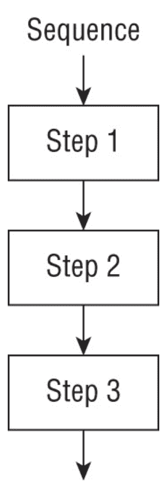

**图A.1** 顺序

最终，执行实际所需工作的程序指令将被组织成顺序。顺序可能变得相当大，因为方法可以调用其他方法，对象可能需要将其部分工作分派给其他对象。

例如，考虑在电子商务网站上完成购买的工作流程。当你点击结账按钮时，程序将完成一系列需要在多个对象之间完成的步骤。顶层对象通常控制结账过程的工作流程，但子顺序可能包括：

1. 登录
2. 输入支付信息
3. 将支付信息发送给支付处理器/银行
4. 通知仓库订单
5. 通知运输公司取件
6. 通过电子邮件向客户发送确认

等等。

熟练的开发人员会在开始编写代码之前详细规划每个流程。他们将代码分成方法和对象，将相关的东西分组在一起，同时记住易于维护和可测试性。顺序中的每一步最终都可能调用其他顺序。

### 分支

在**分支**情况下，程序到达一个点，有两个或更多可能的下一步，它必须评估一个条件以确定采取哪条路径。分支总是基于一个可以回答为真或假的问题。在大多数情况下，真情况决定了程序将遵循的默认顺序。

也可能有一个假情况，其中可以遵循不同的顺序。[图A.2](#figure-a2)显示了一个分支程序流程。

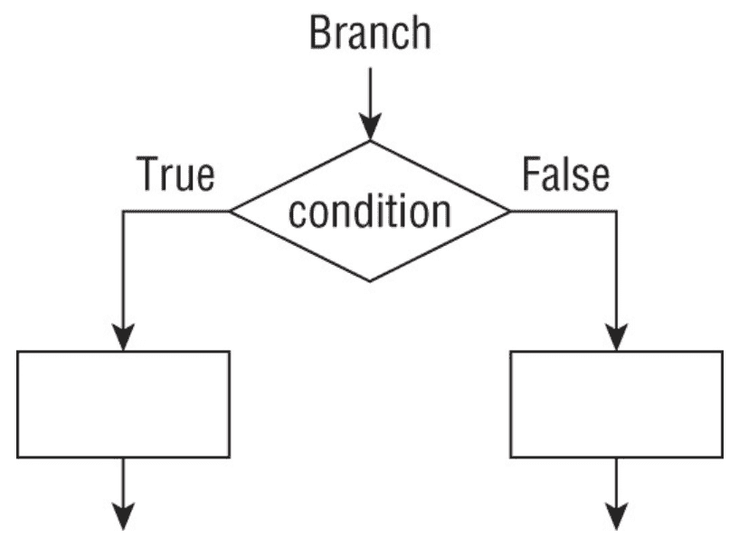

**图A.2** 分支程序流程

分支情况可以像登录网站一样简单。在分支流程图中，菱形表示将决定控制流将遵循哪个分支的条件。例如，“用户名和密码正确吗？”如果为真，则将用户带到其主页。如果为假，则显示错误并提示用户重试。

## 循环

在**循环**情况下，我们继续运行一系列指令，直到满足某个条件。我们在日常生活中经常这样做。洗手时，我们的条件是，“我的手干净了吗？”如果没有，那么我们将继续擦洗，直到它们干净。

软件开发中有几种不同类型的循环。有些循环将运行特定次数，例如循环遍历文本字符串中的字符数。如果我们知道字符串中有多少个字符，我们就知道我们想要循环多少次。

在其他情况下，我们事先不知道需要循环多少次。在前面的网站示例中，用户可能第一次正确输入了用户名和密码，但由于人类是不完美的生物，他们可能直到第二次或第十次才正确输入信息。在这些情况下，我们希望构建循环，直到他们正确为止。

循环包括一个分支，但分支之后的顺序返回到分支。图A.3展示了一个循环程序流程。

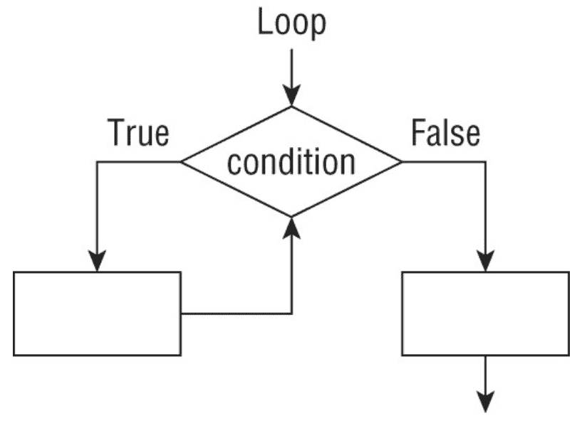

**图A.3** 循环程序流程

循环将继续，直到满足指定条件。一旦满足条件，循环结束，控制流移动到程序中的下一个指令块。

需要注意的一件事是无尽（或无限）循环。完全有可能定义一个循环的条件，使得条件永远无法满足（例如，定义一个登录循环要求同时输入用户名和密码，但未能要求用户输入密码）。在这种情况下，循环将无限期运行，直到其他东西停止它。

### 常见流程图形状

使用我们的控制流结构和分支语句，我们可以提出一些非常有趣的算法。事实上，正如我们之前指出的，即使是最复杂的场景最终也必须分解为这三种结构。

虽然流程图中有许多可用的符号，但最常见的包括：

- **椭圆形：** 表示算法的起点和终点
- **矩形：** 表示计算机必须完成的指令
- **平行四边形（倾斜的矩形）：** 输入和输出
- **菱形：** 条件

我们还使用单向箭头来表示步骤完成的顺序。从技术上讲，流程图可以以任何方式定向，因为箭头定义了步骤完成的顺序，但它们最常见的是从上到下（因此程序从顶部开始，在底部结束）或从左到右定向。较大的流程图可以包含从上到下和从左到右定向的组合，如果使流程图更易于阅读，也可以从右到左。

流程图当然可以手写，尽管通常最好使用铅笔、白板或其他可擦除介质以便于更正。还有一些软件选项，包括Draw.io，最近更名为Diagrams（[https://app.diagrams.net](https://app.diagrams.net)），这是一个免费的在线图表工具，以及LucidChart（[www.lucidchart.com](www.lucidchart.com)），这是一个付费程序，包含免费选项。Microsoft Office产品（包括Visio、Word和PowerPoint）也包含流程图工具，Google Drive中的绘图（[https://drive.google.com](https://drive.google.com)）也是如此。

> **注意** 流程图的重点是为你的逻辑提供视觉辅助。

### 流程图示例

现在让我们看看如何使用流程图来绘制一个简单算法的图。考虑一个要求用户输入奇数的方法。此步骤可能包括：

1. 声明变量以存储键盘输入和解析后的数字
2. 开始循环
   1. 提示用户输入奇数
   2. 从键盘读取输入
   3. 如果输入是数字
      * 如果数字是奇数
         * 退出循环
      * 如果数字不是奇数
         * 告知用户数字不是奇数
         * 重新启动循环
   4. 如果输入不是数字

## 附录 A 补充流程图元素

流程图绘制并非一门精确的科学。实际上，并不存在适用于所有可能情况的标准，因此请以您的团队和个人偏好为指导。前文已提及流程图的四种基本形状。下面将对一些常见符号进行更详细的说明。

首先，我们来看图 A.5 所示的**流程线**。它用于指示逻辑的流向。您的代码应始终沿着箭头方向从一个符号流向另一个符号。

**图 A.5** 流程线

当两条线相遇时，它们要么合并，要么交叉。如果两条流程线合并成一条线，意味着这两件事具有相同的结果。当一条线与另一条线交叉时，会添加一个桥接符号，以便两条线能继续沿着各自的路径通向不同的结果。这些流程线的情况如图 A.6 所示。

**图 A.6** 分支（两条线的合并）与桥接流程线

如果多条线通向同一个结果，这些线将合并为一条。图 A.7 展示了流程线合并的示例。

（多条线）

**图 A.7** 流程线合并

**终结符**用于指示流程图的起点或终点。图 A.8 展示了终结符。

指示流程图的起点或终点

**图 A.8** 终结符

接下来是**平行四边形**，如图 A.9 所示。前文已提及，平行四边形用于输入和输出。在本书介绍的程序中，平行四边形将用于表示与控制台的交互，包括输入和打印操作。

指示用户输入和输出

**图 A.9** 输入/输出平行四边形

图 A.10 所示的**处理符号**用于数学运算、逻辑运算符和方法调用。这些通常是类似“发送邮件”、“检查地址”或“借记账户”这样的代码语句。

最后是**判断符号**，即菱形，如图 A.11 所示。判断可以有两个分支，分别对应真/假、是/否等。您也可以用它们来表达更复杂的决策，例如在 `switch` 语句中，如图 A.12 所示。

**图 A.12** 判断

> **注意** 归根结底，如果您无法在纸上或白板上解决问题，那么您也无法用代码解决它。确保您能用简单的英语解释您的程序试图做什么——至少对自己解释清楚——这是梳理编码逻辑至关重要的第一步。

> **提示** 提前花时间进行规划是值得的。这将避免日后许多痛苦和挫折。

## 附录 B
创建伪代码

除了我们在附录 A 中介绍的流程图外，开发人员还经常使用伪代码作为在开始编写程序代码之前规划和描述计算机程序指令的一种方式。

## 什么是伪代码？

**伪代码**是一种使用自然语言语句表示算法的方式，但不受真实编程语言中术语和结构的约束。前缀 *pseudo-* 源自一个希腊词，意为“假的”，因此伪代码实际上意味着“假代码”。

您可以将伪代码视为正常人类语言和通用计算机代码的混合体。您可以使用 `if` 语句表示条件，使用 `while` 和 `for` 语句表示循环，使用通用语句声明变量。这个过程就像为您的程序创建一个指南。当您开始编码时，它将成为您程序的逐步过程。

尽管对于使用伪代码编写算法有一些通用建议，但最终结果应是一系列具有编程代码外观和结构的步骤，但其编写方式应让人类能够理解。团队成员经常在同一个项目上工作，因此在伪代码中使用简单清晰的语言，而不依赖过多缩写或他人可能不易理解的术语，是一个好主意。各个语句可以是完整的句子或简单的短语，只要它们提供足够的信息以保持清晰即可。

例如，假设您想创建一个程序，允许用户选择一个形状，输入一些尺寸，然后返回该形状的面积。以下是一个可能的伪代码解决方案：

```
欢迎用户使用您的程序
向用户显示形状列表（整数还是字符串输入？）
    正方形、长方形、三角形、圆形
请用户选择一个形状
如果形状是正方形，请用户输入高度
    计算并返回面积（高度 * 高度）
如果形状是长方形，请用户输入高度和宽度
    计算并返回面积（高度 * 宽度）
如果形状是三角形，请用户输入底和高
    计算并返回面积（0.5 * 底 * 高）
如果形状是圆形，请用户输入半径
    计算并返回面积（PI * 半径 * 半径）
显示程序结束信息
```

写出伪代码（和/或流程图）的优点包括以下所有方面：

- 您识别了程序解决问题所需的所有指令，包括来自用户的输入以及程序运行结束后用户将看到的内容。
- 您识别了程序所需的变量、常量和操作。
- 您创建了一个无论最终程序是什么样子或使用什么语言编写都能工作的结构。
- 开发团队中的每个人都能理解程序将做什么，包括可能不理解编程语言的设计师。

伪代码也可以使用任何人类语言编写。虽然对于将与他人共享的伪代码，您应该使用像英语这样的通用语言，但如果您更喜欢使用其他语言，您可以为自己的项目使用自己的语言编写伪代码。

> **注意** Meri Engle 有一个有用的视频，比较了流程图和伪代码，您可以在 [https://youtu.be/Qb2QrkrAfH8](https://youtu.be/Qb2QrkrAfH8) 找到。该视频包含关于何时选择流程图还是伪代码的建议。

> **提示** 练习自己编写一些伪代码。例如，您可以写出计算机可以用来制作您最喜欢的三明治、洗碗或喂养宠物的指令。写出指令后，请其他人仔细阅读并遵循它们。您是否遗漏了任何必要的步骤？

## 附录 C
安装 MySQL

MySQL 是一个**关系型数据库管理系统（RDBMS）**，它作为服务器运行，为多个数据库提供多用户访问。许多 Python 程序员在他们的 Python 应用程序中使用 MySQL。本附录提供安装 MySQL 的说明。在本附录结束时，你应该能够在本地系统上运行 MySQL 数据库服务器和客户端。

## MySQL 安装

你可以使用安装程序下载并安装 MySQL。我们将使用 MySQL 的 MSI 安装程序将 MySQL 安装到 Windows 上。它会安装 MySQL 开发所需的一切，并为我们做出 32 位/64 位的选择。

> **注意** 在安装过程中，你将被要求设置 MySQL root 用户密码。请务必*不要*忘记你的 root 密码。如果你忘记了，你将无法使用你的工具。

## 下载并安装 MySQL

浏览到 MySQL 的下载页面 [https://dev.mysql.com/downloads/windows/installer/](https://dev.mysql.com/downloads/windows/installer/)。这将为你提供选择 MSI 安装程序的选项。默认情况下，操作系统应选择 Microsoft Windows。如果你使用的是其他操作系统，可以从下拉列表中选择。请注意，本附录将重点介绍 Microsoft Windows；但是，在其他操作系统上的安装过程应该类似。

可能会出现两个选项。任一下载都可以。第一个较小，因为它从网络获取必要的资源。这意味着初始下载很快，但安装过程将需要更长时间，并且在整个过程中都需要互联网连接。第二个包含所有必要的资源。下载时间会更长，但一旦保存到你的计算机上，你就可以在没有互联网连接的情况下安装 MySQL。

选择最适合你的选项，然后单击相应的 *下载* 按钮。

MySQL 网站希望你相信需要一个帐户才能下载软件。虽然如果你认为有用可以创建一个帐户，但你也可以简单地在登录下方单击 "*No thanks, just start my download*"，将文件保存到计算机上的已知位置，而无需创建帐户。

下载完成后，打开下载的 `mysql-installer-community-[version].msi` 文件以启动安装程序。这将启动一个你可以逐步操作的向导。安装程序将自动检查问题，例如缺少实用程序或路径冲突。如果你看到错误，你需要在继续安装之前解决该错误。

以下内容将帮助你在安装过程中做出选择：

- 当提示选择安装类型时，在左列中选择 *Developer Default*。这将安装开发所需的一切。
- 在第二个对话框中，查看要安装的产品（工具）。你应该会看到 MySQL Server 和 MySQL Workbench 包含在列表中，但它还包括各种语言的连接器、当前版本 MySQL 的文档以及你可以用来试验 MySQL 的示例文件。
- 单击 *Execute* 并放松。安装需要一段时间。随着安装的进行，你会看到组件从列表中被勾选，如 [图 C.1](#) 所示。

> **注意** 你可以单击 *Show Details* 按钮查看正在安装的详细信息。

如果你看到与任何组件相关的错误，请等待其他所有组件安装完成，然后单击该组件的 *Try Again* 链接。如果第二次尝试后仍然收到错误，请单击 *Show Details* 按钮并向下滚动（如有必要）以查看错误的详细信息。

## 配置 MySQL

产品安装完成后，你可以单击 *Next* 按钮继续到 *Product Configuration* 选项。在大多数情况下，默认选项就足够了。单击 *Next* 开始产品配置选项。以下内容将帮助你选择选项：

- 如果有 *High Availability* 选项，请使用默认选项 Standalone MySQL Server / Classic MySQL Replication。

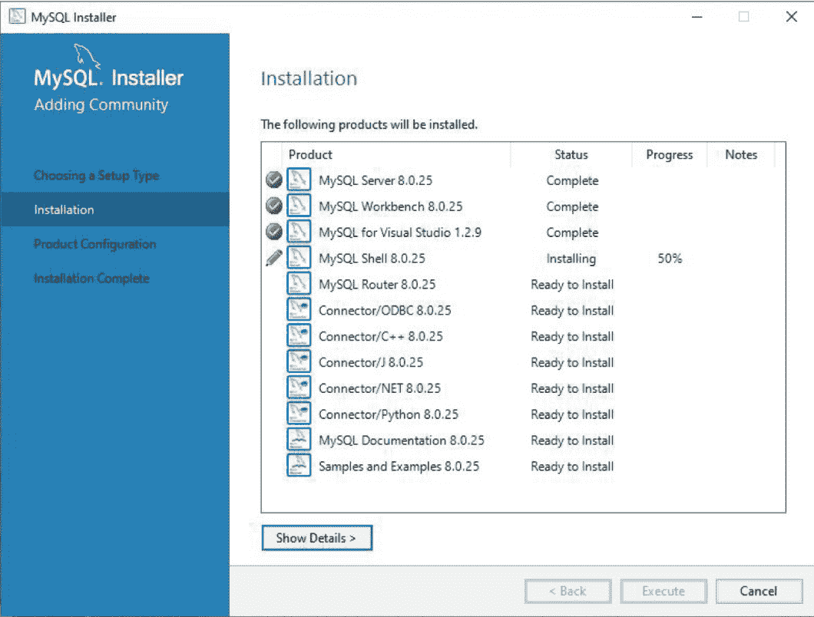

**图 C.1** MySQL 产品安装

- 在 *Type and Networking* 下，使用默认选项：Development Computer，使用 TCP/IP，端口号 3306，并打开 Windows 防火墙端口。
- 对于 *Authentication Method*，我们将使用 Legacy Authentication 方法。如果你在远程机器上运行 MySQL 服务器或使用敏感数据，更强的密码加密是更好的选择，但出于本书课程的目的，我们不需要那种级别的加密。
- 对于 *Accounts and Roles*，你需要为 root 帐户定义一个密码。root 帐户是一个“上帝”帐户，允许用户在数据库中执行任何操作，因此在包含多个用户的典型安装中，此密码应极其安全。在这种情况下，你正在进行本地安装，只有你可以访问，因此简单的密码就可以了。

> **注意** 记下 root 密码！稍后打开 MySQL 时你会需要它。

- MySQL 将作为 Windows 服务运行，默认选项是使用名为 *MySQL80* 的 Windows 服务和标准系统帐户即可。

定义完所有配置选项后，在 Apply Configuration 窗口上单击 *Execute*。这将运行如 [图 C.2](#figure-c2) 所示的步骤来配置你选择的设置。


**图 C.2** 应用配置设置

你应该会收到一条配置成功的消息，并且 *Finish* 按钮应该变为可用。如果没有，请查看反馈，再次检查配置选项，并研究解决问题的方法。

## 配置 MySQL Router 选项

当你单击 *Finish* 时，安装向导将返回到 Product Configuration 窗口，并显示 MySQL Server 的配置已完成。单击 *Next* 按钮将继续到下一项，即 MySQL Router 配置。Router 仅用于管理数据库集群，因此我们不会在此处进行任何更改。你可以在 MySQL Router 配置页面上单击 *Finish* 按钮，无需进行任何更改。

## 配置示例和示例

安装向导将再次返回到 Project Configuration 窗口。单击 *Next* 继续。你将被提示连接到服务器。

此时，本地 MySQL 服务器应该已经在运行。输入你为 **root** 帐户创建的密码，然后单击 *Check* 以验证你可以连接到服务器。

如果一切设置正确并且你输入了正确的密码，你将看到如 [图 C.3](#figure-c3) 所示的 Connection succeeded 消息。

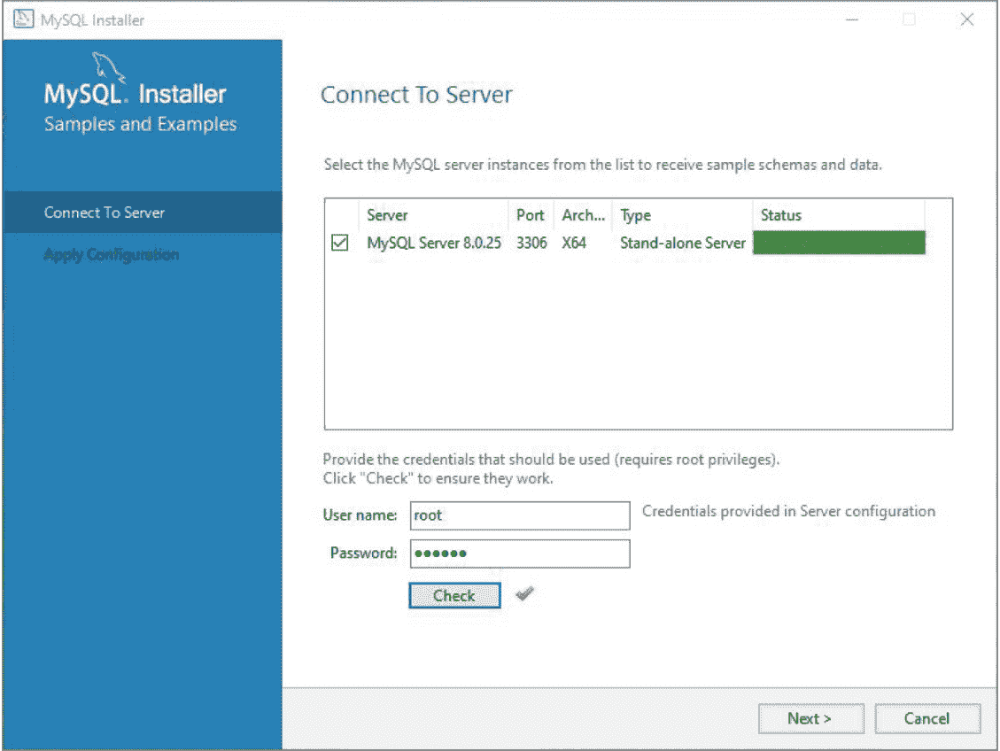

**图 C.3** 成功连接到服务器

单击 *Next*，然后单击 *Execute* 以应用你刚刚定义的配置。安装向导将安装 Samples and Examples 文件并确认配置完成。单击 *Finish* 返回到 Product Configuration 窗口，然后单击 *Next* 完成安装。

最后一步确认安装完成。如果你不想立即打开 MySQL Workbench 或 MySQL Shell，请取消选中这些框。然后你可以单击 *Finish* 关闭向导。

安装和配置完成。你现在拥有：

- MySQL 数据库服务器
- MySQL shell：命令行查询界面
- MySQL Workbench：GUI 查询界面和模式浏览器
- 文档
- 示例
- 用于各种编程语言的 MySQL 连接器

## 验证安装

让我们使用命令行界面来验证 MySQL 已安装并且你可以连接到它。虽然 MySQL Shell 确实为 MySQL 提供了命令行界面，但它不如其他选项（包括 Windows 命令提示符或 Windows PowerShell）那么直接。我们将使用命令行窗口完成此步骤。

首先确定 mysql.exe 文件在你计算机上的位置。默认情况下，它应该在 C:\Program Files\MySQL\MySQL Server 8.0\bin 中，但如果你安装的是 32 位版本，它可能在 C:\Program Files (x86)\MySQL\MySQL Server 8.0\bin 中。找到正确的路径后，将其写下或复制到 Windows 剪贴板。

通过单击开始菜单并键入 **cmd** 直到看到 *Command Prompt* 来打开命令提示符。单击该选项将其打开。

在命令提示符中，你需要导航到刚刚确定的文件夹。输入以下命令，使用适合你计算机的路径：

```
cd C:\Program Files\MySQL\MySQL Server 8.0\bin
```

你应该会看到命令提示符窗口中的提示更改为该目录。
要连接到 MySQL，请在提示符处输入以下命令：

```
mysql -u root -p
```

此语句执行三个任务：

- 它连接到 MySQL。
- 它将用户标识为 root。
- 它告诉 MySQL 提示输入用户密码。

当你输入此命令时，你将看到如 [图 C.4](#) 所示的密码提示。

## 附录 C
连接到 MySQL

**图 C.4** 连接到 MySQL 密码提示

请输入您在安装过程中设置的密码。在某些版本中，MySQL 会完全隐藏密码，因此您可能看不到任何已输入密码的迹象。如果输入正确，您将看到如 [图 C.5](#figure-c5) 所示的 MySQL 提示符。

**图 C.5** MySQL 提示符

如 MySQL 欢迎语句所述，命令以 ; 或 \g 结尾。我们将使用 ; 来结束每条命令。输入以下命令，它将列出 MySQL 当前管理的所有现有数据库：

```
show databases;
```

您看到的数据库（以及在 [图 C.6](#) 中显示的）是 MySQL 用于跟踪自身信息及其使用情况的元数据库。

**图 C.6** 默认元数据库

如果您能够连接到 MySQL 并查看现有数据库，说明您已成功安装 MySQL 并为本书的课程做好了准备。您可以通过输入 **quit**; 或直接关闭命令提示符窗口来退出 MySQL。

## THE MySQL NOTIFIER

MySQL 数据服务器配置为在计算机启动时启动，并始终在后台运行。如果您希望获得更多控制权，可以考虑安装 MySQL Notifier，可从 [https://dev.mysql.com/downloads/windows/notifier/](https://dev.mysql.com/downloads/windows/notifier/) 获取。Notifier 会安装一个系统托盘图标，显示现有 MySQL 数据库服务器的状态，并允许您启动和停止它们。

## 附录 D
安装 Vinyl DB

Vinyl DB 是一个数据库，用于本书 [第 24 课](https://example.com) 和 [第 25 课](https://example.com) 中介绍的 ETL 程序。本附录为您提供数据库的结构以及可用于创建 SQL 数据库的脚本代码。

## 数据库结构

数据库本身引用了一个黑胶唱片店的库存，员工可以使用它来查找歌曲、专辑和艺术家。数据库的结构如 [图 D.1](https://example.com) 所示。

以列表形式呈现，数据库结构如下所示：

```
song
    songId (PK) int
    songTitle string(100)
    videoUrl string(100)
    bandId (FK) int
songAlbum
    songId (PK, FK) int
    albumId (PK, FK) int
album
    albumId (PK) int
    albumTitle string(100)
    label string(50)
    releaseDate date
    price float(5,2)
band
    bandId (PK) int
    bandName string(50)
bandArtist
    bandId (PK, FK) int
    artistId (PK, FK) int
artist
    artistId (PK)
    artistFirstName string(25)
    artistLastName string(50)
```

## 创建数据库

[清单 D.1](Listing D.1) 中的脚本用于创建数据库。您可以在任何 MySQL 界面中运行此脚本，包括带有 MySQL Workbench 的 MySQL Server。

```
清单 D.1
创建 Vinyl 数据库的脚本

-- 运行此脚本将删除现有数据库及其包含的所有数据。
-- 请谨慎使用。

DROP DATABASE IF EXISTS vinylrecordshop;

CREATE DATABASE vinylrecordshop;

USE vinylrecordshop;

CREATE TABLE album (
    albumId INT AUTO_INCREMENT,
    albumTitle VARCHAR(100) NOT NULL,
    label VARCHAR(50),
    releaseDate DATE,
    price DECIMAL(5,2),
    CONSTRAINT pk_album
        PRIMARY KEY (albumId)
);

CREATE TABLE artist (
    artistId INT NOT NULL AUTO_INCREMENT,
    fname VARCHAR(25) NOT NULL,
    lname VARCHAR(50) NOT NULL,
    isHallOfFame TINYINT NOT NULL,
    CONSTRAINT pk_artist
        PRIMARY KEY (artistId)
);

CREATE TABLE band (
    bandId INT AUTO_INCREMENT,
    bandName VARCHAR(50) NOT NULL,
    CONSTRAINT pk_band
        PRIMARY KEY (bandId)
);

CREATE TABLE song (
    songId INT NOT NULL AUTO_INCREMENT,
    songTitle VARCHAR(100) NOT NULL,
    videoUrl VARCHAR(100),
    bandId INT NOT NULL,
    CONSTRAINT pk_song
        PRIMARY KEY (songId),
    CONSTRAINT fk_song_band
        FOREIGN KEY (bandID)
        REFERENCES band(bandId)
);

CREATE TABLE songAlbum (
    songId INT,
    albumId INT,
    CONSTRAINT pk_songAlbum
        PRIMARY KEY (songId, albumId),
    CONSTRAINT fk_songAlbum_song
        FOREIGN KEY (songId)
        REFERENCES song(songId),
    CONSTRAINT fk_songAlbum_album
        FOREIGN KEY (albumId)
        REFERENCES album(albumId)
);

CREATE TABLE bandArtist (
    bandId INT,
    artistId INT,
    CONSTRAINT pk_bandArtist
        PRIMARY KEY (bandId, artistId),
    CONSTRAINT fk_bandArtist_band
        FOREIGN KEY (bandId)
        REFERENCES band(bandId),
    CONSTRAINT fk_bandArtist_artist
        FOREIGN KEY (artistId)
        REFERENCES artist (artistId)
);
```

-- 此脚本将向 vinylrecordshop-schema 脚本中创建的表添加数据。
-- 请先向主表添加数据。

```
USE vinylrecordshop;

INSERT INTO album (albumId,albumTitle, releaseDate, price, label)
VALUES
    ROW (1, 'Imagine', '1971-9-9', 9.99, 'Apple'),
    ROW (2, '22525 (Exordium & Terminus)', '1969-7-1', 25.99, 'RCA'),
    ROW (3, "No One's Gonna Change Our World", '1969-12-12', 39.35, 'Regal Starline'),
    ROW (4, 'Moondance Studio Album', '1969-8-1', 14.99, 'Warner Bros'),
    ROW (5, 'Clouds', '1969-5-1', 9.99, 'Reprise'),
    ROW (6, 'Sounds of Silence Studio Album', '1966-1-17', 9.99, 'Columbia'),
    ROW (7, 'Abbey Road', '1969-1-10', 12.99, 'Apple'),
    ROW (9, 'Smiley Smile', '1967-9-18', 5.99, 'Capitol');

INSERT INTO artist VALUES (1, 'John', 'Lennon', 1),
(2, 'Paul', 'McCartney', 1), (3, 'George', 'Harrison', 1), (4, 'Ringo', 'Starr', 1),
(5, 'Denny', 'Zager', 0), (6, 'Rick', 'Evans', 0), (10, 'Van', 'Morrison', 1),
(11, 'Judy', 'Collins', 0), (12, 'Paul', 'Simon', 1), (13, 'Art', 'Garfunkel', 0),
(14, 'Brian', 'Wilson', 0), (15, 'Dennis', 'Wilson', 0), (16, 'Carl', 'Wilson', 0),
(17, 'Ricky', 'Fataar', 0), (18, 'Blondie', 'Chaplin', 0), (19, 'Jimmy', 'Page', 0),
(20, 'Robert', 'Plant', 0), (21, 'John Paul', 'Jones', 0), (22, 'John', 'Bonham', 0),
(23, 'Mike ', 'Love', 0), (24, 'Al ', 'Jardine', 0), (25, 'David', 'Marks', 0),
(26, 'Bruce ', 'Johnston', 0);

INSERT INTO band VALUES (1, 'The Beatles'), (2, 'Zager and Evans'), (3, 'Van Morrison'), (4, 'Judy Collins'), (5, 'Simon and Garfunkel'), (7, 'Beach Boys'),
(8, 'Led Zeppelin');

INSERT INTO song VALUES (1, 'Imagine', 'https://youtu.be/DVg2EJvvlF8', 1),
(2, 'In the Year 2525', 'https://youtu.be/izQB2-Kmiic', 2), (3, 'Across the Universe', 'https://youtu.be/Tjq9LmSO1eI', 1),
(4, 'Moondance', 'https://youtu.be/6lFxGBB4UG', 3), (5, 'Both Sides Now', 'https://youtu.be/rQ0uxByR5VI', 4), (6, 'Sounds of Silence', 'https://youtu.be/qn0QBXMYXsM', 5),
(7, 'Something', 'https://youtu.be/xLGe-QzCK4Q', 1), (9, 'Good Vibrations', 'https://youtu.be/d8rd53WuojE', 7), (10, 'Come Together', 'https://youtu.be/_HONxwhwmgU', 1),
(11, 'Something', 'https://youtu.be/UKAp-jRUp2o', 1), (12, 'Maxwell\'s Silver Hammer', 'https://youtu.be/YQgsob_o1io', 1);

INSERT INTO bandartist VALUES (1,1), (1,2), (1,3), (1,4), (2,5), (2,6),
(3,10), (4,11), (5,12), (5,13), (7,14), (7,15), (7,16), (7,17), (7,18), (8,19),
(8,20), (8,21), (8,22), (7,23), (7,24), (7,25), (7,26);

INSERT INTO songalbum VALUES (1,1), (2,2), (3,3), (4,4), (5,5), (6,6), (7,7),
(9,9), (10,7), (11,7), (12,7);
```

> **注意** [清单 D.1](http://www.wiley.com/go/jobreadypython) 中的脚本可在 [附录 D](http://www.wiley.com/go/jobreadypython) 文件夹中找到，该文件夹位于可从 [www.wiley.com/go/jobreadypython](http://www.wiley.com/go/jobreadypython) 下载的 JobReadyPython.zip 文件的 Lesson Listings 文件夹内。

## 附录 E
安装 MongoDB

本附录提供使用 MongoDB Community Server 下载、安装和运行 MongoDB 的说明。以下说明假设您使用的是 Windows。如果您使用的是 Mac OS 或 Linux，请为该操作系统选择相应的选项。

## 安装 MongoDB COMMUNITY SERVER

由于 MongoDB 是一个基于服务器的软件包，您需要安装一个在本地计算机上运行的服务器以及访问本地主机的客户端软件。让我们从安装服务器开始。

导航到 MongoDB 下载页面 ([https://www.mongodb.com/try/download](https://www.mongodb.com/try/download))，并点击如 [图 E.1](Figure E.1) 所示的 MongoDB Community Server 选项。

## 附录 E
运行 MongoDB

一旦在本地计算机上安装了 MongoDB，您可以按照以下步骤运行该软件：

1.  打开 Windows 文件资源管理器。
2.  导航到 MongoDB 的安装路径。默认情况下，路径为 C:\Program Files\MongoDB\Server\4.4，尽管在某些机器上以及根据您安装的版本，此路径可能有所不同。
3.  打开该位置下的 bin 目录。
4.  打开名为 mongo.exe 的文件。

MongoDB 将在命令行窗口中打开，准备供您使用。

作为命令行的替代方案，MongoDB 安装包含 MongoDB Compass，这是一个如图 E.8 所示的图形用户界面，它也允许您与存储在本地服务上的数据库进行交互。默认情况下，安装会在 Windows 开始菜单的 *MongoDB Inc.* 下添加一个 *MongoDB Compass* 选项。

> **注意** 有关 Compass 的更多信息，请参阅 MongoDB Compass 文档，网址为 https://docs.mongodb.com/compass/master。

## 附录 F
导入到 MongoDB

在本附录中，我们将学习如何使用 mongoimport 实用程序将 JSON 文件的内容移动到 MongoDB 中的一个集合。具体来说，我们将把一个包含电子商务商店用户评论的数据集导入到 MongoDB 集合中。

您需要下载此 JSON 文件的副本。您可以在 [www.wiley.com/go/jobreadypython](http://www.wiley.com/go/jobreadypython) 的 JobReadyPython.zip 文件的 data 目录中找到此文件。您需要下载 zip 文件并将 data.json 文件的副本保存到计算机上的已知位置。

要将文件导入 MongoDB 集合，我们需要在 Windows 命令行中使用 mongoimport 实用程序。此实用程序允许我们从 JSON、CSV 或 TSV 等流行文件格式导入数据。类似地，还有一个 mongoexport 实用程序，允许我们将集合的内容导出为 JSON、CSV 或 TSV 等标准文件格式。

打开 Windows 命令行窗口：

1.  单击 *开始* 按钮或 Windows 10 搜索框。
2.  在搜索框中键入命令 **cmd**，并在结果中选择 *命令提示符*。

> **注意** 假设您已安装 MongoDB。如果未安装，请参阅附录 E 了解有关安装 MongoDB 的信息。

在命令行上，使用以下命令导航到 MongoDB bin 目录。如有必要，请调整路径以反映计算机上的正确路径：

```
cd C:\Program Files\MongoDB\Server\4.0\bin
```

输入以下命令，使用保存的 data.json 文件的适当路径：

```
mongoimport --db amazon_reviews --collection musical_instruments --type json --file /PATH/TO/JSON/FILE/data.json
```

- 我们使用 mongoimport 将 JSON 文件复制到 MongoDB 上的一个集合。
- --db 指的是将创建集合的数据库。在此示例中，我们正在创建一个名为 amazon_reviews 的新数据库。
- --collection 指的是将存储数据的集合名称。在此示例中，该表名为 musical_instruments。
- --type 指的是文件格式。这里，我们使用的是 JSON 文件，但我们也可以使用 CSV 和 TSV 等其他格式。
- --file 指的是 JSON 文件的存储路径。

图 E.1 展示了如何使用 mongoimport 导入 JSON 文件。您可以看到我们成功地将 10,261 条评论导入到了 musical_instruments 集合中。

切换回 Mongo shell 并确认集合已正确导入：

```
> use amazon_reviews;
switched to db amazon_reviews
> db.musical_instruments.find();
```

如果集合导入正确，您将看到与原始 data.json 文件中出现的数据相同的部分数据集。一旦确认数据已正确导入，您就可以关闭 Windows 命令行界面。

## 索引

A

a 参数, [404](404)

缩写：名称对, [229](229)

绝对路径, [401](401)

抽象

- 定义, [314](314)
- 作为面向对象编程的原则, [314](314)

账户余额，求和, [483](483)–484

添加文件图标 (Replit), [12](12)

add( ) 方法

- 示例, [297](297)–298
- 在集合内, [262](262), [263](263)

add_condiment 方法, [353](353)

添加

- 常量到 lib.py 文件, [522](522)
- 内容到文本文件, [412](412)–415
- 字典对象到 CSV 文件, [441](441)–442
- 饮料到订单, [360](360)–362
- 异常处理程序到函数, [517](517)
- 异常处理到 extract 类, [594](594)–601
- extract.fromCSV 方法, [534](534)–535
- fromMONGODB 方法, [542](542)–543
- 方法到 Person 类, [320](320)–321
- 多个异常, [496](496)
- 配菜到订单, [362](362)–363
- 通过字典添加交易, [442](442)–443

添加属性练习, [344](344)–345

添加新名称练习, [280](280)

算法

- 定义, [613](613)
- 目的, [102](102)
- 使用, [31](31)–32

*爱丽丝梦游仙境* 文件, [400](400)

关于汽车的一切练习, [446](446)

关于你的一切练习, [203](203)

Anaconda 发行版

- 关于, [14](14)–15
- Jupyter Notebook 安装, [15](15)–16

与逻辑运算, [92](92)

总计是……练习, [169](169)

匿名函数, [467](467)

append() 方法

- 在列表内, [189](189)
- 元组和, [214](214)

追加数据, [436](436)–439

应用时间戳, [384](384)–387

你富有吗？练习, [115](115)

圆的面积，硬编码常量, [44](44)

参数

- 任意, [304](304)–306
- 定义, [296](296)
- 关键字, [306](306)–308

算术，日期和, [387](387)–388

* (星号)，在函数内, [304](304)

## 属性

- 添加，[344]–345
- 作为类的组成部分，[315]
- datetime，[379]–380
- 定义，[314]
- 具有多个属性的 Person 类，[318]–319

计算平均开盘价，[429]–430

## B

\（反斜杠），[54]–55，[402]

Bad Stock Market Day 练习，[488]

银行应用

- 字符存储与，[154]–155
- 表示银行员工的类，[322]–324
- 具有方法重写的类，[341]–343
- 其中的 `clear()` 方法，[255]
- 其中的注释，[57]
- 其中的比较运算符，[96]
- 其中的列表连接，[197]
- 其中的元组连接，[217]
- 债务比率计算示例，[87]–88
- 其中的默认值，[302]–303
- 其中定义函数，[300]
- 其中的字典复制，[251]–252
- 其中的字典创建，[226]
- 其中的字典更新，[247]–249
- 其中的字典使用，[230]，[235]–236
- 示例，[53]–55
- 其中的函数，[85]
- 其中的 `get()` 方法，[240]–241
- 其中的高净值账户，[252]–254
- 其中的数据类型识别，[72]–74
- 其中的 if 语句使用，[105]–107
- 其中的 if-else 语句，[111]–112
- 其中的 `input()` 函数，[58]–59
- 其中的员工迭代，[165]–167
- 其中的列表访问，[183]–184
- 其中的列表创建，[177]–178
- 其中的列表插入，[191]–192
- 其中的列表使用，[181]–182，[190]
- 其中的逻辑运算，[94]–95
- 其中的 for 循环，[150]–151
- 其中的菜单选择捕获，[60]
- 其中元组的负索引，[211]
- 其中的 `in` 运算符使用，[246]
- 其中的 PEMDAS，[78]–80
- 其中的 `pop()` 方法，[242]–244
- 其中的常规任务，[300]–301
- 其中的四舍五入，[82]–83
- 其中的顺序语句，[103]
- 其中的集合，[261]，[265]，[266]–267，[267]–268，[270]，[271]–272，[273]–274，[277]–278，[279]
- 单利计算示例，[88]–89
- 其中的 `slice()` 函数，[188]–189
- 其中的字符串分割，[154]，[162]–163
- 其中的字符串，[153]
- 其中的元组，[207]
- 使用数值变量更新，[76]–77
- 其中的用户名检查，[108]–109
- 在账户类中使用类属性，[326]
- 使用继承，将柜员作为员工，[337]–338
- 其中的方法使用，[321]–322
- 其中的变量与格式化，[63]
- 其中的变量，[71]–72，[73]–74
- 其中的 while 循环，[148]，[150]–151

基类

- 创建，[335]
- 定义，[334]

Basic Inheritance 练习，[344]

*Beginning Regular Expressions* (Watt)，[521]

`bin` 函数，[82]

二进制算术运算，[70]，[74]–77

二进制值，[39]

循环体，[145]

`bool()` 函数，[90]–92

布尔数据类型，[89]–92

布尔值，[39]

流程图中的分支，[613]，[614]–615

Broken Names 练习，[67]

Broken Variables 练习，[67]

Building a Burger Shop 应用

- 创建类，[351]–352
- 创建 `food_item` 类，[352]–357
- 创建主文件，[357]–364
- 显示输出，[364]
- 代码规划，[350]–351
- 需求，[350]
- 连接代码文件，[364]–367

内置异常，[492]–493

内置函数，[296]

创建 `burger` 类，[353]–354

## C

- 计算
    - 平均开盘价，[429]–430
    - 收盘价，[433]–434
    - 天数差，[388]–390
    - 总和，[481]–482
- 驼峰命名法，[34]
- `capitalize()` 方法，在集合中，[274]
- 大小写敏感性
    - 关于，[34]
    - 数据输入的，[156]–157
    - 示例，[55]–56
    - 编程语言的，[34]
    - 字符串搜索与，[163]
- case 结构，使用，[55]–56
- Cats or Dogs 练习，[115]
- `ceil(x)` 函数
    - 定义，[83]
    - 使用，[85]
- 字符
    - 忽略大小写，[157]
    - 转换为大写，[473]
    - 列表切片，[185]
    - 存储，[154]–155
- `check_numbers` 函数，[500]
- 创建子类，[335]–336
- 类属性
    - 关于，[324]–325
    - 具有类属性的经理类，[325]–326
    - 静态方法，[326]–328
    - 在账户类中使用，[326]
- 类方法，[316]，[328]–330

类

- 基类，[334]，[335]
- `burger`，[353]–354
- 子类，[335]–336
- `combo`，[355]
- 组成部分，[315]–316
- 为 Building a Burger Shop 应用创建，[351]–352
- `datetime`，[372]–376，[379]–383
- 定义，[314]
- 定义类，[314]–316
- 派生类，[334]
- `DictReader`，[430]–431
- `DictWriter`，[440]–443
- `Director`，[338]–340
- `drink`，[354]
- `Employee`，[335]，[336]–337，[337]–338，[338]–340
- `extract`（参见 extract 类）
- `food_item`，创建，[352]–357
- 通用异常，[502]–505
- `IOError` 异常，[502]–505
- `load`（参见 load 类）
- `manager`，具有类属性，[325]–326
- `MathFormula`，[326]–327，[328]
- `order`，[356]–357
- 父类，[334]，[335]
- `Person`，[317]–321，[336]–340
- 表示银行应用中的员工，[322]–324
- `Sales`，[329]
- `side`，创建，[354]–355
- `Teller`，[337]–338
- `timedelta`，[387]–388
- `timestamp`，[384]–387
- `transform`（参见 transform 类）

Classy Vehicles 练习，[331]

`clear()` 方法

- 关于，[254]–255
- 定义，[225]
- 在集合中，[270]–272

`close()` 方法，[403]，[405]

计算收盘价，[433]–434

代码文件

- 重命名（Replit），[11]–12
- 本地保存（Replit），[12]

代码规划，为 Building a Burger Shop 应用，[350]–351

--collection，[644]

:（冒号），在函数代码块中，[297]

列

- 从数据源中移除，[552]–556
- 移除多列，[558]–561
- 重命名，[551]–552
- 重命名多列，[556]–558

Combination of the Two 练习，[422]

Combination of Them All 练习，[422]

创建 `combo` 类，[355]

命令

- 定义，[51]
- `print()`，[51]–52，[62]–63
- 单行命令，[51]–52

逗号分隔值（CSV）文件

- 追加数据，[436]–439
- 创建数据集列表，[432]–434
- 迭代，[427]–429
- 处理，[425]–446
- 读取，[426]–430
- 使用 `DictReader` 类，[430]–431
- 使用 `map()` 函数，[474]–475
- 使用 `writerow()` 方法，[434]–436
- 将行写入为列表，[439]–440
- 从字典写入行，[440]–443

注释

- 添加，[56]–57
- 定义，[50]

Company Bank Account 练习，[461]

Company Picnic 练习，[116]

Company Stocks 练习，[444]–445

比较运算符，[95]–96

比较

- 日期，[382]
- datetime 值，[381]–383

比较运算符

- 关于，[35]–36
- 与 `reduce()` 一起使用，[484]

Compass，[642]

A Complete List Program 练习，[203]–204

A Complete Tuple Program 练习，[220]–221

计算思维，[31]–32

计算机编程，未来，[30]

- 计算机
    - 二进制语言，[33]，[101]
    - 功能，[31]
- `compute_sum()` 函数，[305]–306
- `compute_word_count` 函数，[524]–525
- `compute_word_count_dataset` 函数，[526]
- `compute_word_count_review` 函数，[525]–526
- Computing the Square Root 练习，[487]
- Concatenating Files 练习，[508]
- 连接字符串，[471]
- 条件语句，[104]
- 条件运算符
    - 定义，[102]
    - 示例，[106]
- 条件语句
    - 关于，[106]–107
    - 嵌套，[112]–114
    - 在所得税计算器练习中，[125]–127
    - 其中的列表推导式，[199]
- 配置
    - MySQL，[624]–628
    - MySQL 路由器选项，[626]
    - 示例，[627]–628
- Confirming an Attribute 练习，[584]
- 控制台窗口（Replit），[8]
- 常量
    - 关于，[44]–46
    - 添加到 `lib.py` 文件，[522]
    - 在 `lib.py` 文件中，[526]
- 构造函数，[314]

## 内容

- 添加到文本文件，[412]–415
- 限制，[406]–407
- 覆盖文本文件，[415]–417

## 控制结构

- 概述，[101]–102
- 目的，[144]
- 选择，[102]
- 顺序，[102]

## 转换

- 字符转大写，[473]
- 使用 `dumps()` 函数转换为 JSON 文件，[449]–450
- 从 JSON 转换为字典，[453]
- JSON 编码的对象转换为字典，[452]–453
- 转换为 `extract` 类的静态方法，[586]–588, [594]–601
- 转换为 `load` 类的静态方法，[592]–594
- 转换为 `transform` 类的静态方法，[588]–592

将文本文件转换为大写练习，[487]

`copy()` 方法，[225], [251]–252

`cos(x)` 函数，[83]

统计数字练习，[170]

计数练习，[27]–28

统计评论中的单词数，[524]–528

创建你自己的类练习，[331]

## 创建

- 基类，[335]
- 汉堡类，[353]–354
- 子类，[335]–336
- 为“构建汉堡店”应用创建类，[351]–352
- 套餐类，[355]
- 使用命名参数创建自定义日期，[381]
- 自定义 datetime 对象，[380]–381
- 为 `extract` 类创建自定义提取器，[601]–607
- 数据库，[632]–635
- 数据集列表，[432]–434
- datetime，[376]
- 为 CSV 文件中的行创建字典，[430]–431
- 饮料类，[354]
- `Employee` 类，[336]–337
- 异常，[502]
- `extract.fromJSON` 方法，[536]–537
- `extract.fromMongoDB` 方法，[542]–543
- `extract.fromMySQL` 方法，[538]–539
- `food_item` 类，[352]–357
- `fromCSV` 方法，[535]–536
- `head` 方法，[547]–550
- 使用 `dump()` 函数创建 JSON 文件，[448]–449
- lambda 函数，[468]–469
- 从数据集创建列表，[432]–433
- `load.toCSV` 方法，[570]–572
- `load.toJSON` 方法，[572]–574
- `load.toMONGODB` 方法，[578]–581
- `load.toMySQL` 方法，[574]–578
- 主文件，[357]–364
- 对象，[316]–317
- 订单类，[356]–357
- `order_once`，[358]–359
- 订单，[357]–358
- 父类，[335]
- `Person` 对象，[317]–318
- 配菜类，[354]–355
- `tail` 方法，[547]–550
- 目标数据库，[576]
- 文本文件，[417]–418
- 日期变量，[372]–376
- 时间变量，[375]–376

从文件创建列表练习，[508]

创建元组练习，[219]

CSV 文件。*参见* 逗号分隔值 (CSV) 文件

`{}`（花括号），[513]

当前值练习，[98], [507]–508

自定义提取器，为 `extract` 类创建，[601]–607

自定义安装链接 (Python)，[25]

# D

每日任务练习，[47]

## 数据

- 追加，[436]–439
- 检查，[512]–513
- 导入到 MongoDB，[542]
- 读取，[514]–517
- 顺序流程，[103]
- 结构，[174]–175, [224]
- 转换，[563]–567

## 数据分析与异常处理

- 组合异常类型，[498]–500
- 统计评论中的单词数，[524]–528
- 检查数据，[512]–513
- `except` 语句，[493]–495
- 提取、转换和加载 (ETL) 脚本，[531]–584
- `FileNotFoundError`，[495]
- `finally` 语句，[505]–506
- 通用异常类，[502]–505
- 改进 ETL 脚本，[585]–609
- lambda 表达式，[467]–489
- 读取数据，[514]–517
- 数据集分词，[517]–524
- `try` 语句，[493]–495
- 在 `try` 语句中使用多个操作，[500]–501
- 使用 `raise` 关键字，[501]–502
- Python 中的单词分析，[511]–530
- 使用多个 `except`，[495]–498
- `ZeroDivisionError`，[492]–500

数据集合作为数据类型，[39]–40

## 数据类型

- 数据集合作为数据类型，[39]–40
- 日期/时间作为数据类型，[39]
- 定义，[50], [70]
- 识别，[72]–74
- 数字，[70]–72
- 数字类型，[38]–39
- 概述，[37]–42
- 复习，[70]
- 文本类型，[38]
- 真/假类型，[39]
- 变量与数据类型，[43]–44

数据库，创建，[632]–635

数据集列表，创建，[432]–434

## 数据集

- 从数据集创建列表，[432]–433
- 分词，[517]–524, [522]–523
- 单词计数，[526]–528

日期计算器练习，[396]–397

`date()` 方法，[375]–376

日期字符串，分割，[377]–379

日期有效性练习，[609]

## 日期与时间

- 关于，[372]
- 应用时间戳，[384]–387
- 日期算术，[387]–388
- 计算天数差，[388]–390
- 比较 datetime 值，[381]–383
- 创建自定义 datetime 对象，[380]–381
- 作为数据类型，[39]
- 获取当前日期/时间，[376]–377
- 入门，[372]–376
- 分割日期字符串，[377]–379
- 协调世界时 (UTC) 格式，[383]–384
- 使用不含时间的日期，[390]–391
- 使用 datetime 属性，[379]–380
- 使用不含日期的时间，[392]–393

## datetime 类

- 关于，[372]–375
- 比较值，[381]–383
- 创建，[376]
- 创建自定义对象，[380]–381
- 使用属性提取，[379]–380
- 使用属性，[379]–380

`datetime` 模块，[372]

`datetime.utcnow()` 方法，[383]–384

星期几练习，[608]

`--db`，[644]

债务比率，计算，[87]–88

十进制值，[39]

`def` 关键字，在用户定义函数内，[297], [300]–301

## 定义

- 类，[314]–316
- `transform` 类，[546]–547

## 确定迭代

- 定义，[145]
- `for` 循环与确定迭代，[145]–146

## `del` 关键字

- 定义，[196]
- 元组与 `del`，[215]–216
- 用法，[194]

## 删除

- 移除 *与* 删除，[194]
- 文本文件，[419]–421

派生类，[334]

设计自定义 ETL 脚本，[532]–534

桌面，Replit 的，[8]

判断质数练习，[487]

图表，[616]

## 对话框

- 扩展 (Visual Studio Code)，[22]
- 文件 (Replit)，[12]
- 注册 (Replit)，[6]
- 欢迎 (Replit)，[7]

菱形，在流程图中，[615]–616, [619]

# 字典

- 关于，224–226
- 通过字典添加事务，442–443
- `clear()` 方法，225
- 清空，254–255
- 从 JSON 转换为字典，453
- 将 JSON 编码的对象转换为字典，452–453
- `copy()` 方法，225, 251–252
- 创建，226
- 为 CSV 文件中的行创建字典，430–431
- 从字典创建 JSON 文件，448–449
- 定义，174, 175, 224
- 复制，249–254
- 生成，227–230
- `get()` 方法，225, 239–241
- `items()` 方法，225, 234–239
- `keys()` 方法，225, 233–234, 245
- `pop()` 方法，225, 241–244, 254
- 从字典中检索项，230–232
- 分离，237–239
- 集合与字典对比，260
- `update()` 方法，225, 246–249
- 更新引用的字典，250–251
- `values()` 方法，225, 234–236
- 处理字典中的项，232
- 在字典中使用运算符，245–246
- 从字典写入行，440–443

`DictReader` 类，430–431

## `DictWriter` 类

- 向 CSV 文件添加字典对象，[441]–442
- 从字典写入行，[440]–443

`difference()` 方法，在集合中，[274]–276

数字音乐评论集，[512]

`Director` 类，[338]–340

`discard()` 方法，在集合中，[268]–270

## `display()` 函数

- 默认参数与 `display()`，[303]
- 重写，[340]–341
- 概述，[301]–303, [307]–308

`display_customer_input()` 函数，[304]–305

`display_info()` 方法，[322]

## 显示

- 不含时间的日期，[390]–391
- 输出，[364]
- 不含日期的时间，[392]–393

显示日期练习，[394]–395

显示文本练习，[66]

数学运算练习，[99]–100

文档字符串，[296]

文档，重要性，[285]

狗和猫练习，[345]

`""`（双引号），[176]

双精度浮点数，[39]

下载 MySQL，[623]–624

绘图，[616]

Draw.io，[616]

饮料类，创建，[354]

饮料，添加到订单，[360]–362

## `dump()` 函数

使用 `dump()` 函数创建 JSON 文件，[448]–449

## `dumps()` 函数

- 使用 `dumps()` 函数转换为 JSON 文件，[449]–450
- 格式化 JSON 数据，[450]–452

## 动态类型

- 关于，[43]
- 在 Python 中，[61]

# E

`e` 函数，[83]

元素，[175]

ElementTreeXML API，[603]

## `elif` 语句

- 关于，[109]–110
- 示例，[127]

嵌套条件，[112]–114

`Employee` 类，[335], [336]–337, [337]–338, [338]–340

## 封装

- 定义，[314]
- 作为 OOP 的原则，[314]

`end` 参数，[185]

Engle, Meri，[622]

## 错误

- 在 IDE 中，[10]
- 在数字中，[86]

ETL 脚本。*参见* 提取、转换和加载 (ETL) 脚本

玛丽去过的地方…练习，[280]–281

检查数据，[512]–513

`except` 语句，[493]–495, [503]

异常处理。*参见* 数据分析与异常处理

汇率，求和，[476]

## 练习

-   添加属性，344–345
-   添加新名称，280
-   关于汽车的一切，446
-   关于你的一切，203
-   你富有吗？，115
-   股市糟糕的一天，488
-   基本继承，344
-   损坏的变量，67
-   猫还是狗，115
-   有格调的车辆，331
-   两者结合，422
-   全部结合，422
-   公司银行账户，461
-   公司野餐，116
-   公司股票，444–445
-   一个完整的列表程序，203–204
-   一个完整的元组程序，220–221
-   计算平方根，487
-   连接文件，508
-   确认属性，584
-   将文本文件转换为大写，487
-   数数字，170
-   计数，27–28
-   创建你自己的类，331
-   从文件创建列表，508
-   创建元组，219
-   当前值，98, 507–508
-   每日任务，47
-   日期计算器，396–397
-   日期有效性，609
-   星期几，608
-   判断质数，487
-   显示日期，394–395
-   显示文本，66
-   做数学题，99–100
-   狗和猫，345
-   每个季节……，115–116
-   玛丽去过的地方……，280–281
-   文件系统，347
-   找出最大值，310
-   五秒后的未来，395
-   修复代码，66–67
-   Fizz Buzz，170–171
-   遵循注释，66
-   格式化的账户信息，461
-   水果查找器，168
-   水果代码，28
-   高低合一，257
-   最高数字，487
-   最高开盘价，488
-   最高收盘价，489
-   最高股市成交量，488
-   最高值，488
-   小时工，345–347
-   识别数字，169
-   识别绝对值，487
-   仅限整数，98
-   它能被整除，169
-   保持简短，168
-   最后一个键，487
-   闰年，395
-   不使用 len() 的长度，170
-   逐行处理，280
-   列表删除，203
-   列表修改，203
-   列出重复项，609
-   列出行，422
-   列出文本，423
-   最长单词，422
-   较小的数字，309
-   最小数字，487
-   操纵数学，97–98
-   修改元组，219–220
-   电影，463
-   乘法表，169
-   纽约餐厅，462
-   诺贝尔奖，461–462
-   一次一个字母，170
-   过去，395
-   玩转数字，99
-   流行音乐演变，445–446
-   弹出账户，280
-   提示用户，97
-   Python 编程，47
-   读取行，422, 444, 508
-   重新排列文件，445
-   移除属性，583
-   移除重复项，609
-   重命名属性，583
-   重温所学课程，608
-   说你好，27
-   自我评估，257–258, 281, 489, 508–509
-   分离高值与低值，256–257
-   分离你的水果，168
-   设置未来日期，395
-   购物清单，203
-   简单计算器，310
-   单利，98
-   简化银行业务，331
-   街道地址，100
-   偶数之和，488
-   正数之和，488
-   质数之和，169–170
-   反转文本，423
-   这将是，309–310
-   总计是……，169
-   将 CSV 转换为 CSV，583
-   将 CSV 转换为 JSON，583
-   将 JSON 转换为 CSV，583
-   将 JSON 转换为 JSON，583
-   转换名称，609
-   真或假，99
-   真或假测验，115
-   输入数字，507
-   Unix 日期，395
-   在类中使用计算器，331–332
-   它是做什么的？，27
-   你在哪里？，67
-   瓦尔多在哪里，220
-   哪个更大？，310
-   处理文本，256
-   昨天、今天和明天，395

`exists()` 方法，419

`exit` 函数，296–297

扩展对话框（Visual Studio Code），22

扩展图标（Visual Studio Code），22

### extract 类

-   关于，534
-   为其添加异常处理，594–601
-   添加 `extract.fromCSV` 方法，534–536
-   将其转换为静态方法，586–588, 594–601
-   为其创建自定义提取器，601–607
-   创建 `extract.fromJSON` 方法，536–537
-   创建 `extract.fromMongoDB` 方法，542–543
-   创建 `extract.fromMySQL` 方法，538–540
-   当前状态，541
-   `extract.py` 文件，534
-   将数据导入 MongoDB，542
-   安装 PyMySQL 包，538
-   设置 VinylRecordShop 数据库，539
-   将 ETL 脚本用作外部模块，545–546
-   通过导入使用 `fromCustom`，607
-   验证 `extract.py` 模块，544–545

添加 `extract.fromCSV` 方法，534–535

创建 `extract.fromJSON` 方法，536–537

创建 `extract.fromMongoDB` 方法，542–543

创建 `extract.fromMySQL` 方法，538–539

### 提取、转换和加载（ETL）脚本

-   关于，532
-   在 extract 类中添加异常处理，594–601
-   将 extract 类转换为静态方法，586–588
-   将 load 类转换为静态方法，592–594
-   将 transform 类转换为静态方法，588–592
-   为 extract 类创建自定义提取器，601–607
-   设计和实现自定义脚本，532–534
-   extract 类，534–546
-   改进，585–609
-   load 类，569–581
-   transform 类，546–569

使用 `datetime` 属性进行提取，379–380

`extract_month` 函数，474

### `extract.py` 文件

-   关于，534
-   包含额外异常处理，598–600
-   测试，588
-   验证模块，544–545

## F

`fabs(x)` 函数，83

### False 求值

-   来自条件语句，104, 105, 106–107
-   在集合内，265
-   在字符串内，156

`--file`，644

文件系统练习，347

`FileNotFoundError` 异常，495, 502–505

### 文件

-   添加（Replit），13
-   创建（Jupyter Notebook），16–18
-   创建新文件（Replit），12–13
-   打开，504–505
-   打开现有文件（Jupyter Notebook），20–21
-   Python 文件，本地保存，19–20
-   重命名（Jupyter Notebook），18–19
-   重命名代码（Replit），11–12
-   保存代码（Replit），12

文件对话框（Replit），12

### `filter()` 函数

-   与 `lambda()` 函数结合使用，479–480
-   使用，477–478

`finally` 语句，505–506

`find_greater()` 函数，298–299

找出最大值练习，310

五秒后的未来练习，395

修复代码练习，66–67

Fizz Buzz 练习，170–171

Flatland 文件，400

`float()` 函数，88–89

浮点数，39, 70

### `floor(x)` 函数

-   定义，83
-   使用，84

流程线，在流程图中，618

控制流，613

### 流程图

-   关于，613
-   附加元素，618–620
-   优点，104
-   分支，613, 614–615
-   常见形状，615–620
-   示例，104, 105, 616–618
-   用于所得税计算器练习，120
-   循环，613, 615
-   顺序结构，613–614

文件夹，添加（Jupyter Notebook），16–17

遵循注释练习，66

`food_item` 类，创建，352–357

每个季节……练习，115–116

### for 循环

-   关于，145–146, 411, 433–434
-   示例，254
-   `keys()` 方法与，233–234
-   在列表创建中，177
-   在集合内，261–262
-   while 循环对比，149–151

`for` 运算符，元组与，217–218

格式化的账户信息练习，461

格式化 JSON 数据，450–452

`/`（正斜杠），402

`fromCSV` 函数，474, 475

创建 `fromCSV` 方法，535–536

`fromCustom` 方法，603–607

添加 `fromMONGODB` 方法，542–543

`fromMySQL` 方法，在 extract 类中，539–540

水果查找器练习，168

水果代码练习，28

### 函数代码块

-   冒号（:）在其中，297
-   定义，296

### 函数

-   关于，295–296, 308
-   `add()`，297–298
-   为其添加异常处理程序，517
-   匿名函数，467
-   任意参数在其中，304–306
-   `bin`，82
-   `bool()`，90–92
-   内置函数，296
-   `ceil(x)`，83, 85
-   `check_numbers`，500
-   `compute_sum()`，305–306
-   `compute_word_count`，524–525
-   `compute_word_count_dataset`，526
-   `compute_word_count_review`，525–526
-   `cos(x)`，83
-   创建以从文件读取字符，407–408
-   创建以读取文本文件的行，409–410
-   默认输入值在其中，301–303
-   定义，81, 296
-   在 Python 中定义，296–300
-   `display()`，301–303, 307–308, 340–341
-   `display_customer_input()`，304–305
-   `dump()`，448–449
-   `dumps()`，449–452

## F

- e, 83
- exit, 296–297
- extract_month, 474
- fabs(x), 83
- filter(), 477–480
- find_greater(), 298–299
- float(), 88–89
- floor(x), 83, 84
- fromCSV, 474, 475
- gcd(x, y), 83
- get_burger_order, 359–360
- get_drink_order(), 360–362
- get_side_order(), 362–363
- head(), 407–408, 547–550
- index(), 187
- input(), 50, 57–60, 112, 402
- int(), 88, 374
- isqrt(x), 83
- json.loads(), 452–453
- lambda(), 475–476, 479–480
- line_starts_with(), 411–412
- list(), 244
- load(), 453
- map(), 468, 472–476
- math, 81–83
- math library, 83–85
- myfunc, 471–472
- my_function(), 306, 307
- now(), 372, 376–377
- open(), 402, 412
- order_many, 360, 364
- order_once, 358–359, 359–360
- parameter syntax within, 303
- pi, 84
- placing lambda functions inside, 471–472
- pow_n, 472
- pow(x, y), 84
- pprint(), 457–460
- print(), 51–52, 62–63, 145, 403
- read_csv, 432–434
- read_json_file, 515–517
- read_osv, 504–505
- reduce(), 468, 480–485
- round, 82
- sin(x), 84
- slice(), 187–189
- sqrt(x), 84
- syntax of, 300–301
- tan(x), 84
- today(), 372, 376–377, 383
- tokenize, 519–520, 521–522
- tokenize_dataset, 522–523
- tokenize_review, 523
- for tokenizing reviews, 521–522
- to_upper_case(), 473
- trunc(x), 84
- user-defined, 296, 297
- xml:extractor, 602–603

## G

gcd(x, y) 函数, 83

get() 方法, 225, 239–241

get_burger_order 函数, 359–360

get_drink_order() 函数, 360–362

get_side_order() 函数, 362–363

got_chars.csv 文件, 535–536, 552

## H

硬编码，使用常量, 44

哈希值, 105

head() 函数, 407–408, 547–550

表头，循环, 145

Hello, World! 短语, 36–37

High and Low All in One 练习, 257

高可用性选项，用于 MySQL, 624

Highest Number 练习, 487

Highest Opening Price 练习, 488

Highest Price at Closing 练习, 489

Highest Stock Market Volume 练习, 488

Highest Value 练习, 488

Hourly Employees 练习, 345–347

## I

图标
- 添加文件 (Replit), 12
- 扩展 (Visual Studio Code), 22

IDE。参见集成开发环境 (IDE)

Identify the Numbers 练习, 169

Identifying Absolute Value 练习, 487

IF，作为保留字, 35

if 语句
- 关于, 374
- 复杂性, 109
- 用于字典, 241
- 示例, 105–106
- 用法, 104

if-elif-else 结构，在集合中, 272, 274

if-else 语句
- 关于, 108–109, 361
- 示例, 111–112
- 列表推导式在其中, 199

不可变性，元组的, 206, 213–216, 221

实现自定义 ETL 脚本, 532–534

import 语句, 372, 520

导入
- 数据到 MongoDB, 542
- 到 MongoDB, 643–644

改进提取、转换和加载 (ETL) 脚本, 585–609

in 运算符
- 在集合中, 265
- 元组和, 217–218
- 用法, 246

所得税计算器练习
- 应用更新在其中, 133–136
- 计算税率在其中, 124–132
- 计算应纳税所得额在其中, 122–124
- 条件语句在其中, 125–127
- 转换添加在其中, 123–124
- elif 语句在其中, 127
- 收集需求, 118–120
- 创建输入, 120–122
- 负应纳税所得额调整在其中, 134–136
- 嵌套条件在其中, 127–132
- 程序设计在其中, 120
- 标准, 120
- 用户界面, 119, 136–139
- 使用中的值, 119

缩进, 451–452

索引
- 定义, 174
- 用于元组, 209–210

index() 函数, 187

索引
- 列表的, 179–184
- 负索引, 210–211

继承
- 关于, 334–335
- 多级继承, 338–340
- 方法重写, 340–343
- 作为 OOP 的原则, 314
- 与作为员工的柜员一起使用, 337–338

__init__ 方法, 317, 322, 324–325, 337, 339, 340, 353–354, 380–381

input() 函数
- 关于, 402
- 定义, 50
- 示例, 112
- 存储, 59–60
- 用法, 57–59

输入评论
- 分词, 521–522
- 词数统计, 525–526

输入字符串，分词, 518–521

输入，处理多个输入, 469–471

insert() 方法
- 在列表中, 190–192
- 元组和, 214

安装
- MongoDB Community Server, 637–642
- MySQL, 623–630
- PyMySQL 包, 538
- Vinyl DB, 631–635

实例方法, 316

实例化, 314

int() 函数, 88, 374

整数, 38, 70

Integers Only 练习, 98

集成开发环境 (IDE)。*另见特定程序*
- 关于, 284
- 错误指示在其中, 10
- 缩进在其中, 145
- 安装, 4
- 语法错误在其中, 65

intersection() 方法，在集合中, 277–278

IOError 异常类, 502–505

isqrt(x) 函数, 83

items() 方法
- 定义, 225
- 示例, 244
- 概述, 234–236

迭代
- 遍历 CSV 文件, 427–429
- 遍历 JSON 数据, 454–457
- 遍历文本文件, 410–412
- 用于求和, 456–457

迭代控制结构
- 关于, 144
- 遍历字符串, 164–167

It's Divisible 练习, 169

## J

Java，语法变体, 34

JavaScript 对象表示法 (JSON) 文件
- 使用 dumps() 函数转换为, 449–450
- 使用 dump() 函数创建, 448–449
- 格式化数据, 450–452
- 遍历数据, 454–457
- 处理, 447–463
- 读取, 515–516
- 读取数据, 457–460
- 使用 json.loads() 函数, 452–453
- 写入数据, 457–460

JSON 文件。参见 JavaScript 对象表示法 (JSON) 文件

json.loads() 函数, 452–453

## Jupyter Notebook

- 关于, 14–15
- 文件创建在其中, 16–18
- 文件，打开现有文件, 20–21
- 文件夹添加在其中, 16–17
- 安装, 15–16
- 界面, 16
- 主文件在其中, 357
- 项目文件重命名在其中, 18–19

## K

Keeping It Short 练习, 168

键: 值方法，关键字参数和, 306

键: 值对
- 添加, 226
- 在字典中, 225

键，在字典中, 225

keys() 方法
- 定义, 225
- 示例, 245
- 回顾, 236–239
- 使用, 233–234

关键字参数
- 关于, 306
- 任意关键字参数, 306–308

关键字
- in, 265
- 关于, 34–35
- def, 297, 300–301
- del, 194, 196, 215–216
- elif, 109–110
- self, 317

## L

lambda() 函数
- 与 filter() 函数结合, 479–480
- 与 map() 函数结合, 475–476

Lambda 表达式
- 关于, 467–468
- 结合 filter() 和 lambda() 函数, 479–480
- 结合 map() 和 lambda() 函数, 475–476
- 创建 lambda 函数, 468–469
- 将 lambda 函数放置在函数内部, 471–472
- 使用 filter() 函数, 477–478
- 使用 map() 函数, 472–475
- 使用 reduce() 函数, 480–485
- 处理多个输入, 469–471

Last Key 练习, 487

Leap Years 练习, 395

传统身份验证方法，用于 MySQL, 625

len() 方法
- 使用计算集合长度, 267
- 在字典中, 232
- 练习, 170
- 在列表中, 179
- 在元组中, 208
- 用法, 152

Length without len() 练习, 170

lib.py 文件
- 关于, 514–517
- 添加常量到其中, 522
- 完成, 528–530
- 当前常量列表在其中, 526

限制内容, 406–407

Line by Line 练习, 280

行，读取, 408–410

line_starts_with() 函数, 411–412

List Deletion 练习, 203

list() 函数, 244

List Modification 练习, 203

Listing Duplicates 练习, 609

Listing Lines 练习, 422

Listing Text 练习, 423

## 列表

-   访问末尾元素，183
-   添加项目，189–190
-   检查有效值，499–500
-   列表推导式，197–199
-   连接列表，196–197
-   条件语句与列表，199
-   复制列表，200–202
-   创建列表，175–178
-   从数据集创建列表，432–433
-   定义，174, 175, 224
-   识别列表，264
-   索引，179–182
-   在列表中插入项目，190–192
-   确定列表长度，179
-   列表中的负索引，182–184
-   从列表中移除项目，192–196
-   切片，184–189
-   排序，199–200
-   列表结构，180
-   列表语法，206
-   更新列表，220
-   将行写入列表，439–440
-   写入文本文件，414–415

## load 类

-   关于，569–570
-   额外的异常处理，600–601
-   转换为静态方法，592–594
-   创建 load.toCSV 方法，570–572
-   创建 load.toJSON 方法，572–574
-   创建 load.toMONGODB 方法，578–581
-   创建 load.toMySQL 方法，574–578
-   load.py 文件，570

load() 函数，从 JSON 转换为字典，453

## load.py 文件

-   关于，570
-   测试，594

load.toCSV 方法，创建，570–572

load.toJSON 方法，创建，572–574

load.toMONGODB 方法，创建，578–581

load.toMySQL 方法，创建，574–578

逻辑运算，92–95

最长单词练习，422

循环体，145

循环头，145

## 循环

-   for 循环，145–146, 149–151, 177, 233–234, 254, 261–262, 411, 433–434
-   关于，144
-   循环结构，144–145
-   定义，146
-   结束循环，168
-   流程图中的循环，613, 615
-   otr 循环，236
-   遍历字符串，164–167
-   while 循环，146–151, 236, 359, 374

## lower() 方法

-   在集合中使用，266, 274
-   使用，157

较小数字练习，309

最小数字练习，487

LucidChart，616

# M

主文件，创建，357–364

## main.py 文件

-   关于，514–517
-   完成版，530
-   更新以统计单词，526–528

管理器类，带类属性，325–326

数学操控练习，97–98

## map() 函数

-   与 lambda() 函数结合使用，475–476
-   定义，468
-   使用，472–475

数学函数，81–83

数学库函数，83–85

数学运算，74–77

MathFormula 类，326–327, 328

McCauley, Julian，512

内存，保留，42

菜单，文件（Replit），11

## 方法

-   add()，262, 263, 297–298
-   add_condiment，353
-   添加到 Person 类，320–321
-   append()，189, 214
-   capitalize()，274
-   类方法，316, 328–330
-   clear()，225, 254–255, 270–272
-   close()，403, 405
-   作为类的组成部分，316
-   copy()，225, 251–252
-   date()，375–376
-   datetime.utcnow()，383–384
-   定义，191, 319
-   difference()，274–276
-   discard()，268–270
-   display_info()，322
-   exists()，419
-   extract.fromCSV，534–535
-   extract.fromJSON，536–537
-   extract.fromMongoDB，542–543
-   extract.fromMySQL，538–539
-   fromCSV，535–536
-   fromCustom，603–607
-   fromMONGODB，542–543
-   fromMySQL，在 extract 类中，539–540
-   get()，225, 239–241
-   __init__，317, 322, 324–325, 337, 339, 340, 353–354, 380–381
-   insert()，190–192, 214
-   intersection()，277–278
-   items()，225, 234–236, 244
-   键: 值，306
-   keys()，225, 233–234, 236–239, 245
-   Legacy Authentication，用于 MySQL，625
-   len()，152, 170, 179, 208, 232, 267
-   load.toCSV，570–572
-   load.toJSON，572–574
-   load.toMONGODB，578–581
-   load.toMySQL，574–578
-   lower()，157, 266, 274
-   重写方法，340–343
-   pop()，195, 196, 215, 225, 241–244, 254, 272, 280
-   pow，326–327
-   range()，186, 197–198
-   read()，403, 405, 406–408
-   readline()，408–410, 427, 428–429
-   remove()，192–196, 215, 268–270, 419–421
-   remove_attribute，552–556, 558–561
-   round_price，563–567
-   set()，262–263, 264
-   sort()，200
-   split()，153–154, 377–379, 518–519, 521
-   静态方法，326–328
-   staticmethod，327–328
-   sub，520–521
-   super()，353
-   tail，547–550
-   time()，375–376, 392–393
-   toCSV，571–572
-   toJSON，572–574
-   toMONGODB，580–581
-   toMySQL，574–576, 576–578
-   type()，176
-   union()，278–279
-   update()，225, 246–249
-   upper()，158, 159
-   在银行应用中使用，321–322
-   values()，225, 234–236
-   使用方法，319–324
-   write()，403, 413, 415–417
-   writeheader()，441–442
-   writerow()，434–436
-   writerows()，439–440
-   writer.writerow()，436–439

缺失路径，516

修改元组练习，219–220

ModuleNotFoundError 异常，502–503

MongoDB，导入到，542, 643–644

## MongoDB 社区服务器

-   安装，637–642
-   运行，642

mongoimport，644

电影练习，463

多行指令，54–55

乘法表练习，169

数字相乘，480–481

myfunc 函数，471–472

my_function() 函数，306, 307

## MySQL

-   配置，624–628
-   下载，623–624
-   安装，623–630
-   MySQL Notifier，630
-   验证安装，628–630

MySQL Notifier，630

# N

\n（换行符），413

命名约定，315

## 负索引

-   列表的负索引，182–184
-   元组中的负索引，210–211

## 嵌套条件

-   在所得税计算器练习中，127–132
-   使用嵌套条件，109–112

纽约餐厅练习，462

\n（换行符），413

诺贝尔奖练习，461–462

not 逻辑运算，92

now() 函数，372, 376–377

数字数据类型，70–72

## 数字

-   作为数据类型，38–39
-   数字相乘，480–481
-   数字列表切片，186

numbers 参数，298

# O

## 面向对象编程（OOP）

-   关于，314
-   类属性，324–330
-   创建对象，316–317
-   整合，313–332
-   继承，333–347
-   原则，314
-   使用方法，319–324

## 对象

-   创建对象，316–317
-   定义，314

逐字母练习，170

单向箭头，在流程图中，616

OOP。*参见* 面向对象编程（OOP）

## open() 函数

-   关于，402
-   向文本文件添加内容，412

## 打开

-   文件，504–505
-   flatland01.txt 文件，405–406
-   文本文件，404–406

## 运算

-   定义，35
-   逻辑运算，92–95

## 运算符

-   关于，35–36
-   反斜杠，54–55
-   比较运算符，95–96
-   定义，51
-   for 运算符，217–218
-   in 运算符，217–218, 246, 265
-   + 运算符，216
-   使用运算符，245–246

or 逻辑运算，92

订单类，创建，356–357

运算顺序，PEMDAS，77–80

订单组合，363–364

order_many 函数，360, 364

order_once 函数，358–359, 359–360

订单，创建，357–358

os 模块，418–419

otr 循环，236

输出，显示，364

## 输出消息

-   硬编码常量，45–46
-   改进输出消息，291
-   修改输出消息，287–288

椭圆形，在流程图中，615–616

## 重写

-   display 方法，340–341
-   方法，340–343

覆盖文本文件内容，415–417

P

平行四边形，在流程图中，615–616, 619

## 参数

-   使用命名参数创建自定义日期，381
-   定义，296
-   end，185
-   numbers，298
-   参数顺序，470
-   sep，178
-   start，185
-   step，185
-   参数语法，303
-   threshold，298

## 父类

-   创建父类，335
-   定义，334

PascalCasing，34, 315

## 密码

-   密码的大小写敏感性，156–157
-   使用元组存储密码，208–209

过去练习，395

## 路径

-   绝对路径，401
-   定义，401
-   缺失路径，516
-   相对路径，401

PEMDAS，77–80

## Person 类

-   关于，336–337, 338–340
-   添加方法，320–321
-   创建 Person 类，317–318
-   具有多个属性，318–319

pi 函数，84

数字游戏练习，99

+ 运算符，元组与，216

## 多态

-   定义，314
-   作为 OOP 的原则，314

## pop() 方法

-   关于，241–244
-   定义，196, 225
-   示例，254
-   练习，280
-   在列表中使用，195
-   在集合中使用，272
-   元组与，215

流行音乐演变练习，445–446

弹出，移除 *与* 弹出，195

弹出账户练习，280

## # 符号

-   在注释中，56
-   使用，61

pow 方法，326–327

pow_n 函数，472

pow(x, y) 函数，84

pprint() 函数，457–460

## PRINT

-   作为保留字，35
-   单行命令，51–52

`print()` 函数
    关于，403
    通过其显示变量，62–63
    循环与，145
    使用，51–52

`print` 语句
    在其中显示分割信息，289
    示例，137
    其中的 `sep` 参数，178

处理
    CSV 文件，425–446
    JavaScript 对象表示法 (JSON) 文件，447–463
    文本文件，399–421

处理符号，在流程图中，619

程序，30–31

编程，30

编程语言
    关于，32–37
    大小写敏感性，34，55–56
    比较运算符，35–36
    数据类型，37–42
    运算符，35–36
    保留字，34–35
    空格使用，34
    语句，33
    语法，33–34，50
    变量，37–42

古登堡计划，400

“提示输入地址”课程
    接受用户输入，285–286
    添加句点，292–293
    显示输入值，286–287
    仅显示门牌号，290–291
    显示街道名称，291–292
    入门，284–285
    改进输出，291
    修改输出，287–288
    概述，283–284
    分割文本值，288–290
    验证，287

“提示用户”练习，97

伪代码
    关于，617，621–622
    用于所得税计算器练习，120

PyMySQL 包，安装，538

Python。*另见特定主题*
    关于，4
    “自定义安装”链接，25
    文件，本地保存，19–20
    安装，24–25
    编程需求，4
    语法变体，34

Python 编程练习，47

# Q

"（引号）
    双引号，176
    单引号，176

# R

`r` 参数，404

`raise` 关键字，501–502

`range()` 方法
    示例，186
    在列表中，197–198

`read()` 方法
    关于，403，405
    读取文本文件，406–408

`read_csv` 函数，432–434

读取
    逗号分隔值 (CSV) 文件，426–430
    数据，514–517
    JavaScript 对象表示法 (JSON) 文件，515–516
    JSON 数据，457–460
    行，408–410
    文本文件，406–408

“读取行”练习，422，444，508

`read_json_file` 函数，515–517

`readline()` 方法
    关于，408–410，427
    遍历 CSV 文件，428–429

`read_osv` 函数，504–505

“重新排列文件”练习，445

矩形，在流程图中，615–616

`reduce()` 函数
    定义，468
    计算账户余额总和，483–484
    使用，480–485
    与比较操作一起使用，484

冗余检查，296

正则表达式，520–521

相对路径，401

`remove()` 方法
    定义，196
    删除文本文件，419–421
    在列表中，192–196
    在集合中，268–270
    元组与，215

`remove_attribute` 方法，552–556，558–561

移除
    从数据源中移除列，552–556
    删除 *与* 移除，194
    移除多列，558–561
    弹出 *与* 移除，195

“移除属性”练习，583

“移除重复项”练习，609

重命名
    列，551–552
    重命名多列，556–558

“重命名属性”练习，583

# Replit
    代码文件重命名，11–12
    代码文件保存，12
    创建账户，5–7
    创建 Python 程序，7–9
    桌面，8
    下载项目，13
    编辑器，9
    错误指示器，10
    创建文件，12–13
    文件菜单，11
    帮助，14
    在线使用，4–6
    返回，13–14
    运行 Python 程序，9–10
    Shell 标签页，11–12
    “注册”对话框，6
    “欢迎”对话框，7

保留字，34–35

`return` 语句，通过其退出函数，296–297

评论，统计其中的单词，524–528

评论数据集，分词，523–524

“重温所学课程”练习，608

root 账户，定义密码，625

`round` 函数，82

`round_price` 方法，563–567

# 行
    为 CSV 文件中的行创建字典，430–431
    作为列表写入，439–440
    从字典写入，440–443

运行 MongoDB 社区服务器，642

# S

`Sales` 类，329

“打招呼”练习，27

选择控制结构，102，144

选择语句，103–106

`self` 关键字，317

“自我评估”练习，257–258，281，489，508–509

;（分号），52–54

`sep` 参数，178

“区分高低”练习，256–257

“分离你的水果”练习，168

顺序控制结构，102–103，144

顺序语句，103

序列，在流程图中，613–614

`set()` 方法，262–263，264

集合
    关于，260
    向其中添加重复项，264
    向其中添加项目，262
    计算长度，267–268
    清空，270–272
    合并，278–279
    创建，260–261
    创建空集合，262–263
    定义，174，175，224，260
    删除，273–274
    从中删除项目，268–270
    确定差异，274–276
    字典 *与* 集合，260
    交集，277–278
    遍历，261–262
    弹出项目，272
    检索项目，261–262
    搜索项目，265–267
    理解唯一性，263–265

“设置未来日期”练习，395

安装向导 (Python)，25

Shell 标签页 (Replit)，11–12

“购物清单”练习，203

`side` 类，创建，354–355

配菜，添加到订单中，362–363

“简单计算器”练习，310

单利，计算，88–89

“单利”练习，98

'（单引号），176

单行命令，51–52

`sin(x)` 函数，84

`slice()` 函数，187–189

切片对象，187–189

代码片段，51

解决方案，31

`sort()` 方法，在列表中，200

空格，在语法中，34

指定初始值，482–483

`split()` 方法，153–154，377–379，518–519，521

分割日期字符串，377–379

`sqrt(x)` 函数，84

[]（方括号），513

`start` 参数，185

语句
    关于，33
    条件语句，104
    `elif`，109–110，127
    `except`，493–495，503
    `finally`，505–506
    `if`，104，105–106，109，241，374
    `if-else`，108–109，111–112，199，361
    `import`，372，520
    `print`，137，178，289
    `return`，通过其退出函数，296–297
    选择语句，103–106
    `switch`，619
    `try`，493–495，500–501，503
    `TypeError`，495–496，498–500，501
    `with`，427

静态方法
    关于，316，326–328
    为 `extract` 类转换，586–588，594–601
    为 `load` 类转换，592–594
    为 `transform` 类转换，588–592

静态类型，43–44

`staticmethod` 方法，327–328

`step` 参数，185

存储输入
    概述，59–60

`__str__` 方法，353，354

“简化银行”练习，331

“街道地址”练习，100

字符串数据类型
    定义，70
    转换为用户输入，86

字符串
    比较运算符，155–157
    连接，158–159，471
    创建，151–152
    包含，38
    遍历，164–167
    确定长度，152–153
    局限性，174
    引号使用，176
    搜索，163–164
    切片，159–163
    分割，153–154
    存储字符，154–155
    在文本中，38

样式指南。参见 [命名约定](naming conventions)

`sub` 方法，520–521

“偶数之和”练习，488

“正数之和”练习，488

“素数之和”练习，169–170

`super()` 方法，353

`switch` 语句，619

语法
    关于，33–34
    定义，50
    错误，65
    函数语法，300–301
    列表 *与* 元组语法，206
    参数语法，303

# T

标签页，Shell (Replit)，11–12

`tail` 方法，创建，547–550

`tan(x)` 函数，84

目标数据库，创建，576

税率，硬编码常量，45

应纳税所得额。另见 [所得税计算器练习](income tax calculator exercise)
    公式，122–123
    负值，134

`Teller` 类，337–338

临时代码，用于测试，290

终止符，在流程图中，618–619

测试

-   文件名不正确的异常情况，[595]–598
-   extract.py 文件，[588]
-   load.py 文件，[594]
-   transform.py 文件，[592]

文本，作为数据类型，[38]

文本文件

-   概述，[401]–402
-   向文件添加内容，[412]–415
-   close() 方法，[403]
-   创建文件，[417]–418
-   删除文件，[419]–421
-   input() 函数，[402]
-   遍历文件，[410]–412
-   open() 函数，[402]
-   打开文件，[404]–406
-   覆盖文件内容，[415]–417
-   print() 函数，[403]
-   处理文件，[399]–421
-   read() 方法，[403]
-   读取文件，[406]–408
-   逐行读取，[408]–410
-   使用 os 模块，[418]–419
-   write() 方法，[403]
-   写入文件，[412]–413

文本反转练习，[423]

这将是练习，[309]–310

阈值参数，[298]

流程图中的倾斜矩形，[615]–616

time() 方法，[375]–376, [392]–393

timedelta 类，[387]–388

时间。*参见* 日期和时间

timestamp 类，[384]–387

时间戳，应用，[384]–387

toCSV 方法，[571]–572

today() 函数

-   概述，[376]–377
-   与日期进行比较，[383]
-   定义，[372]

toJSON 方法，[572]–574

tokenize 函数，[519]–520, [521]–522

tokenize_dataset 函数，[522]–523

tokenize_review 函数，[523]

分词

-   数据集，[517]–524, [522]–523
-   输入评论，[521]–522
-   输入字符串，[518]–521
-   评论数据集，[523]–524

toMONGODB 方法，[580]–581

toMySQL 方法，[574]–576, [576]–578

to_upper_case() 函数，[473]

交易

-   通过字典添加，[442]–443
-   遍历 JSON 文件，[455]–456
-   求和金额，[476]
-   将数据写入文件，[413]–414

transform 类

-   概述，[546]
-   转换为静态方法，[588]–592
-   创建 head 方法，[547]–550
-   创建 tail 方法，[547]–550
-   定义，[546]–547
-   从数据源中移除列，[552]–556
-   移除多列，[558]–561
-   重命名列，[551]–552
-   重命名多列，[556]–558
-   转换数据，[563]–567
-   transform.py 文件，[547], [550], [554]–556, [561]–563, [567]–569

CSV 转 CSV 练习，[583]

CSV 转 JSON 练习，[583]

转换数据，[563]–567

JSON 转 CSV 练习，[583]

JSON 转 JSON 练习，[583]

转换名称练习，[609]

transform.py 文件，[547], [550], [554]–556, [561]–563, [567]–569, [592]

True 求值

-   来自条件语句，[104], [105], [106]–107
-   在集合内，[265]
-   在字符串内，[156]

真或假练习，[99]

真或假测验练习，[115]

真/假值

-   作为数据类型，[39]
-   逻辑运算，[92]–94

trunc(x) 函数，[84]

try 语句

-   概述，493–495
-   IOError 异常及，503
-   在 try 语句中使用多个操作，500–501

元组

-   概述，206
-   连接，216–217
-   创建，206–207
-   定义，174, 175, 224
-   不可变性，206, 213–216, 221
-   作为不可变对象，206
-   索引值，209–210
-   长度，208
-   负索引，210–211
-   密码与，208–209
-   搜索，217–218
-   切片，212–213
-   语法，206
-   更新，220

--type，644

type() 方法，176

TypeError 语句，495–496, 498–500, 501

输入数字练习，507

## U

UI（用户界面），用于所得税计算器练习，119, 136–139

union() 方法，在集合内，278–279

协调世界时（UTC）格式，使用，383–384

Unix 日期练习，395

update() 方法，225, 246–249

更新 main.py 文件以统计单词，526–528

upper() 方法，[158], [159]

用户体验（UX），[286]

用户输入

-   概述，[396]
-   接受输入，[285]–286
-   定义，[50]
-   在输入中使用数字，[86]–89
-   测试输入，[258]
-   验证输入，[497]–498

用户界面（UI），用于所得税计算器练习，[119], [136]–139

用户定义函数

-   声明，[297]
-   定义，[296]

在类中使用计算器练习，[331]–332

UTC（协调世界时）格式，使用，[383]–384

UX（用户体验），[286]

## V

验证用户输入，[497]–498

ValueError，[497]–498

值

-   二进制值，[39]
-   布尔值，[39]
-   检查列表中的有效值，[499]–500
-   在数据类型内，[37]
-   在集合中查找最高值，[484]–485
-   查找最低值，[485]
-   哈希值，[105]
-   指定初始值，[482]–483

values() 方法

-   定义，[225]
-   使用，[236]–239

变量

-   概述，[40]–42
-   布尔变量，[89]–90
-   为日期创建变量，[372]–376
-   为时间创建变量，[375]–376
-   数据类型与变量，[43]–44
-   声明变量，[42], [61], [64]–65, [71]
-   定义，[50], [70], [174]
-   识别变量类型，[72]–73
-   命名变量，[64]–65, [166]
-   在变量中保留内存，[42]
-   字符串变量，[151]–152
-   使用变量进行税务计算，[130]–131
-   理解变量类型，[61]
-   变量的值显示，[62]

验证

-   extract.py 模块，[544]–545
-   列表中的有效值，[499]–500
-   MySQL 安装，[628]–630

Vinyl DB，安装，[631]–635

VinylRecordShop 数据库，设置，[539]

虚拟现实，特性，[30]

Visual Studio Code

-   添加 Python 扩展，[22]–24
-   扩展图标，[22]
-   获取，[21]–22
-   概述，[21]

## W

w 参数，[404]

Watt, Andrew（作者）

*Beginning Regular Expressions*，[521]

网站

-   *Alice's Adventures in Wonderland* 文件，[400]
-   Anaconda，[15]
-   Compass，[642]
-   Diagrams，[616]
-   Digital Music 评论集，[512]
-   Drawings，[616]
-   ElementTreeXML API，[603]
-   *Flatland* 文件，[400]
-   Jupyter Notebook 文档，[20]
-   LucidChart，[616]
-   MongoDb 社区服务器，[637]
-   MySQL，[623]
-   MySQL Notifier，[630]
-   Project Gutenberg，[400]
-   Python，[24]
-   Python 文档，[84]
-   Replit，[5], [284]
-   Visual Studio Code，[21]

这是什么练习，[27]

你在哪里练习，[67]

找沃尔多练习，[220]

哪个更大练习，[310]

WHILE，作为保留字，[35]

while 循环

-   概述，146–149, 359, 374
-   示例，236
-   在循环内反向迭代，148
-   for 循环 *与* while 循环，149–151
-   不可执行的循环，148–149

空白字符，153

窗口，控制台（Replit），8

with 语句，427

处理文本练习，256

write() 方法

-   概述，403, 413
-   覆盖文本文件内容，415–417

writeheader() 方法，441–442

writerow() 方法，434–436

writerows() 方法，439–440

writer.writerow() 方法，436–439

写入

-   JSON 数据，457–460
-   将列表写入文本文件，414–415
-   将行作为列表写入，439–440
-   从字典写入行，440–443
-   写入文本文件，412–413
-   将交易数据写入文件，413–414

## X

x 参数，404

XML 文件，用于提取的自定义类，602–603

xml:extractor 函数，602–603

## Y

昨天、今天和明天练习，395

## Z

从零开始的索引，[179]

ZeroDivisionError，[492]–500

版权所有 © 2022 John Wiley & Sons, Inc. 保留所有权利。
基础内容和课程 © Wiley edu, LLC
由 John Wiley & Sons, Inc. 出版，新泽西州霍博肯。
同时在加拿大出版。
978-1-119-81738-3
978-1-119-81740-6 (ebk.)
978-1-119-81739-0 (ebk.)

未经出版商事先书面许可，或未向版权结算中心（Copyright Clearance Center, Inc.）支付适当的每份费用，不得以任何形式或任何方式（电子、机械、影印、录音、扫描或其他方式）复制、存储在检索系统中或传播本出版物的任何部分，除非符合1976年美国版权法第107条或第108条的允许。版权结算中心地址：222 Rosewood Drive, Danvers, MA 01923, (978) 750-8400, 传真 (978) 750-4470，或访问网站 www.copyright.com。向出版商请求许可应发送至：Permissions Department, John Wiley & Sons, Inc., 111 River Street, Hoboken, NJ 07030, (201) 748-6011, 传真 (201) 748-6008，或在线访问 http://www.wiley.com/go/permission。

责任限制/免责声明：出版商和作者对本作品内容的准确性或完整性不作任何陈述或保证，并明确否认所有保证，包括但不限于对特定用途适用性的保证。销售或宣传材料不得创建或扩展任何保证。本书中包含的建议和策略可能不适用于所有情况。本书的销售基于出版商不提供法律、会计或其他专业服务的理解。如果需要专业协助，应寻求合格专业人士的服务。出版商和作者均不对由此产生的损害负责。本作品中提及的任何组织或网站作为引用和/或进一步信息的潜在来源，并不意味着作者或出版商认可该组织或网站可能提供的信息或其可能做出的建议。此外，读者应知晓，本作品中列出的互联网网站在作品撰写时和阅读时之间可能已更改或消失。

有关我们其他产品和服务的一般信息或技术支持，请在美国境内致电 (800) 762-2974，美国境外致电 (317) 572-3993 或传真 (317) 572-4002 联系我们的客户服务部。

Wiley 还以多种电子格式出版其书籍。印刷版中出现的某些内容可能不以电子格式提供。有关 Wiley 产品的更多信息，请访问我们的网站 www.wiley.com。

**美国国会图书馆控制号：** 2021943951

**商标声明：** WILEY 及其标识是 John Wiley & Sons, Inc. 及其关联公司在美国及其他国家/地区的商标或注册商标，未经书面许可不得使用。Python 是 Python Software Foundation 的注册商标。所有其他商标均为其各自所有者的财产。John Wiley & Sons, Inc. 与本书中提及的任何产品或供应商均无关联。

封面图片：照片 © Roman Samborskyi/Shutterstock；三角形 © Raevsky Lab/Shutterstock

封面设计：Peter Denney

## 关于作者

**Haythem Balti** 是 mthree Global Academy 的教育解决方案院长兼 Software Guild 的课程总监。Haythem 创建的课程已被数千名 mthree 和 Software Guild 毕业生使用。他获得了路易斯维尔大学计算机工程与计算机科学博士学位。

**Kimberly A. Weiss** 是 mthree Global Academy 的高级教学设计师，自 2002 年起专注于计算机科学课程开发，是一位经验丰富的课程开发者。在决定全职从事课程设计之前，她曾担任计算机科学助理教授十余年。她曾与多所大学及企业培训部门合作，为特定学习者和课程目标开发互动式教学内容。

## 关于技术撰稿人

**Bradley Jones** 是 Lots of Software, LLC 的所有者。他使用过多种编程语言和工具进行开发，涵盖从 C 到 Unity，平台从 Windows 到移动端，还包括网页开发，以及一些虚拟现实项目作为兴趣。除了编程，他还撰写了关于 C、C++、C#、Windows、网页以及众多技术主题和部分非技术主题的书籍。Bradley 在业界被公认为社区影响力人物，并曾获得 Microsoft MVP、CODiE 评委、国际技术演讲者、畅销技术作者等多项荣誉。

## 关于技术编辑

**Doug Holland** 是微软的软件工程师，拥有超过二十年的软件设计与开发经验。他非常享受将软件工程的艺术与科学应用于解决现实世界的问题，并持有牛津大学软件工程硕士学位。

## 致谢

尽管 Kim 和 Haythem 是本书的主要作者，但若没有 Software Guild 和 mthree 内容开发与教学团队的辛勤付出，本书不可能完成。

## WILEY 最终用户许可协议

请访问 [www.wiley.com/go/eula](http://www.wiley.com/go/eula) 获取 Wiley 电子书最终用户许可协议。


# 求职就绪

# PYTHON

借助最主流的编程语言，获得你的第一份工作

HAYTHEM BALTI

与 KIMBERLY A. WEISS 合著

MTHREE 技能系列