# Python 3 快速入门

超速编程课程

Ashwin Pajankar

这是 Elektor 出版物。Elektor 是 Elektor International Media B.V. 的媒体品牌。
地址：PO Box 11, NL-6114-ZG Susteren, The Netherlands
电话：+31 46 4389444

版权所有。未经版权所有者书面许可，不得以任何物质形式复制本书的任何部分，包括影印或通过电子手段存储在任何介质中，无论是否暂时或附带用于本出版物的其他用途，除非符合1988年《版权、设计和专利法》的规定，或根据英国伦敦托特纳姆法院路90号 W1P 9HE 的版权许可有限公司颁发的许可条款。申请版权所有者许可复制本出版物任何部分，应向出版商提出。

## 声明

作者和出版商已尽最大努力确保本书所含信息的正确性。他们不承担，特此免除，因本书中的错误或遗漏导致的任何一方的任何损失或损害的责任，无论此类错误或疏忽是由于疏忽、事故还是任何其他原因造成的。

书中给出的所有程序版权归作者和 Elektor International Media 所有。这些程序仅可用于教育目的。在将这些程序用于商业目的之前，必须获得作者或 Elektor 的书面许可。

英国图书馆出版编目数据
本书的目录记录可从英国图书馆获取

**ISBN 978-3-89576-486-8** 印刷版
**ISBN 978-3-89576-487-5** 电子书

© 版权所有 2022：Elektor International Media B.V.
印前制作：D-Vision, Julian van den Berg

Elektor 是 EIM 的一部分，EIM 是全球领先的专业工程师、电子设计师以及寻求与他们合作的公司获取关键技术信息和电子产品的来源。每天，我们的国际团队通过多种媒体渠道（包括杂志、视频、数字媒体和社交媒体）以多种语言开发和提供与电子设计和 DIY 电子相关的高质量内容。**www.elektormagazine.com**

## 目录

第1章 ● Python 简介

# Python 3 快速入门

### 4.2.5 Python 中的多行文档字符串

#### 5.4.1 双端队列

双端队列（Deque）是栈和队列的泛化形式，允许在两端进行插入和删除操作。双端队列支持诸如 `push_front`、`push_back`、`pop_front` 和 `pop_back` 等操作。这种数据结构在需要从任一端添加或移除元素的场景中非常有用，例如在调度算法或实现滑动窗口机制时。

双端队列可以使用双向链表或循环数组来实现。双向链表实现为所有操作提供 O(1) 的时间复杂度，但需要为指针额外分配内存。循环数组实现更节省内存，但当双端队列满时可能需要调整大小。

以下是一个使用 Python 列表实现的简单双端队列：

```python
class Deque:
    def __init__(self):
        self.items = []

    def is_empty(self):
        return self.items == []

    def add_front(self, item):
        self.items.append(item)

    def add_rear(self, item):
        self.items.insert(0, item)

    def remove_front(self):
        return self.items.pop()

    def remove_rear(self):
        return self.items.pop(0)

    def size(self):
        return len(self.items)
```

此实现使用列表来存储元素。`add_front` 方法将元素追加到列表末尾，而 `add_rear` 方法则在列表开头插入元素。`remove_front` 方法从末尾弹出元素，`remove_rear` 方法从开头弹出元素。请注意，由于列表中元素的移动，`add_rear` 和 `remove_rear` 的时间复杂度为 O(n)。为了获得更高效的实现，应使用循环缓冲区或双向链表。

许多标准库中也提供了双端队列。例如，Python 的 `collections` 模块提供了一个 `deque` 类，它针对从两端快速追加和弹出操作进行了优化。

```python
from collections import deque

d = deque()
d.append('a')     # 添加到右侧（尾部）
d.appendleft('b') # 添加到左侧（头部）
d.pop()           # 从右侧移除
d.popleft()       # 从左侧移除
```

这个内置的 `deque` 是以块的双向链表形式实现的，为从两端追加和弹出操作提供 O(1) 的时间复杂度，使其在需要频繁从集合前端进行添加和移除操作时非常高效。

# Python 3 快速入门

### 9.8 图像量化

## 第1章 • Python简介

希望您已经浏览过本书的目录。如果没有，我建议您这样做，因为它能让读者对本章内容有一个大致的了解。如果您对Python并非完全陌生，可能会觉得本章内容非常基础。然而，如果您是Python或计算机编程的新手，您会发现本章非常有用。

在本章中，我们将从简单易懂的步骤开始我们的学习之旅。我们将学习以下主题：

- Python编程语言的历史
- 在各种平台上安装Python
- IDLE
- Python的脚本模式
- Python集成开发环境
- Python的实现与发行版
- Python包索引

学完本章后，我们将熟悉Python的基础知识并能运行简单的Python程序。

### 1.1 Python编程语言的历史

Python是一种解释型、高级、通用的编程语言。其创建初衷是编写易于阅读的代码。Python代码的特点是语法类似于英语。对于刚开始学习编程的人来说，它易于阅读和理解。它借鉴了许多其他编程语言的特性。

Python编程语言深受ABC语言的影响，后者是在**Centrum Wiskunde & Informatica (CWI)**开发的。ABC本身又深受SETL和ALGOL 68的影响。

Python的主要作者是Guido Von Rossum。他曾在CWI从事ABC编程语言的工作。Python社区授予他**终身仁慈独裁者（BDFL）**的称号。

Python编程语言的构想产生于1980年代末，作为ABC编程语言的后继者。Guido还借鉴了Modula-3的模块系统。他于1989年开始实现该语言。0.9.0版本于1991年2月在alt.sources上发布。1.0版本于1994年发布。Python 2.0于2000年10月发布。

2008年12月，一个新版本（且向后不兼容）的Python编程语言，即Python 3，被发布。2020年1月1日，Python 2的支持结束，不再进行开发。现在唯一的版本是Python 3。它处于积极开发中，并由**Python软件基金会**支持。本书中的所有演示都将使用Python 3。每当我提到Python时，我指的是Python 3。

### 1.2 在各种平台上安装Python

在本节中，我们将学习如何在Windows和Linux上安装Python 3。Python支持多种操作系统。然而，使用Python进行开发最常用的操作系统是Windows和Linux。因此，我将针对这两个平台解释Python 3的安装。

#### 1.2.1 在Linux上安装

几乎所有主要的Linux发行版都预装了Python 2和Python 3。Python 2解释器是二进制可执行文件**python**，Python 3解释器是二进制可执行文件**python3**。我使用Debian Linux的变体**Raspberry Pi OS**，搭配Raspberry Pi 4作为我进行Python开发的首选Linux平台。打开您Linux发行版的终端模拟器并运行以下命令：

```
pi@raspberrypi:~ $ python3 -V
```

它将显示以下输出：

**Python 3.7.3**

#### 1.2.2 在Windows上安装

在Windows计算机上安装Python非常简单直接。我们需要访问Python在互联网上的主页，地址是[www.python.org](http://www.python.org)。如果我们将鼠标指针悬停在**Downloads**部分，网站会自动检测操作系统并显示相应的下载文件。点击标有**Python 3.9.7**的按钮。这个版本号将来会改变，但过程是相同的。一旦您点击该按钮，它会将一个Windows可执行安装文件下载到您计算机上用户**Downloads**目录中。它会检测您计算机的架构并下载相关文件。例如，我有一台x86 64位的Windows计算机。它下载了文件**python-3.9.7-amd64.exe**。[www.python.org](http://www.python.org)的截图如图1-1所示：

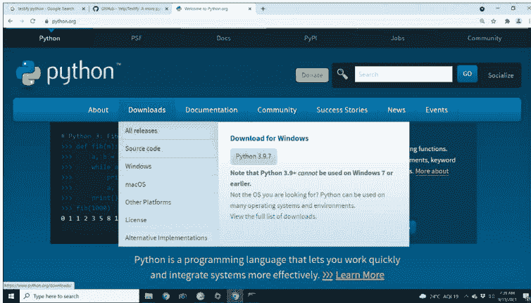

图1-1：Windows的Python安装程序下载

现在，打开安装文件，它将启动一个安装程序。

注意：您可以通过点击浏览器中下载的文件来打开它。您也可以通过浏览器中的下载选项找到文件的物理位置。它将指向您Windows用户**Downloads**目录中的一个位置。

安装程序窗口如图1-2所示：

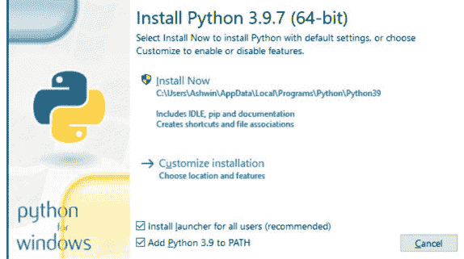

图1-2：Python安装程序

勾选所有复选框，然后点击**Customize installation**选项。它将打开下一个安装屏幕，如图1-3所示：


图1-3：安装选项

点击**Next**按钮，它将带您进入图1-4所示的屏幕：

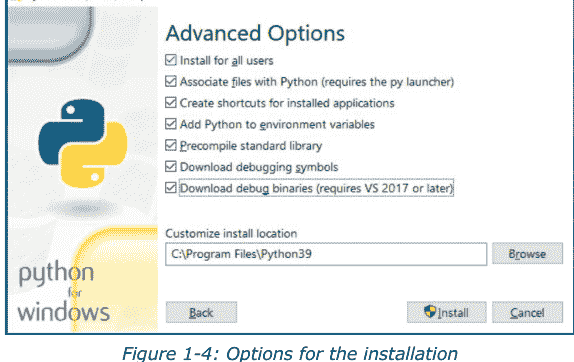

图1-4：安装选项

勾选所有选项，然后点击**Install**按钮。它将要求提供管理员凭据。输入凭据后，它将开始在您的Windows计算机上安装Python和其他相关程序。安装完成后，它会显示以下屏幕（图1-5）：

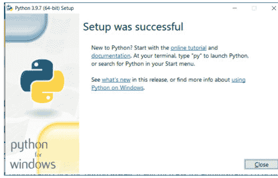

图1-5：安装成功消息

在我们开始庆祝之前，我们需要验证几件事。打开Windows的命令提示符（cmd）并运行以下命令：

```
C:\Users\Ashwin>python -V
```

输出如下：

**Python 3.9.7**

恭喜！我们已经在您的Windows计算机上安装了Python 3。

### 1.3 IDLE

Python软件基金会为Python开发了一个集成开发环境（IDE）。它被命名为'IDLE'，代表**集成开发与学习环境**。当我们在Windows上安装Python时，它会随安装程序一起提供。在Linux发行版上，我们需要单独安装它。对于Debian及其衍生版，在命令提示符（终端模拟器）上运行以下命令：

```
pi@raspberrypi:~ $ sudo apt-get install idle -y
```

它将在您的Linux发行版上安装IDLE。

让我们使用IDLE。我们可以在Windows搜索栏中输入IDLE来找到它。我们可以在Linux菜单中找到它。在Linux中，我们可以通过运行以下命令从命令提示符启动它：

```
pi@raspberrypi:~ $ idle &
```

IDLE窗口看起来像这样（图1-6）：

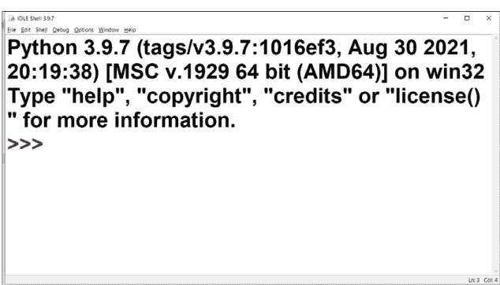

在菜单栏中，在菜单项Options下，我们可以找到**Configure IDLE**选项，在那里我们可以设置字体大小和其他细节（图1-7）：

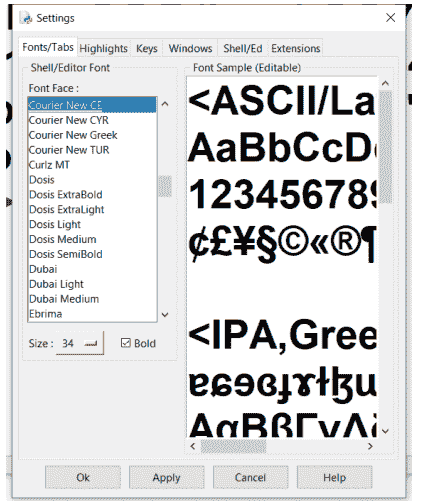

根据您的喜好更改字体和大小，然后分别点击**Apply**和**OK**按钮。现在，让我们尝试理解Python的交互模式。当被调用时，Windows IDLE会显示交互模式。我们可以用它直接运行Python语句，而无需将它们保存为文件。Python语句被直接输入到解释器中，输出会立即显示在同一窗口中。如果您曾经使用过操作系统的命令提示符，那么这几乎是相同的。交互模式通常用于运行单条语句或短小的代码块。让我们尝试运行一个简单的语句：

```
>>> print("Hello World!")
```

这会产生以下结果并打印在同一窗口中：

**Hello World!**

光标返回到提示符，准备获取用户的新命令。这样，我们就运行了我们的第一条Python语句。我们可以通过在解释器中运行命令**exit()**来退出解释器。或者，我们可以按CTRL + D退出。我们也可以通过在Windows命令提示符上运行命令**python**，或在Linux命令提示符上运行**python3**来调用交互模式。

### 1.4 Python的脚本模式

Python交互模式适用于单行语句和短小的代码块。然而，它不会将语句保存为程序。这可以在脚本模式下完成。在IDLE的Python解释器中，在菜单栏的**File**菜单下，选择**New File**。在其中输入以下代码：

```
print("Hello World!")
```

从菜单栏的**File**菜单中，选择Save。它将打开**Save As**窗口。将其保存到您选择的位置。IDLE会自动在文件名末尾添加*.py扩展名。然后点击菜单栏的**Run**菜单，点击**Run Module**。这将执行程序，并在IDLE的交互模式窗口中显示输出，如下所示（图1-8）。

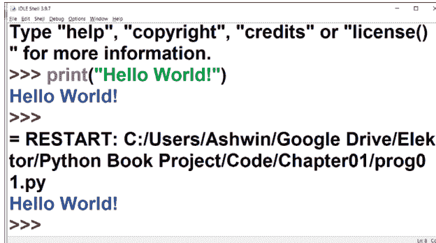

图1-8：Python脚本输出

另一种执行程序的方式是从命令提示符运行它。要在命令提示符中运行程序，请导航到程序所在的目录，然后在Windows中运行以下命令：

```
C:\ Python Book Project\Code\Chapter01>python prog01.py
```

这将产生以下输出：

**Hello World!**

在Linux中，命令如下：

```
pi@raspberrypi:~ $ python3 prog01.py
```

在Linux中还有另一种运行程序的方式，即运行以下命令：

```
pi@raspberrypi:~ $ which python3
```

这将返回Python 3解释器的位置：

**/usr/bin/python3**

现在，让我们将以下代码行添加到我们创建的Python代码文件中：

```
#!/usr/bin/python3
```

因此，整个代码文件将如下所示：

```
#!/usr/bin/python3
print("Hello World!")
```

现在，让我们更改Python程序文件的文件权限。假设我们以**prog01.py**为名保存了文件，运行以下命令：

```
pi@raspberrypi:~ $ chmod +x prog01.py
```

这样我们就更改了文件的权限，使其可执行。我们可以如下运行该文件：

```
pi@raspberrypi:~ $ ./prog01.py
```

请注意，我们在文件名前加上了./。这将产生以下输出：

**Hello World!**

我们添加第一行是为了让操作系统shell知道使用哪个解释器来运行程序。

这些是我们可以运行Python程序的几种方式。

### 1.5 Python IDE

到目前为止，我们一直使用IDLE进行Python编程。我们也可以使用其他编辑器和IDE。在Linux命令行上，我们可以使用**vi**、**vim**和**nano**等编辑器程序。vi编辑器随大多数Linux发行版一起提供。我们可以在Debian（及其衍生发行版）上使用以下命令安装其他两个：

```
pi@raspberrypi:~ $ sudo apt-get install vim nano -y
```

我们也可以使用Windows上的**Notepad**或Linux上的**Leafpad**等纯文本编辑器。我们可以在Debian和其他发行版上使用以下命令安装Leafpad编辑器：

```
pi@raspberrypi:~ $ sudo apt-get install leafpad -y
```

Raspberry Pi OS（我偏爱的Debian衍生版）自带**Thonny**、**Geany**和**Mu** IDE。我们可以在其他Debian衍生版上使用以下命令安装它们：

```
pi@raspberrypi:~ $ sudo apt-get install thonny geany mu-editor -y
```

如果你更习惯使用Eclipse，有一个很好的插件叫做**Pydev**。这可以从**Eclipse Marketplace**安装。

### 1.6 Python实现和发行版

解释和运行Python程序的程序被称为Python解释器。Linux默认附带的、由Python软件基金会提供的那个被称为CPython。其他组织创建了符合Python标准的Python解释器。这些解释器被称为Python实现。就像C和C++有许多编译器一样，Python也有许多解释器实现。在整本书中，我们将使用Linux默认附带的标准CPython解释器。以下是其他流行的Python解释器替代实现的部分列表：

- 1. IronPython
- 2. Jython
- 3. PyPy
- 4. Stackless Python
- 5. MicroPython

许多组织将他们选择的Python解释器与许多模块和库捆绑在一起并进行分发。这些包被称为Python发行版。我们可以在以下URL获取Python实现和发行版的列表：

https://www.python.org/download/alternatives/
https://wiki.python.org/moin/PythonDistributions
https://wiki.python.org/moin/PythonImplementations

### 1.7 Python包索引

Python附带了许多库。这被称为Python的“自带电池”理念。更多的库由许多第三方开发者和组织开发。根据你的工作概况，你可能会发现这些库在执行预期任务时很有用。所有这些第三方库都托管在**Python包索引**上。它位于https://pypi.org/。我们可以在这个页面上搜索库。

Python附带了一个名为**pip**的实用程序。Pip是一个**反向首字母缩写词**。这意味着该术语的展开包含该术语本身。Pip的意思是**pip installs packages**或**pip installs python**。它是一个包管理工具，用于安装Python包，作为命令行实用程序提供。我们可以通过在操作系统的命令提示符（cmd和终端模拟器）上运行以下命令来检查其版本：

```
pi@raspberrypi:~ $ pip3 -V
```

它将打印当前安装的pip版本。如果我们希望查看当前安装的包列表，我们需要运行以下命令：

```
pi@raspberrypi:~ $ pip3 list
```

它将返回所有已安装包的列表。

> **注意：** 所有与pip相关的命令在Windows和Linux上都是相同的。

如果我们希望安装一个新库，我们可以在PyPI中搜索它。我们可以如下安装一个新包：

```
pi@raspberrypi:~ $ pip3 install numpy
```

这将在计算机上安装NumPy库。我们将在整本书中使用这个实用程序来安装所需的第三方包。

## 总结

在本章中，我们了解了Python编程语言的历史及其在Windows和Linux上的安装。我们还了解了如何使用Python解释器以及如何以各种方式编写和执行Python脚本。我们概览了IDLE，并了解了其他各种Python IDE。最后，我们学习了如何使用Python的包管理器pip。

下一章将更加注重实践。我们将学习如何使用内置数据结构编写程序。

## 第2章 • 内置数据结构

在上一章中，我们在各种平台上安装了Python 3。我们编写了一个简单的入门程序，并学习了如何以各种方式运行它。我们还学习了如何使用解释器（交互式）模式。本章是入门性的，编程内容不是很多。

本章将稍微更侧重于编程（也称为编码）。我们将介绍Python中的各种内置数据结构。我们将重点关注以下主题：

- IPython
- 列表
- 元组
- 集合
- 字典

学完本章后，我们将熟悉IPython和Python中的内置数据结构。

### 2.1 IPython

IPython的意思是**交互式Python Shell**。它是一个为我们提供比Python内置交互式shell更多功能的程序。我们必须使用以下命令单独安装它：

```
pi@raspberrypi:~ $ pip3 install ipython
```

该命令在Windows和macOS上是相同的。如果你在Linux发行版（像我一样）上安装它，你可能会在安装日志中看到以下消息：

> **脚本 iptest、iptest3、ipython 和 ipython3 已安装在 '/home/pi/.local/bin'，该目录不在 PATH 中。**
>
> **考虑将此目录添加到 PATH，或者，如果你更喜欢抑制此警告，请使用 --no-warn-script-location。**

这意味着我们需要将提到的目录位置添加到 `~/.bashrc` 和 `~/.bash_profile` 文件中。我们必须将以下行添加到这两个文件中（以便它对登录和非登录shell都有效）：

```
PATH=$PATH:/home/pi/.local/bin
```

它在Windows上也会显示类似的消息。我们也必须将安装日志中提到的目录路径添加到Windows中的**PATH**变量（用户变量和系统变量，两者都要）。

一旦我们更改了路径，我们就必须关闭并重新调用操作系统的命令行实用程序。之后，运行以下命令：

```
pi@raspberrypi:~$ ipython3
```

这将在命令提示符中启动Python 3的IPython。该命令在Windows和其他平台上是相同的。图2-1是Windows桌面计算机上正在进行的IPython会话的截图：

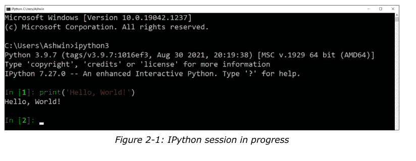

我们可以像这样使用IPython来编写小程序。那么，让我们开始吧。

### 2.2 列表

我们可以在列表中存储多个值。列表是Python的内置功能。使用列表时，我们不需要安装或导入任何东西。列表元素用方括号括起来，用逗号分隔。但列表绝不是线性数据结构，因为我们也可以有一个列表的列表。当我们熟悉基础知识后，我们将进一步了解列表的列表。

列表是可变的，意味着我们可以更改它们。让我们看几个列表的例子以及相关的内置例程。在操作系统的命令提示符上打开IPython并按照代码操作：

```
In [1]: fruits = ['babana', 'pineapple', 'orange']
```

这将创建一个列表。现在，我们可以用两种方式在控制台上打印它：

```
In [2]: fruits
```

这将产生以下输出：

```
Out[2]: ['babana', 'pineapple', 'orange']
```

我们也可以使用内置的 `print` 函数，如下所示：

```
In [3]: print(fruits)
```

以下是输出结果：

```
['banana', 'pineapple', 'orange']
```

列表是一种有序的数据结构，这意味着列表的成员以特定的顺序存储和检索。我们可以利用这一点来检索列表的元素。第一个元素的索引为 0。如果列表的大小为 **n**，则最后一个元素的索引为 **n-1**。这与 C、C++ 和 Java 中数组的索引方式类似。如果你之前使用过这些编程语言进行编程，你会发现这种索引方案很熟悉。

我们可以通过组合列表名称和元素索引来检索列表的元素。以下是一个示例：

```
In [4]: fruits[0]
Out[4]: 'banana'
In [5]: fruits[1]
Out[5]: 'pineapple'
In [6]: fruits[2]
Out[6]: 'orange'
```

我们也可以使用负索引。-1 指的是最后一个元素，-2 指的是倒数第二个元素。以下是示例：

```
In [7]: fruits[-1]
Out[7]: 'orange'
In [8]: fruits[-2]
Out[8]: 'pineapple'
```

如果我们尝试使用无效索引，会看到以下结果：

```
In [9]: fruits[3]
---------------------------------------------------------------------------
IndexError                                Traceback (most recent call last)
<ipython-input-9-7ceeafd384d7> in <module>
----> 1 fruits[3]

IndexError: list index out of range
In [10]: fruits[-4]
---------------------------------------------------------------------------
IndexError                                Traceback (most recent call last)
<ipython-input-10-1cb2d66442ee> in <module>
----> 1 fruits[-4]

IndexError: list index out of range
```

我们可以如下获取列表的长度：

```
In [12]: len(fruits)
Out[12]: 3
```

我们也可以如下查看列表的数据类型：

```
In [13]: type(fruits)
Out[13]: list
In [14]: print(type(fruits))
<class 'list'>
```

正如我们在输出中看到的，该变量的类是列表。我们将在本书的第四章中详细学习这一点。

我们可以使用构造函数 `list()` 来创建一个列表：

```
In [15]: fruits = list(('banana', 'pineapple', 'orange'))
In [16]: fruits
Out[16]: ['banana', 'pineapple', 'orange']
```

我们可以如下检索列表中元素的范围：

```
In [17]: SBC = ['Raspberry Pi', 'Orange Pi', 'Banana Pi', 'Banana Pro', 'NanoPi', 'Arduino Yun', 'Beaglebone']
In [18]: SBC[2:5]
Out[18]: ['Banana Pi', 'Banana Pro', 'NanoPi']
```

在这个例子中，我们检索了索引为 2、3 和 4 的元素。另外，请看以下示例：

```
In [19]: SBC[2:]
Out[19]: ['Banana Pi', 'Banana Pro', 'NanoPi', 'Arduino Yun', 'Beaglebone']
```

这样我们可以检索从索引 2 开始及之后的所有元素。

```
In [20]: SBC[:2]
Out[20]: ['Raspberry Pi', 'Orange Pi']
```

这样我们可以检索索引 2 之前的所有元素。我们也可以使用负索引来检索多个元素，如下所示：

```
In [21]: SBC[-4:-1]
Out[21]: ['Banana Pro', 'NanoPi', 'Arduino Yun']
```

我们也可以使用 `if` 结构来检查**是否**存在某个元素在列表中，如下所示：

```
In [23]: if 'Apple Pie' in SBC:
    ...:     print('Found')
    ...: else:
    ...:     print('Not Found')
    ...:
Not Found
```

我们可以如下更改列表中的一个项目：

```
In [25]: SBC[0] = 'RPi 4B 8GB'
```

我们也可以如下在指定索引处插入一个项目到列表中：

```
In [36]: SBC.insert(2, 'Test Board')
```

此列表中索引为 2 的项目会向前移动一个位置。其余项目也是如此。

我们可以如下向列表追加一个项目：

```
In [38]: SBC.append('Test Board 1')
```

这会将项目添加到列表的末尾。我们也可以对列表使用 `extend` 操作。这会将一个列表添加到另一个列表的末尾。

```
In [39]: list1 = [1, 2, 3]; list2 = [4, 5, 6];
In [40]: list1.extend(list2)
In [41]: list1
Out[41]: [1, 2, 3, 4, 5, 6]
```

我们可以如下从列表中移除一个项目：

```
In [43]: SBC.remove('Test Board')
```

我们可以使用两种不同的方法来移除指定索引处的项目。以下演示了这两种方法：

```
In [44]: SBC.pop(0)
Out[44]: 'RPi 4B 8GB'
In [46]: del SBC[0]
```

如果我们不指定索引，它将弹出（即移除并返回）最后一个项目：

```
In [47]: SBC.pop()
Out[47]: 'Test Board 1'
```

我们可以如下从列表中移除所有元素：

```
In [48]: SBC.clear()
```

我们也可以如下删除整个列表：

```
In [49]: del SBC
```

如果我们现在尝试访问该列表，它将返回一个错误，如下所示：

```
In [50]: SBC
---------------------------------------------------------------------------
NameError                                 Traceback (most recent call last)
<ipython-input-50-69ed78d7b4fc> in <module>
----> 1 SBC

NameError: name 'SBC' is not defined
```

我们现在将了解如何在循环中使用列表。创建一个列表如下：

```
In [51]: fruits = ['apple', 'banana', 'cherry', 'pineapple', 'watermelon',
            'papaya']
```

我们可以如下使用 `for` 循环结构：

```
In [52]: for member in fruits:
    ...:     print(member)
    ...:
apple
banana
cherry
pineapple
watermelon
papaya
```

以下代码也会产生相同的结果：

```
In [53]: for i in range(len(fruits)):
    ...:     print(fruits[i])
    ...:
apple
banana
cherry
pineapple
watermelon
papaya
```

我们也可以如下使用 `while` 循环：

```
In [54]: i = 0

In [55]: while i < len(fruits):
    ...:     print(fruits[i])
    ...:     i = i + 1
    ...:
apple
banana
cherry
pineapple
watermelon
papaya
```

在继续之前，我想介绍一个重要的特性。我们已经处理了许多列表的示例。我们处理的大多数列表都是字符串列表。有几个是数字列表。我们也可以有其他数据类型的列表。以下是示例：

```
In [56]: l1 = [1.2, 2.3, 3.4]

In [57]: l2 = ['a', 'b', 'c']

In [58]: l3 = [True, False, False, True, True, False]
```

这里我们分别创建了浮点数、字符和布尔值的列表。我们也可以如下创建一个混合类型的列表：

```
In [59]: l4 = [1, 'Test', 'a', 1.2, True, False]
```

我们可以如下对列表进行排序：

```
In [60]: fruits.sort()
In [61]: fruits
Out[61]: ['apple', 'banana', 'cherry', 'papaya', 'pineapple', 'watermelon']
```

我们也可以如下对列表进行反向排序：

```
In [62]: fruits.sort(reverse = True)
In [63]: fruits
Out[63]: ['watermelon', 'pineapple', 'papaya', 'cherry', 'banana', 'apple']
```

作为练习，请对数字和布尔值列表进行排序。

我们可以如下将一个列表复制到另一个列表：

```
In [64]: newlist = fruits.copy()
```

我们之前看到例程 **extend()** 可以连接两个列表。我们可以使用加法（+）运算符来连接两个列表，如下所示：

```
In [65]: l1 + l2
Out[65]: [1.2, 2.3, 3.4, 'a', 'b', 'c']
```

我们可以如下对列表使用乘法运算符：

```
In [66]: l1 * 3
Out[66]: [1.2, 2.3, 3.4, 1.2, 2.3, 3.4, 1.2, 2.3, 3.4]
```

### 2.3 元组

元组与列表相似。创建它们时必须使用括号。它们与列表的区别在于它们是不可变的，这意味着一旦创建，就不能修改。让我们看一个简单的例子：

```
In [1]: fruits = ('apple', 'grape', 'mango')
In [2]: fruits
Out[2]: ('apple', 'grape', 'mango')
In [3]: print(type(fruits))
<class 'tuple'>
```

元组的索引、循环和连接（+ 运算符）与列表相同。由于元组是不可变的，我们不能直接更改存储在元组中的任何信息。但是，我们可以将它们转换为列表，然后将更改后的列表赋值给任何元组。请看以下示例：

```
In [4]: temp_list = list(fruits)

In [5]: temp_list.append('papaya')

In [6]: fruits = tuple(temp_list)

In [7]: fruits
Out[7]: ('apple', 'grape', 'mango', 'papaya')
```

在上面的例子中，我们演示了例程 **tuple()** 的用法。这样，我们可以巧妙地使用列表的所有例程来处理元组。让我们看看方法 **count()** 的演示，用于计算特定成员元素在元组中出现的次数：

```
In [8]: test_tuple = (2, 3, 1, 3, 1, 4, 5, 6, 3, 6)
In [9]: x = test_tuple.count(3)
In [10]: print(x)
3
```

### 2.4 集合

列表和元组是有序的数据结构，并且都允许重复值。集合与两者不同，因为它们是无序的，因此不允许重复值。集合使用花括号定义。以下是简单集合的示例：

```
In [12]: set1 = {'apple', 'banana', 'orange'}
In [13]: set1
Out[13]: {'apple', 'banana', 'orange'}
In [14]: set2 = set(('apple', 'banana', 'orange'))
In [15]: set2
Out[15]: {'apple', 'banana', 'orange'}
In [16]: print(type(set1))
<class 'set'>
```

我们不能使用索引来检索任何集合的元素，因为集合是无序的。但我们可以使用 `for` 和 `while` 循环结构。请尝试作为练习。我们可以使用例程 **add()** 添加新项目，如下所示：

```
In [17]: set1
Out[17]: {'apple', 'banana', 'orange'}
In [18]: set1.add('pineapple')
In [19]: set1
Out[19]: {'apple', 'banana', 'orange', 'pineapple'}
```

# Python 3 快速入门

我们可以使用 **remove()** 或 **discard()** 例程从任何列表中移除一个项目，如下所示：

```
In [20]: set1.remove('banana')
In [21]: set1.discard('apple')
```

如果我们尝试移除不存在的项目，这两个例程都会引发错误。
让我们看一些集合方法。首先，我们将看到如何计算两个集合的并集。为此，我们创建集合：

```
In [22]: set1 = {1, 2, 3, 4, 5}
In [23]: set2 = {3, 4, 5, 6, 7}
In [24]: set3 = set1.union(set2)
In [25]: set3
Out[25]: {1, 2, 3, 4, 5, 6, 7}
```

这里，我们将并集存储在一个新集合中。一种稍有不同的方法是将并集存储在第一个集合中，如下所示：

```
In [29]: set1.update(set2)
In [30]: set1
Out[30]: {1, 2, 3, 4, 5, 6, 7}
```

我们也可以如下移除集合中的所有元素：

```
In [31]: set3.clear()
```

**copy()** 例程的工作方式与列表类似。让我们如下计算差集：

```
In [32]: set3 = set1.difference(set2)
In [33]: set3
Out[33]: {1, 2}
```

此示例返回一个新的输出集合。我们可以使用此方法从其中一个集合中移除匹配的元素：

```
In [34]: set1.difference_update(set2)
In [35]: set1
Out[35]: {1, 2}
```

我们可以如下计算交集：

```
In [37]: set3 = set1.intersection(set2)
In [38]: set3
Out[38]: {3, 4, 5}
```

我们可以检查一个集合是否是另一个集合的子集，如下所示：

```
In [39]: set2 = {1, 2, 3, 4, 5, 6, 7, 8}
In [40]: set1.issubset(set2)
Out[40]: True
```

类似地，我们可以检查一个集合是否是另一个集合的超集：

```
In [41]: set2.issuperset(set1)
Out[41]: True
```

我们还可以检查两个集合是否不相交（没有共同元素），如下所示：

```
In [42]: set1 = {1, 2, 3}
In [43]: set2 = {4, 5, 6}
In [44]: set1.isdisjoint(set2)
Out[44]: True
```

我们可以如下计算两个集合之间的对称差集：

```
In [45]: set1 = {1, 2, 3}
In [46]: set2 = {2, 3, 4}
In [47]: set3 = set1.symmetric_difference(set2)
In [48]: set3
Out[48]: {1, 4}
```

我们也可以使用运算符 `|` 和 `&` 来计算并集和交集，如下所示：

```
In [49]: set1 | set2
Out[49]: {1, 2, 3, 4}
In [50]: set1 & set2
Out[50]: {2, 3}
```

### 2.5 字典

字典是有序的、可变的，并且不允许重复项。Python 3.6 中的字典是无序的。Python 3.7 中的字典是有序的。项目以键值对的形式存储在字典中，可以通过键名来引用。让我们如下创建一个简单的字典：

```
In [52]: test_dict = { "fruit": "mango", "colors": ["red", "green", "yellow"]}
```

我们可以使用键来访问字典的项目，如下所示：

```
In [53]: test_dict["fruit"]
Out[53]: 'mango'
```

```
In [54]: test_dict["colors"]
Out[54]: ['red', 'green', 'yellow']
```

我们可以如下获取键和值：

```
In [55]: test_dict.keys()
Out[55]: dict_keys(['fruit', 'colors'])

In [56]: test_dict.values()
Out[56]: dict_values(['mango', ['red', 'green', 'yellow']])
```

我们可以如下更新一个值：

```
In [60]: test_dict.update({"fruit": "grapes"})
In [61]: test_dict
Out[61]: {'fruit': 'grapes', 'colors': ['red', 'green', 'yellow']}
```

我们可以如下添加到字典中：

```
In [62]: test_dict["taste"] = ["sweet", "sour"]
In [63]: test_dict
Out[63]:
{'fruit': 'grapes',
 'colors': ['red', 'green', 'yellow'],
 'taste': ['sweet', 'sour']}
```

我们也可以弹出项目：

```
In [64]: test_dict.pop("colors")
Out[64]: ['red', 'green', 'yellow']
In [65]: test_dict
Out[65]: {'fruit': 'grapes', 'taste': ['sweet', 'sour']}
```

我们也可以弹出最后插入的项目：

```
In [66]: test_dict.popitem()
Out[66]: ('taste', ['sweet', 'sour'])
```

我们也可以删除一个项目：

```
In [67]: del test_dict["fruit"]
In [68]: test_dict
Out[68]: {}
```

我们也可以如下删除一个字典：

```
In [69]: del test_dict
In [70]: test_dict
---------------------------------------------------------------------------
NameError                                 Traceback (most recent call last)
<ipython-input-70-6651ddf27d40> in <module>
----> 1 test_dict

NameError: name 'test_dict' is not defined
```

我们可以使用 `for` 和 `while` 循环结构遍历字典。请尝试将其作为练习。

## 总结

在本章中，我们学习了 Python 中集合、元组、列表和字典的基础知识。这些在 Python 中统称为集合。

在下一章中，我们将学习字符串、函数和递归的基础知识。

## 第 3 章 • 字符串、函数和递归

在上一章中，我们探索了 Python 集合，包括列表、元组、集合和字典。我们还开始编写一些小的代码片段。我们学习了许多用于集合的内置函数。我们还探索了 IPython 控制台。

在本章中，我们将深入探讨 Python 编程。我们还将开始使用 IDLE。以下是我们将在本章中涵盖的主题列表：

- Python 中的字符串
- 函数
- 递归
- 直接递归和间接递归

完成本章后，你应该能够熟练掌握 Python 中字符串和函数的概念及编程。

### 3.1 Python 中的字符串

在前面的章节中，在使用 **print()** 例程和集合（列表、元组、集合和字典）时，我们广泛地使用了字符串。我没有提及这一点，因为我希望在一个单独的章节中介绍它，因为从最基础开始理解它很重要。在本节中，我们将详细探讨 Python 中的字符串：我们将学习基础知识和相关的例程。

让我们在命令提示符中打开 IPython 并开始学习。我们可以使用一对单引号或双引号来创建一个字符串。以下是示例：

```
In [1]: 'Python'
Out[1]: 'Python'
In [2]: "Python"
Out[2]: 'Python'
```

如我们所见，我们可以使用一对单引号或双引号，但不能混合使用。以下是演示：

```
In [3]: 'Python"
      File "<ipython-input-3-580e07628eb0>", line 1
        'Python"
        ^
SyntaxError: EOL while scanning string literal
```

无论我们使用一对单引号还是双引号，字符串上的数据存储方式都是相同的。以下演示比较了使用一对单引号和双引号创建的字符串：

```
In [4]: 'Python' == "Python"
Out[4]: True
```

如我们所见，输出是布尔值 **True**。这意味着两个字符串相等。引号内的数据区分大小写。以下演示很好地解释了这一点：

```
In [5]: 'Python' == "python"
Out[5]: False
```

这返回了 False，因为两个字符串不相等。注意两个字符串中的第一个字符。它们的大小写不匹配。这就是为什么比较返回布尔值 **False**。

我们已经看过如何打印字符串。让我们再看一次。此外，我们可以将字符串存储到变量中并打印它。以下是演示：

```
In [6]: print('Python')
Python
In [7]: var1 = 'Python'
In [8]: print(var1)
Python
```

我们也可以有多行字符串。以下是示例：

```
In [9]: var2 = '''test string,
    ...: test string'''
In [10]: var3 = """test string,
     ...: test string"""
```

我们可以将字符串视为数组。以下是示例：

```
In [13]: var1[0]
Out[13]: 'H'
In [14]: var1[1]
Out[14]: 'e'
In [15]: var1[2]
Out[15]: 'l'
In [16]: var1[3]
Out[16]: 'l'
In [17]: var1[4]
Out[17]: 'o'
```

我们也可以计算字符串的长度：

```
In [20]: len(var1)
Out[20]: 5
```

我们可以使用循环来访问字符串：

```
In [19]: for x in var1:
   ...:     print(x)
   ...:
H
e
l
l
o
```

C 和 C++ 有一种称为 **字符** 的数据类型。字符保存一个 ASCII 字符。Python 没有字符数据类型。它将单个字符视为大小为一的字符串。

我们还可以检查一个字符串是否是另一个字符串的子串。以下是示例：

```
In [21]: 'test' in 'This is a test.'
Out[21]: True
In [22]: 'test' not in 'This is a test.'
Out[22]: False
```

我们也可以像 Python 中的列表一样对字符串进行切片：

```
In [23]: var1 = 'This is a test.'
In [24]: var1[2:]
Out[24]: 'is is a test.'
In [25]: var1[:2]
Out[25]: 'Th'
In [26]: var1[2:7]
Out[26]: 'is is'
```

我们也可以使用负索引：

```
In [27]: var1[-2:]
Out[27]: 't.'
In [28]: var1[:-2]
Out[28]: 'This is a tes'
In [29]: var1[-4:-2]
Out[29]: 'es'
```

我们可以更改字符串中字母字符的大小写：

```
In [30]: var1 = 'MiXed CaSe'
In [31]: var1.upper()
Out[31]: 'MIXED CASE'
```

## 第三章 • 字符串、函数与递归

```python
In [32]: var1.lower()
Out[32]: 'mixed case'
```

我们可以移除字符串两端不需要的空白字符：

```python
In [33]: var1 = ' whitespace '
In [34]: var1.strip()
Out[34]: 'whitespace'
```

我们也可以替换字符串中的字符：

```python
In [35]: var1 = 'love'
In [36]: var1.replace("o", "0")
Out[36]: 'l0ve'
```

我们可以按照某个字符来分割字符串，如下所示：

```python
In [37]: var1 = 'a,b,c,d,e,f'
In [38]: var1.split(',')
Out[38]: ['a', 'b', 'c', 'd', 'e', 'f']
```

我们也可以将字符串的首字母大写：

```python
In [39]: var1 = 'hello!'
In [40]: var1.capitalize()
Out[40]: 'Hello!'
```

我们可以连接两个字符串：

```python
In [41]: var1 = "Hello, "
In [42]: var2 = "World!"
In [44]: var1 + var2
Out[44]: 'Hello, World!'
```

我们不能将数字与字符串直接连接。这会返回如下错误：

```python
In [45]: age = 35
In [46]: var1 = 'I am '
In [47]: var1 + age
---------------------------------------------------------------------------
TypeError                                 Traceback (most recent call last)
<ipython-input-47-5677c330dd7a> in <module>
----> 1 var1 + age

TypeError: can only concatenate str (not "int") to str
```

我们必须先将数字转换为字符串，然后再将它们与字符串连接：

```python
In [48]: var1 + str(age)
Out[48]: 'I am 35'
```

我们也可以格式化字符串：

```python
In [49]: var1 = 'I am {}'.format(35)
In [50]: var1
Out[50]: 'I am 35'
```

这是另一个例子：

```python
In [51]: var1 = 'I am {} and my brother is {}'.format(35, 30)
In [52]: var1
Out[52]: 'I am 35 and my brother is 30'
```

让我们看看如何在字符串中使用转义字符。考虑以下例子，我们需要在双引号内使用双引号：

```python
In [53]: var1 = "He said, "I am fine"."
File "<ipython-input-53-50120a6e6e28>", line 1
    var1 = "He said, "I am fine"."
          ^
SyntaxError: invalid syntax
```

它会抛出错误，因为语法上是错误的。我们可以使用转义字符 `\` 来使用双引号，如下所示：

```python
In [54]: var1 = "He said, \"I am fine\"."
In [55]: var1
Out[55]: 'He said, "I am fine".'
```

### 3.2 函数

几乎所有高级编程语言都提供了可重用的代码块。这些被称为例程、子例程或函数。函数是一个命名的代码块，可以从另一个代码块中调用。在本节中，我们将详细学习函数。另外，到目前为止，我们一直在使用 IPython 控制台。现在我们将开始将程序保存在脚本中。考虑以下演示简单函数的简单程序：

```python
# prog00.py
def func1():
    print('Test')

func1()
```

在上面的例子中，我们创建了一个简单的函数（在前两行），当被调用时打印一个字符串。在最后，我们调用该函数。当被调用时，函数执行预期的操作。运行代码并查看输出。

我们也可以多次调用此函数：

```python
# prog00.py
def func1():
    print('Test')

func1()
func1()
```

在这里，我们调用了该函数两次。它将在控制台中打印两次消息。现在，让我们看看一种更 Pythonic 的定义和调用函数的方式。看看以下代码：

```python
# prog01.py
def func1():
    print('Test')

def main():
    print("This is the main() function block...")
    func1()

if __name__ == "__main__":
    main()
```

这段代码是以 Pythonic 的方式编写的。首先，我们定义了两个函数。第二个名为 **main()** 的函数旨在作为类似于我们在 C 或 C++ 程序中编写的主函数。我们可以为此函数分配任何我们选择的有效名称（作为练习，您可能希望更改声明和函数调用中的函数名称）。然后，行 **if \_\_name\_\_ == "\_\_main\_\_":** 检查我们是直接执行模块还是从另一个 Python 程序调用它。如果我们直接执行它，它将运行其下列出的代码。我们将在下一章学习包时了解更多关于此功能的信息。运行代码并查看输出。这是一种专业且 Pythonic 的组织 Python 代码文件的方式。我们将在本书中经常使用此模板来编写程序。

让我们看看如何将值传递给函数。在函数定义中，我们必须为要传递的值声明一个占位符变量。它被称为**形参**。要传递的实际值被称为**实参**。让我们看看实际操作。

Python 3 快速入门

```python
# prog02.py
def print_msg(msg):
    print(msg)

def main():
    print_msg("Test String...")

if __name__ == "__main__":
    main()
```

我们也可以有多个参数：

```python
# prog03.py
def print_msg(msg, count):
    for i in range(count):
        print(msg)

def main():
    print_msg("Test String...", 5)

if __name__ == "__main__":
    main()
```

在这个例子中，我们接受两个参数。第一个是消息，第二个是要打印消息的次数。我们也可以为参数设置默认值，如下所示：

```python
# prog04.py
def print_msg(msg, count=2):
    for i in range(count):
        print(msg)

def main():
    print_msg("Test String...")

if __name__ == "__main__":
    main()
```

在上面的示例代码中，我们将最后一个参数的默认值设置为 2。当我们在函数调用中不传递该参数时，它将采用默认值并相应地继续执行。

我们也可以有一个返回值的函数。让我们定义一个接受两个值并返回它们之和的函数。编写代码很简单：

```python
# prog05.py
def add(a, b):
    return a + b

def main():
    print(add(3, 5))

if __name__ == "__main__":
    main()
```

我们也可以编写一个返回多个值的函数：

```python
# prog06.py
def compute(a, b):
    return (a + b, a - b)

def main():
    (r1, r2) = compute(3, 5)
    print(r1)
    print(r2)

if __name__ == "__main__":
    main()
```

正如我们在上面的例子中看到的，我们可以将返回值打包在一个元组中并返回该元组。

### 3.3 递归

我们可以在同一个函数内部调用该函数的实例。这被称为递归。让我们重写一个早期的例子以适应递归，如下所示：

```python
# prog07.py
def print_msg(msg, count):
    if count != 0:
        print(msg)
        print_msg(msg, count - 1)

def main():
    print_msg("Test String...", 6)

if __name__ == "__main__":
    main()
```

Python 3 快速入门

在递归中，有两个主要部分。第一个是终止条件。没有这个条件，递归将永远运行。第二部分是递归调用，即函数调用自身。在上面的程序中，我们使用 **if** 条件进行终止。大多数递归示例使用 **if** 条件进行终止。**if** 语句将包含终止的条件或标准。让我们编写一个计算正整数阶乘的程序：

```python
# prog08.py
def factorial(n):
    if n == 1:
        return n
    else:
        return n * factorial(n - 1)

def main():
    print(factorial(5))

if __name__ == "__main__":
    main()
```

我们也可以编写一个计算斐波那契数列中第 n<sup>th</sup> 个数的程序：

```python
# prog09.py
def fibo(n):
    if n <= 1:
        return n
    else:
        return (fibo(n - 1) + fibo(n - 2))

def main():
    print(fibo(15))

if __name__ == "__main__":
    main()
```

这些是递归的一些实际例子。

#### 3.3.1 间接递归

我们已经看到了递归的演示。那些是直接递归的例子，我们在函数内部调用自身。还有另一种递归方法，称为间接递归。在最简单的间接递归形式中，例程 A 调用例程 B，而例程 B 调用例程 A。让我们看一个涉及间接递归的程序：

```python
# prog10.py
def ping(i):
    if i > 0:
        print("Ping " + str(i))
```

## 第四章 • 面向对象编程

在上一章中，我们探讨了 Python 编程语言的一些重要特性。我们详细研究了函数和递归。在接下来的章节中，当我们学习 Python 的图形库时，我们将再次探讨递归的概念。现在，我们将探索面向对象编程。

面向对象编程是任何专业程序员的必备技能。本章内容非常详细，我们将进行大量的实践编程演示。以下是本章将涵盖的主题列表：

- 对象与类
- Python 中一切皆对象
- 类入门
- 模块与包
- 包
- 继承
- 更多继承
- Python 中的访问修饰符
- 多态
- 语法错误
- 异常
- 处理异常
- 抛出异常
- 用户自定义异常

### 4.1 对象与类

面向对象编程（简称 OOP）是一种编程范式。现实世界中的对象是我们可以触摸、看到、感受并与之交互的东西。例如，一个苹果是一个对象。一辆自行车是一个对象。一栋房子是一个对象。同样，在软件工程的世界里，我们也有对象。对象是数据及其相关行为的集合。面向对象编程指的是以对象及相关概念来设计和开发软件的编程风格。让我们以图形用户界面风格的操作系统为例。在这里，程序的窗口是一个对象。任务栏是一个对象。屏幕上的应用程序也是对象。面向对象编程风格中的对象类似于现实世界中的对应物，即物理世界中的对象。现在，考虑有两个对象，一辆自行车和一辆汽车。两者都是对象。然而，它们的类型不同。汽车属于汽车类，自行车属于自行车类。在面向对象编程中，类描述了一个对象。换句话说，类是一种数据类型。对象是具有类数据类型的变量。让我们看一个在 Python 中包含类和对象的简单程序示例。这是我们在 Python 3 中的第一个面向对象程序（我们有意地编写，尽管我们已经使用了一些 Python 的面向对象特性）。

```python
# prog00.py

class Point:
    pass

p1 = Point()
print(p1)
```

输出将如下所示：

```
<__main__.Point object at 0x0000025E29D658E0>
```

在上面的程序中，我们创建了一个简单的类 **Point** 和一个对象 **p1**。这是类和对象最简单的例子。

#### 4.1.1 Python 中一切皆对象

Python 是一门真正的面向对象编程语言。在 Python 中，几乎一切都是对象。一切都可以有相关的文档。一切都有方法和属性。这是真正的面向对象编程语言的标志。让我们看看如何证明这一点。打开 Python 解释器并运行以下代码：

```python
>>> a = 5
>>> print (a)
5
>>> print(type(a))
<class 'int'>
```

当我说 **Python 中几乎一切都是对象** 时，我是认真的。例如，例程 *print()* 是一个内置方法。我们可以通过在交互式提示符下运行以下语句来打印它的类型：

```python
>>> print(type(print))
<class 'builtin_function_or_method'>
```

我们也可以通过运行以下语句来查看例程 print() 的文档：

```python
>>> print(print.__doc__)
print(value, ..., sep=' ', end='\n', file=sys.stdout, flush=False)
```

将值打印到流，默认为 sys.stdout。

可选关键字参数：

- file：类文件对象（流）；默认为当前的 sys.stdout。
- sep：插入值之间的字符串，默认为空格。
- end：最后一个值之后附加的字符串，默认为换行符。
- flush：是否强制刷新流。

### 4.2 类入门

在上一节中，我们学习了类的基础知识。在本节中，我们将学习如何在 Python 代码文件中使用文档字符串创建内联文档。我们还将详细研究类的成员。我们将使用同一个 Point 类进行演示。我们将继续向同一个代码文件添加更多功能。

#### 4.2.1 文档字符串

我们可以使用 **文档字符串** 为 Python 代码提供内联文档。Python 文档字符串代表 **Python Documentation Strings**。它们是为开发者提供文档最便捷的方式。以下是一个简单的文档字符串示例：

```python
# prog00.py
'This is the DocString example'
class Point:
    'This class represent the data-structure Point'
    pass

p1 = Point()
print(p1)
print(p1.__doc__)
print(help(p1))
```

运行此代码（**prog01.py**）并查看输出。

正如我们之前讨论的以及在这个例子中，我们可以使用内置例程 **__doc__** 来打印文档字符串（如果可用）。我们也可以使用内置例程 **help()** 来显示文档字符串。

#### 4.2.2 向类添加属性

如果你熟悉 Java 或 C++，我们会在类的定义中声明一个类变量。在 Python 中，没有变量声明这样的事情。我们可以通过为每个坐标添加一个变量来向类 **Point** 添加属性，如下所示：

```python
# prog01.py
'This is the DocString example'
class Point:
    'This class represent the data-structure Point'
    pass

p1 = Point()
p1.x = 1
p1.y = 2
p1.z = 2
print(p1.x, p1.y, p1.z)
```

运行程序并查看输出。

#### 4.2.3 向类添加方法

我们可以通过向类添加方法来为类添加行为。以下是带有自定义方法 **assign()** 和 **printPoint()** 的 Point 类示例：

```python
# prog01.py
'This is the DocString example'
class Point:
    'This class represent the data-structure Point'

    def assign(self, x, y, z):
        'This assigns the value to the co-ordinates'
        self.x = x
        self.y = y
        self.z = z

    def printPoint(self):
        'This prints the values of co-ordinates'
        print(self.x, self.y, self.z)

p1 = Point()
p1.assign(0, 0, 0)
p1.printPoint()
```

运行上面的代码并检查输出。我们可以看到，方法声明与函数声明没有太大不同。主要区别在于必须有一个自引用参数。在这个例子中，它在两个方法中都被命名为 **self**。我们可以给它起任何名字。然而，我还没有见过这个变量使用其他名字。函数和方法之间的另一个区别是方法总是与一个类相关联。在上面的代码中，方法 **assign()** 为坐标赋值，方法 **printPoint()** 打印点的坐标值。

#### 4.2.4 初始化方法

有一个特殊的 Python 方法用于初始化对象：`__init__`。我们可以使用它在对象创建时就为对象的属性赋值。以下是此方法的一个示例：

```python
# prog01.py
'This is the DocString example'
class Point:
    'This class represent the data-structure Point'

    def __init__(self, x, y, z):
```

上面是一个有趣的间接递归示例。我们使用递归来模拟乒乓球游戏的移动。运行这个以及本章中的所有其他程序。它们大多有简单的输出，这就是为什么我没有展示它们的输出。我也鼓励你尝试编写自己的函数，以详细理解这个概念。

## 总结

在本章中，我们探讨了 Python 中的字符串。然后我们转向了函数递归和间接递归。此外，在本章中，我们开始使用 IDLE 的代码编辑器和 Python 的脚本模式。本章在概念和编程方面内容较多。我们将继续这种趋势，后续每一章都将引入难度递增的主题。此外，所有后续章节在编码方面的内容也会更多。

在下一章中，我们将学习 Python 3 中面向对象编程的基础知识。我们将涵盖类、继承和异常处理等重要概念。

#### 4.2.5 Python中的多行文档字符串

让我们来看一个Python中多行文档字符串的例子。多行文档字符串用于将文档字符串分布在多行上。以下是一个多行文档字符串的示例：

```python
# prog01.py
'This is the DocString example'
class Point:
    """This class represent the data-structure Point
    This is an example of the multiline docstring...
    """

    def __init__(self, x, y, z):
        '''The initializer ---
        This initializes the object with the passed arguments
        '''
        self.assign(x, y, z)

    def assign(self, x, y, z):
        'This assigns the value to the co-ordinates'
        self.x = x
        self.y = y
        self.z = z

    def printPoint(self):
        'This prints the values of co-ordinates'
        print(self.x, self.y, self.z)

p1 = Point(0, 1, 2)
p1.printPoint()
```

运行程序并查看输出。

### 4.3 模块与包

在本节中，我们将从Python中的**模块化**概念开始。我们将探讨模块和包。我们还将编写程序来演示这些概念。

#### 4.3.1 模块

在前面的章节中，我们演示了Python中**类**概念的例子。我们在Python代码文件**prog02.py**中有一个名为**Point**的类。我们也可以在单个Python代码文件中拥有多个类。考虑以下程序：

```python
# prog02.py
class Class01:

    def __init__(self):
        print("Just created an object for Class01...")

class Class02:

    def __init__(self):
        print("Just created an object for Class02...")

o1 = Class01()
o2 = Class02()
```

在上面的例子中，我们在单个Python代码文件中定义了两个类**Class01**和**Class02**。Python代码文件也被称为Python模块。假设你有一个目录，其中创建了一堆Python代码文件，我们可以将每个代码文件称为一个模块。运行上面的例子并查看输出。此外，Python模块中的类和函数可以在另一个模块中被访问。这就是所谓的模块化。我们可以将相关的类分组到一个模块中，并在其他模块需要时导入它们。为了实际演示这一点，请在同一目录中创建另一个Python模块**prog03**。以下是它的代码：

```python
# prog03.py
import prog02

o1 = prog02.Class01()
o2 = prog02.Class02()
```

当我们执行模块prog03时，得到以下输出：

```
Just created an object for Class01...
Just created an object for Class02...
Just created an object for Class01...
Just created an object for Class02...
```

你能猜到为什么会这样吗？？它打印了两次语句，因为我们导入了整个模块。所以，它导入了prog02中创建对象的部分。因此，对象被创建了两次。为了缓解这个问题，Python提供了一种高效的方法。对prog02.py进行以下更改：

```python
# prog02.py
class Class01:

    def __init__(self):
        print("Just created an object for Class01...")

class Class02:

    def __init__(self):
        print("Just created an object for Class02...")

if __name__ == "__main__":
    o1 = Class01()
    o2 = Class02()
```

将我们的主代码写在以**if __name__ == "__main__":**开头的代码块下，可以确保它只在模块被直接执行时才被调用。当我们在另一个模块中导入整个模块时，包含主逻辑的代码不会被导入到另一个模块中。只有函数和类会被导入到另一个模块中。如果你一个接一个地运行这两个模块，你会看到在每次运行期间对象只被创建一次。但是，如果我们想在导入模块的模块中按需导入并运行模块的主逻辑代码呢？有一种更符合Python风格的方式来组织我们的代码以实现这一点。按如下方式重写**prog02**模块：

```python
# prog02.py
class Class01:

    def __init__(self):
        print("Just created an object for Class01...")

class Class02:

    def __init__(self):
        print("Just created an object for Class02...")

def main():
    o1 = Class01()
    o2 = Class02()

if __name__ == "__main__":
    main()
```

同时，对prog03模块进行如下更改：

```python
# prog03.py
import prog02
prog02.main()
```

在模块**prog03**中，我们直接导入了**prog02**模块的**main()**函数。现在，执行模块**prog03**以查看输出。输出将是一样的。然而，**prog02**模块现在比以前更有条理了。让我们对**prog03**代码进行相同的更改，如下所示：

```python
# prog03.py
import prog02

def main():
    prog02.main()

if __name__ == "__main__":
    main()
```

再次运行代码以查看输出。最后，为了更清晰，我们将按如下方式修改**prog02**：

```python
# prog02.py
class Class01:

    def __init__(self):
        print("Just created an object for Class01...")

class Class02:

    def __init__(self):
        print("Just created an object for Class02...")

def main():
    o1 = Class01()
    o2 = Class02()

if __name__ == "__main__":
    print("Module prog02 is being run directly...")
    main()
else:
    print("Module prog02 has been imported in the current module...")
```

运行两个模块并查看输出。这里发生了什么？？我们注意到，如果我们直接运行模块，**else**语句之前的代码会被执行；当我们导入整个模块时，**else**语句之后的代码会被执行。

让我们继续理解导入模块成员的另一种方式。在模块**prog03**的最早版本中，我们有以下代码，

```python
# prog03.py
import prog02
o1 = prog02.Class01()
o2 = prog02.Class02()
```

在这里，我们使用**prog02.member**表示法来访问模块**prog02**的成员。这是因为语句**import prog02**将所有成员导入到**prog03**模块中。还有另一种导入模块成员的方法。以下是此方法的一个示例：

```python
# prog04.py
from prog02 import Class01, Class02

def main():
    o1 = Class01()
    o2 = Class02()

if __name__ == "__main__":
    main()
```

使用**from <module> import <member>**语法，我们不必在调用模块中使用**<module>.<member>**约定。我们可以直接访问导入模块的成员，如上例所示。运行程序并查看输出。在上面的程序中，我们导入了**prog02**的两个成员。修改上面的程序，只导入**prog02**模块的一个成员。同时，在调用**main()**函数之后添加**else**部分。

#### 4.3.2 包

到目前为止，我们已经了解了如何在Python中将函数和类组织在单独的模块中。我们可以将模块组织成包。让我们创建一个包含我们已经编写的代码的包。在保存所有Python模块的目录中创建一个子目录。将子目录命名为**mypackage**。将模块**prog02**移动到目录**mypackage**中。创建一个空文件**__init__.py**并将其保存在**mypackage**目录内。我们刚刚创建了我们自己的Python包！没错。创建包很容易。我们只需要将模块放在一个目录中，并在同一目录中创建一个空的**__init__.py**文件。包含模块的目录名称就是包名。现在，在原始父目录中，创建一个Python模块**prog05**，如下所示：

```python
# prog05.py
import mypackage.prog02

def main():
    mypackage.prog02.main()

if __name__ == "__main__":
    main()
```

现在运行**prog05**模块并查看输出。注意我们使用<package>.<module>.<member>表示法来访问包的成员。如果我们使用**from <module> import <class>**语法进行导入，则不必这样做。

作为练习，使用语法**from mypackage.prog02 import Class01, Class02**导入**prog02**模块并编写程序，然后运行代码。

我们甚至可以在包内创建包。为此，我们只需在目录**mypackage**内创建另一个目录，并将所需的模块文件和一个空的**__init__.py**文件添加到其中。

作为练习，在**mypackage**中创建一个**子包**。在父目录中的一个模块中导入并使用它。

### 4.4 继承

现代编程语言有不同的代码重用机制。过程提供了一种优秀的代码重用方式。Python中的函数和类方法是展示如何通过过程实现代码重用的绝佳例子。

像Python这样的面向对象编程语言还有另一种代码重用的方法。这被称为**继承**。Python有一种**基于类的继承**机制。Python中的一个类可以继承另一个类的属性和行为。我们从中派生其他类的基类也被称为**父类**或**超类**。继承（或派生、扩展——请记住，在面向对象编程世界中，这些术语可以互换使用）属性和行为的类被称为**子类**。

#### 4.4.1 Python中的基本继承

从技术上讲，所有Python类都是一个特定内置类的子类，这个类被称为**object**。这种机制使得Python能够统一处理对象。因此，如果你在Python中创建任何类，就意味着你正在隐式地使用继承。之所以说是隐式的，是因为你不需要在代码中为此做任何特殊规定。你也可以显式地从内置类**object**派生出自定义类，如下所示：

```python
# prog01.py
class MyClass(object):
    pass
```

上面的代码与下面的代码具有相同的含义和功能：

```python
# prog01.py
class MyClass:
    pass
```

让我们定义一个自定义类，并从它派生出另一个类：

```python
# prog02.py
class Person:
    pass
class Employee:
    pass
def main():
    print(issubclass(Employee, Person))
if __name__ == "__main__":
    main()
```

运行上面的代码。函数**issubclass()**在第一个参数提到的类是第二个参数提到的类的子类时返回true。上面的程序打印false。哎呀！我们忘记了将类**Employee**从**Person**派生出来。为此，修改代码如下：

```python
# prog02.py
class Person:
    pass
class Employee(Person):
    pass
def main():
    print(issubclass(Employee, Person))
    print(issubclass(Person, object))
    print(issubclass(Employee, object))
if __name__ == "__main__":
    main()
```

你一定注意到我们在**main()**部分添加了两条语句。运行代码。它应该打印三次**True**。

#### 4.4.2 方法重写

让我们为类**Person**添加更多功能。修改模块**prog01.py**：

```python
# prog01.py
class Person:
    def __init__(self, first, last, age):
        self.firstname = first
        self.lastname = last
        self.age = age
    def __str__(self):
        return self.firstname + " " + self.lastname + ", " + str(self.age)
class Employee(Person):
    pass
def main():
    x = Person("Ashwin", "Pajankar", 31)
    print(x)
if __name__ == "__main__":
    main()
```

我们想要定义类**Employee**的行为。由于我们已经从**Person**派生了它，我们可以重用类**Person**中的方法来定义类**Employee**的行为：

```python
# prog02.py
class Person:
    def __init__(self, first, last, age):
        self.firstname = first
        self.lastname = last
        self.age = age
    def __str__(self):
        return self.firstname + " " + self.lastname + ", " + str(self.age)
class Employee(Person):
    pass
def main():
    x = Person("Ashwin", "Pajankar", 31)
    print(x)
    y = Employee("James", "Bond", 32)
    print(y)
if __name__ == "__main__":
    main()
```

如你所见，类**Employee**从类**Person**继承了初始化方法和**__str__()**方法。然而，我们希望为类**Employee**添加另一个名为**empno**的属性。我们还必须相应地改变**__str__()**方法的行为。以下代码实现了这一点：

```python
# prog02.py
class Person:
    def __init__(self, first, last, age):
        self.firstname = first
        self.lastname = last
        self.age = age
    def __str__(self):
        return (self.firstname + " " +
                self.lastname + ", " +
                str(self.age))
class Employee(Person):
    def __init__(self, first, last, age, empno):
        self.firstname = first
        self.lastname = last
        self.age = age
        self.empno = empno
    def __str__(self):
        return (self.firstname + " "
                + self.lastname + ", "
                + str(self.age) + ", "
                + str(self.empno))
def main():
    x = Person("Ashwin", "Pajankar", 31)
    print(x)
    y = Employee("James", "Bond", 32, 0x007)
    print(y)
if __name__ == "__main__":
    main()
```

在上面的代码中，我们在Employee中重写了来自Person类的**__init__()**和**__str__()**方法的定义，以满足我们的需求。运行代码并查看输出。通过这种方式，我们可以在子类中重写基类的任何方法。

#### 4.4.3 super()

在上一个例子中，我们看到了如何在子类中重写基类的方法。还有另一种方法可以做到这一点。请看下面的代码示例：

```python
class Person:
    def __init__(self, first, last, age):
        self.firstname = first
        self.lastname = last
        self.age = age

    def __str__(self):
        return (self.firstname + " " +
                self.lastname + ", " +
                str(self.age))

class Employee(Person):
    def __init__(self, first, last, age, empno):
        super().__init__(first, last, age)
        self.empno = empno

    def __str__(self):
        return (super().__str__() + ", "
                + str(self.empno))

def main():
    x = Person("Ashwin", "Pajankar", 31)
    print(x)
    y = Employee("James", "Bond", 32, 0x007)
    print(y)

if __name__ == "__main__":
    main()
```

如你所见，我们使用了**super()**方法。这是一个特殊的方法，它返回一个作为基类实例的对象。我们可以在任何方法中使用**super()**。由于super返回一个作为基类实例的对象，代码**super().<method()>**会调用基类的相应方法。**super()**方法可以在子类的任何方法内部使用，以将父类的实例作为对象调用。它不必在子类方法定义的第一行调用。它可以在方法体的任何位置调用。因此，我们也可以将Employee的**__init__()**方法重写如下：

```python
def __init__(self, first, last, age, empno):
    self.empno = empno
    super().__init__(first, last, age)
```

### 4.5 更多继承

在上一节中，我们学习了基本继承、重写和**super()**方法。在本节中，我们将学习多重继承、菱形问题、访问修饰符以及抽象类和方法。

#### 4.5.1 多重继承

当一个类从多个类派生时，这种机制被称为多重继承。下图描述了这一点：

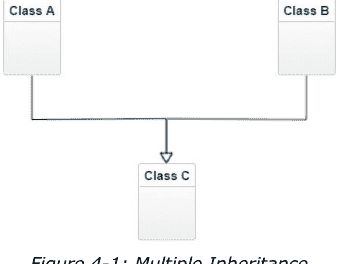

让我们尝试为此编写一些简单的代码：

```python
# prog01.py
class A:
    pass

class B:
    pass

class C(A, B):
    pass

def main():
    pass

if __name__ == "__main__":
    main()
```

多重继承用于我们需要在一个类中派生多个类的属性和行为的情况。

#### 4.5.2 方法解析顺序

考虑以下示例：

```python
# prog02.py
class A:
    def m(self):
        print('This is m() from Class A.')
class B:
    def m(self):
        print('This is m() from Class B.')
class C(A, B):
    pass
def main():
    x = C()
    x.m()
if __name__ == "__main__":
    main()
```

当我们运行代码时，输出如下：

```
This is m() from Class A.
```

这是由于类C从父类派生的顺序所致。如果我们修改类C的代码如下：

```python
class C(B, A):
    pass
```

输出是：

```
This is m() from Class B.
```

用于解析子类派生方法的机制被称为方法解析顺序。

### 4.6 抽象类和方法

一个其对象未被创建的类被称为抽象类。同样，一个被声明但没有实现的方法被称为抽象方法。一个抽象类可以有也可以没有抽象方法。在Python中，我们显式地将一个类和一个方法声明为抽象。一个显式声明的抽象类只能被子类化。在许多情况下，我们需要一个类和方法仅用于分别被派生和重写。以下是一个完美的现实世界示例：

```python
# prog03.py
from abc import ABC, abstractmethod
class Animal(ABC):
    @abstractmethod
    def move(self):
        pass
class Human(Animal):
    def move(self):
        print("I Walk.")
class Snake(Animal):
    def move(self):
        print("I Crawl.")
def main():
    a = Human()
    b = Snake()
    a.move()
    b.move()
if __name__ == "__main__":
    main()
```

要使一个类显式地成为抽象类，我们需要从内置类ABC派生它。如果我们想使一个类的方法显式地成为抽象方法，我们必须对要成为抽象的方法使用装饰器**@abstractmethod**。运行上面的代码并查看输出。

### 4.7 Python中的访问修饰符

在许多编程语言如C++和Java中，有一个称为类成员访问控制的概念。在Python中，没有严格的措施来控制从类外部访问成员。

如果你不希望一个方法或类变量从外部被访问，你可以在类的文档字符串中提及这一点。另一种让其他人知道不要访问为内部使用而创建的变量或方法的方法是在变量前加一个下划线。修改代码或通过导入使用它的另一个人会理解该变量或方法仅供内部使用。然而，他/她仍然可以从外部访问它。另一种强烈建议其他人不要从外部访问变量或方法的方法是使用名称修饰机制。为此，我们必须在方法或变量前加一个双下划线。然后它只能使用特殊语法访问，这在下面的程序中进行了演示：

```python
# prog04.py
class A:
    def __init__(self):
        self.a = "Public"
        self._b = "Internal use"
        self.__c = "Name Mangling in action"
def main():
    x = A()
    print(x.a)
    print(x._b)
    print(x.__c)
if __name__ == "__main__":
    main()
```

输出显示了前两个属性的值。对于第三个属性，它显示了一个包含以下消息的错误：

**AttributeError: 'A' object has no attribute '__c'**

要查看属性 __c 的值，请在最后一个 **print()** 中进行如下更改：

```
print(x._A__c)
```

输出如下：

- 公有
- 内部使用
- 名称修饰生效

### 4.8 多态

在上一节中，我们学习了 Python 中的高级继承和访问修饰符。在本节中，我们将学习多态。多态意味着呈现多种形式的能力。在编程语言中，它指的是为不同类型的实体提供单一接口。大多数面向对象编程语言都允许多态的不同程度。如果你使用过 C++ 或 Java 等编程语言，那么你一定对此有相当的了解。我们在前面的章节中学习了重写。它是多态的一种形式。因此，我们已经在 Python 3 中学习了一种多态。在本节中，我们将首先学习方法重载，然后学习运算符重载，它们都属于多态的概念。

#### 4.8.1 方法重载

当一个方法可以用不同数量的参数调用时，就称为方法重载。在 C++ 等编程语言中，我们可以有类的成员函数的多个定义。然而，Python 不允许这样做，因为我们知道 **Python 中一切皆对象**。为了实现这一点，我们使用带有默认参数的方法。示例如下：

```
prog01.py
class A:

    def method01(self, i=None):
        if i is None:
            print("Sequence 01")
        else:
            print("Sequence 02")

def main():
    obj1 = A()
    obj1.method01()
    obj1.method01(5)

if __name__ == "__main__":
    main()
```

运行上面的代码并查看输出。

#### 4.8.2 运算符重载

运算符作用于操作数并执行各种操作。我们知道 Python 中一切皆对象，因此运算符在 Python 中作用的操作数都是对象。Python 中内置对象的运算操作和结果已经定义良好。我们可以为用户定义类的对象分配额外的责任给运算符。这个概念称为运算符重载。以下是加法运算符的一个简单示例：

```
prog02.py
class Point:

    def __init__(self, x, y, z):
        self.assign(x, y, z)

    def assign(self, x, y, z):
        self.x = x
        self.y = y
        self.z = z

    def printPoint(self):
        print(self.x, self.y, self.z)

    def __add__(self, other):
        x = self.x + other.x
        y = self.y + other.y
        z = self.z + other.z
        return Point(x, y, z)

    def __str__(self):
        return("({0},{1},{2})".format(self.x, self.y, self.z))

def main():
    p1 = Point(1, 2, 3)
    p2 = Point(4, 5, 6)
    print(p1 + p2)

if __name__ == "__main__":
    main()
```

运行代码并检查输出。当我们在代码中执行 **p1 + p2** 操作时，Python 将调用 **p1.\_\_add\_\_(p2)**，这又会调用 **Point.\_\_add\_\_(p1,p2)**。类似地，我们也可以重载其他运算符。我们需要为二元运算实现的特殊函数如下表所示：

| 运算符 | 特殊函数 |
| :--- | :--- |
| + | object.add(self, other) |
| - | object.sub(self, other) |
| * | object.mul(self, other) |
| // | object.floordiv(self, other) |
| / | object.truediv(self, other) |
| % | object.mod(self, other) |
| ** | object.pow(self, other[, modulo]) |
| << | object.lshift(self, other) |
| >> | object.rshift(self, other) |
| & | object.and(self, other) |
| ^ | object.xor(self, other) |
| \| | object.or(self, other) |

以下是扩展运算的表格：

| 运算符 | 特殊函数 |
| :--- | :--- |
| += | object.add(self, other) |
| -= | object.sub(self, other) |
| *= | object.mul(self, other) |
| //= | object.floordiv(self, other) |
| /= | object.truediv(self, other) |
| %= | object.mod(self, other) |
| **= | object.pow(self, other[, modulo]) |
| <<= | object.lshift(self, other) |
| >>= | object.rshift(self, other) |
| &= | object.and(self, other) |
| ^= | object.xor(self, other) |
| \|= | object.or(self, other) |

此表用于一元运算符：

| 运算符 | 特殊函数 |
| :--- | :--- |
| + | object.pos(self) |
| - | object.neg(self) |
| abs() | object.abs(self) |
| ~ | object.invert(self) |
| complex() | object.complex(self) |
| int() | object.int(self) |
| long() | object.long(self) |
| float() | object.float(self) |
| oct() | object.oct(self) |
| hex() | object.hex(self) |

此表用于比较运算符：

| 运算符 | 特殊函数 |
| :--- | :--- |
| < | object.lt(self, other) |
| <= | object.le(self, other) |
| == | object.eq(self, other) |
| != | object.ne(self, other) |
| >= | object.ge(self, other) |
| > | object.gt(self, other) |

### 4.9 语法错误

当我们用 Python（或任何编程语言）编写程序时，我们通常不会第一次就写对。这就是术语错误和异常进入讨论的地方。在本章中，我们将开始讨论 Python 中的错误和异常。

```
>>> print("Hello")

SyntaxError: EOL while scanning string literal
```

在上面的 **print()** 语句中，我们忘记在字符串 **Hello** 后添加 "。这是一个语法错误。因此，Python 解释器通过抛出 **SyntaxError** 来突出显示它。

### 4.10 异常

我们说语法/解析错误由 SyntaxError 处理。即使该语句在语法上是正确的，它在执行期间也可能遇到错误（与语法无关）。在执行期间检测到的错误称为异常。考虑以下语句及其在解释器中的执行：

```
>>> 1/0
Traceback (most recent call last):
  File "<pyshell#1>", line 1, in <module>
    1/0
ZeroDivisionError: division by zero
>>> '1' + 1
Traceback (most recent call last):
  File "<pyshell#2>", line 1, in <module>
    '1' + 1
TypeError: can only concatenate str (not "int") to str
>>> a = 8 + b
Traceback (most recent call last):
  File "<pyshell#3>", line 1, in <module>
    a = 8 + b
NameError: name 'b' is not defined
```

每个语句执行输出的最后一行显示了该语句有什么问题。这表明在执行期间发生错误时会隐式引发异常。Python 库中定义的异常称为内置异常。

https://docs.python.org/3/library/exceptions.html#bltin-exceptions 列出了所有内置异常。

#### 4.10.1 处理异常

现在我们知道，当在运行时遇到错误时，解释器会自动引发异常。考虑以下代码片段：

```
prog01.py
def main():
    a = 1/0
    print("DEBUG:  We are here...")
if __name__ == "__main__":
    main()
```

当我们执行此代码时，请注意解释器在 a = 1/0 这一行遇到了以下异常。

**ZeroDivisionError: division by zero**

一旦遇到此异常，它就不会运行遇到异常的语句之后的语句。这就是 Python 中默认处理异常的方式。然而，Python 有更好的处理异常的规定。我们可以将可能遇到异常的代码放在 try 块中，并将处理它的逻辑放在 except 块中，如下所示：

```
prog01.py
def main():
    try:
        a = 1/0
        print("DEBUG:  We are here...")
    except Exception:
        print("Exception Occured")

if __name__ == "__main__":
    main()
```

运行代码。当遇到异常时，它将调用 except 块，而不是突然终止。请注意，异常发生后的语句不会被执行。

在 except 块中，Exception 是 Python 所有内置异常的基类。在本章后续部分，我们还将学习从 Exception 类派生的用户自定义异常。

让我们修改代码，在 **main()** 函数中添加一些不属于 try 或 except 块的代码。

```python
prog01.py
def main():
    try:
        a = 1/0
        print("DEBUG:  We are here...")
    except Exception:
        print("Exception Occurred")
    print("This line will be executed...")

if __name__ == "__main__":
    main()
```

执行时，你会注意到，尽管遇到了异常，try 和 except 块之外的代码行仍然被执行了。

#### 4.10.2 按类型处理异常

运行程序时，我们可能会遇到多种类型的异常。我们可以提供处理不同类型异常的机制。一个简单的例子如下：

```python
prog02.py
def main():
    try:
        a = 1/1
    except ZeroDivisionError as err:
        print("Error: {0}".format(err))
    except TypeError as err:
        print("Error: {0}".format(err))
    except Exception as err:
        print("Error: {0}".format(err))
if __name__ == "__main__":
    main()
```

在上面的代码中，我们有用于处理 **ZeroDivisionError** 和 **TypeError** 的 except 块。如果遇到任何其他意外异常，则由最后一个 except 块处理，这是一个通用的异常处理块。请注意，通用块应始终是最后一个 except 块（如上面的代码所示）。如果它是第一个 except 块，那么每当遇到任何异常时，通用异常处理块将始终被执行。这是因为 Exception 类是所有异常的基类，具有优先级。

作为练习，请将上述程序重写，使 **except Exception** 成为第一个异常处理块。

我们知道，在 Python 中一切皆对象。**SyntaxError** 也是一种异常类型。这是一种特殊类型的异常，无法在 except 块中处理。

#### 4.10.3 else 块

我们可以在 except 块之后向代码添加一个 else 块。如果在 **try** 块中没有遇到任何错误，则执行 **else** 块。以下程序演示了这一点：

```python
prog02.py
def main():
    try:
        a = 1/1
    except ZeroDivisionError as err:
        print("Error: {0}".format(err))
    except TypeError as err:
        print("Error: {0}".format(err))
    except Exception as err:
        print("Error: {0}".format(err))
    else:
        print("This line will be executed...")

if __name__ == "__main__":
    main()
```

#### 4.10.4 引发异常

我们知道，当发生运行时错误时，会自动引发异常。我们可以使用 raise 语句显式且有意地引发异常。以下代码演示了这一点：

```python
prog03.py
def main():
    try:
        raise Exception("Exception has been raised!")
    except Exception as err:
        print("Error: {0}".format(err))
    else:
        print("This line will be executed...")

if __name__ == "__main__":
    main()
```

输出如下：

**Error: Exception has been raised!**

#### 4.10.5 finally 子句

**finally** 是 **try** 语句的一个子句，它总是在退出时执行。这意味着它本质上是 **清理子句**。无论 try 语句中是否发生异常，它总是在 **try** 子句结束时执行。如果在 **except** 块中未处理任何异常，则会在 **finally** 中重新引发。以下是相同的一个示例：

```python
prog04.py
def divide(x, y):
    try:
        result = x / y
    except ZeroDivisionError:
        print("division by zero!")
    else:
        print("result is", result)
    finally:
        print("executing finally clause")

def main():
    divide(2, 1)
    divide("2", "1")

if __name__ == "__main__":
    main()
```

以下是输出：

```
result is 2.0
executing finally clause
executing finally clause
Traceback (most recent call last):
  File "C:\Users\Ashwin\Google Drive\Elektor\Python Book Project\Code\Chapter04\Exceptions\prog04.py", line 17, in <module>
    main()
  File "C:\Users\Ashwin\Google Drive\Elektor\Python Book Project\Code\Chapter04\Exceptions\prog04.py", line 13, in main
    divide("2", "1")
  File "C:\Users\Ashwin\Google Drive\Elektor\Python Book Project\Code\Chapter04\Exceptions\prog04.py", line 3, in divide
    result = x / y
TypeError: unsupported operand type(s) for /: 'str' and 'str'
```

如我们所见，在上面的代码中没有处理 **TypeError** 异常的机制。因此，**finally** 子句再次引发了它。

#### 4.10.6 用户自定义异常

我们可以定义从 Exception 类派生的自己的异常。通常，在一个模块中，我们定义一个从 Exception 派生的单一基类，并从该类获取所有其他异常类。下面显示了一个这样的例子：

```python
prog05.py
class Error(Exception):
    pass

class ValueTooSmallError(Error):
    pass

class ValueTooLargeError(Error):
    pass

def main():
    number = 10
    try:
        i_num = int(input("Enter a number: "))
        if i_num < number:
            raise ValueTooSmallError
        elif i_num > number:
            raise ValueTooLargeError
        else:
            print("Perfect!")
    except ValueTooSmallError:
        print("This value is too small!")
    except ValueTooLargeError:
        print("This value is too large!")

if __name__ == "__main__":
    main()
```

请运行上面的程序并查看输出。在上面的程序中，类 **Error** 继承自内置类 **Exception**。我们从 **Error** 类继承了更多的子类。

# 总结

我们深入探讨了**面向对象**编程范式。现在，我们在使用 Python 时对 OOP 已经非常熟悉了。我们将在接下来的章节中广泛使用 OOP，这就是为什么我尽早在这个专门的章节中介绍它的原因。

下一章重点介绍使用 Python 的数据结构。它也将是一个长而详细的章节，将使用前面章节中学到的所有概念来实现和使用数据结构。

# 第 5 章 • 数据结构

在上一章中，我们详细探讨了面向对象编程。我们现在应该对这种编程风格感到得心应手。

在本章中，我们将利用面向对象编程的知识来创建和使用数据结构。我们将使用 Python 编程语言探索最流行和最常用的线性数据结构。以下是我们将在本章中探讨的关于数据结构的有用主题列表：

- 数据结构简介
- Jupyter Notebook
- 链表
- 双向链表
- 栈
- 队列
- 双端队列
- 循环队列

学完本章后，我们将能够编写数据结构及其应用的程序。

### 5.1 数据结构简介

数据结构是组织、存储、处理和检索数据的一种专门方式。数据结构有很多种。数据结构的概念早于 Python。我们将在本章中探讨的许多数据结构是在考虑了 C、C++ 和 Java 等编程语言的局限性之后设计的。大多数编程语言都配备了基本的数据结构，如数组。Python 内置支持更好版本和更通用的数组，称为集合。Python 也支持字符串。我们已经探讨了所有内置数据结构。

在本章中，我们将重点介绍最流行和最常用的数据结构。许多第三方 Python 库已经实现了这些。然而，我们希望学习从头开始自己实现所有这些。因此，我们将为所有这些数据结构编写自己的代码。

#### 5.1.1 Jupyter Notebook

我们将在本章中使用一个基于 Web 的环境来演示程序。该环境被称为 Jupyter notebook，在学习实际主题之前，我们将简要地探讨它。

我们已经使用了 Python 解释器的交互模式和 IDLE。交互模式提供快速反馈，但不保存程序。IDLE 提供保存功能，但不提供代码的快速反馈。在使用 Jupyter notebook 之前，我希望在一个特殊的编辑器中拥有这样的功能。Jupyter Notebook 满足了这一点。它为 Python 以及许多其他编程语言（如 R、Julia、

### 5.2 链表

链表是一种动态数据结构，我们可以轻松地插入和删除数据。在链表中，数据元素不像数组那样存储在连续的内存位置。链表由节点组成。节点由两部分构成：数据部分和指针部分。指针指向下一个节点。链表的第一个节点被称为**头节点**，如果头节点为空，则链表为空。让我们在学习链表相关概念的同时开始编码。创建一个新的 Jupyter Notebook 并添加以下代码：

```python
class Node:
    def __init__(self, data):
        self.data = data
        self.next = None
```

这是一个自定义的节点类。让我们为链表创建一个类：

```python
class LinkedList:
    def __init__(self):
        self.head = None
```

我们可以创建一个空链表，创建节点，并将节点分配给链表：

```python
llist = LinkedList()
llist.head = Node(1)
second = Node(2)
third = Node(3)
llist.head.next = second;
second.next = third;
```

这将创建一个链表。以下是大多数人用来直观表示链表的惯例：

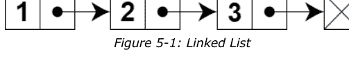

具体来说，这被称为单链表。还有其他类型的链表。

让我们看看如何遍历它，并从头节点开始按顺序打印所有节点的数据部分。修改我们定义链表的单元格如下：

```python
class LinkedList:
    def __init__(self):
        self.head = None
    def printList(self):
        temp = self.head
        while (temp):
            print (temp.data)
            temp = temp.next
```

我们遍历直到遇到最后一个节点，此时临时变量变为 **None**。由于我们重新定义了类的定义，请重新执行创建链表的单元格，并在相同或不同的单元格中运行以下代码：

```python
llist.printList()
```

它将打印链表的数据部分。

让我们学习如何在链表的开头插入一个新节点。向链表类添加以下方法：

```python
def push(self, new_data):
    new_node = Node(new_data)
    new_node.next = self.head
    self.head = new_node
```

修改创建链表的单元格：

```python
llist = LinkedList()
llist.head = Node(1)
second = Node(2)
third = Node(3)
llist.head.next = second;
second.next = third;
llist.push(0)
llist.printList()
```

运行该单元格并查看输出。类似地，我们可以编写一个方法在末尾添加节点（追加操作）。向链表类添加以下代码：

```python
def append(self, new_data):
    new_node = Node(new_data)
    if self.head is None:
        self.head = new_node
        return
    last = self.head
    while (last.next):
        last = last.next
    last.next = new_node
```

修改最后一个单元格如下：

```python
llist = LinkedList()
llist.head = Node(1)
second = Node(2)
third = Node(3)
llist.head.next = second;
second.next = third;
llist.push(0)
llist.append(4)
llist.printList()
```

现在，让我们编写一个方法，使其接受参数。如果参数与链表中任何节点的数据部分匹配，则删除该节点。限制是，如果多个节点的数据部分具有相同的元素，该方法只删除第一个。以下是该方法：

```python
def deleteNode(self, key):
    temp = self.head
    if (temp is not None):
        if (temp.data == key):
            self.head = temp.next
            temp = None
            return
    while(temp is not None):
        if temp.data == key:
            break
        prev = temp
        temp = temp.next
    if(temp == None):
        return
    prev.next = temp.next
    temp = None
```

我们可以通过对驱动代码进行以下修改来检查它是否有效：

```python
llist = LinkedList()
llist.head = Node(1)
second = Node(2)
third = Node(3)
llist.head.next = second;
second.next = third;
llist.push(0)
llist.append(4)
llist.printList()
llist.deleteNode(2)
llist.printList()
```

我们可以通过逐个删除所有节点来删除整个链表：

```python
def deleteList(self):
    current = self.head
    while current:
        prev = current.next
        del current.data
        current = prev
```

让我们修改驱动代码：

```python
llist = LinkedList()
llist.head = Node(1)
second = Node(2)
third = Node(3)
llist.head.next = second;
second.next = third;
llist.push(0)
llist.append(4)
llist.printList()
llist.deleteNode(2)
llist.printList()
llist.deleteList()
llist.printList()
```

最后一行会抛出错误，因为链表已被删除。

我们还可以遍历链表并增加一个计数器变量。最后，我们可以找到链表的长度。代码很简单：

```python
def findLength(self):
    temp = self.head
    count = 0
    while (temp):
        count += 1
        temp = temp.next
    return count
```

修改驱动代码：

```python
llist = LinkedList()
llist.head = Node(1)
second = Node(2)
third = Node(3)
llist.head.next = second;
second.next = third;
llist.push(0)
llist.append(4)
#llist.printList()
print(llist.findLength())
```

它将打印链表的长度。我们甚至可以有一个递归方法：

```python
def findLengthRec(self, node):
    if (not node):
        return 0
    else:
        return 1 + self.findLengthRec(node.next)
```

更改驱动代码：

```python
llist = LinkedList()
llist.head = Node(1)
second = Node(2)
third = Node(3)
llist.head.next = second;
second.next = third;
llist.push(0)
llist.append(4)
#llist.printList()
print(llist.findLength())
print(llist.findLengthRec(llist.head))
```

我们还可以编写一个方法来搜索链表中的元素。如果在链表中找到该元素，该方法返回 **True**，否则返回 **False**：

```python
def search(self, x):
    current = self.head
    while current != None:
        if current.data == x:
            return True
        current = current.next
    return False
```

驱动代码可以修改如下：

```python
llist = LinkedList()
llist.head = Node(1)
second = Node(2)
third = Node(3)
llist.head.next = second;
second.next = third;
```

#### 5.2.1 双向链表

现在我们已经熟悉了单向链表的概念。让我们来看一种更高级的数据结构（或者说是对单向链表的改进）。我们可以让链表拥有两个链接（指针），这样就能双向遍历链表。我们来定义节点数据结构：

```python
class Node:
    def __init__(self, data):
        self.data = data
        self.next = None
        self.prev = None
```

我们可以将双向链表定义为如下类：

```python
class DoublyLinkedList:

    def __init__(self):
        self.head = None
```

我们可以添加一个方法，将元素推入链表的起始位置：

```python
def push(self, new_data):
    new_node = Node(new_data)
    new_node.next = self.head
    if self.head is not None:
        self.head.prev = new_node
    self.head = new_node
```

我们也可以编写一个方法来追加链表：

```python
def append(self, new_data):
    new_node = Node(new_data)
    if self.head is None:
        self.head = new_node
        return
    last = self.head
    while last.next:
        last = last.next
    last.next = new_node
    new_node.prev = last
    return
```

我们可以遍历链表：

```python
def printList(self, node):
    print("Traversal in forward direction")
    while node:
        print(node.data)
        last = node
        node = node.next

    print("Traversal in reverse direction")
    while last:
        print(last.data)
        last = last.prev
```

让我们编写驱动代码来演示这些函数的用法：

```python
llist = DoublyLinkedList()
llist.push(1)
llist.append(2)
llist.append(3)
llist.printList(llist.head)
```

上述代码创建了一个双向链表，如下所示：

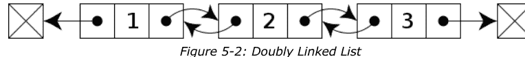

### 5.3 栈

栈是一种线性数据结构，一端开放，另一端封闭。这意味着在程序上只能从一端访问它。我们可以从同一端插入和弹出元素。向栈中插入元素的操作称为**入栈**，从栈中移除元素的操作称为**出栈**。

在Python中，我们可以通过多种方式实现栈，我们将探索其中的许多方法。

# Python 3 快速入门

让我们看看如何在Python中用列表创建一个栈：

```python
stack = []
stack.append('a')
```

这会创建一个空栈并向其中推入一个元素。让我们打印栈的内容并查看输出：

```python
print(stack)
```

让我们再推入几个元素：

```python
stack.append('b')
stack.append('c')
print(stack)
```

我们可以按如下方式弹出栈中的元素：

```python
print(stack.pop())
print(stack.pop())
print(stack.pop())
```

让我们打印栈：

```python
print(stack)
```

它将显示一个空列表。如果我们尝试从空栈中弹出一个元素，它将抛出一个异常：

```python
print(stack.pop())
```

让我们使用Python中的**Deque**模块来实现一个栈：

```python
from queue import LifoQueue

stack = LifoQueue(maxsize=5)

print("Current number of element: ", stack.qsize())

for i in range(0, 5):
    stack.put(i)
    print("Element Inserted : " + str(i))

print("\nCurrent number of element: ", stack.qsize())
print("\nFull: ", stack.full())
print("Empty: ", stack.empty())
```

```python
print('\nElements popped from the stack')
for i in range(0, 5):
    print(stack.get())

print("\nEmpty: ", stack.empty())
print("Full: ", stack.full())
```

输出如下，
Current number of element:  0
Element  Inserted : 0
Element  Inserted : 1
Element  Inserted : 2
Element  Inserted : 3
Element  Inserted : 4

Current number of element:  5

Full:  True
Empty:  False

Elements popped from the stack
4
3
2
1
0

Empty:  True
Full:  False

我们也可以使用**Deque**模块以更Python化的方式定义一个栈，如下所示：

```python
from collections import deque
class Stack:

    def __init__(self):
        self.stack = deque()

    def isEmpty(self):
        if len(self.stack) == 0:
            return True
        else:
            return False

    def length(self):
        return len(self.stack)

    def top(self):
        return self.stack[-1]

    def push(self, x):
        self.x = x
        self.stack.append(x)

    def pop(self):
        self.stack.pop()
```

让我们编写一些驱动代码，并学习如何用栈反转字符串。我们读取字符串中的字符并将其推入栈中，然后弹出它们，并用弹出的项目创建一个新字符串，如下所示：

```python
str1 = "Test_string"
n = len(str1)
stack = Stack()
for i in range(0, n):
    stack.push(str1[i])
reverse = ""
while not stack.isEmpty():
    reverse = reverse + stack.pop()
print(reverse)
```

我们也可以使用链表实现一个栈。请将其作为练习完成。

### 5.4 队列

队列是允许从一端插入、从另一端移除的线性数据结构。这与**后进先出**（LIFO）的栈不同。队列是**先进先出**（FIFO）。向队列添加元素称为**入队**，移除项目称为**出队**。我们可以通过多种方式实现队列。让我们在Python中用列表来实现它们。看看代码：

```python
queue = []
queue.append('a')
print(queue)
```

让我们向队列添加更多元素：

```python
queue.append('b')
queue.append('c')
print(queue)
```

我们可以移除几个项目：

```python
print(queue.pop(0))
print(queue.pop(0))
print(queue)
```

队列现在为空，尝试从中再移除一个项目将引发异常：

```python
print(queue.pop(0))
```

我们也可以使用Python中的**同步队列**类来实现队列：

```python
from queue import Queue
q = Queue(maxsize=3)
q.qsize()
```

执行时，上述代码会打印队列中当前的项目数量。我们可以按如下方式添加几个项目：

```python
q.put('a')
q.put('b')
q.put('c')
print(q.full())
```

我们可以按如下方式移除项目：

```python
print(q.get())
print(q.get())
print(q.get())
print(q.empty())
```

我们也可以使用**deque**来实现它：

```python
from collections import deque
q = deque()
```

让我们向其中添加几个元素：

```python
q.append('a')
q.append('b')
q.append('c')

print("Contents of the queue")
print(q)
```

输出如下，

**Contents of the queue**
deque(['a', 'b', 'c'])

我们可以移除元素：

```python
print(q.popleft())
print(q.popleft())
print(q.popleft())

print("\nAn empty Queue: ")
print(q)
```

输出如下，
**a**
**b**
**c**

**An empty Queue:**
deque([])

在前面的章节中，我要求你用链表实现一个栈。我们也可以对队列做同样的事情。在这里，我们将学习如何实现它。如果你已经编写了用链表实现栈的程序，你会看到我们可以修改同一个程序以适应我们的目的。让我们编写代码：

```python
class Node:

    def __init__(self, data):
        self.data = data
        self.next = None
```

让我们使用这个节点定义一个队列：

```python
class Queue:

    def __init__(self):
        self.front = self.rear = None

    def isEmpty(self):
        return self.front == None

    # Method to add an item to the queue
    def EnQueue(self, item):
        temp = Node(item)

        if self.rear == None:
            self.front = self.rear = temp
            return
        self.rear.next = temp
        self.rear = temp

    def DeQueue(self):

        if self.isEmpty():
            return
        temp = self.front
        self.front = temp.next

        if(self.front == None):
            self.rear = None
```

最后，我们可以编写驱动代码：

```python
q = Queue()
q.EnQueue(1)
q.EnQueue(2)
q.DeQueue()
q.DeQueue()
q.EnQueue(3)
q.EnQueue(4)
q.EnQueue(5)
q.DeQueue()
```

让我们打印队列前端和后端的元素：

```python
print("\nThe front of the Queue : " + str(q.front.data))
print("\nThe rear of the Queue : " + str(q.rear.data))
```

它产生以下输出：

**The front of the Queue : 4**
**The rear of the Queue : 5**

#### 5.4.1 双端队列

我们已经使用过**deque**类来实现一个简单的单端队列。它是一个双端队列，我们可以在两端进行插入和移除。让我们按照其预期的方式使用它，并编写一个示例程序来演示其双端功能：

import collections
deq = collections.deque([10, 20, 30])
print(deq)

我们也可以从一端添加几个元素：

deq.append(40)
print(deq)

我们可以从另一端添加元素：

deq.appendleft(0)
print(deq)

我们可以从一端移除元素：

deq.pop()
print(deq)

我们也可以从另一端移除元素：

deq.popleft()
print(deq)

#### 5.4.2 循环队列

循环队列是一种数据结构，也被称为循环缓冲区、循环缓冲或环形缓冲区。它被表示为一个连接的环。它有起始指针和结束指针。但现实中的内存从来不是以环形组织的（至少物理上不是）。因此，我们使用线性数据结构来演示它。以下是循环缓冲区的概念表示：

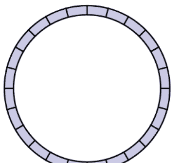

图 5-3：循环缓冲区

让我们定义一个循环缓冲区及其相关操作：

```python
class CircularQueue():

    def __init__(self, size):
        self.size = size
        self.queue = [None for i in range(size)]
        self.front = self.rear = -1

    def enqueue(self, data):

        if ((self.rear + 1) % self.size == self.front):
            print("The Circular Queue is full...")

        elif (self.front == -1):
            self.front = 0
            self.rear = 0
            self.queue[self.rear] = data
        else:
            self.rear = (self.rear + 1) % self.size
            self.queue[self.rear] = data

    def dequeue(self):
        if (self.front == -1):
            print("The Circular Queue is empty...")
        elif (self.front == self.rear):
            temp = self.queue[self.front]
            self.front = -1
            self.rear = -1
            return temp
        else:
            temp = self.queue[self.front]
            self.front = (self.front + 1) % self.size
            return temp

    def show(self):
        if (self.front == -1):
            print("The Circular Queue is Empty...")
        elif (self.rear >= self.front):
            print("Elements in the circular queue are: ")
            for i in range(self.front, self.rear + 1):
                print(self.queue[i])
            print()
        else:
            print("Elements in the Circular Queue are: ")
            for i in range(self.front, self.size):
                print(self.queue[i])
            for i in range(0, self.rear + 1):
                print(self.queue[i])

        if ((self.rear + 1) % self.size == self.front):
            print("The Circular Queue is full...")
```

让我们编写一个驱动程序来使用它：

```python
cq = CircularQueue(5)
cq.enqueue(1)
cq.enqueue(2)
cq.enqueue(3)
cq.enqueue(4)
cq.show()
print("Dequed value = ", cq.dequeue())
cq.show()
cq.enqueue(5)
cq.enqueue(6)
cq.enqueue(7)
print("Dequed value = ", cq.dequeue())
cq.show()
```

输出如下：

**循环队列中的元素是：**

1
2
3
4

**出队值 = 1**

**循环队列中的元素是：**

2
3
4

**循环队列已满...**
**出队值 = 2**

**循环队列中的元素是：**

3
4

我们也可以用链表定义一个循环队列：

```python
class Node:
    def __init__(self):
        self.data = None
        self.link = None
```

让我们为循环链队列定义一个类：

```python
class Queue:
    def __init__(self):
        front = None
        rear = None
```

我们可以在类定义之外编写一个方法来向这个循环队列添加一个元素：

```python
def enQueue(q, value):
    temp = Node()
    temp.data = value
    if (q.front == None):
        q.front = temp
    else:
        q.rear.link = temp
    q.rear = temp
    q.rear.link = q.front
```

我们可以编写另一个方法来从队列中检索一个元素：

```python
def deQueue(q):
    if (q.front == None):
        print("The circular queue is empty")
        return -999999999999

    value = None
    if (q.front == q.rear):
        value = q.front.data
        q.front = None
        q.rear = None
    else:
        temp = q.front
        value = temp.data
        q.front = q.front.link
        q.rear.link = q.front
    return value
```

以下函数显示队列的元素：

```python
def show(q):
    temp = q.front
    print("The elements in the Circular Queue are: ")
    while (temp.link != q.front):
        print(temp.data)
        temp = temp.link
    print(temp.data)
```

演示上述所有功能的驱动代码如下：

```python
q = Queue()
q.front = q.rear = None

enQueue(q, 1)
enQueue(q, 2)
enQueue(q, 3)
show(q)

print("Dequed value = ", deQueue(q))
print("Dequed value = ", deQueue(q))
show(q)

enQueue(q, 4)
enQueue(q, 5)
show(q)
```

以下是代码的输出：

**循环队列中的元素是：**

**1**
**2**
**3**
**出队值 = 1**
**出队值 = 2**

**循环队列中的元素是：**

**3**

循环队列中的元素是：

3
4
5

## 总结

在本章中，我们探讨了传统的线性数据结构。我们现在对栈、队列和链表已经很熟悉了。

下一章将会非常有趣和令人兴奋：我们将学习海龟图形并学习许多海龟食谱。如果你有创造力，并且正在寻找图形领域的一些冒险，你会喜欢下一章的。

## 第6章 • 海龟图形

在上一章中，我们探讨了各种数据结构，并用Python编程演示了它们。

在本章中，我们将使用Python内置的turtle库来绘制吸引人的图形形状。以下列表是本章将涵盖的主题：

- 海龟的历史
- 入门
- 海龟食谱
- 可视化递归
- 多只海龟

学完本章后，我们将能够熟练地使用海龟绘制形状。

### 6.1 海龟的历史

海龟是一类教育机器人，于20世纪40年代末在研究员威廉·格雷·沃尔特的指导下设计。它们用于计算机科学和机械工程的教学。这些机器人被设计成贴近地面。它们具有非常小的转弯半径，以便进行更精细的方向控制。它们有时还配备传感器。

Logo是一种教育编程语言，由沃利·弗尔齐格、西摩·帕珀特和辛西娅·所罗门设计。海龟图形是Logo编程语言的一个特性。它使用屏幕上的或物理的海龟分别在屏幕或纸上绘图。

Python编程语言也有一个用于海龟图形的库。在本章中，我们将详细探讨这个库。

### 6.2 入门

我们可以通过安装必要的库来开始。使用以下命令安装**Tkinter**库：

```
pi@pi-desktop:~$ sudo apt -y install python3-tk
```

海龟库需要Tkinter。海龟库预装在大多数Python发行版中。

如果你的Python环境没有海龟库，可以使用以下命令安装：

```
pi@pi-desktop:~$ pip3 install PythonTurtle
```

让我们以交互模式启动Python并导入turtle：

```
>>> import turtle as Turtle
```

这会以别名**Turtle**导入该模块。现在，运行以下语句：

```
>>> dir(Turtle)
```

它返回以下列表：

```
['Canvas', 'Pen', 'RawPen', 'RawTurtle', 'Screen', 'ScrolledCanvas',
 'Shape', 'TK', 'TNavigator', 'TPen', 'Tbuffer', 'Terminator', 'Turtle',
 'TurtleGraphicsError', 'TurtleScreen', 'TurtleScreenBase', 'Vec2D', '_CFG',
 '_LANGUAGE', '_Root', '_Screen', '_TurtleImage', '__all__', '__builtins__',
 '__cached__', '__doc__', '__file__', '__forwardmethods', '__func_body', '__
loader__', '__methodDict__', '__methods__', '__name__', '__package__', '__spec__',
 '__stringBody', '_alias_list', '_make_global_funcs', '_screen_docrevise', '_
tg_classes', '_tg_screen_functions', '_tg_turtle_functions', '_tg_utilities',
 '_turtle_docrevise', '_ver', 'addshape', 'back', 'backward', 'begin_fill',
 'begin_poly', 'bgcolor', 'bgpic', 'bk', 'bye', 'circle', 'clear', 'clearscreen',
 'clearstamp', 'clearstamps', 'clone', 'color', 'colormode', 'config_dict',
 'deepcopy', 'degrees', 'delay', 'distance', 'done', 'dot', 'down', 'end_
fill', 'end_poly', 'exitonclick', 'fd', 'fillcolor', 'filling', 'forward',
 'get_poly', 'get_shapepoly', 'getcanvas', 'getmethparlist', 'getpen',
 'getscreen', 'getshapes', 'getturtle', 'goto', 'heading', 'hideturtle',
 'home', 'ht', 'inspect', 'isdown', 'isfile', 'isvisible', 'join', 'left',
 'listen', 'lt', 'mainloop', 'math', 'mode', 'numinput', 'onclick', 'ondrag',
 'onkey', 'onkeypress', 'onkeyrelease', 'onrelease', 'onscreenclick',
 'ontimer', 'pd', 'pen', 'pencolor', 'pendown', 'pensize', 'penup', 'pos',
 'position', 'pu', 'radians', 'read_docstrings', 'readconfig', 'register_shape',
 'reset', 'resetscreen', 'resizemode', 'right', 'rt', 'screensize', 'seth',
 'setheading', 'setpos', 'setposition', 'settiltangle', 'setundobuffer', 'setup',
 'setworldcoordinates', 'setx', 'sety', 'shape', 'shapesize', 'shapetransform',
 'shearfactor', 'showturtle', 'simpledialog', 'speed', 'split', 'st', 'stamp',
 'sys', 'textinput', 'tilt', 'tiltangle', 'time', 'title', 'towards', 'tracer',
 'turtles', 'turtlesize', 'types', 'undo', 'undobufferentries', 'up', 'update',
 'width', 'window_height', 'window_width', 'write', 'write_docstringdict', 'xcor',
 'ycor']
```

这些是海龟库中可用的属性和方法。由于我们以别名**Turtle**导入了该库，我们可以使用**Turtle**以面向对象的方式调用这些方法。如果我们想了解其中任何一个属性或方法的更多信息，可以使用**help()**例程。

```
>>> help(Turtle.fd)
```

### 6.3 探索海龟方法

让我们来探索海龟方法。我们可以通过以下方式了解海龟的位置：

```python
>>> Turtle.position()
```

它会显示如下输出：

```
(0.00, 0.00)
```

这意味着海龟位于画布的原点 (0, 0)。执行该语句还会打开一个图形窗口，其中海龟被表示为一个箭头，从我们的视角看指向右方。下图（图 6-1）展示了这一点。

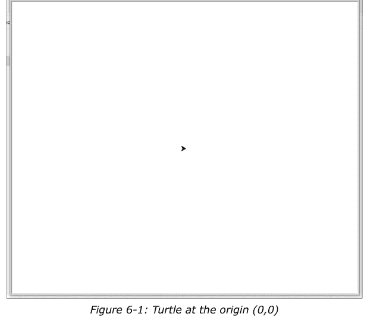

我们可以使用 **forward()** 或 **fd()** 方法让海龟前进。

```python
>>> Turtle.forward(25)
```

或者

```python
>>> Turtle.fd(25)
```

如果我们再次运行 **position()** 语句，就可以看到海龟当前的坐标如下：

```python
>>> Turtle.position()
```

输出如下：

```
(25.00, 0.00)
```

类似地，我们可以使用以下任一方法向后移动：

```python
>>> Turtle.backward(10)
>>> Turtle.bk(10)
>>> Turtle.back(10)
```

方法 **left()** 或 **lt()** 以及 **right()** 或 **rt()** 用于将海龟向左或向右转动指定的角度。默认情况下，角度单位是度，但我们也可以使用 **radians()** 将其设置为弧度。我们可以使用 **degrees()** 例程将其设置回度。默认情况下，我们在屏幕上看到的是一个箭头。但我们可以使用 **shape()** 例程将其更改为其他形状。允许的参数有 "arrow"、"turtle"、"circle"、"square"、"triangle" 和 "classic"。让我们按如下方式更改形状：

```python
>>> Turtle.shape("turtle")
```

现在，让我们通过创建一些小程序来进一步学习。我们将在需要使用时学习其余的函数。到目前为止，我们一直在交互模式下工作。现在让我们开始创建脚本文件。

### 6.4 使用海龟绘制图形

让我们用海龟画一个正方形。打开 IDLE 并创建一个文件。在其中写入以下代码：

```python
# prog00.py
import turtle as Turtle
import time

Turtle.forward(150)
Turtle.left(90)
Turtle.forward(150)
Turtle.left(90)
Turtle.forward(150)
Turtle.left(90)
Turtle.forward(150)
Turtle.left(90)
time.sleep(10)
Turtle.bye()
```

上述程序将绘制一个正方形，并在关闭窗口前等待 10 秒。

我们可以用更 Pythonic 的方式编写如下：

```python
# prog01.py
import turtle as Turtle
import time

for i in range(4):
    Turtle.forward(150)
    Turtle.left(90)

time.sleep(10)
Turtle.bye()
```

运行程序并查看输出。让我们为其添加更多功能：

```python
# prog02.py
import turtle as Turtle
import time

def square(length):
    for i in range(4):
        Turtle.forward(length)
        Turtle.left(90)

if __name__ == "__main__":
    square(150)
    time.sleep(10)
    Turtle.bye()
```

我们可以绘制圆形：

```python
# prog03.py
import turtle as Turtle

Turtle.circle(50)
Turtle.circle(-50)
```

输出如图 6-2 所示。

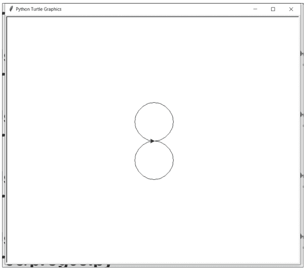

传递给 **circle()** 例程的参数决定了圆的半径和方向。让我们将此例程与其他例程结合使用，创建一个美丽的图案：

```python
# prog04.py
import turtle as Turtle

Turtle.color("green")
for angle in range(0, 360, 10):
    Turtle.seth(angle)
    Turtle.circle(100)
```

在上面的程序 (prog04.py) 中，我们使用 **color()** 例程设置绘图的颜色。我们还使用 **seth()** 例程设置海龟的方向。该代码执行需要相当长的时间，完成后会创建如图 6-3 所示的美丽图案。

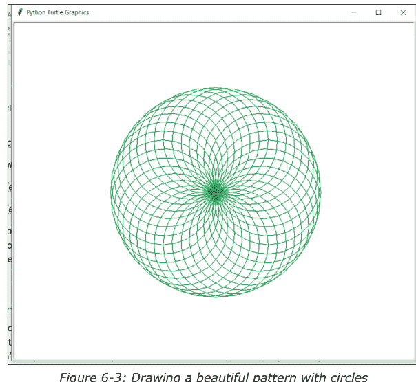

我们也可以不使用内置的 circle() 例程来绘制圆形。其逻辑是：我们将海龟向前移动一个位置，然后以一度的角度转弯。我们重复此操作 360 次，就得到了一个圆形。以下是代码：

```python
# prog05.py
import turtle as Turtle
count = 0
while(count < 360):
    Turtle.forward(1)
    Turtle.left(1)
    count = count + 1
```

运行程序并查看输出。

我们还可以设置背景颜色。让我们编写一个随机行走的程序。在此示例中，背景设置为黑色。

```python
# prog06.py
import turtle as Turtle
import random

Turtle.speed(10)
Turtle.bgcolor('Black')
turns = 1000
distance = 20

for x in range(turns):
    right=Turtle.right(random.randint(0, 360))
    left=Turtle.left(random.randint(0, 360))
    Turtle.color(random.choice(['Blue', 'Red', 'Green',
                                'Cyan', 'Magenta', 'Pink', 'Violet']))
    random.choice([right,left])
    Turtle.fd(distance)
```

它会产生如下（图 6-4）输出：

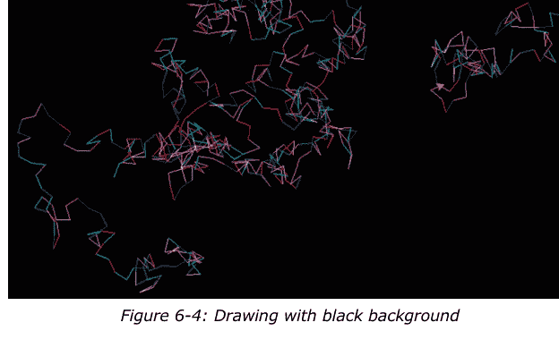

有时程序执行需要很长时间。我们可以通过改变海龟的速度来管理这一点。我们可以使用 **speed()** 例程来实现。速度可以从 0 到 10。以下是速度字符串与数值的对应关系。默认值是 "normal"。

- "fastest" 对应 0
- "fast" 对应 10
- "normal" 对应 6
- "slow" 对应 3
- "slowest" 对应 1

让我们绘制一些更有趣的图形。我们使用圆形 (prog04.py) 绘制了一个美丽的图案（图 6-3）。我们可以使用圆形绘制更复杂的图案：

```python
# prog07.py
import turtle as Turtle
Turtle.speed(10)
Turtle.bgcolor('Black')
colors=['Red', 'Yellow', 'Purple',
        'Cyan', 'Orange', 'Pink']
for x in range(100):
    Turtle.circle(x)
    Turtle.color(colors[x%6])
    Turtle.left(60)
```

输出如图 6-5 所示。

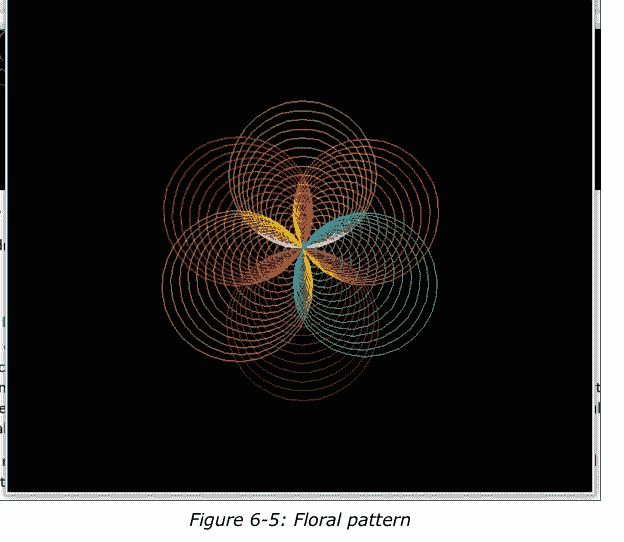

我们可以绘制形成彩色正方形图案的线条：

```python
# prog08.py
import turtle as Turtle
Turtle.speed(0)
Turtle.bgcolor('Black')
colors=['Red','Yellow','Pink','Orange']
for x in range(300):
    Turtle.color(colors[x%4])
    Turtle.forward(x)
    Turtle.left(90)
```

输出如图 6-6 所示。

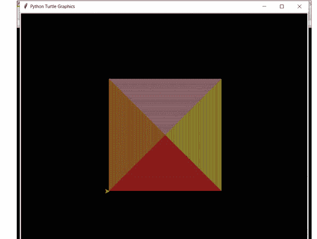

如果你没有注意到，程序运行得更快了。这是因为我们提高了海龟的速度并将其设置为最快。我们还可以为可视化添加更多颜色：

```python
# prog09.py
import turtle as Turtle
Turtle.speed(0)
Turtle.bgcolor('Black')
colors=['Red', 'Yellow', 'Pink', 'Orange',
        'Blue', 'Green', 'Cyan', 'White']
for x in range(300):
    Turtle.color(colors[x%8])
    Turtle.forward(x)
    Turtle.left(90)
```

我们也可以让线条从列表中随机选择颜色绘制。

```python
# prog10.py
import turtle as Turtle
import random
Turtle.speed(0)
Turtle.bgcolor('Black')
colors=['Red', 'Yellow', 'Pink', 'Orange',
        'Blue', 'Green', 'Cyan', 'White']
for x in range(300):
    Turtle.color(colors[random.randint(0, 7)])
    Turtle.forward(x)
    Turtle.left(90)
```

运行这两个程序并查看输出。

我们还可以绘制美丽的六边形图案：

```python
# prog11.py
import turtle as Turtle

Turtle.bgcolor("black")
colors=["Red","White","Cyan","Yellow","Green","Orange"]

for x in range(300):
    Turtle.color(colors[x%6])
    Turtle.fd(x)
    Turtle.left(59)
```

输出如图 6-7 所示。

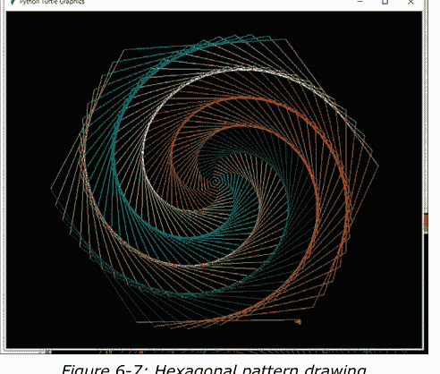

我们还可以用颜色填充形状。在结束本节之前，让我们看几个例子。我们将使用 **fillcolor()**、**begin_fill()** 和 **end_fill()** 例程。以下是一个简单的例子。

```python
# prog12.py
import turtle as Turtle
Turtle.fillcolor('red')
Turtle.begin_fill()
Turtle.forward(100)
Turtle.left(120)
Turtle.forward(100)
Turtle.left(120)
Turtle.forward(100)
Turtle.left(120)
Turtle.end_fill()
```

它将绘制一个三角形并用红色填充。让我们看另一个简单的例子：

```python
# prog13.py
import turtle as Turtle
Turtle.fillcolor('Orange')
Turtle.begin_fill()
for count in range(4):
    Turtle.forward(100)
    Turtle.left(90)
Turtle.end_fill()
```

上述程序用橙色填充一个正方形。

### 6.5 可视化递归

我们在第三章学习了递归。我们知道，从函数内部调用自身被称为直接递归。我们知道递归函数有两个重要部分。第一部分是递归终止条件。第二部分是递归调用。在我们之前的递归函数中，我们在控制台打印输出。现在，我们将用图形输出代替基于文本的输出。我们将从一个简单的程序开始：

```python
# prog00.py
import turtle as Turtle
def zigzag(size, length):
    if size > 0:
        Turtle.left(45)
        Turtle.forward(length)
        Turtle.right(90)
        Turtle.forward(2*length)
        Turtle.left(90)
        Turtle.forward(length)
        Turtle.right(45)
```

#### 递归图形绘制

```python
zigzag(size-1, length)
if __name__ == "__main__":
    zigzag(5, 50)
```

我们可以在 **prog00.py** 中看到，终止条件是检查传递的参数之一是否大于零。我们只有一个递归调用，它将一个递减的参数传递给其中一个参数。递归调用不一定只能有一个，也可以有多个。我们将在后续内容中进一步探讨这些可能性。但现在，我们将探索一些只调用一次递归函数的图形。下图（图6-8）展示了输出结果：

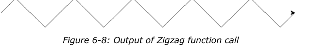

让我们对程序主部分调用递归函数的部分做一些修改：

```python
zigzag(3, 70)
```

我们可以观察到变化后的输出如下：

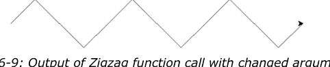

这是我们能绘制的最简单的递归图形之一。让我们绘制一个更复杂的图形：螺旋。首先看看代码，然后我会详细解释。

```python
# prog01.py
import turtle as Turtle
def spiral(sideLen, angle, scaleFactor, minLength):
    if sideLen >= minLength:
        Turtle.forward(sideLen)
        Turtle.left(angle)
        spiral(sideLen*scaleFactor, angle,
                scaleFactor, minLength)
if __name__ == "__main__":
    Turtle.speed(0)
    spiral(200, 120, 0.9, 20)
```

这个程序（prog01.py）根据我们传递给递归函数的参数绘制各种螺旋形状。终止条件是螺旋的边长必须大于最小长度。如果是这样，我们让海龟前进并向左转。然后我们进行递归调用，使得螺旋的后续部分是前一部分的缩放版本。让我们看看输出：

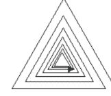

图6-10：三角形螺旋

我们可以用这种方法制作任何规则形状的螺旋。例如，我们可以将角度改为90来修改递归调用：

```python
spiral(200, 90, 0.9, 20)
```

这是输出结果：

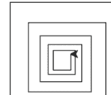

图6-11：方形螺旋

我们可以修改主调用来绘制五边形螺旋：

```python
spiral(200, 72, 0.9, 20)
```

这是输出结果：

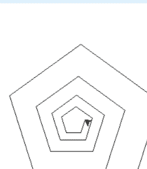

图6-12：五边形螺旋

最后，我们可以使用以下代码制作六边形螺旋：

```python
spiral(200, 60, 0.9, 20)
```

输出如下：

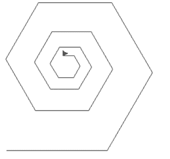

图6-13：六边形螺旋

从主部分运行以下调用以查看更多效果：

```python
spiral(200, 45, 0.9, 20)
spiral(200, 40, 0.9, 20)
spiral(200, 36, 0.9, 20)
spiral(200, 30, 0.9, 20)
spiral(200, 24, 0.9, 20)
spiral(200, 20, 0.9, 20)
spiral(200, 18, 0.9, 20)
```

在第三章中，我们学习了如何编写斐波那契数列程序。我们在控制台上打印了斐波那契数。在这里，我们将学习如何可视化表示斐波那契树。我们将用海龟绘图来代替打印：

```python
# prog02.py
import turtle as Turtle
def drawfib(n, len_ang):
    Turtle.forward(2 * len_ang)
    if n == 0 or n == 1:
        pass
    else:
        Turtle.left(len_ang)
        drawfib(n - 1, len_ang)
        Turtle.right(2 * len_ang)
        drawfib(n - 2, len_ang)
        Turtle.left(len_ang)
    Turtle.backward(2 * len_ang)
if __name__ == "__main__":
    Turtle.left(90)
    Turtle.speed(0)
    drawfib(7, 20)
```

正如我们所见，代码是相同的，我们只是将 **print()** 语句替换为海龟移动。斐波那契树是递归的一个例子，我们在同一级别上多次（确切地说是两次）递归调用函数。它产生以下结果（图6-14）：

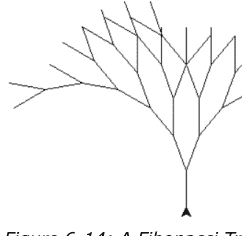

图6-14：斐波那契树

我们可以更改主部分中函数调用的参数以获得不同的输出。以下是几个示例：

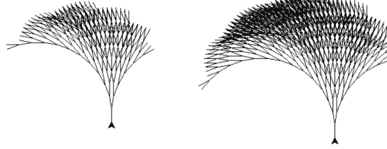

图6-15：使用不同参数调用函数得到的斐波那契树

作为练习，请使用不同的参数集调用函数。

我们还可以绘制科赫雪花的一部分：

```python
# prog03.py
import turtle as Turtle
def koch_snowflake(length, depth):
    if depth == 0:
        Turtle.forward(length)
    else:
        length = length / 3
        depth = depth - 1
        Turtle.color('Blue')
        koch_snowflake(length, depth)
        Turtle.right(60)
        Turtle.color('Orange')
        koch_snowflake(length, depth)
        Turtle.left(120)
        Turtle.color('Red')
        koch_snowflake(length, depth)
        Turtle.right(60)
        Turtle.color('Green')
        koch_snowflake(length, depth)
Turtle.speed(10)
koch_snowflake(500, 4)
```

代码中有三个递归函数调用（**prog03.py**）。这是输出结果：


我们也可以通过修改上面的代码（**prog03.py**）来绘制整个雪花。我们需要在主部分的循环中添加函数调用：

```python
# prog04.py
import turtle as Turtle
import random
def koch_snowflake(length, depth):
    if depth == 0:
        Turtle.forward(length)
    else:
        length = length / 3
        depth = depth - 1
        Turtle.color(colors[random.randint(0, 8)])
        koch_snowflake(length, depth)
        Turtle.right(60)
        Turtle.color(colors[random.randint(0, 8)])
        koch_snowflake(length, depth)
        Turtle.left(120)
        Turtle.color(colors[random.randint(0, 8)])
        koch_snowflake(length, depth)
        Turtle.right(60)
        Turtle.color(colors[random.randint(0, 8)])
        koch_snowflake(length, depth)
Turtle.speed(10)
colors = ['Blue', 'Red', 'Orange',
          'Green', 'Magenta', 'Purple',
          'Cyan', 'Violet', 'Black']
for i in range(3):
    koch_snowflake(200, 3)
    Turtle.left(120)
```

输出是一个完整的雪花，如图6-17所示：

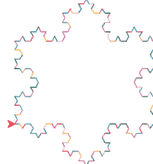

我们可以绘制更复杂的图形。在最后的例子（**prog03.py** 和 **prog04.py**）中，我们递归调用了函数三次。在下一个例子中，我们将递归调用函数四次。看看下面的代码。我们使用了许多新的例程。

```python
# prog05.py
import turtle as Turtle
def draw_line(pos1, pos2):
    Turtle.penup()
    Turtle.goto(pos1[0], pos1[1])
    Turtle.pendown()
    Turtle.goto(pos2[0], pos2[1])

def recursive_draw(x, y, width, height, count):
    draw_line([x + width * 0.25, height // 2 + y],
              [x + width * 0.75, height // 2 + y])
    draw_line([x + width * 0.25, (height * 0.5) // 2 + y],
              [x + width * 0.25, (height * 1.5) // 2 + y])
    draw_line([x + width * 0.75, (height * 0.5) // 2 + y],
              [x + width * 0.75, (height * 1.5) // 2 + y])
    if count <= 0:
        # 叶子节点
        return 1
    else:
        recursive_draw(x, y, width // 2, height // 2, count-1)
        recursive_draw(x + width // 2, y, width // 2, height // 2, count-1)
        recursive_draw(x, y + width // 2, width // 2, height // 2, count-1)
        recursive_draw(x + width // 2, y + width // 2, width // 2, height // 2, count-1)

height = width = 800
screen = Turtle.Screen()
screen.setup(height, width)
screen.title('H Tree Fractal')
screen.bgcolor('White')
Turtle.hideturtle()
Turtle.color('Black')
Turtle.speed(0)
recursive_draw(-height//2, -width//2, height, width, 0)
```

正如我们所见，这个程序中使用了一些新的例程。例程 **penup()** 会让海龟停止绘图。例程 **pendown()** 会再次激活绘图。例程 **goto()** 会将海龟移动到指定位置。如前所述，该函数对自身进行了四次递归调用。

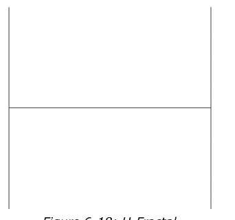

*图6-18：H分形*

这被称为H分形，因为它呈字符 **H** 的形状。由于满足终止条件，递归部分未被调用。我们可以通过更改主部分中函数调用的最后一个参数来更改递归级别，使递归部分执行：

```python
recursive_draw(-height//2, -width//2, height, width, 1)
```

输出结果如下：

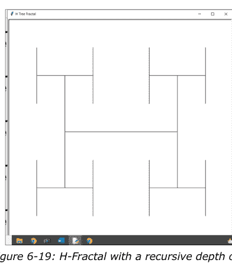

在垂直线的末端，我们得到了一个缩小版的更大图形。现在，这确实是一个递归输出。让我们将递归深度设为2：

```
recursive_draw(-height//2, -width//2, height, width, 2)
```

以下是输出结果：

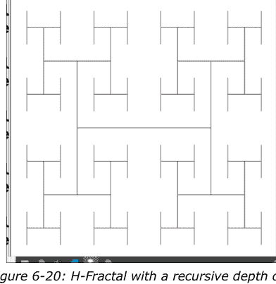

让我们将递归深度设为3：

```
recursive_draw(-height//2, -width//2, height, width, 3)
```

以下是输出结果：

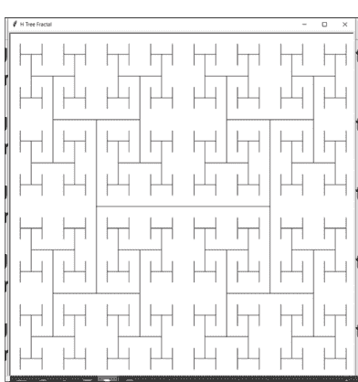

让我们将递归深度设为4：

```
recursive_draw(-height//2, -width//2, height, width, 4)
```

以下是输出结果：

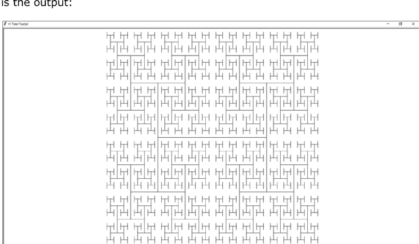

### 6.6 多只海龟

到目前为止，我们的代码中只使用了一只海龟。我们也可以在代码中使用多只海龟。我们必须以面向对象的方式来实现。我们需要为每只海龟创建一个独特的对象。让我们看看代码：

```
prog06.py
import turtle
t1 = turtle.Turtle()
t2 = turtle.Turtle()
t1.speed(10)
t2.speed(10)
t1.color('Red')
t2.color('Green')
count = 0
while(count < 360):
    t1.forward(1)
    t1.left(1)
    t2.forward(1)
    t2.right(1)
    count = count + 1
```

我们让两只海龟在每次迭代中都绘制一小段线段。这造成了它们在并行运行的错觉。运行代码并查看输出。

## 总结

在本章中，我们探索了海龟库。我们绘制了许多图形。最有趣的部分是递归的可视化。我们巧妙地运用海龟创建了各种递归图形。最后，我们学习了如何使用多只海龟进行绘制。

在下一章中，我们将探索另一个名为 **pygame** 的图形库。

## 第7章 • 编程动画与游戏

在上一章中，我们详细探讨了海龟图形库。我们学习了如何绘制精美的图形和递归图形。

在本章中，我们将通过探索另一个流行的图形和动画库，继续图形编程之旅。以下是我们将在本章讨论的主题列表：

- Pygame 入门
- 使用 Pygame 实现递归
- 通过混沌游戏绘制谢尔宾斯基三角形
- 使用 Pygame 制作简单动画
- 贪吃蛇游戏

与上一章一样，本章将包含大量实践操作。学完本章后，我们将能够熟练地绘制图形、创建动画并编写小型游戏。

### 7.1 Pygame 入门

之前，我们使用了海龟库。由于其本身的性质，该库存在很多限制。因此，我们将学习使用 Python 中的一些新库。我们要学习的第一个库是 **Pygame**。让我们先安装它。在操作系统的命令提示符下运行以下命令来安装 Pygame：

```
C:\Users\Ashwin>pip3 install pygame
```

这会将库安装到你的计算机上。该命令在所有平台上都是相同的。现在，让我们从基础开始：

```
prog00.py
import pygame, sys
result = pygame.init()
if result[1] > 0:
    print('Error initializing Pygame : ' + str(result[1]))
    sys.exit(1)
else:
    print('Pygame initialized successfully!')
screen = pygame.display.set_mode((640, 480))
pygame.quit()
sys.exit(0)
```

让我们逐行解析这个程序。第一行导入了我们将在程序中使用的所有库。然后我们使用 **init()** 例程在当前程序中初始化 Pygame 库。我们将返回值存储到一个变量中，并检查它是否返回错误。

接着，我们使用 **set_mode()** 例程设置输出窗口的分辨率。最后，我们使用 **quit()** 例程关闭 pygame 会话。运行程序。输出并不十分显眼。它创建了一个给定尺寸的 pygame 窗口。它有一个黑色背景。在关闭之前，窗口会短暂闪烁。恭喜，我们开始使用 Pygame 库了！另外，不要忘记检查控制台输出。它将如下所示：

**pygame 2.0.1 (SDL 2.0.14, Python 3.9.7)**

**Hello from the pygame community. https://www.pygame.org/contribute.html**

**Pygame initialized successfully!**

让我们为此添加一个事件循环。事件循环记录所有鼠标和键盘事件，并在点击关闭按钮时终止程序。以下是增强后的代码：

```
prog01.py
import pygame, sys
result = pygame.init()
if result[1] > 0:
    print('Error initializing Pygame : ' + str(result[1]))
    sys.exit(1)
else:
    print('Pygame initialized successfully!')
screen = pygame.display.set_mode((640, 480))
running = True
while running:
    for event in pygame.event.get():
        print(event)
        if event.type == pygame.QUIT:
            running = False
pygame.quit()
sys.exit(0)
```

运行上述程序（prog01.py）并观察终端中的输出。你会注意到程序打印了用户执行的所有操作（键盘和鼠标事件）。

让我们创建一个在 **MOUSEBUTTONDOWN** 事件时改变背景颜色的小应用程序。这是完整的程序：

```
prog02.py
import pygame, sys, random
result = pygame.init()
if result[1] > 0:
    print('Error initializing Pygame : ' + str(result[1]))
    sys.exit(1)
else:
    print('Pygame initialized successfully!')
screen = pygame.display.set_mode((640, 480))
BLACK = (0, 0, 0)
GRAY = (127, 127, 127)
WHITE = (255, 255, 255)
RED = (255, 0, 0)
GREEN = (0, 255, 0)
BLUE = (0, 0, 255)
YELLOW = (255, 255, 0)
CYAN = (0, 255, 255)
MAGENTA = (255, 0, 255)
bgcolor = [BLACK, GRAY, WHITE,
           RED, GREEN, BLUE,
           YELLOW, CYAN, MAGENTA]
background = BLACK
running = True
while running:
    for event in pygame.event.get():
        if event.type == pygame.QUIT:
            running = False
        elif event.type == pygame.MOUSEBUTTONDOWN:
            background = bgcolor[random.randint(0, 8)]
    screen.fill(background)
    pygame.display.flip()
pygame.quit()
sys.exit(0)
```

让我们看看我们添加到文件中的新代码。我们在前面的章节中学习了元组。我们使用包含红、绿、蓝值组合的元组来定义颜色。这些值可以从0到255变化。我们定义了9个不同的颜色元组。然后我们将这些颜色元组添加到一个列表中。在事件循环中，如果我们检测到 MOUSEBUTTONDOWN 事件，我们就从颜色列表中随机选择一个颜色并将其赋值给背景。最后，我们使用 **fill()** 例程设置背景，并使用 **flip()** 例程更新显示。flip() 例程用于更新整个显示的内容。从现在开始我们将频繁使用它。

运行程序，观察在 **MOUSEBUTTONDOWN** 事件时背景的变化。

### 7.2 使用 Pygame 实现递归

我们在第三章学习了递归的概念。在上一章中，我们从视觉上探索了它。让我们再次从视觉上探索它。但这次，我们将使用 Pygame 库。让我们从简单的东西开始。我们将绘制一棵简单的递归树。可视化效果将具有黑色背景和白色树枝。最后几根树枝和叶子将是绿色的。让我们看看代码：

```
prog03.py
import pygame, math, random
import time, sys
width, height = 1366, 768
result = pygame.init()
if result[1] > 0:
    print('Error initializing Pygame : ' + str(result[1]))
    sys.exit(1)
else:
    print('Pygame initialized successfully!')
window = pygame.display.set_mode((width, height))
pygame.display.set_caption('Fractal Tree')
screen = pygame.display.get_surface()

def Fractal_Tree(x1, y1, theta, depth):
    if depth:
        rand_length = random.randint(1, 10)
        rand_angle = random.randint(10, 20)
        x2 = x1 + int(math.cos(math.radians(theta))
                      * depth * rand_length)
        y2 = y1 + int(math.sin(math.radians(theta))
                      * depth * rand_length)
        if depth < 5:
            clr = (0, 255, 0)
        else:
            clr = ( 255, 255, 255)
        pygame.draw.line(screen, clr, (x1, y1), (x2, y2), 2)
        Fractal_Tree(x2, y2, theta - rand_angle, depth-1)
        Fractal_Tree(x2, y2, theta + rand_angle, depth-1)
Fractal_Tree( (width/2), (height-10), -90, 14)
pygame.display.flip()
running = True
while running:
    for event in pygame.event.get():
        if event.type == pygame.QUIT:
            running = False
pygame.quit()
sys.exit(0)
```

正如我们所见，我们使用了一个新的例程 **set_caption()** 来设置窗口的标题。我们还使用了例程 **draw.line()** 来绘制一条线。一个需要考虑的重要事项是，在 Pygame 中，原点 (0, 0) 位于左上角。我们对大部分代码都很熟悉。这个递归函数接受一个点的坐标、角度和深度作为参数。我们还随机生成了分支的长度。利用传入的坐标，以及随机生成的角度和长度，我们计算出分支的终点。如果分支靠近叶子，我们就将它们涂成绿色，否则涂成白色。最后，我们绘制线段，并将该线段的终点传递给递归函数调用。我们还随机生成另一个角度值，将其加到传入的角度上，再从传入的角度中减去它，并将这些新值作为参数传递给递归调用。让我们看看结果：

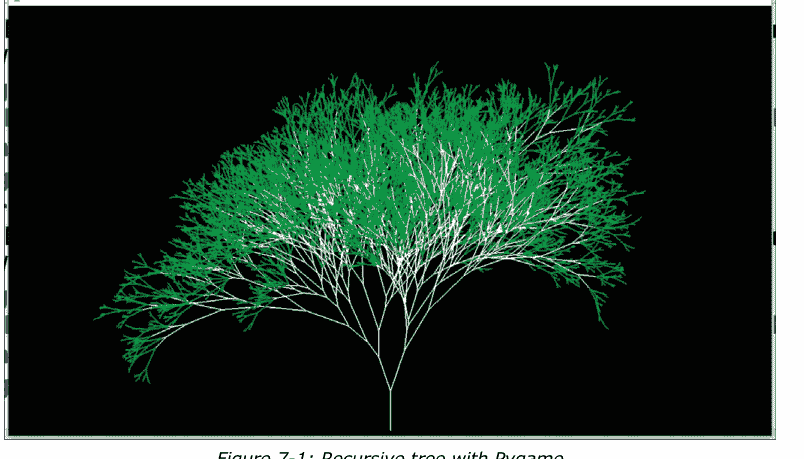

图 7-1：使用 Pygame 绘制的递归树

让我们来绘制谢尔宾斯基三角形。它比递归树稍微复杂一些。我们必须递归地调用函数三次。以下是代码：

```python
# prog04.py
import pygame, math, random
import time, sys

width, height = 800, 800
result = pygame.init()
if result[1] > 0:
    print('Error initializing Pygame : ' + str(result[1]))
    sys.exit(1)
else:
    print('Pygame initialized successfully!')

window = pygame.display.set_mode((width, height))
pygame.display.set_caption('Fibonacci Tree')
screen = pygame.display.get_surface()

shift = 20
A_x = 0 + shift
A_y = 649 + shift
B_x = 750 + shift
B_y = 649 + shift
C_x = 375 + shift
C_y = 0 + shift

RGB = [(0, 0, 255), (0, 255, 0), (255, 0, 0)]

def draw_triangle(A_x, A_y, B_x, B_y, C_x, C_y, i):
    pygame.draw.line(screen, RGB[i%3], (A_x, A_y), (B_x, B_y), 1)
    pygame.draw.line(screen, RGB[i%3], (C_x, C_y), (B_x, B_y), 1)
    pygame.draw.line(screen, RGB[i%3], (A_x, A_y), (C_x, C_y), 1)
    pygame.display.flip()

def draw_fractal(A_x, A_y, B_x, B_y, C_x, C_y, depth):
    if depth > 0:
        draw_fractal((A_x), (A_y), (A_x+B_x)/2, (A_y+B_y)/2,
                     (A_x+C_x)/2, (A_y+C_y)/2, depth-1)
        draw_fractal((B_x), (B_y), (A_x+B_x)/2, (A_y+B_y)/2,
                     (B_x+C_x)/2, (B_y+C_y)/2, depth-1)
        draw_fractal((C_x), (C_y), (C_x+B_x)/2, (C_y+B_y)/2,
                     (A_x+C_x)/2, (A_y+C_y)/2, depth-1)

        draw_triangle((A_x), (A_y), (A_x+B_x)/2,
                      (A_y+B_y)/2, (A_x+C_x)/2, (A_y+C_y)/2, depth)
        draw_triangle((B_x), (B_y), (A_x+B_x)/2,
                      (A_y+B_y)/2, (B_x+C_x)/2, (B_y+C_y)/2, depth)
        draw_triangle((C_x), (C_y), (C_x+B_x)/2,
                      (C_y+B_y)/2, (A_x+C_x)/2, (A_y+C_y)/2, depth)

draw_fractal(A_x, A_y, B_x, B_y, C_x, C_y, 1)
pygame.display.flip()

running = True
while running:
    for event in pygame.event.get():
        if event.type == pygame.QUIT:
            running = False

pygame.quit()
sys.exit(0)
```

正如我们所见，我们有一个单独的自定义函数来绘制实际的形状（**draw_triangle()**）。在递归调用函数三次之前，我们在这个递归函数中调用了它三次。在主程序部分，我们以深度为 1 调用该函数。它产生以下输出：

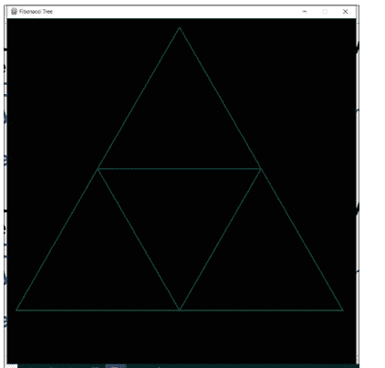

图 7-2：深度为 1 的谢尔宾斯基三角形

为了更好地理解，让我们修改主程序部分的调用：

```python
draw_fractal(A_x, A_y, B_x, B_y, C_x, C_y, 2)
```

输出如下：

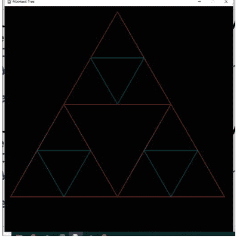

图 7-3：深度为 2 的谢尔宾斯基三角形

让我们进一步增加深度到 5，看看结果：

```python
draw_fractal(A_x, A_y, B_x, B_y, C_x, C_y, 5)
```

以下是输出：

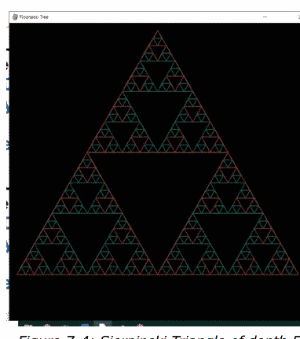

让我们将深度增加到 10：

```python
draw_fractal(A_x, A_y, B_x, B_y, C_x, C_y, 10)
```

输出如下：

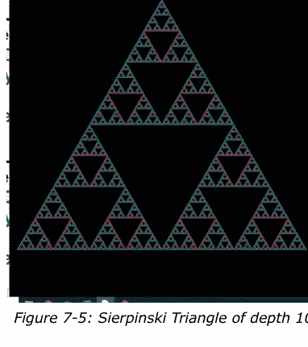

### 7.3 通过混沌游戏绘制谢尔宾斯基三角形

我们可以使用混沌游戏来创建谢尔宾斯基三角形。该分形是通过迭代地创建一系列点来生成的。我们选择一个初始随机点（本例中为 (400, 400)）。序列中的每个点都位于前一个点与每次迭代中随机选择的多边形顶点之一的中点。当我们重复这个迭代过程很多次，并在每次迭代中随机选择三角形的一个顶点时，通常（但并非总是）会得到谢尔宾斯基三角形。为了获得更好的效果，我们可以决定不绘制最初的几个点。以下是代码：

```python
# prog05.py
import pygame, math, random
import time, sys

width, height = 800, 800
result = pygame.init()
if result[1] > 0:
    print('Error initializing Pygame : ' + str(result[1]))
    sys.exit(1)
else:
    print('Pygame initialized successfully!')

surface = pygame.display.set_mode((width, height))
pygame.display.set_caption('Fibonacci Tree')
screen = pygame.display.get_surface()

def draw_pixel(x, y):
    surface.fill(pygame.Color(0, 255, 0), ((x, y), (1, 1)))
    pygame.display.flip()

shift = 20
A_x = 0 + shift
A_y = 649 + shift
B_x = 750 + shift
B_y = 649 + shift
C_x = 375 + shift
C_y = 0 + shift

x, y = 400, 400
for i in range( 1, 50000):
    choice = random.randint(1, 3)
    if choice == 1:
        x = (x+A_x)/2
        y = (y+A_y)/2
    elif choice == 2:
        x = (x+B_x)/2
        y = (y+B_y)/2
    elif choice == 3:
        x = (x+C_x)/2
        y = (y+C_y)/2
    if i < 10:
        pass
    else:
        draw_pixel(x, y)

running = True
while running:
    for event in pygame.event.get():
        if event.type == pygame.QUIT:
            running = False

pygame.quit()
sys.exit(0)
```

我们现在对大部分代码都很熟悉了。选择三角形随机顶点，然后选择当前点与所选顶点之间中点的逻辑位于 **for** 循环内。这是输出结果：

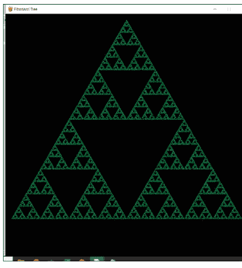

*图 7-6：通过混沌游戏绘制的谢尔宾斯基三角形*

### 7.4 使用 Pygame 进行简单动画

让我们使用 Pygame 库创建一个弹跳球的简单动画。在这个演示中，我们将学到很多新东西。让我们一步一步地编写代码。创建一个新文件并将其保存为 **prog06.py**。让我们按如下方式导入所需的库：

```python
import pygame
from pygame.locals import *
```

让我们初始化 Pygame 并为屏幕创建一个对象：

```python
size = 720, 480
width, height = size
result = pygame.init()
if result[1] > 0:
    print('Error initializing Pygame : ' + str(result[1]))
    sys.exit(1)
else:
    print('Pygame initialized successfully!')

screen = pygame.display.set_mode((size))
```

我们已经熟悉了这整块代码，所以我不再解释。让我们看看一些新代码。将以下代码添加到文件中：

```python
BLUE = (150, 150, 255)
RED = (255, 0, 0)
ball = pygame.image.load('ball_transparent.gif')
rect = ball.get_rect()
speed = [2, 2]
```

我们定义了蓝色和红色的元组。然后我们使用例程 **image.load()** 将图像加载到一个变量中。我们可以使用例程 **get_rect()** 获取与图像大小相同的矩形。最后，我们定义了一个列表，用于存储沿两个轴的速度值。让我们编写循环的代码：

```python
running = True
while running:
    for event in pygame.event.get():
        if event.type == QUIT:
            running = False

    rect = rect.move(speed)
    if rect.left < 0 or rect.right > width:
        speed[0] = -speed[0]
    if rect.top < 0 or rect.bottom > height:
        speed[1] = -speed[1]

    screen.fill(BLUE)
    screen.blit(ball, rect)
    pygame.time.Clock().tick(240)
    pygame.display.flip()
```

我们熟悉事件循环。所以，让我们讨论下一部分。我们使用例程 **move()** 来移动对象。我们必须将存储速度值的变量传递给它。在 if 语句中，我们检查包围球的矩形是否接触到边界。如果接触到，我们就反转球的速度。

然后，我们用蓝色填充屏幕。接着，我们使用例程 **blit()** 来显示球。例程 **time.Clock().tick(240)** 用于定义动画的帧率。

最后，我们使用例程 **flip()** 将所有内容显示在屏幕上。我们使用例程 quit() 来结束所有操作，如下所示：

```
pygame.quit()
```

整个代码如下：

```
prog06.py
import pygame
from pygame.locals import *

size = 720, 480
width, height = size
result = pygame.init()
if result[1] > 0:
    print('Error initializing Pygame : ' + str(result[1]))
    sys.exit(1)
else:
    print('Pygame initialized successfully!')
screen = pygame.display.set_mode((size))

BLUE = (150, 150, 255)
RED = (255, 0, 0)
ball = pygame.image.load('ball_transparent.gif')
rect = ball.get_rect()
speed = [2, 2]

running = True
while running:
    for event in pygame.event.get():
        if event.type == QUIT:
            running = False

    rect = rect.move(speed)
    if rect.left < 0 or rect.right > width:
        speed[0] = -speed[0]
    if rect.top < 0 or rect.bottom > height:
        speed[1] = -speed[1]

    screen.fill(BLUE)
    screen.blit(ball, rect)
    pygame.time.Clock().tick(240)
    pygame.display.flip()

pygame.quit()
```

这会创建一个弹跳球的精彩动画。以下是该动画的截图：

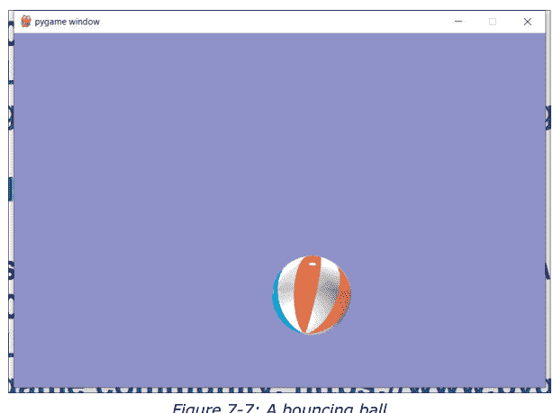

图 7-7：一个弹跳球

我们可以使用相同的概念编写一个复杂的程序。我们可以拥有多个以不同速度弹跳的球。这次，我们将为球创建一个对象。让我们逐步查看代码：

```
import pygame
import random
```

这会导入所有库。让我们定义颜色：

```
BLACK = (0, 0, 0)
WHITE = (255, 255, 255)
RED = (255, 0, 0)
GREEN = (0, 255, 0)
BLUE = (0, 0, 255)
colors = [WHITE, RED, BLUE, GREEN]
```

让我们定义球的大小和屏幕分辨率：

```
size = 720, 480
width, height = size
BALL_SIZE = 25
```

让我们为球定义一个类：

```
class Ball:

    def __init__(self):
        self.x = 0
        self.y = 0
        self.change_x = 0
        self.change_y = 0
        self.color = colors[random.randint(0, 3)]
```

我们正在定义坐标、两个维度上的速度以及颜色（随机）。让我们定义一个函数来创建球，并为位置和速度分配随机值：

```
def make_ball():
    ball = Ball()
    ball.x = random.randrange(BALL_SIZE, width - BALL_SIZE)
    ball.y = random.randrange(BALL_SIZE, height - BALL_SIZE)
    ball.change_x = random.randint(1, 3)
    ball.change_y = random.randint(1, 3)
    return ball
```

让我们初始化 pygame：

```
result = pygame.init()
if result[1] > 0:
    print('Error initializing Pygame : ' + str(result[1]))
    sys.exit(1)
else:
    print('Pygame initialized successfully!')
screen = pygame.display.set_mode((size))
pygame.display.set_caption("Bouncing Balls")
```

让我们定义 fps（每秒帧数）：

```
fps = 30
```

让我们定义一个列表来保存球对象：

```
ball_list = []
```

让我们创建一个球并将其添加到列表中：

```
ball = make_ball()
ball_list.append(ball)
```

让我们编写主循环：

```
running = False
while not running:
    for event in pygame.event.get():
        if event.type == pygame.QUIT:
            running = True
        elif event.type == pygame.KEYDOWN:
            if event.key == pygame.K_SPACE:
                if len(ball_list) < 5:
                    ball = make_ball()
                    ball_list.append(ball)
                else:
                    print("Screen already has five balls!")
            elif event.key == pygame.K_BACKSPACE:
                if len(ball_list) == 0:
                    print("Ball list is empty!")
                else:
                    ball_list.pop()
            elif event.key == pygame.K_q:
                if fps == 30:
                    print("Minimum FPS")
                else:
                    fps = fps - 30
                    print("Current FPS = " + str(fps))
            elif event.key == pygame.K_e:
                if fps == 300:
                    print("Maximum FPS")
                else:
                    fps = fps + 30
                    print("Current FPS = " + str(fps))
            elif event.key == pygame.K_r:
                for ball in ball_list:
                    ball.change_x = random.randint(-2, 3)
                    ball.change_y = random.randint(-2, 3)
                    ball.color = colors[random.randint(0, 3)]
```

这是一个很大的代码块，看起来令人生畏。然而，它很简单。如果我们按下空格键，它会创建一个新球并将其添加到列表中。如果已经有五个球，它不会创建新球。如果我们按下退格键，如果球列表不为空，它会移除最后创建的球。如果我们按下 E 键，它会将每秒帧数增加 30（这反过来会增加动画的速度）。如果速度 = 300，它不会增加。类似地，按下 q 会将速度降低 30。如果速度已经是 30，它不会进一步降低。按下 R 键会随机改变球的速度和颜色。我们还没有完成这个代码块：

```
for ball in ball_list:
    ball.x = ball.x + ball.change_x
    ball.y = ball.y + ball.change_y

    if ball.y > height - BALL_SIZE or ball.y < BALL_SIZE:
        ball.change_y = -ball.change_y
    if ball.x > width - BALL_SIZE or ball.x < BALL_SIZE:
        ball.change_x = -ball.change_x
```

在这里，在这个代码块中，我们正在改变球的位置并检查它们是否与屏幕边缘碰撞。如果是，我们正在改变方向。最后，我们正在绘制每一帧。

```
screen.fill(BLACK)
for ball in ball_list:
    pygame.draw.circle(screen, ball.color,
                       [ball.x, ball.y], BALL_SIZE)
pygame.time.Clock().tick(fps)
pygame.display.flip()
```

我们正在用黑色填充整个屏幕。然后我们绘制球的当前位置。最后，我们使用例程 **flip()** 显示所有内容。

```
pygame.quit()
```

最后，我们使用例程 **quit()** 来结束。运行该程序。我们可以使用 Q、E 和 R 键。我们也可以使用空格和退格键。让我们将整个程序整合在一起：

```
prog07.py
import pygame
import random

BLACK = (0, 0, 0)
WHITE = (255, 255, 255)
RED = (255, 0, 0)
GREEN = (0, 255, 0)
BLUE = (0, 0, 255)
colors = [WHITE, RED, BLUE, GREEN]

size = 720, 480
width, height = size
BALL_SIZE = 25

class Ball:
    def __init__(self):
        self.x = 0
        self.y = 0
        self.change_x = 0
        self.change_y = 0
        self.color = colors[random.randint(0, 3)]

def make_ball():
    ball = Ball()
    ball.x = random.randrange(BALL_SIZE, width - BALL_SIZE)
    ball.y = random.randrange(BALL_SIZE, height - BALL_SIZE)
    ball.change_x = random.randint(1, 3)
    ball.change_y = random.randint(1, 3)
    return ball

result = pygame.init()
if result[1] > 0:
    print('Error initializing Pygame : ' + str(result[1]))
    sys.exit(1)
else:
    print('Pygame initialized successfully!')
screen = pygame.display.set_mode((size))
pygame.display.set_caption("Bouncing Balls")

ball_list = []
ball = make_ball()
ball_list.append(ball)
fps = 30

running = False
while not running:
    for event in pygame.event.get():
        if event.type == pygame.QUIT:
            running = True
        elif event.type == pygame.KEYDOWN:
            if event.key == pygame.K_SPACE:
                if len(ball_list) < 5:
                    ball = make_ball()
                    ball_list.append(ball)
                else:
                    print("Screen already has five balls!")
            elif event.key == pygame.K_BACKSPACE:
                if len(ball_list) == 0:
                    print("Ball list is empty!")
                else:
                    ball_list.pop()
            elif event.key == pygame.K_q:
                if fps == 30:
                    print("Minimum FPS")
                else:
                    fps = fps - 30
                    print("Current FPS = " + str(fps))
            elif event.key == pygame.K_e:
                if fps == 300:
                    print("Maximum FPS")
                else:
                    fps = fps + 30
                    print("Current FPS = " + str(fps))
            elif event.key == pygame.K_r:
                for ball in ball_list:
                    ball.change_x = random.randint(-2, 3)
                    ball.change_y = random.randint(-2, 3)
                    ball.color = colors[random.randint(0, 3)]

    for ball in ball_list:
        ball.x = ball.x + ball.change_x
        ball.y = ball.y + ball.change_y

        if ball.y > height - BALL_SIZE or ball.y < BALL_SIZE:
            ball.change_y = -ball.change_y
        if ball.x > width - BALL_SIZE or ball.x < BALL_SIZE:
            ball.change_x = -ball.change_x

    screen.fill(BLACK)
    for ball in ball_list:
        pygame.draw.circle(screen, ball.color,
                           [ball.x, ball.y], BALL_SIZE)
    pygame.time.Clock().tick(fps)
    pygame.display.flip()

pygame.quit()
```

以下是输出结果：

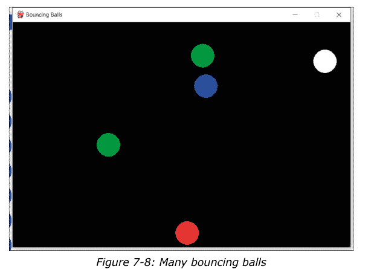

我们可以修改这个程序，用显示图像来代替创建圆形。可以尝试作为练习。

### 7.5 贪吃蛇游戏

掌握了这些技巧后，让我们开始一个复杂的游戏项目。在这个项目中，我们将为经典的贪吃蛇游戏编写代码。游戏开始时，有一条由两个10x10像素方块组成的蛇。在左上角，我们可以看到难度和分数。一个随机的10x10方块会生成，当蛇吃掉它时，它会被蛇吸收，蛇的尺寸会增长。一旦方块被吃掉，另一个方块会在另一个随机位置生成。蛇处于持续运动状态。我们可以使用WSAD键来移动它，但不能直接反转它的方向。让我们逐块查看代码：

```python
import pygame, sys, time, random
```

这导入了所有需要的库。让我们设置初始难度：

```python
difficulty = 5
```

让我们初始化pygame并创建一个窗口：

```python
window_size_x = 720
window_size_y = 480
result = pygame.init()
if result[1] > 0:
    print('Error initializing Pygame : ' + str(result[1]))
    sys.exit(1)
else:
    print('Pygame initialized successfully!')
pygame.display.set_caption('Snake')
game_window = pygame.display.set_mode((window_size_x,
                                       window_size_y))
```

让我们定义几种颜色，

```python
black = pygame.Color(0, 0, 0)
white = pygame.Color(255, 255, 255)
green = pygame.Color(0, 255, 0)
```

让我们定义初始的蛇身段和方向：

```python
snake_pos = [100, 100]
snake_body = [[100, 100],
              [100-10, 100]]
direction = 'DOWN'
change_to = direction
```

并为食物方块定义一个随机位置：

```python
food_pos = [random.randrange(1, (window_size_x//10)) * 10,
            random.randrange(1, (window_size_y//10)) * 10]
food_spawn = True
```

让我们定义一些与游戏相关的变量：

```python
score = 0
difficulty_counter = 0
difficulty = 5
```

让我们定义一个例程（函数）来显示分数：

```python
def show_score(choice, color, font, size):
    score_font = pygame.font.SysFont(font, size)
    score_surface = score_font.render('Score : ' + str(score) +
                                     ' Difficulty : ' + str(difficulty),
                                     True, color)
    score_rect = score_surface.get_rect()
    if choice == 1:
        score_rect.midtop = (window_size_x/10 + 30, 15)
    else:
        score_rect.midtop = (window_size_x/2, window_size_y/1.25)
    game_window.blit(score_surface, score_rect)
```

它提供了在左上角以小字体显示分数或在中间以大字体显示分数的功能。在游戏正常运行期间，我们在左上角显示分数；当游戏结束时，我们在中间以大字体显示分数。

让我们定义一个在游戏结束时调用的函数：

```python
def game_over():
    game_over_font = pygame.font.SysFont('Times New Roman', 90)
    game_over_surface = game_over_font.render('Game Over',
                                            True, green)
    game_over_rect = game_over_surface.get_rect()
    game_over_rect.midtop = (window_size_x/2, window_size_y/4)
    game_window.fill(black)
    game_window.blit(game_over_surface, game_over_rect)
    show_score(0, green, 'Times New Roman', 20)
    pygame.display.flip()
    time.sleep(3)
    pygame.quit()
    sys.exit()
```

这个函数调用了我们之前定义的例程 **show_score()**。让我们定义主游戏循环：

```python
while True:
    for event in pygame.event.get():
        if event.type == pygame.QUIT:
            pygame.quit()
            sys.exit(0)
```

我们已经熟悉这段代码了。下面的所有代码段都是这个主游戏循环的一部分，所以如果你是手动逐块输入，请注意缩进。为了方便起见，我将在解释完各块如何工作后列出所有代码。

让我们编写捕获按键的逻辑：

```python
        elif event.type == pygame.KEYDOWN:
            if event.key == pygame.K_UP or event.key == ord('w'):
                change_to = 'UP'
            if event.key == pygame.K_DOWN or event.key == ord('s'):
                change_to = 'DOWN'
            if event.key == pygame.K_LEFT or event.key == ord('a'):
                change_to = 'LEFT'
            if event.key == pygame.K_RIGHT or event.key == ord('d'):
                change_to = 'RIGHT'
            if event.key == pygame.K_ESCAPE:
                pygame.event.post(pygame.event.Event(pygame.QUIT))
```

根据按键，我们设置变量来告诉我们应该将蛇的方向改变为什么。现在让我们看看设置方向变量的代码块：

```python
    if change_to == 'UP' and direction != 'DOWN':
        direction = 'UP'
    if change_to == 'DOWN' and direction != 'UP':
        direction = 'DOWN'
    if change_to == 'LEFT' and direction != 'RIGHT':
        direction = 'LEFT'
    if change_to == 'RIGHT' and direction != 'LEFT':
        direction = 'RIGHT'
```

我们可以看到，如果蛇正在向上移动，我们不能直接将其设置为向下移动。其他方向也是如此。这样我们确保蛇不会反转方向。

现在，让我们设置蛇的位置：

```python
    if direction == 'UP':
        snake_pos[1] -= 10
    if direction == 'DOWN':
        snake_pos[1] += 10
    if direction == 'LEFT':
        snake_pos[0] -= 10
    if direction == 'RIGHT':
        snake_pos[0] += 10
```

让我们编写检查蛇是否吃掉食物的代码块：

```python
    snake_body.insert(0, list(snake_pos))
    if snake_pos[0] == food_pos[0] and snake_pos[1] == food_pos[1]:
        score = score + 1
        difficulty_counter = difficulty_counter + 1
        print(difficulty_counter)
        if difficulty_counter == 10:
            difficulty_counter = 0
            difficulty = difficulty + 5
        food_spawn = False
    else:
        snake_body.pop()

    if not food_spawn:
        food_pos = [random.randrange(1, (window_size_x//10)) * 10,
                    random.randrange(1, (window_size_y//10)) * 10]
        food_spawn = True
```

我们正在增加分数和蛇身的长度。我们还在每次分数增加10后，将难度（即FPS，只是让游戏运行得更快）增加5。以下是生成食物的逻辑：

让我们绘制食物和蛇身，

```python
    game_window.fill(black)
    for pos in snake_body:
        pygame.draw.rect(game_window, green, pygame.Rect(pos[0],
                                                         pos[1], 10, 10))

    pygame.draw.rect(game_window, white, pygame.Rect(food_pos[0],
                                                      food_pos[1], 10, 10))
```

如果蛇碰到边界或自己的身体，让我们调用例程 **game_over()**。

```python
    if snake_pos[0] < 0 or snake_pos[0] > window_size_x-10:
        game_over()
    if snake_pos[1] < 0 or snake_pos[1] > window_size_y-10:
        game_over()

    for block in snake_body[1:]:
        if snake_pos[0] == block[0] and snake_pos[1] == block[1]:
            game_over()
```

让我们在左上角显示分数，并更新显示和游戏的FPS。

```python
    show_score(1, white, 'Times New Roman', 20)
    pygame.display.update()
    pygame.time.Clock().tick(difficulty)
```

让我们将它们整合到一个文件中，如下所示：

**Snake_Game.py**

```python
import pygame, sys, time, random

difficulty = 5
window_size_x = 720
window_size_y = 480
result = pygame.init()
if result[1] > 0:
    print('Error initializing Pygame : ' + str(result[1]))
    sys.exit(1)
else:
    print('Pygame initialized successfully!')
pygame.display.set_caption('Snake')
game_window = pygame.display.set_mode((window_size_x,
                                       window_size_y))

black = pygame.Color(0, 0, 0)
white = pygame.Color(255, 255, 255)
green = pygame.Color(0, 255, 0)

snake_pos = [100, 100]
snake_body = [[100, 100],
              [100-10, 100]]
direction = 'DOWN'
change_to = direction

food_pos = [random.randrange(1, (window_size_x//10)) * 10,
            random.randrange(1, (window_size_y//10)) * 10]
food_spawn = True

score = 0
difficulty_counter = 0
difficulty = 5

def game_over():
    game_over_font = pygame.font.SysFont('Times New Roman', 90)
    game_over_surface = game_over_font.render('Game Over',
                                             True, green)
    game_over_rect = game_over_surface.get_rect()
    game_over_rect.midtop = (window_size_x/2, window_size_y/4)
    game_window.fill(black)
    game_window.blit(game_over_surface, game_over_rect)
    show_score(0, green, 'Times New Roman', 20)
    pygame.display.flip()
    time.sleep(3)
    pygame.quit()
    sys.exit()

def show_score(choice, color, font, size):
    score_font = pygame.font.SysFont(font, size)
    score_surface = score_font.render('Score : ' + str(score) +
                                     ' Difficulty : ' + str(difficulty),
                                     True, color)
    score_rect = score_surface.get_rect()
    if choice == 1:
        score_rect.midtop = (window_size_x/10 + 30, 15)
    else:
        score_rect.midtop = (window_size_x/2, window_size_y/1.25)
    game_window.blit(score_surface, score_rect)

while True:
    for event in pygame.event.get():
        if event.type == pygame.QUIT:
            pygame.quit()
            sys.exit(0)
        elif event.type == pygame.KEYDOWN:
            if event.key == pygame.K_UP or event.key == ord('w'):
                change_to = 'UP'
            if event.key == pygame.K_DOWN or event.key == ord('s'):
                change_to = 'DOWN'
            if event.key == pygame.K_LEFT or event.key == ord('a'):
                change_to = 'LEFT'
            if event.key == pygame.K_RIGHT or event.key == ord('d'):
                change_to = 'RIGHT'
            if event.key == pygame.K_ESCAPE:
                pygame.event.post(pygame.event.Event(pygame.QUIT))

    if change_to == 'UP' and direction != 'DOWN':
        direction = 'UP'
    if change_to == 'DOWN' and direction != 'UP':
        direction = 'DOWN'
    if change_to == 'LEFT' and direction != 'RIGHT':
        direction = 'LEFT'
    if change_to == 'RIGHT' and direction != 'LEFT':
        direction = 'RIGHT'

    if direction == 'UP':
        snake_pos[1] -= 10
    if direction == 'DOWN':
        snake_pos[1] += 10
    if direction == 'LEFT':
        snake_pos[0] -= 10
    if direction == 'RIGHT':
        snake_pos[0] += 10

    snake_body.insert(0, list(snake_pos))
    if snake_pos[0] == food_pos[0] and snake_pos[1] == food_pos[1]:
        score = score + 1
        difficulty_counter = difficulty_counter + 1
        print(difficulty_counter)
        if difficulty_counter == 10:
            difficulty_counter = 0
            difficulty = difficulty + 5
        food_spawn = False
    else:
        snake_body.pop()

    if not food_spawn:
        food_pos = [random.randrange(1, (window_size_x//10)) * 10,
                    random.randrange(1, (window_size_y//10)) * 10]
        food_spawn = True

    game_window.fill(black)
    for pos in snake_body:
        pygame.draw.rect(game_window, green, pygame.Rect(pos[0],
                                                         pos[1], 10, 10))

    pygame.draw.rect(game_window, white, pygame.Rect(food_pos[0],
                                                      food_pos[1], 10, 10))

    if snake_pos[0] < 0 or snake_pos[0] > window_size_x-10:
        game_over()
    if snake_pos[1] < 0 or snake_pos[1] > window_size_y-10:
        game_over()

    for block in snake_body[1:]:
        if snake_pos[0] == block[0] and snake_pos[1] == block[1]:
            game_over()

    show_score(1, white, 'Times New Roman', 20)
    pygame.display.update()
    pygame.time.Clock().tick(difficulty)
```

# Python 3 快速入门

```python
if choice == 1:
    score_rect.midtop = (window_size_x/10 + 30, 15)
else:
    score_rect.midtop = (window_size_x/2, window_size_y/1.25)
game_window.blit(score_surface, score_rect)

while True:
    for event in pygame.event.get():
        if event.type == pygame.QUIT:
            pygame.quit()
            sys.exit(0)

        elif event.type == pygame.KEYDOWN:

            if event.key == pygame.K_UP or event.key == ord('w'):
                change_to = 'UP'
            if event.key == pygame.K_DOWN or event.key == ord('s'):
                change_to = 'DOWN'
            if event.key == pygame.K_LEFT or event.key == ord('a'):
                change_to = 'LEFT'
            if event.key == pygame.K_RIGHT or event.key == ord('d'):
                change_to = 'RIGHT'

            if event.key == pygame.K_ESCAPE:
                pygame.event.post(pygame.event.Event(pygame.QUIT))

    if change_to == 'UP' and direction != 'DOWN':
        direction = 'UP'
    if change_to == 'DOWN' and direction != 'UP':
        direction = 'DOWN'
    if change_to == 'LEFT' and direction != 'RIGHT':
        direction = 'LEFT'
    if change_to == 'RIGHT' and direction != 'LEFT':
        direction = 'RIGHT'

    if direction == 'UP':
        snake_pos[1] -= 10
    if direction == 'DOWN':
        snake_pos[1] += 10
    if direction == 'LEFT':
        snake_pos[0] -= 10
    if direction == 'RIGHT':
        snake_pos[0] += 10

    snake_body.insert(0, list(snake_pos))

    if snake_pos[0] == food_pos[0] and snake_pos[1] == food_pos[1]:
        score = score + 1
        difficulty_counter = difficulty_counter + 1
        print(difficulty_counter)
        if difficulty_counter == 10:
            difficulty_counter = 0
            difficulty = difficulty + 5

        food_spawn = False
    else:
        snake_body.pop()

    if not food_spawn:
        food_pos = [random.randrange(1, (window_size_x//10)) * 10,
                    random.randrange(1, (window_size_y//10)) * 10]
        food_spawn = True

    game_window.fill(black)
    for pos in snake_body:
        pygame.draw.rect(game_window, green, pygame.Rect(pos[0],
                                                         pos[1], 10, 10))

    pygame.draw.rect(game_window, white, pygame.Rect(food_pos[0],
                                                      food_pos[1], 10, 10))

    if snake_pos[0] < 0 or snake_pos[0] > window_size_x-10:
        game_over()
    if snake_pos[1] < 0 or snake_pos[1] > window_size_y-10:
        game_over()

    for block in snake_body[1:]:
        if snake_pos[0] == block[0] and snake_pos[1] == block[1]:
            game_over()

    show_score(1, white, 'Times New Roman', 20)
    pygame.display.update()
    pygame.time.Clock().tick(difficulty)
```

让我们执行这段代码。以下是游戏的截图：

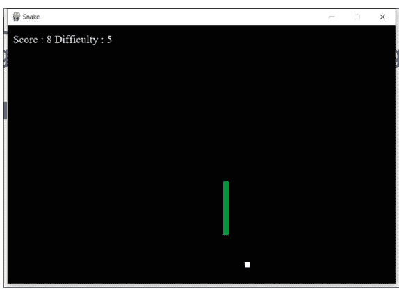

图 7-9：运行中的贪吃蛇游戏

## 总结

在本章中，我们详细探讨了用于图形、游戏和动画的 Pygame 库。我们已经能够使用 Pygame 创建小型图形、动画和游戏。

在下一章中，我们将学习如何处理各种格式的文件。我们将学习如何以编程方式读取和修改文件。

# 第 8 章 • 处理文件

在上一章中，我们学习了如何使用 Pygame 库。我们制作了递归、游戏、动画和模拟的演示。

在本章中，我们将探讨**处理文件**这一重要主题。我们将数据存储到各种文件格式中。我们将学习如何处理各种格式的文件。我们将详细探讨以下主题：

- 处理纯文本文件
- CSV 文件
- 处理电子表格

本章内容详尽，包含大量实践操作和高级概念。学完本章后，我们将能够熟练掌握 MISSING

### 8.1 处理纯文本文件

Python 自带直接从纯文本文件读取数据的功能。我们无需为此导入库。让我们看看如何使用 **open()** 例程打开文件并将其赋值给一个文件对象。为本章的演示创建一个新的 Jupyter notebook。编写以下代码：

```python
file1 = open('test.txt', mode='rt', encoding='utf-8')
```

当我们执行这段代码时，它会返回一个错误，因为文件不存在。让我们修改代码来处理这种情况：

```python
try:
    file1 = open('test.txt', mode='rt', encoding='utf-8')
except Exception as e:
    print(e)
```

执行时会打印以下消息：

```
[Errno 2] No such file or directory: 'test.txt'
```

让我们详细理解 **open()** 例程参数的用法。首先，让我们在保存 notebook 的目录中创建一个名为 **test.txt** 的空文件。再次运行代码。它将没有任何问题地运行。让我们添加更多代码。

```python
try:
    file1 = open('test.txt', mode='rt', encoding='utf-8')
except Exception as e:
    print(e)
finally:
    file1.close()
```

让我们理解传递给 **open()** 例程参数的含义。第一个参数显然是我们需要处理的文件名。第二个是文件打开的模式。第三个是编码。我们可以用多种模式打开文件，以下是它们的列表：

| 模式 | 含义 |
|---|---|
| r | 以读取模式打开文件。（默认） |
| w | 以写入模式打开文件。如果文件不存在则创建新文件，如果文件存在则截断文件。 |
| x | 以独占创建模式打开文件。如果文件已存在，操作将失败。 |
| a | 以追加模式打开文件，在文件末尾追加而不截断。如果文件不存在则创建新文件。 |
| t | 以文本模式打开。（默认） |
| b | 以二进制模式打开。 |
| + | 以更新模式（读写）打开文件 |

如我们所见，默认情况下，文件以读取和文本模式打开。我们之前写的代码等同于以下代码：

```python
try:
    file1 = open('test.txt')
except Exception as e:
    print(e)
finally:
    file1.close()
```

我们也可以组合多种模式。下表列出了我迄今为止使用过的所有组合的含义：

| 模式 | 含义 |
|---|---|
| rb | 以二进制格式只读模式打开文件。文件指针位于文件开头。这是默认模式。 |
| r+ | 以读写模式打开文件。文件指针位于文件开头。 |
| rb+ | 以二进制格式读写模式打开文件。文件指针位于文件开头。 |
| wb | 以二进制格式只写模式打开文件。如果文件存在则覆盖。如果文件不存在，则创建新文件用于写入。 |
| w+ | 以读写模式打开文件。如果文件存在则覆盖现有文件。如果文件不存在，则创建新文件用于读写。 |
| wb+ | 以二进制格式读写模式打开文件。如果文件存在则覆盖现有文件。如果文件不存在，则创建新文件用于读写。 |
| ab | 以二进制格式追加模式打开文件。如果文件存在，文件指针位于文件末尾。即文件处于追加模式。如果文件不存在，则创建新文件用于写入。 |
| a+ | 以读写追加模式打开文件。如果文件存在，文件指针位于文件末尾。文件以追加模式打开。如果文件不存在，则创建新文件用于读写。 |
| ab+ | 以二进制格式读写追加模式打开文件。如果文件存在，文件指针位于文件末尾。文件以追加模式打开。如果文件不存在，则创建新文件用于读写。 |

让我们向我们创建的文件中添加一些文本（手动），然后修改代码：

```python
try:
    file1 = open('test.txt', mode='rt', encoding='utf-8')
    for each in file1:
        print (each)
except Exception as e:
    print(e)
finally:
    file1.close()
```

这将逐行读取文件内容并打印出来。我们也可以用一行代码读取文件内容，如下所示：

```python
try:
    file1 = open('test.txt', mode='rt', encoding='utf-8')
    print(file1.read())
except Exception as e:
    print(e)
finally:
    file1.close()
```

我们可以通过将数字作为参数传递给 **read()** 例程来读取特定数量的字符。

```python
try:
    file1 = open('test.txt', mode='rt', encoding='utf-8')
    print(file1.read(20))
except Exception as e:
    print(e)
finally:
    file1.close()
```

# Python 3 快速入门

让我们看看如何以**写入**模式打开文件并向其中写入数据。

```python
try:
    file1 = open('test1.txt', mode='w', encoding='utf-8')
    file1.write('That fought with us upon Saint Crispin\'s day.')
except Exception as e:
    print(e)
finally:
    file1.close()
```

我们知道**写入**模式会创建一个新文件，或者截断同名的现有文件。上述程序会创建指定的文件，并添加例程**write()**中提到的文本。如果我们多次运行上面的代码，它只会截断旧文件，并创建一个同名且内容相同的新文件。

让我们看看如何以**追加**模式打开文件。如果使用此模式，当指定文件不存在时，它会创建一个新文件。如果文件存在，它会将给定的字符串追加到文件中。看看下面的代码：

```python
try:
    file1 = open('test2.txt', mode='a', encoding='utf-8')
    file1.write('That fought with us upon Saint Crispin\'s day.')
except Exception as e:
    print(e)
finally:
    file1.close()
```

多次运行此代码。你会发现指定的文件中包含了代码中指定的同一字符串的多行内容。

我们也可以使用关键字**with**来处理文件：

```python
try:
    with open("test.txt", "w") as f:
        f.write("Hello, World!")
except Exception as e:
    print(e)
finally:
    file1.close()
```

我们可以使用以下代码删除文件：

```python
import os
if os.path.exists("test.txt"):
    os.remove("test.txt")
else:
    print("The file does not exist")
```

### 8.2 CSV 文件

让我们了解如何处理 CSV 文件。我们可以从理解 CSV 文件是什么开始。CSV 代表**逗号分隔值**。这意味着一种使用逗号作为值分隔符的定界文本文件。CSV 文件的每一行都是一条数据记录。在现代关系数据库出现之前，这种格式被（并且现在仍然被）用于以表格格式存储记录。许多 CSV 文件的第一行是标题行，用于存储字段的名称。CSV 文件与 DSV（分隔符分隔文件）文件格式密切相关，后者使用冒号和空格等分隔符来分隔字段。CSV 是 DSV 的一个子集。

现在，让我们在运行程序的同一目录中手动创建一个 CSV 文件。我们将其保存为 **test.csv**。向 CSV 文件中添加以下或类似的数据：

```
Name,Salary
Ashwin,100000
Thor,200000
Jane,300000
Cpt America,30000
Iron Man,4000000
```

如我们所见，这是与工资单相关的数据。你可以使用任何你选择的数据。为了初学者，我倾向于保持简单。

在本节中，我们将学习如何从这个以及其他 CSV 文件中读取数据。为此，我们必须导入内置库 CSV。这个库是 Python 的一部分，体现了**自带电池**的理念，我们不需要单独安装它。让我们开始编程部分：

```python
import csv
```

让我们以文本和读取模式打开文件：

```python
file = open('test.csv')
```

我们必须将此文件视为 CSV（因为虽然它是一个纯文本文件，但我们知道其中包含 CSV 数据）。让我们这样做：

```python
csvreader = csv.reader(file)
```

现在，我们有了将文件视为 CSV 的对象。让我们读取第一行。第一行是标题行，包含列的名称：

```python
header = []
header = next(csvreader)
header
```

它在 Jupyter notebook 的输出区域打印以下内容：

```
['Name', 'Salary']
```

现在，我们有了列名，让我们提取并打印数据。让我们定义一个空列表：

```python
rows = []
```

让我们提取数据并打印。在每一行之后，我们打印一个视觉标记来分隔行。同时，我们将列表变量 **rows** 追加一行来自 CSV 的数据。让我们看看：

```python
for row in csvreader:
    for data in row:
        print(data)
    print('---')
    rows.append(row)
```

这是输出：

```
Ashwin
100000
---
Thor
200000
---
Jane
300000
---
Cpt America
30000
---
Iron Man
4000000
---
```

我们可以看到列表的数据：

```python
rows
```

这是输出：

```
[['Ashwin', '100000'],
['Thor', '200000'],
['Jane', '300000'],
['Cpt America', '30000'],
['Iron Man', '4000000']]
```

这就是我们从 CSV 中提取和处理数据的方式。

### 8.3 处理电子表格

我们也可以读取扩展名为 *.xls 或 *.xlsx 格式的电子表格中存储的数据。电子表格应用程序以表格形式存储数据。它不是像 CSV 这样的纯文本格式，我们需要专门的软件来读取存储在电子表格中的数据。我们也可以使用 Excel 或免费开源软件，如 LibreOffice 和 Apache OpenOffice。我们也可以用 Python 编写程序来读取存储在电子表格中的数据。在当前目录中创建一个电子表格并将其保存为 **test.xlsx**。添加以下数据：

| Food Item | Color | Weight |
|---|---|---|
| Banana | Yellow | 250 |
| Orange | Orange | 200 |
| Grapes | Green | 400 |
| Tomato | Red | 100 |
| Spinach | Green | 40 |
| Potatoes | Grey | 400 |
| Rice | White | 300 |
| Rice | Brown | 400 |
| Wheat | Brown | 500 |
| Barley | Yellow | 500 |

如我们所见，数据组织在三列中。让我们用 Python 读取它。Python 中有许多库可以读取电子表格中的数据。我们将使用其中一个库，**openpyxl**。让我们安装它。首先升级 **pip** 工具：

```bash
!python -m pip install --upgrade pip
```

使用以下命令安装库：

```bash
!pip3 install openpyxl
```

并导入库：

```python
import openpyxl
```

使用以下代码打开电子表格文件：

```python
wb = openpyxl.load_workbook('test.xlsx')
print(wb)
print(type(wb))
```

它打印以下输出：

```
<openpyxl.workbook.workbook.Workbook object at 0x02D90170>
<class 'openpyxl.workbook.workbook.Workbook'>
```

让我们打印所有工作表的名称（任何电子表格都组织为工作表的集合）：

```python
print(wb.sheetnames)
```

这是输出：

```
['Sheet1', 'Sheet2', 'Sheet3']
```

选择一个工作表进行处理，如下所示：

```python
currSheet = wb['Sheet1']
print(currSheet)
print(type(currSheet))
```

输出如下：

```
<Worksheet "Sheet1">
<class 'openpyxl.worksheet.worksheet.Worksheet'>
```

我们也可以选择当前工作表：

```python
currSheet = wb[wb.sheetnames[1]]
print(currSheet)
print(type(currSheet))
```

打印工作表的标题：

```python
currSheet = wb[wb.sheetnames[0]]
print(currSheet)
print(type(currSheet))
print(currSheet.title)
```

这是输出：

```
<Worksheet "Sheet1">
<class 'openpyxl.worksheet.worksheet.Worksheet'>
Sheet1
```

我们可以选择一个单元格并打印其值：

```python
var1 = currSheet['A1']
print(var1.value)
```

这是另一种方式：

```python
print(currSheet['B1'].value)
```

还有一种方式如下：

```python
var2 = currSheet.cell(row=2, column=2)
print(var2.value)
```

我们可以打印最大行数和列数：

```python
print(currSheet.max_row)
print(currSheet.max_column)
```

使用上述技术，我们可以检索并打印所有行和列。

```python
for i in range(currSheet.max_row):
    print('---Beginning of Row---')
    for j in range(currSheet.max_column):
        var = currSheet.cell(row=i+1, column=j+1)
        print(var.value)
    print('---End of Row---')
```

这是输出：

```
---Beginning of Row---
Food Item
Color
Weight
---End of Row---
---Beginning of Row---
Banana
Yellow
250
---End of Row---
---Beginning of Row---
Orange
Orange
200
---End of Row---
---Beginning of Row---
Grapes
Green
400
---End of Row---
---Beginning of Row---
Tomato
Red
100
---End of Row---
---Beginning of Row---
Spinach
Green
40
---End of Row---
---Beginning of Row---
Potatoes
Grey
400
---End of Row---
---Beginning of Row---
Rice
White
300
---End of Row---
---Beginning of Row---
Rice
Brown
400
---End of Row---
---Beginning of Row---
Wheat
Brown
500
---End of Row---
---Beginning of Row---
Barley
Yellow
500
---End of Row---
```

这就是我们使用 Python 提取和处理电子表格的方式。

## 总结

在本章中，我们学习了如何读取和操作存储在不同格式文件中的数据。

在下一章中，我们将详细探讨图像处理领域。这将是一个内容丰富、细节详尽的章节，包含许多代码演示。如果你是一名创客，你会发现这一章特别有趣。

## 第9章 • 使用Python进行图像处理

在上一章中，我们学习了如何处理各种类型的文件。

在本章中，我们将探索Python作为首选编程语言的另一个常见应用领域：图像处理。为此，我们将深入探讨Python中的一个图像处理库。这个库的名字是**Wand**。我们将详细探讨以下主题：

- 数字图像处理与Wand库
- 入门
- 图像效果
- 特效
- 变换
- 统计操作
- 颜色增强
- 图像量化
- 阈值
- 扭曲

本章充满了高级概念、深入的描述和实践演示。学完本章后，我们将能够轻松使用Python进行图像处理。

### 9.1 数字图像处理与Wand库

图像处理是使用算法来处理图像。在模拟胶片和电影的时代，人们使用化学化合物等手动技术来提高图像和帧（在电影中）的质量。这是现代图像处理概念的前身。如今，大多数图像是数字化的。当然，数字图像在色彩和清晰度方面尚未赶上模拟（基于化学胶片的成像）。然而，由于其成本更低，绝大多数个人和组织（电影制作和处理组织）在图像和视频制作中使用数字成像。现代计算机也足够快，可用于处理数字图像。我们通常使用现代编程语言，如C、C++、Java、Python、MATLAB和GNU Octave来处理图像和视频。使用Python处理图像非常容易，因为有许多第三方库可用于此目的。

**ImageMagick** 是一款用于图像操作的软件。它提供了各种编程语言的API。我们可以使用库 **Wand**，它为ImageMagick提供了Python风格的接口。让我们设置所需的软件以开始。我们首先需要为我们的操作系统安装ImageMagick。

我们可以在macOS上使用以下命令安装ImageMagick：

```bash
brew install ghostscript
brew install imagemagick
```

这两个命令应该会将ImageMagick安装到你的macOS上。如果没有，那么我们必须手动安装。这很简单。下载位于 https://download.imagemagick.org/ImageMagick/download/binaries/ImageMagick-x86_64-apple-darwin20.1.0.tar.gz 的zip文件。将其复制到macOS上你用户的 **home** 目录。使用以下命令解压：

```bash
tar xvzf ImageMagick-x86_64-apple-darwin20.1.0.tar.gz
```

现在我们需要在macOS上你用户的 **home** 目录中的 **.bash_profile** 文件中添加一些条目。

```bash
# Settings for ImageMagick
export MAGICK_HOME="$HOME/ImageMagick-7.0.10"
export PATH="$MAGICK_HOME/bin:$PATH"
export DYLD_LIBRARY_PATH="$MAGICK_HOME/lib/"
```

退出并重新启动命令提示符，然后逐一运行以下命令：

```bash
magick logo: logo.gif
identify logo.gif
display logo.gif
```

它将显示ImageMagick项目的标志。

在Windows上安装很容易。有适用于所有桌面Windows版本（32/64位）的二进制可执行安装文件。在所有选项中，我们需要选择描述为 **Win64/Win32 dynamic at 16 bits-per-pixel component with High-dynamic-range imaging enabled** 的那个。对于64位系统，使用

https://download.imagemagick.org/ImageMagick/download/binaries/ImageMagick-7.1.0-10-Q16-HDRI-x64-dll.exe

对于32位Windows，使用

https://download.imagemagick.org/ImageMagick/download/binaries/ImageMagick-7.1.0-10-Q16-HDRI-x86-dll.exe

使用这些文件在Windows上安装ImageMagick。

让我们在Linux上安装它。使用以下命令下载源代码，

```bash
wget https://www.imagemagick.org/download/ImageMagick.tar.gz
```

让我们检查它解压所有文件的位置：

```bash
ls ImageMagick*
```

它向我们显示了目录的名称。

```bash
ImageMagick-7.1.0-10
```

进入该目录。

```bash
cd ImageMagick-7.1.0-10
```

依次运行以下命令（如果你熟悉Linux，你会认出这是在Linux发行版上安装任何新程序的标准命令集）：

```bash
./configure
make
sudo make install
sudo ldconfig /usr/local/lib
```

成功安装ImageMagick程序后，我们可以在任何平台上使用以下命令安装wand库：

```bash
pip3 install wand
```

这就是我们如何在任何操作系统上安装ImageMagick和Wand的方法。

### 9.2 入门

请为本章的所有演示创建一个新的Jupyter笔记本。从现在开始的所有代码都应保存并在笔记本中执行。让我们导入所需的库。

```python
from __future__ import print_function
from wand.image import Image
```

这些语句导入所需的模块。让我们读取一张图像并打印其尺寸，如下所示，

```python
img = Image(filename='D:/Dataset/4.2.03.tiff')
print('width =', img.width)
print('height =', img.height)
```

输出如下，

```
width = 512
height = 512
```

我们还可以查看图像的类型：

```python
type(img)
```

这会产生以下输出：

```
wand.image.Image
```

我们可以通过输入存储图像的变量名在笔记本中显示图像作为输出。

```python
img
```

这样会产生以下输出：

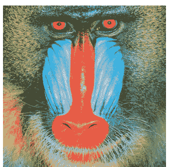

图9-1：在Jupyter笔记本中显示的图像

我使用的是由以下网站提供的图像数据集

[http://www.imageprocessingplace.com/root_files_V3/image_databases.htm](http://www.imageprocessingplace.com/root_files_V3/image_databases.htm)。

所有图像都是图像处理中常用的标准测试图像。我没有使用标准测试图像Lena，因为我认为该图像的起源存在争议，并且对女性普遍不尊重和贬低。

我们还可以克隆图像，更改其文件格式，并将其保存到磁盘，如下所示：

```python
img1 = img.clone()
img1.format = 'png'
img1.save(filename='D:/Dataset/output.png')
```

如果你还没有注意到，我在这次演示中使用的是Windows计算机。如果你使用的是任何类Unix操作系统，你必须相应地修改位置。例如，我使用以下代码在Raspberry Pi OS（Debian Linux变体）计算机上保存输出文件：

```python
img1.save(filename='/home/pi/Dataset/output.png')
```

我们还可以创建具有均匀颜色的自定义图像。

```python
from wand.color import Color
bg = Color('black')
img = Image(width=256, height=256, background=bg)
img.save(filename='D:/Dataset/output.png')
```

让我们看看如何调整图像大小。有两种方法：

```python
img = Image(filename='D:/Dataset/4.2.03.tiff')
img1 = img.clone()
img1.resize(60, 60)
img1.size
```

第二种方法如下：

```python
img1 = img.clone()
img1.sample(60, 60)
img1.size
```

例程 **resize()** 和 **sample()** 将图像调整为指定的尺寸。我们还可以裁剪图像的一部分。

```python
img1 = img.clone()
img1.crop(10, 10, 60, 60)
img1.size
```

### 9.3 图像效果

我们可以有各种各样的图像效果。让我们从模糊图像开始。

```python
img1 = img.clone()
img1.blur(radius=6, sigma=3)
img1
```

输出如图9-2所示。


图9-2：一张模糊的图像

让我们应用自适应模糊：

```python
img1 = img.clone()
img1.adaptive_blur(radius=12, sigma=6)
img1
```

我们可以应用高斯模糊：

```python
img1 = img.clone()
img1.gaussian_blur(sigma=8)
img1
```

以下是输出：

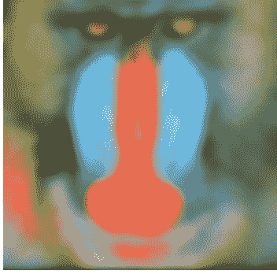

图9-3：自适应模糊

我们可以有运动模糊：

```python
img1 = img.clone()
img1.motion_blur(radius=20, sigma=10, angle=-30)
img1
```

我们在调用例程时提到了运动的角度。以下是输出：


图9-4：30度角的运动模糊

我们还可以有旋转模糊：

```python
img1 = img.clone()
img1.rotational_blur(angle=25)
img1
```

以下是输出：


图9-5：旋转模糊

我们还可以进行选择性模糊：

```
img1 = img.clone()
img1.selective_blur(radius=10, sigma=5,
                    threshold=0.50 * img.quantum_range)
img1
```

以下是输出结果：


图 9-6：选择性模糊

我们还可以对图像进行去斑（降噪）处理：

```
img1 = img.clone()
img1.despeckle()
img1
```

以及边缘检测：

```
img = Image(filename='D:/Dataset/4.1.07.tiff')
img1 = img.clone()
img1.edge(radius=1)
img1
```

以下是输出结果：

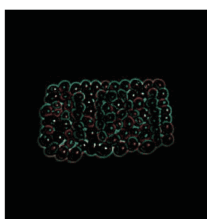

*图 9-7：边缘检测*

我们可以生成 3D 浮雕效果：

```
img1 = img.clone()
img1.emboss(radius=4.5, sigma=3)
img1
```

以下是输出结果：

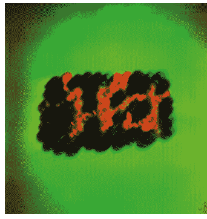

*图 9-8：浮雕*

我们还可以将图像转换为灰度并应用图像效果：

```
img1 = img.clone()
img1.transform_colorspace('gray')
img1.emboss(radius=4.5, sigma=3)
img1
```

以下是输出结果：

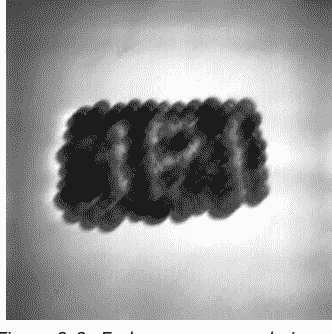

我们可以应用平滑滤波器来降低噪声：

```
img1 = img.clone()
img1.kuwahara(radius=4, sigma=2)
img1
```

输出结果中边缘得以保留：

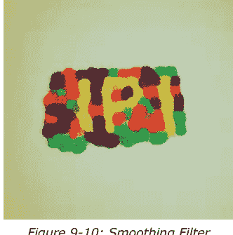

我们还可以创建阴影效果：

```
img1 = img.clone()
img1.shade(gray=True,
           azimuth=30.0,
           elevation=30.0)
img1
```

以下是输出结果：

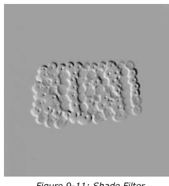

我们可以锐化图像：

```
img1 = img.clone()
img1.sharpen(radius=12, sigma=4)
img1
```

我们可以应用自适应锐化算法：

```
img1 = img.clone()
img1.adaptive_sharpen(radius=12, sigma=6)
img1
```

我们可以使用反锐化掩模：

```
img1 = img.clone()
img1.unsharp_mask(radius=20, sigma=5,
                   amount=2, threshold=0)
img1
```

我们还可以在指定半径内随机扩散像素：

```
img1 = img.clone()
img1.spread(radius=15.0)
img1
```

以下是输出结果：

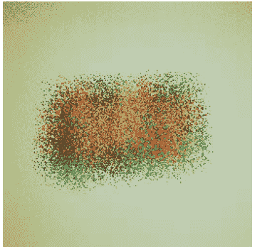

*图 9-12：扩散*

### 9.4 特效

让我们学习如何为图像应用特效。第一种效果是**噪声**。噪声有多种类型。让我们看看如何引入**高斯**噪声。

```
img1 = img.clone()
img1.noise("gaussian", attenuate=1.0)
img1
```

以下是输出结果：


*图 9-13：高斯噪声*

以下是所有可用作噪声名称的有效字符串列表：

```
'gaussian'
'impulse'
'laplacian'
'multiplicative_gaussian'
'poisson'
'random'
'uniform'
```

我们可以如下对图像进行蓝移：

```
img1 = img.clone()
img1.blue_shift(factor=0.5)
img1
```

输出结果如下：


图 9-14：蓝移

我们还可以创建炭笔画效果：

```
img1 = img.clone()
img1.charcoal(radius=2, sigma=1)
img1
```

以下是输出结果：


图 9-15：炭笔效果

我们还可以应用颜色矩阵：

```
img1 = img.clone()
matrix = [[0, 0, 1],
          [0, 1, 0],
          [1, 0, 0]]
img1.color_matrix(matrix)
img1
```

颜色矩阵的最大尺寸为 6x6。在颜色矩阵中，每一列映射到要引用的颜色通道，每一行代表要影响的颜色通道。对于 RGB 图像，这些通道是红色、绿色、蓝色、不适用、Alpha 和一个常量（偏移）。对于 CMYK 图像，它们是青色、黄色、品红色、黑色、Alpha 和一个常量。在这个例子中，我们创建了一个 3x3 矩阵。以下是输出结果：


图 9-16：颜色矩阵

我们可以将图像与常量颜色混合：

```
img1 = img.clone()
img1.colorize(color="green", alpha="rgb(10%, 0%, 20%)")
img1
```

以下是输出结果：


图 9-17：与常量颜色混合

我们可以使图像内爆：

```
img1 = img.clone()
img1.implode(amount=0.5)
img1
```

输出结果如下：


*图 9-18：图像内爆*

我们还可以应用宝丽来效果：

```
img1 = img.clone()
img1.polaroid()
img1
```

以下是输出结果：


*图 9-19：宝丽来效果*

让我们如下为图像应用棕褐色调（基于阈值）：

```
img1 = img.clone()
img1.sepia_tone(threshold=0.3)
img1
```

以下是输出结果：


*图 9-20：棕褐色调*

我们可以将图像转换为素描：

```
img1 = img.clone()
img1.sketch(0.5, 0.0, 98.0)
img1
```

输出结果如下：


*图 9-21：素描*

让我们创建曝光过度效果：

```
img1 = img.clone()
img1.solarize(threshold=0.2 * img.quantum_range)
img1
```

以下是输出结果：


我们可以旋转图像：

```
img1 = img.clone()
img1.swirl(degree=90)
img1
```

以下是输出结果：


我们可以为图像着色：

```
img1 = img.clone()
img1.tint(color="green",
          alpha="rgb(40%, 60%, 80%)")
img1
```

输出结果如下：


图 9-24：着色后的图像

我们还可以创建暗角效果：

```
img1 = img.clone()
img1.vignette(sigma=3, x=10, y=10)
img1
```

以下是输出结果：


*图 9-25：暗角效果*

我们可以添加波浪效果：

```
img1 = img.clone()
img1.wave(amplitude=img.height / 32,
          wave_length=img.width / 4)
img1
```

以下是输出结果：


*图 9-26：波浪效果*

我们还可以对图像进行小波去噪：

```
img1 = img.clone()
img1.wavelet_denoise(threshold=0.05 * img.quantum_range,
                    softness=0.0)
img1
```

输出结果如下：


图 9-27：小波去噪效果

### 9.5 变换

我们可以对图像应用变换。如下读取一张新图像：

```
img = Image(filename='D:/Dataset/4.1.04.tiff')
img
```

我们可以翻转图像：

```
img1 = img.clone()
img1.flip()
img1
```

以下是输出结果：


图 9-28：翻转效果

我们还可以应用镜像效果：

```
img1 = img.clone()
img1.flop()
img1
```

这是输出结果：


图 9-29：镜像效果

我们还可以旋转图像：

```
img1 = img.clone()
img1.rotate(45, background=Color('rgb(127, 127, 127)'))
img1
```

输出结果如下：


*图 9-30：旋转后的图像*

### 9.6 统计操作

我们可以对图像执行统计操作。这些操作可以使用 **statistic()** 例程来执行。让我们看几个例子。让我们为这部分读取并显示一张新图像：

```
img = Image(filename='D:/Dataset/4.1.01.tiff')
img
```

现在，让我们计算中值：

```
img1 = img.clone()
img1.statistic("median",
                width=8,
                height=8)
img1
```

输出结果如下：


*图 9-31：中值*

在这个例子中，我们基于 8x8 的邻域（作为参数传递）计算了每个像素的中值。我们也可以计算其他统计操作。让我们计算梯度：

```
img1 = img.clone()
img1.statistic("gradient", width=8, height=8)
img1
```

输出结果是：


*图 9-32：梯度*

我们可以计算最大值：

```
img1 = img.clone()
img1.statistic("maximum", width=8, height=8)
img1
```

以下是输出结果：


图 9-33：最大值

我们可以计算平均值：

```
img1 = img.clone()
img1.statistic("mean", width=8, height=8)
img1
```

输出结果如下：


图 9-34：平均值

### 9.7 色彩增强

让我们学习几个增强图像色彩的例程。我们必须使用 **evaluate()** 例程来应用各种操作。我们可以在 https://docs.wand-py.org/en/0.6.7/wand/image.html#wand.image.EVALUATE_OPS 找到操作列表。

让我们读取并显示一张新图像：

```python
img = Image(filename='D:/Dataset/4.1.03.tiff')
img
```

我们可以将某个通道的值**右移**特定位数。

```python
img1 = img.clone()
img1.evaluate(operator='rightshift', value=2, channel='green')
img1
```

输出如下：


*图 9-40：右移*

我们也可以应用**左移**操作：

```python
img1 = img.clone()
img1.evaluate(operator='leftshift', value=2, channel='blue')
img1
```

输出如下：


我们还有更多操作列在 [https://docs.wand-py.org/en/0.6.7/wand/image.html#wand.image.FUNCTION_TYPES](https://docs.wand-py.org/en/0.6.7/wand/image.html#wand.image.FUNCTION_TYPES)。我们可以使用 **function()** 例程将这些操作应用于图像：

```python
img1 = img.clone()
frequency = 3
phase_shift = -90
amplitude = 0.2
bias = 0.7
img1.function('sinusoid', [frequency, phase_shift, amplitude, bias])
img1
```

输出如下：


让我们读取一张新图像用于接下来的两个演示：

```python
img = Image(filename='D:/Dataset/4.1.06.tiff')
img
```

我们可以调整图像的伽马值：

```python
img1 = img.clone()
img1.gamma(1.66)
img1
```

输出如下：


图 9-43：伽马

我们可以调整黑白边界：

```python
img1 = img.clone()
img1.level(black=0.2, white=0.9, gamma=1.66)
img1
```

增强后的输出如下：


图 9-44：色阶

### 9.8 图像量化

图像量化是一种有损压缩技术。我们可以通过将一系列颜色值压缩为单一颜色值来实现。信息损失的程度取决于最终输出中的颜色总数。通常，颜色越多意味着保留的信息越多。这种技术使得减少存储和传输图像所需的字节数成为可能。这是一种非常有用的图像处理技术。许多算法可以执行图像量化。让我们看几个例子。首先，选择一张图像：

```python
img = Image(filename='D:/Dataset/4.1.05.tiff')
img
```

让我们应用 K-Means 聚类算法：

```python
img1 = img.clone()
img1.kmeans(number_colors=4,
            max_iterations=100,
            tolerance=0.01)
img1
```

输出如下：


图 9-45：KMeans 聚类

我们也可以使用 **posterize()** 例程来量化图像。我们可以为抖动方法传递不同的参数。让我们逐一查看。使用 **Floyd Steinberg** 方法：

```python
img1 = img.clone()
img1.posterize(levels=4,
               dither='floyd_steinberg')
img1
```

另一种抖动方法：

```python
img1 = img.clone()
img1.posterize(levels=4, dither='riemersma')
img1
```

我们也可以避免使用抖动：

```python
img1 = img.clone()
img1.posterize(levels=4, dither='no')
img1
```

我们也可以使用 **quantize()** 例程达到相同目的：

```python
img1 = img.clone()
img1.quantize(number_colors=8,
              colorspace_type='srgb',
              treedepth=1,
              dither=True,
              measure_error=False)
img1
```

输出如下：


*图 9-46：使用 8 种颜色进行量化*

### 9.9 阈值

在阈值处理中，我们根据像素的通道值做出一些决策。假设我们定义一个函数，它接受一个参数，如果传入的值小于 127 则返回 0，那么该函数就是一个阈值函数，127 就是阈值。我们可以在 Python 中手动定义这样的函数。Wand 库提供了许多这样的函数。让我们逐一探索。

让我们看看**局部自适应阈值**。这也称为**局部阈值**或**自适应阈值**。在这种方法中，每个像素都根据其周围像素的值进行调整。如果像素的值大于其周围像素的平均值，则将其设置为白色，否则设置为黑色。

```python
img1 = img.clone()
img1.transform_colorspace('gray')
img1.adaptive_threshold(width=16, height=16,
                        offset=-0.08 * img.quantum_range)
img1
```

我们将图像转换为灰度图，然后进行阈值处理。这样我们就能看到结果。输出如下：


图 9-47：局部自适应阈值

如我们所见，对灰度图像进行阈值处理会得到一个二值（黑白）图像。这被称为二值化，是图像分割的最简单形式。让我们看看如何在不传递任何阈值的情况下自动对图像进行阈值处理。有三种方法。第一种是 **Kapur** 方法：

```python
img1 = img.clone()
img1.transform_colorspace('gray')
img1.auto_threshold(method='kapur')
img1
```

第二种是 **Otsu** 方法：

```python
img1 = img.clone()
img1.transform_colorspace('gray')
img1.auto_threshold(method='otsu')
img1
```

最后一种是 **Triangle** 方法：

```python
img1 = img.clone()
img1.transform_colorspace('gray')
img1.auto_threshold(method='triangle')
img1
```

我们也可以省略将图像转换为灰度图的步骤，直接将阈值算法应用于彩色图像。在这种情况下，算法会应用于彩色图像的所有通道。让我们看看黑色阈值处理，它将所有低于阈值的像素设置为黑色：

```python
img1 = img.clone()
img1.black_threshold(threshold='#960')
img1
```

输出如下：


我们还可以进行颜色阈值处理，其中起始值和结束值之间的值设置为白色，其余设置为黑色：

```python
img1 = img.clone()
img1.color_threshold(start='#321', stop='#aaa')
img1
```

**Wand** 库提供了一种方法来应用预定义的阈值映射以创建抖动图像。下表列出了映射值及其含义：

| 映射 | 描述 |
|---|---|
| threshold | 阈值 1x1（无抖动） |
| checks | 棋盘格 2x1（抖动） |
| o2x2 | 有序 2x2（分散） |
| o3x3 | 有序 3x3（分散） |
| o4x4 | 有序 4x4（分散） |
| o8x8 | 有序 8x8（分散） |
| h4x4a | 半色调 4x4（角度） |
| h6x6a | 半色调 6x6（角度） |
| h8x8a | 半色调 8x8（角度） |
| h4x4o | 半色调 4x4（正交） |
| h6x6o | 半色调 6x6（正交） |
| h8x8o | 半色调 8x8（正交） |
| h16x16o | 半色调 16x16（正交） |
| c5x5b | 圆形 5x5（黑色） |
| c5x5w | 圆形 5x5（白色） |
| c6x6b | 圆形 6x6（黑色） |
| c6x6w | 圆形 6x6（白色） |
| c7x7b | 圆形 7x7（黑色） |
| c7x7w | 圆形 7x7（白色） |

让我们用表中的最后一个条目看一个简单的例子：

```python
img1 = img.clone()
img1.ordered_dither('c7x7w')
img1
```

这将产生以下输出：


我们可以在两个给定值之间应用随机阈值：

```python
img1 = img.clone()
img1.random_threshold(low=0.3 * img1.quantum_range,
                    high=0.6 * img1.quantum_range)
img1
```

### 9.10 畸变

畸变是我们应用于图像的几何变换。几何变换是数学函数。让我们对图像应用一个简单的几何变换：

```python
img1 = img.clone()
img1.distort('arc', (angle, ))
img1
```

以下是输出：


图 9-52：弧形变换

观察输出。我们可以看到，该变换创建了额外的像素，这些像素通过扩展原始图像的边缘来填充。这是默认行为。我们可以通过虚拟像素来自定义它。因此，在进一步进行更多变换之前，我们将了解更多关于虚拟像素的各种方法。

我们可以用一种恒定的颜色来填充这些额外的像素：

```python
img1 = img.clone()
img1.background_color = Color('rgb(127, 127, 127)')
img1.virtual_pixel = 'background'
angle = 60
img1.distort('arc', (angle, ))
img1
```

这是输出：


图 9-53：灰色背景

我们可以在 https://docs.wand-py.org/en/0.6.7/wand/image.html#wand.image.VIRTUAL_PIXEL_METHOD 查看所有虚拟像素方法的列表。

让我们逐一查看它们的演示。

我们可以设置白色背景：

```python
img1 = img.clone()
img1.virtual_pixel = 'white'
angle = 60
img1.distort('arc', (angle, ))
img1
```

我们也可以设置黑色背景：

```python
img1 = img.clone()
img1.virtual_pixel = 'black'
angle = 60
img1.distort('arc', (angle, ))
img1
```

我们可以设置透明背景：

```python
img1 = img.clone()
img1.virtual_pixel = 'transparent'
angle = 60
img1.distort('arc', (angle, ))
img1
```

让我们使用抖动作为虚拟像素：

```python
img1 = img.clone()
img1.virtual_pixel = 'dither'
angle = 60
img1.distort('arc', (angle, ))
img1
```

这是输出：


扩展边缘是默认方式。我们已经看到过了。我们也可以显式地将虚拟像素设置为此：

```python
img1 = img.clone()
img1.virtual_pixel = 'edge'
angle = 60
img1.distort('arc', (angle, ))
img1
```

我们也可以使用镜像方法：

```python
img1 = img.clone()
img1.virtual_pixel = 'mirror'
angle = 60
img1.distort('arc', (angle, ))
img1
```

以下是输出：


图 9-55：镜像

我们可以设置随机像素：

```python
img1 = img.clone()
img1.virtual_pixel = 'random'
angle = 60
img1.distort('arc', (angle, ))
img1
```

输出如下：


图 9-56：随机

我们可以设置**平铺**效果：

```python
img1 = img.clone()
img1.virtual_pixel = 'tile'
angle = 60
img1.distort('arc', (angle, ))
img1
```

以下是输出：


*图 9-57：平铺*

### 9.11 仿射变换与投影

我们可以对图像应用仿射变换。我们需要提供三个点及其映射：

```python
img1 = img.clone()
img1.resize(140, 70)
img1.background_color = Color('rgb(127, 127, 127)')
img1.virtual_pixel = 'background'
args = (10, 10, 15, 15,  # 点 1: (10, 10) => (15, 15)
        139, 0, 100, 20, # 点 2: (139, 0) => (100, 20)
        0, 70, 50, 70    # 点 3: (0, 70) => (50, 70)
)
img1.distort('affine', args)
img1
```

结果如下：


图 9-58：仿射变换

我们也可以通过提供缩放、旋转和平移因子来应用仿射投影：

```python
from collections import namedtuple
Point = namedtuple('Point', ['x', 'y'])
img1 = img.clone()
img1.resize(140, 92)
img1.background_color = Color('skyblue')
img1.virtual_pixel = 'background'
rotate = Point(0.1, 0)
scale = Point(0.7, 0.6)
translate = Point(5, 5)
args = (scale.x, rotate.x, rotate.y,
        scale.y, translate.x, translate.y)
img1.distort('affine_projection', args)
img1
```

这是输出：


图 9-59：仿射投影

#### 9.11.1 弧形

我们已经见过这种变换。让我们更详细地了解它。我们需要提供弧形和旋转的角度：

```python
img1 = img.clone()
img1.resize(140, 92)
img1.background_color = Color('black')
img1.virtual_pixel = 'background'
args = (270,  # 弧形角度
        45,   # 旋转角度
        )
img1.distort('arc', args)
img1
```

以下是输出：


图 9-60：弧形

#### 9.11.2 桶形与反桶形

我们可以使用桶形和反桶形。我们需要指定四个数据点。桶形的数学方程如下：

$R_{src} = r * ( A * r^3 + B * r^2 + C * r + D )$

其中 **r** 是目标半径。让我们看看演示：

```python
img1 = img.clone()
img1.resize(140, 92)
img1.background_color = Color('black')
img1.virtual_pixel = 'background'
args = (
    0.2,  # A
    0.0,  # B
    0.0,  # C
    1.0,  # D
)
img1.distort('barrel', args)
img1
```

这是输出：


图 9-61：桶形

反桶形方程如下：

$R_{src} = r / ( A * r^3 + B * r^2 + C * r + D )$

让我们演示一下：

```python
img1 = img.clone()
img1.resize(140, 92)
img1.background_color = Color('black')
img1.virtual_pixel = 'background'
args = (
    0.0,  # A
    0.0,  # B
    -0.5, # C
    1.5   # D
)
img1.distort('barrel_inverse', args)
img1
```

以下是输出：


#### 9.11.3 双线性变换

在这种变换中，我们需要指定四个源点和目标点：

```python
from itertools import chain
img1 = img.clone()
img1.resize(140, 92)
img1.background_color = Color('black')
img1.virtual_pixel = 'background'
source_points = (
    (0, 0),
    (140, 0),
    (0, 92),
    (140, 92))
destination_points = (
    (14, 4.6),
    (126.9, 9.2),
    (0, 92),
    (140, 92))
order = chain.from_iterable(zip(source_points, destination_points))
arguments = list(chain.from_iterable(order))
img1.distort('bilinear_forward', arguments)
img1
```

输出如下：


图 9-63：双线性

我们可以进行反向双线性变换：

```python
order = chain.from_iterable(zip(destination_points, source_points))
arguments = list(chain.from_iterable(order))
img1.distort('bilinear_reverse', arguments)
img1
```

以下是输出：


图 9-64：反向双线性

#### 9.11.4 圆柱与平面

我们可以将平面图像转换为圆柱，如下所示：

```python
import math
img1 = img.clone()
img1.resize(140, 92)
img1.background_color = Color('black')
img1.virtual_pixel = 'background'
lens = 60
film = 35
args = (lens/film * 180/math.pi,)
img1.distort('plane_2_cylinder', args)
img1
```

这是输出：


图 9-65：

我们可以将圆柱转换为平面：

```python
img1.distort('cylinder_2_plane', args)
img1
```

以下是输出：


图 9-66：圆柱到平面

#### 9.11.5 极坐标与反极坐标

我们可以将图像转换为极坐标：

```python
img1 = img.clone()
img1.resize(140, 92)
img1.background_color = Color('black')
img1.virtual_pixel = 'background'
img1.distort('polar', (0,))
img1
```

输出如下：


图 9-67：极坐标

我们也可以对图像进行反极坐标变换：

```python
img1.distort('depolar', (-1,))
img1
```

输出是：


#### 9.11.6 多项式

我们可以应用多项式变换：

```python
Point = namedtuple('Point', ['x', 'y', 'i', 'j'])
img1 = img.clone()
img1.resize(140, 92)
img1.background_color = Color('black')
img1.virtual_pixel = 'background'
order = 1.5
alpha = Point(0, 0, 26, 0)
beta = Point(139, 0, 114, 23)
gamma = Point(139, 91, 139, 80)
delta = Point(0, 92, 0, 78)
args = (order,
        alpha.x, alpha.y, alpha.i, alpha.j,
        beta.x, beta.y, beta.i, beta.j,
        gamma.x, gamma.y, gamma.i, gamma.j,
        delta.x, delta.y, delta.i, delta.j)
img1.distort('polynomial', args)
img1
```

这是输出：


#### 9.11.7 Shepards变换

我们可以应用**Shepards**变换：

```python
img1 = img.clone()
img1.resize(140, 92)
img1.background_color = Color('black')
img1.virtual_pixel = 'background'
alpha = Point(0, 0, 30, 15)
beta = Point(70, 46, 60, 70)
args = (*alpha, *beta)
img1.distort('shepards', args)
img1
```

输出如下：


*图 9-70：Shepards变换*

## 总结

在本章中，我们探索了图像处理领域。我们了解了Wand库中用于处理数字图像的许多例程。

我们将在下一章继续探索Python的旅程。我们将详细探讨一些更多有用的主题。

## 第10章 • Python中的几个实用主题

在上一章中，我们学习了如何处理图像并应用各种图像处理技术来增强其质量。

本章涵盖了一系列我无法添加到其他章节的主题。以下是我们将在本章学习的主题列表：

- 命令行参数
- 词云

本章希望能让大家熟悉上述概念。

### 10.1 命令行参数

我们在第一章就学习了如何从命令行启动Python脚本或程序。我们还可以处理命令行参数。让我们看看这是如何完成的。请看以下程序：

```python
# prog00.py
#!/usr/bin/python3
import sys

n = len(sys.argv)
print("Total arguments passed: ", n)
print("\nArguments passed: \n")
for i in range(0, n):
    print(sys.argv[i], end = "\n")
```

我们使用内置的**sys**模块来处理命令行参数。如果我们从任何IDE运行此程序，它将打印以下结果：

**传递的总参数：1**

**传递的参数：**

**C:/Users/Ashwin/Google Drive/Elektor/Python Book Project/Code/Chaptet10/prog00.py**

第一个参数始终是脚本的名称。

从命令行（Windows中的cmd / powershell或类Unix操作系统的终端模拟器）启动它，如下所示：

```
python prog00.py 1 "test 123" test
```

输出如下：

```
Arguments passed:
prog00.py
1
test 123
test
```

这就是我们如何在Python中处理命令行参数。这是一种非常有用的技术，可用于编程基于文本的实用程序。

### 10.2 词云

词云也称为标签云。它们是源文档中关键词频率的可视化表示，因此出现频率最高的词具有最大的尺寸。这适用于文档中的所有其他关键词，我们得到一个类似云的视觉形状。有许多工具可用于生成词云。我们也可以通过编程方式生成它们。

让我们开始编程部分。为此部分创建一个新的notebook。运行以下命令安装所需的库：

```
!pip3 install matplotlib pandas wordcloud pillow
```

**Matplotlib**是科学Python生态系统中的可视化库。**Pandas**是Python中的数据分析库。**Pillow**是一个图像处理库。**Wordcloud**是一个用于创建词云的库。让我们运行在notebook中启用可视化的魔法命令：

```
%matplotlib inline
```

导入所有必需的模块和库：

```python
from wordcloud import WordCloud, STOPWORDS
import matplotlib.pyplot as plt
import pandas as pd
from PIL import Image
```

我从以下地址下载了一个包含CSV文件的zip文件：

https://archive.ics.uci.edu/ml/machine-learning-databases/00380/YouTube-Spam-Collection-v1.zip

然后我们可以从压缩文件中提取CSV文件并在程序中使用它。我们可以使用pandas库中的例程读取CSV文件。

```python
df = pd.read_csv(r"Youtube05-Shakira.csv", encoding = "latin-1")
```

让我们定义两个变量：关键词和停用词：

```python
comment_words = ' '
stopwords = set(STOPWORDS)
stopwords
```

关键词变量是一个空字符串。我们可以按如下方式向列表添加关键词：

```python
for val in df.CONTENT:
    val = str(val)
    tokens = val.split()
    for i in range(len(tokens)):
        tokens[i] = tokens[i].lower()

    for words in tokens:
        comment_words = comment_words + words + ' '
comment_words
```

让我们按如下方式生成词云：

```python
wordcloud = WordCloud(width= 1920, height=1080,
                     background_color='white',
                     stopwords = stopwords,
                     min_font_size = 10).generate(comment_words)
```

让我们用Matplotlib库可视化它。

```python
plt.imshow(wordcloud)
plt.axis('off')
plt.tight_layout(pad=0)
plt.show()
```

输出如下：


*图 10-1：使用默认设置的词云*

我们可以从文本字符串生成词云。让我们创建一个字符串：

```python
text=("Python is an interpreted, high-level, general-purpose programming language. Created by Guido van Rossum and first released in 1991, Python's design philosophy emphasizes code readability through use of significant whitespace. Its language constructs and object-oriented approach aim to help programmers write clear, logical code for small and large-scale projects.")
```

让我们生成词云：

```python
# Create the wordcloud object
wordcloud = WordCloud(width= 1280, height=720,
                     margin = 0).generate(text)

# Display the generated image:
plt.imshow(wordcloud, interpolation='bilinear')
plt.axis("off")
plt.margins(x=0, y=0)
plt.show()
```

输出如下：


*图 10-2：以文本字符串为源的词云*

我们还可以生成只显示固定数量单词的词云。这些单词是源中最常出现的：

```python
wordcloud = WordCloud(width= 1280, height=720,
                      max_words = 3).generate(text)

plt.figure()
plt.imshow(wordcloud, interpolation="bilinear")
plt.axis("off")
plt.margins(x=0, y=0)
plt.show()
```

输出如下：


*图 10-3：固定单词数量的词云*

如果您再次运行所有包含代码示例的单元格，您将看到生成了相似但不同的图像。由于单词在云中的位置和颜色是随机分配的，因此对于相同的数据，我们会得到略有不同的图像。

我们可以按如下方式从最终输出中移除一些单词：

```python
wordcloud = WordCloud(width= 1280, height=720,
                     stopwords = ['Python', 'code']).generate(text)
plt.figure()
plt.imshow(wordcloud, interpolation="bilinear")
plt.axis("off")
plt.margins(x=0, y=0)
plt.show()
```

输出如下：


我们还可以更改背景颜色：

```python
wordcloud = WordCloud(width= 1280, height=720,
                     background_color='skyblue').generate(text)
plt.figure()
plt.imshow(wordcloud, interpolation="bilinear")
plt.axis("off")
plt.margins(x=0, y=0)
plt.show()
```

输出如下：


*图 10-5：自定义背景颜色的词云*

我们还可以更改单词的颜色：

```python
wordcloud = WordCloud(width= 1280, height=720,
                      colormap='Blues').generate(text)

plt.figure()
plt.imshow(wordcloud, interpolation="bilinear")
plt.axis("off")
plt.margins(x=0, y=0)
plt.show()
```

输出如下：


*图 10-6：自定义单词颜色映射的词云*

可以使用此技术设置文本的另一种颜色：

```python
wordcloud = WordCloud(width= 1280, height=720,
                      colormap='autumn').generate(text)
plt.figure()
plt.imshow(wordcloud, interpolation="bilinear")
plt.axis("off")
plt.margins(x=0, y=0)
plt.show()
```

输出如下：


*图 10-7：另一种自定义单词颜色映射的词云*

## 总结

在本章中，我们探讨了Python中一些重要且有用的主题。我们学习了如何接受和处理命令行参数。我们还学习了如何创建图形化的词云。

## 结论

随着本章的结束，我们探索Python的旅程也告一段落。请记住，Python编程语言的海洋是广阔而深邃的。

在本书中，我们对Python编程进行了概括性的概述。我们可以在自动化、系统编程、测试自动化、图形学、计算机视觉、机器学习和AI等多个领域使用Python编程语言。掌握了Python的基础知识，您现在可以深入探索上述任何一个（或所有，如果您愿意）领域。

## 索引

- @abstractmethod 58
- 仿射变换 191
- 动画 121
- 动画 112
- 追加模式 142
- 弧 192
- 参数 37

- 桶形失真 193
- 桶形失真反转 193
- 基本继承 52
- blit() 122
- 弹跳球 124

- 混沌游戏 120
- 字符 34
- 循环缓冲区 84
- 类 44
- CMYK 图像 162
- CPython 17
- CSV 文件 143
- 自定义安装 11
- 圆柱体 195

- 数据结构 69
- Debian 13
- 双端队列 78
- 数字图像处理 149
- 抖动 185
- draw.line() 116
- 绘制圆形 95

- Eclipse Marketplace 17
- 边缘检测 157
- 异常 62
- exit() 15

- False 33
- 斐波那契树 104
- 翻转效果 170
- 花卉图案 98
- Floyd Steinberg 方法 181
- fps（每秒帧数） 125
- 分形 108

- 高斯噪声 160
- Geany 17
- get_rect() 122
- GNU Octave 149

- 六边形螺旋 104
- H-分形 108

- IDLE 13
- ImageMagick 150
- 继承 51
- IPython 19
- issubclass() 52

- 键值对 29
- 科赫雪花 107

- 后进先出 80
- Linux 10
- 局部自适应阈值 183

- 模块化 47
- 多行文档字符串 46

- Nano 17
- 记事本 17

- 面向对象 42
- OOP 42
- open() 139
- openpyxl 145
- 有序数据结构 21

- Pip 18
- 平面 195
- 多态 59
- 多项式 197
- 弹出 77
- print() 32
- Pygame 112
- Pygame 库 121
- Python 文档字符串 44
- Python IDE 17
- Python 解释器 15
- Python 包索引 18
- Python 安装 11
- Python 软件基金会 9

- Raspberry Pi OS 10
- 递归 29
- remove() 28
- 均方根 175
- 旋转模糊 155
- 运行 70

- 谢尔宾斯基三角形 120
- 平滑滤波器 158
- 贪吃蛇 130
- speed() 97
- 电子表格 145
- 栈 77
- statistic() 171
- 字符串 32
- super() 54
- 语法错误 62

- Thonny 17
- 阈值 182
- Tkinter 90
- 元组 26
- 海龟绘图 90
- TypeError 64

- Wand 149
- Wand 库 149
- 波浪效果 168
- 词云 200
- WSAD 键 130

- 锯齿函数 102

# Python 3 快速入门

一门超快速编程课程

本书是初学者学习 Python 编程的第一步。全书分为十章。第一章向读者介绍 Python 的基础知识，详细说明了在 macOS、Windows、FreeBSD 和 Linux 等各种平台上的安装步骤，还涵盖了 Python 编程的其他方面，如 IDE 和包管理器。第二章让读者有机会深入实践 Python 编程，涵盖了一组通常称为 Python 集合的内置数据结构。第三章介绍了字符串、函数和递归的重要概念。

第四章重点介绍 Python 的面向对象编程。第五章讨论了最常用的自定义数据结构，如栈和队列。第六章通过 Python 的 Turtle 图形库激发读者的创造力。第七章探索了使用 Pygame 库进行动画和游戏开发。第八章涵盖了处理存储在各种文件格式中的数据。第九章介绍了使用 Python 中的 Wand 库进行图像处理的领域。第十章也是最后一章，介绍了 Python 中一系列实用的杂项主题。

全书遵循循序渐进的方法。每个主题的解释之后都附有详细的代码示例。代码示例也得到了适当的详细解释，并尽可能以文本或截图的形式附上输出结果。读者通过紧密跟随本书中的概念和代码示例，将能够熟练掌握 Python 编程语言。本书还提供了外部资源的参考，供读者进一步探索。

软件代码的下载和教程视频的链接可在 Elektor 网站上找到。


**Ashwin Pajankar** 拥有印度国际信息技术学院海得拉巴分校的技术硕士学位，拥有超过 25 年的编程经验。他从 BASIC 编程语言开始了自己的编程和电子学之旅，现在精通汇编语言编程、C、C++、Java、Shell 脚本和 Python。其他技术经验包括单板计算机，如 Raspberry Pi、Banana Pro 和 Arduino。

Elektor International Media BV
www.elektor.com

