# 孩子能编程，长者也能

使用Python创建一个简单游戏

PREMARAJAN M K

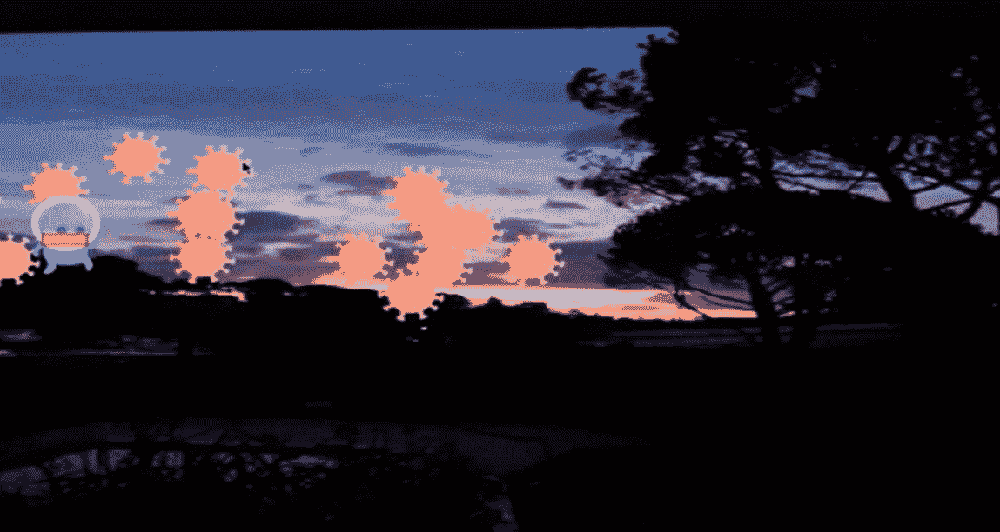

# 孩子能编程，长者也能

使用Python创建一个简单游戏

PREMARAJAN M K

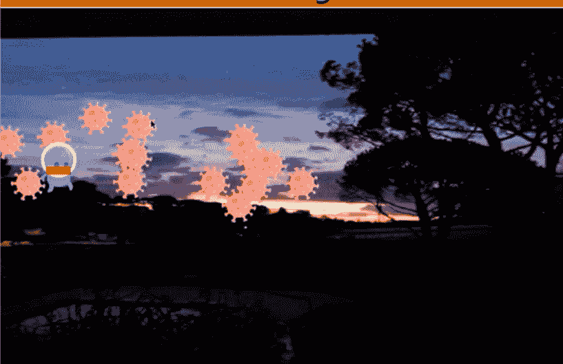

# 目录

**第一部分：游戏‘井字棋’**

- 让我们开始吧：4
- 游戏设计 4
- 游戏编码 5
- 时间 – 本地时间与倒计时 7
- Python time模块 7
- 倒计时 8
- 显示棋盘 9
- 随机数生成 11
- 剩余函数 14
- 本游戏使用的Python概念 22
- 接受挑战！！ 35
- 将其变成双人游戏！ 35
- 让计算机思考！ 38
- 如何从你的程序创建可执行文件 44

**第二部分：新游戏：新冠战士**

- 创建新文件夹 49
- 让我们开始编码 49
- 设置游戏窗口 49
- 屏幕冻结/卡住 50
- 设置游戏循环 51
- 自定义屏幕 53
- 在屏幕上放置对象 53
- 对象的位置 54
- 在屏幕上绘制对象 54
- 在屏幕上放置图像 56
- 加载游戏资源 57
- 为屏幕创建背景图像 59
- 剧情 61
- 病毒在屏幕上的移动 61
- 将病毒保持在边界内 62
- 随机数生成 63
- 病毒的复制 63
- ‘人’的移动 65
- 为‘人’配备激光枪 66
- 碰撞检测 68
- 维护记分板 70
- 提供射击音效 71
- 当整个绿色面具变红时会发生什么？ 74
- 问题解决 84
- 挑战 87
- 尾声 88
- 致谢 89
- Pygame- 游戏‘新冠战士’的代码（235行） 90

# 前言

模仿的力量！

我指的是那些开始学习编程的人。观察孩子们。孩子们通过模仿开始唱歌，通过模仿跳舞，通过模仿说话——几乎每项技能都是通过模仿学会的。语法和细微差别是后来才有的。

对于学习编程，你也不必等到学会它的每一部分语法。开始行动，从小事做起。边做边学。当你开始享受小小的胜利时，你就会充满动力，克服每一个障碍。

所以，现在就行动起来吧！
Premarajan

# 第一部分：游戏‘井字棋’

# 让我们开始吧：

让我们尝试在编码井字棋游戏的同时学习一些Python的基本概念。井字棋的游戏规则是：

- 由3行3列网格组成的9个单元格构成游戏棋盘。
- 两名玩家轮流选择并标记单元格。
- 谁先完成连续的一行、一列或一条对角线，谁就获胜。
- 玩家不能选择已经被标记的单元格。
- 如果所有单元格都被标记，但没有任何玩家获胜，则游戏为‘平局’。
- 让我们考虑一个与计算机对战的游戏。我们将‘X’分配给计算机，将‘O’分配给玩家来标记他们的选择。

# 游戏设计

- 制作‘游戏棋盘’
- 显示游戏规则
- 显示棋盘
- 选择一名玩家并开始游戏
- 选择单元格并标记它
- 测试选择是否有效
- 测试输入是否在范围内
- 测试输入是否有效
- 测试单元格是否已被占用
- 标记所选单元格并传递回合，直到一方获胜或单元格用完
- 游戏结束
- “X”获胜
- “O”获胜
- 平局
- 宣布结果
- 选择开始新游戏或退出

# 游戏编码

让我们直接进入游戏的编码。

```python
#environment

import time
import random

#define variables
board = [1,2,3,4,5,6,7,8,9]
game_still_going = True

line1 = "+---------+---------+---------+"
line2 = "|         |         |         |"

#definitions

def beg_game():
    global winner
    winner = None

    print('''                         *Tic-Tac-Toe!*

            These are the rules:

            You are playing against the computer.
            The computer will open the game by
            placing "X" at it's choice position.
            You are assigned "O" for placing your
            choices.The columns are from 1 to 9
            from top left to right.

            Best of luck! Let us begin....''')
    print(" "*2)

#implement countdown

    num_seconds = 5
    for countdown in reversed(range(num_seconds + 1)):
        if countdown > 0:
            print(countdown, end='.....', flush = True)
            time.sleep(1)
        else:
            print('Go!')
    print(" "*2)
```

```python
def display_board():
    pass
def my_turn():
    pass
def your_turn():
    pass
def check_winner():
    pass
def check_if_tie():
    pass
def play_game():
    print(time.ctime())
    beg_game()
    display_board()
    input()

play_game()
```

上面的代码定义了游戏的结构。我们导入了两个模块，‘*time*’和‘*random*’，并定义了变量**‘game_still_going’**、**‘board’**、**‘line1’**和**‘line2’**。我们已经完成了函数**‘beg_game()’**的编码。在这个函数中，我们定义了一个全局变量**‘winner’**，并将其赋值为‘None’。这个变量被定义为‘*global*’，以便在退出前需要重新开始游戏时，该值会被初始化。这还包含了玩游戏的说明和邀请。这包括一个‘5-0’倒计时来标志游戏的开始。

接下来是定义函数**display_board()**、**my_turn()**、**your_turn()**、**check_winner()**和**check_if_tie()**。虽然我们定义了结构，但除了一个‘pass’语句外，我们还没有为任何函数编写代码。我们在每个函数下放置了一个pass语句，这样就不会因为相应代码未完成而显示错误。

然后引入了函数**‘play_game()’**。在那里，我们添加了打印本地时间的代码，并调用了函数‘beg_game()’。我们还调用了函数‘display_board()’。然而在这个阶段，没有什么可以显示的。我们还在最后一行调用了内置函数‘input()’，以便屏幕在退出程序前等待输入。一旦我们按下回车键，程序就会退出。最后，我们调用了函数‘play_game()’。

执行我们目前完成的代码后；我们得到以下输出：

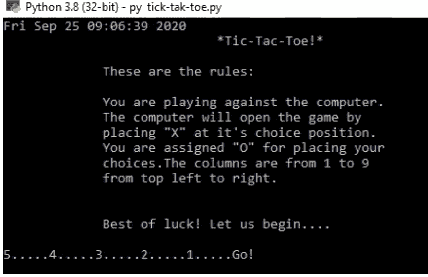

# 时间 – 本地时间与倒计时

## Python time模块

为了提供与时间相关的函数，我们必须首先导入time模块。Python基于‘epoch’的概念工作，它从1970年1月1<sup>st</sup>日，00.00.00开始。如果我们请求时间(>>>time.time())，Python会给出从‘epoch’开始经过的秒数。如果我们想要本地时间，我们必须转换经过的秒数。我们可以使用以下函数来实现：>time.ctime()
该函数以经过的秒数作为参数，并将其转换为日期和时间。请参阅下面的屏幕截图示例：

## 倒计时

```python
#implement countdown

num_seconds = 5
for countdown in reversed(range(num_seconds + 1)):
    if countdown > 0:
        print(countdown, end='.....', flush = True)
        time.sleep(1)
    else:
        print('Go!')
```

请查看这段代码。这里我们通过一个‘for循环’实现了一个5秒倒计时。我们将值5保存到了变量‘**num_seconds**’中。我们将范围值指定为**num_seconds+1**，这样数字5也会被打印出来。由于我们希望倒计时从5开始，到0结束，所以我们使用了‘reversed’（反转）顺序。此外，只有当**countdown**的值大于0时才会打印。看看打印语句。它先打印数字，然后打印‘.....’。‘end=’命令确保所有打印内容都在同一行。‘flush = True’确保打印立即进行，没有缓冲。打印后，它会按照‘time.sleep(1)’的指令等待1秒。如果countdown = 0，它就在同一行打印‘Go!’。因此，我们实现了一个有效的倒计时。

## 显示板

现在让我们编写显示板函数的代码，并移除‘pass’语句。

```python
def display_board():
    print(line1)
    print(line2)
    print("|"," ",board[0]," ","|","", board[1]," |"," ",board[2]," | ")
    print(line1)
    print(line2)
    print("|"," ",board[3]," ","|","", board[4]," |"," ",board[5]," | ")
    print(line1)
    print(line2)
    print("|"," ",board[6]," ","|","", board[7]," |"," ",board[8]," | ")
    print(line1)
```

你从‘my_turn()’函数内部调用此函数。将显示以下游戏棋盘。

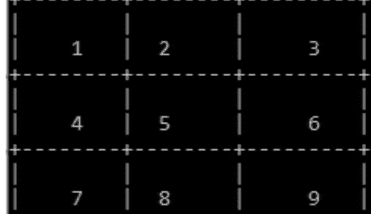

我们使用了变量‘line1’、‘line2’、‘board’以及一些打印语句来显示游戏棋盘。请注意，变量‘board’包含一个由数字1-9组成的‘列表’。列表索引从0开始，在board[0]处，数字是1，在board[1]处，数字是2，依此类推。

到目前为止，我们一直在通过导入time模块和random模块来设置游戏环境。我们还定义了所需的变量。我们已经完成了两个函数beg_game()和display_board()的编码。游戏规则已设定，游戏棋盘已准备就绪！

现在，根据设定的规则，计算机必须先走一步。为了实现这一点，让我们编写函数‘my_turn()’的代码。上面的代码完成了第三个函数‘my_turn()’。请查看开头游戏结构中显示的最后一个函数**`play_game()`**。在**`beg_game()`**之后调用函数**`my_turn()`**。**`play_game()`**现在将如下所示：

```python
def play_game():
    print(time.ctime())
    beg_game()
    my_turn()
    input()
```

如果你现在运行我们的程序，它将产生以下输出：

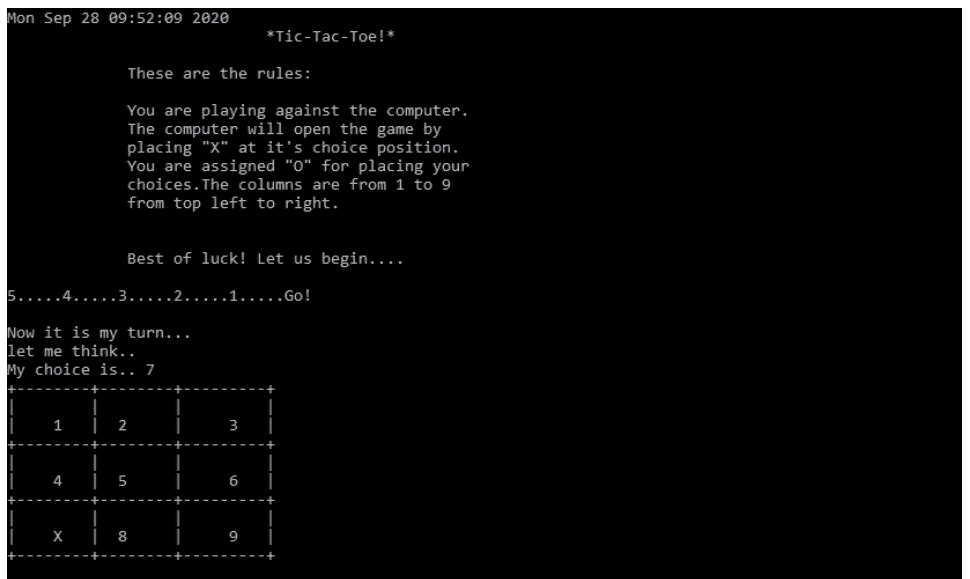

让我们详细检查函数**`my_turn()`**。

首先，所有单元格都是空的，但随着游戏的进行，单元格会被填满。因此，你必须知道哪些单元格是空的才能做出选择。为了记录空闲的位置，创建了一个列表**`ch_list`**。为了识别尚未被选择的单元格，创建了一个**for**循环来遍历名为**`board`**的列表，该列表包含从1到9的值。当遇到一个值不等于**'X'**或**'O'**的列表元素时，其值被追加到**'ch_list'**中。因此，计算机必须从**'ch_list'**中选择一个位置。计算机从**'ch_list'**中随机做出选择。实际上，为了使游戏更真实，计算机应该使用一点智能，我们稍后会介绍。目前，让我们先采用随机选择，而不是推理选择。

一旦做出选择，计算机必须通过将单元格的值替换为**'X'**来在游戏棋盘上标记它。棋盘的值从1到9，而列表中的索引值从0到8。因此，要得到所选数字的索引号，我们必须将该数字减1。

我们可以通过以下步骤实现：
***position = position -1***
***board[position] = "X"***

我们需要初始化变量**'ch_list'**（ch_list = []），这样在下一轮游戏中，棋盘位置将被重新查找，并生成一个新的选项列表。

## 随机数生成

我们将在许多地方使用随机数生成。让我们对这个函数有一个大致的了解。以下是用于随机数生成的常用方法：

random.choice(list)
提供一个数字列表作为参数，从中随机生成一个数字。下面是一个示例：

```python
import random
ch_list = [1,2,3,4,5,9]
number = random.choice(ch_list)
print("The random number selected is : ", number)
```

以下是上述代码片段的输出：

```
The random number selected is :  5
>>> |
```

random.randrange(start,stop,step)
提供的参数是起始数字、结束数字以及数字增加/减少的步长。起始数字包含在生成范围内，但结束数字不包含。‘Step’是可选的，默认情况下，其值为1。

```python
import random
number = random.randrange(1,9,3)
print("The random number selected is : ", number)
```

上述代码的输出如下：

```
The random number selected is :  7
>>> |
```

random.random()
它生成一个大于零且小于1的浮点随机数。

```python
import random
number = random.random()
print("The random number selected is : ", number)
```

输出如下：

```
The random number selected is : 0.04780734353160887
>>>
```

random.randint(start,stop)

它类似于**randrange(start,stop,step)**，但有以下区别：a) **randint()**没有步长。b) **randint()**也包含停止数字。

我们现在已经完成了以下函数的编码：
**beg_game()**
**display_board()**
**my_turn()**
我们还通过开始编写函数**play_game()**的代码，开始将这些函数连接起来。

## 剩余的函数

让我们继续！
‘your_turn()’

现在，让我们考虑函数**‘your_turn()’**需要实现什么。通过语句“现在轮到你了”，计算机将回合交给玩家。它接收玩家的输入，并验证其是否在‘1-9’的范围内。然后它必须确保玩家选择的位置在游戏棋盘上尚未被占用。引入了一个**while**循环来确保执行这些检查。它将变量**‘valid’**设置为*‘False’*来控制循环。只有当**‘valid’**为*‘True’*时才能退出循环。一旦选择在范围内，就必须确保该位置尚未被占用。为了得到列表**‘board’**中数字的索引，你将**'position'**设置为**'position-1'**。如果**'position – 1'**处的值既不是**'X'**也不是**'O'**，则将**'valid'**设置为*‘True’*。这允许退出循环。这个**While**循环确保完成了对‘有效输入’的两项检查。下一条语句如下：

```python
board[position] = "O"
```

这会在棋盘上标记玩家的选择并显示游戏棋盘。语句**'time.sleep(1)'**在屏幕滚动过去之前将屏幕保持一秒钟，以便你可以瞥见带有到那时为止标记选择的屏幕。以下是代码：
下面的屏幕截图显示了此时‘play_game()’函数的样子：

```python
def play_game():
    print(time.ctime())
    beg_game()
    my_turn()
    your_turn()

    input()

play_game()
```

如果你在此阶段运行程序，你将得到以下输出：

## 创建一个循环，使计算机和‘玩家’之间的回合持续交替

我们一开始定义了一个变量**'game_still_going'**，并将其值设置为*‘True’*。现在，我们可以在最后一个函数**'play_game()'**中设置一个循环，如下所示：

```python
def play_game():
    print(time.ctime())
    beg_game()
    while game_still_going:
        my_turn()
        your_turn()

    input()
```

如果你在现阶段运行程序，会发现它会在验证输入是否在1-9范围内且该位置未被占用后，接受来自电脑和玩家的输入。即使所有格子都填满了，程序也无法退出验证循环，会持续要求玩家提供有效输入。这是因为我们尚未引入检查玩家获胜或游戏平局的逻辑，也没有让程序退出循环。你现在可以使用“ctrl+c”键终止程序，然后继续编写“获胜”或“平局”函数。

## ‘check_winner()’

在程序开始时，我们将变量‘game_still_going’的值设为‘True’，将变量‘winner’的值设为‘None’。函数‘check_winner’会检查游戏棋盘的每一行、每一列和每一条对角线，看“X”或“O”是否完成了其中任意一条线。如果答案是“是”，则将‘game_still_going’的值设为‘False’。

## ‘check_if_tie()’

这里定义了一个变量‘x’，其初始值设为0。使用“for循环”检查棋盘上每个位置的值。如果该位置是“X”或“O”，则变量‘x’的值递增。最后，如果‘x’的值为9，则将‘game_still_going’的值设为“False”。需要注意的是，如果任何‘玩家’已经获胜，‘check_winner()’函数会将‘winner’的值改为“X”或“O”。如果没有玩家获胜，则‘winner’的原始值‘None’将保持不变。

请查看下面给出的函数代码：

# ‘check_winner()’ 和 “check_if_tie()”：

```python
def check_winner():
    global game_still_going
    global winner

    if board[0]== board[1] == board[2] == "X":
        winner = "X"
        game_still_going = False

    elif board[0]== board[1] == board[2] == "O":
        winner = "O"
        game_still_going = False

    elif board[3]== board[4] == board[5] == "X" :
        winner = "X"
        game_still_going = False

    elif board[3]== board[4] == board[5] == "O" :
        winner = "O"
        game_still_going = False

    elif board[6]== board[7] == board[8] == "X" :
        winner = "X"
        game_still_going = False

    elif board[6]== board[7] == board[8] =="O" :
        winner = "O"
        game_still_going = False

    elif board[0]== board[3] == board[6] == "X":
        winner = "X"
        game_still_going = False

    elif board[0]== board[3] == board[6] == "O":
        winner = "O"
        game_still_going = False
```

在最后一个函数‘play_game()’中，你需要在‘my_turn()’之后以及‘your_turn()’之后调用‘check_winner()’和‘check_if_tie()’函数。现在‘play_game()’将如下所示：

```python
def play_game():
    print(time.ctime())
    beg_game()
    while game_still_going:
        my_turn()
        check_winner()
        check_if_tie()
        your_turn()
        check_winner()
        check_if_tie()

    input()
```

如果你在现阶段运行程序，即使在**‘my_turn()’**完成验证后**‘game_still_going’**被设为‘False’，程序仍会继续执行**‘your_turn’**。为了防止这种情况，应在**‘your_turn()’**函数之前编写一个**‘break’**语句，以便在此时退出循环。

如果在执行函数**‘check_winner()’**时遇到获胜者，变量**‘winner’**的值将从‘None’修改为“X”或“O”。同时，**‘game_still_going’**的值将被设为‘False’。如果没有获胜者，程序控制权将转移到**‘check_if_tie()’**函数。它会检查游戏棋盘是否所有单元格都已填满，如果答案是‘是’，则将**‘game_still_going’**的值设为‘False’。由于**‘winner’**的值未被**‘check_winner()’**修改，该变量的值保持为‘None’，从而得出游戏结果为*平局*的结论。我们还可以添加两个变量**‘begin’**和**‘end’**来记录开始和结束时间，从而计算游戏所用时间。代码如下：

```python
def play_game():
    global game_still_going,winner
    global board
    board = [1,2,3,4,5,6,7,8,9]

    print(time.ctime())
    beg_game()

    while game_still_going:
        begin = time.time()
        my_turn()
        check_winner()
        check_if_tie()
        if not game_still_going:
            break
        your_turn()
        check_winner()
        check_if_tie()

    end = time.time()
    if winner == "X":
        print("Game over ! I have won the game !")
        print("Time taken :" , round((end- begin),1),"seconds")
    if winner == "O":
        print("Game over ! congrats!..You have won the game!")
        print("Time taken :" ,round( (end- begin),1),"seconds")
    if winner ==None:
        print("Game is over! It is a tie")
        print("Time taken :" ,round((end- begin),1), "seconds")
```

# 继续游戏的选项：

你可能想继续玩。现在我们将通过引入一个循环来提供这个选项。以下是修改函数所需的额外代码：你可以将‘**input()**’函数作为最后一条语句，这将使屏幕等待直到接收到按键输入。

**恭喜！！你已经完成了‘井字棋’游戏程序的编写。** 请查看以下情况下的游戏截图：

## 1. 玩家获胜：

```
Now it is your turn !
Please enter an integer from 1-9 :1
+-------+-------+-------+
|   0   |   2   |   3   |
+-------+-------+-------+
|   X   |   O   |   X   |
+-------+-------+-------+
|   7   |   X   |   O   |
+-------+-------+-------+
Game over ! congrats!..You have won the game!
Time taken : 8.7 seconds
Going for another game?..say 'yes' or 'no' :yes

Ok! let us go again !.......
```

## 2. 平局：

```
Now it is my turn...
let me think..
My choice is.. 8
+-------+-------+-------+
|   X   |   O   |   X   |
+-------+-------+-------+
|   X   |   O   |   O   |
+-------+-------+-------+
|   O   |   X   |   X   |
+-------+-------+-------+
Game is over! It is a tie
Time taken : 2.0 seconds
Going for another game?..say 'yes' or 'no' :yes

Ok! let us go again !.......
```

## 3. 电脑获胜并选择退出：

这个游戏有许多可能的变体和改进。我们将探讨两种：1. 电脑做出明智的选择，而不是随机选择。2. 对手不是电脑，而是另一个独立的玩家。你可以尝试改进游戏的布局以改善显示效果。你也可以考虑提高代码的效率。

让我们记住创始人吉多·范·罗苏姆创建的‘Python之禅’，内容如下：

```python
>>> import this
The Zen of Python, by Tim Peters

Beautiful is better than ugly.
Explicit is better than implicit.
Simple is better than complex.
Complex is better than complicated.
Flat is better than nested.
Sparse is better than dense.
Readability counts.
Special cases aren't special enough to break the rules.
Although practicality beats purity.
Errors should never pass silently.
Unless explicitly silenced.
In the face of ambiguity, refuse the temptation to guess.
There should be one-- and preferably only one --obvious way to do it.
Although that way may not be obvious at first unless you're Dutch.
Now is better than never.
Although never is often better than *right* now.
If the implementation is hard to explain, it's a bad idea.
If the implementation is easy to explain, it may be a good idea.
Namespaces are one honking great idea -- let's do more of those!
```

# 本游戏中使用的Python概念

在继续之前，让我们回顾一下用于编写‘井字棋’游戏的Python概念。

## 打印语句：

a) 打印大量文本：以下格式用于打印多行文本：
```python
print(" ....................................................
....................................................")
```
三引号内输入的内容将原样打印。
例如，它被用于在游戏开始时打印游戏说明。
```python
print(" *Tic-Tac-Toe!*
These are the rules:
```

## b) 打印空行：

例如，`print(" "* 2)`
上述语句会打印2个空行。

## c) 在同一行打印：

例如，以下在游戏开场时使用的‘倒计时脚本’可以测试，倒计时将在单行内进行：

```python
import time
num_seconds = 5
for countdown in reversed(range(num_seconds + 1)):
    if countdown > 0:
        print(countdown, end='.....', flush=True)
        time.sleep(1)
    else:
        print('Go!')
```

对于‘`print()`’函数，‘\n’或换行是默认选项。如果我们运行以下脚本，

```python
for i in range(2):
    print("Hello")
```

结果将是：

```
Hello
Hello
```

但如果你将脚本修改如下，

```python
for i in range(2):
    print("Hello", end=" ")
```

输出将打印在同一行，如下所示：

```
Hello Hello
```

d) 这里，使用了‘print’的另一个选项 *flush = True*。**flush** 的默认值是‘False’。
***print(countdown, end='.....', flush=True)***

我们希望倒计时在单行内进行，而不是在行结束后才显示。一旦‘5.....’写入内存，它就应该立即刷新到屏幕，然后是‘4.....’，接着是‘3.....’，依此类推，这使得倒计时更加真实！因此，我们将**‘flush’**的值设置为‘True’。

## 列表

列表是Python中常见的数据类型之一，在我们的游戏程序中被大量使用。为了创建游戏棋盘，创建了一个名为**‘board’**的列表：**Board = [1,2,3,4,5,6,7,8,9]**

在游戏中，数字会根据玩家的选择被替换为**“X”**或**“O”**。通过评估列表中**“X”**和**“O”**的位置来确定是否有一方获胜或游戏平局。需要记住的是，列表索引是从0到8。

看看程序中使用的列表**‘ch_list’**：

```python
ch_list = []
print("Now it is my turn...")
for i in range(0,9):
    if board[i] != "X" and board[i] != "O":
        ch_list.append(board[i])
position = (random.choice(ch_list))
print("let me think..")
time.sleep(2)
print("My choice is..",position)
position = position-1
board[position] = "X"
ch_list = []
```

我们希望为**‘computer’**（这里，游戏是与‘computer’对战）提供一个棋盘上尚未被占用的位置列表，以便‘computer’可以从中做出选择。首先创建一个空列表**‘ch_list’**。通过使用for循环，验证每个位置是否已被占用，如果没有，则通过**‘ch_list.append(board[i])’**方法将索引处的值附加到列表中。值被附加到列表的末尾。从创建的**‘ch_list’**中，**‘computer’**做出选择。在退出函数之前，列表被初始化，以便在下一轮中，该过程重新开始。

## 函数

**‘function’**（函数）是一段执行特定功能的代码块。它是可重用的。它以关键字**‘def’**开头，后跟函数名和括号，该行以冒号结尾。括号可以包含一个或多个参数，也可以不包含。函数体以缩进的行/多行形式跟随。函数对于执行本质上重复的操作非常有用。除了用户定义的函数外，Python还有许多内置函数，例如**‘print()’**、**‘input()’**等。

在游戏**‘井字棋’**中，我们使用了七个函数：

```python
def beg_game():
    pass

def display_board():
    pass

def my_turn():
    pass

def your_turn():
    pass

def check_winner():
    pass

def check_if_tie():
    pass

def play_game():
    pass
```

在我们的程序中，**‘display_board()’**函数从**‘my_turn()’**和**‘your_turn()’**函数中调用。所有其他函数都从**play_game()**调用，这是我们程序中的最后一个函数。如果玩家选择再玩一次，我们将在**play_game()**内部再次调用它。

当你调用一个函数时，它会在该点执行，执行后返回到调用点之后的语句。

你不能调用程序当时不知道的函数。我们的程序中没有使用任何带参数的函数。如果你使用带参数的函数，你必须在调用时给出值。如果给出的值数量与定义的数量不符，将导致错误。如果没有定义参数，但你在调用时给出了参数，也会导致错误。

让我们看看以下代码片段：

```python
def numb(x,y,z):
    print("X:", x, "Y:", y, "Z", z)
    print("Totals is :", x+y+z)

def name():
    name = "Premraj"
    print("My name is:", name)

name()
numb(3,4,8)
```

它包含两个函数，其中一个带参数。函数在脚本末尾被调用。没有问题，结果如下：

```
My name is: Premraj
X: 3 Y: 4 Z 8
Totals is : 15
>>>
```

现在看看以下代码片段：

```python
def numb(x,y,z):
    print("X:", x,"Y:", y,"Z",z)
    print("Totals is :", x+y+z)

numb(3,4)
name()

def name():
    name = "Premraj"
    print("My name is:", name)
```

运行代码时，在第5行遇到错误，并抛出以下错误：
**TypeError: numb() missing 1 required positional argument: 'z'**

现在看看这段代码：

```python
def numb(x,y,z):
    print("X:", x,"Y:", y,"Z",z)
    print("Totals is :", x+y+z)

numb(3,5,9)
name()

def name():
    name = "premraj"
    print("My name is:", name)
```

程序中的第一个函数定义正确且调用正确。该部分代码成功运行并给出结果。在第6行，函数'name()'被调用。此时，程序不知道该函数的定义，并抛出以下错误：

```
X: 3 Y: 5 Z 9
Totals is : 17
Traceback (most recent call last):
  File "C:\Users\PREMARAJAN\AppData\Local\Programs\Python\Python38-32\quiktest.py", line 6, in <module>
    name()
NameError: name 'name' is not defined
```

## While 循环

程序中使用了三个‘**while 循环**’。第一个用于验证玩家的输入，以确定：
a) 输入位置是否在1-9的范围内
b) 该位置是否已被占用

这出现在函数‘**your_turn()**’中。创建了一个初始值为‘*False*’的变量‘**valid**’作为循环的条件，一旦条件满足，‘**valid**’被设置为‘*True*’并退出循环。

```python
position = input("Please enter an integer from 1-9 :")
valid = False
while not valid:
    while position not in ["1","2","3","4","5","6","7","8","9"]:
        position = input("Please enter an integer from 1-9 :")
    position = int(position)-1
    if board[position] != "X" and board[position] != "O":
        valid = True
    else:
        print("The position has already been taken")
```

第二个‘**while 循环**’设置在变量‘**game_still_going**’上，出现在‘**play_game**’中，在‘**my_turn**’、‘**break**’条件‘**your_turn()**’和函数之后。首先运行‘**check_winner**’和‘**check_if_tie**’函数。如果此时‘**game_still_going**’的值变为‘*False*’，则循环运行并退出。否则，它继续进行检查，‘**check_winner**’和‘**check_if_tie**’。一旦‘**game_still_going**’的值变为‘*False*’，循环终止。

```python
while game_still_going:
    begin = time.time()
    my_turn()
    check_winner()
    check_if_tie()
    if not game_still_going:
        break
    your_turn()
    check_winner()
    check_if_tie()
```

第三个**‘while 循环’**也在函数**‘play_game()’**中。设置此循环是为了让玩家可以选择**‘yes’**或**‘no’**来**‘再玩一局’**，并根据选项采取行动。

## Pass, break, continue

如前所述，**‘pass’**语句在创建游戏‘井字棋’的结构时被使用，以防止因未编写函数而出现错误。一旦你编写了函数，**‘pass’**就被移除。

**‘while 循环’**和**‘for 循环’**用于处理Python编程中的重复函数。**‘Break’**和**‘continue’**是循环控制语句。
我们的游戏程序中只使用了一个**‘break’**语句。它在**‘play_game()’**函数中。这在该部分已经解释过了。
游戏中没有使用**‘continue’**语句。然而，由于**‘break’**和**‘continue’**是相关的，我们将用几个简单的例子来说明它们。

**‘break’语句：**
使用**‘for 循环’**，让我们尝试遍历单词**‘Strengthen’**。我们设置了一个**‘break’**，如果遇到元音。

## 'If'、'elif'、'else' 条件语句：

**'if'**、**'elif'** 和 **'else'** 关键字用于检查条件。检查单个条件时使用 **'if'**。检查多个条件时，需与 **'if'** 结合使用 **'elif'** 和 **'else'**。在一个代码块中，你可以使用任意多个 **'elif'**，但只能使用一个 **'else'**。

在查看我们如何在“井字棋”游戏程序中使用这些条件之前，让我们先看一个简单的例子。

```python
no_of_cars = int(input("How many cars did Jose purchase? : "))

if no_of_cars == 1:
    print("Jose has only one car")
elif no_of_cars == 2:
    print("Jose has 2 cars")
elif no_of_cars == 3:
    print("Jose has 3 cars")
else:
    print("Jose has more than 3 cars !")
```

以下是三种不同输入的结果：

```
>>> 
================================ RESTART: C:\Users\PREMARA
How many cars did Jose purchase? : 1
Jose has only one car !
>>> 
================================ RESTART: C:\Users\PREMARA
How many cars did Jose purchase? : 3
Jose has 3 cars.
>>> 
================================ RESTART: C:\Users\PREMARA
How many cars did Jose purchase? : 5
Jose has more than 3 cars !
```

现在让我们看几个来自我们程序的例子：

```python
num_seconds = 5
for countdown in reversed(range(num_seconds + 1)):
    if countdown > 0:
        print(countdown, end='.....', flush = True)
        time.sleep(1)
    else:
        print('Go!')
```

这里，'if' 和 'else' 结合使用，作为 'for 循环' 的一部分。让我们看看这个 5 秒倒计时是如何实现的。数字范围被反转，带有后缀 '.....' 的数字从 5 打印到 1，每次间隔一秒。当倒计时达到 1 时，程序退出 'if' 条件，'else' 条件开始生效，并打印 'Go'。

在 **`check_for_winner`** 函数中，使用了十六个条件来确定获胜者。一个是 **`if`** 条件，其余十五个是 **`elif`** 条件。如果有获胜者，具有默认值 `None` 的变量 **`winner`** 会被相应地修改，变量 **`game_still_going`** 的值会被更改为 `False`。
你可以观察到，在游戏中还有许多其他场合使用了 **`if`**、**`elif`** 和 **`else`** 条件。

## 全局变量和局部变量

### 示例 1：

```python
# This function uses global variable x which is outside the
# function
def test():
    print(x)

# Global scope
x = "Hello, world!"
test()
```

输出：
Hello, world!

### 示例 2：

```python
# This function uses variable x inside, hence uses it
# throws up an error since referenced before assignment
def test():
    print(x)
    x = "This is strange!"

# Global scope
x = "Hello, world!"
test()
```

输出：
UnboundLocalError: local variable 'x' referenced before assignment

### 示例 3：

```python
# This function has a variable x inside the function also appropriately assigned
def test():
    x = "This is strange!"
    print(x)

x = "Hello, world!"
test()
print(x)
```

输出：

**This is strange!**
**Hello, world!**

（调用函数时，打印函数内部赋值的值；函数调用后的打印命令，打印外部赋值的值）

### 示例 4：

```python
# This function has a variable x inside the function, but it has been defined as global
def test():
    global x
    x = "This is strange!"
    print(x)

x = "Hello, world!"
test()
print(x)
```

输出：

**This is strange!**
**This is strange!**

（因为变量被定义为全局变量，所以它的值可以带到函数外部）

```python
# This function has a variable x inside the function, not defined as global, hence the print command outside the function results in an error
def test():
    x = "This is strange!"
    print(x)

test()
print(x)
```

输出：
Traceback (most recent call last):
  File "test.py", line 10, in <module>
    print(x)
NameError: name 'x' is not defined

## 接受挑战！！

你已经了解了游戏的结构。每个函数的代码都已给出，其工作原理也已解释。只需将它们组装起来，你就拥有了完整的代码！你当然可以对游戏进行改进！接受这些挑战吧！以下是一些建议：

- 将其变成双人游戏！
  现在，它被设计为计算机和玩家之间的游戏。将其变成两个独立玩家之间的游戏！
  包含在函数 ‘beg_game()’ 中的游戏说明需要修改，你可以适当地进行修改。
  在“双人”游戏中，与计算机作为玩家相关的函数 ‘my_turn()’ 变得多余，因为选择不是由计算机做出的。这个函数可以移除。
  也不需要为每个玩家设置单独的函数，因为函数 ‘my_turn()’ 可以被替换。让我们用一个新函数 ‘handle_turn(player)’ 来实现。以下是代码：

```python
def handle_turn(player):

    print(player + "'s turn.")
    position = input("Please choose a position from 1-9 :")
    valid = False
    while not valid:
        while position not in ["1","2","3","4","5","6","7","8","9"]:
            position = input("Invalid input. Please choose a position from 1-9 :")

        position = int(position) - 1
        if board[position] != "X" and board[position] != "O":
            valid = True
        else:
            print("The position has already been taken...")
    board[position] = player
    display_board()
```

可以观察到，这个函数有一个参数，这与我们之前看到的函数不同。游戏中我们有两个玩家“X”和“O”。我们可以在程序开始时定义一个变量来表示值“X”或“O”，具体取决于情况。让我们称这个变量为 ‘current_player’，并给它一个初始值“X”。当我们调用函数 ‘handle_turn(player)’ 时，可以将参数设置为 ‘current_player’。

现在，在一个玩家选择选项、标记其选项并显示游戏棋盘后，必须切换玩家。为此，我们可以引入一个新函数 ‘flip_player()’。

请看一下代码。它非常简单。如果变量 ‘current_player’ 的值是“X”，则切换为“O”；如果是“O”，则切换为“X”。请注意，变量 ‘current_player’ 被定义为 ‘global’，以便其值在函数外部也有效。以下是函数 ‘flip_player’ 的代码：

现在，一切准备就绪，可以将“计算机对玩家”游戏转换为“双人”游戏！

- 定义变量 ‘current_player’！
- 修改游戏说明！
- 用新函数替换函数 ‘my_turn()’ 和 ‘your_turn’

## 如何从你的程序创建可执行文件

成功完成井字棋游戏程序后，让我们看看如何将Python程序文件转换为可执行文件，以便在非Python平台上运行。要将.py文件转换为.exe文件，需要使用‘pyinstaller’。它随‘IDLE Python’软件包一起提供，可能已经安装在你的计算机上。否则，你现在可以安装它。如果你在Python shell中，可以轻松进入操作系统。

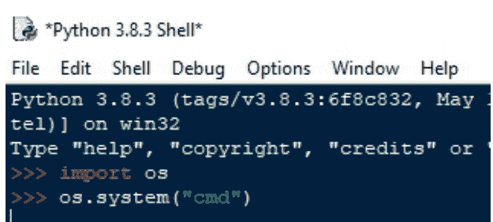

上述命令将带你进入操作系统。在那里，你可以执行以下命令来安装‘pyinstaller’。
C:\Users\AppData\Local\Programs\Python>py -m pip install pyinstaller 如果已经安装，系统会给你‘the requirement is already met’的消息。否则，它将安装‘pyinstaller’。
（关于‘pyinstaller’的信息可以从以下网站获取：
http://www.pyinstaller.org/）

‘handle_turn()’和‘flip_player()’！

- 修改‘play_game()’函数！

现在‘play_game()’函数将如下所示：

```
def play_game():
    global game_still_going, winner
    global board
    board = [1,2,3,4,5,6,7,8,9]

    print(time.ctime())
    beg_game()
    display_board()
    while game_still_going:
        begin = time.time()
        handle_turn(current_player)
        check_winner()
        check_if_tie()
        flip_player()
```

只需调用“play_game()”并继续！

让计算机思考！

让我们考虑我们最初编码的‘井字棋’游戏。在这里，玩家与‘计算机’对战。计算机通过生成随机数来选择其选项。它不应用任何‘智能’，因此有时计算机会轻易认输。它不提供任何挑战或游戏的刺激！让我们尝试通过给计算机一些‘大脑’来使其更有趣。

让我们考虑游戏情况。游戏在一个编号为1到9的九宫格中进行。

1 2 3
4 5 6
7 8 9

游戏过程如下（计算机先走）：计算机第一步 计算机第二步 计算机第三步 计算机第四步 计算机第五步 玩家回应 玩家回应 玩家回应 玩家回应 任一方可能获胜 任一方可能获胜

计算机获胜或游戏以‘平局’结束
计算机最多必须走5步。

第一步：开局，中心（第5格）是最受青睐的，其次是四个角落之一。为了避免计算机总是以优势开局的单调性，我们可以从中心和角落格子中随机选择。

第二步：计算机可以检查中心是否已被占用，如果没有，则占据它。如果中心已被计算机占据，则前往对角线、行或列位置中第三个格子为空的相邻格子。

第三步：如果计算机可以完成一条线并获胜，则前往该格子。否则，通过占据该线中未被占用的格子来阻止玩家完成一条线。否则，移动到相邻格子以打开一条线。

第四步：可以重复第三步的步骤。
第五步：如果游戏进行到这一步，只剩下一个格子，只需占据它！
我们如何实现它？

我们决定如上所述，从‘受青睐’的五个位置（即中心和四个角落格子）中随机选择第一个选择。为此，定义了一个列表如下：

```
ch_list_1 = [1,3,5,7,9]
```

我们还可以创建一个列表来监控每回合开始时开放的格子。

```
ch_list = []
```

在每回合开始时验证游戏网格并更新列表。这通过‘for循环’实现。

计算机走第一步后，玩家回应。现在剩下7个格子，计算机再次从‘ch_list_1’中随机选择一个格子。玩家回应，剩下5个格子。现在获胜或失败的机会出现，计算机必须应用智能。

游戏在3行、3列或两条对角线上获胜或失败。计算机在回应之前必须查看这些线中是否有任何一方有机会获胜。

为了监控游戏棋盘网格，我们可以将其分解为8个列表，如下所示：

```
row1 =[ board[0],board[1],board[2]]
row2 = [board[3],board[4],board[5]]
row3 = [board[6],board[7],board[8]]
column1 = [board[0],board[3],board[6]]
column2 = [board[1],board[4],board[7]]
column3 = [board[2],board[5],board[8]]
diag1 = [board[0],board[4],board[8]]
diag2 = [board[2],board[4],board[6]]
```

计算机首先逐行验证是否有任何线它已经标记了两个格子，而第三个格子为空。

在这种情况下，它前往空格子并赢得游戏。如果这不是真的，计算机验证对手是否有任何线有两个格子被占据，第三个格子为空。

在这种情况下，它前往空格子以阻止对手获胜。如果这两种情况都不成立，计算机从‘ch_list’中随机选择。现在，玩家回应，剩下3个格子。重复‘剩下5个格子’时的程序。一旦对手回应，只剩下一个格子，计算机必须占据它。要实现这些更改，你必须在程序中的‘my_turn()’函数中进行必要的更改。

引入了以下新变量以方便计算机选择游戏棋盘格子：

- Ch_list_1
- row1
- row2
- row3
- column1
- column2
- column3
- diag1
- diag2

根据棋盘上剩余的格子数量，计算机采用不同的方法选择格子。前两个选择完全基于变量‘ch_list_1’中元素的可用性，首先优先选择中心格子（第5格）。
代码如下：

```
def my_turn():
    global game_still_going
    ch_list = []
    ch_list_l = [1,3,5,7,9]

    row1 =[ board[0],board[1],board[2]]
    row2 = [board[3],board[4],board[5]]
    row3 = [board[6],board[7],board[8]]
    column1 = [board[0],board[3],board[6]]
    column2 = [board[1],board[4],board[7]]
    column3 = [board[2],board[5],board[8]]
    diag1 = [board[0],board[4],board[8]]
    diag2 = [board[2],board[4],board[6]]

    print("Now it is my turn...")
    valid = False

    while not valid:
        for i in range(0,9):
            if board[i] != "X" and board[i] != "O":
                ch_list.append(board[i])

        if len(ch_list) == 9:
            position = random.choice(ch_list_l)

        elif len(ch_list)== 7:
            print("Remaining choices:",ch_list)
            if board[4] != "X" and board[4] != "O":
                position = 5
            elif board[0] != "X" and board[0] != "O":
                position = 1
            elif board[2] != "X" and board[2] != "O":
                position = 3
            elif board[6] != "X" and board[6] != "O":
                position = 7
            elif board[8] != "X" and board[8] != "O":
                position = 9
```

接下来的选择将在`len(ch_list) == 5`时进行，然后是`len(ch_list) ==3`，最后的选择是强制性的，因为那是最后一个元素。

```
elif len(ch_list) == 5:

    print("Remaining choices :",ch_list)

    if row1.count("X")== 2 and row1.count("O") == 0:

        if board[0] == "X" and board[2] == "X":
            position = 2

        if board[0] == "X" and board[1] == "X":
            position = 3

        if board[1] == "X" and board[2] =="X":
            position = 1

    elif row2.count("X")== 2 and row2.count("O") == 0:
```

查看与row1相关的代码，并完成row2。然后为row3、列和对角线设置‘elif’。

接下来的检查是在‘len(ch_list) == 3’时，如下所示。使用相同的逻辑并完成它。

```
elif len(ch_list) == 3:

    print("Remaining choices :",ch_list)

    if row1.count("X")== 2 and row1.count("O") == 0:

        if board[0] == "X" and board[2] == "X":
            position = 2

        if board[0] == "X" and board[1] == "X":
            position = 3

        if board[1] == "X" and board[2] =="X":
            position = 1

    elif row2.count("X")== 2 and row2.count("O") == 0:
```

这些检查的框架以及‘my_turn()’函数中从‘else’开始的剩余代码如下所示。完成它并测试代码。

你现在准备好了！
它会工作的！
我相信你能够改进它！
继续尝试吧！

在继续之前，我建议你创建一个新目录，并将你的“井字棋”程序移动到其中。这样做有一个好处：在转换过程中会创建许多新目录和文件，它们都将位于你创建的新目录下，便于你进行检查。

现在，在操作系统命令提示符下，你可以执行以下命令。

```
pyinstaller <programfile.py>
例如，
C:\Users\AppData\Local\Programs\Python>pyinstaller tic-tac-toe.py
```

假设你已经创建了新目录“Tic-Tac”，并将你的程序文件“Tic-Tac-Toe.py”移动到了其中。执行上述命令后，“Tic-Tac”目录将包含以下文件/文件夹：

- Tic-Tac-Toe.py
- Dist
- Build
- _pycache_
- 你的程序文件
- pyinstaller 创建的文件夹
- pyinstaller 创建的文件夹
- pyinstaller 创建的文件夹

在“dist”目录中，除了 pyinstaller 创建的其他文件外，你可以看到“Tic-TacToe.exe”，这是我们 Python 程序的可执行版本。
你可以点击打开并玩游戏！你可以把它发送给任何你想发送的人！这样，你就完成了第一个游戏。
希望你在编码的同时也学到了一些 Python 基础知识！
在本节中，显示只是黑白的。在下一节中，我们可以从黑白世界走向一个充满色彩、移动物体和图形的世界！请翻页，享受创建一个与当前时代（新冠疫情）紧密相关的激动人心的游戏吧。

# 第二部分：新游戏：新冠战士

我们将使用“pygame”来编码“新冠战士”游戏。使用“pygame”编码游戏时，你可以使用“IDLE Python”、“PyCharm”或任何其他环境。你可以从“python.org”网站下载“IDLE Python”。在我编写本书时，可用的最新版本是 Python 3.9。


“pygame”包含许多模块，有助于在 Python 中进行游戏编程。如果尚未安装，你将无法使用它进行编码。如果你使用的是“IDLE Python”，可以在“pip”的帮助下安装它。“pip”是一个标准的包管理系统，用于安装用 Python 编写的包。“pip”是“Pip installs Packages”的首字母缩写。安装“pygame”的具体步骤如下所示：

```
C:\Users\Local\Programs\Python>py -m pip install pygame
```
顺便提一下，如果“pip”不可用，你可以使用以下命令安装和升级它：
```
C:\Users\PREMARAJAN\AppData\Local\Programs\Python>python -m pip install – upgrade pip
```
你将在屏幕上看到以下内容。

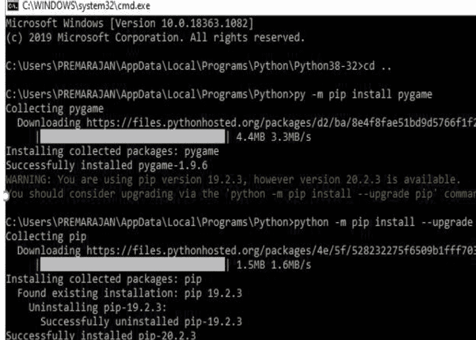

“PyCharm”是由捷克公司 JetBrains 开发的 Python 集成开发环境。其社区版是免费的，非常适合我们的需求。你可以从以下网站下载：https://www.jetbrains.com/ 。
（请参见下图）


## 让我们看看如何加载“pygame”。

在“PyCharm”屏幕上，点击：
文件 > 设置 > 项目 > 项目解释器
将打开一个窗口，列出可用的包。在这里我们可以看到列出了“pip”和“setuptools”，但没有列出“pygame”包。

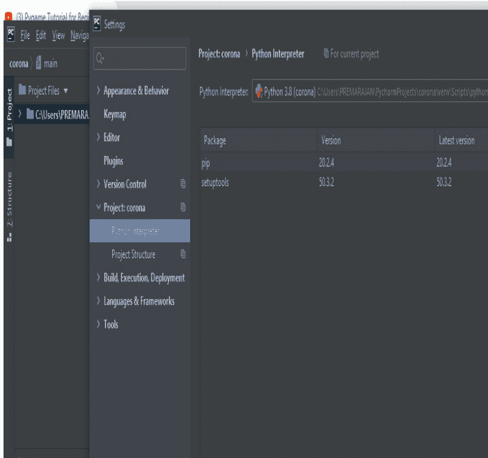

在下面的屏幕中，请查看以“package”开头的行末尾的“+”号。点击它，将出现一个列表。从中选择“pygame”，然后点击窗口底部的“Install package”按钮。“pygame”现在将被安装。

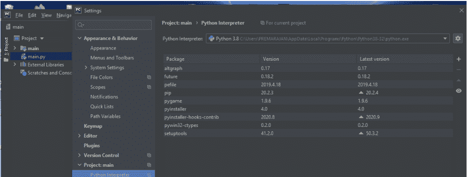

我们现在准备好编码了。我们将逐步进行编程。让我们首先熟悉一下基础知识。

在这个阶段，我更喜欢使用“IDLE Python”来工作。你可以选择任何环境。

## 创建一个新文件夹

请在你访问 Python 的目录中创建一个新文件夹。在这个文件夹中，你可以打开你的 Python 程序文件并开始编码。由于我有一个围绕冠状病毒的游戏概念，我将目录和脚本文件（程序文件）都命名为“corona”。一个单独的目录将帮助你轻松识别和跟踪你的文件。

## 让我们开始编码

打开程序文件。让我们开始编码。

“pygame”有许多模块。其中一些必须专门初始化，但有些则不需要。“pygame.init()”处理了这个需求，所有模块都会被初始化。

```
#设置环境
import pygame
pygame.init()
```

## 设置游戏窗口

所有游戏都在一个定义的窗口或屏幕上进行。因此，我们需要绘制一个屏幕。屏幕的大小以像素为单位表示，例如 500 像素宽和 600 像素高。让我们创建一个名为“screen”的窗口：

```
Screen = pygame.display.set_mode((500,600))
```

将显示一个 500 像素宽、600 像素高的窗口。如果你将 (0,0) 作为参数传递给“set_mode”，屏幕将占据整个窗口。

## 屏幕冻结/卡住

你们中的一些人可能遇到过屏幕卡住/冻结的情况。甚至可能无法关闭屏幕。如果你遇到这种情况，请打开 Windows 的“任务管理器”并将其固定在任务栏上。（你也可以随时按“ctrl+alt+del”组合键打开它）。你可以看到列出的正在运行的进程。任务管理器有两个视图，“更多详细信息”和“更少详细信息”（请参见左下角的按钮，这是一个切换开关）。以更多详细信息打开。你可以看到与 Python 相关的项目列表。保留代表程序文件的 Python Shell 相关条目。选择并关闭其他与 Python 相关的条目。你的游戏屏幕窗口现在将关闭。

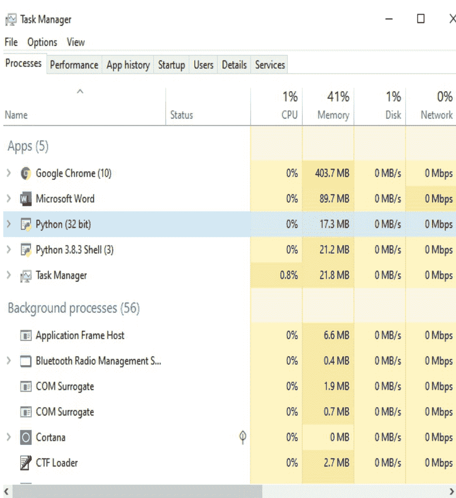

## 设置游戏循环

游戏循环控制游戏的流程。只要某些操作需要重复，控制权就保留在循环内。进入循环时设置一个条件“running = True”，一旦任务完成或收到退出输入，条件就被重置为“running = False”，这使程序退出循环。

现在让我们看看到目前为止代码会是什么样子。

```
#设置环境
import pygame
pygame.init()

#设置屏幕
screen = pygame.display.set_mode((500,600))

#设置游戏循环

running = True
while running:
    for event in pygame.event.get():
        if event.type == pygame.QUIT:
            running = False

# 退出游戏
pygame.quit()
```

屏幕将被显示，当你点击屏幕右上角标有“X”的关闭符号时，循环将退出。程序读取下一行“pygame.quit()”函数并退出游戏。“pygame.init()”初始化所有“pygame”模块，而“pygame.quit()”关闭所有“pygame”模块并退出。

请注意，使用的单词“screen”是一个变量，而不是关键字。你可以使用任何变量。我们使用“screen”是为了便于识别。我们可以使用“fill”方法来改变屏幕的颜色。Python 使用 (R,G,B) 颜色方案。一种颜色的最大饱和度可以达到 255。当所有颜色的最大饱和度为“255”时，颜色为白色；当为“0”时，颜色为黑色。

```
WHITE = (255,255,255)
BLACK = (0,0,0)
RED = (255,0,0)
GREEN = (0,255,0)
BLUE = (0,0,255)
```
其他颜色是通过这些色调的组合创建的。

我们“screen”的默认颜色是黑色。你可以使用一个方法来改变屏幕的颜色。方法与函数非常相似。方法属于一个对象并在其上调用。例如，“screen.fill”，其中“screen”是对象，“fill”是方法。我们可以通过以下命令将颜色更改为绿色：

```
screen.fill(0,255,0)
```

详细的颜色代码指南可在以下网站找到：
https://www.rapidtables.com/web/color/RGB_Color.html

你可以从调色板中选择任何颜色，它会给出 RGB 颜色代码。你可以尝试改变屏幕的大小和颜色。
我们可以将颜色存储在变量中，而不是每次都给出三元组代码来指定颜色！
让我们这样做！按照惯例，大写字母用于表示值不会改变的变量。

```
#颜色
RED     =(255,0,0)
GREEN   = (0,255,0)
BLUE    = (0,0,255)
WHITE   = (255,255,255)
BLACK   = (0,0,0)

#设置屏幕
screen = pygame.display.set_mode((600,600))
screen.fill((GREEN))
```

你现在可以用定义的变量“GREEN”替换 RGB 代码 (0,255,0)。

## 自定义屏幕

屏幕默认显示 pygame 标志和标题“pygame window”。我们可以将其更改为自定义内容。我们的目标是将游戏最终开发为“Corona Warriors”。因此，我们将为屏幕设置一个代表性的标志和标题。"https://www.flaticon.com"（还有其他网站）提供许多可下载的免费图标。我从该网站选择了一个名为“safety-suit”的标志。我已将其下载并保存为游戏目录中的“safety-suit.png”。你也可以选择一个图标并将文件保存在你的游戏文件夹中。让我们继续编写代码。

```python
#title and icon of game window
pygame.display.set_caption("Corona Warriors")
logo = pygame.image.load("safety-suit.png")
pygame.display.set_icon(logo)
```

我们使用 pygame 方法 `pygame.display.set_caption()` 将标题“Pygame window”更改为“Corona warriors”。然后我们创建了一个变量‘logo’，并将图像‘safety-suit.png’加载为其值。下一行显示了在变量‘logo’中设置的图标。看看新的标题和图标吧！

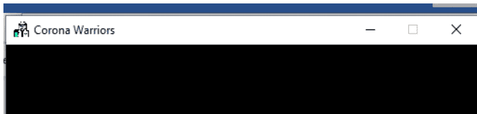

## 在屏幕上放置对象

现在我们将了解如何在屏幕上放置对象。我们通常的图形坐标系原点 (0,0) 位于左下角。而在游戏窗口中，坐标 (0,0) 位于左上角。当对象向右移动时，x 坐标值增加。当对象向下移动时，y 坐标值增加。

## 对象的位置

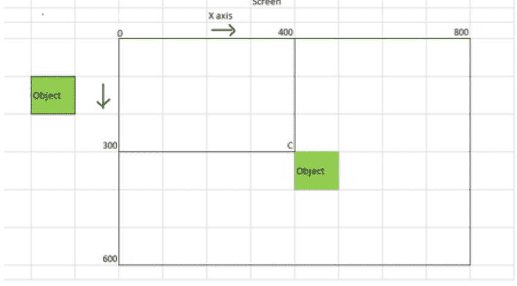

如果我们要在上述屏幕的中心放置一个点，必须将其放置在坐标 (400x, 300y)。

但如果我们把‘绿色对象’放在相同的坐标上，该对象将不会位于屏幕中心。放置在坐标 (400x, 300y) 的将是该对象的左上角。如果它必须位于屏幕中央，我们必须将对象放置在 (400-(对象宽度/2) x, 300-(对象高度/2) y)。这对任何形状的对象都适用，因为在屏幕上，每个对象都被表示为包含在一个矩形中。

## 在屏幕上绘制对象

当我们创建一个‘屏幕’时，我们创建了一个表面（surface）。我们可以在这个表面上绘制对象。让我们看看如何在屏幕上绘制一个圆并显示它。请看下面的代码：

```python
#set up the environment

import pygame
pygame.init()
import time

#set up a screen
screen = pygame.display.set_mode((500,600))
time.sleep(2)

#set up a game loop

running = True
while running:
    for event in pygame.event.get():
        if event.type == pygame.QUIT:
            running = False
    screen.fill([255,255,255])
    pygame.draw.circle(screen, (0,0,255), (250,300), 50)
    pygame.display.flip()

# quit the game

pygame.quit()
```

在程序的环境设置部分，我导入了‘time’模块。在程序的第 8 行，定义了一个宽 500 像素、高 600 像素的屏幕。它默认颜色为‘黑色’。下一行引入了 2 秒的时间延迟，这样屏幕不会立即消失，你可以看到黑色的屏幕。在游戏循环（第 19 行）中，我们将屏幕颜色更改为‘白色’。使用下一行的代码，我们在名为‘screen’的表面上绘制了一个圆。函数 `pygame.draw.circle()` 有以下参数：

- screen – 要绘制的表面
- (0,0,255) – 颜色
- (250,300) – 位置（像素坐标）
- 50 – 要绘制的圆的半径。

圆已绘制在屏幕上，但要可见，你必须‘翻转’‘覆盖层’。这通过函数 `pygame.display.flip()` 实现。执行此代码时，会出现一个黑色屏幕，然后变为白色，并在坐标 (250,300) 像素处出现一个半径为 50 像素的蓝色圆。
你可以通过更改圆和屏幕的颜色、大小和位置进行实验。你可以尝试绘制一个矩形！你可以将以下代码放在第 20 行的上方或下方进行实验。

```python
pygame.draw.rect(screen,(0,0,255),pygame.Rect(30,30,60,50))
```

请注意，位置和尺寸的参数是使用‘方法’ `pygame.Rect(location, dimension)` 给出的。

## 在屏幕上放置图像

让我们用存储在变量‘logo’中的标志图像进行实验。我们已将其放置在屏幕的标题栏上。让我们看看如何将其放置在屏幕上。要将其放置在屏幕上，我们必须将其绘制或‘blit’到屏幕上。然后我们需要‘翻转’或‘更新’它。让我们开始吧。

```python
screen.blit(logo,(0,0))
```

由于我们在循环末尾有一个‘更新’语句，更新或翻转操作已自动处理。看看屏幕上图像的大小。看看图标大小！

图像的原始大小是 512x512 像素。这就是我们在这里屏幕上看到的大小。虽然使用了相同的图像来创建图标，但 pygame 函数 `pygame.display.set_icon(logo)` 将图像压缩到了一个微小的尺寸，并将其放置在屏幕标题栏上！
因此，要在屏幕上放置图像，我们首先将其存储在一个变量中。然后通过‘blit’命令将其放置在屏幕上。最后通过 `pygame.display.flip()` 或 `pygame.display.update()` 函数显示它。

## 加载游戏资源

在我们的游戏“Corona Warriors”中，病毒是反派角色。我们现在将把病毒放置在屏幕上。我从 flaticon.com 下载了一张病毒图像，并将其保存在我们游戏文件夹中的文件‘virus.png’中。我们将使用我们现在熟悉的 `image.load()` 函数将图像加载到变量‘virus_img’中。我们将定义屏幕上放置图像位置的 x 坐标和 y 坐标。此外，我们将定义病毒的速度，以便它可以移动。我们还将创建一个简单的函数 `virus(x,y)`，它接受两个参数 x 和 y。它的功能是将图像放置在屏幕上。该函数在‘while 循环’内被调用，传入‘virus_x’和‘virus_y’作为参数。

既然反派‘病毒’已经登场，主角‘人’就不应再等待。我们也将把‘人’带到屏幕上。这是创建病毒和人的代码。

```python
#create virus
virus_img = pygame.image.load("virus.png")
virus_x = 100
virus_y = 100
virus_vel = 3
#create man
man_img = pygame.image.load("p1-1.png")
man_x = 10
man_y = 500
man_change =10
man_health =100

#create functions
def virus(x,y):
    screen.blit(virus_img, (virus_x,virus_y))
def man(x,y):
    screen.blit(man_img, (man_x,man_y))
```

我们将从一个允许免费下载和使用的网站下载合适的图像。我选择了 opengameart.com 网站。在该网站上，在游戏窗口中搜索 Kenney。Kenney 是一位伟大而慷慨的艺术家，提供免费的游戏资源。你可以选择图像组，然后下载文件。我选择了 platformer 并下载了 .zip 文件‘platformerGraphics_xenoDiversity’。它包含几张可爱人物的图像。我选择了绿色的那个，将其命名为‘pl-1.png’，并将其复制到我们的 corona 文件夹中。这张图像的大小是 67x94 像素，文件大小为 2.68 kb。我们将使用这张图像在屏幕上创建‘人’。我们已经看过了与病毒相关的代码。现在让我们检查创建‘人’的代码。

‘人’暴露在冠状病毒下。因此，我们创建了一个额外的变量‘health’来表示他的健康状况。

我们还将创建一个函数 `man(x,y)`，类似于我们为‘病毒’创建的那个，用于将‘人’放置在屏幕上。我们将在游戏循环内调用函数 `man(x,y)`，传入‘man_x’和‘man_y’作为参数。

这是我们到目前为止讨论的代码：
（与设置环境相关的前四行代码已被截断，以便在页面中包含屏幕截图）
这是屏幕现在的样子：

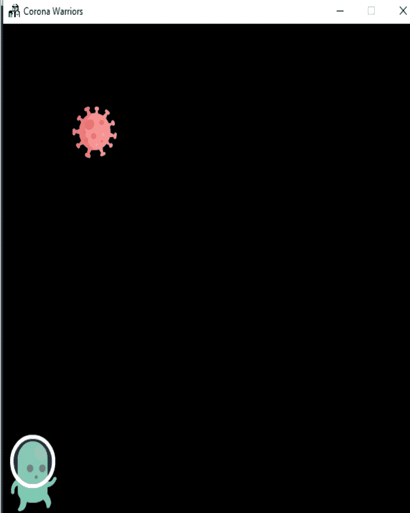

### 为屏幕创建背景图像

现在我们的屏幕是空白的。我们可以插入一张背景图片。你可以使用任何用手机拍摄的.jpg或.png照片作为背景图片！或者你也可以从像flaticon.com这样提供免费图片下载的网站下载一张。我使用了一张朋友用手机拍摄的天空图片。我已经将图片screen-a.png复制到了我们的‘corona’文件夹中。让我们看看效果如何！

我们之前使用pygame方法`pygame.image.load()`将logo图片加载到了变量‘logo’中。让我们在这里也使用同样的方法！将其存储在变量‘background’中。

```
background = pygame.image.load("screen-a.png")
```

现在，我们必须将其放置在屏幕上。我们来操作一下。

```
screen.blit(background, ((0, 0)))
```

上面的语句意思是，将存储在名为‘background’的变量中的图像‘blit’（意思是绘制）到坐标为(0,0)的位置。现在让我们保存代码并运行它！

图片显示出来了，但部分蓝色屏幕没有被覆盖。图片screen-a.png的尺寸只有800X600像素，而我们的屏幕是900x700像素。假设我们的屏幕尺寸是1400x700像素。那么，这就会成为一个真正的问题。我们必须处理这个问题，以便图像能够覆盖整个屏幕。为此，我们将在image.load()命令中使用‘transform scale’附加功能。

让我们编辑代码并运行它！

```
background = pygame.transform.scale((pygame.image.load("screen-a.png")), (WIDTH, HEIGHT))
```

现在图像填满了整个屏幕。
我们将屏幕的宽度和高度赋值给了变量，这样我们就不必每次查找并编辑所有出现宽度和高度的地方了！

## 故事梗概

既然主角和反派都已登场，我们将揭示游戏“Corona Warriors”的剧情。

## 剧情：“Corona Warrior”

‘冠状病毒’入侵了一个住宅区。但科学家们在小区周围竖起了一道紫外线墙。病毒无法进入小区。但人们必须外出谋生。他必须与病毒战斗。他装备了一把紫外线枪。他还戴着一个特殊的绿色口罩。这既能保护他，也能指示感染状态。当感染变得严重时，口罩的颜色会逐渐变为红色。警报会响起。他必须赶紧寻求医疗救助！治疗后，他将恢复活力，并戴上一个新的口罩。他必须消灭尽可能多的病毒。他能获得第二次生命吗？不！你只能活两次！但你会被铭记！

为了推进故事，我们必须构建‘病毒’和‘人’的能力。首先，我们将处理病毒的情况。

## 病毒在屏幕上的移动

我们已经将病毒放置在屏幕上。现在我们将修改代码，为其赋予沿x轴和y轴移动的独立速度。

```
virusx_vel = 3
virusy_vel = 3
```

现在，我们必须赋予病毒移动的能力。让我们在游戏循环中‘virus_load(virus_x, virus_y)’函数调用下方放置以下命令。

```
virus_x += 1
```

让我们保存代码并运行它。在每次迭代中，病毒都会在‘x+1’的位置重新绘制，你会看到病毒向右移动了1像素。在循环开始时，屏幕通过屏幕填充或图像加载被重绘。为了产生物体移动的效果，在循环的每个实例中，屏幕必须被重绘，物体在新位置绘制，并且显示更新。这个过程快速重复，从而让你产生物体在移动的感觉。如果屏幕不刷新，物体的轨迹看起来就像用蘸了颜料的刷子在屏幕上拖动。

如果速度是-1，物体将向左移动1像素。如果我们对y坐标做同样的操作：virus_y += 1，病毒将向下移动；如果速度是负数，它将向上移动。如果我们同时激活两个轴上的运动，如下所示：

```
virus_x += 1
virus_y += 1
```

病毒将沿切线方向移动。你可以尝试不同的速度和方向。

## 将病毒保持在边界内

现在，我们必须设定边界，以及病毒在屏幕上的移动模式。让我们看看如何编码。

```
virus_x += virusx_vel
if virus_x + 64 >= 800:
    virusx_vel = -virusx_vel
    virus_y += 40
elif virus_x <= 0:
    virusx_vel = 3
    virus_y += 40
```

屏幕宽度是800像素。病毒不应超出这个范围。所有物体在屏幕上看起来都像是被包含在一个矩形中。如果我们将一个物体放置在x轴的800像素处，那么放置在第800个像素处的是物体矩形的左上角，图像将超出屏幕。因此，当物体向右移动时，我们将virus_x+64像素设置为向右的极限。这里，64像素是病毒的宽度。显然，向左移动时我们没有这个问题。在屏幕左右边界处，我们重新定义了病毒在y轴上的位置为virus_y += 40。在这些点上，病毒会下落40像素。

请看看它是如何工作的。

## 随机数生成

随着游戏的发展，我们将要复制病毒。到那时，在将病毒定位在不同位置时，我们需要避免混乱并控制其移动。为此，我们将使用python中的随机数生成函数。我们必须首先将‘random module’导入pygame。我们将首先用单个病毒进行测试：

```
import random
```

python中有许多随机数生成方法。这在本书的第一部分已经解释过了。这里，我们将使用‘random.randint(start, stop, step)’。参数‘step’是可选的，我们没有必要使用它。我们将使用‘randint’修改与病毒x和y坐标相关的代码。

```
virus_x = random.randint(50, 800)
virus_y = random.randint(50, 150)
virusx_vel = 3
virusy_vel = 3
```

你可以尝试一下。你可以观察到，每次运行时病毒都会出现在不同的位置。

## 病毒的复制

为了复制病毒，我们使用以下方法。

我们通过定义以下属性创建了一个病毒副本。

```
#create virus

virus_img = pygame.image.load("virus.png")
virus_x = random.randint(50, 200)
virus_y = random.randint(50, 100)
virusx_vel = random.randint(5, 10)
virusy_vel = 10
```

我们将创建一个变量‘virus_no’来存储我们需要复制的数量。我们还将创建空列表来存储这些属性。

```
virus_img = []
virus_x = []
virus_y = []
virusx_vel = []
virusy_vel = []
virus_no = 20
for i in range(virus_no):
    virus_img.append(pygame.image.load("virus.png"))
    virus_x.append(random.randint(50, 200))
    virus_y.append(random.randint(50, 100))
    virusx_vel.append(random.randint(5, 10))
    virusy_vel.append(10)
```

在我们的例子中，’virus_no’是20。我们将创建5个列表，并使用‘for循环’和‘append’方法将20个病毒的属性存储在这些列表中。每个列表将有20个项目，索引从0到19。

我们将修改‘virus_load()’函数以包含索引‘i’。

```
def virus_load(x, y, i):
    screen.blit(virus_img[i], (x, y))
```

在‘while循环’中，我们将使用‘for循环’将图像一个接一个地放置在屏幕上，并按照以下代码所示开始逐个移动它们。

```
for i in range(virus_no):
    virus_load(virus_x[i], virus_y[i], i)
    virus_x[i] += virusx_vel[i]
    if virus_x[i] + 64 >= 800:
        virusx_vel[i] = -virusx_vel[i]
        virus_y[i] += 40
    elif virus_x[i] <= 0:
        virusx_vel[i] = random.randint(3, 5)
        virus_y[i] += 40
```

病毒的数量、它们的位置和速度可以根据我们游戏计划的要求进行调整。

## ‘人’的移动

在屏幕上，‘人’必须奔跑以逃避、战斗和应对紧急情况。他需要良好的速度。他必须能够向所有方向移动。我们将相应地赋予他技能。我们已经将他的速度定义在变量‘man_change’中，为10像素。我们将把他的向左移动与键盘上的‘a’键关联，向右与‘d’键关联，向上与‘w’键关联，向下与‘s’键关联。如果我们按住键，他将继续移动。使用键的组合，他可以沿任何切线方向移动。我们还使用‘pygame.key.get_pressed()’函数设定了他移动的边界。请看下面的代码（代码从‘while循环’的开始给出，以明确此代码块的‘缩进’。）：我们将函数的值存储在变量‘keys’中。在pygame.org网站上，有一个完整的键常量列表。网页地址如下：

https://www.pygame.org/docs/ref/key.html#pygame.key.get_focused

K_a代表‘a’键。它的状态，无论是否被按下，都由存储在变量‘keys’中的‘1’或‘0’表示。程序读取信号并相应地行动。让我们看看移动是如何发生的。

- 如果按下的键是‘a’且man_x – man_change > 0，那么只要按住该键，每次迭代‘人’都会向左移动10像素。

## 为“人物”配备激光枪

我已经下载了“激光子弹”的图片和该武器的音效文件，并将它们保存在“corona”文件夹中，分别命名为 bullet.png 和 laser.wav。激光图片的尺寸为 9x54 像素。网络上有很多网站提供免费的游戏图片和音效。你可以从任何提供免费下载且未对使用施加限制的网站下载这些图片。

现在的问题是，我们如何实现游戏中的“激光射击”部分？以下是代码。让我们详细分析一下。

```python
#bullet
bullet_img = pygame.image.load("laser.png")
bullet_x = man_x
bullet_y = man_y
bulletx_change = 0
bullety_change = 20
bullet_state = "ready"

#place the bullet on the screen
def fire_bullet(x,y):
    global bullet_state
    #bullet_state = "fire"
    screen.blit(bullet_img, (x+25,y-5))

#collision detection

def iscollision(virus_x,virus_y,bullet_x,bullet_y):
    bvdist = math.sqrt(math.pow(virus_x - bullet_x,2)+ math.pow(virus_y - bullet_y,2))
    if bvdist <28:
        return True
    else:
        return False
# setting up spacebar key to firing

    if keys[pygame.K_SPACE] :
        if bullet_state == "ready":
            bullet_sound = mixer.Sound('laser.wav')
            bullet_sound.play()
            bullet_x = man_x
            bullet_y = man_y
            bullet_state = "fire"
#bullet movement

    if bullet_state == "fire":
        fire_bullet(bullet_x, bullet_y)
        bullet_y -= bullety_change
    if bullet_y <= 0:
        bullet_y = man_y-100
        bullet_state = "ready"
```

它包含七个部分：

1.  定义激光
2.  将激光枪放置在“人物”背后的函数
3.  将射击与空格键关联
4.  射击激活
5.  判断子弹是否击中病毒的函数（碰撞检测）
6.  激光射击与命中的效果。
7.  子弹返回就绪位置。

在定义阶段，我们加载激光图片，设置其 x 和 y 坐标以及速度。`bullet_state` 被设置为 “ready”。当 `bullet_state` 为 ‘ready’ 时，激光不可见。它被加载在人物背后。当 `bullet_state` 为 ‘fire’ 时，它处于移动状态，并且可见。当我们按下空格键时，如果子弹位置是 “ready”，则将 ‘bullet_x’ 设置为 ‘man_x’，将 ‘bullet_y’ 设置为 ‘man_y’。否则，当人物移动时，他的武器不会随之移动。接下来，将 ‘bullet_state’ 设置为 ‘fire’。由于子弹移动部分的代码检测到 ‘bullet_state’ 为 ‘fire’，因此会调用 ‘fire_bullet()’ 函数，随后执行 ‘bullet_y -= bullet_change’。它将子弹绘制（‘blits’）到屏幕上，子弹向目标移动。如果子弹移动到屏幕顶部之外（如果 bullet_y < 0），它会返回到人物背后的位置。‘iscollision()’ 函数从“碰撞影响部分”被调用，如果发生碰撞，‘laser’ 会返回到人物背后，‘bullet_status’ 被设置为 ready。此时我们可以增加计分板来记录命中。我们稍后会实现计分板。被子弹击中的病毒会根据设定的参数生成到一个新的随机位置。

## 碰撞检测

请看下面的图表。我们有一个物体位于 (400x, 300y) 像素处，另一个位于 (800x, 300y) 像素处。我们将使用一个数学公式来计算这些物体之间的距离。假设 D 处的物体是子弹，C 处的物体是病毒，此时，将数值代入公式，它们之间的距离是 500 像素。由于病毒的宽度是 32 像素，如果距离小于 16 像素，我们就认为命中了。

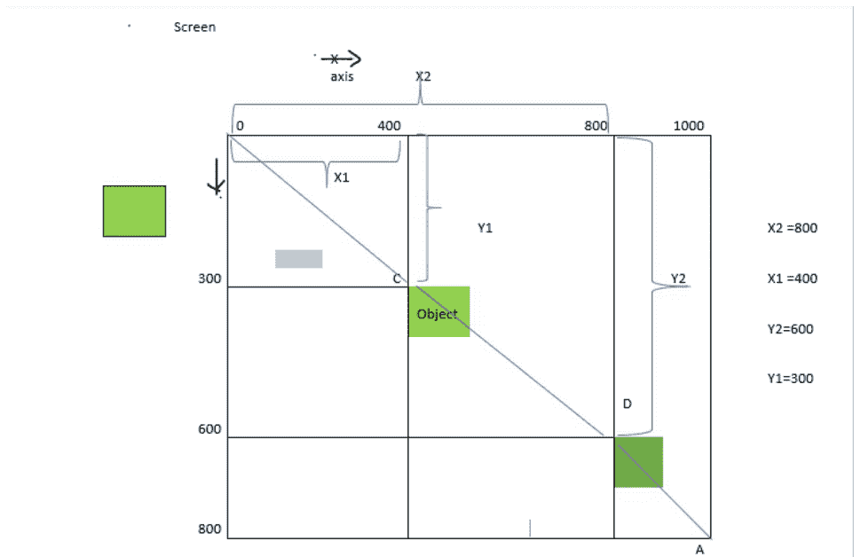

$$d = \sqrt{(x_2 - x_1)^2 + (y_2 - y_1)^2}$$

**程序是根据这个原理编码的。让我们来看看！**

**我们创建了一个函数 'iscollision()' 来检测碰撞。**

**它以物体的 x 和 y 坐标作为参数。病毒和子弹之间的距离存储在变量 'bvdist' 中。如果 'bvdist' 小于 16 像素，函数返回 'True'，否则返回 'False'。这个 16 像素的值是根据物体的大小和游戏的校正试验得出的。**

**我们将病毒和子弹碰撞相关的代码放在处理病毒移动的 'for 循环' 中。在每次迭代中都会测试每个病毒是否发生碰撞，如果碰撞为 ‘True’，则会采取某些操作。现在让我们看看这部分代码。**

代码的第一行调用 ‘iscollision()’ 函数，其结果值（True 或 False）存储在变量 ‘collision’ 中。如果 ‘collision’ 为 ‘True’，则将 ‘bullet_y’ 重置为 ‘bullet_y - 5’，这会将激光返回到人物背后。代码的下一行将 ‘bullet_state’ 设置为 “ready”。然后，由索引标识的病毒被生成到一个新位置，其新的 x 和 y 坐标由 ‘random.randint’ 方法生成。

现在我们可以保存代码并运行它。看看被击中的病毒是如何被生成到随机位置的。

## 维护计分板

现在我们必须监控子弹击中病毒的次数。为此，我们将创建一个变量 ‘score_val’ 并将其显示在屏幕上。

```python
#score
score_val = 0
font = pygame.font.Font('freesansbold.ttf',32)
text_x = 10
text_y = 10
```

Pygame 不允许你直接在屏幕上书写文本。你必须首先，用给定的字体大小创建一个字体对象。

这就是以下代码所做的：
`font = pygame.font.Font('freesansbold.ttf',32)`

接下来，你必须将文本渲染成图像，指定颜色，然后将其 ‘blit’ 到屏幕上。这是由函数 ‘display_score’ 完成的，如下所示：

```python
def display_score(x,y):
    score = font.render("Score:" + str(score_val), True,(255,255,255))
    screen.blit(score,(x,y))
```

我们将在屏幕的左上角显示分数。其坐标由变量 ‘text_x ‘ 和 ‘text_y’ 创建。让我们看看这个函数的代码。使用 pygame 中的 ‘.render’ 方法，一个表面（surface）以我们选择的字体和颜色创建，存储在变量 ‘score_val’ 中的分数被写在这个表面上。布尔值 ‘True’ 与是否使用抗锯齿有关，我们将其保留为 ‘True’。通过 ‘screen.blit’，该表面被放置在屏幕上。

现在，为了维护分数，每次子弹命中时，分数都必须增加。让我们在碰撞部分添加相应的代码。

```python
#collision between virus and bullet
collision = iscollision(virus_x[i],virus_y[i],bullet_x,bullet_y)
if collision:

    bullet_y = man_y-100
    bullet_state = "ready"
    score_val += 1
    virus_x[i] = random.randint(0,500)
    virus_y[i] = random.randint(50,100)
```

我们将在 ‘while 循环’ 内部调用这个函数。现在让我们保存并运行它！

## 提供射击音效

下一步是为子弹射击添加音效。为此，我们必须从 pygame 导入 ‘mixer’。让我们在程序的环境部分添加代码：

```python
from pygame import mixer
```

我们将加载我已经存储在游戏目录中变量 ‘bullet_sound’ 里的音效片段 laser.wav，并调用 play() 函数。让我们将这段代码放在按键部分。

```python
bullet_sound = mixer.Sound('laser.wav')
bullet_sound.play()
```

现在让我们保存并运行。
当按下空格键时，子弹会伴随着声音发射出去。

你可以看到，这个人目前被冠状病毒包围着。全世界所有暴露在外的人都戴着口罩。我们也必须为我们的战士提供一个口罩。让我们看看如何为他制作一个口罩。我们将绘制一个覆盖战士鼻子和嘴巴的矩形。我们将创建一个函数 `draw_mask()` 并在游戏循环中调用它。让我们看看代码！

```python
def draw_mask():
    pygame.draw.rect(screen,
        (255,0,0),pygame.Rect(man_x+10,man_y+45,45,15))
    pygame.draw.rect(screen,
        (0,255,0),pygame.Rect(man_x+10,man_y+45,round(45*
        health/100),15))
```

代码的第一行是做什么的？
它在屏幕上绘制一个红色的矩形。
口罩将被放置在哪里？

我们将口罩的位置与人物图像相关联，同时记住人物图像的大小，即包裹图像的矩形，是94x67像素。根据经验，大约38像素等于一厘米。

经过一些估算和试验，我们取x坐标为 `man_x+10`，y坐标为 `man_y+45`。最后两个参数45和15表示口罩的大小。现在让我们看看它是否适合我们的战士！让我们运行代码的第一行，在主循环中调用它。

所以，现在它出现了，一个红色的口罩覆盖着人的嘴巴和鼻子。但我们最初想要的是一个绿色的口罩。当人接触病毒并被感染时，它应该逐渐变成红色。

我们已经创建了一个变量 `health` 并在定义人物时为其赋值100。每次接触病毒时，健康值都应该下降，绿色的口罩应该慢慢变成红色以表示危险。这就是我们的游戏计划！让我们看看如何做到这一点！

我们将在红色口罩上放置一个相同大小的绿色口罩。我们将绿色矩形的长度与病毒接触联系起来，这反映在变量 `health` 中。让我们看看代码中的第二条语句是如何做到的：
`pygame.draw.rect(screen, (0,255,0),pygame.Rect(man_x+10,man_y+45,round(45*health/100),15))`
让我们保存并运行它！

你可以看到口罩的颜色是绿色的。但下面有一个红色的口罩。现在绿色矩形和红色矩形大小相同。这是因为健康值是100。现在，让我们改变 `health` 的值看看。

我已经将 `health` 的值改为50。现在让我们保存并运行它！口罩的50%现在是红色的，表示危险的强度。

现在我们的任务是将健康值与病毒接触联系起来。每次人物与病毒碰撞，`health` 的值都应该下降。我们已经处理了子弹和病毒之间的碰撞。我们将在同一行中编码它。让我们开始吧！

我们将创建一个函数来检测人物和病毒之间的碰撞。

```python
def ismancollision(man_x,man_y,virus_x,virus_y):
    vmdist = math.sqrt(math.pow(man_x - virus_x,2)+ math.pow(man_y - virus_y,2))
    if vmdist <40:
        return True
    else:
        return False
```

这段代码与我们为子弹-病毒碰撞创建的代码类似。如果发生碰撞，函数返回值 `True`，否则返回值 `False`。
现在我们将在游戏循环的 `for loop` 下创建一个代码段来管理人物和病毒之间的碰撞。

让我们看看代码：

```python
#collision between man and virus
collisionman = ismancollision(man_x,man_y,virus_x[i],virus_y[i])
if collisionman:
    if health >=5:
        health -= 5
    if health <5:
        health = 0
```

函数 `ismancollision()` 生成一个值，`True` 或 `False`，并将其存储在变量 `collisionman` 中。如果 `collisionman` 为 `True`，每次接触病毒，`health` 就会减少5。

此时，让我们重新审视 `draw_mask()` 函数中的第二行代码。口罩的长度定义为初始长度乘以健康值除以100。每次接触病毒，健康分数下降5，绿色矩形的长度相应减少，当健康分数变为零时，绿色口罩消失，可见的是表示危险的红色口罩。

## 当整个绿色口罩变红时会发生什么？

### 冠状病毒战士

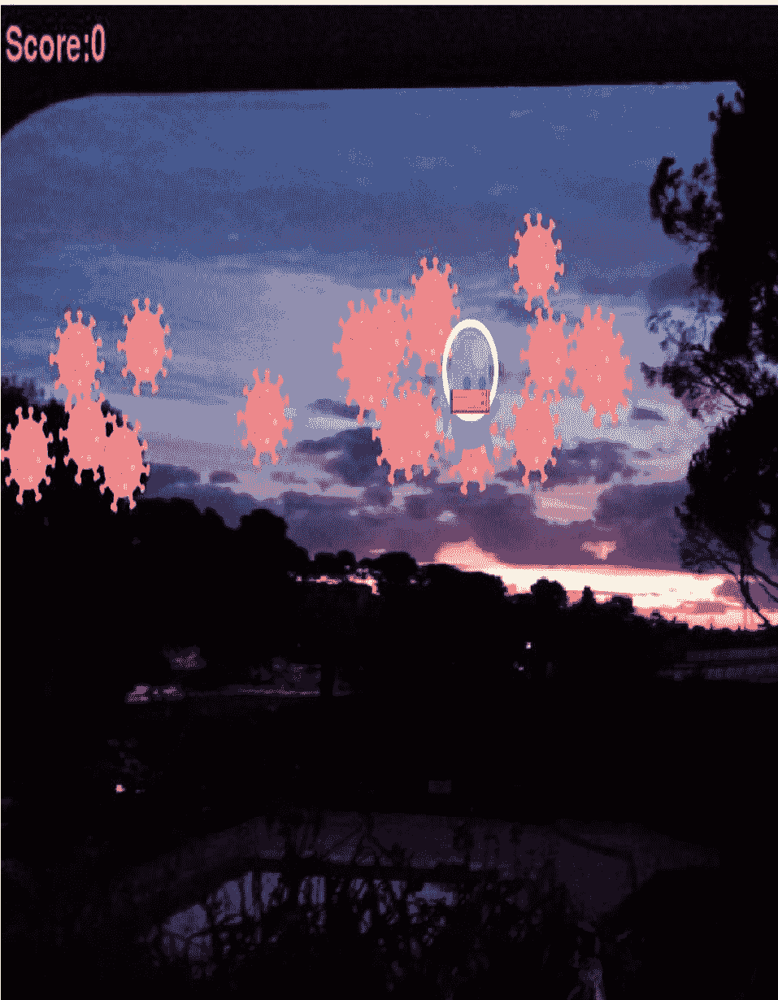

病毒在人周围盘旋。他的健康指数降至零，口罩完全变红。感染严重，他必须寻求医疗帮助。他的生命值为1，在这个关键时刻，如果他得到及时的医疗帮助，他将获得一次额外的生命。必须用蜂鸣声提醒他，并且屏幕上应该闪烁危险警告。

让我们先编码这部分。
为了实现这一点，我们必须创建两个函数，并在 `人-病毒碰撞` 代码段中添加一些内容。

首先，让我们创建函数 `emergency()`。
我们将创建 `font1` 来在屏幕上显示文本，如下所示：
`font1 = pygame.font.Font('freesansbold.ttf',40)`
然后我们将创建两个红色的文本。

第一行文本警告紧急情况，第二行发出警告：
"严重感染！请在15秒内寻求医疗帮助！"
让我们看看下面的函数 `emergency()` 的代码：

```python
def emergency():
    emergency_text = font1.render("Emergency!",True,(255,0,0))
    emergency_text1 = font1.render("Severe infection! Go for medical help in 15 seconds!",True,(255,0,0))
    screen.blit(emergency_text, (500,350))
    screen.blit(emergency_text1, (100,450))
```

`冠状病毒战士` 也应该以 `beep, beep` 的形式获得声音警报。为此，我们创建了一个函数 `beep()`。我为此目的下载了一个声音片段，并将其存储在游戏目录中的文件 `beep-02.wav` 中。要播放声音，pygame中必须有 `mixer`。当我们想给子弹发射添加声音时，我们已经在pygame中导入了 `mixer`。这是代码！

```python
from pygame import mixer
```

现在，让我们看看函数 `beep()` 的代码：

```python
def beep():
    beep_sound = mixer.Sound("beep-02.wav")
    beep_sound.play()
```

我们将声音存储在变量 `beep_sound` 中。现在我们可以使用 `sound.play()` 方法播放它。
我们还必须对 `人-病毒` 碰撞代码段进行如下添加：

```python
#collision between man and virus
    collisionman = ismancollision(man_x,man_y,virus_x[i],virus_y[i])
    if collisionman:
        if health >=5:
            health -= 5
        if health <5:
            health = 0
            if health == 0 and life_val == 1:
                beep()
                emergency()
```

最后三行是新增的。我们设置了一个 `if` 条件。`如果健康值等于零且life_val等于1` 为真，我们将从这里调用函数 `beep()` 和 `emergency()`。

我们现在将保存代码，运行它，看看它是如何工作的！
文本消息将在屏幕上闪烁，并且会响起 `beep, beep` 警报！
现在，战士必须冲向医疗援助站。

显然，我们需要建立一个医疗援助站，人物在那里获得帮助并恢复活力。他的健康值将恢复到100，口罩将变绿。他的生命值将增加到2，这是他的最后一条生命。他现在可以返回与病毒战斗。

让我们看看如何编码这个。
我创建了一个变量 `life_val` 并在其中存储了值1。

我们将在屏幕右上角显示存储在 `life_val` 中的生命值。我们为此显示定义的x和y坐标为 `lives_x` 和 `lives_y`。

请查看 `#lives` 代码段中的代码。
```python
life_val = 1
lives_x = 1250
lives_y = 10
```

我们已经创建了一个字体对象 `font` 来显示分数。我们将使用它来显示 `life_val`。我们将创建一个函数 `display_lives()`，以x和y坐标作为参数来显示 `life_val`。

```python
def display_lives(x,y):
    lives = font.render("Life:" + str(life_val), True, (255,20,147))
    screen.blit(lives, (x,y))
```

我们将 `life_val` 渲染成我们想要的颜色到变量 `lives`，并将这个表面 `blit` 到屏幕上。我们将在游戏循环中调用 `display_lives()` 函数，将 `lives_x` 和 `lives_y` 作为参数传递。`life_val` 将显示在屏幕的右上角。让我们运行代码看看效果！

现在我们将建立一个医疗援助站。
我下载了一张医疗援助站的图片，并将其作为文件 `first-aid.png` 保存在游戏目录中。让我们用下面的代码定义医疗援助站：

```python
first_aid = pygame.image.load("first-aid.png")
firstaid_x = 1150
firstaid_y = 600
```

这里，我们也将使用一个函数将其 `blit` 到屏幕上。
```python
def firstaid_display(x,y):
    screen.blit(first_aid,(x,y))
```

一旦角色在第一条生命中，健康指数为零，且面具完全变红时接触到医疗援助站，健康指数必须恢复到100。面具会自动变绿，因为我们已将绿色面具的持续时间与健康指数关联。此时他的‘life_val’应增加到2。让我们看看如何编写这些代码。首先，我们必须判断角色是否接触到了医疗援助站。为此，我们将创建一个函数‘isfirstaidcollision’。我们将使用与判断子弹-病毒和角色-病毒碰撞相同的数学公式。如果角色距离医疗援助站20像素以内，我们就认为发生了接触。让我们看看这个函数的代码：

当函数返回值‘True’时，在‘first-aid man-contact’代码段中，我们将‘life_val’从1增加到2，并将‘health’恢复到100。现在他的面具会自动变绿。

```
#firstaidcollision - contact with health aid
collisionfirstaid = isfirstaidcollision(man_x,man_y,firstaid_x,firstaid_y)
if collisionfirstaid:
    life_val = 2
    health = 100
```

这是此时游戏的截图：

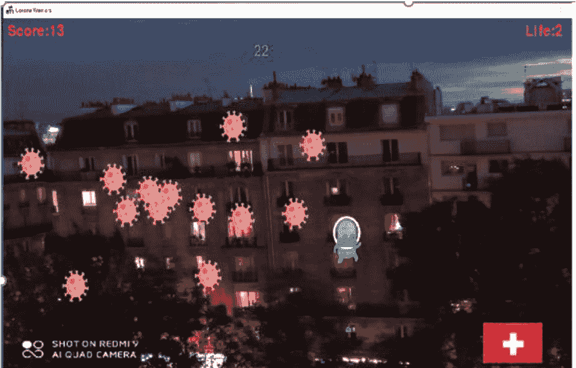

在继续推进游戏剧情之前，我想解释一下如何为游戏设置帧率。如果我们不控制帧率，游戏在两台运行速度不同的电脑上的视觉效果会完全不同。程序加载的对象和进程的数量与大小也会影响视觉效果。‘pygame’的‘time’模块提供了一系列实用工具。我们已经加载了该模块。让我们看看如何为我们的游戏实现帧率控制。

```
FPS = 30
clock = pygame.time.Clock()
```

我们创建了一个变量‘FPS’，并将目标帧率30存储在其中。我们还创建了一个对象‘clock’，并存储了一个pygame方法‘pygame.time.Clock()’。在‘while循环’中，我们放置了一个‘pygame’函数‘clock.tick()’，并将变量‘FPS’作为参数。这将控制运行过快的进程。但它受限于计算机的处理器速度、加载对象的数量和大小、编程效率等因素。因此，在设置较高的‘FPS’值时，我们必须考虑这些方面。

我们将使用pygame中的‘get_fps()’函数来计算FPS，并尝试理解其工作原理。

我将首先展示一个框架程序。它包含一个‘while循环’，其中有屏幕填充、背景图像加载和玩家图像加载的代码。该循环还响应‘q’退出事件。我们将为这个程序设置帧率，使用‘.get_fps()’方法调用它，并将其显示在屏幕上。以下是整个程序的代码：

```
#create environment
import pygame
pygame.init()
#create a screen
WIDTH = 1375
HEIGHT = 700
screen = pygame.display.set_mode((WIDTH,HEIGHT))
font = pygame.font.SysFont("Arial",80)
background = pygame.transform.scale((pygame.image.load("screen-a.png")),(400,400))
#man
man_img =pygame.image.load("pl-1.png")
man_x = 10
man_y = 400
man_change = 10
health =100

def fps():
    fr =str(int(clock.get_fps()))
    frt = font.render("FPS:"+fr,True, (255,0,0))
    screen.blit(frt, (WIDTH//2-frt.get_width()//2,10))
def man_load(x,y):
    screen.blit(man_img, (x,y))

#create a game loop
clock = pygame.time.Clock()
FPS = 80
running = True
while running:
    clock.tick(FPS)
    screen.fill((0,0,0))
    screen.blit(background, (0,0))
    man_load(man_x,man_y)
    fps()
    for event in pygame.event.get():
        if event.type == pygame.QUIT:
            running = False
    pygame.display.update()

pygame.quit()
```

因此，我们通过存储pygame方法‘pygame.time.Clock()’的结果创建了一个对象‘clock’。我们将期望的每秒80帧的帧率存储在变量‘FPS’中。在循环内部，我们使用了一个pygame方法‘clock.tick()’，并将‘FPS’作为参数来调节帧率。

我们将创建一个函数‘fps()’来调用帧率并将其显示在屏幕上，如下所示：

```
def fps():
    fr =str(int(clock.get_fps()))
    frt = font.render("FPS:"+fr, True, (255,0,0))
    screen.blit(frt, (WIDTH//2-frt.get_width()//2, 10))
```

我们使用‘clock.get_fps()’方法获取每秒帧数，将其转换为整数，并作为字符串保存在变量‘fr’中。我们使用创建的‘font’将‘FPS’渲染到变量‘frt’。然后我们使用‘screen.blit’将其放置在屏幕上。我们在游戏循环内部调用了这个函数，从而实现了FPS的显示。

我们将保存并运行它：

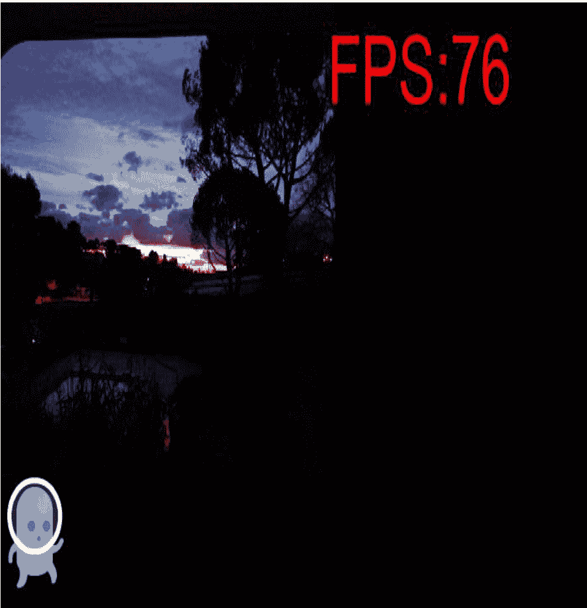

（屏幕截图已裁剪）。

它几乎给出了80的FPS（上图是某一时刻的截图）。但我们必须记住，我们是在处理器速度的限制内工作，而处理器速度也会受到加载对象的大小和数量以及运行进程的影响。让我们看一个例子。我将在调用函数‘fps()’的代码行下方添加一个打印语句。

```
print(clock)
```

现在让我们运行代码，看看影响。

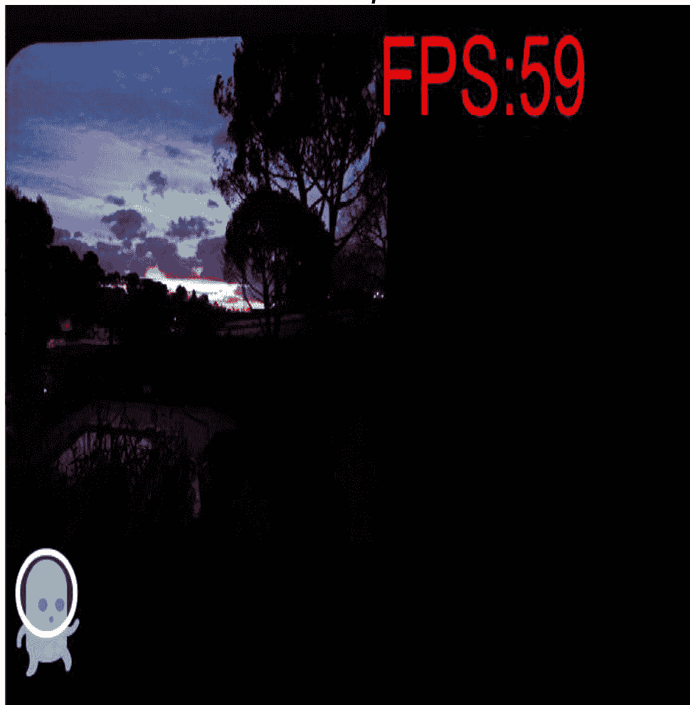

我们在代码中将FPS率维持在80，但实际FPS有所下降，现在大约是60。我只想强调，必须避免冗余，并提高编程效率以获得最佳结果。

让我们继续推进游戏剧情。恢复活力的战士，现在处于第二条生命，戴着绿色面具返回战斗。这次当面具完全变红时，游戏结束！

然后，我们必须使战士和他的枪无法移动。我们必须宣布游戏结束。为此，我们将创建一个‘game_over’函数，并在游戏循环的‘firstaid-collision’代码段中进行修改。

```
def game_over():
    over_text = font1.render("GAME OVER ! You only live twice !",True,(0,255,0))
    over_text1 = font1.render("Dedicated to: The Corona Warriors Across The World \ 
|!",True,(138,43,226))
    screen.blit(over_text, (275,350))
    screen.blit(over_text1, (50,450))
    screen.blit(gkbuddy, (600,550))
```

使用我们之前创建的‘font1’，我们将两行文本渲染到‘over_text’和‘over_text1’，将这些行‘blit’到屏幕上并显示。

我已将我们频道的标志存储为urgkbuddy.jpg，放在游戏目录中。我们使用图像加载语句（gkbuddy = pygame.image.load("gkbuddy.jpg")）将其加载到变量‘gkbuddy’。这也将显示在屏幕上。现在让我们运行代码，看看屏幕的样子。

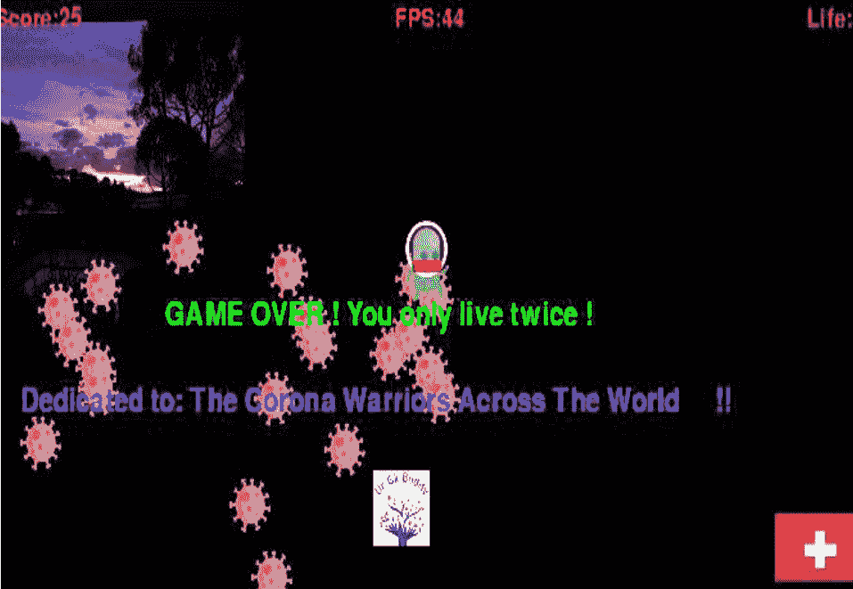

我们还有一个问题需要解决。即使宣布游戏结束，我们的战士仍然可以移动和射击。我们必须使他和他的枪无法移动。让我们来做。

我们将设置一个条件，如果life_val == 2 且 health == 0，这是我们战士当前的状态。如果这个条件为‘True’，我们将启动某些操作。目前，子弹有两个状态‘ready’和‘fire’。我们将设置一个新的状态‘dead’。这个状态不会被其他相关函数识别（这些函数只识别两个状态，‘ready’和‘fire’），并将使枪无法移动。‘man_change’是战士移动的速度。我们将把它设置为零。

这将完全限制角色的移动能力。然后，作为该代码段的最后一行，我们将调用函数‘game_over’。

```
#firstaidcollision - contact with health aid
collisionfirstaid = isfirstaidcollision(man_x,man_y,firstaid_x,firstaid_y)
if collisionfirstaid and life_val == 1:
    life_val = 2
    health = 100
elif life_val == 2 and health == 0:
    bullet_state = "dead"
    man_change = 0
    game_over()
```

这几乎完成了游戏，除了还有一些事情需要处理。释放的病毒数量是预设的，它们会逐渐离开屏幕。例如，现在我们设置的病毒数量是20。假设一个聪明的玩家，躲避了病毒，并保持他的生命完好无损。那么，将会有一段时间，屏幕上只有战士，没有病毒可以射击。我们必须处理这个问题。

然后，我们的故事是病毒正在攻击一个居民区，而我们屏幕上的背景却是宁静、无人居住的索菲亚·安提波利斯天空。

### 问题解决

在继续之前，为了与游戏剧情保持一致，我们必须对程序进行一些修改。由于故事发生在居民区，我将更换背景图片。我有一张用手机拍摄的居民区照片，存储在我们的游戏目录中。我将把加载到变量‘background’中的‘screena.png’文件替换为‘res.png’。

你可以看到索菲亚·安提波利斯的天空现在变成了居民区。这个区域现在正受到病毒的攻击。

我们面临的另一个问题是，释放的病毒数量是预设的，并且它们会逐渐离开屏幕。为了处理这个问题，当病毒在y轴上越过特定水平时，我们将在我们决定的位置将它们重新生成到屏幕上。让我们看看如何编写代码。

## 病毒的移动

```python
for i in range(virus_no):
    virus_load(virus_x[i],virus_y[i],i)
    virus_x[i] +=virusx_vel[i]
    if virus_x[i]+64 >= 800:
        virusx_vel[i] = -virusx_vel[i]
        virus_y[i] += 40
    if virus_x[i] <=0:
        virusx_vel[i] = random.randint(3,5)
        virus_y[i] += 40
    if virus_y[i] > 700:
        virus_y[i] = random.randint(50,100)
        virus_x[i] = random.randint(100,400)
        virus_x[i] +=virusx_vel[i]
```

我们使用 `for` 循环创建了列表，用于保存病毒的属性，例如图像、位置、x轴和y轴坐标，以及x轴和y轴上的速度。我们还将所需的病毒数量存储在一个变量中。然后在病毒移动部分，我们使用 `for` 循环创建了这些病毒。我们为这些病毒在屏幕左右两侧的移动设置了边界。由于y轴上的速度被设置为正值，它只能向下移动。由于在左右边界设置了40像素的下落，最终病毒会移动超过700像素并移出屏幕。为了重新生成这些病毒，我们将添加几行代码。代码的最后4行就是为此目的添加的。如果病毒在y轴上移动超过700像素，它们将被重新生成到由y轴50到100像素和x轴100到400像素定义的随机位置。因此，病毒将持续可用。这将确保有足够的病毒四处移动，给“抗疫战士”制造麻烦。

## 添加背景音乐

我们可以为游戏添加背景音乐。我们已经在环境部分使用语句 `from pygame import mixer` 导入了混音器。我们必须从免费资源中识别合适的背景音乐。我下载了一个.mp3片段，并将其保存在游戏目录中的 `kevin-macleod.mp3` 文件中。

> [ 音乐：Newer Wave by Kevin MacLeod
链接：https://incompetech.filmmusic.io/song/7016-newer-wave
许可证：http://creativecommons.org/licenses/by/4.0/]

我们将在游戏循环之前的程序主体中放置以下两行代码，为我们的游戏添加背景音乐。

```python
mixer.music.load('kevin-macleod.mp3')
mixer.music.play(-1)
```

保存并运行程序！
你现在可以享受带有背景音乐的游戏了。
这是结束画面！

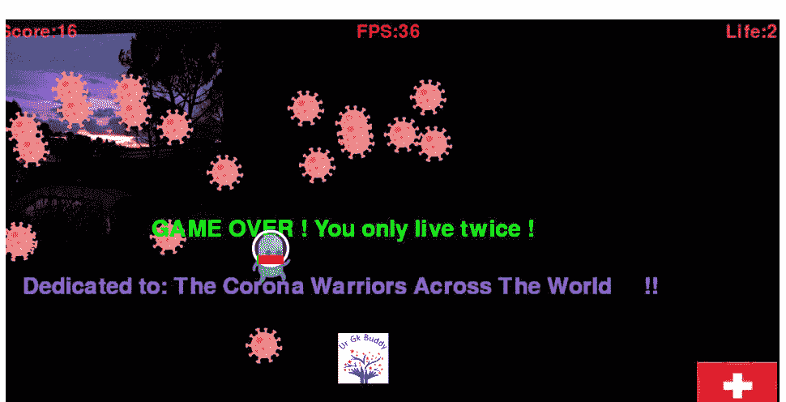

## 挑战

我将把剩余的收尾工作留给你。你可以增加病毒数量，提高病毒速度，更改随机选择的x轴和y轴范围等，从而提高游戏的难度级别。

你可以实现一个分数记录器，跟踪最高分，并将其显示在屏幕上。你还可以考虑通过提供重新游戏的选项来改进游戏。你可以尝试并改进主题。第90-95页附上的代码完全属于你！

## 后记

这本书是在“新冠时期”构思和撰写的。我的心与“抗疫战士”们同在，他们以勇气和奉献精神为我们而战，并且仍在战斗。

本书旨在介绍一些Python编程概念，同时享受游戏的乐趣。如果这能让你的大脑活跃一会儿，我的任务就完成了。

Premarajan
2021年2月1日

## 致谢

我感谢以下资源，用于引用/使用的游戏素材：来源与游戏素材：

https://www.flaticon.com/
病毒、“急救”、防护服的图像
https://opengameart.org/
Kenney 提供：“人物”、激光枪、音效片段 链接：https://incompetech.filmmusic.io/song/7016-newer-wave
背景音乐：Newer Wave by Kevin MacLeod 链接：https://incompetech.filmmusic.io/song/7016-newer-wave
许可证：http://creativecommons.org/licenses/by/4.0/
哔哔声音效片段：https://www.pacdv.com/sounds/index.html

## 游戏‘抗疫战士’的Pygame代码（235行）

```python
#create environment
import pygame
import random
import math
from pygame import mixer
pygame.init()

#create a screen
WIDTH = 1375
HEIGHT = 700
screen = pygame.display.set_mode((WIDTH,HEIGHT))
background = pygame.transform.scale((pygame.image.load("res.jpg")),(1375,700))

#colours
BLACK = (0,0,0)
RED = (255,0,0)
GREEN = (0,255,0)
BLUE = (0,0,255)
WHITE = (255,255,255)
#load and play background music
mixer.music.load('kevin-macleod.mp3')
mixer.music.play(-1)

#customise the window - images downloaded from flaticon.com
pygame.display.set_caption("Corona Warriors")
logo = pygame.image.load("safety-suit.png")
pygame.display.set_icon(logo)
gkbuddy = pygame.image.load("gkbuddy.jpg")

#man
man_img =pygame.image.load("pl-1.png")
man_x = 10
man_y = 400
man_change = 10
health =100

#create virus
virus_img = pygame.image.load("virus.png")
virus_img.convert()
virus_x = random.randint(50,200)
virus_y = random.randint(50,100)
virusx_vel = random.randint(5,10)
virusy_vel = random.randint(15,20)
virus_img = []
virus_x = []
virus_y = []
virusx_vel = []
virusy_vel = []
virus_no = 20
for i in range(virus_no):
    virus_img.append(pygame.image.load("virus.png"))
    virus_x.append(random.randint(50,200))
    virus_y.append(random.randint(50, 100))
    virusx_vel.append(random.randint(5,10))
    virusy_vel.append(10)
#bullet
bullet_img = pygame.image.load("laser.png")
bullet_x = man_x
bullet_y = man_y
bulletx_change = 0
bullety_change = 10
bullet_state = "ready"

#score display
score_val = 0
font = pygame.font.Font('freesansbold.ttf',32)
font1 = pygame.font.Font('freesansbold.ttf',40)
text_x = 10
text_y = 10

#lives
life_val =1
lives_x = 1250
lives_y = 10
#medical help
first_aid = pygame.image.load("first-aid.png")
firstaid_x =1375-150
firstaid_y =600

def display_firstaid():
    screen.blit(first_aid,(firstaid_x,firstaid_y))
def display_lives():
    lives = font.render("Life:" + str(life_val), True, (255,20,147))
    screen.blit(lives, (WIDTH-lives.get_width()-10,text_y))
def emergency():
    emergency_text = font1.render("Emergency!",True, (255,0,0))
    emergency_text1 = font1.render("Severe infection! Get medical help in 15 seconds!",True,(255,0,0))
    screen.blit(emergency_text, (WIDTH//2 - emergency_text.get_width()//2,350))
    screen.blit(emergency_text1, (WIDTH//2 - emergency_text1.get_width()//2, 450))

def beep():
    beep_sound = mixer.Sound("beep-02.wav")
    beep_sound.play()
def display_score(x,y):
    score = font.render("Score:" + str(score_val), True, (255,20,147))
    screen.blit(score, (x,y))
def virus_load(x,y,i):
    screen.blit(virus_img[i], (x,y))

def fps():
    fr = str(int(clock.get_fps()))
    frt = font.render("FPS:"+fr, True, (255,0,0))
    screen.blit(frt, (WIDTH//2-frt.get_width()//2, 10))
def man_load(x,y):
    screen.blit(man_img, (x,y))

def fire_bullet(x,y):
    global bullet_state
    #bullet_state = "fire"
    screen.blit(bullet_img, (x+25, y-5))
def draw_mask():
    pygame.draw.rect(screen, (255,0,0), pygame.Rect(man_x+10, man_y+45, 45, 15))
    pygame.draw.rect(screen, (0,255,0), pygame.Rect(man_x+10, man_y+45, round(45*health/100), 15))
def iscollision(virus_x, virus_y, bullet_x, bullet_y):
    bvdist = math.sqrt(math.pow(virus_x - bullet_x, 2) + math.pow(virus_y - bullet_y, 2))
    if bvdist < 20:
        return True
    else:
        return False
def ismancollision(man_x, man_y, virus_x, virus_y):
    vmdist = math.sqrt(math.pow(man_x - virus_x, 2) + math.pow(man_y - virus_y, 2))
    if vmdist < 40:
        return True
    else:
        return False

def isfirstaidcollision(man_x, man_y, firstaid_x, firstaid_y):
    madist = math.sqrt(math.pow(man_x - firstaid_x, 2) + math.pow(man_y - firstaid_y, 2))
    if madist < 20:
        return True
    else:
        return False
def game_over():
```

python
136    over_text = fontl.render("游戏结束！你只有两次生命！",True,(0,255,0))
137    over_text1 = fontl.render("献给：全球的抗疫勇士们 \n138    !!",True,(138,43,226))
139    screen.blit(over_text,(275,350))
140    screen.blit(over_text1,(50,450))
141    screen.blit(gkbuddy,(600,550))
142
143    #创建游戏循环
144
145    running = True
146    clock = pygame.time.Clock()
147    FPS = 60
148    while running:
149
150
151        screen.fill((0,0,0))
152        screen.blit(background,(0,0))
153        clock.tick(FPS)
154        display_score(text_x,text_y)
155        display_lives()
156        display_firstaid()
157        fps()
158        for event in pygame.event.get():
159            if event.type == pygame.QUIT:
160                running = False
161        keys =pygame.key.get_pressed()
162        if keys[pygame.K_a] and man_x - man_change>0:
163            man_x -= man_change
164        if keys[pygame.K_d] and man_x + man_change+ man_img.get_width()<1300:
165            man_x += man_change
166        if keys[pygame.K_w] and man_y - man_change>0:
167            man_y -= man_change
168        if keys[pygame.K_s] and man_y + man_change+man_img.get_height()<HEIGHT:
169            man_y += man_change
170        if keys[pygame.K_SPACE] :
171
172            if bullet_state == "ready":
173                bullet_sound = mixer.Sound('laser.wav')
174                bullet_sound.play()
175                bullet_x = man_x
176                bullet_y = man_y
177                bullet_state = "fire"
178        #病毒的移动
179        for i in range(virus_no):
180            virus_load(virus_x[i],virus_y[i],i)
181            virus_x[i] +=virusx_vel[i]
182            if virus_x[i]+64 >= 800:
183                virusx_vel[i] = -virusx_vel[i]
184                virus_y[i] += 40
185            if virus_x[i] <=0:
186                virusx_vel[i] = random.randint(3,5)
187                virus_y[i] += 40
188            if virus_y[i] > 700:
189                virus_y[i] = random.randint(50,100)
190                virus_x[i] = random.randint(100,400)
191                virus_x[i] +=virusx_vel[i]
192
193
194        #病毒与子弹的碰撞
195            collision = iscollision(virus_x[i],virus_y[i],bullet_x,bullet_y)
196            if collision:
197
198                bullety = man_y-100
199                bullet_state = "ready"
200                score_val += 1
201                virus_x[i] = random.randint(0,500)
202                virus_y[i] = random.randint(50,103)
203
204        #人物与病毒的碰撞
205            collisionman = ismancollision(man_x,man_y,virus_x[i],virus_y[i])
206            if collisionman:
207                if health >=5:
208                    health -= 5
209                if health <5:
210                    health = 0
211                if health == 0 and life_val == 1:
212                    beep()
213                    emergency()
214        #急救包碰撞 - 接触医疗援助
215            collisionfirstaid = isfirstaidcollision(man_x,man_y,firstaid_x,firstaid_y)
216            if collisionfirstaid and life_val == 1:
217                life_val = 2
218                health = 100
219            elif life_val == 2 and health == 0:
220                bullet_state = "dead"
221                man_change = 0
222                game_over()
223
224        #子弹移动
225
226        if bullet_state == "fire":
227            fire_bullet(bullet_x, bullet_y)
228            bullet_y -= bullety_change
229        if bullet_y <= 0:
230            bullet_y = man_y-100
231            bullet_state = "ready"
232        man_load(man_x,man_y)
233        draw_mask()
234        pygame.display.update()
235
236    pygame.quit()