# 使用Python学习自主编程

利用Python在人工智能、机器学习、深度学习和机器人流程自动化方面的能力

Varun P Divadkar

[www.bpbonline.com](http://www.bpbonline.com)

2024年第一版

版权所有 © BPB Publications, India

ISBN: 978-93-55517-630

*保留所有权利*。未经出版商事先书面许可，不得以任何形式或任何方式复制、分发或传播本出版物的任何部分，也不得将其存储在数据库或检索系统中，但程序清单除外，这些清单可以输入、存储和执行在计算机系统中，但不能通过出版、影印、录音或任何电子和机械手段进行复制。

## 责任限制与免责声明

本书所含信息根据作者和出版商的最佳知识判断是真实准确的。作者已尽一切努力确保这些出版物的准确性，但对于因本书中任何信息而引起的任何损失或损害，出版商不承担任何责任。

本书中提及的所有商标均被确认为其各自所有者的财产，但BPB Publications无法保证这些信息的准确性。

## 献给

本书的每一位认真读者

## 关于作者

在跨越12年以上、横跨六家跨国组织的多元化职业生涯中，**Varun P Divadkar** 因其在Python编程应用方面的交付专长，为人工智能、机器学习、深度学习和机器人流程自动化等前沿领域的各种全球技术功能项目做出了贡献，从而享有盛誉。他拥有MIT颁发的金牌机械工程师资格，这赋予了他独特的逻辑推理能力和定量分析能力。这进一步使他能够以陡峭的学习曲线掌握关键的数学和技术概念，从而指导学生和专业人士在探索这些前沿领域的旅程中前进。

他的职业生涯始于著名的塔塔集团，在工程服务领域的制造部门工作，参与了工程设计的自动化。此后，他在金融咨询巨头安永和德勤工作了5年以上，有幸在华尔街、纽约曼哈顿这一全球金融中心以及加利福尼亚洛杉矶这一文化重镇工作。在印度，他曾在孟买、班加罗尔、钦奈、海得拉巴和浦那等主要商业中心工作，从而拓展了他多元化的职业网络。最近，他曾在三家银行机构工作，目前在一家大型全球商业银行担任副总裁，领导机器学习和生成式人工智能项目。

## 关于审稿人

**Jyant** 是一位充满热情的数据爱好者，拥有大湖区大学人工智能研究生学位，他在埃森哲开始了他的IT职业生涯，在那里磨练了他在SAP BODS、SQL、PYTHON和Excel方面的技能，服务于美国零售客户。后来，在Impact Analytics，他深入研究了包括R、Python、SQL、AWS、GCP、GUROBI等在内的多样化技术栈，同时提升了他的人际交往能力。

在Sapient任职期间，Jyant领导团队交付了从价格优化到电影推荐和信用评分模型等一系列产品，运用了包括Python、R、高级SQL、Superset、Airflow、Git、Azure、Pyspark等在内的多功能工具包。

目前，作为Zscaler的领导者，Jyant主导开发两个关键模型：一个流失率模型和一个由AWS LEX驱动的创新聊天机器人。他的专业知识扩展到LLm、Rag和ReAct提示集成，同时利用SQLAlchemy增强聊天机器人的功能。

Jyant擅长应对各种挑战，擅长创建用于促销优化的回归模型，利用Seaborn和Matplotlib进行广泛的探索性数据分析，并应用CNN和RESNET50进行图像属性标记。他还拥有使用NLP进行数据提取、使用Lightfm神经网络模型开发电影推荐引擎，以及使用银行和零售数据构建复杂的定价优化和信用评分模型的经验。

## 致谢

当BPB Publications联系我，给我机会撰写这本精彩的书时，我感到非常兴奋。我要感谢BPB Publications的所有审稿人、技术专家和编辑在整个旅程中提供的宝贵支持和指导，使这次经历变得非常有价值。

我要感谢全球数据科学开源社区的慷慨和持续努力，他们提供了大量的库和免费在线阅读材料，使人们能够利用他们的显著学习成果并融入有价值的输入。

最后但同样重要的是，我要感谢所有感兴趣的读者，是他们激发了我创作这本书的动力和灵感。

## 前言

当代工业见证了前所未有的技术增长，其特点是大数据、物联网、人工智能、机器学习、深度学习和机器人流程自动化的出现。这不可避免地要求专业人士提升自身技能，以跟上这一不断变化的行业趋势。

本书的唯一目的是为学生和专业人士提供一个跳板，通过利用Python的显著力量进入这些领域。

随着读者逐步深入本书，他们将踏上一段激动人心的学习曲线，在拿起Python编辑器编写代码之前，先熟悉初步的领域特定概念。第一章将是一个复习，展示Python在当前场景中的重要性，随后的章节将专注于各个主题。每章都将遵循一个一致的顺序：首先概述基本概念，然后进行相应的Python练习。在必要时，还提供了安装所需软件的详细指导。

每章都将以一个与行业相关的Python用例结束。这些用例是提升个人价值潜力的宝贵练习，其设计考虑了当今行业的需求以及满足这些需求所需的重要技能和能力。

本书旨在为希望将Python编程能力提升到新水平的学生和专业人士提供行业相关的价值增值。本书也应作为快速参考特定领域基本概念的最佳手册。

本书无疑将使读者在Python自动化领域充满热情，并引导读者的思维过程朝着正确的方向发展，以继续构建增值的Python应用程序。

## 第1章：为什么选择Python进行自动化？

- 本章概述了为什么Python是构建人工智能、机器学习、深度学习等热门领域增值应用的首选编程语言。它将讨论Python作为开源语言的固有优势，然后重点介绍常用的Python库。

## 第2章：RPA基础

- 本章向读者介绍机器人流程自动化的基本概念，并讨论RPA的各种组成部分。随后，概述了RPA行业的领导者，如UiPath、Automation Anywhere和Blueprism。本章将向用户介绍Python的‘rpa’库，并以一个有趣的实际用例结束。

## 第3章：Python中的AI/ML入门

- 本章让读者快速入门人工智能、机器学习和深度学习的基本概念。讨论了经典的机器学习算法，然后介绍了深度学习学习、神经网络、神经网络的类型及其应用，例如自然语言处理。

## 第四章：自动化网页抓取

- 本章向读者介绍使用 Python 库 ‘requests’ 和 ‘beautiful soup’ 从网络中提取数据的过程。数据是所有应用的核心组成部分，本章提供了一种利用网络访问数据的实用方法。

## 第五章：自动化 Excel 和电子表格

- 本章重新审视了 Excel 自动化领域，重点介绍了 Python 在加速该过程中所扮演的核心角色。将分别讨论 ‘openpyxl’、‘xlwings’ 和 ‘xlsxWriter’ 这些库，随后是一个 Python 实际用例，该用例将展示将它们组合使用的美妙之处。

## 第六章：自动化电子邮件和消息传递

- 本章进入了电子邮件和社交媒体消息传递的领域，展示了 Python 库通过 Gmail 和 Whatsapp 发送快速消息的能力。

## 第七章：处理 PDF 和图像

- 本章通过展示从 PDF 文档中读取数据的能力，扩展了 Python 的功能。本章进一步讨论了光学字符识别（OCR）的概念，并说明了 ‘pytesseract’ 和 ‘OpenCV’ 如何通过从图像中读取数据来实现这一目标。

## 第八章：机械化应用程序、文件夹和操作

- 本章介绍了 Python 中的 ‘os’ 和 ‘shutil’ 模块，这些模块使得自动化读取、写入和移动文件及文件夹的过程成为可能，随后介绍了用于自动化计算机鼠标操作的 ‘PyAutoGUI’ 和 ‘PyWinAuto’ 库。

## 第九章：智能自动化第一部分：使用机器学习

- 本章通过深入探讨各种机器学习算法，并展示使用 Python 库进行平滑实现，将概念整合到机器学习中。本章涵盖了监督学习和无监督学习方法，并以一个 Python 实际用例结束，该用例使用户熟悉独立构建机器学习 Python 应用程序的过程。

## 第十章：智能自动化第二部分：使用深度学习

- 本章重新审视了神经网络的概念，并从零开始在 Python 中实现了一个基本的神经网络。使用感知器阐述了反向传播的概念。随后讨论了 ‘TensorFlow’ 和 ‘PyTorch’ 库，接着讨论了自然语言处理（NLP）。一个有趣的 Python 实际用例为本章画上了句号。

## 第十一章：自动化业务流程工作流

- 本章首先介绍了编排的概念，这基本上是工作流自动化，也可以被视为自动化的自动化。随后将讨论 ‘luigi’ 和 ‘prefect’ 模块，这些模块使得实现编排成为可能。

## 第十二章：超级自动化

- 本章讨论了超级自动化这一新概念，它基本上是将机器学习、RPA 和其他 AI 工具与常规自动化相结合的应用。本章将从不同的角度重新审视 NLP 和 RPA 主题。

## 第十三章：Python 和 UiPath

- 本章基于 RPA 工具 UiPath 的基本概念，阐述了 Python 在增强其能力方面所扮演的重要角色。本章将详细介绍实现 UiPath 与 Python 集成所需的设置和环境。

## 第十四章：构建自动化项目架构

- 本章概述了在构建自动化项目架构时需要处理的各种组件。本章详细讨论了虚拟环境和 ‘pip’ 命令的概念。

## 第十五章：PyScript 框架

- 本章向读者介绍了一个名为 ‘PyScript’ 框架的 Python 进行中的项目，该框架本质上通过允许在 HTML 脚本中嵌入 Python 代码来增强其潜力。本章对于具有 Javascript 背景的开发者来说将是令人兴奋的，并将为他们提供一种从不同角度进行实验的功能。

## 第十六章：Python 中的测试自动化

- 本章通过讨论通常也出现在开发周期末尾的主题——测试，为本书画上了句号。本章详细阐述了 ‘Selenium’、‘PyTest’ 和 Robot Framework，这些工具能够实现测试过程的平滑自动化。

## 代码包和彩色图片

请按照以下链接下载本书的 **代码包** 和 **彩色图片**：

[https://rebrand.ly/nh3wzsj](https://rebrand.ly/nh3wzsj)

本书的代码包也托管在 GitHub 上：[https://github.com/bpbpublications/Learn-Autonomous-Programming-with-Python](https://github.com/bpbpublications/Learn-Autonomous-Programming-with-Python)。

如果代码有任何更新，将在现有的 GitHub 仓库中进行更新。

我们丰富的书籍和视频目录中提供了代码包，地址为 [https://github.com/bpbpublications](https://github.com/bpbpublications)。请查看！

## 勘误

我们在 BPB Publications 为自己的工作感到无比自豪，并遵循最佳实践以确保内容的准确性，为订阅者提供沉浸式的阅读体验。我们的读者是我们的镜子，我们利用他们的反馈来反思并改进出版过程中可能出现的任何人为错误。为了让我们保持质量并帮助我们联系到任何可能因任何不可预见的错误而遇到困难的读者，请写信给我们：

[errata@bpbonline.com](mailto:errata@bpbonline.com)

BPB Publications 大家庭非常感谢您的支持、建议和反馈。

您知道吗？BPB 提供每本出版书籍的电子书版本，提供 PDF 和 ePub 文件？您可以在 [www.bpbonline.com](http://www.bpbonline.com) 升级到电子书版本，作为纸质书客户，您有权获得电子书副本的折扣。请联系我们：

[business@bpbonline.com](mailto:business@bpbonline.com) 了解详情。

在 [www.bpbonline.com](http://www.bpbonline.com)，您还可以阅读一系列免费技术文章，注册各种免费通讯，并获得 BPB 书籍和电子书的独家折扣和优惠。

## 盗版

如果您在互联网上以任何形式发现我们作品的任何非法副本，如果您能提供位置地址或网站名称，我们将不胜感激。请通过 [business@bpbonline.com](mailto:business@bpbonline.com) 联系我们，并附上材料的链接。

## 如果您有兴趣成为作者

如果您在某个主题上拥有专业知识，并且有兴趣撰写或参与一本书，请访问 [www.bpbonline.com](http://www.bpbonline.com)。我们已经与成千上万的开发者和技术专业人士合作，就像您一样，帮助他们与全球技术社区分享他们的见解。您可以提交一般申请，申请我们正在招募作者的特定热门主题，或提交您自己的想法。

## 评论

请留下评论。一旦您阅读并使用了本书，为什么不在您购买它的网站上留下评论呢？潜在的读者可以看到并利用您公正的意见来做出购买决定。我们 BPB 可以了解您对我们产品的看法，我们的作者也可以看到您对他们书籍的反馈。谢谢！

有关 BPB 的更多信息，请访问 [www.bpbonline.com](http://www.bpbonline.com)。

## 加入我们书籍的 Discord 空间

加入书籍的 Discord 工作区，获取最新更新、优惠、全球科技动态、新书发布以及与作者的交流会：

[https://discord.bpbonline.com](https://discord.bpbonline.com)


## 目录

1.  为什么选择Python进行自动化？
    -   引言
    -   结构
    -   目标
    -   Python作为一门开源语言
    -   Python丰富的库资源
    -   Python作为高级语言
    -   Python的可移植性
    -   Python的显著优势
    -   结论

2.  RPA基础
    -   引言
    -   结构
    -   目标
    -   机器人流程自动化的历史
    -   什么是RPA
    -   RPA的组成部分
    -   市场上各种RPA工具
    -   各种RPA工具的比较
    -   RPA Python包
    -   RPA与Python结合的实际用例
    -   结论

3.  Python中的AI/ML入门
    -   引言
    -   结构
    -   目标
    -   AI的背景与历史
    -   机器学习概念
    -   监督学习与无监督学习
    -   常用的Python机器学习库
    -   强化学习
    -   深度学习
    -   神经网络简介
        -   神经网络的类型
    -   自然语言处理
    -   Transformer与大型语言模型
    -   结论

4.  自动化网络爬虫
    -   引言
    -   结构
    -   目标
    -   什么是网络爬虫
    -   常用的Python网络爬虫库
        -   Python中的`requests`模块
        -   Beautiful Soup库
        -   检查网页
        -   从网页中提取信息
    -   网络爬虫的法律考量
    -   Python中的实际用例
    -   结论

5.  自动化Excel与电子表格
    -   引言
    -   结构
    -   目标
    -   使用Python自动化Excel的必要性
    -   openpyxl库简介
    -   打开并修改现有工作簿
    -   使用Range名称访问单元格
    -   合并单元格
    -   遍历单元格
    -   使用openpyxl处理Excel公式
    -   使用openpyxl创建图表
    -   设置图表样式
    -   其他用于Excel自动化的Python库
    -   Python库比较总结
    -   Python中的实际用例
    -   结论

6.  自动化电子邮件与消息
    -   引言
    -   结构
    -   目标
    -   Gmail自动化的前提条件
    -   为Gmail开启两步验证
    -   获取应用专用密码
    -   使用Python发送Gmail消息
    -   自动化WhatsApp消息
    -   Python中的实际用例
    -   结论

7.  处理PDF与图像
    -   引言
    -   结构
    -   目标
    -   PyPDF库
    -   使用PyPDF2读取PDF文件
    -   旋转与合并PDF文件
    -   使用PIL库处理图像
    -   光学字符识别
    -   使用OpenCV
    -   Python中的实际用例
    -   结论

8.  机械化应用程序、文件夹与操作
    -   引言
    -   结构
    -   目标
    -   Python中的`os`模块
    -   Python中的`shutil`模块
        -   使用`shutil`复制与移动文件
        -   使用`shutil`根据扩展名移动文件
    -   使用PyAutoGUI库
        -   使用PyAutoGUI实现基本鼠标功能
        -   使用PyAutoGUI实现基本键盘功能
        -   使用PyAutoGUI探索消息框功能
    -   Python中的实际用例
    -   结论

9.  智能自动化第一部分：使用机器学习
    -   引言
    -   结构
    -   目标
    -   使用Python实现监督机器学习算法
        -   线性回归
    -   机器学习模型的关键概念
    -   逻辑回归
    -   K近邻
    -   朴素贝叶斯
    -   支持向量机
    -   决策树
    -   使用Python实现无监督学习算法
        -   降维
        -   主成分分析
        -   线性判别分析
        -   K均值聚类
    -   Python中的实际用例
    -   结论

10. 智能自动化第二部分：使用深度学习
    -   引言
    -   结构
    -   目标
    -   在Python中实现神经网络
    -   反向传播
    -   常用的Python深度学习库
    -   深度学习应用
    -   自然语言处理
    -   Python中的实际用例
    -   结论

11. 自动化业务流程工作流
    -   引言
    -   结构
    -   目标
    -   理解业务流程工作流
    -   编排简介
    -   自动化与编排：区别
    -   市场上可用的编排平台
    -   使用Python实现编排
        -   Prefect
        -   Luigi
    -   Python中的实际用例
    -   结论

12. 超级自动化
    -   引言
    -   结构
    -   目标
    -   定义超级自动化：它是什么以及为何重要
        -   超级自动化周期：关键步骤与流程
        -   探索超级自动化的典型用例
        -   使用光学字符识别增强文档理解
    -   实现对话代理：聊天机器人的角色
    -   通过机器人流程自动化提升效率
    -   应对超级自动化的挑战
    -   Python中的实际用例
    -   结论

13. Python与UiPath
    -   引言
    -   结构
    -   目标
    -   在UiPath中设置Python环境
    -   探索UiPath中的Python活动
    -   创建Python脚本
    -   将Python与UiPath集成
    -   结论

14. 架构自动化项目
    -   引言
    -   结构
    -   目标
    -   虚拟环境简介
        -   设置虚拟环境
        -   虚拟环境目录概览
        -   涉及虚拟环境的其他考量
    -   重新审视Python PIP
        -   使用pip执行基本操作
        -   处理`requirements.txt`文件
        -   使用Docker进行容器化
    -   结论

15. PyScript框架
    -   引言
    -   结构
    -   目标
    -   PyScript简介
    -   使用PyScript创建基本网页
    -   向网页添加可运行的Python代码
    -   在PyScript中使用第三方库
    -   在PyScript中引用外部Python文件
    -   结论

16. Python中的测试自动化
    -   引言
    -   结构
    -   目标
    -   Selenium简介
        -   设置Selenium Python API
        -   使用Selenium Python API探索Web自动化
    -   Pytest库
        -   Pytest的优势与局限性
    -   Python Robot Framework
        -   在Python Robot Framework中运行测试用例
    -   结论

# 索引

# 第1章
## 为什么选择Python进行自动化？

### 引言

本章向读者介绍Python作为一门开源语言的重要性，并进一步深入解释为何它是自主编程中最强大、最可靠的工具。本章强调了Python固有的灵活性、适应性和用户友好性，这归功于其作为高级语言和简洁的语法。本章还深入探讨了Python的灵活性、适应性考量，以及作为语法简单的高级语言所带来的易用性。在本章后续部分，将讨论Python丰富的库，如`Pandas`、`NumPy`、`Matplotlib`，这些库对于机器学习至关重要。在后续章节中，我们将深入探讨这些库的实际应用。

### 结构

本章涵盖以下主题：

## 学习目标

本章结束后，你将清晰地理解，尽管编程语言的浩瀚海洋中存在无数其他选择，为何Python仍被选为自主编程的语言。

## Python作为一门开源语言

恭喜你选择了最佳起点，开启用Python学习自主编程的旅程！正如本书书名所示，故事的核心建立在Python语言之上。本章将准确告诉你，为何Python被选为构建自主编程大厦的最佳工具。

让我们暂时将Python放在一边，先理解它的第一个优势。假设你希望创建一个小型应用程序，能自动从一些原始的Excel数据块生成Excel报告。你咨询了一位精通C++、JAVA和Visual Basic算法编写的朋友。他建议你使用这些语言中任一种的API来构建你的应用程序。当你同意朋友的建议后，遇到的第一个障碍是意识到这项工作无法轻松免费完成，你必须购买相应平台的某些许可证。现在，你在别处寻找希望，研究了一下Python，发现Python没有任何此类成本限制！

这就是使用Python的第一个巨大优势。Python是一门开源语言，这意味着其源代码可自由获取、分发和修改，使其成为开发和维护代码以及与全球社区共享的首选语言。这正是Python成为构建众多库的首选工具的原因，我们很快将讨论这些库。

## Python丰富的库资源

Python提供了丰富的库，这些库本质上是可重用的代码片段，数据科学家用它们来进一步构建自己的应用程序。最受欢迎的库及其简要描述如下：

- **NumPy：** 这是Python最受欢迎的库之一，用于处理大型矩阵。它是**Numerical Python**的缩写。该库构成了科学计算的核心，也是TensorFlow和SciPy等其他高级机器学习库的构建模块。
- **Pandas：** 这个库是Python的关键产品之一。pandas DataFrame是使人们能够以表格格式处理数据的基本单元。它允许人们从原始数据源读取数据为DataFrame，使用多种内置方法对其进行转换，并将数据导出到各种其他应用程序。
- **Matplotlib：** 数据可视化已成为快速洞察原始数据和转换后数据的当务之急。matplotlib库通过提供绘制各种图表（如饼图、直方图和散点图）的能力，出色地帮助人们从数据中获取有价值的见解。

主要用于数据科学、机器学习和深度学习应用的其他Python库总结如下，但将在后续相关章节中详细讨论。然而，这不是一个详尽的列表，实际章节的练习将讨论更多库。

- **TensorFlow：** 这是一个高级深度学习库，用于执行数学和物理中的复杂计算。
- **Beautiful Soup：** 这是一个流行的Python网络爬虫库。网络爬虫是从网络上自动化数据收集的过程。Beautiful Soup通过支持从HTML和XML文件中提取数据来实现这一目标。
- **Scrapy：** 这是一个用于网络爬虫的开源Python库。
- **Json：** 这是一个Python包，为处理JSON（JavaScript对象表示法）对象提供了有用的工具。
- **SciPy：** SciPy是Scientific Python的缩写。它建立在NumPy之上，用于科学计算。
- **Scikit-learn：** 这通常用于实现机器学习算法，如回归、分类和聚类。
- **PyPDF：** 用于读取和转换PDF文件。
- **Openpyxl：** 用于Excel自动化的Python库。
- **Pywhatkit：** 用于发送WhatsApp消息的Python库。
- **OpenCV：** 用于计算机视觉应用的Python库。

## Python作为一门高级语言

回到JAVA和C++，要使用这些语言开发应用程序，需要熟悉其语法并了解内存管理方面的考虑。这类语言属于低级或中级语言的范畴。然而，Python讲述了一个不同的故事。其语法极其简单，甚至可以说称其为伪代码的扩展版本也不为过！

这正是Python成为全球程序员在机器学习和深度学习领域部署开源项目的首选工具的原因。Python为开发者提供了这种灵活性和便利，使他们可以只专注于算法，而无需担心除某些标准数据类型所需之外的任何额外括号或分号。

尽管语法如此简单，Python仍然保持着作为一门**面向对象编程（OOP）**语言的权威，并展现出面向对象语言的所有属性，如抽象、封装、多态和继承。

## Python的可移植性

编程语言的可移植性是指无需修改即可在不同机器或平台上使用该语言代码的能力。例如，如果你在Windows机器上编写了Python代码，想在Linux或Mac上运行它，无需做任何更改。这就是Python作为可移植语言的魅力所在。然而，在某些情况下，需要注意避免平台特定的依赖或行为。尽管如此，Python对可移植性的强调及其庞大的标准库，使其比许多其他语言更容易编写跨平台代码。

## Python的显著优势

Python的其他重要优势如下：

- **动态类型语言：** Python是一门动态类型语言，这意味着无需事先指定变量的数据类型。变量的数据类型在运行时确定。
- **庞大的社区：** Python语言在全球拥有庞大的开发者社区，他们致力于相互帮助和指导，共同推动这一前景和倡议。因此，由于这个庞大的社区，可以快速获得与Python相关的任何支持。
- **支持多种编程范式：** Python是支持多种编程范式的语言之一，即命令式、函数式、过程式和面向对象，从而增加了用户的灵活性。
- **可扩展性：** Python处理大量数据的能力使其成为一门可扩展的编程语言。
- **可嵌入性：** 可以从用另一种语言编写的应用程序中执行Python代码，从而使其可嵌入。
- **可扩展性：** 可以通过用另一种编程语言编写代码并将其与Python代码链接，从而为Python代码添加新功能，使Python成为一门可扩展的语言。

## 结论

既然我们知道了Python为何成为首选，我们还在等什么！在下一章中，我们将向你介绍激动人心的**机器人流程自动化（RPA）**技术领域，并见证Python在独立执行RPA流程中的强大能力。事不宜迟，让我们通过进入下一章关于RPA基础的内容来开启我们的旅程吧！

## 加入本书的Discord空间

加入本书的Discord工作区，获取最新更新、优惠、全球科技动态、新书发布以及与作者的交流会：
[https://discord.bpbonline.com](https://discord.bpbonline.com)


# 第2章
## RPA基础

### 引言

本章旨在为**机器人流程自动化（RPA）**奠定基础，这是当前行业的标志性技术之一。如今，人力资源部门可以便捷地利用RPA技术自动筛选候选人并审核其简历，从而节省大量人工操作时间。本章将带领读者了解机器人技术的历史背景与发展历程，以及它如何推动行业演进至当前的RPA状态。为了帮助读者熟悉相关概念，本章以清晰的方式阐述了RPA的组成部分。同时，本章还介绍了RPA市场中的主要行业领导者，如Automation Anywhere、UiPath和Blue Prism，并分析了它们各自的比较优势与劣势。本章最后将重点阐述Python在增强RPA潜力方面的作用，并探讨一个实际用例，说明如何便捷地利用Python实现与这些工具相同的RPA功能。

### 结构

本章涵盖以下主题：

- 机器人流程自动化的历史
- 什么是RPA
- RPA的组成部分
- 市场上的各种RPA工具
- 各种RPA工具之间的比较
- RPA Python包
- 使用Python的RPA实际用例

### 目标

学完本章后，你将对**机器人流程自动化（RPA）**及其市场上的各种产品有实际的理解，并了解如何高效利用Python来实现RPA。

### 机器人流程自动化的历史

当代被称为工业4.0，其核心是将数字技术与**物联网（IoT）**融入制造业。自动化一直是历次工业革命的一部分。就计算机流程自动化而言，互联网、云计算和人工智能的兴起极大地推动了执行工作流和业务流程自动化的专业解决方案的发展。尽管自动化早期发展始于屏幕抓取软件，但世界已取得长足进步，涌现出能够提供自动化即服务的RPA市场领导者。该领域的知名品牌包括Blue Prism、Automation Anywhere和UiPath。

### 什么是RPA

**机器人流程自动化**是一种技术，它能够构建软件机器人（称为bots），这些机器人可以自动执行人类在计算机上进行的常规手动操作。这些操作包括打开网站、点击按钮、浏览网页、输入凭证等等。正如我们所见，所有这些操作都是手动且重复的，耗费大量时间，并且由于人为干预和疲劳，容易出错。

RPA通过实现整个重复性业务流程工作流的自动化执行，恰好解决了这个问题。此外，RPA作为机器人，不会像人类那样出现错误和疲劳等缺点。因此，它将为组织节省大量的时间和精力。

### RPA的组成部分

我们现在了解到，RPA是一种软件，能够创建用于流程自动化的机器人。与其他软件一样，RPA也有某些组成部分，这些组成部分对于市场上所有的RPA产品都是通用的。让我们逐一了解这些组成部分：

- **录制器：** 这是RPA工具最重要但基础且用户友好的组成部分。它类似于Microsoft Excel提供的**录制宏**功能。在此功能中，用户在执行手动过程时进行录制。录制器的作用是捕获用户在屏幕上导航的关键元素，如按钮、网页URL和下拉菜单，并将它们视为对象。它还会捕获这些对象的属性。录制完成后，用户可以灵活地编辑这些属性，并通过将它们传递给变量使其通用化，从而将硬编码的录制转换为动态机器人！下图是UiPath中录制器功能的截图：

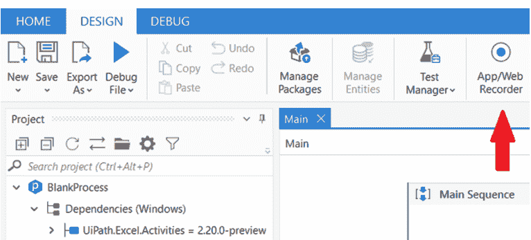

**图 2.1：** UiPath中应用/网页录制器的截图

- **开发工作室：** 这是RPA工具的主要组成部分。开发工作室是实际的界面或环境，包含用于开发软件机器人的各种功能。这些功能如下所列：
    - 带有**图形用户界面（GUI）**的仪表板，用于导航功能。
    - 各种类型的录制功能。
    - 可选择的标准模板，并具有拖放功能。

下图*图* 2.2展示了UiPath中**开发工作室**的界面：

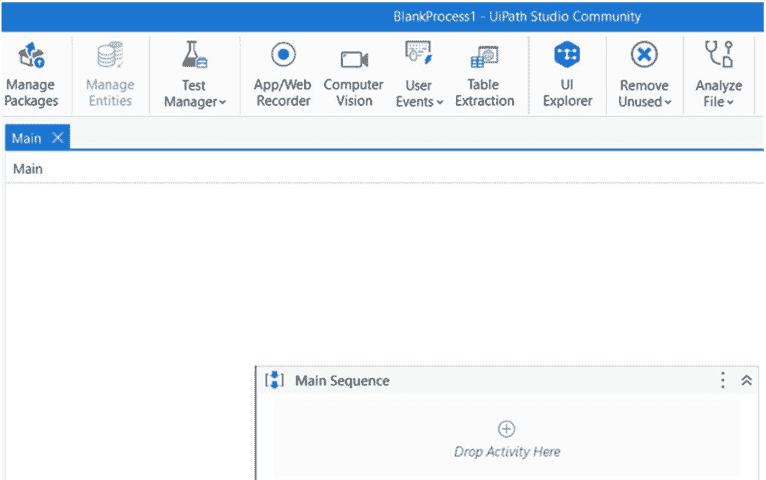

**图 2.2：** *UiPath中的开发工作室*

- **插件和扩展：** 插件或扩展允许通过将RPA工具与外部程序或第三方软件集成，来扩展其原始功能。
- **机器人运行器：** 这是允许运行由机器人创建器创建的机器人的组件。
- **控制中心：** 为了集中管理、调度和控制机器人，需要使用控制中心。

### 市场上的各种RPA工具

市场上有许多公司提供RPA解决方案。然而，本节将只讨论三大市场领导者：UiPath、Automation Anywhere和Blue Prism。

- **UiPath：** 这是用于桌面和网页自动化的RPA工具领导者之一。该工具的一大优势是为希望学习该工具的用户提供了社区版。即使没有编码知识的人也可以使用此工具，因为它提供了拖放功能供用户创建机器人。UiPath的主要组件是UiPath Studio、UiPath Robot和UiPath Orchestrator。这些将在另一章关于UiPath的内容中详细讨论。

- **Automation Anywhere：** 这是一个基于网页的自动化工具，也提供一个名为Community Edition的免费版本。Automation Anywhere的三个主要组件是：
    - **机器人创建器：** 这是用户创建机器人的组件。
    - **控制室：** 这是用于集中管理机器人的界面。
    - **机器人运行器：** 这是在机器人创建器中创建机器人后用于运行机器人的组件。它还会向控制室报告机器人的执行状态。

- **Blue Prism：** 这是一个帮助组织自动化手动和重复性流程的RPA工具。这是一个平台无关的工具，可以在任何平台上使用。它没有像Automation Anywhere或UiPath那样的社区版，但有一个学习版本，免费使用180天。该工具的一个缺点是它没有像UiPath和Automation Anywhere那样的录制功能。Blue Prism的主要组件是：
    - **对象工作室：** 这是创建Blue Prism对象或构建机器人的地方。
    - **流程工作室：** 这类似于对象工作室，但在这里可以定义流程的流向。
    - **控制室：** 这是控制流程的地方。

除了上述三大市场领导者外，市场上还有许多其他RPA工具，如Pega、OpenConnect、WorkFusion、Contextor、Cryon、OnviSource、AutomationEdge和Foxtrot。

### 各种RPA工具之间的比较

考虑到市场上有多种RPA工具可供选择，组织在最终确定其RPA平台选择时可能面临艰难的决定。然而，在为组织选择最佳RPA工具时，可以考虑某些重要参数。它们是录制功能、免费版本的可用性、拖放功能、架构和成本考虑。基于这些参数，Automation Anywhere、Blue Prism和UiPath之间的比较如下表2.1所示：

| 参数 | Automation Anywhere | Blue Prism | UiPath |
| :--- | :--- | :--- | :--- |
| 宏录制 | 是 | 否 | 是 |
| 社区版 | 是 | 否 | 是 |
| 拖放 | 并非所有任务都支持。（需要脚本） | 是 | 是 |

| 参数 | Automation Anywhere | Blue Prism | UiPath |
| :--- | :--- | :--- | :--- |
| 架构 | 客户端-服务器 | 客户端-服务器 | 基于Web的编排器 |
| 成本 | 采购成本高 | 部署成本高 | 入门级定价 |

表 2.1：市场上 RPA 工具的比较

## RPA Python 包

Python 提供了一个名为 **rpa** 的开源包，允许开发者以与 RPA 工具相同的方式执行自动化任务。

让我们执行一个简单的任务：打开 Google 搜索网页并在文本框中输入一些字符。要执行此任务，请打开任何 Python IDE，例如 Spyder。

要使用此库，首先我们需要使用以下命令安装它：

```
pip install rpa
```

之后，需要如下所示导入它，以便在 Jupyter notebook 或任何 Python IDE 中使用：

```
import rpa as r
```

接下来，在你的 Python 编辑器中输入以下代码：

```
r.init(visual_automation=False, chrome_browser=True)
r.url('https://www.google.com/')
r.type('//*[@name="q"]', 'news')
r.click('//*[@name="btnK"]')
r.wait(5) # 确保结果完全加载
r.snap('page', 'Captured_Image.png')
r.close()
```

现在，我们来尝试理解每一行的含义：
第一行是：

```
r.init(visual_automation=False, chrome_browser=True)
```

这里，调用了 **init()** 方法，该方法初始化了 tagUI 进程。如果你想知道 tagUI 是什么，它基本上是我们在使用 Python **rpa** 包时在后台运行的进程。

现在，我们还观察到该函数有两个参数，如下所示：

```
visual_automation=False, chrome_browser=True
```

这些基本上是参数的默认值。因此，即使我们不指定这些而只是调用 **r.init()**，Python 代码也会以相同的方式运行。

现在，如果我们把第一个参数改为 **visual_automation=True**，那么它将使我们能够在进程中使用键盘功能。如果你需要关于此包的详细信息以及不同的函数和用例，请访问此链接的 GitHub 仓库：**https://github.com/tebelorg/RPA-Python**。

接下来，第二个参数 **chrome_browser=True** 使我们能够指定需要打开的浏览器是 Chrome。此参数默认始终为 'True'。如果你需要在任何其他浏览器中打开网页，则需要将此参数设置为 'False'。

第二行是：

```
r.url('https://www.google.com/')
```

这指定了需要打开的 URL 是 Google 搜索页面。
下一行是：
```
r.type('//*[@name="q"]', 'news')
```
下图显示了在 Google 搜索页面中输入单词 'news' 的屏幕截图：


**图 2.3：** *在 Google 搜索页面中输入单词 'news'*

此行使用了 **type()** 方法，该方法使代码能够在网页元素中输入字符。网页元素在第一个参数中指定，即 '//*[@**name="q"**]'。这是 Google 窗口中搜索文本框的 XPath。XPath 代表 XML 路径语言，基本上是一种用于在 XML 文档中识别元素的表达式，在本例中是搜索文本框。我们将在下一节包含实际用例的部分中了解如何获取 XPath。第二个参数是 **news**。此参数指定需要输入的文本。在本例中，输入的文本是 'news'。
下一行是：
```
r.click('//*[@name="btnK"]')
```
此行指示代码点击标题为 **Google Search** 的按钮，该按钮将产生搜索结果。此按钮的 XPath 标识符是 `//*[@name="btnK"]`。

在此之后，下一行是：

```
r.wait(5)
```

此行基本上为程序添加了 5 秒的等待时间，直到网页打开。这是必要的，因为如果程序在未等待初始行的进程完成的情况下过早执行下一行，那么程序将抛出错误。

下一行是：

```
r.snap('page', 'Captured_Image.png')
```

此行使用 **snap()** 方法对当前在网站窗口中打开的页面进行屏幕截图。然后，此快照被保存为名为 **Captured_Image.png** 的图像文件，该文件作为方法的第二个参数提供。此图像文件将保存在程序的主目录中，该目录基本上与 Python 文件保存的文件夹相同。此屏幕截图基本上将显示在 Google 搜索框中输入单词 **news** 后获得的搜索结果。

最后一行 **r.close()** 将关闭 **rpa** 对象及其后的进程。

通过这种方式，我们看到了 Python **rpa** 包如何提供自动化常规手动流程的功能，否则这些流程也可以使用 RPA 工具（如 UiPath、Automation Anywhere 和 Blue Prism）来完成。在本例中，我们举了一个简单的例子：打开网页、生成搜索结果、进行屏幕截图并将屏幕截图保存为图像。这个 Python **rpa** 包对于那些熟悉编程并希望通过编写代码来释放 RPA 潜力的人来说是一个极好的工具。

现在，让我们看一个稍微复杂但现实世界的用例：访问一个培训注册网页，并从 Excel 文件中填写每位参与者的信息。在这个用例中，我们将基于在上述练习中获得的经验，并利用 Python 循环和 Pandas 数据框来执行我们想要的操作。

## RPA 与 Python 的实际用例

让我们应用在上一个练习中学到的内容，使用 Python RPA 包来实现一个实际的 RPA 用例。
此练习唯一需要的输入数据是 **Training.xlsx** Excel 工作簿。将工作簿保存在你机器上的任何位置。让我们将其保存在 **C:\Training.xlsx**。下图 *图 2.4* 显示了工作簿中我们感兴趣的表格：

| 序号 | 名 | 姓 | 邮箱 | 课程 | 报名月份 |
| :--- | :--- | :--- | :--- | :--- | :--- |
| 1 | abcd | efgh | abcd.efgh@gmail.com | 移动自动化 | 四月 |
| 2 | XYZ | abc | XYZ.abc@gmail.com | 数据库测试 | 一月 |
| 3 | EFGH | abcd | EFGH.abcd@gmail.com | Selenium 自动化 | 五月 |
| 4 | defg | wxyz | defg.wxyz@gmail.com | 敏捷与手动测试 | 九月 |
| 5 | qrst | UVWX | qrst.UVWX@gmail.com | Web 服务/API | 三月 |

**图 2.4：** *用于培训报名的参与者数据*

我们将使用的网站是 **https://codenboxautomationlab.com/registration-form/**，其中包含如下图 *图 2.5* 所示的示例培训报名表：

### 培训报名表

标有 * 的字段为必填项

如果你想预订下一批次的名额，请在下面的课程报名表中填写你的详细信息，因为我们的名额非常有限，你将自动注册。

名 *

姓 *

邮箱 *

电话

选择你想报名的课程？ *

敏捷与手动测试

选择你想加入的批次月份？

一月

你是如何知道我们的？ *

- Facebook
- LinkedIn
- Kijiji
- Twitter
- 报纸
- 朋友/家人
- 其他

**图 2.5：** *培训报名表*

我们本次练习的目标是通过在网页表单中填写详细信息，将 Excel 表格中的每位参与者注册到他们各自的培训中。如果我们必须手动执行此过程，从 Excel 中复制和粘贴每一个细节将非常耗时。我们将使用 Python **rpa** 包，结合 Python 循环和 Pandas 库的强大功能，从开始到结束自动化此过程。

让我们导入 pandas 库，并使用以下几行代码将输入的 Excel 读取为数据框：

```
import pandas as pd
input_df = pd.read_excel(r"C:\Training.xlsx")
```

我们将 Excel 文档中的表格转换为 pandas 数据框，并将其存储在变量 **input_df** 中：

接下来，我们将遍历数据框的每一行，并从 **First Name**、**Last Name**、**Email**、**Course**、**Enrollment Month** 列中捕获值，分别存储在变量名 **first_name**、**last_name**、**email**、**course**、**month** 中，如下所示：

```
for i in range(len(input_df)):
    first_name = input_df.loc[i, "First Name"]
    last_name = input_df.loc[i, "Last Name"]
    email = input_df.loc[i, "Email"]
    course =input_df.loc[i, "Course"]
    month =input_df.loc[i, "Enrollment Month"]
```

现在的目标是为循环的每个实例打开网页，将列值捕获到变量名中，并使用 Python **rpa** 包捕获屏幕元素，将变量名中的详细信息填写到网页中。

让我们在循环中继续以下代码行：

```
r.init()
```

# 第2章

## 结论

在本章中，我们首先介绍了机器人流程自动化工具的基本概念，然后根据重要参数比较了市场上可用的各种工具。这些工具提供拖放功能，使人们无需太多编码知识即可执行RPA流程。然而，对于希望通过脚本执行相同自动化的Python爱好者，我们通过一个实际用例，了解了Python的**rpa**开源包如何在自动化大多数常见流程（如通过查看网页表单进行填写）方面发挥奇效。

我们现在正踏上一段激动人心的旅程，穿越当代最耀眼的科技热词，它们正是人工智能和机器学习！

在下一章中，我们将熟悉人工智能和机器学习的基本概念。我们还将研究常用的机器学习算法，随后介绍深度学习和神经网络。让我们怀着热切的心情，现在就进入下一章吧！

# 第3章

## Python中的AI/ML入门

### 引言

本章向读者介绍人工智能和机器学习的基本概念。本章首先回顾人工智能的历史演变，并讨论当前和未来的场景。然后，向读者介绍机器学习的定义和基本概念，接着介绍按各种类别分组的机器学习算法，包括监督学习和无监督学习。各种Python库及其在AI/ML框架中的应用将让读者了解Python在AI/ML实现中的重要性。本章后续页面将讨论深度学习及其应用，本章将以神经网络、自然语言处理和转换器的总结结束。

### 结构

本章涵盖以下主题：

- AI的背景和历史
- 机器学习概念
- 监督学习和无监督学习
- 用于ML的流行Python库
- 强化学习
- 深度学习
- 神经网络简介
    - 神经网络的类型
- 自然语言处理
- 转换器和大型语言模型

### 目标

本章的主要意图是以一种简单的方式让读者对机器学习和深度学习概念有基本的理论理解，这将使读者能够在后续章节中有效地应用所学知识，使用Python独立建模机器学习算法。因此，本章作为基础导向章节，更侧重于理论而非编写Python代码。在本节结束时，你将清晰掌握人工智能、机器学习和深度学习的关键原理，为实际应用奠定基础。

### AI的背景和历史

我们几乎都看过电影《终结者》。嗯，这就是我们大多数人对**人工智能（AI）**概念的想象，我们为什么不这样想呢？事实上，这正是AI的目标，它旨在创造一台能够在思维和感觉方面精确模仿人类的机器。尽管我们离这个理想还很遥远在这种情况下，像ChatGPT这样的**大型语言模型（LLM）**聊天机器人的兴起，正慢慢为人类带来一丝希望，引领我们走向被称为**通用人工智能（AGI）**或强人工智能的理想场景。我们目前所处的AI水平被称为弱人工智能或窄人工智能，因为它不具备完全复制人类的能力，例如理解情感或讽刺。此外，任何形式的AI智能程度都仅限于其训练所用的数据集。让我们从早期趋势到当前发展，回顾一下AI的历史，并尝试理解这个领域的未来。

1950年，英国数学家和计算机科学家*艾伦·图灵*提出了一项测试，用于判断机器能否在思维方面模仿人类。这项测试也被称为**图灵测试**，至今仍是衡量机器所拥有人工智能水平的蓝图。在此测试中，一个人需要同时与另一个人和一台机器进行互动。根据从人类和机器那里收到的回复，互动者需要区分机器的回复和人类的回复。如果在某个时刻，互动者无法区分机器的回复和人类的回复，那么该机器就被认为成功通过了图灵测试。

自那时起，人们一直在逐步尝试增强机器模仿人类能力。随着大数据、云计算和**物联网（IoT）**的兴起，计算能力成倍增长，从而为在更短时间内用海量数据训练模型提供了环境。就像智能手机最初作为奢侈品进入世界，随后成为我们生活中不可或缺的一部分一样，AI目前是一个流行词，但它预计将接管我们的生活，这只是时间问题！

AI的当代用例，如自动驾驶汽车、人脸识别技术、像ChatGPT这样的智能聊天机器人，都是由于计算能力的提升而不断升级AI的结果。AI的未来既令人兴奋又充满挑战，因为像深度伪造这样的技术可以操纵视频，以及使用AI生成的模型来复制真实人类或电影明星！

每当讨论围绕AI展开时，就无法回避机器学习、深度学习以及更广泛的讨论范畴——数据科学这些补充主题。让我们快速了解一下这些概念，它们在更广泛体系中的位置以及彼此之间的关系。

机器学习是训练机器通过发现输入数据和输出数据之间的模式来自我学习，并在提供新输入时预测新输出的过程。这与人工智能有何关系？简单来说，人工智能是我们试图实现的目标，而机器学习是我们实现该目标的手段。AI是名词，而**机器学习（ML）**是动词。

说到**深度学习（DL）**，它是一种学习过程，使计算机能够通过连续的神经网络层以类似于人类学习的方式进行学习。我们将在后续章节中详细探讨神经网络。

数据科学是一个广义术语，涉及数据生命周期的所有领域，例如数据收集、数据抓取、数据工程、数据挖掘和数据转换等。由于这些过程中的大部分也是构建ML模型的一部分，因此数据科学、AI、ML和DL之间总是存在一些重叠。

*图3.1*中的维恩图应能更清晰地说明这种关系和重叠：

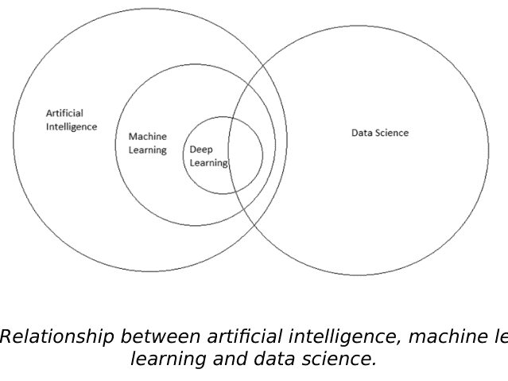

**图3.1：** *人工智能、机器学习、深度学习和数据科学之间的关系。*

## 机器学习概念

既然我们知道了机器学习在人工智能大图景中的位置，现在让我们更深入地理解它。那么，机器学习到底是什么？让我们尝试从分析的角度来理解这个概念。

我们都熟悉数学公式和方程。假设我们有一个方程 $y = 3x+4$。我们从这个方程中能理解什么？首先，我们看到方程有两个变量。一个是自变量 $x$，另一个是因变量 $y$。我们也可以说 $x$ 是输入变量，$y$ 是输出变量。为了得到输出变量 $y$，我们需要将输入变量 $x$ 乘以3，然后将乘积加上4。换句话说，输入变量 $x$ 和输出变量 $y$ 之间存在一种关系或映射。用数学语言来说，我们说 $y$ 是 $x$ 的函数，表示为 $y=f(x)$。现在，如果我们被提供任意输入并要求找出输出，我们可以使用公式 $y = 3x+4$ 轻松完成。假设我们被提供以下输入集合：{2,3,9,6,10,15}。我们可以将这些值中的每一个代入方程 $y=3x+4$，得到相应的 $y$ 值。让我们取第一个值2。将其代入方程 $y=3x+4$ 得到 $y=3*2+4$。因此，$y=6+4=10$。

因此，对于第一个输入值2，输出是10。以类似的方式，我们可以计算剩余输入集合的各自输出。下面的*表3.1*显示了每个输入对应的最终输出值：

| 输入 | 输出 |
| :---: | :---: |
| 2 | 10 |
| 3 | 13 |
| 9 | 31 |
| 6 | 22 |
| 10 | 34 |
| 15 | 49 |

**表3.1：** *输入对应的最终输出*

那么，我们这里到底做了什么？我们已经知道一个将输入映射到输出的函数，并且手头有一组输入。利用这两个实体，我们可以轻松获得每个输入的输出。换句话说，我们已经有一组将输入映射到输出的规则。这被称为基于规则的编程，通常用于我们所有的常规计算机应用程序，如计算器，甚至像办公软件和游戏这样的复杂应用程序。机器学习与此恰恰相反。让我们用一个不同的例子来理解这一点。

考虑一种情况，我们已经有一组输入和一组输出，如下表*表3.2*所示：

| 输入 | 输出 |
| :---: | :---: |
| 5 | 15 |
| 20 | 60 |
| 3 | 9 |
| 7 | 21 |
| 150 | 450 |
| 100 | 300 |

**表3.2：** *输入和输出*

现在假设我们被给定一个任意值，比如50，并被要求找出相应的输出，我们能做到吗？首先想到的问题是输入和输出之间的关系是什么？我们所拥有的只是一组输入和一组输出。但是，有没有办法找出输入和输出之间的关系？快速浏览输入及其对应的输出，会发现每个输出都是输入的三倍。5乘以3是15，20乘以3是60，以此类推。现在，我们似乎也找到了映射函数，即 *y=3x*。让我们将值50代入此函数 *y=3x* 以获得输出。在这种情况下，输出将是 *y = 3*50 = 150*。那么，在这种方法中我们到底做了什么？我们手头已有输入和输出，但不知道函数。我们必须先知道函数，才能找出任何任意输入的输出。这正是机器学习！

与我们已经拥有函数的基于规则的编程相反，机器学习的任务是找出将输入映射到输出的函数，以便此后可以为任何新的输入集预测正确的输出。在这个例子中，输入和输出是简单的数字，但它们可以是任何东西，比如复杂的图像。此外，在这个例子中，我们仅通过观察就找出了函数，但有各种机器学习算法可以完成找出这种关系的任务。这些算法分为多种类别，如回归、分类和聚类，我们将在本章以及后续相关章节中探讨这些内容。
既然我们已经从概念上理解了什么是机器学习，让我们深入探讨机器学习的不同类型。

## 监督学习与无监督学习

根据输入数据的类型，机器学习可分为监督学习和无监督学习。让我们尝试理解每一种：

**监督学习：** 在上一节的例子中，我们看到输入数据集中的每个项目都伴随着输出数据集中的相应项目。这种每个输入都带有相应输出的数据集被称为“标记”数据集。当机器在这样的标记数据集上进行训练时，这种机器学习类型被称为“监督学习”，因为训练是由输出数据的存在来引导或监督的。监督算法的典型例子包括线性回归、逻辑回归、k近邻、朴素贝叶斯、决策树、随机森林和支持向量机。让我们快速了解一下每一种。我们将在后面的章节中使用Python详细实现它们。在这里，我们将尝试理解它们。

- **线性回归：** 这是绘制一条最适合一组点的直线的过程。线性回归有时也方便地称为**最小二乘回归**，因为选择拟合直线的标准是点到直线的垂直距离的平方和应最小。上一节中我们通过观察发现y=3x的例子就是线性回归的一个经典例子。

- **逻辑回归：** 尽管这个算法名称中包含“回归”，但它实际上是一个分类算法。当我们希望预测一个分类变量的输出时使用它。例如，如果我们想知道输出是真还是假、1还是0、开还是关、是还是否，我们就使用逻辑回归。当我们有两个可能的结果时，它被称为二元逻辑回归。当我们有超过两个可能的结果时，逻辑回归也可以扩展到多项式和有序逻辑回归。逻辑回归使用sigmoid函数，该函数基本上将任何实数数据集映射到0到1之间的范围。下面的图3.2显示了sigmoid函数，其由以下方程给出：

$$y = \frac{1}{1 + e^{-x}}$$

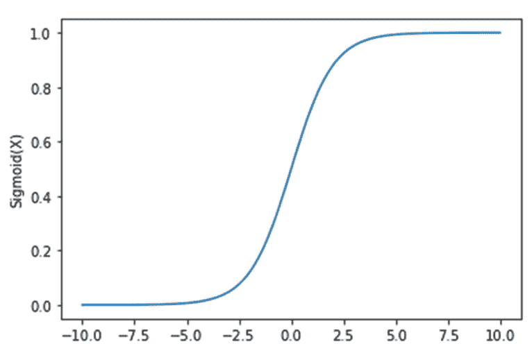

**图3.2：** Sigmoid函数

- **K近邻：** 顾名思义，这是一种分类算法，试图将数据点分类到其最近的类别中。输入算法的数据集将是一个标记数据集，包含作为输入的点及其分别所属的相应类别作为标记输出。该算法的目标是根据与类别的**最近**或最小距离，将未知的新输入数据点正确分类到各自的类别中。因此得名**近邻**。距离度量通常是我们笛卡尔坐标系中使用的欧几里得距离。请参考以下*图3.5*：

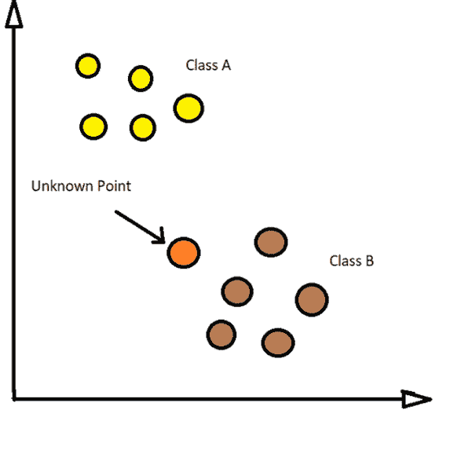

*图3.3：K近邻*

- **朴素贝叶斯：** 这是一种基于贝叶斯条件概率定理的分类算法，其数学表达式如下所示：

$P(A|B) = \frac{P(B|A) \cdot P(A)}{P(B)}$，其中 $P(B) > 0$

该定理在许多情况下都有应用，当我们想根据一个事件的发生来决定另一个事件的概率时。正如“朴素”一词所暗示的，该算法假设导致事件结果的每个特征都具有相等且独立的贡献。该算法最流行的应用是将电子邮件分类为**垃圾邮件**或非垃圾邮件。

- **决策树：** 决策树算法是将决策思维过程拟合到标记数据集的过程。与我们思考的方式类似，决策树从一个根节点开始，进一步分叉成包含决策节点和叶节点的分支。观察下图，它显示了一个描述购房决策思维过程的示例决策树的根节点、决策节点和叶节点。请参考以下*图3.4*：

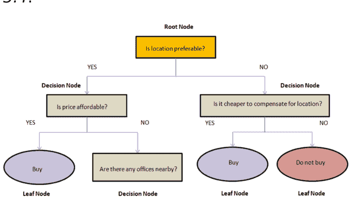

**图3.4：** 用于最终购房决策的示例决策树

- **随机森林：** 这是决策树算法的延续，但我们在这里做的是结合多个决策树的结果来得出最终结果。单个决策树的局限性在于存在过拟合的可能性。过拟合是指算法过于严格地拟合训练数据集，以至于没有足够的灵活性来同样轻松地拟合测试数据集的现象。随机森林是集成学习算法的一个例子，它使用了Bagging技术。集成学习是通过结合多个模型的结果来改进结果的技术。Bagging是一种技术，其中不同的训练数据样本被输入算法，以获得每个样本的不同结果。在这种情况下，随机的训练数据样本被输入算法。这导致创建多个决策树，产生多个输出。结果由多数投票过程决定。出现频率最高的输出被选为结果。

- **支持向量机：** 这是一种分类算法，它创建一个最优超平面，根据可区分的属性以最佳方式将数据集分离成类别或类。如果数据集是二维的且有两个类别，那么超平面将是一条直线。该算法通过从两个类别中选择最接近直线的点，并试图最大化这些点与直线之间的距离（称为**间隔**）来工作。这些点被称为“支持向量”，因此得名**支持向量机**。

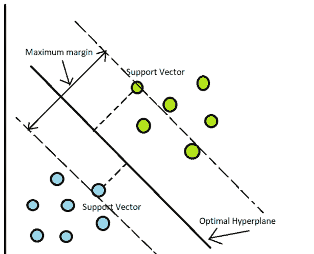

**图3.5：** *支持向量机*

**无监督学习：** 这是机器学习的一种类型，其中输入数据集没有被标记为类别。算法必须自己从输入中学习。这类算法中最流行的是聚类。K均值聚类是聚类算法的一种类型，算法在重复迭代后将数据集组合成K个不同的簇。DBSCAN是另一种流行的聚类算法。层次聚类是一种聚类方法，当需要以预定方式对簇进行排序时使用。

## 常用的Python机器学习库

现在让我们看看一些流行的Python机器学习库，我们将在后面的章节中使用它们来实现机器学习算法。在本节中，我们只会在高层次上了解它们，以理解它们的独特意义和相对差异。它们在Python中的实际实现将在后面的章节中进行：

- **Scikit Learn：** 这是最流行的Python库之一，用于监督和无监督机器学习。该库为每种算法都有一个单独的类，每个类都有一个名为**fit()**的方法，该方法将算法拟合到数据集。

- **TensorFlow：** 这是一个高级深度学习库，用于通过张量执行数学和物理中的复杂计算。张量基本上是一个具有统一数据类型的多维数组。虽然这是一个Python库，但实际的数学运算是用C++执行的。Python只是指导这些代码片段并将它们组合在一起。TensorFlow可用于训练和运行深度神经网络。最近，TensorFlow还通过**tf.Keras**模块集成了Keras。

- **OpenCV：** 这是一个开源的Python库，用于计算机视觉应用和图像处理。计算机视觉是使计算机能够理解图像和视频并从中提取有洞察力的信息以做出进一步决策的过程。计算机视觉的流行应用包括人脸识别应用、自动驾驶汽车和图像生成应用。**光学字符识别（OCR）**是OpenCV的另一个应用，用于文本检测。

- **Keras：** 这是一个用Python构建的高级神经网络库。它本身不执行低级计算，而是使用其他后端库（如TensorFlow、Theano和CNTK）来执行。

- **Theano：** 这是另一个流行的深度学习库，用于执行快速数学计算。

## 强化学习

在前面的章节中，我们已经了解到机器学习的两种类型：监督学习，即提供带标签的数据集；以及无监督学习，即没有带标签的数据集，算法必须通过将具有相似属性的项目分组来自主地从数据中学习。还有一种机制使机器能够基于先前输出的结果，或者换句话说，从“经验”中自主学习。强化学习系统使用接收反馈的算法来确定输出决策是正确、错误还是中性的。因此，强化学习是一种自主的自我学习机制。下面的*图3.6*展示了强化学习机制：

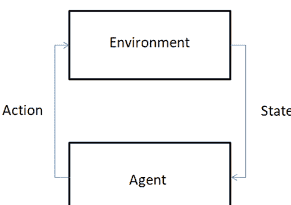

**图3.6：** *强化学习机制*

如上图所示，智能体向环境发送一个动作。环境随后以一个新的状态返回该动作。这个状态捕获了来自环境的反馈，智能体根据反馈调整其下一个动作。强化学习与监督学习一起，被广泛用于微调像ChatGPT这样由**大型语言模型（LLM）**驱动的聊天机器人。

既然我们已经熟悉了机器学习算法和相应的Python库，让我们开始激动人心的深度学习之旅吧！

## 深度学习

**深度学习**的名称源于训练多层的过程。深度学习的核心机制是**人工神经网络（ANN）**，旨在模拟人类的神经学习机制。深度学习涉及训练多层神经网络，这是通过调整每个神经元的权重来实现的。更多相关内容将在后续章节中介绍。

人们可能会想，既然有所有这些机器学习算法可用，为什么还需要采用深度神经网络呢？原因在于，在许多情况下，机器学习算法的准确性不足，而深度神经网络在实现预期结果方面表现出色！由于高效计算系统的兴起和大型数据集的可用性，深度学习已成为训练复杂多层神经网络的流行方法。现在，让我们尝试理解神经网络的基本概念。

## 神经网络简介

任何神经网络的基本单元是感知机，如下方*图3.7*所示：

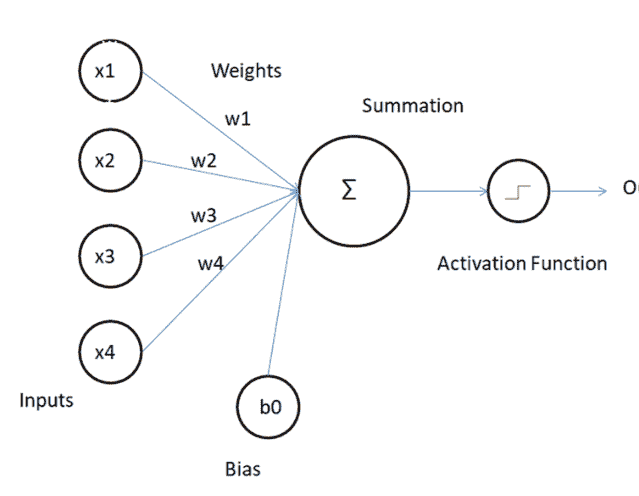

**图3.7：** *感知机的基本架构*

让我们详细理解这个架构：

- x1、x2、x3和x4是输入到感知机的输入值。在这个例子中，我们取了四个输入。然而，一个感知机可以有尽可能多的输入，具体数量取决于其需求。
- w1、w2、w3和w4是与每个输入相关联的权重。每个输入基本上都会乘以其关联的权重。在这个例子中，执行的操作是 w1*x1 + w2*x2 + w3*x3 + w4*x4。在数学上，这个表达式被称为权重和输入的点积。
- b0是偏置项。这个值被添加到上面得到的最终点积中。添加偏置项是为了用一个标准值来抵消最终的点积。这个项可以是正值、负值，甚至是零值。
- 因此，最终的表达式变为 w1*x1 + w2*x2 + w3*x3 + w4*x4 + b0。我们在图中看到，在产生最终输出之前，有一个激活函数。我们将在后面详细讨论激活函数。目前，我们可以将激活函数想象成一个触发器，它决定感知机是否会被激活。
- 在评估了由输入、权重和偏置组成的表达式之后，将激活函数应用于该表达式，以决定感知机的最终输出。

既然我们已经理解了感知机的基本架构，让我们进一步应用它，看看如何从多个感知机构建一个简单的神经网络。下面的*图3.8*展示了一个简单神经网络的架构：

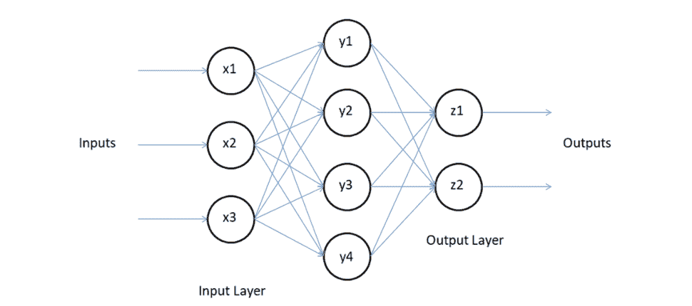

如下图所示，一个神经网络由若干个感知机或**节点**组成。作为神经网络的基本组成部分，感知机此后将被称为**节点**。

我们观察到神经网络由三层组成：**输入层**、**隐藏层**和**输出层**。每一层可以有一个或多个节点。在这个例子中，输入层有三个节点，隐藏层有四个节点，输出层有两个节点。需要注意的是，在这个例子中我们只有一个隐藏层，但神经网络可以有多个隐藏层。此外，输入层、隐藏层和输出层中节点数量的选择取决于神经网络所训练数据的复杂性。然而，在大多数情况下，我们也会使用一些经验法则，例如隐藏节点的数量应大致为输入和输出节点数量之和的2/3。

现在，我们有兴趣了解这个神经网络是如何工作的！

我们之前已经看到了单个节点是如何运作的。类似地，我们有三个输入节点，其输入值为x1、x2、x3。从图中我们观察到，这些输入被馈送到隐藏层的四个节点中。因此，隐藏层中的每个节点都将接收这三个相同的输入，但权重不同，如下所示：

- y1将接收输入x1、x2、x3，权重为w11、w12、w13。
- y2将接收输入x1、x2、x3，权重为w21、w22、w23。
- y3将接收输入x1、x2、x3，权重为w31、w32、w33。
- y4将接收输入x1、x2、x3，权重为w41、w42、w43。

如前所述，还会有四个偏置项b1、b2、b3和b4被添加到这些输出中。馈送到每个节点的最终表达式如下。同时，请记住，每个表达式都将在产生最终输出之前，需要经过一个激活函数：

- y1 = w11*x1 + w12*x2 + w13*x3 + b1。
- y2 = w21*x1 + w22*x2 + w23*x3 + b2。
- y3 = w31*x1 + w32*x2 + w33*x3 + b3。
- y4 = w41*x1 + w42*x2 + w43*x3 + b4。

现在，隐藏层的这些值 y1、y2、y3 和 y4 将被馈送到输出层 z1 和 z2，并带有各自的权重和偏置，在应用激活函数后，如下表达式所示：

- z1 = v11*y1 + v12*y2 + v13*y3 + v14*y4 + c1。
- z2 = v21*y1 + v22*y2 + v23*y3 + v24*y4 + c2。

通过这种方式，网络的最终输出 z1 和 z2 是从输入 x1、x2 和 x3 通过隐藏层的变换，在权重、偏置和激活函数的帮助下产生的。

任何神经网络中的学习机制本质上是一种自我学习机制。根据输出与预期输出的接近程度，神经网络会调整其权重和偏置，使得下一次迭代产生的输出比上一次迭代产生的输出更接近预期输出。这个过程会重复进行，直到产生的输出令人满意。

神经网络的学习过程是通过一种称为**反向传播**的技术进行的。在这个过程中，使用导数的链式法则，从输出层开始向最内层的输入层移动，来最小化一个损失函数。损失函数本质上是我们试图最小化以优化神经网络的量。

现在让我们更深入地了解一下激活函数的概念，它在神经网络中非常重要。激活函数主要用于以一种有助于执行反向传播的方式转换节点的输出。它还用于移除输出中任何不相关的成分，只保留相关的成分。下面的*图 3.9*显示了一个直线函数。假设我们希望节点仅在输出大于零时被激活，而在输出小于零时保持未激活状态。在这种情况下，我们应用**修正线性单元函数（ReLU）**。

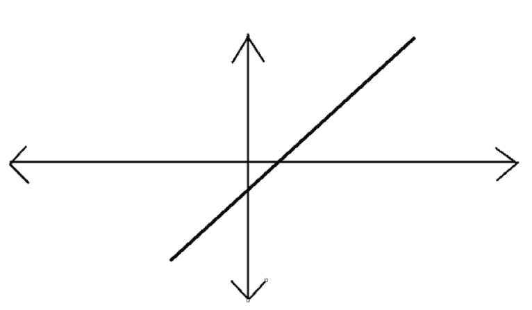

**图 3.9：** *应用激活函数之前的直线*

ReLU 函数基本上只保留大于零的值，否则将所有其他值转换为零。数学上，它表示为（参见*图 3.10*）：

**ReLU**

f(X) = max(0,X)

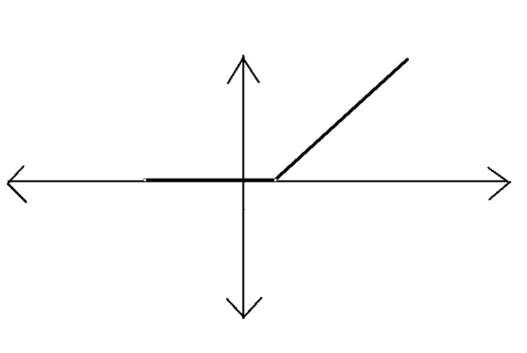

**图 3.10：** *应用 ReLU 激活函数后的直线*

上图显示了应用 ReLU 激活函数后转换的输出。除了 ReLU 之外，根据需求类型，可能还有其他几种激活函数。最流行的是我们在逻辑回归中已经见过的 sigmoid 函数。这个 sigmoid 函数基本上将任何输出转换为 0 到 1 之间的非线性分布。因此，使用导数的链式法则执行反向传播变得更容易。

## 神经网络的类型

我们在上一节看到的**人工神经网络（ANN）**可以根据其训练数据的类型和应用类型分为不同类型。在本章中，我们只在高层次上看看重要的一些：

- **卷积神经网络：** **卷积神经网络**（CNN），也称为 CovNet，是一种特殊类型的神经网络，我们通过修改传统的**人工神经网络（ANN）**，使其能够高效地读取和提取图像文件中的信息。CNN 有三层：卷积层、池化层和全连接层。

卷积层用于实现稀疏交互，这与常规神经网络中每个输出节点与每个输入节点交互的方式相反。在处理包含数百万像素的图像信息时，只需要较少的参数就能从图像中提取有意义的信息，这些信息可能仅来自数万或数千个像素。卷积层包含一个比图像小的内核，它在整个图像上滑动以形成感受野的表示。这个滑动过程称为**卷积**。这个内核本质上是一个初始化为任意随机值的矩阵，它与它所交互的图像中大小相等的部分执行点积，从而形成该区域的图像表示。

池化层通过一种表示统计量来缩小某些位置的输出。这是为了减少与大尺寸相关的计算时间所必需的。最常见的是报告邻域中的最大值，这称为最大池化。

全连接层就像常规的神经网络层，其中节点与前面的层和后面的层完全连接。

卷积层和池化层使用 ReLU 函数作为激活函数，而全连接层使用 softmax 函数作为激活函数。下面的*图 3.11*将使 CNN 更清晰：

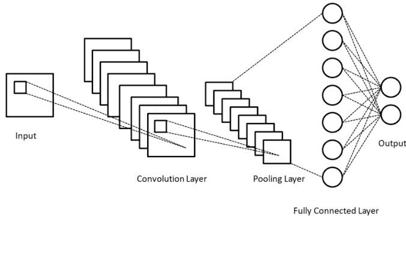

**图 3.11：** *卷积神经网络*

- **循环神经网络：** 在常规神经网络或卷积神经网络中，一旦产生输出，输入就会被遗忘，或者换句话说，它不会在内存中保留输入。这个缺点通过使用**循环神经网络（RNN）**来解决，它在文本处理、自然语言理解、语言翻译和顺序输出生成等应用中被证明是有用的。在 RNN 中，每个节点都有潜力存储来自先前操作的值。这使得网络能够利用先前输入的信息来处理当前输入和输出。RNN 通常用于 Google Translate 和 Siri 等应用。下面的*图 3.12*显示了循环神经网络的架构：

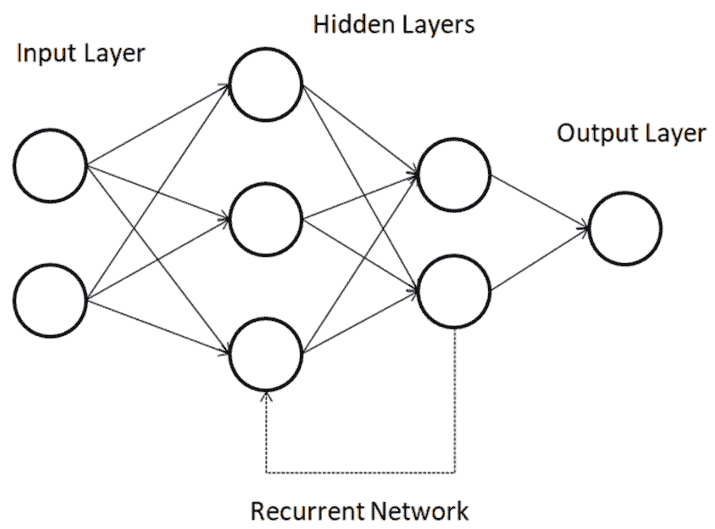

**图 3.12：** 循环神经网络

- **长短期记忆：** 长短期记忆（LSTM）是一种特殊类型的**循环神经网络（RNN）**，它解决了与传统 RNN 相关的长期依赖问题。传统 RNN 从近期信息进行预测的速度比从长期记忆中存储的信息更快。因此，传统 RNN 无法对存储在长期记忆中的信息提供高效的性能。LSTM 网络包含一个可以处理长时间信息的记忆单元，因此使其适用于语音识别和语言翻译任务。

我们现在在本节中看到了神经网络的主要类型，这让我们了解了神经网络可以进行的不同变体，以实现不同的目标。

RNN 和 LSTM 最流行的应用是**自然语言处理（NLP）**，由于 Siri、Alexa、Google Translator 以及当然像 ChatGPT 这样的智能聊天机器人等应用，它在当代正获得发展势头。下一节将概述自然语言处理。

## 自然语言处理

**自然语言处理（NLP）**是人工智能的一个分支，计算机被训练以理解人们口头和书面使用的语言。NLP 分两个阶段进行：

- **数据处理：** 这是文本数据被转换或清理并带到机器可以分析的格式的阶段。这包括词干提取和词形还原，其中单词被分解为它们的词根形式；分词，其中文本数据被分解为更小的单元；词性标注，其中文本中的单词根据其词性（如名词、代词、形容词和动词）被识别；停用词移除，其中常用词从文本中移除，以便只保留那些传达意义的关键词。
- **算法处理：** 一旦数据如上所述被处理，它就被馈送到算法中进行进一步处理，以便进一步训练。有时，在可能的情况下可以使用简单的规则，但大部分训练是使用我们之前看到的复杂神经网络（如 RNN 和 LSTM）进行的。然后这些网络从重复的训练和反馈中学习。

Python 提供了像 NLTK 和 Spacy 这样的流行包来执行自然语言处理。NLTK 在创建聊天机器人中被广泛使用。

## 变换器与大型语言模型

变换器近年来日益流行，因为世界正见证着基于变换器架构的智能聊天机器人（如ChatGPT）的兴起。GPT是生成式预训练变换器的缩写。变换器被用于任何需要将输入序列转换为输出序列的场景，例如文本到语音的转换。变换器利用了卷积神经网络。然而，它们也使用了“注意力”机制。这包括一个编码器和一个解码器。编码器基本上将输入数据转换为一种称为隐藏状态的数值表示。这捕捉了输入数据中的重要信息。然后，这个隐藏状态被输入到解码器网络中，由其生成输出。

变换器架构最流行的应用是大型语言模型。这些模型通过无监督学习在海量数据上进行训练，模型自行学习。最新的热门词汇ChatGPT就是大型语言模型的一个例子。它在截至2021年9月的570GB数据集上进行了训练。这些数据包括科学期刊、维基百科、文学作品、书籍和其他来源。

大型语言模型可用于生成内容、总结文章、建议解决常规数学和物理问题的方法、规划旅行行程等等！

通过这种方式，神经网络自我微调，产生出色的机制，协助我们完成各种任务和应用。

## 结论

本章通过带领我们从人工智能历史到基本机器学习概念，再从深度学习和神经网络到自然语言处理和变换器的渐进式旅程，为我们奠定了人工智能和机器学习概念的坚实基础。这个基础现在应该能够让我们在后续专门致力于机器学习和深度学习的章节中，使用Python库自行开发算法。

为了开发和训练良好的机器学习模型，我们首先需要的是一个良好的数据集。这些数据来自众多来源，其中最常见的是网页，这使得从网络提取数据，即网络爬取，成为开始任何机器学习项目前最重要的技能。

在从网页提取数据时，如果提供了网络API，事情会变得容易。然而，在没有此类API的情况下，我们不应错过提取网页数据的机会。在下一章中，我们将探讨网络爬取的概念，即在不使用任何API的情况下从网页提取数据的过程。因此，事不宜迟，让我们直接进入下一章，学习如何使用Python进行网络爬取！

# 第4章
## 自动化网络爬取

### 简介

本章讨论使用Python从网络提取数据的过程。数据是机器学习所有项目的核心部分，而大多数学习项目或现实应用的数据都来源于网络。因此，了解网络爬取技术对于实施人工智能、机器学习或数据科学项目至关重要。本章向读者介绍网络爬取，并讨论执行网络爬取所需的一些流行的Python库，如**Requests**和**Beautiful Soup**。本章继续介绍网络爬取的显著特点，如检查和提取。本章以一个实际用例项目结束。

### 结构

本章涵盖以下主题：

- 什么是网络爬取
- 用于网络爬取的流行Python库
    - Python中的request模块
    - Beautiful Soup库
    - 检查网页
- 从网页提取信息
- 网络爬取的法律考量
- Python中的实际用例

### 目标

本章将使读者能够熟练使用Python库执行常规数据收集任务的网络爬取，并使读者熟悉常用的网络爬取技术。

### 什么是网络爬取

网络爬取是通过访问网站的HTML页面，自动从任何网页提取数据的过程。通常，如果我们需要的数据量很小，我们可以方便地复制粘贴。然而，随着所需数据量变得庞大，每次手动复制粘贴几乎变得不可能。正是在这些时候，网络爬取技术被证明对于从网络提取数据非常有用。此外，网页上的数据是非结构化格式，这意味着它不是以系统的方式存在的。网络爬取将这些非结构化数据存储为结构化格式。网络爬取可用于许多应用，如研发、社交媒体分析或市场数据收集。

从网站提取数据的另一种方式是利用提供给开发者的API。然而，这是传统和经典的方法，不属于网络爬取的定义范畴。在网络爬取中，我们直接访问页面并从中提取数据。

### 用于网络爬取的流行Python库

Python提供了非常有用的库来执行网络爬取。下面，我们讨论最流行的几种，但在本章中，我们将只关注**Requests**和**Beautiful Soup**。

- **Requests：** 这个库通常在网络爬取的第一阶段使用，因为第一步是向网站的服务器发送HTTP请求以从网站页面提取数据。
- **Beautiful Soup：** 这是一个流行的Python库，它将HTML和XML文档解析成树状结构，有助于识别和提取数据。
- **Scrapy：** 这是一个网络爬虫库，可以爬取网站并从其页面提取结构化数据。该库也可用于数据挖掘和自动化测试。
- **Selenium：** 这是一个开源框架，可以为网络浏览器或网络应用程序启用自动化测试用例。

我们现在将通过Python示例进一步详细查看**Requests**和**Beautiful Soup**。

### Python中的requests模块

这是最常用的网络爬取框架，如前所述，它通常是网络爬取的第一步。该模块用于发送HTTP请求，该请求反过来返回一个包含内容的响应对象。

要使用这个库，首先需要使用以下命令在anaconda提示符中安装它：

```
pip install requests
```

为了在我们接下来的练习中学习网络爬取，我们将使用网站**https://toscrape.com/**，这实际上是一个学习网络爬取的沙盒。由于我们的目标是学习，我们必然会向该网站发出多个HTTP请求。因此，使用沙盒比使用实际网站更好，因为对同一网站的多个HTTP请求可能会封锁我们的IP。我们将在本章末尾了解网络爬取的法律考量。一旦我们通过点击上面的网站链接打开该网站，我们将看到该网站的主页面，如下图*图4.1*所示：

### 网络爬取沙盒

#### 书籍

一个虚构的书店，非常渴望被爬取。对于学习网络爬取的初学者以及验证其爬取技术的开发者来说，这是一个安全的地方。访问地址：books.toscrape.com

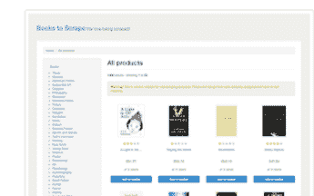

| 详情 | |
|---|---|
| 项目数量 | 1000 |
| 分页 | ✓ |
| 每页项目数 | 最多20 |
| 需要JavaScript | X |

#### 名言

一个列出名人名言的网站。它有许多端点，以多种不同的方式展示名言，每个端点都为你带来新的爬取挑战，如下所述。

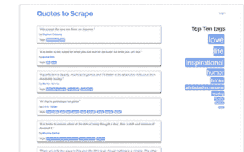

| 端点 | |
|---|---|
| 默认 | 微数据和分页 |
| 滚动 | 无限滚动分页 |
| JavaScript | JavaScript生成的内容 |
| 延迟 | 与JavaScript相同，但有延迟（?delay=10000） |
| Tableful | 基于表格的混乱布局 |
| 登录 | 使用CSRF令牌登录（任何用户名/密码都有效） |
| ViewState | 基于AJAX的带有ViewState的过滤表单 |
| 随机 | 单个随机名言 |

图4.1：沙盒网站的主页面

一旦**Requests**安装完毕，下一步将是使用它，并在Python编辑器中使用以下代码调用它：

```
import requests

x = requests.get('https://toscrape.com/')
if x.status_code == 200: #A status of 200 is returned whenever a request is OK. A status of 404 means not found.
    print(x.text)
```

上述代码首先导入**requests**库，然后使用**requests**模块的**get**方法，并将URL作为参数传递。在这个例子中，我们希望查看toscrape.com网页的内容，这基本上是一个网络爬虫沙盒，因此我们传递了相应的URL。之后，返回的对象被存储在变量x中。现在，我们使用存储在变量x中的对象的**text**属性来返回我们希望从网页中提取的文本。返回的内容将是HTML代码格式。

## Beautiful Soup库

这个库将HTML和XML文档解析成树状结构。

以下是Beautiful Soup文档的链接：
**https://beautiful-soup-4.readthedocs.io/en/latest/**

要使用这个库，请使用以下命令安装：
**pip install bs4**

我们需要先使用**requests**模块提取网页内容，然后将其转换为Beautiful Soup对象。因此，我们将稍微修改之前的代码，并在此基础上进行构建。

我们保留之前代码的前两行，如下所示：

```
import requests

x = requests.get('https://toscrape.com/')
```

我们现在希望使用以下代码导入Beautiful Soup库：

```
from bs4 import BeautifulSoup
```

接下来，我们编写以下代码：

```
if x.status_code == 200:
    objSoup = BeautifulSoup(x.content, 'html.parser')
```

请注意，这里我们没有像之前的练习中那样使用**x.text**，而是使用了**x.content**。前者是Unicode格式的响应内容，而后者是字节格式的响应内容。

在这里，我们通过传递以下两个参数创建了一个名为**objSoup**的**BeautifulSoup**对象：

- **x.content**：这是之前获得的HTML对象。
- **html.parser**：这是我们想要使用的HTML解析器。

Beautiful Soup支持使用多种解析器。我们这里使用的是Python标准库中包含的HTML解析器。

下面的*表4.1*列出了Beautiful Soup支持的各种解析器及其使用方法：

| 编号 | 解析器 | 使用方法 |
| :--- | :--- | :--- |
| 1 | Html5lib | BeautifulSoup(x.content, 'html5lib') |
| 2 | Python标准HTML解析器 | BeautifulSoup(x.content, 'html.parser') |
| 3 | lxml - HTML解析器 | BeautifulSoup(x.content, 'lxml') |
| 4 | lxml - XML解析器 | BeautifulSoup(x.content, 'xml') |

**表4.1：** *解析器及其使用方法*

要使用xml解析器，我们需要安装lxml库。

## 检查网页

为了能够使用Beautiful Soup有效地从网页中提取数据，我们需要了解网页中不同元素是如何组织的。这是必要的，因为要导航到网页中的特定元素，我们需要知道它在HTML树中的位置。方法是在页面任意位置右键单击并选择最后一个选项“检查”。下面的*图4.2*展示了这个过程的截图：

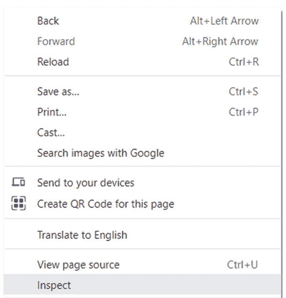

**图4.2：** *在网页上右键单击并选择‘检查’*

选择**检查**将打开浏览器的开发者工具。我们将使用Google Chrome来执行此练习，但如今大多数浏览器都有其开发者工具。

一旦开发者工具打开，我们看到的是页面的**文档对象模型（DOM）**。观察代码，人们可能会认为这只是普通的HTML。确实如此，但DOM以JavaScript代码可以理解的格式对普通HTML代码进行了轻微修改。JavaScript用于为网页添加行为。DOM使用对象来修改HTML代码，使其能被JavaScript理解。出于实际目的，我们可以将开发者工具中看到的内容视为网页的HTML代码。*图4.3*显示了点击**检查**后的开发者工具：

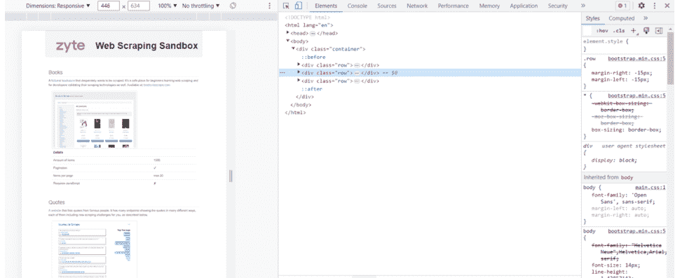

## 从网页中提取信息

现在，让我们尝试从网页中提取一些信息。以下是我们可以在Python编辑器中输入的代码：

```
import requests
from bs4 import BeautifulSoup

x = requests.get('https://toscrape.com/')
if x.status_code == 200: #每当请求成功时返回200状态码。404状态码表示未找到。
    objSoup = BeautifulSoup(x.content, 'html.parser')
    print(objSoup.title) #这将打印title标签
    print(objSoup.title.name) #这将打印标签的名称
```

产生的输出将如下所示：

```
<title>Scraping Sandbox</title>

title
```

现在，让我们尝试从网页底部的下表中提取信息（参见下面的*图4.4*）：

| 端点 | |
|---|---|
| 默认 | 微数据和分页 |
| 滚动 | 无限滚动分页 |
| JavaScript | JavaScript生成的内容 |
| 延迟 | 与JavaScript相同，但有延迟（?delay=10000） |
| 表格化 | 基于表格的混乱布局 |
| 登录 | 使用CSRF令牌登录（任何用户/密码均可） |
| ViewState | 基于AJAX的带有ViewState的过滤表单 |
| 随机 | 单条随机引语 |

**图4.4：** *来自网页的表格*

像之前一样，我们首先右键单击表格中显示**Microdata and pagination**的示例文本，然后选择**检查**，以便在开发者工具箱中浏览HTML树。我们想看看它在树中的位置。

我们从HTML树中观察到，在**body**标签内，存在三个**class = "row"**的**div**标签。最后一个**div**标签内部包含一个**class = "col-md-10"**的**div**标签，其中又有两个**class = "col-md-6"**的**div**标签。这两个**class = "col-md-6"**的**div**标签中的第二个包含一个**class="table table-hover"**的表格。在这个表格内部存在一个**body**标签，其中包含多个**tr**标签。第二个**tr**标签包含两个**td**标签。第二个**td**标签对应我们想要查找的文本**Microdata and Pagination**！

下面的截图将使这一点变得清晰。附上的是在文本**Microdata and pagination**上右键单击并选择**检查**后获得的HTML树截图（参见*图4.5*）：

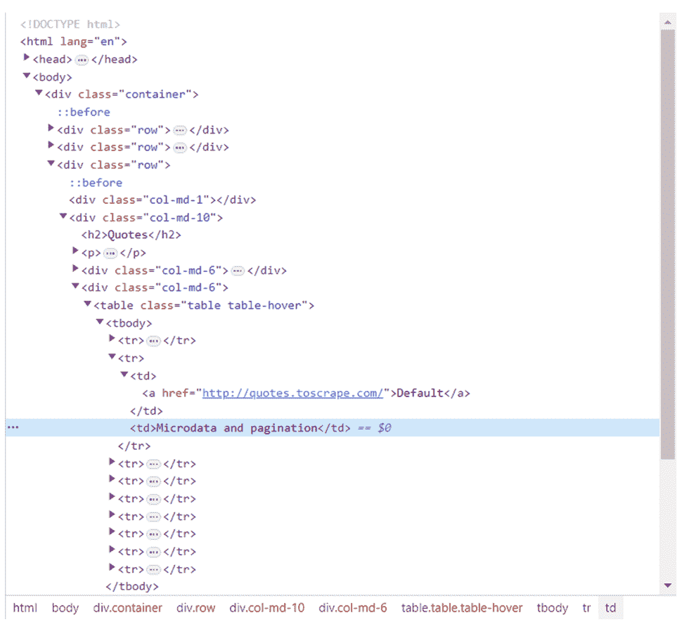

**图4.5：** 导航到文本'Microdata and pagination'的网页HTML树

让我们尝试通过代码来定位这个文本。在编辑器中输入以下代码：

```
import requests
from bs4 import BeautifulSoup
x = requests.get('https://toscrape.com/')
if x.status_code == 200:
    objSoup = BeautifulSoup(x.content, 'html.parser')
```

我们创建了与之前练习类似的**BeautifulSoup**对象。

现在，让我们使用**find**方法来查找我们正在搜索的元素。我们首先需要找到第一个**class="container"**的**div**标签，因为这是body内的最顶层标签。我们使用下面的代码表达式来完成：

```
objSoup.find('div', class_="container")
```

在这个标签内部，有三个**class = "row"**的**div**标签，但我们只需要访问最后一个。我们如何让Beautiful Soup知道这一点呢？我们通过首先使用**findAll**方法，然后使用索引来获取我们想要的第n个元素来实现。下面是修改后的代码表达式，我们使用索引2来获取第三个元素。

```
objSoup.find('div', class_="container").findAll('div', class_="row")[2]
```

现在我们已经理解了如何使用**find**和**findAll**方法以及索引来浏览HTML树，让我们编写完整的代码语句来导航到我们所需的最终文本元素。在Python编辑器中执行以下代码，这是最终代码：

```
import requests
from bs4 import BeautifulSoup

x = requests.get('https://toscrape.com/')
if x.status_code == 200:
    objSoup = BeautifulSoup(x.content, 'html.parser')
    print(objSoup.find('div', class_="container")
        .findAll('div', class_="row")[2]
        .find('div', class_="col-md-10")
        .findAll('div', class_="col-md-6")[1]
        .findAll('td')[1].text)
```

## 第五章
## 自动化 Excel 与电子表格

### 简介

Microsoft Excel 自动化是组织和个人常进行的自动化实践，因为 Excel 是常用的电子表格工具。本章首先介绍 `openpyxl` 库，这是一个用于读写 Excel 2010 xlsx/xlsm/xltx/xltm 文件的 Python 库，然后引导读者了解自动化一些常见任务的过程，如创建工作簿、打开工作簿以及在工作簿和工作表中执行各种操作。本章继续介绍并描述了其他用于 Excel 自动化的 Python 库，如 `xlwings` 和 `xlsxWriter`。简要讨论了每个库相对于其他库的相对优势。本章以一个涉及使用 Python 进行 Excel 自动化的实际用例项目结束。

### 结构

本章涵盖以下主题：

- 使用 Python 自动化 Excel 的需求
- `openpyxl` 库简介
    - 打开并修改现有工作簿
    - 使用范围名称访问单元格
    - 合并单元格
    - 遍历单元格
    - 使用 `openpyxl` 处理 Excel 公式
    - 使用 `openpyxl` 创建图表
    - 设置图表样式
- 其他用于 Excel 自动化的 Python 库
    - Python 库比较总结
- Python 实际用例

### 目标

本章将向读者介绍通过利用开源 Python 库的力量，创建基础和中级脚本来自动化常规 Excel 流程的过程。此后，读者将能够独立地轻松探索这些 Python 模块，为更复杂的任务创建自定义脚本。

### 使用 Python 自动化 Excel 的需求

Microsoft Excel 电子表格几十年来一直是使用最广泛的办公工具，主要归功于其易用性，其次是其提供的各种其他功能。尽管大多数 Excel 最终用户手动执行任务，其中大多数通常涉及使用公式，然后向下拖动或复制粘贴数据或表格到另一个工作表，但当这些任务变得重复、耗时或容易出现人为错误时，自动化的需求就出现了。Python 及其强大的库提供了一种高效的方式来自动化这些流程，节省时间并提高准确性。

### 网络爬虫的法律考量

目前没有明确的蓝图或法律声明来否定网络爬虫实践的道德性，本书的范围也不打算讨论这方面的任何灰色地带。这个话题最好留给读者自行判断和进一步研究。然而，事实上，大多数组织都以方便地使用网络爬虫来分析客户情绪、竞争对手活动、市场价格等而闻名。重要的是要理解，通常没有网站会愿意让另一方从其页面抓取数据。如果爬虫被频繁检测到，可能会导致访问者的 IP 地址被阻止进一步访问该页面，因此在进行网络爬虫时需要谨慎并考虑周全，避免任何恶意意图。如果公司能够证明某个爬虫活动造成了基础设施损坏，则可能导致法律行动。大多数网站通常提供一个名为 **robots.txt** 的文件，只需在网页 URL 末尾添加 **/robots.txt** 即可获取。它包含某些参数，如 **User-agent** 和 **Disallow**，这些参数提供了关于爬虫在其网页上被允许或禁止爬取程度的概念。

### Python 实际用例

让我们运用所学知识，使用 Python 执行一个实际用例。让我们抓取我们在之前练习中使用的同一个网站 **https://toscrape.com/**。上次，我们只想提取单行文本 **Microdata and Pagination**。在本练习中，我们将尝试从 *图 4.4* 所示网页的表格中提取标题为 **Endpoints** 的第一列中的所有值。

一如既往，我们将导入所需的库并创建一个 **BeautifulSoup** 对象：

```python
import requests
from bs4 import BeautifulSoup
x = requests.get('https://toscrape.com/')
if x.status_code == 200:
    objSoup = BeautifulSoup(x.content, 'html.parser')
```

接下来，我们将使用以下代码访问网页的最后一个（第二个）表格：

```python
tbl = objSoup.findAll('table')[1]
```

我们之前已经看到，这个表格有多个 **tr** 标签，其中嵌入了文本元素和链接。我们使用以下代码获取所有 **tr** 标签的列表：

```python
tbltr = tbl.findAll('tr')
```

如果我们从开发人员工具检查 HTML 树，会发现除了表格中的第一个元素（基本上是包含文本 *Endpoints* 的列标题）之外，该列中的所有其他值都遵循两个 **td** 标签的树结构。第一个 **td** 标签包含我们想要的文本，第二个 **td** 标签对应于表格的下一列，这正是我们在上一个练习中试图获取的内容。我们现在将使用 Python 循环的力量，使用以下代码获取整个值列表：

```python
i=0
for element in tbltr:
    if not i==0:
        print(element.findAll('td')[0].text)
    i=+1
```

在这里，我们使用一个递增的 **i** 来确保排除第一个元素。

以下是供参考的完整代码。让我们在 Python 编辑器中运行它并观察输出：

```python
import requests
from bs4 import BeautifulSoup
x = requests.get('https://toscrape.com/')
if x.status_code == 200:
    objSoup = BeautifulSoup(x.content, 'html.parser')
    tbl = objSoup.findAll('table')[1]
    tbltr = tbl.findAll('tr')
    i=0
    for element in tbltr:
        if not i==0:
            print(element.findAll('td')[0].text)
        i=+1
```

以下正是我们期待的输出：

- Default
- Scroll
- JavaScript
- Delayed
- Tableful
- Login
- ViewState
- Random

## 结论

本章已经开启了我们数据科学的实践之旅，因为在缺乏可靠训练数据的情况下，我们无法真正进行任何实质性的工作。网页是占据大量数据的来源，因此使用 Python 的 **requests** 模块和 BeautifulSoup 库进行网络爬虫是构建具有挑战性的数据科学模型和项目时需要掌握的重要技能。希望你喜欢本章的练习和实际用例，现在可以自己进一步探索网络爬虫了！

既然我们有了数据，你认为它应该存储在哪里？一个地方是数据库，另一个当然是电子表格！Microsoft Excel 是广泛使用的电子表格软件，用于存储、读取、转换和操作电子表格中的数据。你不认为掌握自动执行 Excel 常用任务的知识是值得的吗？令人高兴的是，Python 提供了有用的库来做到这一点！因此，事不宜迟，让我们转向下一章，学习如何利用 Python 在 Microsoft Excel 电子表格上执行自动化！

## 加入我们的书籍 Discord 空间

加入书籍的 Discord 工作区，获取最新更新、优惠、全球科技动态、新书发布以及与作者的交流会：

[https://discord.bpbonline.com](https://discord.bpbonline.com)

另一方面，这些任务总会变得重复和单调。这正是人们开始意识到自动化需求的时候。

幸运的是，Microsoft Excel 提供了一个内置功能，即名为 **Visual Basic for Applications (VBA)** 的编程编辑器，它提供了一个用 Visual Basic 编写代码的环境，从而能够使用 Excel 为此目的提供的 API 来自动化 Excel 电子表格中的大小任务。

这个 VBA 编辑器的优势在于，一旦用户购买了 Excel，就不需要任何额外成本，因为它作为内置编辑器随 Excel 一起提供。然而，人们观察到使用 VBA 存在显著的时间考量。如果程序员编写一个循环遍历包含许多行和列的大型数据集的代码，VBA 执行的逐行逐单元格导航可能需要大量时间才能完成，从而使该过程效率低下。

这正是 Python 凭借其强大的计算能力介入的地方。通过数据框和矩阵快速操作表格数据是 Python 的一项强大功能，可以解燃眉之急。Python 提供了像 openpyxl、xlwings 和 xlsxWriter 这样的开源库，它们提供了多种方法和属性来读取、写入、转换和分析来自 Excel 电子表格的数据。

此外，Excel VBA 仅在任务性质局限于 Microsoft Office 环境内时才有用，而 Python 自动化甚至可以在任务涉及从 Excel 导入数据和向 Excel 导出数据时使用。

因此，对于一个人来说，熟悉、了解并熟练使用 Python 自动化 Excel 中的常规任务至关重要。在本章中，我们将重点介绍 openpyxl 库，并在了解每个库的相对优势的同时，对其他库进行高层次的讨论。

## openpyxl 库简介

openpyxl 是一个开源的 Python 库，提供了读取、写入、修改和格式化 Excel 文档的功能。使用像 openpyxl 这样的 Python 库的优势在于，与 VBA 不同，它可以在我们无需打开 Excel 应用程序的情况下对 Excel 文档执行操作。为了使用 openpyxl，第一步需要使用以下命令安装该库：

```
pip install openpyxl
```

让我们尝试一个快速任务：创建一个工作簿，在其中写入一些内容，然后保存工作簿。在 Python 编辑器中执行以下代码：

```
from openpyxl import Workbook

objWorkbook = Workbook()

objWorksheet = objWorkbook.worksheets[0]

objWorksheet.cell(1,1,'This is my first task using Openpyxl')

objWorkbook.save("Learn_Excel_Automation.xlsx")
```

让我们试着理解我们在上面的代码中做了什么：

1.  首先，我们使用以下代码行从 **openpyxl** 库导入了 **Workbook** 模块：
    `from openpyxl import Workbook`
2.  接下来，我们创建了一个新的 **Workbook()** 对象，并将其存储在一个名为 **objWorkbook** 的新变量中。基本上，这使用以下代码行将变量 **objWorkbook** 初始化为一个空白的 Excel 工作簿：
    `objWorkbook = Workbook()`
3.  之后，我们使用 **worksheets** 方法访问了新创建工作簿的第一个工作表。此方法返回工作簿中所有工作表的列表。我们通过传递列表索引 0 使用以下代码行访问了第一个工作表：
    `objWorksheet = objWorkbook.worksheets[0]`
4.  我们接下来做的是在工作簿的第一个单元格中写入文本 **This is my first task using Openpyxl**。我们通过使用以下代码行访问工作表的 **cell** 对象来实现这一点：
    `objWorksheet.cell(1,1,'This is my first task using Openpyxl')`
5.  这里，**cell** 接受以下参数：行、列、值。在这种情况下，行是 **1**，列是 **1**，值是 **This is my first task using Openpyxl**。
6.  最后，我们使用以下代码行将工作簿保存在主目录中：
    `objWorkbook.save("Learn_Excel_Automation.xlsx")`

我们创建了我们的第一个 Excel 工作簿，修改了它并保存了它。如果你检查保存 Python 文件的目录，你会找到一个名为 **Learn_Excel_Automation.xlsx** 的 Excel 工作簿。打开该文件，你会看到文本 **This is my first task using Openpyxl** 写在第一个工作表的第一个单元格中，如下图 *图 5.1* 所示：

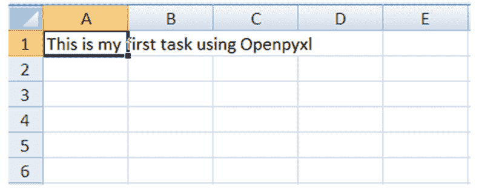

图 5.1：使用 openpyxl 的第一个练习

## 打开并修改现有工作簿

我们现在将看看如何修改现有工作簿。让我们打开我们在上一个练习中保存的同一个工作簿 **Learn_Excel_Automation.xlsx**，然后使用 Python 修改其内容。在 Python 编辑器中输入以下代码：

```
from openpyxl import load_workbook

objWorkbook = load_workbook("Learn_Excel_Automation.xlsx")
objWorksheet = objWorkbook.worksheets[0]

objWorksheet.cell(3,1,'This is my second task in openpyxl')
objWorkbook.save("Learn_Excel_Automation.xlsx")
```

这里，我们使用了 **load_workbook** 模块来加载工作簿 **Learn_Excel_Automation.xlsx**。访问工作表和在单元格中输入值的方法保持不变。请注意，**openpyxl** 还允许使用替代方法修改单元格的内容，如下所示：

```
objWorksheet.cell(3,1).value = 'This is my second task in openpyxl'
```

这里，‘value’ 是一个获取和设置属性，这意味着我们可以用它来返回特定单元格的值，也可以为特定单元格赋值。
打开工作簿后，我们将看到我们写入的文本，如下图 *图 5.2* 所示：

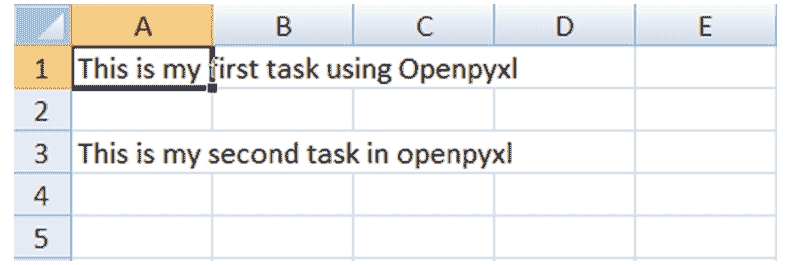

**图 5.2：** *修改现有 Excel 工作簿的内容*

## 使用区域名称访问单元格

之前，我们看到了如何使用 worksheet.cell 访问单元格并修改其内容。
现在，我们将看看使用以下代码执行相同任务的另一种方法。我们将加载在上一个练习中保存的同一个工作簿：

```
from openpyxl import load_workbook

objWorkbook = load_workbook("Learn_Excel_Automation.xlsx")

objWorksheet = objWorkbook.worksheets[0]
objWorksheet['A5'] = 'I have modified the contents of this cell using the range name!'

objWorkbook.save("Learn_Excel_Automation.xlsx")
```

这里，我们使用 **objWorksheet['A5']** 访问区域为 A5 的单元格并修改其内容。在 Python 编辑器中运行代码并打开工作簿后，我们将看到写入单元格区域 A5 的文本，如下图 *图 5.3* 所示：

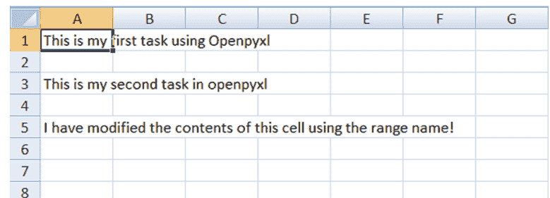

**图 5.3：** *使用区域名称修改工作簿的内容*

## 合并单元格

为了了解如何合并单元格，我们将打开在前面练习中保存的同一个工作簿并合并单元格。在 Python 编辑器中输入以下代码：

```
from openpyxl import load_workbook
from openpyxl.styles import Alignment

objWorkbook = load_workbook("Learn_Excel_Automation.xlsx")
objWorksheet = objWorkbook.worksheets[0]

objWorksheet.merge_cells('A1:D2')
cell = objWorksheet.cell(1,1)
cell.alignment = Alignment(horizontal='center', vertical='center')
objWorkbook.save("Learn_Excel_Automation.xlsx")
```

在此代码中，函数 **merge_cells** 将把区域 **A1:D2** 内的单元格合并为一个单元格。第一个单元格中的文本 **This is my first task using Openpyxl** 将保留在合并后的单元格中。为了将文本居中对齐，我们导入了另一个名为 **Alignment** 的模块，并传递了参数 **horizontal='center', vertical='center'** 以将内容居中对齐。你会同意这与在 Excel 中手动执行“合并并居中”是相同的。在这里，我们使用了 **openpyxl** 来自动化此过程。

打开保存的工作簿后，你会看到单元格区域 A1:D2 合并为一个单元格，如下图 *图 5.4* 所示：

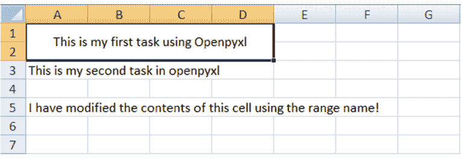

*图 5.4：使用 openpyxl merge_cells 合并单元格*

## 循环遍历单元格

现在让我们循环遍历单元格，并在循环时向单元格输入内容。

我们将打开一个空白的 Excel 工作簿，并手动创建一个如图 *图 5.5* 所示的表格。该表格是五名学生‘A’、‘B’、‘C’、‘D’和‘E’在数学、科学和英语中获得分数的摘要。之后，我们将工作簿保存为‘Student Table.xlsx’并关闭工作簿（参考图 5.5）：

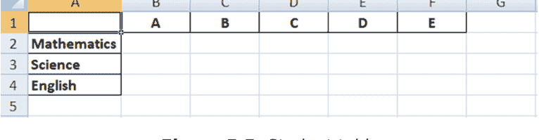

*图 5.5：学生表格*

现在，将下面的代码复制到Python编辑器中：

```python
from openpyxl import load_workbook
from openpyxl.styles import Alignment

objWorkbook = load_workbook("Student Table.xlsx")
objWorksheet = objWorkbook.worksheets[0]

dict_scores = {'A': {'Mathematics':45,'Science':55,'English':75},
               'B':{'Mathematics':75,'Science':87,'English':87},
               'C':{'Mathematics':90,'Science':95,'English':58},
               'D':{'Mathematics':100,'Science':28,'English':80},
               'E':{'Mathematics':35,'Science':75,'English':90}}
col=2
for key in dict_scores:
    student = dict_scores[key]
    row=2
    for subject in student:
        score = student[subject]
        objWorksheet.cell(row,col).value = score
        objWorksheet.cell(row,col).alignment = \
        Alignment(horizontal='center', vertical='center')
        row+=1
    col+=1
objWorkbook.save("Student Table.xlsx")
```

这里，我们首先创建了一个名为 **dict_scores** 的字典，它存储了每位学生在数学、科学和英语各科目的成绩。这个字典包含键‘A’、‘B’、‘C’、‘D’、‘E’，分别对应不同的学生。每个键对应的值也是一个字典，其键是科目名称‘Mathematics’、‘Science’、‘English’，值是学生在这些科目中获得的相应分数。接下来，我们遍历每个学生键，并在这个循环内部进一步遍历每个科目键，以获取每位学生在该科目中的成绩。

仔细研究代码中的循环，看看循环如何在输入分数时，为每个学生遍历各个列，并在每一列内遍历每一行。运行代码后，打开工作簿 **Student Table.xlsx**。你会观察到分数已按下面的*图5.6*所示输入：

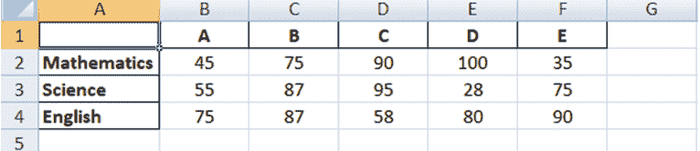

**图5.6：** *使用Python循环填充了分数的学生表格*

在本节中，我们了解了openpyxl中的 **worksheet.cell()** 如何接受行和列参数作为动态输入，并允许人们通过使用Python循环遍历工作表并填充值。

接下来，我们将了解如何使用openpyxl来填充我们常用的Excel公式。

## 使用openpyxl处理Excel公式

在本节中，我们将学习如何使用openpyxl库在特定单元格中填充Excel公式，然后我们还将学习如何将公式拖动到相邻单元格。

我们将使用在上一个练习中保存的同一个工作簿 **Student Table.xlsx**。将下面的代码复制到Python编辑器中：

```python
from openpyxl import load_workbook
from openpyxl.styles import Alignment
objWorkbook = load_workbook("Student Table.xlsx")
objWorksheet = objWorkbook.worksheets[0]
objWorksheet['B5']="=ROUND(AVERAGE(B2:B4),0)"
objWorksheet['B5'].alignment = Alignment(horizontal='center',
vertical='center')
objWorkbook.save("Student Table.xlsx")
```

这里，在单元格B5插入Excel公式的代码行是：

**objWorksheet['B5']="=ROUND(AVERAGE(B2:B4),0)".**

基本上，该公式试图计算学生A在所有三个科目中获得分数的平均值，然后将结果四舍五入到最接近的整数。一旦你执行代码，打开工作簿并观察单元格B5。你会看到四舍五入到最接近整数的平均值将被填充到该单元格中。对于学生A，数学、科学和英语分别获得的45、55和75分的平均值是58.333。将其四舍五入到最接近的整数得到58，这正是我们在下面的*图5.7*中单元格B5看到的值：

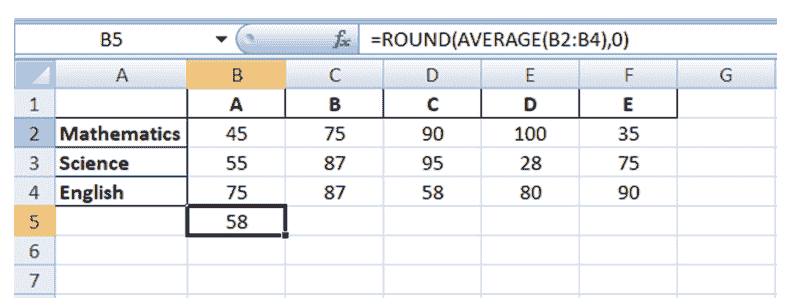

**图5.7：** *使用openpyxl在单元格B5中计算的学生A的平均分*

既然我们已经成功地在一个单元格中填充了公式，接下来我们想做的是将公式拖动到剩余的单元格C5、D5、E5和F5，这样我们也可以计算学生B、C、D和E的平均分，并四舍五入到最接近的整数。

当我们手动处理Excel电子表格时，我们只需复制一个单元格并将其粘贴到另一个单元格，这样公式就会自动在该单元格中更新。然而，当我们通过使用openpyxl的代码执行此练习时，我们需要不同的解决方法。幸运的是，openpyxl提供了一个名为Translator的模块来为我们完成这项任务。

在之前的代码中添加下面一行：

```python
from openpyxl.formula.translate import Translator
```

这行代码导入了Translator模块。现在让我们使用下面的代码来实现它：

```python
objWorksheet['C5'] = Translator("=ROUND(AVERAGE(B2:B4),0)",
"B5").translate_formula("C5")
```

Translator模块接受两个参数：要翻译的公式和公式原始所属的单元格范围。然后，Translator模块的 **translate_formula** 方法接受一个单元格范围作为参数，我们希望将公式转移到该范围。在本例中，它是 **C5**，因为我们想将公式转移到范围C5。完整的代码如下所示。将其粘贴到一个新的编辑器中。

如果工作簿 **Student Table.xlsx** 已打开，请关闭工作簿并运行代码：

```python
from openpyxl import load_workbook
from openpyxl.styles import Alignment
from openpyxl.formula.translate import Translator
objWorkbook = load_workbook("Student Table.xlsx")
objWorksheet = objWorkbook.worksheets[0]
objWorksheet['B5']="=ROUND(AVERAGE(B2:B4),0)"
objWorksheet['C5'] = Translator("=ROUND(AVERAGE(B2:B4),0)",
"B5").translate_formula("C5")
objWorksheet['C5'].alignment = Alignment(horizontal='center',
vertical='center')
objWorkbook.save("Student Table.xlsx")
```

执行上述代码后，打开工作簿 **Student Table.xlsx**。我们会观察到单元格B5中的公式已更新到单元格C5（参考*图5.8*）：

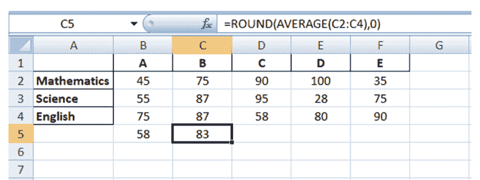

**图5.8：** 使用openpyxl Translator将单元格B5的公式更新到单元格C5。

单元格C5正确地反映了公式 **=ROUND(AVERAGE(C2:C4),0)**，从而清楚地表明单元格B5的公式已正确拖动到C5。同样，我们可以使用Translator模块来更新单元格D5、E5和F5中的公式。

然而，这会是更新后续单元格公式的最有效方法吗？这里，我们只有三个单元格需要更新公式，但假设我们有一百个这样的单元格需要更新，那么我们是否要再调用一百次Translator模块并编写一百行额外的代码？当然不是！这就是Python循环的威力所在。

与我们之前所做的不同，我们将从单元格C5开始，循环遍历另外四个单元格来更新每个单元格中的公式，最终结束于单元格E5。这里，行保持不变，即5。只有列会改变。在这种情况下，Translator模块只需要知道列字母，无论是‘C’、‘D’、‘E’还是‘F’。下面的代码将清楚地说明我们如何完成这项任务：

```python
row=5

col=3

translator = Translator("=ROUND(AVERAGE(B2:B4),0)","B5")
for i in range(4):
    str_col_letter = objWorksheet.cell(row,col).column_letter
    objWorksheet[str_col_letter + '5'] =translator.translate_formula(str_col_letter + "5")
    objWorksheet.cell(row,col).alignment = Alignment(horizontal='center',vertical='center')
    col+=1
objWorkbook.save("Student Table.xlsx")
```

这里，我们将 **row** 变量初始化为值5，该值保持不变。**col** 变量初始化为3，但随着我们遍历连续的列而递增。请注意，我们遍历的范围是4，因为我们需要再导航四列来更新从 **B** 列开始的公式。然后我们声明translator对象。请注意，我们在这里将 **translator** 对象声明在循环外部，因为它只需要初始化一次，然后在循环中简单地调用即可。

变量 **str_col_letter** 是这段代码的一个重要亮点。我们使用 **cell** 对象的 **column_letter** 属性，它返回列的字母名称。例如，**cell(5,3)** 对应于第5行和第3列。在Excel电子表格中，该单元格对应于范围 **C5**，因此 **column_letter** 属性在这种情况下将返回 **C**。类似地，当我们遍历连续的单元格时，我们捕获它们的 **column_letter** 属性，并将它们与行号连接起来以获取范围名称。在本例中，由于行号是常数5，我们只需将字符串 **str_col_letter + '5'** 传递给Translator对象。完整的代码如下所示。如果工作簿 **Student Table.xlsx** 已经打开，请关闭它，粘贴

将下面的代码复制到Python编辑器中并运行（参考*图5.9*）：

```python
from openpyxl import load_workbook
from openpyxl.styles import Alignment
from openpyxl.formula.translate import Translator
objWorkbook = load_workbook("Student Table.xlsx")
objWorksheet = objWorkbook.worksheets[0]
objWorksheet['B5']="=ROUND(AVERAGE(B2:B4),0)"
row=5
col=3
translator = Translator("=ROUND(AVERAGE(B2:B4),0)","B5")
for i in range(4):
    str_col_letter = objWorksheet.cell(row,col).column_letter
    objWorksheet[str_col_letter + '5'] =translator.translate_formula(str_col_letter + "5")
    objWorksheet.cell(row,col).alignment = Alignment(horizontal='center',vertical='center')
    col+=1
objWorkbook.save("Student Table.xlsx")
```

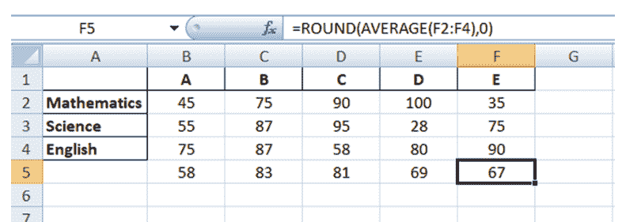

**图5.9：** *使用openpyxl Translator和循环将Excel公式拖拽到其他单元格*

我们观察到公式已正确更新至单元格‘F5’。通过这种方式，我们成功学习了如何使用openpyxl库的Translator模块和Python循环来更新公式。

现在，我们将尝试通过使其更具视觉吸引力来让这些信息更有用。在下一节中，让我们释放openpyxl的功能，它使我们能够创建图表。

## 使用openpyxl创建图表

我们将使用同一工作簿‘Student Table.xlsx’中的表格来创建图表。让我们绘制一个柱状图，显示每位学生的平均分。

将下面的代码复制到Python编辑器中：

```python
import openpyxl
from openpyxl import load_workbook
from openpyxl.chart import BarChart,Reference
objWorkbook = openpyxl.load_workbook('Student Table.xlsx')
objWorksheet = objWorkbook.worksheets[0]
values = Reference(objWorksheet,min_col=2, min_row=5, max_col=6, max_row=5)
titles = Reference(objWorksheet,min_col=2, min_row=1, max_row=1, max_col=6)
chart = BarChart()
chart.add_data(values,titles)
chart.set_categories(titles)
objWorksheet.add_chart(chart, "H7")
objWorkbook.save("Student Table.xlsx")
```

首先，我们从**openpyxl.chart**导入**BarChart**和Reference模块。

Reference模块用于让图表对象了解数据和标签的正确引用。

我们创建一个名为‘values’的变量，它存储我们将用于绘制柱状图的数据。在这个例子中，我们传递了从B列到F列的整个第5行，这基本上是我们感兴趣的数据。我们通过指定参数**min_col=2, min_row=5, max_col=6, max_row=5**来实现这一点。

我们还想传递从B列到F列的第一行，这基本上是学生‘A’、‘B’、‘C’、‘D’和‘E’的名字作为标签。我们通过创建一个名为‘titles’的变量并传递值**min_col=2, min_row=1, max_row=1, max_col = 6**来实现这一点。

之后，我们创建**chart**变量作为**BarChart**对象，并在**add_data**方法中将**values**和**titles**作为其参数传递。

我们还需要使用**set_categories**方法并传递**titles**变量作为参数来指定图表中的类别。

最后，我们使用工作表对象中的**add_chart**方法将图表添加到工作表中，并指定我们需要添加它的位置。在这个例子中，我们指定了**H7**作为我们希望放置图表的单元格。

运行代码后，我们打开工作簿**Student Table.xlsx**。我们观察到柱状图已创建，如下方*图5.10*所示：

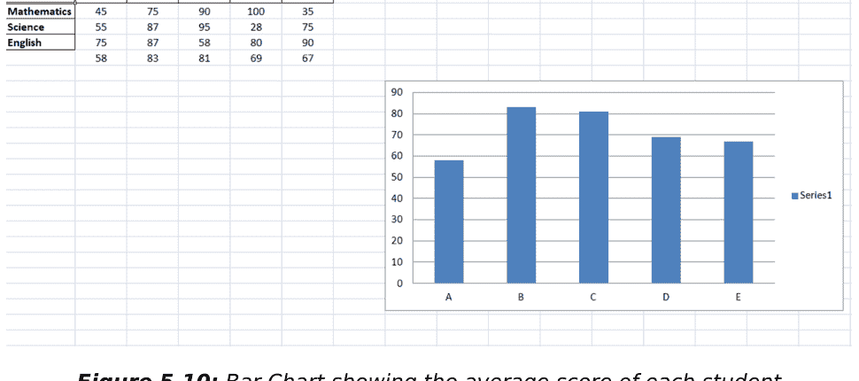

**图5.10：** *显示每位学生平均分的柱状图*

## 设置图表样式

我们在上一个练习中创建的图表是一个基本图表。然而，我们也想探索openpyxl在为图表添加各种样式（如颜色、边框和格式）方面提供的功能。

将下面的代码复制到Python编辑器中：

```python
import openpyxl
from openpyxl import load_workbook
from openpyxl.chart import BarChart,Reference
objWorkbook = openpyxl.load_workbook('Student Table.xlsx')
objWorksheet = objWorkbook.worksheets[0]
chart = objWorksheet._charts[0]
chart.style = 8
objWorkbook.save("Student Table.xlsx")
```

关闭工作簿‘**Student Table.xlsx**’并运行代码。打开工作簿后，我们从下方的*图5.11*观察到图表颜色已更改：

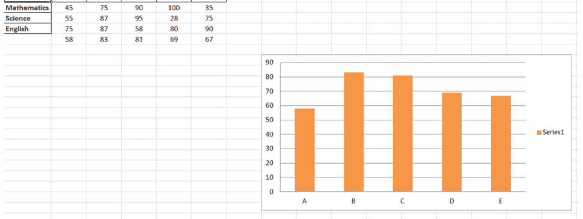

**图5.11：** *使用‘style’属性探索不同的图表颜色*

基本上，我们使用工作表的**_charts**属性从工作表中访问图表，并传递索引键0，因为工作表中只有一个图表。之后，我们使用图表对象的**style**属性并赋值为8，以获得与8对应的图表颜色，如*图5.11*所示。每个数字都对应一种特定的颜色，留给读者去探索。

让我们也为X轴和Y轴添加标签，以便更容易理解它们分别对应**学生**和他们的**分数**。关闭**Student Table.xlsx**工作簿，在编辑器中运行代码。我们会观察到X轴和Y轴分别被分配了**Students**和**Scores**标签（参考*下方图5.12*）：

```python
import openpyxl
from openpyxl import load_workbook
from openpyxl.chart import BarChart,Reference
from openpyxl.chart.layout import Layout, ManualLayout
objWorkbook = openpyxl.load_workbook('Student Table.xlsx')
objWorksheet = objWorkbook.worksheets[0]
chart = objWorksheet._charts[0]
chart.style = 8
chart.x_axis.title = 'Students'
chart.y_axis.title = 'Scores'
chart.legend.position = 'tr'
objWorkbook.save("Student Table.xlsx")
```

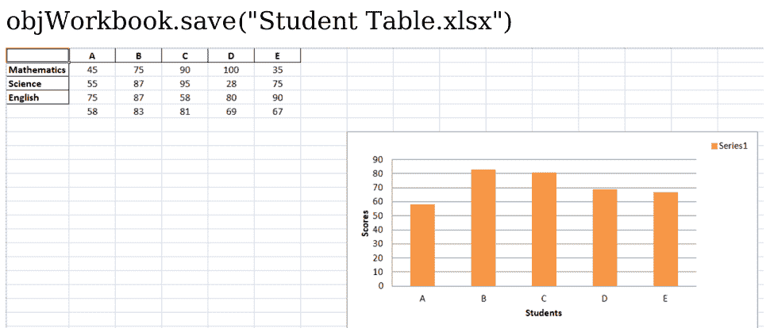

**图5.12：** *为X轴和Y轴添加标签*

在这里，我们使用了图表**x_axis**和**y_axis**对象的**title**属性来为轴分配标签。我们还使用了图表**legend**对象的**position**属性来表示我们希望放置**系列1**图例的位置。我们将**tr**赋值给此属性，它代表**右上角**。如下图所示，图例实际上已移动到右上角。

最后，让我们为图表添加一个标题。我们只需要添加一行额外的代码：`chart.title = "Average Scores of Students"`。

关闭工作簿**Student Table.xlsx**并在Python编辑器中运行下面的代码：

```python
import openpyxl
from openpyxl import load_workbook
from openpyxl.chart import BarChart,Reference
from openpyxl.chart.layout import Layout, ManualLayout
objWorkbook = openpyxl.load_workbook('Student Table.xlsx')
objWorksheet = objWorkbook.worksheets[0]
chart = objWorksheet._charts[0]
chart.style = 8
chart.x_axis.title = 'Students'
chart.y_axis.title = 'Scores'
chart.legend.position = 'tr'
chart.title = "Average Scores of Students"
objWorkbook.save("Student Table.xlsx")
```

打开工作簿**Student Table.xlsx**并观察图表。

我们发现图表现在有了一个标题**Average Scores of Students**，如下方*图5.13*所示：

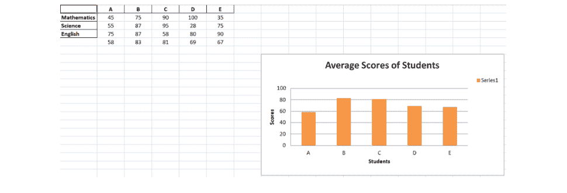

**图5.13：** *为图表添加标题‘Average Scores of Students’*

至此，我们完成了关于图表的系列教程！我们所进行的练习应能让读者充分理解，以便进一步探索openpyxl在创建和设置图表样式方面提供的功能。

我们已经看到openpyxl是一个极其有用的库，它提供了读取、编辑、转换和分析Excel电子表格的能力。openpyxl中还有许多其他模块为用户提供了额外的功能。本章奠定的基础应能为读者提供足够的基础，以独立探索openpyxl的其他功能。

至此，我们现在将继续探索Python提供的其他开源库，这些库可替代openpyxl用于自动化Excel中的常规任务。这些库是**xlwings**和**xlsxWriter**。

## 用于Excel自动化的其他Python库

我们将在本节中探索xlwings和xlsxwriter库。

## Python 库比较总结

下表基于我们目前研究的所有库的显著参数提供了比较。在决定针对 Excel 自动化任务最合适的 Python 库时，这个*表 5.1* 会很方便：

| 参数 | openpyxl | xlwings | xlsxwriter |
| :--- | :--- | :--- | :--- |
| **启动 Excel** | 在后台工作，无需启动 Excel 应用程序。 | 执行任务时启动 Excel 应用程序。 | 创建新的 Excel 工作簿，但可以在后台工作，无需启动 Excel 应用程序。 |
| **独特优势** | 能够创建、读取、编辑和写入具有多种功能的 Excel 文件。 | 为特定功能（如 Excel 公式）提供简短而智能的执行。 | 涵盖了其他 Python 库未涵盖的众多 Excel 功能。 |
| **缺点** | 处理大型数据集或公式时运行缓慢。 | 执行任务时会打开 Excel 应用程序。用户需要将 xlwings 创建的 Excel App 对象的 'visible' 属性设置为 'False' 以隐藏该对象。 | 无法打开或编辑已存在的工作簿。只能用于创建新的工作簿。 |

**表 5.1：** *用于 Excel 自动化的 Python 库比较总结*

至此，我们已经完成了使用 Python 进行 Excel 自动化的学习和练习。现在，让我们将所学知识应用于一个实际用例，然后结束本章。

## Python 中的实际用例

让我们将之前练习中学到的所有知识应用于一个实际用例，我们将使用 xlsxwriter、openpyxl 和 xlwings 所有库。

让我们创建一个名为 **Stock Prices.xlsx** 的新 Excel 工作簿。我们将在此 Excel 工作簿中分析五个指数 'A'、'B'、'C'、'D' 和 'E' 从一月到十二月的股票价格。

首先，我们需要创建一个新的工作簿，并以表格格式输入这些数据。我们通过在 Python 中创建一个字典，然后使用 xlsxwriter 将字典值传输到 Excel 工作表来实现。在 Python 编辑器中复制并运行以下代码：

```
import xlsxwriter as xw

objWorkbook = xw.Workbook('Stock Prices.xlsx')
objWorksheet = objWorkbook.add_worksheet('Prices')

dict_Stock_Prices = {'A':[357, 457, 187, 831, 779, 338, 129, 508, 407, 748, 511, 609],
                     'B':[14908, 13408, 17103, 18886, 19828, 12098, 17080, 16850, 15023, 12405, 15469, 13800],
                     'C':[60,64,54, 93, 87, 74, 96, 92, 83,85,70,88],
                     'D':[1667, 1962, 1845, 1535, 1753, 1767, 1551, 1893, 1715, 1707, 1627, 1532],
                     'E':[2181, 2333, 2265, 2274, 2739, 2601, 2569, 2520, 2744, 2234, 2836, 2230]}

month_list = ['Jan','Feb','Mar','Apr','May','Jun','Jul','Aug','Sep','Oct','Nov','Dec']

stock_list = ['A','B','C','D','E']

objFormat_1=objWorkbook.add_format({'border':1})
objFormat_2=objWorkbook.add_format({'border':2})

objWorksheet.write_column('A2', stock_list,objFormat_2)
objWorksheet.write_row('B1', month_list, objFormat_2)

row=1
```

- **xlwings**：要使用此库，首先需要使用以下命令安装它：
  **pip install xlwings**

此库在处理 Excel 公式时特别有用。让我们尝试在同一个 **Student Table.xlsx** 工作簿中插入公式。

在工作簿的 G2 单元格中，让我们插入公式 **=ROUND(AVERAGE(B2:F2),0)**，该公式基本上将计算所有学生在特定科目上的平均分。我们还希望将此公式向下拖动到 G4 单元格。将以下代码复制到 Python 编辑器中：

```
import xlwings as xlw

obj_excel_app = xlw.App(visible=False)
objWorkbook = xlw.Book('Student Table.xlsx')
objWorksheet = objWorkbook.sheets[0]
formula = '=ROUND(AVERAGE(B2:F2),0)'
objWorksheet.range("G2,G3,G4").formula = formula
objWorkbook.save()
objWorkbook.close()
obj_excel_app.kill()
```

> **注意：** 在这里，我们首先将一个名为 'obj_excel_app' 的变量初始化为 'xlwings' 的 'App' 对象，并将 'visible' 属性设置为 'False'。'xlwings' 的工作方式是，它实际上在执行任务时实时创建一个 Excel 应用程序并打开工作簿。这与 'openpyxl' 不同，后者可以在不打开 Excel 应用程序的情况下执行所有操作。如果我们设置此 'visible' 属性为 'True'（这是默认值），用户可以观察到 xlwings 打开的工作簿。

观察到 xlwings 提供了一种简单的方法来插入公式，我们只需将公式字符串分配给 **range** 对象的 **formula** 属性。在 **range** 对象中，我们只需指定要将公式分配给哪些单元格。在本例中，我们指定 **G2**、**G3** 和 **G4** 作为范围，因为那是我们想要分配公式的地方。

运行代码后，我们发现公式已成功分配给范围 G2、G3 和 G4，如下图*图 5.14*所示：

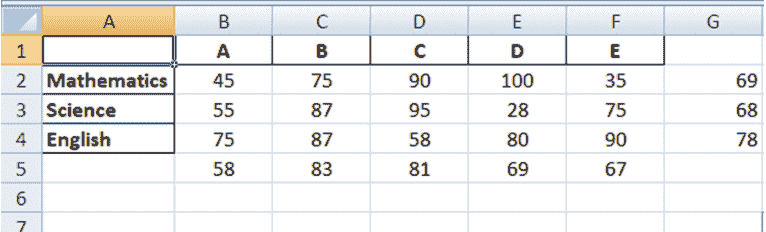

**图 5.14：** *使用 xlwings 计算所有学生某一科目的平均分*

最后，我们保存工作簿并关闭工作簿。最后，我们还终止了我们在开始时创建的 Excel 应用程序对象 **obj_excel_app**。这一步是必要的，因为即使在工作簿关闭后，Excel 应用程序对象仍会在后台保持打开状态，这可能会在尝试手动打开另一个工作簿时导致问题。

通过这种方式，我们学习了 **xlwings** 如何提供简单的功能在 Excel 工作表中插入公式。

- **xlsxwriter：** 使用此库的第一步是使用以下命令安装它：

# pip install xlsxwriter

让我们尝试一个 xlsxwriter 的示例任务，在工作表的第一个单元格中输入文本。在 Python 编辑器中复制并运行以下代码：

```
import xlsxwriter as xr
objWorkbook = xr.Workbook('Learn_Writer.xlsx')
objWorksheet = objWorkbook.add_worksheet('Exercise')
objWorksheet.write('A1','This is my first tutorial in xlsxwriter!')
objWorkbook.close()
```

下图*图 5.15*显示了运行上述代码后获得的输出：

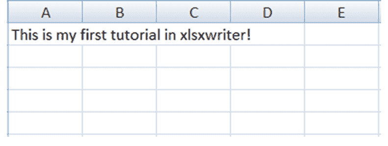

我们发现我们能够在使用 xlsxwriter 创建的工作簿 **Learn_Writer.xlsx** 的名为 **Exercise** 的工作表的 A1 单元格中写入文本 **This is my first tutorial in xlsxwriter!**。在这里，工作表对象的 **write** 方法非常有用，因为它可以将单元格引用和我们要写入的内容作为参数包含在内。

需要注意的是，库 xlsxwriter 只能用于创建新的 Excel 工作簿，不能用于打开和编辑已存在的 Excel 工作簿。然而，在速度和内存考虑方面，它是一个非常有用的库。此外，它还提供了非常有用的功能，如格式化、筛选、导入图像和创建图表。事实上，它提供的功能数量比 Python 提供的任何其他用于 Excel 自动化的库都多。

此库的另一个巨大优势是它生成的文件与 Microsoft Excel 生成的文件 100% 等效，因此与 Excel 生成的文件具有高度保真度。因此，除了不能编辑现有 Excel 工作簿这一缺点外，此库在所有其他方面都非常适合 Excel 自动化。

在本节中，我们探讨了 xlwings 和 xlsxwriter 库，与 openpyxl 相比，它们在特定需求方面各有优势。

在下一节中，我们将快速浏览这些库的比较表，以便用户在决定用于自动化 Excel 应用程序的最合适的库时，可以将该表作为现成的参考。

for stock in dict_Stock_Prices:
    stock_prices = dict_Stock_Prices[stock]
    objWorksheet.write_row(row, 1, stock_prices, objFormat_1)
    row += 1

objWorkbook.close()

这里，我们首先准备一个字典，其键为股票名称‘A’、‘B’、‘C’、‘D’、‘E’，值为包含从一月到十二月股票价格的列表。

我们还准备了两个列表，分别称为**month_list**（包含月份名称）和**stock_list**（包含股票名称）。

接下来，我们创建两个变量**objFormat_1**和**objFormat_2**，其中指定了边框格式，这些格式将作为参数传递给工作表对象的**write**方法。这里，‘**border**:1’是常规边框，而‘**border**:2’是加粗边框。

然后，我们调用工作表对象的**write_column**和**write_row**方法，并分别传递变量**stock_list**和**month_list**，以及边框格式变量**objFormat_2**。

值得注意的是，xlsxwriter提供了诸如**write_row**和**write_column**等实用方法，允许直接传递整行或整列数据，而无需循环遍历单个值。同样，我们也看到xlsxwriter如何通过一行代码提供出色的格式化功能，例如创建常规边框和加粗边框。

在代码末尾，我们使用**write_row**方法遍历每只股票，输入该股票的相应月度值。这里，我们使用**objFormat_1**，即常规边框。

运行代码后，我们打开保存的工作簿，观察到所需的数据集已以表格格式创建，如下方*图5.16*所示：

| | A | B | C | D | E | F | G | H | I | J | K | L | M | N |
|---|---|---|---|---|---|---|---|---|---|---|---|---|---|---|
| | Jan | Feb | Mar | Apr | May | Jun | Jul | Aug | Sep | Oct | Nov | Dec | |
| A | 357 | 457 | 187 | 831 | 779 | 338 | 129 | 508 | 407 | 748 | 511 | 609 | |
| B | 14908 | 13408 | 17103 | 18886 | 19828 | 12098 | 17080 | 16850 | 15023 | 12405 | 15469 | 13800 | |
| C | 60 | 64 | 54 | 93 | 87 | 74 | 96 | 92 | 83 | 85 | 70 | 88 | |
| D | 1667 | 1962 | 1845 | 1535 | 1753 | 1767 | 1551 | 1893 | 1715 | 1707 | 1627 | 1532 | |
| E | 2181 | 2333 | 2265 | 2274 | 2739 | 2601 | 2569 | 2520 | 2744 | 2234 | 2836 | 2230 | |

**图5.16：** 使用Python的'xlsxwriter'库以表格格式输入的原始数据。

通过这种方式，我们利用了xlsxwriter的特殊功能来创建一个包含原始数据表的新工作簿，并为其添加边框格式。

现在，我们将使用xlwings在同一个工作簿上，利用Excel公式进行计算。我们将计算所有股票全年的平均价格，并将值插入N列。将以下代码复制并运行到编辑器中：

```
import xlwings as xlw

obj_excel_app = xlw.App(visible=False)

objWorkbook = xlw.Book('Stock Prices.xlsx')

objWorksheet = objWorkbook.sheets[0]

formula = '=ROUND(AVERAGE(B2:M2),0)'

objWorksheet.range("N2,N3,N4,N5,N6").formula = formula

objWorkbook.save()

objWorkbook.close()

obj_excel_app.kill()
```

我们在前面讨论xlwings库的部分已经进行过类似的练习。这里我们做同样的事情。运行代码后，我们打开工作簿**Stock Prices.xlsx**，观察到平均值已被计算并插入到N列，如下方*图5.17*所示：

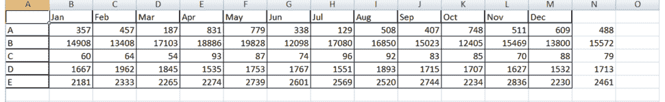

*图5.17：使用xlwings计算并填充在N列的股票平均值。*

最后，我们将使用**openpyxl**为N列中的平均股票值绘制一个饼图。将以下代码复制并运行到编辑器中：

```
import openpyxl
from openpyxl import load_workbook
from openpyxl.chart import PieChart, Reference
from openpyxl.chart.layout import Layout, ManualLayout

objWorkbook = openpyxl.load_workbook('Stock Prices.xlsx')
objWorksheet = objWorkbook.worksheets[0]
labels = Reference(objWorksheet, min_col=1, min_row=2, max_row=6)
data = Reference(objWorksheet, min_col=14, min_row=2, max_row=6)
chart = PieChart()
chart.add_data(data, titles_from_data=False)
chart.set_categories(labels)
chart.title = " PIE-CHART "
objWorksheet.add_chart(chart, "C10")
chart = objWorksheet._charts[0]
chart.title = "Average Price of Stocks"
objWorkbook.save("Stock Prices.xlsx")
```

运行代码后打开文件Stock Prices.xlsx。如下图所示，我们发现已为N列中的数据创建了饼图（参见*图5.18*）：

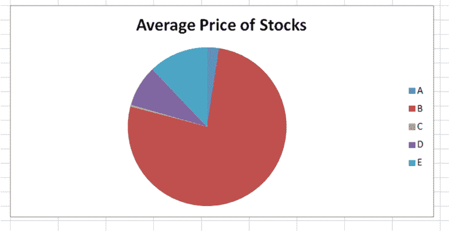

**图5.18：** *使用openpyxl绘制的平均股票价格饼图。*

这个Python的实际用例很好地说明了如何有选择地、方便地使用特定的Python库来实现特定目标。至此，我们结束了关于使用Python进行Excel自动化的这一章。这无疑是一个漫长且内容丰富的章节，但也同样引人入胜！

## 结论

Excel电子表格是办公任务的核心，学习电子表格自动化是开启Python自动化之旅的绝佳方式，因为最大量的数据都是导入并维护在电子表格中的。希望本章已经以最佳方式实现了这一目标！

现在，我们的下一个目标将是深入消息传递的世界。随着社交媒体的兴起，现代通信带来了通过WhatsApp以及最流行的邮件平台Gmail进行即时通信的多种途径。了解Python如何提供通过这些平台自动发送消息的功能将令人兴奋，我们将在下一章中学习。

## 加入本书的Discord空间

加入本书的Discord工作区，获取最新更新、优惠、全球科技动态、新书发布以及与作者的交流会：

https://discord.bpbonline.com


# 第6章
## 自动化电子邮件和消息传递

### 引言

通信和社交媒体的兴起导致了对即时消息传递的迫切需求。Gmail已成为个人和轻度专业用途中使用最广泛的基于网络的电子邮件服务。本章首先演示如何使用Python自动化Gmail中创建电子邮件的过程。过去十年也见证了WhatsApp作为最受欢迎的消息应用程序的崛起，它几乎取代了常规短信的使用，并因其为个人和群组提供快速消息功能而成为人们生活中不可或缺的一部分。本章将重点介绍如何使用Python提供的PyWhatKit库自动化向个人和群组发送WhatsApp消息的过程。本章最后将以一个Python的实际用例结束。

### 结构

本章涵盖以下主题：

- Gmail自动化的先决条件
  - 开启两步验证
  - 获取应用专用密码
  - 发送Gmail消息
- 自动化WhatsApp消息传递
- Python的实际用例

### 目标

在本章结束时，我们将掌握使用Python进行电子邮件和消息传递自动化的基础知识。我们将通过实践示例学习如何使用Gmail发送电子邮件以及在WhatsApp上发送消息。掌握了这些技能，我们将准备好应用Python的自动化功能来简化个人和专业用途的通信任务。

### Gmail自动化的先决条件

为了自动化通过Gmail创建和发送电子邮件的过程，我们将使用Python提供的**email**、**ssl**和**smtplib**库。
然而，在开始实际的Python自动化之前，需要在Gmail中激活某些设置。后续章节将对此进行讨论。

### 为Gmail开启两步验证

请按照以下步骤为Gmail开启两步验证：

1.  访问网站 **https://myaccount.google.com/**。

## 两步验证

页面左侧将显示如下图所示的选项。选择**安全**选项，如以下*图 6.1*中高亮所示：


**图 6.1：** 网站 [https://myaccount.google.com/](https://myaccount.google.com/) 上的选项

2.  向下滚动，直到找到如下图所示的**登录 Google 的方式**部分。你会发现列表中的第一个选项是**两步验证**。点击该选项（参见*图 6.2*）：


**图 6.2：** *登录 Google 的方式*

3.  点击该选项后，将加载另一个页面，如下图所示。点击底部的**开始使用**按钮。系统会要求你输入密码进行登录（参见*图 6.3*）：

← 两步验证


**图 6.3：** *Gmail 两步验证页面*

4.  如果是首次设置，系统可能会要求输入电话号码，并提供单选按钮选项，以选择通过**短信**或**电话**接收验证码，如下*图 6.4*所示：

输入相应详细信息，然后按**下一步**：

# ← 两步验证


**图 6.4：** *Gmail 两步验证详细信息*

5.  输入通过短信或电话收到的验证码，然后按**下一步**（参见*图 6.5*）：


**图 6.5：** *验证码*

6.  验证完成后，你将看到如下图所示的窗口。右下角会有一个**开启**选项。点击该选项（参见*图 6.6*）：


**图 6.6：** *Gmail 两步验证最终窗口*

7.  系统会要求你再次输入密码。输入密码后，你将看到如下*图 6.7 和图 6.8*所示的页面，其中包含**开启**按钮。点击**开启**按钮：

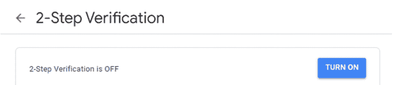

**图 6.7：** *开启 Gmail 两步验证*

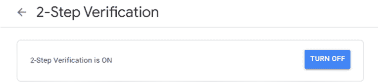

**图 6.8：** *Gmail 两步验证完成*

8.  最后，一旦两步验证开启，你将看到如下图所示的**关闭**选项，这确认了 **Gmail 账户的两步验证现已开启**。

> **注意：** 这只是告知读者，本节中的一些图片可能仅显示了实际页面的特定部分。这样做是出于安全原因，以隐藏执行此练习时使用的实际凭据，如电子邮件、密码和电话号码。

## 获取应用专用密码

为了使用 Python 代码通过 Gmail 发送邮件，我们不会在代码中使用常规登录密码。相反，我们应该使用 Gmail 提供的应用专用密码。要获取应用专用密码，请按照以下步骤操作：

1.  转到网址 **https://myaccount.google.com/app passwords**。你会看到一个名为**选择应用**的下拉菜单，如下图所示。选择并点击最后一个选项**其他（自定义名称）**（参见*图 6.9*）：


**图 6.9：** *应用专用密码*

2.  你会看到一个文本框，要求你为应用输入任意名称。输入任意名称，如**Python_Learning**，如下*图 6.10*所示：


**图 6.10：** *输入应用名称*

3.  点击**生成**。将生成一个页面，如下图所示，其中右上角的黄色区块中会包含一个密码。图片中密码已被遮盖，但每个用户都会有唯一的密码。复制密码并保存在某处，因为我们将在代码中需要它（参见*图 6.11*）：


**图 6.11：** *Gmail 账户的应用专用密码*

## 使用 Python 发送 Gmail 消息

在完成前面练习的所有步骤后，我们终于来到了编写 Python 代码的部分！

将以下代码复制到 Python 编辑器中：

```
from email.message import EmailMessage
import ssl as objSSL
import smtplib

strSender = 'XXXXXXXX@gmail.com'
strReceiver = 'XXXXXXXX@gmail.com'
strPassword = 'XXXXXXXX'

strSubject = 'Learning Email Sending with Python'
strBody = """ Learning how to send emails using Python.
"""

objEmail = EmailMessage()
objEmail['From'] = strSender
objEmail['To'] = strReceiver
objEmail['Subject'] = strSubject
objEmail.set_content(strBody)

objContext = objSSL.create_default_context()

objSMTP = smtplib.SMTP_SSL('smtp.gmail.com',465,context=objContext)
objSMTP.login(strSender, strPassword)
objSMTP.sendmail(strSender,
strReceiver,objEmail.as_string())
```

大部分代码是自解释的。在字符串变量 **strSender** 的值中，输入你执行了两步验证并生成了应用专用密码的 Gmail ID。对于变量 **strReceiver**，输入你想要发送邮件的收件人的电子邮件 ID。

而对于变量 **strPassword**，输入我们在上一节中刚刚生成并保存的应用专用密码。

我们使用 Python 的 **ssl** 库，通过认证网站来增加一层安全性以保护信息。SSL 基本上代表安全套接字层协议。

为了发送邮件，我们使用 Python 的 **smtplib** 库，它提供了通过简单邮件传输协议发送电子邮件的功能。我们还创建了一个变量 **objSMTP**，并将其初始化为 **smtplib** 模块的 **SMTP_SSL** 对象。然后，我们将指定 **smtp.gmail.com** 作为邮件服务器，**465** 作为端口，以及 **objContext** 变量作为上下文。最后，我们使用 **login** 和 **sendemail** 方法，通过输入相应的变量电子邮件 ID 值和密码来发送邮件。

成功完成此操作后，我们就完成了通过 Gmail 发送电子邮件所需的一切！

现在，要自己测试此功能，你可能想使用你自己的另一个 Gmail ID 作为**收件人**电子邮件，并在运行代码后观察该邮件是否已发送到收件人的邮箱。

既然我们已经熟悉了通过 Gmail 创建和发送电子邮件，让我们继续另一个令人兴奋的自动化主题——WhatsApp 消息自动化！

## 自动化 WhatsApp 消息

Python 提供了 PyWhatKit 库，可以方便地用于自动化发送 WhatsApp 消息的过程。在我们开始使用此库之前，第一步是使用以下命令安装它：

```
pip install pywhatkit
```

接下来，在 Python 编辑器中输入以下代码：

```
import pywhatkit
pywhatkit.sendwhatmsg_instantly("XXXXXXXXXXXXX", "Hello")
```

我们可以清楚地观察到代码很短，只包含两行。第一行，我们导入 **pywhatkit** 库；第二行，我们使用 **sendwhatmsg_instantly** 方法，该方法接受两个参数：收件人的电话号码和需要发送的消息。

运行代码后，WhatsApp 网页将首次加载，要求用户通过扫描二维码登录 WhatsApp 网页。登录 WhatsApp 网页的方法是转到**设置**选项，选择**已关联设备**，然后点击**关联设备**按钮。之后，扫描仪将打开，允许用户扫描二维码并登录 WhatsApp 网页。

> **注意：** 此活动仅需在首次执行，因为在下次运行代码时，用户将自动登录 WhatsApp 网页。

现在，我们将使用 Python 向联系人发送 WhatsApp 消息！然而，除了向单个联系人发送消息外，还有一个功能被用于与发送个人消息同样频繁的是WhatsApp群组，那么，学会如何使用Python代码向群组发送WhatsApp消息，难道不是同样重要吗？

嗯，是的，确实如此！别担心，两者区别不大。唯一的改变是，我们不再使用联系人，而是使用群组标识符作为方法 **sendwhatmsg_instantly** 的第一个参数。

为了获取群组ID，请按照以下步骤操作。请注意，通过以下步骤，你只能获取你自己创建的群组的ID。对于你不是管理员的其他群组，你需要联系管理员，让他们使用以下步骤获取群组ID：

1.  打开群聊。
2.  点击右上角的三个点。会出现一个下拉菜单。选择 **群组信息**（参见 *图 6.12*）：

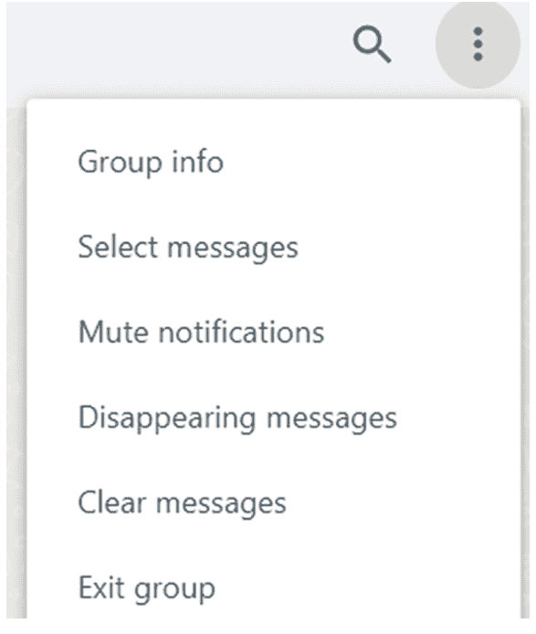

**图 6.12：** *WhatsApp 群聊选项*

3.  选择 **群组信息** 后，会打开一个页面，其中包含群组信息和所有成员的名称。向下滚动到页面底部，当你看到一个写着 **通过链接邀请加入群组** 的选项时，点击它（参见下面的 *图 6.13*）：


**图 6.13：** *WhatsApp 群组信息选项*

4.  点击该选项后，会加载一个页面，你会看到一个格式为 **https://chat.whatsapp.com/XXXXXXXXXXXXXXXXXXXX** 的链接。最后部分 XXXXXXXXXXXXXXXXXXXX 就是我们要找的ID。这基本上是一个由22个字符组成的字母数字字符串。

现在我们已经获得了群组ID，下一步就是在Python编辑器中执行下面的代码片段：

```
import pywhatkit

pywhatkit.sendwhatmsg_to_group_instantly("XXXXXXXXXXXXXXXXXXXX",'Hello!')
```

运行上述代码后，你会发现消息 **Hello** 已经发送到了WhatsApp群组。

我们现在已经介绍了通过Python自动化个人和群组WhatsApp消息发送的过程。现在，让我们将本章所学的所有知识应用到Python中，实现一个实际用例。

## Python中的实际用例

在这个用例中，我们将采用这样一个场景：我们有一个数据集，包含一个人员列表，其中有他们的姓名、WhatsApp号码、电子邮件地址和出生日期。我们需要编写一个程序，自动向列表中所有今天过生日的成员发送生日电子邮件和WhatsApp生日祝福消息。

1.  创建一个新的Excel工作簿，并在新的工作表中按照下图所示的格式准备一个表格。在相应的列中输入一些联系人的姓名、WhatsApp号码、电子邮件地址和出生日期。

> **注意：** 由于这是一个测试练习，建议你只使用与你关系密切的人的联系号码和电子邮件地址。你也可以使用自己的备用电子邮件ID进行测试。这是一个警示说明，以避免不必要的垃圾信息骚扰。

2.  下面的 *图 6.14* 提供了准备用于存储姓名和联系详情的表格的指南。请在练习中运行代码之前遵循相同的格式：

| 序号 | 姓名 | WhatsApp 号码 | 电子邮件ID | 生日 |
|---|---|---|---|---|
| 1 | X | XXXXXXXXXXX | XXX@gmail.com | 23-Aug-87 |
| 2 | Y | YYYYYYYYYYY | YYY@gmail.com | 14-Jul-46 |
| 3 | Z | ZZZZZZZZZZZ | ZZZ@gmail.com | 15-Apr-03 |
| 4 | XYZ | XYZXYZXYZXYZ | XYZ@gmail.com | 09-Jan-94 |

*图 6.14：* 准备姓名和联系详情的格式

3.  按照上述格式输入数据后，将Excel工作簿保存为 **Data.xlsx**。然后，将下面的代码复制到Python编辑器中：

```
# Importing required libraries
import time
import pandas as pd
import datetime
import pywhatkit
from email.message import EmailMessage
import ssl as objSSL
import smtplib

# Reading the excel in a dataframe
df = pd.read_excel("Data.xlsx")

today = datetime.datetime.now().strftime("%m-%d")

strSender = 'XXXXXXXXX'
strPassword = 'XXXXXXXXXXX'
strSubject = 'Happy Birthday!'
strBody = """ Wish you a very happy birthday! """
# Looping through every row of the table
i=0
for row in df['Birthday']:
    birthday = row.strftime("%m-%d")

    # Checking if the birth date is same as the date today
    if birthday == today:
        strName = df['Name'].loc[i]
        strWhatsAppNo = df['WhatsApp No'].loc[i]
        pywhatkit.sendwhatmsg_instantly("+"+str(strWhatsAppNo),"Hello"\n        +strName +" This is a test message sent using Python.")
        time.sleep(15)
        strReceiver = df['Email ID'].loc[i]
        print(strWhatsAppNo)
        print(strReceiver)
        objEmail = EmailMessage()
        objEmail['From'] = strSender
        objEmail['To'] = strReceiver
        objEmail['Subject'] = strSubject
        objEmail.set_content(strBody)

        objContext = objSSL.create_default_context()

        objSMTP = smtplib.SMTP_SSL('smtp.gmail.com',465,context=objContext)

        objSMTP.login(strSender, strPassword)

        objSMTP.sendmail(strSender, strReceiver,objEmail.as_string())

        i+=1
```

这段代码是不言自明的，因为已经添加了注释。在代码遍历每一行的部分，添加了一个 **if** 代码块。正是这个 **if** 代码块检查该行所包含信息的人的生日是否是今天。如果是，那么代码将发送一条WhatsApp消息，内容为 **生日快乐**，并发送相应的生日电子邮件到该人的Gmail地址。

## 结论

本章为自动化Gmail和WhatsApp奠定了基础，它们分别是常用的邮件和消息工具。我们介绍了 **pywhatkit** 库和用于Gmail的SMTP协议。对于好奇的Python程序员来说，这两个领域还有很多可以探索和实验的内容！

在下一章中，我们将探讨PDF文件和图像的自动化。没有这两者，关于自动化的讨论将是不完整的。PDF文件是自动化和机器学习项目中最常见的原始数据源。因此，理解使用Python从PDF文档中提取数据的过程至关重要。同时，图像文档也构成了一种非结构化数据格式，需要不同的处理方法来提取数据。因此，好奇的读者将不再浪费任何时间，翻到下一页，开始这个极其有趣的话题！

## 加入我们的书籍Discord空间

加入书籍的Discord工作区，获取最新更新、优惠、全球科技动态、新书发布以及与作者的交流会：
https://discord.bpbonline.com


# 第7章
## 处理PDF和图像

### 简介

本章演示如何使用Python从PDF文件读取数据以及处理图像文件。本章首先介绍PyPDF库，并引导用户了解各种功能，如读取、合并、旋转和拆分PDF文件。它还讨论了PyPDF库在某些特定情况下的局限性，以及如何使用其他Python库（如Tabula和Textract）来应对这些局限性。随后，用户将接触到Python中处理图像文件读取和转换的PIL库。此外，本章继续讨论一个非常重要的主题——**光学字符识别（OCR）**，它通过Pytesseract库实现。最后一节将讨论另一个流行的用于计算机视觉的Python包OpenCV。本章以一个计算机视觉的实际用例演示结束。

### 结构

本章涵盖以下主题：

- PyPDF库
- 使用PyPDF2读取PDF文件
- 旋转和合并PDF文件
- 使用PIL库处理图像
- 光学字符识别
- 使用OpenCV
- Python中的实际用例

### 目标

本章将使你掌握使用Python熟练提取数据和操作PDF文件的技能。你将获得光学字符识别的实践经验，将图像转换为文本，最终通过实践练习和一个综合用例来展示Python在处理数字文档和图像方面的能力。

### PyPDF库

PyPDF是一个Python包，允许读取和转换PDF文件。最初的PyPDF经过修订形成了PyPDF2、PyPDF3和PyPDF4。修订后的版本支持Python 3。PyPDF2版本在某个时间点后被弃用，但后来被重新启用，现在正在积极维护。然而，最新的PyPDF4版本与PyPDF2没有完全的向后兼容性。因此，本章我们将只关注PyPDF2。

要开始使用这个库，第一步是安装它。可以使用以下命令安装该库：

```
pip install pypdf2
```

## 使用 PyPDF2 读取 PDF 文件

我们将使用文件 **Stock Prices.pdf** 来进行本次练习，通过 Python 读取数据。将以下代码复制到 Python 编辑器中：

```python
import PyPDF2

pdfReader = PyPDF2.PdfReader('Stock Prices.pdf')

pageObj = pdfReader.pages[0]

print(pageObj.extract_text())
```

运行上述代码后，我们将在控制台中得到如下所示的输出：

**下表显示了五只股票 A、B、C、D 和 E 从一月到十二月的价格。第一列包含股票名称，其余列包含各股票从一月到十二月的相应数值。**

| Stocks | Jan | Feb | Mar | Apr | May | Jun | Jul | Aug | Sep | Oct | Nov | Dec |
|---|---|---|---|---|---|---|---|---|---|---|---|---|
| A | 357 | 457 | 187 | 831 | 779 | 338 | 129 | 508 | 407 | 748 | 511 | 609 |
| B | 14908 | 13408 | 17103 | 18886 | 19828 | 12098 | 17080 | 16850 | 15023 | 12405 | 15469 | 13800 |
| C | 60 | 64 | 54 | 93 | 87 | 74 | 96 | 92 | 83 | 85 | 70 | 88 |
| D | 1667 | 1962 | 1845 | 1535 | 1753 | 1767 | 1551 | 1893 | 1715 | 1707 | 1627 | 1532 |
| E | 2181 | 2333 | 2265 | 2274 | 2739 | 2601 | 2569 | 2520 | 2744 | 2234 | 2836 | 2230 |

仔细观察上述输出。

我们首先注意到的是，底部生成的表格缺少分隔列的列线。因此，阅读该表格变得困难。

我们能做出的第二个观察是，尽管输出提供了提取的文本，但直接使用时会遇到一些挑战。我们看到在第一句话 **Below is a table..** 中，单词 **is** 被错误地处理，在 **i** 和 **s** 之间插入了一个空格。这偶尔会发生，因为 PDF 文档中的文本不像 Word 文档中的文本流。PDF 文档只知道它有一组字符需要放置在彼此相对的位置上。这种字符的相对定位有时会使解析器难以判断两个字符是构成同一个单词，还是应该用空格分隔。PDF 文档中的每个字符都被一个边界框包围。这个边界框的位置由左下角和右上角的 X 和 Y 坐标决定。有时，两个相邻字符的边界框之间的间隔可能比通常预期的相邻字符之间的间隔要大。这可能会给解析器识别相邻字符属于同一个单词带来困难。

无论这里存在什么挑战，我们都需要找到一些方法来解决它们。在这种情况下，我们需要使用其他的 Python 库来完成我们的工作。

为了解决第一个挑战，我们可以使用一个名为 **tabula** 的库，它专门用于提取表格。将以下代码复制到 Python 编辑器中：

```python
from tabula import read_pdf

objTable = read_pdf("Stock Prices.pdf", pages="all")
df = objTable[0]
df.to_excel("Stock Prices.xlsx", index=None)
```

这里，我们基本上导入了 **tabula** 库的 **read_pdf** 模块。我们在这个模块中输入了两个参数。第一个参数是 PDF 文档的名称，即 **Stock Prices.pdf**。第二个参数是页码。在这种情况下，我们指定 **all**。这是一个单页文档，但作为一种实践，指定 **all** 应该从文档的所有页面中提取信息。然后我们将这个对象的值存储到 **objTable** 变量中。

这段代码的重要部分是创建 **df** 变量，我们基本上是通过对 **objTable** 变量进行索引获得的。在这种情况下，我们只有一个表格，所以我们指定 **objTable[0]** 来获取第一个表格。需要注意的是，这里返回的值是一个 pandas dataframe，从导出或转换的角度来看，这是非常有利的。

在这里，我们使用 **dataframe** 对象的 **to_excel** 方法将数据框导出到名为 **Stock Prices.xlsx** 的 Excel 文件中。打开 Excel 后，我们看到下图中的表格已经漂亮地导出到 Excel 电子表格中：

| Stocks | Jan | Feb | Mar | Apr | May | Jun | Jul | Aug | Sep | Oct | Nov | Dec |
|---|---|---|---|---|---|---|---|---|---|---|---|---|
| A | 357 | 457 | 187 | 831 | 779 | 338 | 129 | 508 | 407 | 748 | 511 | 609 |
| B | 14908 | 13408 | 17103 | 18886 | 19828 | 12098 | 17080 | 16850 | 15023 | 12405 | 15469 | 13800 |
| C | 60 | 64 | 54 | 93 | 87 | 74 | 96 | 92 | 83 | 85 | 70 | 88 |
| D | 1667 | 1962 | 1845 | 1535 | 1753 | 1767 | 1551 | 1893 | 1715 | 1707 | 1627 | 1532 |
| E | 2181 | 2333 | 2265 | 2274 | 2739 | 2601 | 2569 | 2520 | 2744 | 2234 | 2836 | 2230 |

**图 7.1：** *使用 tabula Python 模块将 PDF 中的表格导出到 Excel 文档*

为了解决第二个挑战，我们将使用一个不同的库。Python 提供了一个名为 **textract** 的库，它是一个通用的文本读取库，可以从具有扩展名 **.docx**、**.xlsx**、**.pdf** 的不同类型的文档中读取文本。将以下代码复制到 Python 编辑器中，并注意控制台中的输出：

```python
import textract

text = textract.process('Stock Prices.pdf')

print(text)
```

**输出：**

b'Below is a table showing the price of five stocks A,B,C,D, and E from January to December. The first column\r\ncontains the stock names and the remaining columns contain the respective values of the stock from\r\nJanuary to December.\r\n\r\nStocks Jan\r\n\r\nFeb\r\n\r\nMar\r\n\r\nApr\r\n\r\nMay\r\n\r\nJun\r\n\r\nJul\r\n\r\nAug\r\n\r\nSep\r\n\r\nOct\r\n\r\nNov\r\n\r\nDec\r\n\r\nA\r\n\r\n357\r\n\r\n457\r\n\r\n187\r\n\r\n831\r\n\r\n779\r\n\r\n338\r\n\r\n129\r\n\r\n508\r\n\r\n407\r\n\r\n748\r\n\r\n511\r\n\r\n609\r\n\r\nB\r\n\r\n14908\r\n\r\n13408\r\n\r\n17103\r\n\r\n18886\r\n\r\n19828\r\n\r\n12098\r\n\r\n17080\r\n\r\n16850\r\n\r\n15023\r\n\r\n12405\r\n\r\n15469\r\n\r\n13800\r\n\r\nC\r\n\r\n60\r\n\r\n64\r\n\r\n54\r\n\r\n93\r\n\r\n87\r\n\r\n74\r\n\r\n96\r\n\r\n92\r\n\r\n83\r\n\r\n85\r\n\r\n70\r\n\r\n88\r\n\r\nD\r\n\r\n1667\r\n\r\n1962\r\n\r\n1845\r\n\r\n1535\r\n\r\n1753\r\n\r\n1767\r\n\r\n1551\r\n\r\n1893\r\n\r\n1715\r\n\r\n1707\r\n\r\n1627\r\n\r\n1532\r\n\r\nE\r\n\r\n2181\r\n\r\n2333\r\n\r\n2265\r\n\r\n2274\r\n\r\n2739\r\n\r\n2601\r\n\r\n2569\r\n\r\n2520\r\n\r\n2744\r\n\r\n2234\r\n\r\n2836\r\n\r\n2230\r\n\r\n\x0c'

这里，我们看到底部提取的表格格式不可用。然而，该表格与我们这里的工作没有直接关系。如果我们看输出的第一行文本，我们发现单词 **is** 现在被正确打印出来了。然而，我们仍然需要忽略字符串前面的字节字面量以及字符串中的换行符 (\n) 和回车符 (\r)。这表明从 PDF 中提取文本并非那么简单，即使使用了像 PyPDF2 这样的库，也总是需要一些变通方法。

## 旋转和合并 PDF 文件

我们经常会发现，收到的 PDF 文件可能是横向模式，而我们需要的是纵向模式。这时，旋转 PDF 的功能就派上用场了。

将以下代码复制到 Python 编辑器中：

```python
import PyPDF2

strFileName = 'Stock Prices.pdf'
strRotatedFileName = 'Stock Prices Rotated File.pdf'
intRotation = 90

objPDF = open(strFileName, 'rb')
objPDFReader = PyPDF2.PdfReader(objPDF)
objPDFWriter = PyPDF2.PdfWriter()
objPage = objPDFReader.pages[0]
objPage.rotate(intRotation)
objPDFWriter.add_page(objPage)
objRotatedFile = open(strRotatedFileName, 'wb')
objPDFWriter.write(objRotatedFile)
objPDF.close()
objRotatedFile.close()
```

我们这里本质上做的是将这个 PDF 的页面顺时针旋转 90 度，并将文件保存为名为 **Stock_Prices_Rotated_File.pdf** 的新文档。运行代码并打开新文件 **Stock_Prices_Rotated_File.pdf** 后，我们看到页面确实已顺时针旋转了 90 度，如下图 *图 7.2* 所示：

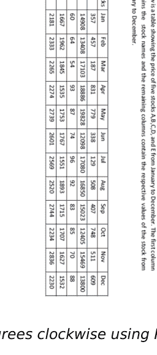

**图 7.2：** 使用 Python 代码将 PDF 文件页面顺时针旋转 90 度

请记住，默认的旋转方向始终是顺时针。如果我们想逆时针旋转页面，只需在旋转数字前加上一个负号即可。

既然我们已经熟悉了旋转 PDF，让我们学习如何将两个 PDF 文档合并成一个文档。我们已经有了原始文档 **Stock_Prices.pdf**，我们将把它与新创建的文档 **Stock_Prices_Rotated_File.pdf** 合并。将以下代码复制到 Python 编辑器中：

import PyPDF2

listPDFs = ['Stock Prices.pdf', 'Stock Prices Rotated File.pdf']
strMergedFileName = 'Stock Prices Merged File.pdf'
objPDFMerger = PyPDF2.PdfMerger()

for objPDF in listPDFs:
    objPDFMerger.append(objPDF)

objPDFMerger.write(open(strMergedFileName, 'wb'))

运行上述代码后，我们发现创建了一个名为 **Stock Prices Merged File.pdf** 的新文件，该文件包含两页。第一页是原始文件 **Stock Prices.pdf** 的页面，第二页是文件 **Stock Prices Rotated File.pdf** 的页面。

在上面的代码中，我们使用了 PyPDF2 模块的 **PdfMerger** 对象来完成任务。我们创建了一个名为 **listPDFs** 的列表，并将原始文件和旋转后的文件作为列表元素输入。然后，代码遍历列表中的每个文件，并将每个文件追加到 **PdfMerger** 对象中。最后，我们使用 **PdfMerger** 对象的 **write** 方法将合并后的页面保存到一个新文件中。

## 使用 PIL 库处理图像

Python 提供了 **Python Imaging Library** (PIL)，允许处理图像。我们将在本节中使用 PIL 的一个名为 **pillow** 的分支。

我们将使用的图像文件可以在以下链接找到：

https://pixabay.com/photos/blue-tit-tit-bird-animal-feathers-7965696/

请访问该链接并下载图像，该图像将类似于下面 *图 7.3* 所示：


**图 7.3：** *我们将用于本节学习的鸟的图像*

这是一张美丽鸟儿的图像，我们将在代码中将其用作参考图像文件。访问链接后，点击 **Free Download** 按钮下载文件，并将文件保存为 **Image of a Bird.jpg**，位置与稍后将保存的 Python 脚本相同。

接下来，在提示符中运行以下命令，以便在我们的代码中使用 **PIL** 库的 **Pillow** 分支：

```
pip install Pillow
```

虽然使用这个 Python 库可以对图像进行多种操作，但在本节中，我们将只关注旋转图像和裁剪图像。

要旋转图像，请将下面的代码复制并运行到 Python 编辑器中：

```
from PIL import Image
objImage = Image.open("Image of a Bird.jpg")
objImage = objImage.rotate(180)
objImage.save("Rotated Image of a Bird.jpg")
```

这段代码不言自明。我们从 PIL 库导入 **Image** 模块，并使用模块的 **open** 方法打开它。我们将这个打开的图像保存到一个名为 **objImage** 的变量中。然后，我们使用 **objImage** 的 **rotate** 方法，通过传入参数 **180** 将图像旋转 **180** 度。最后，我们通过将其命名为 **Rotated Image of a Bird.jpg** 将图像保存为一个新文件。

现在，我们将尝试裁剪鸟的图像。将下面的代码复制到编辑器中：

```
from PIL import Image

objImage = Image.open("Image of a Bird.jpg")

fltWidth,fltHeight = objImage.size

fltArea = (fltWidth/5, fltHeight/5, 4*fltWidth/5, 4*fltHeight/5)

objImage = objImage.crop(fltArea)

objImage.save("Cropped Image of a Bird.jpg")
```

这里，我们使用 **size** 属性获取图像的宽度和高度，并将值分别存储在变量 **fltWidth** 和 **fltHeight** 中。这些值取决于下载的图像大小。如果是一个 *1920 *1280* 大小的图像，那么宽度将是 1920，高度将是 1280。然而，我们不必担心实际大小，因为我们将动态使用宽度和高度。

接下来，我们创建一个变量 **fltArea**，其中动态传递左上角和右下角点的 x 和 y 坐标。这些点将形成用于裁剪图像的包围框。在这种情况下，我们传递 **fltWidth/5**、**fltHeight/5** 作为左上角点的 X 和 Y 坐标，传递 **4*fltWidth/5**、**4*fltHeight/5** 作为右下角点的 X 和 Y 坐标，这将定义包围框。因此，我们实际上是从两侧裁剪掉了宽度和高度的五分之一。

运行代码后，我们发现创建了一个新文件 **Cropped Image of a Bird.jpg**，它基本上是裁剪后的图像，如下面的 *图 7.4* 所示：


**图 7.4：** *使用 Python 裁剪的鸟的图像*

既然我们已经成功学习了如何使用 Python 执行基本的图像任务，我们现在将有兴趣熟悉机器学习中两个非常重要的主题：光学字符识别和计算机视觉。接下来的章节将专注于这些主题。

## 光学字符识别

光学字符识别或文本识别是一种软件技术，它识别图像或硬拷贝文档中的文本元素和字符，并将其转换为机器可读的文本，可用于进一步处理。OCR 最流行的用途是 PDF 到文本转换器，它将扫描的 PDF 文档转换为 **.txt** 文件。

Python 中最流行的 OCR 工具之一是 **tesseract**，在本节中，我们将介绍 **tesseract** 的用法和应用，以执行简单的 OCR 任务。

为了开始使用 **tesseract**，首先需要从以下位置下载 **tesseract** 可执行文件：

**https://digi.bib.uni-mannheim.de/tesseract/tesseract-ocr-w64-setup-5.3.1.20230401.exe**

上面是 64 位的最新链接，但对于需要 32 位和 64 位 Windows 旧版本的用户，可以访问以下链接查看更多选项：

**https://digi.bib.uni-mannheim.de/tesseract/**

下载安装程序后，将其安装在以下位置：

**'C:\Program Files (x86)\Tesseract-OCR\tesseract.exe'**

之后，我们将使用以下命令安装 tesseract 的 Python 包装器：

**pip install pytesseract**

在本练习中，我们将获取一个包含文本的示例图像，并尝试使用 Pytesseract 从该图像中提取文本。我们将使用图像 **Test_OCR.jpg**，它看起来如下 *图 7.5* 所示：

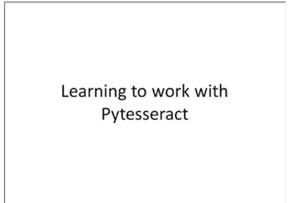

**图 7.5：** 图像 *Test_OCR.jpg*

将下面的代码复制到 Python 编辑器中：

```
import pytesseract
from PIL import Image

img = Image.open('Test_OCR.jpg')

pytesseract.pytesseract.tesseract_cmd = r'C:\Program Files (x86)\Tesseract-OCR\tesseract.exe'

imagetext = pytesseract.image_to_string(img)

print(imagetext)
```

让我们逐步理解代码：

1.  在前两行中，我们导入所需的库，即 **pytesseract** 和 **Image**。

    ```python
    import pytesseract
    from PIL import Image
    ```

2.  接下来，我们使用图像模块的 **open** 方法打开图像，使用以下代码：

    ```
    img = Image.open('Test_OCR.jpg')
    ```

3.  然后，我们编写一行重要的代码，指定 **tesseract.exe** 文件的安装路径。这一步是必需的，因为代码需要知道 tesseract 可执行文件的路径。

4.  最后，我们使用 **Pytesseract** 库的 **image_to_string** 方法，并将图像作为参数传递。我们将获得的值存储在变量 **img** 中。我们使用 **print** 命令在控制台中打印图像中的文本。

运行代码后，我们得到如下所示的输出：

## 学习使用 Pytesseract

我们现在已成功从图像中提取了文本。这里需要注意的是，这张图像是一个简单的图像，黑色文本写在纯白色背景上。然而，当我们有彩色背景和文本时，情况可能会变得复杂，导致对比度不同。在这种情况下，我们可能需要对图像进行一些处理，以便 **tesseract** 能够识别它。我们将使用图像 **Colored_Image_OCR.jpg** 来实现此目的，该图像类似于下面 *图 7.6* 所示：

## 学习使用 Pytesseract

让我们运行之前运行过的同一个程序，只是这次我们只更改文件名。将下面的代码复制到 Python 编辑器中：

```python
import pytesseract
from PIL import Image

img = Image.open('Colored_Image_OCR.jpg')
pytesseract.pytesseract.tesseract_cmd = r'C:\Program Files (x86)\Tesseract-OCR\tesseract.exe'
imagetext = pytesseract.image_to_string(img)
print(imagetext)
```

运行上述代码后，我们发现输出为空白。这意味着 Tesseract 无法识别上面那张包含彩色背景和彩色文本的图像中的任何文本。

我们将使用下面的代码处理图像，使其能被 Tesseract 识别：

```python
import pytesseract
from PIL import Image

img = Image.open('Colored_Image_OCR.jpg')
img = img.convert('L')
img = img.save('Processed_Colored_Image_OCR.jpg')
pytesseract.pytesseract.tesseract_cmd = r'C:\Program Files (x86)\Tesseract-OCR\tesseract.exe'
imagetext = pytesseract.image_to_string(Image.open('Processed_Colored_Image_OCR.jpg'))
print(imagetext)
```

运行上述代码后，我们得到以下输出：

```
Learning to work with
Pytesseract
```

这表明我们已经成功地从图像中提取了文本！我们是如何做到的呢？如果我们仔细阅读代码，会观察到仅仅下面这两行额外的代码就为我们提供了所需的图像处理。

```python
img = img.convert('L')
img = img.save('Processed_Colored_Image_OCR.jpg')
```

基本上，我们使用了 **convert** 方法并传入 **L** 作为参数。这里，**L** 代表灰度，所以这基本上将我们现有的图像转换为灰度图像 **'Processed_Colored_Image_OCR.jpg'**，其中只保留了亮度信息。如果我们打开图像 **'Processed_Colored_Image_OCR.jpg'**，会发现它看起来就像下面 *图 7.7* 所示的那样：

**图 7.7：** *处理为灰度的原始图像*

这张灰度图像可以很容易地被 **pytesseract** 识别，从而识别出图像中的文本并给出我们所需的文本输出。然而，我们研究的这个例子是一个非常简单的图像处理案例。现实生活的例子可能更复杂，甚至可能包含图像中的噪声，从而导致错误的结果。在这种情况下，所需的处理可能更复杂，并且需要分多个步骤来完成。

## 使用 OpenCV

**开源计算机视觉库 (OpenCV)** 是一个广泛用于计算机视觉应用的 Python 包。计算机视觉是一种使计算机能够理解图像和视频内容的技术，从而帮助它们识别和分类图像和视频中包含的对象。人脸识别和自动驾驶汽车等当代技术是计算机视觉领域显著发展的成果。在本节中，我们将了解计算机视觉的一些基本概念，然后通过几个 OpenCV 的 Python 示例进行实践。

让我们首先尝试理解计算机是如何理解图像的。图像的最小单位是像素。图像基本上分为以下两种类型：

- **灰度图像**：这些图像只包含黑白两种颜色，像素值根据暗度级别分配。
- **RGB 图像**：这些是彩色图像，其中图像中的每个像素都是红、绿、蓝的组合。

我们在之前的练习中已经见过 RGB 图像和灰度图像的例子，当时我们在将 RGB 彩色图像传递给 Tesseract 之前将其转换为灰度。为了开始使用 OpenCV 库，第一步是使用以下命令安装它：

```
pip install opencv-python
```

现在，我们将使用 OpenCV 来读取图像，分别作为彩色图像和灰度图像。让我们使用之前练习中用过的同一张鸟的图片。从 Python 编辑器中复制并运行以下代码：

```python
import cv2

img = cv2.imread('Image of a Bird.jpg')
cv2.imshow('image', img)
cv2.waitKey(0)
```

代码简单而简短，解释如下：

1. 我们首先使用 `import cv2` 将 OpenCV 模块导入到我们的代码中。
2. 接下来，我们使用 **cv2** 库的 **imread** 方法，并将图像文件作为参数传入。这是读取图像文件的关键代码行。这里，我们是将图像文件作为彩色文件读取的。我们将在下一个练习中看到如何以灰度格式读取图像。
3. 之后，我们使用 **cv2** 的 **imshow** 方法来显示由 **cv2** 读取的图像。最后，我们使用 **cv2** 的 **waitkey** 方法，该方法允许用户在给定时间内显示窗口，或者直到用户按下任何键。

运行上述代码后，观察到图像在屏幕上打开，如下面的 *图 7.8* 所示：

**图 7.8：** *OpenCV 读取为 RGB 彩色的图像*

现在，让我们以灰度方式读取同一张图像。大部分代码保持不变，只是 **imread** 方法有一个小改动。**imread** 方法接受另一个参数，该参数基本上是一个整数，代表颜色或灰度标志。如果我们传入值 1，它将把图像作为常规彩色图像读取。这始终是默认值，因此我们在上一个练习中没有传递任何参数。但是，如果我们希望以灰度图像读取图像，则需要传递 **0** 作为第二个参数。让我们使用下面的代码尝试一下：

```python
import cv2

img = cv2.imread('Image of a Bird.jpg', 0)
cv2.imshow('image', img)
cv2.waitKey(0)
```

运行上述代码后，我们看到屏幕上生成的图像看起来像下图所示，这表明 **cv2** 确实将 *图 7.9* 作为灰度图像读取：

*图 7.9：OpenCV 读取为灰度图像的图像*

## Python 中的实际用例

现在，让我们将所学知识应用于解决一个 Python 中的实际用例。我们将使用文件 **Van.jpg**，如下面的 *图 7.10* 所示，并检测图像中包含的文本 **SCHOOL BUS**：

*图 7.10：图像 Van.jpg*

让我们继续使用下面的代码使用 **pytesseract** 并观察输出：

```python
import pytesseract
from PIL import Image
pytesseract.pytesseract.tesseract_cmd = r'C:\Program Files (x86)\Tesseract-OCR\tesseract.exe'
imagetext = pytesseract.image_to_string(Image.open('Van.jpg'))
print(imagetext)
```

运行上述代码后，我们将获得如 *图 7.11* 所示的乱码值：

**图 7.11：** *获得的输出乱码值*

如上图所示，我们获得的输出是乱码值，这表明图像中存在大量额外的噪声，使得 Pytesseract 难以检测到任何文本。为了让 Pytesseract 只关注图像中包含文本的部分，让我们裁剪文本区域内的图像。我们将继续使用上一个练习中使用的 **PIL** 库来实现文本的裁剪。

如果我们观察图像 **Van.jpg**，会发现文本 **SCHOOL BUS** 的水平位置在图像的中间。此外，整个文本大约占据了宽度的三分之一，两端各留出三分之一的宽度。文本的垂直位置是这样的：如果我们将图像的高度分成六个部分，文本的顶部位于第一个六分之一部分的末尾，文本的底部位于第二个六分之一（或三分之一）部分的末尾。

让我们使用下面的代码找出图像的原始尺寸：

```python
from PIL import Image

objImage = Image.open("Van.jpg")
fltWidth, fltHeight = objImage.size
print(fltWidth, fltHeight)
```

**输出：**
```
5685 3927
```

从输出中，我们看到原始图像的宽度和高度分别为 **5685** 和 **3927**。这里，我们使用 **fltWidth** 和 **fltHeight** 作为两个变量分别表示图像的宽度和高度。

理解了文本的定位和原始图像的尺寸后，我们现在可以得到裁剪图像到文本部分的坐标，如下所示：

```python
X1 = fltWidth/3-100
```

## 第7章（续）

```python
X2 = 2*fltWidth/3+100
Y1 = fltHeight/6
Y2 = fltHeight/3
```

这里，我们在X坐标上增加了100的清除缓冲区，以防止裁剪时切掉任何文本部分。完整的裁剪代码如下：

```python
from PIL import Image

objImage = Image.open("Van.jpg")

fltWidth,fltHeight = objImage.size

fltArea = (fltWidth/3-100, fltHeight/6, 2*fltWidth/3+100, fltHeight/3)

objImage = objImage.crop(fltArea)

objImage.save("Van-Cropped.jpg")
```

裁剪后的图像保存为**Van-Cropped.jpg**，其外观如下方*图7.12*所示，该图显示代码通过仅保留文本部分，对图像进行了干净的裁剪：

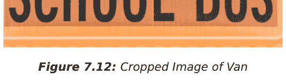

**图7.12：** Van的裁剪图像

现在，让我们通过运行以下代码，让Pytesseract读取这个裁剪后的图像**"Van-Cropped.jpg"**，而不是原始图像**'Van.jpg'**：

```python
import pytesseract

from PIL import Image

pytesseract.pytesseract.tesseract_cmd = r'C:\Program Files (x86)\Tesseract-OCR\tesseract.exe'
objImage = Image.open("Van-Cropped.jpg")
imagetext = pytesseract.image_to_string(objImage,config='--psm 7')
print(imagetext)
```

输出：
**SCHOOL BUS**

请注意上面代码中**image_to_string**函数的一个小改动。我们添加了一个额外的参数**config='--psm 7'**，它指示tesseract将图像视为单行文本，这正是裁剪后图像的特征。有关所有配置类型的详细列表，请访问下面的tesseract手册页面：

**https://github.com/tesseract-ocr/tesseract/blob/main/doc/tesseract.1.asc**

因此，至此我们已经成功地将所学的图像处理知识应用于从图像文件**'Van.jpg'**中捕获文本**SCHOOL BUS**！至此，我们结束了这一精彩的章节。

## 结论

通过本章，我们几乎涵盖了我们在计算机上经常处理的所有类型的办公文档。到现在，我们应该已经能够熟练地使用网络爬虫进行数据提取、使用Excel电子表格进行自动化、处理PDF文件中的文本和表格，以及检测图像中的文本，所有这些都使用特定的Python库来实现。

在下一章中，我们将介绍另一个重要的部分，涉及常规桌面操作的自动化，如移动文件和文件夹以及鼠标移动和点击。现在，让我们翻页，带着无拘无束的好奇心继续这段旅程！

## 加入本书的Discord空间

加入本书的Discord工作区，获取最新更新、优惠、全球科技动态、新书发布以及与作者的交流会：

[https://discord.bpbonline.com](https://discord.bpbonline.com)


# 第8章 应用程序、文件夹和操作的机械化

### 简介

本章首先介绍Python中的os和shutil模块，它们是自动化读取、写入和移动文件和文件夹过程的强大工具。将讨论shutil模块的各种方法及其独特的功能。本章进一步介绍PyAutoGUI库和PyWinAuto库，它们用于在计算机上实现常规的鼠标操作。讨论了这些库的比较优势和劣势。本章以一个项目结束，该项目将使读者熟悉这些库的使用。

### 结构

本章涵盖以下主题：

- Python中的os模块
- Python中的shutil模块
  - 使用Shutil复制和移动文件
  - 使用shutil根据扩展名移动文件
- 使用PyAutoGUI库
  - 使用PyAutoGUI实现基本鼠标功能
  - 使用PyAutoGUI实现基本键盘功能
  - 探索消息框
- Python中的实际用例

### 目标

在本章结束时，读者将能够轻松地在文件夹之间导航，并使用Python库提供的自动化功能执行常见的文件任务。读者还将能够使用Python自动化执行常见的鼠标功能。

## Python中的os模块

**os**模块是Python中最常用的标准实用模块之一。标准实用模块是在安装Python时安装在系统上的模块。无需使用**pip**命令单独安装它们。

**os**模块提供允许用户与操作系统交互的功能。可以使用此模块重命名文件、创建文件夹、获取当前工作目录以及执行更多与文件夹架构相关的任务。让我们快速了解一下此模块的一些有用函数。

- **获取当前工作目录**：为了获取当前工作目录，Python的**os**模块提供了**getcwd**方法。在Python编辑器中复制并运行以下代码：

```python
import os

objCWD = os.getcwd()

print("The current working directory is:", objCWD)
```

运行上述代码后，当前工作目录的路径将打印在控制台窗口中。这基本上与保存Python文件的目录相同。

- **创建新目录**：此功能允许在现有工作目录内创建新目录或新文件夹。在Python编辑器中复制并运行以下代码：

```python
import os

if not os.path.exists('Test Folder'):
    os.mkdir('Test Folder')
```

运行上述代码后，您会发现工作目录中已创建一个名为**'Test Folder'**的新文件夹。

- **删除目录**：此功能可用于删除现有目录及其所有内容。在Python编辑器中复制并运行以下代码：

```python
import os

try:
    os.rmdir('Test Folder')
except Exception as e:
    print(f"An error occurred: {e}")
```

运行上述代码后，您会发现我们之前创建的名为**'Test Folder'**的新文件夹现在已被删除。

## Python中的shutil模块

Python标准实用模块之一是**shutil**模块。由于这是一个标准实用模块，因此无需使用**pip**命令安装它。此模块允许通过重命名、移动和将文件复制到不同文件夹来处理文件。这些是我们经常执行的任务，但Python的**shutil**模块提供了在需要批量执行时自动化它们的能力。接下来的部分将专门介绍Python **shutil**模块提供的各个功能，我们将在本节中通过示例来理解它们。

## 使用shutil复制和移动文件

现在让我们看看如何使用**shutil**将一个文件的内容复制到另一个文件：

1. 创建一个新的Excel工作簿，并将其命名为**Shutil_Test.xlsx**。在单元格**A1**中输入文本**Testing the shutil module for the first time!**，如下方*图8.1*所示。保存对工作簿的更改：

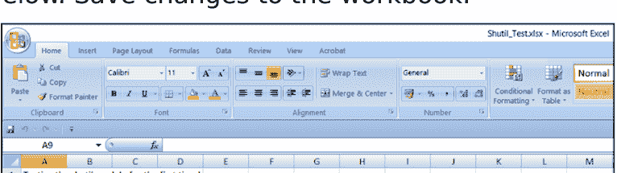

*图8.1：* 创建工作簿Shutil_Test.xlsx

现在，创建一个名为**Copy-Shutil_Test.xlsx**的空白Excel工作簿，并将其保存在与之前文件相同的目录中。我们将编写一个小型Python脚本，使用**shutil**的**copy**方法将文件**Shutil_Test.xlsx**的内容复制到空白文件**Copy-Shutil_Test.xlsx**中。在Python编辑器中复制并运行以下代码：

```python
import shutil

source = "Shutil_Test.xlsx"
destination ="Copy-Shutil_Test.xlsx"
dest = shutil.copy(source, destination)
```

运行上述代码后，打开工作簿**Copy-Shutil_Test.xlsx**。我们观察到工作簿**Shutil_Test.xlsx**的内容已被复制到工作簿**Copy-Shutil_Test.xlsx**中，如下方*图8.2*所示：

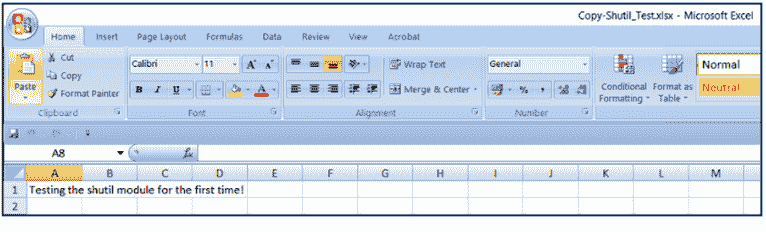

**图8.2：** *Shutil_Test.xlsx的内容已复制到Copy-Shutil_Test.xlsx*

现在，我们将利用**shutil**模块的相同**copy**方法将文件从一个位置移动到另一个位置。其他所有内容保持不变，唯一的区别是，我们传递的是目标路径而不是文件名作为第二个参数。在**Shutil_Test.xlsx**文件所在的同一目录中创建另一个名为**Move_Test**的文件夹。在Python编辑器中复制并运行以下代码：

```python
import shutil
```

source = "Shutil_Test.xlsx"
destination = "Move_Test/"
dest = shutil.copy(source, destination)

运行上述代码后，我们会发现文件 **"Shutil_Test.xlsx"** 已按预期成功复制到文件夹 **"Move_Test"** 中。

## 使用 shutil 根据扩展名移动文件

假设我们只想从特定文件夹复制图像文件并粘贴到另一个文件夹，**shutil** 模块提供了 **move** 方法来完成此操作。这里我们还使用了 **os** 模块。在复制并运行以下代码到 Python 编辑器之前，请确保在 Python 文件所在目录中保存一些扩展名为 **.jpg** 或 **.JPG** 的图像文件。

```python
import os
import shutil

if not os.path.exists('Images'):
    os.mkdir('Images')

for objFile in os.listdir():
    if '.jpg' in objFile.lower():
        strPath = 'Images/' + objFile
        shutil.move(objFile, strPath)
```

运行上述代码后，我们会发现目录中创建了一个名为 **Images** 的新文件夹，之前位于主目录中的所有图像文件都已移动到 **Images** 文件夹中。此操作类似于我们在计算机上手动执行的剪切和粘贴（*Ctrl + X*）操作。让我们尝试理解代码中的操作：

1.  首先，我们从 Python 的标准工具库中导入 **os** 和 **shutil** 模块。

    ```python
    import os
    import shutil
    ```

2.  接下来，我们使用 **os** 库的 **mkdir** 方法在主目录中创建一个名为 **Images** 的新文件夹。

    ```python
    os.mkdir('Images')
    ```

3.  然后，我们遍历主目录中的每个文件，并使用 if 语句检查文件的扩展名是否为 **.jpg**。如果扩展名是 **.jpg**，则使用 **shutil** 模块的 **move** 方法将文件移动到 **Images** 文件夹。

    ```python
    for objFile in os.listdir():
        if '.jpg' in objFile.lower():
            strPath = 'Images/' + objFile
            shutil.move(objFile, strPath)
    ```

类似地，我们也可以移动任何其他扩展名的文件，如 **.PDF**、**.xlsx** 和 **.docx**。我们只需在代码的 **if** 语句中指定正确的扩展名即可。

## 使用 PyAutoGUI 库

Python 的 PyAutoGUI 库提供了模拟常规鼠标功能的能力，如移动和悬停光标、左键单击、右键单击以及按下键盘按键。使用该库的第一步是使用以下命令安装它：

```bash
pip install pyautogui
```

让我们尝试使用 PyAutoGUI 进行一些快速任务。在尝试校准鼠标或光标位置之前，我们可能想了解屏幕的大小，以便对尺寸有个概念。

PyAutoGUI 提供了 **size()** 方法来完成此操作。将以下代码复制并运行到 Python 编辑器中：

```python
import pyautogui
print(pyautogui.size())
```

输出：

**Size(width=1920, height=1080)**

我们观察到代码的输出显示屏幕大小为 **width = 1920** 和 **height = 1080**。

接下来，让我们看看如何使用 PyAutoGUI 库捕获鼠标的当前位置。将以下代码复制并运行到 Python 编辑器中：

```python
import pyautogui
print(pyautogui.position())
```

输出：

**Point(x=240, y=80)**

我们观察到输出显示了光标的坐标。尝试在不同光标位置运行此代码，会得到不同的输出坐标点。这里需要注意的是，原点是屏幕的左上角。因此，Y 坐标是从顶部开始测量的。这与笛卡尔坐标系不同，在笛卡尔坐标系中，正 Y 坐标是从底部向上测量的。

既然我们已经了解了 PyAutoGUI 的一些基本功能，这为我们理解 PyAutoGUI 开了个好头，那么现在让我们在下一节中继续探索一些更有趣的鼠标功能，这些功能将使我们能够使用鼠标执行有用的任务。

## 使用 PyAutoGUI 实现基本鼠标功能

在本节中，我们将实现通常手动执行的基本鼠标功能：

-   **moveTo()**：此方法允许将光标移动到屏幕上由坐标指定的特定位置。将以下代码复制并运行到 Python 编辑器中：

    ```python
    import pyautogui
    pyautogui.moveTo(1000, 500)
    ```

    运行上述代码后，我们发现光标立即移动到屏幕上坐标为 **1000** 和 **500** 的位置。

    此方法还有一个小的扩展功能。假设我们想以扩展方式执行此光标移动，以便用户可以实时观察光标移动，此方法提供了添加另一个名为 **duration** 的参数的功能。将以下代码复制并运行到 Python 编辑器中：

    ```python
    import pyautogui
    pyautogui.moveTo(1000, 500, duration=5)
    ```

    我们发现光标这次也移动到了坐标 **1000** 和 **500**，但由于我们指定了 **duration=5**，它花了 **5** 秒才到达那里。

-   **click()**：这是一个通用的单击函数，允许自动化我们通常用鼠标手动执行的常规单击、右键单击、中间单击和双击。将以下代码复制并运行到 Python 编辑器中：

    ```python
    import pyautogui
    pyautogui.click(1000, 800, 2, 0, 'left')
    ```

    运行上述代码后，光标将被带到坐标（**1000, 800**）并执行我们用鼠标执行的常规左键双击。让我们看看这是如何实现的。

    **click** 方法的前两个参数分别是 X 和 Y 坐标，我们希望将鼠标定位在屏幕上这些坐标处进行双击。下一个参数是单击次数。在本例中，我们指定 **2** 作为参数，因为我们想实现双击。下一个参数是两次单击之间的时间间隔。双击操作要求我们在很短的时间间隔内连续单击两次，如果两次连续单击之间的时间间隔太大，系统将不会识别为双击操作。因此，我们将时间间隔指定为 **0** 秒。最后，我们指定的最后一个参数是 **left**，这意味着单击操作是左键单击。如果是右键单击，我们需要指定 **right**，如果是中间单击，我们需要指定 **middle**。

    虽然这个通用函数很有用，但 PyAutoGUI 还提供了使用特殊函数来实现特定鼠标操作的能力。这些函数及其语法如下：

    -   **pyautogui.rightClick(x, y)**：此函数将在给定的坐标 x 和 y 处执行右键单击操作。
    -   **pyautogui.doubleClick(x, y)**：此函数将在给定的坐标 x 和 y 处执行双击操作，就像我们在上面的练习中使用通用 **click** 函数执行的操作一样。
    -   **pyautogui.tripleClick(x, y)**：此函数将在给定的坐标 x 和 y 处执行三击操作。三击通常用于选择整个段落。
    -   **pyautogui.middleClick(x, y)**：此函数将在给定的坐标 x 和 y 处执行中间单击操作。中间单击通常用于在新标签页中打开给定链接。

    可以尝试这些函数并验证它们执行的操作与 **click** 函数相同。这些函数可以作为 **click** 函数的替代方案，作为更简单的选项来完成任务。

-   **scroll()**：这是最重要的函数之一，因为滚动是浏览网站、阅读文档和处理办公任务时最常见的操作。在 Python 编辑器中输入以下代码：

    ```python
    import pyautogui
    pyautogui.scroll(-1000)
    ```

    运行上述代码后，你会发现系统执行了向下滚动 1000 个单位的操作，因为我们指定了 **-1000** 作为滚动幅度。要向上滚动，我们只需去掉负号即可。

    > **注意：** 执行此操作时，重要的是要有一个超过一页的文档，否则滚动操作将将保持不活动状态，因为没有可滚动的内容。

- **mouseDown()** 和 **mouseUp()**：我们在复制粘贴内容时，都会在窗口内拖动并选择元素。开始选择过程时，我们按下鼠标按钮，完成后则释放鼠标按钮。这个过程可以通过使用 PyAutoGUI 的 mouseDown() 和 mouseUp() 函数来模拟。将下面的代码复制并运行到 Python 编辑器中：

```python
import pyautogui

pyautogui.mouseDown(x=80, y=336, button='left')
pyautogui.mouseUp(x=328, y=361, button='left')
```

运行上述代码后，你会发现窗口中从坐标 **x=80**, **y=336** 到 **x=328**, **y=361** 的区域已被选中并高亮显示。由于我们在运行代码时没有指示代码打开任何其他文档，因此运行此文档时打开的应用程序将是 Python 编辑器本身。因此，你的部分代码会被高亮显示。该代码假设你的屏幕尺寸为 1920*1080。否则，你可能需要稍微调整坐标。

## 使用 PyAutoGUI 实现基本键盘功能

在本节中，我们将实现通常手动执行的基本键盘功能：

- **hotkey()**：此函数用于在屏幕上输入按键。最常用的按键是 *Enter*、*Escape*、*Shift*、*Ctrl*、*Alt* 以及这些键与其他键的组合。**hotkey** 函数可用于单独或组合输入这些按键中的任何一个。作为示例，我们可以尝试下面的代码片段：

```python
import pyautogui
pyautogui.hotkey('enter')
```

此代码将执行 *Enter* 键。

我们也可以使用此函数输入按键组合，如下面的代码示例所示：

- **pyautogui.hotkey('ctrl','c')**：这将执行 *Ctrl + C* 任务，即复制到剪贴板。
- **pyautogui.hotkey('ctrl','v')**：这将执行 *Ctrl + V* 任务，即粘贴。

要使用此函数，基本上需要将正确的按键名称作为字符串参数输入。这要求你知道该函数将接受的实际按键名称。PyAutoGUI 提供了 **KEYBOARD_KEYS** 函数，该函数向用户提供所有按键名称的列表。将下面的代码输入并运行到 Python 编辑器中：

```python
import pyautogui
print(pyautogui.KEYBOARD_KEYS)
```

**输出：**

```
['\t', '\n', '\r', ' ', '!', '"', '#', '$', '%', '&', "'", '(', ')', '*', '+', ',', '-', '.', '/', '0', '1', '2', '3', '4', '5', '6', '7', '8', '9', ':', ';', '<', '=', '>', '?', '@', '[', '\\', ']', '^', '_', '`', 'a', 'b', 'c', 'd', 'e', 'f', 'g', 'h', 'i', 'j', 'k', 'l', 'm', 'n', 'o', 'p', 'q', 'r', 's', 't', 'u', 'v', 'w', 'x', 'y', 'z', '{', '|', '}', '~', 'accept', 'add', 'alt', 'altleft', 'altright', 'apps', 'backspace', 'browserback', 'browserfavorites', 'browserforward', 'browserhome', 'browserrefresh', 'browsersearch', 'browserstop', 'capslock', 'clear', 'convert', 'ctrl', 'ctrlleft', 'ctrlright', 'decimal', 'del', 'delete', 'divide', 'down', 'end', 'enter', 'esc', 'escape', 'execute', 'f1', 'f10', 'f11', 'f12', 'f13', 'f14', 'f15', 'f16', 'f17', 'f18', 'f19', 'f2', 'f20', 'f21', 'f22', 'f23', 'f24', 'f3', 'f4', 'f5', 'f6', 'f7', 'f8', 'f9', 'final', 'fn', 'hanguel', 'hangul', 'hanja', 'help', 'home', 'insert', 'junja', 'kana', 'kanji', 'launchapp1', 'launchapp2', 'launchmail', 'launchmediaselect', 'left', 'modechange', 'multiply', 'nexttrack', 'nonconvert', 'num0', 'num1', 'num2', 'num3', 'num4', 'num5', 'num6', 'num7', 'num8', 'num9', 'numlock', 'pagedown', 'pageup', 'pause', 'pgdn', 'pgup', 'playpause', 'prevtrack', 'print', 'printscreen', 'prntscrn', 'prtsc', 'prtscr', 'return', 'right', 'scrolllock', 'select', 'separator', 'shift', 'shiftleft', 'shiftright', 'sleep', 'space', 'stop', 'subtract', 'tab', 'up', 'volumedown', 'volumemute', 'volumeup', 'win', 'winleft', 'winright', 'yen', 'command', 'option', 'optionleft', 'optionright']
```

如上所示，代码的输出提供了一个按键名称列表，用户可以在尝试将按键名称作为参数传递给 hotkey 函数时参考此列表。我们想知道上面的列表中有多少个按键吗？这比我们想象的要简单！当我们运行下面的代码时，我们清楚地看到列表中的按键总数为 194。

```python
import pyautogui
print(len(pyautogui.KEYBOARD_KEYS))
```

**输出**：194

- **typewrite()**：此函数使用户能够模拟在屏幕上手动执行的打字活动。为了测试此功能，我们将打开一个空白的 Excel 工作簿，并在默认处于活动状态的单元格 A1 中输入一些内容。如果我们能回忆起 *第 3 章，Python 中 AI/ML 入门*，Python 库 **xlwings** 提供了打开空白工作簿并实时观察屏幕上活动的功能。因此，我们将在此处利用 **xlwings** 的优势。将下面的代码复制并运行到 Python 编辑器中：

```python
import pyautogui
import xlwings as xw
import time

objWorkbook = xw.Book()
objWorkbook.activate(steal_focus=True)

time.sleep(3)

pyautogui.typewrite('Hello World!', 0.5)

pyautogui.hotkey('enter')
pyautogui.hotkey('up')
pyautogui.hotkey('ctrl', 'x')
pyautogui.hotkey('down')
pyautogui.hotkey('ctrl', 'v')
pyautogui.hotkey('esc')
```

让我们理解一下上面代码中我们做了什么：

1. 我们导入了所需的库，如下所示：
    ```python
    import pyautogui
    import xlwings as xw
    import time
    ```

2. 之后，我们使用 **xlwings** 库打开了一个空白的 Excel 工作簿，并将 **activate** 函数的 **steal_focus** 属性设置为 **True**，以确保我们的空白 Excel 工作簿在窗口屏幕上保持为活动应用程序。下面的代码为我们完成了此操作：
    ```python
    objWorkbook = xw.Book()
    objWorkbook.activate(steal_focus=True)
    ```

3. 接下来，我们使用 **time.sleep** 函数给出 **3** 秒的延迟，以便让 Excel 应用程序有足够的时间打开并保持在窗口屏幕上激活状态。以下是代码：
    ```python
    time.sleep(3)
    ```

4. 现在，我们使用 **typewrite** 函数，通过下面的代码在活动单元格 A1 中输入我们希望输入的文本：
    ```python
    pyautogui.typewrite('Hello World!', 0.5)
    ```
    这里，第二个参数 **0.5** 基本上是连续字符输入之间的时间间隔（以秒为单位）。这里，我们指定了 **0.5** 秒的时间间隔。

5. 最后，我们使用按键执行一些常见操作。我们对文本执行剪切和粘贴操作，以将其从单元格 A1 移动到 A2，使用下面的代码：

```python
pyautogui.hotkey('enter')
pyautogui.hotkey('up')
pyautogui.hotkey('ctrl', 'x')
pyautogui.hotkey('down')
pyautogui.hotkey('ctrl', 'v')
pyautogui.hotkey('esc')
```

6. 运行上述代码后，我们发现一个空白的 Excel 工作簿打开，随后文本 '**Hello World!**' 被输入到单元格 A1 中。接下来，此文本被剪切并粘贴到单元格 A2 中。我们实现了整个过程，而没有使用 Excel API 将值写入单元格。相反，我们模拟了键盘输入活动来实现这一点。最终输出已在下面的 *图 8.3* 中显示：


## 使用 PyAutoGUI 探索消息框功能

消息框通常用于显示任务结果、确认用户做出的决定或在继续下一步之前向用户提供选择。PyAutoGUI 提供了实现此消息功能的函数。让我们在本节中浏览一些函数的示例，这些示例说明了 PyAutoGUI 的消息框功能。

- **alert()**：这是一个带有 **OK** 按钮的简单警报消息。将下面的代码复制并运行到 Python 编辑器中：

```python
import pyautogui

pyautogui.alert(text='Welcome!', title='Test Message', button='OK')
```

运行上述代码后，会弹出一个如下图所示的消息框，标题为 '**Test Message**'，消息内容为 '**Welcome!**'。

此函数返回被点击按钮的文本。在这种情况下，它将返回 **OK**。请注意，任何文本都可以作为按钮的文本输入（参见 *图 8.4*）：

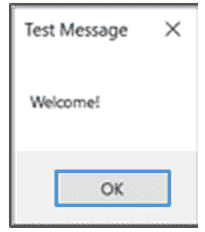

**图 8.4**：*alert()* 函数

- **confirm()**：此函数显示一个带有 **OK** 和 **Cancel** 按钮的消息框。

将下面的代码复制并运行到 Python 编辑器中。我们得到如下 *图 8.5* 所示的确认消息框：

```python
import pyautogui

xyz = pyautogui.confirm(text='Please confirm!', title='Test Message', buttons=['OK', 'Cancel'])
```

## Python中的实际应用案例

现在，让我们将所学知识的一部分应用于Python中的一个实际案例。我们将通过Python代码来执行打开Microsoft Word文档并在其中输入一些字符的任务！那么，让我们开始吧：

1.  首先，让我们捕获屏幕上所有关键位置的坐标，以便将鼠标光标放置在这些位置以执行点击操作。

    将光标靠近搜索框，并在Python编辑器中运行下面的代码。这将为我们提供搜索框区域内随机选择的一个点的坐标（参见*图8.6*）：


**图8.6：** *搜索框*

```python
import pyautogui
print(pyautogui.position())
```

**输出：**
**Point(x=192, y=1058)**

2.  接下来，保持Python编辑器窗口打开，在搜索栏中输入文本**Word**，以便在搜索结果中打开MS Word。我们希望捕获此搜索结果图标上任意随机点的坐标，以便在自动化过程中点击它。
    如下图*图8.7*所示，我们观察到MS Word的搜索结果大致位于编辑器的第10行。这应该能给我们提供MS Word应用程序的位置。将光标放在Python编辑器的第10行，并运行下面的代码以获取坐标：

```python
import pyautogui

print(pyautogui.position())
```

**输出：**
**Point(x=265, y=377)**


*图8.7：搜索MS Word应用程序*

3.  现在我们有了所有坐标，可以在Python编辑器中输入下面的代码来观察该用例如何执行：

```python
import pyautogui
import time
pyautogui.click(192, 1058, 2,0,'left')
pyautogui.typewrite('word')
pyautogui.moveTo(265,377,duration=2)
pyautogui.click(265, 377, 2,0,'left')
time.sleep(3)
pyautogui.typewrite('Python use case executed!',0.5)
```

4.  运行上述代码后，我们发现创建了一个新的Word文档，并且文本'**Python use case is executed!**'被输入到文档中，如下图*图8.8*所示，从而完成了我们的用例和本章内容。

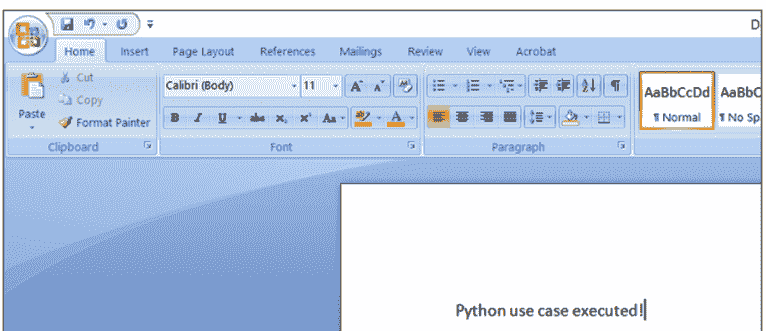

**图8.8：** *使用Python库PyAutoGUI将文本输入Word文档*

当然，这是一个很有帮助的练习。

## 结论

在本章中，我们在学习的实际应用方面取得了一些独特的成果。我们在桌面自动化方面完成了一项重要成就，掌握了文件和文件夹管理以及鼠标和键盘操作等常见任务。我们还探索了消息框的创建，这是交互式自动化中的一项基本技能。随着本章的结束，我们完成了对桌面自动化的探索。此后，我们将专注于应用桌面自动化的显著方面来增强我们现有的应用程序，并构建提高手动流程效率的新应用程序。

在结束本章时，我们不仅带走了这些宝贵的自动化技能，还准备以更具变革性的方式应用它们。你在这里学到的技能为前方激动人心的旅程奠定了基础，引领我们进一步进入机器学习的领域。这个快速发展的领域正在重塑21世纪的技术，为复杂问题提供创新的解决方案。

下一章将开启一段新的、激动人心的机器学习之旅，它正在成为当代以及21世纪最具创造力、创新性和颠覆性的技术。那么，让我们翻开新的一页，深入机器学习的世界，在那里我们将探索如何利用这些强大的算法来增强我们应用程序的功能，并在自动化和数据分析方面取得重大进展！

## 加入本书的Discord空间

加入本书的Discord工作区，获取最新更新、优惠、全球科技动态、新书发布以及与作者的交流会：

[https://discord.bpbonline.com](https://discord.bpbonline.com)

# 第9章
智能自动化
第一部分：使用机器学习

### 引言

本章深入探讨机器学习算法的详细实现。它向读者介绍了监督学习和无监督学习的概念。随后，算法也被分为分类算法和回归算法。本章进一步深入探讨了监督学习算法的类型，如线性回归、逻辑回归、K近邻、朴素贝叶斯、支持向量机和决策树。梯度下降的关键概念也进行了详细讨论。为了理解无监督学习，在介绍无监督学习算法K均值聚类和层次聚类之前，优先介绍了降维、主成分分析和线性判别分析等关键概念。最后，本章包含了一个关于Python机器学习库的重要主题，以使读者熟悉Python在这个广阔的机器学习领域提供的丰富功能。本章以一个Python用例结束，该用例将使用户在未来能够熟练使用Python构建自己的机器学习应用程序。

### 结构

本章涵盖以下主题：

- 使用Python实现监督机器学习算法
  - 线性回归
- 机器学习模型中的关键概念
- 逻辑回归
- K近邻
- 朴素贝叶斯
- 支持向量机
- 决策树
- 使用Python实现无监督学习算法
  - 降维
  - 主成分分析
  - 线性判别分析
  - K均值聚类
- 真实世界用例项目

### 目标

在*第3章，Python中的AI/ML入门*中，我们学习了机器学习的关键概念，并获得了对机器学习算法的理论理解。在本章中，我们将使用Python实现这些算法，从而为读者在现实世界中独立创建和部署定制化的机器学习应用程序提供一个跳板。

## 使用Python实现监督机器学习算法

在本章中，我们将主要使用Scikit-learn库来实现我们的机器学习算法。Scikit-learn是一个开源的Python库，支持监督和无监督机器学习。在使用Scikit-learn之前，第一步是使用以下命令安装它：

```
pip install scikit-learn
```

Scikit-learn库的标志是**fit()**方法。Scikit-learn库中的每个机器学习算法都有自己的类，每个这样的类都有一个名为**fit()**的方法。该方法以数组形式的训练数据作为参数，并将模型拟合到训练数据。在监督学习的情况下，训练数据数组还将附带其对应的标签数组，这将使两个数组作为参数。在无监督学习的情况下，训练数据集将由单个输入数组作为参数组成，因为这里的数据是无标签的。

在本节中，我们将使用Python的Scikit-learn库实现监督机器学习算法。我们将从最简单的线性回归开始。

## 线性回归

我们已经在*第3章，Python中的AI/ML入门*中介绍了线性回归背后的理论。现在，我们将在一些样本数据上使用Python来实现它。我们知道线性回归的目标是拟合一条线到一组点样本，使得我们可以最小化这些点到线的垂直距离的平方和。方程将采用以下形式。预测值*y*将表示为：

$$Y = c0 + c1*x1 + c2*x2 + c3*x3 + ..... + cn*xn.$$

这里，集合*{c0, c1, c2, c3,......,cn}*是系数，值*cn*是截距。在线性回归中，我们基本上是获得系数和截距的最佳值。所谓最佳值，我们指的是那些能使实际点与线预测的点之间的垂直距离平方和最小化的值集。

要使用Python库Scikit-learn实现线性回归，请将下面的代码复制并运行到Python编辑器中：

```python
from sklearn import linear_model
reg = linear_model.LinearRegression()

training_data = [[0], [3], [17], [23]]
labels = [0,9,51,69]

reg.fit(training_data, labels)

print(reg.coef_)
print(reg.intercept_)
```

**输出：**
**[3.]**
**7.105427357601002e-15**

让我们来理解上面的代码。首先，我们从 **scikit-learn** 库中导入了 **linear_model** 模块。接着，我们创建了 **LinearRegression** 类的一个实例，并将其存储在名为 **reg** 的变量中。

我们创建了一个示例二维数组，并将其存储在变量 `training_data` 中。我们需要注意，这里的训练数据始终是一个二维数组，因为它包含作为列的特征或参数数量，以及作为行的样本数量。之后，我们创建了一个名为 **labels** 的一维数组，它基本上是这些输入对应的输出。请注意，这个数组中的元素数量必须始终等于训练数据数组中的样本数量。

接下来，我们使用 **fit** 方法，该方法接受 **training_data** 和 **labels** 变量作为参数。这个方法基本上是基于最小二乘回归创建一条最佳拟合线。最后，我们使用 **reg** 对象的 **coef_** 和 **intercept_** 属性分别获取回归的系数和截距。

在这种情况下，由于训练数据在每个样本中只包含一个点，我们应该只有一个系数，因为方程中只有一个参数。这里，我们得到的系数是 **3**，这从 **training_data** 和 labels 数组中也应该很明显，其中 labels 中的每个元素都是训练数据的三倍。截距预期为零，因为方程 $y=3x$ 完美拟合这条线。我们得到的截距是 **7.105427357601002e-15**，非常接近于零。

既然我们已经能够将一条直线拟合到这组数据点，我们的下一步就是使用这条直线来预测一组新数据点的输出，这些新数据点我们没有标签，基本上就是输出未知的情况。为此，我们使用 **LinearRegression** 类的 **predict** 方法。在 Python 编辑器中复制并运行以下代码：

```python
# Importing necessary libraries
from sklearn import linear_model
import numpy as np

# Create an instance of the Linear Regression model
reg = linear_model.LinearRegression()

# Define training data and corresponding labels
# Training data represents the independent variables
training_data = np.array([[0],[3],[17],[23]])

# Labels are the dependent variable (output) for each training data point
labels = np.array([0,9,51,69])

# Train the model using the training data and labels
reg.fit(training_data, labels)

# Define testing data for which we want to predict the output
testing_data = np.array([[21],[13],[15]])

# Use the trained model to make predictions on the testing data
output = reg.predict(testing_data)

# Print the predicted output
print(output)
```

# 输出：

[63. 39. 45.]

我们看到获得的输出正是我们从方程 y=3x 中预期的结果。

## 机器学习模型中的关键概念

为了更好地理解构建和优化机器学习模型背后的理论，我们需要理解一些重要的概念。这些概念将在接下来的要点中介绍：

- **梯度下降**：这是用于优化模型的过程。在理解梯度下降之前，理解另一个术语 **代价函数** 很重要。我们在线性回归中看到，最佳拟合线是残差平方和（点与线之间的垂直距离）最小的那条线。换句话说，这是我们试图最小化的参数。在机器学习术语中，这个参数被称为 **代价函数**，它基本上是实际值与预测值之间差异的度量。

回到梯度下降，该过程首先创建一个代价函数相对于其参数的曲线。接下来，我们在图上选择一个任意点，并找到该点处代价函数的导数。然后，我们选择一个任意参数，称为 **学习率**，并将其乘以得到的导数。接着，我们将这个乘积从我们在代价函数曲线上选择的任意点的坐标中减去。由此得到的结果成为下一次迭代的起点，我们在多次迭代中重复相同的过程。在每次迭代中，我们计算代价函数的值。由于我们是在下降，代价函数的值应该不断减小。一旦我们达到一个点，代价函数不再减小或基本保持稳定，我们就理解算法已经收敛，并且我们已经达到了代价函数的最小值。因此，代价函数最小的参数被选为模型的最佳拟合或最优参数。梯度下降算法可以用数学表达式表示如下：

$$X' = X - \gamma \nabla$$

其中，

- $X$ = 初始任意点
- $\gamma$ = 学习率
- $\nabla$ = 任意点处的导数
- $X'$ = 用于下一次迭代的结果点

- **偏差与方差**：偏差是指模型为了拟合训练数据而过度简化假设。当存在偏差时，模型不会考虑数据集中的所有点。这也通常被称为 **欠拟合**。相反，当模型试图过度拟合训练数据集中的每一个点时，它就失去了泛化到其他数据的能力。这（也称为 **过拟合**）导致了 **方差**，这基本上是预测值与预期输出之间的较大偏差。这里的权衡是，如果模型由于偏差而过于简单，那么在测试数据上的方差就会较小。然而，如果模型由于过拟合而过于严格，偏差会较小，但方差会很高，因为模型在看起来不同的测试数据上进行预测会变得更加困难。一个好的机器学习模型是找到偏差和方差之间最佳平衡点的模型。

## 逻辑回归

为了使用 Scikit-learn 研究逻辑回归，我们将使用 Scikit-learn 内置的鸢尾花数据集。在继续教程之前，让我们先熟悉一下鸢尾花数据集。

鸢尾花数据集包含三种物种花朵的信息，每种有 50 个样本。因此，该数据集中的总样本数为 150。该数据集中使用的特征是 **花萼长度 (cm)**、**花萼宽度 (cm)**、**花瓣长度 (cm)** 和 **花瓣宽度 (cm)**，它们存储在一个名为 **data** 的数组中。还有一个名为 **target** 的特征，它基本上代表花朵的物种，分别是 **setosa**、**versicolor** 和 **virginica**。这里，它们分别被数值标记为 0、1 和 2，并存储在另一个名为 **target** 的数组中。现在，我们将把这个数据集存储在 pandas 数据框中，以便更好地进行可视化和分析。在 Python 编辑器中复制并运行以下代码：

```python
from sklearn.datasets import load_iris
import pandas as pd
iris = load_iris()
df = pd.DataFrame(iris.data,columns=iris.feature_names)
df['target'] = iris.target
print(df)
```

这里，我们首先从 Scikit-learn 库的 **datasets** 模块中导入 **load_iris** 类，然后通过将其初始化为变量 **iris** 来实例化它。之后，我们将其读入 pandas 数据框，并使用鸢尾花数据集的 **feature_names** 键定义列属性。接下来，我们还通过分配鸢尾花数据集的 **target** 键的值，为目标变量添加了另一列。运行上面的代码后，我们得到如下所示的输出：

| sepal length (cm) | sepal width (cm) | petal length (cm) | petal width (cm) | target |
| :--- | :--- | :--- | :--- | :--- |
| 0 | 5.1 | 3.5 | 1.4 | 0.2 | 0 |
| 1 | 4.9 | 3.0 | 1.4 | 0.2 | 0 |
| 2 | 4.7 | 3.2 | 1.3 | 0.2 | 0 |
| 3 | 4.6 | 3.1 | 1.5 | 0.2 | 0 |
| 4 | 5.0 | 3.6 | 1.4 | 0.2 | 0 |
| ... | ... | ... | ... | ... | ... |
| 145 | 6.7 | 3.0 | 5.2 | 2.3 | 2 |
| 146 | 6.3 | 2.5 | 5.0 | 1.9 | 2 |
| 147 | 6.5 | 3.0 | 5.2 | 2.0 | 2 |
| 148 | 6.2 | 3.4 | 5.4 | 2.3 | 2 |
| 149 | 5.9 | 3.0 | 5.1 | 1.8 | 2 |

## [150 行 x 5 列]

整个鸢尾花数据集在输出中显示为 **150 行和 5 列**，其中包括 **目标** 变量的列。

现在，让我们使用 Scikit-learn 库，基于鸢尾花数据集来实现逻辑回归。我们已经在 *第 3 章* 中学习了逻辑回归背后的理论，因此这里不再赘述。为了回顾概念，逻辑回归算法本质上是尝试拟合一条 S 形曲线，试图将数据集分为两类。曲线上的任意一点都提供了该点更接近任一类别的概率估计。

在本教程中，由于我们将数据分为两类，因此只使用前两种花卉。

使用下面的代码，我们首先从鸢尾花数据中创建输入数据和标签：

```
from sklearn.datasets import load_iris
import pandas as pd
iris = load_iris()
X = iris.data[:100]
Y = iris.target[:100]
```

从上面的代码中，我们看到我们取了数据的前 100 行。接下来，我们使用 **LogisticRegression** 分类器来训练模型，如下面的代码所示：

```
from sklearn.linear_model import LogisticRegression
LR = LogisticRegression()
LR.fit(X,Y)
```

现在我们已经使用 **fit** 方法将 S 形曲线拟合到数据集，下一步是使用该曲线来预测新数据行的输出，如下面的代码所示：

```
X_predict = [6.3,2.5,4.3,1.5]
Y_predict = LR.predict([X_predict])
print(Y_predict)
```

**输出：**
**[1]**

我们看到预测器预测该数据集属于类别 **[1]**，这基本上是 **变色鸢尾花**。但我们如何知道预测器是否正确预测了输出呢？我们可以通过将输入数据集划分为训练数据和测试数据来测试这一点。我们使用 Scikit-learn 库的 **model_selection** 模块中提供的 **train_test_split** 方法来实现这一点，如下面的代码所示：

```
from sklearn.model_selection import train_test_split
X_Train, X_Test, Y_Train, Y_Test = train_test_split(X,Y, test_size=0.3, random_state=100)
```

这里，我们观察到我们将 **test_size** 参数的值设置为 **0.3**，这意味着 30% 的数据将被分配为测试样本，而剩余的 70% 将保留为训练样本。

这里需要注意的一个重要参数是 **random_state**。这里，我们将其值设置为 100。然而，这个参数可以取任何其他任意值，如 345、400 或 1043。这里唯一需要记住的是，如果希望保持训练和测试数据的相同聚类方式，在后续运行代码时不应更改此参数的值。**train_test_split** 的工作方式是，它任意选择数据点进入训练和测试数据，并根据 **test_size** 参数将它们聚类在一起。如果我们更改 **random_state** 参数的值或未指定任何值，即使测试大小未被用户更改，**train_test_split** 方法也会以不同的方式将数据点分配到训练和测试数据集中。

最后，我们仅在训练数据上训练模型，然后使用下面的代码在测试数据的样本行之一上进行测试：

```
LR.fit(X_Train,Y_Train)

Y_Predict = LR.predict([X_Test[23]])

print('X_Test:' + str(X_Test[23]))
print('Y_Test:' + str(Y_Test[23]))
print('Y_Predict:' + str(Y_Predict))
```

**输出：**
**X_Test:[5. 3.5 1.6 0.6]**
**Y_Test:0**
**Y_Predict:[0]**

我们观察到预测值与实际值 **0** 相匹配，从而证实了预测的准确性。可以尝试在鸢尾花数据集的其他样本行上进行此操作，以确认预测值是否与实际值匹配。另一个有用的练习是选择另一种花卉组合，并尝试实现相同的算法。

这样，我们就使用 Python 的 Scikit-learn 库实现了逻辑回归。

在下一节中，我们将实现另一个有趣的分类算法，即 k 近邻算法。

## K 近邻算法

回顾一下，k 近邻是一种分类算法，它根据距离将任意点关联到其最近的类别。我们将使用相同的鸢尾花数据集在 Python 中实现此算法。在 Python 编辑器中复制并运行以下代码：

```
from sklearn.neighbors import KNeighborsClassifier
from sklearn.model_selection import train_test_split
from sklearn.datasets import load_iris

iris = load_iris()
X = iris.data
Y = iris.target

X_Train, X_Test, Y_Train, Y_Test = train_test_split(
    X, Y, test_size = 0.3, random_state=100)

knn = KNeighborsClassifier(n_neighbors=12)
knn.fit(X_Train, Y_Train)

Y_Predict = knn.predict([X_Test[15]])
print('Y_Predict:' + str(Y_Predict))
print('Y_actual:' + str(Y_Test[15]))
```

**输出：**
**Y_Predict:[1]**
**Y_actual:1**

我们观察到算法的预测值与所选样本行的实际目标值相匹配。这里的一个重要标准是参数 $k$ 值的选择。选择 $k$ 值的一般经验法则是 $k = \sqrt{N}$，其中 $N$ 是训练数据集中的样本数量。

## 朴素贝叶斯

让我们使用 Scikit-learn 实现 *朴素贝叶斯*。我们在 *第 3 章，Python 中的 AI/ML 入门* 中了解到，朴素贝叶斯是一种基于贝叶斯定理条件概率的分类算法，这本质上是另一个事件条件下的事件概率。在 Python 编辑器中复制并运行以下代码：

```
from sklearn.naive_bayes import GaussianNB
from sklearn.model_selection import train_test_split
from sklearn.datasets import load_iris

iris = load_iris()
X = iris.data
Y = iris.target

X_Train, X_Test, Y_Train, Y_Test = train_test_split(X,Y,test_size=0.3, random_state=100)

NB = GaussianNB()
NB.fit(X_Train, Y_Train)

Y_Predict = NB.predict([X_Test[5]])
print('Y_Predict:' + str(Y_Predict))
print('Y_Test:' + str(Y_Test[5]))
```

**输出：**
**Y_Predict:[2]**
**Y_Test:2**

我们观察到预测值与测试数据中的实际值相匹配。我们还可以使用 Scikit-learn 库的 **metrics** 模块中的 **accuracy_score** 函数来检查模型在所有测试数据点上的准确性。在 Python 编辑器中复制并运行以下代码：

```
from sklearn.naive_bayes import GaussianNB
from sklearn.model_selection import train_test_split
from sklearn.datasets import load_iris

iris = load_iris()
X = iris.data
Y = iris.target

X_Train, X_Test, Y_Train, Y_Test = train_test_split(X,Y,test_size=0.3, random_state=100)

NB = GaussianNB()
NB.fit(X_Train, Y_Train)

from sklearn.metrics import accuracy_score
Y_Predict_Test_Sample = NB.predict(X_Test)
accuracy = accuracy_score(Y_Test, Y_Predict_Test_Sample)
print('Accuracy:', accuracy)
```

**输出：**
**Accuracy: 0.9555555555555556**

从 95.56% 的准确率指标来看，我们发现大约 95% 的预测值与实际值相匹配。

## 支持向量机

回顾我们在 *第 3 章，Python 中的 AI/ML 入门* 中学到的内容，支持向量机是一种监督分类算法，它通过在离散类别之间绘制一个最优超平面来分离它们。要使用 Scikit-learn 实现它，请在 Python 编辑器中复制并粘贴以下代码：

```
from sklearn.svm import SVC
from sklearn.model_selection import train_test_split
from sklearn.datasets import load_iris

iris = load_iris()
X = iris.data
Y = iris.target

X_Train, X_Test, Y_Train, Y_Test = train_test_split(X,Y,test_size=0.3, random_state=100)

SVC_Model = SVC(kernel = 'linear', random_state = 0)
SVC_Model.fit(X_Train,Y_Train)
Y_Predict = SVC_Model.predict(X_Test)

from sklearn.metrics import confusion_matrix
cm = confusion_matrix(Y_Test, Y_Predict)
print(cm)
```

**输出：**
**[[16 0 0]**
**[ 0 11 0]**
**[ 0 0 18]]**

如果你仔细观察，会发现输出结果是一个矩阵。在代码末尾，我们使用了一种新的准确率衡量指标，称为**混淆矩阵**。这是一个通过列出真正例、真负例、假正例和假负例来总结分类算法准确率的矩阵。混淆矩阵是评估分类算法准确率最常见的指标之一。

## 决策树

我们已经在*第3章 - Python中的AI/ML入门*中学习了决策树背后的理论。现在，我们将使用相同的鸢尾花数据集在Python中实现决策树。

在Python编辑器中复制并运行以下代码：

```
from sklearn.tree import DecisionTreeClassifier
from sklearn.model_selection import train_test_split
from sklearn.datasets import load_iris
from sklearn.metrics import accuracy_score

iris = load_iris()
X = iris.data
Y = iris.target

X_Train, X_Test, Y_Train, Y_Test = train_test_split(X,Y,test_size=0.3, random_state=100)

DT_Model = DecisionTreeClassifier()
DT_Model.fit(X_Train,Y_Train)

Y_Predict = DT_Model.predict(X_Test)
accuracy = accuracy_score(Y_Predict, Y_Test)
print(accuracy)
```

**输出：**
**0.9555555555555556**

从95%的准确率分数来看，决策树分类器在其预测中相当准确。

## 使用Python实现无监督学习算法

在熟悉了使用Python的Scikit-learn库实现监督学习算法之后，我们现在将使用Scikit-learn实现无监督学习算法。简要总结一下，无监督学习算法是应用于未标记数据集的算法，它们将参数相似的样本元素聚类在一起。在本节中，我们将研究作为无监督学习算法的K均值聚类和层次聚类。

然而，在Scikit-learn中实现它们之前，理解机器学习建模背景下的一些重要理论概念非常重要。这些概念是降维、主成分分析和线性判别分析，我们将在接下来的章节中学习。

## 降维

降维是机器学习的重要组成部分。特征过多的数据集可能会使模型变得复杂，从而导致过拟合，即模型可能过于紧密地拟合训练数据，导致在测试数据上产生较大的方差。因此，减少数据集中的特征或维度数量，只包含那些必需的或可能代表整个数据集的特征，是至关重要的。这种在保留数据本质的同时减少数据集中特征数量的技术称为降维。实现降维有多种方式：

- **特征选择**：在这种方法中，从主样本中只选择一个特征子集，使其与正在解决的问题最相关。
- **特征提取**：在这种方法中，原始特征被转换，使得形成的新特征数量更少，并且代表原始数据集。**主成分分析（PCA）**和**线性判别分析（LDA）**是此类别下的流行方法。在接下来的章节中，我们将学习这些方法。

## 主成分分析

主成分分析基本上是一种降维技术，其中应用正交变换将数据转换到新的坐标系。该技术识别一组称为**主成分**的正交轴，使得第一主成分捕获数据中的最大方差，第二主成分捕获与第一成分正交的第二大方差。主成分分析涉及大量的矩阵代数，由于我们将专注于PCA的Python实现，因此不会深入探讨这些细节。需要注意的是，PCA的实现仅依赖于特征集，而不依赖于标签。换句话说，PCA是一种无监督学习技术。要在鸢尾花数据集上实现PCA，请在Python编辑器中复制并运行以下代码：

```
from sklearn.model_selection import train_test_split
from sklearn.datasets import load_iris

iris = load_iris()
X = iris.data
Y = iris.target

X_Train, X_Test, Y_Train, Y_Test = train_test_split(X,Y,test_size=0.3, random_state=100)

from sklearn.preprocessing import StandardScaler
sc = StandardScaler()
X_Train = sc.fit_transform(X_Train)
X_Test = sc.transform(X_Test)

from sklearn.decomposition import PCA
pca = PCA()
X_train = pca.fit_transform(X_Train)
X_test = pca.transform(X_Test)

explained_variance = pca.explained_variance_ratio_

print(explained_variance)
```

**输出：**
**[0.72201925 0.23393497 0.03914811 0.00489767]**

现在让我们尝试理解上面的代码：

- 首先，我们加载鸢尾花数据集，并像之前所有其他算法一样将其拆分为训练数据和测试数据。
- 接下来，我们使用Scikit-learn库的**preprocessing**模块的**StandardScaler**类对数据进行缩放。这用于通过减去特征均值并除以所得值的标准差来将特征标准化为单位方差。标准缩放使特征在同等基础上具有可比性，并消除了由于测量单位等因素引起的特征之间可能存在的差异。我们在训练数据集上使用**StandardScaler**类的**fit_transform**方法，在测试数据集上使用**transform**方法。
- 之后，我们使用Scikit-learn库的**decomposition**模块的**PCA()**类。此方法将参数**n_components**作为第一个参数，即主成分的数量。在我们的代码中，我们没有指定任何内容，因此它将默认采用所有成分。我们在训练数据集上使用**PCA**类的**fit_transform**方法，在测试数据集上使用**transform**方法。
- 最后，我们使用**PCA**类的**explained_variance_ratio_**属性，该属性提供了每个主成分负责的方差的摘要。通过观察输出，我们了解到第一主成分负责大约73%的最大方差，第二主成分负责大约23%的第二大方差。它们共同占方差的约96%。其余两个成分分别占约4%和1%的最小方差。

## 线性判别分析

与作为无监督学习技术的主成分分析不同，线性判别分析是一种监督技术，它同时考虑数据及其对应的标签。LDA通过将数据投影到新的维度上工作，使得类之间的分离最大化，并且每个类的各个元素紧密地聚集在类的质心周围。为了在相同的鸢尾花数据集上实现LDA，请在Python编辑器中复制并运行以下代码：

```
from sklearn.model_selection import train_test_split
from sklearn.datasets import load_iris

iris = load_iris()
X = iris.data
Y = iris.target

X_Train, X_Test, Y_Train, Y_Test = train_test_split(X,Y,test_size=0.3, random_state=100)

from sklearn.preprocessing import StandardScaler
sc = StandardScaler()
X_Train = sc.fit_transform(X_Train)
X_Test = sc.transform(X_Test)

from sklearn.discriminant_analysis import LinearDiscriminantAnalysis
lda = LinearDiscriminantAnalysis()

X_train = lda.fit_transform(X_Train, Y_Train)
X_test = lda.transform(X_Test)

explained_variance = lda.explained_variance_ratio_

print(explained_variance)
```

**输出：**

从输出结果可以看出，LDA技术使用了2个成分，第一个成分解释了99%的方差，而第二个成分仅解释了约1%的方差。

## K均值聚类

K均值聚类是一种常用的无监督学习算法，它将数据集中未标记的点分组到相似的簇中。名称**k均值**源于这样一个事实：**k**是在算法开始时选择的任意簇数。之后，我们为每个簇随机选择**k**个任意的质心，并根据每个点与簇质心之间的欧几里得距离，将数据集中的每个点与其最近的簇关联起来。这里的目标是优化这些质心的位置。接下来，我们计算属于特定簇的数据集中每个点的均值，然后更新簇中心位置以与均值重合。这个过程会迭代进行，直到无法进一步收敛。

我们将使用相同的鸢尾花数据集在Python中实现K均值聚类，以便评估聚类的准确性。要使用Scikit-learn在Python中实现该算法，请在Python编辑器中复制并运行以下代码：

```python
from sklearn.model_selection import train_test_split
from sklearn.datasets import load_iris
from sklearn.cluster import KMeans

iris = load_iris()
X = iris.data
Y = iris.target

sse = {}
for i in range(1, 11):
    kmeans = KMeans(n_clusters=i,
                    init='k-means++',
                    max_iter=300,
                    n_init=10,
                    random_state=0)
    kmeans.fit(X)
    sse[i]=kmeans.inertia_

import matplotlib.pyplot as plt

plt.figure()
plt.plot(list(sse.keys()), list(sse.values()))
plt.xlabel("Number of clusters")
plt.ylabel("SSE")
plt.show()
```

*图9.1*展示了运行代码后得到的图表。该图表用于确定最佳的簇数：

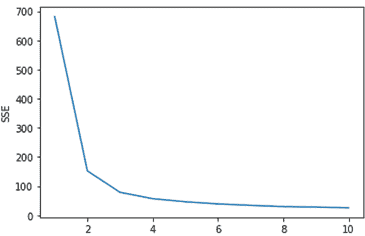

**图9.1：** *使用肘部法则确定最佳簇数*

让我们来理解一下代码。我们创建了一个循环，将簇数从1递增到10。然后，我们使用**inertia_**方法计算每次迭代的误差平方和。接着，我们绘制了簇数与SSE值的关系图。这种方法被称为确定K最佳值的肘部法则。根据肘部法则，获得的最佳值是图表失真开始呈线性趋势下降之后的那个值。我们从图中观察到，当簇数为**3**时，图表在超过该值后呈线性趋势下降。因此，K的最佳值是**3**，我们已经知道这是正确的，因为这是一个包含三种类型花朵的有标签数据集。

现在，让我们使用簇数*K*=3来实现K均值聚类算法。在Python编辑器中复制并运行以下代码：

```python
kmeans = KMeans(n_clusters=3,
    init='k-means++',
    max_iter=300,
    n_init=10,
    random_state=0)
y_kmeans = kmeans.fit_predict(X)
print(y_kmeans)
```

**输出：**

```
[1 1 1 1 1 1 1 1 1 1 1 1 1 1 1 1 1 1 1 1 1 1 1 1 1 1 1 1 1 1 1 1 1 1 1 1 1 1 1 1 1 1 1 1 1 1 1 1 1 1 1 1 1 1 1 1 1 1 1 1 1 1 1 1 1 1 1 1 1 1 1 1 1 1 1 1 1 1 1 1 1 1 1 1 1 1 1 1 1 1 1 1 1 1 1 1 1 1 1 1 1 1 1 1 1 1 1 1 1 1 1 1 1 1 1 1 1 1 1 1 1 1 1 1 1 1 1 1 1 1 1 1 1 1 1 1 1 1 1 1 1 1 1 1 1 1 1 1 1 1 1 1 1 1 1 1 1 1 1 1 1 1 1 1 1 1 1 1 1 1 1 1 1 1 1 1 1 1 1 1 1 1 1 1 1 1 1 1 1 1 1 1 1 1 1 1 1 1 1 1 1 1 1 1 1 1 1 1 1 1 1 1 1 1 1 1 1 1 1 1 1 1 1 1 1 1 1 1 1 1 1 1 1 1 1 1 1 1 1 1 1 1 1 1 1 1 1 1 1 1 1 1 1 1 1 1 1 1 1 1 1 1 1 1 1 1 1 1 1 1 1 1 1 1 1 1 1 1 1 1 1 1 1 1 1 1 1 1 1 1 1 1 1 1 1 1 1 1 1 1 1 1 1 1 1 1 1 1 1 1 1 1 1 1 1 1 1 1 1 1 1 1 1 1 1 1 1 1 1 1 1 1 1 1 1 1 1 1 1 1 1 1 1 1 1 1 1 1 1 1 1 1 1 1 1 1 1 1 1 1 1 1 1 1 1 1 1 1 1 1 1 1 1 1 1 1 1 1 1 1 1 1 1 1 1 1 1 1 1 1 1 1 1 1 1 1 1 1 1 1 1 1 1 1 1 1 1 1 1 1 1 1 1 1 1 1 1 1 1 1 1 1 1 1 1 1 1 1 1 1 1 1 1 1 1 1 1 1 1 1 1 1 1 1 1 1 1 1 1 1 1 1 1 1 1 1 1 1 1 1 1 1 1 1 1 1 1 1 1 1 1 1 1 1 1 1 1 1 1 1 1 1 1 1 1 1 1 1 1 1 1 1 1 1 1 1 1 1 1 1 1 1 1 1 1 1 1 1 1 1 1 1 1 1 1 1 1 1 1 1 1 1 1 1 1 1 1 1 1 1 1 1 1 1 1 1 1 1 1 1 1 1 1 1 1 1 1 1 1 1 1 1 1 1 1 1 1 1 1 1 1 1 1 1 1 1 1 1 1 1 1 1 1 1 1 1 1 1 1 1 1 1 1 1 1 1 1 1 1 1 1 1 1 1 1 1 1 1 1 1 1 1 1 1 1 1 1 1 1 1 1 1 1 1 1 1 1 1 1 1 1 1 1 1 1 1 1 1 1 1 1 1 1 1 1 1 1 1 1 1 1 1 1 1 1 1 1 1 1 1 1 1 1 1 1 1 1 1 1 1 1 1 1 1 1 1 1 1 1 1 1 1 1 1 1 1 1 1 1 1 1 1 1 1 1 1 1 1 1 1 1 1 1 1 1 1 1 1 1 1 1 1 1 1 1 1 1 1 1 1 1 1 1 1 1 1 1 1 1 1 1 1 1 1 1 1 1 1 1 1 1 1 1 1 1 1 1 1 1 1 1 1 1 1 1 1 1 1 1 1 1 1 1 1 1 1 1 1 1 1 1 1 1 1 1 1 1 1 1 1 1 1 1 1 1 1 1 1 1 1 1 1 1 1 1 1 1 1 1 1 1 1 1 1 1 1 1 1 1 1 1 1 1 1 1 1 1 1 1 1 1 1 1 1 1 1 1 1 1 1 1 1 1 1 1 1 1 1 1 1 1 1 1 1 1 1 1 1 1 1 1 1 1 1 1 1 1 1 1 1 1 1 1 1 1 1 1 1 1 1 1 1 1 1 1 1 1 1 1 1 1 1 1 1 1 1 1 1 1 1 1 1 1 1 1 1 1 1 1 1 1 1 1 1 1 1 1 1 1 1 1 1 1 1 1 1 1 1 1 1 1 1 1 1 1 1 1 1 1 1 1 1 1 1 1 1 1 1 1 1 1 1 1 1 1 1 1 1 1 1 1 1 1 1 1 1 1 1 1 1 1 1 1 1 1 1 1 1 1 1 1 1 1 1 1 1 1 1 1 1 1 1 1 1 1 1 1 1 1 1 1 1 1 1 1 1 1 1 1 1 1 1 1 1 1 1 1 1 1 1 1 1 1 1 1 1 1 1 1 1 1 1 1 1 1 1 1 1 1 1 1 1 1 1 1 1 1 1 1 1 1 1 1 1 1 1 1 1 1 1 1 1 1 1 1 1 1 1 1 1 1 1 1 1 1 1 1 1 1 1 1 1 1 1 1 1 1 1 1 1 1 1 1 1 1 1 1 1 1 1 1 1 1 1 1 1 1 1 1 1 1 1 1 1 1 1 1 1 1 1 1 1 1 1 1 1 1 1 1 1 1 1 1 1 1 1 1 1 1 1 1 1 1 1 1 1 1 1 1 1 1 1 1 1 1 1 1 1 1 1 1 1 1 1 1 1 1 1 1 1 1 1 1 1 1 1 1 1 1 1 1 1 1 1 1 1 1 1 1 1 1 1 1 1 1 1 1 1 1 1 1 1 1 1 1 1 1 1 1 1 1 1 1 1 1 1 1 1 1 1 1 1 1 1 1 1 1 1 1 1 1 1 1 1 1 1 1 1 1 1 1 1 1 1 1 1 1 1 1 1 1 1 1 1 1 1 1 1 1 1 1 1 1 1 1 1 1 1 1 1 1 1 1 1 1 1 1 1 1 1 1 1 1 1 1 1 1 1 1 1 1 1 1 1 1 1 1 1 1 1 1 1 1 1 1 1 1 1 1 1 1 1 1 1 1 1 1 1 1 1 1 1 1 1 1 1 1 1 1 1 1 1 1 1 1 1 1 1 1 1 1 1 1 1 1 1 1 1 1 1 1 1 1 1 1 1 1 1 1 1 1 1 1 1 1 1 1 1 1 1 1 1 1 1 1 1 1 1 1 1 1 1 1 1 1 1 1 1 1 1 1 1 1 1 1 1 1 1 1 1 1 1 1 1 1 1 1 1 1 1 1 1 1 1 1 1 1 1 1 1 1 1 1 1 1 1 1 1 1 1 1 1 1 1 1 1 1 1 1 1 1 1 1 1 1 1 1 1 1 1 1 1 1 1 1 1 1 1 1 1 1 1 1 1 1 1 1 1 1 1 1 1 1 1 1 1 1 1 1 1 1 1 1 1 1 1 1 1 1 1 1 1 1 1 1 1 1 1 1 1 1 1 1 1 1 1 1 1 1 1 1 1 1 1 1 1 1 1 1 1 1 1 1 1 1 1 1 1 1 1 1 1 1 1 1 1 1 1 1 1 1 1 1 1 1 1 1 1 1 1 1 1 1 1 1 1 1 1 1 1 1 1 1 1 1 1 1 1 1 1 1 1 1 1 1 1 1 1 1 1 1 1 1 1 1 1 1 1 1 1 1 1 1 1 1 1 1 1 1 1 1 1 1 1 1 1 1 1 1 1 1 1 1 1 1 1 1 1 1 1 1 1 1 1 1 1 1 1 1 1 1 1 1 1 1 1 1 1 1 1 1 1 1 1 1 1 1 1 1 1 1 1 1 1 1 1 1 1 1 1 1 1 1 1 1 1 1 1 1 1 1 1 1 1 1 1 1 1 1 1 1 1 1 1 1 1 1 1 1 1 1 1 1 1 1 1 1 1 1 1 1 1 1 1 1 1 1 1 1 1 1 1 1 1 1 1 1 1 1 1 1 1 1 1 1 1 1 1 1 1 1 1 1 1 1 1 1 1 1 1 1 1 1 1 1 1 1 1 1 1 1 1 1 1 1 1 1 1 1 1 1 1 1 1 1 1 1 1 1 1 1 1 1 1 1 1 1 1 1 1 1 1 1 1 1 1 1 1 1 1 1 1 1 1 1 1 1 1 1 1 1 1 1 1 1 1 1 1 1 1 1 1 1 1 1 1 1 1 1 1 1 1 1 1 1 1 1 1 1 1 1 1 1 1 1 1 1 1 1 1 1 1 1 1 1 1 1 1 1 1 1 1 1 1 1 1 1 1 1 1 1 1 1 1 1 1 1 1 1 1 1 1 1 1 1 1 1 1 1 1 1 1 1 1 1 1 1 1 1 1 1 1 1 1 1 1 1 1 1 1 1 1 1 1 1 1 1 1 1 1 1 1 1 1 1 1 1 1 1 1 1 1 1 1 1 1 1 1 1 1 1 1 1 1 1 1 1 1 1 1 1 1 1 1 1 1 1 1 1 1 1 1 1 1 1 1 1 1 1 1 1 1 1 1 1 1 1 1 1 1 1 1 1 1 1 1 1 1 1 1 1 1 1 1 1 1 1 1 1 1 1 1 1 1 1 1 1 1 1 1 1 1 1 1 1 1 1 1 1 1 1 1 1 1 1 1 1 1 1 1 1 1 1 1 1 1 1 1 1 1 1 1 1 1 1 1 1 1 1 1 1 1 1 1 1 1 1 1 1 1 1 1 1 1 1 1 1 1 1 1 1 1 1 1 1 1 1 1 1 1 1 1 1 1 1 1 1 1 1 1 1 1 1 1 1 1 1 1 1 1 1 1 1 1 1 1 1 1 1 1 1 1 1 1 1 1 1 1 1 1 1 1 1 1 1 1 1 1 1 1 1 1 1 1 1 1 1 1 1 1 1 1 1 1 1 1 1 1 1 1 1 1 1 1 1 1 1 1 1 1 1 1 1 1 1 1 1 1 1 1 1 1 1 1 1 1 1 1 1 1 1 1 1 1 1 1 1 1 1 1 1 1 1 1 1 1 1 1 1 1 1 1 1 1 1 1 1 1 1 1 1 1 1 1 1 1 1 1 1 1 1 1 1 1 1 1 1 1 1 1 1 1 1 1 1 1 1 1 1 1 1 1 1 1 1 1 1 1 1 1 1 1 1 1 1 1 1 1 1 1 1 1 1 1 1 1 1 1 1 1 1 1 1 1 1 1 1 1 1 1 1 1 1 1 1 1 1 1 1 1 1 1 1 1 1 1 1 1 1 1 1 1 1 1 1 1 1 1 1 1 1 1 1 1 1 1 1 1 1 1 1 1 1 1 1 1 1 1 1 1 1 1 1 1 1 1 1 1 1 1 1 1 1 1 1 1 1 1 1 1 1 1 1 1 1 1 1 1 1 1 1 1 1 1 1 1 1 1 1 1 1 1 1 1 1 1 1 1 1 1 1 1 1 1 1 1 1 1 1 1 1 1 1 1 1 1 1 1 1 1 1 1 1 1 1 1 1 1 1 1 1 1 1 1 1 1 1 1 1 1 1 1 1 1 1 1 1 1 1 1 1 1 1 1 1 1 1 1 1 1 1 1 1 1 1 1 1 1 1 1 1 1 1 1 1 1 1 1 1 1 1 1 1 1 1 1 1 1 1 1 1 1 1 1 1 1 1 1 1 1 1 1 1 1 1 1 1 1 1 1 1 1 1 1 1 1 1 1 1 1 1 1 1 1 1 1 1 1 1 1 1 1 1 1 1 1 1 1 1 1 1 1 1 1 1 1 1 1 1 1 1 1 1 1 1 1 1 1 1 1 1 1 1 1 1 1 1 1 1 1 1 1 1 1 1 1 1 1 1 1 1 1 1 1 1 1 1 1 1 1 1 1 1 1 1 1 1 1 1 1 1 1 1 1 1 1 1 1 1 1 1 1 1 1 1 1 1 1 1 1 1 1 1 1 1 1 1 1 1 1 1 1 1 1 1 1 1 1 1 1 1 1 1 1 1 1 1 1 1 1 1 1 1 1 1 1 1 1 1 1 1 1 1 1 1 1 1 1 1 1 1 1 1 1 1 1 1 1 1 1 1 1 1 1 1 1 1 1 1 1 1 1 1 1 1 1 1 1 1 1 1 1 1 1 1 1 1 1 1 1 1 1 1 1 1 1 1 1 1 1 1 1 1 1 1 1 1 1 1 1 1 1 1 1 1 1 1 1 1 1 1 1 1 1 1 1 1 1 1 1 1 1 1 1 1 1 1 1 1 1 1 1 1 1 1 1 1 1 1 1 1 1 1 1 1 1 1 1 1 1 1 1 1 1 1 1 1 1 1 1 1 1 1 1 1 1 1 1 1 1 1 1 1 1 1 1 1 1 1 1 1 1 1 1 1 1 1 1 1 1 1 1 1 1 1 1 1 1 1 1 1 1 1 1 1 1 1 1 1 1 1 1 1 1 1 1 1 1 1 1 1 1 1 1 1 1 1 1 1 1 1 1 1 1 1 1 1 1 1 1 1 1 1 1 1 1 1 1 1 1 1 1 1 1 1 1 1 1 1 1 1 1 1 1 1 1 1 1 1 1 1 1 1 1 1 1 1 1 1 1 1 1 1 1 1 1 1 1 1 1 1 1 1 1 1 1 1 1 1 1 1 1 1 1 1 1 1 1 1 1 1 1 1 1 1 1 1 1 1 1 1 1 1 1 1 1 1 1 1 1 1 1 1 1 1 1 1 1 1 1 1 1 1 1 1 1 1 1 1 1 1 1 1 1 1 1 1 1 1 1 1 1 1 1 1 1 1 1 1 1 1 1 1 1 1 1 1 1 1 1 1 1 1 1 1 1 1 1 1 1 1 1 1 1 1 1 1 1 1 1 1 1 1 1 1 1 1 1 1 1 1 1 1 1 1 1 1 1 1 1 1 1 1 1 1 1 1 1 1 1 1 1 1 1 1 1 1 1 1 1 1 1 1 1 1 1 1 1 1 1 1 1 1 1 1 1 1 1 1 1 1 1 1 1 1 1 1 1 1 1 1 1 1 1 1 1 1 1 1 1 1 1 1 1 1 1 1 1 1 1 1 1 1 1 1 1 1 1 1 1 1 1 1 1 1 1 1 1 1 1 1 1 1 1 1 1 1 1 1 1 1 1 1 1 1 1 1 1 1 1 1 1 1 1 1 1 1 1 1 1 1 1 1 1 1 1 1 1 1 1 1 1 1 1 1 1 1 1 1 1 1 1 1 1 1 1 1 1 1 1 1 1 1 1 1 1 1 1 1 1 1 1 1 1 1 1 1 1 1 1 1 1 1 1 1 1 1 1 1 1 1 1 1 1 1 1 1 1 1 1 1 1 1 1 1 1 1 1 1 1 1 1 1 1 1 1 1 1 1 1 1 1 1 1 1 1 1 1 1 1 1 1 1 1 1 1 1 1 1 1 1 1 1 1 1 1 1 1 1 1 1 1 1 1 1 1 1 1 1 1 1 1 1 1 1 1 1 1 1 1 1 1 1 1 1 1 1 1 1 1 1 1 1 1 1 1 1 1 1 1 1 1 1 1 1 1 1 1 1 1 1 1 1 1 1 1 1 1 1 1 1 1 1 1 1 1 1 1 1 1 1 1 1 1 1 1 1 1 1 1 1 1 1 1 1 1 1 1 1 1 1 1 1 1 1 1 1 1 1 1 1 1 1 1 1 1 1 1 1 1 1 1 1 1 1 1 1 1 1 1 1 1 1 1 1 1 1 1 1 1 1 1 1 1 1 1 1 1 1 1 1 1 1 1 1 1 1 1 1 1 1 1 1 1 1 1 1 1 1 1 1 1 1 1 1 1 1 1 1 1 1 1 1 1 1 1 1 1 1 1 1 1 1 1 1 1 1 1 1 1 1 1 1 1 1 1 1 1 1 1 1 1 1 1 1 1 1 1 1 1 1 1 1 1 1 1 1 1 1 1 1 1 1 1 1 1 1 1 1 1 1 1 1 1 1 1 1 1 1 1 1 1 1 1 1 1 1 1 1 1 1 1 1 1 1 1 1 1 1 1 1 1 1 1 1 1 1 1 1 1 1 1 1 1 1 1 1 1 1 1 1 1 1 1 1 1 1 1 1 1 1 1 1 1 1 1 1 1 1 1 1 1 1 1 1 1 1 1 1 1 1 1 1 1 1 1 1 1 1 1 1 1 1 1 1 1 1 1 1 1 1 1 1 1 1 1 1 1 1 1 1 1 1 1 1 1 1 1 1 1 1 1 1 1 1 1 1 1 1 1 1 1 1 1 1 1 1 1 1 1 1 1 1 1 1 1 1 1 1 1 1 1 1 1 1 1 1 1 1 1 1 1 1 1 1 1 1 1 1 1 1 1 1 1 1 1 1 1 1 1 1 1 1 1 1 1 1 1 1 1 1 1 1 1 1 1 1 1 1 1 1 1 1 1 1 1 1 1 1 1 1 1 1 1 1 1 1 1 1 1 1 1 1 1 1 1 1 1 1 1 1 1 1 1 1 1 1 1 1 1 1 1 1 1 1 1 1 1 1 1 1 1 1 1 1 1 1 1 1 1 1 1 1 1 1 1 1 1 1 1 1 1 1 1 1 1 1 1 1 1 1 1 1 1 1 1 1 1 1 1 1 1 1 1 1 1 1 1 1 1 1 1 1 1 1 1 1 1 1 1 1 1 1 1 1 1 1 1 1 1 1 1 1 1 1 1 1 1 1 1 1 1 1 1 1 1 1 1 1 1 1 1 1 1 1 1 1 1 1 1 1 1 1 1 1 1 1 1 1 1 1 1 1 1 1 1 1 1 1 1 1 1 1 1 1 1 1 1 1 1 1 1 1 1 1 1 1 1 1 1 1 1 1 1 1 1 1 1 1 1 1 1 1 1 1 1 1 1 1 1 1 1 1 1 1 1 1 1 1 1 1 1 1 1 1 1 1 1 1 1 1 1 1 1 1 1 1 1 1 1 1 1 1 1 1 1 1 1 1 1 1 1 1 1 1 1 1 1 1 1 1 1 1 1 1 1 1 1 1 1 1 1 1 1 1 1 1 1 1 1 1 1 1 1 1 1 1 1 1 1 1 1 1 1 1 1 1 1 1 1 1 1 1 1 1 1 1 1 1 1 1 1 1 1 1 1 1 1 1 1 1 1 1 1 1 1 1 1 1 1 1 1 1 1 1 1 1 1 1 1 1 1 1 1 1 1 1 1 1 1 1 1 1 1 1 1 1 1 1 1 1 1 1 1 1 1 1 1 1 1 1 1 1 1 1 1 1 1 1 1 1 1 1 1 1 1 1 1 1 1 1 1 1 1 1 1 1 1 1 1 1 1 1 1 1 1 1 1 1 1 1 1 1 1 1 1 1 1 1 1 1 1 1 1 1 1 1 1 1 1 1 1 1 1 1 1 1 1 1 1 1 1 1 1 1 1 1 1 1 1 1 1 1 1 1 1 1 1 1 1 1 1 1 1 1 1 1 1 1 1 1 1 1 1 1 1 1 1 1 1 1 1 1 1 1 1 1 1 1 1 1 1 1 1 1 1 1 1 1 1 1 1 1 1 1 1 1 1 1 1 1 1 1 1 1 1 1 1 1 1 1 1 1 1 1 1 1 1 1 1 1 1 1 1 1 1 1 1 1 1 1 1 1 1 1 1 1 1 1 1 1 1 1 1 1 1 1 1 1 1 1 1 1 1 1 1 1 1 1 1 1 1 1 1 1 1 1 1 1 1 1 1 1 1 1 1 1 1 1 1 1 1 1 1 1 1 1 1 1 1 1 1 1 1 1 1 1 1 1 1 1 1 1 1 1 1 1 1 1 1 1 1 1 1 1 1 1 1 1 1 1 1 1 1 1 1 1 1 1 1 1 1 1 1 1 1 1 1 1 1 1 1 1 1 1 1 1 1 1 1 1 1 1 1 1 1 1 1 1 1 1 1 1 1 1 1 1 1 1 1 1 1 1 1 1 1 1 1 1 1 1 1 1 1 1 1 1 1 1 1 1 1 1 1 1 1 1 1 1 1 1 1 1 1 1 1 1 1 1 1 1 1 1 1 1 1 1 1 1 1 1 1 1 1 1 1 1 1 1 1 1 1 1 1 1 1 1 1 1 1 1 1 1 1 1 1 1 1 1 1 1 1 1 1 1 1 1 1 1 1 1 1 1 1 1 1 1 1 1 1 1 1 1 1 1 1 1 1 1 1 1 1 1 1 1 1 1 1 1 1 1 1 1 1 1 1 1 1 1 1 1 1 1 1 1 1 1 1 1 1 1 1 1 1 1 1 1 1 1 1 1 1 1 1 1 1 1 1 1 1 1 1 1 1 1 1 1 1 1 1 1 1 1 1 1 1 1 1 1 1 1 1 1 1 1 1 1 1 1 1 1 1 1 1 1 1 1 1 1 1 1 1 1 1 1 1 1 1 1 1 1 1 1 1 1 1 1 1 1 1 1 1 1 1 1 1 1 1 1 1 1 1 1 1 1 1 1 1 1 1 1 1 1 1 1 1 1 1 1 1 1 1 1 1 1 1 1 1 1 1 1 1 1 1 1 1 1 1 1 1 1 1 1 1 1 1 1 1 1 1 1 1 1 1 1 1 1 1 1 1 1 1 1 1 1 1 1 1 1 1 1 1 1 1 1 1 1 1 1 1 1 1 1 1 1 1 1 1 1 1 1 1 1 1 1 1 1 1 1 1 1 1 1 1 1 1 1 1 1 1 1 1 1 1 1 1 1 1 1 1 1 1 1 1 1 1 1 1 1 1 1 1 1 1 1 1 1 1 1 1 1 1 1 1 1 1 1 1 1 1 1 1 1 1 1 1 1 1 1 1 1 1 1 1 1 1 1 1 1 1 1 1 1 1 1 1 1 1 1 1 1 1 1 1 1 1 1 1 1 1 1 1 1 1 1 1 1 1 1 1 1 1 1 1 1 1 1 1 1 1 1 1 1 1 1 1 1 1 1 1 1 1 1 1 1 1 1 1 1 1 1 1 1 1 1 1 1 1 1 1 1 1 1 1 1 1 1 1 1 1 1 1 1 1 1 1 1 1 1 1 1 1 1 1 1 1 1 1 1 1 1 1 1 1 1 1 1 1 1 1 1 1 1 1 1 1 1 1 1 1 1 1 1 1 1 1 1 1 1 1 1 1 1 1 1 1 1 1 1 1 1 1 1 1 1 1 1 1 1 1 1 1 1 1 1 1 1 1 1 1 1 1 1 1 1 1 1 1 1 1 1 1 1 1 1 1 1 1 1 1 1 1 1 1 1 1 1 1 1 1 1 1 1 1 1 1 1 1 1 1 1 1 1 1 1 1 1 1 1 1 1 1 1 1 1 1 1 1 1 1 1 1 1 1 1 1 1 1 1 1 1 1 1 1 1 1 1 1 1 1 1 1 1 1 1 1 1 1 1 1 1 1 1 1 1 1 1 1 1 1 1 1 1 1 1 1 1 1 1 1 1 1 1 1 1 1 1 1 1 1 1 1 1 1 1 1 1 1 1 1 1 1 1 1 1 1 1 1 1 1 1 1 1 1 1 1 1 1 1 1 1 1 1 1 1 1 1 1 1 1 1 1 1 1 1 1 1 1 1 1 1 1 1 1 1 1 1 1 1 1 1 1 1 1 1 1 1 1 1 1 1 1 1 1 1 1 1 1 1 1 1 1 1 1 1 1 1 1 1 1 1 1 1 1 1 1 1 1 1 1 1 1 1 1 1 1 1 1 1 1 1 1 1 1 1 1 1 1 1 1 1 1 1 1 1 1 1 1 1 1 1 1 1 1 1 1 1 1 1 1 1 1 1 1 1 1 1 1 1 1 1 1 1 1 1 1 1 1 1 1 1 1 1 1 1 1 1 1 1 1 1 1 1 1 1 1 1 1 1 1 1 1 1 1 1 1 1 1 1 1 1 1 1 1 1 1 1 1 1 1 1 1 1 1 1 1 1 1 1 1 1 1 1 1 1 1 1 1 1 1 1 1 1 1 1 1 1 1 1 1 1 1 1 1 1 1 1 1 1 1 1 1 1 1 1 1 1 1 1 1 1 1 1 1 1 1 1 1 1 1 1 1 1 1 1 1 1 1 1 1 1 1 1 1 1 1 1 1 1 1 1 1 1 1 1 1 1 1 1 1 1 1 1 1 1 1 1 1 1 1 1 1 1 1 1 1 1 1 1 1 1 1 1 1 1 1 1 1 1 1 1 1 1 1 1 1 1 1 1 1 1 1 1 1 1 1 1 1 1 1 1 1 1 1 1 1 1 1 1 1 1 1 1 1 1 1 1 1 1 1 1 1 1 1 1 1 1 1 1 1 1 1 1 1 1 1 1 1 1 1 1 1 1 1 1 1 1 1 1 1 1 1 1 1 1 1 1 1 1 1 1 1 1 1 1 1 1 1 1 1 1 1 1 1 1 1 1 1 1 1 1 1 1 1 1 1 1 1 1 1 1 1 1 1 1 1 1 1 1 1 1 1 1 1 1 1 1 1 1 1 1 1 1 1 1 1 1 1 1 1 1 1 1 1 1 1 1 1 1 1 1 1 1 1 1 1 1 1 1 1 1 1 1 1 1 1 1 1 1 1 1 1 1 1 1 1 1 1 1 1 1 1 1 1 1 1 1 1 1 1 1 1 1 1 1 1 1 1 1 1 1 1 1 1 1 1 1 1 1 1 1 1 1 1 1 1 1 1 1 1 1 1 1 1 1 1 1 1 1 1 1 1 1 1 1 1 1 1 1 1 1 1 1 1 1 1 1 1 1 1 1 1 1 1 1 1 1 1 1 1 1 1 1 1 1 1 1 1 1 1 1 1 1 1 1 1 1 1 1 1 1 1 1 1 1 1 1 1 1 1 1 1 1 1 1 1 1 1 1 1 1 1 1 1 1 1 1 1 1 1 1 1 1 1 1 1 1 1 1 1 1 1 1 1 1 1 1 1 1 1 1 1 1 1 1 1 1 1 1 1 1 1 1 1 1 1 1 1 1 1 1 1 1 1 1 1 1 1 1 1 1 1 1 1 1 1 1 1 1 1 1 1 1 1 1 1 1 1 1 1 1 1 1 1 1 1 1 1 1 1 1 1 1 1 1 1 1 1 1 1 1 1 1 1 1 1 1 1 1 1 1 1 1 1 1 1 1 1 1 1 1 1 1 1 1 1 1 1 1 1 1 1 1 1 1 1 1 1 1 1 1 1 1 1 1 1 1 1 1 1 1 1 1 1 1 1 1 1 1 1 1 1 1 1 1 1 1 1 1 1 1 1 1 1 1 1 1 1 1 1 1 1 1 1 1 1 1 1 1 1 1 1 1 1 1 1 1 1 1 1 1 1 1 1 1 1 1 1 1 1 1 1 1 1 1 1 1 1 1 1 1 1 1 1 1 1 1 1 1 1 1 1 1 1 1 1 1 1 1 1 1 1 1 1 1 1 1 1 1 1 1 1 1 1 1 1 1 1 1 1 1 1 1 1 1 1 1 1 1 1 1 1 1 1 1 1 1 1 1 1 1 1 1 1 1 1 1 1 1 1 1 1 1 1 1 1 1 1 1 1 1 1 1 1 1 1 1 1 1 1 1 1 1 1 1 1 1 1 1 1 1 1 1 1 1 1 1 1 1 1 1 1 1 1 1 1 1 1 1 1 1 1 1 1 1 1 1 1 1 1 1 1 1 1 1 1 1 1 1 1 1 1 1 1 1 1 1 1 1 1 1 1 1 1 1 1 1 1 1 1 1 1 1 1 1 1 1 1 1 1 1 1 1 1 1 1 1 1 1 1 1 1 1 1 1 1 1 1 1 1 1 1 1 1 1 1 1 1 1 1 1 1 1 1 1 1 1 1 1 1 1 1 1 1 1 1 1 1 1 1 1 1 1 1 1 1 1 1 1 1 1 1 1 1 1 1 1 1 1 1 1 1 1 1 1 1 1 1 1 1 1 1 1 1 1 1 1 1 1 1 1 1 1 1 1 1 1 1 1 1 1 1 1 1 1 1 1 1 1 1 1 1 1 1 1 1 1 1 1 1 1 1 1 1 1 1 1 1 1 1 1 1 1 1 1 1 1 1 1 1 1 1 1 1 1 1 1 1 1 1 1 1 1 1 1 1 1 1 1 1 1 1 1 1 1 1 1 1 1 1 1 1 1 1 1 1 1 1 1 1 1 1 1 1 1 1 1 1 1 1 1 1 1 1 1 1 1 1 1 1 1 1 1 1 1 1 1 1 1 1 1 1 1 1 1 1 1 1 1 1 1 1 1 1 1 1 1 1 1 1 1 1 1 1 1 1 1 1 1 1 1 1 1 1 1 1 1 1 1 1 1 1 1 1 1 1 1 1 1 1 1 1 1 1 1 1 1 1 1 1 1 1 1 1 1 1 1 1 1 1 1 1 1 1 1 1 1 1 1 1 1 1 1 1 1 1 1 1 1 1 1 1 1 1 1 1 1 1 1 1 1 1 1 1 1 1 1 1 1 1 1 1 1 1 1 1 1 1 1 1 1 1 1 1 1 1 1 1 1 1 1 1 1 1 1 1 1 1 1 1 1 1 1 1 1 1 1 1 1 1 1 1 1 1 1 1 1 1 1 1 1 1 1 1 1 1 1 1 1 1 1 1 1 1 1 1 1 1 1 1 1 1 1 1 1 1 1 1 1 1 1 1 1 1 1 1 1 1 1 1 1 1 1 1 1 1 1 1 1 1 1 1 1 1 1 1 1 1 1 1 1 1 1 1 1 1 1 1 1 1 1 1 1 1 1 1 1 1 1 1 1 1 1 1 1 1 1 1 1 1 1 1 1 1 1 1 1 1 1 1 1 1 1 1 1 1 1 1 1 1 1 1 1 1 1 1 1 1 1 1 1 1 1 1 1 1 1 1 1 1 1 1 1 1 1 1 1 1 1 1 1 1 1 1 1 1 1 1 1 1 1 1 1 1 1 1 1 1 1 1 1 1 1 1 1 1 1 1 1 1 1 1 1 1 1 1 1 1 1 1 1 1 1 1 1 1 1 1 1 1 1 1 1 1 1 1 1 1 1 1 1 1 1 1 1 1 1 1 1 1 1 1 1 1 1 1 1 1 1 1 1 1 1 1 1 1 1 1 1 1 1 1 1 1 1 1 1 1 1 1 1 1 1 1 1 1 1 1 1 1 1 1 1 1 1 1 1 1 1 1 1 1 1 1 1 1 1 1 1 1 1 1 1 1 1 1 1 1 1 1 1 1 1 1 1 1 1 1 1 1 1 1 1 1 1 1 1 1 1 1 1 1 1 1 1 1 1 1 1 1 1 1 1 1 1 1 1 1 1 1 1 1 1 1 1 1 1 1 1 1 1 1 1 1 1 1 1 1 1 1 1 1 1 1 1 1 1 1 1 1 1 1 1 1 1 1 1 1 1 1 1 1 1 1 1 1 1 1 1 1 1 1 1 1 1 1 1 1 1 1 1 1 1 1 1 1 1 1 1 1 1 1 1 1 1 1 1 1 1 1 1 1 1 1 1 1 1 1 1 1 1 1 1 1 1 1 1 1 1 1 1 1 1 1 1 1 1 1 1 1 1 1 1 1 1 1 1 1 1 1 1 1 1 1 1 1 1 1 1 1 1 1 1 1 1 1 1 1 1 1 1 1 1 1 1 1 1 1 1 1 1 1 1 1 1 1 1 1 1 1 1 1 1 1 1 1 1 1 1 1 1 1 1 1 1 1 1 1 1 1 1 1 1 1 1 1 1 1 1 1 1 1 1 1 1 1 1 1 1 1 1 1 1 1 1 1 1 1 1 1 1 1 1 1 1 1 1 1 1 1 1 1 1 1 1 1 1 1 1 1 1 1 1 1 1 1 1 1 1 1 1 1 1 1 1 1 1 1 1 1 1 1 1 1 1 1 1 1 1 1 1 1 1 1 1 1 1 1 1 1 1 1 1 1 1 1 1 1 1 1 1 1 1 1 1 1 1 1 1 1 1 1 1 1 1 1 1 1 1 1 1 1 1 1 1 1 1 1 1 1 1 1 1 1 1 1 1 1 1 1 1 1 1 1 1 1 1 1 1 1 1 1 1 1 1 1 1 1 1 1 1 1 1 1 1 1 1 1 1 1 1 1 1 1 1 1 1 1 1 1 1 1 1 1 1 1 1 1 1 1 1 1 1 1 1 1 1 1 1 1 1 1 1 1 1 1 1 1 1 1 1 1 1 1 1 1 1 1 1 1 1 1 1 1 1 1 1 1 1 1 1 1 1 1 1 1 1 1 1 1 1 1 1 1 1 1 1 1 1 1 1 1 1 1 1 1 1 1 1 1 1 1 1 1 1 1 1 1 1 1 1 1 1 1 1 1 1 1 1 1 1 1 1 1 1 1 1 1 1 1 1 1 1 1 1 1 1 1 1 1 1 1 1 1 1 1 1 1 1 1 1 1 1 1 1 1 1 1 1 1 1 1 1 1 1 1 1 1 1 1 1 1 1 1 1 1 1 1 1 1 1 1 1 1 1 1 1 1 1 1 1 1 1 1 1 1 1 1 1 1 1 1 1 1 1 1 1 1 1 1 1 1 1 1 1 1 1 1 1 1 1 1 1 1 1 1 1 1 1 1 1 1 1 1 1 1 1 1 1 1 1 1 1 1 1 1 1 1 1 1 1 1 1 1 1 1 1 1 1 1 1 1 1 1 1 1 1 1 1 1 1 1 1 1 1 1 1 1 1 1 1 1 1 1 1 1 1 1 1 1 1 1 1 1 1 1 1 1 1 1 1 1 1 1 1 1 1 1 1 1 1 1 1 1 1 1 1 1 1 1 1 1 1 1 1 1 1 1 1 1 1 1 1 1 1 1 1 1 1 1 1 1 1 1 1 1 1 1 1 1 1 1 1 1 1 1 1 1 1 1 1 1 1 1 1 1 1 1 1 1 1 1 1 1 1 1 1 1 1 1 1 1 1 1 1 1 1 1 1 1 1 1 1 1 1 1 1 1 1 1 1 1 1 1 1 1 1 1 1 1 1 1 1 1 1 1 1 1 1 1 1 1 1 1 1 1 1 1 1 1 1 1 1 1 1 1 1 1 1 1 1 1 1 1 1 1 1 1 1 1 1 1 1 1 1 1 1 1 1 1 1 1 1 1 1 1 1 1 1 1 1 1 1 1 1 1 1 1 1 1 1 1 1 1 1 1 1 1 1 1 1 1 1 1 1 1 1 1 1 1 1 1 1 1 1 1 1 1 1 1 1 1 1 1 1 1 1 1 1 1 1 1 1 1 1 1 1 1 1 1 1 1 1 1 1 1 1 1 1 1 1 1 1 1 1 1 1 1 1 1 1 1 1 1 1 1 1 1 1 1 1 1 1 1 1 1 1 1 1 1 1 1 1 1 1 1 1 1 1 1 1 1 1 1 1 1 1 1 1 1 1 1 1 1 1 1 1 1 1 1 1 1 1 1 1 1 1 1 1 1 1 1 1 1 1 1 1 1 1 1 1 1 1 1 1 1 1 1 1 1 1 1 1 1 1 1 1 1 1 1 1 1 1 1 1 1 1 1 1 1 1 1 1 1 1 1 1 1 1 1 1 1 1 1 1 1 1 1 1 1 1 1 1 1 1 1 1 1 1 1 1 1 1 1 1 1 1 1 1 1 1 1 1 1 1 1 1 1 1 1 1 1 1 1 1 1 1 1 1 1 1 1 1 1 1 1 1 1 1 1 1 1 1 1 1 1 1 1 1 1 1 1 1 1 1 1 1 1 1 1 1 1 1 1 1 1 1 1 1 1 1 1 1 1 1 1 1 1 1 1 1 1 1 1 1 1 1 1 1 1 1 1 1 1 1 1 1 1 1 1 1 1 1 1 1 1 1 1 1 1 1 1 1 1 1 1 1 1 1 1 1 1 1 1 1 1 1 1 1 1 1 1 1 1 1 1 1 1 1 1 1 1 1 1 1 1 1 1 1 1 1 1 1 1 1 1 1 1 1 1 1 1 1 1 1 1 1 1 1 1 1 1 1 1 1 1 1 1 1 1 1 1 1 1 1 1 1 1 1 1 1 1 1 1 1 1 1 1 1 1 1 1 1 1 1 1 1 1 1 1 1 1 1 1 1 1 1 1 1 1 1 1 1 1 1 1 1 1 1 1 1 1 1 1 1 1 1 1 1 1 1 1 1 1 1 1 1 1 1 1 1 1 1 1 1 1 1 1 1 1 1 1 1 1 1 1 1 1 1 1 1 1 1 1 1 1 1 1 1 1 1 1 1 1 1 1 1 1 1 1 1 1 1 1 1 1 1 1 1 1 1 1 1 1 1 1 1 1 1 1 1 1 1 1 1 1 1 1 1 1 1 1 1 1 1 1 1 1 1 1 1 1 1 1 1 1 1 1 1 1 1 1 1 1 1 1 1 1 1 1 1 1 1 1 1 1 1 1 1 1 1 1 1 1 1 1 1 1 1 1 1 1 1 1 1 1 1 1 1 1 1 1 1 1 1 1 1 1 1 1 1 1 1 1 1 1 1 1 1 1 1 1 1 1 1 1 1 1 1 1 1 1 1 1 1 1 1 1 1 1 1 1 1 1 1 1 1 1 1 1 1 1 1 1 1 1 1 1 1 1 1 1 1 1 1 1 1 1 1 1 1 1 1 1 1 1 1 1 1 1 1 1 1 1 1 1 1 1 1 1 1 1 1 1 1 1 1 1 1 1 1 1 1 1 1 1 1 1 1 1 1 1 1 1 1 1 1 1 1 1 1 1 1 1 1 1 1 1 1 1 1 1 1 1 1 1 1 1 1 1 1 1 1 1 1 1 1 1 1 1 1 1 1 1 1 1 1 1 1 1 1 1 1 1 1 1 1 1 1 1 1 1 1 1 1 1 1 1 1 1 1 1 1 1 1 1 1 1 1 1 1 1 1 1 1 1 1 1 1 1 1 1 1 1 1 1 1 1 1 1 1 1 1 1 1 1 1 1 1 1 1 1 1 1 1 1 1 1 1 1 1 1 1 1 1 1 1 1 1 1 1 1 1 1 1 1 1 1 1 1 1 1 1 1 1 1 1 1 1 1 1 1 1 1 1 1 1 1 1 1 1 1 1 1 1 1 1 1 1 1 1 1 1 1 1 1 1 1 1 1 1 1 1 1 1 1 1 1 1 1 1 1 1 1 1 1 1 1 1 1 1 1 1 1 1 1 1 1 1 1 1 1 1 1 1 1 1 1 1 1 1 1 1 1 1 1 1 1 1 1 1 1 1 1 1 1 1 1 1 1 1 1 1 1 1 1 1 1 1 1 1 1 1 1 1 1 1 1 1 1 1 1 1 1 1 1 1 1 1 1 1 1 1 1 1 1 1 1 1 1 1 1 1 1 1 1 1 1 1 1 1 1 1 1 1 1 1 1 1 1 1 1 1 1 1 1 1 1 1 1 1 1 1 1 1 1 1 1 1 1 1 1 1 1 1 1 1 1 1 1 1 1 1 1 1 1 1 1 1 1 1 1 1 1 1 1 1 1 1 1 1 1 1 1 1 1 1 1 1 1 1 1 1 1 1 1 1 1 1 1 1 1 1 1 1 1 1 1 1 1 1 1 1 1 1 1 1 1 1 1 1 1 1 1 1 1 1 1 1 1 1 1 1 1 1 1 1 1 1 1 1 1 1 1 1 1 1 1 1 1 1 1 1 1 1 1 1 1 1 1 1 1 1 1 1 1 1 1 1 1 1 1 1 1 1 1 1 1 1 1 1 1 1 1 1 1 1 1 1 1 1 1 1 1 1 1 1 1 1 1 1 1 1 1 1 1 1 1 1 1 1 1 1 1 1 1 1 1 1 1 1 1 1 1 1 1 1 1 1 1 1 1 1 1 1 1 1 1 1 1 1 1 1 1 1 1 1 1 1 1 1 1 1 1 1 1 1 1 1 1 1 1 1 1 1 1 1 1 1 1 1 1 1 1 1 1 1 1 1 1 1 1 1 1 1 1 1 1 1 1 1 1 1 1 1 1 1 1 1 1 1 1 1 1 1 1 1 1 1 1 1 1 1 1 1 1 1 1 1 1 1 1 1 1 1 1 1 1 1 1 1 1 1 1 1 1 1 1 1 1 1 1 1 1 1 1 1 1 1 1 1 1 1 1 1 1 1 1 1 1 1 1 1 1 1 1 1 1 1 1 1 1 1 1 1 1 1 1 1 1 1 1 1 1 1 1 1 1 1 1 1 1 1 1 1 1 1 1 1 1 1 1 1 1 1 1 1 1 1 1 1 1 1 1 1 1 1 1 1 1 1 1 1 1 1 1 1 1 1 1 1 1 1 1 1 1 1 1 1 1 1 1 1 1 1 1 1 1 1 1 1 1 1 1 1 1 1 1 1 1 1 1 1 1 1 1 1 1 1 1 1 1 1 1 1 1 1 1 1 1 1 1 1 1 1 1 1 1 1 1 1 1 1 1 1 1 1 1 1 1 1 1 1 1 1 1 1 1 1 1 1 1 1 1 1 1 1 1 1 1 1 1 1 1 1 1 1 1 1 1 1 1 1 1 1 1 1 1 1 1 1 1 1 1 1 1 1 1 1 1 1 1 1 1 1 1 1 1 1 1 1 1 1 1 1 1 1 1 1 1 1 1 1 1 1 1 1 1 1 1 1 1 1 1 1 1 1 1 1 1 1 1 1 1 1 1 1 1 1 1 1 1 1 1 1 1 1 1 1 1 1 1 1 1 1 1 1 1 1 1 1 1 1 1 1 1 1 1 1 1 1 1 1 1 1 1 1 1 1 1 1 1 1 1 1 1 1 1 1 1 1 1 1 1 1 1 1 1 1 1 1 1 1 1 1 1 1 1 1 1 1 1 1 1 1 1 1 1 1 1 1 1 1 1 1 1 1 1 1 1 1 1 1 1 1 1 1 1 1 1 1 1 1 1 1 1 1 1 1 1 1 1 1 1 1 1 1 1 1 1 1 1 1 1 1 1 1 1 1 1 1 1 1 1 1 1 1 1 1 1 1 1 1 1 1 1 1 1 1 1 1 1 1 1 1 1 1 1 1 1 1 1 1 1 1 1 1 1 1 1 1 1 1 1 1 1 1 1 1 1 1 1 1 1 1 1 1 1 1 1 1 1 1 1 1 1 1 1 1 1 1 1 1 1 1 1 1 1 1 1 1 1 1 1 1 1 1 1 1 1 1 1 1 1 1 1 1 1 1 1 1 1 1 1 1 1 1 1 1 1 1 1 1 1 1 1 1 1 1 1 1 1 1 1 1 1 1 1 1 1 1 1 1 1 1 1 1 1 1 1 1 1 1 1 1 1 1 1 1 1 1 1 1 1 1 1 1 1 1 1 1 1 1 1 1 1 1 1 1 1 1 1 1 1 1 1 1 1 1 1 1 1 1 1 1 1 1 1 1 1 1 1 1 1 1 1 1 1 1 1 1 1 1 1 1 1 1 1 1 1 1 1 1 1 1 1 1 1 1 1 1 1 1 1 1 1 1 1 1 1 1 1 1 1 1 1 1 1 1 1 1 1 1 1 1 1 1 1 1 1 1 1 1 1 1 1 1 1 1 1 1 1 1 1 1 1 1 1 1 1 1 1 1 1 1 1 1 1 1 1 1 1 1 1 1 1 1 1 1 1 1 1 1 1 1 1 1 1 1 1 1 1 1 1 1 1 1 1 1 1 1 1 1 1 1 1 1 1 1 1 1 1 1 1 1 1 1 1 1 1 1 1 1 1 1 1 1 1 1 1 1 1 1 1 1 1 1 1 1 1 1 1 1 1 1 1 1 1 1 1 1 1 1 1 1 1 1 1 1 1 1 1 1 1 1 1 1 1 1 1 1 1 1 1 1 1 1 1 1 1 1 1 1 1 1 1 1 1 1 1 1 1 1 1 1 1 1 1 1 1 1 1 1 1 1 1 1 1 1 1 1 1 1 1 1 1 1 1 1 1 1 1 1 1 1 1 1 1 1 1 1 1 1 1 1 1 1 1 1 1 1 1 1 1 1 1 1 1 1 1 1 1 1 1 1 1 1 1 1 1 1 1 1 1 1 1 1 1 1 1 1 1 1 1 1 1 1 1 1 1 1 1 1 1 1 1 1 1 1 1 1 1 1 1 1 1 1 1 1 1 1 1 1 1 1 1 1 1 1 1 1 1 1 1 1 1 1 1 1 1 1 1 1 1 1 1 1 1 1 1 1 1 1 1 1 1 1 1 1 1 1 1 1 1 1 1 1 1 1 1 1 1 1 1 1 1 1 1 1 1 1 1 1 1 1 1 1 1 1 1 1 1 1 1 1 1 1 1 1 1 1 1 1 1 1 1 1 1 1 1 1 1 1 1 1 1 1 1 1 1 1 1 1 1 1 1 1 1 1 1 1 1 1 1 1 1 1 1 1 1 1 1 1 1 1 1 1 1 1 1 1 1 1 1 1 1 1 1 1 1 1 1 1 1 1 1 1 1 1 1 1 1 1 1 1 1 1 1 1 1 1 1 1 1 1 1 1 1 1 1 1 1 1 1 1 1 1 1 1 1 1 1 1 1 1 1 1 1 1 1 1 1 1 1 1 1 1 1 1 1 1 1 1 1 1 1 1 1 1 1 1 1 1 1 1 1 1 1 1 1 1 1 1 1 1 1 1 1 1 1 1 1 1 1 1 1 1 1 1 1 1 1 1 1 1 1 1 1 1 1 1 1 1 1 1 1 1 1 1 1 1 1 1 1 1 1 1 1 1 1 1 1 1 1 1 1 1 1 1 1 1 1 1 1 1 1 1 1 1 1 1 1 1 1 1 1 1 1 1 1 1 1 1 1 1 1 1 1 1 1 1 1 1 1 1 1 1 1 1 1 1 1 1 1 1 1 1 1 1 1 1 1 1 1 1 1 1 1 1 1 1 1 1 1 1 1 1 1 1 1 1 1 1 1 1 1 1 1 1 1 1 1 1 1 1 1 1 1 1 1 1 1 1 1 1 1 1 1 1 1 1 1 1 1 1 1 1 1 1 1 1 1 1 1 1 1 1 1 1 1 1 1 1 1 1 1 1 1 1 1 1 1 1 1 1 1 1 1 1 1 1 1 1 1 1 1 1 1 1 1 1 1 1 1 1 1 1 1 1 1 1 1 1 1 1 1 1 1 1 1 1 1 1 1 1 1 1 1 1 1 1 1 1 1 1 1 1 1 1 1 1 1 1 1 1 1 1 1 1 1 1 1 1 1 1 1 1 1 1 1 1 1 1 1 1 1 1 1 1 1 1 1 1 1 1 1 1 1 1 1 1 1 1 1 1 1 1 1 1 1 1 1 1 1 1 1 1 1 1 1 1 1 1 1 1 1 1 1 1 1 1 1 1 1 1 1 1 1 1 1 1 1 1 1 1 1 1 1 1 1 1 1 1 1 1 1 1 1 1 1 1 1 1 1 1 1 1 1 1 1 1 1 1 1 1 1 1 1 1 1 1 1 1 1 1 1 1 1 1 1 1 1 1 1 1 1 1 1 1 1 1 1 1 1 1 1 1 1 1 1 1 1 1 1 1 1 1 1 1 1 1 1 1 1 1 1 1 1 1 1 1 1 1 1 1 1 1 1 1 1 1 1 1 1 1 1 1 1 1 1 1 1 1 1 1 1 1 1 1 1 1 1 1 1 1 1 1 1 1 1 1 1 1 1 1 1 1 1 1 1 1 1 1 1 1 1 1 1 1 1 1 1 1 1 1 1 1 1 1 1 1 1 1 1 1 1 1 1 1 1 1 1 1 1 1 1 1 1 1 1 1 1 1 1 1 1 1 1 1 1 1 1 1 1 1 1 1 1 1 1 1 1 1 1 1 1 1 1 1 1 1 1 1 1 1 1 1 1 1 1 1 1 1 1 1 1 1 1 1 1 1 1 1 1 1 1 1 1 1 1 1 1 1 1 1 1 1 1 1 1 1 1 1 1 1 1 1 1 1 1 1 1 1 1 1 1 1 1 1 1 1 1 1 1 1 1 1 1 1 1 1 1 1 1 1 1 1 1 1 1 1 1 1 1 1 1 1 1 1 1 1 1 1 1 1 1 1 1 1 1 1 1 1 1 1 1 1 1 1 1 1 1 1 1 1 1 1 1 1 1 1 1 1 1 1 1 1 1 1 1 1 1 1 1 1 1 1 1 1 1 1 1 1 1 1 1 1 1 1 1 1 1 1 1 1 1 1 1 1 1 1 1 1 1 1 1 1 1 1 1 1 1 1 1 1 1 1 1 1 1 1 1 1 1 1 1 1 1 1 1 1 1 1 1 1 1 1 1 1 1 1 1 1 1 1 1 1 1 1 1 1 1 1 1 1 1 1 1 1 1 1 1 1 1 1 1 1 1 1 1 1 1 1 1 1 1 1 1 1 1 1 1 1 1 1 1 1 1 1 1 1 1 1 1 1 1 1 1 1 1 1 1 1 1 1 1 1 1 1 1 1 1 1 1 1 1 1 1 1 1 1 1 1 1 1 1 1 1 1 1 1 1 1 1 1 1 1 1 1 1 1 1 1 1 1 1 1 1 1 1 1 1 1 1 1 1 1 1 1 1 1 1 1 1 1 1 1 1 1 1 1 1 1 1 1 1 1 1 1 1 1 1 1 1 1 1 1 1 1 1 1 1 1 1 1 1 1 1 1 1 1 1 1 1 1 1 1 1 1 1 1 1 1 1 1 1 1 1 1 1 1 1 1 1 1 1 1 1 1 1 1 1 1 1 1 1 1 1 1 1 1 1 1 1 1 1 1 1 1 1 1 1 1 1 1 1 1 1 1 1 1 1 1 1 1 1 1 1 1 1 1 1 1 1 1 1 1 1 1 1 1 1 1 1 1 1 1 1 1 1 1 1 1 1 1 1 1 1 1 1 1 1 1 1 1 1 1 1 1 1 1 1 1 1 1 1 1 1 1 1 1 1 1 1 1 1 1 1 1 1 1 1 1 1 1 1 1 1 1 1 1 1 1 1 1 1 1 1 1 1 1 1 1 1 1 1 1 1 1 1 1 1 1 1 1 1 1 1 1 1 1 1 1 1 1 1 1 1 1 1 1 1 1 1 1 1 1 1 1 1 1 1 1 1 1 1 1 1 1 1 1 1 1 1 1 1 1 1 1 1 1 1 1 1 1 1 1 1 1 1 1 1 1 1 1 1 1 1 1 1 1 1 1 1 1 1 1 1 1 1 1 1 1 1 1 1 1 1 1 1 1 1 1 1 1 1 1 1 1 1 1 1 1 1 1 1 1 1 1 1 1 1 1 1 1 1 1 1 1 1 1 1 1 1 1 1 1 1 1 1 1 1 1 1 1 1 1 1 1 1 1 1 1 1 1 1 1 1 1 1 1 1 1 1 1 1 1 1 1 1 1 1 1 1 1 1 1 1 1 1 1 1 1 1 1 1 1 1 1 1 1 1 1 1 1 1 1 1 1 1 1 1 1 1 1 1 1 1 1 1 1 1 1 1 1 1 1 1 1 1 1 1 1 1 1 1 1 1 1 1 1 1 1 1 1 1 1 1 1 1 1 1 1 1 1 1 1 1 1 1 1 1 1 1 1 1 1 1 1 1 1 1 1 1 1 1 1 1 1 1 1 1 1 1 1 1 1 1 1 1 1 1 1 1 1 1 1 1 1 1 1 1 1 1 1 1 1 1 1 1 1 1 1 1 1 1 1 1 1 1 1 1 1 1 1 1 1 1 1 1 1 1 1 1 1 1 1 1 1 1 1 1 1 1 1 1 1 1 1 1 1 1 1 1 1 1 1 1 1 1 1 1 1 1 1 1 1 1 1 1 1 1 1 1 1 1 1 1 1 1 1 1 1 1 1 1 1 1 1 1 1 1 1 1 1 1 1 1 1 1 1 1 1 1 1 1 1 1 1 1 1 1 1 1 1 1 1 1 1 1 1 1 1 1 1 1 1 1 1 1 1 1 1 1 1 1 1 1 1 1 1 1 1 1 1 1 1 1 1 1 1 1 1 1 1 1 1 1 1 1 1 1 1 1 1 1 1 1 1 1 1 1 1 1 1 1 1 1 1 1 1 1 1 1 1 1 1 1 1 1 1 1 1 1 1 1 1 1 1 1 1 1 1 1 1 1 1 1 1 1 1 1 1 1 1 1 1 1 1 1 1 1 1 1 1 1 1 1 1 1 1 1 1 1 1 1 1 1 1 1 1 1 1 1 1 1 1 1 1 1 1 1 1 1 1 1 1 1 1 1 1 1 1 1 1 1 1 1 1 1 1 1 1 1 1 1 1 1 1 1 1 1 1 1 1 1 1 1 1 1 1 1 1 1 1 1 1 1 1 1 1 1 1 1 1 1 1 1 1 1 1 1 1 1 1 1 1 1 1 1 1 1 1 1 1 1 1 1 1 1 1 1 1 1 1 1 1 1 1 1 1 1 1 1 1 1 1 1 1 1 1 1 1 1 1 1 1 1 1 1 1 1 1 1 1 1 1 1 1 1 1 1 1 1 1 1 1 1 1 1 1 1 1 1 1 1 1 1 1 1 1 1 1 1 1 1 1 1 1 1 1 1 1 1 1 1 1 1 1 1 1 1 1 1 1 1 1 1 1 1 1 1 1 1 1 1 1 1 1 1 1 1 1 1 1 1 1 1 1 1 1 1 1 1 1 1 1 1 1 1 1 1 1 1 1 1 1 1 1 1 1 1 1 1 1 1 1 1 1 1 1 1 1 1 1 1 1 1 1 1 1 1 1 1 1 1 1 1 1 1 1 1 1 1 1 1 1 1 1 1 1 1 1 1 1 1 1 1 1 1 1 1 1 1 1 1 1 1 1 1 1 1 1 1 1 1 1 1 1 1 1 1 1 1 1 1 1 1 1 1 1 1 1 1 1 1 1 1 1 1 1 1 1 1 1 1 1 1 1 1 1 1 1 1 1 1 1 1 1 1 1 1 1 1 1 1 1 1 1 1 1 1 1 1 1 1 1 1 1 1 1 1 1 1 1 1 1 1 1 1 1 1 1 1 1 1 1 1 1 1 1 1 1 1 1 1 1 1 1 1 1 1 1 1 1 1 1 1 1 1 1 1 1 1 1 1 1 1 1 1 1 1 1 1 1 1 1 1 1 1 1 1 1 1 1 1 1 1 1 1 1 1 1 1 1 1 1 1 1 1 1 1 1 1 1 1 1 1 1 1 1 1 1 1 1 1 1 1 1 1 1 1 1 1 1 1 1 1 1 1 1 1 1 1 1 1 1 1 1 1 1 1 1 1 1 1 1 1 1 1 1 1 1 1 1 1 1 1 1 1 1 1 1 1 1 1 1 1 1 1 1 1 1 1 1 1 1 1 1 1 1 1 1 1 1 1 1 1 1 1 1 1 1 1 1 1 1 1 1 1 1 1 1 1 1 1 1 1 1 1 1 1 1 1 1 1 1 1 1 1 1 1 1 1 1 1 1 1 1 1 1 1 1 1 1 1 1 1 1 1 1 1 1 1 1 1 1 1 1 1 1 1 1 1 1 1 1 1 1 1 1 1 1 1 1 1 1 1 1 1 1 1 1 1 1 1 1 1 1 1 1 1 1 1 1 1 1 1 1 1 1 1 1 1 1 1 1 1 1 1 1 1 1 1 1 1 1 1 1 1 1 1 1 1 1 1 1 1 1 1 1 1 1 1 1 1 1 1 1 1 1 1 1 1 1 1 1 1 1 1 1 1 1 1 1 1 1 1 1 1 1 1 1 1 1 1 1 1 1 1 1 1 1 1 1 1 1 1 1 1 1 1 1 1 1 1 1 1 1 1 1 1 1 1 1 1 1 1 1 1 1 1 1 1 1 1 1 1 1 1 1 1 1 1 1 1 1 1 1 1 1 1 1 1 1 1 1 1 1 1 1 1 1 1 1 1 1 1 1 1 1 1 1 1 1 1 1 1 1 1 1 1 1 1 1 1 1 1 1 1 1 1 1 1 1 1 1 1 1 1 1 1 1 1 1 1 1 1 1 1 1 1 1 1 1 1 1 1 1 1 1 1 1 1 1 1 1 1 1 1 1 1 1 1 1 1 1 1 1 1 1 1 1 1 1 1 1 1 1 1 1 1 1 1 1 1 1 1 1 1 1 1 1 1 1 1 1 1 1 1 1 1 1 1 1 1 1 1 1 1 1 1 1 1 1 1 1 1 1 1 1 1 1 1 1 1 1 1 1 1 1 1 1 1 1 1 1 1 1 1 1 1 1 1 1 1 1 1 1 1 1 1 1 1 1 1 1 1 1 1 1 1 1 1 1 1 1 1 1 1 1 1 1 1 1 1 1 1 1 1 1 1 1 1 1 1 1 1 1 1 1 1 1 1 1 1 1 1 1 1 1 1 1 1 1 1 1 1 1 1 1 1 1 1 1 1 1 1 1 1 1 1 1 1 1 1 1 1 1 1 1 1 1 1 1 1 1 1 1 1 1 1 1 1 1 1 1 1 1 1 1 1 1 1 1 1 1 1 1 1 1 1 1 1 1 1 1 1 1 1 1 1 1 1 1 1 1 1 1 1 1 1 1 1 1 1 1 1 1 1 1 1 1 1 1 1 1 1 1 1 1 1 1 1 1 1 1 1 1 1 1 1 1 1 1 1 1 1 1 1 1 1 1 1 1 1 1 1 1 1 1 1 1 1 1 1 1 1 1 1 1 1 1 1 1 1 1 1 1 1 1 1 1 1 1 1 1 1 1 1 1 1 1 1 1 1 1 1 1 1 1 1 1 1 1 1 1 1 1 1 1 1 1 1 1 1 1 1 1 1 1 1 1 1 1 1 1 1 1 1 1 1 1 1 1 1 1 1 1 1 1 1 1 1 1 1 1 1 1 1 1 1 1 1 1 1 1 1 1 1 1 1 1 1 1 1 1 1 1 1 1 1 1 1 1 1 1 1 1 1 1 1 1 1 1 1 1 1 1 1 1 1 1 1 1 1 1 1 1 1 1 1 1 1 1 1 1 1 1 1 1 1 1 1 1 1 1 1 1 1 1 1 1 1 1 1 1 1 1 1 1 1 1 1 1 1 1 1 1 1 1 1 1 1 1 1 1 1 1 1 1 1 1 1 1 1 1 1 1 1 1 1 1 1 1 1 1 1 1 1 1 1 1 1 1 1 1 1 1 1 1 1 1 1 1 1 1 1 1 1 1 1 1 1 1 1 1 1 1 1 1 1 1 1 1 1 1 1 1 1 1 1 1 1 1 1 1 1 1 1 1 1 1 1 1 1 1 1 1 1 1 1 1 1 1 1 1 1 1 1 1 1 1 1 1 1 1 1 1 1 1 1 1 1 1 1 1 1 1 1 1 1 1 1 1 1 1 1 1 1 1 1 1 1 1 1 1 1 1 1 1 1 1 1 1 1 1 1 1 1 1 1 1 1 1 1 1 1 1 1 1 1 1 1 1 1 1 1 1 1 1 1 1 1 1 1 1 1 1 1 1 1 1 1 1 1 1 1 1 1 1 1 1 1 1 1 1 1 1 1 1 1 1 1 1 1 1 1 1 1 1 1 1 1 1 1 1 1 1 1 1 1 1 1 1 1 1 1 1 1 1 1 1 1 1 1 1 1 1 1 1 1 1 1 1 1 1 1 1 1 1 1 1 1 1 1 1 1 1 1 1 1 1 1 1 1 1 1 1 1 1 1 1 1 1 1 1 1 1 1 1 1 1 1 1 1 1 1 1 1 1 1 1 1 1 1 1 1 1 1 1 1 1 1 1 1 1 1 1 1 1 1 1 1 1 1 1 1 1 1 1 1 1 1 1 1 1 1 1 1 1 1 1 1 1 1 1 1 1 1 1 1 1 1 1 1 1 1 1 1 1 1 1 1 1 1 1 1 1 1 1 1 1 1 1 1 1 1 1 1 1 1 1 1 1 1 1 1 1 1 1 1 1 1 1 1 1 1 1 1 1 1 1 1 1 1 1 1 1 1 1 1 1 1 1 1 1 1 1 1 1 1 1 1 1 1 1 1 1 1 1 1 1 1 1 1 1 1 1 1 1 1 1 1 1 1 1 1 1 1 1 1 1 1 1 1 1 1 1 1 1 1 1 1 1 1 1 1 1 1 1 1 1 1 1 1 1 1 1 1 1 1 1 1 1 1 1 1 1 1 1 1 1 1 1 1 1 1 1 1 1 1 1 1 1 1 1 1 1 1 1 1 1 1 1 1 1 1 1 1 1 1 1 1 1 1 1 1 1 1 1 1 1 1 1 1 1 1 1 1 1 1 1 1 1 1 1 1 1 1 1 1 1 1 1 1 1 1 1 1 1 1 1 1 1 1 1 1 1 1 1 1 1 1 1 1 1 1 1 1 1 1 1 1 1 1 1 1 1 1 1 1 1 1 1 1 1 1 1 1 1 1 1 1 1 1 1 1 1 1 1 1 1 1 1 1 1 1 1 1 1 1 1 1 1 1 1 1 1 1 1 1 1 1 1 1 1 1 1 1 1 1 1 1 1 1 1 1 1 1 1 1 1 1 1 1 1 1 1 1 1 1 1 1 1 1 1 1 1 1 1 1 1 1 1 1 1 1 1 1 1 1 1 1 1 1 1 1 1 1 1 1 1 1 1 1 1 1 1 1 1 1 1 1 1 1 1 1 1 1 1 1 1 1 1 1 1 1 1 1 1 1 1 1 1 1 1 1 1 1 1 1 1 1 1 1 1 1 1 1 1 1 1 1 1 1 1 1 1 1 1 1 1 1 1 1 1 1 1 1 1 1 1 1 1 1 1 1 1 1 1 1 1 1 1 1 1 1 1 1 1 1 1 1 1 1 1 1 1 1 1 1 1 1 1 1 1 1 1 1 1 1 1 1 1 1 1 1 1 1 1 1 1 1 1 1 1 1 1 1 1 1 1 1 1 1 1 1 1 1 1 1 1 1 1 1 1 1 1 1 1 1 1 1 1 1 1 1 1 1 1 1 1 1 1 1 1 1 1 1 1 1 1 1 1 1 1 1 1 1 1 1 1 1 1 1 1 1 1 1 1 1 1 1 1 1 1 1 1 1 1 1 1 1 1 1 1 1 1 1 1 1 1 1 1 1 1 1 1 1 1 1 1 1 1 1 1 1 1 1 1 1 1 1 1 1 1 1 1 1 1 1 1 1 1 1 1 1 1 1 1 1 1 1 1 1 1 1 1 1 1 1 1 1 1 1 1 1 1 1 1 1 1 1 1 1 1 1 1 1 1 1 1 1 1 1 1 1 1 1 1 1 1 1 1 1 1 1 1 1 1 1 1 1 1 1 1 1 1 1 1 1 1 1 1 1 1 1 1 1 1 1 1 1 1 1 1 1 1 1 1 1 1 1 1 1 1 1 1 1 1 1 1 1 1 1 1 1 1 1 1 1 1 1 1 1 1 1 1 1 1 1 1 1 1 1 1 1 1 1 1 1 1 1 1 1 1 1 1 1 1 1 1 1 1 1 1 1 1 1 1 1 1 1 1 1 1 1 1 1 1 1 1 1 1 1 1 1 1 1 1 1 1 1 1 1 1 1 1 1 1 1 1 1 1 1 1 1 1 1 1 1 1 1 1 1 1 1 1 1 1 1 1 1 1 1 1 1 1 1 1 1 1 1 1 1 1 1 1 1 1 1 1 1 1 1 1 1 1 1 1 1 1 1 1 1 1 1 1 1 1 1 1 1 1 1 1 1 1 1 1 1 1 1 1 1 1 1 1 1 1 1 1 1 1 1 1 1 1 1 1 1 1 1 1 1 1 1 1 1 1 1 1 1 1 1 1 1 1 1 1 1 1 1 1 1 1 1 1 1 1 1 1 1 1 1 1 1 1 1 1 1 1 1 1 1 1 1 1 1 1 1 1 1 1 1 1 1 1 1 1 1 1 1 1 1 1 1 1 1 1 1 1 1 1 1 1 1 1 1 1 1 1 1 1 1 1 1 1 1 1 1 1 1 1 1 1 1 1 1 1 1 1 1 1 1 1 1 1 1 1 1 1 1 1 1 1 1 1 1 1 1 1 1 1 1 1 1 1 1 1 1 1 1 1 1 1 1 1 1 1 1 1 1 1 1 1 1 1 1 1 1 1 1 1 1 1 1 1 1 1 1 1 1 1 1 1 1 1 1 1 1 1 1 1 1 1 1 1 1 1 1 1 1 1 1 1 1 1 1 1 1 1 1 1 1 1 1 1 1 1 1 1 1 1 1 1 1 1 1 1 1 1 1 1 1 1 1 1 1 1 1 1 1 1 1 1 1 1 1 1 1 1 1 1 1 1 1 1 1 1 1 1 1 1 1 1 1 1 1 1 1 1 1 1 1 1 1 1 1 1 1 1 1 1 1 1 1 1 1 1 1 1 1 1 1 1 1 1 1 1 1 1 1 1 1 1 1 1 1 1 1 1 1 1 1 1 1 1 1 1 1 1 1 1 1 1 1 1 1 1 1 1 1 1 1 1 1 1 1 1 1 1 1 1 1 1 1 1 1 1 1 1 1 1 1 1 1 1 1 1 1 1 1 1 1 1 1 1 1 1 1 1 1 1 1 1 1 1 1 1 1 1 1 1 1 1 1 1 1 1 1 1 1 1 1 1 1 1 1 1 1 1 1 1 1 1 1 1 1 1 1 1 1 1 1 1 1 1 1 1 1 1 1 1 1 1 1 1 1 1 1 1 1 1 1 1 1 1 1 1 1 1 1 1 1 1 1 1 1 1 1 1 1 1 1 1 1 1 1 1 1 1 1 1 1 1 1 1 1 1 1 1 1 1 1 1 1 1 1 1 1 1 1 1 1 1 1 1 1 1 1 1 1 1 1 1 1 1 1 1 1 1 1 1 1 1 1 1 1 1 1 1 1 1 1 1 1 1 1 1 1 1 1 1 1 1 1 1 1 1 1 1 1 1 1 1 1 1 1 1 1 1 1 1 1 1 1 1 1 1 1 1 1 1 1 1 1 1 1 1 1 1 1 1 1 1 1 1 1 1 1 1 1 1 1 1 1 1 1 1 1 1 1 1 1 1 1 1 1 1 1 1 1 1 1 1 1 1 1 1 1 1 1 1 1 1 1 1 1 1 1 1 1 1 1 1 1 1 1 1 1 1 1 1 1 1 1 1 1 1 1 1 1 1 1 1 1 1 1 1 1 1 1 1 1 1 1 1 1 1 1 1 1 1 1 1 1 1 1 1 1 1 1 1 1 1 1 1 1 1 1 1 1 1 1 1 1 1 1 1 1 1 1 1 1 1 1 1 1 1 1 1 1 1 1 1 1 1 1 1 1 1 1 1 1 1 1 1 1 1 1 1 1 1 1 1 1 1 1 1 1 1 1 1 1 1 1 1 1 1 1 1 1 1 1 1 1 1 1 1 1 1 1 1 1 1 1 1 1 1 1 1 1 1 1 1 1 1 1 1 1 1 1 1 1 1 1 1 1 1 1 1 1 1 1 1 1 1 1 1 1 1 1 1 1 1 1 1 1 1 1 1 1 1 1 1 1 1 1 1 1 1 1 1 1 1 1 1 1 1 1 1 1 1 1 1 1 1 1 1 1 1 1 1 1 1 1 1 1 1 1 1 1 1 1 1 1 1 1 1 1 1 1 1 1 1 1 1 1 1 1 1 1 1 1 1 1 1 1 1 1 1 1 1 1 1 1 1 1 1 1 1 1 1 1 1 1 1 1 1 1 1 1 1 1 1 1 1 1 1 1 1 1 1 1 1 1 1 1 1 1 1 1 1 1 1 1 1 1 1 1 1 1 1 1 1 1 1 1 1 1 1 1 1 1 1 1 1 1 1 1 1 1 1 1 1 1 1 1 1 1 1 1 1 1 1 1 1 1 1 1 1 1 1 1 1 1 1 1 1 1 1 1 1 1 1 1 1 1 1 1 1 1 1 1 1 1 1 1 1 1 1 1 1 1 1 1 1 1 1 1 1 1 1 1 1 1 1 1 1 1 1 1 1 1 1 1 1 1 1 1 1 1 1 1 1 1 1 1 1 1 1 1 1 1 1 1 1 1 1 1 1 1 1 1 1 1 1 1 1 1 1 1 1 1 1 1 1 1 1 1 1 1 1 1 1 1 1 1 1 1 1 1 1 1 1 1 1 1 1 1 1 1 1 1 1 1 1 1 1 1 1 1 1 1 1 1 1 1 1 1 1 1 1 1 1 1 1 1 1 1 1 1 1 1 1 1 1 1 1 1 1 1 1 1 1 1 1 1 1 1 1 1 1 1 1 1 1 1 1 1 1 1 1 1 1 1 1 1 1 1 1 1 1 1 1 1 1 1 1 1 1 1 1 1 1 1 1 1 1 1 1 1 1 1 1 1 1 1 1 1 1 1 1 1 1 1 1 1 1 1 1 1 1 1 1 1 1 1 1 1 1 1 1 1 1 1 1 1 1 1 1 1 1 1 1 1 1 1 1 1 1 1 1 1 1 1 1 1 1 1 1 1 1 1 1 1 1 1 1 1 1 1 1 1 1 1 1 1 1 1 1 1 1 1 1 1 1 1 1 1 1 1 1 1 1 1 1 1 1 1 1 1 1 1 1 1 1 1 1 1 1 1 1 1 1 1 1 1 1 1 1 1 1 1 1 1 1 1 1 1 1 1 1 1 1 1 1 1 1 1 1 1 1 1 1 1 1 1 1 1 1 1 1 1 1 1 1 1 1 1 1 1 1 1 1 1 1 1 1 1 1 1 1 1 1 1 1 1 1 1 1 1 1 1 1 1 1 1 1 1 1 1 1 1 1 1 1 1 1 1 1 1 1 1 1 1 1 1 1 1 1 1 1 1 1 1 1 1 1 1 1 1 1 1 1 1 1 1 1 1 1 1 1 1 1 1 1 1 1 1 1 1 1 1 1 1 1 1 1 1 1 1 1 1 1 1 1 1 1 1 1 1 1 1 1 1 1 1 1 1 1 1 1 1 1 1 1 1 1 1 1 1 1 1 1 1 1 1 1 1 1 1 1 1 1 1 1 1 1 1 1 1 1 1 1 1 1 1 1 1 1 1 1 1 1 1 1 1 1 1 1 1 1 1 1 1 1 1 1 1 1 1 1 1 1 1 1 1 1 1 1 1 1 1 1 1 1 1 1 1 1 1 1 1 1 1 1 1 1 1 1 1 1 1 1 1 1 1 1 1 1 1 1 1 1 1 1 1 1 1 1 1 1 1 1 1 1 1 1 1 1 1 1 1 1 1 1 1 1 1 1 1 1 1 1 1 1 1 1 1 1 1 1 1 1 1 1 1 1 1 1 1 1 1 1 1 1 1 1 1 1 1 1 1 1 1 1 1 1 1 1 1 1 1 1 1 1 1 1 1 1 1 1 1 1 1 1 1 1 1 1 1 1 1 1 1 1 1 1 1 1 1 1 1 1 1 1 1 1 1 1 1 1 1 1 1 1 1 1 1 1 1 1 1 1 1 1 1 1 1 1 1 1 1 1 1 1 1 1 1 1 1 1 1 1 1 1 1 1 1 1 1 1 1 1 1 1 1 1 1 1 1 1 1 1 1 1 1 1 1 1 1 1 1 1 1 1 1 1 1 1 1 1 1 1 1 1 1 1 1 1 1 1 1 1 1 1 1 1 1 1 1 1 1 1 1 1 1 1 1 1 1 1 1 1 1 1 1 1 1 1 1 1 1 1 1 1 1 1 1 1 1 1 1 1 1 1 1 1 1 1 1 1 1 1 1 1 1 1 1 1 1 1 1 1 1 1 1 1 1 1 1 1 1 1 1 1 1 1 1 1 1 1 1 1 1 1 1 1 1 1 1 1 1 1 1 1 1 1 1 1 1 1 1 1 1 1 1 1 1 1 1 1 1 1 1 1 1 1 1 1 1 1 1 1 1 1 1 1 1 1 1 1 1 1 1 1 1 1 1 1 1 1 1 1 1 1 1 1 1 1 1 1 1 1 1 1 1 1 1 1 1 1 1 1 1 1 1 1 1 1 1 1 1 1 1 1 1 1 1 1 1 1 1 1 1 1 1 1 1 1 1 1 1 1 1 1 1 1 1 1 1 1 1 1 1 1 1 1 1 1 1 1 1 1 1 1 1 1 1 1 1 1 1 1 1 1 1 1 1 1 1 1 1 1 1 1 1 1 1 1 1 1 1 1 1 1 1 1 1 1 1 1 1 1 1 1 1 1 1 1 1 1 1 1 1 1 1 1 1 1 1 1 1 1 1 1 1 1 1 1 1 1 1 1 1 1 1 1 1 1 1 1 1 1 1 1 1 1 1 1 1 1 1 1 1 1 1 1 1 1 1 1 1 1 1 1 1 1 1 1 1 1 1 1 1 1 1 1 1 1 1 1 1 1 1 1 1 1 1 1 1 1 1 1 1 1 1 1 1 1 1 1 1 1 1 1 1 1 1 1 1 1 1 1 1 1 1 1 1 1 1 1 1 1 1 1 1 1 1 1 1 1 1 1 1 1 1 1 1 1 1 1 1 1 1 1 1 1 1 1 1 1 1 1 1 1 1 1 1 1 1 1 1 1 1 1 1 1 1 1 1 1 1 1 1 1 1 1 1 1 1 1 1 1 1 1 1 1 1 1 1 1 1 1 1 1 1 1 1 1 1 1 1 1 1 1 1 1 1 1 1 1 1 1 1 1 1 1 1 1 1 1 1 1 1 1 1 1 1 1 1 1 1 1 1 1 1 1 1 1 1 1 1 1 1 1 1 1 1 1 1 1 1 1 1 1 1 1 1 1 1 1 1 1 1 1 1 1 1 1 1 1 1 1 1 1 1 1 1 1 1 1 1 1 1 1 1 1 1 1 1 1 1 1 1 1 1 1 1 1 1 1 1 1 1 1 1 1 1 1 1 1 1 1 1 1 1 1 1 1 1 1 1 1 1 1 1 1 1 1 1 1 1 1 1 1 1 1 1 1 1 1 1 1 1 1 1 1 1 1 1 1 1 1 1 1 1 1 1 1 1 1 1 1 1 1 1 1 1 1 1 1 1 1 1 1 1 1 1 1 1 1 1 1 1 1 1 1 1 1 1 1 1 1 1 1 1 1 1 1 1 1 1 1 1 1 1 1 1 1 1 1 1 1 1 1 1 1 1 1 1 1 1 1 1 1 1 1 1 1 1 1 1 1 1 1 1 1 1 1 1 1 1 1 1 1 1 1 1 1 1 1 1 1 1 1 1 1 1 1 1 1 1 1 1 1 1 1 1 1 1 1 1 1 1 1 1 1 1 1 1 1 1 1 1 1 1 1 1 1 1 1 1 1 1 1 1 1 1 1 1 1 1 1 1 1 1 1 1 1 1 1 1 1 1 1 1 1 1 1 1 1 1 1 1 1 1 1 1 1 1 1 1 1 1 1 1 1 1 1 1 1 1 1 1 1 1 1 1 1 1 1 1 1 1 1 1 1 1 1 1 1 1 1 1 1 1 1 1 1 1 1 1 1 1 1 1 1 1 1 1 1 1 1 1 1 1 1 1 1 1 1 1 1 1 1 1 1 1 1 1 1 1 1 1 1 1 1 1 1 1 1 1 1 1 1 1 1 1 1 1 1 1 1 1 1 1 1 1 1 1 1 1 1 1 1 1 1 1 1 1 1 1 1 1 1 1 1 1 1 1 1 1 1 1 1 1 1 1 1 1 1 1 1 1 1 1 1 1 1 1 1 1 1 1 1 1 1 1 1 1 1 1 1 1 1 1 1 1 1 1 1 1 1 1 1 1 1 1 1 1 1 1 1 1 1 1 1 1 1 1 1 1 1 1 1 1 1 1 1 1 1 1 1 1 1 1 1 1 1 1 1 1 1 1 1 1 1 1 1 1 1 1 1 1 1 1 1 1 1 1 1 1 1 1 1 1 1 1 1 1 1 1 1 1 1 1 1 1 1 1 1 1 1 1 1 1 1 1 1 1 1 1 1 1 1 1 1 1 1 1 1 1 1 1 1 1 1 1 1 1 1 1 1 1 1 1 1 1 1 1 1 1 1 1 1 1 1 1 1 1 1 1 1 1 1 1 1 1 1 1 1 1 1 1 1 1 1 1 1 1 1 1 1 1 1 1 1 1 1 1 1 1 1 1 1 1 1 1 1 1 1 1 1 1 1 1 1 1 1 1 1 1 1 1 1 1 1 1 1 1 1 1 1 1 1 1 1 1 1 1 1 1 1 1 1 1 1 1 1 1 1 1 1 1 1 1 1 1 1 1 1 1 1 1 1 1 1 1 1 1 1 1 1 1 1 1 1 1 1 1 1 1 1 1 1 1 1 1 1 1 1 1 1 1 1 1 1 1 1 1 1 1 1 1 1 1 1 1 1 1 1 1 1 1 1 1 1 1 1 1 1 1 1 1 1 1 1 1 1 1 1 1 1 1 1 1 1 1 1 1 1 1 1 1 1 1 1 1 1 1 1 1 1 1 1 1 1 1 1 1 1 1 1 1 1 1 1 1 1 1 1 1 1 1 1 1 1 1 1 1 1 1 1 1 1 1 1 1 1 1 1 1 1 1 1 1 1 1 1 1 1 1 1 1 1 1 1 1 1 1 1 1 1 1 1 1 1 1 1 1 1 1 1 1 1 1 1 1 1 1 1 1 1 1 1 1 1 1 1 1 1 1 1 1 1 1 1 1 1 1 1 1 1 1 1 1 1 1 1 1 1 1 1 1 1 1 1 1 1 1 1 1 1 1 1 1 1 1 1 1 1 1 1 1 1 1 1 1 1 1 1 1 1 1 1 1 1 1 1 1 1 1 1 1 1 1 1 1 1 1 1 1 1

分析。数据集的一部分如下图*图9.2*所示：

| 球员 | 2022赛季 | 国家 | 邦/州协会 | 年龄 | 专长 | 击球风格 |
| :--- | :--- | :--- | :--- | :--- | :--- | :--- |
| R Ashwin | M | 印度 | TNCA | 35 | 全能型 | 右手击球 |
| Trent Boult | M | 新西兰 | F | 32 | 投球手 | 右手击球 |
| Pat Cummins | M | 澳大利亚 | F | 28 | 全能型 | 右手击球 |
| Quinton De Kock | M | 南非 | F | 29 | 守门员 | 左手击球 |
| Shikhar Dhawan | M | 印度 | DDCA | 36 | 击球手 | 左手击球 |
| Faf Du Plessis | M | 南非 | F | 37 | 击球手 | 右手击球 |
| Shreyas Iyer | M | 印度 | MCA | 27 | 击球手 | 右手击球 |
| Kagiso Rabada | M | 南非 | F | 26 | 投球手 | 左手击球 |
| Mohammad Shami | M | 印度 | CAB | 32 | 投球手 | 右手击球 |
| David Warner | M | 澳大利亚 | F | 35 | 击球手 | 左手击球 |
| Shimron Hetmyer | BA1 | 西印度群岛 | F | 25 | 击球手 | 左手击球 |
| David Miller | BA1 | 南非 | F | 32 | 击球手 | 左手击球 |

**图9.2：** 来自Kaggle的IPL 2022拍卖数据集

从上面的数据集图中，我们可以看到许多变量，如**国家**和**邦/州协会**，由于它们与球员表现无关，我们不需要它们。我们只需要关注那些能更多反映球员过往表现和能力的信息，因为这些信息使得球员在拍卖中更有可能被售出。可以清楚地看到，'**专长**'、'**测试赛出场次数**'、'**ODI出场次数**'、'**T20出场次数**'和'**IPL**'是完全描述球员能力的关键变量，因此我们可以选择它们作为训练模型的特征。最后一列'**出价**'显然是模型的目标变量，只包含两个值'**已售**'和'**未售**'。让我们在pandas数据框中执行所有这些操作。在Python编辑器中复制并运行以下代码：

```
import pandas as pd
import numpy as np
df = pd.read_csv(r"IPL_Auction_2022_FullList.csv")
df = df[['Specialism','Test caps','ODI caps','T20 caps','IPL','Bid']]
```

我们观察到，列**'专长'**包含了球员是击球手、投球手、守门员还是全能型的信息。虽然有用，但我们需要确保这里的值被转换为数字代码，因为模型无法处理字符串值。

我们使用以下代码完成此操作：

```
mapping_dictionary ={'ALL-ROUNDER' : 0, 'BATSMAN' : 1, 'BOWLER' : 2, 'WICKETKEEPER':3}
df['Specialism'] = df['Specialism'].map(mapping_dictionary)
```

接下来，我们使用以下代码创建特征和目标数组：

```
X = df.drop('Bid',axis=1).values
Y = df['Bid'].values
```

我们的下一步是为这个数据集选择正确的分类算法。由于我们只对**'已售'**或**'未售'**两种结果感兴趣，我们可以对这个数据集使用逻辑回归模型。像往常一样，我们将数据分为训练集和测试集，然后在训练集上训练模型。

以下是实现代码：

```
from sklearn.model_selection import train_test_split
from sklearn.linear_model import LogisticRegression

X_Train, X_Test, Y_Train, Y_Test = train_test_split(
    X, Y, test_size = 0.3, random_state=100)
LR = LogisticRegression()
LR.fit(X,Y)
```

现在我们已经在训练数据集上拟合了逻辑回归模型，我们的下一个任务是使用以下代码评估其在测试数据集上的准确性：

```
from sklearn.metrics import accuracy_score
Y_Predict = LR.predict(X_Test)
accuracy = accuracy_score(Y_Test, Y_Predict)
print('Accuracy:', accuracy)

from sklearn.metrics import confusion_matrix
tn, fp, fn, tp = confusion_matrix(Y_Test, Y_Predict).ravel()
print('True Negative:' + str(tn), 'False Positive:' + str(fp),
      'False Negative:' + str(fn), 'True Positive:' + str(tp))
```

**输出：**
**准确率：0.7288135593220338**
**真负例：17**
**假正例：42**
**假负例：6**
**真正例：112**

从上面的输出中，我们看到模型在测试数据上的准确率为72.88%，这意味着模型相当准确。
我们还从混淆矩阵中获得了各个值。我们看到**真正例**的数量很高，而**假负例**的数量很低，这意味着模型在预测正向结果时具有很高的准确性。我们还看到**假正例**的数量相对于**真负例**来说很高，这意味着模型在结果为负时预测负向结果的准确性较低。我们可以从与混淆矩阵相关的各种性能指标来评估这一点。

让我们计算与混淆矩阵相关的各种性能指标，如下所示：

- 精确率 = $\frac{\text{真正例}}{\text{真正例} + \text{假正例}} = \frac{112}{112 + 42} = 72.72\%$
- 召回率 = $\frac{\text{真正例}}{\text{真正例} + \text{假负例}} = \frac{112}{112 + 6} = 94.91\%$
- 假正例率 = $\frac{\text{假正例}}{\text{真负例} + \text{假正例}} = \frac{42}{17 + 42} = 71.18\%$
- 假负例率 = $\frac{\text{假负例}}{\text{真正例} + \text{假负例}} = \frac{6}{112 + 6} = 5.08\%$
- 真负例率 = $\frac{\text{真负例}}{\text{真负例} + \text{假正例}} = \frac{17}{17 + 42} = 28.81\%$
- 准确率 = $\frac{\text{真负例} + \text{真正例}}{\text{真正例} + \text{假正例} + \text{真负例} + \text{假负例}} = \frac{17 + 112}{112 + 42 + 17 + 6} = 72.88\%$
- F1分数 = $\frac{2 * \text{精确率} * \text{召回率}}{\text{精确率} + \text{召回率}} = \frac{2 * 0.7272 * 0.9491}{0.7272 + 0.9491} = 82.34\%$

在这个模型中，我们看到精确率、召回率、准确率和F1分数都很高，这是理想的。低假负例率也是理想的。然而，我们看到假正例率很高，因此真负例率较低，这是由于假正例数量较多造成的。人们应该尝试不同的机器学习算法并计算这些指标，以评估模型预测的准确性。

通过这个练习，我们结束了本章以及使用Python的Scikit-learn库探索机器学习算法的精彩旅程。重要的是要注意，除了Scikit-learn，还有许多其他库如Keras、TensorFlow和PyTorch用于特定应用。然而，本章的重点是Scikit-learn，它为初学者提供了开始机器学习之旅的起点。本章应该为我们继续学习下一章关于深度学习的内容打下坚实的基础。

## 结论

本章为初学者概述了机器学习算法的Python实现，并为进一步使用Scikit-learn进行探索和激发好奇心铺平了道路。它向读者介绍了Scikit-learn提供的强大功能，这些功能可以被释放出来以实现有趣的机器学习项目。除了本章涵盖的练习外，Scikit-learn中还有许多其他模块可供读者探索，从而释放Scikit-learn的机器学习能力。当数据集中的变量数量很大或数据集本身非常庞大时，现实世界的问题也可能变得越来越复杂。这可能需要选择性地使用降维技术。重要的是要理解，没有模型是完美的，模型改进是一个迭代过程。

任何关于智能自动化的讨论，如果不探讨深度学习，都是不完整的。在当代，深度学习应用已经进入了技术创新的每一个层面，有望主导21世纪。最近围绕**大型语言模型**（LLMs）如ChatGPT和BARD的热议已经席卷了生成式AI领域。

下一章将向读者介绍深度学习的关键概念，并展示如何在Python中实现神经网络。还将涵盖相关概念，如自然语言处理。因此，事不宜迟，我们应该翻页进入下一章！

## 加入本书的Discord空间

加入本书的Discord工作区，获取最新更新、优惠、全球科技动态、新书发布以及与作者的交流会：
[https://discord.bpbonline.com](https://discord.bpbonline.com)


## 第10章 智能自动化 第二部分：使用深度学习

### 引言

本章提供深度学习和神经网络的背景知识，并介绍如何在Python中实现神经网络。需要指出的是，深度学习的研究领域非常广阔，本书无法涵盖所有主题。本章旨在向读者介绍Python在简化深度学习计算过程中的作用。本章将回顾神经网络的概念，这是深度学习的核心。同时，本章将引导用户逐步了解如何在Python中构建神经网络。**反向传播**的核心概念将通过一个以感知机为起点的Python实际示例进行讲解。本章将继续讨论深度学习的有用应用，如**自然语言处理（NLP）**和计算机视觉，并列出一些用于深度学习应用的流行Python库，例如NLTK、Spacy和OpenCV等。最后，本章将以一个深度学习的实际用例研究作为结束。

### 结构

本章涵盖以下主题：

- 在Python中实现神经网络
- 反向传播
- 用于深度学习的流行Python库
- 深度学习应用
- 自然语言处理
- Python中的实际用例

### 目标

我们已经在*第3章，Python AI/ML入门*中了解了神经网络的架构，其中我们观察到由输入、权重和偏置组成的连续节点层，结合激活函数，共同负责神经网络的自学习机制。我们还介绍了不同类型的神经网络，如卷积神经网络和循环神经网络。最后，我们将涵盖深度学习各种应用的理论方面，如计算机视觉、自然语言处理和长短期记忆。有了这些背景知识，我们现在将深入探讨基本神经网络的Python实现及其使用激活函数转换的输出。反向传播的过程已在单个感知机的背景下进行了详细阐述。随后，我们将触及令人兴奋的自然语言处理领域，以一窥深度学习的有用应用。在本章结束时，读者应能舒适地独立探索和实现深度学习算法。

### 在Python中实现神经网络

回想一下，神经网络的基本元素是感知机，如下图*图10.1*所示：

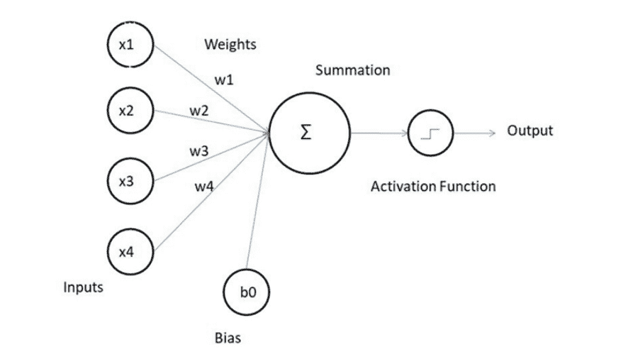

**图10.1：** *神经网络的基本元素：一个感知机*

我们将从在Python中实现感知机开始。我们知道，单个感知机的输出等于输入（x1,x2,x3,x4）与其对应权重（w1,w2,w3,w4）的点积，最后加上偏置。让我们首先在Python中为输入、权重和偏置创建单独的变量，如下所示：

**输入：**

```
lst_inputs = [5, 3.7, 1.3, 2.75]
```

**权重：**

```
lst_weights = [0.8, 0.5, -0.3, 1.0]
```

**偏置：**

```
dbl_bias = 3.5
```

接下来，我们将输入的每个元素与权重的对应元素相乘以获得点积，然后加上偏置值，如下所示：

```
dbl_output = (lst_inputs[0]*lst_weights[0] +
              lst_inputs[1]*lst_weights[1] +
              lst_inputs[2]*lst_weights[2] +
              lst_inputs[3]*lst_weights[3]) + dbl_bias

print(dbl_output)
```

**输出：**
**11.71**
打印输出时，得到的值是**11.71**。通过这种方式，我们可以在Python中实现一个感知机。

类似地，让我们使用Python来实现一个基本的多层神经网络，如下图*图10.2*所示：

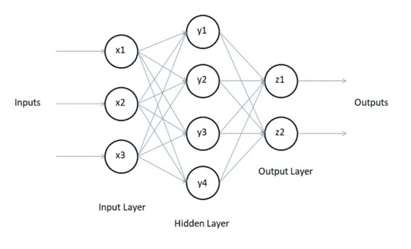

**图10.2：** *基本神经网络*

这里，输入层有三个节点。中间层有四个节点，输出层有两个节点。让我们首先关注获取隐藏层四个节点上的值*y1*、*y2*、*y3*和*y4*。由于隐藏层包含四个节点，输入层包含四个节点，我们将有四个列表，每个列表包含三个元素作为权重。由于隐藏层包含四个节点，我们将有一个包含四个元素的列表作为表示偏置值的列表。下面的代码将这些实体表示为变量：

```
lst_inputs = [3, 10, 9.7]

lst_weights_1 = [0.5, 0.9, 0.35]
lst_weights_2 = [0.1, 0.3, 0.93]
lst_weights_3 = [0.91, 0.72, 0.1]
lst_weights_4 = [1.0, 0.31, 0.75]

lst_bias = [0.2, 0.95, 1.0, 4.0]
```

接下来，我们使用与处理单个感知机相同的操作，使用下面的代码计算每个输出的值：

```
y1 = lst_inputs[0]*lst_weights_1[0]+
    lst_inputs[1]*lst_weights_1[1]+
    lst_inputs[2]*lst_weights_1[2] + lst_bias[0]

y2 = lst_inputs[0]*lst_weights_2[0]+
    lst_inputs[1]*lst_weights_2[1]+
    lst_inputs[2]*lst_weights_2[2] + lst_bias[1]

y3 = lst_inputs[0]*lst_weights_3[0]+
    lst_inputs[1]*lst_weights_3[1]+
    lst_inputs[2]*lst_weights_3[2] + lst_bias[2]

y4 = lst_inputs[0]*lst_weights_4[0]+
    lst_inputs[1]*lst_weights_4[1]+
    lst_inputs[2]*lst_weights_4[2] + lst_bias[3]

print('y1 = ' + str(y1))
print('y2 = ' + str(y2))
print('y3 = ' + str(y3))
print('y4 = ' + str(y4))
```

**输出：**

y1 = 14.094999999999999
y2 = 13.270999999999997
y3 = 11.9
y4 = 17.375

通过这种方式，我们获得了**y1**、**y2**、**y3**和**y4**的节点输出，这些输出随后将作为输出层的输入，并以类似的方式进行计算。

尽管我们以最经典的方式成功捕获了输出，但随着层数和每层节点数的增加，这个过程会变得繁琐。在这种情况下，我们需要寻找一种使用Python本身更快地填充输出的方法。幸运的是，我们确实有一种方法！那就是**numpy**数组的力量！

让我们看看它是如何完成的！

将下面的代码复制并粘贴到Python编辑器中运行：

```
import numpy as np

lst_inputs = [3, 10, 9.7]

arr_weights = [[0.5, 0.9, 0.35],
               [0.1, 0.3, 0.93],
               [0.91, 0.72, 0.1],
               [1.0, 0.31, 0.75]]

lst_bias = [0.2, 0.95, 1.0, 4.0]

hidden_layer_output = np.dot(arr_weights, lst_inputs) + lst_bias

print(hidden_layer_output)
```

**输出：**
**[14.095, 13.271, 11.9, 17.375]**

我们观察到，在这种情况下，输出是一个列表，并且所有值都与我们之前单独获得的值相匹配。本质上，我们在这里做的是为权重创建一个单一变量，并将其初始化为一个包含四个列表的列表，每个列表包含三个对应于权重的元素。然后，我们使用**np.dot**获取输入和权重的点积，然后将偏置加到这个乘积上。这样做不是很简单吗？

既然我们已经成功实现了人工神经网络中隐藏层的输出，让我们转向*第3章，Python AI/ML入门*中讨论的下一步，即使用激活函数处理输出。最常见的激活函数是**修正线性单元（ReLU）**函数，如果输入为正，则返回相同的输入，否则返回零值。数学上，它可以表示如下：

### ReLU

$f(X) = max(0,X)$

现在，让我们使用Python实现这个激活函数。我们刚刚观察到隐藏层四个节点的输出是**[14.095, 13.271, 11.9, 17.375]**。对于节点**y1**，输出是**14.095**。这只是针对特定输入和权重组合获得的一个输出值。然而，对于不同的输入和权重组合，可以获得多个不同的输出值。让我们假设一个任意输出值的列表，其中**14.095**也是其中之一，并应用ReLU函数来检查最终输出。在Python编辑器中复制并运行以下代码：

```
import numpy as np

lst_Output = [0.5, -3.7, 14.095, 10.5, -2.8, -15, 0, 0.135]
lst_Activated_Output = np.maximum(0,lst_Output)

print(lst_Activated_Output)
```

**输出：**
**[ 0.5 0. 14.095 10.5 0. 0. 0. 0.135]**

我们观察到，所有小于零的值都被ReLU转换为零。

## 反向传播

在本节中，我们将学习一个与神经网络高效训练相关的重要概念，即反向传播。反向传播的作用是通过将误差从输出节点反向传播到输入节点，从而高效地训练神经网络。它通过定义损失函数，并利用梯度下降法计算神经网络中每个权重对损失函数的影响来实现这一点。我们已经在*第9章 - 智能自动化第一部分：使用机器学习*中学习了机器学习的梯度下降法。在这里，我们将看到反向传播如何同样使用梯度下降法来计算权重和偏置的最优值，以完成神经网络预期的任务。为了执行反向传播所需的数学计算，本节假设读者熟悉微积分的基本概念，如导数、偏导数和链式法则。

我们已经熟悉从神经网络计算节点输出的过程。我们计算权重和输入的点积，然后在最后加上偏置项。这个过程也被称为**前向传播**。对于*图10.2*所示的神经网络，使用权重*w11, w12, w13*和输入*x1, x2, x3*，通过前向传播过程计算节点*y1*的输出将是*w11*x1 + w12*x2 + w13*x3 + b1*，其中*b1*是偏置。其他节点的输出将以类似方式计算。

现在，以这种方式计算出的输出将是预测输出。然而，当我们训练神经网络时，我们训练它的目的是产生预期输出。预期输出和预测输出之间差距的度量被称为误差，训练神经网络的目标是优化权重，使它们最小化这个误差。优化这些权重的过程被称为**反向传播**。

由于本书的目的仅仅是展示Python在简化计算方面的重要性，我们不会深入探讨在全连接神经网络背景下反向传播的实际实现；否则计算可能跨越许多页，超出本书的范围。

然而，我们将熟悉在单个感知器背景下反向传播的一般过程，以便读者可以扩展这个想法，将反向传播应用于全连接神经网络。

如上图*图10.3*所示，节点获得四个输入值*x1*、*x2*、*x3*和*x4*，对应的权重分别为*w1*、*w2*、*w3*和*w4*。偏置值为*b0*。因此，节点和或输出将由输入和权重的点积加上偏置给出。

如果*z*是输出，我们有：

$$z = w1 * x1 + w2 * x2 + w3 * x3 + b0$$

然后，我们将这个输出通过一个激活函数。让我们选择ReLU激活函数，其定义为：

$$ReLU(z) = max(0,z)$$

因此，节点的最终输出也可以表示为：

$$output = ReLU(w1*x1 + w2*x2 + w3*x3 + b0)$$

从数学上讲，这也可以表示为：

$$output = ReLU(sum(w1*x1, w2*x2, w3*x3, b0))$$

如前所述，神经网络试图实现预期输出。预期输出和预测输出之间的差距被称为**误差**，也称为**代价函数**。让我们在这个简单的情况下定义一个均方误差，其由下式给出：

$$Error = \frac{1}{2}(output(E) - output)^2$$

这里，*output(E)*是预期输出。

为了执行反向传播，我们评估特定参数对总误差的影响。在这个练习中，让我们尝试评估权重*w1*对总误差的影响。其他参数的影响可以使用相同的过程进行评估。

我们知道，由多个变量组成的函数的偏导数是它对其中一个变量的导数，同时保持其他变量不变。这术语太多了吗？现在让我们用数学方法来做，使其更容易理解。

权重$w1$对误差的影响由下式给出：

$$\frac{\partial Error}{\partial w1}$$

使用链式法则，这可以表示为：

$$\frac{\partial Error}{\partial w1} = \frac{\partial Error}{\partial output} * \frac{\partial output}{\partial sum} * \frac{\partial sum}{\partial w1}$$

让我们分别计算这些项：

1. $$\frac{\partial Error}{\partial output} = \frac{\partial \frac{1}{2}(output(E)-output)^2}{\partial output} = (output(E) - output)$$
2. $$\frac{\partial output}{\partial sum} = \frac{\partial ReLU(sum)}{\partial sum} = \frac{\partial (sum \text{ if } sum>0 \text{ else } 0)}{\partial sum} = (1 \text{ if } sum > 0 \text{ else } 0)$$
3. $$\frac{\partial sum}{\partial w1} = \frac{\partial (w1*x1 + w2*x2 + w3*x3 + b0)}{\partial w1} = x1$$

我们在Python中定义所有这些来自前向传播的函数，如下所示：

```python
def ReLU(z):
    return np.maximum(0,z)
def Sum(lst_inputs,arr_weights,lst_bias):
    return np.dot(arr_weights, lst_inputs) + lst_bias
def Error(output_E,output):
    return (1/2)*(output_E-output) ** 2
```

类似地，我们在Python中定义所有来自反向传播的函数，如下所示：

```python
def dError(output_E,output):
    return output_E-output
def dRELU(z):
    return 1. if z > 0 else 0.
def dSum_w1(lst_inputs,arr_weights):
    return lst_inputs[0]
```

接下来，我们初始化输入、权重和偏置集，如下所示：

```python
lst_inputs = [3,10,9.7,0.95]
arr_weights = [0.5, 0.3, 0.93, 1.0]
lst_bias = [0.2]
```

作为反向传播的一部分，我们还需要定义预期输出以计算误差，以及学习率以执行梯度下降。我们将参数初始化为如下值：

```python
output_E = 15.00
learning_rate = 0.01
```

然后我们使用下面的代码执行反向传播：

```python
output = ReLU(Sum(lst_inputs,arr_weights,lst_bias))[0]
Error_Value = Error(output_E,output)
dError_value = dError(output_E,output)
dRELU_value = dRELU(Sum(lst_inputs,arr_weights,lst_bias))
dSum_w1_value = dSum_w1(lst_inputs,arr_weights)
dError_w1 = dError_value*dRELU_value*dSum_w1_value
```

最后，我们将使用梯度下降法计算**w1**的新值，如下式所示：

```python
w1 = arr_weights[0]
w1_new = w1 - learning_rate*dError_w1
```

这样获得的**w1_new**值将是我们将在执行下一次前向传播迭代以及随后的反向传播时用于权重**w1**的新值。这些迭代将持续进行，直到我们达到误差不再大幅减少并且权重似乎收敛到某个特定值的点。这里需要注意的是，学习率是执行反向传播的一个重要参数，因为过高或过低的学习率可能无法为参数提供适当的优化值。

完整的代码如下供参考。将代码复制并粘贴到Python编辑器中：

```python
#反向传播
import numpy as np
import matplotlib.pyplot as plt

def ReLU(z):
    return np.maximum(0,z)

def Sum(lst_inputs,arr_weights,lst_bias):
    return np.dot(arr_weights, lst_inputs) + lst_bias

def Error(output_E,output):
    return (1/2)*(output_E-output) ** 2

def dError(output_E,output):
    return output_E-output

def dRELU(z):
    return 1. if z > 0 else 0.

def dSum_w1(lst_inputs,arr_weights):
    return lst_inputs[0]

lst_inputs = [3,10,9.7,0.95]
arr_weights = [0.5, 0.3, 0.93, 1.0]
lst_bias = [0.2]

output_E = 15.00
learning_rate = 0.01

output = ReLU(Sum(lst_inputs,arr_weights,lst_bias))[0]
Error_Value = Error(output_E,output)
dError_value = dError(output_E,output)
dRELU_value = dRELU(Sum(lst_inputs,arr_weights,lst_bias))
dSum_w1_value = dSum_w1(lst_inputs,arr_weights)
dError_w1 = dError_value*dRELU_value*dSum_w1_value

w1 = arr_weights[0]
w1_new = w1 - learning_rate*dError_w1

print(w1_new)
```

**输出：**

**0.49012999999999995**

## 用于深度学习的流行Python库

我们已经在*第9章，智能自动化第一部分：使用机器学习*中学习机器学习时，看到了Scikit-learn的强大功能。它仍然是机器学习应用的最佳库。然而，当我们深入研究深度学习时，Python开源社区已经推出了众多强大的库，这些库在训练深度神经网络时执行计算提供了巨大的计算能力。在本节中，我们将讨论一些在深度学习中常用的流行库：

- **TensorFlow：** TensorFlow是Google发布的一个库，它提供了深度学习所需的强大数值计算能力。然而，它经常被用于创建和训练

## 深度学习应用

计算机中GPU的出现，结合最新Python深度学习库提供的计算和数学能力，催生了当代人工智能领域令人惊叹的应用。其中最突出的是计算机视觉和自然语言处理。

计算机视觉主要使用**卷积神经网络（CNNs）**，赋予计算机识别图像和视频中物体的能力。自然语言处理则赋予计算机理解和解读人类语言的能力。目前最流行的当代例子是Alexa和谷歌翻译。

自然语言处理的高级应用催生了**大语言模型（LLMs）**，它们日益突出并席卷了技术领域。这一类别中最著名的例子是OpenAI的ChatGPT和谷歌的BARD。

我们之前在*第7章，处理PDF和图像*中已经学习过计算机视觉的具体示例，因此这里不再重复该主题。不过，快速回顾一下自然语言处理将是有益的，这正是我们接下来要做的。

## 自然语言处理

如前所述，自然语言处理使计算机能够理解和解读人类语言，并生成人类能够理解的响应。这项技术的理想状态是它在认知能力和创造力方面完全复制人类。然而，NLP目前距离理想状态还很远。最流行的NLP库是NLTK和Spacy。

NLP处理流程包含一些通用步骤，通常对文本数据执行这些步骤以进行处理和进一步解读。这些步骤如下：

- **分段**：此过程将段落分解为组成句子。例如，段落*AI是当前世纪最伟大的创新。然而，AI需要有选择性地使用以造福世界。每项技术都有其优点和缺点*可以分解为：
    - AI是当前世纪最伟大的创新。
    - 然而，AI需要有选择性地使用以造福世界。
    - 每项技术都有其优点和缺点。
- **分词**：此步骤将句子分解为组成单词。第一个句子*AI是21世纪最伟大的创新*可以分解为：*AI, is, the, greatest, innovation, of, the, current, century*。
- **词干提取**：此步骤将派生词分解为基本形式或词根。例如，第二个句子中的单词innovation可以分解为词根innov，这不是一个实际的单词，但innov的其他变体可以是innovate或innovative。
- **词形还原**：这与词干提取类似，但词形还原返回的是一个实际的单词。例如，第一个句子中的单词greatest可以词形还原为great。
- **停用词移除**：像a, an, is, the这样的词被认为是停用词，可能需要移除，以便只关注句子中的关键词。
- **词性标注**：此步骤将单词标记为其所属的相应词性，这有助于进一步理解句子的上下文。

在神经网络中也是如此。构建在**TensorFlow**之上的**Keras**模块允许创建神经网络，并且可以灵活地指定神经网络中的激活函数和层。让我们使用**Keras**模块的sequential方法来看看这个功能。在使用TensorFlow之前，需要使用以下命令安装它：

```
pip install tensorflow
```

现在，将下面的代码复制并粘贴到Python编辑器中：

```
#TensorFlow Tutorial
import tensorflow as tf
model = tf.keras.Sequential([
tf.keras.layers.Dense(10, activation='relu',input_shape=[4])])
model.summary()
```

在这里，我们观察到通过指定输入形状参数为**[4]**（这基本上是输入到神经网络的数据的形状），我们为神经网络创建了一个全连接层。之后，我们使用**model.summary()**方法在控制台中填充模型的详细信息。运行代码后，我们在控制台中获得以下输出：

Model: "sequential"

________________________________________________________________
____
Layer (type)             Output Shape              Param #
=================================================================
=================================================================
dense (Dense)            (None, 10)                50
=================================================================
=================================================================
Total params: 50 (200.00 Byte)
Trainable params: 50 (200.00 Byte)
Non-trainable params: 0 (0.00 Byte)

我们从输出中观察到模型是"**Sequential**"，层是**dense**。对于全连接层，参数数量使用以下公式计算：
*Param = Output Shape * (Input Shape + 1)*
代入数值，我们得到：
*Param = 10 * (4 + 1) = 50*
正如表格的*Param*列所示，参数数量确实是**50**。

在本章关于Python实际用例的最后一节中，我们将研究TensorFlow如何成为一个强大的解决方案，用于创建一个对来自我们非常熟悉的鸢尾花数据集的数据进行分类的神经网络。
在那之前，让我们先熟悉另一个有用的深度学习库，称为**PyTorch**。

- **PyTorch**：PyTorch是另一个用于深度学习计算的有用Python库，它是开源的，由Facebook构建。这个库易于使用，因此是大多数学者和研究人员的最爱。它广泛用于许多深度学习应用，如计算机视觉和文本处理。在使用PyTorch之前，需要使用以下命令安装它：

```
pip install torch
```

PyTorch的标志性特点是它提供了**torch.nn**模块，该模块提供了使用高级API构建神经网络的强大功能。我们不会在这里详细讨论实现，但感兴趣的读者可以在网上找到大量示例，这些示例很好地说明了PyTorch的用法。不过，快速浏览一下与PyTorch数据类型相关的关键概念将是有益的。
PyTorch在执行计算时是**numpy**数据类型的有效替代品。它为我们提供了非常有用的**tensor**数据类型，它充当通用的n维向量。让我们举个例子。将下面的代码复制并运行到Python编辑器中：

```
import torch
tsr = torch.tensor([[10,5],[3,1]])
print(tsr)
```

**输出：**
**tensor([[10, 5],
    [ 3, 1]])**

然而，这还不是全部！请稍等，直到我们看到PyTorch中张量的美妙之处。在关于反向传播的章节中，我们观察到计算某些表达式在某点的导数是多么繁琐。但随着PyTorch的**backward**方法的出现，这种麻烦即将结束！将下面的代码复制并运行到Python编辑器中：

```
import torch
x = torch.tensor(5.0, requires_grad=True)
y = x**3 + 7*x + 9
y.backward()
print(x.grad)
```

**输出：**
**tensor(82.)**

我们所做的非常简单。我们将一个张量**x**初始化为值**5.0**。接下来，我们创建一个因变量*y*作为*x*的函数，由以下方程给出：

$$y = x^3 + 7x + 9$$

我们可以通过代数方法得到该函数对*x*的导数，如下所示：

$$\frac{dy}{dx} = 3x^2 + 7$$

接下来，我们在上述表达式中赋值$x = 5$，得到导数的值为：

$$\frac{dy}{dx} = 3 * (5)^2 + 7 = 75 + 7 = 82$$

现在，Pytorch通过简单地对**y**应用**backward**方法，然后对**x**应用**grad**方法，计算出了$y$在$x=5$处的导数。从输出中观察到，我们仅用两行代码就得到了相同的值82！这足以让我们开始构建自己的神经网络了！

它有助于理解句子中现有的词汇。
像NLTK和Spacy这样的Python库提供了现成的功能，可以实现自然语言处理中所有关键步骤。

## Python中的实际应用案例

我们终于来到了每一章最后也是最激动人心的部分，那就是Python中的实际应用案例！我们将运用目前所学的一切来实现这个案例。
这次我们想尝试一些不同的东西。与其追求不同的目标，不如让我们实现相同的目标，但这次使用不同的方法。
我们将使用相同的鸢尾花数据集，并尝试使用神经网络而不是我们经典的机器学习算法来实现对该数据集中项目进行分类的目标。
首先，让我们使用下面的代码从Scikit-learn加载数据集：

```
from sklearn.datasets import load_iris

iris = load_iris()
```

接下来，我们使用下面的代码将其拆分为特征和目标，并分别赋值给变量**X**和**Y**：

```
X = iris.data

Y = iris.target
```

对目标数据集进行编码总是一个好习惯，因为编码将标签输出转换为数字分配的输出。例如，如果一个数据集包含像*Dog*、*Cat*和*Mouse*这样的标签值，那么编码器会将它们分别转换为0、1和2。
我们使用Scikit-learn的**LabelEncoder**模块进行编码，如以下代码所示：

```
from sklearn.preprocessing import LabelEncoder

encoder = LabelEncoder()
Y = encoder.fit_transform(Y)
```

接下来，我们对这个编码后的目标输出进行独热编码。独热编码是将输出转换为向量表示的过程。参考前面的例子，*Dog*将被转换为{0, 0, 1}，*Cat*将被转换为{0, 1, 0}，*Mouse*将被转换为{1, 0, 0}。

```
from sklearn.preprocessing import OneHotEncoder
onehot_encoder=OneHotEncoder(sparse=False)
Y=Y.reshape(len(Y), 1)
Y=onehot_encoder.fit_transform(Y)
```

接下来，我们使用Scikit-learn库的**model_selection**模块中常规的**train_test_split**函数，将数据拆分为训练数据和测试数据，如下面的代码所示：

```
X_Train, X_Test, Y_Train, Y_Test = train_test_split(
X, Y, test_size = 0.3, random_state=100)
```

我们使用**0.3**的测试集大小，并指定随机状态为**100**。

这一步将我们带到了数据准备阶段的结束。回顾一下我们刚才所做的：我们加载了鸢尾花数据，将目标变量与特征分离，对目标进行了编码，然后对目标进行了独热编码。最后，我们将数据拆分为训练集和测试集。

现在到了最有趣的部分，那就是训练模型！然而，我们选择哪个模型呢？一个自制的神经网络！TensorFlow来救场了！

我们使用TensorFlow的**Keras**模块的**Sequential**方法来创建我们的神经网络，如下面的代码所示：

```
model = tf.keras.Sequential([
    tf.keras.layers.Dense(10, activation='relu'),
    tf.keras.layers.Dense(10, activation='relu'),
    tf.keras.layers.Dense(3, activation='softmax')
])
```

从**Sequential**方法的参数可以明显看出，我们创建了两个带有ReLU激活函数的密集层和一个带有Softmax激活函数的层。

创建神经网络模型后的下一步总是编译它，如下面的代码所示：

```
model.compile(optimizer='rmsprop',
              loss='categorical_crossentropy',
              metrics=['accuracy'])
```

这一步指定了神经网络所需的某些重要参数。作为下一步，也是最重要的一步，我们使用**fit**方法训练模型，如下面的代码所示：

```
model.fit(X_Train, Y_Train, batch_size=50, epochs=100)
```

这里，迭代次数对应于**epoch**的数量。

接下来，我们使用**Loss**和**Accuracy**指标评估模型的准确性，如下面的代码所示：

```
loss, accuracy = model.evaluate(X_Test, Y_Test, verbose=0)
print('Loss:', loss)
print('Accuracy:', accuracy)
```

最后，我们也想知道实际值是否与**预测**值匹配。我们使用下面的代码进行此分析：

```
Y_Pred = model.predict(X_Test)

actual = np.argmax(Y_Test,axis=1)
predicted = np.argmax(Y_Pred,axis=1)

print(f"Actual: {actual}")
print(f"Predicted: {predicted}")
```

虽然到目前为止这只是一个零散的练习，但将整个代码作为单个片段来运行会更有利。

将下面的代码复制并运行到Python编辑器中：

```
#Practical Use Case in Python
from sklearn.model_selection import train_test_split
from sklearn.datasets import load_iris
from sklearn.preprocessing import LabelEncoder
from sklearn.preprocessing import OneHotEncoder

import tensorflow as tf
from tensorflow.keras import layers
import pandas as pd
import numpy as np
from tensorflow.keras import datasets, layers, models
from tensorflow.keras.utils import to_categorical

iris = load_iris()
X = iris.data
Y = iris.target

encoder = LabelEncoder()
Y = encoder.fit_transform(Y)

onehot_encoder=OneHotEncoder(sparse=False)
Y=Y.reshape(len(Y), 1)
Y=onehot_encoder.fit_transform(Y)

X_Train, X_Test, Y_Train, Y_Test = train_test_split(
X, Y, test_size = 0.3, random_state=100)

model = tf.keras.Sequential([
    tf.keras.layers.Dense(10, activation='relu'),
    tf.keras.layers.Dense(10, activation='relu'),
    tf.keras.layers.Dense(3, activation='softmax')
])

model.compile(optimizer='rmsprop',
              loss='categorical_crossentropy',
              metrics=['accuracy'])

model.fit(X_Train, Y_Train, batch_size=50, epochs=100)

loss, accuracy = model.evaluate(X_Test, Y_Test, verbose=0)
print('Loss:', loss)
print('Accuracy:', accuracy)

Y_Pred = model.predict(X_Test)

actual = np.argmax(Y_Test,axis=1)
predicted = np.argmax(Y_Pred,axis=1)

print(f"Actual: {actual}")
print(f"Predicted: {predicted}")
```

**输出：**

```
Epoch 1/100
3/3 [==============================] - 1s 6ms/step - loss: 3.1403 - accuracy: 0.3238
Epoch 2/100
3/3 [==============================] - 0s 3ms/step - loss: 2.8077 - accuracy: 0.3524
Epoch 3/100
3/3 [==============================] - 0s 3ms/step - loss: 2.6317 - accuracy: 0.3714
Epoch 4/100
3/3 [==============================] - 0s 2ms/step - loss: 2.4918 - accuracy: 0.4476
Epoch 5/100
3/3 [==============================] - 0s 3ms/step - loss: 2.3969 - accuracy: 0.4381
...
Epoch 99/100
3/3 [==============================] - 0s 2ms/step - loss: 0.3325 - accuracy: 0.9238
Epoch 100/100
3/3 [==============================] - 0s 3ms/step - loss: 0.3292 - accuracy: 0.9238

Loss: 0.30189675092697144
Accuracy: 0.93333333373069763

2/2 [==============================] - 0s 2ms/step
Actual: [2 0 2 0 2 2 0 0 2 0 0 2 0 0 2 1 1 1 2 2 2 0 2 0 1 2 1 0 1 2 1 1 2 0 0 1 0 1 2 2 0 1 2 2 0]
Predicted: [2 0 2 0 2 2 0 0 1 0 0 2 0 0 2 1 1 1 2 2 1 0 2 0 1 1 1 0 1 2 1 1 2 0 0 1 0 1 2 2 0 1 2 2 0]
```

从输出中，我们观察到模型表现出色，准确率达到93.33%。请注意，每次运行代码时，损失和准确率值可能会发生变化，并与上面获得的值略有不同。我们还观察到实际输出与预测输出非常接近，从而成功证明了我们使用这个神经网络来解决分类问题是合理的。

## 结论

没有人能否认，神经网络和深度学习需要对详细概念给予广泛的关注，并需要耐心去掌握。借助众多的Python包，人们可以想象出创建和训练计算高效的神经网络以解决各种复杂问题的巨大可能性。这些神经网络及其复杂的概念和相当的学习曲线，代表了一个充满挑战但回报丰厚的领域！值得说的是，本章在探索和应用方面是最为深入的，因为它融合了理论和编程示例。然而，平静的海面永远培养不出熟练的水手，在深度学习的海洋中更是如此！通过本章，我们只是触及了利用众多Python工具创建高效神经网络的可能性的皮毛。我们通过理论和实践示例的旅程证明了这样一个事实：掌握深度学习既需要奉献精神，也需要实践。尽管我们在本章中只是微小地尝试向读者介绍深度学习，并激发他们对Python在深度学习中实现领域的兴趣，但定期练习、扩展和巩固的下一步大胆行动已经交到了热情读者的能干手中！

前几章略微偏离了我们通常关注的桌面和文件自动化范围，因为它们旨在涵盖人工智能、机器学习和深度学习科学领域的核心理论及相关概念。现在，我们将把重点转回更以应用为中心的主题。在接下来的章节中，我们将深入探讨业务流程工作流，探索编排等关键概念以及Python在自动化业务流程中的关键作用。因此，事不宜迟，让我们翻页进入下一章！

## 加入我们的书籍Discord空间

加入书籍的Discord工作区，获取最新更新、优惠、全球科技动态、新书发布以及与作者的交流会：
[https://discord.bpbonline.com](https://discord.bpbonline.com)

# 第11章
## 业务流程工作流自动化

### 引言

在本书的前几章中，我们已经对自动化主题进行了充分的讨论。在桌面自动化方面，我们涵盖了文件和文件夹导航、屏幕自动化；我们深入探讨了在Excel文档、PDF文档以及图像文档中自动化流程的复杂性。我们还通过熟悉使用抓取技术进行数据收集的过程，介绍了通过网络实现的自动化，并进一步探索了向个人和群体发送自动消息的领域。这些章节讨论的所有自动化流程的共同特点是，Python通过消除其中的人工干预来发挥作用，从而在提高组织效率方面扮演着关键角色。然而，我们需要考虑到这样一个事实：在任何组织中，这些流程都不是独立运行的。任何业务或组织的流程工作流都是由许多这样的流程组成的，这些流程按特定顺序运行，并在适当的时间有条件地触发。它们也可能与其他流程并行运行。这正是需要一个框架来按顺序并高效地将这些流程与业务工作流对齐的地方。这个框架被称为编排。在本章中，我们将向您介绍编排，重点说明如何利用Python来实现和增强业务流程管理的这一重要方面。

### 结构

本章涵盖以下主题：

- 理解业务流程工作流
- 编排简介
- 自动化与编排：区别
- 市场上可用的编排平台
- 使用Python实现编排
  - Prefect
  - Luigi
- Python中的实际用例

### 目标

在本章结束时，读者应熟悉业务流程工作流中编排的概念，并学会在自动化常规任务时牢记编排的全局图景。还将介绍市场上可用的编排框架概览。

读者还将对使用Python在工作流中实现编排有一个清晰的理解，因为本章将尝试通过Python中的具体示例来说明这一概念。本章将涵盖的Python模块是**prefect**和**luigi**模块。还将基于相对优缺点对两者进行比较。

与任何其他章节一样，本章将以一个Python中的实际用例结束，使读者能够应用本章学习中获得的重要概念。

### 理解业务流程工作流

工作流可以定义为定义组织流程周期的一系列任务。假设一个组织有十个不同的流程。这十个流程在组织的业务流程中将有其各自的时间和触发过程。下面的*图11.1*将使这个概念更清晰：

**图11.1：** *业务流程工作流的概念*

如上图所示，业务流程工作流的一般概念是一系列按顺序运行的流程。我们观察到**流程1**之后是**流程2**。流程2的输出会经过一个条件逻辑判断。如果布尔值的输出为**True**，则执行**流程3**，随后是**流程4**，从而结束工作流。如果布尔值的输出为**False**，则**流程2**直接进入**流程4**，结束工作流。

该图仅用于示意目的，展示了一个非常简单的工作流示例。然而，组织中的实际工作流可能由多个相互关联的、错综复杂的流程组成。这里还需要注意的是，其中一些流程本身可能就是独立的工作流。一个大型组织肯定会有这样一个复杂的流程和工作流层次结构，最终形成一个顶层工作流。这应该能为理解组织中的业务流程工作流概念提供一些清晰度。

在深入探讨业务流程工作流之前，我们需要解决几个问题。

需要解决的第一个问题是，我们是否有一个框架来按顺序触发这些流程中的每一个，不仅基于它们在工作流中的各自顺序，还基于条件逻辑。

在此之前，我们需要解决另一个问题：为什么一个组织需要自动化工作流的这种顺序对齐，而不是部署人员来随意触发这些任务？

这个问题的答案很简单。我们需要自动化它们，以消除在重复性、基于规则的任务中的人工参与。人类可以更好地从事需要创造力和解决问题的任务，而不是被用于具有特定规则或重复模式的活动。此外，这也将大幅降低劳动力成本。

现在让我们回到第一个问题。我们是否有框架来将这组自动化任务整合在一起？答案是**肯定的**，这引出了本章的主要研究主题，即**编排**。

**编排**是消除工作流中人为错误并加快流程的可靠方法。它还通过消除工作流中的缺陷来降低业务的总体成本。

在本章中，我们将尝试使用我们自己的Python代码片段作为业务流程的类比，通过Python来实现编排，因为在这里涵盖实际的业务流程是不可能的，它们可能过于复杂。那么，让我们翻到下一页，开始我们的编排之旅吧！

### 编排简介

我们已经了解了业务流程工作流的一般概念和思想，其中各个流程相互按顺序连接，并在适当的时间触发。这些单独的流程中的每一个本身可能包含一系列或一个序列的自动化步骤。管理这组单独任务以创建一个合并工作流的过程称为编排。

在编排中，多种技术和平台可以根据特定的规则和情况进行协调。编排还处理在变化情况下需要做出的替代决策。这可以从简单系统扩展到复杂系统。编排的一个典型例子是创建一个应用程序并将其部署以连接多个用户。这可能涉及在网络中触发多个流程。几乎所有部署在云上的大型项目都涉及某种形式的编排。

这里需要注意的是，在编排中，并非所有组成任务或流程本身都是自动化流程。虽然其中大部分可能是自动化的，但有些甚至可能是手动的。

从概念上讲，编排只是在构成业务流程工作流的各个任务之间进行有效协调的过程。在当今，由于有众多平台和技术可用，这将是自动化的。在本书中，我们将在Python脚本的背景下研究这种编排。因此，我们将只对我们定期在Python中执行的那些自动化脚本进行编排。

理解了编排的概念后，让我们快速浏览一下自动化和编排之间的主要区别，因为这将有助于我们进一步巩固理解。尽管自动化和编排是相辅相成的，但它们之间存在一些微妙的差异。下一节将列举并详细阐述这些差异。

### 自动化与编排：区别

下面的*表11.1*总结了自动化和编排之间的主要区别：

| | 自动化 | 编排 |
|---|---|---|
| **任务数量** | 任务的自动化是从单个任务中消除人工干预的过程。 | 编排是协调（主要是自动化的）多个自动化任务（少数可能是手动的）。 |

| | | |
|---|---|---|
| **复杂性** | 自动化相对简单，因为它基于针对单一任务的预定义规则。 | 编排则很复杂，因为它需要在工作流中的多个任务之间进行协调和适应。 |
| **部署** | 自动化解决方案可能在内部或本地桌面部署。 | 编排解决方案通常涉及在网络上部署。 |
| **典型用例** | IT流程、财务流程、设计流程 | DevOps、云 |

*表 11.1：自动化与编排的主要区别*

## 市场上可用的编排平台

虽然本章我们将使用 Python 来学习编排，但了解一下市场上提供编排能力的编排工具会很有帮助。可以将其类比于我们在*第2章，RPA基础*中，在探索 Python RPA 模块之前所学习的**机器人流程自动化（RPA）**工具。

我们将快速浏览一些市场上流行的平台及其各自的优缺点：

- **Kubernetes**：这是一个流行的开源系统，用于自动化软件的部署、扩展、监控和部署。这基本上是一个容器编排系统。要理解什么是容器，可以将其视为一个包含在任何环境中运行所需所有必要元素的软件包。容器的概念使开发人员能够专注于编写软件的编程逻辑，而 IT 部门则负责部署方面。Kubernetes，也称为 **kube**，在多个主机之间编排此类容器。

Kubernetes 框架有一些基本组件。它们如下所述：
    - **节点**：在 Kubernetes 中，节点可以被视为运行容器化工作负载的地方，也是容器与 Kubernetes 服务之间通信得以维持的地方。
    - **集群**：集群是一组共享资源并运行容器化应用程序的节点。
    - **Pod**：Pod 基本上是一组已部署到单个节点的容器。
    - **副本控制器**：副本控制器是一个智能代理，它将决定 Pod 在集群中的分配。

- **Amazon Elastic Kubernetes Service (Amazon EKS)**：这是一个在 AWS 云中运行 Kubernetes 的 Kubernetes 服务。容器的调度由 Amazon EKS 在云中自动管理。Amazon EKS 还提供了利用 AWS 基础设施优势的潜力。使用 Amazon EKS，用户无需自行维护 Kubernetes 节点，因为它们由 AWS 的托管基础设施负责管理。此外，Amazon EKS 应用程序与在标准 Kubernetes 环境上运行的应用程序完全兼容。

- **Openshift**：基于 Red Hat 企业 Linux 和 Kubernetes 引擎构建，这是一个基于云的**平台即服务（PaaS）**，为构建、管理和部署容器化应用程序提供基础设施。该平台有两种变体：
    - **Openshift Online**：这作为**软件即服务（SaaS）**提供。
    - **Openshift Dedicated**：这是一项托管服务。

- **Nomad**：这是另一个支持 macOS、Windows 和 Linux 的多操作系统编排平台。Nomad 以单个二进制文件运行，资源占用小（35MB）。使用 Nomad 的优势在于，它可以用于运行容器化和非容器化应用程序。Nomad 还提供对 Windows、Java 和虚拟机的支持。

对编排及其相关市场工具的这一概述，应该足以激发我们进一步探索 Python 库提供的编排能力的兴趣。因此，事不宜迟，让我们继续下一节！

## 使用 Python 实现编排

让我们开始使用 Python 进行编排之旅。我们将探索的第一个库是 **prefect** 库，之后我们还将介绍 **luigi** 库。

## Prefect

Python **prefect** 库允许用户在流程中定义一系列任务并跟踪任务之间的依赖关系。一个例子可以说明这一点。让我们以一个非常简单的通过编写函数执行数学计算的案例为例。我们将执行的步骤如下：

1.  取任意两个具有任意值的整数。
2.  将它们相加。
3.  将得到的和乘以 **2**，从而使和的值加倍。

让我们尝试用 Python 编程实现这个过程。我们基本上需要定义单独的函数来将数字相加得到和，然后将和加倍得到结果。让我们任意选择 **5** 和 **10** 作为两个数字：

```python
#Define the functions

def Add(intNum_1,intNum_2):
    return intNum_1 + intNum_2

def Double(intNum):
    return 2*intNum

#Initialize the integer values

intNum_1 = 5

intNum_2 = 10

#Perform the Operations

Sum = Add(intNum_1,intNum_2)

Doubled_Sum = Double(Sum)

print(Doubled_Sum)
```

**输出：**

30

如观察到的，程序给出了我们预期的输出 **30**，这是通过将 **5** 和 **10** 相加得到 **15**，然后将和加倍得到 **30**。现在让我们尝试使用 Python 的 **prefect** 库将相同的程序可视化为工作流，以实现相同的结果。

请按照以下步骤开始使用 prefect：

1.  要开始使用 **prefect**，首先需要做的是安装该库。需要注意的是，在本章学习示例时，我们将使用 **prefect** 的初始版本，即 **prefect==1.0.0**。prefect 的最新版本是一个正在进行的项目，其语法和方法与早期版本不同。因此，在安装时，我们将使用以下命令安装早期版本：

   **pip install prefect==1.0.0**

2.  接下来，我们需要确保已从以下位置为我们的相应机器和操作系统安装了 **graphviz** 包：

   **https://graphviz.gitlab.io/_pages/Download/Download_windows.html**

3.  在安装过程中，当安装程序提示时，选择将 **Graphviz** 安装目录的 **bin** 目录添加到**用户路径**的选项。安装后，将 **bin** 文件夹内 **dot.exe** 文件的路径也添加到**系统**路径中。

4.  最后，我们需要安装 **prefect[viz]** Python 包，以便在最后可视化流程。使用以下命令安装该包：

```bash
pip install "prefect[viz]"
```

5.  我们现在已准备好使用 **prefect**。我们需要从 **prefect** 库中获取 **task** 和 **Flow** 模块，我们通过以下代码行导入它们：

```python
from prefect import task, Flow
```

6.  我们需要理解的第一件事是，我们在程序中定义的用于求和和加倍的函数现在必须定义为任务。甚至我们在程序末尾执行的用于打印最终答案的 **print** 操作也需要在一个单独的函数中定义，并表示为一个 prefect 任务。执行此过程很简单。我们保留函数的定义不变。我们只需在函数声明之前添加一行 **@task**，如下面的代码所示：

```python
@task
def Add(intNum_1,intNum_2):
    return intNum_1 + intNum_2

@task
def Double(intNum):
    return 2*intNum

@task
def Print_Value(strValue):
    print(strValue)
```

7.  现在我们已经定义了所有的任务，下一步是按顺序执行我们的过程。我们通过将 **Flow** 模块初始化为名为 **flow** 的变量，并在流程的 **with** 块中包含我们的过程来实现这一点。下面的代码将使这个概念清晰：

```python
with Flow('Mathematical-Operations') as flow:
    intNum_1 = 5
    intNum_2 = 10
    Sum = Add(intNum_1,intNum_2)
    Doubled_Sum = Double(Sum)
    Print_Value(Doubled_Sum)
```

8.  这定义了整个流程。我们的最后一步是使用 **Flow** 模块的 **run** 方法执行流程，如下面的代码所示：

```python
flow.run()
```

9.  流程执行后，我们将有兴趣以图形方式可视化流程，这将使我们能够像流程图一样跟踪依赖关系。我们使用 **visualize** 方法来实现这一点，如下面的代码所示：

```python
flow.visualize(filename="Mathematical Operations")
```

10.  在这里，我们观察到 **visualize** 方法允许我们传递一个名为 **filename** 的参数，我们在其中将文件名指定为 **"Mathematical Operations"**，流程将以图形格式保存在 Python 脚本所在的同一目录或 Python 脚本的主目录中。

在 Python 编辑器中按顺序运行上述所有步骤的整个代码后，我们在控制台中得到如下所示的输出：

**输出：**

## Luigi

Apache Luigi 是一个基于 Python API 的工作流管理系统，能够构建复杂的数据管道。

- 1. 在使用 **luigi** 之前，第一步需要使用以下命令安装该软件包：

**pip install luigi**

我们将使用相同的数学运算示例来理解 **luigi** 的工作原理。

**luigi** 软包的基础模块是 **Task** 模块，我们首先使用以下代码导入它：

```python
import luigi
from luigi import Task
```

**luigi** 的工作方式是创建一个接收 **Task** 参数的类，在该类中定义所有必需的函数，并包含一个执行工作流的 **run** 方法。我们首先将类定义为 **Mathematical_Operations**，如下所示：

```python
class Mathematical_Operations(Task):
```

我们观察到，我们定义了一个接收 **Task** 对象作为参数的类，这使我们能够在该类中执行 **luigi** 活动。

- 2. 接下来，我们在类中定义两个参数 **intNum_1** 和 **intNum_2**，并将它们初始化为 **luigi.Parameter()**。这将使我们能够使用动态参数初始化类，类似于类中的构造函数，如下所示：

```python
class Mathematical_Operations(Task):
    intNum_1 = luigi.Parameter()
    intNum_2 = luigi.Parameter()
```

- 3. 接下来，我们将在类中定义常规的 **Add** 函数，该函数将使用参数 **intNum_1** 和 **intNum_2**。我们还定义了 **Double** 函数，该函数将返回值加倍。更新后的类如下所示：

```python
class Mathematical_Operations(Task):
    intNum_1 = luigi.Parameter()
    intNum_2 = luigi.Parameter()
    def Add(self,intNum_1,intNum_2):
        return intNum_1 + intNum_2
    def Double(self,intNum):
        return 2*intNum
```

- 4. 现在我们来到最重要的部分，即 **run** 函数。正是这个函数将使用我们在类中定义的所有函数来执行工作流中的过程。整个类以及 **run** 函数如下所示：

```python
class Mathematical_Operations(Task):
    intNum_1 = luigi.Parameter()
    intNum_2 = luigi.Parameter()
    def Add(self,intNum_1,intNum_2):
        return intNum_1 + intNum_2
    def Double(self,intNum):
        return 2*intNum
    def run(self):
        Sum = self.Add(self.intNum_1,self.intNum_2)
        Doubled_Sum = self.Double(Sum)
        print(Doubled_Sum)
```

- 5. 最后，我们调用 **luigi** 模块的 **build** 函数来执行工作流，如下所示：

```python
luigi.build([Mathematical_Operations(intNum_1=5,intNum_2=10)],local_scheduler=True)
```

我们向 **build** 函数传递两个参数。第一个参数是 **Mathematical_Operations** 类的实例，第二个参数是 **local_scheduler = True**，这表示我们希望在本地运行此任务，而无需连接到 **luigi** 服务器。

完整的代码如下所示，供参考。在 Python 编辑器中复制并运行代码：

```python
import luigi
from luigi import Task

class Mathematical_Operations(Task):
    intNum_1 = luigi.Parameter()
    intNum_2 = luigi.Parameter()

    def Add(self,intNum_1,intNum_2):
        return intNum_1 + intNum_2

    def Double(self,intNum):
        return 2*intNum

    def run(self):
        Sum = self.Add(self.intNum_1,self.intNum_2)
        Doubled_Sum = self.Double(Sum)
        print(Doubled_Sum)

luigi.build([Mathematical_Operations(intNum_1=5,intNum_2=10)],local_scheduler=True)
```

运行代码后，我们得到如下输出：

```
===== Luigi Execution Summary =====
Scheduled 1 tasks of which:
* 1 ran successfully:
    - 1 Mathematical_Operations(intNum_1=5, intNum_2=10)
This progress looks :) because there were no failed tasks or missing dependencies
===== Luigi Execution Summary =====
30
```

我们观察到输出控制台中显示了值 **30**，这正是我们期望在结果中得到的值。摘要显示了已运行的任务信息。由于我们这里只有一个 **Mathematical_Operations** 类，摘要仅提及了该特定任务。

控制台中的完整输出还将包含带有 **DEBUG** 和 **INFO** 语句以及用户名详细信息的完整日志，此处未显示。

通过这种方式，我们了解了 **luigi** 模块的基本框架。**luigi** 的官方文档将讨论更多有用的功能，这些功能将使人们能够将更复杂的管道整合到其中。

我们现在已经了解了 **prefect** 和 **luigi** 模块，并通过示例观察了它们如何实现工作流管理功能的整合。现在，我们将通过一个 Python 中的实际用例来结束本章。

## Python 中的实际用例

我们现在来到了本章的最后一节，在这里我们将应用所学知识，在 Python 中实现一个实际用例。

我们可以使用我们在 *第 9 章* 中使用 Python 库实现的众多重要机器学习算法之一，作为我们希望使用 Python 进行编排的用例示例。让我们以我们在 Python 中实现的 *朴素贝叶斯* 算法为例，并使用 **prefect** Python 库对其进行编排。我们将观察原始代码的每个部分，并将其转换为可以在 **prefect** 工作流中调用的相应任务。

我们需要做的第一件事是导入所有必需的库。首先，我们导入实现朴素贝叶斯机器学习算法所需的库，如下所示：

```python
from sklearn.naive_bayes import GaussianNB
from sklearn.model_selection import train_test_split
from sklearn.datasets import load_iris
from sklearn.metrics import accuracy_score
```

接下来，我们导入**prefect**工作流所需的库，如下所示：

```
from prefect import task, Flow
```

回顾一下，第一步是使用以下代码加载鸢尾花数据集：

```
iris = load_iris()
X = iris.data
Y = iris.target
```

我们需要将这一步包装在一个函数中，以便将其转换为prefect任务，我们使用以下代码实现。请注意函数前的**@task**行：

```
@task(nout=2)
def Load_Iris():
    iris = load_iris()
    X = iris.data
    Y = iris.target
    return X,Y
```

在上面的代码中，请注意我们还向**@task**添加了一个参数**nout=2**，它指定该函数将返回两个值**X**和**Y**。

朴素贝叶斯算法的下一步是使用以下代码将数据集拆分为训练数据和测试数据：

```
X_Train, X_Test, Y_Train, Y_Test = train_test_split(X,Y,test_size=0.3, random_state=100)
```

同样，我们在**prefect**工作流的上下文中使用以下代码执行此操作：

```
@task(nout=4)
def Split_Data(X,Y):
    X_Train, X_Test, Y_Train, Y_Test = train_test_split(X,Y,test_size=0.3, random_state=100)
    return X_Train, X_Test, Y_Train, Y_Test
```

这里同样请注意**nout=4**，它向**@task**指定该函数将返回四个值**X_Train**、**X_Test**、**Y_Train**和**Y_Test**。

最后，我们使用以下代码实现算法并计算准确率分数：

```
NB = GaussianNB()
NB.fit(X_Train, Y_Train)
Y_Predict_Test_Sample = NB.predict(X_Test)
accuracy = accuracy_score(Y_Test, Y_Predict_Test_Sample)
print('Accuracy:', accuracy)
```

在prefect任务的上下文中，这将是：

```
@task
def Execute_Naive_Bayes(X_Train, X_Test, Y_Train, Y_Test):
    NB = GaussianNB()
    NB.fit(X_Train, Y_Train)
    Y_Predict_Test_Sample = NB.predict(X_Test)
    accuracy = accuracy_score(Y_Test, Y_Predict_Test_Sample)
    print('Accuracy:', accuracy)
```

现在我们已经定义了所有任务，我们希望在**prefect**流中按顺序执行它们，如下代码所示：

```
with Flow('Execute-Naive-Bayes') as flow:
    X,Y = Load_Iris()
    X_Train, X_Test, Y_Train, Y_Test = Split_Data(X,Y)
    Execute_Naive_Bayes(X_Train, X_Test, Y_Train, Y_Test)
    flow.run()
    flow.visualize(filename="Execute-Naive-Bayes")
```

将**prefect**实现的代码一个接一个地按相同顺序粘贴到Python编辑器中，并运行代码以观察下面显示的输出：

```
[2023-07-22 23:42:57+0530] INFO - prefect.FlowRunner | Beginning Flow run for 'Execute-Naive-Bayes'
[2023-07-22 23:42:57+0530] INFO - prefect.TaskRunner | Task 'Load_Iris': Starting task run...
[2023-07-22 23:42:57+0530] INFO - prefect.TaskRunner | Task 'Load_Iris': Finished task run for task with final state: 'Success'
[2023-07-22 23:42:57+0530] INFO - prefect.TaskRunner | Task 'Load_Iris[1]': Starting task run...
[2023-07-22 23:42:57+0530] INFO - prefect.TaskRunner | Task 'Load_Iris[1]': Finished task run for task with final state: 'Success'
[2023-07-22 23:42:57+0530] INFO - prefect.TaskRunner | Task 'Load_Iris[0]': Starting task run...
[2023-07-22 23:42:57+0530] INFO - prefect.TaskRunner | Task 'Load_Iris[0]': Finished task run for task with final state: 'Success'
[2023-07-22 23:42:57+0530] INFO - prefect.TaskRunner | Task 'Split_Data': Starting task run...
[2023-07-22 23:42:57+0530] INFO - prefect.TaskRunner | Task 'Split_Data': Finished task run for task with final state: 'Success'
[2023-07-22 23:42:57+0530] INFO - prefect.TaskRunner | Task 'Split_Data[3]': Starting task run...
[2023-07-22 23:42:57+0530] INFO - prefect.TaskRunner | Task 'Split_Data[3]': Finished task run for task with final state: 'Success'
[2023-07-22 23:42:57+0530] INFO - prefect.TaskRunner | Task 'Split_Data[0]': Starting task run...
[2023-07-22 23:42:57+0530] INFO - prefect.TaskRunner | Task 'Split_Data[0]': Finished task run for task with final state: 'Success'
[2023-07-22 23:42:57+0530] INFO - prefect.TaskRunner | Task 'Split_Data[1]': Starting task run...
[2023-07-22 23:42:57+0530] INFO - prefect.TaskRunner | Task 'Split_Data[1]': Finished task run for task with final state: 'Success'
[2023-07-22 23:42:57+0530] INFO - prefect.TaskRunner | Task 'Split_Data[2]': Starting task run...
[2023-07-22 23:42:57+0530] INFO - prefect.TaskRunner | Task 'Split_Data[2]': Finished task run for task with final state: 'Success'
[2023-07-22 23:42:57+0530] INFO - prefect.TaskRunner | Task 'Execute_Naive_Bayes': Starting task run...
Accuracy: 0.9555555555555556
[2023-07-22 23:42:57+0530] INFO - prefect.TaskRunner | Task 'Execute_Naive_Bayes': Finished task run for task with final state: 'Success'
[2023-07-22 23:42:57+0530] INFO - prefect.FlowRunner | Flow run SUCCESS: all reference tasks succeeded
```

我们在上面的控制台输出中观察到，所有任务都已记录了时间戳，并且最终的准确率值约为96%也已填充在输出中。现在，让我们以prefect最令人兴奋的部分——流程图——来结束这个练习！在脚本的主目录中，我们会找到一个名为**Execute-Naive-Bayes.pdf**的文件。打开该文件，我们会看到*图11.3*中所示的精美流程图，它显示了所有任务及其各自的依赖关系：

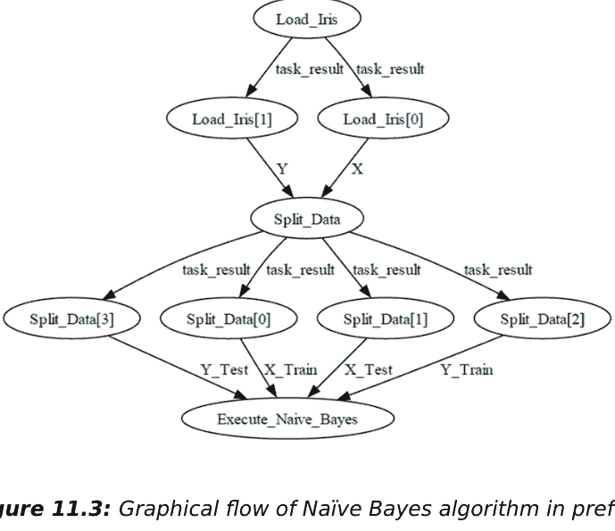

**图11.3：** prefect中朴素贝叶斯算法的图形化流程

通过这种方式，我们成功地将一个朴素贝叶斯机器学习算法管道实现为prefect工作流，其中依赖关系图清晰地帮助处理管道中的重要节点，使得特定节点的故障不会阻碍整个工作流的操作，从而实现顺畅的工作流管理。

热情的程序员会确保使用**luigi**实现相同的工作流！我们将这个练习留给热切的读者。

## 结论

通过本章，我们完成了处理工作流管理不应再成为Python程序员的麻烦。我们在本章讨论的**prefect**和**luigi**模块应作为实现简单和复杂工作流的起点和跳板。最终，更多的复杂性意味着更多的挑战，这也意味着额外的创造力元素！工作流管理从未如此令人兴奋，这要归功于Python！

在下一章中，我们将慢慢开始向真实世界用例过渡。我们已经在所有章节中以实际Python用例的形式实现了其中的一些片段。然而，下一章的主题是*超级自动化*，这是当代技术格局的标志。这个名称本身就略微暗示了该主题将涵盖所有概念，无论是流程自动化、工作流编排、人工智能还是机器学习！

因此，事不宜迟，让我们翻页吧！

## 加入我们的书籍Discord空间

加入书籍的Discord工作区，获取最新更新、优惠、全球科技动态、新书发布以及与作者的交流会：

[https://discord.bpbonline.com](https://discord.bpbonline.com)


# 第12章
## 超级自动化

### 引言

到目前为止，我们已经探索了桌面、网络、文件、文件夹、数据科学算法或工作流自动化方面的复杂性。我们迄今为止的自动化之旅在*第11章，自动化业务流程工作流*中达到了工作流自动化的顶峰，在那里我们不仅自动化了单个流程，还使用Python库将顺序程序整合到工作流中。

我们探索的所有这些领域本身都很出色。然而，当与机器学习提供的认知智能、**机器人流程自动化（RPA）**和其他AI工具结合使用时，它们有潜力对整个系统产生显著影响。这正是超级自动化的意义所在！

本章将向读者介绍超级自动化的概念，进一步阐述这一思想，然后介绍Python中说明真实世界用例的重要示例。

尽管这些示例可能涉及先前已学习的**自然语言处理（NLP）**和机器人流程自动化主题，但从不同视角和章节重新审视这些主题将是一种全新的体验。

### 结构

本章涵盖以下主题：

- 定义超级自动化：它是什么以及为何重要
- 超级自动化周期：关键步骤和流程
- 探索超级自动化的典型用例
- 利用光学字符识别增强文档理解
- 实施对话代理：聊天机器人的作用
- 通过机器人流程自动化提升效率
- 应对超级自动化的挑战
- Python中的实际用例

### 目标

在本章结束时，读者将理解**超级自动化**这一术语，它包含我们在前面章节中涵盖的相同技术，但当这些技术协同使用时，具有创造新事物的潜力。

本章将从不同视角和更广阔的超级自动化视野，重新审视一些先前涵盖的主题，如自然语言处理、光学字符识别和机器人流程自动化，并尝试探讨与这些技术相关的某些先前未涵盖的部分。我们将使用Python探索对话代理或聊天机器人的概念、设计和应用，从而为自然语言处理主题增添新的维度。还将讨论电子邮件过滤等应用，进一步体现机器学习在超级自动化中的应用。与其他章节一样，本章也将以Python中一个有趣的超级自动化实际用例结束。

## 定义超级自动化：它是什么以及为何重要

回顾工业历史，第一次工业革命（称为**工业1.0**）展示了蒸汽机等机车在实现自动化方面的力量。第二次工业革命（称为**工业2.0**）通过增加电力和内燃机，在复杂性上更进一步。第三次工业革命（称为**工业3.0**）率先使用计算机、电子设备和**信息技术（IT）**，极大地加速了自动化进程。第四次工业革命（称为**工业4.0**）以互联网为标志，其中**物联网（IoT）**的概念使所有计算设备相互关联。**图形处理单元（GPU）**提供的更高计算能力使机器学习和深度学习算法的实现成为现实。

追溯工业从工业1.0的蒸汽动力自动化到工业4.0的互联世界的演变，我们看到了持续创新的模式。考虑到当代工业因创新而经历了巨大增长，组织不仅需要将自身限制于流程自动化，还需要在其业务流程工作流中融入认知智能，以便在不断演变的商业环境中保持相关性，并成为脱颖而出的有能力的竞争者。简而言之，传统自动化的视野需要扩展，以包含认知思维的重要方面，为业务流程和系统增添智能元素。当今的商业格局要求的不仅仅是流程自动化——它需要整合认知智能。在新兴背景下，这一概念被称为**超级自动化**，其基本含义是自动化一切可能的事物。超级自动化代表了下一个飞跃，其中人工智能、机器学习和机器人流程自动化被协调起来，不仅自动化任务，还为系统赋予复杂的认知能力。这听起来可能非常理想化，目前可能还远未实现，但它具有升级并提升到接近我们所定义的**理想**水平的潜力。简而言之，超级自动化是通过引入**人工智能（AI）**、**机器学习（ML）**和机器人流程自动化的强大功能来增强现有自动化能力的过程。换句话说，我们将超级自动化定义为复杂业务流程的整体自动化，旨在通过利用AI和ML尽可能实现自动化。这一概念不仅是一个理想，更是一个可以显著提升运营效率和竞争力的切实目标。

我们已经在前一章中研究了编排的概念。另一种看待超级自动化的方式是通过将流程自动化与机器人流程自动化以及人工智能和机器学习等认知技术相结合，来编排多种技术。这种认知智能的加入增添了复杂性元素，并为业务提供了竞争优势。

## 超级自动化周期：关键步骤和流程

每个组织在规划其超级自动化周期时都需要经历一些关键步骤。这些步骤可能因组织而异，但有一些通用步骤对任何组织都是共同的。它们已在下面的*图12.1*中以图表形式展示：

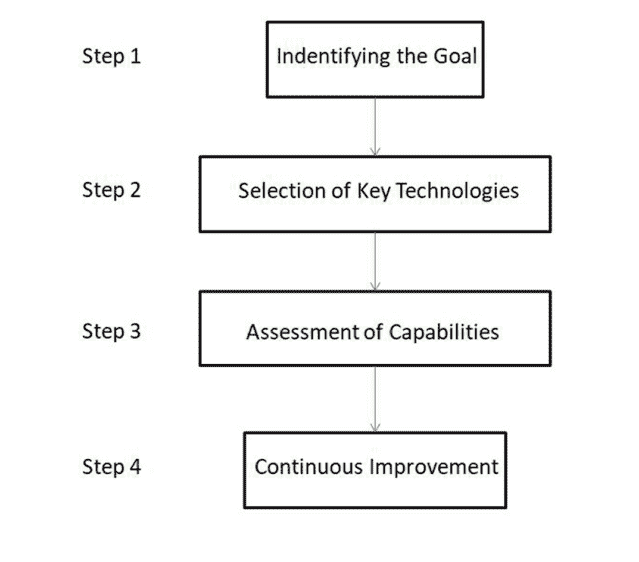

**图12.1：** *超级自动化周期中的步骤*

现在我们将详细阐述每个步骤：

1.  **确定目标：** 这是超级自动化过程中最关键和最重要的定义性步骤，因此它在序列中排在第一位。任何业务在考虑实施超级自动化之前，都需要有一个清晰的目标。如果一个业务仅仅为了超级自动化而进行，或者为了跟上潮流，或者仅仅因为其他组织在使用它，那么这显然会成为灾难的根源。业务应该对试图实现的目标和挑战有清晰的愿景，以便超级自动化的采用变得明确、有选择性并针对业务进行定制。

2.  **选择关键技术：** 一旦业务确定了目标，下一步就是列出那些采用超级自动化将确保显著增值的领域。例如，电子商务业务可能希望考虑采用推荐算法，以提高客户参与度和满意度。这可能促使他们整合复杂的机器学习算法来实现这一目的。另一个业务可能只是希望消除其优秀员工参与重复性手动工作的需要，以便将他们用于更具创造性和建设性的任务。因此，它可能会选择机器人流程自动化。

3.  **评估能力：** 一旦确定了目标以及满足目标所需的关键技术，组织需要评估实施这些技术所需的时间、资金和资源。

4.  **持续改进：** 任何流程都必须持续监控反馈，以便业务能够纠正错误并在下一次实施中融入学习。

## 探索超级自动化的典型用例

在前面的介绍性部分中，我们已经对超级自动化有了很好的理解，让我们直接进入一些Python可以派上用场的超级自动化典型用例！在本章中，我们将涵盖以下属于超级自动化范畴的常见应用，并在后续章节中逐一研究：

- **使用光学字符识别进行文档理解**：我们在*第7章，处理PDF和图像*中研究了**光学字符识别（OCR）**的概念，当时我们利用Python的tesseract库从图像中读取文本。我们将在本章中实现相同的概念，这次是从图像文档中读取信息。这一需求在所有组织中经常出现，其中重要文档可能包含非结构化格式的信息，使用OCR进行文本识别通过大大减少从这些文档中提取信息的人工参与元素，极大地加速了自动化周期。

- **对话代理 - 聊天机器人**：在我们之前章节关于自然语言处理的讨论中，我们讨论了Python库NLTK和Spacy如何提供现成的方法来实现NLP管道的重要功能。NLP的众多应用之一是聊天机器人或对话代理，它已成为当今任何业务不可或缺的一部分。聊天机器人能够在大多数通用主题上实现人与客户的互动，从而减少不必要的人工参与。

## 利用光学字符识别增强文档理解

组织机构经常遇到需要从文档中提取关键信息并进一步处理的情况，这成为业务流程中的关键环节。大多数时候，这些信息并非以结构化格式直接可用，因此需要相关领域的专家手动提取信息。这不仅耗费大量时间，也使流程容易出现人为错误。随着光学字符识别等技术的可用性提高，通过实现文档信息的读取和解读，可以大大减少此过程中的手动参与，从而成为利用人工智能实现超级自动化的强大催化剂。

在本节中，我们将重新审视 **pytesseract** Python 库，用于从图像中读取文本。我们已经在 *第7章 处理PDF和图像* 中介绍了 **pytesseract** 的下载和安装过程，因此这里将直接进入 Python 实现部分。

我们将使用的示例文件是 **Stock Prices.pdf**，这也是我们在 *第7章* 中使用 **PyPDF** 库时用过的文件。然而，这次该文件将是一个图像 PDF 文件，这意味着无法使用 **PyPDF**，因为文件中的文本不可搜索。因此，我们将利用 OCR 从该图像文件中提取文本。

这里需要注意的是，Tesseract OCR 目前不支持直接从 PDF 文件中读取文本。因此，我们需要将 PDF 文件转换为图像格式，如 **.JPG**，以便 Tesseract OCR 可以将其作为输入使用。

让我们打开 **Stock Prices.pdf** 文件并观察其内容。打开文件后，我们看到如 *图12.2* 所示，它包含与我们在 *第7章 处理PDF和图像* 中学习 **PyPDF2** 库时使用的文本 PDF **Stock Prices.pdf** 中相同的文本和表格。唯一的区别是文本无法搜索或选择，因为这是一个图像 PDF。因此，我们将使用 OCR 从该图像 PDF 中提取文本。

*图12.2* 下方显示了图像 PDF 文件 **Stock Prices.pdf** 的内容：

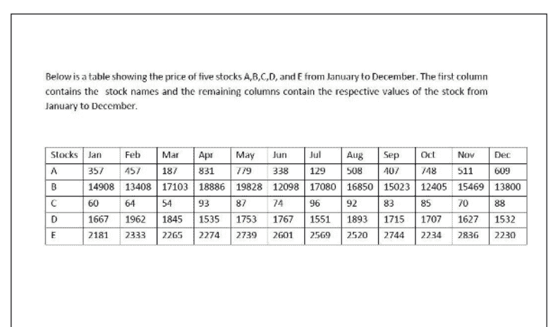

**图12.2：** 图像 PDF 文件 Stock Prices.pdf 的内容

如前所述，让我们首先将 PDF 文件转换为图像文件，以使其成为 Tesseract OCR 可以使用的格式。我们使用 Python 库 **pdf2image** 将 PDF 文件转换为图像文件。在使用该库之前，我们使用以下命令安装它：

```
pip install pdf2image
```

接下来，我们按如下方式导入所需的库：

```
from pdf2image import convert_from_path
import pytesseract
```

在这里，我们将使用 **pdf2image** 库的 **convert_from_path** 方法。将文件 **Stock Prices.pdf** 保存在与 Python 文件相同的目录中。如下方代码所示，我们只需提供文件名作为路径，并将其作为参数传递给函数 **convert_from_path**，该函数将把 PDF 文档的所有页面转换为 Tesseract 可以使用的图像。

```
str_pdf_path = "Stock Prices.pdf"
images = convert_from_path(pdf_path, 500)
```

现在，我们指定 Tesseract 可执行文件的路径，因为我们将使用它：

```
pytesseract.pytesseract.tesseract_cmd = r'C:\Program Files (x86)\Tesseract-OCR\tesseract.exe'
```

接下来，我们将遍历每张图像并将其传递给 **pytesseract** 以从图像中读取文本，然后我们将连接每页的文本以在输出中生成单个文本。这里，PDF 文档中只有一页，因此我们只需要遍历一张图像。

以下是执行此任务的代码：

```
text_output = ''
for image in images:
    text = pytesseract.image_to_string(image)
    text_output += text + '\n'

print(text_output)
```

完整的代码如下所示供参考。在 Python 编辑器中复制并运行代码，并在控制台中观察输出：

```
from pdf2image import convert_from_path
import pytesseract

str_pdf_path = "Stock Prices.pdf"

images = convert_from_path(str_pdf_path)

pytesseract.pytesseract.tesseract_cmd = r'C:\Program Files (x86)\Tesseract-OCR\tesseract.exe'

text_output = ''
for image in images:
    text = pytesseract.image_to_string(image)
    text_output += text + '\n'

print(text_output)
```

**输出：**

**下表显示了五只股票 A、B、C、D 和 E 从一月到十二月的价格。第一列包含股票名称，其余列包含股票从一月到十二月的相应值。**

| Stocks | Jan | Feb | Mar | Apr | May | Jun | Jul | Aug | Sep | Oct | Nov | Dec |
|---|---|---|---|---|---|---|---|---|---|---|---|---|
| A | 357 | 457 | 187 | 831 | 779 | 338 | 129 | 508 | 407 | 748 | 511 | 609 |
| C | 60 | 64 | 54 | 93 | 87 | 74 | 96 | 92 | 83 | 85 | 70 | 88 |
| D | 1667 | 1962 | 1845 | 1535 | 1753 | 1767 | 1551 | 1893 | 1715 | 1707 | 1627 | 1532 |
| E | 2181 | 2333 | 2265 | 2274 | 2739 | 2601 | 2569 | 2520 | 2744 | 2234 | 2836 | 2230 |

文档顶部包含一个段落，底部包含一个表格。我们清楚地看到段落中的每个单词都已被完美提取。然而，我们看到在表格中，对应于股票 B 的行被完全省略了，尽管表格中的其余信息已被正确保留。Tesseract 在检测和提取表格方面存在某些局限性。

我们将尝试通过使用另一个名为 **img2table** 的 Python 库来解决这个局限性，然后使用 OCR。在使用它之前，我们需要使用以下命令安装它：

```
pip install img2table
```

接下来，我们使用以下代码导入所需的库：

```
from img2table.document import PDF
from img2table.ocr import TesseractOCR
```

从上面的代码中，我们了解到我们将使用 **img2table** 库的 **document** 模块提供的 **PDF** 方法和 **img2table** 库的 **ocr** 模块提供的 **TesseractOCR** 方法。

接下来，我们使用各自的方法创建对象 **obj_pdf** 和 **obj_ocr**，如下方代码所示。在运行代码之前，请确保练习文件 **Stock Prices.pdf** 与 Python 代码位于同一目录中，否则需要在下面代码中 **PDF** 方法的 **src** 参数中明确指定文件的路径：

```
obj_pdf = PDF(src="Stock Prices.pdf")

obj_ocr = TesseractOCR(lang="eng")
```

接下来，我们使用 **obj_pdf** 对象的 **extract_tables** 方法，该方法使用 OCR 提取文档中的所有表格。这里，我们将 **obj_pdf** 对象作为参数传递给 **extract_tables** 方法的 **ocr** 参数：

```
obj_pdf_tables = obj_pdf.extract_tables(ocr=obj_ocr)
```

之后，我们使用 **obj_pdf** 对象的 **to_xlsx** 方法将表格导出到 Excel 工作表，如下方代码所示：

```
obj_pdf.to_xlsx("Extracted_Tables.xlsx", ocr=obj_ocr)
```

这里，我们观察到 **to_xlsx** 方法也需要一个输入到 **ocr** 参数，我们将其作为 **obj_ocr** 对象提供。我们需要的输出文件名是 "**Extracted_Tables.xlsx**"，并将其作为第一个参数传递给 **to_xlsx** 方法。

完整的代码已包含在下一页供参考。在 Python 编辑器中复制并运行代码，并观察在代码保存的同一目录中创建了一个名为 "**Extracted_Tables.xlsx**" 的 Excel 文件。

```
from img2table.document import PDF
from img2table.ocr import TesseractOCR

obj_pdf = PDF(src="Stock Prices.pdf")
obj_ocr = TesseractOCR(lang="eng")
obj_pdf_tables = obj_pdf.extract_tables(ocr=obj_ocr)
obj_pdf.to_xlsx("Extracted_Tables.xlsx", ocr=obj_ocr)
```

打开输出 Excel 文件 "**Extracted_Tables.xlsx**" 后，我们观察到如 *图12.3* 所示的表格：

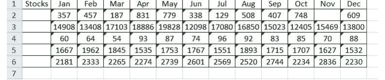

**图12.3：** 来自输出 Excel 文件 "Extracted_Tables.xlsx" 的表格

我们观察到，这比我们使用 **pytesseract** 库的 **image_to_string** 方法获得的表格外观要好得多。然而，我们仍然发现第一列 Stocks（提及股票 **A**、**B**、**C**、**D** 和 **E** 的名称）的所有值都是空白的。此外，股票 **A** 对应于 **Nov** 的值缺失了。

需要指出的是，OCR是一项复杂的任务，不存在一种通用方法能让人直接得到理想解决方案，因为每种方法都有其局限性。人们总是需要结合多种方法来优化提取的输出结果。另外，OpenCV是一个用于在应用OCR之前对图像进行预处理的库，这样OCR工具就能更容易地检测图像中的文本。建议感兴趣的读者自行深入探索这个主题！

## 实现对话代理：聊天机器人的角色

聊天机器人是自然语言处理技术的一个出色应用，它能减少人们在常规和重复性交互中的参与。通常，这些交互可能发生在组织与其客户之间，或组织的IT团队与其员工之间。聊天机器人在生成对常规问题的自动回复方面表现出色，而高级聊天机器人甚至能从之前的交互中学习并优化未来的回复。由于聊天机器人的存在，组织在雇佣和培训人员处理涉及重复性回复的常规交互任务上，大大节省了时间、精力和资源。同时，这些人员可以被安排到其他需要更多创造力的任务上。这样，聊天机器人就成为了**超级自动化**的一个完美范例，因为它结合了自动化与深度学习技术（如NLP），加速了组织的运作节奏，并节省了原本需要人员参与同类常规交互任务所需的时间、精力和资源。

在本节中，我们将使用Python库NLTK创建自己的聊天机器人。我们已经在*第10章，智能自动化第二部分：使用深度学习*中了解了自然语言处理循环的不同步骤。聊天机器人作为自然语言处理的一个应用，将使用其中部分或全部步骤。

通常，聊天机器人属于以下两种类型之一，或两者的结合：

- **基于规则的聊天机器人**：基于规则的聊天机器人或脚本化聊天机器人，基本上是根据嵌入或编程到其中的明确规则来生成响应的聊天机器人。在AI出现之前，早期的聊天机器人主要是基于规则的，并针对特定需求进行定制。它们可能无法理解超出其编程逻辑范围的问题。
- **自学习聊天机器人**：这些聊天机器人也称为**智能聊天机器人**，利用AI技术（如NLP）进行自我学习并优化其响应。

对于组织的常规需求，基于规则的聊天机器人能完成大部分任务。在本练习中，我们将使用Python库NLTK创建一个简单的基于规则的聊天机器人，用于处理新的软件安装请求和解决现有软件相关问题。本练习将为我们提供一个基础环境，基于此我们可以进一步构建更复杂的聊天机器人。

在使用NLTK之前，我们需要做的第一步是使用以下命令安装该库：

```
pip install nltk
```

接下来，我们导入所需的库，如下所示：

```
import nltk
from nltk.chat.util import Chat, reflections
```

让我们快速了解一下导入的**Chat**和**reflections**。

- **Chat**：这是基础类，包含了嵌入其中的逻辑，使聊天机器人能够处理文本信息并生成响应。我们很快就会看到如何在代码中使用它。
- **Reflections**：这基本上是一个字典，如果正则表达式中的值与键匹配，它将输出该值作为响应。在对话中，有许多基本短语会用到这个字典。人们也可以创建自定义字典或向此字典添加内容。我们可以使用以下命令快速查看此字典的内容。

```
print(reflections)
```

**输出：**

```
{'i am': 'you are', 'i was': 'you were', 'i': 'you', "i'm": 'you are', "i'd": 'you would', "i've": 'you have', "i'll": 'you will', 'my': 'your', 'you are': 'I am', 'you were': 'I was', "you've": 'I have', "you'll": 'I will', 'your': 'my', 'yours': 'mine', 'you': 'me', 'me': 'you'}
```

接下来，我们创建一个名为**pairs**的列表，用于存储我们希望融入聊天机器人的规则或逻辑。我们将在这里创建一个基础列表，但可以根据新的规则和业务逻辑进一步扩展此列表：

```
pairs = [
    [
        r"My name is (.*)",
        ["Hello %1",]
    ],
    [
        r"(I'm|good|good,|I am)",
        ["How can I help you?\nPlease select one from the following:" \n  "\n1)New Software Installation\n2)Issue with Existing Software",]
    ],
    [
        r"(.*) Installation",
        ["Could you please mention the name of the software? Please type 'Software:'" \n  "before mentioning the software name. Thanks!",]
    ],
    [
        r"(.*) Existing",
        ["Please select the issue from the following:" \n  "\n1)Version needs Upgradation\n2)Uninstall Software",]
    ],
    [
        r"(Version|Uninstall)",
        ["Thanks for your patience. Someone from the IT team " \n"would reach out to you to resolve your issue. Is there anything else" \n"I could help you with?",]
    ],
    [
        r"Software:(.*)",
        ["Thanks for your patience. I am assigning this ticket to someone from " \n"the IT team who shall help you install %1. Is there anything else I could help you with?",]
    ],
    [
        r"No",
        ["Thank you. Have a great day!",]
    ],
]
```

建议读者花些时间观察此列表中的语句和响应，以便更好地理解聊天机器人如何回答问题。假定读者熟悉Python中的正则表达式。

最后，我们使用**Chat**类，通过传入**pairs**和**reflections**作为参数来实例化聊天机器人。最后，我们使用**Chat**类的**converse**方法开始对话。在实例化**Chat**类之前，我们还打印了一条介绍性语句，以便代表聊天机器人开始对话。

```
print("Hi, I'm your new chatbot friend and I'm here to help you! May I know your name?")

chat = Chat(pairs, reflections)
chat.converse(quit="No")
```

注意传入**converse**方法的参数**quit="No"**。此参数使聊天机器人能够理解，当用户输入单词**No**（通常在对话结束时）时，需要关闭对话。

完整的代码如下供参考。请在Python编辑器中复制并运行代码：

```
import nltk
from nltk.chat.util import Chat, reflections

pairs = [
    [
        r"My name is (.*)",
        ["Hello %1",]
    ],
    [
        r"(I'm|good|good,|I am)",
        ["How can I help you?\nPlease select one from the following:" \n"\n1)New Software Installation\n2)Issue with Existing Software",]
    ],
    [
        r"(.*) Installation",
        ["Could you please mention the name of the software? Please type 'Software:'" \n"before mentioning the software name. Thanks!",]
    ],
    [
        r"(.*) Existing",
        ["Please select the issue from the following:" \n"\n1)Version needs Upgradation\n2)Uninstall Software",]
    ],
    [
        r"(Version|Uninstall)",
        ["Thanks for your patience. Someone from the IT team " \n"would reach out to you to resolve your issue. Is there anything else" \n"I could help you with?",]
    ],
    [
        r"Software:(.*)",
        ["Thanks for your patience. I am assigning this ticket to someone from " \n"the IT team who shall help you install %1. Is there anything else I could help you with?",]
    ],
    [
        r"No",
        ["Thank you. Have a great day!",]
    ],
]
print("Hi, I'm your new chatbot friend and I'm here to help you! May I know your name?")
chat = Chat(pairs, reflections)
chat.converse(quit="No")
```

**输出：**
**嗨，我是你的新聊天机器人朋友，我在这里帮助你！请问你的名字是？**
**>我的名字是abc**
**你好abc，你好吗？**
**>我很好，谢谢！**

**我能为您做些什么？**
**请从以下选项中选择一项：**
**1) 新软件安装**
**2) 现有软件问题**
**> 新软件安装**
**请提及软件名称。请在提及软件名称前输入 'Software:'。谢谢！**
**> Software: xyz community edition**
**感谢您的耐心等待。我已将此工单分配给IT团队的成员，他将帮助您安装xyz community edition。还有其他我可以帮助您的吗？**
**> 没有**
**谢谢。祝您有美好的一天！**

请注意，在运行代码时，最初只会打印出 'Print' 语句中的内容，提示用户提及名称，然后对话将根据用户提供的进一步响应开始。上述引用的整个示例对话即为生成的输出。读者可以自由尝试不同的响应，以从聊天机器人获得不同的输出语句，对话将与此示例有所不同。

通过这种方式，我们已经熟悉了创建聊天机器人的基本基础设施，而NLTK出色地提供了这一基础。另一个提供聊天机器人功能的有趣Python库是 **Chatterbot**，感兴趣的读者可以探索它！

## 通过机器人流程自动化提升效率

机器人流程自动化使组织能够消除人员在重复性流程中的参与。在软件领域，这可以是桌面或网络自动化。我们之前在 *第2章，RPA基础* 中介绍了与机器人流程自动化相关的基本概念，并研究了一个涉及使用 **rpa** 包进行网络自动化的Python实际用例。需要注意的是，我们在 *第8章，自动化应用程序、文件夹和操作* 中研究的其他Python库，如 **shutil** 和 **PyAutoGUI**，在机器人流程自动化领域也是有价值的贡献者，因为它们能够实现重复性桌面流程的自动化。在本章中，我们将在研究Python实际用例时直接利用RPA功能。至此，我们已经很好地概述了我们打算讨论的超级自动化的三个用例，即OCR、NLP聊天机器人和RPA。现在，让我们进入最后一节，然后我们再处理Python实际用例，在此之前我们讨论超级自动化的挑战。

## 应对超级自动化的挑战

尽管有用，但超级自动化也带来了一系列组织需要应对的挑战。其中一些讨论如下：

- **对变革的抵触**：用软件或机器完全或部分替代人员，可能会使现有员工变得冗余，从而引发对采用AI或RPA等超级自动化技术的抵触。因此，需要在技术和人员之间取得平衡。
- **优先级错位**：为了跟上现有趋势，组织可能会选择最新的尖端技术，而没有考虑其具体的业务计划或组织目标。仅仅为了追求超级自动化而追求它，是自找麻烦的最可靠方式。
- **投资回报率**：组织需要确保采用超级自动化所带来的收益超过成本，以证明投资回报率的合理性。

## Python中的实际用例

是时候应用我们所学的知识了！在这个用例中，我们将导航到一个网页，并对其中包含文本的图像进行快照。我们将此快照保存到我们的目录中，然后应用OCR从图像中读取文本。因此，这个用例将需要RPA和OCR的知识，使其成为超级自动化的完美范例。这听起来不是很有趣吗？

我们将导航到下面的URL，其中包含一个写有消息的图像。该图像如 *图12.4* 所示：

**https://c4.wallpaperflare.com/wallpaper/734/647/661/quote-motivational-wallpaper-preview.jpg**


**图12.4：** *来自网页的图像*

我们现在将使用 **rpa** 包编写一个Python脚本，该脚本会自动导航到网页URL以打开图像，对图像进行快照，将快照保存到与Python代码文件相同的目录中，然后关闭网页窗口。由于我们已经在 *第2章，RPA基础* 中学习了RPA的所有这些步骤，我们将直接编写如下代码：

```
import rpa as r

r.init()

r.url('https://c4.wallpaperflare.com/wallpaper/734/647/661/quote-motivational-wallpaper-preview.jpg')

r.snap('page', 'Captured_Image.png')

r.wait(5)

r.close()
```

现在，我们有一个名为 **Captured_Image.png** 的文件保存在与Python代码相同的目录中。这是我们访问URL时获得的图像的快照。

我们的下一步将是应用Python库 **tesseract** 来读取快照图像中写入的内容。我们已经熟悉 **tesseract** 库的使用，因此我们直接编写如下脚本：

```
import pytesseract

pytesseract.pytesseract.tesseract_cmd = r"C:\Program Files\Tesseract-OCR\tesseract.exe"

image = 'Captured_Image.png'

text = pytesseract.image_to_string(image, lang='eng', config='--psm 11')

print(text)
```

请注意，我们在 **pytesseract** 库的 **image_to_string** 方法的最后一个参数中使用了 **config='--psm 11'**。请参考 *第7章，处理PDF和图像* 中提供的tesseract手册链接，其中详细讨论了配置类型。

完整的代码如下供参考。在Python编辑器中复制并运行代码：

```
import rpa as r
r.init()
r.url('https://c4.wallpaperflare.com/wallpaper/734/647/661/quote-motivational-wallpaper-preview.jpg')
r.snap('page', 'Captured_Image.png')
r.wait(5)
r.close()

import pytesseract

pytesseract.pytesseract.tesseract_cmd = r"C:\Program Files\Tesseract-OCR\tesseract.exe"

image = 'Captured_Image.png'
text = pytesseract.image_to_string(image, lang='eng', config='--psm 11')
print(text)
```

**输出：**
**DO YOUR BEST**
**AND**
**FORGET THE REST**
®

我们发现 **pytesseract** 给出了我们所需的输出！至此，我们结束了这个用例和本章！

## 结论

尽管本章很有趣，但它并没有引入任何根本性的新概念。事实上，本章的核心信息是，通过在业务工作流程的关键点应用相同的基本技术，可以创造出一个名为 **超级自动化** 的全新领域，从而用认知智能和自动化来优化工作流程。本章还讨论了组织在整合超级自动化时需要应对的挑战。

在下一章中，我们将再次探讨RPA工具UiPath，这次以Python为中心！UiPath与Python的结合为用户提供了极佳的灵活性，这将是下一章讨论的主要领域。那么，事不宜迟，让我们翻页进入下一章！

# 第13章
## Python与UiPath

### 引言

我们之前在 *第2章，RPA基础* 中已经介绍了 **机器人流程自动化（RPA）** 的基础知识，这应该赋予我们探索Python在增强UiPath等RPA工具效率和灵活性方面作用的特权。本章将深入探讨这个主题，其中将通过详细的分步指导演练来展示在RPA增强中包含Python脚本。

尽管像UiPath这样的RPA工具为那些不热衷于自己编程的专业人士提供了不需要编程的专用版本，但本章将重点介绍RPA软件的可定制版本，该版本允许包含可编程脚本以提高工作流程的效率和操作。

在本章中，我们将讨论UiPath中构成使Python与UiPath集成的序列的不同活动。这些活动中的每一个都有自己独特的属性，我们将详细浏览它们。

Python与UiPath的集成为超级自动化的高效实施提供了进一步的动力，这一概念我们曾在*第12章，超级自动化*中探讨过。

### 结构

本章涵盖以下主题：

- 在UiPath中设置Python环境
- 探索UiPath中的Python活动
- 创建Python脚本
- 将Python与UiPath集成

### 目标

本章假设读者已经熟悉并能够自如地操作UiPath的基本功能。尽管*第2章，RPA基础*已经概述和总结了不同的RPA功能，但在开始本章之前，熟悉与UiPath相关的主要概念会有所帮助，因为本章的重点是Python与UiPath的集成。

在本章结束时，读者将能够自如地在UiPath工作流中调用Python脚本，从而一窥Python在增强UiPath程序方面的强大能力。

本章将包含大量图片！这并不奇怪，因为它需要包含每个流程实例的截图。带有详细图片的逐步引导导航将使读者轻松理解流程中的关键步骤。

## 在UiPath中设置Python环境

为了在UiPath环境中使用Python脚本，我们需要按照以下步骤和图示进行一些设置：

> 请注意，作为先决条件，在开始练习之前需要安装.NET 5.0。

1.  打开UiPath Studio。
2.  创建一个新的兼容Windows的空白流程，并将其命名为**Python_Test**，如*图13.1*所示：

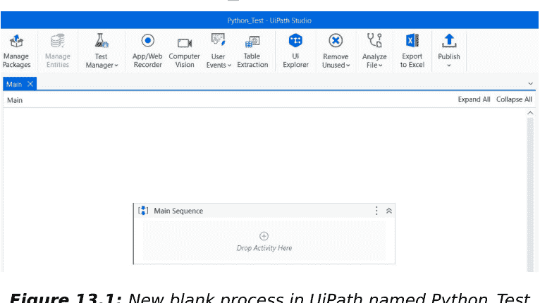

*图13.1：* UiPath中名为Python_Test的新空白流程

3.  点击左上角的**管理包**选项卡，如下方*图13.2*所示：

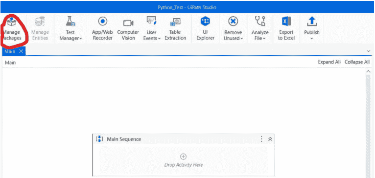

**图13.2：管理包选项卡**

4.  在打开的**管理包**窗口中，选择**所有包**，并在搜索栏中输入**Python**，如下方*图13.3*所示：

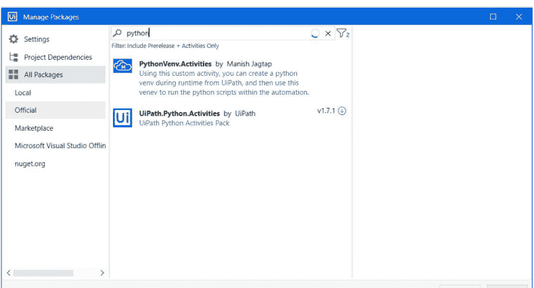

**图13.3：UiPath中的管理包栏**

5.  选择包**UiPath.Python.Activities**，如下方*图13.4*所示，然后点击右侧的**安装**按钮：

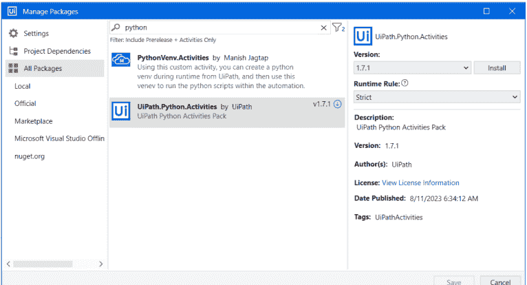

**图13.4：** *安装UiPath.Python.Activities*

6.  安装后，我们将在包名称旁边看到一个黄色圆圈，表明该包已安装，如下方*图13.5*所示：

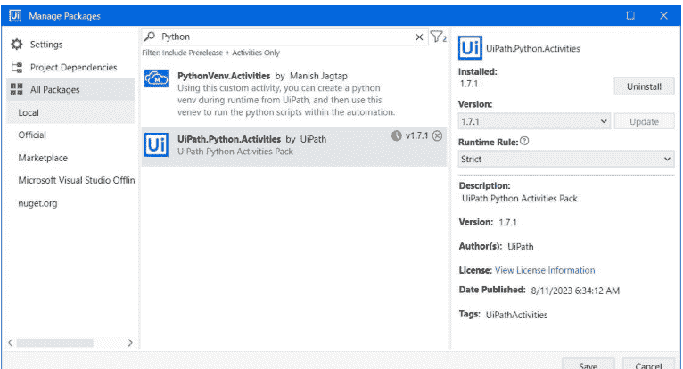

**图13.5：** *确认Python包安装*

7.  安装后，我们点击**活动**栏中的搜索框，然后点击**Python**，这将列出UiPath中所有可用的Python活动，如下方*图13.6*所示：

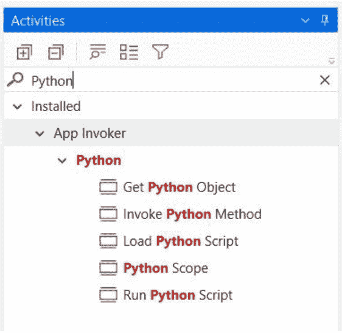

**图13.6：** *UiPath中的Python活动*

## 探索UiPath中的Python活动

在本节中，我们将快速描述安装Python包后（如上一节所述）UiPath中可用的各种Python活动。点击**活动**栏搜索框中的**Python**后，我们将找到UiPath中所有Python活动的列表，如上*图13.6*所示：

下面，我们将讨论每个活动及其各自的功能。在下一节中，当我们进行实际练习时，我们将对它们有实际的理解。

-   **Python作用域**：此活动位于序列层次结构的第一级。在这里，我们指定基本参数，如Python安装目录和Python版本。所有其他Python活动都包含在此活动中。
-   **加载Python脚本**：此活动使我们能够在UiPath中加载外部Python脚本。此活动的目的是利用Python代码在UiPath中执行任务，这本质上是本章的标志。请注意，此活动与我们将在最后讨论的**运行Python脚本**不同。
-   **调用Python方法**：此活动允许引用我们使用**加载Python脚本**活动加载的Python脚本中的方法或函数。**调用Python方法**活动允许将UiPath中的实际值作为参数传递给Python方法，并利用该方法产生预期的输出。
-   **获取Python对象**：此活动允许从指定变量中检索Python对象。
-   **运行Python脚本**：使用此活动，我们直接从UiPath环境运行外部Python脚本。

## 创建Python脚本

鉴于我们已经在UiPath中设置了Python环境，并具备了开始探索各种UiPath活动所需的必要背景知识，我们现在可以进行实际演练。这将为我们提供一个在UiPath中探索各种Python活动的机会。

在我们开始此练习之前，首先需要有一个可供使用的Python程序。让我们创建一个Python文件并在其中编写一些函数。

创建一个名为**UiPath_Test.py**的Python文件，并将文件保存到本地目录。为了简单起见，让我们编写一个非常简单的数学函数来计算一个数的平方，另一个函数来执行两个数的加法。

将以下代码复制并粘贴到Python文件**UiPath_Test.py**中，并保存文件中的更改：

```
#Calculates the square of an integer number

def Square(intNum):
    intSquare = intNum*intNum
    return intSquare

#Performs the addition of two integers

def Add(intNum1,intNum2):
    intSum = intNum1 + intNum2
    return intSum
```

我们将在练习的后面引用这些函数中的每一个。

## 将Python与UiPath集成

我们现在将使用我们在上一节中创建的Python脚本。让我们按照以下步骤来理解Python与UiPath的集成：

1.  打开我们之前创建的同一个空白流程**Python_Test**。我们已经从**管理包**部分安装了UiPath包。之后，我们转到**活动**窗口并在搜索框中输入**Python**。这将为我们提供UiPath中所有Python活动的列表，如下图所示。需要在序列中引入的第一个活动是**Python作用域**活动，如下方*图13.7*所示：

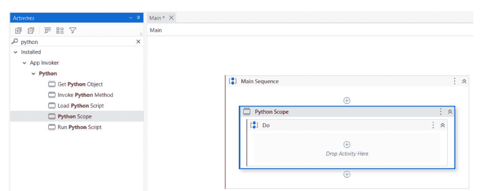

**图13.7：** *Python作用域活动*

2.  接下来，我们点击序列中的**Python作用域**窗口。我们发现UiPath流程中的属性窗口打开，如*图13.8*所示：

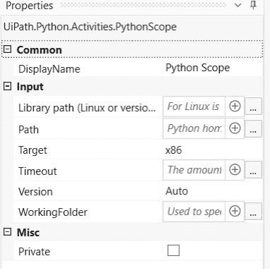

**图13.8：** *Python作用域活动的属性窗口*

这里有几个我们会感兴趣的属性，我们需要为这些属性指定正确的值。

以下是我们想要指定的属性列表：

-   **路径**：我们需要指定的第一个属性是**路径**。这包含Python安装目录的路径。请注意，对于本章中的特定练习，使用的Python版本是32位Python 3.6版本。我们点击**路径**参数末尾带有三个水平点的图标以打开**表达式编辑器**。
    如*图13.9*所示，我们输入Python解释器安装的目录。请注意，我们不提供直到**python.exe**的完整路径。我们只需输入解释器所在文件夹的位置。以下是我们作为字符串输入的路径：
    **C:\Users\dell\AppData\Local\Programs\Python\Python36-32**

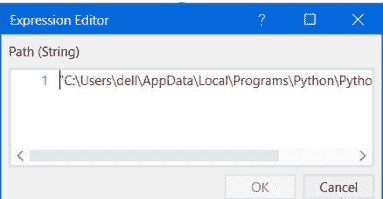

**图13.9：** *在表达式编辑器中指定路径属性*

-   **目标**：在这里，我们可以选择**x64**（64位）或**x86**（32位）。我们指定**x86**，因为如前所述，我们使用的是32位版本。
-   **版本**：此属性将为我们提供一个下拉菜单来选择Python版本。我们还有一个名为**自动**的选项，它使UiPath能够自动从我们在**路径**属性中指定的目录中选择正确的版本。在我们的案例中，我们选择**自动**。

3.  接下来，我们拖动**加载Python脚本**活动，如*图13.10*所示。一旦我们将活动拖入序列中，我们就会看到一个带有感叹号的红色圆圈。当我们将鼠标悬停在红色圆圈上时，

## 加载 Python 脚本活动

当你首次添加**加载 Python 脚本**活动时，会弹出一条消息，内容为：**所有重载组均未配置其必需/可选的活动参数**。此消息出现是因为我们尚未在此活动的属性窗口中提及任何参数。请参考下图*图 13.10*：

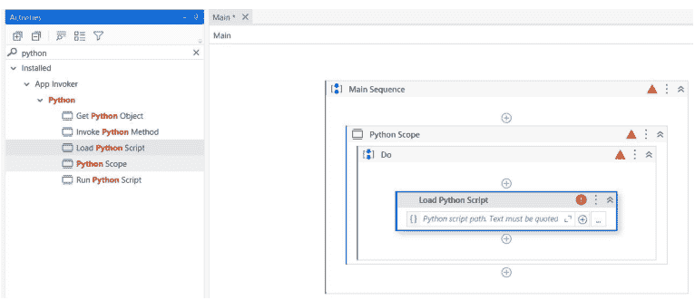

**图 13.10：** *加载 Python 脚本活动*

4.  此活动的属性窗口如*图 13.11*所示，我们在其中指定了 Python 脚本 **UiPath_Test.py** 的完整路径，之后红色圆圈便会消失：

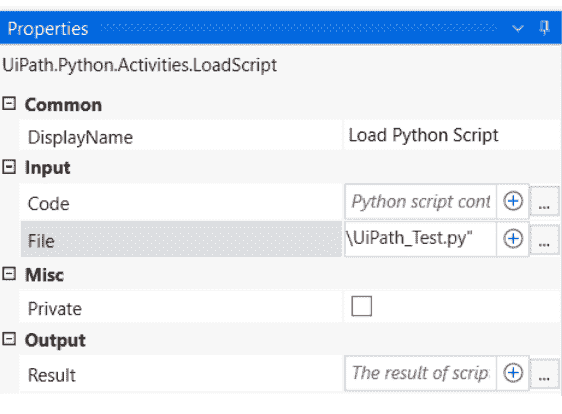

**图 13.11：** *加载 Python 脚本活动的属性窗口*

5.  在属性窗口的**输入**部分，我们还有另一个名为**代码**的属性，如果代码块很小，我们可以直接在此粘贴 Python 代码，而无需引用文件。然而，在本练习中，即使我们的代码块很小，我们也不会使用**代码**属性，因为随着 Python 脚本变大，**文件**属性是一种更通用的工作方式。

6.  我们在**加载 Python 脚本**活动中需要指定的最后一个属性是**输出**部分的**结果**属性。在此，我们将获得的结果存储在一个 UiPath 变量中。我们点击**结果**属性对应的文本框，然后按 *Ctrl + K*，这将创建一个**设置变量：**前缀，如下图*图 13.12*所示：

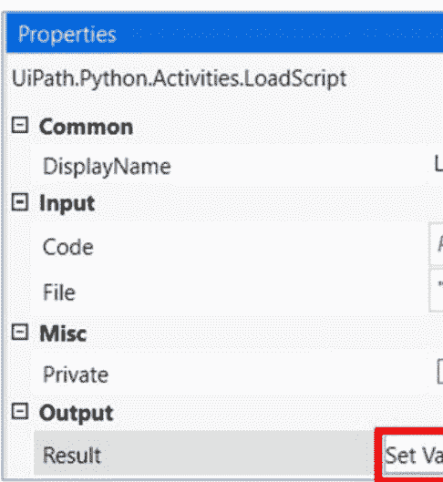

**图 13.12：** *用于在 UiPath 变量中存储结果的设置变量*

7.  接下来，我们在**设置变量：**旁边输入 **Result_Python** 并按 *Enter*，这将把**加载 Python 脚本**活动的结果存储到一个名为 **Result_Python**、类型为 **Python 对象**的变量中。打开变量资源管理器，我们观察到一个名为 **Result_Python** 的变量已被创建，其类型为 **Python 对象**，如下图*图 13.13*所示：

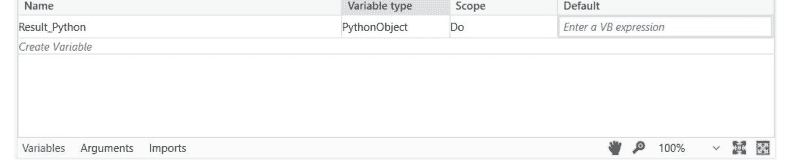

**图 13.13：** *在变量资源管理器中创建的 Result_Python 变量*

## 调用 Python 方法活动

8.  我们将下一个活动**调用 Python 方法**拖入我们的序列中，如下图*图 13.14*所示：

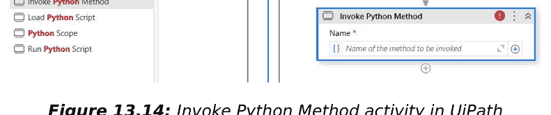

**图 13.14：** *UiPath 中的调用 Python 方法活动*

9.  此活动是序列的关键，因为正是在这里我们指定了要使用的 Python 方法。同样，红色圆圈出现是因为活动等待我们指定**名称**属性，这基本上就是我们要使用的方法的名称。在此，我们使用 Python 文件 **UiPath_Test.py** 中的 **Square** 方法来计算一个数字的平方。我们在文本框中指定 **“Square”**，如下图*图 13.15*所示：

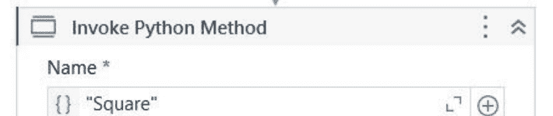

**图 13.15：** *在调用 Python 方法中指定“Square”作为方法*

10. 接下来，我们想探讨在**调用 Python 方法**活动中需要指定的其他属性。我们在属性窗口中提及它们，如下图*图 13.16*所示，并在之后进行讨论：

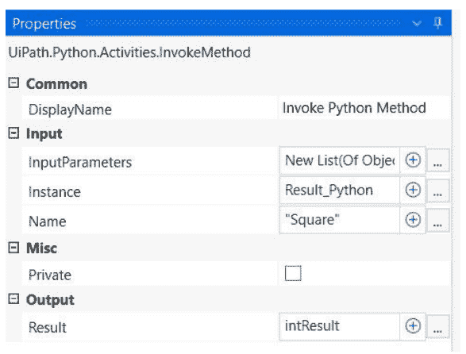

**图 13.16：** *调用 Python 方法的属性窗口*

- **输入参数：** 此属性基本上用于指定输入到方法 **Square** 的内容。在此，我们在文本框中输入以下值：

  **New List(Of Object)({5})**

  此值基本上会将值 **5** 作为参数传递给 Python 脚本中的 **Square** 方法，以计算 **5** 的平方。

- **实例：** 此属性要求我们指定方法所属的 Python 脚本实例。我们将前一个活动**加载 Python 脚本**的结果存储在一个名为 **Result_Python** 的 Python 变量中，这正是我们在此输入的内容。

- **结果：** 与前一个活动类似，此活动也需要我们指定**结果**属性。我们按 *Ctrl + K* 打开**设置变量：**，然后输入 **intResult**，这将创建一个名为 **intResult**、类型为 **Python 对象**的变量，用于存储从 Python 方法获得的输出。

## 获取 Python 对象活动

11. 接下来，我们将**获取 Python 对象**活动拖入我们的序列中，如下图*图 13.17*所示：

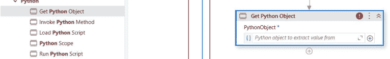

**图 13.17：** *UiPath 中的获取 Python 对象活动*

像往常一样，我们看到红色圆圈，因为我们需要指定必要的属性。在此之前，让我们先了解一下此活动。

12. 我们知道，我们已将前一个活动的输出存储到一个名为 **intResult** 的变量中。然而，此变量的数据类型是 **Python 对象**，无法直接用于进一步计算。因此，我们需要将其转换为整数数据类型，以便用于进一步计算。因此，此活动将**调用 Python 方法**活动中获得的 Python 方法结果转换为可以进一步转换的数据类型。如*图 13.18*中的属性窗口所示，我们指定了所需的值，这些值将在之后讨论：

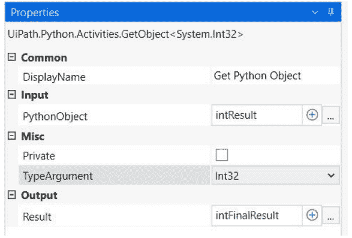

**图 13.18：** *获取 Python 对象活动的属性窗口*

- **Python 对象**：这是我们想要转换为另一种数据类型的 **Python 对象**数据类型的变量。在此情况下，我们指定 **intResult**，这是从**调用 Python 方法**活动获得的变量，其数据类型为 **Python 对象**，我们希望将其转换为另一种数据类型。
- **类型参数**：此属性将提供一个下拉菜单，用于选择我们希望将 Python 对象变量转换为的数据类型。在此情况下，我们选择 **int32**，因为我们希望将变量转换为整数。
- **结果**：在此，我们将转换后数据类型的变量存储到 UiPath 变量中。像往常一样，我们按 *Ctrl + K* 打开**设置变量：**，输入 **intFinalResult**，这将在变量资源管理器中创建一个名为 **intFinalResult**、数据类型为 **Int32** 的变量。

## 消息框活动

13. 最后，我们将**消息框**活动拖入序列中，如下图*图 13.19*所示。这不是一个 Python 活动，而是一个常规的 UiPath 活动，会弹出一个**消息框**：

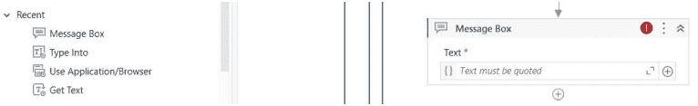

**图 13.19：** *UiPath 中的消息框活动*

14. 像往常一样，红色圆圈出现，要求我们指定**消息框**活动的 **Text** 方法的输入。由于我们希望将结果显示在消息框中，我们在文本中输入 **intFinalResult.ToString**，如下图*图 13.20*所示：


**图 13.20：** *消息框内容*

15. 至此，我们已经构建了我们的 UiPath 序列，一切准备就绪！按 *Ctrl + S* 保存序列。

## 运行序列

16. 现在，我们将通过点击左上角的**调试文件**图标并从下拉选项中选择**运行文件**来运行 UiPath 序列，如下图*图 13.21*所示：

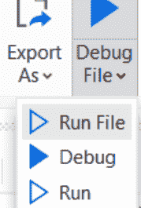

**图 13.21：** *运行文件*

17. 运行文件后，我们得到如*图 13.22*所示的**输出消息框**，这正是我们计算 5 的平方后预期的结果，即 **25**：

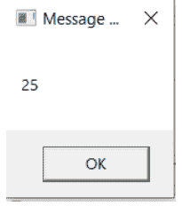

**图 13.22：** *输出消息框*

18. 现在，如果我们没记错的话，在创建文件 **UiPath_Test.py** 时，我们定义了两个方法，一个是 **Square**，我们一直使用它，另一个是 **Add**。让我们再次运行整个序列，这次使用 **Add** 方法。

19. 我们唯一需要做的更改是在**调用 Python 方法**活动中。点击**调用 Python 方法**活动将打开属性窗口，我们在其中输入相应的值，如下图*图 13.23*所示：

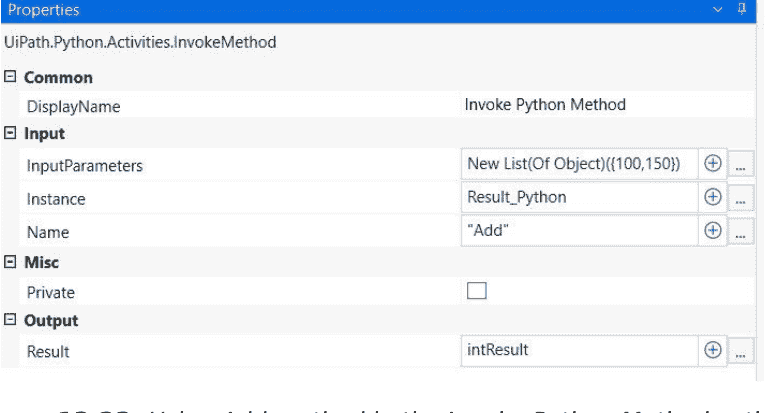

**图 13.23：** *在调用 Python 方法活动中使用 Add 方法*

20. 由于我们正在添加两个数字，我们在属性 **InputParameters** 中将值指定为 **New List(Of Object)({100,150})**，这将添加数字 100 和 150。

21. 类似地，在 **Name** 属性中，我们将方法名称指定为 "**Add**"。

22. 接下来，我们保存序列并以与之前类似的方式运行它。我们再次得到如*图 13.24* 所示的 **Output Message Box**，其中显示了预期的输出 **250**，即数字 100 和 150 的总和：

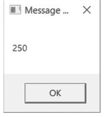

**图 13.24：** *输出消息框*

通过这个简单的练习，我们已经完成了探索将 Python 与 UiPath 集成所需的基本基础设施。

我们现在应该能够构建更复杂的应用程序，这些应用程序可以在 UiPath 序列中有选择地利用现有的 Python 脚本，从而充分利用 Python 和 UiPath 的功能。

这留给热情的程序员自行选择，去探索和尝试在其他重要的 UiPath 活动中包含 Python 脚本。

因此，至此我们结束了本章！

## 结论

我们现在已经完成了 UiPath 和 Python 的集成！本章在几个方面是独特的。

首先，由于其作为过程演练的固有性质，一个单独的部分跨越了多页。其次，第一个方面归因于过程中的每个阶段都需要详细捕获重要的截图，从而使整个章节图片繁多。如引言中先前所述，在 UiPath 领域中包含 Python 通过在机器人流程自动化领域中顺利利用 Python 的力量，极大地加速了超级自动化的进程。

在下一章中，我们将学习在自动化项目中工作时所需的辅助工具。本章将关于构建自动化项目的架构，这将向我们介绍虚拟环境的概念。**pip** 命令将在本章中与 Docker 主题一起重新讨论。

那么，事不宜迟，让我们翻页进入下一章！

## 加入我们的书籍 Discord 空间

加入书籍的 Discord 工作区，获取最新更新、优惠、全球科技动态、新书发布以及与作者的交流会：

[https://discord.bpbonline.com](https://discord.bpbonline.com)


# 第 14 章
## 构建自动化项目的架构

### 引言

在构建自动化项目时，有几个组件需要处理。这些组件，无论是辅助工具还是其他，都决定了自动化项目的高效运行。本章讨论了在 Python 中构建自动化项目架构所需的各种组件。像这样的不同辅助工具增加了自动化项目的总体有效性，这使得我们有必要在本章中讨论它们。

本章基本上是离散主题的集合，这些主题可能彼此直接无关，但在整体自动化任务或项目的背景下，它们共同变得有价值。

本章讨论了设置虚拟环境的过程。作为在 Python 中安装任何包的门户的 pip 命令在本章中被更详细地重新讨论。通过语法和示例讨论了 pip 命令提供的各种功能。此外，像 Docker 这样的其他必需品也在本章末尾进行了强调。

### 结构

本章涵盖以下主题：

- 虚拟环境简介
  - 设置虚拟环境
  - 虚拟环境目录
  - 其他注意事项
- 重新讨论 Python PIP
  - 执行基本操作
  - 使用 requirements.txt 文件
- 使用 Docker 进行容器化

### 目标

本章基本上是认识到某些在其他章节中无法涉及的重要辅助工具需要记录在一处的结果。本章很好地为这些辅助工具提供了有用的附录。

在本章结束时，读者将牢固掌握虚拟环境、pip 命令和 Docker 的概念。许多这样的功能现在已成为日常使用的一部分，但我们大多数人仍然缺乏对其理论的理解。本章将灌输这些补充主题的额外知识，从而使读者能够有效地管理和构建未来的自动化项目。

在本章中，读者将彻底熟悉在 Python 中创建虚拟环境的过程，使用 pip 执行各种基本任务，然后在虚拟环境中使用 requirements.txt 文件。

## 虚拟环境简介

虚拟环境是一种工具，它提供了为不同项目保持独立依赖项的能力。这在需要多个依赖项的大型复杂项目中变得尤为重要。

在处理小块代码时，人们可能意识不到虚拟环境的重要性。然而，随着项目数量的增加以及每个项目范围的扩大，会出现这样一种情况：我们有一个项目使用特定库的特定版本，而另一个项目使用同一库的另一个版本。事实是，每个项目都会引用相同的第三方库目录，这就是问题变得棘手的地方。这就是虚拟环境作为在 Python 中处理需要独立依赖项的多个项目的有用工具的用武之地。*图 14.1* 下面说明了 Python 中虚拟环境的概念：

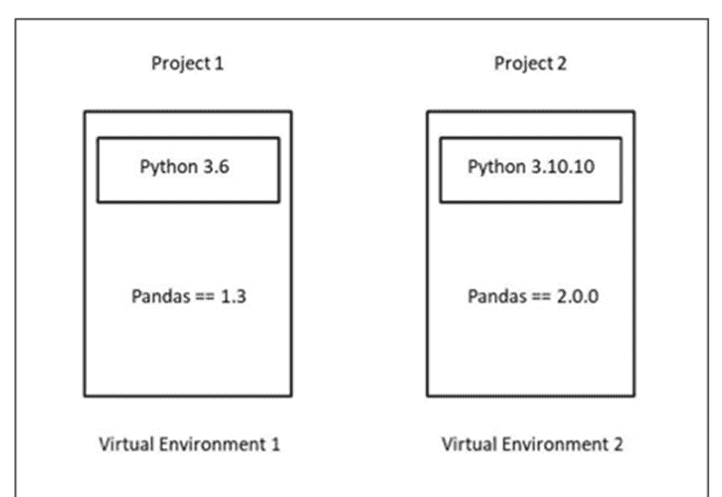

**图 14.1：** *Python 中虚拟环境的概念*

我们观察到，该图显示了两个名为 **Project 1** 和 **Project 2** 的项目，它们分别需要 **Python 3.6** 和 **3.10.10** 作为其 Python 版本。它们各自还需要 **Pandas == 1.3** 和 **Pandas == 2.0.0** 作为其 Pandas 版本。安装了 Python 3.6 和 Pandas 1.3 的组合被纳入虚拟环境 1。类似地，安装了 Python 3.10.10 和 Pandas 2.0.0 的另一个组合被纳入虚拟环境 2。它们各自分别服务于 Project 1 和 Project 2 的目的。

通过这种方式，虚拟环境为每个项目根据其特定依赖项提供了一个定制的领域。可以根据需要拥有任意数量的虚拟环境。

很明显，虚拟环境在与团队其他成员共享项目依赖项时也很有用。考虑这样一种场景：团队中的一个成员一直在处理两个不同的项目 Project A 和 Project B，这两个项目需要不同的第三方 Python 库。其中一些库可能在两个项目之间重叠，而另一些可能对每个项目都是唯一的。在没有虚拟环境的情况下，所有这些库都将存储在全局 Python 环境中的同一位置。然后项目运行良好并取得成功！这很好，但问题来了。

现在有其他团队成员需要处理 Project A，而这个成员的任务是协助这些团队成员获取仅与 Project A 相关的所有依赖项列表。现在的困难在于，所有依赖项都存储在同一全局环境中，要知道哪些包仅属于 Project A 并不容易区分。在虚拟环境存在的情况下，这个问题将不存在，因为与特定项目相关的所有依赖项都驻留在虚拟环境本身中，这很容易转移给任何人。

总而言之，虚拟环境是一个文件夹结构，它为用户提供运行隔离 Python 环境所需的一切。既然我们已经理解了虚拟环境的概念及其优点，我们将进入下一节，在那里我们设置自己的虚拟环境。

## 设置虚拟环境

在本节中，我们将在 Windows 中创建 Python 虚拟环境的过程。

1. 在 Windows 中创建虚拟环境的第一步是使用 **pip** 命令安装 **virtualenv**。这个 **virtualenv** 是一个用于创建隔离 Python 环境的工具。在提示符中输入以下命令：

```
pip install virtualenv
```

2. 接下来，为了在项目目录中创建一个虚拟环境，我们需要先使用以下命令将项目目录设置为当前目录：

```
cd project-directory
```

此处，**project-directory** 代表 Python 项目目录的路径。

3. 然后，我们使用以下命令在此目录中创建一个名为 **myenv** 的虚拟环境：

```
virtualenv myenv
```

4. 如果我们进入项目目录，会发现目录内创建了一个名为 **myenv** 的新文件夹，这正是我们想要创建的虚拟环境。

至此，我们已经成功创建了虚拟环境！

## 虚拟环境目录概览

既然我们在上一节中已经成功设置了一个名为 **myenv** 的虚拟环境，让我们花些时间了解一下虚拟环境内部的主要文件夹。

如果我们进入 **myenv** 文件夹，会观察到如*图 14.2*所示的其他文件夹和文件：

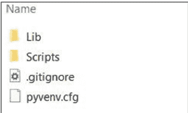

**图 14.2：** *虚拟环境内的文件夹*

在 **Lib** 文件夹内，我们可以看到 **site-packages** 文件夹，所有我们安装的库都将存放于此。

另一个名为 **Scripts** 的文件夹包含所有可执行文件，如*图 14.3*所示。

在虚拟环境 **myenv** 的根目录中，我们还能看到一个名为 **pyvenv.cfg** 的文件，它基本上是一个配置文件。该文件包含有关虚拟环境的信息，以及创建该环境所用的原始 Python 源代码和版本信息。此文件指定了虚拟环境的不同选项（参见*图 14.3*）：

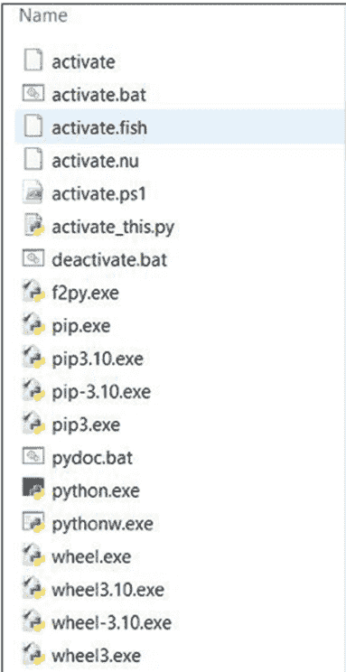

**图 14.3：** *Scripts 文件夹中的可执行文件*

## 关于虚拟环境的其他注意事项

在本节中，我们将在进入下一节之前，快速为虚拟环境这个主题补充一些要点。

- **激活虚拟环境**：在使用虚拟环境之前，我们需要先激活它。在像之前那样创建虚拟环境后，我们使用以下命令激活它：

  `./myenv\Scripts\activate`

- **在虚拟环境中安装包**：要在虚拟环境中安装包，我们只需确保环境已激活，然后使用常规的 **pip** 命令安装包即可。所有包都将安装在 **Lib** 文件夹内的 **site-packages** 文件夹中。

- **创建 requirements.txt 文件**：**requirements.txt** 文件本质上包含了有关虚拟环境包的信息，这对于团队其他成员在安装相同虚拟环境时是一个有用的参考。我们使用以下命令创建该文件：

  ```
  pip freeze > requirements.txt
  ```

- **停用虚拟环境**：最后，一旦我们使用完虚拟环境，应该使用以下命令停用环境，以便命令提示符恢复到正常的系统设置：

  ```
  deactivate
  ```

## 重新审视 Python PIP

在本书的整个练习中，我们经常使用 Python **pip** 包管理器来安装包。这个 **pip** 基本上是 Python 包的包管理器。它允许安装那些未作为 Python 标准库一部分预装的包和依赖项。PIP 基本上是 **PIP Installs Packages** 的首字母缩写。

让我们以安装 **pandas** 为例。我们通常遵循的语法如下：

```
pip install pandas
```

然而，如果机器上安装了多个 Python 版本，这可能无法显示 **pip** 属于哪个 Python 版本。在这种情况下，使用 **python -m pip** 命令会更有利，因为它明确指定了 **pip** 所属的 Python 版本。

使用 **python -m pip** 命令，我们将使用以下语法安装 **pandas**：

```
python -m pip install pandas
```

每当我们使用 **pip** 安装包时，**pip** 安装程序会使用 PyPI 来查找包。这个 **Python Package Index (PyPI)** 是 Python 编程语言的软件仓库。每当 Python 社区贡献一个包时，它就会被发布到 PyPI。因此，默认情况下，所有使用 **pip install** 安装的包都将从 PyPI 仓库获取。

但是，**pip** 也提供了从自定义包索引或 Github 仓库安装包的功能。

## 使用 pip 执行基本操作

在本节中，我们将快速浏览使用 **pip** 命令执行的常规操作以及该命令提供的各种功能：

- **安装包**：这是使用 **pip** 命令执行的最常见任务。此任务的语法如下：

  ```
  pip install package
  ```

  此处，**package** 是我们想要安装的包的占位符。

如前所述，为 **pip** 指定版本是安装包的一种更精确的方式，其语法如下：

```
python -m pip install package
```

要安装特定版本的包，使用以下命令：

```
pip install package==version
```

- **显示包信息**：如果我们想了解有关某个包的信息，如版本、其依赖项及其被依赖项，我们使用以下命令：

  ```
  pip show package
  ```

例如，当我们对 **pandas** 库尝试此操作时，结果如*图 14.4*所示：

```
(base) PS C:\Users\dell> pip show pandas
Name: pandas
Version: 2.0.0
Summary: Powerful data structures for data analysis, time series, and statistics
Home-page:
Author:
Author-email: The Pandas Development Team <pandas-dev@python.org>
License: BSD 3-Clause License

Copyright (c) 2008-2011, AQR Capital Management, LLC, Lambda Foundry, Inc. and PyData Development Team
All rights reserved.

Copyright (c) 2011-2023, Open source contributors.

Redistribution and use in source and binary forms, with or without
modification, are permitted provided that the following conditions are met:

* Redistributions of source code must retain the above copyright notice, this
list of conditions and the following disclaimer.

* Redistributions in binary form must reproduce the above copyright notice,
this list of conditions and the following disclaimer in the documentation
and/or other materials provided with the distribution.

* Neither the name of the copyright holder nor the names of its
contributors may be used to endorse or promote products derived from
this software without specific prior written permission.

THIS SOFTWARE IS PROVIDED BY THE COPYRIGHT HOLDERS AND CONTRIBUTORS "AS IS"
AND ANY EXPRESS OR IMPLIED WARRANTIES, INCLUDING, BUT NOT LIMITED TO, THE
IMPLIED WARRANTIES OF MERCHANTABILITY AND FITNESS FOR A PARTICULAR PURPOSE ARE
DISCLAIMED. IN NO EVENT SHALL THE COPYRIGHT HOLDER OR CONTRIBUTORS BE LIABLE
FOR ANY DIRECT, INDIRECT, INCIDENTAL, SPECIAL, EXEMPLARY, OR CONSEQUENTIAL
DAMAGES (INCLUDING, BUT NOT LIMITED TO, PROCUREMENT OF SUBSTITUTE GOODS OR
SERVICES; LOSS OF USE, DATA, OR PROFITS; OR BUSINESS INTERRUPTION) HOWEVER
CAUSED AND ON ANY THEORY OF LIABILITY, WHETHER IN CONTRACT, STRICT LIABILITY,
OR TORT (INCLUDING NEGLIGENCE OR OTHERWISE) ARISING IN ANY WAY OUT OF THE USE
OF THIS SOFTWARE, EVEN IF ADVISED OF THE POSSIBILITY OF SUCH DAMAGE.

Location: c:\users\dell\anaconda3\lib\site-packages
Requires: numpy, python-dateutil, pytz, tzdata
Required-by: altair, camelot-py, gpt-index, gradio, tabula-py
(base) PS C:\Users\dell>
```

**图 14.4：** *使用 pip show 命令获取的 pandas 包详细信息*

从上面的提示符图像中，我们观察到已获取有关 **pandas** 包的以下基本信息：

- **版本：** 2.0.0
- **摘要：** 用于数据分析、时间序列和统计的强大数据结构
- **位置：** c:\users\dell\anaconda3\lib\site-packages
- **依赖项：** numpy, python-dateutil, pytz, tzdata
- **被依赖项：** altair, camelot-py, gpt-index, gradio, tabula-py

- **列出所有本地安装的包**：如果想了解本地安装的所有包的列表，可以使用以下简单命令完成：

  ```
  pip list
  ```

*图 14.5* 是输入命令 **pip list** 后在提示符中生成的部分输出快照：

## 使用 requirements.txt 文件

到目前为止，我们一直使用 **pip** 命令来安装单独的包。然而，项目需求有时要求一次性安装多个包，因为其他团队成员也需要安装相同的依赖项。在这种情况下，**pip** 提供了一个非常实用的功能，可以使用 **requirements.txt** 文件批量安装包。

为了使用 **pip** 操作 **requirements.txt** 文件，我们首先需要创建一个 **requirements.txt** 文件。我们将回到我们的虚拟环境 **myenv** 中来创建这个文件。

在创建 **requirements.txt** 文件之前，我们需要确保使用 **pip install package** 命令在虚拟环境中安装一些示例包，这样在创建 **requirements.txt** 文件后，这些包会自动列在文件中。

在本练习中，我们在之前创建的虚拟环境 **myenv** 中安装 **pandas**。随着 **pandas** 的安装，它会自动安装依赖项 **numpy**、**python-dateutil**、**pytz** 和 **tzdata**。依赖项 **python-dateutil** 有其自身的依赖包 **six**，而 **six** 又会由 **python-dateutil** 自动安装。

接下来，我们希望创建一个 **requirements.txt** 文件，将所有这些已安装的包列在一起，以便团队的其他成员可以使用这个列表。**pip** 命令再次提供了帮助，它为我们提供了创建 **requirements.txt** 文件的功能。在使用它之前，我们需要使用以下命令激活虚拟环境 **myenv**：

```
cd project-directory
```

这将使目录 **project-directory** 成为当前目录，我们之前在该目录中创建了虚拟环境 **myenv**。

接下来，我们使用以下命令激活虚拟环境：

```
.\myenv\Scripts\activate
```

现在，我们使用以下命令在 **myenv** 虚拟环境目录中创建一个 **requirements.txt** 文件：

```
pip freeze > requirements.txt
```

运行此命令后，将在 **myenv** 目录中创建一个名为 **requirements.txt** 的文件。打开该文件，我们会观察到如 *图 14.9* 所示，它包含了虚拟环境中所有已安装包的列表。请参考以下 *图 14.9*：

**图 14.9：** *requirements.txt 文件中列出的已安装包列表*

如上 *图 14.9* 所示，**requirements.txt** 文件不仅列出了包名，还列出了已安装包的版本。

现在，让我们最终使用一下我们刚刚创建的 **requirements.txt** 文件。在此之前，我们需要创建一个新的虚拟环境来测试该功能。我们将相同的 **project-directory** 设为当前目录，然后输入以下命令：

```
virtualenv test_env
```

这将创建一个名为 **test_env** 的虚拟环境。接下来，我们使用以下命令激活该环境：

```
.\test_env\Scripts\activate
```

接下来，我们输入以下命令，该命令将把 **requirements.txt** 文件中的所有包安装到虚拟环境 **test_env** 中。

```
pip install -r requirements.txt
```

如果我们进入虚拟环境 **test_env** 的 **Lib** 文件夹并打开 **site-packages** 文件夹，我们会发现 **requirements.txt** 文件中列出的所有包都已安装。

通过这种方式，我们探索了 **pip** 提供的功能，该功能允许安装 **requirements.txt** 文件中列出的所有包。

## 使用 Docker 进行容器化

到目前为止，我们已经了解了 Python 中的虚拟环境如何封装整套 Python 依赖项。另一个概念是 **Docker**，它是一个容器化平台，用于将应用程序及其所有相关依赖项打包成容器形式，从而确保应用程序在任何环境中（无论是开发、测试还是生产环境）都能无缝运行。与封装 Python 依赖项的虚拟环境不同，Docker 封装的是整个操作系统。Docker 容器提供了代码隔离性、独立性和可移植性，当需要将应用程序部署到生产环境时，就需要它。

本节关于 Docker 的目的是快速概述该概念。更深入的容器化概念探索以及相关命令的尝试，则留给热心的读者自行完成。

至此，我们结束了关于构建 Python 自动化项目的讨论，本章也告一段落。

## 结论

在本章中，我们的重点是回顾所有辅助概念，这些概念虽然不属于特定主题，但考虑到自动化项目的架构考量，它们具有极其重要的意义。虚拟环境的概念以及 **pip** 库命令的详细示例，将极大地提升自动化项目的整体效用。

在下一章中，我们将探索 Python 提供的另一个令人兴奋的便利工具——PyScript 框架。这是一个开源框架，提供了使用 Python 创建前端 Web 应用程序的功能。如果这听起来足够有趣，让我们翻页进入下一章吧！

## 加入本书的 Discord 空间

# 第15章
## PyScript框架

### 简介

在本章中，我们将向读者介绍一个有趣且正在进行中的项目，该项目目前仍在开发中，但已引起广泛关注，名为**PyScript**。它本质上是一个Python框架，允许我们直接在HTML中编写Python代码。PyScript的优势在于，它允许用户直接在浏览器中运行Python代码，无需任何基础设施障碍。PyScript不需要除Chrome等网络浏览器和Notepad等文本编辑器之外的任何开发环境。此外，我们无需像以前那样使用pip安装器安装任何东西。

具有JavaScript背景的Python开发者会发现，尝试PyScript提供的功能令人兴奋。

本章将为读者提供探索这个新颖框架所必需的基础知识。

### 结构

本章涵盖以下主题：

- PyScript简介
- 使用PyScript创建基本网页
- 向网页添加可运行的Python代码
- 在PyScript中使用第三方库
- 在PyScript中引用外部Python文件

### 目标

本章是对一个新颖框架的有益探索，将通过与PyScript框架相关的特定部分中的多个清晰示例引导读者。每个部分都将向读者介绍独特的概念，读者会发现这些概念对于进一步的实现极其有用。

本章中的Python代码保持简单，因为这里的关键重点是理解PyScript中的重要概念。各节及相应的练习经过精心选择，旨在清晰地阐明所要解释的概念。本章将向读者介绍PyScript及其相关的基本概念。随后，特定的练习将引导读者学习在PyScript中创建基本网页、在PyScript中包含可运行的Python代码、在PyScript中导入第三方库以及在PyScript中引用外部Python代码。

在本章结束时，读者将欣赏到PyScript作为一种新颖理念的出现，它与传统的Web开发框架并存，用于实现Web应用程序。

### PyScript简介

PyScript是一个开源的Web框架，允许用户使用HTML标签在浏览器中嵌入和执行Python代码。它能够使用Python动态生成页面。长期以来，JavaScript一直是前端开发的主导语言，因为它能够在浏览器中原生运行并与HTML和CSS交互。随后出现了WebAssembly，这是一个开放标准，允许在Web上使用二进制代码。这使得开发者能够在浏览器中运行C和C++等语言。显然，Python很快也加入了竞争，并推出了这个框架。

PyScript由Anaconda开发，基于Pyodide构建，后者将CPython移植到了WebAssembly。它通常用于希望将Python应用程序从后端迁移到前端的场景。另一个巨大优势是能够使用Python的科学计算包，如Scikit-learn、pandas和numpy。这些包通常只在后端工作，而不在前端工作。然而，PyScript允许用户在前端利用这些模块。最后，PyScript提供了与本地文件系统交互的能力，这是JavaScript所不具备的。

以下是读者在开始本章之前需要具备的基本先决条件：

- HTML、CSS和JavaScript的基础知识。
- Chrome网络浏览器，这是PyScript官方文档中建议使用的浏览器。

在本章中，我们将从基本的HTML应用程序开始，逐步见证Python以PyScript框架的形式参与Web开发，并在此后增加示例的复杂性。

在下一节中，我们将使用PyScript创建一个基本网页。

### 使用PyScript创建基本网页

在本节中，我们将通过创建一个基本网页来开始我们的PyScript之旅。在添加PyScript框架之前，我们需要创建一个基本的HTML模板。为了创建模板，请打开一个空白的文本编辑器（如Notepad），并复制下面显示的基本HTML脚本：

```html
<!DOCTYPE html>
<html lang="en">
<head>
    <meta charset="UTF-8">
    <title>PyScript Tutorial</title>
</head>
<body>

</body>
</html>
```

将文件保存为**PyScript_Tutorial.html**。

接下来，我们需要添加下面描述的link标签和script标签：

- **Link标签**：这是用于格式化Python代码输出的样式表链接。如下所示：

```html
<link rel="stylesheet" href="https://pyscript.net/alpha/pyscript.css" />
```

- **Script标签**：这引入了与浏览器协同工作以与Python运行时交互的JavaScript源文件。如下所示：

```html
<script defer src="https://pyscript.net/alpha/pyscript.js"></script>
```

合并这两个标签后，修改后的HTML脚本将如下所示：

```html
<!DOCTYPE html>
<html lang="en">
<head>
    <meta charset="UTF-8">
    <link rel="stylesheet" href="https://pyscript.net/alpha/pyscript.css" />
    <script defer src="https://pyscript.net/alpha/pyscript.js"></script>
    <title> PyScript Tutorial </title>
</head>
```

然而，这并未完成应用程序，因为我们尚未添加将编写Python代码的重要部分。我们使用**py-script**标签来实现这一点，如下所示：

```html
<py-script>
    #python code
</py-script>
```

需要注意的是，写在**py-script**标签中的Python代码需要缩进。因此，了解这一点后，让我们编写我们的第一个**Hello World**脚本，并相应地修改HTML文档，将Python代码包含在**py-script**标签内。
修改后的HTML脚本将如下一页所示。

```html
<!DOCTYPE html>
<html lang="en">
<head>
    <meta charset="UTF-8">
    <link rel="stylesheet" href="https://pyscript.net/alpha/pyscript.css" />
    <script defer src="https://pyscript.net/alpha/pyscript.js"></script>
    <title> PyScript Tutorial </title>
</head>
<py-script>
    print('Hello World!')
</py-script>
```

粘贴上述修改后的脚本后，保存文档**PyScript_Tutorial.html**。关闭文档并在Chrome浏览器中打开它。我们发现，在打开时，浏览器首先显示一条消息**Loading Runtime**，然后显示消息**Hello World!**，如下图*图15.1*所示：

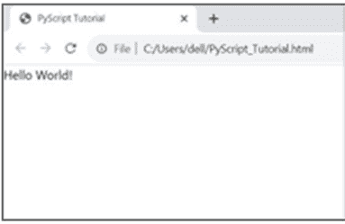

**图15.1：** *使用PyScript的第一个网页*

太棒了！我们刚刚使用PyScript创建了我们的第一个网页！

### 向网页添加可运行的Python代码

鉴于我们已经有了带有PyScript占位符的基本HTML模板，让我们继续下一个任务：在**py-script**标签中添加一段可运行的Python代码。

我们将编写一个小程序，该程序创建一个字典，然后在网页上填充字典的值。

让我们创建一个示例字典，其中包含几个国家的名称作为键，其首都城市作为值，如下所示：

```python
dict_countries = {'United States of America':'Washington D.C.',
    'India':'New Delhi',
    'Argentina':'Buenos Aires',
    'Japan':'Tokyo',
    'Germany':'Berlin',
    'France':'Paris',
    'Egypt':'Cairo'}
```

接下来，我们将打印字典键的值，如下所示。这些值基本上是相应国家的首都城市：

```python
for str_country in dict_countries:
    print(dict_countries[str_country])
```

我们需要将此代码包含在我们之前保存的HTML模板**PyScript_Tutorial.html**的**py-script**块中。将此文件另存为**Countries_List.html**。修改后的HTML代码如下一页所示：

```html
<!DOCTYPE html>
<html lang="en">
<head>
    <meta charset="UTF-8">
    <link rel="stylesheet" href="https://pyscript.net/alpha/pyscript.css" />
    <script defer src="https://pyscript.net/alpha/pyscript.js"></script>
    <title> PyScript Tutorial </title>
</head>
<py-script>
    dict_countries = {'United States of America':'Washington D.C.',
                      'India':'New Delhi',
                      'Argentina':'Buenos Aires',
```

## 在 PyScript 中使用第三方库

我们已经讨论过，PyScript 框架的优势之一是在前端使用 pandas、numpy 和 matplotlib 等第三方 Python 库的能力。在本练习中，我们将把 numpy 包导入到我们的 Python 代码中，并将该代码包含在 **py-script** 标签内。

在 HTML 代码的 **py-script** 块中编写 Python 代码之前，我们需要在 HTML 代码中添加一个名为 **py-env** 的新块，并在该块中提及 **numpy** 模块，以便告知 HTML 代码在 Python 代码中引用了 **numpy** 库。

以下是我们需要在 HTML 代码中包含的 **py-env** 块：

```
<py-env>
- numpy
</py-env>
```

接下来，我们将使用 **numpy** 库在 Python 代码中运行以下程序：

1.  将 **numpy** 模块导入 Python。
2.  创建一个名为 **matrix_1** 的 **numpy** 数组，包含三行四列，其中矩阵的每个元素都是一个随机数乘以 10。
3.  创建一个名为 **matrix_2** 的 **numpy** 数组，包含三行四列，其中矩阵的每个元素都是一个随机数乘以 10。
4.  创建一个名为 **matrix_sum** 的 **numpy** 数组，包含三行四列，它基本上是 **matrix_1** 和 **matrix_2** 对应元素相加的结果。

以下 Python 代码将执行我们讨论的步骤 1 到 4。将代码粘贴到 Python 编辑器中，以便相应地格式化错误和缩进。

```
#Calculate the sum of two matrices
import numpy as np
matrix_1 = np.random.rand(3,4)*10
matrix_2 = np.random.rand(3,4)*10
matrix_sum = matrix_1 + matrix_2
print('\nThis is a program to calculate the sum of two matrices having randomly generated values:\n')
print('\nThe first matrix is:\n')
print(matrix_1)
print('\nThe second matrix is:\n')
print(matrix_2)
print('\nThe matrix sum is:\n')
print(matrix_sum)
```

5.  接下来，我们将此 Python 代码包含在 HTML 代码的 **py-script** 块中。完整的 HTML 代码已在下一页显示。将此代码粘贴到文本编辑器中，并将文件保存为 **Using_Numpy_With_PyScript.html**。

```
<!DOCTYPE html>
<html lang="en">
<head>
    <meta charset="UTF-8">
    <link rel="stylesheet" href="https://pyscript.net/alpha/pyscript.css" />
    <script defer src="https://pyscript.net/alpha/pyscript.js"></script>
    <title> PyScript Tutorial </title>
    <py-env>
    - numpy
    </py-env>
</head>
<body>
<py-script>
    import numpy as np
    matrix_1 = np.random.rand(3,4)*10
    matrix_2 = np.random.rand(3,4)*10
    matrix_sum = matrix_1 + matrix_2
    print('\nThis is a program to calculate the sum of two matrices having randomly generated values:\n')
    print('\nThe first matrix is:\n')
    print(matrix_1)
    print('\nThe second matrix is:\n')
    print(matrix_2)
    print('\nThe matrix sum is:\n')
    print(matrix_sum)
</py-script>
</body>
```

6.  运行包含上述代码的 HTML 文件并在 Chrome 浏览器中打开结果，我们将得到如下 *图 15.3* 所示的结果：

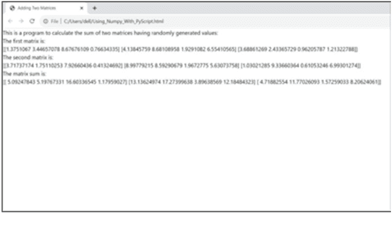

**图 15.3：** Numpy 数组以及相加后得到的结果

请注意，每次运行时数组看起来会有所不同，因为值是随机生成的数字。

## 在 PyScript 中引用外部 Python 文件

到目前为止，我们已经研究了如何将 Python 代码包含在 HTML 代码的 **py-script** 块中并在前端观察结果。

现在让我们考虑一种情况，即 Python 代码可能变得冗长，如果我们将整个 Python 代码写在 HTML 文件中，可能会使 HTML 代码过长。在这种情况下，PyScript 为我们提供了一个非常有用的功能，即引用外部 Python 文件中的代码。使用此功能，我们可以将大部分 Python 代码存储在外部 Python 文件中，该文件通常包含函数定义。然后，我们可以仅从 Python 文件中导入函数，并在 HTML 代码的 **py-script** 块中执行我们的任务。一个例子将使这一点变得清晰。

由于我们这里的重点是理解概念，我们将保持 Python 脚本简单。让我们创建一个 Python 脚本，定义两个函数 **Square** 和 **Cube**，分别计算一个整数的平方和立方。以下 Python 代码将为我们执行此操作。将代码复制到 Python 编辑器中，并将 Python 文件保存为 **Perform_Math.py**：

```
#Perform Math

#Calculate Square
def Square(intNum):
    intSquare = intNum * intNum
    return intSquare

#Calculate Cube
def Cube(intNum):
    intCube = intNum * intNum * intNum
    return intCube
```

接下来，我们希望在 **py-script** 块中引用 Python 文件并执行计算。以下是我们将包含在 **py-script** 块中的代码：

```
<py-script>
    from Perform_Math import Square,Cube
    intNum=5
    intSquare = Square(intNum)
    intCube = Cube(intNum)
    print('\nThe number is:')
    print(intNum)
    print('\nThe square of the number is:')
    print(intSquare)
    print('\nThe cube of the number is:')
    print(intCube)
</py-script>
```

我们将 **Perform_Math** 作为模块引用，并将函数 **Square** 和 **Cube** 导入到 Python 代码中以执行计算并打印结果。

在运行 HTML 代码之前，我们需要在 HTML 文件中添加另一个名为 **py-config** 的块，该块基本上指示 HTML 代码获取相应的 Python 文件。在本练习中，我们将把 Python 文件和 HTML 文件保存在同一目录下的文件夹中。

以下是我们需要添加到 HTML 代码中的对应于 **py-config** 标签的附加代码块。

```
<py-config>
[[fetch]]
    files = ["./Perform_Math.py"]
</py-config>
```

我们还需要在 HTML 代码中指定 PyScript 版本的 **href** 和 **src** 中进行一些更改。与我们在上一个练习中使用 **/latest/pyscript.js** 版本不同，我们将链接到 PyScript 静态资源的 **2022.12.1** 版本，这是一个较新的版本，代码似乎可以正常工作。以下是修改后的 HTML 代码块，其中也包含了标题：

```
<title>Referencing External Python Files</title>
<link rel="stylesheet" href="https://pyscript.net/releases/2022.12.1/pyscript.css" />
<script defer src="https://pyscript.net/releases/2022.12.1/pyscript.js"></script>
```

完整的 HTML 代码如下所示以供参考。将代码复制到记事本等文本编辑器中，并将文件保存为 **Perform_Math.html**。如前所述，我们需要确保 HTML 文件保存在与 Python 文件相同的文件夹中。

```
<!DOCTYPE html>
<html lang="en">
<head>
    <meta charset="utf-8" />
    <title>Referencing External Python Files</title>
```

<link rel="stylesheet" href="https://pyscript.net/releases/2022.12.1/pyscript.css" />
<script defer src="https://pyscript.net/releases/2022.12.1/pyscript.js"></script>
</head>
<body>
    <py-config>
        [[fetch]]
        files = ["./Perform_Math.py"]
    </py-config>
    <py-script>
    from Perform_Math import Square,Cube
    intNum=5
    intSquare = Square(intNum)
    intCube = Cube(intNum)
    print('\nThe number is:')
    print(intNum)
    print('\nThe square of the number is:')
    print(intSquare)
    print('\nThe cube of the number is:')
    print(intCube)
    </py-script>
</body>
</html>

在Chrome中运行代码时，我们会得到如图15.4所示的错误：

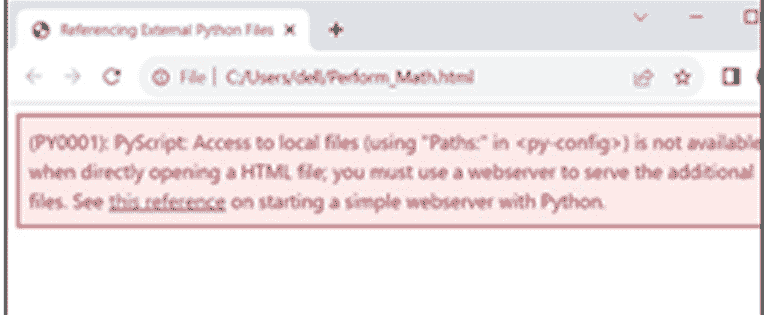

**图15.4：** *在没有服务器的情况下运行HTML文件Perform_Math.html时收到的错误*

错误信息清楚地表明，不能直接引用本地目录中的文件。这就是服务器概念发挥作用的地方。我们需要使用HTTP服务器来渲染HTML页面。

在提示符中输入以下命令将为我们运行服务器：

```
python -m http.server -d 'directory_path'
```

这里，'**directory_path**'是HTML文件和Python文件所保存文件夹路径的占位符。

运行服务器后，我们打开Chrome并访问**127.0.0.1:8000**，这将列出目录中的所有文件，如*图15.5*所示：

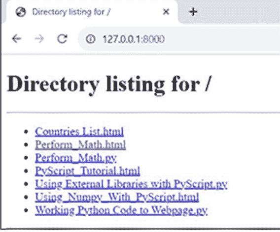

**图15.5：** 运行HTTP服务器的目录中的文件列表

从上面的*图15.5*中，我们观察到Python文件**Perform_Math.py**和HTML文件**Perform_Math.html**已与其他部分练习中执行的文件一起列出。

接下来，我们点击渲染HTML页面中目录里列出的文件**Perform_Math.html**。如*图15.6*所示，我们最终观察到了结果：

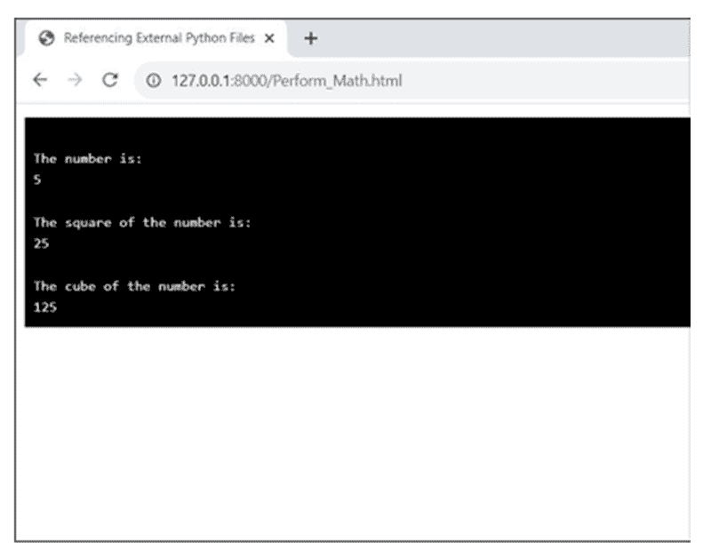

在这个最后的练习中，我们探索了基本的服务器功能，这为我们进一步探索需要从目录中引用文件的其他任务打开了大门。

至此，我们结束了对PyScript框架的探索！
探索这个新颖的框架无疑是一次有趣的尝试，它是一个持续发展的项目，并将经历进一步的升级。

## 结论

在结束本章时，我们为理解PyScript奠定了坚实的基础，这是一个重塑Python与Web技术交互方式的尖端框架。虽然我们已经通过PyScript解锁了许多可能性，但必须记住它是一个动态且不断发展的工具。紧跟其发展步伐将是未来充分利用其全部潜力的关键。

随着本章的结束，我们开始踏上本书最后一章的旅程。回顾我们在这本书中的旅程，我们穿越了自动化的多样领域——从文件和文件夹自动化到深入RPA、AI、ML和深度学习的领域。每一章都为这个广阔的Python自动化知识马赛克贡献了一块。

随着我们接近最后一章，我们的焦点转向测试自动化——这是软件开发的一个关键方面。我们将探索Selenium框架，这是浏览器自动化的基石，然后是Pytest框架的见解，以及对Python中Robotic框架的讨论。这最后一章有望成为我们全面探索Python自动化的一个高潮点。

到目前为止，这是一场马拉松式的奔跑，因此没有人会想错过终点线。让我们向前迈进，进入我们马拉松的最后一段，这是一段既富有启发性又赋予力量的旅程。向着我们Python自动化探索的终点线前进！因此，事不宜迟，让我们进入最后一章！

## 加入我们书籍的Discord空间

加入书籍的Discord工作区，获取最新更新、优惠、全球科技动态、新书发布以及与作者的交流会：

[https://discord.bpbonline.com](https://discord.bpbonline.com)


# 第16章
## Python中的测试自动化

### 引言

现在我们来到了本书的最后一章！我们将通过深入探讨一个在软件开发结束时最常涉及的主题——测试——来开始本章。软件测试实践涉及创建多个测试用例并执行检查。当这个过程变得手动时，它就会变得耗时且低效。这就是Python通过开源库来拯救局面，实现这个过程自动化的地方。

我们首先介绍Selenium，这是世界上最流行的用于自动化Web浏览器的框架。Python是Selenium支持的语言之一，我们将通过Selenium Python模块来探索其功能。接下来，我们将研究Pytest，这是另一个以简单性和可扩展性著称的强大测试框架。最后，我们将深入探讨Python Robot Framework，这是一个有趣的工具，它提供了一种更高级的、关键字驱动的测试自动化方法。

### 结构

本章涵盖以下主题：

- Selenium简介
    - 设置Selenium
    - 使用Selenium Python API探索Web自动化
- Pytest库
    - Pytest的优势和局限性
- Python Robot Framework
    - 在Python Robot Framework中运行测试用例

### 目标

本书的这一结论性章节将通过向读者介绍Selenium、Pytest和Python robotic框架等框架，来解决测试自动化这一最实用的主题。在本章结束时，读者不仅将对这些框架有基本的了解，还将认识到Python在提供测试自动化功能方面所扮演的巨大角色。每一节都将涵盖实际示例，这些示例将阐明重要概念，并演示Python库在执行所需任务中的使用。

本章旨在提供一个基础，使读者能够独立探索并使用Python框架（如Selenium、Pytest和Robot Framework）进一步实施用例，从而使读者掌握一套极其有用的技能，为自动化项目增添最后的点睛之笔。

### Selenium简介

Selenium是一个开源的软件测试框架，用于自动化Web应用程序。它适用于所有浏览器、大多数操作系统，并且脚本可以用多种编程语言编写，如Python、Java和C#。

在本章中，我们将重点关注Chrome浏览器，当然，还有Python编程语言。

Selenium有四个主要组件，如*图16.1*所示：

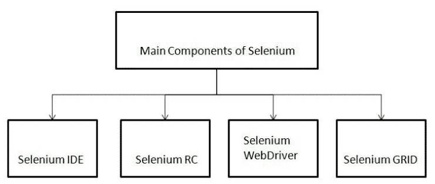

**图16.1：** *Selenium的四个主要组件*

下面分别讨论每个组件：

- **Selenium IDE：** Selenium **集成开发环境（IDE）**是Selenium中的主要工具，它作为Selenium测试的IDE提供。它可作为Chrome扩展程序使用，允许录制、编辑和调试功能测试。它过去也被称为Selenium Recorder。
- **Selenium RC：** **Selenium远程控制（RC）**是一个用Java编写的服务器，它使得能够用任何编程语言为Web应用程序编写自动化测试。然而，随着Selenium WebDriver的出现，这个组件的使用后来被弃用了，WebDriver是我们接下来要学习的下一个组件。
- **Selenium WebDriver**：这个组件是Selenium远程控制的后继者，它向浏览器发送命令。它不需要特殊的服务器来执行测试。它打开一个浏览器实例，并对各种浏览器元素执行操作。它支持多种编程语言，如Java、Python和C#。
- **Selenium GRID**：这是一个服务器，允许在不同浏览器、机器和操作系统上并行运行测试用例。此功能使得可以将测试负载分散到多台机器上，并且当测试需要在运行其特定平台或操作系统的不同浏览器上运行时也很有用。

在本章中，我们将重点介绍使用Selenium和Python进行浏览器自动化。Selenium的Python模块旨在使用Python执行自动化测试。这个Python API将为我们提供访问Selenium WebDriver组件的能力。

通过Selenium Python API，我们可以访问多种浏览器，如Chrome、Firefox、Internet Explorer和Edge。它还支持多种操作系统，如Windows、Linux、Mac、Android、iOS。此API支持高效的并行测试执行功能。

在接下来的章节中，我们将介绍安装Selenium及其相关Web驱动程序的过程，然后通过几个Python示例来演示Selenium的功能。

## 设置 Selenium Python API

在本节中，我们将讨论设置 Selenium Python API 的流程。请按照以下步骤在您的系统上设置 Selenium Python API：

1.  使用 **selenium** Python 库之前，第一步需要使用 **pip** 命令安装该库，如下所示：

    **pip install selenium**

    或者，我们也可以使用以下命令来明确指定所使用的 Python 版本：

    **python -m pip install selenium**

2.  下一步是安装 Web 驱动程序。Firefox、Chrome、Internet Explorer 或 Edge 等每个浏览器都有其各自的驱动程序。然而，在本章中，我们将只关注 Chrome，因此我们将下载 Chrome 驱动程序。32 位和 64 位 Windows 的 Chrome 驱动程序可以从以下链接下载：

    Windows 32 位 Chrome 下载器：
    **https://edgedl.me.gvt1.com/edgedl/chrome/chrome-for-testing/116.0.5845.96/win32/chromedriver-win32.zip**

    Windows 64 位 Chrome 下载器：
    **https://edgedl.me.gvt1.com/edgedl/chrome/chrome-for-testing/116.0.5845.96/win64/chromedriver-win64.zip**

3.  安装 Web 驱动程序后，我们需要确保将它们从 zip 文件中解压出来，然后确保其各自的 **.exe** 文件保存路径已反映在系统环境变量中。

我们现在已经成功设置了 Selenium Python API。接下来，让我们尝试一些代码。我们将尝试一个简单的流程，使用 **selenium** 打开一个 Chrome 浏览器实例。将以下代码复制并粘贴到 Python 编辑器中：

```python
#Open Chrome Browser Instance

from selenium import webdriver

# Webdriver object
objDriver= webdriver.Chrome()

#Open google.co.in window
objDriver.get("https://google.co.in")
```

以下是对上述代码的快速解释：

a.  第一步是：
    `from selenium import webdriver`
    在这里，我们导入 **selenium** 库的 **webdriver** 模块，因为我们将进行 Web 自动化。我们可以回忆一下，正如前面章节所讨论的，WebDriver 是 Selenium 的主要组件之一。

b.  第二步是：
    `objDriver= webdriver.Chrome()`
    在这里，我们指定要使用 Chrome 浏览器的驱动程序。

c.  第三步是：
    `objDriver.get("https://google.co.in")`
    在这里，我们将 Google Chrome 浏览器的链接作为参数提及，这将打开 Chrome 浏览器窗口。

运行上述代码后，Chrome 浏览器将在一个单独的窗口中打开，如下图 *图 16.2* 所示：


**图 16.2：** *使用 Selenium 自动打开 Chrome 浏览器*

在已打开的 Chrome 窗口顶部，我们观察到一条消息，内容为 *Chrome is being controlled by automated test software*，这表明 Chrome 已检测到浏览器实例的自动触发。

为了避免显示此消息，我们需要稍微修改代码以指定 Chrome 选项。完整的修改后代码如下所示，供参考：

```python
#Chrome browser instance with options

from selenium import webdriver
from selenium.webdriver.chrome.service import Service

obj_Chrome_Options = webdriver.ChromeOptions()

obj_Chrome_Options.add_experimental_option("excludeSwitches",["enable-automation"])

obj_Service = Service(r"C:\Users\dell\chromedriver-win64\chromedriver.exe")

obj_Driver=webdriver.Chrome(options=obj_Chrome_Options,service=obj_Service)

obj_Driver.get("https://www.google.co.in/")
```

运行上述代码后，我们将得到一个没有之前消息的常规 Chrome 窗口。我们现在理解了使用 Selenium 实例化 Chrome 浏览器的设置和流程，并将进一步探索使用 Selenium 进行 Web 自动化。

## 使用 Selenium Python API 探索 Web 自动化

在本节中，我们将尝试一个 Web 浏览器自动化的示例任务，该任务将使读者能够进一步探索 Web 自动化的关键方面。在本节的示例中，我们将考虑访问 Wikipedia 网页并在搜索文本框中输入文本以填充结果网页。

为了定位文本框、按钮或下拉菜单等 Web 元素，Selenium 提供了使用其元素标识符进行定位的功能，这些标识符可以通过在浏览器窗口中右键单击元素时下拉菜单中的 **Inspect** 选项找到。此过程在 *第 2 章 - RPA 基础* 中已详细讨论。在这里，我们将使用相同的程序来识别浏览器窗口中的元素。

Selenium 提供了使用各种属性（如 **ID**、**Name**、**ClassName** 或 **XPath**）来识别 Web 元素的功能。这是通过使用 **selenium** 提供的 By 类和 **find_element** 方法来实现的。

1.  我们使用以下代码导入 **By** 类：
    ```python
    from selenium.webdriver.common.by import By
    ```

2.  接下来，如果我们想通过其 **ID** 查找元素 **X**，其语法如下所示：
    ```python
    element = Webdriver.find_element(By.ID, "id")
    ```

3.  向选定元素输入文本的过程可以使用 **send_keys** 方法实现，如下所示：
    ```python
    element.send_keys("Enter text")
    ```
    Selenium 提供了 **Keys** 类，使我们能够模拟常用键盘按键的使用。**Keys** 类使用以下代码导入：
    ```python
    from selenium.webdriver.common.keys import Keys
    ```

4.  基于此理解，让我们执行访问 Wikipedia 并在搜索文本框中输入文本 **Machine Learning** 的任务。

    我们这里考虑的主要元素是搜索文本框。如下图 *图 16.3* 所示，搜索文本框的 **id** 属性是 **searchInput**，我们将在代码中使用它：

    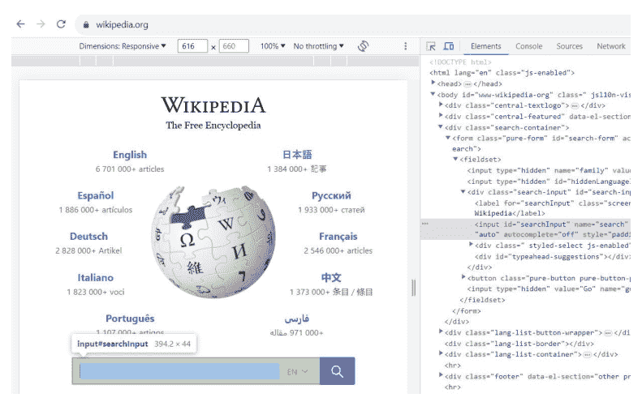

    **图 16.3：** 检查 Wikipedia 页面搜索文本框的 HTML 代码

    我们之前执行的加载 Chrome 浏览器的大部分代码都可以在本练习中使用，除了我们传递给驱动程序 **get** 方法的 url。在本练习中，我们使用 url **https://www.wikipedia.org/** 而不是上一个练习中使用的 **https://www.google.co.in/**。

    更新后的代码块如下所示：

    ```python
    #Chrome browser instance with options
    from selenium import webdriver
    from selenium.webdriver.chrome.service import Service

    obj_Chrome_Options = webdriver.ChromeOptions()
    obj_Chrome_Options.add_experimental_option("excludeSwitches",["enable-automation"])

    obj_Service = Service(r"C:\Users\dell\chromedriver-win64\chromedriver.exe")

    obj_Driver=webdriver.Chrome(options=obj_Chrome_Options,service=obj_Service)

    obj_Driver.get("https://www.wikipedia.org/")
    ```

5.  接下来，我们将导入之前讨论过的额外库。它们再次包含在下面以供参考。这些可以与其他库一起添加到模块的顶部：

    ```python
    from selenium.webdriver.common.by import By
    from selenium.webdriver.common.keys import Keys
    ```

6.  最后，我们将包含执行 Web 元素搜索、输入文本以及随后按回车键的代码行。这些代码行及其各自的注释如下所示：

    ```python
    #Get the search textbox element
    text = obj_Driver.find_element(By.ID,"searchInput")
    #Type text into the textbox element
    text.send_keys("Machine Learning")
    #Press the enter key
    text.send_keys(Keys.ENTER)
    ```

完整的代码如下所示，供参考。将代码复制并运行到 Python 编辑器中：

```python
#Exploring browser automation with Selenium

from selenium import webdriver
from selenium.webdriver.chrome.service import Service
from selenium.webdriver.common.by import By
from selenium.webdriver.common.keys import Keys

obj_Chrome_Options = webdriver.ChromeOptions()
obj_Chrome_Options.add_experimental_option("excludeSwitches",["enable-automation"])

obj_Service = Service(r"C:\Users\dell\chromedriver-win64\chromedriver.exe")

obj_Driver=webdriver.Chrome(options=obj_Chrome_Options,service=obj_Service)

obj_Driver.get("https://www.wikipedia.org/")

#Get the search textbox element
text = obj_Driver.find_element(By.ID,"searchInput")
#Type text into the textbox element
text.send_keys("Machine Learning")
#Press the enter key
text.send_keys(Keys.ENTER)
```

from selenium.webdriver.common.by import By
from selenium.webdriver.common.keys import Keys

obj_Chrome_Options = webdriver.ChromeOptions()

obj_Chrome_Options.add_experimental_option("excludeSwitches",["enable-automation"])

obj_Service = Service(r"C:\Users\dell\chromedriver-win64\chromedriver.exe")

obj_Driver=webdriver.Chrome(options=obj_Chrome_Options,service=obj_Service)

obj_Driver.get("https://www.wikipedia.org/")

#获取搜索文本框元素
text = obj_Driver.find_element(By.ID,"searchInput")

#在文本框元素中输入文本
text.send_keys("Machine Learning")

#按下回车键
text.send_keys(Keys.ENTER)

运行上述代码后，我们得到如*图16.4*所示的输出：

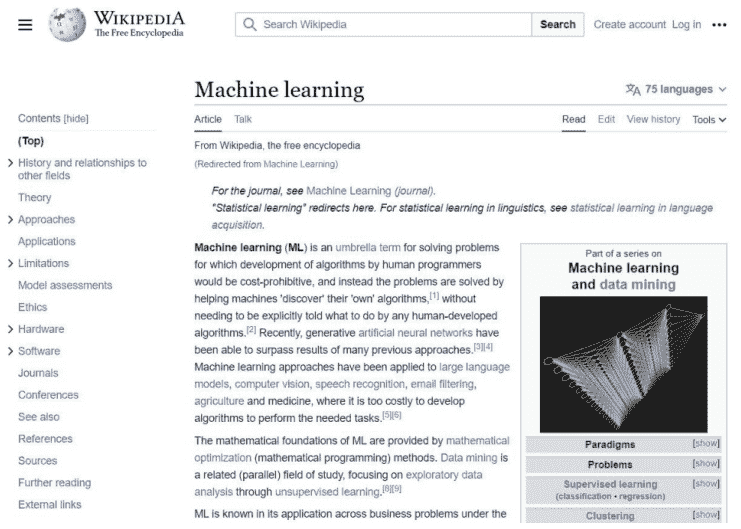

**图16.4：** *在维基百科中搜索“Machine Learning”的输出结果*

在此示例中，我们使用**get_element**方法中的**By.ID**来搜索网页元素。然而，Selenium也提供了使用其他属性搜索网页元素的功能。以下是**By**类启用的其他属性列表，这些属性可用于使用Selenium识别网页元素：

```
ID = "id"
NAME = "name"
XPATH = "xpath"
LINK_TEXT = "link text"
PARTIAL_LINK_TEXT = "partial link text"
TAG_NAME = "tag name"
CLASS_NAME = "class name"
CSS_SELECTOR = "css selector"
```

其他属性的各种使用方法如下所示，供参考：

```
find_element(By.ID, "id")
find_element(By.NAME, "name")
find_element(By.XPATH, "xpath")
find_element(By.LINK_TEXT, "link text")
find_element(By.PARTIAL_LINK_TEXT, "partial link text")
find_element(By.TAG_NAME, "tag name")
find_element(By.CLASS_NAME, "class name")
find_element(By.CSS_SELECTOR, "css selector")
```

至此，我们完成了Selenium的探索性教程。这些教程应为读者提供一个良好的起点，以便进一步探索使用**selenium**进行网页自动化的更多可能性。现在，让我们继续下一节！

## Pytest 库

Pytest 是一个用于单元测试的开源 Python 框架，其基本过程是执行自动化测试以验证软件的单个组件是否按预期工作。虽然许多其他 Python 框架（如 **unittest** 和 **doctest**）也用于此目的，但 Pytest 的优势在于它拥有庞大的社区支持其开源开发。因此，我们将在本章中讨论 Pytest 框架。在本节中，我们将探讨一些示例，以说明 Pytest 在单元测试中的高效使用和实现。

在使用该库之前，需要执行的第一步是使用 **pip** 命令进行安装，如下所示：

```
pip install pytest
```

安装库后，我们将继续编写一些代码。在本节中，我们将以一个简单的测试为例，检查一个数字是否等于某个目标数字。

让我们创建一个计算数字平方的简单函数。以下是该函数的 Python 代码。

```
def Square(intNum):
    intSquare = intNum*intNum
    return intSquare
```

将上述代码复制到 Python 编辑器中，并将文件保存为 **Calculate_Square.py**。

接下来，我们在同一目录中创建另一个 Python 文件。在这个新文件中，我们将导入此文件作为模块，并使用 **Square** 函数。

将以下代码复制到 Python 编辑器中的新文件中。

```
#执行测试
from Calculate_Square import Square

def test_Square():
    intNum = 10
    intSquare = Square(intNum)
    assert intSquare == 100
```

现在是重要的部分。保存文件时，我们应该将 Python 文件命名为以 **test_** 开头或以 **_test** 结尾。Pytest 的工作方式是检查特定目录中以 **test_** 开头或以 **_test** 结尾的 Python 文件。让我们将此文件保存为 **Square_test.py**。

以下是文件 **Square_test.py** 中代码的简要说明。

1.  首先，我们将文件 **Calculate_Square** 作为模块导入，并使用以下代码从模块中导入 **Square** 函数：

    ```python
    from Calculate_Square import Square
    ```

2.  接下来，我们定义一个名为 **test_Square** 的函数，该函数检查使用导入的 **Square** 函数计算的数字平方是否等于 100。请注意，Pytest 要求函数名以 **test_** 为前缀。

    在这里，我们定义一个变量 **intNum**，并使用以下代码将其初始化为整数值 **10**：

    ```python
    intNum = 10
    ```

    接下来，我们将 **intNum** 作为参数传递给函数 **Square**，以计算变量 **intNum** 中值的平方，并将获得的结果分配给另一个名为 **intSquare** 的变量。

    最后，我们使用最重要的 **assert** 函数。这是一个 Python 函数，用于验证左侧的值是否等于右侧的值。在这种情况下，它检查变量 **intSquare** 中的值是否等于 100。

    接下来，让我们使用 Pytest 库测试断言。

3.  按照以下步骤使用 Pytest 库实现测试：

    a.  在 **C:\** 驱动器中创建一个文件夹，并将该文件夹命名为 **Pytest_Tutorial**。

    b.  将文件 **Calculate_Square.py** 和 **Square_test.py** 都保存在此文件夹中。

    c.  打开命令提示符，并使用以下命令将目录 **C:\Pytest_Tutorial** 设置为当前目录：

    ```
    cd "C:\Pytest_Tutorial"
    ```

    输入上述命令后，命令提示符的快照如下*图16.5*所示：

    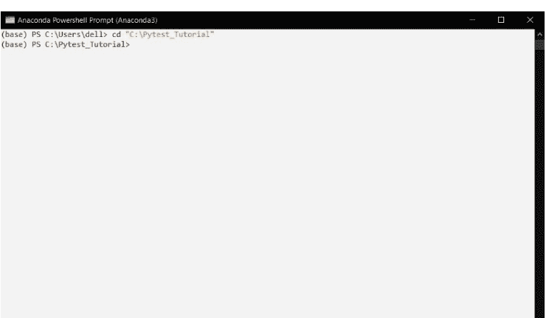

    **图16.5：** *将当前目录更改为 C:\Pytest_Tutorial*

    d.  接下来，输入命令 **pytest**，该命令将运行测试并验证我们在 **Square_test.py** 文件的 **test_Square** 函数中所做的断言。输入命令 **Pytest** 后，命令提示符的快照如下*图16.6*所示：

    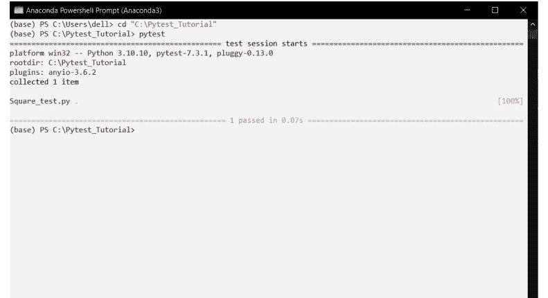

    **图16.6：** *使用 pytest 成功验证测试*

我们观察到收到的消息显示“1 passed in 0.07s”，这表示测试已成功通过，这意味着我们在函数 **test_Square** 中所做的断言已成功验证。

现在，让我们使用相同的示例代码来演示 Pytest 在断言失败时如何工作。我们打开文件 **Square_test.py** 并稍微调整一下代码。这次我们做的唯一更改是为变量 **intNum** 分配一个不同的值。我们将其值从 **10** 改为 **15**。显然，**15** 的平方不等于 **100**，因此这将是一个失败的断言，我们将使用相同的程序进行测试。更新后的代码如下一页所示。

```
#执行测试
from Calculate_Square import Square
def test_Square():
    intNum = 15
    intSquare = Square(intNum)
    assert intSquare == 100
```

将文件 **Square_test.py** 的内容替换为上述代码后保存。

打开命令提示符，并按照与之前测试相同的步骤操作，输入 **pytest** 命令。测试结果如*图16.7*所示的命令提示符快照中所示：

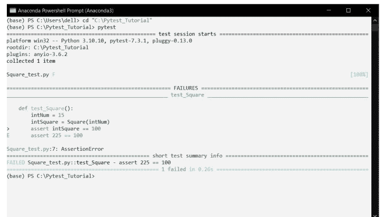

**图16.7：** *断言失败的 Pytest 结果*

如上图所示，Pytest 由于断言错误提供了 **FAILED** 作为测试摘要。通过这种方式，我们探索了 Pytest 在高效执行单元测试方面的能力。在下一节中，我们将介绍 **pytest** 库的主要优势及其局限性。

## Pytest 的优势与局限性

Pytest 迄今为止是单元测试最受赞赏的框架，原因如下：

-   Pytest 拥有庞大的开发社区，因此可以轻松获得对任何新出现的问题和错误的快速解决方案。

## Python Robot Framework

Python Robot Framework 是一个由 **robotframework** 库提供的开源自动化框架，用于验收测试和机器人流程自动化。验收测试基本上是在将软件交付生产之前对其进行评估的过程，以确保其符合预期的质量和规格。在本节中，我们将探讨 Robot Framework 的安装和设置，然后通过一些示例来说明其用法。

1.  使用该库之前需要完成的第一步是使用 **pip** 命令安装该库，如下所示：
    **pip install robotframework**
2.  接下来，我们需要一种特殊的编辑器，称为 **RIDE**，以便使用 Robot Framework 编写测试用例。我们使用以下命令安装 **ride**：
    **pip install robotframework-ride**
3.  安装 RIDE 后，我们需要打开 RIDE 界面，以便在其控件中导航并编写测试用例。
    要打开 RIDE，我们首先打开命令提示符并输入以下命令：
    **ride.py**
4.  输入此命令后，RIDE 编辑器将打开，如 *图 16.8* 所示：

    

    **图 16.8：** *RIDE 编辑器界面*

5.  接下来，我们将创建一个新项目以开始编写测试用例。但是，在此之前，我们将为项目创建一个新目录。

    让我们为本练习创建一个新目录 **C:\Learn_Robot_Framework**。

6.  要创建新项目，请单击左上角的 **File** 并选择 **New Project**，如下 *图 16.9* 所示：

    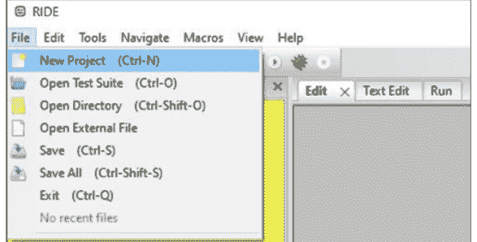

    **图 16.9：** *在 RIDE 中创建新项目*

7.  选择 **New Project** 后，将打开一个新窗口，如下 *图 16.10* 所示，其中包含用于浏览目录和为项目分配名称的字段：

    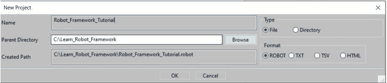

    **图 16.10：** *RIDE 中的新建项目窗口*

    以下是我们使用此窗口执行的快速操作：

    -   如上 *图 16.10* 所示，我们使用 **Browse** 按钮浏览到目录 **C:\Learn_Robot_Framework**，然后在 **Name** 字段中将项目命名为 **Robot_Framework_Tutorial**。
    -   这些详细信息会自动反映在 **Created Path** 字段中，该字段显示项目的完整路径。
    -   在右侧，我们观察到两个名为 **Type** 和 **Format** 的部分。
    -   **Type** 部分包含两个单选按钮 **File** 和 **Directory**。我们观察到 **File** 单选按钮默认被选中，我们保留此默认选择。
    -   **Format** 部分包含四个标签为 **ROBOT**、**TXT**、**TSV** 和 **HTML** 的单选按钮。这些基本上用于指定项目文件的扩展名。在这里，我们将创建一个具有 **.robot** 扩展名的文件，因此我们也保留默认选择 **ROBOT**。

8.  接下来，我们单击窗口底部的 **OK** 按钮。单击 **OK** 按钮后，我们观察到项目列在窗口左侧的 **Test Suites** 下，如 *图 16.11* 所示：

    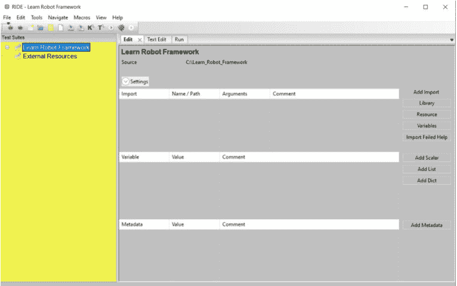

    *图 16.11：项目 Learn_Robot_Framework 显示在左侧*

9.  我们的下一步是创建一个测试用例以执行测试。执行此操作的过程是右键单击 **Test Suites** 下的项目名称，然后选择选项 **New Suite**，如下 *图 16.12* 所示：

    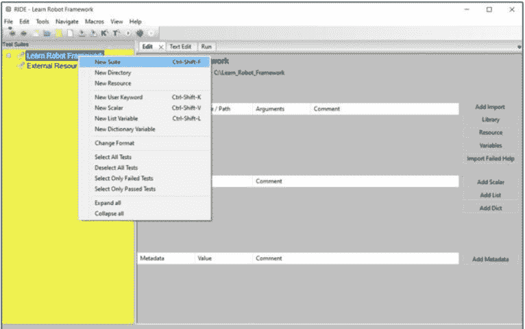

    **图 16.12：** *在 RIDE 中创建新套件*

10. 选择 **New_Suite** 后，将打开一个窗口，其中包含与创建新项目时类似的选项，如下 *图 16.13* 所示：

    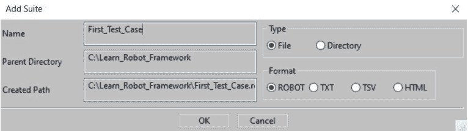

    **图 16.13：** *添加套件的新窗口*

11. 如上 *图 16.13* 所示，我们在 **Name** 字段中为我们要创建的测试用例分配名称 **First_Test_Case**。完整路径会自动更新在 **Created Path** 字段中。与之前一样，我们保留此窗口右侧的所有默认单选按钮选择。

12. 单击 **OK** 按钮后，我们观察到测试用例现在列在左侧 **Test Suites** 窗口中的项目文件夹 **Learn_Robot_Framework** 下，如下 *图 16.14* 所示：

    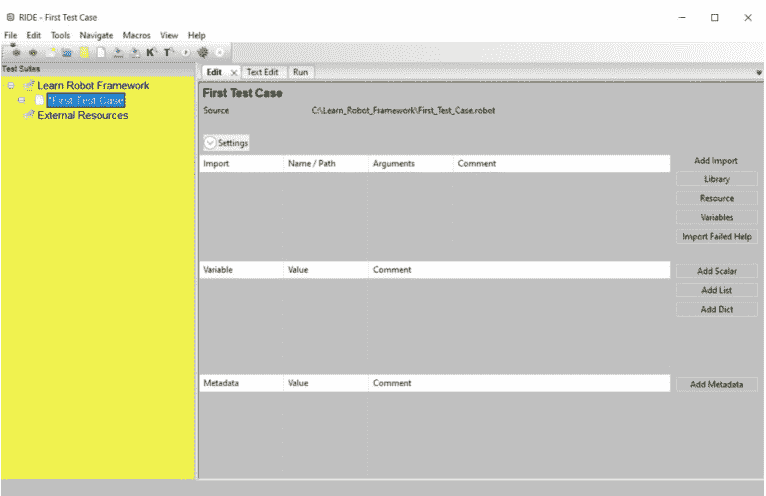

    **图 16.14：** *在 Test Suites 窗口中观察到 First_Test_Case*

## 在 Python Robot Framework 中运行测试用例

通过我们在上一节中进行的设置，我们现在已准备好探索在 Python Robot Framework 的 RIDE 编辑器中编写测试用例。在本练习中，我们将创建一个 Python 文件并编写一个函数来计算整数的完全平方，并将文件保存在我们之前创建的项目目录中。

在 Python 编辑器中打开一个空白文件并复制以下代码：

```python
def Calculate_Square(intNum):
    intSquare = intNum*intNum
    return intSquare
```

将文件保存在项目 **Learn_Robot_Framework** 的同一目录中，并将文件命名为 **Calculate_Perfect_Square.py**。

接下来，我们将继续编写测试用例。与我们在 Pytest 部分所做的类似，我们将验证使用函数 **Calculate_Square** 生成的任意整数的平方是否等于 100。

请按照以下步骤准备测试用例：

1.  我们需要导入 Python 文件 **Calculate_Perfect_Square.py**，以便能够调用其函数 **Calculate_Square**。我们通过单击 *图 16.14* 所示的 IDE 窗口 **Edit** 栏右侧的 **Library** 按钮来完成此操作。单击 **Library** 按钮后，将打开一个窗口，如下 *图 16.15* 所示：

    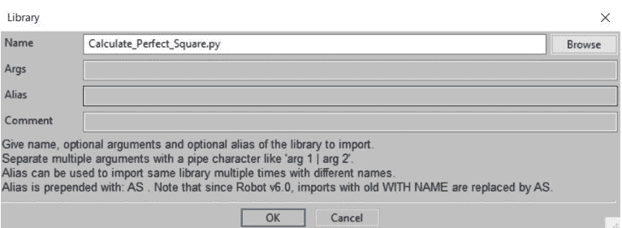

2.  我们单击 **Browse** 按钮，通过浏览到其位置来选择 **Calculate_Perfect_Square.py** 文件。接下来，我们单击 **OK** 按钮。

3.  现在，我们创建一个输入变量，该变量将作为参数传递给函数 **Calculate_Square**。要创建变量，请单击 *图 16.14* 所示的 IDE **Edit** 栏右侧的 **Create Scalar** 按钮。单击 **Create Scalar** 按钮后，将出现一个新窗口，如下 *图 16.16* 所示：

Pytest 非常容易学习，正如我们在上一节中刚刚研究的示例所证明的那样。Python 的 **assert** 关键字构成了 Pytest 的核心，使其成为测试人员关注的焦点。此外，测试函数应简单地以 **test_** 为前缀或 **_test** 为后缀命名，**pytest** 本身会负责搜索它们。所有这些都使得 Pytest 的学习曲线非常陡峭。
- Pytest 是免费的，没有任何许可成本。
- Pytest 可以根据条件选择性地运行测试文件中的特定方法。这是通过 **pytest** 库提供的过滤功能实现的。
- 与 **unittest** 等其他测试库相比，**pytest** 库需要编写的代码更少，这使其对测试人员来说更加紧凑。

尽管 Pytest 提供了上述众多优点，但值得注意的是 Pytest 的一个可能限制：将 Pytest 与其他框架集成可能具有挑战性，因为 Pytest 使用特定的例程来编写测试，需要重写整个代码。

至此，我们完成了对另一个名为 Pytest 的有趣框架的探索。

在下一节中，我们将转向 Python Robot Framework，这是一个用于验收测试和机器人流程自动化的开源自动化框架。

## 16.16 标量变量窗口

我们输入变量名 **intNumber** 及其值，如上图所示。

4.  接下来，我们点击 **Text Edit** 选项卡，这将打开编辑器窗口，如下面的 *图 16.17* 所示：

**图 16.17：** 测试用例中的 Text Edit 选项卡

5.  我们观察到，导入的模块 **Calculate_Perfect_Square.py** 已包含在 **Settings** 部分下，变量 **intNumber = 10** 已在 **Variables** 部分下提及。

6.  接下来，我们在一个新部分中编写实际测试，我们将其命名为 **Test Cases**。我们将测试标记为 **Validation of Output**，这反映在左侧窗格的 **First Test Case** 下。我们从模块 **Calculate_Perfect_Square** 调用函数 **Calculate_Square**，并将变量 **intNumber** 作为参数传递。由此获得的结果存储在变量 **answer** 中。

如 *图 16.17* 所示，下面是计算变量 **answer** 值的代码行。

```
${answer} = Calculate Square ${{int(${intNumber})}}
```

这里有几个重要的注意事项：

- 变量名的语法基本上是一个 $ 符号，变量名包含在花括号内。
- 调用 **Calculate_Square** 函数时，不包含单词 **Calculate** 和 **Square** 之间的下划线。
- 为了将标量变量 **intNumber** 转换为整数，它使用 **int** 关键字进行转换，然后再次使用 $ 符号转换为变量。然后将其作为参数传递给函数 **Calculate_Square**。
- 上面代码行中的每个术语之间需要有足够的空格，至少 3 到 4 个字符，否则 IDE 将无法识别这些术语，从而导致错误。

7.  最后，我们编写实际测试，即使用下面的代码行执行验证的行。

```
Should Be Equal As Numbers ${answer} 100
```

我们使用 Robot Framework 的 **Should Be Equal As Numbers** 方法，该方法将接受两个参数，并基本上验证它们是否相同或不同。如果它们相同，则测试通过，否则测试失败。

8.  我们现在准备好运行测试用例了！如下面的 *图 16.18* 所示，转到 **Run** 选项卡，并在左侧窗格中选择 **Validation of Output** 复选框。然后，单击 **Run** 选项卡中可用的 **Start** 按钮。测试用例开始运行，运行完成后，它会填充消息日志，如下面的 *图 16.18* 窗口底部所示：

*图 16.18：* 测试用例成功完成后的消息日志

9.  我们还可以通过单击顶部的 **Report** 按钮查看报告，通过单击 **Log** 按钮查看日志，如下面的 *图 16.19* 和 *图 16.20* 所示：

图 16.19：测试报告

图 16.20：测试日志

至此，我们完成了对 Robot 框架的基本探索！我们将留给读者通过更改变量值来探索失败场景。

## 结论

当我们翻到本书的最后一页时，我们不仅到达了一章的结尾，而且到达了通过 Python 编程和自动化世界的广泛而丰富的旅程的顶点！本章充满了图片和详细说明，旨在揭开测试自动化的神秘面纱，确保概念易于理解，示例简单明了。本章在尽可能保持示例简单的同时，温和地尝试介绍了测试自动化中的重要概念。希望这一结论性章节通过为重要概念提供启发性的边缘，有效地结束对 Python 编程应用的探索！

在整本书中，我们的动机是保持代码片段和示例超级简单，以便读者的关键重点仍然是掌握概念。我们已经穿越了多样化的领域——从工业自动化到软件测试、超级自动化、编排、RPA、桌面和文件自动化，并深入探讨了机器学习和深度学习的深度。本书承诺作为每个主题中关键概念的快速参考手册。它是为数不多的尝试之一，以中等偏高但足够深入的水平涵盖广泛的主题。它是一本全面的指南，在广度和深度之间取得平衡，引导读者穿越各种主题。

当您继续 Python 自动化之旅时，请在您希望寻求清晰度或灵感时随时重访这些页面。请记住，学习和探索的旅程永远不会真正结束——总有更多东西需要发现和掌握。最后但同样重要的是，我们感谢您加入我们的教育冒险！我们祝愿您在前进的道路上一切顺利，掌握新的知识和见解。愿您在 Python 自动化之路上的旅程既富有成效又充满启发！在此，本书以祝愿您在这激动人心的 Python 自动化之旅中未来一切顺利而结束！

## 加入我们书籍的 Discord 空间

加入书籍的 Discord 工作区，获取最新更新、优惠、全球科技动态、新书发布以及与作者的交流会：

[https://discord.bpbonline.com](https://discord.bpbonline.com)

# 索引

## A

- 算法处理
- Amazon Elastic Kubernetes Service (Amazon EKS)
- 通用人工智能 (AGI)
- 人工智能 (AI)
    - 关于
    - 历史
- 人工神经网络 (ANN)
- 自动化
    - 与编排对比
- Automation Anywhere
    - 机器人创建器
    - 机器人运行器
    - 控制室

## B

- 反向传播
- Beautiful Soup
- 偏差
    - 关于
    - 与方差对比
- Blue Prism
    - 控制室
    - 对象工作室
    - 流程工作室
- 机器人
- 业务流程工作流

## C

- 单元格
    - 通过名称范围访问
    - 合并
    - 用于循环
- 图表
    - 使用 openpyxl 创建
    - 设置样式
- 聊天
- 聊天机器人
    - 聊天
    - 反思
    - 角色
    - 基于规则的聊天机器人
    - 自学习聊天机器人
- 社区版
- 混淆矩阵
- 对话代理
    - 实现
- 卷积
- 卷积层
- 卷积神经网络 (CNN)
    - 关于
    - 卷积层
    - 全连接层
    - 池化层
- 损失函数

## D

- 数据处理
- 数据科学
- 决策树
- 深度学习 (DL)
    - 关于
    - 应用
    - Python 库
- 降维
    - 关于
    - 特征提取
    - 特征选择
- 文档对象模型 (DOM)

## E

- Excel
    - 使用 Python 自动化
- Excel 公式
    - 使用 openpyxl 处理
- 现有工作簿
    - 修改
    - 打开
- 外部 Python 文件
    - 在 PyScript 中引用

## F

- 前向传播
- 全连接层

## G

- Gmail 自动化
    - 两步验证
    - 获取应用专用密码
    - 使用 Python 发送 Gmail 消息
    - 先决条件
- Gmail 消息
    - 使用 Python 发送
- 梯度下降
- 图形处理单元 (GPU)
- 图形用户界面 (GUI)
- 灰度图像

## H

- 超级自动化
    - 关于
    - 挑战
    - 定义
    - 使用光学字符识别增强文档
    - 流程
    - 用例

## I

- 图像
    - 使用 PIL 库处理
- 信息技术 (IT)
- 集成开发环境 (IDE)
- 物联网 (IoT)

## J

- JavaScript 对象表示法 (JSON)

## K

- Keras
- 键盘功能
    - hotkey()
        - 使用 PyAutoGUI 库实现
    - typewrite()
- K 均值聚类
- K 近邻
- K 近邻
- kube
- Kubernetes
- Kubernetes 框架，组件
    - 集群
    - 节点

## L

- 大型语言模型（LLMs）
- 学习率
- 最小二乘回归
- 线性判别分析（LDA）
- 线性回归
- 逻辑回归
- 长短期记忆（LSTM）
- 循环
    - 遍历单元格
- luigi 库
- luigi 模块

## M

- 机器学习（ML）
    - 关于
    - 概念
    - Python 库
- 机器学习（ML）模型
    - 偏差
    - 梯度下降
    - 关键概念
    - 方差
- 边距
- matplotlib
- 消息框函数
    - `alert()`
    - `confirm()`
    - 使用 PyAutoGUI 库进行探索
- 鼠标函数
    - `click()`
    - 使用 PyAutoGUI 库实现
    - `mouseDown()`
    - `mouseUp()`
    - `moveTo()`
    - `scroll()`

## N

- 朴素贝叶斯
- 名称范围
    - 用于访问单元格
- 自然语言处理（NLP）
    - 关于
    - 算法处理
    - 数据处理
    - 词形还原
    - 词性标注（POS）
    - 分词
    - 词干提取
    - 停用词移除
    - 分词
- 自然语言工具包（NLTK）
- 神经网络
    - 关于
    - 架构
    - 隐藏层
    - 在 Python 中实现
    - 输入层
    - 输出层
    - 类型
- 神经网络，类型
    - 卷积神经网络（CNN）
    - 长短期记忆（LSTM）
    - 循环神经网络（RNN）
- 节点
- Nomad
- 数值 Python（NumPy）

## O

- 面向对象编程（OOP）
- OpenCV
- openpyxl
    - 用于创建图表
    - 用于 Excel 操作
- openpyxl 库
- Openshift
- Openshift Dedicated
- Openshift Online
- 开源计算机视觉（OpenCV）
    - 关于
    - 使用
- 光学字符识别（OCR）
- 编排
    - 关于
    - 与自动化的区别
- 编排平台
    - 关于
    - Amazon Elastic Kubernetes Service（Amazon EKS）
    - Kubernetes
    - Nomad
    - Openshift
- 过拟合

## P

- pandas
- PDF 文件
    - 合并
    - 使用 PyPDF2 库读取
    - 旋转
- PIL 库
    - 用于图像处理
- 平台即服务（PaaS）
- 池化层
- 主成分分析
- PyAutoGUI 库
    - 用于探索消息框函数
    - 用于实现基本鼠标功能
    - 用于实现键盘功能
    - 使用
- PyPDF2 库
    - 用于读取 PDF 文件
- PyPDF 库
- PyScript
    - 关于
    - 创建基本网页
    - 引用外部 Python 文件
    - 第三方库
- Pytest 库
    - 关于
    - 优点
    - 局限性
- Python
    - 关于
    - 优点
    - 高级语言
    - 与 UiPath 集成
    - 库
    - 可移植性
    - 用于自动化 Excel
    - 用于实现神经网络
    - 用于实现监督式机器学习算法
    - 用于实现无监督学习算法
    - 用于发送 Gmail 消息
- Python 活动
    - 在 UiPath 中探索
- Python 代码
    - 添加到网页
- Python 环境
    - 在 UiPath 中设置
- Python Imaging Library（PIL）
- Python 库
    - Beautiful Soup 库
    - 用于深度学习
    - 用于 Excel 自动化
    - 用于机器学习（ML）
    - Keras
    - 自然语言工具包（NLTK）
    - OpenCV
    - PyTorch
    - requests 模块
    - Scikit Learn
    - Spacy
    - TensorFlow
    - Theano
    - 网页检查
    - 网页抓取
    - xlsxwriter 库
    - xlwings 库
- Python 编排
    - 关于
    - luigi 模块
    - 完美库
- Python OS 模块
    - 关于
    - 功能
    - 函数
- Python pip 包
    - 关于
    - 执行基本操作
    - 使用 Docker 容器化
    - 处理 requirements.txt 文件
- Python Robot Framework
    - 关于
    - 运行测试用例
- Python 脚本
    - 创建
- Python shutil 模块
    - 关于
    - 复制文件
    - 移动文件
    - 用于基于扩展名移动文件
- PyTorch
- pywhatkit

## R

- 随机森林
- 录制宏
- 修正线性单元函数（Relu）
- 循环神经网络（RNN）
- 反思
- 强化学习
- 远程控制（RC）
- RGB 图像
- 机器人流程自动化（RPA）
    - 关于
    - 历史
    - Python 包
    - 工具
    - 用例
- 机器人流程自动化（RPA），组件
    - 关于
    - 机器人运行器
    - 控制中心
    - 开发工作室
    - 插件和扩展
    - 录制器
- 机器人流程自动化（RPA），工具
    - 关于
    - automation anywhere
    - Blue Prism
    - UiPath
- 基于规则的聊天机器人

## S

- 科学 Python（SciPy）
- scikit-learn
- scrapy
- Selenium
- Selenium，组件
    - Selenium GRID
    - Selenium IDE
    - Selenium RC
    - Selenium WebDriver
- Selenium GRID
- Selenium IDE
- Selenium Python API
    - 设置
    - 探索网页自动化
- Selenium RC
- Selenium Recorder
- Selenium WebDriver
- 自学习聊天机器人
- 软件即服务（SaaS）
- Spacy
- 监督学习
    - 关于
    - 决策树
    - K 近邻
    - 线性回归
    - 逻辑回归
    - 朴素贝叶斯
    - 随机森林
    - 支持向量机
- 监督式机器学习算法
    - 使用 Python 实现
- 支持向量机

## T

- tabula 库
- TensorFlow
- textract 库
- 文本识别
- Theano
- transformers
- 图灵测试

## U

- UiPath
    - 关于
    - 探索 Python 活动
    - 设置 Python 环境
    - 用于集成 Python
- 欠拟合
- 无监督学习
- 无监督学习算法
    - 降维
    - 使用 Python 实现
    - K 均值聚类
    - 线性判别分析（LDA）
    - 主成分分析

## V

- 方差
    - 关于
    - 与偏差的对比
- 虚拟环境
    - 关于
    - 额外考虑
    - 目录
    - 设置
- Visual Basic for Applications（VBA）

## W

- 网页
    - 提取信息
- 网页抓取
    - 关于
    - 法律声明
    - Python 库
- WhatsApp 消息
    - 自动化

## X

- xlsxwriter 库
- xlwings 库