Joachim L. Zuckarelli

## 通过 Python 和 JavaScript 学习编程

面向初学者的实用入门指南


Joachim L. Zuckarelli
德国慕尼黑

ISBN 978-3-658-42911-9 ISBN 978-3-658-42912-6 (电子书)
https://doi.org/10.1007/978-3-658-42912-6

本书是 Zuckarelli, Joachim L. 所著德文原版《Programmieren lernen mit Python und JavaScript》的译本，该书由 Springer Fachmedien Wiesbaden GmbH 于 2021 年出版。翻译工作借助人工智能（由 DeepL.com 服务提供机器翻译）完成。随后进行了人工审校，主要侧重于内容层面，因此本书在风格上可能与传统翻译有所不同。Springer Nature 持续致力于开发图书制作工具及相关技术，以支持作者。

译自德文版：《Programmieren lernen mit Python und JavaScript》，作者 Joachim L. Zuckarelli，© Springer Fachmedien Wiesbaden GmbH，Springer Nature 一部分，2021。由 Springer Fachmedien Wiesbaden 出版。保留所有权利。

© 编者（如适用）和作者，经 Springer Fachmedien Wiesbaden GmbH（Springer Nature 一部分）独家许可，2024
本作品受版权保护。所有权利均由出版商独家许可，无论涉及材料的全部或部分，特别是翻译权、转载权、插图重用权、朗诵权、广播权、以缩微胶片或任何其他物理方式复制的权利，以及信息存储和检索、电子改编、计算机软件或目前已知或未来开发的类似或不同方法的传输权。
本出版物中使用的一般性描述名称、注册名称、商标、服务标志等，即使没有具体声明，也并不意味着这些名称不受相关保护性法律法规的约束，因此可以自由使用。
出版商、作者和编辑有理由相信，本书中的建议和信息在出版之日是真实准确的。无论是出版商还是作者或编辑，均不对本文所含材料或可能存在的任何错误或遗漏提供任何明示或暗示的保证。出版商对已出版地图中的管辖权主张和机构隶属关系保持中立。

本 Springer 印记由注册公司 Springer Fachmedien Wiesbaden GmbH（Springer Nature 一部分）出版。
注册公司地址为：Abraham-Lincoln-Str. 46, 65189 Wiesbaden, Germany

本产品中的纸张可回收利用。

献给我亲爱的母亲

## 引言

## 新世界

我们的世界一直是一个由实物构成的世界——汽车、房屋、家具和烤面包机。它们的生产构成了我们工业社会繁荣的基础。在过去的二三十年里，这个物理世界越来越强烈、越来越迅速、越来越深入地与另一个非物质世界交融在一起。这个世界并非使物理世界失去意义，而是在很大程度上重新定义了物理事物的功能和相互作用。此外，这个非物质世界还催生了全新的现象，这些现象在很大程度上独立于任何物理基础而存在，却在决定我们的繁荣和生活水平方面发挥着决定性作用。

这个非物质世界就是*软件*的世界。

软件的使用早已在很大程度上塑造了我们的生活，即使我们并未完全意识到这一点。没有软件在幕后默默工作，火车就无法运行，冰箱无法冷藏啤酒，汽车甚至无法移动一寸。世界正变得越来越数字化和网络化——今天，政客、协会代表或经理们说出这样的话，几乎像是陈词滥调。然而，它们是真实的。让世界变得更数字化和网络化的是软件。它的重要性与日俱增，随之而来的是那些能够理解和开发软件的人的重要性也日益提升。如今，软件是维系世界运转的核心。

与计算机程序对我们日常生活的重要性相比，许多人——包括企业和政治领域的决策者——对软件是什么以及它如何工作知之甚少。每个孩子在学校都学习过汽车发动机如何工作以及飞机为何能飞行的基础知识；但如果一所学校被期望教授基础编程，在一些国家，关于这是否明智以及在课程表已排满的情况下是否在组织上可行的争论仍会爆发。

但是，有许多充分的理由让我们更深入地了解软件及其开发。

经济原因是其中一部分，即使我们抛开媒体几乎每天向我们展示的成功软件创业企业家的英雄故事不谈。无论是开发软件，还是与开发软件的人合作，都正在成为职场中日益重要的技能，即使那些本身不是技术专家的经理和员工永远不会从事软件开发工作。

社会原因很重要，因为与软件重要性日益增长相伴而来的自动化程度的提高，对工作世界以及我们在其中的角色产生了影响——这种影响比许多政治家所意识到的要大得多，也根本得多。对于那些具备算法和软件工作原理基础知识的人来说，关于人工智能的益处和可能风险的社会辩论也更容易进行。任何希望做出明智政治决策的人都必须理解世界是如何被软件塑造和改变的。

最后但同样重要的是，了解软件和软件开发有非常实际的原因：如果你懂得编程，你可以在很多方面让自己的生活变得更轻松；你可以比别人更快、更少错误、更省力地完成事情，你甚至可以做一些别人做不到的事情。而且——这里也不应隐瞒——这也很有趣！

我们中的许多人都是软件的优秀消费者。本书旨在向你介绍另一面，即那些开发我们每天所消费内容的人的那一面。你最终可能不会成为一名专业程序员，但仍然可以理解软件开发的基础知识，并能够自己编写程序，如果你选择的话，还可以扩展你的知识。

## 本书的方法

如果你与专业的软件开发者交谈，你经常会听到他们知道多种编写计算机程序的语言。一些程序员会列出一长串令人印象深刻的语言，其中一些名字非常奇怪。这怎么可能？他们怎么能同时掌握两门、三门、四门编程语言？他们都是天才吗？

完全不是。然而，程序员利用了一个简单的事实，即编程语言在许多方面非常相似，比英语或西班牙语等自然语言之间的相似性要高得多。许多基本概念几乎在所有编程语言中都以一种或另一种形式存在。它们在每种语言中可能有不同的名称，但归根结底，它们总是以不同方式实现的同一思想的变体。如果你理解了这些基本概念，你就能快速学习新的编程语言，因为你知道要寻找什么，只需要理解你正在学习的新编程语言如何实现每个基本概念。这使得语言学习变得容易得多。

大多数承诺介绍编程的书籍都涵盖一种特定的语言——并且*仅仅*是那种语言。它们直接从那种语言开始，并以该语言为例教授所有基本概念。而你面前的这本书采取了不同的方法。

在*第一部分*，我们探讨什么是编程、为什么你应该学习它以及编程语言究竟是什么。

*第二部分*专门介绍编程的基本概念。它通过9个问题来解释这些概念，这些问题是你在学习任何新编程语言时都可以问自己的。这9个问题涵盖的基本概念是学习编程的关键。一旦你理解了这些基本概念，你就可以学习任何编程语言。尽管处理所有编程语言中都相似的基本概念，起初可能听起来相当理论化和枯燥，但事实并非如此：你将看到来自多种编程语言的无数例子，这样你就能亲眼看到这些语言究竟有多么相似。

在掌握了编程的基本概念之后，本书的*第三部分*和*第四部分*将向你介绍两种最受欢迎的编程语言——*Python*和*JavaScript*。这两部分都遵循我们在基本概念部分提出的9个问题的结构。在本书的这些部分中，我们将探讨如何在Python和JavaScript中实现这些基本概念。为此，我们采取了一种非常务实的方法。我们不会详细阐述编程语言的每一个细微差别。你无需成为理论语言定义的鉴赏家。我们希望你学会如何用Python和JavaScript进行实际编程。目标不是让你写出最高效、最优雅的程序，而是让你写出*可理解*且*能运行*的程序。这才是编程的核心。不要让任何人告诉你某件事必须以某种特定方式完成。只要能运行，它就是对的。如果你的程序看起来也不错，那就更好了。但在这里，首要任务是开发出*能运行*的代码。

如果你已经有编程经验，也可以直接跳到Python或JavaScript部分。这两部分的结构设计使得它们几乎可以像独立的书籍一样阅读，即使你跳过了基本概念部分。

当然，你不一定非要按顺序学习这两种编程语言。你可以先看其中一种，用它练习一下，然后再开始学习第二种。或者学习一门完全不同的语言！在学完基本概念部分后，你已经为此做好了充分准备。这会比你只用一种语言作为例子来学习所有基本概念要容易得多。

Python和JavaScript的两个部分都包含大量练习，为你提供了许多实践应用知识并从而加深理解的机会。每个练习都显示了你预计需要的大致时间。有些任务比较简单，另一些（前面带有感叹号的）则需要开发更大、更完整的程序——但你会发现所有任务都提供了示例解答。

祝你在踏入编程世界的第一步中玩得开心！

## 目录

## 关于编程

- 1. **什么是编程？**
  - 1.1. 神秘的力量——或者说：意识决定存在
  - 1.2. 算法
  - 1.3. 经典算法的局限：人工智能的舞台
    - 1.3.1. 只是看起来智能
    - 1.3.2. 猫还是非猫：这才是问题所在
- 2. **为什么要学习编程？**
  - 2.1. 许多充分的理由
    - 2.1.1. 让你的日常生活更轻松！
    - 2.1.2. 说“IT”语言！
    - 2.1.3. 赚钱！
    - 2.1.4. 理解世界运转的核心！
    - 2.1.5. 训练你的逻辑和解决问题的思维！
  - 2.2. 陈词滥调与偏见
    - 2.2.1. 编程只适合书呆子
    - 2.2.2. 软件及其编程只是一时风尚，一场炒作
    - 2.2.3. 编程只适合男性
- 3. **什么是编程语言？**
  - 3.1. 人类的语言，机器的语言
  - 3.2. 编程语言的翻译与执行
  - 3.3. 从机器语言到高级语言
- 4. **为什么有这么多编程语言？**
  - 4.1. 不同的应用领域
  - 4.2. 不同的范式
  - 4.3. 进一步的发展与方言
- 5. **你应该学习哪些编程语言？**
  - 5.1. 项目的主题
  - 5.2. 客户偏好与雇主偏好
  - 5.3. 教学方面的考量
- 6. **一些小贴士**
  - 6.1. 先学习基础！
  - 6.2. 玩起来！
  - 6.3. 不要灰心！
  - 6.4. 从小处着手，让你的程序逐步成长！
  - 6.5. 让美成为美！
  - 6.6. 做好文档！

## 编程的基本概念

- 7. 九个问题
- 8. 编程需要什么？
  - 8.1. 工具
    - 8.1.1. 编译器与解释器
    - 8.1.2. 代码编辑器
    - 8.1.3. 集成开发环境（IDE）
    - 8.1.4. 简单的在线开发环境
  - 8.2. 帮助与信息
  - 8.3. 像ChatGPT这样的生成式人工智能
  - 8.4. 学习新编程语言的路线图
- 9. 我需要做什么才能让程序运行起来？
  - 9.1. 万事开头难
  - 9.2. Hello, World!
  - 9.3. 学习新编程语言的路线图
- 10. 如何确保我（以及其他人）以后还能理解我的程序？
  - 10.1. 可理解的程序代码
  - 10.2. 程序代码的设计与程序元素的命名
  - 10.3. 注释
    - 10.3.1. 解释你自己的程序代码
    - 10.3.2. 注释的其他用途
    - 10.3.3. 程序代码之外的文档
  - 10.4. 学习新编程语言的路线图
- 11. 如何存储要处理的数据？
  - 11.1. 作为数据占位符的变量
  - 11.2. 变量的数据类型
    - 11.2.1. 不同类型的数据需要不同类型的变量
    - 11.2.2. 重要的数据类型
    - 11.2.3. 更改数据类型：变量的转换
  - 11.3. 创建和初始化变量
  - 11.4. 不那么“可变”：常量
  - 11.5. 有序的变量字段/数组
  - 11.6. 关联的变量字段/哈希
  - 11.7. 对象
    - 11.7.1. 世界由对象构成
    - 11.7.2. 类

## 目录

- 11.7.3 继承 100
- 11.7.4 方法 103
- 11.7.5 多态 105
- 11.7.6 访问权限 107
- 11.8 学习新编程语言的路线图 109
- 11.9 练习解答 109

## 12 如何输入和输出数据？ 113

- 12.1 数据输入和输出的形式 114
- 12.2 图形化还是非图形化：这是个问题 115
- 12.2.1 图形用户界面 116
- 12.2.2 控制台应用程序 124
- 12.3 使用文件 126
- 12.4 使用数据库 131
- 12.5 学习新编程语言的路线图 134
- 12.6 练习解答 134

## 13 如何使用程序函数来编辑数据和触发操作？ 137

- 13.1 函数 138
- 13.2 库 145
- 13.3 框架 148
- 13.4 应用程序编程接口（API） 149
- 13.5 学习新编程语言的路线图 150
- 13.6 练习解答 151

## 14 如何控制程序流程并使程序响应用户操作和其他事件？ 153

- 14.1 为什么需要程序流程控制 154
- 14.2 流程控制的形式 155
- 14.3 If-Else 构造 155
- 14.4 深入了解条件 161
- 14.5 使用逻辑运算符（AND、OR、NOT）的复杂条件 163
- 14.6 使用 Switch-Case 构造（Switch/Select...Case）高效检查相似条件 166
- 14.7 事件 168
- 14.8 学习新编程语言的路线图 172
- 14.9 练习解答 173

## 15 循环：如何高效地重复程序指令？ 177

- 15.1 循环及其变体 178
- 15.2 计数循环 179
- 15.3 条件循环 185
- 15.4 学习新编程语言的路线图 189
- 15.5 练习解答 189

## 16 如何以结构化的方式查找和修复错误？ 193

- 16.1 开发时的错误 194
- 16.2 运行时的错误 195
- 16.3 测试 196
- 16.4 调试方法 197
- 16.5 学习新编程语言的路线图 199

## Python

## 17 简介 203

## 18 工具与帮助：编程需要什么？ 207

- 18.1 安装 Python 解释器 208
- 18.2 安装 PyCharm IDE 210
- 18.3 获取 Python 帮助 211
- 18.4 总结 212

## 19 程序执行与 Hello World：要让程序运行起来，我需要做什么？ 213

- 19.1 在 Python 中开发和执行程序 214
- 19.2 Python 控制台：交互模式下的 Python 221
- 19.3 了解 PyCharm 222
- 19.4 PyCharm 之外的一些 Python 代码执行替代方案 223
- 19.5 总结 224

## 20 语法、注释、代码风格与文档：如何确保我（以及他人）以后还能理解我的程序？ 225

- 20.1 程序代码设计与命名约定 226
- 20.1.1 缩进与通用代码格式 226
- 20.1.2 无分号的语句结束、跨多行的语句 228
- 20.1.3 大小写敏感性与标识符选择 229
- 20.2 注释 230
- 20.3 使用文档字符串进行文档化 232
- 20.4 总结 234

## 21 变量与对象：如何存储数据以便使用？ 235

- 21.1 创建和赋值变量 236
- 21.2 删除变量 238
- 21.3 变量的基本类型 238
- 21.3.1 数字（int, float） 239
- 21.3.2 字符串（str） 239
- 21.3.3 布尔值（bool） 241
- 21.3.4 None 242
- 21.3.5 其他数据类型 243
- 21.4 变量作为对象 244
- 21.4.1 变量的属性和方法 244
- 21.4.2 使用构造函数方法创建变量 248
- 21.5 转换变量 249
- 21.6 复合数据类型 251
- 21.6.1 列表 251
- 21.6.2 元组 258
- 21.6.3 字典 259
- 21.6.4 集合 262
- 21.7 自定义类 264
- 21.7.1 定义和使用类 264
- 21.7.2 从其他类派生类 266
- 21.7.3 避免歧义：名称修饰 268
- 21.8 总结 268
- 21.9 练习解答 271

## 22 用户界面：如何输入和输出数据？ 277

- 22.1 控制台中的输入和输出 278
- 22.2 使用 Tkinter 的图形用户界面 280
- 22.2.1 概述 280
- 22.2.2 Hello Tkinter! 281
- 22.2.3 图形控件（小部件） 282
- 22.2.4 控件的排列（几何管理器） 299
- 22.2.5 事件 305
- 22.2.6 示例：计算器应用程序 308
- 22.3 使用文件 315
- 22.4 练习：开发一个简单的文本编辑器 317
- 22.5 总结 318
- 22.6 练习解答 319

## 23 函数与方法：如何使用程序函数来处理数据和触发操作？ 327

- 23.1 使用函数 328
- 23.1.1 函数定义 328
- 23.1.2 函数参数 329
- 23.1.3 返回值 334
- 23.1.4 局部变量和全局变量 335
- 23.2 将函数用作对象的类方法 339
- 23.3 使用模块和包 342
- 23.3.1 模块化程序代码 342
- 23.3.2 从模块导入元素 344
- 23.3.3 利用社区：Python 包索引（PyPI） 345
- 23.4 总结 348
- 23.5 练习解答 349

## XIV 目录

## 24 条件语句与事件处理：如何控制程序流程并使程序响应用户操作和其他事件？ 353

- 24.1 If-Else 结构 354
  - 24.1.1 简单的 If-Else 结构 354
  - 24.1.2 嵌套的 if-else 结构 356
  - 24.1.3 带复合条件的 If-Else 结构 358
  - 24.1.4 带替代条件的 If-Else 结构 (elif) 359
- 24.2 事件 361
- 24.3 总结 362
- 24.4 练习解答 362

## 25 循环：如何高效地重复程序指令？ 365

- 25.1 计数循环 (for) 366
  - 25.1.1 简单的 for 循环 366
  - 25.1.2 嵌套的 for 循环 370
  - 25.1.3 列表推导式 371
- 25.2 条件循环 (while) 372
- 25.3 提前退出循环和重新启动循环 375
- 25.4 总结 377
- 25.5 练习解答 377

## 26 调试与错误处理：如何以结构化的方式查找和修复错误 381

- 26.1 运行时错误处理 382
  - 26.1.1 通过针对性检查捕获错误 382
  - 26.1.2 Try-Except 结构 383
- 26.2 开发过程中的故障排除 386
  - 26.2.1 断点 386
  - 26.2.2 显示变量内容和使用监视 388
  - 26.2.3 单步执行 389
- 26.3 总结 390
- 26.4 练习解答 391

## JavaScript

## 27 简介 395

## 28 工具与帮助：编程需要什么？ 399

- 28.1 解释器 400
- 28.2 代码编辑器和开发环境 400
- 28.3 辅助与文档 401
- 28.4 总结 402

## 29 程序执行与 Hello World：要让程序运行起来，我需要做什么？ 403

- 29.1 在网页中嵌入 JavaScript 代码 404
  - 29.1.1 HTML 中的 Script 元素 404
  - 29.1.2 安全方面 408
- 29.2 JavaScript 中的 "Hello World" 409
  - 29.2.1 自己动手：（不那么）费力的方式 409
  - 29.2.2 借助一点帮助：使用 Web 服务快速实现 411
- 29.3 总结 412

## 30 语法、注释、代码风格与文档：如何确保我（以及其他人）以后还能理解我的程序？ 413

- 30.1 程序代码设计与命名约定 414
- 30.2 注释 416
- 30.3 总结 417

## 31 变量与对象：如何存储要使用的数据？ 419

- 31.1 变量声明 420
- 31.2 基本数据类型 421
  - 31.2.1 数字 (number) 421
  - 31.2.2 文本 (string) 423
  - 31.2.3 逻辑值 (boolean) 427
  - 31.2.4 特殊类型和值 (null, undefined, NaN) 428
- 31.3 变量转换 430
  - 31.3.1 隐式转换 430
- 31.4 数组 433
- 31.5 对象 441
  - 31.5.1 JavaScript 中的面向对象 441
  - 31.5.2 直接创建对象 442
  - 31.5.3 访问对象的属性 443
  - 31.5.4 使用 Object 构造函数创建对象 444
  - 31.5.5 使用构造函数创建对象 444
  - 31.5.6 JSON 445
- 31.6 总结 446
- 31.7 练习解答 448

## 32 用户界面：如何输入和输出数据？ 451

- 32.1 JavaScript 中输入输出概述 453
- 32.2 通过控制台输出 454
- 32.3 通过对话框输入和输出 457
- 32.4 输出到 HTML 文档/网页 458
  - 32.4.1 将 HTML 代码写入网页 458
  - 32.4.2 文档对象模型 (DOM) 460
  - 32.4.3 通过属性选择 DOM 节点 461
  - 32.4.4 通过文档的层次结构选择 DOM 节点 463
  - 32.4.5 更改 HTML 元素 466
  - 32.4.6 添加和删除 HTML 元素 468
- 32.5 使用表单输入 470
  - 32.5.1 HTML 中的表单 470
  - 32.5.2 从 JavaScript 访问表单 472
- 32.6 示例：简单计算器 476
  - 32.6.1 Web 界面 477
  - 32.6.2 CSS 设计说明 479
  - 32.6.3 JavaScript 代码 482
- 32.7 示例：颜色选择器 484
  - 32.7.1 Web 界面 484
  - 32.7.2 JavaScript 代码 486
- 32.8 总结 488
- 32.9 练习解答 490

## 33 函数与方法：如何使用程序函数来处理数据和触发操作？ 493

- 33.1 使用函数 494
  - 33.1.1 函数定义 494
  - 33.1.2 返回值 499
  - 33.1.3 函数的实参和形参 500
  - 33.1.4 函数中变量的作用域 504
- 33.2 使用模块/库 506
  - 33.2.1 开发和使用自己的模块 506
  - 33.2.2 查找和集成外部模块/库 508
- 33.3 框架 509
- 33.4 总结 510
- 33.5 练习解答 511

## 34 条件语句与事件处理：如何控制程序流程并使程序响应用户操作和其他事件？ 515

- 34.1 If-Else 结构 516
- 34.2 Switch-Case 结构 519
- 34.3 事件 520
- 34.4 总结 524
- 34.5 练习解答 525

## 35 循环：如何高效地重复程序指令？ 527

- 35.1 计数循环 (for 和 for-of) 528
  - 35.1.1 带数值循环变量的 for 循环 528
  - 35.1.2 带对象循环变量的 for 循环 (for...of) 534

## 目录

- 35.2 条件循环（while 和 do-while）........................................................................ 536
- 35.3 总结 ........................................................................................................................... 537
- 35.4 练习解答 ................................................................................................................... 538

## 36 调试与错误处理：如何以结构化方式搜索和修复错误？

- 36.1 运行时错误处理 ...................................................................................................... 544
- 36.2 开发期间的故障排除 ............................................................................................. 546
- 36.3 总结 ........................................................................................................................... 550

- 索引 ..................................................................................................................................... 553

## 关于编程

## 什么是编程？

目录

- 1.1 神秘的力量——或：意识决定存在 – 4
- 1.2 算法 – 6
- 1.3 经典算法的局限：人工智能的舞台 – 8
- 1.3.1 仅表面智能 – 8
- 1.3.2 猫还是非猫：这才是问题所在 – 10

## 1 概述

在本章中，我们将探讨什么是编程，以及为什么我们首先需要编程和程序员。我们将看到，编程是关于开发或实现被称为算法的、逐步解决问题的策略。然而，并非所有计算机能解决的问题类型都适合用严格的算法来处理；在人工智能（AI）领域，会使用其他方法，我们也会在本章中探讨这些方法。

### 1.1 神秘的力量——或：意识决定存在

你的汽车、手机和洗衣机有什么共同点？它们当然都是技术设备，都是工程学的奇迹。但还有什么呢？

它们都运行在软件之上。正是软件赋予了它们生命，让你能够使用这些设备来实现其设计目的。没有软件，所有这些设备都只是没有功能、没有价值的金属和塑料构造物。

我们看不见软件，但我们可以看到它的效果，通过运行它的物理设备——*硬件*——来体现。如果你的汽车在湿滑路面上开始打滑，而你能拦截它并将其转向稳定路线，那么你就感受到了电子稳定程序（ESP）的效果。ESP 不断检查汽车是否按照你通过方向盘设定的方向行驶，必要时进行调整，从而帮助你控制车辆。这是一个你看不见但需要时就在那里的强大助手。

软件控制物理设备并告诉它们该做什么。这一原理同样适用于你的汽车、洗衣机和手机。然而，在运行这些设备的软件方面，存在两个关键区别：

*首先*，控制你的洗衣机或提供汽车辅助功能的软件功能非常有限，因为它仅用于特定目的。你大概不会想在洗衣机上写商务信函或硕士论文，因此没有软件允许你这样做，而且洗衣机也缺乏执行此操作所必需的物理输入和输出系统。另一方面，手机、平板电脑和计算机（笔记本电脑、台式机、服务器等）运行着范围更广的不同软件，因为这些设备的功能恰恰是运行程序。

*其次*，汽车和洗衣机曾经在没有软件的情况下存在，纯粹通过机械和电气方式运行。然而，没有软件的计算机将毫无意义，因为它的核心功能是执行程序。

洗衣机和汽车的简单例子表明，软件正在越来越多地接管以前在没有软件的情况下操作的设备。

## 1 什么是编程？

现实世界的这种日益数字化不仅使得在设备上提供更多功能或更精确、安全、快速或自主地执行现有功能成为可能，而且还使得不同设备能够相互连接。物联网（Internet of Things）是这里的一个现代流行词。当你的冰箱识别出牛奶即将喝完，并自主在线订购两盒牛奶，因为它知道你每天早上都需要牛奶来准备麦片；或者当你的房子因为天气预报说有大风而自动升起百叶窗时，你就能感受到软件在幕后工作，使不同的设备协同工作以造福我们。

尽管存在所有的网络连接和日常设备所谓的智能，但当我们想到“软件”时，我们自然会想到经典的计算机及其永久安装的软件，例如操作系统、文字处理器或网络浏览器。然而，事实上，我们每天在互联网上遇到的几乎所有东西最终都是软件。即使是我们在万维网早期所熟知的静态网站，除了观看之外你什么也做不了，它们最终也是用一种特殊的、描述性的编程语言设计的（下文将详细介绍）。当然，*动态*网站背后也有软件，它们响应用户输入。当你在 Facebook 上发布消息或在 Google 上开始搜索查询时，软件正在运行，部分在你自己的计算机上，部分在提供该页面的网络服务器上。

随着其应用范围的不断扩大和解决复杂问题的能力，软件在过去几十年中经历了快速发展。相比之下，在软件的早期阶段，事情的发展并没有那么快：第一个能够运行真正程序的设备是英国博学家*查尔斯·巴贝奇*在 19 世纪 30 年代发明的*分析机*，它是计算机的纯机械前身。意大利数学家*费德里科·路易吉·梅纳布雷亚*和英国学者*奥古斯塔·阿达·拜伦*等人是为该系统编写第一批程序的人之一。这项活动为拜伦赢得了世界上第一位女性程序员的声誉，并使她成为流行文化的一个主题。两人当时开发的软件最引人注目的是，配套的硬件当时甚至还不存在。这两位早期程序员的工作是用纸和墨水完成的，因为巴贝奇的*分析机*在他有生之年从未建成，本应资助该项目的*英国科学促进会*认为成本太不确定，成功的前景太渺茫。事实上，一台功能齐全的*分析机*直到 20 世纪 90 年代才建成，而那时功能强大得多的计算机已经问世几十年了。

穿孔卡片被用来存储程序（以及它们处理的数据）。这项技术最早在 19 世纪初用于*雅卡尔提花机*，这是一种织布机，可以在穿孔卡片的帮助下“编程”来编织特定的图案。

在这里，你也可以看到与我们关于洗衣机和计算机的讨论的相似之处：巴贝奇的*分析机*是一个专门为运行软件而开发的系统，而丝绸织工*约瑟夫-玛丽·雅卡尔*的织布机，就像洗衣机一样，是一种基本上可以在没有软件的情况下履行其功能的设备，但通过程序变得更加多才多艺且更易于使用。

### 1.2 算法

如今，软件无处不在。它控制设备并告诉它们该做什么。这对于像洗衣机这样的物理设备来说相当明显，它掌握着一系列自动洗涤程序；或者对于你的汽车来说，它借助相应的辅助功能完全独立地驶入停车位。但计算机软件也是如此：例如，软件指示计算机在屏幕上显示 YouTube 视频，并通过扬声器播放相应的声音。软件允许你使用键盘输入你的 Twitter 密码，或在文字处理中点击按钮将某些文字加粗。

因此，软件向设备发出指令。一组这样的指令被称为算法。

算法不过是一个工作指令，它解释如何逐步实现某个目标。我们在日常生活中熟悉算法，即使我们通常不把在那里遇到的工作规则和过程称为算法。

日常算法的一个例子是制作美味罗勒青酱的食谱：

1.  你需要 80 克松子、4-5 束罗勒（热那亚青酱）和/或芝麻菜、一瓣大蒜、50 克帕尔马干酪、50 克撒丁岛佩科里诺干酪或罗马佩科里诺干酪、180 毫升橄榄油和盐（最好是粗盐）。
2.  清洗罗勒，拍干并摘下叶子。
3.  剥大蒜瓣，去除蒜芽并粗略切碎。
4.  磨碎帕尔马干酪和佩科里诺干酪（不要使用已经磨碎的奶酪）。
5.  将松子、大蒜和罗勒叶与盐一起放入研钵中，捣碎至细腻。
6.  拌入奶酪。
7.  慢慢加入橄榄油，一次不要加太多，以便能充分融入混合物中。

如果你遵循这些说明，你最终会得到用第一步中提到的原料制成的美味青酱。

我们在日常生活中经常遇到的另一个算法例子如下：

1.  沿 W 31st St 向西北方向朝 8th Ave 行驶。
2.  行驶 184 英尺。
3.  右转进入 8th Ave。
4.  行驶 0.7 英里。
5.  在 W 44th St 右转。
6.  行驶 0.2 英里。

这个算法描述了如何从纽约的宾夕法尼亚车站到达时代广场。

最后一个例子，这是一个描述普通工作日起床和准备就绪的日常算法：

## 1 什么是编程？

1.  起床。
2.  刷牙。
3.  淋浴。
4.  穿衣服。
5.  在杯子里搅拌速溶咖啡。
6.  从咖啡杯里喝，直到杯子空了。
7.  穿上鞋子。
8.  如果天气冷，穿上夹克。
9.  离开公寓。
10. 锁门。

这个算法与前两个算法的不同之处在于，并非所有步骤都总是被执行。有些步骤（“……穿上夹克”）只有在满足特定条件时（“如果天气冷……”）才会执行。其他步骤则会重复：第6步说要从咖啡杯里喝，直到杯子空了。条件和重复（或者用程序员的话说，“循环”）是编程的重要概念，我们稍后会更详细地讨论。

从这个简单的起床指令示例中，我们可以看到，在日常算法中，我们经常使用诸如条件和循环之类的元素，这些元素在编程中也会用到。基本上，日常算法和程序员开发的算法并没有那么大的不同。尽管如此，它们之间还是存在一些重要的差异。

但是，这些日常算法和计算机处理的算法之间有什么区别呢？我们已经说过，日常算法通常不被称为“算法”——只要看看餐厅厨师在你享用完一顿美餐后称赞他，并告诉他“他确实使用了一个出色的Tartufo算法”时脸上的表情就知道了。

但日常算法和计算机算法之间的区别甚至更为深刻。计算机算法在设备计算机上运行；日常算法在“设备人类”上运行。“设备人类”是一个智能系统，它会自动用当时有意义的内容填补算法可能存在的空白。例如，如果算法省略了一个微不足道但显而易见、至关重要的中间步骤，我们会认识到这种不完整性，并且无论如何都会执行缺失的步骤，即使算法中没有指定。计算机不会这样做。计算机是严格按照指令执行的机器。它们不会独立思考，也没有任何智能能让它们独立识别不完整的指令集或算法中的错误，并用当时有意义的内容来填补或替换它们。这就是为什么计算机算法必须是完整的，没有错误。它们必须比设计在“人类设备”上运行的算法精确得多。一切都必须详细描述，以便计算机能够正确执行算法。

尽管日常算法和计算机算法在这方面有根本的不同，但它们有一个共同点：它们最终都只是为实现某个目标而设计的一系列步骤，无论这个目标是什么——无论是制作美味的青酱还是发布一条Facebook帖子。

这回答了我们在本章提出的基本问题：编程无非就是开发算法并将其写下来，以便计算机可以执行它们的过程。

### 1.3 经典算法的局限性：人工智能的舞台

#### 1.3.1 表面上的智能

计算机可以很好地完成许多我们人类觉得困难或很快就会达到极限的事情，正如PayPal的德国裔创始人彼得·蒂尔所论证的那样。它们以惊人的速度执行复杂的计算，连续数小时而不会开始疲劳。然而，蒂尔继续说道，计算机在完成连幼儿都能轻松完成的任务时却经常失败，例如辨别YouTube视频中描绘的动物是否是猫的任务。为什么这个看似简单的问题对计算机来说如此难以掌握？

试着写下一个检查图片是否显示猫的算法。你可能会从猫的明显特征开始，比如耳朵或胡须。但你不能只是告诉计算机，“看看图片里有没有尖耳朵！”。它怎么知道什么是尖耳朵呢？所以你将开始描述尖耳朵。你可能会用三角形的几何形状来描述这个问题。颜色当然也是一个很好的区分特征。然而，你很快就会发现猫的耳朵并不完全是三角形的，尤其是当猫从侧面被拍摄时。此外，你的计算机会很快把一座灰棕色房子带茅草屋顶的山墙误认为是猫的耳朵。你越是深入描述猫具有哪些特征，以及它们与非猫的其他物体的类似特征有何不同，你就会意识到开发一个能判断我们面对的是不是猫的真实算法是多么不可思议地困难。

为什么我们人类识别猫如此容易？我们总能认出猫，即使我们只看到它的背面或逆光。答案很简单：我们的大脑不是以算法方式工作的。它不会一步一步地执行一系列命令来系统地解决“识别猫”的问题。它的工作方式完全不同。

计算机科学的一个完整分支致力于在计算机中抽象地复制人脑的这种功能。因此，计算机再现我们通常认为需要智能才能完成的任务的能力被称为*人工智能*（AI）。

人工智能已经成为一个流行词，你在各种场合和背景下都能听到它。许多人对计算机可能变得“智能”的想法感到恐惧。大量精彩的科幻电影教导我们，在人工智能领域开发什么要小心，毕竟，我们的创造物有一天可能会接管控制权，使我们变得多余。

最近的发展表明，我们不应完全将这种恐惧视为富有想象力的编剧的白日梦。直到几年前，大多数专家还假设只可能存在*弱人工智能*（作者几年前为一家公司制定AI战略时也是如此）。弱人工智能意味着机器只能在某些个别领域像人类一样表现。然而，至少自OpenAI的*ChatGPT*等发展以来，我们已经更接近*强人工智能或通用人工智能*，即一个在几乎所有领域都能（至少）与人类表现相似的系统，甚至可能表现出创造力和自我意识（无论这两个概念实际上意味着什么）。强人工智能将通过著名的*图灵测试*（以英国数学家和计算机科学家*艾伦·图灵*命名，1912–1954），在该测试中，人类评审员无法判断他们是在与真人还是人工智能交谈。直到现在，像热门电视剧《星际迷航：下一代》中的安卓*Data*这样的系统，确实是纯粹的科幻小说。

然而，目前弱人工智能的应用仍然占主导地位。先进的国际象棋或围棋计算机以巨大优势击败任何人类棋手，无论他们多么出色。（半）自动驾驶如果没有人工智能驱动的图像识别以及对道路状况、道路网格和任何其他当前道路使用者的识别，是不可能实现的。语音识别，例如苹果Siri辅助系统提供的，是基于人工智能的，谷歌的图像搜索，或者建议你可能感兴趣的YouTube视频的机制也是如此。

其中一些人工智能应用在社会辩论中颇具争议，即使它们并不伴随着高度智能的机器在后天接管世界并将人类降级为无用的生物物质的危险。

至少有五个原因：

1.  因为人工智能使我们能够复制通常与智能相关联的人类表现，它开辟了一个广阔的应用领域，这些领域以前是为人类决策、评估和判断保留的。我们对于将这些决策委托给基本上不智能的系统感到不舒服，这些系统只是模拟人类智能的工作。毕竟，弱人工智能的核心思想正是在狭隘有限的领域内复制人类智能表现，而不会在机器中引起真正的*思考*。因此，当人们突然被期望将生命托付给自动驾驶汽车，依赖“智能”软件做出的医疗诊断，或者接受由专门程序而不是人类法官撰写的判决时，他们持怀疑态度也就不足为奇了。然而，当人们回顾历史上技术突然接管人类活动的其他情况时，情况就得到了缓和。1969年美国宇航局的阿波罗11号任务首次使用了控制计算机，最初这引起了相关宇航员的极大不满，他们根本无法想象将自己的生命交给由年轻数学家*玛格丽特·汉密尔顿*及其团队开发的控制程序。事实上，该软件并非完全自动地作为自动驾驶仪控制航天器，而是更像一个辅助系统，帮助人类飞行员适应与新技术一起工作。因此，当我们意识到系统正在发挥作用，并对它们的*功能*产生信心时，习惯化就发生了，即使我们并不真正理解它们是如何工作的。

2. 除了对其功能的必要信任外，*伦理考量*也给人工智能的应用带来了问题。一个经典的假设性例子是无人驾驶汽车，在关键的交通情况下，它只能在两种严格来说在道德上都不可接受的情况中做出选择，无论哪种情况都会导致另一名道路使用者死亡或重伤。这种情况仍然可以通过汽车简单地选择让“受影响”的道路使用者获得最高生存机会的方案来得到“合理解决”。在有疑问的情况下，自动驾驶系统评估情况的速度和准确性远超受惊且完全不知所措的人类驾驶员。尽管如此，仍有相当一部分人基于根本性的考量主张，此类决策应始终保留给人类。有时，对于社会背景下的决策，例如法庭判决，也提出了同样的要求。

3. 人工智能允许开发可用于*控制他人*的应用程序，无论是通过监视还是影响我们的行为。在错误的人手中，此类技术将成为专制者、独裁者，甚至民主政治体系中民主政治家的强力工具。关于2016年美国总统大选中所谓选举舞弊的辩论，以及社交媒体在民主竞争中的作用，目前仍是此类现象中相对温和的例子。

4. 人工智能产生的结果在很大程度上取决于其训练所用的输入数据。这可能导致人工智能提供错误结果，或以扭曲和有偏见的方式呈现事实。前者是例如*ChatGPT*的创建者明确向用户指出的问题。后者则尤其因（实际或所谓的）种族主义言论和暗示而受到批评。

5. 最后，不仅自*ChatGPT*及其同类兴起以来，人工智能很可能在某些领域取代人类，从而导致社会问题，因为人们将无法再从事他们所受培训的工作。这被认为是一个重大问题，主要是因为人工智能将完全取代人类的首批领域，将是目前由技能相对较低的人员处理的领域。而这些人，反过来，将比技能较高的人员更难找到替代性工作。

因此，即使人工智能的某些应用并非没有争议，其普及程度和应用领域数量仍将继续增长。人工智能提供的可能性实在太有趣、太诱人了。

#### 1.3.2 是猫还是非猫：问题在此

以识别图片中的猫为例，我们已经确定人工智能的工作方式与传统算法完全不同。确实，许多人工智能方法并非使用算法步骤序列，而是使用一种模仿人脑工作方式的模式识别形式。在此过程中，信号通过多层人工“神经元”进行路由。由于这些“神经元”，人们也称之为*神经网络*。这些神经元像小型网络节点一样与其他神经元相连。网络中连接的任何神经元都可以将信号脉冲传递给与其连接的任何其他神经元。这是否发生，以及如果发生，其强度如何，首先取决于相关神经元之间是否存在连接。如果存在连接，一个神经元传递给下一个神经元的脉冲强度，取决于神经元之间连接的“粗细”以及第一个神经元从其各自的“前驱”接收到的信号强度。最后一层神经元是输出层。多层处理的结果在此“显示”。

在我们的猫的例子中，关于图像的信息，即各个像素及其在图像中的位置和颜色值，到达神经元的输入层。这些神经元根据连接的粗细和它们自身接收到的脉冲强度，将脉冲传递给下一层。在最后一层只有两个神经元，分别代表“猫”和“非猫”的结果。因此，最终结果，即到达两个输出神经元的信号强度，显然取决于输入层信号的分布（即我们正在分析的图像）以及神经元之间连接的粗细。但是，神经网络如何知道这些连接必须有多粗，才能最终识别出我们输入到输入层的图像是否代表一只猫呢？答案是：它不知道。我们必须告诉它。更准确地说，我们用猫的图片和不显示猫的图片来“训练”网络。毕竟，我们知道最终哪个结果是正确的。借助未经训练（或至少尚未完全训练）的网络提供的结果，以及一种特殊的算法，可以优化调整神经元之间的连接粗细。之后，就进入下一张训练图像。随着时间的推移和数千张图像的训练，神经网络在识别猫图像方面变得越来越好。

这项技术的显著之处在于，我们最终无法确切解释为什么神经网络能够首先区分猫图像和非猫图像。该网络由大量的神经元、这些神经元之间的连接以及这些连接的粗细（称为权重）组成。如果你查看这些参数，你无法从神经网络中看出它是为识别猫而设计的。事实上，我们对网络*为何*有效一无所知。这些参数只是从训练过程中产生的，它们是通过一个非常经典的算法，基于网络计算的结果与期望的（即正确的）结果之间的差异来确定的，或者在每张训练图像中逐步重新调整。因此，神经网络是一个黑匣子。对于传统算法，我们可以确切理解它如何得出这个或那个结果，而对于神经网络，我们只看到一组令人困惑的参数，无法以任何有意义的方式进行解释。

为完整起见，应提及并非所有人工智能方法都使用神经网络。几十年来，一直存在基于“如果-那么”规则（即传统算法）提供特定领域专家知识的系统，这些系统实际上在问答游戏中支持人们，例如进行复杂的医疗诊断或理解发动机故障。这些系统也被称为*专家系统*，因为它们将该领域人类专家的知识记录在明确的规则中。

## 为何学习编程？

目录

- 2.1 许多充分的理由 – 14
  - 2.1.1 让你的日常生活更轻松！ – 14
  - 2.1.2 说“IT”语言！ – 15
  - 2.1.3 赚钱！ – 16
  - 2.1.4 理解世界核心的运作原理！ – 17
  - 2.1.5 训练你的逻辑和问题解决思维！ – 17
- 2.2 陈词滥调与偏见 – 18
  - 2.2.1 编程只适合书呆子 – 18
  - 2.2.2 软件及其编程只是一时风尚，一场炒作 – 19
  - 2.2.3 编程只适合男性 – 19

© 作者，根据 Springer Fachmedien Wiesbaden GmbH（Springer Nature 旗下）独家许可，2024
J. L. Zuckarelli, *Learn coding with Python and JavaScript*, https://doi.org/10.1007/978-3-658-42912-6_2

## 第2章 · 为何学习编程？

概述
你已决定阅读本书，因此显然无需再被说服去接触编程。尽管如此，在本章中清晰地审视为何学习编程是有意义的，仍然是值得的。
尽管（专业的）程序员在我们现代世界中有时可能看起来像是知识工作者中的超级明星，但他们经常遭遇以夸张的陈词滥调为特征的偏见。即使作为业余程序员，你也会遇到其中一些偏见。我们将在本章中探讨这些偏见和刻板印象。

### 2.1 许多充分的理由

学习编程值得的一些理由如下：

#### 2.1.1 让你的日常生活更轻松！

能够编程使你能够自动化那些原本需要手动完成、费力且易出错的事情。这不仅提高了你的生产力，也使工作更加轻松，因为特别适合自动化的正是那些无聊、单调、重复的，简而言之：烦人的任务。

Microsoft Excel 是当今办公室职员的瑞士军刀。除了少数例外，例如业务模式主要在于撰写详尽的法律文书、合同和其他法律文件的律师事务所，Excel（以及在小得多的程度上其他供应商的电子表格，如 Google）现在几乎无处不在，用于各种目的，从预算规划和商业案例到项目计划和待办事项清单。许多用户没有意识到，Excel（像其他 Microsoft Office 应用程序一样）附带了一种强大的编程语言，*Visual Basic for Applications*，简称 *VBA*。这种编程语言允许你自动化甚至复杂的过程。例如，假设你有来自客户或员工调查的多个问卷，分布在不同的 Excel 文件中，现在想将它们合并到一个工作簿中。当然，你可以手动操作，打开每个文件，读取或复制数值，然后粘贴回你的合并工作簿中。一种更快、更安全（即出错风险更小）的方法是编写一个小型 VBA 程序，让它自动执行任务。现在你可能会反对说，开发和测试 VBA 程序直到其正常工作需要时间。确实，开发这样一个小程序（VBA 程序也常被称为宏）通常比你最初估计的时间要长。尽管如此，自动化任务的挑战远比枯燥、手动地来回复制数据更令人兴奋。当你稍后必须重复该任务时，例如因为有新的调查结果可用，VBA 程序的优势就完全显现出来了。

### 2.1 许多充分的理由

试着给你的同事留下深刻印象，更不用说你的老板了，让他们看看你完成许多在大多数人看来耗时费力的恐怖项目是多么迅速和轻松。云服务 *Dropbox* 的创始人之一德鲁·休斯顿曾说过：“编程是我们拥有的最接近超能力的东西。”编程具有某种魔力的主题，也可以在许多其他程序员的言论中找到。当然，这在外行看来才显得神奇。“魔术师”们自己知道“魔法”是如何运作的，他们的“力量”绝非超自然。

微软创始人比尔·盖茨在年轻时就证明了，懂得编程有时能让生活变得更愉快一点。他和他的朋友、后来的微软联合创始人保罗·艾伦修改了盖茨高中的课程表软件，结果他突然发现自己被分到了一个几乎全是女生的班级。正如他自己所说，他无法与任何女同学真正相处融洽，这至少不是因为他的编程技能。

#### 2.1.2 说“IT”语！

这是一个被重复了千百遍的观察，但因此并不减损其真实性：IT 在公司和其他组织（包括公共部门）中正变得越来越重要。几乎没有一个现代组织的运营方式不受数字化进程的影响。有时，商业模式本身甚至也在随之改变。当然，其结果是 IT 部门在内部变得更加重要，正是因为有越来越多的问题和事务只能通过与内部 IT 部门或为此聘请的外部 IT 顾问合作来处理。即使你本人不在 IT 部门工作，而是在传统的“专业部门”，例如销售或财务部门，你也会接触到 IT 发挥重要作用的项目和计划。因此，了解“IT”的基本运作方式、哪些在技术上是可解决的、哪些不是，以及解决问题大致需要哪些步骤，具有巨大的优势。如果你紧密参与包含 IT 组件的项目，这一点尤其重要。编写数百页复杂业务概念的日子已经一去不复返了，这些概念过去或多或少被 IT 部门糟糕地解读并转化为技术解决方案。敏捷方法（如 SCRUM）正在兴起，其开发周期更短，（内部）“客户”——即定义技术解决方案业务需求的人——比过去更深入地参与其设计、实施和测试。换句话说，与 IT 的协作正变得更加密集和重要，相互理解也是如此。作为编程专家，你将比其他人具备更多这种理解，有了这种理解，即使你对 IT 同事使用的具体技术一无所知，你也能更容易地与他们平等讨论问题。事实上，比掌握特定技术更重要的是认识到什么是可解决的（例如在自动化方面），什么是不可解决的，理解解决问题的方法，并能够预先思考最重要的步骤。这样，你就成为了 IT 同事眼中宝贵的技术伙伴，并有效地推进你的技术事务！

顺便说一句，如果你渴望更高的职位：管理层直至董事会可以因为 IT 在运营上的不重要性而对 IT 主题一无所知的时代即将结束。未来，如果一个人对如何从 IT 角度实施战略一无所知，却把狂野的战略放在花哨的演示幻灯片上，他将很难蒙混过关。

#### 2.1.3 赚钱！

我们刚才论证了 IT 正变得越来越重要，并且在今天已经具有巨大的意义。这也反映在劳动力市场数据中。根据 *美国劳工统计局* 的 *《职业展望手册》*，2021 年美国有 1,425,900 人受雇为软件开发人员。该职业群体的员工年薪中位数为 120,730 美元，明显高于美国员工的平均水平（45,760 美元）。如果你尚未决定职业方向，或者想要重新定位，这显然是一个有吸引力的活动领域。劳工统计局预计，2021 年至 2031 年间，该领域的就业人数将增长 26%。

但当然，你不必非得追求一个固定职位才能将你的编程技能变现。自由职业者在各种互联网平台上提供服务。例如，热门网站 *Upwork* 在撰写本文时显示有 27,333 个项目，涵盖“桌面软件开发”、“移动开发”和“Web 开发”类别，这些项目将由各自的客户授予自由职业者。自然，许多来自工资水平较低国家的软件开发人员在这些平台上交易，并且愿意接受较低的报酬，尽管他们通常训练有素且技能娴熟。要在 Upwork 这样的平台上取得成功，你需要建立良好的声誉，因为你部分是通过之前客户给予的评价来获得新客户的。当然，这使得事情变得困难，尤其是在开始阶段。然而，一种方法可能是最初接受较低的费用，并通过其他方式（而非过去的客户项目）展示你的技能，例如你可以通过 *GitHub* 等平台发布私人编程项目，向潜在客户展示。尽管通过此类互联网平台从事自由职业可能带来种种困难，尤其是在初期，但它仍然是一个绝佳的机会，让你几乎无风险地尝试并测试你新获得的技能，而无需离开你的主要工作。

最后，你也可以摆脱为单个客户做合同工作的模式，开发自己的软件或网络服务，提供给更广泛的受众。这是否仍然可行（无论是实际上还是法律上）与你的日常工作并行，只能具体情况具体分析，并且肯定需要你对自己的风险偏好进行一些思考。然而，有几个例子表明，在软件和互联网领域进行创业活动是可能成功的，即使时间有限。毕竟，你的产品不必是下一个 Facebook。

#### 2.1.4 理解世界的核心运作原理！

到目前为止，我们更多地谈论了生活中世俗的事情。关于你如何通过编程让生活更轻松、推进你的职业项目以及赚钱。如果你对这些都不太感兴趣，而是有一个崇高的目标，想更多地了解我们这个复杂的世界是如何运作的，那么你就无法回避编程。

如果歌德的浮士德博士生活在我们的时代，他不会与魔鬼签订契约。他会学习编程。

我们的世界正日益被算法那看似神秘的力量所支配。尽管如此，许多人仍然缺乏对算法是什么以及它们如何工作的理解，希望你在阅读上一章后已经建立了这种理解。根据 *贝塔斯曼基金会* 发布的 2018 年研究 *《欧洲人对算法的认知与看法》*，10,960 名欧洲受访者中有 48% 承认他们要么没听说过算法（15%），要么不知道算法是什么（33%）。有趣的是，研究发现，那些声称自己对算法有良好了解的人，更能看到算法带来的机遇。

因此，我们生活在一个日益被技术和问题解决方法所塑造的世界，而许多人并不理解这些技术和方法。过去并非如此。学校让每个人都或多或少地掌握了当时主要技术如何运作的扎实知识。任何在学校认真听讲的人都知道汽车动力的基本原理、电力从何而来，以及为什么基于分工的工业生产能提供效率优势。然而，如今公共教育已经迷失了方向。我们将在下文回到这个话题。

如果你想对算法的机遇和风险形成有根据的看法，并参与围绕这个主题的社会讨论，你需要比许多欧洲人更了解算法，根据贝塔斯曼的调查。你自己是否需要能够编程？不，当然不需要。但任何曾经自己开发过小程序的人，都会有更好的理解。

#### 2.1.5 训练你的逻辑和问题解决思维！

人们常说，通过在学校学习拉丁语，可以更好地理解语法，而拉丁语纯粹的交际用途（也许在梵蒂冈除外，在那里你可能用意大利语也能应付）相当有限。学习拉丁语意味着更好地理解语法，是因为如果你想翻译拉丁语文本，你必须比学习其他语言（如英语）更深入地研究语法。通过这种方式，你学习了语法的基本概念，例如，不同的情况及其用法，然后可以应用到其他语言中。因此，即使你不是那些因职业原因（如历史学家或医生）必须具备至少最低限度拉丁语知识的人，学习拉丁语也有其益处。

编程与此类似。在其他少数活动中，你将学会如何系统地处理问题，将其分解为更简单的子问题，为每个子问题制定解决方案，最后将子问题的解决方案组合成原始问题的解决方案。系统处理问题的能力不仅在编程本身，而且在生活的*方方面面*都将对你有所帮助。如果你学会编程，你将以不同的方式看待世界，并以更有条理、更注重解决方案的方式处理各种问题。也许这种逻辑思维的训练是参与编程最重要的原因。

### 2.2 陈词滥调与偏见

既然我们已经讨论了学习编程的一些合理理由，现在让我们花点时间来澄清许多人对编程的一些陈词滥调和偏见。

#### 2.2.1 编程只适合书呆子

有些人仍然认为程序员是长着痘痘、戴着眼镜、以披萨和可乐为主食、整夜疯狂敲击键盘的男性青少年形象。是的，这类程序员确实存在。不难看出这种夸张的刻板印象有一定道理。一方面，存在“成瘾潜力”。如果你有这种倾向，你可能会很快完全“陷入”一个编程问题，忘记周围的一切，因为你完全专注于解决这个挥之不去的问题。在这种情况下，时间很快变得次要。你只想解决它，因为留下问题未解决会让人完全不满意，尽管经验表明，通常最好先休息一下，第二天再以清醒的头脑重新处理这个问题。

除了成瘾潜力，上述陈词滥调还隐含着第二个方面：编程作为真实社交互动的替代品。编程的妙处在于你开发一些东西，然后从计算机获得反馈：程序运行，或者不运行。可以想象，对于那些在社交场合内向、保守的人来说，这是一个有趣的激励因素。再加上完美的可控性：如果你正确编写程序，计算机将完全按照你的指示执行，不会有任何偏差。社交互动的可控性要差得多，总是包含意外、惊喜甚至随机的元素。这些社交互动的核心元素在编程中可以轻松消除。你将处于一个完全可控的环境中。

成瘾潜力和可控性这两个方面只在所有程序员中的一小部分人身上起作用。大多数程序员都是完全正常的人。那些在Excel中使用VBA自动化一些工作步骤以简化日常工作的商业员工，正处于人生的中年阶段，可能与你没什么不同。那些从事软件开发专业工作的人也是如此。因此，如果你更深入地学习编程，完全不必担心会成为社会边缘群体的一员。

#### 2.2.2 软件及其编程只是一时的时尚、一场炒作

有些人可能认为软件产业只是现代炒作的产物。归根结底，重要的不是程序，而是好的、可用的实体产品，或者这种论点是这样认为的。但这样想的人低估了软件现在在我们所有人生活中所扮演的重要角色。不仅出现了许多完全由软件构成的产品（办公应用和社交网络就是例子），而且实体产品的设计、制造、分销和盈利方式也因软件而发生深刻变化。例如，想想*亚马逊*对图书贸易的影响。在某些行业，如汽车行业，有强烈迹象表明，软件作为整体产品的一部分，相对于其物理组件正变得显著更重要。也许在未来，你的汽车能做什么，因为它运行的软件，会比它是否有合金轮椅和运动座椅更有趣。特别是对于那些主要将汽车视为交通工具的人来说，实体汽车可能会变得越来越可互换，成为一个平台，真正有趣的功能以软件形式运行。

是的，实体产品和非软件服务将继续重要，但它们将更加依赖软件，从而能够为用户提供更多功能和好处。实体产品的创建和分销方式也将发生变化，有时是彻底的改变，正如纯软件和互联网产品的重要性将显著增加一样。

#### 2.2.3 编程只适合男性

男性平均而言可能对技术学科更感兴趣，这可能是事实。但在编程方面，没有理由认为女性不能成为同样有天赋的程序员，或者精通编程对女性的职业发展没有帮助。

事实上，女性在软件编程史上一直扮演着特殊的角色。在19世纪，英国数学家*奥古斯塔·艾达·拜伦*是第一个为*查尔斯·巴贝奇*设计的穿孔卡片机编写完整程序的人。为此，她被广泛认为是世界上第一位女性程序员。（然而，巴贝奇的*分析机*在拜伦和巴贝奇有生之年由于资金困难从未建成）。她还意识到——这可能更重要——像巴贝奇系统这样的分析机从根本上能够处理的不仅仅是数字，还可以处理其他类型的符号，例如字母。此外，她设计了诸如循环（程序语句的重复）等概念，这些概念现在几乎是所有现代编程语言的标准。作为致敬，*Ada*编程语言以她的名字命名。

除了奥古斯塔·艾达·拜伦，其他女性也为编程的发展做出了重要贡献。一个例子是计算机先驱*格蕾丝·霍珀*，早在20世纪40年代，她就提出了用人类直接理解的语言编写程序的开创性想法，并在*COBOL（面向商业的通用语言）*的开发中发挥了重要作用，这是最早的现代高级语言之一。她也被认为是编译器的发明者，编译器将用编程语言（人类可理解）编写的程序翻译成计算机可以直接执行的机器语言（下一章将详细介绍）。

或者美国数学家*玛格丽特·汉密尔顿*，她与她的团队一起为阿波罗11号计划开发了控制软件，并在某种意义上发明了辅助系统，*尼尔·阿姆斯特朗*和*巴兹·奥尔德林*在1969年使用该系统登月并安全返回。

女性对编程的发展做出了决定性的贡献，并首先使我们现在认为正常的一切成为可能。纵观历史，编程一直是一个女性的世界。为什么今天会有所不同？

## 什么是编程语言？

目录

- 3.1 人类的语言，机器的语言 – 22
- 3.2 编程语言的翻译与执行 – 24
- 3.3 从机器语言到高级语言 – 26

概述
编程最终意味着向计算机发出指令。这是通过一种我们作为程序员和计算机都能理解的特殊语言完成的：编程语言。编程语言和自然语言有很多共同点，但它们也有一些重要的区别。
在本章中，我们将探讨编程语言，从而探讨我们如何让计算机理解我们，以及计算机如何理解我们并执行我们指令的关键问题。

### 3.1 人类的语言，机器的语言

到目前为止，我们已经讨论了*什么是*编程以及*为什么*学习编程有意义。现在只剩下*如何*的问题。我们如何编程？我们究竟如何告诉计算机算法，即它要处理的步骤序列，是什么样子的？
算法必须以计算机能理解的方式写下来。现在，我们知道计算机以二进制模式工作，它们最终只区分两种状态，零和一，开和关，有电压和无电压。因此，很自然地假设我们必须以二进制方式编写程序，计算机才能理解它们。幸运的是，情况并非如此。如果你从程序员身后看过去，你会看到他或她用一种基本上人类可读的语言编写文本。在文本中你会看到许多英语术语。一行典型的程序文本可能读起来像这样：

```
if value < 0 then print "Value is less than zero"
```

尽管使用的许多术语来自英语，但程序员使用的语言是一种*人工*语言，一种*编程语言*。还有其他不是编程语言的人工语言，例如由波兰眼科医生*路德维克·莱杰·柴门霍夫*开发的国际语*世界语*，或者来自*《星际迷航》*的外星人克林贡种族的母语*克林贡语*。
像人类语言一样，编程语言也有语法，即*句法*，它描述哪些表述是允许的，哪些是不允许的。然而，编程语言与人类语言有显著不同。

1. 编程语言在*语法/句法*以及所使用的术语及其含义（称为*语义*）方面都更简单。对你来说的好消息是，你不必学习如此大的词汇量！
2. 语法规则必须严格遵守，否则你将不被理解。这是坏消息。在正常的对话情境中，即使句子语法不完全正确，人类对方也能理解。考虑到只有母语者和说话者

只有拥有丰富经验的人才能真正掌握一门语言而不犯错误。但这种内部纠错，或者说容错理解，需要我们通常与智能相关联的心智能力。现在问题——正如你可能猜到的——在于计算机根本不具备智能。它们没有容错能力，只接受并理解格式正确的句子。这正是编程困难且时而令人沮丧的原因，尤其是当计算机不想（或者只是不能，因为它没有自由意志）理解你的时候。由于语言必须如此精确，其表述常常显得笨拙，这使得它完全无法作为日常语言使用。这引出了下一点。

3.  编程语言不是用来口头交流的。两位程序员共进午餐时不会用编程语言交谈。但当然，程序员有时说话会很奇怪，因为他们谈论的是用编程语言编写的程序部分，并引用程序的片段来表达。
4.  严格意义上的编程语言（有一些描述性语言可能被视为例外）不是用来传递信息的，而仅仅是向计算机发出指令。

因此，尽管编程语言作为人工语言，其语法和词汇都设计得比自然语言简单得多，但使用这些语言的作者，即程序员们，其作品却具有相当的复杂性和规模。以下是一些例子：

-   控制美国宇航局阿波罗11号登月舱并将尼尔·阿姆斯特朗和巴兹·奥尔德林安全送上月球的程序，长度约为4万行；相当于645页正常书写的页面。
-   微软Windows 3.1操作系统大约有250万行代码；略超过4万页。
-   办公应用套件Microsoft Office 2013的功能来自约4400万行程序代码，可打印在约69.4万页纸上。
-   社交网络Facebook基于约6100万行程序代码，因此约98.4万页。
-   根据一位谷歌开发者的说法，所有谷歌应用程序加起来大约有20亿（！）行代码；打印出来，大约是3230万页。

作为对比：歌德的《浮士德》有12,111行，相当于195页。这些不同程序之间的比较并不容易，因为：

1.  不同的编程语言执行相同操作所需的行数不同，
2.  个人的编程风格各异，
3.  程序代码的格式化方式（这影响代码的可读性，从而影响其“可维护性”）可能不同。

所有这些因素都会影响程序的规模。
然而，你已经可以看出，软件程序通常是庞大且有时异常复杂的作品。

### 3.2 编程语言的翻译与执行

在上一章中，我们注意到大多数编程语言使用英语术语。这主要是因为编程语言的发展主要由英语世界推动，尽管第一种真正的编程语言是德国人*康拉德·楚泽*的发明，我们稍后会再谈到他。当然，人们同样可以设计一种编程语言，其所有命令都借自英语以外的语言，如西班牙语、法语或中文。然而，很明显，通常不会这样做，可能除了出于教学目的，考虑到英语作为世界通用语言的主导地位，以及每位新编程语言的创作者都希望自己的作品能尽可能广泛传播的可理解愿望。

然而，我们尚未解决计算机既不能处理英语也不能处理任何其他人类语言的问题。但如果计算机只理解零和一，它如何处理基于英语的编程语言呢？显然缺少的是，在用人类可读的编程语言编写程序指令和计算机执行之间，缺少某个步骤。

这个任务由*编译器*完成。编译器将程序翻译成计算机直接理解的语言，即*机器语言*。这种机器语言只包含非常有限的基本指令集，例如将单个值加载到处理器的寄存器中，即那些处理器可以访问其内容进行处理的小型存储单元。

这有点像必须向一个不熟悉该地区的人解释路线。一个熟悉该地区的人，只需一句“去时代广场，我们在那里见面”，就能轻松从当前位置找到去会合点的路；而对于不熟悉该地区的人，你必须将路线分解成更基本的组成部分。例如，你可以说“直走到第二个红绿灯。然后左转。然后直走到下一个路口。在那里右转，直走到广场。”机器语言也是如此。它是指令流，被分解成基本的处理器操作，这些操作源自用编程语言编写的程序。人类可读的程序可能包含许多“捷径”和对已知指令序列的引用，但对于处理器来说，所有这些都必须简化为它能执行的基本操作。这种机器代码直接在计算机的处理器上运行。如果你使用Windows，你可能熟悉**.exe**和**.com**文件。这些就是翻译成机器代码的程序，计算机能够理解并直接执行。

*解释器*的工作方式有些不同。解释器（它本身就是一个程序）逐步执行程序；它“解释”程序代码。很明显，解释器最终必须将要执行的程序以机器语言传递给计算机，否则计算机将无法理解。但在解释器的情况下，这种翻译发生在程序运行时（程序员称之为“运行时”）。因此，程序本身并非*直接*在计算机上运行，而是通过解释器进行中介。然而，这也意味着：你不能在任何地方都运行该程序，你总是需要解释器才能让程序的源代码在计算机上运行。

编译，或将人类可读的程序代码翻译成计算机可理解的机器语言，通常具有速度优势，因为翻译本身需要时间，并且由编译器预先完成。在运行时，就不需要花费时间进行翻译了。就我们的目的而言，代码执行速度的考虑并非那么重要，但当涉及到计算密集型或时间关键型应用（例如，想想重症监护医学中的监控系统）时，这种考虑当然非常重要。

在编译器和解释器之间还存在一种折中方案。它的工作原理如下：首先，*字节码编译器*从程序的源代码生成一种“中间代码”。这与机器语言非常相似，但独立于处理器架构。机器语言的问题在于它取决于处理器的具体构建方式。不同的处理器类型只理解“它们自己的”机器语言。而字节码是机器无关的，因此可以轻松地在一种类型的系统上生成，然后在其他类型的系统上执行。这种代码被称为“可移植的”。字节码的生成在程序开发期间完成。在运行时，即时*编译器*（JIT编译器）从字节码生成特定于机器的代码。在某种程度上，JIT编译器是一个字节码解释器。它读取“预编译”的字节码，并以用于执行的系统的相应机器语言向处理器传递指令。这比直接执行未翻译的源代码（如经典解释器所做的那样）要快。

这种方法——在开发期间使用字节码编译器，在运行时使用JIT编译器——最著名的例子是流行的Java编程语言。（Java的JIT编译器也被称为“运行时环境”，因为它们构成了Java程序执行的环境。）得益于其适应各自系统的JIT编译器，Java不仅可以在运行Windows、MacOS或Linux等不同操作系统的计算机上运行，还可以在汽车或冰箱等各种其他设备上运行。

通常，编程语言是编译型还是解释型被视为其属性之一。然而，也存在基本上是解释型的语言，但随后仍然存在字节码编译的可能性。解释器也可能将特别计算密集型或经常执行的代码部分，有时甚至是所有代码，直接编译成可执行的机器代码；这也称为JIT编译。所以，世界确实仍然更加丰富多彩，计算机科学中的编译器构建本身就是一门艺术（和学科）。

### 3.3 从机器语言到高级语言

编译和解释都很好。但问题来了：难道不能直接用机器语言编写程序吗？当然，这是可能的，但绝非易事，相反，它会极其繁琐，而且结果会非常难以理解。此外，程序必须以考虑其运行处理器的特性的方式编写。如果你突然想让它在完全不同的系统架构上运行，你可能需要在许多地方进行大量修改。因此，不建议使用机器语言编程。然而，在计算机的早期，这恰恰是所需要的。最终，即使是*查尔斯·巴贝奇*及其同事的穿孔卡片程序，也是用巴贝奇的*分析机*（如果在其有生之年被制造出来）能够直接理解的机器语言编写的软件。

为了至少简化直接用机器语言编写的麻烦，*汇编语言*从20世纪40年代开始出现。汇编语言本质上是可读形式的机器码。对于（数量可控的）众多机器指令，创建了简短的指令（*助记符*），这些指令可以一对一地转换为机器码。换句话说：汇编指令与处理器的指令集完全对应。用汇编语言编程仍然极其繁琐。例如，一条汇编指令是：

```
MOV AL, 6Fh
```

这告诉计算机：将值111（6Fh在十六进制数系统中表示111，即十六进制）加载到处理器寄存器AL中。要使用一条用高级语言编写的简单指令，例如：

```
print "Hello World!"
```

在汇编语言中，需要一整套这样的操作。然而，最重要的是，使用汇编语言仍然依赖于特定的处理器架构。

使用*高级语言*则更容易。高级语言抽象了处理器架构，因为它们的解释器或编译器负责考虑目标处理器的具体特性，从而将开发者从这项任务中解放出来。他只需编写一次程序；之后就可以将其翻译成完全不同的处理器架构的机器语言。

与汇编代码和（更不用说）机器代码相比，高级语言更易于阅读，因为它们使用英语术语作为指令。许多这些命令组合了一整套机器命令，这意味着一行高级语言代码在编译时可能生成许多不同的机器代码命令。当然，程序员不再需要担心这些细节。那么，难怪当今实际使用的所有编程语言都是这种高级语言。

第一个简单的高级语言是由德国工程师*康拉德·楚泽*在20世纪40年代开发的，名为*Plankalkül*。楚泽用*Plankalkül*实现了一项开创性的发展，本应首先为现代软件开发铺平道路。由于第二次世界大战，楚泽的工作在很长一段时间内未被注意到。楚泽的*Plankalkül*的首次实现（即可用的技术实现）发生在1975年，由*约阿希姆·霍曼*在其博士论文的背景下完成。

另一方面，高级语言的突破随着*ALGOL*（*Algorithmic Language*的缩写）而来，它于20世纪50年代末/60年代初在美国开发，主要用于学术目的，并且很大程度上没有参考*康拉德·楚泽*的开创性工作。在此之前，20世纪50年代，美国计算机科学家*格蕾丝·霍珀*设计了第一个可工作的编译器。*霍珀*于1992年去世，死后被追授美国最高平民荣誉——总统自由勋章，她还参与了编程语言*COBOL*（*Common Business-Oriented Language*）的开发。*COBOL*是一种在商业环境中广泛使用的语言。它与*约翰·巴克斯*于1957年开发的*FORTRAN*（*Formula Translation*）一起，后者主要用于技术和科学工作，共同构成了早期真正可操作的高级语言的集合。

## 为什么有这么多编程语言？

目录

- 4.1 不同的应用领域 – 30
- 4.2 不同的范式 – 31
- 4.3 进一步发展和方言 – 32

© 作者，经 Springer Fachmedien Wiesbaden GmbH（Springer Nature 旗下）独家许可，2024
J. L. Zuckarelli, *Learn coding with Python and JavaScript*, https://doi.org/10.1007/978-3-658-42912-6_4

概述
实际上有数百种不同的编程语言，而且新的语言一直在开发中。为什么会这样？难道拥有一种所有程序员都能理解、所有计算机都能用它编程的编程语言还不够吗？
在本章中，我们将探讨为什么编程语言的世界如此丰富多彩、多方面，但不幸的是也如此杂乱无章。

我们在上一章提到的三种早期语言ALGOL、COBOL和FORTRAN，只构成了当今存在的编程语言宇宙的一小部分。关于它们的确切数量存在矛盾的说法。这部分是因为关于何时应将两种语言视为“不同”的定义问题。语言的轻微变体（一种“方言”）是否真的应该被算作一种独立的编程语言？那么声明性（描述性）编程语言（例如用于设计网页的HTML和CSS）呢，即不包含任何真正流程逻辑的语言？因此，决定你想将什么计为一种新语言并不容易。

在撰写本文时，维基百科列出了713种不同的编程语言。这给任何想学习编程的人提出了一个问题：他或她应该学习哪种语言？我们将在下一章讨论这个问题。在这里，我们将探讨为什么首先会有这么多编程语言。这个问题的答案主要在于语言设计的不同*应用领域*、语言根本运作方式的不同（所谓的*编程范式*），以及现有编程语言在独立分支中的*进一步发展*。

### 4.1 不同的应用领域

编程语言是为不同目的而开发的，因此非常适合“它们”的主要目的，但可能不太适合其他目的。例子包括：

- *R*语言，在统计领域特别强大，
- 苹果公司的*Swift*，专门为应用程序编程开发，
- *结构化查询语言（SQL）*，是数据库查询的标准，
- *PHP*，其主要目的是开发动态网站（响应用户输入的网站）。

这些语言具有针对其各自“主要目的”的特殊功能，使得在该领域解决问题变得容易。例如，统计语言R可以很好地处理表格和数据列（或向量），这在其他语言中可能难以实现。在数据库查询语言SQL中，查询数据库信息非常容易，例如，确定“在过去12个月内至少两次通过主页购买我们新产品的所有客户”。网络语言PHP使得在产品目录中输出搜索结果或处理社交媒体平台用户的登录数据，然后授予或拒绝用户访问变得非常容易。

并非所有编程语言都有特殊的应用领域。因此，这些语言不被称为*专用语言*，而是*通用语言*。其中包括更知名的重量级语言，如Java、C/C++、Python和VisualBasic。尽管如此，由于这些语言的特性，通常会发展出它们特别受欢迎的领域。例如，C/C++是面向系统编程（即操作系统或设备驱动程序的开发）的标准，Python是数据科学（即复杂的数据分析，包括应用人工智能方法）的标准。

然而，专用语言和通用语言之间的区别有些模糊。例如，广泛使用的Java编程语言基于这样的理念：将相同的源代码编译一次（编译成字节码，更多细节请参见上一章），然后能够在所有可能的设备上执行。从某种意义上说，这也是一种专用目的。尽管如此，Java今天在许多地方使用，在这些地方，开发的程序从一种系统架构到另一种系统架构的可移植性根本不重要。

编程语言所需的目的和应用领域在变化，因此特别适合当前流行目的的语言范围也在变化。在20世纪90年代上半叶，网络应用程序扮演着完全次要的角色。相反，用于永久安装在计算机上的程序的语言很重要，例如从软盘或CD-ROM安装。关键要求是以简单的方式（最好是通过拖放）设计有吸引力且易于使用的程序界面，然后能够以事件驱动的方式对用户在这些界面上的行为做出反应；也许还能不费多大力气就提供一个方便的安装程序。这在当时让开发者很高兴。然后互联网应用程序变得更加重要，随之而来的是全新的语言，这些语言必须在网页浏览器中运行。它们还必须能够生成或修改HTML页面，并与网络服务器通信，例如从服务器上的数据库读取数据并将其显示给用户。因此，用于永久安装在计算机上的独立应用程序的语言相对于新的“暴发户”变得不那么重要了。在某种程度上，这也适用于Java，其跨平台方法不再那么关键，因为新语言直接由浏览器解释或在服务器上运行，并简单地将完整的、动态生成的网站返回给浏览器。

### 4.2 不同的范式

编程语言基于不同的*编程范式*。在此意义上的范式是程序在特定语言中如何构建和运作的基本原则。编程中使用的范式是尽管存在重叠，但并非没有区别，尽管某些组合是互斥的；事实上，大多数语言都遵循多种范式。

一个特别重要的范式（因为它被许多编程语言所采用）是*面向对象编程（OOP）*。简而言之，OOP允许你按照现实世界中的对象来重建它们，包括它们的属性（特征），并通过应用适合该类对象的特定操作（方法）来处理它们。让我们以汽车为例。汽车是一个具有各种属性的对象，如颜色、制造商、加速性能等。在面向对象语言中，你可以轻松创建一个代表汽车的数据结构，并将其属性设置为：颜色 = 午夜蓝，制造商 = 宝马，加速性能 = 从0加速到100英里/小时需9.1秒。还可以有反映汽车当前驾驶状态的属性，例如当前速度、车内人数以及转向灯是否开启。对于许多目的来说，这种对象的表示方式非常有用。我们将在后面更详细地探讨面向对象编程。

另一个（完全不同的）编程范式例子是所谓的*逻辑编程*，例如语言*Prolog*（Programmation en logique）就遵循这种范式。在逻辑编程范式中，程序员定义包含特定领域知识的规则。例如，可以定义一条规则：两个孩子是兄弟姐妹，当且仅当他们有相同的父母。然后，你可以告诉Prolog解释器，保罗的父亲是马克，母亲是朱莉娅；此外，贝弗莉的父亲是马克，母亲是朱莉娅。有了这些知识和先前定义的关于父母与子女关系的规则，Prolog解释器现在就能够完全独立地、无需任何进一步编程地得出保罗和贝弗莉是兄弟姐妹的逻辑结论。

就像世界上的许多事物一样，编程范式也受时尚和潮流的影响。当一种范式变得流行时，就会有更多遵循该范式的语言被创造出来。

### 4.3 进一步发展与方言

编程语言多样性的部分原因也可以解释为语言“方言”的出现，即基于另一种语言但进行了进一步发展或（至少从语言发明者的角度来看）改进的新语言。这方面的例子有C++和C#（或“C sharp”），它们都是C编程语言的演变版本，并将原始的C语言转换为面向对象编程范式。

但是，为什么不直接修改原始语言，而是通过方言开辟一个新的“分支”呢？原因可能是原始语言的开发者不支持预期的更改；或者是为了确保用原始语言编写的代码仍然可执行，即使新语言中的重大更改会使所有用原始语言编写的程序在没有错误的情况下无法执行。

实际上，所有编程语言（即使它们不是其他语言的进一步发展）都受到其他语言的影响。这在语言的维基百科文章中可以看得很清楚，这些文章系统地展示了该语言受到了哪些其他语言的影响，以及它影响了哪些其他语言。

如果一种语言是另一种语言的方言，它通常有一个基于原始语言名称的名字，正如我们刚刚看到的C++和C#。这种现象的其他例子有VisualBasic（BASIC的演变版本）和Object Pascal（Pascal的面向对象变体）。后者是一个很好的例子，说明将原始语言转换为面向对象编程范式通常会导致名称通过添加“Object”或“++”（基于“原始组合”C/C++）进行扩展。

除此之外，编程语言的命名景观非常丰富多彩。一些编程语言的名称基于人名（开发者或被命名以示尊敬的人），例如Ada（以编程先驱奥古斯塔·艾达·拜伦命名）、Eiffel（以法国工程师和埃菲尔铁塔建造者命名）、Gödel（以奥地利数学家命名）或Wolfram Language（以英国数学家和计算机科学家斯蒂芬·沃尔弗拉姆命名）。其他一些语言的名称是缩写，如SQL（结构化查询语言）、VBA（Visual Basic for Applications）、FORTRAN（公式翻译）、COBOL（通用面向商业的语言）或Prolog（“programmation en logique”），而还有一些是纯粹的虚构名称，如Delphi或Python。

如今，许多（尤其是专业的）程序员在某种程度上是语言不可知论者：他们只是使用最适合当前项目的语言。为此，他们审视要解决的问题，然后决定他们想使用什么。当然，他们不会知道所有语言，但他们确实知道一个范围，然后可以从中选择。而这个语言范围通常比专业翻译人员的范围要广得多。这之所以可行，是因为程序员已经内化了编程的基本概念，因此能够轻松掌握新语言。这正是我们希望通过本书学习的内容。但在此之前，在下一章中，我们将探讨如何选择合适的语言。

## 你应该学习哪些编程语言？

目录

- 5.1 你的项目主题 – 36
- 5.2 客户偏好与雇主偏好 – 37
- 5.3 教学方面 – 38

36 第5章 · 你应该学习哪些编程语言？

5

> **概述**
> 在上一章中，我们看到了为什么有如此多不同的编程语言。但这种多样性给我们带来了决定学习哪种语言的问题。在本书的第三部分和第四部分，你将有机会熟悉两种极其流行的编程语言，Python和JavaScript；就此而言，作者已经为你做出了选择。然而，与此无关的是，在本章中，我们想探讨你可以使用哪些标准来选择可能让你感兴趣的语言。毕竟，如果你刚开始编程，你肯定不会只停留在你开始编程时使用的那种语言上。

鉴于编程语言的巨大范围，自然会产生一个问题：你应该关注其中的哪些？正如你可能已经想到甚至担心的那样，答案最终是不确定的：这取决于具体情况。

### 5.1 你的项目主题

我们在上一章中看到，不同的语言适用于不同的应用领域。因此，为你的项目选择一种能够轻松实现目标的语言是有意义的。如果你主要想构建带有动态元素的网站（例如，你希望你的网站在客户创建新用户账户时验证地址数据），那么你很可能会选择JavaScript，因为JavaScript在Web浏览器中运行，并且非常适合在用户输入发送到Web服务器之前进行处理。然而，在下一步，如果客户数据还需要写入数据库，你将无法避免涉及Web服务器本身。为此，需要在Web服务器上运行一个脚本，PHP很可能是你的选择语言。PHP正是为此目的而开发的。它在Web服务器上运行，可以轻松地在后台处理数据库，并将数据库查询结果作为网页动态显示在用户的浏览器中。但是，如果你想开发真正的Windows应用程序，PHP和JavaScript都不会出现在你的候选名单上，因为它们是为在Web环境中运行而设计的。对于真正的Windows应用程序，你更可能转向Java、Visual C/C++、VisualBasic、Delphi或类似的东西。这些语言允许你开发经典的独立应用程序，为它们设计漂亮的界面，并响应用户的操作。如果你想开发用于分析大量数据的程序，你可能会转向R或Python。而对于移动应用程序，你可能会使用Objective-C或苹果公司相对较新的Swift。

我们一直在谈论一种语言对于特定目的特别好。但什么使一种语言更好或更不适合呢？主要有两点：

1. 语言运行的环境，例如PC操作系统（用于独立应用程序）、用户Web浏览器中的网站、Web服务器或移动操作系统（用于移动/平板电脑应用程序）。

2. 语言为完成你设定的任务所提供的工具。对于许多语言，都有库和框架，它们本质上是扩展，为语言赋予特定功能。例如，可能存在一个用于搜索其他网站内容并提取它的库（“网络爬虫”）。现在，如果你想编写一个程序来跟踪特定在线商店商品的价格并在价格变动时通知你，你应该选择一个具有强大网络爬虫库的语言。在库和框架方面，拥有活跃、投入的用户社区的开源语言通常比其商业竞争对手更具优势。

但语言也可能附带重要的开箱即用特性，使其更适合你的目的。例如，这可能是语言的数据结构，或语言中处理数据的方式。例如，如果你想处理数据表和这些表中的列，那么主要用于统计目的的语言 R 是一个不错的选择，因为它以数据框和向量的形式提供了广泛的开箱即用支持。

### 5.2 客户偏好与雇主偏好

如果你从事自由职业，客户可能对使用哪种编程语言有自己的想法。这可能是因为他希望将你的程序顺利集成到他更大的整体软件中，而该软件是用那种语言编写的。或者因为他和他的内部开发人员最熟悉那种语言。如果你的客户不理解你的软件是如何工作的，他就无法进一步开发它。

此外，如果你正在寻找一份开发人员的工作，了解市场上需求的一种或多种语言很重要。但你如何找到它们呢？

一种方法是使用 *TIOBE 指数* 作为指南。这个由 *TIOBE* 软件公司维护的列表，根据在各种搜索引擎中搜索语言名称时获得的点击量来评估编程语言的相关性。

在程序员中极受欢迎的 *Stack Overflow* 论坛中，问答帖子的数量也是一个很好的指标。Stack Overflow 运营者会发布帖子所涉及的编程语言的定量评估。此外，Stack Overflow 的定期用户调查也提供线索，因为除了其他事项外，他们还定期询问所使用的编程语言。

但如果你不信任所有这些统计数据怎么办？毕竟，至少有理由批判性地质疑这些数字的有效性。*Stack Overflow* 上关于特定编程语言的许多问题是否仅仅是因为该语言非常复杂，因此难以使用？同样的论点也可以用来质疑基于搜索点击量的 TIOBE 流行度统计的有效性。此外，人们可能会质疑 Stack Overflow 的用户调查是否具有代表性——也许某些群体，比如那些出于实用性以外的原因而接触某种语言的极客，更倾向于参与此类调查。

这些都是合理的考虑。然而，大量的问题和搜索点击至少表明有人在关注这种语言。如果你真的想抛开统计数据，你可以寻找关于某些编程语言重要性的轶事证据。去主要的招聘门户，搜索程序员/开发人员职位，看看招聘广告中要求哪些语言。像编程课程提供商 *Coding Dojo* 这样的研究会系统地（再次是统计！）检查招聘广告，特别是那些在搜索引擎 ▶ indeed.com 上的广告。如果这对你来说仍然不够证据，你更愿意听（大多是自封的）专家的意见，那就去 *YouTube* 搜索“[插入年份]要学习的编程语言”。你会发现几十个或多或少对市场状况有良好见解的 YouTuber，他们乐于解释他们更喜欢哪些语言以及原因。Stack Overflow

### 5.3 教学方面

一开始，你可能会刻意选择在编程方法（即它们的 *编程范式*，我们将在本书第三部分更详细地探讨）上采取不同路径的语言，以了解广泛的可能性。这听起来比实际容易，因为大多数语言根本不遵循单一范式，而是 *多范式* 的，从不同范式中选取元素。然而，良好的组合仍然能对不同方法形成扎实的理解。

同样，你可以从相对容易学习的语言开始。毕竟，快速取得初步学习成果是坚持下去的关键动力。我们在本书中也遵循这些教学观点。

你可能已经注意到，我们在这里总是假设你最终将学习不止一种，而是多种编程语言。但真正掌握多种语言，并且掌握得足够好，这现实吗？

你的英语怎么样？法语呢？西班牙语呢？你能用这三种语言让母语者理解你吗？可能不行（除非你真的有语言天赋）。显然，在自然语言方面做得好是相当困难的。编程语言有点不同。一旦你理解了编程的基本概念，你就可以用可管理的努力学习其他语言。

与自然语言一样，拥有多年该语言实践经验的开发者，可以说是“母语者”，当然会远胜于你，并且知道你从未听说过的技巧。这样，他就能用比你写的更短、看起来更优雅、运行更快的程序来解决给定的任务。尽管如此，学习一门新语言的基础，达到能够成功编写程序的水平，并不困难。虽然这个说法在你看来可能有点大胆，但我们将在本书中证明这一点。

在本书第二部分广泛涵盖编程的基本概念后，你将在第三和第四部分学习 *两种* 编程语言，*Python* 和 *JavaScript*。这两种语言不仅非常有用，而且根据所有衡量标准都极其受欢迎。在 2022 年 7 月的 *TIOBE 指数* 中，它们分别排名第 1（Python）和第 7（JavaScript）。该指数中的领先语言——Java、C 和 C++——稍微复杂一些，对于初学者来说不如 Python 和 JavaScript 适合。截至 2023 年 5 月，JavaScript 和 Python 是 Stack Overflow 上问题数量最多的语言，尤其是与 Python 相关的问题数量近年来有所增加。

## 一些提示

目录

- 6.1 先学习基础！ – 42
- 6.2 玩起来！ – 42
- 6.3 不要灰心！ – 42
- 6.4 从小处着手，让你的程序逐步增长！ – 43
- 6.5 让美成为美！ – 43
- 6.6 做好文档！ – 43

© 作者，根据与 Springer Fachmedien Wiesbaden GmbH 的独家许可，Springer Nature 2024 部分
J. L. Zuckarelli, *Learn coding with Python and JavaScript*, https://doi.org/10.1007/978-3-658-42912-6_6

**概述**
在我们进入本书下一部分的编程基本概念之前，你会在本章找到一些关于开始进入迷人编程世界的鼓励性提示。

### 6.1 先学习基础！

学习一门新语言时从小处着手。通常只需很少的基本元素，你就可以开发出可执行的程序。你不必知道每一个细节。你永远无法“完全”掌握一门语言，总有更多的特性、更多的库是你还不知道的。重要的是获得对语言的基本理解，而这通常比最初看起来要容易得多。因此，首先将精力集中在语言的核心概念上。我们在本书第二部分涵盖的基本问题将对此有所帮助。不要试图在冒险编写第一个程序之前阅读大量文献来从理论上理解语言的每个方面。恰恰相反！尽早开始编写自己的小程序。你的知识会随着时间的推移自然扩展。

### 6.2 玩起来！

敢于尝试。与驾校不同，在编程中，如果你稍微玩一下，什么也不会坏。当你尝试时，你会很快学到什么有效，什么无效。众所周知，我们从错误中学得尤其好。通过尝试，你会学到任何书本中都没有描述的东西。

### 6.3 不要灰心！

如果你的程序一开始没有做它应该做的事情，或者你不断收到错误消息却完全不知道问题可能是什么，不要气馁。当然，我们通过本书采用的方法试图避免这种情况。但事实是，最好的程序员也一直在犯错。有没有想过为什么你手机上的应用程序更新得这么频繁？许多更新只是错误修复。发现、找出并修复错误是编程技艺的一部分，绝不是最不重要的部分。这有时很乏味且令人伤脑筋，但不是放弃的理由。顺便说一句，短暂的休息有时会有奇效。

### 6.4 从小处着手，让程序逐步成长！

编写程序时，要思考程序实际需要完成的任务是什么，以及你的程序真正需要哪些功能来实现它。首先开发这些核心功能。一旦基本功能就位，你就可以逐步增加复杂性，以提升可用性或使程序更能抵御用户输入错误。

### 6.5 让美成为美！

你的程序能正常工作、完成预期任务并且健壮（例如，当用户输入错误时不容易崩溃）是至关重要的。相比之下，程序是否优雅高效则远没有那么重要。你有时会听到程序员谈论某段代码“优雅”或“漂亮”。这种讲究的说法表达了一种普遍观点，即编程既是一门科学，也是一门（工艺）艺术。不过，不要过度追求艺术性。一位经验丰富的专业人士可能会觉得你的程序有点笨拙，并看到一些优化空间。但这并非坏事。尝试新东西总比为了追求更优雅而去摆弄一个已经能正常工作的程序要好。那样你能学到更多！

### 6.6 记录文档！

从你程序员生涯的一开始，就要养成记录程序代码的习惯，特别是通过添加注释来解释代码的工作原理。这很重要，这样你以后才能理解自己的程序。注释可能是编程中最令人讨厌但同时又是最有价值的活动之一。我们将在第10章更详细地探讨注释。

## 编程的基本概念

## 九个问题

© 作者，经 Springer Fachmedien Wiesbaden GmbH（Springer Nature 旗下）独家许可，2024
J. L. Zuckarelli, *Learn coding with Python and JavaScript*, [https://doi.org/10.1007/978-3-658-42912-6_7](https://doi.org/10.1007/978-3-658-42912-6_7)

## 第7章 · 九个问题

**概述**
在本章中，我们将概览本书这一部分将用于学习编程基本概念的9个问题。基于这些基本概念，我们将在本书接下来的两个部分中深入学习Python和JavaScript编程语言。但理解这些基本概念不仅对学习Python和JavaScript有用，对学习任何编程语言都有用。

本书的第二部分致力于讲解编程的*基本概念*。这些基本概念几乎在所有编程语言中都以某种方式实现。一旦你理解了这些概念，你就会发现不同编程语言之间的许多相似之处。这些相似之处使得学习新的编程语言变得容易得多。

我们将把编程的基本概念总结为*9个大问题*。如果你正在学习一门新的编程语言，你可以用这些问题来指导你的学习过程。当然，你可以按照不同于这里建议的顺序来处理这些问题。而且，在某些时候，当你处理一个问题时，你必须“预见”另一个问题。例如，如果你正在处理语言中的数据存储，你也必须能够——至少以基本的方式——输出数据（这是另一个问题的主题）以便实际尝试一些东西。但是，尽管这些问题并非（也不可能）完全自成体系，但它们构成了一个有用的框架和路线图，帮助你从头开始理解新语言。

即使你没有明确遵循这9个问题，如果你想理解一门对你来说是新的编程语言的基础，你也必须能够回答这9个问题。

现在在这一部分，我们将首先使用这9个问题来学习编程的基本概念。在每章末尾，你会找到一个名为*学习新编程语言的路线图*的部分，总结了每章的要点，你应该熟悉这些要点以便学习一门新的编程语言。

在接下来的两个部分中，我们将应用这些基本概念来学习Python和JavaScript的基础知识。本书的这两个部分在逻辑结构上也基于这9个问题。因此，在你学习Python和JavaScript的任何时候，你都可以翻回到相应的基本概念章节，回顾一两个基本要点。

这9个问题如下。

## 编程需要什么？

这里我们将首先处理编写和运行该编程语言程序所需的*工具*。我们还将了解如果你遇到困难，可以从哪里获取更多信息和帮助。

## 如何让程序运行起来？

接下来，我们开发一个最初的、非常简单的程序。在这个过程中，我们已经学习了某些*程序结构的基本规则*和编程语言的*语法*，并理解了程序是如何*编写*和*执行*的。能够做到这一点是所有后续学习步骤的基本要求，在这些步骤中，我们也希望非常实际地工作并编写可执行的程序。

### 如何确保我（以及其他人）以后还能理解我的程序？

你的程序至少要能让你自己理解，但有时也需要让其他人理解。遵循关于程序代码应如何呈现的某些*惯例*，并为你的程序添加*注释*（即提供解释）会有所帮助。如果你的程序代码还要供其他人使用，你必须*记录*如何具体使用它。

### 如何存储数据以便处理？

所有软件都处理数据。因此，接下来我们将看看数据在程序中是如何存储和处理的。在这个过程中，你将了解*变量*这一核心概念，并看到如何使用*对象*以优雅的方式表示事物。

## 如何输入和输出数据？

程序中用于处理的数据必须来自某处。此外，处理结果需要以某种方式“向外”传达。这就是本问题的两个方面。以各种形式*输入*和*输出*数据——无论是用户通过程序界面，还是通过文件或数据库——是所有程序都必须以某种方式满足的核心要求。

### 如何使用程序函数来处理数据和触发操作？

在本问题的背景下，我们处理数据的实际处理。在大多数编程语言中，这是通过*函数*完成的。数据的输入和输出（前一个问题）也使用了这样的函数。我们可以自己开发函数，也可以使用编程语言或开发者社区为我们提供的函数。能够熟练使用函数是使用任何编程语言取得成功的关键。

### 如何控制程序流程并使程序对用户操作和其他事件做出反应？

我们的程序不应该是僵化的，而应该对其环境做出反应，例如用户的意愿。在本问题的背景下，我们将探讨如何让我们的程序对外部影响和事件做出反应，并根据程序流程中的事件分支到不同的部分。

### 如何高效地重复程序指令？

通常，程序的一部分是相同模式的重复。在大多数编程语言中，重复可以通过*循环*优雅高效地实现。

### 如何以结构化的方式查找和修复错误？

编写程序并一次就做到完美是一种幻想——即使是专业人士也做不到。不幸的是，错误是日常编程中不可避免的一部分。因此，作为我们对编程基本概念之旅的总结，我们将探讨如何系统地查找、诊断和消除错误，以及哪些工具可以帮助我们做到这一点。

## 编程需要什么？

目录

- **8.1** 工具 – 52
  - **8.1.1** 编译器与解释器 – 52
  - **8.1.2** 代码编辑器 – 53
  - **8.1.3** 集成开发环境（IDE） – 54
  - **8.1.4** 简易在线开发环境 – 59
- **8.2** 帮助与信息 – 60
- **8.3** 像ChatGPT这样的生成式人工智能 – 62
- **8.4** 学习新编程语言的路线图 – 63

### 8.1 工具

> » 我得跟你说多少次？合适的工具用在合适的工作上！
（《星际迷航VI：未来之城》中的蒙哥马利·“斯科蒂”·斯科特）

#### 8.1.1 编译器与解释器

从上一章中，你已经知道——取决于编程语言——你需要一个解释器或编译器来将你的程序翻译成计算机能理解的可执行机器码，或者在运行时解释并执行你的程序源代码。对于许多编程语言，编译器或解释器可以从互联网上免费下载。对于那些由事实上的非营利组织进行进一步开发的语言尤其如此，例如Python或R。即使是那些仅由特定商业公司提供的专有语言，例如由Embarcadero开发和分发的Object Pascal方言Delphi，通常也有社区版，或者一个功能有限但对个人用户来说足够使用的免费版本。然而，使用社区版开发商业应用程序可能会受到法律限制。因此，如果你计划销售自己开发的软件，请提前熟悉许可条件。对于某些编程语言，根本不需要单独的解释器。例如，如果你想用JavaScript编程，网页浏览器会接管你程序代码的解释和执行。如果你想用PHP开发服务器端应用程序，代码的解释直接在服务器上运行，只有其结果返回给客户端并在浏览器中显示。

#### 8.1.2 代码编辑器

为了能够有意义地使用编译器或解释器，你首先必须编写一个程序。正如我们已经看到的，程序最终不过是一段用特殊语言编写的指令文本。这里的重点是文本。因为你的程序源代码就是简单的文本，所以你可以使用任何允许你编辑非格式化文本（即没有特殊格式如粗体或斜体的文本）的程序。例如，如果你使用Windows作为操作系统，你可以使用非常简单的Windows记事本。然而，它除了打开或创建文件、输入一些文本以及在编辑后保存文件之外，几乎做不了更多事情。尽管这些基本功能原则上足以编写计算机程序，但仍然建议使用专门为编程开发的编辑器，或者至少带有使编程更轻松的功能的编辑器。

一个特别重要的功能叫做语法高亮。正如你将回忆起的，语法是编程语言的语法。语法高亮，正如你从名字中可以猜到的，是一种突出显示程序代码某些部分以使代码更具可读性的功能。例如，关键字（即编程语言中特殊的、保留的“词”）或变量名分别用不同的字体颜色和/或字体样式（如粗体）标记。没有语法高亮的视觉支持当然总是可以编程，但舒适度会大大降低，因为没有高亮，更难将目光引导到程序代码的正确位置并快速理解代码中的某些结构。由于语法因编程语言而异，语法高亮在每种语言中的工作方式必须不同。许多文本编辑器支持多种不同编程语言的语法高亮，无论是开箱即用还是通过扩展包。属于此类别的文本编辑器包括Atom、Notepad++、Sublime Text、Vim或Visual Studio Code。许多编辑器是免费提供的，无论是完全免费还是至少有一个功能相当受限但能很好工作的版本，例如流行的Sublime Text。

鉴于市场上有大量提供处理程序代码特殊功能的文本编辑器，这样的列表不可能详尽无遗。因此，互联网上有大量关于哪个是最好的代码编辑器的文章、博客文章和视频也就不足为奇了。这个决定取决于个人偏好，特别是在提供的功能方面，当然也包括视觉外观；毕竟，是眼睛在编程。视觉外观的一个特殊方面是深色主题：也许你已经瞥见过一位经验丰富的程序员，看到他坐在一个背景为深色、几乎是黑色的编辑器前，程序代码在语法高亮的着色下清晰地凸显出来。为什么这种深色背景（“在*深色模式*下工作”）如此受欢迎？也许是因为这样设置你的编辑器很“酷”，表明你属于那个神秘的程序员社区，他们不断地敲击键盘，输入几乎让普通人难以理解的代码。这个假设可能部分正确。然而，另一个因素重要得多。深色背景比明亮的、甚至是白色的背景对眼睛来说要舒适得多。如果你必须连续数小时专注于你的程序代码，你会很快欣赏到这种低调且不刺眼的背景，程序代码在高对比度下跃然纸上。在本书中，代码编辑器的截图始终保持明亮，但这只是因为这样更容易在印刷品中复制。事实上，作者通常使用深色背景工作，这在大多数编辑器中都可以设置，并且在一些编辑器（如Sublime）中是默认设置。

#### 8.1.3 集成开发环境（IDE）

除了代码编辑器，还有另一类工具，即*集成开发环境*（IDE）。这些工具在功能上超越了纯粹的代码编辑器。

大多数IDE结合的重要功能包括：

- 直接调用编译器/解释器
- 超越语法高亮的高效源代码编辑功能
- 如果语言支持图形用户界面，则提供图形化构建用户界面的功能
- 故障排除功能（调试）
- 管理包含多个文件的整个项目的功能。

在源代码编辑领域经常发现的一个功能是自动补全：当你输入几个字母时，与你输入匹配的可能指令/关键字会直接作为建议出现。这可以提高代码编写速度，同时降低错误率。此外，通常还提供自动语法检查，它在你仍在处理程序代码时就向你显示可能的错误。例如，如果你打开了一个括号但后来没有关闭它，它会提醒你。通过这种方式，你可以及早发现并纠正程序中的错误，而不是在调用编译器或解释器时才被错误消息所惊讶。源代码编辑领域的实用功能通常包括深度帮助集成。例如，通常可以直接从IDE调用关于你当前正在处理的语句的帮助信息。

很多时候，你不仅要为程序编写代码，还要设计图形用户界面（GUI）。一些IDE为开发者提供了广泛的支持。通常，你可以通过拖放将界面从标准元素（如按钮、输入字段或列表框）拼凑起来，然后根据你的愿望调整标准元素的属性，例如，给一个按钮一个新的

### 8.1 工具

标签，或更改其大小甚至颜色。之后，你只需将UI元素连接到你的程序代码，并在程序中引用它们，这样当例如用户点击按钮时，就会发生相应的事件。支持这种UI设计的IDE包括Embarcadero的RAD Studio或Microsoft的Visual Studio。

除了直接调用编译器或解释器以及用于源代码编辑和界面设计的实用功能外，IDE通常还提供调试功能，即系统地查找和纠正错误。这方面的一个重要特性是，例如在源代码中创建断点。如果你在设置断点后启动程序，它将只运行到代码中设置断点的位置；之后，你可以手动让它继续运行超过断点。使用断点可以让你检查程序在到达断点标记的位置之前是否无错误运行。此外，你还可以查看断点位置处变量的内容。这种对变量内容的监控是另一个重要的调试功能。它允许你在程序运行时“查看”变量内部，并查看其当前内容，甚至在必要时进行更改。

如果你的程序由多个源代码文件组成，你通常可以在IDE中将它们保存为一个连贯的项目。这意味着你只需打开项目，所有代码文件就都可用了。你还可以基于项目保存某些设置，例如编译器的设置。

与代码编辑器的情况一样，市场上也有数量几乎难以管理的IDE，有些是免费的（开源或社区版），有些则需要付费。有些专注于一种编程语言（例如RStudio或JetBrains的PyCharm用于Python），而另一些则旨在处理多种不同的语言，有时通过相应的插件（例如Microsoft的Visual Studio或开源解决方案NetBeans）。

用于移动应用程序的IDE，如Google的Android Studio，还允许你在具有特定参数（例如硬件设备、配置）的移动环境中模拟所开发应用程序的运行，并估算对系统资源的需求，例如处理器负载或移动数据传输。因此，这些IDE是为特定目的而设计的，即开发移动应用程序，而不是围绕特定编程语言构建，因此通常支持不同的语言；例如，在Android Studio的情况下，支持C/C++、Java和Kotlin。

代码编辑器和IDE之间的界限有些模糊。许多代码编辑器允许附加编译器或解释器，因此已经具备了IDE的核心功能，但除了语法高亮外，它们在特定语言的代码编辑、调试或界面设计方面提供的支持很少。

图8.1、8.2、8.3和8.4展示了不同的IDE。图8.4展示了一个非常古老的Borland C/C++ IDE，它运行在MS-DOS下。然而，你可以非常清楚地看到菜单栏中重要的IDE功能，例如运行、编译、调试以及项目管理功能。

# 第56页 第8章 · 编程需要什么？

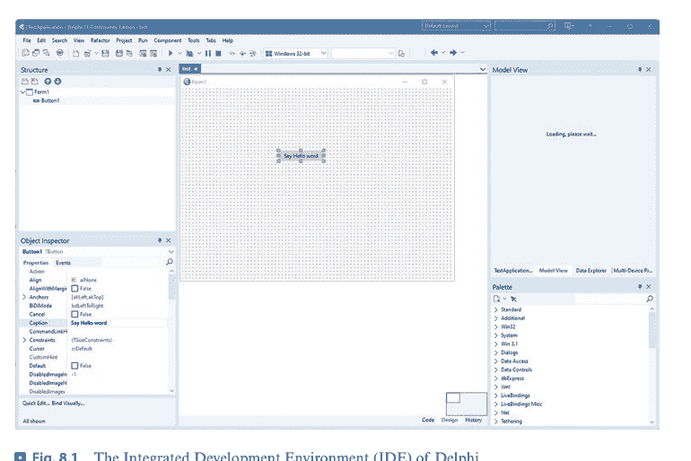

图 8.1 Delphi的集成开发环境（IDE）

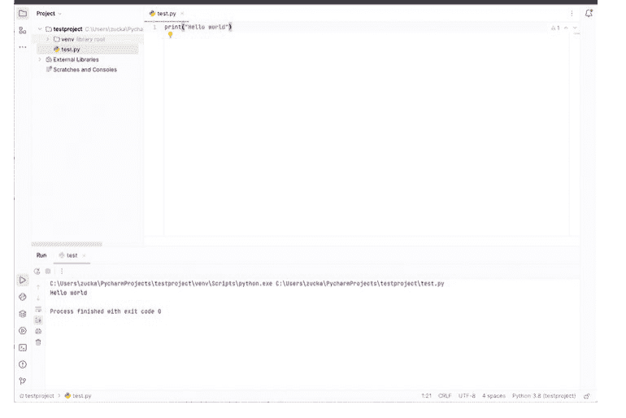

图 8.2 用于Python的PyCharm集成开发环境（IDE）

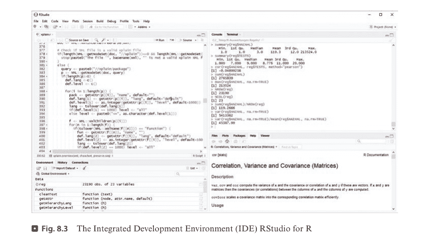

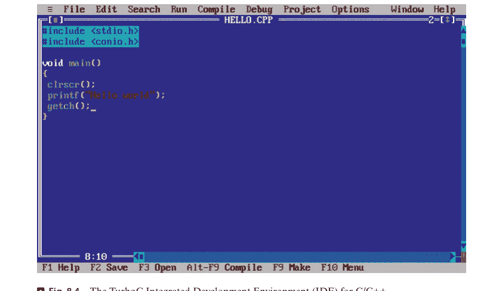

表8.1展示了一些支持常见编程语言的IDE精选。一些IDE，如Eclipse或NetBeans，可以通过插件进行扩展，从而支持一系列语言。

在决定是使用代码编辑器还是IDE时，很自然地会考虑你希望在多大程度上使用只有IDE才提供的工具（例如调试功能或界面设计功能）。但即使你不打算这样做，IDE将所有功能集于一身的巨大优势仍然是一个重要的考量，特别是考虑到你在开发过程中始终需要的编译器或解释器等核心工具。另一方面，IDE本身通常是相当复杂的程序，拥有大量的按钮、不同的工具栏/功能区、窗口和标签页，你需要先熟悉它们。图8.1、8.2和8.3很好地展示了这种复杂性。由于IDE是为专业人士开发的，制造商显然并不太关心你是否能在几分钟内学会使用所有功能和选项。毕竟，IDE不是打算临时使用或偶尔使用，而是作为所有编程工作的永久控制中心。因此，你可能需要一些时间才能完全掌握新工具的各种可能性。但一旦你熟悉了IDE，你就可以高效地工作，因为这正是这些工具开发的目的。

表 8.1 精选集成开发环境（IDEs）

| 编程语言 | 精选IDE |
| :--- | :--- |
| C# | SharpDevelop, Visual Studio |
| C/C++ | AppCode, C++ Builder, CLion, NetBeans, QT Creator, Visual Studio |
| Java | AppCode, Eclipse, IntelliJ IDEA, JBuilder, NetBeans |
| JavaScript | AppCode, Aptana Studio, NetBeans, RubyMine, Visual Studio, WebStorm |
| Perl | Komodo IDE, Padre |
| PHP | Aptana Studio, Komodo IDE, NetBeans, PhpStorm, Zend Studio |
| Python | Aptana Studio, PyCharm, Rodeo, Spyder, Thonny |
| R | Rcommander, RStudio |
| Ruby | Aptana Studio, Komodo IDE, RubyMine |
| Swift | AppCode, Xcode |
| VBA | Microsoft Office, Visual Studio Tools for Office (VSTO) |

> **提示**

尝试不同的代码编辑器和IDE，看看你最适合哪一种。不要被众多的功能所迷惑。编写和运行程序只需要其中很少的功能。随着时间的推移，你将学会使用并欣赏工具越来越多的功能。不要试图一开始就理解所有内容，而要专注于真正必要的功能，即用于编辑和编译/执行代码的功能。

最终，你必须自己决定要使用哪些工具。尝试不同的代码编辑器/IDE，然后再做决定，这是一个好主意。出于本书的目的，我们将在处理JavaScript时，同时使用一个功能齐全的IDE（用于Python的PyCharm）和一个经典的代码编辑器（Sublime Text）。在撰写这些段落时，作者想到他自己似乎无意识地遵循一个简单的规则——如果编程语言不需要在个人计算机上安装特殊的、独立的编译器或解释器（例如JavaScript或PHP），那么代码编辑器就是首选工具。对于需要安装编译器或解释器的语言，则需要特定语言的IDE。然而，最终并没有一条适用于所有人的黄金法则。只有一件事有帮助：去尝试！

#### 8.1.4 简单的在线开发环境

如果你想在不安装所有必要工具的情况下尝试一种语言，你通常可以使用特殊的网站，这些网站允许你直接输入和执行代码。执行所需的所有功能，如编译和解释代码，都由网站提供。一些此类“在线IDE”的例子包括：

- http://cpp.sh/ 用于C++编程语言，
- https://www.compilejava.net/ 用于Java，
- https://js.do/ 用于JavaScript，
- http://phptester.net/ 用于PHP，
- https://www.pythonanywhere.com/ 用于Python，
- https://rextester.com/ 用于一系列语言，包括C#、Haskell、Kotlin、Ruby、Pascal和Visual Basic。

在搜索引擎中输入“try *programminglanguage* online”（其中*programminglanguage*替换为你想要的语言名称），可以非常容易地找到更多此类平台。在大多数情况下，你甚至不需要创建账户；你可以立即开始编写代码。需要（免费）账户的网站，如https://www.pythonanywhere.com/，通常也允许你将文件保存在云端并稍后重用。

像上面提到的这些网络服务当然无法替代真正的开发环境，因为它们通常功能非常有限，并且程序的执行也可能受到限制（在某些情况下，例如，程序可能只能占用五秒钟的计算时间）。如果你想认真对待这门语言，就无法绕过在自己的计算机上安装必要的工具。尽管如此，这些网站提供了一个有趣的机会，让你可以无风险且无需不必要努力地尝试一种语言。

### 8.2 帮助与信息

拥有合适的工具并非万事大吉。你时不时会需要帮助。因此，提前思考在哪里可以获取更多关于编程语言的信息是明智的。例如，如果你不知道如何处理某个特定问题，不清楚编程语言的某些命令是做什么的或如何使用它们，或者你不理解解释器或编译器有时晦涩难懂的错误信息。在所有这些情况下，有一个能立即获得支持的联系点会很有帮助。这样的联系点在实际工作中是重要的资源，不仅对编程初学者如此。当然，除了像本书这样的书籍，互联网提供了海量的信息源，几乎能满足任何信息需求——前提是你能找到它们。

许多编程语言，无论是开源的还是专有的（供应商特定的），都附带了详尽的网络文档，你可以在其中找到关于编程语言特定命令的详细信息。这些帮助资源的例子包括 PHP 的函数参考手册、Python 的库参考手册或微软的 Visual Basic for Applications (VBA) 的 VBA 参考手册。

官方文档的一部分通常不仅是这样的函数参考手册（即一本类似词典的参考书，描述编程语言的某些命令是做什么的以及如何使用它们），还常常包括语言参考手册。语言参考手册解释了相关语言的语法，从而描述了如何用该语言正确地表述指令。然而，这样的语言参考手册对于新手程序员来说并不总是容易消化。这就是为什么一些官方文档还提供面向初学者的教程和“入门指南”文章作为补充。

对于任何想认真对待一门编程语言的人来说，建议在浏览器书签中收藏官方语言文档，尤其是函数参考手册。当你想了解某个特定命令是做什么的以及如何使用它时，它通常是首选之地。

除了官方文档，当然也有非官方的信息和帮助渠道，它们不是由负责该编程语言的组织运营的。在实践中，对于许多编程语言来说，最重要的此类渠道是互联网平台 Stack Overflow（▶ https://StackOverflow.com/）。它拥有超过 1700 万个关于各种编程语言的问题，几乎能满足你的一切需求。如果你在那里搜索一个具体问题的解决方案，你常常会感觉每个能想到的问题都已经被别人问过了。但不仅大量的已回答问题和对不同编程语言的高覆盖率使 Stack Overflow 成为一个极其有用的信息源，其答案的质量通常也非常高。

这种高数量和高质量一方面通过游戏化实现，即通过为论坛参与者的某些行为奖励积分（“声望”）来设置游戏化的激励。这些积分不仅作为能力的证明显示在各自的用户名旁边，而且允许使用某些并非对所有用户开放的功能。一个重要的此类功能（即使分数相对较低也能使用）是对答案进行赞成和反对投票，即对其他用户的答案进行评分。这有助于读者更好地评估答案的质量。反过来，获得赞成票的答案作者会收到声望积分，这增加了提供高质量答案的激励。此外，提问者可以将其中一个答案标记为最佳答案。其他用户随后会通过答案旁边的大绿色对勾识别出这是最终帮助提问者解决问题的答案。该答案的作者也会因此获得声望积分。通过这种方式，不仅运营了一个相互质量控制的系统，而且为投入工作帮助他人设置了强大的激励，而你从中除了帮助了另一个用户的良好感觉外一无所获。有了 Stack Overflow，除了良好的感觉，你还能获得声望和权限，这显然对许多参与者的自尊心有益。

除了游戏化，论坛中的严格规则也在信息的高质量方面发挥了作用。例如，与其他问题重复或与相应论坛区域主题无关的问题会被版主立即关闭。要求提问者为其问题提供一个最小但可执行的代码示例，并在帖子标题中就准确地表述其问题。Stack Overflow 自己的行为准则要求友好互动，但论坛中的语气有时对 Stack Overflow 新手来说可能显得有点粗鲁。

尽管语气有时需要一点时间来适应，Stack Overflow 是一个一流的信息源。即使是难以理解的编译器或解释器错误信息——编程中常见的烦恼——通常也能在 Stack Overflow 上找到。由于 Stack Overflow 支持许多不同的编程语言，因此在搜索查询中始终包含语言名称非常重要。

如果你在 Google 上搜索一个问题，Stack Overflow 的搜索结果通常会排在很高的位置。通过在 Google 搜索查询中添加“site: ▶ StackOverflow.com”，可以仅列出来自 Stack Overflow 的结果；当然，▶ StackOverflow.com 也有自己的搜索功能。除了 Stack Overflow，还有许多其他论坛，包括在 Facebook 或 Reddit 等知名平台上的论坛。无数的博客也为特定问题提供了很好的提示和操作指南。

但是，你应该何时使用官方文档，何时使用 Stack Overflow 等其他来源？如果你已经知道要使用哪个命令，现在只是需要理解如何正确使用它，那么该语言的官方函数参考手册通常是最佳起点。但如果你不知道要使用哪个命令或方法来解决问题，Stack Overflow（或类似的论坛）是你的首选。在这里，你会找到许多常见问题的良好解决方案。同样，如果你无法破译编译器或解释器的错误信息，或者就是搞不懂为什么你在函数参考手册中查到的某个命令会那样表现，Stack Overflow 就是该去的地方。Stack Overflow 的妙处在于，由于已经提出了大量问题，你的问题很可能已经存在，你可以立即解决问题，而无需自己发布问题然后等待数小时甚至数天才能得到一个合适的答案。

### 8.3 像 ChatGPT 这样的生成式人工智能

像 OpenAI 的 ChatGPT、Google 的 Gemini、Anthropic 的 Claude 或 Meta 的 Llama 这样的人工智能工具是一种非常不同的工具。它们建立在强大的大型语言模型（LLMs）之上，并且是基于对话的，这意味着它们允许用户与人工智能进行“对话”。这使得可以提出在任何互联网论坛中尚未以这种形式找到的问题。此外，将别人的问题及其收到的答案应用到自己情况下的繁琐转移工作被消除了，因为使用像 ChatGPT 这样的工具，你可以完全基于自己的情况提问，并获得专门针对自己问题的答案。这些 AI 工具易于使用，因为它们使用自然语言交流；通常，除了英语，还支持一系列自然语言，包括西班牙语、法语、德语、意大利语和中文。

像 ChatGPT 这样的工具是生成式人工智能的例子，这意味着它们不仅能够汇编和呈现已知信息，而且还能——看似创造性地——生成新内容并开发新解决方案。结合在众多编程语言中工作的能力，这些工具在编程中非常有用。应用领域可以包括：

- 理解外部代码：如果你不理解一段不是你自己编写的代码（例如，来自互联网论坛或博客），只需让它解释给你听（“解释以下代码的作用”）。
- 查阅资料：你可以像使用语言参考手册或教科书一样使用像 ChatGPT 这样的工具。你可以非常具体地询问如何在编程语言中使用某个函数，但也可以更一般地询问有哪些函数（和外部附加模块）可用于解决某个特定问题。好处（尤其是在第一种情况下）是，如果你不理解答案，可以随时要求更易懂的解释（或示例）。
- 编写代码：生成式人工智能的巨大优势在于能够自己编写代码（“编写一个 Python 程序来……”）。互联网上流传着许多例子，开发者使用像 ChatGPT 这样的工具在短时间内以很少的精力开发出大型应用程序（例如，整个网络平台），并（据称）通过其商业利用赚了很多钱。
- 查找和消除程序中的错误：将代码和错误信息提供给 AI 工具通常能帮助你比自己费力地挖掘代码更快地找出错误。图 8.5 展示了一个例子。
- 注释和记录代码：注释和记录代码（即编写关于代码如何工作以及如何使用的解释）这项对大多数程序员来说相当乏味的工作，通常可以由生成式 AI 工具很好地完成。

### 8.4 学习新编程语言的路线图

**匿名用户**
我有以下代码（在反引号中）：
```
# Global counter
action_count = 0

def perform_action():
    action_count += 1
    print("Action performed.")

# New action
perform_action()
```
运行这段代码时，我得到错误信息："UnboundLocalError: cannot access local variable 'action_count' where it is not associated with a value"。这个错误信息是什么意思？

**ChatGPT**
错误信息 "UnboundLocalError: local variable 'action_count' referenced before assignment" 的出现是因为 Python 处理变量作用域的方式。在你的代码中，`action_count` 定义在 `perform_action` 函数外部，使其成为一个全局变量。然而，当你尝试在函数内部使用 `action_count += 1` 来修改它时，Python 将 `action_count` 视为该函数作用域内的局部变量。由于你没有在函数内部定义 `action_count`，Python 会引发错误，因为它试图更新一个它认为是局部但尚未在函数作用域内初始化的变量。

图 8.5 使用 ChatGPT 进行调试

生成式人工智能结果的质量通常非常好且令人印象深刻，尤其是对于首次用户而言。尽管如此，像 ChatGPT 这样的工具并非毫无差错。结果总是需要检查，由 AI 工具编写的代码需要彻底测试。仅凭这一点，对所用编程语言的自身知识就是必需的。然而，由于这些系统是基于对话的，并且可以引用之前的输入和输出，你可以指出错误并要求 ChatGPT 纠正它们。即使该工具没有犯任何真正的错误，但结果尚未符合你的想法和要求，你也可以在与 AI 工具的对话中再次对其进行“打磨”。此外，由于过程的对话性质，你可以让复杂的程序逐步开发，这增加了最终得到所需结果的概率。由于 ChatGPT 的基础版本是免费的，强烈建议你尝试一下。不要担心这会让你看起来像个业余爱好者，许多专业软件开发人员也使用此类工具来提高他们的编程生产力。

### 8.4 学习新编程语言的路线图

当你学习一门新的编程语言时……

## 第8章 · 编程需要什么？

- 首先获取必要的工具，特别是所需的编译器或解释器，以及用于处理代码的工具（代码编辑器或 IDE）。
- 如果你已经为另一种语言使用了代码编辑器或 IDE，考虑也为新语言使用它，因为你已经熟悉了它的操作。你的工具可能有一个扩展包，使其也适用于新语言。
- 如果你还没有使用代码编辑器或 IDE，尝试不同的工具。如果你的编程语言的工作需要特殊功能，例如图形界面设计，或者你想大量使用调试工具，你应该优先选择 IDE 而不是纯（代码）编辑器。否则，一个好的代码编辑器（你也可以从中调用编译器或解释器）可能就足够了。
- 当你安装一个新的代码编辑工具时，不要试图立即理解所有复杂的功能。无论如何，你只需要其中相对较小的一部分——至少在开始时——才能真正开始工作。首先专注于理解如何打开、编辑和保存代码文件，以及如何运行你的程序。之后，你就可以立即开始编程了。关于你的集成开发环境或代码编辑器的其余大部分知识，你将在过程中顺便学到。
- 在你真正开始学习编程语言之前，找出有哪些官方帮助和信息渠道可用；特别是，为官方函数和语言参考设置浏览器书签。
- 检查 ChatGPT 是否支持你的语言，并尝试一些功能。

## 如何让程序运行起来？

目录

- 9.1 万事开头难 – 66
- 9.2 你好，世界！ – 68
- 9.3 学习新编程语言的路线图 – 69

概述
在你获取了必要的工具并探索了帮助和信息来源之后，是时候详细规划如何让程序运行起来了。没有什么比拥有丰富的编程语言理论知识准备得非常充分，但最终却连第一个小程序都无法启动更令人沮丧的了。
为了避免这种不愉快的经历，你应该尽早编写你的第一个真正的程序，即使你对编程语言几乎一无所知。
在本章中，你将学到以下内容：
- 为什么尽早生成第一个可执行程序很重要，从而庆祝你在新编程语言中作为程序员的第一个小成功
- 著名的“hello world”程序是什么，以及为什么它是进入新编程语言的良好第一步
- 执行代码时，交互模式与脚本/批处理模式之间有什么区别，以及在什么情况下哪种模式更可取。

### 9.1 万事开头难

在接下来的章节中，我们将讨论许多基本概念，你需要理解它们在新编程语言中的实现，才能开发出真正优秀、有用的程序。尽管如此，现在就从一个非常简单的程序开始是有帮助的。
你使用这段简单的代码作为基础，进行逐步扩展，让你以实践的方式尝试语言的每一个额外元素。你还将立即学到新编程语言的一些特性，如果你不理解并从一开始就注意它们，可能会让你头疼不已。一个很好的例子是，许多编程语言要求语句以特殊字符（通常是分号）结束，这是语法正确的语句所必需的。这种微妙之处最好使用尽可能简单的程序来学习，因为程序越简单，替代的错误源就越少，因此故障排除就越容易。这很重要，因为你不想在新编程语言的第一步就陷入漫长而令人沮丧的错误搜索中。拥有第一个小小的成功感总是更好的！在这一点上，你完全理解你用第一个程序所做的所有事情并不重要。唯一重要的是，你能编写一个虽小但可执行的程序并运行它。
“执行”是关键词，这立即引出了立即开始编写小程序的另一个理由。通过这样做，你将学习如何处理新工具的最重要功能，特别是如何编译源代码（如果这是必要的）以及如何执行它。如果你使用的是 IDE，那么相关命令可能可以通过菜单或工具栏访问。然而，你可能决定使用普通代码编辑器和命令行解释器/编译器的组合。在这种情况下，你需要确切理解如何调用编译或直接解释源代码的命令行程序，以及传递什么参数给它。即使你可以将编译器或解释器包含在代码编辑器中，这也是正确的，因为这通常是通过告诉代码编辑器相关的命令行语句来完成的。关于这方面的信息通常可以在编程语言的官方文档中找到。

对于编译型语言，在编译程序时通常会增加另一个步骤，即*链接*。一个特殊的工具，即*链接器*，生成程序的可执行文件。这由你的程序（你编写的源代码，由语言的编译器翻译成机器语言）、编译的程序库以及你从程序中访问的其他编译的程序组件组成。链接将所有这些组件组合成一个单独的可执行文件，然后可以独立运行。如果你使用的是 IDE，你通常不仅会找到用于编译和链接的单独菜单命令，还会找到一个名为“Build”的命令。这只需单击一次即可完成编译和链接（从源代码生成可执行程序文件的整个过程）。

然而，在某些情况下，仅通过在 IDE 界面上点击几下或调用命令行解释器/编译器是无法完成的。一个例子是 JavaScript，你通常必须将其嵌入网页中，即 HTML 文档中。这也需要学习。用一个小型示例程序进行第一次尝试不会有坏处。

然而，这并没有穷尽执行源代码的可能性。一些编程语言除了执行整个程序外，还支持*交互模式*。在交互模式下，你首先输入一个程序语句。然后，通过按 <ENTER> 键或一个特殊按钮，执行该语句，并立即显示结果（如果有可显示的结果）。之后，你可以输入另一个语句，并再次立即获得其结果。这种过程也称为读取-求值-打印循环（REPL），如果你想要探索性地查看数据集并对其进行统计分析，这将非常有趣。难怪 R 和 Python 这两种在这方面具有相当优势的语言具有交互模式。然而，交互模式也可用于调试，通过逐条向交互解释器（通常称为*控制台*）提供指令，然后在执行下一条指令之前查看每次的结果。通过这种方式，可以轻松确定你交给解释器逐步执行的程序在何处表现与预期不同。因此，不仅用于数据统计分析的语言支持交互模式。

交互模式通常只存在于解释型语言中。如果你的语言需要编译器，你输入的每条交互式指令都必须由编译器翻译成一个独立的、自包含的机器语言程序。但那样你就无法使用下一条指令来访问之前在内存中处理过的数据，因为第一个程序完成后，其内存区域会被操作系统释放。你无法通过这种方式实现真正的交互性。因此，编译型语言通常只提供整个程序的执行。这种执行程序的方式，同样存在于解释型语言中，并且是更常见的执行方式，也被称为*批处理*或*脚本*模式，以区别于交互模式。
因此，请务必熟悉如何在你想要学习的语言中运行程序。

### 9.2 Hello, World!

通过编写一个最小的程序，你将学到尝试后续编程原理及其在编程语言中实现所需的一切，并能随意执行程序。
但这样一个最小的程序是什么样子的呢？最著名的最小程序，可能每个程序员都知道，就是“Hello, world”程序。这个程序除了在屏幕上显示简单的短语“Hello, world”外，什么也不做。这个经典的起源可以追溯到1970年代初。
以下是一些不同编程语言中hello world程序的示例。首先是C语言：

```
#include <stdio.h>

main()
{
    printf("Hello, world!");
}
```

如你所见，实际的输出语句，即**printf()**函数，被花括号包围，前面是**main()**。如果你更深入地研究C语言，你会了解到一个C程序本身最终就是一个函数，即**main()**函数，它在程序启动时被自动调用。在我们的例子中，这个函数除了调用另一个函数**printf()**外什么也不做，后者随后在屏幕上显示短语“Hello world!”。没有**main()**函数，你的C程序将无法运行。如果你忘记了**printf()**语句后面的分号，也会遇到问题。而为了让**printf()**能够被调用，你必须通过**#include <stdio.h>**包含一个用于输入输出的标准函数库。所以，让一个C程序运行起来并非全然轻松。重要的是，hello-world程序教你应用一些基本规则，即使你此刻可能并未完全理解其含义。尽管如此，如果你更深入地学习C语言，你现在就能够扩展你的hello-world程序了。
结构上简单得多的是Ruby on Rails中的hello-world程序：

```
print 'Hello, World!'
```

在Delphi中，你开发图形用户界面，在hello-world程序的过程中，你将学会在屏幕上显示一个带有信息图标和“确定”按钮的消息框：

```
MessageDlg('Hello World!', mtInformation, [mbOK], 0);
```

在实践中，你必须让消息框的显示依赖于某些用户操作，例如用户点击按钮。因此，你的hello-world程序还将包含一个最小的图形用户界面，由一个带按钮的窗口组成。这样，你将立即学会使用创建图形用户界面的基本工具。
最后，在PHP中，学习如何使用标签将PHP脚本嵌入网站是有意义的。这里的hello-world程序可能看起来像这样：

```
<html>
    <body>
        <?php echo 'Hello world!'; ?>
    </body>
</html>
```

### 9.3 学习新编程语言的路线图

如果你正在学习一门新的编程语言……

-   从编写一个非常简单的程序开始，即使你还没有深入钻研这门新编程语言的深处。这样，你将学到该语言的一些重要特性。一个好的方法是实现经典的“Hello, World”示例，这几乎可以在网上找到所有语言的版本。
-   弄清楚有哪些可能性来执行你的程序（编译、脚本/批处理模式下的解释器，或交互模式），以及具体如何实现。能够编写程序固然好，但只有当你能执行它们时，它才有用！

## 如何确保我（以及其他人）以后仍然能理解我的程序？

目录

-   10.1 可理解的程序代码 – 72
-   10.2 程序代码的设计与程序元素的命名 – 73
-   10.3 注释 – 76
    -   10.3.1 解释你自己的程序代码 – 76
    -   10.3.2 注释的其他用途 – 77
    -   10.3.3 程序代码之外的文档 – 78
-   10.4 学习新编程语言的路线图 – 80

© 作者，经 Springer Fachmedien Wiesbaden GmbH（Springer Nature 旗下）独家许可，2024
J. L. Zuckarelli, *Learn coding with Python and JavaScript*, https://doi.org/10.1007/978-3-658-42912-6_10

我写这段代码时，只有上帝和我明白我在做什么。现在，只有上帝知道了。
（用户 *johnc* 在 *Stack Overflow* “你遇到过的最好的源代码注释是什么？”）

计算机科学中只有两件难事：缓存失效和命名。
（Phil Karlton）

> **概述**
你应该以一种允许你以后确切理解你如何进行以及你开发的解决方案如何工作的方式进行编程，这是一个显而易见的、理所当然的要求。但事实上，许多程序员，即使是专业的，也做得太少，未能将此付诸实践。因此，接下来我们将看看如何设计你的代码，以便你和以后需要与之合作的其他人能够理解它。
在本章中，你将学到：
-   如何使程序代码可读
-   什么是注释以及为什么它们有用
-   如何巧妙地使用注释来解释你的程序代码
-   如果其他程序员要将其用于自己的开发，程序代码的文档扮演什么角色。

### 10.1 可理解的程序代码

开发可理解的程序代码是繁琐且令人疲惫的，而做到这一点所需的工作是许多程序员最不喜欢的任务之一。
一方面，以一种易于理解的方式编程需要更多的努力，因为你必须遵守惯例并编写笔记，程序员行话中称为*注释*，以便以后你能快速理解你编写的程序是如何工作的。当你全神贯注于问题解决方案的细节时，大多数人——包括本书的作者——往往会大大高估自己以后理解自己行为的能力。
但你应该记住，这可能是一个额外的动机去投入必要的工作，这个“以后”不一定是在五年后。也可能是后天，你的程序代码的可读性不足就会成为你的败笔，并导致不必要的额外工作，而这些工作本可以在最初编写代码时多花一点精力来避免。
因此，尽早开始研究你可以做些什么来应对这个问题，并确保你从一开始就以一种方式工作，以便你总能不太困难地重新回到你的程序代码中，这是有意义的。三个因素可以显著促进这一点：

### 10.2 程序代码的设计与程序元素的命名

-   程序代码的*视觉设计*会影响你多快能在其中定位并识别不同部分之间的联系。
-   程序各种元素的*命名*方式（例如变量和函数，我们稍后将详细讨论）在很大程度上决定了你多快能理解代码某些部分的功能内容。
-   注释，例如程序员编写并直接放在程序代码中的解释，如果写得好，可以解释很多无法从代码本身读出的东西。

### 10.2 程序代码的设计与程序元素的命名

一个重要的因素将有助于确保你以后仍然能轻松理解你的程序代码，那就是你如何格式化它，特别是如何使用*行缩进*。一个例子：

```
for(i=1; i<=100; i++) {
if(i mod 2 == 0) {
for(f=1; f<=100; f++) {
printf("field (", i, ", ", f, ")");
}
}
printf("\n");
}
```

即使不理解这段用C编程语言编写的代码做什么，你也会看到一系列花括号在某些语句后打开，然后在稍后某个时候关闭。它们之间的所有内容都属于前面语句的代码块。这里的代码块显然是相互嵌套的，这意味着有些代码块本身又包含其他代码块。然而，在上述表示法中，这种嵌套结构很难看出来。这在结尾处尤其明显，那里有一系列块以级联方式关闭。哪个括号属于哪个块，因此哪个语句在哪个块中，不容易弄清楚。但如果你想理解程序做什么以及它具体如何工作，这个问题至关重要。（对于那些对这段代码做什么感兴趣的人：对于一个有100行和100列的矩阵，它以（行，列）的形式将所有字段坐标写到屏幕上，但省略了奇数行。）

如果你插入缩进，例如使用制表符键，代码会变得更清晰：

```
for(i=1; i<=100; i++) {
    if(i mod 2 == 0) {
        for(f=1; f<=100; f++) {
            printf("field (", i, ", ", f, ")");
        }
    }
}
```

### 10.3 注释

#### 10.3.1 解释你自己的程序代码

要写出日后自己能理解的代码，良好的格式和合理的标识符选择固然重要，但另一个关键工具是*注释*。注释是程序代码中被编译器或解释器*忽略*的文本。与源代码其他部分必须严格遵守语法规则以让计算机理解你的意图不同，在注释中你可以随心所欲地书写。诀窍在于让编译器或解释器明确你的注释并非实际程序代码的一部分，从而可以安全地忽略它。

为了让编译器或解释器区分程序代码和注释，注释总是以特殊符号开头。根据编程语言的不同，注释可能延伸到行尾，或者延伸到再次用特殊符号终止的地方。

有些语言只支持第一种模式，即只有单行注释。如果注释需要跨越多行，则每一行都必须以注释符号开头。

让我们看一些例子。首先是一个C语言的例子：

```
// 计数器读数现已完全运行。
// 输出计数器读数。
printf("Counter reading: ", counter,"\n");
counter = 0; // 重新初始化计数器
```

这里引入注释的符号是 *//*。从 *//* 到行尾的所有内容都是注释，会被C编译器忽略。因此，注释和代码也可以在同一行，尽管代码当然必须位于注释符号 *//* 的左侧。有趣的是，C语言以及许多基于它的语言不仅支持 *//* 单行注释，还支持多行注释。多行注释包含在符号 */* 和 */* 之间（注意，星号始终朝向注释文本）。这样，上面的例子可以写成：

```
/* 计数器读数现已完全运行。
   输出计数器读数 */
printf("Counter reading: ", counter,"\n");
counter = 0; /* 重新初始化计数器 */
```

如你所见，第一个注释的第二行不需要单独的符号来开始注释，因为我们仍然处于上一行由 */* 开启的注释区域内。只有遇到 */* 时注释才会关闭。由于这个注释有明确的开始和结束，它也可以放在代码中间，尽管这并不推荐，因为它会损害代码的可读性：

```
counter /* 循环计数器 */ = 0;
```

当然，每种编程语言都有自己用于注释的符号。然而，前面提到的 //、组合使用 /* 和 */，以及 # 符号（通常用于单行注释）是常见的。

使用注释可以帮助你直接在代码中记录程序的工作方式。任何拥有代码的人都能同时看到文档。当然，如果你与他人协作，这一点尤其重要。你的合作者肯定会感激在特别复杂的地方有一两个提示。

但你自己，至少是“未来的你”，也会从注释中受益匪浅。没有什么比看到一段旧代码时，惊喜地发现当时的开发者（你自己）留下了一点帮助，使得理解困难部分变得容易得多更美好的事了。

然而，因为给你的解决方案添加注释需要时间，你应该只在真正必要的地方使用注释，也就是在程序中那些你预计日后不容易理解的地方。所以不要给每个琐碎之处都加注释，要经济地使用注释。注释可能是编程工作中最不受欢迎的部分。因此，请及时写下你的注释，最好是在你写完相关代码之后立即写。这样，你不仅能准确记住你的解决方案是如何工作的，还能避免日后为了写注释而重新思考解决方案，这种脑力劳动可能会让不仅仅是拖延症的顽固爱好者对添加注释望而却步。像ChatGPT这样的人工智能工具可以在这里提供帮助。例如，让ChatGPT为你的代码添加注释，使用以下提示：“为以下代码添加注释，使其对初学者易于理解”。你会惊讶于ChatGPT、Gemini、Claude等能为你完成多少繁琐的工作。

#### 10.3.2 注释的其他用途

通过注释，你不仅可以记录你使用的过程，还可以，例如，记录未完成的任务。一个清晰的 **TODO** 标记将注释标记为你的一个待办任务。同样，你可以使用 **REVIEW** 来突出显示你想仔细查看的代码段，或者分配任何其他有意义的标签来标记特定类型的注释。

你也可以用更普通的方式使用注释，即更好地组织你的源代码，使其对你更清晰。在这个意义上，你可以使用注释在视觉上分隔源代码的不同部分，例如像这样（在C++中）：

```
/* ------------------ 开始读取数据 ------------------ */
```

当你开始编程时，你会看到有时“注释掉”一条程序语句是多么有帮助。这意味着将指令放入注释中，使其被编译器或解释器忽略。这对于临时禁用代码而不删除它很有用，例如，当你在调试并想测试另一种方法时。

现在更容易看出代码块从哪里开始，在哪里结束。代码变得更具*可读性*。

大多数编程语言允许你使用缩进来任意格式化代码。但也有一些例外，比如Python，其中缩进具有内容相关的含义，因此不能随意设置。然而，对于Python也可以放心：Python要求缩进的方式实际上迫使程序员无论如何都要使其代码可读。或者换句话说：在Python中，正确的语法（即可执行的程序代码）自动带来最低限度的可读性。我们将在本书的第三部分学习Python基础时更仔细地探讨这一点。

但不仅仅是源代码的格式对代码的可读性和可理解性起着重要作用。在编程时，你必须给许多东西命名，例如变量或函数。你的程序的用户不会看到这些名称（在程序员行话中也称为*标识符*），但这并不是你在选择标识符时可以随心所欲、放飞想象的理由。

举个例子，考虑下面用Python编写的计算身体质量指数（BMI）的程序：

```
a = input("Your weight [in kg]: ")
b = input("Your height [in m]: ")
c = float(a)/float(b)**2
print("Your body mass index is: ", c, "\n")
print("Your input was:")
print("Size:", a, "m")
print("Weight:", b, "kg")
```

即使不了解Python，你注意到什么了吗？程序首先询问你的体重和身高。如果你输入身高1.78米，体重80公斤，那么身体质量指数输出为25.25（一个表示轻微超重的值）。之后，你提供给程序的初始值将再次显示；它看起来会像这样：

- Your input was:
- Size: 80 m
- Weight: 1.78 kg

用这些值，你将明显体重不足，但身高80米的话，这将是一个相对无关紧要的问题！发生了什么？这不是程序错误，而是程序员的错误！在程序中，输出体重和身高参数时变量名被交换了。因此，屏幕上显示了错误的值。由于这里的变量名为 **a** 和 **b**，这种程序代码中的混淆起初并不容易发现。

如果你选择*有意义的*变量名，错误就更容易被发现：

```
weight = input("your weight [in kg]: ")
height = input("Your height [in m]: ")
bmi = float(weight)/float(size)**2
print("Your body mass index is: ", bmi, "\n")
print("Your input was:")
print("Size:", height, "m")
print("Weight:", weight, "kg")
```

因此，使用易于理解、有意义的标识符，传达出你命名的东西包含什么（对于变量）或它做什么（对于函数）的概念。当你快速编程时，很容易不假思索地使用简短的、通常是单字母的变量名（例如 **x**, **y**, **i**, **f**），因为它们很容易快速输入。但你应该抵制这种诱惑。你那个试图阅读你程序代码的“未来的自己”会感谢你！

然而，有时仅用一个词作为标识符是不够的，比如 **size** 或 **weight**。在复合标识符中，我们看到了编程语言命名约定的差异。假设我们想根据程序用户是男性还是女性来区分身高和体重，并为此引入了不同的变量。一些编程语言倾向于使用 **heightMan** 表示男性的身高，另一些使用 **height_man**，还有一些使用 **height.man**。

当然，最终你是否遵循你编程语言中大多数程序员遵循的约定根本不重要。对于你程序的语法正确性以及可执行性，这当然是无关紧要的，至少只要你只使用变量名中允许的字符（在某些语言中，例如 **$** 是保留字符；**exchangerate$** 将是一个无效的变量名并会导致错误）。然而，建议坚持*某种*标准。这可以节省思考，因为你不必每次都重新思考，并使你的程序日后更具可读性。

关于代码格式和选择适当标识符的问题，许多人进行了大量深入的思考。*Google* 在其 *Google Style Guides* 中为一系列编程语言整理了这些想法，你也可以在互联网的许多其他地方找到风格指南（有时与 *Google* 的指南略有不同）。请随意查看你编程语言的风格指南。当然，你不必盲目遵循它。比遵循某种风格更重要的是首先要有某种风格，你可以或多或少地一致地执行它，以节省脑力劳动，并保持代码的可读性，从而易于理解。

注释并因此“关闭它”。毕竟，编译器或解释器不会执行注释中写的内容。因此，通过将语句包含在注释中，你可以使该语句暂时失效。一个C语言的小例子：

```
printf("This text is printed on the screen!");
/* printf("This text does not appear because the printf statement is commented out"); */
```

当你刚开始接触一门新的编程语言，并想立即将从尝试中学到的知识记录在测试程序的代码中时，注释非常有帮助。众所周知，当你写下所学内容时，学习效果最好（为此公认的最有效方法是手写笔记，但对于程序代码来说，这自然被排除在外）。

#### 10.3.3 程序代码之外的文档

注释是*程序代码内部*的一种文档。这是有利的，因为解释和被解释的内容紧挨着。然而，将文档存储在源代码*之外*也并无不妥。例如，如果你想编写更全面的解释，或者想在文本中包含其他信息（如表格或手写笔记或草图的照片），这很有用。如果你想记录整体上下文，例如程序的整体结构或程序不同部分之间的相互关系，情况也是如此。在所有这些情况下，至少将部分文档与代码分离并放置到另一个文档中是可以的。无论你是用文字处理器编写这个外部文档，还是在你的电子笔记本中记录它，都完全无关紧要。原则是：有益于理解的东西都值得称赞！

在源代码之外生成文档的一种特殊方式是使用特殊的*文档生成器*，许多编程语言都有提供。这些工具的基本功能不过是自动读取程序代码中特别标记的某些注释，并将其整理成视觉上吸引人的形式。结果通常以HTML文档或PDF格式输出。此类工具的例子包括用于Java的*Javadoc*、用于PHP的*phpDocumentor*、用于R的*roxygen*或支持多种不同语言（包括Python和C++）的*Doxygen*。当编写稍后将被他人调用的程序代码时，以这种方式生成文档特别有趣（我们将在下面看到如何将程序的某些部分打包成模块，然后可以从其他地方调用）。虽然调用程序代码的人不一定需要详细了解其工作原理，但他们确实需要知道如何确切地调用程序，以及如何根据他们的目的控制其操作。由于这些开发者对程序代码本身不感兴趣，只对其*接口*感兴趣，如果他们必须翻阅代码来查找相关提示，那将是不切实际的。这就是为什么文档被放置在代码之外。这样，它保持“干净”且简洁，易于用户使用。对于代码的开发者来说，编写起来也很容易，因为它直接嵌入在程序代码中，就像常规注释一样。例如，在Java中，这可能看起来像这样：

```
/**
 * Reads the name of the user
 *
 * @author Marc McIntosh
 * @version 1.3
 *
 * @param prompt Text of the prompt shown to the user
 * @return Name the user has entered
 */

public String getUserName(prompt) {
    /* Here comes the actual program code */
}
```

这里，一个称为函数的特殊程序部分使用*Javadoc*进行了文档化。该函数可以使用提示进行调用，例如`getUserName("Enter your name: ")`，然后读取用户输入，并将用户的输入作为值返回给调用该函数的人。（我们将在后面更详细地讨论函数。）这里重要的是，该函数是一个可以被其他程序调用的模块的一部分。为了理解调用该函数需要什么（要显示给用户的提示文本）以及它返回什么（用户输入的名称），该函数在此处以文档工具Javadoc可以自动生成吸引人的HTML文档的方式进行了文档化。Javadoc为此目的使用特殊注释。

Java中的普通注释放在符号`/*`和`*/`之间。但是，如果注释以`/**`为前缀，Javadoc就知道这是一个应该成为文档一部分的注释。可以使用以`@`为前缀的特殊预定义标签来处理文档中的特定字段。例如，`@param prompt`用于解释调用**getUserName**函数时**prompt**参数的含义。这些预定义字段随后可以在文档中以特殊方式呈现，例如以特殊格式或在文档内的特殊位置。

通常，文档和注释之间的区分比我们这里所做的更严格。根据目标受众，注释面向的是想要理解和编辑你的代码的人（通常是你自己，但也可能是其他人）。然而，另一个只是想在他自己的程序中使用你的代码的开发者，对其内部结构和工作原理不感兴趣，根本不会阅读你代码中的注释，而只会寻找关于如何正确使用你的代码的信息。同样，文字处理器的用户对其内部工作原理不感兴趣，他想知道如何更改所选文本的字体颜色！这种关于代码使用的信息提供是由狭义上的文档完成的，当然，文档可以通过文档生成器从代码中的特殊注释生成。

### 10.4 学习新编程语言的路线图

当你学习一门新的编程语言时……

- 要确定该编程语言是否允许你以任何想要的方式格式化代码（例如，使用缩进），或者格式化是否在内容上有意义，请查看样式指南，该指南提供了关于如何在该编程语言中格式化代码以及如何选择变量、函数和其他元素的标识符/名称的信息，
- 决定一种格式化代码并命名变量、函数和其他元素的方式。你不一定必须遵循样式指南，但你应该保持一致性，
- 确定如何将注释构建到代码中，特别是注释是否可以是多行的，以及它们是否在前后有界定，还是总是延伸到行尾，
- 养成给代码添加注释的习惯，以便你以后能够理解它，但要经济地这样做，并专注于那些你以后确实有风险无法理解或只有很大困难才能理解的困难部分，
- 确定是否有文档生成器允许你从集成在程序代码中的注释创建吸引人的HTML或PDF文档。

## 我如何存储要处理的数据？

目录

- 11.1 作为数据占位符的变量 – 82
- 11.2 变量的数据类型 – 83
  - 11.2.1 不同类型的数据需要不同类型的变量 – 83
  - 11.2.2 重要的数据类型 – 84
  - 11.2.3 更改数据类型：变量的转换 – 88
- 11.3 创建和初始化变量 – 89
- 11.4 不那么可变：常量 – 92
- 11.5 变量的有序字段/数组 – 92
- 11.6 变量的关联字段/哈希 – 96
- 11.7 对象 – 97
  - 11.7.1 世界由对象构成 – 97
  - 11.7.2 类 – 98
  - 11.7.3 继承 – 100
  - 11.7.4 方法 – 103
  - 11.7.5 多态性 – 105
  - 11.7.6 访问权限 – 107
- 11.8 学习新编程语言的路线图 – 109
- 11.9 练习解答 – 109

© 作者，根据与Springer Fachmedien Wiesbaden GmbH的独家许可，Springer Nature的一部分 2024
J. L. Zuckarelli, *Learn coding with Python and JavaScript*, https://doi.org/10.1007/978-3-658-42912-6_11

## 概述

程序处理数据。这些数据从用户、文件、数据库或其他来源读入。我们将在下一章详细探讨这一过程。本章则关注另一件事：所有数据都必须存储在计算机的内存中，以便进行处理。这通过变量的形式实现。但请放心：即使这些变量与其数学中的同名概念有很多共同点，你也不需要深入钻研数学，就能理解如何在编程中安全地使用变量。

在本章中，你将学到以下内容：

-   什么是变量以及如何创建它们
-   变量可以存储哪些类型的数据
-   如何将多个相同类型的变量组合成变量字段（数组和哈希表）
-   如何将反映某个现实世界对象（例如，具有品牌、最高速度和标价属性的汽车）属性的不同变量组合成一个对象，以及如何操作这些属性（面向对象编程范式）。

### 11.1 变量作为数据的占位符

变量是我们用来在程序中记录数据的工具。与数学中一样，变量充当*占位符*，我们可以通过其名称来引用它们，就像▶第10章讨论的*标识符*一样。顾名思义，它们的内容是可变的，因此我们可以在变量中存储不同的数据（一个接一个），但无论变量的当前内容是什么，我们总是可以通过其标识符访问它。

变量可以比作一个我们贴上标签的盒子。标签，即名称或标识符，始终保持不变，即使我们更改了盒子的内容。盒子的内容在某种程度上应该与标签匹配，否则就会产生混淆。变量的情况完全相同。

通常，我们在选择变量名称时相当自由。然而，正如你在前一章已经看到的，有一些特定于语言的基本规则必须遵守。这些规则通常规定变量名称中可以出现哪些字符（某些特殊字符如 % 或 # 通常是不允许的）。此外，许多编程语言还规定哪些字符可以甚至必须出现在变量名的开头。例如，在 R 中，变量名不能以数字开头；在 PHP 中，变量名*必须*以美元符号 ($) 开头。然而，正如你从上一章所记得的，重要的是不仅要遵守这些“硬性”规则（违反这些规则必然会导致编译器或解释器拒绝执行你的指令），还要给变量起有意义且*一致*的名称。在这里，有意义意味着你可以从变量名中看出其内容或用途。一致意味着你理想情况下总是以相同的方式构成变量名，例如，总是以相同的方式对复合变量名的各部分进行大小写处理。

假设你正在开发一个网上商店，并希望将客户在过去12个月内下的订单数量存储在一个变量中。这个变量可以叫做，例如，**CountOrders12Months**，也可以是 **CntOrd12M** 或 **cntOrd12M** 或 **Count_Orders_12_Months** 或……可能性很多，创意几乎没有限制。为了程序代码的可读性和可理解性，重要的是你要思考一个体系，即你希望如何构成变量名，然后尽可能一致地遵循这个体系。

### 11.2 变量的数据类型

#### 11.2.1 不同类型的数据需要不同类型的变量

到目前为止，我们还没有讨论变量可以存储*哪种信息*，例如数字还是文本。对于你的编程语言的编译器或解释器来说，这很重要，至少有两个原因。

首先，你的语言的编译器或解释器必须为变量预留内存。很明显，一段长文本（例如，街道名称）比一个数字（例如，门牌号）需要更多的内存。如果你先给一个变量赋一个数字，比如门牌号58，你的编译器或解释器就会确保预留足够的内存来存储一个数字。然后，如果你给同一个变量赋一个长文本，例如地址“Times Square, Manhattan, NY”，最初预留的空间就不够了。必须找到额外的内存空间，可能在内存中一个完全不同的位置。

其次，数字和文本可以执行非常不同的操作。例如，你可以将一个数字乘以另一个数字。对于文本，这些操作没有意义。在最坏的情况下，如果你对变量所包含的数据类型执行不允许的操作，程序甚至会崩溃。因此，有时检查变量中的数据是否是“正确”的类型，即具有正确的*数据类型*，是有意义的。

变量的数据类型描述了可以存储在其中的信息种类。在这方面，数据类型指定了，例如，一个变量应该存储整数、小数还是文本。然而，在实践中，数据类型不仅在它们所涵盖的数据*类型*上有所不同。它们在*值范围*或*信息长度*方面也有所不同：一个为文本设计并提供10个字符空间的变量，会将“Peter Miller”存储为“Peter Mill”（这里的空格也算一个字符）。在一个值范围从0到65,535（这是一个可以用两个字节覆盖的值范围）的整数变量中，你将无法存储负的账户余额-254美元。同样，一个值范围从-32,768到32,767（这也需要两个字节的内存）的整数变量将无法处理50,000美元的账户余额。因此，数据类型具有不同的值范围，这与它们旨在处理的基本信息类型一样，限制了它们可以存储的数据。对于浮点数数据类型，例如像3.1415926这样的小数，另一个特性以*精度*或小数位数的形式出现。精度很重要。在滑雪或速度滑冰世界锦标赛上，你是与竞争对手一起获得金牌，还是屈居亚军，可能取决于结果是按百分之一秒测量（两位运动员成绩相同，因此都被宣布为冠军），还是也考虑了千分之一秒，从而显现出两人时间上的微小差异。

#### 11.2.2 重要的数据类型

基本数据类型在大多数编程语言中非常相似。通常有以下数据类型：

-   **整数**
    这些数据类型存储整数，如-4、-3、-2、0、1、2、3、4。可选地，有些数据类型只接受正整数（包括零），即自然数。许多编程语言中的整数数据类型名称包含单词“integer”或其缩写。这类数据类型的经典名称是 **integer** 或 **int**。对于值范围特别大的整数数据类型，即可以存储非常大的数字的可能性，它们也常被称为 **bigint**、**long int** 或简称为 **long**。

-   **浮点值**
    浮点数据类型存储小数，如1.7或3.141459。当然，整数也可以表示为浮点数，例如，4表示为4.0。因此，所有整数也可以存储在浮点变量中。
    如果是这样，问题自然就出现了：为什么还需要整数变量，而不总是使用浮点变量呢？原因主要是浮点值需要更大的内存空间，因为它们必须存储小数点后的部分以及小数点前的数字，或者即使小数点后的部分始终为零（对于整数来说就是这种情况），它们也必须为存储预留空间。问题在于，我们的编译器或解释器事先不知道我们只想存储整数值。因此，它总是预留存储一个小数所需的内存。如果你需要同时使用大量这样的浮点变量，这将导致内存需求显著增加。
    在不同的编程语言中，浮点数据类型有许多名称，例如 **real**（表示实数）或 **float**。在大多数语言中，与 **integer** 和 **long integer** 类似，还有另一种浮点数据类型，它提供更高的精度（即更多的小数位）和更大的值范围。在大多数情况下，像 **double** 甚至 **long double** 这样的名称已经表明了更高的精度。

##### 字符与字符串

单个字符（如字母）与整数并无太大差异，因为计算机能理解的每一个字符，即其*字符集*中的字符，都可以被编码为一个数字。常见的字符集有 ASCII 或 Unicode。尽管字符与数字之间存在紧密联系，但大多数编程语言都为单个字符提供了专门的数据类型，其名称通常基于*字符*一词。相应地，许多语言都有一个用于单个字符的字符类型 **char**。

整个文本最终是字符序列，或称*字符串*。因此，一些编程语言没有为字符串设置单独的类型，而是通过将一系列单个字符变量组合来构建字符串。这里，一个更复杂的数据类型由简单数据类型创建，其中许多简单数据类型的变量实际上被串联在一起。这种串联称为*数组*，我们稍后将更深入地探讨这种结构。

其他语言确实有专门的字符串数据类型，通常简称为 **string**。这在一定程度上将程序员与字符串的本质（即它由串联在一起的不同字符组成）隔离开来。对他来说，文本“感觉”上像是一个单一变量，而不是由排列在字段中的单个变量组成。

然而，字符串通常不仅包含字母、数字和特殊字符（如标点符号、#、<、>、*、~），还包含所谓的转义序列。这些是特殊的控制指令。在实践中，最重要的是标记换行符，表示为 \n。反斜杠 (\) 告诉解释器或编译器，后面的字符不是字母，而是控制语句；**n** 本身代表*新行*。因此，字符串 **"Mr./Mrs.\nFirstName Name\nStreet\nZIP City"** 将被解释为

```
Mr./Mrs
FirstName Name
Street
ZIP city
```

每当遇到转义序列 \n 时，就会插入一个换行符。虽然转义序列标记了字符串中换行符的位置，但某些程序函数（例如用于将字符串输出到屏幕的函数）会“理解”这种编码并相应地实现它。除了 \n，还有其他几个转义序列，例如 \t 表示制表符跳转。转义序列解决了另一个常见问题：在大多数编程语言中，字符串用单引号 (') 或双引号 (") 括起来。但如果字符串应该包含一个引号，例如，那么引号需要作为字符串内的*真实字符*，该怎么办？考虑以下字符串：

```
"He said, "I love you!""
```

它用双引号括起来，但包含一个本身使用双引号的引号。通常，解释器或编译器会拒绝继续。它首先识别出一个字符串 **"He said: "**。然而，接下来（这不会被理解为字符串）是 **I love you!**，后面跟着一个空字符串 (**""**)。**I love you!** 可能会导致问题，因为它在相应的编程语言中不是有效的语句，所以在字符串之外，解释器或编译器会尝试将其解释为语句。那么该怎么办呢？除了简单地在字符串内部使用单引号这个平凡的解决方案外，“内部”双引号也可以简单地*转义*，如下所示：

```
"He said: \"I love you!\""
```

反斜杠告诉解释器或编译器，后面的引号应被理解为*字符串的一部分*，而不是其分隔符。
但如果字符串中应该有一个反斜杠呢？例如，在这个字符串中：

```
"\\n is an escape sequence."
```

转义序列 \n 通常会导致字符串内出现不需要的换行符。反斜杠的屏蔽在这里也有帮助，只是这次是屏蔽现有的反斜杠本身，因为它应该被理解为文本的一部分，而不是控制语句的开始。所以：

```
"\\n is an escape sequence."
```

这个字符串将产生正确的输出。转义反斜杠本身在编码 Windows 系统上的路径时尤其重要，例如 **C:\Home\My source codes**。一个常见的错误原因是，在这样的字符串中忘记了转义。
转义序列在许多编程语言中使用，例如 C、Python、Perl 或 R。

##### 真值/逻辑值

几乎所有编程语言都有一个专门的数据类型来表示语句的真值内容，即*真*或*假*。在此上下文中，我们经常谈论*布尔*（以十九世纪英国数学家和逻辑学家*乔治·布尔*命名）或*逻辑变量*。与我们目前考虑的数据类型不同，布尔变量只允许存储两个不同的值：真和假。这与例如整数变量（可以存储*任何*整数）完全不同。在大多数编程语言中，两个真值有特殊的标识符，通常是 **true** 和 **false**，这样布尔变量可以轻松赋值或比较，并且这些赋值和比较在程序代码中易于阅读。因为有易于理解的标识符 **true** 和 **false**，编程语言通常只存储 1 和 0 作为布尔变量的值。从这个意义上说，布尔变量大多只是整数变量，编译器或解释器确保它们只有两个可能值中的一个，这些值可以方便地通过特殊标识符访问，通常只是 **true** 和 **false**。

在编程语言中，布尔数据类型通常称为 **bool**、**boolean** 或 **logical**。

##### 其他数据类型

这些数据类型在几乎所有现代高级语言中都可以找到，尽管名称不同、值域不同、精度也不同。此外，大多数编程语言还有其他更复杂的数据类型，这些类型通常基于你刚刚学习的简单类型。

例如，一些语言有（至少）一个专门用于日期或时间的数据类型。如果你想存储日期和时间，似乎除了将日、月、年、小时、分钟和秒存储为整数，然后“组装”成某种复杂数据类型外，别无他法。这确实是一种常用的解决方案。但还有其他方法。例如，在使用 UNIX 操作系统的系统上（可追溯到 1970 年代），时间仅使用单个整数来测量，该整数表示自 1970 年 1 月 1 日格林威治标准时间凌晨 0:00 以来经过的秒数。那么，例如，千禧年之交，即 2000 年 1 月 1 日凌晨 0:00，在纽约市对应于 Unix 时间 946,702,800。这个时间概念也称为 *UNIX 纪元*。因此，日期也可以用单个数字表示，但在许多编程语言中，它被视为单独的数据类型，尽管它最终是一个整数。

这个例子也很好地说明了值域在数据类型中的作用。运行 UNIX 的系统没有千年虫问题。然而，它们将在 2038 年 1 月 19 日星期二 UTC 时间 3:14:08 遇到麻烦。这是因为 UNIX（至少在较旧的系统上）用于存储时间的数据类型将达到值 2,147,483,647，从而达到其值域的极限。这个数据类型无法存储更大的数字。那么，一秒钟后，在 3:14:09 会发生什么？以秒为单位的日期值将跳回到其最小可能值 -2,147,483,648。根据 Unix 年表，这对应于 1913 年 12 月的某个时间。当然，Unix 的开发者知道这一点，但接受了它；从 1970 年代的角度来看，2038 年还很遥远，而且当时没有可用的具有更大值域的数据类型。

但这个例子很好地表明，你必须考虑你打算使用的数据类型是否真的足以满足预期目的，或者你是否需要一个具有更大值域的数据类型（如果你有的话，不像 UNIX 开发者那样）。

日期/时间是许多语言中除了上述其他数据类型之外存在的数据类型的一个例子。此外，通常还有其他数据类型，例如用于枚举。在这些类型的变量中，可以存储分类数据，即只能具有某些不同值的数据，例如一个人的性别、他们的最高学历或汽车颜色。从这个意义上说，它们就像布尔变量，只是可能的值的数量可能远不止两个。

二、通常，这样的*枚举（集合或因子）*是编程语言中的特殊数据类型，尽管“在底层”它们本质上是以整数形式存储的（每个类别/值由一个特定的数字表示）。

日期值、字符串和枚举都是基于更简单数据类型的数据类型示例。当我们讨论字符串时——可以将其视为由一系列字符组成——你已经熟悉了字段的概念，即将变量组合成更复杂数据类型的一种方式。除了字段，我们稍后还将仔细研究另一种可能性，其核心思想是将*不同*类型的变量组合成一个对象。这样的对象通常代表一个具有其核心属性的真实对象，例如一辆汽车，它可以用其使用年限（整数）、品牌（字符串）和颜色（枚举）等来描述。

#### 11.2.3 更改数据类型：变量的转换

有时你需要更改变量的数据类型。这被称为*转换*变量。例如，假设你已经为一家在线书店编写了软件。你的程序用户刚刚输入了他想购买哪些书以及多少本的信息（通常只是一本，但有时可能是两本，一本给自己，一本作为礼物）。在结账页面，你想向用户显示他们总共订购了多少本书。如果你将数量读入整数变量，这很容易。然而，如果你使用的是字符串变量，这就会变得有问题。你的加法将无法成功。为什么这两种变量之间的区别如此重要？

正如你在前面章节中所看到的，数据类型由变量可以容纳的信息种类、值的范围定义，并且（如果适用）还由（浮点）值的存储精度定义。但还有另一个特征可以区分数据类型：即可以对某种数据类型的变量执行哪些操作的问题。你可以对整数进行加法运算，这是显而易见的。但字符串呢？你能在数学意义上将两个字符串“**apples**”和“**pears**”相加吗？不，当然不能。那么字符串“**2**”和“**1**”呢？这些可能是我们在线商店示例中两本书的数量。这两个字符串可以相加吗？答案是，可能出乎你的意料：不能。

处理你的程序代码的编译器或解释器根本不在乎变量中到底包含什么。它只是一串字符，对计算机来说完全没有意义。字符串包含字母、数字还是任何特殊字符（如美元符号或下划线）都无关紧要。编译器或解释器对内容不感兴趣。因此，加法不是字符串允许的操作。但如果你现在知道通过在线商店网站读入的字符串变量肯定包含数字，你当然还是想对它们进行计算。该怎么办？

解决这个问题的关键是改变变量的类型。许多编程语言提供了特殊的语句，允许你这样做并执行*显式类型转换*。然而，有些语言也具有*隐式类型转换*。在某种意义上，它们不像之前描述的那样“无知”，但如果你想计算例如“2” + 1（其中“2”是一个字符串值），它们会仔细查看变量及其内容，并认识到在我们的例子中，如果字符串“2”被转换为数字，计算将是可能的。然后转换会自动执行，无需你使用特殊语句进行干预。

另一个例子是以下计算：**TRUE – 1**：这里，一个整数值从一个布尔值中减去。遵循非常严格类型概念的语言会拒绝此计算并给出错误消息。支持隐式转换的语言会认识到**TRUE**最终（在大多数语言中）由值**1**表示，因为这是内部存储的真值。因此，可以确定**TRUE – 1**的值。在这个意义上，甚至可以说：**TRUE – 1 = 0 = FALSE**。

那些非常严格地遵守数据类型、很少进行隐式转换、甚至可能很少允许显式转换的语言，被称为*强类型*语言。在这里，变量的数据类型扮演着重要角色。在光谱的另一端是那些程序员不必指定变量类型的语言，但数据类型总是通过隐式转换自动适应，以便尽可能执行所需操作。这样的语言是“弱类型”的。在极端情况下，甚至可以执行毫无意义的操作而不会产生错误消息：加法**3 + "My name"**（其中3是数字，“My name”是字符串）可能简单地得到**3**。从“My name”到数字的类型转换当然会失败，但编程语言的类型如此之弱，以至于它只是“尽力继续计算”。

这听起来可能很诱人，但同时也危险。因为显然，如果我们的在线商店用户为一本书输入数量**3**，为另一本书输入数量**"Tom Peterson"**，那将很糟糕。我们无法真正处理这些信息。在最坏的情况下，我们的程序会陷入困境，产生不合理的结果甚至完全崩溃。对变量是否适合你想执行的操作多一点“控制”，不应被视为对你自己编程自由的限制。它只是帮助你编写更安全、更稳定的程序代码，并在早期（理想情况下是在开发和测试期间，而不是在运行时）检测错误的辅助手段。

### 11.3 创建和初始化变量

在上一节中，你了解到变量可以根据其数据类型来区分，即根据它们可以存储什么样的信息以及可以用它们覆盖什么样的值范围。现在问题出现了——你如何创建一个变量以便能够使用它。变量的“诞生”在不同的编程语言中方式不同。但大致上，可以区分两种类型的语言：一种是你在第一次使用变量之前必须显式创建它，另一种是当你第一次使用变量时自动创建它。

前一种语言包括C、Visual Basic for Applications (VBA)和JavaScript。假设我们想在两种语言中将值**10**赋给一个名为**piececount**的整数变量。然而，在此之前，必须创建该变量。程序员将此称为*声明*，即告诉编译器或解释器你从现在开始要使用这个变量的过程。然后编译器或解释器接管变量创建的技术部分。
在C中，包括赋值**10**在内的变量声明如下所示：

```
int piececount;
piececount = 10;
```

**int piececount**不仅声明了一个新变量**piececount**，还将其类型指定为**int**，在C中这是整数数据类型。在此声明之后，编译器知道有一个名为**piececount**的整数变量，并且从现在开始可以在程序中使用它。没有声明，赋值***piececount = 10***将导致错误消息，编译器指出它不知道变量**piececount**，因此无法为其赋值。
在VBA中，相同的代码段如下所示：

```
Dim piececount As Integer
piececount = 10
```

与C不同（其中声明以变量的类型开头），这里使用一个特殊的关键字来声明变量，即**Dim**，来自*to dimension*（定义维度）。这实际上非常好，因为在创建变量时发生的事情是保留内存，其大小由变量的数据类型决定。在这个意义上，内存是根据需要*定义维度*的。
一些语言如JavaScript需要声明变量，但不指定类型：

```
var piececount;
piececount = 10;
```

在这里，编译器或解释器根据变量的使用情况来决定它需要什么数据类型。通过赋值**piececount = 10**，可以清楚地看出这必须是一个整数变量。如果后来给变量赋了一个需要不同数据类型的值，例如通过赋值**piececount = "Not specified"**，那么变量的数据类型会在后台相应地改变，而你作为程序员不会注意到任何事情。与C或VBA不同，类型是*隐式*的。而在C和VBA中，类型必须*显式*指定；这就是为什么我们也称它们为*显式类型*编程语言。
你现在可能会问自己，在JavaScript中声明是否真的那么有用，因为变量的类型根本没有指定。如果类型必须指定-

## 11.3 · 创建和初始化变量

可以认为，编译器或解释器能够检查变量是否因其数据类型而被无意中赋予了它无法接受的值。这种额外的检查提供了安全性，并可能防止程序出现麻烦的错误和奇怪的行为。在上述声明之后，C编译器将拒绝处理像 **piececount = "Not specified"** 这样的赋值，并会以错误消息中止。这样，程序员就能意识到他在代码中存在不一致的操作。

在JavaScript中以这种方式声明变量的必要性对程序员有任何好处吗？还是说这只是语言发明者为了把用户逼疯而设计的诡计？正如你所想象的，情况并非如此。强制程序员注册他的变量是有道理的，因为这样编译器或解释器就知道允许使用*哪些变量标识符*。如果你随后犯了拼写错误（就像作者在写这几行字时多次发生的那样），例如在代码中写入赋值 **pieccount = "Not specified"**（注意缺少了e），JavaScript解释器会识别出你试图访问一个不存在的变量。这是因为你声明的变量有不同的名字。这样你就能快速找到问题的根源并修复它。如果编程语言不要求声明，这将会困难得多。那么语句 **pieccount = 10** 将简单地创建一个名为 **pieccount** 的新变量。在这种情况下，你可能很难确定是什么导致你的程序没有按预期运行。要找出真正的原因——即你实际上是在使用两个不同的变量——会比编译器或解释器已经给你一个“提示”要耗费更多时间。

因此，有时接受更严格的规则可能相当有帮助。这种严格性使得检测和定位问题变得更容易。如果你的编程语言提供了切换到更严格模式的可能性（例如，在VBA中可以通过一个强制变量声明的特殊选项来实现），你应该接受这个提议，即使乍一看它像是更多的控制和更少的自由。

一些编程语言对其用户施加的严格性有时包括变量的声明只允许在程序的开头进行，这改善了代码的结构，从而提高了可读性。

在我们上面的例子中，我们在变量声明后直接为其赋值。但如果我们省略了这一点，但仍然在后面使用该变量，例如在屏幕上输出其内容，会怎样？那时会显示什么？换句话说，变量“诞生”时的值是什么？过去，变量在声明后通常有一个有点随机的值，即操作系统为变量保留的内存区域中当前存在的值。这个值最终是之前使用同一内存区域但未“清理干净”的程序的残留物。因此，对任何程序员的一个非常重要的建议是，总是在开始时为变量加载一个值，即*初始化*它们，或者给它们一个明确定义的、已知的内容。这可以防止程序因“奇怪”的变量内容而崩溃或以不可预测的方式做出反应。

如今，大多数编程语言会自动初始化变量，数值变量初始化为 **0**，字符串初始化为空字符串。有些语言甚至为用户未显式初始化的变量提供了一个特殊值，例如JavaScript中的 **undefined**。这个值表示变量还没有真正的值，因为它尚未初始化。许多语言还有另一个值，表示用户有意让变量的值保持开放（例如，想想调查中未回答的问题）。例如，在JavaScript中，这个值是 **null**（不要与数字0混淆），在Delphi/Object Pascal中是 **nil**，在R中是 **NA**（代表 *not available*）。如果变量具有这样的值，这表明该变量确实被使用了，只是它不包含显式值。换句话说：没有值也是一种值！

尽管严格来说，在许多现代编程语言中初始化已不再必要，但这仍然是一个好习惯。通常，初始化可以直接在声明中完成，例如在C语言中。我们上面的例子将缩短为：

```
int piececount = 10;
```

### 11.4 不那么变量：常量

另一种通常在声明时直接初始化的语言元素是*常量*。常量在某种意义上与变量行为相似，因为它们是可以在程序中通过特定名称（其标识符）访问的值。然而，与变量不同的是，一旦常量的值被设定，在程序的后续过程中就不能更改。这保护了常量的值不被意外覆盖。通常，常量必须在声明时就用其（此后恒定的）值初始化。一个来自Pascal的例子：

```
const pi = 3.14159;
```

在C语言中，常量的声明看起来与变量的声明一样，只是加上了 **const** 关键字：

```
const int pi = 3.14159;
```

### 11.5 有序的变量字段/数组

到目前为止，我们总是创建单个变量。然而，大多数编程语言也支持变量的*数组*。数组是相同类型变量的有序集合，可以通过相同的名称进行访问。字段的各个值通过索引访问。

在我们假设的在线商店示例的背景下，我们可以将点击历史记录（即客户查看过的产品序列）存储在一个数组中。当需要更详细地分析客户行为并向客户提供个性化的产品建议（就像当今许多在线商店所做的那样）时，这是重要的信息。

在这个例子中，我们的字段可以命名为 **history**。在这个字段中，我们将按顺序存储客户查看过的产品ID。我们假设这里的ID是整数值。那么我们有一个整数变量的字段。我们现在可以使用*索引*来访问字段的各个*元素*。我们可以通过 **history[5]** 以这种方式访问点击历史记录中的第五个元素。在方括号中，你看到的是要访问的元素的编号，在本例中是我们的当前客户查看的第五个产品。

当然，我们可以用单个变量来实现整个功能：因此，我们可以创建变量 **history1**、**history2**、**history3**、**history4**、**history5**、**history6**，并将考虑的产品序列存储在这些变量中。然而，这有一些缺点。首先，在许多语言中，变量必须显式声明。如果你设想一个包含30个产品的点击历史记录，你光是声明变量就需要做大量的输入工作。另一方面，在几乎所有支持字段的语言中，都有非常有效的机制来遍历这些字段，即通过移动标识字段元素的索引，每次移动一个位置。这样你就可以逐步遍历整个字段。从编程的角度来看，整个事情可以非常优雅地解决，这样你就不必编写太多代码。如果你使用单个、独立的变量，将会复杂得多，并且维护成本更高（想想你只想快速将历史记录长度从30个产品增加到100个产品的情况）。

尽管几乎所有现代高级语言都提供字段，但这些语言在一个重要方面有所不同；即*第一个*字段元素的索引值是什么。在许多语言中，字段索引从0开始。那么 **history[0]** 将是用户查看的第一个产品的产品ID。

字段/数组也可以是多维的。在我们的例子中，我们可以将所有访客的点击历史记录存储在一个字段中；我们将使用一个二维字段，可以将其视为一个表格或矩阵。行将包含用户，列将包含他们查看的产品ID。那么 **history[3][1]** 将是网站访客3首先查看的ID（假设我们的字段索引从1开始）。要访问字段的元素，我们现在需要两个索引作为坐标，精确描述我们想在二维表格中到达的位置。

字段的维度当然绝不仅限于两个维度。我们可以轻松地添加第三、第四、第五维。只要我们仍然记住哪个索引（因此是哪个维度）代表我们用于在字段中存储信息的哪个“坐标”，所有这些都没有问题。例如，除了用户之外，我们还可以存储日期（从1 = 星期一，到7 = 星期日），从而拥有第三个维度。我们的字段将具有结构 **history[day][user][productid]**，通过 **history[2][3][1]** 我们将获得用户3在星期二查看的第一个产品的ID。

无需深入细节，我们在前面的段落中已经介绍了一种通过索引访问字段中各个元素的表示法：我们将索引号放在方括号中。这实际上是许多编程语言的做法，但并非全部：有些语言将索引放在*圆*括号中。然而，索引的可能性并不仅限于简单地指定一个索引号。许多编程语言允许进一步的索引方法，例如排除索引：在这里，不是指定你想要选择的字段元素的索引或索引，而是恰恰相反，指定你不想选择的那些元素的索引。这通常通过在索引前加上减号来实现。**history[-5]** 将是除第五个元素之外的整个字段。然而，在某些编程语言中，负值意味着其他含义，即从末尾开始索引字段。在这种情况下，**history[-5]** 将是*从末尾数*的第五个元素。有些语言还提供指定整个索引范围的功能：因此 **history[5:9]** 将获取字段的第五、第六、第七、第八和第九个元素。history[from:to] 形式的表示法不仅节省了输入工作，而且尤其在选择限制*从*和*到*尚未确定，而是使用其值首先由程序（例如，通过用户输入）确定的变量时，使其更容易。

在不同编程语言中，字段的世界是相对丰富多彩的。然而，大多数语言都遵循以下共同原则：

- 字段是多个单个变量的组合（然而，这个基本定义也有例外）：在统计语言 R 中，一维字段，即所谓的向量，甚至是标准；单个变量则只是这种向量的一个特例，即长度为一的向量）。
- 字段中的所有变量都具有相同的类型（例如，它们都是字符串，或者都是数字）。
- 字段可以是一维的或多维的。
- 可以通过指定要选择的元素，使用数字索引访问字段的各个元素。
- 在创建字段时（如果必须声明变量），必须指定其维度以及字段变量的类型。

然而，除此之外，在不同编程语言中使用字段可能差异很大。我们已经了解了其中的一些差异。总而言之，除其他外，以下问题在不同编程语言中可能处理方式非常不同：

- 数字索引是从 0 还是 1 开始。
- 索引时使用圆括号还是方括号。
- 除了简单地指定元素编号外，还有哪些索引选项可用。
- 是否有，以及如果有，哪些函数可用于处理字段（例如，确定字段的长度或从字段中删除元素）。
- 字段允许哪些数据类型。
- 字段的最大大小。

## 11.4 · 变量的关联字段/哈希

接下来，让我们看看在一些编程语言中字段实际上是如何声明和使用的。在所有情况下，我们都想创建一个包含六个变量的字段，用于存储一组人的名字。然后我们想将第二个名字设置为“Sophie”。
首先在 Visual Basic for Application (VBA) 中：

```
Dim names(6) As String
names(1) = "Sophie"
```

在 JavaScript 中相同：

```
var names = [];
names[1] = "Cathy"
```

如你所见，在 JavaScript 中，数组的大小不必预先指定。索引也从 0 开始。
最后是 Delphi：

```
var
names: array[1..6] of string;
names[2] = "Cathy";
```

在这里，可以显式设置索引的值范围。我们将其设置为从 1 到 6。因此第二个元素的索引为 2。
最后，应该提到的是，在某些编程语言中，字符串变量被理解为单个字符的字段。然后可以通过正常的索引访问字符串中的各个字符。考虑以下来自 C 和 Python 的示例；首先是 C 版本：

```
char my_name[] = "Thomas";
printf("Third character: %c", my_name[2]);
```

然后在 Python 中：

```
my_name = "Thomas"
print("Third character: ", my_name[2])
```

在这两种情况下，我们都获取索引为 2 的字符，即第三个字符（因为两种编程语言都从 0 开始字段索引）并显示它。两种语言都将字符串理解为字段，但 C 比 Python 严格得多。

### 11.6 变量的关联字段/哈希

除了经典的有序字段/数组外，一些编程语言还知道第二种类型的字段，即*关联字段*，有时也称为*哈希*、*字典*或*映射*。

关联字段由一组*无序*的*键值对*组成。键可用于访问相应的值。这样的键值对可以，例如，由客户名称（键）和他上次订单的订单值（值）组成。与有序字段/数组中的条目不同，关联字段中的条目没有自然顺序；它们不需要顺序，因为各个元素是通过明确定义的键来访问的。

让我们看看支持关联字段的两种语言的示例：Perl——关联字段在这里称为*哈希*——和 Python，其中它们称为*字典*。首先是 Perl 变体：

```
my %ordervalues = (
    "Thomas_Schultz" => 43.99,
    "Jim_Scott" => 19.49,
    "Mary_McGregor" => 68.99,
);
$ordervalues{" Mary_McGregor"} = 8.99;
print('Last order of Thomas Schultz was: $bestellwerte{" Jim_Scott "}');
```

如你所见，代码的上半部分首先创建了一个名为 **ordervalues** 的新哈希字段（在 Perl 中，当谈论字段作为一个“整体”时，哈希标识符总是以百分号开头）。哈希字段立即用三个键值对初始化。运算符 => 的左边是键，在这种情况下是客户名称，运算符的右边是上次的订单值。在代码的下方，访问了哈希字段的一个特殊元素，一次是为了更改值，另一次是为了在屏幕上显示值。正如预期的那样，访问不是通过数字索引进行的（毕竟，哈希字段中的元素没有排序），而是通过键，在这种情况下是客户名称。

现在在 Python 中再次相同：

```
ordervalues = {
    "Thomas_Schulz" : 43.99,
    " Jim_Scott" : 19.49,
    " Mary_McGregor" : 68.99,
}

ordervalues['Mary_McGregor'] = 8.99
print("Last order of Thomas Schultz was: ",
ordervalues['Thomas_Schultz'])
```

即使两种语言的确切语法略有不同，但在处理哈希或字典（在 Python 中称为关联字段）方面的相似之处是不可否认的。这清楚地表明，在关联字段中查找值是多么容易——实际上，就像查字典一样。

支持关联字段的语言通常附带一整套用于分析和操作此类字段的工具。例如，程序员通常可以使用函数或运算符从字段中一次性提取所有键或所有值，或者确定字段的大小，即它包含的键值对的数量。

❓ 11.1 [3 min]
变量的声明是什么意思？

❓ 11.2 [3 min]
列举强制声明变量的两个优点。

### 11.7 对象

在最后两节中，我们讨论了字段。字段允许你以有序的方式存储大量相似的信息并再次访问它们。这在许多情况下非常有用，但通常不是处理数据最简单或最自然的方式。

因此，在本节中，你将学习一种处理相关数据的方法，这种方法非常基础，以至于它构成了自己的编程范式。许多编程语言已经全部或部分地采用了这种方法。因为它塑造了许多流行的语言，如 C++、Java 和 JavaScript、Python 以及 Kotlin，所以在实践中极其重要。

我们谈论的是*面向对象编程*（简称 OOP）。我们将在本节中相当广泛地讨论它，并非完全没有别有用心，因为本书第三和第四部分介绍的两种编程语言也属于广泛的面向对象语言类别。在不少同时代人看来，面向对象与“难以理解”和“复杂”等属性相关联。然而，在阅读本节之后，你会发现这种担忧完全没有道理。

#### 11.7.1 世界由对象构成

假设我们想为一家在线商店编程一个类似目录的产品显示。每个产品都有一组我们想要显示的属性，例如：名称、描述、商品编号、制造商、价格和数量。利用前面章节的知识，我们可以将每个属性映射为一个单独的字段/数组。那么，例如，会有一个数组 **itemnumbers**，而 **itemnumbers[187]** 将是第 187 件商品的商品编号。如果我们想检索同一商品的商品描述，我们将使用数组元素 **descriptions[187]**。因此，这里的首要标准是各自的属性。我们查询该属性的产品由索引指示，在我们的示例中是187。然而，这种方法有点不自然，因为在现实中，我们通常不是从属性开始，而是从其载体开始。

当我们编写目录视图时，我们面临的问题是，我们面前有一个*产品*，我们需要展示它，包括*所有*相关属性。我们从产品出发，问自己这个产品有哪些属性。然后，我们获取名称、描述、项目编号以及我们希望在目录列表中显示的所有其他属性，并为该特定产品显示它们。我们总是从所有可能的角度（其属性）来审视同一个*对象*，即产品。当你去二手车经销商处查看他们院子里待售的汽车时，情况也是如此。你看一辆车，检查型号、颜色、车龄、状况、价格以及其他对你评估很重要的参数。然后你看下一辆车，再看下一辆。但你总是从一个对象——汽车——出发，查看其各自的特征。

你可能已经注意到这个推理的要点：世界根本不是按属性组织的，而是按对象组织的，无论是产品、汽车、房屋、企业、按钮、电子邮件还是学生。所有这些物理和非物理对象最终都是属性的集合。从这个意义上说，人或人所扮演的角色（例如“学生”的角色）也可以是对象。我们不应该对语言的选择过于挑剔，尽管一开始将客户或同事视为“对象”可能看起来有点奇怪。但如果我们把对象定义为一组属性的集合，那么很明显，在这个广泛的意义上，人、动物、植物和神也是“对象”。

但如果世界是按对象而不是按属性组织的，为什么这在编程中没有得到反映？为什么我们使用明显专注于单一属性而不是作为不同属性整体集合的对象的字段？在20世纪60年代，美国计算机科学家*艾伦·凯*和其他面向对象编程的先驱也问了自己这个问题，并因此带来了真正意义上的范式转变。遵循这种新范式的首批编程语言之一是凯的*Smalltalk*。

在面向对象编程的概念中，对象处于前景；它体现了这种方法的组织原则。决定我们处理数据方式的不再是属性，而是属性的载体——对象。

## 11.5 对象

让我们遵循面向对象的方法，定义一个具有以下属性的对象产品：

```
product.name
product.description
product.itemnumber
product.manufacturer
product.price
```

我们通过商店销售的所有产品都具有这些属性。为了认识到这些属性都描述了“产品”这个对象，我们通过在它们前面加上**product**来对它们进行汇总。

现在让我们在语言上更精确一点。我们定义的是我们对*任何*产品的看法，它在某种意义上是*产品的模板*；这就是产品在我们眼中的样子，这些是从我们角度看它们的本质特征。这种描述对象具有哪些属性的抽象模板，在面向对象编程中称为*类*。我们提供的每个实际产品对于这些属性中的每一个都有一个单独的值，例如名称“花园铲，不锈钢”和价格10.99美元。其属性根据我们的类建模的实际对象称为类的*实例*。因此，在某种意义上，实例是类中表达的抽象概念的具体化。我们所有的产品对于每个属性都会有不同的值，因此有多少产品就有多少实例。但所有产品都属于同一个类，它们只是产品。

在下一步中，我们将更正式一些，并像在编程语言中那样定义我们的类：

```
Class Product
Begin
    name : String
    description : String
    itemnumber : Integer
    manufacturer : String
    price : DecimalNumber
End
```

类的属性——在这种情况下我们也称为*属性*——位于限定关键字**Begin**和**End**之间。这里的这段代码片段不是用任何现有的编程语言编写的，而是以“伪代码”的形式表述的，我们将在本书的这一部分多次这样做，以说明基本原理。这里的重点只是以一种形式化但易于理解的方式描述类定义可能是什么样子。稍后，你将看到类定义在一些真实的编程语言中是如何构建的，并且一旦你理解了这个伪代码的基本概念，你就能立即应对它们。

既然我们已经定义了我们的类应该包含哪些属性以及这些属性的数据类型，我们就可以创建类的一个实例，即一个（按照类定义的思路构建的）代表具体产品的变量。一旦创建了新的product类型的变量，我们就可以开始调整其属性：

```
GardenShovel : Product

GardenShovel.name = "Garden shovel, stainless steel"
GardenShovel.price = 10.99
```

要访问我们的**Product**类的**GardenShovel**实例的属性，我们使用点运算符，形式为*实例.属性*。这种表示法在许多编程语言中很常见。

通过**Product**，我们创建了自己的数据类型，它比我们在前面章节中学到的数据类型更复杂，因为它存储不同的值。然而，我们可以像使用“内置”数据类型（如整数或逻辑值）一样使用它。例如，我们可以创建这种类型的变量并为其赋值（不是给整个变量赋值，而是给各个属性赋值，这些属性当然是基本变量）。

#### 11.7.2 类

有时我们有一些对象是其他对象的特例。例如，一本书是一种特殊的产品。它具有我们产品所具有的所有属性，它有名称（书名）、制造商（出版商），当然它也有价格。此外，它还有一些其他属性，我们也应该在我们的网店中显示，例如作者和页数。毕竟，这两者都是可能影响我们客户购买决策的信息。

现在，为了将我们的特殊产品“书”表示为一个类，面向对象编程中有一个技巧叫做*继承*。与这个词可能暗示的相反，没有人必须死亡才能继承。然而，基本思想很简单：我们的书作为产品的特例，简单地“继承”了产品所具有的所有属性，并获得了作者和页数这两个额外的属性。这两个属性是使这本书与众不同的地方。所以，我们的书是一个产品，但不是每个产品都是一本书。有些产品只有产品的标准属性，但没有作者和页数的特殊属性；这些是书籍独有的。

当然，我们可以将书籍超出产品一般定义的这些额外属性直接包含在**Product**类中。但是，对于不是书籍的类的具体实例，我们应该给这些属性赋什么值呢？如果我们对产品的其他特例，如服装或花园家具给予特殊处理，会发生什么？那么不再适用于所有产品而只适用于单一产品类别的属性数量将显著增加，使得**Product**类变得非常混乱。

使用继承更简单、更优雅。我们创建一个新类**Book**，它接管上面定义的类product的所有属性，并额外添加页数和作者属性。类book的类定义可能如下所示：

```
Class Book Inherits Product
Begin
    author : String
    pages : Integer
End
```

如果你将这个类定义与**Product**类的定义进行比较，你会注意到这里添加了关键字**Inherits**，后面跟着我们的**Book**类要接管（即“继承”）其属性的类。当然，我们现在可以创建类的实例，即具体的变量，并更改它们的属性。

```
Grisham1992 : Book
Grisham1992.name = "The Pelican Brief"
Grisham1992.price = 8.99
Grisham1992.author = "John Grisham"
Grisham1992.pagenumber = 478
```

正如你在这里看到的，在这个代码片段中，我们不仅编辑了变量**Grisham1992**关于书籍的特殊属性（即作者和页数），还编辑了产品的标准属性（即名称和价格）。这些在**Book**类的定义中并没有明确出现。然而，书籍从更通用的**Product**类继承了这些属性，而**Book**类正是从**Product**类派生出来的。

最终，我们构建了一个*类层次结构*，其中**Product**是超类，**Book**是子类。类层次结构当然可以有远多于两级的层次；例如，我们可以将小说和百科全书作为书籍的进一步子类添加进来，并为它们提供类书籍中不包含的特殊属性。同样，我们当然也可以通过将书籍以外的其他产品类别（例如，服装和花园家具）建模为直接从**Product**类派生的独立类来扩展层次结构。

接下来，让我们看看我们的两个类**Product**和**Book**在两种真实的编程语言中会是什么样子；我们从C++开始：

```
class Product
{
    char designation[30];
    char description[200];
    long itemnumber;
    char manufacturer[30];
    float price;
}

class Book : public Product
{
    char author[50];
    int pages;
}

// Later in the main program ...

Book grisham1992;
Product gardenshovel;
gardenshovel.name = "Garden shovel, stainless steel";
gardenshovel.price = 10.99;

grisham1992.name = "The Pelican Brief";
grisham1992.price = 8.99;
grisham1992.author = "John Grisham";
grisham1992.pages = 478;
```

当然，即使你不熟悉C++的特定语法，你对面向对象编程概念和我们伪代码的理解也能让你理解这个程序片段中发生了什么。
现在让我们看看在Delphi/Object Pascal中的相同内容：

```
type
TProduct = Class(TObject)
    property Name : String;
    property Description : String;
    property ItemNumber: Longint;
    property Manufacturer : String;
    property Price : Single;
end;

TBook = Class(TProduct)
    property Author : String;
    property Pages : Integer;
end;

// Later in the main program ...

var
GardenShovel : TProduct;
Grisham1992 : TBook;

GardenShovel.Name = "Garden shovel, stainless steel";
GardenShovel.Price = 10.99;

Grisham1992.Name = "The Pelican Brief";
Grisham1992.Price = 8.99;
Grisham1992.Author = "John Grisham";
Grisham1992.Pages = 478;
```

在这里，我们遵循了Delphi典型的表示法，即类（以及通常所有在基本数据类型之外定义的数据类型）以“T”开头，因此我们的两个类相应地被称为**TProduct**和**TBook**。在关键字**Class**后面，括号中写的是被继承的类。这是类层次结构中高一级的类。这里有趣的是，**TProduct**类也从一个更高的类继承其属性，即从**TObject**类。这个类是类层次结构中最高的类，所有其他类最终都派生自它。

从这些例子中你可以看到，编程语言中的类定义可能有其自身的特殊性，但它们仍然有很多共同点。凭借我们迄今为止所了解的面向对象编程的几个基本思想，你已经可以理解这些类定义在各自语言中的含义，而无需详细理解它们所编写的编程语言。

#### 11.7.4 方法

在上一节的示例中，我们通过直接赋值来更改类的属性，即特性。对于面向对象编程的“纯理论”来说，这是大逆不道的。根据“纯理论”，属性不能直接编辑，而只能借助一种叫做*方法*的东西来编辑。方法是可调用的子程序，你可以向其传递某些值，称为*参数*，然后方法以某种方式处理这些值，例如将“传递”的值赋给类属性。

为了更具体一点，让我们假设我们的产品类有一个**set-price()**方法，可用于编辑价格。该方法接收价格作为参数，然后该方法反过来确保类属性**price**相应地被更改。类定义将如下所示：

```
Class Product
Begin
    name : String
    description : String
    itemnumber : Integer
    manufacturer : String
    price : DecimalNumber
    setPrice(newprice: DecimalNumber)
End
```

我们原来的类通过**setPrice()**方法得到了扩展。这个方法接收一个十进制/浮点数作为参数**newprice**，即我们想要为产品设定的价格。然后我们可以在程序后面创建一个新的**Product**类实例，并使用setPrice()方法初始化价格，在这个例子中设置为10.99美元：

```
GardenShovel : Product
GardenShovel.setPrice(10.99)
```

现在我们看到，这与我们迄今为止所熟悉的基本数据类型（如整数或字符串变量）存在显著差异。面向对象编程的类不仅包含数据值，还通过方法包含了处理这些数据的工具。但这只是一个表面的差异。事实上，即使在许多面向对象语言中，基本数据类型本身也是类，它们向外界提供一组方法。例如，**DecimalNumber**类可能提供一个**round()**方法；如果price是一个**DecimalNumber**对象，即**DecimalNumber**类的一个实例，那么例如**price.round(2)**会将变量**price**的值四舍五入到两位小数。

但为什么要这么复杂呢？为什么我们不直接坚持将值赋给类实例的属性呢？为什么需要一个特殊的方法，而这个方法本身还需要开发呢？在我们上面的例子中，为了简单起见，我们省略了它，并假设**setPrice()**方法已经在某处编程好并可供我们使用；因此，在类定义中只需提示（一个*原型*）该方法应该是类的一部分就足够了。但事实上，这个方法背后的代码，即在方法被调用时执行的代码，当然也需要开发。那么，为什么仅仅为了改变一个值而费这么大劲，而我们本可以用一个简单的赋值来完成呢？

面向对象编程的支持者会争辩说，使用方法将类的内部数据结构与外界（即使用该类的程序员）屏蔽开来。程序员不必担心各种事实是如何映射到类中的；毕竟，他们不是直接编辑类属性，而是通过方法来编辑。类的开发者可以更改类属性，但只要提供给类用户的方法没有改变，用户就不会注意到这些更改。从他们的角度来看，一切都保持不变。程序员不必重写软件，而是可以继续使用现有代码而无需进行任何更改。

使用方法的优点是，代码的模块化，从而类的开发者和在其程序中使用该类的程序员之间的分工得以简化。类的开发者负责其类通过方法提供的功能，而程序员作为该类的“消费者”，只需调用那些始终以相同方式使用的方法，而不必担心它们的确切功能。这种编程类型以方法的形式对外提供*编程接口*，使程序*更健壮*，即更不易受到更改的影响。

有助于面向对象编程健壮性的第二个因素是，方法自然可以确保*只执行允许的操作*。假设我们的程序员想将值–10.99赋给属性**gardenshovel.price**。如果他可以轻松地给属性**price**赋值，那么他也可以给它赋一个负价格。然而，这可能会在程序的后续点产生不利影响，例如当客户应该“结算”一个负的发票金额时，最终会收到退款。这时方法就能显示出它们的优势：我们的**setPrice()**方法可以检查作为参数传递给它的价格是否大于0。如果是，属性**price**将被设置为该值。否则，即如果价格为负，属性则会被设置为值0。通过这种方式，该方法可以防止意外设置无效价格，例如负价格。通过对价格进行验证，该方法有助于程序的稳定性；换句话说，程序不再容易被“扰乱”，对错误数据输入的鲁棒性更强。

在几乎所有面向对象语言中都存在一种特殊方法，即*构造函数*。当创建类的新实例时，构造函数会自动调用。例如，它可以用于初始化类的某些重要属性，可以使用默认值，也可以使用作为参数传递给构造函数的值。如果我们在**Product**类中包含这样一个构造函数，我们的类定义可能如下所示：

```
Class Product
Begin
    name : String
    description : String
    itemnumber : Integer
    manufacturer : String
    price : DecimalNumber
    setPrice(newprice: DecimalNumber)
    Product(startprice : DecimalNumber, name : String)
End
```

新增的是类中有一个构造函数方法**Product()**。它的名称与类本身相同，并接受两个参数：价格和产品名称。有了这两个数据，当创建此类的新实例时，构造函数现在就可以初始化属性**price**和**name**。为此，在创建实例时当然必须使用这两个参数调用构造函数；例如，可能如下所示：

```
GardenShovel : Product(10.99, "Garden shovel, stainless steel")
```

如你所见，我们在这里声明了一个**Product**类型的变量——与前面的示例一样——但这次构造函数是使用必要的参数（价格和名称）调用的。

#### 11.7.5 多态性

这个术语听起来可能像一种疾病，但*多态性*绝不是一个负面现象；相反，它是面向对象编程提供的一种非常实用的可能性。多态性与继承的概念密切相关。你记得类可以将其方法和属性“继承”给派生类。在前面的章节中，我们定义了一个**Book**类，它继承了更通用的**Product**类的所有属性和方法，并且还可以拥有在“父类”**Product**中不可用的自己的属性和方法。

现在我们可以定义一个显示产品属性的方法，即创建一种产品概况。我们可以将此方法放在通用类**Product**中。得益于继承，它也可用于从**Product**派生的**Book**类。然而，显示将忽略书籍的特殊属性，例如作者或页数，这两者都是**Book**类的属性。这些属性仅属于**Book**类，不属于**Product**类，因此我们放在**Product**类中的显示方法自然无法访问这些属性。前面示例中的花园铲，作为通用类**Product**的一个实例，没有页数！

然而，如果我们有一个显示方法，无论处理哪种类型的产品，都能简单地为每个产品返回正确的显示，那将是非常实用的。理想情况下，我们会调用显示方法**showProduct()**，它会负责在屏幕上为每种产品类型输出正确的信息。

这正是多态性所允许的。多态性意味着相互派生的类可以拥有同名的方法，但它们各自执行不同的操作。如果随后为特定对象（即类的实例）调用该方法，则会自动执行属于*相应类*的方法。在我们的示例中，作者和页数属性也将被显示。

**showProduct()**方法的这种多态设计可能如下所示：

```
Class Product
Begin
    name : String
    description : String
    itemnumber : Integer
    manufacturer : String
    price : DecimalNumber
    showProduct()
    setPrice(newprice: DecimalNumber)
    Product(startprice : DecimalNumber, name : String)
End

Class Book Inherits Product
Begin
    author : String
    pages : Integer
    showProduct()
End
```

如你所见，两个类，“父类”**Product**和派生的“子类”**Book**，各自都有一个函数**showProduct()**。当我们调用该方法时，执行哪一个取决于我们调用该方法的对象是**Product**的实例还是其派生类**Book**的实例。

因此，如果我们声明两个对象

```
GardenShovel : Product
Grisham1992 : Book
```

然后为这两个对象分别调用方法**showProduct()**，

```
GardenShovel.showProduct()
Grisham1992.showProduct()
```

最终调用的是两个不同的方法；对于对象**GardenShovel**，调用的是其所属类**Product**的方法；对于对象**Grisham1992**，调用的是派生类**Book**的方法，这样**showProduct()**就能正确显示页数和作者。

多态方法的便利之处在于，我们不必费心**GardenShovel**和**Grisham1992**到底是什么类型的对象。我们只需固执地调用**showProduct()**方法，发生的事情总是最适合相关对象类的；方法的同名性使之成为可能。

与多态性相关的一个反复出现的术语是*重载*。人们说**Product**类的**showProduct()**方法被从**Product**派生的类重载，这些类各自带来自己的**showProduct()**方法，以最优地考虑其特性。这两个术语都很好地描述了这种情况：虽然“多态性”指的是（表面上）同一个方法可以有多种（希腊语 *poly*）形式（希腊语 *morphia*）的事实，“重载”描述的是同一个函数被多次赋予不同含义的过程。

#### 11.7.6 访问权限

在结束我们对面向对象编程的探讨时，让我们来看最后一个特性，它再次强调了面向对象编程将开发与类的使用严格分离的动机。

有一种方法可以限制对类属性和方法的访问。具体设计因编程语言而异，但通常至少存在以下访问权限等级：

- **私有：** 在此访问限制下的方法和属性只能由同一类的方法使用。它们对外部世界“不可见”；作为在自己的程序中使用该类的用户，你无法访问这些方法和属性。但是，你调用的方法（其本身不是私有的）可以使用这些方法和属性。然而，你不能直接这样做。因此，私有方法和属性对外部世界是屏蔽的。因此，访问保护*私有*非常适合定义辅助变量或辅助方法，这些方法不从外部调用，仅供类的其他方法使用。
- **受保护：** 声明为受保护的方法和属性可以由它们所属的类以及派生类使用，但不能由在程序中使用这些类的程序员使用。
- **公共/开放：** 具有公共访问限制的方法和属性可以从任何地方访问，从自身类内部、从派生类以及由类的用户访问。

考虑以下示例的扩展以进行澄清：

```
Class Product
Begin
    Public
        name : String
        description : String
        itemnumber : Integer
        manufacturer : String
        showProduct()
        setPrice(newprice: DecimalNumber)
        Product(startprice : DecimalNumber, name : String)
    Private
        price : DecimalNumber
End
```

在这里，我们将属性**price**声明为私有属性。另一方面，**setPrice()**方法是一个公共方法。因此，作为类的开发者，我们不希望任何人直接编辑我们的属性**price**。因此，我们将其保护为私有。但是，同一类的方法可以访问它并更改其值。**setPrice()**就是这样一个方法。它是一个公共方法，可以从类外部调用。因此，使用我们类的程序员现在可以通过接口方法**setPrice()**编辑属性**price**，但不能直接编辑，例如通过赋值。

通过这种方式，可以非常容易地控制类的哪些部分应该对外可见并作为类功能的接口，哪些不应该。

### 11.3 [5 min]
以下陈述是真还是假？
(a) 面向对象编程是试图尽可能“自然”地表示现实世界中的事物。
(b) 方法是属于类的函数，可以更改该类实例的属性。
(c) 类实例的所有属性都可以通过赋值从程序中直接更改。
(d) 使用面向对象编程使程序更清晰，但使程序调整更困难。
(e) 继承意味着你可以在不同的程序中重用类的定义。

### 11.4 [3 min]
描述类和实例之间的区别。

### 11.5 [3 min]
类定义的基本要素是什么？

### 11.6 [3 min]
为什么多态性是面向对象编程中一种有用的方法？

### 11.8 学习新编程语言的路线图

当你学习一门新的编程语言时……你会发现：

-   该语言对标识符（即变量和函数的名称）是否区分大小写，
-   该语言提供了哪些基本数据类型（特别是数字、字符串、逻辑/真值），
-   是否必须声明变量，如果需要，如何声明，
-   如何为变量赋值，
-   变量是否可以（显式地）在数据类型之间转换，如果可以，如何转换，以及编程语言本身是否已经（隐式地）执行了某些转换，
-   该语言是否支持相似变量的集合（数组），如果支持，如何创建集合及其元素（特别是集合元素的索引是从0还是从1开始），
-   该语言是否支持可以通过键访问其值的关联集合，如果支持，如何创建这些集合及其元素，
-   该编程语言中还有哪些其他常见的复杂数据类型，
-   该语言是否支持面向对象编程，如果支持，如何访问类属性和方法，以及如何自己定义类，特别是如何从现有类派生新类。

### 11.9 练习解答

■ 练习 11.1
在需要变量声明的语言中，变量通过声明向解释器/编译器注册；它会保留必要的内存，并在必要时为变量分配一个初始值。之后，该变量就可以在程序中使用了。声明变量时，会指定变量的标识符（名称），在某些语言中，还会指定其数据类型。

■ 练习 11.2
需要声明变量使得解释器/编译器能够指出未声明变量的使用。因为未声明的变量通常是程序代码中拼写错误的结果，这可以防止意外创建并使用一个新变量，而本应访问的变量却完全没有被使用。通过强制变量声明，程序代码因此变得更加健壮。如果在声明时就指定了类型，并且该类型之后不能更改，情况也是如此。在这种情况下，如果变量被意外地赋予了“不适当”类型的值，解释器/编译器可以报告错误。这同样避免了错误，使程序代码更加健壮。

■ 练习 11.3
(a) 正确。
(b) 正确。
(c) 错误。在许多编程语言中，类实例的属性可以通过定义为“私有”来屏蔽外部访问。这些属性随后只能由同一类的方法进行编辑，对外部世界实际上是不可见的，因此程序员不能直接访问它们。
(d) 错误。面向对象编程有助于使程序元素彼此更加独立。因为程序员只通过定义的方法（以及在必要时直接访问属性）来寻址类实例，所以类的内部工作原理无需他/她进一步关心。因此，只要类的*接口*在外部保持不变，类本身的开发者就可以在内部随意更改它，而基于该类的程序在语法上仍然正确。这种更强的模块化使得代码的调整变得更容易。
(e) 错误。继承意味着可以从一个类派生出更多的类，这些类“继承”其方法和属性。通过这种方式，可以优雅地扩展一个类，特别是用于更具体的用途。

■ 练习 11.4
类是对象（或对象类型）的抽象定义，包含属于该类型对象的属性和方法，其作用类似于模板。根据这个模板，具体的对象（即类实例）被创建出来，因此作为类的映像，它们拥有类的所有方法和属性。

■ 练习 11.5
本质上，类定义由类的标识符（名称）以及属于该类的属性和方法组成。这些可以通过相应的关键字（参见 ▶ 第 11.7.6 节）提供访问权限限制。如果该类是从另一个类派生的，那么对“父类”的引用也是类定义的一部分（参见 ▶ 第 11.7.3 节）。

■ 练习 11.6
多态性允许一个特定的方法由不同类型的对象（类）提供。这使得该方法能够适应各自类的具体情况。如果通过继承创建了类层次结构，这一点尤其有趣。现在，如果为该类层次结构中的某个类的实例调用该方法，将使用为该对象实例的类特别实现的方法。如果该类没有该方法的特殊实现，则使用下一个更高类中同名的方法。这确保了你始终使用最适合所讨论类特殊性的方法，但必要时，你使用的是属于类层次结构中更高层类的方法。这意味着不同的对象类型可以被区别对待，但仍然向外部世界提供相同的接口（即同名的方法）。程序员不必考虑他/她实际上应该调用哪个类的哪个方法；他/她只需为他/她的对象实例调用该方法，解释器/编译器会为他/她澄清在这种情况下应该使用哪个方法。

## 如何输入和输出数据？

目录

- 12.1 数据输入和输出的形式 – 114
- 12.2 图形化还是非图形化：这是个问题 – 115
  - 12.2.1 图形用户界面 – 116
  - 12.2.2 控制台应用程序 – 124
- 12.3 使用文件 – 126
- 12.4 使用数据库 – 131
- 12.5 学习新编程语言的路线图 – 134
- 12.6 练习解答 – 134

## 概述

在上一章中，我们探讨了如何借助变量存储数据，以便我们能在程序中处理它们。现在，我们转向另一个问题：我们如何从外部将数据带入程序（在此上下文中，我们广义地称之为“数据输入”），以及如何再次将数据从程序中取出（“数据输出”）。这既涉及直接与用户进行的数据输入和输出，也涉及在文件和数据库上下文中的输入和输出。在本章中，我们将探讨程序如何与其“外部世界”进行通信。

你将学到以下内容：

-   区分直接用户输入和输出的两种关键基本模式——图形用户界面和控制台应用程序——以及何时哪种形式更可取
-   图形用户界面上最重要的控件元素有哪些
-   如何设计图形用户界面
-   如何从文件读取数据以及向文件写入数据
-   如何在基础层面使用数据库。

### 12.1 数据输入和输出的形式

大多数程序都以某种方式与其“环境”通信。“环境”当然首先包括程序的用户，他们提供信息并做出决策。但环境也包括其他对象和现象，它们的属性和状态会影响程序流程。例如，如果我们谈论的是一个软件，它应该在天气开始变冷时主动调高你的暖气，那么当前（以及可能预测的）温度就是程序相关环境的一部分。当然，程序只有在以数据形式获知这些环境信息时，才能处理它。在本章中，我们想更仔细地研究这种“告知”。因此，问题在于如何以数据形式将信息“输入”到程序中。

当使用“输入”这个词时，首先想到的可能是用户的直接输入，特别是借助键盘的输入。但这当然不是用户向程序提供数据的唯一方式。其他输入设备，如麦克风、网络摄像头、鼠标、操纵杆或触摸屏，只是几个例子，允许你输入非常不同类型的数据——例如声音、视频、位置、方向和速度数据。但并非所有输入都直接来自用户。文件和数据库也是程序可能使用的数据输入来源。例如，供暖控制程序可能会通过网络界面查询气象服务的数据库，以确定是否需要开启暖气，如果需要，何时开启，以及开启多少。

相反，*输出*数据也有多种选择。例如，这包括在屏幕上输出以及将数据写入文件和数据库。

### 12.2 图形界面还是非图形界面：这是个问题

在本章中，我们将探讨程序中三种类型的数据输入与输出——通过某种*用户界面*与用户进行的输入或输出，以及对*文件*和*数据库*的操作。由于后者并非易事，通常需要掌握一种为此目的专门开发的独立编程语言（查询语言），因此我们在此仅对该领域进行概述，但至少会以一种能让你对现代软件开发实践中这个极其重要的领域建立起扎实理解的方式进行讲解。当然，数据进入你的程序或从你的程序中输出还有其他方式，例如通过API（应用程序编程接口）。然而，作为一本入门书籍，我们将专注于上述三种方式。

自从带有图形用户界面的操作系统出现以及万维网的胜利以来，我们已经习惯于在设计精美的*图形用户界面*（GUI，或者因为图形化如今已是标准，所以简称为UI）上输入和查看数据。在这个语境下，“精美”的含义取决于品味以及各自时代和技术环境的可能条件。

所有时代、所有技术变体的GUI的共同点在于，它们试图通过合适的*控件*，让数据输入对用户来说尽可能方便。例如，不必通过键盘输入某个给定值范围内的数字，而是允许通过滑块方便地进行定义。

特别是在移动应用和Web应用日益重要的过程中，催生了全新的职位描述，即*用户界面设计师*（UI设计师）和*用户体验设计师*（UX设计师）。UI设计师从技术上设计界面，并将其“连接”到背后的程序代码，而UX设计师则深入研究最终用户及其行为。从某种意义上说，他是UI设计师的市场研究员，试图为最终用户找到与应用程序交互的最佳方式。然后，UI设计师可以将UX设计师的研究成果在用户界面中实现。UI设计师更关注“内部”，即技术设计，而UX设计师的工作则更关注“外部”，主要在于理解最终用户及其工作方式。

如果你不是专业编程人员，你通常会集开发者、UX设计师和UI设计师于一身。这工作量更大，但也意味着在设计界面时你可以尽情发挥创造力。不过，你也必须考虑用户的需求和愿望，除非你开发的软件完全是为自己使用的。

随着图形用户界面的胜利，*控制台应用程序*在最终用户领域几乎完全过时了。那些在早期计算机时代使用过MS-DOS等操作系统，或者如今操作Linux系统但并非完全通过某个Linux图形前端进行操作的人，可能还会带着愉快的战栗回忆起它。控制台应用程序只提供一种用户直接输入的形式，即通过键盘。

然而，一个核心区别不仅在于界面的视觉呈现和易用性。控制台应用程序的程序流程通常与带有GUI的应用程序大不相同。基于卡尔·马克思的著名论断“存在决定意识”，我们可以说：“界面决定编程”。这是因为控制台应用程序通常是*线性程序*，它们一步一步地运行。例如，首先显示某些内容（如：“请输入您的用户名”）；然后程序等待用户输入。一旦用户完成输入并按<ENTER>或<RETURN>确认，程序的下一个输出随之而来（“请输入您的密码”）；程序再次等待用户输入并确认。然后程序处理输入（例如检查用户名和密码的有效性），并再次以输出进行响应（“访问已授权。”），如此循环往复。

图形用户界面则不同。在这里，程序通常不规定用户操作的精确顺序。在我们的例子中，用户也可以先输入密码，然后再输入用户名。只有点击登录按钮才会触发程序检查用户输入。当你考虑像文字处理程序这样的图形用户界面时，这种区别变得更加清晰，用户可以使用按钮访问各种功能，或者直接开始处理文档文本。这种与程序交互的方式*不是线性的*。相反，程序观察用户正在做什么，并对*事件*做出响应，例如点击按钮或从菜单中选择功能。因此，带有图形用户界面的程序通常是*事件驱动*的。如果用户触发了某个事件，程序就会跳转到程序代码中描述当此事件发生时应执行操作的位置。如果用户随后触发另一个事件，程序会再次跳转到正确的位置，无论该代码段在程序源代码中的确切位置如何。与严格逐行执行代码、由线性语句序列组成的控制台应用程序不同，在事件驱动编程中，处理会根据用户的操作“跳转”到另一个语句块。

在第14章，当我们讨论如何让程序响应用户输入时，我们将更详细地探讨事件驱动程序。在本章中，我们将首先处理数据输入的可能性，即界面本身。

#### 12.2.1 图形用户界面

##### 12.2.1.1 重要控件

图形用户界面上使用的控件可能因操作系统（例如*Windows*、*macOS*、*Android*、*iOS*）和平台（计算机、平板电脑、智能手机）而异。然而，许多元素实际上存在于所有操作系统和几乎所有平台中。

在接下来的部分，我们将简要介绍最重要的控件及其核心属性。除了这里提到的属性外，控件还有许多其他特性。其中一些是特定于各自控件的，另一些则是所有或至少绝大多数控件共有的。后者包括在界面上的位置、尺寸（高度和宽度）、可见性（控件当前是否可见或隐藏？）、可用性（用户当前能否使用该控件？它是活动的，还是非活动的，因此被锁定并“灰显”？）、其名称（以便在程序中引用）以及其颜色。

-   **编辑框**
    图形用户界面为经典的键盘输入提供编辑框。根据类型或设置，这些编辑框允许在一行或多行中输入信息（图12.1、12.2和12.3）。
    编辑框通常可以进行广泛配置，或者提供具有不同属性的不同编辑框。例如，用户的密码输入可以通过简单地不显示任何内容或显示特定字符来代替输入的字符进行掩码。此外，输入的信息通常可以在输入时进行验证。例如，这可以用来强制用户输入数字输入；如果用户输入字母，该文本根本不会被编辑框接受为输入。有时，输入的不同部分需要以不同方式格式化（例如，输入要显示语法高亮的程序代码）；那么你需要一个能够处理不同文本格式的输入框。


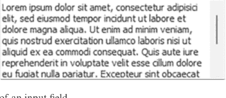

###### 按钮

按钮是屏幕上定义的可点击区域，用户通常通过它们触发操作，例如保存文档或发送消息（图 12.4）。按钮最重要的特征是其标签以及与点击按钮时执行的程序部分的关联。其视觉外观也常常由一个符号图像主导，该图像象征着按钮触发的操作。

###### 菜单

与按钮类似，菜单用于让用户触发操作。其重点在于从菜单项形式的各种选项中进行选择。这也解释了该控件元素的名称，用户使用它的方式类似于餐厅的菜单。除了菜单及其项目的名称外，重要的属性——再次类比于按钮——是用户可以通过点击项目触发的操作（图 12.5）。

###### 复选框和单选按钮

复选框和单选按钮是允许用户在多个选项之间进行选择的控件元素。与按钮和菜单不同，点击这些元素中的一个通常不会触发即时操作。相反，复选框和单选按钮通常用于指定设置，这些设置控制用户稍后在其他地方（例如通过点击按钮或菜单项）触发的操作的确切行为。例如，用户可以使用单选按钮选择是以只读方式打开文件还是不以只读方式打开。实际操作——打开文件——稍后通过点击“打开文件”按钮触发。点击此按钮具体执行什么操作（文件是以只读模式打开，还是以可修改的方式打开）由之前借助单选按钮进行的设置决定（图 12.6 和 12.7）。

复选框通常成组出现，单选按钮则总是成组出现。通常为方形的复选框和圆形的单选按钮之间的区别在于，对于单选按钮，*只能从*一组此类控件元素中选择*一个*选项，而对于复选框，则*可以点击多个*。

###### 切换按钮

与复选框类似，*切换*按钮允许你开启或关闭一个选项。然而，与复选框不同，没有复选标记来指示该选项当前是否被选中。相反，其外观模仿了滑动开关。切换按钮随着移动操作系统 iOS 和 Android 的成功而流行起来，但现在也已在其他平台上可用（图 12.8）。

###### 滑块

滑块是允许你沿刻度进行选择的控件元素，即在可以根据某个标准排序的选项之间进行选择。与单选按钮和复选框/切换按钮一样，用户更改当前选择通常不会触发即时操作。在大多数情况下，它们用于进行设置，该设置在用户稍后触发操作（例如点击按钮或菜单项）时生效（尽管有时用户的更改会产生直接影响，例如当滑块用于缩放图形时，图形会在滑块控件移动时自动更新）。其最重要的设置是刻度，即用户可以调整滑块控件的分级，特别是表达式的数量和名称（图 12.9 和 12.10）。

###### 列表视图/列表框

列表视图或列表框是“扁平的”、非层次化的项目列表，允许用户选择其中一个或多个项目。列表视图的一个使用示例是列出文件夹中包含的文件的文件管理器。在这种情况下，列表视图中显示的元素可以带有图标。有时，除了元素的名称外，列表视图的额外列中还会显示元素的其他属性，例如其大小或最后修改日期。除了显示类型（图标、用于补充元素属性的额外列）外，使用列表视图时可以指定的一个重要属性是用户应该一次只能选择单个元素，还是可以一次选择多个元素（图 12.11）。

###### 树视图

树视图类似于列表，因为它们允许多个元素显示。然而，与列表不同，它们具有树状结构，即显示元素之间的层次关系。使用树视图的一个经典示例是文件管理器中的文件夹视图，其中文件夹的层次结构通常显示为树结构。这是表示任何类型层次关系的一种非常好的方式，例如组织结构或产品层次结构，从广泛的产品类别到单个产品。与列表视图不同，树视图通常没有额外的列来显示层次排列元素的进一步属性（图 12.12）。

###### 选择器

选择器是允许你从几个预定义选项中进行选择的控件元素，通常不会立即触发任何操作。在这方面，它们类似于单选按钮，后者也允许从几个预定义替代方案中选择设置。然而，选择器出现的类型和形式非常不同。有时它们允许从一个预定义但庞大而复杂的可能性集合中进行选择。这种选择的一个很好的例子是日期选择器，它在移动和非移动平台上已变得司空见惯。图 12.13 和 12.14 展示了两个非常不同的日期选择器示例。

当然，选择器不一定必须基于像日期这样复杂的选择情况。选择器通常用于从一个易于管理的简单文本选项列表中进行选择。从这个意义上说，选择器也包括经典的组合框，如图 12.15 所示，它呈现一个向下展开的选择选项列表。

##### 12.2.1.2 开发图形用户界面

既然我们已经了解了一些流行的图形用户界面控件，自然会产生一个问题：究竟如何从技术上开发一个界面？控件的排列及其属性必须以某种方式定义。你构思出的、也许在纸上或借助图形或演示程序绘制出的最佳界面设计，如果无法将其转化为真正可用的程序界面、一个真正的 GUI，那将毫无用处。

这通常是在*集成开发环境 (IDE)* 的帮助下完成的，我们在 ▶ 第 8.1.3 节中已经了解过。这些环境通常允许你通过选择不同的控件并将它们放置在所需位置来“点击”组合图形用户界面，而无需编程。图 12.16 展示了 Delphi 的集成开发环境。在这里你可以看到如何创建一个图形用户界面。在右侧（“调色板”区域），可以选择不同的控件元素，然后可以使用拖放将其放置在程序窗口中。它们的大小也可以使用鼠标调整。在左侧的“对象检查器”中，你可以看到当前选定控件元素的属性，在本例中是选定的按钮。你在这里看到的选定属性是“标题”，即按钮的标签。其他属性例如是鼠标移过按钮时光标应呈现的形状（“光标”）、按钮标题的字体（“字体”）或控件的高度（“高度”）。显然，即使是一个简单的按钮，你也可以进行相当多的设置来详细定义其外观和行为。

## 12.2 · 图形界面还是非图形界面：这是个问题

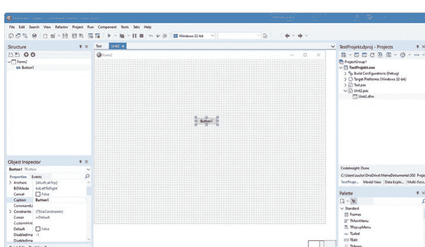

图 12.16 使用 Delphi 设计图形用户界面

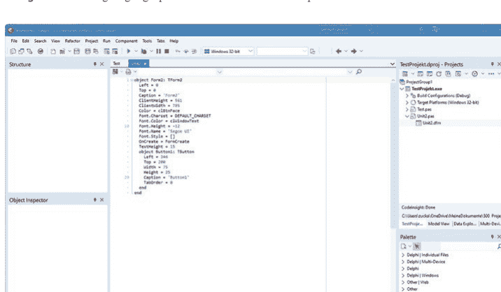

图 12.17 Delphi 内部存储的图形用户界面

在对象浏览器的“事件”选项卡上，你可以概览此控件可以触发的*事件*。除了点击，你还可以将鼠标悬停在按钮上。更多信息，请参阅 ▶ 第 14.7 节，我们将在那里更详细地探讨事件。

顺便说一句，Delphi 在内部（在那里称为“窗体”）将图形用户界面存储为代码文件。你可以在 ▶ 图 12.17 中看到这一点。你也可以通过在此文本文件中添加或删除元素，或更改其属性的特性来编辑界面。当然，更方便的是在所见即所得模式下通过拖放进行编辑，如图 12.16 所示。

一些编程语言被设计为直接在程序代码中定义图形用户界面，类似于 Delphi 在后台所做的方式。界面的各个元素通常是面向对象编程意义上的对象。它们通过程序语句创建、放置、根据其属性进行调整，并“连接”到程序的其余代码。你将在第 22.2 节中以 Python 为例学习更多关于此过程的内容。在第 32.4 节中，我们将看到在 JavaScript 的情况下，界面是如何用程序代码设计的，但使用的语言（即 HTML）与编写实际程序的语言不同。

#### 12.2.2 控制台应用程序

##### 控制台应用程序的工作原理

控制台应用程序没有图形用户界面，只有文本界面。它们要么在操作系统的控制台或终端（例如 Linux Bash、Mac Terminal 或 MS-DOS 提示符）中运行，要么在集成开发环境中运行。在前一种情况下，它们是操作系统可以直接执行的程序（即已经是机器码的程序），或者是解释型语言的程序，通过在操作系统的控制台中调用解释器来执行程序代码。在集成开发环境中执行时，程序是从开发环境（即图形用户界面）调用的，但它本身只有文本界面，因此实际上就像控制台应用程序一样运行。同样，编程语言解释器被调用并执行程序，只是它运行的控制台被硬编码到 IDE 中。在本书的第三部分，我们将使用 Python 开发控制台应用程序，并从图形 IDE 中调用它们。

控制台应用程序的特殊之处在于它们通常以严格线性的方式运行。虽然用户可以通过事件驱动的图形用户界面自行决定以何种顺序调用哪些功能，但在控制台应用程序中，他遵循的是永久构建在程序中的序列。这里有一个简单的例子（其中 > 表示用户输入的内容）：

```
Please enter the temperature in degrees Celsius:
> 23
Conversion to Kelvin or degrees Fahrenheit (K/F)?
> K
23 degrees Celsius in degrees Kelvin is: 296.15.
```

在图形用户界面中，你可能可以使用单选按钮来选择将输入转换为哪种温度系统。最重要的是，你可能可以在输入要转换的摄氏温度*之前*就做出这个选择。带有文本界面的控制台应用程序则不然：它规定了你必须输入什么以及何时输入。在这种情况下，程序不是事件驱动的，而是线性的。

以下是上述程序的第一部分在两种编程语言（Pascal 和 Python）中可能的样子的两个例子；首先是 Python：

```
temp_celsius = input('Please enter the temperature in degrees Celsius:')
target_scale = input('Conversion to Kelvin or degrees Fahrenheit (K/F) ?')
```

如你所见，从用户那里查询输入相当简单。由于在 Python 中你不必声明变量，每个输入最终只是一行代码。

现在是 Pascal 中的整个程序：

```
program temp
var
    temp_celsius : real;
    target_scale : char;
begin
    write("Please enter the temperature in degrees Celsius:");
    readln(temp_scale);
    write("Conversion to Kelvin or degrees Fahrenheit (K/F)?");
    readln(target_scale);
end.
```

在 Pascal 中，我们使用的变量必须声明，一个浮点数变量（**real**）和一个只接受单个字符的变量（**char**）。输入本身在这里使用 **readln()** 函数完成，它代表 *read line*，这意味着在输入后会自动换行，以便下一个输出从新行开始。如果没有 **ln**，光标在输入后会简单地停止。因此，下一个输出将正好从那个点开始。在输出中也有类似的区分，即 **write()** 和 **writeln()** 之间的区别。

##### 为什么还要使用控制台应用程序？

有一个重要的问题我们还没有回答：在当今有如此多令人着迷的图形界面选项可用的情况下，为什么还会有人开发控制台应用程序？最明显的原因是它更容易、更快。例如，如果你想尝试一些东西，比如一个新的函数库或某个特定的算法，花大量时间设计一个完美的图形界面是浪费时间。大多数时候，一个非常简单的控制台应用程序，只允许与用户进行基本的文本交互就足够了。将你的工作集中在本质上，而不是视觉吸引力和良好的可用性上，这对于你的实际目的来说是不必要的！

为了更好地理解为什么控制台应用程序尚未过时，值得看看专业的或至少是有抱负的软件开发者。他们非常欣赏在控制台中运行的命令行工具。这有几个原因：首先，使用命令行程序更符合人体工程学，因为你可以只用一个输入工具——键盘来执行所有任务，而不必费力地使用鼠标在图形开发环境中调用相应的按钮或菜单项。此外，命令行参数（在调用控制台程序时直接传递给它的特殊控制选项）允许轻松且非常精确地控制程序行为，这在图形界面上通过一系列点击来完成会无比繁琐。同样，控制台应用程序通常在系统资源消耗（尤其是内存和处理能力）方面要求较低，这意味着它们可能运行得更快。因此，许多开发工具以控制台应用程序的形式出现也就不足为奇了，例如著名的版本控制工具 *git* 或文本编辑器 *vi*。通常，这些工具在所有操作系统平台上都具有相同的参数和控制选项，使开发人员可以轻松地在不同平台之间切换。最后，尽管没有开发者会公开承认，但在控制台命令行上工作比像任何“普通”用户一样在图形用户界面上点击组合命令，也更酷、更极客一些。

许多专业开发者使用运行 *MacOS* 或 *Linux* 操作系统的计算机，而不是基于 Windows 的系统。当被问及原因时，许多人说这两个操作系统提供了更好的控制台，因此他们可以在这些系统上更舒适地工作。那么，微软（其战略重点明确是特别满足开发者的需求）在 2019 年夏天发布了一个现代控制台应用程序，旨在让 Windows 操作系统重新参与争夺开发者青睐的竞争，也就不足为奇了。

- 12.1 解释开发图形用户界面的两种方式。
- 12.2 解释控制台应用程序与图形用户界面应用程序在程序流程上的基本区别。
- 12.3 列出控制台应用程序相对于图形用户界面应用程序的两个优势。

### 12.3 处理文件

##### 最快的方式：直接读写文件

数据不仅可以由用户输入，也可以来自文件。处理文件基本上总是相同的，并且结构非常简单：

- 打开相关文件
- 读出其内容（或将内容写入其中）
- 关闭文件。

一些编程语言提供了函数，允许你直接编辑文件，而无需显式地担心打开和关闭文件。以下是三个例子。首先是一个来自 F#（“F Sharp”）的示例：

```
File.WriteAllText("test.txt", "A sample text written directly")
```

PHP 中的相同操作：

```
file_put_contents("test.txt", "A sample text written directly")
```

最后，在 R 语言中：

```
cat("A sample text, written directly ", file = "test.txt",
    append = TRUE)
```

在这三种情况下，文本 “A sample text, written directly” 都被写入一个名为 **test.txt** 的文件。文件无需显式打开或关闭；所使用的函数会自行处理这些操作，无需我们干预。

##### 文件处理模式

然而，所有这些语言也都提供了独立执行上述三个文件操作步骤的函数。例如，如果你想连续多次向同一文件写入数据或从中读取数据，每次打开和关闭文件将是低效的。在这种情况下，人们肯定不会使用刚才考虑的那些函数，而是会先打开文件，然后多次写入或读取，最后在所有工作完成后才关闭文件。

我们在上面 F#、PHP 和 R 示例中看到的写操作，如果名为 **test.txt** 的文件不存在，会创建一个新文件，然后将我们的示例文本写入该新文件。但如果文件已存在，其内容会被直接覆盖，没有任何提示或确认。只有在第三个示例，即统计语言 R 的示例中，使用了选项 **append=TRUE** 来控制不覆盖现有文件内容，而是将我们的文本追加到现有内容之后。

因此，写入也并非千篇一律。事实上，文件打开基本上有三种模式：

-   读取（通常是 **read** 或 **r**）
-   写入（通常是 **write** 或 **w**）
-   追加（通常是 **append** 或 **a**）

“写入”和“追加”模式在所需名称的文件尚不存在时，通常会创建一个新文件。然而，它们在处理现有文件内容的方式上有所不同。在“写入”模式下，现有内容通常会被完全替换。在许多编程语言中，混合模式也是可能的，例如 **ra**（读取 = r 和追加 = a）。

顺便提一下，由于历史原因以及文件系统一直以来的工作方式，并不存在“插入”模式。因此，你通常不能简单地打开一个文件，跳转到文件内的特定位置，然后就在那里插入额外的内容。相反，尽管很麻烦，你必须在程序中的一个变量里重建文件内容，也就是说，先将文件的现有前半部分读入一个变量（例如字符串变量），然后将要插入的内容追加到该变量，最后再读取文件的后半部分并将其也追加到新的内容变量中。之后，你可以以写入模式打开文件，并将变量的内容写入文件。这样你就完全覆盖了旧的文件内容，但实际上你只是插入了一些东西。

读取的情况则不同：在这里，你通常可以移动“文件指针”（它指示文件中下一个操作应发生的位置）到文件中的任何位置。另一方面，以写入模式打开文件时，文件指针会自动设置到文件的开头（并且无法移开，至少在不实际写入内容的情况下无法移开），而以追加模式打开时，则设置到文件的末尾。

除了要在文件上执行的编辑操作类型外，打开文件的模式在另一个特征上也有所不同，即被编辑的文件是*文本*文件还是*二进制*文件。两者之间的区别在数字上最为明显。数字 32,000 在二进制中是 0111110100000000，即一个 16 位的零和一序列。两个字节（每个 8 位）就足以存储这个值。然而，在文本文件中，数字 32,000 会被视为文本。因此，如果存储它，存储的是单个字符 “3”、“2”、“0”、“0” 和另一个 “0”。生成的文件大小将是 5 字节。文本文件和二进制文件在换行符的编码和文件结束的信号方面也存在差异，文本文件有一个特殊字符，即 *EOF* 字符（文件结束符）。文本文件通常是这样的：当你打开它们时，你会看到字母和数字。例如，你编写的程序代码就存储在文本文件中。另一方面，如果你用文本编辑器打开一个 PDF 文件或可执行程序文件，你看到的将只是一堆看似随机的奇怪特殊字符模式；这些是二进制文件，你的文本编辑器正试图将其表示为文本。为了处理这两种不同的基本文件类型，许多编程语言为文本文件和二进制文件的写入、追加和读取提供了单独的模式。

现在让我们更仔细地看看打开、编辑和关闭文件。通常，这些操作在我们的伪代码中可以这样表示：

```
my_file = open("test.txt", "w")
write(my_file, "First sample text written to the file.")
write(my_file, "Another sample text.")
close(my_file)
```

在大多数语言中，当文件被打开时，会返回一个特殊类型的变量。在我们的伪代码中，我们从用于以写入模式（**w**）打开文件 **test.txt** 的 **open()** 函数中得到一个变量 **my_file**。从现在开始，我们使用这个变量，以便我们用于编辑文件的函数知道我们的指令指的是哪个文件；毕竟，我们可能同时打开了多个不同的文件。

在面向对象的编程语言中，文件变量通常是一个对象，该对象具有可用于操作文件的特殊方法（如果对象和方法的主题看起来不熟悉，请翻回几页到上一章）。那么写入和关闭文件可能看起来像这样：

```
my_file = open("test.txt", "w")
my_file.write("Another sample text.")
my_file.close()
```

##### 不同编程语言中的示例

让我们在一些实际存在的编程语言中看看这个。
这是一个 C 语言的示例：

```
#include <stdio.h>

int main() {
    FILE *my_file;
    my_file = fopen("test.txt", "w");
    fprintf(my_file, "First sample text written to file.");
    fprintf(my_file, "Another sample text.");
    fclose(my_file);
}
```

这段代码看起来比实际要复杂得多。为了使其工作，第一条语句必须包含一个名为 **stdio.h** 的特殊标准程序库，它提供了输入和输出函数。C 语言中的主程序本身就是一个函数 **main()**，它在程序执行时被自动调用。之后应该发生什么就在这个函数内部，这也是我们在这里真正感兴趣的。在 C 语言中，变量在第一次使用之前必须先声明。这里，声明了一个 **FILE** 类型的变量，并使用星号创建一个指向该变量的*指针*，但我们在此不深入探讨其含义。然后，刚创建的变量接收函数 **fopen()**（代表 *file open*）的返回值，我们用它以写入模式（**w**）打开文件 **test.txt**。如果该文件尚不存在，它将被创建。之后，我们使用函数 **fprintf()**（代表 *file print formatted*）写入刚刚打开的文件，我们通过变量 **my_file** 来引用它。最后，我们用 **fclose()** 关闭文件。

同样的过程在 Pascal 中看起来是这样的：

```
program FileWrite;
var
    my_file: TextFile;
begin
    AssignFile(my_file, 'test.txt');
    rewrite(my_file);
    write(my_file, 'First sample text to be written to the file.');
    write(my_file, 'Another sample text.');
    CloseFile(my_file);
end.
```

这里我们首先声明一个变量 **my_file**。然后，使用一个名为 **AssignFile()** 的特殊函数将该变量分配给我们文件 **test.txt** 的引用。到此为止，文件将以何种模式打开尚不清楚。直到调用 **rewrite()** 函数时才确定，该函数以写入模式打开文件。写入完成后，文件在程序末尾用 **CloseFile()** 关闭。

因此，Pascal 与 C 的不同之处在于，这里在以写入模式打开文件时使用了特殊函数 **rewrite()**，而在 C 中使用的是通用函数 **fopen()**，其中通过一个函数参数（即我们调用函数时传递给它的设置）来确定文件应以何种模式打开。

类似地，Pascal 中有一个用于以读取模式打开文件的特殊函数：**reset()**。如果要从文件 **test.txt** 中读取第一行，相应的 Pascal 代码将如下所示：

```
program FileWrite;
var
    my_file: TextFile;
    first_line: string;
begin
    AssignFile(my_file, 'test.txt');
    reset(my_file);
    readln(my_file, first_line);
    CloseFile(my_file);
end.
```

使用函数 **readln()**（*read line*），它从以读取模式打开的文件（函数的第一个参数）中读取一行，并将其存储在变量 **first_line**（第二个参数）中。之后，即使没有我们的干预，文件指针也会自动前进到下一行。如果我们再次读取一行，这次读取的将是第二行。

##### 超越本地文件读写的文件操作

读取的文件不一定必须位于你的本地系统上。只要文件没有受到任何冲突的访问保护，通常可以指定一个互联网地址（或 *URL*，*统一资源定位符*）

### 12.4 数据库操作

在专业软件开发实践中，数据库操作扮演着重要角色。我们今天所熟知的大多数网络服务，本质上都是数据库（“后端”）与网络用户界面（“前端”）的结合，允许用户与存储在数据库中的数据进行交互。无论是网店还是社交网络，情况都是如此。在专业环境中，数据的输入和输出通常涉及从数据库读取和写入数据，这已成为常规操作而非例外。在非专业软件开发领域，数据库操作的重要性则相对较低。因此，鉴于该主题的复杂性，本节仅介绍一些基础知识，为您提供一个概览，而将细节留给更高级的编程课程。

大多数数据库是相互关联的数据表的集合。它们被称为*关系型*数据库，因为这些表最终描述了特定对象及其属性之间的关系（关联）。作为一个简化的示例，请查看表12.1、12.2和12.3。表12.1包含客户数据。行中的各个客户（在数据库上下文中，我们称之为*数据记录*）可以通过列（在数据库术语中：*字段*）**CUSTOMERID** 唯一标识。表12.2展示了产品信息。这些产品同样具有一些描述性字段以及一个唯一ID，即字段 **PRODUCTID**。表12.3代表了客户下的订单。在此表中，一个订单通过其自身的ID（**ORDERID**）、客户、客户订购的产品以及订单日期来标识。您可以看到，客户和产品是通过它们的ID来表示的，因此分别是对 **CUSTOMER** 表和 **PRODUCT** 表的*引用*。每一行代表一个客户与所订购产品的组合。例如，您可以从采购订单 **B0002** 中看到，客户 **C00003**（Mason Thomas）订购了*两件*产品（即 **P001**——花园铲，和 **P002**——阳台桌）。相应地，在 **ORDER** 关联表中，该订单由*两条*记录描述。

**表 12.1** 表 CUSTOMER 的示例数据

| Customerid | Name | First name | Email | Street | City | Zipcode |
| :--- | :--- | :--- | :--- | :--- | :--- | :--- |
| C00001 | Collins | Ethan | ecollins@my-emails.com | 123 Oak Street, Apt 4B | New York, NY | 10001 |
| C00002 | Rodriguez | Olivia | me@oliviarodriguez.com | 456 Pine Avenue, Suite 9C, | Chicago, IL | 90001 |
| C00003 | Thomas | Mason | mason.thomas@thomas-winery.com | 789 Maple Drive | Los Angeles, CA | 60601 |
| C00004 | Wilson | Anna | anna@thewilson-family.com | 321 Elm Street, Apartment 7D | Houston, TX | 77002 |

**表 12.2** 表 PRODUCT 的示例数据

| Product ID | Description | Price |
| :--- | :--- | :--- |
| P001 | Garden shovel, stainless steel | 10.99 |
| P002 | Balcony table, plastic, green | 24.99 |

**表 12.3** 表 ORDER 的示例数据

| Order ID | Customer ID | Product ID | Date |
| :--- | :--- | :--- | :--- |
| B0001 | C00001 | P001 | 2019-06-01 0:08 AM |
| B0002 | C00003 | P001 | 2018-12-05 7:49 AM |
| B0002 | C00003 | P002 | 2018-12-05 7:49 AM |
| B0003 | C00002 | P001 | 2019-05-16 9:58 PM |

当然，我们本可以在 **ORDER** 表中重复所有客户和产品数据；然而，这不仅会使表变得不必要地庞大，还会使数据维护变得更加困难，因为对客户主数据（例如其地址）的更改将需要在数据库中的两个位置——**CUSTOMER** 表和 **ORDER** 表——进行修改。这将增加数据不一致的风险。通过此处使用的引用技术，这些问题得以避免。

这种仅定义一次核心对象，并通过引用其ID或键来映射它们之间关系的过程，被称为*规范化*。数据库系统确保这些引用始终有效，因此，在 **ORDER** 表中被引用的客户不能从 **CUSTOMER** 表中删除，因为这会使其现有的订单数据不一致。

顺便提一下，我们这里的示例表尚未完全规范化。订单日期实际上应附加在订单本身上，而不是附加在属于一个订单并存储在 **ORDER** 表中的各个客户与产品的组合上。完全规范化可以通过从 **ORDER** 表中移除产品（仅在 **ORDER** 中保留订单ID、客户和日期），并通过其键在单独的表中存储订单与所订购产品之间的关联来实现。

以这种方式存储在数据库中的数据可以被查询。为此使用一种特殊的编程语言——*SQL*，即*结构化查询语言*。可以使用这种语言编写查询，并由数据库系统处理，然后返回查询到的数据作为结果。最重要的SQL语句是 **SELECT**。**SELECT** 的语法基本上相当简单（尽管它可以在许多地方扩展以创建更复杂的查询）：**SELECT *fields* FROM *table* WHERE *condition*.**

语句

```sql
SELECT FIRSTNAME, NAME FROM CUSTOMER WHERE CITY = 'New York, NY'
```

从表 **CUSTOMER** 中查询所有字段 **CITY** 的值为“**New York, NY**”的数据记录。然而，并非要显示所有字段，而仅显示字段 **FIRSTNAME** 和 **NAME**。因此，该语句的结果是一个仅包含相关数据记录的这两个字段的表，如示例中的表12.4所示。在我们的 **SELECT** 语句中，结果表仅包含一条记录，即Ethan Collins的记录。

然而，SQL不仅可以用于从数据库查询数据，还可以用于向数据库写入数据。为此，使用语句 **INSERT** 和 **UPDATE**，它们将*新*记录插入表中（**INSERT**）或更新*现有*记录（**UPDATE**），即更改一条记录（或同时多条记录）的一个或多个字段的值。

**表 12.4** 我们使用 SELECT 的 SQL 示例查询结果

| First name | Name |
| :--- | :--- |
| Ethan | Collins |

从大多数编程语言中，都可以访问数据库（通常借助扩展库，将在下一章介绍），向其发送SQL语句，并接收和处理返回的结果。

### 12.5 学习新编程语言的路线图

如果您正在学习一门新的编程语言……
您将会发现：

- 您可以为程序配备哪些类型的用户界面（GUI、控制台），
- 如果支持控制台应用程序，有哪些功能可用于数据输出以及用户数据输入，
- 如果支持图形界面，它们是如何设计的（在IDE中进行图形化所见即所得开发，在代码中描述界面），以及您有哪些控件可用于设计图形用户界面，它们提供了哪些基本属性/配置选项，
- 如何打开（和关闭）文件以读取、写入或追加数据，特别是打开时有哪些不同的编辑模式可用，以及如何区分打开文本文件和二进制文件，
- 有哪些功能可用于向打开的文件写入数据或从中读取数据，
- 如果您计划使用数据库，如何连接数据库，以及如何向数据库发送SQL语句并处理返回的结果。

### 12.6 练习解答

#### 练习 12.1
图形用户界面可以通过集成开发环境（IDE）在WYSIWYG（所见即所得）模式下设计，其中各个控件元素通过鼠标选择并放置在程序界面上。通常，控件的属性可以方便地进行配置。这样就创建了用户界面，而无需对其进行“编程”。但许多编程语言也允许将用户界面作为程序代码的一部分来创建。然后，各个控件大多是可以从程序内部创建的对象——就像其他对象一样——并放置在界面上。可以通过表示这些控件的对象的属性来访问它们的属性。

#### 任务 12.2
控制台应用程序通常以完全线性的方式运行，用户被引导通过程序，程序决定了

## 13.1 函数

### 什么是函数？
正如在数学中一样（别担心，我们不会过度使用这个类比！），函数是将值（称为*参数*）映射到另一个值（即其*函数值*或*返回值*）的映射规则。例如，函数 $f(x) = x^2$ 将值 $x$ 映射为其平方；因此，将值 $x$ 作为参数传递给函数，并从函数接收处理后的值（在此例中是参数的平方）作为返回值。

编程语言中的函数遵循相同的基本原理，但不同之处在于，并非所有函数都会产生返回值。我们已经在伪代码 ▶ 第 11.7.5 节中使用过一个名为 **show-Product()** 的函数，它在屏幕上执行输出。这个函数不产生返回值。它只是执行一个特定的动作，即在屏幕上显示，但除此之外不会进一步处理作为参数传递给它的数据。一些编程语言严格区分有返回值的函数和没有返回值的*过程*。然而，我们在这里不做这种区分，而是始终称之为“函数”。在某些编程语言中，函数总是返回一个值；如果没有“真正的”返回值，它们会返回一个特殊值来表示没有“真正的”结果（例如，JavaScript 中的 **undefined** 或 C/C++ 中的 **void**）。

### 函数的定义
函数通常由*函数头*和*函数体*组成。函数头通常包含函数标识符（名称）和函数期望的参数列表。函数体是一段代码块，每当函数被调用时就会执行。它包含了函数的“核心”；其中的源代码描述了函数的功能。

考虑一个将两个数字相乘的简单函数的伪代码示例：

```
Function multiply(number1, number2)
Begin
    result = number1 * number2
    return(result)
End
```

为了让编程语言知道函数定义的开始，它以关键字 **Function** 开头。后面是函数标识符和函数的两个参数 **number1** 和 **number2**。函数体由两条语句组成，一条计算函数的实际结果，另一条调用另一个函数 **return()** 来返回函数结果。这两条指令构成一个*代码块*，它以关键字 **Begin** 开始，以关键字 **End** 结束。代码块在几乎所有编程语言中都存在。它们通常像我们的伪代码一样，由特殊关键字（英文关键字 **Begin** 和 **End** 尤其常见）或符号（如左花括号 { 和右花括号 }）分隔。一些语言，如 Python，完全不使用任何特殊关键字或符号来标记代码块，仅通过将块中所有代码行均匀缩进来表示。

但回到我们的函数定义。其程序代码本身并不做任何事情。函数只有在从程序内部调用时才会出现。在我们的例子中，这可能看起来像这样：

```
show(multiply(3, 57.8))
```

通过这个调用，我们将数字 3 和 57.8 相乘并立即输出结果。这里发生的情况是，程序的执行分支到 **multiply** 函数的定义。函数定义体中包含的代码被执行，函数参数 **number1** 和 **number2** 取传递过来的因子的值——在此例中是 3 和 57.8。乘法结果通过 **return()** 返回，这导致程序执行离开函数体并返回到主程序。通过执行函数，函数的返回值现在取代了函数调用的位置。这个返回值现在可以再次作为参数传递给另一个函数，在我们的例子中是 **show()**。经过我们的 **multiply()** 函数处理后，程序代码实际上缩短为：

```
show(173.4)
```

因为函数调用在执行后被返回值所取代，所以函数调用也可以赋值给变量：

```
value = multiply(3, 57.8)
```

许多编程语言要求函数在第一次调用*之前*已经定义，因此函数定义必须在程序代码中“高于”第一次调用的位置。

注意：函数也可以在没有参数的情况下定义。例如，一个简单地清除屏幕上显示的函数不需要传递任何额外信息。在大多数编程语言中，即使这样的函数也必须用通常包含参数值的圆括号来调用。在这种情况下，括号是空的，但语言的解释器/编译器仍然能识别出这是一个函数调用，而不是访问同名变量。

程序中函数调用的顺序如图 13.1 所示。

##### 可选参数
有时你希望给用户通过参数控制函数行为的可能性，但用默认值预设它。如果函数的调用者没有为相关参数指定值，则使用默认值。

假设我们想设计上面的 **multiply()** 函数，使得除非提供参数值，否则 **number1** 总是乘以圆周率（3.14159…）。

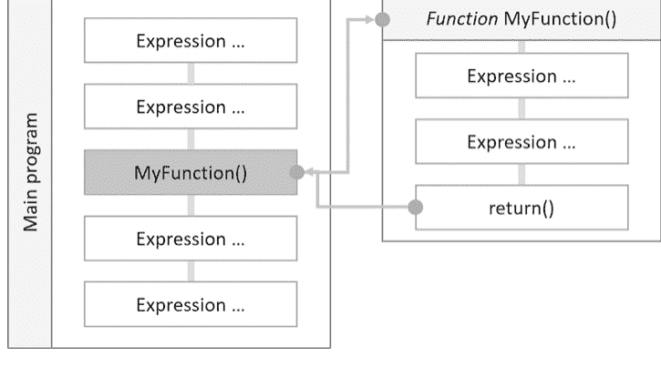

---

在具有图形界面的应用程序中，用户通常可以更自由地控制执行步骤的顺序。例如，用户可以按任意顺序点击按钮。从这个意义上说，程序并不决定用户行为；相反，它响应用户触发的*事件*。例如，如果用户点击一个按钮，就会触发相应的事件，并执行为该事件编写的程序代码。虽然这种事件导向的程序控制原则上可以在控制台应用程序中复制，但在那里远不如在图形用户界面应用程序中常见。

- **练习 12.3**
控制台应用程序通常快速且易于使用（如果你熟悉它的话）。当从控制台调用时，程序的行为通常可以通过命令行参数来控制。其易用性还体现在所有控制操作都可以通过键盘完成，而图形用户界面通常需要指向设备（通常是鼠标），因此需要在输入设备之间切换手。控制台应用程序在开发方面也有优势，因为它们通常比图形用户界面应用程序所需的工作量更少。此外，开发控制台应用程序通常比开发图形用户界面所需编程语言知识水平更低。

- **练习 12.4**
在大多数编程语言中，打开文件的模式首先根据每种情况下允许的编辑操作而有所不同。文件可以常规地以读取（**read/r**）、写入（**write/w**）或追加（**append/a**）模式打开。以写入模式打开时，现有文件会被完全覆盖。如果要向现有文件追加数据，则必须以追加模式打开。第二个区别是文件是以文本文件还是二进制文件打开，这主要影响写入其中的数据的编码方式。

---

## 如何使用程序函数来编辑数据和触发操作？

目录

- 13.1 函数 – 138
- 13.2 库 – 145
- 13.3 框架 – 148
- 13.4 应用程序编程接口 (API) – 149
- 13.5 学习新编程语言的路线图 – 150
- 13.6 练习解答 – 151

---

概述
在大多数编程语言中，小型子程序，即所谓的函数，承担着实际的工作。它们帮助读取数据、修改数据、再次输出数据等等。你可以访问你的编程语言作为标准提供的函数，从互联网安装带有函数的额外库，或者编写自己的函数。这就是本章的内容。

在本章中，你将学习以下内容：

- 什么是函数
- 如何在程序代码中定义函数
- 如何调用函数并指定其行为
- 在使用函数时，变量作用域扮演什么角色
- 如何在面向对象编程中使用函数，以及在许多语言中函数本身作为对象的优势
- 函数如何在库中分组，以及如何找到合适的、免费可用的库
- 什么是框架，以及它们与库有何不同
- 什么是应用程序编程接口 (API)，以及如何使用它们。

### 通过标识符传递函数参数

在许多编程语言中，调用函数时的参数也可以通过其标识符来指定。这看起来可能像这样：

```
value = multiply(number1 = 3, number2 = 57.8)
```

这些*关键字参数*的优点在于，它使得（尤其是在调用具有多个参数的函数时）哪个值属于哪个参数变得更加清晰；因此，无需记住参数的顺序。因为现在参数的标识符是可用的，解释器/编译器不再依赖于参数的顺序。在后一种情况下，我们称之为*位置参数*，以区别于关键字参数。相应地，你也可以偏离参数的实际顺序；因此，以下也是一个有效的函数调用：

```
value = multiply(number2 = 57.8, number1 = 3)
```

另一个优点是，通过在调用函数时使用参数标识符，程序代码变得更容易理解，从而更容易维护。

### 变量的作用域

在大多数编程语言中，函数可以说拥有“自己的生命”。它们是一个独立的、分隔开的世界。回想一下我们**multiply()**函数的定义。在这个函数内部，创建了一个名为**result**的变量来保存两个数字的计算乘积。这个变量*仅存在于*函数内部。在函数调用结束时，即函数完全运行完毕后，变量**result**也就不复存在了。无法从主程序中访问它。因此，也可以说它的*作用域*仅限于函数体。

假设我们的主程序如下所示：

```
value = multiply(3, 57.8)
show(result)
```

语句**show(result)**将导致错误消息（或者，根据语言不同，返回一个默认值如0），因为在主程序的作用域中没有名为**result**的变量。这个变量在**multiply()**函数的作用域内。因为它的作用域有限，**result**被称为*局部变量*。另一方面，变量**value**是在主程序中创建的，并且在任何地方都有效。与局部变量相对，这样的变量被称为*全局变量*。它们可以从任何地方访问，甚至可以从我们的**multiply()**函数内部访问。然而，最佳实践是避免从函数内部访问全局变量（这也称为*副作用*），因为它使函数更容易受到程序其余部分更改的影响，特别是全局变量标识符更改的影响。

但是，如果**multiply()**函数本身使用一个名为**value**的变量呢？例如，如果函数的核心指令是**value = number1 * number2**？那么我们将有两个名为**value**的变量，一个局部变量（在**multiply()**函数内部）和主程序中的全局变量。现在，当在程序代码的某处使用标识符**value**时，访问的是哪一个呢？通常，编程语言首先在局部环境中查找具有此标识符的变量，只有在那里找不到时，才在全局环境中查找。因此，如果变量**value**在函数**multiply()**内部使用，那么将使用局部变量，即在当前作用域中定义的那个。另一方面，从主程序访问**value**将导致访问全局变量。

函数参数的行为通常类似于局部变量，它们也只能从函数代码内部访问。

### 按引用传递参数而非按值传递

考虑以下我们**multiply()**函数的略微修改版本：

```
Function multiply(number1, number2, AsReference result)
Begin
    result = number1 * number2
End
```

这一次，我们的函数没有返回值；相反，计算结果被赋值给一个也作为参数传递的变量，但与**number1**和**number2**不同，它带有关键字**AsReference**。通常，函数的参数是作为原始值的副本传递的。考虑以下调用我们函数的示例：

```
number1 = 3
value = 0
multiply(number1, 57.8, value)
show(value)
```

这里函数的第一个参数本身就是一个变量。它的值在**multiply()**函数内部作为参数**number1**可用，但只是原始变量的副本。如果我们现在在函数体内调整**number1**的值，这将不会影响主程序中的变量**number1**。只有**multiply()**函数体内的局部变量**number1**的值会发生变化。

对于变量*value*，情况则不同。它不是作为值传递给函数，而是作为所谓的*引用*传递。这意味着在函数内部对该变量所做的更改会影响原始变量；在示例中，我们使用这个变量来“返回”计算结果。一些编程语言允许变量*按值*或*按引用*传递，而有些只允许按值传递。

### 函数定义示例

到目前为止，我们只在伪代码中编写了函数定义。因此，这里提供原始**multiply()**函数在两种真实编程语言中的实现，即PHP和Pascal。

首先是PHP版本：

```
function multiply($number1, $number2)
{
    $result = $number1 * $number2;
    return $result;
}
```

语句**return**，与某些语言一样，不是一个函数而是一个关键字（因此“参数”周围没有圆括号）。

然后是Pascal中的相同代码：

```
function multiply(number1, number2: real): real;
var
    result: real;
begin
    result = number1 * number2;
    multiply = result;
end;
```

Pascal是一种强类型编程语言。变量总是用固定类型声明。因此，函数的两个参数**number1**和**number2**，以及函数本身（在函数头的末尾）都有一个类型说明：在所有情况下，它们都是浮点数（**real**）。这不仅清楚地说明了函数期望什么类型的参数，也说明了其返回值的类型。

在Pascal中，返回语句不像许多其他编程语言那样使用关键字**return**或函数**return()**，而是通过将函数值赋给函数的标识符来实现（在Pascal中，赋值使用=作为赋值运算符）。

### 面向对象编程中的函数

在 ▸ 第11.7.4节 中，我们看到在面向对象编程的上下文中，函数也可以是类的一部分。正如你所记得的，这样的函数也被称为*方法*。这些方法总是与类的具体对象实例（即根据类的“模板”创建的对象）一起调用。大多数编程语言在调用时使用句点（但有些使用其他符号，如->）来分隔对象和方法。因此，方法的调用可能看起来像这样：

```
object.method(arguments)
```

根据编程语言的不同，方法定义可能是类定义的一部分，也可能在类定义之外。然而，在任何情况下，类定义中都有对方法的引用（通常是方法头），正如我们在 ▸ 第11.7.4节 中看到的（如果需要，请回翻几页）。

除了函数作为方法可以是对象（或其类）的一部分之外，函数和对象通常还有另一种关系。在许多编程语言中，函数*就是*对象。那里存在一个特殊的类（通常是**function**），所有函数都是这个类的对象（即实例）。作为对象，它们也可能具有属性，例如它们的参数或它们的函数体，即实际的代码。当函数本身是对象时，这具有一些显著的影响。例如，函数本身可以作为其他函数的参数。此外，类定义在逻辑上非常严格，严格来说，它们完全由属性组成。唯一的区别是，一些属性，即方法，是*可调用的*，而其他属性（值属性意义上的“普通”属性）则不是。

## 13.1 [3 min]

以下函数定义（用伪代码编写）有什么问题：

```
a.
Function exponential(base)
Start
    return(base^exponent)
End

b.
Function exponential(base, exponent)
Begin
    result = base^exponent
End
```

## 13.2 [3 分钟]

假设我们定义了如下函数：

```
Function introduce(name, age)
Begin
    show("My name is ", name, " , I am ", age, " years old.")
End
```

以下对该函数的调用有何不同？为什么第一次和第三次调用能实现函数的预期行为，而第二次却不能？

```
introduce("Mary", 25)
introduce(25, "Mary")
introduce(age = 25, name = "Mary")
```

## 13.3 [5 分钟]

考虑以下程序片段：

```
age_person = 25

Function getolder(age_person)
Begin
    age_person = age_person + 1
    show("New age of the person: ", age_person)
    return(age_person)
End

age_new = getolder(age_person)
show("Current age: ", age_person)
show("Result of the function getolder(): ", age_new)
```

- (a) 该程序会产生什么输出？为什么？
- (b) 有哪两种方法可以修改程序，使得增加一岁后的新年龄也能反映在全局变量 `age_person` 中？

## 13.2 库

### 库：程序员的工具箱

作为一名程序员，你可以（如前一节所示）自己开发函数。如果你想重用程序代码，这总是有意义的，因为函数的优点在于，它们允许你将特定功能从实际程序中分离出来，并在任何时间、任何地点调用它。

当然，编程语言通常都附带一套广泛的标准函数，你可以用它们来执行许多常见任务。然而，这些标准函数通常不足以满足你的需求。例如，用于发送电子邮件、搜索网页（网络爬虫）或训练神经网络的函数通常不包含在标准语言范围内。在这些以及其他用例中，如果你不想自己开发相关功能，你就必须通过从其他地方安装所需的函数来扩展语言范围。

### 寻找合适的库

一些编程语言，如 Python、R 和 JavaScript，拥有一个非常广泛且活跃的“生态系统”，其中大量开发者将他们开发的功能免费提供给他人使用。这通常以一组专注于特定主题的函数集合的形式进行。根据编程语言的不同，这类集合通常被称为 *库*、*模块*、*包* 或 *发行版*。为简单起见，我们在此始终称之为“库”。在某些情况下，这些库会被汇集在一个由负责监督该编程语言开发的组织集中管理的平台上。

例如，以下语言就是这种情况：

- Python 的 *Python Package Index* (PyPI, ▶ https://pypi.org/)，
- Perl 的 *Comprehensive Perl Archive Network* (CPAN, ▶ https://www.cpan.org/)，
- PHP 的 *PHP Extension Community Library* (PECL, ▶ https://pecl.php.net/)，
- R 的 *Comprehensive R Archive Network* (CRAN, ▶ https://cran.r-project.org)。

根据设计，被纳入这些中央目录之一通常还伴随着（主要是自动化的）质量控制，这确保了例如库的程序代码是可执行的，并且至少有最低限度的文档。

然而，对于许多编程语言来说，这样一个集中组织的库平台并不存在。开发者通常会将他们的作品存放在 *GitHub* 上。*GitHub* 是一个跨语言的平台，允许开发者通过将源代码存储在 *仓库* 中来与他人共享。*GitHub* 底层是版本管理工具 *Git*，由 Linux 发明者 *Linus Torvalds* 开发，它允许以优雅的方式对源代码的更改进行版本控制。如有需要，可以轻松恢复到单个代码文件甚至整个仓库的旧状态。开发者还可以使用 *GitHub* 创建自己的源代码 *分支*，在其中开发功能，最终再将它们 *合并* 回原始版本——至少如果原始版本的开发者允许的话。凭借这些以及一系列其他功能，*GitHub* 在底层版本管理工具 *Git* 的基础上促进了不同开发者之间的协作。*GitHub* 完全与语言无关；对于当今使用的大多数编程语言，你都能找到包含该语言代码的仓库。对于以开源许可证提供其源代码的开发者，在撰写本书时，使用 *GitHub* 是免费的。希望将代码与外界隔离的公司和组织则需要为私有环境付费。虽然除了 *GitHub* 之外还存在一些类似的平台，但 *GitHub* 是最受欢迎的。

当然，*GitHub* 并非仅由那些在没有中央库平台的语言中工作的开发者使用。许多开发者运行 GitHub 仓库并非为了库，而仅仅是为了他们日常的各种开发项目工作，并与其他开发者交流信息。如果他们确实开发了库，他们只会在 *PyPI* 或 *CRAN* 等中央库平台上提供完成的版本。有时开发者也不想遵守中央库平台严格的规则和自动化质量检查，因此只在 *GitHub* 上提供他们的库。

因此，毫不奇怪，中央库平台和 *GitHub* 都是寻找库以帮助你解决特定问题的良好起点。话虽如此，这种搜索有时并不完全容易，原因有几个。平台的搜索功能各不相同，每个库可用的信息也各不相同。因此，有时找到一个库并不容易，而一旦找到，要判断它是否适合解决你自己的问题也并非易事。这种评估因经常会有不止一个可能的库而变得更加复杂。即使在中央管理的库平台上，对于许多任务也存在多个在某种程度上相互竞争的库。这时推荐两种方法。一种是 *试错法*；下载并使用这些“候选者”，以确定哪个最适合你的问题。或者，在互联网上搜索，你可以在相关论坛（如 *Stack Overflow*）中定期找到关于许多库的信息。如果你想通过示例了解如何使用库，这尤其有用。库的文档在范围和质量上各不相同，因此像 *Stack Overflow* 这样的论坛也可以为使用已找到的合适库提供很好的帮助。

除此之外，像 *Stack Overflow* 这样的论坛通常是首先识别解决你问题的库候选者的良好起点——如果你不能或不想直接通过中央库平台或 *GitHub* 搜索。这是因为论坛中的问题通常围绕“如何解决……的问题”或“如何使……”这样的结构，而答案通常会引用一个或多个可以帮助解决此类问题的库。许多开发者更喜欢这种论坛搜索，而不是直接在中央库平台或 *GitHub* 上搜索，因为带有用户示例和评论的论坛通常能提供有价值的额外信息。

不用说，你也可以使用像 ChatGPT 这样的 AI 助手来搜索合适的库。例如，可以这样问：“我想编写一个从网站读取数据（网络爬虫）的 Python 程序。有哪些可用的库？它们有何不同？哪些特别适合初学者？”

### 安装和导入/加载库

一旦你找到了合适的库，你所要做的就是安装它（如果编程语言提供或要求这样做）并将其包含在程序代码中。包含是通过一条语句完成的，该语句要么将整个库导入程序代码，要么导入其中的单个元素（如单个函数或类）。在某些情况下，可以指定一个名称，通过该名称可以访问导入的元素，这有助于避免与已存在的变量、类、对象或函数的标识符冲突。

一个来自 Python 的（假设）示例：

```
from somelibrary import aclass as my_class
import somelibrary
```

第一条语句仅将类 **aclass** 导入程序代码，然后使其可通过标识符 **my_class** 访问。第二条替代语句导入整个库（在这种情况下没有为其分配不同的标识符）。

在 Pascal 中更简单

```
uses somelibrary;
```

或 R

```
library(somelibrary)
```

在每种情况下都使整个库可用。

## 13.3 框架

关于 *框架* 的讨论很多，尤其是在网络开发领域。“框架”和“库”这两个术语有时使用得并不十分清晰。尽管框架的功能和用途超出了本书将要探讨的范围，但至少应该更详细地审视这两个概念之间的区别。库包含用户（即程序员）在需要执行特定任务时可以访问的功能。因此，是程序员主动发起调用。然而，框架则不同。框架控制整个应用程序的流程，并在必要时调用程序员的代码。因此，框架构成了一个程序员“只需”填充的框架，正如该术语所暗示的那样。这在 Web 开发领域尤其方便，因为有许多重复性任务，例如用户登录身份验证、数据库连接或在模板式页面中输出数据。所有这些任务都可以由框架。它们已经作为功能内置于开发者所使用的框架中。程序员只需开发特定于其应用程序的部分。通过框架与开发者之间的这种分工，应用程序的控制权实际上发生了反转（这就是为什么在讨论框架时，有些人也称之为*控制反转*）：框架控制应用程序，开发者提供特定于应用程序的程序代码，然后框架在适当的位置调用这些代码。这使得开发者能够专注于重要问题，而将所有相当枯燥的“外围工作”留给框架。

知名的框架包括*AngularJS*和*React*（用于JavaScript）、*django*（用于Python）、*CakePHP*和*Zen*（用于PHP），以及*Ruby on Rails*（用于Ruby）。

由于本书的重点是学习编程基础，我们在此不会使用框架。然而，使用框架的前提当然是了解底层语言，而这正是本书所探讨的内容。

## 13.4 应用程序编程接口（API）

另一个人们常挂在嘴边的术语是*应用程序编程接口*，简称API。首先，顾名思义，API不过是*编程接口*。从这个意义上说，一个提供特定功能函数集的库，也提供了一个由库函数组成的编程接口，你可以从程序内部访问这些函数。

如今人们谈论API时，通常指的是特定的编程接口，例如*Web API*，通过它们可以访问网络服务的功能和数据。如今许多网络服务为开发者提供了编程接口。例如，Google提供的*GoogleMaps API*，如果你将城市名称传递给该API，它会返回该城市的地理坐标。这里，API被用来检索网络服务提供的信息。然而，同样地，API也可以用来让网络服务触发特定操作。例如，Twitter的API允许你发布推文。你只需要一个允许使用API的账户，以及程序中一个调用API并发送推文的相应指令。

因此，API可用于查询数据和触发功能。通过互联网可以访问的、提供API的网络服务简直数以千计。网站*ProgrammableWeb*（▶ https://www.programmableweb.com/apis/directory）提供了一个API提供商的概览，虽然肯定不完整，但至少非常全面。无论你是想通过PayPal在程序中处理付款，还是想查询最新的足球比赛结果，借助当今可用的Web API，几乎没有愿望是无法实现的。

从技术上讲，Web API大多使用*超文本传输协议*（HTTP），并且可以像网页一样被调用。例如，要访问*GoogleMaps API*以获取芝加哥的地理位置，程序只需发出一个形式如下的HTTP请求：▶ https://maps.googleapis.com/maps/api/geocode/json?address=Chicago&key=XX，其中**key**是一个参数，用于将API调用者认证为合法用户。然后Google会以JSON格式返回坐标，这是一种在Web API中非常流行的数据交换格式，因为它易于生成且易于阅读，我们将在▶第31.5.6节中更详细地了解它。如果你将该请求原样输入到网页浏览器中，你也会得到一个JSON格式的结果，但那是一个错误消息，因为XX并非一个能将你标识为合法API用户的密钥：

```json
{
    "error_message" : "The provided API key is invalid.",
    "results" : [],
    "status" : "REQUEST_DENIED"
}
```

然而，程序并不需要网页浏览器来通过API向网络服务发出此类请求。相应的HTTP请求可以从大多数编程语言内部触发（通常使用提供相应功能的库），并且它们的返回值可以被处理，而程序的使用者无需了解任何细节。

我们不会继续详细讨论Web API，因为本书的重点是编程基础。然而，有了这些基础，很容易迈出下一步，学习如何将Web API整合到你的程序中。此时需要理解的最重要一点是，Web API是扩展程序功能的多功能工具。最终，它们的工作方式与库函数相同；它们被调用（尽管方式略有不同），触发操作或检索信息，并返回一个值（通常是一个JSON对象）。其基本概念，即编程接口或API的概念，在这两种情况下是相同的。

## 13.5 学习新编程语言的路线图

如果你正在学习一门新的编程语言……你会发现：

-   函数是如何定义的；特别是，可选参数是如何使用的，参数如何（以及是否）可以通过引用而非值传递，以及函数如何返回值，
-   函数是如何被调用的；特别是，调用函数时如何（以及是否）可以通过名称传递参数，
-   变量的作用域是如何设计的，以及是否可以从函数内部访问全局变量（特别是当它与局部变量同名时），
-   存在哪些好的库参考资源，以及如何搜索合适的库；特别是，是否存在一个集中管理的平台，它实际上是搜索合适库时的主要联系点，
-   如何将库（或其中的元素）包含在你的程序中，以及如何访问它们的功能。

## 13.6 练习解答

### 练习 13.1
(a) 在返回语句**return()**中使用了一个参数**exponent**，但该参数并未出现在函数头部的参数列表中。因此，函数头应正确写为**function exponential(base, exponent)**。
(b) 这一次，参数**exponent**被包含在函数头的参数列表中。然而，函数没有返回值。计算了一个变量**result**，但没有使用**return()**将其返回。需要在函数末尾添加语句**return(result)**。

### 练习 13.2
**introduce("Mary", 25)** 按照预期调用了函数。函数头参数列表中的第一个参数是姓名，第二个是年龄。**introduce(25, "Mary")** 在调用函数时颠倒了参数值。现在第一个参数（**name**）被赋值为**25**，第二个参数（**age**）被赋值为**"Mary"**。在最好的情况下，函数会输出一段看起来有些奇怪的文本，但在最坏的情况下，它会因错误而终止，因为参数的预期类型与传递的值不匹配。最后，调用**introduce(age = 25, name = "Mary")** 在调用函数时也颠倒了参数顺序，但通过指定参数名称，清楚地表明了传递的值应如何分配给函数的参数，因此调用函数时参数的不同顺序不是问题。

### 练习 13.3
(a) 程序将产生以下输出：

```
New age of the person: 26
Current age: 25
Result of the function getolder(): 26
```

函数**getolder()** 递增了传递给它的参数**age_person**的值，并将其作为函数值返回。同名的*全局*变量**age_person**不受影响。在函数作用域内，优先级属于该参数，它被视为一个*局部*变量。

(b) 第一种可能性是在全局变量**age_person**中捕获函数**getolder()**的返回值：

```python
age_person = getolder(age_person)
```

或者，函数的参数**age**可以定义为通过*引用*传递的参数（如果所使用的编程语言允许）。那么函数头将如下所示：**Function getolder(AsReference age_person)**。这样，**age_person**参数仍将被视为局部变量（无法在函数代码块外部访问），但对其的更改将立即导致传入变量（即**age**）的更改。因此，**getolder()**函数最终将能够更改全局变量**age**。

## 我如何控制程序流程并使程序对用户操作和其他事件做出反应？

目录

- 14.1 为什么需要程序流程控制 – 154
- 14.2 流程控制的形式 – 155
- 14.3 If-Else 构造 – 155
- 14.4 深入了解条件 – 161
- 14.5 使用逻辑运算符（AND、OR、NOT）的复杂条件 – 163
- 14.6 使用 Switch-Case 构造（Switch/Select…Case）高效检查相似条件 – 166
- 14.7 事件 – 168
- 14.8 学习新编程语言的路线图 – 172
- 14.9 练习解答 – 173

© 作者，根据 Springer Fachmedien Wiesbaden GmbH（Springer Nature 旗下）的独家许可，2024
J. L. Zuckarelli, *Learn coding with Python and JavaScript*, https://doi.org/10.1007/978-3-658-42912-6_14

## 概述

程序必须能够灵活地对新情况做出反应，例如，当用户输入内容或点击按钮时。根据输入的内容或点击的按钮，会执行不同的程序指令。实际上，程序会分支到不同的路径。这种形式的流程控制使程序具有动态性。

在本章中，你将学习以下内容：

- 如何根据条件分支到一个或另一个程序部分
- 如何制定此类条件以及如何检查它们是否满足
- 如何制定由多个子条件组成的复杂条件
- 有哪些方法可以以简单清晰的方式测试一系列结构相似的条件
- 当你无法预先确切知道事件何时会在程序流程中触发时（例如，点击按钮），你如何对事件做出反应。

### 14.1 为什么需要程序流程控制

在前面的章节中，你已经了解了从用户那里接收数据、处理数据以及输出处理结果所需的工具。然而，仅使用该工具箱中的工具编写的程序，其可能性和实用性将非常有限，因为程序流程将是完全固定的。它*总是*从输入开始，然后*总是*以*完全相同的方式*被程序处理，其结果最终*总是*以*相同的形式*报告给用户。在现实中，我们不太可能接受如此不灵活的程序。想象一下，你将新目的地输入汽车的导航系统。导航系统计算出到该目的地的最佳路线，但一旦你意外偏离该路线，导航系统就会死板地坚持原始路线，即使你已经不在那条路线上。你需要的是帮助你回到原始路线，或者从当前位置找到一条全新路线的帮助。如果你将导航系统设置为避开收费公路，但系统完全忽略此指令，直接将你引向第一条收费高速公路，那么你的导航系统的行为就会显得很奇怪。你完全有理由认为这是导航系统的故障。

因此，我们需要的是一个能够对事件（“驾驶员偏离建议路线”）做出反应并考虑条件（“驾驶员希望避开收费公路”）的程序。

在这两种情况下，只有当相应事件发生或相应条件满足时，程序的某些部分才会执行。程序根据当前情况和其他相关环境*分支*到代码的不同部分。本章讨论这种类型的程序*流程控制*。

### 14.2 流程控制的形式

在实践中，程序的流程控制通常通过使用*If-(then-)Else 构造*来实现：如果满足某个条件，*那么*执行此操作，*否则*执行其他操作。

检查的条件也可以是*复杂条件*，由多个子条件组成。在我们的导航系统示例中，这样一个复杂条件可能是：“如果设置了‘避开收费公路’*并且*下一个转弯通向收费公路，那么在任何情况下都不要建议走这个转弯”。另一个例子是“如果下一个出口不是收费公路*或者*允许在收费公路上行驶，那么建议走下一个出口”。这里，两个部分条件通过*AND*或*OR*相互链接，两者都是逻辑运算符。

有时你需要检查一系列相似的条件，例如，如果用户要输入一个数字，而每个数字都会引起不同的反应。条件在结构上总是相同的，即“输入等于数字 X”，而当满足其中某个条件时执行的程序代码可能在每种情况下都大不相同，具体取决于输入了哪个数字。这种条件的用例可以使用 If-Else 构造来实现，但这通常会导致代码复杂且难以阅读（因此难以维护）。因此，许多编程语言都提供了*Switch-Case 构造*，可用于以非常简单和清晰的方式实现相似条件的检查。

程序流程并非总是线性的，因此在执行了一系列明确定义的指令之后，你会到达检查条件的点，然后根据检查结果分支到程序的一个或另一个部分。非线性程序流程最重要的原因是用户。例如，在图形用户界面上，用户可以从多个不同的程序功能中进行选择，并可以相对自由地决定在哪个点使用哪个功能以及以什么顺序使用。这意味着用户决定了程序的流程，程序不能仅仅是一长串指令的顽固处理，而必须以某种方式更灵活地构建。这种流程控制将我们引向*事件*的概念以及在许多编程语言中使用的事件导向编程范式。

我们将在本章的剩余部分讨论这些流程控制元素：If-Else 构造、其中使用的条件、将多个子条件链接成更复杂整体条件的方法、Switch-Case 构造以及事件控制。

### 14.3 If-Else 构造

假设我们正在为网上银行开发软件，即运行银行网上银行网站的程序。这里我们处理账户余额查询。如果用户的账户透支，即账户余额为负，则应收到警告。

一个执行此操作的程序可能如下所示：

```
balance = query_balance()
If balance < 0 Then show("Attention: Your account balance is negative!")
show("Current balance: $", balance)
```

这里我们首先将函数**query_balance()**的值赋给变量**balance**。我们假设此函数以十进制数形式返回当前账户余额。将账户余额保存在变量中后，我们使用**If balance < 0**检查账户余额是否为负。如果是，则显示警告消息，我们在此使用函数**show()**完成。然后，使用**show("Current balance: $", balance)**，我们输出账户余额本身，即变量**balance**的内容。请注意，此语句始终执行，无论账户是否透支。唯一依赖于账户余额为负值条件的语句是关键字**then**之后的警告消息显示。之后的所有内容无论如何都会执行。

现在假设账户余额为 1000 美元。在这种情况下，我们程序的输出将是：

```
Current balance: $1000
```

然而，如果账户透支，例如余额为 -280 美元，用户将收到以下输出：

```
Attention: Your account balance is negative!
Current balance: $-280
```

在这个简单的例子中，你可以非常清楚地看到程序如何分支，并且仅在满足特定条件时才执行某些部分——在我们的例子中是警告。

在下一步中，我们扩展程序，使其还显示透支额度还剩多少，我们假设透支额度为 500 美元，前提是账户透支。如果账户有余额，即账户余额大于 0，则不显示有关透支额度的消息。我们程序的扩展可能如下所示：

```
balance = query_balance()
If balance < 0 Then
Begin
    show("Attention: Your account balance is negative!")
    overdraftrest = 500 + balance
    show("You still have $", overdraftrest, " left of your overdraft facility.")
End
show("Current balance: $", balance)
```

为了映射透支余额，我们创建一个名为 **overdraftrest** 的变量，并将 500 美元与 **balance** 的和赋值给它。如果账户余额为负（且仅当此时程序的这部分才会运行），该和就是透支额度剩余的金额。

与之前的示例不同，这里检查账户是否透支后，跟着*多个*语句，这些语句被包含在 **Start** 和 **End** 关键字之间的代码块中。我们已经在 ▶ 第 **13.1** 节中结合函数学习了代码块。代码块中的所有语句仅在满足条件 **balance < 0** 时才会执行。语句 **show("Current balance: $", balance)** 用于输出当前账户余额，它不属于代码块的一部分，因此无论账户是透支还是有结余，它总会被执行。在许多编程语言中，如果代码块只有一行，分隔符 **Begin** 和 **End**（在我们的伪代码中）也可以省略，就像我们在上面的示例中所做的那样。

让我们再次以负账户余额 -$280 为例。在这种情况下，我们的程序现在产生以下输出：

```
Attention: Your account balance is negative!
You still have $220 left of your overdraft facility.
Current balance: $-280
```

在正账户余额为 $1000 的情况下，输出相应减少：
Current balance: $1000
现在假设我们还想在账户余额为正（或等于 0）时显示一些内容，例如，“Your account is in credit.”
这可以使用我们目前所学的方法轻松实现：

```
balance = query_balance()
If balance < 0 Then
Begin
    show("Attention: Your account balance is negative!")
    overdraftrest = 500 + balance
    show("You still have $", overdraftrest, " left of your
    overdraft facility.")
End
If balance >= 0 Then
Begin
    show("Your account is in credit.")
End
show("Current balance: $", balance)
```

然而，如果我们考虑到条件 **balance < 0** 和 **balance >= 0** 互为逆命题，即两者合起来覆盖了所有可能的情况，那么可以更简单地实现。在这种情况下，我们可以不必明确表述第二个条件：

```
balance = query_balance()
If balance < 0 Then
Begin
    show("Attention: Your account balance is negative!")
    overdraftrest = 500 + balance
    show("You still have $", overdraftrest, " left of your
    overdraft facility.")
End
Else
Begin
    show("Your account is in credit.")
End
show("Current balance: $", balance)
```

这里，关键字 **Else** 告诉我们，现在开始的代码块仅在上面的条件（**balance < 0**）不满足时执行，即账户余额大于或等于 0。因此我们有两个代码块：一个在 **If account < 0 Then** 和 **End** 之间，另一个在 **Else** 和 **End** 之间。每次程序执行时，只有*一个*块会运行。所以，程序在此处分支。如果条件 **If balance < 0** 满足，它首先继续执行，显示警告消息，计算透支余额，并显示它。然后它遇到 **Else**。由于第一个条件已经满足，**Else** 块被跳过，执行仅继续到 **Else** 块之后的下一条语句，在我们的例子中是 **show("Current balance: $", balance)**。

If-Else 结构的流程示意图如图 **14.1** 所示。

大多数编程语言都有这样的 If-Else 结构。这些结构的结构通常非常相似。为了说明这一点，让我们看看上述问题在三种不同的编程语言中是如何解决的。

首先是 C/C++：

```
if (balance < 0)
{
    printf("Attention: Your account balance is negative!");
    float overdraftrest = 500 + balance;
    printf("You still have $%f left of your overdraft
    facility.", overdraftrest);
}
else
{
    printf("Your account is in credit.");
}
printf("Current balance: $%f", balance);
```

## 14.3 · If-Else 结构

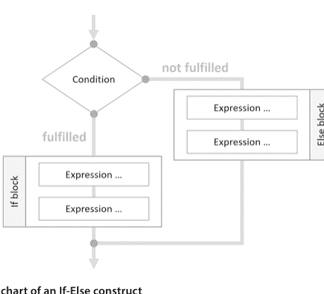

图 14.1 If-Else 结构的流程图

接下来是 Python：

```
python
if balance < 0:
    print("Attention: Your account balance is negative!")
    overdraftrest = 500 + balance
    print("You still have ", overdraftrest,
          " left of your overdraft facility.")
else:
    print("Your account is in credit.")
print("Current balance: $", balance);
```

最后是 Visual Basic for Applications (VBA)：

```
vba
If balance < 0 Then
    MsgBox ("Attention: Your account balance is negative!")
    overdraftrest = 500 + balance
    MsgBox ("You still have " & overdraftrest & " left of your
            overdraft facility.")
Else
    MsgBox ("Your account is in credit.")
End If
MsgBox ("Current balance: $" & balance)
```

如果你比较这三个例子，你首先会注意到它们根本上相似的结构。所有三种语言都有 If-Else 结构。实现仅在细节上有所不同：

- **关键字：** 在所有三种语言中，关键字 **if** 和 **else** 都存在。然而，只有在 VBA 中才明确写出 **then**。
- **条件：** C/C++ 要求条件写在括号中，而其他两种语言则不需要。然而，在那里括号也无害；我们将在下面学习其原因。
- **代码块：** 然而，在如何界定当条件满足时（if-case）或条件不满足时（else-case）要执行的代码块方面，存在显著差异：在 C/C++ 中，使用花括号来标记代码块的开始*和*结束。然而，在 Python 中，代码块以冒号开始并缩进。所有处于相同缩进级别的语句都被视为代码块的一部分。因此，在 **else** 块的末尾不再需要特殊的关键字。在这里，你必须密切关注代码的格式；缩进是有意义的，因此你不能随意缩进。在 VBA 示例中，有 **Then** 和 **Else** 之间的块，以及 **Else** 和 **End If** 之间的块。注意这里，与上面使用的 **End** 不同，**End If** 并不标记 **If** 块的结束，即当条件 **balance < 0** 满足时执行的代码部分。它标记整个 If-Else 结构的结束。if 块简单地在 **Else** 处结束。只有当不存在 **Else** 分支时，**End If** 才标记 **If** 块的结束。

**14.1 [3 分钟]**
当输入以下值时，下面的伪代码程序做什么？

```
a. x = 10
b. x = 11
c. x = 25
d. x = -1
```

```
x = enter("Please enter a number: ")
If x > 10 Then
Begin
    If x > 20 Then show("Result A")
    show("Result B")
End
Else
Begin
    If x > 0 Then show("Result B")
End
```

14.2 [3 分钟]
修改 ▶ 练习 14.1 中的程序部分，使得 **Result B** 仅在 **x** 大于 10 且小于或等于 20 时显示。

### 14.4 深入了解条件

在上一节中，你看到了如何使用 If-Else 结构根据特定条件是否满足来分支到程序的不同部分。在下面，我们将更仔细地研究在 If-Else 结构中检查的条件。

所有条件的一个共同特点是它们的结果要么是*真*，要么是*假*，即条件满足或不满足。因此，任何可以评估为真或假的逻辑表达式都适合用作条件。通常，这样的逻辑表达式是值比较，正如我们在上一节的网上银行示例中看到的那样。在那里，例如，我们检查账户余额是否小于 0。这样的值比较可以使用数学中已知的比较运算符轻松表述，例如 >（大于）、<（小于）和 =（等于）。这里，通常用 >= 表示“大于或等于”，用 <= 表示“小于或等于”，因为在早期计算机时代的字符集中不存在特殊字符 ≤ 和 ≥，并且今天，即使它们理论上可用，也无法直接从键盘轻松输入。因此，为了便于快速输入程序，已经约定使用复合表示法。不等于字符 ≠ 构成了一个特殊的挑战，因为它没有自然的“翻译”成复合字符。确实，不同的编程语言为此找到了不同的解决方案。最常遇到的两种是 <>（大于和小于）和 !=（感叹号和等号）。

在上一节中，条件总是由将变量与值进行比较组成。实际上，任何可以为真或假的表达式都可以作为条件。想象一下，在我们的网上银行示例中，我们有一个函数来检查当前客户是否有正账户余额。该函数的返回值可以存储在一个变量中：

```
accountcredit = is_balance_positive()
```

因此，我们将函数 **is_balance_positive()** 的返回值赋给变量 **accountcredit**。相应地，**accountcredit** 变量的值现在要么是 **TRUE**，要么是 **FALSE**。我们可以在条件中检查变量的内容：

```
If accountcredit = TRUE Then
Begin
    show("Your account is in credit!")
End
```

大多数编程语言允许你直接将函数插入条件中，而不是检查变量**accountcredit**：

```
If is_balance_positive() = TRUE Then
Begin
    show("Your account is in credit!")
End
```

如果你不想继续使用函数的返回值，这个过程总是有用的。但是，如果你想在另一个点再次访问这个值，将值存储在变量中以便进一步使用是有意义的。这节省了重复调用函数，从而节省了计算能力和时间：如果函数背后的程序代码非常复杂，如果你简单地回退到存储在变量中的值，而不是通过函数调用重新计算，你的程序将运行得更快。

大多数编程语言允许的另一个简化是简单地省略与逻辑值**TRUE**的显式比较。因此，假设每当一个值（无论是变量的值、函数的返回值，还是以任何方式计算的表达式的结果）在条件中使用而没有显式地与另一个值进行比较时，就应该与逻辑值**TRUE**进行比较。在我们的例子中，我们可以写：

```
If is_balance_positive() Then
Begin
    show("Your account is in credit!")
End
```

如果你给函数起了一个有意义的名字，就像我们在这里做的那样，条件非常容易阅读和理解。

如你所见，即使是正常的值比较最终也总是与值**TRUE**进行比较，因此是根据通用方案检查条件。

因为代替，比如说

```
If balance > 1000000 Then
```

你也可以写：

```
If (balance > 1000000) = TRUE Then
```

那么左边的表达式将首先被求值。如果账户余额现在大于一百万，该表达式将取值**TRUE**，条件将被满足。因此，条件最终总是与值**TRUE**进行比较。

### 14.5 使用逻辑运算符（AND、OR、NOT）的复杂条件

在前面章节的示例中，if-then块中总是只有一个基本条件决定是否执行程序部分。当然，if-then块中的条件也可以是由多个子条件组成的条件。

例如，假设在我们的网上银行示例中，我们只希望在账户未被冻结*并且*账户余额（也可以是负数）与透支额度之和至少等于要转账的金额时才允许转账。例如，如果账户余额为$-150，透支额度为$500，而我们网上银行的用户想要转账$50，那么网上银行应该允许，因为账户余额和透支额度之和，即网上银行客户可用的金额，将达到$350，即超过实际要转账的金额。另一方面，如果客户想要转账$400，我们的网上银行应用程序应该拒绝此交易请求，因为要转账的金额将超过账户余额和透支额度之和$50。

为了简化，假设我们有一个**is_account_locked()**函数，如果账户被冻结则返回**TRUE**，否则返回**FALSE**。那么在if-then块中检查客户是否被允许转账**amount**美元的条件如下所示：

```
If is_account_locked() = FALSE
    AND balance + overdraftrest >= amount Then
Begin
    ...
End
```

在这里你可以看到，我们用逻辑**AND**链接了两个（部分）条件。因此，if-then块的总条件只有在*两个*部分条件都满足时才满足。

除了AND，还有其他逻辑运算符可用于组合更复杂的条件。例如，逻辑OR，它以这样的方式链接两个（部分）条件：当其中一个、另一个或两个部分条件都满足时，总条件就满足。因此，逻辑OR的含义与日常语言中的“或”不同，后者通常意味着*排他*或：*要么*一个*要么*另一个，但不能同时满足两者。

你可以很容易地看到，逻辑运算符的工作方式与你在数学中知道的一样。因此，编程语言也知道一个排他或（通常称为XOR），它对应于口语中的“或”。

另一个重要的逻辑运算符是逻辑NOT，它反转语句的逻辑真值。语句“账户被冻结”的真值的逆显然是“账户未被冻结”。在编程中，不幸的是，我们通常不能像在“句子”中那样优雅地将NOT放在“单词”之间。因此，在程序代码中，它往往导致类似“NOT 账户被冻结”的东西。所以代替上面的条件，我们也可以写：

```
If NOT is_account_locked
    AND balance + overdraftrest >= amount
Then
Begin
    ...
End
```

正如你在上一节中回忆的，**is_account_locked()**是**is_account_locked() = TRUE**的简写，所以如果你想检查值**TRUE**，你可以简单地省略与该值的显式比较，因为如果你不指定不同的比较值，默认情况下就是检查这个值。

因此，以这种方式设计的条件首先确定函数**is_account_locked()**的值。借助NOT运算符，这个真值被简单地反转。所以，如果账户未被冻结，**is_account_locked()**返回值**FALSE**，逻辑NOT将值反转为**TRUE**。因此，条件简化为**If TRUE AND balance + overdraft >= amount**。总条件的真值然后取决于第二个子条件是否满足。

当然，像上面这样的逻辑表达式也可以用括号以任意复杂度嵌套。括号确保括号内的内容首先被求值，然后该确定的值与其他表达式进行逻辑链接。

这是一个简单的例子：

```
If NOT is_account_locked()
    AND (balance + overdraftrest >= amount
         OR is_customerhistory_positive()) Then
Begin
    ...
End
```

第二个子条件评估要转账的金额是否满足通常的要求，或者客户是否有良好的历史记录（例如，包括账户定期收入、无重大透支等），这是借助函数**is_customerhistory_positive()**确定的。因此，如果客户迄今为止表现出模范行为，即使交易超过透支限额，也将被允许。括号确保第一步是确定交易是否应基于足够小的转账金额或基于客户过去的行为被允许。为此，两个子条件用逻辑OR链接。这产生一个逻辑值，然后在第二步中与检查客户账户是否被冻结的逻辑值用逻辑AND链接。

正如你可能猜到的，逻辑运算符在不同的编程语言中有不同的名称。通常，它保留了英文关键字**AND**、**OR**、**XOR**、**NOT**，从这些关键字可以立即看出运算符的含义。然而，一些语言如C、C++、Java或R使用特殊字符代替书面形式：与号（&）表示逻辑AND，管道（|）表示逻辑OR，感叹号（!）表示逻辑NOT。顺便说一句，现在你可以很容易地看出为什么在这些语言中不等式用!=表示。它只是意味着“不等于”。

在C、C++、Java或R中，上面的if-then块将如下所示：

```
if(!is_account_locked()
  & (balance + overdraft >= amount
  | is_customerhistory_positive())) {
  ...
}
```

在Visual Basic for Applications（VBA）宏语言中，它允许你自动化Microsoft Office套件应用程序，你将使用描述性标识符编写此if-then块：

```
If Not is_account_locked()
  And (balance + overdraftrest >= amount
  Or is_customerhistory_positive()) then
  ...
End If
```

❓ [10 min]
考虑以下程序片段：

```
x = input("Please enter a number: ")
If x > 100 Then show ("x greater than 100!")
If x > 50 Then show ("x greater than 50!")
If x > 10 Then show ("x greater than 10!")
If x < 0 Then show ("x less than 0!")
If x >= 0 And x <= 10 Then show("x between 0 and 10!")
```

(a) 当用户为x输入一个值时，检查了多少个条件？
(b) 修改算法，使得在最佳情况下只检查一个条件，只有在最坏情况下才检查所有条件。

❓ [3 min]
以下程序片段中的错误在哪里？
x = input("Please enter a number: ")
If x > 100 Then show("x greater than 100!")
Else
Begin
If x >= 110 Then show("x greater than 110!")

### 14.6 使用 Switch-Case 结构高效检查相似条件（Switch/Select...Case）

有时你需要同时检查许多相似的条件。假设我们想根据客户银行账户每月的入账金额来对网上银行的客户进行分类，以便为特别“优质”的客户提供特殊服务。我们假设有一个函数 **received_3months()** 可用，用于查询过去三个月的平均入账金额。在我们的伪代码语言中，客户的分类可以这样完成：

```
If received_3months() < 1000 Then
Begin
    category="D"
End
Else
Begin
    If received_3months() < 2000 Then
    Begin
        category="C"
    End
    Else
    Begin
        If received_3months() < 4000 Then
        Begin
            category="B"
        End
        Else
        Begin
            category="A"
        End
    End
End
```

这里，不同的平均月现金流入阈值是在一个嵌套的 If-Else 结构中检查的。然而，这相对难以阅读。许多编程语言都有一种结构，允许你更优雅地编写对多个相似条件的检查。在我们的例子中，表述可以写成如下形式：

```
Switch received_3months()
Begin
    Case < 1000: category="D"
    Case < 2000: category="C"
    Case < 4000: category="B"
    Else: category="A"
End
```

这种表示法清晰得多，因此更具可读性，也更容易编程。关键字 **Switch** 后面是接受检查的变量。在我们的例子中，它就是函数 **received_3months()** 的返回值。**Case** 用于引入一个要检查的条件，例如 **<1000**。冒号后面是在这种情况下要执行的操作，在我们的例子中是设置客户类别。特殊的关键字 **Else** 可以用来捕获所有未通过特定条件明确检查的其他情况。此语句仅在其他条件都不满足时触发。但是，如果其他某个条件确实满足，则执行分配给该情况的语句（在我们的例子中只有一个，但可能有多个）。之后，整个结构退出，即不再检查其他条件。程序继续在 **End** 之后执行。

Switch-Case 结构的流程示意图如图 14.2 所示。

许多编程语言都允许这种检查多个相似条件的优雅方法。通常，这种结构被称为 *Switch-Case* 或 *Select-Case 结构*，以大多数具有此类结构的语言中常用的两个核心关键字 **switch** 或 **select** 和 **case** 命名。令人困惑的是，有些语言使用关键字 **case** 而不是 **switch** 或 **select**，但我们在此不讨论这一点。

例如，在支持 Switch-Case 结构的 C 语言中，上述客户类别的检查将如下所示：

```
switch(received_3months())
{
case < 1000:
    category="D";
    break;
case < 2000:
    category="C";
    break;
case < 4000:
    category="B";
    break;
default:
    category="A";
    break;
}
```

### 14.7 事件

除了经典的 if 条件（包括其作为 Switch-Case 结构的特殊版本）之外，还有另一种重要的方式可以在程序运行时分支到不同的部分，那就是通过所谓的 *事件*。

经典条件在程序到达分支条件所在的位置时执行。因此，程序是完全 *顺序* 运行的。然而，有时你事先并不知道程序流程中何时需要分支。在这种情况下，事件可以提供帮助。

想象一下，在我们的网上银行示例中，银行网站上有三个按钮：“新建转账”、“将交易导出为文本文件”和“注销”，用户可以随时点击。每个按钮背后都有不同的程序指令，但我们事先不知道用户何时——甚至是否——会触发相应的功能。

处理这个问题基本上有两种方式：

-   要么程序在一个几乎无限的循环中运行，并时刻主动观察用户的行为，即检查用户是否点击了按钮。我们将在本书的稍后部分讨论循环，但一个实际上无限重复、总是跳回起点并再次运行的循环的基本思想应该是可以理解的。现在，一旦用户点击其中一个按钮，程序就执行按钮背后的程序代码，然后返回到无限循环中，在那里它持续监控用户的操作。

-   第二种可能性是程序不在无限循环中等待用户，而是执行它应该做的任何事情。然而，当它从外部得知用户点击了其中一个按钮时，它会立即跳转到一个函数，然后执行按钮背后的指令。

这两种方法的区别在于，在第一种情况下，等待用户并监控他们的活动实际上阻塞了程序。它始终处于 *主动监控状态*，并不断检查是否刚刚点击了某个按钮。在第二种情况下，程序从 *外部* 得知某个 *事件* 已经发生。一旦发生这种情况，就会执行与该事件关联的函数。这些函数也称为 *事件处理程序*，因为它们描述了事件的处理方式。

这种方法节省了计算能力，因为第一种方法所需的主动观察就像主动倾听。这意味着必须不断处理信号，而在事件控制下，其他东西，比如操作系统或解释器，只需在事件发生时通知你。这允许程序在此期间做其他事情，并在事件发生时仍然做出反应。

其工作方式类似于烤箱，例如，你必须将其预热到一定温度才能烤披萨。只有达到预热温度后，才能将披萨放入烤箱。你可以每隔几分钟去烤箱看看是否已经达到预热温度。或者，你可以有一个烤箱，当它准备好时会独立发出声音信号。在第一种情况下，我们处于无限循环中，一遍又一遍地检查烤箱是否已经达到预热温度。在第二种情况下，其他人（在这种情况下是烤箱本身）通知我们“预热温度已达到”事件已经发生。只要这还没有发生，我们就可以简单地做其他事情，因为我们知道烤箱会在时间到来时报告。

许多编程语言支持使用事件。因为它改变了程序的构建方式，在这种情况下我们称之为 *事件导向的编程范式*。支持事件处理的语言，例如 JavaScript，用于开发图形用户界面，在这些界面中，由于用户行为的不可预测性，你没有完全顺序的程序流程，也无法事先确切知道接下来必须执行哪个程序部分。通常，图形用户界面，正如我们在 ▶ 第 12.2.1 节中所学的，是事件导向方法的典型应用。

事件控制程序的示意图如 ▶ 图 14.3 所示。

顺便说一句，不仅用户可以触发事件。操作系统或连接的设备也可以触发事件，然后程序可以对此做出反应。例如，操作系统可以宣布它现在想要关机；那

### 14.8 学习新编程语言的路线图

如果你正在学习一门新的编程语言……
你将会发现：

-   该语言中 If-Else 结构是如何构建的（许多语言中用于此目的的关键字是 **if**、**then**、**else**），
-   如何编写用于构建条件的比较运算符，
-   如何编写用于将多个基本条件组合成一个整体条件的逻辑运算符，
-   该语言是否具有 Switch-Case 结构，如果有，它是如何构建的（许多语言中用于此目的的关键字是 **switch**、**select**、**case**），
-   该语言中代码块是如何界定的（即，如何开始和结束），以及如果代码块只包含单条语句，这些界定符是否可以省略，
-   该语言是否支持事件，如果支持，如何定义事件处理程序（包括向事件处理程序传递哪些参数，如果有的话），以及如何将事件处理程序链接到需要调用它们的事件上。

### 14.9 练习解答

| 条件 | 事件 |
| :--- | :--- |
| **基本条件** | |
| 表达式 \| 比较运算符 \| 表达式 | |
| 等于、不等于、小于（等于）、大于（等于） | |
| 可选 | |
| **复合条件** | |
| 基本条件 \| 逻辑运算符 \| 基本条件 | |
| 与、或、异或、非 | |
| **If-Else 结构** | **Switch-Case 结构** | **事件处理函数** |
| （流程图） | （流程图） | （流程图） |

图 14.4 用于顺序控制的条件和事件

所考虑的顺序控制结构概览可见图 14.4。

### 14.9 练习解答

-   练习 14.1
    -   (a) 输出：**结果 C**
    -   (b) 输出：**结果 B**
    -   (c) 输出：**结果 A，结果 B**
    -   (d) 无输出（没有条件覆盖 x 为负数的情况）

#### 练习 14.2

```
x = input("Please enter a number: ")
If x > 10 Then
    If x > 20 Then show("Result A")
    Else show("Result B")
Else
    If x > 0 Then show("Result B")
End
```

在代码块 **If x > 10** 中，我们首先检查 **x > 20**。如果此条件不成立，我们知道 **x** 必须大于 10（否则程序根本不会进入此代码块），但小于或等于 20。因此，只需将关键字 **Else** 放在输出 **Result B** 之前就足够了。

#### 练习 14.3

-   (a) 五次。无论之前条件的结果如何，每个条件都会被检查。
-   (b) 通过巧妙地嵌套 If-Else 结构，可以减少条件检查的次数。如果 **x** 小于 0，则只检查一个条件。其余条件根本不会被检查，因为它们位于条件 **x < 0** 的 **else** 分支中。只有当 **x** 大于或等于 0 且同时小于或等于 10 时，程序才会通过所有条件。
    这里的技巧是安排条件，使得每个条件至少在理论上都是可达的。例如，如果我们使用 **x > 10** 作为顶层/最外层条件，那么像 **x > 50** 这样的条件将根本不会被检查，因为 **x > 10** 已经被评估为真，而位于 **x > 10** 条件 **else** 分支中的所有内容都不会再被执行。
    当然，使用 Switch-Case 结构（▶第 14.6 节）的表述将是一个更优雅、更易读的解决方案。

```
x = input("Please enter a number: ")
If x < 0 Then show("x less than 0!")
Else
    If x > 100 Then show("x greater than 100!")
    Else
        If x > 50 Then show("x greater than 50!")
        Else
            If x > 10 Then show("x greater than 10!")
            Else
                If x >= 0 AND x <= 10 Then
                    show("x between 0 and 10!")
                End
            End
        End
    End
End
```

#### 练习 14.4

这个嵌套 If-Else 结构的问题在于，内部 If-Else 结构中检查 x 是否大于或等于 110 的条件永远无法得到肯定的结果。如果 x 确实大于 110，外部条件 x > 100 已经为真，其关联的代码块（这里只包含单条语句）就会被执行。另一方面，else 块仅在 x 小于或等于 100 时执行，但此时内部 If-Then 结构的条件（x >= 110）永远不可能为真。可以说，用于输出 x 大于 110 的语句被孤立了。

#### 练习 14.5

与线性程序不同，遵循事件导向编程范式的程序可以通过跳转到专门为该类型事件开发的代码位置来响应事件（例如，用户点击按钮）。如果当前没有要处理的事件，程序会仔细观察其环境并等待再次激活。线性程序是一长串从头到尾逐步执行的指令，而事件导向程序则由一组事件处理程序组成，即每当各自函数处理的事件发生时就会被激活的函数。事件处理程序本身是指令序列，但程序不是执行线性流程控制，而是根据当前正在处理的事件，在事件处理程序之间来回跳转。

#### 练习 14.6

图形用户界面通常给予用户很大的自由度来决定调用哪些功能。用户通常不是被严格引导，而是从通常反映在菜单、工具栏、按钮、选项卡和其他控件中的选项面板中进行选择。这时基于事件的控制就派上用场了，只需调用与用户触发/激活的控件相关联的事件处理程序即可。

## 循环：如何高效地重复执行程序指令？

目录

- 15.1 循环及其变体 – 178
- 15.2 计数循环 – 179
- 15.3 条件循环 – 185
- 15.4 学习新编程语言的路线图 – 189
- 15.5 练习题解答 – 189

概述

几乎所有编程语言都使用循环来连续多次执行代码的相似部分。这不仅节省了大量手动且易出错的工作，还允许你编写那些事先不知道会被执行多少次的代码。借助循环，你可以优雅地实现程序语句的重复执行。

在本章中，你将学习以下内容：

- 什么是循环，以及它们与函数有何不同（函数也可用于重复执行程序代码）
- 计数循环和条件循环结构之间有何区别
- 如何开发一个计数循环，以及“循环变量”在其中扮演什么角色
- 如何编写条件循环，以及循环开始处（头部控制）和结束处（尾部控制）的条件检查有何不同
- 如何提前结束循环或继续下一次循环迭代。

### 15.1 循环及其变体

#### 循环与函数

本质上，重复执行你编写过一次的程序代码有两种方式：你可以将其提取到可以再次调用的函数/过程中。我们已经在第12章中了解了这是如何工作的。或者，你可以将要重复的代码包装在所谓的循环中。这正是本章的主题。

这两种方法的区别在于，使用循环时，相同的程序代码会被直接连续多次执行。例如，你可以逐行、逐个产品地遍历产品价格列表，并将属于特定类别的所有产品的价格提高10%。然而，函数的使用场景则不同；这里的关键不是连续多次重复执行程序的某个特定部分，而是使程序代码足够独立，以便可以从程序的不同位置随时调用。

这两种重复方法的共同点在于，通过这种方式，你可以避免在程序中多次编写相同的程序代码。这提高了程序的可维护性，因为对需要重复的部分只需修改一次。否则，你就需要在每次想要使用它的地方复制程序代码（而不是调用函数），或者连续多次复制它（而不是使用循环），结果你就必须在程序中出现该代码的每个地方都进行修改。这既繁琐又容易出错。在循环的情况下，另一个问题是，在编写程序时，你通常甚至不知道你希望代码重复执行多少次。想想那个你想要遍历以将特定类别所有产品的价格提高10%的产品列表。在编写程序时，你可能不知道该列表将包含多少个产品！如果因为产品种类扩展，在现有的78个产品之外突然增加了第79个产品，会发生什么？循环在这里提供了解决方案。

#### 循环的类型

循环基本上有两种变体：*计数循环*或*条件循环*。对于计数循环，从一开始——至少在原则上——就知道它们会被执行多少次。这类循环非常适合我们处理产品列表的问题。我们应该能够轻松确定该列表上有多少个产品。那么，我们也知道了完全遍历一次产品列表所需的循环次数。

对于条件循环，想象以下场景：我们有一个程序，将用户输入的开尔文温度值转换为摄氏度。开尔文温度始终大于或等于0。零开尔文是绝对零度，完全没有热量，不可能更冷；这个绝对零度对应于摄氏温标的-273.15°C。用户需要依次输入开尔文温度。每个开尔文温度都被转换为摄氏度。如果用户在任何时候输入了一个负的开尔文温度，程序应该中止。在这种情况下，使用循环是个好主意，因为从开尔文到摄氏度的转换过程总是相同的。然而，在这种情况下，我们事先不知道会有多少次循环迭代。这取决于用户的输入。这里首选的循环是*条件循环*，即只要满足某个条件就运行的循环；在我们的例子中，条件就是用户输入的温度大于或等于0。一旦用户输入负温度，条件将不再满足，循环就会停止。

### 15.2 计数循环

#### 带有数值循环变量的循环

计数循环是程序代码的连续重复，用于可以预先确定重复次数的场景。但是，程序代码的重复执行真的完全相同吗？让我们回想一下我们想要遍历以将特定类别所有产品的价格提高10%的产品价格列表的例子。现在，如果我们发现一个产品属于该类别，并且之前的一个产品也属于同一类别，那么在这两种情况下执行的代码完全相同吗？不，显然不是；因为价格调整必须针对一个产品进行一次，针对另一个产品进行一次。因此，程序代码虽然在两种情况下相似，但必须每次“引用”不同的产品。换句话说：我们需要知道当前在循环中的确切位置，即当前正在处理哪个产品。

这正是*循环变量*允许我们做的事情。它在每次循环迭代中按某个值（通常为1）递增。因此，你总是知道当前处于哪次循环迭代。我们可以在通过循环重复执行的程序代码中使用这个变量，例如，来寻址代表我们产品价格列表的数组的各个元素。

让我们用伪代码更仔细地看看整个过程：

```
For p From 1 To length(products)
Begin
    If products[p].category = "Garden Furniture" Then
        products[p].price = products[p].price * 1.1
End
```

在这个例子中，我们假设 **products** 是 **Product** 类的实例（即对象）的数组，该类具有 **category** 和 **price** 属性（如果你忘记了或对面向对象编程中的“数组”、“类”和“实例/对象”概念模糊，请回滚到 ▶ 第11.7节）。这个例子中的循环变量是（整数）变量 **p**。正如行 **For p From 1 To length(products)** 所指示的，它从值1运行到函数值 **length(products)**，我们假设它表示数组 **products** 的长度，即包含的产品数量。每次循环迭代，**p** 自动增加一。要重复的程序代码位于 **Begin** 和 **End** 关键字之间的代码块中。我们已经在函数（▶ 第13.1节）和 If-Then 结构（▶ 第14.3节）的上下文中见过代码块。只要循环变量 **p** 小于或等于指定的最大值（在我们的例子中是 **length(products)**），位于 **Begin** 和 **End** 之间的代码就会被执行。

我们现在在循环内部使用循环变量 **products[p]** 作为索引，从数组 **products** 中选取当前循环迭代中要处理的相应数组元素。在这里你可以看到，尽管我们总是重复相同的代码，但代码每次执行的操作都不同，因为每次循环迭代都使用不同的产品对象，即相应的元素 **products[p]**，因此第一次循环迭代使用 **products[1]**，第二次使用 **products[2]**，最后一次使用 **products[length(products)]**。

计数循环的遍历过程在 ● 图15.1 中示意性地展示。

#### 带有对象循环变量的循环

一些编程语言提供了计数循环的一种特殊变体，使得像我们上面例子这样的任务变得更加容易。在这里，不是递增一个循环变量（我们随后将其用作对象数组的索引），而是循环直接遍历对象数组，并依次处理数组中的每个单独对象。

它可能看起来像这样：

```
For Each p In products
Begin
    If p.category= "Garden Furniture" Then
        p.price = p.price * 1.1
End
```

##### For Each 循环

此循环在我们的伪代码中以关键字 **For Each** 引入，它按顺序遍历字段 **products** 的所有元素。在每种情况下，字段的当前元素都存储在运行变量 **p** 中。请注意与上面示例中的计数循环的区别：这里，运行变量 **p** 不是一个表示循环已运行次数的数字，而是当前处于循环焦点中的字段 **products** 的当前元素。

因此，在循环体中，即在循环重复的代码块中，可以像处理产品对象一样处理这个当前对象 **p**，例如，可以调整其属性。重要的是要理解，在大多数编程语言中，我们的变量 **p** 并不是字段 **products** 中相应元素的*副本*，而是*元素本身*。听起来很抽象，但它有一个关键的区别：毕竟，如果 **p** 只是当前正在处理的 **products** 中特定元素的副本，那么我们对 **p** 所做的任何更改当然都不会影响 **products** 中的真实元素；毕竟，我们只是在处理一个副本，原始元素不会受到我们更改的影响。但事实并非如此。实际上，**p** *就是* **products** 中的相应元素。因此，对 **p** 所做的更改会直接更改我们字段 **products** 中的相应产品。

正如你所看到的，这个循环比上面的循环更优雅一些。唯一的缺点是：在没有借助额外变量进行计数（我们手动在每次循环运行中增加该变量）的情况下，我们现在不知道到目前为止循环已经运行了多少次。我们的运行变量不再是一个计数器。然而，如果只是按顺序遍历我们 **products** 字段中的产品，这不一定是缺点。

##### 不同编程语言中的示例

让我们用两种具体的编程语言来看一下，PHP 是专门为服务器端程序设计的，用于大多数网站，以及 Microsoft Office 宏语言 VBA。
首先，这里是 PHP 中的两种循环变体：

```
for ($p=0; $p <= count($produts)-1; $p++) {
    if ($products[$p]->category == "Garden Furniture")
        $products[$p]->price = $producte[$p]->price * 1.1
}

foreach ($products as &$p) {
    if ($p->category == "Garden Furniture")
        $p->price = $p->price * 1.1
}
```

带有数字运行变量的计数循环在这里由关键字 **for** 引入，遍历字段的循环由 **foreach** 引入。这些是大多数编程语言中用于这些循环类型的关键字。
**for** 循环在括号中包含三个规范：

1.  运行变量的名称（在 PHP 中，变量名总是以美元符号为前缀）以及它应该从什么值开始（在 PHP 中，字段默认从索引 0 开始，因此第一个元素将是 **products[0]**）。
2.  它应该运行多长时间；在我们的例子中，只要它的值小于或等于字段元素的数量（**count($products)**）减 1；“减 1”是因为索引从 0 开始。如果第一个字段元素的索引是 0，那么最后一个字段元素的索引就是 **count($products)-1**（即，如果有 10 个字段元素，最后一个的索引是 9）。
3.  它应该如何递增；到目前为止，我们假设运行变量在每次循环传递时递增 1。然而，这不一定是这种情况。例如，我们也可以只查看每第二个产品；那么 **for** 语句的最后一部分将是 **$p = $p + 2**（**$p++** 是 **$p = $p + 1** 的简写）。

在 PHP 中，对象的属性是借助箭头运算符（->）访问的。到目前为止，我们在伪代码中一直使用点号来表示这一点。

另一个特定特征出现在第二个循环变体，即 **foreach** 循环中：这里命名了循环当前处理的元素 **$p**。然而，这前面有一个与号。这确保了变量 **$p**，正如我们上面讨论的，实际上代表相应的乘积对象，而不仅仅是 **products** 字段中当前处理的乘积对象的副本。如果我们省略与号，赋值 **$p->price = $p->price * 1.1** 将只处理对象的副本，而不是对象本身，而该对象是我们 **products** 字段的一部分。

现在用 VBA 来看同样的内容：

```
For p = 1 To length(products) Step 1
    If products(p).category = "Garden Furniture" Then
        products(p).price = products(p).price * 1.1
Next

Rem ATTENTION: This loop does not lead to the same result!
For Each p In products
    If p.category = " Garden Furniture" Then
        p.price = p.price * 1.1
Next
```

正如你所看到的，**For** 循环的语法（以及字段和对象访问以及 if-then 条件）在 VBA 中的结构与 PHP 略有不同，但基本概念完全相同。然而，在 **For Each** 循环中有一个重要的区别：与 PHP 不同，VBA 中的运行变量 **p** 始终是我们 **products** 字段中相应元素的*副本*。没有办法创建运行变量，使其更改反映在 **products** 字段的原始元素中。如果我们想更改 **products** 字段本身，我们必须使用带有数字运行变量的计数循环的第一个变体。

##### 嵌套循环

循环也可以相互嵌套。想象一下，你有一个二维数组，其行表示同一产品的不同变体，列表示公司的不同仓库。数组中的值表示每种情况下的件数。例如，如果 **stock[7,3] = 65**，这意味着第 7 个产品变体在第 3 个仓库中当前有 65 件可用。如果你现在想计算该产品（无论哪个变体）在所有仓库中总共有多少件，即跨所有仓库，那么嵌套的计数循环适合于此：

```
total = 0

For p From 1 To number_variants
Begin
    For w From 1 To number_of_warehouses
    Begin
        total = total + stock[p,w]
    End
End
```

外层循环遍历二维字段的行，即产品变体，而内层循环遍历仓库。这意味着循环通过开始一个新行，然后遍历该行的所有列（内层循环），然后切换到下一行（外层循环）来向前推进。通过这种方式，整个字段被遍历一次。它的各个元素，**stock[p,w]**，即相应仓库中的产品变体数量，借助变量 **total** 通过将循环刚刚处理的字段 **total[p,w]** 添加到该变量的当前状态来求和；赋值 **total = total + total[p,w]** 没有做其他事情：它将相应的字段内容添加到 **total** 的当前值，并再次将结果分配给变量 **total**。在嵌套循环运行完毕后，变量 **total** 包含所有产品变体在所有仓库中的总数。

##### ■ 提前退出循环

大多数编程语言都提供了一种提前退出计数循环的方法。如果例如，你正在编写一段代码来检查产品中是否存在特殊类别的产品，比如“花园家具”，这可能会很有用。一种检查方法是遍历整个字段并检查当前字段元素是否属于该类别的产品。一旦找到这样的产品，关于“花园家具”类别中是否有*任何*产品的问题就得到了回答。字段的其余部分实际上不需要遍历，它只会花费不必要的计算时间，当然也不会改变结果中的任何内容。因此，在这一点上停止循环是合适的。在我们的伪代码中，它可能看起来像这样：

```
found = FALSE

For Each p In products
Begin
    If p.category = "Garden Furniture" Then
    Begin
        found = True
        Break
    End
End
```

通过变量 **found**，我们可以在循环结束后判断是否找到了属于“花园家具”类别的产品。如果在循环的某次执行中找到了这样的产品，那么最初被初始化为 **FALSE** 的变量 **found** 就会被设置为 **TRUE**，并立即退出循环。
大多数编程语言都提供了一种语句，用于结束当前循环的执行，并直接进入下一次循环。

### 15.3 条件循环

#### 条件循环的功能与类型
条件循环与计数循环的不同之处在于，我们事先并不知道循环会执行多少次。相反，循环的执行取决于某个条件（即*运行条件*）是否满足。只要条件满足，循环就会继续运行。一旦运行条件在某个时刻不再成立，循环就会终止，程序的执行将继续到循环之后的代码。
让我们以本章引言中的例子为例：在这个例子中，程序会提示用户输入一个开尔文温度，然后将其转换为摄氏度，直到用户输入一个负的开尔文温度。这时程序就知道应该终止，因为根据开尔文温标的定义，负的开尔文温度在物理上是不可能的。因此，我们条件循环的运行条件是用户输入一个正的开尔文温度。当用户输入正温度时，程序会将温度转换为摄氏度，并再次提示用户输入下一个开尔文温度。
在我们的伪代码中，这个循环可能如下所示：

```
kelvin = input("Please enter temperature in Kelvin: ")

While kelvin >=0
Begin
    show(kelvin, " Kelvin are: ", kelvin - 273.15,
         " degrees Celsius")
    kelvin = input("Please enter temperature in Kelvin: ")
End
```

因此，我们在实际循环开始之前先读取一个开尔文温度。这是必要的，以便能够有意义地检查循环的运行条件。运行条件定义在关键字 **While** 之后。当运行条件 **kelvin >= 0** 满足时，其后的代码块就会被执行。具体来说，输入的温度被转换为摄氏度并显示结果。然后用户输入一个新的开尔文温度。由于循环随后遇到关键字 **End**，它会跳回到循环的开头，这会导致它在用户输入新的开尔文温度后，再次检查运行条件是否仍然满足。
在我们的例子中，条件是在循环开始时检查的。然而，检查也可以在循环结束时进行。那样我们就会得到一个所谓的*尾控制循环*，与上述的*头控制循环*相对应。

它看起来会是这样：

```
kelvin = input("Please enter temperature in Kelvin: ")

Do
Begin
    If kelvin >= 0 Then
        show(kelvin, " Kelvin are: ", kelvin - 273.15, " degrees Celsius")
        kelvin = input("Please enter temperature in Kelvin: ")
    End
End
While kelvin >=0
```

由于条件只在循环末尾检查，因此循环无论如何都会至少执行一次，直到到达条件检查处。在我们的例子中，这种结构有些复杂，因为我们仍然需要在循环内部检查用户的输入是否是一个有效的开尔文温度（即大于或等于0），或者是否表示用户想要终止循环。只有在我们的尾控制循环中，当开尔文温度大于或等于0时，才会执行到摄氏度的转换。否则，在输入之后，循环内部什么也不会发生。然后循环检查运行条件，确定其不再满足，于是不再进入下一次循环，而是继续执行循环之后的程序。

图15.2和图15.3分别展示了头控制条件循环和尾控制条件循环的流程示意图。

我们例子中的循环看起来总体上有些天真和刻意。通常在这种情况下，你会使用头控制循环。

##### 不同编程语言中的示例

以下是我们的开尔文-摄氏度转换程序在两种真实编程语言中的实现，一种是Pascal，一种是VBA。

首先是Pascal版本：

```
program temperatureconversion;
var
    kelvin: real;
begin
kelvin = readln('Please enter temperature in Kelvin: ');
while kelvin >= 0 do
    begin
        writeln(kelvin, ' Kelvin are: ', kelvin - 273.15,
                ' degrees Celsius');
        kelvin = readln('Please enter temperature in Kelvin: ');
    end
end.
```

## 15.3 · 条件循环

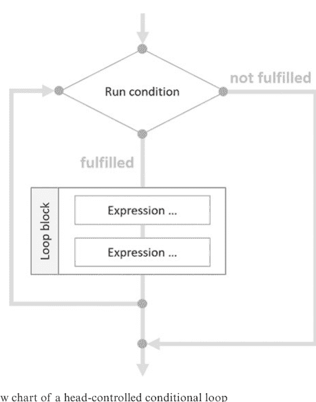

图 15.2 头控制条件循环的流程图

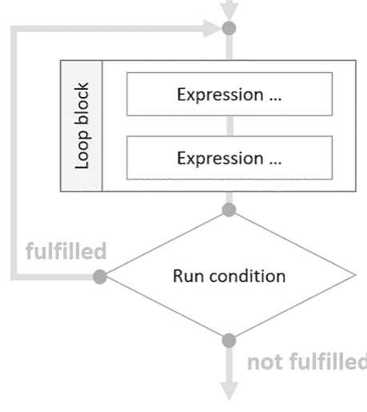

图 15.3 尾控制条件循环的流程图

现在是VBA版本：

```
Dim kelvin As Double;

kelvin = InputBox("Please enter temperature in Kelvin: ")

While kelvin >=0
    MsgBox (Str(kelvin) & " Kelvin are: " &
            Str(kelvin - 273.15) & " degrees Celsius")
    kelvin = InputBox("Please enter temperature in Kelvin: ")
Wend
```

如你所见，Pascal和VBA中用于条件循环的关键字分别是 **while... do** 和 **While**，这与大多数其他编程语言类似。要重复的代码块在Pascal中用 **begin** 和 **end** 括起来，在VBA中则直接跟在运行条件之后，并以关键字 **Wend** 结束。

就像计数循环的情况一样，大多数编程语言也提供了特殊的语句来完全退出条件循环（通常是 **break**），或者中止当前循环并继续下一次循环（通常是 **continue**）。

##### ■ 计数循环与条件循环的关系

计数循环也可以写成条件循环，但反过来不行。为此，我们只需要制定一个条件，只要计数循环会运行，该条件就一直满足。在上一节的例子中，我们想要将“花园家具”类别中所有产品的价格提高10%，用伪代码表示如下：

```
p = 1

While p <= length(products)
Begin
    If products[p].category = "Garden Furniture" Then
        products[p].price = products[p].price * 1.1
    p = p + 1
End
```

同样，与计数循环类似，我们使用一个运行变量。只是这一次，我们必须自己负责在每次循环中递增这个变量。我们通过语句 **p = p + 1** 来实现。循环的运行条件现在是这个运行变量的值最多等于数组 **products** 的长度。我们还必须在第一次循环之前自己初始化这个运行变量，而计数循环会为我们做这件事。然而，你可以看到，将计数循环“转换”为条件循环是完全可能的，因为归根结底，计数重复也是基于一个条件。当然，反过来是不可能的，因为在条件循环的情况下，我们不知道它会重复多少次，而这正是计数循环的前提。

### 15.5 练习解答

15.1 [3 分钟]
以下循环有什么问题？
```
x = 1
While x <> 100
Begin
    show("Loop pass no. ", (x+1)/2)
    x = x + 2
End
```

15.2 [3 分钟]
有哪些类型的循环？它们有什么区别？

15.3 [3 分钟]
为什么可以用条件循环来模拟计数循环，但反过来不行？

! 15.4 [5 分钟]
思考如何使用循环来处理图形用户界面上的用户输入。

### 15.4 学习新编程语言的路线图

当你学习一门新的编程语言时……
你会发现：

-   有哪些形式的计数循环，以及运行变量在其中扮演什么角色（“计数变量”或正在遍历的对象集合的当前元素）
-   有哪些形式的条件循环，特别是只有头控制循环还是也有尾控制循环，
-   有哪些可能性可以提前退出循环，或者至少中止当前循环并继续下一次循环。

### 15.5 练习解答

练习 15.1
这个循环的问题在于它永远不会结束，因此它是一个无限循环。变量 x 的值在每次循环前都会被检查，它在循环前被初始化为1，然后在每次循环中增加2。因此，它的值始终是奇数。所以，变量永远不会取到100这个值，而这个值本应导致循环终止。循环会无限期地运行下去（或者直到内存不足以容纳变量 x 的高值）。

#### 练习 15.2

循环分为计数循环和条件循环。对于计数循环，循环运行的次数原则上在第一次循环运行前就已知。这类循环使用一个运行变量。该运行变量是一个数值，从起始值开始，根据固定规则（例如每次增加一）变化，直到达到固定的结束值。或者，循环遍历一组对象，运行变量在每次遍历中代表该组中的不同对象。通过这种方式，可以简单地遍历某些可定义的对象集合（如客户、产品、销售交易）。在循环内部，你可以处理当前聚焦的、由运行变量表示的相应对象。

与计数循环不同，条件循环的遍历取决于一个条件是否满足，该条件在每次遍历前（头控制循环）或后（尾控制循环）进行检查。此条件也可能依赖于循环遍历过程中产生的值，例如计算值或用户输入。因此，对于条件循环，不一定能在第一次循环遍历前说出循环总共将运行多少次。

#### 练习 15.3

计数循环本质上是条件循环的一种特殊情况。其条件是运行变量的值在某个值范围内（起始值和结束值之间）移动，或者——如果遍历一组对象且运行变量代表“当前”对象——则遍历的对象集合中仍有尚未“轮到”的对象。因为这里也涉及运行条件，所以带有其运行条件的计数循环也可以表述为条件循环。然而，反过来则不行，因为在条件循环的情况下，不一定能预先知道循环运行多少次，而这正是计数循环的前提。想象一个其执行取决于用户输入的条件循环。由于无法预见用户在哪次循环遍历中会做出导致循环终止的关键输入，我们无法说出循环将运行多少次。

当然，也存在即使对于条件循环，运行次数也可以预先知道的情况，即当循环运行期间，那些决定运行条件中循环是否再次运行的变量无法改变时。那么，即使是条件循环，从一开始就能清楚它将运行多少次，并且也可以将其写成计数循环。

#### 练习 15.4

图形用户界面通常的特点是用户可以从不同的操作中进行选择。每个操作都会触发一个事件，程序可以用相应的事件处理例程来响应。然而，这个过程也可以表示为一个循环。为此，我们可以在一个无限循环中反复从用户那里读取一个操作，然后在循环内处理该操作。这可以风格化地表示如下：

```
abort = FALSE

While abort = FALSE
Begin
    action = read()
    Switch action
    Begin
        Case ...: ...
        Case ...: ...
        // 处理所有可能的情况
        Case "Exit": abort = TRUE
    End
End
```

如果你对 Switch-Case 结构还不完全熟悉，只需翻回几页到 ▶ 第 14.6 节。

### 15.5 练习解答

## 如何以结构化的方式搜索和修复错误？

目录

- 16.1 开发时的错误 – 194
- 16.2 运行时错误 – 195
- 16.3 测试 – 196
- 16.4 调试方法 – 197
- 16.5 学习新编程语言的路线图 – 199

## 概述

错误是程序员最大的敌人。无论你工作多么仔细，错误总会悄然出现。因此，测试程序以检测和消除错误是编程中不可或缺的一部分。错误表现为程序根本无法运行、在执行过程中崩溃，或者即使运行到最后，仍然没有完成它应该做的事情。

可以区分在*开发时*发生的错误（即在编写程序时）和在*运行时*发生的错误（即在程序执行时）。

在本章中，你将学习：

- 有哪些类型的错误以及它们的原因
- 如何通过处理异常来捕获运行时错误并使其无害
- 测试程序时如何巧妙地进行
- 什么是调试器
- 调试器的功能，如“断点”、“单步模式”和“变量观察/监视”是什么，以及如何使用它们来理解错误的位置和原因
- 如何使用临时的、额外的输出来诊断程序中的错误，即使没有调试器。

### 16.1 开发时的错误

在开发时就发生的错误要么是语法错误，即程序的“语法”不正确，一个或多个语句不符合“句子结构规则”；要么是算法错误；即由于程序代码虽然形式上正确，但根本没有准确实现程序员想要做或实现的目标而导致的错误。

在*语法错误*的情况下，编译器或解释器通常会通过错误消息中止程序的编译或执行来提供帮助。此错误消息通常提供有关发生了何种错误以及代码中（通常通过行号或程序部分的名称）可能原因所在的信息。这样的错误可能是变量未声明，如果你随后在程序中使用该变量，编译器或解释器将在此处失败。有时，错误消息有些晦涩，只有熟悉编程语言内部结构的程序员才能理解编译器/解释器试图表达的意思。在这种情况下，在互联网上搜索通常会有所帮助，因为其他程序员也会对这个错误消息感到困惑。你可以在 *StackOverflow* 上找到许多不同语言的错误解决方案。

*算法*错误通常更难检测和理解。为此，请使用 ▶ 第 **16.4** 节中描述的调试方法。

### 16.2 运行时错误

#### 程序执行期间的意外情况

在程序开发期间发生的错误与在运行时发生的错误之间的区别在于，后者情况下程序原则上可以工作，但在执行过程中出现了开发者未预见且未采取任何预防措施的情况。

例如，这可能是程序试图访问一个不存在的文件。这个问题在开发或测试期间从未发生过，因为程序想要访问的文件已经存在。因此，开发者从未想到要为这种可能性做准备。一个类似的例子在实践中非常常见，即用户输入了程序无法处理的内容。例如，用户在期望数字的地方输入了文本。原本运行完美的程序现在试图用文本进行计算，并崩溃了。在测试期间，当程序要求输入时，程序员总是输入一个数字。因此，他从未遇到过因非数字输入而导致程序崩溃的情况，因此从未采取预防措施来测试用户输入并在其非数字时拒绝它。

仅在运行时发生的错误通常是由开发期间未预见但可能发生的情况引起的。在理想条件下，程序运行没有任何问题。

诀窍是在开发期间尽可能多地捕获错误源。例如，程序应测试用于计算的用户输入是否为数字，否则拒绝它。同样，它应检查用作除数的数值变量是否永远不会为 0，这当然会立即导致错误。程序想要访问的文件的存在性也可以被检查，并在文件不存在时调整程序流程。

这种对可能错误的预见是耗时但重要的，特别是为他人编写程序时。他们可能无法查看程序代码，或者可能缺乏技术理解，并且可能对错误的容忍度较低，特别是如果他们为程序付费的话。

#### 使用 Try-Catch 结构捕获错误

许多编程语言通过特殊的语言结构支持程序中的错误处理。基本思想是错误通过*异常*来反映。异常不过是当某种类型的错误发生时触发的事件。在这种情况下，程序员也说异常被“抛出”。

遵循“抛出”的类比，这些异常随后可以被“捕获”并处理。例如，当打开文件时，如果要读取的文件不存在，可能会发生异常。在这种情况下，程序不会终止，而是以受控方式继续执行专门为这种情况设计的程序部分。

在我们的伪代码中，这样的结构看起来像这样：

### 16.3 测试

鉴于错误来源众多，*测试*当然是成功的关键。测试、测试、再测试。测试本身几乎是一门科学，存在众多不同的测试方法和类型。事实上，测试员在软件开发中甚至是一个正式的职位描述。在一些公司，开发人员和测试员结对工作。与测试的重要性相匹配，有专门的工具用于开发测试，有时甚至能自动执行测试、记录结果，并为错误排除提供项目管理支持。

当然，你不必费那么大周折。尽管如此，测试仍然很重要。在下方的提示框中，你可以找到一些改进测试的建议。

#### 提示

-   思考用户会如何使用你的程序，并尝试这些“用例”。
-   思考所有可能出错的地方，也就是用户可能如何不当使用程序。
-   让程序经受“极端”条件的考验。在开发过程中，你倾向于总是使用那些程序能完美运行的简单示例，因为这自然是你想要的：开发期间问题越少越好。要反其道而行之，做自己的*魔鬼代言人*。
-   逐段测试*以及*在上下文中测试。单独测试代码段（例如，一个函数）可以使调试更容易，因为在出错的情况下，你已经大致知道原因所在。然而，有时当你完整运行程序并让不同的代码段交织在一起时，会出现未预料到的交互。因此，你应该始终遵循这两种方法：分段测试和在完整程序上下文中测试。

### 16.4 调试方法

如果你发现程序的某些部分运行不正常，你就会开始寻找错误。围绕查找和修复缺陷的活动被称为*调试*。

这里基本上有两种方法：要么你使用“内置工具”，特别是在程序流程中使用合适的辅助输出；要么你使用专门的工具，称为*调试器*。后者通常是编程语言集成开发环境的一部分，使用方便。当然，也有命令行调试器。

基本上，调试涉及两个问题：

-   确定错误*发生在哪里*
-   确定错误*为何发生*。

并不总是能先找到错误发生的位置，然后再回答为什么的问题。有时你先意识到错误为何发生，然后必须搜索导致它的代码。为了回答这两个问题，你基本上可以使用以下工具：

#### 输出

你可以临时*添加额外的输出*到你的程序中，这些输出在调试完成后会被移除。这些输出可以帮助你理解程序的哪些部分已经运行。例如，如果你面临程序崩溃的问题，并且不确定程序停在哪里，你可能想临时插入一些代码来创建额外的输出。每次出现这样的输出，你就知道程序至少运行到了这一点而没有崩溃。有时，例如，某些条件（如 if-then 结构）或循环是否被执行，也不太清楚。在这里，包含相应的输出也有助于确定位置，只有当 If-Then 结构或循环中的程序代码被执行时，该输出才会出现。

然而，你不仅可以使用临时的额外输出来确定程序代码的当前执行部分，还可以检查程序流程中某些变量的值。理解变量的内容通常有助于诊断问题。

#### 断点

如果你使用调试器，你可以设置*断点*。设置断点后，当你启动程序时，它只会运行到这个断点。之后，你可以决定是让程序继续运行还是在此处终止它。同样，如果你追踪一个程序崩溃，并且程序到达断点而没有中断，那么问题就在断点之后。

#### 单步模式

使用调试器时，你通常还有另一个选择，即以单步模式执行程序。这意味着一次只执行一条程序指令。只有当你按下某个键或组合键时，才会执行下一条程序语句。IDE 会以图形方式在程序代码中显示最后执行的语句。这也很容易确定程序在哪个点终止。然而，如果你的程序中有重复多次的循环，以单步模式运行它们会相当繁琐。在这种情况下，你应该在循环之后设置一个断点，让程序运行到那里，然后从那里开始继续单步执行。至少，如果错误不在循环本身，这将为你节省大量按键操作。然而，如果问题在循环中，你将不得不单步执行循环，并检查循环可能使用的任何变量的值。

#### 变量监视

结合断点或以单步模式运行程序，许多调试器还支持另一个功能，即*变量监视*。此功能允许你查看（有时甚至可以更改）变量的当前内容。因此，如果你的程序到达了一个断点，你可以查看某些变量当前的值。在单步模式下，这允许你跟踪变量的值如何从一条程序语句变化到下一条。图 16.1 展示了我们简单的摄氏度-开尔文转换示例的变量监视。在程序的第 60 行设置了一个断点。程序将执行到这一行。下一条要执行的指令是第 60 行的那条，也就是你设置断点的地方（在行前用红点标记）。

### 16.5 学习新编程语言的路线图

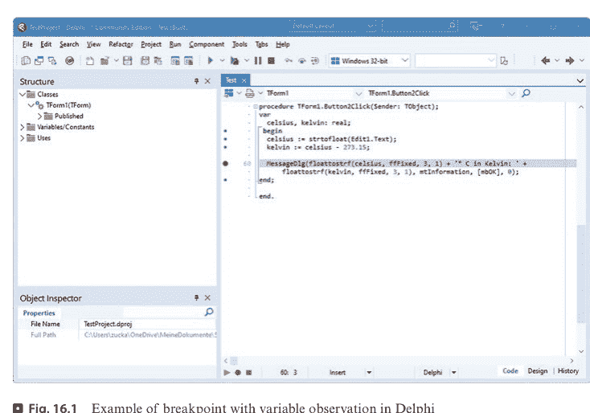

图 16.1 Delphi 中带变量观察的断点示例

当你学习一门新的编程语言时……你会发现：

-   有哪些调试工具可供你使用，以及如何访问它们（命令行工具、IDE 集成），
-   是否可以设置和移除断点，如果可以，如何操作，
-   是否可以以单步模式执行程序，如果可以，如何操作，
-   是否可以监控变量的内容，如果可以，如何操作。

## Python

### 简介

© 作者，经 Springer Fachmedien Wiesbaden GmbH（Springer Nature 旗下）独家许可，2024
J. L. Zuckarelli, *Learn coding with Python and JavaScript*, [https://doi.org/10.1007/978-3-658-42912-6_17](https://doi.org/10.1007/978-3-658-42912-6_17)

## 概述

现在我们将开始学习 Python，这是我们的第一门编程语言。在学习过程中，我们将以前一部分学到的关于编程基本概念的 9 个问题为指导。不过，我们将首先概述 Python 的起源和发展、其普及程度和用途。

Python 由荷兰数学家和计算机科学家 *Guido van Rossum* 于 1989 年底开始开发，显然，这是出于圣诞节假期的无聊（*你*在圣诞节做什么？）。其名称基于 Van Rossum 喜爱的英国喜剧团体 *Monty Python*，因此与 Python 标志中可见的蛇的程式化形象无关。

Guido van Rossum 的业余项目早已成为最受欢迎的编程语言之一。众多指标中的两个是 Python 在 *TIOBE 指数* 中的定位（2023 年 5 月：第 1 名，其次是 C 和 Java）以及 *Stack Overflow* 上超过 200 万个问题帖子。对于几乎所有互联网和科技巨头，如 Google 或 Amazon，Python 现在都是持续使用的语言之一。

Python 是一种通用语言，因此被用于各种目的，包括——*Django* 等框架的出现——Web 应用程序。Python 因 *NumPy* 等用于数据科学的扩展库而变得极其流行，并且似乎是人工智能领域应用程序的事实标准语言，为此，*TensorFlow* 和 *Keras* 等库提供了一些重要的 Python 扩展。

Python 的流行部分归因于该语言相对容易学习。Python 具有简单直接的语法，并鼓励开发易于理解的程序代码。因此，Python 被许多人认为是最好的初学者编程语言。无数人，而你似乎也不例外，今天正以最初作为 Van Rossum 业余项目开发的编程语言迈出编程的第一步。

当然，Python 很久以前就不再是一个业余项目了。自 2001 年以来，*Python 软件基金会* 一直是负责 Python 维护和进一步开发的非营利组织。直到几年前，Guido van Rossum 在该组织中扮演着领导角色，这就是为什么他偶尔被称为“终身仁慈独裁者”。然而，到目前为止，他已基本退出了相关活动。

本书这一部分的目标不是让你编写尽可能高效的 Python 程序，让每个 Python 专家都钦佩，或者让你的程序看起来尽可能“Pythonic”，而是让你学习如何编写 *你自己理解* 且 *达到目的* 的 *可运行* Python 程序。毕竟，这最终就是编程的意义所在：解决给定的问题。解决方案必须有效；如果它碰巧特别优雅，那非常好，但如果不是，那也没关系。

### 17 引言

在我们真正开始之前，有一个建议：尝试一下！不仅要遵循文本和练习中给出的示例，还要尝试自己动手，走出本书为你设定的常规路径。没有什么比简单地问自己这样的问题更能让你学到东西了：如果我稍微改变一下这个和那个，实际上会发生什么？好奇心和自己尝试新事物的意愿将使学习任何新的编程语言变得无比容易。而 Python 非常适合自己尝试。

但现在，华丽的言辞已经够了。让我们开始吧。

## 工具与帮助：编程需要什么？

目录

-   18.1 安装 Python 解释器 – 208
-   18.2 安装 PyCharm IDE – 210
-   18.3 获取 Python 帮助 – 211
-   18.4 总结 – 212

概述
首先，我们将看看用 Python 编程需要什么。幸运的是，这并不多，因此我们可以很快开始实际工作。
在本章中，你将学习：
-   如何安装 Python 解释器
-   如何安装 PyCharm 开发环境
-   如何使用 Python 的帮助功能
-   如何使用 Python 的非官方帮助来源。

#### 18.1 安装 Python 解释器

你可以方便地从 ▶ http://www.python.org 下载 Python 安装程序。该网站由 Python 软件基金会运营，该组织协调 Python 的进一步开发。在网站上，在“下载”下，只需为你的操作系统选择最新的 Python 版本。本书中我们使用的是 Windows 版本的 Python，但我们将在此讨论的所有内容在很大程度上也适用于 macOS 和 Linux 版本。你随后安装的 Python 称为 CPython，可以说是“官方”Python 版本，Python 发明者 Guido van Rossum 参与了其开发。此外，还有许多其他 Python 实现。甚至还有用 Python 本身编写的 Python 解释器！另一方面，CPython 是用 C 编程语言开发的。你现在下载的正是这个 CPython，尽管它在 ▶ python.org 网站上并未以此名称列出。
下载完成后，运行安装程序并按照屏幕上的说明操作。记下 Python 将安装的路径。你不需要更改安装程序提供的默认设置中的任何内容。安装通常在几分钟内完成。
顺便说一句，CPython 只有英文版本，这意味着所有消息、警告和其他输出都只以英文生成；Python 编程语言也只使用英文术语。在这方面，你没有错过安装过程中选择语言的对话框，因为根本没有这个选项！除此之外，建议始终安装所有工具的英文版本，因为如果你不理解错误消息或想了解如何使用该工具执行某个操作，在互联网上搜索帮助会容易得多。
安装完成后，你就可以开始了。如果你切换到 Python 安装的目录，就可以在那里调用 Python 程序。将打开一个窗口，看起来像 ▶ 图 18.1 中的窗口。

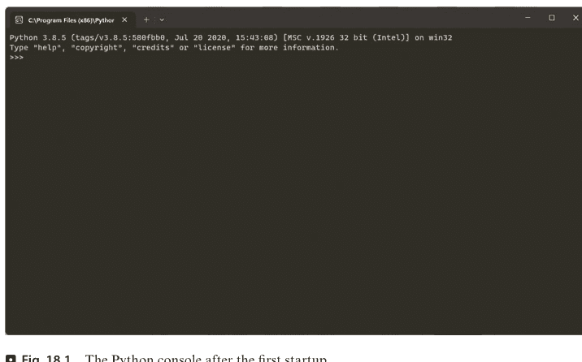

图 18.1 首次启动后的 Python 控制台

这是 *Python 控制台*。它允许你以 *交互模式* 运行 Python，即输入一条语句并直接执行（如果你不再记得交互模式和脚本模式的区别，请回滚到 ▶ 第 9 章）。控制台处理的这样一个命令是 **quit()**；它退出 Python 控制台并关闭窗口。

除了这种交互模式，Python 当然还提供了一种脚本模式，允许我们编写和运行较长的程序。Python 代码文件通常具有扩展名 **.py**。因此，如果你有一个程序 **myprogram.py** 并想运行它，你需要在操作系统的终端/控制台中转到 Python 目录，然后在那里输入：

```
python myprogram.py
```

当然，使用集成开发环境比直接使用 Python 解释器更方便。Python 自带了 *IDLE* 这样的环境。然而，它相当基础，即使它支持语法高亮等功能。你可以在 ■ 图 18.2 中对 *IDLE* 有个印象。在下一节中，我们将使用 *PyCharm*，这是一个功能强大得多的开发环境，我们接下来将安装它。

#### 18.2 安装 PyCharm IDE

PyCharm 是一款流行的 Python 集成开发环境（IDE），由总部位于布拉格的捷克软件公司 JetBrains 开发。JetBrains 专注于开发工具，并提供了一些知名的 IDE，例如 IntelliJ IDEA（专为 Java 设计）、WebStorm（用于 Web 开发，特别是 JavaScript）、PHPStorm（用于 PHP）或 RubyMine（用于 Ruby）。他们还开发了一种名为 Kotlin 的编程语言，主要用于移动应用开发。

你可以从 https://www.jetbrains.com/PyCharm/ 网站下载免费的社区版 PyCharm。该版本功能有限，但已经提供了远超本书所能涵盖的丰富功能。点击“Download”按钮，然后选择你的操作系统：支持 Windows、MacOS 和 Linux。下载安装程序后，启动安装过程。你也可以保留默认设置；不过，建议至少在安装程序的“Create Associations”部分将 `.py` 文件与 PyCharm 关联，以便今后它们总是自动用该 IDE 打开。安装通常不会花费太长时间，但需要超过 1.6 GB 的可用硬盘空间。用三四张容量为 1.44 MB 的 3.5 英寸软盘就能安装 MS-DOS 开发环境的时代肯定已经过去了！

首次启动 PyCharm 时，你可以在“Customize”部分配置是使用深色还是浅色配色方案。本书中的所有插图都是为了更好的可打印性而使用浅色配色方案创建的；然而，作者在其他时候使用深色模式，这样对眼睛的刺激稍小一些。此时最好先关闭对话框退出 PyCharm。在下一章中，我们将开始我们的第一个 Python 项目。届时我们将从这里继续。

#### 18.3 获取 Python 帮助

##### 在互联网上
Python 是当今最受欢迎的编程语言之一。因此，毫不奇怪，你可以在互联网上找到无数关于 Python 的资源。其中一个资源就是前面提到的 *Stack Overflow* 平台，在那里你会找到大量关于 Python 的问答，几乎能满足你所有的需求。截至撰写本文时，*Stack Overflow* 上有超过 210 万个标记为 **Python** 的问题。仅今天一天，就新增了 1,039 个。你的问题也在这 200 万个问题中的概率应该很高。因此，对于大多数问题，*Stack Overflow* 是一个很好的起点。*Stack Overflow* 的搜索结果也经常出现在 Google 的顶级搜索结果中。当然，你可以在 Google 搜索中添加 **site** 关键字（site:▶ StackOverflow.com）来将搜索范围缩小到 *Stack Overflow*。但即使在 *Stack Overflow* 之外，互联网上也充满了与 Python 相关的帖子、博客、教程、视频以及各种其他想象得到的内容格式。

##### “官方” Python 帮助
Python 本身也附带官方帮助。如果你想了解编程语言的某个特定元素是如何工作的，可以参考随 Python 一起自动安装的类和函数文档。你可以通过在 Python 控制台中调用 **help(element)** 函数，并将你想要查看信息的模块、包、类或函数的名称作为参数传递给它来实现。例如，调用 **help(print)** 会返回以下帮助信息：

```
>>> help(print)
print(...)
print(value, ..., sep=' ', end='\n', file=sys.stdout,
      flush=False)
Prints the values to a stream, or to sys.stdout by default.
Optional keyword arguments:
file: a file-like object (stream); defaults to the current sys.
      stdout.
sep:  string inserted between values, default a space.
end:  string appended after the last value, default a newline.
flush: whether to forcibly flush the stream.
```

像 ▶ 第 18.1 节那样再次启动控制台并尝试一下！不要包含 `>>>`，因为这是提示符，表示控制台已准备好接受你的输入。顺便说一句，如果你输入不带参数的 **help()**，控制台会切换到 Python 帮助系统。修改后的提示符 **help>** 表示你现在可以输入术语，然后会显示匹配的帮助条目。你可以通过输入 **quit**（不带括号）离开帮助系统并返回到 Python 控制台。

我们的 **help()** 调用输出提供了一些关于 **print()** 函数参数的信息，最重要的是，**print()** 首先做了什么。然而，这个帮助相当基础。如果你想了解更多细节，最好自己在网上搜索。

*Python 软件基金会* 也在其网站 ▶ [python.org](https://python.org) 上提供了大量关于 Python 标准库（包括 `print()` 函数）的信息，标题为“Library Reference”：▶ [https://docs.python.org/3/library/functions.html#print](https://docs.python.org/3/library/functions.html#print)。（注意，这与我们下载 Python 解释器的网站相同。）“Language Reference”解释了语言的结构和语法，但相当技术化。“Tutorial”部分包含 Python 入门介绍，如果没有其他编程语言的先验知识，可能很难理解。

#### 18.4 总结

在本章中，我们了解了如何安装 Python 以及 *PyCharm IDE*。我们还学习了获取 Python 帮助的最重要方法。

请务必从本章掌握以下要点：

- “官方” Python 实现 *CPython* 由 *Python 软件基金会* 进一步开发，是你从 ▶ [python.org](https://python.org) 下载 Python 时默认安装的 Python 变体。
- Python 附带名为 **python** 的 Python 解释器程序，它既可以用作交互式 Python 控制台，也可以用来解释整个 Python 脚本。
- *IDLE* 是 Python 附带的一个基础 IDE。
- JetBrains 的 *PyCharm* 是一个非常强大的 Python 开发环境，其中有限的社区版是免费的。
- Python 的帮助由 Python 本身通过 `help(element)` 函数提供。它为 Python 模块、类或函数提供帮助文本，但通常不是很详细。
- 更多的“官方”帮助主要以语言参考和 Python 标准库参考的形式在 ▶ [python.org](https://python.org) 上提供。
- 此外，鉴于 Python 的高人气，互联网上有许多丰富的信息来源；对于大多数其他编程语言一样，最重要的来源之一是开发者论坛 *Stack Overflow*。

## 19. 程序执行与 Hello World：我需要做什么才能让程序运行起来？

## 目录

- 19.1 在 Python 中开发和执行程序 – 214
- 19.2 Python 控制台：交互模式下的 Python – 221
- 19.3 认识 PyCharm – 222
- 19.4 PyCharm 之外的一些 Python 代码执行替代方案 – 223
- 19.5 总结 – 224

## 概述

现在我们终于开始编程了。我们用 Python 编写我们的第一个小型“Hello World”程序，同时熟悉我们在上一章安装的强大 Python IDE *PyCharm*。

在本章中，你将学到：

- *PyCharm* IDE 的用户界面是如何构建的
- 如何使用 *PyCharm* 编写和运行程序
- 如何在交互模式下使用 *PyCharm* 运行 Python
- 一个简单的 Python “Hello World”程序是什么样子的。

### 19.1 在 Python 中开发和执行程序

#### 设置解释器

首次启动 *PyCharm* 后，你会看到一个类似图 19.1 的对话框。由于我们要编写一个新程序，请点击“Create New Project”按钮。*PyCharm* 现在会询问你想要使用的 Python 解释器

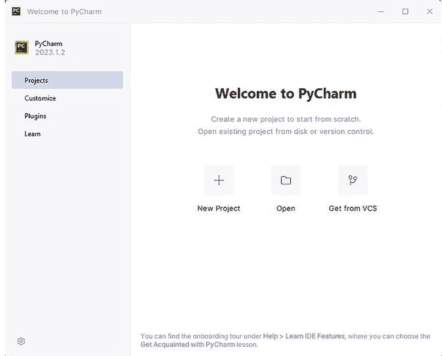

使用。*PyCharm* 可以与不同的 Python 解释器协同工作。如果你需要维护只能在较旧 Python 版本上运行的程序，这一点就很重要。为较新的 Python 版本重写这些程序可能成本很高。因此，使用 *PyCharm*，你可以简单地使用一个较旧的解释器，继续运行你的旧程序而不会有任何问题。定义程序运行环境的能力甚至更进一步。你不仅可以使用与最新版本不同的解释器，Python 还允许你选择程序将访问哪些 Python 库（称为模块和包），特别是使用这些库的哪个版本。这样，你就可以为你的程序构建一个自定义的运行环境，称为 *虚拟环境*。我们将在 ▶ 第 23.3 节更详细地讨论模块、包和虚拟环境。这里的主要事情是确定我们想要使用的解释器。出于与旧程序兼容的原因，在某些情况下使用较旧的解释器可能是有意义的。

但不用担心。通常，Python 的版本跳跃不会导致如此重大的变化，以至于以前编写的程序突然无法执行。然而，从 Python 版本 2.X 过渡到 3.X 时，确实发生了重大变化，在某些情况下产生了这种不幸的影响。这时，*PyCharm* 处理多个 Python 解释器的能力就派上用场了。

即使我们想使用最新的 Python 解释器，我们也需要告诉 *PyCharm* 在哪里可以找到它。为此，请从两个中心选项中单击“Previously Configured Interpreter”。使用另一个选项，你可以为你的项目创建一个虚拟环境。但我们这里不需要这样做。在“Interpreter”选择框中，你当前可能看到“<No interpreter>”（▶ 图 19.2）。如果是这种情况，请单击带有三个点的按钮，选择“Add Local Interpreter”，然后在打开的对话框中选择“System Interpreter”选项（▶ 图 19.3）。在那里你应该已经找到 Python 解释器可执行文件的路径。如果情况并非如此，你可以随时在硬盘上搜索可执行文件（其名称方便地命名为 **python**），并在此对话框中手动选择它。现在，在为项目选择了解释器之后，你可以在“Location”（位于“New Project”对话框的最顶部，▶ 图 19.2）下指定 *PyCharm* 应将你的 Python 项目保存在哪里。现在你已经准备好开始使用 Python 了，所以单击“Create”，然后就可以开始了！

##### 使用 PyCharm 创建 Python 程序

*PyCharm 界面* 打开。在较新版本的 PyCharm 中，菜单隐藏在程序标题栏左侧带有四条横线的图标后面。

首先，我们创建一个新的 Python 脚本文件。为此，请从“File”菜单中单击“New...”选项，然后选择“Python File”（▶ 图 19.4）。如果这不起作用，请单击左侧边栏顶部的小文件夹图标，选择你的项目，然后重试（▶ 图 19.5）。现在你需要给文件命名，例如 **helloworld.py**（Python 文件通常具有 **.py** 扩展名）。你的新 Python 脚本现在将在窗口的右窗格中打开。那么，让我们开始编程吧！

# 216 第 19 章 - 如何让程序运行起来？

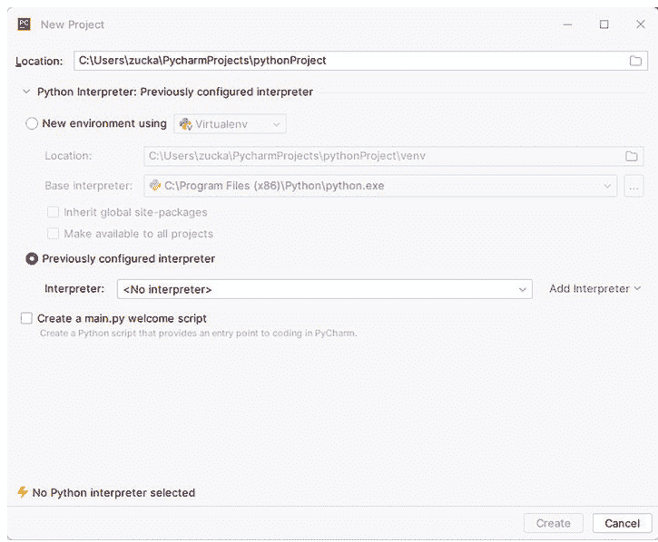

图 19.2 在 PyCharm 中设置新项目的文件夹位置

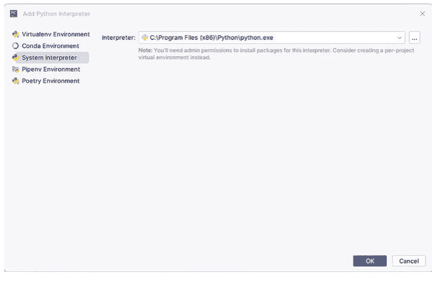

图 19.3 在 PyCharm 中设置新项目的解释器

# 19.1 · 在 Python 中开发和执行程序

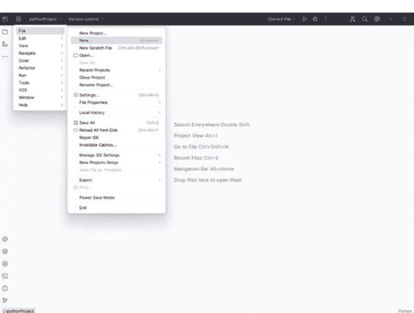

图 19.4 在 PyCharm 中创建新的 Python 文件

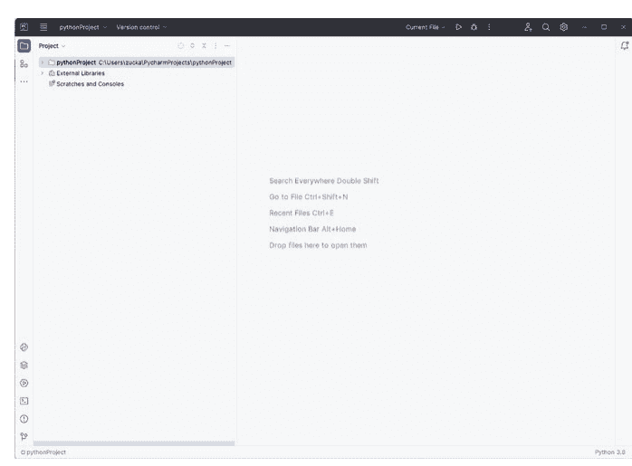

图 19.5 在 PyCharm 的项目视图中创建新的 Python 文件

将以下代码行输入到脚本中：

```
print("Hello World")
print("This is my first Python program")
```

你会注意到 *PyCharm* 在你输入时提供支持，例如，当你输入一个左括号时，它会立即创建一个右括号。此外，当文本光标位于一对括号中的一个之前或之后时，属于同一对的括号会被高亮显示。如果你有很多嵌套的括号，并且想知道哪些左括号和右括号属于同一对，这尤其有用。时不时地，IDE 还会显示小灯泡图标。如果你单击它们，通常会得到关于如何更好地格式化代码的提示，并且通常可以直接通过单击来应用格式化。

##### 运行 Python 程序：在 *PyCharm* 中和在命令行上

现在我们想启动我们的程序。为此，请在编辑器区域的空白处单击鼠标右键，然后从上下文菜单中选择“Run”选项（或者，你可以按 <CTRL><SHIFT><F10>）。

现在 *PyCharm* 中有动静了！在窗口底部，一个类似于标签页的区域打开了，标题为“Run”。这是运行控制台，你的 Python 程序就在这里运行。正如你所看到的，Python 已经运行了你在编辑器中输入的小程序，并向运行控制台输出了两行文本。这里显示的输出（以 Windows 系统上的 *PyCharm* 为例）：

```
C:\[path to your Python interpreter]\python.exe C:/[path to your project]/helloworld.py

Hello world
This is my first Python program

Process finished with exit code 0
```

你可以在图 19.6 的 *PyCharm* 界面中看到这是什么样子。

除了通过 *PyCharm* 运行程序，你也可以通过操作系统的终端/控制台使用命令 **python helloworld.py** 来运行它（根据你的 Python 解释器或 Python 脚本在目录结构中的位置，你可能需要添加路径信息）。你也可以轻松尝试这一点，因为在侧边栏中类似播放按钮的图标（代表运行控制台）下方有三个图标，其中“Terminal”标签页可以直接访问操作系统的命令行级别。但如果你对操作系统终端中使用的命令一无所知，也不用担心，多亏了 *PyCharm*，你一开始可以不用这种看似古老的操作系统操作方式：毕竟，你可以在运行控制台中简单地运行你的程序（这当然只是用你的程序脚本调用 Python 解释器，并在 *PyCharm* 界面上显示输出）。顺便说一句，你会在运行控制台的第一行看到 *PyCharm* 为此使用的命令。你可以将这一行复制到操作系统的终端/控制台（或 *PyCharm* 中的“Terminal”标签页）并立即执行。

除了这个命令和我们程序的输出，你还会在运行控制台中看到消息 **Process finished with exit code 0**。这意味着你的程序已经无错误地运行完毕。这是我们始终希望达到的最佳情况。然而，随着你继续编程，你会注意到你遇到的错误——以及因此导致的程序终止——比你希望的要多。查找和修复错误是日常编程的一部分，就像锯末之于木工车间一样——不愉快，但不可避免。这对初学者和专业人士都适用。

因此，让我们现在“人为地”制造一个错误！我们当前在编辑器区域中有一个可执行的程序。只需删除其中一个 **print()** 调用中的一个右括号。然后再次运行程序。你可以再次使用上下文菜单（鼠标右键）中的 Run 命令，或者——既然我们已经执行过程序——也可以使用运行控制台侧边栏中标题下方的绿色播放箭头。

## 第19章 · 如何让程序运行起来？

如果你删除了一个右括号，*PyCharm*（它会在后台自动检查程序语法）会在缺失括号的位置用红色“下划线”标出可能的问题。在侧边栏中，你会看到一个带有红色圆圈的感叹号图标，表示存在问题。如果你点击侧边栏中的这个按钮，*问题*选项卡将会打开，你将获得关于问题性质的更多信息（图19.7）。然而，我们现在将故意忽略所有这些警告，固执地运行我们（有缺陷的）程序。然后，你将在运行控制台中看到一条红色高亮的错误信息，如下所示：

```
File "C:/[path to your project]/helloworld.py", line 3
^
Unexpected EOF while parsing
Process finished with exit code 1
```

正如你在这个例子中清楚看到的，Python解释器输出的错误信息在调试时往往帮助有限。*PyCharm*在问题选项卡中提供的语法检查通常更有用。顺便说一句，在输出中你还可以看到退出码为1，这表示程序因错误而提前终止。

尽管Python是一种解释型语言，因此通常比编译型编程语言慢，但我们将在接下来的几章中开发的程序通常会运行得相当流畅。然而，特别是在使用循环结构时（我们将在▶第24.4节中介绍），程序运行时间较长是完全可能的，尤其是如果你不小心构建了一个永远不会结束（至少在没有外部干预或系统资源不足的情况下不会结束）的循环。这时，能够在程序运行时中止它就非常方便了。这正是*PyCharm*运行控制台侧边栏中的“停止”按钮可以做到的。当你的脚本正在运行时，这个按钮是红色的，并且可以点击。

### 19.2 Python控制台：交互模式下的Python

我们尚未查看的*PyCharm*界面底部的选项卡之一是*Python控制台*。它允许我们以*交互模式*运行Python。这意味着我们可以输入一条Python语句并立即执行。因此，通常不是输入一整条语句序列然后整体执行（尽管那也是可能的），而只是输入单条语句。指令之后是Python的响应（无论多么精确），然后你可以输入新的输入。由于这种指令输入与Python处理指令之间的相互作用，它被称为交互模式，有时也称为*REPL*（读取-求值-打印循环）。这里的输入是在*提示符*处完成的，它无非是一个输入请求。在Python控制台中，提示符由三个大于号（>>>）标记。

在*PyCharm*侧边栏底部，点击“Python控制台”图标（带有Python徽标的那个，就在象征运行控制台的“播放”图标正下方）。现在，在提示符处，输入我们上面脚本中的一个**print()**语句，并按<ENTER>确认：

```
>>> print("Hello World")
Hello world
```

你可以看到我们的指令被直接执行了。之后，一个新的提示符直接出现，你可以在那里输入进一步的指令。■ 图19.8显示了执行我们的语句后*PyCharm*中的Python控制台。

在前面的代码部分，以及本书其余部分中，提示符通常用字符串**>>>**表示。请注意，你绝对不能输入这些提示符字符！任何没有以提示符开头的内容都是由Python输出的。

你可以使用控制台快速尝试Python命令指令。此外，正如我们在上一章看到的，你可以从这里调用**help**（试一试，输入**help(print)**以获取关于**print()**函数的帮助信息。）请注意，Python控制台和Python脚本编辑器是两个完全不同的、清晰分离的世界。特别是，你无法从Python控制台访问脚本中使用的变量。但更多关于这一点的内容将在▶第21章中介绍。

当然，你也可以直接从操作系统的命令行（控制台/终端）启动Python控制台。为此，只需运行**python**程序，不带任何附加参数。Python控制台随后将在你的操作系统终端中打开。你可以通过输入**quit()**语句再次退出交互模式，这将终止**python**并返回到操作系统层面。

### 19.3 了解PyCharm

你已经了解了*PyCharm*界面的一些功能。当然，*PyCharm*能做的远不止这些；然而，我们不会在这里穷尽*PyCharm*的所有功能。有些功能只有在你希望以专业水平开发软件时才相关。而且，就像任何传统的办公应用程序一样，即使是最专业的用户也不会利用软件提供的所有功能。

*PyCharm*的界面，像许多集成开发环境一样，由于其不同的窗格和选项卡（其中一些是相互嵌套的），相当复杂。尽管为了我们的目的，我们已经能够使用相对有限的功能集，但花点时间摆弄一下*PyCharm*，更好地了解界面仍然是个好主意。保持好奇心，尝试一下。幸运的是，在你的探索过程中不会有任何东西损坏。在▶第23.3.3节（我们讨论使用已安装模块）和▶第25.5节（我们讨论调试）中，我们将再次回到*PyCharm*界面，并了解更多功能。

### 19.4 PyCharm的其他Python代码执行替代方案

如果使用PyCharm对你来说太复杂，你当然也可以使用另一个集成开发环境。市场上不乏替代品。最简单的可能是IDLE，它是随Python安装一起提供的集成开发环境。它允许以脚本/批处理模式或在Python控制台中交互式地执行Python代码。IDLE支持语法高亮，但除此之外并不十分方便。尽管如此，IDLE很好地达到了它的目的。所以，在你因为感觉被“战舰”PyCharm压倒而放弃之前，试试IDLE！我们在本书中做的一切也可以用IDLE而不是PyCharm来完成。

Jupyter是另一种流行的执行Python代码的方式。Jupyter在Web浏览器中运行，类似于Python控制台，允许你以交互模式输入Python命令并查看结果。然而，它不仅显示文本结果，还显示图形，这在处理统计数据时非常有用。除了Python代码和输出之外，你还可以放置标题、说明文本和其他元素。所有这些共同构成了所谓的Jupyter笔记本，它可以保存、随时更改并反复全部或部分执行。保存的笔记本可以轻松地与团队成员、同事或其他感兴趣的人共享。通过这种方式，Jupyter对于探索数据和记录你的工作步骤非常有用。除了Python，Jupyter还支持一系列其他语言，如R或Scala。图19.9显示了一个Jupyter笔记本的示例，其中包含一些代码和输出，以及一些标题，这些标题不是实际代码的一部分，仅用于构建笔记本结构。

如果你在路上，手边没有Python解释器，你也可以使用ChatGPT运行Python代码。ChatGPT有一个可以执行Python代码的环境（以前称为代码解释器）。例如，问ChatGPT：“执行以下Python代码并显示结果”。你可以直接将代码写入提示符，或将其作为文件上传。

### 19.5 总结

在本章中，我们探讨了如何使用*PyCharm*来开发和运行Python程序。

以下是本章的要点：

- *PyCharm*是一个功能强大的集成开发环境（IDE），具有广泛的功能，我们在“正常操作”中只使用了其中的一小部分。
- *PyCharm*通过语法高亮和实时语法检查提供了实用功能，支持Python程序的开发。
- *PyCharm*可以处理不同的解释器。因此，在开始工作之前，选择一个你想使用的解释器是必要的。即使你只有一个解释器可用（即你安装的最新Python版本的那个），你也必须这样做。
- Python程序在*PyCharm*运行控制台中运行。
- 此外，还有Python控制台，它允许以交互模式运行Python；在此输入的Python命令会立即执行。
- Python程序也可以直接使用Python解释器**python**运行，而无需使用*PyCharm*；如果调用Python解释器时没有将Python脚本文件作为参数，它将以交互模式启动。这可以随时通过输入**quit()**退出。
- 你可以使用**print()**函数在屏幕上产生输出。

## 20 概述

在我们真正开始学习 Python 编程之前，我们将首先了解 Python 代码及其最重要的基本元素是什么样子，以及在编写代码时必须遵守哪些基本约定。与许多其他编程语言相比，Python 在代码设计上有一个特殊之处，乍一看，这似乎剥夺了我们作为程序员的一些设计自由，但同时也让我们的生活更轻松。

此外，我们将了解 Python 代码如何进行*注释*和*文档化*。注释很重要，这样我们开发者日后才能理解自己的代码，尤其是在我们想要进一步开发它的时候。文档化用于提供信息，以便其他想在他们的程序中使用我们代码的开发者能确切地知道如何操作。

在本章中，你将学到：

-   行缩进在 Python 中有什么意义
-   如何在 Python 中终止语句以及如何将语句扩展到多行
-   在 Python 中，变量、函数、方法和模块的标识符通常如何选择，以及这样做有什么限制
-   如何在 Python 中编写注释
-   什么是文档字符串，以及如何使用它们来记录程序代码。

### 20.1 程序代码设计与命名约定

#### 20.1.1 缩进与通用代码格式化

我们在 ▶ 第 10.2 节中看到，许多编程语言在源代码格式化方面给了开发者很大的自由度。例如，通过选择合适的缩进，可以使程序代码更清晰。这种设计自由最终源于许多编程语言完全忽略了程序代码的格式化。换句话说，格式化对程序的内容没有影响。

Python 则不同。在其他编程语言中，有特殊的符号来标记代码块的开始和结束（例如，**begin** 和 **end**，或开闭花括号），而 Python 使用缩进。缩进距离相同的语句属于同一个代码块。

这是一个简单函数的示例，你可以传入一个文本和一个重复次数，它就会将文本（大写形式）输出到屏幕上相应的次数，并宣布当前的重复次数。不用担心你可能还不理解所有代码，在本书的这一部分结束时你就会理解。现在这里只关注缩进：

```python
def repeat_text(text: str, reps: int):
    text = text.upper()
    for x in range(1, reps+1):
        output = 'Run no.' + str(x) + ': ' + text
        print(output)

repeat_text('Hello world', 3)
```

函数通过 **def** 创建后，在最后一行被调用。程序通过这个函数调用生成以下输出：

```
Run No.1: HELLO WORLD
Run No.2: HELLO WORLD
Run No.3: HELLO WORLD
```

你可以看到，属于 **repeat_text()** 函数的代码块是缩进的。在 **for** 循环中执行并导致输出的代码块也是如此。这个块甚至缩进了两次，它属于函数 **repeat_text()**，并且在该函数内部属于 **for** 循环 **for x in range(1, reps+1)**：在函数定义结束后，**repeat_text('Hello world', 3)** 又回到了最左边。这个语句不属于 **for** 循环的代码块，甚至也不属于函数定义的代码块。

因此，Python 中的代码块由缩进界定（并由冒号引入，正如你在使用 **def** 关键字的函数定义和 **for** 循环中看到的那样）。缩进通常使用制表符键或输入四个空格来完成。通常更推荐使用第二种方式。然而，为了代码的一致性，尤其不应该在一个程序中混合使用这两种缩进方式。由于强制缩进，Python 代码相当易读，因此设计自由的损失是可以容忍的。这种界定代码块的方式消除了使用括号或其他关键字的需要，而忘记这些——尤其是在代码块末尾——是其他编程语言中常见的错误来源。除了缩进之外，你在代码设计方面完全自由。

然而，以风格指南的形式，存在一系列关于如何编写 Python 代码的建议和推荐。遵守它们有助于使代码更具可读性和可理解性。但许多规则非常详细，即使是 Python 专业人士也肯定不会总是遵守。官方风格指南可以在 ▶ [python.org](https://www.python.org) 网站上作为 *Python 增强提案*（PEP）找到，编号为 PEP 8。去看看一下没有坏处。

如果你使用 *PyCharm*，从“Code”菜单中方便的“Reformat Code”功能可以让你根据 PEP 8 规则自动格式化代码。此外，*PyCharm* 会用波浪形的灰色下划线和小的工具提示覆盖层提醒你违反了 PEP 8 规则，正如你在 ▶ 图 20.1 中看到的那样。

```python
def repeat_text(text: str, reps: int):
    text = text.upper()
    for x in range(1, reps+1):
        output = 'Run no.' + str(x) + ': ' + text
        print(output)

repeat_text('Hello world', 3)
```

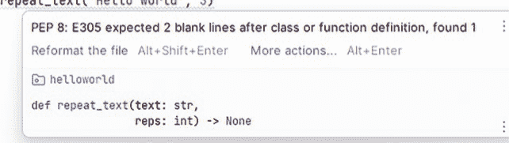

#### 20.1.2 无分号的语句结束与跨多行的语句

Python 通常不需要在语句末尾使用分号之类的分隔符。每个语句都简单地在行尾自动结束。即使由于清晰度降低而不建议这样做，你也可以在 Python 中将多个语句写在一行上。然而，在这种情况下，你必须用分号分隔各个语句。

反过来，也有办法将一条指令扩展到多行。如果语句很长，这样做是有意义的。当然，你也可以简单地将语句写在一行很长的行上。但是，你可能需要水平滚动才能看到语句的末尾。这很不舒服，应该避免。根据 PEP 8 的代码风格建议，代码行不应超过 79 个字符。然而，现在有些语句就是太长了。那么，该怎么办呢？

语句可以在圆括号、方括号或花括号内轻松换行：

```python
repeat_text('Hello world', 3)
repeat_text('Hello World',
3)
```

我们也可以将上面示例中的函数调用显示在两行中。但是，不允许在字符串 **'Hello world'** 内部换行！这里的缩进没有规定，所以你可以随意缩进，这可以大大提高程序代码的可读性。

但是，你也可以通过在行尾放置一个反斜杠（\）在圆括号、方括号和花括号之外对语句进行换行：

```python
x = \
'Hello World'

print(x)
```

然而，这种方法不受欢迎，只应在绝对必要时使用。大多数情况下，换行对于具有许多函数参数的函数调用是必要的，而在那里你无论如何都在圆括号内。

最后一种换行语句的类型是*文档字符串*，或者更一般地说，是用三引号括起来的字符串（我们将在 ▶ 第 20.3 节中更详细地讨论文档字符串）。这些可以跨越多行：

```python
x = '''This is a very long text which does not fit in one line
and therefore must be spread over several lines.'''
```

“普通”字符串做不到这一点。如果我们让字符串超出行尾，Python 解释器会认为我们忘记了终止字符串，这会导致错误消息：

```
SyntaxError: EOL while scanning string literal
```

#### 20.1.3 大小写敏感性与标识符的选择

Python 是大小写敏感的，这意味着通常区分大小写。因此，名为 **age** 的变量与变量 **AGE** 完全不同。当然，大小写敏感性不仅适用于变量，也适用于函数和方法、类、模块和包的标识符。

所有这些元素的标识符可以由字母、数字和*下划线*（_）组成。但是，它们绝不能以数字开头。因此，**customer_age** 是一个允许的变量名，**take2** 和 **_2times4** 也是，但 **11friends** 不是。以一个或两个下划线开头和/或结尾的标识符在 Python 中具有特殊含义，我们稍后将更详细地讨论。建议通常避免使用以或以下划线开头或结尾的标识符，只在标识符*内部*使用下划线，除非你打算实现与前导或尾随下划线相关的效果之一。

除了这些少数规则之外，你可以自由选择你的标识符。然而，有一些约定是许多 Python 程序员遵守的，尽管违反这些规则不会导致程序代码中的语法错误。遵守这些规则会使你的代码看起来更“Pythonic”。例如，类名或其组件通常以大写字母开头（所以，例如，**MyClass**），模块名以小写字母开头（例如，**myModule**），变量和函数以小写字母和下划线开头（例如，**my_variable**，**my_function**）。常量通常用全大写字母和下划线书写（例如，**MAX_VALUE**）。

### 20.2 注释

正如你已经知道的，注释是程序代码中被解释器直接忽略的部分，你可以用它们为自己或阅读你代码的人留下笔记和说明。这类注释以井号（#）开头。井号右侧的所有内容都被视为注释。注释符号不一定非得在行首。在下面的例子中，你会看到两种变体，一种在行首，另一种在更靠右的位置：

```
# Our first little Python program
print('Hello world')# Output on the screen
```

从行中间开始的注释也称为*行内注释*。它们在 Python 中并不受欢迎，在大多数（如果不是所有）编程语言中也是如此，因为它们会使代码更难阅读。如果你使用它们，应确保在实际代码行的末尾和注释符号之间有一些空格（官方建议是两个）。

当然，你也可以使用注释来临时“关闭”程序代码，方法是将其从解释器的访问中移除，解释器会忽略注释字符右侧的所有内容。在这种情况下，称之为*注释掉*是合理的。本例中的第二个 print 语句正是如此：

```
# Our first little Python program
print('Hello World')
# print('Hello, world')
```

注释总是延伸到行尾；Python 原则上不支持多行注释。因此，如果你想写多行注释——你会不时这样做，因为你的注释应该在普通屏幕上完全可读，无需水平滚动（官方建议每行最多 79 个字符）——你必须在每行前加上额外的注释符号。不过，许多开发环境会为你完成这项工作。如果你使用 *PyCharm*，可以高亮显示要注释掉的行，然后点击 Code 菜单中的“Comment With Line Comment”选项（或者按 <CTRL> 和 </> 键组合），PyCharm 就会在每个选定代码行的开头添加注释符号。你也可以使用相同的选项从已注释的行中移除注释符号。除此之外，还有一个技巧可以用来创建类似真正的多行注释。更多内容将在下一节介绍。

关于注释的意义和无意义，可以进行哲学探讨和争论，尤其是关于注释何时有帮助、何时只是让代码更冗长从而更不清晰的问题。回顾几页前的 ▶ 第 **10.3** 节，我们学习了一些注释程序代码的最佳实践。作为经验法则，我们可以指出：通常注释总是不够的，所以请随意写注释；你那个试图理解旧代码的“未来的自己”会感谢你！

有时你也使用注释在程序代码的相应位置直接记录待办任务。如果你使用 *PyCharm*，可以在这些注释前加上 `# TODO`：

```
# TODO: Add more languages here
print('Hello World')
print('Hallo Welt')
```

类似地，你可以用 `# FIXME` 在相应的代码位置标记和解释仍需修复的小错误。以这种方式开头的注释在语法高亮中会被特别高亮显示，并且 *PyCharm* 会对其进行特殊处理。*PyCharm* 会在一个名为“TODO”的特殊侧边栏窗格中显示这类注释，如 ▶ 图 **20.2** 所示。所有 *TODO* 和 *FIXME* 注释都会显示在那里；双击 TODO 区域中的条目会直接带你到代码中的相应位置。如果看不到 TODO 窗格，请点击侧边栏中的三个点以查看当前隐藏的区域。

如果你愿意，也可以通过 *PyCharm* 的设置定义类似于 `# TODO` 和 `# FIXME` 的自定义注释类型。然而，在绝大多数情况下，上述两种特殊注释类型应该就足够了。

### 20.3 使用文档字符串进行文档化

除了总是以注释符号 # 开头的“真正”注释外，还有第二种在代码中存储不被解释器执行的信息的可能性，即借助所谓的*文档字符串*。文档字符串是写在三引号之间的特殊字符串。考虑以下程序作为示例：

```
'''
This is a docstring for our hello world program, namely
one that even spans several lines.
'''

print('Hello world!')
```

如果你运行这个程序，你会得到输出 **Hello world!**。另一方面，文档字符串不会被显示。

让我们尝试另一种方式：这次我们不使用带三个引号的文档字符串，而是使用一个完整的普通字符串，类似于 **'Hello world!'**，我们在下面输出它。与文档字符串不同，Python 中的普通字符串在程序代码中不能跨多行，所以我们将“注释”放在了一行。现在运行这个程序会发生什么？没有任何变化！同样，只输出 **'Hello world!'**。原因很简单：每当你在 Python 程序代码中写入文本时，就像我们先用文档字符串然后用普通字符串所做的那样，这不会在屏幕上产生任何输出。相反，文本只是被忽略了（技术上不完全正确，但至少没有可见效果）。变量也是如此，你将在下一章看到。如果我们只是在程序代码中输入变量名而没有任何进一步的指令，什么也不会发生。要显示变量的内容，或者只是我们上面示例中的文本，我们必须明确告诉 Python 输出它。我们通过调用 **print()** 函数来实现这一点。在控制台中则不同。如果你在那里输入变量名并按 <ENTER>，内容就会显示出来。如果你在控制台中输入一个字符串，该字符串会立即在控制台中再次显示。

因此，像所有其他字符串一样，文档字符串如果在程序代码中没有任何其他指令，就不会在屏幕上显示。既然如此，我们是否可以只用普通字符串来解释我们的代码呢？是的，这行得通。然而，文档字符串有两个特殊属性，使它们特别适合*文档化*程序代码，正如它们的名字所暗示的：首先，它们可以跨多行：我们已经看到了这一点。其次，Python 以特殊方式处理这些文档字符串。如果它们位于函数、类定义或模块的开头，它们会被用作该函数、类或模块的帮助内容。如果你调用 **help()** 函数（例如，对于 **print(): help(print)**），你会看到存储在相应程序代码开头的文档字符串。

有许多 Python 工具可以处理这些文档字符串并以文档形式输出它们。Python 自身的帮助使用一个名为 *pydoc* 的工具，它从代码中提取文档字符串，并在调用 **help()** 时显示它。此外，还有其他一些处理文档字符串的实用程序，例如 *autodoc*、*doxygen* 和 *pydoctor*。其中一些程序是专门为 Python 设计的，其他程序则允许为不同的编程语言自动生成代码文档。这些文档的输出不必只是 Python 控制台中的文本。相当多的工具还支持生成 HTML、PDF 甚至 LaTeX 文档。为了清晰地组织文档，一些工具要求文档字符串具有特殊的结构。

当然，聪明的人们早就考虑过文档字符串通常应该是什么样子的问题。这个问题的官方答案可以在 *Python Enhancement Proposals*（PEP）中找到，即 PEP 257（*文档字符串约定*）。

与注释不同，文档字符串更多地用于为*其他用户*文档化代码，即解释如何*使用*代码来实现你自己的目的，而不是记录代码*如何工作*的笔记。这通常是注释的用途。我们将在后面的一些地方再次讨论文档字符串，并在我们的程序中使用它们。

我们稍后还将更仔细地了解另一种类型的文档。这些是*函数注解*，它们允许你在程序代码中记录函数参数的预期数据类型，以及函数返回值的数据类型。注解也被 *pydoc* 用于帮助，并且也可以被其他文档工具处理。

文档字符串和函数注解通常面向的受众不是你自己，而是你的代码的*用户*。当编写供其他开发人员使用的 Python 代码时，记录函数等功能的作用非常重要，

### 20.4 总结

本章我们探讨了Python在格式化程序代码方面的特殊功能，标识符（例如变量和函数/方法）可以/必须如何构建，以及如何为程序代码添加注释和文档。

你应从本章掌握以下要点：

- 在Python中，缩进标记一个连贯的代码块，因此不能随意使用；可以说，Python已经“强制”实现了程序代码的易读格式化。
- 在Python中，语句通常在行尾结束，不需要特殊的分隔符。
- 如果换行发生在圆括号、方括号或花括号内部，或者通过反斜杠（\）特别标记，语句可以跨越多行，尽管后一种换行方式相当少见。
- 单行上可以用分号分隔多个语句。
- Python在定义变量或标识符时区分大小写。
- 标识符允许由字母、数字和下划线组成。
- 与数字不同，字母和下划线也可以出现在标识符的开头。
- 由于标识符开头（以及结尾）的单下划线和双下划线具有特殊含义，通常应避免使用以下划线开头的标识符。
- 在Python中，变量和函数/方法的标识符通常用小写字母书写，如果是复合词，其各部分用下划线分隔。
- 解释代码的注释在Python中总是单行的，并以注释符号#开头；其右侧的任何内容都不会被解释为程序代码，而是被解释器忽略。
- 用三引号括起来的文档字符串在Python中用于为代码用户提供文档；它们是Python帮助的核心部分，可以通过**help()**调用，并由众多开发工具进一步处理成各种格式的文档。
- 文档字符串可以跨越多行。

## 变量与对象：我如何存储数据以供使用？

目录

- 21.1 创建和赋值变量 – 236
- 21.2 删除变量 – 238
- 21.3 变量的基本类型 – 238
  - 21.3.1 数字（int, float） – 239
  - 21.3.2 字符串（str） – 239
  - 21.3.3 布尔值（bool） – 241
  - 21.3.4 None – 242
  - 21.3.5 其他数据类型 – 243
- 21.4 变量作为对象 – 244
  - 21.4.1 变量的属性和方法 – 244
  - 21.4.2 使用构造函数方法创建变量 – 248
- 21.5 转换变量 – 249
- 21.6 复杂数据类型 – 251
  - 21.6.1 列表 – 251
  - 21.6.2 元组 – 258
  - 21.6.3 字典 – 259
  - 21.6.4 集合 – 262
- 21.7 自定义类 – 264
  - 21.7.1 定义和使用类 – 264
  - 21.7.2 从其他类派生类 – 266
  - 21.7.3 避免歧义：名称修饰 – 268
- 21.8 总结 – 268
- 21.9 练习解答 – 271

© 作者，经Springer Fachmedien Wiesbaden GmbH（Springer Nature旗下）独家许可，2024
J. L. Zuckarelli, *Learn coding with Python and JavaScript*, https://doi.org/10.1007/978-3-658-42912-6_21

## 概述

在本章中，我们将把重点转向处理Python中的变量。此外，我们将探讨如何将各种变量聚合到类似列表的结构（数组）中，以及如何在哈希（字典）中映射键值对。鉴于Python的面向对象特性，其中所有变量都是拥有属性和方法的对象，我们的讨论将不仅仅局限于创建、赋值和转换不同数据类型的变量。我们将深入探讨Python面向对象的实现，并展示如何在Python中利用面向对象编程来使你的项目受益。

在本章中，你将学习：

- 如何在Python中创建变量并为其赋值
- 变量有哪些基本类型，以及如何使用它们
- 变量的对象特性意味着什么，以及这对你实际使用变量有何影响
- 如何将变量从一种数据类型转换为另一种数据类型，以及Python在哪些情况下会自动为你进行转换
- 存在哪些更复杂的数据类型（例如列表和字典），以及如何使用它们
- Python中的类定义是如何工作的，以及如何自己定义和使用对象类

### 21.1 创建和赋值变量

与某些其他语言不同，在Python中创建变量相当简单。这是因为Python中不需要声明变量；它们在第一次使用时会自动创建。因此，赋值语句

```
>>> x = 5
```

创建了一个（整数）变量并将其值设置为5（`>>>`是提示你输入的提示符，所以你不需要输入这个！）

为了简单起见，我们在这里将变量命名为**x**。在第11章中，我们说过变量名最好是有意义的，并能让代码的读者猜测变量将包含什么样的内容。尽管我们在这些示例中使其非常简单，但Python为你提供了使用有意义变量名的所有机会。正如你从第20.1.3节已经知道的，Python中的名称可以由大小写字母、数字和下划线字符组成。数字不允许出现在变量名的开头，但可以在名称中的任何其他位置使用。此外，名称开头（有时也包括结尾）的下划线在Python中具有特殊含义，我们将在后面讨论。因此，建议不要以下划线开头或结尾来命名变量。除此之外，你可以完全自由地按自己的意愿命名变量。

Python自己决定变量应该具有什么类型。在变量的生命周期内，类型可能会改变，例如，通过向变量赋值不同类型的数据。使用

```
>>> x = 'A string (str) variable'
```

不仅变量的值，而且其数据类型也发生了改变，它现在是一个字符串变量。在下一节中，当我们探讨变量的对象特性时，你将了解到除了赋值之外，在Python中创建变量的第二种方式。
如果你使用Python控制台，你可以随时通过输入变量名来显示其值。

```
>>> x
'A string (str) variable'
```

另一方面，如果你在Python脚本中编写代码，则必须使用你在上一章学到的**print()**函数来打印变量的内容：

```
print(x)
```

如果你在Python程序中只写变量名，则不会有任何输出。
顺便说一下，你无法在控制台中访问你在程序中创建的变量。控制台的命名空间和你程序的命名空间是分开的。如果你在控制台中使用你在程序中创建的变量，你将收到一条错误消息（当然，除非你已经通过控制台创建了一个同名的变量——但那样你操作的将是这个变量，而不是你在程序中使用的那个）。
有时你会意外地访问一个不存在的变量，例如因为你拼错了标识符。那么你会得到如下错误消息：

```
Traceback (most recent call last):
  File "D:\Applications\Anaconda\lib\site-packages\IPython\core\interactiveshell.py", line 2961, in run_code
    exec(code_obj, self.user_global_ns, self.user_ns)
  File "<ipython-input-16-9063a9f0e032>", line 1, in <module>.
    y
NameError: name 'y' is not defined
```

这里最关键的是最后一行。它告诉我们，一个名为 y 的变量（我们在此尝试访问它）根本不存在。

### 21.2 删除变量

一旦创建，变量可以借助 **del** 命令再次删除。这很有意义，特别是当变量占用大量内存时（例如，你已经完全读入一个大文件），并且在不再需要数据后希望释放内存。

如果你在 Python 控制台中删除一个变量，然后尝试访问它，你会得到一条错误信息：

```
>>> del x
>>> x
Traceback (most recent call last):
  File "<input>", line 1, in <module>
NameError: name 'x' is not defined
```

错误信息提到 *名称* x 未定义。与许多其他编程语言一样，Python 明确区分变量的值及其名称。名称只是对位于内存中某个区域的值的引用。原则上，名称和值彼此独立存在。现在，可能有多个名称指向完全相同的值，即内存中的同一位置。如果存储在相关内存中的值发生变化，所有这些变量的值也会相应改变。在这种多个名称都指向同一内存位置的情况下，如果你删除一个名称，值和其他名称（因此也就是变量）会被保留。然后你只是无法再通过已删除的名称来访问该值，只能通过剩余的名称访问。

Python 会计算指向一个值的名称数量（结果称为 *引用计数*）。如果没有名称再指向某个值，Python 会删除该值本身。这个过程称为 *垃圾回收*。然而，由于通常只有一个名称与你的变量的值存在 *绑定*，当你调用 **del** 命令时，值本身通常也会被删除，相关内存也会被释放。

### 21.3 变量的基本类型

在本节中，我们将讨论最重要的变量类型。我们将首先专注于只包含单个值的变量。在下一节中，我们将研究可以同时保存多个值的更复杂的数据类型。

#### 21.3.1 数字（int, float）

Python 中的数字以整数（**int**）或浮点数（**float**）的形式存在。与许多其他编程语言不同，Python 中的 **int** 变量没有固定的值范围，超出该范围就必须选择占用更多内存的另一种数据类型。Python 只是为变量保留存储其包含的值所需的内存。

你可以通过使用 **sys.getsizeof(object)** 函数查看变量的大小来很好地理解这一点：

```
>>> x = 5
>>> sys.sizeof(x)
14

>>> x = 1000000000000
18
```

如你所见，在我们为变量分配了一个显著更大的值（一万亿）而不是 5 之后，内存需求从原来的 14 字节增加到了 18 字节。

你可能想知道为什么即使像 5 这样的小值在内存中仍然需要 14 字节。在许多其他编程语言中，这样的变量大小仅为 2 字节（= 16 位）。这可以表示 0 到 2^16 = 65,536 之间的数字。那么为什么 Python 如此“耗内存”呢？答案与 Python 存储变量的方式有关，将在下一节讨论。

浮点数的小数点是句点，这是英语中的惯例。在 Python 中，这样做的最大问题是，如果你习惯性地使用逗号而不是句点（这在许多欧洲和南美国家很常见），你不会得到错误信息：

```
>>> pi = 3.1415926535
>>> pi
(3, 1415926535)
```

Python 误解了我们的输入，并创建了一个完全不同类型的变量，即 *元组*。我们将在本章稍后更详细地讨论这些元组。

#### 21.3.2 字符串（str）

字符串，即 **str** 类型的变量，在 Python 中可以用单引号或双引号括起来：

```
>>> x = "A text in double quotes."
>>> x
'A text in double quotes.'

>>> y = 'A text in single quotes.'
>>> y
'A text in single quotes.'
```

能够使用两种引号的优点在于，在 Python 中，你可以在文本中轻松显示引号，因为两种不同的引号变体意味着不会混淆作为文本一部分的引号和在字符串前后界定字符串的引号：

```
>>> quote = 'Hamlet said, "To be or not to be. That is the question here!"'
>>> quote
'Hamlet said, "To be or not to be. That is the question here!"'
```

正如你可能注意到的，Python 自动将变量内容的输出用（单）引号括起来，以明确这是一个字符串。以下示例表明这是一个实用的功能：

```
>>> x = '5'
>>> x
'5'

>>> x = 5
>>> x
5
```

在第一次赋值中，变量的内容是一个字符串，在第二种情况下，它是一个数字，现在可以用于计算。

在 Python 中，创建跨多行的字符串非常容易。为此，只需将文本用三引号括起来：

```
z = """The text starts on the first line
and continues on the second line."""

print(z)
```

此程序产生以下输出：

```
The text begins on the first line
and continues on the second line.
```

实际上，换行符在输出中被保留。你不仅可以在脚本模式下（即编写程序以便稍后执行）使用此功能。即使在交互模式下，Python 在按下 <ENTER> 键后也能识别你在这里开始了一个多行字符串，因此会等待语句的执行（毕竟，这通常由 <ENTER> 触发），并允许你继续在下一行书写。

你在上一章已经熟悉了这种作为 *文档字符串* 的字符串类型。文档字符串被放置在你的程序代码中作为文档，但目的不是为了进一步处理或输出给程序的最终用户。

有时你想在程序代码中换行字符串，但这种换行在字符串输出时不可见；目的只是为了让程序代码更清晰（记住 ▶ 第 20.1.1 节中推荐的每行 79 个字符的限制！）。在这种情况下，你可以使用反斜杠（\）：

```
message = 'Hello ' \n'world'
print(message)
```

此代码生成输出：

```
Hello world
```

这意味着不是两个不同行上的两个字符串，而是一个字符串，只是出于实际原因分布在代码中的两行上。

#### 21.3.3 真值（bool）

真值，或逻辑值真和假，在 Python 中用数据类型 **bool** 表示，这是对英国数学家和逻辑学家乔治·布尔的致敬，他在本书第一部分已经提到过，他在十九世纪对形式逻辑的发展做出了重大贡献。

与其他变量类型不同，**bool** 类型的变量只能取两个值：**True** 和 **False**。注意大小写！常量 **True** 和 **False** 必须每个都以大写字母书写。如果我们写 **false**，Python 会假设我们想使用一个名为 **false** 的变量，这当然不存在：

```
>>> x = false
Traceback (most recent call last):
  File "<input>", line 1, in <module>
NameError: name 'false' is not defined

>>> x = False
>>> x
False
```

另外，不要使用引号，因为它们会使变量成为 **str** 变量：

```
>>> x = 'False'
>>> x
'False'

>>> type(x)
<class 'str'>

>>> x = False
>>> x
False

>>> type(x)
<class 'bool'>
```

Python 在内部将值 **True** 和 **False** 存储为 0 和 1，因此你可以像使用普通数字一样对它们进行计算：

```
>>> x = 5 * True
>>> x
5
```

#### 21.3.4 None

一个特殊的数据类型是 **NoneType**。你不能创建自己的这种类型的变量。相反，Python 已经为你创建了一个 **NoneType** 类型的对象，即 **None**（多么有创意！）。这允许你将值 **None** 赋给一个变量，这意味着该变量当前没有真实、有意义的值：

## 21.3 · 变量的基本类型

```python
>>> x = None
>>> x
None

>>> type(x)
<class 'NoneType'>
```

但这不是有点奇怪吗？如果变量是数字，我们为什么不直接给它赋值**0**，或者如果是字符串，赋值""（即空字符串）呢？当然，我们确实可以这样做，但前提是**0**或""在内容上没有实际意义。然而，例如在测量温度时，或者在-5到+5的量表上调查某人对某个话题的态度时，值0很可能具有其自身的实际意义。在这种情况下，受访者给出值0从而表明对该话题持中立态度，与根本没有回答问题（**None**），两者是有区别的。为了使这种区别显而易见，为“无实际值存在”设置一个特殊指示符是合理的，而这正是**None**值的用途。

顺便说一句，你不能用**None**进行计算：

```python
>>> None + 1
Traceback (most recent call last):
  File "<input>", line 1, in <module>
TypeError: unsupported operand type(s) for +: 'NoneType' and 'int'.
```

如果**None**作为逻辑表达式求值，它会被视为**False**。因此，**None**除了表示变量不包含实际值之外，确实别无他用。

#### 21.3.5 其他数据类型

除了目前讨论的数据类型外，Python本身还内置了其他几种数据类型，例如**complex**，这是一种用于表示数学中已知的复数的数据类型，复数由实部和虚部组成。

不属于标准语言的各种包（程序库）也提供了自己的数据类型。一个例子是*NumPy*包，这是一个用于高效处理向量和矩阵的库，是统计和机器学习方法工作的重要基础，Python在这些领域已经得到了相当广泛的应用。

*NumPy*不仅提供了一些新的复杂数据类型，还提供了几种基本数据类型。例如，对于已知的数据类型**int**和**float**，*NumPy*有自己的替代方案，其特点是它们不像Python中的标准数据类型那样根据变量内容调整内存需求，而是在内存中始终占用固定数量的字节。这允许使用此类变量进行非常快速的计算，特别是对于大型的此类变量字段，而高效的计算是一项基本技能，尤其是在处理大量数据时，例如在机器学习中。

然而，由于对于大多数用例，我们可以使用这里讨论的数据类型来应付，我们就到此为止，现在在下一节中更仔细地研究Python中变量的特性。

### 21.4 变量作为对象

#### 21.4.1 变量的属性和方法

Python深受面向对象编程范式的影响。与一些同样采用这种编程方法的其他编程语言（如C++）不同，在Python中，即使是最简单的变量也是对象。

Python中的变量最终总是*类*的具体实例，例如用于浮点数的**float**类。**float**类有一系列方法和属性，你可以通过类的具体实例（即变量对象）来访问它们。如果你不再熟悉类和实例/对象这些术语，请翻回几页到▶第11.7节，在继续之前刷新你的知识！

如果你使用*PyCharm*，并在代码编辑器中输入你程序中已使用的变量名，后跟一个点，一个小的代码补全菜单会弹出，你可以在其中看到属于你变量类的方法和属性。你也可以在控制台中做同样的事情，输入一个你已经通过Python控制台赋值的变量，同样后跟一个句点。

点是Python中允许你访问对象方法和属性的运算符。因此，当你在变量名后输入一个点时，*PyCharm*期望你使用该变量的方法或属性，并显示相应的列表。你可以在▶图21.1中看到一个例子。

标有小“m”的菜单条目是**float**类提供给对象的方法，标有小“p”的条目是属性（“p”代表*property*）。你还可以在右侧的代码补全菜单中看到对象从哪里获得了它的方法或属性。在我们的例子中，所有方法和属性都直接来自**int**类，但有些也会来自更通用的**object**类，**int**类是从它派生出来的。从某种意义上说，**object**类是**int**类的父类，并从中继承方法和属性。

现在在控制台中创建一个**float**变量，并为该变量对象调用方法**is_integer()**：

```python
>>> x = 5.3
>>> x.is_integer()
False
```

该方法检查浮点数是否也是整数，当然在我们的例子中并非如此。类方法is_integer()不需要任何函数参数，因为它自动引用我们调用它的对象，即x。虽然不需要向函数传递参数，但它仍然必须始终用（空的）圆括号调用，以标识它是一个函数。

然而，**float**类不仅有方法，还有一些属性。其中一个属性是**__class__**。它表示对象的类：

```python
>>> x.__class__
<class 'float'>
```

或者，你也可以使用函数**type(object)**来确定对象类型，将对象作为参数传递给它：

```python
>>> type(x)
<class 'float'>
```

借助函数**isinstance(object, class)**（与**type(object)**一样，它是Python标准库的一部分），你可以确定一个变量是否属于某种类型；用我们的面向对象术语更精确地表述，你可以确定一个变量是否是某个*类*的*实例*。为此，将变量和要检查的类传递给函数：

```python
>>> isinstance(x, str)
False

>>> isinstance(x, float)
True
```

让我们更仔细地看看对象的方法，即类提供给对象的函数。不久之前，我们已经认识了**is_integer()**，这是**float**类的一个方法，它检查当前对象（即我们调用其方法的对象）是否为整数。如你所记得的，我们不必将要检查的变量传递给这个特殊函数，因为该方法已经是对象的一部分，因此知道它应该处理哪个对象。

现在让我们看看字符串变量：

```python
text = 'Strings in Python have many interesting methods.'
```

如果你使用*PyCharm*，现在可以在脚本编辑器或Python控制台中输入**text.**（带点运算符），熟悉的上下文菜单就会打开，显示字符串类**str**提供给你的**text**对象的属性和方法。你会立即看到这里提供了丰富的不同方法选择（图21.2）。

让我们尝试其中一些：

- **lower()** 和 **upper()** 分别将字符串转换为小写和大写字母：

```python
>>> text = 'An ordinary text, with a few words and punctuation marks.'
>>> text.lower()
'an ordinary text, with a few words and punctuation marks.'

>>> text.upper()
'AN ORDINARY TEXT, WITH A FEW WORDS AND PUNCTUATION MARKS.'
```

- **isnumeric()** 检查字符串是否可以转换为数字：

```python
>>> text.isnumeric()
False
```

- **count(substring)** 计算作为参数传递给方法的（子）字符串**substring**的出现次数；它是区分大小写的，如以下示例所示（只计算了“and”中的“an”）：

```python
>>> text.count('an')
1
```

- **replace(old, new, occurrences)** 将指定数量的旧字符串替换为新字符串；指定要替换的出现次数是可选的，因此你可以省略它，这将简单地替换*所有*出现：

```python
>>> text.replace('words', 'terms', 1)
'An ordinary text, with a few terms and punctuation marks.'
```

- **__len__()** 确定字符串的长度：

```python
>>> text.__len__()
58
```

从两个前导和尾随下划线可以看出，这是一个特殊的Python核心方法。

## 21.1 [20 min]

除了这里作为示例介绍的方法外，**str** 类型（即字符串变量）还有其他一些有趣的方法。请找出 **str** 对象还有哪些可用的方法，并在 Python 控制台中尝试使用它们。如果你不理解某个方法或无法成功使用它，不要纠结，继续学习下一个方法。

你可以在帮助文档中阅读关于这些方法的详细信息。为此，在 Python 控制台中调用 **help()**，并在调用方法时在方法名前加上 **str.**，这样 Python 就能确切知道你想查看哪个类的方法（可能有多个类拥有同名方法），例如 **help(str.isnumeric)**。

你可能在练习中注意到，像 **upper()**、**lower()** 和 **replace()** 这样的方法并不会修改它们所调用的对象，而只是*返回一个修改后的副本*。如果你想改变原始对象，必须将修改后的版本（即方法的返回值）赋值给它。让我们以 **upper()** 为例更仔细地看看这一点：

```
>>> text = 'An ordinary text, with a few words and punctuation marks.'
>>> text.upper()
'AN ORDINARY TEXT, WITH A FEW WORDS AND PUNCTUATION MARKS.'

>>> text
'An ordinary text, with a few words and punctuation marks.'

>>> text = text.upper()
>>> text
'AN ORDINARY TEXT, WITH A FEW WORDS AND PUNCTUATION MARKS.'
```

如你所见，调用 **text.upper()** 方法后，**text** 变量完全没有改变。只有将方法的返回值赋给我们的原始变量，才能改变 **text** 对象。

#### 21.4.2 使用构造方法创建变量

在上一节中，我们看到可以通过首次赋值来简单地创建变量。但还有另一种创建新变量的方式。如你所知，变量是对象，即类的实例。像所有类一样，这些对象有一个构造方法，这是一个创建该类型对象的特殊方法。我们可以使用这些构造方法来创建变量。让我们看下面的例子：

```
>>> x = int(3)
>>> x
3

>>> type(x)
<class 'int'>
```

因此，构造方法返回一个 **int** 对象，其值为传递给它的参数。这本身可能并不那么有趣；毕竟，我们通过简单的赋值 **x = 3** 也能达到同样的效果。有趣的是，我们也可以将浮点数或字符串传递给构造方法，它会从中创建一个 **int** 对象。对于浮点数，小数部分会被忽略。如果将字符串传递给构造方法，文本当然必须可以转换为数字，否则我们会得到错误消息：

```
>>> x = int(3.7)
>>> x
3

>>> x = int('3.7')
>>> x
3

>>> x = int('abc')
Traceback (most recent call last):
  File "<input>", line 1, in <module>
ValueError: invalid literal for int() with base 10: 'abc'.
```

### 21.5 转换变量

需要改变变量的数据类型并不少见。为此，请看以下示例，其中我们将一个整数变量和一个浮点数变量相加：

```
>>> x = 2
>>> type(x)
<class 'int'>

>>> x = x + 3.7
>>> x
5.7

>>> type(x)
<class 'float'>
```

当我们创建变量时，Python 自动选择 **int** 作为数据类型，因为我们给变量赋了一个整数。但当我们加上 3.7（一个浮点数）时，Python 将类型更改为 **float** 以适应新值。因此，Python *隐式*地进行转换，无需我们干预。

现在让我们尝试其他操作：

```
>>> x = 2
>>> x = x + '2.7'
Traceback (most recent call last):
  File "<input>", line 1, in <module>
TypeError: unsupported operand type(s) for +: 'int' and 'str'.
```

如果我们给变量 **x** 加上一个字符串，Python 就不再隐式转换了。也许反过来可以？我们定义 **x** 为字符串，然后加上一个数字？

```
>>> x = '2'
>>> x = x + 3.7
Traceback (most recent call last):
  File "<input>", line 1, in <module>
TypeError: can only concatenate str (not "float") to str
```

这也不行。因此，Python 不会在数字和字符串之间进行隐式转换。然而，我们有时需要将字符串转换为数字以便进行计算。

让我们用一个例子来看看。你还记得从开尔文到摄氏度的转换吗？▶ 第 **12.2.2** 节？在那里我们讨论了一个简单的程序，它接受用户输入的开尔文温度并将其转换为摄氏度。我们现在将在 Python 中开发这个程序。为此，我们使用 **input(prompt)** 函数进行输入，该函数提示用户输入，并以字符串形式返回该输入。有了这个知识，编写如下代码是显而易见的：

```
temp_kelvin = input('Please enter a temperature in Kelvin: ')
temp_celsius = temp_kelvin + 273.15
print(temp_kelvin, 'Kelvin are', temp_celsius,
      'degrees Celsius.')
```

如果我们运行这个程序并输入一个开尔文温度，我们会得到如下输出：

```
Traceback (most recent call last):
  File "C:/Users/MyUser/Python/var_examples.py", line 54, in <module>.
    temp_celsius = temp_kelvin + 273.15
TypeError: can only concatenate str (not "float") to str
```

到现在你已经理解这里出现的问题了：**input()** 函数返回一个字符串，但无法直接进行计算，因为 Python 不会隐式转换为数字。我们需要*显式*转换。这正是我们在这个修改版本的示例中所做的：

```
temp_kelvin = input('Please enter a temperature in Kelvin: ')
temp_celsius = float(temp_kelvin) + 273.15
print(temp_kelvin, 'Kelvin are', temp_celsius,
'degrees Celsius.')
```

这次我们使用 **float()** 函数将字符串变量 **temp_celsius** 显式转换为浮点数。你立刻会认出上一节的内容：**float()** 当然也是 **float** 类的构造方法。因此，当我们把字符串变量 **temp_kelvin** 转换为浮点数时，我们所做的不过是通过调用这个类的构造方法来创建一个新的 **float** 对象。我们立即用一个值初始化了新的 **float** 对象；这个值也可以是一个字符串，**float** 构造方法会从中创建一个浮点数。因此，Python 中的*显式*转换是通过类构造方法进行的。它们不仅可以接收类构造方法所创建类型的值（在我们的例子中是 **float**），还可以接收各种其他类型（在我们的例子中是 **str**）。因此，显式转换通常具有以下形式：**datatype(value)**。

> 21.2 [10 min]
编写一个程序，接受用户以年为单位的年龄，并输出用户至少活了多少分钟。

### 21.6 复杂数据类型

#### 21.6.1 列表

##### 21.6.1.1 创建和显示列表

与许多其他编程语言不同，Python 本身没有数组的概念。然而，Python 有一种更通用的变量字段类型，数组最终是其特例：列表。
列表是*任意*对象的*有序*集合。因此，数组也可以被理解为列表，因为它不过是*相同类型*对象的有序集合。Python 中使用方括号创建列表，如以下示例所示：

```
>>> numbers = [1, 2, 3, 4, 5, 6, 7]
>>> first_names = ['Beverly', 'Thomas', 'Marc', 'Jimmy',
'Cathy']
```

在控制台中输入列表名称会显示列表的内容。列表元素周围的方括号提醒我们这确实是一个列表：

```
>>> numbers
[1, 2, 3, 4, 5, 6, 7]

>>> first_names
['Beverly', 'Thomas', 'Marc', 'Jimmy', 'Cathy']
```

如果你不是在控制台中工作，而是在脚本模式下（即编写整个程序），那么使用 **print()** 函数进行输出，它也可以处理列表：

```
print(numbers)
print(first_names)
```

仅写列表的标识符，例如 **numbers**，在程序中不会产生输出——这与 Python 控制台不同——正如我们在 ▶ 第 21.1 节中已经看到的。

##### 21.6.1.2 选择列表中的单个元素

现在可以通过索引访问列表的单个元素，同样使用方括号：

```
>>> numbers[3]
4

>>> first_names[2]
'Marc'
```

Python 中的索引从 0 开始，因此索引为 1 的元素已经是列表中的*第二个*元素。你可以使用*负*索引从后面开始选择。如果我们想从列表末尾选择第二个名字，可以这样写：

```
>>> first_names[-2]
'Jimmy'
```

列表的最后一个元素的索引是 −1，而不是你可能预期的 −0。
冒号运算符也可以用来指定一个范围作为索引。例如，如果我们想选择第二个到第四个名字，可以这样做：

##### 21.6.1.3 编辑列表

我们刚刚学习的索引不仅可以用来从列表中选择项目进行显示或进一步处理，还可以直接修改列表中的项目。在本节中，我们将探讨如何修改列表元素、向列表添加元素、从列表中删除元素、对列表进行排序，以及将多个列表合并成一个新列表。

###### 更改列表元素

让我们从更改列表项的值开始：

```
>>> first_names = ['Beverly', 'Thomas', 'Marc', 'Jimmy',
'Cathy']
>>> first_names[1] = 'Jason'
>>> first_names
['Beverly', 'Jason', 'Marc', 'Jimmy', 'Cathy']
```

甚至整个索引范围也可以这样赋值：

```
>>> first_names = ['Beverly', 'Thomas', 'Marc', 'Jimmy',
'Cathy']
>>> first_names[3:5] = ['Joe', 'Aimee']
>>> first_names
['Beverly', 'Thomas', 'Marc', 'Joe', 'Aimee']
```

在这种情况下，请确保你赋的值也是一个列表（即，它被方括号括起来，并且与你要替换的子列表长度相同）。

> 21.3 [5 分钟]
> 如果赋值的对象不是列表，或者长度与被替换的子列表不匹配，会发生什么？试一试，看看你能否解释结果！

列表，就像 Python 中的所有变量一样，是对象，因此它们具有相应的属性和方法。

###### 向列表追加元素

**append(object)** 方法可用于向列表添加一个对象。这会直接更改调用 **append()** 方法的列表实例：

```
>>> first_names = ['Beverly', 'Thomas', 'Marc', 'Jimmy',
'Cathy']
>>> first_names.append('Sandy')
>>> first_names
['Beverly', 'Thomas', 'Marc', 'Jimmy', 'Cathy', 'Sandy']
```

如果你想在列表的*任意位置*添加一个元素，请使用 **insert(insert_before_element_index, object)** 方法，并传入你希望新元素所在的位置以及元素本身：

```
>>> first_names = ['Beverly', 'Thomas', 'Marc', 'Jimmy',
'Cathy']
>>> first_names.insert(2, 'Sandy')
>>> first_names
['Beverly', 'Thomas', 'Sandy', 'Marc', 'Jimmy', 'Cathy']
```

###### 从列表中删除元素

你可以同样轻松地从列表中删除项目：

```
>>> first_names = ['Beverly', 'Thomas', 'Marc', 'Jimmy',
'Cathy']
>>> first_names.__delitem__(4)
>>> first_names
['Beverly', 'Thomas', 'Marc', 'Jimmy']

>>> del first_names[2]
['Beverly', 'Thomas', 'Jimmy']
```

为此，你可以使用类方法 **__delitem__(elementindex)**，只需传入要删除元素的索引；或者使用运算符 **del**，因为它是一个运算符，所以使用时不需要括号！你将其与要删除的元素一起调用。你甚至可以使用 **del** 运算符一次删除多个元素，例如通过调用 **del first_names[2:4]**。

从删除示例中可以看出，某些操作既可以使用类方法实现，也可以使用运算符实现。我们在上一节中讨论的选择操作也是如此。最终，选择 **first_names[2]** 不过是调用 **__getitem__(elementindex)** 方法的 **first_names.__getitem__(2)**，而这正是 Python 在你使用方括号（它本身也只是一个运算符）对列表进行索引时在内部处理的内容。

###### 对列表排序

你可以轻松地使用类方法 **sort()** 和 **reverse()** 对列表进行排序，具体取决于你是想按升序还是降序排序：

```
>>> first_names = ['Beverly', 'Thomas', 'Marc', 'Jimmy',
'Cathy']
>>> first_names.sort()
>>> first_names
['Beverly', 'Cathy', 'Jimmy', 'Marc', 'Thomas']

>>> first_names.reverse()
>>> first_names
['Thomas', 'Marc', 'Jimmy', 'Cathy', 'Beverly']
```

###### 确定列表的长度

你可以使用 `__len__()` 方法轻松确定列表的长度。

```
>>> first_names.__len__()
5
```

与之前讨论的用于操作 `list` 类的方法不同，`__len__()` 不会修改列表，而只是返回列表的长度。

###### 合并列表

如果你想将两个列表合并在一起，请使用加号运算符 (+)。

```
>>> first_names + numbers
['Beverly', 'Thomas', 'Marc', 'Jimmy', 'Cathy', 1, 2, 3, 4, 5,
6, 7]
```

这里你可以看到，结果是一个列表，其元素部分是字符串，部分是数字。与许多编程语言中更专业的数组不同，列表可以包含不同类型的元素。特别是，列表的元素本身也可以是列表。我们将在下一节中更仔细地探讨这种情况。

##### 21.6.1.4 列表作为列表的元素

考虑以下列表：

```
>>> list_with_sublist = [1, 2, 3, ['a', 'b', 'c'], 4]
```

它的第四个元素（即索引为 3 的元素）又是一个列表。如果我们选择该元素并更仔细地检查它，也可以很快看到这一点：

```
>>> list_with_sublist = [1, 2, 3, ['a', 'b', 'c'], 4]
>>> list_with_sublist[3]
['a', 'b', 'c']

>>> type(list_with_sublist[3])
<class 'list'>
```

要访问我们“子列表”的元素，我们首先用 **list_with_sublist[3]** 选择第四个元素。这现在又是一个列表。因此，我们应该能够像处理完整列表一样，再次从这个（子）列表中进行选择。例如，如果我们想选出列表的第三个元素，即 **c**，我们将“两次”索引如下：

```
>>> list_with_sublist[3][2]
'c'
```

通过这种方式，列表也可以用来构建多维变量场。假设我们想映射一个如下所示的矩形值方案：

| 1 | 2 | 3 |
|---|---|---|
| 4 | 5 | 6 |
| 7 | 8 | 9 |

这可以很容易地用嵌套列表来映射：

```
>>> three_by_three = [[1,2,3], [4,5,6], [7,8,9]]
>>> three_by_three
[[1, 2, 3], [4, 5, 6], [7, 8, 9]]
```

然后，我们可以通过双重索引列表来访问第 2 行、第 1 列的坐标（即我们值方案中的数字 4）（注意索引从 0 开始！）：

```
>>> three_by_three[1][0]
4
```

第一个索引始终是行索引，第二个是列索引。虽然列表也可以很好地表示多维场，但至少当你处理非常大的场并且程序速度是一个重要因素时，你会希望使用特殊的数据结构，例如 *NumPy* 模块中包含的那些。*NumPy* 是任何从事数据科学领域工作的人的重要附加库。该库还提供了一种特殊的数组数据类型，虽然它不

## 21.4 [20 min]

动手实践一下列表操作吧！创建列表、从中选择元素、添加新元素、删除元素。重要的是你要培养对列表操作的感觉，因为列表在 Python 的实际工作中扮演着重要角色。

##### 21.6.1.5 字符串作为列表

关于列表有一个特殊之处，那就是字符串。在 Python 中，字符串具有类似列表的属性。它的各个元素（即字符）可以使用列表表示法进行只读访问：

```
>>> message = 'Hello World'
>>> message[1]
'e'
```

尝试以这种方式编辑字符串字符，例如使用 `message[1] = 'x'`，将导致错误消息 `'str' object does not support item assignment`。

#### 21.6.2 元组

元组是一种在许多方面与列表相似的数据类型。与列表一样，元组是多个对象的有序集合，这些对象不一定必须是相同类型。与列表的主要区别在于元组是不可变的。看下面的例子，我们从三个整数创建一个元组：

```
>>> number = (27, 9, 51)
>>> number
(27, 9, 51)

>>> type(number)
<class 'tuple'>

>>> number[1]
9

>>> type(number[1])
<class 'int'>

>>> number[1]=36
Traceback (most recent call last):
  File "<input>", line 1, in <module>
TypeError: 'tuple' object does not support item assignment
```

请注意——与列表不同——用于初始化元组的元素包含在*圆*括号中。然而，访问元素的方式与列表完全相同，即在*方*括号中指定相关元素的索引；这里，索引自然也是从 0 开始——在 Python 中总是如此——因此 **number[1]** 查询的是元组的*第二个*元素。在最后一步中，我们尝试为这个元组的第二个元素赋值。这失败了，因为元组是一种不可变的数据类型，其元素在初始化后无法更改。此外，也不能添加新元素。元组在创建时是什么样，就保持什么样。

顺便说一下，创建元组时也可以省略括号。因此，我们也可以用这种方式创建上面的元组 **number**：

```
>>> number = 27, 9, 51
>>> number
(27, 9, 51)
```

你可能问过自己，既然列表可以做元组能做的一切，而且还是可变的，为什么还要使用元组。元组的主要优点是 Python 处理它们比处理列表更快。当你想确保数据不被意外覆盖时，它们也很有用。如果你在程序中不小心尝试这样做，你会收到一条错误消息，正如你在上面的例子中看到的那样。即使你不是经常有意识地使用元组，Python 在后台也会使用元组。例如，与许多其他语言不同，Python 允许你在单个语句中放置多个变量赋值，像这样：

```
>>> a, b = 5, 3
>>> a
5

>>> b
3
```

这里内部发生的是 Python 首先创建一个元组 **(5, 3)**，然后将其元素分配给两个变量 **a** 和 **b**。我们稍后会看到，在 Python 中——这在许多其他编程语言中是不可能的——你可以让一个函数/方法返回多个值。“在底层”，这是通过元组实现的。

#### 21.6.3 字典

除了列表和元组之外，另一种复杂的数据类型是字典。“字典”这个术语很好地描述了这些数据结构的功能。与列表中我们使用相关元素在列表中的索引来选择值不同，字典中使用*键*来实现相同的功能。因此，字典是*关联字段*。如果你不再记得这个概念，最好翻回几页到 ▶ 第 11.6 节。

作为示例，让我们创建一个字典，为每个名字（键）存储一个人的年龄（值）。各个键值对写在花括号中，键和值各用冒号分隔，对本身用逗号分隔：

```
>>> d = {'Thomas': 30, 'Beverly': 19, 'Marc': 28}
>>> d
{'Thomas': 30, 'Beverly': 19, 'Marc': 28}
```

在我们的例子中，键是字符串，值是数字。然而，情况并非必须如此。数字本身可以是键。甚至元组也可以是键，但列表不行，因为键必须始终是不可变的（记住元组是不可变的，但列表可以修改）。所有可能的对象类型都适合作为值，包括列表或字典本身。通过这种方式，也可以构建嵌套字典。我们将在后面的练习中更仔细地研究这一点。

现在，借助键来访问各个元素，这是关联字段的常规做法：

```
>>> d['Thomas']
30
```

请注意，虽然在创建字典时键值对写在花括号中，但访问字段的各个元素时使用的是方括号。

与列表不同，字典是*无序*的元素集合。使用数字索引来访问单个元素是不可能的，该索引指定了元素在字典中的位置，因为在无序数据结构中，元素没有自然的位置可以定位和查询。因此，尝试使用数字索引访问元素将导致错误消息：

```
>>> d[1]
Traceback (most recent call last):
  File "<input>", line 1, in <module>
KeyError: 1
```

这个 **KeyError** 告诉我们键 **1** 在字典中不存在。Python 将 **1** 解释为一个键，尝试查找相应的值，但发现 **1** 不在字典使用的键中。如果我们使用一个不在字典中的名称作为键，例如使用 **d['Jacob']**，我们会收到类似的错误消息。

可以通过为新元素进行赋值，将新键与值关联起来，从而轻松地向字典添加元素：

```
>>> d['Cathy'] = 36
>>> d
{'Thomas': 31, 'Beverly': 19, 'Marc': 28, 'Cathy': 36}
```

当然，我们也可以在这样的赋值中使用现有的键，如下面的示例所示：

```
>>> d['Beverly'] = 22
>>> d
{'Thomas': 31, 'Beverly': 22, 'Marc': 28, 'Cathy': 36}
```

由于键最终是我们用来访问字典元素的标识符，它必须是唯一的。因此，我们不能简单地添加一个键已存在于字典中的新元素。相反，在这种情况下，我们更改的是已存在的元素。

不仅添加，使用我们已经从列表中知道的 **del** 运算符删除元素也非常容易：

```
>>> del d['Thomas']
>>> d
{'Beverly': 22, 'Marc': 28, 'Cathy': 36}
```

或者，像列表一样，也可以调用类方法 **\_\_delitem\_\_()**：**d.\_\_delitem\_\_("Thomas")**。与有序列表不同，此方法接受相应的键作为参数，而不是数字位置索引。

有时你想检查某个键是否出现在字典中。这可以使用 **in** 运算符轻松完成。如果你将 **in** 运算符应用于一个键和一个字典，结果是一个逻辑值，指示该键是否在字典中使用。

```
>>> 'Cathy' in d
True

>>> 'Amy' in d
False
```

当然，也可以从字典中提取键和值。为此，字典类有两个特殊方法，**keys()** 和 **values()**。这些方法的返回值有点复杂，我们稍后会更详细地处理这种对象，即可迭代对象。为了方便地使用它们，我们使用 **list()** 方法（即 **list** 类的构造函数方法）将它们转换为列表：

```
>>> list(d.keys())
['Beverly', 'Marc', 'Cathy']

>>> list(d.values())
[22, 28, 36]
```

有了这些列表，我们当然可以做列表允许我们做的任何事情，例如访问特定元素。由于键列表当然是一个有序的数据结构，我们可以用数字索引访问其元素。例如，索引为 1 的第二个元素（记住：在 Python 中，第一个元素的索引从 0 开始）：

```
>>> list(d.keys())[1]
'Marc'
```

字典的完整元素也可以提取到一个列表中：

```
>>> list(d.items())
[('Beverly', 22), ('Marc', 28), ('Cathy', 36)]
```

列表的元素现在是字典的各个元素。它们本身是键和值的元组：

```
>>> type(list(d.items())[0])
<class 'tuple'>
```

**21.5 [10 min]**
创建一个字典，其键是数字产品编号，其值是字典，其中包含每个产品编号对应的产品描述、制造商和价格。

#### 21.6.4 集合

我们要研究的最后一种数据类型是*集合*。集合和字典的共同点是两者都是*无序*的对象集合。类似于字典的键必须始终唯一，集合中的每个元素也只能出现一次。集合支持从数学集合论中已知的集合操作，例如，确定两个集合的交集或并集。

要创建一个集合，我们使用花括号——类似于字典；但这次，花括号中不包含键值对，而只是集合的各个元素：

```
>>> friends_thomas = {'Will', 'Beverly', 'Peter', 'Michael'}
>>> friends_julia = {'Peter', 'Will', 'Helen', 'Michael',
'Caroline'}
```

你可以通过比较两个包含相同元素但顺序不同的集合，轻松验证元素的顺序无关紧要：

```
>>> {'Beverly', 'Peter'} == {'Peter', 'Beverly'}
True
```

在此过程中，我们使用双等号进行比较，我们稍后会看到，这是Python用于相等性比较的运算符（单个等号会被Python视为赋值尝试，这在这里当然行不通）。比较结果**True**证实了集合中元素的顺序无关紧要；尽管元素顺序不同，但这两个集合是相同的。

根据上面定义的集合，我们现在可以检查，例如，哪些元素同时出现在两个集合中，即哪些人既是Julia的朋友又是Thomas的朋友：

```
>>> friends_thomas.intersection(friends_julia)
{'Will', 'Peter'}
```

为此，我们使用了类**set**默认自带的类方法**intersection(*other_set*)**。在这种情况下，结果——即再次作为**set**返回给我们的交集（通过花括号很容易识别）——如果调用**friends_julia.intersection(friends_thomas)**而不是**friends_thomas.intersection(friends_julia)**，结果当然是一样的。

类似地，我们也可以使用交集运算符**&**，它由类**set**支持：

```
>>> friends_thomas & friends_julia
{'Will', 'Peter'}
```

交集运算符是&符号并非巧合，因为我们在寻找交集中同时包含在一个集合*和*另一个集合中的所有元素。

并集，即包含在任一初始集合或两个初始集合中的所有元素的集合，可以使用类方法**union(other_set)**或管道运算符|来确定：

```
>>> friends_thomas.union(friends_julia)
{'Helen', 'Caroline', 'Michael', 'Will', 'Peter', 'Beverly'}

>>> friends_thomas | friends_julia
{'Helen', 'Caroline', 'Michael', 'Will', 'Peter', 'Beverly'}
```

如你所见，我们两个集合的并集只包含一次名字**Will**和**Peter**，尽管它们同时出现在**friends_thomas**和**friends_julia**中。但这正是集合（以及数学中的集合）的本质：集合的所有元素彼此不同，任何元素都不能出现多次。

类似地，我们可以检查一个集合是否是另一个集合的*子集*：

```
>>> friends_thomas.issubset(friends_julia)
False

>>> {'Michael', 'Beverly'}.issubset(friends_thomas)
True
```

同样，一个方便的快捷方式以运算符的形式提供，即小于等于运算符：

```
>>> {'Michael', 'Beverly'} <= friends_thomas
True
```

21.6 [20 min]
找出（例如，使用**help()**函数）集合还能进行哪些其他有趣的操作，并尝试使用它们。使用本节中的示例集合**friends_thomas**和**friends_julia**，或者创建你自己的集合。

### 21.7 自定义类

#### 21.7.1 定义和使用类

我们研究过的所有数据类型都是类，无论是像**int**和**str**这样的基本类型，还是像列表或字典这样更复杂的类型。因为Python作为一种编程语言遵循面向对象范式，我们当然可以自己定义类。

还记得▶第11.7.2节中**Product**类的例子吗？它捕获了关于产品的所有重要基本信息。这些属性是名称、更详细的描述、零件号、制造商名称和价格。我们可以使用**class**关键字在Python中非常容易地构建这样的类：

```
class Product:
    name = ''
    description = ''
    item_number = ''
    manufacturer = ''
    price = 0.0
```

冒号之后，代码块开始（注意，缩进！），包含类的属性，我们为每个属性分配一个初始值。差不多就是这样！现在我们可以使用我们的类**Product**并创建一个该类型的变量：

```
gardenshovel = Product()
```

**Product()**是我们类的构造函数方法，我们在这里使用它，就像在▶第21.4.2节中使用Python的基本数据类型一样。虽然我们根本没有定义自己的构造函数，但我们的类从Python获得了一个默认构造函数，它除了创建类的对象外什么都不做。稍后，当我们更详细地研究方法/函数时，我们将研究如何编写自己的构造函数，并使用它允许我们类的用户，例如，在创建新的类实例时立即设置某些属性的值。这正是我们在▶第21.4.2节中所做的，当时我们用**int(56)**调用了类**int**的构造函数，并使其创建了一个包含整数值56的新**int**对象。

现在我们已经创建了**Product**类型的对象，我们可以根据需要自定义其属性：

```
gardenshovel.name = 'Garden shovel, stainless steel'
gardenshovel.price = 10.99
```

如果你使用*PyCharm*并输入**gardenshovel**.（包括点运算符！），打开的下拉菜单将列出，除其他外，我们刚刚定义的、对象**gardenshovel**作为**Product**类的实例所具有的属性。

你可以通过显示属性的值来轻松验证这些赋值是否成功：

```
print(gardenshovel.name)
print(gardenshovel.price)
```

注意，我们这里不再处于Python的交互模式（你可以通过语句前缺少输入提示符>>>轻松判断），尽管我们当然可以将类定义输入到Python控制台。因此，要显示变量的内容，仅输入其标识符是不够的（实际上，它根本没有任何效果）。相反，我们必须通过调用**print()**函数来显式地引起输出。

#### 21.7.2 从其他类派生类

在▶第11.7.3节中，我们学习了继承的概念，Python作为一种面向对象语言当然也提供了这个概念。在那里，我们将类**Book**定义为类**Product**的派生类，它有两个特殊属性**author**和**pages**，这些是基类/父类**Product**默认没有的。在Python中，要从另一个类派生一个类，在类定义中，基类名称放在派生类名称后面的括号中：

```
class Book(Product):
    pages = 0
    author = ''
```

现在我们可以通过调用Python友好地提供的默认构造函数来创建**Book**类的实例：

```
grisham1992 = Book()
```

如果你现在在*PyCharm*中通过输入**grisham1992**.来显示新对象的属性，你会立即看到**Book**类的实例不仅有自己的属性，即**pages**和**author**，还有从**Product**继承的属性，如**description**和**price**。*PyCharm*还会向你显示，如■图21.3所示，每个属性来自哪个类。

我们现在可以根据需要使用所有属性：

```
grisham1992.name = 'The Pelican Brief'
grisham1992.price = 8.99
grisham1992.author = 'John Grisham'
grisham1992.pages = 478
```

## 21.7 · 自定义类

```
grisham1992 = Book()

grisham1992.name = 'The Pelican Brief'
grisham1992.price = 8.99
grisham1992.author = 'John Grisham'
grisham1992.pages = 478

grisham1992.
```

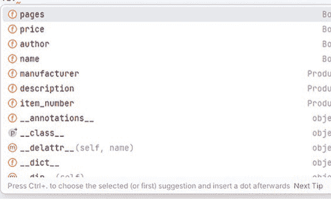

Python中的类不仅可以从一个基类派生，还可以从多个基类派生。例如，可能有另一个类**Copyright**：

```
class Copyright:
    owner = ''
    year = 1900
```

然后我们可以同时从两个基类**Product**和**Copyright**派生我们的类**Book**：

```
class Book(Product, Copyright):
    pages = 0
    author = ''
```

通过在类**Book**的定义中指定两个基类，我们创建了一个继承两个类的属性和方法的类。因此，我们现在可以使用**Copyright**类带来的属性：

```
grisham1992 = Book()
grisham1992.owner = 'Double'
grisham1992.year = 1992
```

## 21.7 [10 分钟]
定义一个包含有用客户属性的 **Customer** 类，并从该类派生出一个 **BusinessCustomer** 类，该类包含仅与商业客户相关的额外属性。

#### 21.7.3 避免歧义：名称修饰

但如果不仅 **Product** 类，而且 **Copyright** 类也有一个名为 **name** 的属性呢？派生类 **Book** 仍然只有*一个* **name** 属性。但这个属性现在来自哪个“父类”呢？是来自 **Product** 的 name 还是来自 **Copyright** 的 name？这种情况下的答案是：来自 **Product**，因为 Python 从左到右进行处理，即首先搜索“最先”派生自的类以查找属性名。只有当第一个父类没有此标识符的属性时，Python 才会搜索其他父类。

为了彻底消除名称混淆，有一个选项是为类属性添加双下划线前缀。那么我们的 **Copyright** 类的类定义将如下所示：

```python
class Copyright:
    owner = ''
    __name = ''
    year = 1900
```

双下划线的效果是 Python 自动使该属性可通过标识符 *_class__attribute* 访问，在我们的示例中是 *_Copyright__name*：

```python
grisham1992._Copyright__name = 'Copyright'
print(grisham1992._Copyright__name)
```

这个过程也称为*名称修饰*，它允许我们在访问类层次结构中可能出现多次的属性名称时，避免歧义和误解。

### 21.8 总结

在本章中，我们学习了 Python 中的变量以及如何使用它们。我们还学习了如何定义类以及如何创建作为类实例的对象。

你应该从本章中掌握以下要点：

- Python 知道简单数据类型，最著名的是 **int**（整数）、**float**（浮点数）、**str**（字符串）和 **bool**（逻辑/真值），以及更复杂的数据类型，最著名的是 **list**（不同对象的有序集合）、**dictionary**（无序关联字段）、**tuple**（不可变对象集合）和 **set**（唯一对象的无序集合）。
- 所有数据类型都是类，这些数据类型的变量是对象实例；它们具有属性（或特性）以及用于操作和处理对象的方法。
- 变量名区分大小写，这在 Python 中处处如此；官方建议使用小写变量，并在变量名中使用下划线分隔多个术语。
- 变量不必声明。
- 变量可以通过将对象赋值给变量名（Python 自动确定类型）或使用相应数据类型类的构造函数方法来生成。
- 构造函数通常可以使用其他类型的对象作为参数调用；这允许在数据类型之间进行显式转换。
- Python 隐式转换相对较少，但在必要时会在 **int** 和 **float** 之间进行转换。
- 字符串可以用单引号和双引号括起来。
- 要显示变量的内容，可以将其名称输入 Python 控制台；然而，在 Python 程序中，输出必须始终显式调出（主要使用 **print()** 函数）。
- Python 中的复杂数据类型在是否可变（可变：**list**、**dictionary**、**set**；不可变：**tuple**）以及其中的元素是以有序还是无序方式存储（有序：**list**、**tuple**；无序：**dictionary**、**set**）方面有所不同。
- 复杂数据类型的元素（对于字典，键和值都是）可以是不同的类型，甚至可以是该复杂数据类型或另一种复杂数据类型的对象；例如，可能存在一个列表，其元素本身又是列表，或者一个字典，其键部分是元组，值是列表和其他字典。
- 有序数据类型（列表、元组）的元素可以通过数字索引（即元素编号）寻址；第一个元素的索引始终为 0。
- 冒号运算符可用于寻址索引范围，其中 **A:B** 表示范围边界 **A**（包含）和 **B-1**（包含）之间的所有元素。
- 范围边界也可以留空，这等同于“从开头”（未指定左边界）或到末尾（未指定右边界）。
- 负索引表示：从后向前索引，而不是从前向后。
- Python 没有用于数组/字段的特殊数据类型，但数据类型 **list** 以有序形式保存任意元素；因此数组是列表的一种特殊情况（即其所有元素都是相同类型的列表）。
- 字符串在读取访问时也表现得像列表，因为它们的各个字符可以使用列表的常用表示法进行寻址；但是，无法以这种方式对字符进行写入访问。
- 你可以使用关键字 **class** 定义自己的类；类可以从一个或多个“父类”派生，即继承它们的属性和方法。
- 类定义中属性或方法的双下划线意味着该属性/方法也可以通过名称 **_class__attribute** 或 **_class__method()** 访问（名称修饰）；通过这种方式，可以避免由多重继承引起的属性/方法标识符的歧义。

下表概述了最重要的数据类型。对于简单数据类型，你可以看到通过赋值和通过调用相应类的构造函数方法创建变量。当然，复杂数据类型 **list**、**tuple**、**dictionary** 和 **set** 也可以通过构造函数创建，但为了清晰起见，此处未显示。

| 数据类型 | 保存内容 | 变量创建 | 元素访问 |
| :--- | :--- | :--- | :--- |
| **int** | 整数 | 赋值：x = 5<br>构造函数：x = int('5') | – |
| **float** | 浮点值 | 赋值：x = 0.5<br>构造函数：x = float('5') | – |
| **str** | 字符串 | 赋值：x = 'Hello World'<br>构造函数：x = str(0.5) | – |
| **boolean** | 逻辑/真值 | 赋值：x = False<br>构造函数：x = bool('True') | – |
| **list** | 其他对象的有序、可变集合（可能类型不同） | 元素在方括号中用逗号分隔：x = ['Marc', 'Helen', 'Toby', 'Thomas'] | 方括号中的索引或索引范围：x[1]（给出：'Helen'）<br>x[2:3]（给出：['Helen', 'Thomas']） |
| **tuple** | 其他对象的有序、不可变集合（可能类型不同） | 元素在圆括号中用逗号分隔：x = ('abc', 27.5) | 圆括号中的索引：x(1)（给出：27.5） |
| **dictionary** | 键值对的无序集合，键和值可以是不同类型的对象；键必须唯一 | 键值对在花括号中用逗号分隔，键和值各用冒号分隔：x = {'Marc' : 27, 'Helen' : 41} | 方括号中的键：x['Marc']（提供：27） |
| **set** | 对象的无序集合（可能类型不同），必须唯一（一个对象在列表中只能出现一次） | 元素在花括号中用逗号分隔：**x = {'Marc', 'Helen'}** | 由于没有自然顺序和用于访问的键，选择单个元素没有意义（你必须已经知道该元素才能访问它） |

### 21.9 练习解答

- **练习 21.1**
  **str** 对象的其他一些方法示例：
  - **find(sub)**：在 **str** 对象的字符串中搜索 **sub**，并返回找到的子字符串第一个字符的索引，如果未找到子字符串则返回 -1。一如既往，这区分大小写。用法示例：

```python
>>> x = 'Hello world!'
>>> x.find('wo')
6

>>> x.find('WO')
-1

>>> x.upper().find('WO')
6
```

在最后一个示例中，字符串首先被转换为大写。**x.upper()** 返回转换为大写的字符串。这当然又是一个 **str** 对象。然后使用其 **find()** 方法进行搜索。这次它返回了一个匹配项。

- 可以使用其他参数来限制要搜索的字符串范围；帮助中的说明 **x.find(sub[, start[, end]]) -> int** 表示由于 **start** 和 **end** 是 **find()** 的可选参数，它们可以但不必指定。这就是为什么它们各自用方括号括起来。注意括号顺序的微妙之处：**end** 参数周围的方括号包含在包围 **start** 参数的方括号内。这意味着只有在指定了 **start** 之后才能指定 **end**，但可以在不指定 **end** 的情况下使用 **start**！
- 在 **->** 之后，你可以找到函数返回值的类型，在我们的例子中是 **int**，因为索引作为数字返回。

**capitalize()**：将字符串首字母大写（仅首字母！），并将所有其他字符转换为小写。使用示例：

```
>>> x = 'hello world'
>>> x.capitalize()
'Hello world'
```

**is.lower(), is.upper()**：检查字符串是否全部为小写或全部为大写。使用示例：

```
>>> x.isupper()
False

>>> x = 'HELLO WORLD'
>>> x.isupper()
True
```

**center(width, [fillchar])**：创建一个长度为 **width** 的字符串，其中 **str** 对象居中显示。其左右两侧用填充字符（默认情况下，若未指定则为空格）进行“填充”。使用示例：

```
>>> x = 'Hello World'
>>> x.center(50, '*')
'*******************Hello World*******************'
```

#### 练习 21.2

一个读取用户年龄（以年为单位）并将其转换为分钟输出的程序可能如下所示：

```
age = input('Please enter your age in years:')
minutes = int(age) * 365 * 24 * 60
print('With', age, 'you have already experienced at least', minutes)
```

#### 练习 21.3

首先，我们将一个对象赋值给索引为 3 和 4 的列表元素。我们从一个整数开始：

```
>>> first_names = ['Beverly', 'Thomas', 'Marc', 'Jimmy', 'Cathy']
>>> first_names[3:4] = 23
Traceback (most recent call last):
  File "<input>", line 1, in <module>
TypeError: can only assign an iterable
```

我们得到了一条错误信息。通常，Python 不能将本身不是列表的东西赋值给列表/列表的切片（除非该切片只包含一个元素）。与人们可能预期的相反，Python 并不会简单地用数字 23 替换元素 3 和 4，即 'Jimmy' 和 'Cathy'（索引从 0 开始！）。当我们把数字 23 “包装”在一个列表中时，情况就变了：

```
>>> first_names = ['Beverly', 'Thomas', 'Marc', 'Jimmy', 'Cathy']
>>> first_names[3:4] = [23]
>>> first_names
['Beverly', 'Thomas', 'Marc', 23]
```

现在，这两个选中的元素实际上被只包含数字 23 的列表替换了。但由于这个列表比被替换的部分列表短，我们的列表 **first_names** 相应地缩短了。现在让我们尝试其他方法。这次我们用字符串替换部分列表：

```
>>> first_names = ['Beverly', 'Thomas', 'Marc', 'Jimmy', 'Cathy']
>>> first_names[3:4] = 'Amy'
>>> first_names
['Beverly', 'Thomas', 'Marc', 'A', 'm', 'y']
```

与上面的赋值 **first_names[3:4] = 23** 不同，这次我们没有收到错误信息。但发生了一些看似奇怪的事情：部分列表 **first_names[3:4]** 被名字 Amy 的字母替换了，每个字母都成为了一个新的列表元素。原因是字符串也可以被解释为列表。因此，赋值 **first_names[3:4] = 'Amy'** 最终是用一个列表进行替换，即列表 ['A', 'm', 'y']。

## 21.9 · 练习解答

- **练习 21.4**
  无解答。

- **练习 21.5**
  这里我们处理的是一个嵌套字典。为了清晰起见，你可以看到下面带有换行的字典定义（你记得在 ▶ 第 20.1.2 节中，语句可以在花括号内换行）：

  ```
  >>> d = {
  ...     12345: {
  ...         'description': 'Plastic Garden Chair "Garden Friend"',
  ...         'manufacturer': 'Garden Paradise Inc.',
  ...         'price': 10.99
  ...     },
  ...     56789: {
  ...         'description': 'Garden shovel, stainless steel',
  ...         'manufacturer': 'Big G Gardening Tools Inc.',
  ...         'price': 49.90
  ...     }
  ... }
  ```

  然后通过两个键进行访问：

  ```
  >>> d[12345]['price']
  10.99
  ```

  表达式 **d[12345]** 返回一个字典，然后使用该字典中存在的键从中选择一个值。

- **练习 21.6**
  其他集合操作的一些示例：

  - **difference(*other_set*)**：返回存在于 **other_set** 中但不在调用其 **difference()** 方法的集合中的元素。使用示例：

    ```
    >>> friends_thomas = {'Will', 'Beverly', 'Peter', 'Michael'}
    >>> friends_julia = {'Peter', 'Will', 'Helen', 'Michael', 'Caroline'}
    >>> friends_julia.difference(friends_thomas)
    {'Caroline', 'Helen'}
    ```

  - **remove(*element*)**：从集合中删除一个元素。使用示例：

    ```
    >>> friends_julia.remove('Helen')
    >>> friends_julia
    {'Peter', 'Will', 'Michael', 'Caroline'}
    ```

  - **isdisjoint(*other_set*)**：检查调用其 **isdisjoint()** 方法的集合与另一个集合是否不相交，即没有共同元素。使用示例：

    ```
    >>> friends_thomas = {'Will', 'Beverly', 'Peter', 'Michael'}
    >>> friends_julia = {'Peter', 'Will', 'Helen', 'Michael'}
    >>> friends_thomas.isdisjoint(friends_julia)
    False
    ```

#### 练习 21.7

**Customer** 和 **BusinessCustomer** 两个类可能如下所示：

```
class Customer:
    firstname = ''
    lastname = ''
    street = ''
    city = ''
    zip = ''
    email = ''

class BusinessCustomer(Customer):
    company = ''
    payment_terms = 14
    taxid = ''
```

## 22 用户界面：如何输入和输出数据？

## 目录

- 22.1 控制台中的输入和输出 – 278
- 22.2 使用 Tkinter 的图形用户界面 – 280
  - 22.2.1 概述 – 280
  - 22.2.2 你好，Tkinter！ – 281
  - 22.2.3 图形控件（小部件） – 282
  - 22.2.4 控件的排列（几何管理器） – 299
  - 22.2.5 事件 – 305
  - 22.2.6 示例：计算器应用程序 – 308
- 22.3 使用文件 – 315
- 22.4 练习：开发一个简单的文本编辑器 – 317
- 22.5 总结 – 318
- 22.6 练习解答 – 319

**补充信息** 在线版本包含补充材料，可在 https://doi.org/10.1007/978-3-658-42912-6_22 获取。

© 作者，经 Springer Fachmedien Wiesbaden GmbH（Springer Nature 旗下）独家许可，2024
J. L. Zuckarelli, *Learn coding with Python and JavaScript*, https://doi.org/10.1007/978-3-658-42912-6_22

## 概述

我们已经广泛讨论了程序中数据的组织，即使用的变量和对象。现在是时候讨论如何从用户那里接收数据以及如何将数据输出回给用户了。为此，在本章中，我们将首先讨论最简单的输入和输出方式，即通过*控制台*。之后，我们将通过*图形用户界面*（GUI）让我们的程序外观更加吸引人。我们不仅将通过一个完整的应用程序示例更深入地了解如何使用 GUI，你还将有机会在练习中编写自己的第一个 GUI 应用程序。最后，我们将转向*文件*操作，这在实践中当然极其重要。

在本章中，你将学习：

- 如何将信息输出到控制台以及如何在控制台中查询用户
- 如何使用 Python 库 **tkinter** 为你的程序提供图形用户界面
- 有哪些控件可供你使用，如何配置它们，以及如何在界面上放置和排列它们
- 如何在程序代码中响应用户通过界面触发的事件（例如，点击按钮时）
- 如何从文件中读取数据以及向文件中写入数据。

### 22.1 控制台中的输入和输出

在前面的章节中，我们已经看到了在 Python 控制台中用于输入和输出数据的两个最重要的函数：**input()** 和 **print()**。

**输入**
**input(prompt)** 显示一个提示，并让用户从键盘输入，通过按 <RETURN> 或 <ENTER> 键完成输入。然后 **input()** 将输入作为返回值返回，并且始终是字符串。这一点很重要，特别是当你期望输入是数字以便稍后用于计算时。在这种情况下，你必须首先将 **input()** 的返回值显式转换为数字，正如我们在 ▶ 第 21.5 节中所做的那样。

**输出**
输出信息最重要的工具是 **print()** 函数。它可以用来打印一个或多个对象。如果要打印多个对象，可选的字符串参数 **sep** 决定了各个对象在输出中如何分隔；默认情况下，使用空格字符。可选的 **end** 参数控制输出结束时打印什么；除非用 **end** 指定，否则输出结束时会放置一个换行符。换行符由转义序列表示，\n（代表 *new line*），我们已经在 ▶ 第 11.2.2 节中关于字符串的部分学过。当然，我们也可以在需要输出的字符串中直接使用这些转义序列：以下面这个小程序为例：

```
user = input('Username: ')
pwd = input('Password: ')
print('Welcome,' user, '!\nYour password is:', pwd)
```

这里我们从用户那里读取用户名和密码，然后总共输出四个对象：

- 字符串 'Welcome, '
- 字符串变量 **user**
- 字符串 '!\n Your password is:'（注意：这个字符串在感叹号后包含一个换行符！）
- 字符串变量 **pwd**。

如果你现在运行该程序，并输入 **peter** 和 **889X!z5** 作为用户名和密码，你将得到以下输出：

```
Welcome, peter !
Your password is: 889X!z5
```

用户名 **peter** 和感叹号之间的空格有点不美观。这是由于分隔符参数 **sep** 的默认值是一个空格造成的。因此，要输出的两个对象——变量 **user** 和以感叹号开头的字符串——被一个空格分隔开了。为了避免此类问题，建议自行控制空白符的输出，并将参数 **sep** 设置为“空字符串”，这样 **print()** 函数本身就不会输出任何分隔符。对 **print()** 的调用可以像这样：

```
print('Welcome, ' user, '!\nYour password is: ', pwd, sep = '')
```

如果你将此与上面的调用进行比较，你会看到我们在需要输出空格的地方插入了空格，并提供了一个空字符串作为 **sep** 参数。请注意，**sep** 参数必须始终通过其名称调用，否则 **print()** 函数将不知道最后一个字符串是仍然属于要输出的对象，还是具有特殊含义，即它已经代表了函数的*下一个参数*，就像我们这里的情况一样。因此，我们将 **sep** 作为*关键字参数*调用。更多内容请参见 ▶ 第 23.1.2 节。

当然，用 **print()** 打印的对象不必仅限于字符串。实际上，你可以使用 **print()** 打印几乎任何对象，甚至可以在同一个 **print()** 调用中包含不同类型的对象，即不同的类。这也适用于你自己定义的类。但这怎么可能实现呢？**print()** 如何知道如何显示例如 ▶ 第 21.7 节中的 **Product** 类型的对象呢？答案很简单：Python 中的类可以有一个特殊的函数 `__str__()`。它返回对象的字符串表示形式，当需要输出该类的对象时，由 **print()** 调用。作为类的开发者，你可以指定你的类的对象应如何表示。你所要做的就是定义一个 `__str__()` 方法。我们将在 ▶ 第 23.2 节中看一个这样的例子。

22.1 [5 分钟]
指定三种不同的方法，在连续三行中输出三个字符串表达式 'First line'、'Second line' 和 'Third line'。

### 22.2 使用 Tkinter 的图形用户界面

#### 22.2.1 概述

命令行或 Python 控制台中的程序并非适合所有人。特别是当你为非技术背景的最终用户开发软件时，你根本无法绕过图形用户界面。因此，在本节中，我们将探讨如何以可控的难度在 Python 中设计图形用户界面，以及如何为其提供程序功能支持。在 Python 中设计图形用户界面有多种方法。例如，使用 *Streamlit* 库，你可以使用 Python 创建动态网页，这些网页也可以托管在 Web 服务器上。在本章中，我们将专注于在客户端本地运行的应用程序，例如你的计算机。

通过一个图形计算器的例子，你将看到只需几行代码，你就可以编写一个有用的、功能齐全的程序，它具有吸引人的界面，不会强迫用户坐在黑色的控制台前固执地遵循给定的程序流程。本章最后将有一个练习，你将开发自己的简单文本编辑器，允许你打开、编辑和保存文本文件。

有许多不同的库和框架用于开发图形界面。其中许多是跨平台的，这意味着你使用它们开发的程序可以在不同的计算机（有时是移动）操作系统上运行。我们将使用的一个常用库是 **tkinter**。方便的是，它随 Python 标准提供，因此我们不需要额外安装任何东西。**tkinter** 基于 **Tk**，这是一个跨平台的图形用户界面库，最初是在 1990 年代初用一种名为 *Tcl* 的编程语言开发的。Tcl 变得流行主要是因为 **Tk** 库。这是因为它不仅可用于 Tcl 本身，还可用于许多其他编程语言，包括 Python。

Python 提供了一个名为 **tkinter** 的包，它本质上是与 **Tk** 的一种“连接”。要使用 **Tk** 库，Python 会调用一个 Tcl 解释器，该解释器也是标准 Python 安装的一部分。因此，实际上你是在间接使用另一种编程语言，但你不需要理解 Tcl 语法或自己调用 Tcl 解释器。相反，你可以在 Python 中工作并使用通常的 Python 语法。在必要时，Python 会将你的语句“翻译”成 Tcl 代码并调用 Tcl 解释器。**Tk** 的实用之处在于，一旦你理解了这个库的工作原理，你就可以在其他支持 **Tk** 的编程语言中快速开发自己的图形用户界面——而且这样的语言相当多——而不会遇到任何重大的转换困难。

在下一节中，我们将编写一个简单的 *Hello World* 程序，它在屏幕上打开一个窗口。之后，我们将更仔细地研究用户界面的各种图形控件，即 *小部件*，例如按钮、输入框和复选框。之后，我们只缺少两个组件。我们需要按照我们想要的方式在界面上排列这些元素，以获得所需的界面外观。最后，我们必须将控件连接到它们背后的程序代码，以便它们能够适当地响应用户的操作。这为我们提供了编写具有适当图形界面的 Python 程序所需的一切，例如我们将在 **tkinter** 入门结束时开发的计算器。但让我们先从小处着手！

#### 22.2.2 Hello Tkinter!

创建一个新的 Python 文件，包含以下程序代码并运行该程序：

```
from tkinter import *
win = Tk()

win.title('Hello World Program')
win.geometry('900x500')

win.mainloop()
```

一个窗口打开，看起来类似于 ▣ 图 22.1。


▣ 图 22.1 使用 tkinter 的 *Hello World* 程序

窗口仍然非常空，但这将在接下来的章节中迅速改变。

如果你仔细观察代码，你会注意到它以一个 **import** 语句开头。这是使模块 **tkinter** 可用所必需的。此时你不必担心 **import** 语句的确切结构，因为我们将在 ▶ 第 23.3 节中更详细地讨论从模块导入。此时，只需知道 **import** 语句使模块 **tkinter** 的类，特别是 **Tk** 类，对我们的程序可用就足够了。

我们在程序中创建这个 **Tk** 类的一个实例，即对象 **win**，我们应用程序的主窗口。通过 **title(*titletext*)** 和 **geometry(*dimensions*)** 方法，我们设置两个重要属性：窗口的标题和其像素尺寸。然后，使用 **mainloop()** 方法，我们在屏幕上显示窗口并开始事件处理；我们的程序现在可以响应用户操作了。我们的第一个 **tkinter** 程序完成了！很简单，不是吗？然而，用户仍然无法对我们的图形界面做太多事情。因此，我们需要允许用户进行输入和触发操作的控件。这些控件在 *Tk/tkinter* 中被称为 *小部件*。我们将在下一节中讨论它们。

#### 22.2.3 图形控件（小部件）

在本节中，我们将研究一些重要的小部件。以第一个小部件——按钮为例，你将了解小部件是如何创建的，以及它们的属性在创建时（甚至之后）是如何调整的。

##### 22.2.3.1 按钮（Button 类）

按钮在 **tkinter** 中作为 **Button** 类内置。它们用于让程序的用户触发操作。像所有小部件一样，它们可以使用其构造函数方法轻松创建。上一节的程序加上这个构造函数调用后，看起来像这样：

```
from tkinter import *
win = Tk()

win.title('Hello World Program')
win.geometry('900x500')
mybutton = Button(win, text = 'Press me')
mybutton.pack()

win.mainloop()
```

**Button()** 构造函数方法接收的函数参数是我们希望放置按钮的窗口，在我们的例子中是 **win**。可以指定按钮设计的选项；在我们的例子中，我们使用 **text** 选项将按钮标记为“Press me”。当然，我们仍然可以在之后更改按钮的属性

我们已经创建了按钮。然而，其属性并非**Button**类的简单可编辑类属性，而是通过一个名为**config()**的特殊方法进行修改。与构造函数类似，**config()**方法接受键值对，其中键是要修改的选项名称，值是要分配给它的值。因此，例如，如果我们想更改按钮的宽度，就必须按如下方式调整**width**选项：

```
mybutton.config(width = 50)
```

对于**text**选项（即按钮的标签）也可以进行同样的操作。
修改选项的第二种方式是像访问字典一样访问它们，其中键是选项名称：

```
mybutton['width'] = 50
```

现在的问题是有哪些可用的设置选项？要了解这一点，你应该查看**tkinter**类的帮助文档。为此，你必须首先将**Button**类（或像我们下面那样导入所有类）从**tkinter**模块导入到控制台（记住：你的Python程序和控制台不使用相同的命名空间；你已经有一个导入了该模块的Python程序这一事实，并不意味着你也可以在控制台中使用该模块。因此，在调用帮助函数之前，你仍然需要在控制台中执行**import**语句）：

```
>>> from tkinter import *
>>> help(Button)
```

在出现的帮助文本顶部，是以下信息：

```
| STANDARD OPTIONS
|
| activebackground, activeforeground, anchor,
| background, bitmap, borderwidth, cursor,
| disabledforeground, font, foreground
| highlightbackground, highlightcolor,
| highlightthickness, image, justify,
| padx, pady, relief, repeatdelay,
| repeatinterval, takefocus, text,
| textvariable, underline, wraplength
|
| WIDGET-SPECIFIC OPTIONS
|
| command, compound, default, height,
| overrelief, state, width
```

所以，正如你所看到的，一方面有大多数控件共有的*标准选项*，另一方面有仅适用于按钮的特殊选项。遗憾的是，帮助文档缺少对每个选项控制什么设置以及如何使用这些选项的描述。此外，**tkinter**包的“官方”文档（▶ https://docs.python.org/3/library/tk.html）用处相当有限，尤其对初学者而言。然而，互联网上有许多页面以易于理解的方式解释了这些功能，例如目前的 ▶ https://www.tutorialspoint.com/python/tk_button.htm。

- 表22.1概述了大多数（如果不是全部）控件都具有的一些选项。该表还解释了在**tkinter**中许多地方可以使用的颜色编码和字体格式处理过程。
- 表22.2则列出了一些*特殊的*按钮选项。在接下来的关于其他控件的章节中，你将找到一个包含该控件最重要特定属性的类似表格。

我们刚刚看到的选项部分表现得像字典。因此，你也可以使用**keys()**方法来读取键，从而获取选项的名称。如果在创建控件实例后，你在程序代码中包含以下语句

```
print(mybuttons.keys())
```

当你运行程序时，你将在（运行）控制台中看到可用选项的名称。如果你不带参数调用**config()**方法，你将获得包含所有名称-值对的完整字典。你也可以这样输出：

```
options = switch.config()
print(options)
```

通常，小写的字符串选项值，例如**relief**选项的'sunken'，也可以借助预定义的、首字母大写的常量来控制，在我们的例子中是**SUNKEN**。然而，在下文中，我们将常规地使用字符串而不是常量。如果你想使用常量，请在硬盘的**tkinter**目录中查找**constants.py**文件。常量在那里定义。要使用它们，请在你的程序中添加以下导入语句：

```
from tkinter.constants import *
```

到目前为止，我们甚至还没有讨论过我们偷偷加入程序中的**pack()**方法的调用。这条语句首先使按钮在屏幕上可见（注释掉该行，看看再次运行程序时会发生什么！）。使其可见与控件在图形界面上的排列密切相关。我们将在▶第22.2.4节中更详细地探讨这一点。在这一点上，我们需要做的就是调用**pack()**来在界面上显示我们的控件。

## 22.2 · 使用Tkinter的图形用户界面

###### 表22.1 tkinter控件的标准属性

| 选项 | 类型 | 含义 |
| :--- | :--- | :--- |
| active-background/active-foreground | Str | 控件被激活时（在我们的情况下，通过点击按钮）控件（背景）或其上的文本（前景）的颜色。与tkinter中的所有颜色一样，你可以指定众多预定义颜色常量之一（例如'green'或'purple'；你可以在互联网上快速找到这些颜色常量的列表），或者一个'#RRGGBB'形式的红-绿-蓝（RGB）编码值，其中RR、GG和BB分别代表颜色的十六进制（！）编码的红色、绿色和蓝色部分。最好使用互联网上的众多转换器之一将十进制值转换为十六进制系统。红色（R = 255, G = 0, B = 0）的值因此会变成'#FF0000'，因为FF在十六进制数系统中代表数字255 |
| background/foreground | Str | 控件（背景）或其上的文本（前景）的默认颜色 |
| border | Int | 控件边框的厚度，以像素为单位（border=0表示无边框） |
| cursor | Str | 鼠标指针悬停在控件上时鼠标光标的形状；例如'hand2'（手）、'watch'（沙漏）、'cross'（十字）、'left_ptr'（左上角尖端的“正常”鼠标指针）。互联网上也有列表指定了可能的指针特征 |
| font | Font | 控件的字体格式；如果你想偏离默认字体，必须添加一个额外的导入语句，然后使用Font()构造函数创建一个新的Font对象：from tkinter.font import * font = Font(family = 'Times', size = 36, weight = 'bold', underline = 1) 之后，新的Font对象font可以分配给控件的font选项：mybutton['font'] = font family是字体标识符（例如Helvetica、Courier）。weight区分'bold'和'normal'。此外，你可以使用上面示例中未使用的slant选项来设置文本为斜体或非斜体（'normal'）。overstrike，与underline一样可以取值1和0（或True和False），用于给文本添加删除线。你可以使用config()方法对Font对象进行更改，就像对控件一样：font.config(weight = 'normal') 以这种方式进行的更改会自动影响所有你最初将现在已更改的Font对象分配给其font选项的控件 |
| padx, pady | int | 控件上文本（或图像）的左/右（padx）或上/下（pady）缩进 |
| relief | str | 控件的3D表示。这里可能的值有：'raised'（凸起，默认值）、'sunken'（凹陷）、'flat'、'groove'（凹陷边框）和'ridge'（简单边框，否则为平面） |
| text | str | 控件的标签 |

###### 表22.2 按钮控件的特殊属性

| 选项 | 类型 | 含义 |
| :--- | :--- | :--- |
| command | function | 用户点击按钮时执行的函数。我们将在▶第22.2.5节中更仔细地研究这个事件处理 |
| default | int | 如果default = 1，则该按钮是默认按钮（当用户按下<ENTER>键时触发） |
| height/width | int | 按钮的高度/宽度。如果按钮上显示文本，则以字母高度为单位指定；如果显示图像，则以像素为单位指定。如果完全未指定，则宽度和高度会自动计算 |
| state | str | 按钮可以设置为'normal'（可点击）或'disabled'（灰色）。如果按钮当前被点击，state取值'active' |

##### 22.2.3.2 菜单（Menu类）

使用tkinter可以非常容易地设计菜单。为此，我们首先为我们的窗口（即上面示例中的Tk对象win）创建一个新的菜单栏。菜单栏在tkinter中由Menu类表示。菜单栏所属的窗口已经作为参数传递给该类构造函数的调用。反过来，我们借助Tk对象的menu选项将新的菜单栏显式分配给窗口，以便稍后可见：

```
menubar_top = Menu(win)
win.config(menu = menubar_top)
```

正如你已经知道的，在最后一条语句中，我们本可以利用tkinter控件部分像字典一样工作这一实用事实，从而像访问字典的键值对一样访问它们的选项，而不是调用Tk对象的config()方法。因此，我们本可以写成：

```
win['menu'] = menubar_top
```

现在，你的应用程序有了一个菜单栏，但在这种状态下启动程序时它尚未显示。首先，我们必须添加各个下拉菜单，这些菜单随后将对用户可展开和折叠。这些下拉菜单也是Menu类的对象，我们可以通过调用类构造函数来创建它们。然而，这一次，我们不是将新的（下拉）菜单直接附加到窗口win，而是附加到我们现有的菜单栏menubar_top：

```
file_menu = Menu(menubar_top, tearoff = 0)
```

选项 **tearoff=0** 会使菜单“固定”在窗口上。如果省略此选项或将其设置为 **tearoff=1**，菜单中的第一个条目将是一条虚线。如果点击此条目，菜单会从其锚点分离，并显示在自己的窗口中，该窗口可以在屏幕上随意移动（试试看！）；这种行为通常需要禁用。

现在我们可以开始使用 **add_command(label = label)** 向菜单添加新的命令项：

```
file_menu.add_command(label = 'Open...')
file_menu.add_command(label = 'Save')
file_menu.add_separator()
file_menu.add_command(label = 'Close')
```

使用 **Menu** 对象的 **add_separator()** 函数，我们可以在菜单中创建一个水平分隔符，以更清晰地组织菜单项。除了 **add_command()** 和 **add_separator()** 之外，还有另外两种类型的菜单项：**add_checkbutton()** 和 **add_radiobutton()**。两者都允许用户进行设置，如以下示例所示。当前设置（菜单选项当前是否被选中）可以随时从作为选项 **variable** 传递给 **add_checkbutton()** 函数的变量中读取。

```
file_menu.add_checkbutton(label = 'Auto save', variable = auto_save)
```

到目前为止，我们的菜单——与单个菜单项不同——根本没有显示名称。我们通过调用菜单栏对象的 **add_cascade()** 函数来改变这一点，该函数还确保菜单实际显示为菜单栏上的下拉菜单：

```
menubar_top.add_cascade(label = 'File',
                       menu = file_menu)
```

如果现在这样启动程序，将打开一个程序窗口，其中有一个带有“File”菜单的菜单栏。类似地，我们当然现在可以在菜单栏上放置更多的下拉菜单。

像 **add_command()** 这样的 **add_...()** 函数可以使用许多选项调用，其中许多可以在表 22.1 中找到。例如：

```
file_menu.add_command(label = 'Save', background='#FF0000')
```

添加一个背景为红色的“Save”菜单项，语句

```
file_menu.add_command(label = 'Save', state='disabled')
```

显示一个已禁用（灰色）的菜单项。
当然，你仍然可以在创建菜单*之后*修改它。使用 **delete**(*index_from*, *index_to*) 可以通过数字索引删除菜单项。使用 **entryconfig**(*index*, *option=value*) 可以更改由 **index** 定义的菜单项的 **option**（例如 **state** 以启用/禁用）。你可以使用 **entrycget**(*index*, *option*) 查询选项。因此，要显示第二个菜单项的标签（选项 **label**），可以使用语句

```
print(file_menu.entrycget(1, 'label'))
```

（索引像 Python 中一样，从 0 开始！）。
如果想稍后插入菜单条目，请使用函数 **insert_...**(*index*, *option*)，其中 ... 代表相应的元素（例如 **command**、**separator**、**checkbox**），就像 **add_...()** 一样。然后该条目将插入到由 **index** 指定的条目*之后*。
我们的菜单现在看起来相当漂亮，但它没有功能：点击菜单命令不会触发任何操作。这是因为在我们对下拉菜单对象 **file_menu** 的 **add_command**() 调用中，我们省略了重要的 **command** 选项，该选项允许我们指定一个函数，每当用户点击菜单项时调用该函数。然后我们将在该函数中放置应位于菜单项背后的程序代码部分。我们将在 ▶ 第 22.2.5 节中更详细地讨论这些事件处理程序。在此处，我们将完全专注于创建视觉上吸引人的界面。
如你所见，在 **tkinter** 中处理菜单一点也不复杂，但它需要几个不同的步骤。因此，这里再次概述了为你的程序提供菜单所需的操作：

1. 使用构造函数 **menubar = Menu(window)** 创建菜单栏。
2. 将菜单栏添加到窗口：**window['menu'] = menubar**。
3. 创建一个要放置在菜单栏上的新下拉菜单：**pd_menu = Menu(menubar)**。
4. 向新的下拉菜单添加菜单项，即命令（使用 **add_command**()）、首选项选项（使用 **add_checkbox**() 或 **add_radiobutton**()）或分隔符（**add_separator**()），例如：**pd_menu.add_command(label = 'Title of command')**。请注意，稍后为了向菜单项添加功能，我们将在此处包含 **command = event_function** 选项。
5. 将你的新下拉菜单附加到菜单栏，并分配一个将在菜单栏中可见的标题：**menubar.add_cascade(label = 'Title of menu', menu = pd_menu)**。

在本节中，我们研究了创建应用程序菜单作为程序中的主菜单。然而，**Menu** 对象也可以用于在窗口中的任何位置打开弹出/上下文菜单，这要归功于 **post**(*x*, *y*) 函数，但这超出了本节对 **tkinter** 的简要介绍范围。

表 22.3 Entry 小部件的特殊属性

| 选项 | 类型 | 含义 |
| :--- | :--- | :--- |
| **justify** | str | 输入字段中文本的对齐方式，'left'（左对齐，默认）、'center'（居中）或 'right'（右对齐） |
| **selectbackground** | str | 文本选择的背景颜色 |
| **selectforeground** | str | 文本选择的字体颜色 |
| **show** | str | 显示的字符（代替输入的字符）；例如可用于密码输入 |
| **width** | int | 输入字段的宽度（以字符为单位，不是像素） |

##### 22.2.3.3 输入字段（类 Entry 和 ScrolledText）

###### 单行输入：Entry
输入字段用于接受用户的文本输入。在 **tkinter** 中，区分单行（小部件类 **Entry**）和多行文本输入（小部件类 **ScrolledText**）。我们将在本节中更仔细地研究两者。
类型为 **Entry** 的小部件可以使用构造函数非常容易地创建并分配给窗口，在我们的示例中仍然是 **Tk** 对象 **win**。

```
myentry = Entry(win)
myentry.pack()
```

与之前的按钮一样，我们调用 **pack()** 方法在窗口中显示控件。在 ▶ 第 22.2.4 节中，我们将更详细地研究如何影响窗口中控件的排列。
在 ☐ 表 22.3 中，你可以找到该小部件最重要属性的概述，你可以通过字典索引 **input['option']** 或（但仅通过写入）通过 **input.configure(option=value)** 以通常的方式访问它们。
你可以随时使用 **get()** 方法检索当前在 Entry 字段中的文本，例如：

```
my_text = input.get()
```

当然，你也可以编辑文本。这可以通过 **insert(index, string)** 方法完成。**index** 指定要插入的文本位置（从 0 开始），**string** 指定要插入的文本。因此，开始时可以使用

```
input.insert(0, 'A first text in the input field.')
```

来预设输入字段的文本。在 **insert()** 方法中，你可以简单地指定 'end'、'insert' 或 'anchor' 代替实际的位置索引。然后文本将插入在末尾（'end'）、当前光标位置（'insert'）或当前选择的开头（如果当前有选择，否则简单地在文本开头）。通过这种方式，你可以使用语句

```
input.insert('end', 'End of text.')
```

例如，将文本追加到末尾。类似地，你可以通过使用 **delete(from_index, to_index)** 方法删除文本。如果省略可选参数 **to_index**，则仅删除索引为 **from_index** 的字符。

使用 **icursor(index)** 可以将光标放置在文本中的某个位置，更准确地说，是在由 **index** 指定的字符*之后*。但请注意，在 **tkinter** 中，字符计数从 1 开始，这在 Python 中并不典型。如果将数字 0 指定为 **index**，则将光标放置在第一个字符*之前*。这种计数方法适用于使用字符索引的所有地方。

为了使光标在文本中实际可见，你必须给控件焦点，即使其成为窗口中当前活动的控件。你可以像所有其他小部件一样，使用 **focus()** 方法完成此操作。

最后，方法 **selection_range(from_index, to_index)** 允许你选择文本。同样，你可以使用从 **insert()** 中已知的特殊常量 'end'、'insert' 和 'anchor'。你可以使用 **selection_get()** 查询当前选定的文本，方法 **selection_present()** 在文本被选中时返回 **True**。

**Entry** 还允许你使用剪贴板。你可以使用方法 **clipboard_append(text)** 将文本添加到剪贴板；使用 **clipboard_get()** 检索剪贴板的内容；使用 **clipboad_clear()** 清除剪贴板。

###### 多行输入：ScrolledText

如果要编辑较长的文本，小部件 **ScrolledText** 是一个不错的选择。要使用它，必须首先从 **tkinter** 包的 **scrolledtext** 模块导入 **ScrolledText** 类：

```
from tkinter.scrolledtext import ScrolledText
```

在许多方面，**ScrolledText** 小部件的行为与 **Entry** 小部件完全相同。你学到的关于 **Entry** 的大部分内容都可以直接应用于 **ScrolledText**（不同之处在于 **justify** 和 **show** 选项、**icursor()** 方法和插入位置 'anchor' 不可用）。

由于 **ScrolledText** 允许多行输入，因此文本位置也可以按照行/列方案进行寻址，这合乎逻辑。例如，如果我们想从第二行的第五个字符开始删除所有文本，这

##### 22.2.3.4 文本输出（标签）

标签是显示在应用程序窗口中的静态文本。它们通常不为用户提供任何交互选项，而是用于显示信息，或者在控件本身没有标签（例如按钮）时，用于描述控件的功能。

你可以按照以下方式创建并显示一个标签控件：

```
label = Label(win, text = 'Here is a fixed text')
label.pack()
```

表 22.4 展示了标签的一些重要属性。此外，当然还有大多数控件提供的标准属性，这些属性列在表 22.1 中，其中对标签最重要的特性无疑是 **text** 选项，即显示在标签上的文本。在示例中，我们在调用构造函数时直接设置了文本，但当然，像所有其他属性一样，它也可以在之后通过 `label.configure(text = new_text)` 或 `label['text'] = new_text` 轻松更改。

表 22.4 Label 控件的特殊属性

| 选项 | 类型 | 含义 |
|---|---|---|
| anchor | str | 文本的位置和方向。它使用基本方位的英文缩写来描述，例如 'ne' 表示东北，即右上角；因此可能的指定值有：'n'（顶部居中）、'ne'（右上角）、'e'（右侧居中）、'se'（右下角）、's'（底部居中）、'sw'（左下角）、'w'（左侧居中）、'nw'（左上角），以及额外的 'center'（水平和垂直居中） |
| width | int | 标签的宽度，以字符为单位。如果未指定，标签将调整为足够宽以容纳要添加的文本 |
| wrap-length | int | 标签上的文本在多少个字符后换行。如果未指定，则不会换行 |

##### 22.2.3.5 复选按钮和单选按钮

复选按钮（或复选框）和单选按钮用于让用户在多个设置/选项中进行选择。复选框允许用户选择多个不同的设置/选项，而单选按钮只允许用户一次选择一个设置/选项。

复选按钮和单选按钮在 **tkinter** 中由同名的类表示。让我们首先创建两个单选按钮：

```
selection_var = IntVar()

selection_opt1 = Radiobutton(win, text = 'Option One',
    variable = selection_var, value = 1)
selection_opt2 = Radiobutton(win, text = 'Option Two',
    variable = selection_var, value = 2)

selection_opt1.pack()
selection_opt2.pack()
```

首先，考虑单选按钮本身的构造函数调用：这里，像往常一样，我们首先传递我们的窗口对象 **win**（类型为 **Tk**），单选按钮应属于该窗口，以及要显示为选择选项的文本。除此之外，还有两个额外的参数，**variable** 和 **value**。

我们将变量 **selection_var** 赋给 **variable** 参数，该变量我们在代码段的开头创建，作为 **IntVar** 类的一个实例。**IntVar** 是 **tkinter** 自带的几个特殊变量类之一。它不仅仅是一个普通的 **int** 变量。这个变量的特殊之处在于，在我们将其赋给单选按钮构造函数的 **variable** 参数后，它总是反映我们单选按钮组的当前状态，即它指示当前选择了哪个单选按钮选项。我们通过 **Radiobutton()** 的 **value** 参数定义当特定单选按钮被选中时 **selection_var** 所取的值。因此，如果用户点击“选项二”单选按钮，**selection_var** 的值为 2。如果用户点击“选项一”，**selection_var** 的值为 1。一旦单选按钮的选择情况发生变化，**IntVar** **selection_var** 就会自动更新。

这非常方便；然而，在查询值时有一个特殊之处需要注意：如果你执行

```
print(selection_var)
```

以下内容将输出到运行控制台：

```
PY_VAR0
```

但这并不是变量的值。这是因为 **selection_var** 不是一个普通的 **int** 变量。我们必须使用它的 **get()** 方法来查询其值，即使这需要一些习惯。以下语句会成功：

```
print(selection_var.get())
```

类似地，有一个 **set()** 方法，可以用来更改 **IntVar** 变量的值。由于我们通过构造函数 **Radiobutton()** 的 **variable** 参数将变量 **selection_var** 链接到单选按钮，这也会更改单选按钮之间的选择。使用

```
selection_var.set(2)
```

我们会自动选择分配值为 2 的单选按钮，即“左侧”单选按钮。通过调用相应单选按钮实例的 **select()** 方法也可以达到同样的效果：

```
select_left.select()
```

因为我们将 **IntVar** 变量 **selection_var** 作为 **variable** 选项*分配给了两个单选按钮*，**tkinter** 知道这两个单选按钮属于同一组，因此一次只能选择*其中一个*。所以，请始终确保将相同的变量作为 **variable** 选项分配给属于同一“选择组”的单选按钮！

*复选按钮*的功能与单选按钮非常相似，当然，区别在于这里可以同时选择多个复选框，因为两个复选框可以相互独立地选择。对于单选按钮，如果按钮 1 被选中，按钮 2 就不能被选中，这是明确的；而对于两个复选按钮，则不再只有两种，而是四种不同的状态（两个都被选中、两个都未被选中、只选中第一个按钮、只选中第二个按钮）；因此一个按钮的状态不再依赖于另一个按钮的状态。相应地，你还需要两个不同的 **IntVar** 变量作为构造函数 **Checkbutton()** 的 **variable** 参数：

```
selection_var1 = IntVar()
selection_var2 = IntVar()

selection_opt1 = Checkbutton(win, text = 'Option One',
    variable = selection_var1)
selection_opt2 = Checkbutton(win, text = 'Option Two',
    variable = selection_var2)

selection_opt1.pack()
selection_opt2.pack()
```

你可能已经注意到，在 **Checkbutton()** 构造函数中，我们这里不再有 **value** 参数。默认情况下，如果复选按钮被选中，状态变量 **variable** 取值 **True**，如果未被选中，则取值 **False**。但是，如果需要，可以通过可选参数或控件选项 **onvalue** 和 **offvalue** 来更改此行为。

表 22.5 概述了 **Radiobutton** 和 **Checkbutton** 类型控件最重要的特殊属性，这些属性超出了表 22.1 中列出的标准选项。

表 22.5 Checkbutton 和 Radiobutton 控件的特殊属性

| 选项 | 类型 | 含义 |
|---|---|---|
| indicatoron | Bool | 如果为 False，则不显示圆形（对于单选按钮）或方形（对于复选按钮）的选择元素，而是显示一个真实的按钮，当单选按钮/复选按钮被选中时，该按钮看起来是按下的 |
| selectcolor | str | 圆形（对于单选按钮）或方形（对于复选按钮）选择元素的背景颜色 |

##### 22.2.3.6 选择列表（Listbox）

选择列表由 tkinter 类 **Listbox** 表示，允许从文本条目的枚举中进行（单个或多个）选择。使用 **Listbox()** 类构造函数创建列表框，并使用 **pack()** 方法在窗口中显示列表框后：

```
mylistbox = Listbox(win)
mylistbox.pack()
```

**ScrolledText** 控件比 **Entry** 控件功能强大得多。例如，它本质上允许使用 **edit_undo()** 和 **edit_redo()** 方法撤销或重做编辑操作（必须事先将控件的 **undo** 选项设置为 **True**）。**ScrolledText** 还允许你为文本区域分配名称（称为 *tags*），然后使用 *tags* 访问和编辑文本区域。这样，例如，你可以为不同的文本区域设置不同的颜色。因此，如果你想开发一个具有语法高亮功能的文本编辑器，**ScrolledText** 控件是一个不错的起点。

可以通过下面的方法调用来完成。如果之前使用构造函数方法 **ScrolledText()** 创建的控件命名为 st：

```
st.delete(2.4, 'end')
```

注意，在 **Entry** 中是单个索引的地方，现在出现了一个小数：2.4。然而，这个数字是一个编码的行/列规范。它表示：第二行，第五个字符。因此，虽然在一行内，字符从 0 开始计数（因此 4 指的是第五个字符），正如我们已经习惯的 **Entry** 那样，但在 tkinter 中，行计数从 1 开始！因此 2.4 指的是*第二*行，但*第五*个字符。

## 22.2 · 使用 Tkinter 构建图形用户界面

表 22.6 Listbox 控件的特殊属性

| 选项 | 类型 | 含义 |
| :--- | :--- | :--- |
| active-style | str | 指定活动条目（即当前获得焦点的选中条目）应如何被视觉高亮显示；可能的值有 'underline'（文本下划线）、'dotbox'（虚线轮廓）和 'none'（无高亮），其中 'underline' 是默认值 |
| height | int | 列表框的高度，但以条目数而非像素为单位；默认值为 10。如果你的条目数超过了 height 设置的值，并且希望确保索引位置的条目被显示，可以调用 see(index) 方法；它会滚动列表框，使索引条目在任何情况下都可见 |
| select-mode | str | 指定可以同时选择多少个条目以及它们必须如何关联；可能的规范有：'single'（可以通过点击选择一个条目）、'browse'（可以通过点击或按住鼠标按钮移动鼠标来选择一个条目）、'multiple'（可以选择多个条目，点击一个条目会设置选择（如果之前未选中）或移除选择（如果已选中））和 'extended'（可以通过按住 <CTRL> 或 <SHIFT> 键点击来选择多个条目）；默认值是 'multiple'，这对 Windows 用户来说有点不寻常 |

我们可以开始向列表框中添加项目了。为此，我们使用 **insert(index, entry,...)** 方法：

```
mylistbox.insert('end', 'Beverly', 'Thomas', 'Marc',
    'Jimmy', 'Cathy')
```

**insert()** 与同名的 **Entry** 控件方法有一些相似之处；*index* 首先指定要插入的元素*之后*的数字索引；与 **Entry** 的 **insert()** 方法一样，也可以指定值 'end'，这确保条目被添加到列表的末尾。列表也可以同时扩展多个条目。请注意，列表条目的索引从 0 开始，这是 Python 的典型做法（与 **Entry** 控件的字符索引不同，但与多行 **ScrolledText** 控件的“列索引”相同）。

同样类似于 **Entry**，你可以使用方法 **delete(index_from, index_to)** 从列表框中删除列表条目。在 **Entry** 控件的情况下，此方法从 **Entry** 字段的内容中删除单个字符，即一个字符串，因此是一个“字符列表”。

通过调用方法 **selection_set(index_from, index_to)**，你可以选择列表框中的条目，就像用户选择了它们一样。

在 **delete()** 和 **selection_set()** 中，*index_to* 是一个可选参数，即在调用方法时可以省略的参数。

正如你可以使用 **selection_set()** 来选择一个（或多个）条目一样，你可以应用 **selection_includes(index)** 来检查由 *index* 表示的列表元素当前是否被选中。

最后，使用 **selection_clear()** 你可以清除列表框中的当前选择。你使用 **length()** 方法确定列表条目的数量，而 **get(index_from, index_to)** 允许你读取一个或多个条目的文本条目。如果你使用可选参数 *index_to* 从而指定一个范围，你会得到一个 *元组*，其中包含指定列表条目的文本条目作为返回值。

表 22.6 列出了一些重要的选项，你可以用我们现在已经熟悉的方式为 **Listbox** 控件自定义这些选项。

此外，你当然可以使用我们在表 22.1 中查看的标准选项。这些属性中的许多也可以应用于列表框中的*单个项目*。为此，请使用 **itemconfig(index, option=value)** 方法。例如，要给第三个项目一个绿色的背景，你可以执行以下语句：

```
mylistbox.itemconfig(2, background='#ED5036')
```

在表 22.6 中，你将再次找到一些选项的情况，这些选项可以取多个值中的一个，例如 **activestyle**。考虑到 **tkinter** 文档相当困难的情况，自然会产生一个问题：哪些表达式是允许的。你仍然不知道各个值的作用，但你可以通过试错快速找出。因此，第一步重要的事情是理解你首先有哪些选项。这里有一个简单的技巧：你引发一个错误。为此，请考虑以下代码：

```
mylistbox['activestyle'] = 'xxx'
```

在这里，我们试图将值 'xxx' 分配给 **activestyle** 选项，这可能不是该选项的有效表达式。如果我们运行包含此语句的程序，我们会得到一条错误消息，但这正是我们在此情况下试图实现的。在我们的例子中，我们得到：

```
Traceback (most recent call last):
  File "C:/Users/MyUser/Desktop/Documents/tkinter_hello_world.py", line 138, in <module>
    names['activestyle']='xxx'
  File "C:\Users\MyUser\AppData\Local\Programs\Python\Python37-32\lib\tkinter\__init__.py", line 1489, in __setitem__
    self.configure({key: value})
  File "C:\Users\MyUser\AppData\Local\Programs\Python\Python37-32\lib\tkinter\__init__.py", line 1482, in configure
    return self._configure('configure', cnf, kw)
  File "C:\Users\MyUser\AppData\Local\Programs\Python\Python37-32\lib\tkinter\__init__.py", line 1473, in _configure
    self.tk.call(_flatten((self._w, cmd)) + self._options(cnf))
_tkinter.TclError: bad activestyle "xxx": must be dotbox, none, or underline
```

这里的关键部分在最后一行。错误消息列出了可能的值，现在可以轻松尝试了。

##### 22.2.3.7 消息/决策对话框（messagebox 类）

有时你想提醒用户注意某事，以一种迫使他们注意你的消息的方式。或者你可能想迫使用户立即做出决定，例如在保存文件时是否覆盖文件。在所有这些情况下，*消息框* 是可行的方法。

你借助 **tkinter** 模块 **messagebox** 创建消息框。因为 **messagebox** 与我们到目前为止遇到的大多数其他控件不同，它“打包”在自己的模块中（就像 **ScrolledText** 一样），所以我们必须首先导入它包含的类。我们将在这里简化，只使用星号通配符导入 **messagebox** 模块中包含的所有类：

```
from tkinter.messagebox import *
```

然后，使用 **showinfo(title, message)**、**showwarning(title, message)** 和 **showerror(title, message)** 函数，我们可以显示一个消息框，每个消息框根据消息类型（信息、警告或错误）显示不同的图标。这是一个警告消息的示例：

```
showwarning('Attention',
    'The entered age must be greater than 0.')
```

你还可以通过在调用相应函数时指定其他选项来自定义消息框的设计。可能的选项有 **icon**（应显示哪个图标？）、**type**（应显示哪些按钮？）和 **default**（应预选哪个按钮，以便用户按 <ENTER> 键时触发它）。

**icon** 选项可以取值 'info'、'warning'、'error' 和 'question'。前三个是函数 **showinfo()**、**showwarning()** 和 **showerror()** 也使用的图标，而 'question' 显示一个问号图标。与图标一样，用户可用的按钮组合可以使用常量指定，在这种情况下是 'ok'（确定按钮）、'okcancel'（确定和取消）、'yesno'（是和否）、'yesnocancel'（是、否和取消）、'retrycancel'（重试和取消）和 'abortretryignore'（取消、重试和忽略）。因此，例如，如果我们想显示一个小对话框，询问用户是否要覆盖文件，并为他提供 *是*、*否* 和 *取消* 按钮，我们可以这样创建一个合适的对话框：

```
feedback = showwarning('Confirmation',
    'Do you really want to overwrite the file?',
    icon = 'question', type = 'yesnocancel',
    default = 'yes')
print(feedback)
```

从这个示例中可以看出，尽管我们使用的是默认显示感叹号图标的 **showwarning()** 函数，但可以通过指定 **icon** 选项来覆盖默认行为。

该函数返回一个包含被点击按钮标签的小写字符串，在我们的示例中是 **'yes'**、**'no'** 或 **'cancel'**。这个函数返回值非常重要，以便能够相应地对用户输入做出反应。

与我们在前面章节中看到的控件不同，消息框不是我们需要创建实例的类。相反，它只是 **messagebox** 模块中包含的一个函数。文件对话框的情况也大致相同，我们将在下一节中介绍。

##### 22.2.3.8 文件打开/文件保存对话框

如果你想让用户选择要打开的文件或要保存内容的文件，**tkinter** 模块的 **filedialog** 允许你在自己的程序中轻松使用众所周知的标准对话框“打开文件”和“另存为”。

首先，我们需要导入该模块。为了简单起见，我们导入模块中包含的所有类和函数，就像我们在上一节中对 **messagebox** 模块所做的那样：

```
from tkinter.filedialog import *
```

之后，可以使用 **askopenfilename()** 或 **asksaveasfilename()** 函数来调用打开或保存文件的对话框。在下面的示例中，我们选择一个要打开的文件，并在（运行）控制台中打印结果：

```
filename = askopenfilename(defaultextension='txt',
    filetypes=[('Text files', '*.txt'), ('All files', '*.*')],
    title='Open file...',
    initialdir='C:\\Windows')

print(filename)
```

这些函数返回所选文件的名称（包括路径）。如果用户取消对话框而没有选择文件或输入文件名，则返回一个空字符串。从上面的示例中可以看到，你可以通过一些选项来控制对话框的行为。**filetypes** 是一个元组列表（注意外层的方括号！），每个元组包含一个描述和一个文件扩展名；用户随后可以预选由此定义的文件类型。**title** 选项控制对话框标题；**initialdir** 是对话框打开时默认显示其内容的目录；路径名中的反斜杠（\）必须写两次，单个反斜杠会被 Python 解释为尝试转义其后面的字符；如果你不熟悉转义，请回到 ▶ 第 11.2.2 节。

顺便说一句：你可能在上一节中对 **messagebox** 模块感到疑惑，为什么我们实际上不像处理其他控件那样使用类，而是调用 **showwarning()** 或 **askopenfilename()** 等函数。答案是：因为这样对我们来说最简单！这些函数在后台创建必要的类实例。由于我们只对结果（在本例中是文件名）感兴趣，而并不真正想与对话框（类）实例本身交互，因此一个合适的函数为我们提供文件名并省去我们自己创建必要类实例并与之交互的麻烦就足够了。当然，对于其他控件，情况就不同了，因为它们永久存在于我们的应用程序窗口中，我们以后也想与之交互。

##### 22.2.3.9 其他控件

除了我们在前面章节中介绍的控件外，还有许多其他控件可以在设计程序界面时使用，例如 **Canvas**（绘图区域）、**Spinbox**（带有上下箭头以调整值的输入字段）、**Treeview**（元素的层次显示；从 **tkinter.ttk** 模块导入）、**Notebook**（在选项卡/标签页上显示控件；也在 **tkinter.ttk** 模块中）、**Progressbar**（在 **tkinter.ttk** 模块中），仅举几例。对于处理图像，这些图像可以添加到许多控件中（例如，菜单项、按钮）或用作背景（例如，主应用程序窗口的背景），还有一个 **PhotoImage** 类。

如你所见，**tkinter** 仍然有很多值得探索的地方！唯一的缺点是文档相对匮乏，至少对于上述来自 **tkinter.ttk** 模块的控件是如此。存在或多或少足够的“官方”文档（目前可在 [https://docs.python.org/3/library/tkinter.ttk.html](https://docs.python.org/3/library/tkinter.ttk.html) 获取）。除此之外，你自己的网络搜索通常是最佳选择。幸运的是，你通常可以很快找到所需的内容，因为许多之前的程序员已经遇到过类似的问题！

#### 22.2.4 控件的排列（几何管理器）

在前面的章节中，我们认识了许多允许用户通过界面控制程序的控件元素。为了构建一个视觉上吸引人且易于使用的界面，必须将各种控件元素放置在界面上的适当位置。

为了在界面上排列控件，**tkinter** 提供了三个 *几何管理器*，我们将在接下来的章节中更详细地介绍它们。这三个管理器各自遵循不同的基本原则来定义控件在界面上的位置。根据哪种定位方式最适合你的应用程序，你可以选择相关的几何管理器。

这三个几何管理器是：

- **Pack：** Pack 只是将控件一个接一个地放置，或者一个接一个地垂直放置。在前面的章节中，我们已经通过调用控件的 **pack()** 方法使用了这个几何管理器。这导致控件被一个接一个地放置，并在可用空间中居中。
- **Grid：** Grid 在思维上将界面上的可用空间划分为行和列的网格，并允许将控件放置在该网格的每个“单元格”中。Grid 非常适合构建复杂的界面，并且应该足以满足大多数目的。
- **Place：** Place 根据元素的*绝对*“坐标”（以像素为单位）或*相对*（以窗口宽度/高度的比例为单位）于窗口左上角的位置来定位元素。

##### 22.2.4.1 Pack

当我们仔细研究各种控件时，我们使用了 **pack()** 方法来确保这些控件确实显示在我们的程序界面上。然而，控件不仅被显示，当然同时也被定位在窗口中，一个接一个地垂直排列。这正是几何管理器 **Pack** 所做的：顾名思义，它将各种控件“打包”在一起，可以是垂直的“堆叠”（这是默认方向），也可以是水平的“行”。一个元素在界面上出现的位置主要取决于其在堆叠（在垂直对齐的情况下）或行（在水平对齐的情况下）中的前驱元素的大小。

例如，让我们考虑一个用于输入密码的程序界面：

```
from tkinter import *

win = Tk()

win.title('Demonstration of the Geometry Managers')
win.geometry('500x100')

prompt = Label(win, text = 'Please enter your password:')
pwd = Entry(win)
login = Button(win, text = 'Login')

pwd['show'] = '*'
pwd['width'] = 20
pwd.focus()
```

我们创建了三个控件：一个名为 **prompt** 的 **label** 用于显示提示，一个用于保存密码的输入字段 **pwd**，以及一个用于确认密码输入的登录按钮。然后我们配置输入字段 **pwd** 以隐藏密码输入，并仅显示输入字符的星号。我们还将其宽度设置为 20 个字符，并为其分配焦点，以便用户可以直接开始输入。接下来，像以前一样，我们调用 **pack()** 方法，让 **pack** 几何管理器将控件放置在界面上。为了确保控件并排显示，而不是像

##### 22.2.4.2 Grid

与 Pack 试图将控件“并排打包”不同，**grid** 几何管理器将应用程序窗口视为一个由*行*和*列*组成的*网格*。控件可以在网格内自由定位。网格中的各个“单元格”使用从 0 开始的 Python 典型索引来寻址。

考虑上一节中使用的密码输入示例：

```python
from tkinter import *

win = Tk()

win.title('Demonstration of the Geometry Managers')
win.geometry('500x100')

prompt = Label(win, text = 'Please enter your password:')
pwd = Entry(win)
login = Button(win, text = 'Login')

pwd['show'] = '*'
pwd['width'] = 20
pwd.focus()
```

在下一步中，我们使用 **grid(row = row, column = column)** 方法将提示标签和输入框并排放置，并将登录按钮放在输入框下方：

```python
prompt.grid(row = 0, column = 0)
pwd.grid(row = 0, column = 1)
login.grid(row = 1, column = 1)

win.mainloop()
```

结果如图 22.5 所示。
如你所见，输入框和按钮显示在同一列，即第 1 列（也就是第二列）。几何管理器会调整单元格的大小，使控件恰好能放入其中。在单元格内，控件默认居中（垂直居中，并且——如按钮示例所示——水平居中）。

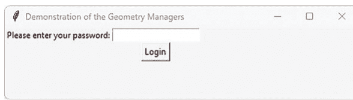

图 22.5 使用 grid() 排列控件

然而，控件在单元格内的对齐方式可以使用 **sticky** 选项轻松调整。如前所述，**sticky** 是一个罗盘方向规范。因此，**sticky = 'w'** 意味着控件应“向西对齐”，即位于单元格的左边缘。同时，基本方向也可用于调整控件的宽度，使其即使小于单元格也能完全填充。例如，**sticky = 'we'** 会使控件在其单元格内（该单元格的宽度由其上方行中更宽的输入框决定）“从西向东”延伸，即占据单元格的整个宽度。

你可以在图 22.6 中看到结果。

然而，有时这还不够，你希望一个控件跨越多列或多行。在这种情况下，**rowspan** 和 **columnspan** 选项会有所帮助，它们分别指定跨越的行数或列数。使用

```python
login.grid(row = 1, column = 0, sticky = 'we', colspan = 3)
```

我们的按钮将从提示标签的左边缘延伸到输入框的右边缘。

**padx** 和 **pady** 选项（在 **pack()** 中已知）允许你分别指定左右和上下间距，这通常会使显示更加均衡，如图 22.7 中的示例所示，其中使用了值为 5 的 **padx** 和 **pady**。

应用程序窗口中网格的总大小取决于你放置的最靠外的控件的位置。在我们的示例中，网格有两列两行；如果我们使用 **widget.grid(row = 0, column = 2)** 在输入框右侧放置一个控件，则会添加第三列。Grid 是一个非常流行的几何管理器，因为它允许你以较少的努力设计出有效的界面，同时提供直观的定位。▶ 第 22.2.6 节中的示例（我们将开发一个完整的 **tkinter** 应用程序）也将使用 **Grid**。

##### 22.2.4.3 Place

第三个、最后一个，也可能是实践中最不常用的几何管理器是 **Place**。**Place** 用于将控件放置在由 x 和 y 参数指定的绝对位置，或相对位置。相对位置是指相对于窗口左上角的位置，以窗口宽度或高度的百分比来衡量。语句

```python
login.place(relx = 0.5, rely = 0.5)
```

将 **login** 按钮精确放置在窗口的中间，即距离窗口左上角 50% 的窗口宽度（**relx**）和 50% 的窗口高度（**rely**）处。更准确地说：按钮的*左上角*被放置在那里。使用在 **pack()** 中已知的 **anchor** 选项，也可以指定另一个角作为定位的“锚点”。同样，该角由地理方向指定，例如 'se' 表示东南角，即右下角。控件的大小也可以指定，可以使用 **width** 和 **height** 选项绝对指定，也可以通过相对大小指定。在这种情况下，可以使用 **relwidth** 和 **relheight** 将宽度或高度指定为窗口宽度或高度的百分比。

指定相对位置和大小的优点是，当窗口大小改变时，控件的位置和大小会随之调整，这种效果也可以通过几何管理器 **pack** 和 **grid** 实现（尽管后者稍微麻烦一些），但当使用 **place** 进行绝对位置指定时则不然。

#### 22.2.5 事件

##### tkinter 控件的 Command 选项

到目前为止，我们已经构建了响应式界面，但它们大多没有功能。点击我们的按钮或菜单项时什么都不会发生。现在情况将改变。

一些控件，如 **Button** 或 **Menu**，自带指定函数的能力，每当控件被用户“触发”时，该函数就会被调用。考虑以下关于现在众所周知的开尔文与摄氏度之间转换的简单示例。一个带有图形界面的小型转换器可能看起来像这样：

from tkinter import *

def convert():
    lb_result['text'] = '转换结果：' + \
        str(round(float(en_kelvin.get()) - 273.15, 2)) + ' °C。'

def closeapp():
    quit()

win = Tk()
win.title('开尔文-摄氏度转换')
win.geometry('400x150')

menu_top = Menu(win)
win.config(menu = menu_top)
actionmenu = Menu(menu_top, tearoff = 0)

actionmenu.add_command(label = '转换', command = convert)
actionmenu.add_separator()
actionmenu.add_command(label = '关闭', command = closeapp)

menu_top.add_cascade(label = '操作', menu = actionmenu)

lb_input = Label(text = '开尔文温度：')
en_kelvin = Entry()
bt_convert = Button(win, text = '转换', command = convert)
lb_result = Label(width = 30)

lb_result.pack()
en_kelvin.pack()
bt_convert.pack(pady = 10)
lb_result.pack(pady = 10)

win.mainloop()

程序的用户界面如图 22.8 所示。

与前面章节不同的是，这次我们在调用按钮构造方法 **Button()** 时使用了 **command** 选项，并通过 **add_command()** 添加菜单项。**command** 选项被赋予一个函数，该函数被称为*事件处理程序*或*回调函数*，每当控件被用户触发时，它就会被自动调用。例如，如果我们的“转换”按钮被点击，**convert()** 函数就会被自动调用。我们在程序前面定义了 **convert()** 函数（函数定义必须在程序源代码中*先于*对 **command* 选项的赋值）；它只是执行转换并将结果显示在 **lb_result** 标签上。请注意，在将事件处理程序函数赋值给 **command** 选项时，函数名后不指定圆括号。这是因为 **command** 选项只是传递了函数*对象*；你会记得，在 Python 中，函数也是对象——只有在定义函数（如下所示）或调用函数时才需要包含圆括号，但当我们指的是函数对象本身时则不需要。

**图 22.8** 开尔文到摄氏度转换器

##### 绑定事件处理程序

**tkinter** 还知道另一种更强大的响应事件的方式。这是借助控件方法 **bind()** 来完成的。通过语句

```
bt_convert.bind('<button-1>', convert)
```

我们可以实现与上面 **Button()** 构造函数中 **command** 选项相同的效果。**bind(event, eventhandler_function)** 方法将一个事件处理程序函数绑定到一个事件上。此后，我们的事件处理主循环 **mainloop()** 会监视该事件是否被触发，如果触发则调用事件处理程序函数。字符串 **'<Button-1>'** 代表按下左/主鼠标按钮（“按钮 1”）的事件（顺便说一下，右鼠标按钮是 **'<Button-3>'**，**'<Button-2>'** 是中鼠标按钮）。除了这些按钮事件，还有各种各样的事件可以绑定事件处理程序；以下是一些示例：

- **<DoubleButton-1>**：双击左鼠标按钮。
- **<Enter>** 和 **<Leave>**：用户将鼠标指针移入控件区域或鼠标指针移出控件区域。
- **a, b, c, ...**：按下了相应的字母键。
- **<Key>**：按下了*任意*字母键。
- **<F1>, ...**：触发了相应的功能键。
- **<Escape>**、**<BackSpace>**（删除）、**<Delete>**、**<Tab>**（制表符）、**<Return>**（回车或输入）、**<Shift_L>**（Shift）、**<Control_L>**（Ctrl）、**<Alt_L>**（Alt）、**<End>**、**<Home>**、**<Left>**（左箭头）、**<Up>**（上箭头）、**<Right>**（右箭头）、**<Down>**（下箭头）、**<Print>**、**<Insert>**：按下了相应的特殊键。

键组合也可以用这种方法表示：例如，如果你想将一个函数绑定到同时按下 <CTRL> 和 <S> 的事件，你只需将 '<Control_L>S' 指定为事件即可。

让我们仔细看看我们通过 **bind()** 绑定到事件的事件处理程序。这些函数会自动接收一个 **Event** 类型的参数。因此，我们必须调整我们之前的事件处理程序，例如我们赋值给按钮 **command** 选项的那些，因为这些事件处理程序不需要任何参数。这个改动很小，但可以避免运行时错误：

```
def convert(ev = None):
    lb_result['text'] = '转换结果：' \
        + str(round(float(en_kelvin.get()) - 273.15, 2)) + ' °C。'
```

我们不需要对 **Event** 对象 **ev** 做任何处理，但事件处理程序函数必须提供这个参数。通过给参数一个默认值（即 **None**），我们也使得该函数可以被菜单项“转换”的 **command** 选项调用，因为它调用事件处理程序时*不带*参数。因此，事件处理程序必须能够处理被带参数调用以及参数被省略的情况。

但是这个事件对象的内容是什么？事件对象提供有关事件的一些信息，特别是：

- **x,y**：触发事件时的鼠标位置（相对于窗口左上角）（对于点击事件很有用）。
- **widget**：触发事件的控件。
- **char**：按下的字符键（对于 <Key> 事件尤其有用）。

顺便说一下：你也可以将事件直接绑定到应用程序窗口，在我们的例子中就是 **Tk** 对象 **win**。如果某个控件触发了事件，系统首先会自动检查该控件是否为此事件绑定了事件处理程序。如果没有，则会检查“上一级”对象（在我们的例子中是应用程序窗口）是否有此事件的事件处理程序。从这个意义上说，事件处理程序的存在性是从“具体到一般”进行检查的；可以说，事件处理程序形成了一个层次结构。

#### 22.2.6 示例：计算器应用程序

在本节中，我们将使用 **tkinter** 开发一个简单的计算器。该计算器应处理四种基本算术运算，并允许将计算结果复制到剪贴板。你可以在图 22.9 中看到结果。

**图 22.9** 计算器应用程序的界面

现在让我们逐步查看代码：

```
from tkinter import *
from tkinter.font import *
from functools import *

# 为按钮定义事件处理程序函数
def digit_operator_press(digit_operator):
    display['text'] = display['text'] + digit_operator

def delete_press():
    display['text'] = ''

def copy_press():
    win.clipboard_clear()
    win.clipboard_append(display['text'])

def plusminus_press():
    display['text'] = '-' + display['text']

def equal_press():
    display['text'] = str(eval(display['text']))

# 为 <ENTER> 键定义事件处理程序
def enter_press(ev):
    equal_press()

# 创建应用程序窗口
win = Tk()
win['background'] = '#000000'
win.title('计算器')
win.geometry('268x470')
win.resizable(height=False, width=False)

# 为按钮和显示屏定义字体
digit_font = Font(family = 'Arial', size = 18)
display_font = Font(family = 'Arial', size = 24,
                   weight = 'bold')

# 创建显示屏
display = Label(text = '',
                background = '#000000',
                foreground = '#00FF00')
display['width'] = 13
display['font'] = display_font
display['height'] = 2
display['anchor'] = 'e'

# 定义按钮
delete_op = Button(win,
                    text = '删除',
                    width = 9,
                    height = 1,
                    font = digit_font,
                    foreground = '#FFFFFF',
                    background = '#4C4E4F',
                    command = delete_press)
plusminus_op = Button(win,
                      text = '+/-',
                      width = 4,
                      height = 1,
                      font = digit_font,
                      foreground = '#FFFFFF',
                      background = '#4C4E4F',
                      command = plusminus_press)
copy_op = Button(win,
```

## 22.2 · 使用 Tkinter 构建图形用户界面

```python
72         text = 'Copy',
73         width = 4,
74         height = 1,
75         font = digit_font,
76         foreground = '#FFFFFF',
77         background = '#4C4E4F',
78         command = copy_press)
79     digit1 = Button(win,
80         text = '1',
81         width = 4,
82         height = 2,
83         font = digit_font,
84         command = partial(digit_operator_press,'1'))
85     digit2 = Button(win,
86         text = '2',
87         width = 4,
88         height = 2,
89         font = digit_font,
90         command = partial(digit_operator_press, '2'))
91     digit3 = Button(win,
92         text = '3',
93         width = 4,
94         height = 2,
95         font = digit_font,
96         command = partial(digit_operator_press, '3'))
97     digit4 = Button(win,
98         text = '4',
99         width = 4,
100        height = 2,
101        font = digit_font,
102        command = partial(digit_operator_press, '4'))
103    digit5 = Button(win,
104        text = '5',
105        width = 4,
106        height = 2,
107        font = digit_font,
108        command = partial(digit_operator_press, '5'))
109    digit6 = Button(win,
110        text = '6',
111        width = 4,
112        height = 2,
113        font = digit_font,
114        command = partial(digit_operator_press, '6'))
115    digit7 = Button(win,
116        text = '7',
117        width = 4,
118        height = 2,
119        font = digit_font,
120        command = partial(digit_operator_press, '7'))
121    digit8 = Button(win,
122        text = '8',
123        width = 4,
124        height = 2,
125        font = digit_font,
126        command = partial(digit_operator_press, '8'))
127    digit9 = Button(win,
128        text = '9',
129        width = 4,
130        height = 2,
131        font = digit_font,
132        command = partial(digit_operator_press, '9'))
133    digit0 = Button(win,
134        text = '0',
135        width = 9,
136        height = 2,
137        font = digit_font,
138        command = partial(digit_operator_press, '0'))
139    divide_op = Button(win,
140        text = '/',
141        width = 4,
142        height = 2,
143        font = digit_font,
144        foreground = '#FFFFFF',
145        background = '#10a605',
146        command = partial(digit_operator_press, ' / '))
147    multiply_op = Button(win,
148        text = '*',
149        width = 4,
150        height = 2,
151        font = digit_font,
152        foreground = '#FFFFFF',
153        background = '#10a605',
154        command = partial(digit_operator_press, ' * '))
155    minus_op = Button(win,
156        text = '-',
157        width = 4,
158        height = 2,
159        font = digit_font,
160        foreground = '#FFFFFF',
161        background = '#10a605',
162        command = partial(digit_operator_press, ' - '))
163    plus_op = Button(win,
164        text = '+',
165        width = 4,
166        height = 2,
167        font = digit_font,
168        foreground = '#FFFFFF',
169        background = '#10a605',
170        command = partial(digit_operator_press,' + '))
171    point_op = Button(win,
172        text = ',',
173        width = 4,
174        height = 2,
175        font = digit_font,
176        command = partial(digit_operator_press, '.'))
177    equal_op = Button(win,
178        text = '=',
179        width = 10,
180        height = 1,
181        font = digit_font,
182        foreground = '#FFFFFF',
183        background = '#0570A6',
184        command = equal_press)
185
186    # 为回车键定义事件处理程序
187    win.bind('<Return>', enter_press)
188
189    # 在界面上放置按钮
190    display.grid(row = 0, column = 0, columnspan = 5,
191        sticky = 'news')
192    delete_op.grid(row = 1, column = 0, columnspan = 2,
193        sticky = 'news')
194    plusminus_op.grid(row = 1, column = 2, sticky = 'news')
195    copy_op.grid(row = 1, column = 4, sticky = 'news')
196    digit1.grid(row = 2, column = 0, sticky = 'news')
197    digit2.grid(row = 2, column = 1, sticky = 'news')
198    digit3.grid(row = 2, column = 2, sticky = 'news')
199    digit4.grid(row = 3, column = 0, sticky = 'news')
200    digit5.grid(row = 3, column = 1, sticky = 'news')
201    digit6.grid(row = 3, column = 2, sticky = 'news')
202    digit7.grid(row = 4, column = 0, sticky = 'news')
203    digit8.grid(row = 4, column = 1, sticky = 'news')
204    digit9.grid(row = 4, column = 2, sticky = 'news')
205    digit0.grid(row = 5, column = 0, columnspan = 2,
206        sticky = 'news')
207    point_op.grid(row = 5, column = 2, sticky = 'news')
208    divide_op.grid(row = 2, column = 4, sticky = 'news')
209    multiply_op.grid(row = 3, column = 4, sticky = 'news')
210    minus_op.grid(row = 4, column = 4, sticky = 'news')
211    plus_op.grid(row = 5, column = 4, sticky = 'news')
212    equal_op.grid(row = 6, column = 0, columnspan = 5,
213        sticky = 'news')
214
215    # 事件循环
216    win.mainloop()
```

## 第 1–3 行：导入指令

我们首先从 tkinter 模块导入所有类。此外，计算器的“显示”将使用一种特殊字体，因此我们也从 font 模块导入所有内容。我们需要最后一条导入语句，以使那些旨在响应用户数字输入的事件函数变得更简单一些。稍后会详细介绍。

## 第 6–30 行：按钮的事件处理函数

这些是响应不同用户操作的事件函数。我们将在最后更详细地讨论这些函数，但首先我们想看看界面。了解了界面之后，也更容易理解事件处理程序的工作原理。

## 第 33–38 行：应用程序窗口

我们的计算器应该有一个黑色背景，并且窗口大小固定，用户无法更改。

## 第 40–52 行：字体和显示

接下来，我们定义两种字体：**digits_font** 用于计算器按键上的数字，**display_font** 用于计算器上的显示。显示本身具有绿色前景和黑色背景颜色。通过 **display['anchor'] = 'e'**，我们将内容对齐到“东”，即右对齐。

## 第 54–184 行：创建按钮

接下来，我们为窗口 **win** 创建按钮，这些按钮具有一系列属性，即它们的标签（**text**）、以文本字符为单位的**宽度**和**高度**、**字体**、**前景**和**背景**颜色，以及用户点击按钮时调用的事件处理程序（**command**）。

对于事件处理程序，我们使用了一个小技巧，以避免为 10 个数字和每个算术运算符编写单独的事件处理程序。我们只定义了一个名为 **digit_operator_press()** 的事件处理程序，我们用一个参数调用它，即相应的数字或相应的运算符。但是，**tkinter** 按钮对象的 **command** 选项必须传递一个函数对象，而不是一个带参数的函数调用。因此，我们使用 **functools** 模块中的 **partial** 函数来创建一个函数对象，其中参数已经被“烘焙”进去。由于 **partial()** 的返回值是一个与 **function** 对象并无二致的对象，但已经包含了参数值，我们可以将此返回值用作按钮 **command** 选项的值。

## 第 186–187 行：<ENTER> 键的事件处理程序

为了使计算不仅可以通过点击界面上的等号按钮触发，还可以通过按键盘上的 <ENTER> 键触发，我们将一个事件处理程序（第 29–30 行）绑定到按下 <ENTER> 键的事件上，该处理程序除了调用按下等号按钮时触发的事件处理程序（第 24–25 行）外，什么也不做。我们仍然需要将这两个事件处理程序分开，因为处理按钮按下的事件处理程序默认会接收一个事件对象作为参数，即使我们根本不处理它，也必须接受它。

考虑到这一点，让我们快速看一下其他事件处理程序：

- **digit_operator_press()**（第 6–8 行）：事件处理程序接收被点击的数字或算术运算符作为参数。被按下按钮的值只是简单地附加到显示中的现有内容上。
- **delete_press()**（第 11–12 行）：清除显示的内容。
- **copy_press()**（第 15–17 行）：首先清除剪贴板，然后将显示的当前内容附加到剪贴板。为此使用了函数 **clipboard_clear()** 和 **clipboard_append()**，这两个函数都由 **Tk** 类方便地提供，因此也可用于我们的窗口对象 **win**。
- **plusminus_press()**（第 20–21 行）：当按下加/减按钮时，我们只需在当前显示内容前加上一个减号。严格来说，我们应该必须检查是否已经存在负号，然后将其移除。但就像处理其他输入一样（例如，我们不检查用户是否连续输入两个运算符），我们在此处简化处理，依赖用户的常识。

- **equal_press()**（第24–25行）：这是前面提到的事件处理程序，在用户请求计算结果时被调用。这里我们使用**eval()**函数，它会计算一个Python表达式并返回其结果。在我们的例子中，Python表达式就是用户输入并显示在计算器显示屏上的数字和运算符序列。然而，**eval()**也可以用于执行作为字符串参数传递的完全任意的Python代码。

## 第189–213行：将按钮放置在界面上

现在我们只需要将显示屏和按钮放置到界面上。为此，我们需要**grid**几何管理器，因此我们使用**grid()**方法，通过指定**row**（行）和**column**（列）号来为各个控件在网格中分配位置。通过**columnspan**选项，我们可以让某些元素水平跨越多个网格单元格，例如显示屏。通过**sticky**选项的值**news**（*北+东+西+南*），我们指定元素在其各自的网格单元格中应完全扩展，即完全填满单元格。

## 第215–216行：事件循环

通过**mainloop()**，我们启动计算器的事件处理。从现在开始，用户界面通过调用相应的事件处理程序来响应用户的输入。

### 22.3 文件操作

在Python中操作文件非常简单。它分为三个步骤，与大多数其他编程语言类似：

1.  打开文件（可能首先需要创建文件）
2.  处理文件（从中读取、写入或追加内容）
3.  所有工作完成后关闭文件

#### 打开文件

文件由一个*文件对象*表示。我们借助标准Python函数**open(filepath, mode)**来创建这样的文件对象。参数**mode**描述了文件要以何种编辑模式打开。模式的可能值有：

- **"w"**：文件以*写入*模式打开。文件指针设置在文件开头。文件的任何现有内容都将被完全替换。如果文件尚不存在，则会新创建一个。在此模式下无法从文件读取。
- **"a"**：文件以*追加*模式打开。文件指针放置在文件末尾。写入文件的内容将被追加到文件末尾。在此模式下无法从文件读取。
- **"r"**：文件以*读取*模式打开。文件指针设置在文件开头。在此模式下无法写入文件。
- **"r+"**：文件以读取*和*写入模式打开。

请注意，如果你在Windows系统上工作，必须用另一个反斜杠*转义*路径规范中分隔路径组件的反斜杠，否则Python会将其视为尝试转义*后续字符*，从而为其分配特殊的控制功能（如果你不再熟悉转义，请回顾▶第11.2.2节）。例如，如果我们想打开目录**C:\Programming**中的文件**test.txt**进行写入，我们首先需要让**open()**函数创建一个相应的文件对象（为简单起见，我们在此称其为**file**）：

```
file = open("C:\Programming\test.txt", "w")
```

这个对象具有许多属性，可以帮助我们更好地理解其特性：**file.name**以完整路径规范的形式给出文件名，**file.mode**给出我们打开文件的模式。此外，文件是否可读和/或可写可以通过**file.readable()**和**file.writable()**方法来确定，它们各自返回一个**bool**值。

#### 编辑文件

要向文件*写入*内容，文件对象提供了**write(text)**和**writelines(lines)**方法。
**write()**只是将*一个*字符串写入文件，除非**text**末尾包含转义序列\n（例如，"**This is a newline\n text**"），否则不会添加尾随换行符。
相比之下，**writelines()**写入作为数组传递的*多个*字符串；这个函数的名字有些误导性，因为**writelines()**也不会在每个字符串末尾写入换行符。因此，如果你想在每个字符串后换行，必须自己添加：

```
lines = ["line 1\n", "line 2\n"]
file.writelines(lines)
```

写入方法各自返回写入的字符数作为函数值。
要从文件*读取*，可以使用**read()**、**readline()**和**readlines()**函数。**read()**读取*整个*文件内容并将其作为字符串返回。通过一个可选参数，可以读取*特定数量的字符*（从文件指针的当前位置开始计算）。文件指针从文件开头开始，并在每次读取操作后相应移动。考虑以下示例文件：

```
Line number one
One more line
Last line
```

使用**read(3)**，在打开文件后（文件指针此时在文件开头），我们将首先读取字符串"Lin"。之后，文件指针位于"line"的"e"上。再执行一次**read(19)**将返回接下来的19个字符，即"e number one\nOne mo"。请注意，换行符也算作一个字符，并且是*恰好一个*字符（尽管它以转义序列\n的形式表示，包含两个字符）。这次读取后，文件指针现在位于"more"的"r"上。

**readline()**和**readlines()**函数的处理方式与**read()**不同；它们分别读取一行或多行。**readline()**总是读取恰好下一行，而**readlines()**读取所有行或作为可选参数传递的行数，返回一个*字符串数组*。因此，**readline()**和**readlines(1)**方法调用的区别在于，**readline()**调用的结果是一个*str*值，而**readlines()**返回一个数组，在这种情况下数组只包含一个字符串作为元素。

如果文件指针不在行的开头，而是在行的中间，就像上面调用**read(3)**之后那样，那么**readline()**和**readlines()**将从文件指针当前所在的字符开始读取。行的开头（在我们的例子中，是已经用**read()**读取的前三个字符）将不再被读取。

在读取时，你可以使用**seek(characterindex)**将文件指针设置为从文件开头计算的**characterindex**指定的字符。文件指针的当前位置由文件对象的**tell()**方法返回。

顺便说一下：如果你以"r+"模式（读取*和*写入）打开文件，你实际上可以使用同一个文件对象进行这两种操作。然而，写入总是在文件末尾进行，读取则在文件指针的当前位置进行，其行为与以"r"模式打开文件时相同。

#### 关闭文件

编辑完文件后，使用**file.close()**方法关闭它。文件对象将继续存在，但其属性**file.closed**现在将取值**True**，表示该对象不再可用于读取或写入。然而，由于文件对象仍然将其**name**属性作为文件的路径，你可以简单地“重新激活”它：

```
file = open(file.name, "r")
```

**22.2 [15分钟]**
编写一个程序，向用户查询一个文件的名称（包含其完整路径）。然后，文件内容的某个百分比（由用户指定）应作为预览显示。预览显示中应移除换行符，以使显示尽可能紧凑。

### 22.4 练习：开发一个简单的文本编辑器

以下练习结合了你在本章中学到的许多内容，以开发一个实用的小应用程序。

任务是使用 **tkinter** 编程一个简单的文本编辑器。该编辑器应允许你创建新文件或打开现有文件，然后再次编辑和保存文件，可以使用当前文件名或新文件名。此外，用户应能将文本复制到剪贴板并从剪贴板粘贴。编辑器的命令应可通过菜单和按钮栏选择。

你需要使用 **tkinter** 模块 **scrolledtext** 中的 **ScrolledText** 控件。因此，请确保在导入中包含以下行

```
from tkinter.scrolledtext import ScrolledText
```

即使你使用 **from tkinter import \*** 导入了其余的 **tkinter** 控件。

请广泛测试你的程序！

完成此任务的预计时间为 120 分钟。你应该有一个安静的空间来专注于这项开发工作。如果任务仍然显得太具挑战性，不要花数小时尝试自己开发编辑器，而是阅读示例解决方案中的代码并尝试理解它，起初无需参考解决方案中的说明性注释。

### 22.5 总结

在本章中，我们探讨了如何通过控制台输入和输出数据。我们还探讨了如何在 Python 中实现图形用户界面，以便用户方便地与你的程序交互。

请务必从本章掌握以下要点：

- 在 Python 控制台中，你始终可以使用内置 Python 函数 **print(object)** 打印对象。
- 可以使用 **input(prompt)** 方法向用户请求信息，该方法始终将用户输入作为字符串返回（因此，如有必要，必须转换用户输入）。
- 图形用户界面（GUI）可以使用 **tkinter** 库轻松实现，该库是标准 Python 包的一部分。
- **tkinter** 程序总是包括使用同名构造函数创建 **Tk** 对象、创建和配置控件（控件）、定义控件的排列（使用几何管理器）以及启动事件处理（**Tk** 对象的 **mainloop()** 方法）。
- **tkinter** 中图形用户界面最重要的控件（控件）是 **Button**、**Menu**、**Entry**（文本输入）、**Label**（文本显示）、**Checkbutton**（选项的多选）、**Radiobutton**（选项的单选）和 **Listbox**（具有单选或多选功能的文本条目的列表式显示）。
- 可以从 **tkinter**（更具体地说，**tkinter** 模块 **filedialog**）中使用的重要标准对话框包括：**messagebox**（具有不同显示图标和按钮的多个变体）用于显示文本消息；以及 **askopenfilename()** 和 **asksaveasfilename()** 用于在打开或保存文件时查询文件路径。
- 控件通过选项进行配置；一些选项（但不是它们的值！）几乎适用于所有控件（例如，**background** 颜色和 **font**），其他选项则特定于特定控件。
- 所有控件都有 **config(option = value, ...)** 方法，可用于设置选项的值。此外，选项可以以 **widget['option']** 的形式访问，就像它们是字典一样。
- 控件借助几何管理器排列在程序界面上；**tkinter** 有三种这样的排列工具：**pack**（直接彼此相邻/下方排列）、**grid**（沿假想网格排列）和 **place**（通过指定相对于参考点的坐标排列），可以通过每个控件的标准方法 **pack()**、**grid()** 和 **place()** 调用。
- 要从文件读取数据或向文件写入数据，首先使用内置 Python 函数 **open(filename, mode)** 打开相关文件；这将返回一个 **File** 对象。
- 编辑文件的模式有 **r**（读取）、**w**（写入）、**a**（追加）和 **r+**（读取和写入）。
- **File** 对象的 **read()** 和 **readlines()** 方法以及 **write()** 和 **writelines()** 方法可用于从文件读取或向文件写入。
- **File** 对象的 **close()** 方法在处理完成后再次关闭文件。

### 22.6 练习解答

#### 练习 22.1

```
# 第一种选项：三个 print() 命令（每个自动以 \n 结尾）

print('First line')
print('Second line')
print('Third line')

# 第二种选项：一个字符串，行由 \n 转义序列分隔。
print('First line\nSecond line\nThird line')

# 第三种选项：输出三个字符串对象，使用 \n 转义序列作为分隔符。
print('First line', 'Second line', 'Third line', sep = '\n')
```

#### 练习 22.2

程序可以如下所示：

```
filename = input("Please enter a filename (incl. path): ")

percent = input("Percent of content to be previewed " +
    "(whole number, e.g. 10 for 10%): ")

previewfile = open(filename, "r")
contents = previewfile.read()
previewfile.close()

content = contents.replace("\n", "")

length_total = len(content)
length_preview = int(length_total * int(percent) / 100)

print("### Preview: ", length_preview, " characters of ",
    length_total, "characters ###")
print(content[0:length_preview], "\n####\n")
```

文件首先以读取模式（"r"）打开，并使用 **read()** 读取其全部内容。之后，文件可以再次关闭，因为字符串变量 **content** 现在包含整个文件内容，我们将仅继续处理此内容。在我们通过使用字符串方法 **replace()** 移除转义序列 \n 来清理内容中的换行符之后，我们在最后一条语句中选择所需数量的字符，这些字符是我们之前根据用户指定的预览百分比计算出来的，并将它们显示在屏幕上。从字符串中选择字符时，重要的是确保选择限制是整数。我们通过在计算预览长度时使用 **int()** 将结果存储为整数变量来实现这一点。

##### 编程任务 文本编辑器

在开发文本编辑器时，当然可以有多种变体。此处呈现的解决方案的用户界面如图 22.10 所示。

## 22.6 · 练习解答

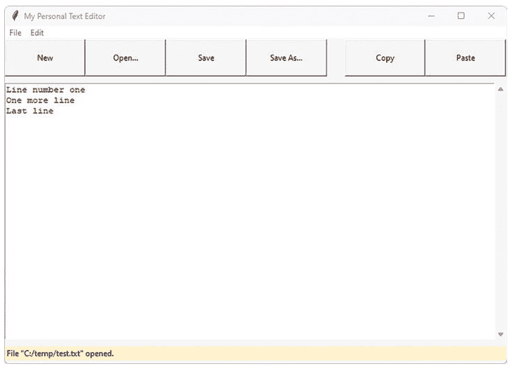

图 22.10 我们的文本编辑器的用户界面

代码如下所示：

```
from tkinter import *
from tkinter.filedialog import *
from tkinter.scrolledtext import ScrolledText

# 为按钮和菜单定义事件处理函数

def new_press():
    global filename
    text.delete(1.0, 'end')
    filename = ''
    status['text'] = 'Unsaved new file'


def open_press():
    global filename
    fname = askopenfilename(defaultextension = 'txt',
        filetypes = [('Text Files', '*.txt'),
        ('All Files', '*.*')],
        title = 'Open....',
        initialdir = 'C:\Windows')
    textfile = open(fname, 'r')
    text.delete(1.0, 'end')
    text.insert(1.0, textfile.read())
    textfile.close()
    status['text'] = 'File "' + fname + '" opened.'
    filename = fname


def saveas_press():
    global filename
    fname = asksaveasfilename(defaultextension = 'txt',
        filetypes = [('Text Files', '*.txt'),
            ('All Files', '*.*'),],
        title = 'Save File As...',
        initialdir = 'C:\Windows')
    textfile = open(fname, 'w')
    textfile.write(text.get(1.0, 'end'))
    textfile.close()
    status['text'] = 'File "' + fname + '" saved.'
    filename = fname


def save_press():
    global filename
    textfile = open(filename, 'w')
    textfile.write(text.get(1.0, 'end'))
    textfile.close()
    status['text'] = 'File "' + filename + '" saved.'


def copy_press():
    selection = text.selection_get()
    text.clipboard_clear()
    text.clipboard_append(selection)


def paste_press():
    text.insert(text.index('insert'), text.clipboard_get())


def copy_press_key(event):
    copy_press()


def paste_press_key(event):
    paste_press()


def quit_press():
    win.quit()


# 创建应用程序窗口
win = Tk()
win.title('My Personal Text Editor')
```

## 22.6 · 练习解答

```python
79  win.geometry('760x490')
80  win.resizable(height = True, width = True)
81
82
83  # Set up the menu
84  menubar = Menu(win)
85  win.config(menu = menubar)
86
87  file_menu = Menu(menubar, tearoff=0)
88  edit_menu = Menu(menubar, tearoff=0)
89
90  menubar.add_cascade(label = 'File', menu = file_menu)
91  menubar.add_cascade(label = 'Edit', menu = edit_menu)
92
93  file_menu.add_command(label = 'New',
94      command = new_press)
95  file_menu.add_command(label = 'Open...',
96      command = open_press)
97  file_menu.add_command(label = 'Save',
98      command = save_press)
99  file_menu.add_command(label = 'Save As...',
100     command = saveas_press)
101 file_menu.add_separator()
102 file_menu.add_command(label = 'Quit',
103     command = quit_press)
104
105 edit_menu.add_command(label ='Copy',
106     command = copy_press)
107 edit_menu.add_command(label ='Paste',
108     command = paste_press)
109
110
111 # Create the control elements
112 new_button = Button(win,
113     text = 'New',
114     height = 3,
115     width = 16,
116     command = new_press)
117 open_button = Button(win,
118     text = 'Open...',
119     height = 3,
120     width = 16,
121     command = open_press)
122 save_button = Button(win,
123     text = 'Save',
124     height =3,
125     width = 16,
126     command = save_press)
127 saveas_button = Button(win,
128     text = 'Save As...',
129     height = 3,
130     width = 16,
131     command = saveas_press)
132 seplabel = Label(win,
133     text='',
134     height =3,
135     width= 3)
136 copy_button = Button(win,
137     text = 'Copy',
138     height = 3,
139     width = 16,
140     command = copy_press)
141 paste_button = Button(win,
142     text = 'Paste',
143     height = 3,
144     width = 16,
145     command = paste_press)
146
147 text = ScrolledText(win)
148 text.bind('<Control-c>', copy_press_key)
149 text.bind('<Control-v>', paste_press_key)
150
151
152 # Set up the status bar
153 status = Label(win,
154     text = 'No file opened.',
155     anchor = 'w',
156     background = '#FFEFc4')
157     filename = ''
158
159
160 # Place buttons on surface
161 new_button.grid(row = 0, column = 0, sticky = 'news')
162 open_button.grid(row = 0, column = 1, sticky = 'news')
163 save_button.grid(row = 0, column = 2, sticky = 'news')
164 saveas_button.grid(row = 0, column = 3, sticky = 'news')
165
166 seplabel.grid(row = 0, column= 4, sticky = 'news')
167 copy_button.grid(row = 0, column = 5, sticky = 'news')
168 paste_button.grid(row = 0, column = 6, sticky = 'news')
169
170 text.grid(row = 1, column = 0, columnspan = 7, pady = 10,
171     sticky = 'news')
172
173 status.grid(row = 2, column = 0, columnspan = 7,
174     sticky = 'news')
175
176
177 # Event loop
178 win.mainloop()
```

## 22.6 · 练习解答

### 第5–73行：按钮和菜单的事件处理函数

一旦明确了界面由哪些组件构成，我们将更详细地探讨事件处理函数的工作原理。

### 第76–80行：应用程序窗口

窗口 **win** 被创建并作为一个 **Tk** 对象进行缩放。它应该允许用户调整大小。

### 第83–108行：菜单设置

为 **win** 窗口创建了一个新的菜单栏，并在菜单栏上放置了两个下拉菜单：**file_menu** 和 **edit_menu**。然后，菜单项被逐步添加到这些菜单中。

### 第111–149行：创建其余控件

这里创建了按钮和文本输入字段。此外，事件处理函数被绑定到文本输入字段的两个事件上，以处理按键组合 <CTRL>+<C>（复制）和 <CTRL>+<V>（粘贴）。

### 第152–157行：准备状态栏

我们创建了一个标签作为淡黄色的状态栏，用于显示当前打开文件的名称。

### 第160–174行：在界面上放置控件

控件使用 **grid** 几何管理器在用户界面上进行排列，使它们完全填满各自的“网格单元格”（**sticky = 'news'**，即 *北、东、西、南*）。

### 第177–178行：事件循环

**mainloop()** 启动了我们编辑器的事件处理。这使得用户界面能够响应用户的输入。

### 事件处理函数（第5–73行）

- **new_press()**：通过首先删除 **ScrolledText** 字段的内容来创建一个文件；从第1行（*tkinter* 中文本部件的行号从1开始）第0列（列号从0开始）删除到末尾。这里本可以使用常量 **END** 来代替字符串 'end'。
- 全局变量 **filename**，我们通过 **global filename** 语句确保对其的访问（否则会在 **new_press()** 内部创建一个同名的*局部*变量），它被重新初始化为空字符串，并且状态栏的文本被更新。
- **open_press()**：这里我们使用 **askopenfilename()** 函数来获取我们想要打开的文件的路径。之后，文件以读模式打开，使用 **open()**，并使用 **read()** 读取其内容放入我们的文本字段，然后使用 **close()** 关闭文件。
- **save_as_press()** 和 **save_press()**：对于保存，我们基本上与打开操作相同；但是，文件以写模式打开，以便 **write()** 方法可以将我们使用 `ScrolledText` 部件的 `get()` 方法获取的编辑器文本写入文件。在 `save_as_press()` 中，我们使用 tkinter 的 `asksaveasfilename()` 函数询问文件名；而在 `save_press()` 中，我们使用已有的名称保存文件。因此，这只有在文件已被打开或 `ScrolledText` 部件的内容已保存到文件后才能工作。
- **copy_press()** 和 **paste_press()**，**copy_press_key()** 和 **paste_press_key()**：复制文本时，我们首先使用 `ScrolledText` 部件的 `selection_get()` 方法确定文本选择的内容，然后使用 `clipboard_clear()` 清除剪贴板，最后使用 `clipboard_append()` 方法将要复制的文本插入剪贴板。
- 粘贴文本时，我们首先使用 `index('insert')` 确定 `ScrolledText` 部件中的当前插入点（即光标位置），然后使用 `clipboard_get()` 获取剪贴板内容，并将其插入到此位置。
- 我们绑定到按键事件（第148/149行）的 `copy_press_key()` 和 `paste_press_key()` 函数调用了我们之前讨论的事件处理函数，但它们是必要的，因为使用 `bind()` 绑定到事件的事件处理函数会接收一个事件对象作为参数。因此，这些事件处理函数必须提供一个参数，而我们使用 `command` 选项绑定到按钮和菜单项的事件处理函数则不能有参数。

## 23 函数与方法：如何使用程序函数来处理数据和触发操作？

## 目录

- 23.1 使用函数 – 328
  - 23.1.1 函数定义 – 328
  - 23.1.2 函数参数 – 329
  - 23.1.3 返回值 – 334
  - 23.1.4 局部变量和全局变量 – 335
- 23.2 将函数用作对象的类方法 – 339
- 23.3 使用模块和包 – 342
  - 23.3.1 模块化程序代码 – 342
  - 23.3.2 从模块导入元素 – 344
  - 23.3.3 利用社区：Python 包索引 (PyPI) – 345
- 23.4 总结 – 348
- 23.5 练习解答 – 349

## 概述

到目前为止，我们已经介绍了如何运行 Python 程序、如何使用变量/对象以及如何输入和输出数据。在本章中，我们将重点关注中间发生的事情，即如何处理数据。如果说数据的输入和输出是我们的“程序汉堡”的两片面包，那么我们现在主要关注的是中间的肉饼（当然，也有很多用于输入和输出的函数）。

在程序中处理数据的主要方式是调用修改数据或触发其他操作的函数。函数之所以如此重要，是因为我们可以使用它们来执行某些任务，即使我们并不确切知道其内部具体是如何工作的。我们只需调用函数，函数就会执行它应该执行的操作，而我们无需自己编写这部分功能，也无需理解函数的内部工作原理。当然，我们也可以自己定义函数。函数允许我们封装特定的功能并使其可从外部访问。通过函数，我们最终将代码片段从主程序代码中分离出来，并使其可以从任何地方调用。

在本章中，你将学习：

- 如何在 Python 中编程函数以及如何调用函数（你自己的或他人提供的）
- 如何将函数（通常作为类的方法）组合成模块和包，并在需要使用时将它们导入到你的程序中
- 如何使用 Python 包索引 (PyPI) 将其他开发者提供的功能包含到你的程序中

### 23.1 使用函数

#### 23.1.1 函数定义

还记得我们在上一章使用 tkinter 包（▶ 第22.2.6节）开发的计算器应用程序吗？在那里我们定义了一些自己的函数，例如这个：

```python
def delete_press():
    display['text'] = ''
```

这是一个我们自己不调用的函数，而是一个事件处理函数，当用户点击“清除”按钮以清除当前显示时，它会被自动调用。然而，通过这个简单的例子，你已经可以看到函数的核心是什么。它的定义以 `def` 语句开始，后面跟着函数的名称。函数名称后面是圆括号，其中包含函数参数。但是，即使函数根本没有参数（如此例），在定义中（以及稍后调用函数时）也必须写出圆括号。

#### 23.1.2 函数参数

**def** 语句，即我们函数的*函数头*，以冒号结尾，表示接下来的内容是函数被调用时执行的程序代码，简而言之：函数*做什么*。函数体是一个代码块，在 Python 中，它总是通过缩进来标识。在这个例子中，代码块只包含一行代码。顺便说一句，代码块必须至少有一行。程序：

```
def my_function():

    print('This is the main program.')
```

会导致错误信息：

```
IndentationError: expected an indented block
```

显然，在 **def** 语句之后需要一个缩进的代码块。有时你已经知道需要一个函数，想从主程序中调用它，但还不确定函数应该如何工作。怎么办？编写一个“空”函数会导致上述错误信息，即使你在代码块中只写了一行注释；这是因为注释不被视为 Python 会接受为代码块的可执行语句。为了解决这个问题，Python 有一个特殊的语句，即 **pass**。**pass** 什么都不做，但它是一个可执行语句。所以，如果你在函数代码中只写 **pass** 作为唯一的指令，它将使你的函数在语法上正确，而函数实际上什么也不做。注意 **pass**（就像 **def**）是一个 Python *语句*，而不是一个函数，因此不需要用（空的）圆括号调用。

让我们回到本书第一部分（▶ 第 12.2.2 节）的一个例子，即从开尔文到摄氏度的温度转换。这个转换可以写成一个函数。然而，与上面的函数 delete_press() 不同，我们的函数需要一个参数，即要转换的温度：

```
def kelvin_to_celsius(kelvin):
    print(kelvin, 'Kelvin are', round(kelvin - 273.15, 2),
          'degrees Celsius.')
```

我们现在可以调用这个函数，例如：

```
kelvin_to_celsius(300)
```

然后我们得到的输出是：

```
300 Kelvin are 26.85 degrees Celsius.
```

当然，函数可以有多个参数。考虑以下例子，我们向屏幕输出一条欢迎消息：

```
def welcome(name, greeting, message):
    print(greeting, ', ', name, '! ', message, sep = '')
```

我们现在可以这样调用函数，例如：

```
welcome('Sophie', 'Welcome', 'Glad to have you with us.')
```

这次调用在（运行）控制台中的结果如下：

```
Welcome, Sophie! Glad to have you with us.
```

##### 位置参数和关键字参数

在函数调用中指定的字符串，哪个被分配给参数 **name**，哪个给 **greeting**，哪个给 **message**，是由它们传递的顺序决定的，即它们的位置；这些参数，你已经知道，也被称为*位置参数*。然而，我们可以在调用函数时指定参数的名称。这允许像下面这样的调用：

```
welcome('Sophie', message = 'Glad to have you with us.',
        greeting = 'Welcome')
```

这里我们通过位置传递第一个参数，但后面两个通过它们的名称传递。注意，我们传递 **message** 和 **greet** 参数值的顺序与上面函数定义中的参数顺序不同。然而，因为我们通过名称显式地指定了参数，Python 仍然可以将传递的值正确映射到函数参数。所以，这些命名参数（也称为*关键字参数*）的优点在于，我们指定参数的顺序无关紧要，这在被调用的函数有一大堆参数时尤其方便。否则，必须先查找参数的确切顺序会很麻烦。

但是，如果你混合使用位置参数和关键字参数，就像我们在上面的例子中那样，要小心：因为位置参数必须始终在开头。所以，你不能将第一个参数作为关键字参数传递，而将第二个作为位置参数传递。

顺便说一句，我们在函数定义中已经使用了一个关键字参数，即在调用 **print()** 时：这里我们使用了 **sep** 参数来指定各个字符串不应以空格分隔输出，否则会在不适当的位置（例如在结束问候语的感叹号之前）产生恼人的空白。

##### 可选参数

刚才提到的 **print()** 函数的 **sep** 参数是一个*可选*参数的例子，我们*可以*指定它，但*不必*指定（例如，在开尔文到摄氏度的转换中，我们调用 **print()** 时没有使用 **sep** 参数）。**sep** 有一个默认值，即 ' '（即一个空格），每当调用 **print()** 函数而没有显式指定 **sep** 的值时，就会使用这个默认值。当你在 Python 控制台中调用 **print()** 的帮助时，可以清楚地看到这一点。上面写着：

```
print(value, ..., sep=' ', end='\n', file=sys.stdout,
      flush=False)
```

因此，可选参数 **sep** 被“预分配”了一个默认值，而参数 **value** 不是可选参数。如果我们不在函数调用中指定它，就会得到错误信息。现在，如果我们想修改我们的 **welcome()** 函数，使你不必指定问候语，我们只需在函数头中添加 **greeting** 参数的默认值：

```
def welcome(name, message, greeting = 'Welcome'):
    print(greeting, ', ', name, '! ', message, sep = '')
```

之后，我们也可以这样调用我们的函数：

```
welcome('Sophie', 'Nice to have you.')
```

注意，我们在函数头中交换了 **greeting** 和 **message** 参数的顺序。原因是，在 Python 中，带有默认值的参数必须在函数定义的最后。如果有多个可选参数，它们在函数调用时必须作为关键字参数传递，即通过指定它们的名称，否则 Python 将不知道将传递的值分配给哪个可选参数——毕竟，任何一个可选参数都可能被提供值，也可能不被提供。

##### 不定数量的参数

对于某些函数，你事先不知道它们最终会以哪些参数被调用。一个很好的例子是 **print()** 函数。它可以接受一整套变量或值，并将它们全部打印在屏幕上。每次调用 **print()** 时，参数的数量可能不同。

假设我们想扩展我们的 **welcome()** 函数，使其不仅欢迎一个人，而是欢迎多个人。我们希望人数是可变的。我们通过使用一个*元组*参数来实现这一点，该参数在标识符前用星号标记：

```
def welcome(*name, message, greeting = 'Welcome'):
    print(greeting, ', ', end = '', sep = '')
    print(*name, end = '', sep = ', ')
    print('!', message)
```

我们现在可以用多个名字调用这个函数，例如这样：

```
welcome('Sophie', 'Marc', 'Celine',
    message = 'Glad you're here.')
```

输出如下：

```
Welcome, Sophie, Marc, Celine! Glad you're here.
```

关于我们的特性，有两点值得注意：

-   1. 与之前的 **welcome()** 版本相比，我们这里使用了多个 print 语句。这是为了实现逗号和空格的正确定位所必需的。通过将 **print()** 函数的（可选）参数 **end** 设置为空字符串（默认值是 '\n'，即换行），我们确保尽管有多个连续的 **print()** 调用，我们总是在同一行继续书写。
-   2. 参数 **name** 现在收集“松散”的参数，即我们在函数调用中指定的人名，并将它们打包成一个标识符为 **name** 的元组。然后我们可以在函数体中使用这个元组。在我们的例子中，我们“解包”这个元组（再次使用星号）并使用 **print()** 输出其元素。如果我们在调用 **print()** 时省略了星号，我们只会整体输出元组，这在视觉上不那么吸引人（试试看！）。

这种方法的一个替代方案是在调用时只传递一个参数来指定要问候的人名，即一个列表，然后我们不得不在函数中相应地处理它。使用这样一个适配的函数，函数调用将如下所示：

```
welcome(['Sophie', 'Marc', 'Celine'],
    message = 'Glad you're here.')
```

请注意，在这种情况下，三个名称只代表*一个*参数，即我们的名称列表，而在之前调用函数时，我们传递了*三个不同的名称参数*，即 '**Sophie**'、'**Marc**' 和 '**Celine**'，Python 会方便地为我们收集它们并放入一个元组中，然后我们就可以使用这个元组。这种调用函数的方式更'自然'和直观，因此比列表解决方案更可取。如果函数使用了这样的未定义元组参数，所有*后续*参数都必须作为关键字参数调用，即带有它们的标识符；这是显而易见的，因为否则 Python 无法区分传递的值是属于元组参数还是已经属于下一个参数。

顺便说一下，你偶尔会看到参数前带有双星号（**）的函数；**tkinter** 的 **config()** 函数就是这样一个函数（查看帮助！），我们可以用它来设置 **tkinter** 小部件的选项（参见 ▶ 第 22.2.3.1 节）。这样的参数也是集合参数，但用于关键字参数。通过这种方式，作为关键字参数传递的不同参数可以被收集并放入一个字典中，该字典的键是参数名称，值是为这些参数传递的值。与用于非命名参数（即 "** 参数"）的集合参数不同，用于关键字参数的集合参数必须*始终*放置在函数定义中参数列表的*末尾*。

##### ■ 函数参数的数据类型：类型提示注解（函数注解）

你可能已经注意到，函数的参数*没有类型*，也就是说，参数的数据类型没有指定。因此，Python 无法检查函数是否使用正确类型的参数调用。当我们编写 **welcome()** 函数时，我们自然假设参数 **name**、**greeting** 和 **message** 都是**字符串**，即 **str** 类型的参数。但情况并非一定如此！不了解各个参数确切含义的函数用户可能会将布尔值指定为 **greeting** 参数，期望它是一个决定是否显示问候消息的选项。

为了解决这个问题，Python 引入了一个叫做*类型提示*（也称为*函数注解*）的概念。它们内置于函数定义中，指定了参数的预期类型。对于我们原来的 **welcome()** 函数，这可能看起来像这样：

```
def welcome(name: str, message: str,
           greeting: str = 'Welcome'):
    print(greeting, ', ', name, '! ', message, sep = '')
```

如你所见，每个参数标识符后面都跟着一个冒号，然后是该参数的预期类型。

现在，Python 绝不会自动检查用户是否真的遵守了类型默认值。默认值只是指示性的。尽管如此，它在两个方面很有用：首先，类型提示也包含在函数自动生成的帮助中，并且对该函数的每个用户都是可见的。其次，有一些开发工具可以评估这些类型提示。其中一个工具是 *PyCharm*。例如，如果你尝试用布尔值作为 **greeting** 参数调用我们的 **welcome()** 函数：

```
welcome('Sophie', 'Glad you could join us.', True)
```

*PyCharm* 会在代码编辑器窗口中突出显示该布尔值。如果你将鼠标悬停在上面，一个小弹出窗口会通知你错误信息：**Expected type 'str', got 'bool' instead.**

#### 23.1.3 返回值

我们上一节的函数 **kelvin_to_celsius()** 接收一个开尔文温度值作为参数，将其转换为摄氏度并在屏幕上输出结果。当然，我们也可以省略输出，简单地*返回*计算出的摄氏值。在这种情况下，它是一个具有*返回值*的函数。
返回是通过 **return** 语句完成的。

```
def kelvin_to_celsius(kelvin: float):
    return kelvin - 273.15
```

我们现在可以从主程序中调用这个函数，先将其结果存储在一个变量中，然后将其输出到（运行）控制台：

```
temp = kelvin_to_celsius(290)
print(temp)
```

我们在函数定义中为参数 **kelvin** 添加了类型提示。我们也可以对返回值做同样的事情：

```
def kelvin_to_celsius(kelvin: float) -> float:
    return kelvin - 273.15
```

为此，返回值的类型写在函数实际头部之后，用箭头 -> 表示；冒号再次引入后面的代码块，即函数体（注意：我们在函数参数的类型提示中使用了冒号）。
有时你可能想要返回多个返回值。在这种情况下，最好将返回值的不同元素包装在一个*元组*中。在下面的例子中，我们的 **kelvin_to_celsius()** 函数被修改为返回计算出的摄氏值和原始开尔文值，作为元组的两个元素：

```
def kelvin_to_celsius(kelvin: float) -> float:
    return (kelvin, kelvin - 273.15)
```

两个值周围的括号也可以省略，这里写出来只是为了明确表示创建了一个元组。实际上，如果 **return** 语句后面跟着多个用逗号分隔的对象，它会自动创建一个元组。函数调用后，可以通过索引或直接在赋值中“解包”元组来轻松访问元组的元素：

```
temp = kelvin_to_celsius(290)
print(temp[1])

cel, kel = kelvin_to_celsius(290)
print(kel)
```

**return** 语句会自动退出函数。因此，**return** 应该始终是函数中的最后一条指令。它之后的所有代码无论如何都不会被执行。

#### 23.1.4 局部变量和全局变量

考虑以下程序：

```
greet = 'Good morning'

def welcome(name, message, greeting):
    greet = greeting + ', ' + name + '! ' + message
    print(greet)

welcome('Sophie', 'Nice to have you with us!', 'Hello')
print(greet)
```

思考一下这段代码在（运行）控制台中会输出什么。你有想法吗？
然后在 Python 中尝试一下。你的预期正确吗？
如果你运行程序，输出如下：

```
Hello, Sophie! Nice to have you with us!
Good morning
```

现在有趣的问题是，为什么当我们 **print()** 变量 **greet** 时，它仍然具有我们在程序开始时赋给它的值 '**Good morning**'。

在打印其值之前，我们调用了函数 **welcome()**，该函数改变了 **greet** 的值，在我们的例子中变成了 "**Hello, Sophie! Nice to have you with us!**"。难道 **greet** 在程序结束时不应该包含这个值吗？

这个谜题的解决方案是，我们主程序中的变量 **greet** 和 **welcome()** 函数中的变量 **greet** 最终是*两个不同的*变量。我们在 **welcome()** 函数体中创建的变量 **greet** 仅存在于此代码块内，其*作用域*仅限于函数 **welcome()**。然而，每当我们访问 **welcome()** 函数体内的变量 **greet** 时，我们使用的是在此代码块中创建的变量，而不是我们在主程序中定义的变量。所以你可以说，我们 **welcome()** 函数中的变量 **greet** “隐藏”了主程序中同名的变量。我们无法从函数内部访问主程序中的同名变量；函数中定义的变量可以说是“挡路”了。

然而，有一种方法可以访问主程序的变量。考虑以下稍作修改的代码：

```
greet = 'Good morning'

def welcome(name, message, greeting):
    global greet
    greet = greeting + ', ' + name + '! ' + message
    print(greeting)

welcome('Sophie', 'Nice to have you with us!', 'Hello')
print(greet)
```

如你所见，我们只是在 **welcome()** 函数中添加了 **global greet** 语句。这样做的效果是，Python 不会创建一个仅在 **welcome()** 函数内有效的新变量——这个作用域也称为函数的*命名空间*。相反，它会搜索全局命名空间，即我们主程序的命名空间，查找具有此名称的变量；如果找到，则使用它，否则在函数的较小命名空间中创建一个额外的变量，该变量在函数退出时就不再存在（尝试一下，在函数内将所有出现的 **greet** 更改为不同的标识符）。

你现在可能会争辩说，我们示例中的情况有些人为，其问题最终只是由于在函数定义和主程序中使用了同名变量。然而，想象一下，你想从函数内部更改一个*全局*状态变量，即在主程序命名空间中定义的变量，例如，一个指示当前正在处理的文档是否已保存的变量。这个状态变量当然应该独立于函数存在，并且在你的函数早已退出并且所有*局部*变量（即在函数本身中定义的变量，更准确地说：在其命名空间中）早已被删除后仍然可用。如果你在函数中没有使用 global 语句就访问假定的全局状态变量，那么在函数的命名空间中会创建一个同名的局部变量，这会当函数完全执行完毕后，该变量才会出现。全局状态变量不受影响。只有使用 **global** 语句，你才能明确告诉 Python 你正在使用全局变量，并且不想在函数内部创建一个新的局部变量。这样，你的函数就会改变其环境（以状态变量的形式）。通常应避免这种*副作用*，以使函数更独立于调用它的代码。

**23.1 [20 min]**
编写一个名为 `create_website()` 的函数，该函数接受标题、标题和文本（均为字符串）作为参数，根据它们创建一个 HTML 文档（即最终生成一个简单的网页），并将其保存到名为 **website.html** 的文件中。请尽可能为你的函数添加文档。

HTML 文档具有以下基本结构（缩进仅为更好地说明结构；无需写入文件）：

```
<html>
    <head>
        <title>Here is the title of the website</title>
    </head>
    <body>
        <h1>Here is a headline</h1>
        <p>Here is a text</p>
    </body>
</html>
```

最终，HTML 文档是由诸如 **h1**（用于一级标题）或 **p**（用于段落）等元素组成的集合。元素的开始和结束由标签标记，其中结束标签与开始标签对应，并补充一个前导斜杠。开始和结束标签之间是内容，HTML 元素也可以包含其他 HTML 元素（例如，外层的 **html** 元素包含 **head** 和 **body** 元素，而它们又可以包含其他元素）。

函数 `create_website()` 应该创建这样一个 HTML 文档，“嵌入”作为参数传递的信息，并将整个内容保存为 **website.html**。之后，你就可以用网页浏览器查看这个文件了！

**23.2 [10 min]**
以下两个函数存在错误。请重写这些函数，使其语法正确并实现其目的：
(a)

```
from random import *

def dice() -> int:
    """ Generates a random number analogous to a dice roll """
    dice_result = randint(1,6)
```

(b)

```
def create_phonenumber(country: str, areacode: str) -> str:
    '''Creates a formatted phone number based on its
    components; country is the country's ISO code'''

    countries_dict = {'US': '1', 'DE': '49', 'FR': '33',
                      'AT': '43', 'NL': '31', 'BE':'32',
                      'PL': '48', 'DK': '45', 'CZ': '42'}
    return '+' + countries_dict[country] + areacode + number
```

23.3 [5 min]
开发一个函数 deal_with_myself()，该函数只处理自身，接受可变数量的命名（即关键字）参数，并首先将它们的名称，然后将它们的值打印到屏幕上。

23.4 [5 min]
以下程序产生什么输出，为什么？

```
from datetime import *

total_sales = 0.00
last_sale = 0.00

def new_sale(amount, article):
    global total_sales
    last_sale = amount
    total_sales = total_sales + amount
    currenttime = datetime.now()
    print(currenttime.strftime('%Y-%m-%d %H:%M:%S') +
          ' -- New sale: ' + str(round(amount, 2)) +
          ' dollars with article number ' +
          article + '.')

new_sale(10.99, 'US07011981')
new_sale(24.99, 'CA25101878')

print('Total sales: ' + str(total_sales))
print('Last sale: ' + str(last_sale))
```

### 23.2 将函数用作对象的类方法

在许多地方，我们已经理所当然地使用了作为类一部分的函数。如你所知，此类函数也称为*方法*（如果你对此不再熟悉，最好回顾一下 ▶ 第 11.7.4 节）。

例如，当我们使用 `grid()` 设置 **tkinter** 用户界面控件的布局时，我们调用了类似 `mybutton.grid(row = 1, column = 4, sticky = 'news')` 的方法（参见 ▶ 第 22.2.6 节中的计算器示例）。在这种情况下，我们调用的是 **mybutton** 对象的方法，该对象是 **tkinter** 类 **Button** 的一个实例。为了让 Python 确切知道我们想调用哪个对象的方法，我们使用点运算符将函数调用附加到相关对象的标识符上。因此，通常方法调用的形式为 `object.method(...)`。

由于方法不过是我们可以用来处理其所属对象的普通函数，我们实际上不需要在这里单独讨论它们。然而，我们应该简要地看一下与方法相关的三个特殊主题，即：

- 方法如何作为类的一部分被*定义*
- *构造方法*在此扮演的特殊角色
- Python 类中有哪些有用的*标准方法*，我们可以将其调整用于我们的目的

#### 将方法定义为类的一部分

在 ▶ 第 21.7 节中，我们定义了一个 **Product** 类，如下所示。

```
class Product:
    name = ''
    description = ''
    item_number = ''
    manufacturer = ''
    price = 0.0
```

这个类仅由属性/特性组成。假设我们现在想给我们的类一个特殊的 **show()** 方法，以一种美观的方式显示产品的属性。为此，我们只需用方法的定义扩展类的代码块：

```
class Product:
    name = ''
    description = ''
    item_number = ''
    manufacturer = ''
    price = 0.0

    def show(self):
        print('Product:', self.name,
        '\nDescription:', self.description,
        '\nItemnumber:', self.item_number,
        '\nManufacturer:', self.manufacturer,
        '\nPrice:', self.price, '\n')
```

如你所见，函数定义头部与属性的缩进方式相同。因此，**show()** 函数是 **Product** 类定义的一部分。从现在起，所有 **Product** 类型的对象都可以调用该方法。例如，我们可以定义以下产品：

```
p = Product()
p.price = 10.99
p.name = 'Garden shovel'.
```

要显示产品属性，我们可以方便地调用我们自定义的方法：

```
p.show()
```

这将产生一个结构清晰的输出：

```
Product: Garden shovel
Description:
Article number:
Manufacturer:
Price: 10.99
```

我们没有明确赋值的属性（如 **description**）将显示其默认值（即“空”字符串）。

你可能已经注意到我们 **show()** 方法定义中的 **self** 参数。**self** 始终代表调用该方法的对象。这样，我们就可以方便地访问当前类实例的属性（以及可能的其他方法），我们的方法就是为该实例调用的。这个参数不一定必须叫做 **self**（它只需要在参数列表中排在第一位），但使用易于理解的标识符 **self** 是一个好习惯。

方法和属性一样，也是可以继承的。在 ▶ 第 21.7.2 节中，我们从 **Product** 类派生了一个 **Book** 类，即一种特殊类型的产品。这个类继承了父类的所有属性，并且还具有仅与书籍相关的额外属性，例如页数。方法的继承方式类似。

也有可能*重载*方法。这意味着更特殊的类（在我们的例子中是 **Book**）有自己的 **show()** 方法，该方法可能还会显示书籍的特殊属性，如作者和页数。因此，父类和从它派生的类现在各自都有一个 **show()** 方法。

当我们为 **Book** 类型的对象调用 **show()** 方法时，Python 首先检查该*类本身*是否有相应的方法；如果有，则执行它。然而，如果 **Book** 本身没有 **show()** 方法，它会检查类层次结构中下一个更高的类，即父类 **Product**，是否有这样的方法。通过这种方式，可以为类层次结构中不同级别的类提供同名但具有该类特定行为的方法。用户每次只需调用相同的方法，而无需处理不同类的具体细节。这是面向对象编程的一大优势！

#### 构造方法的特殊角色

在上面的例子中，我们使用其默认构造函数 **Product()** 创建了 **Product** 类的一个实例。这仅仅返回该类的一个新对象。然而，我们也可以选择定义我们*自己的*构造函数，可能接受一些参数，例如产品名称和价格作为两个最重要的属性。然后，构造函数会将作为参数传递的值分配给相应的属性，并返回以此方式定义的对象。

我们通过调整默认的 **\_\_init\_\_()** 方法（每个都是两个下划线！）来创建我们自己的构造函数。因此，我们将以下方法定义添加到我们的类定义中：

```
def __init__(self, name, price):
    self.name = name
    self.price = price
```

构造函数将 **self** 作为第一个参数，在这种情况下，它是它创建的对象。我们自由定义了其他参数。这样，我们现在也可以如下方式创建之前使用的名称为 **"garden shovel"**、价格为 **10.99** 的产品（在调用中无需指定 **self**，因为幸运的是，Python 会自己处理）：

```
p = Product('garden shovel', 10.99)
```

请注意，我们根本没有通过其名称调用 **\_\_init\_\_()** 构造函数，而是调用了类的构造函数，其标识符与类的标识符相同。然而，在后台，Python 随后会调用 **\_\_init\_\_()** 方法，要么是默认版本，要么是我们重载后的自定义版本。通常，你不会自己调用 **\_\_init\_\_()**，除非你想从派生类的构造函数内部调用父类的构造函数。

#### 类的两个有用的标准方法

如果你在 Python 控制台中创建我们 **Product** 类的一个对象（你必须先在控制台中执行类的定义！），然后输入对象的名称，例如 **p**，你会得到一个相当不吸引人的输出：

幸运的是，这是可以改变的，我们可以通过重载默认的 `__repr__()` 方法来实现。每当用户在控制台中输入一个对象的标识符时，就会调用此方法。它返回要在控制台中显示的字符串。

我们可以通过向 **Product** 类定义中添加相应的方法定义来重载该方法，例如：

```python
def __repr__(self):
    return 'Product: ' + self.name + '\nPrice: ' + str(self.price)
```

如果我们现在在控制台中输入对象的标识符，就会得到一个更美观的输出（注意：调整类定义后，你需要创建一个该类 **Product** 的*新*对象，以便它拥有新的 `__repr__()` 方法）：

```
> p
Product: Garden shovel
Price: 10.99
```

类似地，我们可以决定当用户调用 **print()** 函数并尝试显示我们的对象时应该发生什么。**print()** 在后台自动调用 `__str__()` 方法并输出其返回值。因此，在我们的 **Product** 类定义中，我们可以如下重载 `__str__()` 方法：

```python
def __str__(self):
    return "Product '" + self.name + "' ($" + str(self.price)
```

然后我们可以使用对象 **p** 作为参数调用 **print()** 方法，并得到一个更漂亮的表示：

```
> print(p)
Product "Garden shovel" ($10.99)
```

### 23.3 使用模块和包

#### 23.3.1 将程序代码模块化

Python 允许你将代码卸载到其他文件中以实现更好的重用。例如，你可以将你开发的、希望在不同程序中使用的函数或整个类组合成一个 Python 文件，然后从其他程序访问它们。这些保存了外部程序代码的文件被称为*模块*。因此，模块不过是为重用而组合到自己的 Python 文件中的程序代码。

多个具有相关内容的模块可以组合成一个*包*。虽然模块在技术上不过是一个 Python (*.py*) *文件*，但包是一个包含*多个*模块（即多个 *.py* 文件）的*目录*。为了让 Python 知道这个目录应该是一个包，目录中还必须有一个名为 `__init__.py`（双下划线！）的文件。这个文件可以是空的，它只是告诉 Python 这个目录应该被视为一个包。当然，`__init__.py` 本身也可以包含代码。一个很好的例子是 **tkinter** 包，我们已经广泛使用了它。图 23.1 显示了该包的目录结构。

| 名称 | 修改日期 | 类型 | 大小 |
|---|---|---|---|
| 📁 __pycache__ | 2020年8月22日 下午11:14 | 文件夹 | |
| 📁 test | 2020年8月22日 下午11:14 | 文件夹 | |
| 🐍 __init__.py | 2020年7月20日 下午4:03 | JetBrains PyChar... | 170 KB |
| 🐍 __main__.py | 2020年7月20日 下午4:03 | JetBrains PyChar... | 1 KB |
| 🐍 colorchooser.py | 2020年7月20日 下午4:03 | JetBrains PyChar... | 2 KB |
| 🐍 commondialog.py | 2020年7月20日 下午4:03 | JetBrains PyChar... | 2 KB |
| 🐍 constants.py | 2020年7月20日 下午4:03 | JetBrains PyChar... | 2 KB |
| 🐍 dialog.py | 2020年7月20日 下午4:03 | JetBrains PyChar... | 2 KB |
| 🐍 dnd.py | 2020年7月20日 下午4:03 | JetBrains PyChar... | 12 KB |
| 🐍 filedialog.py | 2020年7月20日 下午4:03 | JetBrains PyChar... | 15 KB |
| 🐍 font.py | 2020年7月20日 下午4:03 | JetBrains PyChar... | 7 KB |
| 🐍 messagebox.py | 2020年7月20日 下午4:03 | JetBrains PyChar... | 4 KB |
| 🐍 scrolledtext.py | 2020年7月20日 下午4:03 | JetBrains PyChar... | 2 KB |
| 🐍 simpledialog.py | 2020年7月20日 下午4:03 | JetBrains PyChar... | 12 KB |
| 🐍 tix.py | 2020年7月20日 下午4:03 | JetBrains PyChar... | 78 KB |
| 🐍 ttk.py | 2020年7月20日 下午4:03 | JetBrains PyChar... | 58 KB |

图 23.1 Python 模块 **tkinter** 的目录结构

这里你还可以看到 `__init__.py` 文件相当大，所以它绝不仅仅是一个空壳，而是包含了大量的代码。

#### 23.3.2 从模块导入元素

在我们看到模块和包允许我们从程序中提取程序代码之后，自然会产生一个问题：我们究竟如何访问提取的程序代码，即模块的类和函数？毕竟，它们的程序代码不再在我们的主程序文件中，因此必须以某种方式使其“可用”。这种使其可用的过程称为*导入*，这是我们已经做过多次但没有详细讨论的事情。

■ 导入选定的类
在 Python 中，导入语句如下所示：

```python
from tkinter import Tk, Button, Label
from tkinter.font import Font
```

你可以看到它们遵循以下结构：

```
from modulename_or_packagename import classlist
```

例如，第一条语句从 **tkinter** 模块导入 **Tk**、**Button** 和 **Label** 类。第二条语句从属于 **tkinter** 包（因此是 **tkinter.font**）的 **font** 模块导入 **Font** 类。
如果你再看一下 **tkinter** 包的目录结构（图 23.1），你会看到确实有一个文件 **font.py**，即 **font** 模块，我们用第二条语句从中导入 **Font** 类。在你的硬盘上的 Python 安装路径中，找到 \Lib\tkinter，打开 **font.py** 文件。在其中你会找到，除其他外，我们导入的 **Font** 类的定义。
那么，第一条导入语句呢？这里我们导入了三个类，显然是直接从 **tkinter** 包导入的。但是哪个文件包含这三个类呢？你可能已经猜到了：这些类在 `__init__.py` 文件中，你可以通过打开这个文件轻松地自己看到。在我们使用 **import** 语句导入类之后，我们可以在程序中使用它们，无需进一步说明，只需使用它们的标识符即可，例如通过调用 **Tk** 类的构造函数方法：`win = Tk()`。

■ 导入模块的全部内容
我们没有显式指定要导入的类列表，而是可以使用*通配符*，并以这种方式导入*所有*类：

```python
from tkinter import *
```

这正是我们在上一章为了简单起见所做的。然而，这种方法在 Python 程序员中并不受欢迎，因为你并不确切知道你导入了什么，这可能导致与你代码中已经使用的其他类发生命名冲突。因此，通常更倾向于使用显式指定要导入的类的受控方法。

- **导入整个模块**
另一种导入方式是简单地导入整个模块：

```python
import tkinter as tk
```

语句的最后一部分 **as tk** 也可以省略。但是，使用 **as** 使访问模块更容易，特别是当模块名称很长时。这是因为使用这种导入类型时，访问模块的类*必须始终*包含模块名称，例如：

```python
clear_button = tkinter.Button(win,
    text = 'Clear',
    command = clear_press)
```

当使用借助 **as** 进行重命名时，这会缩短为：

```python
clear_button = tk.Button(win,
    text = 'Clear',
    command = clear_press)
```

顺便说一下，**as** 也可以用于“重命名”使用 **from module import class** 导入的单个类；这很有用，特别是为了避免与现有类（可能是你自己开发的！）发生命名冲突。

#### 23.3.3 利用社区：Python 包索引 (PyPI)

Python 自带了许多开箱即用的模块和包，包括已经使用的 **tkinter** 包。除了默认安装的包之外，位于 ▶ [https://pypi.org/](https://pypi.org/) 的 *Python 包索引* (PyPI) 提供了各种各样的包，几乎适用于所有可以想象的任务。每个包都有自己的页面，包含一些关于该包的重要信息，例如作者、提供的许可证或使用该包所需的 Python 版本。通常，还会提供包的简短描述，这对于决定一个听起来不错的包是否服务于预期目的很重要。然而，*PyPI* 页面上的描述通常相当简陋，因此一些包有自己的主页并从 *PyPI* 页面链接，从而提供有关该包的更详细信息，这是很好的。这样一个 *PyPI* 页面的例子是 ▶ [https://pypi.org/project/numpy/](https://pypi.org/project/numpy/)，即著名的 **NumPy** 包的页面，它为 Python 添加了用于高效处理多维数组的数据类型。

*Python Package Index* 提供了数量惊人的软件包。然而，由于这些软件包在范围和质量上差异很大，建议不要简单地“搜索” *Python Package Index*，而是先在互联网的相关讨论论坛、博客和其他网站上找到有趣的“软件包候选者”，然后再尝试使用它们。如有必要，可以为同一目的安装多个软件包。

##### 使用 PyCharm 安装软件包

一旦找到想要使用的软件包，必须先安装该软件包才能使用。在 *PyCharm* 中，可以通过图形用户界面完成此操作：进入 *Settings* 对话框（点击 PyCharm 应用程序窗口标题栏上的齿轮按钮），然后选择 *Project | Project Interpreter*。在这里，您将看到当前可用的软件包列表。点击小加号按钮，您将进入一个对话框，可以从中选择并从 *Python Package Index* 安装软件包。

##### 使用 pip 安装软件包

如果您更喜欢通过操作系统控制台而不是 *PyCharm* 的图形用户界面进行操作，可以使用 **pip**，这是一个允许管理软件包的程序。顺便说一句，**pip** 是一个递归缩写，其全称中包含自身：*pip installs packages*。

如果要使用 **pip**，必须首先确保它已安装。为此，请切换到 Python 安装目录的 **scripts** 目录。如果您使用的是 Microsoft Windows 并且将 Python 安装在 **C:\python37**，则 **pip** 的路径为 **C:\python37\Scripts\pip.exe**。如果 **pip** 不在那里，请切换到 **python.exe** 所在的目录（在我们的示例中通常是 **C:\python37**）并执行以下语句：

```
python -m ensurepip --default-pip
```

**pip** 会自行检查是否为最新版本。如果不是，您可以轻松更新到当前版本：

```
python -m pip install --upgrade pip
```

之后，您可以通过执行 **pip install** *packagename* 语句来使用 **pip** 安装软件包，例如：

```
pip install NumPy
```

但 **pip** 的功能远不止于此。您可以使用 **pip show** 显示有关软件包的信息，例如对于 **NumPy**：

```
pip show NumPy
```

使用 **pip deinstall packagename**，您也可以卸载软件包；使用 **pip search**，您可以直接从命令行搜索 *Python Package Index*，例如：

```
pip search webscraping
```

有关 **pip** 及其众多选项的帮助，请使用命令

```
pip -h
```

或

```
pip -help
```

##### 虚拟环境

Python 可以根据需要将软件包安装到 *虚拟环境* 中。这样，软件包不会添加到通用软件包库中，而是安装在当前项目的单独库中。这使您可以在不同项目中使用同一软件包的不同版本，这在例如您的项目需要软件包的旧版本因为它无法在当前版本上运行时非常重要。通过 *虚拟环境*，您可以在其他地方使用软件包的当前版本，同时保持项目运行。这之所以成为可能，是因为您在安装软件包时也可以指定要安装的版本，因此不一定必须使用最新版本。

顺便说一句，Python 本身也是如此。您可以指定要使用哪个 Python 解释器。对于 Python 3.x 版本，与旧的 2.x 版本相比，语言定义进行了一些重大更改，在 Python 2.x 下开发的 Python 项目不一定能在 3.x 版本下完全执行。在 *PyCharm* 中，您可以轻松指定要在当前项目中使用的 *Project Interpreter*。这样，在 Python 2.x 下开发的旧项目仍然可以执行，而无需进行大量重建。当您创建虚拟环境时，您要使用的解释器也会被复制到虚拟环境中。

当然，您也可以在不创建虚拟环境的情况下选择项目解释器。因此，如果您只想使用 Python 2.x 解释器及其安装的软件包（在其“主”安装中），只需在 *PyCharm* 中将项目解释器切换到该解释器即可。

无论如何，建议从项目开始就避免创建虚拟环境，除非您绝对需要（通常情况下不应该需要）。

### 23.4 总结

在本章中，我们了解了如何在 Python 中定义和使用函数；我们还研究了模块和包的工作原理，并了解了 *Python Package Index (PyPI)* 作为有用程序代码的重要来源。

请务必从本章中掌握以下要点：

- 函数在 Python 中使用 **def** 语句定义，由函数头（包含函数标识符和参数）和函数体（调用函数时执行的（缩进的）代码块）组成。
- 可选参数在函数定义的函数头中分配其默认值（*argument = default_value*）。
- 函数参数在函数定义中没有数据类型，但可以提供形式为 **datatype** 的类型提示，这不是强制性的，但会被许多 IDE 处理，并且也会在函数的帮助信息中显示；除了函数参数外，函数的返回值也可以提供形式为 **→ datatype** 的类型提示。
- 返回值使用 **return** 关键字返回。
- 在函数内定义的变量，就像函数参数一样，是局部变量，因此只能在函数的代码块内使用；如果要从函数内部访问全局变量，必须使用关键字 **global**。
- 即使函数没有参数，在调用时（以及在定义时）也必须写上圆括号（但在此情况下为空）。
- 调用函数时，参数也可以作为关键字参数传递，即带有它们的名称（形式为 *argument = value*）；这样参数的顺序就无关紧要了。
- Python 代码可以分组到模块中，多个模块可以分组到包中。
- 程序中使用的模块中的类必须首先导入，可以通过显式指定要导入的类，形式为 **from modulename_or_packagename import classlist**（推荐做法），或者通过导入 *所有* 类，形式为 **from modulename_or_packagename import \***；也可以使用形式为 **import modulename_or_packagename** 的语句导入模块。
- Python 模块最重要的来源是 *Python Package Index (PyPI)*；在这里您可以找到许多不同编程任务的解决方案。在开始自己编程所需的功能之前，研究合适的软件包总是值得的。
- *PyPI* 模块的安装可以通过命令行程序 **pip** 或通过像 *PyCharm* 这样的 IDE 完成。

### 23.5 练习解答

#### 练习 23.1

函数 `create_website()` 可能如下所示：

```python
def create_website(title: str, header: str, text: str):
    ''' Creates a simple website and saves it as
    website.html.

    Arguments:
    -- title: Title of the website
    -- header: Header text
    -- text: The actual content'''

    html_content = '<html><head><title>' + title + \
        '</title></head><body><h1>' + \
        header + '</h1><p>' + text + \
        '</p></body></html>'

    html_file = open('C:\\website.html', 'w')
    html_file.write(html_content)
    html_file.close()
```

一个可能的调用方式如下：

```python
create_website('My first Python website', 'Section 1',
    'Here could be a longer text')
```

该函数使用三个字符串参数调用，分别对应要创建的网站的标题、标题文本和文本内容。它没有返回值。相反，它将网站的 HTML 代码生成为字符串变量 `html_content`，然后将其写入文件 `website.html`。除了先创建一个包含文件内容的大字符串然后将其写入文件外，也可以使用多个 `write()` 语句逐步将文件内容写入文件，而无需在开始时完全组装。如果您现在调用完成的函数，之后可以在 Web 浏览器中打开它生成的网站。

然而，除了实际的函数外，任务还要求提供文档。为此，我们首先使用文档字符串。它简要描述了函数的功能及其参数的含义。如果您将函数复制到 Python 控制台并在那里执行，然后可以使用 `help(create_website)` 查看函数的帮助信息，该信息正是从这个文档字符串中提取的。为了进一步文档化，我们在函数头中为参数包含了类型提示。函数体中的代码注释被省略了，因为代码相当简单。

#### 练习 23.2

(a) 函数 **dice()** 借助从模块 **random** 导入的函数 **randint()** 生成一个随机数。这个随机数被存储在整型变量 **dice_result** 中。然而，我们忘记了使用 **return** 来返回结果。如果你调用这个函数，并将返回值捕获到一个变量中或输出到控制台，你会注意到每次得到的都是特殊值 **None**。这表明该函数没有返回任何值。但是，如果你现在补上缺失的 **return** 语句，你将得到一个介于 1 到 6 之间的随机整数值，就像掷骰子一样。

(b) 函数 **create_phonenumber()** 存在两个问题：首先，函数头中的冒号放在了类型提示*之前*，而实际上它应该放在函数头的末尾，因为它引入了后面的代码块，即函数体。其次，参数 **number** 在函数体中被用作不带前缀的实际用户线路号码，但它根本没有出现在函数头的参数列表中。当然，函数的代码无法访问未传递给函数的参数。经过这些修正后，就可以调用该函数来生成格式美观的电话号码了，例如这个调用：

```
print(create_phone_number('DE', '171', '3456789'))
```

国家代码 'DE' 会借助一个字典被转换为相应的国家代码。

#### 练习 23.3

函数 **deal_with_myself()** 可能看起来像这样：

```
def deal_with_myself(**args):
    print(list(args.keys()))
    print(list(args.values()))
```

正如你所回忆的，一个原则上数量不定的命名参数或关键字参数，可以通过在函数头中使用一个以两个星号为前缀的参数来访问。这个参数随后成为一个字典，其中参数的名称作为键，传递的参数值作为字典条目的值。因此，我们可以使用 **keys()** 和 **values()** 方法来获取键（即参数名称）及其值。对该函数的调用可能如下所示：

```
deal_with_myself(first_argument = 'An str argument',
                 still_an_argument2 = 5)
```

#### 练习 23.4

这个“预订”新销售的程序生成以下输出：

```
24.08.2019 12:48:24 - New sale: 10.99 dollars with article number US07011981.
24.08.2019 12:48:24 -- New sale: 24.99 dollars with article number CA25101878.
Total sales: 35.98
Last sale: 0.0
```

前两个输出是由 **new_sale()** 函数直接生成的。接下来的两个输出，即关于总营业额和最后一次销售的营业额，仅仅是变量 **total_sales** 和 **last_sale** 的输出。这两个变量在主程序中创建，初始默认值为 **0.00**。然后函数尝试更改这些变量，它似乎在 **total_sales** 的情况下成功了。它将每次新记录的销售额加到 **new_sale()** 的当前值上。我们两次销售的总和确实是 35.98。但是 **last_sale** 呢？尽管这个变量在函数 **new_sale()** 的代码中也被赋予了新值，但它在程序结束时仍然保持着程序开始时初始化的值。发生了什么？这两个变量，一个在程序开始时初始化，另一个在 **new_sale()** 的函数体中使用，是两个不同的对象。在函数体中使用的变量是一个*局部*变量，它在函数结束时就不再存在。对这个变量的赋值对函数外部、程序开始时初始化的变量没有影响。如果我们想改变这个变量，我们就必须使用 **global** 语句告诉 Python 这样做，就像我们对 **total_sales** 所做的那样。这样 Python 就知道我们不想创建一个局部变量，而是要写入在函数外部创建的同名全局变量。

## 条件语句与事件处理：我如何控制程序流程并使程序对用户操作和其他事件做出反应？

目录

- 24.1 If-Else 构造 – 354
  - 24.1.1 简单的 If-Else 构造 – 354
  - 24.1.2 嵌套的 if-else 构造 – 356
  - 24.1.3 带复合条件的 If-Else 构造 – 358
  - 24.1.4 带替代条件的 If-Else 构造 (elif) – 359
- 24.2 事件 – 361
- 24.3 总结 – 362
- 24.4 练习解答 – 362

概述

接下来，我们将探讨如何在 Python 程序中进行分支，并根据情况有时执行代码的一部分，有时执行另一部分。这样，我们的程序流程就变得真正有趣，而不仅仅是反复执行完全相同的 Python 语句序列。

在本章中，你将学习：

- 如何使用 If-Else 构造在程序代码中进行分支
- If-Else 构造如何相互嵌套
- 如何使用 elif 语句考虑多个替代条件
- 如何构建 If-Else 构造的条件，以及可以使用哪些比较运算符
- 如何使用逻辑运算符将多个条件组合成一个整体条件
- 如何使你的程序对事件做出反应

### 24.1 If-Else 构造

#### 24.1.1 简单的 If-Else 构造

让我们回顾一下我们在开尔文和摄氏度单位之间进行温度转换的例子。在上一章（▶ 第 23.1.3 节）中，我们定义了以下函数：

```
def kelvin_to_celsius(kelvin: float) -> float:
    return kelvin - 273.15
```

假设我们现在想改进这个简单的函数，使其不易受到错误输入的影响。回想一下，开尔文温度永远不能为负。绝对零度是 0 K，即 −273.15 °C。更低的温度在物理上是不可能的。在 0 K 时，根本没有热量了，因此不可能更冷。因此，如果我们想防止函数因函数参数无效而返回无效值，我们需要检查函数参数 **kelvin** 是否大于或等于 0。如果 **kelvin** 小于 0，即非法，我们的函数应该做出响应，它可以通过在控制台显示错误消息来做到这一点，或者它可以返回一个特殊的错误代码，调用我们函数的程序员可以使用它来检查转换是否成功。我们将采用后一种方式，这是更可取的，因为它允许程序员以他们想要的方式对错误做出反应，而仅仅显示我们的错误消息除了重新启动程序外，没有给用户任何选择。

现在，为了使我们的函数对错误输入具有鲁棒性，我们需要添加一个 If-Else 构造来检查 **kelvin** 值是否无效（即小于 0），并在这种情况下返回一个错误指示符，例如 None。修改后的函数可能如下所示：

```
def kelvin_to_celsius(kelvin: float) -> float:
    if kelvin < 0:
        res = None
    else:
        res = kelvin - 273.15
    return res
```

你可以看到我们在这里构建了一个程序提示：关键字 **if** 后面是要检查的条件，在我们的例子中是开尔文温度是否小于 0。如果条件满足，则执行后面的代码块，该代码块——与函数的代码块一样——在冒号之后开始并缩进。在我们的例子中，代码块只包含一条语句，即一个赋值，我们将 None 赋给一个名为 **res** 的中间变量，但当然这里可以有任意数量的其他语句。接下来——与 **if** 处于相同的缩进级别——是 **else** 关键字，后面又是一个代码块，该代码块仅在 **if** 条件不满足时执行。**else** 分支在某种意义上是 **if** 条件的逻辑反面；每当 **if** 条件不满足时，程序直接跳转到 **else**，而不执行 **if** 代码块中的程序代码。在我们的例子中，转到 **else** 代码块意味着我们的 kelvin 参数是有效的，因此可以转换为摄氏值。

If-Else 构造之后的 **return** 语句无论如何都会被执行，无论程序是分支到 **if** 还是 **else** 分支。通过这种方式，我们确保存储在 **res** 中的函数值总是被返回，该值——取决于遍历的是 **if** 还是 **else** 分支——包含转换后的摄氏值或错误指示符 None。

在我们的主程序中，我们现在可以集成这个函数，例如，像这样：

```
kelv = input('Please enter a temperature in Kelvin: ')
cel = kelvin_to_celsius(float(kelv))
if cel is None:
    print('You have entered an invalid Kelvin temperature!')
else:
    print(round(float(kelv), 2), 'Kelvin are', round(cel, 2),
          'degrees celsius.')
```

如你所见，我们向用户询问开尔文温度，进行转换，然后查看是否有错误；根据是否有错误，我们输出错误消息或转换后的摄氏值。

你可能已经注意到我们用来将变量 **cel** 与错误指示符 None 进行比较的双等号。Python 与许多其他语言一样，区分*赋值运算符* **=** 和*比较运算符* **==**。数学不等号（≠）在 Python 中等同于比较运算符 **!=**，即“不等于”，因为感叹号与许多其他编程语言一样，是逻辑运算符 *NOT*，它将语句的真假反转。

在这种情况下，等号运算符左右两侧的两个值相等。

If-Else 结构中的 **else** 分支也可以省略。因此，我们的函数 **kelvin_to_celsius()** 也可以这样写：

```python
def kelvin_to_celsius(kelvin: float) -> float:
    res = None
    if kelvin >= 0:
        res = kelvin - 273.15
    return res
```

这种函数形式与前一种选项的功能完全相同。我们首先将变量 **res** 设置为 None，即错误值。因此，如果现在没有任何操作发生，函数将返回错误值。但如果 kelvin 参数是一个有效值，则会发生其他情况。此时，**res** 的值（当前是错误码）将被替换为转换为摄氏度的值。

顺便提一下：我们本可以将检查用户输入是否有效的整个逻辑从函数 **kelvin_to_celsius()** 移到主程序中，仅在输入有效时才调用该函数。否则，将输出相应的错误消息。

**24.1 [15 min]**
修改 ▶ 第 22.4 节中的文本编辑器代码，使得
(a) 仅在实际存在文件名时（即用户未在文件打开对话框中未选择文件就点击“取消”），打开时读取文件，保存时写入文件。
(b) 如果尚未指定文件名，点击“保存”会自动打开“另存为”对话框。

通过这些更改，可以避免在运行控制台中出现恼人的错误消息，例如，当用户未先指定文件名就点击“保存”时；在这种情况下，Python 会尝试写入一个文件名为空（""）的文件，这当然会失败。
处理程序进一步执行会导致错误的情况是使用 If-Else 结构进行分支的常见用途。

#### 24.1.2 嵌套的 if-else 结构

现在假设我们想将函数 **celsius_to_kelvin()** 转换为函数 **convert_temperature(temperature: float, toCelsius: bool)**，该函数可以将温度规格从开尔文转换为摄氏度，或从摄氏度转换为开尔文。一个新的 **bool** 参数 **toCelsius** 应指定转换应朝哪个方向进行。如果此参数的值为 **True**，则将开尔文转换为 *摄氏度*，反之亦然。此外，在新函数 **convert_temperature()** 中，我们希望确保只有允许的温度才能作为参数 temperature 指定，即如果它是开尔文值（**toCelsius == True**），则温度大于 0，或者如果 temperature 包含摄氏值（toCelsius == False），则温度大于 –273.15°。
我们的函数可以这样写：

```python
def convert_temperature(temperature: float,
    toCelsius: bool) -> float:
    if toCelsius == True:
        if temperature >= 0:
            res = temperature - 273.15
        else:
            res = None
    else:
        if temperature >= -273.15:
            res = temperature + 273.15
        else:
            res = None
    return res
```

我们现在可以这样调用函数，例如：

```python
print(convert_temperature(100, False))
```

将 100 °C 转换为开尔文。
如果你仔细观察这个函数，你会注意到这里嵌套了两个 If-Else 结构：“外部”结构检查（第 2 行）用户想要转换温度的方向，并相应地进行分支；“内部”结构（第 3 行和第 8 行）检查参数 temperature 在各自的程序分支中是否具有有效值。如果是这种情况，则执行转换并存储在局部变量 res 中（第 5 行和第 10 行），否则（在温度规格无效的情况下）res 被赋值为错误值 None（参见第 21.3.4 节）（第 6 行和第 11 行）。
“外部”的 if 和“外部”的 else 各自后面跟着一个代码块（当然是缩进的），而该代码块又包含另一个 If-Else 结构。理论上，嵌套深度没有限制，但在实践中，随着嵌套深度的增加，代码变得越来越难以阅读，几乎就像一个自然语言句子，它打开了许多从句，并在句子末尾快速连续地关闭它们。为了清晰起见，最好在最多两个结构嵌套时添加适当的注释，特别是描述许多不同的 else 子句属于哪个条件。如果 if 和 else 块内的代码很长（在上面的例子中，这些代码块各只包含一行），同样适用，因为那时你会阅读大量代码，突然遇到一个 else，你不再知道它属于哪个 if 条件。
顺便提一下：我们可以将“外部”条件更简单地表述为 `if toCelsius`，而不是 `if toCelsius == True`；因此可以省略与值 True 的比较。这是因为 Python 在未指定比较值时，默认与 True 进行比较。

#### 24.1.3 具有复合条件的 If-Else 结构

我们可以这样编写上一节中的 **temperature_convert()** 函数：

```python
def convert_temperature(temperature: float,
                       toCelsius: bool) -> float:
    if toCelsius == True and temperature >= 0:
        res = temperature - 273.15
    else:
        if toCelsius == False and temperature >= -273.15:
            res = temperature + 273.15
        else:
            res = None
    return res
```

这种函数形式与上面的函数功能相同，但在 If-Else 结构的嵌套方面结构不同。“外部”结构一次检查两个条件，即是否需要转换为摄氏度（**toCelsius == True**）*以及*指定的（开尔文）温度是否允许进行此转换（**temperature >=0**）。这两个部分条件通过 **and** 组合成一个总条件，仅当*两个*部分条件都为真时，该总条件才为真。在这种情况下，执行转换（第 3 行）。但如果至少有一个部分条件不为真，即 **toCelsius == False** *或* **temperature < 0**（甚至两者都是！），程序将在外部 If-Else 结构的 **else** 块中继续执行（第 4 行）。

这里再次检查了一个复合条件，即是否需要从摄氏度转换为开尔文，以及参数 temperature 是否允许进行此转换。如果两个部分条件都满足，则执行转换（第 6 行）。但如果此条件也不满足，程序将进入“最内层”的 **else** 块：由于 **toCelsius** 只能取 **True** 或 **False** 值（至少在函数“正确”调用时），现在只剩下一种可能性，即参数 **temperature** 的值对于所需的转换是不允许的。因此，在这种情况下，变量 **res** 被赋值为错误值 **None**（第 8 行）。

在这个例子中，我们用逻辑 *AND* 连接了两个部分条件。除了 **and** 之外，其他重要的逻辑运算符还有：

- **or**，逻辑 *OR*，它连接两个条件的方式是，如果*其中一个*或*另一个*或*两个*条件都为真，则总条件为真。
- **not**，逻辑 *NOT*，它可以反转一个语句的真值。

因此，条件 **toCelsius == True and temperature >= 0** 可以写成——虽然有点笨拙——**not(toCelsius == False or temperature < 0)**。那么总条件将要求：**toCelsius** 等于 **False**，或 **temperature < 0**，或两者兼有，这些情况不能为真。换句话说：只有当 **toCelsius == True** 且 **temperature >= 0** 时，总条件才满足，随后的代码块（即从开尔文到摄氏度的转换）才会执行。顺便提一下：你并不总是需要用逻辑运算符连接复合条件。例如，代替

```python
if x >= 0 and x < 10
```

Python（与许多其他编程语言不同）也允许更紧凑的表示法

```python
if 0 <= x < 10
```

这会导致完全相同的检查，即变量 **x** 的值是否至少为 0 但小于 10。

**24.2 [10 min]**
编写一个函数 **age_in_seconds(age_years: int) -> int**，该函数将作为参数 **age_years** 传递的年龄（以年为单位）转换为秒；因此，该函数应计算并返回已经经历的*最小*秒数。如果参数 **age_years** 不是整数变量，或者年龄小于 0 或大于 120，则应输出特定的错误消息。
如果你不记得如何检查一个值是否是整数，请回滚到 ▶ 第 21.4.1 节。

#### 24.1.4 具有替代条件的 If-Else 结构（elif）

有时你想检查几个类似的条件。许多其他语言为此提供了 Switch-Case 结构，正如我们在 ▶ 第 14.6 节中看到的。Switch-Case 非常适合检查一个表达式（例如，一个变量）是否等于多个不同的值。Python 中没有这样的结构。然而，使用 **elif** 关键字，有一种非常有效的方法来检查 If-Else 结构的 **if** 条件的多个替代条件；这种表述条件的方式甚至比传统的 Switch-Case 结构更灵活。

举个例子，假设你开发了一个程序，允许用户选择一个文件，然后指定对该文件执行什么操作。在此过程中，文件可以重命名、删除、复制到另一个目录或移动到那里。要选择所需的操作，用户只需输入所需操作的第一个字母，即 **r**（重命名）、**d**（删除）、**c**（复制）或 **m**（移动）。用户输入此操作请求后，它将存储在一个 **str** 变量 **action** 中。现在，检查用户想要执行哪个操作的条件是什么？使用 ▶ 第 24.1.2 节中的嵌套 If-Else 结构，我们可以选择以下表述：

```python
if action == 'r':
```

### 24.2 事件

与 If-(Elif-)Else 结构类似，*事件* 用于控制程序流程，例如响应用户输入。然而，与 If-(Elif-)Else 结构不同，事件并非简单地从头到尾线性执行程序，分支到某些部分并“跳过”其他部分。相反，事件会调用一个特定的函数——*事件处理程序*，并执行其包含的代码。

这一点在我们的 **tkinter** 程序中体现得非常明显，例如 ▶ 第 22.2.6 节的计算器应用程序。例如，函数 **equal_press()** 就是一个事件处理程序，每当用户点击等号按钮时就会被调用。当事件处理程序中的代码完全处理完毕后，程序会跳回程序的主循环——在 **tkinter** 程序中，这就是函数 **mainloop()**。在这个循环中，程序“等待”下一个已定义事件处理程序的事件发生。一旦发生，事件处理程序就获得控制权；事件处理程序执行完毕后，程序又回到“潜伏”模式。在 ▶ 第 25.2 节中，我们将使用简单的方法构建一个带有主循环和事件处理程序的程序，该程序在 Python（运行）控制台中运行，即没有图形用户界面。

### 24.3 总结

在本章中，我们探讨了如何在程序代码中构建分支，使得并非总是执行全部代码，而是根据条件只执行某些部分。其核心工具是 If-Else 结构和事件。

请务必从本章掌握以下要点：

- If-Else 结构允许你将程序代码部分的执行依赖于条件；**if**（和 **else**）后面是当条件（或其替代条件）满足时要执行的代码块；**else** 分支也可以省略；因此一般结构是：**if *条件*: *代码块* else: *代码块*。**
- If-Else 结构可以相互嵌套。
- 使用 **elif** 可以制定多个进一步的条件，这些条件仅在 **if** 条件以及可能的前面的 **elif** 结构不满足时才会被检查。
- 条件通常通过比较形成；检查相等性的运算符是双等号（==），单等号用于赋值；不等关系使用 !=。
- 多个（子）条件可以使用逻辑运算符（特别是 **and**、**or**、**not**）链接形成复合条件。
- 事件通过定义一个特殊函数（事件处理程序）来处理，每当事件触发时该函数就会被调用。事件在具有图形用户界面的程序中尤其有用。

### 24.4 练习解答

**练习 24.1**
需要调整（事件处理程序）函数 **saveas_press()**、**save_press()** 和 **open_press()**。补充的 If-Else 结构在以下示例解答中以斜体突出显示：

```python
def open_press():
    global filename
    fname = askopenfilename(defaultextension = 'txt',
                           filetypes = [('Text files', '*.txt'),
                                        ('All files', '*.*')],
                           title = 'Open File....',
                           initialdir = 'C:\Windows')

    if fname != '':
        textfile = open(fname, 'r')
        text.delete(1.0, END)
        text.insert(1.0, file.read())
        textfile.close()
        status['text'] = 'File "' + fname + '" opened.'
        filename = fname

def saveas_press():
    global filename
    fname = asksaveasfilename(defaultextension = 'txt',
                             filetypes=[('Text files', '*.txt'),
                                        ('All files', '*.*'),],
                             title = 'Save File As...',
                             initialdir = 'C:\Windows')
    if fname != '':
        textfile = open(fname, 'w')
        textfile.write(text.get(1.0, END))
        textfile.close()

        status['text'] = 'File "' + fname + '" saved.'
        filename = fname

def save_press():
    global filename
    if filename != '':
        textfile = open(filename, 'w')
        textfile.write(text.get(1.0, END))
        textfile.close()

        status['text'] = 'File "' + filename + '" saved.'
    else:
        saveas_press()
```

**练习 24.2**

该函数的一种可能形式如下所示：

```python
def age_in_seconds(age_years: int) -> int:
    if not isinstance(age_years, int):
        print('Error: The age is not an integer value!')
    else:
        if age_years < 0 or age_years > 120:
            print('Error: Implausible age information!')
        else:
            return age_years * 365 * 24 * 60 * 60
```

首先，在一个外部 If-Else 结构中使用 **isinstance()** 函数来检查参数 **age_years** 是否不是（!）整数值。如果是这种情况，则发出错误消息并退出函数。我们这里利用了 **isinstance** 返回一个 **bool** 值，并且 Python 在条件中默认将表达式与 **True** 进行比较的事实。或者，我们也可以写成 **if not isinstance(age_years, int) == True** 或 **if isinstance(age_years, int) != True**。

然而，如果 **age_years** 确实是整数值，则内部 If-Else 结构会检查年龄是否超出合理范围。在这种情况下，函数同样会发出错误消息并退出。如果这个障碍也成功克服，函数将返回以秒为单位的年龄。

然后你可以这样调用该函数，例如：

```python
print(age_in_seconds(38))
```

**练习 24.3**

(a) **a = 100, b = 5**（条件 **a >= 90 or b <= 50** 成立）
(b) **a = 5, b = 20**（条件 **(a > 90 and b < 50) or (a == 100 and b > 50)** 和 **a >= 100 or b <= 50** 成立）
(c) 无。为此，需要满足条件 **a >= 95 and b < 15**。但这是 **a > 90 and b <= 20** 的一个替代条件。每个满足 **a >= 95 and b < 15** 的 **a** 和 **b** 的组合也满足 **a > 90 and b <= 20**。因此，替代条件永远不会被触发，它是“死代码”。

# 用户输入 'r' 时执行的代码
# （重命名文件）
else:
    if action == 'd':
        # 用户输入 'd' 时执行的代码
        # （删除文件）
    else:
        if action == 'c':
            # 用户输入 'c' 时执行的代码
            # （重命名文件）
        else:
            if action == 'm':
                # 用户输入 'm' 时执行的代码
                # （移动文件）
            else:
                # 用户输入其他内容时执行的代码
```

这种嵌套形式按顺序检查输入了哪个操作代码。如果未输入 'r'，则接下来检查 'd'，如果也未输入，则检查 'c'，依此类推。由于嵌套，整个结构显得有些混乱。借助 **elif** 关键字，可以更清晰地构建程序的这一部分：

```python
if action == 'r':
    # 重命名
elif action == 'd':
    # 删除
elif action == 'c':
    # 复制
elif action == 'm':
    # 移动
else:
    # 无效的操作代码
```

使用 **elif**，可以在与起始 **if** 相同的级别上检查进一步的条件。末尾的（可选）**else** 代码块用于当 **if** 条件和任何一个 **elif** 条件都不为真的情况。如果某个 **elif** 条件确实为真，则执行其代码块，并且程序在 **else** 代码块*之后*继续执行，即在整个 If-Elif-Else 结构之后。其他 **elif** 条件将不再被检查，因为 **elif** 表述的是*替代*条件。通过这种方式，一个极其复杂且难以理解的结构可以被一个非常清晰、易于阅读的表示法所取代。

❓ 24.3 [10 分钟]

考虑以下程序片段中的 If-Elif-Else 结构。
(a) 如果变量 **a** 和 **b** 的初始值为 **a = 100, b = 50**，运行程序片段后它们的值是多少？
(b) 如果变量 **a** 和 **b** 的初始值为 **a = 110, b = 40**，运行程序片段后它们的值是多少？
(c) **a** 和 **b** 的哪些值组合最终会导致 **b = 0**？
如果在子任务 (a) 和 (b) 中没有直接得到解决方案，请将代码输入 Python 并尝试一下。

```python
if a > 90 and b <= 20:
    b = 15
elif b < 10:
    b = 0
elif (a > 90 and b < 50) or (a == 100 and b > 50):
    b = 20
    if a >= 100 or b <= 50:
        a = 5
    else:
        a = 25
elif a >= 90 or b <= 50:
    b = 5
else:
    b = 10
    a = 20
```

## 循环：如何高效重复执行程序指令？

目录

- 25.1 计数循环（for）– 366
  - 25.1.1 简单的 for 循环 – 366
  - 25.1.2 嵌套 for 循环 – 370
  - 25.1.3 列表推导式 – 371
- 25.2 条件循环（while）– 372
- 25.3 提前退出循环与重启循环 – 375
- 25.4 总结 – 377
- 25.5 练习题解答 – 377

**补充信息** 在线版本包含补充材料，可访问 https://doi.org/10.1007/978-3-658-42912-6_25。

© 作者，经 Springer Fachmedien Wiesbaden GmbH（Springer Nature 旗下）独家许可，2024
J. L. Zuckarelli, *Learn coding with Python and JavaScript*, https://doi.org/10.1007/978-3-658-42912-6_25

## 第25章 · 循环：如何高效重复执行程序指令？

**概述**
接下来，我们将聚焦于如何高效地重复执行（几乎）相同的程序指令，这项技术能够优雅地解决许多原本难以处理的问题。Python 同时支持计数循环（for）和条件循环（while）。Python 的一个独特之处在于**源自 for 循环**的列表推导式，它能够简洁地创建列表。
在本章中，你将学习：

- 如何编写（计数）**for** 循环
- 如何编写（条件）**while** 循环
- 如何将循环嵌套在彼此内部
- 什么是列表推导式，以及如何用它优雅地创建列表
- 如何提前结束循环或循环的单次迭代，以及何时这样做是有用的

### 25.1 计数循环（for）

#### 25.1.1 简单的 for 循环

**for 循环的结构**
Python 中的计数循环使用关键字 **for** 引入；因此，在下文中我们将简单地称其为 **for** 循环。Python 中的 **for** 循环不像许多其他语言那样在每次循环时递增一个运行变量，而是始终*遍历*一个具有可依次访问元素的*对象*。这样的对象在 Python 中也被称为*可迭代对象*，因为你可以一步一步地从一个元素“挪动”到下一个元素。
这类对象的例子包括列表或元组。它们都拥有计数循环可以依次处理的元素。对象中的元素是否像列表和元组那样具有固定顺序并不重要。唯一重要的是（当然，除了最后一个元素）总能找到一个*下一个*元素。例如，集合和字典也是如此，其中的元素并非按顺序存储，或者其顺序无法被程序员利用。尽管如此，集合和字典的元素自然具有内部顺序（通常是元素被添加到集合或字典的顺序），因此对于这些对象也总能确定一个*下一个*元素。
如果对象的可迭代性及其元素的遍历对你来说显得相当抽象，别担心：在下面的例子中，你可以看到 Python 中简单的 **for** 循环是如何构建的。这里我们有一个循环，除了在屏幕上输出1到10之间的数字外什么也不做：

```python
for i in [1,2,3,4,5,6,7,8,9,10]:
    print(i)
```

在 Python 中，**for** 循环也有一个运行变量，在我们的例子中是 **i**。它直接在 **for** 关键字之后定义。运行变量在每次循环时取被遍历对象的一个元素的值。在我们的例子中，被遍历的对象是一个包含数字1到10的列表。运行变量 **i** 按顺序被赋予列表元素的值；在第一次循环中是1，第二次是2，直到运行变量最终取到最后一个列表元素10的值。我们的列表是可迭代的，所以 Python 总是知道下一次循环该轮到哪个元素。我们也可以在每次循环执行的代码块中使用运行变量的值，这正是我们在示例中所做的：代码块在由 **for** 关键字引入并以冒号结束的循环*头部*之后缩进。在我们的例子中，代码块只包含一条语句，即输出运行变量。如果你执行示例代码，你将如预期地得到从1到10的数字输出。

像我们在示例中那样显式地指定一个数字列表并不总是实用的，特别是当列表很长，或者在程序开发时其边界尚不清楚且取决于程序中的变量时。在这些情况下，函数 **range(start, stop, step=1)** 是一个有用的工具。它生成一个介于 **start** 和 **stop** 之间、步长为 **step** 的数字序列，其中后者是一个可选参数，如果在调用 range 时未明确指定，则假定为1。注意：值 **stop** 本身不包含在生成的数字序列中。你可能在这里认识到与使用索引范围进行索引的相似性；在 ▶ 第21.6.1.2节中，我们讨论了使用冒号运算符进行这种索引。你可以通过在 Python 控制台中输入 **list(range(1,10))** 来轻松可视化这一点。你会得到一个从1到9的整数序列。**range()** 的返回对象是一个 **range** 类的对象，必须先转换为列表才能输出，因为 range 类的 **__str__()** 方法（有关 **__str__()** 的详细信息，请参见 ▶ 第21.1节）不会显示数字序列本身——试试看！。然而，这个对象是可迭代的。

这将简化我们上面的例子为：

```python
for i in range(1,11):
    print(i)
```

现在考虑下面的例子，我们在循环中调整运行变量的值：

```python
my_range = range(1,11)
for i in my_range:
    i = 2
print(my_range)
```

最后一条 **print()** 语句生成的输出显示，对象 **my_range** 并没有改变，尽管我们将值2赋给了运行变量 **i**，而 **i** 在每次循环中代表 **my_range** 的一个不同元素。然而，这显然没有效果。原因是 **for** 循环中的运行变量始终只代表当前焦点元素的*副本*。因此，通过赋值 **i=2**，我们根本没有改变 **range** 对象的相应元素，而只是改变了运行变量本身。

##### ■ for 循环示例

现在，输出数字序列不一定是 **for** 循环的一个特别有用的应用。因此，在下一个例子中，我们来看一个简单的加密算法，也称为 *ROT13*。字符串的每个字符都可以解释为一个数字代码，该代码在特定字符集中唯一标识该字符。例如，在非常常见的 UTF-8 字符集中，数字代码65代表大写字母“A”，66代表大写字母“B”，依此类推。小写字母从97开始。ROT13 算法利用了字母到数字的这种可转换性，只需将每个字母代码增加一个特定的数字——原始算法中是13。因此，“A”（代码65）变成“N”（代码78），“B”（代码66）变成“O”（代码79），依此类推。

我们想开发一个函数 **rot13(s: str, decode: bool, shift: int=13)**，它接受字符串参数 **s**，并根据 **bool** 参数 **decode** 对该字符串进行编码或解码。默认情况下应使用13的字符代码偏移量，但也应该可以通过同名参数设置不同的偏移量。

当然，问题出现了：**for** 循环在这里到底起什么作用？但你可能已经猜到了：正如你已经知道的，字符串 **s** 当然可以分解为一个字符列表；我们可以遍历这个列表，从而依次处理字符串的每个字符。为此，我们使用函数 **ord(character)** 和 **chr(code)**，它们分别返回给定字符的数字代码和数字代码对应的字符。

函数 **rot13()** 可能看起来像这样：

```python
def rot13(s: str, decode: bool, shift: int = 13) -> str:
    s = list(s)
    res = list()
    for c in s:
        if decode == True:
            res.append(chr(ord(c) - shift))
        else:
            res.append(chr(ord(c) + shift))
    return ''.join(res)
```

**for** 循环遍历字符串 **s**，我们之前已将其转换为单个字符的列表。因此，运行变量 **c** 在每次循环中代表字符串 **s** 的一个不同字符。

使用 **append()**，我们逐步构建一个包含编码或解码字符串字符的新列表。最后，我们将列表的字符 **join()** 成一个字符串，将其附加到一个空字符串（我们使用其 **join()** 方法）并将其作为返回值返回。

我们现在可以调用该函数，例如 **print(rot13('HELLO WORLD', False))**，它会在控制台上打印 **URYYV JBEYQ**。使用 **print(rot13('URYYV JBEYQ', True))**，我们得到 **HELLO WORLD**。

#### 25.1.1 嵌套 for 循环

**for 循环**也可以相互嵌套。请看以下示例：

```
letters = ['A','B','C','D','E','F','G']
numbers = [1,2,3,4,5,6,7,8,8,10]
for b in letters:
    for z in numbers:
        print(b + str(z), ' ', end = '')
    print('\n')
```

这里我们看到两个 **for 循环**：一个*外层*循环遍历从 A 到 G 的字母列表，一个*内层*循环处理从 1 到 10 的数字。内层循环在代码块中缩进于外层循环内。每次外层循环运行时，内层 **for** 结构都会完整执行一遍，即处理从 1 到 10 的所有数字。之后，外层循环进入下一次遍历，也就是处理下一个字母。你认为这个小程序会输出什么？

运行程序后，我们看到如下输出：

```
A1 A2 A3 A4 A5 A6 A7 A8 A10
B1 B2 B3 B4 B5 B6 B7 B8 B10
C1 C2 C3 C4 C5 C6 C7 C8 C10
D1 D2 D3 D4 D5 D6 D7 D8 D10
E1 E2 E3 E4 E5 E6 E7 E8 E10
F1 F2 F3 F4 F5 F6 F7 F8 F10
G1 G2 G3 G4 G5 G6 G7 G8 G10
```

因此，对于外层循环当前遍历到的字母（即列表 **letters** 中的 **b**），程序会依次写出该字母与内层循环遍历到的*所有*从 1 到 10 的数字的组合；请注意函数 **print()** 中的参数赋值 **end = ""**，它使得每次输出后*不*换行。只有在内层循环完全遍历完毕后，才会输出换行符（\n），然后外层循环进入下一次遍历。请注意，**print('\n')** 位于外层循环的缩进级别，而非内层循环。因此，外层循环的代码块由完整的内层 **for 循环**和创建换行的 **print()** 语句组成。

当然，不仅可以嵌套两个，甚至可以嵌套更多 **for 循环**。但是，你必须注意程序的运行时间，因为每增加一个 **for 循环**，基本上会将循环遍历次数乘以其自身的遍历次数。

#### 25.1.2 列表推导式

Python 的一个特殊功能是*列表推导式*。起初听起来可能有些吓人，但它不过是一个生成列表的 **for 循环**。对于这类 **for 循环**，有一种紧凑、优雅的表示法，即列表推导式。

在上一节中，我们使用了 **os** 模块中的 **listdir()** 函数来获取目录内容作为列表，然后在 **for 循环**中使用 **isfile()** 函数检查每个元素是否为文件（而非目录）。只有当它确实是文件时，我们才将其输出到屏幕。我们在另一个 **for 循环**中对目录做了同样的处理。这样我们就能在输出中清晰地区分目录和文件。其实，从一开始就创建两个列表会更简单，一个存放文件，一个存放目录，然后用两个简单的 **for 循环**来显示它们。这正是使用列表推导式的绝佳任务。请看以下写法：

```
content = listdir(directory)
files = [f for f in content if isfile(directory + f)]
directories = [f for f in content if isdir(directory + f)]
```

首先，我们用 **listdir()** 获取所选目录的内容。然后我们使用两个列表推导式从列表 **content** 中筛选出文件和目录。列表推导式会返回一些东西，即应该出现在结果列表中的元素。返回的内容最初被包裹在表示列表构建的方括号中；在我们的例子中，这是 **f**。接着是一个 **for 循环**，即 **for f in content**。它遍历列表 **content** 的每个元素。但是，只有满足 **if** 定义的条件的元素才会被返回，即在我们的第一个例子中，所有使函数 **isfile()** 返回值 **True** 的元素。因此，列表推导式遍历 **content**（包含目录内容的列表）的所有元素，并返回那些是文件的元素。

**if** 条件是可选的。例如，如果我们想获取目录中所有项目的大写形式列表，我们可以省略条件，但仍然会在返回前通过调用 **upper()** 函数来修改结果：

```
content_capitalized = [f.upper() for f in content]
```

这个例子也表明，被列表推导式的 **for 循环**“喂入”新元素的表达式，也可以比 **for 循环**返回的对象本身更复杂；在这个例子中，是为该对象调用了一个方法。

另一个例子如下，如果变量本身能被二整除（即偶数），我们就将 **for 循环**返回的变量值平方。为此，我们使用取模运算符 %，它返回除法的余数。

```
squares = [x*x for x in range(1,11) if x % 2 == 0]
```

这里，被 **for 循环**喂入值的表达式就是 x*x。

所以，列表推导式通常具有以下形式（其中，我们已经看到，条件是可选的）：

```
list = [expression for variable in iterable_object
        if condition]
```

**25.3 [5 分钟]**
编写一个列表推导式，将从 A 到 Z 的大写字母汇总为一个列表。提示：使用我们在 ▶ 第 25.1.1 节中也用过的函数 **ord(字符)** 和 **chr(代码)**。
一个等效的、不使用列表推导式来生成字母列表的 **for 循环**会是什么样子？

### 25.2 条件循环 (while)

Python 允许使用 **while** 循环进行条件循环构造，即只要运行条件满足，循环就会一直运行。Python 的 **while** 循环是*前测循环*，这意味着条件在每次运行*之前*都会被检查。即使在第一次潜在运行之前条件就不满足，循环也根本不会执行。

当然，**while** 循环可以用来模拟与 **for 循环**相同的行为。在下面的例子中，一个 **while** 循环在屏幕上输出数字 1 到 10：

```
i = 1

while i <= 10:
    print(i)
    i = i + 1
```

## 25.2 · 条件循环（while）

我们初始化一个变量 **i**，将其用作循环变量，初始值为1。在每次循环开始前，循环会检查条件 **i** 是否小于或等于10。如果条件满足，则执行冒号后缩进的代码块。随后，循环跳回循环头部，再次检查循环条件。

此类结构中最常见的错误是忘记递增循环变量（正如作者在第一次尝试时所犯的错误），因为与 **for循环** 不同，**while** 循环本身不会执行此任务。**while** 循环会顽固地持续运行，只要循环条件满足。我们必须自行处理其余部分。如果循环条件*始终*满足，我们就会创建一个无限循环，这通常是不可取的。

然而，**while** 循环的真正优势在于——与上述示例不同——当循环次数无法预先确定时。例如，因为循环的执行依赖于与用户交互产生的事件。考虑以下示例。它列出用户选择的目录中的所有文件，并允许用户打开或启动其中一个文件。我们使用 **os** 模块中的 **startfile(file)** 函数来实现后者，该函数在前面的章节中已经使用过。在这个简单的应用程序中，用户可以通过文件列表中的编号来指定要打开/启动的文件。我们还为用户提供了更改目录或完全退出程序的可能性。程序的核心是一个 **while** 循环，在其中我们反复询问用户的操作意愿（变量 **choice**），并通过一个字母输入（'d' 表示读取目录，'s' 表示打开/启动文件，'q' 表示退出）。**while** 循环的条件是用户的选择不等于 'q'。只要条件成立，程序就继续运行；如果条件不再成立，程序结束。

以下是完整的程序代码：

```
from os import listdir, startfile
from os.path import isfile, isdir

choice = ''
dir_exists = False

while choice != 'q':
    choice = input('Read directory (d), start file (s), '
                   'quit (q)? ')
    if choice != 'q':
        if choice == 'd':
            directory = input('Please enter a directory: ')
            if isdir(directory):
                dir_exists = True
                files = [f for f in listdir(directory)
                         if isfile(f) == True]
                number = 0
                for f in files:
                    if isfile(directory + f):
                        number = number + 1
                        print(number, ': ', f, sep = '')
            else:
                print('"', directory,
                      '" is not a valid directory!',
                      "Please try again.", sep = '')
                dir_exists = False
        elif choice == 's':
            if dir_exists == True:
                number = int(
                    input('Please enter file number: '))
                if number >= 1 and number <= files.__len__():
                    startfile(directory + files[number - 1])
            else:
                print('No directory loaded!')
        else:
            print('Input ', choice,
                  ' is not permitted! Please try again.',
                  sep = '')
```

运行程序时请注意，目录路径必须始终以路径分隔符结尾，即 Windows 系统上的反斜杠（\）或 Mac 和 Linux 系统上的正斜杠（/），否则程序中组装的文件路径将无效。

在 **while** 循环内部，首先查询用户期望的操作。如果此选择不等于 'q'，则检查并处理操作 's'（启动）和 'd'（读取目录）。否则，如果用户输入了 'x'，**while** 循环内部不会发生任何操作，因此循环跳回循环头部检查循环条件，并确定循环条件 **choice != 'q'** 不再满足。因此，程序处理继续到 **while** 循环的代码块之后。在我们的示例中，这将终止程序。

从这个程序示例可以看出，使用 **while** 循环，我们最终可以通过等待用户输入、处理输入、然后再次等待下一个用户输入来创建事件控制，直到用户想要退出程序。▶ 第22.2节中 **tkinter** 程序的 **mainloop()** 函数最终做的无非就是这些。因此，事件控制并非巫术，而是可以通过经典的控制结构（如 **while** 和 **if**）来实现。

**25.4 [20 min]**
编写一个程序，使用▶ 第24.1.2节中的 **convert_temperature()** 函数在开尔文和摄氏度之间转换温度（反之亦然）。程序用户应被提供一个操作“菜单”，包括 'k'（从摄氏度转换为开尔文）、'c'（从开尔文转换为摄氏度）和 'q'（退出程序），直到他们输入 'q' 退出程序。

### 25.3 提前退出循环和重新启动循环

#### ■ 通过语句结束循环

通过 **break** 和 **continue** 语句，Python 提供了更精确地控制 **for** 和 **while** 循环流程的可能性。调用 **break** 语句会导致循环终止，程序执行继续到循环代码块*之后*。

考虑以下示例：

```
while True:
    x = input('Your input: ')
    if x == 'x':
        break
    print('Your input was: ', x)

print('Loop completed.')
```

这个 **while** 循环有一个条件（**True**），根据定义它总是满足的。原则上，它会永远运行。然而，我们加入了一个条件，确保它只运行到用户输入 'x' 为止。当这种情况发生时，循环通过 **break** 语句终止。循环代码块内部但在 **break** 之后的 **print()** 调用将不再执行。

以下函数使用 **break** 提前退出 **for** 循环。这在确定某物是否存在时很有用。一旦找到被搜索对象的实例，进一步的循环遍历就不再有意义，因为它们无法再改变搜索结果。在这种情况下，退出循环以节省计算时间并加快程序执行是明智的。

以下示例展示了一个函数，它检查目录中的文件，看是否存在一个大小超过 1 MB（= 1,000,000 字节）的 Excel 文件。

```
from os import listdir
from os.path import isfile, getsize

def big_excel(directory: str) -> bool:
    files = [f for f in listdir(directory)
             if isfile(directory + f)
                and (f[-5:].lower() == '.xlsx'
                     or f[-4:].lower() == '.xls')]

    res = False
    for f in files:
        if getsize(directory + f) > 1000000:
            res = True
            break
    return res
```

为此，首先使用列表推导式生成要搜索的目录（作为 **directory** 参数传递给函数）中的 Excel 文件列表。它检查哪些文件名具有表示 Excel 文件的扩展名（为简单起见，我们这里只搜索 **.xls** 和 **.xlsx** 文件，忽略 Excel 文件其他可能的文件名扩展名）。因此，列表推导式检查的条件是：相应的目录内容项是一个文件，并且其名称以 **.xls** 或 **.xlsx** 结尾。

然后，一个 **for循环** 遍历列表推导式生成的列表，并使用 **getsize(file)** 函数检查这些文件中是否有任何一个大于 1 MB。一旦找到这样的文件，就使用 **break** 退出循环。在此之前，函数的返回值 **res** 从其默认值 **False**（在循环开始前初始化）切换为 **True**。循环之后，执行 **return** 语句，将该值返回给调用者。

当然，文件大小必须超过 1 MB 的条件本可以包含在列表推导式中，然后完全省略 **for循环**（怎么做？试试看！）。但这个示例展示了如何通过在找到所需内容后立即终止搜索循环来使其高效。使用 **while** 循环也可以达到同样的效果，它看起来应该是这样的：

```
i = 0
res = False
while i <= files.length() and res == False:
    if getsize(directory + files[i]) > 1000000:
        res = True
    i = i + 1
```

使用 **for循环** 的表述似乎更直观一些（并且避免了忘记递增循环变量 i 的风险）。

#### ■ 通过指令继续循环并进入下一次运行

虽然 **break** 会完全退出调用它的循环，但 **continue** 语句会导致循环执行简单地继续到下一次循环遍历。这在以下示例中可以看到，我们在一个 **for循环** 中遍历数字 1 到 10，但对于所有偶数，通过事先使用 **continue** 将循环送入下一次遍历来“跳过”位于循环代码块中的 **print()** 语句：

```
for i in range(1,10):
    if i % 2 == 0:
        continue
    print(i)
```

这里我们使用了*取模运算符 %*，它返回除法的余数；如果余数为 0，则是偶数，循环继续下一次遍历，**print()** 的调用

### 25.4 总结

本章我们学习了 **for** 循环和 **while** 循环，以及基于 **for** 循环的列表推导式。我们还了解了如何提前退出循环或当前循环轮次。

请务必掌握本章的以下要点：

-   Python 将 **for** 结构理解为一种计数循环，它遍历可迭代对象的元素；如果 Python 能够从一个对象的元素/组件“移动”到下一个（例如列表、元组、集合或字典就是这种情况），那么该对象就是可迭代的。
-   **for** 循环的基本结构是：**for variable in iterable_object: code_block**；**variable** 代表在每次循环轮次中作为 **iterable_object** 一部分的不同元素。
-   对运行变量的更改*不会*改变它所代表的被遍历可迭代对象的元素。
-   **for** 循环可以任意嵌套。
-   一种特殊类型的 **for** 循环是列表推导式。它以非常紧凑的语法生成一个列表；一般形式是：**list = [expression for variable in iterable_object if condition]**，例如，1 到 10 的偶数平方列表：**squared = [x*x for x in range(1,11) if x % 2 == 0]**，其中 % 是取模运算符，返回除法的余数。
-   条件循环使用 **while** 构造；它们的一般形式是：**while condition: code_block**。
-   **for** 和 **while** 循环都可以使用 **break** 语句提前退出。
-   **continue** 语句终止当前循环轮次，并继续下一轮循环。

### 25.5 练习解答

#### 练习 25.1

一个从字符串中移除所有元音字母的函数可能如下所示：

```python
def remove_vowels(s: str) -> str:
    res = list()
    s = list(s)
    for i in range(0, s.__len__(), 1):
        if s[i] not in ('a', 'e', 'i', 'o', 'u'):
            res.append(s[i])
    return ''.join(res)
```

测试该函数是否具有预期效果：

```python
print(remove_vowels('Hello world!'))
```

#### 练习 25.2

要反转字符串中的字符，需要将已转换为单个字符列表的字符串在 **for 循环**中*从后向前*运行。因此，**range()** 函数的第三个参数（增量）为 -1。因为 **range()** 运行到*指定边界之前*，所以第二个范围边界也必须是 -1，这样返回的最后一个索引值才是 0，从而允许访问 s 的第一个字符。

```python
def invert_capitalization(s: str) -> str:
    s = list(s)
    res = list()
    for i in range(s.__len__() - 1, -1, -1):
        res.append(s[i].capitalize())
    return str(''.join(res))
```

然后，该函数可以这样调用：

```python
print(invert_capitalization('Hello world!'))
```

#### 练习 25.3

一个将 **A** 到 **Z** 的字母汇总为列表的列表推导式可能如下所示：

```python
capital_letters = [chr(b) for b in range(ord('A'), ord('Z')+1)]
```

我们使用变量 **b** 遍历字符代码，从字母 A 的代码开始，到字母 Z 的代码结束（注意：**range()** 返回的值范围不再包含指定的右/上限，因此需要 +1）。然后我们使用 **chr()** 函数将这些代码转换回字母。

一个等效的 **for 循环**如下所示：

```python
capital_letters = list()
for b in range(ord('A'), ord('Z')+1):
    capital_letters.append(chr(b))
```

#### 练习 25.4

例如，程序可能如下所示：

```python
choice = ''

while choice != 'q':
    choice = input('Conversion Celsius to Kelvin (k), Kelvin to Celsius (c), quit (q)? ')
    if choice == 'k':
        temp = input('Please enter a temperature in degrees Celsius: ')
        orig_unit = 'Grad Celsius'
        target_unit = 'Kelvin'
        to_celsius = False
    elif choice == 'c':
        temp = input('Please enter a temperature in Kelvin: ')
        orig_unit = 'Kelvin'
        target_unit = 'degrees Celsius'
        to_celsius = True
    elif choice == 'q':
        pass
    else:
        print('"', choice, '" is not a valid input. Please try again.', sep='')

if choice == 'k' or choice == 'c':
    res = convert_temperature(float(temp), to_celsius)
    if res != -1000:
        print(temp, orig_unit, 'are', res, target_unit)
```

请注意，该程序使用了 ▶ 第 24.1.2 节中的 **convert_temperature()** 函数。你需要此代码才能运行该程序。此外，请注意，接收用户命令的变量 **choice** 必须在 **while** 循环之前初始化。否则，**while** 循环在检查其运行条件时会遇到一个不存在的变量，这将触发错误消息。

## 第 26 章 · 调试与错误处理：如何以结构化方式查找和修复错误

目录

- 26.1 运行时错误处理 – 382
  - 26.1.1 通过针对性检查捕获错误 – 382
  - 26.1.2 Try-Except 结构 – 383
- 26.2 开发过程中的故障排除 – 386
  - 26.2.1 断点 – 386
  - 26.2.2 显示变量内容和使用监视 – 388
  - 26.2.3 单步执行 – 389
- 26.3 总结 – 390
- 26.4 练习解答 – 391

© 作者，根据 Springer Fachmedien Wiesbaden GmbH（Springer Nature 旗下）的独家许可，2024
J. L. Zuckarelli, *Learn coding with Python and JavaScript*, https://doi.org/10.1007/978-3-658-42912-6_26

## 第 26 章 · 调试与错误处理：如何以结构化方式查找和修复错误

**概述**
错误是日常编程的一部分，这是一个令人不快但不幸且无可辩驳的事实。因此，为了结束我们对 Python 基础知识的探索，我们将讨论如何查找、分析和处理错误。
在本章中，你将学习：

-   如何通过程序代码中的适当检查使程序更加健壮，例如防止用户输入错误
-   如何在运行时借助异常捕获错误以及如何有序地处理它们
-   如何使用 *PyCharm* 的调试工具在开发过程中查找和分析错误

### 26.1 运行时错误处理

#### 26.1.1 通过针对性检查捕获错误

在 ▶ 第 16 章中，我们将*运行时*错误定义为仅由具体程序执行情况引起的错误。诚然，存在一些应用场景，代码能够毫无错误地实现预期目标；而这些场景正是开发的重点。换句话说，程序是基于这些场景进行测试的。然而，在执行过程中可能会出现程序*没有*做它应该做的事情的情况。当程序执行失控，程序“崩溃”，即以错误终止并且（不重启程序）无法继续使用时，尤其会出现这种情况。

此类错误的一个常见原因是变量的类型转换问题。考虑以下示例：

```python
from math import sqrt

x_str = input('Enter an integer number: ')
x_int = int(x_str)
print(sqrt(x_int))
```

该程序从用户读取一个数字并计算其平方根。为此使用了 **math** 模块中的 **sqrt()** 函数。
由于 **input()** 函数总是返回一个字符串，因此必须首先使用常规类型转换将用户输入转换为浮点数变量（如果你对此不再熟悉，请回滚到 ▶ 第 21.5 节）。如果你现在启动程序并输入例如 25，你将得到平方根作为输出，即 5。程序显然可以无错误地工作，至少在我们测试的应用场景中是这样。但是，如果用户输入的不是数字而是字符串（例如 'hello'）会怎样？我们立即从 Python 得到一个讨厌的错误消息：

```
x_float = int(x_str)
ValueError: could not convert string to float: 'hello'.
```

当然，可以通过首先在 **if** 语句中检查用户输入是否确实是数字来轻松捕获该错误。我们的程序可以如下所示：

```python
from math import sqrt

x_str = input('Enter a positive integer number: ')
if x_str.isnumeric():
    x_int = int(x_str)
    print(sqrt(x_int))
else:
    print('Your input "', x_str,
          '" is not a positive integer!', sep='')
```

通过这种方式，我们使程序“免疫”用户输入错误。这使得程序更加“健壮”，它现在可以处理现实世界中可能出现的更多场景而不会崩溃。

也许你发现了另一个可能的错误来源：负数的输入。我们似乎没有在这里捕获这种“不正确的输入”。然而，实际上我们确实捕获了，因为 **isnumeric()** 检查字符串是否仅包含数字。字符串中包含的十进制分隔符或减号会自动导致该字符串不被视为数字。这将触发我们自制的错误消息，因此 **sqrt()** 函数永远不会被调用并传入负数。令人困扰的是，Python 本身没有一个函数来确定字符串是否包含任何类型的数字，即可能包含符号、十进制分隔符和指数的数字。因此，我们在这里简化处理，只允许输入正整数。

#### 26.1.2 Try-Except 结构

并非所有运行时可能发生的问题都能如此明确地描述，以至于我们可以用像上面示例中的条件来捕获它们。例如，在打开文件进行写入时，打开失败可能有多种原因。例如，如果文件已存在，它可能是只读的，或者磁盘可能是只读的，或者磁盘上可能没有足够的空间来按预期写入文件。当然，尽可能多地捕获这些潜在的错误源是很好的，这样就能准确地告诉用户是什么导致了错误，从而让他能够解决问题，例如，移除写保护或释放磁盘上足够的空间。事实上，即使通过有针对性的检查消除了一些可能的错误原因，仍然会有其他被忽略或无法预见的潜在错误源，尤其是在像文件系统操作这样复杂的操作中。因此，处理Python中的错误还有另一种方式，即使用*Try-Except结构*，我们在▶第16.2节中已经学过。Python中的这个结构由关键字**try**、**except**、**else**和**finally**组成，后两者是可选的。

这样，我们上面的程序可以看起来像这样：

```
x_str = input('Enter a number: ')
try:
    x_float = float(x_str)
    print(sqrt(x_float))
except:
    print('Your input "', x_str,
          '" is not a number!', sep='')
```

关键字**try**后面跟着一个代码块，其中的语句会被“尝试”执行。如果这次执行没有出错，那么关键字**except**后面的代码块就会被执行。然而，如果一切按计划运行，**except**代码块将被跳过，程序的执行将在其之后继续。现在我们可以输入带小数分隔符的小数，以及负数。输入一个负数！会发生什么？你会得到错误信息'**Your input is not a number!**'。这当然不是真的；问题出在别处，即求平方根。程序会因为错误而终止，因为你试图对一个负数求平方根。Try-Except结构捕获了*所有*可能发生的错误，包括由*sqrt()*的负参数引起的错误。

我们现在有两个选择：要么，我们以更通用的方式表述错误信息（“发生了一个错误”），这对用户当然不是很有帮助；要么，我们尝试更精确地区分错误原因。这可以通过*异常类*来实现。在Python中，就像在许多其他编程语言中一样，错误被称为“异常”，即程序行为不符合预期的情况。现在，一个异常类涵盖了*某种类型*的错误（即异常）。例如，异常类**ZeroDivisionError**涵盖了除法中除数为0的异常。

顺便说一下，错误的异常类也会在Python的错误信息中显示。这样你就可以确定你需要处理哪个异常类。关键字**except**允许我们显式地捕获特定类别的异常。然而，在我们的例子中，这只能在有限程度上帮助我们，因为尝试将一个不包含数字的字符串转换为**float**变量，以及计算负数的平方根，都会导致相同异常类的异常，即**ValueError**。但现在假设我们扩展程序，增加一行计算输入数字的倒数。那么我们当然可以区分这两种可能的异常类：

```
x_str = input('Enter a number: ')
try:
    x_float = float(x_str)
    root = sqrt(x_float)
    reciprocal = 1/x_float
except ValueError:
    print('Your input "', x_str,
          '" is not a number or is a negative number!',
          sep='')
except ZeroDivisionError:
    print('The reciprocal of 0 cannot be calculated!')
except:
    print('Other error!')
else:
    print('Root:', root)
    print('Reciprocal:', reciprocal)
```

在这个示例的变体中，我们分别捕获**ValueError**和**ZeroDivisionError**类型的异常，因此可以发出更具体的错误信息。此外，你会注意到与到目前为止使用的Try-Except结构还有两个不同之处。首先，除了两个**except**关键字（每个都针对特定的异常类）之外，你会发现另一个没有指定异常类的**except**。这种构造确保了任何不属于这两个显式指定的异常类的*其他*错误也能被处理。其次，你看到一个**else**块；它包含的语句总是在没有引发异常（用程序员的行话说是“抛出”）时执行。

当然，**print**语句也可以包含在**try**代码块中。在那里，它们也只会在没有异常发生时执行。然而，人们通常会尽量保持**try**块尽可能小，以明确这里“有风险”的操作是什么，即你担心可能抛出异常的操作。

关键字**try**、**except**和**else**必须始终按此顺序使用。**else**是可选的，因此可以省略。

我们还没有考虑关键字**finally**，它可以可选地跟在**else**代码块之后，其代码块包含的语句*无论如何*都会被执行，无论是否抛出了异常。**finally**的使用尤其有趣，例如，当在**except**块中使用**return**退出当前函数，或使用**break**退出当前循环时。整个Try-Except结构后面的语句将不再执行，但**finally**代码块中包含的语句会执行。只有在它们执行之后，函数或循环才会退出。

❓ 26.1 [15 min]
编写一个程序，从用户那里接受一个数字、一个运算符（加法、减法、乘法、除法）和另一个数字，然后执行它描述的算术运算并显示结果。该程序应尽可能健壮，以应对执行过程中可能发生的所有可能错误。

❓ ! 26.2 [15 min]
任务26.1中的程序可能有什么替代方案，既能表现出类似的健壮性，又能避免使用**try...except**结构？

### 26.2 开发过程中的故障排除

在使用像*PyCharm*这样的集成开发环境进行开发时，有几个方便的工具可用于调试。其中最重要的是*断点*、*变量和表达式监视*以及程序代码的*单步执行*。一个稍微高级一点的主题是自动化测试，我们将在此跳过。此类测试允许为一段代码（例如，一个函数）定义一个预期结果，然后自动检查函数的当前代码是否确实产生了这个结果。因此，测试完全自动进行；不需要手动执行测试。允许进行此类测试的Python库包括*unittest*和*pytest*。

#### 26.2.1 断点

■ 程序执行的停止标志
断点是程序行的一个特殊标记，它导致程序只执行到这一行，然后执行停止。之后可以恢复执行，所有变量在断点停止时的值重新开始。

断点可能很有用，例如，用于测试程序中哪个点触发了导致程序崩溃的错误。如果程序在没有错误的情况下运行到断点，那么错误的原因肯定不在断点上方的代码部分。如果你在If-Else结构的代码块中设置一个断点，你可以很容易地确定这个结构的分支是否实际执行，即相应的条件是否满足。如果程序停止，那么情况就是如此；但如果它没有停止并运行到结束，那么条件显然没有满足。你也可以使用断点来暂停程序执行，以查看程序中使用的变量的内容；这可以通过*监视*来完成，我们接下来将更详细地了解。

26.2 · 开发过程中的故障排除

```
1  from os import listdir, startfile
2  from os.path import isfile, isdir
3  
4  choice = ''
5  dir_exists = False
6  
7  while choice != 'q':
8      choice = input('Read directory (d), start file (s), quit (q)? ')
9      if choice != 'q':
10         if choice == 'd':
11             directory = input('Please enter a directory: ')
12             if isdir(directory):
13                 dir_exists = True
14                 files = [f for f in listdir(directory) if isfile(directory + f)]
15                 number = 0
16                 for f in files:
17                     number = number + 1
18                     print(number, ': ', f, sep = '')
19             else:
20                 print('"', directory, '" is not a valid directory! Please try again.', sep = '')
21                 dir_exists = False
```

图 26.1 在PyCharm中设置了断点的代码


图 26.2 PyCharm工具栏，带有调试图标（箭头图标右侧的甲虫图标）

##### 设置和移除断点

在开始正式调试之前，你必须先设置一个断点。为此，请在代码编辑器中输入区域旁边的边距条中单击，你也可以在那里看到行号。将出现一个红色标记来指示断点。你可以在图26.1中看到这一点。再次在同一位置单击将再次移除断点。当然，如果需要，你也可以在程序的不同位置设置多个断点。

现在你可以在调试模式下执行程序。这是通过单击工具栏上的甲虫图标（图26.2）、调试控制台左侧工具栏上的相同图标，或从上下文菜单（在代码编辑器中右键单击）中选择“Debug”，或按组合键<SHIFT>+<F9>来完成的。请注意，如果你使用正常的Run功能（例如，使用工具栏上的绿色箭头按钮）运行程序，它将不会在调试模式下运行！这意味着你的程序随后不会在断点处停止。如果你想调试程序，必须在调试模式下启动它。

程序到达断点后，进一步的执行首先被挂起。在PyCharm应用程序窗口的下部出现调试控制台。你在图26.3中看到的调试控制台，最终不过是一个具有一些特殊功能的Run控制台。执行总是在设置断点的行之前停止。你可以通过单击调试区域水平工具栏上的“Resume Program”图标，或按键盘上的<F9>来恢复程序。然后程序将继续运行，直到下一个

## 第26章 - 调试与错误处理：如何以结构化方式查找和修复错误

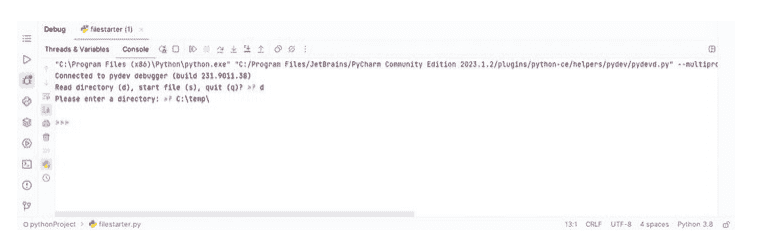

图 26.3 PyCharm 中的调试控制台

断点，或者如果程序执行路径上没有其他断点，则直到程序结束。

你可以随时使用红色的“停止”符号来停止程序，该符号位于*调试*区域的工具栏中，或位于*PyCharm*应用程序的标题栏中。然后程序将被完全重置，即下次以调试模式启动时，程序将从头开始运行，并在执行过程中遇到的第一个断点处再次停止。

通过右键单击安装了断点的代码行旁边边距中的红色圆形断点图标，你可以为断点添加条件。例如，在我们图 26.1 的示例中，我们可以输入条件 `isdir(directory)==True`。这样，只有在变量 **directory** 确实是一个目录时，调试模式下的程序执行才会在断点处停止。否则，程序将继续运行，就好像断点根本不存在一样。

#### 26.2.2 变量内容的显示与监视的使用

你可能已经注意到，当到达断点时，*调试*区域会从*控制台*选项卡切换到名为*线程与变量*的选项卡。在该区域的右侧，你可以看到程序到目前为止使用的变量及其值。如果你在代码编辑器中单击变量名，变量的值也会直接显示在小弹出窗口中（图 26.4）。

然而，调试器不仅允许你显示变量的内容。你还可以基于变量构造整个表达式，然后在断点处显示它们的值。因为你监视这些表达式的值，所以它们也被称为*监视*。在*调试*区域的*线程与变量*选项卡右侧顶部的编辑框中输入你想要观察其值的表达式，然后按 <ENTER>。例如，你可能想检查变量 **directory** 是否包含目录 `c:\mydir`。在右侧会出现一个针对表达式 `directory == "c:\mydir"` 的新条目。一旦你运行程序并在调试模式下到达断点，表达式的值就会显示出来，如图 26.5 所示。当然，在构造你的监视表达式时，你也可以利用 Python 函数。

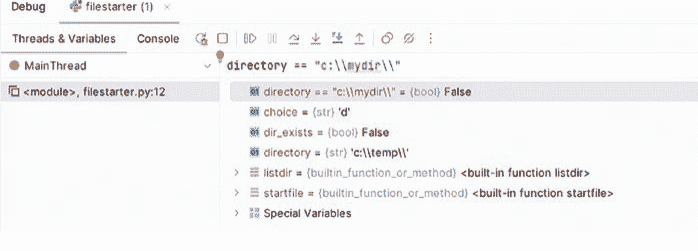

图 26.4 代码行后方和鼠标悬停弹出窗口中显示的变量内容

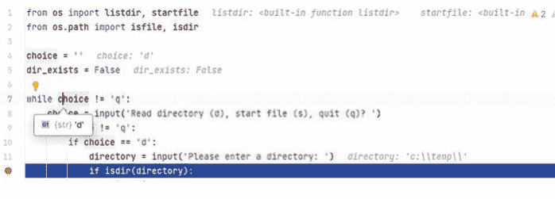

图 26.5 *线程与变量*选项卡中的监视

##### 手动显示变量内容

调试器提供了非常实用的功能来监视变量或基于它们的表达式的值。然而，通常一个更简单的程序就足以通过显示变量和表达式的值来支持调试：在程序代码中使用 `print()` 函数输出值！所以，只需在程序的相关位置插入 `print()` 语句，你就会在*运行*控制台中看到相应的输出。没有比这更简单的了！与断点一样，你当然可以使用这种输出来检查程序的某些部分是否正在运行。只是调试后别忘了删除这些输出语句。你的程序用户会为此感谢你。

#### 26.2.3 逐步执行

特别是在使用监视时，但为了确定错误发生的确切行，一个称为*逐步执行*的调试器功能非常有用。这会逐行执行程序，就好像每一行都设置了一个断点一样。

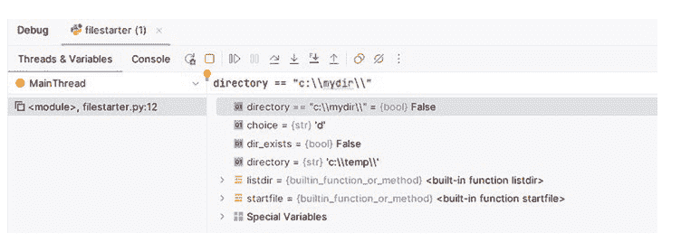

一旦你的程序到达断点，你就可以启动此功能。要从那里开始逐步继续，请单击*调试*区域工具栏中的“单步跳过”按钮（图 26.6）或按 <F8> 键。这将执行程序的下一行。再次单击按钮或按 <F8> 将每单击一次执行一行。通过这种方式，你可以逐步执行程序并观察其执行过程。如果你想退出逐步执行，请单击红色的“停止”图标，或按 <CTRL>+<F2>，就像使用断点时一样。

### 26.3 总结

在本章中，我们探讨了 Python 如何在*运行时*通过检查程序中的关键状态并适当处理异常（运行时错误）来处理错误，以及如何在*开发时*使用调试工具预先分析它们。

请务必从本章掌握以下要点：

- 通过巧妙地检查关键条件，你可以使你的程序对错误输入或其他无法保证正常程序执行的情况更加健壮。
- 运行时错误在 Python 中由异常表示。
- 有可能产生异常的语句可以包装在 Try-Except 结构中；它“尝试”执行该语句，并在异常被引发（“抛出”）时提供使用自己的程序代码进行错误处理的可能性。
- Try-Except 结构的最简单形式是：`try: code_block except: code_block`；此外，可以显式指定要捕获的异常，以便为同一代码段定义不同的错误处理例程，具体取决于抛出的异常。
- 像 *PyCharm* 这样的集成开发环境在开发过程中提供了一些错误分析手段；这些手段包括断点（程序代码执行暂时停止的地方）、监视（在程序运行时显示变量内容）和逐步执行（由开发人员显式触发下一条语句的执行）。

### 26.4 练习解答

■ 练习 26.1
程序的一种简单表述可能是这样的：

```
number1 = input("Number 1: ")
op = input("Operator (+,-,*,/): ")
number2= input("Number 2: ")

try:
    if op == "+":
        result = float(number1) + float(number2)
    else:
        if op == "-":
            result = float(number1) - float(number2)
        else:
            if op == "*":
                result = float(number1) * float(number2)
            else:
                result = float(number1) / float(number2)
    print("Result of ", number1, " ", op, " ", number2, ": ",
          result, sep="")
except:
    print("There was an error during the calculation of ",
          number1," ", op, " ", number2, ".", sep = "")
```

需要保护免受不受控错误影响的程序部分在这里被简单地包装在一个大的 Try-Except 结构中。如果在程序执行期间发生错误，用户会收到一个通用的错误消息。如果关键程序部分（例如，将 **str** 类型的数字输入转换为 **float** 类型）在单独的 Try-Except 结构中执行，则可以更精确地描述错误。然后程序的其余部分将在前一个 Try-Except 结构的 **except** 块中执行，这样最终你会有这些结构的多重嵌套，虽然不易阅读，但至少为用户提供了更精确的错误原因分析。

■ 练习 26.2
使用 Try-Except 结构的替代方案——至少在这些情况下——是使用适当的条件显式捕获错误。在下面的程序表述中，检查了许多这样的条件。如果命中错误条件，一个 **bool** 变量 **error** 被设置为 **True**；此外，一个 **str** 变量 **message** 被填充了适当的错误消息。在程序接近尾声时，然后检查程序是否在没有错误的情况下运行完毕（**error == False**）；如果是这样，变量 **message** 就被赋予了计算结果。最后，只需将 **message** 的内容输出给用户，其中包含计算结果或错误消息。

请注意我们这里使用的技巧，用于检查变量 **number1** 和 **number2** 在通过 **input()** 读取后是否真的包含数字。**str** 类型的 **isdigit()** 方法用于检查一个 **str** 变量是否仅包含数字。当然，用户可能输入了小数分隔符（即小数点）。因此，我们首先使用 **replace()** 将其移除。我们还检查小数分隔符在字符串中是否最多只出现一次，因为如果小数分隔符在字符串中出现多次，我们同样会得到一个无效的“数字”。

所以，正如你所看到的，即使使用条件判断，你也能捕获许多错误。然而，这并非对所有错误都有效。例如，在处理文件时，很难用条件检查所有可能的错误原因（比如，如果你想从文件读取，可能还需要检查文件是否存在）。在这些情况下，使用 **try...except** 结构是个好主意。

## JavaScript

### 简介

© 作者，经 Springer Fachmedien Wiesbaden GmbH（Springer Nature 旗下）独家许可，2024
J. L. Zuckarelli, *Learn coding with Python and JavaScript*, [https://doi.org/10.1007/978-3-658-42912-6_27](https://doi.org/10.1007/978-3-658-42912-6_27)

## 概述

在本部分，我们将转向 JavaScript，这是本书将涉及的第二门编程语言。同样，与 Python 部分一样，我们将遵循九个问题的框架来掌握这门语言。在本部分的第一章，我们将简要概述 JavaScript 的起源和应用领域。

JavaScript 是 Web 的语言。在编程 Web 前端，即现代 Web 用户界面时，可能没有其他语言比 JavaScript 使用得更频繁了。如今，几乎没有高访问量的网站能离开 JavaScript。例如，当你在网页上看到验证你输入的表单，检查你输入的电子邮件地址或电话号码是否为有效格式时，通常都有 JavaScript 参与。如果你在搜索框中只输入几个字母后就看到可能的搜索词建议，通常也是 JavaScript 在后台完成这项工作。如果一个网页使用了动画，例如根据你的点击或鼠标移动显示或隐藏元素，或者高亮显示它们，后台通常也有一个 JavaScript 程序。因此，JavaScript 出现在几乎所有编程语言排行榜的最受欢迎语言之列也就不足为奇了（另见 ▶ 第 6 章）。

JavaScript——与你初次阅读时可能想到的不同——与另一门流行但更难学习的编程语言 Java 关系不大。这两个同名语言之间只有少数语法相似之处。

这门语言的起源可以追溯到一个名为 *Netscape Navigator* 的程序占据市场主导地位的浏览器时代。1995 年，在 Netscape 和 Microsoft 之间争夺当时被视为关键市场的主导权的“浏览器大战”爆发前不久，Netscape 发布了一种名为 *LiveScript* 的语言。它由 *Brendan Eich* 开发，后来在与 Sun Microsystems 的合作过程中更名为 *JavaScript*。目前尚不完全清楚，这个命名是否与 JavaScript 最初旨在与网页上的小型 Java 应用程序（也称为 Java applets）协同工作有关，还是主要出于营销原因，以便借助 Java 日益增长的知名度；但可以肯定的是，JavaScript 很快崛起成为 Web 的主导编程语言，并将 Microsoft 的 VBScript 等竞争对手挤出了市场。

Netscape 早期就努力推动该语言的标准化，并召集了标准化组织 Ecma（当时其名称仍是 *European Computer Manufacturers Association* 的大写首字母缩写）。因此，他们发布了 ECMA-262 标准，该标准定义了一种名为 *ECMAScript* 的语言。从那时起，JavaScript 被视为 ECMAScript 的一种实现，与其他也实现该标准（并补充了自身特性）的语言并列，例如 Adobe 的 *ActionScript* 或 Microsoft 的 *TypeScript*。

然而，就 JavaScript 而言，关于标准化的讨论严格来说方向有误，因为 JavaScript 远非标准化。这主要是因为 JavaScript 有多种流行的实现。JavaScript 程序在 Web 浏览器中运行，因此由浏览器下载并解释执行。每个支持 JavaScript 的浏览器都自带自己的解释器，即 JavaScript 引擎，这些引擎在不同厂商之间肯定存在差异。因此，Microsoft 遵循 ECMA-262 标准但带有若干特性的 JavaScript 方言 *JScript*，在细微之处与例如 Google *Chrome* 浏览器解释的 JavaScript 变体工作方式不同。在最坏的情况下，这些差异可能意味着网页的某些功能在一个浏览器中有效，而在另一个浏览器中无效。细节决定成败。当然，在接下来的章节中我们几乎不会遇到这种“魔鬼”，因为我们处理的是符合 ECMA-262 标准且在几乎所有 JavaScript 解释环境中都受支持的语言元素。

JavaScript 是一种通常由 Web 浏览器解释执行的语言，因此运行在*客户端*。从某种意义上说，它是 *PHP* 的对应物，PHP 运行在 Web 服务器上，甚至可以在将网页发送到浏览器之前对其进行修改（例如，从数据库读取数据记录，如产品信息，并将其显示在网页上）。然而，也存在像 *Node.JS* 这样的运行时环境，它们提供了 JavaScript 实现，使得 JavaScript 也可以在服务器端执行。

不过，在接下来的章节中，我们将专注于经典变体，即在网页中运行并使网页动态化的 JavaScript。与本书的 Python 部分一样，我们再次遵循九个主要问题来概述这门语言。

## 工具与帮助：编程需要什么？

目录

- 28.1 解释器 – 400
- 28.2 代码编辑器和开发环境 – 400
- 28.3 辅助与文档 – 401
- 28.4 总结 – 402

## 概述

在本章中，我们将探讨 JavaScript 如何执行、有哪些可用的开发工具，以及在哪里可以找到更多关于 JavaScript 的信息。正如你将看到的，开始 JavaScript 编程并不需要太多东西。为了简单起见，因此我们将只使用“基础装备”级别的工具，而不像 Python 部分那样使用真正的集成开发环境。

在本章中，你将学到：
- JavaScript 代码如何被解释，以及这对运行 JavaScript 代码所需的工具有何影响
- 如何编辑 JavaScript 代码
- 如果需要帮助，可以在互联网的哪里找到

### 28.1 解释器

我们在本书本部分的导言中已经看到，JavaScript 是一种在网页开发中广泛使用的编程语言。因此，JavaScript 程序的执行方式必然与例如 Python 程序的执行方式有所不同。毕竟，不能期望网站用户在查看网站之前先下载一个解释器。事实上，这完全不必要。所有现代浏览器都内置了能够解释 JavaScript 的 JavaScript 引擎。因此，作为开发者，你不需要安装解释器。你的浏览器就能完成这项工作！

### 28.2 代码编辑器和开发环境

市场上有不少支持 JavaScript（以及其他功能）的集成开发环境（IDE）。例如，包括 JetBrains 的 WebStorm（与本书上一部分使用的 PyCharm 来自同一供应商）和 Apache 软件基金会的 NetBeans。有些是商业软件（如 WebStorm），有些则可以免费使用（如 NetBeans）。

然而，我们将采取不同的方法：在本书上一部分我们使用了功能强大的 Python IDE 之后，我们现在将为 JavaScript 使用一个更简单的工具，即一个纯粹的代码编辑器。由于我们的 JavaScript 代码无论如何都会嵌入到网页中并在浏览器中执行，我们无需费心考虑如何将解释器与代码编辑器精确集成的问题。我们只需在代码编辑器中编写 JavaScript 代码和使用它的网页，然后在 Web 浏览器中查看结果。

接下来将使用流行的编辑器 SublimeText，根据撰写本文时的许可条款，它可以在（原则上无限期的）试用期内免费使用以供试用，但需要购买长期使用许可证。或者，你也可以使用其他编辑器，例如微软的 *Visual Studio Code* 或 *Notepad++*。归根结底，你需要的只是一个允许你编辑实际 JavaScript 代码及其嵌入网页的编辑器，其余所有工作都将在网络浏览器中完成。因此，尽管你可以完全自由地选择编辑器，但建议你选择一个支持 JavaScript 和 HTML 语法高亮的工具，无论是开箱即用还是通过相应的插件实现。

如果你只是想先尝试 JavaScript，并尽可能避免将 JavaScript 代码嵌入网页的麻烦，那么像 *JS Bin*、*JS Do* 或 *Plunker* 这样的网络服务会对你很有吸引力。这些服务允许你直接输入 JavaScript 代码并执行，无需任何额外麻烦。然后你可以在同一个浏览器窗口中看到你的代码及其执行结果。在接下来的章节中，我们将快速了解一下这些网络服务。然而，如果你是认真地学习和使用 JavaScript，你应该选择一个代码编辑器或相应的集成开发环境。

### 28.3 辅助与文档

与所有流行的编程语言一样，互联网上有无数关于 JavaScript 的信息来源。然而，JavaScript 没有官方的、可用的文档。制定官方语言标准的 ECMA 提供了语言规范（针对 2023 年 6 月的 ECMAScript 第 13 版，可在 ▶ https://262.ecma-international.org/13.0/ 获取）。然而，这对于实际工作来说相当不实用。

Mozilla 基金会（▶ https://developer.mozilla.org/en-US/docs/Web/JavaScript）提供了良好的面向应用的文档，该组织是 JavaScript 发明者 Netscape 及其 *Firefox* 浏览器的继任者。在这里，你可以找到所有标准 JavaScript 函数的帮助页面，其中包含一般描述、调用函数所需的参数、它提供的返回值以及一些应用示例。此外，帮助页面还显示了最重要的浏览器（如 Internet Explorer、Edge、Chrome、Safari、Firefox 或 Opera）的 JavaScript 解释器在多大程度上支持该函数的概述。例如，看看 **sqrt()** 函数的帮助页面，该函数计算一个数的平方根：▶ https://developer.mozilla.org/en-US/docs/Web/JavaScript/Reference/Global_Objects/Math/sqrt。

此外，与几乎所有已知的编程语言一样，程序员论坛 *StackOverflow* 是解决具体问题的绝佳信息来源，你可以在这里找到大量经常（和不经常）出现的问题的高质量答案，如果找不到，你也可以开启自己的问题讨论帖。

除此之外，互联网上当然还有无数的文章、教程、博客、视频和其他形式的内容，它们针对广泛的经验水平，突出了流行的 JavaScript 语言的每一个可想象的方面。

### 28.4 总结

在本章中，我们探讨了 JavaScript 是如何被解释的，以及编写和运行 JavaScript 代码需要哪些工具。

请务必从本章中掌握以下要点：
- JavaScript 由网络浏览器解释；因此，你不需要单独的解释器或编译器。
- 文本编辑器足以编辑 JavaScript 代码（以及它集成的网页）。*NetBeans* 或 *WebStorm* 等集成开发环境也可用于 JavaScript。
- JavaScript 的官方文档相当有限。最好使用 Mozilla 基金会的文档。
- 与许多编程语言一样，在 JavaScript 的情况下，如果你有疑问，*StackOverflow* 是一个好去处。
- 此外，互联网上还有许多“非官方”信息来源，它们为所有实际的编程问题提供了良好的服务。

## 29. 程序执行与 Hello World：我需要做什么才能让程序运行起来？

目录

- 29.1 在网页中嵌入 JavaScript 代码 – 404
- 29.1.1 HTML 中的 Script 元素 – 404
- 29.1.2 安全方面 – 408
- 29.2 JavaScript 中的 “Hello World” – 409
- 29.2.1 自己动手：（不那么）费力的方式 – 409
- 29.2.2 借助一点帮助：使用网络服务快速实现 – 411
- 29.3 总结 – 412

## 概述

JavaScript 程序通常集成到网页中。因此，要使程序功能正常，我们首先需要了解如何将其整合到网页中。本章涵盖了此过程所需的基本 HTML 基础知识，并说明了将 HTML 网页与你的 JavaScript 代码链接的不同方法。在本节中，你还将有机会用 JavaScript 编写你的第一个 “Hello World” 程序。

在本章中，你将学到：
- 如何使用 HTML 元素 **script** 从网页中引用 JavaScript 脚本（如果你还不熟悉 HTML，本章也会简要介绍这种“网络编程语言”）
- 如何使用 **script** 元素将 JavaScript 代码直接嵌入网页
- 如何借助特殊的网络服务尝试 JavaScript，而无需担心将脚本嵌入网页
- 如何用 JavaScript 编写你的第一个小 “Hello World” 程序

### 29.1 在网页中嵌入 JavaScript 代码

#### 29.1.1 HTML 中的 Script 元素

与 Python 不同，JavaScript 不需要解释器来运行，因为它嵌入在网页中，并与网页一起由浏览器解释。这意味着，虽然我们不必处理如何运行 JavaScript 程序的问题（因为浏览器会为我们处理），但我们确实必须处理如何将 JavaScript 程序集成到网页中。

网页由用描述性编程语言 HTML（超文本标记语言）编写的代码组成；关于描述性语言与其他语言的概念区分，请回溯到 ▶ 第 3.1 节。如果你已经了解 HTML 工作原理的基础知识（而基础知识正是我们这里所需要的），那么请继续阅读。但如果你认为你的知识需要快速复习一下，那么在继续阅读之前，请先阅读 HTML（超文本标记语言）背景框。

> **HTML（超文本标记语言）**
> **网络的语言**
> HTML 是编写网页的语言。它由物理学家 *Tim Berners-Lee* 于 1980 年代末在欧洲核研究中心 CERN 开发。Berners-Lee 不仅被英国女王封为贵族，获得了无数其他荣誉（如 *图灵奖*，被广泛认为是计算机科学的诺贝尔奖），并被《时代》杂志列入 *20 世纪 100 位最重要人物* 名单，而且被普遍认为是万维网之父。如今，HTML 标准由 *万维网联盟*（也称为 *W3C*）定义。

##### HTML 元素及其组成部分

HTML 文档由 HTML 元素组成。这些 HTML 元素基本上有三个组成部分：
- **标签：** 标签是标记 HTML 元素开始和结束的符号；为了将它们与文档的其他部分区分开来，它们被包含在“小于号”和“大于号”字符中，并且在结束标签中，元素名称前有一个斜杠 (/)。开始和结束标签的组合可能看起来像这样：`<h1>...</h1>`。
- **内容：** 标签之间通常可以有内容。例如，**h1** 元素描述一个顶级标题（*标题 1*）。标题的文本放在开始和结束标签之间，例如：`<h1>Introduction</h1>`。
- **属性：** 属性位于开始标签内，并修改标签的行为。它们由属性名和属性值组成。属性值写在引号内，并用等号分配给属性名。例如，属性 **dir** 控制文本显示的方向。其值 *rtl* 表示 *从右到左*，即文本从右向左显示（右对齐）。将其纳入我们的 **h1** 元素中，属性看起来像这样：`<h1 dir="rtl">introduction</h1>`。

##### HTML 文档的结构

许多 HTML 元素可以相互嵌套。这产生了一个层次结构，网络浏览器将其读取并显示为 *文档对象模型 (DOM)*。这在 HTML 文档的结构中已经变得清晰。HTML 文档由头部（元素 **head**）和主体（元素 **body**）组成。文档头部通常包含有关文档的一般信息，例如文档标题或元信息，如关键词或用于搜索引擎的网页描述。文档主体包含网页的实际内容；因此，它通常是文档中不成比例的大部分。

**head** 和 **body** 嵌入在一个封闭的 **html** 元素中，该元素通常被称为根元素，因为它是文档对象模型中层次结构最高的元素。

一个简单的网站可能看起来像这样：

```html
<!DOCTYPE html>
<html>
    <head>
        <title>Test Page</title>
    </head>
    <body>
        <h1>Introduction</h1>
        <p>Here is some text.</p>
    </body>
</html>
```

**DOCTYPE** 元素是可选的（它属于那种没有闭合标签的特殊元素），它将文档描述为 HTML 文档。在文档的 **body** 部分，你会看到另一个元素 **p**。它标记一个文本段落，通常会在显示时在文本上下留出一些间距，使文本呈现为独立的段落。

HTML 文档源代码中的制表符缩进只是为了提高可读性，在解释文档内容时会被忽略，就像标签的大小写一样（HTML 不区分大小写）。因此，以下代码也是一个有效的网页：

```
<!DOCTYPEhtml><html><head><TITLE>Test Page</title></head><body><h1>Introduction</h1><p>Here is some text.</p></BOdy></HTML>
```

使用编辑器将此代码（最好带有缩进）粘贴到一个空文件中，保存扩展名为 **.htm** 或 **.html**，你就有了自己的小网页，现在可以用浏览器打开并查看了。

顺便说一下：HTML 还有 *注释*：它们有特殊的开始和结束标签 `<!--` 和 `-->`。注释也可以是多行的。

##### 层叠样式表 (CSS)

除了网页的 HTML 源代码和脚本（特别是我们将在本书这部分讨论的 JavaScript 程序）之外，*层叠样式表* (CSS) 是现代网页的重要组成部分。过去，通常直接在网页的 HTML 源代码中使用 HTML 元素和属性来指定格式；例如，可以使用 **p** 元素等支持的 **align** 属性轻松地将文本居中：**<p align="center">这是一些居中的文本</p>**。但是，如果一个网页想要从根本上改变其设计，或者如果一个网页的“部分”要显示在另一个使用不同设计的网页上，那么格式就必须在 HTML 代码中进行繁琐且容易出错的细节修改。

随着 *层叠样式表* 的引入，这变得更容易了。层叠样式表背后的理念是将网页的结构和内容与设计和格式分离，这样设计就可以更容易地被替换或调整，而无需深入挖掘包含结构和内容的网页部分。这是通过在一个单独的文件（通常扩展名为 **.css**）中描述格式和设计来实现的，而不是在 HTML 文件本身中。在样式表中，即 CSS 文件中，可以指定例如 **h1** 标题应始终以蓝色和粗体显示。如果网站的设计进行了修订，默认标题颜色更改为红色，那么这个更改只需要在一个地方进行，即在样式表中。然后，整个 HTML 文档中所有 **h1** 标题的显示将自动更改。一个相关的优势当然是显而易见的。同一个 CSS 文件可以用于许多不同的网页，一个拥有数百个子页面的大型网站可以非常容易地将其设计调整以适应新的需求。

然而，有时你不想以固定的方式格式化 *所有* **h1** 类型的标题，而只是某些特定的标题。为此，有 **class** 属性，它几乎可以与所有 HTML 元素一起使用，当你查看网页的源代码时经常会看到它。例如，一个标题可以这样区分：`<h1 class="section">新闻</h1>`。这个属性现在可以在 CSS 代码中被引用。这意味着存储在 CSS 中的一些格式规则仅适用于此类 **h1** 元素，而不适用于其他 **h1** 元素。CSS 可能包含以下用于格式化 **h1** 标题元素的代码：

```
h1.section {
    color: red;
}
h1 {
    color: blue;
    font-weight: bold;
}
```

这里也清楚地说明了 *层叠* 这个术语的含义。属性是 *继承* 的。CSS 中通用的 **h1** 格式化语句规定文本颜色应为蓝色。**section** 类的 **h1** 元素的格式与此不同。对于它们，适用不同的语句，即着色为红色。另一方面，来自 **h1** 元素 CSS 的 **font-weight: bold** 语句没有被 **section** 类的 **h1** 元素的特殊语句覆盖，因此也适用于那里。因此，**section** 类的 **h1** 元素，像所有 **h1** 元素一样，也以粗体显示。

与 HTML 标准一样，CSS 标准由万维网联盟 (World Wide Web Consortium) 管理和开发。

要让一个 JavaScript 程序工作，我们需要将其嵌入到网页中。这是通过 **script** 元素完成的，你可以在以下示例中看到它的用法：

```
<!DOCTYPE html>
<html>
    <head>
        <title>Test Page</title>
    </head>
    <body>
        <script src="helloworld.js"></script>
    </body>
</html>
```

脚本文件的名称被指定为 **src** (*source*) 属性的值。在示例中，我们将 script 元素放在了网页的 body 中，但我们也可以将其放在 head 中。然而，脚本通常包含在 body 中，或者更准确地说：在 body 的末尾。这样做有一个很好的理由：

脚本在它们被放置的 HTML 文档位置执行。如果你的脚本在网页的末尾，并且需要稍长的时间才能完全执行——没问题。此时网页的其余部分已经加载并显示。如果观众在 JavaScript 代码运行时不得不等待在一个空白页面前，那会更令人不快，因为该代码包含在 HTML 文档的开头，因此也会首先执行，甚至在页面的任何其他元素加载之前。

我们在这里将我们的 JavaScript 程序代码 *作为单独的文件* 包含进来。这是通常的做法。然而，你也可以将（特别是短的）脚本 *直接* 包含在 HTML 文件中。这看起来会像这样：

```
<!DOCTYPE html>
<html>
    <head>
        <title>Test Page</title>
    </head>
    <body>
        <script type="text/JavaScript">
            console.log("This goes to the console!")
        </script>
    </body>
</html>
```

通过 **script** 元素的 **type** 属性，我们告诉浏览器的 HTML 引擎，开始和结束标签之间的代码（在我们的示例中只有一行）应被理解为 JavaScript 代码。实际上，JavaScript 是唯一使用的脚本语言。然而，过去你可能在某些地方遇到过微软的 VBScript，它在实践中的使用确实相当有限，因为它只被微软自己的浏览器支持，并且在 JavaScript 这个强大的竞争对手面前。

#### 29.1.2 安全方面

##### 在浏览器中启用脚本执行

虽然许多更受欢迎的网站以某种形式使用 JavaScript，但如果禁用 JavaScript 代码执行，它们将无法工作或无法正常工作。然而，所有现代浏览器都允许你禁用脚本代码的执行。所以，看看你的浏览器设置，看看是否有任何东西可能妨碍你享受你的第一个 JavaScript 程序。

当网站的功能依赖于运行 JavaScript 的能力时，你自然想告诉网站的用户启用 JavaScript。这可以通过在页面的 HTML 源代码中使用 **noscript** 元素并给它一个提示信息来轻松完成，如下例所示：

```
<noscript>请激活 JavaScript 以使用此网站。
</noscript>
```

只有当浏览器的安全设置中禁用了 JavaScript 执行时，才会显示此消息（试试看！）。

##### 源代码的可见性

与 PHP 不同，JavaScript 程序由浏览器解释（即客户端）。为此，它们必须首先被下载，而 PHP 代码则不需要，因为它的解释器完全在服务器上运行，不使用客户端的资源来执行。因此，即使你将源代码放入一个单独的文件中，并通过 `<script src=...>` 从 Web 服务器加载，你也无法将其隐藏在用户的视线之外。正如你将在下一节中看到的，通常很容易看到代码。确实，有一些混淆的方法和工具，可以对源代码进行实际加密。但即使这些方法也有其局限性，因为浏览器必须解码源代码才能执行它。所以，请预期你的 JavaScript 程序可以被网站的访问者查看。对于普通用户来说可能不是这样，但那些有知识理解 JavaScript 代码的人会知道如何访问它。

### 29.2 JavaScript 中的 “Hello World”

#### 29.2.1 自己动手：（不那么）费力的方式

JavaScript 中经典的 “hello world” 程序非常简单：

```
console.log("Hello World!")
```

如果你将这一行保存在一个 JavaScript 文件 **helloword.js** 中，然后将此脚本包含在一个除了必需元素外为空的 HTML 网页文档中，如上一节的示例所示，你就已经成功完成了这个任务。

现在，当你在浏览器中打开完成的 HTML 文档时，你看到……什么都没有！

难道我们简单的程序没有工作吗？是的，它工作了，只是它不在浏览器窗口中输出文本，而是在另一个区域，*JavaScript 控制台*。如何进入这个控制台（它默认不显示，更像是开发者的工具）因浏览器而异：例如，在 Windows 上，在 Google *Chrome* 中按 `<CTRL>+<SHIFT>+<J>`，在 Microsoft *Edge* 中按 `<F12>`，在 Mozilla *Firefox* 中按 `<CTRL>+<SHIFT>+<I>`（或 `<F12>`）。你也可以通过菜单打开控制台，通常在“更多工具”或“开发者工具”等菜单项下。如果你安装了多个浏览器并在所有浏览器中打开控制台一次，你会立即认识到某些相似之处。

前两个标签页（我们将主要在这里使用）通常有类似“元素”、“检查器”或类似的名称以及“控制台”。在“元素”下，你可以看到当前加载页面的 HTML 代码，并可以在此 HTML 代码中交互式导航。通过在 HTML 源代码中标记一个元素，表示元素在网页视图中会自动高亮显示。这使得查看源代码的哪一部分对应网页显示的哪一部分变得非常容易。通过展开和折叠源代码中的元素，你还可以更紧凑地显示源代码，并更好地理解HTML元素的层级嵌套结构。对于我们这个小的示例页面（图29.1）来说，这可能看起来不太起眼，但当你打开另一个网站（如维基百科或YouTube）时，再打开“元素”视图看看！那时你就会非常清楚地看到这个功能有多实用。反过来，你也可以从*元素*视图切换到选择模式，在这种模式下，你点击浏览器网页视图中的一个元素，然后页面源代码中对应的位置就会在“元素”视图中自动高亮显示。关于这个有用功能的更多信息，请参阅▶第32.6.2节。

被分离到其他文件中的JavaScript程序也可以用这种方式查看。如果你在HTML代码中点击一个指向分离的JavaScript文件的引用，源代码会立即在另一个标签页中打开。顺便说一句：你甚至可以通过*元素*标签页编辑HTML源代码，主要通过使用上下文菜单中的相应选项。你可以随时使用组合键<CTRL>+<S>将更改保存为HTML文件。

然而，对于我们的“Hello World”JavaScript程序，我们主要关注第二个标签页，即*控制台*。如果你打开它，你会看到我们的JavaScript代码确实产生了输出（图29.2）。

这意味着我们可以使用控制台来打印网站浏览者不会立即看到的输出。这在开发过程中特别有用，可以输出调试信息，而不会以这种方式影响网页的实际显示。但浏览器的JavaScript解释器也使用控制台来输出错误或警告信息。

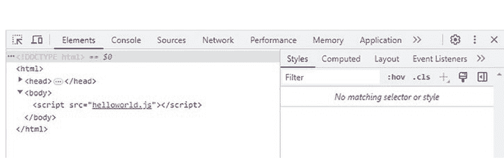

图29.1 Google Chrome中的开发者工具

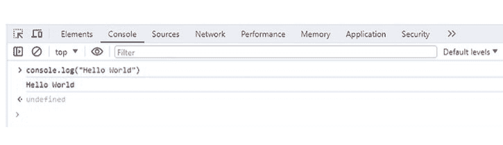

图29.2 “Hello World”程序在控制台中的输出

## 29.2. JavaScript中的“Hello World”

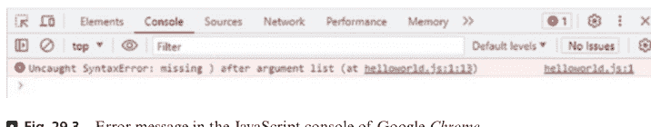

在图29.3的示例中，源代码行`console.log(Hello world!')`中忘记了第一个引号。解释器在执行代码时向我们指出了这个语法错误。

你也可以在交互模式下使用控制台，也就是说，你可以直接在控制台中输入和执行语句。然而，与Python不同，JavaScript中的控制台与网页没有独立的命名空间。如果你执行一个程序并创建变量，这些变量随后会在控制台中可用于进一步的交互式编辑。大多数网络浏览器还支持控制台中的代码补全。当你开始输入时，会弹出一个包含多个选项的菜单，可以帮助你加快输入速度。

我们将在下一章中大量使用控制台，因为它提供了一种简单的方法来快速输出一些信息，而下一章的重点恰恰不是输入和输出，而是我们希望全神贯注的其他概念。在第31.7节，我们将专门讨论数据的输入和输出，届时我们还将看到如何将数据直接写入网页。

如果你等不及了，并且认为一个不直接写入网页的“hello world”程序不是真正的“hello world”程序，那么请在你的脚本文件中尝试这段代码：

```
document.write('<p>Hello World</p>');
```

刷新视图（通常按F5）后，你会在浏览器中看到输出，不是在控制台中，而是在实际的页面视图中。

#### 29.2.2 借助一点帮助：使用Web服务快速实现

直接开始用JavaScript编程并不那么容易，因为首先你必须创建一个网页并将你的脚本集成到其中。使用像开源项目JS Bin (http://www.jsbin.com) 这样的Web服务会更容易，它们允许你无需任何麻烦就能随意开始。JS Bin会将你输入的JavaScript代码执行在HTML主体的末尾（但不会在HTML代码中显示对你的脚本的引用）。你也可以手动编辑HTML代码。在屏幕顶部，你可以使用切换按钮来确定显示哪些视图；输出就是完成的网站（图29.4）。

提示：如果你正在使用JS Bin，建议取消选中屏幕右侧的“自动运行JS”复选框，并始终通过*使用JS运行*按钮手动启动JavaScript的执行。否则，*JS Bin*会在你每次按键时重新执行当前状态的JavaScript代码，这当然会导致控制台中出现一长串令人不快的无用错误信息。

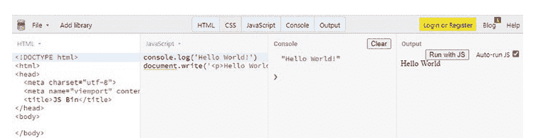

图29.4 JavaScript Web服务JS Bin

除了*JS Bin*，还有许多其他提供类似功能的服务，例如*Plunker* (► http://plnkr.co) 或 *JS.do* (► http://www.js.do)，尽管它们的结构各不相同。所有这些服务的共同点是它们非常适合尝试。然而，如果你想认真对待JavaScript，建议使用自己的“基础设施”（HTML和JavaScript代码文件）进行离线工作。这正是我们将在接下来的章节中要做的。

### 29.3 总结

在本章中，我们了解了如何让JavaScript程序运行起来。
请务必从本章掌握以下要点：

- JavaScript程序通常在网页中运行，因此必须将它们集成到网页中。
- 这是借助HTML元素**script**完成的；可以通过属性**src**为其指定一个包含JavaScript的脚本文件的引用，或者将JavaScript代码直接嵌入到网页的`<script>...</script>`标签之间。
- 一个良好的实践是在网页*末尾*包含脚本，这样网页可以先加载，并且在脚本仍在加载或运行时（如果适用）就可以查看。
- HTML元素**noscript**可用于在用户在其浏览器中禁用JavaScript时显示一条消息（通常由于相应的浏览器默认设置，JavaScript已经是启用的）。
- JavaScript代码对网站的浏览者始终可见。因此，你无法“隐藏”你的代码。
- 像*JS Bin*或*Plunker*这样的Web服务允许你尝试JavaScript，而无需担心将其集成到网页中；这对于快速测试很方便，但如果你想认真对待JavaScript，就无法避免学习如何将脚本集成到网页中（这其实并不复杂）。

## 语法、注释、代码风格与文档：如何确保我（以及其他人）以后还能理解我的程序？

目录

- 30.1 程序代码设计与命名约定 – 414
- 30.2 注释 – 416
- 30.3 总结 – 417

> **概述**
在我们真正开始用JavaScript编程之前，我们想先就程序代码设计的一些重要问题以及——你可能已经猜到了——代码的注释做好准备。
在本章中，你将学到：
- 变量、函数和其他对象的标识符是如何构建的
- 指令是如何结束的
- 有哪些可用的JavaScript代码设计风格指南供你参考
- 在JavaScript中可以使用哪些类型的注释

### 30.1 程序代码设计与命名约定

■ 标识符
JavaScript区分大小写，即区分大写和小写。像变量、对象和函数这样的标识符可以包含字母、数字、下划线（_）和美元符号（$），但不能以数字开头。在JavaScript中，标识符根据Unicode方案编码，这意味着变音符号和其他非英语字母也允许出现在标识符中。然而，由于这些字符在大多数自然语言中并不出现，建议避免使用它们。如果你要在互联网论坛上发布示例代码以寻求帮助，国际受众可能在想要编辑你的代码时难以重现这些字符。想象一下，如果一个冰岛人将一个变量命名为húsið1（意思是房子1），而你想编辑那段代码，情况会怎样。
在JavaScript中，标识符的第一个术语通常以小写字母开头，后续术语则以大写字母开头（即使这些术语在自然语言中实际上是小写的）。一个典型的JavaScript标识符可以是，例如，isCustomerActive或startSave()。这种书写方式，也因其标识符中的“驼峰”而被称为驼峰命名法，起初可能不寻常，但在JavaScript程序员眼中，它会让你的程序看起来非常有“JavaScript风格”。

■ 语句结束与语句换行
JavaScript中的语句*可以*用分号结束。如果多个语句要在一行上，它们*必须*用分号分隔。然而，与某些其他语言不同，JavaScript中的语句并非都在行尾自动结束。相反，JavaScript会在行尾没有分号的情况下检查，如果语句在下一行继续，是否仍然有意义。这个奇怪的特性在个别情况下可能导致意想不到且看似无法解释的行为。因此，我们在这里将始终用分号结束语句——知道一些JavaScript的风格指南建议不这样做。事实

我们在 JavaScript 控制台中执行的语句，其结尾不需要使用分号，因为按下 <RETURN> 或 <ENTER> 键就明确标记了语句的结束。

语句可以换行，即在下一行继续书写。但是，*字符串内部*不允许换行。例如，以下在 JavaScript 控制台中换行的输出语句在语法上是正确的：

```
> console.log('Hello',
'World')
```

以下写法也是允许的：

```
> console.log('Hello'
, 'world')
```

由于 JavaScript 中的字符串也可以使用加号运算符连接，你也可以这样写：

```
> console.log('Hello'
+ 'world')
```

但是，以下输出语句是不允许的，因为它在字符串内部包含了换行：

```
> console.log('Hello
World')
```

如果你确实想在字符串内部实现换行，可以使用反斜杠（"\\"）来创建，反斜杠本身不会被输出：

```
> console.log('Hello \nWorld')
```

如果你进行换行，建议将第二行相应地缩进。在本书中，程序代码经常为了适应页面宽度而换行。你可以随书下载的程序代码当然不受此限制，因此换行较少。

### 通用代码风格

与大多数其他编程语言一样，聪明的开发者会思考如何格式化他们的 JavaScript 代码，使其清晰易读。其结果就是风格指南，JavaScript 有多种风格指南。它们对于同一个主题，例如在语句结尾使用分号的问题，可能会给出相当不同的建议。

知名的 JavaScript 风格指南包括 *Google JavaScript 风格指南* (▶ https://google.github.io/styleguide/jsguide.html)、Airbnb 的风格指南 (▶ https://github.com/airbnb/javascript) 以及 *JavaScript Standard 风格指南* (▶ https://github.com/standard/standard)。后者——与其名称相反——绝非扮演官方角色，不像 Python 的 *Python 增强提案 (PEP)* 第 8 号那样。对于某些风格指南，包括 Standard 风格指南，甚至有软件（*linter*）可以完全自动地格式化源代码，使其符合风格指南的规范。

在本书的这一部分，我们不会完全遵循这些风格指南中的任何一个。除非在专业环境中，你与许多其他开发者一起工作，否则确实没有必要 100% 实施某个风格指南。尽管如此，浏览一些风格指南并可能学到一两样东西，仍然是个好主意。

### 30.2 注释

JavaScript 支持单行注释和多行注释。单行注释以 `//` 开头，其右侧的所有内容都被标识为注释，不会被解释器处理。多行注释以 `/*` 开始，以 `*/` 结束（因此星号总是面向注释文本）。

注释的示例如下所示：

```
/*
    这里是一个多行注释，解释
    为什么赋值 a = 5 是必要的
*/
a = 5;
// 这个赋值可以用单行注释来解释
b = 10;
c = 7;  // c 也必须用一个有意义的值初始化
```

最后一个注释是*行内注释*，它在语法上也是允许的，但不推荐使用，因为它难以阅读。如果你使用行内注释，请确保在语句结尾和注释符号之间留出一些空格（至少两个空格），以便注释在视觉上与可执行代码区分开来。

### 30.3 总结

在本章中，我们讨论了 JavaScript 代码设计和注释的基本问题。

请务必从本章掌握以下要点：

- JavaScript 中的标识符可以包含字母、数字、下划线字符和美元符号，但不能以数字开头。
- 标识符采用 UTF-8 编码，因此可能包含变音符号和其他非标准字符；但是，不建议使用它们。
- 通常，标识符以小写字母书写。对于由多个词组成的标识符，后续的每个词首字母大写（“驼峰命名法”）。
- 语句结尾的分号不是强制性的，但推荐使用，因为 JavaScript 并不总是在行尾自动停止解释语句。
- 代码中的换行是允许的，只要它们不发生在字符串内部。
- 关于代码设计，这是 JavaScript 中一个相对自由的领域，有许多指南代表了对各种主题的不同观点，包括 *Google JavaScript 风格指南*、*JavaScript Standard 风格指南* 和 Airbnb 的风格指南。
- JavaScript 支持单行和多行注释。
- 单行注释以 // 开头，将其右侧的所有内容标记为注释；它们也可以在代码行内使用（“行内”）。
- 多行注释放置在 /* 和 */ 之间。

## 变量与对象：我如何存储数据以便处理？

目录

- 31.1 变量的声明 – 420
- 31.2 基本数据类型 – 421
  - 31.2.1 数字 (number) – 421
  - 31.2.2 文本 (string) – 423
  - 31.2.3 逻辑值 (boolean) – 427
  - 31.2.4 特殊类型和值 (null, undefined, NaN) – 428
- 31.3 变量的转换 – 430
  - 31.3.1 隐式转换 – 430
- 31.4 数组 – 433
- 31.5 对象 – 441
  - 31.5.1 JavaScript 中的面向对象 – 441
  - 31.5.2 直接创建对象 – 442
  - 31.5.3 访问对象的属性 – 443
  - 31.5.4 使用 Object 构造函数创建对象 – 444
  - 31.5.5 使用构造函数创建对象 – 444
  - 31.5.6 JSON – 445
- 31.6 总结 – 446
- 31.7 练习解答 – 448

© 作者，经 Springer Fachmedien Wiesbaden GmbH（Springer Nature 旗下）独家许可，2024
J. L. Zuckarelli, *Learn coding with Python and JavaScript*, https://doi.org/10.1007/978-3-658-42912-6_31

## 第 31 章 · 变量与对象：我如何存储数据以便处理？

**概述**

现在是时候看看我们如何在 JavaScript 中使用变量和对象，以便能够临时存储数据以供处理了。这就是本章的内容。

在本章中，你将学习：

- JavaScript 的基本数据类型（称为原始类型）
- 如何使用基本数据类型的变量（创建它们、赋值、转换它们……）
- 如何从任何数据类型创建字段（数组）以及如何使用它们
- 基本数据类型与真正的 JavaScript 对象有何不同
- JavaScript 中的面向对象与其他面向对象语言有何不同
- 如何在 JavaScript 中创建和编辑对象
- 什么是 JSON，它为什么如此重要，以及如何将 JavaScript 对象转换为 JSON，反之亦然

### 31.1 变量的声明

在 JavaScript 中，变量*应该被声明*，即在第一次使用之前进行注册。声明变量是一种良好的实践，尽管简单的赋值通常足以创建变量，严格来说并不需要正式的声明。但是，如果你尝试访问一个既未声明也未赋值的变量，你将收到错误消息。

如果变量声明不是强制性的，一个常见问题是，你可能会因为拼写错误而意外地在程序中创建一个新变量。例如，如果你想给一个现有变量 **amountInvoice** 赋值，但在赋值时无意中写成了 **amountIvoice**，那么最晚当你继续使用最初打算的变量标识符 **amountInvoice** 时，你就会遇到问题，因为它从未收到本应赋给它的值。相反，新创建的变量 **amountIvoice** 持有该值。你可以通过在 *严格模式* 下运行 JavaScript 来避免此类困难，在这种情况下，未声明的变量会导致错误消息。可以通过在脚本（或单个函数）的开头引入一条特殊语句来为整个脚本（或函数）开启严格模式：

```
'use strict';
```

试一试，在你的脚本中给一个之前未声明的变量赋值；你会立即收到错误消息。现在移除 **'use strict'** 语句并再次运行脚本——没有问题，变量在第一次赋值时就被简单地创建了。

JavaScript 中变量的正式声明借助关键字 **var** 完成，其后跟一个或多个变量标识符，用逗号分隔。变量可以在声明时初始化，也可以不初始化。

```
var x = 0.5, y, z = 'A message';
```

值得注意的是，变量在声明时没有类型指定。JavaScript 会根据声明时（如果初始化了变量）或之后赋的值自动识别其类型。程序员称 JavaScript 是弱类型的。当然，我们可以通过类型转换来显式指定变量的类型，有时甚至必须这样做。我们将在 ▶ 第 31.3 节 中讨论这一点。变量的类型也可以通过简单地给变量赋一个不同类型的值来改变。JavaScript 随后会自动调整变量的类型以适应新值（动态类型）。关键字 **var** 可以在程序中多次出现，不一定非要在整个程序源代码的开头。然而，良好的实践是在开头合并变量声明，以便跟踪已注册的变量。

### 31.2 基本数据类型

JavaScript 有几种基本数据类型，包括数字（**number**）、字符串（**string**）和逻辑值（**boolean**）。这些（以及一些其他特殊的）类型是*基本*的，因为它们本身*不是对象*，而是*原始值*。所有其他类型的变量在 JavaScript 中都是对象，因此具有用于操作它们的属性和方法。基本数据类型没有，但有时——正如我们将看到的——它们的行为几乎神奇地表现得像“真正的”对象一样。

#### 31.2.1 数字 (number)

- **整数和浮点数**

**number** 是保存数字的数据类型，无论它们是整数还是小数，即浮点数。JavaScript 总是保留 64 位，即 8 字节来存储一个数字。因此，**number** 变量可以容纳的数字范围取决于精度要求，即存储小数部分需要多少内存。反之，可能的精度取决于小数点前整数部分的大小：如果整数部分很大，留给小数部分的内存就更少。

- **无穷大**

**number** 变量可以取的一个特殊值是 **Infinity**。如果你在 JavaScript 中将一个数字除以 0，你不会收到错误消息——与许多其他语言不同——而是得到值 **Infinity** 或 **-Infinity**。打开 JavaScript 控制台并输入以下代码（此处的大于号代表控制台提示符，因此不需要输入）：

```
> 1/0
Infinity
```

- **运算符**

当然，你可以对数字执行通常的算术运算，包括四则基本运算。此外，% 是一个*取模运算符*，返回除法的整数余数。所有这些运算符都是*二元*运算符，处理两个值以产生一个新值。然而，也有几个*一元*运算符应用于单个值。在此上下文中特别感兴趣的是 JavaScript 程序中常见的*自增* (++) 和*自减* (--) 运算符，它们将 **number** 变量的值增加或减少 1，无论变量是否具有非零的小数部分。因此，**variable++** 是赋值 **variable = variable + 1** 的更紧凑表示法。

- **Number 对象的方法**

**number** 变量具有（表面上）可调用的方法，尽管数量不多。“表面上”是因为 **number** 变量实际上是一个*原始值*，即基本数据类型的变量，因此*不是*对象，即类的实例，我们期望对象具有属性和方法。在 ▶ 第 31.3.2 节 中，我们将看到这种看似矛盾的行为是如何产生的。

在 **number** 变量可用的方法中，一个例子是 **toExponential()**，该方法将数字转换为指数表示法并将其作为字符串返回。变量本身在此过程中不会改变。

```
> myNumber = 50000
> scientific = myNumber.toExponential()
> scientific
"5e+4"

> typeof myNumber
"number"

> typeof scientific
"string"
```

这里你首先看到，我们可以使用点运算符（就像在 Python 中一样）访问对象的方法（和属性），并且调用方法总是需要指定括号，即使没有向方法传递任何参数。

使用 **typeof objectinstance**，你将学习另一个有用的运算符，它以字符串形式返回变量的类型。它不是数学运算符，但仍然是一个（一元）运算符。如你所见，**toExponential()** 返回一个包含格式化数字的字符串。

除了 **toExponential()** 之外，另一个可以应用于 **number** 的便捷方法是 **toFixed(places)**，它将数字四舍五入到指定的小数位数，并再次将结果作为字符串返回：

```
> myNumber = 3.14159
> myNumber.toFixed(3)
"3.142"
```

常量值（*字面量*）在 JavaScript 中的行为也像对象。但是，要访问这些对象的方法，你需要将值写在圆括号中，如下面的示例所示，你可以在控制台中轻松尝试：

```
> (3.14159).toFixed(3)
"3.142"
```

> ❓ 31.1 [3 分钟]
证明在 JavaScript 中，无穷大加一仍然是无穷大。

#### 31.2.2 文本 (string)

- **赋值字符串**

字符串由单引号或双引号分隔：

```
var message = "Hello world", message2 = 'Hello world again';
console.log(message, message2);
```

由于在 JavaScript 中，类似于 Python，有两种不同的字符串分隔符可用，因此可以使用其中一种来分隔字符串，另一种在字符串内用于“引号”：

```
var message = "The nerd shouted loudly: 'Hello world'";
```

- **转义**

然而，有时在字符串内部，你希望用作字符串开始和结束标记的字符成为字符串的一部分。在这种情况下，必须使用*转义*。正如我们之前已经看到的，在字符串中具有与通常不同功能的字符前面加上反斜杠 (\)。在我们的示例中，我们可以如下转义双引号：

```
var message = "The nerd called out loudly: \"Hello world\"";
```

通过在前面加上反斜杠，引号字符不再被解释为 JavaScript 程序中的字符，即字符串的分隔符。相反，它被视为字符串的一部分。最后一个引号没有转义，因此实际上标记了结束。

然而，转义不仅可以用来禁用某些字符的正常控制功能，以便将它们作为字符串的组成部分包含在内；转义还可以用来给字符串中原本不起眼的字母赋予不同的功能，从而将其转换为控制语句。考虑以下示例：

```
> console.log('Some things need to be looked ',
'at \nwith a bit of \t distance.');
Some things you need to be looked at
with a bit of distance.
```

我们再次看到两个用于转义的反斜杠：一次是字母 **n** 被转义；\n 导致在字符串的此位置插入一个新行。\t 导致插入一个制表符跳转。在这两种情况下，一个原本没有特殊功能、是字符串正常部分的字母被转换成了控制语句。

但是，如果你使用反斜杠转义一个根本没有特殊控制功能的字符，例如 **i**，会怎样呢？好消息是什么都不会发生：

```
> console.log('Escape the \i but don't know why.');
Escape the i but don't know why.
```

然而，反斜杠没有显示，它是一个特殊的控制指令，导致下一个字符获得特殊含义（如果它有的话）。这在逻辑上引出了下一个问题，即如何在字符串中表示反斜杠。毕竟，在 Windows 下工作的程序员使用反斜杠作为路径规范的分隔符。解决方案很简单：反斜杠本身只需转义：

##### 处理单个字符

在 JavaScript 中，可以像访问（只读）字段/数组的元素一样访问字符串的单个字符。JavaScript 中数组的索引从第一个字符的索引 0 开始。访问时，索引用方括号括起来：

```
> var message = 'Hello world'
> message[1]
"e"

> typeof message[1]
"string"
```

可以轻松验证，字符串中的字符本身也是一个字符串。JavaScript 中没有用于单个字符的特殊数据类型。包含字符串字符的数组是只读的，因此无法写入。因此，你*不能*使用像 **message[2] = 'z'** 这样的语句来替换字符串中的字符。要执行此操作，你必须使用 **string** 类型变量可用的方法，我们将在下面学习。我们将在 ▶ 第 31.4 节更详细地了解处理数组的细节。

##### 连接字符串

虽然字符串不能像数字一样进行计算，但 **string** 变量也支持加号运算符（+）。在字符串的上下文中，它用于连接多个字符串：

```
var message = "Hello" + " " + 'World';
console.log(message);
```

如你所见，使用单引号还是双引号来分隔字符串并不重要。

与加号不同，其他算术运算符不能应用于字符串。如果你这样做，你不会收到错误消息，但你会得到返回值 **NaN**（*非数字*），我们将在 ▶ 第 31.2.4 节更详细地了解。它表示我们将一个设计用于处理数字的运算符应用于非数字的内容（试试看！）。

##### 字符串的方法和属性

如果你在 JavaScript 控制台中创建一个 **string** 变量，然后输入其名称后跟一个点运算符，弹出菜单将打开并显示字符串可用的方法和属性列表。

一个特别重要的属性是 **length**，即字符串的长度：

```
> var message = 'Hello World'
> message.length
10
```

因此，如果你想访问字符串的单个字符，可以使用 **message[message.length-1]** 来获取字符串的最后一个字符（因为索引从 0 开始！）。

除了通过字符数组访问单个字符外，你还可以使用字符串的 **charAt(index)** 方法：

```
> var message = 'Hello world '
> message.charAt(message.length-1);
"t"
```

除了 **charAt()**，**string** 还提供了许多其他便捷方法：

- **indexOf(searchString, fromPosition)**：在调用该方法的字符串中搜索 **searchString**，最早从索引 **fromPosition** 开始；这里，**fromPosition** 是一个可选参数，因此可以省略，导致搜索从字符串开头开始。**indexOf** 的返回值是 **searchString** 在被搜索字符串中开始的索引，如果在被搜索字符串中未找到 **searchString**，则返回 -1：

```
> message.indexOf("el")
2

> message.indexOf("tel")
-1
```

- **replace(search, replaceBy)**：在字符串中搜索 **search**，并将每次出现替换为字符串 **replaceBy**：

```
> message.replace("Hello", "Hi")
"Hi word"
```

- **toUpperCase(), toLowerCase():** 分别将字符串转换为大写和小写：

```
> message.toUpperCase()
"HELLO WORLD"
> message.toLowerCase();
"hello world"
```

- **trim(), trimLeft(), trimRight():** 分别删除字符串的前导和尾随空格、仅前导空格和仅尾随空格：

```
> message = " " + message + " "
" Hello World "

> message.trim();
"Hello World"

> message.trimLeft()
"Hello World "

> message.trimRight()
" Hello World"
```

使用这些方法时，请注意调用它们的变量不会发生任何更改，而是创建并返回一个新的、已更改的字符串。因此，你必须自己注意捕获这个返回值。

#### 31.2.3 逻辑值（布尔值）

JavaScript 中第三个重要的基本数据类型是逻辑/真值。它们只能取值常量 **true** 和 **false**（注意小写！），内部编码为 **true** 的值 1 和 **false** 的值 0。当你用常量计算时，这一点变得很清楚：

```
> true * 5
5

> false - 1
-1
```

#### 31.2.4 特殊类型和值（null、undefined、NaN）

##### null

JavaScript 知道两个可以表示变量没有值的特殊值：**undefined** 和 **null**。
如果一个变量故意没有真实值——例如，问卷中受访者在回答时故意省略的选择题答案——则使用（准）“值” **null**：

```
questionAge = null;
```

因此，**null** 是一个特殊的值常量，表示变量被故意“清空”，即它当前不持有“真实”值。如果你将 **null** 赋给一个先前持有“真实”值的变量，它会将其对象类型更改为通用的 **object**：

```
> var mynumber = 5
> typeof mynumber
"number"

> mynumber = null
> typeof mynumber
"object"
```

不要让这让你感到困惑：**null** 是一个同名的基本数据类型的变量。**typeof** 仍然返回“**object**”这一事实严格来说是错误的，源于 **typeof()** 函数的历史实现。

##### undefined

**undefined** 与 **null** 类似，因为它也表示变量没有真实值。然而，**undefined** 并不意味着“故意清空”，而是“未触及”或“尚未分配另一个值”。变量在初始化后携带值 **undefined**，这可以轻松检查：

```
> var value
> console.log(value)
undefined
```

**undefined** 不仅在 JavaScript 中用作当前未初始化变量的“内容”，还用于其他上下文，其中某些内容“缺失”，而没有人有意识地决定使用“空”内容。这尤其适用于不返回真实值的函数的返回值。

从技术上讲，**undefined** 与 **null** 一样，是同名基本类型的真实变量，但只有一个这样的变量：

```
> typeof undefined
"undefined"
```

##### NaN

**NaN** 是 *Not a Number* 的缩写，表示一个数字变量不包含有效的数字值（尽管它应该包含），这是一个特殊值。通常 **NaN** 作为不当算术运算的结果返回，例如对负数取平方根：

```
> Math.sqrt(-1)
NaN
```

有趣的是，**NaN** 不像 **undefined** 那样是独立类型的真实变量，而只是数字变量的一个特殊值，正如你在以下代码中看到的：

```
> var x = Math.sqrt(-10)
> typeof x
"number"
```

你不能用值 **NaN** 进行计算，因为应用于它的每个计算操作都会再次返回 **NaN**：

```
> NaN + 3
NaN
```

使用 **isNaN(expression)** 可以检查表达式（变量、计算规则、函数调用或类似内容）是否具有值 **NaN**：

```
> isNaN(Math.sqrt(-100))
true

> isNaN(Math.sqrt(100))
false
```

### 31.3 转换变量

#### 31.3.1 隐式转换

我们已经在 ▶ 第 31.2.3 节看到了隐式类型转换的一个例子，即不是由开发者明确指示的类型转换，即 **boolean** 变量在计算中表现得像值 1（对于 **true**）和 0（对于 **false**）。因此，在这种情况下，JavaScript 在看起来合适时自动转换了类型。

隐式类型转换在实践中与字符串相关时起着重要作用。

```
> x=3; y="4"; z="5"
> x * y
12

> y * z
20
```

如你所见，JavaScript 执行计算没有任何问题，即使变量 **y** 和 **z** 实际上是字符串。为了计算，值被隐式转换为数字（类型 **number**）。

这里之所以能很好地工作，主要是因为应用的（算术）运算符在处理字符串时根本没有意义。然而，当我们执行加法时，情况就大不相同了：

```
> x + y
"34"

> y + z
"45"
```

在这种情况下，JavaScript 假设操作的“目标类型”应该是 **string**。因此，+ 运算符被解释为字符串连接运算符，并且 **number** 变量 **x** 的值被转换为字符串以进行连接；**y** 和 **z** 默认已经是字符串，它们不需要任何进一步的转换。

因此，在处理包含数字的字符串时要小心。

❓ 31.2 [5 分钟]
以下操作的结果是什么？如果你不确定，试试并解释结果：

(a) 'ab' + "def"
(b) '98' + "5"
(c) '98' + 5
(d) '98' + "5.3"
(e) '98' * 5
(f) '98' * false
(g) '98' * 'false'

如果你想将上一节中字符串变量 y 和 z 包含的两个数字视为**数字**值并进行相加，仅仅用加号运算符连接这两个变量是不够的，因为这会导致字符串拼接。因此，需要进行*显式*转换，在将它们与加号运算符连接之前，先将值转换为数字。JavaScript 中提供了 **Number(notNumberValue)** 函数来实现此目的：

```
> y = '4'; z = '5'
> Number(y) + Number(z)
9
```

**Number()** 是一个返回基本**数字**值的函数。同时，**Number()** 也是 **Number** 类的构造函数。通过 **variable = new Number()** 形式的赋值（我们将在 ▶ 第 31.5.4 和 31.5.5 节更详细地探讨这种表示法），你可以创建一个 **Number** 类的对象。这些对象包含了我们已经在**数字**变量上下文中使用过的所有属性和方法。而这正是像**数字**这样的基本数据类型获得其属性和方法的方式：如果我们访问基本**数字**数据类型（一种*原始*类型，因此实际上不代表一个对象，所以本应既没有方法也没有属性）的属性或方法时，JavaScript 会在后台将该变量转换为 **Number** 类型的对象。然后，相关的属性和方法就可用于该对象。工作完成后，JavaScript 的自动垃圾回收机制会处理掉这个现在不再使用的对象，留下原始的基本变量。这个“技巧”使得 JavaScript 即使是基本数据类型也能看起来像具有属性和方法的真实对象。关于 JavaScript 内部机制的简要介绍就到这里。对于其他两种基本数据类型，也存在相应的函数 **String(notStringvalue)** 和 **Boolean(notBooleanvalue)**。在下面的例子中，我们将字符串 'true' 转换为一个真正的**布尔**变量。

```
> trueval = 'true'
> typeof trueval
"string"
> trueval = Boolean(trueval)
> typeof trueval
"boolean"
```

顺便说一句，正如你可以轻松尝试的那样，如果你忽略通常的大小写规则，在字符串中写 "True" 或 "TRUE"，**Boolean()** 函数也完全不受影响；转换仍然完美运行。这是因为 **Boolean()** 会将任何不是 **0**、**null**、**undefined** 或 **NaN** 的值都评估为 **true**。因此，**Boolean("hello")** 也返回值 **true**！虽然“贪吃”的 **Boolean()** 会评估你给它的任何东西，但 **Number()** 则挑剔得多：如果你用一个无法转换为数字的参数调用 **Number()**，该函数会拒绝工作并返回 **NaN**。

除了 **Number()** 和 **String()** 之外，还有一些特殊函数用于字符串和数字之间的转换。**parseInt(string)** 和 **parseFloat(string)** 都将字符串处理为一个数字，因此乍一看与 **Number()** 做的事情相同。然而，**parseInt()** 和 **parseFloat()** 的特殊之处在于，它们也能处理并非纯数字的字符串，只要数字部分位于开头：

```
> parseInt('3 twins are one too many')
3

> parseInt('3.1415926535 is the number Pi')
3
```

第二个例子也表明，**parseInt()**——正如其名称所示——只处理字符串开头找到的数字的整数部分。如果在字符串开头找不到可以解释为数字的内容，则返回 **NaN**。

在相反的转换方向——从数字到字符串——也有一些特殊函数可以帮助控制数字作为字符串的表示形式。**number**（实际上是 **Number** 对象，我们现在知道了）的 **toString(numbersystem)** 方法允许你指定要转换到的数字系统的基数；因此 **numbersystem = 2** 将导致二进制表示，**numbersystem = 16** 导致十六进制表示：

```
> someNumber = 156
> someNumber.toString(2)
"10011100"

> someNumber.toString(16)
"9c"
```

你可以使用 **Number** 对象的 **toFixed(decimals)** 和 **toExponential(decimals)** 方法来影响传统表示法以及科学计数法中的小数位数：

```
> number = 156.27813
> number.toFixed(2)
"156.27"

> number.toExponential(3)
"1.562e+2"
```

在指数表示法中，指数的选择方式使得小数点前始终显示恰好一位数字。

### 31.4 数组

##### 创建数组和访问单个数组元素

JavaScript 中的数组类似于某些其他语言（包括 Python，参见 ▶ 第 21.6.1 节）中所谓的列表。它们不仅可以容纳任何类型的元素，而且元素也可以是*不同*的类型。甚至数组本身也可以是其他数组的元素。通过这种方式，可以创建 JavaScript 本身并不原生支持的多维数组。

创建数组最简单的方法是直接以*数组字面量*的形式指定其元素。元素用方括号括起来：

```
> primes = [1,3,5,7,11,13]
```

然而，同样地，对象也可以具有不同的类型：

```
> multipleTypes = [false, 'Caroline', 28.3]
```

单个元素通过数字索引访问，与许多其他语言一样，索引也从 0 开始，并在方括号中指定。因此，如果我们想访问刚刚创建的数组的第二个元素（"Caroline"），我们将这样做：

```
> multipleTypes[1]
"Caroline"
```

相应地，**multipleTypes[0]** 将返回数组的第一个元素 **false**。数组的元素也可以为空；更准确地说，它们可以*留空*，从而取值 **undefined**：

```
> multipleTypes = [false, , 'Caroline', 28.3]
> multipleTypes
[false, empty, 'Caroline', 28.3]
```

如果你查看数组的内容，对于被留空的数组元素，会显示 *empty*——至少在 Google Chrome 的 JavaScript 控制台中是这样。然而，通过直接显示它，很容易就能确信其内容确实是 **undefined**：

```
> multipleTypes[1]
undefined
```

数组不是基本数据类型，不是*原始类型*，而是*对象*。因此，数组不仅可以像我们上面那样通过赋值数组字面量来创建，也可以通过调用数组类型的构造函数 **Array()** 来创建。因此，上面使用的数组也可以用这种方式构造：

```
> multipleTypes = new Array(false, undefined, 'Caroline', 28.3)
```

被留空的数组元素必须显式赋值为 **undefined**，因为真正留空会导致错误消息。我们已经在 ▶ 第 31.3.2 节中见过关键字 **new**；在 ▶ 第 **31.5.4** 和 **31.5.5** 节，我们将更详细地探讨其含义。

顺便说一句：如果你只指定一个正整数作为构造函数 **Array()** 的参数，那么你不会得到一个只有一个元素的数组，而是会创建一个具有指定元素数量的完全空的数组。

##### 从数组中选择多个元素

作为对象，数组提供了一系列有用的属性和方法。在下面的内容中，我们将使用其中一些属性和方法来更深入地处理数组。让我们从选择数组中的元素开始。

我们已经看到了如何通过指定元素索引来访问数组元素。但如果要一次选择多个元素呢？与 Python 不同，JavaScript 没有一个运算符可以一次“抓取”整个索引值范围。但是，**Array** 类有一个方法 **slice(*from*, *to*)**，可以用来实现相同的效果。在这种情况下，返回从索引值 *from* 开始到索引值 *to* 之前的所有索引值，但不包括该元素本身。考虑以下示例：> prime = [1,3,5,7,11,13]
> prime.slice(2,4)
[5, 7]

因此，索引值为2和3的元素被选中（因为索引从0开始，这意味着数组中的第三个和第四个元素被选中）。
**to** 参数也可以省略。在这种情况下，将从索引位置 **from** 开始返回数组的整个剩余部分：

```
> prime.slice(3)
[7, 11, 13]
```

**slice()** 的 **from** 和 **to** 参数也可以使用负值。在这种情况下，选择从数组末尾开始，数组的最后一个元素的索引值为-1：

```
> prime.slice(-3,-1)
[7, 11]
```

请注意，这里也是在第二个索引位置的元素之前选择元素。

##### ■ 确定和更改数组的长度

**length** 属性可用于确定数组的长度：

```
> multipleTypes = new Array(false, undefined, 'Caroline',
28.3, undefined)
> multipleTypes.length
5
```

此属性也可以更改，因此我们可以通过为其 length 赋予一个新的、更小的值来缩短数组：

```
> multipleTypes.length = 3
[false, empty, 'Caroline']
```

如果我们之后再次“扩展”它，之前“切掉”的元素不会重新出现，而是用 **undefined**（在 Google Chrome 的表示中为 **empty**）填充新元素：

```
> multipleTypes.length = 5
[false, empty, 'Caroline', empty x 2]
```

数组字面量也是一个 **Array** 对象，因此我们也可以访问数组字面量的对象属性和方法。与 **number** 或 **string** 等不同，字面量*不*需要用圆括号括起来：

```
> [1,3,5,7,11,13].length
6
```

##### ■ 更改数组中的元素、向数组添加元素或从数组中删除元素

到目前为止，除了更改数组长度外，我们都是以*只读方式*处理数组。当然，你也可以使用我们已经学过的选中技术来*更改*数组元素的值：

```
> primes = [1,3,5,7,11,13]
> primes[2] = 'Gap in prime series'
> primes
[1, 3, 'Gap in prime series', 7, 11, 13]
```

你可以使用 **Array** 对象的 **splice(*from*, *count*)** 方法从数组中*删除*元素。从索引位置 *from* 开始（包括该位置）的 *count* 个元素将被删除。**splice()** 方法返回一个包含已删除元素的数组：

```
> primes.splice(2,3)
['Gap in prime number series', 7, 11]

> primes
[1, 3, 13]
```

与为原始类型 **number** 和 **string** 提供的方法不同，**splice()** 会修改调用它的原始数组。
顺便说一下，参数 **count** 是可选的：如果未使用 **count**，**splice** 将删除从索引位置 *from* 开始的数组其余部分。
**splice()** 不仅可以用于删除元素，还可以用于插入元素。第二个参数 (*count*) 之后可以跟任意数量的其他值，这些值将插入到索引位置 *from* 的元素*之后*；但参数 *count* 指定的 *count* 个元素会事先被删除：

```
> primes = [1,3,5,7,11,13]
> primes.splice(1, 2, 'Gap 1', 'Gap 2')
[3, 5]

> primes
[1, "Gap 1", "Gap 2", 7, 11, 13]
```

如果你只想插入而不删除，请将参数 **count** 设置为 0：

```
> primes.splice(3, 0, 'Gap 3')
[]
> primes
[1, 'Gap 1', 'Gap 2', 'Gap 3', 7, 11, 13]
```

**splice()** 由于没有从数组中删除任何元素，因此返回一个空数组作为函数值。
除了 **splice()**，**Array** 对象还有其他方法可用于向数组添加元素或从数组中删除元素。**push()** 方法将元素附加到数组末尾，并返回数组的新长度作为函数值。**pop()** 从数组中删除最后一个元素，并返回被删除元素的值：

```
> primes.push(57)
8

> primes
[1, 'Gap 1', 'Gap 2', 'Gap 3', 7, 11, 13, 57]

> primes.pop()
57

> primes
[1, 'Gap 1', 'Gap 2', 'Gap 3', 7, 11, 13]
```

**shift()** 和 **unshift()** 方法的工作方式与 **push()** 和 **pop()** 非常相似，但作用于数组的开头而不是末尾（试一试！）。

##### ■ 合并数组

可以使用 **concat(otherArray)** 方法方便地连接两个数组。这会将数组 *otherArray* 的元素放在调用其 **concat()** 方法的数组的最后一个元素之后。但是，调用其 **concat()** 方法不会更改该数组；相反，新的合并数组只是作为函数值返回，可以捕获到一个变量中：

```
> primes = [1,3,5,7,11,13]
> evenNumbers = [2,4,6,8,10]
> myNumbers = primes.concat(evenNumbers)
> myNumbers
[1, 3, 5, 7, 11, 13, 2, 4, 6, 8, 10]
```

##### ■ 数组排序

你可以使用 Array 对象的 sort() 方法按其值的字母顺序升序对数组元素进行排序：

```
> primes = [1,3,5,7,11,13]
> primes.sort()
> primes
[1, 11, 13, 3, 5, 7]
```

你可能已经注意到，sort() 将数组元素视为字符串，因此例如将 3 放在 13 之后，这种顺序不会通过数字排序产生。如果不需要这种行为，可以更改它。实际上，sort() 方法有一个可选参数，允许你指定一个函数，该函数接收两个值（我们称之为 x 和 y）作为参数，并在 x 在排序顺序中应排在 y 之前时返回正值，在相反情况下返回负值。因此，通过指定一个比较规则，该规则决定对于任意两个值，哪个应该首先出现在顺序中，哪个其次，你可以微调 sort() 函数的行为。为了实现数字排序，我们可以自己编写一个辅助函数 greater(x,y)，如果 x > y 则返回正值，否则返回负值。表达式 (x-y)>0 是一个逻辑表达式，即一个根据 x 和 y 的比较结果取值为 true 或 false 的表达式。这样，我们的数字排序将如下所示：

```
> greater = function(x, y) {
return (x - y) > 0;
}
> primes.sort(greater)
> primes
[1, 3, 5, 7, 11, 13]
```

我们将在后面的章节中更详细地讨论函数的定义。
要按降序排序值，我们可以使用 Array 对象的 reverse() 方法。它只是将数组的元素翻转过来。如果我们将此方法应用于之前用 sort() 排序的数组，我们将得到降序排序：

```
> primes.sort(greater).reverse()
```

使用两个点运算符的表示法可能看起来很奇怪，但它实际上非常合乎逻辑：表达式 **primes.sort(greater)** 返回一个 **Array** 对象，该对象又有一个 **reverse()** 函数。它使用通常的点表示法调用。当然，你也可以将整个操作分成两个步骤。
**sort()** 和 **reverse()** 不仅将各自操作的结果作为函数值返回，还更改了调用它们的数组。在最后一点上，它们类似于 **splice()**，而不同于 **concat()**。

##### 将数组显示为字符串

通过 **join()** 和 **toString()**，**Array** 对象提供了两种方法将其元素组合成字符串。这两种方法都不会触及原始数组。**join()** 和任何 JavaScript 对象提供的 **toString()** 方法具有基本相同的效果，但 **join()** 更灵活，因为可以使用一个可选参数来指定生成字符串中每个数组元素之间的分隔符，而 **toString()** 固执地使用逗号作为分隔符：

```
> primes = [1,3,5,7,11,13]
> primes.toString()
"1,3,5,7,11,13"

> primes.join()
"1,3,5,7,11,13"

> primes.join('-')
"1-3-5-7-11-13"
```

**join()** 方法和 **concat()** 方法之间存在混淆的危险：与 **join()** 这个名字可能暗示的相反，这里连接的不是*两个不同的数组*，而是数组的*不同元素*。
顺便说一下：如果你“添加”两个数组，你也会得到一个包含两个数组所有元素的字符串；但要小心，因为两个数组之间没有插入分隔符，即第一个数组的最后一个元素和第二个数组的第一个元素之间没有分隔符（因此示例中的“数字” **132**）：

```
> primes = [1,3,5,7,11,13]
> evenNumbers = [2,4,6,8,10]
> primes + evenNumbers
"1,3,5,7,11,132,4,6,8,10"
```

##### 将字符串分解为数组

正如你可以使用 **join()** 和 **toString()** 将数组转换为字符串一样，也可以将字符串拆分，并将各个部分作为数组的元素。在下面的示例中，考虑字符串 **friends**，它包含一个以逗号分隔的姓名列表：

```
> friends = 'Thomas,Marc,Sharon,Hazel'
```

借助 split() 方法，现在可以将字符串拆分为各个姓名，并用这些姓名“填充”一个数组。**split()** 的参数是分隔字符串各部分的字符，在我们的示例中是逗号：

```
> friendsArray = friends.split(',')
> friendsArray
['Thomas', 'Marc', 'Sharon', 'Hazel']
```

##### 重复：以数组表示法访问字符串字符

在 JavaScript 中，正如我们在 ▶ 第 31.2.2 节所看到的，字符串是一种基本数据类型，一种*原始类型*，因此不是对象。回想一下，尽管如此，它们的各个字符仍然可以像数组元素一样被访问：

```
> var message = 'Hello World!'
> message[1]
"2"

> message[message.length-1]
"!"
```

通过最后一条命令，我们访问字符串中的最后一个字符（记住索引是从 0 开始的！）。但是，你不能使用数组表示法来更改字符串的各个字符。虽然这样的尝试不会导致错误消息，但尝试的更改不会在字符串中生效。从某种意义上说，字符串是“只读数组”。

> 31.3 [5 分钟]
创建一个值为 "Hello World" 的字符串。从该字符串中选择第六个和第八个字符。然后从字符串中删除这些字符。

### 31.5 对象

#### 31.5.1 JavaScript 中的面向对象

JavaScript 中的面向对象工作方式与大多数其他面向对象语言有些不同。JavaScript 本身并不识别面向对象编程的核心基本概念——*类*。相反，JavaScript 采用了一种基于*原型*创建对象的方法。“原型”和“类”乍听起来可能没有太大区别，因为在面向对象编程中，类也有一个用于派生对象的原型函数（这些对象在某种意义上是根据类的“原型”构建的）。然而，实际上这两种方法截然不同。

举两个例子：与具有类的典型面向对象语言不同，在 JavaScript 中，属性和方法可以*直接添加*到单个对象（在普通面向对象术语中，你会说：添加到类的实例）上，而这些属性和方法并未包含在原型定义中。因此，无需从基类派生额外的类，同一类型（类）的不同对象实例就可以在它们的方法和属性上彼此不同。在其他面向对象语言中，同一类型（类）的所有对象都将具有相同结构的可用方法和属性（后者当然很可能被赋予不同的值）。JavaScript 的原型方法与其他面向对象语言的基于类的方法之间的另一个区别在于，在 JavaScript 中，类的结构没有被显式描述；因此（或者更确切地说：在 ECMAScript 2015 版本之前是这样，然而这并没有改变原型方法）没有语法结构来抽象地描述一个类型（类）作为方法和属性的集合，正如我们在 Python 中看到的那样。相反，JavaScript 中的类型定义完全包含在类型的构造函数及其对其他对象原型的引用中，它从这些对象“继承”方法（在原型方法中，继承属性实际上没有意义，除非你想要面向对象编程意义上的*静态*属性，即它们对所有对象实例具有相同的值）。

如果上一段看起来非常技术性且难以快速浏览，别担心，我们将在接下来的章节中避开 JavaScript 自身原型方法的大部分难点。涵盖它们将大大超出本书*快速*学习语言*最重要*基本概念以便能够应用它们的理念。

与本书的 Python 部分不同，我们在此不讨论继承，因此也不讨论从其他对象或其原型派生对象。即使没有完全内化 JavaScript 非凡但非常灵活的面向对象方法（特别是如果你来自“经典”面向对象思维方式），你也能很好地掌握大多数应用场景。

#### 31.5.2 直接创建对象

在 JavaScript 中创建对象最简单的方法是变量声明，其中不仅为（对象）变量分配一个值，而且（更常见的是）分配多个属性。为了演示这一点，我们将使用已经多次使用过的产品定义示例。

在 JavaScript 中，可以使用如下赋值轻松创建具有相同属性的对象：

```
var product = {
    name: 'Garden shovel, stainless steel',
    price: 10.99
}
```

如你所见，这里声明了一个名为 **product** 的变量，并在声明过程中直接为其分配了一些内容。分配的内容是产品的属性。花括号清楚地表明 **product** 是一个自定义对象。花括号中指定的属性各自由一个标识符（在我们的示例中是 **name** 和 **price**）和冒号后分配给该属性的值组成。多个属性在对象声明内用逗号分隔。

产品的属性也可以分配变量（其当前值因此被分配给该属性）；特别是，属性的值可以是其他对象。

在实践中很少遇到，但在语法上是允许的，也可以将属性标识符括在（单引号或双引号）引号中：这允许你甚至在属性标识符中包含空格，例如：

```
var product = {
    'Name of the product': 'Garden shovel, stainless steel',
    price: 10.99
}
```

这样，你可以为属性添加在 JavaScript 中原本非法的标识符，例如 **#hastag**（因为第一个字符而非法）。你也可以使用原本是保留关键字的标识符，如 **var**。然而，由于预期的可读性差和代码更容易出错，这也相当不常见。

与“独立”变量一样，JavaScript 本身决定属性必须具有的数据类型；在我们的示例中，**name** 将是 **string** 类型，**price** 是 **number** 类型。

#### 31.5.3 访问对象的属性

对象不过是*关联数组*：由键值对组成的属性数组。

但是方法呢？在面向对象编程的意义上，我们将对象理解为包含属性（属性）和方法（即函数）的构造，借助这些方法可以操作属性。然而，方法不能同时是属性。那么，JavaScript 中的对象如何能够实际上是一个*只*有属性的关联数组呢？诀窍在于，在 JavaScript 中，函数也是对象，它们是 **function** 类型的对象。但我们在上一节中看到，对象属性的值可以是另一个对象，因此也可以是函数。

如果对象最终是一种关联数组，那么它们的属性（因此也包括方法）可以通过指定键（即属性标识符）来访问。为此，必须将其放在引号和方括号中。在 JavaScript 控制台中执行上一节的对象声明后，你现在可以轻松访问 **product** 对象的 **price** 属性：

```
> product['price']
10.99
```

键当然可以是一个变量本身：

```
> property = 'price'
> product[property]
10.99
```

这种表示法清楚地表明了 JavaScript 对象作为关联数组的特性。

然而，在实践中，从许多其他面向对象语言中也已知的访问方法更为常见，即借助点运算符：

```
> product.price
10.99
```

这种类型的访问仅在你的对象属性标识符是有效的 JavaScript 标识符时才有效，即不包含空格或不以下划线和美元符号以外的特殊字符开头。但是，始终建议选择符合通常规则的标识符。

#### 31.5.4 使用对象构造函数创建对象

在第 31.5.2 节中，我们通过在声明变量时将一组键值对（即对象的属性）赋值给该变量来创建对象。在本节中，我们将学习创建对象的第二种方法。为此，我们利用 JavaScript 对象层次结构中所有对象都源自基本类型 **object** 这一特性。因此，我们首先通过调用构造函数（关于 JavaScript 构造函数的更多信息将在下一节介绍）来创建一个 **object** 类型的变量。请注意构造函数的首字母大写：

```
> var product = new Object()
> typeof product
"object"
```

这样我们就创建了一个空对象。如果你在控制台中输入 **product**，可以从弹出的窗口中看到，我们这个所谓的空对象实际上已经包含了一整套属性和方法，即 **object** 类型默认拥有的那些。但我们希望给对象赋予我们标准的 **product** 属性 **name** 和 **price**。现在可以通过简单的赋值来完成：

```
> product.name = 'Garden shovel, stainless steel';
> product.price = 10.99;
```

你可以轻松验证我们的 **product** 对象确实具有属性 **name** 和 **price**，并且值正确：

```
> product.name
"Garden shovel, stainless steel"

> product.price
10.99
```

#### 31.5.5 使用构造函数创建对象

最后一种——也可能是最重要的一种——生成对象的方法是编写一个构造函数来创建对象。在上一节中，我们也使用了一个构造函数，即构造函数 **Object()**。在本节中，我们将构建自己的构造函数来创建我们自己的对象类型。

我们希望我们的 **product** 对象具有两个属性：**name** 和 **price**；这些属性应该在创建对象时就可以直接指定。我们通过如下所示的构造函数来实现这一点：

```javascript
function product(price, name) {
    this.price = price;
    this.name = name;
}
```

构造函数接收两个值作为参数，然后使用关键字 **this** 将它们赋值给新创建对象的属性。**this** 指向使用它的当前对象。在我们的例子中，**this** 指向我们新创建的 **product** 对象。这也完成了我们这个非常简单的类型的定义。我们现在可以通过调用刚刚开发的构造函数来创建该类型的实例：

```javascript
> gardenShovel = new product(10.99,
    'Garden shovel, stainless steel')
```

注意关键字 **new**。它确保创建一个新对象。如果调用构造函数时不使用此关键字，则不会创建新对象，而只是返回 **undefined**。

#### 31.5.6 JSON

即使你不使用 JavaScript，也很有可能在某个时候遇到 JSON 数据格式。例如，它经常用于互联网 API 以从 Web 服务检索信息。此类接口通常以 JSON 格式将结果返回给调用应用程序。除了 XML，它是互联网上第二重要的数据交换格式。JSON 是 *JavaScript Object Notation* 的缩写，因此在我们结束对 JavaScript 对象的探讨时，将注意力集中在这个流行的数据交换格式上，当然也就不足为奇了。

我们在第 31.5.2 节中已经遇到过 JSON 格式，当时我们直接以字面量形式创建对象。那里使用的、用逗号分隔并放在花括号中的键值对表示法，正是 JSON 格式的表示法。

考虑以下 JSON 数据集摘录：

```json
{
    'customer01': {
        'First name': 'Phil',
        'Last name': 'Philipson',
        'Address': {
            'Street': '1 Philly Drive',
            'ZIP': 19145,
            'City': 'Philadelphia',
            'State': 'PA'
        }
    },
    'customer02': {
        'First name': 'Auric',
        'Last name': 'Goldfinger',
        'Address': {
            'Street': '450 Gold Avenue',
            'ZIP': 40121,
            'City': 'Fort Knox',
            'State': 'KY'
        }
    }
}
```

这个 JSON 对象（由外层花括号界定）包含两个（子）对象，**customer01** 和 **customer02**，它们由不同的字段表征。其中一个字段，地址，本身就是一个由不同字段组成的对象。字段名，即键值对的键，在 JSON 中用引号括起来，正如已经提到的，这在 JavaScript 中也是语法允许的。

使用 **JSON.stringify(object)** 函数，你可以将任何对象转换为 JSON 字符串，这也称为 *序列化*；反过来，**JSON.parse(string)** 允许你将 JSON 字符串（例如作为 Web API 调用的结果返回）转换为真正的 JavaScript 对象。

尽管 JSON 的起源与 JavaScript 紧密相关，但如今几乎所有常见的编程语言都提供了处理 JSON 格式数据的函数，这突显了 JSON 作为数据交换格式的流行程度。这种流行无疑源于 JSON 能够以语法简单、即使没有 JSON 知识也能轻松阅读的方式，轻松表示分层对象结构。

**31.4 [5 分钟]**
创建一个对象数组，每个对象包含你直系家庭成员的姓名和年龄（以年为单位）。然后访问并显示此数组中第二个人的姓名。最后，将此数组转换为 JSON 字符串。

**31.5 [10 分钟]**
创建两个对象，每个对象包含一个客户地址。一次使用通过将键值对赋值给变量来直接创建对象的方法，一次使用通用对象构造函数 **Object()**。

### 31.6 总结

在本章中，我们探讨了 JavaScript 中的基本变量和对象。请务必从本章掌握以下要点：

- 在 JavaScript 中，变量不是必须声明的，但这样做是良好的实践。
- 主要的基本数据类型是 **number**（数字，包括整数和浮点数）、**string**（字符串）和 **boolean**（逻辑值）。
- 字符串可以用单引号或双引号括起来；字符串的各个字符可以通过简单的数组表示法（**string[characterIndex]**）访问，但仅限于只读模式。
- 对于本身不是对象的基本数据类型，存在同名（但首字母大写，例如 **Number**）的对象原型，它们提供有用的属性和方法；如有必要，JavaScript 会在后台自动将基本数据类型临时转换为相应类型的对象，以便你可以像访问基本数据类型本身的属性或方法一样访问它们。
- 特殊值 **undefined** 用于变量尚未定义值（或函数未返回实际返回值）的情况，而 **null** 则用于有意识地决定变量应保持“空”的情况。
- JavaScript 在必要时会进行隐式转换。
- 转换字符串时需谨慎：加号运算符用于连接两个字符串，但如果字符串中包含的数字需要进行数值相加，而事先没有显式转换为 **number 类型**，则可能会产生不良效果。
- 基本数据类型之间的显式转换可以通过属于基本类型的对象类型的构造函数来实现，例如使用 **Number(string)**。
- 数组是可以容纳不同数据类型变量（包括对象）的列表；数组的各个元素通过表示法 **array[elementIndex]** 访问，索引从 **0** 开始。
- JavaScript 在其核心定义中不识别任何类；面向对象是通过原型实现的，对象可以按照原型的模板创建；可以向对象的实例添加原型所不具备的额外属性和方法。
- 对象可以通过将花括号中以逗号分隔的元素/属性列表（键值对形式，即对象表示法）赋值给变量来直接创建，例如：**object = {property1: value1, property2: value2}**。类似地，可以先使用对象构造函数 **Object()** 创建一个“空”对象，赋值形式为 **object = new Object()**，然后通过赋值形式 **object.property = value** 在其中依次创建属性。
- 你也可以通过调用相应对象类型的构造函数来创建对象，例如 **object = MyObject()**。
- 你可以使用点运算符以 **object.property** 的表示法访问对象的元素/属性，或者像（关联）数组一样，使用 **object["property"]** 形式的数组表示法访问。
- *JavaScript Object Notation* (JSON) 是互联网上常见的数据交换格式。它与用于直接创建对象的表示法完全相同，即花括号中指定的以逗号分隔的键值对列表。因此，任何 JSON 文档都可以通过 **JSON.parse(jsonDocument)** 转换为 JavaScript 对象，反之，任何 JavaScript 对象都可以通过 **JSON.stringify(object)** 表示为 JSON 文档。

### 31.7 练习解答

练习 31.1

```
> Infinity + 1
Infinity
> Infinity + 1 == Infinity
true
```

这里我们使用了特殊值 **Infinity**，我们也可以用它进行计算。顺便说一下，从第二个输入可以看出，无穷大加一再次等于无穷大（双等号是比较运算符）。因此，比较结果为真，相应地返回了值 **true**。

练习 31.2

- (a) 'abc' + 'def' = 'abcdef'。字符串通过加号运算符进行连接。
- (b) '98' + '5' = '985'。加号运算符在这里也是将两个字符串拼接在一起。它们恰好包含数字这一事实并不重要。
- (c) '98' + 5 = '985'。这里第二个操作数是一个实数。然而，在表达式处理中，作为 *字符串连接运算符* 的加号具有优先级。因此，JavaScript 隐式地将数字 **5** 转换为字符串，以便能够将其与字符串 '98' 连接。
- (d) '98' + '5.3' = '985.3'。同样，如果字符串包含小数，加号运算符也会导致字符串连接。
- (e) '98' * 5 = 490。乘法运算符对字符串没有意义。因为这里不可能进行字符串操作，所以 JavaScript 隐式地将字符串 "98" 转换为数字，以便能够执行有意义的操作。
- (f) '98' * false = 0。常量 **false** 在内部被计算为值 **0**。由于乘法对字符串没有意义，JavaScript 尝试进行数字操作，并为此将字符串 "98" 转换为数字。
- (g) '98' * 'false' = NaN。这里连 JavaScript 也投降了。乘法显然是以数字为操作数的操作，但 JavaScript 这里得到的是两个字符串。结果是 *非数字*。两个字符串都不会被转换为数值，尽管 "98" * "5" 会这样（试试看！）。

如你所见，如果不详细了解完整的规则集，很难预测 JavaScript 的隐式转换。因此，最好不要依赖隐式转换，而是确保在需要的地方执行显式转换。

练习 31.3

字符串在 *读取访问* 方面表现得像数组，因此我们可以使用数组表示法选择字符：

```
> message = 'Hello World'
> message[5]
" "

> message[7]
"o"
```

然而，在写入访问方面，字符串的行为与数组不同。因此，使用数组方法 **splice()** 来删除元素是不可行的。实现所需效果的一种方法是通过使用 **slice()** 来“切片”字符串，切割掉相应的部分，使得索引位置 **5** 和 **7** 的字符被移除。请注意，slice() 总是选择到指定的第二个索引 *之前*：

```
message = message.slice(0,5) + message.slice(6,7) +
    message.slice(8, message.length)
```

练习 31.4

我们创建一个数组，其元素是对象，我们以通常的对象表示法将这些对象存储为键值对：

```
> family = [{name: 'Mark', age: 28}, {name: 'Cathy',
    age: 54}, {name: 'Ben', age: 57}]
```

我们通过首先使用其索引（**family[1]**）从数组中选择人物对象，然后访问其 **name** 属性来获取第二个人的名字，我们使用通常的点表示法来完成：

```
> family[1].name
"Cathy"
```

全局 JSON 对象的 **stringify()** 方法有助于转换为 JSON 字符串。

```
> JSON.stringify(family)
"[{"name":"Mark","age":28},{"name":"Cathy","age":54},
    {"name":"Ben","age":57}]"
```

练习 31.5

直接以对象表示法生成，作为逗号分隔的键值对列表：

```
> var customer1 = { customerNumber: 14527,
name: 'Peterson', firstName: 'Carl',
street: '54 Wellington Drive', zip : '02113',
city: 'Boston, MA' }
> var customer2 = { customerNumber: 19321,
name: 'Hamilton', firstName: 'Beth',
street: '21 Eagle's Square', zip : '10012',
city: 'New York, NY' }
```

通过首先让通用的 **Object()** 构造函数创建一个“空”对象，然后为其配备我们的属性来生成：

```
> var customer1 = new Object()
> customer1.customerNumber = 14527
> customer1.name = 'Peterson'
> customer1.firstName = 'Carl'
> customer1.street = '54 Wellington Drive'
> customer1.zip = '02113'
> customer1.city = 'Boston, MA'
```

**customer2** 的过程类似。

## 用户界面：如何输入和输出数据？

目录

- 32.1 JavaScript 中输入和输出概述 – 453
- 32.2 通过控制台输出 – 454
- 32.3 通过对话框进行输入和输出 – 457
- 32.4 输出到 HTML 文档/网页 – 458
  - 32.4.1 将 HTML 代码写入网页 – 458
  - 32.4.2 文档对象模型 (DOM) – 460
  - 32.4.3 通过属性选择 DOM 节点 – 461
  - 32.4.4 通过文档的层次结构选择 DOM 节点 – 463
  - 32.4.5 更改 HTML 元素 – 466
  - 32.4.6 添加和删除 HTML 元素 – 468
- 32.5 使用表单输入 – 470
  - 32.5.1 HTML 中的表单 – 470
  - 32.5.2 从 JavaScript 访问表单 – 472
- 32.6 示例：简单计算器 – 476
  - 32.6.1 Web 界面 – 477
  - 32.6.2 CSS 设计说明 – 479
  - 32.6.3 JavaScript 代码 – 482
- 32.7 示例：颜色选择器 – 484
  - 32.7.1 Web 界面 – 484
  - 32.7.2 JavaScript 代码 – 486
- 32.8 总结 – 488
- 32.9 练习解答 – 490

**补充信息** 在线版本包含补充材料，可在 https://doi.org/10.1007/978-3-658-42912-6_32 获取。

© 作者，经 Springer Fachmedien Wiesbaden GmbH（Springer Nature 2024 部分）独家许可
J. L. Zuckarelli, *Learn coding with Python and JavaScript*, https://doi.org/10.1007/978-3-658-42912-6_32

## 概述

JavaScript 是 Web 上使用的主要语言，这解释了为什么数据输入和输出主要涉及与托管 JavaScript 代码的网页进行交互。

JavaScript 提供了多种可能性来从网页用户接收信息以及修改网页以输出信息。与周围网页的交互之所以成为可能，是因为 JavaScript 允许通过网页的 *文档对象模型 (DOM)* 访问其各个元素。但在我们转向使用 DOM 之前，让我们快速了解一下我们已经大量使用的 JavaScript 控制台输出，以及对话框的使用。

在本章中，你将学习以下内容：

- 如何在控制台中输出对象
- 如何使用模板字面量和字符串替换，利用变量方便地构建输出字符串
- 如何通过对话框显示信息并向用户请求决策
- 什么是 *文档对象模型 (DOM)*，以及它的结构
- 如何基于 DOM 选择和修改网页的各个元素
- 如何使用表单接受用户输入

### 32.1 JavaScript 中输入和输出概述

使用 JavaScript 输出数据的最简单方式是输出到控制台。我们在上一章中广泛使用了这个选项，主要是因为控制台提供了交互性，这在尝试新的语言概念时很有用。输入一条指令，立即就能看到结果。

然而，在编写真正的 JavaScript 应用程序时，你通常不会想使用控制台，因为控制台是一个开发工具，因此通常对你的网站访问者不可见。相反，你希望你的 JavaScript 应用程序与网站交互，并在那里输出信息供用户查看。

在本章中，在快速了解我们已经熟悉的控制台输出之后，我们将看看如何通过 *对话框* 输出（和输入）数据。然而，在此之后，我们将转向输入和输出的核心领域，即与脚本嵌入的网页一起工作。在此过程中，我们将看到如何通过所谓的 *文档对象模型 (DOM)* 从你的 JavaScript 程序内部修改网站的各个元素。特别是，我们将研究 *表单*，它们对于网站交互性特别有用，因为它们允许用户直接输入文本和其他信息。使用表单是 JavaScript 的一个重要应用领域，这是有原因的。

与其他编程语言不同，我们不会在 JavaScript 中涉及文件操作，因为出于安全原因，JavaScript 通常无法访问本地计算机的文件系统。

我们将以两个小型示例应用来结束本章：一个简单的计算器和一个颜色选择器，它们可用于方便地生成HTML中常用的十六进制颜色代码。

### 32.2 通过控制台输出

在上一章中，我们已经频繁使用**console**对象的**log()**方法，快速便捷地将数据输出到控制台。在本节中，我们将更深入地探讨它，特别是**console.log()**如何用于生成由多个不同部分组成的输出。这里介绍的**console.log()**方法具有可移植性，可在许多使用字符串的地方使用。

- **打印多个对象的列表**
如果你想连续输出多个值/对象，只需将它们作为逗号分隔的列表传递给**console.log()**：

```
> console.log('Today is: ', Date(), '. A random number between 0 and 10 is: ', Math.round(Math.random()*10,0))

Today is: Mon Oct 03 2022 13:24:53 GMT+0200 (Central European Summer Time). A random number between 0 and 10 is: 4
```

**console.log()**只是固执地将作为参数传递的对象一个接一个地输出。不同对象的输出之间用空格分隔。

- **将多个对象打印为连接字符串**
如果你想避免这种空白，必须先将对象组装成一个字符串，按需控制空白的出现，然后输出完整的字符串：

```
> output = 'Today is: ' + Date().toString() + '. A random number between 0 and 10 is: ' + Math.round(Math.random()*10,0).toString()

> console.log(output)

Today is: Mon Oct 03 2022 13:30:19 GMT+0200 (Central European Summer Time). A random number between 0 and 10 is: 9
```

#### 使用模板字面量

另一种实现相同效果的方法是使用*模板字面量*。模板字面量是包含占位符的字符串。与传统字符串不同，它们用*反引号*（`）括起来。在模板字面量中，可以插入占位符来表示变量或其他表达式的值。通配符的特点是以美元符号（$）开头，并将它们表示的表达式括在花括号中，如下例所示：

```
> randomNumber = Math.round(Math.random()*10,0)
> output = `A random number between 0 and 10 is:
    ${ randomNumber}.`
> console.log(output)
A random number between 0 and 10 is: 6.
```

这样，你就不必费力地组装字符串，不必确保每个子字符串的引号设置正确，也不必确保子字符串本身都用加号运算符连接。只需编写一个长字符串，将所有你想用变量或其他表达式表示的内容写成占位符即可。

重要提示：变量的值在模板字面量创建时就已固定。随后对变量值的更改将不再反映在模板字面量中。以下示例说明了这一点：

```
> value = 2
> output = `Current value: ${value}`
> value = 3
> console.log(output)
Current value: 2
```

顺便说一下，模板字面量的一个非常实用的特性是，与传统字符串不同，它们可以跨越多行，如本例所示：

```
> twoLines = `First line
Second line`

> console.log(twoLines)
First line
Second line
```

在普通字符串中，我们必须使用转义序列\n来实现这一点：

```
> console.log('First line\nSecond line')
First line
Second line
```

#### 使用字符串替换

生成组合输出的另一种方法是使用字符串替换，**console.log()**和其他JavaScript函数支持此功能。这也适用于通配符。一个简单的例子说明了这是如何工作的：

```
> pi = 3.14159
> console.log('The value of the number pi is: %f', pi)
3.14159
```

这里的占位符由百分号和格式指令组成；**f**指示输出将数字显示为浮点数。占位符最终填充的内容取决于**console.log()**函数的后续参数。在我们的例子中，字符串后的第一个参数是我们的变量**pi**，因此它用于字符串中找到的第一个占位符。如果字符串包含更多占位符，它们的替换值将作为**pi**之后的更多参数添加。

类似地，值可以用**%s**作为字符串输出，或用**%d**和**%i**作为整数输出：

```
> console.log('The value of the number pi is: %', pi)
3
```

#### 生成警告和错误

到目前为止，我们一直使用**console.log()**输出到控制台。但是，你也可以输出警告和错误消息，这些消息会被高亮显示并带有相应的图标：

```
> console.warn('Nothing bad, just a warning')
> console.error('Now a real error')
```

你可以在图32.1中看到这些输出的结果。

### 32.3 通过对话框进行输入和输出

JavaScript提供了使浏览器以小对话框形式显示消息的功能。借助**alert(message)**函数，你可以向用户突出显示你的消息：

```
> alert('An important Message')
```

将打开一个如图32.2所示的对话框。
如果你想让用户确认一个操作，可以使用**confirm(message)**函数，该函数显示一条消息，并在对话框中为用户提供“确定”和“取消”按钮，如图32.3所示的示例。如果用户选择**确定**，**confirm()**返回**true**；如果用户选择**取消**，则返回**false**。

```
> action = confirm('Do you really want to continue learning JavaScript?')
> console.log(action)
True
```

另一种从用户那里接受输入的方法是使用**prompt(message)**函数。它创建一个对话框，用户可以在其中进行任何输入，**prompt()**将其作为字符串返回（即使用户输入的是数字！）
以下示例，其中我们还使用了上一节介绍的模板字面量，应该看起来很熟悉。它是将温度值从摄氏度转换为开尔文，已经使用过多次：

```
celsius = prompt('Please enter a temperature in degrees Celsius: ');
console.log(`${celsius} degrees Celsius are ${Number(celsius) + 273.15} Kelvin.`);
```

prompt()生成的输入对话框如图32.4所示。你也可以在不调用Number()构造函数的情况下尝试此示例。会发生什么？你能解释结果吗？如果不能，请翻回几页到第31.3.1节。

### 32.4 输出到HTML文档/网页

#### 32.4.1 将HTML代码写入网页

现在让我们转向最重要的输出形式：修改嵌入JavaScript程序的网页。从JavaScript修改网页最简单的方法是使用document.write(html)方法。它只是将作为参数html传递的字符串写入网页中脚本嵌入的位置。该字符串可能包含文本以及HTML指令（标签），它被插入到HTML页面的源代码中，就像它最初是由页面设计者编写的一样。
为了说明这一点，让我们假设一个（非常简约的）网页，其源代码如下所示：

```
<!DOCTYPE html>

<html>

    <head>
        <title>Test Page</title>
        <noscript>Please enable JavaScript!</noscript>
    </head>
    <body>
        <h1>Our test page</h1>
        <p id="output"></p>
        <script src="script.js"></script>
    </body>

<html>
```

这个网页的主体除了一个标题（<h1>...</h1>）、一个空段落（<p>...</p>）和对脚本的引用外，什么也没有。
嵌入网页中的JavaScript程序**script.js**如下所示：

```
var random = Math.round(Math.random()*100, 0);

document.write(`<p>A random number between 0 and 100:
${random}.</p>`);
```

如你所见，我们在这里使用了▶第32.2节中熟悉的模板字面量，以实现要写入网页的HTML字符串的简单表示。当然，我们也可以写成**document.write('<p>A random number between 0 and 100: ', random, '.</p>')**；这有点更杂乱。
现在，每次在浏览器中刷新网页显示时，JavaScript代码都会执行，每次绘制一个新的随机数。使用**document.write()**将我们的脚本写入后，浏览器中显示的网页如下所示：

我们的脚本通过添加一个HTML元素来修改网页。这实际上会产生一个“新”网页，然后在浏览器中显示。你可以在浏览器中查看该页面的源代码。

当然，你并不总是想在脚本的当前位置输出新内容，而是可能想更改网页的现有元素。例如，我们可能想更改页面的标题。但我们的脚本在网页中“位置太靠后”，无法触及标题。因此，应该有一种方法可以从任何位置更改网页的*任何*元素。这种方法确实存在。它通过网页的*文档对象模型（DOM）*实现，我们将在下一节中讨论。

#### 32.4.2 文档对象模型（DOM）

在▶第29.1.1节的HTML回顾中，我们看到网页浏览器读取HTML文件，并在内部将其转换为一种称为*文档对象模型*或*DOM*的表示形式。这是文档结构的层次化表示。结构中的节点可以是：

- 文档本身（最高层节点），
- 单个HTML元素，如**title**、**body**、**h1**或**p**，
- 与元素关联的任何文本（我们上一节示例网站的**title**和**h1**元素直接关联了文本），或
- HTML元素的属性，如**script**元素的**src**属性。

将这些元素的层次结构绘制成图，就得到了如▶图32.5所示的网页文档对象模型表示。

文档对象模型的各个节点在JavaScript中由相应的对象表示。借助这些对象，我们可以编辑

#### 32.4.3 通过属性选择DOM节点

##### 通过ID选择HTML元素

捕获HTML元素（即网页文档对象模型的一个节点）最简单的方法是通过其**id**属性来寻址。在▶第**32.4.1**节的示例HTML文档中，你可以看到一个段落元素（**p**），其代码如下，我们之前未使用过：

```
<p id="output"></p>
```

该元素不包含任何文本或其他HTML元素（>和<之间没有任何内容），但它有一个**id**属性，我们可以用它来访问该元素。**document**对象的**getElementById(*id*)**函数用于此目的。语句

```
var outputField = document.getElementById('output');
```

创建了一个对象**outputField**，它对应于我们网页的**p**元素，通过它我们可以编辑网页上的元素。你可以快速看到**outputField**是一个具有属性和方法的真实对象，只需输入**outputField**（即对象标识符后跟点运算符），就会弹出显示该对象属性和方法的窗口。

当然，提供的属性和方法取决于对象的类型。在我们的示例中，我们处理的是一个**HTMLParagraph**对象。类似地，对于各种HTML元素类型，有一系列其他对象类型。每种对象类型可能带来其特定于该HTML元素类型的属性和方法。然而，它们的共同点是都派生自对象类型**HTMLElement**，因此共享某些属性和方法。

所有HTML元素都可以有一个**id**属性，其值（如HTML属性的通常做法）写在引号中。使用**id**属性时，只需确保每个ID在文档中只出现一次，以便它可以用于唯一标识相应的元素。

##### 通过类型选择HTML元素

HTML元素不仅可以通过其唯一ID捕获，还可以通过其类型捕获。方法**document.getElementsByTagName(type)**用于此目的。但请注意，一个HTML文档可以有多个同类型的元素。因此，**document.getElementsByTagName()**也返回一个包含所有找到元素的*数组*。如果你仔细观察，你会发现该方法与**getElementById()**不同，它是复数形式——名称中有一个s——这并非没有原因！

为了说明这一点，让我们重建▶第32.4.1节的脚本，以便捕获*所有***p**元素：

```
var random = Math.round(Math.random() * 100, 0);
document.write(`<p>A random number between 0 and 100:
  ${random}.</p>`);

var pElements = document.getElementsByTagName('p');
console.log(pElements.length);
```

如果你打开JavaScript控制台，你会看到**pElements**数组的长度是2。但为什么是两个元素？我们的HTML文档不是只包含一个**p**元素吗？第二个元素从哪里来？这第二个元素是我们通过在自己的脚本中使用**document.write()**语句创建的。

我们现在可以处理这些元素了。例如，我们可以使用**innerText**属性来显示在文档对象模型中直接附加到我们脚本创建的HTML元素的文本元素的内容。该元素是数组中的第二个，即索引为1的那个：

```
> pElements[1].innerText
"A random number between 0 and 100: 62."
```

##### 通过CSS类选择HTML元素

与元素类型类似，HTML元素也可以通过其**class**属性的值来捕获。正如你在▶第29.1.1节的HTML回顾中所记得的，HTML元素可以使用其**class**属性进行分组，然后可以在层叠样式表（CSS）文件中为这些分组设置特定的格式和呈现设置。通过这种方式，可以定义不应用于所有类型元素（例如，所有**p**元素）而只应用于其中一部分的格式和呈现指令。

使用**document.getElementsByClassName(*class*)**方法，你可以获取一个数组，其中包含所有class属性与*class*匹配的HTML元素。我们上面的简单示例不使用CSS，因此没有HTML元素具有**class**属性。

#### 32.4.4 通过文档的层次结构选择DOM节点

文档对象模型的层次结构可用于从一个节点开始捕获其他相关节点。为此，所有节点对象都提供了一些预定义的属性。

##### 节点的子元素

以下示例展示了如何从HTML文档的**body**元素开始，捕获所有直接位于*下一层*的DOM节点：

```
var bodyElements = document.getElementsByTagName('body');
var bodyChildren = bodyElements[0].childNodes;

for(var i = 0; i < bodyChildren.length - 1; i++) {
    console.log('Node no.', i)
    console.log('Node name:', bodyChildren[i].nodeName);
    console.log('Node type:', bodyChildren[i].nodeType, '\n');
}
```

为此，我们首先选择body元素；更准确地说，我们使用**document**方法**getElementsByTagName()**捕获*所有*body元素。当然，在我们的网页中只有一个body元素。尽管如此，**getElementsByTagName()**总是返回一个数组。我们在下一行访问其第一个元素。我们利用其**childNodes**属性。**childNodes**是每个DOM节点自动拥有的只读数组之一，包含“子节点”，即层次上直接位于其下方的节点，在我们的例子中，即*父*元素是**body**的节点。

在一个**for**循环（我们将在▶第35.1节详细讨论）中，我们遍历所有子元素，并将它们的两个属性输出到JavaScript控制台：它们的名称和类型。对于我们的示例页面，控制台的输出将如下所示：

```
Node no. 0
Node name: #text
Node type: 3
Node no. 1
Node name: H1
Node type: 1
Node no. 2
Node name: #text
Node type: 3
Node no. 3
Node name: P
Node type: 1
Node no. 4
Node name: #text
Node type: 3
Node no. 5
Node name: SCRIPT
Node type: 1
```

节点的名称对应于HTML元素的标识符；对于文本节点，我们发现名称是**#text**。如你所见，**body**上附加了多个文本节点。在我们的示例网页中，body中只有其他HTML元素，但每个元素前后都可能有文本。在我们的示例网页中，这些文本只是空的。实际上，它们包含制表符缩进，以更好地强调HTML源代码的层次结构。这些制表符字符由上面输出中看到的文本节点表示。为了清晰起见，我们在■图32.5的文档对象模型表示中省略了它们的表示。

文本也包含在文档的**h1**标题中（“Our test page”），但它位于层次上*低一级*的文本节点中：它不是附加到网页的**body**元素，而是附加到**h1**元素，因此不会被我们遍历**body**元素的子节点所捕获。

##### 查询属性

**p**元素和**script**元素的*属性*也是如此。它们在层次上附加到**p**和**script**元素，因此不是**body**元素的直接子节点（可以说是其孙节点）。

然而，属性有一个特殊之处：它们不作为独立节点包含在**childNodes**数组中。你可以通过输入**bodyChildren**轻松检查这一点dren[5].childNodes 输出到控制台（body 的第 5 个子节点是 script 元素）。childNodes 是空的！首先，这是可以理解的，因为 script 元素下没有其他 HTML 元素或文本节点。但是，属性 src（脚本文件的名称）是附加到 script 元素上的，这个属性也是我们网页文档对象模型中的一个节点。然而，这个节点并未包含在 childNodes 中。属性以数组对象 attributes 的形式被映射。bodyChildren[5].attributes[0] 代表我们 script 元素的第一个属性 src。属性的名称及其值可以通过 nodeName 和 nodeValue 属性来访问，在我们的例子中是 bodyChildren[5].attributes[0].nodeName（它将返回 "src"）。

访问 HTML 元素属性还有第二种方式。属性也是元素对象的属性。因为 bodyChildren[5] 是我们的 script 元素，我们可以直接通过 bodyChildren[5].src 访问其 src 属性的值（名称已经在属性标识符中）。与许多情况一样，bodyChildren[5] 对象的 src 属性值是一个简单的字符串。

##### 识别节点的类型

让我们再次查看上面的输出。还有两点值得注意：首先，节点是按照它们在文档中出现的顺序映射到数组中的；如果你想从上到下梳理 body 的子节点，这很方便。其次，似乎有两种节点类型，1 和 3。类型为 1 的节点是 HTML 元素，类型为 3 的节点是文本节点。属性的节点类型为 2；因此，我们 script 元素的 src 属性也有一个 nodeType 属性：

```
bodyChildren[5].attributes[0].nodeType
```

##### 查找节点的父元素

除了 childNodes，DOM 结构中导航还有另一个重要对象，那就是每个 DOM 节点的一个属性：parentNode。parentNode 是 childNodes 的对应物，它指定了当前节点（我们正在查询其 parentNode 属性的节点）在层级上直接从属的节点。与 childNodes 不同，parentNode 不是一个数组，而是一个单独的节点，因为每个子节点恰好有一个父节点，它就挂在该父节点下。

> 32.1 [5 min]
假设你在 JavaScript 中有一个对象 elem，它代表网页的一个 HTML 元素。你如何访问 elem 的兄弟元素（包括 elem 本身），即 HTML 文档中与 elem 处于同一层级的所有 HTML 元素？

#### 32.4.5 更改 HTML 元素

##### 将 HTML 代码直接注入对象

所有 HTML 元素对象在 JavaScript 中都有 **innerHTML** 对象属性。它是一个字符串，包含所有在相应 HTML 元素下层级挂载的 HTML 代码。
让我们看看 ▶ 第 32.4.1 节中我们网页的例子。它的 body 元素，我们可以在控制台中轻松检查，具有以下 **innerHTML** 属性：

```
> document.body.innerHTML
"
    <h1>Our Test Page</h1>
    <p id=\"output\"></p>
    <script src=\"script.js\"></script>
    <p>A random number between 0 and 100: 31.</p>
"
```

当然，我们也可以编辑这个属性，从而可以说向对象“注入”HTML 代码。假设我们不想在一个新的段落元素（p）中输出我们的随机数，脚本只是将其插入到网站上运行的位置，而是想将数字写入现有的具有 ID **output** 的段落元素中。为此，我们的脚本 **script.js** 只需通过其 ID 获取段落元素，然后将包含随机数的输出“注入”到该元素中。这样，我们的脚本 **script.js** 可能如下所示：

```
rndNum = Math.round(Math.random()*100, 0);
pOutput = document.getElementById("output");
pOutput.innerHTML = 'A random number between 0 und 100: '
    + rndNum + '.';
```

然而，我们可能希望将输出以粗体显示，并为此将其嵌入到一个 **strong** 元素中。为此，我们只需将脚本的最后一行修改如下：

```
pOutput.innerHTML =
    '<strong>A random number between 0 und 100: '
    + rndNum + '.</strong>';
```

如果你现在查看浏览器中显示的页面源代码，或者简单地使用 **document.body.innerHTML** 在控制台中查看 **body** 元素的 HTML 内容，你将发现其中包含以下内容：

```
"
<h1>Our Test Page</h1>
<p id=\"output\"><strong>A random number between 0 und 100: 33.</strong></p>
<script src=\"script.js\"></script>
"
```

所以，正如你所看到的，我们成功地将一段 HTML 代码“注入”到了 **p** 元素 output 内部。

##### 更改元素的属性

除了使用 **b** 元素，还有另一种以粗体显示文本的方法，那就是借助 CSS 属性 **font-weight**。如果你将其设置为 **bold**，文本也会以粗体显示。

HTML 元素的 CSS 属性可以通过单独的 CSS 文件来描述（我们将在本章结尾的两个示例之一中采用这条路径），或者直接使用 HTML 元素的 **style** 属性来设置。因此，如果我们想以粗体显示段落元素 **output** 的全部内容，我们必须将开头的 HTML 标签修改如下：

```
<p id=\"output\" style=\"font-face: bold;\">
```

在 CSS 中，属性的名称和值总是用冒号分隔。严格来说，我们不需要最后的分号。但是，可以在 **style** 属性中放置多个 CSS 属性赋值，它们之间必须用分号分隔。所以，在 **style** 属性末尾有一个分号也无妨。

但是，我们现在如何借助 JavaScript 代码设置 **style** 属性呢？在上一节之后，这个方法不应该让你感到惊讶。毕竟，我们已经知道 HTML 元素对象（我们在上面的脚本中使用 **getElementById** 将其绑定到 **pOutput** 变量）对于每个标准属性都有一个对应的属性。当然，我们可以对它们进行赋值。需要注意的是，**style** 是一个具有众多属性的对象，这些属性反映了 CSS 属性。属性的名称与 CSS 属性相同，但省略了 CSS 中典型的连字符，并用大写字母代替。因此，**font-weight** 变成了 **fontWeight**：

```
pOutput.style.fontWeight = 'bold';
```

如果你现在——以便我们也能观察到效果——将 HTML 代码的“注入”重置为

```
pOutput.innerHTML = 'A random number between 0 und 100: '
    + rndNum + '.';
```

并在浏览器中重新加载网页，你会注意到操作成功，输出以粗体显示。现在，**style** 属性是一个特例，因为 HTML 元素对象的 **style** 属性不能像在 JavaScript 中那样简单地赋值为 "**font-face: bold;**"，而是必须使用 **style** 对象的各个属性进行操作。

然而，许多属性在 JavaScript 的 HTML 元素对象中都有一个对应的属性，可以直接赋值。例如，确定文本方向的 **align** 属性，可以通过以下语句赋值：

```
pOutput.align = 'right';
```

这样段落内的文本就会右对齐（试试看！）。与 **style** 不同，HTML 元素对象的对应属性（在我们的例子中是 **pOutput** 的 **align** 属性）不是一个对象，而是一个简单的字符串，可以轻松赋值。因此，该语句导致 **p** 元素的代码现在看起来像这样：

```
<p id=\"output\" align=\"right\">
```

**32.2 [10 min]**
创建一个简单的网页，包含一个 **p** 元素（段落），其中有一段文本。从 JavaScript 程序内部，更改字体背景颜色（CSS 属性 **background-color**），使文本以浅黄色高亮显示（颜色分量 红：255，绿：255，蓝：204）。

#### 32.4.6 添加和删除 HTML 元素

##### 添加 HTML 元素

在上一节中，我们使用了 HTML 元素对象的 **innerHTML 属性** 将 HTML 代码直接“注入”到元素中，通过这种方式，我们也可以通过将完整的 HTML 代码写入父元素内部，将新的 HTML 对象创建为编辑过的父元素的子元素。在本节中，我们将探讨另一种创建 HTML 元素的方法，即在 JavaScript 中生成相应的 HTML 元素对象，然后将它们“挂接”到文档中的所需位置。

在 JavaScript 中，可以使用 **document** 对象的 **createElement()** 函数轻松创建新的 HTML 元素对象。该函数需要一个参数，即要创建实例的 HTML 元素类型的标识符。
例如，要创建一个新的子标题（HTML 元素类型 **h2**），只需以下语句即可：

```
var heading2 = document.createElement('h2');
```

现在我们可以根据需要编辑新元素的属性，例如，使用 **align** 属性使标题文本右对齐：

```
heading2.align = 'right';
```

当然，标题也需要文本。我们可以使用元素对象已知的 **innerHTML** 属性来设置它，或者使用 innerText 属性。**innerText** 通常表示附加到元素本身或其子元素文本节点中的所有文本；如果你查看我们网页 **body** 元素的 **innerText** 属性，这一点就很清楚了。然而，我们也可以使用 **innerText** 为新创建的元素（它没有子元素）添加文本：

```
heading2.innerText = 'Another exciting section';
```

在我们充分配置了新的 HTML 元素对象之后，我们仍然需要将其添加到我们希望它所在的网页中。最简单的方法是获取目标父元素，然后使用元素对象方法 **appendChild(newChild)** 将新的子元素添加到其中：

```
var bodyElem = document.getElementsByTagName('body')[0];
bodyElem.appendChild(heading2);
```

或者，如果你不想简单地将新元素追加到现有子元素的末尾，你可以通过使用元素对象方法 **insertBefore(newChildElement, successorChildElement)** 来更精确地控制其位置。这样，我们可以在段落元素 **output** 之前插入我们的新标题，该元素在我们的程序中由对象 **pOutput** 表示：

```
bodyElem.insertBefore(heading2, pOutput);
```

## 32.3 [5 min]

编写一段可以在 JavaScript 控制台中运行的 JavaScript 代码，将加粗格式的文本 “This is the end.” 添加到网页的 HTML body 中（位于网页底部）。
试一试：打开一个像 ▶ wikipedia.com 这样的网页，在浏览器中打开开发者工具并运行你的代码。你会看到你的 HTML 元素已被添加到网页中！

##### 删除 HTML 元素

从网页中删除 HTML 元素可以方便地通过 JavaScript 中所有 HTML 节点对象固有的 `remove()` 方法来完成。因此，例如，要删除段落元素 **output**，我们只需在 **pOutput** 对象上调用 `remove()`：

```
pOutput.remove()
```

该元素会立即从网页中消失。就像添加和修改对象一样，浏览器会重新生成显示，而无需用户或我们开发者做任何事情。

### 32.5 使用表单输入

接下来，我们将探讨如何使用 JavaScript 来验证或以其他方式处理来自 HTML 表单的输入。下一节首先简要概述表单在 HTML 中的工作方式。如果你已经熟悉这一点，你可以——不会错过任何内容——直接跳转到 ▶ 第 32.5.2 节。

#### 32.5.1 HTML 中的表单

除了对话框之外，到目前为止我们一直关注如何在网页中输出数据，而不是用户如何输入数据。这正是 HTML 表单的目的：它们用于从用户那里接收数据。接收到的数据通常会发送到提供页面的 Web 服务器并在那里进行处理。这通常涉及使用 PHP 编程语言（它正是为此目的而开发的），但有时也涉及服务器端 JavaScript 程序。在这种客户端-服务器场景中，JavaScript 通常的任务是在客户端验证用户的输入，然后再将其发送到 Web 服务器，例如，检查任何错误条目，（必要时）停止发送数据，并通知用户错误条目。
然而，数据不一定必须发送到 Web 服务器。实际上，表单输入也可以用作 JavaScript 应用程序的输入；那么该应用程序将不是验证机制，而是在某种意义上是数据的最终接收者。数据输入的唯一目的是由 JavaScript 程序处理。本章结尾的两个示例——计算器和颜色选择器——完全属于表单与 JavaScript 交互的范畴。

然而，在我们深入这些应用程序之前，让我们先看看表单在 HTML 中是如何构建的。表单总是由 HTML 元素 **form** 创建。这会创建一个初始为空的表单。在 **form** 内部，可以有任意数量的不同 **input** 元素，它们代表不同的输入选项。每个元素所代表的输入类型由 **input** 属性 **type** 控制。考虑以下简单的（登录）表单作为示例：

```
<form action="http://www.mysupernicewebsite.com/login.php"
method="POST">

    Username: <br>
    <input type="text" value="" name="username"><br>

    Password: <br>
    <input type="password" value="" name="password"><br>

    <input type="submit" value="Login">

</form>
```

在这个例子中，我们创建了一个包含总共三个输入元素的表单：

- 一个类型为 **text** 的元素用于用户名；这是一个简单的文本输入字段
- 一个类型为 **password** 的元素，它本质上是 **text** 类型的一个特殊变体，其中输入的字符被星号屏蔽
- 一个类型为 **submit** 的元素，一个将表单内容发送到服务器的特殊按钮

除此之外，还有许多其他类型的输入元素，例如 **button**（“普通”按钮，**submit** 类型作为按钮具有非常特殊的功能）、**radio**（单选按钮）、**checkbox**（复选框）、**range**（滑块）和 **textarea**（用于多行文本输入）。还有一些输入元素允许选择日期（**date**）、颜色（**color**）或要上传的文件（**file**），以及一系列支持其他输入模式的其他元素。

所有元素都有一个 **value** 属性，其中包含它们的当前值；对于文本输入字段，这是输入字段中当前的文本，对于 **submit** 按钮，它是按钮标签。这个属性很重要，因为它可以用来确定要处理的用户输入。除了 **value**，输入元素也可以有一个 **name** 属性（所有 HTML 元素都可以有）。如果你想在服务器端访问输入值，这很有帮助。另一方面，如果我们只在客户端使用 JavaScript，我们也可以像往常一样通过 **id** 属性访问元素，为了简单起见，上述示例中省略了该属性。**name** 也用于将那些在逻辑上需要一起评估的元素分组；这对于单选按钮组中的各个选择选项尤其如此，其中一次只能选择一个选项（我们将在下面的示例中更仔细地研究这一点）。

输入元素的行为可以通过许多其他属性进行微调；例如，**required** 属性可以防止在相关字段未填写时提交表单，而 **readonly** 属性可以防止用户更改输入元素的当前值。这两个属性都是 **boolean** 类型，因此它们可能的值是 **true** 和 **false**。然而，在实践中，你通常看到的不是 **required="true"**，而只是 **required**。仅仅属性的存在就被评估为 **true**，在这种情况下足以使相关输入元素成为必填项。

除了这些标准属性之外，各种输入元素还可以有其他特定于类型的属性。例如，代表滑块的 **range** 输入元素具有 **min** 和 **max** 属性，它们描述了可以使用滑块选择值的范围限制（该值又可以在 **value** 属性中查询）；复选框有一个 **boolean** 属性 **checked**，它指定复选框当前是否应被选中。

到目前为止，我们还没有讨论 **form** 元素本身的属性。**action** 属性决定了当用户通过 **submit** 按钮触发表单提交时，应该调用哪个地址（通常是一个 PHP 脚本）将数据传递给服务器。**method** 属性决定了应该使用哪种模式通过 *超文本传输协议* (HTTP) 传输数据。此属性的默认值是 **GET**，但当要传输敏感数据（如密码）时，通常使用 **POST**。

**form** 元素的 **action** 和 **method** 属性，以及可以用来发送数据的 **submit** 按钮，仅在需要将输入的数据传输到 Web 服务器时才需要。本章末尾的颜色选择器示例根本不需要任何按钮，计算器示例使用按钮但没有 **submit** 按钮。这两个应用程序都在客户端 JavaScript 程序中直接处理数据，因此可以省去任何发送数据的预防措施。

#### 32.5.2 从 JavaScript 访问表单

在我们的 JavaScript 程序中，我们经常需要处理用户输入到表单中的数据。为此，我们需要从 JavaScript 访问表单元素以获取它们包含的数据，但我们也需要找到一种方法将此访问（以及随后的数据处理）与用户的操作联系起来。毕竟，在 Web 界面领域，我们也在一个 *事件驱动* 的环境中操作，用户触发事件（例如，通过单击按钮），我们的 JavaScript 应用程序对此做出反应。

要了解事件控制流程以及如何访问表单数据，让我们来看一个常用的例子：摄氏度与开尔文之间的温度转换。

这个应用可以有一个界面，用户输入一个温度，并决定是将该温度转换为摄氏度（如果输入的是开尔文温度）还是转换为开尔文（如果输入的是摄氏度温度）。点击一个按钮即可开始转换并输出结果。

这样一个界面的HTML代码如下所示：

```html
<!DOCTYPE html>
<html>

<head>
    <title>Temperature Conversion</title>
    <noscript>Please activate JavaScript!</noscript>
</head>

<body>
    <script src="kelvincelsius.js"></script>

    <h1>Temperature conversion Kelvin <=> degrees Celsius </h1>

    <form>
        <p>Temperature for conversion: <input id="temp"
            type="text" value="" size="5">
            <span id="unitLabel"> Kelvin</span></p>

        Convert to:<br>
        <p><input type="radio" name="direction" checked
            onchange="change('Kelvin')">degrees Celsius</p>

        <p><input type="radio" name="direction"
            onchange="change('Celsius')">Kelvin</p>

        <p></p>

        <input type="button" value="Convert"
            onclick="convert()">
    </form>

</body>

</html>
```

##### 开尔文与摄氏度之间的温度转换

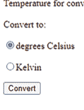

图 32.6 带有HTML表单的开尔文-摄氏度转换

这也显示在图32.6中。

该表单包含一个ID为**temp**的文本输入框，用于输入*温度*；两个单选按钮（**direction**）用于定义转换方向；以及一个触发转换的按钮。

你还会看到一个我们之前未遇到过的HTML元素，即**span**。**span**没有任何特殊功能，但它帮助我们为文本显示赋予自己的ID，以便我们可以在JavaScript程序中对其进行引用。在我们的**span**元素**unitLabel**上，我们显示用户输入温度所使用的单位。每次用户更改关于转换方向的选择时，这个单位显示也必须相应更改。

我们通过**name**属性将两个单选按钮组合在一起：这意味着它们属于同一组，因此一次只能选中其中一个。请注意，单选按钮的分组是通过**name**属性实现的，而不是通过**id**属性。区别在于ID是一个*唯一*的标识符。因此，不能有两个元素具有相同的ID。我们的两个单选按钮根本没有ID，因为我们也能够在JavaScript程序中通过名称引用它们。触发转换的按钮甚至既没有ID也没有名称。两者都不需要，因为按钮触发一个动作，从而触发我们的JavaScript程序，但我们不需要在程序内部访问它。

**p**和**br**元素具有纯粹的设计功能（**br**创建一个简单的换行），它们帮助我们使表单在视觉上更具吸引力。所以，正如你所看到的，不仅**input**元素可以放置在**form**元素中，你还可以使用各种HTML元素（包括表格和图像）来构建一个有吸引力的表单。

然而，我们还没有考虑表单中一个非常重要的部分：**direction**单选按钮和**Convert**按钮的**onchange**和**onclick**属性。每个属性的值都是一个JavaScript函数（一个*事件处理器*），属性的名称与一个事件相关，即在该事件发生时调用相应的JavaScript函数。例如，如果用户点击我们的按钮，就会触发**click**事件。当**click**事件发生时，浏览器会自动检查是否设置了**onclick**属性，如果设置了，则执行那里指定的JavaScript函数。通过这种方式，我们将界面与JavaScript程序连接起来。

## 32.6 · 示例：简单计算器

在我们的例子中，这看起来像这样：

```javascript
function convert() {
    var temp = Number(document.getElementById('temp').value);
    var direction = document.getElementsByName('direction');

    if(direction[0].checked == true) {
        document.write(`<p>${temp} Kelvin are ${temp - 273.15} degrees Celsius.</p>`);
    }
    else {
        document.write(`<p>${temp} degrees Celsius are ${temp + 273.15} Kelvin.</p>`);
    }
}

function change(unit) {
    var unitLabel = document.getElementById('unitLabel');
    unitLabel.innerHTML = unit;
}
```

整个程序只包含两个函数，即与我们应用程序的单选按钮和主按钮相关联的两个事件处理器。函数**change()**作为事件处理器存储在我们单选按钮的**onchange**属性中，因此每当**change**事件发生时都会被调用。每当用户点击其中一个单选按钮时（顺便说一句，我们同样可以将事件处理器附加到**click**事件上），就会发生这种情况。当事件发生时，函数被调用时带有一个参数，该参数是要显示在我们的**span**元素**unitLabel**上作为用户输入单位的单位。在HTML代码中，你可以非常清楚地看到，事件处理器在被调用时立即被赋予了所需的单位作为参数：**onchange="change('Kelvin')**"。

在事件处理器**change()**内部，我们首先使用**document.getElementById()**选择**span**元素，然后替换其内部的HTML代码；在我们的例子中，这只是没有任何进一步HTML编码的纯文本。

但现在来看我们的另一个事件处理器**convert()**，每当用户点击“转换”按钮时，它就会被调用。它的结构非常简单。首先，我们通过查询**temp**输入字段的**value**属性来获取温度，我们通过其ID选择该字段。注意，我们必须将值转换为**number**变量，因为我们要对温度值进行计算。表单本身总是将输入的值保存为**string**；有方法可以配置表单输入字段，使其从一开始就只允许数字输入，但为了简单起见，我们这里没有这样做。接下来，我们通过名称选择单选按钮。为此，我们使用**getElementsByName()**函数。注意**Elements**中的复数s！由于名称与ID不同，不一定唯一，因此按名称选择时可能会得到多个元素。这正是我们例子中的情况。调用**getElementsByName()**的返回值是一个元素*数组*，在我们的例子中是两个单选按钮。在下一步中，我们使用单选按钮的**checked**属性来检查我们的第一个单选按钮（索引0！）是否被选中。此时不要过于担心If-Else结构，我们将在▶第34.1节详细讨论这种程序分支。如果我们的第一个单选按钮被选中，这意味着我们程序的用户想要从开尔文转换为摄氏度。然后我们使用**document.write()**和模板字面量将其输出到网页上（如果你对模板字面量不再熟悉，请翻回几页到▶第32.2节）。

正如你所看到的，我们的JavaScript程序完全由事件处理器组成，这些处理器在被浏览器触发之前一直处于休眠状态，因为发生了与它们相关联的事件。我们将在▶第34.3节讨论程序流程控制时更详细地讨论事件。此时，理解我们可以将JavaScript代码“连接”到界面控件的基本机制就足够了。

❓ **32.4 [5分钟]**
修改开尔文-摄氏度转换示例，使输出不是通过**document.write()**完成，而是输出到一个必须为此目的构建到网页界面中的**span**类型的HTML元素。

❓ **32.5 [30分钟]**
开发一个简单的应用程序，用户可以使用滑块更改应用程序网页上显示的一些示例文本的字体大小。字体大小可以在HTML/CSS中通过**fontsize** CSS样式选项设置，并以像素（**px**）为单位指定；例如，有效的字体大小设置可以是'18px'。如果你认为在处理此任务之前需要一些“灵感”，请先处理以下两节中的示例。

### 32.6 示例：简单计算器

在本节和下一节中，我们将开发两个小的示例应用程序。首先，我们转向一个简单的计算器。计算器应该能够处理四种基本算术运算，并允许将计算结果复制到剪贴板。数字和运算符的输入应通过按钮或通过键盘直接输入完成。

我们的应用程序由三个文件组成：

- HTML文件**calculator.html**，用于构建网页界面
- 层叠样式表（CSS）文件**calculator.css**，帮助我们定义按钮和显示屏的设计，以及
- JavaScript程序**calculator.js**，为界面提供功能

#### 32.6.1 网页界面

让我们从HTML文件 `calculator.html` 开始：

```html
<!DOCTYPE html>
<html>

<head>
  <title>Calculator</title>
  <link rel="stylesheet" type="text/css" href="calculator.css">
  <noscript>Please activate JavaScript!</noscript>
</head>

<body bgcolor="#282923">
  <script src="calculator.js"></script>

  <form>
  <input id="display" type="text" value="0"
         class="inputOutput">
  <p></p>
  <input type="button" value="C" class="normalButton
         functionButton" onclick="clearDisplay()">
  <input type="button" value="Copy" style="width:104px"
         class="normalButton functionButton" onclick="copy()">
  <input type="button" value="/" class="normalButton
         functionButton" onclick="key('/')">
  <p></p>
  <input type="button" value="7" class="normalButton"
         onclick="key('7')">
  <input type="button" value="8" class="normalButton"
         onclick="key('8')">
  <input type="button" value="9" class="normalButton"
         onclick="key('9')">
  <input type="button" value="*" class="normalButton
         functionButton" onclick="key('*')">
  <p></p>
  <input type="button" value="4" class="normalButton"
         onclick="key('4')">
  <input type="button" value="5" class="normalButton"
         onclick="key('5')">
  <input type="button" value="6" class="normalButton"
         onclick="key('6')">
  <input type="button" value="-" class="normalButton
         functionButton" onclick="key('-')">
  <p></p>
  <input type="button" value="1" class="normalButton"
         onclick="key('1')">
  <input type="button" value="2" class="normalButton"
         onclick="key('2')">
  <input type="button" value="3" class="normalButton"
         onclick="key('3')">
  <input type="button" value="+" class="normalButton
         functionButton" onclick="key('+')">
  <p></p>
  <input type="button" value="0" class="normalButton"
         style="width:104px" onclick="key('0')">
  <input type="button" value="." class="normalButton"
         onclick="key('.')">
  <input type="button" value="=" class="normalButton
         functionButton" onclick="calculate()">
  </form>
</body>

</html>
```

-   **第1–8行**
    这是标准的HTML头部。我们首先引入CSS文件 **calculator.css**，并使用 **noscript** 元素为用户浏览器禁用JavaScript的情况做准备。CSS文件通过 **link** 元素集成。

-   **第10行**
    我们通过 **bgcolor** 属性将网页背景设置为深色调，这样我们的计算器看起来也很时尚。毕竟，眼睛也要做数学！

-   **第11行**
    我们引入了脚本 **calculator.js**，它包含了页面的实际功能。从技术上讲，它在网页加载时就在此早期点执行，但正如我们将在下面看到的，它只包含作为事件处理程序调用的函数，换句话说，它是由各个按钮事件驱动的。只要这些函数没有被显式调用，脚本执行时应用程序端什么也不会发生。我们完全可以将脚本包含在网站的 **body** 部分。这不会影响应用程序的功能。

-   **第13行和第38行**
    页面 **body** 部分的其余部分是一个HTML表单，其中包含计算器的所有控件。

-   **第14行**
    这里我们定义了计算器的显示屏。我们给它分配了id **"display"**，以便稍后可以从我们的JavaScript程序中访问它。它的类型是 **text**，所以它是一个输入字段，毕竟用户也应该能够通过键盘输入数字和运算符；在我们的计算器中，他可以直接在显示屏中输入。在用户输入任何其他内容之前，初始值应为0。此外，我们通过 **class** 属性为显示屏提供了一个类信息。对于这个类，我们定义了 **inputOutput**，在CSS文件中有特殊的设计说明。因此，我们不必在此处通过HTML代码中的属性（特别是CSS属性 **style**）直接定义设计，而是将这些设置外包给单独的CSS文件，使我们的代码更清晰、更易于维护。这样，如果我们想更改计算器显示屏的设计，只需通过页面头部的 **link** 元素包含另一个CSS文件即可，该文件也包含 **inputOutput** 类的设计语句，显示屏的外观就会改变，而我们无需调整实际的网页（HTML文档）。

-   **第16–37行**
    这是实际按钮所在的位置。通过 **onclick** 属性，我们为每个按钮分配一个JavaScript函数，每当用户点击按钮时就会触发该函数。这个事件处理程序函数要么是函数 **key(character)**，它接收按键上的字符（数字或运算符）作为参数，要么是特殊函数 **calculate()** 用于在用户点击等号时触发计算，或者 **clear()** 用于清除显示屏，或者 **copy()** 用于将当前显示内容复制到剪贴板。最初，所有按钮的 **class** 属性都是 **normalButton**，除了特殊功能按钮，例如运算符、复制、清除和等号按钮。功能按钮不仅属于 **normalButton** 类，还属于 **functionButton** 类。**functionButton** 类确保这些按钮获得橙色着色，而 **normalButton** 类的按钮获得默认着色（通常是灰色）。我们稍后将在CSS指令的上下文中更仔细地研究这一点。

    您可能已经注意到，按钮本身没有被赋予 **id**。严格来说，这有点混乱，但对我们来说没有必要，因为我们不需要从JavaScript代码中访问按钮。情况正好相反：按钮通过在用户点击时调用相应的事件处理程序函数来访问我们的代码。

    您可以在图32.7中看到整个界面。

#### 32.6.2 CSS设计指令

为了将HTML文件中描述的界面基本结构与各个元素的详细设计分开，我们在示例中将后者移至单独的CSS文件 **calculator.css**。

CSS文件为三类对象定义了设计语句：**normalButton**（基本上是所有按钮）、**functionButton**（功能按钮）和 **inputOutput**（计算器的显示屏）。设计语句以类为单位呈现在用花括号括起来的CSS块中。块前面是 *选择器*，它指定要应用设计语句的网页HTML元素。前面的点表示“所有 **class** 属性 *包含* 指定类的对象”。在 ▶ 第32.6.1节中，我们看到功能按钮属于两个类：**normalButton**（所有按钮的类）和特殊类 **functionButton**。因此，CSS选择器 **.functionButton** 会导致相应的设计语句应用于这些按钮。

```css
.normalButton {
    width:50px;
    height:50px;
}

.functionButton {
    background-color: #ED5036;
    color: #FFFFFF;
    border: 1px solid #ED5036;
}

.inputOutput {
    width:208px;
    height:60px;
    background-color: #282923;
    color: #66FF33;
    border: 1px solid #ED5036;
    padding-right: 5px;
    font-family: "Lucida Console";
    font-size:32px;
    font-weight: bold;
    text-align: right;
}
```

-   **第2–3行**
    对于 **normalButton** 类，因此最初对于所有按钮，我们以像素为单位定义高度和宽度（从CSS文件中删除这些设计语句，然后在浏览器中重新加载页面。会发生什么？）

-   **第7–9行**
    对于 **functionButton** 类，我们额外定义了特殊的背景和前景颜色以及按钮边框的设计（这里是一像素宽的实线，颜色与按钮背景相同）。那些只属于 **normalButton** 类的按钮（即主要是数字按钮）自然也有配色方案，但我们没有明确定义它；因此，使用默认值，通常导致这些按钮为灰色。对于 **functionButton** 类，我们用自己的颜色规范覆盖这些默认值。一旦您在浏览器中加载了页面，请打开开发者工具并单击“Elements”（在Google *Chrome* 以外的浏览器中，相应的选项卡可能有不同的名称）。在那里，您会找到一个函数按钮（在Google *Chrome* 中，位于左上角），允许您切换到特殊的元素检查模式。在此模式下，您可以通过单击网页上的元素来选择它，并在开发者工具中获取有关它的更多信息。在元素检查器（图32.8）中，您可以在页面的HTML源代码中看到左侧的选定元素，以及右侧该元素的CSS设计规范。设计默认值从底部向顶部读取。在我们的示例中（选择了带有除法运算符的功能按钮），您会看到一系列CSS设计属性，这些属性预设了默认值，首先是 **input** 类（最底部的CSS块），然后是上面一个专门用于 **button** 类型 **input** 元素的附加属性块。然后，在那之上，是我们定义的类 **normalButton** 和 **functionButton** 的按钮的两个CSS块。一些属性被划掉了。这意味着这些属性被更具体的CSS块覆盖了。例如，**button** 类型 **input** 元素的CSS块中的 **color** 和 **background** 属性被划掉，因为它们在 **functionButton** 类按钮的特殊CSS块中被不同地定义了（而选定的按钮就是这样的按钮）。这样您就可以快速查看元素的 CSS 设计属性（及其值）以及它们的来源。

我们通过 **style** 属性直接为网页界面 HTML 代码中的复制显示内容按钮和数字 0 按钮分配了宽度。**style 属性**包含仅应用于相关元素的 CSS 代码。正如通过元素检查器查看某个元素的 CSS 语句层级所见，这优先于 CSS 样式表文件中的所有其他语句。

-   第 13–22 行
    这里设置了计算器显示屏的设计；包括背景、字体、颜色和大小，以及文本距元素边缘的缩进（*内边距*）。

#### 32.6.3 JavaScript 代码

我们应用程序的 JavaScript 代码由四个事件处理函数组成，当点击 HTML 界面上的不同按钮时，我们会触发这些函数：

```javascript
function key(character) {
  var display = document.getElementById('display');
  display.value = display.value + character;
}

function clearDisplay() {
  var display = document.getElementById('display');
  display.value = '0';
}

function copy() {
  var display = document.getElementById('display');
  display.select();
  document.execCommand('copy');
}

function calculate() {
  var display = document.getElementById('display');
  display.value = Number(eval(display.value)).toFixed(6);
}
```

-   第 1–9 行
    函数 **key(character)** 和 **clearDisplay()** 是事件处理函数，当用户点击相应按钮时被调用。如你所记，我们总是从网页的 HTML 代码中调用函数 **key(character)**，并将分配给被按键的字符作为参数（无论是数字还是运算符）。通过使用这个“技巧”，我们只需要一个函数来处理所有按钮，而不是为每个按钮设置一个特殊的事件处理函数。

    这两个函数都改变了屏幕上的显示内容。为此，我们首先总是使用 **document** 对象的 **getElementById()** 方法“获取”网页表单的显示元素。然后我们更改显示元素的 **value** 属性，即输入元素上显示的文本；使用 **key()** 时，我们只需将被按按钮的标签添加到当前值中（第 3 行）。

-   第 11–15 行
    要将当前显示内容复制到剪贴板，我们首先使用 **display input** 元素的 **select()** 方法选择现有文本，然后调用浏览器的复制命令。

-   第 17–20 行
    当用户想要执行输入的计算并点击带有等号的按钮时，显示的值会更新。这里我们使用函数 **eval(expression)**，它计算作为字符串传递的表达式，在我们的例子中即：计算它。然后我们使用 **Number()** 将结果转换为数字，再使用其 **toFixed()** 方法将其格式化为具有六位小数的字符串表示形式。

### 32.7 示例：颜色选择器

在这个示例中，我们开发一个小型应用程序，允许你以用户友好的方式根据红-绿-蓝（RGB）方案设计颜色，并将其转换为 HTML 典型的十六进制编码。此类应用程序，甚至更复杂的，可以在互联网上*大量*找到。

#### 32.7.1 网页界面

我们应用程序的界面非常简单。它由三个滑块组成，允许你更改红色、绿色和蓝色的颜色分量，以及一个字段，以 **#RRGGBB** 形式的十六进制代码显示生成的颜色。通过滑块当前选择的颜色用作网页的背景颜色，以便用户可以很好地了解他创建的颜色。

```html
<!DOCTYPE html>
<html>

<head>
  <title>Color Picker</title>
  <noscript>Please activate JavaScript!</noscript>
</head>

<body id="bodyElem">

<div style="background:#FFFFFF; margin: 0 auto;
padding:10px; width:400px;">

<form>
  <input id="hexColor" type="input" value="#000000" readonly>
  <p>Red:</p>
  <input id="colorRedRange" type="range" value="255"
    min="0" max="255"
    oninput="adjustColor()">
  <input id="colorRedOutput" type="input" value="255"
    readonly>
  <p></p>
  <p>Green</p>
  <input id="colorGreenRange" type="range" value="255"
    min="0" max="255"
    oninput=" adjustColor ()">
  <input id="colorGreenOutput" type="input" value="255"
    readonly>
  <p></p>
  <p>Blue</p>
  <input id="colorBlueRange" type="range" value="255"
    min="0" max="255"
    oninput=" adjustColor ()">
  <input id="colorBlueOutput" type="input" value="255"
    readonly>
</form>

</div>

<script src="colorpicker.js"></script>

</body>
</html>
```

让我们详细查看界面：

-   **第 9 行**
    这次我们给页面的 **body** 元素一个 **id**，因为我们想用选定的色调为页面背景着色。为此，我们需要从 JavaScript 代码中调整 **body** 元素的 **bgcolor** 属性。

-   **第 11 行**
    HTML 中的 **div** 元素简单地标记页面上的一个连续区域，最终是一个最初不可见的框。我们将所有控件放在这样一个框中。然后我们可以使用其 CSS 属性 **style** 将 **div** 元素着色为白色（**#FFFFFF** 对应于红色、绿色和蓝色各为 255 的颜色分量），并将其在页面上居中（这是通过 **margin** 属性的值 **0 auto** 完成的）。此外，我们使用 **padding** 属性为框提供 10 像素宽的边距，以便控件与框边缘之间有一些自由空间，并将框的宽度固定为 400 像素。

-   **第 13–26 行**
    **div** 框内的表单由一个文本输入字段组成，我们在其中显示转换为十六进制表示法的颜色代码（第 14 行）。默认情况下，只要用户没有通过滑块选择不同的颜色，颜色应为白色。我们还希望输入字段是只读的，因此我们添加了属性 **readonly**，这是一个 **布尔** 属性，因此不需要为真值进行显式值赋值（但我们可以写成 **readonly="true"**）。
    然后我们添加三个滑块（**colorColornameRange**），每个用于我们 RGB 值的每个颜色分量 *Colorname*。滑块的类型为 **range**，可在 0（**min**）和 255（**max**）之间调整。每次用户移动它们（事件 **oninput**）时，事件处理程序 **adjustColor()** 就会被触发，正如我们将在下面看到的，它会调整 **hexColor input** 字段中的十六进制颜色代码，重置页面的背景颜色，最后在滑块旁边的（只读）输入字段（**color-ColornameOutput**）中显示新的颜色分量。通过使用空的段落元素 `<p></p>`，我们提供了换行，从而提高了可读性。
    你可以在图 32.9 中看到整个界面。

#### 32.7.2 JavaScript 代码

JavaScript 文件 **colorpicker.js**（我们在第 30 行将其包含在网页中）仅包含事件处理程序 **colorAdjust()**，即每次用户移动其中一个滑块时调用的函数。
代码详情：

```javascript
function adjustColor() {

  var bodyElem = document.getElementById('bodyElem');
  var hexColor = document.getElementById('hexColor');

  var colorRedRange = document.getElementById('colorRedRange');
  var colorGreenRange = document.getElementById('colorGreenRange');
  var colorBlueRange =
       document.getElementById('colorBlueRange');

  var colorRedOutput =
       document.getElementById('colorRedOutput');
  var colorGreenOutput =
       document.getElementById('colorGreenOutput');
  var colorBlueOutput =
       document.getElementById('colorBlueOutput');

  var hexRed = Number(colorRedRange.value).toString(16);
  var hexGreen = Number(colorGreenRange.value).toString(16);
  var hexBlue = Number(colorBlueRange.value).toString(16);

  if(hexRed.length == 1) hexRed = '0' + hexRed;
  if(hexGreen.length == 1) hexGreen = '0' + hexGreen;
  if(hexBlue.length == 1) hexBlue = '0' + hexBlue;

  var hex = '#' + hexRed + hexGreen + hexBlue;
  hexColor.value = hex.toUpperCase();

  bodyElem.bgColor = hex;

  colorRedOutput.value = colorRedRange.value;
  colorGreenOutput.value = colorGreenRange.value;
  colorBlueOutput.value = colorBlueRange.value;
}
```

-   **第 3–12 行**
    这里我们首先为需要访问的界面不同元素创建变量。

-   **第 14–16 行**
    接下来，我们获取滑块设置的当前值（使用它们的 **value** 属性），并将值转换为十六进制字符串。正如你在 ▶ 第 31.3.2 节中回忆的，**toString()** 方法有一个参数，指定要将数字转换为字符串表示的数字系统的基数，在我们的例子中是 16，因为我们想要实现十六进制表示。

-   **第 18–20 行**
    使用变量 **hexRed**、**hexGreen** 和 **hexBlue**，我们已经将所有需要的内容组合在一起，以 **#RRGGBB** 格式显示十六进制颜色值。但有一个小问题：颜色分量的值变量可能只有一位数字（如果相应颜色分量的十进制值小于16）。在这种情况下，我们必须在前面补一个0，因为**#RRGGBB**格式的十六进制颜色代码要求每个颜色分量*恰好有两位*数字。因此，我们检查之前生成的颜色部分字符串的长度，并在必要时添加一个0。

- **第22–23行**
现在我们可以组合十六进制值，并将其显示在我们的（只读）输入元素**hexColor**中。

- **第25行**
我们还将刚刚确定的十六进制RGB值赋给**body**元素的**bgcolor**属性。因此，一旦用户激活其中一个颜色比例滑块，不仅十六进制颜色值**hexColor**的显示会改变，网页的背景颜色也会随之改变。

- **第27–29行**
最后，我们将颜色百分比值作为十进制数字显示在各自颜色百分比滑块旁边的（只读）输入字段中。

### 32.8 总结

在本章中，我们探讨了如何使用JavaScript进行数据的输入和输出。具体来说，我们研究了JavaScript控制台以及JavaScript应用程序如何与网页进行交互。

请务必掌握本章的以下要点：

- **console.log()**方法可用于在JavaScript控制台中输出对象。
- 模板字面量允许你以占位符的形式在字符串中包含变量，这些占位符在字面量创建时会被替换为变量的当前值；变量写作**${variable}**，整个字面量本身用反引号（`）括起来。
- 模板字面量的替代方案是字符串替换和使用加号运算符连接字符串和可以输出为字符串的对象。
- 使用**console.warn()**和**console.error()**可以在控制台中输出警告或错误消息。
- 与用户的交互也可以通过对话框进行；特别是使用**alert()**（显示消息）、**confirm()**（带有“确定”和“取消”选项的对话框）和**prompt()**（在弹出对话框中进行文本输入）。
- JavaScript非常适合编辑网页的HTML元素，通过JavaScript应用程序使网页动态化。
- 最简单的方法是使用**document.write()**将HTML代码写入脚本在网页中运行的当前位置。
- HTML页面的组件，特别是HTML元素本身、它们的属性以及其中的文本，可以层次化地表示为*文档对象模型*（DOM）的节点。
- JavaScript允许选择和编辑DOM中的元素作为HTML元素对象，并且对这些对象的更改会立即反映在网页的渲染中。
- DOM节点主要可以通过它们的**id**属性（使用**document.getElementById()**）、它们的类型（使用**document.getElementsByTagName()**；注意是复数，这里返回一个数组，因为可能有多个元素符合标准！）或它们的CSS类（使用**document.getElementsByClassName()**；同样，返回的是数组）来识别。
- 返回的是元素对象/元素对象数组，它们代表网页的HTML元素，其属性就是这些HTML元素的属性。
- 此外，从一个元素对象开始，可以利用DOM结构通过**childNodes**和**parentNode**等属性来选择层次连接的对象。
- 元素对象的**innerHTML**和**innerText**属性分别表示HTML元素中包含的HTML代码（即DOM中层次从属元素的代码）和其中包含的文本。
- 可以使用**document.createElement(type)**在网页上创建HTML元素，并通过调用其**appendChild(new_element)**方法将其添加到某个元素下方；HTML元素的**insertBefore(new_element, before_child)**方法将**new_element**作为子元素添加到另一个子元素（**before_child**）之前；**remove(element)**从网页中移除HTML元素对象**element**。
- 在实践中，网页上与用户交互最重要的形式是使用*表单*；它们在HTML中使用**form**元素创建，因此它们的组件，即控件（如文本输入或按钮），位于**<form>**和**</form>**之间。
- 表单的元素主要是HTML类型**input**，并通过它们的**type**属性进一步区分；例如，**"text"**是文本输入字段的类型，**"button"**是按钮的类型，**"slider"**是滑块的类型。
- 用户对这些控件的操作（例如，点击按钮）可以通过事件链接到JavaScript代码中的事件处理函数，每当与该操作关联的事件被触发时，这些函数就会被自动调用。对事件处理程序的调用作为属性值传递给HTML元素，其中属性名由**on**和事件名称组成，例如，**onclick**对应**click**事件。

### 32.9 练习解答

#### 练习 32.1
**elem**的兄弟元素（包括**elem**本身）就是**elem**父元素的子元素。因此，**elem.parentElement.children**返回一个**HTMLCollection**，这是一个对应于HTML元素的对象集合。你可以像使用数组一样使用这个**HTMLCollection**类型的对象。

#### 练习 32.2
你的**p**元素在网页的HTML源代码中可能如下所示：

```
<p id="paragraph1">Here's a note.</p>
```

现在你可以在JavaScript程序中更改背景颜色：

```
var pElem = document.getElementById('paragraph1');

pElem.style.backgroundColor = '#FFFFCC';
```

**background-color**属性很方便更改，因为我们的元素对象**pElem**在一个同名的对象属性中反映了**style**属性。这样做时，请注意CSS的**background-color**属性在JavaScript中变成了我们元素对象**style**属性的**backgroundColor**属性（即，连字符被去掉，并且属性名第一个分量首字母之后的任何额外首字母都变为大写）。当然，你还需要将十进制RGB颜色分量转换为十六进制数字，以获得有效的颜色代码，形式为'**#RRGGBB**'。在此过程中，255（红色和绿色分量）变为**FF**，204（蓝色分量）变为**CC**。

#### 练习 32.3
代码可能如下所示：

```
var bodyElem = document.getElementsByTagName('body')[0];
var pElem = document.createElement('p');

pElem.style.fontWeight = 'bold'
pElem.innerText = 'This is the end';
bodyElem.appendChild(pElem);
```

首先，我们通过元素标签获取网页的**body**元素（注意：**getElementsByTagName()**返回一个HTML节点数组，因为网页中很可能有多个同类型的元素副本——至少对于**body**以外的元素是这样）。然后我们创建一个新的**p**元素，使用其CSS属性对其进行格式化，赋予它**"This is the end"**文本，并将其作为新的子元素添加到网页的**body**元素中，即追加到现有子元素的末尾。

顺便说一句：如果你像我们通常做的那样，通过网页body的**script**属性将此脚本包含在网页中，那么**"This is the end"**会出现在网页的*开头*！原因很简单：脚本在body的开头加载和执行，此时网页的body中还没有其他元素。因此，我们用上述代码添加的元素是第一个元素，逻辑上显示在页面顶部。

#### 练习 32.4
首先，必须将（仍然是“空的”）**span**元素插入HTML代码中：

```
<span id="output"></span>
```

你只需稍微修改**convert()**函数的代码，首先选择**span**元素，然后将输出赋给**innerHTML**属性：

```
function convert() {
  var temp = Number(document.getElementById('temp').value);
  var direction = document.getElementsByName('direction');
  var outputSpan = document.getElementById('output');

  if(direction[0].checked == true) {

    outputSpan.innerHTML = `<p>${temp} Kelvin are
    ${temp - 273.15} degrees Celsius.</p>`;
  }
  else {
    outputSpan.innerHTML = `<p>${temp} degrees Celsius are
    ${temp + 273.15} Kelvin.</p>`;
  }
}

function change(unit) {

  var unitLabel = document.getElementById('unitLabel');
  unitLabel.innerHTML = unit;
}
```

#### 练习 32.5

网站可能如下所示：

```html
<!DOCTYPE html>
<html>

<head>
    <title>Font Sizes</title>
    <noscript>Please activate JavaScript!</noscript>
</head>

<body>
    <script src="fontsizecontroller.js"></script>

    <form>
        <p>Font size:
            <input id="controller" type="range" min="1" max="150"
                value="20" onchange="changeFontSize()">
        </p>
    </form>

    <span id="sampletext" style="font-size: 20px;">
        Some text in size 20
    </span>
</body>

</html>
```

对应的 JavaScript 程序 **fontsizecontroller.js** 则如下所示：

```javascript
function changeFontSize() {
    var size =
        Number(document.getElementById('controller').value);
    var text = document.getElementById('sampletext');

    text.style.fontSize = size + 'px';
    text.innerHTML = 'Some text in size ' + String(size);
}
```

## 函数与方法：如何使用程序函数来处理数据并触发操作？

目录

- **33.1 使用函数 – 494**
  - 33.1.1 函数的定义 – 494
  - 33.1.2 返回值 – 499
  - 33.1.3 函数的参数与形参 – 500
  - 33.1.4 函数中变量的作用域 – 504
- **33.2 使用模块/库 – 506**
  - 33.2.1 开发和使用自己的模块 – 506
  - 33.2.2 查找和集成外部模块/库 – 508
- **33.3 框架 – 509**
- **33.4 总结 – 510**
- **33.5 练习解答 – 511**

概述

接下来，我们将探讨函数，它被认为是 JavaScript 编程的支柱，其作用类似于在其他各种编程语言中一样。毕竟，你不仅需要不断使用 JavaScript 开箱即用的预定义函数或从扩展库中获得的函数，还需要经常编写自己的函数；特别是在事件驱动的 JavaScript 应用程序中扮演核心角色的事件处理程序。因此，深入研究函数是我们 JavaScript 学习之旅的核心部分，这不足为奇。

在本章中，你将学习：

- 如何定义和调用函数
- 函数如何处理参数并返回结果
- 函数也是对象，以及这会带来什么影响
- JavaScript 中变量的作用域是如何划分的——特别是与函数相关时——以及这如何影响变量的可访问性
- 如何通过外部库扩展标准语言的可用函数，以及如何找到合适的扩展库
- 什么是框架，以及它们与库有何不同

### 33.1 使用函数

#### 33.1.1 函数的定义

定义函数

在 JavaScript 中，函数使用关键字 **function** 来定义。任何参数都放在函数标识符后面的圆括号中，即使函数不传递任何参数，圆括号也是必需的。调用函数时执行的程序代码以花括号中的代码块形式跟在后面。一个简单的函数，只是向控制台打印“Hello World”，看起来像这样：

```javascript
function hello() {
    console.log('Hello World! ');
}
```

现在可以从程序（或控制台）中调用它：

```javascript
hello();
```

如果在控制台中调用函数时忘记输入圆括号（如果函数不带参数，这很容易发生），你将看到函数的源代码。

##### 函数作为对象

JavaScript 中的函数本身就是对象，类型为 **function**，这很容易验证：

```javascript
> typeof(hello)
"function"
```

因为它们是对象，所以也可以赋值给其他变量对象：

```javascript
> greeting = hello
> greeting()
Hello World!
```

如果我们在这里写 **greeting = hello()**，那么我们将把 **hello()** 的函数*值*赋给变量 **greeting**，因为 **hello()** 不过是对同名函数的调用。（正如我们将在下面看到的，这个函数值将是 **undefined**，因为该函数没有显式返回值。）

作为对象，它们也有许多方法和属性；例如，**toString()** 函数以字符串形式返回函数的源代码：

```javascript
> greeting.toString()
"function hello() {
console.log('Hello World!');
}"
```

这里函数名（**greeting**）后面不能使用圆括号，因为我们不是要*调用*函数并获取其返回值，而只是要访问函数对象的方法和属性。

函数是对象这一事实在其他地方也变得清晰，我们可以像处理任何其他对象一样处理它们。在 ▶ 第 31.5.2 节中，我们看到了如何使用 **var** 关键字创建对象。这正是我们可以对函数对象做的事情：

```javascript
var hello = function() {
    console.log('Hello World!');
}
```

这里，我们用一个函数表达式初始化变量 **hello**，该表达式以关键字 **function** 开头。随后，**hello** 是一个可调用的对象，可以通过 **hello()** 执行。

因为 **hello** 现在是一个真正的对象，我们也可以给它添加属性——这可能看起来有点奇怪：

```javascript
> hello.counter = 5
> typeof(hello)
"function"

> hello.counter
5
```

该对象仍然是 **function** 类型，但现在有了一个额外的属性 **counter**。当我们在 ▶ 第 31.5.5 节中使用构造函数创建对象时，我们做了非常类似的事情（再次回顾 **Product** 对象类型的构造函数）。构造函数最终使用关键字 **this** 写入当前对象的属性。

因为函数就是对象，所以它们也可以用作其他对象的属性，从而赋予这些对象可调用的*方法*。假设我们想开发一个对象来保存一个日期，将其分解为各个组成部分，并有一个 **display()** 方法以响应式格式输出该日期。我们可以这样定义这样一个对象：

```javascript
var shortdate = {
    day: 0,
    month: 0,
    year: 0,
    display: function() {
        console.log(this.year + '/' + this.month + '/' + this.day)
    }
}
```

注意关键字 **this**。我们在 ▶ 第 31.5.5 节中已经遇到过它，它建立了对当前上下文的引用，在该上下文中（如此处）调用属性或方法。因此，通过 **this.day**，我们访问当前上下文中的 **day** 属性，而这就是对象定义的上下文。如果你省略 **this** 关键字，JavaScript 就不明白 **day** 应该是什么，因为在 **display()** 函数内部不存在该名称的变量。声明之后，我们可以通过输入日期组件然后调用 **display()** 函数来使用该对象：

```javascript
shortdate.day = 14;
shortdate.month = 12;
shortdate.year = 2025;
shortdate.display();
```

这个方法调用给我们输出 **2025/12/14**。

所以，正如你所看到的，我们可以非常容易地用可调用的方法填充一个对象，因为方法最终只是对象的属性，而且它们是 **function** 类型的属性。它们与对象的其他属性的区别仅在于它们是可调用的。

##### 高级主题 I：函数中的函数

JavaScript 的一个特殊功能是函数也可以在函数内部定义。一个简单的（尽管在内容上可能意义不大）例子：

```javascript
function helloWorld() {
    function hello() {
        console.log('Hello');
    }
    function world() {
        console.log('World!');
    }
    hello();
    world();
}
```

这里我们在函数 **helloWorld()** 内部定义了另外两个函数 **hello()** 和 **world()**，它们分别在控制台中产生输出。然后两个函数都被调用。这样，控制台中就创建了两行新内容 **Hello** 和 **World!**。

或者，我们也可以通过对象赋值来创建（“子”）函数：

```javascript
function helloWorld() {
    hello = function() {
        console.log('Hello');
    }
    world = function() {
        console.log('World!');
    }
    hello();
    world();
}
```

在函数内部定义函数乍一看可能像是一种语法上的花招，但在使用代码模块时，这种第二种变体具有实际用途。

顺便问一下，如果我们在（“子”）函数的定义中写 **this.hello = function...** 和 **this.world = function...** 会发生什么？那么我们就会为 **helloWorld** 对象开发一个*构造函数*，它会

##### 高级主题 II：匿名函数

函数通常有一个名称，可以通过该名称进行调用。然而，也存在定义没有自己名称的函数的可能性，即*匿名*函数。
一个简单的例子如下：

```javascript
(function() {
    console.log('Hello World');
})()
```

你首先会看到包含函数定义的圆括号，但没有函数标识符。括号表达式返回一个函数（一个函数对象），我们*立即再次调用*它。这可以通过末尾的一对括号看出。它们是通常的括号，也用于调用带有函数标识符但没有参数的“普通”函数。这样，函数不需要任何名称就可以被调用，但在我们的示例中，只能在其定义的直接上下文中调用，否则我们缺乏接触它的“句柄”。
对于“语法美食家”，有一种方法可以创建这样的“句柄”，我们之前已经使用过。我们将匿名函数赋值给一个对象。为此，让我们再次查看上面的一个例子：

```javascript
var hello = function() {
    console.log('Hello World!');
}
```

这里我们创建了一个名为**hello**的变量，但赋值给它的函数没有标识符。如果你在控制台中输入*变量*的名称，会显示函数的源代码；然而，其中看不到函数标识符：

```javascript
> hello
f () {
    console.log('Hello World!');
}
```

尽管这可能看起来有点令人困惑，但我们已经创建了一个名为**hello**的对象，它代表一个函数，但函数本身是匿名的，所以它没有名称。然而，如果我们使用函数标识符定义函数，我们再次得到一个函数对象；但这次，函数有一个名称：

```javascript
> var hello = function hello() {
    console.log('Hello World!');
  }
> hello
f hello() {
    console.log('Hello World!');
}
```

所以，我们不一定非要在匿名函数定义后立即调用它们，我们也可以将它们捕获到一个对象中。就像“函数中的函数”一样，匿名函数在构建整个代码模块时也很有用。在“日常编程”中，主要使用的是带有函数标识符的函数。

#### 33.1.2 返回值

函数可以使用 **return** 语句返回对象。以下函数生成并返回一个 0 到 10 之间的随机数：

```javascript
function getRandomNumber() {
    var randomNumber;
    randomNumber = Math.round(Math.random()*10,0);

    return randomNumber;
}
```

**return** 语句也可以像函数一样编写，而不是使用关键字 **return**，在我们的例子中是 **return(randomNumber)**。
没有 **return** 语句的函数会执行其工作（在我们的例子中是向控制台打印内容），但返回 **undefined**：

```javascript
> function hello() {
    console.log('Hello World!');
  }
> res = hello()
Hello World

> res
undefined
```

#### 33.1.3 函数的参数与实参

##### 参数与实参的基础

数学函数是将一个值赋给一个或多个参数的赋值规则。到目前为止，我们只考虑了完全不使用参数的函数。然而，通常情况下，函数之所以有用，恰恰是因为你可以用参数调用它们，从而控制它们的行为或以这种方式向它们传递数据进行处理。
在术语上，我们到目前为止的选择性不如 JavaScript 中常见的那么强。在这里，区分*形参*和*实参*并不少见。形参是函数*定义*中列出的函数接受的抽象值，而实参是在函数*调用*时实际传递给函数的具体值。
在 JavaScript 中，形参在函数定义中指定时没有类型。这意味着程序员必须自己负责任何必要的类型检查。
之前使用的将温度从开尔文转换为摄氏度的例子，使用函数参数（但不检查参数类型）将如下所示：

```javascript
function kelvinToCelsius(kelvin) {
    return kelvin - 273.15;
}
```

**kelvin** 是函数的一个*形参*。如果我们稍后调用该函数，例如，使用开尔文温度 54，那么 54 就是形参 **kelvin** 的*实参*。多个形参在函数定义中用逗号分隔。

##### 在函数内更改实参

在 JavaScript 中，如果实参的数据类型是基本数据类型，如 **number**、**string** 或 **boolean**，则实参总是按*值*传递；因此，如果你将一个变量传递给函数，并且函数更改了传递给它的实参，原始变量不会更改。从某种意义上说，函数处理的是传递给它的值的副本，而不是变量本身。所以，传递是按*值*进行的。
但是，如果你将一个更复杂的对象传递给变量并对其进行更改，则传递给函数的对象确实会更改。此时传递是按*引用*进行的。
以下示例说明了区别：

```javascript
function Product(price, name) {
    this.price = price;
    this.name = name;
}

var chair = new Product(24.99, 'Garden chair');
var purchased = false;

function setPrice(article, price) {
    article.price = price;
}

function purchase(purchaseStatus) {
    purchaseStatus = true;
}
```

在示例中，我们再次使用对象类型 **Product**，首先调用其构造函数来创建一个名为 **chair** 的 **Product** 对象，并初始化一些属性，包括设置为 **24.99** 的价格。我们还创建了一个 **boolean** 变量 **purchased**，它表示某物是否已售出，并初始化为 **false**。接下来是两个函数的定义：**setPrice(article, price)**，它更改作为其第一个参数传递给它的产品的价格；以及 **purchase(purchaseStatus)**，它接受一个 **boolean** 变量作为销售指示器，并将其设置为 **true**（或者不设置，正如我们将看到的）。让我们在控制台中尝试这两个函数：

```javascript
> setPrice(chair, 50.89)
> purchase(purchased)
> chair.price
50.89

> purchased
false
```

如你所见，椅子的价格发生了变化，但状态指示器 **purchased** 保持其旧值。**purchased** 是一个*原始值*，它不能作为函数的实参（**purchaseStatus**）被更改；另一方面，对象 **chair** 如果作为参数 **article** 传递给函数，则可以在函数的代码中被很好地更改。

##### 使用参数调用函数

函数实参也可以在调用函数时使用其形参名称传递；例如，我们可以将开尔文到摄氏度的转换调用为 **kelvinToCelsius(kelvin=54)**。通过使用形参名称传递实参，使得实参到形参的赋值变得清晰，此过程还允许以与函数定义中指定的形参序列不同的顺序传递实参。

JavaScript 对参数数量非常灵活：如果给函数传递了*太多*实参，那么多余的实参将被简单地忽略。关于*太少*实参会发生什么的问题，引出了默认值和可选参数的主题。

##### 使用默认值和可选参数

与大多数其他编程语言一样，参数可以赋予默认值，如果在调用函数时未为此参数提供实参（即具体值），则始终使用该默认值。

然而，与许多其他编程语言不同的是，正是这个默认值首先使参数成为可选的。相反，在 JavaScript 中，*所有*参数都是可选的。如果参数没有默认值，但在函数调用中未指定，它们会自动分配值 **undefined**。在我们的例子中，调用上面的温度转换函数 **kelvinToCelsius()** 是完全有效的，但会导致返回值 **NaN**（*非数字*），因为在这种情况下，JavaScript 假设参数 **kelvin** 的值为 **undefined**，而这不能用于算术计算。

##### 将函数作为函数的参数使用

函数的实参可以是任何对象类型。它们本身也可以是函数对象。在我们之前讨论过的内容之后，这不应该让你感到惊讶。然而，我们想在这里用一个例子来说明这个事实，以展示这是 JavaScript 的一个非常有用的特性。

考虑以下两个函数，它们以不同的方式连接学生的名和姓：

```javascript
function lastFirst(firstName, lastName) {
    return lastName + ', ' + firstName;
}

function firstLast(firstName, lastName) {
    return firstName + ' ' + lastName;
}
```

我们现在可以开发一个函数 **showMark()**，除了显示学生姓名外，还负责显示考试成绩：

```javascript
function showMark(firstName, lastName, mark, displayName) {
    console.log(displayName(firstName, lastName) + ': ' + mark);
}
```

我们现在可以这样调用 **showMark()**：

## 33.1 · 使用函数

```javascript
> showNote('Beth', 'Hathaway', 'A+', lastFirst);
Hathaway, Beth: A+

> showNote('Beth', 'Hathaway', 'A+', firstLast);
Beth Hathaway: A+
```

因此，**showMark()** 使用了作为参数传递给它的 **displayName** 函数。这使得 **showMark()** 极其灵活。因为只要传递的函数按顺序接受名字和姓氏，它就可以用来以各种方式显示姓名。

##### 处理可变数量的参数

JavaScript 提供了一种无需使用参数名称即可访问函数参数的简便方法。当你事先不知道用户将传递多少个参数时，这尤其有用。在下面的简单示例中，我们有一个函数，它可以接收多个字符串作为参数，并将这些字符串用 +++ 作为分隔符组合成一个新闻滚动条：

```javascript
function newsTicker() {
    var ticker = Array.from(arguments).join(' +++ ');
    console.log(ticker)
}
```

现在可以这样调用它，例如：

```javascript
> newsTicker('Eagles at 49ers 35:38', 'Chiefs at Bengals 23:20')
Eagles at 49ers 35:38 +++ Chiefs at Bengals 23:20
```

除了两个比赛结果，我们本可以返回*任意其他数量*的配对。我们的 **newsTicker()** 函数将能够处理这种情况，即使乍一看它根本没有接收任何参数！然而，由于 JavaScript 允许传递给函数的参数多于其定义中的参数数量，我们可以随心所欲地向我们的新闻滚动条输入任意多的足球比赛结果。

`arguments` 在某些方面表现得像一个数组。例如，你可以通过 **arguments[0]**、**arguments[1]** 等访问传递给函数的各个参数。然而，**arguments** 并不是一个真正的数组。除了返回传递参数数量的 **length** 属性外，**arguments** 没有通常的数组属性和方法。为了我们的目的，我们必须首先将其转换为 **Array** 类型，然后该类型为我们提供 **join()** 函数来连接各个元素。这里我们使用 **Array** 对象的 **from()** 函数，它将一个类数组对象（如 **arguments**）转换为一个真正的数组。

## 33.1 [5 分钟]

定义一个对象 **Product**，其属性为产品名称和价格，并为该对象开发一个方法，该方法对产品应用价格折扣，方法的调用者可以将其指定为参数。如果他未指定价格折扣，则应假定价格降低 20%。

## 33.2 [5 分钟]

编写一个函数，该函数可以像上一个任务中那样接收一个 **Product** 对象，然后应用作为参数给出的折扣。该函数不应该是对象的方法。修改后的产品对象的“返回”可以通过哪两种方式完成，为什么？

## 33.3 [5 分钟]

开发一个函数，该函数接受未指定数量的参数，并将它们作为按字母顺序排序的数组返回。

## 33.4 [5 分钟]

编写一个向控制台输出内容的函数。将生成的函数对象赋值给另一个变量。然后使用这个其他变量调用该函数。

#### 33.1.4 函数中变量的作用域

特别是在与函数相关时，变量的有效范围起着重要作用。在函数*内部*使用 `var` 声明的变量是*局部*变量，仅存在于该函数的代码块中。它们无法在函数外部访问。

但是，如果在函数*内部*访问一个变量而*没有*使用 `var`，则只有在没有同名全局变量（即在函数外部声明的变量，可以说“高一级”）的情况下，它才会作为新的局部变量被创建。

考虑以下简单示例：

```javascript
var factor1 = 3, factor2 = 5;

function multiply() {
    var factor2 = 7;

    result = factor1 * factor2;
    factor1 = 11;
    factor3 = 200;

    return result;
}

console.log(multiply());
console.log(factor1);
console.log(factor2);
console.log(factor3);
```

这个小程序产生四个输出：

```
21
11
5
200
```

在函数 **multiply()** 内部，使用 **var** 创建了一个*局部*变量 **factor2**，其值 (7) 与在函数外部声明和初始化的同名全局变量的值 (5) 不同。

调用函数后，我们将变量 **factor2** 的值输出到控制台。在此过程中，我们自动访问了*全局*变量 **factor2**，因为同名的局部变量在 **multiply()** 函数结束时已不复存在。然而，在函数内部进行乘法计算时使用的是值为 7 的局部变量。从某种意义上说，它屏蔽了全局变量 **factor2**；结果是，它不可见。当在语句 **result = factor1 * factor2** 中访问变量 **factor2** 时，因此自动使用了局部变量。只有当不存在局部变量时，才会搜索全局变量，对于 **factor1**，找到了一个。然后将一个新值赋给该变量。由于未使用关键字 **var**，因此赋值是针对全局变量进行的。因此，这种变量值的更改在函数外部也是可见的，正如控制台中的第二个输出所示。如果赋值前加上了 **var**，那么我们不是给全局变量赋值，而是创建了一个标识符为 **factor1** 的*新的局部*变量。然后值 11 的赋值将进入这个局部变量，全局变量 **factor1** 不受影响，其可见性被局部变量屏蔽，并在 **multiply()** 函数执行后保留其值。

这正是发生的情况，正如你在第三个输出中看到的，变量 **factor2** 在函数内部似乎被赋予了一个新值；这个新值进入了新的*局部*变量 **factor2**，因此全局变量的值没有因赋值而改变。

第四个输出很有趣。它访问了变量 **factor3**，这是我们第一次在 **multiply()** 函数中使用它。我们已经说过，在函数内部访问而没有 **var** 关键字的变量是全局变量。**factor3** 正是如此：通过赋值 **factor3 = 200**，我们创建了一个全局变量，即使赋值发生在函数*内部*。并且因为 **factor3** 是一个全局变量，我们可以毫无问题地在函数外部访问存储在其中的值。

顺便说一句，传递给函数的参数始终是局部变量。如果存在同名的全局变量，它实际上会被函数屏蔽，不可见。如果你使用其标识符访问该变量，你操作的是同名的局部变量，即函数的参数。

## 33.5 [10 分钟]

执行以下程序后，变量 **x**、**y**、**y1**、**y2** 和 **z** 的值是什么，为什么？

```javascript
x = 5;
z = 3;

function allOthers(x, y) {
    y1 = x;
    x = null;
    var y2 = y;
    z = 1;
}

allOthers(6,2);
```

### 33.2 使用模块/库

#### 33.2.1 开发和使用自己的模块

使用模块意味着包含外部来源的代码。将代码外包在你希望在不同程序中使用该代码时尤其有意义。例如，如果你开发了一个实用函数，并且不仅想在最初设计它的程序中使用它，还想在其他程序中使用它，最简单的方法是将此函数外包到它自己的模块中，然后在所有需要访问该函数的程序中包含此模块。

包含另一个 JavaScript 文件的最简单方法是使用 **script** 元素将其包含在网页中。让我们通过一个示例来具体看看这一点。

在 ▶ 第 **33.1.2** 节中，我们开发了一个函数 **getRandomNumber()**，它返回一个 0 到 10 之间的随机数。假设因为这个函数很方便，我们想在不同的脚本中使用它，我们想把它放在它自己的模块中。为此，我们首先创建一个新的 JavaScript 文件 **mymodule.js**，在其中放置该函数。此外，我们在模块中定义一个名为 **fixedNumber** 的变量。这将使我们的文件 **mymodule.js** 看起来像这样：

```javascript
function getRandomNumber() {
    var randomNumber;
    randomNumber = Math.round(Math.random()*10, 0);
}
```

#### 33.2.2 查找与集成外部模块/库

与某些其他编程语言（例如，拥有*Python Package Index*的Python，参见▶第23.3.3节）不同，JavaScript没有一个中心或准官方的平台，让你在开发自己的应用程序时可以找到有用的代码。然而，活跃的JavaScript社区当然有一些“热点”；首先是*GitHub*，我们已经在▶第13.2节中初步了解过，它是一个基于Linux发明者*Linus Torvalds*开发的版本控制工具*git*的开发者交流与协作平台。在这里，你会找到大量的*仓库*，即代码档案，其中包含无数有用的函数和类。

在使用第三方代码之前，请务必从仓库中的**LICENSE**文件了解许可情况！大多数在*GitHub*上公开其作品的开发者使用的是知名的标准许可证之一，例如*GNU通用公共许可证*、*Creative Commons*或*MIT*，每种许可证通常有多种变体和版本。方便的是，*GitHub*总是为你提供这些标准许可证的摘要，说明你被允许对代码做什么以及不被允许做什么。因此，你完全不必经常阅读冗长的法律文本就能理解如何被允许利用其他开发者先前的工作。*GitHub*已经为你完成了这项工作。

一个*GitHub仓库*通常包含大量文件。如果这些文件的所谓描述（在仓库代码视图的中间列）看起来很奇怪，请不要惊讶。这一列根本不包含文件的描述，而是解释文件最后一次更改的注释。在实践中，最重要的文件通常位于仓库的`\dist`目录中；它们是*可分发*文件，即那些旨在用于分发和生产使用的代码文件。如果你想阅读代码，建议查看`\src`目录。这是因为`\dist`中的代码通常会去除不必要的字符（例如，空格和注释），以保持文件尽可能小，并提高使用此代码的网页的性能。有时代码已被混淆（向前翻几页到▶第29.1.2节，我们讨论了混淆）。当然，你也可以使用`\src`目录中的代码。

使代码对你可用的最简单方法是通过“Close or download”按钮下载一个ZIP文件，然后在你的计算机上解压缩。它包含整个仓库。虽然拥有代码是必要的，但理解如何使用它也很重要。相应项目的**README**文件以及可能在`\doc`文件夹中的其他文件通常会提供这方面的信息。

除了*GitHub*，当然还有许多其他来源可以获取JavaScript模块，例如▶ [javascripting.com](https://javascripting.com)。此外，进行有针对性的互联网搜索，遵循“我如何能...”的模式，通常会引导你找到指向可以从某处下载的模块的答案。或者，你可以问ChatGPT类似这样的问题：“有哪些JavaScript模块可用于*在网站上实现滚动新闻提示*？”（将斜体文本替换为你自己感兴趣的主题）。

顺便说一句，最受欢迎的JavaScript库之一是*jQuery*，它特别简化了与浏览器对象模型（即，选择和修改HTML元素等）的工作。

### 33.3 框架

*框架*在当今专业的JavaScript应用程序开发中扮演着重要角色。框架与普通的程序库/模块的不同之处在于，它们为应用程序提供了一个框架，当需要时，会调用开发者编写的代码。使用库时，是开发者的代码在需要时调用库。因此，在框架的语境下，人们谈论的是*控制反转*。框架在实践中扮演着重要角色，因为它们允许程序员专注于其应用程序的核心功能，并将其他更标准的任务（如处理登录和会话管理，或从数据库检索数据并在基于模板的页面中显示）交给框架处理。

一些知名的JavaScript框架是*Angular*、*React*和*Vue*。研究它们的结构和用法远远超出了本书的范围。然而，使用框架的前提是掌握JavaScript基础知识，而这正是本书这一部分所涵盖的内容。因此，在学习完这一部分后，你将拥有坚实的基础，以便在你愿意的情况下，也可以尝试使用框架。事实上，对于“私人用户领域”（业余程序员不是一个好听的说法！）的大多数目的来说，使用标准JavaScript（可能辅以GitHub上的一些库）而不使用框架就足够了，尽管它们功能极其强大，但也带来了一定的“额外”工作量，并强制执行了对较小项目来说不必要的结构。

### 33.4 总结

在本章中，我们探讨了函数，并了解了函数是如何定义和使用的。此外，我们还探讨了如何使用外部库扩展函数的作用域，并研究了什么是框架以及它们与“传统”库有何不同。

请务必从本章掌握以下要点：

- 函数通常使用关键字**function**定义。
- 你可以接受参数（调用时的具体值称为实参），这些参数可以赋予默认值。
- JavaScript在调用函数时传递参数非常灵活；例如，一个函数可以用比其形参更多或更少的实参来调用；因此，实际上函数的每个参数都是可选的。
- 参数既可以作为位置参数传递（即，基于它们在参数列表中的顺序），也可以作为关键字参数传递（即，指定其参数的标识符）。
- 函数可以使用**return**语句（或**return()**函数）返回值。没有显式返回值的函数返回**undefined**。
- 在JavaScript中，函数是**function**类型的对象。
- 因此，它们也可以被赋值给变量。特别是，可以以此方式为对象定义方法；JavaScript对象的方法最终不过是对象的一个属性，即一个**function**类型的（可调用的）属性。
- 因为函数是对象，所以它们可以作为参数传递给其他函数。
- 在函数内部使用关键字**var**定义的变量是局部变量，一旦函数执行完毕就不再存在；因此，它们在主程序中不可见。函数参数也被视为局部变量。任何同名的全局变量都会被这些局部变量“屏蔽”访问。
- 如果在函数内部创建变量时没有使用关键字**var**，则会创建一个全局变量，该变量在函数体外部也可见。如果已经存在同名的全局变量，则会访问该变量。
- 除了JavaScript的标准功能集之外，你还可以使用扩展库；虽然不像许多编程语言那样有官方来源，但存在像▶ javascripting.com这样的平台，开发者在那里提供了大量用于各种目的的库。
- 框架在实际（至少是专业的）JavaScript开发中扮演着重要角色，因为它们在开发复杂应用程序时显著减少了工作量，并允许开发者专注于核心内容。它们提供了一个框架，开发者可以将他的代码嵌入其中。框架组织应用程序的流程，而开发者的代码在必要时由框架调用。因为在这里——与“通常”不同——应用程序的控制权不在开发者手中，而在框架手中，所以人们也称之为“控制反转”。

### 33.5 练习解答

#### 练习 33.1

```javascript
Product = {name: 'Garden chair', price: 24.99 };

Product.discount = function(discountPercent = 20) {
    this.price = this.price * (1-discountPercent/100);
}
```

首先，我们创建了带有 **name** 和 **price** 属性的对象。然后，我们向该对象添加了 **discount()** 函数；更准确地说，我们将一个函数对象赋值给 **discount** 属性，该属性将包含指定的代码。从现在起，可以通过标识符 **discount** 调用该函数对象，即作为方法 **discount()** 来调用。

同样，我们当然也可以像在 ▶ 第 33.1.3 节中看到的那样，使用构造函数来创建我们的 **Product** 对象。那样的话，我们就可以在构造函数中包含 **discount** 属性的定义，并简单地将函数对象赋值给 **this.discount** 而不是 **product.discount**。

#### 练习 33.2

```javascript
function discount(prod, discountPercent = 20) {
    prod.price = prod.price * (1-discountPercent/100);
    // return prod;
}
```

这个函数不是 **Product** 对象的方法。它只是接收一个 **Product** 对象并调整其价格。这是可行的，因为在 JavaScript 中，对象作为函数参数是*按引用传递*的，这意味着我们可以通过 **prod** 参数直接访问传递的对象。如果参数是*原始类型*（如数字或字符串），情况就会不同。在这种情况下，参数值是*按值传递*的；我们对这些参数所做的更改将不会影响传递的变量。

除了使用*按引用传递*的参数，我们也可以使用 **return** 语句（在上面的解答建议中已注释掉）将修改后的 **Product** 对象返回给调用者。顺便说一下，即使参数是原始类型并*按值传递*，这种可能性也是存在的。

#### 练习 33.3

该函数可以这样写：

```javascript
function arrayCreateAndSort() {
    return Array.from(arguments).sort();
}
```

这里我们使用了 **arguments** 对象，它包含了为每个函数传递的参数值。虽然它本身不是一个真正的数组，但可以使用 **Array.from()** 函数将其转换为数组，然后进行排序。

之后，我们可以这样调用该函数，例如：

```javascript
> arrayCreateAndSort('Hello', ',', ' ', 'I', 'will', 'be', 'a',
'sorted', 'array')
[',', 'array', 'be', 'hello', 'I', 'one', 'sorted', 'to',
'will']
```

#### 练习 33.4

```javascript
var myFunction = function() {
    console.log('This is the function that is actually
called.');
}
var myFunction2 = myFunction;

myFunction2();
```

这里我们首先将一个函数表达式赋值给变量 **myFunction**；因此变量 **myFunction** 是一个 **function** 类型的对象。像任何其他对象一样，我们现在可以将这个对象赋值给另一个变量，在我们的例子中是变量 **myFunction2**。通过这个变量，我们可以调用该函数。与每次函数调用一样，即使函数不接受任何参数，也必须指定圆括号。

#### 练习 33.5

我们的程序产生以下变量值：

- **x = 5**：x 被初始化为一个值为 5 的全局变量。在函数内部，同名的参数随后被设置为零。然而，函数的参数是*局部变量*。因此，当我们在函数内部访问 x 时，我们操作的不是全局变量 x，而是同名的局部变量，即调用函数时传入的参数 x（它在函数体结束时就不再存在）。因此，全局变量的值保持不变。
- **y** 不存在：变量 **y** 在函数内部也是一个*局部变量*。它在函数完全执行后就不再存在。由于不存在同名的全局变量，在我们的函数执行完毕后，我们无法再访问标识符为 **y** 的变量。
- **y1 = 6**：变量 **y1** 在函数内部创建，但没有使用关键字 **var**。因此，当执行 **y1 = x** 赋值时，会创建一个新的*全局*变量，该变量在函数结束后仍然可用。
- **y2** 不存在：与 **y1** 类似，**y2** 也是在函数内部通过赋值创建的，但使用了关键字 **var**。因此，这次赋值不会像 **y1** 那样创建一个全局变量，而是创建了一个*局部*变量。
- **z = 1**：**z** 是一个全局变量，在调用函数时其值为 3。在函数内部，**z** 被设置为值 1。由于赋值是在没有关键字 **var** 的情况下进行的（否则会创建一个具有此标识符的新局部变量），因此我们在这里操作的是*全局*变量。

## 34 条件语句与事件处理：如何控制程序流程并使程序对用户操作和其他事件做出反应？

目录

- 34.1 If-Else 结构 – 516
- 34.2 Switch-Case 结构 – 519
- 34.3 事件 – 520
- 34.4 总结 – 524
- 34.5 练习解答 – 525

## 概述

之前，我们已经遇到了两种引导程序执行流程的方法：通过 If-Else 机制进行线性决策，以及通过事件处理程序响应操作。我们将继续更详细地研究这两种方法。

在本章中，你将学习：

- 如何使用 If-Else 结构借助条件将程序代码分支到不同的部分
- 如何使用逻辑运算符来表述条件并将其相互链接
- 如何使用条件运算符 ? 代替 If-Else 结构，以及何时这样做是合理的
- 如何使用 Switch-Case 结构高效地检查许多结构相似的条件并相应地进行分支
- 如何使用事件处理程序来处理事件
- 事件的主要类型是什么，以及如何评估已发生事件的信息

### 34.1 If-Else 结构

借助关键字 if 和 else 进行表述

在 ▶ 第 32.5.2 节的开尔文-摄氏度转换示例中，当用户点击相应按钮时，事件驱动的函数 **convert()** 会检查是将摄氏度转换为开尔文，还是反之——即用户可以通过两个单选按钮来指定这一点。该函数的代码如下所示：

```javascript
function convert() {
    var temp = Number(document.getElementById('temp').value);
    var direction = document.getElementsByName('direction');

    if(direction[0].checked == true) {
        document.write(`<p>${temp} Kelvin are
        ${temp - 273.15} degrees Celsius.<p>`);
    }
    else {
        document.write(`<p>${temp} degrees Celsius are
        ${temp + 273.15} Kelvin.<p>`);
    }
}
```

在这里，你可以清楚地看到函数代码中的分支：**如果 direction[0].checked == true**（即单选按钮 1 被选中），*那么*执行从开尔文到摄氏度的转换，否则（*else*）将摄氏度转换为开尔文。

If-Else 结构的一般结构如下所示：

```javascript
if (condition) {
    // 指令
}
else {
    // 指令
}
```

**condition** 是一个可以被求值为 **true** 或 **false** 的表达式。通常这些表达式是*比较*，如示例所示。请注意，在 JavaScript 中（以及许多其他编程语言中——Python 也不例外），相等运算符写作 ==，不等运算符写作 !=（即“不等于”）。

在 JavaScript 中，与 **true** 或 **false** 的比较也可以省略。因此，与其像上面的例子那样写 **if(direction[0].checked == true)**，写 **if(direction[0].checked)** 就足够了，因为 **direction[0].checked** 是一个可以被求值为 **true** 或 **false** 的表达式；因此，即使我们没有明确写出，与 **true** 的比较也会默认执行。毕竟，其他比较也是可以求值为 **true** 或 **false** 的表达式。例如，与其写 **if(x>5)**，你可以写 **if((x>5) == true)**；**(x>5)** 是一个表达式，根据 **x** 的取值，它可能是 **true** 或 **false**。

顺便说一下，特殊值 **null**、**undefined** 和 **NaN** 在条件中总是被求值为 **false**。某些函数可能返回这些值之一，因此如果你要检查的表达式由对这样一个函数的调用组成，你应该考虑在出现此类返回值时，你的程序是否真的按照你想要的方式进行分支。字符串总是被视为 **true**（即使字符串是 'false' 或 '0'，因此这里没有隐式转换），数字总是被视为 **true**，除非它们是 **0**，它被求值为 **false**。

请注意，条件——与 Python 等语言不同——必须始终用*圆括号*括起来。在要检查的表达式内部，可以使用额外的括号。如果你使用包含许多运算符的复杂表达式，并且不确定运算符的处理顺序，那么这样做尤其可取。为了确保一定的顺序，使用足够的括号没有坏处。宁可多一个括号，也不要少一个括号！

这也适用于你处理复合条件的情况，即由多个子条件组成的条件。子条件随后使用逻辑运算符 **&&**（逻辑*与*）和 **||**（逻辑*或*）相互链接。例如，如果你想检查变量 **age** 是否在 18 到 68 之间，相应的条件应该是：**if(age >= 18 && age <=68)**。如果你还希望你的条件考虑相关人员的性别，并且在该人是女性或年龄在 18 到 68 岁之间时始终为真，你将如下表述条件：**if((age >= 18 && age <=68) || sex == 'f')**。注意这里的括号，我们使用它们来确保 **(age >= 18 && age <=68)** 首先作为子条件被求值。这些括号在这里根本不是必需的，因为逻辑*与*和*或*运算符只是按代码是从左到右按出现顺序处理的，因此**age <= 68 || sex == 'f'**作为子条件被求值的情况永远不会发生；尽管如此，使用括号的表示法明确了各部分的组合关系，从而提高了程序代码的可读性。

缺失的第三个逻辑运算符是逻辑*非*，在JavaScript中写作**!**，它会翻转一个语句的真假值。与逻辑*与*和逻辑*或*不同，逻辑*非*是一个*一元*运算符，即它只需要一个操作数（即需要翻转其真值的表达式）。逻辑*与*和逻辑*或*是二元运算符，它们将两个操作数（此处为逻辑表达式）连接在一起。借助**!**运算符，我们可以将条件**if((age >= 18 && age <=68) || sex == 'f')**写成**if((age >= 18 && age <=68) || !(sex == 'm'))**。这里**!(sex == 'm')**意味着语句**sex == 'm'**应该*不*为真。反过来，sex必须具有值'f'（至少在我们通常假设两种性别的前提下）。顺便提一下，这里不能省略要取反的表达式周围的括号，否则**!**运算符将只作用于**sex**；然而，**sex**作为字符串始终具有逻辑值**true**，这会被**!**翻转为**false**。因此，在男性的情况下，表达式**!sex == 'm'**会简化为**false == 'm'**，这是一个逻辑语句，其本身为假，因为字符串"m"的真值为**true**。

在**if**条件之后，以及在引入当**if**条件求值为**false**时执行的替代分支的**else**关键字之后，会有一个用花括号括起来的代码块。如果该块只包含一条语句，则可以省略花括号（因此在我们的开篇示例中本可以这样做）。

整个**else**分支也可以省略。因此，If-else结构的最小形式只包含一个**if**分支。如果与其执行相关联的条件不满足，则什么也不会发生。程序将从**if**分支的代码块之后的第一条语句开始正常继续运行。

##### ■ 使用条件运算符的表述？

一种特殊的分支是条件运算符**?**。它是一个*三元*运算符，即一个与*一元*运算符**!**（逻辑*非*）或二元运算符**&&**（逻辑*与*）和**||**（逻辑*或*）不同，处理*三个*操作数的运算符，因此得名*三元*。它检查一个条件，并根据条件是否满足，返回两个表达式中的第一个或第二个作为结果。

考虑以下示例，为简便起见，我们将在控制台中运行它：

```
> name = 'Anderson'
> sex = 'm'
> console.log("Hello", (sex == 'f') ? 'woman' : 'man', name)
```

这里，根据人物是女性还是男性，问候语会相应调整。条件**(sex == 'f')**被检查；如果为真，运算符返回问号后的表达式，否则返回冒号后的表达式。因此，条件运算符的一般形式是*条件 ? 为真时返回 : 为假时返回*。这种简洁的表述方式很有优势，因为它提供了一种更紧凑的分支方式，更容易与其他语句集成。

- 34.1 [3 min]
我们如何轻松证明字符串在条件中总是求值为**false**？

- 34.2 [5 min]
重写问候语示例，使其不再使用条件运算符?:，而是使用传统的If-Else结构。

- 34.3 [5 min]
重写用于在开尔文和摄氏度之间转换温度的函数**convert()**，使得低于0 K的开尔文温度和低于绝对零度−273.15 °C（= 0 K）的摄氏温度能通过错误消息予以提示。

### 34.2 Switch-Case结构

有时你想一次检查许多相似的条件；那么嵌套的If-Else结构是可能的，但它很快就会变得非常混乱。这就是为什么JavaScript和许多其他语言一样，拥有Switch-Case结构。例如，假设你想确定给定月份的天数。使用嵌套的If-Else结构，程序代码的可读性和可维护性将受到严重影响。使用**switch**则更简单：

```
month = 'December';

switch(month) {
    case 'January', 'March', 'May', 'July', 'August',
         'October', 'December':
        days = 31;
        break;
    case 'April', 'June', 'September', 'November':
        days = 30;
        break;
    case 'February':
        days = 28;
        break;
    default:
        days = -1;
        break;
}
```

**switch**语句在括号中接收要检查的表达式。然后，各个case由**case**引入。也可以一次检查多个case，就像我们在示例中所做的那样。在每个被检查case的冒号之后，你会看到当该case发生时要执行的语句；在我们的示例中，只是将变量**days**设置为相应的天数。每个case的语句块以关键字**break**结束。

在执行期间，解释器确定要检查的表达式的值，并直接跳转到相应的语句块。语句块处理完毕后，程序执行继续到用花括号括起来的**switch**代码块之后。如果没有case适用，则执行**default**块，但这是可选的，因此可以省略。如果省略了**default**且没有case适用，则执行直接继续到Switch-Case结构之后。

### 34.3 事件

除了If-Else和Switch-case结构，*事件*是控制程序流程的重要方式；实际上，在JavaScript中，它们是所有流程控制中最重要的形式。

#### 将事件处理程序直接插入HTML代码

我们已经在第32章中处理过事件，当时我们将事件处理程序附加到表单元素（如按钮）上，例如，以便能够响应用户点击。在本节中，我们将更仔细地研究事件处理。

以下HTML代码摘自我们第32.7节的颜色选择器应用程序：

```
<input id="colorRedRange" type="range" value="255"
min="0" max="255" oninput="adjustColor()">
```

这里，对于一个**range input**元素，即一个滑块，我们将属性**oninput**设置为事件处理程序**adjustColor()**。每当用户移动滑块时，我们开发的这个函数就会被调用，并可以响应用户输入。

这里由事件处理程序处理的事件称为**input**；按照惯例，HTML元素的相应属性命名为**oninput**，因此事件名称总是以**on**为前缀。我们在其他地方也见过，例如**onclick**。分配给该属性的值是我们的事件处理程序，或者更准确地说，是*对*事件处理程序的*调用*——通过圆括号很容易识别。除了这个调用，我们本可以直接在这里输入更多的JavaScript代码，例如**oninput = "alert('Change!'); console.log('Change!')"**。然而，这种方法只推荐用于非常短的代码段，即使如此也不太推荐，因为它会使代码维护变得更加困难。因此，通常在这个位置你会看到对事件处理程序的调用，就像我们的示例中一样。

#### 在JavaScript代码中通过HTML元素属性分配事件处理程序

接下来，让我们看一个简单的例子。首先是HTML文档：

```
<!DOCTYPE html>
<html>
    <body>
        <form>
            <input id="myinput" type="text">
        </form>
        <script src="eventtest.js"></script>
    </body>
</html>
```

这里我们只创建了一个ID为**myinput**的文本输入字段。你可能已经注意到，这次我们将脚本包含在HTML文档的body末尾。原因是，正如你稍后将看到的，我们在脚本中直接访问网页的元素。如果我们一开始就把脚本包含进去，我们将错过这些访问尝试，因为页面的元素在这个早期阶段还不存在。因此，脚本会出错（试一试，观察JavaScript控制台中的错误消息）。

程序逻辑在JavaScript文件**eventtest.js**中：

```
function mouseclick(e) {
    console.log('It was clicked. ');
    console.log('X: ', e.x, '\nY: ', e.y);
}

var inpField = document.getElementById('myinput');
inpField.onclick = mouseclick;
```

在这段JavaScript代码中，首先在下方选择了网页的输入字段。然后，将上面定义的**mouseclick()**函数分配给该元素的**onclick**属性。更准确地说，是将**mouseclick**函数*对象*分配给该属性。注意这里没有对函数的调用，因此函数名后没有圆括号。

我们的**inpField**对象的**onclick**属性是一个例子，说明了表示HTML元素的JavaScript对象如何具有事件处理程序属性，这些属性的命名逻辑与HTML元素本身相同，即**onevent**模式，其中*event*是触发事件处理程序的特定事件。

我们这里处理的事件是**click**事件。处理由我们的事件处理程序**mouseclick()**完成。如你所见，**mouseclick()**接受一个参数，一个*事件对象*，它更详细地描述了事件。根据处理的事件不同，事件对象的组成也不同。在**click**事件的情况下，该对象具有**x**和**y**等属性，它们指示页面上点击发生的确切位置。我们利用这一点并输出此信息。

在控制台中查看。如果你想了解特定事件的对象具有哪些属性，只需使用 **console.log(e)** 将其显示在控制台中。

当我们直接在 HTML 代码中为 HTML 元素“绑定”事件处理程序时，事件处理程序是在没有事件对象的情况下被调用的，例如使用 **oninput="adjustColors()"**。我们根本无法在此传递事件对象。这并不是问题，因为在这些示例中我们无需访问事件的属性。然而，如果我们想这样做，我们可以在事件处理程序中访问标准的 **event** 对象，它会为我们提供所需信息。严格来说，我们根本不需要参数 e，而可以始终使用标准对象 **event**。我们能够调用应该传递事件对象的函数而不传递，甚至完全不定义此参数，这要归功于 JavaScript 对函数参数的灵活处理，我们已经在 ▶ 第 33.1.3 节中讨论过。

**click** 事件并非与鼠标点击相关的唯一事件。**mousedown** 和 **mouseup** 是两个在鼠标按钮被按下或释放时始终触发的事件。这两个事件的对象具有 **buttons** 属性，该属性指示使用了哪个鼠标按钮——1 表示鼠标左键，2 表示鼠标右键。**click** 事件在 **mousedown** 和 **mouseup** 之后触发。在双击的情况下，第二个 **click** 事件对象的 **detail** 属性值为 2，表明这是一次双击。与此无关的是，在这种情况下也会触发 **dblclick** 事件。如果你对点击本身不感兴趣，而是对鼠标移动感兴趣，那么你应该仔细研究 **mousemove** 事件。由于它甚至在最微小的鼠标移动时都会触发，因此最好不要为此事件附加大量代码。

##### 使用 addEventListener() 添加事件处理程序

将事件处理程序附加到事件的第三种方式是调用代表相关 HTML 元素的 JavaScript 对象的 **addEventListener()** 方法。这正是我们在以下示例中所做的，我们使用 **keypress** 事件处理输入字段中的输入。因此，我们的 **eventtest.js** 文件的 JavaScript 代码如下所示：

```
function showKeyPress(e) {
    if(e.key != 'a') inpField.value = inpField.value + e.key;
    e.preventDefault();
}

var inpField = document.getElementById('myinput');
inpField.addEventListener('keypress', showKeyPress);
```

在此示例中，事件处理程序是通过 **addEventListener()** 方法安装的（事件监听器是事件处理程序的同义词）。该方法以事件名称和事件处理程序对象作为参数进行调用。

我们的事件处理程序 **showKeyPress()** 会导致输入的字符显示在输入字段中，但前提是它不是 "a"。因此，在某种意义上，字母 a 被过滤掉了（试试看！）。为此，我们利用了事件对象的 **key** 属性，该属性包含输入的字符。现在，输入字段的性质决定了输入的字符也会被显示。这种输入字段的标准行为由浏览器提供。但如果我们想过滤输入的字符，我们必须以某种方式阻止这种默认行为。这正是我们通过调用事件对象的 **preventDefault()** 方法所做的。它阻止浏览器执行通常与此类事件关联的默认行为。因此，通过这种方式，你也可以，例如，抑制右键单击时打开上下文菜单的默认行为。

类似于 **click** 和用于鼠标点击的两个“详细事件” **mousedown** 和 **mouseup**，对于按键也有名为 **keydown** 和 **keyup** 的特殊事件。与仅在输入可显示字符时触发的 **keypress** 不同，**keydown** 和 **keyup** 在按下*任何*键时都会触发。使用 **console.log()** 显示一次 **keydown** 或 **keyup** 的事件对象。你将看到有特殊的 **boolean** 属性可用，如 **ctrlKey**、**shiftKey** 和 **altKey**，用于指示是否按下了任何特殊键。如果特殊键与字符组合按下，例如 <CTRL> + <S>，则 **key** 包含该字符；但如果*仅*按下特殊键，则 **key** 包含一个字符串，如 **control**、**shift** 或 **alt**。

对于这些事件，通过将事件对象输出到控制台，可以了解所提供的信息概览以及事件触发的时间（和频率）。

顺便说一句，使用 **addEventListener()**，你可以为同一对象附加多个相同事件的事件处理程序。使用与 **addEventListener()** 具有相同参数的方法 **removeEventListener()**，你可以再次“断开”事件处理程序。

##### 其他事件

除了此处提到的事件外，JavaScript 还知道许多其他事件。不仅 HTML 元素可以是事件的载体。文档（标准对象 **document**）和浏览器窗口（标准对象 **window**）也有事件；例如，当浏览器窗口被调整大小时会触发 **resize** 事件，当网页被退出（导航到另一个 URL）时会触发 **beforeunload** 事件。如果你想了解一个对象支持哪些事件，可以在 JavaScript 控制台中输入对象标识符后跟 .on，弹出的对象属性列表将直接带你到可用的事件（其属性名都以 **on** 开头）。

### 34.4 总结

在本章中，我们研究了如何根据条件和事件在程序流程中进行分支。

请务必从本章掌握以下要点：

- If-Else 结构的一般形式为 `if(condition) { codeIf } else { codeOtherwise }`，其中 `else` 分支是可选的。
- 条件是一个可以计算为 `true` 或 `false` 的表达式；特殊值 `null`、`undefined` 和 `NaN` 始终被视为 `false`，字符串始终被视为 `true`；数字除了 `0` 之外同样如此。
- 条件可以由多个子条件组成，这些子条件通过逻辑运算符 `&&`（逻辑与）、`||`（逻辑或）和 `!`（逻辑非）连接。
- 除了常用的数值比较运算符 `>`、`>=`、`<` 和 `<=` 之外，运算符 `==` 和 `!=`（不等于）也用于制定条件。
- 条件运算符 `?` 允许以 `condition ? returnIf : returnOtherwise` 的形式高效地制定分支，当需要根据条件决定一个值时非常有用。
- 形如 `switch(expression) { case expression1: statement1; ...; break; ... case expressionN: statementN; ...; break; default: statementDefault; ...; break; }` 的 Switch-Case 结构非常适合测试一个表达式（例如，变量的值）是否满足许多相似条件。这样可以避免深层嵌套且因此令人困惑的 If-Else 结构。`default` 分支是可选的。
- 事件处理程序是在事件发生时自动调用的函数。
- 事件处理程序可以直接在网页的 HTML 代码中为 HTML 元素设置，形式为 `onevent = "eventHandler"` 的属性赋值，或者可以通过 HTML 元素对象的 `addEventListener(eventName, eventHandlerObject)` 方法在 JavaScript 代码中动态安装。
- 最重要的事件是鼠标和键盘事件，它们有不同的类型，由特定的动作组合（例如，一次双击 = 两次点击）或部分动作（例如，释放鼠标按钮或按下键盘键）触发。
- 事件处理程序会自动传递一个事件对象，其属性更详细地描述了事件（例如，确切按下了键盘上的哪个键，或者鼠标点击发生在屏幕上的哪个位置）；即使你的事件处理程序根本没有提供参数，你也可以始终在其代码中访问默认的 `event` 参数。

### 34.5 练习解答

#### 练习 34.1
要证明字符串总是被评估为**真**，一个简单的方法是在 JavaScript 控制台中运行如下条件：

```
> if('A string') console.log('Is true')
Is true
```

有趣的是，形如 `if('A string' == true)` 的条件不会产生输出。这是因为字符串本身当然不具有**真**的值（它只是一个字符串，其值存储在字符串中）。然而，如果它实际上*必须*被评估为**真**或**假**，因为相应位置期望一个*逻辑表达式*，那么它总是被视为**真**。

#### 练习 34.2
一种解决方案可能如下所示：

```
if(sex == 'm') salutation = 'Mr'
else salutation = 'Ms';

console.log('Hello', salutation, name);
```

由于**if**和**else**分支的代码块中都只有一条语句，因此可以省略花括号。这同样适用于前面的任务，但请注意，省略花括号会导致代码更令人困惑。

#### 练习 34.3
一种解决方案可能如下所示：

```
function convert() {
    var temp = Number(document.getElementById('temp').value);
    var direction = document.getElementsByName('direction');

    if(direction[0].checked == true) {
        if(temp >= 0) {
            document.write(`<p>${temp} Kelvin are
            ${temp - 273.15} degrees Celsius.<p>`);
        }
        else {
            alert('The Kelvin temperature needs to be greater
            than or equal to zero.');
        }
    }
    else {
        if(temp >= -273.15) {
            document.write(`<p>${temp} degrees Celsius are
            ${temp + 273.15} Kelvin.<p>`);
        }
        else {
            alert('The Celsius temperature must be greater
            or equal to 273.15.');
        }
    }
}
```

## 循环：如何高效地重复程序指令？

目录

- **35.1 计数循环（for 和 for-of）– 528**
  - 35.1.1 带有数值运行变量的 for 循环 – 528
  - 35.1.2 带有对象运行变量的 for 循环（for...of）– 534
- **35.2 条件循环（while 和 do-while）– 536**
- **35.3 总结 – 537**
- **35.4 练习解答 – 538**

**补充信息** 在线版本包含补充材料，可在 https://doi.org/10.1007/978-3-658-42912-6_35 获取。

© 作者，经 Springer Fachmedien Wiesbaden GmbH（Springer Nature 2024 部分）独家许可
J. L. Zuckarelli, *Learn coding with Python and JavaScript*, https://doi.org/10.1007/978-3-658-42912-6_35

概述
与大多数其他编程语言一样，JavaScript 提供了循环结构，允许重复执行类似的语句。在实践中，这种循环很受欢迎且经常使用，因为它们允许清晰而优雅地表述重复操作。在本章中，我们将更仔细地研究 JavaScript 中主要的循环类型，并在一个较大的示例中看到它们的实际应用。

在本章中，你将学习：
- 如何使用带有数值运行变量的计数 **for** 循环来执行指定次数的语句或语句块
- 如何使用 **for-of** 循环轻松地遍历一组对象（例如数组的内容）
- 如何开发头控制（**while**）和尾控制（**do-while**）的条件循环，其执行取决于可自由定义的运行条件

### 35.1 计数循环（for 和 for-of）

#### 35.1.1 带有数值运行变量的 for 循环

##### for 循环的结构和功能
在 JavaScript 中，用于重复代码块的普通 **for** 循环采用以下形式：

```
for(initialization; check; increment) {
    // 被重复的代码块
}
```

假设我们有一个名字数组，我们想用 **for** 循环遍历它：

```
> friends = ['Peter', 'Sophie', 'Helen', 'Mike', 'Ben']
```

与计数循环一样，我们需要一个（数值）运行变量，我们称之为 **i**，它首先用一个起始值初始化。由于我们现在知道，JavaScript 中数组的索引从 0 开始，因此建议在开始时将运行变量 **i** 设置为该值：**i = 0**。接下来，我们需要在循环头中设置一个检查条件，循环必须满足该条件才能继续。在我们的示例中，我们想从 0 遍历数组到最后一个元素，因此该条件必须是：**i <= friends.length-1**（请注意，最后一个元素的索引是 **length-1**，因为我们已经从 0 开始计数了！）。最后，我们必须告诉循环每一步运行变量应该增加多少。在我们的示例中，运行变量每次增加一。因此，一个遍历数组元素并将其输出到控制台的循环如下所示：

```
for(i = 0; i <= friends.length-1; i = i+1) {
    console.log('Friend no. ', i+1, ': ', friends[i])
}
```

循环现在从运行变量值为 0 开始，并首先检查运行条件是否满足。因为 0 小于数组长度减一（即四），所以循环开始执行循环体中的代码。它在第一次传递中以 0 作为运行变量的值运行此代码。因此，实际执行的代码是：

```
console.log('Friend no. ', 1, ': ', friends[0])
```

到达循环体末尾后，执行跳回循环头，并根据增量语句增加运行变量，在我们的示例中增加一。然后再次检查运行条件，如果满足，则再次执行循环体中的代码。循环继续这些轮次，直到运行变量在下一次增加后不再满足运行条件。在我们的示例中，如果 **i** 等于 5，那么运行变量现在大于数组长度减一，因此循环体中的代码块将不再执行。相反，程序在 **for** 循环之后继续执行。运行变量保留其旧值，不再增加。

我们可以使用增量运算符 **++**（它是一元运算符，因为它只处理一个操作数）并简单地写 **i++**，而不是使用增量指令 **i = i+1**。运行变量的值也可以递减（因此我们可以从后往前遍历数组）。当然，运行变量初始化的起始值也必须相应调整，否则循环根本不会运行。将运行变量减少 1 的最佳方法是使用递减运算符 **--**。

顺便说一句：JavaScript 中的所有循环都可以用 **break** 语句退出，并用 **continue** 语句发送到下一次运行。这不仅适用于 **for** 循环，也适用于 **for-of**、**while** 和 **do-while** 循环，我们将在以下部分中查看这些循环。

##### 一个实际示例
以下示例展示了 **for** 循环，更准确地说是两个嵌套循环的实际应用。这次的目标是开发一个简单的电子表格，可用于在电子表格的单元格中输入数字，然后计算行和列的总和。第一步，用户输入电子表格的大小。

根据用户规格生成的电子表格如图 **35.1** 所示。

##### 电子表格文档

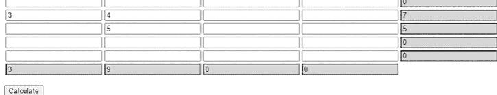

图 35.1 具有 5 行和 4 列的电子表格

为了输入表格大小，我们为用户提供以下简单的 Web 界面：

```html
<!DOCTYPE html>
<html>

<head>
    <title>Spreadsheet</title>
    <noscript>Please activate JavaScript!</noscript>
</head>

<body>
    <script src="spreadsheet.js"></script>

    <h1>Set Table Size</h1>
    <form>
        Rows:<br>
        <input id="rows" type="text" value="0"><p></p>
        Columns:<br>
        <input id="columns" type="text" value="0"><p></p>
        <input type="button" value="Create table"
            onclick="createTable()">
    </form>
</body>

</html>
```

当你点击“创建表格”按钮时，会调用 **spreadsheet.js** 文件中的 JavaScript 函数 **createTable()**。该函数如下所示：

```javascript
function createTable() {
    var num_rows = Number(document.getElementById('rows').
        value);
    var num_columns =
        Number(document.getElementById('columns').value);
    var i, f;
```

## 35.1 · 计数循环（for 和 for-of）

```javascript
5
6    document.write('<H1>Spreadsheet document</H1>');
7    document.write('<form><table>');
8
9    // Write cells
10   for(i = 1; i <= num_rows; i++) {
11     document.write('<tr>');
12     for(f = 1; f <= num_columns; f++) {
13         document.write('<td><input id="R', i, 'C', f, '" \n             type="text" value=""></td>');
14     }
15     // Add cell for sum column
16     document.write('<td><input id="SUM_R', i, '" \n         type="text" \n             value="" readonly="true" style="background-color: \n             #d1d1d1; "></td>')
17     document.write('</tr>');
18   }
19
20   // Add sum row
21   document.write('<tr>');
22   for(f = 1; f <= num_columns; f++) {
23     document.write('<td><input id="SUM_C', f, '" \n         type="text" \n             value="" readonly="true" style="background-color: \n             #d1d1d1;"></td>');
24   }
25   document.write('</tr>');
26
27   document.write('</table>');
28
29   document.write('<input type="hidden" id="nrows" \n       value="', num_rows,'">');
30   document.write('<input type="hidden" id="ncolumns" \n       value="', num_columns,'">');
31
32   document.write("<p></p>")
33   document.write('<input type="button" value="Calculate" \n       onclick="calculate()">');
34   document.write("</form>");
35 }
```

这段 JavaScript 代码为我们的电子表格创建了表格。简单的表格在 HTML 中具有以下形式：

```html
<table>
    <tr><td>Row 1, column 1</td><td>Row 1, column 2</td></tr>
    <tr><td>Row 2, column 1</td><td>Row 2, column 2</td></tr>
</table>
```

各个表格行由 **tr** 元素（*表格行*）表示，它们包含的单元格由 **td** 元素（*表格数据*）表示。

带有运行变量 **i** 的外部 **for** 循环（其循环头位于第 10 行）创建表格的行。在此循环体内是另一个 **for** 循环，其循环头位于第 12 行。这个带有运行变量 **f** 的“内层循环”为当前行（即“外部” **for** 循环中运行变量 **i** 所指示的行）写入数据，*为每一列*写入一个单元格。通过这种方式，两个嵌套的 **for** 循环完全“遍历”了矩形表格结构。

在第 16/17 行（此代码*不在*内层循环中！），为当前行写入了另一个单元格，作为“总计”列的一部分。类似地，在两个循环之外（第 24–28 行），使用另一个循环来写入“总计”行。

请注意，我们为值单元格赋予了 **RxCy** 形式的 ID，其中 **x** 是行，**y** 是单元格所在的列。汇总行或列的 ID 形式为 **SUM_Rx** 或 **SUM_Cy**。这种系统化的 ID 组合将使我们能够轻松访问各个单元格。

第 29/30 行的表单元素也在此处帮助我们：它们是 **hidden** 类型，本质上只是一个隐藏的信息存储库。我们在这里存储行数和列数，以便在求和时能够访问它们。

求和由 **calculate()** 函数处理，用户可以通过我们在第 33 行创建的按钮触发该函数。或者，你可以将该函数作为事件处理程序附加到各个单元格输入字段的 **change** 或 **input** 事件上；为此，你只需在第 13 行的相应输入元素的 **onchange** 或 **oninput** 属性中提供对 **calculate()** 函数的引用（试试看！）。

**calculate()** 函数的代码如下所示：

```javascript
1   function calculate() {
2       var num_rows =
3           Number(document.getElementById('nrows').value);
4       var num_columns =
5           Number(document.getElementById('ncolumns').value);
6       var i, f, sum, sum_column;
7
8       // Calculate row sums
9       for(i = 1; i <= num_rows; i++) {
10          sum_cell = document.getElementById('SUM_R' + i);
11          sum = 0;
12          for(f = 1; f <= num_columns; f++) {
13              sum = sum +
14              Number(document.getElementById('R' + i + 'C'
15              + f).value);
16          }
17          sum_cell.value = sum;
18      }
19
20      // Calculate column sums
21      for(f = 1; f <= num_columns; f++) {
22          sum_cell = document.getElementById('SUM_C' + f);
23          sum = 0;
24          for(i = 1; i <= num_rows; i++) {
25              sum = sum +
26              Number(document.getElementById('R' + i + 'C'
27              + f).value);
28          }
29          sum_cell.value = sum;
30      }
31  }
```

**calculate()** 首先从我们的两个 **hidden** 表单元素中查询行数和列数（第 2 和 3 行）。然后我们计算行总计（第 7–14 行）和列总计（第 17–24 行）。我们利用了值单元格的 ID 具有 **RxCy** 形式，而汇总行和列的单元格分别具有 **SUM_Rx** 和 **SUM_Cy** 形式的 ID 这一事实。

例如，在行总计的情况下，我们借助一个 **for** 循环（第 7 行）遍历所有行，并首先选择“总计”列的相应单元格（第 8 行）。之后，我们只需遍历各个值列（第 10 行），将包含的数字相加（第 11 行），并将总和写入该表格行的相应汇总单元格（第 13 行）。

❓ 35.1 [10 min]
什么样的两个 **for** 循环可以将我们的数组 **friends** 输出到控制台，其中

- 一个循环只显示每隔一个条目
- 另一个循环显示每个条目，但从后向前进行？

❓ 35.2 [60 min]
开发一个应用程序，用户首先可以使用滑块根据其红色、绿色和蓝色分量指定一种颜色。然后，基于此颜色，需要扩展一个着色表，使得每个表格单元格显示不同的颜色。在水平方向上，红色分量在总共 10 个步骤中增加到 255（根据 RGB 方案的最大值）。在垂直方向上，蓝色分量同样增加。绿色分量保持用户设置的值不变。

当用户移动其中一个滑块时，着色表应自动更新。

你完成的应用程序可能看起来像 🖼 图 35.2。

一些提示：

- 使用 **Number** 对象的 **toString()** 方法将十进制数转换为十六进制数，你需要以 HTML 标准格式 **#RRGGBB** 显示为 RGB 颜色值。**toString()** 的参数是要转换到的数字系统的基数，对于十六进制数是 **16**。
- 请记住，在 **#RRGGBB** 格式中，每个颜色部分必须始终有两位数字！小于 16 的数字会导致*一位*十六进制数。这些数字前面必须加上一个 0。
- 你计算的颜色分量必须是整数。为安全起见，请使用 **Math.floor(number)** 函数对它们进行四舍五入。此函数返回小于作为参数传递的数字的下一个整数。

#### 35.1.2 带有对象运行变量的 for 循环（for...of）

JavaScript 已知的 **for 循环**的第二种形式不是对数字运行变量进行递增或递减，而是遍历一组对象；运行变量的内容随后是适用于各自循环遍历的对象。

这样，上一节的示例可以这样编写：

```javascript
> friends = ['Peter', 'Sophie', 'Helen', 'Mike', 'Mohamed']
> i = 0;
for(myfriend of friends) {
    i++;
    console.log('Friend no. ', i, ':', myfriend)
}
```

我们需要自己递增变量 **i**。它不是循环的运行变量（那是 **myFriend**），而在这里仅用于为我们的控制台输出生成一个连续的编号。

这将给你以下输出：

```
Friend no. 1 : Peter
Friend no. 2 : Sophie
Friend no. 3 : Hellen
Friend no. 4 : Mike
Friend no. 5 : Fatih
```

因此，**for-of** 循环的一般形式是：

```javascript
for(runVariable of iterableObject) {
    // Code block that is repeated
}
```

我们在这里遍历的*可迭代对象*是一个数组。其他对象也可以是可迭代的；例如，一个表示地址的对象可以被设计成其属性（如街道名称、门牌号和邮政编码）是可迭代的，因此可以使用 **for-of** 循环进行遍历。然而，这需要超出入门级 JavaScript 的知识，因此超出了我们这里的范围。

顺便说一下，字符串（也可以用数组表示法访问（▶ 第 31.4 节））也是可迭代对象，可以用 **for-of** 循环遍历：

```javascript
for(character of 'Hello World!') {
    console.log(character);
}
```

请注意，在遍历 **for-of** 循环时，运行变量不是我们可迭代对象中当前循环遍历所适用元素的*副本*。它实际上是*元素本身*。因此，你在其 **for-of** 循环中对运行变量所做的更改会影响正在遍历的对象！

### 35.2 条件循环（while 和 do-while）

JavaScript 中有两种条件循环：**while** 循环和 **do-while** 循环。**while** 循环是*头部控制*的，即在循环开始时检查条件，因此如果条件从一开始就不满足，则根本不会执行循环。**do-while** 循环是*尾部控制*的。它无论如何至少会执行一次；在第一次运行结束时，会检查条件以确定是否应再次运行循环，以及后续每次循环是否运行。

这两种循环通常具有以下结构：

```
while (condition) {
    // 重复执行的代码块
}
```

以及

```
do {
    // 重复执行的代码块
}
while (condition)
```

例如，我们可以使用 **while** 循环来输出上一节中的 **friends** 数组：

```
> friends = ['Peter', 'Sophie', 'Helen', 'Mike', 'Mohamed']
> i = 0;
    while(i <= friends.length - 1) {
        console.log('Friend no. ', i+1, ': ', friends[i]);
        i = i + 1;
    }
```

使用 **do-while** 的写法可能如下所示：

```
i = 0;
do {
    console.log('Friend no. ', i+1, ':', friends[i]);
    i = i + 1;
}
while(i <= friends.length - 1)
```

只有当你能安全地假设循环的运行条件在第一次执行时就会满足时，才应使用 **do-while** 循环；在这里，这不是问题，因为我们知道面前的数组不是空的。

在我们的示例中，我们使用了 **while** 和 **do-while** 循环来解决一个通常会使用 **for** 循环的任务，因为借助数组的 **length** 属性可以轻松确定运行次数。条件循环通常在执行依赖于一个通用条件，且运行次数不一定能预先确定时使用。然而，我们的示例很好地说明了我们之前遇到的一个原则：任何可以用计数循环解决的问题，也可以用条件循环解决，因为如有疑问，你也可以将一个你手动递增的数值运行变量的值作为条件进行检查，就像我们在示例中所做的那样。从这个意义上说，*计数*循环是*条件*循环的一种特殊形式，即其条件检查一个运行变量，而计数循环也贴心地负责了该变量的初始化和递增。

### 35.3 [10 分钟]
编写本节中 **while** 循环的另外两个版本，将我们的数组 **friends** 输出到控制台，其中
(a) “运行变量” i 初始化为 1（而不是 0）
(b) 条件中使用小于运算符（而不是小于等于运算符）。

### 35.4 [30 分钟]
开发一个函数 **countCells()**，该函数可选择性地计算我们的电子表格应用程序从 ▶ 第 **35.1.1** 节创建的表格的行数或列数。使用 **while** 循环遍历单元格的 ID。利用 **document.getElementById()** 函数在找不到具有指定 ID 的元素时返回 **null** 这一特性。
如果你在这里开发的函数能被我们的 **calculate()** 函数用来获取行数和列数，而我们没有通过 HTML 文档页面源代码中的 **hidden** 元素将其作为信息“缓存”起来，那将会很有用。

### 35.3 总结

在本章中，我们学习了如何在 JavaScript 中使用计数循环（**for**、**for-of**）和条件循环（**while**、**do-while**）来重复执行代码。
请务必掌握本章的以下要点：

- 在 JavaScript 中，计数 **for** 循环的形式为 **for(initialization; check; increment) { statements }**。这里，一个在开始时初始化为某个值的数值运行变量，在每次循环遍历前根据递增语句进行更改，并检查新值是否满足检查条件。如果满足，则执行后续的语句块；如果不满足，则程序执行将继续到循环之后，运行变量保留上次递增前的值。
- 运行变量也可以递减，即运行变量在每次循环遍历中变小。
- 增加或减少一可以通过自增运算符 ++ 和自减运算符 -- 以 **variable++** 或 **variable--** 的形式实现。
- 形式为 **for(runVariable of iterableObject) { statements }** 的 **for-of** 循环可用于遍历其元素可迭代的对象，即这些对象可以被 JavaScript 排成任何顺序，例如数组。在这种情况下，运行变量不是数值，而是当前循环遍历所适用的可迭代对象的元素。对运行变量的更改会影响正在遍历其元素的可迭代对象。
- 条件循环可以是头部驱动的，形式为 **while(condition) { statements }**，也可以是尾部驱动的，形式为 **do { statements } while(condition)**。后一种类型的循环至少会运行一次，因为条件直到结束时才被检查。

### 35.4 练习解答

■ 练习 35.1
一个只显示数组中每隔一个条目的循环可能如下所示：

```
for(i = 0;i <= friends.length-1; i=i+2) {
    console.log('Friend no. ', i+1, ':', friends[i]);
}
```

一个在显示数组条目时从后往前进行的循环可能如下所示：

```
for(i = friends.length-1; i >= 0; i--) {
    console.log('Friend no. ', i+1, ':', friends[i]);
}
```

■ 练习 35.2
我们的阴影表格应用程序的界面可以用 HTML 代码设计如下：

```
<!DOCTYPE html>
<html>

    <head>
        <title>Color Table</title>
        <noscript>Please activate JavaScript!</noscript>
    </head>
    <body>

        <script src="colortable.js"></script>

        <form>
            <p>Red: <input id="red" type="range" min=0
                max=255 value="0" onchange="colorsNew()"><p>
            <p>Green: <input id="green" type="range" min=0
                max=255 value="0" onchange="colorsNew()"><p>
            <p>Blue: <input id="blue" type="range" min=0
                max=255 value="0" onchange="colorsNew()"><p>
        </form>

        <table id="colortable">

        </table>

    </body>

</html>
```

为此，JavaScript 文件 **colortable.js**：

```
function colorsNew() {
    var colorRed = Number(document.getElementById('red').value);
    var colorGreen = Number(document.getElementById('green').
        value);
    var colorBlue = Number(document.getElementById('blue').
        value);
    var tab = document.getElementById('colortable');
    var i,f, colorValue, stepRed, stepBlue;

    stepRed = Math.floor((255-colorRed)/10);
    stepBlue = Math.floor((255-colorBlue)/10);
    tableHTML = "";

    for(i = 1; i <= 10; i++){
        tableHTML = tableHTML + '<tr>';

        for(f = 1; f <= 10; f++) {
            colorRedNew = (colorRed + i*stepRed).toString(16);
            colorGreenNew = colorGreen.toString(16);
            colorBlueNew = (colorBlue + f*stepBlue).toString(16);

            if(colorRedNew.length == 1)
                colorRedNew = '0' + colorRedNew;
            if(colorGreenNew.length == 1)
                colorGreenNew = '0' + colorGreenNew;
            if(colorBlueNew.length == 1)
                colorBlueNew = '0' + colorBlueNew;

            colorVal = "#" + colorRedNew + colorGreenNew + colorBlueNew;
            tableHTML = tableHTML + '<td style="background-color: '
                +
                colorValue + '; color: ' + colorValue + '">xxxx</
td>';
        }
        tableHTML = tableHTML + '</tr>';
    }
    tab.innerHTML = tableHTML;
}
```

#### 练习 35.3

(a) 一个从 1 开始遍历数组的 **while** 循环：i = 1;

```
while(i <= friends.length) {
    console.log('Friend no. ', i, ':', friends[i-1]);
    i = i + 1;
}
```

(b) 一个遍历数组并在运行条件中使用小于运算符的 **while** 循环：

```
i = 0;
while(i < friends.length) {
    console.log('Friend no. ', i+1, ':', friends[i]);
    i = i + 1;
}
```

#### 练习 35.4

函数 **countCells()** 可能如下所示：

```
function countCells(columnRow = 'column') {
    var num = 0;
    var id;

    do {
        num = num + 1;
        if(columnRow == 'column') {
            id = 'R1C' + num;
        }
        else {
            id = 'R' + num + 'C1';
        }
    }
    while(document.getElementById(id) != null)

    return num - 1;
}
```

我们在这里使用了一个参数 **columnRow**，其默认值为 "**column**"，用于指定是返回列数还是行数。然后通过在 **do-while** 循环中组合单元格 ID（我们在此假设至少存在一列或一行，这样我们也可以在循环结束时测试运行条件）并尝试使用 **getElementById()** 选择这些单元格来确定数量。如果由于单元格不存在而失败，**getElementById()** 将返回 **null**，循环结束。然后在循环中递增的行/列数 **num** 就是函数的返回值。

## 调试与错误处理：如何以结构化方式搜索和修复错误？

目录

- 36.1 运行时错误处理 – 544
- 36.2 开发过程中的故障排除 – 546
- 36.3 总结 – 550

© 作者，经 Springer Fachmedien Wiesbaden GmbH（Springer Nature 旗下）独家许可，2024
J. L. Zuckarelli, *Learn coding with Python and JavaScript*, https://doi.org/10.1007/978-3-658-42912-6_36

## 概述

在结束 JavaScript 入门介绍之际，我们转向一个虽不讨喜但至关重要的主题：调试与错误处理。总体而言，在处理运行时错误方面，JavaScript 比其他编程语言更为健壮。因此，在其他语言中程序会因错误消息而中止的地方，JavaScript 会继续运行。然而，这仅仅使得运行时错误的处理*看起来*更容易；作为程序员，你仍然必须预见并处理特殊、异常的情况。

在整个开发过程中，为了调试目的，现代浏览器提供的开发者工具包含若干有用的功能，你应该充分利用它们。

在本章中，你将学到：

- JavaScript 如何处理运行时错误，以及这对你作为程序员意味着什么
- 如何捕获异常
- 如何使用浏览器调试工具查找程序中的错误，特别是如何设置断点、监视变量以及以单步模式运行程序

### 36.1 运行时错误处理

在 JavaScript 中，导致程序终止的运行时错误比在许多其他编程语言中更少见。原因是 JavaScript 以不同方式处理了在其他语言中会抛出异常的情况，并寻求一种不那么剧烈的解决方案。例如，如果你用 `Math.sqrt(-1)` 计算负数的平方根，返回值就是 **NaN**——*非数字*。如果你将一个数除以 0，你会得到 **Infinity**（如果被除数是负数，则得到 **-Infinity**）。如果你想将一个非数字的字符串转换为数字（例如使用 `Number("abc")`），这种转换同样会产生 **NaN**。在所有这些情况下，许多其他编程语言会停止服务并抛出异常。JavaScript 则不然。它固执地继续运行，仅通过执行操作的结果来表明事情并未完全按计划进行。

乍一看，这种错误处理方式对你作为程序员来说是件好事，因为它降低了你的程序因某个奇怪的异常而完全失控的风险。然而，不抛出异常当然并不意味着你的程序会做它应该做的事情；毕竟，在用户将一个实际上并非数字的所谓数字输入转换为数字并因此产生 **NaN** 值之后，你的 JavaScript 代码是否仍能产生有用的结果，目前还是个疑问。因此，作为开发者，你必须通过适当的检查来确保你的程序能够真正应对所有可想象的情况——即使并且特别是当这些情况*不*导致异常时。

当然，JavaScript 中也可能发生异常。例如，如果你对一个数字变量调用 **toLowerCase()** 方法（将字符串转换为小写），你将得到一个异常，就像如果你尝试在脚本中（例如我们上一章的电子表格示例）访问一个实际上并未分配给网页任何元素的 ID 的 HTML 元素时一样。然而，这类错误通常不是由仅在运行时发生的情况引起的，而是可以在开发过程中被检测和纠正的——至少通过充分的测试。在对抗此类错误的斗争中，浏览器开发者工具中的调试功能是特别重要的帮手。我们将在下一节中讨论它们。

尽管异常在 JavaScript 中不如在许多其他语言中重要，但 JavaScript 也支持 Try-Catch 结构。它具有以下语法，因此，如果你记得我们在 ▶ 第 **16.2** 节中的讨论，它具有非常“经典”的结构：

```
try {
    // 被“尝试”的代码
}
catch(err) {
    // 错误处理代码
}
finally {
    // 无论如何都会执行的代码
}
```

**catch** 接受一个错误对象作为参数，你可以从中提取各种信息，最值得注意的是错误名称（在 **name** 属性中）和错误消息（在 **message** 属性中）。如果你特别想知道异常是在代码的哪一行抛出的，你可以查询 **err** 对象（或者你在脚本中想给 **catch()** 的参数起的任何名字）的 **line** 属性。

顺便说一句，你也可以借助 **throw** 语句自己创建异常。例如，你可以使用异常来测试在除以两个数时被除数是否为 0：

```
var a = 10, b = 0;

try {
    if(b == 0) throw new
        Error('Division by 0 is impossible!');
}
catch(myError) {
    console.log('An error occurred: ', myError.message);
}
```

当然，如果你不捕获自己的异常，你会在浏览器的 JavaScript 控制台中得到一个程序中止，并附带一个相当戏剧性的错误消息，这正符合一个真正异常的特征！

### 36.2 开发过程中的故障排除

为了在开发过程中进行调试，现代浏览器通常提供一些我们已经在 ▶ 第 29.2.1 节中了解过的工具。这些工具包括断点、变量监视和单步执行。

尽管我们在本节中经常参考 Google Chrome 中的情况，但你会发现几乎所有其他现代浏览器中都有相同或非常相似的工具。甚至功能和工作方式也常常极其相似。

为了让以下讨论更生动一些，请考虑以下网页示例，用户可以在其中输入一个数字并点击一个按钮：

```html
<!DOCTYPE html>

<html>

    <head>
        <title>Script with errors</title>
        <noscript>Please activate JavaScript!</noscript>
    </head>

    <body>
        <script src="witherror.js"></script>
        <form>
            <p>Number: <input type="text" id="number"></p>
            <p><span id="result"></span></p>
            <p></p>
            <input type="button" value="Calculate"
onclick="calculate()">
        </form>
    </body>

</html>
```

为了输出计算结果，我们创建了一个 ID 为 result 的 span 元素。在网页中，我们引入了脚本 witherror.js，其中也包含了点击按钮时触发的 calculate() 函数。它看起来像这样：

```javascript
function calculate() {
    var num = Number(document.getElementById('number').value);
    num = Math.round(num);
    num = Math.sqrt('num');
    var result = document.getElementById('result');
    result.innerHTML = 'Root: ' + num;
}
```

如你所见，我们在这里所做的不过是读取用户输入的数字，将其四舍五入为整数，然后计算其平方根。我们将结果输出到我们的 **span** 元素上。到目前为止，一切顺利。

如果你现在在浏览器中打开该网页，输入一个数字并点击按钮，你会在网页的 **span** 元素 **result** 上看到输出 **NaN**。因此，计算结果显然不是一个数字。为了查明问题所在，你当然可以研究程序代码，也许你已经注意到了错误（这当然是完全故意的）；或者你可以简单地在程序代码中加入适当的输出语句（如 **console.log(num)**），在每次操作后显示我们在整个脚本中使用的变量 **num**。当然，无论哪种方法都能让你找到问题，即使你没有浏览器中的调试工具可用。临时在程序代码中插入输出语句可能是所有调试方法中最流行的一种，因为它既简单又有效。然而，特别是如果你怀疑出错的代码段很长，你可能需要大量的调试输出，或者你可能需要将输出逐步地、越来越远地移过代码段，直到找到你问题实际所在的有趣位置。这很乏味。正是在这种情况下，值得使用浏览器提供的调试工具，这也是我们现在将要使用的。

如果你在开发者工具中点击“Sources”标签页，然后选择你的 JavaScript 文件，你将在开发者工具区域的中间看到其内容。你可以在图 36.1 中看到这一点。

在开发者工具区域的右侧部分，你会看到几个可展开和折叠的子区域，包括“Breakpoints”子区域。如果你点击代码显示前的行号，就会在此处设置一个*断点*。如果你现在执行 JavaScript 代码，在我们的示例中是通过点击网页上的按钮，JavaScript 代码将被处理，直到达到断点。然后会出现如图 36.2 所示的情况。程序的执行现在在第 3 行执行之前停止。在“Scope”子区域中，你可以看到当前作用域中存在的变量及其值，在我们的例子中是变量 **num**，其值为 36。所以，显然这里一切正常。我们可以将断点进一步向下移动到代码中，并让程序执行到下一个断点。图 36.3 显示了程序在另一个断点处的状态，即在第 6 行。在这里，我们从右侧的“Scope”子区域看到，**num** 此时已经假定了值 **NaN**。

## 第36章 - 调试与错误处理：如何查找和修复错误...

那么，在第3和第4行一定发生了什么。当然，仔细观察立刻就能发现错误的根源：在第4行，函数 **Math.sqrt()** 接收的参数不是变量 **num**，而是一个字符串 **'num'**（你之前注意到了吗？）。显然，无法从字符串计算平方根；但由于JavaScript具有相对较好的容错性，如前所述，**Math.sqrt()** 只是返回 **NaN**，而不是抛出异常。

除了移动断点，你还可以从第一个断点开始逐步执行程序。每次你按<F9>（“单步执行”）时，下一个程序语句就会被执行。这样，你就能轻松发现问题出在第5行。

## 36.2 · 开发过程中的故障排除

一个有趣的调试器功能是添加*事件监听器*的可能性。这可以在图36.4所示的相应子区域中完成。在这里，你可以选择设置一个事件断点，即每当发生特定事件（例如鼠标点击）时触发的断点。在事件驱动的程序流程中，这种断点变体是附加到特定行的断点的有用替代方案，特别是当你有许多事件处理器响应特定类型的事件时。

因此，断点对于诊断错误非常有用。如果你想从断点继续执行程序，请点击调试区域右侧上方工具栏中的播放按钮。

在右侧的第一个子区域“监视”中，你可以设置*变量监视*，即输入你希望监控其值的表达式，并在程序执行在断点处停止时仔细查看。你在这里输入的表达式不必是简单的变量，就像我们的例子中只监视变量 **num** 的值一样，你也可以输入更复杂的表达式，例如 **Math.sqrt(num)>2.8**（一个布尔表达式）。

### 36.3 总结

在JavaScript部分的最后，我们探讨了错误诊断和处理。
请务必从本章掌握以下要点：

- JavaScript对运行时错误具有相对较强的鲁棒性，因此很少以错误消息终止。然而，这并不能免除程序员确保程序在异常情况下也能执行其预期功能的责任。
- Try-Catch结构也提供了一种在JavaScript中捕获异常的方法；当异常发生时，**catch()** 语句会自动接收一个错误对象，你可以对其进行评估以了解更多关于异常的信息。
- 几乎所有现代浏览器的开发者工具都提供了多种有用的调试功能，用于在开发过程中诊断错误；这些调试功能特别包括用于处理断点、观察变量内容以及以单步模式执行程序的功能。此外，事件监听器提供了将断点与事件本身的出现相关联的可能性。
- 在实践中，最常用的“调试工具”可能是 **console.log()** 函数。以这种方式生成的输出在许多情况下可以帮助追踪错误的原因；与它们相比，开发者工具的调试工具在错误来源线索仍然很少时尤其（但不仅限于）显示出其优势。

## 补充信息

索引 - 553

© 作者，根据与Springer Fachmedien Wiesbaden GmbH（Springer Nature旗下）的独家许可，2024
J. L. Zuckarelli, *通过Python和JavaScript学习编程*,
https://doi.org/10.1007/978-3-658-42912-6

## 索引

### A
- Airbnb JavaScript风格指南, 416
- 算法, 6, 7, 10, 11, 17, 22
- 艾伦, 保罗, 15
- 分析机, 5, 26
- 与（逻辑运算符）, 163–166
- AngularJS（JavaScript框架）, 149, 509
- 应用程序编程接口（API）, 149–150
- 参数（函数）, 138
  - 默认值, 140
  - 关键字参数, 141
  - 可选, 140
  - 按引用传递, 142
  - 按值传递, 142
  - 位置参数, 141
- 参数（函数）（JavaScript）, 500–504
  - 默认值, 502
  - 函数作为参数, 502
  - 可选, 502
  - 按值传递, 500
  - 按引用传递, 500
- 参数（函数）（Python）, 329–334
  - 默认值, 331
  - 不定数量的参数, 331
  - 关键字, 330
  - 可选, 331
  - 位置, 330
  - 类型提示注解, 333
- 数组, 92–95
  - 元素, 93
  - 索引, 93
  - 多维, 93
  - 字符串作为数组, 95
- 数组（JavaScript）, 433–440
  - 创建, 433
  - 长度, 435
  - 合并, 437
  - 修改, 436
  - 选择元素, 433, 434
  - 排序, 438
- 人工智能（AI）, 8, 10
  - 伦理考量, 10
  - 专家系统, 11
  - 通用/强人工智能, 9
  - 图像识别, 10
  - 在判断和决策中, 9
  - 机器学习（参见机器学习）
  - 社会辩论, 9
  - 模型训练, 11
  - 弱人工智能, 8
- 自动补全, 54, 244
- 自动语法检查, 54

### B
- 巴贝奇, 查尔斯, 5, 19, 26
- 批处理模式（代码执行）, 68
- 伯纳斯-李, 蒂姆, 404
- 布尔, 乔治, 86, 241
- 宝兰公司, 55
- 拜伦, 奥古斯塔·阿达, 5, 19, 33

### C
- 层叠样式表（CSS）, 406
- ChatGPT, 9, 62, 77, 147, 224
- 类, 99
  - 访问权限, 107–108
  - 属性/特性, 98, 99
  - 构造函数, 105
  - 定义, 99
  - 层次结构, 101
  - 继承, 100, 105
  - 实例, 99
  - 方法（参见方法）
- 类（JavaScript）参见对象（JavaScript）
- 类（Python）, 244, 264–268, 339
  - 属性, 244–248
  - 构造函数, 251, 265
  - 层次结构, 341
  - 继承, 266–268
  - 实例, 244, 246
  - 方法（参见方法（Python））
  - 名称修饰, 268
- Claude, 62, 77
- 代码块, 73, 139, 157, 160
- 代码块（JavaScript）, 494
- 代码块（Python）, 226, 227
- 代码编辑器, 53
- 代码编辑器（具体）, 53
  - Atom, 53
  - Notepad++, 53, 401
  - Sublime Text, 53, 400
  - Vim, 53
  - Visual Studio, 401
  - Visual Studio Code, 53
- 代码执行, 66
  - 批处理/脚本模式（参见批处理模式（代码执行））
  - 交互模式（参见交互模式（代码执行））
- 注释, 43, 72, 76
- 注释（JavaScript）, 416
  - 行内注释, 416
  - 多行, 416
  - 单行, 416
- 注释（Python）, 230–231
  - 记录未完成任务, 231
  - 行内, 230
  - 在PyCharm中, 231
- 比较运算符, 161
- 编译器, 20, 24, 26, 52, 54, 67
  - 字节码编译器, 25
  - 即时编译器（JIT编译器）, 25
- 条件循环, 185–189
  - 示例, 186
  - 与计数循环的关系, 188
  - 运行条件, 185
  - 类型, 185
- 条件循环（while, do-while）（JavaScript）, 536–537
  - 条件, 536
  - 尾控制, 536
  - 头控制, 536
- 条件循环（while）（Python）, 372–374
- 条件运算符（JavaScript）, 518
- 控制台应用程序, 115, 124–126
- 控制台（JavaScript）, 409, 454
- 控制台（Python）, 209
- 常量, 92
- 控件（用户界面）, 116
  - 按钮, 118
  - 复选框, 118
  - 组合框, 122
  - 编辑字段, 117
  - 列表视图/列表框, 120
  - 选择器, 120
  - 单选按钮, 118
  - 滑块, 119
  - 切换按钮, 119
  - 树视图, 120
- 转换（变量）, 88–89
  - 显式, 88
  - 隐式, 88–89
- 计数循环, 179–185
  - 示例, 182
  - 提前退出, 184
  - 嵌套循环, 183
  - 与条件循环的关系, 188
  - 遍历数组, 180
  - 循环变量, 179, 180
- 计数循环（for）（JavaScript）, 528–534
  - 在循环中更改对象循环变量, 535
  - 示例, 529
  - 数值循环变量, 528
  - 对象作为循环变量, 534–535
- 计数循环（for）（Python）, 366–370
  - 示例, 368
  - 列表推导式表达式（参见列表推导式表达式）
  - 嵌套, 370–371
  - 循环变量, 366
- CPython, 208

### D
- 深色模式, 53
- 数据类型, 83–89
  - 基本, 84
  - 布尔, 86
  - 字符, 85
  - 转换（参见转换（变量））
  - 日期, 87
  - 枚举, 87
  - 因子, 88
  - 浮点数, 84
  - 整数, 84
  - 逻辑, 86
  - 精度, 84
  - 范围, 83
  - 集合, 88
  - 字符串, 85
  - 时间, 87
- 数据类型（JavaScript）, 421–430
  - 数组（参见数组（JavaScript））
  - 布尔（逻辑值）, 427–428
  - 基本数据类型, 421–430
  - 无穷大, 422
  - NaN, 429
  - null, 428
  - 数字（整数和小数）, 421–423
  - 字符串（参见字符串（JavaScript））
  - undefined, 428
- 数据类型（Python）, 238–244
  - 关联数组（参见字典（Python））
  - 基本数据类型, 238–244
  - bool（逻辑值）, 241–242
  - 复合数据类型, 251–264
  - 字典, 259
  - float（小数）, 239
  - int（整数）, 239
  - 列表（参见列表（Python））
  - None/NoneType, 242–243
  - 有序数据类型, 251, 258
  - 集合, 262

索引

- str（文本）（*参见* String (Python)）
- tuple，258（*另请参阅* Tuple (Python)）
- 无序数据类型，260，262

调试器 *参见* 调试

调试，55，194
- 算法错误，194
- 断点，198
- 调试器，197
- 开发时错误，194
- 运行时错误，195–196
- 异常（*参见* 异常）
- 方法，197–199
- 单步模式，198
- 语法错误，194
- try-catch 结构（*参见* Try-catch 结构）
- 变量监视，198

调试与错误处理（JavaScript）
- 浏览器中的调试工具，546
- 事件监听器，549
- 处理异常（*参见* Try-catch 结构 (JavaScript)）
- 使用断点，547
- 使用变量监视，550

调试与错误处理（Python），382–386
- 逐步执行代码，389–390
- 处理异常（*参见* Try-except 结构 (Python)）
- 使用断点，386–388
- 使用变量监视，388–389

字典，96

字典 (Python)，259–262
- 添加元素，261
- 创建，260
- 删除元素，261
- 提取键/值，261
- 键，260
- 嵌套，260
- 选择元素，260
- 值，260

分发 *参见* 库

Django（框架），204

Django（Python 框架），149

文档（代码），78
- 文档生成器，78
- doxygen，78
- Javadoc，78，79
- phpDocumentor，78
- roxygen，78

文档（代码）（Python），232–234
- autodoc，233
- docstring，232
- doxygen，233
- 函数注解，233，333
- pydoc，233
- pydoctor，233

E

Eich, Brendan，396

Embarcadero，52

转义序列，85
- 在 Python 中，278

事件，116，123，168–172
- 事件处理器，169

事件 (JavaScript)，520–523
- 通过 on-event 属性分配事件处理器，521
- 使用 addEventListener() 分配事件处理器，522
- 事件监听器（*参见* 调试与错误处理 (JavaScript)）
- 事件对象，521
- 键盘事件，523
- 鼠标事件，522
- 输入元素的 on-event 属性，520

事件驱动编程（编程范式），169

事件 (Python, tkinter)，305–308
- 回调函数，306
- 事件处理器，306，361
- 键盘事件，307
- 鼠标事件，307

异常，195

异常 (JavaScript) *参见* Try-catch 结构 (JavaScript)

异常 (Python) *参见* Try-except 结构 (Python)

F

Facebook，23

功能（代码编辑器和 IDE），54
- 自动补全（*参见* 自动补全）
- 自动语法检查（*参见* 自动语法检查）
- 调试，54，55
- 图形用户界面设计，54
- 语法高亮（*参见* 语法高亮）

字段（变量）
- 关联（*参见* 字典）
- 有序（*参见* 数组）

文件（用于输入和输出），126
- 访问模式，127
- 二进制，128
- 文件结束符 (EOF)，128
- 文件指针，128
- 文件变量/对象，129
- 文本，128

文件（用于输入和输出）(Python)，315
- 访问模式，315
- 追加模式，315
- 关闭文件，317
- 文件对象，315
- 文件指针，315
- 打开文件，315
- 读取模式，316
- 从文件读取，316
- 写入模式，315
- 写入文件，316

文件系统访问 (Python)，369

流程控制，154，155
- 条件，155，160–166
- 事件（*参见* 事件）
- if-else 结构（*参见* If-else 结构）
- switch-case 结构（*参见* Switch-case 结构）

流程控制 (JavaScript)
- 复合条件，517
- 条件，517
- 事件（*参见* 事件 (JavaScript)）
- if-else 结构（*参见* If-else 结构 (JavaScript)）
- switch-case 结构（*参见* Switch-case 结构 (JavaScript)）

流程控制 (Python)，354–356
- 复合条件，358–359
- 条件，355
- 事件（*参见* 事件 (Python, tkinter)）

框架，148–149
- 与库的区别，148
- 控制反转，149
- 流行示例，149

框架 (JavaScript)，509

函数，138–145
- 参数（*参见* 参数）
- 函数体，139
- 定义，139，140，143
- 函数头，139
- 作为对象，144
- 在面向对象编程中（*参见* 方法）
- 返回值，138
- 副作用，142

函数 (JavaScript)，494–506
- 匿名，498
- 参数（*参见* 参数 (JavaScript)）
- 使用参数调用函数，501
- 定义，494
- 作为对象，495
- 返回值，499–500
- 变量作用域（*参见* 变量 (JavaScript)）

函数 (Python)，328–339
- 参数（*参见* 参数（函数）(Python)）
- 函数体，329
- 定义，328–329
- 函数头，329
- 返回值，334–335
- 变量作用域（*参见* 变量 (Python)）
- 副作用，337

G

垃圾回收 (Python)，238

Gates, Bill，15

Gemini，62，77

生成式人工智能，62

几何管理器 (Python, tkinter)，299–305
- grid 管理器，300，302–305
- pack 管理器，299–302
- place 管理器，300，305
- 角色与功能，299

Git，146

GitHub，146

Google，23，55

Google JavaScript 风格指南，416

图形用户界面 (GUI)，54，115–124
- 控件（*参见* 控件（用户界面））
- 开发，122–124
- 菜单，118

H

Hamilton, Margaret，9，20

哈希 *参见* 字典

Hello world 程序，68
- 在 JavaScript 中，409–412
- 在 Python 中，281

帮助，60
- 函数参考，60
- 语言参考，60
- Stack Overflow（*参见* Stack Overflow）
- 教程，60

帮助 (JavaScript)，401
- Mozilla 基金会文档，401
- 语言规范，401
- Stack Overflow，401

帮助 (Python)，211
- 语言参考，212
- 库参考，212
- Stack Overflow，211

Hohmann, Joachim，27

Hopper, Grace，20，27

Houston, Drew，15

超文本标记语言 (HTML)，404
- 属性，405
- 文档对象模型 (DOM)，405，460–461
- 表单（*参见* 使用表单的输入 (JavaScript)）
- HTML 文档结构，405
- 标签，405
- 万维网联盟 (W3C)，404

I

标识符，74

IDLE (Python IDE)，209，223

If-else 结构，155–161
- 嵌套，166
- 简单，155

If-else 结构 (JavaScript)，516–519

If-else 结构 (Python)，354–361
- 替代条件 (elif)，359–361
- 嵌套，356–357
- 简单，354

索引 (JavaScript)，433

索引 (Python)，252

输入与输出，114–115
- 形式，115
- 通过数据库，131–134
- 通过文件（*参见* 文件）
- 通过图形用户界面（*参见* 图形用户界面 (GUI)）
- 通过控制台（*参见* 控制台应用程序）

输入与输出 (JavaScript)，453–454
- 通过网页（*参见* 输出到网页 (JavaScript)）
- 通过对话框，457–458
- 通过控制台，454–457
- *另请参阅* 使用表单的输入 (JavaScript)

输入与输出 (Python)，278–280
- 通过文件，315–317
- 通过图形用户界面，280–315
- 通过控制台，278–280

使用表单的输入 (JavaScript)，470–476
- 从 JavaScript 访问表单，472–476
- 示例，476–488
- 输入元素，471
- 密码输入，471
- 只读输入元素，472
- 必填输入元素，472
- 将数据发送到服务器，472
- 设置 HTML 表单，470–472
- 提交按钮，471
- 输入元素类型，471

集成开发环境 (IDE)，54

集成开发环境（具体），55
- Android Studio，55
- AppCode，58
- Aptana Studio，58
- C++ Builder，58
- CLion，58
- Eclipse，58
- IntelliJ IDEA，58
- JBuilder，58
- Komodo IDE，58
- NetBeans，55，58，400
- Padre，58
- PhpStorm，58
- PyCharm，55，58
- QT Creator，58
- RAD Studio，55
- Rcommander，58
- Rodeo，58
- RStudio，55，58
- RubyMine，58
- SharpDevelop，58
- Spyder，58
- Thonny，58
- Visual Studio，55，58
- Visual Studio Tools for Office (VSTO)，58
- WebStorm，58，400
- Xcode，58
- Zend Studio，58

交互模式（代码执行），67

交互模式 (Python)，209，221–222

解释器，24，26，52，54，67

解释器 (JavaScript)，400

J

Jacquard, Joseph-Marie，5

提花织机，5

JavaScript，396
- ActionScript，396
- 应用领域，396
- 社区，508
- ECMAScript，396
- 嵌入网页，404–409
- 历史，396
- 通过嵌入源代码将代码集成到网页，408
- 通过链接到代码文件将代码集成到网页，407
- JScript，397
- LiveScript，396
- 代码执行的安全方面，408–409
- 标准化，396
- TypeScript，396
- 源代码的可见性，409

JavaScript 对象表示法 (JSON)，445–446

JavaScript 标准风格指南，416

JetBrains，55

## 索引

jQuery（JavaScript 库），509
JS Bin（JavaScript 网络服务），401，411，412
JS.do（JavaScript 网络服务），401，412
Jupyter，223
- 计数循环（for）（参见 计数循环（for）（Python））
- 退出，375
- 头部控制，372

### K

Kay, Alan，98
Keras（Python 库），204

### L

大型语言模型（LLMs），62
库，145–148
- 中心平台，146
- 查找，146
- 导入程序，148
- 安装，148
库（JavaScript）参见 模块（JavaScript）
换行（Python），278
行缩进，73
列表推导式，371–372
列表（Python），251–258
- 追加元素，254
- 更改列表元素，254
- 冒号运算符，253
- 删除元素，255
- 确定长度，256
- 连接列表，256
- 选择元素，252–253
- 排序，255
- 子列表，256–258
Llama，62
逻辑运算符，163–166
逻辑编程（编程范式），32
循环（JavaScript），528–535
- 条件循环（while）（参见 条件循环（while, do-while）（JavaScript））
- 继续下一次运行，529
- 计数循环（for）（参见 计数循环（for）（JavaScript））
- 提前退出，529
循环，178–179
- 条件循环（参见 条件循环）
- 计数循环，179
- 脚部控制，185
- 脚部控制循环，186
- 头部控制，185，186
- 类型，179
循环（Python），366–372
- 条件循环（while）（参见 条件循环（while）（Python））
- 继续下一次运行，376

### M

机器语言，20，24，26，52
机器学习，11
宏，14
映射 参见 字典
Menabrea, Federico Luigi，5
方法，103–105，144
方法（Python），244，339
- 构造函数，341（另见 类（Python））
- 默认构造函数，341
- 重载，340
- 标准输出方法，341
Microsoft，55
Microsoft Office，23
Microsoft Windows，23
助记符，26
模块（JavaScript），506–509
- 搜索，508–509
- 从 GitHub 获取，508
- 从 javascripting.com 获取，509
模块（Python），342–348
- 导入选定类，344
- 导入模块全部内容，344
- 导入整个模块，345
- 搜索，345–348
模块 参见 库
Monty Python，204

### N

NaN（JavaScript），517，544
- 另见 数据类型（JavaScript）
NASA，9，23
神经网络，10
Node.JS（JavaScript 框架），397
NOT（逻辑运算符），163–166
null（JavaScript），517
- 另见 数据类型（JavaScript）
NumPy（Python 库），204，243

### O

对象（JavaScript），441
- 作为关联数组，443
- 构造函数，441
- 构造函数，444–445
- 通过调用构造函数创建，444
- 通过直接赋值创建，442
- 通过使用构造函数创建，444–445
- 继承，441
- JSON 格式（*参见* JavaScript 对象表示法（JSON））
- 方法，441，443
- 对象构造函数，444
- 属性，441，443
- 原型，441
- 静态属性，441

面向对象编程（OOP）（JavaScript），441

面向对象编程（OOP）（编程范式），32，97，144
- 属性，32
- 方法，32

面向对象编程（OOP）（Python），244，264–268，339–342

对象（Python）*参见* 类（Python）

OpenAI，9，62

运算符（JavaScript），422
- 比较运算符，517
- 条件运算符（*参见* If-else 结构（JavaScript））
- 递减，422
- 递增，422
- 递增运算符，529
- 取模，422

运算符（Python），355
- 赋值运算符，355
- 比较运算符，355
- 逻辑运算符，355，358，517

OR（逻辑运算符），163–166

os（Python 模块），371

输出到网页（JavaScript），458–460
- 添加 HTML 元素，468
- 更改 HTML 元素的属性，467
- 删除 HTML 元素，470
- 文档层次结构，463–465
- 注入 HTML 代码，466
- 查询 HTML 元素的属性，464
- 通过 CSS 类选择 HTML 元素，463
- 通过 ID 选择 HTML 元素，461
- 通过类型选择 HTML 元素，462
- 选择 HTML 元素的子元素，463
- DOM 节点类型，464，465
- 写入 HTML 文档，458

### P

包 *参见* 库

包（Python），342–348
- 使用 pip 安装包，346
- 使用 PyCharm 安装包，346
- Python 包索引（PyPI）（*参见* Python 包索引（PyPI））

参数（JavaScript）*参见* 参数（JavaScript）

pip，346

Plunker（JavaScript 网络服务），401，412

多态，105

原始类型（JavaScript）*参见* 数据类型（JavaScript）

私有（访问权限）*参见* 类

过程 *参见* 函数

编程，14
- 成瘾潜力，18
- 炒作，19
- 劳动力市场，16
- 极客，18
- 范式，30
- 学习路线图，63–64
- 科学与艺术，43
- 学习技巧，42
- 逻辑思维训练，18
- 女性，19

编程语言，vii，22，30
- 应用领域，30
- C/C++，129
- 编译器（*参见* 编译器）
- 声明式，30
- Delphi/Object Pascal，122
- 方言，30
- 与自然语言的区别，22
- 生态系统，146
- 执行代码，66
- 显式类型，90
- 第一个程序，66
- 通用，31，204
- 高级语言，26
- 解释器（*参见* 解释器）
- 机器语言（*参见* 机器语言）
- 面向对象（*参见* 面向对象编程（OOP）（编程范式））
- 开源，37，52
- 范式，31，38
- Pascal，125，130
- 流行度，37
- 学习路线图，69
- 学习路线图，80，109，134，150，172–173，189，199
- 源代码，53
- 专用，31
- 强类型，89
- 语法（*参见* 语法）
- 多样性，30

编程语言（具体），14
- ActionScript（参见 JavaScript）
- Ada，20，33
- 算法语言（ALGOL），27
- 汇编器，26
- BASIC，33
- C#，32，33，58
- 层叠样式表（CSS），30
- C/C++，31–33，39，58，68，76，77，86，90，95，101，138，158，160，168
- 通用商业导向语言（COBOL），20，27，33
- Delphi，33，36，52，69
- Delphi/Object Pascal，92，102
- ECMAScript（参见 JavaScript）
- Eiffel，33
- F#，127
- 公式翻译（FORTRAN），27，33
- Gödel，33
- 超文本标记语言（HTML），30
- Java，25，31，36，39，58，78，396
- JavaScript，36，39，58
- JScript（参见 JavaScript）
- LiveScript（参见 JavaScript）
- Objective-C，36
- Object Pascal，33
- Pascal，130，143，144，148，186
- Perl，58，86，96，146
- PHP，30，36，58，69，78，82，127，143，146，149，182，183
- Plankalkül，27
- Prolog，32，33
- Python，31，33，36，39，58，67
- R，30，36，58，67，78，82，86，127，146，148，223
- Ruby，58，149
- Scala，223
- Smalltalk，98
- 结构化查询语言（SQL），30，133
- Swift，30，36，58
- Tcl，280
- TypeScript（参见 JavaScript）
- VisualBasic，31，36
- Visual Basic for Applications（VBA），14，33，58，90，95，159，160，165，183，188
- Visual C/C++，36
- Wolfram Language，33

受保护（访问权限）参见 类
原型（JavaScript）参见 对象（JavaScript）
公共（访问权限）参见 类
穿孔卡片，5

PyCharm，209，210，222，227
- 社区版，210
- 调试工具，386
- 安装，210

pytest（Python 库），386

Python，204
- 终身仁慈独裁者，204
- 帮助（参见 帮助（Python））
- 安装，208
- 解释器（参见 CPython）
- 起源，204
- 流行度，204

Python 增强提案（PEP），227，233
Python 包索引（PyPI），345–348
Python 软件基金会，204，208，212

### R

React（JavaScript 框架），509
读取-求值-打印循环（REPL）参见 交互模式（代码执行）
引用计数器（Python），238
保留字，53

路线图
- 基于条件和事件控制程序流程，172
- 执行代码并编写第一个程序，69
- 通过图形或控制台用户界面、文件和数据库输入输出数据，134
- 工具和帮助，64
- 使用函数和库，150
- 使用变量和类/对象，109
- 编写易于理解的代码，80

路线图（学习编程语言），63
- 查找和修复错误，199
- 使用循环高效重复程序语句，189

ROT13 加密（Python），368

### S

script（HTML 标签），407
脚本模式（Python），209
集合（Python），262–264
- 检查相等性，263
- 检查子集，264
- 创建，263
- 交集，263
- 合并，264

Stack Overflow，37，38，147，204
星际迷航—下一代，9
- Data 指挥官，9
- 克林贡语，22

Streamlit（Python 库），280
严格模式（JavaScript），420

## 索引

字符串（JavaScript），423–427
- 赋值，423
- 连接，425
- 转义，424
- 方法和属性，426
- 拆分为数组，440
- 处理单个字符，425，440

字符串（Python），239–241
- 文档字符串（参见 文档（代码）（Python））
- 作为字符列表，258
- `str`对象的方法，247
- 跨多行，240

字符串替换（JavaScript），456

Switch-case结构，155，166–168

Switch-case结构（JavaScript），519–520

语法，22

语法（JavaScript），414–416
- 大小写敏感，414
- 代码风格，416
- 注释（参见 注释（JavaScript））
- 语句结束，414
- 命名约定，414–416
- 跨多行语句，414

语法（Python），226–230
- 大小写敏感，229–230
- 代码块（参见 代码块（Python））
- 注释（参见 注释（Python））
- 语句结束，228–229
- 缩进，226–228
- 换行，228
- “Python风格”标识符，229–230
- 跨多行语句，228–229
- 风格指南，227

语法高亮，53，54，401

### T

模板字面量（JavaScript），455

TensorFlow（Python库），204

测试，196–197

TIOBE指数，37，39，204

Tk，280

tkinter（Python），343

tkinter（Python库），280–315
- 事件（参见 事件（Python，tkinter））
- 示例应用程序，308–315
- 练习，317–318
- 几何管理器，299
- 帮助和文档，284
- 主应用程序窗口，282
- 控件（参见 控件（Python，tkinter））

工具，52
- 代码编辑器（参见 代码编辑器）
- 社区版，52，55
- 编译器（参见 编译器）
- 集成开发环境（IDE）（参见 集成开发环境（IDE））
- 解释器（参见 解释器）
- 链接器，67
- 开源，55

Torvalds, Linus，146，508

Try-catch结构，195，196

Try-catch结构（JavaScript），545

Try-except结构（Python），383–386

元组（Python），258–259

Turing, Alan，9

图灵测试，9

### U

`undefined`（JavaScript），517
- 另请参见 数据类型（JavaScript）

unittest（Python库），386

UNIX时间，87

用户体验（UX）设计师，115

用户界面（UI）设计师，115

### V

van Rossum, Guido，204，208

变量，74，82–83
- 声明，90
- 全局，142
- 标识符，82（另请参见 标识符）
- 初始化，91
- 局部，142

变量（JavaScript），420–421
- 隐式转换，430–433
- 声明，420
- 全局，504
- 可迭代对象，535
- 局部，504
- 作用域，504–506

变量（Python），236–238
- 转换，249–251
- 显式转换，251
- 隐式转换，250
- 创建，236–238，248–249
- 数据类型，237
- 删除，238
- 全局，335–339
- 可迭代对象，366
- 局部，335–339
- 作为对象，244–249
- 作用域，335
- 内存大小，239

虚拟环境（Python），347

Vue（JavaScript框架），509

### W

网络抓取，37

控件（Python，tkinter），282–299
- 控件布局（参见 几何管理器（Python，tkinter））
- 按钮，282–284
- 画布，299
- 复选按钮，292–294
- 文件对话框，298–299
- 输入框，289–291
- 列表框，294–297
- 菜单，286–288
- 消息框，297–298
- 选项卡（标签页），299
- 进度条，299
- 单选按钮，292–294
- 微调框，299
- 标准选项，284
- 文本输出/标签，291–292
- 树状视图，299

Wolfram, Stephen，33

### X

XOR（逻辑运算符），163

### Z

Zuse, Konrad，24，27