第一版

## 5分钟内使用Python学习数据结构：数组、链表、栈、队列

S. BASU

版权所有 © 2021 S Basu
保留所有权利。

## 免责声明：

此处提供的信息和材料仅供教育用途。我们已尽一切努力确保本书尽可能完整和准确，但不提供任何明示或暗示的保证或适用性。所提供的信息按“原样”基础提供。所表达的观点和意见均为作者个人想象，作者与任何组织、学校或教育机构无关，且不对任何无意的错误陈述承担责任。

## 目录

- 第1章：几个重要的Python基础
    - 1.1：什么是Python模块？
    - 1.2：什么是Python函数？
    - 1.3：什么是Python类？
- 第2章：数组
- 第3章：链表
    - 3.1：创建链表并显示其值
    - 3.2：在链表开头插入节点
    - 3.3：在链表中间插入节点
    - 3.4：在链表末尾插入节点
    - 3.5：删除操作
    - 3.6：链表的类型
    - 3.7：数组与链表的区别
- 第4章：栈
- 第5章：队列

## 第1章：几个重要的Python基础

在开始学习与数据结构相关的主题（如链表、数组、栈和队列）之前，我们首先需要了解一些Python基础知识，例如如何创建Python模块、运行Python代码，以及什么是Python函数或Python类。

因此，让我们先回顾这些Python主题。

### 1.1：什么是Python模块？

- Python模块是一个Python文件，其中包含将逻辑功能组合在一起的函数、类和变量。
- 模块可以被**导入**以在代码中使用。

让我们创建一个简单的Python文件或模块，

- 打开**Notepad++**并创建一个新文件（*hello_world*），并将文件保存为`.py`扩展名

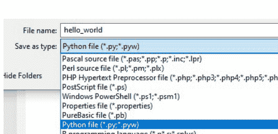

在***hello_world.py***文件中，编写一行代码：

```
print("Hello World")
```

> **Python中的print( )函数是什么？**

**print( )**函数将输出显示到屏幕上

现在让我们运行上面的代码。
打开命令提示符 -> 转到**hello_world.py**文件位置并输入以下命令：
**python** *file_name* **.py**

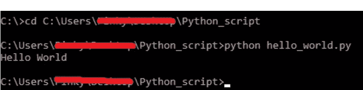

输出显示

- 现在让我们创建另一个Python文件并将其命名为**test.py**

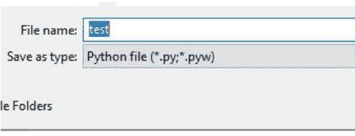

在**test.py**文件中，只需**导入**上面创建的**hello_world**模块。

```
import hello_world
```

现在运行此文件。
打开命令提示符 -> 转到**test.py**文件位置并输入以下命令：
**python test.py**

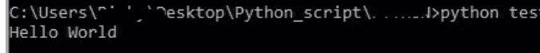

我们看到**test**模块打印出了来自**hello_world**模块的“*Hello World*”输出。

> **Python中的import语句是什么？**

Python中的**import**语句允许一个Python文件或模块访问另一个Python文件或模块中存在的所有代码。

### 1.2：什么是Python函数？

Python函数类似于Java方法。它是一个执行特定任务的代码块。

语法：

```
def function_name() :
    ....... 
```

### 示例：

```
username = "John123"
def validate_username(uname):
    if uname == "John123":
        print("Hello John")
    else:
        print("Wrong username")
validate_username(username)
```

### 代码解释：

- 在上面的代码中，我们创建了一个带参数**uname**的**函数validate_username**。如果参数是“*John123*”，**函数**打印“*Hello John*”，否则将打印“*Wrong username*”。
- 要调用任何函数，我们只需编写函数名后跟括号。在该括号内，我们传递了**username**的值，即“*John123*”

### 输出

```
C:\Users\...\Python_script>functions.py
Hello John
```

> **参数与实参的区别**

参数是传递给**函数**的变量。示例：

**function** *function_name* ( *variable1* , *variable2* ) :

> 实参是分配给变量的**值**。示例：
*function_name* ( 123, "Hello_World" )

### 1.3：什么是Python类？

- Python是一种**面向对象的编程语言**。
- **类**是创建**对象**的“蓝图”，与任何其他编程语言一样，Python**类**包含属性和方法。
- Python**对象**包含其**类**中存在的所有属性和方法的副本。要访问这些属性，使用**点**运算符（.）。
    - 创建**类**的语法是：

```python
class class_name :
    def __init__(self) :
        ....
    def method1 :
        ....
```

创建**类**的**对象**的语法是：

```python
class Hello :
    def __init__(self) :
        ................
        ............
```

*h = Hello()*，其中**h**是**类***Hello*的**对象**。

> **什么是def __init__ (self)？**

“__init__”是**Python**类中的一个保留方法，用于初始化**对象**的状态。在面向对象的概念中，它指的是**类**的**构造函数**。此方法在创建**对象**时初始化**类**的属性。

**self**关键字有助于访问类的属性。

### **示例：**

```
class Employee:
    def __init__(self,id_num,name,age,address,salary):
        self.id_num = id_num
        self.name = name
        self.age = age
        self.address = address
        self.salary = salary
    def validation(self):
        if (str(self.id_num) == "123" and self.name =="John"):
            print("This is Jon and his age is",self.age,
            ",his address is",self.address,
            "and his salary is", self.salary)
        else:
            print("Not John")
e = Employee(123,"John",25,"Texas",1000)
e.validation()
```

### **输出**

```
C:\Users\Pinky\Desktop\Python_script>classes.py
This is Jon and his age is 25 ,his address is Texas and his salary is 1000
```

**从上面的代码中需要注意的重要点：**

1. Python**类**名应以大写字母开头。
2. 在**__init__**方法中，我们声明了**类Employee**的不同属性，并将这些值传递给**self**。
3. 在我们的**validation()**方法中，我们传递了参数**self**，它有助于访问**类Employee**的所有属性。
4. **str()**函数有助于将整数值转换为字符串值。
5. **and**关键字是Python中的**逻辑与运算符**。
6. 在上面代码的**第15行**，我们创建了一个**对象e**并向其传递了值。

## 第2章：数组

数组是具有相同数据类型的项目或元素的集合。数组中的元素只能通过其索引值访问。示例：让我们创建一个汽车数组。

```
cars = ["Kia", "Toyota", "Ford", "Tesla"]
```

| 索引 | 0 | 1 | 2 | 3 |
|---|---|---|---|---|
| 值 | Kia | Toyota | Ford | Tesla |

为了获得**Ford**作为输出，我们需要编写`print ( cars [ 2 ] )`

- 在Python中，**列表**与**数组**非常相似。它包含由逗号分隔的元素列表，其元素用方括号[ .... ]编写。
- **列表**中的值可以通过其索引值访问，语法是。

```
List_name [ index_num ]
```

**示例：**
创建一个新的Python文件（**variables.py**）并编写以下代码：

```
fruits = ["apple","orange","banana","mango","strawberry","peaches"]
x = "this apple is tasty"
print(len(fruits))
print(fruits[2:4])
print(x[2:8])
```

运行上面的代码后，我们得到输出：

```
C:\Users\...\Desktop\Python_script>variables.py
6
['banana', 'mango']
is app
```

### 代码解释：

- 在上面的代码中，**fruits**是一个包含6个元素的**列表**。位置0的值是“apple”，位置1的值是“orange”，依此类推。
- **x**是一个保存字符串值的变量。位置0的值是“t”，位置1的值是“h”，依此类推。
- **len()**函数用于获取列表的长度。
- 在第4行和第5行，我们执行**切片操作**。
    - **print ( fruits [ 2 : 4] )**表示打印从位置2（包括其值）到位置4（不包括其值）的元素。
    - **print ( x [ 2 : 8 ] )**表示打印**x**（“this apple is tasty”）从位置2（包括其值）到位置8（不包括其值）的值。


**输出：** ['banana', 'mango']

## 第三章：链表

- 链表是一种**线性数据结构**，它由数据元素或**节点**组成。
- 每个**节点**包含一个**数据**和一个**地址**或**指针**，该指针指向下一个**节点**。
- 第一个节点称为头节点，最后一个节点称为尾节点。最后一个节点总是指向NULL。

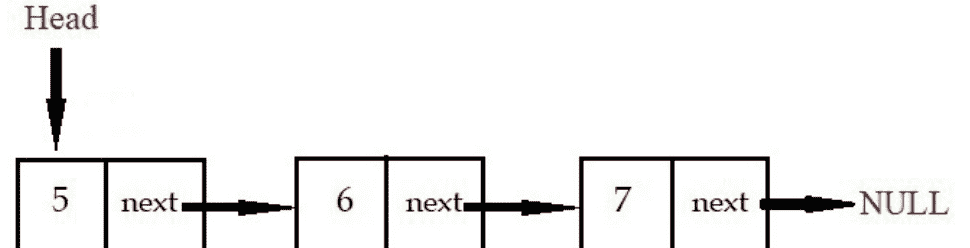

> **什么是数据结构？**
> 数据结构是组织和存储数据的过程。
> 它分为两种类型：
> 1. **线性数据结构** – 在这种数据结构中，数据元素按线性顺序排列，但元素不一定必须按顺序存储。例如：数组、链表、栈和队列。
> 2. **非线性数据结构** – 在这种数据结构中，数据元素按非线性顺序排列。例如：树和图。

让我们开始编码吧。

### 3.1：创建链表并显示其值

打开 **Notepad++**，创建一个新的 **python** 文件，命名为 ***linked_list.py***，并编写以下代码。

```python
class Node():
    def __init__(self,value):
        self.value = value
        self.next = None
```

在上面的代码中，我们简单地创建了 **Node 类**，它包含两个属性，一个是链表**节点**的**值**或数据，另一个是 ***next*** **指针**，它指向链表的下一个**节点**。
目前，***next*** **指针**指向 none。

现在让我们创建 **Linked List 类**

```python
class Node():
    def __init__(self,value):
        self.value = value
        self.next = None

class Linked_List():
    def __init__(self):
        self.head = None
```

**Linked_List 类**只包含一个属性 **head**，目前 **head** 是空的或 **none**。

下图显示了我们将创建链表的顺序。

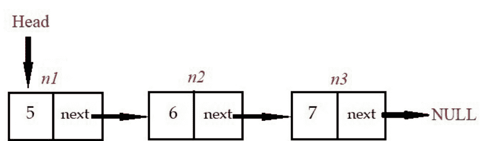

```
Head = n1
n1.next = n2
n2.next = n3
n3 points to none or null
```

```python
class Node():
    def __init__(self,value):
        self.value = value
        self.next = None

class Linked_List():
    def __init__(self):
        self.head = None

s = Linked_List()
s.head = Node(5)
n2 = Node(6)
n3 = Node(7)
n2.next = n3
s.head.next = n2
while s.head is not None:
    print(s.head.value)
    s.head = s.head.next
```

### 代码解释：

- 在第 8 行，我们创建了 **Linked_List( ) 类**的对象 **s**。
- 在第 9 行，我们使用 **Node 类**创建了链表的第一个**节点**，并将该节点赋值给 **head**。

**s.head** 现在充当 **Node 类**的一个**对象**。

- 在第 10 行，我们创建了链表的第二个**节点**。
- 在第 11 行，我们创建了链表的第三个**节点**。
- 在第 12 行，我们使用 **Node 类**的 ***next*** 属性将第二个**节点**和第三个**节点**连接起来。
- 在第 13 行，我们将 **head** 与第二个**节点**连接起来。
- 从第 14 行到第 16 行，使用 **while 循环**，我们显示链表中每个**节点**的值。

现在让我们保存所有内容并运行 python 模块。

要运行上面的代码，
打开命令提示符 -> 导航到 python 文件位置，并使用 **python** 命令运行，如下图所示。

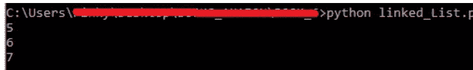

### 3.2：在链表开头插入一个节点

假设我们想将一个**节点 x** 作为链表的新**头节点**，如下图所示。

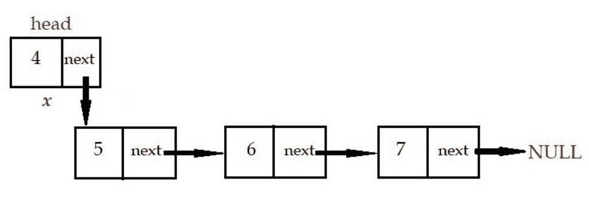

为了做到这一点，需要以下三个步骤：

1. **步骤 1**：移动现有的链表（*假设为链表 z*）并将其存储在一个临时变量中。
2. **步骤 2**：创建一个新的**节点**并将该**节点**赋值给 **head**。
3. **步骤 3**：现在借助 *next* 指针将新的**head**与现有的链表 **z** 连接起来。

在 *linked_list.py* 中，在 **Linked_List 类**中添加以下**函数**。

```python
def add_beginning(self,newVal):
    temp = self.head
    self.head = Node(newVal)
    self.head.next = temp
```

现在让我们调用新创建的**函数**。

```python
s.head = Node(5)

n2 = Node(6)

n3 = Node(7)

n2.next = n3

s.head.next = n2

s.add_beginning(4)

while s.head is not None:
    print(s.head.value)
    s.head = s.head.next
```

运行上面的代码。

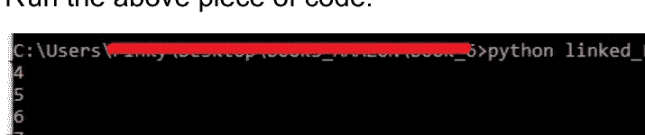

**时间复杂度**：由于我们知道需要在哪个位置添加新的**节点**，因此不需要迭代，所以时间复杂度是 **O(1)**。

> **什么是时间复杂度和大O表示法？**
>
> **时间复杂度**表示代码执行所需的时间量。
>
> **大O表示法**是**函数**的增长率。它通常提供算法或**函数**增长率的上限。

### 3.3：在链表中间插入一个节点

假设我们想在链表中节点 **y** 之后插入一个新节点 **x**，如下图所示。

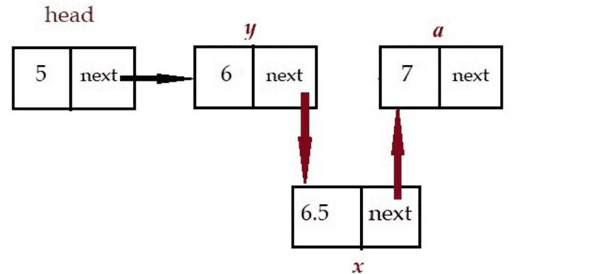

为了做到这一点，需要以下两个步骤：

**步骤 1：** 节点 **y** 之前指向**节点 a**。必须移除 **y 节点**的 *next* 并将其赋值给 **x 节点**的 *next*，使**节点 x** 指向**节点 a**。

**步骤 2：** **y 节点**的 *next* 必须指向**节点 x**。

在 ***linked_list.py*** 中，在 **Linked_List 类**中添加以下**函数**。

```python
def add_middle(self, node, newVal):
    newNode = Node(newVal)
    newNode.next = node.next
    node.next = newNode
```

现在让我们调用新创建的**函数**。

```python
s.head = Node(5)
n2 = Node(6)
n3 = Node(7)
n2.next = n3
s.head.next = n2
s.add_beginning(4)
s.add_middle(6, 6.5)
while s.head is not None:
    print(s.head.value)
    s.head = s.head.next
```

运行上面的代码。

```
C:\Users\...>python linked_List.py
4
5
6
6.5
7
```

**时间复杂度**：在这种情况下，我们有一个参考**节点**，并且知道插入新**节点**的位置，所以时间复杂度是 **O(1)**。

如果我们没有参考**节点**，并且必须遍历链表来插入一个**节点**，那么时间复杂度是 **O(n)**，其中 **n** 指的是输入大小。例如，在一个**列表**中，**n** 指的是元素的数量。

### 3.4：在链表末尾插入一个节点

假设我们想在链表末尾插入节点 **b**，如下图所示。

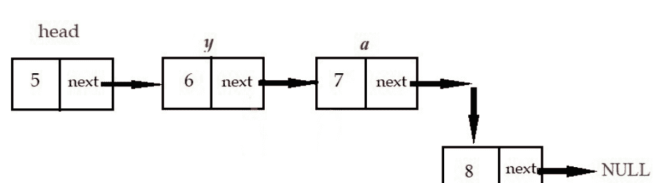

为了做到这一点，需要以下两个步骤：

**步骤 1：** 我们需要遍历**指针**并到达链表的末尾。一旦**指针** *next* 指向 **none**，则停止循环并返回链表的最后一个**节点 a**。

**步骤 2：** 现在让链表的最后一个**节点 a** 指向新的**节点 b**。

在 *linked_list.py* 中，在 **Linked_List 类**中添加以下**函数**。

```python
def add_end(self,newVal):
    newNode = Node(newVal)
    temp = self.head
    while temp.next:
        temp = temp.next
    temp.next = newNode
```

现在让我们调用新创建的**函数**。

### 3.5：删除

假设我们想要从下图所示的链表中移除**节点 b**。

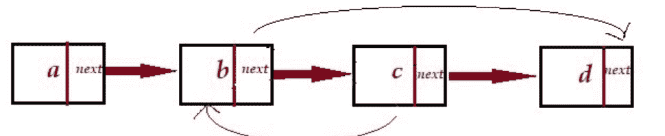

为了实现这一点，需要以下两个步骤：

**步骤 1：** 将**节点 b** 的值替换为下一个**节点**（*节点 c*）的值。

**步骤 2：** 使**节点 b** 的 *next* 属性指向**节点 c** 的 *next* 属性，而后者指向**节点 d**。

在 ***linked_list.py*** 文件中，在 **Linked_List** 类中添加以下**函数**。

```python
def delete(self, node):
    node.value = node.next.value
    node.next = node.next.next
```

现在让我们调用新创建的**函数**。

```python
s.head = Node(5)
n2 = Node(6)
n3 = Node(7)
n2.next = n3
s.head.next = n2
s.add_beginning(4)
s.add_middle(n2, 6.5)
s.add_end(8)
s.delete(n3)
while s.head is not None:
    print(s.head.value)
    s.head = s.head.next
```

运行上面的代码。

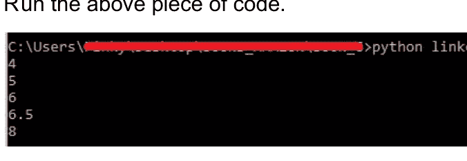

**时间复杂度：** 由于不需要迭代来查找节点，因此时间复杂度为 **O(1)**。

### 3.6：链表的类型

链表有三种类型：

1.  **单链表** - 单链表通常是一种链表，其中每个**节点**包含一个**数据**和一个指向下一个**节点**的**指针** *next*。

2.  **双链表** - 在双链表中，每个节点包含**数据**和<u>两个</u>指针 *next* 和 *prev*。**指针** *next* 指向下一个**节点**，**指针** *prev* 指向前一个**节点**。

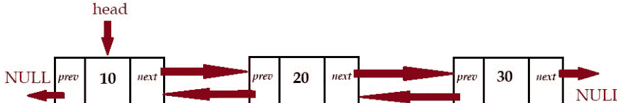

在编码时，我们只需要在 **Node 类**中添加一个额外的属性 *prev*。

```python
class Node():
    def __init__(self,value):
        self.value = value
        self.next = None
        self.prev = None
```


> Head = n1
> n1.next = n2
> n2.prev = n1

n2.next 指向 none 或 null
n1.prev 指向 none 或 null

```python
class Node():
    def __init__(self,value):
        self.value = value
        self.next = None
        self.prev = None

class Linked_List():
    def __init__(self):
        self.head = None

    def insert(self,val):
        new_node = Node(val)
        new_node.next = self.head
        if self.head is not None:
            self.head.prev = new_node
        self.head = new_node

    def display_data(self):
        while self.head is not None:
            print(self.head.value)
            self.head = self.head.next
```

上面截图中高亮的代码片段展示了双链表的 *插入函数*。

### 代码解释：

-   在第 10 行，我们创建了一个新的**节点** *new_node*。
-   在第 11 行，我们借助 *next* 属性使 *new_node* 指向**头节点**。
-   在第 12 行，我们检查是否存在**头节点**。
    -   如果**头节点**存在，则借助 *prev* 属性使**头节点**指向新节点。


-   然后在 `self.head = new_node` 这一行，将 *new_node* 设为新的**头节点**。

3.  **循环链表** - 循环链表类似于单链表，不同之处在于最后一个**节点**不指向 NULL。循环链表的最后一个**节点**指向**头节点**。

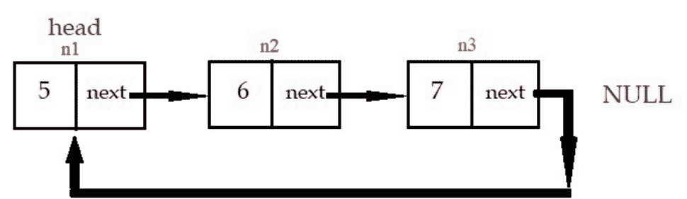

在上图中，

```python
head = n1
n1.next = n2
n2.next = n3
n3.next = n1
```

在下面的代码中，我们将创建一个循环链表并显示其值。

```python
class Node():
    def __init__(self,value):
        self.value = value
        self.next = None

class Linked_List():
    def __init__(self):
        self.head = None

#......创建循环链表.....
s = Linked_List()
s.head = Node(5)
n2 = Node(6)
n3 = Node(7)
n2.next = n3
n3.next = s.head
s.head.next = n2

#显示循环链表的值..
current = s.head
print(current.value)
while(current.next != s.head):
    current = current.next
    print(current.value)
```

### 代码解释：

-   在上面的代码中，我们创建了通用的链表，但我们在这一行使最后一个节点（**n3**）指向链表的**头节点**：

    `n3.next = s.head`

-   在显示链表的值时，

    -   在 `current = s.head` 这一行，我们将**头节点**（假设是 **n1**）赋值给变量 **current**。

    -   在 `print(current.value)` 这一行，我们打印 **n1** 的值。（*它将打印 5*）

    -   在 `while(current.next != s.head):` 这一行，我们执行一个 **while 循环**。

        -   **n1** 的 **current.next** 是 **n2**，它不等于 **n1**，所以条件返回 true。打印 **n2** 的值。

        -   然后 **n2** 的 **current.next** 是 **n3**，**n3** 不等于 **n1**，所以条件返回 true。打印 **n3** 的值。

        -   然后 **n3** 的 **current.next** 是 **n1**，**n1** 确实等于 **n1**，所以条件返回 false，**while 循环**停止。

现在让我们运行上面的代码

```
C:\Users\...\python linked_List1.py
5
6
7
```

### 如何判断链表是否是循环的？

为了检查链表是否是循环的，我们需要执行两个步骤：

**步骤 1：** 获取链表的最后一个**节点**。

**步骤 2：** 检查最后一个**节点**是否指向**头节点**。如果最后一个**节点**指向头**节点**，那么它就是一个循环链表。

```python
def get_end_node(self):
    current = self.head
    while((current.next is not self.head) and (current.next is not None)):
        current = current.next
    return current
```

```python
def get_end_node(self):
    current = self.head
    while((current.next is not self.head)
        current = current.next
    return current

s = Linked_List()
s.head = Node(5)
n2 = Node(6)
n3 = Node(7)
n2.next = n3
n3.next = s.head
s.head.next = n2

if s.get_end_node().next == s.head:
    print("It is a circular linked list")
else:
    print("It is not a circular linked list")
```

在上面高亮的代码中，我们检查最后一个**节点**是否指向**头节点**。

现在运行上面的代码。

```
C:\Users\...>python linked_list1.py
It is a circular linked list
```

### 3.7：数组与链表的区别

| 数组 | 链表 |
|---|---|
| 数组是具有固定大小的数据元素的集合。它是静态的。 | 链表是动态的。 |
| 在数组中，访问元素更快。它帮助我们简单地通过索引值访问任何元素。因此时间复杂度为 O(1) | 在链表中，我们需要执行迭代来访问任何元素。因此时间复杂度为 O(n) |
| 在数组中，内存是在编译时分配的（静态内存分配）。 | 在链表中，内存是在运行时分配的（动态内存分配）。与数组相比，链表的内存消耗也更大，这是因为每个**节点**包含数据和一个**指针**，这需要额外的内存。 |

## 第 4 章：栈

栈是一种用于存储数据元素的数据结构。例如：让我们考虑在厨房橱柜中，盘子 **a**、**b**、**c**、**d** 一个叠一个地堆放着，如下图所示。

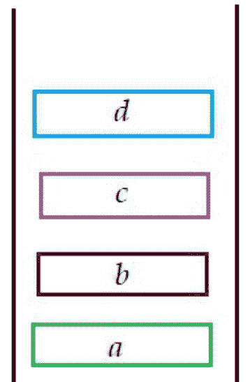

盘子 **a** 是第一个放进去的，盘子 **d** 是最后一个进入橱柜的。当我们想使用一个盘子时，我们通常会拿盘子 **d**，它是第一个被移除的盘子，而盘子 **a** 是最后一个被移除的。

这个概念类似于数据结构**栈**。第一个插入**栈**的数据元素（*上例中的盘子 a*）是最后一个被移除的，而最后一个插入**栈**的元素（*上例中的盘子 d*）是第一个被移除的。因此**栈**被称为**后进先出（LIFO）**或**先进后出（FILO）**列表。插入和删除总是发生在一端，那就是**栈顶**。

**注意：** 数据元素从**栈**的**顶部**进行压入和弹出，该顶部具有特殊的索引值 -1。当栈为空时，**顶部**的索引值为 -1。

添加和移除元素的操作分别称为**压栈（PUSH）**和**弹栈（POP）**。Python 为我们提供了 **append( )** 和 **pop( )** 函数来添加和移除数据元素。

现在创建一个新的 Python 文件，命名为 **stack.py**，并写入以下代码。

```python
class Stack():
    def __init__(self):
        self.stack = []

    def push(self, val):
        self.stack.append(val)

    def pop(self):
        self.stack.pop()

    def peek(self):
        x = len(self.stack)
        return self.stack[x-1]
```

```python
s = Stack()
s.push(1)
s.push(2)
s.push(3)
s.push(4)
s.push(5)
print(s.stack)
print("Top value after PUSH :", s.peek())
s.pop()
s.pop()
print(s.stack)
print("Top value after POP :", s.peek())
```

### 代码解释：

- **Stack 类**被声明，它只包含一个属性 **stack**，目前为空。
- **push 函数**向**栈**中追加或添加一个数据元素。
- **pop 函数**从**栈**的**顶部**弹出或移除最后进入的数据元素。
- **peek 函数**返回栈的**顶部**值。

运行上述代码。

```
C:\Users\...>python stack.py
[1, 2, 3, 4, 5]
Top value after PUSH : 5
[1, 2, 3]
Top value after POP : 3
```

**时间复杂度**：**push** 和 **pop** 操作都在一端完成，且不执行迭代，因此时间复杂度为 **O(1)**。

## 第 5 章：队列

队列是一种存储数据元素的数据结构。在这种结构中，数据元素从一端（**队尾**）插入，从另一端（**队头**）删除。例如：让我们考虑一个免下车洗车线。

第一辆进入队列的车首先被清洗并离开。然后第二辆车被清洗，接着是第三辆车。同样，在**队列**中，第一个插入的数据元素最先被移除，最后一个插入的数据元素最后被移除。因此，**队列**被称为**先进先出（FIFO）**或**后进后出（LILO）**列表。

当一个元素被插入到**队列**中时，这个概念称为**入队（EnQueue）**；当一个元素从**队列**中被移除时，这个概念称为**出队（DeQueue）**。

现在创建一个新的 Python 文件，命名为 **queue.py**，并写入以下代码。

```python
class Queue():
    def __init__(self):
        self.queue = []
    def enqueue(self,val):
        self.queue.append(val)
    def dequeue(self):
        self.queue.pop(0)

q = Queue()
q.enqueue(10)
q.enqueue(20)
q.enqueue(30)
q.enqueue(40)
q.enqueue(50)
print("Values after insertion :", q.queue)
q.dequeue()
q.dequeue()
print("Value after deletion :", q.queue)
```

### 代码解释：

- 函数 **enqueue** 向**队列**中添加新值。
- 函数 **dequeue** 移除最先插入**队列**的值。

运行上述代码。

```
C:\Users\...>python queue.py
Values after insertion : [10, 20, 30, 40, 50]
Value after deletion : [30, 40, 50]
```

**时间复杂度**：**enqueue** 和 **dequeue** 操作中没有执行迭代，因此时间复杂度为 **O(1)**。

祝你一切顺利，非常感谢你购买本书。

请永远记住，最重要的学习是自学。