## 学会Python，足以应对挑战

软件开发、Flask Web应用与Python数据科学入门

Michael Hartl

## 对“学会”系列教程的赞誉

> “刚开启#100DaysOfCode的旅程。今天是第一天。我已完成@mhartl在@LearnEnough上的精彩Ruby教程，并期待明天开始学习Ruby on Rails。继续前进，不断向上。”
> —Optimize Prime (@_optimize)，Twitter帖子

> “Ruby、Sinatra和Heroku，天哪！这个实时Web应用快完成了。它可能只是一个简单的回文应用，但也同样令人兴奋！#100DaysOfCode #ruby @LearnEnough #ABC #AlwaysBeCoding #sinatra #heroku”
> —Tonia Del Priore (@toninjaa)，Twitter帖子；金融科技初创公司软件工程师，从业3年以上

> “对于@LearnEnough的课程，我只有无尽的赞美。我即将完成#javascript课程。我必须说，视频是必看的，因为@mhartl会扮演新手角色，并分享你编写的东西真正运行起来时的喜悦！”
> —Claudia Vizena

> “我必须说，这个‘学会’系列是教育领域的杰作。感谢你完成这项了不起的工作！”
> —Michael King

> “我想感谢你为教程所做的出色工作。它们可能是我读过的最好的教程。”
> —Pedro Iatzky

## Michael Hartl的“学会”系列

访问 **informit.com/learn-enough** 获取所有可用出版物的完整列表。

**“学会”** 系列教你启动自己的应用程序、获得程序员工作，甚至可能创办自己的公司所需的开发者工具、Web技术和编程技能。在此过程中，你将学习技术熟练度，即自己解决技术问题的能力。“学会”系列始终专注于每个主题最重要的部分，因此你无需学习所有内容即可开始——你只需学会足以应对挑战的内容即可。“学会”系列包括书籍和视频课程，因此你可以选择最适合你的学习风格。

## 学会Python，足以应对挑战

软件开发、Flask Web应用与Python数据科学入门

Michael Hartl

▲Addison-Wesley
Boston • Columbus • New York • San Francisco • Amsterdam • Cape Town
Dubai • London • Madrid • Milan • Munich • Paris • Montreal • Toronto • Delhi • Mexico City
São Paulo • Sydney • Hong Kong • Seoul • Singapore • Taipei • Tokyo

封面图片：Alexey Boldin/Shutterstock
图1.4：Pallets项目
图1.6–1.8，9.3：Amazon Web Services, Inc.
图1.9，1.10，8.2：GitHub, Inc.
图1.11，1.12，10.2，10.3：Fly.io
图2.9：Python Software Foundation
图4.4，4.5，4.10，8.8：Regex101
图5.6，9.5：Google LLC
图9.4，9.7：The Wikimedia Foundation
图11.1-11.5，11.23：Jupyter

制造商和销售商用于区分其产品的许多名称被声称是商标。在本书中出现这些名称且出版商知晓商标主张的地方，这些名称已采用首字母大写或全部大写的形式印刷。

作者和出版商在准备本书时已尽心尽力，但不对任何类型的明示或暗示保证承担责任，也不对错误或遗漏负责。对于因使用本文所含信息或程序而引起的或与之相关的任何附带或后果性损害，不承担任何责任。

有关批量购买本书或特殊销售机会（可能包括电子版本；定制封面设计；以及针对您的业务、培训目标、营销重点或品牌利益的特定内容）的信息，请联系我们的企业销售部门：corpsales@pearsoned.com 或 (800) 382-3419。

有关政府销售咨询，请联系 governmentsales@pearsoned.com。

有关美国以外的销售问题，请联系 intlcs@pearson.com。

访问我们的网站：informit.com/aw

美国国会图书馆控制号：2023935869

版权所有 © 2023 Softcover Inc.

保留所有权利。本出版物受版权保护，未经出版商事先许可，不得以任何形式或任何方式（电子、机械、影印、录制或其他类似方式）进行任何禁止的复制、存储在检索系统中或传输。有关权限、请求表以及Pearson Education全球权利与权限部门内适当联系人的信息，请访问 www.pearson.com/permissions。

ISBN-13: 978-0-13-805095-5
ISBN-10: 0-13-805095-3

ScoutAutomatedPrintCode

## 目录

- 前言 xiii
- 致谢 xvii
- 关于作者 xix

## 第1章 你好，世界！ 1

- 1.1 Python简介 6
  - 1.1.1 系统设置与安装 9
- 1.2 在REPL中使用Python 11
  - 1.2.1 练习 12
- 1.3 在文件中使用Python 13
  - 1.3.1 练习 15
- 1.4 在Shell脚本中使用Python 16
  - 1.4.1 练习 17
- 1.5 在Web浏览器中使用Python 18
  - 1.5.1 部署 22
  - 1.5.2 练习 33

## 第2章 字符串 35

- 2.1 字符串基础 35
  - 2.1.1 练习 38
- 2.2 连接与插值 38
  - 2.2.1 格式化字符串 41
  - 2.2.2 原始字符串 42
  - 2.2.3 练习 44
- 2.3 打印 44
  - 2.3.1 练习 46
- 2.4 长度、布尔值与控制流 46
  - 2.4.1 组合与反转布尔值 51
  - 2.4.2 布尔上下文 54
  - 2.4.3 练习 56
- 2.5 方法 56
  - 2.5.1 练习 61
- 2.6 字符串迭代 62
  - 2.6.1 练习 66

## 第3章 列表 69

- 3.1 分割 69
  - 3.1.1 练习 71
- 3.2 列表访问 71
  - 3.2.1 练习 73
- 3.3 列表切片 74
  - 3.3.1 练习 76
- 3.4 更多列表技巧 77
  - 3.4.1 元素包含 77
  - 3.4.2 排序与反转 77
  - 3.4.3 追加与弹出 80
  - 3.4.4 撤销分割 81
  - 3.4.5 练习 82
- 3.5 列表迭代 83
  - 3.5.1 练习 85
- 3.6 元组与集合 86
  - 3.6.1 练习 89

## 第4章 其他原生对象 91

- 4.1 数学 91
  - 4.1.1 更高级的操作 92
  - 4.1.2 数学转字符串 93
  - 4.1.3 练习 97
- 4.2 时间与日期时间 97
  - 4.2.1 练习 102
- 4.3 正则表达式 103
  - 4.3.1 使用正则表达式分割 107
  - 4.3.2 练习 108
- 4.4 字典 109
  - 4.4.1 字典迭代 112
  - 4.4.2 合并字典 113
  - 4.4.3 练习 114
- 4.5 应用：唯一单词 115
  - 4.5.1 练习 119

## 第5章 函数与迭代器 121

- 5.1 函数定义 121
  - 5.1.1 一等函数 126
  - 5.1.2 变量与关键字参数 127
  - 5.1.3 练习 129
- 5.2 文件中的函数 130
  - 5.2.1 练习 138
- 5.3 迭代器 138
  - 5.3.1 生成器 143
  - 5.3.2 练习 146

## 第6章 函数式编程 149

- 6.1 列表推导式 150
  - 6.1.1 练习 156
- 6.2 带条件的列表推导式 156
  - 6.2.1 练习 159
- 6.5 其他函数式技巧 165
  - 6.5.1 函数式编程与TDD 166
  - 6.5.2 练习 168

## 第7章 对象与类 169

- 7.1 定义类 169
  - 7.1.1 练习 175
- 7.2 自定义迭代器 176
  - 7.2.1 练习 179
- 7.3 继承 179
  - 7.3.1 练习 183
- 7.4 派生类 183
  - 7.4.1 练习 188

## 第8章 测试与测试驱动开发 191

- 8.1 包设置 192
  - 8.1.1 练习 197
- 8.2 初始测试覆盖率 197
  - 8.2.1 一个有用的通过测试 202
  - 8.2.2 待处理测试 206
  - 8.2.3 练习 207
- 8.3 红 209
  - 8.3.1 练习 214
- 8.4 绿 214
  - 8.4.1 练习 220
- 8.5 重构 220
  - 8.5.1 发布Python包 224
  - 8.5.2 练习 227

## 第9章 Shell脚本 231

- 9.1 从文件读取 231
  - 9.1.1 练习 238
- 9.2 从URL读取 240
  - 9.2.1 练习 245
- 9.3 命令行中的DOM操作 245
  - 9.3.1 练习 254

目录

xi

## 第10章 实时Web应用 255

- 10.1 设置 256
- 10.1.1 练习 262
- 10.2 网站页面 263
- 10.2.1 练习 270
- 10.3 布局 271
- 10.3.1 练习 280
- 10.4 模板引擎 280
- 10.4.1 变量标题 281
- 10.4.2 网站导航 287
- 10.4.3 练习 292
- 10.5 回文检测器 293
- 10.5.1 表单测试 302
- 10.5.2 练习 313
- 10.6 总结 316

## 第11章 数据科学 319

- 11.1 数据科学设置 320
- 11.2 使用NumPy进行数值计算 327
- 11.2.1 数组 327
- 11.2.2 多维数组 330
- 11.2.3 常量、函数和线性间距 333
- 11.2.4 练习 337
- 11.3 使用Matplotlib进行数据可视化 338
- 11.3.1 绘图 339
- 11.3.2 散点图 347
- 11.3.3 直方图 350
- 11.3.4 练习 352
- 11.4 使用pandas进行数据分析入门 353
- 11.4.1 手工示例 355
- 11.4.2 练习 361
- 11.5 pandas示例：诺贝尔奖得主 361
- 11.5.1 练习 377
- 11.6 pandas示例：泰坦尼克号 377
- 11.6.1 练习 385
- 11.7 使用scikit-learn进行机器学习 386
- 11.7.1 线性回归 387
- 11.7.2 机器学习模型 392
- 11.7.3 k-均值聚类 400
- 11.7.4 练习 402
- 11.8 进一步资源与总结 403

索引 405

## 前言

*《学够危险的Python》* 教你使用优雅而强大的Python编程语言编写实用且现代的程序。你将学习如何将Python用于通用编程和入门级Web应用开发。尽管精通Python可能是一段漫长的旅程，但你无需学习所有内容就能开始……你只需学得足够*危险*即可。

你将首先通过结合交互式Python解释器和在命令行运行的文本文件，来探索Python编程的核心概念。这将使你对Python中的*面向对象编程*和*函数式编程*都有扎实的理解。然后，你将在此基础上开发并发布一个简单的独立Python包。接着，你将把这个包用于一个使用*Flask* Web框架构建的简单动态Web应用中，并将其部署到实时Web上。因此，《学够危险的Python》尤其适合作为学习使用Python进行Web开发的先决条件。

除了教授你特定的技能外，《学够危险的Python》还帮助你培养*技术素养*——一种看似神奇的、能够解决几乎任何技术问题的能力。技术素养包括具体的技能，如版本控制和编码，也包括更模糊的技能，比如搜索错误信息以及知道何时只需重启那个该死的东西。在《学够危险的Python》全书中，我们将在真实世界的示例中，有大量机会培养技术素养。

## 逐章介绍

为了学够危险的Python，我们将从一系列使用不同技术（第1章）的简单“hello, world”程序开始，包括Python解释器的介绍，这是一个用于评估Python代码的交互式命令行程序。遵循“Learn Enough”哲学，即始终“真实”地做事，即使在第1章，我们也会将一个（非常简单的）动态Python应用部署到实时Web上。本章还包括指向最新设置和安装说明的指引，这些说明通过*《学够危险的开发环境》*（https://www.learnenough.com/dev-environment）提供，可在线免费获取，也可作为免费电子书下载。

掌握“hello, world”之后，我们将浏览一些Python*对象*，包括字符串（第2章）、列表（第3章）以及其他原生对象，如日期、字典和正则表达式（第4章）。综合来看，这些章节构成了使用Python进行*面向对象编程*的温和入门。

在第5章，我们将学习*函数*的基础知识，这是几乎所有编程语言都必不可少的主题。然后，我们将把这些知识应用于一种优雅而强大的编码风格，称为*函数式编程*，包括*推导式*的介绍（第6章）。

在涵盖了Python内置对象的基础知识后，在第7章，我们将学习如何创建自己的对象。具体来说，我们将定义一个*短语*对象，然后开发一种方法来判断该短语是否是*回文*（正读和反读相同）。

我们最初的回文实现可能相当初级，但我们将在第8章使用一种称为*测试驱动开发*（TDD）的强大技术来扩展它。在此过程中，我们将更多地了解一般的测试知识，以及如何创建和发布Python包。

在第9章，我们将学习如何编写非平凡的*shell脚本*，这是Python最大的优势之一。示例包括从文件和URL读取，最后一个示例展示了如何像操作HTML网页一样操作下载的文件。

在第10章，我们将开发我们的第一个完整的Python Web应用：一个用于检测回文的网站。这将使我们有机会学习*路由*、*布局*、*嵌入式Python*和*表单处理*，以及TDD的第二次应用。作为我们工作的顶点，我们将把我们的回文检测器部署到实时Web上。

最后，在第11章，我们将介绍在蓬勃发展的*数据科学*领域中使用的Python工具。主题包括使用NumPy进行数值计算、使用Matplotlib进行数据可视化、使用pandas进行数据分析以及使用scikit-learn进行机器学习。

## 附加特性

除了主要的教程材料外，《学够危险的Python》还包含大量练习，以帮助你测试对内容的理解并扩展正文中的材料。练习包括频繁的提示，并且通常包含预期的答案，社区解决方案可通过单独订阅在www.learnenough.com获取。

## 最终思考

《学够危险的Python》为你提供了Python基础知识的实用入门，既作为通用编程语言，也作为Web开发和数据科学的专业语言。在学习了本教程涵盖的技术之后，特别是培养了你的技术素养之后，你将掌握编写shell脚本、发布Python包、部署动态Web应用以及使用关键Python数据科学工具所需的一切。你还将为各种其他资源做好准备，包括书籍、博客文章和在线文档。

## Learn Enough 奖学金

Learn Enough 致力于让尽可能广泛的人群获得技术教育。作为这一承诺的一部分，我们在2016年创建了Learn Enough奖学金计划。¹ 奖学金获得者可以免费或以大幅折扣访问Learn Enough All Access订阅，该订阅包含所有Learn Enough在线书籍内容、嵌入式视频、练习和社区练习答案。

正如在2019年RailsConf闪电演讲²中指出的那样，Learn Enough奖学金申请过程极其简单：只需填写一个保密的文本区域，告诉我们一些关于你情况的信息。奖学金标准慷慨且灵活——我们理解想要奖学金的原因有无数种，从学生身份，到处于待业状态，再到生活在一个对美元汇率不利的国家。很有可能，如果你觉得你有一个好理由，我们也会这么认为。

到目前为止，Learn Enough已向全国各地和世界各地的有抱负的开发者颁发了超过2,500份奖学金。要申请，请访问Learn Enough奖学金页面：www.learnenough.com/scholarship。也许下一个奖学金获得者就是你！

1. https://www.learnenough.com/scholarship
2. https://www.learnenough.com/scholarship-talk

# 致谢

感谢保罗·洛格斯顿、汤姆·雷佩蒂和罗恩·李对《*Learn Enough Python to Be Dangerous*》书稿提出的宝贵意见。同时感谢波士顿大学的杰特森·莱德-路易斯教授和数据科学家阿马德奥·贝洛蒂在第11章准备过程中提供的有益反馈和协助。文中若仍有任何错误，责任完全在于这些优秀的绅士们。

一如既往，感谢黛布拉·威廉姆斯·考利在培生出版社的制作过程中给予的指导。

# 关于作者

**迈克尔·哈特尔**（www.michaelhartl.com）是《*Ruby on Rails™ Tutorial*》（www.railstutorial.org）的创建者，这是Web开发领域的领先入门教程之一，同时也是Learn Enough（www.learnenough.com）的联合创始人和主要作者。此前，他曾是加州理工学院（Caltech）的物理学讲师，并因卓越的教学获得终身成就奖。他毕业于哈佛大学，拥有加州理工学院物理学博士学位，并且是Y Combinator企业家项目的校友。

# 第1章
你好，世界！

欢迎来到《*Learn Enough Python to Be Dangerous*》！

本教程旨在让你尽快开始编写实用且现代的Python程序，重点介绍软件开发者日常使用的真实工具。你将通过学习测试和测试驱动开发、发布包、Web开发入门以及数据科学等技能，了解所有内容如何协同工作。因此，《*Learn Enough Python to Be Dangerous*》既可以作为独立的入门教程，也可以作为更长、更注重语法的Python教程的绝佳预备课程，而后者有许多优秀的版本。

Python是世界上最流行的编程语言之一，这是有充分理由的。Python语法简洁、数据类型灵活、拥有丰富的有用库，并且其强大而优雅的设计支持多种编程风格。Python在命令行程序（也称为*脚本*，如第9章所述）、Web开发（通过*Flask*（第10章）和*Django*等框架）以及数据科学（特别是使用*pandas*进行数据分析和使用*scikit-learn*（第11章）等库进行机器学习）方面尤其受到广泛采用。

Python几乎唯一不擅长的是在Web浏览器中运行（这需要JavaScript（https://www.learnenough.com/javascript-tutorial））以及编写对速度要求极高的程序。即使在后一种情况下，像NumPy（第11.2节）这样的专用库也能让我们获得像C这样的低级语言的速度，同时兼具像Python这样的高级语言的强大功能和灵活性。¹

1. 像Python、JavaScript和Ruby这样的“高级”语言通常对抽象有更强的支持，并执行自动内存管理。

《*Learn Enough Python to Be Dangerous*》大致遵循与《*Learn Enough JavaScript to Be Dangerous*》（https://www.learnenough.com/javascript）和《*Learn Enough Ruby to Be Dangerous*》（https://www.learnenough.com/ruby）相同的结构，这两本教程可以在本教程之前或之后学习。由于许多示例相同，这些教程相互补充得很好——在计算机编程中，很少有比看到相同的基本问题用两种或更多不同语言解决更具启发性的事情了。² 然而，如框1.1所述，我们肯定会编写*Python*代码，而不是将JavaScript或Ruby翻译成Python。

> ## 框1.1：Pythonic编程

与其他语言的用户相比，Python程序员——有时被称为*Pythonistas*——往往对什么构成正确的编程风格持有强烈的意见。例如，正如Python贡献者蒂姆·彼得斯在“Python之禅”（第1.2.1节）中所指出的：“应该有一种——最好只有一种——显而易见的方法来做这件事。”（这与Perl编程语言相关的一个著名原则“TMTOWTDI”形成对比：不止一种方法可以做到。）

遵循良好编程实践（由Pythonistas判断）的代码被称为*Pythonic*代码。这包括正确的代码格式（特别是PEP 8 – Python代码风格指南（https://peps.python.org/pep-0008/）中的实践）、使用内置Python功能如`enumerate()`（第3.5节）和`items()`（第4.4.1节），以及使用特征性习语如列表和字典推导式（第6章）。（如官方文档（https://peps.python.org/pep-0001/）所述，“PEP代表Python增强提案。PEP是向Python社区提供信息或描述Python新特性或其流程或环境的设计文档。”PEP 8是专门关注Python代码风格和格式的PEP。）

本教程中的代码通常力求在给定讲解点所介绍的材料范围内尽可能Pythonic。此外，我们通常会先介绍一系列故意*非Pythonic*的示例，最终以一个完全Pythonic的版本结束。在这种情况下，非Pythonic和Pythonic代码之间的区别将被仔细注明。

众所周知，Pythonistas对非Pythonic代码的评判可能有点严厉，这可能导致初学者过度关注以Pythonic的方式编程。但“Pythonic”是一个滑动的尺度，取决于你在该语言中的经验。此外，编程从根本上说是关于*解决问题*，所以不要让对Pythonic编程的担忧阻止你解决作为Python程序员和软件开发者所面临的*你自己的*问题。

《*Learn Enough Python to Be Dangerous*》没有编程先决条件，尽管如果你以前编程过当然没有坏处。重要的是，你已经开始培养你的*技术素养*（框1.2），无论是自学还是使用之前的Learn Enough教程（https://www.learnenough.com/courses）。这些教程包括以下内容，它们共同构成了本书的良好先决条件列表：

- 1. *Learn Enough Command Line to Be Dangerous*（https://www.learnenough.com/command-line）
- 2. *Learn Enough Text Editor to Be Dangerous*（https://www.learnenough.com/text-editor）
- 3. *Learn Enough Git to Be Dangerous*（https://www.learnenough.com/git）

所有这些教程都可以作为印刷版或数字版书籍购买，也可以在线单独购买，我们还提供订阅服务——Learn Enough All Access订阅（https://www.learnenough.com/all-access）——可以访问所有相应的在线课程。

> **框1.2：技术素养**

使用计算机的一个重要方面是能够自己弄清楚问题并进行故障排除，这项技能在Learn Enough（https://www.learnenough.com/）被称为*技术素养*。

培养技术素养不仅意味着遵循像《*Learn Enough Python to Be Dangerous*》这样的系统教程，还意味着知道何时该摆脱结构化的讲解，直接开始在网上搜索解决方案。

《*Learn Enough Python to Be Dangerous*》将为我们提供大量机会来练习这项基本的技术技能。

特别是，如上所述，网上有丰富的Python参考资料，但除非你基本上已经知道自己在做什么，否则可能很难使用。本教程的一个目标是成为解锁文档的钥匙。这将包括大量指向Python官方网站的指引。

随着讲解的深入，我有时还会包含你可以用来弄清楚如何完成手头特定任务的网络搜索。例如，如何使用Python操作文档对象模型（DOM）？像这样：python dom manipulation。

你不会在本教程中学到关于Python的所有知识——那需要数千页和几个世纪的努力——但你会学到足够的Python知识，从而变得*危险*（图1.1³）。让我们看看这意味着什么。

在第1章中，我们将从头开始，使用几种不同的技术编写一系列简单的“hello, world”程序，包括介绍一个用于评估Python代码的交互式命令行程序。按照Learn Enough始终“真实”做事的理念，即使在第一章，我们也会将一个（非常简单的）动态Python应用程序部署到实时Web上。你将


**图1.1：** Python知识，如同罗马，非一日建成。

3. 图片由Kirk Fisher/Shutterstock提供。

你还可以通过*Learn Enough Dev Environment to Be Dangerous*（https://www.learnenough.com/dev-environment）获取最新设置和安装说明的指引，该资源可在线免费获取，也可作为免费电子书下载。

在掌握“hello, world”之后，我们将概览一些Python *对象*，包括字符串（第2章）、数组（第3章）以及其他原生对象（第4章）。综合来看，这些章节构成了使用Python进行*面向对象编程*的温和入门。

在第5章，我们将学习*函数*的基础知识，这是几乎所有编程语言的核心主题。然后，我们将把这些知识应用于一种优雅而强大的编码风格，称为*函数式编程*（第6章）。

在介绍了Python内置对象的基础之后，第7章我们将学习如何创建自己的对象。具体来说，我们将定义一个*短语*对象，然后开发一种方法来判断该短语是否是*回文*（正读反读都一样）。

我们最初的回文实现会相当基础，但将在第8章使用一种称为*测试驱动开发*（TDD）的强大技术对其进行扩展。在此过程中，我们将更广泛地了解测试，以及如何创建和发布一个独立的Python包。

在第9章，我们将学习如何编写非平凡的*shell脚本*，这是Python最大的优势之一。示例包括从文件和URL读取数据，最后一个示例将展示如何像操作HTML网页一样操作下载的文件。

在第10章，我们将开发第一个完整的Python Web应用程序：一个用于检测回文的网站。这将让我们有机会学习*路由*、*布局*、*嵌入式Python*和*表单处理*。作为我们工作的顶点，我们将把回文检测器部署到实际的Web上。

最后，第11章介绍了几个用于Python数据科学的核心库，包括NumPy、Matplotlib、pandas和scikit-learn。

顺便提一下，有经验的开发者可以基本跳过*Learn Enough Python to Be Dangerous*的前四章，如方框1.3所述。

> **方框1.3：致有经验的开发者**

牢记一些差异，有经验的开发者可以跳过本教程的第1-4章，从第5章的函数开始。然后他们可以快速进入第6章的函数式编程，并在必要时查阅前面的章节以填补任何空白。

以下是Python与大多数其他语言之间的一些显著差异：

- 使用`print`进行打印（第1.2节）。
- 在shell脚本中使用`#!/usr/bin/env python3`作为shebang行（第1.4节）。
- 单引号和双引号字符串实际上是相同的（第2.1节）。
- 使用格式化字符串（f-strings）和花括号进行字符串插值，例如，`f"foo {bar} baz"`用于字符串"foo"和"baz"以及变量`bar`（第2.2节）。
- 使用`r"..."`表示原始字符串（第2.2.2节）。
- Python没有`obj.length`属性或`obj.length()`方法；相反，使用`len(obj)`来计算对象长度（第2.4节）。
- 空白符很重要（第2.4节）。行通常以换行符或冒号结束，块结构通过缩进表示（通常每个块级别四个空格）。
- 使用`elif`代替`else if`（第2.4节）。
- 在布尔上下文中，除了`0`、`None`、“空”对象（`""`、`[]`、`{}`等）和`False`本身之外，所有Python对象都是`True`（第2.4.2节及后续章节）。
- 使用`[...]`表示列表（第3章），使用`{key: value, ...}`表示哈希（在Python中称为*字典*）（第4.4节）。
- Python广泛使用*命名空间*，因此导入像`math`这样的库默认会通过库对象访问方法（例如，`math.sqrt(2)`）（第4.1.1节）。

## 1.1 Python简介

Python由荷兰开发者Guido van Rossum（图1.2⁴）创建，最初被设计为一种高级、通用的编程语言。名称*Python*并非直接指代那种蛇，而是指英国喜剧团体Monty Python。这体现了Python核心的某种轻松特质，但Python也是一种优雅、强大的语言，适用于严肃的工作。确实，

4. 图片由Eugene Lazutkin/Getty Images提供。


**图1.2：** Python的创造者Guido van Rossum。

尽管我可能更以对Ruby社区的贡献（特别是*Ruby on Rails Tutorial*（https://www.railstutorial.org/））而闻名，但Python在我心中一直占有特殊地位（方框1.4）。

> **方框1.4：我的Python之旅**

早在万维网初期，我最初学习了Perl和PHP用于脚本编写和Web开发。当我最终开始学习Python时，我被它比那些语言干净和优雅得多所震撼（恕我直言，无意冒犯）。尽管当时我已经用过多种语言编程——包括Basic、Pascal、C、C++、IDL、Perl和PHP——但Python是我真正*热爱*的第一门语言。

当我在研究生院时，Python在我理论物理学的博士研究中发挥了关键作用，主要用于数据处理以及作为用C和C++编写的高速模拟的“粘合”语言。毕业后，我决定成为一名企业家，我如此偏爱Python，以至于即使当时PHP在Web开发方面功能更成熟，我也无法让自己回到PHP。相反，对于我的第一次创业，我用Python编写了一个自定义的Web框架。（为什么不直接用Django？那是很久以前的事了，Django还没有发布。）

在Ruby on Rails出现之后，我最终更多地参与了Ruby语言（最终导致了*Ruby on Rails Tutorial*），但我从未失去对Python的兴趣。Python的语法持续成熟并变得更加优雅，特别是随着Python 3的出现，给我留下了深刻印象。我尤其高兴地看到Python纳入了tau，这个我在*The Tau Manifesto*（https://tauday.com/tau-manifesto）中提出的数学常数。最后，我惊讶地看到Python的能力扩展到了数值计算、绘图和数据分析（所有这些都在第11章讨论）以及科学和数学计算（例如SciPy和Sage）等领域。基于Python的系统的能力现在确实可以与*MATLAB*、*Maple*和*Mathematica*等专有系统相媲美；特别是考虑到Python的开源性质，这一趋势似乎很可能会持续下去。

Python的未来看起来一片光明，我个人期望在未来几年经常使用Python。因此，制作这个教程对我来说是一个重新连接我的Python根源的绝佳机会，我很高兴你加入我的旅程。

为了给你一个最好的Python编程广泛入门，*Learn Enough Python to Be Dangerous*使用了四种主要方法：

1. 带有读取-求值-打印循环（REPL）的交互式提示符
2. 独立的Python文件
3. Shell脚本（如*Learn Enough Text Editor to Be Dangerous*中介绍的（https://www.learnenough.com/text-editor-tutorial/advanced_text_editing#sec-writing_an_executable_script））
4. 在Web服务器中运行的Python Web应用程序

我们将以四种变体开始学习Python，围绕着“hello, world”程序这一历史悠久的主题，这一传统可以追溯到C编程语言的早期。“hello, world”的主要目的是确认我们的系统已正确配置，可以执行一个简单的程序，将字符串“**hello, world!**”（或其近似变体）打印到屏幕上。根据设计，该程序很简单，让我们可以专注于让程序运行起来的挑战。

因为Python最常见的应用之一是编写在命令行执行的shell脚本，我们将从编写一系列程序开始，在命令行终端中显示问候语：首先在REPL中；然后在

### 1.1.1 系统设置与安装

在后续内容中，我将假设你可以访问一个兼容Unix的系统，比如macOS或Linux（包括基于Linux的Cloud9 IDE (https://www.learnenough.com/dev-environment-tutorial#sec_cloud_ide)，正如免费教程*Learn Enough Dev Environment to Be Dangerous*中所描述的那样）。云IDE特别适合初学者，推荐给那些希望简化设置过程或在配置本地系统时遇到困难的人使用。

如果你使用云IDE，我建议创建一个名为**python-tutorial**的开发环境 (https://www.learnenough.com/dev-environment-tutorial#fig-cloud9_page_aws)。云IDE默认使用Bash shell程序；Linux和Mac用户可以使用他们喜欢的任何shell程序——本教程应该适用于Bash或macOS默认的Z shell (Zsh)。你可以使用以下命令来确定你的系统上运行的是哪一个：

```
$ echo $SHELL
```

在更新系统设置时（如第1.5.1节），请务必使用与你的shell程序对应的配置文件（**.bash_profile**或**.zshrc**）。更多信息请参阅"在Mac上使用Learn Enough教程时使用Z Shell (https://news.learnenough.com/macos-bash-zshell)"。

本教程以Python 3.10为标准，尽管绝大多数代码适用于3.7之后的任何版本。你可以通过在命令行运行**python3 --version**来检查Python是否已安装，并获取版本号（清单1.1）。⁵

#### 清单1.1：检查Python版本。

```
$ python3 --version
Python 3.10.6
```

5. *Learn Enough Python to Be Dangerous*中的所有清单都可以在github.com/learnenough/learn_enough_python_code_listings在线找到。

如果你得到的结果是

```
$ python3 --version
-bash: python3: command not found
```

或者你得到的版本号早于3.10，那么你应该安装一个更新版本的Python。

安装Python的细节因系统而异，可能需要运用一点技术技巧（框1.2）。不同的可能性在*Learn Enough Dev Environment to Be Dangerous*中有介绍，如果你的系统上还没有Python，你现在应该看看这本书。特别是，如果你最终使用了*Learn Enough Dev Environment to Be Dangerous*推荐的云IDE，你可以按照清单1.2所示更新Python版本。请注意，清单1.2中的步骤应该适用于任何支持APT包管理器的Linux系统。在macOS系统上，可以使用Homebrew安装Python，如清单1.3所示。

#### 清单1.2：在像云IDE这样的Linux系统上安装Python。

```
$ sudo add-apt-repository -y ppa:deadsnakes/ppa
$ sudo apt-get install -y python3.10
$ sudo apt-get install -y python3.10-venv
$ sudo ln -sf /usr/bin/python3.10 /usr/bin/python3
```

#### 清单1.3：在macOS上使用Homebrew安装Python。

```
$ brew install python@3.10
```

无论你选择哪种方式，结果都应该是一个可执行的Python版本（或者更具体地说，Python 3）：

```
$ python3 --version
Python 3.10.6
```

（确切的版本号可能有所不同。）

由于历史原因，许多系统同时包含Python 3和早期版本的Python（称为Python 2）。你通常可以使用`python`命令（不带3），尤其是在虚拟环境中工作时（第1.3节）。随着你作为Python程序员的水平提升，你可能会发现自己更频繁地使用普通的`python`命令，并确信正在使用正确的版本。不过，这种方法更容易出错，因此在本教程中我们将坚持使用`python3`，因为它明确指出了版本号，几乎不会意外使用Python 2的风险。

## 1.2 在REPL中使用Python

我们的第一个“hello, world”程序示例涉及一个读取-求值-打印循环，或REPL（发音为“repple”）。REPL是一个**读取**输入、**求值**、**打印**结果（如果有），然后**循环**回到读取步骤的程序。大多数现代编程语言都提供REPL，Python也不例外；就Python而言，REPL通常被称为Python *解释器*，因为它直接执行（或“解释”）用户命令。（第三个常用术语是Python *shell*，类比于用于运行命令行shell程序的Bash和Zsh程序。）

学会很好地使用REPL是每个有抱负的Python程序员的一项宝贵技能。正如著名的Python作者David Beazley所说：

> 尽管有许多非shell环境可以编写Python代码，但如果你能够在终端（即REPL）中运行、调试和与Python交互，你将成为一个更强大的Python程序员。这是Python的原生环境。如果你能在这里使用Python，你就能在其他任何地方使用它。

Python REPL可以通过Python命令**python3**启动，因此我们可以在命令行中运行它，如清单1.4所示。

#### 清单1.4：在命令行启动交互式Python提示符。

```
$ python3
>>>
```

这里的**>>>**表示一个通用的Python提示符，等待用户输入。

我们现在准备好使用**print()**命令编写我们的第一个Python程序，如清单1.5所示。（这里的**"hello, world!"**是一个*字符串*；我们将在第2章开始学习更多关于字符串的知识。）

#### 清单1.5：在REPL中的“hello, world”程序。

```
>>> print("hello, world!")
hello, world!
```

就是这样！这就是用Python交互式打印“hello, world!”有多简单。如果你熟悉其他编程语言（如PHP或JavaScript），你可能注意到清单1.5缺少一个表示行尾的终止分号。确实，Python在编程语言中是独特的，其语法依赖于换行符（第1.2.1节）和空格等因素。随着本教程的进行，我们将看到更多Python独特语法的例子。

### 1.2.1 练习

- 1. 框1.1引用了Tim Peters的“The Zen of Python”。确认我们可以在Python REPL中使用命令`import this`打印出“The Zen of Python”的全文（清单1.6）。

#### 清单1.6：Tim Peters的“The Zen of Python”。

```
>>> import this
The Zen of Python, by Tim Peters

Beautiful is better than ugly.
Explicit is better than implicit.
Simple is better than complex.
Complex is better than complicated.
Flat is better than nested.
Sparse is better than dense.
Readability counts.
Special cases aren't special enough to break the rules.
Although practicality beats purity.
Errors should never pass silently.
Unless explicitly silenced.
In the face of ambiguity, refuse the temptation to guess.
There should be one-- and preferably only one --obvious way to do it.
Although that way may not be obvious at first unless you're Dutch.
Now is better than never.
Although never is often better than *right* now.
If the implementation is hard to explain, it's a bad idea.
If the implementation is easy to explain, it may be a good idea.
Namespaces are one honking great idea -- let's do more of those!
```

- 2. 如果你使用`print("hello, world!", end="")`代替单独的`print()`会发生什么？（`end=""`被称为*关键字参数*（第5.1.2节）。）你将如何更改`end`参数以使结果与清单1.5匹配？*提示：*回忆一下 (https://www.learnenough.com/command-line-tutorial/basics#sec-exercises_man) `\n`是表示换行符的典型方式。

## 1.3 在文件中使用Python

尽管能够交互式地探索Python很方便，但大多数真正的编程™都是在文本编辑器创建的文本文件中进行的。在本节中，我们将展示如何创建和执行一个Python文件，其中包含我们在第1.2节讨论过的相同的“hello, world”程序。结果将是我们将在第5.2节开始学习的可重用Python文件的简化原型。

我们将首先为本教程创建一个目录，并为我们的`hello`程序创建一个Python文件（文件扩展名为`.py`）（如果你仍在REPL中，请务必先退出解释器，你可以使用`exit`或`Ctrl-D`）：

```
$ cd    # 确保我们在主目录中。
$ mkdir -p repos/python_tutorial
$ cd repos/python_tutorial
```

这里的`mkdir`的`-p`选项会在必要时创建中间目录。*注意：*在本教程中，如果你使用的是*Learn Enough Dev Environment to Be Dangerous*中推荐的云IDE，你应该将主目录`~`替换为目录`~/environment`。

由于Python被广泛使用，许多系统预装了Python，而默认程序通常大量使用它。这就引入了我们使用的Python版本与其他程序使用的版本之间发生交互的可能性，结果可能既糟糕又令人困惑。为了避免这种麻烦，一种常见的做法是使用自包含的*虚拟环境*，它允许我们使用我们想要的确切Python版本，并安装我们想要的任何Python包，而不影响系统的其余部分。

我们将使用`venv`包结合`pip`来安装额外的包。这个解决方案特别适合像本教程这样的教程，因为设置的所有细节都包含在一个目录中，如果出了问题，可以删除并重新创建。不过，还有另一个强大的解决方案叫做Conda，它在 Python 程序员中拥有庞大而热情的追随者。根据我的经验，Conda 只是比 venv/pip 稍微难用一点（例如，我第一次尝试使用 conda 工具时，它接管了我的系统并替换了默认的 Python，这很难逆转），但随着你水平的提高，你可能会发现自己转向使用 Conda。⁶

要创建一个虚拟环境，我们将使用 **python3** 命令，配合 **-m**（代表“模块”）和 **venv**（虚拟环境模块的名称）：

```
$ python3 -m venv venv
```

请注意，第二个 **venv** 是我们自己的选择；我们可以写 **python3 -m venv foobar** 来创建一个名为 **foobar** 的虚拟环境，但 **venv** 是约定俗成的选择。注意：如果你完全搞乱了你的 Python 配置，你可以简单地使用 **rm -rf venv/** 命令删除 venv 目录，然后重新开始（但现在不要运行该命令，否则本章的其余部分可能无法工作！）。

虚拟环境安装好后，我们需要*激活*它才能使用：

```
$ source venv/bin/activate
(venv) $
```

请注意，许多 shell 程序会在提示符 **$** 前插入 **(venv)**，以提醒我们正在虚拟环境中工作。使用虚拟环境时，**激活**步骤经常是必需的，因此我建议为此创建一个 shell 别名（https://www.learnenough.com/text-editor-tutorial/vim#sec-saving_and_quitting_files），例如 **va**。⁷

要停用虚拟环境，请使用 **deactivate** 命令：

```
(venv) $ deactivate
$
```

请注意，提示符前的 **(venv)** 在停用后会消失。

6. 另一种可能性是 pipenv，它为 venv 提供了一个更结构化的接口，并且与 Ruby 使用的 Bundler/Gemfile 解决方案非常相似。

7. 在 Bash 和 Zsh 中，这可以通过将 **alias va="source venv/bin/activate"** 添加到你的 **.bash_profile** 或 **.zshrc** 文件中，然后对该文件运行 **source** 来实现。更多详情请参阅 *Learn Enough Text Editor to Be Dangerous* 中的保存和退出文件部分。

现在让我们重新激活虚拟环境，并使用 **touch** 命令（如 *Learn Enough Command Line to Be Dangerous* 中讨论的（https://www.learnenough.com/command-line-tutorial/manipulating_files#sec-listing)）创建一个名为 **hello.py** 的文件：

```
$ source venv/bin/activate
(venv) $ touch hello.py
```

接下来，使用我们最喜欢的文本编辑器，我们将用清单 1.7 所示的内容填充该文件。请注意，代码与清单 1.5 中的完全相同，区别在于在 Python 文件中没有命令提示符 >>>。

**清单 1.7：** 一个 Python 文件中的 "hello, world" 程序。
*hello.py*

```python
print("hello, world!")
```

此时，我们已准备好使用清单 1.1 中用于检查 Python 版本号的 **python3** 命令来执行我们的程序。唯一的区别是，这次我们省略了 **--version** 选项，而是包含一个参数，即我们文件的名称：

```
(venv) $ python3 hello.py
hello, world!
```

与清单 1.5 一样，结果是在终端屏幕上打印出 "hello, world!"，只不过现在是在原始 shell 中，而不是在 Python REPL 中。

尽管这个例子很简单，但它是一个巨大的进步，因为我们现在可以编写比交互式会话中能舒适容纳的长得多的 Python 程序了。

### 1.3.1 练习

- 1. 如果你给 **print()** 两个参数，如清单 1.8 所示，会发生什么？

**清单 1.8：** 使用两个参数。
*hello.py*

```python
print("hello, world!", "how's it going?")
```

## 1.4 Shell 脚本中的 Python

尽管第 1.3 节中的代码功能完全正常，但在编写要在命令行 shell（https://www.learnenough.com/command-line-tutorial/basics#sec-man_pages）中执行的程序时，通常最好使用 *Learn Enough Text Editor to Be Dangerous* 中讨论的那种*可执行脚本*。

让我们看看如何使用 Python 制作可执行脚本。我们将从创建一个名为 **hello** 的文件开始：

```
(venv) $ touch hello
```

请注意，我们*没有*包含 **.py** 扩展名——这是因为文件名本身就是用户界面，没有理由向用户暴露实现语言。实际上，有理由不这样做：通过使用名称 **hello**，我们给自己提供了以后用不同语言重写脚本的选项，而无需更改程序用户必须输入的命令。（虽然在这个简单案例中这并不重要，但原则应该很清楚。我们将在第 9.3 节看到一个更实际的例子。）

编写一个可工作的脚本有两个步骤。第一步是使用我们之前见过的相同命令（清单 1.7），前面加上一个“shebang”行，告诉我们的系统使用 Python 来执行该脚本。

通常，确切的 shebang 行取决于系统（如 *Learn Enough Text Editor to Be Dangerous* 中的 Bash 和 *Learn Enough JavaScript to Be Dangerous* 中的 JavaScript（https://www.learnenough.com/javascript-tutorial/hello_world#sec-js_shell）所示），但对于 Python，我们可以让 shell 本身提供正确的命令。诀窍是使用以下行来使用 shell *环境*（env）中可用的 **python** 可执行文件：

```
#!/usr/bin/env python3
```

使用此行作为 shebang 行，得到清单 1.9 所示的 shell 脚本。

**清单 1.9：** 一个 "hello, world" shell 脚本。
*hello*

```
#!/usr/bin/env python3

print("hello, world!")
```

我们可以像第 1.3 节那样使用 **python** 命令直接执行此文件，但一个真正的 shell 脚本应该无需辅助程序即可执行。（这就是 shebang 行的用途。）相反，我们将遵循上面提到的两个步骤中的第二步，使用 **chmod**（“更改模式”）命令结合 **+x**（“添加可执行权限”）使文件本身可执行：

```
(venv) $ chmod +x hello
```

此时，该文件应该是可执行的，我们可以通过在命令前加上 **./** 来执行它，这告诉我们的系统在当前目录（点 = .）中查找可执行文件。（将 **hello** 脚本放在 PATH（https://www.learnenough.com/text-editor-tutorial/advanced_text_editing#code-export_path）上，以便可以从任何目录调用它，这留作练习。）结果如下所示：

```
(venv) $ ./hello
hello, world!
```

成功！我们现在编写了一个可工作的 Python shell 脚本，适合进行扩展和细化。如上文简要提到的，我们将在第 9.3 节看到一个实际实用脚本的例子。

在本教程的其余部分，我们将主要使用 Python 解释器进行初步研究，但最终目标几乎总是创建一个包含 Python 的文件。

### 1.4.1 练习

- 1. 通过移动文件或更改系统配置，将 **hello** 脚本添加到你的环境 PATH 中。（你可能会发现 *Learn Enough Text Editor to Be Dangerous* 中的步骤很有帮助。）确认你可以在命令名前不加 **./** 的情况下运行 **hello**。*注意：* 如果你因为遵循 *Learn Enough JavaScript to Be Dangerous* 或 *Learn Enough Ruby to Be Dangerous* 而有一个冲突的 **hello** 程序，我建议替换它——从而证明文件名是用户界面，实现可以更改语言而不影响用户的原则。

## 1.5 Web 浏览器中的 Python

尽管 Python 最初并非为 Web 开发而设计，但其优雅而强大的设计使其在制作 Web 应用程序方面得到了广泛使用。鉴于此，我们最后一个 "hello, world" 程序示例将是一个实时的 Web 应用程序，用简单而强大的 *Flask* 微框架编写（图 1.3⁸）。由于其简单性，Flask 是使用 Python 进行 Web 开发的完美入门，同时也为像 Django 这样“功能齐全”的框架提供了极好的准备。

我们将首先使用 pip（一个递归缩写，代表“pip installs packages”）安装 Flask 包。**pip** 命令作为虚拟环境的一部分自动提供，因此我们可以通过在命令行输入 **pip**（或在某些系统上输入 **pip3**——如果前者不起作用，请尝试后者）来访问它。作为第一步，最好升级 pip 以确保我们运行的是最新版本：

```
(venv) $ pip install --upgrade pip
```


接下来，安装 Flask（清单 1.10）。

**清单 1.10：** 安装 Flask（指定精确版本号）。

```
(venv) $ pip install Flask==2.2.2
```

我们在清单 1.10 中指定了精确的版本号，以防未来版本的 Flask 与本教程不兼容；这类似于我们决定使用 `python3` 而非简单的 `python`。不过，随着你水平提高，你可能只会运行像 `pip install Flask` 这样的命令，并确信自己能弄清楚版本号不兼容时出了什么问题。

信不信由你，清单 1.10 中的这一条命令，就能在我们的本地系统（这里的“本地”如果使用 *Learn Enough Dev Environment to Be Dangerous* 中推荐的云 IDE，则可能指云端）上安装运行一个简单但功能完备的 Web 应用所需的所有软件。

尽管“hello, world” Web 应用的代码使用了一些我们尚未介绍的命令，但它只是对 Flask 主页示例程序（图 1.4）的直接改编。能够改编你不一定完全理解的代码，是技术娴熟的经典标志（框 1.2）。

我们将把“hello, world”应用放在一个名为 `hello_app.py` 的文件中：

```
(venv) $ touch hello_app.py
```

代码本身与图 1.4 中的程序非常相似，如清单 1.11 所示。

**清单 1.11：** 一个“hello, world” Web 应用。
`python_tutorial/hello_app.py`

```python
from flask import Flask

app = Flask(__name__)

@app.route("/")
def hello_world():
    return "<p>hello, world!</p>"
```

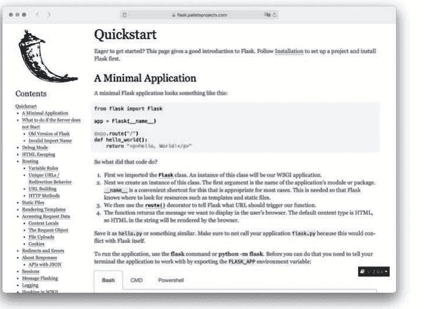

清单 1.11 中的代码定义了当响应普通浏览器请求（称为 GET）时，*根* URL / 的行为。响应本身是必需的“hello, world!”字符串，它将作为一个（非常简单的）网页返回给浏览器。

要运行清单 1.11 中的 Web 应用，我们只需使用 **flask** 命令运行 **hello_app.py** 文件即可（清单 1.12）。（请确保你在虚拟环境中运行；如果在默认系统上尝试运行 **flask** 命令，可能会发生奇怪的事情。）在清单 1.12 中，**--app** 选项指定了应用，**--debug** 选项则安排在我们更改代码时更新应用（这省去了每次更改都必须重启 Flask 服务器的麻烦）。

**清单 1.12：** 在本地系统上运行 Flask 应用。

```bash
(venv) $ flask --app hello_app.py --debug run
 * Running on http://127.0.0.1:5000/
```

此时，访问给定的 URL（由本地地址 127.0.0.1 和端口号组成）即可看到在本地机器上运行的应用。⁹

如果你使用的是云 IDE，命令与清单 1.12 中显示的几乎相同；唯一的区别是你必须使用 `--port` 选项指定一个不同的端口号（清单 1.13）。

**清单 1.13：** 在云 IDE 上运行 Flask 应用。

```
(venv) $ flask --app hello_app.py --debug run --port $PORT
 * Running on http://127.0.0.1:8080/
```

要预览应用并复现图 1.5 所示的结果，我们需要遵循几个额外的步骤。首先，我们需要如图 1.6 所示预览应用。

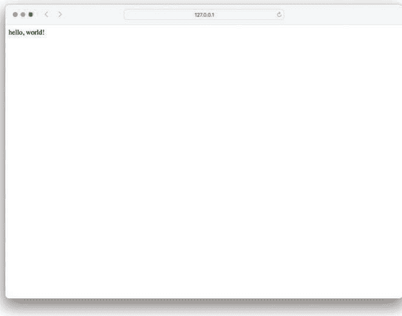

**图 1.5：** 在本地运行的 hello 应用。

9. 许多系统将 `localhost` 配置为 `127.0.0.1` 的同义词；对于 Flask，这仍然可以配置，但需要一些额外的设置，因此在本教程中我们将坚持使用原始地址。

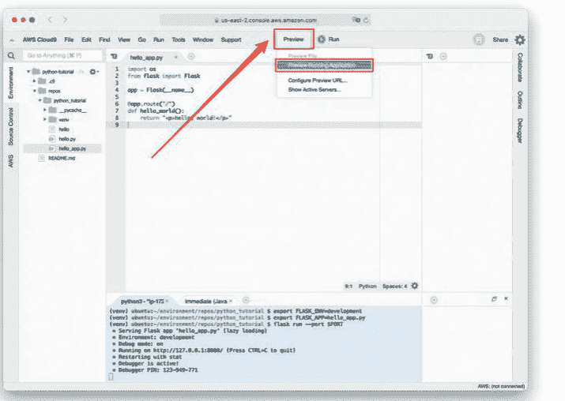

**图 1.6：** 在云 IDE 上运行的“本地”服务器。

结果通常显示在 IDE 内的一个小窗口中（细节可能有所不同）；通过点击图 1.7 所示的图标，我们可以将其弹出到一个新窗口。结果应如图 1.8 所示（与图 1.5 的唯一区别是 URL）。

仅仅让一个 Web 应用工作，即使是在本地，也是一项巨大的成就。但真正的*重头戏*是将应用部署到实际的 Web 上。这是第 1.5.1 节的目标。

### 1.5.1 部署

既然我们已经让应用在本地运行，我们就可以将其部署到生产环境了。这在入门教程中过去几乎是不可能的，但近年来技术格局已经显著成熟，以至于我们实际上有丰富的选择。结果将是第 1.5 节中应用的生产版本。

## 1.5 在 Web 浏览器中运行 Python

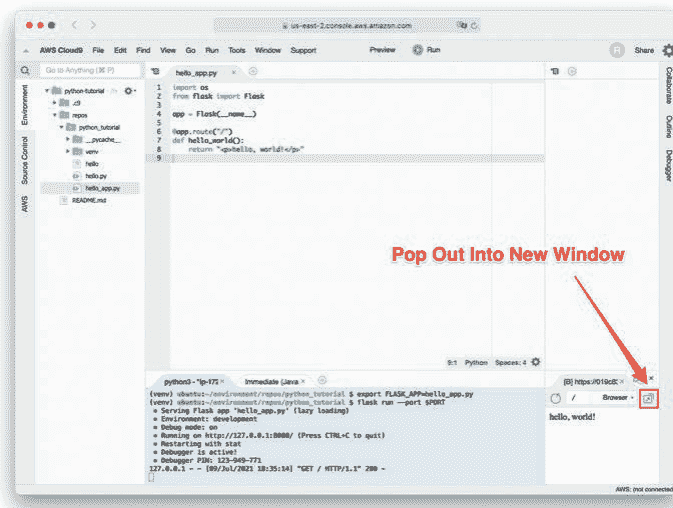

**图 1.7：** 预览 hello 应用。

首次部署会有一些开销，但尽早并频繁地部署是 Learn Enough *交付*（Box 1.5）理念的核心部分。此外，像“hello, world”这样的简单应用是首次部署的最佳类型，因为出错的可能性要小得多。

与之前教程（包括 *Learn Enough CSS & Layout to Be Dangerous* (https://www.learnenough.com/css-and-layout) 和 *Learn Enough JavaScript to Be Dangerous*）中使用的 GitHub Pages 部署选项一样，我们的第一步是使用 Git 将项目置于版本控制之下（如 *Learn Enough Git to Be Dangerous* (https://www.learnenough.com/git-tutorial/getting_started#sec-initializing_the_repo) 中所述）。虽然对于本节使用的部署解决方案来说，这并非严格必要，但拥有一个完全版本化的项目总是一个好主意，这样我们就能更容易地从任何错误中恢复。

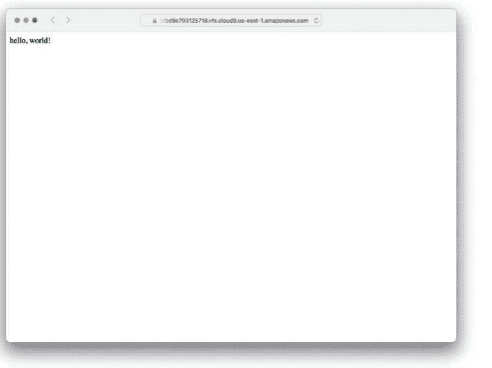

**图 1.8：** 在云 IDE 上运行的 hello 应用。

> **框 1.5：真正的艺术家懂得交付**
>
> 正如传奇的苹果联合创始人史蒂夫·乔布斯曾经说过：*真正的艺术家懂得交付*。他的意思是，尽管无休止地私下打磨作品很诱人，但创作者必须*交付*他们的作品——也就是说，真正完成它并将其推向世界。这可能很可怕，因为交付意味着将你的作品不仅展示给粉丝，也展示给批评家。“如果人们不喜欢我做的东西怎么办？”*真正的艺术家懂得交付*。
>
> 重要的是要理解，交付是一项与创作不同的技能。许多创作者擅长制作东西，但从未学会交付。为了防止这种情况发生在我们身上，我们将遵循 *Learn Enough Git to Be Dangerous* 中开始的做法，并在本教程中交付几样东西。在本节中交付“hello, world”应用仅仅是个开始！

我们的第一步是创建一个 **.gitignore** 文件，告诉 Git 忽略我们不想版本控制的文件和目录。使用 **touch .gitignore**（或任何你喜欢的其他方法）创建文件，然后填入清单 1.14 所示的内容。<sup>10</sup>

**清单 1.14：** 忽略某些文件和目录。

```
.gitignore

venv/

*.pyc
__pycache__/

instance/

.pytest_cache/
.coverage
htmlcov/

dist/
build/
*.egg-info/

.DS_Store
```

接下来，初始化仓库：

```
(venv) $ git init
(venv) $ git add -A
(venv) $ git commit -m "Initialize repository"
```

将新初始化的仓库推送到远程备份也是一个好主意。与之前的 Learn Enough 教程一样，我们将使用 GitHub 来实现此目的（图 1.9）。

因为 Web 应用有时包含敏感信息，如密码或 API 密钥，我喜欢谨慎行事，使用*私有*仓库。因此，在 GitHub 创建新仓库时，请务必选择 Private 选项，如图 1.10 所示。（顺便说一句，即使在私有仓库中包含密码或 API 密钥仍然是一个坏主意；最佳实践是使用环境变量或类似方法。）

10. 此文件部分基于 Flask 文档本身的示例。

## 第 1 章：Hello, World!

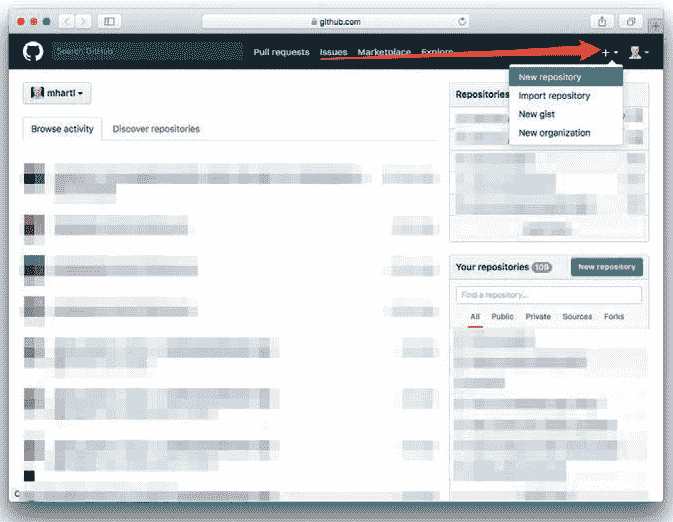

**图 1.9：** 在 GitHub 上创建新仓库。

接下来，将远程仓库信息告知你的本地系统（注意将 <username> 替换为你的 GitHub 用户名），然后将其推送上去：

```
(venv) $ git remote add origin https://github.com/<username>/python_tutorial.git
(venv) $ git push -u origin main
```

我们将用于 Flask 部署的服务是 Fly.io。我们将首先安装一个必要的包，然后列出部署应用程序所需的依赖项（包括 Flask）。*注意：* 以下步骤在撰写本文时有效，但部署到第三方服务正是那种可能随时发生变化的事情。如果发生这种情况，你可能有机会运用你的技术娴熟（框 1.2），甚至在必要时寻找替代服务（如 Render）。

## 1.5 在网页浏览器中运行Python

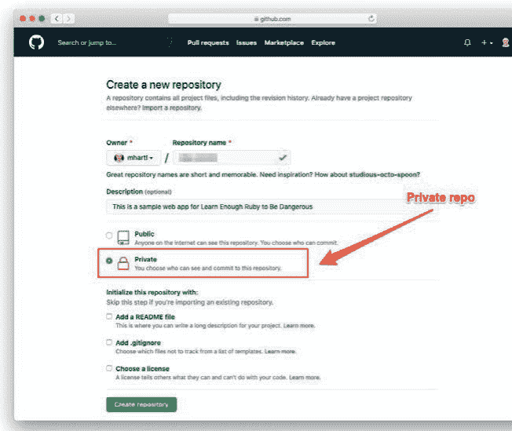

**图 1.10：** 使用私有仓库。

我们的第一步是安装Gunicorn的包，这是一个Python Web服务器：

```bash
(venv) $ pip install gunicorn==20.1.0
```

然后我们需要创建一个名为`requirements.txt`的文件，以告知部署主机运行我们的应用需要哪些包。我们可以通过以下命令创建一个`requirements.txt`文件来实现：

```bash
$ touch requirements.txt
```

然后填入清单1.15所示的内容。我们可以通过在未安装任何不必要包的虚拟环境中使用`pip freeze`来确定这些内容。（一些资源建议使用`pip freeze > requirements.txt`来重定向（https://www.learnenough.com/command-line-tutorial/manipulating_files#sec-redirecting_and_appending）`pip freeze`的输出，以创建清单1.15中的文件，但这种方法可能导致包含不必要或无效的包。）

**清单 1.15：** 指定我们应用的依赖项。
*requirements.txt*

```
click==8.1.3
Flask==2.2.2
gunicorn==20.1.0
itsdangerous==2.1.2
Jinja2==3.1.2
MarkupSafe==2.1.1
Werkzeug==2.2.2
```

当前Python包管理的推荐做法是使用`pyproject.toml`文件来指定项目的构建系统。在部署到Fly.io时，此步骤不是必需的，但当我们将在第8章创建自己的包时，我们将遵循此实践。

通过清单1.15中的配置，我们已经设置好了系统，以便Fly.io能够自动检测到Flask应用的存在。以下是入门步骤：

1.  注册（https://fly.io/app/sign-up）Fly.io。注意点击免费套餐的链接，这个链接可能有点难找（图1.11）。免费账户限于两个部署服务器，这对我们来说很完美，因为本教程（此处和第10章）中正好需要这个数量。
2.  安装Fly Control（`flyctl`），这是一个与Fly.io交互的命令行程序。macOS和Linux（包括云IDE）的安装选项分别如清单1.16和清单1.17所示。对于后者，请注意按照说明将任何行添加到您的`.bash_profile`或`.zshrc`文件中（清单1.18），然后运行`source ~/.bash_profile`（或`source ~/.zshrc`）以更新配置。请注意，清单1.18中的垂直点表示省略的行。
3.  在命令行登录Fly.io（清单1.19）。

11. 我偶然发现`flyctl`在至少我的系统上被别名为`fly`；我建议看看您的系统上是否也能同样使用`fly`。


**图 1.11：** Fly.io免费套餐。

**清单 1.16：** 在macOS上使用Homebrew安装`flyctl`。

```bash
(venv) $ brew install flyctl
```

**清单 1.17：** 在Linux上安装`flyctl`。

```bash
(venv) $ curl -L https://fly.io/install.sh | sh
```

**清单 1.18：** 为**flyctl**添加配置行。

```
~/.bash_profile or ~/.zshrc

.
.
.
export FLYCTL_INSTALL="/home/ubuntu/.fly"
export PATH="$FLYCTL_INSTALL/bin:$PATH"
```

**清单 1.19：** 登录Fly.io。¹²

```
(venv) $ flyctl auth login --interactive
```

登录Fly.io后，请按照以下步骤部署hello应用：

1.  运行**flyctl launch**（清单1.20）并接受自动生成的名称和默认选项（即不使用数据库）。
2.  编辑生成的**Procfile**并填入清单1.21所示的内容。您可能只需要进行一处更改，即将应用名称从**server**更新为**hello_app**。
3.  使用**flyctl deploy**部署应用程序（清单1.22）。¹³

**清单 1.20：** “启动”应用（这仅是本地配置）。

```
(venv) $ flyctl launch
```

**清单 1.21：** *Procfile*

```
web: gunicorn hello_app:app
```

12. 清单1.19包含**--interactive**选项，以防止**flyctl**生成浏览器窗口，这在原生系统和云IDE上都有效。如果您使用的是原生系统，可以随意省略该选项。

13. 在我的测试中，当运行虚拟专用网络（VPN）时，**flyctl deploy**会失败，因此如果您使用VPN，我建议您在此步骤中禁用它。

**清单 1.22：** 将应用部署到Fly.io。

```
(venv) $ flyctl deploy
```

部署步骤完成后，您可以运行清单1.23中的命令来查看应用的状态。（如果出现问题，您可能会发现**flyctl logs**对调试有帮助。）

**清单 1.23：** 查看已部署应用的状态。

```
(venv) $ flyctl status    # 详情会有所不同
App
  Name      = restless-sun-9514
  Owner     = personal
  Version   = 2
  Status    = running

Hostname = crimson-shadow-1161.fly.dev  # 您的URL会不同。
Platform = nomad

Deployment Status
  ID          = 051e253a-e322-4b2c-96ec-bc2758763328
  Version     = v2
  Status      = successful
  Description = Deployment completed successfully
  Instances   = 1 desired, 1 placed, 1 healthy, 0 unhealthy
```

清单1.23中高亮显示的行表示在线应用的URL，您可以按如下方式自动打开它：

```
(venv) $ flyctl open    # 在云IDE上无效，请使用显示的URL
```

如前所述，**flyctl open**命令在云IDE上无效，因为它需要生成一个新的浏览器窗口，但在这种情况下，您只需将清单1.23中您版本的URL复制并粘贴到浏览器的地址栏中，即可获得相同的结果。

就是这样！我们的hello应用现在正在生产环境中运行（图1.12）。“它活了！”（图1.13¹⁴）。

14. 图片由Niday Picture Library/Alamy Stock Photo提供。

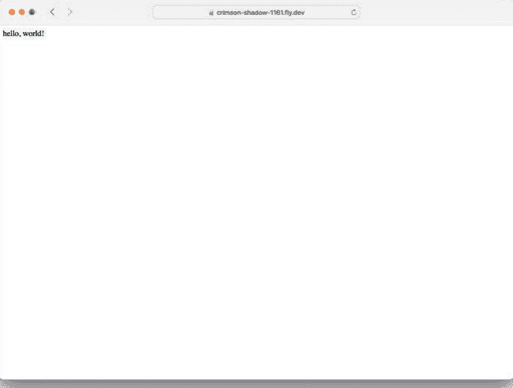

**图 1.12：** 在生产环境中运行的hello应用。


**图 1.13：** 让一个网站活起来比以前容易多了。

尽管本节涉及相当多的步骤，但能够如此早地部署一个站点简直是个奇迹。它可能是一个简单的应用，但它是一个真实的应用，能够将其部署到生产环境是一个巨大的进步。

顺便说一句，您可能已经注意到，部署到Fly.io不需要Git提交（与GitHub Pages或Heroku等托管服务不同）。因此，现在进行最后一次提交并将结果推送到GitHub可能是个好主意：

```
(venv) $ git add -A
(venv) $ git commit -m "Configure hello app for deployment"
(venv) $ git push
```

### 1.5.2 练习

1.  在本地运行的**hello_app.py**中，将“hello, world!”更改为“goodbye, world!”。更新后的文本会立即显示吗？刷新浏览器后呢？
2.  将您更新后的应用部署到Fly.io，并确认新文本按预期显示。

# 第2章
字符串

*字符串*可能是日常计算中最重要的数据结构。它们几乎在所有可以想象的程序中都被使用，也是网络的原材料。因此，字符串是我们开始Python编程之旅的绝佳起点。

## 2.1 字符串基础

字符串由按特定顺序排列的字符序列组成。¹ 我们在第1章的“hello, world”程序中已经见过几个例子。让我们看看如果在Python REPL中直接输入一个字符串（不使用`print()`）会发生什么：

```
$ source venv/bin/activate
(venv) $ python3
>>> "hello, world!"
'hello, world!'
```

直接输入的字符序列称为*字符串字面量*，我们在这里使用双引号字符"创建了它。REPL打印出*求值*该行的结果，对于字符串字面量来说，结果就是字符串本身。

一个特别重要的字符串是没有任何内容的字符串，仅由两个引号组成。这被称为*空字符串*（有时也称为*the*空字符串）：

1. 与许多其他高级语言（如JavaScript和Ruby）一样，Python的“字符”只是长度为一的字符串。这与C和Java等低级语言形成对比，后者有专门用于字符的特殊类型。

## 2.1 字符串基础

```python
>>> ""
''
```

我们将在第 2.4.2 节和第 3.1 节中进一步讨论空字符串。

请注意，REPL 显示我们输入的双引号字符串时，使用了单引号（'**hello, world!**' 而不是 "**hello, world!**"）。这纯粹是一种惯例（实际上可能取决于系统），因为在 Python 中，单引号和双引号字符串是完全相同的。² 嗯，不是*完全*完全相同，因为字符串可能包含一个字面引号（图 2.1³）：

```python
>>> 'It's not easy being green'
  File "<stdin>", line 1
    'It's not easy being green'
          ^
SyntaxError: invalid syntax
```


**图 2.1：** 有时当 REPL 生成语法错误时，事情就不那么简单了。

因为 REPL 将 'It' 解释为一个字符串，而最后的 ' 作为第二个字符串的开头，结果就是语法错误。（另一个结果，如上所示，是语法高亮看起来很奇怪——这种副作用通常作为语法错误的视觉提示很有用。）

根据 PEP-8 风格指南，以这种方式包含引号的首选方法是简单地使用另一种引号来定义字符串（代码清单 2.1）。

**代码清单 2.1：** 在双引号内包含单引号。

```python
>>> "It's not easy being green"
"It's not easy being green"
```

请注意，这里的 REPL 遵循了与我们相同的惯例，对于包含单引号的字符串切换到双引号。

最后，Python 支持*三引号字符串*，这很不寻常：

```python
>>> """Return the function value."""
'Return the function value.'
```

当它们适合放在一行时，这些字符串的行为与单引号和双引号字符串完全一样，但我们也可以在其中添加换行符：

```python
>>> """This is a string.
...
... We can add newlines inside,
... which is pretty cool.
... """
'This is a string.\nWe can add newlines inside,\nwhich is pretty cool.\n'
```

三引号字符串因其在*文档字符串*中的使用而闻名，文档字符串是 Python 函数（第 5 章）和类（第 7 章）中使用的特殊文档字符串。因此，它们在 Python 编程中被大量使用。

一般来说，PEP 8 指出，只要保持一致，单引号和双引号字符串都是可以接受的，但三引号字符串应始终使用双引号变体：⁴

> 在 Python 中，单引号字符串和双引号字符串是相同的。本 PEP 不对此提出建议。选择一个规则并坚持下去。但是，当字符串包含单引号或双引号字符时，请使用另一种引号以避免字符串中的反斜杠。这提高了可读性。
> 对于三引号字符串，始终使用双引号字符以与 PEP 257 中的文档字符串惯例保持一致。

本教程将双引号字符串标准化，以与此三引号惯例保持一致，并与《*Learn Enough JavaScript to Be Dangerous*》(https://www.learnenough.com/javascript) 和《*Learn Enough Ruby to Be Dangerous*》(https://www.learnenough.com/ruby) 中使用的惯例相匹配，但当然，如果您愿意，您可以自由选择相反的惯例。

### 2.1.1 练习

1.  确认我们可以使用反斜杠转义引号，例如 `'It\'s not easy being green'`。如果字符串同时包含单引号和双引号（在这种情况下，代码清单 2.1 中的技巧不起作用），这会很方便。REPL 如何处理 `'It\'s not "easy" being green'`？
2.  Python 支持常见的特殊字符，如制表符 (`\t`) 和换行符 (`\n`)，它们是两种不同形式的所谓*空白字符*。证明 `\t` 和 `\n` 在单引号和双引号字符串内都被解释为特殊字符。如果在其中一个字符串前加上字母 `r` 会发生什么？*提示：* 在 REPL 中，尝试执行如代码清单 2.2 所示的命令。我们将在第 2.2.2 节中了解更多关于特殊 `r` 行为的信息。

**代码清单 2.2：** 一些包含特殊字符的字符串。

```python
>>> print('hello\tgoodbye')
>>> print('hello\ngoodbye')
>>> print("hello\tgoodbye")
>>> print("hello\ngoodbye")
>>> print(r"hello\ngoodbye")
```

## 2.2 连接和插值

两个最重要的字符串操作是*连接*（将字符串连接在一起）和*插值*（将变量内容放入字符串中）。我们将从连接开始，可以使用 + 运算符完成：⁵

```python
(venv) $ python3
>>> "foo" + "bar"            # 字符串连接
'foobar'
>>> "ant" + "bat" + "cat"    # 多个字符串可以一次连接。
'antbatcat'
```

这里计算 "**foo**" 加 "**bar**" 的结果是字符串 "**foobar**"。（奇怪的名字“foo”和“bar”的含义在《*Learn Enough Command Line to Be Dangerous*》(https://www.learnenough.com/command-line) 中进行了讨论 (https://www.learnenough.com/command-line-tutorial/manipulating_files#aside-foo_bar)。）还要注意*注释*，使用井号 # 表示，您可以自由忽略它们，Python 在任何情况下都会忽略它们。

让我们在*变量*的背景下再次查看字符串连接，您可以将变量视为包含某些值的命名框（如《*Learn Enough CSS & Layout to Be Dangerous*》(https://www.learnenough.com/css-and-layout) 中提到的 (https://www.learnenough.com/css-and-layout-tutorial/templates_and_frontmatter#aside-variable)，并在框 2.1 中进一步讨论）。

> **框 2.1：变量和标识符**
>
> 如果您以前从未编写过计算机程序，您可能不熟悉**变量**这个术语，这是计算机科学中的一个基本概念。您可以将变量视为一个可以容纳不同（或“可变”）内容的命名框。
>
> 作为一个具体的类比，考虑许多小学为学生提供的用于存放衣物、书籍、背包等的带标签的盒子（图 2.2⁶）。变量是盒子的位置，盒子的标签是变量名（也称为*标识符*），盒子的内容是变量值。
>
> 在实践中，这些不同的定义经常被混淆，“变量”通常用于这三个概念（位置、标签或值）中的任何一个。


**图 2.2：** 计算机变量的具体体现。

作为一个具体的例子，我们可以使用 = 号为名字和姓氏创建变量，如代码清单 2.3 所示。

**代码清单 2.3：** 使用 = 赋值变量。

```python
>>> first_name = "Michael"
>>> last_name = "Hartl"
```

这里 = 将标识符 **first_name** 与字符串 "**Michael**" 关联起来，将标识符 **last_name** 与字符串 "**Hartl**" 关联起来。

代码清单 2.3 中的标识符 **first_name** 和 **last_name** 采用所谓的蛇形命名法（snake case），^7 其名称起源模糊，但可能是 Python 变量名最常见的惯例（图 2.3^8）。（相比之下，Python 类使用驼峰命名法（CamelCase），这在第 7 章中有更详细的描述。）

---
*脚注：*
2.  这与 Ruby 形成对比，Ruby 使用单引号字符串作为*原始字符串*；如第 2.2.2 节所述，Python 的惯例是在前面加上字母 r。
3.  图片由 LorraineHudgins/Shutterstock 提供。
4.  这里的术语是标准的，但有点混乱：“单引号”和“双引号”指的是字符本身的引号数量（' 与 "），而“三引号”指的是定义字符串时每侧使用的此类字符的数量（"""...")。
5.  这种使用 + 进行字符串连接的方式在编程语言中很常见，但从某一方面来说，这是一个不幸的选择，因为加法是数学中典型的交换运算：*a + b = b + a*。（相比之下，乘法在某些情况下是非交换的；例如，当矩阵相乘时，通常 *AB ≠ BA*。）然而，在字符串连接的情况下，+ 绝对*不是*一个交换运算，因为，例如，"**foo**" + "**bar**" 是 "**foobar**"，而 "**bar**" + "**foo**" 是 "**barfoo**"。部分出于这个原因，一些语言（如 PHP）使用不同的符号进行连接，例如点 .（产生 "**foo**" . "**bar**"）。
6.  图片由 Africa Studio/Shutterstock 提供。
7.  特别是，“蛇形命名法”并不是指 Python 本身；蛇形命名变量名在名称与蛇无关的语言中很常见，例如 C、Perl、PHP、JavaScript 和 Ruby。
8.  图片由 rafaelbenari/123RF 提供。

### 2.2.1 格式化字符串

构建字符串最符合 Python 风格（Box 1.1）的方式是通过*插值*使用所谓的*格式化字符串*，或称 *f-字符串*，它结合了字母 **f**（代表“formatted”）和花括号来插入变量值：

```
>>> f"{first_name} is my first name."    # Pythonic
'Michael is my first name.'
```

这里 Python 会自动将变量 **first_name** 的值插入或*插值*到字符串中的适当位置。⁹ 实际上，花括号内的任何代码都会被 Python 求值并直接插入。

我们可以使用插值来复现清单 2.4 的结果，如清单 2.5 所示。

#### 清单 2.5：连接回顾，然后插值。

```
>>> first_name + " " + last_name      # Concatenation (not Pythonic)
'Michael Hartl'
>>> f"{first_name} {last_name}"        # Interpolation (Pythonic)
'Michael Hartl'
```

清单 2.5 中显示的两个表达式是等价的，但我通常更喜欢插值版本，因为在字符串之间添加单个空格 " " 感觉有点笨拙（而且，如前所述，Python 开发者通常也认同这一点）。

值得注意的是，格式化字符串是在 Python 3.6 中添加的。如果出于某种原因你需要使用更早版本的 Python，你可以使用 % 格式化或 **str.format()** 作为替代。具体来说，以下三行代码给出相同的结果：

```
>>> f"First Name: {first_name}, Last Name: {last_name}"
'First Name: Michael, Last Name: Hartl'
>>> "First Name: {}, Last Name: {}".format(first_name, last_name)
'First Name: Michael, Last Name: Hartl'
>>> "First Name: %s, Last Name: %s" % (first_name, last_name)
'First Name: Michael, Last Name: Hartl'
```

特别是使用 **format()** 可能具有即使在格式化字符串可用时也很有用的潜在优势。更多信息请参阅文章 "Python 3's f-Strings: An Improved String Formatting Syntax" (https://realpython.com/python-f-strings/)。

### 2.2.2 原始字符串

除了普通字符串和格式化字符串，Python 还支持所谓的*原始字符串*。对于许多用途，这两种字符串实际上是相同的：

9. 熟悉 Perl 或 PHP 的程序员可以将此与表达式（如 **"Michael $last_name"**）中美元符号变量的自动插值进行比较。

```
>>> r"foo"
'foo'
>>> r"foo" + r"bar"
'foobar'
```

不过，存在重要差异。例如，Python 不会插值到原始字符串中：

```
>>> r"{first_name} {last_name}"    # No interpolation!
'{first_name} {last_name}'
```

然而，这并不奇怪，因为 Python 也不会插值到普通字符串中：

```
>>> "{first_name} {last_name}"    # No interpolation!
'{first_name} {last_name}'
```

如果普通字符串可以做原始字符串能做的一切，那么原始字符串的意义何在？它们通常很有用，因为它们是真正字面的，包含你输入的精确字符。例如，“反斜杠”字符在大多数系统上是特殊的，如字面换行符 \n。如果你想让一个变量包含一个字面的反斜杠，原始字符串使其更容易：

```
>>> r"\n"    # A literal 'backslash n' combination
'\n'
```

请注意，Python REPL 需要用额外的反斜杠来转义反斜杠；在普通字符串中，一个字面的反斜杠用*两个*反斜杠表示。对于像这样的小例子，节省不多，但如果有很多东西需要转义，它确实很有帮助：

```
>>> r"Newlines (\n) and tabs (\t) both use the backslash character: \."
'Newlines (\n) and tabs (\t) both use the backslash character: \. '
```

原始字符串最常见的用途可能是在定义正则表达式（第 4.3 节）时，但它们在第 11.3 节标记图表时也会出现。

在原始字符串内部，转义字符的做法是不必要的，*除了*用于定义字符串的相同类型的引号。例如，如果你使用单引号定义一个原始字符串，通常它工作得很好：

```
>>> r'Newlines (\n) and tabs (\t) both use the backslash character: \.'
'Newlines (\n) and tabs (\t) both use the backslash character: \.'
```

与普通字符串一样，如果使用单引号定义的原始字符串本身包含一个单引号，我们会得到语法错误：

```
>>> r'It's not easy being green'
  File "<stdin>", line 1
    'It's not easy being green'
          ^
SyntaxError: invalid syntax
```

### 2.2.3 练习

- 1. 将变量 **city** 和 **state** 赋值为你当前居住的城市和州。（如果居住在美国以外，用类似的量代替。）使用插值，打印一个由城市和州组成的字符串，中间用逗号和空格分隔，如“Los Angeles, CA”。
- 2. 重复上一个练习，但城市和州之间用制表符分隔。
- 3. 三引号字符串（第 2.1 节）支持插值吗？

## 2.3 打印

正如我们在第 1.2 节及后续章节中看到的，Python 打印字符串到屏幕的方式是使用 **print()** 函数：

```
>>> print("hello, world!")    # Print output
hello, world!
```

这里 **print()** 接受一个字符串作为*参数*，然后将结果打印到屏幕。**print()** 函数作为*副作用*运行，这指的是函数除了返回值之外所做的任何事情。特别是，表达式

```
print("hello, world!")
```

将字符串打印到屏幕，然后不返回任何东西——实际上，它返回一个名为 **None** 的字面 Python 对象，我们可以在这里看到：¹⁰

```
>>> result = print("hello, world!")
"hello, world"
>>> print(result)
None
```

这里第二个 **print()** 实例将 **None** 转换为字符串表示并打印结果。我们可以使用 **repr()**（“representation”）函数直接获取字符串表示：

```
>>> repr(None)
'None'
```

**repr()** 命令非常有用，尤其是在 REPL 中，并且适用于几乎任何 Python 对象。

我们在第 1.2.1 节简要看到，**print()** 还接受一个名为 **end** 的*关键字参数*（第 5.1.2 节），它表示字符串末尾使用的字符。默认的 **end** 是换行符 \n，这就是为什么我们在下一个解释器提示符之前得到一个漂亮的换行：

```
>>> print("foo")
foo
>>>
```

我们可以通过传递不同的字符串（如空字符串 ""）来覆盖此行为：

```
>>> print("foo", end="")
foo>>>
```

请注意，提示符现在立即出现在字符串之后。这在脚本中可能很有用，因为它允许我们打印多个语句而它们之间没有任何分隔。

10. Python 的 **None** 是 Ruby 的 **nil** 的精确类比。

### 2.3.1 练习

- 1. 给 `print()` 多个参数，如 `print("foo", "bar", "baz")`，效果是什么？
- 2. 运行清单 2.6 中显示的打印测试效果是什么？*提示*：你应该使用第 1.3 节中介绍的相同技术创建并运行文件。

#### 清单 2.6：不换行打印的测试。
*print_test.py*

```
python
print("foo", end="")
print("bar", end="")
print("baz")
```

## 2.4 长度、布尔值和控制流

最有用的 Python 内置函数之一是 `len()`，它返回其参数的长度。在许多其他事情中，`len()` 适用于字符串：

```
python
>>> len("hello, world!")
13
>>> len("")
0
```

对于来自其他高级语言的程序员来说，这可能有点棘手，其中许多语言使用 `obj.length`（一个属性）或 `obj.length()`（一个方法）来计算长度。在 Python 中，`len(obj)` 承担了这个重要角色。（我们将在第 2.5 节开始学习更多关于方法的知识。）

`len()` 函数在比较中特别有用，例如检查字符串的长度以查看它与特定值的比较（请注意，REPL 支持“向上箭头”来检索前几行，就像命令行终端一样）：

```
python
>>> len("badger") > 3
True
>>> len("badger") > 6
False
>>> len("badger") >= 6
```

## 2.4 长度、布尔值与控制流

```python
>>> len("badger") < 10
True
>>> len("badger") == 6
True
```

最后一行使用了相等比较运算符 `==`，Python 与许多其他语言共享此运算符。（Python 还有一个名为 `is` 的比较运算符，它表示更强的比较；参见第 3.4.2 节。）

上述比较的返回值始终是 `True` 或 `False`，被称为*布尔*值，以数学家兼逻辑学家乔治·布尔命名（图 2.4<sup>11</sup>）。


**图 2.4：** 真还是假？这是乔治·布尔的肖像。

11. 图片由 Yogi Black/Alamy Stock Photo 提供。

布尔值对于*控制流*特别有用，它允许我们根据比较的结果采取行动（代码清单 2.7）。在代码清单 2.7 中，三个点 ... 是由 Python 解释器插入的，不应直接复制。

### 代码清单 2.7：使用 `if` 的控制流。

```python
>>> password = "foo"
>>> if (len(password) < 6):    # Not fully Pythonic
...     print("Password is too short.")
...
Password is too short.
```

注意代码清单 2.7 中，`if` 后的比较在括号内，并且 `if` 语句以冒号 `:` 结尾。后者是必需的，但在 Python 中（与许多其他语言不同），括号是可选的，通常会省略（代码清单 2.8）。

### 代码清单 2.8：使用 `if` 的控制流。

```python
>>> password = "foo"
>>> if len(password) < 6:    # Pythonic
...     print("Password is too short.")
...
Password is too short.
```

同时，块结构通过缩进来表示，在本例中是字符串 "**Password is too short.**" 前的四个空格（框 2.2）。

> **框 2.2：代码格式化**
>
> 本教程中的代码示例，包括 REPL 中的示例，旨在展示如何以最大化可读性和代码理解度的方式格式化 Python 代码。在众多编程语言中，Python 实际上*要求*这种格式化，因为其块结构是通过缩进而非花括号 `{ . . . }`（如 C/C++、PHP、Perl、JavaScript 等）或特殊关键字（例如 Ruby 中的 end）来指示的。
>
> 虽然具体风格各异，但以下是一些良好代码格式化的通用准则，部分基于 PEP 8 – Python 代码风格指南：
>
> -   缩进代码以指示块结构。如上所述，这是 Python 的要求。Python 技术上允许使用空格或制表符，但制表符通常被认为是不好的做法，强烈建议使用空格（通常通过模拟制表符 (https://www.learnenough.com/text-editor-tutorial/advanced_text_editing#sec-indenting_and_dedenting)）。
> -   使用四个空格进行缩进。尽管一些 Python 风格指南，如 Google 的 Python 课程，每次缩进两个空格，但官方的 PEP 8 准则建议使用四个空格。
> -   添加换行符以指示逻辑结构。我特别喜欢做的一件事是在一系列变量赋值后添加一个额外的换行符，以直观地表明设置已完成，真正的编码可以开始了。示例见代码清单 4.12。
> -   将代码行限制在 79 个字符（也称为“列”），将注释行或文档字符串限制在 72 个字符。这些规则由 PEP 8 推荐，比其他 Learn Enough 教程中使用的 80 字符限制（可追溯到早期 80 字符宽度终端时代）更为保守。许多现代开发者经常违反此限制，认为它已过时，但根据我的经验，使用保守的字符限制是培养良好习惯的好方法，并且在使用命令行程序如 less（或在宽度要求更严格的文档中使用代码，例如书籍）时会救你一命。超过字符限制的行提示你应该引入新的变量名、将操作分解为多个步骤等，以使代码对任何阅读它的人更清晰。
>
> 我们将在本教程的后续部分看到更多高级代码格式化约定的示例。

我们可以使用 `else` 添加第二个行为，它作为第一个比较为 `False` 时的默认结果（代码清单 2.9）。

### 代码清单 2.9：使用 `if` 和 `else` 的控制流。

```python
>>> password = "foobar"
>>> if len(password) < 6:
...     print("Password is too short.")
... else:
...     print("Password is long enough.")
...
Password is long enough.
```

代码清单 2.9 中的第一行通过赋予新值*重新定义*了 **password**。重新赋值后，**password** 变量的长度为 6，因此 **len(password) < 6** 为 **False**。因此，语句的 **if** 部分（称为 **if 分支**）不会被求值；相反，Python 求值 **else** 分支，输出一条消息表明密码足够长。

Python 没有使用更常见的 **else if** 控制流，而是有一个特殊的 **elif** 关键字，含义相同，如代码清单 2.10 所示（图 2.5<sup>12</sup>）。


**图 2.5：** 金发姑娘选择了恰到好处的控制流。

12. 图片由 Jessie Willcox Smith/Alamy Stock Photo 提供。

### 代码清单 2.10：使用 `elif` 的控制流。

```python
>>> password = "goldilocks"
>>> if len(password) < 6:
...     print("Password is too short.")
... elif len(password) < 50:
...     print("Password is just right!")
... else:
...     print("Password is too long.")
...
Password is just right!
```

### 2.4.1 组合与反转布尔值

布尔值可以使用 `and`、`or` 和 `not` 运算符进行组合或反转。

让我们从 `and` 开始。当使用 `and` 比较两个布尔值时，*两者*都必须为 `True`，组合结果才为 `True`。例如，如果我说我想要炸薯条*和*烤土豆，组合为真的唯一方式是我能对“你想要炸薯条吗？”和“你想要烤土豆吗？”这两个问题都回答“是”（真）。如果我对其中任何一个问题的回答是假，那么组合也必须是假。由此产生的可能性组合统称为*真值表*；`and` 的真值表见代码清单 2.11。

### 代码清单 2.11：`and` 的真值表。

```python
>>> True and False
False
>>> False and True
False
>>> False and False
False
>>> True and True
True
```

我们可以将其应用于条件语句，如代码清单 2.12 所示。

### 代码清单 2.12：在条件语句中使用 `and` 运算符。

```python
>>> x = "foo"
>>> y = ""
>>> if len(x) == 0 and len(y) == 0:
...     print("Both strings are empty!")
... else:
...     print("At least one of the strings is nonempty.")
...
At least one of the strings is nonempty.
```

在代码清单 2.12 中，**len(y)** 实际上是 **0**，但 **len(x)** 不是，所以组合结果为 **False**（与代码清单 2.11 一致），Python 求值 **else** 分支。

与 **and** 相比，**or** 允许我们在*任一*比较（或两者）为真时采取行动（代码清单 2.13）。

### 代码清单 2.13：`or` 的真值表。

```python
>>> True or False
True
>>> False or True
True
>>> True or True
True
>>> False or False
False
```

我们可以在条件语句中使用 **or**，如代码清单 2.14 所示。

### 代码清单 2.14：在条件语句中使用 `or` 运算符。

```python
>>> if len(x) == 0 or len(y) == 0:
...     print("At least one of the strings is empty!")
... else:
...     print("Neither of the strings is empty.")
...
At least one of the strings is empty!
```

注意代码清单 2.13 中，**or** 不是*排他性*的，这意味着即使*两个*语句都为真，结果也为真。这与日常用法形成对比，例如“我想要炸薯条或烤土豆”这句话暗示你想要炸薯条*或*烤土豆，但不想要两者（图 2.6<sup>13</sup>）。

13. 图片由 Rikaphoto/Shutterstock 提供。


**图 2.6：** 原来我只想要炸薯条。

除了 **and** 和 **or**，Python 还通过“not”运算符 **not** 支持*否定*，它只是将 **True** 转换为 **False**，将 **False** 转换为 **True**（代码清单 2.15）。

### 代码清单 2.15：`not` 的真值表。

```python
>>> not True
False
>>> not False
True
```

我们可以在条件语句中使用 **not**，如代码清单 2.16 所示。注意在这种情况下*需要*括号，否则我们就是在询问 **not len(x)** 是否等于 **0**。

### 代码清单 2.16：在条件语句中使用 `not` 运算符。

```python
>>> if not (len(x) == 0):    # Not Pythonic
...     print("x is not empty.")
... else:
...     print("x is empty.")
...
x is not empty.
```

### 2.4.2 布尔上下文

并非所有布尔值都来自比较，实际上，每个 Python 对象在布尔上下文中都有一个 `True` 或 `False` 的值。我们可以使用 `bool()` 函数强制 Python 使用这种布尔上下文。自然，在布尔上下文中，`True` 和 `False` 都等于它们自身：

```
>>> bool(True)
True
>>> bool(False)
False
```

使用 `bool()` 让我们看到像 `"foo"` 这样的字符串在布尔上下文中是 `True`：

```
>>> bool("foo")
True
```

几乎所有 Python 字符串在布尔上下文中都是 **True**；唯一的例外是空字符串，它是 **False**：<sup>14</sup>

```
>>> bool("")
False
```

大多数其他在任何意义上“空”的东西在 Python 中都是 **False**。这包括数字 **0**：

```
>>> bool(0)
False
```

以及 **None**：

```
>>> bool(None)
False
```

正如我们稍后将看到的，空列表（第 3 章）、空元组（第 3.6 节）和空字典（第 4.4 节）也是 **False**。

重要的是要理解，使用 **bool()** 只是为了说明目的；在实际程序中，我们几乎总是依赖于 **if** 或 **elif** 等关键字的存在，这些关键字会自动将所有对象转换为其布尔等价物。例如，因为 "" 在布尔上下文中是 **False**，我们可以用 **x** 本身替换清单 2.17 中的 **len(x) != 0**，如清单 2.18 所示。

**清单 2.18：** 在布尔上下文中使用字符串。

```
>>> if x:                    # Pythonic
...     print("x is not empty.")
... else:
...     print("x is empty.")
...
x is not empty.
```

在清单 2.18 中，**if x:** 如果 **x** 是空字符串则将其转换为 **False**，否则转换为 **True**。

我们可以使用相同的属性来重写像清单 2.12 这样的代码，如清单 2.19 所示。

**清单 2.19：** 使用布尔方法。

```
>>> if x or y:
...     print("At least one of the strings is nonempty.")
... else:
...     print("Both strings are empty!")
...
At least one of the strings is nonempty.
```

14. 这是那种因语言而异的细节。例如，在 Ruby 中，空字符串是 true。

### 2.4.3 练习

- 1. 如果 x 是 "foo"，y 是 ""（空字符串），那么 x 和 y 的值是什么？使用 bool() 验证 x 和 y 在布尔上下文中是否为 true。
- 2. 证明我们可以使用清单 2.20 中的便捷代码定义一个长度为 50 的字符串，该代码使用星号 * 将字符串 "a" "乘以" 50。使用新密码再次执行清单 2.10 中的步骤，以验证 Python 打印出 "Password is too long."。

**清单 2.20：** 定义一个过长的密码。

```
>>> password = "a" * 50
>>> password
'aaaaaaaaaaaaaaaaaaaaaaaaaaaaaaaaaaaaaaaaaaaaaaaaaa'
```

## 2.5 方法

我们在第 2.4 节中看到，我们可以调用 len() 函数来获取字符串的长度。这遵循与第 2.3 节讨论的 print() 函数相同的基本模式：我们输入函数名，并在括号中提供一个参数。
还有第二类重要的函数，它们实际上附着在所讨论的对象上——在本章的情况下，是一个字符串对象。这样的函数被称为方法。在 Python（以及许多其他支持面向对象编程的语言）中，方法通过输入对象，后跟一个点，然后是方法名来表示。例如，Python 字符串有一个名为 capitalize() 的方法，它将给定字符串的首字母大写：

```
>>> "michael".capitalize()
'Michael'
```

注意，我们包含括号以表明 **capitalize()** 是一个方法（在这种情况下，没有参数）。省略括号会导致 Python 返回原始方法：

```
>>> "michael".capitalize
<built-in method capitalize of str object at 0x1014487b0>
```

这就是为什么我们通常在像 **capitalize()** 这样的方法名中包含括号。一个重要的方法类别是 *布尔方法*，它们返回 **True** 或 **False**。在 Python 中，此类方法通常使用单词“is”作为方法名的第一部分来表示：

```
>>> "badger".islower()
True
>>> "BADGER".islower()
False
>>> "bAdGEr".islower()
False
```

这里我们看到，如果字符串全是小写字母，**islower()** 返回 **True**，否则返回 **False**。字符串还响应许多返回字符串内容转换版本的方法。一个例子是上面看到的 **capitalize()** 方法。字符串还有一个 **lower()** 方法，它（惊喜！）将字符串转换为全小写字母（图 2.7<sup>15</sup>）：

```
>>> "HONEY BADGER".lower()
'honey badger'
```

注意，**lower()** 方法返回一个 *新* 字符串，而不会更改（或 *修改*）原始字符串：

```
>>> animal = "HONEY BADGER"
>>> animal.lower()
'honey badger'
>>> animal
'HONEY BADGER'
```

这种方法可能很有用，例如，在标准化电子邮件地址中的小写字母时：

```
>>> first_name = "Michael"
>>> username = first_name.lower()
>>> f"{username}@example.com"    # 示例电子邮件地址
'michael@example.com'
```

正如你可能猜到的，Python 也支持相反的操作；在查看下面的示例之前，看看你是否能猜出将字符串转换为大写的方法（图 2.8<sup>16</sup>）。
我打赌你得到了正确的答案（或者至少很接近）：

```
>>> last_name.upper()
'HARTL'
```

**图 2.8：** 早期的排字工人将大写字母放在“上层盒子”，小写字母放在“下层盒子”。

能够猜出这样的答案是技术熟练的标志，但正如框 1.2 中指出的，另一个关键技能是能够使用文档。特别是，Python 文档页面 `str` 有一个很长的有用字符串方法列表。<sup>17</sup> 让我们看看其中的一些（图 2.9）。

检查图 2.9 中的方法，我们看到一个看起来像这样的：

```
python
str.find(sub[, start[, end]])
Return the lowest index in the string where substring *sub* is found within the slice *s[start:end]*. Optional arguments *start* and *end* are interpreted as in slice notation. Return -1 if *sub* is not found.
```

这表明 `find()` 方法接受一个 *参数* `sub`，并返回子字符串开始的位置：

```
>>> "hello".find("lo")
3
>>> "hello".find("ol")
-1
```

（注意 **3** 对应于 *第四个* 字母，而不是第三个，这种约定称为“零偏移”或“基于零的索引”；参见第 2.6 节。）

对于不存在的子字符串的结果意味着我们可以通过与 **-1** 比较来测试字符串是否包含子字符串：

### 字符串方法

字符串实现了所有常见的序列操作，以及下面描述的附加方法。

字符串还支持两种风格的字符串格式化，一种提供高度的灵活性和自定义（参见 `str.format()`、`Format String Syntax` 和 `Custom String Formatting`），另一种基于 C `printf` 风格的格式化，处理的类型范围较窄，使用起来稍微困难一些，但对于它能处理的情况通常更快（`printf-style String Formatting`）。

标准库的 `Text Processing Services` 部分涵盖了许多其他提供各种文本相关实用程序的模块（包括 `re` 模块中的正则表达式支持）。

**`str.capitalize()`**
返回字符串的副本，其首字母大写，其余字母小写。

*在版本 3.8 中更改：* 首字母现在被置于标题大小写而不是大写。这意味着像双字母这样的字符只会将其首字母大写，而不是整个字符。

**`str.casefold()`**
返回字符串的 casefolded 副本。casefolded 字符串可用于不区分大小写的匹配。

Casefolding 类似于小写化，但更激进，因为它旨在消除字符串中的所有大小写区别。例如，德语小写字母 `'ß'` 等同于 `"ss"`。由于它已经是小写，`lower()` 对 `'ß'` 不起作用；`casefold()` 将其转换为 `"ss"`。

casefolding 算法在 Unicode 标准的第 3.13 节中有描述。

*在版本 3.3 中新增。*

**`str.center(width[, fillchar])`**
返回一个长度为 *width* 的字符串，原字符串居中。使用指定的 *fillchar*（默认为 ASCII 空格）进行填充。如果 *width* 小于或等于 `len(a)`，则返回原始字符串。

**`str.count(sub[, start[, end]])`**
返回在范围 `[start, end]` 内子字符串 *sub* 的非重叠出现次数。可选参数 *start* 和 *end* 的解释与切片表示法相同。

**图 2.9：一些 Python 字符串方法。**

15. 图片由 Pavel Kovaricek/Shutterstock 提供。
16. 图片由 Pavel Kovaricek/Shutterstock 提供。
17. 你可以直接访问官方 Python 文档来找到这样的页面，但事实是我几乎总是通过谷歌搜索“python string”之类的东西来找到这样的页面。注意版本号——尽管 Python 在这一点上相当稳定，但如果你注意到任何差异，请确保你使用的是与你自己的 Python 版本兼容的文档。

### 2.5.1 练习

1.  编写 Python 代码，测试字符串 “hoNeY BaDGeR” 是否包含字符串 “badger”，且不区分大小写。
2.  用于去除字符串首尾空白字符的 Python 方法是什么？结果应如代码清单 2.22 所示，其中 **FILL_IN** 替换为该方法名。

**图 2.10：** 丹麦王子哈姆雷特问道：“生存还是毁灭，这是一个问题。”

**代码清单 2.22：** 去除空白字符。

```
>>> "   spacious   ".FILL_IN()
'spacious'
```

## 2.6 字符串迭代

我们关于字符串的最后一个主题是*迭代*，即重复地逐个遍历对象元素的实践。迭代是计算机编程中的一个常见主题，我们将在本教程中进行大量练习。我们还将看到，作为开发者能力增长的一个标志，就是学会如何*完全避免*迭代（如第 6 章和第 8.5 节所述）。

就字符串而言，我们将学习如何一次迭代一个*字符*。这主要有两个前提：首先，我们需要学习如何访问字符串中的特定字符；其次，我们需要学习如何创建一个*循环*。

我们可以通过查阅通用序列操作（https://docs.python.org/3/library/stdtypes.html#common-sequence-operations）来弄清楚如何访问特定的字符串字符，该文档指出，对于序列（包括字符串），`s[i]`（使用方括号）返回“s 的第 i 项，起始索引为 0”。（列出的主要序列是列表和元组，将在第 3 章介绍，以及范围，我们稍后会看到。）将这种方括号表示法应用于第 2.5 节中的独白字符串，我们可以看到它是如何工作的，如代码清单 2.23 所示。

**代码清单 2.23：** 探究 `str[index]` 的行为。

```
>>> soliloquy   # 仅提醒一下该字符串是什么
'To be, or not to be, that is the question:'
>>> soliloquy[0]
'T'
>>> soliloquy[1]
'o'
>>> soliloquy[2]
' '
```

我们在代码清单 2.23 中看到，Python 支持使用方括号表示法访问字符串元素，因此 `[0]` 返回第一个字符，`[1]` 返回第二个，依此类推。（我们将在第 3.1 节进一步讨论这种可能违反直觉的编号约定，称为“零偏移”或“从零开始的索引”。）每个数字 0、1、2 等都称为索引（复数为 indexes 或 indices）。

现在让我们来看第一个循环示例。具体来说，我们将使用一个 `for` 循环，它定义一个索引值 `i`，并对 `range(5)` 中的每个值执行一个操作（代码清单 2.24）。

**代码清单 2.24：** 一个简单的 `for` 循环。

```
>>> for i in range(5):
...     print(i)
...
0
1
2
3
4
```

这里我们使用了 `range(5)` 函数，如我们所见，它创建了一个包含 0–4 范围内数字的对象。

代码清单 2.24 是 Python 版本的经典“for 循环”，这种循环在从 C 和 C++ 到 JavaScript、Perl 和 PHP 等众多编程语言中都极其常见。然而，与那些显式递增计数器变量的语言不同，Python 通过特殊的 Range 数据类型直接定义一个值范围。

可以说，代码清单 2.24 比在《*Learn Enough JavaScript to Be Dangerous*》中看到的等效“经典” **for** 循环（代码清单 2.25）更优雅一些，但它仍然不是很好的 Python 代码。

**代码清单 2.25：** JavaScript 中的 **for** 循环。

```
javascript
> for (i = 0; i < 5; i++) {
    console.log(i);
}
0
1
2
3
4
```

作为一种语言和一个社区，Python 特别警惕避免使用普通的 **for** 循环。正如计算机科学家（也是我的私人朋友）Mike Vanier（图 2.11¹⁹）曾在一封给 Paul Graham 的邮件中所说：

> > 这种[单调的重复]过一段时间就会让你精疲力竭；如果我每写一次“for (i = 0; i < N; i++)”就能得到五美分，那我早就成百万富翁了。

**图 2.11：** 只要再多几个 **for** 循环，Mike Vanier 就会成为百万富翁。

为了避免精疲力竭，我们将学习如何使用 **for** 直接遍历元素。我们还将看到 Python 如何让我们使用函数式编程（第 6 章和第 8.5 节）完全避免循环。

不过，现在让我们在代码清单 2.24 的基础上，迭代哈姆雷特著名独白第一行中的所有字符。我们需要的唯一新东西是循环停止的索引。在代码清单 2.24 中，我们硬编码了上限（5），如果我们愿意，这里也可以这样做。不过，**soliloquy** 变量有点长，手动计数字符很麻烦，所以让我们使用 **len()** 属性（第 2.4 节）来询问 Python：

```
>>> len(soliloquy)
42
```

这个极其吉利的结果提示我们编写如下代码：

```
for i in range(42):
    print(soliloquy[i])
```

这段代码可以工作，并且与代码清单 2.24 完全类似，但它也提出了一个问题：为什么要在循环本身中硬编码长度，而不是直接使用 **len()** 方法呢？

答案是我们不应该这样做。改进后的 **for** 循环出现在代码清单 2.26 中。

**代码清单 2.26：** 结合 **range()**、**len()** 和 **for** 循环。

```
>>> for i in range(len(soliloquy)):    # 非 Pythonic 风格
...     print(soliloquy[i])
...
T
o

b
e
.
.
.
t
i
o
n
:
```

尽管代码清单 2.26 工作正常，但它不是 Pythonic 的。相反，遍历字符串字符最 Pythonic 的方式是直接使用 **for**，因为事实证明，**for** 应用于字符串时的默认行为就是依次考虑每个字符，如代码清单 2.27 所示。

**代码清单 2.27：** 使用 **for** 遍历字符串。

```
>>> for c in soliloquy:    # Pythonic 风格
...     print(c)
...
T
o

b
e
.
.
.
t
i
o
n
:
```

如前所述，循环通常有替代方案，但 **for** 风格的循环仍然是一个很好的起点。正如我们将在第 8 章看到的，一个强大的技术是为我们想要的功能编写一个*测试*，然后以任何我们能想到的方式让它通过，然后*重构*代码以使用更优雅的方法。这个过程的第二步（称为*测试驱动开发*，或 TDD）通常涉及编写不优雅但易于理解的代码——而这正是谦逊的 **for** 循环所擅长的任务。

### 2.6.1 练习

1.  编写一个 **for** 循环，以相反的顺序打印出 **soliloquy** 的字符。*提示：* **reversed()** 函数对字符串有什么作用？
2.  代码清单 2.27 中普通 **for** 循环的一个缺点是，我们不再能访问索引值本身。我们可以像代码清单 2.28 那样解决这个问题，但 Pythonic 的方式是使用 **enumerate()** 函数同时获取索引和元素。确认你可以使用 **enumerate()** 获得代码清单 2.29 所示的结果。

**代码清单 2.28：** 使用索引访问字符串。

```
>>> for i in range(len(soliloquy)):    # 非 Pythonic 风格
...     print(f"Character {i+1} is '{soliloquy[i]}'")
...
Character 1 is 'T'
Character 2 is 'o'
Character 3 is ' '
Character 4 is 'b'
Character 5 is 'e'
Character 6 is ','
Character 7 is ' '
.
.
.
```

**代码清单 2.29：** 使用索引遍历字符串。

```
>>> for i, c in enumerate(soliloquy):    # Pythonic 风格
...     print(f"Character {i+1} is '{c}'")
...
Character 1 is 'T'
Character 2 is 'o'
Character 3 is ' '
Character 4 is 'b'
Character 5 is 'e'
Character 6 is ','
Character 7 is ' '
.
.
.
```

# 第三章
列表

在第二章中，我们了解到字符串可以被视为特定顺序的字符序列。在本章中，我们将学习*列表*数据类型，它是Python中用于存储特定顺序任意元素列表的通用容器。Python列表类似于其他语言（如JavaScript和Ruby）中的*数组*数据类型，因此熟悉其他语言的程序员可能能猜到很多关于Python列表行为的特点。（尽管Python确实有一个内置的数组类型，但在本教程中，“数组”始终指由NumPy库定义的*ndarray*数据类型，该类型将在第11.2节中介绍。）

我们将首先通过**split()**方法（第3.1节）明确连接字符串和列表，然后在本章的其余部分学习各种其他列表方法和技术。在第3.6节中，我们还将快速了解两种密切相关的数据类型：Python*元组*和*集合*。

## 3.1 分割

到目前为止，我们花了大量时间理解字符串，而通过**split()**方法从字符串到列表有一个自然的方式：

```
$ source venv/bin/activate
(venv) $ python3
>>> "ant bat cat".split(" ")    # 将字符串分割成一个包含三个元素的列表。
['ant', 'bat', 'cat']
```

从这个结果我们可以看到，**split()**返回一个列表，其中的字符串是由原始字符串中用空格分隔的各个部分。

按空格分割是最常见的操作之一，但我们也可以按几乎任何其他内容进行分割（代码清单3.1）。

### 代码清单3.1：按任意字符串分割。

```
>>> "ant,bat,cat".split(",")
['ant', 'bat', 'cat']
>>> "ant, bat, cat".split(", ")
['ant', 'bat', 'cat']
>>> "antheybatheycat".split("hey")
['ant', 'bat', 'cat']
```

许多语言支持这种分割，但请注意，Python在上面说明的最后一种情况中包含了一个空字符串，而一些语言（如Ruby）会自动去除它。在按换行符分割的常见情况下，我们可以使用**splitlines()**来避免这个额外的字符串（代码清单3.2）。

### 代码清单3.2：按换行符分割与**splitlines()**。

```
>>> s = "This is a line.\nAnd this is another line.\n"
>>> s.split("\n")
['This is a line.', 'And this is another line.', '']
>>> s.splitlines()
['This is a line.', 'And this is another line.']
```

许多语言允许我们通过按空字符串分割来将字符串拆分为其组成字符，但这在Python中不起作用：

```
>>> "badger".split("")
"badger".split("")
Traceback (most recent call last):
  File "<stdin>", line 1, in <module>
ValueError: empty separator
```

在Python中，最好的方法是直接对字符串使用**list()**函数：

```
>>> list("badger")
['b', 'a', 'd', 'g', 'e', 'r']
```

因为Python可以自然地迭代字符串的字符，所以很少需要显式使用这种技术；相反，我们通常会使用*迭代器*，我们将在第5.3节中学习。

也许`split()`最常见的用法是*不带*参数；在这种情况下，默认行为是按*空白字符*（如空格、制表符或换行符）分割：

```
>>> "ant bat cat".split()
['ant', 'bat', 'cat']
>>> "ant\tbat\tcat\n    duck".split()
['ant', 'bat', 'cat', 'duck']
```

我们将在第4.3节讨论*正则表达式*时更详细地研究这种情况。

### 3.1.1 练习

- 1. 将变量`a`赋值为字符串“A man, a plan, a canal, Panama”按逗号-空格分割的结果。结果列表有多少个元素？
- 2. 你能猜出就地反转`a`的方法吗？（如果需要，可以搜索一下。）

## 3.2 列表访问

通过`split()`方法将字符串与列表连接起来后，我们现在将发现第二个密切的联系。让我们首先将一个变量赋值为使用`list()`创建的字符列表：

```
>>> a = list("badger")
['b', 'a', 'd', 'g', 'e', 'r']
```

这里我们遵循传统，将变量命名为`a`，既因为它是字母表的第一个字母，也是对列表与之非常相似的数组类型的致敬。

我们可以使用在第2.6节字符串上下文中首次遇到的相同方括号表示法来访问`a`的特定元素，如代码清单3.3所示。

### 代码清单3.3：使用方括号表示法访问列表。

```
>>> a[0]
'b'
>>> a[1]
'a'
>>> a[2]
'd'
```

从代码清单3.3我们可以看到，与字符串一样，列表是*从零开始的*，这意味着“第一个”元素的索引是**0**，第二个是**1**，依此类推。这个约定可能会令人困惑，事实上，对于从零开始的列表，通常将初始元素称为“第零个”元素，以提醒索引从**0**开始。当使用多种语言时（其中一些语言的列表索引从**1**开始），这个约定也可能令人困惑，如xkcd漫画“Donald Knuth”所示。

到目前为止，我们只处理了字符列表，但Python列表可以包含所有类型的元素（代码清单3.4）。

### 代码清单3.4：创建包含多种类型元素的列表。

```
>>> soliloquy = "To be, or not to be, that is the question:"
>>> a = ["badger", 42, "To be" in soliloquy]
>>> a
['badger', 42, True]
>>> a[2]
True
>>> a[3]
Traceback (most recent call last):
  File "<stdin>", line 1, in <module>
IndexError: list index out of range
```

我们在这里看到，对于混合类型的列表，方括号访问表示法照常工作，这不应该感到惊讶。我们还看到，如果尝试访问超出定义范围的列表索引，会引发错误。

Python方括号表示法的另一个便利特性是支持*负*索引，它从列表末尾开始计数：

```
>>> a[-2]
42
```

1. 这幅特定的xkcd漫画以著名计算机科学家Donald Knuth（发音为“kuh-NOOTH”）命名，他是《计算机程序设计艺术》的作者，也是TeX排版系统的创建者，该系统用于准备许多技术文档，包括本文档。

除了其他功能外，负索引为我们提供了一种紧凑的方式来选择列表中的*最后一个*元素。因为`len()`（第2.4节）对列表和字符串都有效，我们可以通过从长度中减去1来直接做到这一点（我们必须这样做，因为列表是从零开始的）：

```
>>> a[len(a) - 1]
True
```

但这样更简单：

```
>>> a[-1]
True
```

最后一个常见情况是我们想同时访问最后一个元素并将其移除。我们将在第3.4.3节介绍执行此操作的方法。

顺便说一下，从代码清单3.4开始，我们使用了字面量方括号语法来手动定义列表。这种表示法非常自然，你可能甚至没有注意到它，实际上它与REPL在打印列表时使用的格式相同。

我们可以使用相同的表示法来定义*空列表*`[]`，它只计算为自身：

```
>>> []
[]
```

你可能还记得第2.4.2节，像`""`、`0`和`None`这样的空或不存在的东西在布尔上下文中是`False`。这个模式也适用于空列表：

```
>>> bool([])
False
```

### 3.2.1 练习

- 1. 我们已经看到`list(str)`返回字符串中字符的列表。我们如何创建一个包含0-4范围内数字的列表？*提示：*回顾在代码清单2.24中首次遇到的`range()`函数。
- 2. 证明你可以使用`list()`和`range(17, 42)`创建一个包含17-41范围内数字的列表。


**图3.1：** Python在切片方面异常出色。

## 3.3 列表切片

除了支持第3.2节中描述的方括号表示法外，Python还擅长一种称为*列表切片*（图3.1²）的技术，用于一次访问多个元素。为了预期在第3.4.2节中学习*排序*，让我们重新定义列表**a**，使其仅包含数字元素：

```
>>> a = [42, 8, 17, 99]
[42, 8, 17, 99]
```

切片列表的一种方法是使用**slice()**函数，并提供两个参数，分别对应切片应开始和结束的索引号。例如，**slice(2, 4)**让我们提取索引为**2**和**3**的元素，结束于**4**：

```
>>> a[slice(2, 4)]    # 不够Pythonic
[17, 99]
```

这可能有点难以理解，因为由于列表是从零开始的，所以没有索引为**4**的元素。我们可以通过想象一个指针来更好地理解这一点。

在创建切片时，它会将一个元素向右移动；它从**2**开始，当移动到**3**时选择元素**2**，然后当移动到**4**时选择元素**3**。

显式的 **slice()** 表示法在实际的 Python 代码中很少使用；更常见的是使用冒号的等效表示法，像这样：

```
>>> a[2:4]    # Pythonic
[17, 99]
```

请注意，索引约定是相同的：要选择索引为 **2** 和 **3** 的元素，我们包含的最终范围比切片中最终索引的值大*一*（在这种情况下，3 + 1 = 4）。

在我们当前列表的情况下，**4** 是列表的长度，因此实际上我们是从索引为 **2** 的元素切片到末尾。这是一个非常常见的任务，Python 有一个特殊的表示法——我们只需完全省略第二个索引：

```
>>> a[2:]    # Pythonic
[17, 99]
```

正如你可能猜到的，相同的基本表示法也适用于从列表的*开头*进行切片：

```
>>> a[:2]    # Pythonic
[42, 8]
```

这里的一般模式是 **a[start:end]** 从索引 **start** 选择到索引 **end-1**，其中任何一个都可以省略以从开头选择或选择到末尾。Python 还支持此语法的扩展形式 **a[start:end:step]**，这与常规列表切片相同，只是每次取 **step** 个元素。例如，我们可以按如下方式从范围中每次选择 **3** 个数字：

```
>>> numbers = list(range(20))
>>> numbers
[0, 1, 2, 3, 4, 5, 6, 7, 8, 9, 10, 11, 12, 13, 14, 15, 16, 17, 18, 19]
>>> numbers[0:20:3]    # Not Pythonic
[0, 3, 6, 9, 12, 15, 18]
```

或者我们可以从索引 **5** 开始，到索引 **17** 结束：

```
>>> numbers[5:17:3]
[5, 8, 11, 14]
```

与常规切片一样，如果我们想要开头或结尾，可以省略值：

```
>>> numbers[:10:3]    # 从开头到 10-1
[0, 3, 6, 9]
>>> numbers[5::3]     # 从 5 到末尾
[5, 8, 11, 14, 17]
```

我们可以通过省略 **0** 和 **20** 来更 Pythonic 地复制 **numbers[0:20:3]** 的结果：

```
>>> numbers[::3]     # Pythonic
[0, 3, 6, 9, 12, 15, 18]
```

我们甚至可以使用负步长向后移动：

```
>>> numbers[::-3]
[19, 16, 13, 10, 7, 4, 1]
```

这暗示了一种（可能过于巧妙的）*反转*列表的方法，即使用步长为 **-1**。将此想法应用于我们的原始列表如下：

```
>>> a[::-1]
[99, 17, 8, 42]
```

你可能会在实际的 Python 代码中遇到这种 **[::-1]** 构造，因此了解它的作用很重要，但有更方便和可读的方法来反转列表，如第 3.4.2 节所述。

### 3.3.1 练习

1.  定义一个包含数字 0 到 9 的列表。使用切片和 **len()** 选择第三个元素到倒数第三个元素。使用负索引完成相同的任务。
2.  通过仅从字符串 **"ant bat cat"** 中选择 **"bat"** 来证明字符串也支持切片。（你可能需要稍微尝试一下才能获得正确的索引。）

## 3.4 更多列表技术

除了访问和选择元素之外，我们还可以对列表做许多其他事情。在本节中，我们将讨论元素包含、排序和反转，以及追加和弹出。

### 3.4.1 元素包含

与字符串（第 2.5 节）一样，列表支持使用 `in` 关键字测试元素包含：

```
>>> a = [42, 8, 17, 99]
[42, 8, 17, 99]
>>> 42 in a
True
>>> "foo" in a
False
```

### 3.4.2 排序和反转

Python 具有强大的*排序*和*反转*列表的功能。它们通常分为两种类型：*原地*和*生成器*。让我们看一些例子来了解这意味着什么。

我们将从原地排序列表开始——这是一个极好的技巧，在 C 的古老时代通常需要自定义实现。³ 在 Python 中，我们只需调用 `sort()`：

```
>>> a = [42, 8, 17, 99]
>>> a.sort()
>>> a
[8, 17, 42, 99]
```

正如你可能对整数列表所期望的那样，`a.sort()` 按数字顺序对列表进行排序（不像，例如，JavaScript，它令人困惑地按“字母顺序”排序，因此 17 排在 8 之前）。我们还看到（与 Ruby 不同，但*像* JavaScript 一样）对列表进行排序会改变或*修改*列表本身。（我们稍后会看到它返回 `None`。）

> 3. 这对 C 并不完全公平：Python 本身是用 C 编写的，所以 `sort()` 实际上就是这样一个“自定义实现”！

我们可以使用 **reverse()** 来反转列表中的元素：

```
>>> a.reverse()
>>> a
[99, 42, 17, 8]
```

与 **sort()** 一样，请注意 **reverse()** 会修改列表本身。

这种修改方法可以帮助演示关于 Python 列表的一个常见陷阱，涉及列表赋值。假设我们有一个列表 **a1**，并想要一个名为 **a2** 的副本（清单 3.5）。

#### 清单 3.5：危险的赋值。

```
>>> a1 = [42, 8, 17, 99]
>>> a2 = a1    # 危险！
```

第二行中的赋值是危险的，因为 **a2** 指向与 **a1** 相同的计算机内存位置，这意味着如果我们修改 **a1**，它也会改变 **a2**：

```
>>> a1.sort()
>>> a1
[8, 17, 42, 99]
>>> a2
[8, 17, 42, 99]
```

我们在这里看到 **a2** 已经改变，即使我们没有直接对它做任何事情。（你可以使用 **list()** 函数或 **copy()** 方法来避免这种情况，例如 **a2 = list(a1)** 或 **a2 = a1.copy()**。）

Python 的原地方法效率很高，但通常更方便的是相关的 **sorted()** 和 **reversed()** 函数。例如，我们可以按如下方式获取排序后的列表：

```
>>> a = [42, 8, 17, 99]
>>> sorted(a)    # Pythonic
[8, 17, 42, 99]
>>> a
[42, 8, 17, 99]
```

这里，与 **sort()** 的情况不同，原始列表未更改。

类似地，我们可以（几乎）使用 **reversed()** 获取反转的列表：

```
>>> a
[42, 8, 17, 99]
>>> reversed(a)
<list_reverseiterator object at 0x109561910>
```

不幸的是，与 **sorted()** 的并行结构略有破坏，至少在撰写本文时是这样。**reversed()** 函数返回一个*迭代器*，而不是列表，这是一种特殊类型的 Python 对象，旨在（你猜对了）被迭代。这通常不是问题，因为我们通常会连接或循环遍历反转的元素，在这种情况下生成器将很好地工作（第 5.3 节），但当我们真正需要一个列表时，我们可以直接调用 **list()** 函数（第 3.1 节）：

```
>>> list(reversed(a))
[99, 42, 17, 8]
```

如前所述，这个小缺陷很少造成影响，因为生成器在迭代时的行为与列表版本实际上相同。⁴

### 比较

列表支持与字符串（第 2 章）相同的基本相等和不等比较：

```
>>> a = [1, 2, 3]
>>> b = [1, 2, 3]
>>> a == b
True
>>> a != b
False
```

Python 还支持 **is**，它测试两个变量是否表示同一个对象。因为 **a** 和 **b** 虽然包含相同的元素，但在 Python 的内存系统中不是同一个对象，所以 **==** 和 **is** 在这种情况下返回不同的结果：

```
>>> a == b
True
>>> a is b
False
```

相比之下，清单 3.5 中的列表 **a1** 和 **a2** 使用两种比较都是相等的：

```
>>> a1 == a2
True
>>> a1 is a2
True
```

第二个 **True** 值是因为 **a1** 和 **a2** 确实是完全相同的对象。这种行为与许多其他语言（如 Ruby 和 JavaScript）支持的 **===** 语法实际上相同。

根据 PEP 8 风格指南，与 **None** 比较时应始终使用 **is**。例如，我们可以使用 **is** 来确认用于原地反转和排序的列表方法返回 **None**：

```
>>> a.reverse() == None    # Not Pythonic
True
>>> a.sort() == None       # Not Pythonic
True
>>> a.reverse() is None    # Pythonic
True
>>> a.sort() is None       # Pythonic
True
```

### 3.4.3 追加和弹出

一对有用的列表方法是 **append()** 和 **pop()**——**append()** 让我们将一个元素追加到列表的末尾，而 **pop()** 则将其移除并返回该值：

```
>>> a = sorted([42, 8, 17, 99])
>>> a
[8, 17, 42, 99]
>>> a.append(6)             # 追加到列表
>>> a
[8, 17, 42, 99, 6]
>>> a.append("foo")
>>> a
[8, 17, 42, 99, 6, 'foo']
>>> a.pop()                 # 弹出一个元素
'foo'
```

## 3.4 更多列表技巧

```python
>>> a
[8, 17, 42, 99, 6]
>>> a.pop()
6
>>> a.pop()
99
>>> a
[8, 17, 42]
```

请注意，**pop()** 会返回最后一个元素的值（同时将其移除作为副作用），而 **append()** 则返回 **None**（这体现在执行 append 后没有打印任何内容）。

现在，我们可以理解第 3.2 节中关于获取列表最后一个元素的评论了，只要我们不介意修改它：

```python
>>> the_answer_to_life_the_universe_and_everything = a.pop()
>>> the_answer_to_life_the_universe_and_everything
42
```

### 3.4.4 撤销分割

列表方法的最后一个例子，它让我们从第 3.1 节开始的讨论形成了一个闭环，那就是 **join()**。正如 **split()** 将字符串分割成列表元素一样，**join()** 将列表元素连接成一个字符串（清单 3.6）。

**清单 3.6：** 不同的连接方式。

```python
>>> a = ["ant", "bat", "cat", "42"]
['ant', 'bat', 'cat', '42']
>>> "".join(a) # 在空字符串上连接。
'antbatcat42'
>>> ", ".join(a) # 在逗号-空格上连接。
'ant, bat, cat, 42'
>>> " -- ".join(a) # 在双破折号上连接。
'ant -- bat -- cat -- 42'
```

请注意，在清单 3.6 所示的所有情况中，我们连接的列表完全由字符串组成。如果我们想要一个包含，比如说，*数字 42* 而不是字符串 **"42"** 的列表呢？默认情况下这是行不通的：

```python
>>> a = ["ant", "bat", "cat", 42]
>>> ", ".join(a)
Traceback (most recent call last):
  File "<stdin>", line 1, in <module>
TypeError: sequence item 3: expected str instance, int found
```

我提到这一点主要是因为许多语言，包括 JavaScript 和 Ruby，在连接时会自动将对象转换为字符串，因此对于熟悉这些语言的人来说，这在 Python 中可能被视为一个小小的陷阱。

Python 中的一个解决方案是使用 `str()` 函数，我们将在第 4.1.2 节再次看到它：

```python
>>> str(42)
'42'
```

然后，为了完成 `join()`，我们可以使用一个*生成器表达式*，它为列表中的每个元素返回 `str(e)`：

```python
>>> ", ".join(str(e) for e in a)
'ant, bat, cat, 42'
```

这种有些高级的构造与*推导式*有关，我们将在第 6 章中更详细地介绍。

### 3.4.5 练习

1.  要对列表进行反向排序，可以先排序再反转，但这个组合操作非常有用，以至于 `sort()` 和 `sorted()` 都支持一个关键字参数（第 5.1.2 节）来自动完成。请确认 `a.sort(reverse=True)` 和 `sorted(a, reverse=True)` 都具有同时排序和反转的效果。
2.  使用列表文档 (https://docs.python.org/3/tutorial/datastructures.html)，弄清楚如何在列表开头插入一个元素。
3.  使用 `extend()` 方法将清单 3.7 中显示的两个列表合并成一个列表。`extend()` 会修改 `a1` 吗？它会修改 `a2` 吗？

**清单 3.7：** 扩展列表。

```python
>>> a1 = ["a", "b", "c"]
>>> a2 = [1, 2, 3]
>>> FILL_IN
>>> a1
['a', 'b', 'c', 1, 2, 3]
```

## 3.5 列表迭代

列表最常见的任务之一是遍历其元素并对每个元素执行操作。这听起来可能很熟悉，因为我们在第 2.6 节中用字符串解决了完全相同的问题，而且解决方案实际上几乎相同。我们所需要做的就是将清单 2.27 中的 **for** 循环适配到列表，即用 **a** 替换 **soliloquy**，如清单 3.8 所示。

**清单 3.8：** 结合列表访问和 **for** 循环。

```python
>>> a = ["ant", "bat", "cat", 42]
>>> for i in range(len(a)):    # 非 Pythonic 风格
...     print(a[i])
...
ant
bat
cat
42
```

这很方便，但这并不是遍历列表的最佳方式，Mike Vanier 仍然不会满意（图 3.2⁵）。

幸运的是，以正确的方式™循环比大多数其他语言更容易，所以我们实际上可以在这里介绍它（不像在，例如，《足够危险的 JavaScript》(https://www.learnenough.com/javascript) 中，我们不得不等到第 5 章 (https://www.learnenough.com/javascript-tutorial/functions#sec-iteration_for_each)）。诀窍是知道，与字符串一样，**for...in** 的默认行为是按顺序返回每个元素，如清单 3.9 所示。

5. 图片 © Mike Vanier。


**图 3.2：** Mike Vanier 仍然对输入 **for** 循环感到恼火。


**图 3.3：** 避免使用 `range(len())` 让 Mike Vanier 稍微开心了一些。

**清单 3.9：** 使用 **for** 以正确的方式™遍历列表。

```python
>>> for e in a:    # Pythonic 风格
...     print(e)
...
ant
bat
cat
42
```

使用这种风格的 **for** 循环，我们可以直接遍历列表中的元素，从而避免输入 Mike Vanier 的*眼中钉*，“for (i = 0; i < N; i++)”。结果是更简洁的代码和更快乐的程序员（图 3.3⁶）。

顺便说一句，如果我们出于某种原因需要索引本身，可以使用 **enumerate()**，如清单 3.10 所示。（如果你完成了与清单 2.29 对应的练习，清单 3.10 中的代码可能看起来很熟悉。）

6. 图片 © Mike Vanier。

**清单 3.10：** 打印带索引的列表元素。

```python
>>> for i, e in enumerate(a):    # Pythonic 风格
...     print(f"a[{i}] = {e}")
...
a[0] = ant
a[1] = bat
a[2] = cat
a[3] = 42
```

请注意，清单 3.10 中的最终结果并不完全正确，因为我们实际上应该显示，例如，第一个元素为 "ant" 而不是 ant。修复这个小瑕疵留作练习。

最后，可以使用 break 关键字提前跳出循环（清单 3.11）。

**清单 3.11：** 使用 break 中断 for 循环。

```python
>>> for i, e in enumerate(a):
...     if e == "cat":
...         print(f"Found the cat at index {i}!")
...         break
...     else:
...         print(f"a[{i}] = {e}")
...
a[0] = ant
a[1] = bat
Found the cat at index 2!
>>>
```

在这种情况下，循环的执行在索引 2 处停止，不会继续到任何后续索引。我们将在第 5.1 节看到使用 return 关键字的类似构造。

### 3.5.1 练习

1.  使用 reversed() 以相反的顺序打印列表的元素。
2.  我们在清单 3.10 中看到，将列表的值插入字符串会导致打印出，例如，ant 而不是 "ant"。我们可以手动添加引号，但那样会将 42 打印为 "42"，这也是错误的。使用 `repr()` 函数（第 2.3 节）来插入每个列表元素的表示形式，从而解决这个难题，如清单 3.12 所示。

**清单 3.12：** 对清单 3.10 的改进。

```python
>>> for i, e in enumerate(a):
...     print(f"a[{i}] = {repr(e)}")
...
???
```

## 3.6 元组和集合

除了列表，Python 还支持*元组*，它们基本上是不可更改的列表（即元组是*不可变的*）。顺便说一句，我通常说“toople”，但你也会听到“tyoople”和“tupple”。

我们可以用与创建字面量列表大致相同的方式创建字面量元组。唯一的区别是元组使用圆括号而不是方括号：

```python
>>> t = ("fox", "dog", "eel")
>>> t
('fox', 'dog', 'eel')
>>> for e in t:
...     print(e)
...
fox
dog
eel
```

我们在这里看到，遍历元组使用与列表相同的 `for...in` 语法（清单 3.9）。

因为元组是不可变的，尝试修改它们会引发错误：

```python
>>> t.append("goat")
Traceback (most recent call last):
  File "<stdin>", line 1, in <module>
AttributeError: 'tuple' object has no attribute 'append'
>>> t.sort()
Traceback (most recent call last):
  File "<stdin>", line 1, in <module>
AttributeError: 'tuple' object has no attribute 'sort'
```

除此之外，元组支持许多与列表相同的操作，例如切片或非修改排序：

```python
>>> t[1:]
('dog', 'eel')
>>> sorted(t)
['dog', 'eel', 'fox']
```

请注意，在第二种情况下，**sorted()** 可以接受一个元组作为参数，但它返回一个列表。

顺便说一句，我们在定义元组时也可以省略圆括号：

```python
>>> u = "fox", "dog", "eel"
>>> u
('fox', 'dog', 'eel')
>>> t == u
True
```

我认为这种表示法可能令人困惑，通常更喜欢在定义元组时使用圆括号，但你应该知道它，以防在其他人的代码中看到它。主要的例外情况是在 REPL 中简单显示多个变量时，或者在通过所谓的*元组解包*进行赋值时，这允许你一次进行多个赋值：

```python
>>> a, b, c = t    # 非常 Pythonic；也适用于列表
>>> a
'fox'
>>> a, b, c        # 显示变量值的元组
```

最后，值得注意的是，定义一个包含一个元素的元组需要一个尾随逗号，因为括号中的单个对象就是对象本身：

```python
>>> ("foo")
'foo'
>>> ("foo",)
('foo',)
```

Python 还原生支持*集合*，它们与数学定义密切相关，可以看作是忽略重复值且顺序无关紧要的元素列表。集合可以使用花括号字面量初始化，或者通过将列表或元组（或实际上任何可迭代对象）传递给 **set()** 函数来初始化：

### 3.6.1 练习

- 1. 通过将 **sorted(t)** 从列表转换为元组，来确认 **tuple()** 函数的存在。
- 2. 结合 **set()** 和 **range()** 创建一个包含 0–4 范围内数字的集合。（回顾清单 2.24 中 **range()** 的用法。）确认第 3.4.3 节提到的 **pop()** 方法允许你一次移除一个元素。

# 第 4 章
其他原生对象

既然我们已经了解了字符串和列表（以及元组和集合），我们将继续介绍一些其他重要的 Python 特性和对象：数学、日期、正则表达式和字典。

## 4.1 数学

与大多数编程语言一样，Python 支持大量的数学运算：

```
$ source venv/bin/activate
(venv) $ python3
>>> 1 + 1
2
>>> 2 - 3
-1
>>> 2 * 3
6
>>> 10/5
2.0
```

请注意，除法会给出你预期的答案：

```
>>> 10/4
2.5
>>> 2/3
0.6666666666666666
```

我们在这里看到，Python 默认使用*浮点*除法。这与一些其他语言（如 C 和 Ruby）形成对比，在这些语言中，/ 是*整数除法*，返回分母能进入分子的次数。换句话说，在像 C 这样的语言中，**10/4** 是 **2** 而不是 **2.5**；要在 Python 中执行相同的操作，我们可以使用*两个*斜杠而不是一个：

```
>>> 10//4    # 整数除法
2
>>> 2//3
0
```

由于其强大的数值计算能力，包括我在内的许多程序员发现，在需要时启动 Python 解释器并将其用作简单的计算器非常方便。它虽然不花哨，但快速且相对强大，而且定义变量的能力也常常派上用场。

### 4.1.1 更高级的操作

Python 通过 **math** 对象（技术上是一个*模块*，一种我们将在第 7 章开始学习的特殊对象）支持更高级的数学运算。**math** 模块提供了用于数学常数、根和三角函数等的实用工具：

```
>>> import math
>>> math.pi
3.141592653589793
>>> math.sqrt(2)
1.4142135623730951
>>> math.cos(0)
1.0
>>> math.cos(2*math.pi)
1.0
```

我们在这里看到，使用 **math** 模块的方法是使用 **import math** 加载它，然后使用 **math.**（模块名后跟一个点）访问模块内容。这是 Python 模块的通用模式；使用 **math.** 前缀被称为*命名空间*。

对于那些来自高中（甚至大学）教科书的人来说，有一个需要注意的地方：这些教科书使用 ln *x* 表示自然对数（以 *e* 为底）。像大多数其他编程语言一样，Python 使用 log *x* 代替：¹

1. 目前尚不清楚为什么入门数学教科书决定使用 ln *x* 表示自然对数，而数学家通常将其写为 log *x*，即使他们将其写为 ln *x*，他们仍然经常将其*发音*为“log *x*”。

```
>>> math.log(math.e)
1
>>> math.log(10)
2.302585092994046
```

数学家通常使用 log₁₀ 表示以十为底的对数，Python 也遵循这一惯例，使用 **log10**：

```
>>> math.log10(10)
1.0
>>> math.log10(1000000)
6.0
>>> math.log10(1_000_000)
6.0
>>> math.log10(math.e)
0.4342944819032518
```

请注意，我们可以在数字中使用下划线作为分隔符，使其更易于阅读——因此，**1000000** 和 **1_000_000** 都表示数字一百万。

最后，Python 还通过 ** 运算符支持幂运算：

```
>>> 2**3
8
>>> math.e**100
2.6881171418161212e+43
```

这里的最终结果，使用数字后跟 **e+43**，是 Python 表示 e¹⁰⁰ ≈ 2.6881171418161212 × 10⁴³ 科学计数法的方式。

**math** 文档 (https://docs.python.org/3/library/math.html) 包含更全面的进一步操作列表。

### 4.1.2 数学转字符串

我们在第 3 章讨论了如何使用 **split()** 和 **join()** 在字符串和数组之间转换（反之亦然）。同样，Python 允许我们在数字和字符串之间进行转换。

将数字转换为字符串最常用的方法可能是使用 **str()** 函数，我们之前在第 3.4.4 节简要见过。例如，清单 4.1 展示了如何使用 **str()** 将圆周率常数 **tau**（框 4.1 和图 4.1）转换为字符串。

# 清单 4.1：使用 **tau** 作为圆周率常数。

```
>>> math.tau
6.283185307179586
>>> str(math.tau)
'6.283185307179586'
```

> 框 4.1：tau 的兴起

在 *Learn Enough JavaScript to Be Dangerous* (https://www.learnenough.com/javascript) 和 *Learn Enough Ruby to Be Dangerous* (https://www.learnenough.com/ruby) 的相应数学部分中，我不得不手动添加 tau 的定义，但在清单 4.1 中请注意，math.tau 是 Python 官方数学库的一部分。

这对我来说是一个特别令人满意的点，因为使用 tau (τ) 表示圆周率常数 C/r = 6.283185... 是在我 2010 年发表的一篇名为 *The Tau Manifesto* (https://tauday.com/tau-manifesto) 的数学论文中提出的（该论文还设立了数学节日 Tau Day (https://tauday.com/)）。在此之前，常数 C/r 没有通用的名称（除了“2π”），但 τ 在这些年里得到了越来越多的认可，包括在 Google 的在线计算器、Khan Academy 以及 Microsoft .NET、Julia 和 Rust（当然还有 Python！）等计算机语言中的支持 (https://tauday.com/state-of-the-tau)。

尽管将 tau 添加到 Python 并非没有争议，但最终它作为彩蛋被包含在 Python 3.6（及更高版本）中，供那些喜欢这类事物的数学、科学和计算机极客使用。我希望你可能是其中之一！

**str()** 函数也适用于裸数字：

```
>>> str(6.283185307179586)
'6.283185307179586'
```

要反向操作，我们可以使用 **int()**（“整数”）和 **float()** 函数：

```
>>> int("6")
6
>>> float("6.283185307179586")
6.283185307179586
```

### 4.1.3 练习

+   1. 当你对字符串 "1.24e6" 调用 `float()` 时会发生什么？如果对结果再调用 `str()` 呢？
2.  证明 `int(6.28)` 和 `int(6.98)` 都等于 6。这与 *向下取整函数*（在数学中写作 ⌊x⌋）的行为相同。证明 Python 的 `math` 模块中有一个 `floor()` 函数，其效果与 `int()` 相同。

## 4.2 时间与日期时间

其他常用的内置对象是密切相关的 `time` 和 `datetime` 模块。例如，我们可以使用 `time()` 方法获取当前时间：

```
>>> import time
>>> time.time()
1661191145.946213
```

这返回自 *纪元*（定义为 1970 年 1 月 1 日）以来的秒数。我们可以使用 `ctime()` 方法获取格式更方便的字符串（文档中没有说明，但这可能代表“转换时间”）：

```
>>> time.ctime()
'Mon Aug 22 11:00:32 2022'
```

Python 在 `datetime` 模块中提供了许多其他有用的方法。与其他 Python 对象一样，`datetime` 对象包含多种方法：

```
>>> import datetime
>>> now = datetime.datetime.now()
>>> now.year
2022
>>> now.month
8
>>> now.day
22
>>> now.hour
16
```

因为许多有用的方法定义在 `datetime` 模块内的单独 `datetime` 对象上，所以使用 `from` 只导入该对象通常更方便（使用与清单 4.2 中相同的基本语法）：

```
>>> from datetime import datetime
>>> now = datetime.now()
>>> now.year
2022
>>> now.day
22
>>> now.month
8
>>> now.hour
16
```

这可能会有点令人困惑，确实，一个模块定义一个与模块本身同名的对象是相当不寻常的。

也可以使用特定的日期和时间初始化 `datetime` 对象，例如首次登月（图 4.2²）：

```
>>> moon_landing = datetime(1969, 7, 20, 20, 17, 40)
1969-07-20 20:17:40 -0700
>>> moon_landing.day
20
```

默认情况下，`datetime` 使用本地时区，但这会给操作带来奇怪的地点依赖性，因此最好使用 UTC：³

2. 图片由 Castleski/Shutterstock 提供。
3. 对于大多数实际目的，协调世界时（UTC）与格林威治标准时间相同。但为什么叫 UTC？根据美国国家标准与技术研究院（NIST）时间和频率常见问题解答：**问：** 为什么使用 UTC 作为协调世界时的缩写，而不是 CUT？**答：** 1970 年，国际电信联盟（ITU）内的一个国际技术专家咨询小组设计了协调世界时系统。ITU 认为最好指定一个单一的缩写，以便在所有语言中使用，从而最大限度地减少混淆。由于无法就使用英语词序 CUT 或法语词序 TUC 达成一致，因此选择了缩写 UTC 作为折中方案。

**图 4.2：** 巴兹·奥尔德林和尼尔·阿姆斯特朗不知怎么就到了月球（并且回来了！），而且没有用 Python。

```
>>> from datetime import timezone
>>> now = datetime.now(timezone.utc)
>>> print(now)
2022-08-22 18:28:03.943097+00:00
```

要创建一个用于登月的 `datetime` 对象，我们需要使用 `tzinfo`（“时区信息”的缩写）传递时区作为 *关键字参数*（首次在第 2.3 节中看到，并在第 5.1.2 节中进一步讨论）：

```
>>> moon_landing = datetime(1969, 7, 20, 20, 17, 40, tzinfo=timezone.utc)
>>> print(moon_landing)
1969-07-20 20:17:40+00:00
```

最后，`datetime` 对象可以相互减去：

```
>>> print(now - moon_landing)
19390 days, 22:15:36.779053
```

这里的结果是自登月之日起的天数、小时数、分钟数和秒数。（当然，你的结果会有所不同，因为时间在流逝，你的 **datetime.now** 的值也会不同。）

你可能已经注意到，月份和日期是以 *单位偏移* 值返回的，这与列表使用的零偏移索引（第 3.2 节）不同。例如，在第八个月（八月），**now.month()** 的返回值是 **8** 而不是 7（如果月份被视为零偏移列表的索引，它应该是 7）。但是，有一个重要的值 *确实* 是作为零偏移索引返回的：

```
>>> moon_landing.weekday()
6
```

这里 **weekday** 返回星期几的索引，因为它是零偏移的，所以索引 **6** 表示登月发生在星期的第七天。

我们必须小心，因为在许多地方（包括美国），星期日是第 0 天，确实一些编程语言（如 JavaScript 和 Ruby）遵循这个惯例。但官方的国际标准是星期一是第一天，Python 遵循这个惯例。

因此，我们可以通过创建一个包含星期几名称的字符串列表（分配给一个全大写标识符，这是 Python 中表示常量的常见惯例），然后使用 **weekday** 的返回值作为列表的索引（使用方括号表示法，第 3.1 节）来获取星期几的名称：

```
>>> DAYNAMES = ["Monday", "Tuesday", "Wednesday",
...             "Thursday", "Friday", "Saturday", "Sunday"]
>>> DAYNAMES[moon_landing.weekday()]
'Sunday'
>>> DAYNAMES[datetime.now().weekday()]
'Monday'
```

（这些星期几的名称实际上作为 **calendar** 模块的一部分通过 **calendar.day_name** 提供。你只需运行 **import calendar** 来加载模块。参见第 4.2.1 节中的示例。）当然，你最后一行的结果会有所不同，除非你恰好在星期一阅读本文。

作为最后的练习，让我们用包含星期几的问候语更新清单 1.11 中的 Flask hello 应用。代码出现在清单 4.3 中，结果如图 4.3 所示。（有关运行 Flask 应用的命令，请参阅第 1.5 节。）注意清单 4.3 遵循先导入系统库（例如 **datetime**），然后是第三方库（例如 **flask**）的惯例，用空行分隔，后跟两个换行符。修复清单4.3中**DAYNAMES**不符合Python风格的位置留作练习（第4.2.1节）。

**清单4.3：** 添加根据星期几定制的问候语。
*hello_app.py*

```python
from datetime import datetime

from flask import Flask

app = Flask(__name__)

@app.route("/")
def hello_world():
    # 不符合Python风格的位置
    DAYNAMES = ["Monday", "Tuesday", "Wednesday",
                "Thursday", "Friday", "Saturday", "Sunday"]
    dayname = DAYNAMES[datetime.now().weekday()]
    return f"<p>Hello, world! Happy {dayname}.</p>"
```

**图4.3：** 仅为今天定制的问候语。

### 4.2.1 练习

1.  使用Python计算你出生在阿波罗登月后多少秒。（或者你甚至可能出生在*登月之前*——那样的话，你真幸运！希望你当时能在电视上看到它。）
2.  证明即使将`DAYNAMES`从`hello_world`函数中移出，如清单4.4所示，清单4.3仍然有效。（这通常是常量的首选位置——位于库导入语句下方，并与文件其余部分用两个换行符隔开。）然后使用`calendar`模块完全消除该常量（清单4.5）。

**清单4.4：** 将`DAYNAMES`移出函数。
*hello_app.py*

```python
from datetime import datetime

from flask import Flask

DAYNAMES = ["Monday", "Tuesday", "Wednesday",
            "Thursday", "Friday", "Saturday", "Sunday"]

app = Flask(__name__)

@app.route("/")
def hello_world():
    dayname = DAYNAMES[datetime.now().weekday()]
    return f"<p>Hello, world! Happy {dayname}.</p>"
```

**清单4.5：** 使用内置的星期名称。
*hello_app.py*

```python
from datetime import datetime
import calendar

from flask import Flask

app = Flask(__name__)

@app.route("/")
def hello_world():
    dayname = calendar.day_name[datetime.now().weekday()]
    return f"<p>Hello, world! Happy {dayname}.</p>"
```

## 4.3 正则表达式

Python完全支持*正则表达式*，通常简称为*regexes*或*regexps*，这是一种用于匹配文本模式的强大微型语言。完全掌握正则表达式超出了本书的范围（或许也超出了人类能力的范围），但好消息是，有许多资源可供逐步学习。（其中一些资源在《Learn Enough Command Line to Be Dangerous》(https://www.learnenough.com/command-line)的“Grepping”(https://www.learnenough.com/command-line-tutorial/inspecting_files#sec-grepping)和《Learn Enough Text Editor to Be Dangerous》(https://www.learnenough.com/text-editor-tutorial/advanced_text_editing#sec-global_find_and_replace)的“全局查找与替换”中有所提及。）最重要的是了解正则表达式的总体思路；细节可以在实践中逐步补充。

正则表达式以简洁和易错著称；正如程序员Jamie Zawinski的名言：

> 有些人，当遇到问题时，会想“我知道了，我用正则表达式。”
> 现在他们有两个问题了。

幸运的是，像regex101这样的网络应用极大地改善了这种情况，它让我们可以交互式地构建正则表达式（图4.4）。此外，这类资源通常包含快速参考，帮助我们找到匹配特定模式的代码（图4.5）。

请注意，regex101包含Python特定的正则表达式（如图4.4所示，**Python**行旁边有复选标记，表明已选中）。实际上，不同语言在正则表达式的实现上差异很小，但在可用时使用正确的语言特定设置是明智的，并且在将正则表达式移植到不同语言时，务必仔细检查。

# 第4章：其他原生对象

**图4.4：** 一个在线正则表达式构建器。

**图4.5：** 正则表达式参考的特写。

**图4.6：** 90210（比佛利山庄）是美国最昂贵的邮政编码之一。

让我们看看Python中一些简单的正则表达式匹配。一个基本的正则表达式由一系列字符组成，用于匹配特定模式。我们可以使用字符串创建一个新的正则表达式，几乎总是使用原始字符串（第2.2.2节），以便自动处理反斜杠等特殊字符。例如，这是一个匹配标准美国邮政编码（图4.6¹）的正则表达式，由连续的五个数字组成：

```python
>>> zip_code = r"\d{5}"
```

如果你经常使用正则表达式，最终你会记住许多这样的规则，但你总是可以在快速参考中查找它们（图4.5）。

现在让我们看看如何判断一个字符串是否匹配正则表达式。在Python中，这是通过**re**模块完成的，它包含一个**search**方法：

```python
>>> import re
>>> re.search(zip_code, "no match")
```

这里`re.search`返回了`None`（我们可以从REPL没有显示任何结果推断出来），表示没有匹配。因为`None`在布尔上下文中是`False`（第2.4.2节），我们可以将这个结果与`if`一起使用：

```python
>>> if re.search(zip_code, "no match"):
...     print("It's got a ZIP code!")
... else:
...     print("No match!")
...
No match!
```

现在让我们看一个有效的匹配：

```python
>>> re.search(zip_code, "Beverly Hills 90210")
<re.Match object; span=(14, 19), match='90210'>
```

这个结果是一个有些晦涩的`re.Match`对象；实际上，它的主要用途是在布尔上下文中，如上所示：

```python
>>> if re.search(zip_code, "Beverly Hills 90210"):
...     print("It's got a ZIP code!")
... else:
...     print("No match!")
...
It's got a ZIP code!
```

另一个常见且具有指导意义的正则表达式操作是创建*所有*匹配项的列表。我们将从定义一个更长的字符串开始，该字符串包含两个邮政编码（图4.7⁵）：

```python
>>> s = "Beverly Hills 90210 was a '90s TV show set in Los Angeles."
>>> s += " 91125 is another ZIP code in the Los Angeles area."
>>> s
"Beverly Hills 90210 was a '90s TV show set in Los Angeles. 91125 is another ZIP code in the Los Angeles area."
```

你应该能够运用你的技术素养（框1.2）来推断`+=`运算符在这里的作用（如果以前没见过的话，可能需要快速搜索一下）。

**图4.7：** 91125是加州理工学院（Caltech）校园的专用邮政编码。

要找出字符串是否匹配正则表达式，我们可以使用`findall()`方法来查找匹配项列表：

```python
>>> re.findall(zip_code, s)
['90210', '91125']
```

也可以直接使用字面正则表达式，例如这个`findall()`用于查找所有全大写的多字母单词：

```python
>>> re.findall(r"[A-Z]{2,}", s)
['TV', 'ZIP']
```

看看你能否在图4.5中找到用于构建上述正则表达式的规则。

### 4.3.1 基于正则表达式分割

我们关于正则表达式的最后一个例子结合了模式匹配的强大功能和我们在第3.1节看到的`split`方法。在那一节中，我们看到了如何按空格分割，如下所示：

```python
>>> "ant bat cat duck".split(" ")
['ant', 'bat', 'cat', 'duck']
```

我们可以通过按空白字符分割以更健壮的方式获得相同的结果。查阅快速参考（图4.5），我们发现空白字符的正则表达式是\s，表示“一个或多个”的方式是使用加号+。因此，我们可以按空白字符分割如下：

```python
>>> re.split(r"\s+", "ant bat cat duck")
["ant", "bat", "cat", "duck"]
```

这样做的好处在于，现在即使字符串被多个空格、制表符、换行符等分隔，我们也能得到相同的结果：

```python
>>> re.split(r"\s+", "ant    bat\tcat\nduck")
["ant", "bat", "cat", "duck"]
```

正如我们在第3.1节所看到的，这个模式非常有用，它实际上是split()的默认行为。当我们不带参数调用split()时，Python会自动按空白字符分割：

```python
>>> "ant    bat\tcat\nduck".split()
["ant", "bat", "cat", "duck"]
```

### 4.3.2 练习

1.  编写一个正则表达式，匹配由五个数字、一个连字符和一个四位扩展码组成的扩展格式邮政编码（例如10118-0110）。使用re.search()和图4.8的标题⁶确认其有效。
2.  编写一个仅按换行符分割的正则表达式。此类正则表达式对于将文本块分割成单独的行很有用。特别是，通过将清单4.6中的诗歌粘贴到控制台并使用sonnet.split(/你的正则表达式/)来测试你的正则表达式。结果列表的长度是多少？

**清单4.6：** 一些带有换行符的文本。

```python
sonnet = """Let me not to the marriage of true minds
Admit impediments. Love is not love
Which alters when it alteration finds,
"""
```

6. 图片由Jordi2r/123RF提供


**图 4.8：** 邮政编码 10118-0110（帝国大厦）。

> 或随移情者而转移。
> 不，它是永恒的标记，
> 注视着风暴却永不动摇。
> 它是每艘漂泊船只的星辰，
> 其价值虽不可估量，其高度却可测量。
> 爱不是时间的愚弄，尽管玫瑰般的嘴唇和脸颊
> 会落入他弯曲镰刀的范围：
> 爱不会随着短暂的时光和星期而改变，
> 即使到了末日的边缘也依然坚守。
> 若此为谬误且被我证实，
> 我从未写过，也无人曾爱过。"""

## 4.4 字典

我们关于简单 Python 数据类型的最后一个例子是*字典*，在大多数其他语言中被称为*哈希*或*关联数组*。你可以将字典想象成类似列表的东西，但使用通用标签而非整数作为索引，因此我们不是用 `a[0] = 0`，而是可以用 `d["name"] = "Michael"`。因此，每个元素都是一对值：一个标签（*键*）和一个任意类型的元素（*值*）。这些元素也被称为*键值对*，很像语言词典由单词（键）及其相关定义（值）组成。

键标签最常见的选择是字符串（第 2 章）；实际上，这是在支持关联数组的语言中迄今为止最常见的选择。因此，我们将重点放在使用字符串键创建字典上。作为一个简单的例子，让我们创建一个对象来存储用户的名字和姓氏，就像我们可能在 Web 应用程序中看到的那样：

```
>>> user = {}                     # {} 是一个空字典。
>>> user["first_name"] = "Michael"  # 键 "first_name"，值 "Michael"
>>> user["last_name"] = "Hartl"     # 键 "last_name"，值 "Hartl"
```

如你所见，空字典用花括号表示，这就是为什么我们在第 3.6 节中需要使用 `set()` 来表示空集。我们也可以使用与列表相同的方括号语法来赋值。我们可以用同样的方式检索值：

```
>>> user["first_name"]     # 元素访问类似于列表
'Michael'
>>> user["last_name"]
'Hartl'
>>> user["nonexistent"]
Traceback (most recent call last):
  File "<stdin>", line 1, in <module>
KeyError: 'nonexistent'
```

请注意最后一个例子，当键不存在时，字典会引发错误。在迭代键时（第 4.4.1 节）通常不会发生这种情况，但在不知道键是否存在的上下文中，`get()` 方法更方便：

```
>>> user.get("last_name")
'Hartl'
>>> user.get("nonexistent")
>>> repr(user.get("nonexistent"))
'None'
```

这里我们包含了对 `repr()` 的调用，只是为了强调当键不存在时，`get()` 的结果是 `None`，因为 REPL 通常不会显示它。

如果我们看看字典是如何表示的，我们会看到它们由冒号分隔的键和值组成：

```
>>> user
{'first_name': 'Michael', 'last_name': 'Hartl'}
```

可以（并且通常很方便）使用这种语法直接定义字典：

```
>>> moonman = {"first_name": "Buzz", "last_name": "Aldrin"}
>>> moonman
{'first_name': 'Buzz', 'last_name': 'Aldrin'}
```

让我们看一个更大的字典，其键等于著名的月球漫步者，值对应于他们首次月球漫步的日期：

```
>>> moonwalks = {"Neil Armstrong": 1969,
...             "Buzz Aldrin": 1969,
...             "Alan Shepard": 1971,
...             "Eugene Cernan": 1972,
...             "Michael Jackson": 1983}
```

我们可以分别查看键和值，它们（从 Python 3.6 及更高版本开始）按*顺序*存储在专用的 Python 对象中：

```
>>> moonwalks.keys()
dict_keys(['Neil Armstrong', 'Buzz Aldrin', 'Alan Shepard',
'Eugene Cernan', 'Michael Jackson'])
>>> moonwalks.values()
dict_values([1969, 1969, 1971, 1972, 1983])
```

请注意，早期版本的 Python 不会对字典元素进行排序，因此在对排序做出任何假设时应小心。
与列表索引类似，字典键一次只能映射到一个值。这意味着我们可以替换与键对应的值，但我们不能有两个相同的键。因此，有时将字典键视为有序集合是有用的，因为（像集合一样）它们不能有重复的元素。实际上，上面提到的专用 **keys()** 对象，技术上称为*视图*，在某些上下文中可以像集合一样处理；例如，以下代码执行第 3.6 节中的集合交集：

```
>>> apollo_11 = {"Neil Armstrong", "Buzz Aldrin"}
>>> moonwalks.keys() & apollo_11
{'Neil Armstrong', 'Buzz Aldrin'}
```

顺便说一下，我们可以使用与列表相同的 **in** 关键字来测试特定字典键的包含（第 3.4.1 节）：

```
>>> "Buzz Aldrin" in moonwalks
True
```

请注意，这里我们可以省略 **keys()** 部分，只使用 **in** 和完整的字典。我们将在第 4.4.1 节中看到这个约定的另一个例子。

### 4.4.1 字典迭代

与列表、元组和集合一样，最常见的字典任务之一是迭代元素。你可能想尝试如下迭代键：

```
>>> for key in moonwalks.keys():    # 不够 Pythonic
...     print(f"{key} first performed a moonwalk in {moonwalks[key]}.")
...
Neil Armstrong first performed a moonwalk in 1969
Buzz Aldrin first performed a moonwalk in 1969
Alan Shepard first performed a moonwalk in 1971
Eugene Cernan first performed a moonwalk in 1972
Michael Jackson first performed a moonwalk in 1983
```

如注释所述，这不够 Pythonic。原因是迭代键是默认行为：

```
>>> for key in moonwalks:           # 比较 Pythonic
...     print(f"{key} first performed a moonwalk in {moonwalks[key]}.")
...
Neil Armstrong first performed a moonwalk in 1969
Buzz Aldrin first performed a moonwalk in 1969
Alan Shepard first performed a moonwalk in 1971
Eugene Cernan first performed a moonwalk in 1972
Michael Jackson first performed a moonwalk in 1983
```

这比较 Pythonic，但当同时使用键和值（就像我们这里一样）时，迭代字典的 **items()** 会更好：

```
>>> moonwalks.items()
dict_items([('Neil Armstrong', 1969), ('Buzz Aldrin', 1969), ('Alan Shepard', 1971), ('Eugene Cernan', 1972), ('Michael Jackson', 1983)])
```

这引出了清单 4.7 中所示的优雅迭代。

**清单 4.7：** 迭代字典的 `items()`。

```
>>> for name, year in moonwalks.items():    # Pythonic
...     print(f"{name} first performed a moonwalk in {year}")
...
Neil Armstrong first performed a moonwalk in 1969
Buzz Aldrin first performed a moonwalk in 1969
Alan Shepard first performed a moonwalk in 1971
Eugene Cernan first performed a moonwalk in 1972
Michael Jackson first performed a moonwalk in 1983
```

请注意，在清单 4.7 中，我们也改用了有意义的名称，使用 **name**、**year** 而不是不太具体的 **key**、**value**。

### 4.4.2 合并字典

一个常见的操作是*合并*字典，即将两个字典的元素组合成一个。例如，考虑两个由学科和相应考试成绩组成的字典：

```
>>> tests1 = {"Math": 75, "Physics": 99}
>>> tests2 = {"History": 77, "English": 93}
```

能够创建一个包含所有四个学科-成绩组合的 **tests** 字典会很好。

旧版本的 Python 根本不原生支持合并字典，但 Python 3.5 添加了这种 `**` 语法：

```
>>> {**tests1, **tests2}    # 有点 Pythonic
{'Math': 75, 'Physics': 99, 'History': 77, 'English': 93}
```

如果你问我，这语法看起来相当奇怪，这里包含它主要是因为你可能会在其他人的代码中遇到它。幸运的是，从 Python 3.9 开始，有一种使用管道运算符 `|` 合并字典的好方法：

```
>>> tests1 | tests2    # 非常 Pythonic
{'Math': 75, 'Physics': 99, 'History': 77, 'English': 93}
```

当字典没有重叠的键时，合并它们只需组合所有的键值对。但如果第二个字典确实有一个或多个共同的键，那么它的值将优先。在这种情况下，我们可以认为是用第二个字典的内容*更新*了第一个字典。⁷ 例如，假设我们使用合并操作将测试成绩合并到一个变量中：

```
>>> test_scores = tests1 | tests2
{'Math': 75, 'Physics': 99, 'History': 77, 'English': 93}
```

现在假设允许学生重考两个最低分的科目：

```
>>> retests = {"Math": 97, "History": 94}
```

此时，我们可以用重考的更新值来更新原始测试成绩（清单 4.8）。

**清单 4.8：** 使用合并操作更新字典。

```
>>> test_scores | retests
{'Math': 97, 'Physics': 99, 'History': 94, 'English': 93}
```

我们看到，**"Math"** 和 **"History"** 的分数已被第二个字典中的值更新。

### 4.4.3 练习

1.  定义一个包含三个属性（键）的**用户**字典：**"username"**、**"password"** 和 **"password_confirmation"**。你将如何测试密码是否与确认密码匹配？
2.  我们在清单 2.29 和清单 3.10 中看到，当需要迭代索引时，Python 字符串和列表支持 **enumerate()** 函数。请确认我们可以使用类似清单 4.9 的代码对字典执行相同操作。
3.  通过反转清单 4.8 中的元素，证明字典合并不是对称的，因此 **d1** | **d2** 通常不等于 **d2** | **d1**。它们在什么情况下相同？

### 清单 4.9：在字典中使用 `enumerate()`。

```
>>> for i, (name, year) in enumerate(moonwalks.items()):  # Pythonic
...     print(f"{i+1}. {name} first performed a moonwalk in {year}")
...
1. Neil Armstrong first performed a moonwalk in 1969
2. Buzz Aldrin first performed a moonwalk in 1969
3. Alan Shepard first performed a moonwalk in 1971
4. Eugene Cernan first performed a moonwalk in 1972
5. Michael Jackson first performed a moonwalk in 1983
```

## 4.5 应用：唯一词

让我们将第 4.4 节的字典知识应用于一个具有挑战性的练习，这是我们迄今为止最长的程序。我们的任务是从一段相当长的文本中提取所有唯一的单词，并统计每个单词出现的次数。

由于命令序列相当广泛，我们的主要工具将是一个 Python 文件（第 1.3 节），使用 `python3` 命令执行。（我们不打算像第 1.4 节那样将其做成一个独立的 shell 脚本，因为我们不打算将其作为通用实用程序。）在每个阶段，如果你对某个命令的效果有任何疑问，我建议使用 Python 交互式执行代码。

让我们从创建文件开始：

```
(venv) $ touch count.py
```

现在用一个包含文本的字符串填充它，我们选择莎士比亚的十四行诗 116⁸（图 4.9⁹），它借鉴自清单 4.6，并在清单 4.10 中再次展示。

8.  注意，在莎士比亚时代使用的原始发音中，像 "love" 和 "remove" 这样的词是押韵的，"come" 和 "doom" 也是如此。
9.  图片由 Psychoshadowmaker/123RF 提供。


**图 4.9：** 十四行诗 116 将爱情的恒久比作迷途船只的导航星。

### 清单 4.10：添加一些文本。

*count.py*

```
python
import re

sonnet = """Let me not to the marriage of true minds
Admit impediments. Love is not love
Which alters when it alteration finds,
Or bends with the remover to remove.
O no, it is an ever-fixed mark
That looks on tempests and is never shaken
It is the star to every wand'ring bark,
Whose worth's unknown, although his height be taken.
Love's not time's fool, though rosy lips and cheeks
Within his bending sickle's compass come:
Love alters not with his brief hours and weeks,
But bears it out even to the edge of doom.
    If this be error and upon me proved,
    I never writ, nor no man ever loved."""
```

我们的计划是使用一个名为 **uniques** 的字典，其键等于唯一的单词，值等于在文本中出现的次数：

```
uniques = {}
```

出于本练习的目的，我们将“单词”定义为一个或多个*单词字符*（即字母或数字，尽管当前文本中没有后者）的序列。这种匹配可以通过正则表达式（第 4.3 节）来完成，其中包含一个模式 (\w) 正好用于这种情况（图 4.5）：

```
words = re.findall(r"\w+", sonnet)
```

这使用了第 4.3 节中的 **findall()** 方法，返回一个包含所有匹配“一个或多个连续单词字符”的字符串列表。（将此模式扩展以包含撇号（以便它也能匹配，例如，“wand'ring”）留作练习（第 4.5.1 节）。）

此时，文件应如清单 4.11 所示。

### 清单 4.11：添加对象和匹配的单词。

*count.py*

```
import re

sonnet = """Let me not to the marriage of true minds
Admit impediments. Love is not love
Which alters when it alteration finds,
Or bends with the remover to remove.
O no, it is an ever-fixed mark
That looks on tempests and is never shaken
It is the star to every wand'ring bark,
Whose worth's unknown, although his height be taken.
Love's not time's fool, though rosy lips and cheeks
Within his bending sickle's compass come:
Love alters not with his brief hours and weeks,
But bears it out even to the edge of doom.
    If this be error and upon me proved,
    I never writ, nor no man ever loved."""

uniques = {}
words = re.findall(r"\w+", sonnet)
```

现在进入程序的核心。我们将遍历 **words** 列表并执行以下操作：

1.  如果该单词在 **uniques** 对象中已有条目，则将其计数增加 **1**。
2.  如果该单词在 **uniques** 中尚无条目，则将其初始化为 **1**。

结果，使用我们在第 4.3 节简要介绍的 `+=` 运算符，如下所示：

```
for word in words:
    if word in uniques:
        uniques[word] += 1
    else:
        uniques[word] = 1
```

最后，我们将结果打印到终端：

```
print(uniques)
```

完整的程序（添加了注释）如清单 4.12 所示。

### 清单 4.12：统计文本中单词的程序。

*count.py*

```
sonnet = """Let me not to the marriage of true minds
Admit impediments. Love is not love
Which alters when it alteration finds,
Or bends with the remover to remove.
O no, it is an ever-fixed mark
That looks on tempests and is never shaken
It is the star to every wand'ring bark,
Whose worth's unknown, although his height be taken.
Love's not time's fool, though rosy lips and cheeks
Within his bending sickle's compass come:
Love alters not with his brief hours and weeks,
But bears it out even to the edge of doom.
    If this be error and upon me proved,
    I never writ, nor no man ever loved."""

# Unique words
uniques = {}
# All words in the text
words = re.findall(r"\w+", sonnet)

# Iterate through `words` and build up a dictionary of unique words.
for word in words:
    if word in uniques:
        uniques[word] += 1
    else:
        uniques[word] = 1

print(uniques)
```

在终端运行 `count.py` 的结果如下所示：

```
(venv) $ python3 count.py
{'Let': 1, 'me': 2, 'not': 4, 'to': 4, 'the': 4, 'marriage': 1, 'of': 2,
'true': 1, 'minds': 1, 'Admit': 1, 'impediments': 1, 'Love': 3, 'is': 4,
'love': 1, 'Which': 1, 'alters': 2, 'when': 1, 'it': 3, 'alteration': 1,
'finds': 1, 'Or': 1, 'bends': 1, 'with': 2, 'remover': 1, 'remove': 1,
'0': 1, 'no': 2, 'an': 1, 'ever': 2, 'fixed': 1, 'mark': 1, 'That': 1,
'looks': 1, 'on': 1, 'tempests': 1, 'and': 4, 'never': 2, 'shaken': 1,
'It': 1, 'star': 1, 'every': 1, 'wand': 1, 'ring': 1, 'bark': 1, 'Whose': 1,
'worth': 1, 's': 4, 'unknown': 1, 'although': 1, 'his': 3, 'height': 1,
'be': 2, 'taken': 1, 'time': 1, 'fool': 1, 'though': 1, 'rosy': 1, 'lips': 1,
'cheeks': 1, 'Within': 1, 'bending': 1, 'sickle': 1, 'compass': 1, 'come': 1,
'brief': 1, 'hours': 1, 'weeks': 1, 'But': 1, 'bears': 1, 'out': 1, 'even': 1,
'edge': 1, 'doom': 1, 'If': 1, 'this': 1, 'error': 1, 'upon': 1, 'proved': 1,
'I': 1, 'writ': 1, 'nor': 1, 'man': 1, 'loved': 1}
```

这构成了一个很好的“手动”解决方案示例，它相当 Pythonic，但还有一个更 Pythonic 的版本，尽管也更高级（第 4.5.1 节）。如框 1.1 所述，“Pythonic”是一个滑动标尺，清单 4.12 中的程序是一个极好的起点。

### 4.5.1 练习

1.  扩展清单 4.12 中使用的正则表达式以包含撇号，使其能匹配，例如，“wand’ring”。*提示：* 将 regex101 中的第一个参考正则表达式（图 4.10）与 `\w`、一个撇号和加号运算符 `+` 结合起来。
2.  通过运行清单 4.13 中的代码，证明我们可以使用 Python `collections` 模块中强大的 `Counter()` 函数有效地复制清单 4.12 的结果。有关此主题的更多详细信息，请参阅这个精彩的视频 (https://www.youtube.com/watch?v=8OKTAedgFYg&t=364s)。

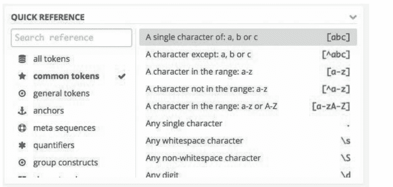

**图 4.10：** 一个练习提示。

**代码清单 4.13：** 使用强大的 `Counter()` 函数。

```python
import re

from collections import Counter

sonnet = """Let me not to the marriage of true minds
Admit impediments. Love is not love
Which alters when it alteration finds,
Or bends with the remover to remove.
O no, it is an ever-fixed mark
That looks on tempests and is never shaken
It is the star to every wand'ring bark,
Whose worth's unknown, although his height be taken.
Love's not time's fool, though rosy lips and cheeks
Within his bending sickle's compass come:
Love alters not with his brief hours and weeks,
But bears it out even to the edge of doom.
    If this be error and upon me proved,
    I never writ, nor no man ever loved."""

words = re.findall(r"\w+", sonnet)
print(Counter(words))
```

# 第五章
函数与迭代器

到目前为止，在本教程中，我们已经看到了几个 Python 函数的例子，它们是 Python 中最重要的概念之一，实际上也是整个计算领域中最重要的概念之一。在本章中，我们将学习如何定义自己的函数（图 5.1）。我们还将进一步了解迭代器（在第 3.4.2 节中简要提及），这既是因为 Python 经常使用此类对象作为内置函数的返回值，也是因为它们本身很重要。

如果你还没有运行 Python shell，你应该像往常一样激活虚拟环境并启动 REPL：

```
$ source venv/bin/activate
(venv) $ python3
```


**图 5.1：** 是时候升级了。

## 5.1 函数定义

正如我们在 `print()`（第 2.3 节）、`len()`（第 2.4 节）以及 `sorted()` 和 `reversed()`（第 3.4.2 节）等函数中看到的那样，Python 中的函数调用由一个*名称*和括号内的零个或多个参数组成：

```
print("hello, world!")
```

编程中最重要的任务之一就是定义我们自己的函数，在 Python 中可以使用 **def** 关键字来完成。（如第 2.5 节所述，附加在对象上的函数（如 **split()** 和 **islower()**）也称为*方法*。我们将在第 7 章学习如何定义自己的方法。）

让我们在 REPL 中看一个函数定义的简单例子。我们将从一个接受单个数值参数并返回其平方的函数开始，如代码清单 5.1 所示。¹

**代码清单 5.1：** 定义一个函数。

```
>>> def square(x):
...     return x*x
...
>>> square(10)
100
```

（这里我们也可以使用 **x**\*\*2，效果是一样的。）函数以 **return** 关键字结尾，后跟函数的返回值。

对于 **square()**，函数的结尾也是开头，因为它只有一行。但是，正如你可能预料的那样，函数也可以由多个步骤组成，例如代码清单 5.2 中显示的函数，它返回一个从 0 到 **(n-1)**\*\*2 的平方列表（符合 **range()** 的通常行为）。

**代码清单 5.2：** 返回一个平方列表。

```
>>> def squares_list(n):
...     squares = []
...     for i in range(n+1):
...         squares.append(i**2)
...     return squares
...
>>> squares_list(11)
[0, 1, 4, 9, 16, 25, 36, 49, 64, 81, 100]
```

代码清单 5.2 包含一个常见的模式：初始化一个变量，修改它，然后返回修改后的值。我们将在第 6 章看到如何用更紧凑的版本来替换这个模式。

1. Python 没有类型机制来强制函数的参数类型，例如数值参数。不过，有一个 **typing** 库支持类型提示。

值得注意的是，**return** 会立即执行，就像我们在代码清单 3.11 中看到的 **break** 关键字一样，因此我们可以用它来中断循环。实际上，**return** 会中断整个*函数*，所以一旦 Python 遇到 **return**，它就会完全离开该函数。例如，我们可以编写一个函数，返回列表中第一个大于 10 的数字，如果不存在这样的数字，则返回 **None**，如代码清单 5.3 所示。

**代码清单 5.3：** 使用 **return** 从 **for** 循环中立即返回。

```
>>> def bigger_than_10(numbers):
...     for n in numbers:
...         if n > 10:
...             return n
...     return None
...
>>> bigger_than_10(squares_list(11))
16
```

注意，我们在代码清单 5.3 中包含了一个显式的 **return None**，但实际上返回 **None** 是默认行为，所以你实际上可以省略这一步。我们现在会包含它，但从代码清单 5.21 开始我们将省略它。

既然我们已经看了一些示例函数，让我们编写一个我们将在应用程序中实际使用的函数——在这个例子中，是在第 1.5 节中创建的 Flask Web 应用程序。具体来说，我们将定义一个名为 **dayname()** 的函数，它接受一个 **datetime** 参数（第 4.2 节），并返回给定时间所代表的星期几。

回顾第 4.2 节，**datetime** 对象有一个名为 **weekday()** 的方法，表示星期几的（从零开始的）索引：

```
>>> from datetime import datetime
>>> now = datetime.now()
>>> now.weekday()
3
```

在同一节中，我们简要提到 **calendar** 库包含一个表示星期几的对象：

```
>>> import calendar
>>> calendar.day_name
<calendar._localized_day object at 0x100f13910>
>>> list(calendar.day_name)
['Monday', 'Tuesday', 'Wednesday', 'Thursday', 'Friday', 'Saturday', 'Sunday']
```

这里我们使用了 **list()** 函数将“本地化日期”对象转换为列表，以便于查看。

**day_name** 对象允许我们按如下方式查找星期几：

```
>>> list(calendar.day_name)[0]
'Monday'
```

这里我们使用带索引的方括号来访问列表的相应元素（第 3.2 节），但事实证明你可以直接对“本地化日期”对象使用相同的语法：

```
>>> calendar.day_name[0]
'Monday'
```

这正是你可能事先无法猜到的那种行为，也是 REPL 用于实验价值的一个绝佳例子（技术熟练度的关键组成部分（框 1.2））。

将 **weekday()** 和 **day_name** 结合起来，我们可以找到与数字索引对应的星期几：

```
>>> calendar.day_name[datetime.now().weekday()]
'Thursday'
```

这工作得很好，但它变得相当长。将这个定义和逻辑*封装*在一个 **dayname()** 函数中会很方便，这样我们就可以写

```
dayname(datetime.now())
```

通过组合上述元素，我们可以如代码清单 5.4 所示完成此操作。

**代码清单 5.4：** 在 REPL 中定义 **dayname()**。

```
>>> def dayname(time):
...     """Return the name of the day of the week for the given time."""
...     return calendar.day_name[time.weekday()]
...
>>>
```

## 5.1 函数定义

我们在代码清单 5.4 中看到，Python 函数以 **def** 关键字开头，后跟函数名和任何参数；接下来，有一个可选但强烈推荐的*文档字符串*（通常不在 REPL 中使用，但这里包含的原因我们稍后会看到）；然后是函数*体*，它使用 **return** 关键字确定函数的返回值（在这种情况下，这是体中*唯一*的一行，不包括文档字符串）；最后，函数以换行符结束。请注意，这最后一点与几乎所有其他编程语言形成对比，这些语言通常以右花括号（例如 C、C++、Perl、PHP、Java 和 JavaScript）、右括号（大多数 Lisp 变体）或特殊关键字如 **end**（例如 Ruby）结束函数定义。

我们可以如下测试新定义的函数：

```
>>> dayname(datetime.now())
'Thursday'
```

这似乎不是一个很大的改进，但请注意，它在概念上更简单，因为我们不必考虑实现（即，找到与 *weekday()* 值对应的对象元素）。这种函数名和实现之间的*抽象层*即使函数定义只有一两行也很有用。（实际上，我认为一两行的函数是良好程序设计的标志。）我们将在第 5.2 节中很好地利用这个函数来简化我们 hello 应用程序中的自定义问候语（代码清单 4.3）。

如第 2.1 节所述，包含如代码清单 5.4 所示的三引号文档字符串是 Python 函数的标准做法。² 除了对阅读代码的人有用之外，文档字符串本身也可以通过 REPL 中的 **help()** 函数使用：

```
>>> help(dayname)
```

运行 **help()** 的结果取决于系统；在我的系统上，在终端中运行 **help(dayname)** 会得到如图 5.2 所示的结果。（这使用了 *Learn Enough Command Line to Be Dangerous* (https://www.learnenough.com/command-line) 中介绍的 **less** 界面 (https://www.learnenough.com/command-line-tutorial/inspecting_files#sec-less_is_more)，所以我输入了 **q** 退出。）

2. Python 文档字符串通常使用祈使语气，所以是“Return the name”而不是“Returns the name”。

## 5.1 函数定义

Python 函数的一个可能令人惊讶的特性是，它们在许多方面可以像普通变量一样被处理（有时被称为*一等对象*）。例如，让我们再次查看清单 5.1 中定义的 `square()` 函数：

```
>>> def square(x):
...     return x*x
...
>>> square(10)
100
```

我们实际上可以将其赋值给一个新变量，并像以前一样调用它：

```
>>> pow2 = square
>>> pow2(7)
49
```

也许更酷的是，我们可以将函数作为参数传递给其他函数。例如，我们可以创建一个函数来应用另一个函数，然后加 1，如下所示：

```
>>> def function_adder(x, f):
...     return f(x) + 1
...
>>>
```

然后我们可以将 **square** 作为参数传递（*不带*括号，所以不是 **square()**）：

```
>>> function_adder(10, square)
101
```

内置的 Python 函数工作方式相同：

```
>>> import math
>>> function_adder(100, math.log10)
3.0
```

最后一个结果成立是因为 $\log_{10} 100 = \log_{10} 10^2 = 2$ 且 $2 + 1 = 3$。（为什么 Python 将其显示为 **3.0**？）$^3$

> 3. *答案：* **math.log10()** 函数返回浮点值而不是整数。

### 5.1.1 一等函数

Python 函数的一个可能令人惊讶的特性是，它们在许多方面可以像普通变量一样被处理（有时被称为*一等对象*）。例如，让我们再次查看清单 5.1 中定义的 `square()` 函数：

### 5.1.2 可变参数和关键字参数

除了常规参数外，Python 函数还支持可变长度参数和关键字参数。虽然在本教程中我们不需要定义带有这类参数的函数，但在某些地方我们会用到它们，因为许多内置的 Python 函数都使用它们。它们对于更高级的 Python 工作也很有价值。让我们快速了解一下它们的工作原理。

假设我们定义一个带有两个参数 `bar` 和 `baz` 的函数 `foo()`：

```
>>> def foo(bar, baz):
...     print((bar, baz))
...
>>> foo("hello", "world")
('hello', 'world')
```

这里我们打印出了一个包含两个参数的元组（第 3.6 节），以此来展示它们的值。

但如果我们不知道想要多少个参数呢？例如，这将不起作用：

```
>>> foo("hello", "world", "good day!")
  File "<stdin>", line 1, in <module>
TypeError: foo() takes 2 positional arguments but 3 were given
```

Python 通过特殊的星号或“星号”语法 `*args`（通常读作“star args”）支持可变数量的参数：⁴

```
>>> def foo(*args):
...     print(args)
...
>>> foo("hello", "world", "good day!")
('hello', 'world', 'good day!')
```

我们在这里看到 Python 自动创建了一个参数元组，这适用于任何数量：

```
>>> foo("This", "is a bunch", "of arguments", "to the function")
('This', 'is a bunch', 'of arguments', 'to the function')
```

一个相关的构造使用双星号或双星号语法表示*关键字*，这些是用等号分隔的键值对。在这种情况下，`*args` 的类似物被称为 **kwargs（通常读作“star star kwargs”或“star star keyword args”）；如果 *args 产生一个元组，看看你是否能猜出 **kwargs 做什么：

```
>>> def foo(**kwargs):
...     print(kwargs)
...
>>> foo(a="hello", b="world", bar="good day!")
{'a': 'hello', 'b': 'world', 'bar': 'good day!'}
```

正如你可能猜到的，**kwargs 自动将参数中的键值对转换为 Python 的标准数据类型，即字典（第 4.4 节）。

一个常见的模式是结合 *args 和 **kwargs，从而能够接受多种类型的参数。一个简单的例子出现在第 5.1.3 节。

> 4. 你可以使用 `*anything`，但 `*args` 是惯例。

### 5.1.3 练习

1. 在 Python 解释器中运行 help(len) 以确认 help() 也适用于内置函数。运行命令 help(print) 的结果是什么？（在这种情况下，结果被称为多行文档字符串。）
2. 定义一个如清单 5.5 所示的 deriver() 函数，该函数接受一个函数并返回它在小区间 h 内的变化量。确认你得到的结果与第 5.1.1 节开头提到的 square() 函数（最初在清单 5.1 中定义）所示的结果一致。计算 deriver(math.cos, math.tau/2) 的结果是什么？⁵
3. 定义一个同时包含 *args 和 **kwargs 的函数 foo()，如清单 5.6 所示。当你执行清单 5.6 最后一条语句所示的函数时，你会得到什么？（注意，在调用 foo() 时不应输入 ...；正如我们在定义函数时看到的，这些是 Python 解释器自动添加的续行符。）

> 5. 一些细心的读者可能认出 deriver() 是当 h → 0 时趋近于导数的商。由于 cos x 的导数在 τ/2 处为 0（对应于最小值），deriver(math.cos, math.tau/2) 的值也应该接近 0。同时，x² 的导数是 2x，这解释了清单 5.5 中当 x = 3 时 square() 函数所示的值。

**清单 5.5：** 推导小区间上的变化率。

```
>>> def deriver(f, x):
...     h = 0.00001
...     return (f(x+h) - f(x))/h
...
>>> deriver(square, 3)
6.000009999951316
```

**清单 5.6：** 定义一个同时包含 *args 和 **kwargs 的函数。

```
>>> def foo(*args, **kwargs):
...     print(args)
...     print(kwargs)
...
>>> foo("This", "is a bunch", "of arguments", "to the function",
...     a="hello", b="world", bar="good day!")
```

## 5.2 文件中的函数

虽然在 REPL 中定义函数对于演示目的很方便，但有点繁琐，更好的做法是将它们放在文件中（就像我们在第 4.5 节中对脚本所做的那样）。我们将首先把第 5.1 节中定义的函数移动到 hello_app.py 中，然后将其移动到更方便的外部文件中。

使用这样的外部资源需要一个名为 __init__.py 的有点神秘的文件，它使 Python 将我们的项目目录解释为一个包。该文件不必有任何内容——它只需要存在，我们可以通过 touch 来安排：

```
(venv) $ touch __init__.py
```

（当我们制作一个正式的包时，我们将进一步了解这个文件要求。）这样，我们就可以像第 1.5 节那样在命令行运行我们的 Flask 应用了：

```
(venv) $ flask --app hello_app.py --debug run
```

让我们回顾一下我们 hello 应用程序的当前状态，它看起来像清单 5.7。（这与清单 4.3 相同；如果你完成了第 4.2.1 节的练习，你的代码可能有所不同。）

**清单 5.7：** 我们 hello 应用程序的当前状态。
*hello_app.py*

```
from datetime import datetime

from flask import Flask

app = Flask(__name__)

@app.route("/")
def hello_world():
    DAYNAMES = ["Monday", "Tuesday", "Wednesday",
                "Thursday", "Friday", "Saturday", "Sunday"]
    dayname = DAYNAMES[datetime.now().weekday()]
    return f"<p>Hello, world! Happy {dayname}.</p>"
```

我们的第一步是将第 5.1 节中的函数定义放入此文件中，如清单 5.8 所示。

**清单 5.8：** 添加星期几的函数。
*hello_app.py*

```
from datetime import datetime
import calendar

from flask import Flask

def dayname(time):
    """Return the name of the day of the week for the given time."""
    return calendar.day_name[time.weekday()]

app = Flask(__name__)

@app.route("/")
def hello_world():
    DAYNAMES = ["Monday", "Tuesday", "Wednesday",
                "Thursday", "Friday", "Saturday", "Sunday"]
    dayname = DAYNAMES[datetime.now().weekday()]
    return f"<p>Hello, world! Happy {dayname}.</p>"
```

## 5.2 文件中的函数

接下来，我们可以使用 **dayname()** 函数来删除不需要的行，并将 **hello_world()** 函数体精简为单行，如清单 5.9 所示。此时，你应该能确认应用运行正常，如图 5.3 所示。

**清单 5.9：** 替换问候语。

*hello_app.py*

```python
from datetime import datetime
import calendar

from flask import Flask

def dayname(time):
    """Return the name of the day of the week for the given time."""
    return calendar.day_name[time.weekday()]

app = Flask(__name__)

@app.route("/")
def hello_world():
    return f"<p>Hello, world! Happy {dayname(datetime.now())}.</p>"
```

我们可以通过将 **dayname()** 函数提取到单独的文件中，然后将其包含到我们的应用中，使清单 5.9 中的代码更加整洁。我们将首先剪切该函数并将其粘贴到一个新文件 **day.py** 中：

```bash
(venv) $ touch day.py
```

生成的文件如清单 5.10 和清单 5.11 所示。⁶ 注意，我们在清单 5.11 中稍微更新了问候语，以便我们能确认新代码确实有效。

**清单 5.10：** 文件中的 **dayname()** 函数。

*day.py*

```python
import calendar

def dayname(time):
    """Return the name of the day of the week for the given time."""
    return calendar.day_name[time.weekday()]
```

**清单 5.11：** 剪切函数后的问候语。

*hello_app.py*

```python
from datetime import datetime

from flask import Flask

app = Flask(__name__)

@app.route("/")
def hello_world():
    return f"<p>Hello, world! Happy {dayname(datetime.now())} from a file!</p>"
```

⁶ 在某些编辑器中，你可以使用 Shift-Command-V 以本地缩进级别粘贴选中的内容，这省去了我们手动调整缩进的麻烦。

正如你通过重新加载浏览器可以验证的那样，应用无法工作——它立即崩溃了，我们只得到了 Flask 错误页面（图 5.4），该页面表明发生了 `NoMethodError` 类型的 *异常*。（异常只是程序中指示特定类型错误的一种标准化方式。）我们可以通过查看错误消息来了解更多关于出了什么问题的信息，该消息表明 `dayname()` 方法未定义；仔细查看消息，我们发现它甚至告诉了我们具体出问题的行（图 5.5）。

这种做法是一种强大的调试技巧：如果你的 Python 程序崩溃，检查错误消息应该是你的首选方法。此外，如果你不能立即看出问题所在，用谷歌搜索错误消息通常会得到有用的结果（框 5.1）。

**图 5.4：** 应用无法工作的明确迹象。

**图 5.5：** 使用 Flask 崩溃页面查找错误。

### 框 5.1：调试 Python

一项技术成熟度的重要技能是 *调试*：在计算机程序中查找和纠正错误的艺术。虽然经验无可替代，但以下技巧应该能帮助你追踪代码中不可避免的故障：

- *使用 print 追踪执行。* 当试图弄清楚为什么某个程序出错时，使用临时 print 语句显示变量值通常很有帮助，这些语句可以在错误修复后删除。当与 `repr()` 函数（返回对象的字面表示，第 4.3 节）结合使用时，这种技术特别有用，例如 `print(repr(a))`。
- *注释掉代码。* 有时注释掉你怀疑与问题无关的代码是个好主意，这样你就可以专注于不工作的代码。
- *使用 REPL。* 启动 Python 解释器并粘贴有问题的代码通常是隔离问题的绝佳方式。调试脚本时，使用 `python3 -i script.py` 调用它，当遇到错误时会进入 REPL。（REPL 技术的一个更高级版本是 *pdb*，Python 调试器。）
- *谷歌搜索。* 谷歌搜索错误消息或与错误相关的其他搜索词（这通常会引导到 Stack Overflow 上有用的讨论串）是每个现代软件开发人员必备的技能（图 5.6）。

**图 5.6：** 在谷歌出现之前，人们是如何调试的？

崩溃的原因是我们从 `hello_app.py` 中移除了 `dayname()`，所以我们的应用自然不知道它是什么。解决方案是以与导入 `flask`、`datetime` 和 `calendar` 大致相同的方式导入它，如清单 5.12 所示。注意，清单 5.11 中的导入语句包含了当前目录（`python_tutorial/day`），这是必要的，因为我们的项目目录默认不在 Python 包含路径上。⁷ （这目前没问题，但除了其他问题外，它阻止了按原样编写的应用部署到生产环境（第 1.5.1 节）。打算更频繁使用或在生产环境中使用的实用程序应作为 *包* 包含，我们将在第 8 章讨论这个主题，并在第 9 章和第 10 章中应用。）

此时值得注意的是，清单 5.12 包含了一整套导入——来自标准库的模块（`datetime`）、第三方库（`flask`）和自定义库（`python_tutorial.day`）——按照惯例，它们之间用空行分隔（与文件的其余部分用两个空行分隔）。

⁷ 你如何弄清楚如何将当前目录添加到导入路径？以下是我的做法：python add to import path。

**清单 5.12：** 使用来自外部文件的函数。

*hello_app.py*

```python
from datetime import datetime

from flask import Flask

from python_tutorial.day import dayname

app = Flask(__name__)

@app.route("/")
def hello_world():
    return f"<p>Hello, world! Happy {dayname(datetime.now())} from a file!</p>"
```

此时，应用正常工作了！结果应该看起来像图 5.7。

**图 5.7：** 更新后的问候语。

### 5.2.1 练习

1. 让我们用 `day.py` 中的 `greeting()` 函数替换清单 5.11 中的插值字符串。填写清单 5.13 中标记为 `FILL_IN` 的代码，使清单 5.14 能够工作。

**清单 5.13：** 定义 `greeting()` 函数。

*day.py*

```python
import calendar

def dayname(time):
    """Return the name of the day of the week for the given time."""
    return calendar.day_name[time.weekday()]

def greeting(time):
    """Return a friendly greeting based on the current time."""
    return FILL_IN
```

**清单 5.14：** 导入并使用 `greeting()` 函数。

*hello_app.py*

```python
from datetime import datetime

from flask import Flask

from python_tutorial.day import dayname

app = Flask(__name__)

@app.route("/")
def hello_world():
    return greeting(datetime.now())
```

## 5.3 迭代器

在本节中，我们将开始开发引言（第 1 章）中提到的回文主题。我们的目标是编写一个名为 `ispalindrome()` 的函数，如果其参数正向和反向相同则返回 `True`，否则返回 `False`。

我们可以将回文最简单的定义表达为“一个字符串等于其反转的字符串。”（我们将随着时间的推移逐步扩展这个定义。）为了做到这一点，我们需要能够反转一个字符串。

反转字符串的一种直接方法是将 `list()` 和 `join()` 函数（第 3.4.4 节）与使用 `reverse()` 反转列表的能力（第 3.4.2 节）结合起来：

```python
>>> s = "foobar"
>>> a = list(s)
>>> a.reverse()
>>> "".join(a)
'raboof'
```

这可以工作，但一个更优雅的方法来自于观察 `reversed()` 函数（我们在第 3.4.2 节看到它应用于列表）也适用于字符串：

```python
>>> reversed("foobar")
<reversed object at 0x104858d60>
```

正如 Python 文档中所述，`reversed()` 返回一个反向 *迭代器*。迭代器是 Python 的一个强大工具，它表示一个数据流——在这种情况下，是一个按顺序访问的字符序列。我们将在第 5.3.1 节看到如何定义一种称为 *生成器* 的特殊迭代器，并在第 7.2 节实现一个完整的自定义迭代器。

查看 `reversed()` 结果的一种方法是使用 `for` 循环遍历反转对象（清单 5.15）：

**清单 5.15：** 在迭代器上使用 `for` 循环。

```python
>>> for c in reversed("foobar"):
...     print(c)
...
r
a
b
o
o
f
```

我们也可以使用 **list()** 来直接查看元素：

```
>>> list(reversed("foobar"))
['r', 'a', 'b', 'o', 'o', 'f']
```

我们在这里看到，**list()** 遍历了反转迭代器，并给出了实际的字符列表。请注意，与清单 5.15 中的代码不同，使用 **list()** 会在内存中创建完整的对象。对于像这里这样的小列表，这没什么区别，但对于大列表，差异可能很显著。⁸

我们在第 3.4.4 节中看到了如何使用 **join()** 来组合这样一个列表（在这种情况下，使用空字符串 ""）：

```
>>> "".join(list(reversed("foobar")))
'raboof'
```

这是检测回文字符串的一个巨大进步，因为我们现在有了一种方法来找到字符串的反转，但事实证明 **join()** 也会自动遍历一个可迭代对象，因此我们实际上可以省略对 **list()** 的中间调用：

```
>>> "".join(reversed("foobar"))
'raboof'
```

此时，我们可以通过将一个字符串与其自身的反转进行比较来测试回文：

```
>>> "foobar" == "".join(reversed("foobar"))
False
>>> "racecar" == "".join(reversed("racecar"))
True
```

掌握了这项技术，我们就可以编写第一个版本的回文检测方法了。

让我们将检测回文的函数放入它自己的文件中，我们称之为 **palindrome.py**：

```
(venv) $ touch palindrome.py
```

8.  确实，可以为*无限*集合（例如自然数）创建迭代器，这些集合即使在原则上也无法在内存中实例化。

我们应该如何命名这个检测回文的函数？嗯，回文检测器应该接收一个字符串，并在字符串是回文时返回 **True**，否则返回 **False**。这使它成为一个布尔方法。回顾第 2.5 节，Python 中的布尔方法通常以单词“is”开头，这表明了清单 5.16 中的定义。（实际上，对于这样一个*模块级*函数，不附加到对象上，蛇形命名法 **is_palindrome** 可能更符合惯例。但我们*确实*计划将其附加到一个对象上；参见第 7 章。）

**清单 5.16：** 我们最初的 **ispalindrome()** 函数。
*palindrome.py*

```python
def reverse(string):
    """反转一个字符串。"""
    return "".join(reversed(string))

def ispalindrome(string):
    """如果是回文则返回 True，否则返回 False。"""
    return string == reverse(string)
```

清单 5.16 中的代码使用 == 比较运算符（第 2.4 节）来返回正确的布尔值。
我们可以通过在 Python 解释器中导入 palindrome 文件来测试清单 5.16 中的代码：

```python
>>> import palindrome
```

这使得 **ispalindrome()** 可以通过模块名使用：

```python
>>> palindrome.ispalindrome("racecar")
True
>>> palindrome.ispalindrome("Racecar")
False
```

如第二个示例所示，我们的回文检测器说“Racecar”不是回文，因此为了使我们的检测器更通用一些，我们可以在比较之前使用 **lower()** 将字符串转换为小写。一个可用的版本出现在清单 5.17 中。

## 清单 5.17：检测不区分大小写的回文。

*palindrome.py*

```python
def reverse(string):
    """反转一个字符串。"""
    return "".join(reversed(string))

def ispalindrome(string):
    """如果是回文则返回 True，否则返回 False。"""
    return string.lower() == reverse(string.lower())
```

回到 REPL，我们可以重新加载检测器（使用 `importlib` 模块中方便的 `reload()` 函数）⁹ 并如下应用它：

```
>>> from importlib import reload
>>> reload(palindrome)
>>> palindrome.ispalindrome("Racecar")
True
```

成功了！

作为最后的改进，让我们遵循“不要重复自己”（或“DRY”）原则，消除清单 5.17 中的重复。检查代码，我们看到 `string.lower()` 被使用了两次，这表明可以声明一个变量（我们称之为 `processed_content`）来表示与其自身反转进行比较的实际字符串（清单 5.18）。

## 清单 5.18：消除一些重复。

*palindrome.py*

```python
def reverse(string):
    """反转一个字符串。"""
    return "".join(reversed(string))

def ispalindrome(string):
    """如果是回文则返回 True，否则返回 False。"""
    processed_content = string.lower()
    return processed_content == reverse(processed_content)
```

9.  这正是你应该想到去谷歌搜索的事情（框 1.2），例如使用“python how to reload a module”。

清单 5.18 以多一行代码为代价，省去了一次对 **lower()** 的调用，因此它并不明显优于清单 5.17，但我们将从第 8 章开始看到，拥有一个单独的变量为我们检测更复杂的回文提供了更大的灵活性。
作为最后一步，我们应该检查 **ispalindrome()** 函数是否仍然按预期工作：

```
>>> reload(palindrome)
>>> palindrome.ispalindrome("Racecar")
True
>>> palindrome.ispalindrome("Able was I ere I saw Elba")
True
```

正如你可能猜到的，手动确认这些事情很快就会变得乏味，我们将在第 8 章中看到如何编写*自动化测试*来自动检查我们代码的行为。

### 5.3.1 生成器

*生成器*，我们在第 3.4.2 节中首次看到，是一种特殊类型的迭代器，使用一种称为 **yield** 的特殊操作构建。**yield** 的效果是依次产生序列的每个元素。
例如，我们可以通过逐个产生字符串中的每个字符来创建一个字符串生成器：

```
>>> def characters(string):
...     for c in string:
...         yield c
...     return None
...
>>> characters("foobar")
<generator object characters at 0x11f9c1540>
```

（我们在这里返回了 **None**，但我们在清单 5.21 中会看到，我们实际上可以省略 **return**，因为 **None** 是默认值。）
现在对一个字符串调用 **characters()** 会返回一个生成器对象，我们可以像往常一样对其进行迭代：

```
>>> for c in characters("foobar"):
...     print(c)
...
f
o
o
b
a
r
```

我们也可以对它使用 **join()**：

```
>>> "".join(characters("foobar"))
'foobar'
```

将字符串转换为迭代器很有启发性，但不太有用，因为我们已经可以迭代常规字符串了。让我们看一个更有趣的例子，展示生成器的优点。

假设我们想编写一个函数来查找包含所有数字 0-9 的数字。一个聪明的方法是注意到第 3.6 节中介绍的 **set()** 函数实际上可以接受一个字符串作为参数，并返回组成该字符串的字符集合：

```
>>> set("1231231234")
{'2', '4', '3', '1'}
```

请注意，根据集合的要求，重复的元素会被忽略。（另外请记住，元素的顺序无关紧要。）

这个观察表明，我们可以通过将数字转换为字符串（如第 4.1.2 节所示），然后将其与对应于所有数字的集合进行比较，来检测一个数字是否包含所有十个数字：

```
>>> str(132459360782)
'132459360782'
>>> set(str(132459360782))
{'8', '7', '9', '3', '4', '0', '2', '6', '1', '5'}
>>> set(str(130245936782)) == set("0123456789")
True
```

一个返回第一个此类数字的函数出现在清单 5.19 中，并附有一个示例，展示它如何在短整数列表上工作。请注意，清单 5.19 使用了与清单 5.3 相同的技术，一旦满足特定条件就立即从函数返回。

10. 感谢 Tom Repetti 提供此示例以及他在准备本节时提供的帮助。

## 清单 5.19：查找包含所有十个数字的数字。

```
>>> def has_all_digits(numbers):
...     for n in numbers:
...         if set(str(n)) == set("0123456789"):
...             return n
...     return None
...
>>> has_all_digits([1424872341, 1236490835741, 12341960523])
1236490835741
```

现在让我们使用我们的函数来查找第一个包含所有数字 0-9 的*完全平方数*。一种方法是创建一个包含所有数字直到某个大数的列表；由于我们不知道要上升到多高，让我们尝试一亿，即 10^8（加 1 是因为 **range(n)** 结束于 **n-1**，尽管这并不重要）。结果出现在清单 5.20 中。

## 清单 5.20：创建一个大的平方数列表。

```
>>> squares = []
>>> for n in range(10**8 + 1):
...     squares.append(n)
...
>>>
```

（我们将在第 6.4.1 节中看到更好的方法来创建这个列表。）截至撰写本文时，即使在相对较新的计算机上，上述代码也需要很长时间，以至于我直接按 Ctrl-C 中断了循环。（事实证明，我们不必一直上升到 10^8，但我们事先并不知道，这说明了原理。）

清单 5.20 中的解决方案耗时如此之长的原因是必须遍历整个范围，并且必须在内存中创建整个列表。一个好得多的解决方案是使用 **yield** 创建一个生成器，它只在需要时提供下一个平方数。我们可以如清单 5.21 所示创建这样一个平方数生成器；请注意，我们省略了 **return**，因此默认情况下将返回 **None**。

## 代码清单 5.21：一个平方数生成器。

```python
>>> def squares_generator():
...     for n in range(10**8 + 1):
...         yield n**2
...
>>> squares = squares_generator()
```

顺便说一下，你可能会好奇为什么代码清单 5.21 中对 `range()` 的调用没有直接创建我们试图避免的那个列表。答案是它过去确实会创建，而你必须使用 `xrange()` 来避免在内存中创建整个列表。但从 Python 3 开始，`range()` 函数的行为正是我们想要的，它只在需要时才生成范围内的下一个元素。这种模式被称为*惰性求值*，而它实际上也正是生成器所产生的行为。

通过代码清单 5.21 中的最终赋值，我们准备好找出第一个包含所有数字的平方数：

```python
>>> has_all_digits(squares)
1026753849
```

为了便于阅读，加上逗号后结果是 1, 026, 753, 849，你可以使用 `math.sqrt()` 确认它等于 32, 043²。

### 5.3.2 练习

1.  使用 Python 解释器，确定你的系统是否支持对表情符号使用代码清单 5.17 中的 `ispalindrome()` 函数。（你可能会发现 Emojipedia 上关于赛车和狐狸脸表情符号的链接很有帮助。）如果你的系统在此上下文中支持表情符号，结果应类似于图 5.8。（注意，如果一个表情符号水平翻转后看起来一样，它就是“回文”，所以狐狸脸表情符号是回文，而赛车表情符号不是，即使单词“racecar”是回文。）
2.  使用代码清单 5.22 中的代码，展示可以使用第 3.3 节讨论的高级切片操作符 `[::-1]` 在一行中表达 `ispalindrome()` 函数。（一些 Python 程序员可能更喜欢这种方法，但我认为长度的减少不足以证明清晰度的损失是合理的。）
3.  编写一个生成器函数，返回前 50 个偶数。

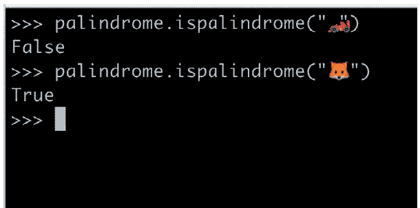

**图 5.8：** 检测回文表情符号。

**代码清单 5.22：** 一个紧凑但相当晦涩的 `ispalindrome()` 版本。

*palindrome.py*

```python
def ispalindrome(string):
    """Return True for a palindrome, False otherwise."""
    return string.lower() == string.lower()[::-1]
```

# 第 6 章
## 函数式编程

在学习了如何定义函数并在几个不同的上下文中应用它们之后，现在我们将通过学习*函数式编程*的基础知识，将我们的编程提升到一个新的水平。函数式编程是一种强调——你猜对了——函数的编程风格。正如我们将看到的，Python 中的函数式编程经常使用一类强大（且非常 Pythonic）的技术，称为*推导式*，它们通常涉及使用函数来方便地构建具有特定元素的 Python 对象。最常见的推导式是*列表推导式*和*字典推导式*，它们分别用于创建列表和字典。我们还将看到一个如何使用*生成器推导式*来复制第 5.3.1 节结果的例子，以及对*集合推导式*的简要介绍。

这是一个具有挑战性的章节，你可能需要进行一些练习才能完全理解它（方框 6.1），但回报确实非常丰厚。

> **方框 6.1：进行你的练习**
>
> 在从武术到国际象棋再到语言学习的各种情境中，实践者会达到一个点，即无论多少分析或反思都无法帮助他们提高——他们只需要进行更多的重复，或称为“练习”。
>
> 令人惊讶的是，通过尝试某件事，有点（但可能不完全）理解它，然后只是*再次去做*，你可以取得多大的进步。在像本教程这样的教程中，有时这意味着重新阅读一个特别棘手的章节或部分。有些人（包括本人）甚至会重新阅读整本书。
>
> 进行练习的一个重要方面是*暂停自我评判*——允许自己不立即变得优秀。（许多人——再次包括本人——通常需要练习才能习惯于不立即变得优秀。可以说，这是元练习。）
>
> 放松一下，进行你的练习，看着你的技术熟练度与日俱增。

我们处理函数式编程的一般技术是执行一个涉及一系列命令的任务（称为“命令式编程”，¹ 这是我们到目前为止一直在做的），然后展示如何使用函数式编程做同样的事情。

为了方便起见，我们将为我们的探索创建一个文件，而不是在 REPL 中输入所有内容：

```bash
(venv) $ touch functional.py
```

## 6.1 列表推导式

我们从一种将让你对 Python 有爱因斯坦级理解的技术开始研究函数式编程（图 6.1²）。这种技术被称为*列表推导式*，它让我们可以使用函数通过单个命令来构建列表。它的效果与《学习足够危险的 JavaScript》(https://www.learenough.com/javascript) 和《学习足够危险的 Ruby》(https://www.learnenough.com/ruby) 中介绍的 `map` 函数大致相似——实际上，Python 本身支持 `map`，但列表推导式更加 Pythonic。

让我们看一个具体的例子。假设我们有一个混合大小写字符串的列表，我们想创建一个对应的、用连字符连接的小写字符串列表（使结果适合在 URL 中使用），像这样：

```
"North Dakota" -> "north-dakota"
```

使用本教程中的先前技术，我们可以这样做：

1.  定义一个包含字符串列表的变量。
2.  定义第二个变量（最初为空），用于存放 URL 友好的字符串列表。
3.  对于第一个列表中的每个项目，**append()**（第 3.4.3 节）一个转换为小写（第 2.5 节）、按空白字符分割（第 4.3 节）然后用连字符连接（第 3.4.4 节）的版本。（你可以改为按单个空格 " " 分割，但按空白字符分割要健壮得多，因此默认使用它是一个好习惯。）

让我们在 REPL 中构建这个例子，然后再将其放入我们的文件中。我们将从一个针对单个州的步骤 3 示例开始：

```python
(venv) $ python3
>>> state = "North Dakota"
>>> state.lower()
'north dakota'
>>> state.lower().split()
['north', 'dakota']
>>> "-".join(state.lower().split())
'north-dakota'
```

注意组合使用 **lower().split()**，它在一个称为*方法链*的过程中连续应用两个方法。虽然它在 Python 中不如在其他一些面向对象的语言中普遍（很大程度上是因为 Python 使用迭代器（第 5.3 节）），但它仍然绝对值得了解。

将这个 **join()** 与上面概述的其他步骤结合起来，给出了代码清单 6.1 中所示的代码。这是相当复杂的代码，因此能够阅读代码清单 6.1 是你日益增长的技术熟练度的一个很好的测试。（如果阅读起来不容易，启动 Python 解释器并在 REPL 中让它工作起来是个好主意。）

### 代码清单 6.1：从列表创建 URL 适当的字符串。

*functional.py*

```python
states = ["Kansas", "Nebraska", "North Dakota", "South Dakota"]

# urls: 命令式版本
def imperative_urls(states):
    urls = []
    for state in states:
        urls.append("-".join(state.lower().split()))
    return urls

print(imperative_urls(states))
```

运行代码清单 6.1 的结果如下所示：

```bash
(venv) $ python3 functional.py
['kansas', 'nebraska', 'north-dakota', 'south-dakota']
```

现在让我们看看如何使用列表推导式做同样的事情。我们将从几个更简单的例子开始，首先是一个简单地复制 **list()** 函数的例子：

```python
>>> list(range(10))                    # list() 函数
[0, 1, 2, 3, 4, 5, 6, 7, 8, 9]
>>> [n for n in range(10)]             # 列表推导式
[0, 1, 2, 3, 4, 5, 6, 7, 8, 9]
```

第二个命令——列表推导式——创建了一个列表，包含范围 0-9 中的每个 **n**。它比 **list()** 更灵活的地方在于，我们也可以将其与其他操作一起使用，例如求平方：>>> [n*n for n in range(10)]
[0, 1, 4, 9, 16, 25, 36, 49, 64, 81]

将类似技术应用于字符串列表，我们可以通过依次对每个字符串调用 **lower()** 方法（它只是一种函数）来创建一个全小写版本的列表：

```
>>> [s.lower() for s in ["ALICE", "BOB", "CHARLIE"]]
['alice', 'bob', 'charlie']
```

回到我们的主要示例，我们可以将“转换为小写，然后分割，再连接”这一系列转换视为一个单一操作，并使用列表推导式将该操作依次应用于列表中的每个元素。结果非常紧凑，可以轻松放入 REPL 中：

```
>>> states = ["Kansas", "Nebraska", "North Dakota", "South Dakota"]
>>> ["-".join(state.lower().split()) for state in states]
['kansas', 'nebraska', 'north-dakota', 'south-dakota']
```

将其粘贴到 **functional.py** 中，我们可以看到代码变得多么简洁，如清单 6.2 所示。

## **清单 6.2：** 使用列表推导式添加函数式技术。
*functional.py*

```
states = ["Kansas", "Nebraska", "North Dakota", "South Dakota"]

# urls: 命令式版本
def imperative_urls(states):
    urls = []
    for state in states:
        urls.append("-".join(state.lower().split()))
    return urls

print(imperative_urls(states))

# urls: 函数式版本
def functional_urls(states):
    return ["-".join(state.lower().split()) for state in states]

print(functional_urls(states))
```

我们可以在命令行确认结果是相同的：

```
(venv) $ python3 functional.py
['kansas', 'nebraska', 'north-dakota', 'south-dakota']
['kansas', 'nebraska', 'north-dakota', 'south-dakota']
```

使用 Python 列表推导式，我们可以无需 `map` 就能处理这些州名（图 6.2³）。

作为最后的优化，让我们将负责使字符串兼容 URL 的方法链提取到一个名为 `urlify()` 的独立辅助函数中：

```
def urlify(string):
    """返回字符串的 URL 友好版本。

    示例: "North Dakota" -> "north-dakota"
    """
    return "-".join(string.lower().split())
```


**图 6.2：** 一些列表推导式等价于 `map`。

3. 图片由 Creative Jen Designs/Shutterstock 提供。

请注意，我们包含了一个多行文档字符串，其中包含一个成功操作的示例。在 `functional.py` 中定义此函数并在命令式和函数式版本中使用它，得到清单 6.3 中的代码。

## **清单 6.3：** 定义辅助函数。
*functional.py*

```
states = ["Kansas", "Nebraska", "North Dakota", "South Dakota"]

def urlify(string):
    """返回字符串的 URL 友好版本。

    示例: "North Dakota" -> "north-dakota"
    """
    return "-".join(string.lower().split())

# urls: 命令式版本
def imperative_urls(states):
    urls = []
    for state in states:
        urls.append(urlify(state))
    return urls

print(imperative_urls(states))

# urls: 函数式版本
def functional_urls(states):
    return [urlify(state) for state in states]

print(functional_urls(states))
```

如前所述，结果是相同的：

```
(venv) $ python3 functional.py
['kansas', 'nebraska', 'north-dakota', 'south-dakota']
['kansas', 'nebraska', 'north-dakota', 'south-dakota']
```

与命令式版本相比，函数式版本的代码行数只有其四分之一（1 行而不是 4 行），不改变任何变量（这在命令式编程中常常是容易出错的步骤），并且确实完全消除了中间列表（**urls**）。这正是让 Mike Vanier 非常高兴的那种事情（图 6.3⁴）。


**图 6.3：** 函数式编程让 Mike Vanier 最为开心。

4. 我上次检查时，Mike 最喜欢的语言是一种名为 Haskell 的“纯函数式”语言。图片 © Mike Vanier。

### 6.1.1 练习

- 1. 使用列表推导式，编写一个函数，该函数接受 **states** 变量并返回一个 URL 形式为 `https://example.com/<urlified form>` 的列表。

## 6.2 带条件的列表推导式

除了支持使用 **for** 创建列表外，Python 列表推导式还支持使用 **if** 来选择仅满足特定条件的元素。通过这种方式，带条件的列表推导式可以复制 JavaScript 的 **filter** 和 Ruby 的 **select** 的行为。（与 **map** 一样，Python 实际上通过 **filter** 直接支持此功能；同样与 **map** 一样，推导式版本更具 Python 风格。）

例如，假设我们想从 `states` 列表中选择由多个单词组成的字符串，同时保留那些只有一个单词的名称。与第 6.1 节一样，我们首先编写一个命令式版本：

- 1. 定义一个列表来存储单单词字符串。
- 2. 对于列表中的每个元素，如果按空白分割后得到的列表长度为 1，则将其 `append()` 到存储列表中。

结果如清单 6.4 所示。请注意，在清单 6.4 及后续清单中，垂直省略号表示省略的代码。

**清单 6.4：** 以命令式方式解决过滤问题。
*functional.py*

```
states = ["Kansas", "Nebraska", "North Dakota", "South Dakota"]
.
.
# singles: 命令式版本
def imperative_singles(states):
    singles = []
    for state in states:
        if len(state.split()) == 1:
            singles.append(state)
    return singles

print(imperative_singles(states))
```

请注意清单 6.4 中与清单 6.1 相同的模式：我们首先定义一个辅助变量以维护状态（此处无双关）；然后遍历原始列表，根据需要改变变量；最后返回改变后的结果。它不是特别漂亮，但它有效：

```
(venv) $ python3 functional.py
['kansas', 'nebraska', 'north-dakota', 'south-dakota']
['kansas', 'nebraska', 'north-dakota', 'south-dakota']
['Kansas', 'Nebraska']
```

现在让我们看看如何使用列表推导式完成相同的任务。与第 6.1 节一样，我们将从 REPL 中一个简单的数值示例开始。我们将首先查看 *取模运算符* %，它返回一个整数除以另一个整数后的余数。换句话说，**17 % 5**（读作“17 模 5”）是 **2**，因为 5 进入 17 三次（得到 15），余数为 17 − 15 = 2。特别地，考虑整数模 2 将它们分为两个 *等价类*：偶数（余数为 0 (mod 2)）和奇数（余数为 1 (mod 2)）。代码如下：

```
>>> 16 % 2  # 偶数
0
>>> 17 % 2  # 奇数
1
>>> 16 % 2 == 0  # 偶数
True
>>> 17 % 2 == 0  # 奇数
False
```

我们可以在列表推导式中使用 % 来处理数字列表，并仅包含偶数：

```
>>> [n for n in range(10) if n % 2 == 0]
[0, 2, 4, 6, 8]
```

这与常规列表推导式完全相同，只是多了一个 `if`。
利用这个想法，我们看到清单 6.4 的函数式版本要简洁得多——实际上，如清单 6.2 所示，它浓缩为一行，我们可以在 REPL 中看到：

```
>>> [state for state in states if len(state.split()) == 1]
['Kansas', 'Nebraska']
```

将结果再次放入我们的示例文件中，再次强调了函数式版本比命令式版本紧凑得多（清单 6.5）。

## **清单 6.5：** 以函数式方式解决选择问题。
*functional.py*

```
states = ["Kansas", "Nebraska", "North Dakota", "South Dakota"]
.
.
.
# singles: 命令式版本
def imperative_singles(states):
    singles = []
    for state in states:
        if len(state.split()) == 1:
            singles.append(state)
    return singles

print(imperative_singles(states))

# singles: 函数式版本
def functional_singles(states):
    return [state for state in states if len(state.split()) == 1]

print(functional_singles(states))
```

如要求所示，结果是相同的：

```
(venv) $ python3 functional.py
['kansas', 'nebraska', 'north-dakota', 'south-dakota']
['kansas', 'nebraska', 'north-dakota', 'south-dakota']
['Kansas', 'Nebraska']
['Kansas', 'Nebraska']
```

尽管列表推导式可以非常简洁，但值得注意的是它们的使用存在限制。特别是，随着列表推导式内部逻辑变得越来越复杂，它们很快会变得难以处理。因此，构建复杂的列表推导式被认为是不 Pythonic 的；如果你发现自己试图将太多内容塞进一个推导式中，考虑改用传统的 `for` 循环。

### 6.2.1 练习

- 1. 编写两个等效的列表推导式，返回达科他州：一个使用 `in`（第 2.5 节）来测试字符串“Dakota”的存在，另一个测试分割列表的长度是否为 `2`。

## 6.3 字典推导式

我们下一个函数式编程示例使用 *字典推导式*，赋予我们与伟大的词典编纂者塞缪尔·约翰逊博士（图 6.4⁵）相当的函数式能力。这种技术大致等同于 `reduce` 和 `inject`

5. 图片由 Rosenwald Collection 提供。注意：省略“Dr”后的句点是常见的英国惯例，在提及约翰逊博士时经常遵循。

## 6.3 字典推导式

分别在《Learn Enough JavaScript to Be Dangerous》和《Learn Enough Ruby to Be Dangerous》中介绍的函数；阅读过这些教程中相应且相当棘手章节的读者，可能会欣赏到字典推导式可以简单得多。（Python 2 实际上包含一个 `reduce()` 方法，但它已从默认的 Python 3 中移除；不过，它仍然可以通过 `functools` 模块使用。）

我们的示例将建立在第 6.1 节和第 6.2 节中涉及几个美国州名的列表推导式基础上。具体来说，我们将创建一个字典，将州名与每个名称的长度关联起来，结果将如下所示：⁶

6. 请注意，字典的格式约定差异很大，选择一个并通常坚持使用它是个好主意。

```
{
    "Kansas": 6,
    "Nebraska": 8,
    "North Dakota": 12,
    "South Dakota": 12
}
```

我们可以通过初始化一个 **lengths** 对象，然后遍历各州，将 **lengths[dictionary]** 设置为相应的长度来以命令式方式完成此操作：

```
lengths[state] = len(state)
```

完整示例见清单 6.6。

**清单 6.6：** 州与长度对应关系的命令式解决方案。
*functional.py*

```
# lengths: 命令式版本
def imperative_lengths(states):
    lengths = {}
    for state in states:
        lengths[state] = len(state)
    return lengths

print(imperative_lengths(states))
```

如果我们在命令行运行该程序，所需的字典将作为输出的最后一部分出现：

```
(venv) $ python3 functional.py
.
.
.
{'Kansas': 6, 'Nebraska': 8, 'North Dakota': 12, 'South Dakota': 12}
```

函数式版本几乎简单得离谱。与列表推导式一样，我们使用 **for** 为列表中的每个元素在推导式中创建一个元素；对于字典推导式，我们只需使用花括号代替方括号，并使用键值对代替单个元素。在当前情况下，它在 REPL 中看起来像这样：

```
>>> {state: len(state) for state in states}
{'Kansas': 6, 'Nebraska': 8, 'North Dakota': 12, 'South Dakota': 12}
```

将其粘贴到我们的文件中，然后得到清单 6.7。

**清单 6.7：** 州与长度对应关系的函数式解决方案。
*functional.py*

```
# lengths: 命令式版本
def imperative_lengths(states):
    lengths = {}
    for state in states:
        lengths[state] = len(state)
    return lengths

print(imperative_lengths(states))

# lengths: 函数式版本
def functional_lengths(states):
    return {state: len(state) for state in states}

print(functional_lengths(states))
```

在命令行运行此程序会产生预期的结果：

```
(venv) $ python3 functional.py
.
.
.
{'Kansas': 6, 'Nebraska': 8, 'North Dakota': 12, 'South Dakota': 12}
{'Kansas': 6, 'Nebraska': 8, 'North Dakota': 12, 'South Dakota': 12}
```

与第 6.1 节和第 6.2 节中的示例一样，字典推导式将命令式版本的功能浓缩为一行。这并非*总是*如此，但这种大幅压缩是函数式编程的一个常见特征。（这只是“LOC”或“代码行数”作为衡量程序规模或程序员生产力的可疑指标的众多原因之一。）

### 6.3.1 练习

- 1. 使用字典推导式，编写一个函数，将 **states** 中的每个元素与其 URL 兼容版本关联起来。*提示：* 重用清单 6.3 中定义的 `urlify()` 函数。

## 6.4 生成器推导式和集合推导式

在本节中，我们将使用推导式复制第 5.3.1 节的结果，从列表推导式开始，然后使用*生成器推导式*。我们还将简要介绍*集合推导式*的示例。

### 6.4.1 生成器推导式

回顾第 5.3.1 节，我们定义了一个函数来查找包含所有数字 0-9 的数字，如清单 6.8 所示。

**清单 6.8：** 查找包含所有十个数字的数字（再次）。

```
>>> def has_all_digits(numbers):
...     for n in numbers:
...         if set(str(n)) == set("0123456789"):
...             return n
...     return None
```

在清单 5.20 中，我们使用命令式解决方案来构建*完全平方数*列表，但因为耗时太长而放弃了。利用第 6.1 节中的技术，我们现在可以使用列表推导式创建相同的列表：

```
>>> squares = [n**2 for n in range(10**8 + 1)]
```

不幸的是，尽管语法更简洁，但这段代码仍然必须遍历整个范围并在内存中创建整个列表。与第 5.3.1 节一样，我失去了耐心，在完成之前按 Ctrl-C 中断了执行。

现在来看清单 5.21 的类似物，它使用 `yield` 依次生成每个平方数。我们可以使用生成器推导式更方便地创建这种行为，它看起来就像列表推导式，只是用圆括号代替方括号：

```
>>> squares = (n**2 for n in range(10**8 + 1))
```

与清单 5.21 中的生成器一样，它只在需要时提供下一个数字，这意味着我们可以像第 5.3.1 节那样找到第一个包含所有十个数字的完全平方数：

```
>>> has_all_digits(squares)
1026753849
```

这与我们在第 5.3.1 节得到的答案 1, 026, 753, 849 = 32, 043² 相同，但代码量*少得多*。

### 6.4.2 集合推导式

如果规则可以简单地指定，集合推导式可用于快速创建集合。无论是否带条件，其语法与第 6.1 节和第 6.2 节中的列表推导式语法几乎相同，只是用花括号代替了方括号。

例如，我们可以创建一个包含 5 到 20 之间所有数字的集合，如下所示：

```
>>> {n for n in range(5, 21)}
{5, 6, 7, 8, 9, 10, 11, 12, 13, 14, 15, 16, 17, 18, 19, 20}
```

我们可以像这样创建一个大于 0 的偶数集合：

```
>>> {n for n in range(10) if n % 2 == 0}
{0, 2, 4, 6, 8}
```

集合操作（如交集 (&)）照常工作：

```
>>> {n for n in range(5, 21)} & {n for n in range(10) if n % 2 == 0}
{8, 6}
```

### 6.4.3 练习

- 1. 编写一个生成器推导式，返回前 50 个偶数。

## 6.5 其他函数式技术

尽管推导式是 Python 中最常见和最强大的函数式技术之一，但该语言还包含许多其他技术。一个例子是求和列表（或范围）中的元素，我们可以使用清单 6.9 中的代码迭代地完成此操作。注意初始化变量（在本例中为 `total`）然后以某种方式（在本例中，字面上是加一个数字）向其添加值的熟悉模式。⁷

**清单 6.9：** 求和整数的命令式解决方案。
*functional.py*

```
numbers = range(1, 101)       # 1 到 100

# sum: 命令式解决方案
def imperative_sum(numbers):
    total = 0
    for n in numbers:
        total += n
    return total

print(imperative_sum(numbers))
```

结果如要求的那样是 5050：

```
(venv) $ python3 functional.py
.
.
.
5050
```

函数式（且非常 Pythonic）的解决方案是使用内置的 `sum()` 函数：

```
>>> sum(range(1, 101))
5050
```

7. 因为通常说求和 1 到 100 之间的数字——而不是 0 到 100 之间的数字——清单 6.9 使用 `range(1, 101)` 生成数字范围 1-100，但当然，如果我们使用 `range(101)`，答案也会相同，因为加 0 不会改变总和。

在我们的函数式文件中使用它，会得到清单 6.10 中所示的额外一行。

**清单 6.10：** 求和整数的完全 Pythonic 解决方案。
*functional.py*

```
numbers = range(1, 11)  # 1 到 10

# sum: 命令式解决方案
def imperative_sum(numbers):
    total = 0
    for n in numbers:
        total += n
    return total

print(imperative_sum(numbers))
print(sum(numbers))
```

我们可以在命令行确认结果一致：

```
(venv) $ python3 functional.py
.
.
.
5050
5050
```

类似的功能是 **math** 模块中的 **prod()** 函数，它返回列表元素的乘积。**itertools** 模块包含大量类似的工具。

### 6.5.1 函数式编程与 TDD

在许多情况下，命令式方法为问题提供了最直接的解决方案，这使得命令式解决方案即使通常比函数式对应物更长，也是一个很好的起点。事实上，我们可能甚至不知道后者存在；一种常见情况是为特定任务编写命令式解决方案，例如清单 6.9 中显示的求和，后来才发现有一种函数式编程的方法可以实现（在这个例子中，使用内置的`sum()`函数）。但是修改已经能正常工作的代码可能有风险，这可能会让我们有理由不愿切换到函数式版本。

我最喜欢的应对这一挑战的技术是*测试驱动开发*（TDD），它涉及编写一个*自动化测试*，将期望的行为以代码形式捕获。然后，我们可以使用任何想要的方法让测试通过，包括一个丑陋但易于理解的命令式解决方案。此时，我们可以*重构*代码——改变其形式但不改变其功能——以使用更简洁的函数式解决方案。只要测试仍然通过，我们就可以确信代码仍然有效。

在第8章中，我们将把这一技术应用于第7章开发的主要对象。具体来说，我们将使用TDD为第5.3节首次出现的`is-palindrome()`函数实现一个花哨的扩展，该扩展可以检测像“A man, a plan, a canal—Panama!”这样复杂的回文（图6.5⁸）。


**图6.5：** 泰迪·罗斯福是一个有计划的人。

8. 图片由Everett Collection Historical/Alamy Stock Photo提供。

### 6.5.2 练习

- 1. 使用`math.prod()`计算1–10范围内数字的乘积。这与`math.factorial(10)`相比如何？

# 第7章
## 对象与类

到目前为止，在本教程中，我们已经看到了许多Python对象的例子。在本章中，我们将学习如何使用Python*类*来创建我们自己的对象，这些对象既有数据（属性）也有函数（方法）附加在上面。我们还将学习如何为我们的类定义一个自定义迭代器。最后，我们将学习如何使用*继承*来重用功能。

## 7.1 定义类

类是将数据和函数组织成一个单一便捷对象的一种方式。在Python中，我们可以使用两个基本元素来创建自己的类：

- 1. 使用**class**关键字来定义类。
- 2. 使用特殊的**__init__**方法（通常称为*初始化函数*）来指定如何初始化一个类。

我们的具体示例将是一个带有**content**属性的**Phrase**类，我们将把它放在**palindrome.py**（上次见于第5.3节）中。让我们一步步构建它（为简单起见，我们暂时省略**reverse()**和**ispalindrome()**函数）。第一个元素是**class**本身（代码清单7.1）。

**代码清单7.1：** 定义一个**Phrase**类。
*palindrome.py*

```
class Phrase:
    """A class to represent phrases."""

if __name__ == "__main__":
    phrase = Phrase()
    print(phrase)
```

在代码清单7.1中，我们使用以下代码创建了**Phrase**类的一个*实例*（特定对象）：

```
phrase = Phrase()
```

这会在底层自动调用`__init__`。看起来奇怪的语法

```
if __name__ == "__main__":
```

用于在文件从命令行运行时执行后续代码，但在类被加载到其他文件中时不执行。这个约定非常Python化，但可能显得有点晦涩；大多数Python开发者只是通过例子学会了这个技巧，但如果你有兴趣了解解释，请参阅官方文档（https://docs.python.org/3/library/__main__.html）。

同时，代码清单7.1中的最后一个**print()**让我们在命令行看到一些具体（即使不是特别有指导意义）的结果：

```
$ source venv/bin/activate
(venv) $ python3 palindrome.py
<__main__.Phrase object at 0x10267afa0>
```

这显示了Python对**Phrase**类一个裸实例的抽象内部表示。（你的结果是否完全匹配？）我们还看到了`if __name__ == "__main__"`中值"`__main__`"的来源——它是“顶级代码环境”，即执行Python shell脚本的环境（包含类、函数、变量等）。

我们稍后将开始填充代码清单7.1，但在继续之前，我们应该注意，与变量和方法不同，Python类使用*驼峰命名法*（首字母大写）而不是蛇形命名法（第2.2节）。驼峰命名法因其大写字母类似于骆驼的驼峰（图7.1¹）而得名，它通过大写字母而不是下划线来分隔单词。用**Phrase**很难看出来。

1. 图片由Utsav Academy and Art Studio提供。Pearson India Education Services Pvt. Ltd.


**图7.1：** 驼峰命名法的起源。

因为它只是一个单词，但我们将在第7.3节更清楚地看到这个原则，该节定义了一个名为**TranslatedPhrase**的类。

最终，我们将使用**Phrase**来表示像“Madam, I'm Adam.”这样的短语，即使它不是字面上的前后相同，也可以算作回文。但起初，我们所做的只是定义一个**Phrase**初始化函数，它接受一个参数（**content**）并设置一个名为**content**的*数据属性*。² 正如我们将看到的，我们可以使用与方法相同的点表示法来访问对象的属性。

为了添加属性，我们首先需要定义在使用**Phrase()**初始化对象时被调用的**\_\_init\_\**方法（代码清单7.2）。双下划线的使用是Python中的一个约定，用于表示内部用于定义对象行为的“魔法”方法。我们将在第7.2节看到更多此类魔法或“双下划线”（**double-underscore**）方法的例子。（下划线，无论是双下划线还是单下划线，对Python属性和方法都有特殊含义；更多信息请参见第7.4.1节。）

2. Python的数据属性对应于Ruby的*实例变量*和JavaScript的*属性*。Ruby使用@符号，JavaScript使用**this**（后跟一个点），而Python使用**self**（后跟一个点）。

**代码清单7.2：** 定义`__init__`。
*palindrome.py*

```
class Phrase:
    """A class to represent phrases."""

    def __init__(self, content):
        self.content = content

if __name__ == "__main__":
    phrase = Phrase("Madam, I'm Adam.")
    print(phrase.content)
```

代码清单7.2初始化了一个名为**content**的数据属性，它通过附加到**self**对象来区分，并且在类内部代表对象本身。³ 注意，将它们都命名为**content**只是一个约定；我们也可以这样写：

```
def __init__(self, foo):
    self.bar = foo
```

这可能会让人类读者感到困惑，但对Python来说一点问题都没有。

有了代码清单7.2中的定义，我们现在有了一个可工作的示例：

```
(venv) $ python3 palindrome.py
Madam, I'm Adam.
```

我们现在也可以使用点表示法直接赋值给**content**，如代码清单7.3所示。

**代码清单7.3：** 赋值给对象属性。
*palindrome.py*

```
class Phrase:
    """A class to represent phrases."""

    def __init__(self, content):
        self.content = content

if __name__ == "__main__":
    phrase = Phrase("Madam, I'm Adam.")
    print(phrase.content)

    phrase.content = "Able was I, ere I saw Elba."
    print(phrase.content)
```

> 3. 如果你发现自己正在编写具有大量属性的类，请查看**dataclasses**模块。数据类使用一个名为**@dataclass**的特殊装饰器来自动创建像**__init__**这样的方法，省去你输入一堆**self.<something> = <something>**初始化的麻烦。

结果正如你可能猜到的：

```
(venv) $ python3 palindrome.py
Madam, I'm Adam.
Able was I, ere I saw Elba.
```

此时，我们准备恢复**Phrase**初始定义中的**reverse()**和**ispalindrome()**函数，如代码清单7.4所示（该清单也删除了对**print()**的调用及相关行，但如果你愿意，欢迎保留它们，因为由于**if __name__ == "__main__"**技巧，它们只会在文件作为脚本运行时执行）。

**代码清单7.4：** 我们最初的**Phrase**类定义。
*palindrome.py*

```
class Phrase:
    """A class to represent phrases."""

    def __init__(self, content):
        self.content = content

def reverse(string):
    """Reverse a string."""
    return "".join(reversed(string))

def ispalindrome(string):
    """Return True for a palindrome, False otherwise."""
    processed_content = string.lower()
    return processed_content == reverse(processed_content)
```

作为现实检查，最好在REPL中运行它以捕获任何语法错误等：

```
(venv) $ source venv/bin/activate
(venv) $ python3
```

### 7.1.1 练习

- 1. 通过填写清单 7.6 中的代码，为 **Phrase** 对象添加一个 **louder** 方法，该方法返回内容的大写（全大写）版本。在 REPL 中确认结果如清单 7.7 所示。*提示：* 使用第 2.5 节中适当的字符串方法。
- 2. 恢复清单 7.3 中的 `if __name__ == "__main__"` 代码，并确认在导入 **palindrome.py** 时它*不会*运行。

## 清单 7.6：使内容变大写。

*palindrome.py*

```python
class Phrase:
    """A class to represent phrases."""

    def __init__(self, content):
        self.content = content

    def ispalindrome(self):
        """Return True for a palindrome, False otherwise."""
        processed_content = self.content.lower()
        return processed_content == reverse(processed_content)

    def louder(self):
        """Make the phrase LOUDER."""
        # FILL IN

def reverse(string):
    """Reverse a string."""
    return "".join(reversed(string))
```

## 清单 7.7：在 REPL 中使用 louder()。

```python
>>> reload(palindrome)
>>> p = palindrome.Phrase("yo adrian!")
>>> p.louder()
'YO ADRIAN!'
```

## 7.2 自定义迭代器

在本教程的前面部分，我们已经了解了如何遍历几种不同的 Python 对象，包括字符串（第 2.6 节）、列表（第 3.5 节）和字典（第 4.4.1 节）。我们还在第 5.3 节直接接触了迭代器。在本节中，我们将学习如何为自定义类添加迭代器。

使用清单 7.5 中定义的类，我们可以直接遍历内容（因为它只是一个字符串）：

```python
>>> phrase = palindrome.Phrase("Racecar")
>>> for c in phrase.content:
...     print(c)
...
R
a
c
e
c
a
r
```

这大致类似于使用以下方式遍历字典的键：

```python
for key in dictionary.keys():    # Not Pythonic
    print(key)
```

但回顾第 4.4.1 节，我们知道无需调用 **keys()** 方法即可实现：

```python
for key in dictionary:           # Pythonic
    print(key)
```

如果我们能对 **Phrase** 实例做同样的事情就好了，像这样：

```python
phrase = palindrome.Phrase("Racecar")
for c in phrase:
    print(c)
```

我们可以通过自定义迭代器来实现这一点。迭代器的一般要求有两点：

- 1. 一个 **\_\_iter\_\_** 方法，执行任何必要的设置，然后返回 **self**
- 2. 一个 **\_\_next\_\_** 方法，返回序列中的下一个元素

请注意，与 **\_\_init\_\_** 一样，执行迭代的方法使用双下划线约定来表示它们是用于定义 Python 对象行为的魔术（dunder）方法。

在我们的特定情况下，我们还需要 **iter()** 函数，它将普通对象转换为迭代器。我们可以在 REPL 中看到它如何处理字符串：

```python
>>> phrase_iterator = iter("foo")    # makes a string iterator
>>> type(phrase_iterator)             # use type() to find the type
<class 'str_iterator'>
>>> next(phrase_iterator)
'f'
>>> next(phrase_iterator)
'o'
>>> next(phrase_iterator)
'o'
>>> next(phrase_iterator)
Traceback (most recent call last):
  File "<stdin>", line 1, in <module>
StopIteration
```

我们从 **type()** 函数看到，**iter()** 接收一个字符串并返回一个字符串迭代器。在迭代器上调用 **next()** 会生成序列中的下一个元素，直到到达末尾，这由特殊的 **StopIteration** 异常指示。

我们为 **Phrase** 类添加迭代器的策略如下：

- 1. 在 **\_\_iter\_\_** 中，使用 **iter()** 基于 **content** 属性创建一个短语迭代器，然后按照 Python 迭代器工作方式的要求返回 **self**。
- 2. 在 **\_\_next\_\_** 中，对短语迭代器调用 **next()** 并返回结果。

将这些步骤转换为代码，得到清单 7.8 中的结果。

## 清单 7.8：为 **Phrase** 类添加迭代器。

*palindrome.py*

```python
class Phrase:
    """A class to represent phrases."""

    def __init__(self, content):
        self.content = content

    def ispalindrome(self):
        """Return True for a palindrome, False otherwise."""
        processed_content = self.content.lower()
        return processed_content == reverse(processed_content)

    def __iter__(self):
        self.phrase_iterator = iter(self.content)
        return self

    def __next__(self):
        return next(self.phrase_iterator)

def reverse(string):
    """Reverse a string."""
    return "".join(reversed(string))
```

使用清单 7.8 中的代码，我们可以重新加载 **palindrome** 模块以查看它是否有效：

```python
>>> reload(palindrome)
>>> phrase = palindrome.Phrase("Racecar")
>>> for c in phrase:
...     print(c)
R
a
c
e
c
a
r
```

是的！我们现在可以遍历 **Phrase** 对象，而无需显式指定 **content** 属性。

### 7.2.1 练习

- 1. 使用 REPL，确定在如清单 7.8 所示定义自定义迭代器后，**list(phrase)** 是否有效。使用空字符串连接 **"".join(phrase)** 呢？

## 7.3 继承

在学习 Python 类时，使用 **\_\_class\_\_** 和 **\_\_mro\_\_** 属性来研究*类层次结构*很有用，后者代表*方法解析顺序*，结果会打印出我们需要的确切层次结构。

让我们看一个熟悉类型对象（字符串）的例子：

```python
>>> s = "foobar"
>>> type(s)          # one way to get the class
<class 'str'>
>>> s.__class__      # another way to get the class
<class 'str'>
>>> s.__class__.__mro__
(<class 'str'>, <class 'object'>)
```

这告诉我们，字符串属于 **str** 类，而 **str** 类又属于 **object** 类型。后者被称为*超类*，因为它通常被认为在 **str** 类“之上”。

由此产生的类层次结构图如图 7.3 所示。我们在这里看到 **str** 的超类是 **object**，层次结构到此结束。这种模式对每个 Python 对象都成立：追溯类层次结构足够远，你总会到达 **object**，它本身没有超类。

Python 类层次结构的工作方式是，每个类*继承*层次结构中更靠上的类的属性和方法。例如，我们刚刚看到了如何找到 **str** 类型对象的类：

```python
>>> "honey badger".__class__
<class 'str'>
```

但 **\_\_class\_\_** 属性来自哪里？答案是 **str** 从 **object** 本身继承了 **\_\_class\_\_**：

```python
>>> object().__class__
<class 'object'>
```

每个以 **object** 为超类的对象的类，都将其类名存储在 **\_\_class\_\_** 中。

### 7.3.1 练习

- 1. 列表和字典的类层次结构是什么？

## 7.4 派生类

让我们在第 7.3 节技术的基础上，创建一个继承自 **Phrase** 的类，我们称之为 **TranslatedPhrase**。这个所谓的 *派生类*（或 *子类*）的目的是尽可能多地复用 **Phrase** 的功能，同时为我们提供灵活性，例如，测试一个 *翻译* 是否是回文。

我们将首先把 **processed_content()** 提取为一个单独的方法，如清单 7.10 所示。我们稍后会看到这在当前上下文中为何有用，尽管这无论如何都是一个不错的改进。注意，清单 7.10 为了简洁也省略了第 7.2 节中的自定义迭代器，但欢迎您保留它。

**清单 7.10：** 将 **processed_content()** 提取为一个方法。
*palindrome.py*

```python
class Phrase:
    """A class to represent phrases."""

    def __init__(self, content):
        self.content = content

    def ispalindrome(self):
        """Return True for a palindrome, False otherwise."""
        return self.processed_content() == reverse(self.processed_content())

    def processed_content(self):
        """Process content for palindrome testing."""
        return self.content.lower()

def reverse(string):
    """Reverse a string."""
    return "".join(reversed(string))
```

现在我们准备好从 **Phrase** 继承了。我们将首先将超类的名称作为 *派生* 类的一个参数包含进来：

```python
class TranslatedPhrase(Phrase):
    """A class to represent phrases with translation."""
    pass
```

我们的计划是这样使用 **TranslatedPhrase**：

```python
TranslatedPhrase("recognize", "reconocer")
```

其中第一个参数是 **Phrase** 的内容，第二个参数是翻译。因此，一个 **TranslatedPhrase** 实例需要一个 **translation** 属性，我们将像清单 7.2 中的 **content** 一样使用 **__init__** 来创建它：

```python
class TranslatedPhrase(Phrase):
    """A class to represent phrases with translation."""

    def __init__(self, content, translation):
        # Handle content here.
        self.translation = translation
```

注意 **__init__** 接受 *两个* 参数，**content** 和 **translation**。我们像处理普通属性一样处理了 **translation**，但 **content** 怎么办呢？答案是一个名为 **super()** 的特殊 Python 函数：

```python
class TranslatedPhrase(Phrase):
    """A class to represent phrases with translation."""

    def __init__(self, content, translation):
        super().__init__(content)
        self.translation = translation
```

这会调用超类的 **__init__** 方法——在本例中是 **Phrase**。结果是 **content** 属性像清单 7.10 中那样被设置。
将所有内容整合在一起，就得到了清单 7.11 所示的 **TranslatedPhrase** 类。

**清单 7.11：** 定义 **TranslatedPhrase**。
*palindrome.py*

```python
class Phrase:
    """A class to represent phrases."""

    def __init__(self, content):
        self.content = content

    def ispalindrome(self):
        """Return True for a palindrome, False otherwise."""
        return self.processed_content() == reverse(self.processed_content())

    def processed_content(self):
        return self.content.lower()

class TranslatedPhrase(Phrase):
    """A class to represent phrases with translation."""

    def __init__(self, content, translation):
        super().__init__(content)
        self.translation = translation

def reverse(string):
    """Reverse a string."""
    return "".join(reversed(string))
```

因为 **TranslatedPhrase** 继承自 **Phrase** 对象，所以 **TranslatedPhrase** 的实例自动拥有 **Phrase** 实例的所有方法，包括 **ispalindrome()**。让我们创建一个名为 **frase**（发音为 "FRAH-seh"，西班牙语中意为 "短语"）的变量来看看它是如何工作的（清单 7.12）。

**清单 7.12：** 定义一个 **TranslatedPhrase**。

```python
>>> reload(palindrome)
>>> frase = palindrome.TranslatedPhrase("recognize", "reconocer")
>>> frase.ispalindrome()
False
```

我们看到 **frase** 如所述拥有一个 **ispalindrome()** 方法，并且它返回 **False**，因为 "recognize" 不是回文。

但如果我们想使用 *翻译* 而不是内容来确定翻译后的短语是否是回文呢？因为我们把 **processed_content()** 提取成了一个单独的方法（清单 7.10），我们可以通过在 **TranslatedPhrase** 中 *重写* **processed_content()** 方法来实现这一点，如清单 7.13 所示。

**清单 7.13：** 重写一个方法。
*palindrome.py*

```python
class Phrase:
    """A class to represent phrases."""

    def __init__(self, content):
        self.content = content

    def processed_content(self):
        """Process the content for palindrome testing."""
        return self.content.lower()

    def ispalindrome(self):
        """Return True for a palindrome, False otherwise."""
        return self.processed_content() == reverse(self.processed_content())

class TranslatedPhrase(Phrase):
    """A class to represent phrases with translation."""

    def __init__(self, content, translation):
        super().__init__(content)
        self.translation = translation

    def processed_content(self):
        """Override superclass method to use translation."""
        return self.translation.lower()

def reverse(string):
    """Reverse a string."""
    return "".join(reversed(string))
```

清单 7.13 的关键点在于，我们在 `TranslatedPhrase` 版本的 `processed_content()` 中使用了 `self.translation`，因此 Python 知道使用这个版本而不是 `Phrase` 中的那个。因为翻译 "reconocer" 是回文，所以我们得到了与清单 7.12 中不同的结果，如清单 7.14 所示。

**清单 7.14：** 在重写 `processed_content()` 后调用 `ispalindrome()`。

```python
>>> reload(palindrome)
>>> frase = palindrome.TranslatedPhrase("recognize", "reconocer")
>>> frase.ispalindrome()
True
```

由此产生的继承层次结构如图 7.6 所示。

这种重写的做法给了我们极大的灵活性。我们可以追踪 `frase.ispalindrome()` 在两种不同情况下的执行过程：

情况 1：清单 7.11 和清单 7.12

- 1. `frase.ispalindrome()` 在 `frase` 实例上调用 `ispalindrome()`，该实例是一个 `TranslatedPhrase`。由于 `TranslatedPhrase` 对象中没有 `ispalindrome()` 方法，Python 使用来自 `Phrase` 的方法。

## 7.4 派生类

**图 7.6：** **TranslatedPhrase** 类的继承层次结构。

2.  **Phrase** 中的 **ispalindrome()** 方法调用了 **processed_content** 方法。由于 **TranslatedPhrase** 对象中没有 **processed_content()** 方法，Python 会使用 **Phrase** 中的该方法。
3.  结果是将 **TranslatedPhrase** 实例的处理后版本与其自身的反转进行比较。由于 “recognize” 不是回文，结果为 **False**。

情况二：清单 7.13 和清单 7.14

1.  **frase.ispalindrome()** 在 **frase** 实例（一个 **TranslatedPhrase**）上调用 **ispalindrome()**。与情况一类似，**TranslatedPhrase** 对象中没有 **ispalindrome()** 方法，因此 Python 使用 **Phrase** 中的该方法。
2.  **Phrase** 中的 **ispalindrome()** 方法调用了 **processed_content** 方法。由于现在 **TranslatedPhrase** 对象中*确实*有一个 **processed_content()** 方法，Python 会使用 **TranslatedPhrase** 中的该方法，而不是 **Phrase** 中的。

**图 7.7：** Narciso se reconoce.（纳西索斯认出了自己。）

3.  结果是将 `self.translation` 的处理后版本与其自身的反转进行比较。由于 “reconocer” *是*回文，结果为 `True`。

¿Puedes «reconocer» un palíndromo en español?（你能用西班牙语“reconocer”[识别]一个回文吗？）（见图 7.7。⁷）

### 7.4.1 练习

1.  你可能已经注意到，`processed_content()` 方法仅在类内部使用。许多面向对象的语言都有一种将此类方法指定为*私有*的方法，这种做法被称为*封装*。Python 没有真正的私有方法，但它有一个使用前导下划线来表示它们的约定。确认在将 `processed_content()` 更改为 `_processed_content()`（如清单 7.15 所示）后，这些类仍然有效。

**清单 7.15：** 使用私有方法的约定。

*palindrome.py*

```python
class Phrase:
    """A class to represent phrases."""

    def __init__(self, content):
        self.content = content

    def _processed_content(self):
        """Process the content for palindrome testing."""
        return self.content.lower()

    def ispalindrome(self):
        """Return True for a palindrome, False otherwise."""
        return self._processed_content() == reverse(self._processed_content())

class TranslatedPhrase(Phrase):
    """A class to represent phrases with translation."""

    def __init__(self, content, translation):
        super().__init__(content)
        self.translation = translation

    def _processed_content(self):
        """Override superclass method to use translation."""
        return self.translation.lower()

def reverse(string):
    """Reverse a string."""
    return "".join(reversed(string))
```

注意：Python 还有第二个约定，称为*名称修饰*，它使用*两个*前导下划线。根据这个约定，Python 会以标准方式自动更改方法的名称，使其无法通过对象实例轻松访问。

2.  在迭代 **TranslatedPhrase** 时，使用翻译后的内容而非未翻译的内容可能是有意义的。通过在派生类中重写 **__iter__** 方法（清单 7.16）来实现这一点。使用 Python 解释器确认更新后的迭代器按预期工作。（注意，清单 7.16 结合了上一个练习中的私有方法约定。）

**清单 7.16：** 重写 __iter__ 方法。

*palindrome.py*

```python
class Phrase:
    """A class to represent phrases."""
    .
    .
    .
    def __iter__(self):
        self.phrase_iterator = iter(self.content)
        return self

    def __next__(self):
        return next(self.phrase_iterator)

class TranslatedPhrase(Phrase):
    """A class to represent phrases with translation."""

    def __init__(self, content, translation):
        super().__init__(content)
        self.translation = translation

    def _processed_content(self):
        """Override superclass method to use translation."""
        return self.translation.lower()

    def __iter__(self):
        self.phrase_iterator = FILL_IN
        return self

def reverse(string):
    """Reverse a string."""
    return "".join(reversed(string))
```

# 第 8 章
测试与测试驱动开发

尽管在入门编程教程中很少涉及，但*自动化测试*是现代软件开发中最重要的主题之一。因此，本章包括 Python 测试的介绍，以及对*测试驱动开发*（TDD）的初步了解。

测试驱动开发在 6.5.1 节中曾简要提及，当时承诺我们将使用测试技术为寻找回文添加一项重要功能，即能够检测复杂的回文，如 “A man, a plan, a canal—Panama!”（图 6.5）或 “Madam, I’m Adam.”（图 8.1¹）。本章将兑现这一承诺。

事实证明，学习如何编写 Python 测试也将给我们一个机会学习如何创建（并发布！）一个 Python 包，这是另一个在入门教程中很少涉及的、极其有用的 Python 技能。

以下是我们测试当前回文代码并将其扩展到更复杂短语的策略：

1.  设置我们的初始包（第 8.1 节）。
2.  为现有的 `ispalindrome()` 功能编写自动化测试（第 8.2 节）。
3.  为增强的回文检测器编写一个*失败*的测试（RED）（第 8.3 节）。

1.  “The Temptation of Adam” by Tintoretto. Image courtesy of Album/Alamy Stock Photo.

**图 8.1：** 伊甸园拥有一切——甚至包括回文。

4.  编写（可能很丑陋的）代码使测试*通过*（GREEN）（第 8.4 节）。
5.  *重构*代码使其更美观，同时确保测试套件保持 GREEN 状态（第 8.5 节）。

## 8.1 包设置

我们早在第 1.5 节就看到，Python 生态系统包含大量独立的软件包。在本节中，我们将基于第 7 章开发的回文检测器创建一个包。作为其中的一部分，我们将设置一个*测试套件*的雏形来测试我们的代码。

Python 包有一个标准结构，可以如清单 8.1 所示进行可视化（其中包含像 `pyproject.toml` 这样的通用元素和像 `palindrome_YOUR_USERNAME_HERE` 这样的非通用元素）。该结构包括一些配置文件（稍后讨论）和两个目录：一个 `src`（源代码）目录和一个 `tests` 目录。`src` 目录又包含一个用于回文包的目录，该目录包含一个名为 `__init__.py` 的特殊必需文件和 `palindrome_YOUR_USERNAME_HERE` 模块本身。²（可以通过消除包目录来扁平化目录结构，但清单 8.1 中的结构相当标准，旨在镜像官方的《打包 Python 项目》文档。）清单 8.1 中结构的结果将是能够使用以下代码包含第 7 章开发的 `Phrase` 类

```python
from palindrome_mhartl.phrase import Phrase
```

**清单 8.1：** 示例 Python 包的文件和目录结构。

```
python_package_tutorial/
├── LICENSE
├── pyproject.toml
├── README.md
├── src/
│   └── palindrome_YOUR_USERNAME_HERE/
│       ├── __init__.py
│       └── phrase.py
└── tests/
    └── test_phrase.py
```

我们可以通过组合使用 `mkdir` 和 `touch` 来手动创建清单 8.1 中的结构，如清单 8.2 所示。

**清单 8.2：** 设置 Python 包。

```
$ cd ~/repos    # 在 Cloud9 上使用 ~/environment/repos
$ mkdir python_package_tutorial
$ cd python_package_tutorial
$ touch LICENSE pyproject.toml README.md
$ mkdir -p src/palindrome_YOUR_USERNAME_HERE
$ touch src/palindrome_YOUR_USERNAME_HERE/__init__.py
$ touch src/palindrome_YOUR_USERNAME_HERE/phrase.py
$ mkdir tests
$ touch tests/test_phrase.py
```

> 2.  从技术上讲，Python 中的*包*和*模块*之间有各种区别，但它们很少重要。有关该主题的一些细节，请参见此 Stack Overflow 评论 (https://stackoverflow.com/questions/7948494/whats-the-difference-between-a-python-module-and-a-python-package/49420164#49420164)。

此时，我们将为几个文件填充更多信息，包括项目配置文件 **pyproject.toml**（清单 8.3）、README 文件 **README.md**（清单 8.4）以及 **LICENSE** 文件（清单 8.5）。³ 其中一些文件只是模板，因此你应该将 **pyproject.toml** 中的 `<username>` 等内容替换为你自己的用户名，将 **url** 字段替换为你项目的计划网址等。（能够完成这类操作是技术熟练度的绝佳体现。）要查看本节中文件的具体示例，请参阅我这个包的 GitHub 仓库（https://github.com/mhartl/python_package_tutorial）。

**清单 8.3：** Python 包的项目配置。
~/python_package_tutorial/project.toml

```
[build-system]
requires = ["hatchling"]
build-backend = "hatchling.build"

[project]
name = "example_package_YOUR_USERNAME_HERE"
version = "0.0.1"
authors = [
  { name="Example Author", email="author@example.com" },
]
description = "A small example package"
readme = "README.md"
requires-python = ">=3.7"
classifiers = [
    "Programming Language :: Python :: 3",
    "License :: OSI Approved :: MIT License",
    "Operating System :: OS Independent",
]

[project.urls]
"Homepage" = "https://github.com/pypa/sampleproject"
"Bug Tracker" = "https://github.com/pypa/sampleproject/issues"
```

³ 不必担心 **pyproject.toml** 等文件的细节；我也不太懂。我只是从文档（框 1.2）中复制了它们。

## 8.1 包设置

**清单 8.4：** 包的 README 文件。

```
~/python_package_tutorial/README.md
```

```
# Palindrome Package

This is a sample Python package for
[*Learn Enough Python to Be Dangerous*](https://www.learnenough.com/python)
by [Michael Hartl](https://www.michaelhartl.com/).
```

**清单 8.5：** Python 包的许可证模板。

```
~/python_package_tutorial/LICENSE
```

```
Copyright (c) YYYY Your Name

Permission is hereby granted, free of charge, to any person obtaining a copy
of this software and associated documentation files (the "Software"), to deal
in the Software without restriction, including without limitation the rights
to use, copy, modify, merge, publish, distribute, sublicense, and/or sell
copies of the Software, and to permit persons to whom the Software is
furnished to do so, subject to the following conditions:

The above copyright notice and this permission notice shall be included in all
copies or substantial portions of the Software.

THE SOFTWARE IS PROVIDED "AS IS", WITHOUT WARRANTY OF ANY KIND, EXPRESS OR
IMPLIED, INCLUDING BUT NOT LIMITED TO THE WARRANTIES OF MERCHANTABILITY,
FITNESS FOR A PARTICULAR PURPOSE AND NONINFRINGEMENT. IN NO EVENT SHALL THE
AUTHORS OR COPYRIGHT HOLDERS BE LIABLE FOR ANY CLAIM, DAMAGES OR OTHER
LIABILITY, WHETHER IN AN ACTION OF CONTRACT, TORT OR OTHERWISE, ARISING FROM,
OUT OF OR IN CONNECTION WITH THE SOFTWARE OR THE USE OR OTHER DEALINGS IN THE
SOFTWARE.
```

完成所有配置后，我们现在可以为开发和测试配置环境了。与第 1.3 节一样，我们将使用 **venv** 创建虚拟环境。我们还将使用 **pytest** 进行测试，可以通过 **pip** 安装。最终的命令如清单 8.6 所示。

**清单 8.6：** 设置包环境（包括测试）。

```
$ deactivate    # just in case a virtual env is already active
$ python3 -m venv venv
$ source venv/bin/activate
(venv) $ pip install --upgrade pip
(venv) $ pip install pytest==7.1.3
```

此时，与第 1.5.1 节一样，最好创建一个 .gitignore 文件（清单 8.7），使用 Git 将项目置于版本控制之下（清单 8.8），并在 GitHub 上创建一个仓库（图 8.2）。最后一步还将为你提供清单 8.3 中配置文件的 URL。

**清单 8.7：** 忽略某些文件和目录。

```
.gitignore

venv/

*.pyc
__pycache__/

instance/

.pytest_cache/
.coverage
htmlcov/

dist/
build/
*.egg-info/

.DS_Store
```

**清单 8.8：** 初始化包仓库。

```
$ git init
$ git add -A
$ git commit -m "Initialize repository"
```

## 8.2 初始测试覆盖率

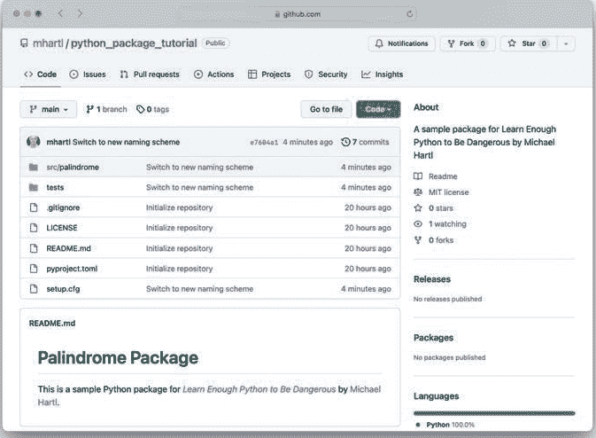

图 8.2：GitHub 上的包仓库和 README。

### 8.1.1 练习

- 1. 如果你还没有完成，请使用正确的包名更新清单 8.3，并将 `url` 和 `Bug Tracker` 字段填写为相应的 GitHub URL（跟踪器 URL 只是基础 URL 加上 `/issues`）。同样，使用你的名字和当前年份更新清单 8.5 中的许可证模板。提交并将你的更改推送到 GitHub。

## 8.2 初始测试覆盖率

既然我们已经建立了基本的包结构，就可以开始测试了。由于必要的 `pytest` 包已经安装（清单 8.6），我们实际上可以立即运行（不存在的）测试：

```
(venv) $ pytest
============================= test session starts =============================
platform darwin -- Python 3.10.6, pytest-7.1.3, pluggy-1.0.0
rootdir: /Users/mhartl/repos/python_package_tutorial
collected 0 items

============================= no tests ran in 0.00s =============================
```

具体细节会有所不同（因此在未来的示例中将省略），但你的结果应该类似。

现在让我们编写一个最小的失败测试，然后让它通过。因为我们已经创建了 **tests** 目录和测试文件 **test_phrase.py**（清单 8.2），我们可以从添加清单 8.9 中所示的代码开始。

**清单 8.9：** 初始测试套件。RED

test/test_phrase.py

```
def test_initial_example():
    assert False
```

清单 8.9 定义了一个包含一个 *断言* 的函数，该断言断言某物具有布尔值 **True**，在这种情况下断言通过，否则失败。因为清单 8.9 字面上断言 **False** 是 **True**，所以它按设计失败：

**清单 8.10：** RED

```
(venv) $ pytest
============================= test session starts =============================
collected 1 item

tests/palindrome_test.py F                                              [100%]

============================== FAILURES ===============================
_________________________ test_non_palindrome __________________________

def test_non_palindrome():
>       assert False
E       assert False

tests/palindrome_test.py:4: AssertionError
========================= short test summary info =========================
FAILED tests/palindrome_test.py::test_non_palindrome - assert False
========================= 1 failed in 0.01s ===========================
```

## 8.2 初始测试覆盖率

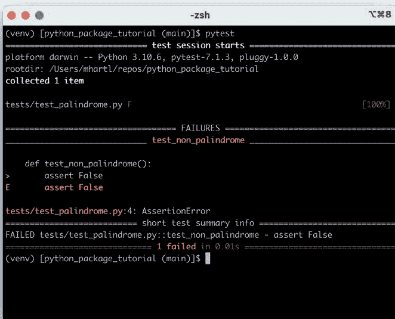

**图 8.3：** 初始测试套件的 RED 状态。

这个测试本身没有用，但它演示了概念，我们马上会添加一个有用的测试。

许多系统（包括我的系统）以红色显示失败的测试，如图 8.3 所示。因此，失败的测试（或一组测试，称为 *测试套件*）通常被称为 RED。为了帮助我们跟踪进度，对应于失败测试套件的代码清单标题被标记为 RED，如清单 8.9 和清单 8.10 所示。

要从失败状态变为通过状态，我们可以在清单 8.9 中将 **False** 改为 **True**，得到清单 8.11 中的代码。

**清单 8.11：** 通过的测试套件。GREEN

test/test_phrase.py

```
def test_initial_example():
    assert True
```

正如预期的那样，这个测试通过了：

**清单 8.12：** GREEN

```
(venv) $ pytest
============================= test session starts =============================
collected 1 item

tests/test_phrase.py .                                               [100%]

============================== 1 passed in 0.00s ================================
```

因为许多系统使用绿色显示通过的测试（图 8.4），所以通过的测试套件通常被称为 GREEN。与 RED 测试套件一样，对应于通过测试的代码清单标题将被标记为 GREEN（如清单 8.11 和清单 8.12 所示）。

除了断言真实的事物是 **True** 之外，断言虚假的事物 *不是* **False** 通常也很方便，我们可以使用 **not**（第 2.4.1 节）来实现，如清单 8.13 所示。

**清单 8.13：** 另一种通过方式。GREEN

test/test_phrase.py

```
def test_initial_example():
    assert not False
```

## 8.2 初始测试覆盖率

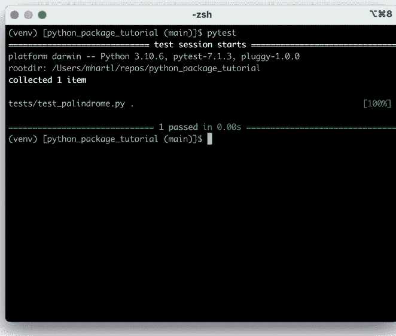

图 8.4：一个 GREEN 测试套件。

如前所述，此测试是 GREEN 的：

清单 8.14：GREEN

```
(venv) $ pytest
============================= test session starts =============================
collected 1 item

tests/test_phrase.py .                                               [100%]

============================== 1 passed in 0.00s ===============================
```

### 8.2.1 一个有用的通过测试

在了解了 GREEN 和 RED 测试的基本机制后，我们现在准备编写第一个有用的测试。因为我们主要想测试 Phrase 类，所以第一步是用定义短语的源代码填充 phrase.py。我们将从 Phrase 本身开始（不包括 TranslatedPhrase），如清单 8.15 所示。请注意，为简洁起见，我们也省略了第 5.3 节中的迭代器代码。

清单 8.15：在包中定义 Phrase。
~/src/palindrome/phrase.py

```
class Phrase:
    """A class to represent phrases."""

    def __init__(self, content):
        self.content = content

    def processed_content(self):
        """Process the content for palindrome testing."""
        return self.content.lower()

    def ispalindrome(self):
        """Return True for a palindrome, False otherwise."""
        return self.processed_content() == reverse(self.processed_content())

def reverse(string):
    """Reverse a string."""
    return "".join(reversed(string))
```

此时，我们准备尝试将 Phrase 导入到我们的测试文件中。按照清单 8.1 中的包结构，Phrase 类应该可以从 palindrome 包中导入，而 palindrome 包又应该可以使用 palindrome.phrase 来访问。结果如清单 8.16 所示，它也替换了清单 8.13 中的示例测试。

4. 你不一定能猜到这一点；这只是 Python 包基于清单 8.1 所示目录结构的工作方式（即 phrase.py 文件位于名为 palindrome 的目录中）。

**清单 8.16：** 导入 `palindrome` 包。RED
test/test_phrase.py

```
from palindrome_mhartl.phrase import Phrase
```

不幸的是，即使不再有失败的测试，测试套件也无法通过：

**清单 8.17：** RED

```
(venv) $ pytest
============================= test session starts =============================
collected 0 items / 1 error

================================ ERRORS ========================================
_______________________ ERROR collecting tests/test_phrase.py ______________________
ImportError while importing test module
'/Users/mhartl/repos/python_package_tutorial/tests/test_phrase.py'.
Hint: make sure your test modules/packages have valid Python names.
Traceback:
lib/python3.10/importlib/__init__.py:126: in import_module
    return _bootstrap._gcd_import(name[level:], package, level)
tests/test_phrase.py:1: in <module>
    from palindrome_mhartl.phrase import Phrase
E   ImportError: cannot import name 'Phrase' from 'palindrome.palindrome'
(/Users/mhartl/repos/python_package_tutorial/src/palindrome/phrase.py)
========================= short test summary info ==============================
ERROR tests/test_phrase.py
!!!!!!!!!!!!!!!!!!!! Interrupted: 1 error during collection !!!!!!!!!!!!!!!!!!!!!!
=========================== 1 error in 0.03s ================================
```

问题在于，我们的包需要安装在本地环境中才能执行清单 8.16 中的 `import`。由于它尚未安装，测试套件处于错误状态。虽然这在技术上与失败状态不同，但错误状态通常也被称为 RED。

要修复此错误，我们需要在本地安装 `palindrome` 包，我们可以使用清单 8.18 中所示的命令来完成。

**清单 8.18：** 在本地安装可编辑包。

```
(venv) $ pip install -e .
```

正如你通过运行 `pip install --help`（或查看 `pytest` 文档）可以了解到的，`-e` 选项以可编辑模式安装包，因此当我们编辑文件时它会自动更新。安装位置在当前目录中，如 `.`（点）所示。

此时，测试套件即使不是完全 GREEN，也至少不再是 RED 了：

```
(venv) $ pytest
============================= test session starts =============================
collected 0 items

============================ no tests ran in 0.00s =============================
```

现在我们准备开始编写一些测试，以检查清单 8.15 中的代码是否实际工作。我们将从一个否定情况开始，检查一个非回文是否被正确分类：

```
def test_non_palindrome():
    assert not Phrase("apple").ispalindrome()
```

这里我们使用了 `assert` 来断言 `"apple"` *不*应该是回文（图 8.5⁵）。

类似地，我们可以用另一个 `assert` 测试一个字面回文（一个正向和反向完全相同的回文）：

```
def test_literal_palindrome():
    assert Phrase("racecar").ispalindrome()
```

结合上述讨论的代码，我们得到了清单 8.19 中所示的代码。

**清单 8.19：** 一个真正有用的测试套件。
test/test_phrase.py

```
from palindrome_mhartl.phrase import Phrase

def test_non_palindrome():
    assert not Phrase("apple").ispalindrome()
```

5. 图片由 Glayan/Shutterstock 提供。


**图 8.5：** 单词 “apple”：不是回文。

```
def test_literal_palindrome():
    assert Phrase("racecar").ispalindrome()
```

现在进行真正的测试（可以这么说）：

**清单 8.20：** GREEN

```
(venv) $ pytest
============================= test session starts =============================
platform darwin -- Python 3.10.6, pytest-7.1.3, pluggy-1.0.0
rootdir: /Users/mhartl/repos/python_package_tutorial
collected 2 items

tests/test_phrase.py ..                                                [100%]

============================== 2 passed in 0.00s ===============================
```

测试现在是 GREEN 的，表明它们处于通过状态。这意味着我们的代码正在工作！

### 8.2.2 待定测试

在继续之前，我们将添加几个*待定*测试，它们是我们想要编写的测试的占位符/提醒。编写待定测试的方法是使用 `skip()` 函数，我们可以直接从 `pytest` 包中导入它，如清单 8.21 所示。

**清单 8.21：** 添加两个待定测试。YELLOW
*test/test_phrase.py*

```
from pytest import skip

from palindrome_mhartl.phrase import Phrase

def test_non_palindrome():
    assert not Phrase("apple").ispalindrome()

def test_literal_palindrome():
    assert Phrase("racecar").ispalindrome()

def test_mixed_case_palindrome():
    skip()

def test_palindrome_with_punctuation():
    skip()
```

我们可以通过重新运行测试套件来查看清单 8.21 的结果：

**清单 8.22：** YELLOW

```
(venv) $ pytest
============================= test session starts =============================
collected 4 items

tests/test_phrase.py ..ss                                               [100%]

========================= 2 passed, 2 skipped in 0.00s =========================
```

请注意测试运行器如何为每个“跳过”显示字母 `s`。有时人们将具有待定测试的测试套件称为 YELLOW，类似于交通灯的红-黄-绿配色方案（图 8.6），尽管将任何非 RED 测试套件称为 GREEN 也很常见。

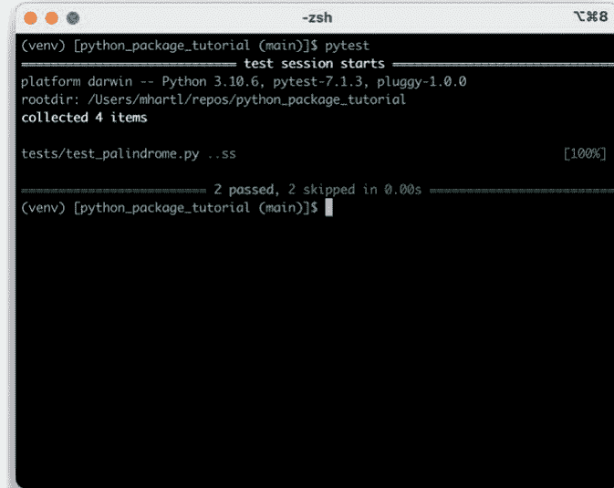

**图 8.6：** 一个 YELLOW（待定）测试套件。

填充混合大小写回文的测试留作练习（解决方案如清单 8.25 所示），而填充第二个待定测试并使其通过则是第 8.3 节和第 8.4 节的主题。

### 8.2.3 练习

- 1. 通过填充清单 8.23 中的代码，添加一个针对混合大小写回文（如 “RaceCar”）的测试。测试套件仍然是 GREEN（或 YELLOW）吗？

## 8.3 红色阶段

在本节中，我们将迈出重要的第一步，以能够检测更复杂的回文，例如“Madam, I'm Adam.”和“A man, a plan, a canal—Panama!”。与之前遇到的字符串不同，这些短语——包含空格和标点符号——即使忽略大小写，严格来说也不是字面意义上的回文。我们不能直接测试原始字符串，而必须想办法只提取字母，然后检查提取出的字母序列是否正反读都一样。

实现这一点的代码相当复杂，但相应的测试却很简单。这是测试驱动开发（TDD）特别能发挥作用的情况之一（框注 8.1）。我们可以先编写简单的测试，从而进入**红色**阶段，然后以任何我们喜欢的方式编写应用代码以达到**绿色**阶段（第 8.4 节）。此时，由于有测试保护我们免受未发现错误的影响，我们可以自信地修改应用代码（第 8.5 节）。

> **框注 8.1：何时测试**
>
> 在决定何时以及如何测试时，理解*为什么*要测试很有帮助。在我看来，编写自动化测试有三个主要好处：
>
> 1.  测试可以防止*回归*，即一个正常工作的功能因某种原因停止工作。
> 2.  测试允许代码在*重构*（即改变其形式而不改变其功能）时更有信心。
> 3.  测试充当应用代码的*客户端*，从而有助于确定其设计及其与系统其他部分的接口。

尽管上述好处都不*要求*必须先编写测试，但在许多情况下，测试驱动开发（TDD）是你工具箱中一个有价值的工具。决定何时以及如何测试部分取决于你编写测试的熟练程度；许多开发者发现，随着他们编写测试的能力提高，他们更倾向于先编写测试。这也取决于测试相对于应用代码的难度、所需功能的明确程度以及该功能未来可能出错的可能性。

在这种情况下，拥有一套关于何时应该先测试（或是否测试）的指导方针会很有帮助。以下是我根据自身经验提出的一些建议：

-   当测试与其测试的应用代码相比特别短或简单时，倾向于先编写测试。
-   当所需行为尚未完全明确时，倾向于先编写应用代码，然后编写测试来固化结果。
-   每当发现一个错误时，先编写一个测试来重现它并防止回归，然后再编写应用代码来修复它。
-   在重构代码之前编写测试，重点关注那些特别容易出错的代码。

我们将从为一个包含标点符号的回文编写测试开始，这与清单 8.19 中的测试类似：

```python
def test_palindrome_with_punctuation():
    assert palindrome.ispalindrome("Madam, I'm Adam.")
```

更新后的测试套件出现在清单 8.25 中，其中也包含了清单 8.23 中几个练习的解决方案（图 8.7⁶）。

**清单 8.25：** 为包含标点符号的回文添加测试。红色阶段
*test/test_phrase.py*

```python
from pytest import skip

from palindrome_mhartl.phrase import Phrase

def test_non_palindrome():
    assert not Phrase("apple").ispalindrome()

def test_literal_palindrome():
    assert Phrase("racecar").ispalindrome()

def test_mixed_case_palindrome():
    assert Phrase("RaceCar").ispalindrome()

def test_palindrome_with_punctuation():
    assert Phrase("Madam, I'm Adam.").ispalindrome()
```

6. 图片由 Msyaraafiq/Shutterstock 提供。

**图 8.7：** “RaceCar”仍然是一个回文（忽略大小写）。

如预期，测试套件现在处于**红色**阶段（输出略有简化）：

**清单 8.26：** 红色阶段

```
(venv) $ pytest
============================= test session starts =============================
collected 4 items

tests/test_phrase.py ...F                                               [100%]

================================= FAILURES ==================================
_______________________ test_palindrome_with_punctuation _______________________

def test_palindrome_with_punctuation():
>       assert Phrase("Madam, I'm Adam.").ispalindrome()
E       assert False

tests/test_phrase.py:14: AssertionError
============================= short test summary info ==============================
FAILED tests/test_phrase.py::test_palindrome_with_punctuation - assert False
============================= 1 failed, 3 passed in 0.01s ==============================
```

此时，我们可以开始思考如何编写应用代码并达到**绿色**阶段。我们的策略是编写一个 **letters()** 方法，该方法只返回内容字符串中的字母。换句话说，代码

```python
Phrase("Madam, I'm Adam.").letters()
```

应该求值为：

```
"MadamImAdam"
```

达到这个状态将使我们能够使用当前的回文检测器来判断原始短语是否是回文。

明确了这个规范后，我们现在可以通过断言结果如预期所示，为 **letters()** 编写一个简单的测试：

```python
assert Phrase("Madam, I'm Adam.").letters() == "MadamImAdam"
```

新测试与其他测试一起出现在清单 8.27 中。

**清单 8.27：** 为 **letters()** 方法添加测试。红色阶段
*test/test_phrase.py*

```python
from pytest import skip

from palindrome_mhartl.phrase import Phrase

def test_non_palindrome():
    assert not Phrase("apple").ispalindrome()

def test_literal_palindrome():
    assert Phrase("racecar").ispalindrome()

def test_mixed_case_palindrome():
    assert Phrase("RaceCar").ispalindrome()

def test_palindrome_with_punctuation():
    assert Phrase("Madam, I'm Adam.").ispalindrome()

def test_letters():
    assert Phrase("Madam, I'm Adam.").letters() == "MadamImAdam"
```

同时，虽然我们还没有准备好定义一个可工作的 **letters()** 方法，但我们可以添加一个*桩*：一个不工作但至少存在的方法。为简单起见，我们将直接返回 nothing（使用特殊的 **pass** 关键字），如清单 8.28 所示。

**清单 8.28：** **letters()** 方法的桩。红色阶段
*src/palindrome/phrase.py*

```python
class Phrase:
    """A class to represent phrases."""

    def __init__(self, content):
        self.content = content

    def ispalindrome(self):
        """Return True for a palindrome, False otherwise."""
        return self.processed_content() == reverse(self.processed_content())

    def processed_content(self):
        """Return content for palindrome testing."""
        return self.content.lower()

    def letters(self):
        """Return the letters in the content."""
        pass

def reverse(string):
    """Reverse a string."""
    return "".join(reversed(string))
```

新的 **letters()** 测试如预期处于**红色**阶段（这也表明清单 8.28 中的 **pass** 只是返回 **None**）：

2. 为了确保测试确实在测试我们*认为*它们在测试的内容，一个好习惯是通过故意*破坏*测试来达到失败状态（红色）。依次更改应用代码以破坏每个现有测试，然后确认一旦恢复原始代码，它们又会变回绿色。清单 8.24 中有一个破坏了前一个练习测试（但没有破坏其他测试）的代码示例。（先编写测试的一个优点是，这个红色-绿色循环会自动发生。）

**清单 8.23：** 为大小写混合的回文添加测试。
*test/test_phrase.py*

```python
from pytest import skip

from palindrome_mhartl.phrase import Phrase


def test_non_palindrome():
    assert not Phrase("apple").ispalindrome()


def test_literal_palindrome():
    assert Phrase("racecar").ispalindrome()


def test_mixed_case_palindrome():
    FILL_IN


def test_palindrome_with_punctuation():
    skip()
```

**清单 8.24：** 故意破坏一个测试。红色阶段
*src/palindrome/phrase.py*

```python
class Phrase:
    """A class to represent phrases."""

    def __init__(self, content):
        self.content = content

    def processed_content(self):
        """Process the content for palindrome testing."""
        return self.content#.lower()

    def ispalindrome(self):
        """Return True for a palindrome, False otherwise."""
        return self.processed_content() == reverse(self.processed_content())

def reverse(string):
    """Reverse a string."""
    return "".join(reversed(string))
```

## 第8章：测试与测试驱动开发

### 清单 8.29：RED

```
(venv) $ pytest
============================= test session starts =============================
collected 5 items

tests/test_phrase.py ...FF                                               [100%]

================================= FAILURES ==================================
_______________________ test_palindrome_with_punctuation _______________________

def test_palindrome_with_punctuation():
>       assert Phrase("Madam, I'm Adam.").ispalindrome()
E       assert False

tests/test_phrase.py:14: AssertionError
_______________________________ test_letters _________________________________

def test_letters():
>       assert Phrase("Madam, I'm Adam.").letters() == "MadamImAdam"
E       assert None == 'MadamImAdam'

tests/test_phrase.py:17: AssertionError
============================= short test summary info ==========================
FAILED tests/test_phrase.py::test_palindrome_with_punctuation - assert False
FAILED tests/test_phrase.py::test_letters - assert None == 'MadamImAdam'
============================= 2 failed, 3 passed in 0.01s ======================
```

有了这两个捕获期望行为的RED测试，我们现在可以转向应用代码，并尝试使其通过测试（达到GREEN状态）。

### 8.3.1 练习

- 1. 确认注释掉清单8.28中的`letters()`存根会导致失败状态，而不是错误状态。（这种行为相对不寻常，许多其他语言会区分不工作的方法和完全缺失的方法。然而在Python中，无论哪种情况，结果都是相同的失败状态。）

## 8.4 GREEN

现在我们已经有了捕获回文检测器增强行为的RED测试，是时候让它们通过测试（达到GREEN状态）了。TDD（测试驱动开发）的理念之一是先让测试通过，而不过多担心实现的质量。一旦测试套件通过（GREEN），我们就可以在不引入回归问题（Box 8.1）的情况下对其进行优化。

主要挑战是实现**letters()**方法，该方法返回构成**Phrase****内容**的字母（但不包括任何其他字符）组成的字符串。换句话说，我们需要选择匹配特定模式的字符。这听起来像是正则表达式（第4.3节）的工作。

在这种时候，使用在线正则表达式匹配器并参考如图4.5所示的正则表达式参考是一个极好的主意。事实上，有时它们会让事情变得有点*太*容易了，比如当参考中恰好有你需要的正则表达式时（图8.8）。

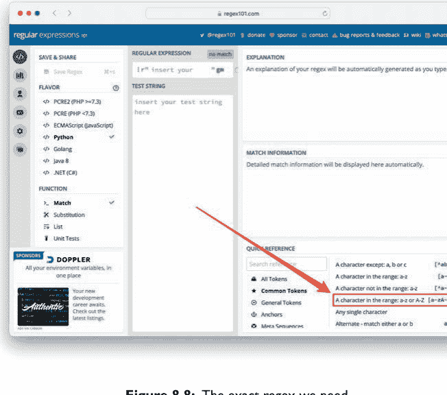

**图8.8：** 我们需要的精确正则表达式。

让我们在控制台中测试它，确保它满足我们的标准（使用第4.3节介绍的`re.search()`方法）：⁷

```
$ source venv/bin/activate
(venv) $ python3
>>> import re
>>> re.search(r"[a-zA-Z]", "M")
<re.Match object; span=(0, 1), match='M'>
>>> bool(re.search(r"[a-zA-Z]", "M"))
True
>>> bool(re.search(r"[a-zA-Z]", "d"))
True
>>> bool(re.search(r"[a-zA-Z]", ","))
False
```

看起来不错！

我们现在可以构建一个匹配大写或小写字母的字符数组。最直接的方法是使用我们在第2.6节首次看到的`for`循环方法。我们将从一个用于存放字母的数组开始，然后遍历`content`字符串，如果字符匹配字母正则表达式，则将其推入数组（第3.4.3节）：

```
# 有效但不够Pythonic
the_letters = []
for character in self.content:
    if re.search(r"[a-zA-Z]", character):
        the_letters.append(character)
```

此时，`the_letters`是一个字母数组，可以将其`连接`形成原始字符串中的字母字符串：

```
"".join(the_letters)
```

将所有内容整合起来，得到清单8.30中的`letters()`方法（添加了高亮以指示新方法的开始）。

7. 请注意，这不适用于非ASCII字符。如果你需要匹配包含此类字符的单词，搜索“python unicode letter regular expression”可能会有所帮助。感谢读者Paul Gemperle指出这个问题。

### 清单 8.30：一个可工作的**letters()**方法（但完整测试套件仍为RED）。

src/palindrome/phrase.py

```
import re

class Phrase:
    """一个表示短语的类。"""

    def __init__(self, content):
        self.content = content

    def ispalindrome(self):
        """如果是回文则返回True，否则返回False。"""
        return self.processed_content() == reverse(self.processed_content())

    def processed_content(self):
        """返回用于回文测试的内容。"""
        return self.content.lower()

    def letters(self):
        """返回内容中的字母。"""
        the_letters = []
        for character in self.content:
            if re.search(r"[a-zA-Z]", character):
                the_letters.append(character)
        return "".join(the_letters)

def reverse(string):
    """反转字符串。"""
    return "".join(reversed(string))
```

尽管完整的测试套件仍然是RED，但我们的**letters()**测试现在应该是GREEN了，如失败测试数量从2个变为1个所示：

### 清单 8.31：RED

```
(venv) $ pytest
============================= test session starts =============================
platform darwin -- Python 3.10.6, pytest-7.1.3, pluggy-1.0.0
rootdir: /Users/mhart1/repos/python_package_tutorial
collected 5 items

tests/test_phrase.py ...F.                                               [100%]

================================= FAILURES ==================================
______________________ test_palindrome_with_punctuation ______________________

def test_palindrome_with_punctuation():
>       assert Phrase("Madam, I'm Adam.").ispalindrome()
E       assert False

tests/test_phrase.py:14: AssertionError
============================== short test summary info ===============================
FAILED tests/test_phrase.py::test_palindrome_with_punctuation - assert False
============================== 1 failed, 4 passed in 0.01s ===============================
```

我们可以通过在**processed_content()**方法中用**self.letters()**替换**self.content**来让最后一个RED测试通过。结果出现在清单8.32中。

### 清单 8.32：一个可工作的**ispalindrome()**方法。GREEN

src/palindrome/phrase.py

```
import re

class Phrase:
    """一个表示短语的类。"""

    def __init__(self, content):
        self.content = content

    def ispalindrome(self):
        """如果是回文则返回True，否则返回False。"""
        return self.processed_content() == reverse(self.processed_content())

    def processed_content(self):
        """返回用于回文测试的内容。"""
        return self.letters().lower()

    def letters(self):
        """返回内容中的字母。"""
        the_letters = []
        for character in self.content:
            if re.search(r"[a-zA-Z]", character):
                the_letters.append(character)
        return "".join(the_letters)

def reverse(string):
    """反转字符串。"""
    return "".join(reversed(string))
```


**图8.9：** 我们的检测器终于理解了Adam的回文本质。

清单8.32的结果是一个GREEN测试套件（图8.9⁸）：

### 清单 8.33：GREEN

```
(venv) $ pytest
============================= test session starts =============================
collected 5 items

tests/test_phrase.py .....                                              [100%]

============================== 5 passed in 0.00s ===============================
```

它可能不是世界上最漂亮的代码，但这个GREEN测试套件意味着我们的代码正在工作！

8. 图片由Album/Alamy Stock Photo提供。

### 8.4.1 练习

- 1. 使用清单8.16中显示的相同代码，将**Phrase**类导入Python REPL，并直接确认**ispalindrome()**可以成功检测“Madam, I’m Adam.”形式的回文。

## 8.5 重构

尽管清单8.32中的代码现在可以工作了（如我们的GREEN测试套件所示），但它依赖于一个相当笨拙的**for**循环，该循环向列表追加元素，而不是一次性创建列表。在本节中，我们将*重构*代码，这是在不改变功能的情况下改变代码形式的过程。

通过在任何重大更改后运行我们的测试套件，我们将快速捕获任何回归问题，从而让我们对重构代码的最终形式仍然正确充满信心。在本节中，我建议进行增量更改，并在每次更改后运行测试套件以确认套件仍然是GREEN。

根据第6章，创建清单8.32中那种列表的更Pythonic的方式是使用列表推导式。特别是，清单8.32中的循环与清单6.4中的**imperative_singles()**函数非常相似：

```
states = ["Kansas", "Nebraska", "North Dakota", "South Dakota"]
.
.
.
# singles: 命令式版本
def imperative_singles(states):
    singles = []
    for state in states:
        if len(state.split()) == 1:
            singles.append(state)
    return singles
```

正如我们在清单6.5中看到的，这可以使用带条件的列表推导式来替换：

```
# singles: 函数式版本
def functional_singles(states):
    return [state for state in states if len(state.split()) == 1]
```

让我们进入 REPL 环境，看看在当前情况下如何实现相同的功能：

```python
>>> content = "Madam, I'm Adam."
>>> [c for c in content]
['M', 'a', 'd', 'a', 'm', ',', ' ', 'I', "'", 'm', ' ', 'A', 'd', 'a', 'm', '.']
>>> [c for c in content if re.search(r"[a-zA-Z]", c)]
['M', 'a', 'd', 'a', 'm', 'I', 'm', 'A', 'd', 'a', 'm']
>>> "".join([c for c in content if re.search(r"[a-zA-Z]", c)])
'MadamImAdam'
```

我们在这里看到，如何通过将列表推导式与条件判断和 `join()` 方法结合，来复制 `letters()` 函数的当前功能。实际上，在 `join()` 的参数中，我们可以省略方括号，改用生成器推导式（第 6.4 节）：

```python
>>> "".join(c for c in content if re.search(r"[a-zA-Z]", c))
'MadamImAdam'
```

这引出了如清单 8.34 所示的更新后的方法。正如推导式解决方案中常见的情况一样，我们已经能够将命令式解决方案精简为单行代码。

**清单 8.34：** 将 `letters()` 重构为单行代码。GREEN
`src/palindrome/phrase.py`

```python
import re

class Phrase:
    """A class to represent phrases."""

    def __init__(self, content):
        self.content = content

    def ispalindrome(self):
        """Return True for a palindrome, False otherwise."""
        return self.processed_content() == reverse(self.processed_content())

    def processed_content(self):
        """Return content for palindrome testing."""
        return self.letters().lower()

    def letters(self):
        """Return the letters in the content."""
        return "".join(c for c in self.content if re.search(r"[a-zA-Z]", c))

def reverse(string):
    """Reverse a string."""
    return "".join(reversed(string))
```

正如第 6 章所指出的，函数式程序更难增量构建，这就是为什么拥有一个测试套件来检查我们的更改是否产生了预期效果（即根本没有效果）如此重要：

**清单 8.35：** GREEN

```
(venv) $ pytest
============================= test session starts =============================
collected 5 items

tests/test_phrase.py .....                                              [100%]

============================== 5 passed in 0.01s ===============================
```

太好了！我们的测试套件仍然通过，所以我们新的单行 **letters()** 方法有效。
这是一个重大的改进，但实际上还有一次重构，它很好地展示了 Python 的强大之处。回顾第 4.3 节，正则表达式有一个 **findall()** 方法，它允许我们直接从字符串中选择匹配正则表达式的字符：

```python
>>> re.findall(r"[a-zA-Z]", content)
['M', 'a', 'd', 'a', 'm', 'I', 'm', 'A', 'd', 'a', 'm']
>>> "".join(re.findall(r"[a-zA-Z]", content))
'MadamImAdam'
```

通过使用 **findall()** 和本节中一直使用的相同正则表达式，然后用空字符串连接，我们可以进一步简化应用代码，消除列表推导式，如清单 8.36 所示。

**清单 8.36：** 使用 re.findall。GREEN

`src/palindrome/phrase.py`

```python
import re

class Phrase:
    """A class to represent phrases."""

    def __init__(self, content):
        self.content = content

    def ispalindrome(self):
        """Return True for a palindrome, False otherwise."""
        return self.processed_content() == reverse(self.processed_content())

    def processed_content(self):
        """Return content for palindrome testing."""
        return self.letters().lower()

    def letters(self):
        """Return the letters in the content."""
        return "".join(re.findall(r"[a-zA-Z]", self.content))

def reverse(string):
    """Reverse a string."""
    return "".join(reversed(string))
```

再次运行测试套件确认一切仍然正常（图 8.10⁹）：

**清单 8.37：** GREEN

```
(venv) $ pytest
============================= test session starts =============================
collected 5 items

tests/test_phrase.py .....                                               [100%]

============================== 5 passed in 0.01s ================================
```

9. 图片由 Album/Alamy Stock Photo 提供。


**图 8.10：** 经过我们所有的工作后，它仍然是一个回文。

### 8.5.1 发布 Python 包

作为最后一步，并且符合我们发布的理念（框 1.5），在本节的最后，我们将把我们的 `palindrome` 包发布到 Python 包索引，也称为 PyPI。

与大多数编程语言不同，Python 实际上有一个专门的测试包索引，称为 TestPyPI，这意味着我们可以发布（并使用）我们的测试包，而无需上传到真正的包索引。在继续之前，您需要在 TestPyPI 注册一个帐户并验证您的电子邮件地址。

一旦您设置好帐户，您就可以构建和发布您的包了。为此，我们将使用 `build` 和 `twine` 包，您现在应该安装它们：

```bash
(venv) $ pip install build==0.8.0
(venv) $ pip install twine==4.0.1
```

第一步是按如下方式构建包：

```
(venv) $ python3 -m build
```

这使用 **pyproject.toml**（清单 8.3）中的信息来创建一个 **dist**（“分发”）目录，其中包含基于您的包名称和版本号的文件。例如，在我的系统上，**dist** 目录如下所示：

```
(venv) $ ls dist
palindrome_mhartl-0.0.1.tar.gz
palindrome_mhartl-0.0.1-py3-none-any.whl
```

这些分别是 tarball 和 wheel 文件，但事实是您不需要了解这些文件的具体内容；您只需要知道 **build** 步骤是将包发布到 TestPyPI 所必需的。（能够坦然忽略这类细节是技术成熟度的一个好迹象。）

实际发布包涉及使用 **twine** 命令，如下所示（直接从 TestPyPI 文档中复制）：<sup>10</sup>

```
(venv) $ twine upload --repository testpypi dist/*
```

（对于未来的上传，您可能需要使用 **rm** 删除旧版本的包，因为 TestPyPI 不允许您重用文件名。）

此时，您的包已发布，您可以通过在本地系统上安装它来测试它。由于我们已经在主 venv 中拥有一个可编辑和可测试的包版本（清单 8.18），最好在临时目录中启动一个新的 venv：

```
$ cd
$ mkdir -p tmp/test_palindrome
$ cd tmp/test_palindrome
$ python3 -m venv venv
$ source venv/bin/activate
(venv) $
```

10. 此时，系统会提示您输入用户名和密码或 API 密钥。有关后者，请参阅 TestPyPI 关于令牌的页面以获取更多信息。

现在您可以通过使用 `--index-url` 选项告诉 `pip` 使用测试索引而不是真实索引来安装您的包：

```
(venv) $ pip install <package> --index-url https://test.pypi.org/simple/
```

例如，我可以按如下方式安装我的测试包版本，该版本名为 `palindrome_mhartl`：¹¹

```
(venv) $ pip install palindrome_mhartl --index-url https://test.pypi.org/simple/
```

要测试安装，您可以在 REPL 中加载该包：

```
(venv) $ python3
>>> from palindrome_mhartl.phrase import Phrase
>>> Phrase("Madam, I'm Adam.").ispalindrome()
True
```

它有效！（如果它对您不起作用——这是很有可能的，因为很多事情都可能出错——唯一的办法就是运用您的技术能力来解决差异。）

对于通用的 Python 包，您可以继续添加功能并发布新版本。您需要做的就是在 `pyproject.toml` 中增加版本号以反映您所做的更改。有关如何增加版本的更多指导，我建议您了解一下所谓的*语义化版本控制*或 *semver* 的规则（框 8.2）。

> **框 8.2：语义化版本控制**
>
> 您可能在本节中注意到，我们为新包使用了版本号 0.1.0。前导零表示我们的包处于早期阶段，通常称为“beta”（对于非常早期的项目，甚至称为“alpha”）。

11. `_mhartl` 部分来自 `pyproject.toml` 中的 `name` 设置，对我来说是 `palindrome_mhartl`。如果您安装我的包版本，您可能会注意到版本号高于 0.0.1，这是由于前面提到的关于包名重用的问题。由于我在开发本教程的过程中进行了相当多的更改，我已经多次增加了版本号（`pyproject.toml` 中的 `version`）。

### 8.5.2 练习

1.  让我们通过添加检测整数回文（如 `12321`）的能力来泛化我们的回文检测器。通过填写清单 8.38 中的 `FILL_IN`，为整数非回文和回文编写测试。使用清单 8.39 中的代码使两个测试都达到 `GREEN` 状态，该代码添加了对 `str` 的调用以确保内容是字符串，并在正则表达式中包含 `\d` 以匹配数字和字母。（注意，我们已相应地更新了 `letters()` 方法的名称。）
2.  在 `pyproject.toml` 中更新版本号，提交并推送你的更改，使用 `build` 构建你的包，并使用 `twine` 上传它。在你的临时目录中，使用清单 8.40 中的命令升级你的包，并在 REPL 中确认整数回文检测功能正常。*注意：* 清单 8.40 中的反斜杠 `\` 是一个*续行符*，应原样输入，但右尖括号 `>` 应由你的 shell 程序自动添加，不应输入。

**清单 8.38：** 测试整数回文。RED
`tests/test_phrase.py`

```python
from pytest import skip

from palindrome_mhartl.phrase import Phrase

def test_non_palindrome():
    assert not Phrase("apple").ispalindrome()

def test_literal_palindrome():
    assert Phrase("racecar").ispalindrome()

def test_mixed_case_palindrome():
    assert Phrase("RaceCar").ispalindrome()

def test_palindrome_with_punctuation():
    assert Phrase("Madam, I'm Adam.").ispalindrome()

def test_letters_and_digits():
    assert Phrase("Madam, I'm Adam.").letters_and_digits() == "MadamImAdam"

def test_integer_non_palindrome():
    FILL_IN Phrase(12345).ispalindrome()

def test_integer_palindrome():
    FILL_IN Phrase(12321).ispalindrome()
```

**清单 8.39：** 添加整数回文检测。GREEN
`src/palindrome/phrase.py`

```python
import re

class Phrase:
    """A class to represent phrases."""

    def __init__(self, content):
        self.content = str(content)

    def ispalindrome(self):
        """Return True for a palindrome, False otherwise."""
        return self.processed_content() == reverse(self.processed_content())

    def processed_content(self):
        """Return content for palindrome testing."""
        return self.letters_and_digits().lower()

    def letters_and_digits(self):
        """Return the letters and digits in the content."""
        return "".join(re.findall(r"[a-zA-Z]", self.content))

def reverse(string):
    """Reverse a string."""
    return "".join(reversed(string))
```

**清单 8.40：** 升级测试包。

```
(venv) $ pip install --your-package \
> --index-url https://test.pypi.org/simple/
```

## 8.5 重构

我们可以通过递增版本号中的中间数字来表示更新，例如从 0.1.0 到 0.2.0、0.3.0 等。错误修复通过递增最右边的数字来表示，如 0.2.1、0.2.2 等，而一个成熟的版本（适合他人使用，并且可能与先前版本不向后兼容）则由版本 1.0.0 表示。

达到版本 1.0.0 后，进一步的更改遵循相同的通用模式：1.0.1 代表小的更改（“补丁发布”），1.1.0 代表新的（但向后兼容的）功能（“次要发布”），而 2.0.0 代表主要的或不向后兼容的更改（“主要发布”）。

这些编号约定被称为*语义化版本控制*，简称 *semver*。更多信息，请参见 semver.org。

最后，如果你将来开发的包不仅仅像本章中的测试包，你可以将其发布到真正的 Python 包索引（PyPI）。尽管有充足的 PyPI 文档，但毫无疑问，在这种情况下，你将有充足的机会运用你的技术能力。

# 第 9 章
## Shell 脚本

在本章中，我们将在第 1.4 节奠定的基础上，编写三个日益复杂的 *shell 脚本*。在前两个程序（第 9.1 节和第 9.2 节）中，我们将利用第 8 章开发的 Python 包，使其能够检测来自两个不同来源的回文：一个文件和网络。在此过程中，我们将学习如何使用 Python 读写文件，以及如何从实时的 Web URL 读取数据。最后，在第 9.3 节，我们将编写一个真实的实用程序，改编自我曾经为自己编写的一个程序。它包括在 Web 浏览器之外的环境中操作文档对象模型（或 *DOM*）的介绍。¹

## 9.1 从文件读取

我们的第一个任务是读取和处理文件的内容。这个例子设计得很简单，但它展示了必要的原则，并为你阅读更高级的文档提供了背景知识。

我们将首先使用 `curl` 下载一个包含简单短语的文件（注意，这应该在我们在第 8 章之前使用的 `python_tutorial` 目录中，而不是回文包目录中）：

```
$ cd ~/repos/python_tutorial/
$ curl -OL https://cdn.learnenough.com/phrases.txt
```

> 1. 文档对象模型在 *Learn Enough CSS & Layout to Be Dangerous* (https://www.learnenough.com/css-and-layout) 中被介绍 (https://www.learnenough.com/css-and-layout-tutorial/introduction#sec-start_stylin)，并在 *Learn Enough JavaScript to Be Dangerous* (https://www.learnenough.com/javascript) 中进行了更深入的探讨 (https://www.learnenough.com/javascript-tutorial/dom_manipulation#cha-dom_manipulation)。

正如你通过在命令行运行 `less phrases.txt` 可以确认的那样，这个文件包含大量的短语——其中一些（惊喜！）恰好是回文。

我们的具体任务是编写一个回文检测器，遍历此文件中的每一行，并打印出任何是回文的短语（同时忽略其他短语）。为此，我们需要打开文件并读取其内容。然后，我们将使用第 8 章开发的包来确定哪些短语是回文。

Python 通过 `open()` 函数原生处理文件操作，我们可以用它来创建一个打开的文件，用 `read()` 读取文件内容，然后用 `close()` 关闭它，如清单 9.1 所示。²

**清单 9.1：** 在 REPL 中打开文件。

```
$ source venv/bin/activate
(venv) $ python3
>>> file = open("phrases.txt")    # Not fully Pythonic
>>> text = file.read()
>>> file.close()
```

这会读取 `phrases.txt` 的内容并将其放入 `text` 变量中。

我们可以使用第 3.1 节（清单 3.2）介绍的 `splitlines()` 方法来确认赋值成功：

```
>>> len(text)
1373
>>> text.splitlines()[0]    # Split on newlines and extract the 1st phrase.
'A butt tuba'
```

这里的第二个命令在换行符 `\n` 处分割文本并选择第零个元素，揭示了文件神秘的第一行：“A butt tuba”。

如清单 9.1 所述，如上所示打开文件并非完全符合 Python 风格。原因是我们每次打开文件都必须记住关闭它，如果我们忘记了，可能会导致不可预测的行为。我们可以通过使用特殊的 `with` 关键字，结合 `as` 和所需的文件名来避免此类问题：

```
>>> with open("phrases.txt") as file:     # Pythonic
...     text = file.read()
...
>>> len(text)
1373
```

这段代码安排在 `with` 语句结束时自动关闭文件，结果与之前相同。

让我们将 Python 解释器中的想法放入一个脚本中，以检测 `phrases.txt` 中的回文：

```
(venv) $ touch palindrome_file
(venv) $ chmod +x palindrome_file
```

然后我们将放入必要的 shebang 行（第 1.4 节）并导入回文包，如清单 9.2 所示。如果可能，你应该使用你自己的包，但如果你在第 8.5.1 节中没有发布自己的包，你可以使用 `palindrome-mhartl`：

```
(venv) $ pip install palindrome_mhartl --index-url https://test.pypi.org/simple/
```

**清单 9.2：** 包含 shebang 行和包。
`palindrome_file`

```python
#!/usr/bin/env python3
from palindrome_mhartl.phrase import Phrase

print("hello, world!")
```

清单 9.2 中的最后一行是我养成的一个习惯，即在编写任何更多代码之前，总是确保脚本处于工作状态：

```
(venv) $ ./palindrome_file
hello, world!
```

在本教程的早期版本中，这个命令实际上失败了，这促使我进行了更改，使其能够立即工作。这就是“hello, world!”的伟大之处——代码如此简单，如果它失败了，你就知道一定是其他地方出了问题。

从 `phrases.txt` 文件中读取并检测回文的脚本相当直接：我们打开文件，按换行符分割内容，然后遍历生成的数组，打印出任何是回文的行。目前阶段，你应该能轻松阅读的结果如清单 9.3 所示。

## 清单 9.3：读取和处理文件内容。

*palindrome_file*

```python
#!/usr/bin/env python3
from palindrome_mhartl.phrase import Phrase

with open("phrases.txt") as file:
    text = file.read()
    for line in text.splitlines():    # 可能不够 Pythonic
        if Phrase(line).ispalindrome():
            print(f"palindrome detected: {line}")
```

在命令行运行该脚本确认文件中存在相当多的回文：

```
(venv) $ ./palindrome_file
.
.
.
palindrome detected: Dennis sinned.
palindrome detected: Dennis and Edna sinned.
palindrome detected: Dennis, Nell, Edna, Leon, Nedra, Anita, Rolf, Nora,
Alice, Carol, Leo, Jane, Reed, Dena, Dale, Basil, Rae, Penny, Lana, Dave,
Denny, Lena, Ida, Bernadette, Ben, Ray, Lila, Nina, Jo, Ira, Mara, Sara,
Mario, Jan, Ina, Lily, Arne, Bette, Dan, Reba, Diane, Lynn, Ed, Eva, Dana,
Lynne, Pearl, Isabel, Ada, Ned, Dee, Rena, Joel, Lora, Cecil, Aaron, Flora,
Tina, Arden, Noel, and Ellen sinned.
palindrome detected: Go hang a salami, I'm a lasagna hog.
palindrome detected: level
palindrome detected: Madam, I'm Adam.
palindrome detected: No "x" in "Nixon"
palindrome detected: No devil lived on
palindrome detected: Race fast, safe car
palindrome detected: racecar
palindrome detected: radar
palindrome detected: Was it a bar or a bat I saw?
palindrome detected: Was it a car or a cat I saw?
```


**图 9.1：** Dennis、Nell、Edna、Leon、Nedra 以及其他许多人犯了罪。

```
palindrome detected: Was it a cat I saw?
palindrome detected: Yo, banana boy!
palindrome detected:
```

其中，我们看到了对简单回文“Dennis sinned”的一个相当精巧的扩展（图 9.1³）！

这是一个很好的开始，但事实上文件有一个 **readlines()** 方法，默认读取所有行，无需调用 **splitlines()**。将其应用于清单 9.3 得到清单 9.4。

## 清单 9.4：切换到 **readlines()**。

*palindrome_file*

```python
#!/usr/bin/env python3
from palindrome_mhartl.phrase import Phrase

with open("phrases.txt") as file:
    for line in file.readlines():  # Pythonic
        if Phrase(line).ispalindrome():
            print(f"palindrome detected: {line}")
```

你应该在命令行确认结果几乎相同：

```
(venv) $ ./palindrome_file
.
.
.
palindrome detected: Was it a bar or a bat I saw?
palindrome detected: Was it a car or a cat I saw?
palindrome detected: Was it a cat I saw?
palindrome detected: Yo, banana boy!
```

现在回文行之间有了额外的换行符，这是因为 `open(...).readlines()` 中的每个元素实际上*包含*了换行符。

为了复制清单 9.3 的输出，我们可以应用一个常见且有用的技术：*去除*每个字符串的首尾空白，这在解释器中可以看到：

```
>>> greeting = "    hello, world!   \n"
>>> greeting.strip()
'hello, world!'
```

将此技术应用于清单 9.4 的代码得到清单 9.5。⁴（使用 `readlines()` 的版本可能是最 Pythonic 的解决方案，但代价是调用了 `strip()`，因此清单 9.3 中的 `splitlines()` 版本也是合理的。）

## 清单 9.5：使用 `strip()` 移除换行符。

*palindrome_file*

```python
#!/usr/bin/env python3
from palindrome_mhartl.phrase import Phrase

with open("phrases.txt") as file:
    for line in file.readlines():
        if Phrase(line).ispalindrome():
            print(f"palindrome detected: {line.strip()}")
```

此时，**palindrome_file** 的输出应该只有回文行，没有额外的换行符，末尾也没有空白回文：

```
(venv) $ ./palindrome_file
.
.
.
palindrome detected: Was it a bar or a bat I saw?
palindrome detected: Was it a car or a cat I saw?
palindrome detected: Was it a cat I saw?
palindrome detected: Yo, banana boy!
```

最后，让我们看看如何在 Python 中*写入*文件。这再简单不过了；模板如下：

```python
file.write(content_string)
```

我们可以通过将 **readlines()** 的输出捕获到一个单独的变量（称为 **lines**）中，然后使用带条件的列表推导式（第 6.2 节）来构建一个由回文组成的内容字符串：

```python
with open("phrases.txt") as file:
    lines = file.readlines()
    for line in lines:
        if Phrase(line).ispalindrome():
            print(f"palindrome detected: {line.strip()}")

palindromes = [line for line in lines if Phrase(line).ispalindrome()]
```

然后，将 **palindromes** 列表用空字符串连接，并将结果字符串写入 **palindromes_file.txt** 文件，总共只需两行，如清单 9.6 所示。

## 清单 9.6：写出回文。

*palindrome_file*

```python
#!/usr/bin/env python3
from palindrome_mhartl.phrase import Phrase

with open("phrases.txt") as file:
    lines = file.readlines()
    for line in lines:
        if Phrase(line).ispalindrome():
            print(f"palindrome detected: {line.strip()}")

palindromes = [line for line in lines if Phrase(line).ispalindrome()]
with open("palindromes_file.txt", "w") as file:
    file.write("".join(palindromes))
```

运行脚本后，作为副作用会写出文件：

```
(venv) $ ./palindrome_file
.
.
.
palindrome detected: Madam, I'm Adam.
palindrome detected: No "x" in "Nixon"
palindrome detected: No devil lived on
palindrome detected: Race fast, safe car
palindrome detected: racecar
palindrome detected: radar
palindrome detected: Was it a bar or a bat I saw?
palindrome detected: Was it a car or a cat I saw?
palindrome detected: Was it a cat I saw?
palindrome detected: Yo, banana boy!
(venv) $ tail palindromes_file.txt
Madam, I'm Adam.
No "x" in "Nixon"
No devil lived on
Race fast, safe car
racecar
radar
Was it a bar or a bat I saw?
Was it a car or a cat I saw?
Was it a cat I saw?
Yo, banana boy!
```

### 9.1.1 练习

1.  你可能注意到清单 9.6 中存在一些重复：我们首先检测所有回文，逐个打印出来，然后再次找到所有回文的列表（使用列表推导式）。证明我们可以通过用清单 9.7 中更紧凑的代码替换整个文件来消除这种重复。（因为回文内容本身已经以换行符结尾，清单 9.7 调用 `print()` 时使用了第 2.3 节提到的 `end=""` 选项，以防止重复换行。）

2.  Python shell 脚本中的一个常见模式是将主要步骤放在一个单独的函数中（通常称为 `main()`），然后仅在文件本身作为 shell 脚本被调用时才调用该函数。（有关更多信息，请参见此视频 (https://www.youtube.com/watch?v=g_wlZ9IhbTs)。）使用第 7.1 节介绍的特殊语法，证明清单 9.7 中的 shell 脚本可以转换为清单 9.8。在命令行执行时，它是否给出相同的结果？

3.  一些 Python 程序员甚至更喜欢将脚本的内容放在另一个函数中，然后让 `main()` 调用该函数，如清单 9.9 所示。证明此代码仍然产生与之前相同的输出。

## 清单 9.7：以无重复的方式写出回文。

*palindrome_file*

```python
#!/usr/bin/env python3
from palindrome_mhartl.phrase import Phrase

with open("phrases.txt") as file:
    palindromes = [line for line in file.readlines()
                   if Phrase(line).ispalindrome()]

palindrome_content = "".join(palindromes)
print(palindrome_content, end="")

with open("palindromes_file.txt", "w") as file:
    file.write(palindrome_content)
```

## 清单 9.8：仅在命令行调用 `main()`。

*palindrome_file*

```python
#!/usr/bin/env python3
from palindrome_mhartl.phrase import Phrase

def main():
```

with open("phrases.txt") as file:
    palindromes = [line for line in file.readlines()
                   if Phrase(line).ispalindrome()]

palindrome_content = "".join(palindromes)
print(palindrome_content, end="")

with open("palindromes_file.txt", "w") as file:
    file.write(palindrome_content)

if __name__ == "__main__":
    main()
```

**清单 9.9：** 在脚本和 `main()` 之间添加另一层。
*palindrome_file*

```
#!/usr/bin/env python3
from palindrome_mhartl.phrase import Phrase

def main():
    detect_palindromes()

def detect_palindromes():
    with open("phrases.txt") as file:
        palindromes = [line for line in file.readlines()
                       if Phrase(line).ispalindrome()]

    palindrome_content = "".join(palindromes)
    print(palindrome_content, end="")

    with open("palindromes_file.txt", "w") as file:
        file.write(palindrome_content)

if __name__ == "__main__":
    main()
```

## 9.2 从 URL 读取

在本节中，我们将编写一个脚本，其效果与第 9.1 节中的脚本完全相同，不同之处在于它直接从公共 URL 读取 `phrases.txt` 文件。程序本身并没有做什么特别的事情，但请意识到这是一个多么了不起的奇迹：这些想法并不局限于我们访问的特定 URL，这意味着在本节之后，你将有能力编写程序来访问和处理网络上几乎任何网站。（这种做法有时被称为“网络爬取”，应谨慎并适当考虑后进行。）

主要技巧是使用 Requests 包，我们可以使用 **pip** 来安装它：$^{5}$

```
bash
(venv) $ pip install requests==2.28.1
```

正如文档中所述，Requests 包含一个 **get()** 方法，它可以，嗯，*获取*一个 URI（也称为 URL；区别很少重要）：

```
python
>>> import requests
>>> url = "https://cdn.learnenough.com/phrases.txt"
>>> response = requests.get(url)
>>> response.text
'A butt tuba\nA bad penny always turns up.\n...Yo, banana boy!\n'
```

我们在这里看到，**response** 对象有一个名为 **text** 的属性，它包含了 **requests.get()** 返回的文本，我们可以将其与清单 9.3 中的 **splitlines()** 方法结合使用来提取行。$^{6}$

我们可以像第 9.1 节那样创建我们的脚本：

```
bash
$ touch palindrome_url
$ chmod +x palindrome_url
```

然后，实现大致与清单 9.3 中的代码平行，只是没有调用 **with**，如清单 9.10 所示。

5. 较旧的 Python 代码通常使用 **urllib** 包中的 **urllib.request** 模块，但这不如 Requests 用户友好，实际上 **urllib.request** 文档本身明确推荐使用 Requests（“建议使用 Requests 包作为更高级的 HTTP 客户端接口”）。

6. 还有一个 **iter_lines()** 方法，它返回一个迭代器，该迭代器遍历各行，乍一看有效地复制了清单 9.5 中的 **readlines()** 解决方案。然而，事实证明，生成的元素是以原始字节形式返回的，在使用前必须进行解码。因此，在这种情况下，**splitlines()** 解决方案实际上更简单一些。

**清单 9.10：** 从 URL 读取。

*palindrome_url*

```
#!/usr/bin/env python3
import requests

from palindrome_mhartl.phrase import Phrase

URL = "https://cdn.learnenough.com/phrases.txt"

for line in requests.get(URL).text.splitlines():
    if Phrase(line).ispalindrome():
        print(f"palindrome detected: {line}")
```

此时，我们准备好在命令行中试用该脚本：

```
$ ./palindrome_url
.
.
.
palindrome detected: Madam, I'm Adam.
palindrome detected: No "x" in "Nixon"
palindrome detected: No devil lived on
palindrome detected: Race fast, safe car
palindrome detected: racecar
palindrome detected: radar
palindrome detected: Was it a bar or a bat I saw?
palindrome detected: Was it a car or a cat I saw?
palindrome detected: Was it a cat I saw?
palindrome detected: Yo, banana boy!
```

太棒了！结果与我们在第 9.1 节中看到的几乎完全相同，但这一次，我们直接从实时网络上获取了数据。

实际上还有一个小细节，那就是“A man, a plan, a canal—Panama!”中的破折号没有正确显示（图 9.2）。这是字符编码问题的一个提示，稍加调查发现，`requests.get()` 也可以使用 `content` 属性下载，该属性可以*解码*以包含我们需要的破折号等字符。具体来说，我们可以使用 `decode()` 方法指定字符编码为 UTF-8，如清单 9.11 所示。（我们将在第 10 章再次遇到 UTF-8，届时我们将把它作为 HTML 网页的标准元素；它也在 *Learn Enough HTML to Be Dangerous* (https://www.learnenough.com/html) 中有所介绍。）

## 9.2 从 URL 读取

243

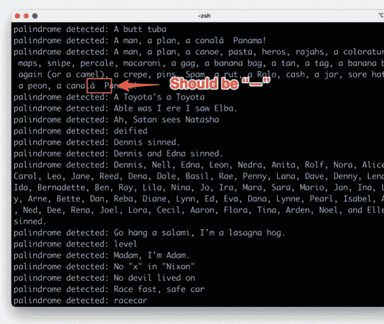

**图 9.2：** 错误的字符。

**清单 9.11：** 解码内容。

*palindrome_url1*

```
#!/usr/bin/env python3
import requests

from palindrome_mhartl.phrase import Phrase

URL = "https://cdn.learnenough.com/phrases.txt"

for line in requests.get(URL).content.decode("utf-8").splitlines():
    if Phrase(line).ispalindrome():
        print(f"palindrome detected: {line}")
```

结果就是我们正在寻找的破折号：

```
$ ./palindrome_url
.
.
.
palindrome detected: A man, a plan, a canal--Panama!
.
.
.
```

顺便说一句，如果你实际访问 URL cdn.learnenough.com/phrases.txt，你会发现它实际上*转发*（使用 301 重定向）到 Amazon 简单存储服务（S3）上的一个页面，如图 9.3 所示。幸运的是，我们在清单 9.10 中使用的 `requests.get()` 方法会自动跟踪此类重定向，因此脚本按预期工作，但

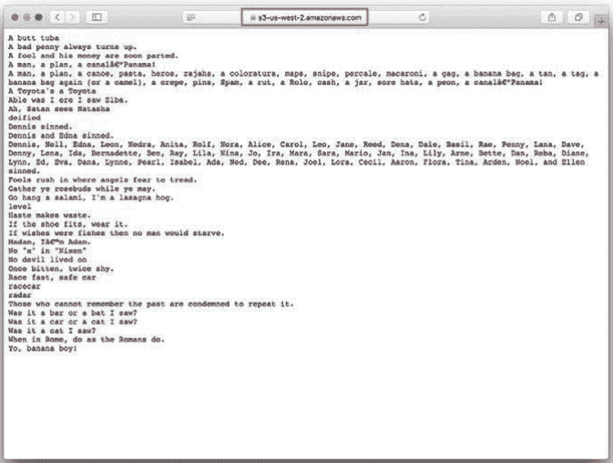

**图 9.3：** 访问短语 URL。

这种行为在 URL 库中并非普遍。根据你使用的具体库，你可能需要手动配置网络请求器以跟踪重定向。

### 9.2.1 练习

- 1. 类比清单 9.6，向清单 9.10 添加代码，将输出写入名为 `palindromes_url.txt` 的文件。使用 `diff` 工具 (https://www.learnenough.com/command-line-tutorial/manipulating_files#sec-redirecting_and_appending) 确认输出与第 9.1 节中的 `palindromes_file.txt` 文件完全相同。
- 2. 修改清单 9.10，使用清单 9.7 中看到的更紧凑的编程风格（包括写出文件的步骤）。

## 9.3 命令行中的 DOM 操作

在最后一节中，我们将把第 9.2 节中学到的 URL 读取技巧付诸实践，编写一个我曾经为自己编写过的实用脚本的版本。首先，我将解释该脚本出现的背景以及它解决的问题。

近年来，可用于学习外语的资源激增，包括 Duolingo、Google Translate 以及操作系统对多语言文本转语音（TTS）的原生支持等。几年前，我决定利用这个机会来温习我的高中/大学西班牙语。

我发现自己经常使用的资源之一是维基百科，它拥有大量非英语文章。特别是，我发现从西班牙语维基百科（图 9.4）复制文本并粘贴到 Google Translate（图 9.5）中非常有用。这样，我就可以使用 Google Translate（图 9.5 中的红色方框）或 macOS 的文本转语音功能来听西班牙语发音，同时跟随母语或翻译。Es muy útil（这非常有用）。

过了一段时间，我注意到两个持续存在的摩擦点：

- 1. 手动复制大量段落很麻烦。
- 2. 手动复制文本经常会选择我不想要的内容，特别是*参考编号*，TTS 系统会忠实地读出这些编号，导致随机数字

（例如，“entre otros.2[dos] Se trata de un lenguaje” = “among others.2 It is treated as a language”。¿Qué pasó?）。

这样的摩擦催生了许多实用脚本，于是 `wikp`（“Wikipedia paragraphs”）诞生了，这是一个用于下载维基百科文章的 HTML 源码、提取其段落并消除其参考文献编号，然后将所有结果输出到屏幕的程序。

最初的 `wikp` 程序是用 Ruby 编写的；这里出现的是一个稍微简化过的版本。让我们思考一下它将如何工作。

我们已经从清单 9.10 中知道了如何下载一个 URL 的源码。剩下的任务就是：

1.  在命令行中接受一个任意的 URL 参数。
2.  使用 DOM 操控下载的 HTML（图 9.6）。

## 9.3 命令行中的 DOM 操控

**图 9.5：** 一篇关于 Python 的文章被放入 Google 翻译。

3.  移除参考文献。
4.  收集并打印段落。

让我们从创建初始脚本开始：

```
$ touch wikp
$ chmod +x wikp
```

现在我们准备好开始编写主程序了。对于上面的每一项任务，我都会包含你可能用来弄清楚如何完成它的那种 Google 搜索。

在 Python 中处理 HTML 有几个选项；其中最强大、最受推崇的一个有着相当异想天开的名字 Beautiful Soup（参考了《爱丽丝梦游仙境》第 9 章中的一首歌）⁷，它可以操控 DOM（python dom manipulation）。我们将使用与 Python 3 兼容的第 4 版：

```
(venv) $ pip install beautifulsoup4==4.11.1
```

Beautiful Soup 包本身可以通过缩写名 **bs4** 获得。

我们的主要任务有时被称为“HTML 解析”，而 Beautiful Soup 配备了一个强大的 HTML 解析器。官方的 Beautiful Soup 网站有一堆有用的教程；就我们的目的而言，最重要的方法看起来像清单 9.12。

### 清单 9.12：解析一些 HTML。

```
>>> from bs4 import BeautifulSoup
>>> html = '<p>lorem<sup class="reference">1</sup></p><p>ipsum</p>'
>>> doc = BeautifulSoup(html)
```

生成的 **doc** 变量是一个 Beautiful Soup 文档，在本例中包含两个段落，其中一个包含一个带有 CSS 类 **reference** 的 **sup**（上标）标签。

Beautiful Soup 文档可以通过多种方式进行操控。我最喜欢的元素选择方法是 **find_all**，它允许我们使用直观的语法提取 HTML 标签（beautiful soup select html tag）。例如：

```
>>> doc.find_all("p")
[<p>lorem<sup class="reference">1</sup></p>, <p>ipsum</p>]
```

这个操作非常常见，以至于当我们直接向文档对象传递一个参数时，它是默认行为：

```
>>> doc("p")
[<p>lorem<sup class="reference">1</sup></p>, <p>ipsum</p>]
>>> len(doc("p"))
2
>>> doc("p")[0].text
'lorem1'
```

我们从最后一行看到，我们可以使用 **text** 属性获取特定结果的文本，在本例中包括参考文献编号 **1**。同时，我们可以使用 **class_** 选项抓取具有“**reference**”类的元素（在本例中只有一个）：⁸

```
>>> doc("sup", class_="reference")
[<sup class="reference">1</sup>]
>>> len(doc("sup", class_="reference"))
1
```

也许你能看出我们接下来要做什么。我们现在能够解析一个 HTML 文档并选择所有的段落和所有的参考文献（当然，假设它们具有类 **reference**）。我们现在需要的是一种从文档中*移除*参考文献的方法。事实上，使用 **decompose()** 方法（beautiful soup remove element）一点也不难，如清单 9.13 所示。

### 清单 9.13：移除 DOM 元素。

```
>>> for reference in doc("sup", class_="reference"):
...     reference.decompose()
...
>>> doc
<html><body><p>lorem</p><p>ipsum</p></body></html>
```

然后，我们可以使用 `doc("p")` 收集所有段落内容并打印每个段落（清单 9.14）。

### 清单 9.14：打印段落内容。

```
>>> for paragraph_tag in doc("p"):
...     print(paragraph_tag.text)
...
lorem
ipsum
```

我们现在准备好将脚本本身组合起来了。我们将首先使用 `sys`（系统）库（python script command line argument）从命令行参数中获取 URL，如清单 9.15 所示。请注意，我们包含了一行 `print` 作为临时方式，以确保参数被正确接受。我们还使用了小写名称（`url`），因为与第 9.2 节不同，它现在是一个变量而不是常量。（`URL` 或 `url` 都可以；大小写的选择只是一个惯例。）

### 清单 9.15：接受命令行参数。

```
#!/usr/bin/env python3
import sys

import requests
from bs4 import BeautifulSoup

# Return the paragraphs from a Wikipedia link, stripped of reference numbers.
# Especially useful for text-to-speech (both native and foreign).

# Get URL from the command line.
url = sys.argv[1]
print(url)
```

我们可以确认清单 9.15 如预期那样工作：

```
$ ./wikp https://es.wikipedia.org/wiki/Python
https://es.wikipedia.org/wiki/Python
```

接下来，我们需要打开 URL 并读取其内容，我们在第 9.2 节（清单 9.11）中了解到可以使用以下代码完成：

```
requests.get(url).content.decode("utf-8")
```

将这个结果输入 **BeautifulSoup()** 然后得到清单 9.16。请注意，我们明确指定了解析器为 HTML，这是默认值，但如果省略可能会产生警告消息。

### 清单 9.16：使用 Beautiful Soup 解析实时 URL。

```
#!/usr/bin/env python3
import sys

import requests
from bs4 import BeautifulSoup

# Return the paragraphs from a Wikipedia link, stripped of reference numbers.
# Especially useful for text-to-speech (both native and foreign).

# Get URL from the command line.
url = sys.argv[1]
# Create Beautiful Soup document from live URL.
content = requests.get(url).content.decode("utf-8")
doc = BeautifulSoup(content, features="html.parser")
```

现在我们需要做的就是应用清单 9.13 和清单 9.14 中的参考文献移除和段落收集代码。如上所述，维基百科使用 `.reference` 类来标识其参考文献，我们可以使用网页检查器（https://www.learenough.com/css-and-layout-tutorial/templates_and_frontmatter#sec-pages-folders）（图 9.7）来确认这一点。这表明了清单 9.17 中显示的参考文献移除代码。

**图 9.7：** 在网页检查器中查看参考文献。

### 清单 9.17：移除参考文献。

```
#!/usr/bin/env python3
import sys

import requests
from bs4 import BeautifulSoup

# Return the paragraphs from a Wikipedia link, stripped of reference numbers.
# Especially useful for text-to-speech (both native and foreign).

# Get URL from the command line.
url = sys.argv[1]
# Create BeautifulSoup document from live URL.
content = requests.get(url).content.decode("utf-8")
doc = BeautifulSoup(content, features="html.parser")
# Remove references.
for reference in doc("sup", class_="reference"):
    reference.decompose()
```

现在剩下的就是提取段落内容并打印出来（清单 9.18）。

### 清单 9.18：打印内容。

```
#!/usr/bin/env python3
import sys

import requests
from bs4 import BeautifulSoup

# Return the paragraphs from a Wikipedia link, stripped of reference numbers.
# Especially useful for text-to-speech (both native and foreign).

# Get URL from the command line.
url = sys.argv[1]
# Create BeautifulSoup document from live URL.
content = requests.get(url).content.decode("utf-8")
doc = BeautifulSoup(content, features="html.parser")
# Remove references.
for reference in doc("sup", class_="reference"):
    reference.decompose()
# Print paragraphs.
for paragraph_tag in doc("p"):
    print(paragraph_tag.text)
```

让我们看看结果如何：

```
$ ./wikp https://es.wikipedia.org/wiki/Python
Python es un lenguaje de alto nivel de programación interpretado cuya
filosofía hace hincapié en la legibilidad de su código, se utiliza para
desarrollar aplicaciones de todo tipo, ejemplos: Instagram, Netflix, Spotify,
Panda 3D, entre otros. Se trata de un lenguaje de programación multiparadigma,
ya que soporta parcialmente la orientación a objetos, programación imperativa
y, en menor medida[?`cuál?], programación funcional. Es un lenguaje
interpretado, dinámico y multiplataforma.
.
.
.
Existen diversas implementaciones del lenguaje:

A lo largo de su historia, Python ha presentado una serie de incidencias, de
las cuales las más importantes han sido las siguientes:
```

成功了！通过在终端中向上滚动，我们现在可以选择所有文本并将其放入 Google 翻译或我们选择的文本编辑器中。在 macOS 上，我们甚至可以通过管道（https://www.learnenough.com/command-line-tutorial/inspecting_files

### 9.3.1 练习

1.  通过移动文件或更改系统配置，将 **wikp** 脚本添加到你的环境 PATH 中。（你可能会发现 *Learn Enough Text Editor to Be Dangerous* 中的步骤（https://www.learnenough.com/text-editor-tutorial/advanced_text_editing#sec-writing_an_executable_script）很有帮助。）确认你可以在不使用 `./` 前缀的情况下运行 **wikp**。*注意：* 如果你因为学习 *Learn Enough JavaScript to Be Dangerous* 或 *Learn Enough Ruby to Be Dangerous*（https://www.learnenough.com/ruby）而有一个同名的 **wikp** 程序，我建议替换它——这体现了文件名是用户界面，而实现可以更改语言而不影响用户的原则。
2.  如果你运行 **wikp** 时没有参数会发生什么？在你的脚本中添加代码来检测命令行参数的缺失，并输出适当的用法说明。*提示：* 打印用法说明后，你需要*退出*，你可以通过搜索“python how to exit script”来学习如何做到这一点。
3.  文中提到的“管道到 **pbcopy**”技巧仅在 macOS 上有效，但任何兼容 Unix 的系统都可以将输出重定向到文件。将 **wikp** 的输出重定向到名为 **article.txt** 的文件的命令是什么？（然后你可以打开此文件，全选并复制内容，这与管道到 **pbcopy** 具有相同的基本效果。）

# 第 10 章
一个实时的 Web 应用程序

本章将使用在第 1.5 节引入并在第 5.2 节进一步应用的 Flask 框架，在 Python 中开发一个动态 Web 应用程序。虽然简单，但 Flask 并非玩具——它是一个生产就绪的 Web 框架，被 Netflix、Lyft 和 reddit 等公司使用。Flask 也是为更复杂的框架（如 Django）做准备的优秀轻量级工具。在本章结束时，你将基本理解 Web 应用程序的工作原理，包括布局（第 10.3 节）、模板（第 10.4 节）、测试和部署。¹

我们的示例 Web 应用程序将通过开发一个基于 Web 的*回文检测器*，充分利用第 8 章开发的自定义 Python 包。在此过程中，我们将学习如何使用 *Python 模板*创建动态内容。

从 Web 检测回文需要使用后端 Web 应用程序来处理*表单提交*，这是 Flask 擅长的任务。我们的回文应用还将包含另外两个页面——主页和关于页——这将让我们有机会学习如何使用基于 Flask 的站点布局。作为其中的一部分，我们将应用并扩展第 8 章的工作，为我们的应用编写自动化测试。

最后，与第 1.5 节一样，我们还将把完整的回文应用部署到实时 Web 上。我们将以指向 Python、Flask 以及其他主题（如 JavaScript 和 Django）的更多资源的指针作为结束。

1.  主要需要学习的额外主题是如何使用数据库存储和检索信息，这代表了一种新技术，但不涉及任何根本性的新原则。你可以在 Flask 和功能更全面的框架（如 Django）中使用数据库。

## 10.1 设置

我们的第一步是将应用设置为概念验证并将其部署到生产环境。我们将首先为其创建一个目录：

```
$ cd ~/repos            # 在云 IDE 上为 cd ~/environments/repos
$ mkdir palindrome_app
$ cd palindrome_app/
```

接下来，我们将为 Flask 开发配置系统，并为回文检测器本身创建一个子目录：

```
$ python3 -m venv venv
$ source venv/bin/activate
(venv) $ pip install --upgrade pip
(venv) $ pip install Flask==2.2.2
(venv) $ mkdir palindrome_detector
(venv) $ touch palindrome_detector/__init__.py
(venv) $ touch setup.py
(venv) $ touch MANIFEST.in
```

此目录结构大致与官方 Flask 教程平行，并允许比第 1.5 节中的“hello, world”应用（它只是用于其他用途的目录中的单个文件）更复杂的设计实践（如模板和测试）。

作为应用设置的一部分，我们还需要填写几个设置文件。特别要注意的是，在撰写本文时，Flask 文档包含 `setup.py` 和 `MANIFEST.in` 文件（清单 10.1 和清单 10.2），而不是遵循将配置设置整合到 `pyproject.toml` 中的“最佳实践”（如我们在第 8 章所做的）；实践经验表明，偏离官方文档，尤其是在部署应用程序时，是非常不明智的，但请注意 Flask 自身的惯例可能自本文撰写以来已经改变。另外，如果你不理解它，也不必担心，因为我也一样；与阅读文档一样，选择性无知绝对是技术成熟度的一部分（Box 1.2）。

## 10.1 设置

清单 10.1：一个设置文件。

setup.py

```
from setuptools import find_packages, setup

setup(
    name='palindrome_detector',
    version='1.0.0',
    packages=find_packages(),
    include_package_data=True,
    zip_safe=False,
    install_requires=[
        'flask',
    ],
)
```

清单 10.2：一个清单文件。

MANIFEST.in

```
graft palindrome_detector/static
graft palindrome_detector/templates
global-exclude *.pyc
```

要开始应用本身，让我们编写“hello, world!”，如清单 10.3 所示。² 清单 10.3 的大部分内容是 Flask 样板代码，同样主要来自官方文档，所以不要担心细节。顺便说一下，函数定义前的 `@app.route("/")` 语法称为装饰器，除了定义 Flask 路由外，它在 Python 中还有许多其他用途。

清单 10.3：在 Flask 中编写“hello, world!”。

```
import os

from flask import Flask

def create_app(test_config=None):
```

2.  os 包包含用于处理底层操作系统（OS）的实用程序。

```
"""Create and configure the app."""
app = Flask(__name__, instance_relative_config=True)

if test_config is None:
    # Load the instance config, if it exists, when not testing.
    app.config.from_pyfile("config.py", silent=True)
else:
    # Load the test config if passed in.
    app.config.from_mapping(test_config)

# Ensure the instance folder exists.
try:
    os.makedirs(app.instance_path)
except OSError:
    pass

@app.route("/")
def index():
    return "hello, world!"

return app

app = create_app()
```

然后使用 **flask** 命令运行应用（清单 10.4）。

## **清单 10.4：** 运行 Flask 应用。

```
(venv) $ flask --app palindrome_detector --debug run
* Running on http://127.0.0.1:5000/
```

访问 127.0.0.1:5000/ 的结果如图 10.1 所示。
最后，遵循我们尽早并经常部署的实践，我们将使用 Git 将项目置于版本控制之下，为部署到 Fly.io 做准备。与第 1.5.1 节一样，我们需要一个 **.gitignore** 文件来告诉 Git 哪些文件和目录需要忽略（清单 10.5）。

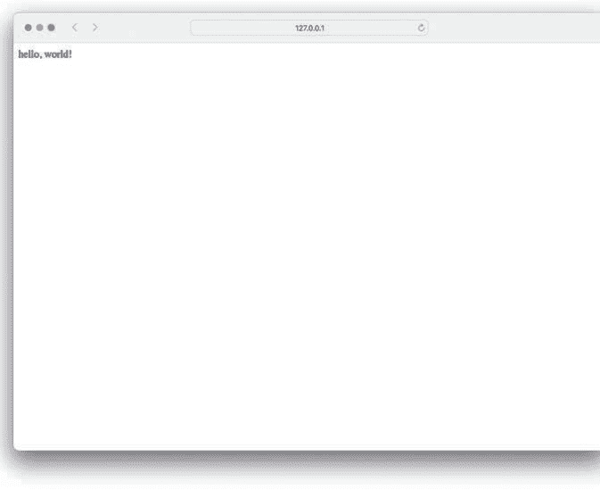

**图 10.1：** 我们的初始应用。

**清单 10.5：** 忽略某些文件和目录。

```

.gitignore

venv/

*.pyc
__pycache__/

instance/

.pytest_cache/
.coverage
htmlcov/

dist/
build/
*.egg-info/

.DS_Store
```

接下来，我们将初始化仓库：

```
(venv) $ git init
(venv) $ git add -A
(venv) $ git commit -m "Initialize repository"
```

我建议此时也在 GitHub 上创建一个新仓库。
同时，如同第 1.5.1 节所述，我们将安装 Gunicorn 服务器：

```
(venv) $ pip install gunicorn==20.1.0
```

然后，为了在 Fly.io 上部署，我们将创建 **requirements.txt** 文件（清单 10.6）。

## **清单 10.6：** 指定我们应用的依赖项。
*requirements.txt*

```
click==8.1.3
Flask==2.2.2
gunicorn==20.1.0
itsdangerous==2.1.2
Jinja2==3.1.2
MarkupSafe==2.1.1
Werkzeug==2.2.2
```

现在登录（清单 10.7）并“启动”应用以创建生产环境配置（清单 10.8）。编辑生成的 **Procfile** 文件，使用回文检测器应用的名称（清单 10.9）。

## **清单 10.7：** 登录 Fly.io。

```
(venv) $ flyctl auth login --interactive
```

## **清单 10.8：** “启动”应用（这仅是本地配置）。

```
(venv) $ flyctl launch
```

## **清单 10.9：** *Procfile*

```
web: gunicorn palindrome_detector:app
```

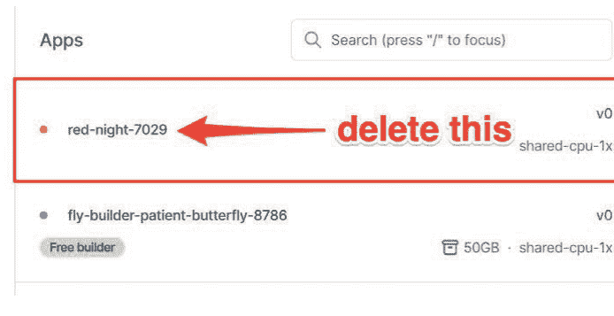

**图 10.2：** 在 Fly.io 上删除一个应用。

此时，我们几乎准备好部署到生产环境了。唯一的问题是，你很可能已经有一个在第 1.5.1 节中定义的应用，并且截至撰写本文时，Fly.io 的免费套餐只允许一个应用。因此，你可能需要删除旧应用，你可以在 Fly.io 控制面板上找到它（图 10.2）：点击应用名称 > 设置 > 删除应用。（不过，你可以重复使用构建器，因此无需删除它。）

我建议你将配置更改提交到 Git（并在本章中持续进行提交和推送）：

```
(venv) $ git add -A
(venv) $ git commit -m "Add configuration"
```

我们现在准备好进行实际部署了：

```
(venv) $ flyctl deploy
(venv) $ flyctl open    # 在云端 IDE 上无法使用，因此请使用显示的 URL
```

结果是一个在生产环境中运行的应用，如图 10.3 所示。虽然为了简洁，我将省略直到第 10.5.1 节之前的进一步部署，但我建议在学习本章的过程中定期部署，以便尽快发现任何生产环境问题。

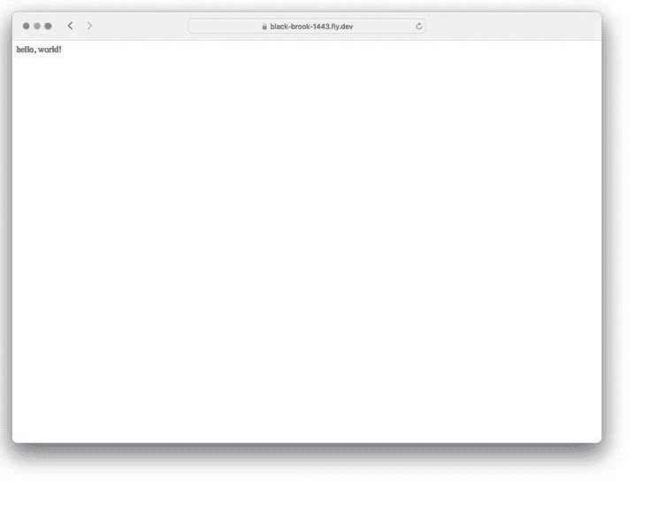

**图 10.3：** 我们在生产环境中的初始应用。

### 10.1.1 练习

- 1. 使用 `pip -r` 从生成的 `requirements.txt` 文件安装应用的所有依赖项有一个很好的技巧。确认清单 10.10 中所示的步骤能恢复并运行一个正常工作的应用。

**清单 10.10：** 拆卸并重建应用环境。

```
(venv) $ deactivate
$ rm -rf venv/
$ python3 -m venv venv
$ source venv/bin/activate
(venv) $ pip install -r requirements.txt
(venv) $ flask --app palindrome_detector --debug run
* Running on http://127.0.0.1:5000/
```

## 10.2 网站页面

既然我们已经处理了设置和部署回文检测器应用的所有前期工作，我们现在可以朝着最终应用快速推进了。我们将从为网站创建三个页面开始：主页、关于页面和回文检测器页面。与我们之前仅通过返回字符串来响应 GET 请求的 Flask 应用不同，对于我们的完整应用，我们将使用一种更强大的技术，称为 *模板*。最初，这些模板将由静态 HTML 组成，但我们将在第 10.3 节中添加代码以消除重复，并在第 10.4 节开始添加动态内容。

为了准备填充网站页面，让我们在命令行创建（目前为空的）模板文件，它们应该位于 **palindrome_detector** 应用目录内的一个名为 **templates** 的目录中：

```
(venv) $ mkdir palindrome_detector/templates
(venv) $ cd palindrome_detector/templates
(venv) $ touch index.html about.html palindrome.html
(venv) $ cd -
```

（如 *Learn Enough Command Line to Be Dangerous* (https://www.learnenough.com/command-line) 中所述 (https://www.learnenough.com/command-line-tutorial/directories#sec-navigating_directories)，`cd -` 命令会切换到上一个目录，无论它是哪个；在本例中，它是 **palindrome_app**，即我们 Web 应用的基础目录。）

最初，这些模板实际上只是静态 HTML，但我们将在第 10.4 节开始看到如何使用它们动态生成 HTML。在 Flask 应用中渲染模板的方法是使用 `render_template` 函数。例如，要在根 URL / 上渲染索引页，我们可以编写

```
@app.route("/")
def index():
    return render_template("index.html")
```

这段代码使 Flask 在 **templates** 目录中查找 **index.html**。

因为渲染所有三个模板的代码基本相同，我们将同时添加它们，如清单 10.11 所示。请注意，除了 Flask 类本身，我们还添加了一条额外的语句来从 **flask** 包中导入 `render_template`。

## 清单 10.11：渲染三个模板。

palindrome_app/palindrome_detector/__init__.py

```
import os

from flask import Flask, render_template

def create_app(test_config=None):
    """Create and configure the app."""
    app = Flask(__name__, instance_relative_config=True)
    .
    .
    .

    @app.route("/")
    def index():
        return render_template("index.html")

    @app.route("/about")
    def about():
        return render_template("about.html")

    @app.route("/palindrome")
    def palindrome():
        return render_template("palindrome.html")

    return app

app = create_app()
```

清单 10.11 中的文件实际上是一个 *控制器*，它协调应用程序的不同部分，定义应用程序支持的 URL（或 *路由*），响应请求等。与此同时，模板有时被称为 *视图*，它们决定实际返回给浏览器的 HTML。视图和控制器共同构成了开发 Web 应用程序的 *模型-视图-控制器* 架构 (https://www.railstutorial.org/book/beginning#sec-mvc) 的三分之二，也称为 *MVC*。

下一步是用 HTML 填充这三个模板文件；这很简单但很繁琐，所以我建议你从清单 10.12、清单 10.13 和清单 10.14 中复制粘贴。如果你不是在线阅读本文，请注意你可以在第 1 章简要提到的参考网站上找到这些以及所有其他清单的源代码：https://github.com/learnenough/learn_enough_python_code_listings。顺便说一下，`body` 标签内材料的缩进深度不对，但我们将在第 10.3 节看到原因。另请注意，我们使用两个空格进行缩进，这在 HTML 标记中很常见，而不是 Python 代码中传统使用的四个空格。

值得注意的是，超链接引用（`href`）URL 是硬编码的，像这样：

```
<link rel="stylesheet" type="text/css" href="/static/stylesheets/main.css">
```

这对于像本章中的这样的小型应用程序来说是可以的，但要了解更强大（但也更复杂）的方法，请参阅 Flask 关于 `url_for` 的文档 (https://flask.palletsprojects.com/en/2.2.x/api/#flask.Flask.url_for) 以及这个关于该主题的有用的 Stack Overflow 评论 (https://stackoverflow.com/questions/7478366/create-dynamic-urls-in-flask-with-url-for/35936261#35936261)。

## **清单 10.12：** 初始的主页（索引）视图。

*palindrome_detector/templates/index.html*

```
<!DOCTYPE html>
<html>
  <head>
    <meta charset="utf-8">
    <title>Learn Enough Python Sample App</title>
    <link rel="stylesheet" type="text/css" href="/static/stylesheets/main.css">
    <link href="https://fonts.googleapis.com/css?family=Open+Sans:300,400"
          rel="stylesheet">
  </head>
  <body>
    <a href="/" class="header-logo">
      
    </a>
    <div class="container">
      <div class="content">

<h1>Sample Flask App</h1>

<p>
  This is the sample Flask app for
  <a href="https://www.learnenough.com/python-tutorial"><em>Learn Enough Python
  to Be Dangerous</em></a>. Learn more on the <a href="/about">About</a> page.
</p>

<p>
  Click the <a href="https://en.wikipedia.org/wiki/Sator_Square">Sator
  Square</a> below to run the custom <a href="/palindrome">Palindrome
  Detector</a>.
</p>
```

## 代码清单 10.13：初始的 About 模板。

palindrome_detector/templates/about.html

```html
<!DOCTYPE html>
<html>
<head>
    <meta charset="utf-8">
    <title>Learn Enough Python 示例应用</title>
    <link rel="stylesheet" type="text/css" href="/static/stylesheets/main.css">
    <link href="https://fonts.googleapis.com/css?family=Open+Sans:300,400"
          rel="stylesheet">
</head>
<body>
    <a href="/" class="header-logo">
        
    </a>
    <div class="container">
        <div class="content">

<h1>关于</h1>

<p>
    本站是
    <a href="https://www.learnenough.com/python-tutorial"><em>Learn Enough Python to Be Dangerous</em></a>
    一书的最终应用，作者是
    <a href="https://www.michaelhartl.com/">Michael Hartl</a>，
    这是一本关于
    <a href="https://www.python.org/">Python 编程语言</a>的教程式入门书籍，
    属于
    <a href="https://www.learnenough.com/">LearnEnough.com</a> 系列。
</p>
        </div>
    </div>
</body>
</html>
```

## 代码清单 10.14：初始的回文检测器模板。

palindrome_detector/templates/palindrome.html

```html
<!DOCTYPE html>
<html>
  <head>
    <meta charset="utf-8">
    <title>Learn Enough Python 示例应用</title>
    <link rel="stylesheet" type="text/css" href="/static/stylesheets/main.css">
    <link href="https://fonts.googleapis.com/css?family=Open+Sans:300,400"
          rel="stylesheet">
  </head>
  <body>
    <a href="/" class="header-logo">
      
    </a>
    <div class="container">
      <div class="content">

<h1>回文检测器</h1>

<p>这将是回文检测器。</p>

      </div>
    </div>
  </body>
</html>
```

访问 127.0.0.1:5000 会导致 Flask 提供默认（索引）页面，如图 10.4 所示。要进入“关于”页面，我们可以在浏览器地址栏中输入 127.0.0.1:5000/about，如图 10.5 所示。

图 10.4 和图 10.5 显示页面基本可以工作，但代码清单 10.12 及后续清单包含图像和 CSS 文件，而这些文件目前在本地系统中并不存在。我们可以通过从 Learn Enough CDN 下载所需文件并将其放入 `static` 目录来改变这种情况，该目录是存放此类静态资源的标准选择。

方法是使用 `curl` 获取一个 `tarball`，它类似于 ZIP 文件，在 Unix 兼容系统上很常见：

```
(venv) $ curl -OL https://cdn.learnenough.com/le_python_palindrome_static.tar.gz
```

**图 10.4：** 初始的主页。

这类文件由 `tar`（即“tape archive”，磁带归档）创建，其名称是对过去使用外部磁带进行大型备份时代的怀旧。同时，`gz` 扩展名指的是重要的 `gzip` 文件压缩方法。

解压文件的方法是使用 `tar zxvf`，它代表“**tape archive gzip extract verbose file**”（如第 8.5.2 节简要提到的，反斜杠 \ 是一个*续行符*，应原样输入，但右尖括号 > 应由你的 shell 程序自动添加，不应手动输入）：³

```
(venv) $ tar zxvf le_python_palindrome_static.tar.gz \
> --directory palindrome_detector/
```

3. 我使用命令 `tar zcf <filename>.tar.gz` 创建了这个 tarball，其中 `c` 代表 `create`。

**图 10.5：** 初始的“关于”页面。

```
x static/
x static/static/images/
x static/static/stylesheets/
x static/static/stylesheets/main.css
x static/static/images/sator_square.jpg
x static/static/images/logo_b.png
(venv) $ rm -f le_python_palindrome_static.tar.gz
```

有了经验后，你可能更喜欢省略 `v` 标志，但我建议最初使用详细输出，以便你能看到解压过程中发生的情况。顺便说一下，注意 `tar` 标志只是单独的字母，不像大多数其他 Unix 命令那样前面有连字符。在许多系统上，你实际上可以使用连字符，例如 `tar -z -x -v -f <filename>`，但出于我未知的原因，`tar` 的通常惯例是省略它们。

**图 10.6：** 一个更好看的“关于”页面。

从上面的详细输出可以看出，解压文件创建了一个 **static** 目录：

```
(venv) $ ls palindrome_detector/static
images       stylesheets
```

刷新“关于”页面确认 logo 图像和 CSS 现在可以工作了（图 10.6）。主页的改进更为显著，如图 10.7 所示。

### 10.2.1 练习

- 1. 访问 /palindrome URL 并确认 CSS 和图像正常工作。
- 2. 进行一次提交并部署更改。

**图 10.7：** 大幅改进的主页。

## 10.3 布局

此时，我们的应用看起来相当不错，但有两个明显的缺陷：三个页面的 HTML 代码高度重复，并且手动在页面间导航相当繁琐。我们将在本节解决第一个缺陷，在第 10.4 节解决第二个。（当然，我们的应用尚未检测回文，这是第 10.5 节的主题。）

如果你学习过 *Learn Enough CSS & Layout to Be Dangerous* (https://www.learnenough.com/css-and-layout)，你会知道标题中的 *Layout* 通常指页面布局——使用层叠样式表在页面上移动元素、正确对齐它们等——但我们也看到 (https://www.learnenough.com/css-and-layout-tutorial/struct-layout#cha-struct-layout) 要正确做到这一点，需要定义*布局模板*来捕获常见模式并消除重复。

在当前情况下，我们网站的每个页面都具有相同的基本结构，如代码清单 10.15 所示。

## 代码清单 10.15：我们网站页面的 HTML 结构。

```html
<!DOCTYPE html>
<html>
  <head>
    <meta charset="utf-8">
    <title>Learn Enough Python 示例应用</title>
    <link rel="stylesheet" type="text/css" href="/static/stylesheets/main.css">
    <link href="https://fonts.googleapis.com/css?family=Open+Sans:300,400"
          rel="stylesheet">
  </head>
  <body>
    <a href="/" class="header-logo">
      
    </a>
    <div class="container">
      <div class="content">
        <!-- 页面特定内容 -->
      </div>
    </div>
  </body>
</html>
```

除了页面特定内容（由高亮的 HTML 注释指示）之外，每个页面上的所有内容都是相同的。在 *Learn Enough CSS & Layout to Be Dangerous* 中，我们使用 Jekyll 模板 (https://www.learnenough.com/css-and-layout-tutorial/struct-layout#sec-jekyll-templates) 消除了这种重复；在本教程中，我们将使用 *Jinja 模板引擎*，它是 Flask 的默认模板系统。

目前，我们的网站在当前开发阶段是正常工作的，每个页面都有正确的内容。我们即将进行一项涉及移动和删除大量 HTML 的更改，我们希望在不破坏网站的情况下完成。这听起来是不是很熟悉？

确实如此。这正是我们在第 8 章开发并重构回文包时所面临的问题。在那种情况下，我们编写了自动化测试来捕获任何回归，而在这里我们将做同样的事情。（我在自动化测试 Web 应用成为可能甚至成为标准之前就开始制作网站了，相信我，自动化测试比手动测试 Web 应用有了*巨大的*改进。）

首先，我们将像第 8.1 节那样添加 **pytest**：

```
(venv) $ pip install pytest==7.1.3
```

（根据设计，我们的测试将尽可能简单；更复杂的测试，请参阅 pytest-flask 项目 (https://pytest-flask.readthedocs.io/en/latest/index.html)。）

为了让我们的测试工作，我们必须将我们的应用作为可编辑的 Python 包本地安装。如果不安装，你可能会得到如下错误：

```
E   ModuleNotFoundError: No module named 'palindrome_detector'
```

为防止此问题，请运行与代码清单 8.18 相同的命令，如代码清单 10.16 所示。

## 代码清单 10.16：将应用安装为可编辑包。

```
$ pip install -e .
```

我们将把测试本身放在一个 **tests** 目录中，开始时有一个测试文件：

```
(venv) $ mkdir tests
(venv) $ touch tests/test_site_pages.py
```

我们将在第 10.5.1 节添加第二个测试文件。

我们为 Web 应用编写测试的关键工具是 **client** 对象，它有一个 **get()** 方法，用于向 URL 发出 GET 请求，从而模拟在 Web 浏览器中访问相应页面。此类请求的结果是一个 **response** 对象，它具有各种有用的属性，包括 **status_code**（指示请求返回的 HTTP 响应代码）和 **text**（包含我们应用程序返回的 HTML 文本）。我们可以在标准配置文件 **conftest.py** 中定义这样的 **client** 对象：

```
(venv) $ touch tests/conftest.py
```

代码本身出现在代码清单 10.17 中。（与本章其余配置代码一样，代码清单 10.17 仅改编自 Flask 文档。）

## 清单 10.17：创建客户端对象。

tests/conftest.py

```python
import pytest

from palindrome_detector import create_app

@pytest.fixture
def app():
    return create_app()

@pytest.fixture
def client(app):
    return app.test_client()
```

我们将从最基本的测试开始，确保应用程序能返回*某些内容*，这可以通过响应代码 200 (OK) 来判断，我们可以这样做：

```python
def test_index(client):
    response = client.get("/")
    assert response.status_code == 200
```

这里我们使用测试中的 `get()` 方法向根 URL / 发出 GET 请求，并使用第 8 章介绍的 `assert` 函数来验证代码是否正确。

将上述讨论同样应用于“关于”和“回文检测器”页面，我们得到了初始测试套件，如清单 10.18 所示。

## 清单 10.18：我们的初始测试套件。GREEN

tests/test_site_pages.py

```python
def test_index(client):
    response = client.get("/")
    assert response.status_code == 200

def test_about(client):
    response = client.get("/about")
    assert response.status_code == 200

def test_palindrome(client):
    response = client.get("/palindrome")
    assert response.status_code == 200
```

因为清单 10.18 中的测试是针对已经能正常工作的代码，所以测试套件应该是 GREEN 的：

```
清单 10.19：GREEN
(venv) $ pytest
============================= test session starts =============================
collected 3 items
tests/test_site_pages.py ...                                              [100%]
============================== 3 passed in 0.01s ================================
```

清单 10.18 中的测试是一个不错的开始，但它们实际上只检查了页面是否存在。如果能对 HTML 内容进行稍微严格一点的测试就好了，不过*不要太*严格——我们不希望测试让未来的修改变得困难。作为折中方案，我们将检查网站中的每个页面是否在文档某处包含一个 **title** 标签和一个 **h1** 标签。

尽管更复杂的技术当然是可能的，⁴ 但我们将采用最简单有效的方法，并将第 2.5 节介绍的 **in** 运算符应用于 **response.text** 属性。例如，要检查 **<title>** 标签，我们可以使用这个：⁵

```python
assert "<title>" in response.text
```

将这样的代码同时用于 **title** 和 **h1** 标签，并添加到我们网站每个页面的测试中，就得到了清单 10.20 所示的更新后的测试套件。

## 清单 10.20：添加对某些 HTML 标签存在的断言。GREEN

tests/test_site_pages.py

```python
def test_index(client):
    response = client.get("/")
    assert response.status_code == 200
    assert "<title>" in response.text
    assert "<h1>" in response.text

def test_about(client):
    response = client.get("/about")
    assert response.status_code == 200
    assert "<title>" in response.text
    assert "<h1>" in response.text

def test_palindrome(client):
    response = client.get("/palindrome")
    assert response.status_code == 200
    assert "<title>" in response.text
    assert "<h1>" in response.text
```

顺便说一下，有些程序员采用每个测试只包含一个断言的惯例，而在清单 10.20 中我们有两个。根据我的经验，设置正确状态（例如，重复调用 `get()`）所带来的开销使得这种惯例不太方便，而且我从未遇到过在测试中包含多个断言而引发的问题。

清单 10.20 中的测试现在应该如要求的那样是 GREEN 的：

## 清单 10.21：GREEN

```
(venv) $ pytest
============================= test session starts =============================
collected 3 items

tests/test_site_pages.py ...                                               [100%]

============================== 3 passed in 0.01s ================================
```

此时，我们准备好使用 Jinja 模板来消除重复代码。我们的第一步是为重复的代码定义一个布局模板：

```
(venv) $ touch palindrome_detector/templates/layout.html
```

`layout.html` 的内容是清单 10.15 中确定的通用 HTML 结构，结合了 Jinja 模板系统提供的特殊 `block` 函数。这涉及将清单 10.15 中的 HTML 注释

<!-- page-specific content -->

替换为 Jinja 代码



`` 语法被 Jinja 用于表示 HTML 文档内的代码。⁶ 这段特定的代码会插入一个名为 **content** 的变量中的文本（我们稍后会为每个页面定义这个变量）。生成的模板如清单 10.22 所示。

## 清单 10.22：具有共享 HTML 结构的布局。

*palindrome_detector/templates/layout.html*

```html
<!DOCTYPE html>
<html>
  <head>
    <meta charset="utf-8">
    <title>Learn Enough Python Sample App</title>
    <link rel="stylesheet" type="text/css" href="/static/stylesheets/main.css">
    <link href="https://fonts.googleapis.com/css?family=Open+Sans:300,400"
          rel="stylesheet">
  </head>
  <body>
    <a href="/" class="header-logo">
      
    </a>
    <div class="container">
      <div class="content">
        
      </div>
    </div>
  </body>
</html>
```

此时，我们可以从页面中移除共享材料，只保留核心内容，如清单 10.23、清单 10.24 和清单 10.25 所示。（这就是为什么在清单 10.12 和第 10.2 节的其他模板中，主体内容没有完全缩进的原因。）清单 10.23 及后续清单使用 Jinja 函数 **extends** 告诉系统使用模板 **layout.html**，然后 **** 定义要插入清单 10.22 中的内容。

## 清单 10.23：核心主页（索引）视图。

*palindrome_detector/templates/index.html*

```html



  <h1>Sample Flask App</h1>

  <p>
    This is the sample Flask app for
    <a href="https://www.learnenough.com/python-tutorial"><em>Learn Enough Python
    to Be Dangerous</em></a>. Learn more on the <a href="/about">About</a> page.
  </p>

  <p>
    Click the <a href="https://en.wikipedia.org/wiki/Sator_Square">Sator
    Square</a> below to run the custom <a href="/palindrome">Palindrome
    Detector</a>.
  </p>

  <a class="sator-square" href="/palindrome">
    
  </a>

```

## 清单 10.24：核心“关于”视图。

*palindrome_detector/templates/about.html*

```html



  <h1>About</h1>

  <p>
    This site is the final application in
    <a href="https://www.learnenough.com/python-tutorial"><em>Learn Enough Python
    to Be Dangerous</em></a>
    by <a href="https://www.michaelhartl.com/">Michael Hartl</a>,
    a tutorial introduction to the
    <a href="https://www.python.org/">Python programming language</a> that
    is part of
    <a href="https://www.learnenough.com/">LearnEnough.com</a>.
  </p>

```

## 清单 10.25：核心回文检测器视图。

*palindrome_detector/templates/palindrome.html*

```html



  <h1>Palindrome Detector</h1>

  <p>This will be the palindrome detector.</p>

```

假设我们在上述步骤中做的一切都正确，我们的测试应该仍然是 GREEN 的：

## 清单 10.26：GREEN

```
(venv) $ pytest
============================= test session starts =============================
collected 3 items

tests/test_site_pages.py ...                                          [100%]

============================== 3 passed in 0.01s ================================
```

在浏览器中快速检查确认一切按预期工作（图 10.8）。

但当然，在我们刚刚进行的重构中，很多事情可能出错，而我们的测试套件会立即发现问题。此外，即使在我们没有检查的页面上，它也能捕获错误；例如，图 10.8 显示了索引页面，但我们怎么知道“关于”页面也正常工作呢？答案是我们不知道，而测试套件省去了我们检查网站中每个页面的麻烦。正如你可能猜到的，随着网站复杂性的增长，这种做法变得越来越有价值。

---
⁴ 例如，我们可以使用第 9.3 节中的 Beautiful Soup 包来解析 HTML 并创建一个 **doc** 对象用于测试。
⁵ 即使 **<title>** 出现在页面上的随机位置而不是作为真正的标题，这个断言仍然会通过，但这种情况不太可能发生，因此当前的技术足以演示主要原则。如前所述，使用适当的 HTML 解析器的更复杂方法也是可能的，并且对于更高级的应用来说是个好主意。
⁶ 这种语法在模板语言中很常见。例如，*Learn Enough CSS & Layout to Be Dangerous* 中使用的 Liquid 模板语言与 Jekyll 静态网站生成器结合时也使用相同的语法。

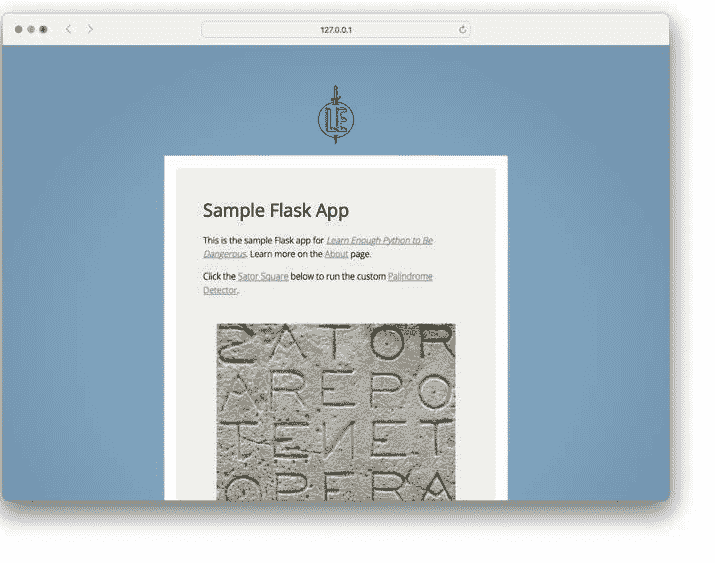

**图 10.8：** 我们的主页，现在使用布局创建。

### 10.3.1 练习

1.  你可以通过将任何页面的源代码运行通过 HTML 验证器来确认，当前页面是有效的 HTML，但有一个警告，建议在 `html` 标签中添加 `lang`（语言）属性。在清单 10.22 中的 `html` 标签中添加属性 `lang="en"`（表示“英语”），并使用网页检查器确认它在所有三个页面上都正确显示。
2.  进行一次提交并部署更改。

## 10.4 模板引擎

既然我们已经定义了一个合适的布局，在本节中，我们将使用 Jinja 模板语言（首次在清单 10.22 中出现）为我们的网站添加一些不错的改进：*可变标题*和*导航*。可变标题是 HTML `title` 标签的内容，它因页面而异，为每个页面提供良好的自定义感。而导航则省去了我们手动输入每个子页面的麻烦——这肯定不是我们试图创建的那种用户体验。

### 10.4.1 可变标题

我们的可变标题将结合一个*基础标题*（每个页面相同）和一个根据页面名称变化的部分。具体来说，对于我们的主页、关于页面和回文检测器页面，我们希望标题看起来像这样：

```
<title>Learn Enough Python Sample App | Home</title>
```

```
<title>Learn Enough Python Sample App | About</title>
```

```
<title>Learn Enough Python Sample App | Palindrome Detector</title>
```

我们的策略有三个步骤：

1.  为当前页面标题编写 GREEN 测试。
2.  为可变标题编写 RED 测试。
3.  通过添加标题的可变部分来达到 GREEN。

注意，步骤 2 和 3 构成了测试驱动开发。事实上，为可变标题编写测试比让它们通过更容易，这是第 8.1 节中描述的 TDD 案例之一。

为了开始步骤 1，我们将修改清单 10.20 中定义的 `title` 断言，以包含当前的基础标题。为了方便下一步，我们将定义一个 `base_title` 变量，并使用插值来形成标题：

```
base_title = "Learn Enough Python Sample App"
title = f"<title>{base_title}</title>"
```

然后断言标题出现在响应文本中。所有三个网站页面的结果出现在清单 10.27 中。

**清单 10.27：** 添加基础标题内容的断言。GREEN

tests/test_site_pages.py

```
def test_index(client):
    response = client.get("/")
    assert response.status_code == 200
    base_title = "Learn Enough Python Sample App"
    title = f"<title>{base_title}</title>"
    assert title in response.text
    assert "<h1>" in response.text

def test_about(client):
    response = client.get("/about")
    assert response.status_code == 200
    base_title = "Learn Enough Python Sample App"
    title = f"<title>{base_title}</title>"
    assert title in response.text
    assert "<h1>" in response.text

def test_palindrome(client):
    response = client.get("/palindrome")
    assert response.status_code == 200
    base_title = "Learn Enough Python Sample App"
    title = f"<title>{base_title}</title>"
    assert title in response.text
    assert "<h1>" in response.text
```

注意清单 10.27 中有很多重复。当我们为标题添加可变部分时，其中一些重复将会消失；消除其余的重复则留作练习（第 10.4.3 节）。
正如对工作代码的测试所要求的，测试套件当前是 GREEN：

**清单 10.28：** GREEN

```
(venv) $ pytest
============================= test session starts =============================
collected 3 items

tests/test_site_pages.py ...                                              [100%]

============================== 3 passed in 0.01s ================================
```

现在我们准备好进行步骤 2。我们需要做的就是添加竖线 | 和特定于页面的标题，如清单 10.29 所示。

**清单 10.29：** 添加可变标题内容的断言。RED

tests/test_site_pages.py

```
def test_index(client):
    response = client.get("/")
    assert response.status_code == 200
    base_title = "Learn Enough Python Sample App"
    title = f"<title>{base_title} | Home</title>"
    assert title in response.text
    assert "<h1>" in response.text

def test_about(client):
    response = client.get("/about")
    assert response.status_code == 200
    base_title = "Learn Enough Python Sample App"
    title = f"<title>{base_title} | About</title>"
    assert title in response.text
    assert "<h1>" in response.text

def test_palindrome(client):
    response = client.get("/palindrome")
    assert response.status_code == 200
    base_title = "Learn Enough Python Sample App"
    title = f"<title>{base_title} | Palindrome Detector</title>"
    assert title in response.text
    assert "<h1>" in response.text
```

因为我们还没有更新应用程序代码，所以测试现在是 RED：

**清单 10.30：** RED

```
(venv) $ pytest
============================= test session starts =============================
collected 3 items

tests/test_site_pages.py FFF                                              [100%]

================================= FAILURES ==================================
________________________________ test_index _________________________________
.
.
.
=========================== short test summary info ===========================
FAILED tests/test_site_pages.py::test_index - assert '<title>Learn Enough Pyt...
FAILED tests/test_site_pages.py::test_about - assert '<title>Learn Enough Pyt...
FAILED tests/test_site_pages.py::test_palindrome - assert '<title>Learn Enoug...
============================= 3 failed in 0.03s ==============================
```

现在进行步骤 3。诀窍是从我们的每个应用程序函数传递一个不同的 `page_title` 选项，然后在页面布局上渲染结果。Jinja 模板的工作方式是，我们可以使用以下方式向模板传递一个关键字参数（第 5.1.2 节）：

```
render_template("index.html", page_title="Home")
```

并自动在模板中访问一个名为 `page_title` 的变量（在这种情况下，值为“Home”）。我们想要的可变标题的结果出现在清单 10.31 中。

**清单 10.31：** 为每个页面添加 `page_title` 变量。GREEN

`palindrome_app/palindrome_detector/__init__.py`

```
import os

from flask import Flask, render_template

def create_app(test_config=None):
    """Create and configure the app."""
    app = Flask(__name__, instance_relative_config=True)

    if test_config is None:
        # Load the instance config, if it exists, when not testing.
        app.config.from_pyfile("config.py", silent=True)
    else:
        # Load the test config if passed in.
        app.config.from_mapping(test_config)

    # Ensure the instance folder exists.
    try:
        os.makedirs(app.instance_path)
    except OSError:
        pass

    @app.route("/")
    def index():
        return render_template("index.html", page_title="Home")

    @app.route("/about")
    def about():
        return render_template("about.html", page_title="About")

    @app.route("/palindrome")
    def palindrome():
        return render_template("palindrome.html",
                               page_title="Palindrome Detector")

    return app

app = create_app()
```

一旦我们使用清单 10.31 中的代码在模板中有了一个变量，我们就可以使用 Jinja 模板使用的特殊语法 {{ ... }} 来插入它：⁷

```
{{ page_title }}
```

这告诉 Jinja 将 **page_title** 的内容插入到 HTML 模板中的该位置。具体来说，这意味着我们可以使用清单 10.32 中所示的代码添加标题的可变部分。

**清单 10.32：** 为标题添加可变部分。RED

*palindrome_detector/templates/layout.html*

```
<!DOCTYPE html>
<html>
  <head>
    <meta charset="utf-8">
    <title>Learn Enough Python Sample App | {{ page_title }}</title>
    .
    .
    .
```

当 **page_title** 是“Home”时，布局标题将变为

```
<title>Learn Enough Python Sample App | Home</title>
```

其他可变标题也类似。
因为清单 10.31 中的可变标题与清单 10.29 中的测试相匹配，所以我们的测试套件应该是 GREEN：

7. 与  一样，{{ ... }} 语法也常用于其他模板系统，例如 Liquid 和 Mustache。

### 10.4.2 网站导航

既然我们已经有了合适的布局文件，为每个页面添加导航就变得轻而易举。导航代码如清单10.34所示，效果如图10.10所示。

**清单10.34：** 添加网站导航。
*palindrome_detector/templates/layout.html*

```html
<!DOCTYPE html>
<html>
  <head>
    <meta charset="utf-8">
    <title>Learn Enough Python Sample App | {{ page_title }}</title>
    <link rel="stylesheet" type="text/css" href="/static/stylesheets/main.css">
    <link href="https://fonts.googleapis.com/css?family=Open+Sans:300,400"
          rel="stylesheet">
  </head>
  <body>
    <a href="/" class="header-logo">
      
    </a>
    <div class="container">
      <header class="header">
        <nav>
          <ul class="header-nav">
            <li><a href="/">Home</a></li>
            <li><a href="/palindrome">Is It a Palindrome?</a></li>
            <li><a href="/about">About</a></li>
          </ul>
        </nav>
      </header>
      <div class="content">
        
      </div>
    </div>
  </body>
</html>
```

作为最后的润色，我们将清单10.34中的导航代码提取到一个单独的模板中，有时称为*局部模板*（或简称*局部*），因为它只代表页面的一部分。这将使布局页面变得非常整洁。

因为这涉及到重构网站，我们将添加一个简单的测试（根据框8.1）来捕获任何回归问题。由于导航出现在网站布局中，我们可以使用任何页面来测试其存在，为了方便起见，我们将使用索引页。如清单10.35所示，我们只需要断言`nav`标签的存在。

**清单10.35：** 测试导航。 <span style="color: green;">GREEN</span>
*tests/test_site_pages.py*

```python
def test_index(client):
    response = client.get("/")
    assert response.status_code == 200
    base_title = "Learn Enough Python Sample App"
    title = f"<title>{base_title} | Home</title>"
    assert title in response.text
    assert "<h1>" in response.text
    assert "<nav>" in response.text

def test_about(client):
    response = client.get("/about")
    assert response.status_code == 200
    base_title = "Learn Enough Python Sample App"
    title = f"<title>{base_title} | About</title>"
    assert title in response.text
    assert "<h1>" in response.text

def test_palindrome(client):
    response = client.get("/palindrome")
    assert response.status_code == 200
    base_title = "Learn Enough Python Sample App"
    title = f"<title>{base_title} | Palindrome Detector</title>"
    assert title in response.text
    assert "<h1>" in response.text
```

因为导航已经添加，测试应该是GREEN：

**清单10.36：** GREEN

```
(venv) $ pytest
============================= test session starts =============================
collected 3 items

tests/test_site_pages.py ...                                              [100%]

============================== 3 passed in 0.01s ================================
```

一个好习惯是观察测试变为RED，以确保我们测试的是正确的东西，所以我们首先剪切导航（清单10.37）并将其粘贴到一个单独的文件中，我们称之为navigation.html（清单10.38）：

```
(venv) $ touch palindrome_detector/templates/navigation.html
```

**清单10.37：** 剪切导航。 RED
*palindrome_detector/templates/layout.html*

```html
<!DOCTYPE html>
<html>
  <head>
    <meta charset="utf-8">
    <title>Learn Enough Python Sample App | {{ page_title }}</title>
    <link rel="stylesheet" type="text/css" href="/static/stylesheets/main.css">
    <link href="https://fonts.googleapis.com/css?family=Open+Sans:300,400"
          rel="stylesheet">
  </head>
  <body>
    <a href="/" class="header-logo">
      
    </a>
    <div class="container">
      <div class="content">
        
      </div>
    </div>
  </body>
</html>
```

**清单10.38：** 添加导航局部模板。 RED
*palindrome_detector/templates/navigation.html*

```html
<header class="header">
  <nav>
    <ul class="header-nav">
      <li><a href="/">Home</a></li>
      <li><a href="/palindrome">Is It a Palindrome?</a></li>
      <li><a href="/about">About</a></li>
    </ul>
  </nav>
</header>
```

你应该确认测试现在是RED：

**清单10.39：** RED

```
(venv) $ pytest
============================= test session starts =============================
collected 3 items

tests/test_site_pages.py F..                                               [100%]

================================= FAILURES =================================
________________________________ test_index _________________________________
.
.
.
========================= short test summary info ==========================
FAILED tests/test_site_pages.py::test_index - assert '<nav>' in '<!DOCTYPE ht...
============================= 1 failed, 2 passed in 0.03s ==============================
```

要恢复导航，我们可以使用Jinja的模板语言来**包含**导航局部：

```

```

这段代码会自动在**palindrome_detector/templates/**目录中查找名为**navigation.html**的文件，计算结果，并在调用处插入返回值。

将这段代码放入布局中，得到清单10.40。

**清单10.40：** 在布局中计算导航局部。 GREEN
*palindrome_detector/templates/layout.html*

```html
<!DOCTYPE html>
<html>
  <head>
    <meta charset="utf-8">
    <title>Learn Enough Python Sample App | {{ page_title }}</title>
    <link rel="stylesheet" type="text/css" href="/static/stylesheets/main.css">
    <link href="https://fonts.googleapis.com/css?family=Open+Sans:300,400"
          rel="stylesheet">
  </head>
  <body>
    <a href="/" class="header-logo">
      
    </a>
    <div class="container">
      
      <div class="content">
        
      </div>
    </div>
  </body>
</html>
```

有了清单10.40中的代码，我们的测试套件再次变为GREEN：

**清单10.41：** GREEN

```
(venv) $ pytest
============================= test session starts ==============================
collected 3 items

tests/test_site_pages.py ... [100%]

========================================= 3 passed in 0.01s ==========================================
```

快速点击到关于页面确认导航正在工作（图10.11）。太好了！

### 10.4.3 练习

1. 我们可以通过创建一个返回基础标题的函数来消除清单10.29中的一些重复，如清单10.42所示。确认这段代码仍然给出GREEN测试套件。
2. 进行提交并部署更改。

**清单10.42：** 添加full_title方法以消除一些重复。 GREEN
*tests/test_site_pages.py*

```python
def test_index(client):
    response = client.get("/")
    assert response.status_code == 200
    assert full_title("Home") in response.text
    assert "<h1>" in response.text
    assert "<nav>" in response.text

def test_about(client):
    response = client.get("/about")
    assert response.status_code == 200
    assert full_title("About") in response.text
    assert "<h1>" in response.text

def test_palindrome(client):
    response = client.get("/palindrome")
    assert response.status_code == 200
    assert full_title("Palindrome Detector") in response.text
    assert "<h1>" in response.text

def full_title(variable_title):
    """Return the full title."""
    base_title = "Learn Enough Python Sample App"
    return f"<title>{base_title} | {variable_title}</title>"
```

## 10.5 回文检测器

在本节中，我们将通过添加一个可工作的回文检测器来完成这个示例Flask应用。这将涉及充分利用第8章中开发的Python包。如果你还没有学习*Learn Enough Ruby to Be Dangerous* (https://www.learnenough.com/ruby)，我们还将看到Learn Enough入门系列（https://www.learnenough.com/courses）中第一个真正可工作的HTML表单。

我们的第一步是添加一个回文包，以便我们可以检测回文。我建议使用你在第8章中创建并发布的那个：

```
(venv) $ pip install palindrome_YOUR_USERNAME \
> --index-url https://test.pypi.org/simple/
```

如果由于任何原因你没有完成那个步骤，可以使用我的：

```
(venv) $ pip install palindrome_mhartl --index-url https://test.pypi.org/simple/
```

此时，我们可以在应用中包含回文检测包（清单 10.43）。

## 清单 10.43：在应用中添加 request 和 Phrase。

palindrome_app/palindrome_detector/__init__.py

```
import os

from flask import Flask, render_template, request

from palindrome_mhartl.phrase import Phrase

.
.
.
```

注意，我们从 `flask` 包中添加了 `request`，本节将使用它来处理表单提交。

由于我们将把应用部署到生产环境，还应该更新应用依赖项以包含回文检测器。我的特定检测器某个版本的结果如清单 1.15 所示，但建议你使用自己的。另请注意，清单 10.44 包含额外一行，以便 Fly.io 知道除了常规索引外，还要在测试 Python 包索引中查找包。

## 清单 10.44：添加测试 Python 包索引查找 URL。

requirements.txt

```
--extra-index-url https://testpypi.python.org/pypi
palindrome_mhartl==0.0.12
click==8.1.3
Flask==2.2.2
.
.
.
```

准备工作完成后，我们现在可以向回文检测器页面添加一个表单，该页面目前只是一个占位符（图 10.12）。该表单由三个主要部分组成：一个用于定义表单的 **form** 标签、一个用于输入短语的 **textarea**，以及一个用于将短语提交到服务器的 **button**。

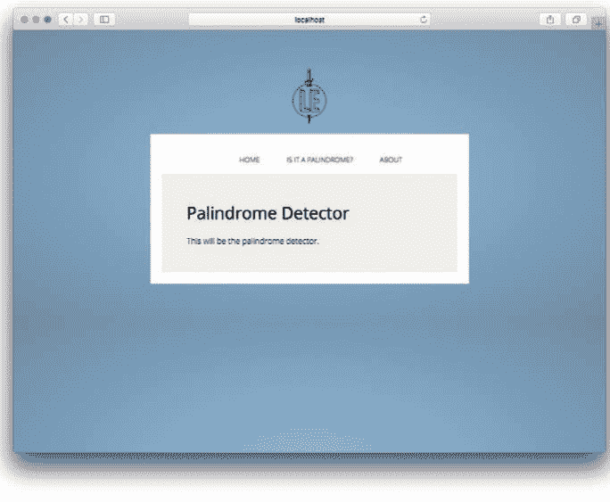

**图 10.12：** 回文页面的当前状态。

让我们从内到外开始工作。**button** 有两个属性——一个用于样式的 CSS 类和一个表示它用于提交信息的 **type**：

```
html
<button class="form-submit" type="submit">Is it a palindrome?</button>
```

**textarea** 有三个属性——一个 **name** 属性（我们稍后会看到它将重要信息传回服务器），以及 **rows** 和 **cols** 来定义 textarea 框的大小：

```
html
<textarea name="phrase" rows="10" cols="60"></textarea>
```

**textarea** 标签的内容是浏览器中显示的默认文本，在本例中为空。

最后，**form** 标签本身有三个属性——一个 CSS **id**（此处未使用，但按惯例包含）；一个 **action**，指定提交表单时要执行的操作；以及一个 **method**，指示要使用的 HTTP 请求方法（本例中为 POST）：

```
<form id="palindrome_tester" action="/check" method="post">
```

将上述讨论综合起来（并添加一个 **br** 标签以添加换行符）得到清单 10.45 所示的表单。我们更新后的回文检测器页面如图 10.13 所示。

## 清单 10.45：在回文页面添加表单。

palindrome_detector/templates/palindrome.html

```



  <h1>Palindrome Detector</h1>

  <form id="palindrome_tester" action="/check" method="post">
    <textarea name="phrase" rows="10" cols="60"></textarea>
    <br>
    <button class="form-submit" type="submit">Is it a palindrome?</button>
  </form>

```

清单 10.45 中的表单，除了外观细节外，与 *Learn Enough JavaScript to Be Dangerous* (https://www.learnenough.com/javascript) 中开发的类似表单 (https://www.learnenough.com/javascript-tutorial/dom_manipulation#code-form_tag) 完全相同：

```
<form id="palindromeTester">
  <textarea name="phrase" rows="10" cols="30"></textarea>
  <br>
  <button type="submit">Is it a palindrome?</button>
</form>
```

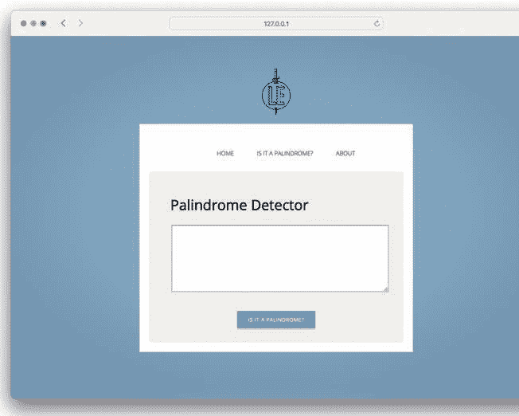

**图 10.13：** 新的回文表单。

然而，在那种情况下，我们通过使用 JavaScript 事件监听器拦截 (https://www.learnenough.com/javascript-tutorial/dom_manipulation#code-form_event_target) 表单的提交请求来“作弊”，并且没有信息从客户端（浏览器）发送到服务器。（重要的是要理解，在本地计算机上开发 Web 应用程序时，客户端和服务器是同一台物理机器，但通常它们是不同的。）

这次，我们不会作弊：请求将真正一路到达服务器，这意味着我们必须在后端处理 POST 请求。默认情况下，Flask 函数响应 GET 请求，但我们可以使用 `method` 关键字参数（其值等于要响应的方法元组）来安排响应 POST 请求。因为本例中只有一个方法（即 POST），所以我们必须使用第 3.6 节中提到的单元素元组的尾随逗号语法：

```
@app.route("/check", methods=("POST",))
def check():
    # Do something to handle the submission
```

这里 URL 路径的名称 `/check` 与表单（清单 10.45）中 **action** 参数的值匹配。

事实证明，清单 10.43 中包含的 **request** 有一个 **form** 属性，其中包含有用信息，因此让我们如清单 10.46 所示 **return** 它，然后提交表单看看会发生什么（图 10.14）。

## 清单 10.46：研究表单提交的效果。

palindrome_app/palindrome_detector/__init__.py

```
import os

from flask import Flask, render_template, request

from palindrome_mhartl.phrase import Phrase

def create_app(test_config=None):
    .
    .
    .
    @app.route("/")
    def index():
        return render_template("index.html", page_title="Home")

    @app.route("/about")
    def about():
        return render_template("about.html", page_title="About")

    @app.route("/palindrome")
    def palindrome():
        return render_template("palindrome.html",
                               page_title="Palindrome Detector")

    @app.route("/check", methods=("POST",))
    def check():
        return request.form

    return app

app = create_app()
```

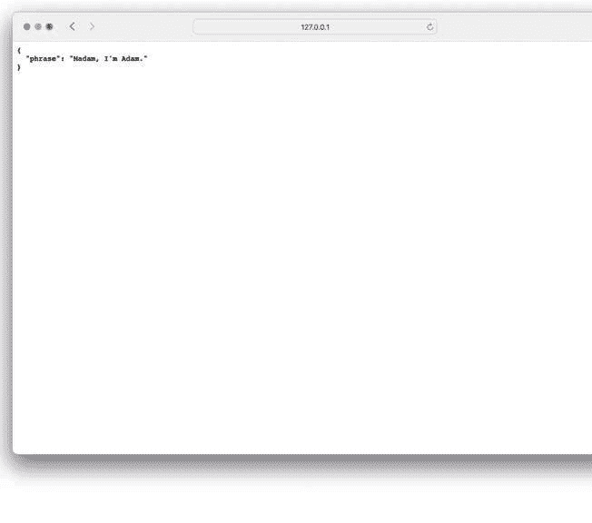

**图 10.14：** 提交表单的结果。

如图 10.14 所示，**request.form** 是一个字典（第 4.4 节），键为 **"phrase"**，值为 **"Madam, I'm Adam."**：

```
{
    "phrase": "Madam, I'm Adam."
}
```

这个字典是由 Flask 根据表单（清单 10.45）中的键值对自动创建的。在本例中，我们只有一对这样的键值对，键由 **textarea** 的 **name** 属性（"phrase"）给出，值由用户输入的字符串给出。这意味着我们可以使用代码

```
python
phrase = request.form["phrase"]
```

来提取短语的值。

既然我们知道了 **request.form** 的存在和内容，就可以像前面章节一样使用 **ispalindrome()** 来检测回文。在纯 Python 中，这看起来像清单 10.47。

## 清单 10.47：我们的回文结果在纯 Python 中可能的样子。

```
python
if Phrase(phrase).ispalindrome():
    print(f'"{phrase}" is a palindrome!')
else:
    print(f'"{phrase}" isn\'t a palindrome.')
```

我们可以在 Web 应用程序中使用 Jinja 模板语言做同样的基本事情，只是使用 `{{ ... }}` 而不是插值，并将任何其他代码包围在 `` 标签中，如清单 10.48 所示。

## 清单 10.48：回文结果的示意代码。

```
jinja

    "{{ phrase }}" is a palindrome!

    "{{ phrase }}" isn't a palindrome.

```

让我们创建一个名为 **result.html** 的模板文件来显示结果：

```
bash
(venv) $ touch palindrome_detector/templates/result.html
```

模板代码本身是清单 10.48 的扩展版本，包含更多 HTML 标签以获得更好的外观，如清单 10.49 所示。

## 清单 10.49：使用 Jinja 显示回文结果。

palindrome_detector/templates/result.html

```
jinja



    <h1>Palindrome Result</h1>

    
        <div class="result result-success">
```

## 清单 10.50：处理回文表单提交。

palindrome_app/palindrome_detector/__init__.py

```python
import os

from flask import Flask, render_template, request

from palindrome_mhartl.phrase import Phrase


def create_app(test_config=None):
    """Create and configure the app."""
    app = Flask(__name__, instance_relative_config=True)

    if test_config is None:
        # Load the instance config, if it exists, when not testing.
        app.config.from_pyfile("config.py", silent=True)
    else:
        # Load the test config if passed in.
        app.config.from_mapping(test_config)

    # Ensure the instance folder exists.
    try:
        os.makedirs(app.instance_path)
    except OSError:
        pass

    @app.route("/")
    def index():
        return render_template("index.html", page_title="Home")

    @app.route("/about")
    def about():
        return render_template("about.html", page_title="About")

    @app.route("/palindrome")
    def palindrome():
        return render_template("palindrome.html",
                               page_title="Palindrome Detector")

    @app.route("/check", methods=("POST",))
    def check():
        return render_template("result.html",
                               Phrase=Phrase,
                               phrase=request.form["phrase"])

    return app

app = create_app()
```

清单 10.49 中的代码是对清单 10.47 中 Python 代码最直接的翻译，但它涉及将完整的 **Phrase** 类传递给清单 10.50 中的模板。许多开发者更喜欢只向模板传递变量，我们将在第 10.5.1 节中重构代码以遵循这一惯例。

此时，我们的回文检测器应该可以工作了！提交非回文的结果如图 10.15 所示。

现在让我们看看我们的检测器能否正确识别最古老的回文之一，即所谓的 Sator Square，它最早在庞贝古城的废墟中被发现（图 10.16⁸）。（关于这个方块中拉丁文的确切含义，权威们意见不一，但最可能的翻译是“播种者[农夫] Arepo 努力地转动着轮子。”）

输入文本 “SATOR AREPO TENET OPERA ROTAS”（图 10.17）并提交，会得到图 10.18 所示的结果。它成功了！

### 10.5.1 表单测试

我们的应用程序现在可以工作了，但请注意，测试*第二个*回文需要点击“IS IT A PALINDROME?”。如果在结果页面上也包含相同的提交表单，那将更加方便。

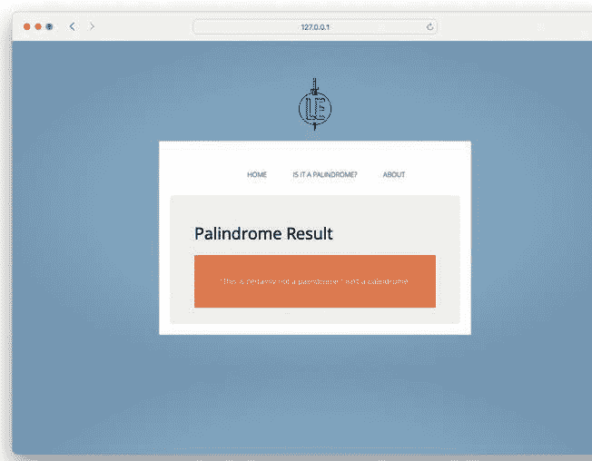

**图 10.15：** 非回文的结果。

为此，我们将首先为回文页面上 `form` 标签的存在添加一个简单的测试。因为我们将要添加的测试是针对该页面的，所以我们将创建一个新的测试文件来包含它们：

```bash
(venv) $ touch tests/test_palindrome.py
```

测试本身与清单 10.20 中的 `h1` 和 `title` 测试非常相似，如清单 10.51 所示。请注意，我们定义了一个 `form_tag()` 辅助函数，以便将来测试结果页面上的表单（与清单 10.42 中的 `full_title()` 辅助函数进行比较）。


**图 10.16：** 来自失落之城庞贝的拉丁回文。


**图 10.17：** 一个拉丁回文？

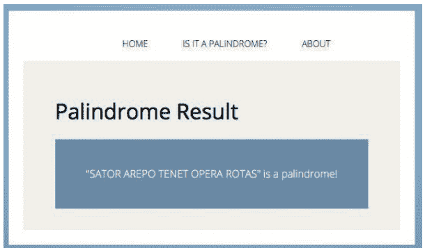

**图 10.18：** 一个拉丁回文！

**清单 10.51：** 测试表单标签的存在。GREEN

tests/test_palindrome.py

```python
def test_palindrome_page(client):
    response = client.get("/palindrome")
    assert form_tag() in response.text

def form_tag():
    return '<form id="palindrome_tester" action="/check" method="post">'
```

现在我们将为现有的非回文和回文表单提交添加测试。正如测试中的 `get()` 发出 GET 请求一样，测试中的 `post()` 发出 POST 请求。`post()` 的第一个参数是 URL，第二个是 `data` 哈希（它构成了 `response.form` 的内容）：

```python
client.post("/check", data={"phrase": "Not a palindrome"})
```

为了测试响应，我们将验证页面段落标签中的文本是否包含正确的结果。将上述想法应用于非回文和回文，得到的测试如清单 10.52 所示。

## 清单 10.52：为表单提交添加测试。GREEN

tests/test_palindrome.py

```python
def test_palindrome_page(client):
    response = client.get("/palindrome")
    assert form_tag() in response.text

def test_non_palindrome_submission(client):
    phrase = "Not a palindrome."
    response = client.post("/check", data={"phrase": phrase})
    assert f'<p>"{phrase}" isn\'t a palindrome.</p>' in response.text

def test_palindrome_submission(client):
    phrase = "Sator Arepo tenet opera rotas."
    response = client.post("/check", data={"phrase": phrase})
    assert f'<p>"{phrase}" is a palindrome!</p>' in response.text

def form_tag():
    return '<form id="palindrome_tester" action="/check" method="post">'
```

（使用包含非字母数字字符（如引号或撇号）的示例短语时要小心；默认情况下，Jinja 会以使其非常难以测试的方式转义这些字符，这就是为什么清单 10.52 使用 Sator Square 回文而不是，比如说，Madam, I'm Adam。要查看后一种情况下转义的 HTML 是什么样子，你可以临时将 phrase 设置为 Madam, I'm Adam，然后在测试中包含 print(response.text) 来输出结果。）

因为我们测试的是现有功能，所以清单 10.52 中的测试应该已经是 GREEN：

## 清单 10.53：GREEN

```
(venv) $ pytest
============================= test session starts =============================
collected 6 items

tests/test_palindrome.py ...                                              [ 50%]
tests/test_site_pages.py ...                                              [100%]

============================== 6 passed in 0.03s ================================
```

作为我们开发的总结，我们现在将使用 RED, GREEN, 重构循环（这是 TDD 的标志）在结果页面上添加一个表单。由于只有一个结果模板，测试回文或非回文页面都没有关系，因此我们选择后者而不失一般性。我们需要做的只是添加一个与清单 10.51 中相同的 **form** 测试，如清单 10.54 所示。

**清单 10.54：** 为结果页面上的表单添加测试。RED

tests/test_palindrome.py

```python
def test_palindrome_page(client):
    response = client.get("/palindrome")
    assert form_tag() in response.text

def test_non_palindrome_submission(client):
    phrase = "Not a palindrome."
    response = client.post("/check", data={"phrase": phrase})
    assert f'<p>"{phrase}" isn\'t a palindrome.</p>' in response.text
    assert form_tag() in response.text

def test_palindrome_submission(client):
    phrase = "Sator Arepo tenet opera rotas."
    response = client.post("/check", data={"phrase": phrase})
    assert f'<p>"{phrase}" is a palindrome!</p>' in response.text

def form_tag():
    return '<form id="palindrome_tester" action="/check" method="post">'
```

如要求所示，测试套件现在是 RED：

**清单 10.55：RED**

```
(venv) $ pytest
============================= test session starts =============================
collected 6 items

tests/test_palindrome.py .FF                                              [ 50%]
tests/test_site_pages.py ...                                              [100%]

================================= FAILURES ==================================
_______________________ test_non_palindrome_submission ________________________
.
.
.
========================= short test summary info ===========================
FAILED tests/test_palindrome.py::test_non_palindrome_submission - assert '<fo...
FAILED tests/test_palindrome.py::test_palindrome_submission - assert '<form i...
========================= 2 failed, 4 passed in 0.04s ========================
```

我们可以通过将**palindrome.html**中的表单复制并粘贴到**result.html**中，使测试重新变为绿色，如清单10.56所示。

**清单10.56：** 为结果页面添加表单。绿色
*palindrome_detector/templates/result.html*

```



  <h1>Palindrome Result</h1>

  
    <div class="result result-success">
      <p>"{{ phrase }}" is a palindrome!</p>
    </div>
  
    <div class="result result-fail">
      <p>"{{ phrase }}" isn't a palindrome.</p>
    </div>
  

  <form id="palindrome_tester" action="/check" method="post">
    <textarea name="phrase" rows="10" cols="60"></textarea>
    <br>
    <button class="form-submit" type="submit">Is it a palindrome?</button>
  </form>

```

这使我们的测试变为绿色：

**清单10.57：** 绿色

```
(venv) $ pytest
============================= test session starts =============================
collected 6 items

tests/test_palindrome.py ...                                              [ 50%]
tests/test_site_pages.py ...                                              [100%]

============================== 6 passed in 0.03s ================================
```

不过，这种复制粘贴操作应该已经让你的程序员直觉（Spidey-sense）警铃大作了：这是重复！粘贴内容明显违反了“不要重复自己”（DRY）原则。幸运的是，我们之前已经看到如何通过重构代码使用部分模板（partial）来消除此类重复（清单10.40），这个方法同样适用于当前情况。与导航栏一样，我们将首先为表单HTML创建一个单独的文件：

```
(venv) $ touch palindrome_detector/templates/palindrome_form.html
```

然后我们可以将表单内容填入该文件（清单10.58），同时在结果页面（清单10.59）和主回文检测页面本身（清单10.60）用Jinja模板**include**指令替换原来的表单。

**清单10.58：** 回文表单的部分模板。绿色
*palindrome_detector/templates/palindrome_form.html*

```
<form id="palindrome_tester" action="/check" method="post">
  <textarea name="phrase" rows="10" cols="60"></textarea>
  <br>
  <button class="form-submit" type="submit">Is it a palindrome?</button>
</form>
```

**清单10.59：** 在结果页面渲染表单模板。绿色
*palindrome_detector/templates/result.html*

```



  <h1>Palindrome Result</h1>

  
    <div class="result result-success">
      <p>"{{ phrase }}" is a palindrome!</p>
    </div>
  
    <div class="result result-fail">
      <p>"{{ phrase }}" isn't a palindrome.</p>
    </div>
  

  <h2>Try another one!</h2>

  

```

**清单10.60：** 在主回文页面渲染表单模板。绿色
*palindrome_detector/templates/palindrome.html*

```



  <h1>Palindrome Detector</h1>

  

```

作为最后的重构，我们将采用只向Jinja模板传递变量（而不是类等）的约定，正如清单10.50之后所讨论的。为此，我们将定义一个**is_palindrome**变量，如下所示：

```
phrase = request.form["phrase"]
is_palindrome = Phrase(phrase).ispalindrome()
```

然后我们将这些变量传递给模板，在模板中使用这个简化的**if**语句：

```

```

结果如清单10.61和清单10.62所示。

**清单10.61：** 只向模板传递变量。绿色
*palindrome_app/palindrome_detector/__init__.py*

```
import os

from flask import Flask, render_template, request

from palindrome_mhartl.phrase import Phrase


def create_app(test_config=None):
    """Create and configure the app."""
    app = Flask(__name__, instance_relative_config=True)

    if test_config is None:
        # Load the instance config, if it exists, when not testing.
        app.config.from_pyfile("config.py", silent=True)
    else:
        # Load the test config if passed in.
        app.config.from_mapping(test_config)

    # Ensure the instance folder exists.
    try:
        os.makedirs(app.instance_path)
    except OSError:
        pass

    @app.route("/")
    def index():
        return render_template("index.html", page_title="Home")

    @app.route("/about")
    def about():
        return render_template("about.html", page_title="About")

    @app.route("/palindrome")
    def palindrome():
        return render_template("palindrome.html",
                               page_title="Palindrome Detector")

    @app.route("/check", methods=("POST",))
    def check():
        phrase = request.form["phrase"]
        is_palindrome = Phrase(phrase).ispalindrome()
        return render_template("result.html",
                               phrase=phrase,
                               is_palindrome=is_palindrome)

    return app

app = create_app()
```

**清单10.62：** 在模板中使用布尔变量。绿色
*palindrome_detector/templates/result.html*

```



  <h1>Palindrome Result</h1>

  
    <div class="result result-success">
      <p>"{{ phrase }}" is a palindrome!</p>
    </div>
  
    <div class="result result-fail">
      <p>"{{ phrase }}" isn't a palindrome.</p>
    </div>
  

  <h2>Try another one!</h2>

  

```

正如重构所要求的，测试仍然是绿色的：

**清单10.63：** 绿色

```
(venv) $ pytest
============================= test session starts =============================
collected 6 items

tests/test_palindrome.py ...                                          [ 50%]
tests/test_site_pages.py ...                                          [100%]

============================== 6 passed in 0.03s ================================
```

提交Sator Square回文短语表明结果页面上的表单渲染正常，如图10.19所示。

在文本区域中填入我最喜欢的超长回文短语之一（图10.20），得到如图10.21所示的结果。⁹

至此——“一个人，一个计划，一艘独木舟，意大利面，英雄，王公，花腔女高音，地图，鹬鸟，印花棉布，通心粉，一个笑话，一个香蕉袋，一种棕褐色，一个标签，又一个香蕉袋（或一头骆驼），一张薄饼，别针，午餐肉，一条车辙，一种巧克力豆，现金，一个罐子，破帽子，一个苦力，一条运河——巴拿马！”——我们的回文检测器Web应用就完成了。呼！

剩下的就是提交和部署：

```
(venv) $ git add -A
(venv) $ git commit -am "Finish working palindrome detector"
(venv) $ flyctl deploy
```

结果是一个在生产环境中运行的回文应用（图10.22）！¹⁰

9. 图10.20中那个惊人的长回文短语是由计算机科学先驱盖伊·斯蒂尔（Guy Steele）在1983年借助一个定制程序创作的。

10. 要了解如何使用自定义域名托管Fly.io网站，请参阅关于Fly自定义域名的文章（https://fly.io/docs/app-guides/custom-domains-with-fly/）。


**图10.19：** 结果页面上的表单。

### 10.5.2 练习

1.  通过提交一个空的文本区域来确认，回文检测器目前对空字符串返回**True**，这是回文包本身的一个缺陷。如果你提交一堆空格会发生什么？
2.  在回文包中，编写测试断言空字符串和由空格组成的字符串*不是*回文（**红色**）。然后编写必要的应用代码使测试变为**绿色**。（值得注意的是，**processed_content()**方法已经过滤掉了空格，因此在应用代码中你只需要考虑空字符串的情况，其布尔值为**False**（第2.4.2节）。）升级

## 10.5 回文检测器

**图 10.21：** 那个长字符串是一个回文！

**清单 10.64：** 升级测试包。

```
(venv) $ pip install --upgrade palindrome_YOUR_USERNAME_HERE \
> --index-url https://test.pypi.org/simple/
```

**图 10.22：** 我们的回文检测器在实际网络上运行。

## 10.6 结论

恭喜！你现在掌握的 Python 知识已经足以让你*危险地*（指具备一定能力）使用它了。

还有一个挑战，如果你选择接受的话：第 11 章关于数据科学。这一章内容有些专业，严格来说可以视为选修。但它介绍了一些有价值的技术，并巩固了本书其他部分的内容，所以我建议你尝试一下。

关于 Python（以及更广泛的编程），我推荐以下优质资源：

- Replit 的 100 天代码：这是一个使用 Replit 出色的基于浏览器的协作 IDE 进行 Python 编程的引导式入门。
- Dave Beazley 的《实用 Python 编程》：我一直是 Beazley 的《Python 精要参考》的忠实粉丝，并强烈推荐他的（免费）在线课程。
- Zed Shaw 的《笨办法学 Python》：这种注重练习和语法的方法是对本教程采用的广度优先、叙事性方法的绝佳补充。有趣的事实：Zed Shaw 的“笨办法学代码”品牌直接启发了“学够就能危险地使用”（https://www.learnenough.com/）。
- No Starch Press 出版的《Python 编程从入门到实践》和《Python 编程快速上手——让繁琐工作自动化》：这两本书都是《学够就能危险地使用 Python》的优秀后续读物；前者（Eric Matthes 著）对 Python 语法的覆盖更详细，而后者（Al Sweigart 著）包含大量将 Python 编程应用于日常计算机任务的实例。
- Ben Forta 和 Shmuel Forta 的《代码船长》：虽然这本书主要面向儿童，但许多成年读者也表示很喜欢。
- 最后，对于那些希望在技术精通方面打下最坚实基础的人，Learn Enough All Access (https://www.learnenough.com/all-access) 是一项订阅服务，提供所有 Learn Enough 书籍的特殊在线版本和超过 40 小时的流媒体视频教程，包括《学够就能危险地使用 Python》、《学够就能危险地使用 Ruby》以及完整的《Ruby on Rails 教程》(https://www.railstutorial.org/)。我们希望你会去看看！

本章的内容也是学习更多 Flask 知识的绝佳准备，Flask 文档是一个很好的资源，同时也是学习使用 Django 进行 Web 开发的准备。如果你想走 Django 路线，Django 文档是一个极好的起点。如果你最终想更广泛地了解 Web 开发，我也推荐学习《学够就能危险地使用 JavaScript》，因为 JavaScript 是唯一可以在 Web 浏览器内执行的语言。此外，《学够就能危险地使用 Python》是学习《学够就能危险地使用 Ruby》的绝佳准备，后者（与《学够就能危险地使用 JavaScript》一样）大致遵循与本教程相同的纲要，也是《Ruby on Rails 教程》的绝佳准备。

# 第 11 章
数据科学

数据科学是一个快速发展的领域，它结合了计算和统计工具，从数据中创造洞察并得出结论。这个描述可能听起来有点模糊，而且确实没有普遍接受的该领域定义；例如，有些人认为“数据科学”只是“统计学”的一个花哨术语，而另一些人则认为统计学是数据科学中*最不*重要的部分。

幸运的是，无论数据科学的确切定义是什么，人们*普遍*认同 Python 是一个优秀的工具。¹ 对于哪些特定的 Python 工具对该学科最有用，也存在普遍共识。本章的目的就是介绍其中一些工具，并利用它们来研究 Python 特别适合的数据科学的某些方面。

这些主题包括用于交互式计算的 Jupyter notebooks（第 11.1 节）、用于数值计算的 NumPy（第 11.2 节）、用于数据可视化的 Matplotlib（第 11.3 节）、用于数据分析的 pandas（第 11.4、11.5 和 11.6 节），以及用于机器学习的 scikit-learn（第 11.7 节）。² 几乎所有其他 Python 数据科学工具（如 PySpark、Databricks 等）也都建立在本章介绍的库之上。

数据科学领域过于庞大，无法在如此有限的篇幅内完全涵盖，但本章将为你进一步学习该学科打下坚实的基础。第 11.8 节包含一些建议和进一步资源，如果你决定想更深入地学习数据科学。

1. Python 在该领域的主要开源竞争对手是 R，它最初由统计学家开发。Python 的优势在于它也是一种通用编程语言，这也是许多数据科学家越来越偏爱它的原因之一。尽管如此，R 无疑是强大的，并且有许多学习数据科学的资源实际上同时涵盖了 Python 和 R。如果出于任何原因了解 R 对你很重要，我建议使用这些资源之一。
2. 所有这些资源都是开源软件。

## 11.1 数据科学环境设置

第一步是为进行数据科学调查设置我们的环境。以下是 Python 数据科学最重要工具的一些概述：

- IPython 和 Jupyter：提供许多使用 Python 的数据科学家工作的计算环境的软件包。
- NumPy：一个使各种数学和统计操作更容易的库；它也是 pandas 库许多功能的基础。
- Matplotlib：一个可视化库，可以快速轻松地从我们的数据生成图形和图表。
- pandas：一个专门为方便处理数据而创建的 Python 库。这是许多 Python 数据科学工作的核心。
- scikit-learn：可能是 Python 中最受欢迎的机器学习库。

由于使用 IPython 和 Jupyter 在技术上是可选的，我们将首先安装无论你的环境如何都需要的软件包。为方便起见，我建议创建一个新目录并设置一个全新的虚拟环境，如清单 11.1 所示。

**清单 11.1：** 设置数据科学环境。

```
$ cd ~/repos
$ mkdir python_data_science
$ cd python_data_science/
$ python3 -m venv venv
$ source venv/bin/activate
(venv) $
```

我还建议使用 Git 将你的项目置于版本控制之下，并在 GitHub 或你选择的其他代码托管平台设置一个远程仓库。如果你选择这条路线，可以使用清单 11.2 所示的 `.gitignore` 文件，其中包含一行用于忽略不需要的 Jupyter 更改。

**清单 11.2：** 用于 Python 数据科学的 `.gitignore` 文件。

```
.gitignore

venv/

*.pyc
__pycache__/

instance/

.pytest_cache/
.coverage
htmlcov/

dist/
build/
*.egg-info/

.ipynb_checkpoints

.DS_Store
```

此时，我们已准备好安装必要的软件包。与本教程的其余部分一样，我们将安装精确版本以实现最大的未来兼容性，但你可以尝试最新版本，只需省略 `==<版本号>` 部分即可。只需准备好应对不可预测的结果。完整的必要软件包集如清单 11.3 所示。

**清单 11.3：** 安装 Python 数据科学软件包。

```
(venv) $ pip install numpy==1.23.3
(venv) $ pip install matplotlib==3.6.1
(venv) $ pip install pandas==1.5.0
(venv) $ pip install scikit-learn==1.1.2
```

我们在第 1.3 节就看到，许多 Python 开发者更喜欢使用 Conda 系统来管理软件包。如果有的话，在 Python 数据科学家中这种情况甚至更为普遍。但正如第 1.3 节也指出的，Conda 对环境的更改更广泛，并且（至少根据我的经验）如果你需要重置系统，更难逆转或拆除。随着你在系统上使用 Python 经验的增加，我建议重新审视 Conda，看看它是否满足你的需求。

## 第11章：数据科学

正如引言中所述，我也强烈建议使用Jupyter（发音为“Jupiter”，与行星或罗马神祇同名），³ 它提供了一个*笔记本界面*，用于访问Python的一个版本，通常是一个名为*IPython*（交互式Python）的强大变体。笔记本由*单元格*组成，你可以在其中输入并执行代码，交互式地查看结果（非常类似于REPL），这对于可视化绘图尤其方便。（同样类似于REPL，Jupyter笔记本通常是创建独立Python程序的良好起点，就像前面章节讨论的那些程序。）一段时间后，你的笔记本可能会看起来像图11.1那样。

我建议通过*JupyterLab*来安装和使用Jupyter，它方便地封装了多个Jupyter笔记本，也是Jupyter项目本身推荐的界面：

> 3. 这个名字指的是笔记本界面支持的三种主要语言：Julia、Python和R。

## 11.1 数据科学环境设置

```
(venv) $ pip install jupyterlab==3.4.8
```

可以使用以下命令启动JupyterLab：⁴

```
(venv) $ jupyter-lab
```

这将启动一个在本地系统上运行的Jupyter服务器，通常地址为 http://localhost:8889/lab（尽管细节可能有所不同）。在我的系统上，**jupyter-lab**命令会自动启动一个新的浏览器窗口，其中包含一个目录树和一个用于创建新笔记本的界面（图11.2）。

**图11.2：** 一个目录树和用于创建新笔记本的界面。

> 4. 目前尚不清楚为什么库和包是JupyterLab和**jupyterlab**（无连字符），而命令行命令是**jupyter-lab**（带连字符），但事实就是如此。

**图11.3：** “经典”Jupyter界面。

你有时也可能遇到“经典”Jupyter界面，它来自单独安装**jupyter**包并在命令行运行**jupyter notebook**（图11.3）。

每个Jupyter笔记本都在普通的Web浏览器中运行，由Python代码单元格组成，可以使用图形用户界面或（更方便地）键盘快捷键Shift-Return来执行。⁵ 在我的系统上，Jupyter会在运行**jupyter-lab**命令的任何目录中启动，尽管这种行为可能因系统而异。

顺便说一下，Jupyter默认不会自动加载模块，这可能会很烦人。以下代码可用于更改此默认行为：

```
python
%load_ext autoreload
%autoreload 2
```

> 5. *Mathematica*的用户会发现这个笔记本界面特别熟悉，Jupyter从中汲取了大量灵感。

在本章的其余部分，我们将主要使用Python提示符中的示例，因为我不想假设你已经安装了Jupyter。⁶ 话虽如此，我强烈建议你在某个时候安装并学习Jupyter，因为它是Python数据分析和科学计算中的标准工具。特别是，Jupyter可以在*Learn Enough Dev Environment to Be Dangerous* (https://www.learnenough.com/dev-environment) 中推荐的云IDE上使用，按照方框11.1中的步骤操作即可。另一个选择是CoCalc，这是一个默认支持Jupyter笔记本的商业服务。

> **方框11.1：在云IDE上运行Jupyter**

也许令人惊讶的是，可以在*Learn Enough Dev Environment to Be Dangerous*中推荐的云IDE上让Jupyter笔记本工作。（至少，这对我来说很惊讶。）第一步是生成一个配置文件，如下所示（确保在清单11.1中创建的`jupyter_data_science`目录内并在虚拟环境中运行此命令及所有后续命令）：

```
$ jupyter notebook --generate-config
```

此命令在主目录下的`.jupyter`隐藏目录中生成一个文件：

```
~/.jupyter/jupyter_notebook_config.py
```

使用文本编辑器（如nano、vim或c9（最后一个可以通过`npm install --location=global c9`安装）），在`jupyter_notebook_config.py`的底部添加以下几行：

```
c.NotebookApp.allow_origin = "*"
c.NotebookApp.ip = "0.0.0.0"
c.NotebookApp.allow_remote_access = True
```

此时，你应该准备好在命令行运行

```
$ jupyter-lab --port $PORT --ip $IP --no-browser
```

了。

> 6. 因为笔记本界面在交互式使用时非常具有指导性，所以本书附带的视频*确实*使用了Jupyter（或者更具体地说，是JupyterLab）。

要查看笔记本，请使用菜单项Preview > Preview Running Application。你可能需要点击窗口窗格右上角的Pop Out Into New Window图标。系统可能会提示你输入令牌，该令牌可以在`jupyter-lab`命令的输出中找到，看起来应该像这样：

`http://127.0.0.1:8080/?token=c33a7633b81ad52fc81`

复制并粘贴你应用程序的唯一令牌（即`token=`之后的所有内容）以访问该页面。结果应该是一个在云IDE上运行的Jupyter笔记本（图11.4）。

**图11.4：** 云IDE上的Jupyter笔记本。

## 11.2 使用NumPy进行数值计算

尽管Python有“慢语言”的名声，但实际上Python是用C编写的，而C是现存最快的语言之一。Python偶尔的缓慢主要是由于那些使其成为动态语言的特性所导致的，这通常涉及底层C代码之上的多层抽象。NumPy库通过将最耗时的部分直接用C重写，使底层速度直接可用于数值计算。

NumPy（发音为“NUM-pie”，代表“Numerical Python”）最初是大型且强大的SciPy（“SIE-pie”）科学计算库的一部分，但由于其广泛的适用性，被分离出来成为一个独立的库。事实上，数据科学就是一个很好的例子：核心Python数据科学库pandas（第11.4节）不需要SciPy，但严重依赖NumPy进行数值计算。因此，虽然完全掌握NumPy对于数据科学并非必需，但至少了解基础知识是很重要的。

一旦安装了NumPy（清单11.3），就可以像往常一样使用`import`将其包含在程序、REPL或Jupyter笔记本中。数据科学及相关社区中近乎通用的惯例是方便地将`numpy`导入为`np`：

```
>>> import numpy as np
```

（本章中的大多数示例都包含REPL提示符>>>，但如果你使用Jupyter笔记本，则不会出现提示符，如图11.1所示。）

### 11.2.1 数组

SciPy + NumPy + Matplotlib（第11.3节）的组合代表了专有MATLAB系统的开源替代方案。与MATLAB类似，NumPy是基于数组的，其核心数据结构是`ndarray`（“n维数组”的缩写）：

```
>>> np.array([1, 2, 3])
array([1, 2, 3])
```

NumPy ndarrays与常规Python列表（第3章）共享许多属性：

```
>>> a = np.array([1, 3, 2])
>>> len(a)
>>> a.sort()
>>> a
array([1, 2, 3])
```

类似于列表的**range()**函数（首次出现在清单2.24中），我们可以使用**arange()**创建数组范围：

```
>>> r = range(17)
>>> r
range(0, 17)
>>> list(r)
[0, 1, 2, 3, 4, 5, 6, 7, 8, 9, 10, 11, 12, 13, 14, 15, 16]
>>> a = np.arange(17)
>>> a
array([ 0,  1,  2,  3,  4,  5,  6,  7,  8,  9, 10, 11, 12, 13, 14, 15, 16])
```

这些相似性引出了一个问题：为什么在使用Python进行数据科学时不能直接使用列表？答案是，使用数组进行计算比使用列表进行相应的操作要快得多。因为NumPy本身是基于数组的，所以这些计算通常也可以表达得更加紧凑，而不需要循环甚至列表推导式。

特别是，NumPy数组支持*向量化操作*，我们可以（比如说）一次性将数组中的每个元素乘以一个特定的数字。例如，要创建一个将范围中的每个元素乘以**3**的列表，我们可以使用列表推导式（第6.1节）如下：

```
>>> [3 * i for i in r]
[0, 3, 6, 9, 12, 15, 18, 21, 24, 27, 30, 33, 36, 39, 42, 45, 48]
```

使用NumPy ndarray，我们可以直接乘以**3**：

```
>>> 3 * a
array([ 0,  3,  6,  9, 12, 15, 18, 21, 24, 27, 30, 33, 36, 39, 42, 45, 48])
```

这里NumPy自动将乘法应用于数组元素（本质上等同于向量上的“标量乘法”）。我们也可以以类似的方式应用平方等操作：

## 11.2 使用NumPy进行数值计算

```python
>>> a**2
array([  0,   1,   4,   9,  16,  25,  36,  49,  64,  81, 100, 121, 144, 169,
       196, 225, 256])
```

这里，**a**的每个元素都被平方了，无需使用循环或推导式。

如上所述，这不仅仅是为了方便；它也快得多。我们可以通过使用`timeit`库重复调用相同的代码，然后计时结果来验证这一点：

```python
>>> import timeit
>>> t1 = timeit.timeit("[i**2 for i in range(50)]")
>>> t2 = timeit.timeit("import numpy as np; np.arange(50)**2")
>>> t1, t2, t1/t2
(9.171871625003405, 0.5006397919496521, 18.320300887960165)
```

尽管具体结果会有所不同，但这里显示的结果表明，向量化版本的速度提升了近20倍，这是NumPy通过将主要循环推送到优化的C代码中实现的。（注意：在Jupyter notebook中，我们可以使用IPython通过特殊的`%%timeit`操作进行更好的比较（图11.5）。）

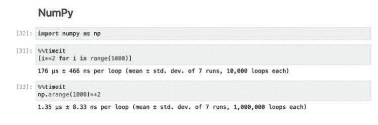

**图11.5：** 在Jupyter notebook中使用NumPy和`timeit`。

### 11.2.2 多维数组

NumPy还支持多维数组：

```python
>>> a = np.array([[1, 2, 3], [4, 5, 6]])
>>> a
array([[1, 2, 3],
       [4, 5, 6]])
```

NumPy数组有一个名为**shape**的属性，它返回行数和列数：

```python
>>> a.shape
(2, 3)
```

这里的**(2, 3)**对应于2行（**[1, 2, 3]**和**[4, 5, 6]**）和3列（**[1, 4]**、**[2, 5]**和**[3, 6]**）。你可以将其视为一个2 × 3的矩阵。

类似于列表切片（第3.3节），NumPy支持对所有维度的ndarray进行数组切片。第3.3节介绍的冒号表示法在通过单独使用一个冒号来选择整行或整列时特别有用：

```python
>>> a[0, :]        # 第一行
array([1, 2, 3])
>>> a[:, 0]        # 第一列
array([1, 4])
```

通过将冒号与数字范围结合使用，我们可以切出一个子数组：

```python
>>> A = a[0:2, 0:2]
>>> A
array([[1, 2],
       [4, 5]])
```

与列表切片一样，你可以省略范围的开头或结尾，并得到相同的结果：

```python
>>> A = a[:2, :2]
>>> A
array([[1, 2],
       [4, 5]])
```

NumPy包含大量对常见数值操作的支持，例如线性代数，在这种情况下使用了经过超级优化和实战检验的包，如BLAS和LAPACK。这些例程主要用C和Fortran编写，但我们不必了解这些语言，因为它们通过`linalg`库被Python封装。⁷

让我们来看一个NumPy线性代数支持的快速示例。我们刚刚定义的子数组**A**是一个方阵（行数和列数相同），这意味着我们可以尝试计算其矩阵逆。一个可逆矩阵的逆，记为$A^{-1}$（“A的逆”），满足关系$AA^{-1} = A^{-1}A = I$，其中$I$是$n \times n$单位矩阵（对角线上为1，其他位置为0）。矩阵求逆在NumPy中可通过`linalg.inv()`获得：

```python
>>> Ainv = np.linalg.inv(A)           # 矩阵的逆
>>> Ainv
array([[-1.66666667,  0.66666667],
       [ 1.33333333, -0.33333333]])
```

我们可以尝试使用`+`和`*`分别进行矩阵加法和乘法：

```python
>>> A + Ainv
array([[-0.66666667,  2.66666667],
       [ 5.33333333,  4.66666667]])
>>> A * Ainv
array([[-1.66666667,  1.33333333],
       [ 5.33333333, -1.66666667]])
```

尽管数组和**A + Ainv**在此上下文中没有特定的数学意义，但我们看到元素是根据NumPy向量化操作（第11.2.1节）相加的。类似地，数组积**A * Ainv**也是逐项计算的。这可能是一个混淆的来源，因为在某些系统（特别是MATLAB）中，`*`运算符在此上下文中执行*矩阵乘法*，产生预期的结果$AA^{-1} = I$。在NumPy中，执行矩阵乘法最方便的方式是使用`@`运算符：⁸

```python
>>> A @ Ainv
array([[1., 0.],
       [0., 1.]])
```

7. 尽管我最终在研究生阶段做了很多C编程，但我得以实现了童年时的梦想——永远不必学习Fortran。
8. `matmul()`函数也可以工作；在将`numpy`导入为`np`的情况下，这将显示为`np.matmul(A, Ainv)`，等同于`A @ Ainv`。

结果如预期是2 × 2单位矩阵。（注意，由于数值舍入误差，某些元素可能接近但不完全为零；更多信息请参见第11.2.3节。）

一个特别有用的处理矩阵对象的方法是**reshape()**，它允许我们将（例如）一维数组更改为二维数组。**reshape()**的参数是一个元组（第3.6节），包含目标维度：

```python
>>> a = np.arange(16)
>>> a.reshape((2, 8))
>>> a
array([[ 0,  1,  2,  3,  4,  5,  6,  7],
       [ 8,  9, 10, 11, 12, 13, 14, 15]])
>>> b = a.reshape((4, 4))
>>> b
array([[ 0,  1,  2,  3],
       [ 4,  5,  6,  7],
       [ 8,  9, 10, 11],
       [12, 13, 14, 15]])
```

使用**reshape()**通常比手动构建相应的数组方便得多。请注意，**reshape()**不会改变数组，因此如果我们想为重塑后的版本命名，需要进行赋值。

**reshape()**函数支持使用**-1**作为参数之一，其效果在文档中描述如下：

> 一个形状维度可以是-1。在这种情况下，该值是从数组的长度和剩余维度推断出来的。

例如，我们可以对一个包含16个元素的数组使用参数**(-1, 2)**来获得一个8 × 2矩阵，其中**8**来自**16**除以**2**：

```python
>>> a.reshape((-1, 2))
array([[ 0,  1],
       [ 2,  3],
       [ 4,  5],
       [ 6,  7],
       [ 8,  9],
       [10, 11],
       [12, 13],
       [14, 15]])
```

实际上，**-1**是一个占位符，表示“使用使元素总数正确的所需维度”。

除了其他用途外，这种**-1**技术可用于将多维数组转换为包含*单个*元素的数组的数组，这可以使用参数**(-1, 1)**完成（清单11.4）。这种格式通常作为机器学习算法的输入（第11.7节）。

### 清单11.4：创建一维数组的数组。

```python
>>> a.reshape((-1, 1))
array([[ 0],
       [ 1],
       [ 2],
       [ 3],
       [ 4],
       [ 5],
       [ 6],
       [ 7],
       [ 8],
       [ 9],
       [10],
       [11],
       [12],
       [13],
       [14],
       [15]])
```

### 11.2.3 常量、函数和线性间距

与第4.1节讨论的**math**库类似，NumPy配备了数学常数，例如欧拉数*e*：

```python
>>> import math
>>> math.e
2.718281828459045
>>> np.e
2.718281828459045
>>> math.e == np.e
True
```

NumPy也定义了**pi**，但不幸的是，在撰写本文时它没有**tau**：

```python
>>> np.pi
3.141592653589793
>>> np.tau
Traceback (most recent call last):
  raise AttributeError("module {!r} has no attribute "
AttributeError: module 'numpy' has no attribute 'tau'
```

不过，我们仍然可以使用**math**中的那个：

```python
>>> math.tau
6.283185307179586
>>> math.tau == 2 * np.pi
True
```

同样类似于**math**，NumPy具有三角函数和对数等操作（关于**np.sin(math.tau)**奇怪结果的解释，请参见下文）：

```python
>>> np.cos(math.tau)
1.0
>>> np.sin(math.tau)
-2.4492935982947064e-16
>>> np.log(np.e)
1.0
>>> np.log10(np.e)
0.4342944819032518
```

请注意，再次与**math**一样，并且像大多数编程语言一样，NumPy使用**log()**表示自然对数，**log10()**表示以10为底的对数。

此时，你可能想知道在NumPy中包含与**math**中重复的定义有什么意义。对于像*e*和*π*这样的常数，主要是为了完整性，但对于函数，实际上存在有意义的区别：与**math**函数不同，NumPy的函数可以使用我们在第11.2.1节首次看到的相同向量化操作在线程上处理数组。

例如，考虑cos *x*的一个周期，角度范围从0到*τ*（清单11.5）。⁹

9. 我更喜欢使用余弦而不是正弦作为典型例子，因为从简谐运动的角度来看它更直观，简谐运动是正弦函数最重要的例子之一。因为余弦函数从1开始，它自然对应于一个从平衡位置移动一定距离并从静止释放的振荡器。相比之下，使用正弦需要给这样的振荡器一个推力或轻弹，使其在平衡位置以非零速度开始，这是一种不太常见的启动此类运动的方式。

## 11.2 使用 NumPy 进行数值计算

**清单 11.5：** 对应于 $\cos x$ 周期简单分数的角度。

```
>>> np.arange(5)
array([0, 1, 2, 3, 4])
>>> angles = math.tau * np.arange(5) / 4
>>> angles
array([0.        , 1.57079633, 3.14159265, 4.71238898, 6.28318531])
```

请注意，清单 11.5 中 `angles` 数组的值仅仅是 0、$\tau/4$、$\tau/2$、$3\tau/4$ 和 $\tau$ 的数值等价物。将 `cos()` 应用于这些角度，对于 `math` 版本的余弦函数不起作用，但对于 NumPy 版本则有效（清单 11.6）。

**清单 11.6：** 将 `cos()` 应用于角度数组。

```
>>> math.cos(angles)
Traceback (most recent call last):
  File "<stdin>", line 1, in <module>
TypeError: only size-1 arrays can be converted to Python scalars
>>> a = np.cos(angles)
>>> a
array([ 1.00000000e+00,  6.12323400e-17, -1.00000000e+00, -1.83697020e-16,
        1.00000000e+00])
```

请注意，由于浮点舍入误差，清单 11.6 中 $\cos x$ 的零点表现为微小的数字而不是 0（尽管这种行为通常取决于系统，因此你的具体结果可能有所不同）。我们可以使用 NumPy 的 `isclose()` 函数来消除这些值，该函数在数字“接近”给定数字时返回 `True`（本质上，在系统浮点运算的误差范围内）：

```
>>> np.isclose(0.01, 0)
False
>>> np.isclose(10**(-16), 0)
True
>>> np.isclose(a, 0)
array([False,  True, False,  True, False])
```

实际上，我们可以将这个布尔值数组传递给原始数组本身，并将对应于 `True` 的元素精确设置为 0（清单 11.7）。

**清单 11.7：** 使用 `isclose()` 将接近 0 的值归零。

```
>>> a[np.isclose(a, 0)]
array([ 6.1232340e-17, -1.8369702e-16])
>>> a[np.isclose(a, 0)] = 0
>>> a
array([ 1.,  0., -1.,  0.,  1.])
```

在清单 11.5 中，我们在生成角度时将 `arange(5)` 除以 4，但由于技术原因（与数值舍入误差相关），创建此类序列的首选方法是使用 `linspace()`（“线性间隔”）。`linspace()` 函数最常见的参数是起始值、结束值和所需的总点数。例如，我们可以使用 `linspace()` 创建一个包含周期四个四分之一的数组（总共 5 个点，因为我们包含了 0）：

```
>>> angles = np.linspace(0, math.tau, 5)
>>> angles
array([0.        , 1.57079633, 3.14159265, 4.71238898, 6.28318531])
>>> a = np.cos(angles)
>>> a[np.isclose(a, 0)] = 0
>>> a
array([ 1.,  0., -1.,  0.,  1.])
```

`linspace()` 函数通常用于使用更多点创建间距更精细的数组。例如，我们可以如下获取 cos x 的 100 个点：

```
>>> angles = np.linspace(0, math.tau, 100)
>>> angles
array([0.        , 0.06346652, 0.12693304, 0.19039955, 0.25386607,
       0.31733259, 0.38079911, 0.44426563, 0.50773215, 0.57119866,
       0.63466518, 0.6981317 , 0.76159822, 0.82506474, 0.88853126,
       0.95199777, 1.01546429, 1.07893081, 1.14239733, 1.20586385,
       1.26933037, 1.33279688, 1.3962634 , 1.45972992, 1.52319644,
       1.58666296, 1.65012947, 1.71359599, 1.77706251, 1.84052903,
       1.90399555, 1.96746207, 2.03092858, 2.0943951 , 2.15786162,
       2.22132814, 2.28479466, 2.34826118, 2.41172769, 2.47519421,
       2.53866073, 2.60212725, 2.66559377, 2.72906028, 2.7925268 ,
       2.85599332, 2.91945984, 2.98292636, 3.04639288, 3.10985939,
       3.17332591, 3.23679243, 3.30025895, 3.36372547, 3.42719199,
       3.4906585 , 3.55412502, 3.61759154, 3.68105806, 3.74452458,
       3.8079911 , 3.87145761, 3.93492413, 3.99839065, 4.06185717,
       4.12532369, 4.1887902 , 4.25225672, 4.31572324, 4.37918976,
       4.44265628, 4.5061228 , 4.56958931, 4.63305583, 4.69652235,
       4.75998887, 4.82345539, 4.88692191, 4.95038842, 5.01385494,
       5.07732146, 5.14078798, 5.2042545 , 5.26772102, 5.33118753,
       5.39465405, 5.45812057, 5.52158709, 5.58505361, 5.64852012,
       5.71198664, 5.77545316, 5.83891968, 5.9023862 , 5.96585272,
       6.02931923, 6.09278575, 6.15625227, 6.21971879, 6.28318531])
```

```
>>> np.cos(angles)
array([ 1.        ,  0.99798668,  0.99195481,  0.9819287 ,  0.9679487 ,
       0.95007112,  0.92836793,  0.90292654,  0.87384938,  0.84125353,
       0.80527026,  0.76604444,  0.72373404,  0.67850941,  0.63055267,
       0.58005691,  0.52722547,  0.47227107,  0.41541501,  0.35688622,
       0.29692038,  0.23575894,  0.17364818,  0.1108382 ,  0.04758192,
      -0.01586596, -0.07924996, -0.14231484, -0.20480667, -0.26647381,
      -0.32706796, -0.38634513, -0.44406661, -0.5       , -0.55392006,
      -0.60566969, -0.65486073, -0.70147489, -0.74526445, -0.78605309,
      -0.82367658, -0.85798341, -0.88883545, -0.91610846, -0.93969262,
      -0.95949297, -0.97542979, -0.98743889, -0.99547192, -0.99949654,
      -0.99949654, -0.99547192, -0.98743889, -0.97542979, -0.95949297,
      -0.93969262, -0.91610846, -0.88883545, -0.85798341, -0.82367658,
      -0.78605309, -0.74526445, -0.70147489, -0.65486073, -0.60566969,
      -0.55392006, -0.5       , -0.44406661, -0.38634513, -0.32706796,
      -0.26647381, -0.20480667, -0.14231484, -0.07924996, -0.01586596,
       0.04758192,  0.1108382 ,  0.17364818,  0.23575894,  0.29692038,
       0.35688622,  0.41541501,  0.47227107,  0.52722547,  0.58005691,
       0.63055267,  0.67850941,  0.72373404,  0.76604444,  0.80527026,
       0.84125353,  0.87384938,  0.90292654,  0.92836793,  0.95007112,
       0.9679487 ,  0.9819287 ,  0.99195481,  0.99798668,  1.        ])
```

要可视化这么多原始值相当困难，但它们是像 Matplotlib 这样的绘图库的完美输入，这是第 11.3 节的主题。

### 11.2.4 练习

1. 如果 `reshape()` 中的维度与数组大小不匹配会发生什么（例如，`np.arange(16).reshape((4, 17))`）？
2. 确认 `A = np.random.rand(5, 5)` 允许你定义一个 5 × 5 的随机矩阵。
3. 求上一练习中 5 × 5 矩阵的逆 `Ainv`。（计算 2 × 2 矩阵的逆（如第 11.2.2 节所示）手工计算相当简单，但随着矩阵大小的增加，任务会迅速变得困难，此时像 NumPy 这样的计算系统就不可或缺。）
4. 上两个练习中矩阵的矩阵乘积 `I = A @ Ainv` 是什么？使用清单 11.7 中相同的 `isclose()` 技巧将 `I` 中接近零的元素归零，并确认所得矩阵确实是 5 × 5 的单位矩阵。

## 11.3 使用 Matplotlib 进行数据可视化

Matplotlib 是一个强大的 Python 可视化工具，可以完成数量惊人的出色工作。¹⁰ 在本节中，我们将从基于第 11.2 节工作的简单二维图开始，并逐步添加额外功能，最终达到图 11.6 所示的图形。然后我们将介绍其他几个重要案例（散点图和直方图），这对于使用 pandas 进行数据分析（第 11.4 节）很重要。显示 Matplotlib 图形的确切机制取决于具体设置；请参考框 11.2 以在你的系统上设置 Matplotlib 图形的显示。

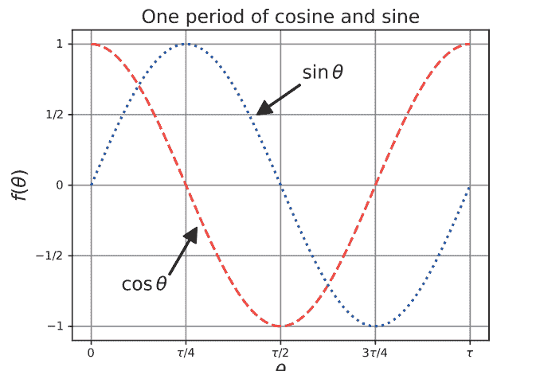

**图 11.6：** 展示 Matplotlib 功能的精美图形。

10. 值得注意的是，许多 Python 数据科学家也使用 seaborn，这是一个基于 Matplotlib 构建的数据可视化库。虽然学习 seaborn 绝非*危险*，但它将是本节的自然后续。官方的 seaborn 教程将是一个很好的起点。

### 框 11.2：Matplotlib 机制

让 Matplotlib 图形显示的确切机制因你的具体设置细节而有很大差异。最明确的显示图形的方法（在大多数系统上从 REPL 工作）是使用 show() 方法：

```
>>> import numpy as np
>>> import matplotlib.pyplot as plt
>>> x = np.linspace(-2, 2, 100)
>>> fig, ax = plt.subplots(1, 1)
>>> ax.plot(x, x*x)
>>> plt.show()
```

在许多系统上，这将生成一个如图 11.7 所示的窗口，其中包含图形结果。

在 Jupyter notebooks 中，可以通过在 notebook 单元格中执行以下命令来配置环境以自动显示 Matplotlib 图形（“内联”，即直接在 notebook 中）：

```
%matplotlib inline
```

据我所知，在某些系统（包括我的系统）上，此设置默认是开启的，当相应的 Jupyter 单元格被求值时，图形会自动出现（图 11.8）。

在像云 IDE 这样的环境中，可以切换到非图形后端，写入文件，然后在浏览器中查看文件。如果你想走这条路，请参阅此 Stack Overflow 帖子（https://bit.ly/cloud-plot），但推荐的解决方案是按照框 11.1 中的描述在云 IDE 上设置 Jupyter。在这种情况下，你可以按照上述方法设置内联图形显示（如果实际上它不是自动可用的）。

### 11.3.1 绘图

我们将从回顾第 11.2 节的最后一个示例开始，该示例定义了一个从 0 到 τ 的 100 个点的线性间隔数组：

```
(venv) $ python3
>>> import numpy as np
>>> import matplotlib.pyplot as plt
>>> from math import tau
>>> x = np.linspace(0, tau, 100)
```

## 11.3.1 线图

Matplotlib 有两个关键对象：**Figure** 和 **Axes**。粗略地说，**Figure** 是构成图像的元素的容器，而 **Axes** 是表示这些元素的数据。不过，不必过于纠结这具体意味着什么；在实践中，使用 Matplotlib 往往可以简化为将图形和坐标轴对象（通常称为 **fig** 和 **ax**）赋值为调用 **subplots()** 函数的结果：

```python
>>> fig, ax = plt.subplots()
```

这个有些晦涩的语法直接来自 Matplotlib 文档。¹¹

¹¹ 在本章中，我们使用所谓的“面向对象”接口来调用 Matplotlib，这通常是 Matplotlib 项目本身所推荐的。不过，还有第二种接口，其设计旨在模仿 MATLAB 中的绘图功能。更多信息请参阅文章“Pyplot vs Object Oriented Interface”（https://matplotlib.org/matplotlibblog/posts/pyplot-vs-object-oriented-interface/）。

```python
[4]: x = np.linspace(-1, 6, 100)
plt.plot(x, wien(x));
plt.plot(x, 0*x);
```

我们将通过几种不同的方法求解 Wien(x) = (x - 5)e^x + 5 = 0 来找到根的数值：

- 来自 Sage 的 `find_root`
- 来自 `scipy.optimize` 的 `fsolve`，用于在给定初始猜测值的情况下找到所有根
- 来自 `scipy.optimize` 的 `brentq`，用于找到最接近 5 的单个根

```python
[5]: var('x')
find_root(wien(x) == 0, 1, 6)
[5]: 4.965114231744276
```

**图 11.8：** 在 Jupyter notebook 中自动显示的图表。

要绘制余弦函数的图像，我们可以调用 `ax` 对象的 `plot()` 方法，其中 `x`（水平）值等于我们那 100 个线性间隔的点，`y`（垂直）值则通过对 `x` 调用 `np.cos` 得到：

```python
>>> ax.plot(x, np.cos(x))
>>> plt.show()
```

如 Box 11.2 所述，查看图表的步骤取决于你的具体设置，因此我们将使用 `plt.show()` 作为“你系统上对应命令”的简写。（特别注意，除非你要将图形保存到磁盘，否则通常不需要 `fig` 对象；大部分操作都在 `ax` 上进行。）本例的结果就是图 11.9 所示的漂亮基础余弦图。

在接下来的大多数示例中，我将省略 `>>>` 提示符，以便你更容易地复制粘贴。这主要是因为构建图表可能有点繁琐，因为你每次都需要重新运行所有命令。Jupyter notebook 的一个巨大优势是，你可以通过在单个单元格中增量构建图表，然后使用 Shift-Return 反复执行代码来避免这个问题。

下一步，让我们为 x 轴和 y 轴添加刻度（使用 **set_xticks()** 和 **set_yticks()**），并添加整体网格（使用 **plt.grid()**）：

```python
fig, ax = plt.subplots()
ax.set_xticks([0, tau/4, tau/2, 3*tau/4, tau])
ax.set_yticks([-1, -1/2, 0, 1/2, 1])
plt.grid(True)

ax.plot(x, np.cos(x))
plt.show()
```

生成的图表使得余弦函数的结构更容易看清，四个全等的部分对应于完整周期的四个四分之一（图 11.10）。

图 11.10 中的刻度标签是其默认的十进制值，但将其表示为完整周期（即 τ）的分数（在 x 轴上）和 ±1 的分数（在 y 轴上）会更方便。Matplotlib 的一个很棒之处在于它支持广泛使用的 LaTeX 数学排版语法，这通常涉及用美元符号包围数学符号，并用反斜杠表示命令。¹² 例如，本段包含以下 LaTeX 代码：¹³

```
The tick labels in Figure-\ref{fig:cosine_ticks} are their default decimal values, but it would be more convenient to express them as fractions of the full period (i.e., $\tau$) on the $x$-axis and as fractions of $\pm 1$ on the $y$-axis.
```

因为 LaTeX 命令通常包含麻烦的反斜杠，当它们放在字符串内部时常常会有奇怪的行为，所以我们将使用原始字符串（第 2.2.2 节），这样就不必转义它们了。生成的刻度标签使用 `set_xticklabels()` 和 `set_yticklabels()` 方法，如下所示：

¹² LaTeX 的发音各有不同；我偏好的发音是 *lay-tech*，其中 "tech" 与 "technology" 中的发音相同。（我很高兴发现 macOS 上的文本转语音程序也同意这一点。）

¹³ 使用美元符号（$...$ 用于行内数学，$$...$$ 用于居中数学）实际上与 TeX 相关，TeX 是 LaTeX 底层的系统。严格来说，首选的 LaTeX 语法是 \(...\) 用于行内数学，\[...\] 用于居中数学。据我所知，Jupyter notebooks 仅支持纯 TeX 语法。

**图 11.11：** 为余弦图添加漂亮的 LaTeX 轴标签。

```python
fig, ax = plt.subplots()

ax.set_xticks([0, tau/4, tau/2, 3*tau/4, tau])
ax.set_yticks([-1, -1/2, 0, 1/2, 1])
plt.grid(True)

ax.set_xticklabels([r"$0$", r"$\tau/4$", r"$\tau/2$", r"$3\tau/4$", r"$\tau$"])
ax.set_yticklabels([r"$-1$", r"$-1/2$", r"$0$", r"$1/2$", r"$1$"])

ax.plot(x, np.cos(x))
plt.show()
```

结果如图 11.11 所示。

接下来，让我们也添加正弦函数，以及轴标签和图表标题：

```python
fig, ax = plt.subplots()

ax.set_xticks([0, tau/4, tau/2, 3*tau/4, tau])
ax.set_yticks([-1, -1/2, 0, 1/2, 1])
plt.grid(True)

ax.set_xticklabels([r"$0$", r"$\tau/4$", r"$\tau/2$", r"$3\tau/4$", r"$\tau$"])
ax.set_yticklabels([r"$-1$", r"$-1/2$", r"$0$", r"$1/2$", r"$1$"])
ax.set_xlabel(r"$\theta$", fontsize=16)
ax.set_ylabel(r"$f(\theta)$", fontsize=16)
ax.set_title("One period of cosine and sine", fontsize=16)

ax.plot(x, np.cos(x))
ax.plot(x, np.sin(x))
plt.show()
```

这里我们在轴标签中使用了希腊字母 $\theta$（theta），这是表示角度的传统字母。结果如图 11.12 所示。

从图 11.12 可以注意到，Matplotlib 会自动为同一 **Axis** 对象上的附加绘图使用新颜色，以帮助我们区分它们。我们可以通过添加*注释*来进一步区分余弦和正弦，这可以通过 **annotate()** 方法来完成。看看你能否从上下文中推断出参数 **xy**、**xytext** 和 **arrowprops** 的作用：

**图 11.12：** 添加正弦函数和一些额外的标签。

```python
fig, ax = plt.subplots()

ax.set_xticks([0, tau/4, tau/2, 3*tau/4, tau])
ax.set_yticks([-1, -1/2, 0, 1/2, 1])
plt.grid(True)

ax.set_xticklabels([r"$0$", r"$\tau/4$", r"$\tau/2$", r"$3\tau/4$", r"$\tau$"])
ax.set_yticklabels([r"$-1$", r"$-1/2$", r"$0$", r"$1/2$", r"$1$"])

ax.set_title("One period of cosine and sine", fontsize=16)
ax.set_xlabel(r"$\theta$", fontsize=16)
ax.set_ylabel(r"$f(\theta)$", fontsize=16)

ax.annotate(r"$\cos\theta$", xy=(1.75, -0.3), xytext=(0.5, -0.75),
            arrowprops={"facecolor": "black", "width": 1}, fontsize=16)
ax.annotate(r"$\sin\theta$", xy=(2.75, 0.5), xytext=(3.5, 0.75),
            arrowprops={"facecolor": "black", "width": 1}, fontsize=16)

ax.plot(x, np.cos(x))
ax.plot(x, np.sin(x))
plt.show()
```

从图 11.13 可以看出，**xy** 表示要注释的点，**xytext** 表示注释文本的位置，而 **arrowprops** 决定了注释箭头的属性。

**图 11.13：** 添加注释。

最后，让我们添加自定义颜色和线型，以及更高的分辨率（以每英寸点数，即 **dpi** 为单位）。为方便起见，清单 11.8 中显示的最终代码包含了从头开始创建完整图形（图 11.14）所需的所有命令。

### 清单 11.8：用于绘制精美正弦曲线图的代码。

```python
from math import tau

import numpy as np
import matplotlib.pyplot as plt

x = np.linspace(0, tau, 100)

fig, ax = plt.subplots()

ax.set_xticks([0, tau/4, tau/2, 3*tau/4, tau])
ax.set_yticks([-1, -1/2, 0, 1/2, 1])
plt.grid(True)

ax.set_xticklabels([r"$0$", r"$\tau/4$", r"$\tau/2$", r"$3\tau/4$", r"$\tau$"])
ax.set_yticklabels([r"$-1$", r"$-1/2$", r"$0$", r"$1/2$", r"$1$"])

ax.set_title("One period of cosine and sine", fontsize=16)
ax.set_xlabel(r"$\theta$", fontsize=16)
ax.set_ylabel(r"$f(\theta)$", fontsize=16)

ax.annotate(r"$\cos\theta$", xy=(1.75, -0.3), xytext=(0.5, -0.75),
            arrowprops={"facecolor": "black", "width": 1}, fontsize=16)
ax.annotate(r"$\sin\theta$", xy=(2.75, 0.5), xytext=(3.5, 0.75),
            arrowprops={"facecolor": "black", "width": 1}, fontsize=16)

fig.set_dpi(150)

ax.plot(x, np.cos(x), color="red", linestyle="dashed")
ax.plot(x, np.sin(x), color="blue", linestyle="dotted")
plt.show()
```

### 11.3.2 散点图

第 11.3.1 节中的图表介绍了 Matplotlib 的一些关键思想，从这里开始有无数种可能的发展方向。在本节和下一节中，我们将重点关注数据科学中特别重要的两种可视化：*散点*

### 11.3.2 散点图

*图表*和*直方图*。如果一开始不能完全理解，也不必担心；我们将在第11.5节、第11.6节和第11.7节中有大量机会看到散点图和直方图的更多示例。

散点图只是将一系列离散的函数值绘制在对应的点上，这是整体感知函数值可能满足何种关系的好方法。让我们看一个具体的例子来理解其含义。

我们将首先从*标准正态*分布¹⁴中生成一些随机点，这是一种平均值（均值）为0、离散度（标准差）为1的正态分布（或“钟形曲线”）。¹⁵ 我们可以使用

14. 其他分布并无“不正常”之处；使用“正态”一词在很大程度上是历史沿袭的特殊用法。

15. 标准正态分布的函数形式由概率密度 $P(x) = \frac{1}{\sqrt{\tau}} e^{-\frac{1}{2}x^2}$ 给出，其中 $1/\sqrt{\tau} = 1/\sqrt{2\pi}$ 是一个归一化因子，用于确保总概率 $\int_{-\infty}^{\infty} P(x) dx$ 等于1。对于均值为 $\mu$、标准差为 $\sigma$ 的一般正态分布，其密度函数为 $P(x; \mu, \sigma) = \frac{1}{\sigma\sqrt{\tau}} e^{-\frac{1}{2}\left(\frac{x-\mu}{\sigma}\right)^2}$；令 $\mu = 0$ 和 $\sigma = 1$ 即可得到标准正态分布。

NumPy的**random**库来获取这些值，该库包含一个名为**default_rng()**的默认随机数生成器（代码清单11.9）。

### 代码清单11.9：使用标准正态分布生成随机值。

```python
>>> from numpy.random import default_rng
>>> rng = default_rng()
>>> n_pts = 50
>>> x = rng.standard_normal(n_pts)
>>> x
array([ 0.41256003,  0.67594205,  1.264653  ,  1.16351491, -0.41594407,
       -0.60157015,  0.84889823, -0.59984223,  0.24374326,  0.06055498,
       -0.48512829,  1.02253594, -1.10982933, -0.40609179,  0.55076245,
        0.13046238,  0.86712869,  0.06139358, -2.26538163,  1.45785923,
       -0.56220574, -1.38775239, -2.39643977, -0.77498392,  1.16794796,
       -0.6588802 ,  1.66343434,  1.57475219, -0.03374501, -0.62757059,
       -0.99378175,  0.69259747, -1.04555996,  0.62653116, -0.9042063 ,
       -0.32565268, -0.99762804, -0.4270288 ,  0.69940045, -0.46574267,
        1.82225132,  0.23925201, -1.0443741 , -0.54779683,  1.17466477,
       -2.54906663, -0.31495622,  0.25224765, -1.20869217, -1.02737145])
```

（你可能会在网上教程示例中看到类似**random.standard_normal(50)**的代码，但这种变体现已弃用，代码清单11.9中展示的技术是当前使用NumPy生成随机值的首选方法。）

有了这些*x*值，我们通过添加5倍*x*的常数倍（斜率）加上另一个随机因子来创建一组*y*值：

```python
>>> y = 5*x + rng.standard_normal(n_pts)
```

这大致遵循直线方程*y = mx + b*的模式，只是*x*和*b*使用了随机值。由于*y*的函数形式本质上是线性的，*y*对*x*的图应该大致像一条直线，我们可以通过散点图确认如下：

**图11.15：一个Matplotlib散点图。**

```python
>>> fig, ax = plt.subplots()
>>> ax.scatter(x, y)
>>> plt.show()
```

如图11.15所示，我们的猜测是正确的。（因为我们没有为随机数生成器设置特定的种子值，所以你的具体结果会有所不同。）

### 11.3.3 直方图

最后，让我们应用第11.3.2节中的一些相同思想，来可视化从标准正态分布中抽取的1000个随机值的分布：

```python
>>> values = rng.standard_normal(1000)
```

了解这些值外观的一种常见方法是创建固定数量的“箱”，并绘制每个箱中有多少值。由此产生的图称为*直方图*，可以使用Matplotlib的`hist()`方法自动生成：

**图11.16：** 正态分布随机值的直方图。

```python
>>> fig, ax = plt.subplots()
>>> ax.hist(values)
>>> plt.show()
```

结果是对“钟形曲线”的良好近似，如图11.16所示。

默认的箱数是**10**，但我们可以通过向**hist()**传递一个**bins**参数来研究不同箱大小的结果，例如**bins=20**：

```python
>>> fig, ax = plt.subplots()
>>> ax.hist(values, bins=20)
>>> plt.show()
```

在这种情况下，结果是分布的更细粒度版本（图11.17）。

由于Matplotlib是一个通用的绘图和数据可视化系统，你可以用它做的事情几乎无穷无尽。虽然我们现在已经涵盖了本教程其余部分所需的基础知识，但我鼓励你进一步探索，Matplotlib文档是一个很好的起点。

**图11.17：** 图11.16的重新分箱版本。

### 11.3.4 练习

- 1. 为图11.15中显示的图添加标题和坐标轴标签。
- 2. 为第11.3.3节中的直方图添加标题。
- 3. 一个常见的绘图任务是在同一图形中包含多个子图。证明代码清单11.10创建了垂直堆叠的子图，如图11.18所示。（这里的`suptitle()`方法生成一个位于两个图上方的“总标题”。有关创建多个子图的其他方法，请参阅Matplotlib关于子图的文档。）
- 4. 在图11.14的图中添加函数cos(x − τ/8)的图，颜色为“orange”，线型为“dashdot”。*额外加分：* 同时添加注释。（额外加分步骤在交互式Jupyter笔记本中*容易得多*，尤其是在为注释标签和箭头找到正确坐标时。）

### 代码清单11.10：堆叠子图。

```python
>>> x = np.linspace(0, tau, 100)
>>> fig, (ax1, ax2) = plt.subplots(2)
>>> fig.suptitle(r"Vertically stacked plots of $\cos\theta$ and $\sin\theta$.")
>>> ax1.plot(x, np.cos(x))
>>> ax2.plot(x, np.sin(x))
```

cos θ 和 sin θ 的垂直堆叠图。

**图11.18：** 垂直堆叠图。

## 11.4 使用pandas进行数据分析简介

Python数据科学中使用最频繁的工具之一是*pandas*，一个用于分析数据的强大库。本质上，pandas（源自“**面板数据**”）让我们能够执行许多与电子表格或结构化查询语言（SQL）相同的任务，只是底层拥有全功能通用编程语言的强大和灵活性（图11.19¹⁶）。

**图11.19：** 熊猫以其对竹子的喜爱和在数据科学方面的卓越才能而闻名。

pandas的界面可能需要一些时间来适应，没有比看大量示例更好的替代方法了。因此，本章涵盖了三个复杂度递增的案例，从简化的手工示例（第11.4.1节）开始，然后展示使用两个真实世界数据集的更复杂分析技术：诺贝尔奖（第11.5节）和*泰坦尼克号*的存活率（第11.6节）。（第二个数据集也将作为我们在第11.7节中关于机器学习的主要示例来源。）

此外，*真的*没有比自己提问和回答问题更好的替代方法了。根据我的经验，遵循像本教程这样的教程可以给你一个很好的开始，并且通常会产生像图11.20这样看起来简单易得的结果。但只要你偏离精心挑选的示例哪怕一毫米，试图自己回答一些问题，你最终得到的东西就会像图11.21。

16. 图片由San Hoyano/Shutterstock提供。

### 11.4.1 手工示例

入门的第一步几乎总是导入 NumPy 为 **np**，pandas 为 **pd**，以及 **matplotlib.pyplot** 为 **plt**：

```python
>>> import numpy as np
>>> import pandas as pd
>>> import matplotlib.pyplot as plt
```

pandas 的核心数据结构是 **Series** 和 **DataFrame**。后者更为重要，但它是由前者构建而成的，所以我们从 Series 开始。

```python
[55]: survival_rates = titanic.groupby("Pclass")["Survived"].mean()
survival_rates.plot.bar()
plt.show()
```

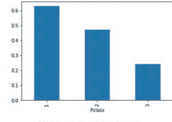

```python
[57]: titanic.groupby(["Survived"])["Sex"]
survival_rates = titanic.groupby("Sex")["Survived"].mean()
survival_rates.plot.bar();
```

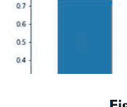

**图 11.20：让 pandas 看起来很简单。**

我最好的建议是，一开始跟着做，以熟悉 pandas，然后开始研究你自己的问题。但如果你在任何时候感到有灵感，想自己尝试，别让我阻止你——只需知道如果你这样做会有什么预期。

```python
[77]: train_df['Embarked'].describe()

KeyError                                  Traceback (most recent call last)
File ~/repos/jupyter/venv/lib/python3.9/site-packages/pandas/core/indexes/base.py:3621, in Index.get_loc(self, key, method, tolerance)
   3620 try:
-> 3621     return self._engine.get_loc(casted_key)
   3622 except KeyError as err:

File ~/repos/jupyter/venv/lib/python3.9/site-packages/pandas/_libs/index.pyx:136, in pandas._libs.index.IndexEngine.get_loc()

File ~/repos/jupyter/venv/lib/python3.9/site-packages/pandas/_libs/index.pyx:163, in pandas._libs.index.IndexEngine.get_loc()

File pandas/_libs/hashtable_class_helper.pxi:5198, in pandas._libs.hashtable.PyObjectHashTable.get_item()

File pandas/_libs/hashtable_class_helper.pxi:5206, in pandas._libs.hashtable.PyObjectHashTable.get_item()

KeyError: 'Embarked'

The above exception was the direct cause of the following exception:

KeyError                                  Traceback (most recent call last)
Input In [77], in <cell line: 1>()
----> 1 train_df['Embarked'].describe()

File ~/repos/jupyter/venv/lib/python3.9/site-packages/pandas/core/frame.py:3505, in DataFrame.__getitem__(self, key)
   3503 if self.columns.nlevels > 1:
   3504     return self._getitem_multilevel(key)
```

**图 11.21：** 常常是艰难的现实。

# Series

Series 本质上是一个包含任意类型元素的花式数组（很像列表），每个元素被称为一个 *轴*。例如，以下命令定义了一个包含数字和字符串的 Series，以及一个特殊（且常见）的值，称为 *NaN*（“非数字”）：

```python
>>> pd.Series([1, 2, 3, "foo", np.nan, "bar"])
0       1
1       2
2       3
3     foo
4     NaN
5     bar
dtype: object
>>> pd.Series([1, 2, 3, "foo", np.nan, "bar"]).dropna()
0       1
1       2
2       3
3     foo
5     bar
dtype: object
```

这里的第二个命令展示了如何使用 **dropna()** 方法清理数据，该方法会删除任何“不可用”的值，例如 **None**、**NaN** 或 **NaT**（“非时间”）。

默认情况下，Series 的轴标签像数组索引一样编号（本例中为 0–5）。这组轴被称为 Series 的 *索引*：

```python
>>> pd.Series([1, 2, 3, "foo", np.nan, "bar"]).index
RangeIndex(start=0, stop=6, step=1)
```

也可以定义我们自己的轴标签，其元素数量必须与 Series 相同：

```python
>>> from numpy.random import default_rng
>>> rng = default_rng()
>>> s = pd.Series(rng.standard_normal(5), index=["a", "b", "c", "d", "e"])
>>> s
a    0.770407
b   -0.698040
c    1.977234
d   -1.559065
e   -0.713496
dtype: float64
```

Series 既像 NumPy 的 ndarray，又像普通的 Python 字典：

```python
>>> s[0]                    # 表现得像 ndarray
0.7704065892197263
>>> s[1:3]                  # 支持切片
b   -0.698040
c    1.977234
dtype: float64
>>> s["c"]                  # 通过轴标签访问
1.977233512910388
>>> s.keys()                # 键就是 Series 的索引。
Index(['a', 'b', 'c', 'd', 'e'], dtype='object')
>>> s.index
Index(['a', 'b', 'c', 'd', 'e'], dtype='object')
```

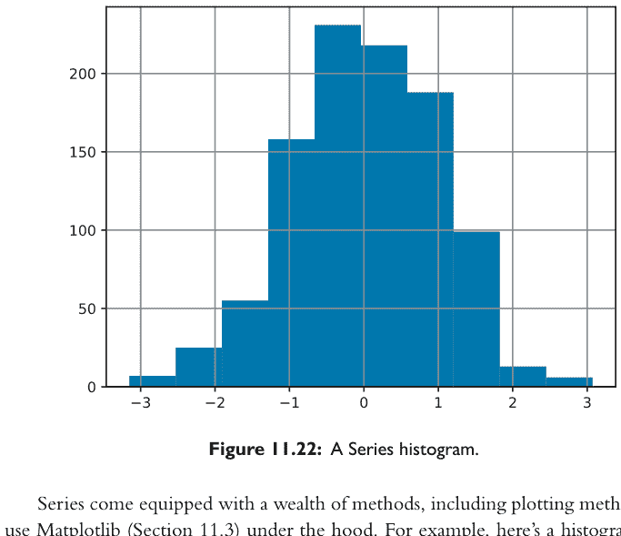

**图 11.22：一个 Series 直方图。**

Series 配备了丰富的方法，包括底层使用 Matplotlib（第 11.3 节）的绘图方法。例如，这是一个由标准正态分布生成的包含 1000 个值的 Series 的直方图：

```python
>>> s = pd.Series(rng.standard_normal(1000))
>>> s.hist()
>>> plt.show()
```

除了细微的格式差异外，结果（图 11.22）与我们在第 11.3.3 节（图 11.16）中直接创建的直方图基本相同。

# DataFrame

另一个主要的 pandas 对象类型，称为 **DataFrame** 对象，是 Python 数据分析的核心。DataFrame 可以看作是一个包含任意数据类型的二维单元格网格——大致相当于一个 Excel 工作表。在本节中，我们将手动创建几个简单的 DataFrame，以了解它们的工作原理，但值得记住的是，大多数真实的 DataFrame 对象是通过从文件（甚至从实时 URL）导入数据来创建的，我们将在第 11.5 节开始介绍这种技术。

有大量方法可以初始化或构建 DataFrame，以适应相应大量的情况。例如，一种选择是用 Python 字典初始化它，如清单 11.11 所示。

## 清单 11.11：用字典初始化 DataFrame。

```python
>>> from math import tau
>>> from numpy.random import default_rng
>>> rng = default_rng()
>>> df = pd.DataFrame(
...     {
...         "Number": 1.0,
...         "String": "foo",
...         "Angles": np.linspace(0, tau, 5),
...         "Random": pd.Series(rng.standard_normal(5)),
...         "Timestamp": pd.Timestamp("20221020"),
...         "Size": pd.Categorical(["tiny", "small", "mid", "big", "huge"])
...     })
>>> df
   Number String     Angles    Random  Timestamp   Size
0     1.0    foo   0.000000 -1.954002 2022-10-20   tiny
1     1.0    foo   1.570796  0.967171 2022-10-20  small
2     1.0    foo   3.141593 -1.149739 2022-10-20    mid
3     1.0    foo   4.712389 -0.084962 2022-10-20    big
4     1.0    foo   6.283185  0.310634 2022-10-20   huge
```

这里我们应用了第 11.2.3 节的 **linspace()** 方法和两个新的 pandas 方法：**TimeStamp**（顾名思义）和 **Categorical**（包含 *分类变量* 的值）。结果是一组带有标签的行和列，包含异构的数据集。

我们可以使用列名作为键来访问 DataFrame 的列：

```python
>>> df["Size"]
0     tiny
1    small
2      mid
3      big
4     huge
```

我们还可以计算统计信息，例如 **Random** 列的平均值：

```python
>>> df["Random"].mean()
-0.3821796291792846
```

一个用于获取数值数据概览的有用 pandas 函数是 **describe()**：

```python
>>> df.describe()
          Number     Angles     Random
count  5.000000  5.000000  5.000000
mean   1.000000  3.141593 -0.382180
std    0.000000  2.483647  1.167138
min    1.000000  0.000000 -1.954002
25%    1.000000  1.570796 -1.149739
50%    1.000000  3.141593 -0.084962
75%    1.000000  4.712389  0.310634
max    1.000000  6.283185  0.967170
```

这会自动显示每个数值列的总计数、平均值、标准差、最小值、最大值以及中间三个四分位数（25%、50% 和 75%）。这些值并不总是有意义的——例如，线性间隔角度的标准差并不能真正告诉我们任何有用的信息——但 **describe()** 通常作为分析的第一步很有帮助。我们将在第 11.5 节开始看到另外两个有用的汇总方法 **head()** 和 **info()** 的示例。

另一个有用的方法是 **map()**，我们可以用它将分类值映射到数字。例如，假设“Size”对应于以盎司为单位的饮料尺寸，我们可以用一个 **sizes** 字典来表示。然后在“Size”列上使用 **map()** 就能得到想要的结果（清单 11.12）。

## 清单 11.12：使用 **map()** 修改值。

```python
>>> sizes = {"tiny": 4, "small": 8, "mid": 12, "big": 16, "huge": 24}
>>> df["Size"].map(sizes)
0     4
1     8
2    12
3    16
4    24
```

这项技术在应用机器学习算法（第11.7节）时尤其有价值，因为这些算法通常无法处理分类数据，但能很好地处理整数或浮点数。

### 11.4.2 练习

- 1. `info()` 方法提供了 DataFrame 的概览，与 `describe()` 互补。在清单11.11定义的 DataFrame 上运行 `df.info()` 的结果是什么？

## 11.5 pandas 示例：诺贝尔奖得主

在第11.4节中，我们初步了解了如何使用 pandas 及其带来的好处，但要做任何有趣的事情通常需要更大的数据集，而手动创建这些数据集很麻烦。因此，最常见的做法是从外部文件加载数据，然后在此基础上进行分析。相应地，在本节和下一节（第11.6节）中，我们将从可能是最常见的输入格式——CSV文件（代表“逗号分隔值”）——读取初始数据。

我们的第一步是下载一个关于诺贝尔奖得主的数据集，他们通常被称为*获奖者*（*laureates*，这源于古代用月桂花环来表彰伟大成就的传统）。<sup>17</sup> 我们可以在用于数据分析的同一目录中使用 `curl` 命令行命令来完成此操作：<sup>18</sup>

```
(venv) $ curl -OL https://cdn.learnenough.com/laureates.csv
```

然后我们可以使用 pandas 的 `read_csv()` 函数读取数据：

```
>>> nobel = pd.read_csv("laureates.csv")
```

数值列的统计信息意义不大，所以 `describe()` 告诉我们的信息不多：

```
>>> nobel.describe()
            id         year       share
count  975.000000  975.000000  975.000000
mean   496.221538  1972.471795    2.014359
std    290.594353    34.058064    0.943909
min      1.000000  1901.000000    1.000000
25%    244.500000  1948.500000    1.000000
50%    488.000000  1978.000000    2.000000
75%    746.500000  2001.000000    3.000000
max   1009.000000  2021.000000    4.000000
```

我们可以使用 **head()** 方法（清单11.13）获取一些更有用的信息。

### 清单11.13：查看诺贝尔奖数据的 **head()**。

```
>>> nobel.head()
   id      firstname ...        city       country
0   1  Wilhelm Conrad ...       Munich       Germany
1   2       Hendrik A. ...       Leiden  the Netherlands
2   3           Pieter ...  Amsterdam  the Netherlands
3   4            Henri ...        Paris          France
4   5           Pierre ...        Paris          France
[5 rows x 20 columns]
```

这里我们使用了 **head()** 方法来查看前几条记录；在 Jupyter notebook 中，你可以滚动查看所有列，但在终端中我们只能看到几列。我们可以使用 **info()** 获取更有用的信息：

```
>>> nobel.info()
<class 'pandas.core.frame.DataFrame'>
RangeIndex: 975 entries, 0 to 974
Data columns (total 20 columns):
 #   Column            Non-Null Count  Dtype 
---  ------            --------------  ----- 
 0   id                975 non-null    int64 
 1   firstname         975 non-null    object
 2   surname           945 non-null    object
 3   born              974 non-null    object
 4   died              975 non-null    object
 5   bornCountry       946 non-null    object
 6   bornCountryCode   946 non-null    object
 7   bornCity          943 non-null    object
 8   diedCountry       640 non-null    object
 9   diedCountryCode   640 non-null    object
 10  diedCity          634 non-null    object
 11  gender            975 non-null    object
 12  year              975 non-null    int64
 13  category          975 non-null    object
 14  overallMotivation 23 non-null     object
 15  share             975 non-null    int64
 16  motivation        975 non-null    object
 17  name              717 non-null    object
 18  city              712 non-null    object
 19  country           713 non-null    object
dtypes: int64(3), object(17)
memory usage: 152.5+ KB
```

这里我们看到了完整的列名列表，以及每列的非空值数量。

## 定位数据

pandas 中最有用的任务之一是定位满足所需条件的数据。例如，我们可以定位具有特定姓氏的诺贝尔奖得主。作为加州理工学院的毕业生，我有义务使用加州理工学院最受爱戴的人物之一——物理学家理查德·费曼（发音为“FINE-mən”）。除了在理论物理（特别是量子电动力学及其相关的费曼图）方面的开创性工作外，费曼还以《费曼物理学讲义》闻名，该书以异常有趣和富有洞察力的方式涵盖了基础物理课程（力学、热物理学、电动力学等）。

让我们使用方括号和布尔条件在 **"surname"** 列上查找费曼在获奖者数据中的记录：¹⁹

```
>>> nobel[nobel["surname"] == "Feynman"]
    id  firstname ... city country
86  86  Richard P. ... Pasadena CA  USA
```

这种数组风格的表示法返回完整记录，使我们能够确定费曼获得诺贝尔奖的年份。在 Jupyter notebook 中，你可能只需滚动到旁边就能读出（图11.23），但在 REPL 中，我们可以直接查看 **year** 属性：

> 19. 从这里开始，为了简洁起见，通常会省略不重要的输出，如 **[1 rows x 20 columns]** 和 **Name: year, dtype: int64**。

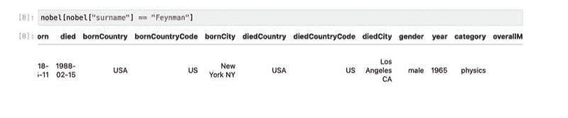

**图11.23：** 在 Jupyter notebook 中检查 pandas 记录。

```
>>> nobel[nobel["surname"] == "Feynman"].year
86    1965
```

这种方法还允许我们，例如，将其赋值给一个变量，这可能比目视检查更有用。

顺便说一下，语法

```
>>> nobel[nobel["surname"] == "Feynman"]
```

可能有点令人困惑，因为可能不清楚为什么我们必须引用 **nobel** 两次。答案是，该语法的内部部分返回一个 Series（第11.4.1节），其中包含每个获奖者的布尔值，如果姓氏等于 **"Feynman"** 则为 **True**，否则为 **False**：

```
>>> nobel["surname"] == "Feynman"
0        False
1        False
2        False
3        False
4        False
...
970      False
971      False
972      False
973      False
974      False
```

通过使用正确的索引（即 **86**），我们可以确认该情况下的值为 **True**：

```
>>> (nobel["surname"] == "Feynman")[86]
True
```

通过这种方式，我们安排

```
>>> nobel[nobel["surname"] == "Feynman"]
```

仅选择 **nobel["surname"] == "Feynman"** 为 **True** 的 **nobel** 值。这类似于清单11.7中展示的 **isclose()** 技巧，我们使用布尔值的 ndarray 来选择矩阵中接近0的元素（并将它们精确设置为0）。

获取年份的另一种方法是指定列以及布尔条件，我们可以这样尝试（仅显示最相关的输出行）：

```
>>> nobel[nobel["surname"] == "Feynman", "year"]
pandas.errors.InvalidIndexError
```

这行不通，但我们可以使用 **loc**（“位置”）属性来实现我们想要的功能：²⁰

```
>>> nobel.loc[nobel["surname"] == "Feynman", "year"]
86 1965
```

这仅返回总体id（本例中为 **86**）和感兴趣的列。**loc** 属性可以在许多地方代替方括号使用，通常是提取感兴趣数据项的更灵活的方式。

我完成博士学位后，被招募参与一个*费曼讲义*项目（https://www.michaelhartl.com/feynman-lectures/），该项目由我在加州理工学院的导师之一基普·索恩（Kip Thorne）领导（图11.24²¹）。基普后来自己也获得了诺贝尔奖，所以我们来找出是哪一年。

我们可以像查找费曼那样按姓氏搜索，但基普坚持被称为“Kip”，所以我们改为按名字搜索：

```
>>> nobel.loc[nobel["firstname"] == "Kip"]
Empty DataFrame
```

嗯，结果是空的。回顾清单11.13中的 **head()**，我们可以猜测原因；例如，亨德里克·洛伦兹的条目包含中间名首字母，所以也许

> 20. 更具体地说，**loc** 是一个*属性*，这是一种使用属性装饰器创建的特殊属性。
> 21. 图片版权 © 2012 Michael Hartl。

## 11.5 pandas 示例：诺贝尔奖得主


**图 11.24：** 作者与诺贝尔奖得主基普·索恩和斯蒂芬·霍金。

基普在 DataFrame 中的条目情况相同。基普的中间名首字母是"S."（代表斯蒂芬），所以让我们在比较中包含它：

```
>>> nobel.loc[nobel["firstname"] == "Kip S."]
    id firstname surname  ...                     name city country
916  943    Kip S.  Thorne  ...  LIGO/VIRGO Collaboration  NaN     NaN
```

找到了。现在我们可以像查找费曼的条目一样查找年份：

```
>>> nobel.loc[nobel["firstname"] == "Kip S."].year
2017
```

但如果我们碰巧不知道基普的中间名首字母（并且没想到去维查维基百科）呢？如果能搜索所有名字中包含字符串"Kip"的记录就好了。我们可以使用 **Series.str** 来实现，它允许我们对 Series 使用字符串函数，再结合 **contains()** 来搜索子字符串（代码清单 11.14）。

### 代码清单 11.14：通过子字符串查找记录。

```
>>> nobel.loc[nobel["firstname"].str.contains("Kip")]
    id firstname surname ...                name city country
916  943    Kip S.  Thorne ...  LIGO/VIRGO Collaboration  NaN     NaN
```

也许并不令人惊讶，由于这是一个相当罕见的名字，数据集中只有一个"Kip"。那还有其他姓费曼的吗？我们可以尝试用 **"surname"** 代替 **"firstname"**：

```
>>> nobel.loc[nobel["surname"].str.contains("Feynman")]
ValueError: Cannot mask with non-boolean array containing NA / NaN values
```

哎呀，我们得到了一个错误。这是因为诺贝尔和平奖获奖组织中存在大量 NaN 值：

```
>>> nobel.loc[nobel["surname"].isnull()]
    id                                        firstname ... city country
465  467                     Institute of International Law ...  NaN     NaN
474  477                   Permanent International Peace Bureau ...  NaN     NaN
479  482              International Committee of the Red Cross ...  NaN     NaN
480  482              International Committee of the Red Cross ...  NaN     NaN
.
```

我们可以通过向 **contains()** 传递选项 **na=False** 来过滤掉 NaN 和其他不可用值：

```
>>> nobel.loc[nobel["surname"].str.contains("Feynman", na=False)]
    id  firstname ...          city country
86  86  Richard P. ...  Pasadena CA     USA
```

看起来只有一个结果，我们可以通过 **len()** 来确认：

```
>>> len(nobel.loc[nobel["surname"].str.contains("Feynman", na=False)])
1
```

尽管只有一位名叫“费曼”的诺贝尔奖得主，但众所周知，有好几位姓“居里”的得主，如代码清单 11.15 所示。

### 代码清单 11.15：在 `laureates.csv` 数据集中查找居里。

```
>>> curies = nobel.loc[nobel["surname"].str.contains("Curie", na=False)]
>>> curies
   id firstname  ...    city country
4   5    Pierre  ...   Paris   France
5   6     Marie  ...     NaN      NaN
6   6     Marie  ...   Paris   France
191 194    Irène  ...   Paris   France
```

这里我们将结果赋值给变量 `curies` 以方便使用。例如，我们可以如下获取每位居里奖得主的名字和姓氏：

```
>>> curies[["firstname", "surname"]]
4    Pierre           Curie
5     Marie           Curie
6     Marie           Curie
191    Irène  Joliot-Curie
```

我们看到玛丽·居里（也被称为玛丽亚·斯克沃多夫斯卡-居里）<sup>22</sup>获得了两次诺贝尔奖（图 11.25<sup>23</sup>）。其他居里奖得主是玛丽的丈夫皮埃尔·居里，以及他们的女儿之一伊雷娜·约里奥-居里。（事实上，在这个成就斐然的居里家族中，甚至还有另一位诺贝尔奖得主；详情请参见第 11.5.1 节。）

玛丽亚·斯克沃多夫斯卡-居里是唯一一位因两个不同科学领域获得诺贝尔奖的人。让我们用 pandas 看看是否还有其他多次获得诺贝尔奖的人。研究这个问题的一种方法是使用 `groupby()` 按姓名对获奖者进行分组，然后使用 `size()` 方法查看每个姓名有多少人：

22. 尽管在英语资料中通常只被称为“玛丽·居里”，但玛丽本人更喜欢使用她名字中的波兰语部分，许多欧洲资料（包括波兰资料）也遵循这一惯例。
23. 图片由 Morphant Creation/Shutterstock 提供。


图 11.25：玛丽亚·斯克沃多夫斯卡-居里与她的丈夫兼共同获奖者皮埃尔·居里。

```
>>> nobel.groupby(["firstname", "surname"]).size()
firstname  surname
A. Michael  Spence         1
Aage N.     Bohr           1
Aaron       Ciechanover    1
            Klug           1
Abdulrazak  Gurnah         1
            ..
Youyou      Tu             1
Yuan T.     Lee            1
Yves        Chauvin        1
Zhores      Alferov        1
Élie        Ducommun       1
```

这里显示的所有值都是 1，但我们可以使用 sort_values() 对它们进行排序，以找到任何多次获奖者：

```
>>> nobel.groupby(["firstname", "surname"]).size().sort_values()
firstname      surname
A. Michael     Spence          1
Nicolay G.     Basov           1
Niels          Bohr            1
Niels K.       Jerne           1
Niels Ryberg   Finsen          1
..
Élie           Ducommun        1
Linus          Pauling         2
John           Bardeen         2
Frederick      Sanger          2
Marie          Curie           2
```

这得到了四位多次获奖者。

尽管 **sort_values()** 这个技巧很好，但如果多次获奖者太多，它可能会失败。一种更通用的选择获得超过一次奖项的获奖者的方法是直接使用布尔条件。我们可以通过相同的按大小分组结合条件 **size > 1** 来实现（代码清单 11.16）。请注意，我们在 **groupby()** 中添加了 **"id"**，以考虑（不太可能但有可能）同名不同人都获得诺贝尔奖的情况。

### 代码清单 11.16：查找多次诺贝尔奖得主。

```
>>> laureates = nobel.groupby(["id", "firstname", "surname"])
>>> sizes = laureates.size()
>>> sizes[sizes > 1]
id    firstname  surname
6     Marie      Curie          2
66    John       Bardeen        2
217   Linus      Pauling        2
222   Frederick  Sanger         2
```

从代码清单 11.16 我们可以看到，在构建此数据集时，只有四个人曾获得过不止一次诺贝尔奖：弗雷德里克·桑格（化学奖）、约翰·巴丁（物理学奖）、莱纳斯·鲍林（化学奖与和平奖），当然还有玛丽·居里（物理学奖与化学奖）。（2022 年，当 K·巴里·沙普利斯第二次获得诺贝尔化学奖时，出现了第五位多次获奖者。）

## 选择日期

pandas 最强大的功能之一是其处理时间和*时间序列*的能力，所以让我们从查看如何选择日期开始。我们可以通过将确切的生日作为字符串来搜索获奖者：

```
>>> nobel.loc[nobel["born"] == "1879-03-14"]
    id firstname ...     city  country
25  26    Albert ...  Berlin  Germany
```

你可能怀疑一位出生于 1879 年的诺贝尔奖得主“阿尔伯特”可能是阿尔伯特·爱因斯坦，你是对的，我们可以通过检查 **"surname"** 字段来确认：²⁴

```
>>> nobel.loc[nobel["born"] == "1879-03-14"]["surname"]
Einstein
```

仔细观察，我们发现爱因斯坦出生于 3 月 14 日，这一天有时被称为圆周率日，因为 03-14（或美国历法系统中的 3/14）与 π ≈ 3.14 的前三位数字相似。圆周率日的爱好者们很快指出这有多棒。

作为圆周率日（https://tauday.com/）的创始人，我自然有兴趣找到一些出生于 06-28（6/28）的伟大诺贝尔奖得主，以匹配 τ ≈ 6.28 的前三位数字。我们似乎已经解决了这个通过子字符串搜索的问题（例如，如代码清单 11.14），所以让我们尝试用 **"born"** 字段来实现：

```
>>> nobel.loc[nobel["born"].str.contains("06-08", na=False)]
    id  firstname ...          city  country
79   79      Maria ...    San Diego CA      USA
125  126      Klaus ...      Stuttgart  Germany
281  283 F. Sherwood ...       Irvine CA      USA
304  306      Alexis ...     New York NY      USA
598  607       Luigi ...             NaN       NaN
790  809   Muhammad ...             NaN       NaN
889  916  William C. ...     Madison NJ      USA

[7 rows x 20 columns]
```

有 7 行。让我们通过使用 & 运算符执行逻辑*与*（请注意，此语法与 Python 本身不同（第 2.4.1 节））将结果限制为诺贝尔物理学奖得主来缩小范围：

24. 如果你使用 Jupyter，你可能可以直接从单元格的计算结果中读出全名。

## 11.5 pandas 示例：诺贝尔奖得主

```python
>>> nobel.loc[(nobel["born"].astype('string').str.contains("06-28")) &
...           (nobel["category"] == "physics")]
    id firstname ...          city  country
79   79     Maria ...  San Diego CA      USA
125 126     Klaus ...     Stuttgart  Germany

[2 rows x 20 columns]
```

这样更像样了。让我们使用 **iloc**（“索引位置”）通过索引号 **79** 来查看第一条记录：

```python
>>> nobel.iloc[79]
id                          79
firstname                Maria
surname          Goeppert Mayer
born                 1906-06-28
died                 1972-02-20
.
```

这是玛丽亚·格佩特-梅耶（图 11.26<sup>25</sup>），她因对核壳层模型的贡献获得了诺贝尔物理学奖，并且是国际圆周率日（Tau Day）的官方物理学家。（AI，你输了！）

说到出生日期，诺贝尔奖得主的寿命多年来一直是某些科学研究的主题。<sup>26</sup> 尽管我们无法就获得诺贝尔奖对寿命的影响（如果有的话）得出任何结论，但我们可以绘制得主年龄的直方图，以了解其分布情况。

让我们首先找到汉斯·贝特（“BAY-tuh”）的记录，他是寿命最长的诺贝尔奖得主之一：<sup>27</sup>

> 25. 图片由 Archive PL/Alamy Alamy Stock Photo 提供。
> 26. 例如，参见 Matthew D. Rablen 和 Andrew J. Oswald 的《死亡与不朽：诺贝尔奖作为地位对寿命影响的实验》。*Journal of Health Economics*，第 27 卷，第 6 期，2008 年 12 月，第 1462–1471 页。
> 27. 贝特在 20 世纪 30 年代就已经是一位著名的物理学家，因为他关于核理论的开创性系列论文。后来，在原子弹制造期间，他担任洛斯阿拉莫斯理论部的负责人。然而，他活了这么久，以至于我在 21 世纪初有机会见到他，当时他来加州理工学院做天体物理学讲座。


**图 11.26：** 玛丽亚·格佩特-梅耶，诺贝尔奖得主，国际圆周率日的官方物理学家。

```python
>>> bethe = nobel.loc[nobel["surname"] == "Bethe"]
>>> bethe["born"]
88    1906-07-02
>>> bethe["died"]
88    2005-03-06
```

通过心算，我们可以看出贝特活到了 98 岁，但对所有得主都这样做会非常不切实际。
让我们看看是否可以通过简单的减法来计算贝特的年龄：

```python
>>> bethe["died"] - bethe["born"]
TypeError: unsupported operand type(s) for -: 'str' and 'str'
```

好的，日期是以字符串形式存储的，所以简单的减法不起作用并不奇怪。让我们尝试转换为 **datetime** 对象：

```python
>>> diff = pd.to_datetime(bethe["died"]) - pd.to_datetime(bethe["born"])
>>> diff
88    36042 days
dtype: timedelta64[ns]
```

这看起来更有希望了，但它是一个 **timedelta64** 对象的 Series，而不是浮点数。我们可以通过使用 **dt** 直接访问日期时间，并使用 **days** 来获取天数来解决这个问题：

```python
>>> diff.dt.days
88    36042
dtype: int64
```

此时，我们可以除以 365（或 365.25）来得到近似的年数，这对于直方图来说可能已经足够好了，但由于闰年的存在，这并不完全正确，闰年的数量会根据确切的日期范围而变化。幸运的是，NumPy 附带了一个名为 **timedelta64** 的方法，可以自动处理这个问题：

```python
>>> diff/np.timedelta64(1, "Y")
88    98.679644
dtype: float64
```

这里的 **1**、**"Y"** 指的是“1 年”的时间差（变化）。
现在让我们将同样的想法应用于诺贝尔奖得主的完整列表：

```python
>>> nobel["born"] = pd.to_datetime(nobel["born"])
dateutil.parser._parser.ParserError: month must be in 1..12: 1873-00-00
```

这里出现了一个错误，因为至少有一个 **"born"** 日期的月份和年份是 **00-00**。为什么？

```python
>>> nobel.loc[nobel["born"] == "1873-00-00"]
    id              firstname surname  ... name city country
465  467  Institute of International Law  NaN  ...  NaN  NaN     NaN

[1 rows x 20 columns]
>>> nobel.iloc[465].born
>>> nobel.iloc[465].category
465    peace
Name: category, dtype: object
>>> nobel.iloc[465].year
465    1904
Name: year, dtype: int64
```

啊，原来一个名为国际法研究所的组织在 1904 年获得了诺贝尔和平奖。正如你可能从“出生”日期猜到的那样，它成立于 1873 年，但由于它不是一个个人，诺贝尔数据拒绝指定确切的“出生”日期。

这使事情变得有些复杂，因为我们不能简单地删除像 NaN 和 NaT 这样的不可用值。幸运的是，pandas 有一个选项可以在转换时强制或强制转换这些值。我们可以像这样就地转换（从而覆盖旧数据）：

```python
>>> nobel["born"] = pd.to_datetime(nobel["born"], errors="coerce")
>>> nobel["died"] = pd.to_datetime(nobel["died"], errors="coerce")
```

现在我们可以仔细检查国际法研究所的值：

```python
>>> nobel.iloc[465].born
NaT
```

因此，强制转换将无效日期转换为“不是时间”，这非常适合我们的目的，因为此类值在绘制直方图时会被自动忽略。

此时，我们已准备好通过减去日期时间并除以 NumPy 的神奇时间差来计算得主的寿命：

```python
>>> nobel["lifespan"] = (nobel["died"] - nobel["born"])/np.timedelta64(1, "Y")
```

请注意，这会动态地在我们的 nobel DataFrame 中创建一个新的“lifespan”列。我们可以通过确保复制了我们为贝特所做的计算来进行现实检查：

```python
>>> bethe = nobel.loc[nobel["surname"] == "Bethe"]
>>> bethe["lifespan"]
88    98.679644
```

因此，汉斯·贝特的寿命与我们之前的计算相符。
我们现在终于可以制作直方图了。经过我们所做的所有工作，只需使用 **"lifespan"** 列调用 **hist()** 即可（清单 11.17）。

**清单 11.17：** 制作寿命直方图的代码。

```python
>>> nobel.hist(column="lifespan")
array([[<AxesSubplot:title={'center':'lifespan'}>]], dtype=object)
>>> plt.show()
```

结果如图 11.27 所示。正如该主题的研究预期的那样，诺贝尔奖得主的寿命偏向于通常范围的上限。

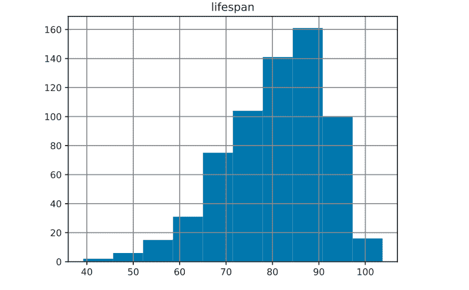

**图 11.27：** 诺贝尔奖得主寿命的直方图。

### 11.5.1 练习

1.  确认弗雷德里克·约里奥-居里（Frédéric Joliot-Curie）出现在 `laureates.csv` 数据集中，他与妻子伊雷娜（Irène）共同获得了 1935 年诺贝尔化学奖。为什么我们在清单 11.15 中搜索居里时错过了他？*提示*：搜索“firstname”等于“Frédéric”的条目（确保包含正确的重音符号）。
2.  验证清单 11.16 之后引用的诺贝尔奖类别是否正确（例如，弗雷德里克·桑格的诺贝尔奖确实是化学奖等）。
3.  在清单 11.17 中，如果你只调用 `nobel.hist()` 而不指定列，会发生什么？

## 11.6 pandas 示例：泰坦尼克号

我们的第二个主要 pandas 示例使用了 1912 年 RMS *泰坦尼克号* 悲剧性沉没的生存数据（图 11.28<sup>28</sup>）。这是 pandas 文档本身使用的标准数据集，<sup>29</sup> 因此已被广泛分析，使得“谷歌搜索”算法异常有效。

像往常一样，我们的第一步是下载数据，我们可以直接从网络下载，如清单 11.18 所示。（我们在第 9.2 节中看到 `request.get()` 会自动跟踪重定向，但据我所知 `read_csv()` 不会。我一直无法弄清楚如何让它这样做（如果可能的话），所以清单 11.18 使用了原始的 Amazon S3 URL。）

让我们看看 `head()`：

```python
>>> titanic.head()
   PassengerId  Survived  Pclass  ...     Fare Cabin  Embarked
0            1         0       3  ...   7.2500   NaN         S
1            2         1       1  ...  71.2833   C85         C
2            3         1       3  ...   7.9250   NaN         S
3            4         1       1  ...  53.1000  C123         S
4            5         0       3  ...   8.0500   NaN         S
```

## 11.6 pandas 示例：泰坦尼克号


**图 11.28：** 命运多舛的皇家邮轮 *泰坦尼克号*。

**代码清单 11.18：** 直接从（原始 S3）URL 读取数据。

```
>>> URL = "https://learnenough.s3.amazonaws.com/titanic.csv"
>>> titanic = pd.read_csv(URL)
```

我们看到数据是以 **PassengerId**（乘客ID）为索引的，但这意义不大。我们可以通过重新读取数据并改用 **Name**（姓名）作为索引来赋予其更个性化的特征。实现方法是指定 **index_col** 参数作为索引列（代码清单 11.19）。

**代码清单 11.19：** 设置自定义索引列。

```
>>> titanic = pd.read_csv(URL, index_col="Name")
>>> titanic.head()

Name
```

```
>>> titanic.info()
<class 'pandas.core.frame.DataFrame'>
Index: 891 entries, Braund, Mr. Owen Harris to Dooley, Mr. Patrick
Data columns (total 11 columns):
 #   Column        Non-Null Count  Dtype  
---  ------        --------------  -----  
 0   PassengerId   891 non-null    int64  
 1   Survived      891 non-null    int64  
 2   Pclass        891 non-null    int64  
 3   Sex           891 non-null    object 
 4   Age           714 non-null    float64
 5   SibSp         891 non-null    int64  
 6   Parch         891 non-null    int64  
 7   Ticket        891 non-null    object 
 8   Fare          891 non-null    float64
 9   Cabin         204 non-null    object 
 10  Embarked      889 non-null    object 
dtypes: float64(2), int64(5), object(4)
```

从生存率的角度来看，最有趣的列可能是乘客等级（"**Pclass**"）、性别（"**Sex**"）和年龄（"**Age**"）。

我们可以使用 pandas 发现乘客等级包含三个类别：

```
>>> titanic["Pclass"].unique()
array([3, 1, 2])
```

它们分别代表一等、二等和三等舱位，对应从最高到最低的住宿质量。

如果我们按等级进行 **groupby()** 分组，就可以看到生存率的变化：

```
>>> titanic.groupby("Pclass")["Survived"].mean()
Pclass
1    0.629630
2    0.472826
3    0.242363
```

因此我们看到生存率因等级而异，一等舱乘客的生存率为 62.9%，而三等舱乘客的生存率仅为 24.2%。

我们可以通过绘制生存率的条形图来可视化这一结果。每个 pandas Series 对象都有一个 **plot** 属性，允许我们调用 **bar()** 来制作条形图，它会自动包含条形标签。高度由每个分类变量的高度给出，在本例中就是我们刚刚计算的生存率：

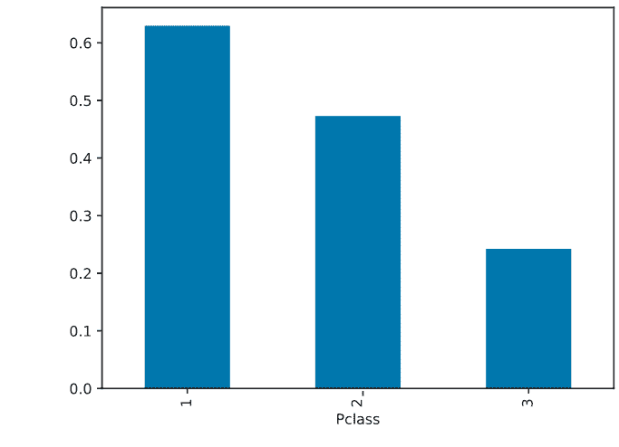

**图 11.29：** 按乘客等级划分的泰坦尼克号生存率。

```
>>> survival_rates = titanic.groupby("Pclass")["Survived"].mean()
>>> survival_rates.plot.bar()
>>> plt.show()
```

结果如图 11.29 所示。

我们可以将类似的技术应用于分类变量 "Sex"（性别）：

```
>>> titanic["Sex"].unique()
array(['male', 'female'], dtype=object)
```

制作条形图的代码基本相同，只是分组依据从 "Pclass" 改为 "Sex"：

```
>>> survival_rates = titanic.groupby("Sex")["Survived"].mean()
>>> survival_rates.plot.bar()
>>> plt.subplots_adjust(bottom=0.20)
>>> plt.show()
```

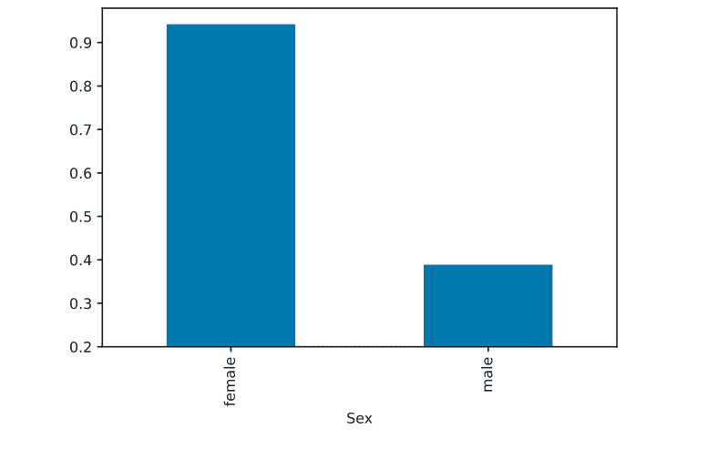

**图 11.30：** 按性别划分的 *泰坦尼克号* 生存率。

这里的 `subplots_adjust()` 行可能是必要的，以便在某些系统上为 x 轴标签的显示留出足够空间（在我的系统上是必要的）。结果应如图 11.30 所示。我们看到女性乘客的生存率明显高于男性乘客。

现在我们来看第三个可能感兴趣的主要变量：年龄。等级和性别变量是分类变量，这使得制作条形图很容易，但 "Age"（年龄）变量是数值型的，因此我们必须对数据进行分箱，类似于制作直方图（第 11.3.3 节）。

*泰坦尼克号* 乘客的年龄范围从婴儿到 80 岁：

```
>>> titanic["Age"].min()
0.42
>>> titanic["Age"].max()
80.0
```

此时，我们必须决定使用多少个分箱。使用 7 个分箱，第一个分箱的顶部年龄大约为 11 岁：

```
>>> (titanic["Age"].max() - titanic["Age"].min())/7
11.368571428571428
```

这是一个合理的 "儿童" 截断点。

下一步是对数据进行分箱，我们可以使用 pandas 的 **cut()** 方法来完成。首先，我们需要只选择年龄有效的乘客，这可以通过 **notna()** 方法来实现，以确保年龄 *不是* 缺失值（代码清单 11.20）。

**代码清单 11.20：** 仅选择 *不是* 缺失值的值。

```
>>> titanic["Age"].notna()
Name
Braund, Mr. Owen Harris                                True
Cumings, Mrs. John Bradley (Florence Briggs Thayer)    True
Heikkinen, Miss. Laina                                 True
Futrelle, Mrs. Jacques Heath (Lily May Peel)           True
Allen, Mr. William Henry                               True
...
Montvila, Rev. Juozas                                  True
Graham, Miss. Margaret Edith                           True
Johnston, Miss. Catherine Helen "Carrie"               False
Behr, Mr. Karl Howell                                  True
Dooley, Mr. Patrick                                    True
Name: Age, Length: 891, dtype: bool
>>> valid_ages = titanic[titanic["Age"].notna()]
```

**titanic["Age"].notna()** 的值包含布尔值，如果年龄有效则为 **True**，然后我们可以将其用作 **titanic** 对象的索引来仅选择年龄有效的乘客（代码清单 11.20 中的最后一行）。

接下来，我们需要按年龄对数据进行分组和排序，以便在分箱之前将年龄相似的行放在一起：

```
>>> sorted_by_age = valid_ages.sort_values(by="Age")
```

这是必要的，因为否则我们将基于乘客姓名对年龄进行分箱，这毫无意义，因为它会将年龄完全不相关的乘客混合在同一个分箱中。

此时，我们准备好使用 **cut()** 将数据放入所需数量的分箱中：

```
>>> sorted_by_age["Age range"] = pd.cut(sorted_by_age["Age"], 7)
```

最后，我们通过按分箱分组并计算 "**Survived**"（是否生还）列的 **mean()**（平均值）来计算每个分箱的生存率（记住，这之所以有效，是因为二元预测变量通常使用 1=生还，0=未生还的编码）：

```
>>> survival_rates = sorted_by_age.groupby("Age range")["Survived"].mean()
```

此时，我们可以使用与 "**Pclass**" 和 "**Sex**" 相同的条形图技术（并进行底部调整以使标签适应）：

```
>>> survival_rates.plot.bar()
>>> plt.subplots_adjust(bottom=0.33)
>>> plt.show()
```

结果如图 11.31 所示。

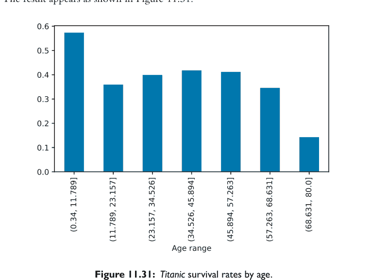

**图 11.31：** 按年龄划分的 *泰坦尼克号* 生存率。

从图 11.31 我们看到，最年轻乘客的生存率最高，大多数成年人的生存率大致恒定，然后在最高年龄段急剧下降。但男性乘客的年龄也更大：

```
>>> titanic[titanic["Sex"] == "male"]["Age"].mean()
30.72664459161148
>>> titanic[titanic["Sex"] == "female"]["Age"].mean()
27.915708812260537
```

从图 11.30 我们知道男性乘客的生存率也较低，因此这可能是年龄差异的部分原因。我们将在第 11.7 节看到一种分别检查每个变量相对贡献的方法。

### 11.6.1 练习

1.  使用代码清单 11.21 中的代码确认，三等舱女性乘客的 *泰坦尼克号* 生存率为 50%。这与一等舱 *男性* 乘客的生存率相比如何？
2.  制作两个版本的图 11.31 所示的按年龄划分的 *泰坦尼克号* 生存率条形图，分别针对男性乘客和女性乘客。*提示：* 如代码清单 11.22 所示定义性别特定的变量，并在代码清单 11.20 之后分别对 `male_` 和 `female_` 变量重新进行分析。
3.  哈佛大学的怀德纳图书馆由埃莉诺·埃尔金斯·怀德纳建造，她在 *泰坦尼克号* 沉没中幸存，以纪念她的儿子哈里（图 11.32<sup>30</sup>），他未能幸存。使用类似于代码清单 11.14 中的子字符串搜索，证明哈里在我们的 *泰坦尼克号* 数据集中，但埃莉诺不在。哈里去世时多大？*提示：* 你可以搜索包含子字符串 "Widener" 的姓名，但由于我们在代码清单 11.19 中将 "Name" 设置为索引列，你应该在搜索中使用 `titanic.index` 而不是 `titanic["Name"]`。

**代码清单 11.21：** 使用多个布尔条件查找生存率。

```
titanic[(titanic["Sex"] == "female") &
        (titanic["Pclass"] == 3)]["Survived"].mean()
```

**清单 11.22：** 准备按性别分别可视化*泰坦尼克号*的年龄生存率。

```python
male_passengers = titanic[titanic["Sex"] == "male"]
female_passengers = titanic[titanic["Sex"] == "female"]
valid_male_ages = male_passengers[titanic["Age"].notna()]
valid_female_ages = female_passengers[titanic["Age"].notna()]
```


**图 11.32：** 哈佛大学怀德纳图书馆内的哈里·埃尔金斯·怀德纳肖像。

## 11.7 使用 scikit-learn 进行机器学习

本节简要介绍*机器学习*，这是计算领域的一个分支，涉及根据数据输入进行“学习”的程序。尽管对于机器学习是否属于“数据科学”本身存在不同看法，但至少它是一个密切相关的领域，因此适合包含在这样的入门介绍中。

机器学习是一个庞大的主题，在本节中我们只能浅尝辄止。与本章其他章节一样，主要价值在于培养对相关 Python 包的基本熟悉度，本例中该包被称为 scikit-learn。

基于第 11.6 节的*泰坦尼克号*分析，我们将首先查看一个*线性回归*（第 11.7.1 节）的例子，然后考虑更复杂的机器学习模型（第 11.7.2 节）。最后，我们将以一个*聚类算法*为例，展示 scikit-learn 擅长的众多其他主题之一。

### 11.7.1 线性回归

在本节中，我们将使用 scikit-learn 执行*线性回归*，该算法为一组数据找到最佳拟合（基于“最佳”的合适定义）。<sup>31</sup> 将线性回归称为“机器学习”有时被认为是一种内部笑话，因为该技术相对简单且已使用多年。尽管如此，它仍是一个很好的起点。

与第 11.6 节一样，我们将使用*泰坦尼克号*的生存数据。我们将首先导入必要的库并创建一个 **titanic** DataFrame：

```python
>>> import numpy as np
>>> import pandas as pd
>>> import matplotlib.pyplot as plt
>>> URL = "https://learnenough.s3.amazonaws.com/titanic.csv"
>>> titanic = pd.read_csv(URL)
```

我们的目标是考虑年龄对生存率的影响。我们将首先绘制生存率与年龄的散点图（第 11.3.2 节），然后使用 scikit-learn 找到数据的最佳线性拟合。

我们将首先只选择 **"Age"** 和 **"Survived"** 列，因为这些是我们感兴趣的列。然后，作为基本的数据清理步骤，我们将只考虑年龄已知的乘客，因此我们将使用 **dropna()**（第 11.4.1 节）来删除 NaN 值：

```python
>>> passenger_age = titanic[["Age", "Survived"]].dropna()
>>> passenger_age.head()
   Age  Survived
0  22.0         0
1  38.0         1
2  26.0         1
3  35.0         1
4  35.0         0
```

对于绘图的 *x* 轴，我们将使用幸存者的年龄，这可以通过计算 `passenger_age["Age"]` 的唯一值然后对其进行排序以按升序排列来获得：

```python
>>> passenger_ages = passenger_age["Age"].unique()
>>> passenger_ages.sort()
>>> passenger_ages
array([ 0.42,  0.67,  0.75,  0.83,  0.92,  1.  ,  2.  ,  3.  ,  4.  ,
        5.  ,  6.  ,  7.  ,  8.  ,  9.  , 10.  , 11.  , 12.  , 13.  ,
       14.  , 14.5 , 15.  , 16.  , 17.  , 18.  , 19.  , 20.  , 20.5 ,
       21.  , 22.  , 23.  , 23.5 , 24.  , 24.5 , 25.  , 26.  , 27.  ,
       28.  , 28.5 , 29.  , 30.  , 30.5 , 31.  , 32.  , 32.5 , 33.  ,
       34.  , 34.5 , 35.  , 36.  , 36.5 , 37.  , 38.  , 39.  , 40.  ,
       40.5 , 41.  , 42.  , 43.  , 44.  , 45.  , 45.5 , 46.  , 47.  ,
       48.  , 49.  , 50.  , 51.  , 52.  , 53.  , 54.  , 55.  , 55.5 ,
       56.  , 57.  , 58.  , 59.  , 60.  , 61.  , 62.  , 63.  , 64.  ,
       65.  , 66.  , 70.  , 70.5 , 71.  , 74.  , 80.  ])
```

此时，我们已准备好计算每个年龄的生存率：

```python
>>> survival_rate = passenger_age.groupby("Age")["Survived"].mean()
```

让我们查看中间部分的一个切片作为现实检验：

```python
>>> survival_rate.loc[30:40]
Age
30.0    0.400000
30.5    0.000000
31.0    0.470588
32.0    0.500000
32.5    0.500000
33.0    0.400000
34.0    0.400000
34.5    0.000000
35.0    0.611111
36.0    0.500000
36.5    0.000000
37.0    0.166667
38.0    0.454545
39.0    0.357143
40.0    0.461538
Name: Survived, dtype: float64
```

所以看起来，例如，37 岁的人的生存率是 1/6 ≈ 16.7%。
如第 11.3.2 节所述，散点图是获得数据概览的好方法：

```python
>>> fig, ax = plt.subplots()
>>> ax.scatter(passenger_ages, survival_rate)
>>> plt.show()
```

结果如图 11.33 所示。

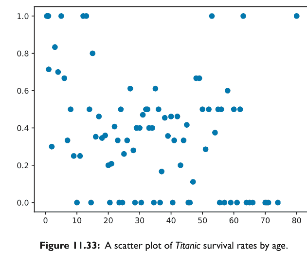

**图 11.33：** *泰坦尼克号*按年龄划分的生存率散点图。

从图 11.33 可以看出，存在一个普遍的下降趋势，这与图 11.31 中的条形图一致。我们可以使用 scikit-learn 的 **LinearRegression** 模型（清单 11.23）来量化这一趋势。<sup>32</sup>

**清单 11.23：** 导入线性回归模型。

```python
>>> from sklearn.linear_model import LinearRegression
```

现在，我们将基于年龄和生存率定义变量 **X** 和 **Y**，作为 scikit-learn 回归模型的输入。<sup>33</sup> scikit-learn 模型期望的输入格式是 **X** 为一维数组的数组，**Y** 为常规的 NumPy ndarray。前者正是第 11.2.2 节（清单 11.4）中使用 **reshape((-1, 1))** 方法创建的格式：

```python
>>> X = np.array(passenger_ages).reshape((-1, 1))
>>> X[:10]    # 查看前 10 个年龄作为现实检验。
array([[0.42],
       [0.67],
       [0.75],
       [0.83],
       [0.92],
       [1.  ],
       [2.  ],
       [3.  ],
       [4.  ],
       [5.  ]])
```

与此同时，定义 **Y** 则简单得多：

```python
>>> Y = np.array(survival_rate)
```

此时，我们已准备好使用线性回归来找到模型对数据的最佳拟合：

```python
>>> model = LinearRegression()
>>> model.fit(X, Y)
LinearRegression()
```

此计算的结果包括决定系数，也称为 $R^2$（出于技术原因），它是皮尔逊相关系数的平方，可以取 $-1$ 到 $1$ 之间的任何值，其中 $1$ 表示完全正相关，$-1$ 表示完全负相关。$R^2$ 可通过模型的 **score()** 方法获得：

```python
>>> model.score(X, Y)    # 决定系数 R^2
0.13539675574075116
```

$R^2$ 值为 0.135，虽然较小但并非可以忽略不计，不过重要的是要记住解释 $R^2$ 的难度。

我们可以通过绘制回归线本身来直观地显示拟合效果。该直线的斜率和 y 轴截距可通过模型的 **coef_** 和 **intercept_** 属性获得：

```python
>>> m = model.coef_
>>> b = model.intercept_
```

这里名称末尾的下划线是 scikit-learn 的一种约定，表示这些属性仅在模型通过 **model.score()** 应用后才可用。

我们使用标准名称 **m** 和 **b** 来命名斜率和截距，用于描述 $xy$ 平面中的直线：

$y = mx + b$ 直线方程。

我们可以将这条直线的绘图与图 11.33 中的散点图结合起来，以可视化拟合效果（为便于复制，此处省略 REPL 提示符）：

```python
fig, ax = plt.subplots()
ax.scatter(passenger_ages, survival_rate)
ax.plot(passenger_ages, m * passenger_ages + b, color="orange")
ax.set_xlabel("Age")
ax.set_ylabel("Survival Rate")
ax.set_title("Titanic survival rates by age")
plt.show()
```

---
**脚注：**
31. 本节部分灵感来源于 Mirko Stojiljković 的文章《Python 中的线性回归》。
32. SciPy 也有一个线性回归函数（**scipy.stats.linregress**），但本节我们使用 scikit-learn 中的函数，以便与第 11.7.2 节中更高级的模型统一处理。
33. 回归变量的大小写约定相当复杂；更多信息请参见此处 (https://stats.stackexchange.com/questions/389395/why-uppercase-for-x-and-lowercase-for-y)。

### 11.7.2 机器学习模型

在第11.6节中，我们使用pandas发现了*泰坦尼克号*生存率与乘客等级（"Pclass"）、性别（"Sex"）和年龄（"Age"）等关键变量之间的关联。在第11.7.1节中，我们计算了生存率作为年龄函数的线性回归，但线性回归模型的预测能力相当有限。在本节中，我们将探讨显著更复杂的学习模型，这些模型能产生相应更好的预测结果。³⁴

与前面章节一样，我们将导入必要的包并创建必要的DataFrame（为便于复制，未显示REPL提示符）：

```python
import numpy as np
import pandas as pd
import matplotlib.pyplot as plt

URL = "https://learnenough.s3.amazonaws.com/titanic.csv"
titanic = pd.read_csv(URL)
```

scikit-learn支持多种不同的模型，我们都可以尝试。对这些模型的详细讨论超出了本教程的范围，但以下是我们将在本节考虑的部分模型选择，并附有更多信息的链接：

- 逻辑回归 (https://stats.stackexchange.com/questions/389395/why-uppercase-for-x-and-lowercase-for-y)
- 朴素贝叶斯 (https://en.wikipedia.org/wiki/Naive_Bayes_classifier)
- 感知机 (https://en.wikipedia.org/wiki/Perceptron)
- 决策树 (https://en.wikipedia.org/wiki/Decision_tree)
- 随机森林 (https://en.wikipedia.org/wiki/Random_forest)

选择这些模型是作为不同类型候选算法的代表性样本。唯一的例外是随机森林，在我们的数据集中，它最终将等同于决策树，但之所以保留是因为“随机森林”听起来真的很酷。（严肃地说，随机森林与决策树在何时以及多大程度上存在差异，将在练习（第11.7.4节）中讨论。）

³⁴ 此处的分析部分基于文章“预测泰坦尼克号乘客的生存”，该文章使用了机器学习网站Kaggle（Google的子公司）举办的热门“机器学习灾难”竞赛的数据。Kaggle数据集包含训练数据和测试数据；竞赛的目的是使用训练数据训练模型，然后基于测试数据提交预测。不幸的是，这一步在“预测泰坦尼克号乘客的生存”中并不明确，该文章使用scikit-learn的predict()方法计算预测，但随后没有对这些预测做任何处理。对于竞赛参与者，这些预测将用于创建Kaggle要求的提交内容。

要在我们的训练DataFrame上使用各种模型，我们首先需要从scikit-learn导入它们，scikit-learn可通过**sklearn**包获得（清单11.24）。

### **清单11.24：** 导入学习模型。

```python
from sklearn.linear_model import LogisticRegression
from sklearn.naive_bayes import GaussianNB
from sklearn.linear_model import Perceptron
from sklearn.tree import DecisionTreeClassifier
from sklearn.ensemble import RandomForestClassifier
```

注意这些导入语句与第11.7.1节（清单11.23）中用于线性回归的导入语句之间的相似性。

此时，我们需要将数据转换为scikit-learn学习模型所需的输入格式。由于我们决定专注于等级、性别和年龄对生存率的影响，我们的第一步是删除我们不会考虑的列。为方便起见，我们将在一个列表中列出相应的列名，然后遍历该列表，使用pandas的**drop()**方法删除相应的列（按照惯例，使用**axis=1**；默认值**axis=0**会尝试删除一行）：

```python
dropped_columns = ["PassengerId", "Name", "Cabin", "Embarked",
                   "SibSp", "Parch", "Ticket", "Fare"]

for column in dropped_columns:
    titanic = titanic.drop(column, axis=1)
```

与通常忽略NaN和NaT等不可用值的直方图绘制不同，学习模型如果接收到无效值会出错。为避免这种不幸情况，我们将使用清单11.20中看到的相同技巧，并使用**notna()**方法（在清单11.20中见过）重新定义我们的DataFrame，仅包含*非*不可用的值：

```python
for column in ["Age", "Sex", "Pclass"]:
    titanic = titanic[titanic[column].notna()]
```

模型错误的另一个原因是原始分类值，如**"male"**和**"female"**，模型不知道如何处理。为了解决这个问题，我们将使用在清单11.12中看到的pandas **map()**方法，将每个类别关联到一个数字：

```python
sexes = {"male": 0, "female": 1}
titanic["Sex"] = titanic["Sex"].map(sexes)
```

如果**"Pclass"**使用像**"first"**、**"second"**和**"third"**这样的字符串表示，我们将不得不对该变量做类似处理，但幸运的是它已经使用整数**1**、**2**和**3**表示。这意味着我们已准备好进入下一步，即准备我们的数据。自变量是等级、性别和年龄，而因变量是生存率。按照惯例，我们将分别称它们为**X**和**Y**：

```python
X = titanic.drop("Survived", axis=1)
Y = titanic["Survived"]
```

注意，我们已从**X**训练变量中删除了因变量**"Survived"**列，因为这正是我们试图预测的内容。

在应用学习模型算法之前，让我们查看所有内容以确保数据看起来合理：

```python
print(X.head(), "\n----\n")
print(Y.head(), "\n----\n")
```

```
   Pclass  Sex   Age
0       3    0  22.0
1       1    1  38.0
2       3    1  26.0
3       1    1  35.0
4       3    0  35.0
----

0    0
1    1
2    1
3    1
4    0
Name: Survived, dtype: int64
----
```

看起来不错。

启发此示例的原始竞赛涉及提供训练数据以创建模型，然后将其应用于竞赛参与者无法获得的测试数据。由于本节不是该竞赛的一部分，我们将自己将给定数据拆分为单独的训练和测试数据集。使用这样的单独数据集有助于防止过拟合，过拟合涉及使用过多的自由参数，导致模型在原始数据集之外没有预测价值——正如伟大的约翰·冯·诺依曼曾打趣道：“用四个参数我可以拟合一头大象，用五个参数我可以让它摇动鼻子。”（我们还将介绍另一种防止过拟合的方法，称为交叉验证。）

scikit-learn进行训练/测试拆分的主要方法恰如其分地称为`train_test_split()`，它返回四个值，包括X和Y各自的训练和测试变量：

```python
from sklearn.model_selection import train_test_split
(X_train, X_test, Y_train, Y_test) = train_test_split(X, Y, random_state=1)
```

由于`train_test_split()`在拆分前会打乱数据，我们设置了`random_state`选项，以便您的结果与文本中显示的结果保持一致。

此时，我们已准备好在训练数据上尝试各种模型，并查看它们应用于测试数据时的拟合准确度。我们的策略是定义清单11.24中导入的每个模型的实例，在训练数据上计算`fit()`，然后查看模型在测试数据上的`score()`。然后我们将比较分数以比较模型的准确度。

首先是逻辑回归：

```python
logreg = LogisticRegression()
logreg.fit(X_train, Y_train)
accuracy_logreg = logreg.score(X_test, Y_test)
```

接下来是（高斯）朴素贝叶斯：

```python
naive_bayes = GaussianNB()
naive_bayes.fit(X_train, Y_train)
accuracy_naive_bayes = naive_bayes.score(X_test, Y_test)
```

## 11.7.2 模型比较

首先是感知机：

```python
perceptron = Perceptron()
perceptron.fit(X_train, Y_train)
accuracy_perceptron = perceptron.score(X_test, Y_test)
```

然后是决策树：

```python
decision_tree = DecisionTreeClassifier()
decision_tree.fit(X_train, Y_train)
accuracy_decision_tree = decision_tree.score(X_test, Y_test)
```

最后是随机森林（使用与**train_test_split()**相同的**random_state**选项以获得一致的结果）：

```python
random_forest = RandomForestClassifier(random_state=1)
random_forest.fit(X_train, Y_train)
accuracy_random_forest = random_forest.score(X_test, Y_test)
```

让我们创建一个DataFrame来保存和显示结果（同样省略了提示符以便于复制）：

```python
results = pd.DataFrame({
    "Model": ["Logistic Regression", "Naive Bayes", "Perceptron",
              "Decision Tree", "Random Forest"],
    "Score": [accuracy_logreg, accuracy_naive_bayes, accuracy_perceptron,
              accuracy_decision_tree, accuracy_random_forest]})
result_df = results.sort_values(by="Score", ascending=False)
result_df = result_df.set_index("Score")
result_df
```

结果出现在清单11.25中。

**清单11.25：** 模型准确率结果。

| 模型 | 得分 |
| :--- | :--- |
| 决策树 | 0.854749 |
| 随机森林 | 0.854749 |
| 逻辑回归 | 0.787709 |
| 朴素贝叶斯 | 0.770950 |
| 感知机 | 0.743017 |

我们看到决策树和随机森林并列获得最准确的分数，其次是逻辑回归和朴素贝叶斯不相上下，感知机垫底。不过，这些模型的分数非常接近，不同的**random_state**值很容易影响它们的排名（第11.7.4节）。

一旦我们执行了**fit()**，就可以查看每个因素在决定模型结果时的重要性。例如，对于随机森林模型，重要性如下：

```python
>>> random_forest.feature_importances_
array([0.16946036, 0.35821155, 0.47232809])
>>> X_train.columns
Index(['Pclass', 'Sex', 'Age'], dtype='object')
```

将列与重要性进行比较，我们看到“**年龄**”是最大的因素，其次是“**性别**”，而“**客舱等级**”则远远落后（重要性只有第二高因素的一半）。我们也可以将结果可视化为条形图：

```python
>>> fig, ax = plt.subplots()
>>> ax.bar(X_train.columns, random_forest.feature_importances_)
<BarContainer object of 3 artists>
>>> plt.show()
```

之前的**bar()**示例都通过pandas接口，但这里我们看到Matplotlib也直接支持条形图。（这并不奇怪，因为如第11.4节所述，pandas在底层使用Matplotlib。）结果出现在图11.35中。

## 交叉验证

如前所述，我们将数据分为训练集和测试集，以防止过拟合。另一种避免“拟合大象”（借用冯·诺依曼的俏皮话）的常用技术是*交叉验证*。其基本思想是人为地将原始训练数据拆分为新的训练集和测试集，在训练数据上训练模型，然后使用模型预测测试数据。如果在几个不同的随机选择的训练和测试子集上进行此操作能得到相当一致的结果，我们就可以更有信心地认为模型确实有效。

由于这是一种非常常见的技术，scikit-learn内置了一个名为**cross_val_score**的预定义例程来执行交叉验证：

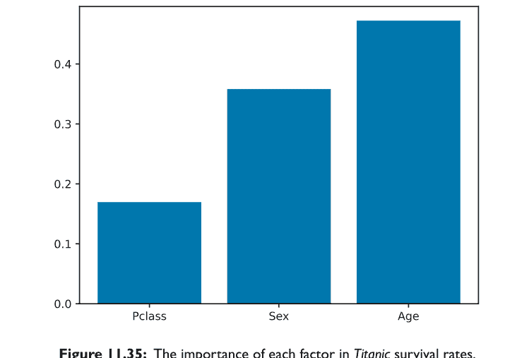

**图11.35：** *泰坦尼克号*生存率中每个因素的重要性。

```python
>>> from sklearn.model_selection import cross_val_score
```

此方法实现了所谓的*K*折交叉验证，涉及将数据分成*K*块或“折”，使用*K*−1折来训练模型，然后预测最后一折的值以评估准确率。默认值是**5**，这对我们来说已经足够，因此我们只需要将分类器实例和训练数据传递给该函数。我们将使用随机森林，因为它并列第一（而且，如前所述，有一个特别酷的名字）：

```python
>>> random_forest = RandomForestClassifier(random_state=1)
>>> scores = cross_val_score(random_forest, X, Y)
>>> scores
array([0.75524476, 0.8041958, 0.82517483, 0.83216783, 0.83098592])
>>> scores.mean()
0.8095538264552349
>>> scores.std()
0.028958338744358988
```

平均得分接近81%，标准差略低于3%，我们可以合理地得出结论：随机森林模型是*泰坦尼克号*生存数据的准确预测器。

### 11.7.3 *k*-均值聚类

作为最后一个例子，我们将看看一种*聚类算法*，这只是scikit-learn众多惊人功能中的一种。³⁵ 我们将从导入一个在演示聚类算法时常用的实用方法`make_blobs()`开始，在本例中，它包含300个点，分为4个簇：

```python
>>> from sklearn.datasets import make_blobs
>>> X, _ = make_blobs(n_samples=300, centers=4, random_state=42)
```

注意，我们还传递了一个`random_state`参数，它作为簇的种子，确保结果一致（否则结果可能变化很大）。
我们可以通过绘制第二列与第一列的关系图来查看`make_blobs()`创建的数据的“团状”特征：

```python
>>> fig, ax = plt.subplots()
>>> ax.scatter(X[:, 0], X[:, 1])
>>> plt.show()
```

结果出现在图11.36中。
我们可以使用一种称为*k*-均值聚类的算法来找到4个簇的良好拟合：

```python
>>> from sklearn.cluster import KMeans
>>> kmeans = KMeans(n_clusters=4)
>>> kmeans.fit(X)
```

注意这些步骤与第11.7.2节中的模型拟合多么相似。我们可以使用`cluster_centers_`属性找到模型对每个簇中心的估计：

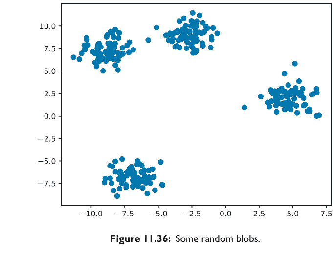

**图11.36：** 一些随机的团状数据。

```python
>>> centers = kmeans.cluster_centers_
>>> centers
array([[ 4.7182049,  2.04179676],
       [-8.87357218,  7.17458342],
       [-6.83235205, -6.83045748],
       [-2.70981136,  8.97143336]])
```

（注意第11.7.1节中提到的尾随下划线约定，表示仅在调用`fit()`后才定义的属性。）结果是一个点数组，我们可以通过像绘制原始团状数据那样绘制第二列与第一列的关系图来解释其含义：

```python
fig, ax = plt.subplots()
ax.scatter(X[:, 0], X[:, 1])
centers = kmeans.cluster_centers_
ax.scatter(centers[:, 0], centers[:, 1], s=200, alpha=0.9, color="orange")
plt.show()
```

通过更大的尺寸、alpha透明度和橙色，很容易在散点图上看到各个簇的估计中心（图11.37）。

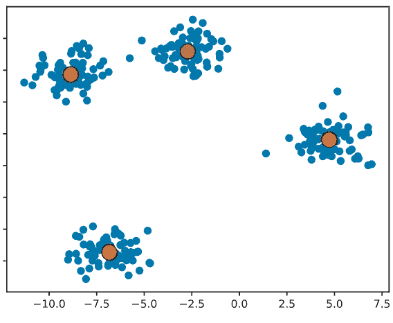

结果表明，聚类算法的输出与我们基于“簇”的直观概念所期望的结果高度吻合。

### 11.7.4 练习

1.  `RandomForestClassifier()`函数接受一个名为`n_estimators`的关键字参数，它代表“森林中树的数量”。根据文档，`n_estimators`的默认值是多少？使用`random_state=1`。
2.  通过改变`RandomForestClassifier()`调用中的`n_estimators`，确定随机森林分类器比决策树不准确的大致值。使用`random_state=1`。
3.  使用几个不同的`random_state`值重新运行第11.7.2节中的步骤，验证排序并不总是与清单11.25中所示的相同。*提示：* 尝试`0`、`2`、`3`和`4`等值。
4.  使用两个簇和八个簇重复第11.7.3节中的聚类步骤。算法在这两种情况下是否仍然有效？

## 11.8 进一步资源与结论

恭喜——现在你*真的*掌握了足够多的Python知识，可以大展身手了！除了核心内容，你现在还对Python数据科学的一些最重要工具有了良好的基础。

从这里开始，有无数种可能性；以下是一些选择：

-   官方pandas文档包括“10分钟入门pandas”，随后是大量额外的教程材料。NumPy、Matplotlib和scikit-learn的官方文档也是极好的资源。最后，SciPy和SageMath项目也值得了解；特别是Sage，它包含了进行符号计算和数值计算的能力（非常像*Mathematica*或Maple）。
-   “Python for Scientific Computing”：虽然不是专门针对数据科学，但这个资源涵盖了该主题所需的许多相同材料。其中，“Python for Scientific Computing”是使用诺贝尔奖数据部分（第11.5节）的灵感来源。
-   Jake VanderPlas的*Python Data Science Handbook*：这本书采用了与本章类似的方法，并且可以在线免费获取。
-   Joel Grus的*Data Science from Scratch*：这本书基本上与本章截然相反，采用第一性原理的方法来研究数据科学，专注于该学科的基础思想。这种方法在我们这样简短的篇幅内是不可能实现的，但如果你有兴趣成为一名专业的数据科学家，这是一个极好的途径。
-   Bloom Institute of Technology的数据科学课程：这门在线课程面向对数据科学职业感兴趣的学生。
-   Aurélien Géron的*Hands-On Machine Learning with Scikit-Learn, Keras, and TensorFlow*：这是一本比第11.7节更高级的机器学习入门书，包括Keras，一个用于Google TensorFlow库的Python接口。

为完整起见，以下是第10.6节中推荐的通用Python资源：

-   Replit的100天代码：这是一个使用Replit出色的基于浏览器的协作IDE进行Python编程的指导性入门。

- Dave Beazley 的《实用 Python 编程》：我一直是 Beazley 的 *Python 精要参考* 的忠实粉丝，并强烈推荐他的（免费）在线课程。
- Zed Shaw 的《笨办法学 Python》：这种以练习和语法为主的方法，是本教程所采用的广度优先、叙事性方法的绝佳补充。*有趣的事实*：Zed Shaw 的 "Learn Code the Hard Way" 品牌直接启发了 "Learn Enough to Be Dangerous" (https://www.learnenough.com/)。
- No Starch Press 出版的《Python 编程从入门到实践》和《Python 编程快速上手——让繁琐工作自动化》：这两本书都是《危险地学够 Python》的优秀后续读物；前者（Eric Matthes 著）对 Python 语法的覆盖更为详细，而后者（Al Sweigart 著）则包含了大量将 Python 编程应用于日常计算机任务的实例。
- Ben Forta 和 Shmuel Forta 的《代码船长》：尽管这本书主要面向儿童，但许多成年读者也表示很喜欢它。
- 最后，对于那些希望在技术精通方面打下最坚实基础的人，Learn Enough All Access (https://www.learnenough.com/all-access) 是一项订阅服务，它提供所有 Learn Enough 书籍的特别在线版本以及超过 40 小时的流媒体视频教程，包括 *危险地学够 Python*、*危险地学够 Ruby* (https://www.learnenough.com/ruby) 以及完整的 *Ruby on Rails 教程* (https://www.railstutorial.org/)。我们希望您能去看看！

这些只是您在掌握了 Python 基础并提升了技术精通度之后，现在可用的众多令人难以置信的选择中的一部分。祝您好运！

## 索引

### 符号
- _（下划线），分隔单词，170
- !=（不等于/叹号等于运算符），54
- '（单引号），36，37
- "（双引号），36，37
- \（反斜杠字符），43
- #（井号），39
- %（取模运算符），157，158
- + 运算符，39
- =（等号），40
- ==（比较运算符），47

### A
- 关于页面，269，270
- 基础标题，281
- 导航菜单，292
- 关于模板，265
- 关于视图，278
- 访问
- 组合列表访问，83
- 元素，124
- 列表，71–74
- 准确性，机器学习，397，399
- 添加
- 注释，345，346
- 断言，275，282，283
- 属性，171，172
- 行为，49
- 注释，118
- 检测整数回文，228
- 表单，296，297，308
- 函数式技术，153
- 函数，131
- 迭代器，178
- 标签，344
- 层，240
- 导航模板，290
- 换行符，49
- 对象，117
- 回文包，283
- 待处理测试，206–209
- 回归线，392
- 请求，294
- 正弦，345
- 站点导航，287–292
- tau，93
- 测试 Python 包索引，294
- 测试，210，212
- 测试，306，307
- 文本，116
- 刻度线到网格，343
- 标题变量，284
- 可变组件到标题，285
- 算法
- 聚类，387
- k-means 聚类，400–402
- 预测中心，402
- alpha 透明度，401
- 分析
- 数据分析，353–361
- pandas，338
- and 运算符，51
- 角度，335
- annotate() 方法，345
- 注释，添加，345，346
- append() 函数，80–81，151
- 追加列表，80–81
- 应用程序（应用），1
- 删除，261
- 部署，22–33
- 检测回文，293–316
- 安装，273
- 布局，255，271–280
- 预览，21
- 生产环境，262
- 要求，28，260
- 设置，256–262
- 站点导航，287–292
- 站点页面，263–271
- 启动，30，260
- 模板引擎，280–293
- 可变标题，281–286
- 查看状态，31
- 应用
- 驼峰命名法，170，171
- 多个参数，15
- 任意字符串，分割，70
- 归档，磁带，268
- 参数
- 应用多个，15
- 命令行，250
- 函数调用，121（另见函数）
- 关键字，13，45，99，127–129
- 无参数分割，71
- 字符串作为，44
- 变量，127–129
- arange() 函数，328
- 数组，69
- 角度，335
- 关联，109，110
- 构建，216
- 格式化，333
- 多维，330–333
- 数值计算，327–329
- 断言，198，200，275，282，283
- 赋值
- 属性，172
- 列表，78
- 值，110
- 变量，40
- 关联数组，109，110
- 属性
- 添加，171，172
- 赋值，172
- 数据，171，172
- 自动化，测试，167，209，255，272
- 辅助函数，154，155
- 平均值，348
- 轴标签，357

### B
- 反斜杠字符 (\)，43
- 叹号等于运算符 (!=)，54
- 巴丁，约翰，370
- 基础标题，281
- 十进制对数，93
- Bash shell 程序，9，11
- Beautiful Soup 包，248
- Beazley，大卫，11
- 行为
- 添加，49
- 字符串，63
- 钟形曲线，348
- 贝特，汉斯，372
- 斑点，随机，400，401
- bool() 函数，54，55
- 布尔，乔治，47
- 布尔值。另见搜索
- 组合/反转，51–54
- 上下文，54–56
- 方法，56，57
- 字符串，48
- 元组，89
- 值，47
- 变量，311
- 括号表示法，列表访问，71
- 浏览器，Python 在，18–34

### C
- C 代码，327，329
- 驼峰命名法，170，171
- 大写，分隔单词，170
- capitalize() 方法，56，57
- 层叠样式表。*参见* CSS（层叠样式表）
- 分类变量，359
- 单元格，322，324
- 中心，预测，402
- 方法链，152
- 更改模式。*参见* chmod 命令
- 字符
- 构建数组，216
- 列，49
- 续行符，268
- 字符序列，35（*另见* 字符串）
- 生成，143
- 检查版本，9，10
- chmod 命令，17
- 类
- 定义，169–176，202
- 派生类，183–190
- 等价性，158
- 层次结构，179，180
- 继承，179–183
- Phrase，169–170，171，173，202
- 超类，180
- TranslatedPhrase，184，185
- 经典接口，324。*另见* 接口
- 客户端对象，创建，274
- 云 IDE，21，28，325
- hello, world!，24
- 本地服务器，22
- Matplotlib，339
- 运行 Jupyter，325
- 查看笔记本，326
- 聚类算法，387
- k-means 聚类，400–402
- 预测中心，402
- 代码，2。*另见* 编程
- C，327，329
- 格式化，48–49
- hello, world!，1–6，19（*另见* hello, world!）
- 直方图，376
- 限制，49
- 回文，191，300（*另见* 回文）
- Pythonic 编程，2
- 重构，192，220–229，279
- 正弦曲线图，347
- 测试套件，192
- 测试，287
- 列，49，378，379
- 组合布尔值，51–54
- 命令行
- DOM 操作，245–254
- 程序，1，11
- 终端，8
- 命令。*另见* 函数；方法
- chmod，17
- flask，20
- flyctl，29
- flyctl open，31
- 命令式编程，150
- pip，18
- python，11，17
- python3，19，115
- repr，45
- touch，15
- 注释，39，118。*另见* 单词
- 比较运算符 (==)，47
- 比较，相等/不等，79
- 组合，181，182
- 推导式，149
- 条件（带条件的列表），156–159
- 字典，149，159–163
- 生成器，149，163–164
- 列表，149，150–156
- 集合，149，164
- 连接字符串，38–44
- Conda，13，14，321
- 条件字符串，51
- 条件，带条件的列表推导式，156–159
- 配置。*另见* 格式化
- 自定义索引列，379
- 环境，195，196
- Flask，256
- 项目，194（*另见* 包）
- 系统设置，9–11
- 常量（NumPy），333–337
- 内容
- 解码，243
- 打印，250，253
- 上下文（布尔值），54–56
- 续行符，268
- 控制流，字符串，48–51
- 控制器，264
- 转换
- 字符串，144
- 时间，97
- 协调世界时 (UTC)，98
- 对应关系，状态-长度，161，162
- cos() 函数，335
- 余弦函数，342，344
- Counter() 函数，118，119
- 计数单词，118，119
- 覆盖率，初始测试，197–209
- 崩溃，调试，134
- 创建。参见配置；格式化；编程
- 交叉验证，396，398–400
- CSS（层叠样式表），271
- ctime() 方法，97
- 居里，玛丽，368，369，370
- 居里，皮埃尔，369
- 当前目录（点 = .），17
- 自定义
- 索引列，379
- 迭代器，176–179
- 时间，101
- 切割函数，132，133

### D
- 数据分析
- 诺贝尔奖得主示例，361–377
- 使用 pandas，353–361（另见 pandas）
- 选择日期，371–377
- 泰坦尼克号示例（pandas），377–386
- 数据属性，171，172
- 数据科学，319，320
- 使用 pandas 进行数据分析，353–361（另见 pandas）
- 数据可视化（Matplotlib），338–353（另见数据可视化 [Matplotlib]）
- 安装包，321
- 数值计算（NumPy），327–337（另见数值计算 [NumPy]）
- scikit-learn，386–402（另见机器学习）
- 设置，320–326
- 数据类型
- 数组，69
- 列表，69
- ndarray，69，327，328
- 数据可视化（Matplotlib），338–353
- 直方图，350–352
- 绘图，339–347
- 散点图，347–350
- 查看图表，339
- DataFrame 对象，358–361
- 日期，选择，371–377
- datetime 对象，374
- dayname() 函数，124
- 调试，134
- 崩溃，134
- Python，135，136
- 决策树，393，397，398
- decode() 方法，242，243
- decompose() 方法，249
- def 关键字，122，125
- 定义
- 辅助函数，155
- 轴标签，357
- 类，169–176，202
- 函数，121–130
- 密码，56
- Phrase 类，169–170，171，173
- 原始字符串，44
- 字符串，37，106
- TranslatedPhrase 类，184，185
- 元组，87
- 变量，39，390
- 删除
- 应用程序，261
- 换行符，236
- 部署应用程序，22–33
- 派生类，183–190
- describe() 函数，360
- 设计，组合，181，182。另见格式化

## 索引

检测回文，140, 142, 228, 233, 255, 293–316。*另见* 回文

字典，89, 109–115
- 推导式，149, 159–163
- 格式化，299
- 迭代，112–113
- 合并，113–114

目录。*另见* 文件
- 当前目录（点 = .），17
- 格式化，13, 256
- 忽略，25, 196, 259
- python_tutorial()，231
- 结构，192, 193

分布
- 生成值，358
- 随机值，351

除法
- 浮点数，91
- 整数，91

Django，255

文档字符串，37, 125

文档
- Flask，265
- Matplotlib，340, 351
- Python 包索引 (PyPI)，224, 227

DOM（文档对象模型）
- 在命令行操作，245–254
- 移除元素，250

点 = .（当前目录），17

点表示法，172

双引号 (")，36, 37

DRY（不要重复自己）原则，308–309

dunder（双下划线）方法，171

消除重复，142

### E

编辑
- 安装包，203
- 包，273

爱因斯坦，阿尔伯特，371

元素
- 访问，124
- 创建列表，72
- 包含，77
- 打印，85
- 移除 DOM，250

消除重复，142

嵌入式 Python，5

空字符串，35, 36

引擎
- Jinja 模板，272, 277
- 模板，280–293

输入长字符串，314, 315

enumerate() 函数，84

环境
- 配置，195, 196
- 数据科学（*见* 数据科学）

周期，97

等号 (=)，40

相等比较，79

等价类，158

错误，23
- 更改元组，86
- NoMethodError 类型，134
- 舍入误差，96
- 搜索，135

评估布局，290

示例
- 诺贝尔奖得主 (pandas)，361–377
- pandas，355–356
- 泰坦尼克号 (pandas)，377–386

异常，134

执行 Flask 微环境，20

表达式，42, 71, 103–109。*另见* 正则表达式

外部文件，137。*另见* 文件

### F

f-字符串（格式化字符串），41–42。*另见* 字符串

测试失败，199

获取 tarball，267

费曼，理查德，363

文件
- 格式化，115
- 文件中的函数，130–138
- .gitignore，320, 321
- 忽略，25, 196, 259
- 清单，257
- 打开，232
- 处理，234
- 文件中的 Python，13–15
- 从文件读取 shell 脚本，231–240
- README，195, 197
- 设置，257
- 结构，192, 193
- 解压缩，268, 270
- 压缩，268

部分，309
提交，255, 298, 299, 301
测试，302–313
框架，1, 255。*另见* Flask
函数式编程，5, 149。*另见* 推导式
函数式技术，165–166
- 列表推导式，150–156
- TDD（测试驱动开发），166–167
函数，5, 37。*另见* 命令
- 过滤
  - 故障排除，157
  - 值，367
- 添加，131
- append()，80–81, 151
- arange()，328
- 辅助，154, 155
- bool()，54, 55
- cos()，335
- 余弦，342, 344
- Counter()，118, 119
- 剪切/粘贴，132, 133
- dayname()，124
- 定义，121–130
- describe()，360
- enumerate()，84
- 文件中的函数，130–138
- 一等函数，126–127
- float()，95
- help()，126
- imperative_singles()，220
- isclose()，335, 336
- islower()，122
- ispalindrome()，174
- iter()，177
- join()，81
- len()，46, 56, 73
- linspace()，336
- list()，70
- lower()，153
- map()，150, 360
- 数值计算 (NumPy)，333–337
- open()，232
- palindrome()，167
- pop()，80–81
- print()，44, 45, 56
- processed_content()，183
- range()，145, 328
- read()，232
- reduce()，160
- render_template()，263
- reshape()，332
- reverse()，78
- reversed()，79, 139
- set()，144
- skip()，206
- slice()，74, 75
- sort()，77
- sorted()，79
- split()，81, 122
- square()，122, 126
- str()，93, 94
- subplots()，340
- sum()，165
- 三角函数，92, 334
- type()，89, 178
- 更新，137
- urlify()，154
- xrange()，146
- functools 模块，160

find() 方法，60
findall() 方法，107, 117
一等函数，126–127

Flask，18, 19, 130, 255
- 配置，256
- 部署，26
- 文档，265
- 渲染模板，263
- 运行，20, 258
- 示例程序，20
- 编写 hello, world!，257–258

flask 命令，20
float() 函数，95
浮点数除法，91
安装 Fly Control，28
Fly.io，28, 29, 30, 33
flyctl 命令，29
flyctl open 命令，31
for 循环，63, 64, 65, 83, 84

格式化
- 数组，333
- 代码，48–49
- 字典，299
- 目录，13, 256
- 文件，115
- 缩进空格，49
- 笔记本，323
- PEP（Python 增强提案），2, 37
- 仓库，26
- 字符串，41–42
- 子目录，256
- 系统设置，9–11

表单
- 添加，296, 297, 308
- 添加测试，306, 307
- 处理，5

### G

生成值，358
生成器，139, 143–146
- 推导式，149, 163–164
- 随机值，349
GET 请求，273, 297
get() 方法，241, 274
GitHub 页面，23, 25, 26, 33
GitHub README 文件，197
.gitignore 文件，320, 321
Google 翻译，245, 247, 254
GREEN，214–220, 275, 276, 279, 306, 308, 312
为网格添加刻度，343
安装 Gunicorn 服务器，260

### H

井号 (#)，39
哈希，109
霍金，斯蒂芬，366
head() 方法，362
hello, world!，1–6, 8, 11, 12
- 云 IDE，24
- 代码，19
- 部署，22–33
- 文件中的，15
- 预览，23
- REPL（读取-求值-打印循环），11, 12
- 运行，32
- 编写，257–258
help() 函数，126
层次结构
- 类，179, 180
- 继承，187
高级语言，1
直方图，350–352
- 代码，376
- 序列，358
主页，268, 271
- 基本标题，281
- 布局，28
Home 视图，265, 278
Homebrew，安装 Python，10
HTML（超文本标记语言）
- 添加断言，275
- 布局，277
- 解析，248
- 返回给浏览器，264
- 结构，272
超链接，引用，265

### I

标识符，39
IDE（集成开发环境），10, 13
- 云 IDE，21（另见云 IDE）
- Matplotlib，339
- 运行 Jupyter，325
- 查看笔记本，326
忽略
- 目录，196, 259
- 文件，196, 259
命令式编程，150, 157
imperative_singles() 函数，220
导入
- 字典，113–114
- 模块中的项，96
- 学习模型，394
- 线性回归模型，390
- 模块，136
- 包，203
in 运算符，61
包含，元素，77
缩进空格，49
索引，63
- 列，378, 379
- 使用索引打印列表元素，85
不等比较，79
info() 方法，362
继承，179–183, 187
初始测试覆盖率，197–209
初始化
- DataFrame 对象，359
- 绘图，341
- 仓库，196
安装
- 应用程序，273
- Flask 微环境，19
- Fly Control，28
- 在 Linux 上安装 flyctl，29
- Gunicorn 服务器，260
- 包，27, 203, 321
- Python，9–11
整数
- 检测回文，228
- 除法，91
- 求和，165, 166
集成开发环境。*见* IDE
接口
- Jupyter，324
- 笔记本，322
插值，字符串，38–44
解释器，11, 17, 152
反转布尔值，51–54
IPython，320, 322
is-a 关系，181
isclose() 函数，335, 336
islower() 函数，122
ispalindrome() 函数，174
iter() 函数，177
迭代
- 字典，112–113
- 列表，83–86
- 字符串，62–66
迭代器，71, 138–147

### J

JavaScript，64, 255
Jinja 模板引擎，272, 277, 280–293。*另见* 模板引擎
乔布斯，史蒂夫，24
约翰逊，塞缪尔，159, 160
join() 方法，81, 93
Jupyter，320
- 自定义，176–179
- 接口，324
- 初始化，322
- 绘图，341
- 运行，325
- 启动，324
- 查看笔记本，326
- 查看 pandas，364
JupyterLab，322, 323

### K

*K*-折交叉验证，399
键值对，110
键，109
- 字典，111（*另见* 字典）
- 排序，111
keys 方法，177
关键字
- 参数，13, 45, 99, 127–129
- def，122, 125
- method，297
- return，122, 123

### L

标签
- 添加，344
- 坐标轴，357
语言
- Python 与其他语言的差异，5–6
- 高级语言，1
- HTML（*见* HTML [超文本标记语言]）
- 概述，6–11
- Perl，2
LATEX，342, 343
拉丁回文，304, 305
启动应用程序，260。*另见* 启动
添加层，240
布局，5, 255
- About 视图，278
- 评估，290
- 主页，28
- Home 视图，278
- HTML（超文本标记语言），277
- 编程，271–280
- 模板，271
导入学习模型，394
len() 函数，46, 56, 73
lengths 对象，161
长度，字符串，46–47
letters() 方法，212, 213, 221, 222
库，1, 5。*另见* 特定库
- math，333, 334
- Matplotlib，320
- NumPy，1, 69, 320（*另见* NumPy）
- pandas，320
- random，349
- scikit-learn，320, 386–402
- timeit，329
许可证，模板，195
限制代码，49
线性回归，387–392
线性间距 (NumPy)，333–337
linspace() 函数，336
Linux
- 在 Linux 上安装 flyctl，29
- 安装 Python，10
list() 函数，70
列表，69
- 访问，71–74
- 追加，80–81
- 赋值，78
- 推导式，149, 150–156
- 条件（带条件的推导式），156–159
- 元素包含，77
- 迭代，83–86
- 弹出，80–81
- 返回，122
- 反转，77–80
- 集合，86–89
- 切片，74–76
- 排序，77–80
- 分割，69–71
- 元组，86–89
- 撤销分割，81–83
- URL（统一资源定位符），152
- 零偏移，72, 73, 74
字面量，字符串，35。*另见* 字符串
运行本地服务器，22
定位数据 (pandas)，363–370
对数，93, 334
逻辑回归，393, 396
输入长字符串，314, 315
循环，329。*另见* 迭代
- for，63, 64, 65, 83, 84
- 迭代器，139
- REPL（读取-求值-打印循环），11–13
- 字符串，66
lower() 函数，153

### M

机器学习，386–402
- 准确率，397, 399
- 交叉验证，396, 398–400
- *K*-折交叉验证，399
- *k*-均值聚类，400–402
- 线性回归，387–392
- 模型，392–400
- 散点图，389
main() 方法，240
管理包，28, 321
清单文件，257
map() 函数，150, 360
匹配单词，117
数学，91–92
- 模块，92
- 转换为字符串，93–97
math 库，333, 334
math 对象，92–93
MATLAB，327, 331
Matplotlib，320
- 数据可视化，338–353（*另见* 数据可视化 [Matplotlib]）
- 文档，340, 351
- 直方图，350–352
- 散点图，347–350

## 索引

矩阵，乘法，331
梅耶，玛丽亚·格佩特，372，373
合并字典，113–114
消息，错误，134
`method` 关键字，297
方法。*另见* 函数
- annotate()，345
- 布尔值，56，57
- capitalize()，56，57
- 链式调用，152
- ctime()，97
- decode()，242，243
- decompose()，249
- find()，60
- findall()，107，117
- get()，241，274
- head()，362
- info()，362
- join()，81，93
- k-means 聚类，400–402
- 键，177
- letters()，212，213，221，222
- main()，240
- notna()，383
- 重写，185，186，190
- 私有，189
- processed_content() 方法，187
- 编程，8
- readlines()，235，237
- requests.get()，244
- 解析顺序，179
- score()，391
- 搜索，105
- show()，339，340
- sort_values()，370
- split()，69，93，107–108
- splitlines()，70
- 字符串，56–62
- subplots_adjust()，382
- time()，97
混合大小写字符串，150
模型-视图-控制器。*见* MVC（模型-视图-控制器）
模型
- 导入学习，394
- 线性回归，387–392
- 机器学习，392–400
修改
- 字典，113–114
- 命令行中的 DOM 操作，245–254
- 值，360
模块
- datetime，98
- functools，160
- 导入，136
- 从模块导入项目，96
- math，92
取模运算符（%），157，158
移动
- 字典，113–114
- 函数，132，133
多维数组，330–333
多语言文本转语音（TTS），245
应用多个参数，15
乘法，矩阵，331
MVC（模型-视图-控制器），264

### N

朴素贝叶斯，393
名称
- 函数调用，121（*另见* 函数）
- 回文，141
命名空间，92
命名变量，40
原生对象，91
- 日期时间，97–103
- 字典，109–115
- 数学，91–92
- 数学对象，92–93
- 正则表达式，103–109
- 字符串（数学到），93–97
- 时间，97–103
- 唯一单词，115–120
导航
- 站点，287–292
- 模板，290
- 测试，288–289
ndarray 数据类型，69，327，328
换行符
- 添加，49
- 删除，236
- 回文，236
- 分割，70
NoMethodError 类型，134
非回文，303
None 对象，45
正态分布，348
- 生成值，358
- 随机值，351
不等于/不等运算符（!=），54
非运算符，53
点表示法，172
笔记本
- 格式化，323
- 接口，322
- 图表，341
- 查看，326
- 查看 pandas，364
notna() 方法，383
数字
- 随机值，349
- 引用，245
- 搜索，145，163
数值计算（NumPy），327–337
- 数组，327–329
- 常量，333–337
- 函数，333–337
- 线性间距，333–337
- 多维数组，330–333
NumPy，1，69，320
- 数值计算（NumPy），327–337
  - （*另见* 数值计算 [NumPy]）
- 随机库，349
- 支持，331

### O

面向对象编程（OOP），5，56
对象
- 添加，117
- 分配属性，172
- DataFrame，358–361
- datetime，374
- 一等公民，126
- 长度，161
- 数学，92–93
- 原生，91（*另见* 原生对象）
- None，45
- 一维数组，333。*另见* 数组
在线正则表达式构建器，104
open() 函数，232
打开文件，232
操作，数学，91–92
运算符
- and，51
- in，61
- + 运算符，39
- 比较运算符（==），47
- 取模运算符（%），157，158
- not，53
- 不等于/不等（!=），54
- or，51，52
键排序，111
重写方法，185，186，190

### P

包，130，191，255
- Beautiful Soup，248
- 定义类，202
- 编辑，273
- 导入，203
- 安装，27，203，321
- IPython，320
- Jupyter，320
- 管理，28，321
- 回文，272，283
- 发布，224–227
- README 文件，195，197
- Requests，241
- 设置，192–197
- 模板，195
- 测试 Python 包索引，294
- 更新，229
- venv，13，14
- 零，226
回文检测器模板，266，293–316。*另见* 应用程序；回文
- 基础标题，281
- 视图，279
palindrome() 函数，167
回文，5，139
- 代码，300
- 检测，140，142，228，233，255，293–316
- 表单提交，301
- 表单测试，302–313
- GREEN，214–220
- 导入包，203
- 拉丁语，304，305
- 名称，141
- 换行符，236
- 非回文，303
- 包，272，283
- RED，209–214
- 结果，300
- 搜索，222，223
- 子目录，256
- TDD（测试驱动开发），191（*另见* TDD [测试驱动开发]）
- 测试，140，228
- 写出，237，239
pandas，320，338
- 使用 pandas 进行数据分析，353–361
- DataFrame 对象，358–361
- 示例，355–356
- 定位数据，363–370
- 诺贝尔奖得主示例，361–377
- 选择日期，371–377
- 序列，356–358
- 泰坦尼克号示例，377–386
- 查看，364
面板数据。*见* pandas
段落，打印，250
参数，random_state，400
解析
- HTML（超文本标记语言），248
- URL（统一资源定位符），251
部分表单，309
部分模板，287
传递
- 测试套件，200，202–205
- 变量，310
密码，定义，56
粘贴函数，132，133
鲍林，莱纳斯，370
待处理测试，206–209
PEP（Python 增强提案），2，37，80
感知机，393，397
完全平方数，145
Perl，2
彼得斯，蒂姆，2，12
Phrase 类，169–170，171，173，202
短语，5
pip 命令，18
占位符，数组，333
图表
- 添加标签，344
- 余弦函数，342
- Jupyter，341
- 绘图，339–347
- 散点图，347–350，389
- 正弦曲线，347
- 堆叠子图，353
- 标题，344
- 查看，338，339（*另见* Matplotlib）
pop() 函数，80–81
弹出列表，80–81
POST 请求，297
预测中心，402
预览
- 应用程序，21
- hello, world!，23
print() 函数，44，45，56
打印
- 内容，250，253
- 元素，85
- hello, world!，11，12
- REPL（读取-求值-打印循环），11–13
- 字符串，44–45
- 测试，46
私有方法，189
私有仓库，27
processed_content() 函数，183，187
处理文件，234
生产环境中的应用，262
编程，1
- 应用程序，255（*另见* 应用程序）
- 检查版本，9，10
- 函数式，5（*另见* 函数式编程）
- hello, world!，1–6（*另见* hello, world!）
- 命令式，150，157
- 布局，271–280
- 方法，8
- 面向对象编程，5，56
- 概述，6–11
- Perl，2
- 文件中的 Python，13–15
- Pythonic，2
- REPL（读取-求值-打印循环），11–13
- 设置，256–262
- 站点页面，263–271
- 系统设置，9–11
- 模板引擎，280–293
程序。*另见* 应用程序（apps）
- Bash shell，9，11
- 命令行，1
- 示例，20（*另见* 示例程序）
- wikp，246
- Zsh（Z shell），11
项目，配置，194。*另见* 包
提示符
- 启动，11
- 字符串，45
概念验证，256
发布包，224–227
Python。*另见* 编程
- 调试，135，136
- 文件中的 Python，13–15
- 库（*见* 库）
- 概述，6–11
- 包，192（*另见* 包）
- Shell 脚本中的 Python，16–17
- Web 浏览器中的 Python，18–34
python 命令，11，17
Python 增强提案。*见* PEP
Python 包索引（PyPI），224
python_tutorial() 目录，231
python3 命令，19，115
Pythonic 编程，2

### R

随机斑块，400，401
随机森林，393，397，398
随机库，349
随机值，349，351
random_state 参数，400
range() 函数，145，328
原始字符串，42–44
读取-求值-打印循环。*见* REPL
read() 函数，232
读取
- 数据，378
- 从文件读取 Shell 脚本，231–240
- 从 URL 读取 Shell 脚本，240–245
readlines() 方法，235，237
README 文件，195，197
真正的艺术家会发布作品，24
记录，搜索，367
RED，209–214，289，290，307
reduce() 函数，160
重构代码，192，220–229，279，287
引用
- 超链接，265
- 数字，245
- 正则表达式，104
- 移除，249，252
- 查看，252
回归，线性，387–392
正则表达式，71，103–109，215
- 在线正则表达式构建器，104
- 分割，107–108
关系，is-a，181
移除。*另见* 删除
- DOM 元素，250
- 换行符，236
- 引用，249，252
render_template() 函数，263
渲染模板，263，264，309，310
重复，149
REPL（读取-求值-打印循环），11–13，96
- 反斜杠字符（\），43
- 文档字符串，125
- 函数，122（*另见* 函数）
- 打开文件，232
- 字符串，35，36，37
仓库
- 格式化，26

## 索引

-   初始化，196
-   私有，27
-   repr 命令，45
-   请求
    -   添加，294
    -   GET，273，297
    -   POST，297
-   Requests 包，241
-   requests.get() 方法，244
-   要求，应用程序，28，260
-   reshape() 函数，332
-   解析顺序，方法，179
-   资源，403–404
-   结果
    -   添加表单，308
    -   非回文，303
    -   回文，300
-   渲染模板，309，310
-   return 关键字，122，123
-   返回平方数列表，122
-   reverse() 函数，78
-   reversed() 函数，79，139
-   反转
    -   列表，77–80
    -   字符串，139
-   舍入误差，96
-   路由，5，264
-   运行
    -   Flask，20，130，258
    -   hello, world!，32
    -   Jupyter，325
    -   本地服务器，22
    -   shell 脚本，234
-   定位数据（pandas），363–370
-   数字，145，163
-   回文，222，223
-   readlines() 方法，235
-   记录，367
-   选择
    -   日期，371–377
    -   故障排除，158
    -   值，383
-   分隔单词，170
-   序列
    -   字符序列，35（另见字符串）
    -   命令式编程，150
-   系列
    -   直方图，358
    -   pandas，356–358
-   服务器，本地，22
-   set() 函数，144
-   集合，69，86–89，149，164
-   设置。另见配置
    -   应用程序，256–262
    -   数据科学，320–326
    -   文件，257
    -   包，192–197
    -   系统，9–11
-   Sharpless, K. Barry，370
-   shell 脚本，5，11
    -   命令行中的 DOM 操作，245–254
    -   其中的 Python，16–17
    -   从文件读取，231–240
    -   从 URL 读取，240–245
    -   运行，234
    -   编写，8
-   show() 方法，339，340
-   副作用，44
-   正弦，添加，345
-   单引号（'），36，37
-   正弦曲线图，347
-   站点导航，287–292
-   站点页面
    -   关于页面，269，270
    -   关于模板，265
    -   主页，268，271
    -   主页视图，265
-   示例程序（Flask），20
-   Sanger, Frederick，370
-   散点图，347–350，389
-   scikit-learn，320，386–402。另见机器学习
-   score() 方法，391
-   脚本，1。另见 shell 脚本
-   search 方法，105
-   搜索
    -   错误，135
    -   编程，263–271
-   skip() 函数，206
-   slice() 函数，74，75
-   切片列表，74–76
-   蛇形命名法，40，41
-   sort_values() 方法，370
-   sort() 函数，77
-   sorted() 函数，79
-   排序，74，77–80
-   空格，缩进，49
-   split() 函数，69，81，93，107–108，122
-   splitlines() 方法，70
-   分割
    -   任意字符串，70
    -   列表，69–71
    -   换行符，70
    -   正则表达式，107–108
    -   撤销，81–83
-   SQL（结构化查询语言），353
-   square() 函数，122，126
-   平方数，生成，146
-   Stack Overflow，339
-   堆叠子图，353
-   标准正态分布，348
-   启动
    -   应用程序，30，260
    -   DataFrame 对象，359
    -   Flask 微环境，20
    -   Fly.io，28，29，30
    -   Jupyter，324
    -   JupyterLab，323
    -   提示符，11
-   状态-长度对应关系，161，162
-   语句，with，233
-   应用程序状态，查看，31
-   str() 函数，93，94
-   字符串，11
    -   作为参数，44
    -   行为，63
    -   布尔值，48
    -   组合/反转布尔值，51–54
    -   连接，38–44
    -   条件，51
    -   上下文（布尔值），54–56
    -   控制流，48–51
    -   转换，144
    -   定义，37，106
    -   文档字符串，37
    -   输入长字符串，314，315
    -   格式化，41–42
    -   插值，38–44
    -   迭代，62–66
    -   长度，46–47
    -   字面量，35
    -   循环，66
    -   数学运算转字符串，93–97
    -   方法，56–62
    -   混合大小写，150
    -   概述，35–38
    -   打印，44–45
    -   提示符，45
    -   原始字符串，42–44
    -   反转，139
    -   分割任意字符串，70
    -   去除空白，236
    -   URL（统一资源定位符），152
-   去除字符串空白，236
-   结构化查询语言。见 SQL（结构化查询语言）
-   结构（HTML），272
-   样式（PEP），2，37
-   子目录，格式化，256
-   提交表单，255，298，299，301
-   subplots_adjust() 方法，382
-   子图，堆叠，353
-   subplots() 函数，340
-   子字符串，搜索记录，367
-   sum() 函数，165
-   求和，整数，165，166
-   超类，180
-   支持（NumPy），331
-   切换，readlines() 方法，235
-   系统设置，9–11
-   真值表，51，52，53
-   磁带归档，268
-   tar 包，获取，267
-   tau，94
-   TDD（测试驱动开发），5，191–192
    -   函数式编程，166–167
    -   GREEN，214–220
    -   初始测试覆盖率，197–209
    -   包设置，192–197
    -   待处理测试，206–209
    -   RED，209–214
    -   重构代码，220–229
-   技术复杂性，3–4，106，152
-   模板引擎，280–293
    -   Jinja，272，277
    -   站点导航，287–292
    -   变量标题，281–286
-   模板，255，263
    -   关于，265
    -   布尔变量，311
    -   布局，271
    -   导航，290
    -   包，195
    -   回文检测器，293–316（另见应用程序；回文）
    -   部分模板，287
    -   传递变量，310
    -   渲染，263，264，309，310
-   Test Python Package Index，294
-   测试套件，192，199。另见测试
    -   初始测试覆盖率，198
    -   通过，200，202–205
    -   待处理，206–209
-   测试驱动开发。见 TDD
-   测试，191–192
    -   添加，210，212，306，307
    -   自动化，167，209–210，255，272
    -   失败，199
    -   表单，302–313
    -   初始测试覆盖率，197–209
    -   导航，288–289
    -   回文，140，228
    -   待处理测试，206–209
    -   短语，191
    -   打印，46
    -   重构代码，287
    -   TDD（测试驱动开发），5
    -   编写，210
-   文本转语音（TTS），245
-   文本，添加，116
-   Thorne, Kip，366
-   刻度，添加到网格，343
-   时间，97–103
-   time() 方法，97
-   timeit 库，329
-   泰坦尼克号示例（pandas），377–386
-   标题
    -   添加断言，282，283
    -   基础标题，281
    -   图表，344
    -   变量，281–286
-   工具
    -   Conda，13，14
    -   数据科学（见数据科学）
-   touch 命令，15
-   TranslatedPhrase 类，184，185
-   翻译，185，186
-   透明度，alpha，401
-   三角函数，92，334。另见数学
-   故障排除
    -   过滤，157
    -   选择，158
-   真值表，51，52，53
-   元组，69，86–89
    -   布尔值，89
    -   定义，87
    -   解包，87
-   教程，3
-   二维数组，332。另见数组
-   type() 函数，89，178
-   类型，值，109
-   下划线（_），分隔单词，170
-   撤销分割，81–83
-   唯一单词，115–120
-   解包元组，87
-   解压文件，268，270
-   更新
    -   字典，113–114
    -   函数，137
    -   包，229
-   urlify() 函数，154
-   URL（统一资源定位符），152
    -   解析，251
    -   从 URL 读取 shell 脚本，240–245
-   UTC（协调世界时），98
-   验证
    -   交叉验证，396，398–400
    -   *K* 折交叉验证，399
-   值
    -   赋值，110
    -   平均值，348
    -   布尔值，47
    -   过滤，367
    -   生成，358
    -   直方图，350
    -   修改，360
    -   随机值，349，351
    -   选择，383
    -   类型，109
-   van Rossum, Guido，7
-   Vanier, Mike，83，84，156
-   变量
    -   参数，127–129
    -   赋值，40
    -   布尔值，311
    -   分类变量，359
    -   定义，39，390
    -   命名，40
    -   传递，310
    -   字符串连接与变量，39
    -   标题，281–286
-   venv 包，13，14
-   版本，检查，9，10
-   查看
    -   笔记本，326
    -   回文结果，300
    -   pandas，364
    -   图表，338，339（另见 Matplotlib）
    -   引用，252
    -   应用程序状态，31
-   视图，265
    -   关于，278
    -   主页，278
    -   回文检测器模板，279
-   虚拟环境，11
-   可视化库，320。另见数据可视化（Matplotlib）；库
-   Web 应用程序，255。另见应用程序
    -   检测回文，293–316
    -   安装，273
    -   布局，271–280
    -   设置，256–262
    -   站点导航，287–292
    -   站点页面，263–271
    -   模板引擎，280–293
    -   变量标题，281–286
-   Web 浏览器，其中的 Python，18–34
-   空白字符，71
-   wikp 程序，246
-   with 语句，233
-   单词。另见文本
    -   添加对象，117
    -   计数，118，119
    -   分隔，170
    -   唯一单词，115–120
-   编写。另见编程
    -   代码，192（另见代码）
    -   hello, world!，257–258
    -   布局，271–280
    -   输出回文，237，239
    -   设置，256–262
    -   shell 脚本，8（另见 shell 脚本）
    -   站点页面，263–271
    -   模板引擎，280–293
    -   测试，210
-   xrange() 函数，146
-   生成，字符，143
-   零起始索引列表，72，73，74
-   零值
    -   函数调用，121（另见函数）
    -   包，226，227
-   压缩文件，268
-   Zsh（Z shell），9，11

此页有意留白


照片由 Marvent/Shutterstock 提供

## IT 专业人士的视频培训

### 快速学习
只需几小时即可学习一项新技术。视频培训能在更短时间内教授更多内容，且材料通常更易于吸收和记忆。

### 观看学习
讲师演示概念，让您看到技术的实际应用。

### 自我测试
我们的完整视频课程提供贯穿始终的自评测验。

### 便捷
大多数视频支持流媒体播放，并可选择下载课程以供离线观看。

了解更多、浏览我们的商店并观看免费示例课程，请访问 [informit.com/video](http://informit.com/video)

使用折扣码 **VIDBOB** 可享受视频课程标价 50%* 的优惠


*折扣码 VIDBOB 可在 informit.com 上购买符合条件的图书时享受标价 50% 的折扣。符合条件的图书包括大多数完整课程视频。图书 + 电子书捆绑包、图书/电子书 + 视频捆绑包、单个视频课程、Rough Cuts、Safari Books Online、不可折扣的图书、与我们零售合作伙伴促销的图书，以及任何作为电子书每日特惠或视频每周特惠的图书均不符合折扣条件。折扣不可与其他优惠叠加使用，且不可兑换现金。优惠内容如有变更，恕不另行通知。

# 在 informit.com/register 注册您的产品

获取额外福利，并在下次购买时节省高达 65%* 的费用

- 自动获得一张优惠券，可享受图书、电子书和网络版 35% 的折扣，以及视频课程 65% 的折扣，有效期为 30 天。请在您的 InformIT 购物车或账户页面的“管理代码”部分查找您的优惠码。
- 下载可用的产品更新。
- 访问额外的补充材料（如有提供）。**
- 勾选此框以接收我们的消息，并获取有关新版本和相关产品的独家优惠。

# InformIT——值得信赖的技术学习资源

InformIT 是培生集团旗下信息技术品牌的在线家园，培生是全球领先的教育公司。在 informit.com，您可以

- 购买我们的图书、电子书和视频培训。大多数电子书无 DRM 限制，并包含 PDF 和 EPUB 文件。
- 利用我们的特别优惠和促销活动（informit.com/promotions）。
- 注册以获取特别优惠和内容通讯（informit.com/newsletters）。
- 访问数千个免费章节和视频课程。
- 享受美国境内订单的免费标准配送。*

* 优惠内容可能随时更改。
** 注册福利因产品而异。福利将列在您账户页面的“已注册产品”下。

# 与 InformIT 建立联系——访问 informit.com/community

twitter.com/informit

Addison-Wesley • Adobe Press • Cisco Press • Microsoft Press • Oracle Press • Peachpit Press • Pearson IT Certification • Que