# 使用ESP32学习MicroPython

Python编程、树莓派、MicroPython模块、BME280环境传感器、Max7219 8x8矩阵显示屏、MicroPython项目及更多内容

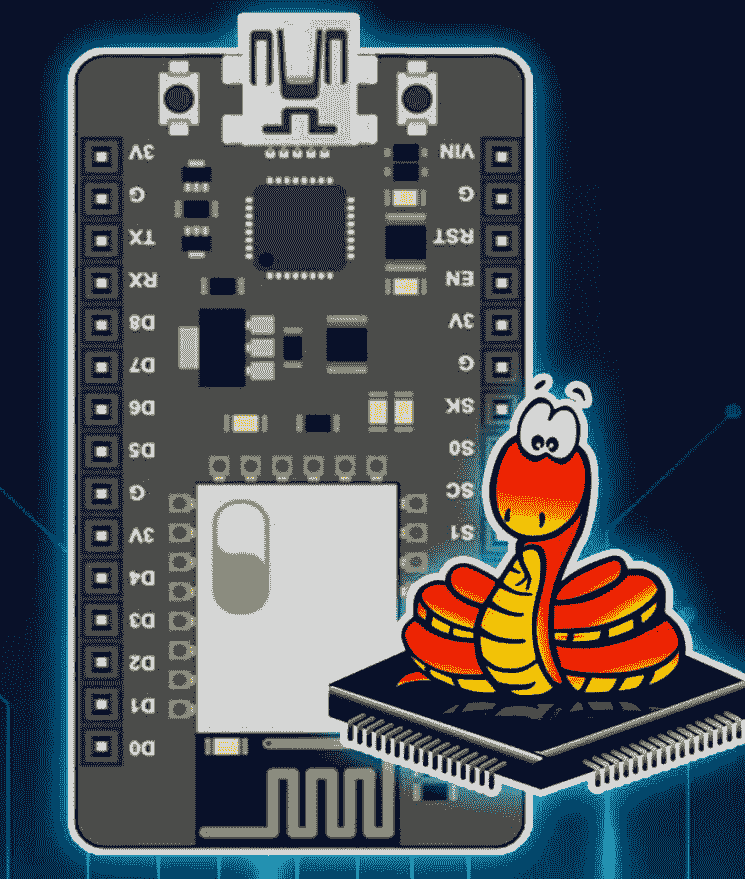

作者：Jansa Selvam

## 目录

- [什么是MicroPython和用于微控制器的Python](WHAT IS MICROPYTHON AND PYTHON FOR MICROCONTROLLER)
- [什么是uPython以及为什么你应该关注它](WHAT IS UPYTHON AND WHY SHOULD YOU CARE)
- [你需要的软件](SOFTWARE YOU WILL NEED)
- [你需要的硬件](HARDWARE YOU WILL NEED)
- [如何充分利用这个项目](HOW TO GET THE MOST OUT OF THIS PROJECT)
- [获取项目的演示脚本](GET THE DEMO SCRIPTS FOR THE PROJECT)
- [uPython与CPython对比](UPYTHON VS CPYTHON)
- [uPython资源](UPYTHON RESOURCES)
- [uPython兼容开发板](UPYTHON COMPATIBLE BOARDS)
- [使用Thonny IDE进行Python开发入门](GETTING STARTED WITH THONNY IDE FOR PYTHON)
- [如何将MicroPython固件安装到你的ESP32](HOW TO INSTALL THE MICROPYTHON FIRMWARE TO YOUR ESP32)
- [设置解释器](SETTING AN INTERPRETER)
- [如何编写和执行MicroPython程序](HOW TO WRITE AND EXECUTE A MICROPYTHON PROGRAM)
- [Thonny IDE的其他视图](OTHER VIEWS IN THONNY IDE)
- [Thonny IDE与树莓派Pico配合使用](THONNY IDE WITH RASPBERRY PI PICO)
- [使用Thonny IDE与BBC Micro:bit](USING THONNY IDE WITH BBC MICROBIT)
- [Thonny IDE高级配置](THONNY IDE ADVANCED CONFIGURATION)
- [在PyPI上查找Python包](FIND PYTHON PACKAGES AT PYPI)
- [MicroPython Shell](THE MICROPYTHON SHELL)
- [如何中断正在运行的程序](HOW TO INTERRUPT A RUNNING PROGRAM)
- [如何在启动时运行程序](HOW TO RUN A PROGRAM AT BOOT)
- [如何调试MicroPython程序](HOW TO DEBUG MICROPYTHON PROGRAM)
- [关于MicroPython模块](ABOUT MICROPYTHON MODULES)
- [内置模块](BUILT-IN MODULES)
- [社区模块](COMMUNITY MODULES)
- [如何安装外部模块](HOW TO INSTALL AN EXTERNAL MODULE)
- [使用循环控制LED闪烁](BLINK AN LED WITH LOOP)
- [使用PWM控制LED渐变](FADE AN LED WITH PWM)
- [使用循环读取按钮](READ A BUTTON WITH LOOP)
- [使用硬件中断读取按钮](READ A BUTTON WITH HARDWARE INTERRUPT)
- [使用定时器中断读取按钮](READ A BUTTON WITH TIMER INTERRUPT)
- [读取电位器](READ A POTENTIOMETER)
- [DHT22环境传感器](DHT22 ENVIRONMENT SENSOR)
- [BME280环境传感器](BME280 ENVIRONMENT SENSOR)
- [ESP32内置触摸传感器](ESP32 INTERNAL TOUCH SENSOR)
- [ADXL335模拟加速度计](ADXL335 ANALOG ACCELEROMETER)
- [HC-SR04超声波距离传感器](HC-SR04 ULTRASONIC DISTANCE SENSOR)
- [使用PCF8574的2X16 LCD显示屏 - 第1部分 硬件I2C](2X16 LCD DISPLAY WITH PCF8574 - PART 1 HARDWARE I2C)
- [使用PCF8574的2X16 LCD显示屏 - 第2部分 软件I2C](2X16 LCD DISPLAY WITH PCF8574 - PART 2 SOFTWARE I2C)
- [OLED SSD1306 I2C](OLED SSD1306 I2C)
- [OLED SH1106 I2C](OLED SH1106 I2C)
- [OLED SSD1315 I2C](OLED SSD1315 I2C)
- [NeoPixels](NEOPIXELS)
- [MAX7219 8X8矩阵显示屏 - 第1部分 随机像素](MAX7219 8X8 MATRIX DISPLAY - PART 1 RANDOM PIXELS)
- [MAX7219 8X8矩阵显示屏 - 第2部分 文本](MAX7219 8X8 MATRIX DISPLAY - PART 2 TEXT)

## 什么是MicroPython和用于微控制器的Python

所以你们中的一些人可能会想，MicroPython是什么？这个超级小的蛇是什么？或者可能和Monty Python有关？IEEE Spectrum在2018年发布了最常用编程语言的排名。


这非常有趣。Python位居榜首，并且显示了100%的增长率。它存在于网络上，在你的台式电脑上，现在也已经用于微控制器。我觉得非常有趣的是，汇编语言今年进入了前十名，这可能是因为物联网设备是用汇编语言编程的。

### 什么是MicroPython？

- **精简**且**高效**的**Python**重写版本
- 包含完整的解析器、编译器、虚拟机、运行时系统和垃圾回收器
- **字节码**或**原生机器码**
- 支持**内联汇编**
- **在芯片上编译**
- **REPL**（读取、求值、打印 - 循环）


所以MicroPython是Python的完全重新实现，它被设计得精简高效，以便在微控制器上运行，因为你不能像在台式电脑上那样直接使用Python。它需要从头开始重写以适应微控制器。它有一个虚拟机和一个运行时系统，带有垃圾回收以及你需要让它真正高效运行的一切。你可以使用字节码或原生机器码。MicroPython还支持内联汇编。当你有一个项目想使用Python，因为你希望它容易上手，但你需要在某些微小的部分让它更高效时，它也支持内联汇编。编译发生在芯片上。你写的程序不是在你的台式电脑上编译，而是在你使用的硬件上编译。我这里有一个很棒的摄像头，我会给你们展示一些演示。

### 一切是如何开始的

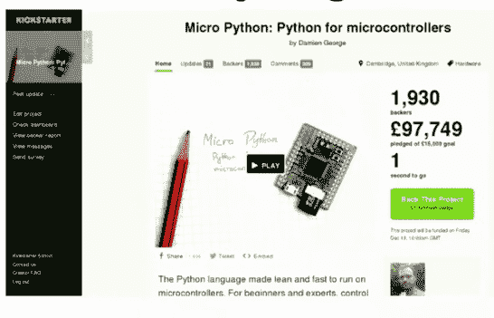

使用MicroPython有多容易？这一切是如何开始的？大约五年前，Damien George当时在剑桥大学工作，他想，哦，用Python来控制我的小机器人会很棒，因为它很容易。我知道，我不需要与所有底层的东西交互。他有了这个想法，让我们在Kickstarter上发起一个项目，因为当时每个人都在做，我也很想看看做Kickstarter是什么感觉。他想也许其他人也会有兴趣拥有它。他希望建立一个开源社区来支持这个项目。因为我们认为开源非常重要，因为我每天都从中受益，我们想回馈一些东西。这意味着MicroPython是开源的。欢迎每个人贡献，它对每个人开放。

### 五年之后

- **GitHub**
  7000+ Stars，200+贡献者，2000+ forks
  42个版本，v1.9.4版本代码覆盖率达99.2%
- **在英国，所有11-12岁的孩子都得到了一个BBC Micro:bit**
- **开发板**
  不同公司提供预装MicroPython的开发板
  Adafruit (CircuitPython), PyCom, OpenMV...
- **第二代pyboard即将发布**


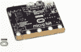

这大约是五年前的事了，而今天。呃，直到今天，已经发生了很多事情。如果你看我们的GitHub页面，他们有超过7000个星标和超过200个贡献者。非常有趣的是，贡献者来自不同的领域。他们是创客，但也有在行业里从事嵌入式开发的人，因为他们看到了高级语言的好处，你可以轻松启动并运行它，专注于你实际项目的瓶颈。还有超过2000个fork，这意味着很多人在致力于它。你们中的一些人可能知道BBC Micro:bit。这也是英国的一个项目。他们向英国的孩子们分发了大约一百万个这样的小PCB板，让他们在教育过程的早期就能上手并运行。Python在英国的学校里教授，虽然也支持其他语言，但MicroPython也在其中。然后有很多不同的开发板。例如，Adafruit有自己的MicroPython版本，叫做CircuitPython。如果你想尝试MicroPython，你有很多开发板可以选择，当然还有官方的MicroPython板，pyboard。我今天将向你们展示它，因为拥有自己的硬件总是有优势的，因为你们都知道那句话，如果你对你的软件是认真的，你应该使用自己的硬件。硬件。然后去年，Nicholas Holloway 出版了第一本关于 MicroPython 的 Riley 书籍，这也相当厚。实际上，市面上已经有几本相关的书了，但这对我们来说是一个更快的里程碑。而且，五年过去了，是时候推出一块新开发板了。我今天带来了这块板子。我打算做的是，从最初的 Kickstarter 项目开始——那是五年前的事了，这块板子仍然受到支持。如果你有其中一块，软件更新仍在运行，并且在旧板子上继续得到支持。但我们一直在与人们交流：你们希望看到什么？市场上缺少什么？我们努力倾听，并制作了一块新板子。


那么，使用脚本语言而不是传统语言（例如，用于编程微控制器）有什么好处呢？是它的易学性，它很简单。你可以更容易地阅读它。你有能力进行快速原型设计，这意味着你的产品上市时间非常快。即使你们所有人只是为了乐趣而制作，是创客，如果你看到所有这些非常非常酷的项目，我做了，也许我可以从中做出一个产品。有些人可能会感兴趣。我听说过这些故事，这一切都始于一个爱好，但现在我每年销售几千件产品。我开始是一个创客，但现在我已经有点像在做生意了。它也非常容易被用户扩展。如果你已经有一个运行中的东西，并且你想请求实现一个特定的模块，你只需要把它拿出来，就像，几乎，你可以直接把它拿起来，以你自己的方式移动它。这都是非常积极的谈话，但当我走出去告诉人们我做什么时，特别是当我与那些非常接近硬件工作的嵌入式程序员交谈时，他们会说，哦，我的天，我为什么要那样做？MicroPython，呃，Python 超级慢，我不能真的在微控制器上使用它。这会扼杀我使用微控制器进行这个项目的所有好处。而且，而且，嗯，我们非常习惯于看到并且非常擅长 C。所以这有点颠覆了在这个领域工作的一些人的思维。他们说它们是解释型的，所以它们很慢。它们松散，它们使用大量资源，Python。这不可能是节能的或以任何方式高效。但我说，嗯，MicroPython 很快。如果你看看开发时间。想想看。当你拿到一个新的微控制器时，有成千上万页的数据手册，你需要从中获取任何东西来运行。有时你有制造商提供的工作示例，但你仍然，嗯，这就是我所做的。我的电气工程毕业论文。它让我熬夜了很长时间来完成它。然后让它高效，并让它真正，例如，一个真正超低功耗的 SPI 描述在数据手册中工作。如果你有函数已经给你提供了访问权限，你真的可以专注于项目的瓶颈，而不是浪费时间仅仅让它启动和运行。

### 创客项目

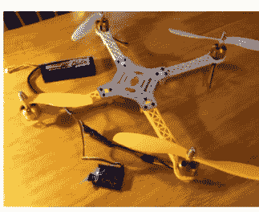

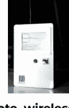

所以，作为一个创客，我认为有很多。板子在外面。例如，Damian George 是最初为第一个 Kickstarter 做 PyBot 的想法。他想做一个四旋翼飞行器。如果你想了解更多，稍后会有一个二维码。而且，例如，你可以做这个气象站，它们由 MicroPython 运行。如果你想了解更多，有很多创客方法。我们可以看到它们在 GitHub 上有描述，所以如果你有兴趣使用它们，你可以在此基础上构建。这就是创客方面。很多人已经接手了，但我也参与了使用 MicroPython 进行控制的工业项目。当我和那里的一些开发者交谈时，他们问我，或者我问他们，为什么选择它？因为它可能只存在了大约五年，没有很长的时间。没有说，是的，我们已经在现场测试了十次，它正在运行，并且 24/7 运行。任何事情。那里什么都没有。这样做是相当勇敢的一步。但其中一位开发者说，是的，我们正在寻找我们嵌入式 Linux 系统的替代品，因为对于我们使用的这个小型设备来说，嵌入式 Linux 系统太臃肿了。我们不需要那么多。第一个产品原型很臃肿，是用 shell 脚本写的，他们用 MicroPython 替换了它。两次之后，不是这个最初的项目，他们继续做下去了，因为他们真的很喜欢使用 MicroPython。他们是。在低功耗系统中，微控制器上的活动程序消耗不到 500 纳安，这相当令人印象深刻。当你想到他们正在使用的实时图像处理时。有趣的部分是，你在开发阶段拥有它，但你也可以在最终产品上运行它，例如，获取一些更新。我希望当我稍后尝试做一个小演示时，这会变得更清楚。他们说的是，是的，当然你不能在所有事情上都使用 MicroPython，因为你可能需要一些汇编代码，那里有一些位，然后你只是集成，你真的，真的很快就能向客户或你的主管展示第一个原型，你用新硬件启动并运行了，或者，

### 计算器上的 MicroPython

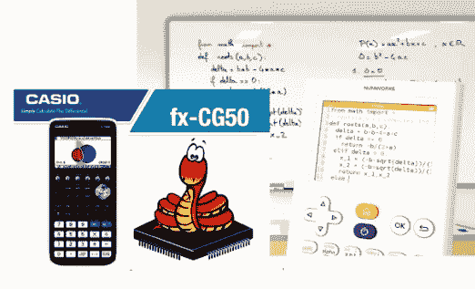

而且，在学校计算器中使用也很有名。大约。两年前。现在第一台计算器采用了 MicroPython，那就是 NumWorks。这是一家初创公司，他们有这种图形计算器，上面使用 MicroPython。就在最近，我们听说 Casio 也将其放入了他们的微控制器中。这是原始 Kickstarter 上那个可爱的小蛇标志，你把它放在上面。这就是开源的好处。他们被允许这样做。他们把它捡起来，朝着那个方向前进。

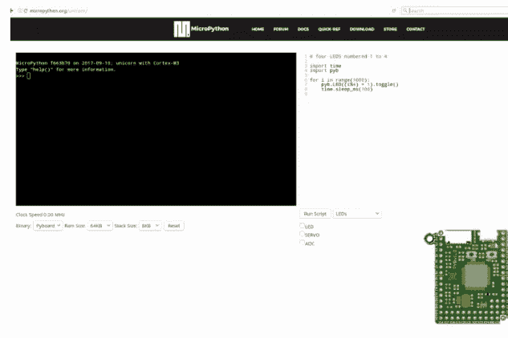

所以我希望你们中的一些人对此感到兴奋，并认为，哦，这很酷。我会尝试一下，但我不用担心没有板子。你可以访问我们的主页。那里有一个模拟器，你有这个小 PyBot，你可以运行一些演示脚本，看看你是否喜欢它。然后启动它。不需要购买硬件。我们也有这个模拟器。


更多公司正在使用 MicroPython，显然 Damian George 创建了 MicroPython，并且还提供围绕它的开发板。他设计硬件，特别是特定的硬件或特定的 Python 模块。他说的是，所以我的背景是理论物理。我不是一个典型的工程师，他看起来更像是只为了完成或解决问题。他更偏向研究。他相信。我也相信。这就是 MicroPython 如此成功的原因，不仅仅是为特定问题找到解决方案，而是继续前进，让它对每个人都更有用。还有其他公司。这只是，我放了图片。

### 使用 MicroPython 的公司

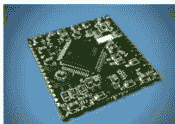

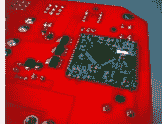

> "机械、电气和软件设计与开发"

> "不断寻找既易于使用又具备专业应用能力的组件和工具的斗争，正是吸引我使用 MicroPython 的原因。它让我能够高效地设计、构建和迭代"

还有更多人像这些顾问一样使用它，他们为客户做开发板开发和旅行拖车，旅行套装。例如，他偶然发现了 MicroPython，因为一方面很难找到易于使用但又需要达到专业应用水平的组件和工具，这让他转向了 MicroPython。这就是他告诉我的。他可以启动、设置。适应各种东西。正如你在这里看到的，他使用的这些芯片，与 PyBot 相同，也就是最初的那款。只需将其插入适配器，就能轻松启动并运行。作为一个小例子。当我们看这个时，它是惊人的软件，所有这些实现，比如所有这些重写 Python 以使其在硬件上像时钟一样运行。这是一方面，但另一方面是 MicroPython 或 George Robotics，

### pyboard D！

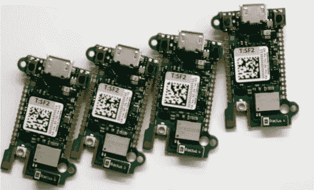

其背后的公司也自行设计硬件。如果我们可以切换到摄像头，我可以向你展示一下。是的，你可以看到这里，这个仍然是原版的，所以……它有多小。这是原版的PI bot。

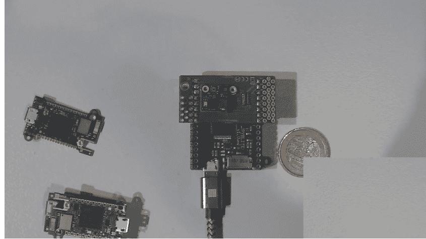

这实际上是pilot light，但外形尺寸是一样的。新一代产品转向了这个，因为我们当时在思考人们告诉我们的反馈。嗯，是的，我们喜欢这个小模块。它可能是，你可能听说过ESP 32或其他ESP 8266。它们很小，微小，易于访问等等。但当你购买这些模块时，你仍然需要设计一个小的PCB来首次编程。这就是它们所缺少的。

我们设计了micro USB接口，使其易于启动和运行。呃，Caltex，

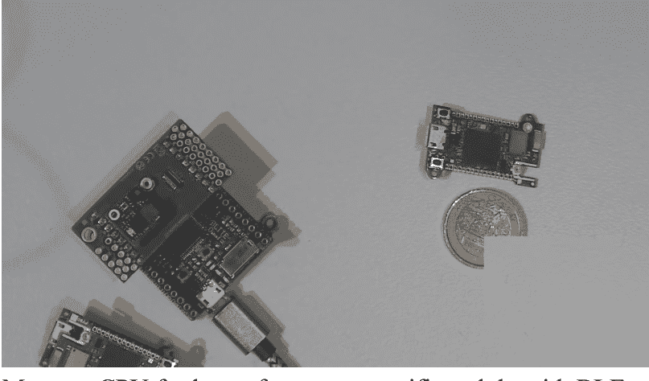

M7 CPU用于高性能、高功耗。一个带有BLE的WiFi模块，在我可靠的卡的另一面。你仍然可以更换你的，所以你显然有内部文件系统，但如果你想真正本地收集数据，你可能也想要一个SD卡，或者存储你所有的程序。在这里你可以看到这些总线连接器，它们是官方设计用于插入其他可适配节点的，你可以自己设计。这就是micro:bit的目标。显然会有一些现成的让你快速上手，但我们真正希望的是人们能够轻松设计自己的产品，并且产品的核心部分开箱即用即可运行。是的。好的。我现在将继续演示。并向你展示一点板上的代码。我从原版的pyboard开始。是的，非常好。这里你可以看到插槽和适配器板，所以，它会，它有一个传感器板也可以插入。这里我们有RGB LED、温湿度传感器、光传感器和一个小蜂鸣器用于发出声音。你可以看到实际上有东西在工作。所有东西加上一个小蜂鸣器都会更好。不是吗？

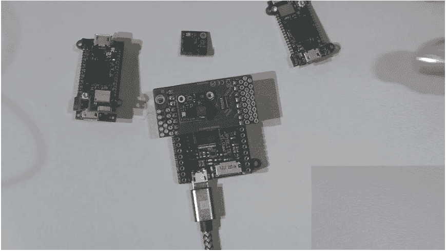

好的，所以，我要，这个现在插好了。如果我切换回来。完美。所以我像这样开始，呃，所以这是pyboard。Flash就像一个USB驱动器之类的东西一样弹出。所以当我进去的时候。我有我的main.py，现在是空的，我相信。你可以把你的代码放在这里，只需输入代码并保存到你的板子上运行它。但显然我准备了一些东西，因为我想展示，我想向你展示运行，运行我刚才给你看的小传感器模块是多么容易。

```python
from micropython import const
import pyb
from pyb import Pin
import machine

HDC_ADDR = const(64)
OPT_ADDR = const(69)

class TILE_ONE:
    def __init__(self, slot='X'):
        if (slot != 'X') and (slot != 'Y'):
            raise ValueError('either "X" or "Y" slot')
        i2c = machine.I2C(slot)

        self.buz_en = pyb.Pin(slot+'1', mode=pyb.Pin.OUT_PP, value=0)
        self.buz = Pin(slot+'6')

        leds = []
        for i in range(2, 5):
            leds.append(pyb.Pin(slot+'%d' % i, mode=Pin.OUT_OD, value=1))
        self.leds = leds

        self.opt_int = pyb.Pin(slot+'12', mode=Pin.OUT_OD, pull=Pin.PULL_UP, value=1)
        self.hdc_int = pyb.Pin(slot+'8', mode=Pin.OUT_OD, pull=Pin.PULL_UP, value=1)

        try:
            i2c.writeto_mem(OPT_ADDR, 0x1, b'\xcc\x10')  # continuous mode,
            i2c.writeto_mem(HDC_ADDR, 0x0e, b'\x75')  # 5Hz, heater off, in
```

所以这只是为不同的，为这个我插在顶部的tile编写的驱动程序。所以你有，光学传感器，正如你在这里看到的，或者温湿度传感器。这只是为了看看，这段代码已经在上面了。我现在没有时间做所有这些。

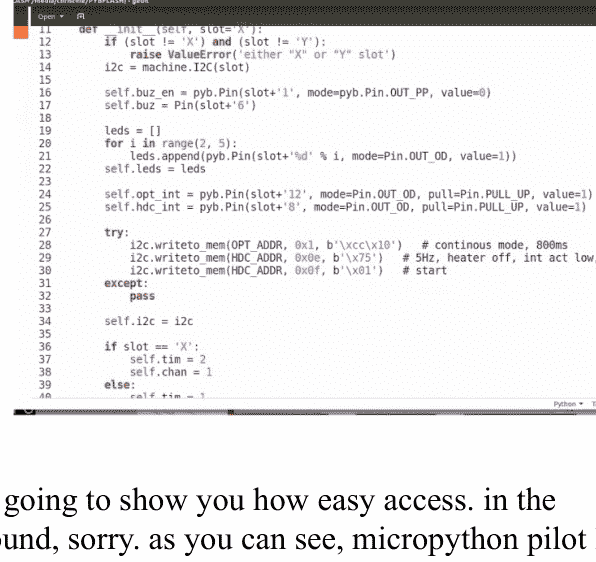

所以，我将向你展示访问是多么容易。在背景中，抱歉。正如你所见，micropython pilot light help type，输入help获取帮助。我们已经在控制台了。

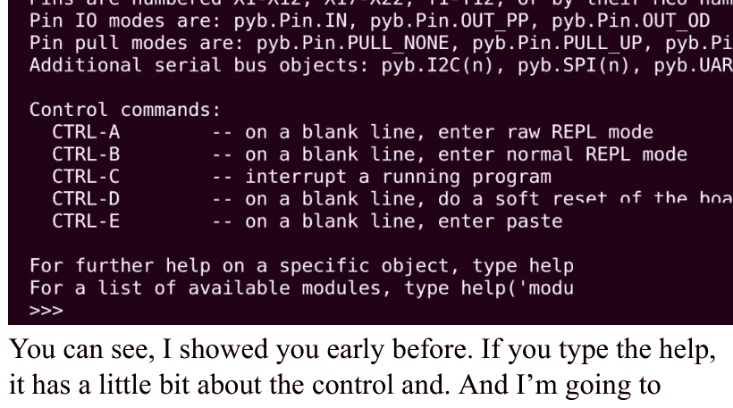

你可以看到，我之前给你展示过。如果你输入help，它会有一些关于控制的信息。我将导入我刚才展示的程序，并运行一点测试脚本。正如你所见，大约是25.3度，32.8%。这似乎有点低，

```
Pin pull modes are: pyb.Pin.PULL_NONE, pyb.Pin.PULL_UP, pyb.Pin.PN
Additional serial bus objects: pyb.I2C(n), pyb.SPI(n), pyb.UART(n)

Control commands:
    CTRL-A      -- on a blank line, enter raw REPL mode
    CTRL-B      -- on a blank line, enter normal REPL mode
    CTRL-C      -- interrupt a running program
    CTRL-D      -- on a blank line, do a soft reset of the board
    CTRL-E      -- on a blank line, enter paste mode

For further help on a specific object, type help(obj)
For a list of available modules, type help('modules')
>>> import tile_one
>>> s=tile_one.TILE_ONE()
>>> s.demo()
112732 0 TI07d0 25.3 C 32.8 % TI3001 794.56 lux
>>> s.demo()
115859 0 TI07d0 25.4 C 32.8 % TI3001 795.20 lux
>>>
```

但是，我也想向你展示一点，如果我们现在可以切换回来，正如你所见，

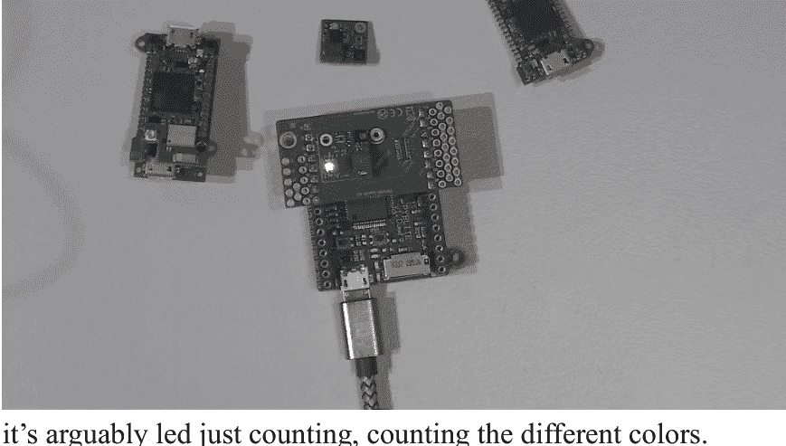

它可以说是一个LED，只是在计数，计数不同的颜色。我将进行一些测量，它将显示在交互式REPL中。它的，令人惊奇的地方在于，正如我所说，当我第一次接触到这个时，就像，天哪，我什么都不需要安装。我只需要我的pyboard和代码。显然我需要知道如何与我的传感器等交互，但我不需要安装IDE。我可以使用一个，如果我习惯用的话，但我没有。我将只是把这个记录到一个文本文件中，然后我就可以轻松地使用这些数据，比如插入它并使用原始数据来制作一些，一些我的图表或任何我需要的东西。这仍然是原版的pyboard，同样的，呃，可以用于这个。我喜欢这个是半尺寸的，同样的代码可以在这个板上运行。像这样。我可以看到一些东西。如果我现在回到我的代码并运行完全相同的程序，相同的程序。

```
Traceback (most recent call last):
  File "<stdin>", line 1, in <module>
NameError: name 'AT' isn't defined
>>> ~x~x~
Traceback (most recent call last):
  File "<stdin>", line 1
SyntaxError: invalid syntax
>>>
>>>
>>>
>>>
>>> D
Traceback (most recent call last):
  File "<stdin>", line 1, in <module>
NameError: name 'D' isn't defined
>>>
>>>
>>> import tile_one
>>> s
```

那也是在……所以我想展示的是，我们试图将所有这些做得非常模块化。仍然，所有旧的硬件都将被即将到来的新传感器支持。因为tiles，我认为最令人印象深刻的是我所说的，他们设法使这些东西变得非常非常小，因为我认为这是最重要的部分。如果你运行物联网，在某个时候，这类东西应该是微小的，并且主要在非常低的功耗下运行。抱歉，按错了按钮。正确的按钮。正如你所见，上面有一个微控制器和WiFi，你拥有的是独立的。

### Pyboard D

| | PYBv1.1 (168 MHz) | PYBD (120 MHz) | 216 MHz (1.75 x PYBv1.1) |
|---|---|---|---|
| PYBv1.1 | 空闲 18 mA 运行 55 mA | — | — |
| PYBD | 空闲 18 mA 运行 55 mA | 空闲: 34 mA 运行: 112 mA 浅睡眠: 500 uA 带RTC的深度睡眠: 10 uA | — |

**下载**数据到**PYBD 100 mA** 约 800 Kbyte/sec
**上传**数据从**PYBD 140 mA** 1 Mbyte/sec
监听连接到WiFi路由器的HTTP服务器 ~1mA

那么为什么这样会让板子更，更贵呢？显然现在有了微控制器的实时可用性，这样你就可以真正专注于任务。大多数时候你可能只需要WiFi来发送数据，而不需要一直开着，或者需要通过蓝牙或其他方式唤醒它。当你看到这里，这只是与旧的pyboard 1.1和pilot D（新的）的比较。它显然更快了，因为当前的演进，它从34毫安到深度睡眠的10微安，实时时钟仍然启用。这意味着它可以被唤醒。这是一个全新的领域，我们真正希望看到物联网运行的地方。当你想到，你不想每次都去更换电池，或者我认为到2020年将有200亿台设备投入运行、收集数据并发送回来。功耗问题确实是一个需要关注的问题。这一切都是非常积极的。不是吗？它，不可能都这么好关于micro:bit。micro:bit不能做的是，正如你所见，正如它总是，你需要看到你想解决的问题，然后你需要看看有什么可用的，或者我可以使用什么？所以真正，真正小的MCU没有足够的RAM来放入像micro

### MicroPython 用于产品开发！

**优点**
- 生产力
- 可追溯性
- 可测试性
- 可移植性
- 许可证
- 支持

**缺点**
- 增加硬件资源需求
- 开发者缺乏脚本语言相关技能

据我所知，这是创客赛道。但仔细想想，当你在制造产品，或者真正设计一个将被使用成千上万次的东西时，MicroPython 可以在生产力、可追溯性方面帮助你进行产品开发，因为代码和不同的固件版本在开源社区中维护得非常好，人们可以一起协作、修复问题，社区也能从中受益。正如我之前展示的，它使测试更容易，有超过 200 位不同的开发者参与其中，他们来自不同领域，有时你会从意想不到的人那里获得灵感，因为这正是他们擅长的事情。看到大家如何互相促进、共同进步，真的非常棒。MicroPython 的许可证是 MIT 许可证，也非常灵活。你可以使用 MicroPython，但不必将所有东西都开源。你可以在此基础上构建，并将为公司产生利润的产品部分闭源。例如，总的来说，Python 社区非常开放，MicroPython 也是如此。缺点方面，你可能需要增加硬件资源。如果它能使用更小的微控制器，那显然更便宜，但可能太小而无法运行 MicroPython，你就无法使用它。这需要权衡，你必须考虑为实际硬件和软件开发所支付的时间成本，与产品中使用的硬件价格相比。有时在这个领域，人们仍然不使用 Python，他们仍然使用 C 甚至汇编或底层语言来设计和编程微控制器。

### 什么是 MicroPython 以及为什么你应该关注它

大家好，欢迎回来。在这个项目中，我将谈论 MicroPython，谈谈它的存在意义，它与 Python 的关系，以及它的一些最重要的特性。

大约在 2014 年，Damien George 发布了一种用于微控制器的新编程语言，名为 MicroPython。这次发布是一个雄心勃勃的 Kickstarter 项目的成功完成，该项目始于 2013 年。当时，微控制器编程主要由 C 语言主导。如果你熟悉 C 语言，那么你知道它是什么样子的。在微控制器上使用 C 语言并不难学，然而，随着程序变得越来越大，事情确实会变得更复杂。随着微控制器变得越来越强大，越来越多的人开始对它们感兴趣并对其进行编程。其中许多人是第一次编程，这包括各个年龄段的人。因此，Damien 想创造一种能在微控制器上运行的语言，它比 C 语言更容易学习和使用。他不想重新发明轮子，所以他选择了 Python 作为原型。他当时的挑战是创造一种能够模拟 Python，但也能在微控制器的裸金属上运行的语言，而不是在操作系统之上。这就是 MicroPython 的由来。以下是 MicroPython 网站上对该语言的描述。其中的强调部分是我加的。MicroPython 是 Python 3 编程语言的一个精简高效的实现，包含 Python 标准库的一个小子集，并针对在微控制器和受限环境中运行进行了优化。

现在，因为 MicroPython 包含 "Python" 这个词，很容易混淆，认为 MicroPython 只是 Python 的一个更小版本。这种混淆就像我经常看到的 Java 和 JavaScript 之间的混淆一样，尽管 Python 和 MicroPython 名字相似，但它们是完全不同的语言，有着不同的目标和实现。我将在后面的项目中更详细地讨论 Python 和 MicroPython 之间的区别，但现在我只想确保你不会因为名字的相似性而感到困惑。

MicroPython 从 Python 借鉴的是其语言架构、注重代码可读性的编程哲学，以及庞大的、已经知道如何使用 Python 的程序员群体。Python 开发者可以很快成为 MicroPython 开发者，并为微控制器编写程序。根据 TIOBE 编程语言流行度指数，Python 是世界上最流行的编程语言，占有 30% 的份额。该指数是基于 Google 上对编程语言、教程和资源的搜索量计算的。作为对比，有趣的是，开发板上使用的 C/C++ 在该指数中排名大约第五。这种流行度转化为一个充满你所需的所有文档、库和社区支持的 Python 生态系统。MicroPython 和 Python 一样容易学习，并且遵循 Python 在优秀开发工具和文档方面的传统。在本课程中，你会看到我不断浏览 Python 代码、文档以及我们将要使用的许多优秀库。在工具方面，你有很多选择。特别是在本课程中，我们将使用 Thonny，但你也可以选择 uPyCraft 和新的 Mu 等工具。我真正喜欢 Thonny 的地方在于，它本身就是一个功能齐全的 Python IDE，拥有出色的调试工具，同时也完全支持 ESP32 上的 MicroPython，以及其他目标板，如 Raspberry Pi Pico 和 BBC micro:bit。MicroPython 语言的另一个巨大优势是，一旦你学会了它，你就可以将你的技能应用于多种硬件目标。在我录制这个项目时，MicroPython 支持最初的主板版本一和 Pyboard，以及第三方开发板，如 STM32 NUCLEO 和 Discovery 开发板、Pyboard、Raspberry Pi Pico、WiPy、ESP8266 和 ESP32、TinyPICO 以及我之前提到的 BBC micro:bit，而这还只是部分列表。

### MicroPython 特性

1. 旨在实现 Python 3.4 (CPython) 的语言和语法标准。
2. MicroPython 标准库实现了 CPython 标准库的一个子集（以 "u" 前缀标记）。
3. MicroPython 中提供 REPL 交互式提示符（读取-求值-打印循环）。
4. 易于安装和使用第三方代码包。许多包可在 PyPI 上找到。
5. 支持设备上的文件系统。
6. 简单的命令行工具，用于与 MicroPython 设备交互：pyboard.py

现在让我们快速浏览一下 MicroPython 最重要的特性。首先，对于任何这门语言的新手来说最重要的是，MicroPython 旨在实现 Python 3.4（以及部分 3.5）的语言和语法标准。这简单意味着任何已经会用 Python 3 编程的人都可以立即开始用 MicroPython 编程。Python 3 的保留关键字、运算符、函数以及那令人头疼的空白符规则都在 MicroPython 中得到了忠实的实现。其次，由于 MicroPython 面向嵌入式计算机和微控制器，不可能实现包含所有模块和方法的 Python 标准库。物联网设备上根本没有足够的存储空间来容纳它。因此，MicroPython 实现了 CPython 标准库的一个精选子集，而且即使是这个子集，也是以效率为重点来实现的。Python 库的 MicroPython 版本名称带有 `u` 或小写 `u` 字母前缀。这样你就可以区分它们。每当你看到一个带有 `u` 字母前缀的 MicroPython 库时，要知道它是为 MicroPython 设备实现的原始 CPython 库的更高效或优化版本。MicroPython 有一个交互式解释模式，也称为 REPL。REPL 代表 Read-Eval-Print Loop（读取-求值-打印循环）。可以把它想象成 Python 的命令行。你可以使用这个命令行来发出 Python 指令甚至代码块。REPL 会立即求值 Python 代码，MicroPython REPL 功能齐全，具有补全能力、可以使用 Ctrl-C 中断正在运行的程序以调用软重置等等。还有一个粘贴模式，你也可以使用下划线变量来存储上一次的输出。

### MicroPython 概述

MicroPython 的一个关键特性是能够使用 `uasyncio` 库在测试代码中广泛演示异步计算。其次，除了 MicroPython 标准库之外，还有无数由用户贡献并发布在 GitHub 和 PyPI（Python 包索引，类似于 CPython）等在线仓库上的库。MicroPython 有一个简单的机制来包含外部代码程序。在本课程中，我将向你展示如何查找和使用这些外部库，它们使得将屏幕和传感器等硬件组件集成到你的 MicroPython 项目中变得轻而易举。

第三，MicroPython 能够访问目标设备上的一个小文件系统。这个文件系统使得存储你的 MicroPython 程序、支持库文件以及任意文件（例如用于存储传感器数据或网络和 IoT 服务凭证的文本文件，甚至是位图图像文件）成为可能。你希望在屏幕上显示它们，例如，我将在本课程后面展示一个类似的例子。在本课程中，我准备了几个示例，演示如何在 ESP32 上使用文件系统。

最后，第六点，MicroPython 有一个简单的命令行 Python 工具，允许你在目标设备上运行脚本或访问文件系统。这个工具叫做 `mpremote`。在本课程中，我们不会使用这个工具，因为 Thonny IDE 内置了对多种目标设备（包括 ESP32）的 MicroPython 支持。然而，我想提到 `mpremote`，因为它对你来说是有用的，值得了解。

让我们现在来谈谈在各种硬件目标上运行 MicroPython。正如你可能已经知道的，MicroPython 可以在许多不同的微控制器上运行。硬件的多样性意味着并非所有 MicroPython 代码都能在不修改的情况下跨设备工作。通常，在跨不同目标共享 MicroPython 代码时，有两点需要记住：

1.  大多数使用 MicroPython 标准库函数和语言核心的代码无需任何修改即可工作。语言语法、保留关键字、控制结构以及来自这些标准库的函数（例如用于数学的 `math` 模块、用于基本操作系统服务的 `os` 模块以及用于时间和日期相关功能的 `time` 模块）将在所有 MicroPython 硬件目标上工作。这一点无需担心。
2.  另一方面，任何在特定微控制器上独特实现的功能都需要在 MicroPython 中进行独特的实现。例如，数字引脚功能在 ESP32 等设备上的实现方式与在树莓派上的实现方式不同。有些树莓派引脚能做的事情，ESP32 可能做不到。网络接口、SPI 接口、模数转换器等功能在不同开发板上的实现方式也类似。这些差异反映在每个开发板的 MicroPython 实现中。因此，除了标准库之外，MicroPython 还有专门为每个受支持的开发板实现的库。你应该花点时间研究你的目标设备的特定库，以便了解有哪些功能可用，哪些不可用。因此，你可以充分利用你所选择的设备的特定能力。

还有一点，当我谈到这个时，并非所有设备功能都可以通过 MicroPython 访问。例如，在 ESP32 的 MicroPython 固件中，没有对蓝牙的支持。没有蓝牙模块，即使你知道 ESP32 具备蓝牙功能。但是有对 Wi-Fi 的支持。这只是你无法使用 MicroPython 使用的一个功能示例。

好的，现在让我们通过回到 MicroPython 最重要的属性来总结这个项目。MicroPython 和 Python 一样，被设计为可读性高。它读起来几乎像自然语言。在这里，你可以看到一个代码片段的示例，我从本课程后面即将出现的一个项目中提取出来的。即使你以前从未见过 MicroPython 代码，也许你甚至从未编程过，你也应该能够理解这段代码片段大致在做什么。你可以推断出这段代码片段应该做什么。你确实需要对电子学有基本的了解。例如，像 `pin` 和 `pin.pull_up` 这样的关键词可能没有太大意义。然而，MicroPython 的语言入门门槛很低。本质上，它比 C 或 C++ 等语言的入门门槛低得多。这是 Python 变得如此流行以及 MicroPython 自 2014 年 Kickstarter 活动以来获得巨大支持和普及的首要原因。

好了，关于这个项目就到这里。在本课程第一部分的接下来几个项目中，我涵盖了一些准备工作主题，包括软件和硬件要求以及如何充分利用本课程。请务必在继续第二部分（专注于 MicroPython）之前观看这些项目。

### 你需要的软件

要完成本课程中的所有项目，你需要一个编程编辑器、与你的微控制器匹配的 MicroPython 固件以及一些与各个迷你项目要求匹配的 MicroPython 库。请花一分钟时间观看这个项目，了解更多关于所需软件的信息。

让我们从 IDE 开始。你可以使用任何文本编辑器编写 MicroPython 和 Python 程序。你当然不需要任何花哨、昂贵或复杂的东西。Python 程序员经常使用集成开发环境，这些环境为他们提供了丰富的工具集，包括语法高亮、调试和轻松访问 Python 控制台等功能。你可能听说过像带有 PyDev 扩展的 Eclipse、带有各种 Python 包的 Sublime Text 以及带有 Python 语言扩展的 Atom 这样的 IDE。因为我们将使用 MicroPython，我们需要能够做的不仅仅是编写和编辑程序。我们还需要能够安装或更新目标微控制器上的 MicroPython 固件，访问文件系统以便通过 MicroPython 层上传和下载文件，当然，还需要能够执行基本操作，如重置开发板或运行程序。所有这些都可以通过一组工具（每个工具做一件事）来完成，或者通过使用 Thonny 来完成。Thonny 是一个免费的、开源的 Python IDE，它集成了对 MicroPython 和几种微控制器（包括 ESP32）的支持。你可以把 Thonny 对于 MicroPython 的作用，想象成 Arduino IDE 对于 Arduino 开发板的作用。Thonny 是为教育而设计的，因此它旨在简单易用且易于学习。它只做基础功能，并且做得很好。在你的计算机上安装 Thonny IDE 非常容易。我们将在第三部分开始使用 Thonny，但你可以随时从 thonny.org 下载最新可用版本并立即安装到你的计算机上。当然，它适用于 Windows、Mac OS 和 Linux。

现在让我们转向固件。要在 ESP32 上使用 MicroPython，你必须首先在微控制器上安装 MicroPython 固件。固件将启用 MicroPython 解释器并为我们提供 REPL。每个独立的微控制器都有自己的 MicroPython 固件文件。你可以从 MicroPython 网站下载合适的固件。但要小心，你需要为你的微控制器选择合适的版本。对于同一个微控制器，可能有多个版本。对于 ESP32，选择最新的通用但稳定的 1.x 固件。也有不稳定的版本可用，其中包含新的实验性功能，但当然它可能无法在你的微控制器上可靠地按预期工作，所以只有在你真正知道自己在做什么的情况下才使用不稳定的固件。如果你使用的是带有 SPIRAM 的 ESP32，你可以使用稳定的、通用的 SPIRAM 版本的固件。现在不用担心做这个。我在第三部分准备了一个项目，在那里我将详细向你展示如何操作。接下来是库。

使用ESP32进行MicroPython项目以及需要使用多个外部库的项目时，集成各种组件非常容易。就像Arduino一样，有适用于各种组件的库，例如传感器、电机和显示器。你可以在相关项目中找到每个迷你项目所需特定库的信息。好了，关于软件需求就介绍到这里。当你准备好了，请继续下一节，我将介绍本周你将使用的硬件。

### 你需要的硬件

要成功完成本课程的项目，你需要一些容易获取的硬件组件。如果你已经完成了我的高级分步课程，你可能已经拥有了所需的一切。那么，现在让我们来看看所需的硬件。

#### 一块ESP32开发板

- 任何ESP32开发板都可以。
- 我们将安装MicroPython固件。
- 学习如何使用MicroPython REPL。
- 学习如何编写和运行MicroPython程序。

当然，你需要一块ESP32来进行开发，具体是哪一块并不重要。我已经在各种通用的ESP32开发板上测试了本课程的MicroPython脚本，它们都运行良好。现在，我在本课程中使用的一块开发板非常通用，上面甚至没有印任何型号信息。它是一块19引脚的开发板，MCU封装上标有ESP-WROOM-32字样。

#### 简单组件

- LED。
- 电阻。
- 按钮。
- 电位器。

在第一轮实验中，我们将使用一个带限流电阻的LED、一个按钮和一个电位器。对于按钮，我们将使用内部上拉电阻来简化外部电路，这样你就不需要为按钮额外添加电阻了。

#### 传感器

- DHT22环境传感器。
- BME280环境传感器。
- ADXL335模拟加速度计。
- HC-SR04超声波距离传感器。

接下来，我们将使用传感器。因此，在传感器部分，你将使用DHT22、BME280、ADXL335（一种模拟加速度计）和HC-SR04超声波距离传感器进行实验。

#### 显示器

- 带PCF8574 I²C的2x16 LCD。
- 0.96英寸 OLED I2C SSD1306。
- 1.3英寸 OLED I2C SH1106。
- 0.96英寸 OLED I2C SSD1315。
- Neopixels。
- 带MAX7219的8x8 LED矩阵。

然后我们将进入显示器部分。显示器部分内容相当丰富，你的套件中包含了几种不同的设备。我们将在OLED屏幕的实验中测试它们。有三种选择，但我特别喜欢使用SH1106驱动的显示器，因为它们与硬件和软件I2C选项都能很好地配合。这个驱动相当不错。在这一部分，我们还将实验一个基于PCF8574并行转I2C转换器的2x16 I2C LCD屏幕。我们还将尝试NeoPixel模块。我使用的是一个带有八个独立可寻址LED的模块和一个由MAX7219模块驱动的8x8 LED矩阵。

我们还将实验电机。你需要一个5V微型伺服电机和一个5V微型直流电机。要驱动直流电机，你需要L298N电机控制器。好了，硬件需求就介绍到这里。当你准备好了，请继续下一节。我们将谈谈一些简单的事情，帮助你充分利用本课程。

### 如何充分利用本项目

我想说几点，我相信这将帮助你调整到正确的心态，使你花在本课程上的时间既有效又愉快。

学习任何有价值的东西都需要时间。规划你的学习，并在你繁忙的日程中为这项特定活动留出时间。没有专门的时间，你会觉得必须匆忙完成项目，使体验变得紧张。在压力下学习不是一种有效的学习方式。相反，没有计划的学习，你将学不到东西。因此，通过规划来掌控你的学习。我建议你计划一次完成一个部分。对于大多数部分，你应该能在一小时内轻松完成。当然，如果你有更多时间，可以考虑安排足够的时间来完成多个部分。我发现当我能够将大块的、不被打断的时间投入到一个项目中时，我学得最好，我相信对大多数人来说都是如此。这是因为大块的、不被打断的时间也能减少项目的整体持续时间，因为它们允许你减少从你碰巧在做的任何事情切换到项目或课程上下文所需的时间。不言而喻，但我还是要说：规划好才能学好。

每个项目有一到两个，但不超过两个，学习成果，通常还有相同数量的实践成果。在你成功理解当前项目的学习成果并实现项目的实践成果之前，不要进入下一个项目。如果你在没有完成项目的学习和实践成果的情况下继续前进，你稍后会遇到障碍，不得不回来重试。当然，提前浏览一下是可以的，但要注意之前的项目需要先完成。

好了，介绍性项目就到这里了。现在是时候卷起袖子开始动手制作了。你准备好了吗？当你准备好了，请继续下一节和项目。

### 获取项目的演示脚本

打字很无聊且容易出错。我已经完成了所有的打字并修正了所有的拼写错误，所以你不必这样做。你可以下载一个包含我在课程中演示的所有脚本的zip文件。只需将你的浏览器指向此URL，下载并解压zip文件。随意测试这些脚本并修改它们。

## MICROPYTHON 与 CPYTHON

正如你现在所知，MicroPython和CPython是两种不同的编程语言。MicroPython尽可能忠实地复制了CPython，为微控制器创建了高级编程体验。这两种语言之间存在差异，我想在接下来的几分钟内总结一下。

现在，MicroPython和CPython之间的差异在MicroPython网站上有详细记录。在那里你可以找到这些差异的完整列表，以及演示它们的代码示例。在本项目中，我将只提及我认为与本课程目的更相关的一些差异。

那么，让我们从语法开始。在CPython中，你可以做这样的事情：忘记在字面数字和关键字之间加空格来形成一个表达式，这没问题。CPython有足够的灵活性来原谅这样的错误。然而，在MicroPython中，同样的错误会产生语法错误。MicroPython开发人员不得不丢弃处理基于制表符缩进的逻辑，以便使其适应目标设备有限的存储空间。

### 核心语言：函数

方法的错误信息可能会显示意外的参数数量。

uPython 将“self”计为一个参数。

CPython 则不会。

```
CPython
>>> a = Calculator(1) # Requires 2 arguments
Traceback (most recent call last):
  File "<pyshell>", line 1, in <module>
TypeError: __init__() missing 1 required positional argument: 'num2'
```

```
uPython
>>> a = Calculator(1) # Requires 2 arguments
Traceback (most recent call last):
  File "<stdin>", line 1, in <module>
TypeError: function takes 3 positional arguments but 2 were given
```


这两种语言的另一个差异体现在 Python 函数中使用 `self` 关键字时的处理方式。Python 不会将其计为额外的参数，但 MicroPython 会。因此，如果你向一个包含 `self` 关键字的函数传递了错误数量的参数，那么你在 Python 和 MicroPython 中得到的错误信息将会不同。这里有一个例子。你可以看到这个例子。我在 Python 和 MicroPython 中调用了同一个函数 `Calculator`，并且只传递了一个参数。我本应传递两个参数，但我犯了个错误。这里只传递了一个参数。你可以看到它们编码了具有相同参数的完全相同的函数。但返回的指示错误的信息却不同。所以，你看，Python 告诉我缺少一个必需的参数，而 MicroPython 告诉我总共应该有三个参数，而我只给了两个。实际上，我只给了一个。所以你可以看到，Python 中返回的这个信息可能会有点令人困惑，这可能会误导你并导致你调试延迟。只要你意识到 `self` 关键字的这种情况，我认为你就能克服这类问题。

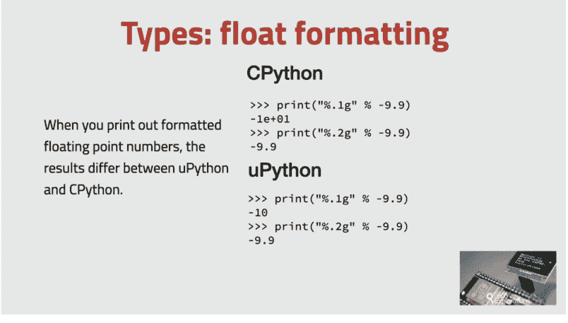

这里还有另一个与格式相关的细微差别。在这个浮点数的特定示例中，当你打印格式化的浮点数时，MicroPython 和 CPython 之间的结果可能不同。在这里，打印这个浮点数并在 MicroPython 和 CPython 之间使用完全相同的命令（MicroPython 就是 MicroPython），你可以看到每次输出的结果都不同。在这种情况下，`g` 操作符在与 CPython 一起使用时，会对输出中的数字应用指数格式。`g` 操作符在这两种实现中有所不同。

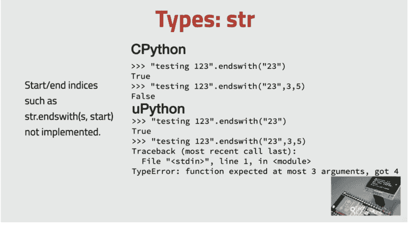

好的，下一个差异示例是字符串。如你所知，CPython 包含强大的字符串处理函数，但并非所有函数在 MicroPython 中都可用。两个例子是 `startswith` 和 `endswith`。这些函数允许你检查一个字符串是否以特定的字符或字符序列开头或结尾。在 MicroPython 中，这些函数只能在基本格式下工作，不支持 `start` 和 `end` 索引参数。在这个幻灯片的示例中，你可以看到当我们使用三个参数调用 `endswith` 函数时会失败，但使用单个参数时则可以工作。在 Python 中，没有问题，两种方式都能正常工作并符合预期。

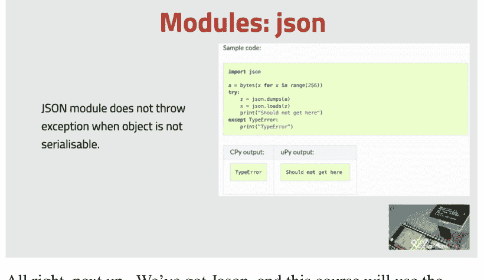

好的，接下来。我们有 JSON。本课程将使用 MicroPython 的 JSON 模块来处理物联网服务。与 Python 及其 JSON 模块不同，如果对象不可序列化，MicroPython 不会抛出异常。这意味着如果你的程序从 Web 服务接收到一个无效的 JSON 文档，你将无法使用异常处理程序优雅地处理它。你必须手动处理，否则你的程序就会崩溃。好的，这些只是 CPython 和 MicroPython 实现之间的一些细微差别，当然还有更多。了解它们和相关变化的最佳地方仍然是 Python 文档。在下一个项目中，我将向你展示一些关于 MicroPython 的最佳在线资源。这些是你想要关注的资源，以便在你使用 MicroPython 时随时可以访问它们。

### UPYTHON 资源

MicroPython 相对较新。然而，它延续了 Python 的传统，文档非常完善。在这个项目中，我们向你展示一些我使用的最佳在线、免费且社区支持的资源。我保证这些资源将为你节省时间，并在你开始使用 MicroPython 的第一步时为你提供帮助。

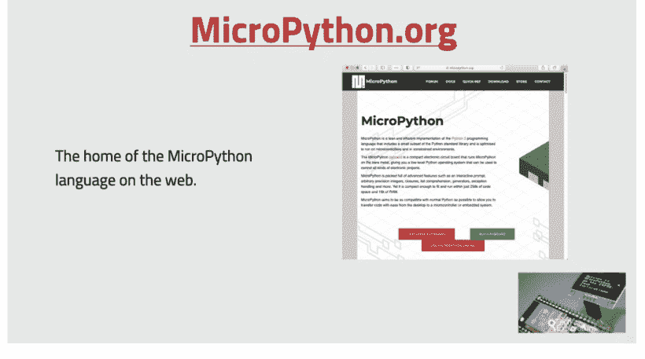

MicroPython.org 是 MicroPython 语言在网上的主页。在这里你可以找到支持的开发板的 MicroPython 固件、文档链接、讨论论坛以及可以购买 Pyboards 的商店。我准备了一个单独的项目来讨论支持的硬件，而不是任何与硬件相关的问题。目前在本课程中，我们将花大量时间浏览文档，我稍后会谈到这一点。我确实鼓励你注册一个 MicroPython 论坛的账户，你可以在那里参与相关的讨论。论坛，包括专门用于 ESP32 的那个，非常活跃，几乎每天都有多个新的讨论帖。

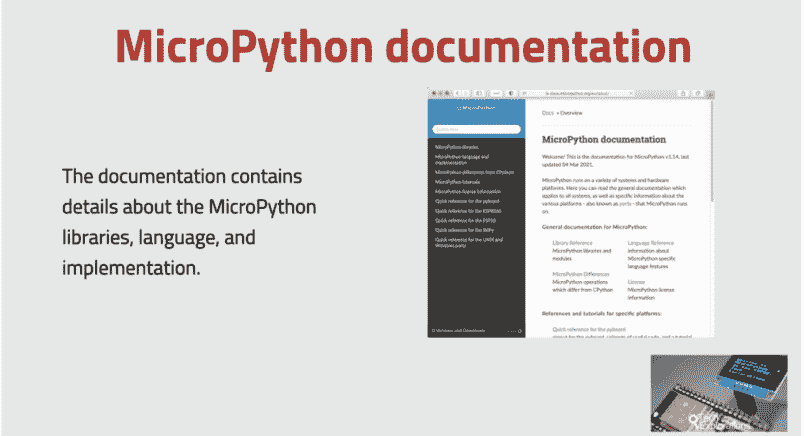

正如我刚才提到的，我们将花大量时间浏览 MicroPython 文档。文档网站托管在 docs.micropython.org。它包含了关于 Python 库、语言和实现的详细信息。在几乎所有情况下，文档都提供了每个函数和类的详细定义，以及如何使用它的简单示例。文档涵盖了 Python 标准库、MicroPython 特定库以及 Pyboard、WiPy、ESP8266 和 ESP32 开发板特定的库。


MicroPython 文档侧重于 MicroPython 特有的主题。因为 MicroPython 的语法、语言和编程哲学源自 Python，所以你需要不时地参考 Python 文档。例如，如果你不记得如何初始化一个元组，那么你可以快速在 Python 文档中查找。你可以在 docs.python.org/3 找到它，然后点击语言参考链接。

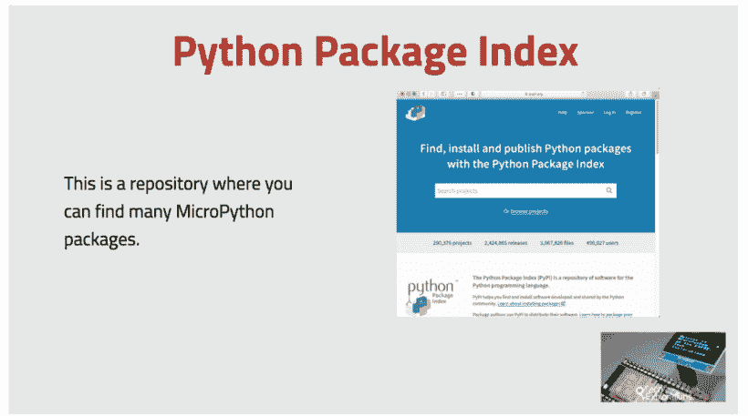

MicroPython 与 Python 一样，拥有由其程序员社区创建的大量软件包库。你可以找到许多这些软件包的仓库是 Python 包索引 (pypi.org)。Python 包索引包含为 CPython 和 MicroPython 设计的软件包。所以你在搜索时需要小心一点。通常，用 MicroPython 编写的软件包会在标题中注明。例如，可以通过搜索“MicroPython DHT12”来找到用于 DHT12 传感器的 MicroPython 软件包，以区别于为其他平台编写的软件包，例如在 Raspberry Pi 计算机上运行的 Python 软件包。当然，即使你找到了一个明确表示是为 MicroPython 编写的软件包，你也需要检查它是否支持你的目标硬件。并非所有软件包都支持。好的。

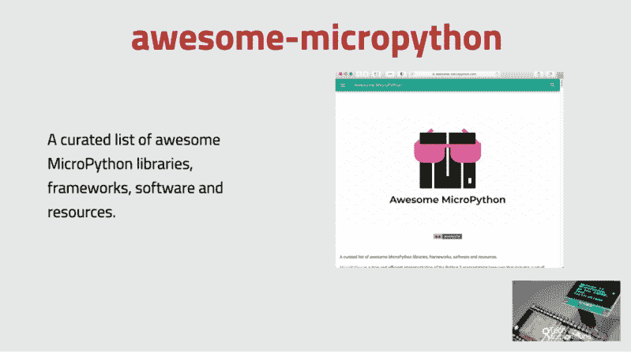

然后我们有 Awesome MicroPython，顺便说一句，这是一个很棒的名字。这是一个专门为 MicroPython 策划的库列表。这与我们刚才看到的 Python 包索引不同。在大多数情况下，当我寻找 MicroPython 库时，我首先会去 Awesome MicroPython。这个策划列表包含按用途分组的库。你会发现用于物联网和连接、通信、显示（如 OLED 和 LCD）、GPIO 和输入/输出、各种传感器、调度、存储等的库。但与 Python 包索引一样，一旦你找到一个看起来有前途的库，你需要仔细查看并确保它能与你选择的微控制器一起工作。这些信息并不总是能在库文档中轻易找到。在许多情况下，你必须下载库并在你的设备上进行测试，以确保它兼容。好的，关于推荐资源就到这里。在我们开始第一个动手实践之前，本节还有一个项目。在下一个项目中，我将讨论与 MicroPython 兼容的微控制器开发板。

### UPYTHON 兼容开发板

当 MicroPython 在 2014 年首次发布时，只有一个开发板支持它：最初的 Pyboard。几年后，本月 Python 支持了广泛的微控制器，包括 ESP32，这也是我们将在本课程中使用的那个。在项目。我们将更仔细地研究可以使用 MicroPython 的开发板。

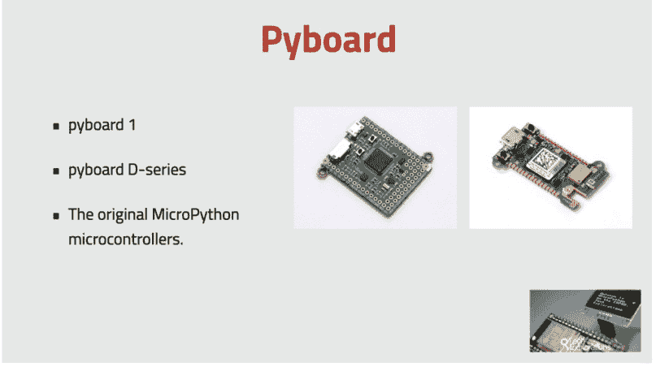

让我们从最初的 Pyboard 开始。Pyboard 是 Damien George 在 2014 年为其 Kickstarter 项目设计的用于运行 MicroPython 的开发板。Pyboard 包含一个基于 ARM Cortex-M CPU 的 STM32 微控制器芯片。它拥有一千零二十四千字节的闪存和一百九十二千字节的 RAM。它还配备了一个用于扩展文件系统的 micro SD 卡插槽、一个加速度计、一个实时时钟、一个可编程 LCD、二十九个 GPIO 和两个数模转换器等。然后是 Pyboard D。Pyboard D 也使用 STM32 微控制器，但采用了不同的外形尺寸，使其更容易集成到项目中。它拥有更多的闪存和 RAM、外部闪存支持能力，以及 Wi-Fi 和蓝牙连接功能，并且在各方面都有所改进。Pyboard 是 MicroPython 设备外观的黄金标准。

#### 基于 Espressif ESP 的开发板

- ESP8266
- ESP32
- 功能强大、成本低廉、功能齐全。

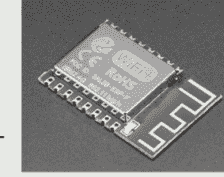

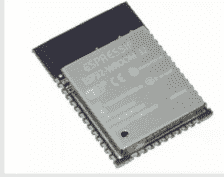


好的，当然我们还有 ESP 系列设备。ESP32 和 ESP8266 几乎完全被 MicroPython 支持，除了缺乏蓝牙支持，例如 ESP32。在之前的项目中，ESP32 特定的库在 MicroPython 主文档网站上有记录。除了 Pyboard，ESP32 和 ESP8266 似乎拥有最广泛的社区贡献的 MicroPython 库。这意味着你很有可能找到适用于你喜爱的显示器或传感器的设备驱动程序。在撰写本文时，蓝牙尚不支持，这是因为该实现需要大量内存。然而，Wi-Fi，正如你可能已经知道的，是完全可用的。因此，除了蓝牙，ESP32 上几乎所有最终用户功能都可以在 MicroPython 中使用：定时器、CPU、ADC、Wi-Fi、I2C、SPI、睡眠和数模转换器。所有这些都可以工作。甚至可以读取内部温度传感器。ESP32 是我在本课程中选择使用的微控制器，因为它出色的 MicroPython 实现、丰富的硬件以及我从之前项目中对它的熟悉。

#### RP2040 开发板

- Raspberry Pi Pico
- Feather 2040
- ItsyBitsy 2040
- Tiny 2040
- 等等。

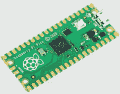


现在让我们看看 Raspberry Pi Pico。Raspberry Pi Pico 于 2021 年初发布，售价约五美元。它由全新的 RP2040 微控制器驱动。这款微控制器实际上是由 Raspberry Pi 基金会设计的。很快，几款基于同一微控制器的新开发板就出现了，比如 Feather 2040、Tiny 2040。它们都可以运行 MicroPython 固件。Raspberry Pi 基金会通过其网站提供了出色的文档。我发现，与 Pyboard 和 ESP 开发板相比，为 Raspberry Pi Pico 找到 MicroPython 设备驱动程序要困难得多。它还是一块新板，所以我预计这种情况会改变。Raspberry Pi Pico 是一款出色的、简单的开发板。它没有任何无线通信能力，但我认为在这种情况下，简单是一种优势。与 BBC Micro:bit 一起，Raspberry Pi Pico 可能是学习 MicroPython 最简单的方式。

#### BBC Micro:bit

- 专为教育设计。
- 大量板载外设。
- 出色的 MicroPython 实现。

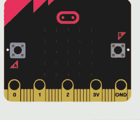

接下来可能是 BBC Micro:bit。BBC Micro:bit 是一款专为教育设计的小型开发板。它使用 Nordic nRF52833 应用处理器，并包含一系列令人印象深刻的内置外设，例如 LED 矩阵显示器、触摸传感器、麦克风、几个按钮和一个加速度计。它还有一个 2.4 GHz 收发器，学生可以尝试用它来创建一个简单的无线电通信协议，让 Micro:bit 之间进行无线通信。Micro:bit 上的 MicroPython 实现非常出色。正如预期的那样，我测试了它的许多硬件组件，一切似乎都正常工作，甚至包括无线电通信。

#### STM32

- STM32 Nucleo & Discovery
- Espruino Pico
- 更多...

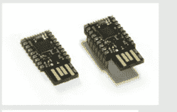

好的，接下来，我们有 STM32 开发板：STMicroelectronics Nucleo 和 Discovery 开发板，以及 Espruino Pico，它们都基于同一 STM32 系列的微控制器。我提醒你，Pyboard 也使用 STM32 微控制器单元。有几款 Nucleo 和 Discovery 开发板面向工程师的快速原型开发，但也用于教育。Espruino Pico 在创客中特别受欢迎，因为它在如此小的板子中集成了强大的功能。在 MicroPython 网站上提到，STMicroelectronics 的 STM32 系列微控制器通过 STM32 Cube HAL 库得到 MicroPython 的官方支持。MicroPython 的 STM32 移植版包含了这些 MCU 的源代码。好的，这只是一个简短的列表，一些可以与 MicroPython 配合使用的开发板示例。在本课程中，我们将使用 ESP32 进行实验。如你所知，在本课程的最后几节中，我准备了几个项目，向你展示 MicroPython 在 Raspberry Pi Pico 和 BBC Micro:bit 上的工作方式。现在是时候开始动手了。第一个实践任务是在你的计算机上安装 Thonny 的副本，作为我们将用于在 ESP32 上学习 MicroPython 的开发工具。我们将在下一节中进行。

## GETTING STARTED WITH THONNY IDE FOR PYTHON

欢迎来到本课程的新章节。在本节中，我将介绍 Thonny IDE，这是一个开源的集成开发环境，我们将在整个课程中使用它来通过 MicroPython 对 ESP32 进行编程。在本节的第一个项目中，我想在我已经设置好的实例中向你展示一下 Thonny，如果你能看到这里的话，并向你展示可以下载安装程序的位置，以便你可以在自己的计算机上安装它。所以让我带你看看它的样子。这是正在运行的 Thonny。正如我已经说过的，我做了一些配置来自定义字体类型和大小等。但基本上你在这里看到的就是安装后立即呈现的样子。Thonny 是一个功能强大且可配置的集成开发环境。在其最基本的视图中，它看起来像这样，窗口的上半部分你可以看到一个或多个选项卡。你可以有多个选项卡，用于你的各种 Python 程序或程序的组件。然后在下面，你可以使用 shell 与 Python 解释器进行交互。

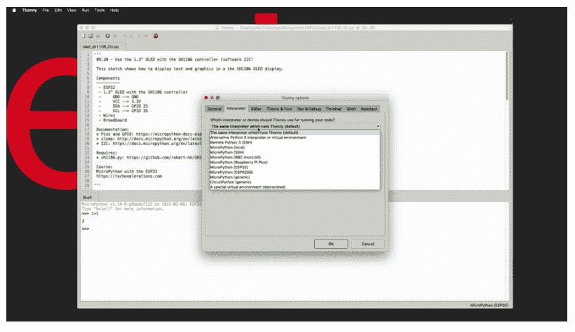

在这种情况下，正如你所看到的，我正在我的 ESP32 上运行 MicroPython，它已连接。现在不用担心这个。我将在下一个项目中首先向你展示如何在 ESP32 上安装必要的解释器，然后向你展示连接是如何工作的，并能够与 ESP32 上的 MicroPython 进行交互。但现在，我只想向你展示 shell 允许我与运行在 ESP32 上的 Python 解释器进行实时交互。但除此之外，它还有更多功能。例如，如果我进入工具和选项，我可以将解释器从 MicroPython 更改为其他可用的解释器之一。例如，这个是 Thonny 附带的 Python，或者你可以选择在虚拟环境中运行的 Python，或者在其他地方运行的 Python，甚至通过互联网。你可以通过 SSH 或其他方式访问解释器。你还可以看到我正在运行的 Thonny 实例，版本是 3.3.4，这是录制时的最新版本，还附带了在 BBC Micro:bit、Raspberry Pi Pico、ESP32 和 ESP8266 上运行 MicroPython 的能力，以及 CircuitPython 环境。所以它开箱即用就已经功能齐全了。但你可以通过插件安装更多的 Python 目标，正如你所看到的。好的。

### 如何将 MicroPython 固件安装到你的 ESP32

现在，我想向你展示的另一件事是，Thonny 不仅用于医疗设备上的 MicroPython，也用于通用的 Python 开发。它在这里为你提供了许多工具。你可以看到它能帮助你完成这些工作。例如，你可以打开文件视图，这让你能够访问本地文件系统上特定位置的所有文件。在这个例子中，它是在我的电脑上。但它也让你能够查看目标设备文件系统上存在的文件，就像这些。所以这些文件存储在 ESP 本身上。还有一系列其他类型的工具，例如检查堆内存内容的能力，或者，比如说，栈的内容，这在你从一个函数跳转到另一个函数时很有用。它可以跟踪你当前所在的函数，并稍后给你做一个小演示。在稍后的另一个部分，你可以查看已设置的变量等等。

让我们来看看 Thonny 的一些最重要的功能。首先，你有配置窗口。我们可以从首选项中访问它，但你也可以通过工具和选项访问完全相同的内容。这允许你自定义 Thonny 的外观和感觉，你使用的字体，调试器如何工作，使用哪个终端，shell 等等。所以你可以通过这种方式自定义你的 Thonny IDE 的工作方式。

这也涉及到工具和插件。有各种各样的插件可以安装，其中一些，正如我之前所说，在 3.3.4 版本中，已经内置在 Thonny 本身中。

例如，有 ESP 工具包，它允许 IDE 与工具交互，例如，为其刷新新的固件。但还有其他插件，你可以在 PyPI（Python 包的仓库）上搜索，看看还有什么可用的，稍后我会向你展示如何使用它。它也是一个像这样的包管理器，也允许你搜索和找到包含可共享库或代码的 Python 包。然后你就可以使用它们。同样，我稍后会向你展示如何安装 PyPI 包。好的，这个小介绍就到这里，我们稍后会更多地讨论 Thonny。我将向你展示如何使用我们将在整个课程中需要的特定功能。我们将需要所有这些功能，因为，正如我所说，我们不是在桌面版的 Python 解释器中编程，而是在运行于 ESP32 上的 MicroPython 解释器中编程。因此，Thonny 通常提供的许多功能将无法与 MicroPython 一起使用。

要获取 Thonny，请访问 Thonny 网站，即 thonny.org，并快速浏览一下，以了解最重要的功能。这是一个由其中一位开发者制作的演示，展示了一些最有趣的功能，特别是调试功能。所以去看看吧。要下载 Thonny，只需点击你的操作系统。在我的情况下，我在 Mac 上工作，下载一个文件，双击它并安装它。这没什么特别的。非常容易。

我想向你展示的另一个网络资源是 GitHub 仓库，这样你就可以看到项目的源代码。现在，在这里你会找到额外的版本。

所以点击 releases 链接，它会带你到一个页面，在那里你不仅可以访问最新的版本，3.3.4。在我的情况下，3.3.5 目前正在开发中。它无法通过这里的下载按钮获取。可以看到这仍然是 3.3.4。最新的开发版本是 3.3.5。但我发现特别是在 Mac 上，如果你使用的是 Mac OS Big Sur，即 Mac OS 11，3.3.4 版本无法正常工作。你可能需要使用一个更旧的版本。比如说，3.3.3 版本对我来说是有效的。所以如果你需要另一个版本，这就是你可以获取它的地方。好的，这结束了本节的第一个介绍性项目。在下一节中，我将向你展示如何在你的 ESP32 上安装 MicroPython 解释器，这样你就可以先开始使用它与 Thonny。

此时，你应该已经在你的电脑上安装了 Thonny，如果你还没有这样做，你应该去做。

现在，稍后当你有一些，比如说，你已经在你的电脑上安装了 IDE，并且你有一个全新的 ESP32，当然，它没有预装 MicroPython。所以在你实际上可以开始在这个控制器上使用 MicroPython 之前，你需要做的是安装 MicroPython 固件。

为此，你需要两样东西。首先，你需要从 MicroPython 网站下载特定设备的固件。然后第二个是使用适当的工具将它们上传到你的 ESP32。我们很幸运，因为 Thonny 3.3 版本（我相信）及更高版本内置了 ESP 工具。所以我们不需要在 Thonny 环境之外做任何事情。所以在这个项目中，我实际上将使用 Thonny 将 MicroPython 固件上传到你的 ESP32。

所以第一步是访问 MicroPython 网站 micropython.org，点击下载，然后找到你的硬件设备，就是这个。我使用的是通用的 ESP32 模块，bin 等等。然后这里你有几个选择，基本上这里有三个。

当然，这个版本将是完整版本。我将使用这个稳定版本 1.1 作为所有固件。有不稳定的版本，也有专门针对带有额外 SPI RAM 芯片的版本，它提供了额外的内存。我没有那个。我将使用通用的稳定版本 1.1。所以点击链接下载文件，你最终会得到一个像这样的文件。这个文件大约 1.5 兆字节大小。这就是包含固件的二进制文件，我们稍后将使用 Thonny 将其上传。所以现在去 Thonny。可以把这个放一边了。在 Thonny 中，显然将你的板子连接到你的电脑，然后在工具和选项中选择 MicroPython，特别是解释器，这是我们想要使用的，从端口下拉菜单中。

选择你的板子连接到的端口。如果它和我的类似，那么会有一个看起来像这样的条目。我的控制器只是想要，至少在我的 ESP 版本中，是微控制器和监视器，就像这样，然后点击安装或更新，这将带你到安全系统，安装程序将需要再次选择适当的端口，然后浏览固件，就是这个。

并打开，你可以保留这里的默认选择，即在安装前擦除闪存，这个工具将在安装固件之前清理 ESP32 的闪存。所以最终你会得到一个处于某种工厂模式的安全系统，一旦它从安装过程中返回，这正是你想要的，然后点击安装。你会在左下角看到进度，几分钟后。我们回来了，安装完成了。我们在这里完成了，我们将关闭工具包，好吗？你可以看到现在我们有了来自 Python 的提示符。MicroPython 1.14 正在硬件模块上运行。如果你输入 help，你会看到一些关于此安装的信息，只需放大购物循环即可。好的。这就是我的代码。Python 3 会为你提供一些关于机器模块以及你可以用来操作引脚的信息，例如，我们稍后会详细查看所有这些内容，它会告诉你如何配置各种命令以在显示中使用。我可以说一加一等于二。计算是在 HP 32 上使用 MicroPython 完成的，现在你有能力在 HP 32 上运行 MicroPython。让我们继续回顾 Thonny IDE。还有几件事我想向你展示。继续下一个项目，我们将向你展示如何在 Sony 上众多可用的解释器中选择和解释。之后，实际上，你必须放置你的第一个 MicroPython。

### 设置解释器

这在第一个项目中已经提到。所以这个想法是能够使用多个 Python 解释器，当然不是同时使用，但它确实让你能够选择接下来要使用哪个解释器，以及该解释器安装在哪个设备上。所以在这个项目中，我想快速向你展示如何在解释器之间切换，为此我们将专门使用这个显示。

所以如果你进入工具，然后选项，你会看到在解释器下展开那个下拉菜单，你会看到它配备了各种解释器。有一个解释器——它本身，是环境的一部分。但你也可以选择使用安装在你计算机上的 Python 实例。当然，你可以在各种设备上运行 MicroPython，包括 Acrobat Raspberry Pi 图片，最好已经选择了减少，因为我们在我的全新设备上安装了 MicroPython 固件，我们也测试了它。我刚才做了一个简单的计算。所以我们有了 MicroPython 打印。这是关于我们当前使用的 Python 解释器的信息。所以如果我做一个像这样的小计算，你会看到它从这里工作。

我想切换到唯一的内置环境。我可以为你做到这一点。那是唯一的选项，然后选择相同的解释器，该解释器与 Tony 一起运行，并进行相同的计算，结果当然是相同的。

所以你可以看到你现在正在工作的环境的名称是 Python 3.7.9。但它不是 MicroPython。好的。但其他东西怎么样？我们试试在新的 Raspberry Pi Pico 上运行 MicroPython 怎么样？这个最近才出来，大约一个月前。我拿到了几个。这是一个运行 MicroPython 的 Raspberry Pi 微控制器。我这里有一个字母，只是显示电源已连接。这没有连接到 GPO。

所以我只是要断开我的无能连接 Raspberry Pi Pico。正在指示这个电源。

让我们看看我们是否可以使用 MicroPython，我们将转到两个选项。选择我的 Raspberry Pi Pico。有对 Pico 的支持。好的，现在我有一个新的 Python 项目。

这是在 Raspberry Pi Pico 上运行 MicroPython，使用这个 CPU。这个微控制器应该说是 RP2040。那是一加一等于二，所以我能够从 HP 微控制器解释器切换到 Raspberry Pi Pico 微控制器解释器，这就是你如何从一个设备切换到另一个设备。我在本节后面有几个项目，会对 Raspberry Pi Pico 进行更多的实验。

我还带了一个 micro:bit 来向你展示如何在 micro:bit 上运行 MicroPython，并使用 Thonny 轻松编程这两个设备。好的。让我们进入下一节，我们将向你展示如何执行你的第一个简单程序。

### 如何编写和执行 MicroPython 程序

在这个项目中，我想向你展示如何编写和执行一个非常非常简单的，尽可能简单的 MicroPython 程序。我们将使用 ID 以几种不同的方式运行它。所以让我先展示一下。打开你的 IDE，这次我将打开这些文件。侧边栏在 MicroPython 窗口的左侧，所以你可以看到我的经验已经通过 USB 电缆连接到我的计算机，但我在我的环境中没有看到它。

所以我首先要检查我是否选择了正确的解释器，我没有。所以让我们切换到医院，到下面的适当端口。这是第一件事，确保我们有一个连接。然后我们选择了正确的设备。所以既然我这样做了，你可以看到 MicroPython 设备再次出现在 sys ops 选项卡下。因为这是一个非常新的安装，我刚刚刷新了固件几年，设备上出现的唯一文件是 boot.py。我将在下一节中更多地讨论这个，该节专门用于在 ESP 32 上运行 Python。我双击它，文件内容出现在新标签页中。你可以看到内容是几行代码。所以它们不会有任何效果，这只是一些 Python 命令。但你现在完全可以忘记这个，因为我们真的不需要它。我想做的是运行一个非常简单的程序。首先，我将在 shell 上运行该程序。基本上，该程序只有一行代码，然后我将创建一个文件，该文件允许我使用微处理器将程序作为文件运行。该程序是经典的 world。

我将说 print，然后像文本字符串一样。我想打印出来自 MicroPython 的 words，并输入这个指令，然后 MicroPython 在 2 上运行将打印出这条消息。现在，你注意到我是在 MicroPython 命令提示符上输入这个命令的，该提示符在我的 HP 32 上运行。所以这是交互式显示，也称为 REPL。所以每当你听到 REPL，基本上它的意思是能够实时发出命令，本质上是与 MicroPython 一起，并以你想要执行程序的任何方式立即执行这些命令，在 MicroPython 中，特别是对于较大的程序，当然是这样做的。一种是在像这样的文件中这样做。所以我只是复制了我的单个命令。但这个小程序被放入一个文件中，我将输入一个约定，我将使用它。井号符号精度，像一个简单的 Python 程序。我将说这个程序，唯一的 ID 给了我一个选择，我想把这个程序放在哪里，我的计算机还是 Python 设备，在这个实例中，我将选择计算机，这将给我一个选项，将其存储在某个地方。

所以假设我要把它放在这个位置，只是说 hello, world，作为最终系统观看并说。好的，你可以看到那个程序就出现在这里。

现在我可以做的是点击这个绿色按钮，让程序执行。现在，这对 Python 和 IDE 的新手来说有时是一个令人困惑的概念，刚刚发生的是我有一个没有安全网的小 Python 程序。我有一个 Python 程序存储在我的计算机上，它在 ESP 30 设备上执行。所以你可以看到我再次连接到我的 Python 运行城市 2。这个程序存储在我计算机上的一个文件中，按下绿色按钮后，它被发送到 ISP 32 进行执行。它被执行，然后它的输出通过显示返回给我。所以这是一种方法。

当然，另一种方法是将 Python 脚本直接存储在设备本身。因此，有几种方法可以实现这一点。最简单的方法是，既然我们已经在本地机器上有了这个文件，只需右键单击并选择“上传到 forge”，这将发送文件并将其存储在 ESP32 闪存文件系统中。现在，如果我双击它，你会看到一个新标签页出现。它名为“Square Brackets”，文件名相同。方括号表示该文件存储在设备上。

没有方括号则意味着文件存储在我的计算机上。那么，一旦我有了文件，无论它是在计算机上还是在设备上，我都会执行它，这完全一样，只需按下绿色按钮或 F5 键，它就会执行。真的，这没有任何区别。一旦你有了文件，无论文件在哪里，它都会通过发送到你选择的相应解释器来执行，这是唯一的选项。好的，这个系统有一些细微之处，我们稍后会探讨。这些细微之处与依赖项有关。例如，如果我尝试执行一个存储在我计算机上的文件会怎样？如果我的程序中存在依赖项怎么办？例如，如果这个程序需要一个模块，而该模块没有存储在 MicroPython 设备上，那么我是否可以直接上传并在设备上执行这个文件？你还需要处理这些依赖项。本课程后面有一些示例，我会向你展示这是如何工作的。特别是，如果你好奇的话，可以去看看 Wi-Fi 示例。在 Wi-Fi 示例中，存在依赖项。例如，我们有一个包含 Wi-Fi 网络凭证的 JSON 文本文件，程序依赖于这类东西。而这些依赖项最终将存储在 MicroPython 设备上。

或者，显然，我们将更深入地探讨如何使用 MicroPython 在 ESP32 上编写和执行程序。但在这个简短的介绍中，我只想向你展示最简单的实现方式。在下一个项目中，我想简单演示一下 Thonny 的一些其他功能和特性，特别是关于堆、栈和变量的部分。

变量，从在 Python 编程中使用它们的角度来看很有趣，但在 MicroPython 编程方面用处不大。尽管如此，这些问题我经常遇到，我只想向你展示这三个页面至少列出了什么。

### THONNY IDE 中的其他视图

在这个项目中，我想向你展示 Thonny 的一些其他功能，特别是关于调试方面，很多人问到这个。我必须说，这些功能在 ESP32 上的 MicroPython 编程中并不真正可用，但它们适用于通用 Python 和桌面版 Python。我将在接下来的示例中使用它们。同样，这些不是我们将在本课程后面使用的功能，但确实是人们会问到的问题。我只是想确保在我们开始使用 MicroPython 之前，你对 Thonny IDE 有一个很好的理解。我已经打开了变量、堆和栈窗口。

你可以通过转到“视图”并选择你想要打开的窗口来做到这一点，例如，你可以在这里看到的程序树。

让我们看看对象检查器等等。我不会逐一介绍所有内容，因为那样就超出了本课程的范围，本课程的重点是 MicroPython。

在我开始我的小演示之前，我还想指出，如果你访问 thonny.org 网站，这是主页。这里有一个演示项目，我之前提到过。你真的应该看看它，它会让你对这些功能有一个非常好的概览。我也会在这个项目中涉及。好的，我将关闭对象检查器和程序树，我并不真的需要它们。

我将把目标解释器切换回默认的，因为，正如我所说，这些功能在 ESP32 MicroPython 版本中不起作用。所以现在我们运行的是 Python 3.7。我这里有一个小程序，只是将两个数字相加，数字一和数字二，只是几个任意的随机数。你也可以使用 input 函数，允许你在运行时输入这些数字。但让我们保持简单。我这里有一个计算过程。结果放入 sum 变量，并像这样将结果打印到 shell 上。我使用了 format 函数，我们将在第五节中更详细地讨论这个，那是对 Python 的相当详细的介绍。所以会有更详细的说明来解释它的作用。现在重要的是输出是什么。

所以你运行这个程序，你会看到输出只是计算的总和，以及一些关于计算组件计算了什么的信息。现在，看看我一执行程序发生了什么，变量选项卡就被数字填充了。你可以在这里看到，我有值 ID，这是 number_one 存储的内存位置。number_two 和 sum 也有堆。栈中的内存是空的，隐藏内存是堆和栈都存储在 RAM 中的地方。Python 特别地以不同方式使用堆和栈。所以据说两者都是 RAM 的一部分。但在内存中，Python 将存储全局变量。你可以在这里看到，number_one 是一个全局变量，存储在这个远程位置，0x3ffb0，这与堆中的这个 ID 匹配，它的值是 1.5，正如在脚本的第三行所分配的那样。同样，第四行声明并初始化了变量 number_two，你可以在这里看到。这是它的值，在 RAM 中，就在这里的堆中。同样，这里是 Python 存储其全局变量的地方。你有 sum，它是后来创建的，其内容是 number_one 和 number_two 相加的结果。我们栈中没有任何东西，因为我们没有任何函数。

所以让我向你展示这个简单程序的另一种方式。这里我有完全相同的事情发生，但现在我声明了一个名为 add_numbers 的函数。同样，不要担心细节。我将在本课程的第五节中讨论如何创建函数。但你会看到我们有全局变量。我们在这里创建了 sum 变量，然后我们调用了函数 add_numbers。所以本质上程序从这里跳到这里，然后我们到第五行并执行它。现在，如果我运行这个程序，看看会发生什么。程序执行后，我们没有真正看到的一件事是栈中发生了什么，如果有的话。栈，正如我之前所说，是 Python 跟踪其在程序中位置的地方。当我们必须从程序的一部分跳转到函数内部继续执行程序时，栈特别有用。因此，Python 需要知道函数执行完成后返回到哪里，它需要跟踪栈内的调用源，并能够看到它开始被填充。

我将首先使用调试功能。我会在这里设置一个断点。只需双击我希望程序执行暂时停止的行，然后点击当前螺丝按钮，程序就会开始执行。但程序会在红色圆点（停止线）所在的位置停下，你可以看到这里有变量，即全局变量。我有堆，就像我们之前做的那样。现在堆中有一个额外的组件。我们有函数ID编号。

所以程序确实知道它。我可以使用这里的其中一个模式继续程序的执行。所以单步跳过、单步进入和单步跳出，单步跳过允许我移动到程序的下一行，而无需实际深入到构成这行代码的各个组件中，而是直接跳过。我将单步进入以更详细地解释我在这里谈论的内容，记住我们现在正在执行第15行。

我将单步进入，你可以看到现在单步进入后，执行继续到等号的右侧。如果我再次点击单步进入，它会进一步进入这个加法的第一个组件。

它将进行评估，你可以看到它会将其转换为它的ID，所以Vago no one现在在代码本身中被其值ID替换，你可以在变量选项卡中看到。而且在堆中，你可以看到它实际上被赋值了。再单步进入一次，然后它会转到另一边查看数字。同样，你可以猜到如果我再次点击它，它会进入数字并将其替换为它的ID。但相反，我要做单步跳过，这将跳过它并开始退出。直到最终整个内容，这两个数字的和被替换为存储这些数字的ID，即B307.8。它只是关于再次，它将跳转到第19行。现在，看看这里发生了什么。一旦我进入第19行，什么是调用add numbers函数？堆栈会跟踪这一点。堆栈现在跟踪我将跳转到程序的另一部分，这恰好是一个函数，所以这是函数执行完成后程序将返回的地方，它将单步跳过那里并完成。所以它不会进入函数，因为我做了单步跳过。我想在这里再做一件事。我会说Trent finished像这样，我会再次执行。这次使用调试器，我将第一次单步跳过，然后我会单步进入四次来完成这个。我会打开堆栈。

当你看到模块第19行在堆栈的第一个位置时，我现在将单步进入，深入到函数中。现在这很有趣。你看到一个新窗口弹出，因为现在我们已经深入到add numbers函数中。所以一个新窗口弹出，向我们展示该函数内部发生了什么。你可以看到堆栈中又添加了一个条目。

现在是第5行，这是我们当前正在执行的行，所以再次单步进入，看到深入到各个组件中，并用堆中包含这些变量值的ID替换它们。所以这些在它们被执行和评估时会这样。以此类推，整个print语句及其参数被替换为一个单一位置的单一ID，我应该说，就在这里，8408如果你喜欢这样，这是存储结果消息字符串的地方。再一个，好的，完成了，所以完成了，你可以看到我们现在从堆栈回到程序的主要部分。所以堆栈条目现在只包含第19行，因为我们已经完成了Python的执行和函数的评估。

所以让我们再做一个。实际上，我现在要做单步跳过，打印finished，我们完成了。这个演示只是想向你展示你可以使用这里“视图”菜单下可用的附加视图和功能做什么工作。

再次，我们无法在特定的微Python编程中使用这些功能，但如果你对通用桌面或C Python编程感兴趣，它们是可用的。

我们在这里看到的调试器实际上是一个名为Bird's Eye的Python项目。所以你可以在这里找到Bird's Eye的项目文档，包括关于如何使用它以及你还能用它做什么的教程。我只是浅尝辄止。这是一个非常有趣且有用的Python调试器，如果你有兴趣做一些更复杂的Python编程，最好知道如何使用它。好的，现在，在接下来的几个项目中，我想向你展示如何使用BBC Microgrid和Raspberry Pi进行简单的微Python编程任务。

### THONNY IDE WITH RASPBERRY PI PICO

在这个项目中，我想快速演示一下如何使用IDB和微Python用大图做一些简单的事情，在这种情况下是让板子亮起来。目前，我的inspirited已连接，所以它是未连接的，而是将Raspberry Pi pickle重新连接到thorny idy。

两个选项将整数更改为三个pickle，并显示端口已正确选择并确定。所以现在我们已将目标设备切换到Raspberry Pi pickle，这意味着运行微Python。

这实际上是它出厂时的样子。我不需要在安装微Python解释器方面做任何事情。只需即插即用。

我们可以在其网页上找到关于pickle的信息。你可以在这里看到Raspberry Pi.org文档。他们可以开始并向下滚动查看板子规格。

你看到引脚映射。大图配备了各种Tapio功能和通信功能。其中一项有趣的技术是可编程输入输出，Appio状态机，基本上允许你编写简单的程序并在特定的bios上执行。因为它们直接在检查点上运行，不占用任何MCU周期，所以它们非常非常快。这是一个相当高级的主题，但我想我应该提到，因为与其他微控制器单元相比，它确实是一个突出的功能。总之，在这个简单的例子中，我可以向你展示如何切换内置的状态。正如你可以在引脚映射中看到的，它连接到芯片。二十五使用thony来吃。

好的，你需要做的第一件事是从machine库导入PIN模块，machine库，你稍后会更详细地了解。它是一个适用于所有支持微Python的单元的库，它包含专门为你要定位的微控制器创建的函数。所以在这种情况下，machine库包含专门适用于pickle的函数。稍后我们将使用专门适用于HP32等功能的machine库的不同版本。这是因为每个硬件目标在硬件功能方面是不同的。这些差异反映在各个machine库中。现在你有了PIN模块，我将能够使用PIN模块提供的功能来执行诸如切换实体状态之类的事情，正如你所说，它连接到JP25。首先将创建实体对象，我将使用PIN构造函数，以便我们定位JP25。这将是一个输出，这就是你在Raspberry Pi Piggot中设置它的方式。现在我们有了这个对象，我们可以收集工作。也许我应该说，不要那样说话，Verizon。如果你更具体地想写入top25的值，这也是另一种方法，就是使用venue方法。在这种情况下，世界现在是关闭的。所以我要通过像这样放入值1来打开它。你也可以通过调用value但带参数来检查ality的状态。你可以看到现在它在五级顶部，再次检查值，你会看到它现在是关闭的。它是零。

这只是一个快速演示，因为本课程的重点是三。但如果你对了解更多关于Cross-感到好奇-

### 在 BBC Micro:bit 上使用 Thonny IDE

在本课中，我将向你展示如何在 BBC Micro:bit 上运行一个简单的程序，该程序会在 micro:bit 背面的 8x8 点阵显示屏上滚动显示 "Hello World" 文本。当然，这需要使用 MicroPython 和 Thonny IDE。

本质上，我已经将 micro:bit 连接到了我的电脑上。

如果我使用 Thonny，一旦你完成连接，进入“选项”菜单，确保将 MicroPython (BBC micro:bit) 选为本次会话的解释器，然后选择相应的端口。这里需要记住的是，micro:bit 出厂时并未预装 MicroPython 解释器。

因此，如果你无法通过 Thonny IDE 正常工作，在选择了解释器和端口后，请点击“安装或更新固件”，以便继续在 Micro:bit 上安装 MicroPython 解释器。

我已经完成了这一步，所以不会覆盖我的固件。我没有取消。但在你的情况下，你可能需要这样做。如果这是你第一次将 micro:bit 连接到电脑，并希望将其用作目标设备上的 MicroPython 解释器。所以取消并取消。

另一个非常有用的资源，如果你有兴趣将 micro:bit 用作 MicroPython 设备，我鼓励你查看 BBC micro:bit MicroPython 文档。文档地址在这里：https://microbit-micropython.readthedocs.io。现在让我带你看看这里。你可以用 micro:bit 做很多事情。micro:bit 本身带有大量板载硬件，例如，它有一个加速度计。

它这边可能有两个部分。它有一个点阵显示屏，非常亮的红色，这里还有输出端口等等。文档会向你展示如何使用所有这些硬件。在这个简单的例子中。

我想做的就是使用显示屏，创建一个简单的 Hello World 程序，以文本和单个字母在屏幕上滚动的方式打印出 "Hello World"。对应的命令是 `scroll`，它位于 `display` 模块内，而 `display` 模块本身又位于 `microbit` 包中。

你可以在这里看到它的构造函数，第一个参数是必需的字符串值。其余参数是可选的，并且有各自的默认值。所以如果你选择不提供它们，它们会有像这样的默认值。我将使用这个 `scroll` 函数的最简形式，就像这样使用它。那么，首先要做的是，把文档放在一边，这里腾出点空间，我要把 micro:bit 翻过来，这样我们就能看到背面的点阵显示屏了。让我们像这样重新调整方向。

好的。那么这实际上要做的是导入整个 `microbit` 包。说 "microbit" 然后再说 "microbit" 有点难。简单明了，我喜欢这样。

现在看看屏幕上的内容。消息正在点阵显示屏上滚动。好的。另一件你可以做的事情，再举一个例子，是使用 `display.set_pixel` 命令。它的工作方式是这样的。我可以对...比如说位置 (0, 0)，我们横向有五个像素，四、五，然后纵向也是五个。一、二、三、四、五。所以 x 轴五个，y 轴五个。并且从索引零开始。所以是 (0, 0)。然后我需要提供 LED 将要发出的光的强度。1 是最暗的，9 是最亮的，算是最亮的之一。

这就是最亮的 LED。让我们再点亮一个。选择 (4, 4)。

这就是右下角。绝对正确。我可以使用 `clear`。这需要输入一些代码，它会关闭屏幕。我也可以使用 `get_pixel`，让我们来试试这个。我正在进行代码补全，所以我按下了 Tab 键，然后 Thonny 会告诉我哪些关键字可用。我想要的是 `get_pixel` 关键字。抱歉，是 `display.get_pixel`，然后从这里开始，同样，我要获取这个简单信息，我想知道位置 (0, 0) 的像素，

例如，是开还是关。我只需要说...它正在寻找坐标。哦，抱歉。我们不要这样...像这样使用 `get_pixel`，它已经...它处于开启强度。让我们回到我之前的一个命令，像这个，获取相同位置的像素。它获取的是强度值，而不仅仅是开或关。所以这只是一个快速的示例演示，向你展示如何使用 BBC micro:bit 上的显示屏。如果你好奇并感兴趣，可以查看文档以了解如何使用它的其他功能。

### Thonny IDE 高级配置

在这个项目中，我想向你展示 Thonny IDE 中的高级配置文件，以防你想修改一些功能，而这些功能无法通过这里的菜单完成。首先。

前往 GitHub 上的 Thonny 项目，向下滚动找到这里的 wiki 链接，以及最终用户部分。

然后在这里查找 MicroPython 和可用页面。在 MicroPython 页面中，查看高级配置。

然后它提供了一些专门针对 ESP32 高级配置问题的信息。它列出了哪些关键字是可用的。例如 `sync_time` 和 `utc_clock` 等。

目前更感兴趣的是 `sync_time` 和 `utc_clock`。如你所知，ESP32 芯片内集成了实时时钟。当你使用 Thonny 上传程序时，Thonny 可以将时钟重置为正确的系统时间和日期。要使其工作，你需要确保 `sync_time` 关键字设置为 `True`。另一件你可以考虑的事情是，你希望实时时钟设置为 UTC 时间还是你所在时区的时间，你可以通过 `utc_clock` 关键字来控制。

所以当你设置为 `False` 时，你的 RTC 精度将同步到你电脑的本地时间。要访问可以进行所有这些设置的配置文件，请转到 Thonny，然后在“工具”下点击“打开数据文件夹”，这将打开包含配置文件的文件夹。

这是文本文件。只需用 Thonny 等文本编辑器打开它，你就能看到其内容。

有许多控制各种功能的模块。如果你感兴趣，可以详细查看它们。但在这里你会找到 ESP32 开发板。它包含诸如报告之类的内容，然后你可以设置同步时间。她说现在等于 true，我将要……它是一个时钟等于 false，所以这些是开发板的一些更高级的配置选项。说到同步时间，我只想提一下，在第 12 节中，我有几个项目向你展示如何通过编程方式设置 ESP32 的 RTC 时间，包括手动设置和通过互联网原子钟获取准确的时间和日期。所以你有三种设置时间的方法。你可以让 Thonny 为你设置，或者你可以手动编程设置，或者通过编程从国际原子钟获取准确的时间和日期。

### 在 PYPI 上查找 Python 包

Thonny IDE 允许你从 PyPI 安装 Python 包。有一个网站包含可用 Python 包的列表，即 Python 包索引，你可以在这里看到。

你可以直接从 Thonny 界面安装 Python 包。我们转到工具并管理包，这里有一个搜索框，它基本上允许你搜索可以直接通过 PyPI 网站找到的相同项目。让我给你举个例子。

假设你只是在做一个广泛的搜索，比如 Python，看看有什么与 Python 相关的包可用，你可以看到有一个 CPython，CPython 项目。其中很多我不熟悉。我不知道它们具体是什么。这是 Monty Python 的 Aristocats 模块，这五个模块用于生成哈希值。Dummy B，三，四，数据结构，图形等等，所以有很多包可以浏览并尝试弄清楚你想要什么。我将随机选择一个，比如说，我将转到这个页面实际看看还有什么。

假设，假设这个像这样。我不知道这是做什么的，但假设这是你想要在你的 MicroPython 项目中内部安装的包，这样你就有了一个名称。

你可以复制它并粘贴到你的 MicroPython Thonny 安装中，所以我将再次尝试。复制并在 PyPI 中控制搜索，这里有一个与我们直接在网站上找到的完全相同的项目。我最初在 PyPI 网站上进行研究。现在我已经得到了它，我将点击它。它提供了更多信息。

如果有一个与我正在查看的相同，版本 0.0.1，我可以安装它。我正在安装这个包。在这里，它告诉我它安装在哪里。让我们关闭它并检查一下。我将在这里查看我的 MicroPython 设备中的文件窗格。

她有一个新的目录，selectors 包已经安装。你也可以看看。在这种情况下，它是空的，但似乎里面没有任何东西。是的。所以突然让这个模型为这个例子做一个好的选择，但让我们做另一个例子。我们如何寻找特定于 ESP32 的东西？所以我将搜索，比如说，MicroPython 和 ESP32，看看会出现什么。这里要记住的是，因为 MicroPython 可以在许多不同的硬件模块上使用，并非所有模块都与所有硬件模块兼容。例如，你可能会发现一个 DHT 模块在 Raspberry Pi 上完美运行，但它在你的 ESP32 上无法工作。那么你需要为 ESP32 找一个 DHT。所以你需要在这里做一点挖掘和仔细研究，找到一个专门与你的模块兼容的 MicroPython 包。说到 ESP32，通常适用于 ESP8266 的模块也将在 ESP32 上正常工作。在大多数情况下，我们确实在 ESP8266 和 ESP32 之间具有这种兼容性。

假设 micropython-wifi-manager 0.36。这很有趣。它是一个网络配置工具。我过去从未使用过它。我并不真正知道它的作用，但让我们在 ESP32 上安装它。同样，工具 > 管理包。将它粘贴到这里。搜索。

就是它，版本 0.3.6，这是我在网站上直接查看的那个。所以安装它。

好的，这很有趣，我想。好的，这是我一直在为其他事情工作。将寻找我之前找到的，以节省一点时间，这样我可以想到这个。

所以这个包看起来很有趣。它允许我创建一个热点，一个非常热的点，这样我就可以看到我可以在 ESP32 上设置 Wi-Fi。还有版本 0.33，这是我在网站上找到的那个。安装它。

这个看起来工作正常。关闭。所以你可以看到，他们安装了一堆文件，这些文件共同构成了这个模块，你可以看到它的样子，它的配置以及它的照片的性质等等。你想学习如何使用它。

你可以在这里查看文档。但这只是一个例子，说明你如何找到然后安装和使用第三方包，开源 MicroPython 软件，可以帮助你实现你自己项目的目标。当你开始实践实验时，我稍后会使用其中一些。从 60 秒开始。

## MICROPYTHON SHELL

你好，欢迎来到本论述中的一个新部分。在本节中，有几个项目，我将向你展示一些专门与在 ESP32 上使用 MicroPython 相关的主题。

例如，在本节的第一个项目中，我将向你展示几种与 MicroPython shell 交互并运行交互式程序甚至执行已存储在文件系统上的程序的方法。然后在下一个项目中，我将向你展示如何使用 Thonny 从计算机的文件系统上传和下载文件到 ESP32 文件系统，反之亦然，以及如何执行诸如中断正在运行的程序等操作。所以让我们从 shell 开始。当然，shell 是在 ESP32 上运行的，而不是在 Thonny 上。Thonny 只是让我们访问 shell。这只是你可以访问它的各种方式之一。我们将向你展示如何使用 Thonny 来做到这一点。这是你在之前的项目中已经见过的东西。但我将在这里向你展示一个替代方案，我使用一个名为 Serial 的程序，它让我可以访问在 ESP32 上运行的完全相同的 shell。所以我将把这两个并排放置。当然，这两个工具中只有一个可以同时连接到 ESP32 上的 MicroPython shell。现在我已经将 Thonny 连接到 shell。你可以看到 MicroPython 设备在 Thonny IDE 的左侧可用，当然，shell 提示符就在这里等待我的命令。为了演示这里的一些事情，我将一个红色 LED 连接到 GPIO 21，然后通过一个 220 欧姆的电阻，限流电阻，接地。这里的阴极，

### 如何中断正在运行的程序

在本节中，我们将向您展示几种中断正在运行程序的方法，实际上内容会比单纯中断程序稍多一些。我将向您展示如何使用软重置功能重启您的ESP32，以及如何从Thonny断开连接并断开开发板。

LDA的阴极朝向接地，让我把它放回原位。好的。当您完全在命令行环境中操作时，假设我们现在不是在Thonny中进行，因此我们无法访问这里的文件浏览器，那么您需要熟悉的一个模块是`os`，即操作系统模块。

这个模块是Python（或CPython）的核心模块。在这种情况下，由于我们使用的是MicroPython，因此有一个微型操作系统模块，即`uos`或微型操作系统服务模块，它包含了完整C语言`os`模块中函数的一个子集。

查看MicroPython文档，这里列出了这些函数，您可以看到其中一些，例如，`uname`函数会返回一个包含这些项目的表格，帮助您识别脚本正在使用的设备，这个随机对象包含随机数字等等。

但我认为有趣且我们稍后将使用的是这个：`listdir`。因此，我将使用这个目录来查看我的开发板上已经运行了哪些文件，然后向您展示如何执行这些文件。

我们可以创建目录或删除文件等，因此我们可以查看这个位置，了解操作系统服务模块内部有哪些可用的函数。这非常有用。让我们试一试。

我将首先导入`uos`，然后列出可用的文件。当然，我们可以在这里看到这些文件，但我要在开发板上执行这个操作。所以让我们选择这个命令。只需复制并粘贴到这里，加上括号。您可以看到在根目录中有这三个文件。当然，整个世界都包含这个脚本，我可以在命令行中输入它并交互式运行。我只需在这里输入`hello`，它就会返回。现在，假设您不想在开发板上输入交互式命令，而是想执行一个现有文件，比如`arrow_score_wifi.py`。好的。那么如何做到这一点呢？有一个Python命令叫做`execfile`，我发现它对于这个目的非常有用。所以我将复制文件名并粘贴到这里。您可以看到，当我点击数组中的这个项目时，对象检查器出现了，它告诉我这个数组的内容是什么，这非常有趣。您会得到如此漂亮的配对数据。我们现在关闭它。我已经使用了`execfile`，传递了文件名作为参数，然后按回车，这将执行该文件中包含的程序。

现在让我们转向另一种方法，这只是连接到完全相同的命令行并实现相同目标的另一种方式。

这里要做的第一件事是断开连接并释放我的ESP32，然后我将进行连接。我在计算机上使用控制命令来执行此操作，但您也可以使用终端连接，这将连接到命令行。按回车获取提示符。

我可以做与在Thonny中完全相同的事情。

所以`import uos`作为微型操作系统，然后尝试`listdir`函数。它在哪里，代码补全功能也有，我可以按Tab键，代码补全功能就会激活。所以这是三个文件中的两个加上目录。在这个级别上，文件和目录之间没有区别。我将使用`execfile`来执行`hello_world.py`，它运行正常。完全没有问题。所以我将从串行端口断开连接，并继续在Thonny提供的命令行中进行其他几个实验。

所以让我们点击停止来实际开始，连接有点违反直觉，但它仍然可以轻松地停止和重启后端。三，二，又连接上了。您可以看到它在这里。一切就绪。现在来看另一个示例，它涉及将一些代码从本地文件系统上的Python文件复制到开发板上的能力。

首先，有一个`machine`模块，它包含各种模块，包括`Pin`，允许我操作引脚。我在第7节及以后有更多关于这些模块的详细信息，我将深入探讨这些模块。所以现在，不要太担心它们。只需跟着操作，看看这是如何工作的。然后，实际上，我不会导入`time`或`microtime`。我现在不担心那个。接下来要做的是创建`led`对象。将对象连接到引脚21并将其配置为输出。然后我将使用`led.on()`打开LED，使用`led.off()`关闭它。非常简单。所以您现在可以从命令行控制硬件资源，但命令行也允许您创建代码块。例如，这里有一个代码块，这是一个无限循环。这将永远执行，因为这里的条件为真。它不会改变。所以它将打开LED，保持半秒钟，然后关闭它并保持关闭一秒钟。这将为您提供机会，向您展示如何在命令行中使用循环，以及如何中断它们。

因为这里使用了`sleep`函数，我需要从`microtime`模块导入`sleep`。所以有`sleep`，我将直接使用这个。所以`while True`，别忘了两个点。最后，我可以看到命令行正在等待我输入缩进内容。输入一些将成为这个`while`块一部分的内容。所以`led.on()`，然后`sleep`半秒钟，然后`led.off()`再`sleep`半秒钟。现在我完成了。我需要回到上面并加上括号。所以命令行有一些智能功能。所以您看到命令行没有出错。我只是能够使用箭头键回到上一行并添加缺失的括号。命令行知道那里有问题，因为它确实有正确的高亮显示。所以您知道需要关闭括号以匹配开头的括号。完成那一行后，我实际上完成了这个代码块。所以我将再按一次回车。现在LED每次闪烁半秒钟，您可以看到我这里没有提示符。我看不到提示符，因为我的MicroPython实例正忙于闪烁。所以我的ESP32现在真的无法做其他事情。它被锁定在这个无限循环中。要停止无限循环并能够做其他事情，比如上传或下载文件，我需要进入运行菜单并选择中断执行，或者直接按Control-C，这就是我将要做的。

这将中断执行并强制跳出循环，但它确实跳出了循环。内存没有完全清除；它仍然存在。

所以我仍然可以回去打开或关闭LED。对象仍然在内存中。如您所见，我能够使用命令行编写简单程序，测试概念，然后进入我的脚本，作为文件或一个或多个文件的一部分处理更大的程序。这就是对您可以使用命令行执行的操作的演示，无论您如何连接到命令行，无论是使用Thonny还是其他工具。在下一个项目中，我将向您展示如何使用Thonny进行文件管理操作。Thonny是一个非常方便的文件管理器，这两个窗口允许您在主机计算机和ESP32开发板之间来回发送文件。

为此，我将首先运行红色闪烁脚本。我在这里学到的唯一一点是在第七行，我想。所以我只是在这里用一个新的点来表示闪烁。当然，在这一切发生的同时，ESP32被锁定在这个循环中执行，以中断它。

你可以按Control+C，或者你可以去运行菜单并点击中断执行或选择这个选项。就是这个，Control+C。

当你这样做时，你会得到键盘中断，然后你再次控制你的语音。现在要清除这个并重新启动程序，确定你躲起来，另一个选项是发送文件结束或软重启。

这是通过在键盘上使用Control+D来完成的，所以我们可以Control+D并看看这里发生了什么。

它基本上是一个重置，但不是打破循环。它只是从头开始程序。所以这就是它现在产生的效果，还有一件事，当你按Control+C停止程序运行时，只需清除显示，然后做一个Control+D。

你可以看到刚刚发生了软重启事件。所以通过软重启，内存没有被重置，内存保留了。

所以任何加载到任何已设置变量的程序都不会丢失。但更好的是，它将从头开始执行程序。好的，所以这是年度坦纳迪斯。

当然，他能做的另一件事是停止并重启后端。这更多地具有硬重置的效果。就像按下板子本身的重置按钮一样。所以，当然，这将停止程序。让我们试一试。好的，运行并停止，开始返回。这将产生ESP32有效重启的效果。

最后，当然，你可以断开连接，但断开连接，让我们重新连接。

给她一点时间重启，停止，重启。民主党，设备回来，我要运行程序。

现在我要断开连接。你可以看到，通过断开DP的连接，它已经停止闪烁，这意味着程序也停止了运行。所以这些是你可以使用这里运行菜单下的可用选项来影响程序执行的几种方式。在下一节中，我将向你展示如何在启动时自动启动程序，这样当你给你的特别供电时，程序就会启动，特别是当它没有连接到你的时。

### 如何在启动时运行程序

到目前为止，我们一直通过让ESP32持续连接到计算机来对其进行编程，我们能够点击绿色按钮让程序运行。我想当你完成开发并希望你的待客独立于你的计算机，并且能够在通电时自动执行给定脚本时。

有几种方法可以做到这一点。让我向你展示这两种方法都涉及启动文件。

所以boot.py文件只要存在，它就是ESP32在通电时将尝试执行的文件。你可以看到在这里，在这个实例中，它确实有一些代码，但它都被注释掉了。这就是为什么当我们启动待客时，什么也没发生。有代码出来，它不会被执行。你可以用你自己的代码替换这段代码。

所以我现在就要这样做。我要从之前的项目中复制代码，然后粘贴在这里。它将保留之前提交的代码原样。我要把它粘贴在这里，然后保存这个文件。

现在，我要做的是断开计算机电缆、USB电缆，然后用一根连接到电源的电缆替换它。这个是电池电源，插上它，你可以看到LED在闪烁，这意味着我的.py脚本中的代码正在被执行。所以这是第一种方法。让我把我的Richard重新连接到我的计算机上，现在让我们看看会发生什么。

记住那个包含代码的药片，我的态度正在执行它，这意味着它被锁定在这个循环中，点击停止重启后端按钮。而且。我在连接设备的文件浏览器中没有得到任何文件。

因为，同样，设备正忙于执行闪烁脚本，所以我要发送一个Control+C来中断执行，这样设备就被释放了，我可以继续通过Sony与它交互。

所以这是需要记住的事情。当你有一个包含像那样的无限循环的脚本时，你需要记住按Control+C来重新获得对设备的控制。所以第一种方法只是简单地将你的代码复制到文件中，然后它将执行包含的代码。但更好的方法是使用import。因为我们已经有了我们想要在启动时执行的代码在一个单独的文件中，我们不想真的复制到boot中。

所以更好的方法是重用我们已经完成的工作，使用import函数，只需导入ality。它被称为blink.py，没有扩展名。所以这个。保存这个文件，所以保存boot.py的新版本，所以现在会发生什么，当ESP32通电时，它将查看boot.py中的可执行代码？它将找到一个链接到ality，它被称为blink。该文件将导入它，它将在进入时执行它。效果将完全相同，只是现在我们可以继续处理我们的ALYDA链接或Peepi文件，知道它将在启动时执行，因为boot文件第七行的import指令。所以我这里有我的import语句。但有一件事我注意到，ability在cobbling to Kidwai文件中不是我的ISP通过设备，它在我的本地文件系统上，所以我不需要把它带过来。

我相信这里有这个文件，所以我将上传它。现在它在这里，那个引用实际上是正确的，它会工作。好的。

所以我要从我的计算机上拔掉数据线，然后从电池室带上电源线。看，它工作了。让我们重新连接到Sony，就像电源，像两台计算机，USB电缆。而医院现在也被锁定在无限循环中。所以我要点击停止按钮来重启后端。

然后Control+C？停止执行，我们重新获得了控制权。

好的，所以让我们看看这两种方法，你可以通过它们在ESP32上通电时自动运行程序。我想在本节中向你展示的最后一件事是如何使用phony I.D.对你的Python脚本进行简单的调试。我们将在下一个项目中这样做。

### 如何调试 MicroPython 程序

和之前的项目一样，我向你展示了如何在写入完成后自动执行脚本。

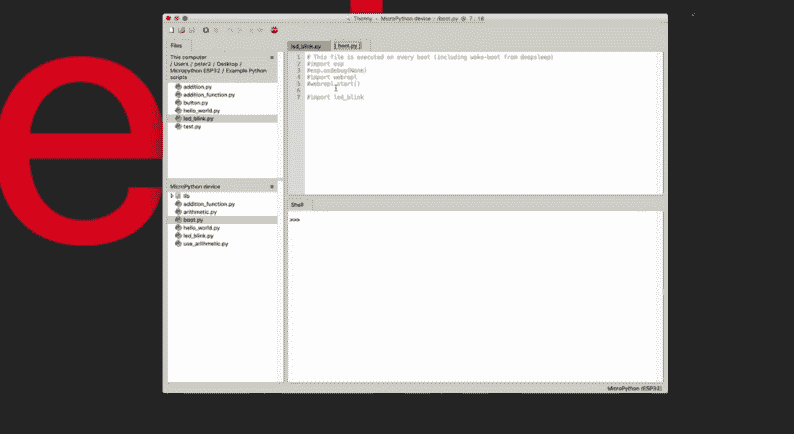

我们通过在程序中添加一些代码来实现这一点。当然，如果你不希望这种情况实际发生，并且希望在通电时执行任何代码，那么请确保此文件中没有可执行代码。或者，你可以直接删除此文件，并在需要时重新创建它。

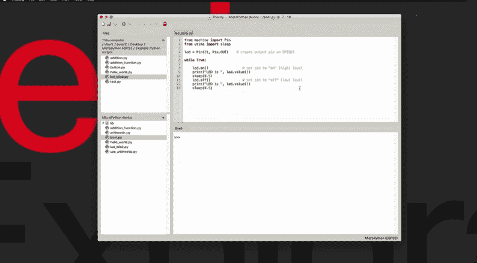

所以，我现在要把它放一边。在这个项目中，也就是本节的最后一个项目，我想向你展示一些在调试和排除 MicroPython 脚本故障时非常有用的技巧。我这里有 Blink 脚本，为了帮助我排除故障，我做的第一件事就是使用 `print` 语句。如果你来自 Arduino 世界，那么你会熟悉我们如何在那里使用 `print` 语句来尝试弄清楚在运行时，也就是在我们的脚本或草图执行期间发生了什么。这里的原理是相似的。我再次使用 `print` 语句，在这种情况下，打印出这个特定对象发生了什么，并打印出它的值。

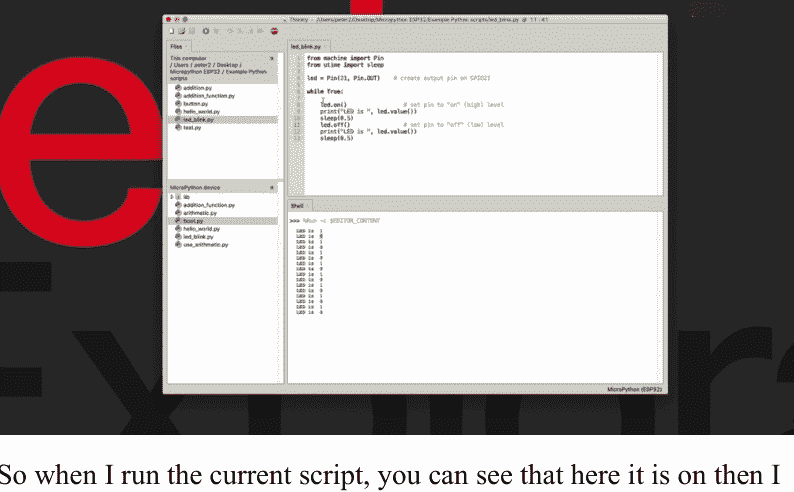

所以当我运行当前脚本时，你可以看到它在这里是开启的，然后我得到一个值为 1，当它开启时，得到 0，依此类推。所以这告诉我 LED 对象的行为符合我的预期。


所以控制它既简单又清晰。另一件你可以做的事情是阅读 Python 在出现问题时提供的全面且通常很有用的错误消息。Python 解释器实际上非常擅长提供有关脚本执行过程中出了什么问题的信息。首先，看几个例子。

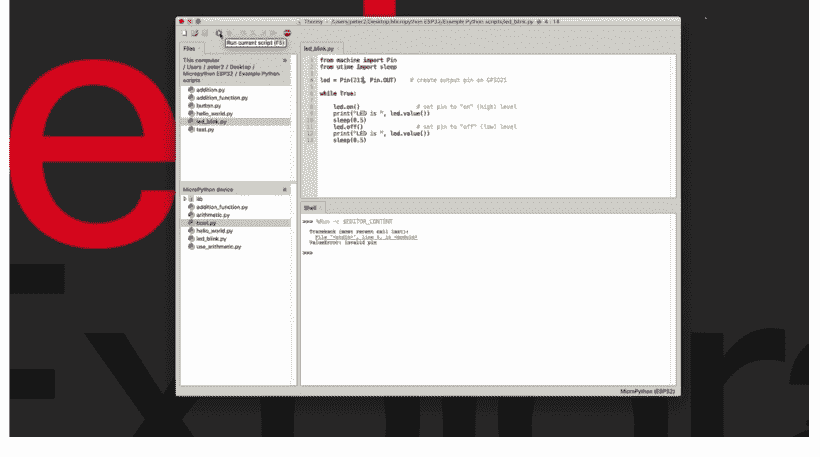

假设我们试图访问一个不存在的引脚。所以这只是一个无心之失。将脚本发送到第 2 行，你会看到一个相当清晰的错误行。我们试图对一个无效的引脚执行某些操作。所以这很容易解决，对吧？你必须查看引脚参数，并弄清楚，你知道，哪些引脚对 ESP32 是有效的。如果你手边有引脚图，那么你就知道没有 211 号引脚，你可能指的是 21 号，也就是我的 LED 连接的地方。其他参数也是如此。

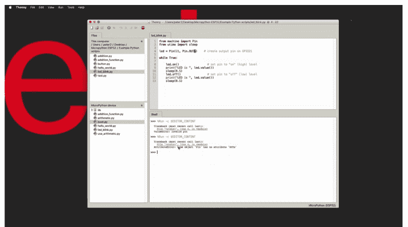

在这个例子中是引脚参数。假设我们只有 `Pin.IN` 和 `Pin.OUT` 作为我们试图创建的引脚对象类型的常量。如果你在这里有一个拼写错误，同样，这将生成一个相当准确的错误消息，说你在第 4 行试图创建一个不存在的类型的对象。`Pin`，不存在，所以你可以继续修复它。

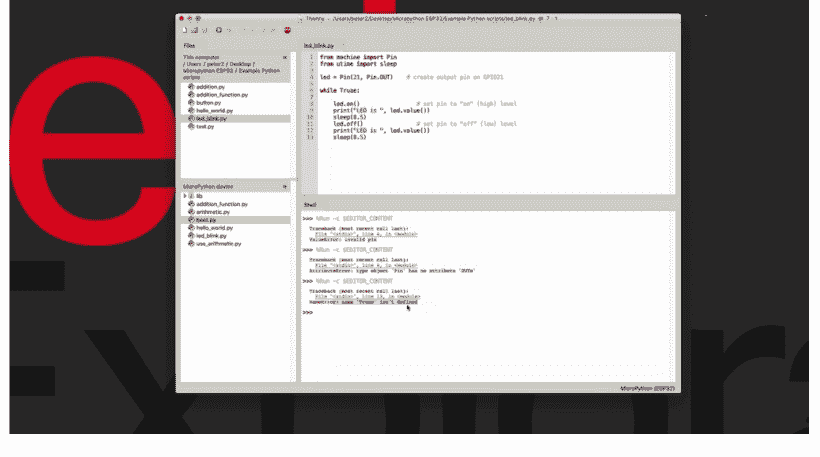

任何拼写错误通常都会生成一个准确的消息，或者你可以看到在这种情况下，它说第 13 行，这不是很准确。显然在脚本的末尾，它将错误指向脚本的末尾，但这里的名称错误更合适。它为你提供了更多线索来找出问题所在。所以最初，我们会看第 13 行。你不会在那里发现任何奇怪的东西。你查看错误消息的其余部分，它会引导你找到问题所在。所以你可能需要仔细评估整个错误消息，以便追溯，直到你能找出问题所在。所以对于像拼写错误这样的事情，通常从解释器返回的错误消息具有非常好的准确性。

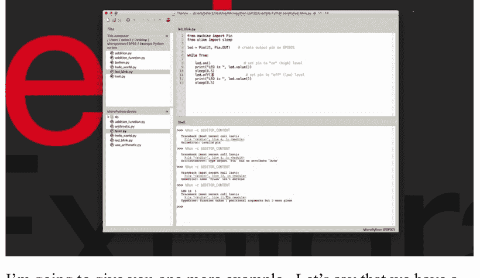

我再给你一个例子。假设我们在其中一个方法中有一个拼写错误。所以假设我们在第 13 行尝试插入一个参数。让我们看看会返回什么。程序执行到第 11 行，然后它非常准确地指出这里有问题。该函数接受一个位置参数，但给出了两个。实际上这个函数不需要任何命令。但在后面的项目中，我将解释为什么你在这里得到的是 1 而不是 0。但事实是，这里的问题与我们提供的参数数量有关。这个函数不接受任何参数，而我给了一个。因此我得到了一个错误消息。

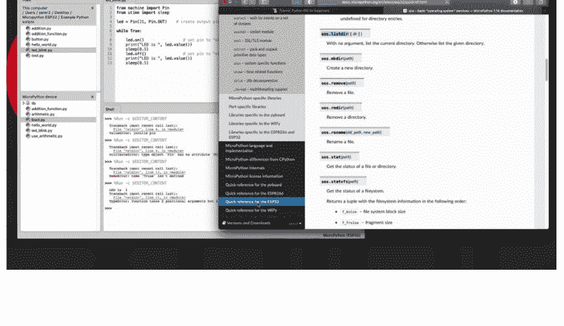

如果你在弄清楚正确的语法方面有困难，你也可以查看这里的文档。所以在这种情况下，我们会去 ESP32。

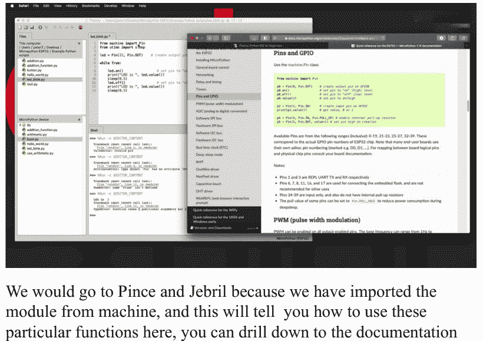

我们会去 Pin 和 GPIO，因为我们从 `machine` 导入了模块，这将告诉你如何使用这里的这些特定函数，你可以深入到文档本身，获取关于所有这些的更多信息，包括，比如说，模式可用的常量类型。

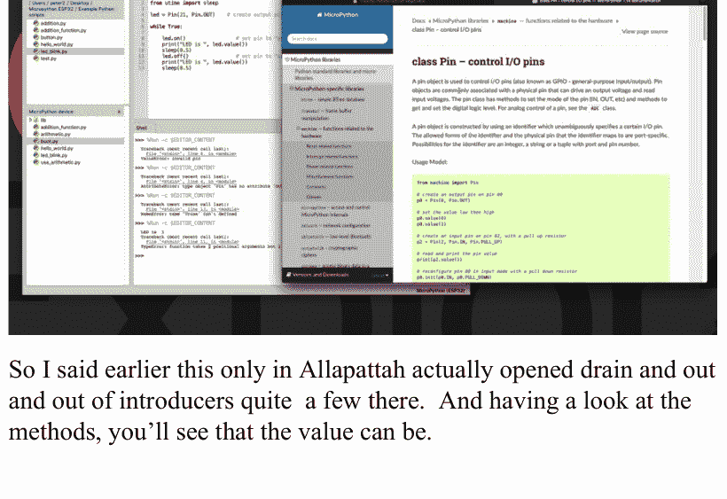

所以我之前说过，这实际上只在 `IN`、`OUT`、`OPEN_DRAIN`、`PULL_UP` 和 `PULL_DOWN` 中。查看方法，你会看到值可以是 1 或 0，如果不提供参数，如果它是空的。还有这里是 `on` 和 `off`，参数设置为 1 或 0。

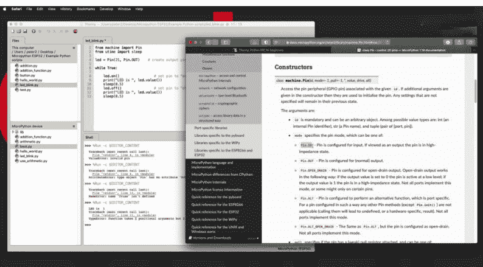

同样，没有参数。所以有时你可能需要参考文档来弄清楚发生了什么。好的。

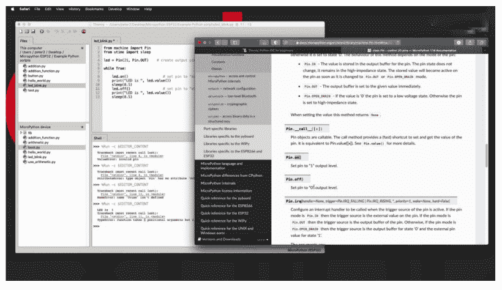

所以我就说到这里，在接下来的几节和几十个项目中，我会在我的脚本中遇到问题。在许多情况下，我将向你展示我是如何实时解决这些问题的。但现在，请记住，保留 `print` 语句是一个好主意，特别是如果你正在开发一个新脚本，这样你就可以获得关于程序执行时内部发生情况的实时信息，并随着时间的推移熟悉阅读来自 Python 解释器的这些回溯错误消息。我保证每次你都能修复它们。

### 关于 MicroPython 模块

你好，欢迎来到本课程的这一新节。在这一节中，我想谈谈 MicroPython 模块。MicroPython 模块就像普通的 Python 模块一样。

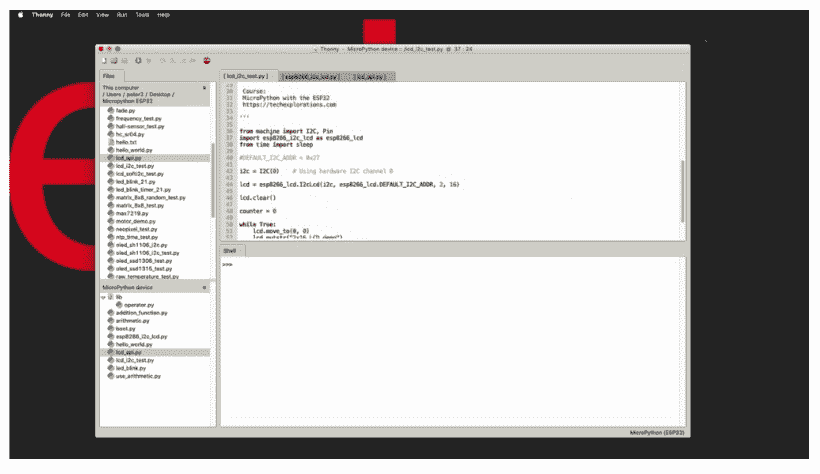

模块是包含函数和代码的文件，你可以导入并在自己的脚本中使用。我们经常倾向于使用“库”这个词而不是“模块”，但这两个词是等价的。你可以使用任何一个，并且理解你在说什么。我经常使用“库”这个词而不是“模块”。所以只是想给你一个快速的例子，说明模块能为你的编程和生产力带来什么。在本节接下来的几个项目中，我将讨论你在 MicroPython 中找到的集成模块。所以让我们称这些为内置模块，然后是社区模块。这些是由使用 MicroPython 或 Python 的人贡献的模块。我们将向你展示如何安装这样的社区模块。这个脚本是我在后面的项目中演示的一个脚本，它展示了如何将 2x16 LCD 屏幕与你的 ESP32 一起使用。现在，如果你注意到这里的第 37 行，我正在导入一个外部模块，这个模块的名称是 `ESP8266_I2C_LCD`。现在使用关键字 `as` 来指定一个不同的名称，我将在脚本中引用这个模块的内容，所以你可以看到下面这里，例如，在第 44 行，我正在从这个 `I2C_LCD` 类创建一个对象，我使用的是在关键字 `as` 之后指定的指定名称。所以你可以做这样的事情来缩短一个非常长的模块名称。现在，回到模块本身。我在这里用来导入模块的名称就是该模块的文件名。所以，如果你查看我的 MicroPython 设备文件列表，你会看到一个同名的文件，只是它多了一个 `.py` 扩展名，我已经在这里打开了它。

你可以看看它。这就是我正在导入的模块，你可以看到里面的代码，了解它的功能。现在，另一个值得注意的有趣之处是，这个模块实际上还有一个依赖项。所以你可以看到在第四行，它依赖于另一个模块。那也是一个外部模块，我不得不从它的源代码下载，叫做 LCD API。你可以从中得知包含此模块的实际文件名是 `lcd_api.py`，它就在这里。但这是一个相当大的模块，不要点击它，然后你可以看看里面，你会看到这里有一个叫做 LCD API 的类，里面有一堆函数。因此它相当大。

出于这个原因，我使用 `import` 关键字来导入一个特定的类，而不是导入整个模块。现在，想象一下这个模块文件包含多个类。而不仅仅是它包含的这一个。想象一下它有多个类。通过使用这种表示法，你可以缩小你想要导入的类的范围，而不是导入整个模块，这在你处理容量有限的设备时非常有用。所有这些都存储在 RAM 中。当然，当你导入并实例化一个类，并且有一个对象可以操作时，它就在 RAM 中。因此，通过有选择地导入模块的组件，你可以保留微控制器单元的资源。在同一文件中，再进一步。你可以看到我们还从 `machine` 和 `time` 导入模块。这些模块是 MicroPython 内置的，这意味着我们不必像安装 DSP 那样安装包含这些模块的文件。所以我们可以注意到这里没有名为 `machine.py` 或 `time.py` 的文件，因为这两个模块是内置在 MicroPython 中的。它们随语言一起提供，是解释器的一部分。

以上就是关于模块的快速介绍。我们可以理解它们背后的概念以及它们为何有用。这意味着我们可以继续接下来的几个项目，在那里我可以更多地谈论内置模块，向你展示一些关于它们的内容，包括在哪里找到文档，因为有很多模块。我无法在本课程中涵盖所有内容。但我会给你所有你需要的信息来源。然后在之后的项目中，我将向你展示如何在互联网上搜索社区，以查找对你项目有用的 MicroPython 模块。

#### 内置模块

这实际上讨论的是 MicroPython 内置模块，这些是随 MicroPython 解释器一起提供的模块，可以从你 ESP32 上运行的脚本中访问。你不必导入或安装任何额外的文件就能使用内置模块。

那么，让我们先快速浏览一下文档，然后我会给你一个简短的演示。让我们转到最新版本的 MicroPython 文档。我这里看的是 1.14 版本，在最顶部你会看到一个 MicroPython 库的部分。在这里，你会看到有几个不同的子类别或子部分。首先，这里有 Python 标准库和 Micro 库。你有像 `math` 或 `uio` 这样的库，尽管我们也使用 `os` 来处理操作系统等等。然后，在那之后，你有 MicroPython 特定的库，比如 `machine`，我们将经常使用它，还有 `network` 等等。然后你有特定于你所使用的微控制器的库，在我们的例子中是 ESP32。你深入进去，会看到这里有几个模块提供了特定于 ESP32 的函数。

现在回到开头，再多谈谈每一个的作用。Python 标准库是你通常在常规或 CPython 编程语言中找到的库。这些也是标准 Python 附带的模块和库。这些库在 MicroPython 中的实现与之非常接近，但你不能期望可用的函数之间存在一一对应的关系，例如，在 Python 的 `io` 输入输出库中可用的函数与 MicroPython 中可用的函数。

所以，例如，在这种情况下，你看到 `io` 或 Python 库前面有一个 `U`，这使它变成了 `uio`，这表明这是 CPython 附带的 `io` 模块的 MicroPython 版本。所以你可以看到这里有一个对这个 Python 输入输出或 `io` 模块的引用。

我们将点击它，进入那个文档。我们现在看的是 Python 3.5 版本，这是 `io` 库的文档，你可以在这里看到它在 MicroPython 环境中为我们提供了什么。

基本函数将是可用的，但它们将被优化以在性能有限的环境中运行，例如，节省内存和降低功耗周期。有些函数可能根本不可用。

例如，我们有 `open` 函数，这里搜索 `open` 也是可用的。你可以通常以相同的方式使用它。在 Python 中，`open` 函数需要一个要打开的文件。然后你有打开修饰符或文件操作模式。例如，你是想读取它，还是追加或写入等等，我们稍后会详细讨论。然后还有文件包含的编码类型。现在，在另一边，在 MicroPython 这边，我们再次有名称，然后是模式，以及这里的第三个参数用于编码。但请注意这里说的是：提供文件系统访问的端口需要支持 `mode` 参数，就是这个参数。但其他参数是否支持，这些参数取决于端口，这意味着取决于你为哪个目标设备编写 MicroPython 程序，是 ESP32 还是 WiPy 或其他设备。所以当你使用这些类和函数时，你需要小心一点，并考虑你的目标设备。这就是 Python 标准库的情况。我们还有 MicroPython 特定的库。

所以这些是只存在于 MicroPython 世界中的库，在 Python 中不存在，例如 `machine` 模块，它包含与硬件相关的函数。你可以做诸如软重置、禁用或启用中断等操作。当然，这些对于常规的 CPython 语言来说没有意义。

所以如果你转到 CPython 文档并尝试搜索 `machine` 模块，你会在这里找到它，一些专门为 MicroPython 及其支持的硬件目标设计的 `machine` 模块。然后我们有特定于端口的库，所以这些是专门在目标硬件设备和目标微控制器上运行的库。我们谈论的是像 PyBoard 或 ESP32 这样的东西。

在我们的情况下，由于我们使用的是 ESP32，让我们点击 ESP32 特定的库，你会看到有一个。它的名字是 `esp32`，它为我们提供了诸如通过触摸或外部引脚唤醒、发送 IRQ 或读取内置温度计以获取实际温度等功能。

我稍后会给你举个例子，等等。所以这是一个仅适用于ESP32的库，提供了仅在ESP32上有意义的特定功能。那么，让我们来玩一下这个特定的库吧。我在这里腾出一点空间，这样我们就可以并排查看两个内容。

我正在使用shell。我连接到我的ESP32以使用ESP32特定的库。我只需要导入它。所以，像往常一样，我只需说`import esp32`。我不必安装一个名为`esp32`的文件。我说过这是集成到运行在微控制器上的固件中的。然后我做一些简单的事情，比如获取内部温度，我的ESP32现在的内部温度。我只需复制这个，粘贴到这里，然后按回车。这就是它的华氏温度。所以你可以看到非常简单。你能在这个案例中看到霍尔传感器吗？我要输入它并使用代码补全，输入括号。这就是集成磁性霍尔传感器的读数。非常简单，正如我所说，你在这里可以做的另一件事是你可以非常具体。正如我所说，ESP32和其他运行MicroPython的微控制器的内存与运行Python的计算机相比相当有限。所以，我导入整个`esp32`模块意味着我导入了所有这些函数，即使我只对使用，例如，`temperature`函数感兴趣。所以，为了更灵活地使用资源，我可以只导入我想要使用的特定函数，这样我就可以说：`from esp32 import temperature`，像这样，现在我可以直接调用`temperature`，而不需要像之前那样加上`esp32.`前缀，因为之前我只是导入了整个模块，现在我只导入了`temperature`函数，这意味着我可以直接按名称调用它，并且得到相同的结果。所以，在第二种情况下，我对从一个大模块中导入什么更加精确。你稍后会在下一个项目中看到，实际上，你可以为你的项目导入的一些模块可能非常大，因为它们旨在涵盖多种情况和多种目标硬件。所以你可以具体说明你想导入这些模块的哪些部分以节省内存。好了，关于内置模块就到这里。现在让我们转到下一节，看看那个特定的类别，即：

#### 社区模块

接下来是什么？一些你可以找到MicroPython模块的地方，这些模块可以在你的项目中使用。

当然，首先在这里寻找任何东西的地方是搜索引擎，在这种情况下，我使用的是DuckDuckGo，我进行了一个相当开放和通用的搜索。我只是简单地寻找MicroPython模块和库。返回的结果也有点通用。向下滚动这个列表，我最终在这里找到了一些相关的东西，有点特定于MicroPython显示库，但主要是——这里也有一个来自我的博客——但大多数顶级条目都是关于MicroPython模块和库的通用信息，但没有特定的库命中。所以这里要吸取的教训是，要更具体地说明你在寻找什么。

所以在我这里的下一个标签页中，我搜索的是MicroPython LCD库。所以在这种情况下，例如，我可能有一个16x2字符LCD显示屏，我想找到一个MicroPython库来方便我使用。而这个在DuckDuckGo上的搜索实际上揭示了一些有趣的可能性。所以现在你的下一步将是评估这些库中哪一个可能最好，这可能是一个试错的过程，或者可能是查看文档并决定哪一个最适合你的需求。

在我的案例中，我过去做过一个相关的搜索，发现`pycharlcd`库以及这里的`esp8266`和`esp32`是这些库的最佳来源，效果最好。这两个文件是同一个模块的一部分。实际上，它们是一起工作的。那么，让我们看看，也许我们可以选择这个。看起来很有希望。

看看里面，是`micropython`还是应该使用`library`文件夹？其中包含你将需要导入并存储在MicroPython设备本身的文件。我们将在下一个项目中向你展示如何做到这一点。并查看文档。

所以，可用的函数，然后你决定这是否对你有用，先生。

现在另一个考虑是看看是否有任何关于此MicroPython模块经过测试的硬件的信息。显然，我没有看到任何特别针对的硬件测试。这并不意味着它不会在你拥有的硬件上工作。它只是意味着作者没有测试过它。所以很多时候，这就需要你自己去尝试和测试。

如果你想让你的搜索更具体一些，那么你也可以在搜索中添加目标设备名称。这可能会给你一些更准确的结果。

所以我想说，也许这个实际上更适合ESP32，也许实际上就是这样。对。这是过程的一部分。现在，除了搜索引擎之外，还有其他地方，至少在我进行互联网搜索之前，我会先咨询这些地方。

这里有一个名为Awesome MicroPython的项目。这是它的GitHub仓库，这是它的前端，它的网站。所以你可以直接访问前端。他们整理了一个非常大的MicroPython模块列表。

MicroPython库，你可以看到目录，这里有一个非常广泛的模块类型阵列，适用于各种硬件和软件功能。假设，既然我们正在寻找一个用于LCD屏幕的模块，假设我们有一个LCD字符显示屏，让我们深入研究一下。

你会看到有几个选项可以使用。其中一些可能与你的硬件兼容。有些可能不兼容。那么你需要深入了解你拥有的硬件类型。在我的案例中，我发现这个库实际上有效。我通过试错做到了这一点或发现了这一点。我尝试了几个库，然后才缩小到这个，而这个有效。它使用`pycharlcd`接口。我们之前也找到了这个，它在MicroPython中不可用，但我发现它仍然有效。所以我在本课程中使用的许多库，我能够通过浏览Awesome MicroPython找到它们，然后进行大量测试，拒绝一些并接受其他一些。所以最后，还有一个地方你可以寻找MicroPython模块，那就是PyPI，Python包索引。它并不专门针对MicroPython。它是一个通用的Python包索引。所以你可以看到它很大。二十九万三千个项目。其中一些是MicroPython项目，但并非全部。所以在这里，就像通用的互联网搜索一样，你需要具体说明你正在寻找的东西。所以，再次假设，我们正在寻找一个模块来帮助我们在项目中使用LCD显示屏。

因此，我打算使用“micropython”这个词来缩小搜索范围，以找到特定于Python的库。让我们从第一步开始，比如从“al Qaeda”开始。你可以看到，如果你回过头来，现在，我使用的是哪一个？目前我还不确定。有很多选择。

五十一页，也许需要再缩小一点范围，比如将LCD类型和LCD屏幕尺寸设为12或16乘2，看看是否有结果返回。好吧，也许这样好一点，但仍然没有比，比如说，其中一些适用于树莓派的库好多少。那不是我想要的。

所以我的下一个搜索词将是特别针对的，这会返回一千两百四十四个结果，或者实际上知道HP32和ESP8266在很多工作方式上是兼容的。我打算寻找那个。我也在那个封闭区域里。还有。回复。

我需要继续尝试这个，并从搜索中移除这两个部分。继续寻找。查看第二页。

嗯，也许这里有一些有希望的东西。LCD 2.0。看看这个，仅项目描述。

你可以看看主页，看看这个，我想他们都在。好吧。

所以这对城市来说也不行，因为这是给树莓派或大型黑莓用的。去掉那个。回去。我要加上“I2C”或“I2C”这个词，因为我喜欢这个想法，它能够返回使用I2C接口的能力。那么，我们现在有更好的选择了吗？哦，不。不是那个。

不，我将继续这个。我的意思是，我们将首先在我的ESP32上实施我的观点。不再使用ESP8266。

这看起来不太有希望，所以在这个时候，我本会放弃并回到awesome micropython，或者我会去做互联网搜索，而不是为此付费。

现在，我提到Pipeline的原因是，是的，你将能够找到可以使用的MegaPath Python模块。Pipeline的好处在于，如果你确实找到了有用的东西，你可以使用包管理器和工具来安装你找到的包。

那么，举个例子，假设这个库就是你想要的。

你将能够在里面按名称搜索这个。索尼发现，在Pipeline上进行交叉搜索。

在这里找到它，然后点击这个按钮来安装它并查看它。当然，因为这不是一个与USA兼容的模块，只是为了演示，一旦你安装了它。

这个库将存储在这里的loop目录中，然后你就可以在你的项目中使用它了。好的。那么，总结一下，要找到你可以在项目中使用的micropython模块，我通常首先进行互联网搜索，试图让我的搜索尽可能精确。经过几次迭代，我通常会找到我想要的东西。另一个你可以查看模块的地方是awesome micropython。这是一个精选的micropython模块列表。最后，你可能还想看看micropython.org的Python模块仓库。一旦你找到了你想要的东西，你需要安装它，我们将在下一节中向你展示如何做到这一点。

#### 如何安装外部模块

在这个项目中，我将向你展示如何安装外部模块，以便你可以在你的micropython项目ESP32中使用它。

在这个例子中。在这个例子中，我将使用awesome micropython来寻找一个有趣的模块。这里有很多。

但其中一个引起我注意的是这个。Micromath，微数学和分析看起来很有趣。

所以点击这里的链接，它将带你到这个特定项目的仓库。现在，这是一个GitHub项目，文件在顶部，项目描述在底部。

所以也有一个维基。我可以查看问题和文档页面。让我们看看这些，看看这里发生了什么。只需点击那里。所以维基没有太多内容，只是一个待办事项列表。他们可能有一个文档。

我可以带你回到同一个GitHub主页面。所以那里也没有太多内容。

但我们确实可以访问源代码，所以我们可以深入源代码。math目录包含一堆Python文件。你可以浏览这些文件，看看这个项目是关于什么的。在许多micropython项目中，源代码本身就是你能找到的限制。

所以我们看看里面。Operator，operator，dopy.py有一些简单的函数，用于加法、应用、幂计算等。让我们比较一下，看看另一个，也许在calculus里面。

所以看起来这个目录里填充了与微积分相关的函数。好的，这里也有一些待办事项。但为了这个例子的目的，这实际上已经可以使用了。所以要安装它，首先要做的是下载这个存档的zip版本。

所以点击绿色按钮，然后点击“Download Zip”，这将把zip文件下载到你的计算机上。

在我的情况下，我已经下载并从zip文件中解压了它，所以现在这是我计算机上仓库的内容。现在你需要的是math目录。通常，一个模块会包含单个文件。但在某些情况下，比如在这个例子中，模块以文件集合的形式出现，通常捆绑在一个目录中。所以接下来要做的是将这个目录转移到一个文件夹中，以便我可以从该文件夹上传到我的ESP32服务器。看看Thonny。所以Thonny在这里有文件步骤。现在我已经浏览到了桌面上的micropython ESP32，所以我可以将这个重定向到我的下载文件夹，以便能够在这个文件和目录列表中看到math目录。

或者在这个特定的情况下，我将直接复制这个目录并粘贴到我的打开目录中。我将等待并粘贴过去，所以这是一个非常标准的操作，现在移到顶部。

所以我的math目录就在我的micropython ESP32里面，它出现了。

现在它出现在我的文件列表和Thonny中。就在那里。接下来要做的是在我的ESP32上使用它，需要将整个目录传输到我的ESP32闪存和系统中。最简单的方法是。好的。

点击目录或传输，然后选择上传正斜杠。这样做。等待几秒钟。math就在那里，对吧？所以我将进行一些实验，尝试这个模块的内容，只是试图扩展窗口的shell部分，以便你可以看到更多正在发生的事情。当然，记住，你总是有源代码。假设你想玩玩operator.py里面的函数。所以只需双击 Operator 文件夹查看其内容。你会看到这里有三到四个可用的函数。

首先要做的是将模块导入到你的程序中，以便使用它。最简单的方法是声明你要使用新的 math 模块，但具体来说是要导入 operator。如果你直接写 `import math`，那么你会导入 math 目录下的所有文件；但如果你只想使用 operator 文件中的函数，可以写 `from math import operator`，即从 math 目录导入 operator 文件（无需扩展名）。输入后，现在我们就可以这样使用 ADD 函数了：`operator.add(2, 3)` 将这两个数字相加，结果是 5。那 `operator.pow` 呢？2 的 3 次方是 8，以此类推。你也可以进行减法运算。它的使用方式与我刚才在屏幕上演示的完全相同，你可以用同样的方法将库文件或模块文件导入到你的 ESP32 中。

在结束这个项目和本节之前，我还想向你展示一下，如果你只需要其中一个文件而不需要全部文件时可以怎么做。

即使你没有导入它们，它们可能不会占用 RAM，但会占用宝贵的闪存空间。所以也许你并不需要全部文件。

假设你只想要 operator 函数。那么我们来清理一下，从我的设备中删除这个目录。

然后我可以只上传我想要存储在 micro python 设备上的单个 operator 文件。

它会出现在这里，与其他文件处于同一级别，这次不在目录内。实际上，我需要执行一次软重置来重启我的 ESP32 并清除内存。

好的。现在从全新的状态开始，我想导入 operator，所以只需写 `import operator`。现在我就可以使用 operator 中的函数了，再次查看文件内容，就像之前一样，你可以写 `operator.add(2, 3)`，结果会是 5。有几种方法可以做到这一点，但实际上在几乎所有情况下，你都可以使用这种方法将模块导入到你的 ESP32 中，以便在屏幕上或通过 Python 文件使用。

## 用循环闪烁 LED

大家好，欢迎来到本课程的新章节。本节是我第一次进行实践演示，向你展示如何将 micro python 与各种外设一起使用。

当然，我们将从经典的闪烁示例开始，在本节和下一个项目中进行。在开始之前，有几件事要说明，因为如我所说，这是第一次实践演示。我想和你谈谈我是如何设置这些实验的，包括硬件方面和我们使用的软件。在硬件方面，首先，我将使用一个通用的 ESP32 开发板。这个是每边有 19 个引脚的那种。这块板子没什么特别的，是我在 eBay 上找到的一个便宜货。它是一个通用的 ESP32，当你下载并安装固件时，在 Thonny 中也会看到它。我目前没有使用外部闪存之类的东西。对于外设，我使用了两块板子并排放置，这样我就有了双倍的空间。你可以看到，我已经将电源轨连接到了 3.3 伏引脚。就是这个引脚，以及接地引脚，我将这些引脚连接到了地线轨和 3.3 伏轨，并且再次用导线连接了额外的两个电源轨。此外，只要可能，我会在这里贴上一个标签，上面写着组件（比如 LED 或后来的电位器或按钮）所连接的引脚编号。这样你只需要查看任何项目框架，就能看到特定组件连接在哪里。说了这么多，我要把我的 ESP32 连接到板子上，并连接 USB 线。

好的，让我们看看软件方面的情况。通常，每个实验我都会从 Thonny 的一个空白页开始，像这样，什么都没加载。你可以看到，我通常将脚本放在本地目录中，然后你可以在 Thonny 中导航。你可以导航到你从课程的 GitHub 仓库下载脚本的目录，在大多数情况下，就像这里一样。我会打开示例脚本，

浏览一下，熟悉它的运行方式。然后我会……有几种方法可以将脚本复制到你的 ESP32 上。一种方法是打开一个新文件，然后将本地文件的内容复制到新文件中，

然后从这里你可以将其保存到你的 ESP32 上，我稍后会这样做。另一种方法是，你可以关闭这个，另一种方法是转到“文件”，然后选择“保存副本”。然后，只要你的 ESP32 已连接，它就会给你一个选项，将副本保存到设备上或本地计算机文件系统上。让我们看看这些。

你可以看到我的 ESP32 是通过 USB 连接的，但它还没有出现在 Thonny 中。所以我将点击这里的这个按钮来触发设备的连接。现在，默认情况下，当你将 micro python 固件上传到你的 ESP32 时，唯一存在的文件是 boot.py 文件，它看起来像这样，通常什么都不做。我不会对 boot.py 做任何操作，因为我想能够点击这里的“运行当前脚本”按钮，按 F5 来任意执行存储在我的 ESP32 上的 Python 脚本，而不是必须通过上电来触发 boot.py 中的代码。但请记住，一旦你对脚本的运行感到满意，你总是可以将该脚本的名称更改为 boot.py，这样你只需给 ESP32 上电就能执行它了。

好的。现在我们已经连接了 ESP32 micro python 设备，你可以在这里的 Thonny 中看到它的文件系统列表，那么我可以继续第二步，将我的脚本复制到 ESP32 上。我将遵循复制方法。所以我将选择“保存副本”，然后选择“Python 设备”，并给它相同的名称。我会输入它，并给它与本地计算机文件系统上保存的文件相同的名称。所以这实际上是 blink_01.py。现在它出现在这里，我将双击打开它。这是我的第二个标签页，显示的是存储在我的 ESP32 设备上的 Python 脚本。为了突出两个文件存储位置的不同，你可以看到本地文件系统（计算机文件系统）的文件名没有方括号，而 ESP32 上的文件（存储在 ESP32 文件系统上的文件）的文件名周围有方括号。现在你可以删除本地文件系统的副本，只使用存储在 ESP32 上的那个。

对于每个演示文件，我试图在其头部提供足够的文档。通常，头部会像这样：包含演示脚本的编号和标题、功能描述、组件列表，然后是文档。这里我们使用了 `Pin` 和 `sleep` 函数，所以你可以在提供的链接中找到关于这两个函数的文档。以 `sleep` 函数为例，这很有趣，你点击这个链接，或者将其复制到浏览器中，它会带你到 micro python 文档站点的相应部分。现在，这个函数很有趣，因为这是标准 Python（或 CPython）的 time 模块。它前面有 `u`，表示这是 time 模块的 micro python 版本。完整的 CPython time 模块和 `utime` 模块之间的区别在于，`utime` 模块经过优化，可以在 micro python 设备上更好地、更高效地工作。它缺少一些函数，在内存使用方面更高效，因此我们将使用 `utime` 而不是 `time` 来引入延迟，正如你在这里看到的，我有一个 while 循环，我在这里设置了一个延迟，以便让 ESP32 的 LED 闪烁。类似地，对于 `Pin` GPIO 服务器，我将使用 ESP32 文档中的这部分。

你可以在这里看到 `Pin` 和 `GPIO`。这是如何在 ESP32 上使用 micro python 使用引脚的一个例子。能够控制它们的开关。我们还可以看到如何启用上拉电阻。在后续的示例中，也就是本节的LED项目中，我们已经利用了这个功能。因此，在这里你了解到，只需调用PIN对象的函数，就可以打开一个引脚。这里我们有一个名为P0的PIN对象，这就是创建该对象的方式。你可以通过调用函数来关闭它，或者使用value函数并传入1或0来控制其开关。你还可以检查引脚的当前值。我们将在接下来的项目中向你展示如何使用它。但这样非常方便，无需通过额外的变量来跟踪GPIO的状态，就能查看其开关状态。因此，你可以看到，在ESP32上使用MicroPython有几种方法可以操控引脚。当然，你也可以使用相同的技术在其他MicroPython设备（例如树莓派Pico）上实现类似的功能。或者回到一个草图。同样，这非常简单。我们所做的就是从machine模块导入PIN函数，从time模块导入sleep函数。你也可以导入sleep而不是sleep_us。然后我们将讨论秒而不是微秒。这里可以根据个人偏好选择使用哪个。然后创建LED对象，它代表连接到引脚21的LED，这是一个输出引脚。在这个示例中，我使用的方法是使用一个循环，这与在Arduino上的做法非常相似，然后打开LED，休眠500毫秒，再关闭它，再休眠500毫秒，以此类推。如果你选择导入sleep而不是sleep_us，那么这里的函数看起来会是这样。如果你想设置500毫秒或半秒的延迟，只需使用小数即可。就像这样。所以这将是半秒。让我们回到原来的代码。对于LED，除了使用LED.on()或LED.off()，你也可以使用LED.value(1)或LED.value(0)，无论你偏好哪种方式都可以。好的，我将保存它，完全保存，然后点击这里的播放按钮或按计算机上的F5键来上传这个脚本。如你所见，它工作正常，没有任何问题。好的，这相当简单。现在在下一个项目中，我想向你展示一种让LED闪烁的替代方法。但在这个替代方案中，我们不使用像这里这样的循环，而是使用一个定时器，你可以想象，这是一种更高效地利用ESP32资源的方式。

## 使用定时器闪烁LED

你好，欢迎来到新的项目部分。

在上一个项目中，你学习了如何让连接到引脚21的LED闪烁，这是通过使用while循环实现的。这里有一个while True循环，它永远不会结束，它会不断地打开和关闭LED，每次保持状态半秒。在这个项目中，我想向你展示一种让LED闪烁的替代方法，那就是使用硬件定时器而不是循环。我这里有这个脚本。它是5.20，你可以看到它的大小与使用while True循环的闪烁脚本差不多。但现在我们使用的是定时器。你可以看到我在这里设置了定时器。这个定时器分配了一个ISR。这是一个中断服务程序，它是一个简单的函数，在该函数内部，它所做的只是使用value函数检查LED的当前值。

如果它是false，即LED关闭，它就会打开LED；如果不是，它就会关闭它。所以这里的逻辑是，我们没有无限循环。我们只有一个硬件定时器，它连接到一个包含我们所需功能的例程，在这个例子中，该功能是让LED闪烁或周期性地执行其他操作。

这里需要学习的新内容是硬件定时器的使用和配置。你可以看到这里有一个URL，一个指向文档的链接，你可以在那里查找并了解更多关于它的信息。但如你所见，它非常简单。我查看的是ESP32定时器的快速参考，而不是这里包含硬件定时器使用方法的段落。首先，我们需要从machine模块导入Timer模块。

在这里，我们创建定时器对象并为其指定一个ID。它不需要是负数。你可以看到我这里写了Timer(1)作为ID，然后你可以将该定时器设置为任何你想要的间隔。有init或初始化函数，它接受这些参数。首先是period。那么你希望这个定时器多久调用一次你的函数？然后是mode，它将是one shot，这意味着定时器将触发一次然后停止；或者是periodic，这正是我们在这个例子中所做的，这意味着定时器将在每次周期结束时调用你的回调函数。然后我们这里有一个callback。回调是一个lambda。Lambda是Python的一个特性，允许你内联定义一个非常小的函数。因此，与其像我们在这里做的那样，在程序的其他地方定义函数，使用lambda，你可以将函数内联定义在回调声明中。在这个例子中，它只是打印出1，在这个例子中，lambda函数打印出1。我还想向你展示MicroPython固件附带的完整Timer类模块。你可以看到它是如何工作的。这里有一些关于它的更多信息。你可以看到mode可以是one shot或periodic，你也可以使用deinit来初始化它，基本上是停止它。如果需要，可以禁用它。你可以使用init来启用它，然后使用deinit来禁用它。在这个例子中，我们只是使用init来启用它。没有理由去反初始化它。还有常量。这是利用ESP32硬件定时器的一种非常简单的方法。所以接下来要做的就是将这个脚本上传到ESP32，所以我将使用save copy方法，这样它就会传到MicroPython设备上。好的，我再做一次看看会发生什么。我尝试将副本复制到MicroPython设备，但如你所见，设备现在很忙，因为它仍在运行上一个项目的草图。

所以我必须先停止脚本的执行来中断它，然后复制新的脚本。你可以通过几种方式做到这一点。第一种是按Control C，这将停止脚本的执行。或者你可以转到run并选择interrupt execution选项，如你所见，这是菜单中的Control C。所以这次我将通过菜单操作，从现在开始，我将使用键盘按Control C来中断执行。好的。让我们再试一次，文件保存副本到MicroPython，我将给它相同的名称LED blink timer。为什么我这里用了引脚21作为GPIO。好的，它在这里。双击打开它。

好的，现在我要确保我选择了blink timer。我得想知道为什么一个带有方括号的脚本是存储在ESP32上的那个，选中它或按下播放按钮，绿色的播放按钮，或者转到run并点击run current script。这将产生相同的效果。点击它。你可以看到效果和之前完全一样。所以我们的LED在闪烁。我可以改变硬件定时器让它闪烁得更快一点。所以让我们把这个改成250毫秒，只是为了看看这个脚本和确保这确实是正在执行的那个。所以我在这里对period做了一个小改动，然后点击Save保存到设备，然后点击绿色的播放按钮。你可以看到LED现在闪烁得更快了。另一件有趣的事情是我可以进行更改并保存它们，或者将它们设置为200毫秒，我将保存它。你可以看到Thonny没有像之前我们运行使用while循环的LED blink时那样抱怨设备忙。这是因为当我们使用while循环时，设备确实很忙，要么让LED闪烁，要么在休眠。所以设备很忙。我们无法保存。我可以做任何更改，但当我们使用中断运行脚本时，设备只在定时器实际调用ISR时才忙，只在CPU执行这些高亮显示的行时才忙，其他时间它都不忙。所以它可以准备好接收，例如，来自Thonny的新文件更新，而不会抱怨它忙。所以这是另一个积极的效果。你可以看到使用

## 使用PWM实现LED渐变效果

在本项目中，我将向您展示如何使用脉冲宽度调制来控制LED的亮度，就像之前的条件语句示例一样，连接到GPIO 21。

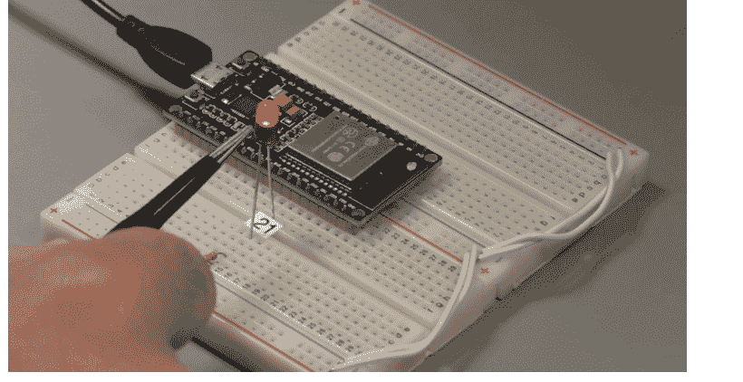

现在，在讨论软件部分之前，先谈谈硬件。我想提醒您，在ESP32上，您看到的是引脚布局图。请先缩小视图。

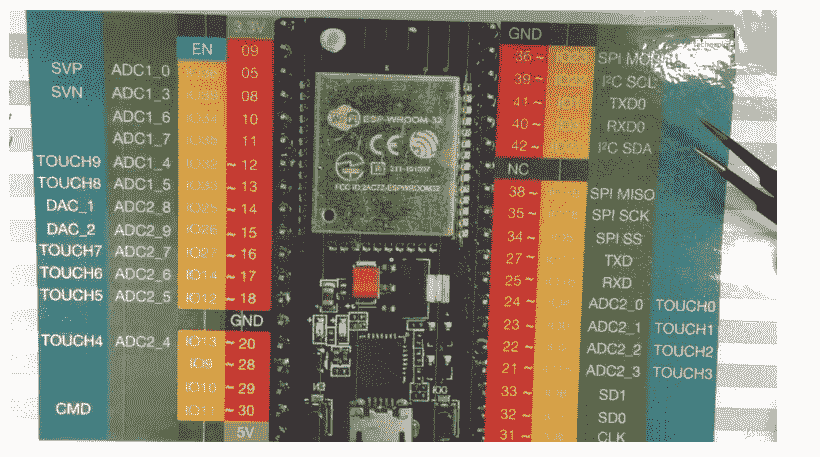

您可以看到，任何引脚旁边带有波浪号的GPIO在此情况下都具备PWM功能。在本示例中，我使用的是GPIO 21，它具备此功能。因此，只要您想使用的引脚旁边有波浪号，并且它未被其他功能占用，您就可以对其应用PWM功能。

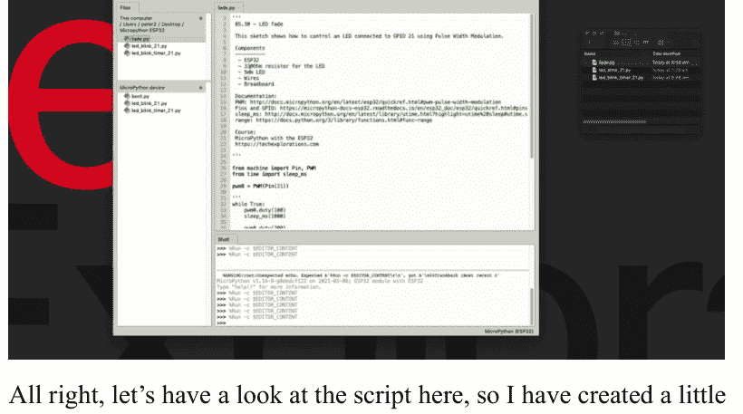

好的，让我们看看这里的脚本。我创建了一个名为`fade.py`的演示文件。如您所见，它目前在我的计算机文件系统中，尚未复制到ESP32上。快速浏览一下，我将使用`machine`模块来控制PWM，相关文档就在这里。同时，我还将使用MicroPython和Python标准库自带的`range`函数，其文档链接如下。

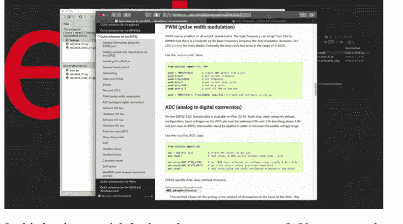

快速查看这两个资源，您可以看到PWM功能是`machine`模块的一部分。您可以使用这种表示法来创建一个PWM对象。基本上只需调用它，然后传入您想使用的GPIO。您可以读取或设置PWM通道的频率，默认值是1000。因此，如果您不设置它，将使用默认值1000。然后，您可以通过调用`duty`函数并设置一个0到1023之间的数字来设置其占空比。正如您在文档中看到的，如果在函数中不传入参数，它将返回当前的占空比。因此，您总可以在更改之前检查一下当前值。这里还有另一个示例，展示如何在一个函数中同时创建PWM对象并设置其频率和占空比。

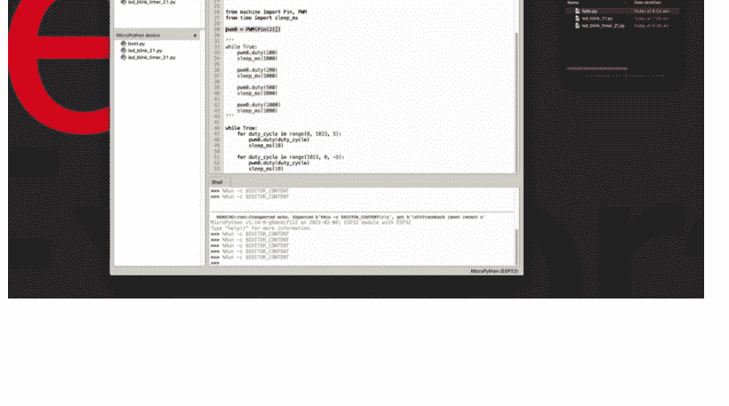

所以，我正在使用PWM功能。首先，在这里，我使用默认设置，将引脚设置为GPIO 21。然后，在下面的无限循环中，使用`while True`循环，我设置了几个循环。第一个循环将占空比从0以步长5递增到1023，然后调用`duty`函数，根据循环内的值设置占空比。第二个循环是递减的，这就是`range`函数派上用场的地方。我以步长-5（每次减5）从1023递减到0，每次循环后短暂休眠，然后继续循环。

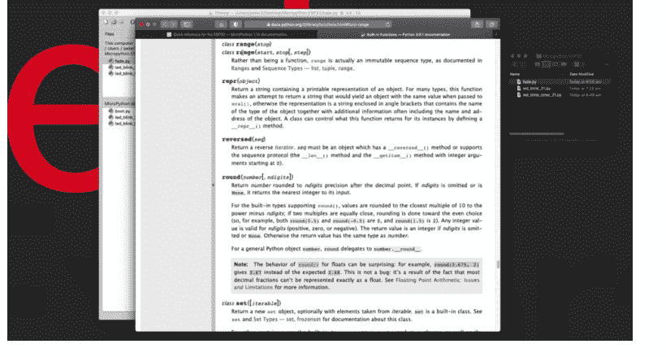

内置函数`range`看起来像这样。它有重载的函数。第一个只有一个参数`stop`。因此，如果您使用`range`并给它一个数字，它将从0以步长1计数到该数字。另一种方式是使用这个需要三个参数的函数：`start`、`stop`和`step`，也就是我在这里使用的那个。这使得从一个数字计数到另一个数字变得容易，可以使用任何您想要的步长。好的。

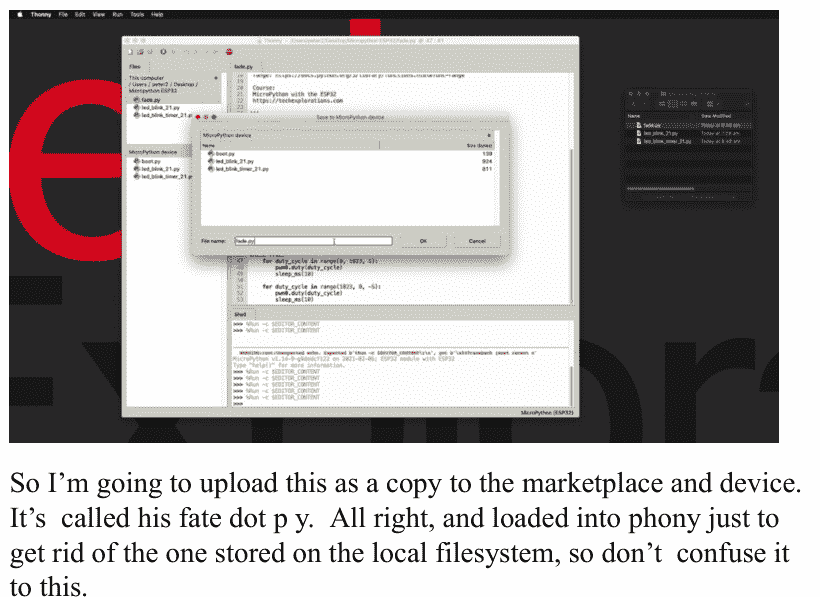

所以，我将把这个文件作为副本上传到MicroPython设备。它叫做`fade.py`。好的，并在Thonny中加载它，以替换本地文件系统中的那个，这样就不会混淆了。

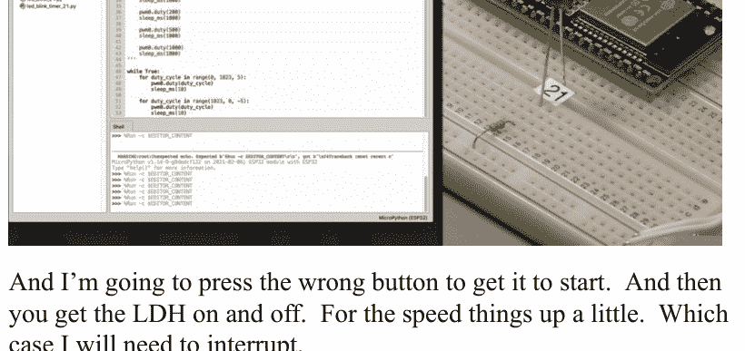

我将按下运行按钮来启动它。然后您会看到LED亮起和熄灭。为了加快速度，我需要中断它。

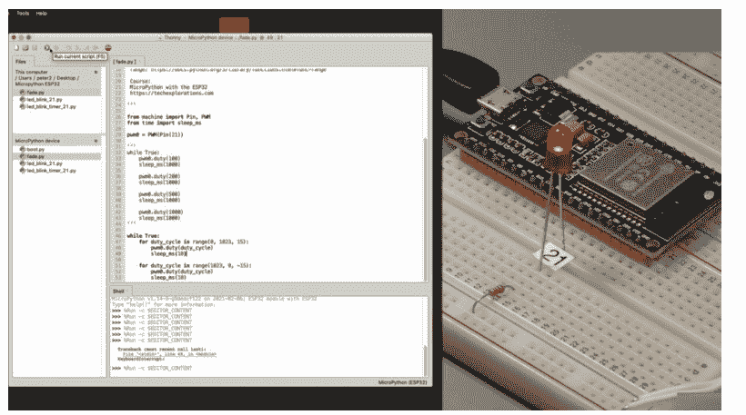

在我对程序进行任何更改之前，让我们把步长改为15和-15，保存并再次运行。您可以看到它现在亮灭得更快了。因此，您可以更改步长参数，或者减少/增加休眠时间，这将影响亮灭的速度。好的，这很简单。让我们进入下一个项目，在那里我将向您展示如何读取按钮的状态，我们将通过几种不同的方式来实现。

## 使用循环读取按钮状态

在本项目中，您需要读取瞬时按钮的状态。我将向您展示如何做到这一点，使用三个不同的示例，每次通过MicroPython利用ESP32的不同功能来实现相同的目标。

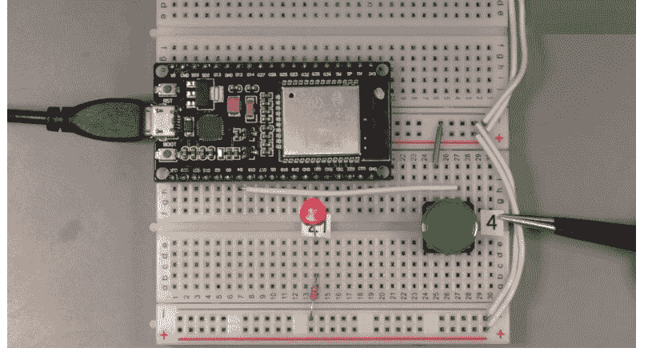

但在三个示例中，效率会逐步提高。硬件不会改变。在所有情况下，ESP32都连接了一个瞬时按钮。您可以看到它连接到GPIO 4，就是这个引脚。我使用ESP32的内部上拉电阻，这样我就不需要额外的导线将按钮未按下状态拉高。为此，我将使用内部上拉电阻。我还有一根导线，当按钮按下时，会将按钮状态拉低到低电平。这就是我们将要检测的信号。为了显示按钮按下的效果，我在这里连接了一个LED，就像之前的项目一样，它连接到GPIO 21。硬件部分就这些了。

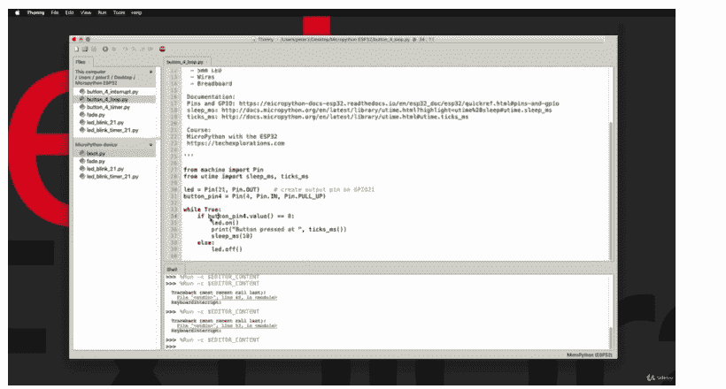

在本项目中我将展示的第一个示例中，我以最简单的方式读取按钮状态，即使用一个无限循环。因此，我使用`while`循环，并传入`True`作为其永久状态，这样程序将被锁定在这个代码块内。它将不断使用这条指令读取按钮的值，如果它是低电平（这里用0表示），因为您可以看到按钮按下状态被拉低到0伏，那么将打开LED并保持十毫秒。如果按钮状态不是零，而是1（由于内部上拉），那么将关闭LED。这个程序中还有其他几点值得讨论：我使用了这个表达式来声明按钮对象，您可以看到我使用了`Pin`构造函数，就像我为LED使用`Pin`构造函数一样。但在这里，我有三个参数。第一个是GPIO。第二个表示这将是一个输入，第三个激活内部上拉电阻。

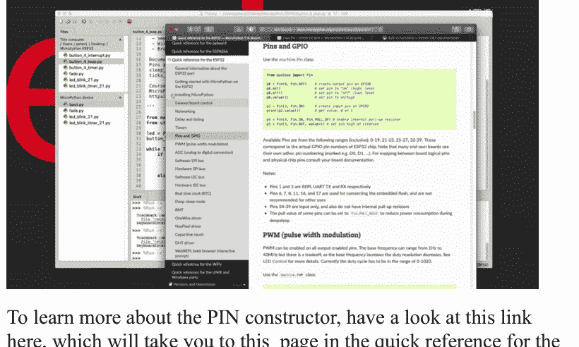

要了解更多关于`Pin`构造函数的信息，请查看此链接，它将带您到MicroPython网站上ESP32快速参考的这个页面。它向您展示了如何使用这些函数的示例。同样，如果您想要更多信息，最好查看`machine.Pin`类，就是这个页面。

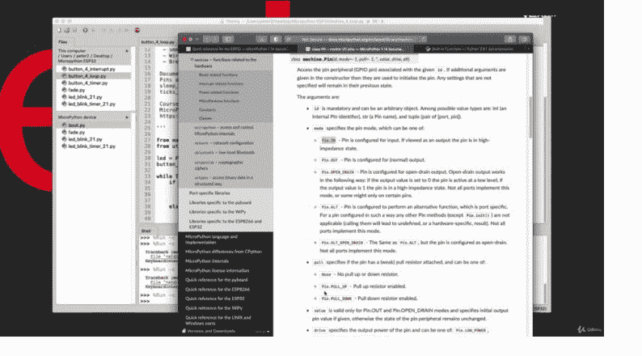

您可以看到构造函数。在我的示例中，我使用这个构造函数为我们的GPIO 4创建一个对象。对于模式，我使用`Pin.IN`，而不是用于LED的`Pin.OUT`。这个`Pin.IN`是用于按钮的。然后我们还有上拉电阻之类的东西。`Pin.PULL_UP`是开启上拉电阻的一种方式。同样，如果您使用`Pin.PULL_DOWN`，也可以有下拉电阻。其余参数可以省略，它们将采用默认值。我在这里使用的另一个新东西是`ticks_ms`函数。您可以看到我在这里使用它。我从`utime`导入它，也就是从MicroPython版本的Python `time`模块导入。关于这个函数，您可以在那里找到更多信息。它给出了自ESP32上电以来的毫秒数。这是因为我想看到我按下按钮那一刻的信息，我在这里输出了自ESP32上电以来的毫秒数。好的，让我们试试这个。目前，我已经从我的计算机磁盘和文件系统加载了脚本。

## 使用硬件中断读取按钮

欢迎回来。在上一个项目中，你学习了如何以最简单的方式读取按钮的状态。

如你所见，我们这里只使用了一个 `while true` 无限循环。在循环中，我们只是读取按钮的状态，这相当费力，然后根据状态执行相应操作。当然，这种方法的问题在于，这里有一个无限循环，程序的执行都在其中。这不是一种高效利用硬件的方式。

在这个项目中，我想向你展示一种更高效的替代方案，它允许我们使用硬件中断来读取按钮的状态。所以，在这一行，第58行，我设置了一个IRQ（中断请求）在按钮引脚上，并以一种非常高效的方式进行了配置。我在这里告诉触发器的是按钮产生的信号的下降沿。因此，当你按下按钮时，引脚上的电压从高电平下降到低电平，这就是被检测到并触发此中断的IRQ下降沿。当检测到这个下降沿时，中断会调用这里的这个例程，一个函数 `button_pressed_ISR`，即中断服务例程或处理程序，它将程序分支到这个函数内部，并再次执行相应操作。我们稍后会讲到这个，以便显示LED点亮。当我按下按钮时，我这里仍然使用了一个 `while` 循环。这只是演示中断服务例程与程序其他部分之间交互的最简单方式。同时，我也在演示中断服务例程与程序其他部分使用全局变量进行通信的能力。

现在让我们来看一些细节。你可以看到在上面的第36行，我从 `machine` 模块导入了 `Pin` 函数、`disable_irq` 和 `enable_irq` 函数。同样，从 `time` 模块导入了 `sleep`。我像往常一样开始创建对象，然后是引脚对象，这和我们在上一个示例中所做的完全一样。这里也是一样，没有任何变化。然后我声明了几个变量。这是 `button_pressed` 变量。它允许IRQ例程，也就是这里记录的ISR（中断服务例程）或处理程序，与我程序的其他部分进行通信。因此，当按钮被按下时，我更新这个变量。你可以看到它在这里被更新，然后在这里被用来确定LED应该打开还是关闭。我还有一个整数，或者说数值变量，用来跟踪按钮在重置前被按下的次数。所以你也可以尝试调整这些变量。现在，在IRQ将调用的例程定义中，你可以看到它需要一个参数。这是导致IRQ的对象，它由IRQ例程传递到这里。我在这里使用这个对象来打印一些关于是什么导致了IRQ的信息。你看，我获取 `pin` 并确切知道它是什么，然后将其传递给 `button_pin` 全局变量，该变量随后在这里打印出来，这样我就可以获得关于导致IRQ的对象的一些信息。这里发生的其他一些有趣的事情是，首先，我调用了 `disable_irq` 例程，你可能猜到了，它将禁用进一步的IRQ。所以当我按下按钮时，发生的第一件事就是禁用IRQ。当ISR函数忙于处理时，任何进一步的按钮按下都将被忽略，直到我在ISR的最后重新启用IRQ。所以当我完成处理现有IRQ所需的操作后，我会重新启用它，以便ESP32可以检测到下一次按钮按下。这里还有一些其他有趣的事情，对你来说可能有点不寻常，那就是我在这里使用了 `global` 关键字，所以你可以看到发生了什么，当然，对于像 `button_pressed` 这样的变量，我已经在程序的开头声明了它。所以你会期望这个变量已经是全局的，因为它已经在程序的开头声明了，但事实上，它不是。在使用 `global` 关键字将其转换为我可以修改的变量之前，我无法在这个上下文中对这个变量进行任何更改。我这里有一个链接，提供了更多关于此的信息。如果你好奇这是如何工作的，如果你不使用这个关键字，那么当你尝试修改存储在此变量中的值时，你会得到一个语法错误，或者在第53行得到一个错误消息。所以对程序不同部分中使用的其他两个变量做同样的事情。`button_pin` 和 `press_count`，你可以看到所有这些变量都在上面声明了。我仍然需要使用 `global` 关键字才能对它们进行更改。好的，然后我只是将导致IRQ的对象存储到 `button_pressed` 中，将对象存储到 `button_pin` 中，然后将按下计数器增加一。然后我在这里关闭函数。你有一个无限循环，类似于Arduino中的 `loop` 函数，它只是不断地循环执行其中的任何代码。在这种情况下，它不断地检查存储在 `button_pressed` 变量中的值。当它为真时，你会进入内部，将其改为假，打开LED，打印两条消息，将计数器清零，重置计数器，并让LED保持亮半秒钟。如果它不为真，那么它会关闭LED，就是这样。所以我要将这个程序的副本保存到我的电脑上，然后按Control+C停止执行。好的。然后再次尝试，保存一个Python副本，你可以称之为。我倾向于称之为 `interrupt`。为什么？好的，我关闭这两个，不是那个，我需要打开程序的中断版本，就是这个。现在我已经在目标MicroPython设备上打开了程序，我将运行它。然后。

按下按钮，它工作了。也保持亮半秒钟。好的。这里需要注意的一点是，在以“Button pressed”开头的消息中，就在这里，你可以看到 `button_pin` 的输出，也就是这个变量，它包含了导致中断的对象，它显示为 `pin 15`。如果你有来自不同引脚的多个中断，那么你总是可以区分是哪个按钮或哪个中断触发了你的中断服务例程。好的，关于使用硬件中断的按钮示例就到这里。我想在下一个项目中向你展示同一个示例的另一个变体，这次涉及使用定时器中断。让我们来看看。

## 使用定时器中断读取按钮

就像在这个示例中一样，我将向你展示如何使用硬件定时器读取按钮的状态。提醒一下，在同一个练习的前两个变体中，你学习了如何使用无限循环读取按钮的状态，就像这个示例一样。

此外，还有如何使用硬件中断，如本例所示。

我使用硬件定时器的示例实际上是前面硬件中断示例的一个变体。

你应该从之前关于LED的示例中了解如何使用硬件定时器，你可以在本脚本中看到，我们在第3、4和35行定义了定时器。因此，在这个项目中，基本上是将这些脚本组合在一起，创建一个如图所示的混合体。这里发生的事情是，我有一个周期为50毫秒的定时器，这是一个周期性定时器。

所以它每50毫秒触发一次，每次触发时，它都会调用名为`button_on_timer`的中断服务例程，就在这里。它的作用是检查按钮的状态。如果按钮被按下，它就会更新这里的这些变量。同时，我们有一个`while`循环，即无限循环，不断检查存储在全局变量`button_pressed`和`button_event`中的值。如果为真，它就会打开LCD并在这里等待一秒钟。这是一种非常简单的读取按钮状态的方法，利用了中断。在效率方面，我不太确定这两种方法中哪一种更高效，真的很难说。我认为硬件中断可能更高效，从某种意义上说，你不需要占用一个硬件定时器来每50毫秒持续触发并调用中断服务例程。在这个使用硬件中断的示例中，ISR仅在按钮实际被按下时才被调用。

但在这个示例中，我认为这种使用硬件定时器的方式很有趣，值得专门用一个项目来展示。让我们快速看一下开头。这里没有什么新内容。我们从`machine`和`time`模块导入相应的函数，定义LED，定义带有上拉电阻的按钮。我们有`button_pressed`变量，中断服务例程使用`global`关键字，以便`button_pressed`和`button_event`变量是全局的，这样我们就可以在ISR内部修改这些变量。然后当ISR被调用时，我们检查按钮的值，如果它被按下，意味着按钮被按下，那么`value()`返回的值将是`False`或零。记住，我们这里有这根线，当按钮被按下时，它会将按钮值接地，因此GPIO 4将读取到一个低值或Python中的`False`值。所以按钮被按下。在这种情况下，你更新变量。我们还将事件对象存储在`event`变量中。否则按钮为`False`。注意，我在创建和初始化硬件定时器之前声明了`button_on_timer`函数，因为我需要通过这个`callback`参数将其传递给定时器。如果我在实际声明之前调用ISR，当你尝试编译和运行脚本时，编译器会给你一条错误信息。之后，我们有`while True`，它不断检查存储在`button_on_pressed`变量中的值，然后它就打开LED并保持一秒钟。否则，它会将其关闭。好的。我将把这个脚本复制到设备上。我将把它命名为`button_timer.py`。让我们运行它。好的。它保持亮了一秒钟，你可以看到事件，我们在这里传递并打印出来，启动按钮，它被称为`event`变量，是在这里创建的。它的真正来源是定时器处理程序传递给ISR的`event`参数。当你打印出来时，你会得到这个。好的，关于按钮就讲到这里，你现在有足够的知识可以在你的草图中使用按钮了。本节还有一个项目，也就是下一个，我将向你展示如何使用电位器并利用模数转换器。

## 读取电位器

嗨，欢迎来到本节的最后一个项目。在这个项目中，我将向你展示如何从电位器读取值，然后用它来驱动PWM。使用一个普通的10千欧电位器，我将其连接到这里的引脚34。我有一个引脚连接到3.3伏电源轨，另一个接地。让我们看看草图。这里有几个有趣的事情发生。

首先，正如你在我的笔记中看到的，我们将使用ADC，即模数转换器，从电位器读取读数，然后我们将这些读数转换为适当的PWM值。现在，需要记住的是，默认情况下，ADC产生12位的值，这意味着ADC值的范围从零到四千零九十五。正如你在上一节中看到的，PWM值的宽度为10位，因此值范围从零到一千零二十三。因此，我们需要进行一些计算，将ADC值缩放为PWM值。这个计算很简单，就是用PWM的范围除以ADC的范围，这将给我们缩放因子，恰好是零点二十四，可能更接近零点二十五。

但是好的。我们稍后会看到输出的值是多少。这意味着你只需将ADC输出的任何值乘以零点二十四，就会得到一个在范围内的新值。我这里也有ADC的文档。

我稍后会参考这个。还有一个内置Python函数`int()`的文档，它将浮点数转换为整数。同样，我们将在草图中进行从浮点到整数的转换，你稍后会看到。让我们看看脚本。所以我们需要首先从`machine`模块导入`ADC`、`Pin`和`PWM`，从`time`模块导入`sleep`。这里我使用`sleep`，它允许我以秒为单位定义睡眠时间，而不是之前一些脚本中的`time.sleep_ms`的毫秒。在第39行，我在引脚21上创建PWM对象。只是为了让我更容易记住这是连接到GPIO 21。对于ADC，我使用引脚34，正如我之前所说，并使用ADC构造函数创建对象。

现在这里有一个配置ADC衰减的有趣方法。模数转换器是使用`atten()`函数。你可以通过查看文档来了解可用的衰减级别，这里的超链接。

让我们看看它。这是文档的这一部分，有`atten()`函数，这些是可用的衰减。所以是0分贝、2.5分贝、6分贝和11分贝。我选择了11分贝的衰减，这给了我最大3.6伏的输入电压。因此，根据你连接的是什么，你可以选择适当的衰减。你还可以控制模数转换器的宽度。我这里没有这样做。我只是将其保留为默认值，12位。你可以看到你可以选择9、10、11、12位作为宽度。

好的，现在继续，我这里有一个无限循环，`while True`，首先使用`read()`函数读取电位器的值，然后乘以我在这里计算的缩放因子零点二十四。这给了我一个浮点数，我需要使用`int()`函数将其转换为整数。我将结果存储在`pwm_val`中，然后在第47行打印出这两个数字，这样我就可以看到原始值和缩放后的数字，然后用它来设置PWM的占空比。然后小睡零点一秒，好吗？让我们试试这个，我将把脚本的副本放到设备上。我将把它命名为`pot_pwm.py`。是的，但是这个脚本的一个早期版本，双击它，你打开它，你能去掉另外两个吗？这确实让我困惑，我到底在上传哪个脚本到我的ESP32。这是我想要上传的那个。所以我们开始吧。你可以看到电位器的当前值。让我们朝一个方向移动它。然后你看到LED在移动，它变得越来越暗，它熄灭了，让我们走向另一个极端。尝试在单一角度下做到这一点，很简单，好的，在这种情况下上升，这是最大值，你可以看到电位器在四千零九十五时是九百八十二，这意味着也许我可以将这个因子增加到这么多，这将允许我在不超过的情况下达到完整的PWM周期范围。所以保存并播放。所以一千零二十三点二十五的缩放因子，效果完美。好的。这就是你如何使用ADC和你的电位器，使用MicroPython。

## DHT22 环境传感器

大家好，欢迎来到本课程的新章节。在本节中，你将学习如何使用各种传感器，这些是你很可能想要连接到 ESP32 的典型传感器。我们将从 DHT22 开始这个项目，因为这款传感器不仅非常流行（显然你的套件里可能已经有一个了），而且因为 MicroPython 固件本身已经包含了这款传感器的驱动程序。

因此，你无需导入或安装任何其他东西。这使得它成为我们第一个传感器的绝佳选择。我已经将这个传感器连接在了我的面包板上。让我们把它取下来。

我们可以仔细看看。从正面（有格栅的一面）看我的传感器。引脚 1 是电源。我已将其连接到 3.3 伏电源。另一侧是接地引脚。它当然连接到地。引脚 3，就是这个，没有连接任何东西。让它悬空即可。然后是引脚 2，这个引脚是数据引脚，我通过这根跳线将其连接到这里的芯片。我将其连接到了 GPIO 4。注意，它实际上不是 04，而是接到了 18，所以我在这里即时修正了。好的，现在我要把传感器插回面包板，然后看看代码草图。现在，我有一些关于如何连接传感器的信息。

你可以使用 DHT22 或 DHT11 进行此实验。两者都可以工作，并且 MicroPython 固件中都提供了相应的驱动程序。我这里有相关信息。我们从这里开始。请访问这个 URL。

它会带你到 MicroPython 文档。我正在查看 ESP32 快速参考。在这里你会看到 DHT 驱动程序。你可以选择 11 或 22。只需告诉它你的数据引脚连接到哪个引脚，即传感器的哪个 GPIO 引脚，然后你就可以通过调用 `measure` 函数来进行测量。然后你可以通过调用相应命名的函数来读取温度和湿度。非常简单。

在我的代码草图中，看起来像这样。我导入了模块，从 `machine` 模块导入了 `Pin` 和 `Timer` 函数。这是我创建 DHT22 对象的地方。然后，正如你在之前的项目中学到的，我使用了一个定时器。我将其周期设置为 5000 毫秒或五秒。这是因为传感器相当慢，需要几秒钟才能恢复。每次调用都需要几秒钟才能完成。所以五秒似乎是一个合理的等待时间，然后再进行下一次测量。每次这个时钟滴答作响或每次这个时钟到期，我都会调用这里的 `take_measurement` 函数，该函数调用 `measure` 函数。然后我像这样打印出温度和湿度。非常简单。让我们试试看。

现在，我正在查看存储在我计算机文件系统上的这个脚本。所以我将保存一份副本。你可以看到我的设备已连接，但它没有出现在文件列表中。我只需点击“停止”。

为了唤醒它并建立连接，这就是我刚才困惑的地方。我以为它已连接，但实际上没有。所以现在我要将一份副本保存到 MicroPython 设备。

我使用相同的名称 `dht.py`。让我们用小写字母试试。好的。

然后点击播放。等待五秒。第一次测量结果就出现在这里。好的。出于好奇，我们看看绘图功能是否有效。绘图功能不工作，因为它无法识别这里输出的值。我将关闭它，停止执行，并停止绘图。

我将移除保存的值。然后重新开始。现在绘图仪可以图形化地显示这两个值。当然，我只是发送数字，而不是数字后跟值的符号。我将在后面的项目中也尝试使用绘图仪。嗯，我们将看看加速度计。好的。

我将把单位符号加回去，因为这是我希望保持我的代码草图的方式。好的。正如你所见，这相当容易，因为驱动程序是固件的一部分。

在下一个项目中，我将向你展示如何使用 BME280 传感器，这需要一个外部驱动程序。为此，我将向你展示如何在使用之前找到并安装这个驱动程序。

## BME280 环境传感器

但在这个项目中，我将向你展示如何使用 MicroPython 将 BME280 与你的 ESP32 一起使用。

现在，与我们之前学习如何使用 MicroPython 固件自带的驱动程序来使用 DHT22 的项目不同，BME280 没有集成驱动程序，这意味着你需要去寻找一个适用于你的设置的驱动程序，然后将其导入到你的 ESP32 中，存储在闪存中，以便你的脚本可以使用它。所以这是我们之前在 DHT22 项目中使用的方法与现在在 BME280 项目中使用的方法的主要区别：我们将为此传感器使用第三方 MicroPython 驱动程序。

在大多数情况下，这是你必须为 ESP32 的几乎所有其他外设采取的方法。你将不得不使用 Google 或其他搜索引擎来寻找适用于你想要使用的设备的可用驱动程序。

就我而言，我发现 awesome-micropython.com 包含一个优秀的 MicroPython 驱动程序或库列表。根据我的经验，并非所有驱动程序都能工作。但你有很大机会，无论你想使用什么硬件，你都会在这个列表中找到 MicroPython 驱动程序。特别是对于 BME280，你可以查找传感器并滚动浏览。

在这里你会发现 BME280 有几个选项。有 BME280，有 BMP180，有 BME280 和 BME680 的组合。这里还有另一个。所以这里有一堆可能工作的驱动程序。没有确切的方法知道哪一个最终会工作，因为其中一些，例如，可能是过去为 MicroPython 固件的早期版本编写的。它们可能无法在你当前的设置中完美工作。所以这只是一个尝试其中一些并找出最终哪一个对你有效的问题。

就我而言，我发现这个驱动程序与我的设置、我的 ESP32 完美配合，我相信可能是这个。那个勾选。现在那个。也不是这个。是 Robert HH 的。像这个。所以这里的名称并没有真正指示作者或来源，但通过反复试验，你最终会找到适合你的那个。所以一旦你获得了你想要使用的驱动程序的源代码，这个过程包括复制一份驱动程序。

所以就我而言，我通过大量试错确定 `bme280_float.py` 是有效的驱动程序。你需要去复制这个驱动程序的原始版本。只需复制整个文本。然后你可以去创建一个新文件。粘贴代码。然后继续将其保存在设备上。

就我而言，源代码已经以这个文件名保存在这里了，所以我不会再重复保存。但输入正确的文件名很重要，因为你将使用这个文件名将库导入到你的脚本中。取消这里并删除它，打开一个新标签页，你会看到这个驱动程序已存储在我的 MicroPython 设备上。

我猜想，在这个文件名下，你可以花点时间浏览一下，熟悉这个源代码的功能。这里一个有趣的变量是地址，传感器的默认地址是 76。在大多数情况下，这都能正常工作。它对我的传感器也能正常工作，因为我没有短接这里的任何焊盘来更改默认地址。所以我将使用这里配置的地址。我可以看到操作模式。那么，为了进一步提高读数的准确性，你想采集多少个样本呢？

使用类的名称（我们稍后将在脚本中使用），你也可以在这里看到构造函数。所以是构造函数的参数等等。

还有一些你可能稍后会用到的函数。有几种方法可以从传感器中提取环境数据，你可以通过文档了解所有这些，即使在这种情况下文档确实存在。

回到这个仓库的根目录。你会看到这里有一些文档，它告诉你如何使用驱动程序。但如果文档不存在，你总是可以去查看源代码。Python 通常具有自解释性，所以你可以这样做。熟悉驱动程序。然后继续构建你自己的程序。我这里有一些关于我设置的信息，你可以复制。

这里要记住的最重要的一点是我们正在使用的 I²C 类型。所以我实际上要删除这个，因为它不完全正确。我将解释我这么说的意思。

请注意，ESP32 有一个硬件 I²C 接口，当然，你可以将其与你的传感器或任何其他你想要的 I²C 设备一起使用。但 MicroPython 固件有一个 I²C 实现，允许你也可以使用软件 I²C。

所以让我们来看看。我在这里的标题中有一个指向此页面的链接。好的，去看看这个。MicroPython 中针对 ESP32 的 I²C 实现允许你使用硬件 I²C 接口或软件 I²C 接口。在我们的示例中，我将使用软件 I²C，这允许我指定任意两个引脚作为 SDA 和 SCL。

它们将与我当前的 I²C 设备（即传感器）完美配合工作。在以后的项目中，特别是在使用 OLED 显示屏的项目中，为了获得更好、更一致的性能，我将使用硬件接口。也就是说，当使用像显示屏这样的高速设备时。但在这里，我想向你展示如何使用软件 I²C。在我的脚本中，我使用 GPIO 21 作为 SDA 引脚，GPIO 22 作为时钟引脚。

它看起来就像这样。这就是你如何通过调用 `SoftI2C` 构造函数来创建 I²C 对象。传递时钟和数据的两个引脚，频率并不太重要。你可以使用各种频率，它仍然可以工作。所以这里我设置为 400 千赫兹。好的，我在第 35 行做的下一件事是导入驱动程序。记住驱动程序的名称是 `bme280_float`，你可以在这里看到。你通过使用文件名（不包括 `.py` 扩展名）来导入此模块。所以这就是你导入它的方式。因为这个名称在我们的代码中相当长，我使用 `as` 关键字将其重命名为 `BME280`。所以从那时起，我将能够使用 `BME280.` 表示法来使用驱动程序内部的代码，而不是使用整个名称。好的。如果我只是说 `import bme280_float` 而没有在这里重命名，我将不得不使用这种表示法来引用驱动程序代码内部的代码。好的。让我们回到原始代码。这里需要注意的另一件事是，因为这一行很长，如果我将参数并排放置，你会看到它在水平方向上占用了很多空间。在 Python 中，你可以像这样拆分行，使每行只有一个参数，这样一切就更合适了。所以我使用了我在第 37 行创建的 I²C 对象。然后我还设置了模式和地址，同样使用我在驱动程序本身中找到的常量。所以这里是操作模式常量，通常是 8 位。这里是样本选项中显示的八个样本。然后对于地址，我使用的是默认值。很清楚。如果你的 I²C 设备有不同的地址，那么你当然可以将其调整为适当的正确地址。这两个参数只是指向默认值。所以，与其使用整个内容，我本可以只说这个，只传递 I²C 对象，其余参数使用默认值，它也能工作。

好的，设置就这些了。其余的代码应该相当熟悉。我将在这里使用一个定时器，而不是使用无限循环，我每 1000 毫秒（每秒一次）进行一次读取。当时钟滴答时，硬件定时器将调用这里的 `sensor_read` 函数。有几种方法可以从传感器获取数据。第一种是在对象（BME 对象）上调用 `values` 属性，它将打印出所有三个值。或者你可以更有选择性，一次选择一个值。所以这是温度，这是湿度，这是气压。这是气压，然后这是湿度。现在，我想在这里提到的一点是，这个参数，或者我应该说这个变量，返回一个 Python 元组。所以，如果你不熟悉元组，这里有一些关于它的信息。把元组想象成一个数组，但在普通数组中，每个单元格必须包含相同数据类型的数据。所以你要么有一个整数数组，要么有一个字符串数组，等等。而元组可以包含不同类型的数据。所以元组中的每个单元格可以是一个数字，可以是一个字符串，甚至可以是另一个数组。所以你可以使用与数组相同的表示法。但区别在于，正如我所说，它包含不同类型的项目。与数组的另一个区别是，元组是不可变的。所以一旦你设置了它，你就不能改变它的值。所以如果你好奇，就去这个位置阅读更多关于元组的内容。就这些了。让我们继续尝试这个程序。

我刚刚保存了它，我将在设备上运行它，这就是输出结果。好的，你可以看到第 45 行的 print 语句返回了这个元组。我们能停止执行吗？我要点击这里的停止按钮，因为这不是一个无限循环。它是一个定时器。所以按 Control-C 只是碰运气。如果我在函数执行的确切时刻按下 Control-C，程序就会停止。否则，它不会在程序实际运行的时候捕获到它。无论如何，第 45 行打印出这个元组，所以这就是元组的样子：括号，然后是里面的项目。这是项目零，项目一，项目二。如果我想打印出元组的各个组成部分，元组的各个单元格和值，那么我使用这种数组表示法。

所以这应该是 `value[0]`。它看起来像这样。它还包括 °C 符号。这是气压，后面是带有百分号作为单位的湿度。好的，现在，如果你也好奇，看看驱动程序。你能稍微展开一下这个窗口吗？所以我正在调用。`values` 函数在此处搜索值。因此，`values` 函数位于第240行，这就是返回给调用者的内容。当然，如果你不希望符号出现，可以修改它。你可以在驱动程序的源代码中直接移除它们，但也可以通过在第1955行进行适当更改来修改返回的元组。

## ESP32 内部触摸传感器

我们将向你展示如何使用 ESP32 集成的电容式触摸传感器。

只想提一下，你对此应该很熟悉，ESP32 的触摸传感器可通过其部分 GPIO 访问。具体来说，你可以在 GPIO 0、2 和 15 上使用触摸传感器。在另一侧，GPIO 27、14、12 和 13，以及 32 和 33 也可用。

因此，你可以使用这些传感器，让你的应用程序能够检测用户何时触摸铜线或焊盘，从而将其用作按钮。

在某种程度上，ESP32 的 MicroPython 实现为你提供了一个名为 `capacitive touch` 的模块，它提供了此功能，你可以通过从 `machine` 模块导入 `TouchPad` 函数来访问它。你需要做的是告诉它你想用哪个引脚作为触摸传感器，然后为该触摸传感器创建对象，接着使用 `read` 函数读取数值。根据 `read` 函数返回的整数，你可以推断是否发生了触摸事件。下面你会看到一个触摸传感器的示例实现。我这里有一个非常简单的例子。基本上按照文档，我连接了。他们只是触摸这里的引脚。

从一个 GPIO，比如 15，他们设置了 `TouchPad`，这是 `TouchPad` 的关键对象，然后在一个无限循环中，我只是读取数值并打印到 shell 中。

我通过经验发现，如果你读取数值的速度太快，那么这个读数可能不太可靠。在我的情况下，我设置了 `time.sleep_ms(50)`。所以如果你像这样读取数值，至少间隔 50 毫秒。好的。我已经将这个脚本复制到 ESP32 的闪存中，文件名带有方括号。

所以它已经准备好运行了。我将点击播放按钮。当然，我可以使用跳线，但我更喜欢使用这里的引脚，让事情更整洁，只是触摸。

考虑 shell 中的值在变化，如果我更多地接触引脚，数字会变小，所以你可以使用这些数字范围内的数字。好的。在你的脚本中编写适当的代码，以便你可以检测这些事件并忽略其他事件。我想展示的另一件事是，因为在这个打印示例中 shell 输出的数字只是每次读取的一个数字。我可以调用绘图器，它提供了视觉表示。触摸表面。看起来很有趣，但正如你所看到的，这是一种非常简单的方法，可以为你的 ESP32 小工具实现类似按钮的功能作为触摸界面。

## ADXL335 模拟加速度计

在这个项目中，我将向你展示如何使用模拟加速度计，如 ADXL335 分线设备。

在这个例子中，我已经将加速度计连接到三个能够进行模数转换的 GPIO，移除它以便你可以看到下面的接线。所以我有加速度计的 X、Y、Z 引脚。通过这束电线，它们连接到 GPIO 32、35 和 34。所以 Z 是 32，Y 是 35，X 是 34，地线靠近地线轨，另外还有 3.3 伏轨，像这样回到面包板。

看一下草图，如果你看过电位器项目，那么你已经知道如何使用 `ADC` 函数。它是 `machine` 模块的一部分。你需要做的是导入它，然后创建我们需要的三个模数转换对象，用于 X 和 Y。只需将你连接每个加速度计引脚的引脚传递给它，然后为每个设置衰减。看，数字转换器对象发现 11 分贝衰减最适合这里。目的，由于我们使用 3.3 伏输入作为加速度计电源输入，这也定义了输出范围。所以 11 分贝是我们这里需要的。我有一个计时器。计时器每 15 毫秒过期一次，并调用这里的 `ADXL335` 传感器函数，该函数简单地获取三个读数，然后将它们输出到 shell。因为我必须得到三个清晰的数字，在 shell 中打印。绘图器也适用，它给了我三个值。它们应该在这些 X 和 Y 轴上表示。所以如果我移动带有加速度计的面包板，你可以看到值在变化。在这种情况下，X 和 Y 值比 Z 变化得更多一点。如果我把板子翻过来，你可以看到橙色，所以绿线和值也改变了。移动到 Y 轴，Y 轴前后，你可以看到标题移动。这只是一个简单的案例，使用 ADC GPIO 从模拟加速度计接收三个模拟值。这样现在小工具就知道它面向哪个方向或基于三个轴的读数朝向哪个方向。

## HC-SR04 超声波距离传感器

在这个项目中，你必须使用 HC-SR04 超声波距离传感器。该传感器提供了一种简单的方法来测量其自身与前方通常平坦、反射物体之间的距离，比如我这里用作示例目标的这个容器。

该传感器的工作原理是你有两个模块。一个发射超声波，超声波从前面的物体反弹并返回到接收器。信号在发射器和接收器之间传播所需的时间提供了信息，从而可以计算距离。

现在，在这种情况下，我需要找到一个易于使用且可靠的传感器驱动程序，这样我就不必自己编写功能代码。为此，我能够访问 MicroPython 的此类驱动程序列表，搜索距离传感器超声波或类似内容。

我能够找到这个驱动程序，点击它，它会带你到 GitHub 仓库，那里有一些关于如何使用它的信息。

当然，你可以访问驱动程序本身，即 Python 驱动程序，所以你可以点击 `raw` 按钮以获取驱动程序代码的纯文本。复制它，然后在 Thonny 中创建一个新文件，粘贴代码并使用此名称 `hcsr04` 将其保存在你的设备上。这个名称是小写的，因为这是我用于将此代码导入我的示例脚本的名称。

所以我当然已经完成了。所以我不会在这里重复这个过程以节省一些时间。

这是准备好的示例脚本。如你所见，它非常简单。我提供了一些关于如何将传感器连接到你的ESP32的信息，使用常规的接地和3.3V引脚供电。然后，回波引脚（从右数第二个，就是这个引脚）通过几根跳线连接到GPIO 15。接着，触发引脚（就是这个引脚）连接到GPIO 14。好的，这些就是连接方式，没什么特别的。我提供了驱动程序的信息，这样你就可以下载并安装驱动程序，或者将其保存在你的ESP32上。

至于脚本本身，我导入了必要的模块，并根据驱动模块的说明创建了传感器对象。我调用了CSR构造函数，传递了触发和回波引脚。还有一个回波超时时间，这是一个相当大的微秒数。我在这里使用了一个硬件定时器，就像我在之前的项目中所做的那样，我每秒（1000毫秒）定期进行一次读取。每次定时器到期时，它都会调用中断服务程序，也就是这个。我只是获取以厘米为单位的距离测量值，并将这个数字四舍五入到小数点后两位并打印出来。因为这里只是一个简单的数字，我也可以使用绘图仪，它能给我一个很好的可视化表示。所以实际上它确实有效。所以我要移动目标，让它靠近一点。

你可以看到数字以及该数字的图表都在变化。稍微往后一点，这个数字就会增加。你可以进行更频繁的测量，例如，我已经降到了250毫秒。根据你想要测量的距离，你需要考虑可以多频繁地进行测量。如果你想测量，比如说，超过10或20厘米的距离，那么你需要考虑超声波往返所需的时间。看起来大约半秒到一秒是此类测量的一个合适的数值。好的。关于超声波传感器就讲到这里。

## 2X16 LCD显示屏与PCF8574 - 第1部分 硬件I2C

大家好，欢迎来到本课程的新章节，本章节专门介绍显示屏。我将向你展示如何使用一系列显示屏，比如这个2x16 LCD显示屏。非常常见。实际上，我还有像这样的图形显示屏。

我有各种各样的图形显示屏要展示给你，还有像这个8x8矩阵显示屏等等。所以在这个第一个项目和接下来的项目中，我将向你展示如何使用非常常见的2x16 LCD显示屏，它包含一个像这样的背板，这使我们能够使用串行I2C模式，而不是通过这些引脚使用其原生的并行模式。就我而言，我已经将背板焊接到了显示屏本身上，这使得它更容易作为一个整体使用，就像一个单一的模块一样。

现在这个模块包含了PCF8574集成电路，它使得将显示屏的原生并行接口转换为I2C接口成为可能。我已经在这里设置了接线，在这个项目中，我将向你展示如何使用ESP32硬件I2C接口，在下一个项目中我们将做同样的事情，但我们将使用一个软件接口，这允许我们在ESP32上使用任何兼容芯片的I2C，而不是局限于硬件I2C。所以第一个例子中的接线非常简单。对于接地，这是GND，我使用面包板接地轨上的接地引脚，并且我使用ESP32上的5V引脚。所以我只是用这根长的红色导线将5V引入背板的VCC。对于SDA和SCL，因为我使用的是ESP32硬件I2C，它也有两个接口。我使用的是ID为0的那个。我稍后会再详细谈谈这个。我使用引脚21作为SDA，引脚22作为SCL。

好的，现在让我们看看软件方面。软件方面依赖于你需要下载的两个库。第一个是这个`lcd_api.py`，它包含了LCD显示屏的一些基本功能。然后在此基础上，我们使用`i2c_lcd.py`，它基本上是在`lcd_api`的基础上构建的，具有专门与PCF8574兼容的功能。它是针对我们ESP32的一个扩展。所以你需要获取这些库。

我这里有你可以下载它们的位置。这些是你需要下载和安装的必需模块。除此之外，我在这里还使用了一些其他的东西，例如，你需要导入`Pin`模块和`sleep`来实现一点延迟。我还使用了字符串格式化器或字符串格式化运算符，即百分号`%`字符串，如你所见，这里的`%s`允许我显示这个数字。它每秒都在增加。所以我使用字符串格式化器来实现这一点。如果你不熟悉如何使用它，请查看这个参考文档。让我们稍微谈谈在ESP32上使用MicroPython的I2C。我们这里有一个链接，专门针对我们正在使用的硬件接口。这个例子会带你到这个页面。我们现在正在查看MicroPython网站上ESP32的快速参考，那就是硬件I2C总线。你可以看到ESP32给了我们两组I2C，是实现硬件I2C的I2C。在这个例子中，我们使用的是ID 0，这意味着SCL在GPIO 22上，SDA在GPIO 21上。

要在硬件接口上创建一个I2C对象，你所要做的就是告诉MicroPython你想使用哪个ID。所以就这么简单。I2C构造函数的单个`id`参数将给我们I2C对象，这就是我们在这里所做的。之后，我们获取那个I2C对象，它成为LCD对象构造函数的第一个参数。在这个例子中，`lcd`是我给模块起的名字。你可以看到我导入了`i2c_lcd`并将其重命名为`lcd`，这更短，以后更容易使用。我使用它作为模块的名称。我调用LCD的构造函数，传递我们在第42行创建的I2C对象，并获取默认的I2C地址。我本可以创建一个带有地址的局部变量并在这里使用它。但我查看了库，你可以看到那个地址已经包含在库模块中。所以我可以直接获取这个常量并像这样添加到我的构造函数中。这意味着我不需要在这里有额外的代码行。我把它留在这里只是为了参考。之后，第三个参数是行数。第四个参数是列数。所以如果你有不同尺寸的LCD显示屏，你只需更改这些数字以匹配你特定盒子的尺寸。这个可以有，例如，三行。一旦我们完成了这些，我们就有了对象来清除显示屏上的所有内容。所以准备好显示屏在上面写一些东西，清除并在这里创建计数器变量，并给它一个初始值零，然后我们将进入一个无限循环。我可以设置

光标位于不适合特定位置的地方。

所以这是一个移动到函数，你可以在这里看到。好的，那么开始这个不会你，到API在这里查看它。

好的。所以它在这里。你可以看到在移动到函数中，首先是X坐标，然后是Y坐标。所以你有X Y零零。所以它会移动到第一个块。几乎看不见，但有一个块。对。然后数字二，他们使用的是打印出这段文本、这串文本的函数，然后移动到下一行。所以X是零，然后Y一，它会移动到这里并打印出这串计数器，后面跟着百分比D，这是数字的字符串修饰符，他们在这里说百分号。然后在括号里，我打印出变量值计数器，我每次循环时都将其更新一次，然后我们会等待一秒，如果你睡一，我然后把它放在这里，它需要Sinisa。现在，给定我想要的秒数，你在这里等待，它会返回并重复循环，这就是你可以看到的全部。使用你的LCD显示屏，使用平方来查看硬件接口打印变化文本或静态文本相当容易。让我们跳到下一个项目，我将向你展示如何使用软件I2C功能，该功能随MicroPython一起提供，如果你无法访问硬件I2C接口，这很有用。

## 2X16 LCD显示屏与PCF8574 - 第2部分 软件I2C

在之前的项目中，你学习了如何使用Quixey硬件接口HB32和MicroPython来使用2X16 LCD显示屏。在这个项目中，修改连接，这样我们就不使用硬件I2C，而是任意选择GPIO，以便我们可以使用这个软件I2C选项而不是硬件I2C。所以这让你能够根据需要移动你的Quixey接线到未占用的GPIO，以防你的硬件I2C接口被占用。我只想在这里补充一点。由于我一直在对各种I2C设备进行大量测试，我发现有时硬件I2C接口无法与特定设备（例如传感器）一起工作。然后我不得不回退到软件I2C才能让它工作。所以有时请记住，如果设备与你的I2C连接方法之一不工作，请尝试另一种，很有可能两种方法中的一种（硬件或软件）会工作。好的。所以我仍然在运行上一个项目的脚本。你可以看到接线仍然是硬件I2C接口。我将要做的是切换到这个标签页，LCD软I2C，然后是test.py，我将对我的连接进行一些更改，所以我将按Control+C，首先只是为了中断运行的脚本，然后我将拿起我的两根柔性跳线。这就是为什么我在这个LCD示例中使用柔性铜线，这样我可以轻松地移动它们，我将使用GPIO4作为SCL，小心地做这个。所以SCL是从背包出来的红线，也就是在面包板上的黄线，它将连接到GPIO4，就在这里。而SDA，在我的软件这边，我有一个零，那是一根白线，将连接到这里到GPIO0。选择这些是因为它们当然彼此相邻。另一件要注意的事情是，我使用的是soft I2C而不是I2C，这给了我一个稍微不同的构造函数。我有关于软件I2C的信息，这是MicroPython中I2C协议的软件实现。你可以看到这个链接就在这里，向你展示如何使用它。所以这两个引脚SCL和SDA可以是ESP32上任何其他未占用且可用的GPIO。一旦你创建了I2C对象，使用soft I2C，正如你在这个示例中看到的，你可以以与使用硬件I2C接口完全相同的方式使用它。所以在这个行以下，两个脚本之间没有任何变化。它是完全相同的脚本。所以唯一改变的是我如何创建I2C对象。好的。所以我将保存这个脚本并运行它。它的工作方式与我们看到的硬件I2C示例完全相同。

## OLED SSD1306 I2C

在这个项目中，我将向你展示如何使用这些小型OLED图形显示屏之一，它基于SSD1306控制器芯片。所以这是一个I2C设备。它能够打印文本和任意图形。我将使用的库提供了访问函数，允许你打印基本图形，如线条、方框和圆圈。它通过软件I2C模块连接到ESP32。我确实尝试过让它与硬件I2C模块一起工作，但它没有完全工作。所以这里有一个问题，很可能与我使用的库有关。我确实尝试过找一个支持硬件I2C的库，但没有找到。所以如果我找到了，我将用新的更新库更新这个项目。所以关于接线，事情相当简单。我只是通过这个提供电源。实际上，我要把它拔下来给你看看下面是什么。好的。所以有VCC，它连接到3.3伏引脚，就是这个。模块上有一个小跳线，将这个引脚连接到红色电源轨。然后地线连接到这里的地线引脚。我再次使用跳线将这个引脚连接到蓝色地线轨。然后是SCL和SDA。我已经将它们连接到GPIO26作为SDA，GPIO25作为SCL。我在示例脚本的标题中列出了这些信息。我想在这里注意一点关于这些显示屏的事情，不仅仅是这个特定的显示屏，还有我将在下一个项目中展示的显示屏，那就是显示屏本身没有标记它们使用的是哪种类型的控制器。所以我现在的习惯是打印一个标签并将其贴在PCB上，贴在PCB的背面，上面写着控制器集成电路的型号，因为没有它，几乎不可能至少快速找到与你的显示屏匹配的驱动程序。你将不得不进行大量试错，或者你必须以某种方式找到购买模块时的原始文档。只是一个提示，可以为你节省很多时间，每当你购买像这样没有打印关于控制器集成电路信息的显示屏时，只需使用便利贴或打印机打印出控制器的型号，这可以为你以后节省很多时间。我将把显示屏重新插到我的面包板上。好的，让我们看看软件方面，我使用的脚本非常简单。它真的只是打印一些文本和一些基本图形，比如用所有像素填充屏幕。这就是一的意思，意味着像素是开着的，然后通过将一行的所有像素写零来关闭屏幕，然后通过清理将一些文本返回到开头。整个事情基于这个库，这是一个非常简单的脚本，我找到了一个作为屏幕驱动程序的脚本，就像其他显示屏驱动程序一样。它基于帧缓冲区模块，该模块是MicroPython在ESP32和其他微控制器上的实现的一部分。所以一切都基于这个。你可以参考这个模块的源代码，看看有哪些可用的函数，例如初始化。这个power函数你可以控制对比度，当你调用这个show函数时，为了在显示屏上打印缓冲区中存储的任何图像。你可以看到这个像素填充、滚动、文本、水平线、垂直线、任意线等等。这些是你可用的基本图形。回到我简单的脚本。我使用的是这个软件I2C模块。我销毁了硬件那个。正如你在这里看到的，例如，我尝试使用第一个I2C，它实际上使用GPIO25和GPIO26，但创建的硬件I2C不工作，我使用soft I2C使用相同的引脚，它工作了。所以对于这个特定的屏幕，我使用I2C协议的软件实现。我使用几个变量来存储这个特定屏幕的水平和垂直宽度、高度像素数，是128x64，我使用SSD1306 I2C构造函数传递这些。

## OLED SH1106 I2C

和之前的项目一样，你已经学会了如何使用这款基于SSD1306控制芯片的0.96英寸显示屏。

在这个项目中，我将向你展示一款稍大一些的显示屏，即1.3英寸的显示屏，它使用的是SH1106控制芯片。我将使用与屏幕和ESP32之间完全相同的连接方式。我使用的是I2C接口，这涉及到将SDA和SCL引脚分别连接到GPIO 25和GPIO 26。现在，与我们之前使用SSD1306显示屏的实验不同，我发现这款显示屏既可以使用软件I2C，也可以使用硬件I2C工作。当然，硬件I2C在资源利用上更高效。因此，在这个演示中，我使用的是硬件接口而不是软件接口。

关于我在这里使用的驱动Python库，我发现了一个非常好的库，你可以在这里找到它。你可以在这里看到它的源代码，头部的文档非常完善。这个库允许你通过SPI或I2C接口使用这款屏幕。我手头的模块当然只提供了I2C接口的引脚，我也是这样使用的。但某种程度上，这个库确实允许你使用相同的带有SH1106控制器的OLED显示屏，如果你使用的模块引出了那些引脚，你也可以使用SPI连接。

好的。我们可能稍后会回到这个源代码。让我们回到示例脚本。这里有连接信息。你可以继续连接你的屏幕。只需将这里更改为软件或硬件I2C，因为它们都能正常工作。

现在，在下面的实际代码中，我导入了I2C和Pin模块以及驱动代码。你可以看到我通过使用最简版本的构造函数来创建I2C对象。我只是传递了硬件接口的ID为1。

提醒一下，如果你查看MicroPython文档，你会看到I2C ID 1通道意味着SDA连接到GPIO 25，SCL连接到GPIO 26，这就是我这里的接线方式。所以这就是创建I2C对象所需的全部代码。我还提到我尝试过软件I2C，它也能工作。我已经注释掉了那段代码，以防你想使用它。这是一个非常灵活的库。

然后在第41行，我们通过调用SH1106构造函数来创建显示对象。

你可以在源代码中搜索那个构造函数，然后就会看到这个。你可以看到初始化函数及其参数：宽度、高度、I2C对象。我不确定这是什么，但我将使用默认值None。

最后，这里有地址。所以你在这里创建了显示对象，然后初始化它。如果你想最小化功耗，`contrast`参数可以设置为True。但当然，要确保通过向`sleep`函数传递False来唤醒显示屏。

然后我们将开始打印一些测试文本或图案。在这种情况下，通过传递0将屏幕变为黑色，这意味着所有像素都关闭。然后我在这个位置写一些文本。这是X和Y坐标。

你可以看到，如果你搜索`text`，你可以在这里看到这个函数。这实际上是`text`函数的帧缓冲区实现。所以你打印出一些文本，然后我们调用`show`将这个绘图从缓冲区中取出并实现它，显示在屏幕上。

休眠一秒钟，然后通过点亮所有灯光来填充屏幕，这样我们就点亮了整个屏幕。然后我将打印一些文本。但这次我将以黑色打印它并关闭其像素。你也可以旋转屏幕，以便在需要时将屏幕倒置，这取决于方向。这是之前项目中SSD1306的库没有提供给我们的功能，比如这个`rotate`函数。所以我们可以翻转内容，然后我们可以打印一个矩形。在这种情况下，我通过打印多个矩形来填充屏幕。每个矩形都比前一个大，直到最终填满整个屏幕。

最后，我这里有一个小动画。有一个小方块从屏幕的左端移动到右端，然后返回左端，这就是你现在看到的情况。那个小方块在屏幕边缘反弹。

我要按Control-C停止程序运行，然后我将从头开始，这样我们就能看到发生了什么，直到我们看到弹跳球的部分。

你正在测试一、二、反转。中间是一个方块，然后是全屏，逐渐全屏。最后，弹跳球是一个简单动画的例子。现在这是使用硬件I2C发生的，所以这是驱动这个屏幕的一种高效方式。

## OLED SSD1315 I2C

嗨，欢迎回来。在这个项目中，我将向你展示如何使用这款带有SSD1315控制器的0.96英寸OLED显示屏，我碰巧将其作为Seeed Studio Grove组件实现了。你可以在这里看到它的标记。这可能是我唯一一款在电路板本身上标有控制器的OLED显示屏，这使得它非常容易识别。

所以既然这是一个Grove组件，我使用一根Grove电缆，然后用一堆跳线将其连接到ESP32，我将使用这些小引脚将其固定回我的面包板上，这样它就不会移动了。好的。我使用与之前项目完全相同的引脚分配和接线。这是一个3.3伏的显示屏。

所以VCC连接到3.3伏电源轨。然后对于I2C，正如你在这里看到的，他们在示例脚本头部提供的信息中，SDA连接到GPIO 25，SCL连接到GPIO 26。

现在，类似于这里的这款显示屏，即带有SSD1306控制器的0.96英寸OLED显示屏。

## NEOPIXELS

在本项目中，我将向你展示如何使用NeoPixels，这是一种可独立寻址的RGB LED。在这个示例中，我使用的是Adafruit的一个模块，其中包含八个NeoPixels。NeoPixels的优点在于，MicroPython固件内置了驱动程序。因此，你无需安装其他任何东西，也不必四处搜索查找。你只需导入`neopixel`模块，就可以开始了。这里有一个示例，我在示例脚本中也引用了它。

关于连接方式，像素到ESP32的连接，我先把它拔下来，这样我们就能看到背面有四个引脚，但实际上你只需要连接三个引脚：地线、数据输入引脚和5V引脚。显然，5V连接到最右边的引脚，地线接地。至于数据引脚，你可以选择任意端口。在我的例子中，我连接到了GPIO 13，它离5V引脚很远，这样更容易进行短距离连接。好了。看看示例草图。这是我在这个示例中使用的连接方式。

我已经链接了像素驱动程序的相应文档，并查看了程序的头部。我导入了各种模块，包括`random`，因为正如你在这里看到的，会出现随机的颜色模式。我在这里为数据输入引脚创建了`Pin`对象，然后将其传递给`NeoPixel`构造函数，以便在我的示例中创建像素对象。正如我所说，我使用的是Adafruit的一个模块，上面有八个NeoPixels。因此，这里的代码数字八是`NeoPixel`构造函数的第二个参数。

一旦你有了像素对象，你就可以将其视为一个数组，并独立寻址每个NeoPixels。所以在这个例子中，我针对第一个像素，索引零，并向它传递一个颜色。因此，正如我所说，你可以独立寻址这些NeoPixels中的每一个。我稍后会在这个展示中实际操作一下。

设置完单个像素后，你调用`write`函数，然后每个像素都会显示配置的颜色。在缓冲区中，我在这里调用了`show`，但当然，什么也没做，因为我还没有设置任何东西。所以我也会把那行注释掉。所以在这个例子中，我们直接进入这个无限循环。我有一个`for`循环，它会循环并独立编程每个NeoPixels。然后对于循环结构中出来的每个NeoPixels `x`，我为每个RGB（红、绿、蓝）选择一种颜色。我这里从0到10，以保持像素发出的光的强度较低。

最大值是255，但在室内光照条件下，几乎不可能直视实际的像素而不伤眼睛。NeoPixels是非常强大的光源。所以即使在大白天你也能看到它们。但如果你打算在室内使用你的NeoPixels，只需通过使用较小的RGB数值来稍微降低亮度。好了。所以我正在为每个NeoPixels编程一个随机颜色。一旦我完成循环并且所有像素都编程完毕，我就调用`write`函数，这会将信息传递给实际的NeoPixels并创建那种颜色。我停留在那里60毫秒，然后进行一个类似的循环，关闭所有像素，这样我就能看到15毫秒的瞬间照明效果。只是为了制造那种闪烁的效果。如果你有兴趣创建不同的图案，可以尝试一些其他不同的效果。这就是这个随机颜色生成器在八NeoPixel模块上的效果。

只是想在这里给你展示一个小东西。你要按Control-C来取消程序。我将使用shell。我可以做一点实验。我已经导入了`neopixel`，我将创建一个`Pin`对象，只是从程序中复制，然后是像素对象。我打算只打开像素零。实际上，我要先把它们都关掉，因为从前面的例子可以看到，它们都在运行。所以让我们用某种循环代码的副本来做这个，这样如果你输入它。然后关闭所有像素。双击回车，然后调用`write`函数。好的。像素现在关闭了。然后让我们设置索引为零的像素打开。所以这将是RGB。它将是强度为200的蓝色。拿回来。好了。索引为零的新像素被设置为蓝色。所以这将是主要是红色带一点蓝色，然后再次调用`write`函数，我想是那种粉红色。好的，所以基本上这就是你如何单独创建颜色或将颜色分配给每个像素的方法。你也可以通过使用这种表示法来获取单个像素的颜色，只需从NeoPixel位置零读取或提取它的颜色。这将给你。所以有R、G、B。让我们检查一下蓝色。所以这将是在一行代码中的多重赋值，这样我就可以提取特定NeoPixels的当前颜色。好了。差不多就是这样。这就是你如何在ESP32上使用NeoPixels。

## MAX7219 8X8 矩阵显示屏 - 第1部分 随机像素

在本项目中，我们将向你展示如何驱动MAX7219矩阵显示屏，就像这个演示中的这个一样，在这种情况下，我将四个独立的显示屏连接成一排。

你可以看到，只需将显示屏菊花链连接起来，这些显示屏有一个输入和一个输出。所以这是一个可以连接到另一个的地方，然后创建各种配置。我选择使用四个显示屏一个接一个地组成一排。但你也可以将其配置为矩形或正方形。所以我把这个插回去。好了。我必须初始化它，否则最后一个不会工作。我对所有显示屏做的一件事是，我使用贴纸来指示显示屏的驱动IC，因为它通常不在PCB上标出或印刷。这是一个重要的信息，要知道，这样你就知道使用哪个驱动程序，哪个软件驱动程序。好了。

所以我首先查看接线信息，然后我们将探讨软件方面，并讨论我找到并使用的驱动程序，它已证实能与这款显示屏配合工作。我将展示几个示例。在第一个示例中，只需显示随机像素。接着在下一个示例、下一个项目中，需要显示文本。但我还将讨论如何创建基本图形元素，如线条和圆形。使用我找到的驱动程序，这实际上非常简单。好的。首先来看接线，把这个递给你。你可以结合软件来查看接线。因为在我的示例脚本头部，我也标明了接线方式。

所以，你有接地引脚，它连接到HP上的任意接地引脚，在我的情况下，我将接地引脚（绿色跳线）连接到了面包板的接地电源轨。然后，我们看到这个显示屏，它需要5伏电压，所以这是C，是蓝色线连接到这里，然后我用这根长的红色跳线将其连接到东侧，那里是5伏或10伏。接下来，我们有数据输入引脚，现在我忘了提，这款显示屏使用的是SPI接口。所以SPI接口的数据输入是MOSI引脚，即ESP32上的引脚23，就是这里的这个引脚。我用一根跳线将其引出并连接到显示屏。现在我们有时钟引脚，即引脚18，就是这里的这个。最后，我们需要SS引脚，即芯片选择或SPI芯片选择，这是这里的从设备选择，实际上你可以使用任意引脚。我这里用的是GPIO5。这些就是引脚输出。完成这些后，我们来看看软件方面，对于软件方面，我选择并发现这个库可以工作。它叫做max7219。这里有获取它的信息，我也应该有相关信息，我现在把它加进去，就在这里。粘贴不太成功。

好的。这是max7219驱动库。好的。如你所见，这不是一个很大的库。它基于MicroPython固件内置的帧缓冲模块构建。因此它在此基础上构建，使得诸如用特定颜色（开或关，黑或白，我想你会这么称呼）填充整个屏幕、创建单个像素等操作成为可能。这就是我们在这个演示中使用的函数。你可以创建水平和垂直线、从任意点到任意其他点的任意线、矩形和填充矩形。

文本，我们将在下一个示例中使用，可以让文本滚动。我不确定那是什么。然后你可以初始化屏幕，这也是我们正在使用的功能。这些是这个驱动库为我们提供的可用函数。回到演示示例，在这个示例中，我只是想展示随机像素，所以没什么复杂的。我导入了相应的模块，库本身，然后是来自machine模块的引脚和SPI函数，这样我就可以加入一点休眠。你可以在这里看到，15毫秒。然后我还导入了random模块，这样在计算或实际确定要打开哪些LED或像素时，我可以加入一点随机性。

除此之外，我在这里创建了SPI对象。这是SPI对象，带有2，因为根据文档，你可以看到使用这种MicroPython实现的ESP32有两个可用的SPI硬件接口。第一个接口ID为1，这些是引脚。所以这个接口的14、13和12引脚分别用于时钟、MOSI和MISO。第二个接口，也就是我正在使用的，有这三个引脚用于接口，我使用23引脚，我不使用MISO引脚，因为在这个接口中我不需要它。所以是单向的。所以我使用这个构造函数来创建SPI对象，我在这里定义GPIO5作为我的从设备选择或芯片选择。然后我使用这个构造函数，8x8构造函数和matrix 8x8来创建一个对象，让我能够控制这一排四个矩阵显示屏。

所以我传递SPI对象、从设备选择或芯片选择GPIO。然后我表明这将是一个由四个8x8显示屏排成一排的显示屏。这就是显示对象。接下来，我使用fill函数关闭所有LED。所以实际上，我是在将其涂黑，将亮度设置为5，这就是亮度5的效果。我想了解更多关于亮度的信息，比如限制是多少。你可以直接去库本身搜索fill、brightness或单词的右半部分就足够了。

你可以看到限制是从0到15，15是最亮的设置。之后，我们就可以开始打印像素了，所以我们有一个循环重复10次，因为我想做的是在我的屏幕上随机创建10个小像素。我通过计算随机的X和Y位置来实现。所以如果你看驱动库中的pixel函数，就在这里。就是这个，你会看到它需要一个X、一个Y，以及可选的颜色，我传递颜色X Y，这样像素就会被打开。

所以这是我的颜色1。然后对于x位置。x位置是这个。所以这是像素编号1，所以这是像素编号0，索引0在x轴上，这是31。所以我得到一个0到31之间的随机数。我对Y轴垂直方向做同样的事情。所以这是Y轴上的0，这是Y轴上的8。

然后这会给我一个0到8之间的随机数。我不记得8是否包含在内。所以如果这个范围的高端是包含的。查看这里的random模块，我们有random.randint函数，这就是我正在使用的函数，你可以看到它返回一个A和B之间的随机数，包含A和B。所以这个函数的答案将返回一个0到8之间的随机数。一旦我将我的10个随机像素放入显示缓冲区，并调用show函数使数字可见，让它们可见15毫秒，然后通过写入0清空显示屏，然后返回并计算并创建下一批10个随机像素。

如果我注释掉这个函数。可以控制现在停止执行，然后再次保存并上传？你会看到你得到这种效果，最终显示屏全部亮起，墙壁本身也亮了。好的，这个效果也相当不错。好的，这就是你可以如何使用这个8x8显示屏随机显示像素，然后让我们看看下一个示例，它将向你展示如何显示文本。

## MAX7219 8X8 矩阵显示屏 - 第2部分 文本

在之前的项目中，你学习了如何使用max7219显示屏在其四屏配置中显示随机像素。在这个项目中，我将向你如何显示一些文本，尽管你会看到文本显示能力并不那么惊人，而且有一些限制。所以接线当然没有改变，与之前的项目完全相同。所以我们直接进入软件部分。

文本演示的软件与随机像素演示的相同，只是在这里我们使用text函数在位置0,0显示四个字母。所以我们从显示屏顶部开始，然后使用颜色0，即关闭，这意味着灯将被关闭。所以稍早一点，在第39行，我使用了fill，但这次我传递1给fill函数，而不是我之前做的0。

在前面的示例中。

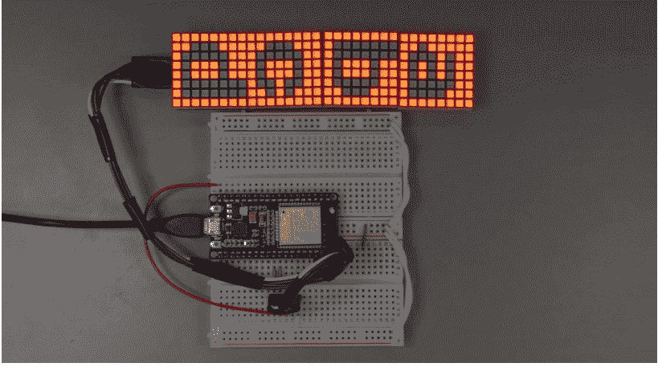

这意味着 `field` 命令，即 `field` 函数，将会点亮显示屏上的所有 LED。

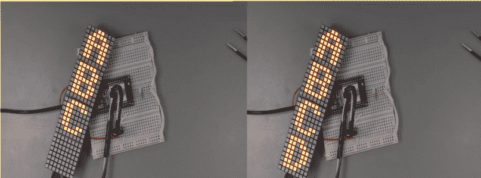

因此，通过使用颜色零来打印文本，我将使用黑底白字来打印出字母 ABCDE。我还把亮度设置为五，并通过调用 `show` 使这些字母可见。现在，我将按下键盘上的 Control+C 来停止随机像素示例，然后启动文本示例。看，文本显示出来了。文本看起来像这样，是白底黑字，而这个红色的背景，由于 LED 的颜色，实际上是暗红色的。对了。我能做些修改吗？让我们看看大写字母是什么样子的。然后我要把填充色改为零，文本颜色改为一，就在那里。

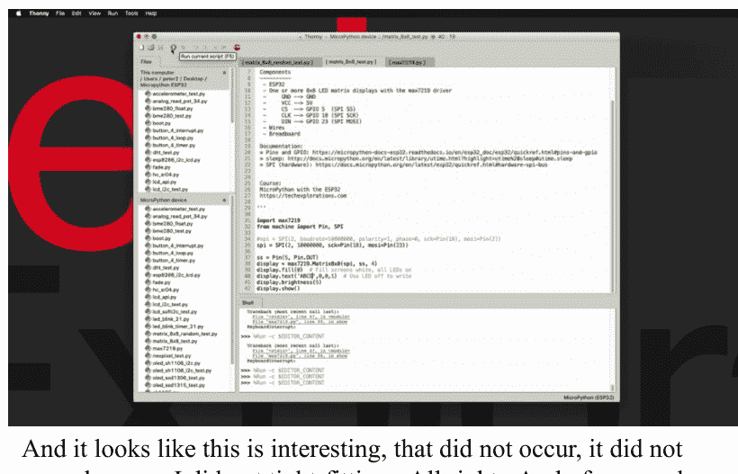

看起来是这样，这很有趣，那个字符没有出现，因为我没有输入它。好的。当然，你也可以显示数字。

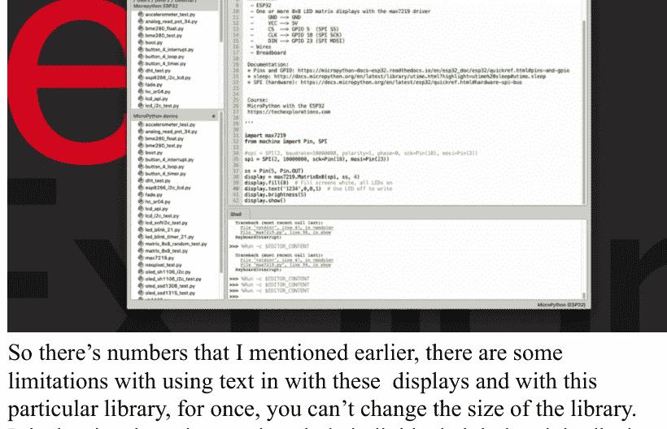

这就是我之前提到的数字。使用这些显示屏和这个特定库来显示文本有一些限制。首先，你无法更改字体大小。它的大小是固定的，会占满整个 8x8 的显示屏来显示单个字符。另一个我发现相当烦人的限制是，你无法旋转字符，所以你必须以这种垂直方向使用显示屏。你不能真正地水平放置，并让字符以水平方式旋转 90 度。你可以深入研究驱动程序本身。如果你的 Python 知识足够好，你就能够在代码本身中进行这些更改，然后可能添加一个允许你旋转 90 度的函数。但如果不修改库本身，你无法——至少我没有找到一个能做到这一点的库。所以，如果你能接受这个 MAX7219 库的这些限制，特别是如果你想用它来使用图形原语显示图形，我认为这是一个不错的选择。