# 学习 Python 3

开源书籍


作者

Ankit Mahato

https://animator.github.io

版本 2022.10

## 目录

**引言** . . . . . . . . . . . . . . . . . . . . . . . . . . . . . . . . . . . . . . . . . . . . . . . . . . . . . . . . . . . . . . . . . . . . . . . . . . . . . . . . . . . . . . . . . . . . . . . . . . . . . . . . . . . . . . . . . . . . . . . . . . . . . . . . . . . . . . . . . . . . . . . . . . . . . . . . . . . . . . . . . . . . . . . . . . . . . . . . . . . . . . . . . . . . . . . . . . . . . . . . . . . . . . . . . . . . . . . . . . . . . . . . . . . . . . . . . . . . . . . . . . . . . . . . . . . . . . . . . . . . . . . . . . . . . . . . . . . . . . . . . . . . . . . . . . . . . . . . . . . . . . . . . . . . . . . . . . . . . . . . . . . . . . . . . . . . . . . . . . . . . . . . . . . . . . . . . . . . . . . . . . . . . . . . . . . . . . . . . . . . . . . . . . . . . . . . . . . . . . . . . . . . . . . . . . . . . . . . . . . . . . . . . . . . . . . . . . . . . . . . . . . . . . . . . . . . . . . . . . . . . . . . . . . . . . . . . . . . . . . . . . . . . . . . . . . . . . . . . . . . . . . . . . . . . . . . . . . . . . . . . . . . . . . . . . . . . . . . . . . . . . . . . . . . . . . . . . . . . . . . . . . . . . . . . . . . . . . . . . . . . . . . . . . . . . . . . . . . . . . . . . . . . . . . . . . . . . . . . . . . . . . . . . . . . . . . . . . . . . . . . . . . . . . . . . . . . . . . . . . . . . . . . . . . . . . . . . . . . . . . . . . . . . . . . . . . . . . . . . . . . . . . . . . . . . . . . . . . . . . . . . . . . . . . . . . . . . . . . . . . . . . . . . . . . . . . . . . . . . . . . . . . . . . . . . . . . . . . . . . . . . . . . . . . . . . . . . . . . . . . . . . . . . . . . . . . . . . . . . . . . . . . . . . . . . . . . . . . . . . . . . . . . . . . . . . . . . . . . . . . . . . . . . . . . . . . . . . . . . . . . . . . . . . . . . . . . . . . . . . . . . . . . . . . . . . . . . . . . . . . . . . . . . . . . . . . . . . . . . . . . . . . . . . . . . . . . . . . . . . . . . . . . . . . . . . . . . . . . . . . . . . . . . . . . . . . . . . . . . . . . . . . . . . . . . . . . . . . . . . . . . . . . . . . . . . . . . . . . . . . . . . . . . . . . . . . . . . . . . . . . . . . . . . . . . . . . . . . . . . . . . . . . . . . . . . . . . . . . . . . . . . . . . . . . . . . . . . . . . . . . . . . . . . . . . . . . . . . . . . . . . . . . . . . . . . . . . . . . . . . . . . . . . . . . . . . . . . . . . . . . . . . . . . . . . . . . . . . . . . . . . . . . . . . . . . . . . . . . . . . . . . . . . . . . . . . . . . . . . . . . . . . . . . . . . . . . . . . . . . . . . . . . . . . . . . . . . . . . . . . . . . . . . . . . . . . . . . . . . . . . . . . . . . . . . . . . . . . . . . . . . . . . . . . . . . . . . . . . . . . . . . . . . . . . . . . . . . . . . . . . . . . . . . . . . . . . . . . . . . . . . . . . . . . . . . . . . . . . . . . . . . . . . . . . . . . . . . . . . . . . . . . . . . . . . . . . . . . . . . . . . . . . . . . . . . . . . . . . . . . . . . . . . . . . . . . . . . . . . . . . . . . . . . . . . . . . . . . . . . . . . . . . . . . . . . . . . . . . . . . . . . . . . . . . . . . . . . . . . . . . . . . . . . . . . . . . . . . . . . . . . . . . . . . . . . . . . . . . . . . . . . . . . . . . . . . . . . . . . . . . . . . . . . . . . . . . . . . . . . . . . . . . . . . . . . . . . . . . . . . . . . . . . . . . . . . . . . . . . . . . . . . . . . . . . . . . . . . . . . . . . . . . . . . . . . . . . . . . . . . . . . . . . . . . . . . . . . . . . . . . . . . . . . . . . . . . . . . . . . . . . . . . . . . . . . . . . . . . . . . . . . . . . . . . . . . . . . . . . . . . . . . . . . . . . . . . . . . . . . . . . . . . . . . . . . . . . . . . . . . . . . . . . . . . . . . . . . . . . . . . . . . . . . . . . . . . . . . . . . . . . . . . . . . . . . . . . . . . . . . . . . . . . . . . . . . . . . . . . . . . . . . . . . . . . . . . . . . . . . . . . . . . . . . . . . . . . . . . . . . . . . . . . . . . . . . . . . . . . . . . . . . . . . . . . . . . . . . . . . . . . . . . . . . . . . . . . . . . . . . . . . . . . . . . . . . . . . . . . . . . . . . . . . . . . . . . . . . . . . . . . . . . . . . . . . . . . . . . . . . . . . . . . . . . . . . . . . . . . . . . . . . . . . . . . . . . . . . . . . . . . . . . . . . . . . . . . . . . . . . . . . . . . . . . . . . . . . . . . . . . . . . . . . . . . . . . . . . . . . . . . . . . . . . . . . . . . . . . . . . . . . . . . . . . . . . . . . . . . . . . . . . . . . . . . . . . . . . . . . . . . . . . . . . . . . . . . . . . . . . . . . . . . . . . . . . . . . . . . . . . . . . . . . . . . . . . . . . . . . . . . . . . . . . . . . . . . . . . . . . . . . . . . . . . . . . . . . . . . . . . . . . . . . . . . . . . . . . . . . . . . . . . . . . . . . . . . . . . . . . . . . . . . . . . . . . . . . . . . . . . . . . . . . . . . . . . . . . . . . . . . . . . . . . . . . . . . . . . . . . . . . . . . . . . . . . . . . . . . . . . . . . . . . . . . . . . . . . . . . . . . . . . . . . . . . . . . . . . . . . . . . . . . . . . . . . . . . . . . . . . . . . . . . . . . . . . . . . . . . . . . . . . . . . . . . . . . . . . . . . . . . . . . . . . . . . . . . . . . . . . . . . . . . . . . . . . . . . . . . . . . . . . . . . . . . . . . . . . . . . . . . . . . . . . . . . . . . . . . . . . . . . . . . . . . . . . . . . . . . . . . . . . . . . . . . . . . . . . . . . . . . . . . . . . . . . . . . . . . . . . . . . . . . . . . . . . . . . . . . . . . . . . . . . . . . . . . . . . . . . . . . . . . . . . . . . . . . . . . . . . . . . . . . . . . . . . . . . . . . . . . . . . . . . . . . . . . . . . . . . . . . . . . . . . . . . . . . . . . . . . . . . . . . . . . . . . . . . . . . . . . . . . . . . . . . . . . . . . . . . . . . . . . . . . . . . . . . . . . . . . . . . . . . . . . . . . . . . . . . . . . . . . . . . . . . . . . . . . . . . . . . . . . . . . . . . . . . . . . . . . . . . . . . . . . . . . . . . . . . . . . . . . . . . . . . . . . . . . . . . . . . . . . . . . . . . . . . . . . . . . . . . . . . . . . . . . . . . . . . . . . . . . . . . . . . . . . . . . . . . . . . . . . . . . . . . . . . . . . . . . . . . . . . . . . . . . . . . . . . . . . . . . . . . . . . . . . . . . . . . . . . . . . . . . . . . . . . . . . . . . . . . . . . . . . . . . . . . . . . . . . . . . . . . . . . . . . . . . . . . . . . . . . . . . . . . . . . . . . . . . . . . . . . . . . . . . . . . . . . . . . . . . . . . . . . . . . . . . . . . . . . . . . . . . . . . . . . . . . . . . . . . . . . . . . . . . . . . . . . . . . . . . . . . . . . . . . . . . . . . . . . . . . . . . . . . . . . . . . . . . . . . . . . . . . . . . . . . . . . . . . . . . . . . . . . . . . . . . . . . . . . . . . . . . . . . . . . . . . . . . . . . . . . . . . . . . . . . . . . . . . . . . . . . . . . . . . . . . . . . . . . . . . . . . . . . . . . . . . . . . . . . . . . . . . . . . . . . . . . . . . . . . . . . . . . . . . . . . . . . . . . . . . . . . . . . . . . . . . . . . . . . . . . . . . . . . . . . . . . . . . . . . . . . . . . . . . . . . . . . . . . . . . . . . . . . . . . . . . . . . . . . . . . . . . . . . . . . . . . . . . . . . . . . . . . . . . . . . . . . . . . . . . . . . . . . . . . . . . . . . . . . . . . . . . . . . . . . . . . . . . . . . . . . . . . . . . . . . . . . . . . . . . . . . . . . . . . . . . . . . . . . . . . . . . . . . . . . . . . . . . . . . . . . . . . . . . . . . . . . . . . . . . . . . . . . . . . . . . . . . . . . . . . . . . . . . . . . . . . . . . . . . . . . . . . . . . . . . . . . . . . . . . . . . . . . . . . . . . . . . . . . . . . . . . . . . . . . . . . . . . . . . . . . . . . . . . . . . . . . . . . . . . . . . . . . . . . . . . . . . . . . . . . . . . . . . . . . . . . . . . . . . . . . . . . . . . . . . . . . . . . . . . . . . . . . . . . . . . . . . . . . . . . . . . . . . . . . . . . . . . . . . . . . . . . . . . . . . . . . . . . . . . . . . . . . . . . . . . . . . . . . . . . . . . . . . . . . . . . . . . . . . . . . . . . . . . . . . . . . . . . . . . . . . . . . . . . . . . . . . . . . . . . . . . . . . . . . . . . . . . . . . . . . . . . . . . . . . . . . . . . . . . . . . . . . . . . . . . . . . . . . . . . . . . . . . . . . . . . . . . . . . . . . . . . . . . . . . . . . . . . . . . . . . . . . . . . . . . . . . . . . . . . . . . . . . . . . . . . . . . . . . . . . . . . . . . . . . . . . . . . . . . . . . . . . . . . . . . . . . . . . . . . . . . . . . . . . . . . . . . . . . . . . . . . . . . . . . . . . . . . . . . . . . . . . . . . . . . . . . . . . . . . . . . . . . . . . . . . . . . . . . . . . . . . . . . . . . . . . . . . . . . . . . . . . . . . . . . . . . . . . . . . . . . . . . . . . . . . . . . . . . . . . . . . . . . . . . . . . . . . . . . . . . . . . . . . . . . . . . . . . . . . . . . . . . . . . . . . . . . . . . . . . . . . . . . . . . . . . . . . . . . . . . . . . . . . . . . . . . . . . . . . . . . . . . . . . . . . . . . . . . . . . . . . . . . . . . . . . . . . . . . . . . . . . . . . . . . . . . . . . . . . . . . . . . . . . . . . . . . . . . . . . . . . . . . . . . . . . . . . . . . . . . . . . . . . . . . . . . . . . . . . . . . . . . . . . . . . . . . . . . . . . . . . . . . . . . . . . . . . . . . . . . . . . . . . . . . . . . . . . . . . . . . . . . . . . . . . . . . . . . . . . . . . . . . . . . . . . . . . . . . . . . . . . . . . . . . . . . . . . . . . . . . . . . . . . . . . . . . . . . . . . . . . . . . . . . . . . . . . . . . . . . . . . . . . . . . . . . . . . . . . . . . . . . . . . . . . . . . . . . . . . . . . . . . . . . . . . . . . . . . . . . . . . . . . . . . . . . . . . . . . . . . . . . . . . . . . . . . . . . . . . . . . . . . . . . . . . . . . . . . . . . . . . . . . . . . . . . . . . . . . . . . . . . . . . . . . . . . . . . . . . . . . . . . . . . . . . . . . . . . . . . . . . . . . . . . . . . . . . . . . . . . . . . . . . . . . . . . . . . . . . . . . . . . . . . . . . . . . . . . . . . . . . . . . . . . . . . . . . . . . . . . . . . . . . . . . . . . . . . . . . . . . . . . . . . . . . . . . . . . . . . . . . . . . . . . . . . . . . . . . . . . . . . . . . . . . . . . . . . . . . . . . . . . . . . . . . . . . . . . . . . . . . . . . . . . . . . . . . . . . . . . . . . . . . . . . . . . . . . . . . . . . . . . . . . . . . . . . . . . . . . . . . . . . . . . . . . . . . . . . . . . . . . . . . . . . . . . . . . . . . . . . . . . . . . . . . . . . . . . . . . . . . . . . . . . . . . . . . . . . . . . . . . . . . . . . . . . . . . . . . . . . . . . . . . . . . . . . . . . . . . . . . . . . . . . . . . . . . . . . . . . . . . . . . . . . . . . . . . . . . . . . . . . . . . . . . . . . . . . . . . . . . . . . . . . . . . . . . . . . . . . . . . . . . . . . . . . . . . . . . . . . . . . . . . . . . . . . . . . . . . . . . . . . . . . . . . . . . . . . . . . . . . . . . . . . . . . . . . . . . . . . . . . . . . . . . . . . . . . . . . . . . . . . . . . . . . . . . . . . . . . . . . . . . . . . . . . . . . . . . . . . . . . . . . . . . . . . . . . . . . . . . . . . . . . . . . . . . . . . . . . . . . . . . . . . . . . . . . . . . . . . . . . . . . . . . . . . . . . . . . . . . . . . . . . . . . . . . . . . . . . . . . . . . . . . . . . . . . . . . . . . . . . . . . . . . . . . . . . . . . . . . . . . . . . . . . . . . . . . . . . . . . . . . . . . . . . . . . . . . . . . . . . . . . . . . . . . . . . . . . . . . . . . . . . . . . . . . . . . . . . . . . . . . . . . . . . . . . . . . . . . . . . . . . . . . . . . . . . . . . . . . . . . . . . . . . . . . . . . . . . . . . . . . . . . . . . . . . . . . . . . . . . . . . . . . . . . . . . . . . . . . . . . . . . . . . . . . . . . . . . . . . . . . . . . . . . . . . . . . . . . . . . . . . . . . . . . . . . . . . . . . . . . . . . . . . . . . . . . . . . . . . . . . . . . . . . . . . . . . . . . . . . . . . . . . . . . . . . . . . . . . . . . . . . . . . . . . . . . . . . . . . . . . . . . . . . . . . . . . . . . . . . . . . . . . . . . . . . . . . . . . . . . . . . . . . . . . . . . . . . . . . . . . . . . . . . . . . . . . . . . . . . . . . . . . . . . . . . . . . . . . . . . . . . . . . . . . . . . . . . . . . . . . . . . . . . . . . . . . . . . . . . . . . . . . . . . . . . . . . . . . . . . . . . . . . . . . . . . . . . . . . . . . . . . . . . . . . . . . . . . . . . . . . . . . . . . . . . . . . . . . . . . . . . . . . . . . . . . . . . . . . . . . . . . . . . . . . . . . . . . . . . . . . . . . . . . . . . . . . . . . . . . . . . . . . . . . . . . . . . . . . . . . . . . . . . . . . . . . . . . . . . . . . . . . . . . . . . . . . . . . . . . . . . . . . . . . . . . . . . . . . . . . . . . . . . . . . . . . . . . . . . . . . . . . . . . . . . . . . . . . . . . . . . . . . . . . . . . . . . . . . . . . . . . . . . . . . . . . . . . . . . . . . . . . . . . . . . . . . . . . . . . . . . . . . . . . . . . . . . . . . . . . . . . . . . . . . . . . . . . . . . . . . . . . . . . . . . . . . . . . . . . . . . . . . . . . . . . . . . . . . . . . . . . . . . . . . . . . . . . . . . . . . . . . . . . . . . . . . . . . . . . . . . . . . . . . . . . . . . . . . . . . . . . . . . . . . . . . . . . . . . . . . . . . . . . . . . . . . . . . . . . . . . . . . . . . . . . . . . . . . . . . . . . . . . . . . . . . . . . . . . . . . . . . . . . . . . . . . . . . . . . . . . . . . . . . . . . . . . . . . . . . . . . . . . . . . . . . . . . . . . . . . . . . . . . . . . . . . . . . . . . . . . . . . . . . . . . . . . . . . . . . . . . . . . . . . . . . . . . . . . . . . . . . . . . . . . . . . . . . . . . . . . . . . . . . . . . . . . . . . . . . . . . . . . . . . . . . . . . . . . . . . . . . . . . . . . . . . . . . . . . . . . . . . . . . . . . . . . . . . . . . . . . . . . . . . . . . . . . . . . . . . . . . . . . . . . . . . . . . . . . . . . . . . . . . . . . . . . . . . . . . . . . . . . . . . . . . . . . . . . . . . . . . . . . . . . . . . . . . . . . . . . . . . . . . . . . . . . . . . . . . . . . . . . . . . . . . . . . . . . . . . . . . . . . . . . . . . . . . . . . . . . . . . . . . . . . . . . . . . . . . . . . . . . . . . . . . . . . . . . . . . . . . . . . . . . . . . . . . . . . . . . . . . . . . . . . . . . . . . . . . . . . . . . . . . . . . . . . . . . . . . . . . . . . . . . . . . . . . . . . . . . . . . . . . . . . . . . . . . . . . . . . . . . . . . . . . . . . . . . . . . . . . . . . . . . . . . . . . . . . . . . . . . . . . . . . . . . . . . . . . . . . . . . . . . . . . . . . . . . . . . . . . . . . . . . . . . . . . . . . . . . . . . . . . . . . . . . . . . . . . . . . . . . . . . . . . . . . . . . . . . . . . . . . . . . . . . . . . . . . . . . . . . . . . . . . . . . . . . . . . . . . . . . . . . . . . . . . . . . . . . . . . . . . . . . . . . . . . . . . . . . . . . . . . . . . . . . . . . . . . . . . . . . . . . . . . . . . . . . . . . . . . . . . . . . . . . . . . . . . . . . . . . . . . . . . . . . . . . . . . . . . . . . . . . . . . . . . . . . . . . . . . . . . . . . . . . . . . . . . . . . . . . . . . . . . . . . . . . . . . . . . . . . . . . . . . . . . . . . . . . . . . . . . . . . . . . . . . . . . . . . . . . . . . . . . . . . . . . . . . . . . . . . . . . . . . . . . . . . . . . . . . . . . . . . . . . . . . . . . . . . . . . . . . . . . . . . . . . . . . . . . . . . . . . . . . . . . . . . . . . . . . . . . . . . . . . . . . . . . . . . . . . . . . . . . . . . . . . . . . . . . . . . . . . . . . . . . . . . . . . . . . . . . . . . . . . . . . . . . . . . . . . . . . . . . . . . . . . . . . . . . . . . . . . . . . . . . . . . . . . . . . . . . . . . . . . . . . . . . . . . . . . . . . . . . . . . . . . . . . . . . . . . . . . . . . . . . . . . . . . . . . . . . . . . . . . . . . . . . . . . . . . . . . . . . . . . . . . . . . . . . . . . . . . . . . . . . . . . . . . . . . . . . . . . . . . . . . . . . . . . . . . . . . . . . . . . . . . . . . . . . . . . . . . . . . . . . . . . . . . . . . . . . . . . . . . . . . . . . . . . . . . . . . . . . . . . . . . . . . . . . . . . . . . . . . . . . . . . . . . . . . . . . . . . . . . . . . . . . . . . . . . . . . . . . . . . . . . . . . . . . . . . . . . . . . . . . . . . . . . . . . . . . . . . . . . . . . . . . . . . . . . . . . . . . . . . . . . . . . . . . . . . . . . . . . . . . . . . . . . . . . . . . . . . . . . . . . . . . . . . . . . . . . . . . . . . . . . . . . . . . . . . . . . . . . . . . . . . . . . . . . . . . . . . . . . . . . . . . . . . . . . . . . . . . . . . . . . . . . . . . . . . . . . . . . . . . . . . . . . . . . . . . . . . . . . . . . . . . . . . . . . . . . . . . . . . . . . . . . . . . . . . . . . . . . . . . . . . . . . . . . . . . . . . . . . . . . . . . . . . . . . . . . . . . . . . . . . . . . . . . . . . . . . . . . . . . . . . . . . . . . . . . . . . . . . . . . . . . . . . . . . . . . . . . . . . . . . . . . . . . . . . . . . . . . . . . . . . . . . . . . . . . . . . . . . . . . . . . . . . . . . . . . . . . . . . . . . . . . . . . . . . . . . . . . . . . . . . . . . . . . . . . . . . . . . . . . . . . . . . . . . . . . . . . . . . . . . . . . . . . . . . . . . . . . . . . . . . . . . . . . . . . . . . . . . . . . . . . . . . . . . . . . . . . . . . . . . . . . . . . . . . . . . . . . . . . . . . . . . . . . . . . . . . . . . . . . . . . . . . . . . . . . . . . . . . . . . . . . . . . . . . . . . . . . . . . . . . . . . . . . . . . . . . . . . . . . . . . . . . . . . . . . . . . . . . . . . . . . . . . . . . . . . . . . . . . . . . . . . . . . . . . . . . . . . . . . . . . . . . . . . . . . . . . . . . . . . . . . . . . . . . . . . . . . . . . . . . . . . . . . . . . . . . . . . . . . . . . . . . . . . . . . . . . . . . . . . . . . . . . . . . . . . . . . . . . . . . . . . . . . . . . . . . . . . . . . . . . . . . . . . . . . . . . . . . . . . . . . . . . . . . . . . . . . . . . . . . . . . . . . . . . . . . . . . . . . . . . . . . . . . . . . . . . . . . . . . . . . . . . . . . . . . . . . . . . . . . . . . . . . . . . . . . . . . . . . . . . . . . . . . . . . . . . . . . . . . . . . . . . . . . . . . . . . . . . . . . . . . . . . . . . . . . . . . . . . . . . . . . . . . . . . . . . . . . . . . . . . . . . . . . . . . . . . . . . . . . . . . . . . . . . . . . . . . . . . . . . . . . . . . . . . . . . . . . . . . . . . . . . . . . . . . . . . . . . . . . . . . . . . . . . . . . . . . . . . . . . . . . . . . . . . . . . . . . . . . . . . . . . . . . . . . . . . . . . . . . . . . . . . . . . . . . . . . . . . . . . . . . . . . . . . . . . . . . . . . . . . . . . . . . . . . . . . . . . . . . . . . . . . . . . . . . . . . . . . . . . . . . . . . . . . . . . . . . . . . . . . . . . . . . . . . . . . . . . . . . . . . . . . . . . . . . . . . . . . . . . . . . . . . . . . . . . . . . . . . . . . . . . . . . . . . . . . . . . . . . . . . . . . . . . . . . . . . . . . . . . . . . . . . . . . . . . . . . . . . . . . . . . . . . . . . . . . . . . . . . . . . . . . . . . . . . . . . . . . . . . . . . . . . . . . . . . . . . . . . . . . . . . . . . . . . . . . . . . . . . . . . . . . . . . . . . . . . . . . . . . . . . . . . . . . . . . . . . . . . . . . . . . . . . . . . . . . . . . . . . . . . . . . . . . . . . . . . . . . . . . . . . . . . . . . . . . . . . . . . . . . . . . . . . . . . . . . . . . . . . . . . . . . . . . . . . . . . . . . . . . . . . . . . . . . . . . . . . . . . . . . . . . . . . . . . . . . . . . . . . . . . . . . . . . . . . . . . . . . . . . . . . . . . . . . . . . . . . . . . . . . . . . . . . . . . . . . . . . . . . . . . . . . . . . . . . . . . . . . . . . . . . . . . . . . . . . . . . . . . . . . . . . . . . . . . . . . . . . . . . . . . . . . . . . . . . . . . . . . . . . . . . . . . . . . . . . . . . . . . . . . . . . . . . . . . . . . . . . . . . . . . . . . . . . . . . . . . . . . . . . . . . . . . . . . . . . . . . . . . . . . . . . . . . . . . . . . . . . . . . . . . . . . . . . . . . . . . . . . . . . . . . . . . . . . . . . . . . . . . . . . . . . . . . . . . . . . . . . . . . . . . . . . . . . . . . . . . . . . . . . . . . . . . . . . . . . . . . . . . . . . . . . . . . . . . . . . . . . . . . . . . . . . . . . . . . . . . . . . . . . . . . . . . . . . . . . . . . . . . . . . . . . . . . . . . . . . . . . . . . . . . . . . . . . . . . . . . . . . . . . . . . . . . . . . . . . . . . . . . . . . . . . . . . . . . . . . . . . . . . . . . . . . . . . . . . . . . . . . . . . . . . . . . . . . . . . . . . . . . . . . . . . . . . . . . . . . . . . . . . . . . . . . . . . . . . . . . . . . . . . . . . . . . . . . . . . . . . . . . . . . . . . . . . . . . . . . . . . . . . . . . . . . . . . . . . . . . . . . . . . . . . . . . . . . . . . . . . . . . . . . . . . . . . . . . . . . . . . . . . . . . . . . . . . . . . . . . . . . . . . . . . . . . . . . . . . . . . . . . . . . . . . . . . . . . . . . . . . . . . . . . . . . . . . . . . . . . . . . . . . . . . . . . . . . . . . . . . . . . . . . . . . . . . . . . . . . . . . . . . . . . . . . . . . . . . . . . . . . . . . . . . . . . . . . . . . . . . . . . . . . . . . . . . . . . . . . . . . . . . . . . . . . . . . . . . . . . . . . . . . . . . . . . . . . . . . . . . . . . . . . . . . . . . . . . . . . . . . . . . . . . . . . . . . . . . . . . . . . . . . . . . . . . . . . . . . . . . . . . . . . . . . . . . . . . . . . . . . . . . . . . . . . . . . . . . . . . . . . . . . . . . . . . . . . . . . . . . . . . . . . . . . . . . . . . . . . . . . . . . . . . . . . . . . . . . . . . . . . . . . . . . . . . . . . . . . . . . . . . . . . . . . . . . . . . . . . . . . . . . . . . . . . . . . . . . . . . . . . . . . . . . . . . . . . . . . . . . . . . . . . . . . . . . . . . . . . . . . . . . . . . . . . . . . . . . . . . . . . . . . . . . . . . . . . . . . . . . . . . . . . . . . . . . . . . . . . . . . . . . . . . . . . . . . . . . . . . . . . . . . . . . . . . . . . . . . . . . . . . . . . . . . . . . . . . . . . . . . . . . . . . . . . . . . . . . . . . . . . . . . . . . . . . . . . . . . . . . . . . . . . . . . . . . . . . . . . . . . . . . . . . . . . . . . . . . . . . . . . . . . . . . . . . . . . . . . . . . . . . . . . . . . . . . . . . . . . . . . . . . . . . . . . . . . . . . . . . . . . . . . . . . . . . . . . . . . . . . . . . . . . . . . . . . . . . . . . . . . . . . . . . . . . . . . . . . . . . . . . . . . . . . . . . . . . . . . . . . . . . . . . . . . . . . . . . . . . . . . . . . . . . . . . . . . . . . . . . . . . . . . . . . . . . . . . . . . . . . . . . . . . . . . . . . . . . . . . . . . . . . . . . . . . . . . . . . . . . . . . . . . . . . . . . . . . . . . . . . . . . . . . . . . . . . . . . . . . . . . . . . . . . . . . . . . . . . . . . . . . . . . . . . . . . . . . . . . . . . . . . . . . . . . . . . . . . . . . . . . . . . . . . . . . . . . . . . . . . . . . . . . . . . . . . . . . . . . . . . . . . . . . . . . . . . . . . . . . . . . . . . . . . . . . . . . . . . . . . . . . . . . . . . . . . . . . . . . . . . . . . . . . . . . . . . . . . . . . . . . . . . . . . . . . . . . . . . . . . . . . . . . . . . . . . . . . . . . . . . . . . . . . . . . . . . . . . . . . . . . . . . . . . . . . . . . . . . . . . . . . . . . . . . . . . . . . . . . . . . . . . . . . . . . . . . . . . . . . . . . . . . . . . . . . . . . . . . . . . . . . . . . . . . . . . . . . . . . . . . . . . . . . . . . . . . . . . . . . . . . . . . . . . . . . . . . . . . . . . . . . . . . . . . . . . . . . . . . . . . . . . . . . . . . . . . . . . . . . . . . . . . . . . . . . . . . . . . . . . . . . . . . . . . . . . . . . . . . . . . . . . . . . . . . . . . . . . . . . . . . . . . . . . . . . . . . . . . . . . . . . . . . . . . . . . . . . . . . . . . . . . . . . . . . . . . . . . . . . . . . . . . . . . . . . . . . . . . . . . . . . . . . . . . . . . . . . . . . . . . . . . . . . . . . . . . . . . . . . . . . . . . . . . . . . . . . . . . . . . . . . . . . . . . . . . . . . . . . . . . . . . . . . . . . . . . . . . . . . . . . . . . . . . . . . . . . . . . . . . . . . . . . . . . . . . . . . . . . . . . . . . . . . . . . . . . . . . . . . . . . . . . . . . . . . . . . . . . . . . . . . . . . . . . . . . . . . . . . . . . . . . . . . . . . . . . . . . . . . . . . . . . . . . . . . . . . . . . . . . . . . . . . . . . . . . . . . . . . . . . . . . . . . . . . . . . . . . . . . . . . . . . . . . . . . . . . . . . . . . . . . . . . . . . . . . . . . . . . . . . . . . . . . . . . . . . . . . . . . . . . . . . . . . . . . . . . . . . . . . . . . . . . . . . . . . . . . . . . . . . . . . . . . . . . . . . . . . . . . . . . . . . . . . . . . . . . . . . . . . . . . . . . . . . . . . . . . . . . . . . . . . . . . . . . . . . . . . . . . . . . . . . . . . . . . . . . . . . . . . . . . . . . . . . . . . . . . . . . . . . . . . . . . . . . . . . . . . . . . . . . . . . . . . . . . . . . . . . . . . . . . . . . . . . . . . . . . . . . . . . . . . . . . . . . . . . . . . . . . . . . . . . . . . . . . . . . . . . . . . . . . . . . . . . . . . . . . . . . . . . . . . . . . . . . . . . . . . . . . . . . . . . . . . . . . . . . . . . . . . . . . . . . . . . . . . . . . . . . . . . . . . . . . . . . . . . . . . . . . . . . . . . . . . . . . . . . . . . . . . . . . . . . . . . . . . . . . . . . . . . . . . . . . . . . . . . . . . . . . . . . . . . . . . . . . . . . . . . . . . . . . . . . . . . . . . . . . . . . . . . . . . . . . . . . . . . . . . . . . . . . . . . . . . . . . . . . . . . . . . . . . . . . . . . . . . . . . . . . . . . . . . . . . . . . . . . . . . . . . . . . . . . . . . . . . . . . . . . . . . . . . . . . . . . . . . . . . . . . . . . . . . . . . . . . . . . . . . . . . . . . . . . . . . . . . . . . . . . . . . . . . . . . . . . . . . . . . . . . . . . . . . . . . . . . . . . . . . . . . . . . . . . . . . . . . . . . . . . . . . . . . . . . . . . . . . . . . . . . . . . . . . . . . . . . . . . . . . . . . . . . . . . . . . . . . . . . . . . . . . . . . . . . . . . . . . . . . . . . . . . . . . . . . . . . . . . . . . . . . . . . . . . . . . . . . . . . . . . . . . . . . . . . . . . . . . . . . . . . . . . . . . . . . . . . . . . . . . . . . . . . . . . . . . . . . . . . . . . . . . . . . . . . . . . . . . . . . . . . . . . . . . . . . . . . . . . . . . . . . . . . . . . . . . . . . . . . . . . . . . . . . . . . . . . . . . . . . . . . . . . . . . . . . . . . . . . . . . . . . . . . . . . . . . . . . . . . . . . . . . . . . . . . . . . . . . . . . . . . . . . . . . . . . . . . . . . . . . . . . . . . . . . . . . . . . . . . . . . . . . . . . . . . . . . . . . . . . . . . . . . . . . . . . . . . . . . . . . . . . . . . . . . . . . . . . . . . . . . . . . . . . . . . . . . . . . . . . . . . . . . . . . . . . . . . . . . . . . . . . . . . . . . . . . . . . . . . . . . . . . . . . . . . . . . . . . . . . . . . . . . . . . . . . . . . . . . . . . . . . . . . . . . . . . . . . . . . . . . . . . . . . . . . . . . . . . . . . . . . . . . . . . . . . . . . . . . . . . . . . . . . . . . . . . . . . . . . . . . . . . . . . . . . . . . . . . . . . . . . . . . . . . . . . . . . . . . . . . . . . . . . . . . . . . . . . . . . . . . . . . . . . . . . . . . . . . . . . . . . . . . . . . . . . . . . . . . . . . . . . . . . . . . . . . . . . . . . . . . . . . . . . . . . . . . . . . . . . . . . . . . . . . . . . . . . . . . . . . . . . . . . . . . . . . . . . . . . . . . . . . . . . . . . . . . . . . . . . . . . . . . . . . . . . . . . . . . . . . . . . . . . . . . . . . . . . . . . . . . . . . . . . . . . . . . . . . . . . . . . . . . . . . . . . . . . . . . . . . . . . . . . . . . . . . . . . . . . . . . . . . . . . . . . . . . . . . . . . . . . . . . . . . . . . . . . . . . . . . . . . . . . . . . . . . . . . . . . . . . . . . . . . . . . . . . . . . . . . . . . . . . . . . . . . . . . . . . . . . . . . . . . . . . . . . . . . . . . . . . . . . . . . . . . . . . . . . . . . . . . . . . . . . . . . . . . . . . . . . . . . . . . . . . . . . . . . . . . . . . . . . . . . . . . . . . . . . . . . . . . . . . . . . . . . . . . . . . . . . . . . . . . . . . . . . . . . . . . . . . . . . . . . . . . . . . . . . . . . . . . . . . . . . . . . . . . . . . . . . . . . . . . . . . . . . . . . . . . . . . . . . . . . . . . . . . . . . . . . . . . . . . . . . . . . . . . . . . . . . . . . . . . . . . . . . . . . . . . . . . . . . . . . . . . . . . . . . . . . . . . . . . . . . . . . . . . . . . . . . . . . . . . . . . . . . . . . . . . . . . . . . . . . . . . . . . . . . . . . . . . . . . . . . . . . . . . . . . . . . . . . . . . . . . . . . . . . . . . . . . . . . . . . . . . . . . . . . . . . . . . . . . . . . . . . . . . . . . . . . . . . . . . . . . . . . . . . . . . . . . . . . . . . . . . . . . . . . . . . . . . . . . . . . . . . . . . . . . . . . . . . . . . . . . . . . . . . . . . . . . . . . . . . . . . . . . . . . . . . . . . . . . . . . . . . . . . . . . . . . . . . . . . . . . . . . . . . . . . . . . . . . . . . . . . . . . . . . . . . . . . . . . . . . . . . . . . . . . . . . . . . . . . . . . . . . . . . . . . . . . . . . . . . . . . . . . . . . . . . . . . . . . . . . . . . . . . . . . . . . . . . . . . . . . . . . . . . . . . . . . . . . . . . . . . . . . . . . . . . . . . . . . . . . . . . . . . . . . . . . . . . . . . . . . . . . . . . . . . . . . . . . . . . . . . . . . . . . . . . . . . . . . . . . . . . . . . . . . . . . . . . . . . . . . . . . . . . . . . . . . . . . . . . . . . . . . . . . . . . . . . . . . . . . . . . . . . . . . . . . . . . . . . . . . . . . . . . . . . . . . . . . . . . . . . . . . . . . . . . . . . . . . . . . . . . . . . . . . . . . . . . . . . . . . . . . . . . . . . . . . . . . . . . . . . . . . . . . . . . . . . . . . . . . . . . . . . . . . . . . . . . . . . . . . . . . . . . . . . . . . . . . . . . . . . . . . . . . . . . . . . . . . . . . . . . . . . . . . . . . . . . . . . . . . . . . . . . . . . . . . . . . . . . . . . . . . . . . . . . . . . . . . . . . . . . . . . . . . . . . . . . . . . . . . . . . . . . . . . . . . . . . . . . . . . . . . . . . . . . . . . . . . . . . . . . . . . . . . . . . . . . . . . . . . . . . . . . . . . . . . . . . . . . . . . . . . . . . . . . . . . . . . . . . . . . . . . . . . . . . . . . . . . . . . . . . . . . . . . . . . . . . . . . . . . . . . . . . . . . . . . . . . . . . . . . . . . . . . . . . . . . . . . . . . . . . . . . . . . . . . . . . . . . . . . . . . . . . . . . . . . . . . . . . . . . . . . . . . . . . . . . . . . . . . . . . . . . . . . . . . . . . . . . . . . . . . . . . . . . . . . . . . . . . . . . . . . . . . . . . . . . . . . . . . . . . . . . . . . . . . . . . . . . . . . . . . . . . . . . . . . . . . . . . . . . . . . . . . . . . . . . . . . . . . . . . . . . . . . . . . . . . . . . . . . . . . . . . . . . . . . . . . . . . . . . . . . . . . . . . . . . . . . . . . . . . . . . . . . . . . . . . . . . . . . . . . . . . . . . . . . . . . . . . . . . . . . . . . . . . . . . . . . . . . . . . . . . . . . . . . . . . . . . . . . . . . . . . . . . . . . . . . . . . . . . . . . . . . . . . . . . . . . . . . . . . . . . . . . . . . . . . . . . . . . . . . . . . . . . . . . . . . . . . . . . . . . . . . . . . . . . . . . . . . . . . . . . . . . . . . . . . . . . . . . . . . . . . . . . . . . . . . . . . . . . . . . . . . . . . . . . . . . . . . . . . . . . . . . . . . . . . . . . . . . . . . . . . . . . . . . . . . . . . . . . . . . . . . . . . . . . . . . . . . . . . . . . . . . . . . . . . . . . . . . . . . . . . . . . . . . . . . . . . . . . . . . . . . . . . . . . . . . . . . . . . . . . . . . . . . . . . . . . . . . . . . . . . . . . . . . . . . . . . . . . . . . . . . . . . . . . . . . . . . . . . . . . . . . . . . . . . . . . . . . . . . . . . . . . . . . . . . . . . . . . . . . . . . . . . . . . . . . . . . . . . . . . . . . . . . . . . . . . . . . . . . . . . . . . . . . . . . . . . . . . . . . . . . . . . . . . . . . . . . . . . . . . . . . . . . . . . . . . . . . . . . . . . . . . . . . . . . . . . . . . . . . . . . . . . . . . . . . . . . . . . . . . . . . . . . . . . . . . . . . . . . . . . . . . . . . . . . . . . . . . . . . . . . . . . . . . . . . . . . . . . . . . . . . . . . . . . . . . . . . . . . . . . . . . . . . . . . . . . . . . . . . . . . . . . . . . . . . . . . . . . . . . . . . . . . . . . . . . . . . . . . . . . . . . . . . . . . . . . . . . . . . . . . . . . . . . . . . . . . . . . . . . . . . . . . . . . . . . . . . . . . . . . . . . . . . . . . . . . . . . . . . . . . . . . . . . . . . . . . . . . . . . . . . . . . . . . . . . . . . . . . . . . . . . . . . . . . . . . . . . . . . . . . . . . . . . . . . . . . . . . . . . . . . . . . . . . . . . . . . . . . . . . . . . . . . . . . . . . . . . . . . . . . . . . . . . . . . . . . . . . . . . . . . . . . . . . . . . . . . . . . . . . . . . . . . . . . . . . . . . . . . . . . . . . . . . . . . . . . . . . . . . . . . . . . . . . . . . . . . . . . . . . . . . . . . . . . . . . . . . . . . . . . . . . . . . . . . . . . . . . . . . . . . . . . . . . . . . . . . . . . . . . . . . . . . . . . . . . . . . . . . . . . . . . . . . . . . . . . . . . . . . . . . . . . . . . . . . . . . . . . . . . . . . . . . . . . . . . . . . . . . . . . . . . . . . . . . . . . . . . . . . . . . . . . . . . . . . . . . . . . . . . . . . . . . . . . . . . . . . . . . . . . . . . . . . . . . . . . . . . . . . . . . . . . . . . . . . . . . . . . . . . . . . . . . . . . . . . . . . . . . . . . . . . . . . . . . . . . . . . . . . . . . . . . . . . . . . . . . . . . . . . . . . . . . . . . . . . . . . . . . . . . . . . . . . . . . . . . . . . . . . . . . . . . . . . . . . . . . . . . . . . . . . . . . . . . . . . . . . . . . . . . . . . . . . . . . . . . . . . . . . . . . . . . . . . . . . . . . . . . . . . . . . . . . . . . . . . . . . . . . . . . . . . . . . . . . . . . . . . . . . . . . . . . . . . . . . . . . . . . . . . . . . . . . . . . . . . . . . . . . . . . . . . . . . . . . . . . . . . . . . . . . . . . . . . . . . . . . . . . . . . . . . . . . . . . . . . . . . . . . . . . . . . . . . . . . . . . . . . . . . . . . . . . . . . . . . . . . . . . . . . . . . . . . . . . . . . . . . . . . . . . . . . . . . . . . . . . . . . . . . . . . . . . . . . . . . . . . . . . . . . . . . . . . . . . . . . . . . . . . . . . . . . . . . . . . . . . . . . . . . . . . . . . . . . . . . . . . . . . . . . . . . . . . . . . . . . . . . . . . . . . . . . . . . . . . . . . . . . . . . . . . . . . . . . . . . . . . . . . . . . . . . . . . . . . . . . . . . . . . . . . . . . . . . . . . . . . . . . . . . . . . . . . . . . . . . . . . . . . . . . . . . . . . . . . . . . . . . . . . . . . . . . . . . . . . . . . . . . . . . . . . . . . . . . . . . . . . . . . . . . . . . . . . . . . . . . . . . . . . . . . . . . . . . . . . . . . . . . . . . . . . . . . . . . . . . . . . . . . . . . . . . . . . . . . . . . . . . . . . . . . . . . . . . . . . . . . . . . . . . . . . . . . . . . . . . . . . . . . . . . . . . . . . . . . . . . . . . . . . . . . . . . . . . . . . . . . . . . . . . . . . . . . . . . . . . . . . . . . . . . . . . . . . . . . . . . . . . . . . . . . . . . . . . . . . . . . . . . . . . . . . . . . . . . . . . . . . . . . . . . . . . . . . . . . . . . . . . . . . . . . . . . . . . . . . . . . . . . . . . . . . . . . . . . . . . . . . . . . . . . . . . . . . . . . . . . . . . . . . . . . . . . . . . . . . . . . . . . . . . . . . . . . . . . . . . . . . . . . . . . . . . . . . . . . . . . . . . . . . . . . . . . . . . . . . . . . . . . . . . . . . . . . . . . . . . . . . . . . . . . . . . . . . . . . . . . . . . . . . . . . . . . . . . . . . . . . . . . . . . . . . . . . . . . . . . . . . . . . . . . . . . . . . . . . . . . . . . . . . . . . . . . . . . . . . . . . . . . . . . . . . . . . . . . . . . . . . . . . . . . . . . . . . . . . . . . . . . . . . . . . . . . . . . . . . . . . . . . . . . . . . . . . . . . . . . . . . . . . . . . . . . . . . . . . . . . . . . . . . . . . . . . . . . . . . . . . . . . . . . . . . . . . . . . . . . . . . . . . . . . . . . . . . . . . . . . . . . . . . . . . . . . . . . . . . . . . . . . . . . . . . . . . . . . . . . . . . . . . . . . . . . . . . . . . . . . . . . . . . . . . . . . . . . . . . . . . . . . . . . . . . . . . . . . . . . . . . . . . . . . . . . . . . . . . . . . . . . . . . . . . . . . . . . . . . . . . . . . . . . . . . . . . . . . . . . . . . . . . . . . . . . . . . . . . . . . . . . . . . . . . . . . . . . . . . . . . . . . . . . . . . . . . . . . . . . . . . . . . . . . . . . . . . . . . . . . . . . . . . . . . . . . . . . . . . . . . . . . . . . . . . . . . . . . . . . . . . . . . . . . . . . . . . . . . . . . . . . . . . . . . . . . . . . . . . . . . . . . . . . . . . . . . . . . . . . . . . . . . . . . . . . . . . . . . . . . . . . . . . . . . . . . . . . . . . . . . . . . . . . . . . . . . . . . . . . . . . . . . . . . . . . . . . . . . . . . . . . . . . . . . . . . . . . . . . . . . . . . . . . . . . . . . . . . . . . . . . . . . . . . . . . . . . . . . . . . . . . . . . . . . . . . . . . . . . . . . . . . . . . . . . . . . . . . . . . . . . . . . . . . . . . . . . . . . . . . . . . . . . . . . . . . . . . . . . . . . . . . . . . . . . . . . . . . . . . . . . . . . . . . . . . . . . . . . . . . . . . . . . . . . . . . . . . . . . . . . . . . . . . . . . . . . . . . . . . . . . . . . . . . . . . . . . . . . . . . . . . . . . . . . . . . . . . . . . . . . . . . . . . . . . . . . . . . . . . . . . . . . . . . . . . . . . . . . . . . . . . . . . . . . . . . . . . . . . . . . . . . . . . . . . . . . . . . . . . . . . . . . . . . . . . . . . . . . . . . . . . . . . . . . . . . . . . . . . . . . . . . . . . . . . . . . . . . . . . . . . . . . . . . . . . . . . . . . . . . . . . . . . . . . . . . . . . . . . . . . . . . . . . . . . . . . . . . . . . . . . . . . . . . . . . . . . . . . . . . . . . . . . . . . . . . . . . . . . . . . . . . . . . . . . . . . . . . . . . . . . . . . . . . . . . . . . . . . . . . . . . . . . . . . . . . . . . . . . . . . . . . . . . . . . . . . . . . . . . . . . . . . . . . . . . . . . . . . . . . . . . . . . . . . . . . . . . . . . . . . . . . . . . . . . . . . . . . . . . . . . . . . . . . . . . . . . . . . . . . . . . . . . . . . . . . . . . . . . . . . . . . . . . . . . . . . . . . . . . . . . . . . . . . . . . . . . . . . . . . . . . . . . . . . . . . . . . . . . . . . . . . . . . . . . . . . . . . . . . . . . . . . . . . . . . . . . . . . . . . . . . . . . . . . . . . . . . . . . . . . . . . . . . . . . . . . . . . . . . . . . . . . . . . . . . . . . . . . . . . . . . . . . . . . . . . . . . . . . . . . . . . . . . . . . . . . . . . . . . . . . . . . . . . . . . . . . . . . . . . . . . . . . . . . . . . . . . . . . . . . . . . . . . . . . . . . . . . . . . . . . . . . . . . . . . . . . . . . . . . . . . . . . . . . . . . . . . . . . . . . . . . . . . . . . . . . . . . . . . . . . . . . . . . . . . . . . . . . . . . . . . . . . . . . . . . . . . . . . . . . . . . . . . . . . . . . . . . . . . . . . . . . . . . . . . . . . . . . . . . . . . . . . . . . . . . . . . . . . . . . . . . . . . . . . . . . . . . . . . . . . . . . . . . . . . . . . . . . . . . . . . . . . . . . . . . . . . . . . . . . . . . . . . . . . . . . . . . . . . . . . . . . . . . . . . . . . . . . . . . . . . . . . . . . . . . . . . . . . . . . . . . . . . . . . . . . . . . . . . . . . . . . . . . . . . . . . . . . . . . . . . . . . . . . . . . . . . . . . . . . . . . . . . . . . . . . . . . . . . . . . . . . . . . . . . . . . . . . . . . . . . . . . . . . . . . . . . . . . . . . . . . . . . . . . . . . . . . . . . . . . . . . . . . . . . . . . . . . . . . . . . . . . . . . . . . . . . . . . . . . . . . . . . . . . . . . . . . . . . . . . . . . . . . . . . . . . . . . . . . . . . . . . . . . . . . . . . . . . . . . . . . . . . . . . . . . . . . . . . . . . . . . . . . . . . . . . . . . . . . . . . . . . . . . . . . . . . . . . . . . . . . . . . . . . . . . . . . . . . . . . . . . . . . . . . . . . . . . . . . . . . . . . . . . . . . . . . . . . . . . . . . . . . . . . . . . . . . . . . . . . . . . . . . . . . . . . . . . . . . . . . . . . . . . . . . . . . . . . . . . . . . . . . . . . . . . . . . . . . . . . . . . . . . . . . . . . . . . . . . . . . . . . . . . . . . . . . . . . . . . . . . . . . . . . . . . . . . . . . . . . . . . . . . . . . . . . . . . . . . . . . . . . . . . . . . . . . . . . . . . . . . . . . . . . . . . . . . . . . . . . . . . . . . . . . . . . . . . . . . . . . . . . . . . . . . . . . . . . . . . . . . . . . . . . . . . . . . . . . . . . . . . . . . . . . . . . . . . . . . . . . . . . . . . . . . . . . . . . . . . . . . . . . . . . . . . . . . . . . . . . . . . . . . . . . . . . . . . . . . . . . . . . . . . . . . . . . . . . . . . . . . . . . . . . . . . . . . . . . . . . . . . . . . . . . . . . . . . . . . . . . . . . . . . . . . . . . . . . . . . . . . . . . . . . . . . . . . . . . . . . . . . . . . . . . . . . . . . . . . . . . . . . . . . . . . . . . . . . . . . . . . . . . . . . . . . . . . . . . . . . . . . . . . . . . . . . . . . . . . . . . . . . . . . . . . . . . . . . . . . . . . . . . . . . . . . . . . . . . . . . . . . . . . . . . . . . . . . . . . . . . . . . . . . . . . . . . . . . . . . . . . . . . . . . . . . . . . . . . . . . . . . . . . . . . . . . . . . . . . . . . . . . . . . . . . . . . . . . . . . . . . . . . . . . . . . . . . . . . . . . . . . . . . . . . . . . . . . . . . . . . . . . . . . . . . . . . . . . . . . . . . . . . . . . . . . . . . . . . . . . . . . . . . . . . . . . . . . . . . . . . . . . . . . . . . . . . . . . . . . . . . . . . . . . . . . . . . . . . . . . . . . . . . . . . . . . . . . . . . . . . . . . . . . . . . . . . . . . . . . . . . . . . . . . . . . . . . . . . . . . . . . . . . . . . . . . . . . . . . . . . . . . . . . . . . . . . . . . . . . . . . . . . . . . . . . . . . . . . . . . . . . . . . . . . . . . . . . . . . . . . . . . . . . . . . . . . . . . . . . . . . . . . . . . . . . . . . . . . . . . . . . . . . . . . . . . . . . . . . . . . . . . . . . . . . . . . . . . . . . . . . . . . . . . . . . . . . . . . . . . . . . . . . . . . . . . . . . . . . . . . . . . . . . . . . . . . . . . . . . . . . . . . . . . . . . . . . . . . . . . . . . . . . . . . . . . . . . . . . . . . . . . . . . . . . . . . . . . . . . . . . . . . . . . . . . . . . . . . . . . . . . . . . . . . . . . . . . . . . . . . . . . . . . . . . . . . . . . . . . . . . . . . . . . . . . . . . . . . . . . . . . . . . . . . . . . . . . . . . . . . . . . . . . . . . . . . . . . . . . . . . . . . . . . . . . . . . . . . . . . . . . . . . . . . . . . . . . . . . . . . . . . . . . . . . . . . . . . . . . . . . . . . . . . . . . . . . . . . . . . . . . . . . . . . . . . . . . . . . . . . . . . . . . . . . . . . . . . . . . . . . . . . . . . . . . . . . . . . . . . . . . . . . . . . . . . . . . . . . . . . . . . . . . . . . . . . . . . . . . . . . . . . . . . . . . . . . . . . . . . . . . . . . . . . . . . . . . . . . . . . . . . . . . . . . . . . . . . . . . . . . . . . . . . . . . . . . . . . . . . . . . . . . . . . . . . . . . . . . . . . . . . . . . . . . . . . . . . . . . . . . . . . . . . . . . . . . . . . . . . . . . . . . . . . . . . . . . . . . . . . . . . . . . . . . . . . . . . . . . . . . . . . . . . . . . . . . . . . . . . . . . . . . . . . . . . . . . . . . . . . . . . . . . . . . . . . . . . . . . . . . . . . . . . . . . . . . . . . . . . . . . . . . . . . . . . . . . . . . . . . . . . . . . . . . . . . . . . . . . . . . . . . . . . . . . . . . . . . . . . . . . . . . . . . . . . . . . . . . . . . . . . . . . . . . . . . . . . . . . . . . . . . . . . . . . . . . . . . . . . . . . . . . . . . . . . . . . . . . . . . . . . . . . . . . . . . . . . . . . . . . . . . . . . . . . . . . . . . . . . . . . . . . . . . . . . . . . . . . . . . . . . . . . . . . . . . . . . . . . . . . . . . . . . . . . . . . . . . . . . . . . . . . . . . . . . . . . . . . . . . . . . . . . . . . . . . . . . . . . . . . . . . . . . . . . . . . . . . . . . . . . . . . . . . . . . . . . . . . . . . . . . . . . . . . . . . . . . . . . . . . . . . . . . . . . . . . . . . . . . . . . . . . . . . . . . . . . . . . . . . . . . . . . . . . . . . . . . . . . . . . . . . . . . . . . . . . . . . . . . . . . . . . . . . . . . . . . . . . . . . . . . . . . . . . . . . . . . . . . . . . . . . . . . . . . . . . . . . . . . . . . . . . . . . . . . . . . . . . . . . . . . . . . . . . . . . . . . . . . . . . . . . . . . . . . . . . . . . . . . . . . . . . . . . . . . . . . . . . . . . . . . . . . . . . . . . . . . . . . . . . . . . . . . . . . . . . . . . . . . . . . . . . . . . . . . . . . . . . . . . . . . . . . . . . . . . . . . . . . . . . . . . . . . . . . . . . . . . . . . . . . . . . . . . . . . . . . . . . . . . . . . . . . . . . . . . . . . . . . . . . . . . . . . . . . . . . . . . . . . . . . . . . . . . . . . . . . . . . . . . . . . . . . . . . . . . . . . . . . . . . . . . . . . . . . . . . . . . . . . . . . . . . . . . . . . . . . . . . . . . . . . . . . . . . . . . . . . . . . . . . . . . . . . . . . . . . . . . . . . . . . . . . . . . . . . . . . . . . . . . . . . . . . . . . . . . . . . . . . . . . . . . . . . . . . . . . . . . . . . . . . . . . . . . . . . . . . . . . . . . . . . . . . . . . . . . . . . . . . . . . . . . . . . . . . . . . . . . . . . . . . . . . . . . . . . . . . . . . . . . . . . . . . . . . . . . . . . . . . . . . . . . . . . . . . . . . . . . . . . . . . . . . . . . . . . . . . . . . . . . . . . . . . . . . . . . . . . . . . . . . . . . . . . . . . . . . . . . . . . . . . . . . . . . . . . . . . . . . . . . . . . . . . . . . . . . . . . . . . . . . . . . . . . . . . . . . . . . . . . . . . . . . . . . . . . . . . . . . . . . . . . . . . . . . . . . . . . . . . . . . . . . . . . . . . . . . . . . . . . . . . . . . . . . . . . . . . . . . . . . . . . . . . . . . . . . . . . . . . . . . . . . . . . . . . . . . . . . . . . . . . . . . . . . . . . . . . . . . . . . . . . . . . . . . . . . . . . . . . . . . . . . . . . . . . . . . . . . . . . . . . . . . . . . . . . . . . . . . . . . . . . . . . . . . . . . . . . . . . . . . . . . . . . . . . . . . . . . . . . . . . . . . . . . . . . . . . . . . . . . . . . . . . . . . . . . . . . . . . . . . . . . . . . . . . . . . . . . . . . . . . . . . . . . . . . . . . . . . . . . . . . . . . . . . . . . . . . . . . . . . . . . . . . . . . . . . . . . . . . . . . . . . . . . . . . . . . . . . . . . . . . . . . . . . . . . . . . . . . . . . . . . . . . . . . . . . . . . . . . . . . . . . . . . . . . . . . . . . . . . . . . . . . . . . . . . . . . . . . . . . . . . . . . . . . . . . . . . . . . . . . . . . . . . . . . . . . . . . . . . . . . . . . . . . . . . . . . . . . . . . . . . . . . . . . . . . . . . . . . . . . . . . . . . . . . . . . . . . . . . . . . . . . . . . . . . . . . . . . . . . . . . . . . . . . . . . . . . . . . . . . . . . . . . . . . . . . . . . . . . . . . . . . . . . . . . . . . . . . . . . . . . . . . . . . . . . . . . . . . . . . . . . . . . . . . . . . . . . . . . . . . . . . . . . . . . . . . . . . . . . . . . . . . . . . . . . . . . . . . . . . . . . . . . . . . . . . . . . . . . . . . . . . . . . . . . . . . . . . . . . . . . . . . . . . . . . . . . . . . . . . . . . . . . . . . . . . . . . . . . . . . . . . . . . . . . . . . . . . . . . . . . . . . . . . . . . . . . . . . . . . . . . . . . . . . . . . . . . . . . . . . . . . . . . . . . . . . . . . . . . . . . . . . . . . . . . . . . . . . . . . . . . . . . . . . . . . . . . . . . . . . . . . . . . . . . . . . . . . . . . . . . . . . . . . . . . . . . . . . . . . . . . . . . . . . . . . . . . . . . . . . . . . . . . . . . . . . . . . . . . . . . . . . . . . . . . . . . . . . . . . . . . . . . . . . . . . . . . . . . . . . . . . . . . . . . . . . . . . . . . . . . . . . . . . . . . . . . . . . . . . . . . . . . . . . . . . . . . . . . . . . . . . . . . . . . . . . . . . . . . . . . . . . . . . . . . . . . . . . . . . . . . . . . . . . . . . . . . . . . . . . . . . . . . . . . . . . . . . . . . . . . . . . . . . . . . . . . . . . . . . . . . . . . . . . . . . . . . . . . . . . . . . . . . . . . . . . . . . . . . . . . . . . . . . . . . . . . . . . . . . . . . . . . . . . . . . . . . . . . . . . . . . . . . . . . . . . . . . . . . . . . . . . . . . . . . . . . . . . . . . . . . . . . . . . . . . . . . . . . . . . . . . . . . . . . . . . . . . . . . . . . . . . . . . . . . . . . . . . . . . . . . . . . . . . . . . . . . . . . . . . . . . . . . . . . . . . . . . . . . . . . . . . . . . . . . . . . . . . . . . . . . . . . . . . . . . . . . . . . . . . . . . . . . . . . . . . . . . . . . . . . . . . . . . . . . . . . . . . . . . . . . . . . . . . . . . . . . . . . . . . . . . . . . . . . . . . . . . . . . . . . . . . . . . . . . . . . . . . . . . . . . . . . . . . . . . . . . . . . . . . . . . . . . . . . . . . . . . . . . . . . . . . . . . . . . . . . . . . . . . . . . . . . . . . . . . . . . . . . . . . . . . . . . . . . . . . . . . . . . . . . . . . . . . . . . . . . . . . . . . . . . . . . . . . . . . . . . . . . . . . . . . . . . . . . . . . . . . . . . . . . . . . . . . . . . . . . . . . . . . . . . . . . . . . . . . . . . . . . . . . . . . . . . . . . . . . . . . . . . . . . . . . . . . . . . . . . . . . . . . . . . . . . . . . . . . . . . . . . . . . . . . . . . . . . . . . . . . . . . . . . . . . . . . . . . . . . . . . . . . . . . . . . . . . . . . . . . . . . . . . . . . . . . . . . . . . . . . . . . . . . . . . . . . . . . . . . . . . . . . . . . . . . . . . . . . . . . . . . . . . . . . . . . . . . . . . . . . . . . . . . . . . . . . . . . . . . . . . . . . . . . . . . . . . . . . . . . . . . . . . . . . . . . . . . . . . . . . . . . . . . . . . . . . . . . . . . . . . . . . . . . . . . . . . . . . . . . . . . . . . . . . . . . . . . . . . . . . . . . . . . . . . . . . . . . . . . . . . . . . . . . . . . . . . . . . . . . . . . . . . . . . . . . . . . . . . . . . . . . . . . . . . . . . . . . . . . . . . . . . . . . . . . . . . . . . . . . . . . . . . . . . . . . . . . . . . . . . . . . . . . . . . . . . . . . . . . . . . . . . . . . . . . . . . . . . . . . . . . . . . . . . . . . . . . . . . . . . . . . . . . . . . . . . . . . . . . . . . . . . . . . . . . . . . . . . . . . . . . . . . . . . . . . . . . . . . . . . . . . . . . . . . . . . . . . . . . . . . . . . . . . . . . . . . . . . . . . . . . . . . . . . . . . . . . . . . . . . . . . . . . . . . . . . . . . . . . . . . . . . . . . . . . . . . . . . . . . . . . . . . . . . . . . . . . . . . . . . . . . . . . . . . . . . . . . . . . . . . . . . . . . . . . . . . . . . . . . . . . . . . . . . . . . . . . . . . . . . . . . . . . . . . . . . . . . . . . . . . . . . . . . . . . . . . . . . . . . . . . . . . . . . . . . . . . . . . . . . . . . . . . . . . . . . . . . . . . . . . . . . . . . . . . . . . . . . . . . . . . . . . . . . . . . . . . . . . . . . . . . . . . . . . . . . . . . . . . . . . . . . . . . . . . . . . . . . . . . . . . . . . . . . . . . . . . . . . . . . . . . . . . . . . . . . . . . . . . . . . . . . . . . . . . . . . . . . . . . . . . . . . . . . . . . . . . . . . . . . . . . . . . . . . . . . . . . . . . . . . . . . . . . . . . . . . . . . . . . . . . . . . . . . . . . . . . . . . . . . . . . . . . . . . . . . . . . . . . . . . . . . . . . . . . . . . . . . . . . . . . . . . . . . . . . . . . . . . . . . . . . . . . . . . . . . . . . . . . . . . . . . . . . . . . . . . . . . . . . . . . . . . . . . . . . . . . . . . . . . . . . . . . . . . . . . . . . . . . . . . . . . . . . . . . . . . . . . . . . . . . . . . . . . . . . . . . . . . . . . . . . . . . . . . . . . . . . . . . . . . . . . . . . . . . . . . . . . . . . . . . . . . . . . . . . . . . . . . . . . . . . . . . . . . . . . . . . . . . . . . . . . . . . . . . . . . . . . . . . . . . . . . . . . . . . . . . . . . . . . . . . . . . . . . . . . . . . . . . . . . . . . . . . . . . . . . . . . . . . . . . . . . . . . . . . . . . . . . . . . . . . . . . . . . . . . . . . . . . . . . . . . . . . . . . . . . . . . . . . . . . . . . . . . . . . . . . . . . . . . . . . . . . . . . . . . . . . . . . . . . . . . . . . . . . . . . . . . . . . . . . . . . . . . . . . . . . . . . . . . . . . . . . . . . . . . . . . . . . . . . . . . . . . . . . . . . . . . . . . . . . . . . . . . . . . . . . . . . . . . . . . . . . . . . . . . . . . . . . . . . . . . . . . . . . . . . . . . . . . . . . . . . . . . . . . . . . . . . . . . . . . . . . . . . . . . . . . . . . . . . . . . . . . . . . . . . . . . . . . . . . . . . . . . . . . . . . . . . . . . . . . . . . . . . . . . . . . . . . . . . . . . . . . . . . . . . . . . . . . . . . . . . . . . . . . . . . . . . . . . . . . . . . . . . . . . . . . . . . . . . . . . . . . . . . . . . . . . . . . . . . . . . . . . . . . . . . . . . . . . . . . . . . . . . . . . . . . . . . . . . . . . . . . . . . . . . . . . . . . . . . . . . . . . . . . . . . . . . . . . . . . . . . . . . . . . . . . . . . . . . . . . . . . . . . . . . . . . . . . . . . . . . . . . . . . . . . . . . . . . . . . . . . . . . . . . . . . . . . . . . . . . . . . . . . . . . . . . . . . . . . . . . . . . . . . . . . . . . . . . . . . . . . . . . . . . . . . . . . . . . . . . . . . . . . . . . . . . . . . . . . . . . . . . . . . . . . . . . . . . . . . . . . . . . . . . . . . . . . . . . . . . . . . . . . . . . . . . . . . . . . . . . . . . . . . . . . . . . . . . . . . . . . . . . . . . . . . . . . . . . . . . . . . . . . . . . . . . . . . . . . . . . . . . . . . . . . . . . . . . . . . . . . . . . . . . . . . . . . . . . . . . . . . . . . . . . . . . . . . . . . . . . . . . . . . . . . . . . . . . . . . . . . . . . . . . . . . . . . . . . . . . . . . . . . . . . . . . . . . . . . . . . . . . . . . . . . . . . . . . . . . . . . . . . . . . . . . . . . . . . . . . . . . . . . . . . . . . . . . . . . . . . . . . . . . . . . . . . . . . . . . . . . . . . . . . . . . . . . . . . . . . . . . . . . . . . . . . . . . . . . . . . . . . . . . . . . . . . . . . . . . . . . . . . . . . . . . . . . . . . . . . . . . . . . . . . . . . . . . . . . . . . . . . . . . . . . . . . . . . . . . . . . . . . . . . . . . . . . . . . . . . . . . . . . . . . . . . . . . . . . . . . . . . . . . . . . . . . . . . . . . . . . . . . . . . . . . . . . . . . . . . . . . . . . . . . . . . . . . . . . . . . . . . . . . . . . . . . . . . . . . . . . . . . . . . . . . . . . . . . . . . . . . . . . . . . . . . . . . . . . . . . . . . . . . . . . . . . . . . . . . . . . . . . . . . . . . . . . . . . . . . . . . . . . . . . . . . . . . . . . . . . . . . . . . . . . . . . . . . . . . . . . . . . . . . . . . . . . . . . . . . . . . . . . . . . . . . . . . . . . . . . . . . . . . . . . . . . . . . . . . . . . . . . . . . . . . . . . . . . . . . . . . . . . . . . . . . . . . . . . . . . . . . . . . . . . . . . . . . . . . . . . . . . . . . . . . . . . . . . . . . . . . . . . . . . . . . . . . . . . . . . . . . . . . . . . . . . . . . . . . . . . . . . . . . . . . . . . . . . . . . . . . . . . . . . . . . . . . . . . . . . . . . . . . . . . . . . . . . . . . . . . . . . . . . . . . . . . . . . . . . . . . . . . . . . . . . . . . . . . . . . . . . . . . . . . . . . . . . . . . . . . . . . . . . . . . . . . . . . . . . . . . . . . . . . . . . . . . . . . . . . . . . . . . . . . . . . . . . . . . . . . . . . . . . . . . . . . . . . . . . . . . . . . . . . . . . . . . . . . . . . . . . . . . . . . . . . . . . . . . . . . . . . . . . . . . . . . . . . . . . . . . . . . . . . . . . . . . . . . . . . . . . . . . . . . . . . . . . . . . . . . . . . . . . . . . . . . . . . . . . . . . . . . . . . . . . . . . . . . . . . . . . . . . . . . . . . . . . . . . . . . . . . . . . . . . . . . . . . . . . . . . . . . . . . . . . . . . . . . . . . . . . . . . . . . . . . . . . . . . . . . . . . . . . . . . . . . . . . . . . . . . . . . . . . . . . . . . . . . . . . . . . . . . . . . . . . . . . . . . . . . . . . . . . . . . . . . . . . . . . . . . . . . . . . . . . . . . . . . . . . . . . . . . . . . . . . . . . . . . . . . . . . . . . . . . . . . . . . . . . . . . . . . . . . . . . . . . . . . . . . . . . . . . . . . . . . . . . . . . . . . . . . . . . . . . . . . . . . . . . . . . . . . . . . . . . . . . . . . . . . . . . . . . . . . . . . . . . . . . . . . . . . . . . . . . . . . . . . . . . . . . . . . . . . . . . . . . . . . . . . . . . . . . . . . . . . . . . . . . . . . . . . . . . . . . . . . . . . . . . . . . . . . . . . . . . . . . . . . . . . . . . . . . . . . . . . . . . . . . . . . . . . . . . . . . . . . . . . . . . . . . . . . . . . . . . . . . . . . . . . . . . . . . . . . . . . . . . . . . . . . . . . . . . . . . . . . . . . . . . . . . . . . . . . . . . . . . . . . . . . . . . . . . . . . . . . . . . . . . . . . . . . . . . . . . . . . . . . . . . . . . . . . . . . . . . . . . . . . . . . . . . . . . . . . . . . . . . . . . . . . . . . . . . . . . . . . . . . . . . . . . . . . . . . . . . . . . . . . . . . . . . . . . . . . . . . . . . . . . . . . . . . . . . . . . . . . . . . . . . . . . . . . . . . . . . . . . . . . . . . . . . . . . . . . . . . . . . . . . . . . . . . . . . . . . . . . . . . . . . . . . . . . . . . . . . . . . . . . . . . . . . . . . . . . . . . . . . . . . . . . . . . . . . . . . . . . . . . . . . . . . . . . . . . . . . . . . . . . . . . . . . . . . . . . . . . . . . . . . . . . . . . . . . . . . . . . . . . . . . . . . . . . . . . . . . . . . . . . . . . . . . . . . . . . . . . . . . . . . . . . . . . . . . . . . . . . . . . . . . . . . . . . . . . . . . . . . . . . . . . . . . . . . . . . . . . . . . . . . . . . . . . . . . . . . . . . . . . . . . . . . . . . . . . . . . . . . . . . . . . . . . . . . . . . . . . . . . . . . . . . . . . . . . . . . . . . . . . . . . . . . . . . . . . . . . . . . . . . . . . . . . . . . . . . . . . . . . . . . . . . . . . . . . . . . . . . . . . . . . . . . . . . . . . . . . . . . . . . . . . . . . . . . . . . . . . . . . . . . . . . . . . . . . . . . . . . . . . . . . . . . . . . . . . . . . . . . . . . . . . . . . . . . . . . . . . . . . . . . . . . . . . . . . . . . . . . . . . . . . . . . . . . . . . . . . . . . . . . . . . . . . . . . . . . . . . . . . . . . . . . . . . . . . . . . . . . . . . . . . . . . . . . . . . . . . . . . . . . . . . . . . . . . . . . . . . . . . . . . . . . . . . . . . . . . . . . . . . . . . . . . . . . . . . . . . . . . . . . . . . . . . . . . . . . . . . . . . . . . . . . . . . . . . . . . . . . . . . . . . . . . . . . . . . . . . . . . . . . . . . . . . . . . . . . . . . . . . . . . . . . . . . . . . . . . . . . . . . . . . . . . . . . . . . . . . . . . . . . . . . . . . . . . . . . . . . . . . . . . . . . . . . . . . . . . . . . . . . . . . . . . . . . . . . . . . . . . . . . . . . . . . . . . . . . . . . . . . . . . . . . . . . . . . . . . . . . . . . . . . . . . . . . . . . . . . . . . . . . . . . . . . . . . . . . . . . . . . . . . . . . . . . . . . . . . . . . . . . . . . . . . . . . . . . . . . . . . . . . . . . . . . . . . . . . . . . . . . . . . . . . . . . . . . . . . . . . . . . . . . . . . . . . . . . . . . . . . . . . . . . . . . . . . . . . . . . . . . . . . . . . . . . . . . . . . . . . . . . . . . . . . . . . . . . . . . . . . . . . . . . . . . . . . . . . . . . . . . . . . . . . . . . . . . . . . . . . . . . . . . . . . . . . . . . . . . . . . . . . . . . . . . . . . . . . . . . . . . . . . . . . . . . . . . . . . . . . . . . . . . . . . . . . . . . . . . . . . . . . . . . . . . . . . . . . . . . . . . . . . . . . . . . . . . . . . . . . . . . . . . . . . . . . . . . . . . . . . . . . . . . . . . . . . . . . . . . . . . . . . . . . . . . . . . . . . . . . . . . . . . . . . . . . . . . . . . . . . . . . . . . . . . . . . . . . . . . . . . . . . . . . . . . . . . . . . . . . . . . . . . . . . . . . . . . . . . . . . . . . . . . . . . . . . . . . . . . . . . . . . . . . . . . . . . . . . . . . . . . . . . . . . . . . . . . . . . . . . . . . . . . . . . . . . . . . . . . . . . . . . . . . . . . . . . . . . . . . . . . . . . . . . . . . . . . . . . . . . . . . . . . . . . . . . . . . . . . . . . . . . . . . . . . . . . . . . . . . . . . . . . . . . . . . . . . . . . . . . . . . . . . . . . . . . . . . . . . . . . . . . . . . . . . . . . . . . . . . . . . . . . . . . . . . . . . . . . . . . . . . . . . . . . . . . . . . . . . . . . . . . . . . . . . . . . . . . . . . . . . . . . . . . . . . . . . . . . . . . . . . . . . . . . . . . . . . . . . . . . . . . . . . . . . . . . . . . . . . . . . . . . . . . . . . . . . . . . . . . . . . . . . . . . . . . . . . . . . . . . . . . . . . . . . . . . . . . . . . . . . . . . . . . . . . . . . . . . . . . . . . . . . . . . . . . . . . . . . . . . . . . . . . . . . . . . . . . . . . . . . . . . . . . . . . . . . . . . . . . . . . . . . . . . . . . . . . . . . . . . . . . . . . . . . . . . . . . . . . . . . . . . . . . . . . . . . . . . . . . . . . . . . . . . . . . . . . . . . . . . . . . . . . . . . . . . . . . . . . . . . . . . . . . . . . . . . . . . . . . . . . . . . . . . . . . . . . . . . . . . . . . . . . . . . . . . . . . . . . . . . . . . . . . . . . . . . . . . . . . . . . . . . . . . . . . . . . . . . . . . . . . . . . . . . . . . . . . . . . . . . . . . . . . . . . . . . . . . . . . . . . . . . . . . . . . . . . . . . . . . . . . . . . . . . . . . . . . . . . . . . . . . . . . . . . . . . . . . . . . . . . . . . . . . . . . . . . . . . . . . . . . . . . . . . . . . . . . . . . . . . . . . . . . . . . . . . . . . . . . . . . . . . . . . . . . . . . . . . . . . . . . . . . . . . . . . . . . . . . . . . . . . . . . . . . . . . . . . . . . . . . . . . . . . . . . . . . . . . . . . . . . . . . . . . . . . . . . . . . . . . . . . . . . . . . . . . . . . . . . . . . . . . . . . . . . . . . . . . . . . . . . . . . . . . . . . . . . . . . . . . . . . . . . . . . . . . . . . . . . . . . . . . . . . . . . . . . . . . . . . . . . . . . . . . . . . . . . . . . . . . . . . . . . . . . . . . . . . . . . . . . . . . . . . . . . . . . . . . . . . . . . . . . . . . . . . . . . . . . . . . . . . . . . . . . . . . . . . . . . . . . . . . . . . . . . . . . . . . . . . . . . . . . . . . . . . . . . . . . . . . . . . . . . . . . . . . . . . . . . . . . . . . . . . . . . . . . . . . . . . . . . . . . . . . . . . . . . . . . . . . . . . . . . . . . . . . . . . . . . . . . . . . . . . . . . . . . . . . . . . . . . . . . . . . . . . . . . . . . . . . . . . . . . . . . . . . . . . . . . . . . . . . . . . . . . . . . . . . . . . . . . . . . . . . . . . . . . . . . . . . . . . . . . . . . . . . . . . . . . . . . . . . . . . . . . . . . . . . . . . . . . . . . . . . . . . . . . . . . . . . . . . . . . . . . . . . . . . . . . . . . . . . . . . . . . . . . . . . . . . . . . . . . . . . . . . . . . . . . . . . . . . . . . . . . . . . . . . . . . . . . . . . . . . . . . . . . . . . . . . . . . . . . . . . . . . . . . . . . . . . . . . . . . . . . . . . . . . . . . . . . . . . . . . . . . . . . . . . . . . . . . . . . . . . . . . . . . . . . . . . . . . . . . . . . . . . . . . . . . . . . . . . . . . . . . . . . . . . . . . . . . . . . . . . . . . . . . . . . . . . . . . . . . . . . . . . . . . . . . . . . . . . . . . . . . . . . . . . . . . . . . . . . . . . . . . . . . . . . . . . . . . . . . . . . . . . . . . . . . . . . . . . . . . . . . . . . . . . . . . . . . . . . . . . . . . . . . . . . . . . . . . . . . . . . . . . . . . . . . . . . . . . . . . . . . . . . . . . . . . . . . . . . . . . . . . . . . . . . . . . . . . . . . . . . . . . . . . . . . . . . . . . . . . . . . . . . . . . . . . . . . . . . . . . . . . . . . . . . . . . . . . . . . . . . . . . . . . . . . . . . . . . . . . . . . . . . . . . . . . . . . . . . . . . . . . . . . . . . . . . . . . . . . . . . . . . . . . . . . . . . . . . . . . . . . . . . . . . . . . . . . . . . . . . . . . . . . . . . . . . . . . . . . . . . . . . . . . . . . . . . . . . . . . . . . . . . . . . . . . . . . . . . . . . . . . . . . . . . . . . . . . . . . . . . . . . . . . . . . . . . . . . . . . . . . . . . . . . . . . . . . . . . . . . . . . . . . . . . . . . . . . . . . . . . . . . . . . . . . . . . . . . . . . . . . . . . . . . . . . . . . . . . . . . . . . . . . . . . . . . . . . . . . . . . . . . . . . . . . . . . . . . . . . . . . . . . . . . . . . . . . . . . . . . . . . . . . . . . . . . . . . . . . . . . . . . . . . . . . . . . . . . . . . . . . . . . . . . . . . . . . . . . . . . . . . . . . . . . . . . . . . . . . . . . . . . . . . . . . . . . . . . . . . . . . . . . . . . . . . . . . . . . . . . . . . . . . . . . . . . . . . . . . . . . . . . . . . . . . . . . . . . . . . . . . . . . . . . . . . . . . . . . . . . . . . . . . . . . . . . . . . . . . . . . . . . . . . . . . . . . . . . . . . . . . . . . . . . . . . . . . . . . . . . . . . . . . . . . . . . . . . . . . . . . . . . . . . . . . . . . . . . . . . . . . . . . . . . . . . . . . . . . . . . . . . . . . . . . . . . . . . . . . . . . . . . . . . . . . . . . . . . . . . . . . . . . . . . . . . . . . . . . . . . . . . . . . . . . . . . . . . . . . . . . . . . . . . . . . . . . . . . . . . . . . . . . . . . . . . . . . . . . . . . . . . . . . . . . . . . . . . . . . . . . . . . . . . . . . . . . . . . . . . . . . . . . . . . . . . . . . . . . . . . . . . . . . . . . . . . . . . . . . . . . . . . . . . . . . . . . . . . . . . . . . . . . . . . . . . . . . . . . . . . . . . . . . . . . . . . . . . . . . . . . . . . . . . . . . . . . . . . . . . . . . . . . . . . . . . . . . . . . . . . . . . . . . . . . . . . . . . . . . . . . . . . . . . . . . . . . . . . . . . . . . . . . . . . . . . . . . . . . . . . . . . . . . . . . . . . . . . . . . . . . . . . . . . . . . . . . . . . . . . . . . . . . . . . . . . . . . . . . . . . . . . . . . . . . . . . . . . . . . . . . . . . . . . . . . . . . . . . . . . . . . . . . . . . . . . . . . . . . . . . . . . . . . . . . . . . . . . . . . . . . . . . . . . . . . . . . . . . . . . . . . . . . . . . . . . . . . . . . . . . . . . . . . . . . . . . . . . . . . . . . . . . . . . . . . . . . . . . . . . . . . . . . . . . . . . . . . . . . . . . . . . . . . . . . . . . . . . . . . . . . . . . . . . . . . . . . . . . . . . . . . . . . . . . . . . . . . . . . . . . . . . . . . . . . . . . . . . . . . . . . . . . . . . . . . . . . . . . . . . . . . . . . . . . . . . . . . . . . . . . . . . . . . . . . . . . . . . . . . . . . . . . . . . . . . . . . . . . . . . . . . . . . . . . . . . . . . . . . . . . . . . . . . . . . . . . . . . . . . . . . . . . . . . . . . . . . . . . . . . . . . . . . . . . . . . . . . . . . . . . . . . . . . . . . . . . . . . . . . . . . . . . . . . . . . . . . . . . . . . . . . . . . . . . . . . . . . . . . . . . . . . . . . . . . . . . . . . . . . . . . . . . . . . . . . . . . . . . . . . . . . . . . . . . . . . . . . . . . . . . . . . . . . . . . . . . . . . . . . . . . . . . . . . . . . . . . . . . . . . . . . . . . . . . . . . . . . . . . . . . . . . . . . . . . . . . . . . . . . . . . . . . . . . . . . . . . . . . . . . . . . . . . . . . . . . . . . . . . . . . . . . . . . . . . . . . . . . . . . . . . . . . . . . . . . . . . . . . . . . . . . . . . . . . . . . . . . . . . . . . . . . . . . . . . . . . . . . . . . . . . . . . . . . . . . . . . . . . . . . . . . . . . . . . . . . . . . . . . . . . . . . . . . . . . . . . . . . . . . . . . . . . . . . . . . . . . . . . . . . . . . . . . . . . . . . . . . . . . . . . . . . . . . . . . . . . . . . . . . . . . . . . . . . . . . . . . . . . . . . . . . . . . . . . . . . . . . . . . . . . . . . . . . . . . . . . . . . . . . . . . . . . . . . . . . . . . . . . . . . . . . . . . . . . . . . . . . . . . . . . . . . . . . . . . . . . . . . . . . . . . . . . . . . . . . . . . . . . . . . . . . . . . . . . . . . . . . . . . . . . . . . . . . . . . . . . . . . . . . . . . . . . . . . . . . . . . . . . . . . . . . . . . . . . . . . . . . . . . . . . . . . . . . . . . . . . . . . . . . . . . . . . . . . . . . . . . . . . . . . . . . . . . . . . . . . . . . . . . . . . . . . . . . . . . . . . . . . . . . . . . . . . . . . . . . . . . . . . . . . . . . . . . . . . . . . . . . . . . . . . . . . . . . . . . . . . . . . . . . . . . . . . . . . . . . . . . . . . . . . . . . . . . . . . . . . . . . . . . . . . . . . . . . . . . . . . . . . . . . . . . . . . . . . . . . . . . . . . . . . . . . . . . . . . . . . . . . . . . . . . . . . . . . . . . . . . . . . . . . . . . . . . . . . . . . . . . . . . . . . . . . . . . . . . . . . . . . . . . . . . . . . . . . . . . . . . . . . . . . . . . . . . . . . . . . . . . . . . . . . . . . . . . . . . . . . . . . . . . . . . . . . . . . . . . . . . . . . . . . . . . . . . . . . . . . . . . . . . . . . . . . . . . . . . . . . . . . . . . . . . . . . . . . . . . . . . . . . . . . . . . . . . . . . . . . . . . . . . . . . . . . . . . . . . . . . . . . . . . . . . . . . . . . . . . . . . . . . . . . . . . . . . . . . . . . . . . . . . . . . . . . . . . . . . . . . . . . . . . . . . . . . . . . . . . . . . . . . . . . . . . . . . . . . . . . . . . . . . . . . . . . . . . . . . . . . . . . . . . . . . . . . . . . . . . . . . . . . . . . . . . . . . . . . . . . . . . . . . . . . . . . . . . . . . . . . . . . . . . . . . . . . . . . . . . . . . . . . . . . . . . . . . . . . . . . . . . . . . . . . . . . . . . . . . . . . . . . . . . . . . . . . . . . . . . . . . . . . . . . . . . . . . . . . . . . . . . . . . . . . . . . . . . . . . . . . . . . . . . . . . . . . . . . . . . . . . . . . . . . . . . . . . . . . . . . . . . . . . . . . . . . . . . . . . . . . . . . . . . . . . . . . . . . . . . . . . . . . . . . . . . . . . . . . . . . . . . . . . . . . . . . . . . . . . . . . . . . . . . . . . . . . . . . . . . . . . . . . . . . . . . . . . . . . . . .

### 语法错误

语法错误

## 新元组与排序项

新元组与排序项 . . . . . . . . . . . . . . . . . . . . . . . . . . . . . . . . . . . . . . . . . . . . . . . . . . . . . . . . . . . . . . . . . . . . . . . . . . . . . . . . . . . . . . . . . . . . . . . . . . . . . . . . . . . . . . . . . . . . . . . . . . . . . . . . . . . . . . . . . . . . . . . . . . . . . . . . . . . . . . . . . . . . . . . . . . . . . . . . . . . . . . . . . . . . . . . . . . . . . . . . . . . . . . . . . . . . . . . . . . . . . . . . . . . . . . . . . . . . . . . . . . . . . . . . . . . . . . . . . . . . . . . . . . . . . . . . . . . . . . . . . . . . . . . . . . . . . . . . . . . . . . . . . . . . . . . . . . . . . . . . . . . . . . . . . . . . . . . . . . . . . . . . . . . . . . . . . . . . . . . . . . . . . . . . . . . . . . . . . . . . . . . . . . . . . . . . . . . . . . . . . . . . . . . . . . . . . . . . . . . . . . . . . . . . . . . . . . . . . . . . . . . . . . . . . . . . . . . . . . . . . . . . . . . . . . . . . . . . . . . . . . . . . . . . . . . . . . . . . . . . . . . . . . . . . . . . . . . . . . . . . . . . . . . . . . . . . . . . . . . . . . . . . . . . . . . . . . . . . . . . . . . . . . . . . . . . . . . . . . . . . . . . . . . . . . . . . . . . . . . . . . . . . . . . . . . . . . . . . . . . . . . . . . . . . . . . . . . . . . . . . . . . . . . . . . . . . . . . . . . . . . . . . . . . . . . . . . . . . . . . . . . . . . . . . . . . . . . . . . . . . . . . . . . . . . . . . . . . . . . . . . . . . . . . . . . . . . . . . . . . . . . . . . . . . . . . . . . . . . . . . . . . . . . . . . . . . . . . . . . . . . . . . . . . . . . . . . . . . . . . . . . . . . . . . . . . . . . . . . . . . . . . . . . . . . . . . . . . . . . . . . . . . . . . . . . . . . . . . . . . . . . . . . . . . . . . . . . . . . . . . . . . . . . . . . . . . . . . . . . . . . . . . . . . . . . . . . . . . . . . . . . . . . . . . . . . . . . . . . . . . . . . . . . . . . . . . . . . . . . . . . . . . . . . . . . . . . . . . . . . . . . . . . . . . . . . . . . . . . . . . . . . . . . . . . . . . . . . . . . . . . . . . . . . . . . . . . . . . . . . . . . . . . . . . . . . . . . . . . . . . . . . . . . . . . . . . . . . . . . . . . . . . . . . . . . . . . . . . . . . . . . . . . . . . . . . . . . . . . . . . . . . . . . . . . . . . . . . . . . . . . . . . . . . . . . . . . . . . . . . . . . . . . . . . . . . . . . . . . . . . . . . . . . . . . . . . . . . . . . . . . . . . . . . . . . . . . . . . . . . . . . . . . . . . . . . . . . . . . . . . . . . . . . . . . . . . . . . . . . . . . . . . . . . . . . . . . . . . . . . . . . . . . . . . . . . . . . . . . . . . . . . . . . . . . . . . . . . . . . . . . . . . . . . . . . . . . . . . . . . . . . . . . . . . . . . . . . . . . . . . . . . . . . . . . . . . . . . . . . . . . . . . . . . . . . . . . . . . . . . . . . . . . . . . . . . . . . . . . . . . . . . . . . . . . . . . . . . . . . . . . . . . . . . . . . . . . . . . . . . . . . . . . . . . . . . . . . . . . . . . . . . . . . . . . . . . . . . . . . . . . . . . . . . . . . . . . . . . . . . . . . . . . . . . . . . . . . . . . . . . . . . . . . . . . . . . . . . . . . . . . . . . . . . . . . . . . . . . . . . . . . . . . . . . . . . . . . . . . . . . . . . . . . . . . . . . . . . . . . . . . . . . . . . . . . . . . . . . . . . . . . . . . . . . . . . . . . . . . . . . . . . . . . . . . . . . . . . . . . . . . . . . . . . . . . . . . . . . . . . . . . . . . . . . . . . . . . . . . . . . . . . . . . . . . . . . . . . . . . . . . . . . . . . . . . . . . . . . . . . . . . . . . . . . . . . . . . . . . . . . . . . . . . . . . . . . . . . . . . . . . . . . . . . . . . . . . . . . . . . . . . . . . . . . . . . . . . . . . . . . . . . . . . . . . . . . . . . . . . . . . . . . . . . . . . . . . . . . . . . . . . . . . . . . . . . . . . . . . . . . . . . . . . . . . . . . . . . . . . . . . . . . . . . . . . . . . . . . . . . . . . . . . . . . . . . . . . . . . . . . . . . . . . . . . . . . . . . . . . . . . . . . . . . . . . . . . . . . . . . . . . . . . . . . . . . . . . . . . . . . . . . . . . . . . . . . . . . . . . . . . . . . . . . . . . . . . . . . . . . . . . . . . . . . . . . . . . . . . . . . . . . . . . . . . . . . . . . . . . . . . . . . . . . . . . . . . . . . . . . . . . . . . . . . . . . . . . . . . . . . . . . . . . . . . . . . . . . . . . . . . . . . . . . . . . . . . . . . . . . . . . . . . . . . . . . . . . . . . . . . . . . . . . . . . . . . . . . . . . . . . . . . . . . . . . . . . . . . . . . . . . . . . . . . . . . . . . . . . . . . . . . . . . . . . . . . . . . . . . . . . . . . . . . . . . . . . . . . . . . . . . . . . . . . . . . . . . . . . . . . . . . . . . . . . . . . . . . . . . . . . . . . . . . . . . . . . . . . . . . . . . . . . . . . . . . . . . . . . . . . . . . . . . . . . . . . . . . . . . . . . . . . . . . . . . . . . . . . . . . . . . . . . . . . . . . . . . . . . . . . . . . . . . . . . . . . . . . . . . . . . . . . . . . . . . . . . . . . . . . . . . . . . . . . . . . . . . . . . . . . . . . . . . . . . . . . . . . . . . . . . . . . . . . . . . . . . . . . . . . . . . . . . . . . . . . . . . . . . . . . . . . . . . . . . . . . . . . . . . . . . . . . . . . . . . . . . . . . . . . . . . . . . . . . . . . . . . . . . . . . . . . . . . . . . . . . . . . . . . . . . . . . . . . . . . . . . . . . . . . . . . . . . . . . . . . . . . . . . . . . . . . . . . . . . . . . . . . . . . . . . . . . . . . . . . . . . . . . . . . . . . . . . . . . . . . . . . . . . . . . . . . . . . . . . . . . . . . . . . . . . . . . . . . . . . . . . . . . . . . . . . . . . . . . . . . . . . . . . . . . . . . . . . . . . . . . . . . . . . . . . . . . . . . . . . . . . . . . . . . . . . . . . . . . . . . . . . . . . . . . . . . . . . . . . . . . . . . . . . . . . . . . . . . . . . . . . . . . . . . . . . . . . . . . . . . . . . . . . . . . . . . . . . . . . . . . . . . . . . . . . . . . . . . . . . . . . . . . . . . . . . . . . . . . . . . . . . . . . . . . . . . . . . . . . . . . . . . . . . . . . . . . . . . . . . . . . . . . . . . . . . . . . . . . . . . . . . . . . . . . . . . . . . . . . . . . . . . . . . . . . . . . . . . . . . . . . . . . . . . . . . . . . . . . . . . . . . . . . . . . . . . . . . . . . . . . . . . . . . . . . . . . . . . . . . . . . . . . . . . . . . . . . . . . . . . . . . . . . . . . . . . . . . . . . . . . . . . . . . . . . . . . . . . . . . . . . . . . . . . . . . . . . . . . . . . . . . . . . . . . . . . . . . . . . . . . . . . . . . . . . . . . . . . . . . . . . . . . . . . . . . . . . . . . . . . . . . . . . . . . . . . . . . . . . . . . . . . . . . . . . . . . . . . . . . . . . . . . . . . . . . . . . . . . . . . . . . . . . . . . . . . . . . . . . . . . . . . . . . . . . . . . . . . . . . . . . . . . . . . . . . . . . . . . . . . . . . . . . . . . . . . . . . . . . . . . . . . . . . . . . . . . . . . . . . . . . . . . . . . . . . . . . . . . . . . . . . . . . . . . . . . . . . . . . . . . . . . . . . . . . . . . . . . . . . . . . . . . . . . . . . . . . . . . . . . . . . . . . . . . . . . . . . . . . . . . . . . . . . . . . . . . . . . . . . . . . . . . . . . . . . . . . . . . . . . . . . . . . . . . . . . . . . . . . . . . . . . . . . . . . . . . . . . . . . . . . . . . . . . . . . . . . . . . . . . . . . . . . . . . . . . . . . . . . . . . . . . . . . . . . . . . . . . . . . . . . . . . . . . . . . . . . . . . . . . . . . . . . . . . . . . . . . . . . . . . . . . . . . . . . . . . . . . . . . . . . . . . . . . . . . . . . . . . . . . . . . . . . . . . . . . . . . . . . . . . . . . . . . . . . . . . . . . . . . . . . . . . . . . . . . . . . . . . . . . . . . . . . . . . . . . . . . . . . . . . . . . . . . . . . . . . . . . . . . . . . . . . . . . . . . . . . . . . . . . . . . . . . . . . . . . . . . . . . . . . . . . . . . . . . . . . . . . . . . . . . . . . . . . . . . . . . . . . . . . . . . . . . . . . . . . . . . . . . . . . . . . . . . . . . . . . . . . . . . . . . . . . . . . . . . . . . . . . . . . . . . . . . . . . . . . . . . . . . . . . . . . . . . . . . . . . . . . . . . . . . . . . . . . . . . . . . . . . . . . . . . . . . . . . . . . . . . . . . . . . . . . . . . . . . . . . . . . . . . . . . . . . . . . . . . . . . . . . . . . . . . . . . . . . . . . . . . . . . . . . . . . . . . . . . . . . . . . . . . . . . . . . . . . . . . . . . . . . . . . . . . . . . . . . . . . . . . . . . . . . . . . . . . . . . . . . . . . . . . . . . . . . . . . . . . . . . . . . . . . . . . . . . . . . . . . . . . . . . . . . . . . . . . . . . . . . . . . . . . . . . . . . . . . . . . . . . . . . . . . . . . . . . . . . . . . . . . . . . . . . . . . . . . . . . . . . . . . . . . . . . . . . . . . . . . . . . . . . . . . . . . . . . . . . . . . . . . . . . . . . . . . . . . . . . . . . . . . . . . . . . . . . . . . . . . . . . . . . . . . . . . . . . . . . . . . . . . . . . . . . . . . . . . . . . . . . . . . . . . . . . . . . . . . . . . . . . . . . . . . . . . . . . . . . . . . . . . . . . . . . . . . . . . . . . . . . . . . . . . . . . . . . . . . . . . . . . . . . . . . . . . . . . . . . . . . . . . . . . . . . . . . . . . . . . . . . . . . . . . . . . . . . . . . . . . . . . . . . . . . . . . . . . . . . . . . . . . . . . . . . . . . . . . . . . . . . . . . . . . . . . . . . . . . . . . . . . . . . . . . . . . . . . . . . . . . . . . . . . . . . . . . . . . . . . . . . . . . . . . . . . . . . . . . . . . . . . . . . . . . . . . . . . . . . . . . . . . . . . . . . . . . . . . . . . . . . . . . . . . . . . . . . . . . . . . . . . . . . . . . . . . . . . . . . . . . . . . . . . . . . . . . . . . . . . . . . . . . . . . . . . . . . . . . . . . . . . . . . . . . . . . . . . . . . . . . . . . . . . . . . . . . . . . . . . . . . . . . . . . . . . . . . . . . . . . . . . . . . . . . . . . . . . . . . . . . . . . . . . . . . . . . . . . . . . . . . . . . . . . . . . . . . . . . . . . . . . . . . . . . . . . . . . . . . . . . . . . . . . . . . . . . . . . . . . . . . . . . . . . . . . . . . . . . . . . . . . . . . . . . . . . . . . . . . . . . . . . . . . . . . . . . . . . . . . . . . . . . . . . . . . . . . . . . . . . . . . . . . . . . . . . . . . . . . . . . . . . . . . . . . . . . . . . . . . . . . . . . . . . . . . . . . . . . . . . . . . . . . . . . . . . . . . . . . . . . . . . . . . . . . . . . . . . . . . . . . . . . . . . . . . . . . . . . . . . . . . . . . . . . . . . . . . . . . . . . . . . . . . . . . . . . . . . . . . . . . . . . . . . . . . . . . . . . . . . . . . . . . . . . . . . . . . . . . . . . . . . . . . . . . . . . . . . . . . . . . . . . . . . . . . . . . . . . . . . . . . . . . . . . . . . . . . . . . . . . . . . . . . . . . . . . . . . . . . . . . . . . . . . . . . . . . . . . . . . . . . . . . . . . . . . . . . . . . . . . . . . . . . . . . . . . . . . . . . . . . . . . . . . . . . . . . . . . . . . . . . . . . . . . . . . . . . . . . . . . . . . . . . . . . . . . . . . . . . . . . . . . . . . . . . . . . . . . . . . . . . . . . . . . . . . . . . . . . . . . . . . . . . . . . . . . . . . . . . . . . . . . . . . . . . . . . . . . . . . . . . . . . . . . . . . . . . . . . . . . . . . . . . . . . . . . . . . . . . . . . . . . . . . . . . . . . . . . . . . . . . . . . . . . . . . . . . . . . . . . . . . . . . . . . . . . . . . . . . . . . . . . . . . . . . . . . . . . . . . . . . . . . . . . . . . . . . . . . . . . . . . . . . . . . . . . . . . . . . . . . . . . . . . . . . . . . . . . . . . . . . . . . . . . . . . . . . . . . . . . . . . . . . . . . . . . . . . . . . . . . . . . . . . . . . . . . . . . . . . . . . . . . . . . . . . . . . . . . . . . . . . . . . . . . . . . . . . . . . . . . . . . . . . . . . . . . . . . . . . . . . . . . . . . . . . . . . . . . . . . . . . . . . . . . . . . . . . . . . . . . . . . . . . . . . . . . . . . . . . . . . . . . . . . . . . . . . . . . . . . . . . . . . . . . . . . . . . . . . . . . . . . . . . . . . . . . . . . . . . . . . . . . . . . . . . . . . . . . . . . . . . . . . . . . . . . . . . . . . . . . . . . . . . . . . . . . . . . . . . . . . . . . . . . . . . . . . . . . . . . . . . . . . . . . . . . . . . . . . . . . . . . . . . . . . . . . . . . . . . . . . . . . . . . . . . . . . . . . . . . . . . . . . . . . . . . . . . . . . . . . . . . . . . . . . . . . . . . . . . . . . . . . . . . . . . . . . . . . . . . . . . . . . . . . . . . . . . . . . . . . . . . . . . . . . . . . . . . . . . . . . . . . . . . . . . . . . . . . . . . . . . . . . . . . . . . . . . . . . . . . . . . . . . . . . . . . . . . . . . . . . . . . . . . . . . . . . . . . . . . . . . . . . . . . . . . . . . . . . . . . . . . . . . . . . . . . . . . . . . . . . . . . . . . . . . . . . . . . . . . . . . . . . . . . . . . . . . . . . . . . . . . . . . . . . . . . . . . . . . . . . . . . . . . . . . . . . . . . . . . . . . . . . . . . . . . . . . . . . . . . . . . . . . . . . . . . . . . . . . . . . . . . . . . . . . . . . . . . . . . . . . . . . . . . . . . . . . . . . . . . . . . . . . . . . . . . . . . . . . . . . . . . . . . . . . . . . . . . . . . . . . . . . . . . . . . . . . . . . . . . . . . . . . . . . . . . . . . . . . . . . . . . . . . . . . . . . . . . . . . . . . . . . . . . . . . . . . . . . . . . . . . . . . . . . . . . . . . . . . . . . . . . . . . . . . . . . . . . . . . . . . . . . . . . . . . . . . . . . . . . . . . . . . . . . . . . . . . . . . . . . . . . . . . . . . . . . . . . . . . . . . . . . . . . . . . . . . . . . . . . . . . . . . . . . . . . . . . . . . . . . . . . . . . . . . . . . . . . . . . . . . . . . . . . . . . . . . . . . . . . . . . . . . . . . . . . . . . . . . . . . . . . . . . . . . . . . . . . . . . . . . . . . . . . . . . . . . . . . . . . . . . . . . . . . . . . . . . . . . . . . . . . . . . . . . . . . . . . . . . . . . . . . . . . . . . . . . . . . . . . . . . . . . . . . . . . . . . . . . . . . . . . . . . . . . . . . . . . . . . . . . . . . . . . . . . . . . . . . . . . . . . . . . . . . . . . . . . . . . . . . . . . . . . . . . . . . . . . . . . . . . . . . . . . . . . . . . . . . . . . . . . . . . . . . . . . . . . . . . . . . . . . . . . . . . . . . . . . . . . . . . . . . . . . . . . . . . . . . . . . . . . . . . . . . . . . . . . . . . . . . . . . . . . . . . . . . . . . . . . . . . . . . . . . . . . . . . . . . . . . . . . . . . . . . . . . . . . . . . . . . . . . . . . . . . . . . . . . . . . . . . . . . . . . . . . . . . . . . . . . . . . . . . . . . . . . . . . . . . . . . . . . . . . . . . . . . . . . . . . . . . . . . . . . . . . . . . . . . . . . . . . . . . . . . . . . . . . . . . . . . . . . . . . . . . . . . . . . . . . . . . . . . . . . . . . . . . . . . . . . . . . . . . . . . . . . . . . . . . . . . . . . . . . . . . . . . . . . . . . . . . . . . . . . . . . . . . . . . . . . . . . . . . . . . . . . . . . . . . . . . . . . . . . . . . . . . . . . . . . . . . . . . . . . . . . . . . . . . . . . . . . . . . . . . . . . . . . . . . . . . . . . . . . . . . . . . . . . . . . . . . . . . . . . . . . . . . . . . . . . . . . . . . . . . . . . . . . . . . . . . . . . . . . . . . . . . . . . . . . . . . . . . . . . . . . . . . . . . . . . . . . . . . . . . . . . . . . . . . . . . . . . . . . . . . . . . . . . . . . . . . . . . . . . . . . . . . . . . . . . . . . . . . . . . . . . . . . . . . . . . . . . . . . . . . . . . . . . . . . . . . . . . . . . . . . . . . . . . . . . . . . . . . . . . . . . . . . . . . . . . . . . . . . . . . . . . . . . . . . . . . . . . . . . . . . . . . . . . . . . . . . . . . . . . . . . . . . . . . . . . . . . . . . . . . . . . . . . . . . . . . . . . . . . . . . . . . . . . . . . . . . . . . . . . . . . . . . . . . . . . . . . . . . . . . . . . . . . . . . . . . . . . . . . . . . . . . . . . . . . . . . . . . . . . . . . . . . . . . . . . . . . . . . . . . . . . . . . . . . . . . . . . . . . . . . . . . . . . . . . . . . . . . . . . . . . . . . . . . . . . . . . . . . . . . . . . . . . . . . . . . . . . . . . . . . . . . . . . . . . . . . . . . . . . . . . . . . . . . . . . . . . . . . . . . . . . . . . . . . . . . . . . . . . . . . . . . . . . . . . . . . . . . . . . . . . . . . . . . . . . . . . . . . . . . . . . . . . . . . . . . . . . . . . . . . . . . . . . . . . . . . . . . . . . . . . . . . . . . . . . . . . . . . . . . . . . . . . . . . . . . . . . . . . . . . . . . . . . . . . . . . . . . . . . . . . . . . . . . . . . . . . . . . . . . . . . . . . . . . . . . . . . . . . . . . . . . . . . . . . . . . . . . . . . . . . . . . . . . . . . . . . . . . . . . . . . . . . . . . . . . . . . . . . . . . . . . . . . . . . . . . . . . . . . . . . . . . . . . . . . . . . . . . . . . . . . . . . . . . . . . . . . . . . . . . . . . . . . . . . . . . . . . . . . . . . . . . . . . . . . . . . . . . . . . . . . . . . . . . . . . . . . . . . . . . . . . . . . . . . . . . . . . . . . . . . . . . . . . . . . . . . . . . . . . . . . . . . . . . . . . . . . . . . . . . . . . . . . . . . . . . . . . . . . . . . . . . . . . . . . . . . . . . . . . . . . . . . . . . . . . . . . . . . . . . . . . . . . . . . . . . . . . . . . . . . . . . . . . . . . . . . . . . . . . . . . . . . . . . . . . . . . . . . . . . . . . . . . . . . . . . . . . . . . . . . . . . . . . . . . . . . . . . . . . . . . . . . . . . . . . . . . . . . . . . . . . . . . . . . . . . . . . . . . . . . . . . . . . . . . . . . . . . . . . . . . . . . . . . . . . . . . . . . . . . . . . . . . . . . . . . . . . . . . . . . . . . . . . . . . . . . . . . . . . . . . . . . . . . . . . . . . . . . . . . . . . . . . . . . . . . . . . . . . . . . . . . . . . . . . . . . . . . . . . . . . . . . . . . . . . . . . . . . . . . . . . . . . . . . . . . . . . . . . . . . . . . . . . . . . . . . . . . . . . . . . . . . . . . . . . . . . . . . . . . . . . . . . . . . . . . . . . . . . . . . . . . . . . . . . . . . . . . . . . . . . . . . . . . . . . . . . . . . . . . . . . . . . . . . . . . . . . . . . . . . . . . . . . . . . . . . . . . . . . . . . . . . . . . . . . . . . . . . . . . . . . . . . . . . . . . . . . . . . . . . . . . . . . . . . . . . . . . . . . . . . . . . . . . . . . . . . . . . . . . . . . . . . . . . . . . . . . . . . . . . . . . . . . . . . . . . . . . . . . . . . . . . . . . . . . . . . . . . . . . . . . . . . . . . . . . . . . . . . . . . . . . . . . . . . . . . . . . . . . . . . . . . . . . . . . . . . . . . . . . . . . . . . . . . . . . . . . . . . . . . . . . . . . . . . . . . . . . . . . . . . . . . . . . . . . . . . . . . . . . . . . . . . . . . . . . . . . . . . . . . . . . . . . . . . . . . . . . . . . . . . . . . . . . . . . . . . . . . . . . . . . . . . . . . . . . . . . . . . . . . . . . . . . . . . . . . . . . . . . . . . . . . . . . . . . . . . . . . . . . . . . . . . . . . . . . . . . . . . . . . . . . . . . . . . . . . . . . . . . . . . . . . . . . . . . . . . . . . . . . . . . . . . . . . . . . . . . . . . . . . . . . . . . . . . . . . . . . . . . . . . . . . . . . . . . . . . . . . . . . . . . . . . . . . . . . . . . . . . . . . . . . . . . . . . . . . . . . . . . . . . . . . . . . . . . . . . . . . . . . . . . . . . . . . . . . . . . . . . . . . . . . . . . . . . . . . . . . . . . . . . . . . . . . . . . . . . . . . . . . . . . . . . . . . . . . . . . . . . . . . . . . . . . . . . . . . . . . . . . . . . . . . . . . . . . . . . . . . . . . . . . . . . . . . . . . . . . . . . . . . . . . . . . . . . . . . . . . . . . . . . . . . . . . . . . . . . . . . . . . . . . . . . . . . . . . . . . . . . . . . . . . . . . . . . . . . . . . . . . . . . . . . . . . . . . . . . . . . . . . . . . . . . . . . . . . . . . . . . . . . . . . . . . . . . . . . . . . . . . . . . . . . . . . . . . . . . . . . . . . . . . . . . . . . . . . . . . . . . . . . . . . . . . . . . . . . . . . . . . . . . . . . . . . . . . . . . . . . . . . . . . . . . . . . . . . . . . . . . . . . . . . . . . . . . . . . . . . . . . . . . . . . . . . . . . . . . . . . . . . . . . . . . . . . . . . . . . . . . . . . . . . . . . . . . . . . . . . . . . . . . . . . . . . . . . . . . . . . . . . . . . . . . . . . . . . . . . . . . . . . . . . . . . . . . . . . . . . . . . . . . . . . . . . . . . . . . . . . . . . . . . . . . . . . . . . . . . . . . . . . . . . . . . . . . . . . . . . . . . . . . . . . . . . . . . . . . . . . . . . . . . . . . . . . . . . . . . . . . . . . . . . . . . . . . . . . . . . . . . . . . . . . . . . . . . . . . . . . . . . . . . . . . . . . . . . . . . . . . . . . . . . . . . . . . . . . . . . . . . . . . . . . . . . . . . . . . . . . . . . . . . . . . . . . . . . . . . . . . . . . . . . . . . . . . . . . . . . . . . . . . . . . . . . . . . . . . . . . . . . . . . . . . . . . . . . . . . . . . . . . . . . . . . . . . . . . . . . . . . . . . . . . . . . . . . . . . . . . . . . . . . . . . . . . . . . . . . . . . . . . . . . . . . . . . . . . . . . . . . . . . . . . . . . . . . . . . . . . . . . . . . . . . . . . . . . . . . . . . . . . . . . . . . . . . . . . . . . . . . . . . . . . . . . . . . . . . . . . . . . . . . . . . . . . . . . . . . . . . . . . . . . . . . . . . . . . . . . . . . . . . . . . . . . . . . . . . . . . . . . . . . . . . . . . . . . . . . . . . . . . . . . . . . . . . . . . . . . . . . . . . . . . . . . . . . . . . . . . . . . . . . . . . . . . . . . . . . . . . . . . . . . . . . . . . . . . . . . . . . . . . . . . . . . . . . . . . . . . . . . . . . . . . . . . . . . . . . . . . . . . . . . . . . . . . . . . . . . . . . . . . . . . . . . . . . . . . . . . . . . . . . . . . . . . . . . . . . . . . . . . . . . . . . . . . . . . . . . . . . . . . . . . . . . . . . . . . . . . . . . . . . . . . . . . . . . . . . . . . . . . . . . . . . . . . . . . . . . . . . . . . . . . . . . . . . . . . . . . . . . . . . . . . . . . . . . . . . . . . . . . . . . . . . . . . . . . . . . . . . . . . . . . . . . . . . . . . . . . . . . . . . . . . . . . . . . . . . . . . . . . . . . . . . . . . . . . . . . . . . . . . . . . . . . . . . . . . . . . . . . . . . . . . . . . . . . . . . . . . . . . . . . . . . . . . . . . . . . . . . . . . . . . . . . . . . . . . . . . . . . . . . . . . . . . . . . . . . . . . . . . . . . . . . . . . . . . . . . . . . . . . . . . . . . . . . . . . . . . . . . . . . . . . . . . . . . . . . . . . . . . . . . . . . . . . . . . . . . . . . . . . . . . . . . . . . . . . . . . . . . . . . . . . . . . . . . . . . . . . . . . . . . . . . . . . . . . . . . . . . . . . . . . . . . . . . . . . . . . . . . . . . . . . . . . . . . . . . . . . . . . . . . . . . . . . . . . . . . . . . . . . . . . . . . . . . . . . . . . . . . . . . . . . . . . . . . . . . . . . . . . . . . . . . . . . . . . . . . . . . . . . . . . . . . . . . . . . . . . . . . . . . . . . . . . . . . . . . . . . . . . . . . . . . . . . . . . . . . . . . . . . . . . . . . . . . . . . . . . . . . . . . . . . . . . . . . . . . . . . . . . . . . . . . . . . . . . . . . . . . . . . . . . . . . . . . . . . . . . . . . . . . . . . . . . . . . . . . . . . . . . . . . . . . . . . . . . . . . . . . . . . . . . . . . . . . . . . . . . . . . . . . . . . . . . . . . . . . . . . . . . . . . . . . . . . . . . . . . . . . . . . . . . . . . . . . . . . . . . . . . . . . . . . . . . . . . . . . . . . . . . . . . . . . . . . . . . . . . . . . . . . . . . . . . . . . . . . . . . . . . . . . . . . . . . . . . . . . . . . . . . . . . . . . . . . . . . . . . . . . . . . . . . . . . . . . . . . . . . . . . . . . . . . . . . . . . . . . . . . . . . . . . . . . . . . . . . . . . . . . . . . . . . . . . . . . . . . . . . . . . . . . . . . . . . . . . . . . . . . . . . . . . . . . . . . . . . . . . . . . . . . . . . . . . . . . . . . . . . . . . . . . . . . . . . . . . . . . . . . . . . . . . . . . . . . . . . . . . . . . . . . . . . . . . . . . . . . . . . . . . . . . . . . . . . . . . . . . . . . . . . . . . . . . . . . . . . . . . . . . . . . . . . . . . . . . . . . . . . . . . . . . . . . . . . . . . . . . . . . . . . . . . . . . . . . . . . . . . . . . . . . . . . . . . . . . . . . . . . . . . . . . . . . . . . . . . . . . . . . . . . . . . . . . . . . . . . . . . . . . . . . . . . . . . . . . . . . . . . . . . . . . . . . . . . . . . . . . . . . . . . . . . . . . . . . . . . . . . . . . . . . . . . . . . . . . . . . . . . . . . . . . . . . . . . . . . . . . . . . . . . . . . . . . . . . . . . . . . . . . . . . . . . . . . . . . . . . . . . . . . . . . . . . . . . . . . . . . . . . . . . . . . . . . . . . . . . . . . . . . . . . . . . . . . . . . . . . . . . . . . . . . . . . . . . . . . . . . . . . . . . . . . . . . . . . . . . . . . . . . . . . . . . . . . . . . . . . . . . . . . . . . . . . . . . . . . . . . . . . . . . . . . . . . . . . . . . . . . . . . . . . . . . . . . . . . . . . . . . . . . . . . . . . . . . . . . . . . . . . . . . . . . . . . . . . . . . . . . . . . . . . . . . . . . . . . . . . . . . . . . . . . . . . . . . . . . . . . . . . . . . . . . . . . . . . . . . . . . . . . . . . . . . . . . . . . . . . . . . . . . . . . . . . . . . . . . . . . . . . . . . . . . . . . . . . . . . . . . . . . . . . . . . . . . . . . . . . . . . . . . . . . . . . . . . . . . . . . . . . . . . . . . . . . . . . . . . . . . . . . . . . . . . . . . . . . . . . . . . . . . . . . . . . . . . . . . . . . . . . . . . . . . . . . . . . . . . . . . . . . . . . . . . . . . . . . . . . . . . . . . . . . . . . . . . . . . . . . . . . . . . . . . . . . . . . . . . . . . . . . . . . . . . . . . . . . . . . . . . . . . . . . . . . . . . . . . . . . . . . . . . . . . . . . . . . . . . . . . . . . . . . . . . . . . . . . . . . . . . . . . . . . . . . . . . . . . . . . . . . . . . . . . . . . . . . . . . . . . . . . . . . . . . . . . . . . . . . . . . . . . . . . . . . . . . . . . . . . . . . . . . . . . . . . . . . . . . . . . . . . . . . . . . . . . . . . . . . . . . . . . . . . . . . . . . . . . . . . . . . . . . . . . . . . . . . . . . . . . . . . . . . . . . . . . . . . . . . . . . . . . . . . . . . . . . . . . . . . . . . . . . . . . . . . . . . . . . . . . . . . . . . . . . . . . . . . . . . . . . . . . . . . . . . . . . . . . . . . . . . . . . . . . . . . . . . . . . . . . . . . . . . . . . . . . . . . . . . . . . . . . . . . . . . . . . . . . . . . . . . . . . . . . . . . . . . . . . . . . . . . . . . . . . . . . . . . . . . . . . . . . . . . . . . . . . . . . . . . . . . . . . . . . . . . . . . . . . . . . . . . . . . . . . . . . . . . . . . . . . . . . . . . . . . . . . . . . . . . . . . . . . . . . . . . . . . . . . . . . . . . . . . . . . . . . . . . . . . . . . . . . . . . . . . . . . . . . . . . . . . . . . . . . . . . . . . . . . . . . . . . . . . . . . . . . . . . . . . . . . . . . . . . . . . . . . . . . . . . . . . . . . . . . . . . . . . . . . . . . . . . . . . . . . . . . . . . . . . . . . . . . . . . . . . . . . . . . . . . . . . . . . . . . . . . . . . . . . . . . . . . . . . . . . . . . . . . . . . . . . . . . . . . . . . . . . . . . . . . . . . . . . . . . . . . . . . . . . . . . . . . . . . . . . . . . . . . . . . . . . . . . . . . . . . . . . . . . . . . . . . . . . . . . . . . . . . . . . . . . . . . . . . . . . . . . . . . . . . . . . . . . . . . . . . . . . . . . . . . . . . . . . . . . . . . . . . . . . . . . . . . . . . . . . . . . . . . . . . . . . . . . . . . . . . . . . . . . . . . . . . . . . . . . . . . . . . . . . . . . . . . . . . . . . . . . . . . . . . . . . . . . . . . . . . . . . . . . . . . . . . . . . . . . . . . . . . . . . . . . . . . . . . . . . . . . . . . . . . . . . . . . . . . . . . . . . . . . . . . . . . . . . . . . . . . . . . . . . . . . . . . . . . . . . . . . . . . . . . . . . . . . . . . . . . . . . . . . . . . . . . . . . . . . . . . . . . . . . . . . . . . . . . . . . . . . . . . . . . . . . . . . . . . . . . . . . . . . . . . . . . . . . . . . . . . . . . . . . . . . . . . . . . . . . . . . . . . . . . . . . . . . . . . . . . . . . . . . . . . . . . . . . . . . . . . . . . . . . . . . . . . . . . . . . . . . . . . . . . . . . . . . . . . . . . . . . . . . . . . . . . . . . . . . . . . . . . . . . . . . . . . . . . . . . . . . . . . . . . . . . . . . . . . . . . . . . . . . . . . . . . . . . . . . . . . . . . . . . . . . . . . . . . . . . . . . . . . . . . . . . . . . . . . . . . . . . . . . . . . . . . . . . . . . . . . . . . . . . . . . . . . . . . . . . . . . . . . . . . . . . . . . . . . . . . . . . . . . . . . . . . . . . . . . . . . . . . . . . . . . . . . . . . . . . . . . . . . . . . . . . . . . . . . . . . . . . . . . . . . . . . . . . . . . . . . . . . . . . . . . . . . . . . . . . . . . . . . . . . . . . . . . . . . . . . . . . . . . . . . . . . . . . . . . . . . . . . . . . . . . . . . . . . . . . . . . . . . . . . . . . . . . . . . . . . . . . . . . . . . . . . . . . . . . . . . . . . . . . . . . . . . . . . . . . . . . . . . . . . . . . . . . . . . . . . . . . . . . . . . . . . . . . . . . . . . . . . . . . . . . . . . . . . . . . . . . . . . . . . . . . . . . . . . . . . . . . . . . . . . . . . . . . . . . . . . . . . . . . . . . . . . . . . . . . . . . . . . . . . . . . . . . . . . . . . . . . . . . . . . . . . . . . . . . . . . . . . . . . . . . . . . . . . . . . . . . . . . . . . . . . . . . . . . . . . . . . . . . . . . . . . . . . . . . . . . . . . . . . . . . . . . . . . . . . . . . . . . . . . . . . . . . . . . . . . . . . . . . . . . . . . . . . . . . . . . . . . . . . . . . . . . . . . . . . . . . . . . . . . . . . . . . . . . . . . . . . . . . . . . . . . . . . . . . . . . . . . . . . . . . . . . . . . . . . . . . . . . . . . . . . . . . . . . . . . . . . . . . . . . . . . . . . . . . . . . . . . . . . . . . . . . . . . . . . . . . . . . . . . . . . . . . . . . . . . . . . . . . . . . . . . . . . . . . . . . . . . . . . . . . . . . . . . . . . . . . . . . . . . . . . . . . . . . . . . . . . . . . . . . . . . . . . . . . . . . . . . . . . . . . . . . . . . . . . . . . . . . . . . . . . . . . . . . . . . . . . . . . . . . . . . . . . . . . . . . . . . . . . . . . . . . . . . . . . . . . . . . . . . . . . . . . . . . . . . . . . . . . . . . . . . . . . . . . . . . . . . . . . . . . . . . . . . . . . . . . . . . . . . . . . . . . . . . . . . . . . . . . . . . . . . . . . . . . . . . . . . . . . . . . . . . . . . . . . . . . . . . . . . . . . . . . . . . . . . . . . . . . . . . . . . . . . . . . . . . . . . . . . . . . . . . . . . . . . . . . . . . . . . . . . . . . . . . . . . . . . . . . . . . . . . . . . . . . . . . . . . . . . . . . . . . . . . . . . . . . . . . . . . . . . . . . . . . . . . . . . . . . . . . . . . . . . . . . . . . . . . . . . . . . . . . . . . . . . . . . . . . . . . . . . . . . . . . . . . . . . . . . . . . . . . . . . . . . . . . . . . . . . . . . . . . . . . . . . . . . . . . . . . . . . . . . . . . . . . . . . . . . . . . . . . . . . . . . . . . . . . . . . . . . . . . . . . . . . . . . . . . . . . . . . . . . . . . . . . . . . . . . . . . . . . . . . . . . . . . . . . . . . . . . . . . . . . . . . . . . . . . . . . . . . . . . . . . . . . . . . . . . . . . . . . . . . . . . . . . . . . . . . . . . . . . . . . . . . . . . . . . . . . . . . . . . . . . . . . . . . . . . . . . . . . . . . . . . . . . . . . . . . . . . . . . . . . . . . . . . . . . . . . . . . . . . . . . . . . . . . . . . . . . . . . . . . . . . . . . . . . . . . . . . . . . . . . . . . . . . . . . . . . . . . . . . . . . . . . . . . . . . . . . . . . . . . . . . . . . . . . . . . . . . . . . . . . . . . . . . . . . . . . . . . . . . . . . . . . . . . . . . . . . . . . . . . . . . . . . . . . . . . . . . . . . . . . . . . . . . . . . . . . . . . . . . . . . . . . . . . . . . . . . . . . . . . . . . . . . . . . . . . . . . . . . . . . . . . . . . . . . . . . . . . . . . . . . . . . . . . . . . . . . . . . . . . . . . . . . . . . . . . . . . . . . . . . . . . . . . . . . . . . . . . . . . . . . . . . . . . . . . . . . . . . . . . . . . . . . . . . . . . . . . . . . . . . . . . . . . . . . . . . . . . . . . . . . . . . . . . . . . . . . . . . . . . . . . . . . . . . . . . . . . . . . . . . . . . . . . . . . . . . . . . . . . . . . . . . . . . . . . . . . . . . . . . . . . . . . . . . . . . . . . . . . . . . . . . . . . . . . . . . . . . . . . . . . . . . . . . . . . . . . . . . . . . . . . . . . . . . . . . . . . . . . . . . . . . . . . . . . . . . . . . . . . . . . . . . . . . . . . . . . . . . . . . . . . . . . . . . . . . . . . . . . . . . . . . . . . . . . . . . . . . . . . . . . . . . . . . . . . . . . . . . . . . . . . . . . . . . . . . . . . . . . . . . . . . . . . . . . . . . . . . . . . . . . . . . . . . . . . . . . . . . . . . . . . . . . . . . . . . . . . . . . . . . . . . . . . . . . . . . . . . . . . . . . . . . . . . . . . . . . . . . . . . . . . . . . . . . . . . . . . . . . . . . . . . . . . . . . . . . . . . . . . . . . . . . . . . . . . . . . . . . . . . . . . . . . . . . . . . . . . . . . . . . . . . . . . . . . . . . . . . . . . . . . . . . . . . . . . . . . . . . . . . . . . . . . . . . . . . . . . . . . . . . . . . . . . . . . . . . . . . . . . . . . . . . . . . . . . . . . . . . . . . . . . . . . . . . . . . . . . . . . . . . . . . . . . . . . . . . . . . . . . . . . . . . . . . . . . . . . . . . . . . . . . . . . . . . . . . . . . . . . . . . . . . . . . . . . . . . . . . . . . . . . . . . . . . . . . . . . . . . . . . . . . . . . . . . . . . . . . . . . . . . . . . . . . . . . . . . . . . . . . . . . . . . . . . . . . . . . . . . . . . . . . . . . . . . . . . . . . . . . . . . . . . . . . . . . . . . . . . . . . . . . . . . . . . . . . . . . . . . . . . . . . . . . . . . . . . . . . . . . . . . . . . . . . . . . . . . . . . . . . . . . . . . . . . . . . . . . . . . . . . . . . . . . . . . . . . . . . . . . . . . . . . . . . . . . . . . . . . . . . . . . . . . . . . . . . . . . . . . . . . . . . . . . . . . . . . . . . . . . . . . . . . . . . . . . . . . . . . . . . . . . . . . . . . . . . . . . . . . . . . . . . . . . . . . . . . . . . . . . . . . . . . . . . . . . . . . . . . . . . . . . . . . . . . . . . . . . . . . . . . . . . . . . . . . . . . . . . . . . . . . . . . . . . . . . . . . . . . . . . . . . . . . . . . . . . . . . . . . . . . . . . . . . . . . . . . . . . . . . . . . . . . . . . . . . . . . . . . . . . . . . . . . . . . . . . . . . . . . . . . . . . . . . . . . . . . . . . . . . . . . . . . . . . . . . . . . . . . . . . . . . . . . . . . . . . . . . . . . . . . . . . . . . . . . . . . . . . . . . . . . . . . . . . . . . . . . . . . . . . . . . . . . . . . . . . . . . . . . . . . . . . . . . . . . . . . . . . . . . . . . . . . . . . . . . . . . . . . . . . . . . . . . . . . . . . . . . . . . . . . . . . . . . . . . . . . . . . . . . . . . . . . . . . . . . . . . . . . . . . . . . . . . . . . . . . . . . . . . . . . . . . . . . . . . . . . . . . . . . . . . . . . . . . . . . . . . . . . . . . . . . . . . . . . . . . . . . . . . . . . . . . . . . . . . . . . . . . . . . . . . . . . . . . . . . . . . . . . . . . . . . . . . . . . . . . . . . . . . . . . . . . . . . . . . . . . . . . . . . . . . . . . . . . . . . . . . . . . . . . . . . . . . . . . . . . . . . . . . . . . . . . . . . . . . . . . . . . . . . . . . . . . . . . . . . . . . . . . . . . . . . . . . . . . . . . . . . . . . . . . . . . . . . . . . . . . . . . . . . . . . . . . . . . . . . . . . . . . . . . . . . . . . . . . . . . . . . . . . . . . . . . . . . . . . . . . . . . . . . . . . . . . . . . . . . . . . . . . . . . . . . . . . . . . . . . . . . . . . . . . . . . . . . . . . . . . . . . . . . . . . . . . . . . . . . . . . . . . . . . . . . . . . . . . . . . . . . . . . . . . . . . . . . . . . . . . . . . . . . . . . . . . . . . . . . . . . . . . . . . . . . . . . . . . . . . . . . . . . . . . . . . . . . . . . . . . . . . . . . . . . . . . . . . . . . . . . . . . . . . . . . . . . . . . . . . . . . . . . . . . . . . . . . . . . . . . . . . . . . . . . . . . . . . . . . . . . . . . . . . . . . . . . . . . . . . . . . . . . . . . . . . . . . . . . . . . . . . . . . . . . . . . . . . . . . . . . . . . . . . . . . . . . . . . . . . . . . . . . . . . . . . . . . . . . . . . . . . . . . . . . . . . . . . . . . . . . . . . . . . . . . . . . . . . . . . . . . . . . . . . . . . . . . . . . . . . . . . . . . . . . . . . . . . . . . . . . . . . . . . . . . . . . . . . . . . . . . . . . . . . . . . . . . . . . . . . . . . . . . . . . . . . . . . . . . . . . . . . . . . . . . . . . . . . . . . . . . . . . . . . . . . . . . . . . . . . . . . . . . . . . . . . . . . . . . . . . . . . . . . . . . . . . . . . . . . . . . . . . . . . . . . . . . . . . . . . . . . . . . . . . . . . . . . . . . . . . . . . . . . . . . . . . . . . . . . . . . . . . . . . . . . . . . . . . . . . . . . . . . . . . . . . . . . . . . . . . . . . . . . . . . . . . . . . . . . . . . . . . . . . . . . . . . . . . . . . . . . . . . . . . . . . . . . . . . . . . . . . . . . . . . . . . . . . . . . . . . . . . . . . . . . . . . . . . . . . . . . . . . . . . . . . . . . . . . . . . . . . . . . . . . . . . . . . . . . . . . . . . . . . . . . . . . . . . . . . . . . . . . . . . . . . . . . . . . . . . . . . . . . . . . . . . . . . . . . . . . . . . . . . . . . . . . . . . . . . . . . . . . . . . . . . . . . . . . . . . . . . . . . . . . . . . . . . . . . . . . . . . . . . . . . . . . . . . . . . . . . . . . . . . . . . . . . . . . . . . . . . . . . . . . . . . . . . . . . . . . . . . . . . . . . . . . . . . . . . . . . . . . . . . . . . . . . . . . . . . . . . . . . . . . . . . . . . . . . . . . . . . . . . . . . . . . . . . . . . . . . . . . . . . . . . . . . . . . . . . . . . . . . . . . . . . . . . . . . . . . . . . . . . . . . . . . . . . . . . . . . . . . . . . . . . . . . . . . . . . . . . . . . . . . . . . . . . . . . . . . . . . . . . . . . . . . . . . . . . . . . . . . . . . . . . . . . . . . . . . . . . . . . . . . . . . . . . . . . . . . . . . . . . . . . . . . . . . . . . . . . . . . . . . . . . . . . . . . . . . . . . . . . . . . . . . . . . . . . . . . . . . . . . . . . . . . . . . . . . . . . . . . . . . . . . . . . . . . . . . . . . . . . . . . . . . . . . . . . . . . . . . . . . . . . . . . . . . . . . . . . . . . . . . . . . . . . . . . . . . . . . . . . . . . . . . . . . . . . . . . . . . . . . . . . . . . . . . . . . . . . . . . . . . . . . . . . . . . . . . . . . . . . . . . . . . . . . . . . . . . . . . . . . . . . . . . . . . . . . . . . . . . . . . . . . . . . . . . . . . . . . . . . . . . . . . . . . . . . . . . . . . . . . . . . . . . . . . . . . . . . . . . . . . . . . . . . . . . . . . . . . . . . . . . . . . . . . . . . . . . . . . . . . . . . . . . . . . . . . . . . . . . . . . . . . . . . . . . . . . . . . . . . . . . . . . . . . . . . . . . . . . . . . . . . . . . . . . . . . . . . . . . . . . . . . . . . . . . . . . . . . . . . . . . . . . . . . . . . . . . . . . . . . . . . . . . . . . . . . . . . . . . . . . . . . . . . . . . . . . . . . . . . . . . . . . . . . . . . . . . . . . . . . . . . . . . . . . . . . . . . . . . . . . . . . . . . . . . . . . . . . . . . . . . . . . . . . . . . . . . . . . . . . . . . . . . . . . . . . . . . . . . . . . . . . . . . . . . . . . . . . . . . . . . . . . . . . . . . . . . . . . . . . . . . . . . . . . . . . . . . . . . . . . . . . . . . . . . . . . . . . . . . . . . . . . . . . . . . . . . . . . . . . . . . . . . . . . . . . . . . . . . . . . . . . . . . . . . . . . . . . . . . . . . . . . . . . . . . . . . . . . . . . . . . . . . . . . . . . . . . . . . . . . . . . . . . . . . . . . . . . . . . . . . . . . . . . . . . . . . . . . . . . . . . . . . . . . . . . . . . . . . . . . . . . . . . . . . . . . . . . . . . . . . . . . . . . . . . . . . . . . . . . . . . . . . . . . . . . . . . . . . . . . . . . . . . . . . . . . . . . . . . . . . . . . . . . . . . . . . . . . . . . . . . . . . . . . . . . . . . . . . . . . . . . . . . . . . . . . . . . . . . . . . . . . . . . . . . . . . . . . . . . . . . . . . . . . . . . . . . . . . . . . . . . . . . . . . . . . . . . . . . . . . . . . . . . . . . . . . . . . . . . . . . . . . . . . . . . . . . . . . . . . . . . . . . . . . . . . . . . . . . . . . . . . . . . . . . . . . . . . . . . . . . . . . . . . . . . . . . . . . . . . . . . . . . . . . . . . . . . . . . . . . . . . . . . . . . . . . . . . . . . . . . . . . . . . . . . . . . . . . . . . . . . . . . . . . . . . . . . . . . . . . . . . . . . . . . . . . . . . . . . . . . . . . . . . . . . . . . . . . . . . . . . . . . . . . . . . . . . . . . . . . . . . . . . . . . . . . . . . . . . . . . . . . . . . . . . . . . . . . . . . . . . . . . . . . . . . . . . . . . . . . . . . . . . . . . . . . . . . . . . . . . . . . . . . . . . . . . . . . . . . . . . . . . . . . . . . . . . . . . . . . . . . . . . . . . . . . . . . . . . . . . . . . . . . . . . . . . . . . . . . . . . . . . . . . . . . . . . . . . . . . . . . . . . . . . . . . . . . . . . . . . . . . . . . . . . . . . . . . . . . . . . . . . . . . . . . . . . . . . . . . . . . . . . . . . . . . . . . . . . . . . . . . . . . . . . . . . . . . . . . . . . . . . . . . . . . . . . . . . . . . . . . . . . . . . . . . . . . . . . . . . . . . . . . . . . . . . . . . . . . . . . . . . . . . . . . . . . . . . . . . . . . . . . . . . . . . . . . . . . . . . . . . . . . . . . . . . . . . . . . . . . . . . . . . . . . . . . . . . . . . . . . . . . . . . . . . . . . . . . . . . . . . . . . . . . . . . . . . . . . . . . . . . . . . . . . . . . . . . . . . . . . . . . . . . . . . . . . . . . . . . . . . . . . . . . . . . . . . . . . . . . . . . . . . . . . . . . . . . . . . . . . . . . . . . . . . . . . . . . . . . . . . . . . . . . . . . . . . . . . . . . . . . . . . . . . . . . . . . . . . . . . . . . . . . . . . . . . . . . . . . . . . . . . . . . . . . . . . . . . . . . . . . . . . . . . . . . . . . . . . . . . . . . . . . . . . . . . . . . . . . . . . . . . . . . . . . . . . . . . . . . . . . . . . . . . . . . . . . . . . . . . . . . . . . . . . . . . . . . . . . . . . . . . . . . . . . . . . . . . . . . . . . . . . . . . . . . . . . . . . . . . . . . . . . . . . . . . . . . . . . . . . . . . . . . . . . . . . . . . . . . . . . . . . . . . . . . . . . . . . . . . . . . . . . . . . . . . . . . . . . . . . . . . . . . . . . . . . . . . . . . . . . . . . . . . . . . . . . . . . . . . . . . . . . . . . . . . . . . . . . . . . . . . . . . . . . . . . . . . . . . . . . . . . . . . . . . . . . . . . . . . . . . . . . . . . . . . . . . . . . . . . . . . . . . . . . . . . . . . . . . . . . . . . . . . . . . . . . . . . . . . . . . . . . . . . . . . . . . . . . . . . . . . . . . . . . . . . . . . . . . . . . . . . . . . . . . . . . . . . . . . . . . . . . . . . . . . . . . . . . . . . . . . . . . . . . . . . . . . . . . . . . . . . . . . . . . . . . . . . . . . . . . . . . . . . . . . . . . . . . . . . . . . . . . . . . . . . . . . . . . . . . . . . . . . . . . . . . . . . . . . . . . . . . . . . . . . . . . . . . . . . . . . . . . . . . . . . . . . . . . . . . . . . . . . . . . . . . . . . . . . . . . . . . . . . . . . . . . . . . . . . . . . . . . . . . . . . . . . . . . . . . . . . . . . . . . . . . . . . . . . . . . . . . . . . . . . . . . . . . . . . . . . . . . . . . . . . . . . . . . . . . . . . . . . . . . . . . . . . . . . . . . . . . . . . . . . . . . . . . . . . . . . . . . . . . . . . . . . . . . . . . . . . . . . . . . . . . . . . . . . . . . . . . . . . . . . . . . . . . . . . . . . . . . . . . . . . . . . . . . . . . . . . . . . . . . . . . . . . . . . . . . . . . . . . . . . . . . . . . . . . . . . . . . . . . . . . . . . . . . . . . . . . . . . . . . . . . . . . . . . . . . . . . . . . . . . . . . . . . . . . . . . . . . . . . . . . . . . . . . . . . . . . . . . . . . . . . . . . . . . . . . . . . . . . . . . . . . . . . . . . . . . . . . . . . . . . . . . . . . . . . . . . . . . . . . . . . . . . . . . . . . . . . . . . . . . . . . . . . . . . . . . . . . . . . . . . . . . . . . . . . . . . . . . . . . . . . . . . . . . . . . . . . . . . . . . . . . . . . . . . . . . . . . . . . . . . . . . . . . . . . . . . . . . . . . . . . . . . . . . . . . . . . . . . . . . . . . . . . . . . . . . . . . . . . . . . . . . . . . . . . . . . . . . . . . . . . . . . . . . . . . . . . . . . . . . . . . . . . . . . . . . . . . . . . . . . . . . . . . . . . . . . . . . . . . . . . . . . . . . . . . . . . . . . . . . . . . . . . . . . . . . . . . . . . . . . . . . . . . . . . . . . . . . . . . . . . . . . . . . . . . . . . . . . . . . . . . . . . . . . . . . . . . . . . . . . . . . . . . . . . . . . . . . . . . . . . . . . . . . . . . . . . . . . . . . . . . . . . . . . . . . . . . . . . . . . . . . . . . . . . . . . . . . . . . . . . . . . . . . . . . . . . . . . . . . . . . . . . . . . . . . . . . . . . . . . . . . . . . . . . . . . . . . . . . . . . . . . . . . . . . . . . . . . . . . . . . . . . . . . . . . . . . . . . . . . . . . . . . . . . . . . . . . . . . . . . . . . . . . . . . . . . . . . . . . . . . . . . . . . . . . . . . . . . . . . . . . . . . . . . . . . . . . . . . . . . . . . . . . . . . . . . . . . . . . . . . . . . . . . . . . . . . . . . . . . . . . . . . . . . . . . . . . . . . . . . . . . . . . . . . . . . . . . . . . . . . . . . . . . . . . . . . . . . . . . . . . . . . . . . . . . . . . . . . . . . . . . . . . . . . . . . . . . . . . . . . . . . . . . . . . . . . . . . . . . . . . . . . . . . . . . . . . . . . . . . . . . . . . . . . . . . . . . . . . . . . . . . . . . . . . . . . . . . . . . . . . . . . . . . . . . . . . . . . . . . . . . . . . . . . . . . . . . . . . . . . . . . . . . . . . . . . . . . . . . . . . . . . . . . . . . . . . . . . . . . . . . . . . . . . . . . . . . . . . . . . . . . . . . . . . . . . . . . . . . . . . . . . . . . . . . . . . . . . . . . . . . . . . . . . . . . . . . . . . . . . . . . . . . . . . . . . . . . . . . . . . . . . . . . . . . . . . . . . . . . . . . . . . . . . . . . . . . . . . . . . . . . . . . . . . . . . . . . . . . . . . . . . . . . . . . . . . . . . . . . . . . . . . . . . . . . . . . . . . . . . . . . . . . . . . . . . . . . . . . . . . . . . . . . . . . . . . . . . . . . . . . . . . . . . . . . . . . . . . . . . . . . . . . . . . . . . . . . . . . . . . . . . . . . . . . . . . . . . . . . . . . . . . . . . . . . . . . . . . . . . . . . . . . . . . . . . . . . . . . . . . . . . . . . . . . . . . . . . . . . . . . . . . . . . . . . . . . . . . . . . . . . . . . . . . . . . . . . . . . . . . . . . . . . . . . . . . . . . . . . . . . . . . . . . . . . . . . . . . . . . . . . . . . . . . . . . . . . . . . . . . . . . . . . . . . . . . . . . . . . . . . . . . . . . . . . . . . . . . . . . . . . . . . . . . . . . . . . . . . . . . . . . . . . . . . . . . . . . . . . . . . . . . . . . . . . . . . . . . . . . . . . . . . . . . . . . . . . . . . . . . . . . . . . . . . . . . . . . . . . . . . . . . . . . . . . . . . . . . . . . . . . . . . . . . . . . . . . . . . . . . . . . . . . . . . . . . . . . . . . . . . . . . . . . . . . . . . . . . . . . . . . . . . . . . . . . . . . . . . . . . . . . . . . . . . . . . . . . . . . . . . . . . . . . . . . . . . . . . . . . . . . . . . . . . . . . . . . . . . . . . . . . . . . . . . . . . . . . . . . . . . . . . . . . . . . . . . . . . . . . . . . . . . . . . . . . . . . . . . . . . . . . . . . . . . . . . . . . . . . . . . . . . . . . . . . . . . . . . . . . . . . . . . . . . . . . . . . . . . . . . . . . . . . . . . . . . . . . . . . . . . . . . . . . . . . . . . . . . . . . . . . . . . . . . . . . . . . . . . . . . . . . . . . . . . . . . . . . . . . . . . . . . . . . . . . . . . . . . . . . . . . . . . . . . . . . . . . . . . . . . . . . . . . . . . . . . . . . . . . . . . . . . . . . . . . . . . . . . . . . . . . . . . . . . . . . . . . . . . . . . . . . . . . . . . . . . . . . . . . . . . . . . . . . . . . . . . . . . . . . . . . . . . . . . . . . . . . . . . . . . . . . . . . . . . . . . . . . . . . . . . . . . . . . . . . . . . . . . . . . . . . . . . . . . . . . . . . . . . . . . . . . . . . . . . . . . . . . . . . . . . . . . . . . . . . . . . . . . . . . . . . . . . . . . . . . . . . . . . . . . . . . . . . . . . . . . . . . . . . . . . . . . . . . . . . . . . . . . . . . . . . . . . . . . . . . . . . . . . . . . . . . . . . . . . . . . . . . . . . . . . . . . . . . . . . . . . . . . . . . . . . . . . . . . . . . . . . . . . . . . . . . . . . . . . . . . . . . . . . . . . . . . . . . . . . . . . . . . . . . . . . . . . . . . . . . . . . . . . . . . . . . . . . . . . . . . . . . . . . . . . . . . . . . . . . . . . . . . . . . . . . . . . . . . . . . . . . . . . . . . . . . . . . . . . . . . . . . . . . . . . . . . . . . . . . . . . . . . . . . . . . . . . . . . . . . . . . . . . . . . . . . . . . . . . . . . . . . . . . . . . . . . . . . . . . . . . . . . . . . . . . . . . . . . . . . . . . . . . . . . . . . . . . . . . . . . . . . . . . . . . . . . . . . . . . . . . . . . . . . . . . . . . . . . . . . . . . . . . . . . . . . . . . . . . . . . . . . . . . . . . . . . . . . . . . . . . . . . . . . . . . . . . . . . . . . . . . . . . . . . . . . . . . . . . . . . . . . . . . . . . . . . . . . . . . . . . . . . . . . . . . . . . . . . . . . . . . . . . . . . . . . . . . . . . . . . . . . . . . . . . . . . . . . . . . . . . . . . . . . . . . . . . . . . . . . . . . . . . . . . . . . . . . . . . . . . . . . . . . . . . . . . . . . . . . . . . . . . . . . . . . . . . . . . . . . . . . . . . . . . . . . . . . . . . . . . . . . . . . . . . . . . . . . . . . . . . . . . . . . . . . . . . . . . . . . . . . . . . . . . . . . . . . . . . . . . . . . . . . . . . . . . . . . . . . . . . . . . . . . . . . . . . . . . . . . . . . . . . . . . . . . . . . . . . . . . . . . . . . . . . . . . . . . . . . . . . . . . . . . . . . . . . . . . . . . . . . . . . . . . . . . . . . . . . . . . . . . . . . . . . . . . . . . . . . . . . . . . . . . . . . . . . . . . . . . . . . . . . . . . . . . . . . . . . . . . . . . . . . . . . . . . . . . . . . . . . . . . . . . . . . . . . . . . . . . . . . . . . . . . . . . . . . . . . . . . . . . . . . . . . . . . . . . . . . . . . . . . . . . . . . . . . . . . . . . . . . . . . . . . . . . . . . . . . . . . . . . . . . . . . . . . . . . . . . . . . . . . . . . . . . . . . . . . . . . . . . . . . . . . . . . . . . . . . . . . . . . . . . . . . . . . . . . . . . . . . . . . . . . . . . . . . . . . . . . . . . . . . . . . . . . . . . . . . . . . . . . . . . . . . . . . . . . . . . . . . . . . . . . . . . . . . . . . . . . . . . . . . . . . . . . . . . . . . . . . . . . . . . . . . . . . . . . . . . . . . . . . . . . . . . . . . . . . . . . . . . . . . . . . . . . . . . . . . . . . . . . . . . . . . . . . . . . . . . . . . . . . . . . . . . . . . . . . . . . . . . . . . . . . . . . . . . . . . . . . . . . . . . . . . . . . . . . . . . . . . . . . . . . . . . . . . . . . . . . . . . . . . . . . . . . . . . . . . . . . . . . . . . . . . . . . . . . . . . . . . . . . . . . . . . . . . . . . . . . . . . . . . . . . . . . . . . . . . . . . . . . . . . . . . . . . . . . . . . . . . . . . . . . . . . . . . . . . . . . . . . . . . . . . . . . . . . . . . . . . . . . . . . . . . . . . . . . . . . . . . . . . . . . . . . . . . . . . . . . . . . . . . . . . . . . . . . . . . . . . . . . . . . . . . . . . . . . . . . . . . . . . . . . . . . . . . . . . . . . . . . . . . . . . . . . . . . . . . . . . . . . . . . . . . . . . . . . . . . . . . . . . . . . . . . . . . . . . . . . . . . . . . . . . . . . . . . . . . . . . . . . . . . . . . . . . . . . . . . . . . . . . . . . . . . . . . . . . . . . . . . . . . . . . . . . . . . . . . . . . . . . . . . . . . . . . . . . . . . . . . . . . . . . . . . . . . . . . . . . . . . . . . . . . . . . . . . . . . . . . . . . . . . . . . . . . . . . . . . . . . . . . . . . . . . . . . . . . . . . . . . . . . . . . . . . . . . . . . . . . . . . . . . . . . . . . . . . . . . . . . . . . . . . . . . . . . . . . . . . . . . . . . . . . . . . . . . . . . . . . . . . . . . . . . . . . . . . . . . . . . . . . . . . . . . . . . . . . . . . . . . . . . . . . . . . . . . . . . . . . . . . . . . . . . . . . . . . . . . . . . . . . . . . . . . . . . . . . . . . . . . . . . . . . . . . . . . . . . . . . . . . . . . . . . . . . . . . . . . . . . . . . . . . . . . . . . . . . . . . . . . . . . . . . . . . . . . . . . . . . . . . . . . . . . . . . . . . . . . . . . . . . . . . . . . . . . . . . . . . . . . . . . . . . . . . . . . . . . . . . . . . . . . . . . . . . . . . . . . . . . . . . . . . . . . . . . . . . . . . . . . . . . . . . . . . . . . . . . . . . . . . . . . . . . . . . . . . . . . . . . . . . . . . . . . . . . . . . . . . . . . . . . . . . . . . . . . . . . . . . . . . . . . . . . . . . . . . . . . . . . . . . . . . . . . . . . . . . . . . . . . . . . . . . . . . . . . . . . . . . . . . . . . . . . . . . . . . . . . . . . . . . . . . . . . . . . . . . . . . . . . . . . . . . . . . . . . . . . . . . . . . . . . . . . . . . . . . . . . . . . . . . . . . . . . . . . . . . . . . . . . . . . . . . . . . . . . . . . . . . . . . . . . . . . . . . . . . . . . . . . . . . . . . . . . . . . . . . . . . . . . . . . . . . . . . . . . . . . . . . . . . . . . . . . . . . . . . . . . . . . . . . . . . . . . . . . . . . . . . . . . . . . . . . . . . . . . . . . . . . . . . . . . . . . . . . . . . . . . . . . . . . . . . . . . . . . . . . . . . . . . . . . . . . . . . . . . . . . . . . . . . . . . . . . . . . . . . . . . . . . . . . . . . . . . . . . . . . . . . . . . . . . . . . . . . . . . . . . . . . . . . . . . . . . . . . . . . . . . . . . . . . . . . . . . . . . . . . . . . . . . . . . . . . . . . . . . . . . . . . . . . . . . . . . . . . . . . . . . . . . . . . . . . . . . . . . . . . . . . . . . . . . . . . . . . . . . . . . . . . . . . . . . . . . . . . . . . . . . . . . . . . . . . . . . . . . . . . . . . . . . . . . . . . . . . . . . . . . . . . . . . . . . . . . . . . . . . . . . . . . . . . . . . . . . . . . . . . . . . . . . . . . . . . . . . . . . . . . . . . . . . . . . . . . . . . . . . . . . . . . . . . . . . . . . . . . . . . . . . . . . . . . . . . . . . . . . . . . . . . . . . . . . . . . . . . . . . . . . . . . . . . . . . . . . . . . . . . . . . . . . . . . . . . . . . . . . . . . . . . . . . . . . . . . . . . . . . . . . . . . . . . . . . . . . . . . . . . . . . . . . . . . . . . . . . . . . . . . . . . . . . . . . . . . . . . . . . . . . . . . . . . . . . . . . . . . . . . . . . . . . . . . . . . . . . . . . . . . . . . . . . . . . . . . . . . . . . . . . . . . . . . . . . . . . . . . . . . . . . . . . . . . . . . . . . . . . . . . . . . . . . . . . . . . . . . . . . . . . . . . . . . . . . . . . . . . . . . . . . . . . . . . . . . . . . . . . . . . . . . . . . . . . . . . . . . . . . . . . . . . . . . . . . . . . . . . . . . . . . . . . . . . . . . . . . . . . . . . . . . . . . . . . . . . . . . . . . . . . . . . . . . . . . . . . . . . . . . . . . . . . . . . . . . . . . . . . . . . . . . . . . . . . . . . . . . . . . . . . . . . . . . . . . . . . . . . . . . . . . . . . . . . . . . . . . . . . . . . . . . . . . . . . . . . . . . . . . . . . . . . . . . . . . . . . . . . . . . . . . . . . . . . . . . . . . . . . . . . . . . . . . . . . . . . . . . . . . . . . . . . . . . . . . . . . . . . . . . . . . . . . . . . . . . . . . . . . . . . . . . . . . . . . . . . . . . . . . . . . . . . . . . . . . . . . . . . . . . . . . . . . . . . . . . . . . . . . . . . . . . . . . . . . . . . . . . . . . . . . . . . . . . . . . . . . . . . . . . . . . . . . . . . . . . . . . . . . . . . . . . . . . . . . . . . . . . . . . . . . . . . . . . . . . . . . . . . . . . . . . . . . . . . . . . . . . . . . . . . . . . . . . . . . . . . . . . . . . . . . . . . . . . . . . . . . . . . . . . . . . . . . . . . . . . . . . . . . . . . . . . . . . . . . . . . . . . . . . . . . . . . . . . . . . . . . . . . . . . . . . . . . . . . . . . . . . . . . . . . . . . . . . . . . . . . . . . . . . . . . . . . . . . . . . . . . . . . . . . . . . . . . . . . . . . . . . . . . . . . . . . . . . . . . . . . . . . . . . . . . . . . . . . . . . . . . . . . . . . . . . . . . . . . . . . . . . . . . . . . . . . . . . . . . . . . . . . . . . . . . . . . . . . . . . . . . . . . . . . . . . . . . . . . . . . . . . . . . . . . . . . . . . . . . . . . . . . . . . . . . . . . . . . . . . . . . . . . . . . . . . . . . . . . . . . . . . . . . . . . . . . . . . . . . . . . . . . . . . . . . . . . . . . . . . . . . . . . . . . . . . . . . . . . . . . . . . . . . . . . . . . . . . . . . . . . . . . . . . . . . . . . . . . . . . . . . . . . . . . . . . . . . . . . . . . . . . . . . . . . . . . . . . . . . . . . . . . . . . . . . . . . . . . . . . . . . . . . . . . . . . . . . . . . . . . . . . . . . . . . . . . . . . . . . . . . . . . . . . . . . . . . . . . . . . . . . . . . . . . . . . . . . . . . . . . . . . . . . . . . . . . . . . . . . . . . . . . . . . . . . . . . . . . . . . . . . . . . . . . . . . . . . . . . . . . . . . . . . . . . . . . . . . . . . . . . . . . . . . . . . . . . . . . . . . . . . . . . . . . . . . . . . . . . . . . . . . . . . . . . . . . . . . . . . . . . . . . . . . . . . . . . . . . . . . . . . . . . . . . . . . . . . . . . . . . . . . . . . . . . . . . . . . . . . . . . . . . . . . . . . . . . . . . . . . . . . . . . . . . . . . . . . . . . . . . . . . . . . . . . . . . . . . . . . . . . . . . . . . . . . . . . . . . . . . . . . . . . . . . . . . . . . . . . . . . . . . . . . . . . . . . . . . . . . . . . . . . . . . . . . . . . . . . . . . . . . . . . . . . . . . . . . . . . . . . . . . . . . . . . . . . . . . . . . . . . . . . . . . . . . . . . . . . . . . . . . . . . . . . . . . . . . . . . . . . . . . . . . . . . . . . . . . . . . . . . . . . . . . . . . . . . . . . . . . . . . . . . . . . . . . . . . . . . . . . . . . . . . . . . . . . . . . . . . . . . . . . . . . . . . . . . . . . . . . . . . . . . . . . . . . . . . . . . . . . . . . . . . . . . . . . . . . . . . . . . . . . . . . . . . . . . . . . . . . . . . . . . . . . . . . . . . . . . . . . . . . . . . . . . . . . . . . . . . . . . . . . . . . . . . . . . . . . . . . . . . . . . . . . . . . . . . . . . . . . . . . . . . . . . . . . . . . . . . . . . . . . . . . . . . . . . . . . . . . . . . . . . . . . . . . . . . . . . . . . . . . . . . . . . . . . . . . . . . . . . . . . . . . . . . . . . . . . . . . . . . . . . . . . . . . . . . . . . . . . . . . . . . . . . . . . . . . . . . . . . . . . . . . . . . . . . . . . . . . . . . . . . . . . . . . . . . . . . . . . . . . . . . . . . . . . . . . . . . . . . . . . . . . . . . . . . . . . . . . . . . . . . . . . . . . . . . . . . . . . . . . . . . . . . . . . . . . . . . . . . . . . . . . . . . . . . . . . . . . . . . . . . . . . . . . . . . . . . . . . . . . . . . . . . . . . . . . . . . . . . . . . . . . . . . . . . . . . . . . . . . . . . . . . . . . . . . . . . . . . . . . . . . . . . . . . . . . . . . . . . . . . . . . . . . . . . . . . . . . . . . . . . . . . . . . . . . . . . . . . . . . . . . . . . . . . . . . . . . . . . . . . . . . . . . . . . . . . . . . . . . . . . . . . . . . . . . . . . . . . . . . . . . . . . . . . . . . . . . . . . . . . . . . . . . . . . . . . . . . . . . . . . . . . . . . . . . . . . . . . . . . . . . . . . . . . . . . . . . . . . . . . . . . . . . . . . . . . . . . . . . . . . . . . . . . . . . . . . . . . . . . . . . . . . . . . . . . . . . . . . . . . . . . . . . . . . . . . . . . . . . . . . . . . . . . . . . . . . . . . . . . . . . . . . . . . . . . . . . . . . . . . . . . . . . . . . . . . . . . . . . . . . . . . . . . . . . . . . . . . . . . . . . . . . . . . . . . . . . . . . . . . . . . . . . . . . . . . . . . . . . . . . . . . . . . . . . . . . . . . . . . . . . . . . . . . . . . . . . . . . . . . . . . . . . . . . . . . . . . . . . . . . . . . . . . . . . . . . . . . . . . . . . . . . . . . . . . . . . . . . . . . . . . . . . . . . . . . . . . . . . . . . . . . . . . . . . . . . . . . . . . . . . . . . . . . . . . . . . . . . . . . . . . . . . . . . . . . . . . . . . . . . . . . . . . . . . . . . . . . . . . . . . . . . . . . . . . . . . . . . . . . . . . . . . . . . . . . . . . . . . . . . . . . . . . . . . . . . . . . . . . . . . . . . . . . . . . . . . . . . . . . . . . . . . . . . . . . . . . . . . . . . . . . . . . . . . . . . . . . . . . . . . . . . . . . . . . . . . . . . . . . . . . . . . . . . . . . . . . . . . . . . . . . . . . . . . . . . . . . . . . . . . . . . . . . . . . . . . . . . . . . . . . . . . . . . . . . . . . . . . . . . . . . . . . . . . . . . . . . . . . . . . . . . . . . . . . . . . . . . . . . . . . . . . . . . . . . . . . . . . . . . . . . . . . . . . . . . . . . . . . . . . . . . . . . . . . . . . . . . . . . . . . . . . . . . . . . . . . . . . . . . . . . . . . . . . . . . . . . . . . . . . . . . . . . . . . . . . . . . . . . . . . . . . . . . . . . . . . . . . . . . . . . . . . . . . . . . . . . . . . . . . . . . . . . . . . . . . . . . . . . . . . . . . . . . . . . . . . . . . . . . . . . . . . . . . . . . . . . . . . . . . . . . . . . . . . . . . . . . . . . . . . . . . . . . . . . . . . . . . . . . . . . . . . . . . . . . . . . . . . . . . . . . . . . . . . . . . . . . . . . . . . . . . . . . . . . . . . . . . . . . . . . . . . . . . . . . . . . . . . . . . . . . . . . . . . . . . . . . . . . . . . . . . . . . . . . . . . . . . . . . . . . . . . . . . . . . . . . . . . . . . . . . . . . . . . . . . . . . . . . . . . . . . . . . . . . . . . . . . . . . . . . . . . . . . . . . . . . . . . . . . . . . . . . . . . . . . . . . . . . . . . . . . . . . . . . . . . . . . . . . . . . . . . . . . . . . . . . . . . . . . . . . . . . . . . . . . . . . . . . . . . . . . . . . . . . . . . . . . . . . . . . . . . . . . . . . . . . . . . . . . . . . . . . . . . . . . . . . . . . . . . . . . . . . . . . . . . . . . . . . . . . . . . . . . . . . . . . . . . . . . . . . . . . . . . . . . . . . . . . . . . . . . . . . . . . . . . . . . . . . . . . . . . . . . . . . . . . . . . . . . . . . . . . . . . . . . . . . . . . . . . . . . . . . . . . . . . . . . . . . . . . . . . . . . . . . . . . . . . . . . . . . . . . . . . . . . . . . . . . . . . . . . . . . . . . . . . . . . . . . . . . . . . . . . . . . . . . . . . . . . . . . . . . . . . . . . . . . . . . . . . . . . . . . . . . . . . . . . . . . . . . . . . . . . . . . . . . . . . . . . . . . . . . . . . . . . . . . . . . . . . . . . . . . . . . . . . . . . . . . . . . . . . . . . . . . . . . . . . . . . . . . . . . . . . . . . . . . . . . . . . . . . . . . . . . . . . . . . . . . . . . . . . . . . . . . . . . . . . . . . . . . . . . . . . . . . . . . . . . . . . . . . . . . . . . . . . . . . . . . . . . . . . . . . . . . . . . . . . . . . . . . . . . . . . . . . . . . . . . . . . . . . . . . . . . . . . . . . . . . . . . . . . . . . . . . . . . . . . . . . . . . . . . . . . . . . . . . . . . . . . . . . . . . . . . . . . . . . . . . . . . . . . . . . . . . . . . . . . . . . . . . . . . . . . . . . . . . . . . . . . . . . . . . . . . . . . . . . . . . . . . . . . . . . . . . . . . . . . . . . . . . . . . . . . . . . . . . . . . . . . . . . . . . . . . . . . . . . . . . . . . . . . . . . . . . . . . . . . . . . . . . . . . . . . . . . . . . . . . . . . . . . . . . . . . . . . . . . . . . . . . . . . . . . . . . . . . . . . . . . . . . . . . . . . . . . . . . . . . . . . . . . . . . . . . . . . . . . . . . . . . . . . . . . . . . . . . . . . . . . . . . . . . . . . . . . . . . . . . . . . . . . . . . . . . . . . . . . . . . . . . . . . . . . . . . . . . . . . . . . . . . . . . . . . . . . . . . . . . . . . . . . . . . . . . . . . . . . . . . . . . . . . . . . . . . . . . . . . . . . . . . . . . . . . . . . . . . . . . . . . . . . . . . . . . . . . . . . . . . . . . . . . . . . . . . . . . . . . . . . . . . . . . . . . . . . . . . . . . . . . . . . . . . . . . . . . . . . . . . . . . . . . . . . . . . . . . . . . . . . . . . . . . . . . . . . . . . . . . . . . . . . . . . . . . . . . . . . . . . . . . . . . . . . . . . . . . . . . . . . . . . . . . . . . . . . . . . . . . . . . . . . . . . . . . . . . . . . . . . . . . . . . . . . . . . . . . . . . . . . . . . . . . . . . . . . . . . . . . . . . . . . . . . . . . . . . . . . . . . . . . . . . . . . . . . . . . . . . . . . . . . . . . . . . . . . . . . . . . . . . . . . . . . . . . . . . . . . . . . . . . . . . . . . . . . . . . . . . . . . . . . . . . . . . . . . . . . . . . . . . . . . . . . . . . . . . . . . . . . . . . . . . . . . . . . . . . . . . . . . . . . . . . . . . . . . . . . . . . . . . . . . . . . . . . . . . . . . . . . . . . . . . . . . . . . . . . . . . . . . . . . . . . . . . . . . . . . . . . . . . . . . . . . . . . . . . . . . . . . . . . . . . . . . . . . . . . . . . . . . . . . . . . . . . . . . . . . . . . . . . . . . . . . . . . . . . . . . . . . . . . . . . . . . . . . . . . . . . . . . . . . . . . . . . . . . . . . . . . . . . . . . . . . . . . . . . . . . . . . . . . . . . . . . . . . . . . . . . . . . . . . . . . . . . . . . . . . . . . . . . . . . . . . . . . . . . . . . . . . . . . . . . . . . . . . . . . . . . . . . . . . . . . . . . . . . . . . . . . . . . . . . . . . . . . . . . . . . . . . . . . . . . . . . . . . . . . . . . . . . . . . . . . . . . . . . . . . . . . . . . . . . . . . . . . . . . . . . . . . . . . . . . . . . . . . . . . . . . . . . . . . . . . . . . . . . . . . . . . . . . . . . . . . . . . . . . . . . . . . . . . . . . . . . . . . . . . . . . . . . . . . . . . . . . . . . . . . . . . . . . . . . . . . . . . . . . . . . . . . . . . . . . . . . . . . . . . . . . . . . . . . . . . . . . . . . . . . . . . . . . . . . . . . . . . . . . . . . . . . . . . . . . . . . . . . . . . . . . . . . . . . . . . . . . . . . . . . . . . . . . . . . . . . . . . . . . . . . . . . . . . . . . . . . . . . . . . . . . . . . . . . . . . . . . . . . . . . . . . . . . . . . . . . . . . . . . . . . . . . . . . . . . . . . . . . . . . . . . . . . . . . . . . . . . . . . . . . . . . . . . . . . . . . . . . . . . . . . . . . . . . . . . . . . . . . . . . . . . . . . . . . . . . . . . . . . . . . . . . . . . . . . . . . . . . . . . . . . . . . . . . . . . . . . . . . . . . . . . . . . . . . . . . . . . . . . . . . . . . . . . . . . . . . . . . . . . . . . . . . . . . . . . . . . . . . . . . . . . . . . . . . . . . . . . . . . . . . . . . . . . . . . . . . . . . . . . . . . . . . . . . . . . . . . . . . . . . . . . . . . . . . . . . . . . . . . . . . . . . . . . . . . . . . . . . . . . . . . . . . . . . . . . . . . . . . . . . . . . . . . . . . . . . . . . . . . . . . . . . . . . . . . . . . . . . . . . . . . . . . . . . . . . . . . . . . . . . . . . . . . . . . . . . . . . . . . . . . . . . . . . . . . . . . . . . . . . . . . . . . . . . . . . . . . . . . . . . . . . . . . . . . . . . . . . . . . . . . . . . . . . . . . . . . . . . . . . . . . . . . . . . . . . . . . . . . . . . . . . . . . . . . . . . . . . . . . . . . . . . . . . . . . . . . . . . . . . . . . . . . . . . . . . . . . . . . . . . . . . . . . . . . . . . . . . . . . . . . . . . . . . . . . . . . . . . . . . . . . . . . . . . . . . . . . . . . . . . . . . . . . . . . . . . . . . . . . . . . . . . . . . . . . . . . . . . . . . . . . . . . . . . . . . . . . . . . . . . . . . . . . . . . . . . . . . . . . . . . . . . . . . . . . . . . . . . . . . . . . . . . . . . . . . . . . . . . . . . . . . . . . . . . . . . . . . . . . . . . . . . . . . . . . . . . . . . . . . . . . . . . . . . . . . . . . . . . . . . . . . . . . . . . . . . . . . . . . . . . . . . . . . . . . . . . . . . . . . . . . . . . . . . . . . . . . . . . . . . . . . . . . . . . . . . . . . . . . . . . . . . . . . . . . . . . . . . . . . . . . . . . . . . . . . . . . . . . . . . . . . . . . . . . . . . . . . . . . . . . . . . . . . . . . . . . . . . . . . . . . . . . . . . . . . . . . . . . . . . . . . . . . . . . . . . . . . . . . . . . . . . . . . . . . . . . . . . . . . . . . . . . . . . . . . . . . . . . . . . . . . . . . . . . . . . . . . . . . . . . . . . . . . . . . . . . . . . . . . . . . . . . . . . . . . . . . . . . . . . . . . . . . . . . . . . . . . . . . . . . . . . . . . . . . . . . . . . . . . . . . . . . . . . . . . . . . . . . . . . . . . . . . . . . . . . . . . . . . . . . . . . . . . . . . . . . . . . . . . . . . . . . . . . . . . . . . . . . . . . . . . . . . . . . . . . . . . . . . . . . . . . . . . . . . . . . . . . . . . . . . . . . . . . . . . . . . . . . . . . . . . . . . . . . . . . . . . . . . . . . . . . . . . . . . . . . . . . . . . . . . . . . . . . . . . . . . . . . . . . . . . . . . . . . . . . . . . . . . . . . . . . . . . . . . . . . . . . . . . . . . . . . . . . . . . . . . . . . . . . . . . . . . . . . . . . . . . . . . . . . . . . . . . . . . . . . . . . . . . . . . . . . . . . . . . . . . . . . . . . . . . . . . . . . . . . . . . . . . . . . . . . . . . . . . . . . . . . . . . . . . . . . . . . . . . . . . . . . . . . . . . . . . . . . . . . . . . . . . . . . . . . . . . . . . . . . . . . . . . . . . . . . . . . . . . . . . . . . . . . . . . . . . . . . . . . . . . . . . . . . . . . . . . . . . . . . . . . . . . . . . . . . . . . . . . . . . . . . . . . . . . . . . . . . . . . . . . . . . . . . . . . . . . . . . . . . . . . . . . . . . . . . . . . . . . . . . . . . . . . . . . . . . . . . . . . . . . . . . . . . . . . . . . . . . . . . . . . . . . . . . . . . . . . . . . . . . . . . . . . . . . . . . . . . . . . . . . . . . . . . . . . . . . . . . . . . . . . . . . . . . . . . . . . . . . . . . . . . . . . . . . . . . . . . . . . . . . . . . . . . . . . . . . . . . . . . . . . . . . . . . . . . . . . . . . . . . . . . . . . . . . . . . . . . . . . . . . . . . . . . . . . . . . . . . . . . . . . . . . . . . . . . . . . . . . . . . . . . . . . . . . . . . . . . . . . . . . . . . . . . . . . . . . . . . . . . . . . . . . . . . . . . . . . . . . . . . . . . . . . . . . . . . . . . . . . . . . . . . . . . . . . .

## 引言

### 编程语言简介

在当今的数字时代，我们依赖计算机、智能手机和互联网来执行大量任务，例如：

-   数学任务，如计算一个数的平方根或求解一组联立方程。
-   基于文本的任务，如阅读文档并执行查找/替换。
-   流式传输和播放包含音频和视频的多媒体文件。
-   使用搜索引擎查找并访问网站。
-   与朋友一起玩在线多人游戏。
-   以及更多…

软件扮演着重要角色，它将人类活动转化为相应的机器指令，这些指令被执行以完成这些任务。

**软件**是程序的集合，其中每个程序提供一系列指令，指定计算机应如何行动。

这些指令必须以**机器语言**或**低级语言**（0和1）提供，这对人类来说难以读写。

这导致了**高级编程语言**的发明，使用这些语言可以轻松编写和管理程序。使用高级语言编写的、人类可读的程序，通过**编译器**或**解释器**转换为计算机可读的机器码或字节码。

目前有许多广泛使用的高级编程语言。

一些流行的语言包括 Java、C、C++、C#、Go、Swift、JavaScript、PHP、Dart、Kotlin 和 Python。

### Python 简介

Guido van Rossum 于 1989 年 12 月开始开发 Python。他于 1991 年 2 月 20 日发布了 Python 的第一个公开版本（0.9.9）。

该语言在接下来的几十年中不断演进，其定义也随之发展，当前版本的定义如下：

> Python 是一种高级、解释型、面向对象的编程语言，具有动态语义。

让我们分解并分析上述定义，以更好地理解 Python：

#### 高级

Python 是一种**高级编程语言**，可以使用自然语言（英语）编写程序，使其易于阅读、编写、共享和管理。

在开发 Python 程序时，无需处理计算机体系结构的各种组件，如寄存器、内存地址和调用栈，而如果使用汇编语言或低级语言进行开发，则必须处理这些组件。

Python 包含高级语言特性，如变量、数据结构（列表、字典等）、对象、表达式、模块、类、函数、循环、线程、文件处理、字符串处理、错误处理以及其他计算机科学抽象概念。

#### 解释型

在像 C 或 C++ 这样的传统编程语言中，代码在执行前需要编译成计算机可读的机器码。

Python 是一种**解释型语言**，Python 解释器逐行读取并执行程序。

与编译代码执行相比，这个过程更耗时，但由于在测试和调试期间无需经历整个编译步骤，因此允许更快的开发。此外，只要平台安装了有效的 Python（包括解释器），代码就可以在任何平台上运行，因为不会生成平台相关的二进制文件。

#### 面向对象

Python 不强制**面向对象编程（OOP）**，但完全支持它。

程序员可以定义类，以属性（或特性）的形式指定数据，并以成员函数（或方法）的形式指定一些编程逻辑。一旦定义了类，用户就可以创建该类的实例，这被称为对象。

在 Python 中，一切（`int`、`list`、`dict` 等）都是对象。我们将在后续章节中更详细地介绍对象。

#### 动态语义

由于 Python 是一种解释型语言，代码逐行执行，因此 Python 语句或表达式在运行时进行求值。这允许**动态类型**（变量的类型在其生命周期内可以改变）以及在运行时创建动态对象，与像 C/C++ 这样的静态类型编译语言相比，这提供了更多的灵活性、易用性和更少的代码行数。

### Python 的优势

Python 的主要优势如下：

#### 1. 易于学习

Python 编程语言易于学习，技术和概念开销低。这使其成为初学者学习编程的理想语言。

#### 2. 语法清晰 & 代码行数少

Python 简单易学的语法提高了代码可读性，并导致更少的代码行数。一个在 C 中平均需要二十行代码、在 Java 中需要七行代码的典型任务，在 Python 中通常只需一行即可完成。

此外，由于代码行数较少，出错的可能性显著降低。

#### 3. 开源

Python 是一种开源编程语言，因此任何人都可以查看并为其源代码做出贡献。

#### 4. 可移植 & 平台无关

Python 编程语言是可移植且平台无关的，因为它可以在任何 Linux、MacOS 或 Windows 设备上运行。

#### 5. 标准库 & Python 包

Python 拥有丰富而广泛的标准库，这是一个包含各种任务预定义函数的集合。

Python 程序员还可以使用 Python 包索引（PyPI）中超过 250,000 个社区贡献的库组成的庞大生态系统，在那里可以找到针对每种可想象任务的解决方案。

#### 6. Web 应用程序开发

一些最流行的 Web 开发框架（django、flask 等）是用 Python 编写的。再加上可用于连接任何数据库的包，使得 Python 成为 Web 应用程序开发的绝佳选择。

### 在 Windows 中安装 Python

让我们从 Windows 操作系统上的 Python 3 安装过程开始。

#### 步骤 1：下载安装程序

从 Python 软件基金会网站下载最新的 Windows 安装程序。

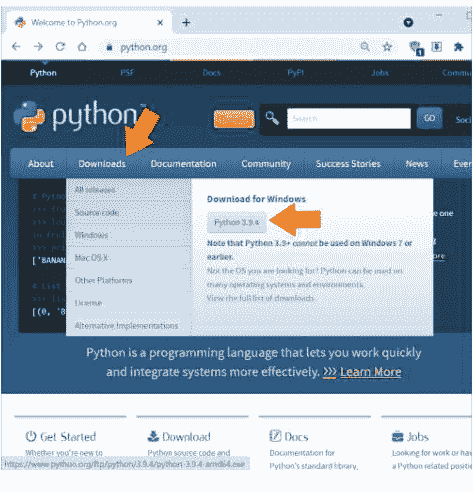

#### 步骤 2：安装 Python 3

下载完成后，双击运行它。

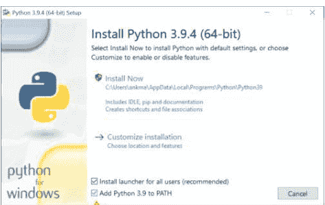

选中复选框 ✅ Add Python 3.9 to PATH。这将使你能够通过命令行安装 Python 包并运行 Python 脚本。

点击 🛡️ Install Now 并完成设置。

#### 步骤 3：验证安装

设置完成后，单击“开始”菜单并打开 Python 3.9 -> IDLE (Python 3.9 64 bit) 以启动 Python 解释器。

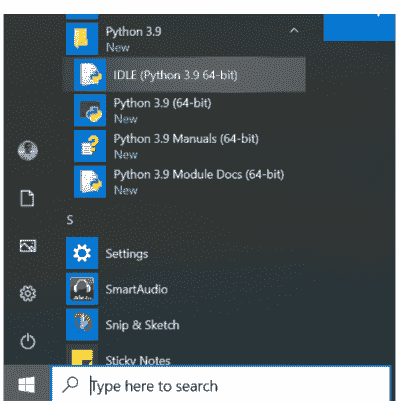

Python 3.9 现已成功安装在你的计算机上。

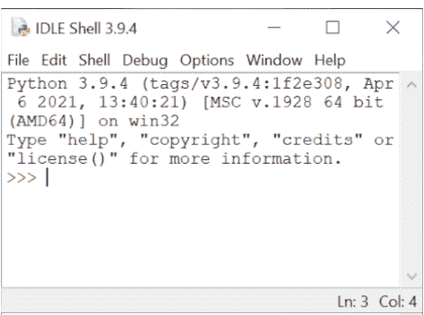

### 在 macOS (Apple) 中安装 Python

让我们从 macOS 操作系统上的 Python 3 安装过程开始。

#### 步骤 1：下载安装程序

从 Python 软件基金会网站下载最新的 macOS 安装程序。

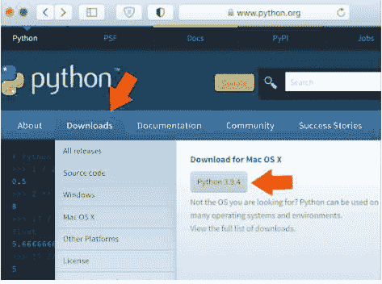

#### 步骤 2：安装 Python 3

下载完成后，双击运行它。

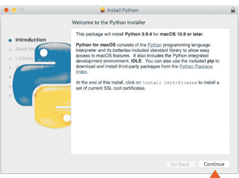

点击 `Continue` 并完成设置。

#### 步骤 3：验证安装

设置完成后，单击 `Launchpad -> IDLE` 以启动 Python 解释器。


Python 3.9 现已成功安装在你的计算机上。

### 执行模式

安装最新版本的 Python 解释器后，我们现在可以编写并执行一些基本的 Python 代码。

执行 Python 程序有两种方式：

1.  **交互模式**：当启动 IDLE 应用程序时，Python 解释器或 Python shell 会弹出在屏幕上。用户可以与 Python 解释器交互，并直接在此 Python shell 中执行语句（单行或多行代码片段）。
2.  **脚本模式**：这是执行 Python 程序最常用的方法。整个 Python 程序被编写并保存在一个文件中（`.py` 扩展名），可以使用 IDLE 应用程序执行。

## 交互式执行模式

让我们执行一些基本的Python语句，并与Python shell进行交互。

## 启动Python Shell

要启动IDLE应用程序，请点击 [Windows开始菜单按钮] -> [Python 3.9文件夹] -> [IDLE (Python 3.9 64-bit)]。

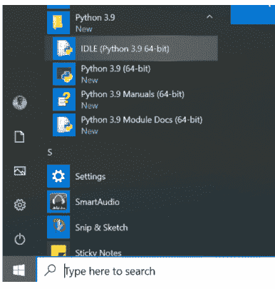

Python解释器或Python shell将弹出显示在屏幕上。

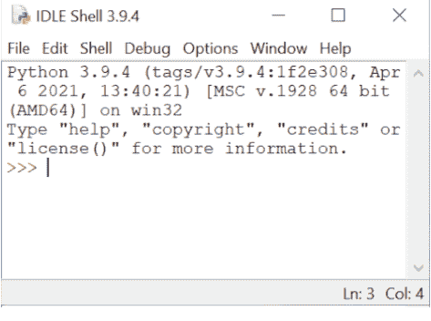

窗口顶部显示Python解释器的版本（3.9），其后是`>>>`符号，表示解释器已准备好接收指令。

可以在此提示符下输入Python命令或语句。输入的语句会立即执行，只要会话未终止，任何变量赋值都会被保留。

## 基本算术运算

让我们在交互模式下使用一个整数（2）和一个浮点数（3.5）执行一些基本的算术运算：

```
>>> 2 + 2
4
>>> 2 * 3.5
7.0
```

可以观察到，上述每个计算的结果都立即显示在shell中。

## 存储值/结果

除了立即显示结果外，还可以使用赋值符号（`=`）将它们存储在变量中，如下所示：

```
>>> a = 2 + 2
>>> b = 2 * 3.5
```

`a`和`b`的值可以在以后访问，用于未来的计算，如下所示：

```
>>> a
4
>>> b
7.0
>>> a * 5
20
>>> b / 3
2.3333333333333335
```

## 基本字符串操作

交互模式不仅限于基本算术或赋值。让我们连接两个字符串 - "Hello, " 和 "world!"。

```
>>> "Hello, " + "world!"
'Hello, world!'
```

通过**交互模式**，用户可以轻松访问Python的全部功能。

这使得测试和即时执行小代码片段（单行或几行代码）变得非常方便，这是C、C++和Java等编译型语言所不具备的功能。

但是，语句无法保存以供将来使用，重新执行时必须重新输入。这个缺点可以通过在下一节描述的**脚本模式**中使用Python来克服。

## 脚本式执行模式

要编写可重用的代码，脚本模式是最受青睐的代码执行模式。

## 文件创建

要使用IDLE应用程序创建新文件，请点击 `[File] -> [New File]`

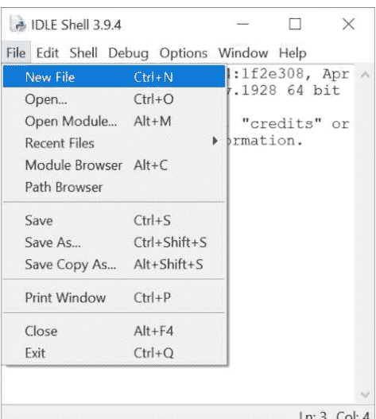

创建新文件

编写一个简单的Python程序，如下所示

```python
a = 2 + 2
a
```

并使用 `[File] -> [Save As...]` 将脚本保存为 `example.py`（所有Python脚本的文件扩展名均为`.py`）

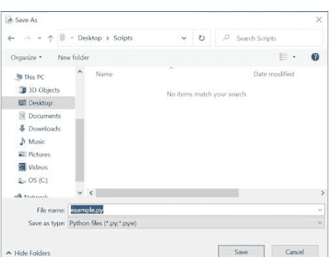

保存文件

## 脚本执行

现在使用 `[Run] -> [Run Module]` 运行此脚本。

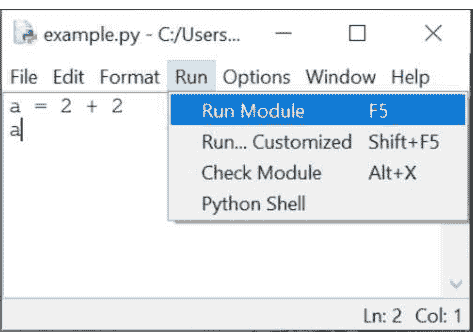

执行文件

可以观察到代码已经执行，但控制台（或标准输出）上没有显示任何输出，因为在脚本模式下运行代码时，所有输出都必须显式指定。

这可以通过使用`print()`函数来实现，该函数在Python脚本中用于在输出流上显示输出。让我们快速在上面的代码中添加`print()`函数并执行它。

```python
a = 2 + 2
print(a)
```

现在，当你运行脚本时，你会观察到`a`的值，即`4`，现在显示在控制台上。

# Python基础

## 词法单元：简介

当执行Python代码时，Python解释器会读取每个逻辑行，并将其分解为一系列词法单元。

这些词法单元更广为人知的名称是**词法单元** - 程序中最小的独立单元。它们是Python代码的构建块，可以分为以下类别之一：

- **关键字**：在Python解释器处理时具有特殊含义的保留字。
- **标识符**：程序员定义的用于引用对象的名称，可以表示变量、函数、类等。
- **字面量**：程序中指定的值，属于Python内置数据类型中的恰好一种。
- **分隔符**：表示分组、标点符号和赋值/绑定的符号。
- **运算符**：可以对数据进行操作并计算结果的符号。

## 词法单元：关键字

关键字是保留字，在Python解释器处理时具有特殊含义。它们区分大小写，不能用于命名标识符（类、函数、变量或结构名称）。

Python中的关键字列表如下：

| | | |
|---|---|---|
| True | False | import |
| from | as | None |
| and | or | not |
| in | is | try |
| except | finally | raise |
| del | global | nonlocal |
| lambda | def | class |
| with | if | elif |
| else | pass | for |
| while | continue | break |
| assert | return | yield |
| async | await | |

## 词法单元：标识符

标识符用于定义Python对象的名称，如变量、函数、类、模块等。标识符的命名约定如下：

- 必须以小写字母（a-z）或大写字母（A-Z）或下划线（`_`）开头。
- 后跟任意数量的字母（a-z, A-Z）、数字（0-9）或下划线（`_`）。
- 不应是关键字。
- 不允许使用特殊符号，如`!`、`@`、`#`、`$`、`%`等。

命名标识符时需要记住的一些要点：

- 标识符本质上区分大小写，任何字符的大小写差异都指代不同的标识符。例如，`length`和`Length`是不同的标识符。
- 仅以下划线不同的标识符是不同的。例如，`unitlength`和`unit_length`是不同的标识符。

在命名标识符时，遵循以下做法也是一个好习惯（尽管不是强制性的）：

- 应仔细命名标识符，强调清晰性和可读性。例如，在一个计算矩形面积的程序中，标识符名称的好选择是 - `length`、`breadth`和`area`。
- 类名应以大写字母开头。
- 以下划线开头的标识符在程序中具有特殊含义。
- 变量、函数和方法名称应使用小写字母，多个单词之间用下划线分隔，如`area_of_square`、`area_of_triangle`等。

## 词法单元：字面量

字面量是源代码中表示固定或常量值的词法单元。它们通常用于赋值语句中初始化变量或在比较表达式中使用。

Python中可用的各种类型的字面量如下：

### 数值字面量

数值字面量用于在源代码中表示数值。它们可以是三种类型 - 整数、浮点数和虚数。

### 整数字面量

整数字面量是没有小数部分的数字。

在Python中，整数字面量可以用四种位置（基数）数字系统编写：

#### i. 十进制或基数-10整数

十进制整数字面量由一个或多个数字（0-9）组成，除了数字为0的情况外，不能在第一个非零数字前有任何零。

十进制整数示例：

```
34
3283298
864
0
```

`092`不是有效的十进制整数字面量，因为零出现在第一个非零数字`9`之前。

#### ii. 二进制或基数-2整数

二进制整数或基数-2整数以`0b`或`0B`开头，后跟二进制数字`0-1`。

#### iii. 八进制或基数-8整数

八进制整数或基数-8整数以`0o`或`0O`开头，后跟八进制数字`0–7`。

例如，`27`可以写成八进制整数字面量`0o33`。

#### iv. 十六进制或基数-16整数

十六进制整数或基数-16整数以`0x`或`0X`开头，后跟数字`0–9`或字母`A–F`（不区分大小写）。

例如，`27`可以写成十六进制整数字面量`0x1B`或`0x1b`。

因此，可以观察到数字`27`可以在程序中写成`27`（十进制）、`0b11011`（二进制）、`0o33`（八进制）或`0x1B`（十六进制）。

#### 整数字面量中的下划线

整数字面量中还允许使用可选字符`_`（下划线）来分组数字以增强可读性。

一个下划线可以出现在数字之间，以及在基数说明符（如`0o`）之后。

在确定字面量的实际数值时，它们会被忽略。

一些有效的下划线用法是 - `10_00_00_000`、`0b_1110_0101`、`0x23_123`。

### 浮点数字面量

浮点数字面量是源代码中存在的实数。它们包含小数部分和/或指数部分。

小数部分包括小数点（`.`）后的数字。

浮点数字面量示例：

```
3.4
.4
8.
3.4E2
3.4e-2
```

在上面的例子中，`.4`等同于`0.4`，`8.`等同于`8.0`。

指数部分可以通过字母`e`或`E`后跟可选符号（`+`或`-`）和数字（`0–9`）来识别。这个指数等同于将实数乘以`10`的幂。

例如，`3.4E2`等同于`3.4 x 10^2`或`340.0`，而`3.4e-2`等同于`3.4 x 10^-2`或`.034`。

### 虚数字面量

为了指定复数并执行复数数学运算，Python支持虚数字面量，它们由实数或整数后跟字母`j`或`J`给出，表示单位虚数。

虚数字面量示例：

```
3.5j
15.j
12j
.005j
3e100j
3.5e-10j
```

## 注意事项

在 Python 中，

-   没有像复数字面量这样的专用字面量。复数在程序中实际上是由一个实数（整数/浮点数字面量）和一个虚数（虚数字面量）组成的表达式来表示的。例如，`1 + 2j` 由一个整数字面量（`1`）和一个虚数字面量（`2j`）组成。
-   数字字面量不包含减号（`-`）。`-` 实际上是一个一元运算符，它与数字字面量结合来表示负数。例如，在 `-3.14` 中，数字字面量是 `3.14`，而 `-` 是一个运算符。

## 布尔字面量

保留字 `True` 和 `False` 也是布尔字面量，可用于在程序中指定真值。

## 字符串字面量

字符串字面量是可以在 Python 中以多种方式指定的文本：

-   单引号：`'python'`
-   双引号：`"python"`
-   三引号：`'''Triple python'''`，`"""Three python"""`。

三引号字符串也可以跨越多行。

示例：

```
s = "I am a String"

s1 = """A
multiline
String"""

s2 = '''Also a
multiline
String'''
```

反斜杠（`\`）字符可用于字符串字面量中，以转义那些原本具有特殊含义的字符，例如换行符、回车符或引号字符。

| 转义序列 | 含义 |
| :--- | :--- |
| `\\` | 反斜杠（`\`） |
| `\'` | 单引号（`'`） |
| `\"` | 双引号（`"`） |
| `\a` | ASCII 响铃（BEL） |
| `\b` | ASCII 退格（BS） |
| `\f` | ASCII 换页（FF） |
| `\n` | ASCII 换行（LF） |
| `\r` | ASCII 回车（CR） |
| `\t` | ASCII 水平制表符（TAB） |
| `\v` | ASCII 垂直制表符（VT） |

虽然 `\'` 和 `\"` 可用于指定引号字符，但 Python 允许在单引号字符串中嵌入双引号（ 'My name is "Python".' ），以及在双引号字符串中嵌入单引号（ "Python's World" ）。

字符串字面量也支持 Unicode 字符，可以使用 `\u` 转义序列后跟 4 位 Unicode 编码来指定。

```
>>> print("E = mc\u00B2")
E = mc²
```

在上面的例子中，`\u00B2` 是表示“上标二”的 Unicode 字符。

## 特殊字面量

`None` 是一个特殊的字面量，用于表示值的缺失。

不应将其与 `0` 混淆，因为 `0` 是一个具有确定有限值的整数字面量，而 `None` 意味着空无。

```
>>> a = None
>>> a
>>>
```

在上面的例子中，Python shell 没有显示 `a` 的任何值，因为它被赋值为 `None`，而 `None` 没有值。

## 字面量集合

Python 提供了在源代码中使用一种称为“**显示**”的特殊语法来指定字面量集合的功能。

可以使用此语法创建专门的容器，如列表、集合和字典。

下面提供了一些字面量集合（显示）的示例：

-   列表：`a = ['a', 'b', 'c']`
-   集合：`a = {'a', 'b', 'c'}`
-   字典：`a = {'a':1, 'b':2, 'c':3}`

列表、集合和字典将在后面的章节中详细介绍。

## 标记：运算符

运算符是可以与值和变量结合以创建表达式的标记，这些表达式会计算为单个值。Python 支持丰富的运算符集：

```
+       -       *       **
/       //      %       @
<<      >>
&       |       ^       ~
:=      <       >
<=      >=      ==      !=
```

上述每个运算符都在“运算符”章节中有详细介绍。

## 标记：分隔符

分隔符是用于组织程序的标记，用于语句、表达式、函数、字面量集合以及其他各种代码结构中。

它们可以根据用途分类如下：

## 分组

`()`、`[]` 和 `{}` 是用于以下目的的分隔符：

-   对可以跨越多个物理行的表达式进行分组。
-   创建字面量集合，如列表显示、字典显示、集合显示。
-   在复杂表达式中创建具有最高运算符优先级（最先计算）的带括号子表达式。

## 示例

```
days = ['Sunday', 'Monday',
        'Tuesday', 'Wednesday',
        'Thursday', 'Friday',
        'Saturday']

sum_6 = (1 + 2 +
         3 + 4 +
         5 + 6)

等价于
days = ['Sunday', 'Monday', 'Tuesday', 'Wednesday', 'Thursday', 'Friday', 'Saturday']

sum_6 = (1 + 2 + 3 + 4 + 5 + 6)
```

## 标点、装饰和注解

Python 中用于标点、装饰和注解的标记是：

```
.       ,       :
;       @       ->
```

## 赋值/绑定

赋值或绑定分隔符用于通过赋值语句将对象绑定到名称。完整的标记列表如下：

```
=       +=      -=      *=
/=      //=     %=      **=
@=      &=      |=      ^=
<<=     >>=
```

除了 `=`，其余标记都是一个运算符后跟 `=` 字符。

这些分隔符也称为增强赋值运算符，因为它们与赋值结合执行操作。

## 字符集

编程语言识别的一组有效字符称为其**字符集**。

Python 是一种新时代的编程语言，支持 Unicode 编码标准。Python 源代码的默认编码是 UTF-8（Unicode 转换格式 - 8 位），这使得开发人员不仅可以将 Unicode 字符用作字面量，还可以用作标识符。

这使得 Python 成为极少数支持多种语言的编程语言之一，如下例所示：

## 代码

```
message = "हमें print करें"
print(message)

क = 1  # Devanagari Letter KA
ক = 2  # Bengali Letter KA
க = 3  # Tamil Letter KA
ક = 4  # Gujarati Letter KA
print(क + ক + க + ક)
```

输出

```
हमें print करें
10
```

## 代码块和缩进

在像 C++ 或 Java 这样的传统编程语言中，程序以代码块的形式组织。
每个代码块包含一个或多个语句，这些语句被括在花括号 - { 和 } 之间，并按顺序执行。
下面提供了一个检查输入 x 的 C++/Java 代码示例。

C++

```
if (x < 10) {
    cout << "x is less than 10" << endl;
    if (x <= 5) {
        cout << "x is less than or equal to 5" << endl;
    }
    else {
        cout << "x is more than 5 but less than 10" << endl;
    }
}
else {
    cout << "x is not less than 10" << endl;
}
```

Java

```
if (x < 10) {
    System.out.println("x is less than 10");
    if (x <= 5) {
        System.out.println("x is less than or equal to 5");
    }
    else {
        System.out.println("x is more than 5 but less than 10");
    }
}
else {
    System.out.print("x is not less than 10");
}
```

可以看到，为了增加可读性，代码中添加了缩进（行首的制表符）（编程语言本身不要求），这有助于引导读者理解代码。

Python

Python 中的代码块受此思想启发，因为它使 Python 代码更容易理解。
代码块由行缩进表示，通常是 4 个空格（首选）或一个制表符。此缩进用于确定语句的逻辑分组，同一组内的所有语句具有相同的缩进级别。

下面是上述 C++/Java 示例对应的 Python 代码。

注意代码块是如何根据逻辑进行缩进的。

```
if x < 10:
    print("x is less than 10")
    if x <= 5:
        print("x is less than or equal to 5")
    else:
        print("x is more than 5 but less than 10")
else:
    print("x is not less than 10")
```

## 注释

Python 支持单行注释和多行注释，通过添加文档来增强代码可读性。

## 单行注释

单行注释以 `#` 开头。`#` 和行尾之间的所有内容都会被 Python 解释器忽略。

```
# A single line comment.
a = 1 # assign a
```

## 多行注释

多行注释以 `'''` 或 `"""` 开头，并以相同的符号结束。

```
"""
I am
a multiline
comment.
"""

'''
I am
also a multiline
comment.
'''
```

与单行注释相比，多行注释应从与其代码块对应的相同缩进级别开始。

例如，

```
"""
Begin program
here
"""
if x < 10:
    """
    Enter code block when x
    is less than 10
    """
    print("x is less than 10")
```

if x <= 5:
    """
    当 x 小于或等于 5 时
    进入代码块
    """
    print("x is less than or equal to 5")
else:
    """
    当 x 大于 5 但小于 10 时
    进入代码块
    """
    print("x is more than 5 but less than 10")
else:
    """
    当 x 不小于 10 时
    进入代码块
    """
    print("x is not less than 10")

## 变量、对象与数据类型

### 什么是对象与变量？

程序是一系列指令，通常作用于用户提供的信息（数据）。
创建、存储和操作这些数据的过程有助于计算新数据或最终结果。

**变量是程序的基本构建块**，它提供了一种在程序生命周期内存储、访问和修改值的方式。

每个变量都有：

- 一个名称（标识符），
- 一个类型或数据类型（数据的种类），以及
- 一个值（实际数据）。

在像 Java 或 C++ 这样的传统编程语言中，变量的类型是预先定义的。
例如，如果你想在程序中使用值 `1`，你可以将其存储在一个名为 `a` 的 `int` 类型变量中。

```
int a = 1;
```

这个 `a` 类似于一个固定尺寸（固定类型）的盒子，里面装着东西（值 `1`）。


盒子 'a'

如果我们想改变盒子的内容，我们可以用类似的东西（相同类型）来替换它。

```
a = 2;
```

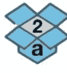

填充后的盒子 'a'

这个盒子的内容可以被复制并放入一个类似的（相同类型）盒子中：

```
int b = a;
```


复制盒子 'a' 的内容

可以存在多个盒子，每个盒子包含一个具有相同值的项目。

```
int x = 3;
int y = 3;
int z = 3;
```


盒子 'x'、'y' 和 'z'

如上所示，变量（命名的盒子）与其类型（盒子的大小）一起声明的编程语言被称为**静态类型**语言。

这些盒子的大小在程序后续中不能改变，除非变量用相同的名称和不同的类型重新初始化。

**Python 是一种动态类型语言**，其中每个值或数据项（任何类型，如数字、字符串等）都是一个对象。

变量名只是指向包含任何类型数据的实际对象的名称标签。

由于在 Python 中使用前不需要任何变量声明，因此不存在其他编程语言中存在的默认值（空盒子或 `null`）的概念。

每当在 Python 中创建一个新对象时，它都会被分配一个唯一的标识符（ID），该标识符在该对象的整个生命周期内保持不变。这个 ID 是对象在内存中的地址，内置函数 `id()` 返回这个地址的值。

```
python
>>> a = 1
>>> id(a)
140407745943856
>>> a = 2
>>> id(a)
140407745943888
```

在上面的例子中，`a` 的 ID 发生了变化，因为它指向了一个新对象（2）。

```
python
>>> b = a
>>> id(b)
140407745943888
```

此外，当 `a` 被赋值给 `b` 时，`b` 指向与 `a` 相同的对象，而不是创建一个新的副本。

## 变量与赋值语句

变量通过名称（标识符）唯一标识，并遵循相同的命名约定：

- 必须以小写字符（a-z）或大写字符（A-Z）或下划线（_）开头。
- 后面可以跟任意数量的字母（a-z，A-Z）、数字（0-9）或下划线（_）。
- 不应是关键字。
- 不允许使用特殊符号，如 !、@、#、$、% 等。

## 赋值

变量可以使用赋值语句绑定到对象（任何类型）的引用。

你可以使用等号（=）创建一个对象（数据）并将其引用绑定到一个变量：

```
count = 100    # 整数
pi    = 3.141  # 实数
name  = "Python" # 字符串
```

这里，L-value 指的是赋值左侧的可赋值变量（`count`、`pi`、`name`），R-value 指的是赋值运算符右侧具有值（`100`、`3.141`、`"Python"`）的表达式。

由于变量只是引用，你可以将它们重新绑定到另一个相同或不同类型的对象：

```
a = 100       # 整数
a = 3.141     # 实数
a = "Python"  # 字符串
```

## 删除

`del` 语句可用于解除对象的引用绑定。

```
>>> a = 10
>>> del a
>>> a
Traceback (most recent call last):
  File "<stdin>", line 1, in <module>
NameError: name 'a' is not defined
```

访问 `a` 会导致 `NameError`，因为指向持有值 `10` 的对象的引用（变量）已被删除。

如果没有其他变量引用该对象，该对象也会自动从内存中清理（垃圾回收）。

## 多重赋值

在 Python 中，多重赋值可用于将多个变量设置为相同的值：

```
>>> x = y = z = 'foo'
>>> x
'foo'
>>> y
'foo'
>>> z
'foo'
```

## 元组交换

在 Python 中，交换两个变量的值不需要临时变量。值可以直接交换（元组交换），如下所示：

```
>>> a = 'Hello'
>>> b = 'World'
>>> b, a = a, b
>>> a
'World'
>>> b
'Hello'
```

## 内置数据类型

在 Python 中，数据（或值）的 `type` 不与变量相关联，而是与包含它的实际对象相关联。这种类型也称为对象的数据类型，用于识别可以对数据执行的操作。

Python 中提供以下内置数据类型：

- 数值类型 - `int`、`float`、`complex`、`bool`
- 序列类型 - `list`、`tuple`、`str`
- 集合类型 - `set`
- 映射类型 - `dict`
- 特殊类型 - `None`

通常，序列、集合和映射类型也统称为**可迭代对象**，因为它们是用户可以遍历（迭代）的项目集合。

## 数值类型 - `int`、`float`、`complex`、`bool`

数值数据类型用于存储以下类型的数字：

### 整数

持有整数（如 `-1`、`0`、`200`）的对象属于 `int` 数据类型。

### 实数或浮点数

持有实数或浮点数（如 `-1.1`、`3e2`、`20.0`）的对象属于 `float` 数据类型。

### 复数

存储复数（如 `2 + 1j`、`-3j`、`-1 + 2J`）的对象属于 `complex` 类型。

每个复数有两部分：实部是数字整数或浮点字面量，虚部是虚数字面量。

### 布尔值

布尔数据类型（`bool`）是 `int` 的子类型。它存储表示为关键字的表达式的计算值 - `True`（整数值 `1`）和 `False`（整数值 `0`）。

## 序列类型 - `str`、`list`、`tuple`

一个有序的项目集合，其中每个项目都可以使用整数索引访问，称为序列。Python 中提供以下三种序列数据类型：

字符串（`str` 数据类型）是零个或多个 unicode 字符的序列，包含在一对单引号（`'`）或双引号（`"`）中。

一些示例字符串是 -

```
"42"
'hello'
"python"
```

# 列表

`list` 是相同或不同数据类型的项目序列，包含在方括号 - `[ ]` 中。

一些示例列表是 -

```
[1, 2, 3]
['abc', 23, 3.14]
['edpunk', 'python']
```

# 元组

`tuple` 是相同或不同数据类型的不可变项目序列，包含在圆括号 - `( )` 中。

一些示例元组是 -

```
(1, 2, 3)
('abc', 23, 3.14)
('edpunk', 'python')
```

## 集合类型 - `set`

`set` 是相同或不同数据类型的唯一项目的无序集合，包含在花括号 - `{ }` 中。

一些示例集合是 -

```
{1, 2, 3}
{'abc', 23, 3.14}
{'edpunk', 'python'}
```

## 映射类型 - `dict`

`dict` 是一种映射数据类型，以键值对的形式存储值。

它用于表示你可以快速访问与键（任何数据类型，除了 `list`、`set` 或 `dict`）对应的值（任何数据类型）的数据，就像字典一样，你可以查找给定单词的含义。

键和对应的值由冒号（`:`）分隔。

键值对由逗号（`,`）分隔，并包含在花括号 - `{ }` 中。

一些示例字典是 -

```
{1: "a", 2: "b", 3: "c"}
{"name": "edpunk", "language": "python"}
```

## 特殊类型 - `None`

`None` 是一种特殊的数据类型，用于表示对象中值的缺失。

它既不是`0`也不是`False`，因为这些是已定义的有限值，而`None`意味着空无。

## 类型检查

内置的`type()`函数可用于获取对象的数据类型。

示例：

```
>>> count = 100
>>> type(count)
<class 'int'>

>>> pi = 3.141
>>> type(pi)
<class 'float'>

>>> name = "Python"
>>> type(name)
<class 'str'>
```

此函数可与表达式中的`is`运算符一起使用，以测试对象是否为给定类型。

```
>>> count = 100
>>> type(count) is int
True
```

`in`运算符可与`type()`函数一起使用，以测试数据类型是否为所提及类型之一。

```
# count 是 int 或 float 类型
>>> type(count) in (int, float)
True
```

## 类型转换

将对象的数据类型从一种类型转换为另一种类型的过程称为**类型转换**或**类型强制转换**。

Python 支持两种类型转换：

### 隐式类型转换

Python 解释器在计算表达式以确定最终数据类型时，会自动转换数据类型，无需用户干预。

在下面的示例中，`c`的最终类型由 Python 解释器自动确定为`float`。

```
>>> a = 1   # int
>>> b = 2.0 # float
>>> c = a + b
>>> c
3.0
>>> type(c)
<class 'float'>
```

### 显式类型转换

当用户使用 Python 中可用的各种内置函数显式指定类型转换时，称为显式类型转换。

可用于显式类型转换的内置函数如下：

1. `int()`
从`bool`、`float`或包含整数字符（带或不带符号）的`str`创建一个`int`。

```
>>> int(True)
1
>>> int(2.3)
2
>>> int("2")
2
```

2. `float()`
从`bool`、`int`或包含浮点字面量（带或不带符号）的`str`创建一个`float`。

```
>>> float(True)
1.0
>>> float(2)
2.0
>>> float("2.3")
2.3
```

`float()`也接受以下字符串输入 -

- "Infinity"
- "inf"
- "nan"（非数字）。

```
>>> float("Infinity") > 1
True
>>> float("nan")
nan
```

浮点字面量也可以包含以下字符 -

- `.`，表示数字的小数部分。
- `e`或`E`，表示数字的指数部分。

```
>>> float("3.14")
3.14
>>> float("10.")
10.0
>>> float("1e100")
1e+100
>>> float("3.14e-10")
3.14e-10
```

3. `str()`
将任何对象转换为`str`。

```
>>> str(2)
'2'
>>> str([1, 2, 3, 4])
'[1, 2, 3, 4]'
```

4. `tuple()`
从类型为`str`、`list`、`set`或`range`的可迭代对象创建一个`tuple`。

```
>>> tuple('hello')
('h', 'e', 'l', 'l', 'o')
>>> tuple([1, 2, 3, 4])
(1, 2, 3, 4)
>>> tuple(range(6))
(0, 1, 2, 3, 4, 5)
```

5. `list()`
从类型为`str`、`tuple`、`set`或`range`的可迭代对象创建一个`list`。

```
>>> list('hello')
['h', 'e', 'l', 'l', 'o']
>>> list({1, 2, 3, 4})
[1, 2, 3, 4]
>>> list(range(6))
[0, 1, 2, 3, 4, 5]
```

6. `set()`
从类型为`str`、`tuple`、`list`或`range`的可迭代对象创建一个`set`。

```
>>> set('hello')
{'o', 'e', 'l', 'h'}
>>> set([1, 2, 3, 4])
{1, 2, 3, 4}
>>> set(range(6))
{0, 1, 2, 3, 4, 5}
```

## 可变与不可变数据类型

### 不可变数据类型

当一个数据类型的对象的值无法被修改时，该数据类型被称为不可变的。
以下数据类型是不可变的：

- `int`
- `float`
- `complex`
- `bool`
- `tuple`
- `str`
- `None`

你可能想知道，如果上述某些类型是不可变的，那么我们如何能够修改变量的值呢？
在变量重新赋值的情况下，原始对象并未被修改，而是在新的内存位置创建了新对象（具有新值），并将这些新对象绑定到变量。如果旧值对象没有被其他变量引用，则该对象将被销毁。
让我们举个例子，

```
>>> a = 1
>>> id_a = id(a)
>>> a = 2
>>> id_a2 = id(a)
>>> id_a == id_a2
False
```

你可以在上面的例子中看到，包含值 1 的对象与包含值 2 的对象是不同的，并且 `a` 指向最新的对象。
像字符串和元组这样的序列数据类型也是不可变的，即一旦创建，就不允许修改任何项，任何尝试修改的操作都会引发错误。

```
>>> s = "Hello"
>>> s[1] = "P"
Traceback (most recent call last):
  File "<stdin>", line 1, in <module>
TypeError: 'str' object does not support item assignment
>>> t = (1, 2, 3)
>>> t[1] = 0
Traceback (most recent call last):
  File "<stdin>", line 1, in <module>
TypeError: 'tuple' object does not support item assignment
```

然而，与数值类型类似，变量可以被重新赋值为新的序列。

```
>>> s = "Hello"
>>> id_s = id(s)
>>> s = "Help"
>>> id_s2 = id(s)
>>> id_s == id_s2
False

>>> t = (1, 2, 3)
>>> id_t = id(t)
>>> t = (0, 2, 3)
>>> id_t2 = id(t)
>>> id_t == id_t2
False
```

### 可变数据类型

在 Python 中，以下数据类型是可变的，即任何修改都不会创建新对象，而是修改现有对象：

- list
- set
- dict

让我们取一个列表并修改其内容。

```
>>> l = [1, 2, 3]
>>> id_l = id(l)
>>> l[0] = 0
>>> l
[0, 2, 3]
>>> id_l2 = id(l)
>>> id_l == id_l2
True
```

让我们以一个字典为例，添加一个新的键值对。

```
>>> d = {"a": "apple", "b": "boy"}
>>> id_d = id(d)
>>> d["c"] = "cat"
>>> d
{'a': 'apple', 'b': 'boy', 'c': 'cat'}
>>> id_d2 = id(d)
>>> id_d == id_d2
True
```

让我们以一个集合为例，添加一个新项。

```
>>> s = {"apple", "bat"}
>>> id_s = id(s)
>>> s.add("cat")
>>> s
{'cat', 'apple', 'bat'}
>>> id_s2 = id(s)
>>> id_s == id_s2
True
```

在上面的例子中，对象（`list`、`dict`、`set`）的 `id` 没有改变，这意味着没有创建新对象，原始对象被修改了。

## 输入 / 输出

### 如何接受用户输入

`input()` 函数用于从用户那里接受新的输入数据。

当代码中遇到此函数时，Python 解释器会等待用户输入响应，该响应作为字符串读取并分配给一个变量。

```
>>> name = input()
edpunk
>>> name
'edpunk'
```

该函数还有一个可选的字符串参数，用作给用户的提示消息。

```
>>> name2 = input("Enter name: ")
Enter name: EdPunk
>>> name2
'EdPunk'
```

用户输入可以使用类型转换函数 `int()` 和 `float()` 转换为整数或浮点数。

```
>>> num = int(input("Enter n: "))
Enter n: 10
>>> type(num)
<class 'int'>
>>> num
10

>>> pi = float(input("Enter pi: "))
Enter pi: 3.14
>>> type(pi)
<class 'float'>
>>> pi
3.14
```

### 显示输出

内置的 `print()` 函数用于在标准输出上显示输出（变量的值、表达式等）。

让我们看一个计算矩形面积并显示它的程序：

## 代码

```
length = 10
breadth = 5
area = length * breadth
print("Area:", area)
```

#### 输出

Area: 50

`print()` 函数也可用于在多个对象作为参数提供给函数时输出它们的值。

## 代码

```
a = 2 + 2
b = 2 * 3.5
print(a, b)
```

#### 输出

4 7.0

在上面的代码中，`a` 和 `b` 的值由一个空格（`sep` 的默认值）分隔。

可以通过使用 `sep` 选项提供任何用户定义的分隔符来修改此属性。

让我们修改代码并提供 `","` 作为分隔符。

## 代码

```
a = 2 + 2
b = 2 * 3.5
print(a, b, sep=",")
```

#### 输出

4,7.0

当表达式作为参数提供给 `print()` 函数时，输出是这些表达式的计算值。

例如，

## 代码

```
print(2 + 2)
print(2 * 3.5)
print("Hello, " + "world!")
```

#### 输出

4
7.0
Hello, world!

在上面的代码片段中，每次 `print()` 函数调用都会创建一个新的输出行。这是因为 `print()` 函数中的 `end` 参数默认值为换行符（`'\n'`）。

这可以由用户修改，如下所示：

## 代码

```
print(2 + 2, end=",")
print(2 * 3.5, end=";")
print("Hello, " + "world!")
```

#### 输出

## 运算符与表达式

### 运算符简介

运算符是用于对一个或多个值执行单一简单任务或操作的符号，其结果是一个计算后的值。

这些运算符所作用的值被称为**操作数**。

### 一元运算符

一元运算符作用于位于运算符右侧的单个操作数。

以下是 Python 中可用的一些一元运算符：

- `+`（正号）：一元 `+` 运算符不会改变操作数的值。
- `-`（负号）：一元 `-` 运算符会改变操作数的符号。
- `~`（按位取反）：一元 `~` 运算符对整数操作数进行按位取反。`x` 的按位取反定义为 `-(x+1)`。

```
>>> x = 5
>>> -x
-5
>>> +x
5
>>> ~x
-6
```

### 二元运算符

二元运算符作用于两个操作数。

例如，算术运算符（ `+` , `-` , `*` , `/` ）计算两个值的数学运算结果。

### Python 中的运算符

Python 提供了丰富的运算符，可分类如下：

- 算术运算符 - `+` , `-` , `*` , `/` , `%` , `**` , `//`
- 关系运算符 - `==` , `!=` , `>` , `>=` , `<` , `<=`
- 赋值运算符 - `+=` , `-=` , `*=` , `/=` , `%=` , `**=` , `//=`
- 逻辑运算符 - `not` , `or` , `and`
- 身份运算符 - `is` , `is not`
- 成员运算符 - `in` , `not in`
- 按位与移位运算符 - `&` , `|` , `^` , `~` , `<<` , `>>`

## 算术运算符

在 Python 中，可以使用以下算术运算符执行算术运算：

### 加法

`+` 运算符将数值操作数的值相加。

```
>>> 2 + 3
5
>>> 2 + 3.0
5.0
```

如果操作数是 `str`、`list` 或 `tuple` 类型，`+` 运算符会连接这两个序列或字符串。

```
>>> 'edpunk' + 'python'
'edpunkpython'
>>> ["ed", "punk"] + ["python", ]
['ed', 'punk', 'python']
```

### 减法

`-` 运算符从左侧操作数的值中减去右侧操作数的值。

```
>>> 2 - 3
-1
```

### 乘法

`*` 运算符将数值操作数的值相乘。

```
>>> 2 * 3
6
```

如果操作数是 `str`、`list` 或 `tuple` 类型，`*` 运算符返回一个序列或字符串，该序列或字符串是原序列或字符串按指定次数自我连接的结果。

```
>>> "python" * 3
'pythonpythonpython'
>>> ['ed', 'py'] * 3
['ed', 'py', 'ed', 'py', 'ed', 'py']
```

### 除法

`/` 运算符将左侧操作数的值除以右侧操作数的值，并返回实数商。

```
>>> 6 / 2
3.0
>>> 5 / 2
2.5
```

### 整除

`//` 运算符将左侧操作数的值除以右侧操作数的值，并返回整数商。

```
>>> 5 // 2
2
```

### 取模

`%` 运算符将左侧操作数的值除以右侧操作数的值，并返回余数。

```
>>> 5 % 2
1
```

### 幂运算

`**` 运算符将左侧操作数提升到右侧操作数的幂次。

```
>>> 5 ** 2
25
```

## 关系运算符

关系运算符用于比较操作数的值以确定它们之间的关系。Python 中提供以下关系运算符：

### 等于

如果左侧操作数的值等于右侧操作数的值，`==` 运算符返回 `True`。

```
>>> 2 == 2
True
>>> 2 == 3
False
```

对于序列操作数（如 `str`、`list` 或 `tuple`），如果两个序列完全相同，则结果为 `True`。

```
>>> "python" == "python"
True
>>> "pypi" == "python"
False
>>> [1, 2, 3] == [1, 2, 3]
True
```

由于序列是项目的有序集合，因此项目的位置顺序非常重要。

```
>>> [2, 1, 3] == [1, 2, 3]
False
```

### 不等于

如果左侧操作数的值不等于右侧操作数的值，`!=` 运算符返回 `True`。

```
>>> 2 != 2
False
>>> 2 != 3
True
>>> 'py' != 'oy'
True
>>> [2, 1, 3] != [1, 2, 3]
True
>>> [1, 2, 3] != [1, 2, 3]
False
```

### 大于

如果左侧操作数的值大于右侧操作数的值，`>` 运算符返回 `True`。

```
>>> 3 > 2
True
>>> 2 > 2
False
```

对于字符串操作数，`>` 运算符根据每个字符的 Unicode 码点（整数）逐个进行比较。

可以使用 Python 中的 `ord()` 函数获取字符的 Unicode 码点。

首先比较两个操作数第一个字符的码点。如果它们相等，则比较两个操作数下一个字符的码点，此过程持续进行。

例如，

```
>>> "python" > "Python"
True
```

`"p"` 的码点 (112) 大于 `"P"` 的码点 (80)。由于 112 大于 80，表达式计算结果为 `True`。

让我们再看一个例子：

```
>>> "pYthon" > "python"
False
```

第一个字符的码点相同 (112)，因此比较下一组字符。`"Y"` 的码点 (89) 不大于 `"y"` 的码点 (121)，所以表达式计算结果为 `False`。

如果两个字符串操作数 `p` 和 `q` 长度不相等（`len(p) < len(q)`），并且 `p` 是 `q` 的子串，使得 `q = pt`，其中 `t` 是任何长度大于 0 的字符串，那么 `q > p` 返回 `True`。

```
>>> "python" > "py"
True
```

对于序列操作数（如 `list` 或 `tuple`），从索引 0 开始逐个比较项目。

```
>>> ["p","py","PY"] > ["p","Py","PY"]
True
>>> [1, 3] > [1, 2]
True
>>> [1, 3, 4] > [1, 2]
True
```

在上面的例子中，`"py"` 分别大于 `"Py"`，3 大于 2。

如果两个序列长度不相等，并且较小的序列是较大序列的起始子序列，则认为较大序列大于较小序列。

```
>>> [1, 2, 4] > [1, 2]
True
```

### 大于或等于

如果左侧操作数的值大于或等于右侧操作数的值，`>=` 运算符返回 `True`。

```
>>> 3 >= 3
True
>>> 2 >= 3
False
```

对于序列操作数（`str`、`list`、`tuple`），执行的比较操作与上面讨论的 `>` 运算符类似。

```
>>> "python" >= "Python"
True
>>> "python" >= "python"
True
>>> ["py", "py", "PY"] >= ["py", "Py", "PY"]
True
>>> [1, 2] >= [1, 2]
True
>>> [1, 2, 4] >= [1, 2]
True
```

### 小于

如果左侧操作数的值小于右侧操作数的值，`<` 运算符返回 `True`。

```
>>> 2 < 3
True
>>> 3 < 3
False
```

对于序列操作数（`str`、`list`、`tuple`），执行的比较操作与上面讨论的 `>` 运算符类似。

```
>>> "file" < "Pile"
False
# f(102) is > P(80)
>>> "py" < "python"
True
>>> ["Py", "PY"] < ["py", "PY"]
True
>>> ['a', 2] < ['a', 3]
True
>>> [1, 2] < [1, 2, 4]
True
```

### 小于或等于

如果左侧操作数的值小于或等于右侧操作数的值，`<=` 运算符返回 `True`。

```
>>> 2 <= 3
True
>>> 3 <= 3
True
```

对于序列操作数（`str`、`list`、`tuple`），执行的比较操作与上面讨论的 `>` 运算符类似。

```
>>> "file" <= "Pile"
False
# f(102) is > P(80)
>>> "py" <= "python"
True
>>> ["Py", "PY"] <= ["py", "PY"]
True
>>> ['a', 3] <= ['b', 2]
True
>>> [1, 2] <= [1, 2, 4]
True
```

## 赋值运算符

赋值符号（ `=` ）在赋值语句中用作名称和值之间的分隔符。

它将右侧的值（数据、变量、表达式）绑定（或重新绑定）到左侧的目标变量。

```
>>> x = 1
>>> x
1
>>> y = x
>>> y
1
>>> y = "python"
>>> y
'python'
```

二元运算符可以与赋值符号结合，创建**增强赋值运算符**。

这些运算符对两个操作数执行二元运算，并将结果赋给原始目标（左侧操作数）。

如果 `<op>` 是一个二元运算符，那么包含增强赋值运算符的表达式 `a <op>= b` 等同于 `a = a <op> b`。

### `+=`

`+=` 运算符将一个值（右侧操作数）加到变量（左侧操作数），并将结果赋给该变量。

```
>>> a = 2
>>> a += 3
>>> a
5
>>> x = "hello"
>>> y = "world"
>>> x += y
>>> x
'helloworld'
```

### `-=`

`-=` 运算符从变量（左侧操作数）中减去一个值（右侧操作数），并将结果赋给该变量。

```
>>> a = 3
>>> a -= 2
>>> a
1
```

### `*=`

`*=` 运算符将变量（左侧操作数）乘以一个值（右侧操作数），并将结果赋给该变量。

```
>>> a = 3
>>> a *= 2
>>> a
6
>>> x = "hi"
>>> x *= 3
>>> x
'hihihi'
```

## 赋值运算符

### `/=`

`/=` 运算符将变量（左操作数）除以一个值（右操作数），并将结果赋值给该变量。

```
>>> a = 4
>>> a /= 2
>>> a
2.0
```

### `//=`

`//=` 运算符将变量（左操作数）进行地板除（floor divide）一个值（右操作数），并将结果赋值给该变量。

```
>>> a = 5
>>> a //= 2
>>> a
2
```

### `**=`

`**=` 运算符将变量（左操作数）提升到一个幂（右操作数），并将结果赋值给该变量。

```
>>> a = 4
>>> a **= 2
>>> a
16
```

### `%=`

`%=` 运算符计算变量（左操作数）和一个值（右操作数）的模（modulus），并将结果赋值给该变量。

```
>>> a = 4
>>> a %= 3
>>> a
1
```

## 逻辑运算符

使用逻辑运算符的表达式会根据操作数的逻辑状态计算出一个布尔值（`True` 或 `False`）。

## 操作数的逻辑状态

在 Python 中，除了 `0`、`None`、`False`、`""`、`''`、`()`、`[]`、`{}` 之外，所有值的逻辑状态都是 `True`。

可以使用 `bool()` 内置函数来确定字面量、变量或表达式的逻辑状态。

以下字面量的逻辑状态为 `False`。

```
>>> bool(False)
False
>>> bool(0)
False
>>> bool([])
False
>>> bool(None)
False
>>> bool("")
False
>>> bool(())
False
>>> bool({})
False
```

以下是一些逻辑状态为 `True` 的示例字面量。

```
>>> bool(True)
True
>>> bool(1)
True
>>> bool(2.0)
True
>>> bool(100)
True
>>> bool("python")
True
>>> bool(["py", "thon"])
True
```

### `not`

操作数的逻辑状态可以使用逻辑 `not` 运算符进行反转（`False` 变为 `True`，反之亦然）。

```
>>> n = 5
>>> bool(n)
True
>>> bool(not n)
False
```

### `or`

逻辑 `or` 运算符在任一操作数的逻辑状态为 `True` 时返回 `True`。

```
>>> True or False
True
>>> bool(1 or 0)
True
>>> False or False
False
```

### `and`

逻辑 `and` 运算符在两个操作数的逻辑状态都为 `True` 时返回 `True`。

```
>>> True and True
True
>>> True and False
False
>>> bool(10 and 20)
True
>>> bool(1 and 0)
False
```

## 同一性运算符

我们已经了解到 Python 如何将每个值或数据项视为一个对象。
关系运算符 `==` 可用于测试操作数是否包含相同的值。

```
>>> n = 1
>>> n2 = 1
>>> n == n2
True
```

然而，此运算符不检查两个操作数是否引用同一个对象或不同的对象。
同一性运算符 `is` 和 `is not` 用于测试两个对象是否具有相同或不同的同一性（指向内存中的同一位置）。
`a is b` 等价于 `id(a) == id(b)`，其中 `id()` 是返回对象同一性的内置函数。

```
>>> n = 1
>>> n2 = 1
>>> n is n2
True
```

在上面的例子中，变量 `n` 和 `n2` 都指向相同的内存位置（同一个对象）。

```
>>> l = [1, 2, 3]
>>> l2 = [1, 2, 3]
>>> l == l2
True
>>> l is l2
False
```

在上面的例子中，尽管列表 `l` 和 `l2` 包含相同值的项，但它们实际上是两个不同的对象，占据不同的内存位置。

## 成员运算符

运算符 `in` 和 `not in` 测试一个值是否存在于一个可迭代对象（字符串、列表、元组、集合、字典）中。

```
>>> 1 in [1, 2, 3]
True
>>> "ed" in ["ed", "py", "hi"]
True
>>> "ed" in ("ed", "py", "hi")
True
>>> 'ed' in {'ed': 1, 'py': 2}
True
>>> "pen" not in ["pencil", "ink"]
True
>>> "pen" not in ["pen", "ink"]
False
```

## 表达式

字面量（常量）、标识符（变量）和运算符可以组合形成一个表达式，该表达式总是计算为一个单一的值。

例如，`40 + marks` 是一个包含字面量（`40`）、变量（`marks`）和运算符（`+`）的表达式。

以下是一些有效的表达式：

- `10`
- `a`
- `-a`
- `a - 10`
- `a + b`
- `4.0 * 3.5`
- `a == b`
- `c in d`
- `a is T`
- `"Hello" + "World"`
- `15 - a*4`
- `3*num + 9/4 - 10%count**2`

如上所示，独立的字面量（如 `10`）和变量（如 `a`）被视为表达式，但独立的运算符不是表达式。

## 链式表达式

比较运算符在 Python 中可以链接在一起。

例如，`lower <= age <= upper` 是一个有效的链式表达式，它等价于表达式 -

```
lower <= age and age <= upper
```

如果 `a`、`b`、`c`、...、`y`、`z` 是表达式，`op1`、`op2`、...、`opN` 是比较运算符，那么链式表达式 `a op1 b op2 c ... y opN z` 等价于 `a op1 b and b op2 c and ... y opN z`。

## 条件表达式

Python 没有像其他编程语言那样的三元运算符（`?:`）。因此，使用关键字 `if` 和 `else` 来创建条件表达式，该表达式根据给定条件计算出一个值。

例如，

```
var = t_val if cond else f_val
```

如果上述条件 `cond` 计算为 `True`，则变量 `var` 被赋值为 `t_val`，否则被赋值为 `f_val`。

```
>>> value = 1 if 2 > 3 else -1
>>> value
-1
```

## 运算符优先级及示例

在中学学习数学时，我们遇到了 **BODMAS**（括号、乘方、除法、乘法、加法和减法）规则，它帮助我们理解在存在多个运算符（`of`、`x`、`/`、`+`、`-`）时如何计算数学表达式。

在 Python 中，我们有大量的运算符，以及一个类似的规则来确定表达式的求值顺序。这被称为**运算符优先级**，其中优先级较高的运算符在表达式中先于优先级较低的运算符进行求值。

下表列出了 Python 中运算符从高到低的优先级。同一行中的运算符具有相同的优先级，因此在这种情况下，表达式从左到右求值。

| 运算符 | 描述 |
|---|---|
| `(expressions...)` | 括号表达式（分组） |
| `**` | 幂运算 |
| `+x`, `-x`, `~x` | 一元正号、一元负号、按位 NOT |
| `*`, `@`, `/`, `//`, `%` | 乘法、矩阵乘法、除法、地板除、取余 |
| `+`, `-` | 加法、减法 |
| `<<`, `>>` | 移位 |
| `&` | 按位 AND |
| `^` | 按位 XOR |
| `\|` | 按位 OR |
| `in`, `not in`, `is`, `is not`, `<`, `<=`, `>`, `>=`, `!=`, `==` | 成员、同一性和比较 |
| `not x` | 布尔 NOT |
| `and` | 布尔 AND |
| `or` | 布尔 OR |
| `:=` | 赋值表达式 |

## 练习

### 示例 1

计算表达式

```
15 - 2 * 4
```

### 解答

步骤：`*` 的优先级高于 `-`

```
15 - 2 * 4
= 15 - 8
= 7
```

### 示例 2

计算表达式

```
15 - 2 + 4
```

### 解答

步骤：`-` 和 `+` 具有相同的优先级，因此表达式从左到右求值

```
15 - 2 + 4
= 13 + 4
= 17
```

### 示例 3

计算表达式

```
15 - (2 + 4)
```

### 解答

括号表达式 `(...)` 具有最高优先级，因此 `+` 首先被计算

```
15 - (2 + 4)
= 15 - 6
= 9
```

### 示例 4

计算表达式

```
3 * 2 + 9 / 4 - 10 % 2 ** 2
```

### 步骤 1

`**` 优先

```
3 * 2 + 9 / 4 - 10 % 2 ** 2
= 3 * 2 + 9 / 4 - 10 % 4
```

### 步骤 2

`*`、`/` 和 `%` 具有相同的优先级，因此它们从左到右求值。

```
3 * 2 + 9 / 4 - 10 % 4
= 6 + 2.25 - 2
```

### 步骤 3

`+` 和 `-` 求值

```
6 + 2.25 - 2
= 6.25
```

### 示例 5

计算表达式

```
20 / 4 // 2 * 2 - 4 + 20
```

### 步骤 1

`*`、`/`、`//` 和 `%` 具有相同的优先级，因此它们从左到右求值。

```
20 / 4 // 2 * 2 - 4 + 20
= 5 // 2 * 2 - 4 + 20
= 2 * 2 - 4 + 20
= 4 - 4 + 20
```

### 步骤 2

`+` 和 `-` 求值

```
4 - 4 + 20
= 20
```

### 示例 6

计算表达式

```
not 6 <= 4 and 3 ** 3 > 12 / 3
```

### 步骤 1

`/` 是下一个优先级

```
not 6 <= 4 and 27 > 12 / 3
= not 6 <= 4 and 27 > 4
```

### 步骤 3

比较运算符是下一个优先级

```
not 6 <= 4 and 27 > 4
= not False and True
```

### 步骤 4

布尔 NOT 被计算

```
not False and True
= True and True
```

### 步骤 5

布尔 AND 被计算

```
True and True
= True
```

## 错误与异常处理

### 错误类型

当程序无法执行或产生与预期不同的输出时，就说明程序中存在“缺陷”。这些缺陷通常是由程序员无意中引入的。

识别和消除这些缺陷或错误的过程被称为**调试**。

三种主要的错误类型是：

- 语法错误
- 运行时错误
- 逻辑错误

### 语法错误

当程序包含任何不符合规定的 Python 规则或语法的语句时，就会发生语法错误，这使得 Python 解释器难以解析（理解）和执行它。

一些常见的语法错误包括：

- 缺失/拼写错误的关键字
- 缺少冒号或括号
- 空代码块
- 关键字位置不正确
- 代码块缩进不正确

### 脚本模式

当通过 IDLE 使用脚本模式执行包含语法错误语句的代码时，会显示一个错误对话框。

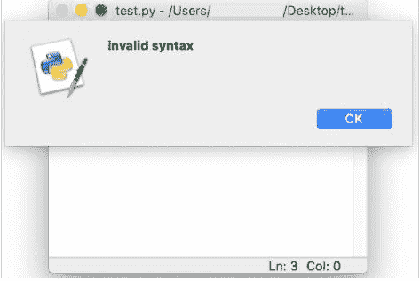

语法错误对话框

关闭对话框后，代码中错误的部分（即错误的潜在原因）会以红色高亮显示。

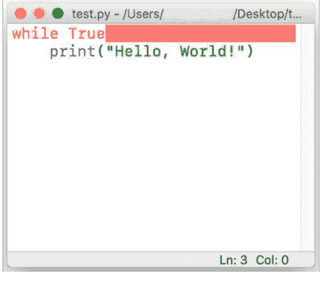

语法错误高亮显示

必须纠正此错误才能正确执行程序。

### 交互模式

当在 Python 控制台（交互模式）中执行语法错误的语句时，Python 解释器会显示该语句，并添加一个小箭头（ ^ ）指向检测到错误的入口点或标记。

## 示例

```
>>> while True print('Hi!')
  File "<stdin>", line 1
    while True print('Hi!')
          ^
SyntaxError: invalid syntax
```

在上面的示例中，存在一个语法错误，^ 指向 print 函数，解析器无法理解它，因为在 True 之后缺少一个 :（冒号）。

### 运行时错误

当程序被 Python 解释器过早终止时，就会发生运行时错误，因为尽管语句在语法上是正确的，但解释器无法执行它。

一些运行时错误示例包括：

- **ImportError**：当 import 语句在加载模块或模块中的任何定义时遇到问题时引发。
- **IOError**：当解释器无法打开程序中指定的文件时引发。
- **ZeroDivisionError**：当数字被零除或取模时引发。
- **NameError**：当遇到未定义的标识符时引发。
- **ValueError**：当参数或操作数具有所需的数据类型，但值不符合要求时引发。
- **IndexError**：当序列（字符串、列表、元组等）中提供的索引超出范围时引发。
- **KeyError**：当在现有键集中找不到字典键时引发。
- **TypeError**：在对不兼容的类型执行操作时引发。
- **IndentationError**：当语句或代码块的缩进不正确时引发。

### 运行时错误示例

**ZeroDivisionError**

```
n = 100
d = 0
print(n/d)
```

```
Traceback (most recent call last):
  File "/Users/name/Desktop/test.py", line 3, in <module>
    print(n/d)
ZeroDivisionError: division by zero
```

**NameError**

```
n = 100
print(d)
```

```
Traceback (most recent call last):
  File "/Users/name/Desktop/test.py", line 2, in <module>
    print(d)
NameError: name 'd' is not defined
```

**KeyError**

```
d = {1: "1st", 2: "2nd"}
print(d[3])
```

```
Traceback (most recent call last):
  File "/Users/name/Desktop/test.py", line 2, in <module>
    print(d[3])
KeyError: 3
```

**TypeError**

```
n =1
s = "a"
tot = n + s
```

```
Traceback (most recent call last):
  File "/Users/name/Desktop/test.py", line 3, in <module>
    tot = n + s
TypeError: unsupported operand type(s) for +: 'int' and 'str'
```

### 逻辑错误

逻辑错误或语义错误是由于代码的底层含义存在问题，导致输出不正确而引起的。

与语法或运行时错误相比，程序不会终止。

调试逻辑错误需要检查整个代码，因为不会显示指导性的错误消息。

**示例**

让我们编写一个程序来计算两个数字的平均值。

```
n = 10
m = 20
avg = n + m / 2
print("Average:", avg)
```

执行脚本后，结果是

Average: 20.0

这是不正确的，因为代码中存在逻辑错误。

由于 `/` 的优先级高于 `+`，因此先计算 `m / 2`。

我们可以修改代码以消除逻辑错误。

```
n = 10
m = 20
avg = (n + m) / 2
print("Average:", avg)
```

执行脚本后，我们现在得到正确的结果

Average: 15.0

### 异常

我们已经看到，即使程序在语法上是正确的，其执行也可能导致运行时错误。

在执行期间检测到的错误被称为**异常**，它是由 Python 解释器创建的一个对象，包含有关错误的信息，如错误类型、文件名以及程序中错误的位置（行号、标记）。

Python 解释器引发的一些内置异常包括 - `ImportError`、`ZeroDivisionError`、`NameError`、`ValueError`、`IndexError`、`KeyError`、`TypeError` 和 `IndentationError`。

除了 Python 解释器，程序员也可以在代码中使用 `raise` 或 `assert` 语句来触发和引发异常（并附带自定义消息）。

### raise

`raise` 语句可用于在程序中抛出异常。该异常可以包含也可以不包含自定义错误消息（推荐包含）。

让我们考虑一个程序，它从用户那里接受两个数字（`a` 和 `b`）并打印结果 `a/b`。

**代码**

```
a = int(input("Enter a: "))
b = int(input("Enter b: "))
print("a/b =", a/b)
```

**输出**

```
Enter a: 10
Enter b: 0
Traceback (most recent call last):
  File "/Users/name/test.py",
    line 3, in <module>
      print("a/b =", a/b)
ZeroDivisionError: division by zero
```

可以观察到，当 `b` 的值输入为 `0` 时，Python 解释器会引发 `ZeroDivisionError`。

**代码**

```
a = int(input("Enter a: "))
b = int(input("Enter b: "))
if b==0:
    raise Exception()
print("a/b =", a/b)
```

**输出**

```
Enter a: 10
Enter b: 0
Traceback (most recent call last):
  File "/Users/name/test.py",
    line 4, in <module>
      raise Exception()
Exception
```

引发了一个异常，但它没有提供有用的信息。

让我们添加一些自定义错误消息。

**代码**

```
a = int(input("Enter a: "))
b = int(input("Enter b: "))
if b==0:
    raise Exception("b is zero")
print("a/b =", a/b)
```

**输出**

```
Enter a: 10
Enter b: 0
Traceback (most recent call last):
  File "/Users/name/test.py",
    line 4, in <module>
      raise Exception("b is zero")
Exception: b is zero
```

我们也可以根据程序逻辑引发任何特定类型的错误，如下所示：

**代码**

```
a = int(input("Enter a: "))
b = int(input("Enter b: "))
if b==0:
    raise ValueError("The value of b cannot be zero")
print("a/b =", a/b)
```

**输出**

```
Enter a: 10
Enter b: 0
Traceback (most recent call last):
  File "/Users/name/test.py",
    line 4, in <module>
      raise ValueError("The value of b cannot be zero")
ValueError: The value of b cannot be zero
```

### assert

`assert` 语句通常在代码开发期间用作安全阀，当测试表达式求值为 `False` 时通知程序员。

如果测试表达式的值为 `True`，则代码执行正常继续。

如果值为 `False`，则会引发 `AssertionError`。

**代码**

```
a = 3
b = 4
assert a == b
c = 5
```

**输出**

```
Traceback (most recent call last):
  File "/Users/name/test.py",
    line 3, in <module>
      assert a == b
AssertionError
```

该语句还允许将消息附加到 `AssertionError`。

**代码**

```
a = 3
b = 4
assert a == b, "a is not equal to b"
c = 5
```

**输出**

```
Traceback (most recent call last):
  File "/Users/name/test.py",
    line 3, in <module>
      assert a == b, "a is not equal to b"
AssertionError: a is not equal to b
```

## 异常处理

异常处理是正确处理可能在执行期间导致程序崩溃的异常的过程。

当发生错误时，程序会抛出一个异常。

运行时系统尝试查找一个**异常处理程序**，即一段可以处理特定类型错误的代码块。一旦找到，合适的异常处理程序就会**捕获异常**并执行可以尝试从错误中恢复的代码块。如果错误不可恢复，处理程序提供一种方式让程序优雅地退出。

Python 中的 `try` 语句为代码块指定异常处理程序和/或清理代码。

try 语句的各个部分是：

- `try` 块：可能抛出异常的语句块。
- `except` 子句：一个或多个异常处理程序。每个 `except` 子句处理特定类型的异常。如果在 `try` 块中发生特定类型的异常，则执行相应的 `except` 子句代码块。

## 控制流

### 控制流简介

一个简单的 Python 程序可以被视为一段代码块，其中每条语句都由 Python 解释器从上到下按顺序执行。

但在现实世界中，我们希望对代码的执行进行一些控制，例如：

-   根据特定条件跳过或执行一个代码块（一组语句）
-   重复执行一个代码块
-   将执行重定向到另一组语句
-   中断执行

这种对执行流程的控制由**控制流语句**提供。

它们可以分为：

-   顺序
-   选择
-   迭代/重复
-   跳转
-   过程抽象 - 一组语句被引用为单个函数或方法调用
-   递归 - 在同一方法/函数中调用方法/函数
-   异常处理

### 顺序流

默认情况下，Python 中的代码语句按顺序执行。

下面的流程图演示了 3 条语句如何按顺序执行。

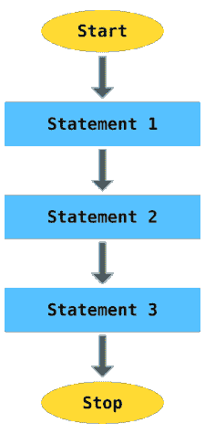

顺序流

例如，

```
a = 2
b = 3
c = a*b
print(c)
```

上述代码将按以下顺序执行：

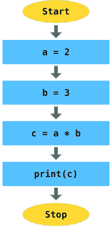

代码的顺序流

## 选择语句：if .. else

选择语句，也称为决策语句，根据一个或多个测试表达式的结果来控制程序的流程。如果条件满足（True），则执行代码块。如果条件不满足，也可以执行另一个代码块。

这个过程可以用下面的流程图来演示：

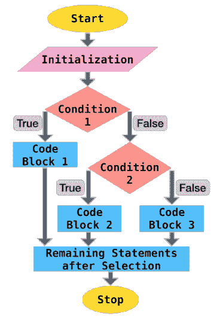

选择流

Python 支持 `if` 复合语句来提供这种控制。`if` 语句包括：

-   `if` 关键字，后跟测试表达式、冒号 `:` 和一个缩进的代码块，如果条件满足则执行该代码块
-   （可选）一个或多个 `elif` 子句，后跟它们的测试条件和相应的代码块
-   （可选）`else` 子句和相应的代码块，如果上述条件（`if`、`elif`）都不满足，则执行该代码块

下面是一个 `if` 语句的示例：

```
# age - 贷款申请人的年龄
# emp - 是否就业（布尔值）
# cscore - 申请人的信用评分

result = None
if age < 26 and not emp:
    result = "Loan rejected"
elif age > 35 and cscore < 600:
    result = "Loan rejected"
else:
    result = "Loan approved"
print(result)
```

上述代码的控制流视图如下：

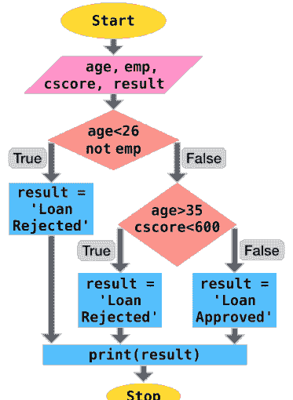

代码流中的选择

## 示例

让我们看一些使用选择语句的编程问题。

#### 1. 绝对值

编写一个程序，使用条件语句输出两个数字之差的绝对值。

**代码**

```
n1 = int(input("Enter 1st number: "))
n2 = int(input("Enter 2nd number: "))

if n1 > n2:
    diff = n1 - n2
else:
    diff = n2 - n1

print("The difference of", n1, "and", n2, "is", diff)
```

**输出**

```
Enter 1st number: 12
Enter 2nd number: 15
The difference of 12 and 15 is 3
```

#### 2. 对 3 个数字排序

编写一个程序，从用户那里接收 3 个数字，并按升序打印它们。

**代码**

```
a = int(input("Enter 1st number: "))
b = int(input("Enter 2nd number: "))
c = int(input("Enter 3rd number: "))

if b < a:
    # 交换 a 和 b 的值
    a, b = b, a

if c < b:
    b, c = c, b
    if b < a:
        a, b = b, a

print("The numbers in sorted order:", a, ",", b, ",", c)
```

**输出**

```
Enter 1st number: 9
Enter 2nd number: 2
Enter 3rd number: 6
The numbers in sorted order: 2 , 6 , 9
```

#### 3. 可除性

编写一个程序，接受两个数字并测试第一个数字是否能被第二个数字整除。

**代码**

```
a = int(input("Enter 1st number: "))
b = int(input("Enter 2nd number: "))

if a % b == 0:
    print(a, "is divisible by", b)
else:
    print(a, "is not divisible by", b)
```

**输出**

```
Enter 1st number: 9
Enter 2nd number: 2
9 is not divisible by 2

Enter 1st number: 9
Enter 2nd number: 3
9 is divisible by 3
```

## 迭代：for

迭代语句，也称为循环语句，允许重复执行一个代码块。

Python 提供 `for` 和 `while` 语句来执行迭代。

`for` 语句可用于遍历序列（`list`、`string`、`tuple`、`range`）的项。它也可以用于遍历无序序列，如 `set` 和 `dict`。

这个过程可以用下面的流程图来演示：

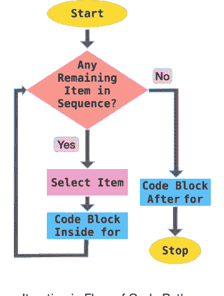

Python 代码流中的迭代

让我们看一些代码示例，演示如何使用 `for` 语句遍历序列。

### 列表迭代

**代码**

```
cars = ["Hyundai", "Honda",
        "Ford", "Toyota",
        "BMW", "Volkswagen"]
for make in cars:
    print(make)
```

**输出**

```
Hyundai
Honda
Ford
Toyota
BMW
Volkswagen
```

### 元组迭代

**代码**

```
cars = ("Hyundai", "Honda",
        "Ford", "Toyota",
        "BMW", "Volkswagen")
for make in cars:
    print(make)
```

**输出**

```
Hyundai
Honda
Ford
Toyota
BMW
Volkswagen
```

### 字符串迭代

**代码**

```
name = "python"
for char in name:
    print(char)
```

**输出**

```
p
y
t
h
o
n
```

### 范围迭代

`range` 类型表示一个不可变的数字序列，通常用于 `for` 循环中以循环特定次数。`range` 对象总是占用相同（小）的内存量，无论它表示的范围大小如何，这是相对于常规 `list` 或 `tuple` 的一个优势。

语法：`range(stop)` 或 `range(start, stop[, step])`

```
>>> range(10)
range(0, 10)
>>> list(range(10))
[0, 1, 2, 3, 4, 5, 6, 7, 8, 9]
>>> list(range(1, 10, 2))
[1, 3, 5, 7, 9]
```

`range()` 函数广泛用于 `for` 语句中，以控制迭代次数并提供每次迭代的索引值（`i`）。

## 示例 #1

打印从 0 到 20 的 5 的倍数。

**代码**

```
for i in range(5):
    print(i*5)
```

**输出**

```
0
5
10
15
20
```

## 示例 #2

打印从 2 到 5 的所有整数，包括边界值。

**代码**

```
for i in range(2, 6):
    print(i)
```

**输出**

```
2
3
4
5
```

#### 示例 #3

打印 2 到 10 之间的所有奇数。

**代码**

```
for i in range(3, 10, 2):
    print(i)
```

或

```
for i in range(2, 10):
    if i % 2 != 0:
        print(i)
```

**输出**

```
3
5
7
9
```

#### 示例 #4

打印 `python programming` 中所有 `o` 出现的索引。

**代码**

```
s = "python programming"
for i in range(len(s)):
    if s[i] == "o":
        print(i)
```

**输出**

```
4
9
```

## 练习

让我们看一些使用 `for` 迭代语句的编程问题。

### 1. 复利

编写一个程序，根据给定的本金、年利率（按年复利）和总时间（以年为单位）计算应付的总复利。

**代码**

```
prin = float(input("Enter the principal amount: "))
rate = float(input("Enter the annual interest rate: "))
time = int(input("Enter the loan duration (in years): "))

amt = prin
for n in range(time):
    amt += rate*amt/100
```

## 异常处理

-   `else` 子句：在最后一个 `except` 块之后也可以包含一个可选的 `else` 子句。如果没有引发异常，则不会执行任何 `except` 块。在这种情况下，将执行 `else` 代码块。
-   `finally` 子句：可以在 `try` 语句的末尾添加一个可选的 `finally` 子句，其中包含一组无论 `try` 块内是否发生错误都会执行的语句。此块通常用于代码清理和关闭所有打开的文件对象。

以下是这些语句的一般形式：

```
try:
    [代码块]
except [exception1 [as identifier1]]:
    [异常代码块 1]
except [exception2 [as identifier2]]:
    [异常代码块 2]
...
...
else:
    [如果没有错误则执行的代码块]
finally:
    [始终执行的代码块]
```

## 字符串：简介与创建

字符串（`str`）是**不可变**的 Unicode 字符序列，用于在 Python 中处理文本数据。

可以通过以下方式指定字符串：

- 单引号：`'允许嵌入"双引号"'`
- 双引号：`"允许嵌入'单引号'"`
- 三引号：`'''三个单引号'''`，`"""三个双引号"""`。

三引号字符串也可以跨越多行。

以下是一些示例：

```
s = "I am a String"

s1 = """A
multiline
String"""

s2 = '''Also a
multiline
String'''
```

## 转义字符

反斜杠（`\`）字符可用于字符串中，以转义那些原本具有特殊含义的字符，例如换行符、回车符或引号字符。

| 转义序列 | 含义 |
| :--- | :--- |
| `\\` | 反斜杠（`\`） |
| `\'` | 单引号（`'`） |
| `\"` | 双引号（`"`） |
| `\a` | ASCII 响铃（BEL） |
| `\b` | ASCII 退格（BS） |
| `\f` | ASCII 换页（FF） |
| `\n` | ASCII 换行（LF） |
| `\r` | ASCII 回车（CR） |
| `\t` | ASCII 水平制表符（TAB） |
| `\v` | ASCII 垂直制表符（VT） |

虽然可以使用 `\'` 和 `\"` 来指定引号字符，但 Python 允许在单引号字符串中嵌入双引号（`'My name is "Python".'`），以及在双引号字符串中嵌入单引号（`"Python's World"`）。

## Unicode 支持

Python 字符串对象支持 Unicode 字符。

Unicode 字符可以指定为 `\u` 后跟 4 位 Unicode 编码（`\uXXXX`）。

```
>>> print("E = mc\u00B2")
E = mc²
```

在上面的示例中，`\u00B2` 是表示“上标二”的 Unicode 字符。

## 其他类型转换为字符串

如果你想从其他数据类型创建字符串对象，只需使用内置的 `str()` 函数，如下所示：

```
>>> str(9)
'9'

>>> str(10.0)
'10.0'
```

## 访问字符串的字符

Python 字符串是“不可变的”，即对象的状态（值）在创建后无法修改。

使用标准的 `[ ]` 语法和从零开始的索引，可以访问字符串中的字符。

如果 `s = "hello"`，

- `s[0]` 的结果是 `h`
- `s[2]` 的结果是 `l`
- `s[5]` 的结果是 `IndexError: string index out of range`，因为字符串长度为 5（索引 0 到 4）
- `s[2] = 'p'` 的结果是 `TypeError: 'str' object does not support item assignment`，因为 `s` 是不可变的

Python 还支持负索引，即你可以从右到左访问字符串的值。

索引 `-1` 表示字符串的最后一个字符，`-2` 是倒数第二个字符，依此类推。

如果 `s = "hello"`，

- `s[-1]` 的结果是 `o`
- `s[-4]` 的结果是 `e`
- `s[-6]` 的结果是 `IndexError: string index out of range`，因为字符串长度为 5（负索引 `-1` 到 `-5`）

## 字符串长度

内置函数 `len()` 返回字符串的长度，这在字符串遍历或其他字符串操作中很有用。

# 迭代：while

`while` 语句只要测试条件满足，就会重复执行一个代码块。

通常在代码块末尾有一个语句，用于更新测试表达式中使用的变量的值，因此循环不会无限执行。

该过程的流程图如下：

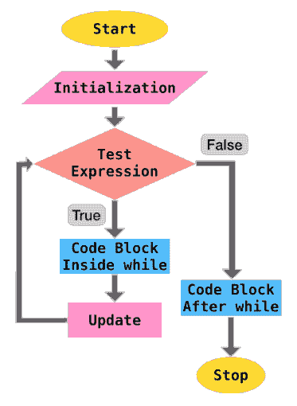

代码流程中的 while 循环迭代

例如，让我们遍历一个列表并打印每个元素的位置（索引）和值，直到到达列表末尾。

## 代码

```
cars = ["Hyundai", "Honda",
        "Ford", "Toyota",
        "BMW", "Volkswagen"]
i = 0
while i<len(cars):
    print(i, cars[i])
    i+=1
```

# 输出

```
0 Hyundai
1 Honda
2 Ford
3 Toyota
4 BMW
5 Volkswagen
```

在上面的示例中，测试条件是 `i<len(cars)`，更新语句是 `i+=1`。

## 练习

让我们通过一些利用 `while` 迭代语句的编程问题。

### 1. 复利

编写一个程序，根据给定的本金、年利率（按年复利）和总时间（以年为单位）计算应付的总复利。

## 代码

```
prin = float(input("Enter the principal amount: "))
rate = float(input("Enter the annual interest rate: "))
time = int(input("Enter the loan duration (in years): "))

amt = prin
while time > 0:
    amt += rate*amt/100
    time = time - 1

print("Total interest payable:", amt - prin)
```

**输出**
```
Enter the principal amount: 500000
Enter the annual interest rate: 5
Enter the loan duration (in years): 3
Total interest payable: 78812.5
```

### 2. 阶乘

正整数 `n` 的阶乘，记为 `n!`，是所有小于或等于 `n` 的正整数的乘积。
`n! = n×(n-1)×(n-2)...3×2×1`
编写一个程序，计算给定 `n`（假设 `n` 大于 `0`）的 `n!`。

**代码**

```
n = int(input("Enter n: "))

factorial = 1
while n > 0:
    factorial *= n
    n = n - 1

print("n! :", factorial)
```

**输出**
```
Enter n: 6
n! : 720
```

# 跳转语句

跳转语句用于（突然）改变执行流程。
Python 中可用的一些跳转语句是：

## pass

`pass` 语句充当占位符，执行空（无）操作。
使用关键字 `pass` 的各种原因如下：

### 1. 语法要求

在 Python 解释器可能因缺少语句而引发 `SyntaxError` 的情况下，使用 `pass` 成为语法要求。
以下代码将在循环中不执行任何操作的情况下成功执行

```
for i in range(6):
    pass
```

而没有 `pass`

```
for i in range(6):
```

将抛出以下 `SyntaxError`

```
File "<ipython-input-18-f2ba5099d499>", line 1
    for i in range(6):
        ^
SyntaxError: unexpected EOF while parsing
```

类似地，在 `if` 语句中

```
if 2 < 3:
    pass
```

而没有 `pass`

```
if 2 < 3:
```

将抛出以下 `SyntaxError`

```
File "<ipython-input-20-068861cce0a8>", line 1
    if 2 < 3:
        ^
SyntaxError: unexpected EOF while parsing
```

### 2. 跳过代码执行

`pass` 可用于在某些情况下跳过代码执行。

例如，

## 代码

```
l = [2, 3, 4, 5, 6]
for i in l:
    if i%3 == 0:
        pass
    else:
        print(i, "is not divisible by 3")
```

# 输出

```
2 is not divisible by 3
4 is not divisible by 3
5 is not divisible by 3
```

### 3. 占位符

`pass` 可用于创建有效的空函数和类作为占位符，这些占位符可以在代码的未来版本中修改。

```
def emptyFunction():
    pass

class EmptyClass:
    pass
```

## break

`break` 语句用于终止立即包含的 `for` 或 `while` 语句的执行。

以下代码将在 `i` 等于 `4` 时终止 `for` 循环

```
for i in range(10):
    print(i)
    if i == 4:
        break
```

```
0
1
2
3
4
```

在 while 语句中，

```
i =0
while i <10:
    print(i)
    if i == 4:
        break
    i+=1
```

当 i 等于 4 时，break 将终止 while 循环

```
0
1
2
3
4
```

## continue

continue 语句用于跳过后续语句的执行并开始下一次迭代。
以下代码将跳过所有工作经验少于 4 年的面试候选人。

```
people =  [{"name": "ABC", "experience": 6},
           {"name": "EFG", "experience": 2},
           {"name": "JKL", "experience": 5},
           {"name": "XYZ", "experience": 3},]
for candidate in people:
    if candidate["experience"]<4:
        continue
    print(candidate["name"], "is selected for interview")
```

输出：
```
ABC is selected for interview
JKL is selected for interview
```

# 嵌套循环

当一个循环存在于另一个循环内部时，称为嵌套循环。
对于外层循环的每次迭代，内层循环都会经历完整的迭代。因此，如果外层循环需要经历 n 次迭代，内层循环需要经历 m 次迭代，则内层循环内的代码块将执行 n x m 次。
让我们看一个嵌套循环的例子：

## 阶乘

编写一个程序，打印 1 到 10（包含）范围内所有数字的阶乘。

## 代码

```
for n in range(1, 11):
    factorial = 1
    for i in range(1, n+1):
        factorial *= i
    print(n,"! =", factorial)
```

# 输出

```
1 ! = 1
2 ! = 2
3 ! = 6
4 ! = 24
5 ! = 120
6 ! = 720
7 ! = 5040
8 ! = 40320
9 ! = 362880
10 ! = 3628800
```

## 嵌套循环 - break

内层循环中的 break 语句仅终止内层循环，而外层循环不受影响。

为了更好地理解，让我们编写一个程序来找出 2 到 40 之间的所有质数。

## 代码

```
for n in range(2, 40):
    i = 2
    while i < n/2:
        if n%i == 0:
            break
        i+=1
    if i>n/2:
        print(n,"is prime")
```

# 输出

```
2 is prime
3 is prime
5 is prime
7 is prime
11 is prime
13 is prime
17 is prime
19 is prime
23 is prime
29 is prime
31 is prime
37 is prime
```

## 字符串操作

我们可以对字符串（字符序列）执行各种操作，例如切片、成员关系、连接和重复。

## 切片

在 Python 中，可以使用索引轻松访问字符串中的字符。

```python
>>> s = "Hello"
>>> s[1]
'e'
```

Python 还提供了一种从字符串中访问子字符串的方法。这个子字符串被称为**切片**，可以使用切片操作符 `[n:m]` 来获取，它返回从起始索引（`n`）到结束索引（`m`）的字符串部分，包括第一个但不包括最后一个。

```python
>>> s = "Hello"
>>> s[1:3]
'el'
```

如果省略起始索引（`n`），`n` 的默认值设置为 `0`，表示字符串的开头。如果省略结束索引（`m`），子字符串将结束于字符串的最后一个字符。

```python
>>> s = "Hello"
>>> s[:3]
'Hel'
>>> s[3:]
'lo'
>>> s[:]
'Hello'
```

切片操作符也支持负索引。

```python
>>> s = "Hello"
>>> s[-4:-2]
'el'
```

在上面的例子中，`-4` 等同于 `len(s) - 4 = 5 - 4 = 1`，`-2` 等同于 `5 - 2 = 3`。因此，`s[-4:-2]` 与 `s[1:3]` 相同。

切片操作符还允许使用第三个索引，称为步长，因为它允许用户跳过（跳过）字符。

```python
>>> s = "Hello"
>>> s[0:5:2]
'Hlo'
```

在上面的例子中，子字符串从字符串的开头开始，步长为 2，跳过 e，最后结束于最后一个字符，再次跳过第 4 个字符 l。

### 成员关系

`in` 和 `not in` 运算符可用于确定子字符串是否存在于字符串中。

```python
>>> s = "Hello"
>>> "lo" in s
True
>>> "lp" not in s
True
```

## 连接

`+` 运算符可用于连接两个字符串。

```python
>>> s1 = "Hello"
>>> s2 = "Python"
>>> s1 + s2
'HelloPython'
>>> s1 + "World"
'HelloWorld'
```

## 重复

`*` 运算符根据整数操作数指定的次数重复字符串。

```python
>>> s = "Hello"
>>> s*3
'HelloHelloHello'
```

## 字符串方法简介

除了返回字符串长度的内置函数 `len()` 外，字符串对象还可以访问几个专用函数（方法），这些方法可以：

1.  转换字符串大小写
2.  检查字符串字符
3.  分割字符串
4.  去除字符串字符
5.  检查字符串前缀或后缀
6.  查找和替换字符串中的字符

让我们在接下来的章节中详细讨论这些方法。

## 转换字符串大小写

以下方法对于转换字符串中字符的大小写很有用：

### lower()

所有有大小写的字符都转换为小写。

```python
>>> "PYthon".lower()
'python'
```

### upper()

所有有大小写的字符都转换为大写。

```python
>>> "PYthon".upper()
'PYTHON'
```

### swapcase()

大写字符转换为小写，小写字符转换为大写。

```python
>>> "PYthon".swapcase()
'pyTHON'
```

### capitalize()

第一个字符大写，其余所有字符小写。

```python
>>> "hello py".capitalize()
'Hello py'
```

### title()

对于字符串中的每个单词，第一个字符大写，其余字符小写。

```python
>>> "hello python".title()
'Hello Python'
```

## 检查字符串字符

以下方法用于检查字符串中字符的类型。

### isalpha()

如果字符串中的所有字符都是字母（A-Z a-z），则返回 `True`。

```python
>>> "HelloPython".isalpha()
True

>>> "Hello Python".isalpha()
False  # 包含空格

>>> "HelloPython2".isalpha()
False  # 包含数字
```

### isdigit()

如果字符串中的所有字符都是数字，则返回 `True`。

```python
>>> "Hello24".isdigit()
False  # 包含字母
>>> "24".isdigit()
True
```

### isalnum()

如果字符串中的所有字符都是字母数字（字母或数字），则返回 `True`。

```python
>>> "02".isalnum()
True
>>> "HelloPython".isalnum()
True
>>> "Hello Python v2".isalnum()
False  # 包含空格
>>> "HelloPythonv2".isalnum()
True
```

### isascii()

如果字符串为空或所有字符都是 ASCII，则返回 `True`。

```python
>>> "".isascii()
True
>>> "HelloPython".isascii()
True
>>> "Hello Py \u00B2".isascii()
False
>>> "पा से python".isascii()
False
```

### islower()

如果所有字符都是小写，则返回 `True`。

```python
>>> "hello".islower()
True
>>> "Hello".islower()
False
```

### isupper()

如果所有字符都是大写，则返回 `True`。

```python
>>> "HELLO".isupper()
True
>>> "Hello".isupper()
False
```

### isspace()

如果字符串中只有空白字符，则返回 `True`。一些常见的空白字符是 ` `（空格）、`\t`（制表符）、`\n`（换行符）、`\r`（回车符）、`\f`（换页符）和 `\v`（垂直制表符）。

```python
>>> " ".isspace()
True
```

### istitle()

如果字符串是标题大小写，即字符串中每个单词的第一个字符大写，其余字符小写，则返回 `True`。

```python
>>> "Hello World".istitle()
True
>>> "Hello world".istitle()
False
>>> "hello world".istitle()
False
```

## 分割字符串

分割方法有助于分割/分区字符串。

### partition()

`partition(sep)` 方法在遇到分隔符（`sep`）时分割字符串，并返回一个包含三个项目的元组（`分隔符前的字符串`、`分隔符`、`分隔符后的字符串`）。

```python
>>> "Hi|Ed|Punk".partition('|')
('Hi', '|', 'Ed|Punk')
```

### split()

`split(sep=None, maxsplit=-1)` 方法根据字符串分隔符（`sep`）将字符串分割成列表。

如果未指定 `sep`，则默认为 `None`，其中空白被视为分隔符，并且字符串会去除所有前导和尾随空白，然后分割成字符串中包含的单词。

```python
>>> "Hi|Ed|Punk".split('|')
['Hi', 'Ed', 'Punk']
>>> "Hi Ed Punk".split()
['Hi', 'Ed', 'Punk']
>>> "    Hi Ed Punk    ".split()
['Hi', 'Ed', 'Punk']
```

如果提供了 `maxsplit`，则最多执行 `maxsplit` 次分割，列表将包含最多 `maxsplit+1` 个元素。

`maxsplit` 未指定时默认为 `-1`，这意味着分割次数没有限制。

```python
>>> "Hi|Ed|Punk|v2".split('|', 2)
['Hi', 'Ed', 'Punk|v2']
```

## 去除字符串字符

去除方法对于去除字符串中的前导和/或尾随字符很有用。

它们接受一个可选参数 `chars`，该参数指定要删除的字符集。

如果未提供参数，则 `chars` 默认为 ASCII 空白，该方法会从字符串中去除所有前导和/或尾随空格。

### lstrip()

从字符串中去除所有前导（左侧）字符。

```python
>>> "   Hello|World   ".lstrip()
'Hello|World   '
>>> "www.edpunk.cc".lstrip('w.')
'edpunk.cc'
```

### rstrip()

从字符串中去除所有尾随（右侧）字符。

```python
>>> "   Hello|World   ".rstrip()
'   Hello|World'
>>> "www.edpunk.cc".rstrip('.c')
'www.edpunk'
```

### strip()

从字符串中去除所有前导和尾随字符。

```python
>>> "   Hello|World   ".strip()
'Hello|World'
>>> "www.edpunk.cc".strip('cw.')
'edpunk'
```

## 检查字符串前缀或后缀

`startswith()` 和 `endswith()` 方法用于检查字符串是否以提供的子字符串（或子字符串元组）开头或结尾。

```python
>>> "Hello Py".startswith("He")
True
>>> "Hello Py".startswith(("He","P"))
True
>>> "Py Hello".startswith(("He","P"))
True
>>> "Hello Py".endswith("y")
True
>>> "Hello Py".endswith(("p","y"))
True
>>> "Py Hello".endswith(("o","n"))
True
```

## 查找和替换字符串中的字符

以下字符串方法对于在字符串中定位子字符串很有用。

### count()

`count(sub[, start[, end]])` 返回子字符串 `sub` 在范围 `[start, end]` 内的非重叠出现次数。

`start` 和 `end` 是可选参数，它们分别默认为 `0` 和 `len(string)`。

### find()

`find(sub[, start[, end]])` 返回子字符串 `sub` 在字符串中位于范围 `[start, end]` 内的最低索引。

`start` 和 `end` 是可选参数，它们分别默认为 `0` 和 `len(string)`。

如果未找到子字符串，则该方法返回 `-1`。

```
>>> s = "she sells sea shells"
>>> s.find("she")
0
>>> s.find("she", 5)
14
>>> s.find("see")
-1
>>> s.find("she", 5, 10)
-1
>>> s.find("she", 5, 17)
14
```

### rfind()

`rfind(sub[, start[, end]])` 返回子字符串 `sub` 在字符串中位于范围 `[start, end]` 内的最高索引。

`start` 和 `end` 是可选参数，它们分别默认为 `0` 和 `len(string)`。

如果未找到子字符串，则该方法返回 `-1`。

```
>>> s = "she sells sea shells"
>>> s.rfind("she")
14
>>> s.rfind("she", 0, 12)
0
>>> s.rfind("see")
-1
>>> s.rfind("she", 5)
14
```

### index()

`index(sub[, start[, end]])` 与 `find(sub[, start[, end]])` 类似，但当未找到子字符串时，它不是返回 `-1`，而是引发 `ValueError`。

```
>>> s = "she sells sea shells"
>>> s.index("she")
0
>>> s.index("she", 5)
14
>>> s.index("see")
Traceback (most recent call last):
  File "<stdin>", line 1,
    in <module>
ValueError: substring not found
>>> s.index("she", 5, 10)
Traceback (most recent call last):
  File "<stdin>", line 1,
    in <module>
ValueError: substring not found
>>> s.index("she", 5, 17)
14
```

### rindex()

`s.rindex(sub[, start[, end]])` 与 `rfind(sub[, start[, end]])` 类似，但当未找到子字符串时，它不是返回 `-1`，而是引发 `ValueError`。

```
>>> s = "she sells sea shells"
>>> s.rindex("she")
14
>>> s.rindex("she", 0, 12)
0
>>> s.rindex("see")
Traceback (most recent call last):
  File "<stdin>", line 1,
    in <module>
ValueError: substring not found
>>> s.rindex("she", 5)
14
```

### replace()

`replace(oldsub, newsub[, count])` 返回字符串的一个副本，其中所有出现的 `oldsub` 子字符串都被 `newsub` 替换。

`count` 是一个可选参数，如果提供，则仅替换字符串中前 `count` 次出现的子字符串。

```
>>> s = "Oh Python! Oh"
>>> s.replace("Oh", "Hi")
'Hi Python! Hi'
>>> s.replace("Oh", "Hi", 1)
'Hi Python! Oh'
```

## 遍历字符串

`for` 和 `while` 语句对于遍历字符串很有用。

### 使用 `for`

由于字符串是字符序列，因此可以使用 `for` 语句遍历字符串，如下所示。

**代码**

```
name = "python"
for char in name:
    print(char)
```

**输出**

```
p
y
t
h
o
n
```

### 使用 `while`

可以使用 `while` 语句通过迭代索引值直到最后一个字符索引来遍历字符串。

**代码**

```
name = "python"
i = 0
while i < len(name):
    print(name[i])
    i += 1
```

**输出**

```
p
y
t
h
o
n
```

# 列表

## 什么是 Python 列表？如何创建列表？

Python 中最常见且广泛使用的集合是**列表**，它们存储一组有序的对象（可以是任何数据类型），这些对象可能具有某种逻辑关系。这与传统语言中的数组有显著区别，使得 Python 成为处理非类型绑定的真实世界数据的理想语言。

让我们创建一个汽车经销商待售特定车辆的属性列表：

```
>>> l = ["BMW", "Z4", 2019,
...     4, "Red", True]
```

在这个列表中：

- "BMW" 是车辆的品牌，
- "Z4" 是车辆的型号，
- 2019 是车辆的制造年份，
- 4 代表车轮数量，
- "Red" 是车辆的颜色，
- True 告诉我们待售车辆是全新的。

这种从字面量集合创建列表的方法称为**列表显示**。

请注意，此列表包含多种数据类型的项目 - `str`、`int` 和 `bool`。

除了上面显示的列表显示外，还可以使用内置的 `list()` 函数创建新列表。

如果未向 `list()` 函数提供参数，则会创建一个空列表。

```
>>> l = list()
>>> l
[]
```

如果传递字符串、元组或集合作为参数，`list()` 函数会将它们转换为列表。

```
>>> l = list("abcd")
>>> l
['a', 'b', 'c', 'd']
>>> l = list({1, 2, 3})
>>> l
[1, 2, 3]
>>> l = list((1, 2, 3, 4))
>>> l
[1, 2, 3, 4]
```

## 访问列表项

列表使用从零开始的索引，其中 0 是第一个元素的索引，`len(list) - 1` 是最后一个元素的索引。

例如，

```
>>> l = ["BMW", "Z4", 2019,
...     4, "Red", True]
>>> l[0]
'BMW'
>>> l[2]
2019
```

## 列表长度

可以使用内置的 `len()` 函数返回列表的长度。

```
>>> l = ["BMW", "Z4", 2019,
...     4, "Red", True]
>>> len(l)
6
```

## 负索引

与 `str` 类似，`list` 等序列类型支持负索引，即你可以从末尾访问列表的值。

索引 `-1` 表示列表中的最后一项，`-2` 表示倒数第二项，依此类推。

```
>>> l = ["BMW", "Z4", 2019,
...     4, "Red", True]
>>> l[-1]
True
>>> l[-3]
4
```

## 修改列表

由于列表是可变的，可以使用赋值运算符修改或替换给定索引处的单个项目。

```
>>> l = ["BMW", "Z4", "Red"]
>>> l[2] = "Black"
>>> l
['BMW', 'Z4', 'Black']
```

## 从列表中删除项目

可以使用 `del` 语句删除列表中给定索引处的项目。

```
>>> l = ["BMW", "Z4", "Red"]
>>> del l[1]
>>> l
['BMW', 'Red']
```

# 列表操作

我们可以对列表（项目集合）执行各种操作，例如成员关系、连接、重复和切片。

### 成员关系

`in` 和 `not in` 可用于检测项目是否在列表中。

```
>>> l = ["BMW", "Z4", "Red"]
>>> "Red" in l
True
>>> "Gold" in l
False
>>> "Gold" not in l
True
```

## 连接

`+` 运算符可用于连接两个列表以创建一个新列表。

```
>>> l = ["BMW", "Z4"]
>>> k = [2019, "Red"]
>>> l + k
['BMW', 'Z4', 2019, 'Red']
```

`+=` 运算符连接两个列表并将其赋值给目标列表。

```
>>> l = ["BMW", "Z4"]
>>> l += [2019, "Red"]
>>> l
['BMW', 'Z4', 2019, 'Red']
```

## 重复

`*` 运算符根据整数操作数指定的次数重复列表的项目。

```
>>> l = [1, 2]
>>> l*3
[1, 2, 1, 2, 1, 2]
```

## 切片

可以使用列表切片表示法 `l[i:j]` 获取列表 `l` 的子集，其中起始索引 `i` 处的项目被包含，但结束索引 `j` 处的项目被排除。

例如，切片表示法 `[1:4]` 指的是从索引 `1` 到索引 `3`（即 `4-1`）的项目。

```
>>> l = ["BMW", "Z4", 2019,
...     4, "Red", True]
>>> l[1:4]
['Z4', 2019, 4]
```

切片表示法 `l[i:j:k]` 也可以包含第三个数字，称为步长。这里，列表从起始索引 `i` 到结束索引 (`j`) - 1 以 `k` 个项目的步长进行切片。

```
>>> l = ["BMW", "Z4", 2019,
...     4, "Red", True]
>>> l[1:4:2]
['Z4', 4]
```

切片表示法也有一些有用的默认值。第一个数字的默认值是 0，第二个数字的默认值是列表的大小。

```
>>> l = ["BMW", "Z4", 2019,
...     4, "Red", True]
>>> l[2:]
[2019, 4, 'Red', True]
>>> l[:4]
['BMW', 'Z4', 2019, 4]
```

切片表示法也支持负索引。

```
>>> l = ["BMW", "Z4", 2019,
...     4, "Red", True]
>>> l[-4:]
[2019, 4, 'Red', True]
>>> l[:-2]
['BMW', 'Z4', 2019, 4]
>>> l[-4:-1]
[2019, 4, 'Red']
```

切片表示法可用于替换列表中的多个项目。

```
>>> l = ["BMW", "Z4", 2019,
...     4, "Red", True]
>>> l[:2] = ["Kia", "Sonet"]
>>> l
['Kia', 'Sonet', 2019, 4, 'Red', True]

>>> l = ["BMW", "Z4", 2019,
...     4, "Red", True]
>>> l[1:5:2] = ["Sonet", 2]
>>> l
['BMW', 'Sonet', 2019, 2, 'Red', True]
```

切片表示法也可用于删除列表中的多个项目。

```
>>> l = ["BMW", "Z4", 2019,
...     4, "Red", True]
>>> del l[:2]
>>> l
[2019, 4, 'Red', True]

>>> l = ["BMW", "Z4", 2019,
...     4, "Red", True]
>>> del l[:5:2]
>>> l
['Z4', 4, True]
```

## 遍历列表

列表遍历是访问列表中每个项目的过程，通常是从第一个项目到最后一个项目，并对访问的项目执行某些指令。

Python 提供了两种遍历列表的方法：

### 直接遍历

由于列表是项目的有序集合，因此可以使用 `for` 语句直接并按顺序访问每个项目。

代码

```
l = ["BMW", "Z4", 2019,
    4, "Red", True]
for item in l:
    print(item)
```

输出

```
BMW
Z4
2019
4
Red
True
```

### 基于位置或索引的遍历

在基于位置或基于索引的遍历中，索引的值从 `0` 开始，并在小于列表长度的情况下递增。

此索引值可用于使用索引运算符 `[]` 访问列表中该索引处的项目。

可以使用 `for` 语句，通过 `range()` 和 `len()` 函数来遍历列表的索引。

代码

```
l = ["BMW", "Z4", 2019,
    4, "Red", True]
for i in range(len(l)):
    print(i, l[i])
```

输出

```
0 BMW
1 Z4
2 2019
3 4
4 Red
5 True
```

当您需要在遍历期间修改列表的项目（而不改变列表长度）时，此方法也很有用。

例如，让我们将列表中的每个项目转换为字符串。

代码

```
l = ["BMW", "Z4", 2019,
    4, "Red", True]
for i in range(len(l)):
    # modifying item value
    l[i] = str(l[i])
print(l)
```

输出

```
['BMW', 'Z4', '2019', '4', 'Red', 'True']
```

可以使用 `while` 语句，通过迭代索引的值直到最后一个项目的索引来遍历列表。

代码

```
l = ["BMW", "Z4", 2019,
    4, "Red", True]
i = 0
while i < len(l):
    print(l[i])
    i += 1
```

输出

```
BMW
Z4
2019
4
Red
True
```

## 可用于列表的内置函数

内置函数 `max()`、`min()` 和 `sum()` 分别用于计算列表中项目的最大值、最小值和总和。

```
>>> l = [4, 8, 2, 1, 3]
>>> min(l)
1
>>> max(l)
8
>>> sum(l)
18
```

## 列表方法简介

列表对象可以访问几个专用函数（方法），这些方法可用于：

- 1. 向列表添加项目
- 2. 从列表中删除项目
- 3. 计数或定位列表中的项目
- 4. 对列表进行排序
- 5. 反转列表
- 6. 复制列表的内容

我们将在接下来的章节中详细讨论这些方法。

## 向列表添加项目

`append()` 方法将一个项目（作为参数传递）添加到列表的末尾。

```
>>> l = ["T", "C", 2, 4]
>>> l.append(2.5)
>>> l
['T', 'C', 2, 4, 2.5]
```

如果需要将项目添加到特定索引处，可以使用 `insert()` 方法。

```
>>> l = ["T", "C", 2, 4]
>>> l.insert(3, 2.5)
>>> l
['T', 'C', 2, 2.5, 4]
```

`extend()` 方法将参数列表中的每个项目附加到目标列表的末尾。

```
>>> l = ["T", "C", 2, 4]
>>> l.extend([2.5, "SE"])
>>> l
['T', 'C', 2, 4, 2.5, 'SE']
```

## 从列表中删除项目

`clear()` 方法从列表中删除所有项目。

```
>>> l = ["T", "C", 2, 4, "S"]
>>> l.clear()
>>> l
[]
```

`remove()` 方法从列表中删除项目的第一次出现。

```
>>> l = ["Hi", "Ed", "Py", "Hi"]
>>> l.remove("Hi")
>>> l
['Ed', 'Py', 'Hi']
```

如果提供了索引，`pop()` 方法将删除该索引处的项目，否则将从列表中删除最后一个项目。

```
>>> l = ["T", "C", 2, 4, "S"]
>>> item = l.pop()
>>> item
'S'
>>> l
['T', 'C', 2, 4]

>>> l = ["T", "C", 2, 4, "S"]
>>> item = l.pop(2)
>>> item
2
>>> l
['T', 'C', 4, 'S']
```

## 计数或定位列表中的项目

可以使用 `index(x[, i[, j]])` 方法在列表中定位项目 `x`，该方法返回从索引 `i` 开始（包含）到索引 `j` 之前（不包含）的项目第一次出现的位置。

如果未指定 `i` 和 `j`，则默认为 `i=0` 和 `j=len(l)`。

```
>>> l = [34, 4, 6, 23, 4]
>>> l.index(4)
1
>>> l.index(4, 3)
4
>>> l.index(6, 1, 4)
2
```

`count()` 方法可用于计算列表中某个项目出现的次数。

```
>>> l = [34, 4, 6, 23]
>>> l.count(4)
1
>>> l = ["it", "is", "it", "I"]
>>> l.count("it")
2
```

## 反转项目

`reverse()` 方法可用于就地反转列表。

```
>>> l = ["T", "C", 2, 4, "S"]
>>> l.reverse()
>>> l
['S', 4, 2, 'C', 'T']
```

如果您不希望修改现有列表，而是创建一个项目顺序相反的新列表，请使用内置函数 `reversed()` 嵌套在内置函数 `list()` 中。

```
>>> l = ["T", "C", 2, 4, "S"]
>>> new_l = list(reversed(l))
>>> new_l
['S', 4, 2, 'C', 'T']
>>> l
['T', 'C', 2, 4, 'S']
```

## 对列表进行排序

Python 列表有一个内置的 `sort()` 方法，该方法使用项目之间的 `<` 比较对项目进行就地排序。

该方法还接受 2 个关键字参数：
- `key` 用于指定一个函数，该函数在进行比较之前对每个列表元素调用。
- `reverse` 是一个布尔值，指定列表是否应按降序排序。

```
>>> l = [34, 4, 6, 23]
>>> l.sort()
>>> l
[4, 6, 23, 34]

>>> l = [34, 4, 6, 23]
>>> l.sort(reverse=True)
>>> l
[34, 23, 6, 4]

>>> l = ["Oh", "Hi", "Py", "ed"]
>>> l.sort()
>>> l
['Hi', 'Oh', 'Py', 'ed']

>>> l = ["Oh", "Hi", "Py", "ed"]
# lowercase the words before sorting
>>> l.sort(key=str.lower)
>>> l
['ed', 'Hi', 'Oh', 'Py']
```

如果您不希望修改现有列表，而是创建一个包含已排序项目的新列表，请使用内置的 `sorted()` 函数，该函数返回一个新的已排序列表。

```
>>> l = [34, 4, 6, 23]
>>> new_l = sorted(l)
>>> new_l
[4, 6, 23, 34]
```

## 复制列表

在 Python 中，我们可以创建一个对象（数据）并使用赋值运算符（ = ）将其引用绑定到一个变量。

由于集合中的多个集合或项目可以指向同一个可变对象，因此需要复制，以便可以更改一个副本而不更改另一个副本。

让我们举个例子：

```
>>> old_l = [1, 2, 3]

# Copying old list into a new list
>>> new_l = old_l

# Checking if both lists are
# pointing to the same object
>>> id(new_l)==id(old_l)
True

# Adding element to new list
>>> new_l.append(4)
>>> new_l
[1, 2, 3, 4]
>>> old_l
[1, 2, 3, 4]
```

可以看到赋值运算符**不会创建列表的新副本**。

`copy()` 方法可用于创建一个包含原始列表项目的新 `list`。

```
>>> old_l = [1, 2, 3]

# Copying old list into a new list
>>> new_l = old_l.copy()

# Checking if both lists are
# pointing to the same object
>>> id(new_l)==id(old_l)
False

# Adding element to new list
>>> new_l.append(4)
>>> new_l
[1, 2, 3, 4]
>>> old_l
[1, 2, 3]
```

分配整个列表的切片（ `[:]` ）也等同于创建一个新副本。

```
>>> old_l = [1, 2, 3]

# Copying old list into a new list
# using slice notation
>>> new_l = old_l[:]

# Checking if both lists are
# pointing to the same object
>>> id(new_l)==id(old_l)
False

# Adding element to new list
>>> new_l.append(4)
>>> new_l
[1, 2, 3, 4]
>>> old_l
[1, 2, 3]
```

## 嵌套列表

列表的列表也称为嵌套列表。

之前，我们学习了如何创建一个包含经销商处待售特定车辆属性的列表。

现在让我们创建一个嵌套列表，其中包含一些待售车辆的详细信息。

```
# Make Model Year No_of_wheels
l = [["Kia", "Sonnet", 2019, 4],
    ["Toyota", "Camry", 2018, 4],
    ["BMW", "Z4", 2015, 4],
    ["BMW", "S1000", 2016, 2],
    ["KTM", "390", 2019, 2],
    ]
```

因此，嵌套列表可用于表示数据集，其中每个项目都是一个列表（数据），包含观察值的属性。

`l[i][j]` 是获取嵌套列表 `l` 中索引 `i` 处列表的第 `j+1` 个项目的语法。

```
>>> l[2][1]
'Z4'
```

## 列表推导式

通过转换现有列表来创建新列表的一种简短而简洁的方法是通过列表推导式。

此外，由于 Python 解释器中存在的优化，使用列表推导式具有性能优势。

## 逐成员操作

列表推导式可用于创建一个新列表，其中每个元素是对另一个序列或可迭代对象的每个成员应用某些操作的结果。

例如，创建一个新列表，其中每个项目都是平方数。

```
>>> l = [2, 3, 4, 5, 6, 8]
>>> l2 = [i**2 for i in l]
>>> l2
[4, 9, 16, 25, 36, 64]
```

## 过滤或子序列

列表推导式也可用于创建满足特定条件的元素的子序列。

例如，创建一个新列表，其中每个项目都能被 2 整除。

```
>>> l = [2, 3, 4, 5, 6, 8]
>>> l2 = [i for i in l if i%2==0]
>>> l2
[2, 4, 6, 8]
```

## 示例程序

### 1. 最小值、最大值和平均值

编写一个程序，查找用户输入的列表中存储的值的最小值、最大值和平均值。

#### a) 不使用内置函数

代码

```
#create an empty list
l = []

n = int(input("Enter length of list: "))
for i in range(n):
    val = float(input("Enter item: "))
    #append marks in the list
    l.append(val)

# Set first item as the default min value
minval = l[0]
# Set first item as the default max value
maxval = l[0]
# Store sum of items
s = 0
for val in l:
    # check if item value is smaller than current min val
    if val < minval:
        minval = val
    # check if item value is greater than current max val
    if val > maxval:
        maxval = val
    s += val

print("Minimum :", minval)
print("Maximum :", maxval)
print("Mean :", s/n)
```

输出

```
Enter length of list: 5
Enter item: 3
```

#### b) 使用内置函数

## 代码

```python
#create an empty list
l = []

n = int(input("Enter length of list: "))
for i in range(n):
    val = float(input("Enter item: "))
    #append marks in the list
    l.append(val)

print("Minimum :", min(l))
print("Maximum :", max(l))
print("Mean :", sum(l)/n)
```

### 输出

```
Enter length of list: 5
Enter item: 3
Enter item: 2
Enter item: 6
Enter item: 9
Enter item: 1
Minimum : 1.0
Maximum : 9.0
Mean : 4.2
```

### 2. 线性搜索

编写一个程序，输入一个列表，然后检查用户输入的数字是否存在于该列表中。

## 代码

```python
#create an empty list
l = []

n = int(input("Enter length of list: "))
for i in range(n):
    val = input("Enter item: ")
    #append marks in the list
    l.append(val)

search = input("Enter search value: ")

found = False
for i in range(n):
    if l[i] == search:
        found = True
        break
if found:
    print("Search value located at index", i)
else:
    print("Search value not found")
```

### 输出

```
Enter length of list: 4
Enter item: 2
Enter item: 6
Enter item: 3
Enter item: 7
Enter search value: 3
Search value located at index 2

Enter length of list: 4
Enter item: 2
Enter item: 6
Enter item: 3
Enter item: 7
Enter search value: 1
Search value not found
```

### 3. 元素频率

编写一个程序，输入一个列表，然后打印该列表中各元素的频率。

#### a) 不使用内置函数

## 代码

```python
#create an empty list
l = []

n = int(input("Enter length of list: "))
for i in range(n):
    val = input("Enter item: ")
    #append marks in the list
    l.append(val)

# Let us create two lists
# 1. to store unique items
items = []
# 2. to store the count of unique items
counts = []

for val in l:
    if val not in items:
        items.append(val)
        counts.append(1)
    else:
        for idx in range(len(items)):
            if items[idx] == val:
                counts[idx] += 1

print("Frequency of Elements")
for idx in range(len(items)):
    print(items[idx], "-", counts[idx])
```

#### 输出

```
Enter length of list: 8
Enter item: 2
Enter item: 3
Enter item: 3
Enter item: 4
Enter item: 2
Enter item: 5
Enter item: 6
Enter item: 6
Frequency of Elements
2 - 2
3 - 2
4 - 1
5 - 1
6 - 2
```

#### b) 使用内置函数

## 代码

```python
l = []

n = int(input("Enter length of list: "))
for i in range(n):
    val = input("Enter item: ")
    #append marks in the list
    l.append(val)

# List to store unique items
items = []

print("Frequency of Elements")
for val in l:
    if val not in items:
        items.append(val)
        print(val, "-", l.count(val))
```

#### 输出

```
Enter length of list: 8
Enter item: 2
Enter item: 3
Enter item: 3
Enter item: 4
Enter item: 2
Enter item: 5
Enter item: 6
Enter item: 6
Frequency of Elements
2 - 2
3 - 2
4 - 1
5 - 1
6 - 2
```

# 元组

## 列表 vs 元组

元组类似于列表，但有一个区别——它们是不可变的。这意味着一旦初始化，用户就不能修改其值，这使其成为确保数据完整性和保证程序不会修改数据的有用特性。

## 如何创建元组？

元组使用括号 `( )` 声明，各项之间用逗号 `,` 分隔。

```python
>>> l = ("Hi", "Ed", "Punk")
>>> type(l)
<class 'tuple'>
```

### tuple()

除了上述方法，内置的 `tuple()` 函数也可用于创建新元组。

如果未向 `tuple()` 函数提供参数，则会创建一个空元组。

```python
>>> t = tuple()
>>> t
()
```

如果传递字符串、元组或集合作为参数，`tuple()` 函数会将它们转换为元组。

```python
>>> t = tuple("abcd")
>>> t
('a', 'b', 'c', 'd')
>>> t = tuple({1, 2, 3})
>>> t
(1, 2, 3)
>>> t = tuple([1, 2, 3, 4])
>>> t
(1, 2, 3, 4)
```

## 什么是单元素元组？

如果一个元组只有 1 个元素，则称为单元素元组。

最好在末尾添加一个逗号，以避免 Python 解释器将其视为普通括号内的值，如下例所示。

```python
>>> regular_string = ("Hi")
>>> regular_string
'Hi'
>>> type(regular_string)
<class 'str'>

>>> regular_int = (1)
>>> regular_int
1
>>> type(regular_int)
<class 'int'>

>>> str_tuple = ("Hi", )
>>> type(str_tuple)
<class 'tuple'>

>>> int_tuple = (1, )
>>> type(int_tuple)
<class 'tuple'>
```

## 访问元组的元素

元组使用从零开始的索引，其中 0 是第一个元素的索引，`len(tuple) - 1` 是最后一个元素的索引。

```python
>>> t = ("BMW", "Z4", 2019,
...        4, "Red", True)
>>> t[0]
'BMW'
>>> t[2]
2019
```

## 元组的长度

内置的 `len()` 函数可用于返回元组的长度。

```python
>>> t = ("BMW", "Z4", 2019,
...        4, "Red", True)
>>> len(t)
6
```

## 负索引

与 `list` 类似，`tuple` 也支持负索引，即你可以从末尾访问元组的值。索引 -1 表示元组中的最后一项，-2 是倒数第二项，依此类推。

```python
>>> t = ("BMW", "Z4", 2019,
...        4, "Red", True)
>>> t[-1]
True
>>> t[-3]
4
```

# 元组是不可变的

元组是不可变的，即一旦创建就不允许修改，任何尝试修改的操作都会引发错误。

```python
>>> t = ("BMW", "Z4", 2019)
>>> t[1] = "Charger"
Traceback (most recent call last):
  File "<stdin>", line 1, in <module>
TypeError: 'tuple' object does not support item assignment
```

# 元组操作

我们可以对元组执行各种操作，如成员关系、连接、重复和切片。

### 成员关系

`in` 和 `not in` 可用于检测元素是否在元组中。

```python
>>> t = ("BMW", "Z4", 2019,
...      4, "Red", True)
>>> "Red" in t
True
>>> "Gold" in t
False
>>> "Gold" not in t
True
```

## 连接

`+` 运算符可用于连接两个元组以创建一个新元组。

```python
>>> t = ("BMW", "Z4")
>>> u = (2019, "Red")
>>> t+u
('BMW', 'Z4', 2019, 'Red')
```

## 重复

`*` 运算符创建一个新元组，其中的元素按整数操作数指定的次数重复。

```python
>>> t = (1, 2)
>>> t*3
(1, 2, 1, 2, 1, 2)
```

## 元组切片

可以使用元组切片表示法 `t[i:j]` 获取元组 `t` 的子集，其中索引 `i` 处的元素被包含，但索引 `j` 处的元素被排除。

例如，切片表示法 `[1:4]` 指的是从索引 `1` 到索引 `3`（即 `4-1`）的元素。

```python
>>> t = ("BMW", "Z4", 2019,
...      4, "Red", True)
>>> t[1:4]
('Z4', 2019, 4)
```

切片表示法 `t[i:j:k]` 也可以包含第三个数字，称为步长。这里，元组从起始索引 `i` 到结束索引 (`j`) - 1，以 `k` 个元素为步长进行切片。

```python
>>> t = ("BMW", "Z4", 2019,
...     4, "Red", True)
>>> t[1:4:2]
('Z4', 4)
```

切片表示法还有一些有用的默认值。

第一个数字的默认值是 `0`，第二个数字的默认值是元组的大小。

```python
>>> t = ("BMW", "Z4", 2019,
...     4, "Red", True)
>>> t[2:]
(2019, 4, 'Red', True)
>>> t[:4]
('BMW', 'Z4', 2019, 4)
```

切片表示法也支持负索引。

```python
>>> t = ("BMW", "Z4", 2019,
...     4, "Red", True)
>>> t[-4:]
(2019, 4, 'Red', True)
>>> t[:-2]
('BMW', 'Z4', 2019, 4)
>>> t[-4:-1]
(2019, 4, 'Red')
```

## 遍历元组

元组遍历是访问元组中每个元素的过程，通常从第一个元素到最后一个元素，并对访问的元素执行某些指令。

Python 提供了两种遍历元组的方法：

### 直接遍历

由于元组是元素的有序集合，可以使用 `for` 语句直接按顺序访问每个元素。

## 代码

```python
t = ("BMW", "Z4", 2019,
    4, "Red", True)
for item in t:
    print(item)
```

#### 输出

```
BMW
Z4
2019
4
Red
True
```

### 基于位置或索引的遍历

在基于位置或索引的遍历中，索引值从 `0` 开始，并在小于元组长度时递增。

此索引值可用于使用索引运算符 `[]` 访问元组中该索引处的元素。

可以使用 `for` 语句通过 `range()` 和 `len()` 函数遍历元组的索引。

```python
t = ("BMW", "Z4", 2019,
    4, "Red", True)
for i in range(len(t)):
    print(t[i])
```

```
BMW
Z4
2019
4
Red
True
```

可以使用 `while` 语句通过迭代索引值来遍历元组。

```python
t = ("BMW", "Z4", 2019,
    4, "Red", True)
index = 0
while index < len(t):
    print(t[index])
    index += 1
```

```
BMW
Z4
2019
4
Red
True
```

## 可用于元组的内置函数

内置函数 `max()`、`min()` 和 `sum()` 可分别用于计算元组中元素的最大值、最小值和总和。

```python
>>> t = (4, 8, 2, 1, 3)
>>> min(t)
1
>>> max(t)
8
>>> sum(t)
18
```

## 在元组中定位元素

与`list`相比，`tuple`仅支持那些不尝试修改它的方法。

可以使用`index(x[, i[, j]])`方法在元组中定位元素`x`，该方法返回从索引`i`开始（包含）到索引`j`（不包含）之间该元素首次出现的位置。如果未指定`i`和`j`，则默认为`i=0`和`j=len(t)`。

```
>>> t = (34, 4, 6, 23, 4)
>>> t.index(4)
1
>>> t.index(4, 3)
4
>>> t.index(6, 1, 4)
2
```

## 统计元素出现次数

`count()`方法可用于统计元组中某个元素的出现次数。

```
>>> t = (34, 4, 6, 23, 4)
>>> t.count(4)
2
>>> t = ("it", "is", "it", "I")
>>> t.count("it")
2
```

## 创建元素顺序反转的新元组

要创建一个元素顺序反转的新元组，可以使用内置函数`reversed()`嵌套在内置函数`tuple()`中。

```
>>> t = ("T", "C", 2, 4, "S")
>>> new_t = tuple(reversed(t))
>>> new_t
('S', 4, 2, 'C', 'T')
>>> t
('T', 'C', 2, 4, 'S')
```

## 创建元素排序后的新元组

要创建一个元素排序后的新元组，可以使用内置函数`sorted(x, [key, reverse])`，它返回一个新的已排序元组。

该方法可选地接受两个关键字（命名）参数：
- `key`，用于指定一个函数，该函数在比较之前会对每个元组元素进行调用。
- `reverse`，是一个布尔值，指定元组是否按降序排序。

```
>>> t = (34, 4, 6, 23, 9)
>>> tuple(sorted(t))
(4, 6, 9, 23, 34)
>>> tuple(sorted(t, reverse=True))
(34, 23, 9, 6, 4)
>>> t = ("Oh", "Hi", "Py", "it")
>>> tuple(sorted(t))
('Hi', 'Oh', 'Py', 'it')
# 在排序前将单词转换为小写
>>> tuple(sorted(t, key=str.lower))
('Hi', 'it', 'Oh', 'Py')
```

## 嵌套元组

元组的元组也称为嵌套元组。

让我们创建一个嵌套元组，包含所有待售车辆的详细信息。

```
# 品牌 型号 年份 轮子数量
t = (
    ("Kia", "Sonnet", 2019, 4),
    ("Toyota", "Camry", 2018, 4),
    ("BMW", "Z4", 2015, 4),
    ("BMW", "S1000", 2016, 2),
    ("KTM", "390", 2019, 2),
)
```

`t[i][j]`是获取嵌套元组`t`中索引`i`处元组的第`j+1`个元素的语法。

```
>>> t[2][1]
'Z4'
```

与嵌套列表相比，嵌套元组在表示数据集（例如从数据库获取的表）时很有用，因为确保数据的完整性很重要，而代码无法修改它，因为元组是不可变的。

## 理解元组的不可变性

与列表一样，`+=`操作也适用于元组，并向其添加新元素。

```
>>> t = ("Hi", "Ed", "Punk")
>>> t += (1, 2)
>>> t
('Hi', 'Ed', 'Punk', 1, 2)
```

但元组是不可变的，对吧？
那我们怎么能修改它呢？

为了更好地理解，让我们重新审视对列表应用`+=`运算符时会发生什么。

```
>>> l = ["Hi", "Ed", "Punk"]
>>> id_l = id(l)
>>> l += [1, 2]
>>> l
['Hi', 'Ed', 'Punk', 1, 2]
>>> id(l) == id_l
True
```

对于列表，修改后的列表`l`仍然指向同一个对象。

现在，让我们向元组添加元素。

```
>>> t = ("Hi", "Ed", "Punk")
>>> id_t = id(t)
>>> t += (1, 2)
>>> t
('Hi', 'Ed', 'Punk', 1, 2)
>>> id(t) == id_t
False
```

对于元组，修改后的元组实际上是一个全新的元组，包含原始元组的内容和扩展部分。

原始元组没有被修改，因为它是不可变的。但是，由于`t`不再指向原始元组，它将从内存中释放。

因此，建议使用`append()`和`extend()`方法以编程方式添加新元素，而不是使用`+=`，因为如果代码尝试修改元组，它会引发错误。

```
>>> l = ["Hi", "Ed", "Punk"]
>>> l.extend([1, 2])
>>> l
['Hi', 'Ed', 'Punk', 1, 2]

>>> t = ("Hi", "Ed", "Punk")
>>> t.extend((1, 2))
Traceback (most recent call last):
  File "<stdin>", line 1, in <module>
AttributeError: 'tuple' object has no attribute 'extend'
```

# 字典

## 什么是字典？

Python提供了一种映射类型的集合，它包含键以及与这些键对应的值。

这种集合称为`dictionary`（类型`dict`），其中每个键都是唯一的，可用于轻松存储或检索值（任何数据类型，包括`string`、`int`、`float`、`list`）。

字典通过键（任何不可变类型 - 数字、字符串、元组）进行索引，而列表则通过数字范围进行索引。

## 如何创建字典

可以使用一对花括号`{}`或使用内置函数`dict()`（它也是一个构造函数）来创建一个空字典。

```
>>> d = {}
>>> type(d)
<class 'dict'>

>>> d = dict()
>>> d
{}
>>> type(d)
<class 'dict'>
```

要创建一个带有一些初始值的新字典，可以使用：

### 键：值对

在花括号`{}`中，用逗号分隔的一系列`键: 值`对。

```
>>> d = {"yr": 20, "name": "Ed",
...         18: True}
>>> d
{'yr': 20, 'name': 'Ed', 18: True}
```

### (键, 值) 元组序列

可以将一系列(键, 值)元组作为参数传递给`dict()`函数。

```
>>> l = [("yr",20), ("name","Ed"),
...         (18,True)]
>>> d = dict(l)
>>> d
{'yr': 20, 'name': 'Ed', 18: True}
```

### 关键字/命名参数

键和值可以作为关键字参数传递给`dict()`函数。

```
>>> d = dict(yr=20, name="Ed",
...           is18=True)
>>> d
{'yr': 20, 'name': 'Ed', 'is18': True}
```

这种方法的一个限制是字典的键只能是字符串类型，并且它们的名称必须在标识符的命名空间内。

### 键和值列表

有时可能需要组合两个列表，其中一个列表包含键，另一个列表包含对应的值。

内置的`zip()`函数对于将两个列表组合成元组对很有用。

可以将压缩后的迭代器作为参数传递给`dict()`以创建新的映射集合。

```
>>> m = ["yr", "name", 18]
>>> n = [20, "Ed", True]
>>> list(zip(m, n))
[('yr', 20), ('name', 'Ed'), (18, True)]
>>> dict(zip(m, n))
{'yr': 20, 'name': 'Ed', 18: True}
```

### 带有默认值的键

`dict.fromkeys(iterable[, value])`可用于创建新字典，其中`iterable`的元素作为键，并为这些键分配一个可选的值（默认为`None`）。

```
>>> l = ["yr", "name", 18]
>>> dict.fromkeys(l)
{'yr': None, 'name': None, 18: None}
>>> dict.fromkeys(l, 0)
{'yr': 0, 'name': 0, 18: 0}
```

## 访问字典的元素（键：值）

### 索引运算符 []

`d[x]`可用于访问字典`d`中键`x`对应的值。

```
>>> d = {"yr": 20, "name": "Ed",
...      18: True}
>>> d["yr"]
20
```

### get()

`get(key[, default])`方法也可用于获取键对应的值（如果键在字典中），否则返回`default`值。

如果未提供`default`，则返回的默认值为`None`。

```
>>> d = {"yr": 20, "name": "Ed",
...      18: True}
>>> d.get("name")
'Ed'
>>> d.get("version") is None
True
>>> d.get("version", "1.0")
'1.0'
```

这是一种从字典中获取值的优雅方法，在实际软件代码中应该使用它，因为它永远不会引发`KeyError`。

## 更新字典

### 索引运算符 []

`d[x] = y`可用于在字典`d`中添加键`x`对应的值`y`。

如果键`x`已存在，则赋值会更新或覆盖其对应的值。

```
>>> d = {"yr": 20, 18: True}
>>> d["name"] = 'Ed'
>>> d
{'yr': 20, 18: True, 'name': 'Ed'}

>>> d["name"] = 'Py'
>>> d
{'yr': 20, 18: True, 'name': 'Py'}
```

### update()

`update()`方法可用于向`dict`添加新元素或更新现有元素。

此方法接受以下参数：

#### 1. 字典

```
>>> d = {"yr": 20, 18: True}
>>> d.update({"name": 'Ed'})
>>> d
{'yr': 20, 18: True, 'name': 'Ed'}

>>> d.update({"yr": 15, 18: False})
>>> d
{'yr': 15, 18: False, 'name': 'Ed'}
```

#### 2. (键, 值) 对序列

```
>>> d = {"yr": 20, 18: True}
>>> d.update([("name", 'Ed'),
...           ('yr', 15)])
>>> d
{'yr': 15, 18: True, 'name': 'Ed'}
```

#### 3. 关键字参数

```
>>> d = {"yr": 20, 18: True}
>>> d.update(name="Ed", yr=15)
>>> d
{'yr': 15, 18: True, 'name': 'Ed'}
```

### setdefault()

`setdefault(key[, default])` 方法返回与键对应的值。

如果键不在字典中，则使用提供的 `default` 值插入该键。

如果未提供默认值，则值设置为 `None`。

```
>>> d = {"yr": 20, 18: True}
>>> d.setdefault("name")
>>> d
{'yr': 20, 18: True, 'name': None}

>>> d = {"yr": 20, 18: True}
>>> d.setdefault("name", "Ed")
'Ed'
>>> d
{'yr': 20, 18: True, 'name': 'Ed'}
```

## 从字典中删除项（键:值）

### del

`del` 关键字可用于删除一个 `键: 值` 对。

```
>>> d = {"yr": 20, "name": "Ed",
...         18: True}
>>> del d["name"]
>>> d
{'yr': 20, 18: True}
```

### clear()

`clear()` 方法可用于清除字典的所有值。

```
>>> d = {"yr": 20, "name": "Ed",
...         18: True}
>>> d.clear()
>>> d
{}
```

### pop()

`pop(key[, default])` 方法可用于删除一个 `键: 值` 对。

如果键不在字典中，则返回用户提供的参数 `default` 的值。

```
>>> d = {"yr": 20, "name": "Ed",
...         18: True}
>>> d.pop("name")
'Ed'
>>> d
{'yr': 20, 18: True}

>>> d.pop("name")
Traceback (most recent call last):
  File "<stdin>", line 1, in <module>
KeyError: 'name'
>>> d.pop("name", "Punk")
'Punk'
```

### popitem()

`popitem()` 可用于以破坏性方式遍历字典，以 LIFO（后进先出）顺序删除并返回一个（键，值）对。

```
>>> d = {"yr": 20, "name": "Ed",
...       18: True}
>>> d.popitem()
(18, True)
>>> d.popitem()
('name', 'Ed')
>>> d.update({"name": "py"})
>>> d
{'yr': 20, 'name': 'py'}
>>> d.popitem()
('name', 'py')
>>> d.popitem()
('yr', 20)
>>> d
{}
```

## 字典操作

### 成员关系

`in` 关键字可用于测试键是否存在于字典中。

```
>>> d = {"yr": 20, 18: True}
>>> "yr" in d
True
```

类似地，`not in` 可用于确定键是否不存在。

```
>>> "name" not in d
True
```

### 并集

`|`（并集）运算符可用于合并两个字典。

```
>>> d = {"yr": 20, 18: True}
>>> n = {"name": "Ed"}
>>> d | n
{'yr': 20, 18: True, 'name': 'Ed'}
```

如果两个操作数（字典）之间存在共同的键，则右侧操作数的值优先。

```
>>> d = {"yr": 20, 18: True}
>>> n = {"yr": 15, "name": "Ed"}
>>> d | n
{'yr': 15, 18: True, 'name': 'Ed'}
```

在上面的例子中，`d` 和 `n` 都有一个共同的键 `yr`。`n` 中对应于 `yr` 的值优先。

## 遍历字典

与 `list` 或 `tuple` 的基于位置的索引相比，字典是基于键进行索引的。

### 直接遍历

`for` 循环可用于直接遍历 `dict` 的键。

```
d = {"yr": 20, "name": "Ed",
    18: True}
for key in d:
    print(key,":", d[key])
```

**输出**

```
yr : 20
name : Ed
18 : True
```

### 使用字典方法遍历

字典方法 `items()`、`keys()` 和 `values()` 可分别用于获取字典中的项、键和值。

```
>>> d = {"yr": 20, "name": "Ed",
...     18: True}
>>> d.keys()
dict_keys(['yr', 'name', 18])
>>> d.values()
dict_values([20, 'Ed', True])
>>> d.items()
dict_items([('yr', 20), ('name', 'Ed'), (18, True)])
```

`dict_keys`、`dict_values` 和 `dict_items` 是可迭代对象，可在 `for` 语句中用于遍历字典。

**代码**

```
d = {"yr": 20, "name": "Ed",
    18: True}
for key in d.keys():
    print(key)
```

**输出**

```
yr
name
18
```

**代码**

```
d = {"yr": 20, "name": "Ed",
    18: True}
for value in d.values():
    print(value)
```

**输出**

```
20
Ed
True
```

**代码**

```
d = {"yr": 20, "name": "Ed",
    18: True}
for key, value in d.items():
    print(key,":", value)
```

**输出**

```
yr : 20
name : Ed
18 : True
```

## 字典的内置函数

### 项数

`len()` 可用于获取字典中的项数。

```
>>> d = {"yr": 20, "name": "Ed",
...     18: True}
>>> len(d)
3
```

### 最小值和最大值

`min()` 和 `max()` 内置函数返回字典键中的最小值和最大值。

对于字符串键，它们按字母顺序返回第一个和最后一个出现的字符串。

```
>>> d = {"yr": 20, "name": "Ed",
...     "is18": True}
>>> min(d)
'is18'
>>> max(d)
'yr'

>>> d = {2: "b", 3: "c", 1: "a"}
>>> min(d)
1
>>> max(d)
3
```

### 创建字典的副本

可以使用 `copy()` 方法创建字典的新副本：

```
>>> old_d = {"a": 1, "b": 2}
>>> new_d = old_d.copy()

# 检查两个字典是否指向同一个对象
>>> new_d is old_d
False

>>> new_d["c"] = 3
>>> new_d["b"] = 4
>>> new_d
{'a': 1, 'b': 4, 'c': 3}
>>> old_d
{'a': 1, 'b': 2}
```

### 嵌套字典

当字典中 `键:值` 对的值是 `dict` 类型时，它被称为嵌套字典。

简单来说，就是字典中的字典。

表的记录可以表示为嵌套字典，其中主键作为外层字典的键。

```
d = { 1: {"name": "Amar", "age": 19},
      2: {"name": "Ria", "age": 20},
      3: {"name": "Rao", "age": 18}}

print(d[1])
print(d[2]["name"])
```

**输出**

```
{'name': 'Amar', 'age': 19}
Ria
```

## 示例程序

### 字符频率

编写一个程序来计算给定字符串中每个字符出现的次数。

**代码**

```
d = {}
s = input("Enter string: ")
for c in s:
    if c in d:
        d[c] += 1
    else:
        d[c] = 1

print("Frequency of characters")
for key in d:
    print(key, "-", d[key])
```

**输出**

```
Enter string: pythondata
Frequency of characters
p - 1
y - 1
t - 2
h - 1
o - 1
n - 1
d - 1
a - 2
```

### 工资簿

编写一个程序，输入员工姓名及其工资，并将它们存储在字典中。

**代码**

```
n = int(input("Enter number of employees: "))
emp = dict()
for cnt in range(n):
    name = input("Enter employee name: ")
    salary = int(input("Enter salary: "))
    emp[name] = salary

print("Employee Name & Salary")
for key in emp:
    print(key, '-', emp[key])
```

**输出**

```
Enter number of employees: 3
Enter employee name: Anil Raj
Enter salary: 12000
Enter employee name: Dinesh Kumar
Enter salary: 15000
Enter employee name: Sam Singh
Enter salary: 10000
Employee Name & Salary
Anil Raj - 12000
Dinesh Kumar - 15000
Sam Singh - 10000
```

## Python 标准库

### 内置函数

Python 拥有丰富而广泛的**标准库**，这使其比传统编程语言更具优势。

**Python 标准库**包含 69 个程序员常用的内置函数，这节省了大量时间，因为它们可以直接在程序中使用。

我们已经在前面的部分使用过一些函数，如 `input()`、`output()`、`len()`、`sum()`、`min()`、`max()`、`list()`、`dict()` 等。

一些广泛使用的函数可以分类如下：

- 数学函数
- 类型函数
- 输入/输出函数
- 基础/Unicode 函数

### 数学函数

#### abs()

`abs(x)` 返回 `x`（类型为 `int`、`float` 或 `complex` 数字）的绝对值或大小。

```
>>> abs(-2.3)
2.3
>>> abs(-10)
10
>>> abs(2 + 2j)
2.8284271247461903
```

#### round()

`round(x [,ndigits])` 将 `x`（`float`）四舍五入到小数点后 `ndigits` 位精度。

如果未提供 `ndigits`，则四舍五入到最接近的整数。

```
>>> round(2.33462398)
2
>>> round(2.33462398, 3)
2.335
```

#### sum()

`sum(sequence [,start])` 返回 `sequence`（类型为 `list`、`tuple`、`range` 或 `set`）中各项的和。

如果提供了第二个参数 `start`，则将其添加到总和中。

```
>>> sum([1, 2, -1])
2
>>> sum((1, 2, -1))
2
>>> sum([1, 2, -1], 10)
12
```

#### min()

`min(sequence)` 返回 `sequence`（类型为 `list`、`tuple`、`range`、`str` 或 `set`）中各项的最小值。

除了可迭代对象外，`min(arg1, arg2, ..)` 还接受多个数值类型参数 `arg1`、`arg2` ..，并返回这些参数中的最小值。

```
>>> min([1, 2, -1])
-1
>>> min(1, 2, -1)
-1

# 字符串中具有最小 ASCII 值的字符
>>> min("hello")
'e'
```

#### max()

`max(sequence)` 返回 `sequence`（类型为 `list`、`tuple`、`range`、`str` 或 `set`）中各项的最大值。

除了可迭代对象外，`max(arg1, arg2, ..)` 还接受多个数值类型参数 `arg1`、`arg2` ..，并返回这些参数中的最大值。

```
>>> max([1, 2, -1])
2
>>> max(1, 2, -1)
2

# 字符串中具有最大 ASCII 值的字符
>>> max("hello")
'o'
```

#### pow()

`pow(base, exp [,mod])` 将 `base`（`int`、`float`）提升到 `exp`（`int`、`float`）次幂，即 `base**exp`。

如果提供了 `mod`（`int`），则返回 `(base**exp) % mod`。

```
>>> pow(3, 2, 7)
2
>>> pow(1.4141, 2)
1.9996788099999998
```

### divmod()

`divmod(a, b)` 返回一个元组 `(a // b, a % b)`，包含 `a`（`int`、`float`）除以 `b`（`int`、`float`）时的商和余数。

```
>>> divmod(23, 3.5)
(6.0, 2.0)
>>> divmod(-10, 7)
(-2, 4)
```

## 类型函数

Python 内置函数用于处理数据类型的各个方面，例如检查和转换。

## 类型检查

`type()` 和 `isinstance()` 内置函数用于检查对象的数据类型。
请查看 **变量、对象与数据类型** 章节中的 **类型检查** 部分，以更详细地了解它。

## 内置类型函数

我们之前已经讨论了 Python 中可用的各种内置数据类型。
以下函数通常用于在未提供参数时分配默认值或创建空集合：

| 函数 | 默认值 |
| --- | --- |
| `bool()` | `False` |
| `int()` | `0` |
| `float()` | `0.0` |
| `complex()` | `0j` |
| `str()` | `''` |
| `list()` | `[]` |
| `tuple()` | `()` |
| `set()` | `set()` |
| `frozenset()` | `frozenset()` |
| `dict()` | `{}` |

**变量、对象与数据类型** 章节的 **类型转换** 部分详细介绍了这些函数，以防传递任何参数。

## I/O 函数

Python 提供以下内置函数来处理用户输入和结果输出：

### input()

`input()` 函数可用于接受用户输入并将其分配给变量。
当代码中遇到此函数时，Python 解释器会等待用户输入响应，该响应将作为字符串读取。

## 代码

```
name = input("Enter name: ")
print("Hello,", name)
```

### 输出

```
Enter name: Python
Hello, Python
```

### print()

内置 `print()` 函数可用于在标准输出上显示输出（变量的值、表达式等）。

例如，以下代码计算矩形的面积并显示它：

## 代码

```
length = 10
breadth = 5
area = length * breadth
print("Area:", area)
```

### 输出

```
Area: 50
```

`input()` 和 `print()` 函数在 **输入与输出** 章节中有详细介绍。

### open()

`open()` 函数用于打开文件并返回相应的文件对象。

此函数支持多种模式，这些模式对于从文件读取和写入文件很有用。

`open()` 函数的示例用法如下所示：

```
f = open('data.txt', 'r+')
# f 是文件对象，可以对文件执行读写操作
```

此函数在 **文件处理** 章节中有详细介绍。

## 基数/Unicode 转换函数

### bin()

将 `int` 转换为以 `'0b'` 为前缀的二进制（基数为 2）字符串。

```
>>> bin(9)
'0b1001'
```

### oct()

将 `int` 转换为以 `'0o'` 为前缀的八进制（基数为 8）字符串。

```
>>> oct(9)
'0o11'
```

### hex()

将 `int` 转换为以 `"0x"` 为前缀的小写十六进制（基数为 16）字符串。

```
>>> hex(29)
'0x1d'
```

### ord()

返回给定 Unicode 字符 `str` 的整数 Unicode 码位。

```
>>> ord("a")
97
>>> ord("β")
946
```

### chr()

将整数 Unicode 码位转换为相应的 Unicode 字符串。

```
>>> chr(97)
'a'
>>> chr(946)
'β'
```

## 什么是内置模块？

除了内置函数外，**Python 标准库** 还包含大量内置模块，这些模块是按功能组织的函数组。
下面提到了一些常用的模块：

- `math` - 数学函数
- `random` - 生成伪随机数
- `statistics` - 统计函数

## 访问模块

可以使用 `import` 语句在程序中访问模块。

```
>>> import math
```

上面的 `import` 语句加载 `math` 模块中所有可用的函数。要访问模块中的任何函数，只需键入模块名称，后跟一个句点（`.`），然后是函数名称。

```
>>> import math
>>> math.pow(3, 2)
9.0
```

可以使用 `from` 语句来访问模块中指定的函数，而不是加载模块中的所有函数。

```
>>> from math import pow
>>> pow(3, 2)
9.0
```

## math 模块

`math` 模块提供 C 标准定义的数学函数和常量。

### 常量

`math` 模块中提供以下常用的数学常量：

- pi : π = 3.141592...（达到可用精度）
- e : e = 2.718281...（达到可用精度）
- tau : τ = 2π = 6.283185...（达到可用精度）

```
>>> import math
>>> math.pi
3.141592653589793
>>> math.e
2.718281828459045
>>> math.tau
6.283185307179586
```

### 函数

`math` 模块中提供以下有用的数学函数：

#### fabs()

`fabs(x)` 返回 `x` 的绝对值。

```
>>> import math
>>> math.fabs(-3.24)
3.24
```

#### gcd()

`gcd(a, b)` 返回整数 `a` 和 `b` 的最大公约数。

```
>>> import math
>>> math.gcd(54, 24)
6
```

#### ceil()

`ceil(x)` 返回大于或等于 `x` 的最小整数。

```
>>> import math
>>> math.ceil(2.13)
3
```

#### floor()

`floor(x)` 返回小于或等于 `x` 的最大整数。

```
>>> import math
>>> math.floor(2.13)
2
```

#### fmod()

`fmod(x, y)` 返回表达式 `x - n*y` 的值，使得结果与 `x` 具有相同的符号，并且对于某个整数 `n`，其大小小于 `|y|`。

在处理浮点数时，应优先使用此函数，而不是 `x % y`（后者应用于整数）。

```
>>> import math
>>> math.fmod(2.14, 0.5)
0.14000000000000012
>>> math.fmod(-2.14, 0.5)
-0.14000000000000012
```

#### pow()

`pow(x, y)` 将 `x` 提升到 `y` 次幂。

```
>>> import math
>>> math.pow(5, 2)
25.0
```

#### sqrt()

`sqrt(x)` 返回 `x` 的平方根。

```
>>> import math
>>> math.sqrt(25)
5.0
```

#### sin()、cos() 和 tan()

`sin(x)`、`cos(x)` 和 `tan(x)` 分别返回 `x`（弧度）的正弦、余弦和正切值。

```
>>> import math
>>> math.cos(math.pi/3)
0.5000000000000001
>>> math.sin(math.pi/2)
1.0
>>> math.tan(math.pi/4)
0.9999999999999999
```

#### factorial()

`factorial(n)` 计算正整数 `n` 的阶乘，即所有小于或等于 `n` 的正整数的乘积。
`n! = n×(n-1)×(n-2)...3×2×1`，
其中 `0! = 1`

```
>>> import math
>>> math.factorial(5)
120
```

## random 模块

`random` 模块提供对可以生成随机数的函数的访问。

### random()

`random()` 函数以均匀概率在半开区间 `[0.0, 1.0)` 内绘制一个随机浮点数。

```
>>> import random
>>> random.random()
0.6857133962949904
```

### 范围内的随机整数

`randrange(stop)` 用于从范围 `0` 到 `stop`（不包括）中随机选择一个整数。

```
>>> import random
>>> random.randrange(10)
5
```

`randrange(start, stop)` 用于从范围 `start` 到 `stop`（不包括）中随机选择一个整数。

```
>>> import random
>>> random.randrange(5, 10)
8
```

`randint(a, b)` 是 `randrange(a, b+1)` 的别名，提供了一个生成随机整数 `N` 的接口，使得 `a <= N <= b`（包括边界）。

```
>>> import random
>>> random.randint(10, 20)
12
```

## statistics 模块

`statistics` 模块提供用于计算数字（实数值）数据的数学统计信息的函数。

### 均值

`mean(data)` 返回 `data`（`int` 或 `float` 的 `list` 或 `tuple`）的算术平均值或平均值。

```
>>> from statistics import mean
>>> mean([1, 2, 3, 6])
3
```

### 中位数

`median(data)` 使用常见的“中间两个数的平均值”方法返回 `data`（`int` 或 `float` 的 `list` 或 `tuple`）的中位数或中间值。

```
>>> from statistics import median
>>> median([1, 2, 3, 6])
2.5
```

### 众数

`mode(data)` 返回 `data`（`int`、`str` 或 `float` 的 `list` 或 `tuple`）中最常出现的值。

如果有多个具有相同计数的众数，则返回序列中第一次出现的值。

```
>>> from statistics import mode
>>> mode([1, 2, 3, 6])
1
>>> mode([1, 2, 2, 3, 6])
2
>>> mode(["a", "b", "a", "c"])
'a'
```

## 文件处理

### Python中的文件处理 - 简介与概述

到目前为止，我们编写的程序都是通过键盘接收用户输入，并将生成的输出显示在标准输出（控制台）上。

这种活动存在以下缺点：

-   对于少量输入是可行的，但在处理大量输入时则显得繁琐。
-   每次执行程序时都必须重新输入全部输入。
-   生成的输出不会被保存以供分享或后续使用。

就像可以在纸上书写文字一样，信息也可以作为命名位置或文件存储在计算机磁盘上。

Python内置了与文件交互的能力。通过文件处理，Python程序可以读取文件以提供输入数据，并将结果输出到文件中以供后续使用。

### 文本文件与二进制文件 - 用例、文件格式、示例

文件主要分为两种类型：

#### 文本文件

文本文件是以人类可读的文本格式（ASCII或Unicode字符序列）存储信息的最简单方式，其中包含数值。

使用任何文本编辑器（如记事本甚至IDLE）都可以轻松查看和修改文本文件的内容。

即使是Python脚本也以扩展名为`.py`的文本文件形式存储。`.txt`是通用文本文件最常用的扩展名。

尽管文本文件没有任何结构，但存在一些国际标准定义了创建专用文本文件的规则，例如：

-   `.csv`，其中每行是一组逗号分隔的值。这是最流行的数据交换格式。
-   `.tsv`，类似于CSV，但值之间用制表符而不是逗号分隔。
-   `.xml`和`.json`是流行的网络数据交换格式。
-   `.html`文件是内容以超文本标记语言编写的文本文件，旨在Web浏览器中显示内容。

#### 二进制文件

尽管文本文件的内容是人类可读的，但实际上这些信息是以机器可读的字节（1和0）形式存储在磁盘上的，一次一个字符。这使得该格式易于任何应用程序操作，但效率较低且消耗更多内存（文件大小更大）。

在二进制文件中，内容也以字节形式存储，但这些字节并不直接转换为ASCII或Unicode字符。

相反，这些字节可以表示任何内容，例如：

-   复杂数据结构
-   图像
-   音频
-   视频

等等。

由于没有简单的规则来确定信息的基本单位，因此在文本编辑器中打开二进制文件将显示乱码值，甚至单个比特的更改也可能损坏整个文件并使其无法读取。因此，需要专门的软件来读写二进制文件。

Python有一个内置的`pickle`模块，它实现了读写具有`.dat`或`.pickle`文件扩展名的二进制文件的协议。`pickle`是一种特定于Python的二进制文件格式，可以将任何Python数据结构（列表、字典等）或代码对象序列化为二进制文件。然后，该文件的字节内容可以被反序列化，并在任何运行Python的计算机上后续使用。

## 文件打开与关闭

可以使用内置的`open(file_name, mode='r')`函数打开文本或二进制文件。

该函数的参数说明如下：

`file_name`

`file_name`是一个必需的字符串参数，指定要打开的文件的路径。

它可以是绝对路径，也可以是相对路径，如下所示：

-   `'fname.txt'`是位于当前工作目录（执行Python脚本的目录）中的文本文件的相对路径。
-   `'../fname.txt'`是位于当前目录之外（执行Python脚本的目录之外）的文本文件的相对路径。
-   `'/Users/edpunk/Documents/fname.txt'`是文本文件的绝对路径，只要在同一系统中，Python脚本可以从任何位置打开它。

`mode`

`mode`是一个可选的字符串参数，指定文件必须以何种模式打开。默认为`'r'`，表示以文本模式打开进行读取。

可用模式如下：

| 模式 | 用途 |
| :--- | :--- |
| `'r'` | 打开文件进行读取（默认）。 |
| `'t'` | 以文本模式打开文件（默认）。 |
| `'w'` | 打开文件进行写入，如果文件已存在则截断（清空）文件。 |
| `'x'` | 与`'w'`相同，但如果文件已存在则失败。 |
| `'a'` | 打开文件进行写入，任何新数据都添加到末尾。如果文件不存在，则创建一个新文件。 |
| `'b'` | 以二进制模式打开文件。 |
| `'rb'` | 以二进制只读模式打开文件。 |
| `'wb'` | 以二进制模式打开文件进行写入，如果文件已存在则截断（清空）文件。 |
| `'+'` | 允许对文件进行读写操作。 |
| `'r+'` | 以读写模式打开文件。如果文件不存在，则抛出错误。如果文件已存在，并且流的位置没有移动到文件末尾，则新数据将覆盖在现有数据之上。 |
| `'r+b'` | 以二进制读写模式打开文件。如果文件已存在，则不会截断文件。 |
| `'w+'` | 以读写模式打开文件。如果文件已存在，则创建新文件或截断文件内容。 |
| `'w+b'` | 以二进制读写模式打开文件。如果文件已存在，则创建新文件或截断文件内容。 |
| `'a+'` | 以读取和追加模式打开文件。如果文件不存在，则创建一个新文件。如果文件已存在，新数据会自动添加到现有数据之后的文件末尾。 |
| `'a+b'` | 以二进制读取和追加模式打开文件。 |

打开文件并执行一些文件操作后，可以使用`close()`方法安全地关闭它。

例如，让我们编写一个程序，以读取和追加模式打开文件`data.txt`，并在后续语句中关闭文件对象。

```
f = open('data.txt', 'a+')
f.close()
```

## 文件读取

使用`open()`函数打开文件会创建并返回一个文件对象，可以在其上执行以下活动：

### 顺序读取

以下三种方法可用于文件对象，以顺序读取文件内容：

#### read()

`read(size = -1)`方法用于一次从文件中读取`size`个字节的数据。

如果未指定`size`，则读取并返回文件的全部内容。

## 示例

让我们考虑一个名为`info.txt`的文件，其中包含以下文本：

```
Hello World
Thank You
```

## 代码

```
>>> f = open('info.txt', 'r')
>>> print(f.read(3))
Hel
>>> print(f.read(4))
lo W
>>> f.close()

>>> f = open('info.txt', 'r')
>>> print(f.read())
Hello World
Thank You
>>> f.close()
```

#### readline()

不带任何参数的`readline(size = -1)`方法用于从给定文件中一次读取并返回一行。

如果指定了`size`，则返回最多`size`个字节的数据，或者返回直到遇到换行符的数据。

## 示例

让我们考虑一个名为`info.txt`的文件，其中包含以下文本：

```
Hello World
Thank You
```

## 代码

```
>>> f = open('info.txt', 'r')
>>> f.readline(3)
'Hel'

# 剩余数据（字节大小 < 20）
# 直到遇到换行符
>>> f.readline(20)
'lo World\n'
>>> f.close()

>>> f = open('info.txt', 'r')
>>> f.readline()
'Hello World\n'
>>> f.close()
```

由于`readline()`一次返回一行，因此可以在`while`语句中使用它来逐行遍历数据。一旦到达文件末尾，它将返回一个空字符串。

## 代码

```
f = open('info.txt', 'r')
line = f.readline()
while line:
    # 从行末尾移除
    # 换行符
    line = line.strip()

    print(line)

    # 读取下一行
    line = f.readline()
f.close()
```

#### 输出

```
Hello World
Thank You
```

`for`语句也可以用于逐行遍历文件，而无需使用`readline()`方法。只需遍历文件对象即可一次返回一行数据。

## 代码

```
f = open('info.txt', 'r')
for line in f:
    # 移除换行符
```

## 行尾字符
line = line.strip()
print(line)
f.close()

**输出**
Hello World
Thank You

## readlines()

`readlines()` 方法返回一个字符串列表，表示文本文件内容的各行（包括换行符）。

## 示例

考虑一个名为 `info.txt` 的文件，包含以下文本：
Hello World
Thank You

## 代码

```
>>> f = open('info.txt', 'r')
>>> f.readlines()
['Hello World\n', 'Thank You']
```

## 随机读取

以下两种方法可用于文件对象，以随机访问文件内容：

## tell()

`tell()` 返回文件对象在文件中的当前字节位置（整数）。

考虑同一个文件 `info.txt` 用于以下示例：

```
>>> f = open('info.txt', 'r')
>>> f.read(4)
'Hell'
>>> f.tell()
4
```

## seek()

`seek(offset, reference=0)` 可用于在文件对象中定位到一个位置，该位置距离提供的 `reference` 有 `offset` 个字节。

`reference` 的默认值为 `0`，表示文件的开头。对于此默认 `reference`，`offset` 必须是一个整数（>=0）。

`reference` 的其他允许值为：

- 1，表示偏移量将从文件对象的当前位置计算（`offset` 可以是正数或负数）
- 2，表示偏移量从文件末尾计算（`offset` 为负数）

**注意：** 在文本文件（那些在模式字符串中没有 `b` 的文件）中，只允许相对于文件开头进行查找（`reference = 0`）。`reference = 1` 或 `2` 仅在文件以二进制模式打开时有效。

考虑同一个文件 `info.txt` 用于以下示例：

```
>>> f.seek(6)
6

# Hello World\nThank You
#       ^
# 查找后文件指针的位置。

>>> f.read()
'World\nThank You'
>>> f.tell()
21

>>> f.seek(12)
12

# Hello World\nThank You
#             ^
# 查找后文件指针的位置。

>>> f.read()
'Thank You'
```

## 写入文件

以下模式支持文件写入：

- 从文件开头写入：`r+`、`r+b`、`w`、`x`、`wb`、`w+`、`w+b`。
- 在现有文件末尾追加：`a`、`ab`、`a+`、`a+b`。

以下方法可用于将数据写入文件：

## write()

`write(s)` 方法用于将字符串 `s` 写入文件。

```
>>> s = "Hi World\nThank You"
>>> f = open("info.txt", "w")
>>> f.write(s)
21
# 写入的字符数

>>> f.close()
```

现在，使用文本编辑器打开 `info.txt`，将显示以下内容。

```
Hi World
Thank You
```

## writelines()

`writelines(lines)` 方法将字符串列表写入文件。

此方法不会添加行分隔符（换行符 `\n`），因此它们应出现在每个字符串的末尾。

```
>>> lines = ["Hi World\n",
...         "Thank You\n"]
>>> f = open("info.txt", "w")
>>> f.writelines(lines)
>>> f.close()
```

现在，使用文本编辑器打开 `info.txt`，将显示以下内容。

```
Hi World
Thank You
```

注意末尾的空行，这是由于最后一个字符串末尾的 `\n` 添加的。

## 使用 `pickle` 模块读写二进制文件

在 Python 中，读写二进制文件（`.dat` 或 `.pickle` 文件扩展名）的协议已在内置的 `pickle` 模块中实现。

`pickle` 是一种 Python 特定的二进制文件格式，不仅可以用于存储二进制数据，还可以存储任何 Python 对象。

将数据结构（列表、字典等）和代码对象（类、函数等）转换为可以存储在二进制文件中的字节的过程称为**序列化**。此二进制文件可以存储在磁盘上或共享，并且可以通过 Python 进行反序列化并稍后使用。

## 转储数据

`dump()` 函数可用于将任何数据或对象的 pickle 表示写入文件。

**语法：** `pickle.dump(obj, file)`

其中：

- `obj` 是要写入的对象
- `file` 是一个打开的文件对象（以二进制写入 `wb` 或追加 `ab` 模式打开）。

```
>>> import pickle
>>> l = [["Anita","Maths",83],
...     ["Amar","Maths",95],
...     ["Ani","Maths",90]]
>>> f = open("marks.dat", "wb")
>>> pickle.dump(l, f)
>>> f.close()
```

## 加载数据

`load()` 函数可用于从文件中读取对象或数据的 pickle 表示。

**语法：** `pickle.load(file)`

其中 `file` 是一个打开的文件对象（以二进制读取模式 `rb` 打开）。

```
>>> import pickle
>>> f = open("marks.dat", "rb")
>>> l = pickle.load(f)
>>> f.close()
```

```
>>> l
[['Anita', 'Maths', 83], ['Amar', 'Maths', 95], ['Ani', 'Maths', 90]]
```

## 示例：遍历二进制文件

编写一个程序，执行以下记录保存活动：

- 接受一些学生成绩作为输入，并将数据写入二进制文件
- 从文件中读取所有数据
- 向文件添加更多数据
- 显示文件的全部内容

## 代码

```
import pickle

# 以二进制写入模式打开文件
f = open("marks.dat", "wb")

# 输入学生成绩数据
flag = 1
while flag != 0:
    name = input("Enter student name: ")
    subject = input("Enter subject: ")
    marks = float(input("Enter marks: "))
    rec = [name, subject, marks]
    pickle.dump(rec, f)
    flag = int(input("Enter 1 to add more or 0 to terminate: "))
f.close()

# 读取文件内容并显示
f = open("marks.dat", "rb")

print("File contents:")

# 迭代读取文件中写入的所有 pickle 对象
# 直到达到文件末尾
try:
    while True:
        rec = pickle.load(f)
        print(rec)
except EOFError:
    print("End of file reached")
    f.close()

# 添加更多数据
f = open("marks.dat", "ab")
flag = 1
while flag != 0:
    name = input("Enter student name: ")
    subject = input("Enter subject: ")
    marks = float(input("Enter marks: "))
    rec = [name, subject, marks]
    pickle.dump(rec, f)
    flag = int(input("Enter 1 to add more or 0 to terminate: "))
f.close()

# 显示所有内容
f = open("marks.dat", "rb")
print("File contents after appending:")
try:
    while True:
        rec = pickle.load(f)
        print(rec)
except EOFError:
    print("End of file reached")
    f.close()
```

## 输入/输出

```
Enter student name: Anita
Enter subject: Maths
Enter marks: 83
Enter 1 to add more or 0 to terminate: 1
Enter student name: Amar
Enter subject: Maths
Enter marks: 95
Enter 1 to add more or 0 to terminate: 0
File contents:
['Anita', 'Maths', 83.0]
['Amar', 'Maths', 95.0]
End of file reached
Enter student name: Akash
Enter subject: Science
Enter marks: 92
Enter 1 to add more or 0 to terminate: 1
Enter student name: Ira
Enter subject: Science
Enter marks: 99
Enter 1 to add more or 0 to terminate: 0
File contents after appending:
['Anita', 'Maths', 83.0]
['Amar', 'Maths', 95.0]
['Akash', 'Science', 92.0]
['Ira', 'Science', 99.0]
End of file reached
```

## 使用 csv 模块读写 CSV 文件

逗号分隔值（CSV）文件格式是最常见的数据序列化和交换格式之一，其中每一行是由分隔符分隔的一组值。

创建 CSV 文件的主要规则是：

- 每个字段由分隔符分隔。逗号（,）是 CSV 文件中使用的默认分隔符，但也可以使用其他分隔符（;、\t、| 等）。
- 如果任何字段值包含分隔符，则必须用一对引号字符（通常是双引号字符 "）括起来。
- 有一个可选的单行标题行，其中包含字段的名称。

下面是一个包含成绩数据的 CSV 文件示例：

```
Name,Subject,Marks
Anita,Maths,83.0
Amar,Maths,95.0
Akash,Science,92.0
Ira,Science,99.0
```

为了说明为什么需要引号字符，让我们看看下面这个 CSV 文件的内容，其中包含每个学生某些科目的平均分（用逗号分隔）。

```
Name,Average Of,Marks
Anita,"Accounting,Maths",83.0
Amar,"Accounting,Maths",95.0
Akash,"Physics,Chemistry,Biology",92.0
Ira,"Physics,Chemistry,Biology",99.0
```

Python 有内置的 `csv` 模块，提供了读写 CSV 文件的实用程序。

## 读取 CSV 文件

`csv.reader(csvfile, delimiter=',', quotechar='"')` 函数用于返回一个 reader 对象，该对象逐行迭代 CSV 文件并将其作为字符串列表返回。

`csvfile` 文件对象应使用 `newline=''` 参数打开，因为 `csv` 模块有自己的换行处理，可以根据平台或当它们嵌入在引号字段内时正确解释换行符。

## 示例 #1

让我们编写一个程序来读取 `marks.csv` 的内容。

### marks.csv

```
Name,Subject,Marks
Anita,Maths,83.0
Amar,Maths,95.0
Akash,Science,92.0
Ira,Science,99.0
```

## 代码

```
import csv
with open('marks.csv',
          newline='') as f:
    reader = csv.reader(f)
    for row in reader:
        print(row)
```

### 输出

```
['Name', 'Subject', 'Marks']
['Anita', 'Maths', '83.0']
['Amar', 'Maths', '95.0']
['Akash', 'Science', '92.0']
['Ira', 'Science', '99.0']
```

## 示例 #2

让我们编写一个程序来读取 `marks2.csv` 的内容。

注意分隔符和引号字符的变化。

### marks2.csv

```
Name|Average Of|Marks
Anita|^Accounting|Maths^|83.0
Amar|^Accounting|Maths^|95.0
Akash|^Physics|Chemistry|Biology^|92.0
Ira|^Physics|Chemistry|Biology^|99.0
```

## 代码

## 写入 CSV 文件

`csv.writer(csvfile, delimiter=',', quotechar='"')` 函数返回一个写入器对象，该对象将列表形式的数据转换为分隔字符串，并传递给文件对象进行写入。

列表中的所有非字符串数据在写入前会自动转换为字符串。

可以使用 `writerow(row)` 或 `writerows(rows)` 方法将一行（字符串列表）或行列表写入 CSV 文件。

**示例 #3**

编写一个程序，创建一个包含学生各科成绩的 CSV 文件，使用分号（ ; ）作为分隔符。

**解决方案 #1：使用 writerow()**

```python
import csv

h = ["Name","Subject","Marks"]

marks = [["Anita","Maths",83.0],
         ["Amar","Maths",95.0],
         ["Akash","Science",92.0],
         ["Ira","Science",99.0]]

with open('marks.csv', 'w',
          newline='') as f:
    writer = csv.writer(f,
                        delimiter=';')

    # 写入表头
    writer.writerow(h)

    # 写入数据
    for row in marks:
        writer.writerow(row)
```

**解决方案 #2：使用 writerows()**

```python
import csv

h = ["Name","Subject","Marks"]

marks = [["Anita","Maths",83.0],
        ["Amar","Maths",95.0],
        ["Akash","Science",92.0],
        ["Ira","Science",99.0]]

with open('marks.csv', 'w',
          newline='') as f:
    writer = csv.writer(f,
                        delimiter=';')

    # 写入表头
    writer.writerow(h)

    # 写入数据
    writer.writerows(marks)
```

**输出** - marks.csv

```
Name;Subject;Marks
Anita;Maths;83.0
Amar;Maths;95.0
Akash;Science;92.0
Ira;Science;99.0
```

## 用户自定义函数、模块与包

## 用户自定义函数

Python 标准库的内置函数和模块通过执行通用操作为开发者提供了巨大价值，可用于任何任务。

但是，有时程序员需要为特定任务多次执行一组操作。在这种情况下，与其一遍又一遍地重写语句，不如将代码块包装成一个函数，该函数可以在程序的任何作用域内被调用。

**用户自定义函数**使程序更加：

- **有组织性**，因为一个代码块现在被一个执行特定任务的单个函数调用所取代。
- **易于管理**，因为代码长度减少了。
- **可重用**，因为用户定义的函数可以在当前程序的任何地方使用，也可以导入到另一个程序中。

## 函数结构

让我们深入探讨一个用户自定义函数（如下所示）并理解其各个组成部分：

```python
def adder(f, s, t = None):
    """
    返回 f、s 和 t 的和。
    如果未提供 t，
    则返回 f 和 s 的和。
    """
    s = f + s
    if t:
        s += t
    return s
```

## 函数头

```python
def adder(f, s, t = None):
```

函数头以关键字 `def` 开始。

函数名紧随 `def` 关键字之后。由于它是一个标识符，因此在命名时遵循相同的命名规则。`adder` 是上述示例中的函数名。

函数名后跟一对括号 `( )`。

如果函数需要任何参数，它们被包含在括号内。`f`、`s`、`t = None` 是函数的三个参数。
最后，函数头以冒号结束。

## 函数体

函数体由一个或多个 Python 语句组成，这些语句与函数头具有相同的缩进量（4 个空格）。
在函数体开头包含文档字符串是一个好习惯，它简要解释了函数的工作原理。这个文档字符串可以是单行或多行字符串字面量。在上面的示例中，文档字符串是：

```python
"""
返回 f、s 和 t 的和。
如果未提供 t，
则返回 f 和 s 的和。
"""
```

这个文档字符串之后是一系列表示要执行的指令集的语句。上面示例中的指令集是

```python
s = f + s
if t:
    s += t
```

代码块最终以一个 `return` 语句结束，该语句返回一个或多个值。

```python
return s
```

在上面的示例中，返回了 `s` 的值，即总和。
缺少 `return` 语句或 `return` 语句不返回任何值意味着函数返回 `None`。这些函数被称为 void 函数，它们通过 `print()` 函数显示语句的结果。

## 参数与实参

```python
def adder(f, s, t = None):
    """
    返回 f、s 和 t 的和。
    如果未提供 t，
    则返回 f 和 s 的和。
    """
    s = f + s
    if t:
        s += t
    return s
```

定义了上述函数后，现在让我们调用或调用该函数：

```python
fst = 20
snd = 10
trd = 10
sm1 = adder(fst, snd, trd)
sm2 = adder(fst, snd)
```

`f`、`s` 和 `t` 被称为位置参数，因为它们在函数定义中具有定义好的位置。
此外，还可以使用 `=` 为参数分配默认值。

在上面的示例中，`t` 的默认值为 `None`。

实参是在调用函数（或方法）时传递给函数的值。在上面的示例中，`fst`、`snd` 和 `trd` 是实参。由于 `t` 有默认值，因此可以在有或没有 `trd` 实参的情况下调用函数，如 `sm2` 所示。

实参值被分配给函数内部作为局部变量可用的相应函数参数。

因此，`fst` 的值被分配给 `f`，`snd` 的值被分配给 `s`。如果没有第三个参数，`t` 将具有默认值 `None`。

执行脚本后，`sm1` 和 `sm2` 的值为：

```python
>>> sm1
40
>>> sm2
30
```

## 变量的作用域

在 Python 中，每个变量都有一个明确定义的作用域，即它只能被程序的一部分访问，而不能从其作用域外部访问。

根据它们的作用域，变量有两种类型：

## 局部变量

局部变量在函数或代码块内部定义，只能在其定义的位置访问。

它们仅在函数或代码块执行期间存在。

```python
def triple(a):
    result = 3*a
    # 变量 result
    # 在局部可访问
    print("local:", result)

# 输出函数内部
# result 的值
triple(3)

# 抛出错误，因为 result 在
# 函数 triple() 的作用域外不可访问
print("outside:", result)
```

```
local: 9
Traceback (most recent call last):
  File "<stdin>", line 1, in <module>
NameError: name 'result' is not defined
```

## 全局变量

在任何函数或代码块外部定义的变量称为全局变量。

它们通常用于指定数学常量、文件路径或其他此类值，并且可以在源代码的任何地方（由函数或代码块）访问。

下面的示例演示了全局变量 `n` 如何被所有函数访问。

```python
n = 10

def uno():
    print(n)

def tres():
    print(n*3)

uno()
tres()
```

```
10
30
```

如果在函数内部定义了一个与全局变量同名的变量，则该变量被视为局部变量，所有对该变量的引用都指向这个局部变量。

```python
n = 10

# 函数内部的
# 局部 n
def uno():
    n = 5
    print(n)

# 函数内部的
# 全局 n
def tres():
    print(n*3)

uno()
tres()
```

```
5
30
```

在代码块或函数内部对全局变量所做的任何更改都可能在该会话中修改它。这可能会影响所有访问和使用它的代码块/函数。

要修改全局变量的值，可以使用 `global` 关键字，如下例所示。

```python
n = 10

# 函数修改了
# 全局 n 的值
def uno():
    global n
```

## 将可变类型对象传递给函数

当可变对象（`list`、`dict`）作为参数传递给函数时，函数体内对相应参数的任何修改都会导致原始对象被修改。

因此，在传递可变对象时应格外小心。

## 传递列表

**代码**

```python
def repeat(l):
    for i in range(len(l)):
        l[i] = l[i]*2

l = [1, 2, 3]
print(l)
repeat(l)
# l is modified
print(l)
```

**输出**
```
[1, 2, 3]
[2, 4, 6]
```

## 传递字典

**代码**

```python
def repeat(d):
    for i in d.keys():
        d[i] = d[i]*2

d = {'a':1, 'b':2, 'c':3}
print(d)
repeat(d)
# d is modified
print(d)
```

**输出**
```
{'a': 1, 'b': 2, 'c': 3}
{'a': 2, 'b': 4, 'c': 6}
```

## 什么是模块？如何创建模块？

一旦在 Python 解释器中定义了一个函数，就可以多次调用它。但是，这些函数定义在退出解释器后就会丢失。

为了解决这个问题，我们可以创建一个 Python 脚本，将函数定义放在文件开头，后面是其余的代码，包括调用已定义函数的语句。

但是，这个过程很繁琐且难以管理，因为用户自定义函数的强大之处在于程序员可以——**一次编写，多次使用**。

无需为每个新程序重复编写函数定义，可以将所有函数定义放在一个文件中，然后从该文件中导入所需的函数，并在脚本模式或交互模式下调用。

这个文件（扩展名为 `.py`）被称为 `module`（模块），它是可供其他程序使用的最基本形式的可重用代码。

让我们创建一个新文件 `basics.py`，包含以下函数：

```python
def adder(f, s, t = None):
    """
    Returns the sum of f, s and t.
    If t is not provided,
    return the sum of f and s.
    """
    s = f + s
    if t:
        s += t
    return s

def tripler(a):
    """
    Multiplies a by 3 and
    returns it
    """
    result = 3*a
    return result
```

保存 `basics.py` 文件后，重新打开 IDLE，并在同一目录下创建一个新文件 `test.py`。

文件的名称就是模块名，它也作为模块中全局变量 `__name__` 的值。

通过执行以下语句，在 `test.py` 中导入 basics 模块的函数。

```python
import basics
```

上面的 `import` 语句加载了 `basics` 模块中所有可用的函数。要访问模块中的任何函数，只需输入模块名，后跟一个句点（`.`），再跟上函数名。

**代码**

```python
import basics
sa = basics.adder(20, 10, 10)
st = basics.tripler(20)
print(sa)
print(st)
```

**输出**
```
40
60
```

`as` 关键字也可用于创建别名，这使得在程序中使用起来更简单、更易于管理。

**代码**

```python
import basics as ba
sa = ba.adder(20, 10, 10)
st = ba.tripler(20)
print(sa)
print(st)
```

**输出**
```
40
60
```

可以使用 `from` 语句仅访问模块中指定的函数，而不是加载模块中的所有函数。

**代码**

```python
from basics import adder
sa = adder(20, 10, 10)
print(sa)
```

**输出**
```
40
```

要导入模块中的所有函数和全局变量，可以使用 `*` 通配符。

**代码**

```python
from basics import *
sa = adder(20, 10, 10)
st = tripler(20)
```

**输出**
```
40
60
```

不推荐使用上述 `*` 方法导入模块内容，因为它可能会使命名空间变得混乱，并且如果程序员定义的标识符与模块/包中定义的标识符发生冲突，可能会导致问题。

## 可执行脚本 / 模块

除了包含定义外，模块还可以包含代码块，当独立脚本在脚本模式下运行时，该代码块会被执行。该代码块必须包含在 `if` 语句中，如下所示：

```python
if __name__ == '__main__':
    ...code to be executed...
```

使用上述模式，文件可以被导入或直接执行。

让我们以一个示例模块（将其保存为 `multi.py`）为例，该模块用于将两个数字相乘：

```python
def multiply(a, b):
    return a * b

f = int(input("Enter a: "))
s = int(input("Enter b: "))
print(multiply(f, s))
```

现在，当我们尝试从模块加载所有函数时，它会自动执行输入赋值语句并打印输出。

```
>>> from test import *
Enter a: 4
Enter b: 5
20
>>>
```

让我们修改代码：

```python
def multiply(a, b):
    return a * b

if __name__ == '__main__':
    f = int(input("Enter a: "))
    s = int(input("Enter b: "))
    print(multiply(f, s))
```

现在，只有当脚本被直接执行时，该代码块才会执行，而当文件作为模块导入时则不会执行。

```
>>> from test import *
>>> multiply(4, 5)
20
```

## 什么是包？PyPI 简介。如何创建 Python 包？

一组可以协同工作以提供共同功能的模块被称为 **package**（包）。

这些模块与 `__init__.py` 文件一起存在于一个文件夹中，该文件告诉 Python 这个文件夹是一个包。

一个包也可以包含子文件夹（子包），每个子文件夹都包含各自的 `__init__.py` 文件。

让我们以一个名为 `restaurant` 的包为例，它由多个模块组成，用于执行订单预订、预订、员工考勤等活动。

以下是该包的一个可能结构：

```
restaurant/
    __init__.py
    orders.py
    reservation.py
    employee.py
    inventory.py
```

包只是包含子包和模块的目录，但当这个包或一组包可供他人使用时（例如通过 PyPI），它就被称为 **library**（库）。

例如，如果 `restaurant` 提供了用于管理餐厅的可重用代码，并且它使用多个包构建，这些包处理餐厅的各个方面，如人力资源管理、库存管理、订单履行和计费等，那么它可以被称为一个库。

需要注意的是，上述定义并不严格，包和库这两个术语经常可以互换使用。