# 学习 Python

Python、NumPy、Pandas 和 SciPy 初学者指南。

# M R KISHORE KUMAR

献给你。
无论如何，这本书最终到了你的手中。我很期待看到你如何运用它，并希望书中的知识能像对我一样，对你的生活产生深远影响。

# 关于本教程

Python 是一种易于学习且功能强大的编程语言。它拥有高效的高级数据结构，以及一种简单但有效的面向对象编程方法。Python 优雅的语法和动态类型，结合其解释型特性，使其成为在大多数平台上进行脚本编写和快速应用开发的理想语言，适用于众多领域。

# 目标读者

本教程旨在向读者非正式地介绍 Python 语言和系统的基本概念与特性。手边有一个 Python 解释器进行实践操作会很有帮助，但所有示例都是独立的，因此本教程也可以离线阅读。

# 前提条件

在继续本教程之前，你应该具备 Windows 或 Linux 操作系统的基本操作知识。此外，你必须熟悉：

- 使用任何文本编辑器的经验，如 Sublime、Visual Studio Code 或 PyCharm 等。
- 如何在计算机上创建目录和文件。
- 如何在不同目录间导航。
- 如何在文件中输入内容并将其保存到计算机上。

# 版权所有 © 2021 M R KISHORE KUMAR

保留所有权利。未经出版商明确书面许可，不得以任何方式复制或使用本书或其任何部分，书评中简短引用除外。

印刷于印度。

2021年首次印刷

www.mrkishorekumar.com

# 目录

1. Python 简介…………………………………………………6
2. Python 入门…………………………………………………9
3. Python 语法…………………………………………………………11
4. Python 注释……………………………………………………12
5. Python 变量………………………………………………………14
6. Python 运算符………………………………………………………19
7. Python 数据类型……………………………………………………23
8. Python 数字………………………………………………………26
9. Python 字符串…………………………………………………………29
10. Python 类型转换………………………………………………………42
11. Python 布尔值……………………………………………………43
12. Python 列表…………………………………………………………47
13. Python 元组………………………………………………………68
14. Python range() 函数…………………………………………80
15. Python 集合…………………………………………………………82
16. Python frozenset() 函数……………………………………92
17. Python 字典…………………………………………………93
18. Python math 模块………………………………………………106
19. Python 用户输入…………………………………………………110
20. Python eval() 函数.....................................................111
21. Python If ... Else..............................................................112
22. Python While 循环...........................................................117
23. Python For 循环..............................................................119
24. Python 数组................................................................124
25. Python 函数...............................................................127
26. Python Lambda 表达式................................................................134
27. Python 类和对象...................................................136
28. Python 继承.............................................................140
29. Python 迭代器.................................................................144
30. Python 作用域..................................................................148
31. Python 模块.................................................................154
32. Python 日期时间.................................................................158
33. Python 数学运算...................................................................162
34. Python JSON..................................................................164
35. Python 正则表达式..................................................................169
36. Python PIP.....................................................................177
37. Python Try Except.............................................................180
38. Python 字符串格式化.....................................................183
39. Python 文件处理...........................................................185
40. NumPy 教程........................................................................191
41. Pandas 教程........................................................................283
42. SciPy 教程........................................................................312

# 01. Python 简介

## 什么是 Python？

Python 是一种流行的编程语言。它由 Guido van Rossum 创建，并于 1991 年发布。

它用于：

- Web 开发（服务器端），
- 软件开发，
- 数学计算，
- 系统脚本。

## Python 能做什么？

- Python 可以在服务器上使用来创建 Web 应用程序。
- Python 可以与软件一起使用来创建工作流。
- Python 可以连接数据库系统。它还可以读取和修改文件。
- Python 可以用于处理大数据和执行复杂的数学运算。
- Python 可用于快速原型设计，或用于生产级软件开发。

## 为什么选择 Python？

- Python 可在不同平台（Windows、Mac、Linux、Raspberry Pi 等）上运行。
- Python 具有类似英语的简单语法。
- Python 的语法允许开发者用比其他一些编程语言更少的代码行编写程序。
- Python 运行在解释器系统上，这意味着代码可以在编写后立即执行。这使得原型设计可以非常快速。
- Python 可以以过程式、面向对象或函数式的方式进行处理。

## 需要了解

- Python 的最新主要版本是 Python 3，我们将在本教程中使用它。然而，Python 2 尽管除了安全更新外不再更新，但仍然相当流行。
- 在本教程中，Python 将在文本编辑器中编写。也可以在集成开发环境（如 Thonny、PyCharm、Netbeans 或 Eclipse）中编写 Python，这些环境在管理大量 Python 文件时特别有用。

## Python 语法与其他编程语言的比较

- Python 旨在提高可读性，与英语有相似之处，并受到数学的影响。
- Python 使用换行来完成命令，而其他编程语言通常使用分号或括号。
- Python 依赖缩进（使用空格）来定义作用域；例如循环、函数和类的作用域。其他编程语言通常使用花括号来实现此目的。

## 示例

```
print("Hello, World!")
```

## 定义和用法

`print()` 函数将指定的消息打印到屏幕或其他标准输出设备。
消息可以是字符串或任何其他对象，对象在写入屏幕之前会被转换为字符串。

## 语法

```
print(object(s), sep=separator, end=end, file=file, flush=flush)
```

## 参数值

| 参数 | 描述 |
| :--- | :--- |
| *object(s)* | 任意对象，可以是多个。打印前会被转换为字符串 |
| *sep='separator'* | 可选。指定如何分隔对象（如果有多个）。默认为 ' ' |
| *end='end'* | 可选。指定在末尾打印什么。默认为 '\n'（换行符） |
| *file* | 可选。一个具有 write 方法的对象。默认为 sys.stdout |
| *flush* | 可选。布尔值，指定输出是刷新 (True) 还是缓冲 (False)。默认为 False |

# 02. Python 入门

## Python 安装

许多 PC 和 Mac 电脑可能已经安装了 Python。
要检查 Windows PC 上是否安装了 Python，请在开始菜单中搜索 Python 或在命令行 (cmd.exe) 中运行以下命令：

```
C:\Users\Your Name>python --version
```

要检查 Linux 或 Mac 上是否安装了 Python，请在 Linux 上打开命令行或在 Mac 上打开终端，然后输入：

```
python --version
```

如果你发现计算机上没有安装 Python，可以从以下网站免费下载：[https://www.python.org/](https://www.python.org/)

## Python 快速入门

Python 是一种解释型编程语言，这意味着作为开发者，你在文本编辑器中编写 Python (.py) 文件，然后将这些文件放入 Python 解释器中执行。
在命令行中运行 Python 文件的方式如下：

```
C:\Users\Your Name>python helloworld.py
```

其中 "helloworld.py" 是你的 Python 文件名。
让我们编写第一个 Python 文件，命名为 helloworld.py，可以在任何文本编辑器中完成。

```
print("Hello, World!")
```

就这么简单。保存你的文件。打开命令行，导航到保存文件的目录，然后运行：

```
C:\Users\Your Name>python helloworld.py
```

输出应为：**Hello, World!**
**恭喜，你已经编写并执行了你的第一个 Python 程序**

## Python 命令行

有时在 Python 中测试少量代码，最快捷简便的方法不是将代码写入文件。这之所以可行，是因为 Python 本身可以作为命令行运行。

在 Windows、Mac 或 Linux 命令行中输入以下内容：

```
C:\Users\Your Name>python
```

或者，如果 "python" 命令不起作用，你可以尝试 "py"：

```
C:\Users\Your Name>py
```

从那里你可以编写任何 Python 代码，包括我们之前教程中的 "hello world" 示例：

```
C:\Users\Your Name>python
Python 3.6.4 (v3.6.4:d48eceb, Dec 19 2017, 06:04:45) [MSC v.1900 32 bit (Intel)] on win32
Type "help", "copyright", "credits" or "license" for more information.
>>> print("Hello, World!")
```

这将在命令行中输出 "Hello, World!"：

```
C:\Users\Your Name>python
Python 3.6.4 (v3.6.4:d48eceb, Dec 19 2017, 06:04:45) [MSC v.1900 32 bit (Intel)] on win32
Type "help", "copyright", "credits" or "license" for more information.
>>> print("Hello, World!")
Hello, World!
```

当你在 Python 命令行中完成操作后，只需输入以下命令即可退出 Python 命令行界面：exit()

## 03.Python 语法

## 执行 Python 语法

正如我们在上一页所学，Python 语法可以通过直接在命令行中编写来执行：

```
>>> print("Hello, World!")
Hello, World!
```

或者通过在服务器上创建一个 Python 文件（使用 .py 文件扩展名），并在命令行中运行它：

```
C:\Users\Your Name>python myfile.py
```

## Python 缩进

缩进指的是代码行开头的空格。
在其他编程语言中，代码缩进仅用于提高可读性，而在 Python 中，缩进非常重要。
Python 使用缩进来表示一个代码块。

## 示例

```
if 5 > 2:
    print("Five is greater than two!")
```

**如果你跳过缩进，Python 会给你一个错误！**

## 04.Python 注释

- 注释可用于解释 Python 代码。
- 注释可用于使代码更易于阅读。
- 注释可用于在测试代码时阻止代码执行。

## 创建注释

注释以 # 开头，Python 会忽略它们：

```
#This is a comment
print("Hello, World!")
```

注释可以放在行尾，Python 会忽略该行的其余部分：

```
print("Hello, World!") #This is a comment
```

注释不一定是解释代码的文本，它也可以用来阻止 Python 执行代码：

```
#print("Hello, World!")
print("Cheers, Mate!")
```

## 多行注释

Python 实际上没有多行注释的语法。
要添加多行注释，你可以在每一行前插入一个 #。

```
#This is a comment
#written in
#more than just one line
print("Hello, World!")
```

或者，虽然不完全符合预期，你可以使用多行字符串。
由于 Python 会忽略未赋值给变量的字符串字面量，你可以在代码中添加一个多行字符串（三引号），并将注释放在其中：

```
"""
This is a comment
written in
more than just one line
"""
```

```
print("Hello, World!")
```

## 05.Python 变量

**变量**
变量是用于存储数据值的容器。

**创建变量**
Python 没有声明变量的命令。
变量在你第一次给它赋值时就被创建。

```
x = 5
```

```
y = "John"
print(x)
print(y)
```

变量不需要用任何特定的 *类型* 来声明，甚至可以在设置后更改类型。

```
x = 4       # x 是 int 类型
x = "Sally" # x 现在是 str 类型
print(x)
```

## 类型转换

如果你想指定变量的数据类型，可以使用类型转换来完成。

```
x = str(3) # x 将是 '3'
y = int(3) # y 将是 3
z = float(3) # z 将是 3.0
```

## 获取类型

你可以使用 type() 函数获取变量的数据类型。

```
x = 5
y = "John"
print(type(x))
print(type(y))
```

## 单引号还是双引号？

字符串变量可以使用单引号或双引号声明：

```
x = "John"
```

```
# 与以下相同
x = 'John'
```

## 大小写敏感

变量名区分大小写。

```
a = 4
A = "Sally"
#A 不会覆盖 a
```

## Python - 变量名

## 变量名

变量可以有一个简短的名称（如 x 和 y）或一个更具描述性的名称（age, carname, total_volume）。Python 变量的规则：

- 变量名必须以字母或下划线字符开头
- 变量名不能以数字开头
- 变量名只能包含字母数字字符和下划线（A-z, 0-9 和 _）
- 变量名区分大小写（age, Age 和 AGE 是三个不同的变量）

合法的变量名：

```
myvar = "John"
my_var = "John"
_my_var = "John"
myVar = "John"
MYVAR = "John"
myvar2 = "John"
```

请记住，变量名区分大小写

## 多词变量名

包含多个单词的变量名可能难以阅读。
你可以使用几种技巧来使它们更具可读性：

## 驼峰命名法

除第一个单词外，每个单词以大写字母开头：
**myVariableName** = "John"

## 帕斯卡命名法

每个单词以大写字母开头：
**MyVariableName** = "John"

## 蛇形命名法

每个单词用下划线字符分隔：
**my_variable_name** = "John"

## Python 变量 - 赋值多个值

## 多个值赋给多个变量

Python 允许你在一行中将值赋给多个变量：

**示例**

```
x, y, z = "Orange", "Banana", "Cherry"
print(x)
print(y)
print(z)
```

**注意：** 确保变量的数量与值的数量匹配，否则你会得到一个错误。

## 一个值赋给多个变量

你也可以在一行中将 *相同* 的值赋给多个变量：

**示例**

```
x = y = z = "Orange"
print(x)
print(y)
print(z)
```

## 解包集合

如果你有一个包含值的列表、元组等集合，Python 允许你将这些值提取到变量中。这称为 *解包*。

在元组章节中了解更多关于解包的信息。

## Python - 输出变量

## 输出变量

Python 的 print 语句通常用于输出变量。

要组合文本和变量，Python 使用 + 字符：

**示例**

```
x = "awesome"
print("Python is " + x)
```

你也可以使用 + 字符将一个变量添加到另一个变量：

**示例**

```
x = "Python is "
y = "awesome"
```

```
z = x + y
print(z)
```

对于数字，+ 字符用作数学运算符：

## 示例

```
x = 5
y = 10
print(x + y)
```

## 06.Python 运算符

## Python 运算符

运算符用于对变量和值执行操作。
在下面的示例中，我们使用 + 运算符将两个值相加：

## 示例

```
print(10 + 5)
```

Python 将运算符分为以下几组：

- 算术运算符
- 赋值运算符
- 比较运算符
- 逻辑运算符
- 身份运算符
- 成员运算符
- 位运算符

## Python 算术运算符

算术运算符用于数值以执行常见的数学运算：

| 运算符 | 名称 | 示例 |
| :--- | :--- | :--- |
| + | 加法 | x + y |
| - | 减法 | x - y |
| * | 乘法 | x * y |
| / | 除法 | x / y |
| % | 取模 | x % y |
| ** | 幂运算 | x ** y |
| // | 整除 | x // y |

## Python 赋值运算符

赋值运算符用于将值赋给变量：

| 运算符 | 示例 | 等同于 |
| :--- | :--- | :--- |
| = | x = 5 | x = 5 |
| += | x += 3 | x = x + 3 |
| -= | x -= 3 | x = x - 3 |
| *= | x *= 3 | x = x * 3 |
| /= | x /= 3 | x = x / 3 |
| %= | x %= 3 | x = x % 3 |
| //= | x //= 3 | x = x // 3 |
| **= | x **= 3 | x = x ** 3 |
| &= | x &= 3 | x = x & 3 |
| \|= | x \|= 3 | x = x \| 3 |
| ^= | x ^= 3 | x = x ^ 3 |
| >>= | x >>= 3 | x = x >> 3 |
| <<= | x <<= 3 | x = x << 3 |

## Python 身份运算符

身份运算符用于比较对象，不是比较它们是否相等，而是比较它们是否是同一个对象，具有相同的内存位置：

| 运算符 | 描述 | 示例 |
| :--- | :--- | :--- |
| is | 如果两个变量是同一个对象则返回 True | x is y |
| is not | 如果两个变量不是同一个对象则返回 True | x is not y |

## Python 成员运算符

成员运算符用于测试一个序列是否存在于一个对象中：

| 运算符 | 描述 | 示例 |
| :--- | :--- | :--- |
| in | 如果对象中存在具有指定值的序列则返回 True | x in y |
| not in | 如果对象中不存在具有指定值的序列则返回 True | x not in y |

## Python 比较运算符

比较运算符用于比较两个值：

## Python 运算符

| 运算符 | 名称 | 示例 |
| --- | --- | --- |
| == | 等于 | x == y |
| != | 不等于 | x != y |
| > | 大于 | x > y |
| < | 小于 | x < y |
| >= | 大于或等于 | x >= y |
| <= | 小于或等于 | x <= y |

## Python 逻辑运算符

逻辑运算符用于组合条件语句：

| 运算符 | 描述 | 示例 |
| --- | --- | --- |
| and | 如果两个语句都为真，则返回 True | x < 5 and x < 10 |
| or | 如果其中一个语句为真，则返回 True | x < 5 or x < 4 |
| not | 反转结果，如果结果为真，则返回 False | not(x < 5 and x < 10) |

## Python 位运算符

位运算符用于比较（二进制）数字：

| 运算符 | 名称 | 描述 |
| --- | --- | --- |
| & | AND | 如果两个位都为 1，则将每个位设置为 1 |
| \| | OR | 如果两个位中有一个为 1，则将每个位设置为 1 |
| ^ | XOR | 如果两个位中只有一个为 1，则将每个位设置为 1 |
| ~ | NOT | 反转所有位 |
| << | 零填充左移 | 通过从右侧推入零来左移，并让最左边的位移出 |
| >> | 有符号右移 | 通过从左侧推入最左边位的副本来右移，并让最右边的位移出 |

## 07.Python 运算符

## 内置数据类型

在编程中，数据类型是一个重要的概念。
变量可以存储不同类型的数据，不同类型可以做不同的事情。
Python 默认内置以下数据类型，分为以下几类：

| 文本类型： | str |
| 数字类型： | int, float, complex |
| 序列类型： | list, tuple, range |
| 映射类型： | dict |
| 集合类型： | set, frozenset |
| 布尔类型： | bool |
| 二进制类型： | bytes, bytearray, memoryview |

## 获取数据类型

你可以使用 `type()` 函数获取任何对象的数据类型：

**示例**
打印变量 x 的数据类型：

```
x = 5
print(type(x))
```

## 设置数据类型

在 Python 中，当你给变量赋值时，数据类型就被设置了：

| 示例 | 数据类型 |
| :--- | :--- |
| x = "Hello World" | str |
| x = 20 | int |
| x = 20.5 | float |
| x = 1j | complex |
| x = ["apple", "banana", "cherry"] | list |
| x = ("apple", "banana", "cherry") | tuple |
| x = range(6) | range |
| x = {"name" : "John", "age" : 36} | dict |
| x = {"apple", "banana", "cherry"} | set |
| x = frozenset({"apple", "banana", "cherry"}) | frozenset |
| x = True | bool |
| x = b"Hello" | bytes |
| x = bytearray(5) | bytearray |
| x = memoryview(bytes(5)) | memoryview |

## 设置特定数据类型

如果你想指定数据类型，可以使用以下构造函数：

| 示例 | 数据类型 |
| :--- | :--- |
| x = str("Hello World") | str |
| x = int(20) | int |
| x = float(20.5) | float |
| x = complex(1j) | complex |
| x = list(("apple", "banana", "cherry")) | list |
| x = tuple(("apple", "banana", "cherry")) | tuple |
| x = range(6) | range |
| x = dict(name="John", age=36) | dict |
| x = set(("apple", "banana", "cherry")) | set |
| x = frozenset(("apple", "banana", "cherry")) | frozenset |
| x = bool(5) | bool |
| x = bytes(5) | bytes |
| x = bytearray(5) | bytearray |
| x = memoryview(bytes(5)) | memoryview |

## 08.Python 数字

Python 数字

Python 中有三种数字类型：

- int
- float
- complex

当你给变量赋值时，数字类型的变量就被创建了：

示例

```
x = 1       # int
y = 2.8     # float
z = 1j      # complex
```

要验证 Python 中任何对象的类型，请使用 `type()` 函数：

示例

```
print(type(x))
print(type(y))
print(type(z))
```

## Int

Int，或整数，是一个整数，正数或负数，没有小数，长度不限。

示例

整数：

```
x = 1
y = 35656222554887711
z = -3255522

print(type(x))
print(type(y))
print(type(z))
```

## Float

Float，或“浮点数”，是一个数字，正数或负数，包含一个或多个小数。

示例

浮点数：

```
x = 1.10
y = 1.0
z = -35.59

print(type(x))
print(type(y))
print(type(z))
```

Float 也可以是科学计数法，使用 "e" 表示 10 的幂。

示例

浮点数：

```
x = 35e3
y = 12E4
z = -87.7e100

print(type(x))
print(type(y))
print(type(z))
```

## Complex

复数使用 "j" 作为虚部：

示例

复数：

```
x = 3+5j
y = 5j
z = -5j

print(type(x))
print(type(y))
print(type(z))
```

## 类型转换

你可以使用 `int()`、`float()` 和 `complex()` 方法从一种类型转换为另一种类型：

示例

从一种类型转换为另一种类型：

```
x = 1       # int
y = 2.8 # float
z = 1j  # complex

#从 int 转换为 float：
a = float(x)

#从 float 转换为 int：
b = int(y)

#从 int 转换为 complex：
c = complex(x)

print(a)
print(b)
print(c)
print(type(a))
print(type(b))
print(type(c))
```

注意：你不能将复数转换为其他数字类型。

## 09.Python 字符串

## 字符串

Python 中的字符串用单引号或双引号括起来。

'hello' 与 "hello" 相同。

你可以使用 `print()` 函数显示字符串字面量：

**示例**

```
print("Hello")
print('Hello')
```

## 将字符串赋值给变量

将字符串赋值给变量是通过变量名后跟等号和字符串来完成的：

**示例**

```
a = "Hello"
print(a)
```

## 多行字符串

你可以使用三个引号将多行字符串赋值给变量：

**示例**

你可以使用三个双引号：

```
a = """Lorem ipsum dolor sit amet,
consectetur adipiscing elit,
sed do eiusmod tempor incididunt
ut labore et dolore magna aliqua."""
print(a)
```

或者三个单引号：

**示例**

```
a = """Lorem ipsum dolor sit amet,
consectetur adipiscing elit,
sed do eiusmod tempor incididunt
ut labore et dolore magna aliqua."""
print(a)
```

**注意：** 在结果中，换行符插入的位置与代码中的位置相同。

## 字符串是数组

像许多其他流行的编程语言一样，Python 中的字符串是表示 Unicode 字符的字节数组。

但是，Python 没有字符数据类型，单个字符只是一个长度为 1 的字符串。

可以使用方括号访问字符串的元素。

**示例**

获取位置 1 的字符（记住第一个字符的位置是 0）：

```
a = "Hello, World!"
print(a[1])
```

## 遍历字符串

由于字符串是数组，我们可以使用 `for` 循环遍历字符串中的字符。

**示例**

遍历单词 "banana" 中的字母：

```
for x in "banana":
  print(x)
```

**在我们的 Python For 循环章节中了解更多关于 For 循环的信息。**

## 字符串长度

要获取字符串的长度，请使用 `len()` 函数。

示例

`len()` 函数返回字符串的长度：

```
a = "Hello, World!"
print(len(a))
```

## 检查字符串

要检查某个短语或字符是否存在于字符串中，我们可以使用关键字 `in`。

示例

检查 "free" 是否存在于以下文本中：

```
txt = "The best things in life are free!"
print("free" in txt)
```

在 `if` 语句中使用它：

示例

仅在存在 "free" 时打印：

```
txt = "The best things in life are free!"
if "free" in txt:
    print("Yes, 'free' is present.")
```

在我们的 Python If...Else 章节中了解更多关于 If 语句的信息。

## 检查是否不存在

要检查某个短语或字符是否不存在于字符串中，我们可以使用关键字 `not in`。

示例

检查 "expensive" 是否不存在于以下文本中：

```
txt = "The best things in life are free!"
print("expensive" not in txt)
```

在 `if` 语句中使用它：

示例

仅在 "expensive" 不存在时打印：

```
txt = "The best things in life are free!"
if "expensive" not in txt:
    print("Yes, 'expensive' is NOT present.")
```

## Python - 字符串切片

### 切片

你可以使用切片语法返回一系列字符。
指定起始索引和结束索引，用冒号分隔，以返回字符串的一部分。

示例

获取从位置 2 到位置 5（不包括）的字符：

```
b = "Hello, World!"
print(b[2:5])
```

注意：第一个字符的索引为 0。

### 从开头切片

通过省略起始索引，范围将从第一个字符开始：

示例

获取从开头到位置 5（不包括）的字符：

```
b = "Hello, World!"
print(b[:5])
```

### 切片到末尾

通过省略*结束*索引，切片范围将延伸至字符串末尾：

**示例**

获取从位置2开始到末尾的所有字符：

```
b = "Hello, World!"
print(b[2:])
```

## 负索引

使用负索引可以从字符串末尾开始切片：

**示例**

获取字符：
从："World!"中的"o"（位置-5）
到，但不包含："World!"中的"d"（位置-2）：

```
b = "Hello, World!"
print(b[-5:-2])
```

## Python - 修改字符串

Python提供了一系列可用于字符串的内置方法。

## 转换为大写

**示例**

upper()方法返回大写形式的字符串：

```
a = "Hello, World!"
print(a.upper())
```

## 转换为小写

**示例**

lower()方法返回小写形式的字符串：

```
a = "Hello, World!"
print(a.lower())
```

## 移除空白字符

空白字符是指实际文本前后的空格，通常需要移除这些空格。

**示例**

strip()方法移除字符串开头和结尾的所有空白字符：

```
a = " Hello, World! "
print(a.strip()) # 返回 "Hello, World!"
```

## 替换字符串

**示例**

replace()方法用另一个字符串替换指定字符串：

```
a = "Hello, World!"
print(a.replace("H", "J"))
```

## 分割字符串

split()方法返回一个列表，其中指定分隔符之间的文本将成为列表项。

**示例**

如果找到分隔符实例，split()方法会将字符串分割为子字符串：

```
a = "Hello, World!"
print(a.split(",")) # 返回 ['Hello', ' World!']
```

在我们的[Python列表](https://www.w3schools.com/python/python_lists.asp)章节中了解更多关于列表的信息。

## Python - 字符串连接

## 字符串连接

要连接或组合两个字符串，可以使用+运算符。

**示例**

将变量a与变量b合并到变量c中：

```
a = "Hello"
b = "World"
c = a + b
print(c)
```

**示例**

要在它们之间添加空格，请添加一个" "：

```
a = "Hello"
b = "World"
c = a + " " + b
print(c)
```

## Python - 格式化 - 字符串

## 字符串格式化

正如我们在Python变量章节中学到的，我们不能像这样组合字符串和数字：

**示例**

```
age = 36
txt = "My name is John, I am " + age
print(txt)
```

但是我们可以使用format()方法来组合字符串和数字！
format()方法接受传递的参数，对其进行格式化，并将其放置在字符串中占位符{}的位置：

**示例**

使用format()方法将数字插入字符串：

```
age = 36
txt = "My name is John, and I am {}"
print(txt.format(age))
```

format()方法接受无限数量的参数，并将它们放置到相应的占位符中：

**示例**

```
quantity = 3
itemno = 567
price = 49.95
myorder = "I want {} pieces of item {} for {} dollars."
print(myorder.format(quantity, itemno, price))
```

你可以使用索引号{0}来确保参数被放置在正确的占位符中：

**示例**

```
quantity = 3
itemno = 567
price = 49.95
myorder = "I want to pay {2} dollars for {0} pieces of item {1}."
print(myorder.format(quantity, itemno, price))
```

## Python - 转义字符

## 转义字符

要在字符串中插入非法字符，请使用转义字符。

转义字符是一个反斜杠\后跟要插入的字符。

非法字符的一个例子是双引号字符串内部的双引号：

**示例**

如果在双引号字符串内部使用双引号，将会出错：

`txt = "We are the so-called "Vikings" from the north."`

**要解决此问题，请使用转义字符\"：**

**示例**

转义字符允许你在通常不允许的情况下使用双引号：

`txt = "We are the so-called \"Vikings\" from the north."`

## 转义字符

Python中使用的其他转义字符：

| 代码 | 结果 |
|---|---|
| \' | 单引号 |
| \\ | 反斜杠 |
| \n | 换行符 |
| \r | 回车符 |
| \t | 制表符 |
| \b | 退格符 |
| \f | 换页符 |
| \ooo | 八进制值 |
| \xhh | 十六进制值 |

## Python - 字符串方法

## 字符串方法

Python提供了一系列可用于字符串的内置方法。

**注意：** 所有字符串方法都返回新值。它们不会更改原始字符串。

| 方法 | 描述 |
| --- | --- |
| **capitalize()** | 将第一个字符转换为大写 |
| **casefold()** | 将字符串转换为小写 |
| **center()** | 返回居中对齐的字符串 |
| **count()** | 返回指定值在字符串中出现的次数 |
| **encode()** | 返回字符串的编码版本 |
| **endswith()** | 如果字符串以指定值结尾则返回true |
| **expandtabs()** | 设置字符串的制表符大小 |
| **find()** | 在字符串中搜索指定值并返回其位置 |
| **format()** | 格式化字符串中的指定值 |
| **format_map()** | 格式化字符串中的指定值 |
| **index()** | 在字符串中搜索指定值并返回其位置 |
| **isalnum()** | 如果字符串中的所有字符都是字母数字则返回True |
| **isalpha()** | 如果字符串中的所有字符都是字母则返回True |
| **isdecimal()** | 如果字符串中的所有字符都是十进制数则返回True |
| **isdigit()** | 如果字符串中的所有字符都是数字则返回True |
| **isidentifier()** | 如果字符串是标识符则返回True |
| **islower()** | 如果字符串中的所有字符都是小写则返回True |
| **isnumeric()** | 如果字符串中的所有字符都是数字则返回True |
| **isprintable()** | 如果字符串中的所有字符都是可打印字符则返回True |
| **isspace()** | 如果字符串中的所有字符都是空白字符则返回True |
| **istitle()** | 如果字符串遵循标题规则则返回True |
| **isupper()** | 如果字符串中的所有字符都是大写则返回True |
| **join()** | 将可迭代对象的元素连接到字符串末尾 |
| **ljust()** | 返回左对齐版本的字符串 |
| **lower()** | 将字符串转换为小写 |
| **lstrip()** | 返回左侧修剪版本的字符串 |
| **maketrans()** | 返回用于翻译的转换表 |
| **partition()** | 返回一个元组，其中字符串被分成三部分 |
| **replace()** | 返回一个将指定值替换为指定值的字符串 |
| **rfind()** | 在字符串中搜索指定值并返回其最后位置 |
| **rindex()** | 在字符串中搜索指定值并返回其最后位置 |
| **rjust()** | 返回右对齐版本的字符串 |
| **rpartition()** | 返回一个元组，其中字符串被分成三部分 |
| **rsplit()** | 在指定分隔符处分割字符串并返回列表 |
| **rstrip()** | 返回右侧修剪版本的字符串 |
| **split()** | 在指定分隔符处分割字符串并返回列表 |
| **splitlines()** | 在换行符处分割字符串并返回列表 |
| **startswith()** | 如果字符串以指定值开头则返回true |
| **strip()** | 返回修剪版本的字符串 |
| **swapcase()** | 交换大小写，小写变大写，反之亦然 |
| **title()** | 将每个单词的第一个字符转换为大写 |
| **translate()** | 返回翻译后的字符串 |
| **upper()** | 将字符串转换为大写 |
| **zfill()** | 在字符串开头填充指定数量的0值 |

# 10. Python 类型转换

## 指定变量类型

有时你可能想为变量指定类型。这可以通过类型转换来完成。Python是一种面向对象的语言，因此它使用类来定义数据类型，包括其原始类型。

因此，Python中的类型转换是使用构造函数完成的：

- int() - 从整数字面量、浮点数字面量（通过移除所有小数）或字符串字面量（如果字符串表示整数）构造整数
- float() - 从整数字面量、浮点数字面量或字符串字面量（如果字符串表示浮点数或整数）构造浮点数
- str() - 从各种数据类型构造字符串，包括字符串、整数字面量和浮点数字面量

## 示例

整数：

```
x = int(1)    # x 将为 1
y = int(2.8)  # y 将为 2
z = int("3")   # z 将为 3
```

浮点数：

```
x = float(1)      # x 将为 1.0
y = float(2.8)    # y 将为 2.8
z = float("3")    # z 将为 3.0
w = float("4.2")  # w 将为 4.2
```

字符串：

```
x = str("s1")  # x 将为 's1'
y = str(2)    # y 将为 '2'
z = str(3.0)  # z 将为 '3.0'
```

# 11. Python 布尔值

布尔值表示两个值之一：True 或 False。

## 布尔值

在编程中，你经常需要知道一个表达式是 True 还是 False。
你可以在 Python 中对任何表达式进行求值，并得到两个答案之一：True 或 False。
当你比较两个值时，表达式会被求值，Python 会返回布尔答案：

## 示例

```
print(10 > 9)
print(10 == 9)
print(10 < 9)
```

当你在 `if` 语句中运行一个条件时，Python 会返回 True 或 False：

## 示例

根据条件是 True 还是 False 打印一条消息：

```
a = 200
b = 33
if b > a:
    print("b is greater than a")
else:
    print("b is not greater than a")
```

## 求值变量和值

`bool()` 函数允许你对任何值进行求值，并返回 True 或 False。

## 示例

求值一个字符串和一个数字：

```
print(bool("Hello"))
print(bool(15))
```

## 示例

求值两个变量：

```
x = "Hello"
y = 15
print(bool(x))
print(bool(y))
```

## 大多数值为 True

几乎任何值，只要它包含某种内容，都会被求值为 True。
任何字符串都是 True，空字符串除外。
任何数字都是 True，0 除外。
任何列表、元组、集合和字典都是 True，空的除外。

## 示例

以下将返回 True：

```
bool("abc")
bool(123)
bool(["apple", "cherry", "banana"])
```

## 一些值为 False

事实上，求值为 False 的值并不多，除了空值，例如 `()`、`[]`、`{}`、`""`、数字 `0` 和值 `None`。当然，值 `False` 也求值为 False。

## 示例

以下将返回 False：

```
bool(False)
bool(None)
bool(0)
bool("")
bool(())
bool([])
bool({})
```

还有一个值，或者说在这种情况下是一个对象，会求值为 False，那就是如果你有一个对象，它是由一个包含 `__len__` 函数的类创建的，并且该函数返回 0 或 False：

## 示例

```
class myclass():
    def __len__(self):
        return 0

myobj = myclass()
print(bool(myobj))
```

## 函数可以返回布尔值

你可以创建返回布尔值的函数：

## 示例

打印函数的答案：

```
def myFunction():
    return True
print(myFunction())
```

你可以根据函数的布尔答案来执行代码：

## 示例

如果函数返回 True，则打印 "YES!"，否则打印 "NO!"：

```
def myFunction():
    return True
if myFunction():
    print("YES!")
else:
    print("NO!")
```

Python 还有许多内置函数返回布尔值，例如 `isinstance()` 函数，可用于确定一个对象是否属于某种数据类型：

## 示例

检查一个对象是否为整数：

```
x = 200
print(isinstance(x, int))
```

# 12. Python 列表

```
mylist = ["apple", "banana", "cherry"]
```

列表用于在单个变量中存储多个项目。

列表是 Python 中四种内置数据类型之一，用于存储数据集合，另外三种是元组、集合和字典，它们都有不同的特性和用途。

列表使用方括号创建：

## 示例

创建一个列表：

```
thislist = ["apple", "banana", "cherry"]
print(thislist)
```

## 列表项

列表项是有序的、可更改的，并且允许重复值。

列表项是索引的，第一个项目的索引为 [0]，第二个项目的索引为 [1]，依此类推。

## 有序

当我们说列表是有序的，意思是项目有一个定义好的顺序，并且这个顺序不会改变。

如果你向列表中添加新项目，新项目将被放置在列表的末尾。

**注意：** 有一些列表方法会改变顺序，但一般来说：项目的顺序不会改变。

## 可更改

列表是可更改的，这意味着我们可以在列表创建后更改、添加和删除项目。

## 允许重复

由于列表是索引的，列表可以包含具有相同值的项目：

## 示例

列表允许重复值：

```
thislist = ["apple", "banana", "cherry", "apple", "cherry"]
print(thislist)
```

## 列表长度

要确定列表中有多少个项目，请使用 `len()` 函数：

## 示例

打印列表中的项目数量：

```
thislist = ["apple", "banana", "cherry"]
print(len(thislist))
```

## 列表项 - 数据类型

列表项可以是任何数据类型：

## 示例

字符串、整数和布尔数据类型：

```
list1 = ["apple", "banana", "cherry"]
list2 = [1, 5, 7, 9, 3]
list3 = [True, False, False]
```

一个列表可以包含不同的数据类型：

## 示例

一个包含字符串、整数和布尔值的列表：

```
list1 = ["abc", 34, True, 40, "male"]
```

## type()

从 Python 的角度来看，列表被定义为数据类型为 'list' 的对象：

```
<class 'list'>
```

## 示例

列表的数据类型是什么？

```
mylist = ["apple", "banana", "cherry"]
print(type(mylist))
```

## list() 构造函数

在创建新列表时，也可以使用 `list()` 构造函数。

## 示例

使用 `list()` 构造函数创建一个列表：

```
thislist = list(("apple", "banana", "cherry")) # 注意双圆括号
print(thislist)
```

## Python 集合（数组）

Python 编程语言中有四种集合数据类型：

- **列表** 是一个有序且可更改的集合。允许重复成员。
- **元组** 是一个有序且不可更改的集合。允许重复成员。
- **集合** 是一个无序且无索引的集合。没有重复成员。
- **字典** 是一个有序*且可更改的集合。没有重复成员。

*从 Python 3.7 版本开始，字典是 *有序* 的。在 Python 3.6 及更早版本中，字典是 *无序* 的。

在选择集合类型时，了解该类型的属性很有用。为特定数据集选择正确的类型可能意味着保留意义，也可能意味着提高效率或安全性。

## Python - 访问列表项

## 访问项目

列表项是索引的，你可以通过引用索引号来访问它们：

**示例**

打印列表的第二个项目：

```
thislist = ["apple", "banana", "cherry"]
print(thislist[1])
```

**注意：** 第一个项目的索引为 0。

## 负索引

负索引表示从末尾开始。

-1 指最后一个项目，-2 指倒数第二个项目，依此类推。

**示例**

打印列表的最后一个项目：

```
thislist = ["apple", "banana", "cherry"]
print(thislist[-1])
```

## 索引范围

你可以通过指定范围的开始和结束位置来指定索引范围。

指定范围时，返回值将是一个包含指定项目的新列表。

**示例**

返回第三、第四和第五个项目：

```
thislist = ["apple", "banana", "cherry", "orange", "kiwi", "melon", "mango"]
print(thislist[2:5])
```

**注意：** 搜索将从索引 2（包含）开始，到索引 5（不包含）结束。

记住第一个项目的索引为 0。

通过省略开始值，范围将从第一个项目开始：

## 示例

此示例返回从开头到，但不包括 "kiwi" 的项目：

```
thislist = ["apple", "banana", "cherry", "orange", "kiwi", "melon", "mango"]
print(thislist[:4])
```

通过省略结束值，范围将一直延伸到列表末尾：

## 示例

此示例返回从 "cherry" 到末尾的项目：

```
thislist = ["apple", "banana", "cherry", "orange", "kiwi", "melon", "mango"]
print(thislist[2:])
```

## 负索引范围

如果你想从列表末尾开始搜索，请指定负索引：

## 示例

此示例返回从 "orange" (-4) 到，但不包括 "mango" (-1) 的项目：

```
thislist = ["apple", "banana", "cherry", "orange", "kiwi", "melon", "mango"]
print(thislist[-4:-1])
```

## 检查项目是否存在

要确定列表中是否存在指定项目，请使用 `in` 关键字：

**示例**

检查 "apple" 是否在列表中：

```
thislist = ["apple", "banana", "cherry"]
if "apple" in thislist:
    print("Yes, 'apple' is in the fruits list")
```

## Python - 更改列表项

## 更改项目值

要更改特定项目的值，请引用索引号：

**示例**

更改第二个项目：

```
thislist = ["apple", "banana", "cherry"]
thislist[1] = "blackcurrant"
print(thislist)
```

## 更改一系列项目值

要更改特定范围内项目的值，请定义一个包含新值的列表，并引用要插入新值的索引号范围：

**示例**

将值 "banana" 和 "cherry" 更改为 "blackcurrant" 和 "watermelon"：

```
thislist = ["apple", "banana", "cherry", "orange", "kiwi", "mango"]
thislist[1:3] = ["blackcurrant", "watermelon"]
print(thislist)
```

## Python - 添加列表元素

## 追加元素

要向列表末尾添加一个元素，请使用 `append()` 方法：

**示例**

使用 `append()` 方法追加一个元素：

```
thislist = ["apple", "banana", "cherry"]
thislist.append("orange")
print(thislist)
```

## 插入元素

要在指定索引位置插入一个列表元素，请使用 `insert()` 方法。

`insert()` 方法在指定索引处插入一个元素：

**示例**

在第二个位置插入一个元素：

```
thislist = ["apple", "banana", "cherry"]
thislist.insert(1, "orange")
print(thislist)
```

**注意：** 由于上述示例的结果，列表现在将包含 4 个元素。

## 扩展列表

要将 *另一个列表* 的元素追加到当前列表，请使用 `extend()` 方法。

**示例**

将 `tropical` 的元素添加到 `thislist`：

```
thislist = ["apple", "banana", "cherry"]
tropical = ["mango", "pineapple", "papaya"]
thislist.extend(tropical)
print(thislist)
```

元素将被添加到列表的 *末尾*。

## 添加任何可迭代对象

`extend()` 方法不必追加 *列表*，你可以添加任何可迭代对象（元组、集合、字典等）。

**示例**

将元组的元素添加到列表：

```
thislist = ["apple", "banana", "cherry"]
thistuple = ("kiwi", "orange")
thislist.extend(thistuple)
print(thislist)
```

## Python - 移除列表元素

## 移除特定元素

`remove()` 方法移除指定的元素。

**示例**

移除 "banana"：

```
thislist = ["apple", "banana", "cherry"]
thislist.remove("banana")
print(thislist)
```

## 移除特定索引

`pop()` 方法移除指定索引的元素。

**示例**

移除第二个元素：

```
thislist = ["apple", "banana", "cherry"]
thislist.pop(1)
print(thislist)
```

如果你不指定索引，`pop()` 方法将移除最后一个元素。

**示例**

移除最后一个元素：

```
thislist = ["apple", "banana", "cherry"]
thislist.pop()
print(thislist)
```

`del` 关键字也可以移除指定索引的元素：

**示例**

移除第一个元素：

```
thislist = ["apple", "banana", "cherry"]
del thislist[0]
print(thislist)
```

`del` 关键字也可以完全删除列表。

**示例**

删除整个列表：

```
thislist = ["apple", "banana", "cherry"]
del thislist
```

## 清空列表

`clear()` 方法清空列表。
列表仍然存在，但没有内容。

**示例**

清空列表内容：

```
thislist = ["apple", "banana", "cherry"]
thislist.clear()
print(thislist)
```

## Python - 遍历列表

## 遍历列表

你可以使用 `for` 循环遍历列表元素：

**示例**

逐个打印列表中的所有元素：

```
thislist = ["apple", "banana", "cherry"]
for x in thislist:
  print(x)
```

在我们的 Python For 循环章节中了解更多关于 `for` 循环的信息。

## 通过索引号遍历

你也可以通过引用索引号来遍历列表元素。
使用 `range()` 和 `len()` 函数创建一个合适的可迭代对象。

**示例**

通过引用索引号打印所有元素：

```
thislist = ["apple", "banana", "cherry"]
for i in range(len(thislist)):
  print(thislist[i])
```

上面示例中创建的可迭代对象是 [0, 1, 2]。

## 使用 While 循环

你可以使用 `while` 循环遍历列表元素。
使用 `len()` 函数确定列表的长度，然后从 0 开始，通过引用索引来遍历列表元素。
记住在每次迭代后将索引增加 1。

**示例**

使用 `while` 循环遍历所有索引号，打印所有元素：

```
thislist = ["apple", "banana", "cherry"]
i = 0
while i < len(thislist):
    print(thislist[i])
    i = i + 1
```

在我们的 Python While 循环章节中了解更多关于 `while` 循环的信息。

## 使用列表推导式遍历

列表推导式提供了遍历列表的最短语法：

**示例**

一个简写的 `for` 循环，将打印列表中的所有元素：

```
thislist = ["apple", "banana", "cherry"]
[print(x) for x in thislist]
```

在下一章：列表推导式中了解更多关于列表推导式的信息。

## Python - 列表推导式

## 列表推导式

当你想根据现有列表的值创建一个新列表时，列表推导式提供了一种更短的语法。

**示例**

基于一个水果列表，你想要一个新列表，只包含名称中带有字母 "a" 的水果。

没有列表推导式，你将不得不编写一个带有条件测试的 `for` 语句：

```
fruits = ["apple", "banana", "cherry", "kiwi", "mango"]
newlist = []
for x in fruits:
    if "a" in x:
        newlist.append(x)
print(newlist)
```

使用列表推导式，你只需一行代码就能完成所有这些：

```
fruits = ["apple", "banana", "cherry", "kiwi", "mango"]
newlist = [x for x in fruits if "a" in x]
print(newlist)
```

## 语法

```
newlist = [expression for item in iterable if condition == True]
```

返回值是一个新列表，旧列表保持不变。

## 条件

*条件* 就像一个过滤器，只接受求值为 True 的元素。

**示例**

只接受不是 "apple" 的元素：

```
newlist = [x for x in fruits if x != "apple"]
```

条件 `if x != "apple"` 对于除 "apple" 之外的所有元素都将返回 True，使新列表包含除 "apple" 之外的所有水果。

*条件* 是可选的，可以省略：

**示例**

没有 `if` 语句：

```
newlist = [x for x in fruits]
```

## 可迭代对象

*可迭代对象* 可以是任何可迭代对象，如列表、元组、集合等。

**示例**

你可以使用 `range()` 函数创建一个可迭代对象：

```
newlist = [x for x in range(10)]
```

相同的示例，但带有一个条件：

**示例**

只接受小于 5 的数字：

```
newlist = [x for x in range(10) if x < 5]
```

## 表达式

*表达式* 是迭代中的当前元素，但它也是结果，你可以在它最终成为新列表中的列表元素之前对其进行操作：

**示例**

将新列表中的值设置为大写：

```
newlist = [x.upper() for x in fruits]
```

你可以将结果设置为你想要的任何值：

**示例**

将新列表中的所有值设置为 'hello'：

```
newlist = ['hello' for x in fruits]
```

*表达式* 也可以包含条件，但不是作为过滤器，而是作为一种操作结果的方式：

**示例**

返回 "orange" 而不是 "banana"：

```
newlist = [x if x != "banana" else "orange" for x in fruits]
```

上面示例中的 *表达式* 表示：

> "如果元素不是 banana，则返回该元素；如果是 banana，则返回 orange"。

## Python - 列表排序

## 按字母数字顺序排序列表

列表对象有一个 `sort()` 方法，默认情况下将按字母数字升序对列表进行排序：

**示例**

按字母顺序对列表进行排序：

```
thislist = ["orange", "mango", "kiwi", "pineapple", "banana"]
thislist.sort()
print(thislist)
```

**示例**

按数字顺序对列表进行排序：

```
thislist = [100, 50, 65, 82, 23]
thislist.sort()
print(thislist)
```

## 降序排序

要进行降序排序，请使用关键字参数 `reverse = True`：

**示例**
将列表降序排序：

```python
thislist = ["orange", "mango", "kiwi", "pineapple", "banana"]
thislist.sort(reverse = True)
print(thislist)
```

**示例**
将列表降序排序：

```python
thislist = [100, 50, 65, 82, 23]
thislist.sort(reverse = True)
print(thislist)
```

## 自定义排序函数

你也可以通过使用关键字参数 `key = *function*` 来自定义自己的函数。
该函数将返回一个用于排序列表的数字（数字最小的排在前面）：

**示例**
根据数字与50的接近程度对列表进行排序：

```python
def myfunc(n):
  return abs(n - 50)

thislist = [100, 50, 65, 82, 23]
thislist.sort(key = myfunc)
print(thislist)
```

## 不区分大小写的排序

默认情况下，`sort()` 方法是区分大小写的，这会导致所有大写字母都排在小写字母之前：

**示例**
区分大小写的排序可能会产生意想不到的结果：

```python
thislist = ["banana", "Orange", "Kiwi", "cherry"]
thislist.sort()
print(thislist)
```

幸运的是，我们可以在排序列表时使用内置函数作为键函数。
因此，如果你想要一个不区分大小写的排序函数，请使用 `str.lower` 作为键函数：

**示例**
**对列表执行不区分大小写的排序：**

```python
thislist = ["banana", "Orange", "Kiwi", "cherry"]
thislist.sort(key = str.lower)
print(thislist)
```

## 反转顺序

如果你想反转列表的顺序，而不考虑字母顺序怎么办？
`reverse()` 方法会反转元素的当前排序顺序。

**示例**
反转列表项的顺序：

```python
thislist = ["banana", "Orange", "Kiwi", "cherry"]
thislist.reverse()
print(thislist)
```

## Python - 复制列表

## 复制列表

你不能简单地通过输入 `list2 = list1` 来复制列表，因为：`list2` 只会是 `list1` 的一个*引用*，对 `list1` 所做的更改也会自动在 `list2` 中生效。

有几种方法可以制作副本，一种是使用内置的列表方法 `copy()`。

**示例**
使用 `copy()` 方法复制列表：

```python
thislist = ["apple", "banana", "cherry"]
mylist = thislist.copy()
print(mylist)
```

另一种制作副本的方法是使用内置方法 `list()`。

**示例**
使用 `list()` 方法复制列表：

```python
thislist = ["apple", "banana", "cherry"]
mylist = list(thislist)
print(mylist)
```

## Python - 合并列表

## 合并两个列表

在Python中，有几种方法可以合并或连接两个或多个列表。
最简单的方法之一是使用 `+` 运算符。

**示例**
合并两个列表：

```python
list1 = ["a", "b", "c"]
list2 = [1, 2, 3]
list3 = list1 + list2
print(list3)
```

另一种合并两个列表的方法是将 `list2` 中的所有项目逐个追加到 `list1` 中：

**示例**
将 `list2` 追加到 `list1`：

```python
list1 = ["a", "b" , "c"]
list2 = [1, 2, 3]
for x in list2:
    list1.append(x)
print(list1)
```

或者你可以使用 `extend()` 方法，其目的是将一个列表的元素添加到另一个列表中：

**示例**
使用 `extend()` 方法将 `list2` 添加到 `list1` 的末尾：

```python
list1 = ["a", "b" , "c"]
list2 = [1, 2, 3]
list1.extend(list2)
print(list1)
```

## Python - 列表方法

## 列表方法

Python有一组内置方法，你可以在列表上使用。

| 方法 | 描述 |
|---|---|
| append() | 在列表末尾添加一个元素 |
| clear() | 删除列表中的所有元素 |
| copy() | 返回列表的副本 |
| count() | 返回具有指定值的元素数量 |
| extend() | 将一个列表（或任何可迭代对象）的元素添加到当前列表的末尾 |
| index() | 返回具有指定值的第一个元素的索引 |
| insert() | 在指定位置添加一个元素 |
| pop() | 删除指定位置的元素 |
| remove() | 删除具有指定值的项目 |
| reverse() | 反转列表的顺序 |
| sort() | 对列表进行排序 |

# 13. Python 元组

```python
mytuple = ("apple", "banana", "cherry")
```

## 元组

元组用于在单个变量中存储多个项目。

元组是Python中用于存储数据集合的4种内置数据类型之一，另外3种是列表、集合和字典，它们都有不同的特性和用途。

元组是一个有序且**不可更改**的集合。

元组使用圆括号编写。

## 示例

创建一个元组：

```python
thistuple = ("apple", "banana", "cherry")
print(thistuple)
```

## 元组项目

元组项目是有序的、不可更改的，并且允许重复值。

元组项目是索引的，第一个项目的索引为 [0]，第二个项目的索引为 [1]，依此类推。

## 有序

当我们说元组是有序的，意味着项目有一个定义好的顺序，这个顺序不会改变。

## 不可更改

元组是不可更改的，这意味着在元组创建后，我们不能更改、添加或删除项目。

## 允许重复

由于元组是索引的，它们可以包含具有相同值的项目：

## 示例

元组允许重复值：

```python
thistuple = ("apple", "banana", "cherry", "apple", "cherry")
print(thistuple)
```

## 元组长度

要确定元组有多少个项目，请使用 `len()` 函数：

## 示例

打印元组中的项目数量：

```python
thistuple = ("apple", "banana", "cherry")
print(len(thistuple))
```

## 创建只有一个项目的元组

要创建一个只有一个项目的元组，你必须在项目后添加一个逗号，否则Python不会将其识别为元组。

## 示例

只有一个项目的元组，记住逗号：

```python
thistuple = ("apple",)
print(type(thistuple))
```

```python
#不是元组
thistuple = ("apple")
print(type(thistuple))
```

## 元组项目 - 数据类型

元组项目可以是任何数据类型：

## 示例

字符串、整数和布尔数据类型：

```python
tuple1 = ("apple", "banana", "cherry")
tuple2 = (1, 5, 7, 9, 3)
tuple3 = (True, False, False)
```

一个元组可以包含不同的数据类型：

## 示例

一个包含字符串、整数和布尔值的元组：

```python
tuple1 = ("abc", 34, True, 40, "male")
```

## type()

从Python的角度来看，元组被定义为数据类型为 'tuple' 的对象：

```
<class 'tuple'>
```

## 示例

元组的数据类型是什么？

```python
mytuple = ("apple", "banana", "cherry")
print(type(mytuple))
```

## tuple() 构造函数

也可以使用 `tuple()` 构造函数来创建一个元组。

## 示例

使用 `tuple()` 方法创建一个元组：

```python
thistuple = tuple(("apple", "banana", "cherry")) # 注意双圆括号
print(thistuple)
```

## Python 集合（数组）

Python编程语言中有四种集合数据类型：

- **列表** 是一个有序且可更改的集合。允许重复成员。
- **元组** 是一个有序且不可更改的集合。允许重复成员。
- **集合** 是一个无序且无索引的集合。不允许重复成员。
- **字典** 是一个有序*且可更改的集合。不允许重复成员。

*从Python 3.7版本开始，字典是*有序*的。在Python 3.6及更早版本中，字典是*无序*的。

在选择集合类型时，了解该类型的特性很有用。为特定数据集选择正确的类型可能意味着保留意义，也可能意味着提高效率或安全性。

## Python - 访问元组项目

**访问元组项目**

你可以通过在方括号内引用索引号来访问元组项目：

**示例**

打印元组中的第二个项目：

```python
thistuple = ("apple", "banana", "cherry")
print(thistuple[1])
```

**注意：** 第一个项目的索引为0。

**负索引**

负索引表示从末尾开始。

`-1` 指最后一个项目，`-2` 指倒数第二个项目，依此类推。

**示例**

打印元组的最后一个项目：

```python
thistuple = ("apple", "banana", "cherry")
print(thistuple[-1])
```

**索引范围**

你可以通过指定起始和结束位置来指定索引范围。

指定范围时，返回值将是一个包含指定项目的新元组。

## 示例

返回第三、第四和第五个项目：

```
thistuple = ("apple", "banana", "cherry", "orange", "kiwi", "melon", "mango")
print(thistuple[2:5])
```

**注意：** 搜索将从索引 2（包含）开始，到索引 5（不包含）结束。

请记住，第一个项目的索引为 0。

通过省略起始值，范围将从第一个项目开始：

## 示例

此示例返回从开头到，但不包括 "kiwi" 的项目：

```
thistuple = ("apple", "banana", "cherry", "orange", "kiwi", "melon", "mango")
print(thistuple[:4])
```

通过省略结束值，范围将一直延伸到列表末尾：

## 示例

此示例返回从 "cherry" 到末尾的项目：

```
thistuple = ("apple", "banana", "cherry", "orange", "kiwi", "melon", "mango")
print(thistuple[2:])
```

## 负索引范围

如果你想从元组末尾开始搜索，请指定负索引：

## 示例

此示例返回从索引 -4（包含）到索引 -1（不包含）的项目

```
thistuple = ("apple", "banana", "cherry", "orange", "kiwi", "melon", "mango")
print(thistuple[-4:-1])
```

## 检查项目是否存在

要确定元组中是否存在指定项目，请使用 `in` 关键字：

## 示例

检查元组中是否存在 "apple"：

```
thistuple = ("apple", "banana", "cherry")
if "apple" in thistuple:
  print("Yes, 'apple' is in the fruits tuple")
```

## Python - 更新元组

元组是不可更改的，这意味着一旦创建元组，你就无法更改、添加或删除项目。

但有一些解决方法。

## 更改元组值

一旦创建元组，你就无法更改其值。元组是**不可更改的**，也称为**不可变的**。

但有一个解决方法。你可以将元组转换为列表，更改列表，然后将列表转换回元组。

## 示例

将元组转换为列表以便能够更改它：

```
x = ("apple", "banana", "cherry")
y = list(x)
y[1] = "kiwi"
x = tuple(y)

print(x)
```

## 添加项目

由于元组是不可变的，它们没有内置的 `append()` 方法，但有其他方法可以向元组添加项目。

- 1. **转换为列表**：就像*更改*元组的解决方法一样，你可以将其转换为列表，添加你的项目，然后将其转换回元组。

**示例**

将元组转换为列表，添加 "orange"，然后将其转换回元组：

```
thistuple = ("apple", "banana", "cherry")
y = list(thistuple)
y.append("orange")
thistuple = tuple(y)
```

- 2. **将元组添加到元组**。允许将元组添加到元组，因此如果你想添加一个项目（或多个），请创建一个包含该项目（或多个项目）的新元组，并将其添加到现有元组：

**示例**

创建一个值为 "orange" 的新元组，并添加该元组：

```
thistuple = ("apple", "banana", "cherry")
y = ("orange",)
thistuple += y

print(thistuple)
```

**注意：** 创建只有一个项目的元组时，请记住在项目后包含逗号，否则它将不会被识别为元组。

## 删除项目

**注意：** 你无法删除元组中的项目。

元组是**不可更改的**，因此你无法从中删除项目，但你可以使用与更改和添加元组项目相同的解决方法：

**示例**

将元组转换为列表，删除 "apple"，然后将其转换回元组：

```
thistuple = ("apple", "banana", "cherry")
y = list(thistuple)
y.remove("apple")
thistuple = tuple(y)
```

或者你可以完全删除元组：

**示例**

`del` 关键字可以完全删除元组：

```
thistuple = ("apple", "banana", "cherry")
del thistuple
print(thistuple) #this will raise an error because the tuple no longer exists
```

## Python - 解包元组

## 解包元组

当我们创建元组时，我们通常为其赋值。这称为“打包”元组：

**示例**

打包元组：

```
fruits = ("apple", "banana", "cherry")
```

但是，在 Python 中，我们也允许将值提取回变量。这称为“解包”：

**示例**

解包元组：

```
fruits = ("apple", "banana", "cherry")
(green, yellow, red) = fruits
print(green)
print(yellow)
print(red)
```

**注意：** 变量的数量必须与元组中的值数量匹配，如果不匹配，你必须使用星号将剩余的值收集为列表。

## 使用星号 *

如果变量的数量少于值的数量，你可以在变量名中添加 `*`，值将作为列表分配给该变量：

## 示例

将剩余的值分配给名为 "red" 的列表：

```
fruits = ("apple", "banana", "cherry", "strawberry", "raspberry")
(green, yellow, *red) = fruits
print(green)
print(yellow)
print(red)
```

如果星号添加到除最后一个变量名之外的其他变量名，Python 将为该变量分配值，直到剩余的值数量与剩余的变量数量匹配。

## 示例

将一组值添加到 "tropic" 变量：

```
fruits = ("apple", "mango", "papaya", "pineapple", "cherry")
(green, *tropic, red) = fruits
print(green)
print(tropic)
print(red)
```

## Python - 循环元组

## 遍历元组

你可以使用 `for` 循环遍历元组项目。

**示例**

遍历项目并打印值：

```
thistuple = ("apple", "banana", "cherry")
for x in thistuple:
  print(x)
```

在我们的 Python For 循环章节中了解更多关于 `for` 循环的信息。

## 遍历索引号

你也可以通过引用索引号来遍历元组项目。

使用 `range()` 和 `len()` 函数创建合适的可迭代对象。

**示例**

通过引用索引号打印所有项目：

```
thistuple = ("apple", "banana", "cherry")
for i in range(len(thistuple)):
  print(thistuple[i])
```

## 使用 While 循环

你可以使用 `while` 循环遍历列表项目。

使用 `len()` 函数确定元组的长度，然后从 0 开始，通过引用索引遍历元组项目。

请记住，在每次迭代后将索引增加 1。

**示例**

使用 `while` 循环遍历所有索引号，打印所有项目：

```
thistuple = ("apple", "banana", "cherry")
i = 0
while i < len(thistuple):
  print(thistuple[i])
  i = i + 1
```

在我们的 Python While 循环章节中了解更多关于 `while` 循环的信息。

## Python - 连接元组

## 连接两个元组

要连接两个或多个元组，你可以使用 `+` 运算符：

**示例**
连接两个元组：

```
tuple1 = ("a", "b" , "c")
tuple2 = (1, 2, 3)

tuple3 = tuple1 + tuple2
print(tuple3)
```

## 乘以元组

如果你想将元组的内容乘以给定次数，你可以使用 `*` 运算符：

**示例**
将 fruits 元组乘以 2：

```
fruits = ("apple", "banana", "cherry")
mytuple = fruits * 2

print(mytuple)
```

## Python - 元组方法

## 元组方法

Python 有两个内置方法可用于元组。

| 方法 | 描述 |
|---|---|
| count() | 返回指定值在元组中出现的次数 |
| index() | 在元组中搜索指定值并返回找到它的位置 |

# 14. Python range() 函数

## 示例

创建一个从 0 到 5 的数字序列，并打印序列中的每个项目：

```
x = range(6)
for n in x:
    print(n)
```

## 定义和用法

`range()` 函数返回一个数字序列，默认从 0 开始，默认递增 1，并在指定数字之前停止。

## 语法

range(start, stop, step)

## 参数值

| 参数 | 描述 |
| :--- | :--- |
| start | 可选。一个整数，指定从哪个位置开始。默认为 0 |
| stop | 必需。一个整数，指定在哪个位置停止（不包含）。 |
| step | 可选。一个整数，指定增量。默认为 1 |

## 更多示例

创建一个从 3 到 5 的数字序列，并打印序列中的每个项目：

```
x = range(3, 6)
for n in x:
  print(n)
```

创建一个从 3 到 19 的数字序列，但增量为 2 而不是 1：

```
x = range(3, 20, 2)
for n in x:
  print(n)
```

# 15. Python 集合

```python
myset = {"apple", "banana", "cherry"}
```

## 集合

集合用于在单个变量中存储多个项目。

集合是 Python 中四种内置数据类型之一，用于存储数据集合，另外三种是列表、元组和字典，它们具有不同的特性和用途。

集合是一个既*无序*又*无索引*的集合。

集合使用花括号编写。

## 示例

创建一个集合：

```python
thisset = {"apple", "banana", "cherry"}
print(thisset)
```

**注意：** 集合是无序的，因此无法确定项目出现的顺序。

## 集合项目

集合项目是无序的、不可更改的，并且不允许重复值。

## 无序

无序意味着集合中的项目没有定义的顺序。

集合项目每次使用时可能以不同的顺序出现，并且无法通过索引或键来引用。

## 不可更改

集合是不可更改的，这意味着在集合创建后无法更改其项目。

一旦创建了集合，就不能更改其项目，但可以添加新项目。

## 不允许重复

集合不能有两个值相同的项目。

**示例**
重复的值将被忽略：

```python
thisset = {"apple", "banana", "cherry", "apple"}
print(thisset)
```

## 获取集合的长度

要确定集合中有多少个项目，请使用 `len()` 方法。

**示例**
获取集合中的项目数量：

```python
thisset = {"apple", "banana", "cherry"}
print(len(thisset))
```

## 集合项目 - 数据类型

集合项目可以是任何数据类型：

**示例**
字符串、整数和布尔数据类型：

```python
set1 = {"apple", "banana", "cherry"}
set2 = {1, 5, 7, 9, 3}
set3 = {True, False, False}
```

一个集合可以包含不同的数据类型：

**示例**
一个包含字符串、整数和布尔值的集合：

```python
set1 = {"abc", 34, True, 40, "male"}
```

## type()

从 Python 的角度来看，集合被定义为数据类型为 'set' 的对象：

```
<class 'set'>
```

**示例**
集合的数据类型是什么？

```python
myset = {"apple", "banana", "cherry"}
print(type(myset))
```

## set() 构造函数

也可以使用 `set()` 构造函数来创建集合。

**示例**
使用 `set()` 构造函数创建集合：

```python
thisset = set(("apple", "banana", "cherry")) # 注意双圆括号
print(thisset)
```

## Python 集合（数组）

Python 编程语言中有四种集合数据类型：

- **列表** 是一个有序且可更改的集合。允许重复成员。
- **元组** 是一个有序且不可更改的集合。允许重复成员。
- **集合** 是一个无序且无索引的集合。不允许重复成员。
- **字典** 是一个有序*且可更改的集合。不允许重复成员。

*从 Python 3.7 版本开始，字典是*有序*的。在 Python 3.6 及更早版本中，字典是*无序*的。

在选择集合类型时，了解该类型的特性很有用。为特定数据集选择正确的类型可能意味着保留意义，并且可能意味着提高效率或安全性。

## Python - 访问集合项目

## 访问项目

无法通过引用索引或键来访问集合中的项目。

但可以使用 `for` 循环遍历集合项目，或使用 `in` 关键字询问指定值是否存在于集合中。

**示例**
遍历集合并打印值：

```python
thisset = {"apple", "banana", "cherry"}
for x in thisset:
  print(x)
```

**示例**
检查 "banana" 是否存在于集合中：

```python
thisset = {"apple", "banana", "cherry"}
print("banana" in thisset)
```

## 更改项目

一旦创建了集合，就不能更改其项目，但可以添加新项目。

## Python - 添加集合项目

## 添加项目

一旦创建了集合，就不能更改其项目，但可以添加新项目。

要向集合中添加一个项目，请使用 `add()` 方法。

**示例**
使用 `add()` 方法向集合中添加一个项目：

```python
thisset = {"apple", "banana", "cherry"}
thisset.add("orange")
print(thisset)
```

## 添加集合

要将另一个集合中的项目添加到当前集合中，请使用 `update()` 方法。

**示例**
将 tropical 中的元素添加到 thisset 中：

```python
thisset = {"apple", "banana", "cherry"}
tropical = {"pineapple", "mango", "papaya"}
thisset.update(tropical)
print(thisset)
```

## 添加任何可迭代对象

`update()` 方法中的对象不必是集合，它可以是任何可迭代对象（元组、列表、字典等）。

**示例**
将列表的元素添加到集合中：

```python
thisset = {"apple", "banana", "cherry"}
mylist = ["kiwi", "orange"]
thisset.update(mylist)
print(thisset)
```

## Python - 移除集合项目

## 移除项目

要移除集合中的项目，请使用 `remove()` 或 `discard()` 方法。

**示例**
使用 `remove()` 方法移除 "banana"：

```python
thisset = {"apple", "banana", "cherry"}
thisset.remove("banana")
print(thisset)
```

**注意：** 如果要移除的项目不存在，`remove()` 将引发错误。

**示例**
使用 `discard()` 方法移除 "banana"：

```python
thisset = {"apple", "banana", "cherry"}
thisset.discard("banana")
print(thisset)
```

**注意：** 如果要移除的项目不存在，`discard()` **不会**引发错误。

也可以使用 `pop()` 方法移除项目，但此方法将移除*最后一个*项目。请记住，集合是无序的，因此无法知道哪个项目被移除。

`pop()` 方法的返回值是被移除的项目。

**示例**
使用 `pop()` 方法移除最后一个项目：

```python
thisset = {"apple", "banana", "cherry"}
x = thisset.pop()
print(x)
print(thisset)
```

**注意：** 集合是*无序*的，因此使用 `pop()` 方法时，不知道哪个项目被移除。

**示例**
`clear()` 方法清空集合：

```python
thisset = {"apple", "banana", "cherry"}
thisset.clear()
print(thisset)
```

**示例**
`del` 关键字将完全删除集合：

```python
thisset = {"apple", "banana", "cherry"}
del thisset
print(thisset)
```

## Python - 循环集合

## 循环项目

可以使用 `for` 循环遍历集合项目：

**示例**
遍历集合并打印值：

```python
thisset = {"apple", "banana", "cherry"}
for x in thisset:
    print(x)
```

## Python - 连接集合

## 连接两个集合

在 Python 中有几种方法可以连接两个或多个集合。
可以使用 `union()` 方法返回一个包含两个集合所有项目的新集合，或者使用 `update()` 方法将一个集合的所有项目插入到另一个集合中：

**示例**
`union()` 方法返回一个包含两个集合所有项目的新集合：

```python
set1 = {"a", "b" , "c"}
set2 = {1, 2, 3}
set3 = set1.union(set2)
print(set3)
```

**示例**
`update()` 方法将 set2 中的项目插入到 set1 中：

```python
set1 = {"a", "b" , "c"}
set2 = {1, 2, 3}
set1.update(set2)
print(set1)
```

注意：`union()` 和 `update()` 都会排除任何重复的项目。

## 仅保留重复项

`intersection_update()` 方法将仅保留在两个集合中都存在的项目。

**示例**
保留在集合 x 和集合 y 中都存在的项目：

```python
x = {"apple", "banana", "cherry"}
y = {"google", "microsoft", "apple"}
x.intersection_update(y)
print(x)
```

`intersection()` 方法将返回一个*新*集合，其中仅包含在两个集合中都存在的项目。

**示例**
返回一个包含在集合 x 和集合 y 中都存在的项目的集合：

```python
x = {"apple", "banana", "cherry"}
y = {"google", "microsoft", "apple"}
z = x.intersection(y)
print(z)
```

## 保留所有，但不保留重复项

`symmetric_difference_update()` 方法将仅保留在两个集合中都不存在的元素。

**示例**
保留在两个集合中都不存在的项目：

```python
x = {"apple", "banana", "cherry"}
y = {"google", "microsoft", "apple"}
x.symmetric_difference_update(y)
print(x)
```

`symmetric_difference()` 方法将返回一个新集合，其中仅包含在两个集合中都不存在的元素。

**示例**
返回一个包含两个集合中所有项目，但排除在两个集合中都存在的项目的集合：

```python
x = {"apple", "banana", "cherry"}
y = {"google", "microsoft", "apple"}
z = x.symmetric_difference(y)
print(z)
```

## Python - 集合方法

Python 有一组内置方法，可以在集合上使用。

| 方法 | 描述 |
|---|---|
| add() | 向集合中添加一个元素 |
| clear() | 从集合中移除所有元素 |
| copy() | 返回集合的副本 |
| difference() | 返回一个包含两个或多个集合之间差集的集合 |
| difference_update() | 从该集合中移除也包含在另一个指定集合中的项目 |
| discard() | 移除指定项目 |
| intersection() | 返回一个集合，该集合是两个其他集合的交集 |
| intersection_update() | 从该集合中移除在其他指定集合中不存在的项目 |

| 方法 | 描述 |
|---|---|
| isdisjoint() | 返回两个集合是否没有交集 |
| issubset() | 返回另一个集合是否包含此集合 |
| issuperset() | 返回此集合是否包含另一个集合 |
| pop() | 从集合中移除一个元素 |
| remove() | 移除指定元素 |
| symmetric_difference() | 返回两个集合的对称差集 |
| symmetric_difference_update() | 将此集合与另一个集合的对称差集插入此集合 |
| union() | 返回包含集合联合的集合 |
| update() | 用此集合与其他集合的联合来更新集合 |

# 16. Python frozenset() 函数

**示例**

冻结列表，使其不可更改：

```
mylist = ['apple', 'banana', 'cherry']
x = frozenset(mylist)
```

## 定义和用法

frozenset() 函数返回一个不可更改的 frozenset 对象（它类似于集合对象，只是不可更改）。

## 语法

frozenset(*iterable*)

## 参数值

| 参数 | 描述 |
| :--- | :--- |
| *iterable* | 可迭代对象，如列表、集合、元组等。 |

## 更多示例

**示例**

尝试更改 frozenset 项的值。

这将导致错误：

```
mylist = ['apple', 'banana', 'cherry']
x = frozenset(mylist)
x[1] = "strawberry"
```

# 17. Python 字典

```
thisdict = {
  "brand": "Ford",
  "model": "Mustang",
  "year": 1964
}
```

## 字典

字典用于以键值对的形式存储数据值。

字典是一个有序*、可更改且不允许重复项的集合。

从 Python 3.7 版本开始，字典是*有序*的。在 Python 3.6 及更早版本中，字典是*无序*的。

字典使用花括号编写，并包含键和值：

## 示例

创建并打印字典：

```
thisdict = {
    "brand": "Ford",
    "model": "Mustang",
    "year": 1964
}
print(thisdict)
```

## 字典项

字典项是有序的、可更改的，并且不允许重复。

字典项以键值对的形式呈现，可以通过键名来引用。

## 示例

打印字典的 "brand" 值：

```
thisdict = { "brand": "Ford","model": "Mustang", "year": 1964}
print(thisdict["brand"])
```

## 有序还是无序？

从 Python 3.7 版本开始，字典是*有序*的。在 Python 3.6 及更早版本中，字典是*无序*的。

当我们说字典是有序的，意思是项有一个定义的顺序，并且该顺序不会改变。

无序意味着项没有定义的顺序，你不能通过索引来引用项。

## 可更改

字典是可更改的，这意味着我们可以在创建字典后更改、添加或删除项。

## 不允许重复

字典不能有两个具有相同键的项：

**示例**

重复的值将覆盖现有的值：

```
thisdict = {"brand": "Ford", "model": "Mustang","year": 1964,"year": 2020}
print(thisdict)
```

## 字典长度

要确定字典有多少项，请使用 len() 函数：

**示例**

打印字典中的项数：

```
print(len(thisdict))
```

## 字典项 - 数据类型

字典项中的值可以是任何数据类型：

**示例**

字符串、整数、布尔值和列表数据类型：

```
thisdict = { "brand": "Ford","electric": False,"year": 1964,"colors": ["red", "white", "blue"]}
```

## type()

从 Python 的角度来看，字典被定义为数据类型为 'dict' 的对象：

<class 'dict'>

## 示例

打印字典的数据类型：

```
thisdict = {"brand": "Ford", "model": "Mustang", "year": 1964}
print(type(thisdict))
```

## Python 集合（数组）

Python 编程语言中有四种集合数据类型：

- **列表**是一个有序且可更改的集合。允许重复成员。
- **元组**是一个有序且不可更改的集合。允许重复成员。
- **集合**是一个无序且无索引的集合。不允许重复成员。
- **字典**是一个有序且可更改的集合。不允许重复成员。

在选择集合类型时，了解该类型的属性很有用。为特定数据集选择正确的类型可能意味着保留意义，并且可能意味着提高效率或安全性。

## Python - 访问字典项

## 访问项

你可以通过在方括号内引用其键名来访问字典的项：

## 示例

获取 "model" 键的值：

```
thisdict = {"brand": "Ford" ,"model": "Mustang", "year": 1964}
x = thisdict["model"]
```

还有一个名为 get() 的方法，它会给你相同的结果：

## 示例

获取 "model" 键的值：

```
x = thisdict.get("model")
```

## 获取键

keys() 方法将返回字典中所有键的列表。

## 示例

获取键的列表：

```
x = thisdict.keys()
```

键的列表是字典的一个*视图*，这意味着对字典所做的任何更改都将反映在键列表中。

## 示例

向原始字典添加一个新项，并查看键列表也随之更新：

```
car = {"brand": "Ford","model": "Mustang","year": 1964}
x = car.keys()
print(x) #更改前
car["color"] = "white"
print(x) #更改后
```

## 获取值

values() 方法将返回字典中所有值的列表。

## 示例

获取值的列表：

```
x = thisdict.values()
```

值的列表是字典的一个*视图*，这意味着对字典所做的任何更改都将反映在值列表中。

## 示例

在原始字典中进行更改，并查看值列表也随之更新：

```
car = {"brand": "Ford","model": "Mustang","year": 1964}
x = car.values()
print(x) #更改前
car["year"] = 2020
print(x) #更改后
```

## 示例

向原始字典添加一个新项，并查看值列表也随之更新：

```
car = {"brand": "Ford","model": "Mustang","year": 1964}
x = car.values()
print(x) #更改前
car["color"] = "red"
print(x) #更改后
```

## 获取项

items() 方法将返回字典中的每个项，作为列表中的元组。

## 示例

获取键值对的列表

```
x = thisdict.items()
```

返回的列表是字典项的一个*视图*，这意味着对字典所做的任何更改都将反映在项列表中。

## 示例

在原始字典中进行更改，并查看项列表也随之更新：

```
car = {"brand": "Ford","model": "Mustang","year": 1964}
x = car.items()
print(x) #更改前
car["year"] = 2020
print(x) #更改后
```

## 示例

向原始字典添加一个新项，并查看项列表也随之更新：

```
car = {"brand": "Ford","model": "Mustang","year": 1964}
x = car.items()
print(x) #更改前
car["color"] = "red"
print(x) #更改后
```

## 检查键是否存在

要确定指定的键是否存在于字典中，请使用 in 关键字：

## 示例

检查 "model" 是否存在于字典中：

```
thisdict = {"brand": "Ford","model": "Mustang","year": 1964}
if "model" in thisdict:
    print("Yes, 'model' is one of the keys in the thisdict dictionary")
```

## Python - 更改字典项

## 更改值

你可以通过引用其键名来更改特定项的值：

**示例**

将 "year" 更改为 2018：

```
thisdict = {"brand": "Ford","model": "Mustang","year": 1964}
thisdict["year"] = 2018
```

## 更新字典

update() 方法将用给定参数中的项更新字典。

参数必须是字典，或者是具有键值对的可迭代对象。

**示例**

使用 update() 方法更新汽车的 "year"：

```
thisdict = {"brand": "Ford","model": "Mustang", "year": 1964}
thisdict.update({"year": 2020})
```

## Python - 添加字典项

## 添加项

向字典添加项是通过使用新的索引键并为其赋值来完成的：

## 示例

```python
thisdict = {"brand": "Ford", "model": "Mustang", "year": 1964}
thisdict["color"] = "red"
print(thisdict)
```

## 更新字典

`update()` 方法会用给定参数中的项来更新字典。如果该项不存在，则会被添加。

参数必须是一个字典，或者一个包含键值对的可迭代对象。

## 示例

使用 `update()` 方法向字典中添加一个颜色项：

```python
thisdict = {"brand": "Ford", "model": "Mustang", "year": 1964}
thisdict.update({"color": "red"})
```

## Python - 删除字典项

有几种方法可以从字典中删除项：

## 示例

`pop()` 方法会删除指定键名的项：

```python
thisdict = {"brand": "Ford", "model": "Mustang", "year": 1964}
thisdict.pop("model")
print(thisdict)
```

## 示例

`popitem()` 方法会删除最后插入的项（在 3.7 之前的版本中，会删除一个随机项）：

```python
thisdict = {"brand": "Ford", "model": "Mustang", "year": 1964}
thisdict.popitem()
print(thisdict)
```

## 示例

`del` 关键字会删除指定键名的项：

```python
thisdict = {"brand": "Ford", "model": "Mustang", "year": 1964}
del thisdict["model"]
print(thisdict)
```

## 示例

`del` 关键字也可以完全删除字典：

```python
thisdict = {"brand": "Ford", "model": "Mustang", "year": 1964}
del thisdict
print(thisdict) # 这将导致错误，因为 "thisdict" 不再存在。
```

## 示例

`clear()` 方法会清空字典：

```python
thisdict = {"brand": "Ford", "model": "Mustang", "year": 1964}
thisdict.clear()
print(thisdict)
```

## Python - 遍历字典

## 遍历字典

你可以使用 `for` 循环来遍历字典。

遍历字典时，返回值是字典的*键*，但也有方法可以返回*值*。

## 示例

逐个打印字典中的所有键名：

```python
for x in thisdict:
    print(x)
```

## 示例

逐个打印字典中的所有*值*：

```python
for x in thisdict:
    print(thisdict[x])
```

## 示例

你也可以使用 `values()` 方法来返回字典的值：

```python
for x in thisdict.values():
    print(x)
```

## 示例

你可以使用 `keys()` 方法来返回字典的键：

```python
for x in thisdict.keys():
    print(x)
```

## 示例

使用 `items()` 方法同时遍历*键*和*值*：

```python
for x, y in thisdict.items():
    print(x, y)
```

## Python - 复制字典

## 复制字典

你不能简单地通过输入 `dict2 = dict1` 来复制字典，因为：`dict2` 将只是 `dict1` 的一个*引用*，对 `dict1` 所做的更改也会自动在 `dict2` 中生效。

有几种方法可以制作副本，一种是使用内置的字典方法 `copy()`。

## 示例

使用 `copy()` 方法复制字典：

```python
thisdict = {"brand": "Ford", "model": "Mustang", "year": 1964}
mydict = thisdict.copy()
print(mydict)
```

另一种制作副本的方法是使用内置函数 `dict()`。

## 示例

使用 `dict()` 函数复制字典：

```python
thisdict = {"brand": "Ford", "model": "Mustang", "year": 1964}
mydict = dict(thisdict)
print(mydict)
```

## Python - 嵌套字典

## 嵌套字典

一个字典可以包含字典，这被称为嵌套字典。

## 示例

创建一个包含三个字典的字典：

```python
myfamily = {
    "child1": {"name": "Emil", "year": 2004},
    "child2": {"name": "Tobias", "year": 2007},
    "child3": {"name": "Linus", "year": 2011}
}
```

或者，如果你想将三个字典添加到一个新字典中：

## 示例

创建三个字典，然后创建一个包含其他三个字典的字典：

```python
child1 = {"name": "Emil", "year": 2004}
child2 = {"name": "Tobias", "year": 2007}
child3 = {"name": "Linus", "year": 2011}

myfamily = {"child1": child1, "child2": child2, "child3": child3}
```

## Python 字典方法

## 字典方法

Python 有一组内置方法，可以在字典上使用。

| 方法 | 描述 |
| :--- | :--- |
| `copy()` | 返回字典的副本 |
| `fromkeys()` | 返回一个具有指定键和值的字典 |
| `get()` | 返回指定键的值 |
| `items()` | 返回一个包含每个键值对的元组的列表 |
| `keys()` | 返回一个包含字典键的列表 |
| `pop()` | 删除具有指定键的元素 |
| `popitem()` | 删除最后插入的键值对 |
| `setdefault()` | 返回指定键的值。如果键不存在：插入该键，并赋予指定的值 |
| `update()` | 用指定的键值对更新字典 |
| `values()` | 返回字典中所有值的列表 |
| `clear()` | 删除字典中的所有元素 |

# 18. Python math 模块

## Python math 模块

Python 有一个内置模块，你可以用于数学任务。
math 模块有一组方法和常量。

## 数学常量

| 常量 | 描述 |
| :--- | :--- |
| `math.e` | 返回欧拉数 (2.7182...) |
| `math.inf` | 返回浮点数正无穷大 |
| `math.nan` | 返回浮点数 NaN（非数字）值 |
| `math.pi` | 返回圆周率 PI (3.1415...) |
| `math.tau` | 返回 tau (6.2831...) |

## 数学方法

**`math.acos()`** 返回一个数字的反余弦值

**`math.acosh()`** 返回一个数字的反双曲余弦值

**`math.asin()`** 返回一个数字的反正弦值

**`math.asinh()`** 返回一个数字的反双曲正弦值

**`math.atan()`** 返回一个数字的反正切值（以弧度为单位）

**`math.atan2()`** 返回 y/x 的反正切值（以弧度为单位）

**`math.atanh()`** 返回一个数字的反双曲正切值

**`math.ceil()`** 将一个数字向上舍入到最接近的整数

**`math.comb()`** 返回从 n 个项中选择 k 个项的方式数（不重复且不考虑顺序）

**`math.copysign()`** 返回一个浮点数，其值为第一个参数的值，符号为第二个参数的符号

**`math.cos()`** 返回一个数字的余弦值

**`math.cosh()`** 返回一个数字的双曲余弦值

**`math.degrees()`** 将角度从弧度转换为度

**`math.dist()`** 返回两点（p 和 q）之间的欧几里得距离，其中 p 和 q 是该点的坐标

**`math.erf()`** 返回一个数字的误差函数

**`math.erfc()`** 返回一个数字的互补误差函数

**`math.exp()`** 返回 E 的 x 次幂

**`math.expm1()`** 返回 Ex - 1

**`math.fabs()`** 返回一个数字的绝对值

**`math.factorial()`** 返回一个数字的阶乘

**`math.floor()`** 将一个数字向下舍入到最接近的整数

**`math.fmod()`** 返回 x/y 的余数

**`math.frexp()`** 返回指定数字的尾数和指数

**`math.fsum()`** 返回任何可迭代对象（元组、数组、列表等）中所有项的和

**`math.gamma()`** 返回 x 处的伽马函数值

**`math.gcd()`** 返回两个整数的最大公约数

**`math.hypot()`** 返回欧几里得范数

**`math.isclose()`** 检查两个值是否彼此接近

**`math.isfinite()`** 检查一个数字是否有限

**`math.isinf()`** 检查一个数字是否无限

**`math.isnan()`** 检查一个值是否为 NaN（非数字）

**`math.isqrt()`** 将平方根数字向下舍入到最接近的整数

**`math.ldexp()`** 返回 `math.frexp()` 的逆运算，即给定数字 x 和 i 的 x * (2**i)

**`math.lgamma()`** 返回 x 的对数伽马值

**`math.log()`** 返回一个数字的自然对数，或以指定底数为底的对数

**`math.log10()`** 返回 x 的以 10 为底的对数

**`math.log1p()`** 返回 1+x 的自然对数

**`math.log2()`** 返回 x 的以 2 为底的对数

**`math.perm()`** 返回从 n 个项中选择 k 个项的方式数（考虑顺序且不重复）

**`math.pow()`** 返回 x 的 y 次幂的值

**`math.prod()`** 返回可迭代对象中所有元素的乘积

**`math.radians()`** 将度数值转换为弧度

**`math.remainder()`** 返回能使分子被分母完全整除的最接近的值

**`math.sin()`** 返回一个数字的正弦值

**`math.sinh()`** 返回一个数字的双曲正弦值

# 19. Python 用户输入

## 用户输入

Python 允许用户输入。这意味着我们可以向用户请求输入。Python 3.6 中的方法与 Python 2.7 略有不同。Python 3.6 使用 `input()` 方法。Python 2.7 使用 `raw_input()` 方法。以下示例要求输入用户名，当你输入用户名后，它会打印在屏幕上：

```python
# Python 3.6
username = input("Enter username:")
print("Username is: " + username)

# Python 2.7
username = raw_input("Enter username:")
print("Username is: " + username)
```

当遇到 `input()` 函数时，Python 会停止执行，直到用户提供输入后才会继续。

# 20. Python eval() 函数

## 示例

计算表达式 `'print(55)'`：

```python
x = 'print(55)'
eval(x)
```

## 定义和用法

`eval()` 函数计算指定的表达式，如果表达式是合法的 Python 语句，它将被执行。

## 语法

`eval(expression, globals, locals)`

## 参数值

| 参数 | 描述 |
| --- | --- |
| expression | 一个字符串，将被作为 Python 代码进行计算 |
| globals | 可选。一个包含全局参数的字典 |
| locals | 可选。一个包含局部参数的字典 |

# 21. Python If ... Else

## Python 条件和 If 语句

Python 支持数学中常见的逻辑条件：

- 等于：`a == b`
- 不等于：`a != b`
- 小于：`a < b`
- 小于或等于：`a <= b`
- 大于：`a > b`
- 大于或等于：`a >= b`

这些条件可以以多种方式使用，最常见的是在 "if 语句" 和循环中。

"if 语句" 使用 `if` 关键字编写。

## 示例

If 语句：

```python
a = 33
b = 200
if b > a:
    print("b is greater than a")
```

在这个示例中，我们使用了两个变量 `a` 和 `b`，它们作为 if 语句的一部分来测试 `b` 是否大于 `a`。由于 `a` 是 33，`b` 是 200，我们知道 200 大于 33，因此我们向屏幕打印 "b is greater than a"。

## 缩进

Python 依赖缩进（行首的空格）来定义代码中的作用域。其他编程语言通常使用花括号来达到此目的。

## 示例

If 语句，没有缩进（将引发错误）：

```python
a = 33
b = 200
if b > a:
print("b is greater than a") # you will get an error
```

## Elif

`elif` 关键字是 Python 中表示 "如果前面的条件不成立，那么尝试这个条件" 的方式。

**示例**

```python
a = 33
b = 33
if b > a:
    print("b is greater than a")
elif a == b:
    print("a and b are equal")
```

在这个示例中，`a` 等于 `b`，所以第一个条件不成立，但 `elif` 条件成立，因此我们向屏幕打印 "a and b are equal"。

## Else

`else` 关键字捕获前面条件未捕获到的所有情况。

**示例**

```python
a = 200
b = 33
if b > a:
    print("b is greater than a")
elif a == b:
    print("a and b are equal")
else:
    print("a is greater than b")
```

在这个示例中，`a` 大于 `b`，所以第一个条件不成立，`elif` 条件也不成立，因此我们进入 `else` 条件并向屏幕打印 "a is greater than b"。

你也可以在没有 `elif` 的情况下使用 `else`：

## 示例

```python
a = 200
b = 33
if b > a:
    print("b is greater than a")
else:
    print("b is not greater than a")
```

## 简写 If

如果你只有一条语句要执行，可以将其放在与 `if` 语句同一行。

## 示例

单行 if 语句：

```python
if a > b: print("a is greater than b")
```

## 简写 If ... Else

如果你只有一条语句要执行，一条用于 `if`，一条用于 `else`，可以将它们都放在同一行：

## 示例

单行 if else 语句：

```python
a = 2
b = 330
print("A") if a > b else print("B")
```

这种技术被称为 **三元运算符** 或 **条件表达式**。

你也可以在同一行有多个 `else` 语句：

## 示例

单行 if else 语句，包含 3 个条件：

```python
a = 330
b = 330
print("A") if a > b else print("=") if a == b else print("B")
```

## And

`and` 关键字是一个逻辑运算符，用于组合条件语句：

## 示例

测试 `a` 是否大于 `b`，并且 `c` 是否大于 `a`：

```python
a = 200
b = 33
c = 500
if a > b and c > a:
    print("Both conditions are True")
```

## Or

`or` 关键字是一个逻辑运算符，用于组合条件语句：

## 示例

测试 `a` 是否大于 `b`，或者 `a` 是否大于 `c`：

```python
a = 200
b = 33
c = 500
if a > b or a > c:
    print("At least one of the conditions is True")
```

## 嵌套 If

你可以在 `if` 语句内部使用 `if` 语句，这被称为 *嵌套* `if` 语句。

**示例**

```python
x = 41
if x > 10:
    print("Above ten,")
    if x > 20:
        print("and also above 20!")
    else:
        print("but not above 20.")
```

## pass 语句

`if` 语句不能为空，但如果你出于某种原因有一个没有内容的 `if` 语句，请放入 `pass` 语句以避免出现错误。

**示例**

```python
a = 33
b = 200
if b > a:
    pass
```

# 22. Python While 循环

## Python 循环

Python 有两个基本的循环命令：

- `while` 循环
- `for` 循环

## while 循环

使用 `while` 循环，只要条件为真，我们就可以执行一组语句。

## 示例

只要 `i` 小于 6，就打印 `i`：

```python
i = 1
while i < 6:
    print(i)
    i += 1
```

**注意：** 记得递增 `i`，否则循环将永远继续下去。

`while` 循环需要相关的变量准备就绪，在这个示例中，我们需要定义一个索引变量 `i`，并将其设置为 1。

## break 语句

使用 `break` 语句，即使 `while` 条件为真，我们也可以停止循环：

## 示例

当 `i` 为 3 时退出循环：

```python
i = 1
while i < 6:
    print(i)
    if i == 3:
        break
    i += 1
```

## continue 语句

使用 `continue` 语句，我们可以停止当前迭代，并继续下一次迭代：

**示例**

如果 `i` 为 3，则继续下一次迭代：

```python
i = 0
while i < 6:
    i += 1
    if i == 3:
        continue
    print(i)
```

## else 语句

使用 `else` 语句，当条件不再为真时，我们可以运行一次代码块：

**示例**

当条件为假时打印一条消息：

```python
i = 1
while i < 6:
    print(i)
    i += 1
else:
    print("i is no longer less than 6")
```

# 23. Python For 循环

## Python For 循环

`for` 循环用于遍历一个序列（可以是列表、元组、字典、集合或字符串）。

这与其他编程语言中的 `for` 关键字不太一样，它的工作方式更像其他面向对象编程语言中的迭代器方法。

使用 `for` 循环，我们可以对列表、元组、集合等中的每个项目执行一组语句。

## 示例

打印水果列表中的每种水果：

```python
fruits = ["apple", "banana", "cherry"]
for x in fruits:
    print(x)
```

`for` 循环不需要预先设置索引变量。

## 遍历字符串

即使是字符串也是可迭代对象，它们包含一个字符序列：

## 示例

遍历单词 "banana" 中的字母：

```python
for x in "banana":
    print(x)
```

## break 语句

使用 `break` 语句，我们可以在循环遍历所有项目之前停止循环：

## 示例

当 `x` 为 "banana" 时退出循环：

```python
fruits = ["apple", "banana", "cherry"]
for x in fruits:
    print(x)
    if x == "banana":
        break
```

## 示例

当 `x` 为 "banana" 时退出循环，但这次 `break` 在 `print` 之前：

```python
fruits = ["apple", "banana", "cherry"]
for x in fruits:
    if x == "banana":
        break
    print(x)
```

## continue 语句

使用 `continue` 语句，我们可以停止循环的当前迭代，并继续下一次迭代：

## 示例

不打印 banana：

```python
fruits = ["apple", "banana", "cherry"]
for x in fruits:
    if x == "banana":
        continue
    print(x)
```

## range() 函数

要循环执行一段代码指定次数，我们可以使用 `range()` 函数。

`range()` 函数返回一个数字序列，默认从 0 开始，默认递增 1，并在指定的数字处结束。

## 示例

使用 `range()` 函数：

```
for x in range(6):
    print(x)
```

请注意，`range(6)` 的值不是 0 到 6，而是 0 到 5。

`range()` 函数默认以 0 作为起始值，但可以通过添加参数来指定起始值：`range(2, 6)`，表示从 2 到 6 的值（但不包括 6）。

## 示例

使用 start 参数：

```
for x in range(2, 6):
    print(x)
```

`range()` 函数默认以 1 递增序列，但可以通过添加第三个参数来指定递增值：`range(2, 30, 3)`。

## 示例

以 3 递增序列（默认为 1）：

```
for x in range(2, 30, 3):
    print(x)
```

## For 循环中的 Else

`for` 循环中的 `else` 关键字指定循环完成后要执行的代码块。

## 示例

打印从 0 到 5 的所有数字，并在循环结束时打印一条消息：

```
for x in range(6):
    print(x)
else:
    print("Finally finished!")
```

**注意：** 如果循环被 `break` 语句停止，则 `else` 代码块将**不会**执行。

## 示例

当 x 为 3 时中断循环，并查看 `else` 代码块会发生什么：

```
for x in range(6):
    if x == 3: break
    print(x)
else:
    print("Finally finished!")
```

## 嵌套循环

嵌套循环是循环内部的循环。

“内层循环”将针对“外层循环”的每次迭代执行一次。

## 示例

为每种水果打印每种形容词：

```
adj = ["red", "big", "tasty"]
fruits = ["apple", "banana", "cherry"]
for x in adj:
    for y in fruits:
        print(x, y)
```

## pass 语句

`for` 循环不能为空，但如果您出于某种原因需要一个没有内容的 `for` 循环，请使用 `pass` 语句来避免错误。

## 示例

```
for x in [0, 1, 2]:
    pass
```

# 24. Python 数组

**注意：** Python 没有内置的数组支持，但可以使用 Python 列表来代替。

## 数组

**注意：** 本页展示如何将列表用作数组，但是，要在 Python 中使用数组，您需要导入一个库，例如 NumPy 库。

数组用于在一个变量中存储多个值。

## 示例

创建一个包含汽车名称的数组：

```
cars = ["Ford", "Volvo", "BMW"]
```

## 什么是数组？

数组是一种特殊的变量，可以一次保存多个值。
如果您有一个项目列表（例如汽车名称列表），将汽车存储在单个变量中可能如下所示：

```
car1 = "Ford"
car2 = "Volvo"
car3 = "BMW"
```

但是，如果您想循环遍历汽车并找到特定的一辆怎么办？
如果您不是有 3 辆车，而是有 300 辆呢？
解决方案是数组！
数组可以在一个名称下保存多个值，您可以通过引用索引号来访问这些值。

## 访问数组元素

您通过引用*索引号*来引用数组元素。

## 示例

获取第一个数组项的值：

```
x = cars[0]
```

## 示例

修改第一个数组项的值：

```
cars[0] = "Toyota"
```

## 数组的长度

使用 `len()` 方法返回数组的长度（数组中的元素数量）。

## 示例

返回 `cars` 数组中的元素数量：

```
x = len(cars)
```

**注意：** 数组的长度总是比最高数组索引大 1。

## 循环数组元素

您可以使用 `for in` 循环来遍历数组的所有元素。

## 示例

打印 `cars` 数组中的每个项目：

```
for x in cars:
    print(x)
```

## 添加数组元素

您可以使用 `append()` 方法向数组添加元素。

## 示例

向 `cars` 数组添加一个元素：

```
cars.append("Honda")
```

## 删除数组元素

您可以使用 `pop()` 方法从数组中删除元素。

## 示例

删除 `cars` 数组的第二个元素：

```
cars.pop(1)
```

您也可以使用 `remove()` 方法从数组中删除元素。删除值为 "Volvo" 的元素：

```
cars.remove("Volvo")
```

**注意：** 列表的 `remove()` 方法只删除指定值的第一个出现项。

## 数组方法

Python 有一组内置方法，您可以在列表/数组上使用。

| 方法 | 描述 |
|---|---|
| append() | 在列表末尾添加一个元素 |
| clear() | 从列表中删除所有元素 |
| copy() | 返回列表的副本 |
| count() | 返回具有指定值的元素数量 |
| extend() | 将列表（或任何可迭代对象）的元素添加到当前列表的末尾 |
| index() | 返回具有指定值的第一个元素的索引 |
| insert() | 在指定位置添加一个元素 |
| pop() | 删除指定位置的元素 |
| remove() | 删除具有指定值的第一个项目 |
| reverse() | 反转列表的顺序 |
| sort() | 对列表进行排序 |

# 25. Python 函数

函数是一段仅在被调用时运行的代码。
您可以将数据（称为参数）传递给函数。
函数可以返回数据作为结果。

## 创建函数

在 Python 中，函数使用 `def` 关键字定义。

## 示例

```
def my_function():
    print("Hello from a function")
```

## 调用函数

要调用函数，请使用函数名称后跟括号。

## 示例

```
def my_function():
    print("Hello from a function")

my_function()
```

## 参数

信息可以作为参数传递给函数。

参数在函数名称后指定，位于括号内。您可以根据需要添加任意数量的参数，只需用逗号分隔即可。

以下示例有一个带有一个参数（`fname`）的函数。当函数被调用时，我们传递一个名字，该名字在函数内部用于打印全名。

## 示例

```
def my_function(fname):
    print(fname + " Refsnes")
```

```
my_function("Emil")
my_function("Tobias")
my_function("Linus")
```

在 Python 文档中，*Arguments* 通常缩写为 *args*。

## 参数还是实参？

术语 *parameter* 和 *argument* 可以用于指代同一事物：传递给函数的信息。

从函数的角度来看：

参数是函数定义中括号内列出的变量。

实参是调用函数时发送给函数的值。

## 参数数量

默认情况下，函数必须使用正确数量的参数调用。

这意味着如果您的函数期望 2 个参数，您必须使用 2 个参数调用该函数，不能多也不能少。

## 示例

此函数期望 2 个参数，并获得 2 个参数：

```
def my_function(fname, lname):
    print(fname + " " + lname)
```

```
my_function("Emil", "Refsnes")
```

如果您尝试使用 1 个或 3 个参数调用该函数，您将得到一个错误。

## 示例

此函数期望 2 个参数，但只获得 1 个：

```
def my_function(fname, lname):
    print(fname + " " + lname)
```

```
my_function("Emil")
```

## 任意参数，*args

如果您不知道将有多少参数传递给您的函数，请在函数定义中的参数名称前添加一个 `*`。

这样，函数将接收一个参数*元组*，并可以相应地访问这些项。

## 示例

如果参数数量未知，请在参数名称前添加一个 `*`：

```
def my_function(*kids):
    print("The youngest child is " + kids[2])
```

```
my_function("Emil", "Tobias", "Linus")
```

在 Python 文档中，任意参数通常缩写为 *args*。

## 关键字参数

您也可以使用 *key = value* 语法发送参数。
这样参数的顺序就无关紧要了。

## 示例

```
def my_function(child3, child2, child1):
    print("The youngest child is " + child3)
```

```
my_function(child1 = "Emil", child2 = "Tobias", child3 = "Linus")
```

在 Python 文档中，*Keyword Arguments* 通常缩写为 *kwargs*。

## 任意关键字参数，**kwargs

如果您不知道将有多少关键字参数传递给您的函数，请在函数定义中的参数名称前添加两个星号：`**`。
这样，函数将接收一个参数*字典*，并可以相应地访问这些项。

## 示例

如果关键字参数数量未知，请在参数名称前添加双 `**`：

```
def my_function(**kid):
```

## 默认参数值

以下示例展示了如何使用默认参数值。

如果我们不带参数调用函数，它将使用默认值：

```python
def my_function(country = "Norway"):
    print("I am from " + country)
```

```python
my_function("Sweden")
my_function("India")
my_function()
my_function("Brazil")
```

## 将列表作为参数传递

你可以向函数传递任何数据类型的参数（字符串、数字、列表、字典等），它在函数内部将被视为相同的数据类型。

例如，如果你传递一个列表作为参数，当它到达函数时，它仍然是一个列表：

示例

```python
def my_function(food):
    for x in food:
        print(x)

fruits = ["apple", "banana", "cherry"]
my_function(fruits)
```

## 返回值

要让函数返回一个值，请使用 `return` 语句：

示例

```python
def my_function(x):
    return 5 * x

print(my_function(3))
print(my_function(5))
print(my_function(9))
```

## pass 语句

函数定义不能为空，但如果你出于某种原因需要一个没有内容的函数定义，请放入 `pass` 语句以避免出现错误。

示例

```python
def myfunction():
    pass
```

## 递归

Python 也接受函数递归，这意味着一个已定义的函数可以调用自身。

递归是一个常见的数学和编程概念。它意味着一个函数调用自身。这样做的好处是，你可以通过循环数据来得到一个结果。

开发者在使用递归时应非常小心，因为很容易陷入编写一个永不终止的函数，或者一个消耗过多内存或处理器资源的函数。然而，如果编写正确，递归可以是一种非常高效且数学上优雅的编程方法。

在这个例子中，`tri_recursion()` 是我们定义的一个调用自身（“递归”）的函数。我们使用变量 `k` 作为数据，每次递归时它都会递减（-1）。当条件不大于 0（即等于 0）时，递归结束。

对于新手来说，可能需要一些时间才能弄清楚这到底是如何工作的，最好的方法是通过测试和修改它来了解。

## 示例

递归示例

```python
def tri_recursion(k):
    if(k > 0):
        result = k + tri_recursion(k - 1)
        print(result)
    else:
        result = 0
    return result

print("\n\nRecursion Example Results")
tri_recursion(6)
```

# 26. Python Lambda

Lambda 函数是一个小型的匿名函数。

Lambda 函数可以接受任意数量的参数，但只能有一个表达式。

## 语法

`lambda *arguments* : *expression*`

表达式被执行并返回结果：

## 示例

将参数 `a` 加上 10，并返回结果：

```python
x = lambda a : a + 10
print(x(5))
```

Lambda 函数可以接受任意数量的参数：

## 示例

将参数 `a` 与参数 `b` 相乘，并返回结果：

```python
x = lambda a, b : a * b
print(x(5, 6))
```

## 示例

将参数 `a`、`b` 和 `c` 求和，并返回结果：

```python
x = lambda a, b, c : a + b + c
print(x(5, 6, 2))
```

## 为什么使用 Lambda 函数？

当你将 Lambda 函数用作另一个函数内部的匿名函数时，它的威力就显现出来了。

假设你有一个函数定义，它接受一个参数，而这个参数将与一个未知的数字相乘：

```python
def myfunc(n):
  return lambda a : a * n
```

使用该函数定义来创建一个函数，该函数总是将你传入的数字加倍：

## 示例

```python
def myfunc(n):
  return lambda a : a * n
mydoubler = myfunc(2)
print(mydoubler(11))
```

或者，使用相同的函数定义来创建一个函数，该函数总是将你传入的数字*三倍*：

## 示例

```python
def myfunc(n):
  return lambda a : a * n
mytripler = myfunc(3)
print(mytripler(11))
```

或者，在同一个程序中使用相同的函数定义来创建这两个函数：

## 示例

```python
def myfunc(n):
  return lambda a : a * n
mydoubler = myfunc(2)
mytripler = myfunc(3)
print(mydoubler(11))
print(mytripler(11))
```

当需要一个短时间的匿名函数时，可以使用 Lambda 函数。

# 27. Python 类和对象

## Python 类/对象

Python 是一种面向对象的编程语言。
Python 中几乎一切都是对象，具有其属性和方法。
类就像是对象构造函数，或者是创建对象的“蓝图”。

## 创建类

要创建一个类，请使用关键字 `class`：

**示例**

创建一个名为 `MyClass` 的类，其中有一个名为 `x` 的属性：

```python
class MyClass:
  x = 5
```

## 创建对象

现在我们可以使用名为 `MyClass` 的类来创建对象：

**示例**

创建一个名为 `p1` 的对象，并打印 `x` 的值：

```python
p1 = MyClass()
print(p1.x)
```

## `__init__()` 函数

上面的例子是最简单的类和对象形式，在实际应用中并不真正有用。

要理解类的含义，我们必须理解内置的 `__init__()` 函数。

所有类都有一个名为 `__init__()` 的函数，它总是在类被初始化时执行。

使用 `__init__()` 函数为对象属性赋值，或在对象创建时执行其他必要的操作：

**示例**

创建一个名为 `Person` 的类，使用 `__init__()` 函数为 `name` 和 `age` 赋值：

```python
class Person:
    def __init__(self, name, age):
        self.name = name
        self.age = age

p1 = Person("John", 36)

print(p1.name)
print(p1.age)
```

**注意：** 每次使用类创建新对象时，`__init__()` 函数都会自动调用。

## 对象方法

对象也可以包含方法。对象中的方法是属于该对象的函数。

让我们在 `Person` 类中创建一个方法：

**示例**

插入一个打印问候语的函数，并在 `p1` 对象上执行它：

```python
class Person:
  def __init__(self, name, age):
    self.name = name
    self.age = age

  def myfunc(self):
    print("Hello my name is " + self.name)

p1 = Person("John", 36)
p1.myfunc()
```

**注意：** `self` 参数是对类当前实例的引用，用于访问属于该类的变量。

## self 参数

`self` 参数是对类当前实例的引用，用于访问属于该类的变量。

它不必命名为 `self`，你可以随意命名，但它必须是类中任何函数的第一个参数：

**示例**

使用 `mysillyobject` 和 `abc` 代替 `self`：

```python
class Person:
  def __init__(mysillyobject, name, age):
    mysillyobject.name = name
    mysillyobject.age = age

  def myfunc(abc):
    print("Hello my name is " + abc.name)

p1 = Person("John", 36)
p1.myfunc()
```

## 修改对象属性

你可以像这样修改对象上的属性：

**示例**
将 `p1` 的年龄设置为 40：

```python
p1.age = 40
```

## 删除对象属性

你可以使用 `del` 关键字删除对象上的属性：

**示例**
从 `p1` 对象中删除 `age` 属性：

```python
del p1.age
```

## 删除对象

你可以使用 `del` 关键字删除对象：

**示例**
删除 `p1` 对象：

```python
del p1
```

## pass 语句

类定义不能为空，但如果你出于某种原因需要一个没有内容的类定义，请放入 `pass` 语句以避免出现错误。

**示例**

```python
class Person:
    pass
```

# 28. Python 继承

## Python 继承

继承允许我们定义一个类，该类继承另一个类的所有方法和属性。

**父类**是被继承的类，也称为基类。

**子类**是从另一个类继承的类，也称为派生类。

## 创建父类

任何类都可以是父类，因此语法与创建任何其他类相同：

## 示例

创建一个名为 `Person` 的类，具有 `firstname` 和 `lastname` 属性，以及一个 `printname` 方法：

```python
class Person:
    def __init__(self, fname, lname):
        self.firstname = fname
        self.lastname = lname

    def printname(self):
        print(self.firstname, self.lastname)
```

使用 `Person` 类创建一个对象，然后执行 `printname` 方法：

```python
x = Person("John", "Doe")
x.printname()
```

## 创建子类

要创建一个继承另一个类功能的类，在创建子类时将父类作为参数传入：

**示例**

创建一个名为 Student 的类，它将继承 Person 类的属性和方法：

```
class Student(Person):
    pass
```

**注意：** 当你不想为类添加任何其他属性或方法时，使用 pass 关键字。

现在 Student 类拥有与 Person 类相同的属性和方法。

**示例**

使用 Student 类创建一个对象，然后执行 printname 方法：

```
x = Student("Mike", "Olsen")
x.printname()
```

## 添加 __init__() 函数

到目前为止，我们已经创建了一个继承其父类属性和方法的子类。我们想向子类添加 __init__() 函数（而不是 pass 关键字）。

**注意：** 每次使用类创建新对象时，__init__() 函数都会被自动调用。

**示例**

向 Student 类添加 __init__() 函数：

```
class Student(Person):
    def __init__(self, fname, lname):
        #add properties etc.
```

当你添加 __init__() 函数时，子类将不再继承父类的 __init__() 函数。

**注意：** 子类的 __init__() 函数**覆盖**了父类 __init__() 函数的继承。要保留父类 __init__() 函数的继承，请添加对父类 __init__() 函数的调用：

**示例**

```
class Student(Person):
    def __init__(self, fname, lname):
        Person.__init__(self, fname, lname)
```

现在我们已经成功添加了 __init__() 函数，并保留了父类的继承，我们准备好在 __init__() 函数中添加功能了。

## 使用 super() 函数

Python 还有一个 super() 函数，它将使子类继承其父类的所有方法和属性：

**示例**

```
class Student(Person):
    def __init__(self, fname, lname):
        super().__init__(fname, lname)
```

通过使用 super() 函数，你不必使用父元素的名称，它将自动继承其父类的方法和属性。

## 添加属性

**示例**

向 Student 类添加一个名为 graduationyear 的属性：

```
class Student(Person):
    def __init__(self, fname, lname):
        super().__init__(fname, lname)
        self.graduationyear = 2019
```

在下面的示例中，年份 2019 应该是一个变量，并在创建学生对象时传递给 Student 类。为此，在 __init__() 函数中添加另一个参数：

**示例**

添加一个 year 参数，并在创建对象时传递正确的年份：

```
class Student(Person):
    def __init__(self, fname, lname, year):
        super().__init__(fname, lname)
        self.graduationyear = year

x = Student("Mike", "Olsen", 2019)
```

## 添加方法

**示例**

向 Student 类添加一个名为 welcome 的方法：

```
class Student(Person):
    def __init__(self, fname, lname, year):
        super().__init__(fname, lname)
        self.graduationyear = year

    def welcome(self):
        print("Welcome", self.firstname, self.lastname, "to the class of",
              self.graduationyear)
```

如果你在子类中添加一个与父类中函数同名的方法，父类方法的继承将被覆盖。

# 29. Python 迭代器

## Python 迭代器

迭代器是一个包含可计数值的对象。
迭代器是一个可以被迭代的对象，这意味着你可以遍历所有值。
从技术上讲，在 Python 中，迭代器是一个实现了迭代器协议的对象，该协议由 `__iter__()` 和 `__next__()` 方法组成。

## 迭代器 vs 可迭代对象

列表、元组、字典和集合都是可迭代对象。它们是可迭代的*容器*，你可以从中获取迭代器。
所有这些对象都有一个 `iter()` 方法，用于获取迭代器：

**示例**

从元组返回一个迭代器，并打印每个值：

```
mytuple = ("apple", "banana", "cherry")
myit = iter(mytuple)

print(next(myit))
print(next(myit))
print(next(myit))
```

即使是字符串也是可迭代对象，并且可以返回迭代器：

**示例**

字符串也是可迭代对象，包含一个字符序列：

```
mystr = "banana"
myit = iter(mystr)

print(next(myit))
print(next(myit))
print(next(myit))
print(next(myit))
print(next(myit))
print(next(myit))
```

## 遍历迭代器

我们也可以使用 for 循环来遍历可迭代对象：

**示例**

遍历元组的值：

```
mytuple = ("apple", "banana", "cherry")

for x in mytuple:
    print(x)
```

**示例**

遍历字符串的字符：

```
mystr = "banana"

for x in mystr:
    print(x)
```

for 循环实际上创建了一个迭代器对象，并在每次循环中执行 `next()` 方法。

## 创建迭代器

要将一个对象/类创建为迭代器，你必须在你的对象中实现 `__iter__()` 和 `__next__()` 方法。

正如你在 Python 类/对象章节中学到的，所有类都有一个名为 `__init__()` 的函数，它允许你在对象创建时进行一些初始化。

`__iter__()` 方法的作用类似，你可以执行操作（初始化等），但必须始终返回迭代器对象本身。

`__next__()` 方法也允许你执行操作，并且必须返回序列中的下一个项目。

**示例**

创建一个返回数字的迭代器，从 1 开始，每个序列将增加一（返回 1,2,3,4,5 等）：

```
class MyNumbers:
    def __iter__(self):
        self.a = 1
        return self

    def __next__(self):
        x = self.a
        self.a += 1
        return x

myclass = MyNumbers()
myiter = iter(myclass)

print(next(myiter))
print(next(myiter))
print(next(myit))
print(next(myit))
print(next(myit))
```

## StopIteration

如果你有足够的 `next()` 语句，或者它在 for 循环中使用，上面的示例将永远继续下去。

为了防止迭代永远进行下去，我们可以使用 StopIteration 语句。

在 `__next__()` 方法中，我们可以添加一个终止条件，如果迭代执行了指定次数，则引发错误：

**示例**

在 20 次迭代后停止：

```
class MyNumbers:
    def __iter__(self):
        self.a = 1
        return self

    def __next__(self):
        if self.a <= 20:
            x = self.a
            self.a += 1
            return x
        else:
            raise StopIteration

myclass = MyNumbers()
myiter = iter(myclass)

for x in myiter:
    print(x)
```

# 30. Python 作用域

变量仅在其创建的区域内可用。这称为**作用域**。

## 局部作用域

在函数内部创建的变量属于该函数的*局部作用域*，并且只能在该函数内部使用。

**示例**

在函数内部创建的变量在该函数内部可用：

```
def myfunc():
    x = 300
    print(x)
myfunc()
```

## 函数内部的函数

如上面的示例所述，变量 x 在函数外部不可用，但它在函数内部的任何函数中都可用：

**示例**

可以从函数内部的函数访问局部变量：

```
def myfunc():
    x = 300
    def myinnerfunc():
        print(x)
    myinnerfunc()
myfunc()
```

## 全局作用域

在 Python 代码主体中创建的变量是全局变量，属于全局作用域。

全局变量可以从任何作用域（全局和局部）内使用。

**示例**

在函数外部创建的变量是全局的，任何人都可以使用：

```
x = 300

def myfunc():
    print(x)

myfunc()
print(x)
```

## 变量命名

如果你在函数内部和外部使用相同的变量名，Python 将它们视为两个独立的变量，一个在全局作用域（函数外部）可用，另一个在局部作用域（函数内部）可用：

**示例**

函数将打印局部 x，然后代码将打印全局 x：

```
x = 300

def myfunc():
    x = 200
    print(x)

myfunc()
print(x)
```

## global 关键字

如果你需要创建一个全局变量，但被困在局部作用域中，你可以使用 global 关键字。

global 关键字使变量成为全局变量。

## 示例

如果你使用 `global` 关键字，该变量就属于全局作用域：

```python
def myfunc():
  global x
  x = 300

myfunc()
print(x)
```

同样，如果你想在函数内部修改一个全局变量，也需要使用 `global` 关键字。

## 示例

要在函数内部修改全局变量的值，请使用 `global` 关键字来引用该变量：

```python
x = 300

def myfunc():
  global x
  x = 200

myfunc()
print(x)
```

# 30. Python 作用域

一个变量只有在创建它的区域内才可用。这被称为**作用域**。

## 局部作用域

在函数内部创建的变量属于该函数的*局部作用域*，并且只能在该函数内部使用。

## 示例

在函数内部创建的变量在该函数内部可用：

```python
def myfunc():
  x = 300
  print(x)

myfunc()
```

## 函数内部的函数

如上例所示，变量 `x` 在函数外部不可用，但它在该函数内部的任何函数中都可用：

## 示例

可以从函数内部的函数访问局部变量：

```python
def myfunc():
  x = 300
  def myinnerfunc():
    print(x)
  myinnerfunc()

myfunc()
```

## 全局作用域

在 Python 代码主体中创建的变量是全局变量，属于全局作用域。

全局变量可以从任何作用域（全局和局部）内访问。

## 示例

在函数外部创建的变量是全局变量，任何人都可以使用：

```python
x = 300

def myfunc():
    print(x)

myfunc()

print(x)
```

## 变量命名

如果你在函数内部和外部使用相同的变量名，Python 会将它们视为两个独立的变量，一个在全局作用域（函数外部）可用，另一个在局部作用域（函数内部）可用：

## 示例

该函数将打印局部的 `x`，然后代码将打印全局的 `x`：

```python
x = 300

def myfunc():
    x = 200
    print(x)

myfunc()

print(x)
```

## global 关键字

如果你需要创建一个全局变量，但被卡在局部作用域中，可以使用 `global` 关键字。

`global` 关键字使变量成为全局变量。

## 示例

如果你使用 `global` 关键字，该变量就属于全局作用域：

```python
def myfunc():
    global x
    x = 300

myfunc()

print(x)
```

同样，如果你想在函数内部修改一个全局变量，也需要使用 `global` 关键字。

## 示例

要在函数内部修改全局变量的值，请使用 `global` 关键字来引用该变量：

```python
x = 300

def myfunc():
    global x
    x = 200

myfunc()

print(x)
```

# 31. Python 模块

## 什么是模块？

可以将模块视为代码库。

一个包含你想在应用程序中使用的一组函数的文件。

## 创建模块

要创建模块，只需将你想要的代码保存到一个文件扩展名为 `.py` 的文件中：

## 示例

将此代码保存到名为 `mymodule.py` 的文件中

```python
def greeting(name):
    print("Hello, " + name)
```

## 使用模块

现在我们可以使用 `import` 语句来使用我们刚刚创建的模块：

## 示例

导入名为 `mymodule` 的模块，并调用 `greeting` 函数：

```python
import mymodule

mymodule.greeting("Jonathan")
```

**注意：** 使用模块中的函数时，请使用语法：*模块名.函数名*。

## 模块中的变量

模块可以包含函数（如前所述），也可以包含所有类型的变量（数组、字典、对象等）：

## 示例

将此代码保存到文件 `mymodule.py` 中

```python
person1 = {
    "name": "John",
    "age": 36,
    "country": "Norway"
}
```

## 示例

导入名为 `mymodule` 的模块，并访问 `person1` 字典：

```python
import mymodule

a = mymodule.person1["age"]
print(a)
```

## 模块命名

你可以随意命名模块文件，但文件扩展名必须是 `.py`。

## 重命名模块

你可以在导入模块时使用 `as` 关键字创建别名：

## 示例

为 `mymodule` 创建一个名为 `mx` 的别名：

```python
import mymodule as mx

a = mx.person1["age"]
print(a)
```

## 内置模块

Python 中有几个内置模块，你可以随时导入它们。

## 示例

导入并使用 `platform` 模块：

```python
import platform

x = platform.system()
print(x)
```

## 使用 dir() 函数

有一个内置函数可以列出模块中的所有函数名（或变量名）。即 `dir()` 函数：

## 示例

列出属于 `platform` 模块的所有已定义名称：

```python
import platform

x = dir(platform)
print(x)
```

**注意：** `dir()` 函数可用于*所有*模块，包括你自己创建的模块。

## 从模块导入

你可以选择只导入模块的一部分，使用 `from` 关键字。

## 示例

名为 `mymodule` 的模块有一个函数和一个字典：

```python
def greeting(name):
    print("Hello, " + name)

person1 = {
    "name": "John",
    "age": 36,
    "country": "Norway"
}
```

## 示例

只从模块导入 `person1` 字典：

```python
from mymodule import person1
print(person1["age"])
```

**注意：** 使用 `from` 关键字导入时，引用模块中的元素时不要使用模块名。例如：`person1["age"]`，**而不是** `mymodule.person1["age"]`。

# 32. Python 日期时间

## Python 日期

Python 中的日期不是一种独立的数据类型，但我们可以导入一个名为 `datetime` 的模块来将日期作为日期对象进行处理。

## 示例

导入 `datetime` 模块并显示当前日期：

```python
import datetime

x = datetime.datetime.now()
print(x)
```

## 日期输出

当我们执行上面示例中的代码时，结果将是：
2021-07-04 15:19:53.819856
日期包含年、月、日、时、分、秒和微秒。
`datetime` 模块有许多方法可以返回关于日期对象的信息。
这里有几个例子，你将在本章后面学到更多关于它们的内容：

## 示例

返回年份和星期几的名称：

```python
import datetime
x = datetime.datetime.now()
print(x.year)
print(x.strftime("%A"))
```

## 创建日期对象

要创建一个日期，我们可以使用 `datetime` 模块的 `datetime()` 类（构造函数）。
`datetime()` 类需要三个参数来创建一个日期：年、月、日。

## 示例

创建一个日期对象：

```python
import datetime
x = datetime.datetime(2020, 5, 17)
print(x)
```

`datetime()` 类也接受时间和时区的参数（时、分、秒、微秒、时区），但它们是可选的，默认值为 0（时区为 `None`）。

## strftime() 方法

`datetime` 对象有一个方法可以将日期对象格式化为可读的字符串。

该方法名为 `strftime()`，接受一个参数 `format`，用于指定返回字符串的格式：

## 示例

显示月份的名称：

```python
import datetime
x = datetime.datetime(2018, 6, 1)
print(x.strftime("%B"))
```

所有合法格式代码的参考：

| 指令 | 描述 | 示例 |
| --- | --- | --- |
| %a | 星期几，缩写 | Wed |
| %A | 星期几，全称 | Wednesday |
| %w | 星期几，数字表示，0-6，0 是星期日 | 3 |
| %d | 月份中的日期，01-31 | 31 |
| %b | 月份名称，缩写 | Dec |
| %B | 月份名称，全称 | December |
| %m | 月份，数字表示，01-12 | 12 |
| %y | 年份，缩写，不含世纪 | 18 |
| %Y | 年份，全称 | 2018 |
| %H | 小时，24 小时制，00-23 | 17 |
| %I | 小时，12 小时制，00-12 | 05 |
| %p | AM/PM | PM |
| %M | 分钟，00-59 | 41 |
| %S | 秒，00-59 | 08 |
| %f | 微秒，000000-999999 | 548513 |
| %z | UTC 偏移量 | +0100 |
| %Z | 时区 | CST |
| %j | 年份中的天数，001-366 | 365 |
| %U | 年份中的周数，星期日作为一周的第一天，00-53 | 52 |
| %W | 年份中的周数，星期一作为一周的第一天，00-53 | 52 |
| %c | 日期和时间的本地表示 | Mon Dec 31 17:41:00 2018 |
| %x | 日期的本地表示 | 12/31/18 |
| %X | 时间的本地表示 | 17:41:00 |
| %% | 一个 % 字符 | % |
| %G | ISO 8601 年份 | 2018 |
| %u | ISO 8601 星期几（1-7） | 1 |
| %V | ISO 8601 周数（01-53） | 01 |

# 33. Python 数学

Python 有一套内置的数学函数，包括一个广泛的 `math` 模块，允许你对数字执行数学任务。

## 内置数学函数

`min()` 和 `max()` 函数可用于查找可迭代对象中的最小值或最大值：

**示例**

```
x = min(5, 10, 25)
y = max(5, 10, 25)

print(x)
print(y)
```

`abs()` 函数返回指定数字的绝对值（正值）：

**示例**

```
x = abs(-7.25)

print(x)
```

`pow(x, y)` 函数返回 x 的 y 次幂（xʸ）的值。

**示例**

返回 4 的 3 次幂的值（等同于 4 * 4 * 4）：

```
x = pow(4, 3)

print(x)
```

## 数学模块

Python 还有一个名为 `math` 的内置模块，它扩展了数学函数列表。

要使用它，必须导入 `math` 模块：

```
import math
```

导入 `math` 模块后，就可以开始使用该模块的方法和常量了。

例如，`math.sqrt()` 方法返回一个数的平方根：

**示例**

```
import math

x = math.sqrt(64)

print(x)
```

`math.ceil()` 方法将数字向上舍入到最接近的整数，而 `math.floor()` 方法将数字向下舍入到最接近的整数，并返回结果：

**示例**

```
import math

x = math.ceil(1.4)
y = math.floor(1.4)

print(x) # 返回 2
print(y) # 返回 1
```

`math.pi` 常量返回 PI 的值（3.14...）：

**示例**

```
import math

x = math.pi

print(x)
```

## 完整的数学模块参考

在我们的数学模块参考中，您将找到属于数学模块的所有方法和常量的完整参考。

# 34. Python JSON

JSON 是一种用于存储和交换数据的语法。
JSON 是文本，使用 JavaScript 对象表示法编写。

## Python 中的 JSON

Python 有一个名为 `json` 的内置包，可用于处理 JSON 数据。

**示例**

导入 `json` 模块：

```
import json
```

## 解析 JSON - 从 JSON 转换为 Python

如果您有一个 JSON 字符串，可以使用 `json.loads()` 方法对其进行解析。
结果将是一个 Python 字典。

**示例**

从 JSON 转换为 Python：

```
import json

# 一些 JSON：
x =  '{ "name":"John", "age":30, "city":"New York"}'

# 解析 x：
y = json.loads(x)

# 结果是一个 Python 字典：
print(y["age"])
```

## 从 Python 转换为 JSON

如果您有一个 Python 对象，可以使用 `json.dumps()` 方法将其转换为 JSON 字符串。

**示例**

从 Python 转换为 JSON：

```
import json

# 一个 Python 对象（字典）：
x = {
    "name": "John",
    "age": 30,
    "city": "New York"
}

# 转换为 JSON：
y = json.dumps(x)

# 结果是一个 JSON 字符串：
print(y)
```

您可以将以下类型的 Python 对象转换为 JSON 字符串：

- dict
- list
- tuple
- string
- int
- float
- True
- False
- None

**示例**

将 Python 对象转换为 JSON 字符串，并打印值：

```
import json

print(json.dumps({"name": "John", "age": 30}))
print(json.dumps(["apple", "bananas"]))
print(json.dumps(("apple", "bananas")))
print(json.dumps("hello"))
print(json.dumps(42))
print(json.dumps(31.76))
print(json.dumps(True))
print(json.dumps(False))
print(json.dumps(None))
```

当您从 Python 转换为 JSON 时，Python 对象会被转换为 JSON（JavaScript）等效项：

| Python | JSON |
|---|---|
| dict | Object |
| list | Array |
| tuple | Array |
| str | String |
| int | Number |
| float | Number |
| True | true |
| False | false |
| None | null |

**示例**

转换一个包含所有合法数据类型的 Python 对象：

```
import json

x = {
  "name": "John",
  "age": 30,
  "married": True,
  "divorced": False,
  "children": ("Ann","Billy"),
  "pets": None,
  "cars": [
    {"model": "BMW 230", "mpg": 27.5},
    {"model": "Ford Edge", "mpg": 24.1}
]
}

print(json.dumps(x))
```

## 格式化结果

上面的示例打印了一个 JSON 字符串，但它不太容易阅读，没有缩进和换行。

`json.dumps()` 方法有参数可以使结果更易于阅读：

**示例**

使用 `indent` 参数定义缩进数量：

```
json.dumps(x, indent=4)
```

您还可以定义分隔符，默认值是 `(", ", ": ")`，这意味着使用逗号和空格分隔每个对象，使用冒号和空格分隔键和值：

**示例**

使用 `separators` 参数更改默认分隔符：

```
json.dumps(x, indent=4, separators=(". ", " = "))
```

## 对结果排序

`json.dumps()` 方法有参数可以对结果中的键进行排序：

**示例**

使用 `sort_keys` 参数指定结果是否应排序：

```
json.dumps(x, indent=4, sort_keys=True)
```

# 35. Python 正则表达式

正则表达式（RegEx）是形成搜索模式的字符序列。

正则表达式可用于检查字符串是否包含指定的搜索模式。

## 正则表达式模块

Python 有一个名为 `re` 的内置包，可用于处理正则表达式。

导入 `re` 模块：

```
import re
```

## Python 中的正则表达式

导入 `re` 模块后，就可以开始使用正则表达式了：

**示例**

搜索字符串，查看其是否以 "The" 开头并以 "Spain" 结尾：

```
import re
txt = "The rain in Spain"
x = re.search("^The.*Spain$", txt)
```

## 正则表达式函数

`re` 模块提供了一组函数，允许我们在字符串中搜索匹配项：

| 函数 | 描述 |
| --- | --- |
| findall | 返回一个包含所有匹配项的列表 |
| search | 如果字符串中任何位置存在匹配项，则返回一个 Match 对象 |
| split | 返回一个列表，其中字符串在每个匹配项处被分割 |
| sub | 用一个字符串替换一个或多个匹配项 |

## 元字符

元字符是具有特殊含义的字符：

| 字符 | 描述 | 示例 |
| --- | --- | --- |
| [ ] | 一组字符 | "[a-m]" |
| \ | 表示一个特殊序列（也可用于转义特殊字符） | "\d" |
| . | 任意字符（换行符除外） | "he..o" |
| ^ | 以...开头 | "^hello" |
| $ | 以...结尾 | "world$" |
| * | 零次或多次出现 | "aix*" |
| + | 一次或多次出现 | "aix+" |
| { } | 恰好指定次数的出现 | "al{2}" |
| \| | 或 | "falls\|stays" |
| ( ) | 捕获和分组 | |

## 集合

集合是一对方括号 `[]` 内的一组字符，具有特殊含义：

| 集合 | 描述 |
| :--- | :--- |
| [arn] | 返回一个匹配项，其中存在指定字符之一（a、r 或 n） |
| [a-n] | 返回一个匹配项，匹配任何在字母顺序上介于 a 和 n 之间的小写字符 |
| [^arn] | 返回一个匹配项，匹配除 a、r 和 n 之外的任何字符 |
| [0123] | 返回一个匹配项，其中存在指定数字之一（0、1、2 或 3） |
| [0-9] | 返回一个匹配项，匹配 0 到 9 之间的任何数字 |
| [0-5][0-9] | 返回一个匹配项，匹配从 00 到 59 的任何两位数 |
| [a-zA-Z] | 返回一个匹配项，匹配字母顺序上介于 a 和 z 之间的任何字符，小写或大写 |
| [+] | 在集合中，`+`、`*`、`.`、`|`、`()`、`$`、`{}` 没有特殊含义，因此 `[+]` 表示：返回字符串中任何 `+` 字符的匹配项。 |

## 特殊序列

特殊序列是 `\` 后跟下面列表中的一个字符，具有特殊含义：

| 字符 | 描述 | 示例 |
| :--- | :--- | :--- |
| \A | 如果指定字符位于字符串开头，则返回匹配项 | "\AThe" |
| \b | 返回一个匹配项，其中指定字符位于单词的开头或结尾（开头的 "r" 确保字符串被视为“原始字符串”） | r"\bain" r"ain\b" |
| \B | 返回一个匹配项，其中指定字符存在，但不在单词的开头（或结尾）（开头的 "r" 确保字符串被视为“原始字符串”） | r"\Bain" r"ain\B" |
| \d | 返回一个匹配项，其中字符串包含数字（0-9 的数字） | "\d" |
| \D | 返回一个匹配项，其中字符串不包含数字 | "\D" |
| \s | 返回一个匹配项，其中字符串包含空白字符 | "\s" |
| \S | 返回一个匹配项，其中字符串不包含空白字符 | "\S" |
| \w | 返回一个匹配项，其中字符串包含任何单词字符（a 到 Z 的字符、0-9 的数字和下划线 _ 字符） | "\w" |
| \W | 返回一个匹配项，其中字符串不包含任何单词字符 | "\W" |

## findall() 函数

`findall()` 函数返回一个包含所有匹配项的列表。

**示例**
打印所有匹配项的列表：

```python
import re

txt = "The rain in Spain"

x = re.findall("ai", txt)

print(x)
```

该列表按匹配项被找到的顺序包含它们。
如果未找到匹配项，则返回一个空列表：

**示例**
如果未找到匹配项，则返回空列表：

```python
import re

txt = "The rain in Spain"

x = re.findall("Portugal", txt)

print(x)
```

## search() 函数

`search()` 函数在字符串中搜索匹配项，如果找到匹配项，则返回一个 Match 对象。

如果存在多个匹配项，则只返回第一个匹配项：

**示例**
搜索字符串中的第一个空白字符：

```python
import re

txt = "The rain in Spain"

x = re.search("\s", txt)

print("The first white-space character is located in position:", x.start())
```

如果未找到匹配项，则返回值 `None`：

**示例**
执行一次不返回匹配项的搜索：

```python
import re

txt = "The rain in Spain"

x = re.search("Portugal", txt)

print(x)
```

## split() 函数

`split()` 函数返回一个列表，其中字符串在每个匹配项处被分割：

**示例**
在每个空白字符处分割：

```python
import re

txt = "The rain in Spain"

x = re.split("\s", txt)

print(x)
```

你可以通过指定 `maxsplit` 参数来控制分割次数：

**示例**
仅在第一个匹配项处分割字符串：

```python
import re
txt = "The rain in Spain"
x = re.split("\s", txt, 1)
print(x)
```

## sub() 函数

`sub()` 函数用你选择的文本替换匹配项：

**示例**
将每个空白字符替换为数字 9：

```python
import re
txt = "The rain in Spain"
x = re.sub("\s", "9", txt)
print(x)
```

你可以通过指定 `count` 参数来控制替换次数：

**示例**
替换前 2 个匹配项：

```python
import re
txt = "The rain in Spain"
x = re.sub("\s", "9", txt, 2)
print(x)
```

## Match 对象

Match 对象是一个包含有关搜索和结果信息的对象。

**注意：** 如果没有匹配项，将返回值 `None`，而不是 Match 对象。

**示例**
执行一次将返回 Match 对象的搜索：

```python
import re

txt = "The rain in Spain"

x = re.search("ai", txt)

print(x) #这将打印一个对象
```

Match 对象具有用于检索有关搜索和结果信息的属性和方法：

- `.span()` 返回一个包含匹配项起始和结束位置的元组。
- `.string` 返回传入函数的字符串。
- `.group()` 返回字符串中匹配的部分。

**示例**
打印第一个匹配项的位置（起始和结束位置）。
正则表达式查找任何以大写 "S" 开头的单词：

```python
import re

txt = "The rain in Spain"

x = re.search(r"\bS\w+", txt)

print(x.span())
```

**示例**
打印传入函数的字符串：

```python
import re
txt = "The rain in Spain"
x = re.search(r"\bS\w+", txt)
print(x.string)
```

**示例**
打印字符串中匹配的部分。

正则表达式查找任何以大写 "S" 开头的单词：

```python
import re
txt = "The rain in Spain"
x = re.search(r"\bS\w+", txt)
print(x.group())
```

**注意：** 如果没有匹配项，将返回值 `None`，而不是 Match 对象。

# 36. Python PIP

## 什么是 PIP？

PIP 是一个 Python 包管理器，或者你喜欢的话，也可以叫模块管理器。
**注意：** 如果你使用的是 Python 3.4 或更高版本，PIP 默认已包含在内。

## 什么是包？

一个包包含模块所需的所有文件。
模块是你可以在项目中包含的 Python 代码库。

## 检查 PIP 是否已安装

将你的命令行导航到 Python 脚本目录的位置，然后输入以下内容：

## 示例

检查 PIP 版本：

```
C:\Users\Your Name\AppData\Local\Programs\Python\Python36-32\Scripts>pip --version
```

## 安装 PIP

如果你没有安装 PIP，可以从这个页面下载并安装：[https://pypi.org/project/pip/](https://pypi.org/project/pip/)

## 下载包

下载包非常简单。
打开命令行界面，告诉 PIP 下载你想要的包。
将你的命令行导航到 Python 脚本目录的位置，然后输入以下内容：

## 示例

下载一个名为 "camelcase" 的包：

```
C:\Users\Your Name\AppData\Local\Programs\Python\Python36-32\Scripts>pip install camelcase
```

现在你已经下载并安装了你的第一个包！

## 使用包

一旦包安装完毕，就可以使用了。
将 "camelcase" 包导入到你的项目中。

**示例**
导入并使用 "camelcase"：

```python
import camelcase

c = camelcase.CamelCase()

txt = "hello world"

print(c.hump(txt))
```

## 查找包

在 [https://pypi.org/](https://pypi.org/) 查找更多包。

## 移除包

使用 `uninstall` 命令来移除一个包：

**示例**
卸载名为 "camelcase" 的包：

```
C:\Users\Your Name\AppData\Local\Programs\Python\Python36-32\Scripts>pip uninstall camelcase
```

PIP 包管理器会要求你确认是否要移除 camelcase 包：

```
Uninstalling camelcase-0.2.1:
  Would remove:
    c:\users\Your Name\appdata\local\programs\python\python36-32\lib\site-packages\camelcase-0.2-py3.6.egg-info
    c:\users\Your Name\appdata\local\programs\python\python36-32\lib\site-packages\camelcase\*
Proceed (y/n)?
```

按 `y` 键，该包将被移除。

## 列出包

使用 `list` 命令列出系统上安装的所有包：

**示例**
列出已安装的包：

```
C:\Users\Your Name\AppData\Local\Programs\Python\Python36-32\Scripts>pip list
```

**结果：**

| 包名 | 版本 |
| --- | --- |
| camelcase | 0.2 |
| mysql-connector | 2.1.6 |
| pip | 18.1 |
| pymongo | 3.6.1 |
| setuptools | 39.0.1 |

# 37. Python Try Except

`try` 块允许你测试一段代码是否有错误。

`except` 块允许你处理错误。

`finally` 块允许你执行代码，无论 `try` 和 `except` 块的结果如何。

## 异常处理

当发生错误时，或者我们称之为异常，Python 通常会停止并生成一条错误消息。

这些异常可以使用 `try` 语句来处理：

**示例**
`try` 块将生成一个异常，因为 `x` 未定义：

```python
try:
    print(x)
except:
    print("An exception occurred")
```

由于 `try` 块引发了一个错误，`except` 块将被执行。

如果没有 `try` 块，程序将崩溃并引发错误：

此语句将引发错误，因为 `x` 未定义：

```python
print(x)
```

## 多个异常

你可以根据需要定义任意数量的异常块，例如，如果你想为特定类型的错误执行特定的代码块：

**示例**
如果 `try` 块引发 `NameError`，则打印一条消息，对于其他错误则打印另一条消息：

```python
try:
    print(x)
except NameError:
    print("Variable x is not defined")
except:
    print("Something else went wrong")
```

## Else

你可以使用 `else` 关键字来定义一段代码，如果未引发错误，则执行该代码：

在此示例中，`try` 块未生成任何错误：

```python
try:
    print("Hello")
except:
    print("Something went wrong")
else:
    print("Nothing went wrong")
```

## Finally

如果指定了 `finally` 块，无论 `try` 块是否引发错误，它都将被执行。

**示例**

```python
try:
    print(x)
except:
    print("Something went wrong")
finally:
    print("The 'try except' is finished")
```

这对于关闭对象和清理资源很有用：

**示例**
尝试打开并写入一个不可写的文件：

```python
try:
    f = open("demofile.txt")
    f.write("Lorum Ipsum")
except:
    print("Something went wrong when writing to the file")
finally:
    f.close()
```

程序可以继续运行，而不会让文件对象保持打开状态。

## 引发异常

作为 Python 开发人员，你可以选择在发生条件时抛出异常。

要抛出（或引发）异常，请使用 `raise` 关键字。

**示例**
如果 `x` 小于 0，则引发错误并停止程序：

```python
x = -1
if x < 0:
    raise Exception("Sorry, no numbers below zero")
```

`raise` 关键字用于引发异常。

你可以定义引发何种错误，以及要打印给用户的文本。

如果 `x` 不是整数，则引发 `TypeError`：

```python
x = "hello"
if not type(x) is int:
    raise TypeError("Only integers are allowed")
```

# 38. Python 字符串格式化

为确保字符串按预期显示，我们可以使用 `format()` 方法格式化结果。

## 字符串 format()

`format()` 方法允许你格式化字符串的特定部分。
有时文本中有些部分你无法控制，它们可能来自数据库或用户输入？
要控制这些值，请在文本中添加占位符（花括号 `{}`），然后通过 `format()` 方法传入这些值：

## 示例

在需要显示价格的位置添加一个占位符：

```
price = 49
txt = "The price is {} dollars"
print(txt.format(price))
```

你可以在花括号内添加参数来指定如何转换该值：

## 示例

将价格格式化为带两位小数的数字：

```
txt = "The price is {:.2f} dollars"
```

请在我们的字符串 format() 参考中查看所有格式化类型。

## 多个值

如果要使用多个值，只需向 `format()` 方法添加更多值：

```
print(txt.format(price, itemno, count))
```

并添加更多占位符：

## 示例

```
quantity = 3
itemno = 567
price = 49
myorder = "I want {} pieces of item number {} for {:.2f} dollars."
print(myorder.format(quantity, itemno, price))
```

## 索引编号

你可以使用索引编号（花括号内的数字，如 `{0}`）来确保值被放置在正确的占位符中：

```
Example
quantity = 3
itemno = 567
price = 49
myorder = "I want {0} pieces of item number {1} for {2:.2f} dollars."
print(myorder.format(quantity, itemno, price))
```

此外，如果你想多次引用同一个值，请使用索引编号：

```
Example
age = 36
name = "John"
txt = "His name is {1}. {1} is {0} years old."
print(txt.format(age, name))
```

## 命名索引

你也可以通过在花括号内输入名称（如 `{carname}`）来使用命名索引，但此时在传递参数值时必须使用名称，例如 `txt.format(carname = "Ford")`：

```
Example
myorder = "I have a {carname}, it is a {model}."
print(myorder.format(carname = "Ford", model = "Mustang"))
```

# 39. Python 文件处理

文件处理是任何 Web 应用程序的重要组成部分。

Python 提供了多个用于创建、读取、更新和删除文件的函数。

## 文件处理

Python 中处理文件的关键函数是 `open()` 函数。

`open()` 函数接受两个参数：*filename* 和 *mode*。

打开文件有四种不同的方法（模式）：

- "r" - 读取 - 默认值。打开文件进行读取，如果文件不存在则报错
- "a" - 追加 - 打开文件进行追加，如果文件不存在则创建
- "w" - 写入 - 打开文件进行写入，如果文件不存在则创建
- "x" - 创建 - 创建指定文件，如果文件已存在则返回错误

此外，你可以指定文件是以二进制还是文本模式处理：

- "t" - 文本 - 默认值。文本模式
- "b" - 二进制 - 二进制模式（例如图像）

## 语法

要打开文件进行读取，只需指定文件名即可：

```
f = open("demofile.txt")
```

上面的代码等同于：

```
f = open("demofile.txt", "rt")
```

因为 "r" 代表读取，"t" 代表文本，它们是默认值，所以不需要指定。

**注意：** 请确保文件存在，否则你会得到一个错误。

## Python 文件打开

### 在服务器上打开文件

假设我们有以下文件，位于与 Python 相同的文件夹中：

demofile.txt

Hello! Welcome to demofile.txt

This file is for testing purposes.

Good Luck!

要打开该文件，请使用内置的 `open()` 函数。

`open()` 函数返回一个文件对象，该对象有一个 `read()` 方法用于读取文件内容：

**示例**

```
python
f = open("demofile.txt", "r")
print(f.read())
```

如果文件位于其他位置，你需要指定文件路径，如下所示：

**示例**

打开位于不同位置的文件：

```
python
f = open("D:\myfiles\welcome.txt", "r")
print(f.read())
```

### 只读取文件的部分内容

默认情况下，`read()` 方法返回整个文本，但你也可以指定要返回多少个字符：

## 示例

返回文件的前 5 个字符：

```
f = open("demofile.txt", "r")
print(f.read(5))
```

## 读取行

你可以使用 `readline()` 方法返回一行：

## 示例

读取文件的一行：

```
f = open("demofile.txt", "r")
print(f.readline())
```

通过调用两次 `readline()`，你可以读取前两行：

## 示例

读取文件的两行：

```
f = open("demofile.txt", "r")
print(f.readline())
print(f.readline())
```

通过循环遍历文件的行，你可以逐行读取整个文件：

## 示例

逐行循环遍历文件：

```
f = open("demofile.txt", "r")
for x in f:
    print(x)
```

## 关闭文件

完成文件操作后，始终关闭文件是一个好习惯。

**示例**

完成操作后关闭文件：

```
f = open("demofile.txt", "r")
print(f.readline())
f.close()
```

**注意：** 你应该始终关闭文件，在某些情况下，由于缓冲，对文件的更改可能在关闭文件之前不会显示。

## Python 文件写入

### 写入现有文件

要写入现有文件，你必须向 `open()` 函数添加一个参数：

- "a" - 追加 - 将追加到文件末尾
- "w" - 写入 - 将覆盖任何现有内容

**示例**

打开文件 "demofile2.txt" 并向文件追加内容：

```
f = open("demofile2.txt", "a")
f.write("Now the file has more content!")
f.close()
```

```
#open and read the file after the appending:
f = open("demofile2.txt", "r")
print(f.read())
```

## 示例

打开文件 "demofile3.txt" 并覆盖内容：

```
f = open("demofile3.txt", "w")
f.write("Woops! I have deleted the content!")
f.close()
```

```
#open and read the file after the appending:
f = open("demofile3.txt", "r")
print(f.read())
```

注意："w" 方法将覆盖整个文件。

### 创建新文件

要在 Python 中创建新文件，请使用 `open()` 方法，并使用以下参数之一：

- "x" - 创建 - 将创建一个文件，如果文件已存在则返回错误
- "a" - 追加 - 如果指定文件不存在，则创建文件
- "w" - 写入 - 如果指定文件不存在，则创建文件

## 示例

创建一个名为 "myfile.txt" 的文件：

```
f = open("myfile.txt", "x")
```

结果：创建了一个新的空文件！

## 示例

如果文件不存在则创建新文件：

```
f = open("myfile.txt", "w")
```

## Python 删除文件

### 删除文件

要删除文件，你必须导入 OS 模块，并运行其 `os.remove()` 函数：

## 示例

删除文件 "demofile.txt"：

```
import os
os.remove("demofile.txt")
```

### 检查文件是否存在：

为避免出错，你可能需要在尝试删除文件之前检查文件是否存在：

## 示例

检查文件是否存在，*然后*删除它：

```
import os
if os.path.exists("demofile.txt"):
    os.remove("demofile.txt")
else:
    print("The file does not exist")
```

### 删除文件夹

要删除整个文件夹，请使用 `os.rmdir()` 方法：

## 示例

删除文件夹 "myfolder"：

```
import os
os.rmdir("myfolder")
```

注意：你只能删除*空*文件夹。

# 40. NumPy 教程

NumPy 是一个 Python 库。
NumPy 用于处理数组。
NumPy 是 "Numerical Python" 的缩写。

## 通过阅读学习

我们为你创建了 43 个教程页面，以便你了解更多关于 NumPy 的知识。
从基础介绍开始，到创建和绘制随机数据集，以及使用 NumPy 函数：

## 基础

- 简介
- 入门
- 创建数组
- 数组索引
- 数组切片
- 数据类型
- 复制 vs 视图
- 数组形状
- 数组重塑
- 数组迭代
- 数组合并
- 数组分割
- 数组搜索
- 数组排序
- 数组过滤

## 随机

- 随机简介
- 数据分布
- 随机排列
- Seaborn 模块
- 正态分布
- 二项分布
- 泊松分布
- 均匀分布
- 逻辑分布
- 多项分布
- 指数分布
- 卡方分布
- 瑞利分布
- 帕累托分布
- 齐夫分布

## Ufunc

- ufunc 简介
- 创建函数
- 简单算术
- 舍入小数
- 对数
- 求和
- 积
- 差
- 求最小公倍数
- 求最大公约数
- 三角函数
- 双曲函数
- 集合运算

## NumPy 简介

## 什么是 NumPy？

NumPy 是一个用于处理数组的 Python 库。
它还提供了用于线性代数、傅里叶变换和矩阵运算的函数。
NumPy 由 Travis Oliphant 于 2005 年创建。它是一个开源项目，你可以自由使用。
NumPy 代表 Numerical Python（数值 Python）。

## 为什么使用 NumPy？

在 Python 中，我们有列表可以充当数组，但它们处理速度较慢。
NumPy 旨在提供一个比传统 Python 列表快 50 倍的数组对象。
NumPy 中的数组对象称为 `ndarray`，它提供了许多支持函数，使得使用 `ndarray` 非常容易。
数组在数据科学中非常常用，因为速度和资源至关重要。
**数据科学：** 是计算机科学的一个分支，我们研究如何存储、使用和分析数据以从中提取信息。

## 为什么 NumPy 比列表更快？

NumPy 数组在内存中存储在一个连续的位置，不像列表，因此进程可以非常高效地访问和操作它们。
这种行为在计算机科学中称为引用局部性。
这是 NumPy 比列表更快的主要原因。此外，它针对最新的 CPU 架构进行了优化。

## NumPy 是用什么语言编写的？

NumPy 是一个 Python 库，部分用 Python 编写，但大部分需要快速计算的部分是用 C 或 C++ 编写的。

## NumPy 代码库在哪里？

NumPy 的源代码位于此 GitHub 仓库 [https://github.com/numpy/numpy](https://github.com/numpy/numpy)

**GitHub：** 使许多人能够在同一个代码库上工作。

## NumPy 入门

## 安装 NumPy

如果你的系统上已经安装了 [Python](https://www.python.org/) 和 [PIP](https://pypi.org/project/pip/)，那么安装 NumPy 非常容易。

使用此命令安装：

```
C:\Users\Your Name>pip install numpy
```

如果此命令失败，请使用已经安装了 NumPy 的 Python 发行版，如 Anaconda、Spyder 等。

## 导入 NumPy

安装 NumPy 后，通过添加 `import` 关键字在你的应用程序中导入它：

```
import numpy
```

现在 NumPy 已导入并准备使用。

**示例**

```
import numpy

arr = numpy.array([1, 2, 3, 4, 5])

print(arr)
```

## NumPy 作为 np

NumPy 通常以 `np` 别名导入。

**别名：** 在 Python 中，别名是用于引用同一事物的替代名称。

在导入时使用 `as` 关键字创建别名：

```
import numpy as np
```

现在 NumPy 包可以称为 `np` 而不是 `numpy`。

**示例**

```
import numpy as np

arr = np.array([1, 2, 3, 4, 5])

print(arr)
```

## 检查 NumPy 版本

版本字符串存储在 `__version__` 属性下。

**示例**

```
import numpy as np

print(np.__version__)
```

## NumPy 创建数组

## 创建 NumPy ndarray 对象

NumPy 用于处理数组。NumPy 中的数组对象称为 `ndarray`。

我们可以使用 `array()` 函数创建 NumPy `ndarray` 对象。

**示例**

```
import numpy as np

arr = np.array([1, 2, 3, 4, 5])
print(arr)
print(type(arr))
```

**`type()`**：这个内置的 Python 函数告诉我们传递给它的对象的类型。就像上面的代码中，它显示 `arr` 是 `numpy.ndarray` 类型。

要创建一个 `ndarray`，我们可以将列表、元组或任何类似数组的对象传递给 `array()` 方法，它将被转换为 `ndarray`：

## 示例

使用元组创建 NumPy 数组：

```
import numpy as np
arr = np.array((1, 2, 3, 4, 5))
print(arr)
```

## 数组中的维度

数组中的维度是数组深度的一个层级（嵌套数组）。

**嵌套数组**：是以数组作为其元素的数组。

## 0 维数组

0 维数组，或标量，是数组中的元素。数组中的每个值都是一个 0 维数组。

## 示例

创建一个值为 42 的 0 维数组

```
import numpy as np
arr = np.array(42)
print(arr)
```

## 1 维数组

以 0 维数组作为其元素的数组称为一维或 1 维数组。
这些是最常见和基本的数组。

## 示例

创建一个包含值 1,2,3,4,5 的 1 维数组：

```
import numpy as np
arr = np.array([1, 2, 3, 4, 5])
print(arr)
```

## 2 维数组

以 1 维数组作为其元素的数组称为 2 维数组。
这些通常用于表示矩阵或二阶张量。
NumPy 有一个专门用于矩阵运算的子模块，称为 `numpy.mat`

## 示例

创建一个包含两个数组（值为 1,2,3 和 4,5,6）的 2 维数组：

```
import numpy as np
arr = np.array([[1, 2, 3], [4, 5, 6]])
print(arr)
```

## 3 维数组

以 2 维数组（矩阵）作为其元素的数组称为 3 维数组。
这些通常用于表示三阶张量。

## 示例

创建一个包含两个 2 维数组的 3 维数组，每个 2 维数组都包含两个数组（值为 1,2,3 和 4,5,6）：

```
import numpy as np
arr = np.array([[[1, 2, 3], [4, 5, 6]], [[1, 2, 3], [4, 5, 6]]])
print(arr)
```

## 检查维度数量？

NumPy 数组提供了 `ndim` 属性，该属性返回一个整数，告诉我们数组有多少个维度。

**示例**
检查数组有多少个维度：

```
import numpy as np
a = np.array(42)
b = np.array([1, 2, 3, 4, 5])
c = np.array([[1, 2, 3], [4, 5, 6]])
d = np.array([[[1, 2, 3], [4, 5, 6]], [[1, 2, 3], [4, 5, 6]]])
print(a.ndim)
print(b.ndim)
print(c.ndim)
print(d.ndim)
```

## 更高维度的数组

一个数组可以有任意数量的维度。
创建数组时，你可以使用 `ndmin` 参数定义维度数量。

**示例**
创建一个具有 5 个维度的数组，并验证它有 5 个维度：

```
import numpy as np
arr = np.array([1, 2, 3, 4], ndmin=5)
print(arr)
print('number of dimensions :', arr.ndim)
```

在这个数组中，最内层维度（第 5 维）有 4 个元素，第 4 维有 1 个元素（即向量），第 3 维有 1 个元素（即包含向量的矩阵），第 2 维有 1 个元素（即 3D 数组），第 1 维有 1 个元素（即 4D 数组）。

## NumPy 数组索引

## 访问数组元素

数组索引与访问数组元素相同。

你可以通过引用其索引号来访问数组元素。

NumPy 数组中的索引从 0 开始，这意味着第一个元素的索引为 0，第二个为 1，依此类推。

**示例**

从以下数组获取第一个元素：

```
import numpy as np

arr = np.array([1, 2, 3, 4])

print(arr[0])
```

**示例**

从以下数组获取第二个元素。

```
import numpy as np

arr = np.array([1, 2, 3, 4])

print(arr[1])
```

**示例**

从以下数组获取第三个和第四个元素并将它们相加。

```
import numpy as np
arr = np.array([1, 2, 3, 4])
print(arr[2] + arr[3])
```

## 访问 2 维数组

要从 2 维数组中访问元素，我们可以使用逗号分隔的整数，分别表示维度和元素的索引。

**示例**

访问第 1 维的第 2 个元素：

```
import numpy as np
arr = np.array([[1,2,3,4,5], [6,7,8,9,10]])
print('2nd element on 1st dim: ', arr[0, 1])
```

**示例**

访问第 2 维的第 5 个元素：

```
import numpy as np
arr = np.array([[1,2,3,4,5], [6,7,8,9,10]])
print('5th element on 2nd dim: ', arr[1, 4])
```

## 访问 3 维数组

要从 3 维数组中访问元素，我们可以使用逗号分隔的整数，分别表示维度和元素的索引。

**示例**

访问第一个数组的第二个数组的第三个元素：

```
import numpy as np
arr = np.array([[[1, 2, 3], [4, 5, 6]], [[7, 8, 9], [10, 11, 12]]])
print(arr[0, 1, 2])
```

## 示例解释

`arr[0, 1, 2]` 打印值 6。
原因如下：
第一个数字代表第一个维度，它包含两个数组：
`[[1, 2, 3], [4, 5, 6]]`
和：
`[[7, 8, 9], [10, 11, 12]]`
由于我们选择了 0，我们得到第一个数组：
`[[1, 2, 3], [4, 5, 6]]`
第二个数字代表第二个维度，它也包含两个数组：
`[1, 2, 3]`
和：
`[4, 5, 6]`
由于我们选择了 1，我们得到第二个数组：
`[4, 5, 6]`
第三个数字代表第三个维度，它包含三个值：
`4`
`5`
`6`
由于我们选择了 2，我们最终得到第三个值：
`6`

## 负向索引

使用负向索引可以从数组末尾访问元素。

## 示例

打印第二维度的最后一个元素：

```python
import numpy as np
arr = np.array([[1,2,3,4,5], [6,7,8,9,10]])
print('Last element from 2nd dim: ', arr[1, -1])
```

## NumPy 数组切片

## 切片数组

Python 中的切片是指从一个给定的索引到另一个给定的索引提取元素。

我们传递切片而不是索引，像这样：[start:end]。

我们也可以定义步长，像这样：[start:end:step]。

如果我们不传递 start，它被视为 0。

如果我们不传递 end，它被视为该维度的数组长度。

如果我们不传递 step，它被视为 1。

## 示例

从以下数组中切片索引 1 到索引 5 的元素：

```python
import numpy as np
arr = np.array([1, 2, 3, 4, 5, 6, 7])
print(arr[1:5])
```

**注意：** 结果*包含*起始索引，但*不包含*结束索引。

## 示例

从索引 4 切片到数组末尾的元素：

```python
import numpy as np
arr = np.array([1, 2, 3, 4, 5, 6, 7])
print(arr[4:])
```

## 示例

从开头切片到索引 4（不包含）的元素：

```python
import numpy as np
arr = np.array([1, 2, 3, 4, 5, 6, 7])
print(arr[:4])
```

## 负向切片

使用减号运算符来引用从末尾开始的索引：

## 示例

从末尾索引 3 切片到末尾索引 1：

```python
import numpy as np
arr = np.array([1, 2, 3, 4, 5, 6, 7])
print(arr[-3:-1])
```

## 步长

使用步长值来确定切片的步长：

## 示例

从索引 1 到索引 5，返回每隔一个元素：

```python
import numpy as np
arr = np.array([1, 2, 3, 4, 5, 6, 7])
print(arr[1:5:2])
```

## 示例

从整个数组返回每隔一个元素：

```python
import numpy as np
arr = np.array([1, 2, 3, 4, 5, 6, 7])
print(arr[::2])
```

## 切片二维数组

## 示例

从第二个元素开始，切片索引 1 到索引 4（不包含）的元素：

```python
import numpy as np
arr = np.array([[1, 2, 3, 4, 5], [6, 7, 8, 9, 10]])
print(arr[1, 1:4])
```

注意：请记住第二个*元素*的索引是 1。

## 示例

从两个元素中，返回索引 2：

```python
import numpy as np
arr = np.array([[1, 2, 3, 4, 5], [6, 7, 8, 9, 10]])
print(arr[0:2, 2])
```

## 示例

从两个元素中，切片索引 1 到索引 4（不包含），这将返回一个二维数组：

```python
import numpy as np
arr = np.array([[1, 2, 3, 4, 5], [6, 7, 8, 9, 10]])
print(arr[0:2, 1:4])
```

## NumPy 数据类型

## Python 中的数据类型

默认情况下，Python 具有以下数据类型：

- 字符串 - 用于表示文本数据，文本在引号内给出。例如 "ABCD"
- 整数 - 用于表示整数。例如 -1, -2, -3
- 浮点数 - 用于表示实数。例如 1.2, 42.42
- 布尔值 - 用于表示 True 或 False。
- 复数 - 用于表示复数。例如 1.0 + 2.0j, 1.5 + 2.5j

## NumPy 中的数据类型

NumPy 有一些额外的数据类型，并使用一个字符来引用数据类型，例如 i 表示整数，u 表示无符号整数等。

以下是 NumPy 中所有数据类型及其表示字符的列表。

- i - 整数
- b - 布尔值
- u - 无符号整数
- f - 浮点数
- c - 复数浮点数
- m - 时间增量
- M - 日期时间
- O - 对象
- S - 字符串
- U - Unicode 字符串
- V - 用于其他类型的固定内存块（void）

## 检查数组的数据类型

NumPy 数组对象有一个名为 dtype 的属性，它返回数组的数据类型：

## 示例

获取数组对象的数据类型：

```python
import numpy as np
arr = np.array([1, 2, 3, 4])
print(arr.dtype)
```

## 示例

获取包含字符串的数组的数据类型：

```python
import numpy as np
arr = np.array(['apple', 'banana', 'cherry'])
print(arr.dtype)
```

## 创建具有定义数据类型的数组

我们使用 array() 函数来创建数组，此函数可以接受一个可选参数：dtype，它允许我们定义数组元素的预期数据类型：

## 示例

创建一个数据类型为字符串的数组：

```python
import numpy as np
arr = np.array([1, 2, 3, 4], dtype='S')
print(arr)
print(arr.dtype)
```

对于 i、u、f、S 和 U，我们还可以定义大小。

## 示例

创建一个数据类型为 4 字节整数的数组：

```python
import numpy as np
arr = np.array([1, 2, 3, 4], dtype='i4')
print(arr)
print(arr.dtype)
```

## 如果值无法转换怎么办？

如果给定的类型无法转换元素，NumPy 将引发 ValueError。

**ValueError：** 在 Python 中，当传递给函数的参数类型意外/不正确时，会引发 ValueError。

## 示例

非整数字符串如 'a' 无法转换为整数（将引发错误）：

```python
import numpy as np
arr = np.array(['a', '2', '3'], dtype='i')
```

## 在现有数组上转换数据类型

更改现有数组数据类型的最佳方法是使用 astype() 方法创建数组的副本。

astype() 函数创建数组的副本，并允许您将数据类型指定为参数。

数据类型可以使用字符串指定，例如 'f' 表示浮点数，'i' 表示整数等，或者您可以直接使用数据类型，如 float 表示浮点数，int 表示整数。

## 示例

使用 'i' 作为参数值，将数据类型从浮点数更改为整数：

```python
import numpy as np
arr = np.array([1.1, 2.1, 3.1])
newarr = arr.astype('i')
print(newarr)
print(newarr.dtype)
```

## 示例

使用 int 作为参数值，将数据类型从浮点数更改为整数：

```python
import numpy as np
arr = np.array([1.1, 2.1, 3.1])
newarr = arr.astype(int)
print(newarr)
print(newarr.dtype)
```

## 示例

将数据类型从整数更改为布尔值：

```python
import numpy as np
arr = np.array([1, 0, 3])
newarr = arr.astype(bool)
print(newarr)
print(newarr.dtype)
```

## NumPy 数组复制与视图

## 复制与视图的区别

数组的复制和视图之间的主要区别在于，复制是一个新数组，而视图只是原始数组的视图。
复制*拥有*数据，对复制所做的任何更改都不会影响原始数组，对原始数组所做的任何更改也不会影响复制。
视图*不拥有*数据，对视图所做的任何更改都会影响原始数组，对原始数组所做的任何更改也会影响视图。

## 复制：

**示例**
创建一个复制，更改原始数组，并显示两个数组：

```python
import numpy as np
arr = np.array([1, 2, 3, 4, 5])
x = arr.copy()
arr[0] = 42
print(arr)
print(x)
```

复制不应受到对原始数组所做的更改的影响。

## 视图：

**示例**
创建一个视图，更改原始数组，并显示两个数组：

```python
import numpy as np
arr = np.array([1, 2, 3, 4, 5])
x = arr.view()
arr[0] = 42
print(arr)
print(x)
```

视图应受到对原始数组所做的更改的影响。

**在视图中进行更改：**
**示例**

创建一个视图，更改视图，并显示两个数组：

```python
import numpy as np
arr = np.array([1, 2, 3, 4, 5])
x = arr.view()
x[0] = 31
print(arr)
print(x)
```

原始数组应受到对视图所做的更改的影响。

## 检查数组是否拥有其数据

如上所述，复制*拥有*数据，视图*不拥有*数据，但我们如何检查这一点呢？

每个 NumPy 数组都有一个名为 base 的属性，如果数组拥有数据，则返回 None。

否则，base 属性引用原始对象。

**示例**

打印 base 属性的值以检查数组是否拥有其数据：

```python
import numpy as np
arr = np.array([1, 2, 3, 4, 5])
x = arr.copy()
y = arr.view()
print(x.base)
print(y.base)
```

复制返回 None。

视图返回原始数组。

## NumPy 数组形状

## 数组的形状

数组的形状是每个维度中的元素数量。

## 获取数组的形状

NumPy 数组有一个名为 shape 的属性，它返回一个元组，其中每个索引具有相应元素的数量。

## 示例

打印二维数组的形状：

```python
import numpy as np
arr = np.array([[1, 2, 3, 4], [5, 6, 7, 8]])
print(arr.shape)
```

上面的示例返回 (2, 4)，这意味着数组有 2 个维度，每个维度有 4 个元素。

## 示例

使用 ndmin 创建一个具有 5 个维度的数组，使用值为 1,2,3,4 的向量，并验证最后一个维度的值为 4：

```python
import numpy as np
arr = np.array([1, 2, 3, 4], ndmin=5)
print(arr)
print('shape of array :', arr.shape)
```

## 形状元组代表什么？

每个索引处的整数表示相应维度的元素数量。

在上面的示例中，在索引 4 处我们有值 4，所以我们可以说第 5（4 + 1）个维度有 4 个元素。

## NumPy 数组重塑

## 重塑数组

重塑意味着改变数组的形状。
数组的形状是每个维度中的元素数量。
通过重塑，我们可以添加或删除维度，或改变每个维度中的元素数量。

## 从一维重塑为二维

**示例**
将以下包含12个元素的一维数组转换为二维数组。
最外层维度将有4个数组，每个数组包含3个元素：

```python
import numpy as np
arr = np.array([1, 2, 3, 4, 5, 6, 7, 8, 9, 10, 11, 12])
newarr = arr.reshape(4, 3)
print(newarr)
```

## 从一维重塑为三维

**示例**
将以下包含12个元素的一维数组转换为三维数组。
最外层维度将有2个数组，每个数组包含3个数组，每个数组包含2个元素：

```python
import numpy as np
arr = np.array([1, 2, 3, 4, 5, 6, 7, 8, 9, 10, 11, 12])
newarr = arr.reshape(2, 3, 2)
print(newarr)
```

## 我们可以重塑为任意形状吗？

是的，只要重塑所需的元素数量在两种形状中相等。
我们可以将一个包含8个元素的一维数组重塑为一个包含4个元素（2行）的二维数组，但不能将其重塑为一个包含3个元素（3行）的二维数组，因为那需要3x3 = 9个元素。

**示例**
尝试将包含8个元素的一维数组转换为每个维度包含3个元素的二维数组（将引发错误）：

```python
import numpy as np

arr = np.array([1, 2, 3, 4, 5, 6, 7, 8])

newarr = arr.reshape(3, 3)

print(newarr)
```

## 返回副本还是视图？

**示例**
检查返回的数组是副本还是视图：

```python
import numpy as np

arr = np.array([1, 2, 3, 4, 5, 6, 7, 8])

print(arr.reshape(2, 4).base)
```

上面的示例返回原始数组，因此它是一个视图。

## 未知维度

你可以有一个“未知”维度。
这意味着你不必在reshape方法中为其中一个维度指定确切的数字。
传递-1作为值，NumPy将为你计算这个数字。

**示例**
将包含8个元素的一维数组转换为2x2元素的三维数组：

```python
import numpy as np
arr = np.array([1, 2, 3, 4, 5, 6, 7, 8])
newarr = arr.reshape(2, 2, -1)
print(newarr)
```

**注意：** 我们不能向多个维度传递-1。

## 展平数组

展平数组意味着将多维数组转换为一维数组。
我们可以使用reshape(-1)来实现这一点。

**示例**
将数组转换为一维数组：

```python
import numpy as np
arr = np.array([[1, 2, 3], [4, 5, 6]])
newarr = arr.reshape(-1)

print(newarr)
```

**注意：** NumPy中有很多用于改变数组形状的函数，如flatten、ravel，以及用于重新排列元素的rot90、flip、fliplr、flipud等。这些属于NumPy的中级到高级部分。

## NumPy 数组迭代

## 迭代数组

迭代意味着逐个遍历元素。
由于我们在NumPy中处理多维数组，可以使用Python的基本for循环来实现。

如果我们迭代一个一维数组，它将逐个遍历每个元素。

**示例**
迭代以下一维数组的元素：

```python
import numpy as np
arr = np.array([1, 2, 3])
for x in arr:
    print(x)
```

## 迭代二维数组

在二维数组中，它将遍历所有行。

**示例**
迭代以下二维数组的元素：

```python
import numpy as np
arr = np.array([[1, 2, 3], [4, 5, 6]])
for x in arr:
    print(x)
```

如果我们迭代一个*n*维数组，它将逐个遍历第n-1维。
要返回实际值（标量），我们必须迭代每个维度中的数组。

**示例**
迭代二维数组的每个标量元素：

```python
import numpy as np
arr = np.array([[1, 2, 3], [4, 5, 6]])
for x in arr:
    for y in x:
        print(y)
```

## 迭代三维数组

在三维数组中，它将遍历所有二维数组。

**示例**
迭代以下三维数组的元素：

```python
import numpy as np

arr = np.array([[[1, 2, 3], [4, 5, 6]], [[7, 8, 9], [10, 11, 12]]])

for x in arr:
    print(x)
```

要返回实际值（标量），我们必须迭代每个维度中的数组。

**示例**
迭代到标量：

```python
import numpy as np

arr = np.array([[[1, 2, 3], [4, 5, 6]], [[7, 8, 9], [10, 11, 12]]])

for x in arr:
    for y in x:
        for z in y:
            print(z)
```

## 使用nditer()迭代数组

函数nditer()是一个辅助函数，可用于从非常基础到非常高级的迭代。它解决了我们在迭代中遇到的一些基本问题，让我们通过示例来了解它。

## 迭代每个标量元素

在基本的for循环中，要迭代数组的每个标量，我们需要使用*n*个for循环，这对于维度非常高的数组来说可能很难编写。

**示例**
迭代以下三维数组：

```python
import numpy as np

arr = np.array([[[1, 2], [3, 4]], [[5, 6], [7, 8]]])

for x in np.nditer(arr):
    print(x)
```

## 迭代具有不同数据类型的数组

我们可以使用op_dtypes参数并传递预期的数据类型，以便在迭代时更改元素的数据类型。

NumPy不会就地（元素在数组中的位置）更改元素的数据类型，因此它需要一些其他空间来执行此操作，这个额外的空间称为缓冲区，为了在nditer()中启用它，我们传递flags=['buffered']。

**示例**
将数组作为字符串迭代：

```python
import numpy as np

arr = np.array([1, 2, 3])

for x in np.nditer(arr, flags=['buffered'], op_dtypes=['S']):
    print(x)
```

## 使用不同步长迭代

我们可以使用过滤，然后进行迭代。

**示例**
迭代二维数组的每个标量元素，跳过1个元素：

```python
import numpy as np

arr = np.array([[1, 2, 3, 4], [5, 6, 7, 8]])

for x in np.nditer(arr[:, ::2]):
    print(x)
```

## 使用ndenumerate()进行枚举迭代

枚举意味着逐个提及某些事物的序列号。

有时我们在迭代时需要元素的对应索引，ndenumerate()方法可用于这些用例。

**示例**
枚举以下一维数组的元素：

```python
import numpy as np
arr = np.array([1, 2, 3])
for idx, x in np.ndenumerate(arr):
    print(idx, x)
```

**示例**
枚举以下二维数组的元素：

```python
import numpy as np
arr = np.array([[1, 2, 3, 4], [5, 6, 7, 8]])
for idx, x in np.ndenumerate(arr):
    print(idx, x)
```

## NumPy 连接数组

## 连接NumPy数组

连接意味着将两个或多个数组的内容放入单个数组中。
在SQL中，我们根据键连接表，而在NumPy中，我们通过轴连接数组。

我们将要连接的数组序列传递给concatenate()函数，以及轴。如果未显式传递轴，则默认为0。

**示例**
连接两个数组

```python
import numpy as np
arr1 = np.array([1, 2, 3])
arr2 = np.array([4, 5, 6])
arr = np.concatenate((arr1, arr2))
print(arr)
```

**示例**
沿行（axis=1）连接两个二维数组：

```python
import numpy as np
arr1 = np.array([[1, 2], [3, 4]])
arr2 = np.array([[5, 6], [7, 8]])
arr = np.concatenate((arr1, arr2), axis=1)
print(arr)
```

## 使用堆叠函数连接数组

堆叠与连接相同，唯一的区别是堆叠是沿新轴进行的。

我们可以沿第二个轴连接两个一维数组，这将导致它们一个叠在另一个之上，即堆叠。

我们将要连接的数组序列传递给stack()方法，以及轴。如果未显式传递轴，则默认为0。

**示例**

```python
import numpy as np
arr1 = np.array([1, 2, 3])
arr2 = np.array([4, 5, 6])
arr = np.stack((arr1, arr2), axis=1)
print(arr)
```

## 沿行堆叠

NumPy提供了一个辅助函数：hstack()，用于沿行堆叠。

**示例**

```python
import numpy as np
arr1 = np.array([1, 2, 3])
arr2 = np.array([4, 5, 6])
arr = np.hstack((arr1, arr2))
print(arr)
```

## 沿列堆叠

NumPy提供了一个辅助函数：vstack()，用于沿列堆叠。

**示例**

```python
import numpy as np
arr1 = np.array([1, 2, 3])
arr2 = np.array([4, 5, 6])
arr = np.vstack((arr1, arr2))
print(arr)
```

## 沿高度（深度）堆叠

NumPy提供了一个辅助函数：dstack()，用于沿高度（与深度相同）堆叠。

**示例**

import numpy as np
arr1 = np.array([1, 2, 3])
arr2 = np.array([4, 5, 6])
arr = np.dstack((arr1, arr2))
print(arr)

## NumPy 分割数组

## 分割 NumPy 数组

分割是连接的逆操作。

连接将多个数组合并为一个，而分割则将一个数组拆分为多个。

我们使用 `array_split()` 来分割数组，需要传入要分割的数组和分割的数量。

**示例**

将数组分割成 3 部分：

```
import numpy as np
arr = np.array([1, 2, 3, 4, 5, 6])
newarr = np.array_split(arr, 3)
print(newarr)
```

**注意：** 返回值是一个包含三个数组的数组。

如果数组的元素少于所需数量，它会从末尾相应地进行调整。

**示例**

将数组分割成 4 部分：

```
import numpy as np
arr = np.array([1, 2, 3, 4, 5, 6])
newarr = np.array_split(arr, 4)
print(newarr)
```

**注意：** 我们也有 `split()` 方法可用，但当源数组中用于分割的元素较少时，它不会像上面示例中的 `array_split()` 那样调整元素，`split()` 会失败。

## 分割成数组

`array_split()` 方法的返回值是一个数组，其中每个分割部分都是一个数组。

如果你将一个数组分割成 3 个数组，你可以像访问任何数组元素一样从结果中访问它们：

**示例**

访问分割后的数组：

```
import numpy as np
arr = np.array([1, 2, 3, 4, 5, 6])
newarr = np.array_split(arr, 3)
print(newarr[0])
print(newarr[1])
print(newarr[2])
```

## 分割二维数组

分割二维数组时使用相同的语法。

使用 `array_split()` 方法，传入要分割的数组和你想要进行的分割数量。

**示例**

将二维数组分割成三个二维数组。

```
import numpy as np
arr = np.array([[1, 2], [3, 4], [5, 6], [7, 8], [9, 10], [11, 12]])
newarr = np.array_split(arr, 3)
print(newarr)
```

上面的示例返回三个二维数组。
让我们看另一个示例，这次二维数组中的每个元素包含 3 个元素。

**示例**

将二维数组分割成三个二维数组。

```
import numpy as np
arr = np.array([[1, 2, 3], [4, 5, 6], [7, 8, 9], [10, 11, 12], [13, 14, 15], [16, 17, 18]])
newarr = np.array_split(arr, 3)
print(newarr)
```

上面的示例返回三个二维数组。
此外，你可以指定要围绕哪个轴进行分割。
下面的示例也返回三个二维数组，但它们是沿着行（axis=1）分割的。

**示例**

沿着行将二维数组分割成三个二维数组。

```
import numpy as np
arr = np.array([[1, 2, 3], [4, 5, 6], [7, 8, 9], [10, 11, 12], [13, 14, 15], [16, 17, 18]])
newarr = np.array_split(arr, 3, axis=1)
print(newarr)
```

另一种解决方案是使用 `hsplit()`，它是 `hstack()` 的反向操作。

**示例**

使用 `hsplit()` 方法沿着行将二维数组分割成三个二维数组。

```
import numpy as np
arr = np.array([[1, 2, 3], [4, 5, 6], [7, 8, 9], [10, 11, 12], [13, 14, 15], [16, 17, 18]])
newarr = np.hsplit(arr, 3)
print(newarr)
```

**注意：** 类似于 `vstack()` 和 `dstack()` 的替代方法有 `vsplit()` 和 `dsplit()`。

## NumPy 搜索数组

## 搜索数组

你可以搜索数组中的某个值，并返回匹配的索引。

要搜索数组，请使用 `where()` 方法。

**示例**

查找值为 4 的索引：

```
import numpy as np
arr = np.array([1, 2, 3, 4, 5, 4, 4])
x = np.where(arr == 4)
print(x)
```

上面的示例将返回一个元组：`(array([3, 5, 6]),)`
这意味着值 4 出现在索引 3、5 和 6 处。

**示例**

查找值为偶数的索引：

```
import numpy as np
arr = np.array([1, 2, 3, 4, 5, 6, 7, 8])
x = np.where(arr%2 == 0)
print(x)
```

**示例**

查找值为奇数的索引：

```
import numpy as np
arr = np.array([1, 2, 3, 4, 5, 6, 7, 8])
x = np.where(arr%2 == 1)
print(x)
```

## 搜索排序

有一个名为 `searchsorted()` 的方法，它在数组中执行二分搜索，并返回指定值应插入的索引以保持搜索顺序。
`searchsorted()` 方法假定在已排序的数组上使用。

**示例**

查找值 7 应插入的索引：

```
import numpy as np
arr = np.array([6, 7, 8, 9])
x = np.searchsorted(arr, 7)
print(x)
```

示例解释：数字 7 应插入在索引 1 处以保持排序顺序。
该方法从左侧开始搜索，并返回数字 7 不再大于下一个值的第一个索引。

## 从右侧搜索

默认情况下返回最左边的索引，但我们可以给出 `side='right'` 来返回最右边的索引。

**示例**

从右侧开始查找值 7 应插入的索引：

```
import numpy as np
arr = np.array([6, 7, 8, 9])
x = np.searchsorted(arr, 7, side='right')
print(x)
```

示例解释：数字 7 应插入在索引 2 处以保持排序顺序。
该方法从右侧开始搜索，并返回数字 7 不再小于下一个值的第一个索引。

## 多个值

要搜索多个值，请使用包含指定值的数组。

**示例**

查找值 2、4 和 6 应插入的索引：

```
import numpy as np
arr = np.array([1, 3, 5, 7])
x = np.searchsorted(arr, [2, 4, 6])
print(x)
```

返回值是一个数组：`[1 2 3]`，包含 2、4、6 应插入原始数组以保持顺序的三个索引。

## NumPy 排序数组

## 排序数组

排序意味着将元素放入*有序序列*中。
*有序序列*是任何具有与元素对应的顺序的序列，例如数字或字母顺序，升序或降序。
NumPy ndarray 对象有一个名为 `sort()` 的函数，它将对指定的数组进行排序。

**示例**

对数组进行排序：

```
import numpy as np
arr = np.array([3, 2, 0, 1])
print(np.sort(arr))
```

**注意：** 此方法返回数组的副本，原始数组保持不变。

你也可以对字符串数组或任何其他数据类型进行排序：

**示例**

按字母顺序对数组进行排序：

```
import numpy as np
arr = np.array(['banana', 'cherry', 'apple'])
print(np.sort(arr))
```

**示例**

对布尔数组进行排序：

```
import numpy as np
arr = np.array([True, False, True])
print(np.sort(arr))
```

## 对二维数组排序

如果你在二维数组上使用 `sort()` 方法，两个数组都将被排序：

**示例**

对二维数组进行排序：

```
import numpy as np
arr = np.array([[3, 2, 4], [5, 0, 1]])
print(np.sort(arr))
```

## NumPy 过滤数组

## 过滤数组

从现有数组中获取一些元素并基于它们创建一个新数组称为*过滤*。

在 NumPy 中，你使用*布尔索引列表*来过滤数组。

*布尔索引列表*是一个布尔值列表，对应于数组中的索引。

如果某个索引处的值为 True，则该元素包含在过滤后的数组中；如果该索引处的值为 False，则该元素被排除在过滤后的数组之外。

**示例**

从索引 0 和 2 处的元素创建一个数组：

```
import numpy as np

arr = np.array([41, 42, 43, 44])

x = [True, False, True, False]

newarr = arr[x]

print(newarr)
```

上面的示例将返回 `[41, 43]`，为什么？

因为新的过滤器仅包含过滤器数组中值为 True 的值，在本例中是索引 0 和 2。

## 创建过滤器数组

在上面的示例中，我们硬编码了 True 和 False 值，但常见用法是基于条件创建过滤器数组。

**示例**

创建一个过滤器数组，仅返回大于 42 的值：

```
import numpy as np
arr = np.array([41, 42, 43, 44])
# 创建一个空列表
filter_arr = []
# 遍历 arr 中的每个元素
for element in arr:
    # 如果元素大于 42，则将值设置为 True，否则为 False：
    if element > 42:
        filter_arr.append(True)
    else:
        filter_arr.append(False)
newarr = arr[filter_arr]
print(filter_arr)
print(newarr)
```

**示例**

创建一个过滤器数组，仅返回原始数组中的偶数元素：

```
import numpy as np
arr = np.array([1, 2, 3, 4, 5, 6, 7])
# 创建一个空列表
filter_arr = []
# 遍历 arr 中的每个元素
for element in arr:
    # 如果元素能被 2 整除，则将值设置为 True，
```

## 直接从数组创建过滤器

上述示例在 NumPy 中是相当常见的任务，NumPy 提供了一种很好的处理方式。

我们可以直接在条件中用数组替代可迭代变量，它将按预期工作。

**示例**
创建一个过滤数组，仅返回大于 42 的值：

```python
import numpy as np
arr = np.array([41, 42, 43, 44])
filter_arr = arr > 42
newarr = arr[filter_arr]
print(filter_arr)
print(newarr)
```

**示例**
创建一个过滤数组，仅返回原始数组中的偶数元素：

```python
import numpy as np
arr = np.array([1, 2, 3, 4, 5, 6, 7])
filter_arr = arr % 2 == 0
newarr = arr[filter_arr]
print(filter_arr)
print(newarr)
```

## NumPy 中的随机数

## 什么是随机数？

随机数并非指每次不同的数字。随机意味着无法通过逻辑预测的事物。

## 伪随机与真随机。

计算机基于程序运行，而程序是明确的指令集。因此，这意味着必然存在某种算法来生成随机数。

如果存在生成随机数的程序，那么它就是可预测的，因此并非真正的随机。

通过生成算法产生的随机数被称为*伪随机*。

我们能制造真正的随机数吗？

可以。为了在计算机上生成真正的随机数，我们需要从某个外部源获取随机数据。这个外部源通常是我们的键盘敲击、鼠标移动、网络数据等。

除非涉及安全性（例如加密密钥）或应用程序的基础是随机性（例如数字轮盘赌），否则我们不需要真正的随机数。

在本教程中，我们将使用伪随机数。

## 生成随机数

NumPy 提供了 random 模块来处理随机数。

**示例**

生成一个 0 到 100 之间的随机整数：

```python
from numpy import random
x = random.randint(100)
print(x)
```

## 生成随机浮点数

random 模块的 rand() 方法返回一个 0 到 1 之间的随机浮点数。

**示例**

生成一个 0 到 1 之间的随机浮点数：

```python
from numpy import random
x = random.rand()
print(x)
```

## 生成随机数组

在 NumPy 中我们处理数组，你可以使用上述示例中的两种方法来创建随机数组。

**整数**

randint() 方法接受一个 size 参数，你可以指定数组的形状。

**示例**

生成一个包含 5 个 0 到 100 之间随机整数的一维数组：

```python
from numpy import random
x = random.randint(100, size=(5))
print(x)
```

**示例**

生成一个包含 3 行的二维数组，每行包含 5 个 0 到 100 之间的随机整数：

```python
from numpy import random
x = random.randint(100, size=(3, 5))
print(x)
```

**浮点数**

rand() 方法也允许你指定数组的形状。

**示例**

生成一个包含 5 个随机浮点数的一维数组：

```python
from numpy import random
x = random.rand(5)
print(x)
```

**示例**

生成一个包含 3 行的二维数组，每行包含 5 个随机数：

```python
from numpy import random
x = random.rand(3, 5)
print(x)
```

## 从数组生成随机数

choice() 方法允许你基于一个值数组生成随机值。

choice() 方法接受一个数组作为参数，并随机返回其中一个值。

**示例**

返回数组中的一个值：

```python
from numpy import random
x = random.choice([3, 5, 7, 9])
print(x)
```

choice() 方法也允许你返回一个值*数组*。
添加一个 size 参数来指定数组的形状。

**示例**

生成一个由数组参数（3、5、7 和 9）中的值组成的二维数组：

```python
from numpy import random
x = random.choice([3, 5, 7, 9], size=(3, 5))
print(x)
```

## 随机数据分布

### 什么是数据分布？

数据分布是所有可能值的列表，以及每个值出现的频率。

在处理统计学和数据科学时，这样的列表很重要。
random 模块提供了返回随机生成的数据分布的方法。

### 随机分布

随机分布是一组遵循特定*概率密度函数*的随机数。

**概率密度函数：** 描述连续概率的函数。即数组中所有值的概率。

我们可以使用 random 模块的 choice() 方法基于定义的概率生成随机数。

choice() 方法允许我们为每个值指定概率。

概率由 0 到 1 之间的数字设置，其中 0 表示该值永远不会发生，1 表示该值总是会发生。

**示例**

生成一个包含 100 个值的一维数组，其中每个值必须是 3、5、7 或 9。

值为 3 的概率设置为 0.1
值为 5 的概率设置为 0.3
值为 7 的概率设置为 0.6
值为 9 的概率设置为 0

```python
from numpy import random

x = random.choice([3, 5, 7, 9], p=[0.1, 0.3, 0.6, 0.0], size=(100))

print(x)
```

所有概率数字的总和应为 1。
即使你将上述示例运行 100 次，值 9 也永远不会出现。
你可以通过在 size 参数中指定形状来返回任何形状和大小的数组。

**示例**

与上面相同的示例，但返回一个包含 3 行的二维数组，每行包含 5 个值。

```python
from numpy import random

x = random.choice([3, 5, 7, 9], p=[0.1, 0.3, 0.6, 0.0], size=(3, 5))

print(x)
```

## 随机排列

### 元素的随机排列

排列是指元素的排列方式。例如 [3, 2, 1] 是 [1, 2, 3] 的一种排列，反之亦然。
NumPy Random 模块提供了两种方法：shuffle() 和 permutation()。

### 打乱数组

打乱意味着就地改变元素的排列。即在数组本身中。

**示例**
随机打乱以下数组的元素：

```python
from numpy import random
import numpy as np
arr = np.array([1, 2, 3, 4, 5])
random.shuffle(arr)
print(arr)
```

shuffle() 方法会修改原始数组。

### 生成数组的排列

**示例**
生成以下数组元素的随机排列：

```python
from numpy import random
import numpy as np
arr = np.array([1, 2, 3, 4, 5])
print(random.permutation(arr))
```

permutation() 方法*返回*一个重新排列的数组（并保持原始数组不变）。

## 使用 Seaborn 可视化分布

Seaborn 是一个基于 Matplotlib 绘制图形的库。它将用于可视化随机分布。

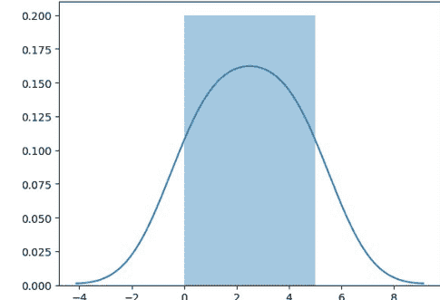

### 安装 Seaborn。

如果你的系统上已经安装了 Python 和 PIP，请使用以下命令安装：

```
C:\Users\Your Name>pip install seaborn
```

如果你使用 Jupyter，请使用以下命令安装 Seaborn：

```
C:\Users\Your Name>!pip install seaborn
```

### Distplots

Distplot 代表分布图，它接受一个数组作为输入，并绘制一条对应于数组中点分布的曲线。

### 导入 Matplotlib

使用以下语句在代码中导入 Matplotlib 模块的 pyplot 对象：

```python
import matplotlib.pyplot as plt
```

### 导入 Seaborn

使用以下语句在代码中导入 Seaborn 模块：

```python
import seaborn as sns
```

### 绘制 Distplot

**示例**

```python
import matplotlib.pyplot as plt
import seaborn as sns
sns.distplot([0, 1, 2, 3, 4, 5])
plt.show()
```

### 不绘制直方图的 Distplot

**示例**

```python
import matplotlib.pyplot as plt
import seaborn as sns
sns.distplot([0, 1, 2, 3, 4, 5], hist=False)
plt.show()
```

注意：在本教程中，我们将使用：sns.distplot(arr, hist=False) 来可视化随机分布。

## 正态（高斯）分布

### 正态分布

正态分布是最重要的分布之一。

它也被称为高斯分布，以德国数学家卡尔·弗里德里希·高斯的名字命名。

它符合许多事件的概率分布，例如智商分数、心跳等。

使用 random.normal() 方法获取正态数据分布。

它有三个参数：loc - （均值）钟形曲线峰值所在的位置。
scale - （标准差）图形分布的平坦程度。
size - 返回数组的形状。

## 示例

生成一个大小为 2x3 的随机正态分布：

```
from numpy import random
x = random.normal(size=(2, 3))
print(x)
```

生成一个大小为 2x3、均值为 1、标准差为 2 的随机正态分布：

```
from numpy import random
x = random.normal(loc=1, scale=2, size=(2, 3))
print(x)
```

### 正态分布可视化

## 示例

```
from numpy import random
import matplotlib.pyplot as plt
import seaborn as sns
sns.distplot(random.normal(size=1000), hist=False)
plt.show()
```

### 结果

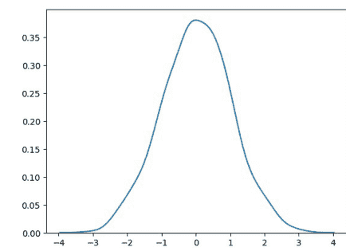

**注意：** 正态分布的曲线也被称为钟形曲线，因其形状像钟。

## 二项分布

二项分布是一种*离散分布*。

它描述了二元场景的结果，例如抛硬币，结果要么是正面，要么是反面。

它有三个参数：

- n - 试验次数。
- p - 每次试验发生的概率（例如，抛硬币时为 0.5）。
- size - 返回数组的形状。

**离散分布：** 分布定义在独立的事件集合上，例如抛硬币的结果是离散的，因为它只能是正面或反面，而人的身高是连续的，因为它可以是 170、170.1、170.11 等等。

## 示例

给定 10 次抛硬币试验，生成 10 个数据点：

```
from numpy import random
x = random.binomial(n=10, p=0.5, size=10)
print(x)
```

## 二项分布可视化

## 示例

```
from numpy import random
import matplotlib.pyplot as plt
import seaborn as sns
sns.distplot(random.binomial(n=10, p=0.5, size=1000), hist=True, kde=False)
plt.show()
```

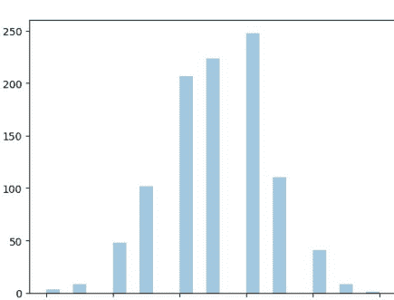

### 结果

## 正态分布与二项分布的区别

主要区别在于正态分布是连续的，而二项分布是离散的，但如果数据点足够多，它将与具有特定 loc 和 scale 的正态分布非常相似。

## 示例

```
from numpy import random
import matplotlib.pyplot as plt
import seaborn as sns

sns.distplot(random.normal(loc=50, scale=5, size=1000), hist=False, label='normal')

sns.distplot(random.binomial(n=100, p=0.5, size=1000), hist=False, label='binomial')

plt.show()
```

### 结果

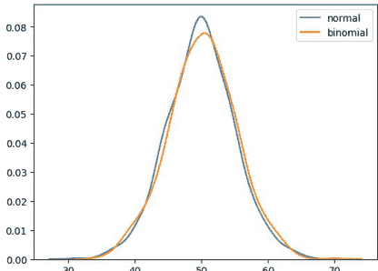

## 泊松分布

泊松分布是一种*离散分布*。
它估计一个事件在指定时间内可能发生多少次。例如，如果某人一天吃两次饭，他吃三次饭的概率是多少？
它有两个参数：
- lam - 速率或已知的发生次数，例如上述问题中的 2。
- size - 返回数组的形状。

## 示例

生成一个发生次数为 2 的随机 1x10 分布：

```
from numpy import random
x = random.poisson(lam=2, size=10)
print(x)
```

## 泊松分布可视化

## 示例

```
from numpy import random
import matplotlib.pyplot as plt
import seaborn as sns
sns.distplot(random.poisson(lam=2, size=1000), kde=False)
plt.show()
```

### 结果

## 正态分布与泊松分布的区别

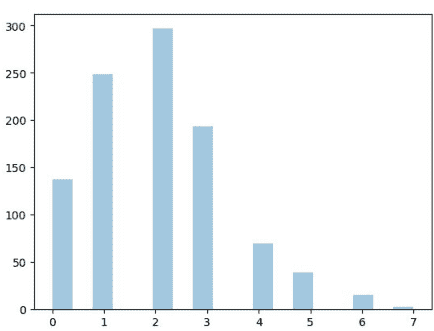

正态分布是连续的，而泊松分布是离散的。
但我们可以看到，与二项分布类似，对于足够大的泊松分布，它将变得与具有特定标准差和均值的正态分布相似。

## 示例

```
from numpy import random
import matplotlib.pyplot as plt
import seaborn as sns

sns.distplot(random.normal(loc=50, scale=7, size=1000), hist=False, label='normal')
sns.distplot(random.poisson(lam=50, size=1000), hist=False, label='poisson')

plt.show()
```

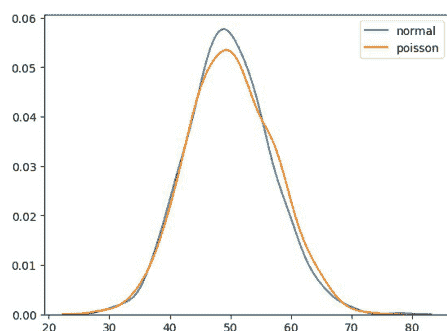

### 结果

## 泊松分布与二项分布的区别

区别非常微妙：二项分布用于离散试验，而泊松分布用于连续试验。

但对于非常大的 n 和接近零的 p，二项分布与泊松分布几乎相同，使得 n * p 近似等于 lam。

## 示例

```
from numpy import random
import matplotlib.pyplot as plt
import seaborn as sns

sns.distplot(random.binomial(n=1000, p=0.01, size=1000), hist=False, label='binomial')
sns.distplot(random.poisson(lam=10, size=1000), hist=False, label='poisson')

plt.show()
```

### 结果

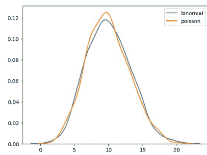

## 均匀分布

用于描述每个事件发生概率相等的概率。

例如，随机数的生成。

它有三个参数：

- a - 下界 - 默认 0.0。
- b - 上界 - 默认 1.0。
- size - 返回数组的形状。

## 示例

创建一个 2x3 的均匀分布样本：

```
from numpy import random
x = random.uniform(size=(2, 3))
print(x)
```

## 均匀分布可视化

## 示例

```
from numpy import random
import matplotlib.pyplot as plt
import seaborn as sns

sns.distplot(random.uniform(size=1000), hist=False)

plt.show()
```

### 结果

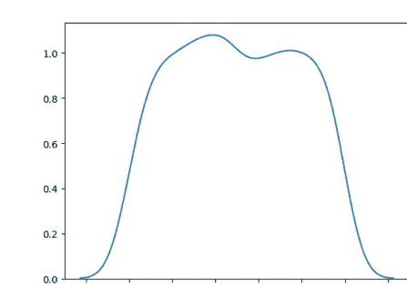

## 逻辑分布

逻辑分布用于描述增长。
在机器学习中广泛应用于逻辑回归、神经网络等。

它有三个参数：
- loc - 均值，峰值所在的位置。默认 0。
- scale - 标准差，分布的平坦程度。默认 1。
- size - 返回数组的形状。

## 示例

从均值为 1、标准差为 2.0 的逻辑分布中抽取 2x3 个样本：

```
from numpy import random

x = random.logistic(loc=1, scale=2, size=(2, 3))

print(x)
```

## 逻辑分布可视化

## 示例

```
from numpy import random

import matplotlib.pyplot as plt

import seaborn as sns

sns.distplot(random.logistic(size=1000), hist=False)

plt.show()
```

### 结果

## 逻辑分布与正态分布的区别

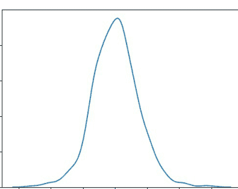

两种分布几乎相同，但逻辑分布在尾部的面积更大。即，它表示事件发生在远离均值处的可能性更大。

对于较大的 scale（标准差）值，正态分布和逻辑分布除了峰值外几乎相同。

## 示例

```
from numpy import random
import matplotlib.pyplot as plt
import seaborn as sns

sns.distplot(random.normal(scale=2, size=1000), hist=False, label='normal')
sns.distplot(random.logistic(size=1000), hist=False, label='logistic')

plt.show()
```

### 结果

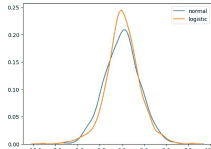

## 多项分布

多项分布是二项分布的推广。
它描述了多项式场景的结果，不像二项分布那样场景必须是两种之一。例如，人群的血型、掷骰子的结果。
它有三个参数：
- n - 可能结果的数量（例如，掷骰子时为 6）。
- pvals - 结果概率列表（例如，掷骰子时为 [1/6, 1/6, 1/6, 1/6, 1/6, 1/6]）。
- size - 返回数组的形状。

## 示例

抽取一个掷骰子的样本：

```
from numpy import random

x = random.multinomial(n=6, pvals=[1/6, 1/6, 1/6, 1/6, 1/6, 1/6])

print(x)
```

**注意：** 多项分布样本不会产生单个值！它们会为每个 pval 产生一个值。

**注意：** 由于它们是二项分布的推广，它们的可视化表示以及与正态分布的相似性与多个二项分布相同。

## 指数分布

指数分布用于描述直到下一个事件发生的时间，例如失败/成功等。

它有两个参数：

- scale - 速率的倒数（参见泊松分布中的 lam）默认为 1.0。
- size - 返回数组的形状。

## 示例

从尺度参数为2.0的指数分布中抽取一个2x3大小的样本：

```python
from numpy import random

x = random.exponential(scale=2, size=(2, 3))
print(x)
```

## 指数分布的可视化

## 示例

```python
from numpy import random
import matplotlib.pyplot as plt
import seaborn as sns
sns.distplot(random.exponential(size=1000), hist=False)
plt.show()
```

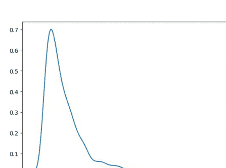

### 结果

## 泊松分布与指数分布的关系

泊松分布处理的是事件在一段时间内发生的次数，而指数分布处理的是这些事件之间的时间间隔。

## 卡方分布

卡方分布被用作假设检验的基础。

它有两个参数：

- df - （自由度）。
- size - 返回数组的形状。

## 示例

从自由度为2的卡方分布中抽取一个2x3大小的样本：

```python
from numpy import random
x = random.chisquare(df=2, size=(2, 3))
print(x)
```

## 卡方分布的可视化

## 示例

```python
from numpy import random
import matplotlib.pyplot as plt
import seaborn as sns
sns.distplot(random.chisquare(df=1, size=1000), hist=False)
plt.show()
```

#### 结果

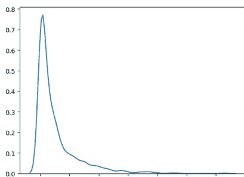

## 瑞利分布

瑞利分布用于信号处理。

它有两个参数：

- scale - （标准差）决定分布的平坦程度（默认为1.0）。
- size - 返回数组的形状。

## 示例

从尺度参数为2的瑞利分布中抽取一个2x3大小的样本：

```python
from numpy import random
x = random.rayleigh(scale=2, size=(2, 3))
print(x)
```

## 瑞利分布的可视化

## 示例

```python
from numpy import random
import matplotlib.pyplot as plt
import seaborn as sns
sns.distplot(random.rayleigh(size=1000), hist=False)
plt.show()
```

#### 结果

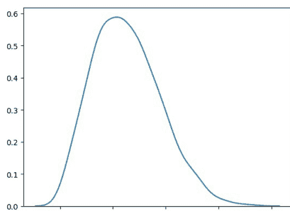

## 瑞利分布与卡方分布的相似性

在单位标准差和2个自由度下，瑞利分布和卡方分布表示相同的分布。

## 帕累托分布

一种遵循帕累托定律的分布，即80-20分布（20%的因素导致80%的结果）。

它有两个参数：

- a - 形状参数。
- size - 返回数组的形状。

## 示例

从形状参数为2的帕累托分布中抽取一个2x3大小的样本：

```python
from numpy import random
x = random.pareto(a=2, size=(2, 3))
print(x)
```

## 帕累托分布的可视化

## 示例

```python
from numpy import random
import matplotlib.pyplot as plt
import seaborn as sns

sns.distplot(random.pareto(a=2, size=1000), kde=False)

plt.show()
```

#### 结果

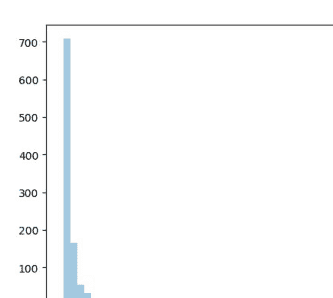

## 齐夫分布

齐夫分布用于根据齐夫定律对数据进行采样。

**齐夫定律：** 在一个集合中，第n常见的项是最常见项的1/n倍。例如，英语中第5常见的单词的出现频率大约是最常用单词的1/5。

它有两个参数：

- a - 分布参数。
- size - 返回数组的形状。

## 示例

从分布参数为2的齐夫分布中抽取一个2x3大小的样本：

```python
from numpy import random

x = random.zipf(a=2, size=(2, 3))

print(x)
```

## 齐夫分布的可视化

采样1000个点，但只绘制值小于10的点，以获得更有意义的图表。

## 示例

```python
from numpy import random
import matplotlib.pyplot as plt
import seaborn as sns

x = random.zipf(a=2, size=1000)
sns.distplot(x[x<10], kde=False)

plt.show()
```

#### 结果

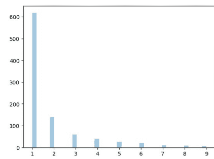

## NumPy ufuncs

## 什么是 ufuncs？

ufuncs 代表“通用函数”，它们是作用于 `ndarray` 对象的 NumPy 函数。

## 为什么使用 ufuncs？

ufuncs 用于在 NumPy 中实现 *向量化*，这比遍历元素快得多。

它们还提供了广播以及 reduce、accumulate 等附加方法，这些方法对计算非常有帮助。

ufuncs 还接受额外的参数，例如：

- where 布尔数组或条件，用于定义操作应在何处发生。
- dtype 定义元素的返回类型。
- out 输出数组，返回值应被复制到其中。

## 什么是向量化？

将迭代语句转换为基于向量的操作称为向量化。

它更快，因为现代 CPU 针对此类操作进行了优化。

## 将两个列表的元素相加

列表 1: [1, 2, 3, 4]
列表 2: [4, 5, 6, 7]

一种方法是遍历两个列表，然后将每个元素相加。

## 示例

不使用 ufunc，我们可以使用 Python 内置的 `zip()` 方法：

```python
x = [1, 2, 3, 4]
y = [4, 5, 6, 7]
z = []

for i, j in zip(x, y):
    z.append(i + j)
print(z)
```

NumPy 有一个用于此操作的 ufunc，称为 `add(x, y)`，它将产生相同的结果。

## 示例

使用 ufunc，我们可以使用 `add()` 函数：

```python
import numpy as np

x = [1, 2, 3, 4]
y = [4, 5, 6, 7]
z = np.add(x, y)

print(z)
```

## 创建你自己的 ufunc

### 如何创建你自己的 ufunc

要创建你自己的 ufunc，你必须定义一个函数，就像在 Python 中定义普通函数一样，然后使用 `frompyfunc()` 方法将其添加到你的 NumPy ufunc 库中。

`frompyfunc()` 方法接受以下参数：

1. *function* - 函数的名称。
2. *inputs* - 输入参数（数组）的数量。
3. *outputs* - 输出数组的数量。

## 示例

创建你自己的用于加法的 ufunc：

```python
import numpy as np

def myadd(x, y):
  return x+y

myadd = np.frompyfunc(myadd, 2, 1)

print(myadd([1, 2, 3, 4], [5, 6, 7, 8]))
```

## 检查函数是否为 ufunc

检查函数的 *类型* 以确定它是否为 ufunc。

ufunc 应返回 `<class 'numpy.ufunc'>`。

## 示例

检查函数是否为 ufunc：

```python
import numpy as np

print(type(np.add))
```

如果不是 ufunc，它将返回另一种类型，例如这个用于连接两个或多个数组的内置 NumPy 函数：

## 示例

检查另一个函数 `concatenate()` 的类型：

```python
import numpy as np
print(type(np.concatenate))
```

如果函数根本无法识别，它将返回一个错误：

## 示例

检查不存在的内容的类型。这将产生一个错误：

```python
import numpy as np
print(type(np.blahblah))
```

要在 if 语句中测试函数是否为 ufunc，请使用 `numpy.ufunc` 值（如果你使用 `np` 作为 `numpy` 的别名，则使用 `np.ufunc`）：

## 示例

使用 if 语句检查函数是否为 ufunc：

```python
import numpy as np
if type(np.add) == np.ufunc:
    print('add is ufunc')
else:
    print('add is not ufunc')
```

## 简单算术

你可以直接在 NumPy 数组之间使用算术运算符 `+` `-` `*` `/`，但本节讨论的是其扩展，其中我们有可以接受任何类数组对象（例如列表、元组等）并*有条件地*执行算术运算的函数。

**有条件地算术运算：** 意味着我们可以定义算术运算应发生的条件。

所有讨论的算术函数都接受一个 `where` 参数，我们可以在其中指定该条件。

## 加法

`add()` 函数将两个数组的内容相加，并将结果返回到一个新数组中。

**示例**

将 `arr1` 中的值与 `arr2` 中的值相加：

```python
import numpy as np

arr1 = np.array([10, 11, 12, 13, 14, 15])
arr2 = np.array([20, 21, 22, 23, 24, 25])

newarr = np.add(arr1, arr2)

print(newarr)
```

上面的示例将返回 `[30 32 34 36 38 40]`，这是 10+20、11+21、12+22 等的和。

## 减法

`subtract()` 函数从一个数组的值中减去另一个数组的值，并将结果返回到一个新数组中。

**示例**

从 `arr1` 的值中减去 `arr2` 的值：

```python
import numpy as np

arr1 = np.array([10, 20, 30, 40, 50, 60])
arr2 = np.array([20, 21, 22, 23, 24, 25])

newarr = np.subtract(arr1, arr2)

print(newarr)
```

上面的示例将返回 `[-10 -1 8 17 26 35]`，这是 10-20、20-21、30-22 等的结果。

## 乘法

`multiply()` 函数将一个数组的值与另一个数组的值相乘，并将结果返回到一个新数组中。

## 示例

将 `arr1` 中的值与 `arr2` 中的值相乘：

```python
import numpy as np

arr1 = np.array([10, 20, 30, 40, 50, 60])
arr2 = np.array([20, 21, 22, 23, 24, 25])

newarr = np.multiply(arr1, arr2)

print(newarr)
```

上面的示例将返回 `[200 420 660 920 1200 1500]`，这是 10*20、20*21、30*22 等的结果。

## 除法

`divide()` 函数将一个数组的值除以另一个数组的值，并将结果返回到一个新数组中。

## 示例

将 `arr1` 中的值除以 `arr2` 中的值：

```python
import numpy as np

arr1 = np.array([10, 20, 30, 40, 50, 60])
arr2 = np.array([3, 5, 10, 8, 2, 33])

newarr = np.divide(arr1, arr2)

print(newarr)
```

上面的示例将返回 `[3.33333333 4. 3. 5. 25. 1.81818182]`，这是 10/3、20/5、30/10 等的结果。

## 幂运算

`power()` 函数将第一个数组的值提升到第二个数组的值的幂，并将结果返回到一个新数组中。

## 示例

将 `arr1` 中的值提升到 `arr2` 中的值的幂：

```python
import numpy as np

arr1 = np.array([10, 20, 30, 40, 50, 60])
arr2 = np.array([3, 5, 6, 8, 2, 33])

newarr = np.power(arr1, arr2)

print(newarr)
```

上面的示例将返回 `[1000 3200000 729000000 6553600000000 2500 0]`，这是 10*10*10、20*20*20*20*20、30*30*30*30*30*30 等的结果。

## 取余

`mod()` 和 `remainder()` 函数都返回第一个数组中的值除以第二个数组中的值的余数，并将结果返回到一个新数组中。

## 示例

返回余数：

```python
import numpy as np

arr1 = np.array([10, 20, 30, 40, 50, 60])
arr2 = np.array([3, 7, 9, 8, 2, 33])

newarr = np.mod(arr1, arr2)

print(newarr)
```

上面的示例将返回 `[1 6 3 0 0 27]`，这是 10 除以 3 (10%3)、20 除以 7 (20%7)、30 除以 9 (30%9) 等的余数。

使用 `remainder()` 函数会得到相同的结果：

## 示例

返回余数：

```python
import numpy as np

arr1 = np.array([10, 20, 30, 40, 50, 60])
arr2 = np.array([3, 7, 9, 8, 2, 33])

newarr = np.remainder(arr1, arr2)

print(newarr)
```

## 商和余数

`divmod()` 函数同时返回商和余数。返回值是两个数组，第一个数组包含商，第二个数组包含余数。

## 示例

返回商和余数：

```python
import numpy as np

arr1 = np.array([10, 20, 30, 40, 50, 60])
arr2 = np.array([3, 7, 9, 8, 2, 33])

newarr = np.divmod(arr1, arr2)

print(newarr)
```

上面的示例将返回：
(array([3, 2, 3, 5, 25, 1]), array([1, 6, 3, 0, 0, 27]))
第一个数组代表商（即 10 除以 3、20 除以 7、30 除以 9 等的整数值）。
第二个数组代表相同除法的余数。

## 绝对值

`absolute()` 和 `abs()` 函数执行相同的逐元素绝对值运算，但应使用 `absolute()` 以避免与 Python 内置的 `math.abs()` 混淆。

## 示例

返回绝对值：

```python
import numpy as np

arr = np.array([-1, -2, 1, 2, 3, -4])

newarr = np.absolute(arr)

print(newarr)
```

上面的示例将返回 `[1 2 1 2 3 4]`。

## 四舍五入小数

在 NumPy 中，主要有五种四舍五入小数的方法：

-   截断
-   修正
-   四舍五入
-   向下取整
-   向上取整

## 截断

移除小数部分，并返回最接近零的浮点数。使用 `trunc()` 和 `fix()` 函数。

## 示例

截断以下数组的元素：

```python
import numpy as np

arr = np.trunc([-3.1666, 3.6667])

print(arr)
```

## 示例

相同的示例，使用 `fix()`：

```python
import numpy as np

arr = np.fix([-3.1666, 3.6667])
print(arr)
```

## 四舍五入

`around()` 函数在前一位数字或小数大于等于 5 时加 1，否则不变。

例如，四舍五入到 1 位小数，3.16666 变为 3.2。

**示例**
将 3.1666 四舍五入到 2 位小数：

```python
import numpy as np

arr = np.around(3.1666, 2)

print(arr)
```

## 向下取整

`floor()` 函数将小数四舍五入到最接近的较小整数。

例如，3.166 的向下取整是 3。

**示例**
对以下数组的元素进行向下取整：

```python
import numpy as np

arr = np.floor([-3.1666, 3.6667])

print(arr)
```

**注意：** `floor()` 函数返回浮点数，这与返回整数的 `trunc()` 函数不同。

## 向上取整

`ceil()` 函数将小数四舍五入到最接近的较大整数。

例如，3.166 的向上取整是 4。

## 示例

对以下数组的元素进行向上取整：

```python
import numpy as np

arr = np.ceil([-3.1666, 3.6667])

print(arr)
```

## NumPy 对数

## 对数

NumPy 提供了以 2、e 和 10 为底执行对数运算的函数。
我们还将探索如何通过创建自定义 ufunc 来计算任意底数的对数。
如果无法计算对数，所有对数函数都会在元素中放置 `-inf` 或 `inf`。

## 以 2 为底的对数

使用 `log2()` 函数执行以 2 为底的对数运算。

## 示例

计算以下数组所有元素的以 2 为底的对数：

```python
import numpy as np

arr = np.arange(1, 10)

print(np.log2(arr))
```

**注意：** `range(1, 10)` 函数返回一个从 1（包含）到 10（不包含）的整数数组。

## 以 10 为底的对数

使用 `log10()` 函数执行以 10 为底的对数运算。

## 示例

计算以下数组所有元素的以 10 为底的对数：

```python
import numpy as np

arr = np.arange(1, 10)

print(np.log10(arr))
```

## 自然对数，或以 e 为底的对数

使用 `log()` 函数执行以 e 为底的对数运算。

## 示例

计算以下数组所有元素的以 e 为底的对数：

```python
import numpy as np

arr = np.arange(1, 10)

print(np.log(arr))
```

## 以任意底数为底的对数

NumPy 没有提供计算任意底数对数的函数，因此我们可以使用 `frompyfunc()` 函数以及内置函数 `math.log()`，该函数有两个输入参数和一个输出参数：

## 示例

```python
from math import log
import numpy as np

nplog = np.frompyfunc(log, 2, 1)

print(nplog(100, 15))
```

## NumPy 求和

## 求和

求和与加法有什么区别？

加法是在两个参数之间进行的，而求和是在 n 个元素上进行的。

**示例**

将 `arr1` 中的值加到 `arr2` 中的值：

```python
import numpy as np

arr1 = np.array([1, 2, 3])
arr2 = np.array([1, 2, 3])

newarr = np.add(arr1, arr2)

print(newarr)
```

**返回：** `[2 4 6]`

**示例**

对 `arr1` 和 `arr2` 中的值求和：

```python
import numpy as np

arr1 = np.array([1, 2, 3])
arr2 = np.array([1, 2, 3])

newarr = np.sum([arr1, arr2])

print(newarr)
```

**返回：** `12`

## 沿轴求和

如果指定 `axis=1`，NumPy 将对每个数组中的数字求和。

**示例**

在以下数组中沿第一个轴执行求和：

```python
import numpy as np

arr1 = np.array([1, 2, 3])
arr2 = np.array([1, 2, 3])

newarr = np.sum([arr1, arr2], axis=1)

print(newarr)
Returns: [6 6]
```

## 累积和

累积和意味着部分地对数组中的元素求和。
例如，`[1, 2, 3, 4]` 的部分和将是 `[1, 1+2, 1+2+3, 1+2+3+4] = [1, 3, 6, 10]`。
使用 `cumsum()` 函数执行部分求和。

**示例**
在以下数组中执行累积求和：

```python
import numpy as np

arr = np.array([1, 2, 3])

newarr = np.cumsum(arr)

print(newarr)
Returns: [1 3 6]
```

## NumPy 积

## 积

要查找数组中元素的乘积，请使用 `prod()` 函数。

**示例**
查找此数组元素的乘积：

```python
import numpy as np
arr = np.array([1, 2, 3, 4])
x = np.prod(arr)
print(x)
```

返回：24，因为 1*2*3*4 = 24

## 示例

查找两个数组元素的乘积：

```python
import numpy as np
arr1 = np.array([1, 2, 3, 4])
arr2 = np.array([5, 6, 7, 8])
x = np.prod([arr1, arr2])
print(x)
```

返回：40320，因为 1*2*3*4*5*6*7*8 = 40320

## 沿轴求积

如果指定 `axis=1`，NumPy 将返回每个数组的乘积。

## 示例

在以下数组中沿第一个轴执行求积：

```python
import numpy as np
arr1 = np.array([1, 2, 3, 4])
arr2 = np.array([5, 6, 7, 8])
newarr = np.prod([arr1, arr2], axis=1)
print(newarr)
```

返回：`[24 1680]`

## 累积积

累积乘积是指进行部分乘积运算。
例如，[1, 2, 3, 4] 的部分乘积为 [1, 1*2, 1*2*3, 1*2*3*4] = [1, 2, 6, 24]。
使用 `cumprod()` 函数执行部分乘积运算。

**示例**
计算以下数组所有元素的累积乘积：

```
import numpy as np
arr = np.array([5, 6, 7, 8])
newarr = np.cumprod(arr)
print(newarr)
```

**返回：** [5 30 210 1680]

## NumPy 差异

## 差异

离散差分是指连续两个元素相减。
例如，对于 [1, 2, 3, 4]，离散差分为 [2-1, 3-2, 4-3] = [1, 1, 1]。
要计算离散差分，请使用 `diff()` 函数。

**示例**
计算以下数组的离散差分：

```
import numpy as np
arr = np.array([10, 15, 25, 5])
newarr = np.diff(arr)
print(newarr)
```

**返回：** [5 10 -20]，因为 15-10=5，25-15=10，5-25=-20。
我们可以通过提供参数 `n` 来重复执行此操作。

例如，对于 [1, 2, 3, 4]，当 `n = 2` 时，离散差分为 [2-1, 3-2, 4-3] = [1, 1, 1]，然后，由于 `n=2`，我们将再执行一次，得到新结果：[1-1, 1-1] = [0, 0]。

**示例**
计算以下数组的离散差分两次：

```
import numpy as np

arr = np.array([10, 15, 25, 5])

newarr = np.diff(arr, n=2)

print(newarr)
```

**返回：** [5 -30]，因为：15-10=5，25-15=10，5-25=-20 以及 10-5=5，-20-10=-30。

## NumPy LCM 最小公倍数

## 求最小公倍数 (LCM)

最小公倍数是两个数的最小公倍数。

**示例**
求以下两个数的最小公倍数：

```
import numpy as np

num1 = 4

num2 = 6

x = np.lcm(num1, num2)

print(x)
```

**返回：** 12，因为这是两个数的最小公倍数（4*3=12 且 6*2=12）。

## 在数组中求最小公倍数

要计算数组中所有值的最小公倍数，可以使用 `reduce()` 方法。

`reduce()` 方法将对每个元素使用 ufunc（本例中为 `lcm()` 函数），并将数组维度减少一维。

**示例**
计算以下数组中所有值的最小公倍数：

```
import numpy as np

arr = np.array([3, 6, 9])

x = np.lcm.reduce(arr)

print(x)
```

**返回：** 18，因为这是所有三个数的最小公倍数（3*6=18，6*3=18 且 9*2=18）。

**示例**
计算一个包含从 1 到 10 所有整数的数组中所有值的最小公倍数：

```
import numpy as np

arr = np.arange(1, 11)

x = np.lcm.reduce(arr)

print(x)
```

## NumPy GCD 最大公约数

## 求最大公约数 (GCD)

最大公约数 (GCD)，也称为最高公因数 (HCF)，是能同时整除两个数的最大数字。

**示例**
求以下两个数的最大公约数：

```
import numpy as np

num1 = 6
num2 = 9

x = np.gcd(num1, num2)

print(x)
```

**返回：** 3，因为这是两个数都能被整除的最大数字（6/3=2 且 9/3=3）。

## 在数组中求最大公约数

要计算数组中所有值的最高公因数，可以使用 `reduce()` 方法。

`reduce()` 方法将对每个元素使用 ufunc（本例中为 `gcd()` 函数），并将数组维度减少一维。

**示例**
计算以下数组中所有数字的最大公约数：

```
import numpy as np

arr = np.array([20, 8, 32, 36, 16])

x = np.gcd.reduce(arr)

print(x)
```

**返回：** 4，因为这是所有值都能被整除的最大数字。

## NumPy 三角函数

## 三角函数

NumPy 提供了 ufuncs `sin()`、`cos()` 和 `tan()`，它们接受弧度值并生成相应的 sin、cos 和 tan 值。

**示例**
求 PI/2 的正弦值：

```
import numpy as np
x = np.sin(np.pi/2)
print(x)
```

**示例**
求 `arr` 中所有值的正弦值：

```
import numpy as np
arr = np.array([np.pi/2, np.pi/3, np.pi/4, np.pi/5])
x = np.sin(arr)
print(x)
```

## 将角度转换为弧度

默认情况下，所有三角函数都接受弧度作为参数，但我们也可以在 NumPy 中将弧度转换为角度，反之亦然。

**注意：** 弧度值 = pi/180 * 角度值。

**示例**
将以下数组 `arr` 中的所有值转换为弧度：

```
import numpy as np
arr = np.array([90, 180, 270, 360])
x = np.deg2rad(arr)
print(x)
```

## 弧度转角度

**示例**
将以下数组 `arr` 中的所有值转换为角度：

```
import numpy as np
arr = np.array([np.pi/2, np.pi, 1.5*np.pi, 2*np.pi])
x = np.rad2deg(arr)
print(x)
```

## 求角度

根据正弦、余弦、正切值求角度。例如，反正弦、反余弦、反正切。

NumPy 提供了 ufuncs `arcsin()`、`arccos()` 和 `arctan()`，它们根据给定的 sin、cos 和 tan 值生成弧度值。

**示例**
求 1.0 的角度：

```
import numpy as np
x = np.arcsin(1.0)
print(x)
```

## 求数组中每个值的角度

**示例**
求数组中所有正弦值的角度：

```
import numpy as np
arr = np.array([1, -1, 0.1])
x = np.arcsin(arr)
print(x)
```

## 斜边

在 NumPy 中使用勾股定理求斜边。

NumPy 提供了 `hypot()` 函数，它接受底边和高的值，并根据勾股定理生成斜边。

**示例**
求底边为 4，高为 3 的斜边：

```
import numpy as np

base = 3

perp = 4

x = np.hypot(base, perp)

print(x)
```

## NumPy 双曲函数

NumPy 提供了 ufuncs `sinh()`、`cosh()` 和 `tanh()`，它们接受弧度值并生成相应的 sinh、cosh 和 tanh 值。

**示例**
求 PI/2 的双曲正弦值：

```
import numpy as np

x = np.sinh(np.pi/2)

print(x)
```

**示例**
求 `arr` 中所有值的双曲余弦值：

```
import numpy as np

arr = np.array([np.pi/2, np.pi/3, np.pi/4, np.pi/5])

x = np.cosh(arr)

print(x)
```

## 求角度

根据双曲正弦、余弦、正切值求角度。例如，反双曲正弦、反双曲余弦、反双曲正切。

NumPy 提供了 ufuncs `arcsinh()`、`arccosh()` 和 `arctanh()`，它们根据给定的 sinh、cosh 和 tanh 值生成弧度值。

**示例**
求 1.0 的角度：

```
import numpy as np

x = np.arcsinh(1.0)

print(x)
```

## 求数组中每个值的角度

**示例**
求数组中所有 tanh 值的角度：

```
import numpy as np

arr = np.array([0.1, 0.2, 0.5])

x = np.arctanh(arr)

print(x)
```

## NumPy 集合操作

## 什么是集合

数学中的集合是唯一元素的集合。

集合用于涉及频繁交集、并集和差集运算的操作。

## 在 NumPy 中创建集合

我们可以使用 NumPy 的 `unique()` 方法从任何数组中查找唯一元素。例如，创建一个集合数组，但请记住集合数组应仅为一维数组。

**示例**
将以下包含重复元素的数组转换为集合：

```
import numpy as np
arr = np.array([1, 1, 1, 2, 3, 4, 5, 5, 6, 7])
x = np.unique(arr)
print(x)
```

## 求并集

要查找两个数组的唯一值，请使用 `union1d()` 方法。

**示例**
求以下两个集合数组的并集：

```
import numpy as np
arr1 = np.array([1, 2, 3, 4])
arr2 = np.array([3, 4, 5, 6])
newarr = np.union1d(arr1, arr2)
print(newarr)
```

## 求交集

要查找仅存在于两个数组中的值，请使用 `intersect1d()` 方法。

**示例**
求以下两个集合数组的交集：

```
import numpy as np
arr1 = np.array([1, 2, 3, 4])
arr2 = np.array([3, 4, 5, 6])
newarr = np.intersect1d(arr1, arr2, assume_unique=True)
print(newarr)
```

注意：`intersect1d()` 方法接受一个可选参数 `assume_unique`，如果设置为 `True`，可以加快计算速度。在处理集合时，应始终将其设置为 `True`。

## 求差集

要查找仅存在于第一个集合中而不在第二个集合中的值，请使用 `setdiff1d()` 方法。

**示例**
求 set1 相对于 set2 的差集：

```
import numpy as np
set1 = np.array([1, 2, 3, 4])
set2 = np.array([3, 4, 5, 6])
newarr = np.setdiff1d(set1, set2, assume_unique=True)
print(newarr)
```

注意：`setdiff1d()` 方法接受一个可选参数 `assume_unique`，如果设置为 `True`，可以加快计算速度。在处理集合时，应始终将其设置为 `True`。

## 求对称差集

要查找仅存在于其中一个集合中而不在两个集合中都存在的值，请使用 `setxor1d()` 方法。

**示例**
求 set1 和 set2 的对称差集：

```
import numpy as np
set1 = np.array([1, 2, 3, 4])
set2 = np.array([3, 4, 5, 6])
```

# 41. Pandas 教程

Pandas 是一个 Python 库。
Pandas 用于分析数据。

## 通过阅读学习

我们为你创建了 14 个教程页面，以便你更深入地了解 Pandas。
从基础介绍开始，最后讲解数据清理和绘图：

## 基础

- 简介
- 入门
- Pandas Series
- DataFrames
- 读取 CSV
- 读取 JSON
- 分析数据

## 数据清理

- 清理数据
- 清理空单元格
- 清理错误格式
- 清理错误数据
- 删除重复项

## 高级

- 相关性
- 绘图

## Pandas 简介

## 什么是 Pandas？

Pandas 是一个用于处理数据集的 Python 库。

它提供了用于分析、清理、探索和操作数据的函数。

“Pandas”这个名字既指“面板数据”，也指“Python 数据分析”，由 Wes McKinney 于 2008 年创建。

## 为什么使用 Pandas？

Pandas 允许我们分析大数据，并基于统计理论得出结论。

Pandas 可以清理混乱的数据集，使其变得可读且相关。

相关数据在数据科学中非常重要。

**数据科学：** 是计算机科学的一个分支，我们研究如何存储、使用和分析数据以从中提取信息。

## Pandas 能做什么？

Pandas 可以回答关于数据的问题。例如：

- 两个或多个列之间是否存在相关性？
- 平均值是多少？
- 最大值？
- 最小值？

Pandas 还能删除不相关或包含错误值（如空值或 NULL 值）的行。这被称为*清理*数据。

## Pandas 的代码库在哪里？

Pandas 的源代码位于此 GitHub 仓库 [https://github.com/pandas-dev/pandas](https://github.com/pandas-dev/pandas)

**GitHub：** 使许多人能够在同一个代码库上工作。

## Pandas 入门

## 安装 Pandas

如果你的系统上已经安装了 Python 和 PIP，那么安装 Pandas 非常容易。

使用此命令安装：

```
C:\Users\Your Name>pip install pandas
```

如果此命令失败，请使用已预装 Pandas 的 Python 发行版，如 Anaconda、Spyder 等。

## 导入 Pandas

安装 Pandas 后，通过添加 import 关键字在你的应用程序中导入它：

```
import pandas
```

现在 Pandas 已导入并准备就绪。

**示例**

```
import pandas

mydataset = {
  'cars': ["BMW", "Volvo", "Ford"],
  'passings': [3, 7, 2]
}
myvar = pandas.DataFrame(mydataset)
print(myvar)
```

## Pandas 作为 pd

Pandas 通常以 pd 别名导入。
**别名：** 在 Python 中，别名是用于引用同一事物的替代名称。
在导入时使用 as 关键字创建别名：

```
import pandas as pd
```

现在 Pandas 包可以被称为 pd 而不是 pandas。

**示例**

```
import pandas as pd
mydataset = {
  'cars': ["BMW", "Volvo", "Ford"],
  'passings': [3, 7, 2]
}
myvar = pd.DataFrame(mydataset)
print(myvar)
```

## 检查 Pandas 版本

版本字符串存储在 `__version__` 属性下。

**示例**

```
import pandas as pd
print(pd.__version__)
```

## Pandas Series

## 什么是 Series？

Pandas Series 就像表格中的一列。
它是一个一维数组，可以保存任何类型的数据。

## 示例

从列表创建一个简单的 Pandas Series：

```
import pandas as pd

a = [1, 7, 2]

myvar = pd.Series(a)

print(myvar)
```

## 标签

如果未指定其他内容，值将用其索引号标记。
第一个值的索引为 0，第二个值的索引为 1，依此类推。

此标签可用于访问指定的值。

## 示例

返回 Series 的第一个值：

```
print(myvar[0])
```

## 创建标签

使用 `index` 参数，你可以命名自己的标签。

## 示例

创建你自己的标签：

```
import pandas as pd

a = [1, 7, 2]

myvar = pd.Series(a, index = ["x", "y", "z"])

print(myvar)
```

创建标签后，你可以通过引用标签来访问项目。

## 示例

返回 "y" 的值：

```
print(myvar["y"])
```

## 键/值对象作为 Series

创建 Series 时，你也可以使用键/值对象，例如字典。

## 示例

从字典创建一个简单的 Pandas Series：

```
import pandas as pd

calories = {"day1": 420, "day2": 380, "day3": 390}

myvar = pd.Series(calories)

print(myvar)
```

**注意：** 字典的键成为标签。

要仅选择字典中的某些项目，请使用 `index` 参数并仅指定要包含在 Series 中的项目。

## 示例

仅使用 "day1" 和 "day2" 的数据创建 Series：

```
import pandas as pd

calories = {"day1": 420, "day2": 380, "day3": 390}

myvar = pd.Series(calories, index = ["day1", "day2"])

print(myvar)
```

## DataFrames

Pandas 中的数据集通常是多维表，称为 DataFrames。
Series 像一列，DataFrame 是整个表。

**示例**
从两个 Series 创建 DataFrame：

```
import pandas as pd

data = {
    "calories": [420, 380, 390],
    "duration": [50, 40, 45]
}

myvar = pd.DataFrame(data)

print(myvar)
```

## Pandas DataFrames

## 什么是 DataFrame？

Pandas DataFrame 是一个二维数据结构，类似于二维数组，或具有行和列的表。

## 示例

创建一个简单的 Pandas DataFrame：

```
import pandas as pd

data = {
    "calories": [420, 380, 390],
    "duration": [50, 40, 45]
}

#load data into a DataFrame object:

df = pd.DataFrame(data)

print(df)
```

### 结果

```
calories  420
duration  50
Name: 0, dtype: int64
```

## 定位行

从上面的结果可以看出，DataFrame 就像一个具有行和列的表。

Pandas 使用 `loc` 属性返回一个或多个指定的行。

## 示例

返回第 0 行：

```
#refer to the row index:

print(df.loc[0])
```

### 结果

| | calories | duration |
|---|---|---|
| 0 | 420 | 50 |
| 1 | 380 | 40 |

**注意：** 此示例返回一个 Pandas **Series**。

## 示例

返回第 0 行和第 1 行：

```
#use a list of indexes:
print(df.loc[[0, 1]])
```

### 结果

| | calories | duration |
|---|---|---|
| day1 | 420 | 50 |
| day2 | 380 | 40 |
| day3 | 390 | 45 |

**注意：** 使用 `[]` 时，结果是一个 Pandas **DataFrame**。

## 定位命名索引

在 `loc` 属性中使用命名索引返回指定的行。

## 示例

返回 "day2"：

```
#refer to the named index:
print(df.loc["day2"])
```

### 结果

```
calories 380
duration 40
Name: 0, dtype: int64
```

## 将文件加载到 DataFrame 中

如果你的数据集存储在文件中，Pandas 可以将它们加载到 DataFrame 中。

**示例**
将逗号分隔文件（CSV 文件）加载到 DataFrame 中：

```
import pandas as pd
df = pd.read_csv('data.csv')
print(df)
```

## Pandas 读取 CSV

## 读取 CSV 文件

存储大数据集的一种简单方法是使用 CSV 文件（逗号分隔文件）。
CSV 文件包含纯文本，是一种众所周知的格式，包括 Pandas 在内的每个人都可以读取。
在我们的示例中，我们将使用一个名为 'data.csv' 的 CSV 文件。
**下载 data.csv。** 或 **打开 data.csv**

**示例**
将 CSV 加载到 DataFrame 中：

```
import pandas as pd

df = pd.read_csv('data.csv')
print(df.to_string())
```

**提示：** 使用 `to_string()` 打印整个 DataFrame。

默认情况下，当你打印 DataFrame 时，你只会得到前 5 行和最后 5 行：

**示例**

打印缩减的样本：

```
import pandas as pd
df = pd.read_csv('data.csv')
print(df)
```

## Pandas 读取 JSON

## 读取 JSON

大数据集通常存储或提取为 JSON。
JSON 是纯文本，但具有对象格式，在编程世界（包括 Pandas）中广为人知。
在我们的示例中，我们将使用一个名为 'data.json' 的 JSON 文件。
打开 data.json。

**示例**

将 JSON 文件加载到 DataFrame 中：

```
import pandas as pd
df = pd.read_json('data.json')
print(df.to_string())
```

**提示：** 使用 `to_string()` 打印整个 DataFrame。

## 字典作为 JSON

**JSON = Python 字典**

JSON 对象与 Python 字典具有相同的格式。
如果你的 JSON 代码不在文件中，而是在 Python 字典中，你可以加载它

## Pandas - 分析数据框

## 查看数据

获取数据框快速概览最常用的方法之一是 `head()` 方法。

`head()` 方法从顶部开始返回表头和指定数量的行。

**示例**

通过打印数据框的前 10 行来获取快速概览：

```python
import pandas as pd
df = pd.read_csv('data.csv')
print(df.head(10))
```

在我们的示例中，我们将使用一个名为 'data.csv' 的 CSV 文件。

下载 data.csv，或在浏览器中打开 data.csv。

**注意：** 如果未指定行数，`head()` 方法将返回前 5 行。

**示例**

打印数据框的前 5 行：

```python
import pandas as pd

df = pd.read_csv('data.csv')

print(df.head())
```

还有一个 `tail()` 方法用于查看数据框的*最后*几行。
`tail()` 方法从底部开始返回表头和指定数量的行。

**示例**

打印数据框的最后 5 行：

```python
print(df.tail())
```

## 关于数据的信息

数据框对象有一个名为 `info()` 的方法，它能提供关于数据集的更多信息。

**示例**

打印关于数据的信息：

```python
print(df.info())
```

**结果**

```
<class 'pandas.core.frame.DataFrame'>
RangeIndex: 169 entries, 0 to 168
Data columns (total 4 columns):
 #   Column            Non-Null Count  Dtype 
---  ------            --------------  ----- 
 0   Duration          169 non-null    int64 
 1   Pulse             169 non-null    int64 
 2   Maxpulse          169 non-null    int64 
 3   Calories          164 non-null    float64
dtypes: float64(1), int64(3)
memory usage: 5.4 KB
None
```

**结果解释**

结果告诉我们有 169 行和 4 列：

```
RangeIndex: 169 entries, 0 to 168
Data columns (total 4 columns):
```

以及每列的名称和数据类型：

```
# Column            Non-Null Count  Dtype 
--- ------            --------------  ----- 
 0   Duration          169 non-null    int64 
 1   Pulse             169 non-null    int64 
 2   Maxpulse          169 non-null    int64 
 3   Calories          164 non-null    float64
```

## 空值

`info()` 方法还告诉我们每列有多少个非空值，在我们的数据集中，"Calories" 列似乎有 164 个非空值（共 169 个）。

这意味着 "Calories" 列中有 5 行完全没有值，无论出于什么原因。

空值或空值在分析数据时可能是个问题，你应该考虑删除包含空值的行。这是迈向所谓数据清洗的一步。

## Pandas - 数据清洗

数据清洗意味着修复数据集中的错误数据。

错误数据可能是：

-   空单元格
-   格式错误的数据
-   错误的数据
-   重复项

在本教程中，你将学习如何处理所有这些问题。

## 我们的数据集

在接下来的章节中，我们将使用这个数据集：

| Duration | Date | Pulse | Max Pulse | Calories |
|---|---|---|---|---|
| 0 | 60 | '2020/12/01' | 110 | 130 | 409.1 |
| 1 | 60 | '2020/12/02' | 117 | 145 | 479.0 |
| 2 | 60 | '2020/12/03' | 103 | 135 | 340.0 |
| 3 | 45 | '2020/12/04' | 109 | 175 | 282.4 |
| 4 | 45 | '2020/12/05' | 117 | 148 | 406.0 |
| 5 | 60 | '2020/12/06' | 102 | 127 | 300.0 |
| 6 | 60 | '2020/12/07' | 110 | 136 | 374.0 |
| 7 | 450 | '2020/12/08' | 104 | 134 | 253.3 |
| 8 | 30 | '2020/12/09' | 109 | 133 | 195.1 |
| 9 | 60 | '2020/12/10' | 98 | 124 | 269.0 |
| 10 | 60 | '2020/12/11' | 103 | 147 | 329.3 |
| 11 | 60 | '2020/12/12' | 100 | 120 | 250.7 |
| 12 | 60 | '2020/12/12' | 100 | 120 | 250.7 |
| 13 | 60 | '2020/12/13' | 106 | 128 | 345.3 |
| 14 | 60 | '2020/12/14' | 104 | 132 | 379.3 |
| 15 | 60 | '2020/12/15' | 98 | 123 | 275.0 |
| 16 | 60 | '2020/12/16' | 98 | 120 | 215.2 |
| 17 | 60 | '2020/12/17' | 100 | 120 | 300.0 |
| 18 | 45 | '2020/12/18' | 90 | 112 | NaN |
| 19 | 60 | '2020/12/19' | 103 | 123 | 323.0 |
| 20 | 45 | '2020/12/20' | 97 | 125 | 243.0 |
| 21 | 60 | '2020/12/21' | 108 | 131 | 364.2 |
| 22 | 45 | NaN | 100 | 119 | 282.0 |
| 23 | 60 | '2020/12/23' | 130 | 101 | 300.0 |
| 24 | 45 | '2020/12/24' | 105 | 132 | 246.0 |
| 25 | 60 | '2020/12/25' | 102 | 126 | 334.5 |
| 26 | 60 | 2020/12/26 | 100 | 120 | 250.0 |
| 27 | 60 | '2020/12/27' | 92 | 118 | 241.0 |
| 28 | 60 | '2020/12/28' | 103 | 132 | NaN |
| 29 | 60 | '2020/12/29' | 100 | 132 | 280.0 |
| 30 | 60 | '2020/12/30' | 102 | 129 | 380.3 |
| 31 | 60 | '2020/12/31' | 92 | 115 | |

该数据集包含一些空单元格（第 22 行的 "Date"，以及第 18 和 28 行的 "Calories"）。

该数据集包含格式错误的数据（第 26 行的 "Date"）。

该数据集包含错误的数据（第 7 行的 "Duration"）。
该数据集包含重复项（第 11 和 12 行）。

## Pandas - 清洗空单元格

### 空单元格

空单元格在分析数据时可能会给你带来错误的结果。

### 删除行

处理空单元格的一种方法是删除包含空单元格的行。
这通常是可以接受的，因为数据集可能非常大，删除几行不会对结果产生太大影响。

**示例**

返回一个没有空单元格的新数据框：

```python
import pandas as pd

df = pd.read_csv('data.csv')

new_df = df.dropna()

print(new_df.to_string())
```

在我们的清洗示例中，我们将使用一个名为 'dirtydata.csv' 的 CSV 文件。
下载 dirtydata.csv，或打开 dirtydata.csv。

**注意：** 默认情况下，`dropna()` 方法返回一个*新的*数据框，不会更改原始数据框。

如果你想更改原始数据框，请使用 `inplace = True` 参数：

**示例**

删除所有包含 NULL 值的行：

```python
import pandas as pd
df = pd.read_csv('data.csv')
df.dropna(inplace = True)
print(df.to_string())
```

**注意：** 现在，`dropna(inplace = True)` 不会返回新的数据框，而是会从原始数据框中删除所有包含 NULL 值的行。

### 替换空值

处理空单元格的另一种方法是插入一个*新*值。
这样你就不必仅仅因为一些空单元格而删除整行。

`fillna()` 方法允许我们用一个值替换空单元格：

**示例**
用数字 130 替换 NULL 值：

```python
import pandas as pd
df = pd.read_csv('data.csv')
df.fillna(130, inplace = True)
```

**仅为指定列替换**
上面的示例替换了整个数据框中的所有空单元格。
要仅为一列替换空值，请为数据框指定*列名*：

**示例**
用数字 130 替换 "Calories" 列中的 NULL 值：

```python
import pandas as pd
df = pd.read_csv('data.csv')
df["Calories"].fillna(130, inplace = True)
```

### 使用均值、中位数或众数替换

替换空单元格的一种常见方法是计算该列的均值、中位数或众数值。

Pandas 使用 `mean()`、`median()` 和 `mode()` 方法来计算指定列的相应值：

**示例**

计算均值，并用它替换任何空值：

```python
import pandas as pd

df = pd.read_csv('data.csv')

x = df["Calories"].mean()

df["Calories"].fillna(x, inplace = True)
```

**均值** = 平均值（所有值的总和除以值的数量）。

**示例**

计算中位数，并用它替换任何空值：

```python
import pandas as pd

df = pd.read_csv('data.csv')

x = df["Calories"].median()

df["Calories"].fillna(x, inplace = True)
```

**中位数** = 将所有值按升序排序后位于中间的值。

**示例**

计算众数，并用它替换任何空值：

```python
import pandas as pd

df = pd.read_csv('data.csv')

x = df["Calories"].mode()[0]
df["Calories"].fillna(x, inplace = True)
```

**众数** = 出现频率最高的值。

## Pandas - 清洗格式错误的数据

### 格式错误的数据

包含格式错误数据的单元格会使数据分析变得困难，甚至不可能。

要修复它，你有两个选择：删除行，或将列中的所有单元格转换为相同的格式。

### 转换为正确的格式

在我们的数据框中，有两个单元格的格式错误。查看第 22 和 26 行，'Date' 列应该是一个表示日期的字符串：

| Duration | Date | Pulse | Max Pulse | Calories |
|---|---|---|---|---|
| 0 | 60 | '2020/12/01' | 110 | 130 | 409.1 |
| 1 | 60 | '2020/12/02' | 117 | 145 | 479.0 |
| 2 | 60 | '2020/12/03' | 103 | 135 | 340.0 |
| 3 | 45 | '2020/12/04' | 109 | 175 | 282.4 |
| 4 | 45 | '2020/12/05' | 117 | 148 | 406.0 |
| 5 | 60 | '2020/12/06' | 102 | 127 | 300.0 |
| 6 | 60 | '2020/12/07' | 110 | 136 | 374.0 |
| 7 | 450 | '2020/12/08' | 104 | 134 | 253.3 |
| 8 | 30 | '2020/12/09' | 109 | 133 | 195.1 |
| 9 | 60 | '2020/12/10' | 98 | 124 | 269.0 |
| 10 | 60 | '2020/12/11' | 103 | 147 | 329.3 |
| 11 | 60 | '2020/12/12' | 100 | 120 | 250.7 |
| 12 | 60 | '2020/12/12' | 100 | 120 | 250.7 |
| 13 | 60 | '2020/12/13' | 106 | 128 | 345.3 |
| 14 | 60 | '2020/12/14' | 104 | 132 | 379.3 |
| 15 | 60 | '2020/12/15' | 98 | 123 | 275.0 |
| 16 | 60 | '2020/12/16' | 98 | 120 | 215.2 |
| 17 | 60 | '2020/12/17' | 100 | 120 | 300.0 |
| 18 | 45 | '2020/12/18' | 90 | 112 | NaN |
| 19 | 60 | '2020/12/19' | 103 | 123 | 323.0 |
| 20 | 45 | '2020/12/20' | 97 | 125 | 243.0 |
| 21 | 60 | '2020/12/21' | 108 | 131 | 364.2 |
| 22 | 45 | NaN | 100 | 119 | 282.0 |
| 23 | 60 | '2020/12/23' | 130 | 101 | 300.0 |
| 24 | 45 | '2020/12/24' | 105 | 132 | 246.0 |
| 25 | 60 | '2020/12/25' | 102 | 126 | 334.5 |
| 26 | 60 | 2020/12/26 | 100 | 120 | 250.0 |
| 27 | 60 | '2020/12/27' | 92 | 118 | 241.0 |

让我们尝试将'Date'列中的所有单元格转换为日期格式。

Pandas 提供了一个 `to_datetime()` 方法来实现此目的：

## 示例

转换为日期：

```python
import pandas as pd
df = pd.read_csv('data.csv')
df['Date'] = pd.to_datetime(df['Date'])
print(df.to_string())
```

# 结果：

| Duration | Date | Pulse | Max Pulse | Calories |
| --- | --- | --- | --- | --- |
| 0 | 60 | '2020/12/01' | 110 | 130 | 409.1 |
| 1 | 60 | '2020/12/02' | 117 | 145 | 479.0 |
| 2 | 60 | '2020/12/03' | 103 | 135 | 340.0 |
| 3 | 45 | '2020/12/04' | 109 | 175 | 282.4 |
| 4 | 45 | '2020/12/05' | 117 | 148 | 406.0 |
| 5 | 60 | '2020/12/06' | 102 | 127 | 300.0 |
| 6 | 60 | '2020/12/07' | 110 | 136 | 374.0 |
| 7 | 450 | '2020/12/08' | 104 | 134 | 253.3 |
| 8 | 30 | '2020/12/09' | 109 | 133 | 195.1 |
| 9 | 60 | '2020/12/10' | 98 | 124 | 269.0 |
| 10 | 60 | '2020/12/11' | 103 | 147 | 329.3 |
| 11 | 60 | '2020/12/12' | 100 | 120 | 250.7 |
| 12 | 60 | '2020/12/12' | 100 | 120 | 250.7 |
| 13 | 60 | '2020/12/13' | 106 | 128 | 345.3 |
| 14 | 60 | '2020/12/14' | 104 | 132 | 379.3 |
| 15 | 60 | '2020/12/15' | 98 | 123 | 275.0 |
| 16 | 60 | '2020/12/16' | 98 | 120 | 215.2 |
| 17 | 60 | '2020/12/17' | 100 | 120 | 300.0 |
| 18 | 45 | '2020/12/18' | 90 | 112 | NaN |
| 19 | 60 | '2020/12/19' | 103 | 123 | 323.0 |
| 20 | 45 | '2020/12/20' | 97 | 125 | 243.0 |
| 21 | 60 | '2020/12/21' | 108 | 131 | 364.2 |
| 22 | 45 | NaT | 100 | 119 | 282.0 |
| 23 | 60 | '2020/12/23' | 130 | 101 | 300.0 |
| 24 | 45 | '2020/12/24' | 105 | 132 | 246.0 |
| 25 | 60 | '2020/12/25' | 102 | 126 | 334.5 |
| 26 | 60 | '2020/12/26' | 100 | 120 | 250.0 |
| 27 | 60 | '2020/12/27' | 92 | 118 | 241.0 |
| 28 | 60 | '2020/12/28' | 103 | 132 | NaN |
| 29 | 60 | '2020/12/29' | 100 | 132 | 280.0 |
| 30 | 60 | '2020/12/30' | 102 | 129 | 380.3 |
| 31 | 60 | '2020/12/31' | 92 | 115 | |

从结果中可以看出，第26行的日期被修复了，但第22行的空日期得到了一个 NaT（Not a Time）值，换句话说就是一个空值。处理空值的一种方法是直接删除整行。

### 删除行

上面示例中的转换结果给了我们一个 NaT 值，它可以被当作 NULL 值处理，我们可以使用 `dropna()` 方法来删除该行。

## 示例

删除"Date"列中包含 NULL 值的行：

```python
df.dropna(subset=['Date'], inplace = True)
```

## Pandas - 修复错误数据

### 错误数据

"错误数据"不一定非得是"空单元格"或"错误格式"，它可能就是错误的，比如有人将"1.99"登记成了"199"。

有时你可以通过查看数据集来发现错误数据，因为你对数据应该是什么样有一个预期。

如果你看一下我们的数据集，你会发现在第7行，持续时间是450，但所有其他行的持续时间都在30到60之间。
这不一定就是错的，但考虑到这是某人锻炼会话的数据集，我们得出的结论是这个人不可能锻炼了450分钟。

| Duration | Date | Pulse | Max Pulse | Calories |
|---|---|---|---|---|
| 0 | 60 | '2020/12/01' | 110 | 130 | 409.1 |
| 1 | 60 | '2020/12/02' | 117 | 145 | 479.0 |
| 2 | 60 | '2020/12/03' | 103 | 135 | 340.0 |
| 3 | 45 | '2020/12/04' | 109 | 175 | 282.4 |
| 4 | 45 | '2020/12/05' | 117 | 148 | 406.0 |
| 5 | 60 | '2020/12/06' | 102 | 127 | 300.0 |
| 6 | 60 | '2020/12/07' | 110 | 136 | 374.0 |
| 7 | 450 | '2020/12/08' | 104 | 134 | 253.3 |
| 8 | 30 | '2020/12/09' | 109 | 133 | 195.1 |
| 9 | 60 | '2020/12/10' | 98 | 124 | 269.0 |
| 10 | 60 | '2020/12/11' | 103 | 147 | 329.3 |
| 11 | 60 | '2020/12/12' | 100 | 120 | 250.7 |
| 12 | 60 | '2020/12/12' | 100 | 120 | 250.7 |
| 13 | 60 | '2020/12/13' | 106 | 128 | 345.3 |
| 14 | 60 | '2020/12/14' | 104 | 132 | 379.3 |
| 15 | 60 | '2020/12/15' | 98 | 123 | 275.0 |
| 16 | 60 | '2020/12/16' | 98 | 120 | 215.2 |
| 17 | 60 | '2020/12/17' | 100 | 120 | 300.0 |
| 18 | 45 | '2020/12/18' | 90 | 112 | NaN |
| 19 | 60 | '2020/12/19' | 103 | 123 | 323.0 |
| 20 | 45 | '2020/12/20' | 97 | 125 | 243.0 |
| 21 | 60 | '2020/12/21' | 108 | 131 | 364.2 |
| 22 | 45 | NaN | 100 | 119 | 282.0 |
| 23 | 60 | '2020/12/23' | 130 | 101 | 300.0 |
| 24 | 45 | '2020/12/24' | 105 | 132 | 246.0 |
| 25 | 60 | '2020/12/25' | 102 | 126 | 334.5 |
| 26 | 60 | 2020/12/26 | 100 | 120 | 250.0 |
| 27 | 60 | '2020/12/27' | 92 | 118 | 241.0 |
| 28 | 60 | '2020/12/28' | 103 | 132 | NaN |
| 29 | 60 | '2020/12/29' | 100 | 132 | 280.0 |
| 30 | 60 | '2020/12/30' | 102 | 129 | 380.3 |
| 31 | 60 | '2020/12/31' | 92 | 115 | |

我们如何修复错误值，比如第7行的"Duration"？

### 替换值

修复错误值的一种方法是用其他值替换它们。
在我们的例子中，这很可能是一个笔误，值应该是"45"而不是"450"，我们可以在第7行直接插入"45"：

## 示例

在第7行设置"Duration" = 45：
```python
df.loc[7, 'Duration'] = 45
```

对于小型数据集，你可能可以逐个替换错误数据，但对于大型数据集则不行。

要为大型数据集替换错误数据，你可以创建一些规则，例如为合法值设置一些边界，并替换任何超出边界的值。

## 示例

遍历"Duration"列中的所有值。
如果值大于120，则将其设置为120：

```python
for x in df.index:
    if df.loc[x, "Duration"] > 120:
        df.loc[x, "Duration"] = 120
```

### 删除行

处理错误数据的另一种方法是删除包含错误数据的行。
这样你就不必费心去想用什么来替换它们，而且很有可能你在分析中并不需要它们。

## 示例

删除"Duration"大于120的行：

```python
for x in df.index:
    if df.loc[x, "Duration"] > 120:
        df.drop(x, inplace = True)
```

## Pandas - 删除重复项

### 发现重复项

重复行是指被登记了多次的行。

| Duration | Date | Pulse | Max Pulse | Calories |
|---|---|---|---|---|
| 0 | 60 | '2020/12/01' | 110 | 130 | 409.1 |
| 1 | 60 | '2020/12/02' | 117 | 145 | 479.0 |
| 2 | 60 | '2020/12/03' | 103 | 135 | 340.0 |
| 3 | 45 | '2020/12/04' | 109 | 175 | 282.4 |
| 4 | 45 | '2020/12/05' | 117 | 148 | 406.0 |
| 5 | 60 | '2020/12/06' | 102 | 127 | 300.0 |
| 6 | 60 | '2020/12/07' | 110 | 136 | 374.0 |
| 7 | 450 | '2020/12/08' | 104 | 134 | 253.3 |
| 8 | 30 | '2020/12/09' | 109 | 133 | 195.1 |
| 9 | 60 | '2020/12/10' | 98 | 124 | 269.0 |
| 10 | 60 | '2020/12/11' | 103 | 147 | 329.3 |
| 11 | 60 | '2020/12/12' | 100 | 120 | 250.7 |
| 12 | 60 | '2020/12/12' | 100 | 120 | 250.7 |
| 13 | 60 | '2020/12/13' | 106 | 128 | 345.3 |
| 14 | 60 | '2020/12/14' | 104 | 132 | 379.3 |
| 15 | 60 | '2020/12/15' | 98 | 123 | 275.0 |
| 16 | 60 | '2020/12/16' | 98 | 120 | 215.2 |
| 17 | 60 | '2020/12/17' | 100 | 120 | 300.0 |
| 18 | 45 | '2020/12/18' | 90 | 112 | NaN |
| 19 | 60 | '2020/12/19' | 103 | 123 | 323.0 |
| 20 | 45 | '2020/12/20' | 97 | 125 | 243.0 |
| 21 | 60 | '2020/12/21' | 108 | 131 | 364.2 |
| 22 | 45 | NaN | 100 | 119 | 282.0 |
| 23 | 60 | '2020/12/23' | 130 | 101 | 300.0 |
| 24 | 45 | '2020/12/24' | 105 | 132 | 246.0 |
| 25 | 60 | '2020/12/25' | 102 | 126 | 334.5 |
| 26 | 60 | 2020/12/26 | 100 | 120 | 250.0 |
| 27 | 60 | '2020/12/27' | 92 | 118 | 241.0 |
| 28 | 60 | '2020/12/28' | 103 | 132 | NaN |
| 29 | 60 | '2020/12/29' | 100 | 132 | 280.0 |
| 30 | 60 | '2020/12/30' | 102 | 129 | 380.3 |
| 31 | 60 | '2020/12/31' | 92 | 115 | |

通过查看我们的测试数据集，我们可以假设第11行和第12行是重复的。

要发现重复项，我们可以使用 `duplicated()` 方法。

`duplicated()` 方法为每一行返回一个布尔值：

## 示例

对于每个重复的行返回 True，否则返回 False：

```python
print(df.duplicated())
```

### 删除重复项

要删除重复项，请使用 `drop_duplicates()` 方法。

## 示例

删除所有重复项：

```
df.drop_duplicates(inplace = True)
```

**请记住：** 设置 `inplace = True` 可确保该方法不会返回一个*新的* DataFrame，而是会从*原始* DataFrame 中移除所有重复项。

## Pandas - 数据相关性

## 寻找关系

Pandas 模块的一个很棒的特性是 `corr()` 方法。

`corr()` 方法计算数据集中每一列之间的关系。

本页中的示例使用一个名为 'data.csv' 的 CSV 文件。

下载 data.csv 或 打开 data.csv

## 示例

显示各列之间的关系：

```
df.corr()
```

## 结果

| | Duration | Pulse | Max Pulse | Calories |
|---|---|---|---|---|
| Duration | 1.000000 | -0.155408 | 0.009403 | 0.922721 |
| Pulse | -0.155408 | 1.000000 | 0.786535 | 0.025120 |
| Maxpulse | 0.009403 | 0.786535 | 1.000000 | 0.203814 |
| Calories | 0.922721 | 0.025120 | 0.203814 | 1.000000 |

**注意：** `corr()` 方法会忽略“非数值”列。

## 结果解释

`corr()` 方法的结果是一个包含大量数字的表格，这些数字表示两列之间关系的紧密程度。

数字范围从 -1 到 1。

1 表示存在 1 对 1 的关系（完全相关），对于此数据集，每当第一列中的值增加时，另一列的值也会增加。

0.9 也是一个很好的关系，如果你增加一个值，另一个值很可能也会增加。

-0.9 的关系与 0.9 一样好，但如果你增加一个值，另一个值很可能会下降。

0.2 表示关系不佳，意味着一个值的上升并不意味着另一个值也会上升。

**什么是好的相关性？** 这取决于具体用途，但我认为可以肯定地说，至少需要达到 0.6（或 -0.6）才能称之为好的相关性。

## 完全相关：

我们可以看到 "Duration" 和 "Duration" 的相关系数是 1.000000，这是合理的，因为每一列与其自身总是具有完美的关系。

## 良好相关：

"Duration" 和 "Calories" 的相关系数是 0.922721，这是一个非常好的相关性，我们可以预测，你锻炼的时间越长，燃烧的卡路里就越多，反之亦然：如果你燃烧了大量卡路里，你可能进行了长时间的锻炼。

## 相关性差：

"Duration" 和 "Maxpulse" 的相关系数是 0.009403，这是一个非常差的相关性，意味着我们无法仅通过查看锻炼时长来预测最大脉搏，反之亦然。

## Pandas - 绘图

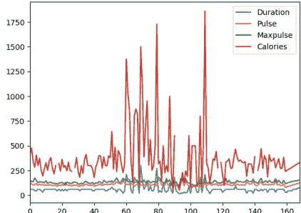

## 绘图

Pandas 使用 `plot()` 方法来创建图表。

我们可以使用 Matplotlib 库的子模块 Pyplot 在屏幕上可视化图表。

在我们的 Matplotlib 教程中了解更多关于 Matplotlib 的信息。

## 示例

从 Matplotlib 导入 pyplot 并可视化我们的 DataFrame：

```
import pandas as pd
import matplotlib.pyplot as plt
df = pd.read_csv('data.csv')
df.plot()
plt.show()
```

本页中的示例使用一个名为 'data.csv' 的 CSV 文件。

下载 data.csv 或 打开 data.csv

## 散点图

使用 `kind` 参数指定你想要一个散点图：

kind = 'scatter'

散点图需要一个 x 轴和一个 y 轴。

在下面的示例中，我们将使用 "Duration" 作为 x 轴，"Calories" 作为 y 轴。

像这样包含 x 和 y 参数：

x = 'Duration', y = 'Calories'

## 示例

```
import pandas as pd
import matplotlib.pyplot as plt
df = pd.read_csv('data.csv')
df.plot(kind = 'scatter', x = 'Duration', y = 'Calories')
plt.show()
```

## 结果

**请记住：** 在前面的示例中，我们了解到 "Duration" 和 "Calories" 之间的相关性是 0.922721，我们得出的结论是，持续时间越长意味着燃烧的卡路里越多。

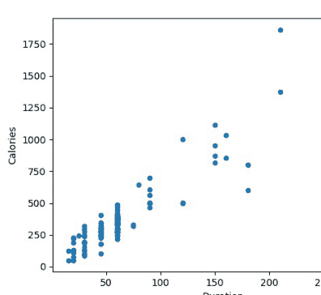

通过观察散点图，我同意这个观点。

让我们创建另一个散点图，其中列之间的关系较差，例如 "Duration" 和 "Maxpulse"，相关系数为 0.009403：

## 示例

一个列之间没有关系的散点图：

```
import pandas as pd
import matplotlib.pyplot as plt
df = pd.read_csv('data.csv')
df.plot(kind = 'scatter', x = 'Duration', y = 'Maxpulse')
plt.show()
```

## 结果

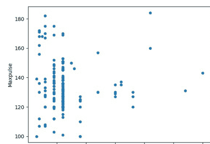

## 直方图

使用 `kind` 参数指定你想要一个直方图：

kind = 'hist'

直方图只需要一列。

直方图向我们显示每个区间的频率，例如，有多少次锻炼持续了 50 到 60 分钟？

在下面的示例中，我们将使用 "Duration" 列来创建直方图：

## 示例

```
df["Duration"].plot(kind = 'hist')
```

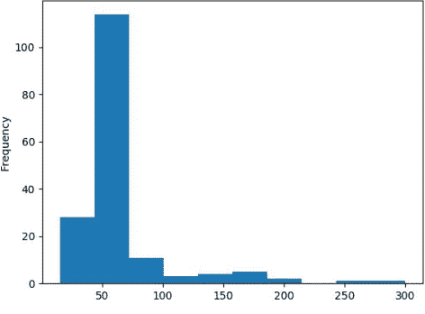

## 结果

**注意：** 直方图告诉我们，有超过 100 次锻炼持续了 50 到 60 分钟。

# 42. SciPy 教程

SciPy 是一个科学计算库，底层使用 NumPy。

SciPy 代表 Scientific Python（科学 Python）。

## 通过阅读学习

我们为你创建了 10 个教程来学习 SciPy 的基础知识：

- 入门
- 常量
- 优化器
- 稀疏数据
- 图论
- 空间数据
- Matlab 数组
- 插值
- 显著性检验

## SciPy 简介

### 什么是 SciPy？

SciPy 是一个科学计算库，底层使用 NumPy。

SciPy 代表 Scientific Python（科学 Python）。

它为优化、统计和信号处理提供了更多实用函数。

与 NumPy 一样，SciPy 是开源的，因此我们可以自由使用它。

SciPy 由 NumPy 的创建者 Travis Olliphant 创建。

### 为什么使用 SciPy？

如果 SciPy 底层使用 NumPy，为什么我们不直接使用 NumPy？

SciPy 对 NumPy 和数据科学中常用的功能进行了优化和添加。

## SciPy 是用什么语言编写的？

SciPy 主要用 Python 编写，但有少部分是用 C 编写的。

## SciPy 代码库在哪里？

SciPy 的源代码位于此 GitHub 仓库 [https://github.com/scipy/scipy](https://github.com/scipy/scipy)

**github：** 使许多人能够在同一个代码库上工作。

## SciPy 入门

## 安装 SciPy

如果你的系统上已经安装了 Python 和 PIP，那么安装 SciPy 非常容易。

使用此命令安装：

```
C:\Users\Your Name>pip install scipy
```

如果此命令失败，请使用已预装 SciPy 的 Python 发行版，如 Anaconda、Spyder 等。

## 导入 SciPy

安装 SciPy 后，通过添加 `from scipy import *module*` 语句，在应用程序中导入你想要使用的 SciPy 模块：

```
from scipy import constants
```

现在我们已经从 SciPy 导入了 *constants* 模块，应用程序已准备好使用它：

## 示例

一升等于多少立方米：

```
from scipy import constants
print(constants.liter)
```

**constants：** SciPy 提供了一组数学常量，其中之一是 `liter`，它返回 1 升作为立方米的值。

你将在下一章中了解更多关于常量的信息。

## 检查 SciPy 版本

版本字符串存储在 `__version__` 属性下。

## 示例

```
import scipy
print(scipy.__version__)
```

**注意：** `__version__` 中使用了两个下划线字符。

## SciPy 常量

## SciPy 中的常量

由于 SciPy 更专注于科学实现，它提供了许多内置的科学常量。

这些常量在处理数据科学时会很有帮助。

PI 是一个科学常量的例子。

## 示例

打印常量 PI 的值：

```
from scipy import constants
print(constants.pi)
```

## 常量单位

可以使用 `dir()` 函数查看 constants 模块下的所有单位列表。

## 示例

列出所有常量：

```
from scipy import constants
print(dir(constants))
```

## 单位类别

单位被归入以下类别：

- 公制
- 二进制
- 质量
- 角度
- 时间
- 长度
- 压力
- 体积
- 速度
- 温度
- 能量
- 功率
- 力

## 公制（SI）前缀：

返回以**米**为单位的指定单位（例如 centi 返回 0.01）

## 示例

from scipy import constants

print(constants.yotta)    #1e+24
print(constants.zetta)    #1e+21
print(constants.exa)      #1e+18
print(constants.peta)     #1000000000000000.0
print(constants.tera)     #1000000000000.0
print(constants.giga)     #1000000000.0
print(constants.mega)     #1000000.0
print(constants.kilo)     #1000.0
print(constants.hecto)    #100.0
print(constants.deka)     #10.0
print(constants.deci)     #0.1
print(constants.centi)    #0.01
print(constants.milli)    #0.001
print(constants.micro)    #1e-06
print(constants.nano)     #1e-09
print(constants.pico)     #1e-12
print(constants.femto)    #1e-15
print(constants.atto)     #1e-18
print(constants.zepto)    #1e-21

## 二进制前缀：

返回以**字节**为单位的指定单位（例如，kibi 返回 1024）

## 示例

from scipy import constants

print(constants.kibi)       #1024
print(constants.mebi)       #1048576
print(constants.gibi)       #1073741824
print(constants.tebi)       #1099511627776
print(constants.pebi)       #1125899906842624
print(constants.exbi)       #1152921504606846976
print(constants.zebi)       #1180591620717411303424
print(constants.yobi)       #1208925819614629174706176

## 质量：

返回以**千克**为单位的指定单位（例如，gram 返回 0.001）

## 示例

from scipy import constants

print(constants.gram)        #0.001
print(constants.metric_ton)  #1000.0
print(constants.grain)       #6.479891e-05
print(constants.lb)          #0.45359236999999997
print(constants.pound)       #0.45359236999999997
print(constants.oz)          #0.028349523124999998
print(constants.ounce)       #0.028349523124999998
print(constants.stone)   #6.3502931799999995
print(constants.long_ton)      #1016.0469088
print(constants.short_ton)  #907.1847399999999
print(constants.troy_ounce)  #0.031103476799999998
print(constants.troy_pound)  #0.37324172159999996
print(constants.carat)    #0.0002
print(constants.atomic_mass)  #1.66053904e-27
print(constants.m_u)     #1.66053904e-27
print(constants.u)        #1.66053904e-27

## 角度：

返回以**弧度**为单位的指定单位（例如，degree 返回 0.017453292519943295）

## 示例

from scipy import constants

print(constants.degree)    #0.017453292519943295
print(constants.arcmin)  #0.0002908882086657216
print(constants.arcminute)  #0.0002908882086657216
print(constants.arcsec)  #4.84813681109536e-06
print(constants.arcsecond)  #4.84813681109536e-06

## 时间：

返回以**秒**为单位的指定单位（例如，hour 返回 3600.0）

## 示例

from scipy import constants

print(constants.minute) #60.0
print(constants.hour) #3600.0
print(constants.day) #86400.0
print(constants.week) #604800.0
print(constants.year) #31536000.0
print(constants.Julian_year) #31557600.0

## 长度：

返回以**米**为单位的指定单位（例如，nautical_mile 返回 1852.0）

## 示例

from scipy import constants

print(constants.inch) #0.0254
print(constants.foot) #0.30479999999999996
print(constants.yard) #0.9143999999999999
print(constants.mile) #1609.3439999999998
print(constants.mil) #2.5399999999999997e-05
print(constants.pt) #0.00035277777777777776
print(constants.point) #0.00035277777777777776
print(constants.survey_foot) #0.3048006096012192
print(constants.survey_mile) #1609.3472186944373
print(constants.nautical_mile) #1852.0
print(constants.fermi)          #1e-15
print(constants.angstrom)       #1e-10
print(constants.micron)         #1e-06
print(constants.au)             #149597870691.0
print(constants.astronomical_unit) #149597870691.0
print(constants.light_year)     #9460730472580800.0
print(constants.parsec)         #3.0856775813057292e+16

## 压力：

返回以**帕斯卡**为单位的指定单位（例如，psi 返回 6894.757293168361）

## 示例

from scipy import constants

print(constants.atm)            #101325.0
print(constants.atmosphere)      #101325.0
print(constants.bar)             #100000.0
print(constants.torr)            #133.32236842105263
print(constants.mmHg)            #133.32236842105263
print(constants.psi)             #6894.757293168361

## 面积：

返回以**平方米**为单位的指定单位（例如，hectare 返回 10000.0）

## 示例

from scipy import constants

print(constants.hectare) #10000.0
print(constants.acre) #4046.8564223999992

## 体积：

返回以**立方米**为单位的指定单位（例如，liter 返回 0.001）

## 示例

from scipy import constants

print(constants.liter) #0.001
print(constants.litre) #0.001
print(constants.gallon) #0.0037854117839999997
print(constants.gallon_US) #0.0037854117839999997
print(constants.gallon_imp) #0.00454609
print(constants.fluid_ounce) #2.9573529562499998e-05
print(constants.fluid_ounce_US) #2.9573529562499998e-05
print(constants.fluid_ounce_imp) #2.84130625e-05
print(constants.barrel) #0.15898729492799998
print(constants.bbl) #0.15898729492799998

## 速度：

返回以**米每秒**为单位的指定单位（例如，speed_of_sound 返回 340.5）

## 示例

from scipy import constants

print(constants.kmh) #0.2777777777777778
print(constants.mph) #0.44703999999999994
print(constants.mach) #340.5
print(constants.speed_of_sound) #340.5
print(constants.knot) #0.5144444444444445

## 温度：

返回以**开尔文**为单位的指定单位（例如，zero_Celsius 返回 273.15）

## 示例

from scipy import constants

print(constants.zero_Celsius) #273.15
print(constants.degree_Fahrenheit) #0.5555555555555556

## 能量：

返回以**焦耳**为单位的指定单位（例如，calorie 返回 4.184）

## 示例

from scipy import constants

print(constants.eV) #1.6021766208e-19
print(constants.electron_volt) #1.6021766208e-19
print(constants.calorie) #4.184
print(constants.calorie_th) #4.184
print(constants.calorie_IT) #4.1868
print(constants.erg) #1e-07
print(constants.Btu) #1055.05585262
print(constants.Btu_IT) #1055.05585262
print(constants.Btu_th) #1054.3502644888888
print(constants.ton_TNT) #4184000000.0

## 功率：

返回以**瓦特**为单位的指定单位（例如，horsepower 返回 745.6998715822701）

## 示例

from scipy import constants

print(constants.hp) #745.6998715822701
print(constants.horsepower) #745.6998715822701

## 力：

返回以**牛顿**为单位的指定单位（例如，kilogram_force 返回 9.80665）

## 示例

from scipy import constants

print(constants.dyn) #1e-05
print(constants.dyne) #1e-05
print(constants.lbf) #4.4482216152605
print(constants.pound_force) #4.4482216152605
print(constants.kgf) #9.80665
print(constants.kilogram_force) #9.80665

# SciPy 优化器

## SciPy 中的优化器

优化器是 SciPy 中定义的一组程序，用于寻找函数的最小值或方程的根。

## 优化函数

本质上，机器学习中的所有算法都不过是一个需要借助给定数据来最小化的复杂方程。

## 方程的根

NumPy 能够找到多项式和线性方程的根，但它无法找到*非线性*方程的根，比如这个：

x + cos(x)

为此，你可以使用 SciPy 的 `optimize.root` 函数。

此函数接受两个必需的参数：

**fun** - 一个表示方程的函数。

**x0** - 根的初始猜测值。

该函数返回一个包含有关解的信息的对象。

实际的解在返回对象的 `x` 属性下给出：

## 示例

找到方程 x + cos(x) 的根：

```python
from scipy.optimize import root
from math import cos

def eqn(x):
    return x + cos(x)

myroot = root(eqn, 0)
print(myroot.x)
```

**注意：** 返回的对象包含更多关于解的信息。

## 示例

打印关于解的所有信息（不仅仅是作为根的 x）

```python
print(myroot)
```

## 最小化函数

在此上下文中，函数代表一条曲线，曲线有*高点*和*低点*。

高点称为*极大值*。

低点称为*极小值*。

整个曲线中的最高点称为*全局极大值*，而其余的称为*局部极大值*。

整个曲线中的最低点称为*全局极小值*，而其余的称为*局部极小值*。

## 寻找极小值

我们可以使用 `scipy.optimize.minimize()` 函数来最小化函数。

`minimize()` 函数接受以下参数：

***fun*** - 一个表示方程的函数。

***x0*** - 根的初始猜测值。

***method*** - 要使用的方法名称。合法值：

- 'CG'
- 'BFGS'
- 'Newton-CG'

## SciPy 优化

- 'L-BFGS-B'
- 'TNC'
- 'COBYLA'
- 'SLSQP'

**callback** - 每次优化迭代后调用的函数。

**options** - 定义额外参数的字典：

```
{
    "disp": boolean - 打印详细描述
    "gtol": number - 误差容限
}
```

## 示例

使用 BFGS 最小化函数 x^2 + x + 2：

```
from scipy.optimize import minimize

def eqn(x):
    return x**2 + x + 2

mymin = minimize(eqn, 0, method='BFGS')
print(mymin)
```

## SciPy 稀疏数据

## 什么是稀疏数据

稀疏数据是指大部分元素未使用（不携带任何信息）的数据。

它可以是像这样的数组：

[1, 0, 2, 0, 0, 3, 0, 0, 0, 0, 0, 0]

**稀疏数据：** 是指大部分项值为零的数据集。

**稠密数组：** 是稀疏数组的反面：大部分值*不*为零。

在科学计算中，当我们处理线性代数中的偏导数时，会遇到稀疏数据。

## 如何处理稀疏数据

SciPy 有一个模块 `scipy.sparse`，提供了处理稀疏数据的函数。

我们主要使用两种类型的稀疏矩阵：

**CSC** - 压缩稀疏列。用于高效算术运算，快速列切片。

**CSR** - 压缩稀疏行。用于快速行切片，更快的矩阵向量乘积。

本教程中我们将使用 **CSR** 矩阵。

## CSR 矩阵

我们可以通过将数组传递给函数 `scipy.sparse.csr_matrix()` 来创建 CSR 矩阵。

## 示例

从数组创建 CSR 矩阵：

```
import numpy as np
from scipy.sparse import csr_matrix

arr = np.array([0, 0, 0, 0, 0, 1, 1, 0, 2])

print(csr_matrix(arr))
```

上面的示例返回：

(0, 5) 1
(0, 6) 1
(0, 8) 2

从结果中我们可以看到有 3 个具有值的项。

第 1 项位于第 0 行第 5 位，值为 1。

第 2 项位于第 0 行第 6 位，值为 1。

第 3 项位于第 0 行第 8 位，值为 2。

## 稀疏矩阵方法

使用 `data` 属性查看存储的数据（非零项）：

**示例**

```
import numpy as np
from scipy.sparse import csr_matrix
arr = np.array([[0, 0, 0], [0, 0, 1], [1, 0, 2]])
print(csr_matrix(arr).data)
```

使用 `count_nonzero()` 方法计算非零元素数量：

**示例**

```
import numpy as np
from scipy.sparse import csr_matrix
arr = np.array([[0, 0, 0], [0, 0, 1], [1, 0, 2]])
print(csr_matrix(arr).count_nonzero())
```

使用 `eliminate_zeros()` 方法从矩阵中移除零项：

**示例**

```
import numpy as np
from scipy.sparse import csr_matrix
arr = np.array([[0, 0, 0], [0, 0, 1], [1, 0, 2]])
mat = csr_matrix(arr)
mat.eliminate_zeros()
print(mat)
```

使用 `sum_duplicates()` 方法消除重复项：

## 示例

通过相加消除重复项：

```
import numpy as np
from scipy.sparse import csr_matrix
arr = np.array([[0, 0, 0], [0, 0, 1], [1, 0, 2]])
mat = csr_matrix(arr)
mat.sum_duplicates()
print(mat)
```

使用 `tocsc()` 方法从 CSR 转换为 CSC：

## 示例

```
import numpy as np
from scipy.sparse import csr_matrix
arr = np.array([[0, 0, 0], [0, 0, 1], [1, 0, 2]])
newarr = csr_matrix(arr).tocsc()
print(newarr)
```

注意：除了提到的稀疏特定操作外，稀疏矩阵支持普通矩阵支持的所有操作，例如重塑、求和、算术运算、广播等。

## SciPy 图

## 处理图

图是一种基本的数据结构。

SciPy 为我们提供了 `scipy.sparse.csgraph` 模块来处理此类数据结构。

## 邻接矩阵

邻接矩阵是一个 n×n 矩阵，其中 n 是图中元素的数量。

值表示元素之间的连接。

对于一个包含元素 A、B 和 C 的图，连接关系如下：

A 和 B 以权重 1 连接。

A 和 C 以权重 2 连接。

C 和 B 未连接。

邻接矩阵如下所示：

|   | A | B | C |
|---|---|---|---|
| A | 0 | 1 | 2 |
| B | 1 | 0 | 0 |
| C | 2 | 0 | 0 |

以下是一些最常用的处理邻接矩阵的方法。

## 连通分量

使用 `connected_components()` 方法查找所有连通分量。

**示例**

```
import numpy as np
from scipy.sparse.csgraph import connected_components
from scipy.sparse import csr_matrix
arr = np.array([
    [0, 1, 2],
    [1, 0, 0],
    [2, 0, 0]
])
newarr = csr_matrix(arr)
print(connected_components(newarr))
```

## Dijkstra

使用 `dijkstra` 方法查找图中从一个元素到另一个元素的最短路径。

它接受以下参数：

1. **return_predecessors**：布尔值（True 返回遍历的完整路径，否则返回 False）。
2. **indices**：元素的索引，仅返回从该元素出发的所有路径。
3. **limit**：路径的最大权重。

**示例**

查找从元素 1 到 2 的最短路径：

```
import numpy as np
from scipy.sparse.csgraph import dijkstra
from scipy.sparse import csr_matrix
arr = np.array([
    [0, 1, 2],
    [1, 0, 0],
    [2, 0, 0]
])
newarr = csr_matrix(arr)
print(dijkstra(newarr, return_predecessors=True, indices=0))
```

## Floyd Warshall

使用 `floyd_warshall()` 方法查找所有元素对之间的最短路径。

## 示例

查找所有元素对之间的最短路径：

```
import numpy as np
from scipy.sparse.csgraph import floyd_warshall
from scipy.sparse import csr_matrix
arr = np.array([
    [0, 1, 2],
    [1, 0, 0],
    [2, 0, 0]
])
newarr = csr_matrix(arr)
print(floyd_warshall(newarr, return_predecessors=True))
```

## Bellman Ford

`bellman_ford()` 方法也可以查找所有元素对之间的最短路径，但此方法可以处理负权重。

## 示例

在给定具有负权重的图中查找从元素 1 到 2 的最短路径：

```
import numpy as np
from scipy.sparse.csgraph import bellman_ford
from scipy.sparse import csr_matrix
arr = np.array([
    [0, -1, 2],
    [1, 0, 0],
    [2, 0, 0]
])
newarr = csr_matrix(arr)
print(bellman_ford(newarr, return_predecessors=True, indices=0))
```

## 深度优先遍历

`depth_first_order()` 方法返回从节点开始的深度优先遍历。
此函数接受以下参数：

1. 图。
2. 开始遍历图的起始元素。

**示例**
对给定邻接矩阵进行深度优先遍历：

```
import numpy as np
from scipy.sparse.csgraph import depth_first_order
from scipy.sparse import csr_matrix
arr = np.array([
    [0, 1, 0, 1],
    [1, 1, 1, 1],
    [2, 1, 1, 0],
    [0, 1, 0, 1]
])
newarr = csr_matrix(arr)
print(depth_first_order(newarr, 1))
```

## 广度优先遍历

`breadth_first_order()` 方法返回从节点开始的广度优先遍历。

此函数接受以下参数：

1. 图。
2. 开始遍历图的起始元素。

## 示例

对给定邻接矩阵进行广度优先遍历：

```
import numpy as np
from scipy.sparse.csgraph import breadth_first_order
from scipy.sparse import csr_matrix
arr = np.array([
    [0, 1, 0, 1],
    [1, 1, 1, 1],
    [2, 1, 1, 0],
    [0, 1, 0, 1]
])
newarr = csr_matrix(arr)
print(breadth_first_order(newarr, 1))
```

## SciPy 空间数据

## 处理空间数据

空间数据是指在几何空间中表示的数据。
例如，坐标系上的点。
我们在许多任务中处理空间数据问题。
例如，判断一个点是否在边界内。
SciPy 为我们提供了 `scipy.spatial` 模块，其中包含处理空间数据的函数。

## 三角剖分

多边形的三角剖分是将多边形分割成多个三角形，通过这些三角形我们可以计算多边形的面积。
*带点的*三角剖分是指创建由三角形组成的曲面，其中所有给定的点都位于曲面中至少一个三角形的顶点上。
一种通过点生成这些三角剖分的方法是 Delaunay() 三角剖分。

## 示例

从以下点创建三角剖分：

```
import numpy as np
from scipy.spatial import Delaunay
import matplotlib.pyplot as plt

points = np.array([
    [2, 4],
    [3, 4],
    [3, 0],
    [2, 2],
    [4, 1]
])
```

## 凸包

凸包是覆盖所有给定点的最小多边形。
使用 `ConvexHull()` 方法来创建凸包。

**示例**
为以下点创建凸包：

```python
import numpy as np
from scipy.spatial import ConvexHull
import matplotlib.pyplot as plt
points = np.array([
    [2, 4],
    [3, 4],
    [3, 0],
    [2, 2],
    [4, 1],
    [1, 2],
    [5, 0],
    [3, 1],
    [1, 2],
    [0, 2]
])

hull = ConvexHull(points)
hull_points = hull.simplices
plt.scatter(points[:,0], points[:,1])
for simplex in hull_points:
    plt.plot(points[simplex,0], points[simplex,1], 'k-')
plt.show()
```

结果：

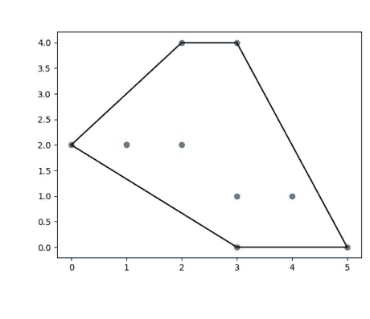

## KD树

KD树是一种为最近邻查询优化的数据结构。
例如，在一个点集中使用KD树，我们可以高效地查询哪些点距离某个给定点最近。
`KDTree()` 方法返回一个 KDTree 对象。
`query()` 方法返回到最近邻的距离*以及*邻居的位置。

## 示例

查找点 (1,1) 的最近邻：

```python
from scipy.spatial import KDTree

points = [(1, -1), (2, 3), (-2, 3), (2, -3)]
kdtree = KDTree(points)
res = kdtree.query((1, 1))
print(res)
```

**结果：**
(2.0, 0)

## 距离矩阵

在数据科学中，有许多距离度量用于计算两点之间的各种距离，例如欧几里得距离、余弦距离等。
两个向量之间的距离可能不仅仅是它们之间直线的长度，也可以是它们从原点出发的角度，或者所需的单位步数等。
许多机器学习算法的性能在很大程度上取决于距离矩阵。例如“K近邻”或“K均值”等。
让我们来看一些距离度量：

## 欧几里得距离

计算给定点之间的欧几里得距离。

**示例**

```python
from scipy.spatial.distance import euclidean

p1 = (1, 0)
p2 = (10, 2)
res = euclidean(p1, p2)
print(res)
```

**结果：**
9.21954445729

## 曼哈顿距离（城市街区距离）

使用4个方向的移动计算的距离。

例如，我们只能移动：上、下、右或左，不能对角线移动。

**示例**

计算给定点之间的曼哈顿距离：

```python
from scipy.spatial.distance import cityblock
p1 = (1, 0)
p2 = (10, 2)
res = cityblock(p1, p2)
print(res)
```

**结果：**
11

## 余弦距离

是两点A和B之间余弦角度的值。

**示例**

计算给定点之间的余弦距离：

```python
from scipy.spatial.distance import cosine
p1 = (1, 0)
p2 = (10, 2)
res = cosine(p1, p2)
print(res)
```

结果：
0.019419324309079777

## 汉明距离

是两个比特位不同的比例。
它是衡量二进制序列距离的一种方式。

**示例**

计算给定点之间的汉明距离：

```python
from scipy.spatial.distance import hamming
p1 = (True, False, True)
p2 = (False, True, True)
res = hamming(p1, p2)

print(res)
```

结果：
0.6666666666666667

## SciPy Matlab 数组

## 使用 Matlab 数组

我们知道 NumPy 为我们提供了以 Python 可读格式持久化数据的方法。但 SciPy 也为我们提供了与 Matlab 的互操作性。

SciPy 提供了 `scipy.io` 模块，其中包含用于处理 Matlab 数组的函数。

## 以 Matlab 格式导出数据

`savemat()` 函数允许我们以 Matlab 格式导出数据。

该方法接受以下参数：

1.  **filename** - 保存数据的文件名。
2.  **mdict** - 包含数据的字典。
3.  **do_compression** - 一个布尔值，指定是否压缩结果。默认为 False。

**示例**

将以下数组以变量名 "vec" 导出到 mat 文件：

```python
from scipy import io
import numpy as np
arr = np.arange(10)
io.savemat('arr.mat', {"vec": arr})
```

**注意：** 上面的示例在你的计算机上保存了一个名为 "arr.mat" 的文件。

要打开该文件，请查看下面的“从 Matlab 格式导入数据”示例：

## 从 Matlab 格式导入数据

`loadmat()` 函数允许我们从 Matlab 文件导入数据。

该函数接受一个必需参数：

**filename** - 保存数据的文件名。
它将返回一个结构化数组，其键是变量名，对应的值是变量值。

**示例**

从以下 mat 文件导入数组：

```python
from scipy import io
import numpy as np
arr = np.array([0, 1, 2, 3, 4, 5, 6, 7, 8, 9,])
# 导出：
io.savemat('arr.mat', {"vec": arr})
# 导入：
mydata = io.loadmat('arr.mat')
print(mydata)
```

**结果：**

```python
{
    '__header__': b'MATLAB 5.0 MAT-file Platform: nt, Created on: Tue Sep 22 13:12:32 2020',
    '__version__': '1.0',
    '__globals__': [],
    'vec': array([[0, 1, 2, 3, 4, 5, 6, 7, 8, 9]])
}
```

使用变量名 "vec" 仅显示 matlab 数据中的数组：

**示例**

```python
...
print(mydata['vec'])
```

**结果：**

```python
[[0 1 2 3 4 5 6 7 8 9]]
```

**注意：** 我们可以看到数组原本是1维的，但在提取时增加了一个维度。

为了解决这个问题，我们可以传递一个额外的参数 `squeeze_me=True`：

**示例**

```python
# 导入：
mydata = io.loadmat('arr.mat', squeeze_me=True)
print(mydata['vec'])
```

**结果：**

```python
[0 1 2 3 4 5 6 7 8 9]
```

## SciPy 插值

## 什么是插值？

插值是一种在给定点之间生成点的方法。
例如：对于点1和点2，我们可以通过插值找到点1.33和1.66。

插值有许多用途，在机器学习中，我们经常处理数据集中的缺失数据，插值常用于替代这些值。
这种填充值的方法称为*插补*。
除了插补，插值也常用于需要平滑数据集中离散点的情况。

## 如何在 SciPy 中实现？

SciPy 为我们提供了一个名为 `scipy.interpolate` 的模块，其中包含许多处理插值的函数：

## 一维插值

`interp1d()` 函数用于对具有1个变量的分布进行插值。
它接受 x 和 y 点，并返回一个可调用函数，该函数可以用新的 x 调用并返回相应的 y。

**示例**

对于给定的 xs 和 ys，插值从 2.1, 2.2... 到 2.9 的值：

```python
from scipy.interpolate import interp1d
import numpy as np
xs = np.arange(10)
ys = 2*xs + 1
interp_func = interp1d(xs, ys)
newarr = interp_func(np.arange(2.1, 3, 0.1))
print(newarr)
```

**结果：**

```python
[5.2 5.4 5.6 5.8 6.  6.2 6.4 6.6 6.8]
```

**注意：** 新的 xs 应与旧的 xs 在相同的范围内，这意味着我们不能用大于10或小于0的值调用 `interp_func()`。

## 样条插值

在一维插值中，点被拟合到*单条曲线*，而在样条插值中，点被拟合到一个由称为样条的多项式定义的*分段*函数。

`UnivariateSpline()` 函数接受 xs 和 ys，并生成一个可调用函数，该函数可以用新的 xs 调用。

**分段函数：** 在不同范围内具有不同定义的函数。

**示例**

为以下非线性点查找 2.1, 2.2... 2.9 的单变量样条插值：

```python
from scipy.interpolate import UnivariateSpline
import numpy as np
xs = np.arange(10)
ys = xs**2 + np.sin(xs) + 1
interp_func = UnivariateSpline(xs, ys)
newarr = interp_func(np.arange(2.1, 3, 0.1))
print(newarr)
```

结果：
```python
[5.62826474 6.03987348 6.47131994 6.92265019 7.3939103  7.88514634
 8.39640439 8.92773053 9.47917082]
```

## 使用径向基函数插值

径向基函数是根据固定参考点定义的函数。

`Rbf()` 函数也接受 xs 和 ys 作为参数，并生成一个可调用函数，该函数可以用新的 xs 调用。

**示例**
使用 rbf 插值以下 xs 和 ys，并找到 2.1, 2.2 ... 2.9 的值：

```python
from scipy.interpolate import Rbf
import numpy as np
xs = np.arange(10)
ys = xs**2 + np.sin(xs) + 1
interp_func = Rbf(xs, ys)
newarr = interp_func(np.arange(2.1, 3, 0.1))
print(newarr)
```

结果：

## SciPy 统计显著性检验

## 什么是统计显著性检验？

在统计学中，统计显著性意味着所得结果背后有其原因，并非随机产生或偶然发生。

SciPy 为我们提供了一个名为 `scipy.stats` 的模块，其中包含用于执行统计显著性检验的函数。

以下是在执行此类检验时重要的一些技术和关键词。

## 统计学中的假设

假设是对总体中某个参数的假定。

## 零假设

它假定观察结果在统计上不显著。

## 备择假设

它假定观察结果是由某种原因造成的。

它是零假设的替代。

## 示例：

对于学生的评估，我们会设定：

“学生表现低于平均水平” - 作为零假设，以及：

“学生表现优于平均水平” - 作为备择假设。

## 单尾检验

当我们的假设仅检验值的一侧时，称为“单尾检验”。

## 示例：

对于零假设：
“均值等于 k”，我们可以有备择假设：
“均值小于 k”，或：
“均值大于 k”

## 双尾检验

当我们的假设检验值的两侧时。

## 示例：

对于零假设：
“均值等于 k”，我们可以有备择假设：
“均值不等于 k”
在这种情况下，均值小于或大于 k，两侧都需要检验。

## Alpha 值

Alpha 值是显著性水平。

## 示例：

数据必须接近极端到何种程度，零假设才会被拒绝。
通常取值为 0.01、0.05 或 0.1。

## P 值

P 值表示数据实际接近极端的程度。
通过比较 P 值和 Alpha 值来确定统计显著性。
如果 p 值 <= alpha，我们拒绝零假设，并称数据在统计上显著。否则，我们接受零假设。

## T 检验

T 检验用于确定两个变量的均值之间是否存在显著差异，并让我们知道它们是否属于同一分布。

它是一个双尾检验。

函数 `ttest_ind()` 接受两个大小相同的样本，并返回一个包含 t 统计量和 p 值的元组。

## 示例

判断给定值 v1 和 v2 是否来自同一分布：

```
import numpy as np
from scipy.stats import ttest_ind
v1 = np.random.normal(size=100)
v2 = np.random.normal(size=100)
res = ttest_ind(v1, v2)
print(res)
```

结果：
0.68346891833752133

如果你想只返回 p 值，请使用 pvalue 属性：

## 示例

```
...
res = ttest_ind(v1, v2).pvalue
print(res)
```

结果：
0.68346891833752133

## KS 检验

KS 检验用于检查给定值是否遵循某种分布。

该函数接受待检验的值和累积分布函数（CDF）作为两个参数。
**CDF** 可以是一个字符串或一个返回概率的可调用函数。
它可以用作单尾或双尾检验。
默认是双尾。我们可以通过参数 `alternative` 传递一个字符串，值为 'two-sided'、'less' 或 'greater'。

## 示例

判断给定值是否遵循正态分布：

```
import numpy as np
from scipy.stats import kstest
v = np.random.normal(size=100)
res = kstest(v, 'norm')
print(res)
```

## 结果：

KstestResult(statistic=0.047798701221956841,
pvalue=0.97630967161777515)

## 数据的统计描述

为了查看数组中值的摘要，我们可以使用 `describe()` 函数。
它返回以下描述：

- 1. 观测数量 (nobs)
- 2. 最小值和最大值 = minmax
- 3. 均值
- 4. 方差
- 5. 偏度
- 6. 峰度

## 示例

显示数组中值的统计描述：

```
import numpy as np
from scipy.stats import describe

v = np.random.normal(size=100)
res = describe(v)
print(res)
```

## 结果：

```
DescribeResult(
    nobs=100,
    minmax=(-2.0991855456740121, 2.1304142707414964),
    mean=0.11503747689121079,
    variance=0.99418092655064605,
    skewness=0.013953400984243667,
    kurtosis=-0.671060517912661
)
```

## 正态性检验（偏度和峰度）

正态性检验基于偏度和峰度。
`normaltest()` 函数返回零假设的 p 值：
“x 来自正态分布”。

## 偏度：

数据对称性的度量。
对于正态分布，其值为 0。
如果为负，表示数据左偏。
如果为正，表示数据右偏。

## 峰度：

衡量数据相对于正态分布是重尾还是轻尾的指标。

正峰度表示重尾。

负峰度表示轻尾。

## 示例

求取数组中值的偏度和峰度：

```
import numpy as np
from scipy.stats import skew, kurtosis
v = np.random.normal(size=100)
print(skew(v))
print(kurtosis(v))
```

## 结果：

0.11168446328610283
-0.1879320563260931

## 示例

判断数据是否来自正态分布：

```
import numpy as np
from scipy.stats import normaltest
v = np.random.normal(size=100)
print(normaltest(v))
```

## 结果：

NormaltestResult(statistic=4.4783745697002848, pvalue=0.10654505998635538)