# 快速学习JavaScript：初学者编程指南

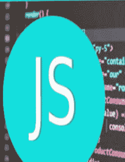

快速学习编程基础指南

TAM JP

# 快速学习Python：初学者编程指南

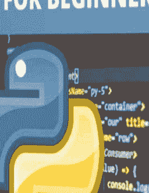

快速学习编程基础指南

TAM JP

# 快速学习Python和JavaScript：初学者编程指南

## 快速学习编程基础指南

TAM JP

[Python简介](https://www.example.com)

[Python特性](https://www.example.com)

[安装pip](https://www.example.com)

[执行第一个程序](https://www.example.com)

[Python关键字](https://www.example.com)

[Python内置关键字](https://www.example.com)

[Python中的注释](https://www.example.com)

[Python中的块注释](https://www.example.com)

[创建多行注释](https://www.example.com)

[Python数值类型](https://www.example.com)

[变量和数据类型](https://www.example.com)

[确定Python变量的类型](https://www.example.com)

[Python算术运算符](https://www.example.com)

[Python身份运算符](https://www.example.com)

[Python中的成员运算符](https://www.example.com)

[Python中增量运算符的行为](https://www.example.com)

[逻辑和按位非运算符](https://www.example.com)

[字符串上的逻辑运算符](LOGICAL OPERATORS ON STRING)

[If Else条件运算符](IF ELSE CONDITIONAL OPERATOR)

[JavaScript简介](JAVASCRIPT INTRO)

[JavaScript示例](JAVASCRIPT EXAMPLE)

[JavaScript注释](JAVASCRIPT COMMENT)

[JavaScript变量](JAVASCRIPT VARIABLE)

[JavaScript数据类型](JAVASCRIPT DATA TYPES)

[JavaScript If Else](JAVASCRIPT IF ELSE)

[JavaScript Switch语句](JAVASCRIPT SWITCH STATEMENT)

[JavaScript函数](JAVASCRIPT FUNCTION)

[JavaScript对象](JAVASCRIPT OBJECT)

[JavaScript数组](JAVASCRIPT ARRAY)

[JavaScript字符串](JAVASCRIPT STRING)

[JavaScript日期](JAVASCRIPT DATE)

[JavaScript数学](JAVASCRIPT MATH)

[JavaScript数字](JAVASCRIPT NUMBER)

# Python简介

## Python的显著特性

它是一种通用编程语言，可用于科学和非科学编程。

对于初学者来说，它非常出色，因为该语言是解释型的，因此能立即产生结果。

它比同时期的其他语言更好地融入了异常处理和动态绑定的原则。

用Python编写的程序易于阅读和理解。

它是一种与平台无关的编程语言。

对于可定制的应用程序，它适合作为扩展语言。

学习和使用它都很简单。

## 主要应用

谷歌搜索引擎、Twitter等。

Bit Torrent点对点文件共享是用Python编写的。

英特尔、思科、惠普、IBM等公司使用Python进行硬件测试。

Maya提供了Python脚本API。

Python被用于创建工业机器人。

美国宇航局等机构使用Python进行其科学编程活动。

# 设置Python解释器

为了编写和运行Python程序，我们需要在计算机上安装Python解释器。

标准且最常见的Python开发环境是IDLE（图形用户界面集成）。

IDLE指的是集成开发环境。

它允许通过单个图形用户界面修改、运行、搜索和调试Python程序。这种环境使编写程序变得简单。

注意：在这些教程中，我们将使用Python IDLE 3.6版本来开发和运行Python代码。它可以在www.python.org免费获取。

# 启动IDLE

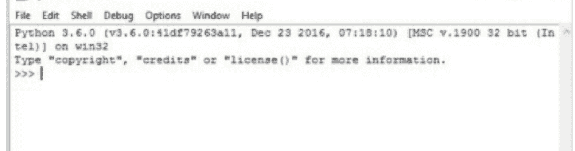

# Python的特性

- 面向对象
- 强大的异常处理
- 自动内存管理
- 动态类型
- 强数据类型
- 语法简单
- 基于缩进
- 本质上宽容

在Python中打印"Hello World"

```
Python 3.7.0 (v3.7.0:1bf9cc5093, Jun 26 2018, 23:26:24)
[Clang 6.0 (clang-600.0.57)] on darwin
Type "copyright", "credits" or "license()" for more information.
>>> print ('hi')
hi
>>> print("hiiii")
hiiii
>>> print ("a\nb")
a
b
>>> print ("a\tb")
a	b
>>> print("""y	a
a
a""")
y	a
a
a
>>> print(" a " ")
 a " 
>>> print("a\ ")
a\ 
>>> print("a \n b ")
a \n b 
>>> print("a \n b")
a 
 b
>>> |
```

# 安装pip

Pip是一个用于安装和管理Python包的平台。

## Python：安装pip

为了安装新版本的pip，请在MacOS中运行命令

```
$ sudo easy_install pip
$ sudo pip install --upgrade pip
```

### 在Ubuntu中安装pip

```
$ sudo apt-get update
$ sudo apt-get install python-pip
$ sudo pip install --upgrade pip
```

### 在Centos中安装pip

```
$ sudo yum update
$ sudo yum install epel-release
$ sudo yum install python-pip
# 版本>= Centos7
$ sudo pip install --upgrade pip
```

# 执行第一个程序

我们将在设备上启动Python，以交互模式运行。

在提示符（>>>）之后，我们输入Python表达式/语句/命令，Python会自动响应提示符的输出。

# Python上的第一个程序

让我们从在提示符后输入"Hello Python!"开始。

>>>print("Hello Python!")

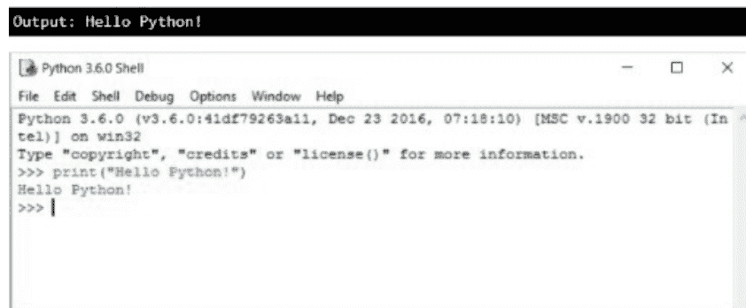

# 尝试以下操作

- a) 5+7
- b) 4*10
- c) 7/8
- d) 9%2
- e) 6//4

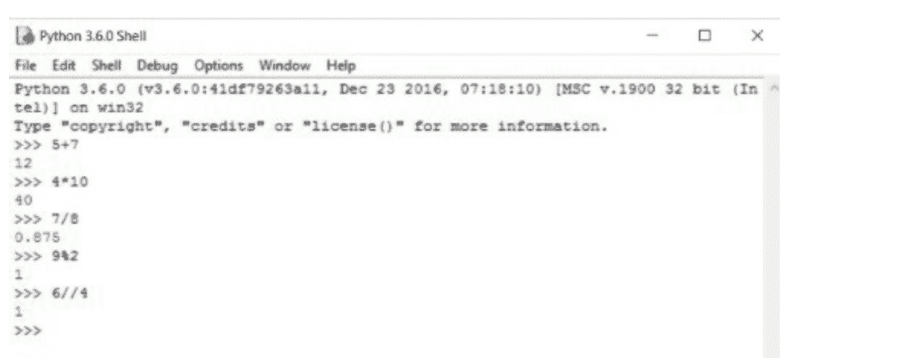

# 也试试这个

```
>>> x=1
>>> y=5
>>> z = x+y
>>> print (z)
```

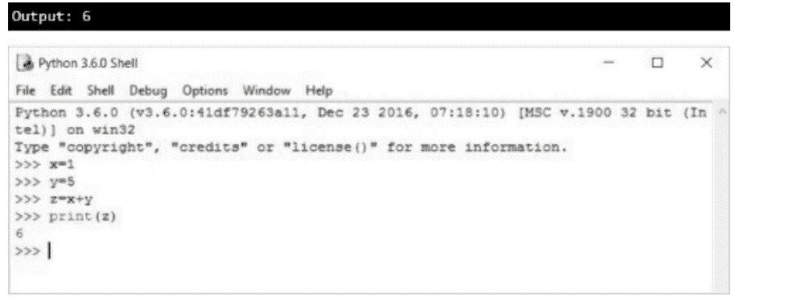

# 其他操作：

```
>>> a=3
>>>a+1, a-1
```

```
def test():
    x=2
    y=6
    z = x+y
    print(z)
```

# 2) 脚本模式

我们在脚本模式下将Python程序输入到一个文件中，然后使用解释器执行文件中的内容。

对于初学者和测试小段代码来说，在交互模式下运行很有用，因为我们可以立即测试它们。

但我们仍然应该保存我们的代码，以便我们可以修改和重用代码来编写超过几行的程序。

如果IDLE环境中默认未启用脚本模式，我们将使用以下步骤在IDLE中创建和运行Python脚本。

- 1. 文件>新建文件
- 2. 编写Python代码。
- 3. 保存它（^S）。
- 4. 使用RUN选项执行它 - 交互模式 - 通过（^F5）

**步骤1：** 文件> 新建文件

**步骤2：** 编写：

```
def test():
    x=2
    y=6
    z = x+y
    print (z)
```

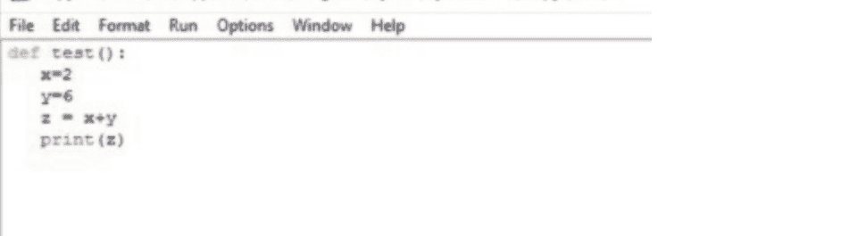

**步骤3：** 保存或文件 > 另存为

**步骤4：** 要执行，按^F5

```
>>>test()
```

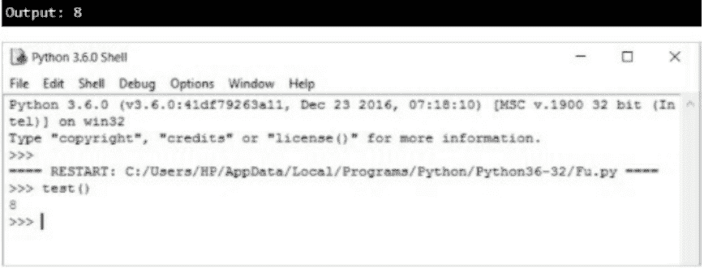

# Python关键字

关键字是Python编程语言（以及任何其他编程语言，如C、C++、Java等）的保留字，其定义是固定的，不能被修改。

Python编程语言中的关键字区分大小写。

## Python关键字列表

### 在Python 2.5中

- and
- del
- from
- not
- while
- as
- elif
- global
- or
- with
- assert
- else
- if
- pass
- yield
- break
- except
- import
- print
- class
- exec
- in
- raise
- continue
- finally
- is
- return
- def
- for
- lambda
- try

### 在Python 3.8.1中

- False
- None
- True
- and
- as
- assert
- async
- await
- break
- class
- continue
- def
- del
- elif
- else
- except
- finally
- for
- from
- global
- if
- import
- in
- is
- lambda
- nonlocal
- not
- or
- pass
- raise
- return
- try
- while
- with
- yield

# Python内置关键字

Python编程语言中有内置关键字，它们用于执行不同目的的不同任务。

# 所有Python关键字 – 列表

| 序号 | 关键字 | 描述 |
|---|---|---|
| 1 | and | 用于逻辑运算，是逻辑与运算符。如果两个操作数都为真，则返回"True"。 |
| 2 | as | 用于创建模块的别名。 |
| 3 | assert | 用于调试目的，如果给定的测试条件为假，则返回"AssertionError"。 |
| 4 | break | 中断循环的执行。用于将程序的控制权从循环体的作用域转移到循环体之后的下一条语句。 |
| 5 | class | 用于定义/创建一个类。 |
| 6 | continue | 跳过循环体中剩余的语句，继续循环的下一次迭代。 |
| 7 | def | 用于定义/创建一个函数。 |
| 8 | del | 用于删除一个对象。 |
| 9 | elif | 与"if...elif...else"语句一起使用，用于检查下一个条件。它等同于C、C++语言中的"else if"。 |
| 10 | else | 与"if...elif...else"语句一起使用，用于定义一个else块 – 如果任何条件都不为真，则执行else块。 |

| 11 | except | 与其他编程语言中的 "catch" 块类似，它用于定义一个 "except" 块，当 `try` 块中发生任何异常时执行。 |
| 12 | False | 用于定义布尔值 False，它也可能是比较表达式的结果。 |
| 13 | finally | 与异常块（`try...except...finally`）一起使用，它定义了一个总是执行的代码块——无论 `try` 块是否发生异常。 |
| 14 | for | 用于创建 `for` 循环。 |
| 15 | from | 用于从模块中导入特定部分（如函数、类等）。 |
| 16 | if | 用于创建条件语句，即检查条件。 |
| 17 | import | 用于在程序中导入模块。 |
| 18 | in | 用于检查元素是否存在于序列（如字符串、列表、元组等）中。 |
| 19 | is | 用于检查两个对象是否是同一个对象。 |
| 20 | lambda | 用于创建匿名函数，该函数可以有多个参数，但只能有一个语句/表达式。 |
| 21 | None | 类似于 null，用于定义空值。 |
| 22 | nonlocal | 用于声明非局部变量，使用此关键字，我们可以指示编译器该变量不是局部变量。 |
| 23 | **not** | 是一个逻辑运算符（逻辑非），如果操作数为 "False" 则返回 "True"，如果操作数为 "True" 则返回 "False"。 |
| 24 | **or** | 是一个逻辑运算符（逻辑或），用于组合两个条件，如果任一条件为 "True" 则返回 "True"，否则返回 "False"。 |
| 25 | **pass** | 用作空语句，对于定义空函数或条件语句的空主体非常有用。 |
| 26 | **raise** | 用于引发错误并显示自定义消息。 |
| 27 | **return** | 用于返回值和/或将程序控制权从调用函数返回到被调用函数，即用于退出函数。 |
| 28 | **True** | 用于定义布尔值 True，它也可能是比较表达式的结果。 |
| 29 | **try** | 与 `try...except...finally` 块一起使用。 |
| 30 | **while** | 用于创建 `while` 循环。 |
| 31 | **with** | 类似于 C#.Net 和 VB.Net 中的 "using"，用于简化异常处理。 |
| 32 | **yield** | 用于结束函数并返回一个生成器。 |

## Python 中的注释

Python 中的注释用于提高代码的可读性。

对于读者更好地理解代码和逻辑，它们是程序员在源代码中提供的有价值的信息。

在编译期间，注释不会被执行，也不会在输出中显示。

## Python 中注释的类型

1. 单行注释（#）
2. 多行字符串注释（""""）

### 1) 单行注释

单行注释用于 Python 中的单行语句，例如对各种变量、函数、表达式等的解释。

使用井号（#）符号来呈现单行注释，当注释换行时，下一行的开头必须对齐井号（#）。

让我们看一个实例，尝试理解在软件中如何应用单行注释。

### 示例

```
# 单行注释示例
# 一个打印给定字符串和加法的程序。

print('Welcome @ Learnpython')
a=2
b=5
print(a+b)

# 使用加号(+)进行两个数字的加法。
```

### 2) 多行字符串注释

正如我们在上面的示例中看到的，对于多行注释，我们必须在每一行都放置一个井号（#）符号。

在 Python 中，当内容不适合一行时，使用分隔符提供多行字符串注释很有帮助。

对于多行字符串注释，我们必须用分隔符将字符串括起来。

### 示例

```
"""
    这里我们将检查给定的数字 n 是偶数还是奇数
    使用 Python 中的多行注释。
"""

n=6768

if n%2==0:
    print("Even number.")
else:
    print("Odd number.")
```

## Python 中的块注释

### 注释

注释是计算机程序中的一段文本，旨在作为解释或注解。

它在源代码中对作者可读，并被编译器/解释器忽略。

### Python 注释的类型

**块注释**和**行内注释**

#### 1) 块注释

块注释适用于其后的代码片段。它可以指代代码的一部分或整个代码。

它们与代码具有相同的缩进级别。

每一行注释都以 # 开头。

### 示例

```
# Python 程序打印
# Hello World

print("Hello World")
```

# 输出：

```
Hello World
```

也可以使用 `''' '''` 来制作块注释，写在这些引号中的内容被称为注释。

### 示例

```
"""
Python 程序打印
Hello World
"""

print("Hello World")
```

## 示例 2

```
def hello():
    """
    这里，这是文档字符串
    因为它写在函数定义之后。

    下面的 print 语句将打印
    Hello World
    """
    print("Hello World")

if __name__ == "__main__":
    # 调用 hello 函数
    hello()
```

#### 2) 行内注释

与声明在同一行的注释是行内注释。

行内注释应与参数至少用两个空格隔开。

它们应该以 # 和一个空格开头。

### 示例

```
print("Hello World") # 这是一个行内注释
```

### 输出

```
Hello World
```

### 创建多行注释

当我们需要注释多行/语句时，有两种方法：要么注释每一行，要么创建多行注释（或块注释）。

第一种方法是注释每一行，

这在 Python 中可以被视为单行注释——在要注释的每一行开头使用井号（#）。

```
# 这是第 1 行
# 这是第 2 行
# 这是第 3 行
```

第二种方法是注释代码段，

这在 Python 中可以被视为多行注释——我们在要注释的代码段开头使用三个单引号（'''），在结尾也使用三个单引号（'''）。

```
'''
这是第 1 行
这是第 2 行
这是第 3 行
'''
```

### 示例

```
'''
函数名：print_text
参数：无
返回类型：无
描述：此函数将在屏幕上打印一些文本
"""

def print_text():
    print("Hello, world! How are you?")

if __name__ == "__main__":
    # 这里，我们将调用 print_text 函数
    # 它将在屏幕上打印一些文本
    print_text()
```

## Python 数值类型

数据类型是编程中的一个重要概念。

根据我们希望变量执行的角色，可以在变量中存储不同种类的数据。

在 Python 中，内置数据类型有

- 文本类型
- 数值类型
- 映射类型
- 序列类型
- 集合类型
- 布尔类型
- 二进制类型

Python 中的 3 种数值数据类型：

1. int
2. float
3. complex

### 1) int

整数数值形式用于存储不带小数点的有符号整数，例如 -5、2、78 等。

### 示例

```
# 将整数值赋给变量
x = 8
y = -9

# 操作 x 的值
x = x + y

# 打印 x 的更新值
print("x= ", x)

# 打印 x 的数据类型
print("Data type of x: ", type(x))
```

### 输出

```
x= -1

Data type of x: <class 'int'>
```

### 2) float

浮点数的数值形式用于存储浮点值，例如 6.66、58.9、3.14 等。

浮点数也可以使用科学计数法，用 E 或 e 表示 10 的幂（3.6e3 = 3.6x 103 = 3600）。

### 示例

```
# 将浮点值赋给变量
x = 8.9
y = -9.1

# 操作 x 的值
x = x - y

# 打印 x 的更新值
print("x= ", x)

# 打印 x 的数据类型
print("Data type of x: ", type(x))
```

### 输出

```
x= 18.0

Data type of x: <class 'float'>
```

### 3) complex

复数数值形式用于存储复数，例如 3.14j、8.0 + 5.3j、2 + 6j 等。

格式：实部 + 虚部 j

注意：J 必须表示复数的虚部。如果用 i 表示，在 Python 中是无效语法。

### 示例

```
# 将复数值赋给变量
x = 1+8.5j
y = 4+9j

# 操作 x 的值
x = x + y

# 打印 x 的更新值
print("x= ", x)
```

## 变量与数据类型

### 1. 数字

数字数据类型用于存储数值。这类数据是不可变的，即其对象的含义无法修改（这一点将在后面讨论）。
它们分为三种不同的类型：

- **整数与长整数**
- **浮点数**
- **复数**

### i) 整数：

整数是包含十进制数字的整数，例如 100000、-99、0、17，由 + 或 - 符号组成。
当我们希望一个值被视为非常大的整数值时，会在值后附加 L。Python 将这些值视为长整数。

```python
>>> a = 10
>>> b = 5192L #example of supplying a very long value to a variable
>>> c= 4298114
>>> type(c) # type ( ) is used to check data type of value
```

### ii) 浮点数：

浮点数也称为小数或带小数点的数字。
浮点数由一系列带符号（+、-）的十进制数字和一个小数点组成，例如 0.0、-21.9、0.98333328、15.2963。

### iii) 复数：

Python 复数由两个浮点值组成，分别代表实部和虚部。

我们将使用 x.real 和 x.imag 来访问向量（对象）x 的各个部分。
该数字的虚部由 j 而不是 I 定义，因此 1 + 0j 的虚部表示零。

**示例**

```python
>>> x = 1+0j
>>> print (x.real,x.imag)
1.0 0.0
```

### 2. None

这是一种具有单一值的特殊数据类别。它用于表示值缺失或假的场景。它由 None 表示。

### 3. 序列

一个由正整数索引的有序对象集合称为序列。

它是可变和不可变数据类型的混合体。

字符串、列表和元组是 Python 中可用的三种序列数据形式类型。

#### 3.1) 字符串：

它是一个有序的字符/字母序列。

它们出现在单引号（''）或双引号（""）中。

引号不构成字符串的一部分。

它们只是告诉机器字符串常量的开始和结束位置。

```python
>>> type ('Good Morning')
<class 'str'>
>>> type ('3.2')
<class 'str'>
```

#### 3.2) 列表：

列表也是一种重要的序列。

列表中的值称为元素/对象。它们是可变的，并且是索引/有序的。

列表用方括号括起来。

#### 3.3) 元组：

元组是一组值，由某种整数索引。它们是不可变的。

### 4. 集合

集合是值的无序数组，没有重复条目，可以是任何类型。集合是不可变的。

**示例**

```python
>>> s = set ([1,2,3,4])
>>> print(s)
{1, 2, 3, 4}
```

## 确定 Python 变量的类型

### 1) type() 方法

如果向 type() 传递一个参数，它将返回给定对象的类型。

**示例**

```python
>>> test_string = "yes"
>>> test_number = 1
>>> print(type(test_string))
<class 'str'>
>>> print(type(test_number))
<class 'int'>
```

### 2) isinstance() 方法

isinstance() 函数测试一个对象（第一个参数）是否是 classinfo 类的实例或子类（第二个参数）。

**示例**

```python
>>> class Example:
...     name = 'include_help'
...
>>> ExampleInstance = Example()
>>> print(isinstance(ExampleInstance, Example))
True
>>> print(isinstance(ExampleInstance, (list, set)))
False
>>> print(isinstance(ExampleInstance, (list, set, Example)))
True
```

### type() 与 isinstance() 的比较

| type() | isinstance() |
| --- | --- |
| 它返回一个对象的类型对象，并且只有当两侧是相同的类型对象时，将其返回值与另一个类型对象进行比较才会返回 True。 | 为了查看一个对象是否具有某种类型，请使用 **isinstance()**，因为它会检查传入第一个参数的对象是否是传入第二个参数的任何类型对象的类型。因此，它在子类化和旧式类中都能按预期工作，这些类都具有遗留的类型对象实例。 |

## Python 算术运算符

算术运算符用于执行不同的算术/数学运算，它们是二元运算符，意味着计算需要两个操作数。

| 运算符 | 名称 | 描述 |
| :--- | :--- | :--- |
| + | 加法运算符 | 返回两个表达式的和。 |
| - | 减法运算符 | 返回两个表达式的差。 |
| * | 乘法运算符 | 返回两个表达式的积。 |
| ** | 幂运算符 | 返回表达式提升到给定幂的值，即返回表达式1提升到表达式2的幂。 |
| / | 除法运算符 | 返回两个表达式的商。 |
| // | 整除运算符 | 返回两个表达式商的整数部分。 |
| % | 取模运算符 | 返回商的十进制部分，即两个表达式相除的余数。 |

**语法：**

```
exp1 + exp2
exp1 - exp2
exp1 * exp2
exp1 ** exp2
exp1 / exp2
exp1 // exp2
exp1 % exp2
```

**程序**

```python
# Python program to demonstrate
# the example of arithmetic operators

a = 10
b = 3

# printing the values
print("a:", a)
print("b:", b)

# operations
print("a + b :", a + b)
print("a - b :", a - b)
print("a * b :", a * b)
print("a ** b:", a ** b)
print("a / b :", a / b)
print("a // b:", a // b)
print("a % b :", a % b)
```

**输出：**

```
a: 10
b: 3
a + b : 13
a - b : 7
a * b : 30
a ** b: 1000
a / b : 3.3333333333333335
a // b: 3
a % b : 1
```

**示例 2**

```python
# Python program to demonstrate
# the example of arithmetic operators

a = 10.10
b = -2.5

# printing the values
print("a:", a)
print("b:", b)

# operations
print("a + b :", a + b)
print("a - b :", a - b)
print("a * b :", a * b)
print("a ** b:", a ** b)
print("a / b :", a / b)

# // operator rounds the result
# down to the nearest whole number
print("a // b:", a // b)

print("a % b :", a % b)
```

**输出：**

```
a: 10.1
b: -2.5
a + b : 7.6
a - b : 12.6
a * b : -25.25
a ** b: 0.0030845837443758094
a / b : -4.04
a // b: -5.0
a % b : -2.4000000000000004
```

**示例 3**

```python
# Python program to demonstrate
# the example of arithmetic operators
# Operations on lists, strings, etc

x = "Hello"
y = "World"

# '+', '*' with strings
print("x + y:", x + y)
print("x + y + x:", x + y + x)
print("x * 2:", x * 2)
print("x * 10:", x * 10)
print()

# '+', '*' with lists
x = [10, 20, 30, 40]
y = [40, 30, 20, 10]

print("x + y:", x + y)
print("x + y + x:", x + y + x)
print("x * 2:", x * 2)
print("x * 3:", x * 3)
print()
```

**输出：**

```
x + y: HelloWorld
x + y + x: HelloWorldHello
x * 2: HelloHello
x * 10: HelloHelloHelloHelloHelloHelloHelloHelloHelloHello
x + y: [10, 20, 30, 40, 40, 30, 20, 10]
x + y + x: [10, 20, 30, 40, 40, 30, 20, 10, 10, 20, 30, 40]
x * 2: [10, 20, 30, 40, 10, 20, 30, 40]
x * 3: [10, 20, 30, 40, 10, 20, 30, 40, 10, 20, 30, 40]
```

## Python 身份运算符

身份运算符用于执行对象比较操作，即这些运算符检查两个操作数是否指向同一个对象（具有相同的内存位置）。

身份运算符如下，

| 运算符 | 描述 | 示例 |
| :--- | :--- | :--- |
| **is** | 如果两个操作数指向同一个对象，则返回 True；否则返回 False。 | `x is y` |
| **is not** | 如果两个操作数不指向同一个对象，则返回 True；否则返回 False。 | `x is not y` |

**语法：**

```
operand1 is operand2
operand1 is not operand2
```

**'is' 运算符示例**

```python
# Python program to demonstrate the
# example of identity operators

x = [10, 20, 30]
y = [10, 20, 30]
z = x

# Comparing the values using == operator
print("x == y: ", x == y)
print("y == z: ", y == z)
print("z == x: ", z == x)
print()

# Comparing the objects
# whether they are referring
# the same objects or not
print("x is y: ", x is y)
print("y is z: ", y is z)
print("z is x: ", z is x)
print()
```

**输出：**

```
x == y:  True
y == z:  True
z == x:  True
x is y:  False
y is z:  False
z is x:  True
```

**'is not' 运算符示例**

```python
# Python program to demonstrate the
# example of identity operators
```

x = [10, 20, 30]
y = [10, 20, 30]
z = x

# 比较值
# 使用 != 运算符
print("x != y: ", x != y)
print("y != z: ", y != z)
print("z != x: ", z != x)
print()

# 比较对象
# 判断它们是否指向
# 同一个对象
print("x is not y: ", x is not y)
print("y is not z: ", y is not z)
print("z is not x: ", z is not x)
print()

# 输出：

x != y:  False

y != z:  False

z != x:  False

x is not y:  True

y is not z:  True

z is not x: False

# Python 中的成员运算符

成员运算符用于检查一个值或变量（如字符串、列表、元组、集合、字典）是否存在于序列中。

# Python 成员运算符

| 运算符 | 描述 | 示例 |
| :--- | :--- | :--- |
| `in` | 如果变量/值在序列中找到，则返回 `True`。 | `10 in list1` |
| `not in` | 如果变量/值在序列中未找到，则返回 `True`。 | `10 not in list1` |

### 示例

```
# Python 中 "in" 和 "not in" 运算符的示例

# 声明一个列表和一个字符串
str1 = "Hello world"
list1 = [10, 20, 30, 40, 50]

# 检查 'w'（大写）是否存在于 str1 中
if 'w' in str1:
    print "Yes! w found in ", str1
else:
    print "No! w does not  found in " , str1

# 检查 'X'（大写）是否存在于 str1 中
if 'X' not in str1:
    print "yes! X does not exist in ", str1
else:
    print "No!  X exists in ", str1
```

```
# 检查 30 是否存在于 list1 中
if 30 in list1:
    print "Yes! 30 found in ", list1
else:
    print "No! 30 does not found in ", list1

# 检查 90 是否存在于 list1 中
if 90 not in list1:
    print "Yes! 90 does not exist in ", list1
else:
    print "No! 90 exists in ", list1
```

### 输出

Yes! w found in Hello world

yes! X does not exist in Hello world

Yes! 30 found in [10, 20, 30, 40, 50]

Yes! 90 does not exist in [10, 20, 30, 40, 50]

# Python 中自增和自减运算符的行为

Python 以一种连贯且可读的语言而闻名。与 Java 不同，Python 不支持自增（++）和自减（--）运算符，无论是在优先级还是返回值方面。

例如，x++ 和 ++x，或 x-- 或 --x，在 Python 中都是无效的。

```
x=1
x++
```

### 输出

```
File "main.py", line 2

    x++
    ^
SyntaxError: invalid syntax
```

### 示例

```
x=1

print(--x)
# 1
print(++x)
```

# # 1

```
print(x--)
'''
File "main.py", line 8
    print(x--)
           ^
SyntaxError: invalid syntax
'''
```

其原因是 Python 整数是不可变的，因此不能被修改。所以，为了增加或减少，我们需要这样做。

```
x = 1

x=x+1
print(x)

x=x-1
print(x)

x +=2
print(x)

x -= 1
print(x)
```

### 输出

2

1

3

2

# Python 中布尔值的逻辑和按位非运算符

在 Python 中，`not` 用于逻辑非运算符，`~` 用于按位非运算符。在这里，我们将看到它们的用法和执行。

逻辑非（`not`）运算符用于反转结果：如果结果为 "True"，则返回 "False"；否则返回 "True"。

按位非（`~`）运算符用于反转所有位，即返回数字的补码。

# 逻辑非（`not`）运算符

# 程序

```
# 逻辑非（not）运算符

x = True
y = False

# 打印值
print("x: ", x)
print("y: ", y)

# 'not' 操作
print("not x: ", not x)
print("not y: ", not y)
```

# 输出：

x:  True

y: False

not x: False

not y: True

# 按位非（`~`）运算符

# 程序

```
# 按位非（~）运算符

x = True
y = False

# 打印值
print("x: ", x)
print("y: ", y)

# '~' 操作
print("~ x: ", ~ x)
print("~ y: ", ~ y)

# 赋值数字
x = 123
y = 128

# 打印值
print("x: ", x)
print("y: ", y)
```

```
# '~' 操作
print("~ x: ", ~ x)
print("~ y: ", ~ y)
```

# 输出：

x: True

y: False

~ x: -2

~ y: -1

x: 123

y: 128

~ x: -124

~ y: -129

# 字符串上的逻辑运算符

## 逻辑运算符

- 逻辑与（`and`）
- 逻辑或（`or`）
- 逻辑非（`not`）

### 与字符串一起使用

空字符串作为布尔值时为 False，而非空字符串作为布尔值时为 True。

对于 `and` 运算符：如果第一个操作数为真，则检查第二个操作数并返回第二个操作数。

对于 `or` 运算符：如果第一个操作数为假，则检查第二个操作数并返回第二个操作数。

对于 `not` 运算符：如果操作数是空字符串，则返回 True；否则返回 False。

# 示例 1

```
# Python 中字符串上的逻辑运算符

string1 = "Hello"
string2 = "World"

# 字符串上的 and 运算符
print("string1 and string2: ", string1 and string2)
print("string2 and string1: ", string2 and string1)
print()
```

```
# 字符串上的 or 运算符
print("string1 or string2: ", string1 or string2)
print("string2 or string1: ", string2 or string1)
print()

# 字符串上的 not 运算符
print("not string1: ", not string1)
print("not string2: ", not string2)
print()
```

# 输出：

string1 and string2: World

string2 and string1: Hello

string1 or string2: Hello

string2 or string1: World

not string1: False

not string2: False

## 示例 2

```
# Python 中字符串上的逻辑运算符

string1 = "" # 空字符串
string2 = "World" # 非空字符串
```

```
# 注意：'repr()' 函数使用单引号打印字符串
# 字符串上的 and 运算符
print("string1 and string2: ", repr(string1 and string2))
print("string2 and string1: ", repr(string2 and string1))
print()

# 字符串上的 or 运算符
print("string1 or string2: ", repr(string1 or string2))
print("string2 or string1: ", repr(string2 or string1))
print()

# 字符串上的 not 运算符
print("not string1: ", not string1)
print("not string2: ", not string2)
print()
```

# 输出：

string1 and string2: "

string2 and string1: "

string1 or string2: 'World'

string2 or string1: 'World'

not string1: True

not string2: False

# if else 条件运算符

Python 也包含了使用条件运算符测试条件语句的功能，就像其他编程语言一样。

如果使用其他条件运算符，根据给定布尔表达式的结果，来评估/获取两个值/语句中的一个。

**语法：**
`value1 if expression else value2`

这里

Value1-代表如果条件表达式为真时的值。

Expression-代表要评估的布尔条件（即我们可以假设它是一个条件）。

Value2-代表如果条件表达式为假时的值。

# 示例 1

```
# 找出最大值

x = 20
y = 10

# if else 条件运算符
largest = x if x>y else y
# 打印值
print("x: ", x)
print("y: ", y)
```

```
print("largest: ", largest)
print()

x = 10
y = 20

# if else 条件运算符
largest = x if x>y else y
# 打印值
print("x: ", x)
print("y: ", y)
print("largest: ", largest)
print()

x = 10
y = 10

# if else 条件运算符
largest = x if x>y else y
# 打印值
print("x: ", x)
print("y: ", y)
print("largest: ", largest)
print()
```

# 输出：

x: 20

y: 10

largest: 20

x: 10
y: 20
largest: 20

x: 10
y: 10
largest: 10

## 示例 2

```
# 找出最大值

x = 10
y = 20
z = 30

# if else 条件运算符
largest = x if (x>y and x>z) else (y if(y>x and x>z) else z)
# 打印值
print("x: ", x)
print("y: ", y)
print("z: ", z)
print("largest: ", largest)
print()
```

```
x = 10
y = 30
z = 20

# if else 条件运算符
largest = x if (x>y and x>z) else (y if(y>x and y>z) else z)
# 打印值
print("x: ", x)
print("y: ", y)
print("z: ", z)
print("largest: ", largest)
print()
```

```
x = 30
y = 20
z = 10

# if else 条件运算符
largest = x if (x>y and x>z) else (y if(y>x and y>z) else z)
# 打印值
print("x: ", x)
print("y: ", y)
print("z: ", z)
print("largest: ", largest)
print()
```

```
x = 10
y = 10
```

z = 10

```python
# if else 条件运算符
largest = x if (x>y and x>z) else (y if(y>x and y>z) else z)
# 打印数值
print("x: ", x)
print("y: ", y)
print("z: ", z)
print("largest: ", largest)
print()
```

# 输出：

```
x: 10
y: 20
z: 30
largest: 30
```

```
x: 10
y: 30
z: 20
largest: 30
```

```
x: 30
y: 20
z: 10
largest: 30
```

```
x: 10
y: 10
z: 10
largest: 10
```

# 快速学习 JavaScript：初学者编程指南

# 快速掌握编程基础指南

TAM JP

# JavaScript 简介

本 JavaScript 教程让初学者和专家都能轻松学习 JavaScript。

要学习 JavaScript，你只需要对**编程**有基本的了解。

# JavaScript 示例

```html
<!DOCTYPE html>
<html>
<body>
<h2>欢迎来到 JavaScript</h2>
<script>
document.write("Hello Friends");
</script>
</body>
</html>
```

可以通过在代码中添加 JavaScript 语句来实现 JavaScript。

`<script>…</script>`。

```html
<!DOCTYPE html>
<html>
<body>
<script type="text/javascript">
document.write("Hello World");
</script>
</body>
</html>
```

# JavaScript 代码可以写在 JavaScript 的 3 个地方

1.  在 HTML 的 `<body>......</body>` 标签之间。
2.  在 HTML 的 `<head>......</head>` 标签之间。
3.  在 .js 文件中（外部 JavaScript）。

# 示例（代码在 body 标签之间）

在下面的示例中，body 标签包含 JavaScript 代码。

```html
<!DOCTYPE html>
<html>
<body>
<script type="text/javascript">
alert("Hello world");
</script>
</body>
</html>
```

# 示例2（代码在 head 标签之间）

我们将在下面的示例中创建函数 msg()。在 JavaScript 中，你必须在函数名中编写函数来构造一个函数。要调用一个方法，我们必须首先创建一个实例。在这个例子中，我们使用单击事件来调用 msg() 函数。

```html
<!DOCTYPE html>
<html>
<head>
<script type="text/javascript">
function msg(){
alert("Hello world");
}
</script>
</head>
<body>
<p>欢迎来到 Javascript</p>
<form>
<input type="button" value="click" onclick="msg()"/>
</form>
</body>
</html>
```

# 外部 JavaScript 文件

我们可以创建一个可以在 HTML 文件中使用的 JavaScript 文件。

由于单个 JavaScript 文件可以在多个 HTML 页面中使用，它允许代码重用。

它提高了网页的效率。

该文件必须具有 **.js** 扩展名。

### 示例

```html
<!DOCTYPE html>
<html>
<head>
<script type="text/javascript" src="message.js"></script>
</head>
<body>
<p>Hello world</p>
<form>
<input type="button" value="click" onclick="msg()"/>
</form>
</body>
</html>
```

# Javascript 注释

JavaScript 中的注释用于描述代码。它用于添加与代码相关的内容，例如警告或建议，以便最终用户能够理解。

## JavaScript 注释的类型

JavaScript 注释有两种：

1.  单行注释
2.  多行注释

### 单行注释

双斜杠（//）用于表示单行注释。在程序运行时，双斜杠（//）和行尾之间的任何文本都将被忽略。

例如。在语句前添加注释。

```html
<!DOCTYPE html>
<html>
<body>
<script>
// 单行注释 //
document.write("hello world");
</script>
</body>
</html>
```

例如。在语句后添加注释。

```html
<!DOCTYPE html>
<html>
<body>
<script>
var a=10;
var b=20;
var c=a+b; // 它将 a 和 b 变量的值相加
document.write(c); // 打印 10 和 20 的和
</script>
</body>
</html>
```

### 输出

30

# 多行注释

也可以为多行注释创建单行和多行注释。跨多行的注释以 `/*` 开头，以 `*/` 结尾。JavaScript 将忽略它们之间的文本。

`/* 在此编写注释 */`

### 示例

```html
<!DOCTYPE html>
<html>
<body>
<script>
/* 这是多行注释。
它不会被显示 */
document.write ("JavaScript 多行注释示例");
</script>
</body>
</html>
```

# Javascript 变量

值（name=”Ram”）和表达式（Sum=x+y）存储在变量中。
在使用变量之前，我们必须先声明它。要声明一个变量，我们使用关键字 **var**，如下所示：

```javascript
var name;
```

变量有两种类型：

1.  局部变量
2.  全局变量

# 局部变量

– 它在函数或块内声明。

**示例**

```html
<script>
function abc(){
var x=10; // 局部变量
}
</script>
```

# 全局变量

- 它具有全局作用域，这意味着它可以在 JavaScript 代码中的任何地方指定。

在函数外部声明一个变量。

**示例**

```html
<!DOCTYPE html>
<html>
<body>
<script>
var data =200; // 全局变量
function a(){
document.writeln(data);
}
function b(){
document.writeln(data);
}
a(); // 调用 javascript 函数
b();
</script>
</body>
</html>
```

# 在函数内声明 JavaScript 全局变量

我们需要使用 **window 对象**在函数内声明 JavaScript 全局变量。

### 示例

```javascript
window.value=90;
```

现在可以在任何函数内声明，并从任何函数内访问。

### 示例

```html
<!DOCTYPE html>
<html>
<body>
<script>
function a(){
window.value=50; // 使用 window 对象声明全局变量
}
function b(){
alert(window.value); // 从其他函数访问全局变量
}
a();
b();
</script>
</body>
</html>
```

# Javascript 数据类型

它有多种数据类型来存储各种类型的值。

在 Javascript 中，有两种数据类型。

1.  原始数据类型。
2.  非原始数据类型。

由于 JavaScript 是一种动态风格的语言，我们不需要定义变量的类型，因为 JavaScript 引擎会动态使用它。在这种情况下，数据类型使用 var 定义。它可以存储任何类型的值，包括数字、字符串和对象。

### 示例

```javascript
var a=Ram; // 字符串
var b=20; // 数字
var x= {FirstName:"Ram", lastName:"Doe"}; // 对象
```

## JavaScript 原始数据类型

JavaScript 中有 5 种原始数据类型。

| 数据类型 | 描述 |
| --- | --- |
| String | 它表示字符序列，例如 "Hello" |
| Number | 它表示数值，例如 1,2,3,4,5,6。 |
| Boolean | 它表示布尔值，正确或错误。 |
| Undefined | 它表示未定义的值。 |
| Null | 它表示**完全没有值**。 |

# JavaScript 非原始数据类型

有 3 种非原始数据类型如下：

| 数据类型 | 描述 |
| --- | --- |
| Object | 它表示实例，通过它可以访问成员。 |
| Array | 它表示一组相似的值。 |
| RegExp | 它表示正则表达式。 |

运算符是 JavaScript 中用于对操作数执行操作的符号。简单来说，3+2 等于 5。这里的操作数是 3 和 2，运算符是 +。

以下是 JavaScript 中使用的运算符：

1.  算术运算符。
2.  比较（关系）运算符。
3.  位运算符。
4.  逻辑运算符。
5.  赋值运算符。
6.  特殊运算符。

# 算术运算符

我们在算术运算符中对操作数使用算术运算。

| 运算符 | 描述 |
| :--- | :--- |
| +(加法) | 将两个操作数相加 示例：A+B |
| -(减法) | 从一个操作数减去另一个 示例：A-B |
| *(乘法) | 将两个操作数相乘 示例：A*B |
| /(除法) | 将分子除以分母 示例：B/A |
| %(取模) | 整数除法的余数为 0 示例：B%A 将给出 0 |
| ++(自增) | 将整数值增加一 示例：如果值 A 是 9，那么 A++ 将给出 11 |
| --(自减) | 将整数值减少一 示例：如果值 A 是 11，那么 A-- 将给出 7 |

# 比较运算符

在比较运算符中，比较两个操作数 A 和 B。

| 运算符 | 描述 |
| :--- | :--- |
| ==(等于) | 它检查两个操作数的值是否相等，如果相等，则条件变为真。例如 A=1, B=2。(A==B) 条件不为真 |
| !=(不等于) | 它检查两个操作数的值是否相等，如果值不相等，则条件变为真。例如 A=1, B=2。(A!=B) 为真。 |
| >(大于) | 它检查两个操作数中哪个值更大，如果条件正确，则显示真。例如 (A>B) 不为真。 |
| <(小于) | 它检查两个操作数中哪个值更小，如果条件正确，则显示真。例如 (A<B) 为真。 |
| >=(大于或等于) | 它检查第一个操作数的值是否大于或等于第二个操作数的值，如果条件正确，则显示真。例如 - (A>=B) 不为真。 |

# 赋值运算符

JavaScript 支持以下赋值运算符。

| 运算符 | 描述 |
| :--- | :--- |
| = (简单赋值) | 用于将值赋给变量。例如 - var x = 10; |
| += (加法赋值) | 用于将右操作数的值加到变量上，并将结果赋给该变量。例如 - 运算符：x+=y 含义：x = x + y |
| -= (减法赋值) | 用于从变量中减去右操作数的值，并将结果赋给该变量。例如 - 运算符：x -= y 含义：x = x - y |
| *= (乘法赋值) | 用于将变量乘以右操作数的值，并将结果赋给该变量。例如 - 运算符：x *= y 含义：x = x * y |
| /= (除法赋值) | 用于将变量除以右操作数的值，并将结果赋给该变量。例如 - 运算符：x /= y 含义：x = x / y |

## 位运算符

JavaScript 提供了以下位运算符：

| 运算符 | 描述 |
| :--- | :--- |
| & (按位与) | 对每一对位执行与操作。例如 - (A & B) 的结果是 2。 |
| \| (按位或) | 对每一对位执行或操作。例如 - (A \| B) 的结果是 3。 |
| ^ (按位异或) | 对每一对位执行异或操作。例如 - (A ^ B) 的结果是 1。 |
| ~ (按位非) | 对每一对位执行非操作。例如 - (~B) 的结果是 -4。 |
| << (左移) | 此运算符将第一个操作数向左移动指定的位数。例如 - (A << 1) 的结果是 4。 |
| >> (右移) | 左操作数的值向右移动右操作数指定的位数。例如 - (A >> 1) 的结果是 1。 |
| >>> (零填充右移) | 此运算符与 >> (右移) 类似，只是左侧移入的位始终为零。例如 - (A >>> 1) 的结果是 1。 |

## 逻辑运算符

布尔值通常用于逻辑运算符。
逻辑运算符如下：

| 运算符 | 描述 |
| :--- | :--- |
| && (逻辑与) | 如果两个操作数都非零，则条件为真。例如 – (A && B) 为真。 |
| \|\| (逻辑或) | 如果两个操作数中任意一个非零，则条件为真。例如 – (A \|\| B) 为真。 |
| ! (逻辑非) | 反转其操作数的逻辑状态。如果条件为真，则逻辑非运算符会将其变为假。例如 !(A && B) 为假。 |

## Javascript If Else

JavaScript 中的条件语句用于根据条件执行不同的任务。

在 JavaScript 中，有三种类型的语句。

- 1. if 语句。
- 2. if else 语句。
- 3. if else if 语句。

## if 语句

如果条件为真或假，JavaScript 中使用 **if 语句**来执行代码。

```
if (condition){ //
    //要评估的内容
}
```

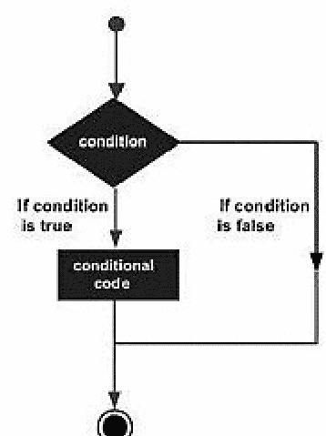

### 示例

```
<!DOCTYPE html>
<html>
<body>
<script>
var x=50;
if(x>30){
document.write("x 的值大于 30");
}
</script>
</body>
</html>
```

### 输出

x 的值大于 30

## if else 语句

如果条件为真或假，则使用 **if else** 语句。

### 语法

```
if(condition)
{
// 语句集
}
else
{
// 语句集
}
```

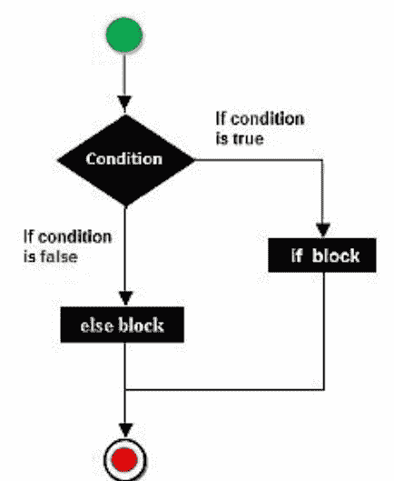

### 示例

```
<!DOCTYPE html>
<html>
<body>
<script>
var x=20;
if(x%2==0){
document.write("x 是偶数");
}
else{
document.write("a 是奇数")
}
</script>
</body>
</html>
```

### 输出

X 是偶数

## If else if

它只是查看内容以通过多个表达式检查表达式是否有效。**If else if** 是 if else 语句的更高级版本。

### 语法

```
If (condition1)
{
如果条件 1 为真则执行的语句
}
else if (condition 2)
{
如果条件 2 为真则执行的语句
}
else if (condition 3)
{
如果条件 3 为真则执行的语句
}
else
{
如果没有条件为真则执行的语句
}
```

### 示例

```
<!DOCTYPE html>
<html>
<body>
<script>
var x=50;
if (x==10){
document.write("x 等于 10");
}
else if(x==50){
document.write("x 等于 50");
}
else if(x==30){
document.write("x 等于 30");
}
else{
document.write("a 不等于 10、50 或 30");
}
</script>
</body>
</html>
```

### 输出

x 等于 50

## Javascript Switch 语句

在 JavaScript 中，switch 语句用于在不同条件下执行单个代码。它与 else if 语句相同。

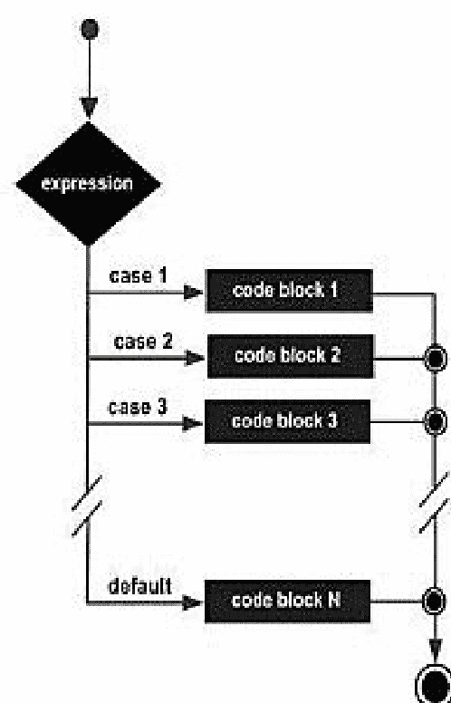

### 语法

```
switch (expression)
{
case 1: statement(s)
break;
case 2: statement(s)
break;
...
case n: statement(s)
break;
default: statements(s)
}
```

### 示例

```
<!DOCTYPE html>
<html>
<body>
<script>
var grade='B';
var result;
switch(grade){
case 'A':
result="A 等级";
break;
case 'B':
result="B 等级";
break;
case 'C':
result="C 等级";
break;
default:
result="无等级";
}
document.write(result);
</script>
</body>
</html>
```

### 输出

B 等级

## JavaScript 函数

在 <Script>.....</script> 标签内构建新函数的能力是 JavaScript 的一个基本特性。在 JavaScript 中，使用 function 关键字来声明函数。

为了重用文件，我们多次调用 JavaScript 函数。

## 优点 - JavaScript 函数

- 1. 代码可重用性：我们多次使用相同的功能以节省时间和代码。
- 2. 更少的编码：因此我们的软件被压缩了。当我们执行常规任务时，我们不需要编写大量代码。

### 语法

```
function functionName(参数或无)
{
语句
}
```

### 示例

```
<!DOCTYPE html>
<html>
<body>
<script>
function msg()
{
alert("你好！世界");
}
</script>
<input type="button" onclick="msg()" value="点击此处"/>
</body>
</html>
```

### 输出

你好世界！

## 带参数的函数

通过传递参数调用函数。

```
<!DOCTYPE html>
<html>
<body>
<script>
function getcube(number)
{
alert(number* number* number);
}
</script>
<form>
<input type="button" value="点击" onclick="getcube(3)"/>
</form>
</body>
</html>
```

### 输出

27

### 示例

```
<!DOCTYPE html>
<html>
<body>
<script>
function getname()
{
name=prompt("请输入姓名");
alert("欢迎 " + name + " 先生/女士");
}
</script>
</body>
<form>
<input type="button" value="点击" onclick="getname()"/>
</form>
</html>
```

## 带返回值的函数

调用返回值的函数并在程序中使用它。

```
<!DOCTYPE html>
<html>
<body>
<script>
function getInfo()
{
return "你好 Raj！你好吗？";
}
</script>
<script>
document.write(getInfo());
</script>
</body>
</html>
```

### 输出

你好 Raj！你好吗？

## Function() 构造函数

函数语句不仅用于定义新函数；它还可以与 Function() 构造函数和 new 运算符一起用于动态定义函数。

### 语法

```
<script>
    var variablename = new Function(Arg1, Arg2..., "函数体"
</script>
```

### 示例

```
<!DOCTYPE html>
<html>
<head>
<script>
var func = new Function("a", "b", "return a+b;");
function secondFunction(){
var result;
result = func(50,50);
document.write ( result );
}
</script>
</head>
<body>
<p>点击按钮调用函数</p>
<form>
<input type="button" onclick="secondFunction()" value="调用函数">
</form>
<p>在函数内使用不同的参数并自行尝试...
</p>
</body>
</html>
```

## 函数字面量

函数字面量的定义是 JavaScript 1.2 中引入的另一种描述函数的方式。它是一个描述没有名称的函数的表达式。

函数字面量的语法类似于函数语句，不同之处在于它用作表达式而不是语句，并且不需要函数名。

### 语法

```
<script>
var variablename = function (参数列表){
```

## 函数体

```javascript
};
</script>
```

### 示例

```html
<!DOCTYPE html>
<html>
<head>
<script>
var func = function(a,b){ return a+b };
function secondFunction(){
    var result;
    result = func(10,20);
    document.write ( result );
}
</script>
</head>
<body>
<p>点击按钮调用函数</p>
<form>
<input type="button" onclick="secondFunction()" value="调用函数">
</form>
<p>在函数内使用不同的参数，自己尝试一下...</p>
</body>
</html>
```

## JavaScript 对象

对象是一个具有状态和行为的实体。JavaScript 是一种专注于对象的脚本语言。虽然 JavaScript 是基于模板而非基于类的，但它允许我们直接构建对象。

### 语法

```javascript
objectName.objectProperty = propertyValue;
```

要在文本上写入一些内容，我们使用 document 属性的 write() 方法。

```javascript
document.write("Hello world")
```

### 示例

```html
<!DOCTYPE html>
<html>
<head>
<title>用户自定义对象</title>
<script type="text/javascript">
var book = new Object(); // 创建对象
book.subject = "5 points someone"; // 为对象分配属性
book.author = "Chetan Bhagat";
</script>
</head>
<body>
<script type="text/javascript">
document.write("书名是：" + book.subject + "<br>");
document.write("作者是：" + book.author + "<br>");
</script>
</body>
</html>
```

### 输出

书名是：5 points someone
作者是：Chetan Bhagat

## 对象的方法

### 示例

```html
<!DOCTYPE html>
<html>
<head>
<title>用户自定义对象</title>
<script type="text/javascript">// 定义一个将作为方法使用的函数
function addPrice(amount){
    this.price = amount;
}
function book(title, author){
    this.title = title;
    this.author = author;
    this.addPrice = addPrice; // 将该方法分配为属性。
}
</script>
</head>
<body>
<script type="text/javascript">
var myBook = new book("5 Points Someone", "Chetan Bhagat");
myBook.addPrice(150);
document.write("书名是：" + myBook.title + "<br>");
document.write("作者是：" + myBook.author + "<br>");
document.write("价格是：" + myBook.price + "<br>");
</script>
</body>
</html>
```

### 输出

作者是：Chetan Bhagat

价格是：150

## JavaScript 数组

数组用于在单个单元或内存位置中描述一组元素。

任何进入数组的元素都将存储在数组中，并带有一个从零开始的唯一索引。我们可以借助索引来存储数据。

在 JavaScript 中，我们必须使用 new 关键字来声明数组。我们使用 new Array 来生成一个数组 (n)。

序列中的槽位数量由 n 表示。

### 语法

```javascript
myarray = new Array(n);
```

**注意：** 如果我们在 JavaScript 中生成数组时未指定大小，则数组对象的大小将为零。

### 示例

```html
<!DOCTYPE html>
<html>
<body>
<script>
var i;
var emp = new Array();
emp[0] = "Ajay";
emp[1] = "Abhay";
emp[2] = "Arun";
emp[3] = "Shipra";
for (i=0; i<emp.length; i++)
{
    document.write(emp[i] + "<br>");
}
</script>
</body>
</html>
```

### 输出

Ajay
Abhay
Arun
Shipra

## 示例 2

```html
<!DOCTYPE html>
<html>
<head>
<script type="text/javascript">
function array()
{
    num = new Array(5)
    num[0] = 10
    num[1] = 20
    num[2] = 30
    num[3] = 40
    num[4] = 50
    sum = 0;
    for (i=0; i<num.length; i++)
    {
        sum = sum + num[i];
    }
    alert(sum)
}
</script>
</head>
<body>
<input type="button" onclick="array()" value="点击这里">
</body>
</html>
```

## 数组中的函数

| 函数 | 描述 |
| :--- | :--- |
| concat() | 将一个数组的元素连接到另一个数组的末尾，并返回数组。 |
| sort() | 对数组的所有元素进行排序。 |
| reverse() | 反转所有元素。 |
| slice() | 从指定索引开始提取指定数量的元素，而不从数组中删除它们。 |
| splice() | 从指定索引开始提取指定数量的元素，并从数组中删除它们。 |
| push() | 将数组中的所有元素推送到顶部。 |
| pop() | 从数组中弹出顶部元素。 |

## JavaScript 字符串

String 对象用于与字符字符串进行交互。它是存储和操作文本的工具。

在 JavaScript 中，有两种创建字符串的方法：

1.  字符串字面量。
2.  使用 new 关键字。

字符串字面量通过使用双引号形成。

### 语法

```javascript
var stringname="string value";
```

### 示例

```html
<!DOCTYPE html>
<html>
<body>
<script>
var str="Hello String Literal";
document.write(str);
</script>
</body>
</html>
```

### 输出

Hello String Literal

## 使用 new 关键字

### 语法

```javascript
var stringname=new String("new keyword")
```

### 输出

```html
<!DOCTYPE html>
<html>
<body>
<script>
var stringname=new String("Hello String");
document.write(stringname);
</script>
</body>
</html>
```

### 输出

Hello String

## 字符串属性

以下是字符串对象属性及其描述的列表。

1.  constructor。
2.  length。
3.  prototype。

**Constructor** – 此方法返回对象字符串函数的引用。

### 语法

```javascript
string.constructor
```

**Length** - 返回字符串中的字符数。

### 语法

```javascript
string.length
```

**Prototype** - 它允许任何对象应用属性和方法（Number、Boolean、string 和 data 等）。

### 语法

```javascript
object.prototype.name = value
```

## 方法

| 方法 | 描述 |
| :--- | :--- |
| charAt(index) | 返回给定索引处的字符。 |
| concat(str) | 合并两个字符串的文本并返回新字符串。 |
| indexOf(str) | 返回给定字符串的索引位置。 |
| lastIndexOf(str) | 返回给定字符串的最后一个索引位置。 |
| match() | 用于将正则表达式与字符串进行匹配。 |
| toLowerCase() | 用于返回转换为小写的给定字符串值。 |
| toUpperCase() | 用于返回转换为大写的给定字符串值。 |
| valueOf() | 返回指定对象的原始值。 |

## charAt()

这是一个从给定索引获取字符的方法。

```html
<!DOCTYPE html>
<html>
<body>
<script>
var str = new String( "Hello" );
document.writeln("str.charAt(0) is: " + str.charAt(0));
document.writeln("<br />str.charAt(1) is: " + str.charAt(1));
document.writeln("<br />str.charAt(2) is: " + str.charAt(2));
document.writeln("<br />str.charAt(3) is: " + str.charAt(3));
document.writeln("<br />str.charAt(4) is: " + str.charAt(4));
</script>
</body>
</html>
```

## concat(str)

此方法在添加两个或多个字符串后返回一个新字符串。

```html
<!DOCTYPE html>
<html>
<body>
<script>
var x="Hello";
var y="World";
var z=x+y;
document.write(z);
</script>
</body>
</html>
```

## indexOf(str)

indexOf(str) 过程返回给定字符串的索引位置。

```html
<!DOCTYPE html>
<html>
<body>
<script>
var x="Tutorial provide by tutorialandexample";
var y=x.indexOf("by");
document.write(y);
</script>
</body>
</html>
```

## lastIndexOf(str)

字符串 lastIndexOf(str) 方法返回字符串的最后一个索引位置。

```html
<!DOCTYPE html>
<html>
<body>
<script>
var x="Tutorial provide by tutorialandExample";
var y=x.lastIndexOf("by");
document.write(y);
</script>
</body>
</html>
```

## match()

```html
<!DOCTYPE html>
<html>
<body>
<script>
var str = "To more detail, see Chapter 2.5.4.1";
var re = /(chapter \d+(\.\d)*)/i;
var find = str.match( re );
document.write(find );
</script>
</body>
</html>
```

## toLowerCase()

它返回给定字符串的小写版本。

```html
<!DOCTYPE html>
<html>
<body>
<script>
var x="HELLO WORLD";
var y=x.toLowerCase();
document.write(y);
</script>
</body>
</html>
```

## toUpperCase()

返回大写字母形式的给定字符串。

```html
<!DOCTYPE html>
<html>
<body>
<script>
var x="hello world";
var y=x.toUpperCase();
document.write(y);
</script>
</body>
</html>
```

## valueOf()

它返回字符串对象的原始值。

```html
<!DOCTYPE html>
<html>
<body>
<script>
var str = new String("Hello world");
document.write(str.valueOf( ));
</script>
</body>
</html>
```

## Javascript 日期

日期对象是 JavaScript 语言内置的数据形式。`new Date` 对象用于构造数据对象。一个 JavaScript Date 实例代表一个特定的时间点。创建 JavaScript 日期对象的唯一方法是使用 JavaScript 作为构造函数。

### 语法

`Date()` 构造函数可用于使用以下语法生成日期对象。

```
new Date();
new Date(value);
new Date(dateString);
new Date(year, month, day, hours, minutes, seconds, milliseconds);
```

**注意：括号中的参数始终是可选的。**

### 描述

### year

年份由一个整数表示。对于 2000 年到 2099 年，其值范围映射为 0 到 99。

### Month

月份由一个整数表示，从 0（一月）开始，到 11（十二月）结束。

### Date

这是可选的。月份中的日期由一个整数表示。

### Hours

这是可选的。一天中的小时数由一个整数表示。

### Minutes

这是可选的。时间中的分钟部分由一个整数表示。

### Seconds

这是可选的。时间中的秒部分由一个整数表示。

### Milliseconds

这是可选的。时间中的毫秒部分由一个整数表示。

## 日期示例

```
<!DOCTYPE html>
<html>
<body>
<script>
var date=new Date();
var day=date.getDate();
var month=date.getMonth()+1;
var year=date.getFullYear();
document.write("<br>Date: "+day+"/"+month+"/"+year);
</script>
</body>
</html>
```

## 当前时间 - 示例

```
<!DOCTYPE html>
<html>
<body>
Current Time: <span id="txt"></span>
<script>
var today=new Date();
var h=today.getHours();
var m=today.getMinutes();
var s=today.getSeconds();
document.getElementById('txt').innerHTML=h+":"+m+":"+s;
</script>
</body>
</html>
```

## JavaScript 数学对象

Math 是一个内置对象，包含用于数学函数和常量的属性和方法。

它使你能够对数字执行数学运算。

语法

```
var pi_val = Math.PI;
var sin_val = Math.sin(30);
```

### 示例

#### Math.pow()

`Math.pow(x,y)` 返回 x 的 y 次幂的值：

```
<!DOCTYPE html>
<html>
<body>

<h2>JavaScript Math.pow()</h2>

<p>Math.pow(x,y) 返回 x 的 y 次幂的值：</p>

<p id="demo"></p>

<script>
document.getElementById("demo").innerHTML = Math.pow(6,2);
</script>

</body>
</html>
```

#### Math.sqrt()

`Math.sqrt(x)` 返回 x 的平方根。

```
<!DOCTYPE html>
<html>
<body>

<h2>JavaScript Math.sqrt()</h2>

<p>Math.sqrt(x) 返回 x 的平方根：</p>

<p id="demo"></p>

<script>
document.getElementById("demo").innerHTML = Math.sqrt(81);
</script>

</body>
</html>
```

#### Math.ceil()

`Math.ceil(x)` 返回将 x **向上**舍入到最接近的整数的值：

```
<!DOCTYPE html>
<html>
<body>

<h2>JavaScript Math.ceil()</h2>

<p>Math.ceil() 将一个数字<strong>向上</strong>舍入到最接近的整数。</p>

<p id="demo"></p>

<script>
document.getElementById("demo").innerHTML = Math.ceil(6.8);
</script>

</body>
</html>
```

## Javascript 数字对象

Number 对象是一个包装对象，允许你操作数值。

`Number()` 构造函数用于创建数字对象。

它可以是整数或浮点数。

### 语法

```
var n=new Number(value);
```

### 示例

```
<!DOCTYPE html>
<html>
<body>
<script>
var x=100;//整数值
var y=100.7;//浮点数值
var z=12e5;//指数值，输出：1200000
var n=new Number(20);//通过数字对象创建的整数值
document.write(x+" "+y+" "+z+" "+n);
</script>
</body>
</html>
```

### 输出

100 100.7 1200000 20

### 描述

数字对象最常用于以下目的：

- 如果声明无法转换为数字，则返回 NaN（非数字）。
- Number 可以在非构造函数上下文中（即不使用 `new` 操作符）用于执行类型转换。

### JavaScript 数字常量

| 常量 | 描述 |
|---|---|
| MIN_VALUE | 返回最小的正数。 |
| MAX_VALUE | 返回最大的正数。 |
| POSITIVE_INFINITY | 返回正无穷大，溢出值。 |
| NEGATIVE_INFINITY | 返回负无穷大，溢出值。 |
| NaN | 表示“非数字”值。 |