尽管本书在编写过程中已采取一切预防措施，但出版商对其中可能存在的错误或遗漏，或因使用本书所含信息而造成的任何损害概不负责。

## 通过编程电子游戏学Python（中级）

第一版。2022年11月17日。

版权所有 © 2022 Patrick Felicia。

ISBN: 979-8215956915

作者：Patrick Felicia。

## 目录

- 版权页
- 通过编程电子游戏学Python（中级）
- 第1章：从我们的射击游戏开始
- 第2章：创建物品栏
- 第3章：添加碰撞与人工智能
- 第4章：创建有限状态机
- 第5章：打磨我们的游戏
- 第6章：常见问题解答
- 致谢
- Patrick Felicia的其他著作
- 关于作者

## 通过编程游戏学Python

（中级）

## 第一版

一份使用Python和Pygame编写你的第一个射击游戏的分步指南。

## Patrick Felicia

## 通过编程游戏学Python

（中级）

版权所有 © 2022 Patrick Felicia

保留所有权利。未经出版商（Patrick Felicia）事先书面许可，不得以任何形式或任何方式复制、存储于检索系统或传播本书的任何部分，除非在评论文章或书评中嵌入简短引文。

在编写本书时，我们已尽一切努力确保所提供信息的准确性。然而，本书所含信息是按“原样”出售的，不附带任何明示或暗示的保证。作者及其经销商和分销商均不对因本书直接或间接造成的任何损害或声称造成的损害负责。

首次出版：2022年10月

出版者：Patrick Felicia

## 致谢

作者：Patrick Felicia

## 关于作者

Patrick Felicia是沃特福德理工学院的讲师和研究员，在那里他教授并指导本科生和研究生。他于2003年获得爱尔兰科克大学多媒体技术硕士学位，2009年获得计算机科学博士学位。他出版了多本关于将电子游戏用于教育目的的书籍和文章，包括《通过教育游戏改进学习和动机的研究手册：多学科方法》（由IGI出版）和《学校中的数字游戏：教师手册》，由欧洲学校网出版。Patrick还是《国际基于游戏的学习期刊》（IJGBL）的主编，以及爱尔兰基于游戏学习研讨会的会议总监，这是一个在爱尔兰各地举办的关于游戏和学习的知名会议。

## 本书的支持与资源

要完成本书中介绍的活动，您需要从配套网站下载启动包；它包含您完成项目所需的免费资源。您可以在此处下载：http://learntocreategames.com/book_downloads/python_games/book2/

本书献给Mathis

## 目录

- 致谢
- 关于作者
- 本书的支持与资源
- 目录
- 前言
- 本书涵盖的内容
- 使用本书所需条件
- 本书适合谁
- 本书不适合谁
- 您将如何从本书中学习
- 每章的格式与写作惯例
- 特别说明
- 如何从本书中获得最佳学习效果？
- 反馈
- 下载本书的解决方案
- 改进本书
- 支持作者
- 第1章：从我们的射击游戏开始
- 使用方向键移动非玩家角色
- 为玩家角色创建武器
- 为目标创建一个类
- 关卡回顾
- 总结
- 测验
- 测验答案

检查清单

## 第2章：创建物品栏

- 创建物品栏
- 在武器之间切换
- 收集弹药
- 关卡回顾
- 总结
- 测验
- 测验答案
- 检查清单
- 挑战1

## 第3章：添加碰撞与人工智能

- 本章所需资源
- 添加墙壁
- 添加与墙壁的碰撞检测
- 使用路径点移动非玩家角色
- 为非玩家角色添加听觉和视觉
- 关卡回顾
- 检查清单
- 测验
- 测验答案
- 挑战1

## 第4章：创建有限状态机

- 初始化游戏
- 跟随玩家
- 触发状态之间的转换
- 生成非玩家角色
- 关卡回顾
- 检查清单
- 测验
- 测验答案
- 挑战1

## 第5章：打磨我们的游戏

- 改变敌人的外观
- 显示点
- 检测与点的碰撞并更新分数
- 显示分数
- 检测与非玩家角色的碰撞
- 关卡回顾
- 检查清单
- 测验
- 测验答案
- 挑战1

## 第6章：常见问题解答

- 脚本
- 与资源的交互
- 使用图形用户界面
- 创建和使用类
- 使用列表
- 图片与音频
- 检测用户输入

致谢

## 前言

本书将向您展示如何能够非常快速地用Python编程并创建游戏。

Python是一种强大的编程语言，广泛应用于各行各业，即使您拥有（或正在使用）技术规格非常低的计算机，也可以使用它。

本系列丛书《通过编程游戏学Python》让您能够探索Python的核心功能，特别是那些能够快速创建有趣的2D游戏的功能。阅读完本系列丛书后，您应该会发现用Python编程和创建简单而有趣的电子游戏变得更容易了。

本系列丛书假设读者没有先验知识，它将带您入门Python，通过轻松的学习曲线，让您快速掌握这门编程语言提供的所有出色功能。

通过完成每一章，并遵循分步说明，您将逐步提高技能，变得更加精通Python，并创建多个游戏。

除了精通Python，您还将创建包含许多电子游戏常见技术的游戏，例如：关卡设计、对象创建、纹理、碰撞检测、灯光、武器创建、角色动画、粒子、人工智能和菜单。

您将学习如何使用Python和Pygame创建自定义菜单和简单的用户界面，并为非玩家角色（NPC）制作动画并赋予其人工智能，使其能够使用寻路算法跟随玩家角色。

最后，您还可以在本书的不同阶段导出您的游戏，以便与朋友分享并获得一些反馈。

## 本书涵盖的内容

[第1章：从我们的射击游戏开始](https://example.com) 解释了如何创建和移动一个2D角色；它还向你展示了如何添加武器（一把枪），以便玩家角色可以射击。最后，本章还将向你展示如何为子弹创建一个类，以保持其管理的流畅性。

[第2章：创建一个](https://example.com) 解释了如何为玩家角色拥有的武器创建一个库存系统。它向你展示了如何组合类和列表，以便玩家可以在武器之间切换，并收集和管理弹药。

[第3章：添加碰撞和人工智能](https://example.com) 向你展示了如何通过引入可以巡逻、并通过视觉和听觉检测玩家角色的NPC，来为你的游戏增加挑战。

[第4章：创建一个有限状态机](https://example.com) 让你为NPC创建一个有限状态机，以便更容易管理NPC的行为。你还将学习如何管理每个状态之间的转换，以及如何定期实例化和生成NPC。

[第5章：打磨我们的](https://example.com) 提供了关于如何改进我们游戏的解释；它向你展示了如何改变NPC的外观、显示分数、检测玩家与NPC之间的碰撞以及如何添加音效。

[第6章：常见问题解答](https://example.com) 提供了与本书涵盖主题（例如，脚本、音频、交互、人工智能或用户界面）相关的常见问题解答（FAQ）。它还提供了指向额外独家视频教程的链接，这些教程可以帮助你解决一些问题。

## 使用本书所需的内容

要完成本书中介绍的项目，你只需要安装Python和Pygame。

在计算机技能方面，本书介绍的所有知识都假设读者没有先前的编程经验。因此，目前你只需要能够执行常见的计算机任务，例如下载文件、打开和保存文件、习惯于拖放项目以及打字。

## 本书适合谁

如果你能对所有这些问题回答“是”，那么这本书就适合你：

- 你想学习Python吗？
- 你想精通Python和Pygame提供的核心功能吗？
- 你想自学、教你的学生或你的孩子如何使用编程来创建游戏吗？
- 你想开始创建有趣的2D游戏吗？
- 尽管你可能之前接触过Python或Pygame，但你想更深入地研究这些主题并更详细地理解核心功能吗？

## 本书不适合谁

如果你能对所有这些问题回答“是”，那么这本书就<u>不</u>适合你：

- 你已经能够使用Python编写代码来实现高级功能或行为了吗？
- 你已经能够轻松地使用Pygame和Python编写射击游戏了吗？
- 你在寻找一本关于Python的参考书吗？
- 你是一个有经验的（或至少是高级的）Python用户吗？

如果你能对所有四个问题回答“是”，你可能需要寻找本系列的下一本书。要查看这些书涵盖的内容和主题，你可以查看官方网站。

## 你将如何从本书中学习

因为所有学生的学习方式不同，对课程的期望也不同，本书的设计旨在确保所有读者都能找到适合他们的学习结构。因此，它包括以下内容：

- 每章开头都有一个学习目标列表，以便读者对将要涵盖的技能有一个概览。
- 每个部分都包括所涵盖活动的概述。
- 许多活动都是循序渐进的，学习者也可以通过每章末尾提供的挑战来参与更深入的学习和问题解决技能。
- 每章都以一个测验和挑战结束，通过这些你可以将你的技能（和获得的知识）付诸实践，并看看你掌握了多少。挑战包括编码、调试或根据你在本章中获得的知识创建新功能。
- 本书侧重于你需要的核心技能。有些部分也更详细。然而，一旦概念得到解释，必要时会提供指向额外资源的链接。
- 代码是逐步引入的，并有详细解释。

## 每章的格式和写作惯例

在整本书中，为了使阅读和学习更容易，将使用文本格式和图标来突出显示所提供的信息的部分，并使其更具可读性。

## 特别说明

每章都包括资源部分，以便你可以进一步理解和掌握Python。这些包括：

- 每章的测验：这些测验通常包括10个问题，测试你对本章涵盖主题的知识。答案在配套网站上提供。
- 检查清单：它包括5到10个关键概念和技能，你需要在进入下一章之前熟练掌握。
- 挑战：每章都包括一个挑战部分，要求你结合你的技能来解决一个特定的问题。

作者的注释如下所示：
作者的建议出现在这个框中。
代码如下所示：

```
score = 100
player_name = “Sam”
```

包含本章涵盖要点的检查清单如下所示：

## 你如何才能最好地从本书中学习？

与你的朋友谈论你正在做的事情。

我们常常认为我们理解一个主题，直到我们必须向朋友解释并回答他们的问题。通过解释你的不同项目，你刚刚学到的东西会对你变得更清晰。

做练习。

所有章节都包括练习，这些练习将帮助你通过实践来学习。换句话说，通过完成这些练习，你将能够更好地理解主题并获得实践技能（即，而不仅仅是阅读）。

不要害怕犯错。

我通常告诉我的学生，犯错是学习过程的一部分。你犯的错误越多，你学习的机会就越多。一开始，你可能会发现错误令人不安，或者Python在你理解出了什么问题之前无法按预期工作。

尽早编译和运行你的游戏。

编译和运行你的第一个游戏总是很棒的。

分块学习。

连续学习五章或六章可能会令人不安，因为它可能会降低你的动力。相反，给自己足够的时间学习，按照自己的节奏学习，并以小单元学习（例如，每天15到20分钟）。这至少会为你做两件事：它会给你的大脑时间来“消化”你刚刚学到的信息，这样你第二天就可以重新开始。它还可以确保你不会“精疲力竭”，并保持你的动力水平高涨。

## 反馈

虽然我已经尽一切努力制作一本高质量和有价值的书，但我总是感谢读者的反馈，以便相应地改进这本书。如果你想提供反馈，你可以通过电子邮件发送给我。

## 下载本书的解决方案

要完成本书中介绍的活动，你需要在配套网站上下载启动包；它包括你完成项目所需的免费资源。你可以在这里下载：

## 改进本书

尽管在检查本书内容时非常小心，但我是人，书中可能仍会存在一些错误。因此，如果你能让我知道你在本书中遇到的任何问题或错误，以便解决它并相应地更新本书，那将是非常好的。要报告错误，你可以通过电子邮件向我发送以下信息：

- 书名。
- 检测到错误的页面。
- 描述错误以及你认为的正确答案。

一旦收到你的电子邮件，将检查错误，如果是有效的错误，将进行更正，并相应地更新书页以反映更改。

## 支持作者

本书凝聚了大量心血，是长时间准备、头脑风暴和最终写作的成果。因此，我恳请您不要分发任何非法副本。

这意味着，如果朋友想要本书，他/她必须通过官方渠道购买（即通过您喜爱的电子商店或本书的官方网站）。

如果您的朋友对本书感兴趣，您可以将他们引导至本书的官方网站，在那里他们可以购买本书、参与每月抽奖以有机会获得免费赠书，或接收未来促销活动的通知。

## 第一章：从我们的射击游戏开始

在本节中，我们将学习如何通过实现一个可以四处移动和发射弹道的动画2D角色，来创建我们射击游戏的第一部分。

完成本章后，您将能够：

-   检测玩家按下的按键，并相应地移动玩家角色。
-   每当玩家按下空格键时，创建并发射弹道。
-   创建一个可供玩家用来测试其武器的目标。
-   创建一个用于每个NPC的类，该类需考虑NPC的生命值。
-   每当NPC被子弹击中时，对其造成伤害。

## 使用方向键移动NPC

在本节中，我们将开始学习创建一个玩家角色，该角色可以根据玩家按下的按键向各个方向移动。最初，这个玩家角色将由一个红色方块表示；然而，在后续章节中，这个红色方块将被一个动画角色所取代。玩家角色将能够向四个方向（即左、右、上、下）移动。我们将通过以下步骤来实现这一点：

首先，我们将加载创建动画所需的不同图片。
然后，我们将基于这些图片创建动画。
随着屏幕刷新，我们将更改动画的图像以产生动画的错觉。
完成此操作后，我们将开始将此信息应用于不同方向，因此我们首先检测玩家按下了哪个键（左、右、上或下），然后将主角向相应方向移动。

用于角色的动画将始终相同，并根据玩家移动的方向进行旋转；因此，例如，当角色向右移动时，我们将使用角色向右移动的动画；但是，如果您使用左箭头键，我们可以使用相同的动画片段，但将其沿垂直轴翻转，这样该动画现在就是向左的。要向上和向下移动，情况完全相同，只是原本向右的初始动画将被旋转，使角色现在面朝上，同样，如果向下移动，我们将旋转此图像使其面朝下。

在本章结束时，您将创建一个窗口，其中包含一个NPC，您可以使用方向键将其向四个方向移动，如下图所示。

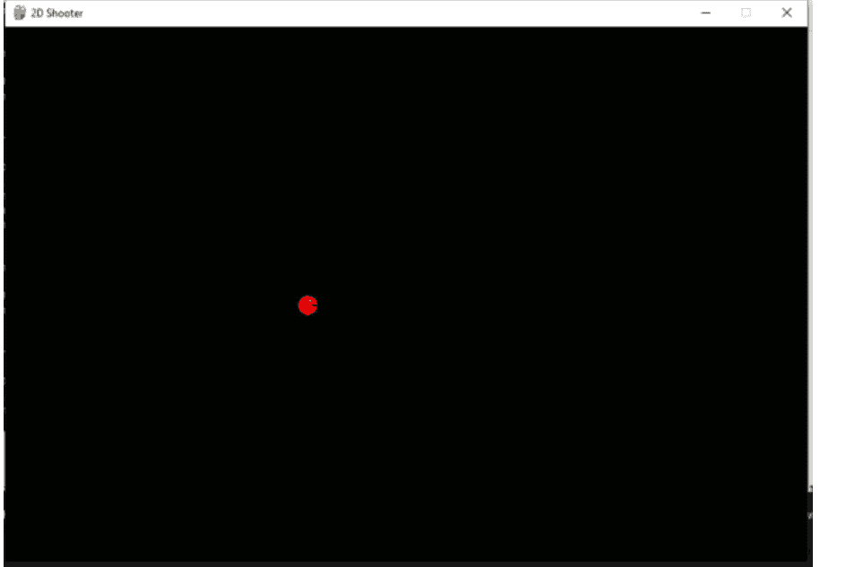

那么，让我们开始吧：

请打开您选择的文本编辑器。
创建一个新文件。
将其保存为。
将资源文件夹中名为 assets 的文件夹复制到您保存脚本的同一文件夹中；该资源文件夹包含将用于动画的图片。
请在脚本开头添加以下代码。

```python
import pygame
import time
```

```python
WIDTH, HEIGHT = 900, 600
WIN = pygame.display.set_mode((WIDTH, HEIGHT))
pygame.display.set_caption("2D Shooter")
FPS = 60
```

在前面的代码中：

我们导入了库 pygame 和 time；前者用于游戏元素，后者将用于设置游戏的帧率。
我们声明了两个变量 WIDTH 和 HEIGHT，并将它们的值设置为 900 和 600；这些变量将用于设置游戏屏幕的大小。
使用命令 `pygame.display.set_mode`，我们根据之前定义的变量设置游戏窗口的大小。
我们设置游戏窗口的标签（或标题）。
最后，我们定义了一个名为 FPS 的变量，该变量将用于设置我们游戏的帧率。

现在我们已经定义了游戏显示窗口的特性，我们可以开始定义将用于NPC的动画图像和其他参数。

请将以下代码添加到脚本中：

```python
VEL = 4
player_angle = 0
BG = pygame.image.load("assets/Background.jpg")
BG = pygame.transform.scale(BG, (WIDTH, HEIGHT))
```

在前面的代码中：

我们定义了变量 VEL 和 player_angle；前者用于角色的速度，后者用于定义动画图像的旋转角度。
请记住，每当角色改变方向时，将使用相同的动画，只是根据角色的方向进行旋转。
然后，我们设置用于游戏背景的图像，并对其进行缩放，使其大小与游戏窗口的宽度和高度匹配。

接下来，我们将设置用于角色动画的图像：

请将以下代码添加到脚本中：

```python
p_1 = pygame.image.load("assets/p_1.jpg")
p_1 = pygame.transform.rotate(pygame.transform.scale(p_1, (25, 25)), 0)
p_2 = pygame.image.load("assets/p_2.jpg")
p_2 = pygame.transform.rotate(pygame.transform.scale(p_2, (25, 25)), 0)
p_3 = pygame.image.load("assets/p_3.jpg")
p_3 = pygame.transform.rotate(pygame.transform.scale(p_3, (25, 25)), 0)
p_4 = pygame.image.load("assets/p_4.jpg")
p_4 = pygame.transform.rotate(pygame.transform.scale(p_4, (25, 25)), 0)
p_current = p_1
animation_frame = 0
```

在前面的代码中：

我们声明了变量 p_1, p_2, p_3, p_4；每个变量都链接到图像 p_1.jpg, p_2.jpg, p_3.jpg, p_4.jpg；这四张图像是玩家角色动画的一部分，位于 assets 文件夹中。
我们还缩放了这些图像，使它们在游戏中的大小为 25 像素 x 25 像素。
在转换图像时，我们不应用任何旋转，因此转换的旋转角度为 0。
最后，我们定义了变量 p_current 和 animation_frame；前者用作当前要显示的图像，而后者对应于动画中的当前帧。

现在我们已经定义了要包含在动画中的不同图像，我们将创建一个生成动画的方法。

请将以下函数添加到脚本中：

```python
def animation():
    global p_1, p_2, p_3, p_4, p_current, animation_frame, player_angle
    animation_frame += 1
    if animation_frame == 5:
        p_current = p_1
        p_current = pygame.transform.rotate(p_current, player_angle)
    elif animation_frame == 10:
        p_current = p_2
        p_current = pygame.transform.rotate(p_current, player_angle)
    elif animation_frame == 15:
        p_current = p_3
        p_current = pygame.transform.rotate(p_current, player_angle)
    elif animation_frame == 20:
        p_current = p_4
        p_current = pygame.transform.rotate(p_current, player_angle)
        animation_frame = 0
```

在前面的代码中：

我们定义了方法 `animation()`。此方法将用于基于图像的连续显示来生成动画。
然后，我们引用将在方法中使用的全局变量，即：p_1, p_2, p_3, p_4, p_current, animation_frame 和 player_angle。
变量 animation_frame 增加 1。
然后，我们每 5 帧更改一次显示的图像，或者换句话说，每当变量 animation_frame 等于 5、10、15 或 20 时。
每次发生这种情况时，我们都会相应地旋转要显示的图像。

因此，在这个阶段，我们已经设法创建了一个可以生成动画的方法；接下来，我们将创建一个检测玩家何时按下方向键的方法：

请将以下方法添加到脚本中：

```python
def controls(keys_pressed):
    global player_angle, p_current, player_rect
    if keys_pressed[pygame.K_LEFT] and player_rect.x > 10:
        player_rect.x -= VEL
        player_angle = -90
    if keys_pressed[pygame.K_RIGHT] and player_rect.x < 850:
```

player_rect.x += VEL
player_angle = 90
if keys_pressed[pygame.K_UP] and player_rect.y > 50:
    player_rect.y -= VEL
    player_angle = 180
if keys_pressed[pygame.K_DOWN] and player_rect.y < 550:
    player_rect.y += VEL
    player_angle = 0

在前面的代码中：

我们定义了一个名为 `controls` 的方法，它接受一个参数：
在该方法内部，我们引用了三个全局变量 `player_angle`、`p_current` 和 `player_rect`。
然后我们检查键盘上的方向键是否被按下。
在每种情况下，我们都会检查我们是否离屏幕边界太近。
我们还会根据按下的是上、下、左还是右键，以及根据最后按下的键来修改玩家沿 x 轴或 y 轴的位置以及旋转角度。

既然我们已经定义了如何处理不同的按键，我们就可以开始研究游戏的主循环以及处理玩家角色显示的方法了。
首先，让我们定义并创建负责显示玩家角色的方法：

请将以下方法添加到脚本中：

```python
def window():
    global player_rect
    WIN.blit(BG,(0,0))
    WIN.blit(p_current,(player_rect.x,player_rect.y))
    pygame.display.update()
```

在前面的代码中：

我们定义了一个名为 `window` 的函数，它接受一个参数，该参数在函数内将被称为 `player_rect`；这个变量基本上是用于设置玩家角色精灵边界的矩形。
然后我们显示背景图像。
我们显示为玩家角色创建的动画中的当前图像。
最后，我们使用 `pygame.display.update()` 命令更新屏幕。

我们刚刚定义的方法将从主游戏循环中定期调用，以确保游戏的所有视觉元素都得到频繁的显示和更新。
所以，接下来，让我们创建主游戏循环。

请将以下函数添加到脚本中：

```python
def main():
    global player_rect
    player_rect = pygame.Rect(50,300,25,25)
    clock = pygame.time.Clock()
```

在前面的代码中：

我们定义了一个名为 `main` 的函数。
在这个函数内部，我们将角色的初始位置设置在 `(50, 300)`。
最后，我们创建一个名为 `clock` 的新变量，它将用于保持帧率。

既然我们已经定义了 NPC 的初始位置和用于帧率的时钟，我们就可以创建一个循环，用于反复处理用户的键盘输入、修改玩家角色的位置并刷新屏幕。

请在你刚刚输入的代码之后，在 `main` 方法内添加以下代码：

```python
    while True:
        clock.tick(FPS)
        key=pygame.key.get_pressed()
        for event in pygame.event.get():
            if event.type == pygame.QUIT:
                pygame.quit()
        window()
        controls(key)
        animation()
```

在前面的代码中：

我们创建了一个无限的 `while` 循环。
我们调用 `clock.tick(FPS)` 函数，传递变量 `FPS` 的值来设置游戏的帧率。
然后我们测试玩家按下的键。
如果玩家想通过关闭窗口来退出游戏，那么所有 pygame 模块都将被取消初始化；换句话说，我们正确退出，给系统留出时间在退出前保存所需的数据。

然后我们调用之前创建的方法：名为 `window` 的方法（用于刷新屏幕）、`controls`（用于检测和处理用户的键盘输入）和 `animation`（用于相应地为玩家角色制作动画）。

所以，在这个阶段，我们已经创建了移动玩家角色所需的所有变量和方法。最后一件事是调用 `main` 函数，所以请将此代码添加到脚本的最末尾。

```python
main()
```

你现在可以保存你的代码，并确保你从资源包复制的名为 `assets` 的文件夹与你刚刚创建的脚本位于同一文件夹中。

当你编译你的脚本时，你应该会看到一个新窗口，如下图所示。按下方向键后，玩家角色应该可以向四个方向移动。

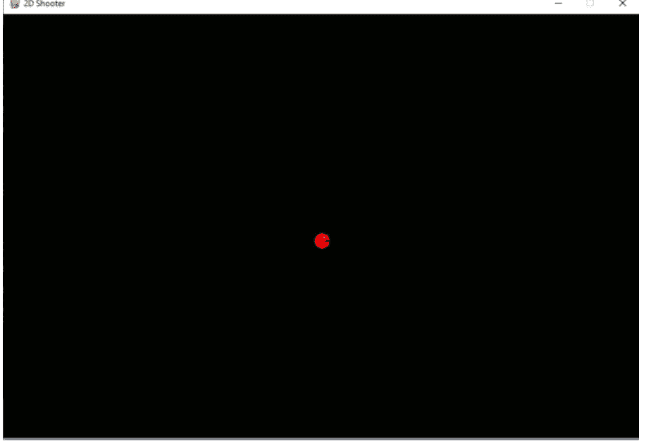

## 为玩家角色创建武器

虽然上一节重点在于创建和移动一个 2D 玩家角色，但本节将重点为玩家角色添加武器并使用它。
这将包括：

- 检测用户何时按下空格键
- 创建一个朝向玩家角色所看方向移动的子弹。
- 让子弹在屏幕上移动。

所以第一阶段将专注于创建一把枪，它将定期发射子弹。

我们将检测玩家是否按下了空格键。
如果是这种情况，我们将创建一个子弹。
这个子弹将从一个名为 `Bullet` 的类创建，并添加到一个子弹数组中。
这个子弹将被推进（即移动）到玩家所看的方向。
当这个子弹与障碍物碰撞时，它将被删除。
每颗子弹之间将应用一个延迟，以便玩家不能持续射击。

既然流程已经清晰，让我们创建并添加那个武器：

请打开你在上一节中一直在处理的脚本。
在脚本中的第一个方法之前添加以下代码：

```python
bullets=[]
can_shoot = True
shoot_timer = 0
shoot_delay = 20
```

在前面的代码中：
我们声明了几个变量：

`can_shoot` 用于了解玩家是否可以射击。
`shoot_timer` 用于计算每次射击之间的帧数或秒数。
`shoot_delay` 是以帧为单位表示的每次射击之间的延迟。

一旦我们定义了全局变量，我们也可以定义用于表示和显示目标的变量。

请在前面的代码下方添加以下代码：

```python
target = pygame.Rect(300,300,30,30)
target_health_rectangle = pygame.Rect(300,290,30,10)
target_health = 100
```

在前面的代码中：

我们创建了一个名为 `target` 的变量，一个位于 `(300, 300)` 位置、宽度和高度为 30 像素的矩形。

我们还定义了一个矩形，它将显示在目标正上方，用于显示 NPC 的生命值。随着目标被子弹击中，这个矩形的宽度将相应减少。
最后，我们设置了变量 `target_health`，它将保存关于目标生命值的信息；随着更多子弹击中目标，这个变量将相应减少。

既然我们已经完成了与玩家角色发射的子弹和目标相关的变量的定义，我们将为每颗子弹定义一个新的类。这将使子弹的创建和管理更加容易。

请将以下代码添加到脚本中：

```python
class Bullet:
    def __init__(self, x, y, direction):
        self.x = x + 30
        self.y = y + 30
        self.direction = direction
        self.bullet= pygame.Rect(1100,1000,6,5)
        self.speed = 10
        self.collision_rect = pygame.Rect(self.x,self.y, 25, 25)
```

在前面的代码中：

我们定义了 `Bullet` 类，它将用于实例化新的子弹。
我们为这个类定义了一个构造函数。
构造函数接受三个参数（前面是参数 `self`，在调用函数时不会使用），包括 `x`、`y` 和 `direction`。这三个参数将用于设置新子弹的初始位置和方向。

在构造函数中，我们设置了子弹的 x 和 y 坐标，以及它的方向。正如你稍后将看到的，传递给此方法的 `x` 和 `y` 参数将基于玩家角色的位置；因此，为了让子弹正好从玩家的边界开始，我们将 x 和 y 坐标都加上了 30。
我们使用参数 `direction` 的值设置子弹的方向；同样，正如你稍后将看到的，当调用此方法时，我们将为参数传递玩家角色的方向，因此，实际上，子弹的方向将与玩家角色的方向相同。
我们将子弹的速度设置为 `10`。
最后，我们定义了一个矩形，用于检测子弹与任何障碍物之间的碰撞。这个矩形的位置和大小基于子弹的位置和大小。

接下来，我们将添加成员方法，用于在子弹被创建（或实例化）后移动和显示它。

请将此方法添加到类中：

```python
    def draw_bullet(self):
        self.bullet.x=self.x
        self.bullet.y=self.y
        pygame.draw.rect(WIN,'YELLOW',self.bullet)
```

在前面的代码中，我们定义了一个名为 `draw_bullet` 的新成员方法。在该方法中，我们在由该子弹的 x 和 y 坐标定义的位置，用黄色绘制名为 `bullet` 的矩形。

请将此方法添加到类中：

def move(self):
    if self.direction == 0:
        self.y += self.speed
    if self.direction == 180:
        self.y -= self.speed
    if self.direction == 90:
        self.x += self.speed
    if self.direction == -90:
        self.x -= self.speed

在前面的代码中：

我们定义了一个名为 `move` 的成员方法，该方法将被调用以移动子弹。根据子弹的当前方向，我们设置其新位置。速度基于子弹的方向：0 表示向下，180 表示向左，90 表示向右，-90 表示向左。

既然我们已经定义了一个移动子弹的方法，接下来我们将定义一个检测子弹与任何障碍物（在我们的例子中即目标）之间碰撞的方法。

请将以下函数添加到类中：

```
def check_collision(self):
    self.collision_rect.x = self.x
    self.collision_rect.y = self.y
    if (self.collision_rect.colliderect(target)):
        return -1
    return 1
```

在前面的代码中：

我们定义了一个新的成员方法 `check_collision`。在此方法内部，我们设置了名为 `collision_rect` 的矩形的位置，该矩形用于检测子弹的碰撞。然后，我们检查该矩形是否与另一个名为 `target` 的矩形发生碰撞，该矩形是预先定义的，用于定义目标周围的碰撞边界。如果检测到子弹与目标之间的碰撞，则该方法返回值 -1，否则返回值 1。

至此，我们已经完成了类的定义，包含了管理每颗子弹的创建、移动和碰撞所需的所有成员变量和方法。因此，现在我们可以开始专注于检测玩家何时按下空格键，并根据玩家角色的位置、方向以及每颗子弹之间应应用的延迟来实例化新的子弹。首先，我们将修改名为 `controls` 的方法，以便检测玩家何时按下空格键。

请将以下代码添加到函数 `controls` 中（新代码用粗体表示）：

```
def controls(keys_pressed):
    global player_angle, p_current, player_rect, can_shoot
```

在前面的代码中，我们引用了全局变量 `can_shoot`，因为它将在该方法内被使用和修改。

请将以下代码添加到函数 `controls` 中（新代码用粗体表示）：

```
if keys_pressed[pygame.K_SPACE]:
    my_bullet = Bullet(player_rect.x-15, player_rect.y-15, player_angle)
    bullets.append(my_bullet)
```

在前面的代码中：

我们检查用户是否按下了空格键；我们还检查变量 `can_shoot` 是否设置为 `True`，以防止玩家在按住空格键时无限射击。变量 `can_shoot` 被设置为 `False`。使用玩家的位置和方向创建了一个新的 `Bullet` 类实例，并进行调整使其从玩家角色的中心开始；这个新实例被保存在名为 `my_bullet` 的变量中，该变量随后被添加到名为 `bullets` 的子弹列表中。

接下来，我们将修改函数 `window`，以便在屏幕上显示目标。

请将以下代码添加到函数 `window` 中（新代码用粗体表示）：

```
def window():
    global player_rect
    global bullets, target_health, target, target_health_rectangle
```

在前面的代码中，我们引用了之前在脚本中定义的一些全局变量。

请将以下代码添加到函数 `window` 中（新代码用粗体表示）：

```
pygame.draw.rect(WIN, 'RED', target)
pygame.draw.rect(WIN, "GREEN", (target.x, target.y-10,
target_health*30/100, 10))
WIN.blit(p_current, (player_rect.x, player_rect.y))
pygame.display.update()
```

在前面的代码中，我们绘制了一个红色矩形来象征目标；该矩形的尺寸和位置基于之前定义的矩形 `target`。然后我们在前一个矩形上方绘制另一个矩形，用于指示目标的生命值；它位于前一个矩形上方 10 像素处，其宽度将与 `target_health` 的值成比例。因此，其宽度将随着目标生命值的减少而减小。

你现在可以保存并编译你的代码，当游戏开始时，你应该能看到玩家角色，以及一个由红色立方体表示的 NPC，其上方有一个绿色的生命值条，如下图所示。


下一步将是添加向 NPC 射击子弹的能力，并在子弹与该 NPC 碰撞时相应地减少其生命值。

因此，在接下来的步骤中，我们将执行以下操作：发射一颗子弹，测试它是否与 NPC 碰撞，并在碰撞时相应地减少 NPC 的生命值。

请在函数 `window` 中前一个代码之后添加以下代码：

```
for bullet in bullets:
    bullet.move()
    bullet.draw_bullet()
    test = bullet.check_collision()
```

在前面的代码中：

我们遍历关卡中存在的每颗子弹。我们绘制每颗子弹。我们检查每颗子弹是否与任何障碍物碰撞。

既然已经测试了子弹与障碍物之间的碰撞，我们就可以确定是否应该将子弹从游戏中移除。

请在函数 `window` 中添加以下代码（新代码用粗体表示）：

```
test = bullet.check_collision()
if (test == -1):
    bullets.pop(-1)
    target_health -= 10
    if (target_health <= 0):
        target.x = 1000
```

在前面的代码中：

我们检查方法 `check_collision` 返回的值。在发生碰撞的情况下（即返回值为 -1），我们从列表中移除该子弹。我们将目标的生命值减少 10。如果目标的生命值小于或等于 0，我们通过更改其 x 坐标将目标移出屏幕。稍后，每个被击中的目标都将从关卡中移除。

你现在可以保存你的脚本；当你编译脚本时，你应该能看到窗口包含一个红色方块（即一个目标）。

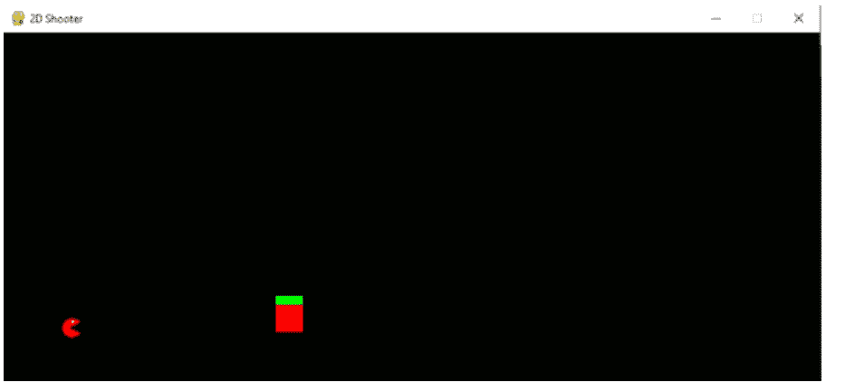

然后你可以通过按空格键向这个目标射击，并检查其生命值指示器的大小减小，直到生命值达到零，目标从屏幕上消失。


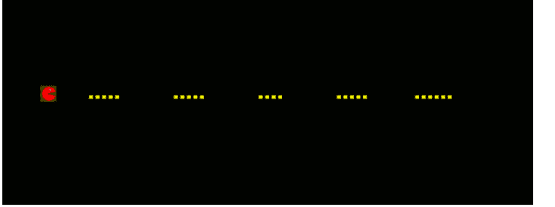

正如你所看到的，我们能够发射子弹；然而，我们可能需要降低射速，这样弹药才不会消耗得太快。

因此，在这个阶段，射击功能的所有元素都已准备就绪，除了能够在射击之间应用延迟，以防止玩家角色无限射击子弹。

请按如下方式修改方法 `controls`（新代码用粗体表示）：

```
if keys_pressed[pygame.K_SPACE] and can_shoot:
    can_shoot = False
    my_bullet = Bullet(player_rect.x -15, player_rect.y -15, player_angle)
    bullets.append(my_bullet)
```

将以下代码添加到方法 `main` 中（新代码用粗体表示）。

```
def main():
    global player_rect
    global can_shoot, shoot_timer
```

请按如下方式修改方法 `main`（新代码用粗体表示）：

```
for event in pygame.event.get():
    if event.type == pygame.QUIT:
        pygame.quit()
    if (can_shoot is False):
        shoot_timer += 1
        if (shoot_timer >= shoot_delay):
            can_shoot = True
            shoot_timer = 0
```

在前面的代码中：

我们检查变量 `can_shoot` 是否设置为 false。如果是这种情况，我们将变量 `shoot_timer` 的值增加一。如果变量 `shoot_timer` 达到变量 `shoot_delay` 的值，那么我们将重置变量 `can_shoot` 和 `shoot_timer`。因此，实际上，在发射一颗子弹后，一个计时器将计数 20 帧（即变量 `shoot_delay` 的值），然后允许玩家再次射击。

你现在可以保存并编译你的代码；当游戏运行时，你应该能看到射速已按如下图所示降低。

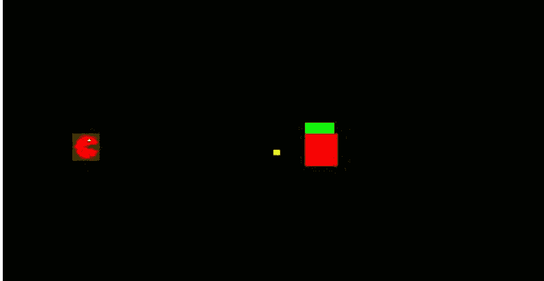

## 为目标创建一个类

在这个阶段，射击器工作得非常好，玩家角色可以射击一个带有生命值指示器的目标。话虽如此，为每个 NPC 创建一个类将是非常好的，这样我们就可以轻松地添加和管理多个目标。因此，在本节中，我们将创建这样一个类，并修改我们的脚本，以便我们可以基于该类添加和管理新目标。

请在脚本中第一个方法之前添加以下类，例如，就在 `Bullet` 类之前：

```
class NPC:
    def __init__(self, x, y, color):
        self.x = x
        self.y = y
        self.color = color
        self.health = 100
        self.collision_rect = pygame.Rect(self.x, self.y, 25, 25)
```

在前面的代码中：

我们定义了一个名为 `NPC` 的类。然后我们定义了该类的构造函数。构造函数接受三个参数：NPC 的 x 和 y 坐标，以及它的颜色。这些参数随后用于设置 NPC 的位置及其颜色。构造函数还定义了其他成员变量，包括 `health`（NPC 的生命值）和 `collision_rect`（一个用于检测与其他对象碰撞的矩形）。

既然构造函数和成员变量已经定义好了，我们可以为这个类定义一个成员方法，用于绘制NPC（或者目前代表它的方块）。

请将以下方法添加到类中：

```python
def draw(self):
    pygame.draw.rect(WIN, self.color, (self.x, self.y, 30, 30))
    pygame.draw.rect(WIN, "GREEN", (self.x, self.y-10, self.health*30/100, 10))
```

在上面的代码中，我们定义了一个名为 `draw` 的方法。这个方法绘制了对应NPC的矩形及其生命值条。

既然NPC类已经定义好了，我们只需要根据这个类实例化新的目标NPC，然后检测每个NPC的碰撞。

请在类定义之后添加以下代码：

```python
npcs = []
npc1 = NPC(400, 400, "BLUE")
npc2 = NPC(400, 500, "YELLOW")
npcs.append(npc1)
npcs.append(npc2)
```

在上面的代码中：
我们声明了一个名为 `npcs` 的列表，它将包含所有从 `NPC` 类实例化的新NPC。
我们根据该类实例化了两个新的NPC。我们设置了它们的位置和颜色。
最后，我们将这些NPC添加到名为 `npcs` 的列表中。

接下来，我们将处理子弹和NPC之间的碰撞。为此，我们将创建一个方法来检测子弹和从 `NPC` 类实例化的NPC之间的碰撞。

请将以下成员方法添加到类中：

```python
def check_collision2(self, the_npcs, the_bullets):
    self.collision_rect.x = self.x
    self.collision_rect.y = self.y
    npc_index = 0
    for npc in the_npcs:
        if (self.collision_rect.colliderect(npc.collision_rect)):
            npc.health -= 10
            npc.draw()
            the_bullets.pop(-1)
            if (npc.health <= 0):
                npcs.pop(npc_index)
        npc_index += 1
```

在上面的代码中：
我们定义了 `check_collision2` 方法。
我们设置了碰撞矩形的位置。
这个方法接受三个参数（前面有参数 `self`）：一个NPC数组和一个子弹数组。
我们定义了一个名为 `npc_index` 的变量，用于跟踪当前的NPC。
然后我们创建一个循环，遍历作为参数传递的数组中包含的所有NPC。
对于每个NPC，我们检查它是否与子弹发生碰撞。
如果发生碰撞，我们减少被子弹击中的NPC的生命值。
然后我们绘制NPC，并从相应的数组中移除子弹。
然后我们检查NPC的生命值是否小于或等于0；如果是，则从数组和游戏中移除该NPC。为此，我们使用变量 `npc_index`。

一旦创建了这个方法，我们只需要移除之前红色的目标，使用新的碰撞方法，并且只在应用了延迟后才允许射击。

请在名为 `update` 的方法中注释掉以下代码：

```python
#pygame.draw.rect(WIN,'RED',target)
#pygame.draw.rect(WIN, "GREEN", (target.x, target.y-10, target_health*30/100, 10))
```

修改 `update` 方法中的代码如下（新代码用粗体表示）：

```python
"""test = bullet.check_collision()
if (test == -1):
    bullets.pop(-1)
    target_health -= 10
    if (target_health <= 0):
        target.x = 1000"""
bullet.check_collision2(npcs, bullets)
```

在上面的代码中，我们注释掉了与红色方块碰撞检测相关的行；我们还调用了 `check_collision2` 方法，并将 `npcs` 和 `bullets` 列表作为参数传递。

请将以下代码添加到 `window` 方法中（新代码用粗体表示）：

```python
for npc in npcs:
    npc.draw()
WIN.blit(p_current, (player_rect.x, player_rect.y))
```

你现在可以保存你的脚本了；当你编译脚本时，你应该能看到两个不同颜色的目标。当你射击任何一个目标时，它们各自的生命值条会逐渐减少，当NPC的生命值达到0时，NPC就会消失，如下图所示。


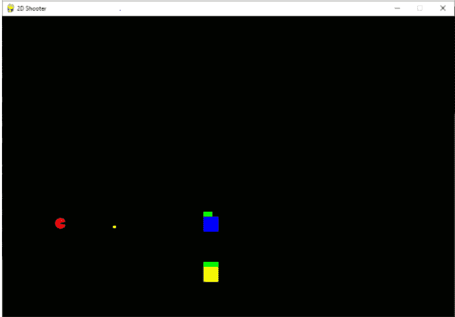


## 章节总结

## 摘要

在本章中，我们熟悉了Python和不同的编程概念。我们还研究了面向对象编程。最后，我们成功创建了一个可以向目标射击并相应造成伤害的移动NPC。

## 测验

现在是测试你知识的时候了。
请说明以下陈述是正确还是错误。

以下代码用于导入（并能够使用）Pygame库。

```python
import pygame
```

使用Pygame，可以设置Pygame窗口的名称（或标题）。
以下代码可用于加载位于与脚本相同文件夹中的图像。

```python
BG = pygame.image.load("assets/Background.jpg")
```

关键字 `global` 可以在方法内部使用时引用全局变量。
关键字 `def` 可以在Python中定义方法。
使用Pygame库，可以将碰撞区域定义为矩形。
内置方法 `colliderect` 可用于检测两个矩形碰撞区域之间的碰撞。
以下代码可用于检测玩家是否按下了空格键。

```python
if keys_pressed[pygame.K_SPACE]:
```

可以在Python中创建类。
`def __init__` 通常在Python中用作类的构造函数。

## 测验答案。

正确。
错误。
错误（图像位于名为 `assets` 的不同文件夹中）。
正确。
正确。
正确。
正确。
正确。
正确。
正确。
正确。

### 检查清单

检查清单 检查清单 检查清单 检查清单 检查清单 检查清单 检查清单 检查清单 检查清单 检查清单 检查清单 检查清单 检查清单 检查清单 检查清单 检查清单 检查清单 检查清单 检查清单 检查清单 检查清单 检查清单 检查清单 检查清单 检查清单 检查清单 检查清单 检查清单 检查清单 检查清单 检查清单 检查清单 检查清单 检查清单 检查清单 检查清单 检查清单 检查清单 检查清单 检查清单 检查清单 检查清单 检查清单 检查清单 检查清单 检查清单 检查清单 检查清单 检查清单 检查清单 检查清单 检查清单 检查清单 检查清单 检查清单 检查清单 检查清单 检查清单 检查清单 检查清单 检查清单 检查清单 检查清单 检查清单 检查清单 检查清单 检查清单 检查清单 检查清单 检查清单 检查清单 检查清单 检查清单 检查清单 检查清单 检查清单 检查清单 检查清单 检查清单 检查清单 检查清单 检查清单 检查清单 检查清单 检查清单 检查清单 检查清单 检查清单 检查清单 检查清单 检查清单 检查清单 检查清单 检查清单 检查清单 检查清单 检查清单 检查清单 检查清单 检查清单 检查清单 检查清单 检查清单 检查清单 检查清单 检查清单 检查清单 检查清单 检查清单 检查清单 检查清单 检查清单 检查清单 检查清单 检查清单 检查清单 检查清单 检查清单 检查清单 检查清单 检查清单 检查清单 检查清单 检查清单 检查清单 检查清单 检查清单 检查清单 检查清单 检查清单 检查清单 检查清单 检查清单 检查清单 检查清单 检查清单 检查清单 检查清单 检查清单 检查清单 检查清单 检查清单 检查清单 检查清单 检查清单 检查清单 检查清单 检查清单 检查清单 检查清单 检查清单 检查清单 检查清单 检查清单 检查清单 检查清单 检查清单 检查清单 检查清单 检查清单 检查清单 检查清单 检查清单 检查清单 检查清单 检查清单 检查清单 检查清单 检查清单 检查清单 检查清单 检查清单 检查清单 检查清单 检查清单 检查清单 检查清单 检查清单 检查清单 检查清单 检查清单 检查清单 检查清单 检查清单 检查清单 检查清单 检查清单 检查清单 检查清单 检查清单 检查清单 检查清单 检查清单 检查清单 检查清单 检查清单 检查清单 检查清单 检查清单 检查清单 检查清单 检查清单 检查清单 检查清单 检查清单 检查清单 检查清单 检查清单 检查清单 检查清单 检查清单 检查清单 检查清单 检查清单 检查清单 检查清单 检查清单 检查清单 检查清单 检查清单 检查清单 检查清单 检查清单 检查清单 检查清单 检查清单 检查清单 检查清单 检查清单 检查清单 检查清单 检查清单 检查清单 检查清单 检查清单 检查清单 检查清单 检查清单 检查清单 检查清单 检查清单 检查清单 检查清单 检查清单 检查清单 检查清单 检查清单 检查清单 检查清单 检查清单 检查清单 检查清单 检查清单 检查清单 检查清单 检查清单 检查清单 检查清单 检查清单 检查清单 检查清单 检查清单 检查清单 检查清单 检查清单 检查清单 检查清单 检查清单 检查清单 检查清单 检查清单 检查清单 检查清单 检查清单 检查清单 检查清单 检查清单 检查清单 检查清单 检查清单 检查清单 检查清单 检查清单 检查清单 检查清单 检查清单 检查清单 检查清单 检查清单 检查清单 检查清单 检查清单 检查清单 检查清单 检查清单 检查清单 检查清单 检查清单 检查清单 检查清单 检查清单 检查清单 检查清单 检查清单 检查清单 检查清单 检查清单 检查清单 检查清单 检查清单 检查清单 检查清单 检查清单 检查清单 检查清单 检查清单 检查清单 检查清单 检查清单 检查清单 检查清单 检查清单 检查清单 检查清单 检查清单 检查清单 检查清单 检查清单 检查清单 检查清单 检查清单 检查清单 检查清单 检查清单 检查清单 检查清单 检查清单 检查清单 检查清单 检查清单 检查清单 检查清单 检查清单 检查清单 检查清单 检查清单 检查清单 检查清单 检查清单 检查清单 检查清单 检查清单 检查清单 检查清单 检查清单 检查清单 检查清单 检查清单 检查清单 检查清单 检查清单 检查清单 检查清单 检查清单 检查清单 检查清单 检查清单 检查清单 检查清单 检查清单 检查清单 检查清单 检查清单 检查清单 检查清单 检查清单 检查清单 检查清单 检查清单 检查清单 检查清单 检查清单 检查清单 检查清单 检查清单 检查清单 检查清单 检查清单 检查清单 检查清单 检查清单 检查清单 检查清单 检查清单 检查清单 检查清单 检查清单 检查清单 检查清单 检查清单 检查清单 检查清单 检查清单 检查清单 检查清单 检查清单 检查清单 检查清单 检查清单 检查清单 检查清单 检查清单 检查清单 检查清单 检查清单 检查清单 检查清单 检查清单 检查清单 检查清单 检查清单 检查清单 检查清单 检查清单 检查清单 检查清单 检查清单 检查清单 检查清单 检查清单 检查清单 检查清单 检查清单 检查清单 检查清单 检查清单 检查清单 检查清单 检查清单 检查清单 检查清单 检查清单 检查清单 检查清单 检查清单 检查清单 检查清单 检查清单 检查清单 检查清单 检查清单 检查清单 检查清单 检查清单 检查清单 检查清单 检查清单 检查清单 检查清单 检查清单 检查清单 检查清单 检查清单 检查清单 检查清单 检查清单 检查清单 检查清单 检查清单 检查清单 检查清单 检查清单 检查清单 检查清单 检查清单 检查清单 检查清单 检查清单 检查清单 检查清单 检查清单 检查清单 检查清单 检查清单 检查清单 检查清单 检查清单 检查清单 检查清单 检查清单 检查清单 检查清单 检查清单 检查清单 检查清单 检查清单 检查清单 检查清单 检查清单 检查清单 检查清单 检查清单 检查清单 检查清单 检查清单 检查清单 检查清单 检查清单 检查清单 检查清单 检查清单 检查清单 检查清单 检查清单 检查清单 检查清单 检查清单 检查清单 检查清单 检查清单 检查清单 检查清单 检查清单 检查清单 检查清单 检查清单 检查清单 检查清单 检查清单 检查清单 检查清单 检查清单 检查清单 检查清单 检查清单 检查清单 检查清单 检查清单 检查清单 检查清单 检查清单 检查清单 检查清单 检查清单 检查清单 检查清单 检查清单 检查清单 检查清单 检查清单 检查清单 检查清单 检查清单 检查清单 检查清单 检查清单 检查清单 检查清单 检查清单 检查清单 检查清单 检查清单 检查清单 检查清单 检查清单 检查清单 检查清单 检查清单 检查清单 检查清单 检查清单 检查清单 检查清单 检查清单 检查清单 检查清单 检查清单 检查清单 检查清单 检查清单 检查清单 检查清单 检查清单 检查清单 检查清单 检查清单 检查清单 检查清单 检查清单 检查清单 检查清单 检查清单 检查清单 检查清单 检查清单 检查清单 检查清单 检查清单 检查清单 检查清单 检查清单 检查清单 检查清单 检查清单 检查清单 检查清单 检查清单 检查清单 检查清单 检查清单 检查清单 检查清单 检查清单 检查清单 检查清单 检查清单 检查清单 检查清单 检查清单 检查清单 检查清单 检查清单 检查清单 检查清单 检查清单 检查清单 检查清单 检查清单 检查清单 检查清单 检查清单 检查清单 检查清单 检查清单 检查清单 检查清单 检查清单 检查清单 检查清单 检查清单 检查清单 检查清单 检查清单 检查清单 检查清单 检查清单 检查清单 检查清单 检查清单 检查清单 检查清单 检查清单 检查清单 检查清单 检查清单 检查清单 检查清单 检查清单 检查清单 检查清单 检查清单 检查清单 检查清单 检查清单 检查清单 检查清单 检查清单 检查清单 检查清单 检查清单 检查清单 检查清单 检查清单 检查清单 检查清单 检查清单 检查清单 检查清单 检查清单 检查清单 检查清单 检查清单 检查清单 检查清单 检查清单 检查清单 检查清单 检查清单 检查清单 检查清单 检查清单 检查清单 检查清单 检查清单 检查清单 检查清单 检查清单 检查清单 检查清单 检查清单 检查清单 检查清单 检查清单 检查清单 检查清单 检查清单 检查清单 检查清单 检查清单 检查清单 检查清单 检查清单 检查清单 检查清单 检查清单 检查清单 检查清单 检查清单 检查清单 检查清单 检查清单 检查清单 检查清单 检查清单 检查清单 检查清单 检查清单 检查清单 检查清单 检查清单 检查清单 检查清单 检查清单 检查清单 检查清单 检查清单 检查清单 检查清单 检查清单 检查清单 检查清单 检查清单 检查清单 检查清单 检查清单 检查清单 检查清单 检查清单 检查清单 检查清单 检查清单 检查清单 检查清单 检查清单 检查清单 检查清单 检查清单 检查清单 检查清单 检查清单 检查清单 检查清单 检查清单 检查清单 检查清单 检查清单 检查清单 检查清单 检查清单 检查清单 检查清单 检查清单 检查清单 检查清单 检查清单 检查清单 检查清单 检查清单 检查清单 检查清单 检查清单 检查清单 检查清单 检查清单 检查清单 检查清单 检查清单 检查清单 检查清单 检查清单 检查清单 检查清单 检查清单 检查清单 检查清单 检查清单 检查清单 检查清单 检查清单 检查清单 检查清单 检查清单 检查清单 检查清单 检查清单 检查清单 检查清单 检查清单 检查清单 检查清单 检查清单 检查清单 检查清单 检查清单 检查清单 检查清单 检查清单 检查清单 检查清单 检查清单 检查清单 检查清单 检查清单 检查清单 检查清单 检查清单 检查清单 检查清单 检查清单 检查清单 检查清单 检查清单 检查清单 检查清单 检查清单 检查清单 检查清单 检查清单 检查清单 检查清单 检查清单 检查清单 检查清单 检查清单 检查清单 检查清单 检查清单 检查清单 检查清单 检查清单 检查清单 检查清单 检查清单 检查清单 检查清单 检查清单 检查清单 检查清单 检查清单 检查清单 检查清单 检查清单 检查清单 检查清单 检查清单 检查清单 检查清单 检查清单 检查清单 检查清单 检查清单 检查清单 检查清单 检查清单 检查清单 检查清单 检查清单 检查清单 检查清单 检查清单 检查清单 检查清单 检查清单 检查清单 检查清单 检查清单 检查清单 检查清单 检查清单 检查清单 检查清单 检查清单 检查清单 检查清单 检查清单 检查清单 检查清单 检查清单 检查清单 检查清单 检查清单 检查清单 检查清单 检查清单 检查清单 检查清单 检查清单 检查清单 检查清单 检查清单 检查清单 检查清单 检查清单 检查清单 检查清单 检查清单 检查清单 检查清单 检查清单 检查清单 检查清单 检查清单 检查清单 检查清单 检查清单 检查清单 检查清单 检查清单 检查清单 检查清单 检查清单 检查清单 检查清单 检查清单 检查清单 检查清单 检查清单 检查清单 检查清单 检查清单 检查清单 检查清单 检查清单 检查清单 检查清单 检查清单 检查清单 检查清单 检查清单 检查清单 检查清单 检查清单 检查清单 检查清单 检查清单 检查清单 检查清单 检查清单 检查清单 检查清单 检查清单 检查清单 检查清单 检查清单 检查清单 检查清单 检查清单 检查清单 检查清单 检查清单 检查清单 检查清单 检查清单 检查清单 检查清单 检查清单 检查清单 检查清单 检查清单 检查清单 检查清单 检查清单 检查清单 检查清单 检查清单 检查清单 检查清单 检查清单 检查清单 检查清单 检查清单 检查清单 检查清单 检查清单 检查清单 检查清单 检查清单 检查清单 检查清单 检查清单 检查清单 检查清单 检查清单 检查清单 检查清单 检查清单 检查清单 检查清单 检查清单 检查清单 检查清单 检查清单 检查清单 检查清单 检查清单 检查清单 检查清单 检查清单 检查清单 检查清单 检查清单 检查清单 检查清单 检查清单 检查清单 检查清单 检查清单 检查清单 检查清单 检查清单 检查清单 检查清单 检查清单 检查清单 检查清单 检查清单 检查清单 检查清单 检查清单 检查清单 检查清单 检查清单 检查清单 检查清单 检查清单 检查清单 检查清单 检查清单 检查清单 检查清单 检查清单 检查清单 检查清单 检查清单 检查清单 检查清单 检查清单 检查清单 检查清单 检查清单 检查清单 检查清单 检查清单 检查清单 检查清单 检查清单 检查清单 检查清单 检查清单 检查清单 检查清单 检查清单 检查清单 检查清单 检查清单 检查清单 检查清单 检查清单 检查清单 检查清单 检查清单 检查清单 检查清单 检查清单 检查清单 检查清单 检查清单 检查清单 检查清单 检查清单 检查清单 检查清单 检查清单 检查清单 检查清单 检查清单 检查清单 检查清单 检查清单 检查清单 检查清单 检查清单 检查清单 检查清单 检查清单 检查清单 检查清单 检查清单 检查清单 检查清单 检查清单 检查清单 检查清单 检查清单 检查清单 检查清单 检查清单 检查清单 检查清单 检查清单 检查清单 检查清单 检查清单 检查清单 检查清单 检查清单 检查清单 检查清单 检查清单 检查清单 检查清单 检查清单 检查清单 检查清单 检查清单 检查清单 检查清单 检查清单 检查清单 检查清单 检查清单 检查清单 检查清单 检查清单 检查清单 检查清单 检查清单 检查清单 检查清单 检查清单 检查清单 检查清单 检查清单 检查清单 检查清单 检查清单 检查清单 检查清单 检查清单 检查清单 检查清单 检查清单 检查清单 检查清单 检查清单 检查清单 检查清单 检查清单 检查清单 检查清单 检查清单 检查清单 检查清单 检查清单 检查清单 检查清单 检查清单 检查清单 检查清单 检查清单 检查清单 检查清单 检查清单 检查清单 检查清单 检查清单 检查清单 检查清单 检查清单 检查清单 检查清单 检查清单 检查清单 检查清单 检查清单 检查清单 检查清单 检查清单 检查清单 检查清单 检查清单 检查清单 检查清单 检查清单 检查清单 检查清单 检查清单 检查清单 检查清单 检查清单 检查清单 检查清单 检查清单 检查清单 检查清单 检查清单 检查清单 检查清单 检查清单 检查清单 检查清单 检查清单 检查清单 检查清单 检查清单 检查清单 检查清单 检查清单 检查清单 检查清单 检查清单 检查清单 检查清单 检查清单 检查清单 检查清单 检查清单 检查清单 检查清单 检查清单 检查清单 检查清单 检查清单 检查清单 检查清单 检查清单 检查清单 检查清单 检查清单 检查清单 检查清单 检查清单 检查清单 检查清单 检查清单 检查清单 检查清单 检查清单 检查清单 检查清单 检查清单 检查清单 检查清单 检查清单 检查清单 检查清单 检查清单 检查清单 检查清单 检查清单 检查清单 检查清单 检查清单 检查清单 检查清单 检查清单 检查清单 检查清单 检查清单 检查清单 检查清单 检查清单 检查清单 检查清单 检查清单 检查清单 检查清单 检查清单 检查清单 检查清单 检查清单 检查清单 检查清单 检查清单 检查清单 检查清单 检查清单 检查清单 检查清单 检查清单 检查清单 检查清单 检查清单 检查清单 检查清单 检查清单 检查清单 检查清单 检查清单 检查清单 检查清单 检查清单 检查清单 检查清单 检查清单 检查清单 检查清单 检查清单 检查清单 检查清单 检查清单 检查清单 检查清单 检查清单 检查清单 检查清单 检查清单 检查清单 检查清单 检查清单 检查清单 检查清单 检查清单 检查清单 检查清单 检查清单 检查清单 检查清单 检查清单 检查清单 检查清单 检查清单 检查清单 检查清单 检查清单 检查清单 检查清单 检查清单 检查清单 检查清单 检查清单 检查清单 检查清单 检查清单 检查清单 检查清单 检查清单 检查清单 检查清单 检查清单 检查清单 检查清单 检查清单 检查清单 检查清单 检查清单 检查清单 检查清单 检查清单 检查清单 检查清单 检查清单 检查清单 检查清单 检查清单 检查清单 检查清单 检查清单 检查清单 检查清单 检查清单 检查清单 检查清单 检查清单 检查清单 检查清单 检查清单 检查清单 检查清单 检查清单 检查清单 检查清单 检查清单 检查清单 检查清单 检查清单 检查清单 检查清单 检查清单 检查清单 检查清单 检查清单 检查清单 检查清单 检查清单 检查清单 检查清单 检查清单 检查清单 检查清单 检查清单 检查清单 检查清单 检查清单 检查清单 检查清单 检查清单 检查清单 检查清单 检查清单 检查清单 检查清单 检查清单 检查清单 检查清单 检查清单 检查清单 检查清单 检查清单 检查清单 检查清单 检查清单 检查清单 检查清单 检查清单 检查清单 检查清单 检查清单 检查清单 检查清单 检查清单 检查清单 检查清单 检查清单 检查清单 检查清单 检查清单 检查清单 检查清单 检查清单 检查清单 检查清单 检查清单 检查清单 检查清单 检查清单 检查清单 检查清单 检查清单 检查清单 检查清单 检查清单 检查清单 检查清单 检查清单 检查清单 检查清单 检查清单 检查清单 检查清单 检查清单 检查清单 检查清单 检查清单 检查清单 检查清单 检查清单 检查清单 检查清单 检查清单 检查清单 检查清单 检查清单 检查清单 检查清单 检查清单 检查清单 检查清单 检查清单 检查清单 检查清单 检查清单 检查清单 检查清单 检查清单 检查清单 检查清单 检查清单 检查清单 检查清单 检查清单 检查清单 检查清单 检查清单 检查清单 检查清单 检查清单 检查清单 检查清单 检查清单 检查清单 检查清单 检查清单 检查清单 检查清单 检查清单 检查清单 检查清单 检查清单 检查清单 检查清单 检查清单 检查清单 检查清单 检查清单 检查清单 检查清单 检查清单 检查清单 检查清单 检查清单 检查清单 检查清单 检查清单 检查清单 检查清单 检查清单 检查清单 检查清单 检查清单 检查清单 检查清单 检查清单 检查清单 检查清单 检查清单 检查清单 检查清单 检查清单 检查清单 检查清单 检查清单 检查清单 检查清单 检查清单 检查清单 检查清单 检查清单 检查清单 检查清单 检查清单 检查清单 检查清单 检查清单 检查清单 检查清单 检查清单 检查清单 检查清单 检查清单 检查清单 检查清单 检查清单 检查清单 检查清单 检查清单 检查清单 检查清单 检查清单 检查清单 检查清单 检查清单 检查清单 检查清单 检查清单 检查清单 检查清单 检查清单 检查清单 检查清单 检查清单 检查清单 检查清单 检查清单 检查清单 检查清单 检查清单 检查清单 检查清单 检查清单 检查清单 检查清单 检查清单 检查清单 检查清单 检查清单 检查清单 检查清单 检查清单 检查清单 检查清单 检查清单 检查清单 检查清单 检查清单 检查清单 检查清单 检查清单 检查清单 检查清单 检查清单 检查清单 检查清单 检查清单 检查清单 检查清单 检查清单 检查清单 检查清单 检查清单 检查清单 检查清单 检查清单 检查清单 检查清单 检查清单 检查清单 检查清单 检查清单 检查清单 检查清单 检查清单 检查清单 检查清单 检查清单 检查清单 检查清单 检查清单 检查清单 检查清单 检查清单 检查清单 检查清单 检查清单 检查清单 检查清单 检查清单 检查清单 检查清单 检查清单 检查清单 检查清单 检查清单 检查清单 检查清单 检查清单 检查清单 检查清单 检查清单 检查清单 检查清单 检查清单 检查清单 检查清单 检查清单 检查清单 检查清单 检查清单 检查清单 检查清单 检查清单 检查清单 检查清单 检查清单 检查清单 检查清单 检查清单 检查清单 检查清单 检查清单 检查清单 检查清单 检查清单 检查清单 检查清单 检查清单 检查清单 检查清单 检查清单 检查清单 检查清单 检查清单 检查清单 检查清单 检查清单 检查清单 检查清单 检查清单 检查清单 检查清单 检查清单 检查清单 检查清单 检查清单 检查清单 检查清单 检查清单 检查清单 检查清单 检查清单 检查清单 检查清单 检查清单 检查清单 检查清单 检查清单 检查清单 检查清单 检查清单 检查清单 检查清单 检查清单 检查清单 检查清单 检查清单 检查清单 检查清单 检查清单 检查清单 检查清单 检查清单 检查清单 检查清单 检查清单 检查清单 检查清单 检查清单 检查清单 检查清单 检查清单 检查清单 检查清单 检查清单 检查清单 检查清单 检查清单 检查清单 检查清单 检查清单 检查清单 检查清单 检查清单 检查清单 检查清单 检查清单 检查清单 检查清单 检查清单 检查清单 检查清单 检查清单 检查清单 检查清单 检查清单 检查清单 检查清单 检查清单 检查清单 检查清单 检查清单 检查清单 检查清单 检查清单 检查清单 检查清单 检查清单 检查清单 检查清单 检查清单 检查清单 检查清单 检查清单 检查清单 检查清单 检查清单 检查清单 检查清单 检查清单 检查清单 检查清单 检查清单 检查清单 检查清单 检查清单 检查清单 检查清单 检查清单 检查清单 检查清单 检查清单 检查清单 检查清单 检查清单 检查清单 检查清单 检查清单 检查清单 检查清单 检查清单 检查清单 检查清单 检查清单 检查清单 检查清单 检查清单 检查清单 检查清单 检查清单 检查清单 检查清单 检查清单 检查清单 检查清单 检查清单 检查清单 检查清单 检查清单 检查清单 检查清单 检查清单 检查清单 检查清单 检查清单 检查清单 检查清单 检查清单 检查清单 检查清单 检查清单 检查清单 检查清单 检查清单 检查清单 检查清单 检查清单 检查清单 检查清单 检查清单 检查清单 检查清单 检查清单 检查清单 检查清单 检查清单 检查清单 检查清单 检查清单 检查清单 检查清单 检查清单 检查清单 检查清单 检查清单 检查清单 检查清单 检查清单 检查清单 检查清单 检查清单 检查清单 检查清单 检查清单 检查清单 检查清单 检查清单 检查清单 检查清单 检查清单 检查清单 检查清单 检查清单 检查清单 检查清单 检查清单 检查清单 检查清单 检查清单 检查清单 检查清单 检查清单 检查清单 检查清单 检查清单 检查清单 检查清单 检查清单 检查清单 检查清单 检查清单 检查清单 检查清单 检查清单 检查清单 检查清单 检查清单 检查清单 检查清单 检查清单 检查清单 检查清单 检查清单 检查清单 检查清单 检查清单 检查清单 检查清单 检查清单 检查清单 检查清单 检查清单 检查清单 检查清单 检查清单 检查清单 检查清单 检查清单 检查清单 检查清单 检查清单 检查清单 检查清单 检查清单 检查清单 检查清单 检查清单 检查清单 检查清单 检查清单 检查清单 检查清单 检查清单 检查清单 检查清单 检查清单 检查清单 检查清单 检查清单 检查清单 检查清单 检查清单 检查清单 检查清单 检查清单 检查清单 检查清单 检查清单 检查清单 检查清单 检查清单 检查清单 检查清单 检查清单 检查清单 检查清单 检查清单 检查清单 检查清单 检查清单 检查清单 检查清单 检查清单 检查清单 检查清单 检查清单 检查清单 检查清单 检查清单 检查清单 检查清单 检查清单 检查清单 检查清单 检查清单 检查清单 检查清单 检查清单 检查清单 检查清单 检查清单 检查清单 检查清单 检查清单 检查清单 检查清单 检查清单 检查清单 检查清单 检查清单 检查清单 检查清单 检查清单 检查清单 检查清单 检查清单 检查清单 检查清单 检查清单 检查清单 检查清单 检查清单 检查清单 检查清单 检查清单 检查清单 检查清单 检查清单 检查清单 检查清单 检查清单 检查清单 检查清单 检查清单 检查清单 检查清单 检查清单 检查清单 检查清单 检查清单 检查清单 检查清单 检查清单 检查清单 检查清单 检查清单 检查清单 检查清单 检查清单 检查清单 检查清单 检查清单 检查清单 检查清单 检查清单 检查清单 检查清单 检查清单 检查清单 检查清单 检查清单 检查清单 检查清单 检查清单 检查清单 检查清单 检查清单 检查清单 检查清单 检查清单 检查清单 检查清单 检查清单 检查清单 检查清单 检查清单 检查清单 检查清单 检查清单 检查清单 检查清单 检查清单 检查清单 检查清单 检查清单 检查清单 检查清单 检查清单 检查清单 检查清单 检查清单 检查清单 检查清单 检查清单 检查清单 检查清单 检查清单 检查清单 检查清单 检查清单 检查清单 检查清单 检查清单 检查清单 检查清单 检查清单 检查清单 检查清单 检查清单 检查清单 检查清单 检查清单 检查清单 检查清单 检查清单 检查清单 检查清单 检查清单 检查清单 检查清单 检查清单 检查清单 检查清单 检查清单 检查清单 检查清单 检查清单 检查清单 检查清单 检查清单 检查清单 检查清单 检查清单 检查清单 检查清单 检查清单 检查清单 检查清单 检查清单 检查清单 检查清单 检查清单 检查清单 检查清单 检查清单 检查清单 检查清单 检查清单 检查清单 检查清单 检查清单 检查清单 检查清单 检查清单 检查清单 检查清单 检查清单 检查清单 检查清单 检查清单 检查清单 检查清单 检查清单 检查清单 检查清单 检查清单 检查清单 检查清单 检查清单 检查清单 检查清单 检查清单 检查清单 检查清单 检查清单 检查清单 检查清单 检查清单 检查清单 检查清单 检查清单 检查清单 检查清单 检查清单 检查清单 检查清单 检查清单 检查清单 检查清单 检查清单 检查清单 检查清单 检查清单 检查清单 检查清单 检查清单 检查清单 检查清单 检查清单 检查清单 检查清单 检查清单 检查清单 检查清单 检查清单 检查清单 检查清单 检查清单 检查清单 检查清单 检查清单 检查清单 检查清单 检查清单 检查清单 检查清单 检查清单 检查清单 检查清单 检查清单 检查清单 检查清单 检查清单 检查清单 检查清单 检查清单 检查清单 检查清单 检查清单 检查清单 检查清单 检查清单 检查清单 检查清单 检查清单 检查清单 检查清单 检查清单 检查清单 检查清单 检查清单 检查清单 检查清单 检查清单 检查清单 检查清单 检查清单 检查清单 检查清单 检查清单 检查清单 检查清单 检查清单 检查清单 检查清单 检查清单 检查清单 检查清单 检查清单 检查清单 检查清单 检查清单 检查清单 检查清单 检查清单 检查清单 检查清单 检查清单 检查清单 检查清单 检查清单 检查清单 检查清单 检查清单 检查清单 检查清单 检查清单 检查清单 检查清单 检查清单 检查清单 检查清单 检查清单 检查清单 检查清单 检查清单 检查清单 检查清单 检查清单 检查清单 检查清单 检查清单 检查清单 检查清单 检查清单 检查清单 检查清单 检查清单 检查清单 检查清单 检查清单 检查清单 检查清单 检查清单 检查清单 检查清单 检查清单 检查清单 检查清单 检查清单 检查清单 检查清单 检查清单 检查清单 检查清单 检查清单 检查清单 检查清单 检查清单 检查清单 检查清单 检查清单 检查清单 检查清单 检查清单 检查清单 检查清单 检查清单 检查清单 检查清单 检查清单 检查清单 检查清单 检查清单 检查清单 检查清单 检查清单 检查清单 检查清单 检查清单 检查清单 检查清单 检查清单 检查清单 检查清单 检查清单 检查清单 检查清单 检查清单 检查清单 检查清单 检查清单 检查清单 检查清单 检查清单 检查清单 检查清单 检查清单 检查清单 检查清单 检查清单 检查清单 检查清单 检查清单 检查清单 检查清单 检查清单 检查清单 检查清单 检查清单 检查清单 检查清单 检查清单 检查清单 检查清单 检查清单 检查清单 检查清单 检查清单 检查清单 检查清单 检查清单 检查清单 检查清单 检查清单 检查清单 检查清单 检查清单 检查清单 检查清单 检查清单 检查清单 检查清单 检查清单 检查清单 检查清单 检查清单 检查清单 检查清单 检查清单 检查清单 检查清单 检查清单 检查清单 检查清单 检查清单 检查清单 检查清单 检查清单 检查清单 检查清单 检查清单 检查清单 检查清单 检查清单 检查清单 检查清单 检查清单 检查清单 检查清单 检查清单 检查清单 检查清单 检查清单 检查清单 检查清单 检查清单 检查清单 检查清单 检查清单 检查清单 检查清单 检查清单 检查清单 检查清单 检查清单 检查清单 检查清单 检查清单 检查清单 检查清单 检查清单 检查清单 检查清单 检查清单 检查清单 检查清单 检查清单 检查清单 检查清单 检查清单 检查清单 检查清单 检查清单 检查清单 检查清单 检查清单 检查清单 检查清单 检查清单 检查清单 检查清单 检查清单 检查清单 检查清单 检查清单 检查清单 检查清单 检查清单 检查清单 检查清单 检查清单 检查清单 检查清单 检查清单 检查清单 检查清单 检查清单 检查清单 检查清单 检查清单 检查清单 检查清单 检查清单 检查清单 检查清单 检查清单 检查清单 检查清单 检查清单 检查清单 检查清单 检查清单 检查清单 检查清单 检查清单 检查清单 检查清单 检查清单 检查清单 检查清单 检查清单 检查清单 检查清单 检查清单 检查清单 检查清单 检查清单 检查清单 检查清单 检查清单 检查清单 检查清单 检查清单 检查清单 检查清单 检查清单 检查清单 检查清单 检查清单 检查清单 检查清单 检查清单 检查清单 检查清单 检查清单 检查清单 检查清单 检查清单 检查清单 检查清单 检查清单 检查清单 检查清单 检查清单 检查清单 检查清单 检查清单 检查清单 检查清单 检查清单 检查清单 检查清单 检查清单 检查清单 检查清单 检查清单 检查清单 检查清单 检查清单 检查清单 检查清单 检查清单 检查清单 检查清单 检查清单 检查清单 检查清单 检查清单 检查清单 检查清单 检查清单 检查清单 检查清单 检查清单 检查清单 检查清单 检查清单 检查清单 检查清单 检查清单 检查清单 检查清单 检查清单 检查清单 检查清单 检查清单 检查清单 检查清单 检查清单 检查清单 检查清单 检查清单 检查清单 检查清单 检查清单 检查清单 检查清单 检查清单 检查清单 检查清单 检查清单 检查清单 检查清单 检查清单 检查清单 检查清单 检查清单 检查清单 检查清单 检查清单 检查清单 检查清单 检查清单 检查清单 检查清单 检查清单 检查清单 检查清单 检查清单 检查清单 检查清单 检查清单 检查清单 检查清单 检查清单 检查清单 检查清单 检查清单 检查清单 检查清单 检查清单 检查清单 检查清单 检查清单 检查清单 检查清单 检查清单 检查清单 检查清单 检查清单 检查清单 检查清单 检查清单 检查清单 检查清单 检查清单 检查清单 检查清单 检查清单 检查清单 检查清单 检查清单 检查清单 检查清单 检查清单 检查清单 检查清单 检查清单 检查清单 检查清单 检查清单 检查清单 检查清单 检查清单 检查清单 检查清单 检查清单 检查清单 检查清单 检查清单 检查清单 检查清单 检查清单 检查清单 检查清单 检查清单 检查清单 检查清单 检查清单 检查清单 检查清单 检查清单 检查清单 检查清单 检查清单 检查清单 检查清单 检查清单 检查清单 检查清单 检查清单 检查清单 检查清单 检查清单 检查清单 检查清单 检查清单 检查清单 检查清单 检查清单 检查清单 检查清单 检查清单 检查清单 检查清单 检查清单 检查清单 检查清单 检查清单 检查清单 检查清单 检查清单 检查清单 检查清单 检查清单 检查清单 检查清单 检查清单 检查清单 检查清单 检查清单 检查清单 检查清单 检查清单 检查清单 检查清单 检查清单 检查清单 检查清单 检查清单 检查清单 检查清单 检查清单 检查清单 检查清单 检查清单 检查清单 检查清单 检查清单 检查清单 检查清单 检查清单 检查清单 检查清单 检查清单 检查清单 检查清单 检查清单 检查清单 检查清单 检查清单 检查清单 检查清单 检查清单 检查清单 检查清单 检查清单 检查清单 检查清单 检查清单 检查清单 检查清单 检查清单 检查清单 检查清单 检查清单 检查清单 检查清单 检查清单 检查清单 检查清单 检查清单 检查清单 检查清单 检查清单 检查清单 检查清单 检查清单 检查清单 检查清单 检查清单 检查清单 检查清单 检查清单 检查清单 检查清单 检查清单 检查清单 检查清单 检查清单 检查清单 检查清单 检查清单 检查清单 检查清单 检查清单 检查清单 检查清单 检查清单 检查清单 检查清单 检查清单 检查清单 检查清单 检查清单 检查清单 检查清单 检查清单 检查清单 检查清单 检查清单 检查清单 检查清单 检查清单 检查清单 检查清单 检查清单 检查清单 检查清单 检查清单 检查清单 检查清单 检查清单 检查清单 检查清单 检查清单 检查清单 检查清单 检查清单 检查清单 检查清单 检查清单 检查清单 检查清单 检查清单 检查清单 检查清单 检查清单 检查清单 检查清单 检查清单 检查清单 检查清单 检查清单 检查清单 检查清单 检查清单 检查清单 检查清单 检查清单 检查清单 检查清单 检查清单 检查清单 检查清单 检查清单 检查清单 检查清单 检查清单 检查清单 检查清单 检查清单 检查清单 检查清单 检查清单 检查清单 检查清单 检查清单 检查清单 检查清单 检查清单 检查清单 检查清单 检查清单 检查清单 检查清单 检查清单 检查清单 检查清单 检查清单 检查清单 检查清单 检查清单 检查清单 检查清单 检查清单 检查清单 检查清单 检查清单 检查清单 检查清单 检查清单 检查清单 检查清单 检查清单 检查清单 检查清单 检查清单 检查清单 检查清单 检查清单 检查清单 检查清单 检查清单 检查清单 检查清单 检查清单 检查清单 检查清单 检查清单 检查清单 检查清单 检查清单 检查清单 检查清单 检查清单 检查清单 检查清单 检查清单 检查清单 检查清单 检查清单 检查清单 检查清单 检查清单 检查清单 检查清单 检查清单 检查清单 检查清单 检查清单 检查清单 检查清单 检查清单 检查清单 检查清单 检查清单 检查清单 检查清单 检查清单 检查清单 检查清单 检查清单 检查清单 检查清单 检查清单 检查清单 检查清单 检查清单 检查清单 检查清单 检查清单 检查清单 检查清单 检查清单 检查清单 检查清单 检查清单 检查清单 检查清单 检查清单 检查清单 检查清单 检查清单 检查清单 检查清单 检查清单 检查清单 检查清单 检查清单 检查清单 检查清单 检查清单 检查清单 检查清单 检查清单 检查清单 检查清单 检查清单 检查清单 检查清单 检查清单 检查清单 检查清单 检查清单 检查清单 检查清单 检查清单 检查清单 检查清单 检查清单 检查清单 检查清单 检查清单 检查清单 检查清单 检查清单 检查清单 检查清单 检查清单 检查清单 检查清单 检查清单 检查清单 检查清单 检查清单 检查清单 检查清单 检查清单 检查清单 检查清单 检查清单 检查清单 检查清单 检查清单 检查清单 检查清单 检查清单 检查清单 检查清单 检查清单 检查清单 检查清单 检查清单 检查清单 检查清单 检查清单 检查清单 检查清单 检查清单 检查清单 检查清单 检查清单 检查清单 检查清单 检查清单 检查清单 检查清单 检查清单 检查清单 检查清单 检查清单 检查清单 检查清单 检查清单 检查清单 检查清单 检查清单 检查清单 检查清单 检查清单 检查清单 检查清单 检查清单 检查清单 检查清单 检查清单 检查清单 检查清单 检查清单 检查清单 检查清单 检查清单 检查清单 检查清单 检查清单 检查清单 检查清单 检查清单 检查清单 检查清单 检查清单 检查清单 检查清单 检查清单 检查清单 检查清单 检查清单 检查清单 检查清单 检查清单 检查清单 检查清单 检查清单 检查清单 检查清单 检查清单 检查清单 检查清单 检查清单 检查清单 检查清单 检查清单 检查清单 检查清单 检查清单 检查清单 检查清单 检查清单 检查清单 检查清单 检查清单 检查清单 检查清单 检查清单 检查清单 检查清单 检查清单 检查清单 检查清单 检查清单 检查清单 检查清单 检查清单 检查清单 检查清单 检查清单 检查清单 检查清单 检查清单 检查清单 检查清单 检查清单 检查清单 检查清单 检查清单 检查清单 检查清单 检查清单 检查清单 检查清单 检查清单 检查清单 检查清单 检查清单 检查清单 检查清单 检查清单 检查清单 检查清单 检查清单 检查清单 检查清单 检查清单 检查清单 检查清单 检查清单 检查清单 检查清单 检查清单 检查清单 检查清单 检查清单 检查清单 检查清单 检查清单 检查清单 检查清单 检查清单 检查清单 检查清单 检查清单 检查清单 检查清单 检查清单 检查清单 检查清单 检查清单 检查清单 检查清单 检查清单 检查清单 检查清单 检查清单 检查清单 检查清单 检查清单 检查清单 检查清单 检查清单 检查清单 检查清单 检查清单 检查清单 检查清单 检查清单 检查清单 检查清单 检查清单 检查清单 检查清单 检查清单 检查清单 检查清单 检查清单 检查清单 检查清单 检查清单 检查清单 检查清单 检查清单 检查清单 检查清单 检查清单 检查清单 检查清单 检查清单 检查清单 检查清单 检查清单 检查清单 检查清单 检查清单 检查清单 检查清单 检查清单 检查清单 检查清单 检查清单 检查清单 检查清单 检查清单 检查清单 检查清单 检查清单 检查清单 检查清单 检查清单 检查清单 检查清单 检查清单 检查清单 检查清单 检查清单 检查清单 检查清单 检查清单 检查清单 检查清单 检查清单 检查清单 检查清单 检查清单 检查清单 检查清单 检查清单 检查清单 检查清单 检查清单 检查清单 检查清单 检查清单 检查清单 检查清单 检查清单 检查清单 检查清单 检查清单 检查清单 检查清单 检查清单 检查清单 检查清单 检查清单 检查清单 检查清单 检查清单 检查清单 检查清单 检查清单 检查清单 检查清单 检查清单 检查清单 检查清单 检查清单 检查清单 检查清单 检查清单 检查清单 检查清单 检查清单 检查清单 检查清单 检查清单 检查清单 检查清单 检查清单 检查清单 检查清单 检查清单 检查清单 检查清单 检查清单 检查清单 检查清单 检查清单 检查清单 检查清单 检查清单 检查清单 检查清单 检查清单 检查清单 检查清单 检查清单 检查清单 检查清单 检查清单 检查清单 检查清单 检查清单 检查清单 检查清单 检查清单 检查清单 检查清单 检查清单 检查清单 检查清单 检查清单 检查清单 检查清单 检查清单 检查清单 检查清单 检查清单 检查清单 检查清单 检查清单 检查清单 检查清单 检查清单 检查清单 检查清单 检查清单 检查清单 检查清单 检查清单 检查清单 检查清单 检查清单 检查清单 检查清单 检查清单 检查清单 检查清单 检查清单 检查清单 检查清单 检查清单 检查清单 检查清单 检查清单 检查清单 检查清单 检查清单 检查清单 检查清单 检查清单 检查清单 检查清单 检查清单 检查清单 检查清单 检查清单 检查清单 检查清单 检查清单 检查清单 检查清单 检查清单 检查清单 检查清单 检查清单 检查清单 检查清单 检查清单 检查清单 检查清单 检查清单 检查清单 检查清单 检查清单 检查清单 检查清单 检查清单 检查清单 检查清单 检查清单 检查清单 检查清单 检查清单 检查清单 检查清单 检查清单 检查清单 检查清单 检查清单 检查清单 检查清单 检查清单 检查清单 检查清单 检查清单 检查清单 检查清单 检查清单 检查清单 检查清单 检查清单 检查清单 检查清单 检查清单 检查清单 检查清单 检查清单 检查清单 检查清单 检查清单 检查清单 检查清单 检查清单 检查清单 检查清单 检查清单 检查清单 检查清单 检查清单 检查清单 检查清单 检查清单 检查清单 检查清单 检查清单 检查清单 检查清单 检查清单 检查清单 检查清单 检查清单 检查清单 检查清单 检查清单 检查清单 检查清单 检查清单 检查清单 检查清单 检查清单 检查清单 检查清单 检查清单 检查清单 检查清单 检查清单 检查清单 检查清单 检查清单 检查清单 检查清单 检查清单 检查清单 检查清单 检查清单 检查清单 检查清单 检查清单 检查清单 检查清单 检查清单 检查清单 检查清单 检查清单 检查清单 检查清单 检查清单 检查清单 检查清单 检查清单 检查清单 检查清单 检查清单 检查清单 检查清单 检查清单 检查清单 检查清单 检查清单 检查清单 检查清单 检查清单 检查清单 检查清单 检查清单 检查清单 检查清单 检查清单 检查清单 检查清单 检查清单 检查清单 检查清单 检查清单 检查清单 检查清单 检查清单 检查清单 检查清单 检查清单 检查清单 检查清单 检查清单 检查清单 检查清单 检查清单 检查清单 检查清单 检查清单 检查清单 检查清单 检查清单 检查清单 检查清单 检查清单 检查清单 检查清单 检查清单 检查清单 检查清单 检查清单 检查清单 检查清单 检查清单 检查清单 检查清单 检查清单 检查清单 检查清单 检查清单 检查清单 检查清单 检查清单 检查清单 检查清单 检查清单 检查清单 检查清单 检查清单 检查清单 检查清单 检查清单 检查清单 检查清单 检查清单 检查清单 检查清单 检查清单 检查清单 检查清单 检查清单 检查清单 检查清单 检查清单 检查清单 检查清单 检查清单 检查清单 检查清单 检查清单 检查清单 检查清单 检查清单 检查清单 检查清单 检查清单 检查清单 检查清单 检查清单 检查清单 检查清单 检查清单 检查清单 检查清单 检查清单 检查清单 检查清单 检查清单 检查清单 检查清单 检查清单 检查清单 检查清单 检查清单 检查清单 检查清单 检查清单 检查清单 检查清单 检查清单 检查清单 检查清单 检查清单 检查清单 检查清单 检查清单 检查清单 检查清单 检查清单 检查清单 检查清单 检查清单 检查清单 检查清单 检查清单 检查清单 检查清单 检查清单 检查清单 检查清单 检查清单 检查清单 检查清单 检查清单 检查清单 检查清单 检查清单 检查清单 检查清单 检查清单 检查清单 检查清单 检查清单 检查清单 检查清单 检查清单 检查清单 检查清单 检查清单 检查清单 检查清单 检查清单 检查清单 检查清单 检查清单 检查清单 检查清单 检查清单 检查清单 检查清单 检查清单 检查清单 检查清单 检查清单 检查清单 检查清单 检查清单 检查清单 检查清单 检查清单 检查清单 检查清单 检查清单 检查清单 检查清单 检查清单 检查清单 检查清单 检查清单 检查清单 检查清单 检查清单 检查清单 检查清单 检查清单 检查清单 检查清单 检查清单 检查清单 检查清单 检查清单 检查清单 检查清单 检查清单 检查清单 检查清单 检查清单 检查清单 检查清单 检查清单 检查清单 检查清单 检查清单 检查清单 检查清单 检查清单 检查清单 检查清单 检查清单 检查清单 检查清单 检查清单 检查清单 检查清单 检查清单 检查清单 检查清单 检查清单 检查清单 检查清单 检查清单 检查清单 检查清单 检查清单 检查清单 检查清单 检查清单 检查清单 检查清单 检查清单 检查清单 检查清单 检查清单 检查清单 检查清单 检查清单 检查清单 检查清单 检查清单 检查清单 检查清单 检查清单 检查清单 检查清单 检查清单 检查清单 检查清单 检查清单 检查清单 检查清单 检查清单 检查清单 检查清单 检查清单 检查清单 检查清单 检查清单 检查清单 检查清单 检查清单 检查清单 检查清单 检查清单 检查清单 检查清单 检查清单 检查清单 检查清单 检查清单 检查清单 检查清单 检查清单 检查清单 检查清单 检查清单 检查清单 检查清单 检查清单 检查清单 检查清单 检查清单 检查清单 检查清单 检查清单 检查清单 检查清单 检查清单 检查清单 检查清单 检查清单 检查清单 检查清单 检查清单 检查清单 检查清单 检查清单 检查清单 检查清单 检查清单 检查清单 检查清单 检查清单 检查清单 检查清单 检查清单 检查清单 检查清单 检查清单 检查清单 检查清单 检查清单 检查清单 检查清单 检查清单 检查清单 检查清单 检查清单 检查清单 检查清单 检查清单 检查清单 检查清单 检查清单 检查清单 检查清单 检查清单 检查清单 检查清单 检查清单 检查清单 检查清单 检查清单 检查清单 检查清单 检查清单 检查清单 检查清单 检查清单 检查清单 检查清单 检查清单 检查清单 检查清单 检查清单 检查清单 检查清单 检查清单 检查清单 检查清单 检查清单 检查清单 检查清单 检查清单 检查清单 检查清单 检查清单 检查清单 检查清单 检查清单 检查清单 检查清单 检查清单 检查清单 检查清单 检查清单 检查清单 检查清单 检查清单 检查清单 检查清单 检查清单 检查清单 检查清单 检查清单 检查清单 检查清单 检查清单 检查清单 检查清单 检查清单 检查清单 检查清单 检查清单 检查清单 检查清单 检查清单 检查清单 检查清单 检查清单 检查清单 检查清单 检查清单 检查清单 检查清单 检查清单 检查清单 检查清单 检查清单 检查清单 检查清单 检查清单 检查清单 检查清单 检查清单 检查清单 检查清单 检查清单 检查清单 检查清单 检查清单 检查清单 检查清单 检查清单 检查清单 检查清单 检查清单 检查清单 检查清单 检查清单 检查清单 检查清单 检查清单 检查清单 检查清单 检查清单 检查清单 检查清单 检查清单 检查清单 检查清单 检查清单 检查清单 检查清单 检查清单 检查清单 检查清单 检查清单 检查清单 检查清单 检查清单 检查清单 检查清单 检查清单 检查清单 检查清单 检查清单 检查清单 检查清单 检查清单 检查清单 检查清单 检查清单 检查清单 检查清单 检查清单 检查清单 检查清单 检查清单 检查清单 检查清单 检查清单 检查清单 检查清单 检查清单 检查清单 检查清单 检查清单 检查清单 检查清单 检查清单 检查清单 检查清单 检查清单 检查清单 检查清单 检查清单 检查清单 检查清单 检查清单 检查清单 检查清单 检查清单 检查清单 检查清单 检查清单 检查清单 检查清单 检查清单 检查清单 检查清单 检查清单 检查清单 检查清单 检查清单 检查清单 检查清单 检查清单 检查清单 检查清单 检查清单 检查清单 检查清单 检查清单 检查清单 检查清单 检查清单 检查清单 检查清单 检查清单 检查清单 检查清单 检查清单 检查清单 检查清单 检查清单 检查清单 检查清单 检查清单 检查清单 检查清单 检查清单 检查清单 检查清单 检查清单 检查清单 检查清单 检查清单 检查清单 检查清单 检查清单 检查清单 检查清单 检查清单 检查清单 检查清单 检查清单 检查清单 检查清单 检查清单 检查清单 检查清单 检查清单 检查清单 检查清单 检查清单 检查清单 检查清单 检查清单 检查清单 检查清单 检查清单 检查清单 检查清单 检查清单 检查清单 检查清单 检查清单 检查清单 检查清单 检查清单 检查清单 检查清单 检查清单 检查清单 检查清单 检查清单 检查清单 检查清单 检查清单 检查清单 检查清单 检查清单 检查清单 检查清单 检查清单 检查清单 检查清单 检查清单 检查清单 检查清单 检查清单 检查清单 检查清单 检查清单 检查清单 检查清单 检查清单 检查清单 检查清单 检查清单 检查清单 检查清单 检查清单 检查清单 检查清单 检查清单 检查清单 检查清单 检查清单 检查清单 检查清单 检查清单 检查清单 检查清单 检查清单 检查清单 检查清单 检查清单 检查清单 检查清单 检查清单 检查清单 检查清单 检查清单 检查清单 检查清单 检查清单 检查清单 检查清单 检查清单 检查清单 检查清单 检查清单 检查清单 检查清单 检查清单 检查清单 检查清单 检查清单 检查清单 检查清单 检查清单 检查清单 检查清单 检查清单 检查清单 检查清单 检查清单 检查清单 检查清单 检查清单 检查清单 检查清单 检查清单 检查清单 检查清单 检查清单 检查清单 检查清单 检查清单 检查清单 检查清单 检查清单 检查清单 检查清单 检查清单 检查清单 检查清单 检查清单 检查清单 检查清单 检查清单 检查清单 检查清单 检查清单 检查清单 检查清单 检查清单 检查清单 检查清单 检查清单 检查清单 检查清单 检查清单 检查清单 检查清单 检查清单 检查清单 检查清单 检查清单 检查清单 检查清单 检查清单 检查清单 检查清单 检查清单 检查清单 检查清单 检查清单 检查清单 检查清单 检查清单 检查清单 检查清单 检查清单 检查清单 检查清单 检查清单 检查清单 检查清单 检查清单 检查清单 检查清单 检查清单 检查清单 检查清单 检查清单 检查清单 检查清单 检查清单 检查清单 检查清单 检查清单 检查清单 检查清单 检查清单 检查清单 检查清单 检查清单 检查清单 检查清单 检查清单 检查清单 检查清单 检查清单 检查清单 检查清单 检查清单 检查清单 检查清单 检查清单 检查清单 检查清单 检查清单 检查清单 检查清单 检查清单 检查清单 检查清单 检查清单 检查清单 检查清单 检查清单 检查清单 检查清单 检查清单 检查清单 检查清单 检查清单 检查清单 检查清单 检查清单 检查清单 检查清单 检查清单 检查清单 检查清单 检查清单 检查清单 检查清单 检查清单 检查清单 检查清单 检查清单 检查清单 检查清单 检查清单 检查清单 检查清单 检查清单 检查清单 检查清单 检查清单 检查清单 检查清单 检查清单 检查清单 检查清单 检查清单 检查清单 检查清单 检查清单 检查清单 检查清单 检查清单 检查清单 检查清单 检查清单 检查清单 检查清单 检查清单 检查清单 检查清单 检查清单 检查清单 检查清单 检查清单 检查清单 检查清单 检查清单 检查清单 检查清单 检查清单 检查清单 检查清单 检查清单 检查清单 检查清单 检查清单 检查清单 检查清单 检查清单 检查清单 检查清单 检查清单 检查清单 检查清单 检查清单 检查清单 检查清单 检查清单 检查清单 检查清单 检查清单 检查清单 检查清单 检查清单 检查清单 检查清单 检查清单 检查清单 检查清单 检查清单 检查清单 检查清单 检查清单 检查清单 检查清单 检查清单 检查清单 检查清单 检查清单 检查清单 检查清单 检查清单 检查清单 检查清单 检查清单 检查清单 检查清单 检查清单 检查清单 检查清单 检查清单 检查清单 检查清单 检查清单 检查清单 检查清单 检查清单 检查清单 检查清单 检查清单 检查清单 检查清单 检查清单 检查清单 检查清单 检查清单 检查清单 检查清单 检查清单 检查清单 检查清单 检查清单 检查清单 检查清单 检查清单 检查清单 检查清单 检查清单 检查清单 检查清单 检查清单 检查清单 检查清单 检查清单 检查清单 检查清单 检查清单 检查清单 检查清单 检查清单 检查清单 检查清单 检查清单 检查清单 检查清单 检查清单 检查清单 检查清单 检查清单 检查清单 检查清单 检查清单 检查清单 检查清单 检查清单 检查清单 检查清单 检查清单 检查清单 检查清单 检查清单 检查清单 检查清单 检查清单 检查清单 检查清单 检查清单 检查清单 检查清单 检查清单 检查清单 检查清单 检查清单 检查清单 检查清单 检查清单 检查清单 检查清单 检查清单 检查清单 检查清单 检查清单 检查清单 检查清单 检查清单 检查清单 检查清单 检查清单 检查清单 检查清单 检查清单 检查清单 检查清单 检查清单 检查清单 检查清单 检查清单 检查清单 检查清单 检查清单 检查清单 检查清单 检查清单 检查清单 检查清单 检查清单 检查清单 检查清单 检查清单 检查清单 检查清单 检查清单 检查清单 检查清单 检查清单 检查清单 检查清单 检查清单 检查清单 检查清单 检查清单 检查清单 检查清单 检查清单 检查清单 检查清单 检查清单 检查清单 检查清单 检查清单 检查清单 检查清单 检查清单 检查清单 检查清单 检查清单 检查清单 检查清单 检查清单 检查清单 检查清单 检查清单 检查清单 检查清单 检查清单 检查清单 检查清单 检查清单 检查清单 检查清单 检查清单 检查清单 检查清单 检查清单 检查清单 检查清单 检查清单 检查清单 检查清单 检查清单 检查清单 检查清单 检查清单 检查清单 检查清单 检查清单 检查清单 检查清单 检查清单 检查清单 检查清单 检查清单 检查清单 检查清单 检查清单 检查清单 检查清单 检查清单 检查清单 检查清单 检查清单 检查清单 检查清单 检查清单 检查清单 检查清单 检查清单 检查清单 检查清单 检查清单 检查清单 检查清单 检查清单 检查清单 检查清单 检查清单 检查清单 检查清单 检查清单 检查清单 检查清单 检查清单 检查清单 检查清单 检查清单 检查清单 检查清单 检查清单 检查清单 检查清单 检查清单 检查清单 检查清单 检查清单 检查清单 检查清单 检查清单 检查清单 检查清单 检查清单 检查清单 检查清单 检查清单 检查清单 检查清单 检查清单 检查清单 检查清单 检查清单 检查清单 检查清单 检查清单 检查清单 检查清单 检查清单 检查清单 检查清单 检查清单 检查清单 检查清单 检查清单 检查清单 检查清单 检查清单 检查清单 检查清单 检查清单 检查清单 检查清单 检查清单 检查清单 检查清单 检查清单 检查清单 检查清单 检查清单 检查清单 检查清单 检查清单 检查清单 检查清单 检查清单 检查清单 检查清单 检查清单 检查清单 检查清单 检查清单 检查清单 检查清单 检查清单 检查清单 检查清单 检查清单 检查清单 检查清单 检查清单 检查清单 检查清单 检查清单 检查清单 检查清单 检查清单 检查清单 检查清单 检查清单 检查清单 检查清单 检查清单 检查清单 检查清单 检查清单 检查清单 检查清单 检查清单 检查清单 检查清单 检查清单 检查清单 检查清单 检查清单 检查清单 检查清单 检查清单 检查清单 检查清单 检查清单 检查清单 检查清单 检查清单 检查清单 检查清单 检查清单 检查清单 检查清单 检查清单 检查清单 检查清单 检查清单 检查清单 检查清单 检查清单 检查清单 检查清单 检查清单 检查清单 检查清单 检查清单 检查清单 检查清单 检查清单 检查清单 检查清单 检查清单 检查清单 检查清单 检查清单 检查清单 检查清单 检查清单 检查清单 检查清单 检查清单 检查清单 检查清单 检查清单 检查清单 检查清单 检查清单 检查清单 检查清单 检查清单 检查清单 检查清单 检查清单 检查清单 检查清单 检查清单 检查清单 检查清单 检查清单 检查清单 检查清单 检查清单 检查清单 检查清单 检查清单 检查清单 检查清单 检查清单 检查清单 检查清单 检查清单 检查清单 检查清单 检查清单 检查清单 检查清单 检查清单 检查清单 检查清单 检查清单 检查清单 检查清单 检查清单 检查清单 检查清单 检查清单 检查清单 检查清单 检查清单 检查清单 检查清单 检查清单 检查清单 检查清单 检查清单 检查清单 检查清单 检查清单 检查清单 检查清单 检查清单 检查清单 检查清单 检查清单 检查清单 检查清单 检查清单 检查清单 检查清单 检查清单 检查清单 检查清单 检查清单 检查清单 检查清单 检查清单 检查清单 检查清单 检查清单 检查清单 检查清单 检查清单 检查清单 检查清单 检查清单 检查清单 检查清单 检查清单 检查清单 检查清单 检查清单 检查清单 检查清单 检查清单 检查清单 检查清单 检查清单 检查清单 检查清单 检查清单 检查清单 检查清单 检查清单 检查清单 检查清单 检查清单 检查清单 检查清单 检查清单 检查清单 检查清单 检查清单 检查清单 检查清单 检查清单 检查清单 检查清单 检查清单 检查清单 检查清单 检查清单 检查清单 检查清单 检查清单 检查清单 检查清单 检查清单 检查清单 检查清单 检查清单 检查清单 检查清单 检查清单 检查清单 检查清单 检查清单 检查清单 检查清单 检查清单 检查清单 检查清单 检查清单 检查清单 检查清单 检查清单 检查清单 检查清单 检查清单 检查清单 检查清单 检查清单 检查清单 检查清单 检查清单 检查清单 检查清单 检查清单 检查清单 检查清单 检查清单 检查清单 检查清单 检查清单 检查清单 检查清单 检查清单 检查清单 检查清单 检查清单 检查清单 检查清单 检查清单 检查清单 检查清单 检查清单 检查清单 检查清单 检查清单 检查清单 检查清单 检查清单 检查清单 检查清单 检查清单 检查清单 检查清单 检查清单 检查清单 检查清单 检查清单 检查清单 检查清单 检查清单 检查清单 检查清单 检查清单 检查清单 检查清单 检查清单 检查清单 检查清单 检查清单 检查清单 检查清单 检查清单 检查清单 检查清单 检查清单 检查清单 检查清单 检查清单 检查清单 检查清单 检查清单 检查清单 检查清单 检查清单 检查清单 检查清单 检查清单 检查清单 检查清单 检查清单 检查清单 检查清单 检查清单 检查清单 检查清单 检查清单 检查清单 检查清单 检查清单 检查清单 检查清单 检查清单 检查清单 检查清单 检查清单 检查清单 检查清单 检查清单 检查清单 检查清单 检查清单 检查清单 检查清单 检查清单 检查清单 检查清单 检查清单 检查清单 检查清单 检查清单 检查清单 检查清单 检查清单 检查清单 检查清单 检查清单 检查清单 检查清单 检查清单 检查清单 检查清单 检查清单 检查清单 检查清单 检查清单 检查清单 检查清单 检查清单 检查清单 检查清单 检查清单 检查清单 检查清单 检查清单 检查清单 检查清单 检查清单 检查清单 检查清单 检查清单 检查清单 检查清单 检查清单 检查清单 检查清单 检查清单 检查清单 检查清单 检查清单 检查清单 检查清单 检查清单 检查清单 检查清单 检查清单 检查清单 检查清单 检查清单 检查清单 检查清单 检查清单 检查清单 检查清单 检查清单 检查清单 检查清单 检查清单 检查清单 检查清单 检查清单 检查清单 检查清单 检查清单 检查清单 检查清单 检查清单 检查清单 检查清单 检查清单 检查清单 检查清单 检查清单 检查清单 检查清单 检查清单 检查清单 检查清单 检查清单 检查清单 检查清单 检查清单 检查清单 检查清单 检查清单 检查清单 检查清单 检查清单 检查清单 检查清单 检查清单 检查清单 检查清单 检查清单 检查清单 检查清单 检查清单 检查清单 检查清单 检查清单 检查清单 检查清单 检查清单 检查清单 检查清单 检查清单 检查清单 检查清单 检查清单 检查清单 检查清单 检查清单 检查清单 检查清单 检查清单 检查清单 检查清单 检查清单 检查清单 检查清单 检查清单 检查清单 检查清单 检查清单 检查清单 检查清单 检查清单 检查清单 检查清单 检查清单 检查清单 检查清单 检查清单 检查清单 检查清单 检查清单 检查清单 检查清单 检查清单 检查清单 检查清单 检查清单 检查清单 检查清单 检查清单 检查清单 检查清单 检查清单 检查清单 检查清单 检查清单 检查清单 检查清单 检查清单 检查清单 检查清单 检查清单 检查清单 检查清单 检查清单 检查清单 检查清单 检查清单 检查清单 检查清单 检查清单 检查清单 检查清单 检查清单 检查清单 检查清单 检查清单 检查清单 检查清单 检查清单 检查清单 检查清单 检查清单 检查清单 检查清单 检查清单 检查清单 检查清单 检查清单 检查清单 检查清单 检查清单 检查清单 检查清单 检查清单 检查清单 检查清单 检查清单 检查清单 检查清单 检查清单 检查清单 检查清单 检查清单 检查清单 检查清单 检查清单 检查清单 检查清单 检查清单 检查清单 检查清单 检查清单 检查清单 检查清单 检查清单 检查清单 检查清单 检查清单 检查清单 检查清单 检查清单 检查清单 检查清单 检查清单 检查清单 检查清单 检查清单 检查清单 检查清单 检查清单 检查清单 检查清单 检查清单 检查清单 检查清单 检查清单 检查清单 检查清单 检查清单 检查清单 检查清单 检查清单 检查清单 检查清单 检查清单 检查清单 检查清单 检查清单 检查清单 检查清单 检查清单 检查清单 检查清单 检查清单 检查清单 检查清单 检查清单 检查清单 检查清单 检查清单 检查清单 检查清单 检查清单 检查清单 检查清单 检查清单 检查清单 检查清单 检查清单 检查清单 检查清单 检查清单 检查清单 检查清单 检查清单 检查清单 检查清单 检查清单 检查清单 检查清单 检查清单 检查清单 检查清单 检查清单 检查清单 检查清单 检查清单 检查清单 检查清单 检查清单 检查清单 检查清单 检查清单 检查清单 检查清单 检查清单 检查清单 检查清单 检查清单 检查清单 检查清单 检查清单 检查清单 检查清单 检查清单 检查清单 检查清单 检查清单 检查清单 检查清单 检查清单 检查清单 检查清单 检查清单 检查清单 检查清单 检查清单 检查清单 检查清单 检查清单 检查清单 检查清单 检查清单 检查清单 检查清单 检查清单 检查清单 检查清单 检查清单 检查清单 检查清单 检查清单 检查清单 检查清单 检查清单 检查清单 检查清单 检查清单 检查清单 检查清单 检查清单 检查清单 检查清单 检查清单 检查清单 检查清单 检查清单 检查清单 检查清单 检查清单 检查清单 检查清单 检查清单 检查清单 检查清单 检查清单 检查清单 检查清单 检查清单 检查清单 检查清单 检查清单 检查清单 检查清单 检查清单 检查清单 检查清单 检查清单 检查清单 检查清单 检查清单 检查清单 检查清单 检查清单 检查清单 检查清单 检查清单 检查清单 检查清单 检查清单 检查清单 检查清单 检查清单 检查清单 检查清单 检查清单 检查清单 检查清单 检查清单 检查清单 检查清单 检查清单 检查清单 检查清单 检查清单 检查清单 检查清单 检查清单 检查清单 检查清单 检查清单 检查清单 检查清单 检查清单 检查清单 检查清单 检查清单 检查清单 检查清单 检查清单 检查清单 检查清单 检查清单 检查清单 检查清单 检查清单 检查清单 检查清单 检查清单 检查清单 检查清单 检查清单 检查清单 检查清单 检查清单 检查清单 检查清单 检查清单 检查清单 检查清单 检查清单 检查清单 检查清单 检查清单 检查清单 检查清单 检查清单 检查清单 检查清单 检查清单 检查清单 检查清单 检查清单 检查清单 检查清单 检查清单 检查清单 检查清单 检查清单 检查清单 检查清单 检查清单 检查清单 检查清单 检查清单 检查清单 检查清单 检查清单 检查清单 检查清单 检查清单 检查清单 检查清单 检查清单 检查清单 检查清单 检查清单 检查清单 检查清单 检查清单 检查清单 检查清单 检查清单 检查清单 检查清单 检查清单 检查清单 检查清单 检查清单 检查清单 检查清单 检查清单 检查清单 检查清单 检查清单 检查清单 检查清单 检查清单 检查清单 检查清单 检查清单 检查清单 检查清单 检查清单 检查清单 检查清单 检查清单 检查清单 检查清单 检查清单 检查清单 检查清单 检查清单 检查清单 检查清单 检查清单 检查清单 检查清单 检查清单 检查清单 检查清单 检查清单 检查清单 检查清单 检查清单 检查清单 检查清单 检查清单 检查清单 检查清单 检查清单 检查清单 检查清单 检查清单 检查清单 检查清单 检查清单 检查清单 检查清单 检查清单 检查清单 检查清单 检查清单 检查清单 检查清单 检查清单 检查清单 检查清单 检查清单 检查清单 检查清单 检查清单 检查清单 检查清单 检查清单 检查清单 检查清单 检查清单 检查清单 检查清单 检查清单 检查清单 检查清单 检查清单 检查清单 检查清单 检查清单 检查清单 检查清单 检查清单 检查清单 检查清单 检查清单 检查清单 检查清单 检查清单 检查清单 检查清单 检查清单 检查清单 检查清单 检查清单 检查清单 检查清单 检查清单 检查清单 检查清单 检查清单 检查清单 检查清单 检查清单 检查清单 检查清单 检查清单 检查清单 检查清单 检查清单 检查清单 检查清单 检查清单 检查清单 检查清单 检查清单 检查清单 检查清单 检查清单 检查清单 检查清单 检查清单 检查清单 检查清单 检查清单 检查清单 检查清单 检查清单 检查清单 检查清单 检查清单 检查清单 检查清单 检查清单 检查清单 检查清单 检查清单 检查清单 检查清单 检查清单 检查清单 检查清单 检查清单 检查清单 检查清单 检查清单 检查清单 检查清单 检查清单 检查清单 检查清单 检查清单 检查清单 检查清单 检查清单 检查清单 检查清单 检查清单 检查清单 检查清单 检查清单 检查清单 检查清单 检查清单 检查清单 检查清单 检查清单 检查清单 检查清单 检查清单 检查清单 检查清单 检查清单 检查清单 检查清单 检查清单 检查清单 检查清单 检查清单 检查清单 检查清单 检查清单 检查清单 检查清单 检查清单 检查清单 检查清单 检查清单 检查清单 检查清单 检查清单 检查清单 检查清单 检查清单 检查清单 检查清单 检查清单 检查清单 检查清单 检查清单 检查清单 检查清单 检查清单 检查清单 检查清单 检查清单 检查清单 检查清单 检查清单 检查清单 检查清单 检查清单 检查清单 检查清单 检查清单 检查清单 检查清单 检查清单 检查清单 检查清单 检查清单 检查清单 检查清单 检查清单 检查清单 检查清单 检查清单 检查清单 检查清单 检查清单 检查清单 检查清单 检查清单 检查清单 检查清单 检查清单 检查清单 检查清单 检查清单 检查清单 检查清单 检查清单 检查清单 检查清单 检查清单 检查清单 检查清单 检查清单 检查清单 检查清单 检查清单 检查清单 检查清单 检查清单 检查清单 检查清单 检查清单 检查清单 检查清单 检查清单 检查清单 检查清单 检查清单 检查清单 检查清单 检查清单 检查清单 检查清单 检查清单 检查清单 检查清单 检查清单 检查清单 检查清单 检查清单 检查清单 检查清单 检查清单 检查清单 检查清单 检查清单 检查清单 检查清单 检查清单 检查清单 检查清单 检查清单 检查清单 检查清单 检查清单 检查清单 检查清单 检查清单 检查清单 检查清单 检查清单 检查清单 检查清单 检查清单 检查清单 检查清单 检查清单 检查清单 检查清单 检查清单 检查清单 检查清单 检查清单 检查清单 检查清单 检查清单 检查清单 检查清单 检查清单 检查清单 检查清单 检查清单 检查清单 检查清单 检查清单 检查清单 检查清单 检查清单 检查清单 检查清单 检查清单 检查清单 检查清单 检查清单 检查清单 检查清单 检查清单 检查清单 检查清单 检查清单 检查清单 检查清单 检查清单 检查清单 检查清单 检查清单 检查清单 检查清单 检查清单 检查清单 检查清单 检查清单 检查清单 检查清单 检查清单 检查清单 检查清单 检查清单 检查清单 检查清单 检查清单 检查清单 检查清单 检查清单 检查清单 检查清单 检查清单 检查清单 检查清单 检查清单 检查清单 检查清单 检查清单 检查清单 检查清单 检查清单 检查清单 检查清单 检查清单 检查清单 检查清单 检查清单 检查清单 检查清单 检查清单 检查清单 检查清单 检查清单 检查清单 检查清单 检查清单 检查清单 检查清单 检查清单 检查清单 检查清单 检查清单 检查清单 检查清单 检查清单 检查清单 检查清单 检查清单 检查清单 检查清单 检查清单 检查清单 检查清单 检查清单 检查清单 检查清单 检查清单 检查清单 检查清单 检查清单 检查清单 检查清单 检查清单 检查清单 检查清单 检查清单 检查清单 检查清单 检查清单 检查清单 检查清单 检查清单 检查清单 检查清单 检查清单 检查清单 检查清单 检查清单 检查清单 检查清单 检查清单 检查清单 检查清单 检查清单 检查清单 检查清单 检查清单 检查清单 检查清单 检查清单 检查清单 检查清单 检查清单 检查清单 检查清单 检查清单 检查清单 检查清单 检查清单 检查清单 检查清单 检查清单 检查清单 检查清单 检查清单 检查清单 检查清单 检查清单 检查清单 检查清单 检查清单 检查清单 检查清单 检查清单 检查清单 检查清单 检查清单 检查清单 检查清单 检查清单 检查清单 检查清单 检查清单 检查清单 检查清单 检查清单 检查清单 检查清单 检查清单 检查清单 检查清单 检查清单 检查清单 检查清单 检查清单 检查清单 检查清单 检查清单 检查清单 检查清单 检查清单 检查清单 检查清单 检查清单 检查清单 检查清单 检查清单 检查清单 检查清单 检查清单 检查清单 检查清单 检查清单 检查清单 检查清单 检查清单 检查清单 检查清单 检查清单 检查清单 检查清单 检查清单 检查清单 检查清单 检查清单 检查清单 检查清单 检查清单 检查清单 检查清单 检查清单 检查清单 检查清单 检查清单 检查清单 检查清单 检查清单 检查清单 检查清单 检查清单 检查清单 检查清单 检查清单 检查清单 检查清单 检查清单 检查清单 检查清单 检查清单 检查清单 检查清单 检查清单 检查清单 检查清单 检查清单 检查清单 检查清单 检查清单 检查清单 检查清单 检查清单 检查清单 检查清单 检查清单 检查清单 检查清单 检查清单 检查清单 检查清单 检查清单 检查清单 检查清单 检查清单 检查清单 检查清单 检查清单 检查清单 检查清单 检查清单 检查清单 检查清单 检查清单 检查清单 检查清单 检查清单 检查清单 检查清单 检查清单 检查清单 检查清单 检查清单 检查清单 检查清单 检查清单 检查清单 检查清单 检查清单 检查清单 检查清单 检查清单 检查清单 检查清单 检查清单 检查清单 检查清单 检查清单 检查清单 检查清单 检查清单 检查清单 检查清单 检查清单 检查清单 检查清单 检查清单 检查清单 检查清单 检查清单 检查清单 检查清单 检查清单 检查清单 检查清单 检查清单 检查清单 检查清单 检查清单 检查清单 检查清单 检查清单 检查清单 检查清单 检查清单 检查清单 检查清单 检查清单 检查清单 检查清单 检查清单 检查清单 检查清单 检查清单 检查清单 检查清单 检查清单 检查清单 检查清单 检查清单 检查清单 检查清单 检查清单 检查清单 检查清单 检查清单 检查清单 检查清单 检查清单 检查清单 检查清单 检查清单 检查清单 检查清单 检查清单 检查清单 检查清单 检查清单 检查清单 检查清单 检查清单 检查清单 检查清单 检查清单 检查清单 检查清单 检查清单 检查清单 检查清单 检查清单 检查清单 检查清单 检查清单 检查清单 检查清单 检查清单 检查清单 检查清单 检查清单 检查清单 检查清单 检查清单 检查清单 检查清单 检查清单 检查清单 检查清单 检查清单 检查清单 检查清单 检查清单 检查清单 检查清单 检查清单 检查清单 检查清单 检查清单 检查清单 检查清单 检查清单 检查清单 检查清单 检查清单 检查清单 检查清单 检查清单 检查清单 检查清单 检查清单 检查清单 检查清单 检查清单 检查清单 检查清单 检查清单 检查清单 检查清单 检查清单 检查清单 检查清单 检查清单 检查清单 检查清单 检查清单 检查清单 检查清单 检查清单 检查清单 检查清单 检查清单 检查清单 检查清单 检查清单 检查清单 检查清单 检查清单 检查清单 检查清单 检查清单 检查清单 检查清单 检查清单 检查清单 检查清单 检查清单 检查清单 检查清单 检查清单 检查清单 检查清单 检查清单 检查清单 检查清单 检查清单 检查清单 检查清单 检查清单 检查清单 检查清单 检查清单 检查清单 检查清单 检查清单 检查清单 检查清单 检查清单 检查清单 检查清单 检查清单 检查清单 检查清单 检查清单 检查清单 检查清单 检查清单 检查清单 检查清单 检查清单 检查清单 检查清单 检查清单 检查清单 检查清单 检查清单 检查清单 检查清单 检查清单 检查清单 检查清单 检查清单 检查清单 检查清单 检查清单 检查清单 检查清单 检查清单 检查清单 检查清单 检查清单 检查清单 检查清单 检查清单 检查清单 检查清单 检查清单 检查清单 检查清单 检查清单 检查清单 检查清单 检查清单 检查清单 检查清单 检查清单 检查清单 检查清单 检查清单 检查清单 检查清单 检查清单 检查清单 检查清单 检查清单 检查清单 检查清单 检查清单 检查清单 检查清单 检查清单 检查清单 检查清单 检查清单 检查清单 检查清单 检查清单 检查清单 检查清单 检查清单 检查清单 检查清单 检查清单 检查清单 检查清单 检查清单 检查清单 检查清单 检查清单 检查清单 检查清单 检查清单 检查清单 检查清单 检查清单 检查清单 检查清单 检查清单 检查清单 检查清单 检查清单 检查清单 检查清单 检查清单 检查清单 检查清单 检查清单 检查清单 检查清单 检查清单 检查清单 检查清单 检查清单 检查清单 检查清单 检查清单 检查清单 检查清单 检查清单 检查清单 检查清单 检查清单 检查清单 检查清单 检查清单 检查清单 检查清单 检查清单 检查清单 检查清单 检查清单 检查清单 检查清单 检查清单 检查清单 检查清单 检查清单 检查清单 检查清单 检查清单 检查清单 检查清单 检查清单 检查清单 检查清单 检查清单 检查清单 检查清单 检查清单 检查清单 检查清单 检查清单 检查清单 检查清单 检查清单 检查清单 检查清单 检查清单 检查清单 检查清单 检查清单 检查清单 检查清单 检查清单 检查清单 检查清单 检查清单 检查清单 检查清单 检查清单 检查清单 检查清单 检查清单 检查清单 检查清单 检查清单 检查清单 检查清单 检查清单 检查清单 检查清单 检查清单 检查清单 检查清单 检查清单 检查清单 检查清单 检查清单 检查清单 检查清单 检查清单 检查清单 检查清单 检查清单 检查清单 检查清单 检查清单 检查清单 检查清单 检查清单 检查清单 检查清单 检查清单 检查清单 检查清单 检查清单 检查清单 检查清单 检查清单 检查清单 检查清单 检查清单 检查清单 检查清单 检查清单 检查清单 检查清单 检查清单 检查清单 检查清单 检查清单 检查清单 检查清单 检查清单 检查清单 检查清单 检查清单 检查清单 检查清单 检查清单 检查清单 检查清单 检查清单 检查清单 检查清单 检查清单 检查清单 检查清单 检查清单 检查清单 检查清单 检查清单 检查清单 检查清单 检查清单 检查清单 检查清单 检查清单 检查清单 检查清单 检查清单 检查清单 检查清单 检查清单 检查清单 检查清单 检查清单 检查清单 检查清单 检查清单 检查清单 检查清单 检查清单 检查清单 检查清单 检查清单 检查清单 检查清单 检查清单 检查清单 检查清单 检查清单 检查清单 检查清单 检查清单 检查清单 检查清单 检查清单 检查清单 检查清单 检查清单 检查清单 检查清单 检查清单 检查清单 检查清单 检查清单 检查清单 检查清单 检查清单 检查清单 检查清单 检查清单 检查清单 检查清单 检查清单 检查清单 检查清单 检查清单 检查清单 检查清单 检查清单 检查清单 检查清单 检查清单 检查清单 检查清单 检查清单 检查清单 检查清单 检查清单 检查清单 检查清单 检查清单 检查清单 检查清单 检查清单 检查清单 检查清单 检查清单 检查清单 检查清单 检查清单 检查清单 检查清单 检查清单 检查清单 检查清单 检查清单 检查清单 检查清单 检查清单 检查清单 检查清单 检查清单 检查清单 检查清单 检查清单 检查清单 检查清单 检查清单 检查清单 检查清单 检查清单 检查清单 检查清单 检查清单 检查清单 检查清单 检查清单 检查清单 检查清单 检查清单 检查清单 检查清单 检查清单 检查清单 检查清单 检查清单 检查清单 检查清单 检查清单 检查清单 检查清单 检查清单 检查清单 检查清单 检查清单 检查清单 检查清单 检查清单 检查清单 检查清单 检查清单 检查清单 检查清单 检查清单 检查清单 检查清单 检查清单 检查清单 检查清单 检查清单 检查清单 检查清单 检查清单 检查清单 检查清单 检查清单 检查清单 检查清单 检查清单 检查清单 检查清单 检查清单 检查清单 检查清单 检查清单 检查清单 检查清单 检查清单 检查清单 检查清单 检查清单 检查清单 检查清单 检查清单 检查清单 检查清单 检查清单 检查清单 检查清单 检查清单 检查清单 检查清单 检查清单 检查清单 检查清单 检查清单 检查清单 检查清单 检查清单 检查清单 检查清单 检查清单 检查清单 检查清单 检查清单 检查清单 检查清单 检查清单 检查清单 检查清单 检查清单 检查清单 检查清单 检查清单 检查清单 检查清单 检查清单 检查清单 检查清单 检查清单 检查清单 检查清单 检查清单 检查清单 检查清单 检查清单 检查清单 检查清单 检查清单 检查清单 检查清单 检查清单 检查清单 检查清单 检查清单 检查清单 检查清单 检查清单 检查清单 检查清单 检查清单 检查清单 检查清单 检查清单 检查清单 检查清单 检查清单 检查清单 检查清单 检查清单 检查清单 检查清单 检查清单 检查清单 检查清单 检查清单 检查清单 检查清单 检查清单 检查清单 检查清单 检查清单 检查清单 检查清单 检查清单 检查清单 检查清单 检查清单 检查清单 检查清单 检查清单 检查清单 检查清单 检查清单 检查清单 检查清单 检查清单 检查清单 检查清单 检查清单 检查清单 检查清单 检查清单 检查清单 检查清单 检查清单 检查清单 检查清单 检查清单 检查清单 检查清单 检查清单 检查清单 检查清单 检查清单 检查清单 检查清单 检查清单 检查清单 检查清单 检查清单 检查清单 检查清单 检查清单 检查清单 检查清单 检查清单 检查清单 检查清单 检查清单 检查清单 检查清单 检查清单 检查清单 检查清单 检查清单 检查清单 检查清单 检查清单 检查清单 检查清单 检查清单 检查清单 检查清单 检查清单 检查清单 检查清单 检查清单 检查清单 检查清单 检查清单 检查清单 检查清单 检查清单 检查清单 检查清单 检查清单 检查清单 检查清单 检查清单 检查清单 检查清单 检查清单 检查清单 检查清单 检查清单 检查清单 检查清单 检查清单 检查清单 检查清单 检查清单 检查清单 检查清单 检查清单 �

## 在武器之间切换

既然我们已经定义了物品栏和要添加的武器类，现在是时候管理玩家如何在这些武器之间切换，并显示当前使用的武器及其弹药数量了。

请将以下代码添加到脚本中，位于任何方法或类之外（新增代码以粗体显示）：

```python
npcs.append(npc1)
npcs.append(npc2)
WEAPON_TYPE_GUN = 0
WEAPON_TYPE_AUTO_GUN = 1
WEAPON_TYPE_GRENADE = 2
grenades = []
inventory = Inventory()
inventory.add_weapon(WEAPON_TYPE_GUN)
inventory.add_weapon(WEAPON_TYPE_AUTO_GUN)
inventory.add_weapon(WEAPON_TYPE_GRENADE)
```

在之前的代码中：

- 我们定义了用于标识每种添加武器类型的变量（例如，手枪、自动枪或手榴弹）。
- 我们创建了一个用于存放游戏中手榴弹的列表。
- 我们创建了一个新的物品栏，然后向其中添加了三种武器：一把手枪、一把自动枪和一个榴弹发射器。

既然物品栏已经创建并填充了三种武器，我们将管理用户的键盘输入。

请在方法中注释掉以下代码：

```python
"""can_shoot = False
my_bulllet = Bullet(player_rect.x + 15, player_rect.y +15, player_angle)
bullets.append(my_bulllet)"""
```

之前的代码是在我们创建物品栏之前使用的，因此需要将其注释掉，以便添加更多考虑物品栏的代码。

请在方法开头添加此代码：

```python
global grenades
```

请将以下代码添加到 `controls` 方法中（新增代码以粗体显示）：

```python
if keys_pressed[pygame.K_SPACE] and can_shoot:
    if (
        (inventory.current_index == inventory.WEAPON_TYPE_GUN or
        inventory.current_index == inventory.WEAPON_TYPE_AUTO_GUN)
        and inventory.weapons[inventory.current_index].ammunitions > 0
    ):
        can_shoot = False
        my_bulllet = Bullet(player_rect.x, player_rect.y, player_angle)
        bullets.append(my_bulllet)
        inventory.weapons[inventory.current_index].ammunitions -= 1
```

在之前的代码中：

- 我们检查玩家是否按下了空格键以及是否可以射击。
- 然后我们检查玩家当前的武器是手枪还是自动枪，并且该武器是否有足够的弹药。
- 在这种情况下，我们确保在武器的延迟时间过去之前，玩家无法再次射击。
- 然后我们创建一个新的子弹，将其添加到子弹列表中，并相应地更新当前武器的弹药数量。

接下来，我们需要指定当玩家决定使用榴弹发射器时会发生什么。

请在刚刚输入的代码之后添加以下代码：

```python
elif (inventory.current_index ==
    inventory.WEAPON_TYPE_GRENADE and
    inventory.weapons[inventory.current_index].ammunitions > 0):
    can_shoot = False
    my_grenade = Grenade(player_rect.x, player_rect.y, player_angle)
    grenades.append(my_grenade)
    inventory.weapons[inventory.current_index].ammunitions -= 1
```

在之前的代码中：

- 我们检查当前武器是否是榴弹发射器，并且是否有足够的弹药。
- 在这种情况下，我们将变量 `can_shoot` 设置为 `False`。
- 我们实例化一个新的手榴弹，并将其添加到名为 `grenades` 的列表中。
- 然后我们减少当前武器的弹药数量。

既然我们已经定义了如何使用手榴弹，我们只需要确保在玩家角色移动时更新其碰撞矩形的位置。

请将此代码添加到任何方法或类之外：

```python
player_collision_rect = pygame.Rect(300,300,25,25)
player_rect = pygame.Rect(300,300,25,25)
```

请在方法末尾添加以下代码：

```python
player_collision_rect.x = player_rect.x
player_collision_rect.y = player_rect.y
```

因此，在这个阶段，我们已经添加了使玩家能够在每种武器之间切换（并使用）的代码。接下来是让玩家能够通过按 TAB 键来切换武器。

请将以下代码添加到 `main` 方法中（新增代码以粗体显示）：

```python
if event.type == pygame.QUIT:
    pygame.quit()

if event.type == pygame.KEYDOWN:
    if event.key == pygame.K_TAB:
        inventory.change_weapon_tab()
        print("Current Weapon: " +
            str(inventory.weapons[inventory.current_index].name) + " (" +
            str(inventory.weapons[inventory.current_index].ammunitions) + ")")
```

在之前的代码中：

- 我们检查是否有键被按下，以及是否是 TAB 键。如果是，我们调用 `Inventory` 类的成员方法 `change_weapon_tab`。
- 然后我们在命令提示符中打印当前武器及其对应的弹药数量。

我们需要做的最后一件事是确保每种武器在射击之间的延迟是基于武器规格的；因此，请按如下方式修改 `main` 方法中的代码（新增代码以粗体显示）：

```python
if (can_shoot is False):
    shoot_timer += 1
    #if (shoot_timer >= shoot_delay):
    if (shoot_timer >=
        inventory.weapons[inventory.current_index].shoot_delay):
        can_shoot = True
        shoot_timer = 0
```

在之前的代码中：

- 我们注释掉了之前使用变量 `shoot_delay` 的代码。
- 然后我们编写了一个考虑当前武器射击延迟的条件语句。如果当前武器的射击延迟（即装弹时间）已达到，则重置变量 `can_shoot` 和 `shoot_timer`。

最后，我们将添加管理手榴弹移动和碰撞的代码。

请将此代码添加到方法窗口（新代码以粗体显示）：

```
for bullet in bullets:
    bullet.move()
    bullet.draw_bullet()
    bullet.check_collision2(npcs, bullets)
for grenade in grenades:
    grenade.move()
    grenade.draw_grenade()
    grenade.check_collision2(npcs, grenades)
```

在之前的代码中，我们移动手榴弹，并检查手榴弹与NPC之间的碰撞。

最后但同样重要的是，我们需要创建一个手榴弹类。本质上，手榴弹与子弹类似，但它的速度会更慢，但造成更大的伤害；因此，我们将创建一个名为`Grenade`的新类，但基于`Bullet`类以避免重复，保留共同特征，同时为要实例化的手榴弹添加更多独特特征。

请执行以下操作：

将此代码添加到`Bullet`类（新代码以粗体显示）

```
def __init__(self, x, y, direction):
    self.damage = 10
```

将此新类添加到脚本中：

```
class Grenade(Bullet):
    def __init__(self, x, y, direction):
        super().__init__(x, y, direction)
        self.damage = 30
        self.speed = 2
    def draw_grenade(self):
        self.bullet.x=self.x
        self.bullet.y=self.y
        pygame.draw.rect(WIN,'ORANGE',self.bullet)
```

在之前的代码中：

我们创建了一个名为`Grenade`的新类，它将基于`Bullet`类。
我们重新定义了这个类的构造函数，首先通过`super()`命令调用父类的构造函数，然后更改类的成员变量`damage`和`speed`的值，这样所有手榴弹都比子弹慢，并且对NPC造成更大的伤害（30而不是10）。
最后，我们向该类添加了一个新的成员方法`draw_grenade`，用于以橙色绘制手榴弹。

要完成此更改，我们只需更改`NPC`类中的代码，以处理与子弹或手榴弹碰撞时应用的不同伤害。因此，请修改`NPC`类中名为`check_collision2`的方法中的以下代码：

```
if (self.collision_rect.colliderect(npc.collision_rect)):
    #npc.health -= 10
    npc.health -= self.damage
```

就是这样。现在你可以编译你的代码，当你玩游戏时，你应该会注意到按下TAB键后，当前武器会显示在命令提示符中，如下图所示。

Current WeaponAUTO GUN(10)
Current WeaponGRENADE(10)
Current WeaponGUN(10)

当你发射一些武器时，你还会注意到当前武器的弹药会相应减少。

Current WeaponAUTO GUN(10)
Current WeaponGRENADE(9)
Current WeaponGUN(7)

所以，在这个阶段一切运行得相对良好，下一步是让玩家能够收集弹药。

## 收集弹药

在本节中，我们将使玩家角色能够收集和使用弹药；这将涉及：

- 创建一个弹药类，其中包含有关弹药类型和外观的信息。
- 在屏幕上显示弹药。
- 检查玩家角色与弹药之间的任何碰撞，并在这种情况下更新库存。

首先，让我们创建弹药类：

请将以下代码添加到脚本中（在任何方法或类之外，例如，就在`NPC`类之前）

```
class Ammo:
    WEAPON_TYPE_GUN = 0
    WEAPON_TYPE_AUTO_GUN = 1
    WEAPON_TYPE_GRENADE = 2
    def __init__(self, type_of_ammo, x, y):
        self.type = type_of_ammo
        self.x = x
        self.y = y
        self.color = "PURPLE"
        match self.type:
            case self.WEAPON_TYPE_GUN:
                self.name = "GUN"
                self.qty = 10
                self.image_path = "/assets/gun_ammo.jpg"
                self.color = "BLUE"
```

在之前的代码中：

我们创建了一个名为`Ammo`的新类。
我们定义了一些“常量”，稍后将用于识别弹药的类型。
然后我们创建一个构造函数，它接受三个参数（前面是参数`self`）；这些参数与弹药的类型和原始位置有关。
然后，根据传递给该方法的参数，我们定义弹药的类型，并为每种弹药设置默认颜色。
在那个阶段，我们需要根据弹药的类型定义弹药；因此，我们使用基于弹药类型的`match/case`结构，为该类型的弹药定义名称、每个弹药包中的数量以及相应图像的路径，以及弹药包的颜色。
我们为`WEAPON_TYPE_GUN`类型的弹药执行此操作。

现在我们已经定义了`WEAPON_TYPE_GUN`类型弹药的特征，我们可以对自动枪和手榴弹执行相同的操作。

请将以下代码添加到`Ammo`类的构造函数中（新代码以粗体显示）：

```
match self.type:
    case self.WEAPON_TYPE_GUN:
        self.name = "GUN"
        self.qty = 10
        self.image_path = "/assets/gun_ammo.jpg"
        self.color = "BLUE"
    case self.WEAPON_TYPE_AUTO_GUN:
        self.name = "AUTO GUN"
        self.qty = 10
        self.image_path = "/assets/auto_gun_ammo.jpg"
        self.color = "ORANGE"
    case self.WEAPON_TYPE_GRENADE:
        self.name = "GRENADE"
        self.qty = 10
        self.image_path = "/assets/grenade_ammo.jpg"
        self.color = "RED"
    self.collision_rect = pygame.Rect(self.x,self.y, 25, 25)
```

在之前的代码中，我们定义了与自动枪和手榴弹相关的弹药的特征。我们还为所有类型的弹药定义了一个碰撞矩形。

为了完成这个类，我们将创建一个方法，将弹药显示为彩色矩形。

请将此方法添加到`Ammo`类

```
def draw (self):
    pygame.draw.rect(WIN,self.color,(self.x,self.y, 30, 30))
```

接下来，我们将在屏幕上添加并显示弹药。

请将以下代码添加到脚本中（新代码以粗体显示），在任何类或方法之外，在`Ammo`类之后

```
inventory.add_weapon (WEAPON_TYPE_GRENADE)
ammos = []
ammo1 = Ammo(0, 500, 400)
ammo2 = Ammo(1, 500, 500)
ammo3 = Ammo(2, 650, 400)
ammos.append(ammo1)
ammos.append(ammo2)
ammos.append(ammo3)
```

在之前的代码中，我们创建了一个名为`ammos`的数组，我们向其中添加了三个新的弹药（从`Ammo`类实例化）。

接下来，我们需要确保这些弹药显示在屏幕上，并带有标签（即，G代表枪，Gr代表手榴弹等）。

请将以下代码添加到方法`window`（新代码以粗体显示）：

```
for grenade in grenades:
    grenade.move()
    grenade.draw_grenade()
    grenade.check_collision2(npcs, grenades)
for ammo in ammos:
    if (ammo.type == ammo.WEAPON_TYPE_GUN):
        text_to_display = "G"
    elif (ammo.type == ammo.WEAPON_TYPE_AUTO_GUN):
        text_to_display = "A"
    else:
        text_to_display = "Gr"
    info = info_user_font.render(text_to_display,1,"WHITE")

    ammo.draw()
    WIN.blit(info,(ammo.x + 7,ammo.y))
```

在之前的代码中：

我们遍历游戏中存在的所有弹药。
我们根据每种弹药的类型为其定义一个标签。
然后，我们在用于显示弹药的矩形顶部显示此标签。

最后，我们只需定义一个用于显示标签的字体：

请将此代码添加到脚本的开头（新代码以粗体显示）

```
pygame.display.set_caption("2D Shooter")
pygame.font.init()
info_user_font = pygame.font.SysFont('arial',25)
```

在之前的代码中，我们初始化了字体模块，并定义了一个新的字体对象`info_user_font`，该对象将用于在屏幕上显示文本。此字体基于Arial字体，大小为25。

你可以保存并编译你的代码，并看到标签显示在弹药箱上，如下图所示。

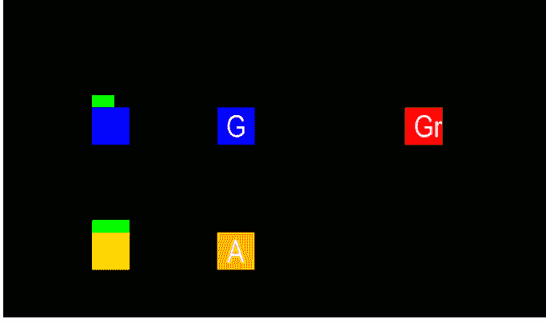

现在，我们已经为每种弹药定义并应用了标签，我们还可以在屏幕顶部显示一条消息，其中包含当前武器和相应的弹药。

到目前为止，这条消息一直显示在命令提示符中，将其作为用户界面的一部分显示出来，对玩家会更有用。

请在名为 `window` 的方法中添加以下代码（新代码以粗体显示）：

```
info = info_user_font.render(text_to_display,1,"WHITE")
ammo.draw()
WIN.blit(info,(ammo.x + 7,ammo.y))
check_colission_with_player()
text_to_display = " > " + str(inventory.weapons[inventory.current_index].name) + "(" + str(inventory.weapons[inventory.current_index].ammunitions) + ")"
info = info_user_font.render(text_to_display,1,"RED")
WIN.blit(info,(20,10))
```

在之前的代码中，我们使用了之前在命令提示符中显示的文本，现在将其显示在屏幕上。我们还调用了一个尚未定义的方法，该方法将检查玩家是否与弹药发生了碰撞。

那么，让我们来定义这个方法。

请将此方法添加到脚本中，位于任何类方法之外：

```
def check_colission_with_player():
    global ammos
    ammo_index = 0
    for ammo in ammos:
        if (player_collision_rect.colliderect(ammo.collision_rect)):
            inventory.increase_ammo(ammo.type,10)
            ammos.pop(ammo_index)
            ammo_index += 1
```

在上面的代码中：

- 我们定义了该方法。
- 我们引用了一个名为 `ammos` 的全局变量，并定义了名为 `ammo_index` 的变量。
- 然后我们创建了一个循环，遍历游戏中所有存在的弹药。
- 对于每种弹药，我们检查它是否与玩家发生碰撞。
- 如果是这样，库存就会更新（即，我们增加对应武器的弹药数量），并移除/删除刚刚被收集的弹药。

就是这样。现在你可以编译你的代码并检查一切是否正常工作。
你应该注意到以下几点：

- 左上角显示当前武器的文本。
- 三种弹药，分别为蓝色、橙色和红色，每种都有标签。
- 当你拾取弹药时，你的库存应该会更新。

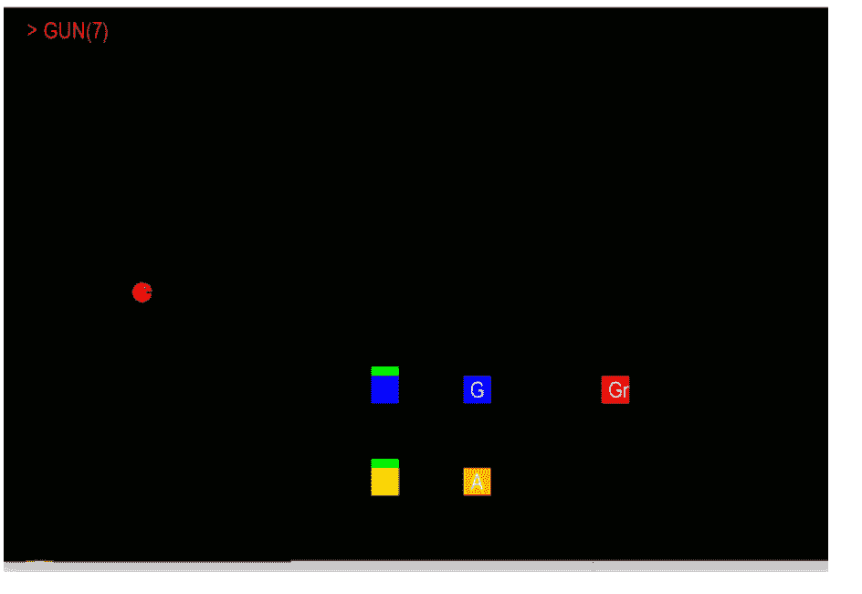

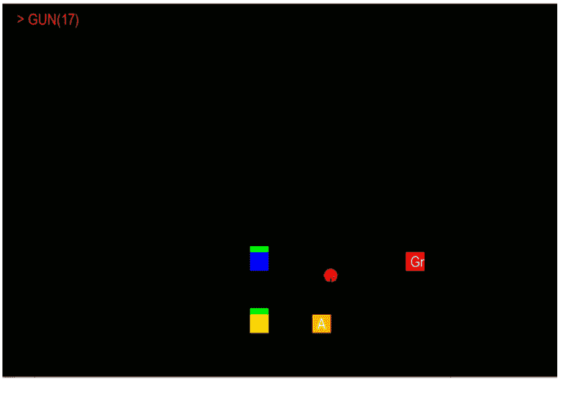

## 关卡总结

## 总结

在本章中，我们成功创建了一个管理武器和弹药的库存系统。我们还创建了可以被收集的弹药。最后，我们通过检测弹药何时被收集并相应地更新库存，成功地将库存与弹药联系起来。在此过程中，我们创建了新的类，基于这些类实例化了新的对象，并检测了用户输入（例如，TAB）。因此，在本章中，我们又一次学习并应用了新的 Python 编程技能。

## 测验

现在是测试你知识的时候了。请判断以下陈述是正确还是错误。答案在下一页。

- 每个类都有一个默认构造函数。
- 一个构造函数可以包含多个参数。
- 成员变量只能从类中的构造函数访问。
- 当创建一个对象的新实例时，会调用相应的构造函数。
- 一个 Python 文件可以从命令提示符编译和运行。
- 以下代码将检查玩家是否按下了 Tab 键。

```
if event.type == pygame.KEYDOWN:
    if event.key == pygame.K_TAB:
```

- 使用列表时，`pop` 方法可用于从该列表中移除一个元素。
- 默认情况下，添加到列表的新元素位于索引 0（第一个位置）。
- 使用列表时，`include` 方法可用于向该列表添加一个元素。
- 使用 `pygame` 库，可以在屏幕上显示文本。

## 测验答案

1.  正确。
2.  正确。
3.  错误。
4.  正确。
5.  正确。
6.  正确。
7.  正确。
8.  正确。
9.  错误（可以使用 `append` 代替）。
10. 正确。

### 检查清单

- [ ] 检查清单

## 第三章：添加碰撞与人工智能

在本章中，我们将开始通过添加不同功能来改进我们的游戏。这些功能包括：

- NPC 可以与之碰撞的墙壁。
- 能够在实际迷宫中导航的新 NPC。
- 基于路径点导航的 NPC。
- NPC 的听觉检测能力。
- NPC 通过视觉检测玩家的能力。

因此，在完成本章后，你应该能够：

- 用方块创建一个迷宫。
- 检测玩家角色与墙壁之间的碰撞。
- 创建能够使用路径点导航的 NPC。
- 检测玩家何时靠近 NPC。
- 检测 NPC 是否能看到玩家角色。

## 本章所需资源

要完成本书中介绍的活动，你需要在配套网站上下载启动包；它包含你完成项目所需的免费资源。要下载这些资源，请执行以下操作：

1. 打开页面。
2. 点击你的书《从零到精通》。
3. 在新页面上，请点击写着“点击此处下载你的资源”的链接。

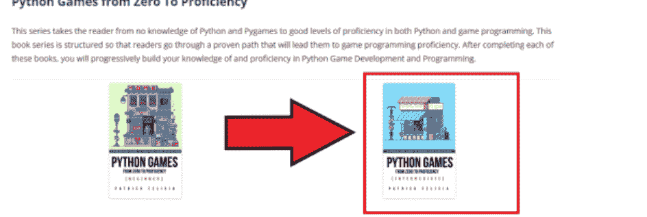

## 添加墙壁

在本节中，我们将开始逐步向环境中添加墙壁，并创建一个 NPC 和玩家将在其中导航的迷宫。因此，迷宫将由方块组成，布局类似于下图所示。


第一步将包括定义这些方块的位置和大小，并相应地在屏幕上显示它们：

请将以下代码添加到脚本中任何方法或类之外：

```
WALL_SIZE = 100
WALL_START_X = 100
WALL_START_Y = 100
WALL_INDENT = 150
```

在前面的代码中，我们设置了每个方块的大小、第一个方块的位置以及这些方块之间的间距。

请在你编写的代码之后添加以下代码：

```
Wall_rect1 = pygame.Rect(WALL_START_X,WALL_START_Y, WALL_SIZE,WALL_SIZE)
Wall_rect2 = pygame.Rect(WALL_START_X + 150,WALL_START_Y, WALL_SIZE,WALL_SIZE)
Wall_rect3 = pygame.Rect(WALL_START_X + 300,WALL_START_Y, WALL_SIZE, WALL_SIZE)
Wall_rect4 = pygame.Rect(WALL_START_X + 450,WALL_START_Y, WALL_SIZE, WALL_SIZE)
Wall_rect5 = pygame.Rect(WALL_START_X + 600,WALL_START_Y, WALL_SIZE, WALL_SIZE)
```

在前面的代码中，我们定义了顶行的五个方块。这些方块在水平方向上相隔 150 像素；它们具有相同的 y 坐标和相同的大小。

基于相同的原则，我们可以定义第二行和第三行。

请添加以下代码：

```
Wall_rect6 = pygame.Rect(WALL_START_X,WALL_START_Y + 150, WALL_SIZE,WALL_SIZE)
Wall_rect7 = pygame.Rect(WALL_START_X + 150,WALL_START_Y + 150, WALL_SIZE,WALL_SIZE)
Wall_rect8 = pygame.Rect(WALL_START_X + 300,WALL_START_Y + 150, WALL_SIZE, WALL_SIZE)
Wall_rect9 = pygame.Rect(WALL_START_X + 450,WALL_START_Y + 150, WALL_SIZE, WALL_SIZE)
Wall_rect10 = pygame.Rect(WALL_START_X + 600,WALL_START_Y + 150, WALL_SIZE, WALL_SIZE)
```

```
Wall_rect11 = pygame.Rect(WALL_START_X,WALL_START_Y + 300, WALL_SIZE,WALL_SIZE)
Wall_rect12 = pygame.Rect(WALL_START_X + 150,WALL_START_Y + 300, WALL_SIZE,WALL_SIZE)
Wall_rect13 = pygame.Rect(WALL_START_X + 300,WALL_START_Y + 300, WALL_SIZE, WALL_SIZE)
Wall_rect14 = pygame.Rect(WALL_START_X + 450,WALL_START_Y + 300, WALL_SIZE, WALL_SIZE)
Wall_rect15 = pygame.Rect(WALL_START_X + 600,WALL_START_Y + 300, WALL_SIZE, WALL_SIZE)
```

在前面的代码中，我们基于上述相同原则定义了第二行和第三行的墙壁。
在此阶段，我们已经定义了用于表示迷宫墙壁的矩形；所以现在，我们可以显示它们了。

请在名为 `window` 的方法末尾，在代码之前添加以下代码：

```
pygame.draw.rect(WIN,"White",Wall_rect1)
pygame.draw.rect(WIN,"White",Wall_rect2)
pygame.draw.rect(WIN,"White",Wall_rect3)
pygame.draw.rect(WIN,"White",Wall_rect4)
pygame.draw.rect(WIN,"White",Wall_rect5)
pygame.draw.rect(WIN,"White",Wall_rect6)
pygame.draw.rect(WIN,"White",Wall_rect7)
pygame.draw.rect(WIN,"White",Wall_rect8)
pygame.draw.rect(WIN,"White",Wall_rect9)
pygame.draw.rect(WIN,"White",Wall_rect10)
pygame.draw.rect(WIN,"White",Wall_rect11)
```

```
pygame.draw.rect(WIN,"White",Wall_rect12)
pygame.draw.rect(WIN,"White",Wall_rect13)
pygame.draw.rect(WIN,"White",Wall_rect14)
pygame.draw.rect(WIN,"White",Wall_rect15)
```

在前面的代码中，我们使用该方法绘制了 15 面墙；每面墙将被涂成白色。

你现在可以编译你的代码了，当游戏开始时，你应该能看到迷宫的布局，如下图所示；请记住，我们尚未测试玩家角色与墙壁之间的碰撞，我们将在下一节中进行测试。


## 添加与墙壁的碰撞检测

因此，在此阶段我们已经创建并显示了墙壁；所以我们只需要检测玩家与这些墙壁之间的碰撞。为了能够做到这一点，我们将应用几个简单的步骤：

- 每当玩家移动时，我们记录其方向（即上、下、左或右）。
- 玩家移动后，我们检查玩家角色是否与其中一个方块发生碰撞（基于它们的位置）。
- 如果发生碰撞，我们将把玩家角色向相反方向移动。

请将以下代码添加到函数中：

```
if (
    player_collision_rect.colliderect(Wall_rect1) or
    player_collision_rect.colliderect(Wall_rect2) or
    player_collision_rect.colliderect(Wall_rect3) or
    player_collision_rect.colliderect(Wall_rect4) or
    player_collision_rect.colliderect(Wall_rect5) or
    player_collision_rect.colliderect(Wall_rect6) or
    player_collision_rect.colliderect(Wall_rect7) or
    player_collision_rect.colliderect(Wall_rect8) or
    player_collision_rect.colliderect(Wall_rect9) or
    player_collision_rect.colliderect(Wall_rect10) or
    player_collision_rect.colliderect(Wall_rect11) or
    player_collision_rect.colliderect(Wall_rect12) or
    player_collision_rect.colliderect(Wall_rect13) or
    player_collision_rect.colliderect(Wall_rect14) or
    player_collision_rect.colliderect(Wall_rect15)):
    if (player_angle == 0): player_rect.y -= VEL
    if (player_angle == 180): player_rect.y += VEL
    if (player_angle == -90): player_rect.x += VEL
    if (player_angle == 90): player_rect.x -= VEL
```

在前面的代码中，我们检查玩家是否与任何墙壁发生碰撞，如果是这种情况，我们将玩家向相反方向移动（即后退）。

你现在可以编译你的代码，并检查玩家是否无法穿过墙壁。

## 使用路径点移动 NPC

在本节中，我们将开始通过路径点移动 NPC；路径点是临时目的地，将它们组合在一起可以形成 NPC 将要遵循的路径。因此，我们将按如下步骤进行：

- 我们将定义每个路径点的位置。
- 我们将把 NPC 移动到一个路径点。
- 我们将检查 NPC 是否足够接近该路径点。
- 在这种情况下，NPC 将开始跟随下一个路径点。
- 当 NPC 到达最后一个路径点时，它将从第一个路径点重新开始。

现在概念更清晰了一点，让我们实现我们的路径并创建路径点。

请在脚本中任何函数或类之外添加以下代码：

```
WP1 = pygame.Vector2()
WP1.xy = 50,50
WP2 = pygame.Vector2()
WP2.xy = 850,50
WP3 = pygame.Vector2()
WP3.xy = 850,550
WP4 = pygame.Vector2()
WP4.xy = 50,550
WPs = [WP1,WP2,WP3,WP4]
WP_index = 0
```

在前面的代码中：

- 我们定义并设置了变量；这些变量是用于每个路径点位置的二维向量。
- 将它们组合在一起，这些路径点形成一个矩形。
- 我们将这些路径点添加到一个列表中。
- 最后，我们创建一个名为 `WP_index` 的变量，该变量将用于定义 NPC 当前要跟随的路径点。

这些步骤如下图所示：


我们现在可以基于这些路径点实现 NPC 的移动：

请在类中创建以下方法：

```
def move(self):
    global WP_index, WPs
```

在之前的代码中，我们创建了一个名为的新方法。在此方法中，我们引用了全局变量WP_index和。

请将以下代码添加到该方法中：

```python
npc_pos = pygame.Vector2()
npc_pos.xy = self.x, self.y
if (WP_index < 3): npc_destination = WPs[WP_index + 1]
else: npc_destination = WPs[0]
```

在之前的代码中：
我们创建了一个名为npc_pos的新变量，类型为pygame.Vector2。
我们设置了该向量的x和y坐标。
我们检查是否已到达最后一个航路点，并相应地设置我们的目的地。

请在函数中刚刚输入的代码之后添加以下代码：

```python
distance_to_next_wp = get_distance(npc_pos, npc_destination)
if (distance_to_next_wp < 10):
    WP_index += 1
    if WP_index > 3: WP_index = 0
```

在之前的代码中：
我们调用了一个名为get_distance的方法（我们还需要创建它），该方法计算NPC与其目的地之间的距离。
如果NPC已到达其目的地（即下一个航路点），我们增加名为WP_index的索引的值。
如果我们已到达最后一个航路点，则将索引设置为0。

既然我们已经定义了要遵循的航路点，我们需要根据NPC的位置和下一个要到达的航路点来计算NPC的方向。为此，我们只需要对定义NPC和航路点位置的向量执行减法运算。

请在函数中刚刚输入的代码之后添加以下代码（新代码用粗体表示）：

```python
if WP_index > 3: WP_index = 0
unit_direction = pygame.Vector2()
if (WP_index < 3): unit_direction = -WPs[WP_index] + WPs[WP_index + 1]
else: unit_direction = -WPs[WP_index] + WPs[0]
unit_direction = unit_direction.normalize()
```

在之前的代码中：
我们定义了一个名为unit_direction的变量。
这是一个向量，将定义朝向下一个航路点移动时的前进方向。
这个方向向量是当前航路点与下一个航路点之间的减法结果，这样NPC就能在航路点之间沿直线移动。
因此，要定义该向量，我们从下一个航路点的位置中减去当前航路点的位置。
如果我们已到达最后一个航路点，则下一个航路点是索引为0的那个（即WPs[0]）。
最后，因为这个向量将应用于NPC的移动，我们对其进行归一化，这意味着我们将其大小保持为1。

既然NPC的方向已经定义好了，我们只需要使用它来让NPC朝那个特定方向移动。

请将以下代码添加到该方法中：

```python
self.x += unit_direction.x * 3
self.y += unit_direction.y * 3
self.collision_rect.x = self.x
self.collision_rect.y = self.y
```

在之前的代码中，我们使用向量unit_direction来改变NPC的位置；我们也改变了用于检测与NPC碰撞的矩形的位置。

我们需要做的最后一件事是从move方法中调用这个方法，所以请将此代码添加到函数window中（新代码用粗体表示）：

```python
for npc in npcs:
    npc.draw()
    npc.move()
```

接下来，我们需要声明名为get_distance的方法，所以请在任何类或函数之外添加以下方法：

```python
def get_distance(point_two, point_one):
    perpendicular = point_two.y - point_one.y
    base = point_two.x - point_one.x
    distance = math.hypot(perpendicular, base)
    return distance
```

在之前的代码中：
其思想是通过首先定义一个向量来计算两点之间的距离，该向量是两个位置之间的向量减法；这个向量实际上是从第一个点指向第二个点。一旦我们获得了这个向量，我们就可以确定它的x和y坐标，并推导出它的长度。这是因为，由于我们工作在笛卡尔坐标系中，并且如果，如下图所示，我们考虑由两个点A和B以及点C形成的三角形，其中点C是分别通过点B和C的垂直线和水平线的交点，那么三角形的斜边可以根据两条对边来定义。

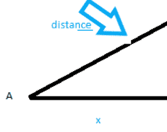

因此，实际上，在之前的代码中，我们定义了三角形每条边的大小（即AC和BC以及底边），然后我们使用内置方法math.hypot计算斜边AB的大小（即两点之间的距离）。

请在脚本开头添加以下行，以导入用于计算NPC与下一个航路点之间距离的math模块。

```python
import math
```

最后，因为我们将只使用一个NPC来测试沿航路点的移动，并确保它在开始时位于路径上，我们将修改代码如下（新代码用粗体表示）：

```python
npcs = []
#npc1 = NPC(400, 400, "BLUE")
#npc2 = NPC(400, 500, "YELLOW")
npc1 = NPC(50, 50, "BLUE")
npcs.append(npc1)
#npcs.append(npc2)
```

在之前的代码中，我们只保留一个NPC，并将其放置在右上角靠近第一个航路点的位置。

你现在可以编译你的代码，并看到NPC在我们设置的不同航路点之间导航。

## 为npc添加听觉和视觉

在本节中，我们将为NPC添加听觉和视觉能力。这些功能将基于玩家与NPC之间的距离以及它们的相对位置。

虽然下一节将处理在检测到玩家后将NPC移向玩家的问题，但本节仅在检测到玩家时在命令提示符中写入一条消息；NPC的颜色也会改变，以便你有一个视觉提示，表明NPC已检测到玩家。

请将以下方法添加到类中：

```python
def hear(self):
    npc_position = pygame.Vector2()
    npc_position.xy = self.x, self.y
    distance_between_player_and_npc = get_distance(npc_position, player_rect)
    if (distance_between_player_and_npc < 50):
        print("Just Heard the Player")
```

在之前的代码中：
我们定义了一个名为hear的新方法，它不接受参数（前面有self参数，表示这是一个成员方法）。
我们将NPC的位置存储在变量npc_position中。
然后我们调用get_distance方法来计算NPC与玩家之间的距离。

如果这个距离小于50像素，我们就在命令提示符中显示一条消息。

既然我们已经定义了这个方法，我们只需要调用它，以便NPC经常监听以检测玩家。

请将以下代码添加到方法window中（新代码用粗体表示）：

```python
for npc in npcs:
    npc.draw()
    npc.move()
    npc.hear()
```

你现在可以保存并编译你的代码；当游戏运行时，当你靠近NPC时，你应该会在命令提示符中看到一条消息说“Just Heard the Player”。

在下一节中，我们将改变NPC的行为，使其在听到玩家后开始追逐玩家。

接下来，我们可以开始实现NPC的视觉功能；此功能将通过检查NPC和玩家是否在同一行或同一列来实现。为此，我们将创建两个方法，它们将指定NPC和玩家角色所在的列；通过使用这些方法并比较玩家和NPC的列或行，我们将能够确定它们是否在同一行，从而确定NPC是否能看到玩家。

请将以下方法添加到类中：

```python
def which_horizontal_lane_is_item(self, x, y, item_size):
    if (y > 0 and y < 100 - item_size): return 0
    elif (y > 200 and y < 250 - item_size): return 1
    elif (y > 350 and y < 400 - item_size): return 2
    elif (y > 500): return 3
    else: return -1
```

在之前的代码中：
我们定义了一个名为which_horizontal_lane_is_item的新方法。
此方法接受两个参数，它们对应于我们要确定其当前行的物品的坐标。
根据其y坐标，我们可以指定所考虑物品的当前行。
这些边界是根据每行上块的位置定义的，如下图所示。

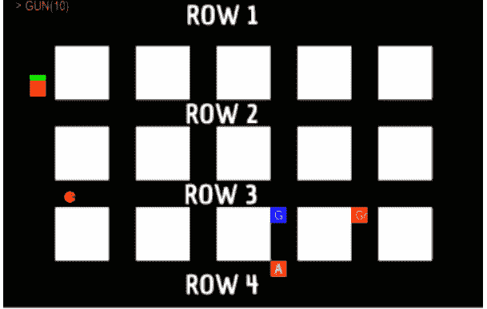

类似地，我们还将定义一个方法，该方法将返回物品的当前列。

请将以下方法添加到类中：

```python
def which_vertical_lane_is_item(self, x, y, item_size):
    if (x > 0 and x < 100 - item_size): return 0
    elif (x > 200 and x < 250 - item_size): return 1
    elif (x > 350 and x < 400 - item_size): return 2
    elif (x > 500 and x < 550 - item_size): return 3
```

```python
elif (x > 650 and x < 700 - item_size): return 4
elif (x > 800): return 5
else: return -1
```

在前面的代码中：

我们定义了一个新方法，名为
该方法接受两个参数，它们对应于我们想要确定当前行的物品的坐标。
根据 x 坐标，我们可以为正在考虑的物品指定当前列。
这些边界是根据每行上块的位置定义的，如下图所示。

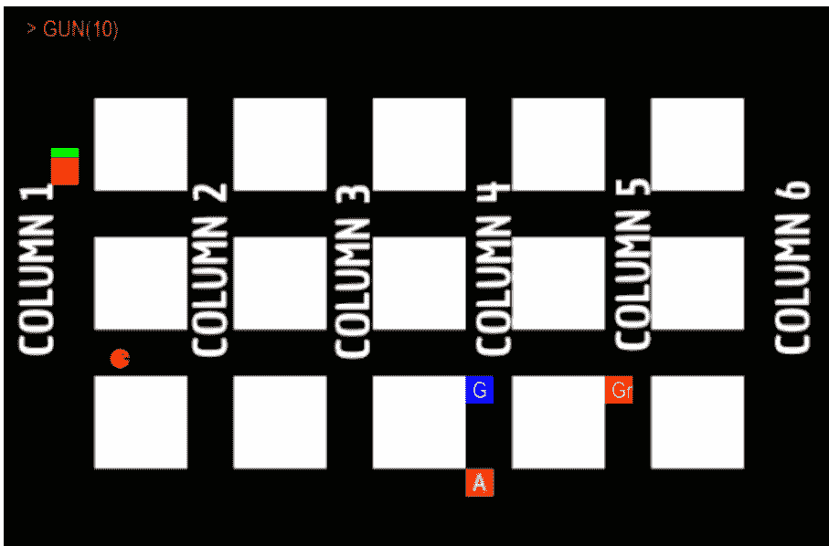

现在两个方法都已创建，我们可以使用它们来比较玩家和 NPC 所在的列和行，并由此确定 NPC 是否能看到玩家（即，他们是否在同一列或同一行）。

请将以下方法添加到类中

```
def see(self):
    npc_position = pygame.Vector2()
    npc_position.xy = self.x,self.y
    npc_col = self.which_vertical_lane_is_item (npc_position.x,
    npc_position.y, 25)
    player_col = self.which_vertical_lane_is_item(player_rect.x,
    player_rect.y, 25)
    npc_row = self.which_horizontal_lane_is_item (npc_position.x,
    npc_position.y, 25)
    player_row = self.which_horizontal_lane_is_item(player_rect.x,
    player_rect.y, 25)
```

在前面的代码中：

我们定义了一个名为的方法。
在该方法中，我们记录了玩家和 NPC 的位置。
然后，我们使用之前定义的方法来记录 NPC 和玩家的当前列和行；这些值存储在变量和中。

现在我们已经存储了玩家和 NPC 的行和列，我们可以比较它们以评估 NPC 是否能看到玩家（即，同一列或同一行）。

请将以下代码添加到方法中

```
same_vertical_lane = (npc_col == player_col) and (npc_col != -1)
same_horizontal_lane = (npc_row == player_row) and (npc_row != -1)
if (same_vertical_lane or same_horizontal_lane):
    print(">> just saw the Player")
    self.color = "Red"
```

在前面的代码中，我们定义了两个变量 same_vertical_lane 和，如果 NPC 和玩家在同一列，前者将为真；如果 NPC 和玩家在同一行，后者将为真。如果 NPC 和玩家在同一行或同一列，则在命令行中显示一条消息，同时，为了视觉效果，我们也会改变 NPC 的颜色。

最后，就像我们为听觉所做的那样，我们只需要确保我们频繁地调用 see 方法，以便 NPC 能够检测到玩家是否在同一行或同一列。

请将以下代码添加到方法窗口中（新代码用粗体表示）。

```
for npc in npcs:
    npc.draw()
    npc.move()
    npc.hear()
    npc.see()
```

在前面的代码中，我们只是确保每个 NPC 都能看到玩家。你现在可以保存并编译你的代码；当游戏运行时，当你靠近（或与 NPC 在同一行/列）时，你应该会在命令提示符中看到一条消息，说 Saw The

在下一节中，我们将改变 NPC 的行为，使其在看到或听到玩家后开始追逐玩家。

## 关卡总结

在本章中，我们成功添加了几个功能，包括 NPC 的碰撞检测和移动。我们还成功为 NPC 添加了某种形式的人工智能，包括视觉和视野。因此，我们再次取得了相当大的进展，到目前为止，我们已经研究了几种编程结构以及你在编码之旅中可能遇到的常见错误。

### 检查清单

检查清单 检查清单 检查清单 检查清单 检查清单 检查清单 检查清单 检查清单 检查清单 检查清单 检查清单 检查清单 检查清单 检查清单 检查清单 检查清单 检查清单 检查清单 检查清单 检查清单 检查清单 检查清单 检查清单 检查清单 检查清单 检查清单 检查清单 检查清单 检查清单 检查清单 检查清单 检查清单 检查清单 检查清单 检查清单 检查清单 检查清单 检查清单 检查清单 检查清单 检查清单 检查清单 检查清单 检查清单 检查清单 检查清单 检查清单 检查清单 检查清单 检查清单 检查清单 检查清单 检查清单 检查清单 检查清单 检查清单 检查清单 检查清单 检查清单 检查清单 检查清单 检查清单 检查清单 检查清单 检查清单 检查清单 检查清单 检查清单 检查清单 检查清单 检查清单 检查清单 检查清单 检查清单 检查清单 检查清单 检查清单 检查清单 检查清单 检查清单 检查清单 检查清单 检查清单 检查清单 检查清单 检查清单 检查清单 检查清单 检查清单 检查清单 检查清单 检查清单 检查清单 检查清单 检查清单 检查清单 检查清单 检查清单 检查清单 检查清单 检查清单 检查清单 检查清单 检查清单 检查清单 检查清单 检查清单 检查清单 检查清单 检查清单 检查清单 检查清单 检查清单 检查清单 检查清单 检查清单 检查清单 检查清单 检查清单 检查清单 检查清单 检查清单 检查清单 检查清单 检查清单 检查清单 检查清单 检查清单 检查清单 检查清单 检查清单 检查清单 检查清单 检查清单 检查清单 检查清单 检查清单 检查清单 检查清单 检查清单 检查清单 检查清单 检查清单 检查清单 检查清单 检查清单 检查清单 检查清单 检查清单 检查清单 检查清单 检查清单 检查清单 检查清单 检查清单 检查清单 检查清单 检查清单 检查清单 检查清单 检查清单 检查清单 检查清单 检查清单 检查清单 检查清单 检查清单 检查清单 检查清单 检查清单 检查清单 检查清单 检查清单 检查清单 检查清单 检查清单 检查清单 检查清单 检查清单 检查清单 检查清单 检查清单 检查清单 检查清单 检查清单 检查清单 检查清单 检查清单 检查清单 检查清单 检查清单 检查清单 检查清单 检查清单 检查清单 检查清单 检查清单 检查清单 检查清单 检查清单 检查清单 检查清单 检查清单 检查清单 检查清单 检查清单 检查清单 检查清单 检查清单 检查清单 检查清单 检查清单 检查清单 检查清单 检查清单 检查清单 检查清单 检查清单 检查清单 检查清单 检查清单 检查清单 检查清单 检查清单 检查清单 检查清单 检查清单 检查清单 检查清单 检查清单 检查清单 检查清单 检查清单 检查清单 检查清单 检查清单 检查清单 检查清单 检查清单 检查清单 检查清单 检查清单 检查清单 检查清单 检查清单 检查清单 检查清单 检查清单 检查清单 检查清单 检查清单 检查清单 检查清单 检查清单 检查清单 检查清单 检查清单 检查清单 检查清单 检查清单 检查清单 检查清单 检查清单 检查清单 检查清单 检查清单 检查清单 检查清单 检查清单 检查清单 检查清单 检查清单 检查清单 检查清单 检查清单 检查清单 检查清单 检查清单 检查清单 检查清单 检查清单 检查清单 检查清单 检查清单 检查清单 检查清单 检查清单 检查清单 检查清单 检查清单 检查清单 检查清单 检查清单 检查清单 检查清单 检查清单 检查清单 检查清单 检查清单 检查清单 检查清单 检查清单 检查清单 检查清单 检查清单 检查清单 检查清单 检查清单 检查清单 检查清单 检查清单 检查清单 检查清单 检查清单 检查清单 检查清单 检查清单 检查清单 检查清单 检查清单 检查清单 检查清单 检查清单 检查清单 检查清单 检查清单 检查清单 检查清单 检查清单 检查清单 检查清单 检查清单 检查清单 检查清单 检查清单 检查清单 检查清单 检查清单 检查清单 检查清单 检查清单 检查清单 检查清单 检查清单 检查清单 检查清单 检查清单 检查清单 检查清单 检查清单 检查清单 检查清单 检查清单 检查清单 检查清单 检查清单 检查清单 检查清单 检查清单 检查清单 检查清单 检查清单 检查清单 检查清单 检查清单 检查清单 检查清单 检查清单 检查清单 检查清单 检查清单 检查清单 检查清单 检查清单 检查清单 检查清单 检查清单 检查清单 检查清单 检查清单 检查清单 检查清单 检查清单 检查清单 检查清单 检查清单 检查清单 检查清单 检查清单 检查清单 检查清单 检查清单 检查清单 检查清单 检查清单 检查清单 检查清单 检查清单 检查清单 检查清单 检查清单 检查清单 检查清单 检查清单 检查清单 检查清单 检查清单 检查清单 检查清单 检查清单 检查清单 检查清单 检查清单 检查清单 检查清单 检查清单 检查清单 检查清单 检查清单 检查清单 检查清单 检查清单 检查清单 检查清单 检查清单 检查清单 检查清单 检查清单 检查清单 检查清单 检查清单 检查清单 检查清单 检查清单 检查清单 检查清单 检查清单 检查清单 检查清单 检查清单 检查清单 检查清单 检查清单 检查清单 检查清单 检查清单 检查清单 检查清单 检查清单 检查清单 检查清单 检查清单 检查清单 检查清单 检查清单 检查清单 检查清单 检查清单 检查清单 检查清单 检查清单 检查清单 检查清单 检查清单 检查清单 检查清单 检查清单 检查清单 检查清单 检查清单 检查清单 检查清单 检查清单 检查清单 检查清单 检查清单 检查清单 检查清单 检查清单 检查清单 检查清单 检查清单 检查清单 检查清单 检查清单 检查清单 检查清单 检查清单 检查清单 检查清单 检查清单 检查清单 检查清单 检查清单 检查清单 检查清单 检查清单 检查清单 检查清单 检查清单 检查清单 检查清单 检查清单 检查清单 检查清单 检查清单 检查清单 检查清单 检查清单 检查清单 检查清单 检查清单 检查清单 检查清单 检查清单 检查清单 检查清单 检查清单 检查清单 检查清单 检查清单 检查清单 检查清单 检查清单 检查清单 检查清单 检查清单 检查清单 检查清单 检查清单 检查清单 检查清单 检查清单 检查清单 检查清单 检查清单 检查清单 检查清单 检查清单 检查清单 检查清单 检查清单 检查清单 检查清单 检查清单 检查清单 检查清单 检查清单 检查清单 检查清单 检查清单 检查清单 检查清单 检查清单 检查清单 检查清单 检查清单 检查清单 检查清单 检查清单 检查清单 检查清单 检查清单 检查清单 检查清单 检查清单 检查清单 检查清单 检查清单 检查清单 检查清单 检查清单 检查清单 检查清单 检查清单 检查清单 检查清单 检查清单 检查清单 检查清单 检查清单 检查清单 检查清单 检查清单 检查清单 检查清单 检查清单 检查清单 检查清单 检查清单 检查清单 检查清单 检查清单 检查清单 检查清单 检查清单 检查清单 检查清单 检查清单 检查清单 检查清单 检查清单 检查清单 检查清单 检查清单 检查清单 检查清单 检查清单 检查清单 检查清单 检查清单 检查清单 检查清单 检查清单 检查清单 检查清单 检查清单 检查清单 检查清单 检查清单 检查清单 检查清单 检查清单 检查清单 检查清单 检查清单 检查清单 检查清单 检查清单 检查清单 检查清单 检查清单 检查清单 检查清单 检查清单 检查清单 检查清单 检查清单 检查清单 检查清单 检查清单 检查清单 检查清单 检查清单 检查清单 检查清单 检查清单 检查清单 检查清单 检查清单 检查清单 检查清单 检查清单 检查清单 检查清单 检查清单 检查清单 检查清单 检查清单 检查清单 检查清单 检查清单 检查清单 检查清单 检查清单 检查清单 检查清单 检查清单 检查清单 检查清单 检查清单 检查清单 检查清单 检查清单 检查清单 检查清单 检查清单 检查清单 检查清单 检查清单 检查清单 检查清单 检查清单 检查清单 检查清单 检查清单 检查清单 检查清单 检查清单 检查清单 检查清单 检查清单 检查清单 检查清单 检查清单 检查清单 检查清单 检查清单 检查清单 检查清单 检查清单 检查清单 检查清单 检查清单 检查清单 检查清单 检查清单 检查清单 检查清单 检查清单 检查清单 检查清单 检查清单 检查清单 检查清单 检查清单 检查清单 检查清单 检查清单 检查清单 检查清单 检查清单 检查清单 检查清单 检查清单 检查清单 检查清单 检查清单 检查清单 检查清单 检查清单 检查清单 检查清单 检查清单 检查清单 检查清单 检查清单 检查清单 检查清单 检查清单 检查清单 检查清单 检查清单 检查清单 检查清单 检查清单 检查清单 检查清单 检查清单 检查清单 检查清单 检查清单 检查清单 检查清单 检查清单 检查清单 检查清单 检查清单 检查清单 检查清单 检查清单 检查清单 检查清单 检查清单 检查清单 检查清单 检查清单 检查清单 检查清单 检查清单 检查清单 检查清单 检查清单 检查清单 检查清单 检查清单 检查清单 检查清单 检查清单 检查清单 检查清单 检查清单 检查清单 检查清单 检查清单 检查清单 检查清单 检查清单 检查清单 检查清单 检查清单 检查清单 检查清单 检查清单 检查清单 检查清单 检查清单 检查清单 检查清单 检查清单 检查清单 检查清单 检查清单 检查清单 检查清单 检查清单 检查清单 检查清单 检查清单 检查清单 检查清单 检查清单 检查清单 检查清单 检查清单 检查清单 检查清单 检查清单 检查清单 检查清单 检查清单 检查清单 检查清单 检查清单 检查清单 检查清单 检查清单 检查清单 检查清单 检查清单 检查清单 检查清单 检查清单 检查清单 检查清单 检查清单 检查清单 检查清单 检查清单 检查清单 检查清单 检查清单 检查清单 检查清单 检查清单 检查清单 检查清单 检查清单 检查清单 检查清单 检查清单 检查清单 检查清单 检查清单 检查清单 检查清单 检查清单 检查清单 检查清单 检查清单 检查清单 检查清单 检查清单 检查清单 检查清单 检查清单 检查清单 检查清单 检查清单 检查清单 检查清单 检查清单 检查清单 检查清单 检查清单 检查清单 检查清单 检查清单 检查清单 检查清单 检查清单 检查清单 检查清单 检查清单 检查清单 检查清单 检查清单 检查清单 检查清单 检查清单 检查清单 检查清单 检查清单 检查清单 检查清单 检查清单 检查清单 检查清单 检查清单 检查清单 检查清单 检查清单 检查清单 检查清单 检查清单 检查清单 检查清单 检查清单 检查清单 检查清单 检查清单 检查清单 检查清单 检查清单 检查清单 检查清单 检查清单 检查清单 检查清单 检查清单 检查清单 检查清单 检查清单 检查清单 检查清单 检查清单 检查清单 检查清单 检查清单 检查清单 检查清单 检查清单 检查清单 检查清单 检查清单 检查清单 检查清单 检查清单 检查清单 检查清单 检查清单 检查清单 检查清单 检查清单 检查清单 检查清单 检查清单 检查清单 检查清单 检查清单 检查清单 检查清单 检查清单 检查清单 检查清单 检查清单 检查清单 检查清单 检查清单 检查清单 检查清单 检查清单 检查清单 检查清单 检查清单 检查清单 检查清单 检查清单 检查清单 检查清单 检查清单 检查清单 检查清单 检查清单 检查清单 检查清单 检查清单 检查清单 检查清单 检查清单 检查清单 检查清单 检查清单 检查清单 检查清单 检查清单 检查清单 检查清单 检查清单 检查清单 检查清单 检查清单 检查清单 检查清单 检查清单 检查清单 检查清单 检查清单 检查清单 检查清单 检查清单 检查清单 检查清单 检查清单 检查清单 检查清单 检查清单 检查清单 检查清单 检查清单 检查清单 检查清单 检查清单 检查清单 检查清单 检查清单 检查清单 检查清单 检查清单 检查清单 检查清单 检查清单 检查清单 检查清单 检查清单 检查清单 检查清单 检查清单 检查清单 检查清单 检查清单 检查清单 检查清单 检查清单 检查清单 检查清单 检查清单 检查清单 检查清单 检查清单 检查清单 检查清单 检查清单 检查清单 检查清单 检查清单 检查清单 检查清单 检查清单 检查清单 检查清单 检查清单 检查清单 检查清单 检查清单 检查清单 检查清单 检查清单 检查清单 检查清单 检查清单 检查清单 检查清单 检查清单 检查清单 检查清单 检查清单 检查清单 检查清单 检查清单 检查清单 检查清单 检查清单 检查清单 检查清单 检查清单 检查清单 检查清单 检查清单 检查清单 检查清单 检查清单 检查清单 检查清单 检查清单 检查清单 检查清单 检查清单 检查清单 检查清单 检查清单 检查清单 检查清单 检查清单 检查清单 检查清单 检查清单 检查清单 检查清单 检查清单 检查清单 检查清单 检查清单 检查清单 检查清单 检查清单 检查清单 检查清单 检查清单 检查清单 检查清单 检查清单 检查清单 检查清单 检查清单 检查清单 检查清单 检查清单 检查清单 检查清单 检查清单 检查清单 检查清单 检查清单 检查清单 检查清单 检查清单 检查清单 检查清单 检查清单 检查清单 检查清单 检查清单 检查清单 检查清单 检查清单 检查清单 检查清单 检查清单 检查清单 检查清单 检查清单 检查清单 检查清单 检查清单 检查清单 检查清单 检查清单 检查清单 检查清单 检查清单 检查清单 检查清单 检查清单 检查清单 检查清单 检查清单 检查清单 检查清单 检查清单 检查清单 检查清单 检查清单 检查清单 检查清单 检查清单 检查清单 检查清单 检查清单 检查清单 检查清单 检查清单 检查清单 检查清单 检查清单 检查清单 检查清单 检查清单 检查清单 检查清单 检查清单 检查清单 检查清单 检查清单 检查清单 检查清单 检查清单 检查清单 检查清单 检查清单 检查清单 检查清单 检查清单 检查清单 检查清单 检查清单 检查清单 检查清单 检查清单 检查清单 检查清单 检查清单 检查清单 检查清单 检查清单 检查清单 检查清单 检查清单 检查清单 检查清单 检查清单 检查清单 检查清单 检查清单 检查清单 检查清单 检查清单 检查清单 检查清单 检查清单 检查清单 检查清单 检查清单 检查清单 检查清单 检查清单 检查清单 检查清单 检查清单 检查清单 检查清单 检查清单 检查清单 检查清单 检查清单 检查清单 检查清单 检查清单 检查清单 检查清单 检查清单 检查清单 检查清单 检查清单 检查清单 检查清单 检查清单 检查清单 检查清单 检查清单 检查清单 检查清单 检查清单 检查清单 检查清单 检查清单 检查清单 检查清单 检查清单 检查清单 检查清单 检查清单 检查清单 检查清单 检查清单 检查清单 检查清单 检查清单 检查清单 检查清单 检查清单 检查清单 检查清单 检查清单 检查清单 检查清单 检查清单 检查清单 检查清单 检查清单 检查清单 检查清单 检查清单 检查清单 检查清单 检查清单 检查清单 检查清单 检查清单 检查清单 检查清单 检查清单 检查清单 检查清单 检查清单 检查清单 检查清单 检查清单 检查清单 检查清单 检查清单 检查清单 检查清单 检查清单 检查清单 检查清单 检查清单 检查清单 检查清单 检查清单 检查清单 检查清单 检查清单 检查清单 检查清单 检查清单 检查清单 检查清单 检查清单 检查清单 检查清单 检查清单 检查清单 检查清单 检查清单 检查清单 检查清单 检查清单 检查清单 检查清单 检查清单 检查清单 检查清单 检查清单 检查清单 检查清单 检查清单 检查清单 检查清单 检查清单 检查清单 检查清单 检查清单 检查清单 检查清单 检查清单 检查清单 检查清单 检查清单 检查清单 检查清单 检查清单 检查清单 检查清单 检查清单 检查清单 检查清单 检查清单 检查清单 检查清单 检查清单 检查清单 检查清单 检查清单 检查清单 检查清单 检查清单 检查清单 检查清单 检查清单 检查清单 检查清单 检查清单 检查清单 检查清单 检查清单 检查清单 检查清单 检查清单 检查清单 检查清单 检查清单 检查清单 检查清单 检查清单 检查清单 检查清单 检查清单 检查清单 检查清单 检查清单 检查清单 检查清单 检查清单 检查清单 检查清单 检查清单 检查清单 检查清单 检查清单 检查清单 检查清单 检查清单 检查清单 检查清单 检查清单 检查清单 检查清单 检查清单 检查清单 检查清单 检查清单 检查清单 检查清单 检查清单 检查清单 检查清单 检查清单 检查清单 检查清单 检查清单 检查清单 检查清单 检查清单 检查清单 检查清单 检查清单 检查清单 检查清单 检查清单 检查清单 检查清单 检查清单 检查清单 检查清单 检查清单 检查清单 检查清单 检查清单 检查清单 检查清单 检查清单 检查清单 检查清单 检查清单 检查清单 检查清单 检查清单 检查清单 检查清单 检查清单 检查清单 检查清单 检查清单 检查清单 检查清单 检查清单 检查清单 检查清单 检查清单 检查清单 检查清单 检查清单 检查清单 检查清单 检查清单 检查清单 检查清单 检查清单 检查清单 检查清单 检查清单 检查清单 检查清单 检查清单 检查清单 检查清单 检查清单 检查清单 检查清单 检查清单 检查清单 检查清单 检查清单 检查清单 检查清单 检查清单 检查清单 检查清单 检查清单 检查清单 检查清单 检查清单 检查清单 检查清单 检查清单 检查清单 检查清单 检查清单 检查清单 检查清单 检查清单 检查清单 检查清单 检查清单 检查清单 检查清单 检查清单 检查清单 检查清单 检查清单 检查清单 检查清单 检查清单 检查清单 检查清单 检查清单 检查清单 检查清单 检查清单 检查清单 检查清单 检查清单 检查清单 检查清单 检查清单 检查清单 检查清单 检查清单 检查清单 检查清单 检查清单 检查清单 检查清单 检查清单 检查清单 检查清单 检查清单 检查清单 检查清单 检查清单 检查清单 检查清单 检查清单 检查清单 检查清单 检查清单 检查清单 检查清单 检查清单 检查清单 检查清单 检查清单 检查清单 检查清单 检查清单 检查清单 检查清单 检查清单 检查清单 检查清单 检查清单 检查清单 检查清单 检查清单 检查清单 检查清单 检查清单 检查清单 检查清单 检查清单 检查清单 检查清单 检查清单 检查清单 检查清单 检查清单 检查清单 检查清单 检查清单 检查清单 检查清单 检查清单 检查清单 检查清单 检查清单 检查清单 检查清单 检查清单 检查清单 检查清单 检查清单 检查清单 检查清单 检查清单 检查清单 检查清单 检查清单 检查清单 检查清单 检查清单 检查清单 检查清单 检查清单 检查清单 检查清单 检查清单 检查清单 检查清单 检查清单 检查清单 检查清单 检查清单 检查清单 检查清单 检查清单 检查清单 检查清单 检查清单 检查清单 检查清单 检查清单 检查清单 检查清单 检查清单 检查清单 检查清单 检查清单 检查清单 检查清单 检查清单 检查清单 检查清单 检查清单 检查清单 检查清单 检查清单 检查清单 检查清单 检查清单 检查清单 检查清单 检查清单 检查清单 检查清单 检查清单 检查清单 检查清单 检查清单 检查清单 检查清单 检查清单 检查清单 检查清单 检查清单 检查清单 检查清单 检查清单 检查清单 检查清单 检查清单 检查清单 检查清单 检查清单 检查清单 检查清单 检查清单 检查清单 检查清单 检查清单 检查清单 检查清单 检查清单 检查清单 检查清单 检查清单 检查清单 检查清单 检查清单 检查清单 检查清单 检查清单 检查清单 检查清单 检查清单 检查清单 检查清单 检查清单 检查清单 检查清单 检查清单 检查清单 检查清单 检查清单 检查清单 检查清单 检查清单 检查清单 检查清单 检查清单 检查清单 检查清单 检查清单 检查清单 检查清单 检查清单 检查清单 检查清单 检查清单 检查清单 检查清单 检查清单 检查清单 检查清单 检查清单 检查清单 检查清单 检查清单 检查清单 检查清单 检查清单 检查清单 检查清单 检查清单 检查清单 检查清单 检查清单 检查清单 检查清单 检查清单 检查清单 检查清单 检查清单 检查清单 检查清单 检查清单 检查清单 检查清单 检查清单 检查清单 检查清单 检查清单 检查清单 检查清单 检查清单 检查清单 检查清单 检查清单 检查清单 检查清单 检查清单 检查清单 检查清单 检查清单 检查清单 检查清单 检查清单 检查清单 检查清单 检查清单 检查清单 检查清单 检查清单 检查清单 检查清单 检查清单 检查清单 检查清单 检查清单 检查清单 检查清单 检查清单 检查清单 检查清单 检查清单 检查清单 检查清单 检查清单 检查清单 检查清单 检查清单 检查清单 检查清单 检查清单 检查清单 检查清单 检查清单 检查清单 检查清单 检查清单 检查清单 检查清单 检查清单 检查清单 检查清单 检查清单 检查清单 检查清单 检查清单 检查清单 检查清单 检查清单 检查清单 检查清单 检查清单 检查清单 检查清单 检查清单 检查清单 检查清单 检查清单 检查清单 检查清单 检查清单 检查清单 检查清单 检查清单 检查清单 检查清单 检查清单 检查清单 检查清单 检查清单 检查清单 检查清单 检查清单 检查清单 检查清单 检查清单 检查清单 检查清单 检查清单 检查清单 检查清单 检查清单 检查清单 检查清单 检查清单 检查清单 检查清单 检查清单 检查清单 检查清单 检查清单 检查清单 检查清单 检查清单 检查清单 检查清单 检查清单 检查清单 检查清单 检查清单 检查清单 检查清单 检查清单 检查清单 检查清单 检查清单 检查清单 检查清单 检查清单 检查清单 检查清单 检查清单 检查清单 检查清单 检查清单 检查清单 检查清单 检查清单 检查清单 检查清单 检查清单 检查清单 检查清单 检查清单 检查清单 检查清单 检查清单 检查清单 检查清单 检查清单 检查清单 检查清单 检查清单 检查清单 检查清单 检查清单 检查清单 检查清单 检查清单 检查清单 检查清单 检查清单 检查清单 检查清单 检查清单 检查清单 检查清单 检查清单 检查清单 检查清单 检查清单 检查清单 检查清单 检查清单 检查清单 检查清单 检查清单 检查清单 检查清单 检查清单 检查清单 检查清单 检查清单 检查清单 检查清单 检查清单 检查清单 检查清单 检查清单 检查清单 检查清单 检查清单 检查清单 检查清单 检查清单 检查清单 检查清单 检查清单 检查清单 检查清单 检查清单 检查清单 检查清单 检查清单 检查清单 检查清单 检查清单 检查清单 检查清单 检查清单 检查清单 检查清单 检查清单 检查清单 检查清单 检查清单 检查清单 检查清单 检查清单 检查清单 检查清单 检查清单 检查清单 检查清单 检查清单 检查清单 检查清单 检查清单 检查清单 检查清单 检查清单 检查清单 检查清单 检查清单 检查清单 检查清单 检查清单 检查清单 检查清单 检查清单 检查清单 检查清单 检查清单 检查清单 检查清单 检查清单 检查清单 检查清单 检查清单 检查清单 检查清单 检查清单 检查清单 检查清单 检查清单 检查清单 检查清单 检查清单 检查清单 检查清单 检查清单 检查清单 检查清单 检查清单 检查清单 检查清单 检查清单 检查清单 检查清单 检查清单 检查清单 检查清单 检查清单 检查清单 检查清单 检查清单 检查清单 检查清单 检查清单 检查清单 检查清单 检查清单 检查清单 检查清单 检查清单 检查清单 检查清单 检查清单 检查清单 检查清单 检查清单 检查清单 检查清单 检查清单 检查清单 检查清单 检查清单 检查清单 检查清单 检查清单 检查清单 检查清单 检查清单 检查清单 检查清单 检查清单 检查清单 检查清单 检查清单 检查清单 检查清单 检查清单 检查清单 检查清单 检查清单 检查清单 检查清单 检查清单 检查清单 检查清单 检查清单 检查清单 检查清单 检查清单 检查清单 检查清单 检查清单 检查清单 检查清单 检查清单 检查清单 检查清单 检查清单 检查清单 检查清单 检查清单 检查清单 检查清单 检查清单 检查清单 检查清单 检查清单 检查清单 检查清单 检查清单 检查清单 检查清单 检查清单 检查清单 检查清单 检查清单 检查清单 检查清单 检查清单 检查清单 检查清单 检查清单 检查清单 检查清单 检查清单 检查清单 检查清单 检查清单 检查清单 检查清单 检查清单 检查清单 检查清单 检查清单 检查清单 检查清单 检查清单 检查清单 检查清单 检查清单 检查清单 检查清单 检查清单 检查清单 检查清单 检查清单 检查清单 检查清单 检查清单 检查清单 检查清单 检查清单 检查清单 检查清单 检查清单 检查清单 检查清单 检查清单 检查清单 检查清单 检查清单 检查清单 检查清单 检查清单 检查清单 检查清单 检查清单 检查清单 检查清单 检查清单 检查清单 检查清单 检查清单 检查清单 检查清单 检查清单 检查清单 检查清单 检查清单 检查清单 检查清单 检查清单 检查清单 检查清单 检查清单 检查清单 检查清单 检查清单 检查清单 检查清单 检查清单 检查清单 检查清单 检查清单 检查清单 检查清单 检查清单 检查清单 检查清单 检查清单 检查清单 检查清单 检查清单 检查清单 检查清单 检查清单 检查清单 检查清单 检查清单 检查清单 检查清单 检查清单 检查清单 检查清单 检查清单 检查清单 检查清单 检查清单 检查清单 检查清单 检查清单 检查清单 检查清单 检查清单 检查清单 检查清单 检查清单 检查清单 检查清单 检查清单 检查清单 检查清单 检查清单 检查清单 检查清单 检查清单 检查清单 检查清单 检查清单 检查清单 检查清单 检查清单 检查清单 检查清单 检查清单 检查清单 检查清单 检查清单 检查清单 检查清单 检查清单 检查清单 检查清单 检查清单 检查清单 检查清单 检查清单 检查清单 检查清单 检查清单 检查清单 检查清单 检查清单 检查清单 检查清单 检查清单 检查清单 检查清单 检查清单 检查清单 检查清单 检查清单 检查清单 检查清单 检查清单 检查清单 检查清单 检查清单 检查清单 检查清单 检查清单 检查清单 检查清单 检查清单 检查清单 检查清单 检查清单 检查清单 检查清单 检查清单 检查清单 检查清单 检查清单 检查清单 检查清单 检查清单 检查清单 检查清单 检查清单 检查清单 检查清单 检查清单 检查清单 检查清单 检查清单 检查清单 检查清单 检查清单 检查清单 检查清单 检查清单 检查清单 检查清单 检查清单 检查清单 检查清单 检查清单 检查清单 检查清单 检查清单 检查清单 检查清单 检查清单 检查清单 检查清单 检查清单 检查清单 检查清单 检查清单 检查清单 检查清单 检查清单 检查清单 检查清单 检查清单 检查清单 检查清单 检查清单 检查清单 检查清单 检查清单 检查清单 检查清单 检查清单 检查清单 检查清单 检查清单 检查清单 检查清单 检查清单 检查清单 检查清单 检查清单 检查清单 检查清单 检查清单 检查清单 检查清单 检查清单 检查清单 检查清单 检查清单 检查清单 检查清单 检查清单 检查清单 检查清单 检查清单 检查清单 检查清单 检查清单 检查清单 检查清单 检查清单 检查清单 检查清单 检查清单 检查清单 检查清单 检查清单 检查清单 检查清单 检查清单 检查清单 检查清单 检查清单 检查清单 检查清单 检查清单 检查清单 检查清单 检查清单 检查清单 检查清单 检查清单 检查清单 检查清单 检查清单 检查清单 检查清单 检查清单 检查清单 检查清单 检查清单 检查清单 检查清单 检查清单 检查清单 检查清单 检查清单 检查清单 检查清单 检查清单 检查清单 检查清单 检查清单 检查清单 检查清单 检查清单 检查清单 检查清单 检查清单 检查清单 检查清单 检查清单 检查清单 检查清单 检查清单 检查清单 检查清单 检查清单 检查清单 检查清单 检查清单 检查清单 检查清单 检查清单 检查清单 检查清单 检查清单 检查清单 检查清单 检查清单 检查清单 检查清单 检查清单 检查清单 检查清单 检查清单 检查清单 检查清单 检查清单 检查清单 检查清单 检查清单 检查清单 检查清单 检查清单 检查清单 检查清单 检查清单 检查清单 检查清单 检查清单 检查清单 检查清单 检查清单 检查清单 检查清单 检查清单 检查清单 检查清单 检查清单 检查清单 检查清单 检查清单 检查清单 检查清单 检查清单 检查清单 检查清单 检查清单 检查清单 检查清单 检查清单 检查清单 检查清单 检查清单 检查清单 检查清单 检查清单 检查清单 检查清单 检查清单 检查清单 检查清单 检查清单 检查清单 检查清单 检查清单 检查清单 检查清单 检查清单 检查清单 检查清单 检查清单 检查清单 检查清单 检查清单 检查清单 检查清单 检查清单 检查清单 检查清单 检查清单 检查清单 检查清单 检查清单 检查清单 检查清单 检查清单 检查清单 检查清单 检查清单 检查清单 检查清单 检查清单 检查清单 检查清单 检查清单 检查清单 检查清单 检查清单 检查清单 检查清单 检查清单 检查清单 检查清单 检查清单 检查清单 检查清单 检查清单 检查清单 检查清单 检查清单 检查清单 检查清单 检查清单 检查清单 检查清单 检查清单 检查清单 检查清单 检查清单 检查清单 检查清单 检查清单 检查清单 检查清单 检查清单 检查清单 检查清单 检查清单 检查清单 检查清单 检查清单 检查清单 检查清单 检查清单 检查清单 检查清单 检查清单 检查清单 检查清单 检查清单 检查清单 检查清单 检查清单 检查清单 检查清单 检查清单 检查清单 检查清单 检查清单 检查清单 检查清单 检查清单 检查清单 检查清单 检查清单 检查清单 检查清单 检查清单 检查清单 检查清单 检查清单 检查清单 检查清单 检查清单 检查清单 检查清单 检查清单 检查清单 检查清单 检查清单 检查清单 检查清单 检查清单 检查清单 检查清单 检查清单 检查清单 检查清单 检查清单 检查清单 检查清单 检查清单 检查清单 检查清单 检查清单 检查清单 检查清单 检查清单 检查清单 检查清单 检查清单 检查清单 检查清单 检查清单 检查清单 检查清单 检查清单 检查清单 检查清单 检查清单 检查清单 检查清单 检查清单 检查清单 检查清单 检查清单 检查清单 检查清单 检查清单 检查清单 检查清单 检查清单 检查清单 检查清单 检查清单 检查清单 检查清单 检查清单 检查清单 检查清单 检查清单 检查清单 检查清单 检查清单 检查清单 检查清单 检查清单 检查清单 检查清单 检查清单 检查清单 检查清单 检查清单 检查清单 检查清单 检查清单 检查清单 检查清单 检查清单 检查清单 检查清单 检查清单 检查清单 检查清单 检查清单 检查清单 检查清单 检查清单 检查清单 检查清单 检查清单 检查清单 检查清单 检查清单 检查清单 检查清单 检查清单 检查清单 检查清单 检查清单 检查清单 检查清单 检查清单 检查清单 检查清单 检查清单 检查清单 检查清单 检查清单 检查清单 检查清单 检查清单 检查清单 检查清单 检查清单 检查清单 检查清单 检查清单 检查清单 检查清单 检查清单 检查清单 检查清单 检查清单 检查清单 检查清单 检查清单 检查清单 检查清单 检查清单 检查清单 检查清单 检查清单 检查清单 检查清单 检查清单 检查清单 检查清单 检查清单 检查清单 检查清单 检查清单 检查清单 检查清单 检查清单 检查清单 检查清单 检查清单 检查清单 检查清单 检查清单 检查清单 检查清单 检查清单 检查清单 检查清单 检查清单 检查清单 检查清单 检查清单 检查清单 检查清单 检查清单 检查清单 检查清单 检查清单 检查清单 检查清单 检查清单 检查清单 检查清单 检查清单 检查清单 检查清单 检查清单 检查清单 检查清单 检查清单 检查清单 检查清单 检查清单 检查清单 检查清单 检查清单 检查清单 检查清单 检查清单 检查清单 检查清单 检查清单 检查清单 检查清单 检查清单 检查清单 检查清单 检查清单 检查清单 检查清单 检查清单 检查清单 检查清单 检查清单 检查清单 检查清单 检查清单 检查清单 检查清单 检查清单 检查清单 检查清单 检查清单 检查清单 检查清单 检查清单 检查清单 检查清单 检查清单 检查清单 检查清单 检查清单 检查清单 检查清单 检查清单 检查清单 检查清单 检查清单 检查清单 检查清单 检查清单 检查清单 检查清单 检查清单 检查清单 检查清单 检查清单 检查清单 检查清单 检查清单 检查清单 检查清单 检查清单 检查清单 检查清单 检查清单 检查清单 检查清单 检查清单 检查清单 检查清单 检查清单 检查清单 检查清单 检查清单 检查清单 检查清单 检查清单 检查清单 检查清单 检查清单 检查清单 检查清单 检查清单 检查清单 检查清单 检查清单 检查清单 检查清单 检查清单 检查清单 检查清单 检查清单 检查清单 检查清单 检查清单 检查清单 检查清单 检查清单 检查清单 检查清单 检查清单 检查清单 检查清单 检查清单 检查清单 检查清单 检查清单 检查清单 检查清单 检查清单 检查清单 检查清单 检查清单 检查清单 检查清单 检查清单 检查清单 检查清单 检查清单 检查清单 检查清单 检查清单 检查清单 检查清单 检查清单 检查清单 检查清单 检查清单 检查清单 检查清单 检查清单 检查清单 检查清单 检查清单 检查清单 检查清单 检查清单 检查清单 检查清单 检查清单 检查清单 检查清单 检查清单 检查清单 检查清单 检查清单 检查清单 检查清单 检查清单 检查清单 检查清单 检查清单 检查清单 检查清单 检查清单 检查清单 检查清单 检查清单 检查清单 检查清单 检查清单 检查清单 检查清单 检查清单 检查清单 检查清单 检查清单 检查清单 检查清单 检查清单 检查清单 检查清单 检查清单 检查清单 检查清单 检查清单 检查清单 检查清单 检查清单 检查清单 检查清单 检查清单 检查清单 检查清单 检查清单 检查清单 检查清单 检查清单 检查清单 检查清单 检查清单 检查清单 检查清单 检查清单 检查清单 检查清单 检查清单 检查清单 检查清单 检查清单 检查清单 检查清单 检查清单 检查清单 检查清单 检查清单 检查清单 检查清单 检查清单 检查清单 检查清单 检查清单 检查清单 检查清单 检查清单 检查清单 检查清单 检查清单 检查清单 检查清单 检查清单 检查清单 检查清单 检查清单 检查清单 检查清单 检查清单 检查清单 检查清单 检查清单 检查清单 检查清单 检查清单 检查清单 检查清单 检查清单 检查清单 检查清单 检查清单 检查清单 检查清单 检查清单 检查清单 检查清单 检查清单 检查清单 检查清单 检查清单 检查清单 检查清单 检查清单 检查清单 检查清单 检查清单 检查清单 检查清单 检查清单 检查清单 检查清单 检查清单 检查清单 检查清单 检查清单 检查清单 检查清单 检查清单 检查清单 检查清单 检查清单 检查清单 检查清单 检查清单 检查清单 检查清单 检查清单 检查清单 检查清单 检查清单 检查清单 检查清单 检查清单 检查清单 检查清单 检查清单 检查清单 检查清单 检查清单 检查清单 检查清单 检查清单 检查清单 检查清单 检查清单 检查清单 检查清单 检查清单 检查清单 检查清单 检查清单 检查清单 检查清单 检查清单 检查清单 检查清单 检查清单 检查清单 检查清单 检查清单 检查清单 检查清单 检查清单 检查清单 检查清单 检查清单 检查清单 检查清单 检查清单 检查清单 检查清单 检查清单 检查清单 检查清单 检查清单 检查清单 检查清单 检查清单 检查清单 检查清单 检查清单 检查清单 检查清单 检查清单 检查清单 检查清单 检查清单 检查清单 检查清单 检查清单 检查清单 检查清单 检查清单 检查清单 检查清单 检查清单 检查清单 检查清单 检查清单 检查清单 检查清单 检查清单 检查清单 检查清单 检查清单 检查清单 检查清单 检查清单 检查清单 检查清单 检查清单 检查清单 检查清单 检查清单 检查清单 检查清单 检查清单 检查清单 检查清单 检查清单 检查清单 检查清单 检查清单 检查清单 检查清单 检查清单 检查清单 检查清单 检查清单 检查清单 检查清单 检查清单 检查清单 检查清单 检查清单 检查清单 检查清单 检查清单 检查清单 检查清单 检查清单 检查清单 检查清单 检查清单 检查清单 检查清单 检查清单 检查清单 检查清单 检查清单 检查清单 检查清单 检查清单 检查清单 检查清单 检查清单 检查清单 检查清单 检查清单 检查清单 检查清单 检查清单 检查清单 检查清单 检查清单 检查清单 检查清单 检查清单 检查清单 检查清单 检查清单 检查清单 检查清单 检查清单 检查清单 检查清单 检查清单 检查清单 检查清单 检查清单 检查清单 检查清单 检查清单 检查清单 检查清单 检查清单 检查清单 检查清单 检查清单 检查清单 检查清单 检查清单 检查清单 检查清单 检查清单 检查清单 检查清单 检查清单 检查清单 检查清单 检查清单 检查清单 检查清单 检查清单 检查清单 检查清单 检查清单 检查清单 检查清单 检查清单 检查清单 检查清单 检查清单 检查清单 检查清单 检查清单 检查清单 检查清单 检查清单 检查清单 检查清单 检查清单 检查清单 检查清单 检查清单 检查清单 检查清单 检查清单 检查清单 检查清单 检查清单 检查清单 检查清单 检查清单 检查清单 检查清单 检查清单 检查清单 检查清单 检查清单 检查清单 检查清单 检查清单 检查清单 检查清单 检查清单 检查清单 检查清单 检查清单 检查清单 检查清单 检查清单 检查清单 检查清单 检查清单 检查清单 检查清单 检查清单 检查清单 检查清单 检查清单 检查清单 检查清单 检查清单 检查清单 检查清单 检查清单 检查清单 检查清单 检查清单 检查清单 检查清单 检查清单 检查清单 检查清单 检查清单 检查清单 检查清单 检查清单 检查清单 检查清单 检查清单 检查清单 检查清单 检查清单 检查清单 检查清单 检查清单 检查清单 检查清单 检查清单 检查清单 检查清单 检查清单 检查清单 检查清单 检查清单 检查清单 检查清单 检查清单 检查清单 检查清单 检查清单 检查清单 检查清单 检查清单 检查清单 检查清单 检查清单 检查清单 检查清单 检查清单 检查清单 检查清单 检查清单 检查清单 检查清单 检查清单 检查清单 检查清单 检查清单 检查清单 检查清单 检查清单 检查清单 检查清单 检查清单 检查清单 检查清单 检查清单 检查清单 检查清单 检查清单 检查清单 检查清单 检查清单 检查清单 检查清单 检查清单 检查清单 检查清单 检查清单 检查清单 检查清单 检查清单 检查清单 检查清单 检查清单 检查清单 检查清单 检查清单 检查清单 检查清单 检查清单 检查清单 检查清单 检查清单 检查清单 检查清单 检查清单 检查清单 检查清单 检查清单 检查清单 检查清单 检查清单 检查清单 检查清单 检查清单 检查清单 检查清单 检查清单 检查清单 检查清单 检查清单 检查清单 检查清单 检查清单 检查清单 检查清单 检查清单 检查清单 检查清单 检查清单 检查清单 检查清单 检查清单 检查清单 检查清单 检查清单 检查清单 检查清单 检查清单 检查清单 检查清单 检查清单 检查清单 检查清单 检查清单 检查清单 检查清单 检查清单 检查清单 检查清单 检查清单 检查清单 检查清单 检查清单 检查清单 检查清单 检查清单 检查清单 检查清单 检查清单 检查清单 检查清单 检查清单 检查清单 检查清单 检查清单 检查清单 检查清单 检查清单 检查清单 检查清单 检查清单 检查清单 检查清单 检查清单 检查清单 检查清单 检查清单 检查清单 检查清单 检查清单 检查清单 检查清单 检查清单 检查清单 检查清单 检查清单 检查清单 检查清单 检查清单 检查清单 检查清单 检查清单 检查清单 检查清单 检查清单 检查清单 检查清单 检查清单 检查清单 检查清单 检查清单 检查清单 检查清单 检查清单 检查清单 检查清单 检查清单 检查清单 检查清单 检查清单 检查清单 检查清单 检查清单 检查清单 检查清单 检查清单 检查清单 检查清单 检查清单 检查清单 检查清单 检查清单 检查清单 检查清单 检查清单 检查清单 检查清单 检查清单 检查清单 检查清单 检查清单 检查清单 检查清单 检查清单 检查清单 检查清单 检查清单 检查清单 检查清单 检查清单 检查清单 检查清单 检查清单 检查清单 检查清单 检查清单 检查清单 检查清单 检查清单 检查清单 检查清单 检查清单 检查清单 检查清单 检查清单 检查清单 检查清单 检查清单 检查清单 检查清单 检查清单 检查清单 检查清单 检查清单 检查清单 检查清单 检查清单 检查清单 检查清单 检查清单 检查清单 检查清单 检查清单 检查清单 检查清单 检查清单 检查清单 检查清单 检查清单 检查清单 检查清单 检查清单 检查清单 检查清单 检查清单 检查清单 检查清单 检查清单 检查清单 检查清单 检查清单 检查清单 检查清单 检查清单 检查清单 检查清单 检查清单 检查清单 检查清单 检查清单 检查清单 检查清单 检查清单 检查清单 检查清单 检查清单 检查清单 检查清单 检查清单 检查清单 检查清单 检查清单 检查清单 检查清单 检查清单 检查清单 检查清单 检查清单 检查清单 检查清单 检查清单 检查清单 检查清单 检查清单 检查清单 检查清单 检查清单 检查清单 检查清单 检查清单 检查清单 检查清单 检查清单 检查清单 检查清单 检查清单 检查清单 检查清单 检查清单 检查清单 检查清单 检查清单 检查清单 检查清单 检查清单 检查清单 检查清单 检查清单 检查清单 检查清单 检查清单 检查清单 检查清单 检查清单 检查清单 检查清单 检查清单 检查清单 检查清单 检查清单 检查清单 检查清单 检查清单 检查清单 检查清单 检查清单 检查清单 检查清单 检查清单 检查清单 检查清单 检查清单 检查清单 检查清单 检查清单 检查清单 检查清单 检查清单 检查清单 检查清单 检查清单 检查清单 检查清单 检查清单 检查清单 检查清单 检查清单 检查清单 检查清单 检查清单 检查清单 检查清单 检查清单 检查清单 检查清单 检查清单 检查清单 检查清单 检查清单 检查清单 检查清单 检查清单 检查清单 检查清单 检查清单 检查清单 检查清单 检查清单 检查清单 检查清单 检查清单 检查清单 检查清单 检查清单 检查清单 检查清单 检查清单 检查清单 检查清单 检查清单 检查清单 检查清单 检查清单 检查清单 检查清单 检查清单 检查清单 检查清单 检查清单 检查清单 检查清单 检查清单 检查清单 检查清单 检查清单 检查清单 检查清单 检查清单 检查清单 检查清单 检查清单 检查清单 检查清单 检查清单 检查清单 检查清单 检查清单 检查清单 检查清单 检查清单 检查清单 检查清单 检查清单 检查清单 检查清单 检查清单 检查清单 检查清单 检查清单 检查清单 检查清单 检查清单 检查清单 检查清单 检查清单 检查清单 检查清单 检查清单 检查清单 检查清单 检查清单 检查清单 检查清单 检查清单 检查清单 检查清单 检查清单 检查清单 检查清单 检查清单 检查清单 检查清单 检查清单 检查清单 检查清单 检查清单 检查清单 检查清单 检查清单 检查清单 检查清单 检查清单 检查清单 检查清单 检查清单 检查清单 检查清单 检查清单 检查清单 检查清单 检查清单 检查清单 检查清单 检查清单 检查清单 检查清单 检查清单 检查清单 检查清单 检查清单 检查清单 检查清单 检查清单 检查清单 检查清单 检查清单 检查清单 检查清单 检查清单 检查清单 检查清单 检查清单 检查清单 检查清单 检查清单 检查清单 检查清单 检查清单 检查清单 检查清单 检查清单 检查清单 检查清单 检查清单 检查清单 检查清单 检查清单 检查清单 检查清单 检查清单 检查清单 检查清单 检查清单 检查清单 检查清单 检查清单 检查清单 检查清单 检查清单 检查清单 检查清单 检查清单 检查清单 检查清单 检查清单 检查清单 检查清单 检查清单 检查清单 检查清单 检查清单 检查清单 检查清单 检查清单 检查清单 检查清单 检查清单 检查清单 检查清单 检查清单 检查清单 检查清单 检查清单 检查清单 检查清单 检查清单 检查清单 检查清单 检查清单 检查清单 检查清单 检查清单 检查清单 检查清单 检查清单 检查清单 检查清单 检查清单 检查清单 检查清单 检查清单 检查清单 检查清单 检查清单 检查清单 检查清单 检查清单 检查清单 检查清单 检查清单 检查清单 检查清单 检查清单 检查清单 检查清单 检查清单 检查清单 检查清单 检查清单 检查清单 检查清单 检查清单 检查清单 检查清单 检查清单 检查清单 检查清单 检查清单 检查清单 检查清单 检查清单 检查清单 检查清单 检查清单 检查清单 检查清单 检查清单 检查清单 检查清单 检查清单 检查清单 检查清单 检查清单 检查清单 检查清单 检查清单 检查清单 检查清单 检查清单 检查清单 检查清单 检查清单 检查清单 检查清单 检查清单 检查清单 检查清单 检查清单 检查清单 检查清单 检查清单 检查清单 检查清单 检查清单 检查清单 检查清单 检查清单 检查清单 检查清单 检查清单 检查清单 检查清单 检查清单 检查清单 检查清单 检查清单 检查清单 检查清单 检查清单 检查清单 检查清单 检查清单 检查清单 检查清单 检查清单 检查清单 检查清单 检查清单 检查清单 检查清单 检查清单 检查清单 检查清单 检查清单 检查清单 检查清单 检查清单 检查清单 检查清单 检查清单 检查清单 检查清单 检查清单 检查清单 检查清单 检查清单 检查清单 检查清单 检查清单 检查清单 检查清单 检查清单 检查清单 检查清单 检查清单 检查清单 检查清单 检查清单 检查清单 检查清单 检查清单 检查清单 检查清单 检查清单 检查清单 检查清单 检查清单 检查清单 检查清单 检查清单 检查清单 检查清单 检查清单 检查清单 检查清单 检查清单 检查清单 检查清单 检查清单 检查清单 检查清单 检查清单 检查清单 检查清单 检查清单 检查清单 检查清单 检查清单 检查清单 检查清单 检查清单 检查清单 检查清单 检查清单 检查清单 检查清单 检查清单 检查清单 检查清单 检查清单 检查清单 检查清单 检查清单 检查清单 检查清单 检查清单 检查清单 检查清单 检查清单 检查清单 检查清单 检查清单 检查清单 检查清单 检查清单 检查清单 检查清单 检查清单 检查清单 检查清单 检查清单 检查清单 检查清单 检查清单 检查清单 检查清单 检查清单 检查清单 检查清单 检查清单 检查清单 检查清单 检查清单 检查清单 检查清单 检查清单 检查清单 检查清单 检查清单 检查清单 检查清单 检查清单 检查清单 检查清单 检查清单 检查清单 检查清单 检查清单 检查清单 检查清单 检查清单 检查清单 检查清单 检查清单 检查清单 检查清单 检查清单 检查清单 检查清单 检查清单 检查清单 检查清单 检查清单 检查清单 检查清单 检查清单 检查清单 检查清单 检查清单 检查清单 检查清单 检查清单 检查清单 检查清单 检查清单 检查清单 检查清单 检查清单 检查清单 检查清单 检查清单 检查清单 检查清单 检查清单 检查清单 检查清单 检查清单 检查清单 检查清单 检查清单 检查清单 检查清单 检查清单 检查清单 检查清单 检查清单 检查清单 检查清单 检查清单 检查清单 检查清单 检查清单 检查清单 检查清单 检查清单 检查清单 检查清单 检查清单 检查清单 检查清单 检查清单 检查清单 检查清单 检查清单 检查清单 检查清单 检查清单 检查清单 检查清单 检查清单 检查清单 检查清单 检查清单 检查清单 检查清单 检查清单 检查清单 检查清单 检查清单 检查清单 检查清单 检查清单 检查清单 检查清单 检查清单 检查清单 检查清单 检查清单 检查清单 检查清单 检查清单 检查清单 检查清单 检查清单 检查清单 检查清单 检查清单 检查清单 检查清单 检查清单 检查清单 检查清单 检查清单 检查清单 检查清单 检查清单 检查清单 检查清单 检查清单 检查清单 检查清单 检查清单 检查清单 检查清单 检查清单 检查清单 检查清单 检查清单 检查清单 检查清单 检查清单 检查清单 检查清单 检查清单 检查清单 检查清单 检查清单 检查清单 检查清单 检查清单 检查清单 检查清单 检查清单 检查清单 检查清单 检查清单 检查清单 检查清单 检查清单 检查清单 检查清单 检查清单 检查清单 检查清单 检查清单 检查清单 检查清单 检查清单 检查清单 检查清单 检查清单 检查清单 检查清单 检查清单 检查清单 检查清单 检查清单 检查清单 检查清单 检查清单 检查清单 检查清单 检查清单 检查清单 检查清单 检查清单 检查清单 检查清单 检查清单 检查清单 检查清单 检查清单 检查清单 检查清单 检查清单 检查清单 检查清单 检查清单 检查清单 检查清单 检查清单 检查清单 检查清单 检查清单 检查清单 检查清单 检查清单 检查清单 检查清单 检查清单 检查清单 检查清单 检查清单 检查清单 检查清单 检查清单 检查清单 检查清单 检查清单 检查清单 检查清单 检查清单 检查清单 检查清单 检查清单 检查清单 检查清单 检查清单 检查清单 检查清单 检查清单 检查清单 检查清单 检查清单 检查清单 检查清单 检查清单 检查清单 检查清单 检查清单 检查清单 检查清单 检查清单 检查清单 检查清单 检查清单 检查清单 检查清单 检查清单 检查清单 检查清单 检查清单 检查清单 检查清单 检查清单 检查清单 检查清单 检查清单 检查清单 检查清单 检查清单 检查清单 检查清单 检查清单 检查清单 检查清单 检查清单 检查清单 检查清单 检查清单 检查清单 检查清单 检查清单 检查清单 检查清单 检查清单 检查清单 检查清单 检查清单 检查清单 检查清单 检查清单 检查清单 检查清单 检查清单 检查清单 检查清单 检查清单 检查清单 检查清单 检查清单 检查清单 检查清单 检查清单 检查清单 检查清单 检查清单 检查清单 检查清单 检查清单 检查清单 检查清单 检查清单 检查清单 检查清单 检查清单 检查清单 检查清单 检查清单 检查清单 检查清单 检查清单 检查清单 检查清单 检查清单 检查清单 检查清单 检查清单 检查清单 检查清单 检查清单 检查清单 检查清单 检查清单 检查清单 检查清单 检查清单 检查清单 检查清单 检查清单 检查清单 检查清单 检查清单 检查清单 检查清单 检查清单 检查清单 检查清单 检查清单 检查清单 检查清单 检查清单 检查清单 检查清单 检查清单 检查清单 检查清单 检查清单 检查清单 检查清单 检查清单 检查清单 检查清单 检查清单 检查清单 检查清单 检查清单 检查清单 检查清单 检查清单 检查清单 检查清单 检查清单 检查清单 检查清单 检查清单 检查清单 检查清单 检查清单 检查清单 检查清单 检查清单 检查清单 检查清单 检查清单 检查清单 检查清单 检查清单 检查清单 检查清单 检查清单 检查清单 检查清单 检查清单 检查清单 检查清单 检查清单 检查清单 检查清单 检查清单 检查清单 检查清单 检查清单 检查清单 检查清单 检查清单 检查清单 检查清单 检查清单 检查清单 检查清单 检查清单 检查清单 检查清单 检查清单 检查清单 检查清单 检查清单 检查清单 检查清单 检查清单 检查清单 检查清单 检查清单 检查清单 检查清单 检查清单 检查清单 检查清单 检查清单 检查清单 检查清单 检查清单 检查清单 检查清单 检查清单 检查清单 检查清单 检查清单 检查清单 检查清单 检查清单 检查清单 检查清单 检查清单 检查清单 检查清单 检查清单 检查清单 检查清单 检查清单 检查清单 检查清单 检查清单 检查清单 检查清单 检查清单 检查清单 检查清单 检查清单 检查清单 检查清单 检查清单 检查清单 检查清单 检查清单 检查清单 检查清单 检查清单 检查清单 检查清单 检查清单 检查清单 检查清单 检查清单 检查清单 检查清单 检查清单 检查清单 检查清单 检查清单 检查清单 检查清单 检查清单 检查清单 检查清单 检查清单 检查清单 检查清单 检查清单 检查清单 检查清单 检查清单 检查清单 检查清单 检查清单 检查清单 检查清单 检查清单 检查清单 检查清单 检查清单 检查清单 检查清单 检查清单 检查清单 检查清单 检查清单 检查清单 检查清单 检查清单 检查清单 检查清单 检查清单 检查清单 检查清单 检查清单 检查清单 检查清单 检查清单 检查清单 检查清单 检查清单 检查清单 检查清单 检查清单 检查清单 检查清单 检查清单 检查清单 检查清单 检查清单 检查清单 检查清单 检查清单 检查清单 检查清单 检查清单 检查清单 检查清单 检查清单 检查清单 检查清单 检查清单 检查清单 检查清单 检查清单 检查清单 检查清单 检查清单 检查清单 检查清单 检查清单 检查清单 检查清单 检查清单 检查清单 检查清单 检查清单 检查清单 检查清单 检查清单 检查清单 检查清单 检查清单 检查清单 检查清单 检查清单 检查清单 检查清单 检查清单 检查清单 检查清单 检查清单 检查清单 检查清单 检查清单 检查清单 检查清单 检查清单 检查清单 检查清单 检查清单 检查清单 检查清单 检查清单 检查清单 检查清单 检查清单 检查清单 检查清单 检查清单 检查清单 检查清单 检查清单 检查清单 检查清单 检查清单 检查清单 检查清单 检查清单 检查清单 检查清单 检查清单 检查清单 检查清单 检查清单 检查清单 检查清单 检查清单 检查清单 检查清单 检查清单 检查清单 检查清单 检查清单 检查清单 检查清单 检查清单 检查清单 检查清单 检查清单 检查清单 检查清单 检查清单 检查清单 检查清单 检查清单 检查清单 检查清单 检查清单 检查清单 检查清单 检查清单 检查清单 检查清单 检查清单 检查清单 检查清单 检查清单 检查清单 检查清单 检查清单 检查清单 检查清单 检查清单 检查清单 检查清单 检查清单 检查清单 检查清单 检查清单 检查清单 检查清单 检查清单 检查清单 检查清单 检查清单 检查清单 检查清单 检查清单 检查清单 检查清单 检查清单 检查清单 检查清单 检查清单 检查清单 检查清单 检查清单 检查清单 检查清单 检查清单 检查清单 检查清单 检查清单 检查清单 检查清单 检查清单 检查清单 检查清单 检查清单 检查清单 检查清单 检查清单 检查清单 检查清单 检查清单 检查清单 检查清单 检查清单 检查清单 检查清单 检查清单 检查清单 检查清单 检查清单 检查清单 检查清单 检查清单 检查清单 检查清单 检查清单 检查清单 检查清单 检查清单 检查清单 检查清单 检查清单 检查清单 检查清单 检查清单 检查清单 检查清单 检查清单 检查清单 检查清单 检查清单 检查清单 检查清单 检查清单 检查清单 检查清单 检查清单 检查清单 检查清单 检查清单 检查清单 检查清单 检查清单 检查清单 检查清单 检查清单 检查清单 检查清单 检查清单 检查清单 检查清单 检查清单 检查清单 检查清单 检查清单 检查清单 检查清单 检查清单 检查清单 检查清单 检查清单 检查清单 检查清单 检查清单 检查清单 检查清单 检查清单 检查清单 检查清单 检查清单 检查清单 检查清单 检查清单 检查清单 检查清单 检查清单 检查清单 检查清单 检查清单 检查清单 检查清单 检查清单 检查清单 检查清单 检查清单 检查清单 检查清单 检查清单 检查清单 检查清单 检查清单 检查清单 检查清单 检查清单 检查清单 检查清单 检查清单 检查清单 检查清单 检查清单 检查清单 检查清单 检查清单 检查清单 检查清单 检查清单 检查清单 检查清单 检查清单 检查清单 检查清单 检查清单 检查清单 检查清单 检查清单 检查清单 检查清单 检查清单 检查清单 检查清单 检查清单 检查清单 检查清单 检查清单 检查清单 检查清单 检查清单 检查清单 检查清单 检查清单 检查清单 检查清单 检查清单 检查清单 检查清单 检查清单 检查清单 检查清单 检查清单 检查清单 检查清单 检查清单 检查清单 检查清单 检查清单 检查清单 检查清单 检查清单 检查清单 检查清单 检查清单 检查清单 检查清单 检查清单 检查清单 检查清单 检查清单 检查清单 检查清单 检查清单 检查清单 检查清单 检查清单 检查清单 检查清单 检查清单 检查清单 检查清单 检查清单 检查清单 检查清单 检查清单 检查清单 检查清单 检查清单 检查清单 检查清单 检查清单 检查清单 检查清单 检查清单 检查清单 检查清单 检查清单 检查清单 检查清单 检查清单 检查清单 检查清单 检查清单 检查清单 检查清单 检查清单 检查清单 检查清单 检查清单 检查清单 检查清单 检查清单 检查清单 检查清单 检查清单 检查清单 检查清单 检查清单 检查清单 检查清单 检查清单 检查清单 检查清单 检查清单 检查清单 检查清单 检查清单 检查清单 检查清单 检查清单 检查清单 检查清单 检查清单 检查清单 检查清单 检查清单 检查清单 检查清单 检查清单 检查清单 检查清单 检查清单 检查清单 检查清单 检查清单 检查清单 检查清单 检查清单 检查清单 检查清单 检查清单 检查清单 检查清单 检查清单 检查清单 检查清单 检查清单 检查清单 检查清单 检查清单 检查清单 检查清单 检查清单 检查清单 检查清单 检查清单 检查清单 检查清单 检查清单 检查清单 检查清单 检查清单 检查清单 检查清单 检查清单 检查清单 检查清单 检查清单 检查清单 检查清单 检查清单 检查清单 检查清单 检查清单 检查清单 检查清单 检查清单 检查清单 检查清单 检查清单 检查清单 检查清单 检查清单 检查清单 检查清单 检查清单 检查清单 检查清单 检查清单 检查清单 检查清单 检查清单 检查清单 检查清单 检查清单 检查清单 检查清单 检查清单 检查清单 检查清单 检查清单 检查清单 检查清单 检查清单 检查清单 检查清单 检查清单 检查清单 检查清单 检查清单 检查清单 检查清单 检查清单 检查清单 检查清单 检查清单 检查清单 检查清单 检查清单 检查清单 检查清单 检查清单 检查清单 检查清单 检查清单 检查清单 检查清单 检查清单 检查清单 检查清单 检查清单 检查清单 检查清单 检查清单 检查清单 检查清单 检查清单 检查清单 检查清单 检查清单 检查清单 检查清单 检查清单 检查清单 检查清单 检查清单 检查清单 检查清单 检查清单 检查清单 检查清单 检查清单 检查清单 检查清单 检查清单 检查清单 检查清单 检查清单 检查清单 检查清单 检查清单 检查清单 检查清单 检查清单 检查清单 检查清单 检查清单 检查清单 检查清单 检查清单 检查清单 检查清单 检查清单 检查清单 检查清单 检查清单 检查清单 检查清单 检查清单 检查清单 检查清单 检查清单 检查清单 检查清单 检查清单 检查清单 检查清单 检查清单 检查清单 检查清单 检查清单 检查清单 检查清单 检查清单 检查清单 检查清单 检查清单 检查清单 检查清单 检查清单 检查清单 检查清单 检查清单 检查清单 检查清单 检查清单 检查清单 检查清单 检查清单 检查清单 检查清单 检查清单 检查清单 检查清单 检查清单 检查清单 检查清单 检查清单 检查清单 检查清单 检查清单 检查清单 检查清单 检查清单 检查清单 检查清单 检查清单 检查清单 检查清单 检查清单 检查清单 检查清单 检查清单 检查清单 检查清单 检查清单 检查清单 检查清单 检查清单 检查清单 检查清单 检查清单 检查清单 检查清单 检查清单 检查清单 检查清单 检查清单 检查清单 检查清单 检查清单 检查清单 检查清单 检查清单 检查清单 检查清单 检查清单 检查清单 检查清单 检查清单 检查清单 检查清单 检查清单 检查清单 检查清单 检查清单 检查清单 检查清单 检查清单 检查清单 检查清单 检查清单 检查清单 检查清单 检查清单 检查清单 检查清单 检查清单 检查清单 检查清单 检查清单 检查清单 检查清单 检查清单 检查清单 检查清单 检查清单 检查清单 检查清单 检查清单 检查清单 检查清单 检查清单 检查清单 检查清单 检查清单 检查清单 检查清单 检查清单 检查清单 检查清单 检查清单 检查清单 检查清单 检查清单 检查清单 检查清单 检查清单 检查清单 检查清单 检查清单 检查清单 检查清单 检查清单 检查清单 检查清单 检查清单 检查清单 检查清单 检查清单 检查清单 检查清单 检查清单 检查清单 检查清单 检查清单 检查清单 检查清单 检查清单 检查清单 检查清单 检查清单 检查清单 检查清单 检查清单 检查清单 检查清单 检查清单 检查清单 检查清单 检查清单 检查清单 检查清单 检查清单 检查清单 检查清单 检查清单 检查清单 检查清单 检查清单 检查清单 检查清单 检查清单 检查清单 检查清单 检查清单 检查清单 检查清单 检查清单 检查清单 检查清单 检查清单 检查清单 检查清单 检查清单 检查清单 检查清单 检查清单 检查清单 检查清单 检查清单 检查清单 检查清单 检查清单 检查清单 检查清单 检查清单 检查清单 检查清单 检查清单 检查清单 检查清单 检查清单 检查清单 检查清单 检查清单 检查清单 检查清单 检查清单 检查清单 检查清单 检查清单 检查清单 检查清单 检查清单 检查清单 检查清单 检查清单 检查清单 检查清单 检查清单 检查清单 检查清单 检查清单 检查清单 检查清单 检查清单 检查清单 检查清单 检查清单 检查清单 检查清单 检查清单 检查清单 检查清单 检查清单 检查清单 检查清单 检查清单 检查清单 检查清单 检查清单 检查清单 检查清单 检查清单 检查清单 检查清单 检查清单 检查清单 检查清单 检查清单 检查清单 检查清单 检查清单 检查清单 检查清单 检查清单 检查清单 检查清单 检查清单 检查清单 检查清单 检查清单 检查清单 检查清单 检查清单 检查清单 检查清单 检查清单 检查清单 检查清单 检查清单 检查清单 检查清单 检查清单 检查清单 检查清单 检查清单 检查清单 检查清单 检查清单 检查清单 检查清单 检查清单 检查清单 检查清单 检查清单 检查清单 检查清单 检查清单 检查清单 检查清单 检查清单 检查清单 检查清单 检查清单 检查清单 检查清单 检查清单 检查清单 检查清单 检查清单 检查清单 检查清单 检查清单 检查清单 检查清单 检查清单 检查清单 检查清单 检查清单 检查清单 检查清单 检查清单 检查清单 检查清单 检查清单 检查清单 检查清单 检查清单 检查清单 检查清单 检查清单 检查清单 检查清单 检查清单 检查清单 检查清单 检查清单 检查清单 检查清单 检查清单 检查清单 检查清单 检查清单 检查清单 检查清单 检查清单 检查清单 检查清单 检查清单 检查清单 检查清单 检查清单 检查清单 检查清单 检查清单 检查清单 检查清单 检查清单 检查清单 检查清单 检查清单 检查清单 检查清单 检查清单 检查清单 检查清单 检查清单 检查清单 检查清单 检查清单 检查清单 检查清单 检查清单 检查清单 检查清单 检查清单 检查清单 检查清单 检查清单 检查清单 检查清单 检查清单 检查清单 检查清单 检查清单 检查清单 检查清单 检查清单 检查清单 检查清单 检查清单 检查清单 检查清单 检查清单 检查清单 检查清单 检查清单 检查清单 检查清单 检查清单 检查清单 检查清单 检查清单 检查清单 检查清单 检查清单 检查清单 检查清单 检查清单 检查清单 检查清单 检查清单 检查清单 检查清单 检查清单 检查清单 检查清单 检查清单 检查清单 检查清单 检查清单 检查清单 检查清单 检查清单 检查清单 检查清单 检查清单 检查清单 检查清单 检查清单 检查清单 检查清单 检查清单 检查清单 检查清单 检查清单 检查清单 检查清单 检查清单 检查清单 检查清单 检查清单 检查清单 检查清单 检查清单 检查清单 检查清单 检查清单 检查清单 检查清单 检查清单 检查清单 检查清单 检查清单 检查清单 检查清单 检查清单 检查清单 检查清单 检查清单 检查清单 检查清单 检查清单 检查清单 检查清单 检查清单 检查清单 检查清单 检查清单 检查清单 检查清单 检查清单 检查清单 检查清单 检查清单 检查清单 检查清单 检查清单 检查清单 检查清单 检查清单 检查清单 检查清单 检查清单 检查清单 检查清单 检查清单 检查清单 检查清单 检查清单 检查清单 检查清单 检查清单 检查清单 检查清单 检查清单 检查清单 检查清单 检查清单 检查清单 检查清单 检查清单 检查清单 检查清单 检查清单 检查清单 检查清单 检查清单 检查清单 检查清单 检查清单 检查清单 检查清单 检查清单 检查清单 检查清单 检查清单 检查清单 检查清单 检查清单 检查清单 检查清单 检查清单 检查清单 检查清单 检查清单 检查清单 检查清单 检查清单 检查清单 检查清单 检查清单 检查清单 检查清单 检查清单 检查清单 检查清单 检查清单 检查清单 检查清单 检查清单 检查清单 检查清单 检查清单 检查清单 检查清单 检查清单 检查清单 检查清单 检查清单 检查清单 检查清单 检查清单 检查清单 检查清单 检查清单 检查清单 检查清单 检查清单 检查清单 检查清单 检查清单 检查清单 检查清单 检查清单 检查清单 检查清单 检查清单 检查清单 检查清单 检查清单 检查清单 检查清单 检查清单 检查清单 检查清单 检查清单 检查清单 检查清单 检查清单 检查清单 检查清单 检查清单 检查清单 检查清单 检查清单 检查清单 检查清单 检查清单 检查清单 检查清单 检查清单 检查清单 检查清单 检查清单 检查清单 检查清单 检查清单 检查清单 检查清单 检查清单 检查清单 检查清单 检查清单 检查清单 检查清单 检查清单 检查清单 检查清单 检查清单 检查清单 检查清单 检查清单 检查清单 检查清单 检查清单 检查清单 检查清单 检查清单 检查清单 检查清单 检查清单 检查清单 检查清单 检查清单 检查清单 检查清单 检查清单 检查清单 检查清单 检查清单 检查清单 检查清单 检查清单 检查清单 检查清单 检查清单 检查清单 检查清单 检查清单 检查清单 检查清单 检查清单 检查清单 检查清单 检查清单 检查清单 检查清单 检查清单 检查清单 检查清单 检查清单 检查清单 检查清单 检查清单 检查清单 检查清单 检查清单 检查清单 检查清单 检查清单 检查清单 检查清单 检查清单 检查清单 检查清单 检查清单 检查清单 检查清单 检查清单 检查清单 检查清单 检查清单 检查清单 检查清单 检查清单 检查清单 检查清单 检查清单 检查清单 检查清单 检查清单 检查清单 检查清单 检查清单 检查清单 检查清单 检查清单 检查清单 检查清单 检查清单 检查清单 检查清单 检查清单 检查清单 检查清单 检查清单 检查清单 检查清单 检查清单 检查清单 检查清单 检查清单 检查清单 检查清单 检查清单 检查清单 检查清单 检查清单 检查清单 检查清单 检查清单 检查清单 检查清单 检查清单 检查清单 检查清单 检查清单 检查清单 检查清单 检查清单 检查清单 检查清单 检查清单 检查清单 检查清单 检查清单 检查清单 检查清单 检查清单 检查清单 检查清单 检查清单 检查清单 检查清单 检查清单 检查清单 检查清单 检查清单 检查清单 检查清单 检查清单 检查清单 检查清单 检查清单 检查清单 检查清单 检查清单 检查清单 检查清单 检查清单 检查清单 检查清单 检查清单 检查清单 检查清单 检查清单 检查清单 检查清单 检查清单 检查清单 检查清单 检查清单 检查清单 检查清单 检查清单 检查清单 检查清单 检查清单 检查清单 检查清单 检查清单 检查清单 检查清单 检查清单 检查清单 检查清单 检查清单 检查清单 检查清单 检查清单 检查清单 检查清单 检查清单 检查清单 检查清单 检查清单 检查清单 检查清单 检查清单 检查清单 检查清单 检查清单 检查清单 检查清单 检查清单 检查清单 检查清单 检查清单 检查清单 检查清单 检查清单 检查清单 检查清单 检查清单 检查清单 检查清单 检查清单 检查清单 检查清单 检查清单 检查清单 检查清单 检查清单 检查清单 检查清单 检查清单 检查清单 检查清单 检查清单 检查清单 检查清单 检查清单 检查清单 检查清单 检查清单 检查清单 检查清单 检查清单 检查清单 检查清单 检查清单 检查清单 检查清单 检查清单 检查清单 检查清单 检查清单 检查清单 检查清单 检查清单 检查清单 检查清单 检查清单 检查清单 检查清单 检查清单 检查清单 检查清单 检查清单 检查清单 检查清单 检查清单 检查清单 检查清单 检查清单 检查清单 检查清单 检查清单 检查清单 检查清单 检查清单 检查清单 检查清单 检查清单 检查清单 检查清单 检查清单 检查清单 检查清单 检查清单 检查清单 检查清单 检查清单 检查清单 检查清单 检查清单 检查清单 检查清单 检查清单 检查清单 检查清单 检查清单 检查清单 检查清单 检查清单 检查清单 检查清单 检查清单 检查清单 检查清单 检查清单 检查清单 检查清单 检查清单 检查清单 检查清单 检查清单 检查清单 检查清单 检查清单 检查清单 检查清单 检查清单 检查清单 检查清单 检查清单 检查清单 检查清单 检查清单 检查清单 检查清单 检查清单 检查清单 检查清单 检查清单 检查清单 检查清单 检查清单 检查清单 检查清单 检查清单 检查清单 检查清单 检查清单 检查清单 检查清单 检查清单 检查清单 检查清单 检查清单 检查清单 检查清单 检查清单 检查清单 检查清单 检查清单 检查清单 检查清单 检查清单 检查清单 检查清单 检查清单 检查清单 检查清单 检查清单 检查清单 检查清单 检查清单 检查清单 检查清单 检查清单 检查清单 检查清单 检查清单 检查清单 检查清单 检查清单 检查清单 检查清单 检查清单 检查清单 检查清单 检查清单 检查清单 检查清单 检查清单 检查清单 检查清单 检查清单 检查清单 检查清单 检查清单 检查清单 检查清单 检查清单 检查清单 检查清单 检查清单 检查清单 检查清单 检查清单 检查清单 检查清单 检查清单 检查清单 检查清单 检查清单 检查清单 检查清单 检查清单 检查清单 检查清单 检查清单 检查清单 检查清单 检查清单 检查清单 检查清单 检查清单 检查清单 检查清单 检查清单 检查清单 检查清单 检查清单 检查清单 检查清单 检查清单 检查清单 检查清单 检查清单 检查清单 检查清单 检查清单 检查清单 检查清单 检查清单 检查清单 检查清单 检查清单 检查清单 检查清单 检查清单 检查清单 检查清单 检查清单 检查清单 检查清单 检查清单 检查清单 检查清单 检查清单 检查清单 检查清单 检查清单 检查清单 检查清单 检查清单 检查清单 检查清单 检查清单 检查清单 检查清单 检查清单 检查清单 检查清单 检查清单 检查清单 检查清单 检查清单 检查清单 检查清单 检查清单 检查清单 检查清单 检查清单 检查清单 检查清单 检查清单 检查清单 检查清单 检查清单 检查清单 检查清单 检查清单 检查清单 检查清单 检查清单 检查清单 检查清单 检查清单 检查清单 检查清单 检查清单 检查清单 检查清单 检查清单 检查清单 检查清单 检查清单 检查清单 检查清单 检查清单 检查清单 检查清单 检查清单 检查清单 检查清单 检查清单 检查清单 检查清单 检查清单 检查清单 检查清单 检查清单 检查清单 检查清单 检查清单 检查清单 检查清单 检查清单 检查清单 检查清单 检查清单 检查清单 检查清单 检查清单 检查清单 检查清单 检查清单 检查清单 检查清单 检查清单 检查清单 检查清单 检查清单 检查清单 检查清单 检查清单 检查清单 检查清单 检查清单 检查清单 检查清单 检查清单 检查清单 检查清单 检查清单 检查清单 检查清单 检查清单 检查清单 检查清单 检查清单 检查清单 检查清单 检查清单 检查清单 检查清单 检查清单 检查清单 检查清单 检查清单 检查清单 检查清单 检查清单 检查清单 检查清单 检查清单 检查清单 检查清单 检查清单 检查清单 检查清单 检查清单 检查清单 检查清单 检查清单 检查清单 检查清单 检查清单 检查清单 检查清单 检查清单 检查清单 检查清单 检查清单 检查清单 检查清单 检查清单 检查清单 检查清单 检查清单 检查清单 检查清单 检查清单 检查清单 检查清单 检查清单 检查清单 检查清单 检查清单 检查清单 检查清单 检查清单 检查清单 检查清单 检查清单 检查清单 检查清单 检查清单 检查清单 检查清单 检查清单 检查清单 检查清单 检查清单 检查清单 检查清单 检查清单 检查清单 检查清单 检查清单 检查清单 检查清单 检查清单 检查清单 检查清单 检查清单 检查清单 检查清单 检查清单 检查清单 检查清单 检查清单 检查清单 检查清单 检查清单 检查清单 检查清单 检查清单 检查清单 检查清单 检查清单 检查清单 检查清单 检查清单 检查清单 检查清单 检查清单 检查清单 检查清单 检查清单 检查清单 检查清单 检查清单 检查清单 检查清单 检查清单 检查清单 检查清单 检查清单 检查清单 检查清单 检查清单 检查清单 检查清单 检查清单 检查清单 检查清单 检查清单 检查清单 检查清单 检查清单 检查清单 检查清单 检查清单 检查清单 检查清单 检查清单 检查清单 检查清单 检查清单 检查清单 检查清单 检查清单 检查清单 检查清单 检查清单 检查清单 检查清单 检查清单 检查清单 检查清单 检查清单 检查清单 检查清单 检查清单 检查清单 检查清单 检查清单 检查清单 检查清单 检查清单 检查清单 检查清单 检查清单 检查清单 检查清单 检查清单 检查清单 检查清单 检查清单 检查清单 检查清单 检查清单 检查清单 检查清单 检查清单 检查清单 检查清单 检查清单 检查清单 检查清单 检查清单 检查清单 检查清单 检查清单 检查清单 检查清单 检查清单 检查清单 检查清单 检查清单 检查清单 检查清单 检查清单 检查清单 检查清单 检查清单 检查清单 检查清单 检查清单 检查清单 检查清单 检查清单 检查清单 检查清单 检查清单 检查清单 检查清单 检查清单 检查清单 检查清单 检查清单 检查清单 检查清单 检查清单 检查清单 检查清单 检查清单 检查清单 检查清单 检查清单 检查清单 检查清单 检查清单 检查清单 检查清单 检查清单 检查清单 检查清单 检查清单 检查清单 检查清单 检查清单 检查清单 检查清单 检查清单 检查清单 检查清单 检查清单 检查清单 检查清单 检查清单 检查清单 检查清单 检查清单 检查清单 检查清单 检查清单 检查清单 检查清单 检查清单 检查清单 检查清单 检查清单 检查清单 检查清单 检查清单 检查清单 检查清单 检查清单 检查清单 检查清单 检查清单 检查清单 检查清单 检查清单 检查清单 检查清单 检查清单 检查清单 检查清单 检查清单 检查清单 检查清单 检查清单 检查清单 检查清单 检查清单 检查清单 检查清单 检查清单 检查清单 检查清单 检查清单 检查清单 检查清单 检查清单 检查清单 检查清单 检查清单 检查清单 检查清单 检查清单 检查清单 检查清单 检查清单 检查清单 检查清单 检查清单 检查清单 检查清单 检查清单 检查清单 检查清单 检查清单 检查清单 检查清单 检查清单 检查清单 检查清单 检查清单 检查清单 检查清单 检查清单 检查清单 检查清单 检查清单 检查清单 检查清单 检查清单 检查清单 检查清单 检查清单 检查清单 检查清单 检查清单 检查清单 检查清单 检查清单 检查清单 检查清单 检查清单 检查清单 检查清单 检查清单 检查清单 检查清单 检查清单 检查清单 检查清单 检查清单 检查清单 检查清单 检查清单 检查清单 检查清单 检查清单 检查清单 检查清单 检查清单 检查清单 检查清单 检查清单 检查清单 检查清单 检查清单 检查清单 检查清单 检查清单 检查清单 检查清单 检查清单 检查清单 检查清单 检查清单 检查清单 检查清单 检查清单 检查清单 检查清单 检查清单 检查清单 检查清单 检查清单 检查清单 检查清单 检查清单 检查清单 检查清单 检查清单 检查清单 检查清单 检查清单 检查清单 检查清单 检查清单 检查清单 检查清单 检查清单 检查清单 检查清单 检查清单 检查清单 检查清单 检查清单 检查清单 检查清单 检查清单 检查清单 检查清单 检查清单 检查清单 检查清单 检查清单 检查清单 检查清单 检查清单 检查清单 检查清单 检查清单 检查清单 检查清单 检查清单 检查清单 检查清单 检查清单 检查清单 检查清单 检查清单 检查清单 检查清单 检查清单 检查清单 检查清单 检查清单 检查清单 检查清单 检查清单 检查清单 检查清单 检查清单 检查清单 检查清单 检查清单 检查清单 检查清单 检查清单 检查清单 检查清单 检查清单 检查清单 检查清单 检查清单 检查清单 检查清单 检查清单 检查清单 检查清单 检查清单 检查清单 检查清单 检查清单 检查清单 检查清单 检查清单 检查清单 检查清单 检查清单 检查清单 检查清单 检查清单 检查清单 检查清单 检查清单 检查清单 检查清单 检查清单 检查清单 检查清单 检查清单 检查清单 检查清单 检查清单 检查清单 检查清单 检查清单 检查清单 检查清单 检查清单 检查清单 检查清单 检查清单 检查清单 检查清单 检查清单 检查清单 检查清单 检查清单 检查清单 检查清单 检查清单 检查清单 检查清单 检查清单 检查清单 检查清单 检查清单 检查清单 检查清单 检查清单 检查清单 检查清单 检查清单 检查清单 检查清单 检查清单 检查清单 检查清单 检查清单 检查清单 检查清单 检查清单 检查清单 检查清单 检查清单 检查清单 检查清单 检查清单 检查清单 检查清单 检查清单 检查清单 检查清单 检查清单 检查清单 检查清单 检查清单 检查清单 检查清单 检查清单 检查清单 检查清单 检查清单 检查清单 检查清单 检查清单 检查清单 检查清单 检查清单 检查清单 检查清单 检查清单 检查清单 检查清单 检查清单 检查清单 检查清单 检查清单 检查清单 检查清单 检查清单 检查清单 检查清单 检查清单 检查清单 检查清单 检查清单 检查清单 检查清单 检查清单 检查清单 检查清单 检查清单 检查清单 检查清单 检查清单 检查清单 检查清单 检查清单 检查清单 检查清单 检查清单 检查清单 检查清单 检查清单 检查清单 检查清单 检查清单 检查清单 检查清单 检查清单 检查清单 检查清单 检查清单 检查清单 检查清单 检查清单 检查清单 检查清单 检查清单 检查清单 检查清单 检查清单 检查清单 检查清单 检查清单 检查清单 检查清单 检查清单 检查清单 检查清单 检查清单 检查清单 检查清单 检查清单 检查清单 检查清单 检查清单 检查清单 检查清单 检查清单 检查清单 检查清单 检查清单 检查清单 检查清单 检查清单 检查清单 检查清单 检查清单 检查清单 检查清单 检查清单 检查清单 检查清单 检查清单 检查清单 检查清单 检查清单 检查清单 检查清单 检查清单 检查清单 检查清单 检查清单 检查清单 检查清单 检查清单 检查清单 检查清单 检查清单 检查清单 检查清单 检查清单 检查清单 检查

## 测验

现在是时候通过测验来检验你的知识了。请回答以下问题。答案在下一页。祝你好运！

请判断以下陈述是正确还是错误

-   为了检测与物品的碰撞，可以定义一个矩形区域并进行检查。
-   方法 `pygame.rect` 可用于定义一个矩形。
-   方法 `draw.rect` 可用于绘制一个矩形。
-   方法 `collisionrect` 可用于检测两个矩形形状之间的碰撞。
-   路点可用于为NPC指定路径。
-   `Vector2` 类型的变量可用于存储关于二维向量的信息。
-   向量归一化意味着将其长度更改为1。
-   方法 `math.hypot` 可用于计算两点之间的距离，前提是我们知道它们的坐标。
-   以下代码会将坐标2和3保存到名为 `npc_position` 的向量中：

```python
npc_position.xy = 2,3
```

-   以下代码会将变量 `x` 设置为：

```python
x = ( 1 > 2 ) or (2 < 1)
```

## 测验答案

错误（正确的是 `colliderect`）
错误。由于两个条件都为假，所以结果为假。

## 挑战1

既然你已经成功完成了本章并提升了技能，让我们来测试一下。

为NPC创建一条包含不同或额外路点的新路径。修改 `hear` 方法以获得更大的半径。

## 第4章：创建有限状态机

在本节中，我们将通过添加以下功能来改进我们的游戏：

-   一个有限状态机，使NPC能够在多个状态之间进行转换。
-   NPC在检测到玩家后能够追逐玩家的能力。
-   随时间生成NPC的能力。

完成本章后，你将能够：

-   在运行时实例化NPC。
-   创建一个有限状态机并管理这些状态之间的转换。
-   创建一个导航系统，使NPC能够导航到特定目标，包括玩家。

## 初始化游戏

在本节中，我们将开始创建有限状态机，这将涉及：

-   定义状态及其名称。
-   创建根据当前状态分支到特定代码部分的代码。
-   定义并应用状态之间转换的规则。

这个有限状态机背后的想法是：

-   NPC最初将处于空闲状态。
-   几秒钟后，这个NPC将变为名为 `STATE_PATROL` 的状态。
-   检测到玩家后，NPC将跟随玩家角色。

因此，首先我们将定义NPC的不同状态。

请在脚本中任何方法或类之外添加以下代码：

```python
import types
constants = types.SimpleNamespace()
constants.STATE_IDLE = 0
constants.STATE_PATROL = 1
constants.STATE_FOLLOW_PLAYER = 2
patrol_timer = 0
start_patrol = False
```

在前面的代码中，我们为状态创建了不同的变量，并创建了名为 `patrol_timer` 和 `start_patrol` 的变量，这些变量将用于确定NPC何时开始巡逻。前者将用作计时器，以确定NPC可以开始巡逻的时间段；后者将保持为False，直到计时器达到设定时间。

请在类的 `__init__` 方法中添加以下代码：

```python
self.state = constants.STATE_IDLE
self.can_hear_player = False
self.can_see_player = False
```

在前面的代码中，我们指定NPC默认处于IDLE状态；然后我们声明了两个变量 `can_hear_player` 和 `can_see_player`，它们将用于指定NPC是否能听到或看到玩家角色。

现在这些变量已经定义好了，我们将开始实现每个状态所需（并在其中执行）的代码。

## 跟随玩家

在本节中，我们将创建一个方法，以便NPC在名为 `STATE_FOLLOW_PLAYER` 的状态下能够跟随玩家。该算法将涉及以下步骤：

-   检测玩家的位置。
-   检测NPC的位置。
-   如果NPC在清晰的列上，并且玩家的y坐标低于或高于其自身的y坐标，则向上或向下（朝向玩家）移动NPC。
-   如果NPC在清晰的行上，并且玩家的x坐标低于或高于其自身的x坐标，则向左或向右（朝向玩家）移动NPC。

那么，让我们开始：

请向类中添加以下方法：

```python
def follow_player(self):
    global player_rect
    npc_position = pygame.Vector2()
    npc_position.xy = self.x,self.y
    npc_direction = pygame.Vector2()
```

在前面的代码中：
我们定义了名为 `follow_player` 的方法。当NPC处于 `STATE_FOLLOW_PLAYER` 状态时，将调用此方法。
在该方法中，我们引用了一个名为 `player_rect` 的全局变量，该变量存储玩家的当前位置。

然后，我们将NPC的坐标存储在一个名为 `npc_position` 的向量中。

最后，我们定义了一个名为 `npc_direction` 的二维向量，它将用于确定NPC接下来将向哪个方向移动。

现在我们已经定义了NPC和玩家的向量，我们可以使用它们来计算它们之间的距离。

请在前面的代码之后（在 `follow_player` 方法中）添加以下代码：

```python
vertical_distance = -player_rect.y + npc_position.y
horizontal_distance = -player_rect.x + npc_position.x
```

在前面的代码中，我们计算了玩家和NPC之间沿x轴和y轴的距离。

现在我们已经定义了水平和垂直距离，我们可以确定NPC应遵循的方向，以便它能够跟随玩家。

请向 `follow_player` 函数添加以下代码：

```python
if (abs(vertical_distance) > 20 and self.can_move_vertically()):
    npc_direction.xy = 0, (player_rect.y - npc_position.y)
elif (abs(horizontal_distance) > 20 and self.can_move_horizontally()):
    npc_direction.xy = (player_rect.x - npc_position.x, 0)
if (npc_direction.length() >1): npc_direction = npc_direction.normalize()

return npc_direction
```

在前面的代码中：

我们检查NPC和玩家之间的垂直距离是否大于20像素（换句话说，它们相距较远），并且它们是否可以垂直移动（即NPC上方或下方没有障碍物）；后者是通过名为 `can_move_vertically` 的方法完成的，我们尚未创建该方法；在这种情况下，我们垂直移动NPC，朝向玩家；垂直方向是通过减去NPC和玩家角色之间的y坐标来计算的，以便我们知道NPC应该向上还是向下移动。
我们检查NPC和玩家之间的水平距离是否大于20像素（换句话说，它们相距较远），并且它们是否可以水平移动（即左侧或右侧没有障碍物）；后者是通过名为 `can_move_horizontally` 的方法完成的，我们尚未创建该方法；在这种情况下，我们水平移动NPC，朝向玩家；水平方向是通过减去NPC和玩家角色之间的x坐标来计算的。
然后我们归一化向量，使其长度现在为1。我们这样做是因为速度稍后将乘以这个向量。否则，速度将取决于NPC的位置。
最后，我们返回向量 `npc_direction`。

我们现在可以定义并编写之前调用的 `can_move_horizontally` 和 `can_move_vertically` 方法：

请向类中添加以下方法：

```python
def can_move_horizontally(self):
    if (self.is_on_one_of_horizontal_lanes()):return True
def can_move_vertically(self):
    if (self.is_on_one_of_vertical_lanes()): return True
```

请在任何方法或类之外添加此代码：

```python
ennemy_size = 25
```

请向类中添加以下方法：

```python
def is_on_one_of_horizontal_lanes(self):
    global ennemy_size
    npc_position = pygame.Vector2()
    npc_position.xy = self.x,self.y
    if (
        (npc_position.y >0 and npc_position.y < 100 - ennemy_size) or
        (npc_position.y > 200 and npc_position.y < 250 - ennemy_size) or
        (npc_position.y > 350 and npc_position.y < 400 - ennemy_size) or
        (npc_position.y > 500)
    ):return True
```

在前面的代码中：

我们定义了一个名为 `is_on_one_of_horizontal_lanes` 的方法。
我们引用了一个名为 `ennemy_size` 的全局变量。
我们定义了一个名为 `npc_position` 的向量。

然后我们使用条件语句检查NPC是否位于由白色方块边界定义的水平通道之一上。在这种情况下，返回值True。请注意，我们使用变量 `ennemy_size` 来考虑NPC在检查其位置时的大小。

我们现在可以定义另一个检查NPC是否位于由白色方块定义的垂直通道之一上的方法；请向类中添加以下方法：def is_on_one_of_vertical_lanes(self):
    global ennemy_size
    npc_position = pygame.Vector2()
    npc_position.xy = self.x, self.y
    if (
        (npc_position.x > 0 and npc_position.x < 100 - ennemy_size) or
        (npc_position.x > 200 and npc_position.x < 250 - ennemy_size) or
        (npc_position.x > 350 and npc_position.x < 400 - ennemy_size) or
        (npc_position.x > 500 and npc_position.x < 550 - ennemy_size) or
        (npc_position.x > 650 and npc_position.x < 700 - ennemy_size) or
        (npc_position.x > 800)
    ):
        return True

在前面的代码中，我们使用了与前一个方法相同的思想，检查NPC是否位于由白色方块定义的垂直车道之一。

接下来，我们将修改名为`move`的方法，以便在NPC的移动中考虑不同的状态。

请在`NPC`类的`move`方法开头添加以下代码（新代码用粗体表示）：

```
global WP_index, WPs
unit_direction = pygame.Vector2()
unit_direction.x = 0
unit_direction.y = 0
match self.state:
    case constants.STATE_IDLE:
        unit_direction.x = 0
        unit_direction.y = 0
        if (start_patrol == True):
            self.state = constants.STATE_PATROL
            print("Changing to STATE PATROL")
```

在前面的代码中：
我们定义了一个名为`unit_direction`的二维向量。
然后我们使用`match/case`结构来处理每种状态。
当NPC处于名为`STATE_IDLE`的状态时，我们将方向设置为零向量，这样NPC就不会移动。
在该状态下，我们还检查NPC是否应该开始巡逻；如果是这种情况，那么新状态就是`STATE_PATROL`。
变量`start_patrol`将在我们创建的计时器达到特定值时被修改，该代码将在后面添加并解释。

既然我们已经定义了在IDLE模式下要执行的操作，我们可以重用一些你已经编写的代码来定义状态。

请添加/修改以下代码（新代码用粗体表示）：

```
case constants.STATE_PATROL:
    npc_pos = pygame.Vector2()
    npc_pos.xy = self.x, self.y
    if (WP_index < 3): npc_destination = WPs[WP_index + 1]
    else: npc_destination = WPs[0]
    distance_to_next_wp = get_distance(npc_pos, npc_destination)
    if (distance_to_next_wp < 10):
        WP_index += 1
        if WP_index > 3: WP_index = 0
    # unit_direction = pygame.Vector2()
    if (WP_index < 3): unit_direction = -WPs[WP_index] + WPs[WP_index + 1]
    else: unit_direction = -WPs[WP_index] + WPs[0]
    unit_direction = unit_direction.normalize()
    if (self.can_see_player or self.can_hear_player):
        self.state = constants.STATE_FOLLOW_PLAYER
```

在前面的代码中，我们本质上重用了最初为NPC巡逻创建的代码，现在我们将这段代码包含在`match/case`结构中。我们还添加了代码，当NPC看到或听到玩家角色时，触发NPC进入`FOLLOW_PLAYER`状态。

接下来，我们将定义`FOLLOW_PLAYER`状态。请将以下代码添加到`move`方法中。

```
case constants.STATE_FOLLOW_PLAYER:
    self.color = "Red"
    unit_direction = self.follow_player()
    self.x += unit_direction.x * 3
    self.y += unit_direction.y * 3
    self.collision_rect.x = self.x
    self.collision_rect.y = self.y
```

在前面的代码中，我们定义了名为`FOLLOW_PLAYER`的状态，其中我们改变NPC的颜色并调用成员方法`follow_player`来定义NPC的新方向。
最后4行代码之前已经创建过；然而，它们现在位于`match/case`结构之外，因为在这个阶段，我们已经定义并计算了NPC的新方向，并将其应用于移动NPC（并相应地更新用于NPC的碰撞矩形）。

## 触发状态之间的转换

既然我们已经定义了NPC的不同状态，我们需要更新用于触发转换的变量；例如，变量`can_hear_player`和`can_see_player`。

请将以下代码添加到`NPC`类的成员方法`hear`中（新代码用粗体表示）。

```
def hear(self):
    npc_position = pygame.Vector2()
    npc_position.xy = self.x, self.y
    distance_between_player_and_npc = get_distance(npc_position, player_rect)
    if (distance_between_player_and_npc < 50):
        self.can_hear_player = True
    else:
        self.can_hear_player = False
```

在前面的代码中，我们根据玩家与NPC之间的距离设置变量`can_hear_player`。

请将以下代码添加到`NPC`类的`see`方法中（新代码用粗体表示）。

```
same_vertical_lane = (npc_col == player_col) and (npc_col != -1)
same_horizontal_lane = (npc_row == player_row) and (npc_row != -1)
if (same_vertical_lane or same_horizontal_lane):
    self.can_see_player = True
    self.color = "Red"
else:
    self.can_see_player = False
    self.color = "Blue"
```

在前面的代码中，我们根据玩家和NPC是否在同一列或同一行来设置变量`can_see_player`。

接下来，我们将创建并设置计时器，以定义NPC何时应开始巡逻。

请在`main`方法的开头添加以下代码。

```
global patrol_timer, start_patrol
```

在`main`方法中的`for`循环结束后，就在代码（`can_shoot is ...`）之前，添加以下代码。

```
if (start_patrol is False):
    patrol_timer += 1
    if (patrol_timer >= 60):
        patrol_timer = 0
        start_patrol = True
```

在前面的代码中：
我们检查变量`start_patrol`的值。
我们增加计时器的值。
我们检查此计时器是否达到60（即60帧）。
在这种情况下，我们重置计时器的值并将变量`start_patrol`设置为`True`，以便NPC可以开始巡逻。

你现在可以保存并编译你的代码；当你这样做，并且游戏运行时，你应该会注意到NPC在检测到玩家后会变成红色，并最终跟随玩家。

## 生成NPC

在本节中，我们将通过定期生成NPC来改进游戏玩法。这将使游戏更具挑战性。

请在脚本开头、任何方法或类之外添加此代码。

```
spawning_timer = 0
start_spawn = False
```

请在`main`方法的开头添加以下代码。

```
global spawning_timer, start_spawn
```

在同一方法中添加此代码（新代码用粗体表示）：

```
if (start_patrol is False):
    patrol_timer += 1
    if (patrol_timer >= 60):
        patrol_timer = 0
        start_patrol = True
if (start_spawn is False):
    spawning_timer += 1
    print("Spawning timer" + str(spawning_timer))
    if (spawning_timer >= 300):
        spawning_timer = 0
        npcs.append(NPC(50, 50, "BLUE"))
```

在前面的代码中，我们增加计时器的值，直到它达到300帧；在这种情况下，我们重置计时器并实例化一个新的蓝色NPC。

你现在可以保存并编译你的代码，你应该会看到一个新的NPC会频繁生成，如下图所示。

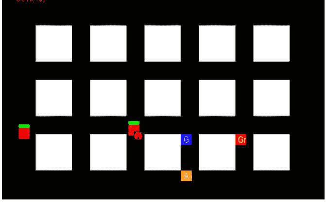

## 章节总结

在本章中，我们通过添加新功能进一步改进了游戏，例如有限状态机、能够检测和跟随玩家的NPC，以及频繁生成新NPC的能力。干得好！

### 检查清单

- [ ] 检查清单
- [ ] 检查清单
- [ ] 检查清单
- [ ] 检查清单
- [ ] 检查清单
- [ ] 检查清单
- [ ] 检查清单
- [ ] 检查清单
- [ ] 检查清单
- [ ] 检查清单
- [ ] 检查清单
- [ ] 检查清单
- [ ] 检查清单
- [ ] 检查清单
- [ ] 检查清单
- [ ] 检查清单
- [ ] 检查清单
- [ ] 检查清单
- [ ] 检查清单
- [ ] 检查清单
- [ ] 检查清单
- [ ] 检查清单
- [ ] 检查清单
- [ ] 检查清单
- [ ] 检查清单
- [ ] 检查清单
- [ ] 检查清单
- [ ] 检查清单
- [ ] 检查清单
- [ ] 检查清单
- [ ] 检查清单
- [ ] 检查清单
- [ ] 检查清单
- [ ] 检查清单
- [ ] 检查清单
- [ ] 检查清单
- [ ] 检查清单
- [ ] 检查清单
- [ ] 检查清单
- [ ] 检查清单
- [ ] 检查清单
- [ ] 检查清单
- [ ] 检查清单
- [ ] 检查清单
- [ ] 检查清单
- [ ] 检查清单
- [ ] 检查清单
- [ ] 检查清单
- [ ] 检查清单
- [ ] 检查清单
- [ ] 检查清单
- [ ] 检查清单
- [ ] 检查清单
- [ ] 检查清单
- [ ] 检查清单
- [ ] 检查清单
- [ ] 检查清单
- [ ] 检查清单
- [ ] 检查清单
- [ ] 检查清单
- [ ] 检查清单
- [ ] 检查清单
- [ ] 检查清单
- [ ] 检查清单
- [ ] 检查清单
- [ ] 检查清单
- [ ] 检查清单
- [ ] 检查清单
- [ ] 检查清单
- [ ] 检查清单
- [ ] 检查清单
- [ ] 检查清单
- [ ] 检查清单
- [ ] 检查清单
- [ ] 检查清单
- [ ] 检查清单
- [ ] 检查清单
- [ ] 检查清单
- [ ] 检查清单
- [ ] 检查清单
- [ ] 检查清单
- [ ] 检查清单
- [ ] 检查清单
- [ ] 检查清单
- [ ] 检查清单
- [ ] 检查清单
- [ ] 检查清单
- [ ] 检查清单
- [ ] 检查清单
- [ ] 检查清单
- [ ] 检查清单
- [ ] 检查清单
- [ ] 检查清单
- [ ] 检查清单
- [ ] 检查清单
- [ ] 检查清单
- [ ] 检查清单
- [ ] 检查清单
- [ ] 检查清单
- [ ] 检查清单
- [ ] 检查清单
- [ ] 检查清单
- [ ] 检查清单
- [ ] 检查清单
- [ ] 检查清单
- [ ] 检查清单
- [ ] 检查清单
- [ ] 检查清单
- [ ] 检查清单
- [ ] 检查清单
- [ ] 检查清单
- [ ] 检查清单
- [ ] 检查清单
- [ ] 检查清单
- [ ] 检查清单
- [ ] 检查清单
- [ ] 检查清单
- [ ] 检查清单
- [ ] 检查清单
- [ ] 检查清单
- [ ] 检查清单
- [ ] 检查清单
- [ ] 检查清单
- [ ] 检查清单
- [ ] 检查清单
- [ ] 检查清单
- [ ] 检查清单
- [ ] 检查清单
- [ ] 检查清单
- [ ] 检查清单
- [ ] 检查清单
- [ ] 检查清单
- [ ] 检查清单
- [ ] 检查清单
- [ ] 检查清单
- [ ] 检查清单
- [ ] 检查清单
- [ ] 检查清单
- [ ] 检查清单
- [ ] 检查清单
- [ ] 检查清单
- [ ] 检查清单
- [ ] 检查清单
- [ ] 检查清单
- [ ] 检查清单
- [ ] 检查清单
- [ ] 检查清单
- [ ] 检查清单
- [ ] 检查清单
- [ ] 检查清单
- [ ] 检查清单
- [ ] 检查清单
- [ ] 检查清单
- [ ] 检查清单
- [ ] 检查清单
- [ ] 检查清单
- [ ] 检查清单
- [ ] 检查清单
- [ ] 检查清单
- [ ] 检查清单
- [ ] 检查清单
- [ ] 检查清单
- [ ] 检查清单
- [ ] 检查清单
- [ ] 检查清单
- [ ] 检查清单
- [ ] 检查清单
- [ ] 检查清单
- [ ] 检查清单
- [ ] 检查清单
- [ ] 检查清单
- [ ] 检查清单
- [ ] 检查清单
- [ ] 检查清单
- [ ] 检查清单
- [ ] 检查清单
- [ ] 检查清单
- [ ] 检查清单
- [ ] 检查清单
- [ ] 检查清单
- [ ] 检查清单
- [ ] 检查清单
- [ ] 检查清单
- [ ] 检查清单
- [ ] 检查清单
- [ ] 检查清单
- [ ] 检查清单
- [ ] 检查清单
- [ ] 检查清单
- [ ] 检查清单
- [ ] 检查清单
- [ ] 检查清单
- [ ] 检查清单
- [ ] 检查清单
- [ ] 检查清单
- [ ] 检查清单
- [ ] 检查清单
- [ ] 检查清单
- [ ] 检查清单
- [ ] 检查清单
- [ ] 检查清单
- [ ] 检查清单
- [ ] 检查清单
- [ ] 检查清单
- [ ] 检查清单
- [ ] 检查清单
- [ ] 检查清单
- [ ] 检查清单
- [ ] 检查清单
- [ ] 检查清单
- [ ] 检查清单
- [ ] 检查清单
- [ ] 检查清单
- [ ] 检查清单
- [ ] 检查清单
- [ ] 检查清单
- [ ] 检查清单
- [ ] 检查清单
- [ ] 检查清单
- [ ] 检查清单
- [ ] 检查清单
- [ ] 检查清单
- [ ] 检查清单
- [ ] 检查清单
- [ ] 检查清单
- [ ] 检查清单
- [ ] 检查清单
- [ ] 检查清单
- [ ] 检查清单
- [ ] 检查清单
- [ ] 检查清单
- [ ] 检查清单
- [ ] 检查清单
- [ ] 检查清单
- [ ] 检查清单
- [ ] 检查清单
- [ ] 检查清单
- [ ] 检查清单
- [ ] 检查清单
- [ ] 检查清单
- [ ] 检查清单
- [ ] 检查清单
- [ ] 检查清单
- [ ] 检查清单
- [ ] 检查清单
- [ ] 检查清单
- [ ] 检查清单
- [ ] 检查清单
- [ ] 检查清单
- [ ] 检查清单
- [ ] 检查清单
- [ ] 检查清单
- [ ] 检查清单
- [ ] 检查清单
- [ ] 检查清单
- [ ] 检查清单
- [ ] 检查清单
- [ ] 检查清单
- [ ] 检查清单
- [ ] 检查清单
- [ ] 检查清单
- [ ] 检查清单
- [ ] 检查清单
- [ ] 检查清单
- [ ] 检查清单
- [ ] 检查清单
- [ ] 检查清单
- [ ] 检查清单
- [ ] 检查清单
- [ ] 检查清单
- [ ] 检查清单
- [ ] 检查清单
- [ ] 检查清单
- [ ] 检查清单
- [ ] 检查清单
- [ ] 检查清单
- [ ] 检查清单
- [ ] 检查清单
- [ ] 检查清单
- [ ] 检查清单
- [ ] 检查清单
- [ ] 检查清单
- [ ] 检查清单
- [ ] 检查清单
- [ ] 检查清单
- [ ] 检查清单
- [ ] 检查清单
- [ ] 检查清单
- [ ] 检查清单
- [ ] 检查清单
- [ ] 检查清单
- [ ] 检查清单
- [ ] 检查清单
- [ ] 检查清单
- [ ] 检查清单
- [ ] 检查清单
- [ ] 检查清单
- [ ] 检查清单
- [ ] 检查清单
- [ ] 检查清单
- [ ] 检查清单
- [ ] 检查清单
- [ ] 检查清单
- [ ] 检查清单
- [ ] 检查清单
- [ ] 检查清单
- [ ] 检查清单
- [ ] 检查清单
- [ ] 检查清单
- [ ] 检查清单
- [ ] 检查清单
- [ ] 检查清单
- [ ] 检查清单
- [ ] 检查清单
- [ ] 检查清单
- [ ] 检查清单
- [ ] 检查清单
- [ ] 检查清单
- [ ] 检查清单
- [ ] 检查清单
- [ ] 检查清单
- [ ] 检查清单
- [ ] 检查清单
- [ ] 检查清单
- [ ] 检查清单
- [ ] 检查清单
- [ ] 检查清单
- [ ] 检查清单
- [ ] 检查清单
- [ ] 检查清单
- [ ] 检查清单
- [ ] 检查清单
- [ ] 检查清单
- [ ] 检查清单
- [ ] 检查清单
- [ ] 检查清单
- [ ] 检查清单
- [ ] 检查清单
- [ ] 检查清单
- [ ] 检查清单
- [ ] 检查清单
- [ ] 检查清单
- [ ] 检查清单
- [ ] 检查清单
- [ ] 检查清单
- [ ] 检查清单
- [ ] 检查清单
- [ ] 检查清单
- [ ] 检查清单
- [ ] 检查清单
- [ ] 检查清单
- [ ] 检查清单
- [ ] 检查清单
- [ ] 检查清单
- [ ] 检查清单
- [ ] 检查清单
- [ ] 检查清单
- [ ] 检查清单
- [ ] 检查清单
- [ ] 检查清单
- [ ] 检查清单
- [ ] 检查清单
- [ ] 检查清单
- [ ] 检查清单
- [ ] 检查清单
- [ ] 检查清单
- [ ] 检查清单
- [ ] 检查清单
- [ ] 检查清单
- [ ] 检查清单
- [ ] 检查清单
- [ ] 检查清单
- [ ] 检查清单
- [ ] 检查清单
- [ ] 检查清单
- [ ] 检查清单
- [ ] 检查清单
- [ ] 检查清单
- [ ] 检查清单
- [ ] 检查清单
- [ ] 检查清单
- [ ] 检查清单
- [ ] 检查清单
- [ ] 检查清单
- [ ] 检查清单
- [ ] 检查清单
- [ ] 检查清单
- [ ] 检查清单
- [ ] 检查清单
- [ ] 检查清单
- [ ] 检查清单
- [ ] 检查清单
- [ ] 检查清单
- [ ] 检查清单
- [ ] 检查清单
- [ ] 检查清单
- [ ] 检查清单
- [ ] 检查清单
- [ ] 检查清单
- [ ] 检查清单
- [ ] 检查清单
- [ ] 检查清单
- [ ] 检查清单
- [ ] 检查清单
- [ ] 检查清单
- [ ] 检查清单
- [ ] 检查清单
- [ ] 检查清单
- [ ] 检查清单
- [ ] 检查清单
- [ ] 检查清单
- [ ] 检查清单
- [ ] 检查清单
- [ ] 检查清单
- [ ] 检查清单
- [ ] 检查清单
- [ ] 检查清单
- [ ] 检查清单
- [ ] 检查清单
- [ ] 检查清单
- [ ] 检查清单
- [ ] 检查清单
- [ ] 检查清单
- [ ] 检查清单
- [ ] 检查清单
- [ ] 检查清单
- [ ] 检查清单
- [ ] 检查清单
- [ ] 检查清单
- [ ] 检查清单
- [ ] 检查清单
- [ ] 检查清单
- [ ] 检查清单
- [ ] 检查清单
- [ ] 检查清单
- [ ] 检查清单
- [ ] 检查清单
- [ ] 检查清单
- [ ] 检查清单
- [ ] 检查清单
- [ ] 检查清单
- [ ] 检查清单
- [ ] 检查清单
- [ ] 检查清单
- [ ] 检查清单
- [ ] 检查清单
- [ ] 检查清单
- [ ] 检查清单
- [ ] 检查清单
- [ ] 检查清单
- [ ] 检查清单
- [ ] 检查清单
- [ ] 检查清单
- [ ] 检查清单
- [ ] 检查清单
- [ ] 检查清单
- [ ] 检查清单
- [ ] 检查清单
- [ ] 检查清单
- [ ] 检查清单
- [ ] 检查清单
- [ ] 检查清单
- [ ] 检查清单
- [ ] 检查清单
- [ ] 检查清单
- [ ] 检查清单
- [ ] 检查清单
- [ ] 检查清单
- [ ] 检查清单
- [ ] 检查清单
- [ ] 检查清单
- [ ] 检查清单
- [ ] 检查清单
- [ ] 检查清单
- [ ] 检查清单
- [ ] 检查清单
- [ ] 检查清单
- [ ] 检查清单
- [ ] 检查清单
- [ ] 检查清单
- [ ] 检查清单
- [ ] 检查清单
- [ ] 检查清单
- [ ] 检查清单
- [ ] 检查清单
- [ ] 检查清单
- [ ] 检查清单
- [ ] 检查清单
- [ ] 检查清单
- [ ] 检查清单
- [ ] 检查清单
- [ ] 检查清单
- [ ] 检查清单
- [ ] 检查清单
- [ ] 检查清单
- [ ] 检查清单
- [ ] 检查清单
- [ ] 检查清单
- [ ] 检查清单
- [ ] 检查清单
- [ ] 检查清单
- [ ] 检查清单
- [ ] 检查清单
- [ ] 检查清单
- [ ] 检查清单
- [ ] 检查清单
- [ ] 检查清单
- [ ] 检查清单
- [ ] 检查清单
- [ ] 检查清单
- [ ] 检查清单
- [ ] 检查清单
- [ ] 检查清单
- [ ] 检查清单
- [ ] 检查清单
- [ ] 检查清单
- [ ] 检查清单
- [ ] 检查清单
- [ ] 检查清单
- [ ] 检查清单
- [ ] 检查清单
- [ ] 检查清单
- [ ] 检查清单
- [ ] 检查清单
- [ ] 检查清单
- [ ] 检查清单
- [ ] 检查清单
- [ ] 检查清单
- [ ] 检查清单
- [ ] 检查清单
- [ ] 检查清单
- [ ] 检查清单
- [ ] 检查清单
- [ ] 检查清单
- [ ] 检查清单
- [ ] 检查清单
- [ ] 检查清单
- [ ] 检查清单
- [ ] 检查清单
- [ ] 检查清单
- [ ] 检查清单
- [ ] 检查清单
- [ ] 检查清单
- [ ] 检查清单
- [ ] 检查清单
- [ ] 检查清单
- [ ] 检查清单
- [ ] 检查清单
- [ ] 检查清单
- [ ] 检查清单
- [ ] 检查清单
- [ ] 检查清单
- [ ] 检查清单
- [ ] 检查清单
- [ ] 检查清单
- [ ] 检查清单
- [ ] 检查清单
- [ ] 检查清单
- [ ] 检查清单
- [ ] 检查清单
- [ ] 检查清单
- [ ] 检查清单
- [ ] 检查清单
- [ ] 检查清单
- [ ] 检查清单
- [ ] 检查清单
- [ ] 检查清单
- [ ] 检查清单
- [ ] 检查清单
- [ ] 检查清单
- [ ] 检查清单
- [ ] 检查清单
- [ ] 检查清单
- [ ] 检查清单
- [ ] 检查清单
- [ ] 检查清单
- [ ] 检查清单
- [ ] 检查清单
- [ ] 检查清单
- [ ] 检查清单
- [ ] 检查清单
- [ ] 检查清单
- [ ] 检查清单
- [ ] 检查清单
- [ ] 检查清单
- [ ] 检查清单
- [ ] 检查清单
- [ ] 检查清单
- [ ] 检查清单
- [ ] 检查清单
- [ ] 检查清单
- [ ] 检查清单
- [ ] 检查清单
- [ ] 检查清单
- [ ] 检查清单
- [ ] 检查清单
- [ ] 检查清单
- [ ] 检查清单
- [ ] 检查清单
- [ ] 检查清单
- [ ] 检查清单
- [ ] 检查清单
- [ ] 检查清单
- [ ] 检查清单
- [ ] 检查清单
- [ ] 检查清单
- [ ] 检查清单
- [ ] 检查清单
- [ ] 检查清单
- [ ] 检查清单
- [ ] 检查清单
- [ ] 检查清单
- [ ] 检查清单
- [ ] 检查清单
- [ ] 检查清单
- [ ] 检查清单
- [ ] 检查清单
- [ ] 检查清单
- [ ] 检查清单
- [ ] 检查清单
- [ ] 检查清单
- [ ] 检查清单
- [ ] 检查清单
- [ ] 检查清单
- [ ] 检查清单
- [ ] 检查清单
- [ ] 检查清单
- [ ] 检查清单
- [ ] 检查清单
- [ ] 检查清单
- [ ] 检查清单
- [ ] 检查清单
- [ ] 检查清单
- [ ] 检查清单
- [ ] 检查清单
- [ ] 检查清单
- [ ] 检查清单
- [ ] 检查清单
- [ ] 检查清单
- [ ] 检查清单
- [ ] 检查清单
- [ ] 检查清单
- [ ] 检查清单
- [ ] 检查清单
- [ ] 检查清单
- [ ] 检查清单
- [ ] 检查清单
- [ ] 检查清单
- [ ] 检查清单
- [ ] 检查清单
- [ ] 检查清单
- [ ] 检查清单
- [ ] 检查清单
- [ ] 检查清单
- [ ] 检查清单
- [ ] 检查清单
- [ ] 检查清单
- [ ] 检查清单
- [ ] 检查清单
- [ ] 检查清单
- [ ] 检查清单
- [ ] 检查清单
- [ ] 检查清单
- [ ] 检查清单
- [ ] 检查清单
- [ ] 检查清单
- [ ] 检查清单
- [ ] 检查清单
- [ ] 检查清单
- [ ] 检查清单
- [ ] 检查清单
- [ ] 检查清单
- [ ] 检查清单
- [ ] 检查清单
- [ ] 检查清单
- [ ] 检查清单
- [ ] 检查清单
- [ ] 检查清单
- [ ] 检查清单
- [ ] 检查清单
- [ ] 检查清单
- [ ] 检查清单
- [ ] 检查清单
- [ ] 检查清单
- [ ] 检查清单
- [ ] 检查清单
- [ ] 检查清单
- [ ] 检查清单
- [ ] 检查清单
- [ ] 检查清单
- [ ] 检查清单
- [ ] 检查清单
- [ ] 检查清单
- [ ] 检查清单
- [ ] 检查清单
- [ ] 检查清单
- [ ] 检查清单
- [ ] 检查清单
- [ ] 检查清单
- [ ] 检查清单
- [ ] 检查清单
- [ ] 检查清单
- [ ] 检查清单
- [ ] 检查清单
- [ ] 检查清单
- [ ] 检查清单
- [ ] 检查清单
- [ ] 检查清单
- [ ] 检查清单
- [ ] 检查清单
- [ ] 检查清单
- [ ] 检查清单
- [ ] 检查清单
- [ ] 检查清单
- [ ] 检查清单
- [ ] 检查清单
- [ ] 检查清单
- [ ] 检查清单
- [ ] 检查清单
- [ ] 检查清单
- [ ] 检查清单
- [ ] 检查清单
- [ ] 检查清单
- [ ] 检查清单
- [ ] 检查清单
- [ ] 检查清单
- [ ] 检查清单
- [ ] 检查清单
- [ ] 检查清单
- [ ] 检查清单
- [ ] 检查清单
- [ ] 检查清单
- [ ] 检查清单
- [ ] 检查清单
- [ ] 检查清单
- [ ] 检查清单
- [ ] 检查清单
- [ ] 检查清单
- [ ] 检查清单
- [ ] 检查清单
- [ ] 检查清单
- [ ] 检查清单
- [ ] 检查清单
- [ ] 检查清单
- [ ] 检查清单
- [ ] 检查清单
- [ ] 检查清单
- [ ] 检查清单
- [ ] 检查清单
- [ ] 检查清单
- [ ] 检查清单
- [ ] 检查清单
- [ ] 检查清单
- [ ] 检查清单
- [ ] 检查清单
- [ ] 检查清单
- [ ] 检查清单
- [ ] 检查清单
- [ ] 检查清单
- [ ] 检查清单
- [ ] 检查清单
- [ ] 检查清单
- [ ] 检查清单
- [ ] 检查清单
- [ ] 检查清单
- [ ] 检查清单
- [ ] 检查清单
- [ ] 检查清单
- [ ] 检查清单
- [ ] 检查清单
- [ ] 检查清单
- [ ] 检查清单
- [ ] 检查清单
- [ ] 检查清单
- [ ] 检查清单
- [ ] 检查清单
- [ ] 检查清单
- [ ] 检查清单
- [ ] 检查清单
- [ ] 检查清单
- [ ] 检查清单
- [ ] 检查清单
- [ ] 检查清单
- [ ] 检查清单
- [ ] 检查清单
- [ ] 检查清单
- [ ] 检查清单
- [ ] 检查清单
- [ ] 检查清单
- [ ] 检查清单
- [ ] 检查清单
- [ ] 检查清单
- [ ] 检查清单
- [ ] 检查清单
- [ ] 检查清单
- [ ] 检查清单
- [ ] 检查清单
- [ ] 检查清单
- [ ] 检查清单
- [ ] 检查清单
- [ ] 检查清单
- [ ] 检查清单
- [ ] 检查清单
- [ ] 检查清单
- [ ] 检查清单
- [ ] 检查清单
- [ ] 检查清单
- [ ] 检查清单
- [ ] 检查清单
- [ ] 检查清单
- [ ] 检查清单
- [ ] 检查清单
- [ ] 检查清单
- [ ] 检查清单
- [ ] 检查清单
- [ ] 检查清单
- [ ] 检查清单
- [ ] 检查清单
- [ ] 检查清单
- [ ] 检查清单
- [ ] 检查清单
- [ ] 检查清单
- [ ] 检查清单
- [ ] 检查清单
- [ ] 检查清单
- [ ] 检查清单
- [ ] 检查清单
- [ ] 检查清单
- [ ] 检查清单
- [ ] 检查清单
- [ ] 检查清单
- [ ] 检查清单
- [ ] 检查清单
- [ ] 检查清单
- [ ] 检查清单
- [ ] 检查清单
- [ ] 检查清单
- [ ] 检查清单
- [ ] 检查清单
- [ ] 检查清单
- [ ] 检查清单
- [ ] 检查清单
- [ ] 检查清单
- [ ] 检查清单
- [ ] 检查清单
- [ ] 检查清单
- [ ] 检查清单
- [ ] 检查清单
- [ ] 检查清单
- [ ] 检查清单
- [ ] 检查清单
- [ ] 检查清单
- [ ] 检查清单
- [ ] 检查清单
- [ ] 检查清单
- [ ] 检查清单
- [ ] 检查清单
- [ ] 检查清单
- [ ] 检查清单
- [ ] 检查清单
- [ ] 检查清单
- [ ] 检查清单
- [ ] 检查清单
- [ ] 检查清单
- [ ] 检查清单
- [ ] 检查清单
- [ ] 检查清单
- [ ] 检查清单
- [ ] 检查清单
- [ ] 检查清单
- [ ] 检查清单
- [ ] 检查清单
- [ ] 检查清单
- [ ] 检查清单
- [ ] 检查清单
- [ ] 检查清单
- [ ] 检查清单
- [ ] 检查清单
- [ ] 检查清单
- [ ] 检查清单
- [ ] 检查清单
- [ ] 检查清单
- [ ] 检查清单
- [ ] 检查清单
- [ ] 检查清单
- [ ] 检查清单
- [ ] 检查清单
- [ ] 检查清单
- [ ] 检查清单
- [ ] 检查清单
- [ ] 检查清单
- [ ] 检查清单
- [ ] 检查清单
- [ ] 检查清单
- [ ] 检查清单
- [ ] 检查清单
- [ ] 检查清单
- [ ] 检查清单
- [ ] 检查清单
- [ ] 检查清单
- [ ] 检查清单
- [ ] 检查清单
- [ ] 检查清单
- [ ] 检查清单
- [ ] 检查清单
- [ ] 检查清单
- [ ] 检查清单
- [ ] 检查清单
- [ ] 检查清单
- [ ] 检查清单
- [ ] 检查清单
- [ ] 检查清单
- [ ] 检查清单
- [ ] 检查清单
- [ ] 检查清单
- [ ] 检查清单
- [ ] 检查清单
- [ ] 检查清单
- [ ] 检查清单
- [ ] 检查清单
- [ ] 检查清单
- [ ] 检查清单
- [ ] 检查清单
- [ ] 检查清单
- [ ] 检查清单
- [ ] 检查清单
- [ ] 检查清单
- [ ] 检查清单
- [ ] 检查清单
- [ ] 检查清单
- [ ] 检查清单
- [ ] 检查清单
- [ ] 检查清单
- [ ] 检查清单
- [ ] 检查清单
- [ ] 检查清单
- [ ] 检查清单
- [ ] 检查清单
- [ ] 检查清单
- [ ] 检查清单
- [ ] 检查清单
- [ ] 检查清单
- [ ] 检查清单
- [ ] 检查清单
- [ ] 检查清单
- [ ] 检查清单
- [ ] 检查清单
- [ ] 检查清单
- [ ] 检查清单
- [ ] 检查清单
- [ ] 检查清单
- [ ] 检查清单
- [ ] 检查清单
- [ ] 检查清单
- [ ] 检查清单
- [ ] 检查清单
- [ ] 检查清单
- [ ] 检查清单
- [ ] 检查清单
- [ ] 检查清单
- [ ] 检查清单
- [ ] 检查清单
- [ ] 检查清单
- [ ] 检查清单
- [ ] 检查清单
- [ ] 检查清单
- [ ] 检查清单
- [ ] 检查清单
- [ ] 检查清单
- [ ] 检查清单
- [ ] 检查清单
- [ ] 检查清单
- [ ] 检查清单
- [ ] 检查清单
- [ ] 检查清单
- [ ] 检查清单
- [ ] 检查清单
- [ ] 检查清单
- [ ] 检查清单
- [ ] 检查清单
- [ ] 检查清单
- [ ] 检查清单
- [ ] 检查清单
- [ ] 检查清单
- [ ] 检查清单
- [ ] 检查清单
- [ ] 检查清单
- [ ] 检查清单
- [ ] 检查清单
- [ ] 检查清单
- [ ] 检查清单
- [ ] 检查清单
- [ ] 检查清单
- [ ] 检查清单
- [ ] 检查清单
- [ ] 检查清单
- [ ] 检查清单
- [ ] 检查清单
- [ ] 检查清单
- [ ] 检查清单
- [ ] 检查清单
- [ ] 检查清单
- [ ] 检查清单
- [ ] 检查清单
- [ ] 检查清单
- [ ] 检查清单
- [ ] 检查清单
- [ ] 检查清单
- [ ] 检查清单
- [ ] 检查清单
- [ ] 检查清单
- [ ] 检查清单
- [ ] 检查清单
- [ ] 检查清单
- [ ] 检查清单
- [ ] 检查清单
- [ ] 检查清单
- [ ] 检查清单
- [ ] 检查清单
- [ ] 检查清单
- [ ] 检查清单
- [ ] 检查清单
- [ ] 检查清单
- [ ] 检查清单
- [ ] 检查清单
- [ ] 检查清单
- [ ] 检查清单
- [ ] 检查清单
- [ ] 检查清单
- [ ] 检查清单
- [ ] 检查清单
- [ ] 检查清单
- [ ] 检查清单
- [ ] 检查清单
- [ ] 检查清单
- [ ] 检查清单
- [ ] 检查清单
- [ ] 检查清单
- [ ] 检查清单
- [ ] 检查清单
- [ ] 检查清单
- [ ] 检查清单
- [ ] 检查清单
- [ ] 检查清单
- [ ] 检查清单
- [ ] 检查清单
- [ ] 检查清单
- [ ] 检查清单
- [ ] 检查清单
- [ ] 检查清单
- [ ] 检查清单
- [ ] 检查清单
- [ ] 检查清单
- [ ] 检查清单
- [ ] 检查清单
- [ ] 检查清单
- [ ] 检查清单
- [ ] 检查清单
- [ ] 检查清单
- [ ] 检查清单
- [ ] 检查清单
- [ ] 检查清单
- [ ] 检查清单
- [ ] 检查清单
- [ ] 检查清单
- [ ] 检查清单
- [ ] 检查清单
- [ ] 检查清单
- [ ] 检查清单
- [ ] 检查清单
- [ ] 检查清单
- [ ] 检查清单
- [ ] 检查清单
- [ ] 检查清单
- [ ] 检查清单
- [ ] 检查清单
- [ ] 检查清单
- [ ] 检查清单
- [ ] 检查清单
- [ ] 检查清单
- [ ] 检查清单
- [ ] 检查清单
- [ ] 检查清单
- [ ] 检查清单
- [ ] 检查清单
- [ ] 检查清单
- [ ] 检查清单
- [ ] 检查清单
- [ ] 检查清单
- [ ] 检查清单
- [ ] 检查清单
- [ ] 检查清单
- [ ] 检查清单
- [ ] 检查清单
- [ ] 检查清单
- [ ] 检查清单
- [ ] 检查清单
- [ ] 检查清单
- [ ] 检查清单
- [ ] 检查清单
- [ ] 检查清单
- [ ] 检查清单
- [ ] 检查清单
- [ ] 检查清单
- [ ] 检查清单
- [ ] 检查清单
- [ ] 检查清单
- [ ] 检查清单
- [ ] 检查清单
- [ ] 检查清单
- [ ] 检查清单
- [ ] 检查清单
- [ ] 检查清单
- [ ] 检查清单
- [ ] 检查清单
- [ ] 检查清单
- [ ] 检查清单
- [ ] 检查清单
- [ ] 检查清单
- [ ] 检查清单
- [ ] 检查清单
- [ ] 检查清单
- [ ] 检查清单
- [ ] 检查清单
- [ ] 检查清单
- [ ] 检查清单
- [ ] 检查清单
- [ ] 检查清单
- [ ] 检查清单
- [ ] 检查清单
- [ ] 检查清单
- [ ] 检查清单
- [ ] 检查清单
- [ ] 检查清单
- [ ] 检查清单
- [ ] 检查清单
- [ ] 检查清单
- [ ] 检查清单
- [ ] 检查清单
- [ ] 检查清单
- [ ] 检查清单
- [ ] 检查清单
- [ ] 检查清单
- [ ] 检查清单
- [ ] 检查清单
- [ ] 检查清单
- [ ] 检查清单
- [ ] 检查清单
- [ ] 检查清单
- [ ] 检查清单
- [ ] 检查清单
- [ ] 检查清单
- [ ] 检查清单
- [ ] 检查清单
- [ ] 检查清单
- [ ] 检查清单
- [ ] 检查清单
- [ ] 检查清单
- [ ] 检查清单
- [ ] 检查清单
- [ ] 检查清单
- [ ] 检查清单
- [ ] 检查清单
- [ ] 检查清单
- [ ] 检查清单
- [ ] 检查清单
- [ ] 检查清单
- [ ] 检查清单
- [ ] 检查清单
- [ ] 检查清单
- [ ] 检查清单
- [ ] 检查清单
- [ ] 检查清单
- [ ] 检查清单
- [ ] 检查清单
- [ ] 检查清单
- [ ] 检查清单
- [ ] 检查清单
- [ ] 检查清单
- [ ] 检查清单
- [ ] 检查清单
- [ ] 检查清单
- [ ] 检查清单
- [ ] 检查清单
- [ ] 检查清单
- [ ] 检查清单
- [ ] 检查清单
- [ ] 检查清单
- [ ] 检查清单
- [ ] 检查清单
- [ ] 检查清单
- [ ] 检查清单
- [ ] 检查清单
- [ ] 检查清单
- [ ] 检查清单
- [ ] 检查清单
- [ ] 检查清单
- [ ] 检查清单
- [ ] 检查清单
- [ ] 检查清单
- [ ] 检查清单
- [ ] 检查清单
- [ ] 检查清单
- [ ] 检查清单
- [ ] 检查清单
- [ ] 检查清单
- [ ] 检查清单
- [ ] 检查清单
- [ ] 检查清单
- [ ] 检查清单
- [ ] 检查清单
- [ ] 检查清单
- [ ] 检查清单
- [ ] 检查清单
- [ ] 检查清单
- [ ] 检查清单
- [ ] 检查清单
- [ ] 检查清单
- [ ] 检查清单
- [ ] 检查清单
- [ ] 检查清单
- [ ] 检查清单
- [ ] 检查清单
- [ ] 检查清单
- [ ] 检查清单
- [ ] 检查清单
- [ ] 检查清单
- [ ] 检查清单
- [ ] 检查清单
- [ ] 检查清单
- [ ] 检查清单
- [ ] 检查清单
- [ ] 检查清单
- [ ] 检查清单
- [ ] 检查清单
- [ ] 检查清单
- [ ] 检查清单
- [ ] 检查清单
- [ ] 检查清单
- [ ] 检查清单
- [ ] 检查清单
- [ ] 检查清单
- [ ] 检查清单
- [ ] 检查清单
- [ ] 检查清单
- [ ] 检查清单
- [ ] 检查清单
- [ ] 检查清单
- [ ] 检查清单
- [ ] 检查清单
- [ ] 检查清单
- [ ] 检查清单
- [ ] 检查清单
- [ ] 检查清单
- [ ] 检查清单
- [ ] 检查清单
- [ ] 检查清单
- [ ] 检查清单
- [ ] 检查清单
- [ ] 检查清单
- [ ] 检查清单
- [ ] 检查清单
- [ ] 检查清单
- [ ] 检查清单
- [ ] 检查清单
- [ ] 检查清单
- [ ] 检查清单
- [ ] 检查清单
- [ ] 检查清单
- [ ] 检查清单
- [ ] 检查清单
- [ ] 检查清单
- [ ] 检查清单
- [ ] 检查清单
- [ ] 检查清单
- [ ] 检查清单
- [ ] 检查清单
- [ ] 检查清单
- [ ] 检查清单
- [ ] 检查清单
- [ ] 检查清单
- [ ] 检查清单
- [ ] 检查清单
- [ ] 检查清单
- [ ] 检查清单
- [ ] 检查清单
- [ ] 检查清单
- [ ] 检查清单
- [ ] 检查清单
- [ ] 检查清单
- [ ] 检查清单
- [ ] 检查清单
- [ ] 检查清单
- [ ] 检查清单
- [ ] 检查清单
- [ ] 检查清单
- [ ] 检查清单
- [ ] 检查清单
- [ ] 检查清单
- [ ] 检查清单
- [ ] 检查清单
- [ ] 检查清单
- [ ] 检查清单
- [ ] 检查清单
- [ ] 检查清单
- [ ] 检查清单
- [ ] 检查清单
- [ ] 检查清单
- [ ] 检查清单
- [ ] 检查清单
- [ ] 检查清单
- [ ] 检查清单
- [ ] 检查清单
- [ ] 检查清单
- [ ] 检查清单
- [ ] 检查清单
- [ ] 检查清单
- [ ] 检查清单
- [ ] 检查清单
- [ ] 检查清单
- [ ] 检查清单
- [ ] 检查清单
- [ ] 检查清单
- [ ] 检查清单
- [ ] 检查清单
- [ ] 检查清单
- [ ] 检查清单
- [ ] 检查清单
- [ ] 检查清单
- [ ] 检查清单
- [ ] 检查清单
- [ ] 检查清单
- [ ] 检查清单
- [ ] 检查清单
- [ ] 检查清单
- [ ] 检查清单
- [ ] 检查清单
- [ ] 检查清单
- [ ] 检查清单
- [ ] 检查清单
- [ ] 检查清单
- [ ] 检查清单
- [ ] 检查清单
- [ ] 检查清单
- [ ] 检查清单
- [ ] 检查清单
- [ ] 检查清单
- [ ] 检查清单
- [ ] 检查清单
- [ ] 检查清单
- [ ] 检查清单
- [ ] 检查清单
- [ ] 检查清单
- [ ] 检查清单
- [ ] 检查清单
- [ ] 检查清单
- [ ] 检查清单
- [ ] 检查清单
- [ ] 检查清单
- [ ] 检查清单
- [ ] 检查清单
- [ ] 检查清单
- [ ] 检查清单
- [ ] 检查清单
- [ ] 检查清单
- [ ] 检查清单
- [ ] 检查清单
- [ ] 检查清单
- [ ] 检查清单
- [ ] 检查清单
- [ ] 检查清单
- [ ] 检查清单
- [ ] 检查清单
- [ ] 检查清单
- [ ] 检查清单
- [ ] 检查清单
- [ ] 检查清单
- [ ] 检查清单
- [ ] 检查清单
- [ ] 检查清单
- [ ] 检查清单
- [ ] 检查清单
- [ ] 检查清单
- [ ] 检查清单
- [ ] 检查清单
- [ ] 检查清单
- [ ] 检查清单
- [ ] 检查清单
- [ ] 检查清单
- [ ] 检查清单
- [ ] 检查清单
- [ ] 检查清单
- [ ] 检查清单
- [ ] 检查清单
- [ ] 检查清单
- [ ] 检查清单
- [ ] 检查清单
- [ ] 检查清单
- [ ] 检查清单
- [ ] 检查清单
- [ ] 检查清单
- [ ] 检查清单
- [ ] 检查清单
- [ ] 检查清单
- [ ] 检查清单
- [ ] 检查清单
- [ ] 检查清单
- [ ] 检查清单
- [ ] 检查清单
- [ ] 检查清单
- [ ] 检查清单
- [ ] 检查清单
- [ ] 检查清单
- [ ] 检查清单
- [ ] 检查清单
- [ ] 检查清单
- [ ] 检查清单
- [ ] 检查清单
- [ ] 检查清单
- [ ] 检查清单
- [ ] 检查清单
- [ ] 检查清单
- [ ] 检查清单
- [ ] 检查清单
- [ ] 检查清单
- [ ] 检查清单
- [ ] 检查清单
- [ ] 检查清单
- [ ] 检查清单
- [ ] 检查清单
- [ ] 检查清单
- [ ] 检查清单
- [ ] 检查清单
- [ ] 检查清单
- [ ] 检查清单
- [ ] 检查清单
- [ ] 检查清单
- [ ] 检查清单
- [ ] 检查清单
- [ ] 检查清单
- [ ] 检查清单
- [ ] 检查清单
- [ ] 检查清单
- [ ] 检查清单
- [ ] 检查清单
- [ ] 检查清单
- [ ] 检查清单
- [ ] 检查清单
- [ ] 检查清单
- [ ] 检查清单
- [ ] 检查清单
- [ ] 检查清单
- [ ] 检查清单
- [ ] 检查清单
- [ ] 检查清单
- [ ] 检查清单
- [ ] 检查清单
- [ ] 检查清单
- [ ] 检查清单
- [ ] 检查清单
- [ ] 检查清单
- [ ] 检查清单
- [ ] 检查清单
- [ ] 检查清单
- [ ] 检查清单
- [ ] 检查清单
- [ ] 检查清单
- [ ] 检查清单
- [ ] 检查清单
- [ ] 检查清单
- [ ] 检查清单
- [ ] 检查清单
- [ ] 检查清单
- [ ] 检查清单
- [ ] 检查清单
- [ ] 检查清单
- [ ] 检查清单
- [ ] 检查清单
- [ ] 检查清单
- [ ] 检查清单
- [ ] 检查清单
- [ ] 检查清单
- [ ] 检查清单
- [ ] 检查清单
- [ ] 检查清单
- [ ] 检查清单
- [ ] 检查清单
- [ ] 检查清单
- [ ] 检查清单
- [ ] 检查清单
- [ ] 检查清单
- [ ] 检查清单
- [ ] 检查清单
- [ ] 检查清单
- [ ] 检查清单
- [ ] 检查清单
- [ ] 检查清单
- [ ] 检查清单
- [ ] 检查清单
- [ ] 检查清单
- [ ] 检查清单
- [ ] 检查清单
- [ ] 检查清单
- [ ] 检查清单
- [ ] 检查清单
- [ ] 检查清单
- [ ] 检查清单
- [ ] 检查清单
- [ ] 检查清单
- [ ] 检查清单
- [ ] 检查清单
- [ ] 检查清单
- [ ] 检查清单
- [ ] 检查清单
- [ ] 检查清单
- [ ] 检查清单
- [ ] 检查清单
- [ ] 检查清单
- [ ] 检查清单
- [ ] 检查清单
- [ ] 检查清单
- [ ] 检查清单
- [ ] 检查清单
- [ ] 检查清单
- [ ] 检查清单
- [ ] 检查清单
- [ ] 检查清单
- [ ] 检查清单
- [ ] 检查清单
- [ ] 检查清单
- [ ] 检查清单
- [ ] 检查清单
- [ ] 检查清单
- [ ] 检查清单
- [ ] 检查清单
- [ ] 检查清单
- [ ] 检查清单
- [ ] 检查清单
- [ ] 检查清单
- [ ] 检查清单
- [ ] 检查清单
- [ ] 检查清单
- [ ] 检查清单
- [ ] 检查清单
- [ ] 检查清单
- [ ] 检查清单
- [ ] 检查清单
- [ ] 检查清单
- [ ] 检查清单
- [ ] 检查清单
- [ ] 检查清单
- [ ] 检查清单
- [ ] 检查清单
- [ ] 检查清单
- [ ] 检查清单
- [ ] 检查清单
- [ ] 检查清单
- [ ] 检查清单
- [ ] 检查清单
- [ ] 检查清单
- [ ] 检查清单
- [ ] 检查清单
- [ ] 检查清单
- [ ] 检查清单
- [ ] 检查清单
- [ ] 检查清单
- [ ] 检查清单
- [ ] 检查清单
- [ ] 检查清单
- [ ] 检查清单
- [ ] 检查清单
- [ ] 检查清单
- [ ] 检查清单
- [ ] 检查清单
- [ ] 检查清单
- [ ] 检查清单
- [ ] 检查清单
- [ ] 检查清单
- [ ] 检查清单
- [ ] 检查清单
- [ ] 检查清单
- [ ] 检查清单
- [ ] 检查清单
- [ ] 检查清单
- [ ] 检查清单
- [ ] 检查清单
- [ ] 检查清单
- [ ] 检查清单
- [ ] 检查清单
- [ ] 检查清单
- [ ] 检查清单
- [ ] 检查清单
- [ ] 检查清单
- [ ] 检查清单
- [ ] 检查清单
- [ ] 检查清单
- [ ] 检查清单
- [ ] 检查清单
- [ ] 检查清单
- [ ] 检查清单
- [ ] 检查清单
- [ ] 检查清单
- [ ] 检查清单
- [ ] 检查清单
- [ ] 检查清单
- [ ] 检查清单
- [ ] 检查清单
- [ ] 检查清单
- [ ] 检查清单
- [ ] 检查清单
- [ ] 检查清单
- [ ] 检查清单
- [ ] 检查清单
- [ ] 检查清单
- [ ] 检查清单
- [ ] 检查清单
- [ ] 检查清单
- [ ] 检查清单
- [ ] 检查清单
- [ ] 检查清单
- [ ] 检查清单
- [ ] 检查清单
- [ ] 检查清单
- [ ] 检查清单
- [ ] 检查清单
- [ ] 检查清单
- [ ] 检查清单
- [ ] 检查清单
- [ ] 检查清单
- [ ] 检查清单
- [ ] 检查清单
- [ ] 检查清单
- [ ] 检查清单
- [ ] 检查清单
- [ ] 检查清单
- [ ] 检查清单
- [ ] 检查清单
- [ ] 检查清单
- [ ] 检查清单
- [ ] 检查清单
- [ ] 检查清单
- [ ] 检查清单
- [ ] 检查清单
- [ ] 检查清单
- [ ] 检查清单
- [ ] 检查清单
- [ ] 检查清单
- [ ] 检查清单
- [ ] 检查清单
- [ ] 检查清单
- [ ] 检查清单
- [ ] 检查清单
- [ ] 检查清单
- [ ] 检查清单
- [ ] 检查清单
- [ ] 检查清单
- [ ] 检查清单
- [ ] 检查清单
- [ ] 检查清单
- [ ] 检查清单
- [ ] 检查清单
- [ ] 检查清单
- [ ] 检查清单
- [ ] 检查清单
- [ ] 检查清单
- [ ] 检查清单
- [ ] 检查清单
- [ ] 检查清单
- [ ] 检查清单
- [ ] 检查清单
- [ ] 检查清单
- [ ] 检查清单
- [ ] 检查清单
- [ ] 检查清单
- [ ] 检查清单
- [ ] 检查清单
- [ ] 检查清单
- [ ] 检查清单
- [ ] 检查清单
- [ ] 检查清单
- [ ] 检查清单
- [ ] 检查清单
- [ ] 检查清单
- [ ] 检查清单
- [ ] 检查清单
- [ ] 检查清单
- [ ] 检查清单
- [ ] 检查清单
- [ ] 检查清单
- [ ] 检查清单
- [ ] 检查清单
- [ ] 检查清单
- [ ] 检查清单
- [ ] 检查清单
- [ ] 检查清单
- [ ] 检查清单
- [ ] 检查清单
- [ ] 检查清单
- [ ] 检查清单
- [ ] 检查清单
- [ ] 检查清单
- [ ] 检查清单
- [ ] 检查清单
- [ ] 检查清单
- [ ] 检查清单
- [ ] 检查清单
- [ ] 检查清单
- [ ] 检查清单
- [ ] 检查清单
- [ ] 检查清单
- [ ] 检查清单
- [ ] 检查清单
- [ ] 检查清单
- [ ] 检查清单
- [ ] 检查清单
- [ ] 检查清单
- [ ] 检查清单
- [ ] 检查清单
- [ ] 检查清单
- [ ] 检查清单
- [ ] 检查清单
- [ ] 检查清单
- [ ] 检查清单
- [ ] 检查清单
- [ ] 检查清单
- [ ] 检查清单
- [ ] 检查清单
- [ ] 检查清单
- [ ] 检查清单
- [ ] 检查清单
- [ ] 检查清单
- [ ] 检查清单
- [ ] 检查清单
- [ ] 检查清单
- [ ] 检查清单
- [ ] 检查清单
- [ ] 检查清单
- [ ] 检查清单
- [ ] 检查清单
- [ ] 检查清单
- [ ] 检查清单
- [ ] 检查清单
- [ ] 检查清单
- [ ] 检查清单
- [ ] 检查清单
- [ ] 检查清单
- [ ] 检查清单
- [ ] 检查清单
- [ ] 检查清单
- [ ] 检查清单
- [ ] 检查清单
- [ ] 检查清单
- [ ] 检查清单
- [ ] 检查清单
- [ ] 检查清单
- [ ] 检查清单
- [ ] 检查清单
- [ ] 检查清单
- [ ] 检查清单
- [ ] 检查清单
- [ ] 检查清单
- [ ] 检查清单
- [ ] 检查清单
- [ ] 检查清单
- [ ] 检查清单
- [ ] 检查清单
- [ ] 检查清单
- [ ] 检查清单
- [ ] 检查清单
- [ ] 检查清单
- [ ] 检查清单
- [ ] 检查清单
- [ ] 检查清单
- [ ] 检查清单
- [ ] 检查清单
- [ ] 检查清单
- [ ] 检查清单
- [ ] 检查清单
- [ ] 检查清单
- [ ] 检查清单
- [ ] 检查清单
- [ ] 检查清单
- [ ] 检查清单
- [ ] 检查清单
- [ ] 检查清单
- [ ] 检查清单
- [ ] 检查清单
- [ ] 检查清单
- [ ] 检查清单
- [ ] 检查清单
- [ ] 检查清单
- [ ] 检查清单
- [ ] 检查清单
- [ ] 检查清单
- [ ] 检查清单
- [ ] 检查清单
- [ ] 检查清单
- [ ] 检查清单
- [ ] 检查清单
- [ ] 检查清单
- [ ] 检查清单
- [ ] 检查清单
- [ ] 检查清单
- [ ] 检查清单
- [ ] 检查清单
- [ ] 检查清单
- [ ] 检查清单
- [ ] 检查清单
- [ ] 检查清单
- [ ] 检查清单
- [ ] 检查清单
- [ ] 检查清单
- [ ] 检查清单
- [ ] 检查清单
- [ ] 检查清单
- [ ] 检查清单
- [ ] 检查清单
- [ ] 检查清单
- [ ] 检查清单
- [ ] 检查清单
- [ ] 检查清单
- [ ] 检查清单
- [ ] 检查清单
- [ ] 检查清单
- [ ] 检查清单
- [ ] 检查清单
- [ ] 检查清单
- [ ] 检查清单
- [ ] 检查清单
- [ ] 检查清单
- [ ] 检查清单
- [ ] 检查清单
- [ ] 检查清单
- [ ] 检查清单
- [ ] 检查清单
- [ ] 检查清单
- [ ] 检查清单
- [ ] 检查清单
- [ ] 检查清单
- [ ] 检查清单
- [ ] 检查清单
- [ ] 检查清单
- [ ] 检查清单
- [ ] 检查清单
- [ ] 检查清单
- [ ] 检查清单
- [ ] 检查清单
- [ ] 检查清单
- [ ] 检查清单
- [ ] 检查清单
- [ ] 检查清单
- [ ] 检查清单
- [ ] 检查清单
- [ ] 检查清单
- [ ] 检查清单
- [ ] 检查清单
- [ ] 检查清单
- [ ] 检查清单
- [ ] 检查清单
- [ ] 检查清单
- [ ] 检查清单
- [ ] 检查清单
- [ ] 检查清单
- [ ] 检查清单
- [ ] 检查清单
- [ ] 检查清单
- [ ] 检查清单
- [ ] 检查清单
- [ ] 检查清单
- [ ] 检查清单
- [ ] 检查清单
- [ ] 检查清单
- [ ] 检查清单
- [ ] 检查清单
- [ ] 检查清单
- [ ] 检查清单
- [ ] 检查清单
- [ ] 检查清单
- [ ] 检查清单
- [ ] 检查清单
- [ ] 检查清单
- [ ] 检查清单
- [ ] 检查清单
- [ ] 检查清单
- [ ] 检查清单
- [ ] 检查清单
- [ ] 检查清单
- [ ] 检查清单
- [ ] 检查清单
- [ ] 检查清单
- [ ] 检查清单
- [ ] 检查清单
- [ ] 检查清单
- [ ] 检查清单
- [ ] 检查清单
- [ ] 检查清单
- [ ] 检查清单
- [ ] 检查清单
- [ ] 检查清单
- [ ] 检查清单
- [ ] 检查清单
- [ ] 检查清单
- [ ] 检查清单
- [ ] 检查清单
- [ ] 检查清单
- [ ] 检查清单
- [ ] 检查清单
- [ ] 检查清单
- [ ] 检查清单
- [ ] 检查清单
- [ ] 检查清单
- [ ] 检查清单
- [ ] 检查清单
- [ ] 检查清单
- [ ] 检查清单
- [ ] 检查清单
- [ ] 检查清单
- [ ] 检查清单
- [ ] 检查清单
- [ ] 检查清单
- [ ] 检查清单
- [ ] 检查清单
- [ ] 检查清单
- [ ] 检查清单
- [ ] 检查清单
- [ ] 检查清单
- [ ] 检查清单
- [ ] 检查清单
- [ ] 检查清单
- [ ] 检查清单
- [ ] 检查清单
- [ ] 检查清单
- [ ] 检查清单
- [ ] 检查清单
- [ ] 检查清单
- [ ] 检查清单
- [ ] 检查清单
- [ ] 检查清单
- [ ] 检查清单
- [ ] 检查清单
- [ ] 检查清单
- [ ] 检查清单
- [ ] 检查清单
- [ ] 检查清单
- [ ] 检查清单
- [ ] 检查清单
- [ ] 检查清单
- [ ] 检查清单
- [ ] 检查清单
- [ ] 检查清单
- [ ] 检查清单
- [ ] 检查清单
- [ ] 检查清单
- [ ] 检查清单
- [ ] 检查清单
- [ ] 检查清单
- [ ] 检查清单
- [ ] 检查清单
- [ ] 检查清单
- [ ] 检查清单
- [ ] 检查清单
- [ ] 检查清单
- [ ] 检查清单
- [ ] 检查清单
- [ ] 检查清单
- [ ] 检查清单
- [ ] 检查清单
- [ ] 检查清单
- [ ] 检查清单
- [ ] 检查清单
- [ ] 检查清单
- [ ] 检查清单
- [ ] 检查清单
- [ ] 检查清单
- [ ] 检查清单
- [ ] 检查清单
- [ ] 检查清单
- [ ] 检查清单
- [ ] 检查清单
- [ ] 检查清单
- [ ] 检查清单
- [ ] 检查清单
- [ ] 检查清单
- [ ] 检查清单
- [ ] 检查清单
- [ ] 检查清单
- [ ] 检查清单
- [ ] 检查清单
- [ ] 检查清单
- [ ] 检查清单
- [ ] 检查清单
- [ ] 检查清单
- [ ] 检查清单
- [ ] 检查清单
- [ ] 检查清单
- [ ] 检查清单
- [ ] 检查清单
- [ ] 检查清单
- [ ] 检查清单
- [ ] 检查清单
- [ ] 检查清单
- [ ] 检查清单
- [ ] 检查清单
- [ ] 检查清单
- [ ] 检查清单
- [ ] 检查清单
- [ ] 检查清单
- [ ] 检查清单
- [ ] 检查清单
- [ ] 检查清单
- [ ] 检查清单
- [ ] 检查清单
- [ ] 检查清单
- [ ] 检查清单
- [ ] 检查清单
- [ ] 检查清单
- [ ] 检查清单
- [ ] 检查清单
- [ ] 检查清单
- [ ] 检查清单
- [ ] 检查清单
- [ ] 检查清单
- [ ] 检查清单
- [ ] 检查清单
- [ ] 检查清单
- [ ] 检查清单
- [ ] 检查清单
- [ ] 检查清单
- [ ] 检查清单
- [ ] 检查清单
- [ ] 检查清单
- [ ] 检查清单
- [ ] 检查清单
- [ ] 检查清单
- [ ] 检查清单
- [ ] 检查清单
- [ ] 检查清单
- [ ] 检查清单
- [ ] 检查清单
- [ ] 检查清单
- [ ] 检查清单
- [ ] 检查清单
- [ ] 检查清单
- [ ] 检查清单
- [ ] 检查清单
- [ ] 检查清单
- [ ] 检查清单
- [ ] 检查清单
- [ ] 检查清单
- [ ] 检查清单
- [ ] 检查清单
- [ ] 检查清单
- [ ] 检查清单
- [ ] 检查清单
- [ ] 检查清单
- [ ] 检查清单
- [ ] 检查清单
- [ ] 检查清单
- [ ] 检查清单
- [ ] 检查清单
- [ ] 检查清单
- [ ] 检查清单
- [ ] 检查清单
- [ ] 检查清单
- [ ] 检查清单
- [ ] 检查清单
- [ ] 检查清单
- [ ] 检查清单
- [ ] 检查清单
- [ ] 检查清单
- [ ] 检查清单
- [ ] 检查清单
- [ ] 检查清单
- [ ] 检查清单
- [ ] 检查清单
- [ ] 检查清单
- [ ] 检查清单
- [ ] 检查清单
- [ ] 检查清单
- [ ] 检查清单
- [ ] 检查清单
- [ ] 检查清单
- [ ] 检查清单
- [ ] 检查清单
- [ ] 检查清单
- [ ] 检查清单
- [ ] 检查清单
- [ ] 检查清单
- [ ] 检查清单
- [ ] 检查清单
- [ ] 检查清单
- [ ] 检查清单
- [ ] 检查清单
- [ ] 检查清单
- [ ] 检查清单
- [ ] 检查清单
- [ ] 检查清单
- [ ] 检查清单
- [ ] 检查清单
- [ ] 检查清单
- [ ] 检查清单
- [ ] 检查清单
- [ ] 检查清单
- [ ] 检查清单
- [ ] 检查清单
- [ ] 检查清单
- [ ] 检查清单
- [ ] 检查清单
- [ ] 检查清单
- [ ] 检查清单
- [ ] 检查清单
- [ ] 检查清单
- [ ] 检查清单
- [ ] 检查清单
- [ ] 检查清单
- [ ] 检查清单
- [ ] 检查清单
- [ ] 检查清单
- [ ] 检查清单
- [ ] 检查清单
- [ ] 检查清单
- [ ] 检查清单
- [ ] 检查清单
- [ ] 检查清单
- [ ] 检查清单
- [ ] 检查清单
- [ ] 检查清单
- [ ] 检查清单
- [ ] 检查清单
- [ ] 检查清单
- [ ] 检查清单
- [ ] 检查清单
- [ ] 检查清单
- [ ] 检查清单
- [ ] 检查清单
- [ ] 检查清单
- [ ] 检查清单
- [ ] 检查清单
- [ ] 检查清单
- [ ] 检查清单
- [ ] 检查清单
- [ ] 检查清单
- [ ] 检查清单
- [ ] 检查清单
- [ ] 检查清单
- [ ] 检查清单
- [ ] 检查清单
- [ ] 检查清单
- [ ] 检查清单
- [ ] 检查清单
- [ ] 检查清单
- [ ] 检查清单
- [ ] 检查清单
- [ ] 检查清单
- [ ] 检查清单
- [ ] 检查清单
- [ ] 检查清单
- [ ] 检查清单
- [ ] 检查清单
- [ ] 检查清单
- [ ] 检查清单
- [ ] 检查清单
- [ ] 检查清单
- [ ] 检查清单
- [ ] 检查清单
- [ ] 检查清单
- [ ] 检查清单
- [ ] 检查清单
- [ ] 检查清单
- [ ] 检查清单
- [ ] 检查清单
- [ ] 检查清单
- [ ] 检查清单
- [ ] 检查清单
- [ ] 检查清单
- [ ] 检查清单
- [ ] 检查清单
- [ ] 检查清单
- [ ] 检查清单
- [ ] 检查清单
- [ ] 检查清单
- [ ] 检查清单
- [ ] 检查清单
- [ ] 检查清单
- [ ] 检查清单
- [ ] 检查清单
- [ ] 检查清单
- [ ] 检查清单
- [ ] 检查清单
- [ ] 检查清单
- [ ] 检查清单
- [ ] 检查清单
- [ ] 检查清单
- [ ] 检查清单
- [ ] 检查清单
- [ ] 检查清单
- [ ] 检查清单
- [ ] 检查清单
- [ ] 检查清单
- [ ] 检查清单
- [ ] 检查清单
- [ ] 检查清单
- [ ] 检查清单
- [ ] 检查清单
- [ ] 检查清单
- [ ] 检查清单
- [ ] 检查清单
- [ ] 检查清单
- [ ] 检查清单
- [ ] 检查清单
- [ ] 检查清单
- [ ] 检查清单
- [ ] 检查清单
- [ ] 检查清单
- [ ] 检查清单
- [ ] 检查清单
- [ ] 检查清单
- [ ] 检查清单
- [ ] 检查清单
- [ ] 检查清单
- [ ] 检查清单
- [ ] 检查清单
- [ ] 检查清单
- [ ] 检查清单
- [ ] 检查清单
- [ ] 检查清单
- [ ] 检查清单
- [ ] 检查清单
- [ ] 检查清单
- [ ] 检查清单
- [ ] 检查清单
- [ ] 检查清单
- [ ] 检查清单
- [ ] 检查清单
- [ ] 检查清单
- [ ] 检查清单
- [ ] 检查清单
- [ ] 检查清单
- [ ] 检查清单
- [ ] 检查清单
- [ ] 检查清单
- [ ] 检查清单
- [ ] 检查清单
- [ ] 检查清单
- [ ] 检查清单
- [ ] 检查清单
- [ ] 检查清单
- [ ] 检查清单
- [ ] 检查清单
- [ ] 检查清单
- [ ] 检查清单
- [ ] 检查清单
- [ ] 检查清单
- [ ] 检查清单
- [ ] 检查清单
- [ ] 检查清单
- [ ] 检查清单
- [ ] 检查清单
- [ ] 检查清单
- [ ] 检查清单
- [ ] 检查清单
- [ ] 检查清单
- [ ] 检查清单
- [ ] 检查清单
- [ ] 检查清单
- [ ] 检查清单
- [ ] 检查清单
- [ ] 检查清单
- [ ] 检查清单
- [ ] 检查清单
- [ ] 检查清单
- [ ] 检查清单
- [ ] 检查清单
- [ ] 检查清单
- [ ] 检查清单
- [ ] 检查清单
- [ ] 检查清单
- [ ] 检查清单
- [ ] 检查清单
- [ ] 检查清单
- [ ] 检查清单
- [ ] 检查清单
- [ ] 检查清单
- [ ] 检查清单
- [ ] 检查清单
- [ ] 检查清单
- [ ] 检查清单
- [ ] 检查清单
- [ ] 检查清单
- [ ] 检查清单
- [ ] 检查清单
- [ ] 检查清单
- [ ] 检查清单
- [ ] 检查清单
- [ ] 检查清单
- [ ] 检查清单
- [ ] 检查清单
- [ ] 检查清单
- [ ] 检查清单
- [ ] 检查清单
- [ ] 检查清单
- [ ] 检查清单
- [ ] 检查清单
- [ ] 检查清单
- [ ] 检查清单
- [ ] 检查清单
- [ ] 检查清单
- [ ] 检查清单
- [ ] 检查清单
- [ ] 检查清单
- [ ] 检查清单
- [ ] 检查清单
- [ ] 检查清单
- [ ] 检查清单
- [ ] 检查清单
- [ ] 检查清单
- [ ] 检查清单
- [ ] 检查清单
- [ ] 检查清单
- [ ] 检查清单
- [ ] 检查清单
- [ ] 检查清单
- [ ] 检查清单
- [ ] 检查清单
- [ ] 检查清单
- [ ] 检查清单
- [ ] 检查清单
- [ ] 检查清单
- [ ] 检查清单
- [ ] 检查清单
- [ ] 检查清单
- [ ] 检查清单
- [ ] 检查清单
- [ ] 检查清单
- [ ] 检查清单
- [ ] 检查清单
- [ ] 检查清单
- [ ] 检查清单
- [ ] 检查清单
- [ ] 检查清单
- [ ] 检查清单
- [ ] 检查清单
- [ ] 检查清单
- [ ] 检查清单
- [ ] 检查清单
- [ ] 检查清单
- [ ] 检查清单
- [ ] 检查清单
- [ ] 检查清单
- [ ] 检查清单
- [ ] 检查清单
- [ ] 检查清单
- [ ] 检查清单
- [ ] 检查清单
- [ ] 检查清单
- [ ] 检查清单
- [ ] 检查清单
- [ ] 检查清单
- [ ] 检查清单
- [ ] 检查清单
- [ ] 检查清单
- [ ] 检查清单
- [ ] 检查清单
- [ ] 检查清单
- [ ] 检查清单
- [ ] 检查清单
- [ ] 检查清单
- [ ] 检查清单
- [ ] 检查清单
- [ ] 检查清单
- [ ] 检查清单
- [ ] 检查清单
- [ ] 检查清单
- [ ] 检查清单
- [ ] 检查清单
- [ ] 检查清单
- [ ] 检查清单
- [ ] 检查清单
- [ ] 检查清单
- [ ] 检查清单
- [ ] 检查清单
- [ ] 检查清单
- [ ] 检查清单
- [ ] 检查清单
- [ ] 检查清单
- [ ] 检查清单
- [ ] 检查清单
- [ ] 检查清单
- [ ] 检查清单
- [ ] 检查清单
- [ ] 检查清单
- [ ] 检查清单
- [ ] 检查清单
- [ ] 检查清单
- [ ] 检查清单
- [ ] 检查清单
- [ ] 检查清单
- [ ] 检查清单
- [ ] 检查清单
- [ ] 检查清单
- [ ] 检查清单
- [ ] 检查清单
- [ ] 检查清单
- [ ] 检查清单
- [ ] 检查清单
- [ ] 检查清单
- [ ] 检查清单
- [ ] 检查清单
- [ ] 检查清单
- [ ] 检查清单
- [ ] 检查清单
- [ ] 检查清单
- [ ] 检查清单
- [ ] 检查清单
- [ ] 检查清单
- [ ] 检查清单
- [ ] 检查清单
- [ ] 检查清单
- [ ] 检查清单
- [ ] 检查清单
- [ ] 检查清单
- [ ] 检查清单
- [ ] 检查清单
- [ ] 检查清单
- [ ] 检查清单
- [ ] 检查清单
- [ ] 检查清单
- [ ] 检查清单
- [ ] 检查清单
- [ ] 检查清单
- [ ] 检查清单
- [ ] 检查清单
- [ ] 检查清单
- [ ] 检查清单
- [ ] 检查清单
- [ ] 检查清单
- [ ] 检查清单
- [ ] 检查清单
- [ ] 检查清单
- [ ] 检查清单
- [ ] 检查清单
- [ ] 检查清单
- [ ] 检查清单
- [ ] 检查清单
- [ ] 检查清单
- [ ] 检查清单
- [ ] 检查清单
- [ ] 检查清单
- [ ] 检查清单
- [ ] 检查清单
- [ ] 检查清单
- [ ] 检查清单
- [ ] 检查清单
- [ ] 检查清单
- [ ] 检查清单
- [ ] 检查清单
- [ ] 检查清单
- [ ] 检查清单
- [ ] 检查清单
- [ ] 检查清单
- [ ] 检查清单
- [ ] 检查清单
- [ ] 检查清单
- [ ] 检查清单
- [ ] 检查清单
- [ ] 检查清单
- [ ] 检查清单
- [ ] 检查清单
- [ ] 检查清单
- [ ] 检查清单
- [ ] 检查清单
- [ ] 检查清单
- [ ] 检查清单
- [ ] 检查清单
- [ ] 检查清单
- [ ] 检查清单
- [ ] 检查清单
- [ ] 检查清单
- [ ] 检查清单
- [ ] 检查清单
- [ ] 检查清单
- [ ] 检查清单
- [ ] 检查清单
- [ ] 检查清单
- [ ] 检查清单
- [ ] 检查清单
- [ ] 检查清单
- [ ] 检查清单
- [ ] 检查清单
- [ ] 检查清单
- [ ] 检查清单
- [ ] 检查清单
- [ ] 检查清单
- [ ] 检查清单
- [ ] 检查清单
- [ ] 检查清单
- [ ] 检查清单
- [ ] 检查清单
- [ ] 检查清单
- [ ] 检查清单
- [ ] 检查清单
- [ ] 检查清单
- [ ] 检查清单
- [ ] 检查清单
- [ ] 检查清单
- [ ] 检查清单
- [ ] 检查清单
- [ ] 检查清单
- [ ] 检查清单
- [ ] 检查清单
- [ ] 检查清单
- [ ] 检查清单
- [ ] 检查清单
- [ ] 检查清单
- [ ] 检查清单
- [ ] 检查清单
- [ ] 检查清单
- [ ] 检查清单
- [ ] 检查清单
- [ ] 检查清单
- [ ] 检查清单
- [ ] 检查清单
- [ ] 检查清单
- [ ] 检查清单
- [ ] 检查清单
- [ ] 检查清单
- [ ] 检查清单
- [ ] 检查清单
- [ ] 检查清单
- [ ] 检查清单
- [ ] 检查清单
- [ ] 检查清单
- [ ] 检查清单
- [ ] 检查清单
- [ ] 检查清单
- [ ] 检查清单
- [ ] 检查清单
- [ ] 检查清单
- [ ] 检查清单
- [ ] 检查清单
- [ ] 检查清单
- [ ] 检查清单
- [ ] 检查清单
- [ ] 检查清单
- [ ] 检查清单
- [ ] 检查清单
- [ ] 检查清单
- [ ] 检查清单
- [ ] 检查清单
- [ ] 检查清单
- [ ] 检查清单
- [ ] 检查清单
- [ ] 检查清单
- [ ] 检查清单
- [ ] 检查清单
- [ ] 检查清单
- [ ] 检查清单
- [ ] 检查清单
- [ ] 检查清单
- [ ] 检查清单
- [ ] 检查清单
- [ ] 检查清单
- [ ] 检查清单
- [ ] 检查清单
- [ ] 检查清单
- [ ] 检查清单
- [ ] 检查清单
- [ ] 检查清单
- [ ] 检查清单
- [ ] 检查清单
- [ ] 检查清单
- [ ] 检查清单
- [ ] 检查清单
- [ ] 检查清单
- [ ] 检查清单
- [ ] 检查清单
- [ ] 检查清单
- [ ] 检查清单
- [ ] 检查清单
- [ ] 检查清单
- [ ] 检查清单
- [ ] 检查清单
- [ ] 检查清单
- [ ] 检查清单
- [ ] 检查清单
- [ ] 检查清单
- [ ] 检查清单
- [ ] 检查清单
- [ ] 检查清单
- [ ] 检查清单
- [ ] 检查清单
- [ ] 检查清单
- [ ] 检查清单
- [ ] 检查清单
- [ ] 检查清单
- [ ] 检查清单
- [ ] 检查清单
- [ ] 检查清单
- [ ] 检查清单
- [ ] 检查清单
- [ ] 检查清单
- [ ] 检查清单
- [ ] 检查清单
- [ ] 检查清单
- [ ] 检查清单
- [ ] 检查清单
- [ ] 检查清单
- [ ] 检查清单
- [ ] 检查清单
- [ ] 检查清单
- [ ] 检查清单
- [ ] 检查清单
- [ ] 检查清单
- [ ] 检查清单
- [ ] 检查清单
- [ ] 检查清单
- [ ] 检查清单
- [ ] 检查清单
- [ ] 检查清单
- [ ] 检查清单
- [ ] 检查清单
- [ ] 检查清单
- [ ] 检查清单
- [ ] 检查清单
- [ ] 检查清单
- [ ] 检查清单
- [ ] 检查清单
- [ ] 检查清单
- [ ] 检查清单
- [ ] 检查清单
- [ ] 检查清单
- [ ] 检查清单
- [ ] 检查清单
- [ ] 检查清单
- [ ] 检查清单
- [ ] 检查清单
- [ ] 检查清单
- [ ] 检查清单
- [ ] 检查清单
- [ ] 检查清单
- [ ] 检查清单
- [ ] 检查清单
- [ ] 检查清单
- [ ] 检查清单
- [ ] 检查清单
- [ ] 检查清单
- [ ] 检查清单
- [ ] 检查清单
- [ ] 检查清单
- [ ] 检查清单
- [ ] 检查清单
- [ ] 检查清单
- [ ] 检查清单
- [ ] 检查清单
- [ ] 检查清单
- [ ] 检查清单
- [ ] 检查清单
- [ ] 检查清单
- [ ] 检查清单
- [ ] 检查清单
- [ ] 检查清单
- [ ] 检查清单
- [ ] 检查清单
- [ ] 检查清单
- [ ] 检查清单
- [ ] 检查清单
- [ ] 检查清单
- [ ] 检查清单
- [ ] 检查清单
- [ ] 检查清单
- [ ] 检查清单
- [ ] 检查清单
- [ ] 检查清单
- [ ] 检查清单
- [ ] 检查清单
- [ ] 检查清单
- [ ] 检查清单
- [ ] 检查清单
- [ ] 检查清单
- [ ] 检查清单
- [ ] 检查清单
- [ ] 检查清单
- [ ] 检查清单
- [ ] 检查清单
- [ ] 检查清单
- [ ] 检查清单
- [ ] 检查清单
- [ ] 检查清单
- [ ] 检查清单
- [ ] 检查清单
- [ ] 检查清单
- [ ] 检查清单
- [ ] 检查清单
- [ ] 检查清单
- [ ] 检查清单
- [ ] 检查清单
- [ ] 检查清单
- [ ] 检查清单
- [ ] 检查清单
- [ ] 检查清单
- [ ] 检查清单
- [ ] 检查清单
- [ ] 检查清单
- [ ] 检查清单
- [ ] 检查清单
- [ ] 检查清单
- [ ] 检查清单
- [ ] 检查清单
- [ ] 检查清单
- [ ] 检查清单
- [ ] 检查清单
- [ ] 检查清单
- [ ] 检查清单
- [ ] 检查清单
- [ ] 检查清单
- [ ] 检查清单
- [ ] 检查清单
- [ ] 检查清单
- [ ] 检查清单
- [ ] 检查清单
- [ ] 检查清单
- [ ] 检查清单
- [ ] 检查清单
- [ ] 检查清单
- [ ] 检查清单
- [ ] 检查清单
- [ ] 检查清单
- [ ] 检查清单
- [ ] 检查清单
- [ ] 检查清单
- [ ] 检查清单
- [ ] 检查清单
- [ ] 检查清单
- [ ] 检查清单
- [ ] 检查清单
- [ ] 检查清单
- [ ] 检查清单
- [ ] 检查清单
- [ ] 检查清单
- [ ] 检查清单
- [ ] 检查清单
- [ ] 检查清单
- [ ] 检查清单
- [ ] 检查清单
- [ ] 检查清单
- [ ] 检查清单
- [ ] 检查清单
- [ ] 检查清单
- [ ] 检查清单
- [ ] 检查清单
- [ ] 检查清单
- [ ] 检查清单
- [ ] 检查清单
- [ ] 检查清单
- [ ] 检查清单
- [ ] 检查清单
- [ ] 检查清单
- [ ] 检查清单
- [ ] 检查清单
- [ ] 检查清单
- [ ] 检查清单
- [ ] 检查清单
- [ ] 检查清单
- [ ] 检查清单
- [ ] 检查清单
- [ ] 检查清单
- [ ] 检查清单
- [ ] 检查清单
- [ ] 检查清单
- [ ] 检查清单
- [ ] 检查清单
- [ ] 检查清单
- [ ] 检查清单
- [ ] 检查清单
- [ ] 检查清单
- [ ] 检查清单
- [ ] 检查清单
- [ ] 检查清单
- [ ] 检查清单
- [ ] 检查清单
- [ ] 检查清单
- [ ] 检查清单
- [ ] 检查清单
- [ ] 检查清单
- [ ] 检查清单
- [ ] 检查清单
- [ ] 检查清单
- [ ] 检查清单
- [ ] 检查清单
- [ ] 检查清单
- [ ] 检查清单
- [ ] 检查清单
- [ ] 检查清单
- [ ] 检查清单
- [ ] 检查清单
- [ ] 检查清单
- [ ] 检查清单
- [ ] 检查清单
- [ ] 检查清单
- [ ] 检查清单
- [ ] 检查清单
- [ ] 检查清单
- [ ] 检查清单
- [ ] 检查清单
- [ ] 检查清单
- [ ] 检查清单
- [ ] 检查清单
- [ ] 检查清单
- [ ] 检查清单
- [ ] 检查清单
- [ ] 检查清单
- [ ] 检查清单
- [ ] 检查清单
- [ ] 检查清单
- [ ] 检查清单
- [ ] 检查清单
- [ ] 检查清单
- [ ] 检查清单
- [ ] 检查清单
- [ ] 检查清单
- [ ] 检查清单
- [ ] 检查清单
- [ ] 检查清单
- [ ] 检查清单
- [ ] 检查清单
- [ ] 检查清单
- [ ] 检查清单
- [ ] 检查清单
- [ ] 检查清单
- [ ] 检查清单
- [ ] 检查清单
- [ ] 检查清单
- [ ] 检查清单
- [ ] 检查清单
- [ ] 检查清单
- [ ] 检查清单
- [ ] 检查清单
- [ ] 检查清单
- [ ] 检查清单
- [ ] 检查清单
- [ ] 检查清单
- [ ] 检查清单
- [ ] 检查清单
- [ ] 检查清单
- [ ] 检查清单
- [ ] 检查清单
- [ ] 检查清单
- [ ] 检查清单
- [ ] 检查清单
- [ ] 检查清单
- [ ] 检查清单
- [ ] 检查清单
- [ ] 检查清单
- [ ] 检查清单
- [ ] 检查清单
- [ ] 检查清单
- [ ] 检查清单
- [ ] 检查清单
- [ ] 检查清单
- [ ] 检查清单
- [ ] 检查清单
- [ ] 检查清单
- [ ] 检查清单
- [ ] 检查清单
- [ ] 检查清单
- [ ] 检查清单
- [ ] 检查清单
- [ ] 检查清单
- [ ] 检查清单
- [ ] 检查清单
- [ ] 检查清单
- [ ] 检查清单
- [ ] 检查清单
- [ ] 检查清单
- [ ] 检查清单
- [ ] 检查清单
- [ ] 检查清单
- [ ] 检查清单
- [ ] 检查清单
- [ ] 检查清单
- [ ] 检查清单
- [ ] 检查清单
- [ ] 检查清单
- [ ] 检查清单
- [ ] 检查清单
- [ ] 检查清单
- [ ] 检查清单
- [ ] 检查清单
- [ ] 检查清单
- [ ] 检查清单
- [ ] 检查清单
- [ ] 检查清单
- [ ] 检查清单
- [ ] 检查清单
- [ ] 检查清单
- [ ] 检查清单
- [ ] 检查清单
- [ ] 检查清单
- [ ] 检查清单
- [ ] 检查清单
- [ ] 检查清单
- [ ] 检查清单
- [ ] 检查清单
- [ ] 检查清单
- [ ] 检查清单
- [ ] 检查清单
- [ ] 检查清单
- [ ] 检查清单
- [ ] 检查清单
- [ ] 检查清单
- [ ] 检查清单
- [ ] 检查清单
- [ ] 检查清单
- [ ] 检查清单
- [ ] 检查清单
- [ ] 检查清单
- [ ] 检查清单
- [ ] 检查清单
- [ ] 检查清单
- [ ] 检查清单
- [ ] 检查清单
- [ ] 检查清单
- [ ] 检查清单
- [ ] 检查清单
- [ ] 检查清单
- [ ] 检查清单
- [ ] 检查清单
- [ ] 检查清单
- [ ] 检查清单
- [ ] 检查清单
- [ ] 检查清单
- [ ] 检查清单
- [ ] 检查清单
- [ ] 检查清单
- [ ] 检查清单
- [ ] 检查清单
- [ ] 检查清单
- [ ] 检查清单
- [ ] 检查清单
- [ ] 检查清单
- [ ] 检查清单
- [ ] 检查清单
- [ ] 检查清单
- [ ] 检查清单
- [ ] 检查清单
- [ ] 检查清单
- [ ] 检查清单
- [ ] 检查清单
- [ ] 检查清单
- [ ] 检查清单
- [ ] 检查清单
- [ ] 检查清单
- [ ] 检查清单
- [ ] 检查清单
- [ ] 检查清单
- [ ] 检查清单
- [ ] 检查清单
- [ ] 检查清单
- [ ] 检查清单
- [ ] 检查清单
- [ ] 检查清单
- [ ] 检查清单
- [ ] 检查清单
- [ ] 检查清单
- [ ] 检查清单
- [ ] 检查清单
- [ ] 检查清单
- [ ] 检查清单
- [ ] 检查清单
- [ ] 检查清单
- [ ] 检查清单
- [ ] 检查清单
- [ ] 检查清单
- [ ] 检查清单
- [ ] 检查清单
- [ ] 检查清单
- [ ] 检查清单
- [ ] 检查清单
- [ ] 检查清单
- [ ] 检查清单
- [ ] 检查清单
- [ ] 检查清单
- [ ] 检查清单
- [ ] 检查清单
- [ ] 检查清单
- [ ] 检查清单
- [ ] 检查清单
- [ ] 检查清单
- [ ] 检查清单
- [ ] 检查清单
- [ ] 检查清单
- [ ] 检查清单
- [ ] 检查清单
- [ ] 检查清单
- [ ] 检查清单
- [ ] 检查清单
- [ ] 检查清单
- [ ] 检查清单
- [ ] 检查清单
- [ ] 检查清单
- [ ] 检查清单
- [ ] 检查清单
- [ ] 检查清单
- [ ] 检查清单
- [ ] 检查清单
- [ ] 检查清单
- [ ] 检查清单
- [ ] 检查清单
- [ ] 检查清单
- [ ] 检查清单
- [ ] 检查清单
- [ ] 检查清单
- [ ] 检查清单
- [ ] 检查清单
- [ ] 检查清单
- [ ] 检查清单
- [ ] 检查清单
- [ ] 检查清单
- [ ] 检查清单
- [ ] 检查清单
- [ ] 检查清单
- [ ] 检查清单
- [ ] 检查清单
- [ ] 检查清单
- [ ] 检查清单
- [ ] 检查清单
- [ ] 检查清单
- [ ] 检查清单
- [ ] 检查清单
- [ ] 检查清单
- [ ] 检查清单
- [ ] 检查清单
- [ ] 检查清单
- [ ] 检查清单
- [ ] 检查清单
- [ ] 检查清单
- [ ] 检查清单
- [ ] 检查清单
- [ ] 检查清单
- [ ] 检查清单
- [ ] 检查清单
- [ ] 检查清单
- [ ] 检查清单
- [ ] 检查清单
- [ ] 检查清单
- [ ] 检查清单
- [ ] 检查清单
- [ ] 检查清单
- [ ] 检查清单
- [ ] 检查清单
- [ ] 检查清单
- [ ] 检查清单
- [ ] 检查清单
- [ ] 检查清单
- [ ] 检查清单
- [ ] 检查清单
- [ ] 检查清单
- [ ] 检查清单
- [ ] 检查清单
- [ ] 检查清单
- [ ] 检查清单
- [ ] 检查清单
- [ ] 检查清单
- [ ] 检查清单
- [ ] 检查清单
- [ ] 检查清单
- [ ] 检查清单
- [ ] 检查清单
- [ ] 检查清单
- [ ] 检查清单
- [ ] 检查清单
- [ ] 检查清单
- [ ] 检查清单
- [ ] 检查清单
- [ ] 检查清单
- [ ] 检查清单
- [ ] 检查清单
- [ ] 检查清单
- [ ] 检查清单
- [ ] 检查清单
- [ ] 检查清单
- [ ] 检查清单
- [ ] 检查清单
- [ ] 检查清单
- [ ] 检查清单
- [ ] 检查清单
- [ ] 检查清单
- [ ] 检查清单
- [ ] 检查清单
- [ ] 检查清单
- [ ] 检查清单
- [ ] 检查清单
- [ ] 检查清单
- [ ] 检查清单
- [ ] 检查清单
- [ ] 检查清单
- [ ] 检查清单
- [ ] 检查清单
- [ ] 检查清单
- [ ] 检查清单
- [ ] 检查清单
- [ ] 检查清单
- [ ] 检查清单
- [ ] 检查清单
- [ ] 检查清单
- [ ] 检查清单
- [ ] 检查清单
- [ ] 检查清单
- [ ] 检查清单
- [ ] 检查清单
- [ ] 检查清单
- [ ] 检查清单
- [ ] 检查清单
- [ ] 检查清单
- [ ] 检查清单
- [ ] 检查清单
- [ ] 检查清单
- [ ] 检查清单
- [ ] 检查清单
- [ ] 检查清单
- [ ] 检查清单
- [ ] 检查清单
- [ ] 检查清单
- [ ] 检查清单
- [ ] 检查清单
- [ ] 检查清单
- [ ] 检查清单
- [ ] 检查清单
- [ ] 检查清单
- [ ] 检查清单
- [ ] 检查清单
- [ ] 检查清单
- [ ] 检查清单
- [ ] 检查清单
- [ ] 检查清单
- [ ] 检查清单
- [ ] 检查清单
- [ ] 检查清单
- [ ] 检查清单
- [ ] 检查清单
- [ ] 检查清单
- [ ] 检查清单
- [ ] 检查清单
- [ ] 检查清单
- [ ] 检查清单
- [ ] 检查清单
- [ ] 检查清单
- [ ] 检查清单
- [ ] 检查清单
- [ ] 检查清单
- [ ] 检查清单
- [ ] 检查清单
- [ ] 检查清单
- [ ] 检查清单
- [ ] 检查清单
- [ ] 检查清单
- [ ] 检查清单
- [ ] 检查清单
- [ ] 检查清单
- [ ] 检查清单
- [ ] 检查清单
- [ ] 检查清单
- [ ] 检查清单
- [ ] 检查清单
- [ ] 检查清单
- [ ] 检查清单
- [ ] 检查清单
- [ ] 检查清单
- [ ] 检查清单
- [ ] 检查清单
- [ ] 检查清单
- [ ] 检查清单
- [ ] 检查清单
- [ ] 检查清单
- [ ] 检查清单
- [ ] 检查清单
- [ ] 检查清单
- [ ] 检查清单
- [ ] 检查清单
- [ ] 检查清单
- [ ] 检查清单
- [ ] 检查清单
- [ ] 检查清单
- [ ] 检查清单
- [ ] 检查清单
- [ ] 检查清单
- [ ] 检查清单
- [ ] 检查清单
- [ ] 检查清单
- [ ] 检查清单
- [ ] 检查清单
- [ ] 检查清单
- [ ] 检查清单
- [ ] 检查清单
- [ ] 检查清单
- [ ] 检查清单
- [ ] 检查清单
- [ ] 检查清单
- [ ] 检查清单
- [ ] 检查清单
- [ ] 检查清单
- [ ] 检查清单
- [ ] 检查清单
- [ ] 检查清单
- [ ] 检查清单
- [ ] 检查清单
- [ ] 检查清单
- [ ] 检查清单
- [ ] 检查清单
- [ ] 检查清单
- [ ] 检查清单
- [ ] 检查清单
- [ ] 检查清单
- [ ] 检查清单
- [ ] 检查清单
- [ ] 检查清单
- [ ] 检查清单
- [ ] 检查清单
- [ ] 检查清单
- [ ] 检查清单
- [ ] 检查清单
- [ ] 检查清单
- [ ] 检查清单
- [ ] 检查清单
- [ ] 检查清单
- [ ] 检查清单
- [ ] 检查清单
- [ ] 检查清单
- [ ] 检查清单
- [ ] 检查清单
- [ ] 检查清单
- [ ] 检查清单
- [ ] 检查清单
- [ ] 检查清单
- [ ] 检查清单
- [ ] 检查清单
- [ ] 检查清单
- [ ] 检查清单
- [ ] 检查清单
- [ ] 检查清单
- [ ] 检查清单
- [ ] 检查清单
- [ ] 检查清单
- [ ] 检查清单
- [ ] 检查清单
- [ ] 检查清单
- [ ] 检查清单
- [ ] 检查清单
- [ ] 检查清单
- [ ] 检查清单
- [ ] 检查清单
- [ ] 检查清单
- [ ] 检查清单
- [ ] 检查清单
- [ ] 检查清单
- [ ] 检查清单
- [ ] 检查清单
- [ ] 检查清单
- [ ] 检查清单
- [ ] 检查清单
- [ ] 检查清单
- [ ] 检查清单
- [ ] 检查清单
- [ ] 检查清单
- [ ] 检查清单
- [ ] 检查清单
- [ ] 检查清单
- [ ] 检查清单
- [ ] 检查清单
- [ ] 检查清单
- [ ] 检查清单
- [ ] 检查清单
- [ ] 检查清单
- [ ] 检查清单
- [ ] 检查清单
- [ ] 检查清单
- [ ] 检查清单
- [ ] 检查清单
- [ ] 检查清单
- [ ] 检查清单
- [ ] 检查清单
- [ ] 检查清单
- [ ] 检查清单
- [ ] 检查清单
- [ ] 检查清单
- [ ] 检查清单
- [ ] 检查清单
- [ ] 检查清单
- [ ] 检查清单
- [ ] 检查清单
- [ ] 检查清单
- [ ] 检查清单
- [ ] 检查清单
- [ ] 检查清单
- [ ] 检查清单
- [ ] 检查清单
- [ ] 检查清单
- [ ] 检查清单
- [ ] 检查清单
- [ ] 检查清单
- [ ] 检查清单
- [ ] 检查清单
- [ ] 检查清单
- [ ] 检查清单
- [ ] 检查清单
- [ ] 检查清单
- [ ] 检查清单
- [ ] 检查清单
- [ ] 检查清单
- [ ] 检查清单
- [ ] 检查清单
- [ ] 检查清单
- [ ] 检查清单
- [ ] 检查清单
- [ ] 检查清单
- [ ] 检查清单
- [ ] 检查清单
- [ ] 检查清单
- [ ] 检查清单
- [ ] 检查清单
- [ ] 检查清单
- [ ] 检查清单
- [ ] 检查清单
- [ ] 检查清单
- [ ] 检查清单
- [ ] 检查清单
- [ ] 检查清单
- [ ] 检查清单
- [ ] 检查清单
- [ ] 检查清单
- [ ] 检查清单
- [ ] 检查清单
- [ ] 检查清单
- [ ] 检查清单
- [ ] 检查清单
- [ ] 检查清单
- [ ] 检查清单
- [ ] 检查清单
- [ ] 检查清单
- [ ] 检查清单
- [ ] 检查清单
- [ ] 检查清单
- [ ] 检查清单
- [ ] 检查清单
- [ ] 检查清单
- [ ] 检查清单
- [ ] 检查清单
- [ ] 检查清单
- [ ] 检查清单
- [ ] 检查清单
- [ ] 检查清单
- [ ] 检查清单
- [ ] 检查清单
- [ ] 检查清单
- [ ] 检查清单
- [ ] 检查清单
- [ ] 检查清单
- [ ] 检查清单
- [ ] 检查清单
- [ ] 检查清单
- [ ] 检查清单
- [ ] 检查清单
- [ ] 检查清单
- [ ] 检查清单
- [ ] 检查清单
- [ ] 检查清单
- [ ] 检查清单
- [ ] 检查清单
- [ ] 检查清单
- [ ] 检查清单
- [ ] 检查清单
- [ ] 检查清单
- [ ] 检查清单
- [ ] 检查清单
- [ ] 检查清单
- [ ] 检查清单
- [ ] 检查清单
- [ ] 检查清单
- [ ] 检查清单
- [ ] 检查清单
- [ ] 检查清单
- [ ] 检查清单
- [ ] 检查清单
- [ ] 检查清单
- [ ] 检查清单
- [ ] 检查清单
- [ ] 检查清单
- [ ] 检查清单
- [ ] 检查清单
- [ ] 检查清单
- [ ] 检查清单
- [ ] 检查清单
- [ ] 检查清单
- [ ] 检查清单
- [ ] 检查清单
- [ ] 检查清单
- [ ] 检查清单
- [ ] 检查清单
- [ ] 检查清单
- [ ] 检查清单
- [ ] 检查清单
- [ ] 检查清单
- [ ] 检查清单
- [ ] 检查清单
- [ ] 检查清单
- [ ] 检查清单
- [ ] 检查清单
- [ ] 检查清单
- [ ] 检查清单
- [ ] 检查清单
- [ ] 检查清单
- [ ] 检查清单
- [ ] 检查清单
- [ ] 检查清单
- [ ] 检查清单
- [ ] 检查清单
- [ ] 检查清单
- [ ] 检查清单
- [ ] 检查清单
- [ ] 检查清单
- [ ] 检查清单
- [ ] 检查清单
- [ ] 检查清单
- [ ] 检查清单
- [ ] 检查清单
- [ ] 检查清单
- [ ] 检查清单
- [ ] 检查清单
- [ ] 检查清单
- [ ] 检查清单
- [ ] 检查清单
- [ ] 检查清单
- [ ] 检查清单
- [ ] 检查清单
- [ ] 检查清单
- [ ] 检查清单
- [ ] 检查清单
- [ ] 检查清单
- [ ] 检查清单
- [ ] 检查清单
- [ ] 检查清单
- [ ] 检查清单
- [ ] 检查清单
- [ ] 检查清单
- [ ] 检查清单
- [ ] 检查清单
- [ ] 检查清单
- [ ] 检查清单
- [ ] 检查清单
- [ ] 检查清单
- [ ] 检查清单
- [ ] 检查清单
- [ ] 检查清单
- [ ] 检查清单
- [ ] 检查清单
- [ ] 检查清单
- [ ] 检查清单
- [ ] 检查清单
- [ ] 检查清单
- [ ] 检查清单
- [ ] 检查清单
- [ ] 检查清单
- [ ] 检查清单
- [ ] 检查清单
- [ ] 检查清单
- [ ] 检查清单
- [ ] 检查清单
- [ ] 检查清单
- [ ] 检查清单
- [ ] 检查清单
- [ ] 检查清单
- [ ] 检查清单
- [ ] 检查清单
- [ ] 检查清单
- [ ] 检查清单
- [ ] 检查清单
- [ ] 检查清单
- [ ] 检查清单
- [ ] 检查清单
- [ ] 检查清单
- [ ] 检查清单
- [ ] 检查清单
- [ ] 检查清单
- [ ] 检查清单
- [ ] 检查清单
- [ ] 检查清单
- [ ] 检查清单
- [ ] 检查清单
- [ ] 检查清单
- [ ] 检查清单
- [ ] 检查清单
- [ ] 检查清单
- [ ] 检查清单
- [ ] 检查清单
- [ ] 检查清单
- [ ] 检查清单
- [ ] 检查清单
- [ ] 检查清单
- [ ] 检查清单
- [ ] 检查清单
- [ ] 检查清单
- [ ] 检查清单
- [ ] 检查清单
- [ ] 检查清单
- [ ] 检查清单
- [ ] 检查清单
- [ ] 检查清单
- [ ] 检查清单
- [ ] 检查清单
- [ ] 检查清单
- [ ] 检查清单
- [ ] 检查清单
- [ ] 检查清单
- [ ] 检查清单
- [ ] 检查清单
- [ ] 检查清单
- [ ] 检查清单
- [ ] 检查清单
- [ ] 检查清单
- [ ] 检查清单
- [ ] 检查清单
- [ ] 检查清单
- [ ] 检查清单
- [ ] 检查清单
- [ ] 检查清单
- [ ] 检查清单
- [ ] 检查清单
- [ ] 检查清单
- [ ] 检查清单
- [ ] 检查清单
- [ ] 检查清单
- [ ] 检查清单
- [ ] 检查清单
- [ ] 检查清单
- [ ] 检查清单
- [ ] 检查清单
- [ ] 检查清单
- [ ] 检查清单
- [ ] 检查清单
- [ ] 检查清单
- [ ] 检查清单
- [ ] 检查清单
- [ ] 检查清单
- [ ] 检查清单
- [ ] 检查清单
- [ ] 检查清单
- [ ] 检查清单
- [ ] 检查清单
- [ ] 检查清单
- [ ] 检查清单
- [ ] 检查清单
- [ ] 检查清单
- [ ] 检查清单
- [ ] 检查清单
- [ ] 检查清单
- [ ] 检查清单
- [ ] 检查清单
- [ ] 检查清单
- [ ] 检查清单
- [ ] 检查清单
- [ ] 检查清单
- [ ] 检查清单
- [ ] 检查清单
- [ ] 检查清单
- [ ] 检查清单
- [ ] 检查清单
- [ ] 检查清单
- [ ] 检查清单
- [ ] 检查清单
- [ ] 检查清单
- [ ] 检查清单
- [ ] 检查清单
- [ ] 检查清单
- [ ] 检查清单
- [ ] 检查清单
- [ ] 检查清单
- [ ] 检查清单
- [ ] 检查清单
- [ ] 检查清单
- [ ] 检查清单
- [ ] 检查清单
- [ ] 检查清单
- [ ] 检查清单
- [ ] 检查清单
- [ ] 检查清单
- [ ] 检查清单
- [ ] 检查清单
- [ ] 检查清单
- [ ] 检查清单
- [ ] 检查清单
- [ ] 检查清单
- [ ] 检查清单
- [ ] 检查清单
- [ ] 检查清单
- [ ] 检查清单
- [ ] 检查清单
- [ ] 检查清单
- [ ] 检查清单
- [ ] 检查清单
- [ ] 检查清单
- [ ] 检查清单
- [ ] 检查清单
- [ ] 检查清单
- [ ] 检查清单
- [ ] 检查清单
- [ ] 检查清单
- [ ] 检查清单
- [ ] 检查清单
- [ ] 检查清单
- [ ] 检查清单
- [ ] 检查清单
- [ ] 检查清单
- [ ] 检查清单
- [ ] 检查清单
- [ ] 检查清单
- [ ] 检查清单
- [ ] 检查清单
- [ ] 检查清单
- [ ] 检查清单
- [ ] 检查清单
- [ ] 检查清单
- [ ] 检查清单
- [ ] 检查清单
- [ ] 检查清单
- [ ] 检查清单
- [ ] 检查清单
- [ ] 检查清单
- [ ] 检查清单
- [ ] 检查清单
- [ ] 检查清单
- [ ] 检查清单
- [ ] 检查清单
- [ ] 检查清单
- [ ] 检查清单
- [ ] 检查清单
- [ ] 检查清单
- [ ] 检查清单
- [ ] 检查清单
- [ ] 检查清单
- [ ] 检查清单
- [ ] 检查清单
- [ ] 检查清单
- [ ] 检查清单
- [ ] 检查清单
- [ ] 检查清单
- [ ] 检查清单
- [ ] 检查清单
- [ ] 检查清单
- [ ] 检查清单
- [ ] 检查清单
- [ ] 检查清单
- [ ] 检查清单
- [ ] 检查清单
- [ ] 检查清单
- [ ] 检查清单
- [ ] 检查清单
- [ ] 检查清单
- [ ] 检查清单
- [ ] 检查清单
- [ ] 检查清单
- [ ] 检查清单
- [ ] 检查清单
- [ ] 检查清单
- [ ] 检查清单
- [ ] 检查清单
- [ ] 检查清单
- [ ] 检查清单
- [ ] 检查清单
- [ ] 检查清单
- [ ] 检查清单
- [ ] 检查清单
- [ ] 检查清单
- [ ] 检查清单
- [ ] 检查清单
- [ ] 检查清单
- [ ] 检查清单
- [ ] 检查清单
- [ ] 检查清单
- [ ] 检查清单
- [ ] 检查清单
- [ ] 检查清单
- [ ] 检查清单
- [ ] 检查清单
- [ ] 检查清单
- [ ] 检查清单
- [ ] 检查清单
- [ ] 检查清单

## 测验答案

- 正确
- 正确
- 正确
- 正确
- 正确
- 正确
- 正确
- 正确
- 错误（因为至少有一个条件为真，它将显示 True）
- 错误（因为至少有一个条件为假，它将显示 False）

## 挑战 1

既然你已经成功完成了本章并提升了技能，让我们来检验一下。

- 更改新实例化 NPC 的颜色。
- 将所有 NPC 的默认/初始状态设置为巡逻。
- 更改 NPC 的速度。

## 第五章：打磨我们的游戏

在本节中，我们将通过添加更多功能来开始打磨我们的游戏。
完成本章后，你将能够：

- 为 NPC 使用图片。
- 使用循环在屏幕上绘制多个项目。
- 添加并播放音效。
- 为 NPC 添加额外的行为。

## 更改敌人的外观

在本节中，我们将通过将迄今为止用于表示 NPC 的方块替换为实际的幽灵图像来更改 NPC 的外观。

请打开你的脚本。
在代码 `=` 之后，在任何方法或类之外添加以下代码：

```python
npc_img = pygame.image.load("assets/npc_blue.jpg")
npc_img = pygame.transform.scale(npc_img,
(ennemy_size,ennemy_size))
```

在前面的代码中，我们定义了变量 `npc_img`，它链接到保存在文件夹中的图像 `npc_blue`。然后我们根据之前定义的变量 `ennemy_size`，变换此图像以使其适应用于 NPC 碰撞的矩形。

请按如下方式修改 `NPC` 类的 `draw` 方法（新代码为粗体）：

```python
def draw (self):
    #pygame.draw.rect(WIN,self.color,(self.x,self.y, 30, 30))
    WIN.blit(npc_img,(self.x, self.y))
    pygame.draw.rect(WIN, "GREEN", (self.x, self.y-10,
    self.health*30/100, 10))
```

在前面的代码中：
我们修改了名为 `draw` 的方法，使其显示图像而不是方块。

我们注释掉了之前用于显示方块的代码。然后，我们根据之前定义的变量 `npc_img` 显示蓝色幽灵的图像。

你现在可以编译你的代码了。游戏启动时，你应该看到所有 NPC 现在都显示为蓝色幽灵，如下图所示。

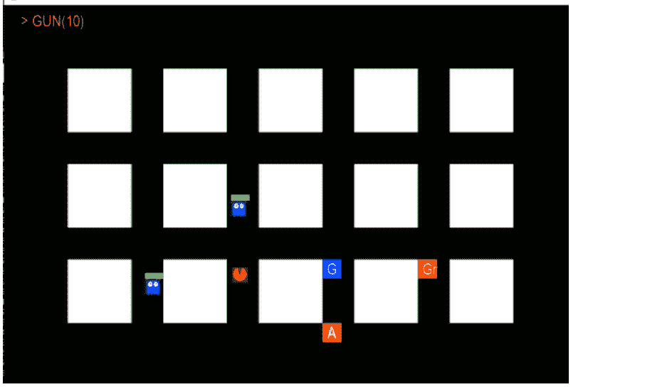

## 显示点

目前，我们的玩家角色可以收集弹药并向 NPC 射击；虽然这是一个很棒的功能，但如果玩家角色能够收集其他物品（例如，像吃豆人中的药丸）并相应地增加分数，那就更好了。

因此，在本节中，我们将：

- 定义每个药丸的位置。
- 相应地使用循环显示这些药丸。
- 检测玩家角色与药丸之间的碰撞。
- 在药丸被收集后将其移除。
- 显示分数并在收集药丸时播放音效。

那么首先，让我们定义并显示药丸；我们想要通过药丸实现的布局如下图所示。

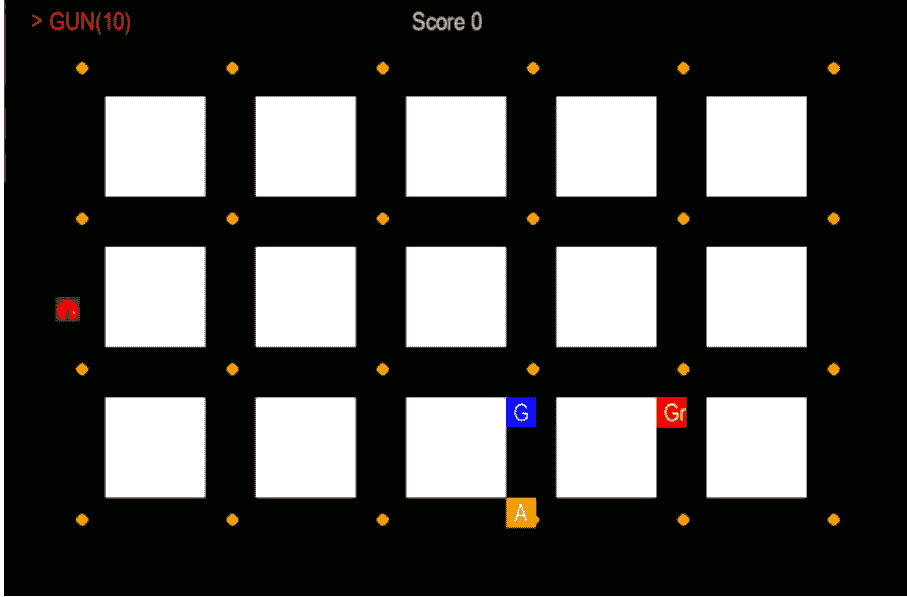

如上图所示：

药丸被组织成四行四列。
每个药丸由一个橙色圆盘表示。
药丸与构成迷宫的不同行和列对齐。
分数以白色显示在窗口顶部。

首先让我们显示要收集的药丸。

请在任何方法或类之外添加以下代码：

```python
dots = []
def init_dots():
    global dots
    dots = []
    for i in range(0,4):
        for j in range (0,6):
            dots.append (pygame.Rect(65+j*(WALL_INDENT),
            60+i*WALL_INDENT, ennemy_size, ennemy_size))
init_dots()
```

在前面的代码中：

我们定义了一个名为 `dots` 的列表，它将保存屏幕上显示的所有点；在这里使用列表将使管理、显示和移除游戏进行中的点变得容易得多。
然后我们创建了一个名为 `init_dots` 的方法。
在此方法中，我们引用了之前定义的名为 `dots` 的全局变量。

然后我们使用两个嵌套循环；第一个使用变量 `i` 的循环用于点的每一行，而第二个使用变量 `j` 的循环用于一行中的每个点（即列）。
定义这两个循环后，我们使用分别循环到 3 和 5 的变量 `i` 和 `j` 向列表中添加一个新项。这些项中的每一个都是一个矩形，它将用于（除其他外）检测与玩家的碰撞。每个矩形的位置由第一个项的初始位置、变量 `WALL_INDENT`（每行之间的空间）和 NPC 的大小（我们可以使用不同的大小，我们使用此大小是为了屏幕上显示的所有项保持一致）定义。
最后，我们调用刚刚创建的方法。将代码放在方法中将使以后（特别是在需要重新初始化关卡时）能够重新初始化每个药丸的位置。

接下来，我们需要显示这些点，这将通过遍历列表 `dots` 并在为每个点定义的位置绘制一个圆来完成。

请在代码 `pygame.display.update()` 之前，将以下代码添加到名为 `window` 的方法中：

```python
for dot in dots:
    pygame.draw.circle(WIN, "Orange", (dot.x+ennemy_size/2,
    dot.y+ennemy_size/2), ennemy_size/4)
```

在前面的代码中：

我们遍历名为 `dots` 的列表中定义的所有点。
然后我们为每个点绘制一个橙色圆圈。

我们确保这个圆圈位于为此圆圈定义的碰撞矩形的中心。

你现在可以保存并编译你的代码了。运行游戏时，你现在应该看到点显示在每一行中。

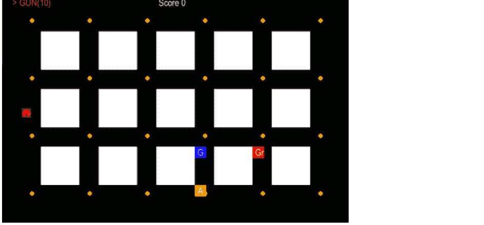

## 检测与点的碰撞并更新分数

在上一节中，我们成功显示了玩家角色要收集的点；因此在本节中，我们将检测玩家与这些点之间的碰撞，并在发生碰撞时相应地增加分数。
那么，首先让我们检测与点的碰撞：

请在任何类或方法之外添加以下代码。

```python
pygame.mixer.init()
beeping_snd = pygame.mixer.Sound('assets/beep.wav')
score = 0
```

在前面的代码中，我们初始化了混音器模块，然后创建了链接到 wav 文件的变量 `beeping_snd`。

请在方法 `check_collision_with_player` 的开头添加以下代码（新代码为粗体）：

```python
def check_collision_with_player():
    global dots, score
```

在前面的代码中，我们引用了全局变量 `score` 和 `dots`。

请将以下代码添加到方法 `check_collision_with_player`（在方法末尾）：

```python
dot_index = 0
for dot in dots:
    if (player_collision_rect.colliderect(dot)):
        dots.pop(dot_index)
        pygame.mixer.Channel(1).play(beeping_snd)
        score += 1
    dot_index += 1
```

在前面的代码中：

我们创建一个循环，以便遍历名为 `dots` 的列表中包含的所有点。
对于每个点，我们检查该点与玩家之间的碰撞。
如果发生碰撞，我们播放哔哔声，并增加分数。
我们还从列表中移除当前点。
然后我们增加变量 `dot_index` 的值。

你现在可以保存并运行你的代码了，你应该看到当玩家与一个点碰撞时，该点会从游戏中移除，如下图所示。

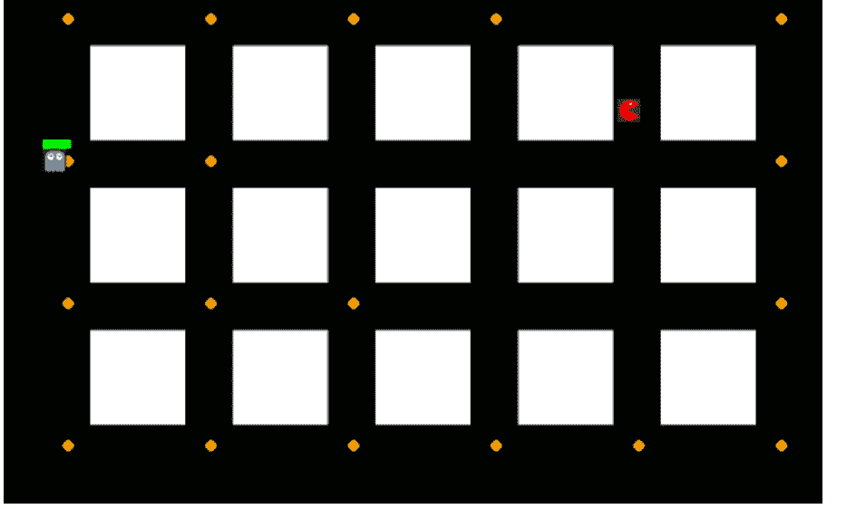

## 显示分数

在这个阶段，我们可以拾取点，我们现在需要的是跟踪并在屏幕上显示分数。

请打开脚本。
在代码 `pygame.display.update()` 之前，将以下代码添加到名为 `window` 的方法中：

```python
score_to_display = " Score " + str (score)
info = info_user_font.render(score_to_display,1,"WHITE")
WIN.blit(info,(400,10))
```

在前面的代码中：

我们声明变量 `score_to_display`；它包含一条由字符串 “Score ” 后跟实际分数值组成的消息。
然后我们以白色渲染此消息。
最后，我们在屏幕顶部显示渲染后的文本。

你现在可以保存并编译你的代码了。游戏运行时，你应该看到分数显示在窗口顶部，并且其值会随着你收集更多点而更新，如下图所示。

## 检测与NPC的碰撞

虽然我们的玩家角色可以在迷宫中移动并收集物品，但最好能检测到他/她何时与NPC发生碰撞，以便相应地重新开始关卡；因此，在本节中，我们将检测玩家与NPC之间的碰撞，并在发生碰撞时重新开始关卡，添加所有初始点数，移除所有NPC，并重置分数。

请在任何方法或类之外添加以下函数：

```python
def restart_level():
    global score, inventory, npcs
    init_dots()
    score = 0
    npcs = []
    inventory.set_ammo(inventory.WEAPON_TYPE_GUN,10)
    inventory.set_ammo(inventory.WEAPON_TYPE_AUTO_GUN,10)
    inventory.set_ammo(inventory.WEAPON_TYPE_GRENADE,10)
```

在前面的代码中：

我们定义了一个名为 `restart_level` 的新方法，该方法将在玩家角色与NPC发生碰撞时被调用。
在该方法内部，我们引用了全局变量 `inventory` 和
我们调用了 `init_dots` 方法，该方法会将所有的点数添加到关卡中。

我们初始化了变量 `score` 和 `npcs`。因此，在此阶段，列表 `npcs` 是空的。
然后我们为玩家拥有的每种武器添加弹药。

由于 `set_ammo` 方法尚未定义，我们需要定义它；请将以下方法添加到类中：

```python
def set_ammo(self, type_of_ammo, value):
    self.weapons[type_of_ammo].ammunitions = value
```

最后但同样重要的是，我们需要检测玩家与NPC之间的碰撞，因此请将以下代码添加到 `check_collision_with_player` 方法中（在该方法的末尾）。

```python
for npc in npcs:
    if (player_collision_rect.colliderect(npc.collision_rect)):
        restart_level()
```

在前面的代码中，我们遍历关卡中存在的所有NPC，并检查它们是否与玩家发生碰撞；在这种情况下，我们调用刚刚定义的 `restart_level` 方法。

最后，我们还将更改每个NPC的默认状态为 `STATE_FOLLOW_PLAYER`，请修改以下代码（新代码为粗体）：

```python
class NPC:
    def __init__(self, x, y, color):
        self.x = x
        self.y = y
        self.color = color
        self.health = 100
        self.collision_rect = pygame.Rect(self.x,self.y, 25, 25)

        self.state = constants.STATE_FOLLOW_PLAYER
        self.can_hear_player = False
        self.can_see_player = False
```

你现在可以保存并编译你的代码；在游戏运行时，你应该会看到在与NPC碰撞后，关卡会重新加载：你的分数被重置为0，所有NPC都消失了，并且所有初始点数都已按照下图添加。

## 关卡总结

在本章中，我们通过添加可收集的点数、检测与NPC的碰撞以及显示分数，成功地完善了我们的游戏。

检查清单

检查清单 检查清单 检查清单 检查清单 检查清单 检查清单 检查清单 检查清单 检查清单 检查清单 检查清单 检查清单 检查清单 检查清单 检查清单 检查清单 检查清单 检查清单 检查清单 检查清单 检查清单 检查清单 检查清单 检查清单 检查清单 检查清单 检查清单 检查清单 检查清单 检查清单 检查清单 检查清单 检查清单 检查清单 检查清单 检查清单 检查清单 检查清单 检查清单 检查清单 检查清单 检查清单 检查清单 检查清单 检查清单 检查清单 检查清单 检查清单 检查清单 检查清单 检查清单 检查清单 检查清单 检查清单 检查清单 检查清单 检查清单 检查清单 检查清单 检查清单 检查清单 检查清单 检查清单 检查清单 检查清单 检查清单 检查清单 检查清单 检查清单 检查清单 检查清单 检查清单 检查清单 检查清单 检查清单 检查清单 检查清单 检查清单 检查清单 检查清单 检查清单 检查清单 检查清单 检查清单 检查清单 检查清单 检查清单 检查清单 检查清单 检查清单 检查清单 检查清单 检查清单 检查清单 检查清单 检查清单 检查清单 检查清单 检查清单 检查清单 检查清单 检查清单 检查清单 检查清单 检查清单 检查清单 检查清单 检查清单 检查清单 检查清单 检查清单 检查清单 检查清单 检查清单 检查清单 检查清单 检查清单 检查清单 检查清单 检查清单 检查清单 检查清单 检查清单 检查清单 检查清单 检查清单 检查清单 检查清单 检查清单 检查清单 检查清单 检查清单 检查清单 检查清单 检查清单 检查清单 检查清单 检查清单 检查清单 检查清单 检查清单 检查清单 检查清单 检查清单 检查清单 检查清单 检查清单 检查清单 检查清单 检查清单 检查清单 检查清单 检查清单 检查清单 检查清单 检查清单 检查清单 检查清单 检查清单 检查清单 检查清单 检查清单 检查清单 检查清单 检查清单 检查清单 检查清单 检查清单 检查清单 检查清单 检查清单 检查清单 检查清单 检查清单 检查清单 检查清单 检查清单 检查清单 检查清单 检查清单 检查清单 检查清单 检查清单 检查清单 检查清单 检查清单 检查清单 检查清单 检查清单 检查清单 检查清单 检查清单 检查清单 检查清单 检查清单 检查清单 检查清单 检查清单 检查清单 检查清单 检查清单 检查清单 检查清单 检查清单 检查清单 检查清单 检查清单 检查清单 检查清单 检查清单 检查清单 检查清单 检查清单 检查清单 检查清单 检查清单 检查清单 检查清单 检查清单 检查清单 检查清单 检查清单 检查清单 检查清单 检查清单 检查清单 检查清单 检查清单 检查清单 检查清单 检查清单 检查清单 检查清单 检查清单 检查清单 检查清单 检查清单 检查清单 检查清单 检查清单 检查清单 检查清单 检查清单 检查清单 检查清单 检查清单 检查清单 检查清单 检查清单 检查清单 检查清单 检查清单 检查清单 检查清单 检查清单 检查清单 检查清单 检查清单 检查清单 检查清单 检查清单 检查清单 检查清单 检查清单 检查清单 检查清单 检查清单 检查清单 检查清单 检查清单 检查清单 检查清单 检查清单 检查清单 检查清单 检查清单 检查清单 检查清单 检查清单 检查清单 检查清单 检查清单 检查清单 检查清单 检查清单 检查清单 检查清单 检查清单 检查清单 检查清单 检查清单 检查清单 检查清单 检查清单 检查清单 检查清单 检查清单 检查清单 检查清单 检查清单 检查清单 检查清单 检查清单 检查清单 检查清单 检查清单 检查清单 检查清单 检查清单 检查清单 检查清单 检查清单 检查清单 检查清单 检查清单 检查清单 检查清单 检查清单 检查清单 检查清单 检查清单 检查清单 检查清单 检查清单 检查清单 检查清单 检查清单 检查清单 检查清单 检查清单 检查清单 检查清单 检查清单 检查清单 检查清单 检查清单 检查清单 检查清单 检查清单 检查清单 检查清单 检查清单 检查清单 检查清单 检查清单 检查清单 检查清单 检查清单 检查清单 检查清单 检查清单 检查清单 检查清单 检查清单 检查清单 检查清单 检查清单 检查清单 检查清单 检查清单 检查清单 检查清单 检查清单 检查清单 检查清单 检查清单 检查清单 检查清单 检查清单 检查清单 检查清单 检查清单 检查清单 检查清单 检查清单 检查清单 检查清单 检查清单 检查清单 检查清单 检查清单 检查清单 检查清单 检查清单 检查清单 检查清单 检查清单 检查清单 检查清单 检查清单 检查清单 检查清单 检查清单 检查清单 检查清单 检查清单 检查清单 检查清单 检查清单 检查清单 检查清单 检查清单 检查清单 检查清单 检查清单 检查清单 检查清单 检查清单 检查清单 检查清单 检查清单 检查清单 检查清单 检查清单 检查清单 检查清单 检查清单 检查清单 检查清单 检查清单 检查清单 检查清单 检查清单 检查清单 检查清单 检查清单 检查清单 检查清单 检查清单 检查清单 检查清单 检查清单 检查清单 检查清单 检查清单 检查清单 检查清单 检查清单 检查清单 检查清单 检查清单 检查清单 检查清单 检查清单 检查清单 检查清单 检查清单 检查清单 检查清单 检查清单 检查清单 检查清单 检查清单 检查清单 检查清单 检查清单 检查清单 检查清单 检查清单 检查清单 检查清单 检查清单 检查清单 检查清单 检查清单 检查清单 检查清单 检查清单 检查清单 检查清单 检查清单 检查清单 检查清单 检查清单 检查清单 检查清单 检查清单 检查清单 检查清单 检查清单 检查清单 检查清单 检查清单 检查清单 检查清单 检查清单 检查清单 检查清单 检查清单 检查清单 检查清单 检查清单 检查清单 检查清单 检查清单 检查清单 检查清单 检查清单 检查清单 检查清单 检查清单 检查清单 检查清单 检查清单 检查清单 检查清单 检查清单 检查清单 检查清单 检查清单 检查清单 检查清单 检查清单 检查清单 检查清单 检查清单 检查清单 检查清单 检查清单 检查清单 检查清单 检查清单 检查清单 检查清单 检查清单 检查清单 检查清单 检查清单 检查清单 检查清单 检查清单 检查清单 检查清单 检查清单 检查清单 检查清单 检查清单 检查清单 检查清单 检查清单 检查清单 检查清单 检查清单 检查清单 检查清单 检查清单 检查清单 检查清单 检查清单 检查清单 检查清单 检查清单 检查清单 检查清单 检查清单 检查清单 检查清单 检查清单 检查清单 检查清单 检查清单 检查清单 检查清单 检查清单 检查清单 检查清单 检查清单 检查清单 检查清单 检查清单 检查清单 检查清单 检查清单 检查清单 检查清单 检查清单 检查清单 检查清单 检查清单 检查清单 检查清单 检查清单 检查清单 检查清单 检查清单 检查清单 检查清单 检查清单 检查清单 检查清单 检查清单 检查清单 检查清单 检查清单 检查清单 检查清单 检查清单 检查清单 检查清单 检查清单 检查清单 检查清单 检查清单 检查清单 检查清单 检查清单 检查清单 检查清单 检查清单 检查清单 检查清单 检查清单 检查清单 检查清单 检查清单 检查清单 检查清单 检查清单 检查清单 检查清单 检查清单 检查清单 检查清单 检查清单 检查清单 检查清单 检查清单 检查清单 检查清单 检查清单 检查清单 检查清单 检查清单 检查清单 检查清单 检查清单 检查清单 检查清单 检查清单 检查清单 检查清单 检查清单 检查清单 检查清单 检查清单 检查清单 检查清单 检查清单 检查清单 检查清单 检查清单 检查清单 检查清单 检查清单 检查清单 检查清单 检查清单 检查清单 检查清单 检查清单 检查清单 检查清单 检查清单 检查清单 检查清单 检查清单 检查清单 检查清单 检查清单 检查清单 检查清单 检查清单 检查清单 检查清单 检查清单 检查清单 检查清单 检查清单 检查清单 检查清单 检查清单 检查清单 检查清单 检查清单 检查清单 检查清单 检查清单 检查清单 检查清单 检查清单 检查清单 检查清单 检查清单 检查清单 检查清单 检查清单 检查清单 检查清单 检查清单 检查清单 检查清单 检查清单 检查清单 检查清单 检查清单 检查清单 检查清单 检查清单 检查清单 检查清单 检查清单 检查清单 检查清单 检查清单 检查清单 检查清单 检查清单 检查清单 检查清单 检查清单 检查清单 检查清单 检查清单 检查清单 检查清单 检查清单 检查清单 检查清单 检查清单 检查清单 检查清单 检查清单 检查清单 检查清单 检查清单 检查清单 检查清单 检查清单 检查清单 检查清单 检查清单 检查清单 检查清单 检查清单 检查清单 检查清单 检查清单 检查清单 检查清单 检查清单 检查清单 检查清单 检查清单 检查清单 检查清单 检查清单 检查清单 检查清单 检查清单 检查清单 检查清单 检查清单 检查清单 检查清单 检查清单 检查清单 检查清单 检查清单 检查清单 检查清单 检查清单 检查清单 检查清单 检查清单 检查清单 检查清单 检查清单 检查清单 检查清单 检查清单 检查清单 检查清单 检查清单 检查清单 检查清单 检查清单 检查清单 检查清单 检查清单 检查清单 检查清单 检查清单 检查清单 检查清单 检查清单 检查清单 检查清单 检查清单 检查清单 检查清单 检查清单 检查清单 检查清单 检查清单 检查清单 检查清单 检查清单 检查清单 检查清单 检查清单 检查清单 检查清单 检查清单 检查清单 检查清单 检查清单 检查清单 检查清单 检查清单 检查清单 检查清单 检查清单 检查清单 检查清单 检查清单 检查清单 检查清单 检查清单 检查清单 检查清单 检查清单 检查清单 检查清单 检查清单 检查清单 检查清单 检查清单 检查清单 检查清单 检查清单 检查清单 检查清单 检查清单 检查清单 检查清单 检查清单 检查清单 检查清单 检查清单 检查清单 检查清单 检查清单 检查清单 检查清单 检查清单 检查清单 检查清单 检查清单 检查清单 检查清单 检查清单 检查清单 检查清单 检查清单 检查清单 检查清单 检查清单 检查清单 检查清单 检查清单 检查清单 检查清单 检查清单 检查清单 检查清单 检查清单 检查清单 检查清单 检查清单 检查清单 检查清单 检查清单 检查清单 检查清单 检查清单 检查清单 检查清单 检查清单 检查清单 检查清单 检查清单 检查清单 检查清单 检查清单 检查清单 检查清单 检查清单 检查清单 检查清单 检查清单 检查清单 检查清单 检查清单 检查清单 检查清单 检查清单 检查清单 检查清单 检查清单 检查清单 检查清单 检查清单 检查清单 检查清单 检查清单 检查清单 检查清单 检查清单 检查清单 检查清单 检查清单 检查清单 检查清单 检查清单 检查清单 检查清单 检查清单 检查清单 检查清单 检查清单 检查清单 检查清单 检查清单 检查清单 检查清单 检查清单 检查清单 检查清单 检查清单 检查清单 检查清单 检查清单 检查清单 检查清单 检查清单 检查清单 检查清单 检查清单 检查清单 检查清单 检查清单 检查清单 检查清单 检查清单 检查清单 检查清单 检查清单 检查清单 检查清单 检查清单 检查清单 检查清单 检查清单 检查清单 检查清单 检查清单 检查清单 检查清单 检查清单 检查清单 检查清单 检查清单 检查清单 检查清单 检查清单 检查清单 检查清单 检查清单 检查清单 检查清单 检查清单 检查清单 检查清单 检查清单 检查清单 检查清单 检查清单 检查清单 检查清单 检查清单 检查清单 检查清单 检查清单 检查清单 检查清单 检查清单 检查清单 检查清单 检查清单 检查清单 检查清单 检查清单 检查清单 检查清单 检查清单 检查清单 检查清单 检查清单 检查清单 检查清单 检查清单 检查清单 检查清单 检查清单 检查清单 检查清单 检查清单 检查清单 检查清单 检查清单 检查清单 检查清单 检查清单 检查清单 检查清单 检查清单 检查清单 检查清单 检查清单 检查清单 检查清单 检查清单 检查清单 检查清单 检查清单 检查清单 检查清单 检查清单 检查清单 检查清单 检查清单 检查清单 检查清单 检查清单 检查清单 检查清单 检查清单 检查清单 检查清单 检查清单 检查清单 检查清单 检查清单 检查清单 检查清单 检查清单 检查清单 检查清单 检查清单 检查清单 检查清单 检查清单 检查清单 检查清单 检查清单 检查清单 检查清单 检查清单 检查清单 检查清单 检查清单 检查清单 检查清单 检查清单 检查清单 检查清单 检查清单 检查清单 检查清单 检查清单 检查清单 检查清单 检查清单 检查清单 检查清单 检查清单 检查清单 检查清单 检查清单 检查清单 检查清单 检查清单 检查清单 检查清单 检查清单 检查清单 检查清单 检查清单 检查清单 检查清单 检查清单 检查清单 检查清单 检查清单 检查清单 检查清单 检查清单 检查清单 检查清单 检查清单 检查清单 检查清单 检查清单 检查清单 检查清单 检查清单 检查清单 检查清单 检查清单 检查清单 检查清单 检查清单 检查清单 检查清单 检查清单 检查清单 检查清单 检查清单 检查清单 检查清单 检查清单 检查清单 检查清单 检查清单 检查清单 检查清单 检查清单 检查清单 检查清单 检查清单 检查清单 检查清单 检查清单 检查清单 检查清单 检查清单 检查清单 检查清单 检查清单 检查清单 检查清单 检查清单 检查清单 检查清单 检查清单 检查清单 检查清单 检查清单 检查清单 检查清单 检查清单 检查清单 检查清单 检查清单 检查清单 检查清单 检查清单 检查清单 检查清单 检查清单 检查清单 检查清单 检查清单 检查清单 检查清单 检查清单 检查清单 检查清单 检查清单 检查清单 检查清单 检查清单 检查清单 检查清单 检查清单 检查清单 检查清单 检查清单 检查清单 检查清单 检查清单 检查清单 检查清单 检查清单 检查清单 检查清单 检查清单 检查清单 检查清单 检查清单 检查清单 检查清单 检查清单 检查清单 检查清单 检查清单 检查清单 检查清单 检查清单 检查清单 检查清单 检查清单 检查清单 检查清单 检查清单 检查清单 检查清单 检查清单 检查清单 检查清单 检查清单 检查清单 检查清单 检查清单 检查清单 检查清单 检查清单 检查清单 检查清单 检查清单 检查清单 检查清单 检查清单 检查清单 检查清单 检查清单 检查清单 检查清单 检查清单 检查清单 检查清单 检查清单 检查清单 检查清单 检查清单 检查清单 检查清单 检查清单 检查清单 检查清单 检查清单 检查清单 检查清单 检查清单 检查清单 检查清单 检查清单 检查清单 检查清单 检查清单 检查清单 检查清单 检查清单 检查清单 检查清单 检查清单 检查清单 检查清单 检查清单 检查清单 检查清单 检查清单 检查清单 检查清单 检查清单 检查清单 检查清单 检查清单 检查清单 检查清单 检查清单 检查清单 检查清单 检查清单 检查清单 检查清单 检查清单 检查清单 检查清单 检查清单 检查清单 检查清单 检查清单 检查清单 检查清单 检查清单 检查清单 检查清单 检查清单 检查清单 检查清单 检查清单 检查清单 检查清单 检查清单 检查清单 检查清单 检查清单 检查清单 检查清单 检查清单 检查清单 检查清单 检查清单 检查清单 检查清单 检查清单 检查清单 检查清单 检查清单 检查清单 检查清单 检查清单 检查清单 检查清单 检查清单 检查清单 检查清单 检查清单 检查清单 检查清单 检查清单 检查清单 检查清单 检查清单 检查清单 检查清单 检查清单 检查清单 检查清单 检查清单 检查清单 检查清单 检查清单 检查清单 检查清单 检查清单 检查清单 检查清单 检查清单 检查清单 检查清单 检查清单 检查清单 检查清单 检查清单 检查清单 检查清单 检查清单 检查清单 检查清单 检查清单 检查清单 检查清单 检查清单 检查清单 检查清单 检查清单 检查清单 检查清单 检查清单 检查清单 检查清单 检查清单 检查清单 检查清单 检查清单 检查清单 检查清单 检查清单 检查清单 检查清单 检查清单 检查清单 检查清单 检查清单 检查清单 检查清单 检查清单 检查清单 检查清单 检查清单 检查清单 检查清单 检查清单 检查清单 检查清单 检查清单 检查清单 检查清单 检查清单 检查清单 检查清单 检查清单 检查清单 检查清单 检查清单 检查清单 检查清单 检查清单 检查清单 检查清单 检查清单 检查清单 检查清单 检查清单 检查清单 检查清单 检查清单 检查清单 检查清单 检查清单 检查清单 检查清单 检查清单 检查清单 检查清单 检查清单 检查清单 检查清单 检查清单 检查清单 检查清单 检查清单 检查清单 检查清单 检查清单 检查清单 检查清单 检查清单 检查清单 检查清单 检查清单 检查清单 检查清单 检查清单 检查清单 检查清单 检查清单 检查清单 检查清单 检查清单 检查清单 检查清单 检查清单 检查清单 检查清单 检查清单 检查清单 检查清单 检查清单 检查清单 检查清单 检查清单 检查清单 检查清单 检查清单 检查清单 检查清单 检查清单 检查清单 检查清单 检查清单 检查清单 检查清单 检查清单 检查清单 检查清单 检查清单 检查清单 检查清单 检查清单 检查清单 检查清单 检查清单 检查清单 检查清单 检查清单 检查清单 检查清单 检查清单 检查清单 检查清单 检查清单 检查清单 检查清单 检查清单 检查清单 检查清单 检查清单 检查清单 检查清单 检查清单 检查清单 检查清单 检查清单 检查清单 检查清单 检查清单 检查清单 检查清单 检查清单 检查清单 检查清单 检查清单 检查清单 检查清单 检查清单 检查清单 检查清单 检查清单 检查清单 检查清单 检查清单 检查清单 检查清单 检查清单 检查清单 检查清单 检查清单 检查清单 检查清单 检查清单 检查清单 检查清单 检查清单 检查清单 检查清单 检查清单 检查清单 检查清单 检查清单 检查清单 检查清单 检查清单 检查清单 检查清单 检查清单 检查清单 检查清单 检查清单 检查清单 检查清单 检查清单 检查清单 检查清单 检查清单 检查清单 检查清单 检查清单 检查清单 检查清单 检查清单 检查清单 检查清单 检查清单 检查清单 检查清单 检查清单 检查清单 检查清单 检查清单 检查清单 检查清单 检查清单 检查清单 检查清单 检查清单 检查清单 检查清单 检查清单 检查清单 检查清单 检查清单 检查清单 检查清单 检查清单 检查清单 检查清单 检查清单 检查清单 检查清单 检查清单 检查清单 检查清单 检查清单 检查清单 检查清单 检查清单 检查清单 检查清单 检查清单 检查清单 检查清单 检查清单 检查清单 检查清单 检查清单 检查清单 检查清单 检查清单 检查清单 检查清单 检查清单 检查清单 检查清单 检查清单 检查清单 检查清单 检查清单 检查清单 检查清单 检查清单 检查清单 检查清单 检查清单 检查清单 检查清单 检查清单 检查清单 检查清单 检查清单 检查清单 检查清单 检查清单 检查清单 检查清单 检查清单 检查清单 检查清单 检查清单 检查清单 检查清单 检查清单 检查清单 检查清单 检查清单 检查清单 检查清单 检查清单 检查清单 检查清单 检查清单 检查清单 检查清单 检查清单 检查清单 检查清单 检查清单 检查清单 检查清单 检查清单 检查清单 检查清单 检查清单 检查清单 检查清单 检查清单 检查清单 检查清单 检查清单 检查清单 检查清单 检查清单 检查清单 检查清单 检查清单 检查清单 检查清单 检查清单 检查清单 检查清单 检查清单 检查清单 检查清单 检查清单 检查清单 检查清单 检查清单 检查清单 检查清单 检查清单 检查清单 检查清单 检查清单 检查清单 检查清单 检查清单 检查清单 检查清单 检查清单 检查清单 检查清单 检查清单 检查清单 检查清单 检查清单 检查清单 检查清单 检查清单 检查清单 检查清单 检查清单 检查清单 检查清单 检查清单 检查清单 检查清单 检查清单 检查清单 检查清单 检查清单 检查清单 检查清单 检查清单 检查清单 检查清单 检查清单 检查清单 检查清单 检查清单 检查清单 检查清单 检查清单 检查清单 检查清单 检查清单 检查清单 检查清单 检查清单 检查清单 检查清单 检查清单 检查清单 检查清单 检查清单 检查清单 检查清单 检查清单 检查清单 检查清单 检查清单 检查清单 检查清单 检查清单 检查清单 检查清单 检查清单 检查清单 检查清单 检查清单 检查清单 检查清单 检查清单 检查清单 检查清单 检查清单 检查清单 检查清单 检查清单 检查清单 检查清单 检查清单 检查清单 检查清单 检查清单 检查清单 检查清单 检查清单 检查清单 检查清单 检查清单 检查清单 检查清单 检查清单 检查清单 检查清单 检查清单 检查清单 检查清单 检查清单 检查清单 检查清单 检查清单 检查清单 检查清单 检查清单 检查清单 检查清单 检查清单 检查清单 检查清单 检查清单 检查清单 检查清单 检查清单 检查清单 检查清单 检查清单 检查清单 检查清单 检查清单 检查清单 检查清单 检查清单 检查清单 检查清单 检查清单 检查清单 检查清单 检查清单 检查清单 检查清单 检查清单 检查清单 检查清单 检查清单 检查清单 检查清单 检查清单 检查清单 检查清单 检查清单 检查清单 检查清单 检查清单 检查清单 检查清单 检查清单 检查清单 检查清单 检查清单 检查清单 检查清单 检查清单 检查清单 检查清单 检查清单 检查清单 检查清单 检查清单 检查清单 检查清单 检查清单 检查清单 检查清单 检查清单 检查清单 检查清单 检查清单 检查清单 检查清单 检查清单 检查清单 检查清单 检查清单 检查清单 检查清单 检查清单 检查清单 检查清单 检查清单 检查清单 检查清单 检查清单 检查清单 检查清单 检查清单 检查清单 检查清单 检查清单 检查清单 检查清单 检查清单 检查清单 检查清单 检查清单 检查清单 检查清单 检查清单 检查清单 检查清单 检查清单 检查清单 检查清单 检查清单 检查清单 检查清单 检查清单 检查清单 检查清单 检查清单 检查清单 检查清单 检查清单 检查清单 检查清单 检查清单 检查清单 检查清单 检查清单 检查清单 检查清单 检查清单 检查清单 检查清单 检查清单 检查清单 检查清单 检查清单 检查清单 检查清单 检查清单 检查清单 检查清单 检查清单 检查清单 检查清单 检查清单 检查清单 检查清单 检查清单 检查清单 检查清单 检查清单 检查清单 检查清单 检查清单 检查清单 检查清单 检查清单 检查清单 检查清单 检查清单 检查清单 检查清单 检查清单 检查清单 检查清单 检查清单 检查清单 检查清单 检查清单 检查清单 检查清单 检查清单 检查清单 检查清单 检查清单 检查清单 检查清单 检查清单 检查清单 检查清单 检查清单 检查清单 检查清单 检查清单 检查清单 检查清单 检查清单 检查清单 检查清单 检查清单 检查清单 检查清单 检查清单 检查清单 检查清单 检查清单 检查清单 检查清单 检查清单 检查清单 检查清单 检查清单 检查清单 检查清单 检查清单 检查清单 检查清单 检查清单 检查清单 检查清单 检查清单 检查清单 检查清单 检查清单 检查清单 检查清单 检查清单 检查清单 检查清单 检查清单 检查清单 检查清单 检查清单 检查清单 检查清单 检查清单 检查清单 检查清单 检查清单 检查清单 检查清单 检查清单 检查清单 检查清单 检查清单 检查清单 检查清单 检查清单 检查清单 检查清单 检查清单 检查清单 检查清单 检查清单 检查清单 检查清单 检查清单 检查清单 检查清单 检查清单 检查清单 检查清单 检查清单 检查清单 检查清单 检查清单 检查清单 检查清单 检查清单 检查清单 检查清单 检查清单 检查清单 检查清单 检查清单 检查清单 检查清单 检查清单 检查清单 检查清单 检查清单 检查清单 检查清单 检查清单 检查清单 检查清单 检查清单 检查清单 检查清单 检查清单 检查清单 检查清单 检查清单 检查清单 检查清单 检查清单 检查清单 检查清单 检查清单 检查清单 检查清单 检查清单 检查清单 检查清单 检查清单 检查清单 检查清单 检查清单 检查清单 检查清单 检查清单 检查清单 检查清单 检查清单 检查清单 检查清单 检查清单 检查清单 检查清单 检查清单 检查清单 检查清单 检查清单 检查清单 检查清单 检查清单 检查清单 检查清单 检查清单 检查清单 检查清单 检查清单 检查清单 检查清单 检查清单 检查清单 检查清单 检查清单 检查清单 检查清单 检查清单 检查清单 检查清单 检查清单 检查清单 检查清单 检查清单 检查清单 检查清单 检查清单 检查清单 检查清单 检查清单 检查清单 检查清单 检查清单 检查清单 检查清单 检查清单 检查清单 检查清单 检查清单 检查清单 检查清单 检查清单 检查清单 检查清单 检查清单 检查清单 检查清单 检查清单 检查清单 检查清单 检查清单 检查清单 检查清单 检查清单 检查清单 检查清单 检查清单 检查清单 检查清单 检查清单 检查清单 检查清单 检查清单 检查清单 检查清单 检查清单 检查清单 检查清单 检查清单 检查清单 检查清单 检查清单 检查清单 检查清单 检查清单 检查清单 检查清单 检查清单 检查清单 检查清单 检查清单 检查清单 检查清单 检查清单 检查清单 检查清单 检查清单 检查清单 检查清单 检查清单 检查清单 检查清单 检查清单 检查清单 检查清单 检查清单 检查清单 检查清单 检查清单 检查清单 检查清单 检查清单 检查清单 检查清单 检查清单 检查清单 检查清单 检查清单 检查清单 检查清单 检查清单 检查清单 检查清单 检查清单 检查清单 检查清单 检查清单 检查清单 检查清单 检查清单 检查清单 检查清单 检查清单 检查清单 检查清单 检查清单 检查清单 检查清单 检查清单 检查清单 检查清单 检查清单 检查清单 检查清单 检查清单 检查清单 检查清单 检查清单 检查清单 检查清单 检查清单 检查清单 检查清单 检查清单 检查清单 检查清单 检查清单 检查清单 检查清单 检查清单 检查清单 检查清单 检查清单 检查清单 检查清单 检查清单 检查清单 检查清单 检查清单 检查清单 检查清单 检查清单 检查清单 检查清单 检查清单 检查清单 检查清单 检查清单 检查清单 检查清单 检查清单 检查清单 检查清单 检查清单 检查清单 检查清单 检查清单 检查清单 检查清单 检查清单 检查清单 检查清单 检查清单 检查清单 检查清单 检查清单 检查清单 检查清单 检查清单 检查清单 检查清单 检查清单 检查清单 检查清单 检查清单 检查清单 检查清单 检查清单 检查清单 检查清单 检查清单 检查清单 检查清单 检查清单 检查清单 检查清单 检查清单 检查清单 检查清单 检查清单 检查清单 检查清单 检查清单 检查清单 检查清单 检查清单 检查清单 检查清单 检查清单 检查清单 检查清单 检查清单 检查清单 检查清单 检查清单 检查清单 检查清单 检查清单 检查清单 检查清单 检查清单 检查清单 检查清单 检查清单 检查清单 检查清单 检查清单 检查清单 检查清单 检查清单 检查清单 检查清单 检查清单 检查清单 检查清单 检查清单 检查清单 检查清单 检查清单 检查清单 检查清单 检查清单 检查清单 检查清单 检查清单 检查清单 检查清单 检查清单 检查清单 检查清单 检查清单 检查清单 检查清单 检查清单 检查清单 检查清单 检查清单 检查清单 检查清单 检查清单 检查清单 检查清单 检查清单 检查清单 检查清单 检查清单 检查清单 检查清单 检查清单 检查清单 检查清单 检查清单 检查清单 检查清单 检查清单 检查清单 检查清单 检查清单 检查清单 检查清单 检查清单 检查清单 检查清单 检查清单 检查清单 检查清单 检查清单 检查清单 检查清单 检查清单 检查清单 检查清单 检查清单 检查清单 检查清单 检查清单 检查清单 检查清单 检查清单 检查清单 检查清单 检查清单 检查清单 检查清单 检查清单 检查清单 检查清单 检查清单 检查清单 检查清单 检查清单 检查清单 检查清单 检查清单 检查清单 检查清单 检查清单 检查清单 检查清单 检查清单 检查清单 检查清单 检查清单 检查清单 检查清单 检查清单 检查清单 检查清单 检查清单 检查清单 检查清单 检查清单 检查清单 检查清单 检查清单 检查清单 检查清单 检查清单 检查清单 检查清单 检查清单 检查清单 检查清单 检查清单 检查清单 检查清单 检查清单 检查清单 检查清单 检查清单 检查清单 检查清单 检查清单 检查清单 检查清单 检查清单 检查清单 检查清单 检查清单 检查清单 检查清单 检查清单 检查清单 检查清单 检查清单 检查清单 检查清单 检查清单 检查清单 检查清单 检查清单 检查清单 检查清单 检查清单 检查清单 检查清单 检查清单 检查清单 检查清单 检查清单 检查清单 检查清单 检查清单 检查清单 检查清单 检查清单 检查清单 检查清单 检查清单 检查清单 检查清单 检查清单 检查清单 检查清单 检查清单 检查清单 检查清单 检查清单 检查清单 检查清单 检查清单 检查清单 检查清单 检查清单 检查清单 检查清单 检查清单 检查清单 检查清单 检查清单 检查清单 检查清单 检查清单 检查清单 检查清单 检查清单 检查清单 检查清单 检查清单 检查清单 检查清单 检查清单 检查清单 检查清单 检查清单 检查清单 检查清单 检查清单 检查清单 检查清单 检查清单 检查清单 检查清单 检查清单 检查清单 检查清单 检查清单 检查清单 检查清单 检查清单 检查清单 检查清单 检查清单 检查清单 检查清单 检查清单 检查清单 检查清单 检查清单 检查清单 检查清单 检查清单 检查清单 检查清单 检查清单 检查清单 检查清单 检查清单 检查清单 检查清单 检查清单 检查清单 检查清单 检查清单 检查清单 检查清单 检查清单 检查清单 检查清单 检查清单 检查清单 检查清单 检查清单 检查清单 检查清单 检查清单 检查清单 检查清单 检查清单 检查清单 检查清单 检查清单 检查清单 检查清单 检查清单 检查清单 检查清单 检查清单 检查清单 检查清单 检查清单 检查清单 检查清单 检查清单 检查清单 检查清单 检查清单 检查清单 检查清单 检查清单 检查清单 检查清单 检查清单 检查清单 检查清单 检查清单 检查清单 检查清单 检查清单 检查清单 检查清单 检查清单 检查清单 检查清单 检查清单 检查清单 检查清单 检查清单 检查清单 检查清单 检查清单 检查清单 检查清单 检查清单 检查清单 检查清单 检查清单 检查清单 检查清单 检查清单 检查清单 检查清单 检查清单 检查清单 检查清单 检查清单 检查清单 检查清单 检查清单 检查清单 检查清单 检查清单 检查清单 检查清单 检查清单 检查清单 检查清单 检查清单 检查清单 检查清单 检查清单 检查清单 检查清单 检查清单 检查清单 检查清单 检查清单 检查清单 检查清单 检查清单 检查清单 检查清单 检查清单 检查清单 检查清单 检查清单 检查清单 检查清单 检查清单 检查清单 检查清单 检查清单 检查清单 检查清单 检查清单 检查清单 检查清单 检查清单 检查清单 检查清单 检查清单 检查清单 检查清单 检查清单 检查清单 检查清单 检查清单 检查清单 检查清单 检查清单 检查清单 检查清单 检查清单 检查清单 检查清单 检查清单 检查清单 检查清单 检查清单 检查清单 检查清单 检查清单 检查清单 检查清单 检查清单 检查清单 检查清单 检查清单 检查清单 检查清单 检查清单 检查清单 检查清单 检查清单 检查清单 检查清单 检查清单 检查清单 检查清单 检查清单 检查清单 检查清单 检查清单 检查清单 检查清单 检查清单 检查清单 检查清单 检查清单 检查清单 检查清单 检查清单 检查清单 检查清单 检查清单 检查清单 检查清单 检查清单 检查清单 检查清单 检查清单 检查清单 检查清单 检查清单 检查清单 检查清单 检查清单 检查清单 检查清单 检查清单 检查清单 检查清单 检查清单 检查清单 检查清单 检查清单 检查清单 检查清单 检查清单 检查清单 检查清单 检查清单 检查清单 检查清单 检查清单 检查清单 检查清单 检查清单 检查清单 检查清单 检查清单 检查清单 检查清单 检查清单 检查清单 检查清单 检查清单 检查清单 检查清单 检查清单 检查清单 检查清单 检查清单 检查清单 检查清单 检查清单 检查清单 检查清单 检查清单 检查清单 检查清单 检查清单 检查清单 检查清单 检查清单 检查清单 检查清单 检查清单 检查清单 检查清单 检查清单 检查清单 检查清单 检查清单 检查清单 检查清单 检查清单 检查清单 检查清单 检查清单 检查清单 检查清单 检查清单 检查清单 检查清单 检查清单 检查清单 检查清单 检查清单 检查清单 检查清单 检查清单 检查清单 检查清单 检查清单 检查清单 检查清单 检查清单 检查清单 检查清单 检查清单 检查清单 检查清单 检查清单 检查清单 检查清单 检查清单 检查清单 检查清单 检查清单 检查清单 检查清单 检查清单 检查清单 检查清单 检查清单 检查清单 检查清单 检查清单 检查清单 检查清单 检查清单 检查清单 检查清单 检查清单 检查清单 检查清单 检查清单 检查清单 检查清单 检查清单 检查清单 检查清单 检查清单 检查清单 检查清单 检查清单 检查清单 检查清单 检查清单 检查清单 检查清单 检查清单 检查清单 检查清单 检查清单 检查清单 检查清单 检查清单 检查清单 检查清单 检查清单 检查清单 检查清单 检查清单 检查清单 检查清单 检查清单 检查清单 检查清单 检查清单 检查清单 检查清单 检查清单 检查清单 检查清单 检查清单 检查清单 检查清单 检查清单 检查清单 检查清单 检查清单 检查清单 检查清单 检查清单 检查清单 检查清单 检查清单 检查清单 检查清单 检查清单 检查清单 检查清单 检查清单 检查清单 检查清单 检查清单 检查清单 检查清单 检查清单 检查清单 检查清单 检查清单 检查清单 检查清单 检查清单 检查清单 检查清单 检查清单 检查清单 检查清单 检查清单 检查清单 检查清单 检查清单 检查清单 检查清单 检查清单 检查清单 检查清单 检查清单 检查清单 检查清单 检查清单 检查清单 检查清单 检查清单 检查清单 检查清单 检查清单 检查清单 检查清单 检查清单 检查清单 检查清单 检查清单 检查清单 检查清单 检查清单 检查清单 检查清单 检查清单 检查清单 检查清单 检查清单 检查清单 检查清单 检查清单 检查清单 检查清单 检查清单 检查清单 检查清单 检查清单 检查清单 检查清单 检查清单 检查清单 检查清单 检查清单 检查清单 检查清单 检查清单 检查清单 检查清单 检查清单 检查清单 检查清单 检查清单 检查清单 检查清单 检查清单 检查清单 检查清单 检查清单 检查清单 检查清单 检查清单 检查清单 检查清单 检查清单 检查清单 检查清单 检查清单 检查清单 检查清单 检查清单 检查清单 检查清单 检查清单 检查清单 检查清单 检查清单 检查清单 检查清单 检查清单 检查清单 检查清单 检查清单 检查清单 检查清单 检查清单 检查清单 检查清单 检查清单 检查清单 检查清单 检查清单 检查清单 检查清单 检查清单 检查清单 检查清单 检查清单 检查清单 检查清单 检查清单 检查清单 检查清单 检查清单 检查清单 检查清单 检查清单 检查清单 检查清单 检查清单 检查清单 检查清单 检查清单 检查清单 检查清单 检查清单 检查清单 检查清单 检查清单 检查清单 检查清单 检查清单 检查清单 检查清单 检查清单 检查清单 检查清单 检查清单 检查清单 检查清单 检查清单 检查清单 检查清单 检查清单 检查清单 检查清单 检查清单 检查清单 检查清单 检查清单 检查清单 检查清单 检查清单 检查清单 检查清单 检查清单 检查清单 检查清单 检查清单 检查清单 检查清单 检查清单 检查清单 检查清单 检查清单 检查清单 检查清单 检查清单 检查清单 检查清单 检查清单 检查清单 检查清单 检查清单 检查清单 检查清单 检查清单 检查清单 检查清单 检查清单 检查清单 检查清单 检查清单 检查清单 检查清单 检查清单 检查清单 检查清单 检查清单 检查清单 检查清单 检查清单 检查清单 检查清单 检查清单 检查清单 检查清单 检查清单 检查清单 检查清单 检查清单 检查清单 检查清单 检查清单 检查清单 检查清单 检查清单 检查清单 检查清单 检查清单 检查清单 检查清单 检查清单 检查清单 检查清单 检查清单 检查清单 检查清单 检查清单 检查清单 检查清单 检查清单 检查清单 检查清单 检查清单 检查清单 检查清单 检查清单 检查清单 检查清单 检查清单 检查清单 检查清单 检查清单 检查清单 检查清单 检查清单 检查清单 检查清单 检查清单 检查清单 检查清单 检查清单 检查清单 检查清单 检查清单 检查清单 检查清单 检查清单 检查清单 检查清单 检查清单 检查清单 检查清单 检查清单 检查清单 检查清单 检查清单 检查清单 检查清单 检查清单 检查清单 检查清单 检查清单 检查清单 检查清单 检查清单 检查清单 检查清单 检查清单 检查清单 检查清单 检查清单 检查清单 检查清单 检查清单 检查清单 检查清单 检查清单 检查清单 检查清单 检查清单 检查清单 检查清单 检查清单 检查清单 检查清单 检查清单 检查清单 检查清单 检查清单 检查清单 检查清单 检查清单 检查清单 检查清单 检查清单 检查清单 检查清单 检查清单 检查清单 检查清单 检查清单 检查清单 检查清单 检查清单 检查清单 检查清单 检查清单 检查清单 检查清单 检查清单 检查清单 检查清单 检查清单 检查清单 检查清单 检查清单 检查清单 检查清单 检查清单 检查清单 检查清单 检查清单 检查清单 检查清单 检查清单 检查清单 检查清单 检查清单 检查清单 检查清单 检查清单 检查清单 检查清单 检查清单 检查清单 检查清单 检查清单 检查清单 检查清单 检查清单 检查清单 检查清单 检查清单 检查清单 检查清单 检查清单 检查清单 检查清单 检查清单 检查清单 检查清单 检查清单 检查清单 检查清单 检查清单 检查清单 检查清单 检查清单 检查清单 检查清单 检查清单 检查清单 检查清单 检查清单 检查清单 检查清单 检查清单 检查清单 检查清单 检查清单 检查清单 检查清单 检查清单 检查清单 检查清单 检查清单 检查清单 检查清单 检查清单 检查清单 检查清单 检查清单 检查清单 检查清单 检查清单 检查清单 检查清单 检查清单 检查清单 检查清单 检查清单 检查清单 检查清单 检查清单 检查清单 检查清单 检查清单 检查清单 检查清单 检查清单 检查清单 检查清单 检查清单 检查清单 检查清单 检查清单 检查清单 检查清单 检查清单 检查清单 检查清单 检查清单 检查清单 检查清单 检查清单 检查清单 检查清单 检查清单 检查清单 检查清单 检查清单 检查清单 检查清单 检查清单 检查清单 检查清单 检查清单 检查清单 检查清单 检查清单 检查清单 检查清单 检查清单 检查清单 检查清单 检查清单 检查清单 检查清单 检查清单 检查清单 检查清单 检查清单 检查清单 检查清单 检查清单 检查清单 检查清单 检查清单 检查清单 检查清单 检查清单 检查清单 检查清单 检查清单 检查清单 检查清单 检查清单 检查清单 检查清单 检查清单 检查清单 检查清单 检查清单 检查清单 检查清单 检查清单 检查清单 检查清单 检查清单 检查清单 检查清单 检查清单 检查清单 检查清单 检查清单 检查清单 检查清单 检查清单 检查清单 检查清单 检查清单 检查清单 检查清单 检查清单 检查清单 检查清单 检查清单 检查清单 检查清单 检查清单 检查清单 检查清单 检查清单 检查清单 检查清单 检查清单 检查清单 检查清单 检查清单 检查清单 检查清单 检查清单 检查清单 检查清单 检查清单 检查清单 检查清单 检查清单 检查清单 检查清单 检查清单 检查清单 检查清单 检查清单 检查清单 检查清单 检查清单 检查清单 检查清单 检查清单 检查清单 检查清单 检查清单 检查清单 检查清单 检查清单 检查清单 检查清单 检查清单 检查清单 检查清单 检查清单 检查清单 检查清单 检查清单 检查清单 检查清单 检查清单 检查清单 检查清单 检查清单 检查清单 检查清单 检查清单 检查清单 检查清单 检查清单 检查清单 检查清单 检查清单 检查清单 检查清单 检查清单 检查清单 检查清单 检查清单 检查清单 检查清单 检查清单 检查清单 检查清单 检查清单 检查清单 检查清单 检查清单 检查清单 检查清单 检查清单 检查清单 检查清单 检查清单 检查清单 检查清单 检查清单 检查清单 检查清单 检查清单 检查清单 检查清单 检查清单 检查清单 检查清单 检查清单 检查清单 检查清单 检查清单 检查清单 检查清单 检查清单 检查清单 检查清单 检查清单 检查清单 检查清单 检查清单 检查清单 检查清单 检查清单 检查清单 检查清单 检查清单 检查清单 检查清单 检查清单 检查清单 检查清单 检查清单 检查清单 检查清单 检查清单 检查清单 检查清单 检查清单 检查清单 检查清单 检查清单 检查清单 检查清单 检查清单 检查清单 检查清单 检查清单 检查清单 检查清单 检查清单 检查清单 检查清单 检查清单 检查清单 检查清单 检查清单 检查清单 检查清单 检查清单 检查清单 检查清单 检查清单 检查清单 检查清单 检查清单 检查清单 检查清单 检查清单 检查清单 检查清单 检查清单 检查清单 检查清单 检查清单 检查清单 检查清单 检查清单 检查清单 检查清单 检查清单 检查清单 检查清单 检查清单 检查清单 检查清单 检查清单 检查清单 检查清单 检查清单 检查清单 检查清单 检查清单 检查清单 检查清单 检查清单 检查清单 检查清单 检查清单 检查清单 检查清单 检查清单 检查清单 检查清单 检查清单 检查清单 检查清单 检查清单 检查清单 检查清单 检查清单 检查清单 检查清单 检查清单 检查清单 检查清单 检查清单 检查清单 检查清单 检查清单 检查清单 检查清单 检查清单 检查清单 检查清单 检查清单 检查清单 检查清单 检查清单 检查清单 检查清单 检查清单 检查清单 检查清单 检查清单 检查清单 检查清单 检查清单 检查清单 检查清单 检查清单 检查清单 检查清单 检查清单 检查清单 检查清单 检查清单 检查清单 检查清单 检查清单 检查清单 检查清单 检查清单 检查清单 检查清单 检查清单 检查清单 检查清单 检查清单 检查清单 检查清单 检查清单 检查清单 检查清单 检查清单 检查清单 检查清单 检查清单 检查清单 检查清单 检查清单 检查清单 检查清单 检查清单 检查清单 检查清单 检查清单 检查清单 检查清单 检查清单 检查清单 检查清单 检查清单 检查清单 检查清单 检查清单 检查清单 检查清单 检查清单 检查清单 检查清单 检查清单 检查清单 检查清单 检查清单 检查清单 检查清单 检查清单 检查清单 检查清单 检查清单 检查清单 检查清单 检查清单 检查清单 检查清单 检查清单 检查清单 检查清单 检查清单 检查清单 检查清单 检查清单 检查清单 检查清单 检查清单 检查清单 检查清单 检查清单 检查清单 检查清单 检查清单 检查清单 检查清单 检查清单 检查清单 检查清单 检查清单 检查清单 检查清单 检查清单 检查清单 检查清单 检查清单 检查清单 检查清单 检查清单 检查清单 检查清单 检查清单 检查清单 检查清单 检查清单 检查清单 检查清单 检查清单 检查清单 检查清单 检查清单 检查清单 检查清单 检查清单 检查清单 检查清单 检查清单 检查清单 检查清单 检查清单 检查清单 检查清单 检查清单 检查清单 检查清单 检查清单 检查清单 检查清单 检查清单 检查清单 检查清单 检查清单 检查清单 检查清单 检查清单 检查清单 检查清单 检查清单 检查清单 检查清单 检查清单 检查清单 检查清单 检查清单 检查清单 检查清单 检查清单 检查清单 检查清单 检查清单 检查清单 检查清单 检查清单 检查清单 检查清单 检查清单 检查清单 检查清单 检查清单 检查清单 检查清单 检查清单 检查清单 检查清单 检查清单 检查清单 检查清单 检查清单 检查清单 检查清单 检查清单 检查清单 检查清单 检查清单 检查清单 检查清单 检查清单 检查清单 检查清单 检查清单 检查清单 检查清单 检查清单 检查清单 检查清单 检查清单 检查清单 检查清单 检查清单 检查清单 检查清单 检查清单 检查清单 检查清单 检查清单 检查清单 检查清单 检查清单 检查清单 检查清单 检查清单 检查清单 检查清单 检查清单 检查清单 检查清单 检查清单 检查清单 检查清单 检查清单 检查清单 检查清单 检查清单 检查清单 检查清单 检查清单 检查清单 检查清单 检查清单 检查清单 检查清单 检查清单 检查清单 检查清单 检查清单 检查清单 检查清单 检查清单 检查清单 检查清单 检查清单 检查清单 检查清单 检查清单 检查清单 检查清单 检查清单 检查清单 检查清单 检查清单 检查清单 检查清单 检查清单 检查清单 检查清单 检查清单 检查清单 检查清单 检查清单 检查清单 检查清单 检查清单 检查清单 检查清单 检查清单 检查清单 检查清单 检查清单 检查清单 检查清单 检查清单 检查清单 检查清单 检查清单 检查清单 检查清单 检查清单 检查清单 检查清单 检查清单 检查清单 检查清单 检查清单 检查清单 检查清单 检查清单 检查清单 检查清单 检查清单 检查清单 检查清单 检查清单 检查清单 检查清单 检查清单 检查清单 检查清单 检查清单 检查清单 检查清单 检查清单 检查清单 检查清单 检查清单 检查清单 检查清单 检查清单 检查清单 检查清单 检查清单 检查清单 检查清单 检查清单 检查清单 检查清单 检查清单 检查清单 检查清单 检查清单 检查清单 检查清单 检查清单 检查清单 检查清单 检查清单 检查清单 检查清单 检查清单 检查清单 检查清单 检查清单 检查清单 检查清单 检查清单 检查清单 检查清单 检查清单 检查清单 检查清单 检查清单 检查清单 检查清单 检查清单 检查清单 检查清单 检查清单 检查清单 检查清单 检查清单 检查清单 检查清单 检查清单 检查清单 检查清单 检查清单 检查清单 检查清单 检查清单 检查清单 检查清单 检查清单 检查清单 检查清单 检查清单 检查清单 检查清单 检查清单 检查清单 检查清单 检查清单 检查清单 检查清单 检查清单 检查清单 检查清单 检查清单 检查清单 检查清单 检查清单 检查清单 检查清单 检查清单 检查清单 检查清单 检查清单 检查清单 检查清单 检查清单 检查清单 检查清单 检查清单 检查清单 检查清单 检查清单 检查清单 检查清单 检查清单 检查清单 检查清单 检查清单 检查清单 检查清单 检查清单 检查清单 检查清单 检查清单 检查清单 检查清单 检查清单 检查清单 检查清单 检查清单 检查清单 检查清单 检查清单 检查清单 检查清单 检查清单 检查清单 检查清单 检查清单 检查清单 检查清单 检查清单 检查清单 检查清单 检查清单 检查清单 检查清单 检查清单 检查清单 检查清单 检查清单 检查清单 检查清单 检查清单 检查清单 检查清单 检查清单 检查清单 检查清单 检查清单 检查清单 检查清单 检查清单 检查清单 检查清单 检查清单 检查清单 检查清单 检查清单 检查清单 检查清单 检查清单 检查清单 检查清单 检查清单 检查清单 检查清单 检查清单 检查清单 检查清单 检查清单 检查清单 检查清单 检查清单 检查清单 检查清单 检查清单 检查清单 检查清单 检查清单 检查清单 检查清单 检查清单 检查清单 检查清单 检查清单 检查清单 检查清单 检查清单 检查清单 检查清单 检查清单 检查清单 检查清单 检查清单 检查清单 检查清单 检查清单 检查清单 检查清单 检查清单 检查清单 检查清单 检查清单 检查清单 检查清单 检查清单 检查清单 检查清单 检查清单 检查清单 检查清单 检查清单 检查清单 检查清单 检查清单 检查清单 检查清单 检查清单 检查清单 检查清单 检查清单 检查清单 检查清单 检查清单 检查清单 检查清单 检查清单 检查清单 检查清单 检查清单 检查清单 检查清单 检查清单 检查清单 检查清单 检查清单 检查清单 检查清单 检查清单 检查清单 检查清单 检查清单 检查清单 检查清单 检查清单 检查清单 检查清单 检查清单 检查清单 检查清单 检查清单 检查清单 检查清单 检查清单 检查清单 检查清单 检查清单 检查清单 检查清单 检查清单 检查清单 检查清单 检查清单 检查清单 检查清单 检查清单 检查清单 检查清单 检查清单 检查清单 检查清单 检查清单 检查清单 检查清单 检查清单 检查清单 检查清单 检查清单 检查清单 检查清单 检查清单 检查清单 检查清单 检查清单 检查清单 检查清单 检查清单 检查清单 检查清单 检查清单 检查清单 检查清单 检查清单 检查清单 检查清单 检查清单 检查清单 检查清单 检查清单 检查清单 检查清单 检查清单 检查清单 检查清单 检查清单 检查清单 检查清单 检查清单 检查清单 检查清单 检查清单 检查清单 检查清单 检查清单 检查清单 检查清单 检查清单 检查清单 检查清单 检查清单 检查清单 检查清单 检查清单 检查清单 检查清单 检查清单 检查清单 检查清单 检查清单 检查清单 检查清单 检查清单 检查清单 检查清单 检查清单 检查清单 检查清单 检查清单 检查清单 检查清单 检查清单 检查清单 检查清单 检查清单 检查清单 检查清单 检查清单 检查清单 检查清单 检查清单 检查清单 检查清单 检查清单 检查清单 检查清单 检查清单 检查清单 检查清单 检查清单 检查清单 检查清单 检查清单 检查清单 检查清单 检查清单 检查清单 检查清单 检查清单 检查清单 检查清单 检查清单 检查清单 检查清单 检查清单 检查清单 检查清单 检查清单 检查清单 检查清单 检查清单 检查清单 检查清单 检查清单 检查清单 检查清单 检查清单 检查清单 检查清单 检查清单 检查清单 检查清单 检查清单 检查清单 检查清单 检查清单 检查清单 检查清单 检查清单 检查清单 检查清单 检查清单 检查清单 检查清单 检查清单 检查清单 检查清单 检查清单 检查清单 检查清单 检查清单 检查清单 检查清单 检查清单 检查清单 检查清单 检查清单 检查清单 检查清单 检查清单 检查清单 检查清单 检查清单 检查清单 检查清单 检查清单 检查清单 检查清单 检查清单 检查清单 检查清单 检查清单 检查清单 检查清单 检查清单 检查清单 检查清单 检查清单 检查清单 检查清单 检查清单 检查清单 检查清单 检查清单 检查清单 检查清单 检查清单 检查清单 检查清单 检查清单 检查清单 检查清单 检查清单 检查清单 检查清单 检查清单 检查清单 检查清单 检查清单 检查清单 检查清单 检查清单 检查清单 检查清单 检查清单 检查清单 检查清单 检查清单 检查清单 检查清单 检查清单 检查清单 检查清单 检查清单 检查清单 检查清单 检查清单 检查清单 检查清单 检查清单 检查清单 检查清单 检查清单 检查清单 检查清单 检查清单 检查清单 检查清单 检查清单 检查清单 检查清单 检查清单 检查清单 检查清单 检查清单 检查清单 检查清单 检查清单 检查清单 检查清单 检查清单 检查清单 检查清单 检查清单 检查清单 检查清单 检查清单 检查清单 检查清单 检查清单 检查清单 检查清单 检查清单 检查清单 检查清单 检查清单 检查清单 检查清单 检查清单 检查清单 检查清单 检查清单 检查清单 检查清单 检查清单 检查清单 检查清单 检查清单 检查清单 检查清单 检查清单 检查清单 检查清单 检查清单 检查清单 检查清单 检查清单 检查清单 检查清单 检查清单 检查清单 检查清单 检查清单 检查清单 检查清单 检查清单 检查清单 检查清单 检查清单 检查清单 检查清单 检查清单 检查清单 检查清单 检查清单 检查清单 检查清单 检查清单 检查清单 检查清单 检查清单 检查清单 检查清单 检查清单 检查清单 检查清单 检查清单 检查清单 检查清单 检查清单 检查清单 检查清单 检查清单 检查清单 检查清单 检查清单 检查清单 检查清单 检查清单 检查清单 检查清单 检查清单 检查清单 检查清单 检查清单 检查清单 检查清单 检查清单 检查清单 检查清单 检查清单 检查清单 检查清单 检查清单 检查清单 检查清单 检查清单 检查清单 检查清单 检查清单 检查清单 检查清单 检查清单 检查清单 检查清单 检查清单 检查清单 检查清单 检查清单 检查清单 检查清单 检查清单 检查清单 检查清单 检查清单 检查清单 检查清单 检查清单 检查清单 检查清单 检查清单 检查清单 检查清单 检查清单 检查清单 检查清单 检查清单 检查清单 检查清单 检查清单 检查清单 检查清单 检查清单 检查清单 检查清单 检查清单 检查清单 检查清单 检查清单 检查清单 检查清单 检查清单 检查清单 检查清单 检查清单 检查清单 检查清单 检查清单 检查清单 检查清单 检查清单 检查清单 检查清单 检查清单 检查清单 检查清单 检查清单 检查清单 检查清单 检查清单 检查清单 检查清单 检查清单 检查清单 检查清单 检查清单 检查清单 检查清单 检查清单 检查清单 检查清单 检查清单 检查清单 检查清单 检查清单 检查清单 检查清单 检查清单 检查清单 检查清单 检查清单 检查清单 检查清单 检查清单 检查清单 检查清单 检查清单 检查清单 检查清单 检查清单 检查清单 检查清单 检查清单 检查清单 检查清单 检查清单 检查清单 检查清单 检查清单 检查清单 检查清单 检查清单 检查清单 检查清单 检查清单 检查清单 检查清单 检查清单 检查清单 检查清单 检查清单 检查清单 检查清单 检查清单 检查清单 检查清单 检查清单 检查清单 检查清单 检查清单 检查清单 检查清单 检查清单 检查清单 检查清单 检查清单 检查清单 检查清单 检查清单 检查清单 检查清单 检查清单 检查清单 检查清单 检查清单 检查清单 检查清单 检查清单 检查清单 检查清单 检查清单 检查清单 检查清单 检查清单 检查清单 检查清单 检查清单 检查清单 检查清单 检查清单 检查清单 检查清单 检查清单 检查清单 检查清单 检查清单 检查清单 检查清单 检查清单 检查清单 检查清单 检查清单 检查清单 检查清单 检查清单 检查清单 检查清单 检查清单 检查清单 检查清单 检查清单 检查清单 检查清单 检查清单 检查清单 检查清单 检查清单 检查清单 检查清单 检查清单 检查清单 检查清单 检查清单 检查清单 检查清单 检查清单 检查清单 检查清单 检查清单 检查清单 检查清单 检查清单 检查清单 检查清单 检查清单 检查清单 检查清单 检查清单 检查清单 检查清单 检查清单 检查清单 检查清单 检查清单 检查清单 检查清单 检查清单 检查清单 检查清单 检查清单 检查清单 检查清单 检查清单 检查清单 检查清单 检查清单 检查清单 检查清单 检查清单 检查清单 检查清单 检查清单 检查清单 检查清单 检查清单 检查清单 检查清单 检查清单 检查清单 检查清单 检查清单 检查清单 检查清单 检查清单 检查清单 检查清单 检查清单 检查清单 检查清单 检查清单 检查清单 检查清单 检查清单 检查清单 检查清单 检查清单 检查清单 检查清单 检查清单 检查清单 检查清单 检查清单 检查清单 检查清单 检查清单 检查清单 检查清单 检查清单 检查清单 检查清单 检查清单 检查清单 检查清单 检查清单 检查清单 检查清单 检查清单 检查清单 检查清单 检查清单 检查清单 检查清单 检查清单 检查清单 检查清单 检查清单 检查清单 检查清单 检查清单 检查清单 检查清单 检查清单 检查清单 检查清单 检查清单 检查清单 检查清单 检查清单 检查清单 检查清单 检查清单 检查清单 检查清单 检查清单 检查清单 检查清单 检查清单 检查清单 检查清单 检查清单 检查清单 检查清单 检查清单 检查清单 检查清单 检查清单 检查清单 检查清单 检查清单 检查清单 检查清单 检查清单 检查清单 检查清单 检查清单 检查清单 检查清单 检查清单 检查清单 检查清单 检查清单 检查清单 检查清单 检查清单 检查清单 检查清单 检查清单 检查清单 检查清单 检查清单 检查清单 检查清单 检查清单 检查清单 检查清单 检查清单 检查清单 检查清单 检查清单 检查清单 检查清单 检查清单 检查清单 检查清单 检查清单 检查清单 检查清单 检查清单 检查清单 检查清单 检查清单 检查清单 检查清单 检查清单 检查清单 检查清单 检查清单 检查清单 检查清单 检查清单 检查清单 检查清单 检查清单 检查清单 检查清单 检查清单 检查清单 检查清单 检查清单 检查清单 检查清单 检查清单 检查清单 检查清单 检查清单 检查清单 检查清单 检查清单 检查清单 检查清单 检查清单 检查清单 检查清单 检查清单 检查清单 检查清单 检查清单 检查清单 检查清单 检查清单 检查清单 检查清单 检查清单 检查清单 检查清单 检查清单 检查清单 检查清单 检查清单 检查清单 检查清单 检查清单 检查清单 检查清单 检查清单 检查清单 检查清单 检查清单 检查清单 检查清单 检查清单 检查清单 检查清单 检查清单 检查清单 检查清单 检查清单 检查清单 检查清单 检查清单 检查清单 检查清单 检查清单 检查清单 检查清单 检查清单 检查清单 检查清单 检查清单 检查清单 检查清单 检查清单 检查清单 检查清单 检查清单 检查清单 检查清单 检查清单 检查清单 检查清单 检查清单 检查清单 检查清单 检查清单 检查清单 检查清单 检查清单 检查清单 检查清单 检查清单 检查清单 检查清单 检查清单 检查清单 检查清单 检查清单 检查清单 检查清单 检查清单 检查清单 检查清单 检查清单 检查清单 检查清单 检查清单 检查清单 检查清单 检查清单 检查清单 检查清单 检查清单 检查清单 检查清单 检查清单 检查清单 检查清单 检查清单 检查清单 检查清单 检查清单 检查清单 检查清单 检查清单 检查清单 检查清单 检查清单 检查清单 检查清单 检查清单 检查清单 检查清单 检查清单 检查清单 检查清单 检查清单 检查清单 检查清单 检查清单 检查清单 检查清单 检查清单 检查清单 检查清单 检查清单 检查清单 检查清单 检查清单 检查清单 检查清单 检查清单 检查清单 检查清单 检查清单 检查清单 检查清单 检查清单 检查清单 检查清单 检查清单 检查清单 检查清单 检查清单 检查清单 检查清单 检查清单 检查清单 检查清单 检查清单 检查清单 检查清单 检查清单 检查清单 检查清单 检查清单 检查清单 检查清单 检查清单 检查清单 检查清单 检查清单 检查清单 检查清单 检查清单 检查清单 检查清单 检查清单 检查清单 检查清单 检查清单 检查清单 检查清单 检查清单 检查清单 检查清单 检查清单 检查清单 检查清单 检查清单 检查清单 检查清单 检查清单 检查清单 检查清单 检查清单 检查清单 检查清单 检查清单 检查清单 检查清单 检查清单 检查清单 检查清单 检查清单 检查清单 检查清单 检查清单 检查清单 检查清单 检查清单 检查清单 检查清单 检查清单 检查清单 检查清单 检查清单 检查清单 检查清单 检查清单 检查清单 检查清单 检查清单 检查清单 检查清单 检查清单 检查清单 检查清单 检查清单 检查清单 检查清单 检查清单 检查清单 检查清单 检查清单 检查清单 检查清单 检查清单 检查清单 检查清单 检查清单 检查清单 检查清单 检查清单 检查清单 检查清单 检查清单 检查清单 检查清单 检查清单 检查清单 检查清单 检查清单 检查清单 检查清单 检查清单 检查清单 检查清单 检查清单 检查清单 检查清单 检查清单 检查清单 检查清单 检查清单 检查清单 检查清单 检查清单 检查清单 检查清单 检查清单 检查清单 检查清单 检查清单 检查清单 检查清单 检查清单 检查清单 检查清单 检查清单 检查清单 检查清单 检查清单 检查清单 检查清单 检查清单 检查清单 检查清单 检查清单 检查清单 检查清单 检查清单 检查清单 检查清单 检查清单 检查清单 检查清单 检查清单 检查清单 检查清单 检查清单 检查清单 检查清单 检查清单 检查清单 检查清单 检查清单 检查清单 检查清单 检查清单 检查清单 检查清单 检查清单 检查清单 检查清单 检查清单 检查清单 检查清单 检查清单 检查清单 检查清单 检查清单 检查清单 检查清单 检查清单 检查清单 检查清单 检查清单 检查清单 检查清单 检查清单 检查清单 检查清单 检查清单 检查清单 检查清单 检查清单 检查清单 检查清单 检查清单 检查清单 检查清单 检查清单 检查清单 检查清单 检查清单 检查清单 检查清单 检查清单 检查清单 检查清单 检查清单 检查清单 检查清单 检查清单 检查清单 检查清单 检查清单 检查清单 检查清单 检查清单 检查清单 检查清单 检查清单 检查清单 检查清单 检查清单 检查清单 检查清单 检查清单 检查清单 检查清单 检查清单 检查清单 检查清单 检查清单 检查清单 检查清单 检查清单 检查清单 检查清单 检查清单 检查清单 检查清单 检查清单 检查清单 检查清单 检查清单 检查清单 检查清单 检查清单 检查清单 检查清单 检查清单 检查清单 检查清单 检查清单 检查清单 检查清单 检查清单 检查清单 检查清单 检查清单 检查清单 检查清单 检查清单 检查清单 检查清单 检查清单 检查清单 检查清单 检查清单 检查清单 检查清单 检查清单 检查清单 检查清单 检查清单 检查清单 检查清单 检查清单 检查清单 检查清单 检查清单 检查清单 检查清单 检查清单 检查清单 检查清单 检查清单 检查清单 检查清单 检查清单 检查清单 检查清单 检查清单 检查清单 检查清单 检查清单 检查清单 检查清单 检查清单 检查清单 检查清单 检查清单 检查清单 检查清单 检查清单 检查清单 检查清单 检查清单 检查清单 检查清单 检查清单 检查清单 检查清单 检查清单 检查清单 检查清单 检查清单 检查清单 检查清单 检查清单 检查清单 检查清单 检查清单 检查清单 检查清单 检查清单 检查清单 检查清单 检查清单 检查清单 检查清单 检查清单 检查清单 检查清单 检查清单 检查清单 检查清单 检查清单 检查清单 检查清单 检查清单 检查清单 检查清单 检查清单 检查清单 检查清单 检查清单 检查清单 检查清单 检查清单 检查清单 检查清单 检查清单 检查清单 检查清单 检查清单 检查清单 检查清单 检查清单 检查清单 检查清单 检查清单 检查清单 检查清单 检查清单 检查清单 检查清单 检查清单 检查清单 检查清单 检查清单 检查清单 检查清单 检查清单 检查清单 检查清单 检查清单 检查清单 检查清单 检查清单 检查清单 检查清单 检查清单 检查清单 检查清单 检查清单 检查清单 检查清单 检查清单 检查清单 检查清单 检查清单 检查清单 检查清单 检查清单 检查清单 检查清单 检查清单 检查清单 检查清单 检查清单 检查清单 检查清单 检查清单 检查清单 检查清单 检查清单 检查清单 检查清单 检查清单 检查清单 检查清单 检查清单 检查清单 检查清单 检查清单 检查清单 检查清单 检查清单 检查清单 检查清单 检查清单 检查清单 检查清单 检查清单 检查清单 检查清单 检查清单 检查清单 检查清单 检查清单 检查清单 检查清单 检查清单 检查清单 检查清单 检查清单 检查清单 检查清单 检查清单 检查清单 检查清单 检查清单 检查清单 检查清单 检查清单 检查清单 检查清单 检查清单 检查清单 检查清单 检查清单 检查清单 检查清单 检查清单 检查清单 检查清单 检查清单 检查清单 检查清单 检查清单 检查清单 检查清单 检查清单 检查清单 检查清单 检查清单 检查清单 检查清单 检查清单 检查清单 检查清单 检查清单 检查清单 检查清单 检查清单 检查清单 检查清单 检查清单 检查清单 检查清单 检查清单 检查清单 检查清单 检查清单 检查清单 检查清单 检查清单 检查清单 检查清单 检查清单 检查清单 检查清单 检查清单 检查清单 检查清单 检查清单 检查清单 检查清单 检查清单 检查清单 检查清单 检查清单 检查清单 检查清单 检查清单 检查清单 检查清单 检查清单 检查清单 检查清单 检查清单 检查清单 检查清单 检查清单 检查清单 检查清单 检查清单 检查清单 检查清单 检查清单 检查清单 检查清单 检查清单 检查清单 检查清单 检查清单 检查清单 检查清单 检查清单 检查清单 检查清单 检查清单 检查清单 检查清单 检查清单 检查清单 检查清单 检查清单 检查清单 检查清单 检查清单 检查清单 检查清单 检查清单 检查清单 检查清单 检查清单 检查清单 检查清单 检查清单 检查清单 检查清单 检查清单 检查清单 检查清单 检查清单 检查清单 检查清单 检查清单 检查清单 检查清单 检查清单 检查清单 检查清单 检查清单 检查清单 检查清单 检查清单 检查清单 检查清单 检查清单 检查清单 检查清单 检查清单 检查清单 检查清单 检查清单 检查清单 检查清单 检查清单 检查清单 检查清单 检查清单 检查清单 检查清单 检查清单 检查清单 检查清单 检查清单 检查清单 检查清单 检查清单 检查清单 检查清单 检查清单 检查清单 检查清单 检查清单 检查清单 检查清单 检查清单 检查清单 检查清单 检查清单 检查清单 检查清单 检查清单 检查清单 检查清单 检查清单 检查清单 检查清单 检查清单 检查清单 检查清单 检查清单 检查清单 检查清单 检查清单 检查清单 检查清单 检查清单 检查清单 检查清单 检查清单 检查清单 检查清单 检查清单 检查清单 检查清单 检查清单 检查清单 检查清单 检查清单 检查清单 检查清单 检查清单 检查清单 检查清单 检查清单 检查清单 检查清单 检查清单 检查清单 检查清单 检查清单 检查清单 检查清单 检查清单 检查清单 检查清单 检查清单 检查清单 检查清单 检查清单 检查清单 检查清单 检查清单 检查清单 检查清单 检查清单 检查清单 检查清单 检查清单 检查清单 检查清单 检查清单 检查清单 检查清单 检查清单 检查清单 检查清单 检查清单 检查清单 检查清单 检查清单 检查清单 检查清单 检查清单 检查清单 检查清单 检查清单 检查清单 检查清单 检查清单 检查清单 检查清单 检查清单 检查清单 检查清单 检查清单 检查清单 检查清单 检查清单 检查清单 检查清单 检查清单 检查清单 检查清单 检查清单 检查清单 检查清单 检查清单 检查清单 检查清单 检查清单 检查清单 检查清单 检查清单 检查清单 检查清单 检查清单 检查清单 检查清单 检查清单 检查清单 检查清单 检查清单 检查清单 检查清单 检查清单 检查清单 检查清单 检查清单 检查清单 检查清单 检查清单 检查清单 检查清单 检查清单 检查清单 检查清单 检查清单 检查清单 检查清单 检查清单 检查清单 检查清单 检查清单 检查清单 检查清单 检查清单 检查清单 检查清单 检查清单 检查清单 检查清单 检查清单 检查清单 检查清单 检查清单 检查清单 检查清单 检查清单 检查清单 检查清单 检查清单 检查清单 检查清单 检查清单 检查清单 检查清单 检查清单 检查清单 检查清单 检查清单 检查清单 检查清单 检查清单 检查清单 检查清单 检查清单 检查清单 检查清单 检查清单 检查清单 检查清单 检查清单 检查清单 检查清单 检查清单 检查清单 检查清单 检查清单 检查清单 检查清单 检查清单 检查清单 检查清单 检查清单 检查清单 检查清单 检查清单 检查清单 检查清单 检查清单 检查清单 检查清单 检查清单 检查清单 检查清单 检查清单 检查清单 检查清单 检查清单 检查清单 检查清单 检查清单 检查清单 检查清单 检查清单 检查清单 检查清单 检查清单 检查清单 检查清单 检查清单 检查清单 检查清单 检查清单 检查清单 检查清单 检查清单 检查清单 检查清单 检查清单 检查清单 检查清单 检查清单 检查清单 检查清单 检查清单 检查清单 检查清单 检查清单 检查清单 检查清单 检查清单 检查清单 检查清单 检查清单 检查清单 检查清单 检查清单 检查清单 检查清单 检查清单 检查清单 检查清单 检查清单 检查清单 检查清单 检查清单 检查清单 检查清单 检查清单 检查清单 检查清单 检查清单 检查清单 检查清单 检查清单 检查清单 检查清单 检查清单 检查清单 检查清单 检查清单 检查清单 检查清单 检查清单 检查清单 检查清单 检查清单 检查清单 检查清单 检查清单 检查清单 检查清单 检查清单 检查清单 检查清单 检查清单 检查清单 检查清单 检查清单 检查清单 检查清单 检查清单 检查清单 检查清单 检查清单 检查清单 检查清单 检查清单 检查清单 检查清单 检查清单 检查清单 检查清单 检查清单 检查清单 检查清单 检查清单 检查清单 检查清单 检查清单 检查清单 检查清单 检查清单 检查清单 检查清单 检查清单 检查清单 检查清单 检查清单 检查清单 检查清单 检查清单 检查清单 检查清单 检查清单 检查清单 检查清单 检查清单 检查清单 检查清单 检查清单 检查清单 检查清单 检查清单 检查清单 检查清单 检查清单 检查清单 检查清单 检查清单 检查清单 检查清单 检查清单 检查清单 检查清单 检查清单 检查清单 检查清单 检查清单 检查清单 检查清单 检查清单 检查清单 检查清单 检查清单 检查清单 检查清单 检查清单 检查清单 检查清单 检查清单 检查清单 检查清单 检查清单 检查清单 检查清单 检查清单 检查清单 检查清单 检查清单 检查清单 检查清单 检查清单 检查清单 检查清单 检查清单 检查清单 检查清单 检查清单 检查清单 检查清单 检查清单 检查清单 检查清单 检查清单 检查清单 检查清单 检查清单 检查清单 检查清单 检查清单 检查清单 检查清单 检查清单 检查清单 检查清单 检查清单 检查清单 检查清单 检查清单 检查清单 检查清单 检查清单 检查清单 检查清单 检查清单 检查清单 检查清单 检查清单 检查清单 检查清单 检查清单 检查清单 检查清单 检查清单 检查清单 检查清单 检查清单 检查清单 检查清单 检查清单 检查清单 检查清单 检查清单 检查清单 检查清单 检查清单 检查清单 检查清单 检查清单 检查清单 检查清单 检查清单 检查清单 检查清单 检查清单 检查清单 检查清单 检查清单 检查清单 检查清单 检查清单 检查清单 检查清单 检查清单 检查清单 检查清单 检查清单 检查清单 检查清单 检查清单 检查清单 检查清单 检查清单 检查清单 检查清单 检查清单 检查清单 检查清单 检查清单 检查清单 检查清单 检查清单 检查清单 检查清单 检查清单 检查清单 检查清单 检查清单 检查清单 检查清单 检查清单 检查清单 检查清单 检查清单 检查清单 检查清单 检查清单 检查清单 检查清单 检查清单 检查清单 检查清单 检查清单 检查清单 检查清单 检查清单 检查清单 检查清单 检查清单 检查清单 检查清单 检查清单 检查清单 检查清单 检查清单 检查清单 检查清单 检查清单 检查清单 检查清单 检查清单 检查清单 检查清单 检查清单 检查清单 检查清单 检查清单 检查清单 检查清单 检查清单 检查清单 检查清单 检查清单 检查清单 检查清单 检查清单 检查清单 检查清单 检查清单 检查清单 检查清单 检查清单 检查清单 检查清单 检查清单 检查清单 检查清单 检查清单 检查清单 检查清单 检查清单 检查清单 检查清单 检查清单 检查清单 检查清单 检查清单 检查清单 检查清单 检查清单 检查清单 检查清单 检查清单 检查清单 检查清单 检查清单 检查清单 检查清单 检查清单 检查清单 检查清单 检查清单 检查清单 检查清单 检查清单 检查清单 检查清单 检查清单 检查清单 检查清单 检查清单 检查清单 检查清单 检查清单 检查清单 检查清单 检查清单 检查清单 检查清单 检查清单 检查清单 检查清单 检查清单 检查清单 检查清单 检查清单 检查清单 检查清单 检查清单 检查清单 检查清单 检查清单 检查清单 检查清单 检查清单 检查清单 检查清单 检查清单 检查清单 检查清单 检查清单 检查清单 检查清单 检查清单 检查清单 检查清单 检查清单 检查清单 检查清单 检查清单 检查清单 检查清单 检查清单 检查清单 检查清单 检查清单 检查清单 检查清单 检查清单 检查清单 检查清单 检查清单 检查清单 检查清单 检查清单 检查清单 检查清单 检查清单 检查清单 检查清单 检查清单 检查清单 检查清单 检查清单 检查清单 检查清单 检查清单 检查清单 检查清单 检查清单 检查清单 检查清单 检查清单 检查清单 检查清单 检查清单 检查清单 检查清单 检查清单 检查清单 检查清单 检查清单 检查清单 检查清单 检查清单 检查清单 检查清单 检查清单 检查清单 检查清单 检查清单 检查清单 检查清单 检查清单 检查清单 检查清单 检查清单 检查清单 检查清单 检查清单 检查清单 检查清单 检查清单 检查清单 检查清单 检查清单 检查清单 检查清单 检查清单 检查清单 检查清单 检查清单 检查清单 检查清单 检查清单 检查清单 检查清单 检查清单 检查清单 检查清单 检查清单 检查清单 检查清单 检查清单 检查清单 检查清单 检查清单 检查清单 检查清单 检查清单 检查清单 检查清单 检查清单 检查清单 检查清单 检查清单 检查清单 检查清单 检查清单 检查清单 检查清单 检查清单 检查清单 检查清单 检查清单 检查清单 检查清单 检查清单 检查清单 检查清单 检查清单 检查清单 检查清单 检查清单 检查清单 检查清单 检查清单 检查清单 检查清单 检查清单 检查清单 检查清单 检查清单 检查清单 检查清单 检查清单 检查清单 检查清单 检查清单 检查清单 检查清单 检查清单 检查清单 检查清单 检查清单 检查清单 检查清单 检查清单 检查清单 检查清单 检查清单 检查清单 检查清单 检查清单 检查清单 检查清单 检查清单 检查清单 检查清单 检查清单 检查清单 检查清单 检查清单 检查清单 检查清单 检查清单 检查清单 检查清单 检查清单 检查清单 检查清单 检查清单 检查清单 检查清单 检查清单 检查清单 检查清单 检查清单 检查清单 检查清单 检查清单 检查清单 检查清单 检查清单 检查清单 检查清单 检查清单 检查清单 检查清单 检查清单 检查清单 检查清单 检查清单 检查清单 检查清单 检查清单 检查清单 检查清单 检查清单 检查清单 检查清单 检查清单 检查清单 检查清单 检查清单 检查清单 检查清单 检查清单 检查清单 检查清单 检查清单 检查清单 检查清单 检查清单 检查清单 检查清单 检查清单 检查清单 检查清单 检查清单 检查清单 检查清单 检查清单 检查清单 检查清单 检查清单 检查清单 检查清单 检查清单 检查清单 检查清单 检查清单 检查清单 检查清单 检查清单 检查清单 检查清单 检查清单 检查清单 检查清单 检查清单 检查清单 检查清单 检查清单 检查清单 检查清单 检查清单 检查清单 检查清单 检查清单 检查清单 检查清单 检查清单 检查清单 检查清单 检查清单 检查清单 检查清单 检查清单 检查清单 检查清单 检查清单 检查清单 检查清单 检查清单 检查清单 检查清单 检查清单 检查清单 检查清单 检查清单 检查清单 检查清单 检查清单 检查清单 检查清单 检查清单 检查清单 检查清单 检查清单 检查清单 检查清单 检查清单 检查清单 检查清单 检查清单 检查清单 检查清单 检查清单 检查清单 检查清单 检查清单 检查清单 检查清单 检查清单 检查清单 检查清单 检查清单 检查清单 检查清单 检查清单 检查清单 检查清单 检查清单 检查清单 检查清单 检查清单 检查清单 检查清单 检查清单 检查清单 检查清单 检查清单 检查清单 检查清单 检查清单 检查清单 检查清单 检查清单 检查清单 检查清单 检查清单 检查清单 检查清单 检查清单 检查清单 检查清单 检查清单 检查清单 检查清单 检查清单 检查清单 检查清单 检查清单 检查清单 检查清单 检查清单 检查清单 检查清单 检查清单 检查清单 检查清单 检查清单 检查清单 检查清单 检查清单 检查清单 检查清单 检查清单 检查清单 检查清单 检查清单 检查清单 检查清单 检查清单 检查清单 检查清单 检查清单 检查清单 检查清单 检查清单 检查清单 检查清单 检查清单 检查清单 检查清单 检查清单 检查清单 检查清单 检查清单 检查清单 检查清单 检查清单 检查清单 检查清单 检查清单 检查清单 检查清单 检查清单 检查清单 检查清单 检查清单 检查清单 检查清单 检查清单 检查清单 检查清单 检查清单 检查清单 检查清单 检查清单 检查清单 检查清单 检查清单 检查清单 检查清单 检查清单 检查清单 检查清单 检查清单 检查清单 检查清单 检查清单 检查清单 检查清单 检查清单 检查清单 检查清单 检查清单 检查清单 检查清单 检查清单 检查清单 检查清单 检查清单 检查清单 检查清单 检查清单 检查清单 检查清单 检查清单 检查清单 检查清单 检查清单 检查清单 检查清单 检查清单 检查清单 检查清单 检查清单 检查清单 检查清单 检查清单 检查清单 检查清单 检查清单 检查清单 检查清单 检查清单 检查清单 检查清单 检查清单 检查清单 检查清单 检查清单 检查清单 检查清单 检查清单 检查清单 检查清单 检查清单 检查清单 检查清单 检查清单 检查清单 检查清单 检查清单 检查清单 检查清单 检查清单 检查清单 检查清单 检查清单 检查清单 检查清单 检查清单 检查清单 检查清单 检查清单 检查清单 检查清单 检查清单 检查清单 检查清单 检查清单 检查清单 检查清单 检查清单 检查清单 检查清单 检查清单 检查清单 检查清单 检查清单 检查清单 检查清单 检查清单 检查清单 检查清单 检查清单 检查清单 检查清单 检查清单 检查清单 检查清单 检查清单 检查清单 检查清单 检查清单 检查清单 检查清单 检查清单 检查清单 检查清单 检查清单 检查清单 检查清单 检查清单 检查清单 检查清单 检查清单 检查清单 检查清单 检查清单 检查清单 检查清单 检查清单 检查清单 检查清单 检查清单 检查清单 检查清单 检查清单 检查清单 检查清单 检查清单 检查清单 检查清单 检查清单 检查清单 检查清单 检查清单 检查清单 检查清单 检查清单 检查清单 检查清单 检查清单 检查清单 检查清单 检查清单 检查清单 检查清单 检查清单 检查清单 检查清单 检查清单 检查清单 检查清单 检查清单 检查清单 检查清单 检查清单 检查清单 检查清单 检查清单 检查清单 检查清单 检查清单 检查清单 检查清单 检查清单 检查清单 检查清单 检查清单 检查清单 检查清单 检查清单 检查清单 检查清单 检查清单 检查清单 检查清单 检查清单 检查清单 检查清单 检查清单 检查清单 检查清单 检查清单 检查清单 检查清单 检查清单 检查清单 检查清单 检查清单 检查清单 检查清单 检查清单 检查清单 检查清单 检查清单 检查清单 检查清单 检查清单 检查清单 检查清单 检查清单 检查清单 检查清单 检查清单 检查清单 检查清单 检查清单 检查清单 检查清单 检查清单 检查清单 检查清单 检查清单 检查清单 检查清单 检查清单 检查清单 检查清单 检查清单 检查清单 检查清单 检查清单 检查清单 检查清单 检查清单 检查清单 检查清单 检查清单 检查清单 检查清单 检查清单 检查清单 检查清单 检查清单 检查清单 检查清单 检查清单 检查清单 检查清单 �

## 检测用户输入

如何检测按键？
你可以通过使用该方法来检测按键。例如，以下代码检测按下 E 键的情况。

```
key=pygame.key.get_pressed()
if key[pygame.K_e]:
```

如何检测按钮点击？
要检测按钮点击，你可以执行以下操作：

- 检测事件。
- 检测事件是否对应于鼠标按下的按钮。
- 检测按下了哪个按钮。

```
for event in pygame.event.get():
    if event.type == MOUSEBUTTONDOWN:
        if event.button == 1:
```

## 致谢

我要感谢你完成了本书；我相信你现在对 Python 已经感到得心应手，并且能够使用类、智能 NPC 和有限状态机来创建交互式 2D 游戏环境。本书是关于 Python 和 Pygame 的四本书系列中的第二本，因此现在可能是时候继续阅读下一本中级水平的书籍了，在那里你将学习更高级的功能，包括人工智能、2D 角色动画和有限状态机。

本书目前正在制作中，你应该很快就能从官方页面访问它。如果你订阅了我的邮件列表，你应该会收到通知。

也请留下诚实的评论，这对我意义重大，也能帮助其他人评估这本书是否能帮助他们。

为了使本书能够不断改进，我将非常感谢你的反馈并倾听你的意见。因此，请在你的电子商店留下有帮助的评论，让我知道你对本书的看法，并通过电子邮件发送任何你可能有的建议。我阅读并回复每一封邮件。非常感谢！

## Patrick Felicia 的其他著作

### 初学者指南

- [Unity 2D 平台游戏初学者指南](https://www.amazon.com/dp/B07Y1Y2G4S)
- [2D 射击游戏初学者指南](https://www.amazon.com/dp/B07Y1Y2G4S)
- [益智游戏初学者指南](https://www.amazon.com/dp/B07Y1Y2G4S)

### C# 从零到精通

- [C# 编程从零到精通（入门篇）](https://www.amazon.com/dp/B07Y1Y2G4S)
- [C# 编程从零到精通（初级篇）](https://www.amazon.com/dp/B07Y1Y2G4S)

### 入门

- [Unity 3D 动画入门](https://www.amazon.com/dp/B07Y1Y2G4S)

### Godot 从零到精通

- [Godot 从零到精通（基础篇）](https://www.amazon.com/dp/B07Y1Y2G4S)
- [Godot 从零到精通（高级篇）](https://www.amazon.com/dp/B07Y1Y2G4S)
- [Godot 从零到精通（初级篇）](https://www.amazon.com/dp/B07Y1Y2G4S)
- [Godot 从零到精通（中级篇）](https://www.amazon.com/dp/B07Y1Y2G4S)
- [Godot 从零到精通（精通篇）](https://www.amazon.com/dp/B07Y1Y2G4S)

### JavaScript 从零到精通

- [JavaScript 从零到精通（初级篇）](https://www.amazon.com/dp/B07Y1Y2G4S)

### 通过编写视频游戏学习 Python

- 通过编写视频游戏学习 Python（中级篇）
- [通过编写视频游戏学习 Python（初级篇）](https://www.amazon.com/dp/B07Y1Y2G4S)

### Python 游戏从零到精通

- [Python 游戏从零到精通（初级篇）](https://example.com)
- [Python 游戏从零到精通（中级篇）](https://example.com)

### 快速指南

- [Unity C# 快速指南](https://example.com)
- [Unity 程序化关卡快速指南](https://example.com)
- [Unity 2D 无尽跑酷游戏快速指南](https://example.com)
- [Unity 人工智能快速指南](https://example.com)
- [Unity 卡牌游戏快速指南](https://example.com)

### 终极指南

- [Unity 2D 游戏终极指南](https://example.com)

### Unity 5 从精通到大师

- [Unity 从精通到大师（C# 编程）](https://example.com)

### Unity 从精通到大师

- [Unity 从精通到大师（人工智能）](https://example.com)

### Unity 从零到精通

- [Unity 从零到精通（基础篇）第五版](https://example.com)
- [Unity 从零到精通（初级篇）](https://example.com)
- [Unity 从零到精通（中级篇）](https://example.com)
- [Unity 从零到精通（高级篇）](https://example.com)
- [Unity 从零到精通（精通篇）](https://example.com)

### Unreal Engine 从零到精通

- [Unreal Engine 从零到精通（基础篇）](Unreal Engine from Zero to Proficiency (Foundations))

### 独立著作

- [熟练掌握 Unity](Becoming Comfortable with Unity)

在 [Patrick Felicia 的](Patrick Felicia’s) 页面查看更多

## 关于作者

Patrick Felicia 是沃特福德理工学院的讲师和研究员，在那里他教授并指导本科生和研究生。他于 2003 年获得爱尔兰科克大学多媒体技术硕士学位，2009 年获得计算机科学博士学位。他出版了多本关于将视频游戏用于教育目的的书籍和文章，包括《通过教育游戏改进学习和动机的研究手册：多学科方法》（由 IGI 出版）和《学校中的数字游戏：教师手册》，由欧洲学校网出版。Patrick 还是《国际基于游戏的学习期刊》（IJGBL）的主编，以及爱尔兰基于游戏的学习研讨会的会议主任，这是一个在爱尔兰各地举办的关于游戏和学习的热门会议。

在 [Patrick Felicia 的](Patrick Felicia’s) 页面阅读更多