# Python

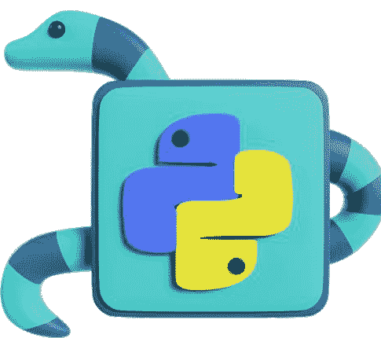

快速 / 深入 / 简洁

版本 1.0

# 关于作者

你好 👋


我叫 Behnam Khani，你可以叫我 Beh。我是一名拥有10年行业经验的软件工程师。我对技术、教育和软件开发充满热情，并乐于将这三者结合起来。

这本书和我的网站 [dejavucode.com](https://dejavucode.com) 是我分享知识和经验的地方！

✉️ **admin@dejavucode.com**

# 版权声明与条款

版权所有 © 2023 [dejavucode.com](https://dejavucode.com) 保留所有权利。

未经作者许可，不得以任何形式复制、分发或出版本书的任何部分。

在编写这本电子书时，我们已尽一切努力确保所呈现信息的准确性。但是，出版商和作者对本书内容的准确性或完整性不作任何陈述或保证，并明确否认所有保证。此外，出版商和作者对因使用本书所含信息而造成的任何损害不承担责任。

首次出版：2023年9月

# 目录

- 关于作者
- 版权声明与条款
- **关于 Python 的重要事实**
    - 什么是编程语言？
    - Python 能为我们提供什么？
    - 是什么让 Python 如此强大？
    - 最流行的 Python 库和框架
    - 学习一切的最佳书籍 | 课程 | 训练营
    - 这本书能为你提供什么？
    - 如何成为一名专业的 Python 开发者？
- **软件要求**
    - 我使用的操作系统重要吗？
    - 人们用什么计算机程序来编写代码？
    - PyCharm
- **编写你的第一个 Python 程序**
    - 在控制台打印你的文本
    - 从用户那里获取输入
    - Python 区分大小写
    - 定义变量的重要注意事项
    - 更新变量
    - 为我们的程序添加注释
    - 更有意义的 `input()` 函数
    - Python 中的表达式
    - Python 如何执行我们的代码？
    - Python 变量练习
- **Python 中的数据类型**
    - 字符串数据类型
    - `type()` 函数
    - 整数
    - 类型转换
    - 类型转换
    - 将布尔值转换为整数
    - 使用 `format()` 函数进行拼接
    - 浮点数数据类型
    - 数字四舍五入
    - 布尔数据类型
    - Python 数据类型练习
- **Python 中的运算符**
    - 算术运算符
    - 赋值运算符
    - 比较运算符
    - 布尔（逻辑）运算符
    - 理解运算符优先级
    - Python 运算符练习
- **Python 中重要的内置函数**
    - 处理字符串的重要函数
    - `len()` 函数
    - `lower()` 和 `upper()` 函数
    - `find()` 函数
- **条件执行**
    - `if` 语句
    - `else` 部分
    - 多重条件
    - 内部条件
    - 使用布尔运算符组合条件
    - Python 条件语句练习
- **编写你自己的函数**
    - 编写你的第一个函数
    - 从函数返回值
    - 向函数传递参数
    - 关于函数的回顾
    - 局部作用域与全局作用域
    - 专业技巧

Python 自定义函数练习

## Python 中的数据结构

Python 中的列表数据结构

- 列表索引
- 向列表添加新项目
- 向列表追加新项目
- 从列表中移除项目
- 更新列表中的现有项目
- 清空列表
- 对列表项目进行排序
- 统计列表中某个项目的出现次数
- 获取列表的长度
- in 关键字
- Python 中的列表切片
- 使用列表推导式复制列表
- 过滤列表
- Python 中的列表的列表
- 字符串类似于字符列表

Python 中的元组

Python 中的集合

Python 中的字典

- 向字典添加或更新新项目
- 字典推导式
- 其他字典实用函数

Python 中的数组数据结构

Pandas 和 NumPy

同构与异构

序列类型转换

Python 列表练习

## Python 中的循环

- 重复执行代码
- For 循环
- range() 函数
- 使用 While 循环执行代码直到条件为真
- 遍历值的集合
- 遍历列表
- 遍历元组
- 遍历列表的列表
- 遍历集合
- 遍历字典
- Python 的 Break 和 Continue
- 中断循环
- 继续循环
- Pass 语句
- 使用序列从函数返回多个值
- Python 循环练习
- 下一步是什么？

## 第 1 节

### 关于 Python 的重要事实

在我们深入学习 Python 语言之前，让我先回答一些关于 Python 和编程语言的常见问题。正确理解 Python 是什么，可以为我们节省大量的时间和金钱。

### 什么是编程语言？

要告诉像计算机这样的数字设备做什么，我们需要编程语言。假设我们有一些数据，需要让计算机处理这些数据并为我们准备一份报告。

目前，我们无法使用英语等人类语言向计算机表达我们的意愿。相反，我们必须使用像 Python 这样的编程语言，这是计算机能够理解的。

通过使用编程语言，我们能够编写程序来指导计算机如何处理数据以及生成何种报告。

### Python 能为我们提供什么？

Python 是一门简单的编程语言，任何年龄的人都可以学习。但同时，Python 也是一门多用途编程语言，应用范围广泛，包括：

- Web 开发
- 桌面开发
- 数据分析
- 数据可视化
- 机器学习和人工智能
- 游戏开发
- 任务自动化和日常任务
- 以及更多

此外，如果你想找一门容易上手的语言作为入门，Python 是首选。对于编程新手来说，它非常容易理解。

### 是什么让 Python 如此强大？

Python 如此强大和广泛的原因之一是它拥有大量的库和框架。编程库是预先编写好的代码集合，可以让我们免去重复造轮子的需要。

例如，在数据分析程序中，我们用数字、图形和图表来展示结果，因为数据可视化比纯文本数字能更好地表达结果。要可视化结果，我们有两个选择：

1.  **重复造轮子：** 在这种情况下，我们必须从头开始编写所有内容。这意味着我们必须编写数千行代码来可视化数据。因此，我们需要花费大量的时间和金钱。
2.  **使用库：** 或者我们可以简单地使用其他公司或个人编写的现有库。在这种情况下，他们已经编写了绘制图表和图形的所有细节。我们只需要在程序中用几行代码使用这个库，而无需担心任何错误和缺陷！

因此，我们通常需要将 Python 与库结合使用，以最优化的方式编写程序。

此外，框架在某些方面与库类似。框架是一组通常由其他公司或个人编写的代码，可用于定义我们程序的结构和骨架。

所以，库和框架都是由其他开发者或公司预先编写的代码，我们使用它们来节省时间和金钱。

### 最流行的 Python 库和框架

市面上有很多库和框架。但大多数开发者和公司通常使用：

- Python + Django 来开发安全且可维护的网站
- Python + Tkinter 或 PyQt 来开发图形用户界面或 GUI 应用程序
- Python + Pandas 用于数据科学
- Python + Matplotlib 用于数据可视化
- Python + NumPy 用于人工智能和机器学习
- Python + Pygame 来创建视频游戏
- Python + Requests 或 CSV 或 APScheduler 或 Selenium 以及许多其他库用于任务自动化

### 最佳书籍 | 课程 | 训练营以学习一切

尽管 Python 有很多库和框架，但你不需要学习所有这些！

换句话说，一个人同时成为 Web 开发者、软件开发者、游戏开发者、AI 开发者或数据科学开发者是没有意义的！相反，我们应该成为其中一两个领域的专家。

因此，没有一本书、一门课程或一个训练营能涵盖 Python 的所有内容。相反，任何想进入这个领域的人都必须做两件事：

1.  学习 Python 编程语言
2.  学习与其选择相关的库和框架

例如，如果你想成为一名数据科学家开发者，你必须学习 Python 语言以及像 NumPy 这样的库。

### 这本书能为你提供什么？

因此，在本书中，你将对 Python 编程语言的基础有深入的理解。在学习了 Python 的基本概念之后，你可以选择你想要的领域，并根据你的决定，选择另一本专门教授你特定库或课程的书籍。*这就是为什么我们有很多资源，每个资源都针对 Python 中的一个特定领域。* 以下是仅由 Apress 出版的关于 Python 及其相关库和框架的书籍列表：

### 如何成为一名专业的 Python 开发者？

总而言之，成为一名专业 Python 开发者的最佳方式是首先学习和理解 Python 的基础概念。之后，专注于你最喜欢的领域（库和框架）。不要急于求成，只需专注于正确地学习 Python 编程语言。这就是我们将在本书中要做的。

# 第 2 部分

## 软件要求

### 我使用的操作系统重要吗？

幸运的是，我们可以使用 Windows、Linux 或 Mac。但是，也可以使用 Android 或 iOS 设备来编写 Python 程序，但我不推荐这样做。

### 人们使用什么计算机程序来编写代码？

对于初学者来说，最简单的选择是使用在线 Python IDE（集成开发环境）。IDE 是一个集成了多种软件开发工具的程序。这些工具帮助我们编写、测试和调试（查找错误）程序。由于我们想编写 Python 程序，所以我们需要一个 IDE 来实现这个目的。

有很多在线 IDE 和代码编辑器可用于 Python 开发，比如 [replit](https://replit.com/)。使用这些在线工具可以让你免去安装工具的麻烦。你只需要输入你的 Python 代码，然后点击运行按钮：

还有其他在线 IDE 和代码编辑器，比如 [Online Python](https://www.online-python.com/)。

### PyCharm

如果你需要一个成熟且配置良好的 IDE 来进行 Python 开发，那么 PyCharm 将是你的选择。PyCharm 是一个免费的代码编辑器，可在你喜爱的平台上使用——Windows、macOS 和 Linux。

# 第 3 部分

## 编写你的第一个 Python 程序

### 在控制台中打印你的文本

让我们编写你的第一个 Python 程序。我们想在控制台中打印一段文本，比如 "Hello to Python!"。为此，请输入小写的 **print()**，加上括号 **()**，在这些括号内添加两个双引号 “” 或两个单引号 ‘ ’，然后输入你想要打印的内容：

现在运行这个程序。它会在控制台中打印出 "Hello to Python!"：

控制台是一种计算机终端，我们可以在其中以文本格式查看程序的输出。为了简单起见，我们使用控制台，以便专注于 Python 的核心概念。

然而，在学习 Python 之后，你可以学习像 Tkinter 这样的库来创建 GUI（图形用户界面）程序。这些程序使用按钮、菜单或列表框等小部件，而不是简单的文本。

因此，我们可以通过使用名为 **print()** 的函数在控制台中打印或显示文本。

Python 中有许多函数，每个函数都有其特定的用途。我稍后会详细讨论。但现在，你只需要知道 Python 拥有自己名为标准库的库集合。Python 标准库包含多个库，每个库都包含大量函数，例如 **print()** 函数。

在 Python 中，函数是由你或其他开发者编写的、用于执行特定任务的代码块。函数为我们的程序提供了更好的模块化。

因此，我们有一个 **print()** 函数，它接收一段文本并将其打印到控制台。在编程术语中，我们称文本为字符串。Python 中的字符串包含在一对单引号 `"` 或双引号 `""` 中。字符串可以包含任何字符，包括数字、空格和特殊字符（如 @）：

```
email = 'email@gmail.com'
```

我们可以根据需要多次使用像 print() 这样的函数：

该程序的输出是：

如你所见，Python 从上到下逐行执行代码。

### 从用户获取输入

在前面的程序中，你了解了 `print()` 函数。我们可以用它在控制台打印文本消息。但有时我们需要从用户那里获取值。例如，我们需要用户输入他的名字，然后根据这个名字打印一条消息。

要获取用户输入，我们需要使用一个名为 `input()` 的函数。input 函数是 Python 标准库的一部分。让我们编写一个 Python 程序来从我们这里获取一个值。输入 `input`，加上一对圆括号 `()`，然后运行代码：

```
input()
```

现在，当我们运行这段代码时，`input()` 函数会等待用户输入一些文本。它告诉 Python 解释器暂停并等待用户通过键盘输入文本：

input() 函数等待我们输入一个值

因此，在控制台中输入一个值，例如输入你的名字，然后按回车键：

input() 函数的结果就是我们输入的字符串。但我们必须将这个 input() 函数的结果保存在某个地方以备后用。为此，我们需要使用一个变量。我们在程序中使用变量来记住信息。可以把变量想象成一个容器，它可以容纳一个值，并且上面有一个标签。所以，一个变量有一个值和一个名字。每当我们需要给变量赋值或获取其值时，只需调用它的名字即可。
让我们定义一个名为 userName 的变量。我们可以使用多个单词来定义变量名，但不能有空格：

定义变量后，我们使用 =（赋值运算符）来保存一个值：

```
userName = 'Jennifer'
```

现在，值 'Jennifer' 被存储在 **userName** 变量中。我们也可以像这样将 **input()** 函数的结果保存到 **userName** 变量中：

```
userName = input()
```

现在，当我们运行程序并输入一个值，然后按回车键时，Python 会将输入的值赋给 **userName** 变量。然后我们可以使用 **print()** 函数打印这个变量的内容：

```
userName = input()
print(userName)
```

当我们运行它时，**print()** 函数会在控制台打印 **userName** 变量的内容：

如你所知，`print()` 函数需要一个字符串来打印。在编程术语中，我们称之为参数。参数是我们向函数提供更多信息的一种方式。我们将参数放在函数的圆括号之间。有时函数可以在没有任何参数的情况下工作，比如 `input()`。然而，input 函数可以接受一个字符串作为参数，我稍后会谈到这一点：

换句话说，`print()` 函数需要一个字符串来显示在控制台中。有时我们通过使用单引号来提供这个参数，有时我们从像 `input()` 这样的函数获取一个字符串，然后将 `input()` 函数的结果传递给 `print()` 函数。

### Python 区分大小写

Python 是一种区分大小写的编程语言。这意味着 Python 对大写和小写字母的处理是不同的。因此，它区分大写和小写的变量：

第 2 行生成了一条错误消息。因为 username 变量在我们的程序中不存在

如你所见，它在 `username` 下方画了红色波浪线。这对我们来说是一种错误消息。这条错误消息表明我们没有一个名为 `username`（全小写字母）的变量

### 定义变量的重要注意事项

在选择变量名时，请记住以下几点：

- 变量名是任意的，例如我们可以选择 t 作为变量名来保存温度，但变量名应该是描述性的且有意义的。因为，当我们稍后在代码中看到变量名时，不必去回忆它之前几行包含的内容，名字应该能揭示该变量的用途。
此外，当其他开发者阅读你的代码时，一个有意义的名字可以帮助他们更快地猜测该变量的用途并理解代码。

- 另外，如果我们想为变量选择多个单词，我们不能使用空格。相反，我们可以使用以下两种约定之一：
    - 驼峰命名法：在这种约定中，每个单词的首字母大写，但第一个单词除外，例如 userName。
    - 蛇形命名法：在这种约定中，每个单词的所有字母都是小写，并且每个单词之间用下划线分隔，例如 user_name。蛇形命名法在 Python 中更常用。
- 变量名只能包含字母数字字符和下划线（A-z、0-9 和 _），并且以字母或下划线字符开头。我们通常在变量名中使用数字来定义相互关联的变量。例如，如果我们需要将三个温度赋给三个变量，我们可以这样定义变量：

```
temp_1 = 24
temp_2 = 27
temp_3 = 28
```

### 更新变量

一个变量一次只能保存一个值。有时在程序执行过程中，我们需要更新变量的值。为此，我们可以使用 =（赋值运算符）：

```
company = 'IBM'
company = 'Google'
print(company)
```

```
Google
```

因此，我们可以通过重新赋值来简单地更新一个变量。这个新值可以是另一个变量的值。例如，我们可以将 `default_login_status` 变量的值赋给 `user_status` 变量：

### 为我们的程序添加注释

注释是提供关于我们代码信息的文本说明或描述。换句话说，通过使用注释，我们可以记录代码是如何工作的。

注释是不可执行的。换句话说，Python 解释器不关心它们，也不会执行它们。我们使用井号 `#` 来注释单行。例如，我们可以像这样为前面程序的每一行添加注释：

### 更有意义的 input() 函数

如前所述，我们也可以为 `input()` 函数提供一个参数。这样，我们的用户就知道他应该输入什么。我们像这样修改代码：

> 这个字符串是我们为 input() 函数提供的参数值

当我们运行程序时，它将显示一条消息并要求我们输入名字：

现在我们的程序对用户更友好了。

### Python 中的表达式

有时我们需要组合多个值来创建一个新值。我们称之为表达式。例如，我们可以连接两个字符串来创建一个新字符串。在这个例子中，我们将 **'Direction:'** 与 **'Top'** 连接起来，创建了一个新字符串 **'Direction:Top'**。

```
message = 'Direction:' + 'Top'
print(message)
```

所以，这个：

```
'Direction:' + 'Top'
```

就是一个表达式。在这个表达式中，我们使用了 +（加号）运算符来连接这两个字符串。

在表达式中，我们也可以使用变量。在这个例子中，我们有一个表达式，它将字符串‘Direction’与变量**direction**中的值连接起来：

```python
direction = 'Top'

message = 'Direction:' + direction

print(message)
```

我们甚至可以直接将表达式传递给**print()**函数：

```python
direction = 'Top'

print('Direction:' + direction)
```

现在，让我们使用一个表达式，以更用户友好的方式打印**userName**。为此，请像这样修改代码：

```python
### 从用户那里获取一个值
userName = input('Please enter your name:')

### 打印userName中的任何内容
print('Name :' + userName)
```

因此，当我输入我的名字并按回车键时，它会打印括号内的表达式。

### Python如何执行我们的代码？

那么，当我们点击运行按钮时会发生什么？点击运行按钮后，我们的代码被交给一个编译器。Python编译器读取代码并将其转换为称为二进制的机器码。因为计算机（CPU）只理解二进制语言。

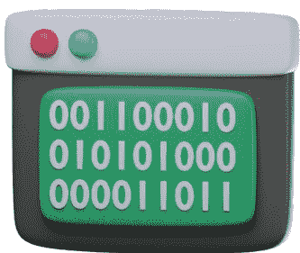

事实上，整个代码将被转换为零和一。这是CPU能够理解和执行的内容。换句话说，编译器就像我们的谷歌翻译。它将代码从Python转换为二进制。

*当我们的代码被编译后，计算机（CPU）就可以读取、理解和执行它了。* 这个执行过程是通过Python解释器完成的。最后，这个解释器逐行执行二进制代码：

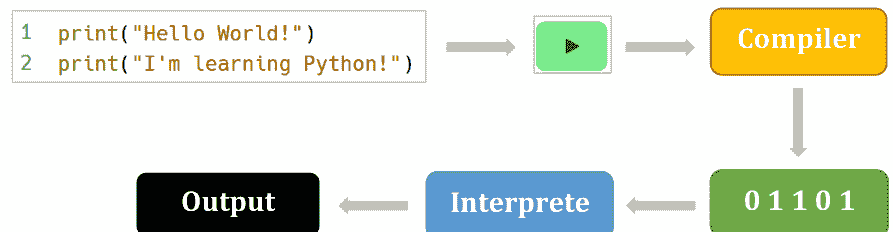

### Python变量练习

准备好提升你的Python技能了吗？深入到一个动手学习的世界，这里有我为你精心设计的练习。

既然你可以将知识付诸实践，为什么只是阅读关于Python的内容呢？这些练习旨在巩固你对关键概念的理解，提高你解决问题的能力，并激发你的创造力。

记住，熟能生巧。通过积极参与这些练习，你不仅能建立熟练度，还能培养强大的编程思维。拥抱发现的兴奋，尝试不同的方法，并释放Python的真正潜力。

不要只做一个被动的读者——要做一个主动的学习者！


- [Python变量练习 – Dejavu Code](https://dejavu-code.com) 第1部分
- [Python变量练习 – Dejavu Code](https://dejavu-code.com) 第2部分
- [Python变量练习 – Dejavu Code](https://dejavu-code.com) 第3部分
- [Python变量练习 – Dejavu Code](https://dejavu-code.com) 第4部分

## 第4节

### Python中的数据类型

在计算机编程中，数据类型决定了变量可以具有的可能值的集合。同时，数据类型也决定了对变量允许的操作集合。

#### 字符串数据类型

到目前为止，我们一直在使用字符串数据类型。字符串是用单引号或双引号括起来的字符序列。在下面的例子中，我们有一个名为**language**的字符串类型变量，其值为**Python**：

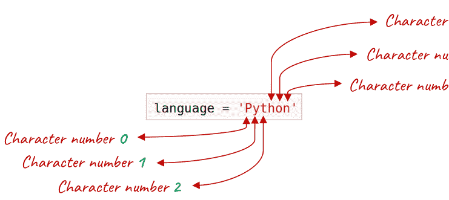

因此，**language**变量的值是**Python**，它由6个字符组成。正如你所看到的，在编程世界中，我们从零开始计数。所以，像**Python**这样的字符串有6个字符，但它从0开始计数。

#### type()函数

在Python中，我们有一个名为**type()**的函数。这个函数返回变量的类型。当我们运行以下代码时，它将在控制台中打印`<class 'str'>`。str代表字符串：

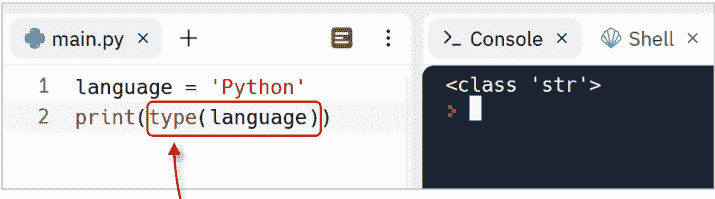

当Python解释器想要执行第2行时，它首先执行**type()**函数。正如你所看到的，**type()**函数接受一个参数。我们可以通过传递一个变量名甚至一个值来提供它的参数。然后**type()**函数返回**language**变量的类型。之后，解释器执行**print()**函数，并打印**type()**返回的内容。

换句话说，**type()**函数的结果是**print()**函数的一个参数。

让我们回到本节的主要话题：数据类型。在Python中，有5种主要的数据类型，包括序列、布尔值、字典、集合和数值：

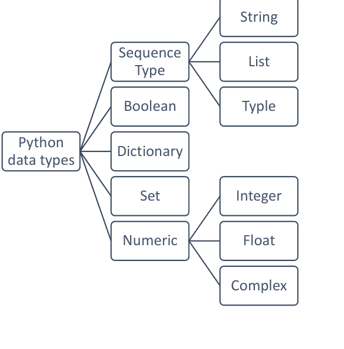

在本节中，我将讨论字符串、数值和布尔值。

#### 整数

我们继续讨论数字。在现实世界的应用程序中，我们也必须处理数字。要定义一个保存数字的变量，我们可以简单地赋值我们的数字，而无需使用单引号或双引号：

```python
bookPages = 560
```

像560这样没有小数点的数字称为整数。我们也可以有包含数字的表达式。在这个例子中，我们有一个计算账户剩余天数的表达式。我们可以使用–（减号）运算符来减去数字：

```python
remainedDays = 365 - 65

print(remainedDays)
```

**输出：**

300

这里有一个微妙之处。当我们使用`input()`函数获取一个值并输入一个数字时，返回的值总是字符串类型，即使我们输入的是一个数字：

```python
steps = input('how many steps you walked today? ')

print(type(steps))
```

让我们输入一个数字。`steps`的类型是字符串：

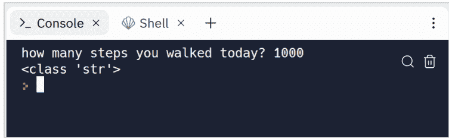

换句话说，input函数返回的是‘1000’，而不是1000。
让我们再举一个例子来解释它是如何工作的。假设我们想从用户那里获取两个数字，一个代表年数，另一个代表月数。然后我们需要将它们转换为天数：

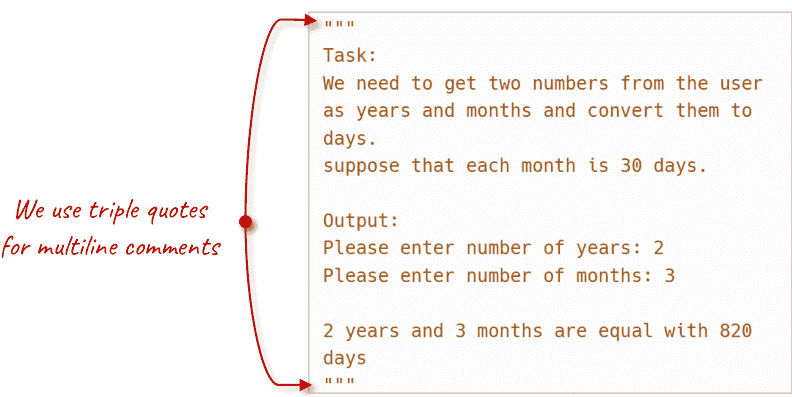

要完成这个任务，我们需要从用户那里获取两个值，对数字进行一些数学运算，然后打印最终结果：

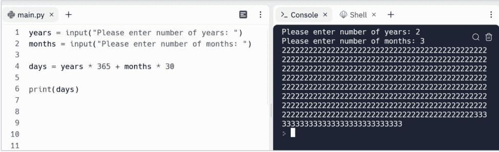

**在第1行和第2行**，我们从用户那里获取两个值

**在第4行**，我们将年转换为天，月转换为天，并将其赋值给**days**变量

**在第6行**，我们打印结果

但结果*不是*我们所期望的！

### 类型转换

前面的程序打印了365次2和30次3！原因是*input函数返回的是一个字符串*。所以，如果我们输入2作为年数，3作为月数，第4行将像这样执行：

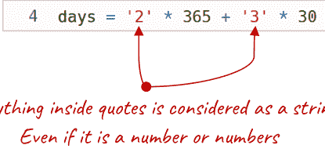

事实上，它显示了字符串“2”365次和字符串“3”30次：

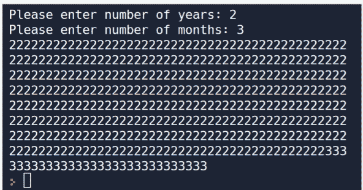

这就是为什么我们需要将字符串“2”转换为数字，将字符串“3”转换为数字。事实上，如果我们需要在数学运算中使用年和月，我们必须将它们每个都转换为数值数据类型。*要将字符串类型转换为整数数值类型*，我们必须使用`int()`函数。`int()`函数获取一个字符串类型的值，并返回一个int类型的值作为结果。在编程术语中，我们称这个操作为类型转换。所以，让我们像这样重写第4行：

```python
1  years = input("Please enter number of years: ")
2  months = input("Please enter number of months: ")
3
4  days = int(years) * 365 + int(months) * 30
5
6  print(days)
```

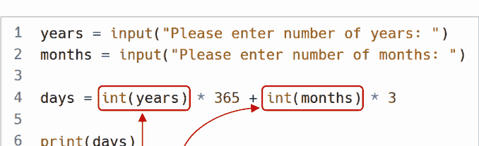

所以现在我们可以这样考虑第4行：

```python
4  days = 2 * 365 + 3 * 30
```

它首先将2乘以365，然后将3乘以30，然后将它们相加。
再次运行程序，这次它工作正确了：

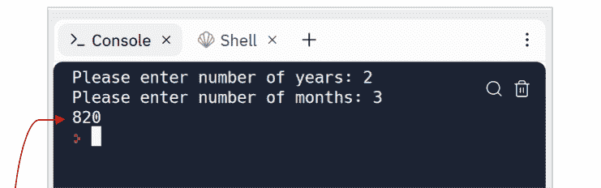

> 这样的输出只会让我们的用户感到困惑！
让我们更用户友好一些！

但我们的任务还没有完成，因为最终结果没有以有意义的方式打印出来。如前所述，我们需要这样的消息：

```
Output:
Please enter number of years: 2
Please enter number of months: 3

2 years and 3 months are equal with 820 days
```

为此，我们可以定义另一个名为**result**的变量，并通过将这些数字与一些字符串连接起来创建一个有意义的消息：

python
years = input("请输入年数：")
months = input("请输入月数：")

days = int(years) * 365 + int(months) * 30

result = years + " 年和 " + months + " 个月等于 " + days + " 天"

print(result)

但是当我们运行这个程序并输入年数和月数时，我们会得到一条错误信息：

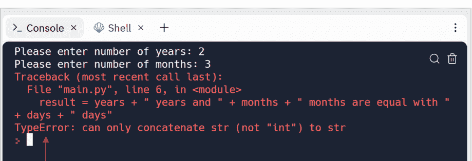

红色的行是错误信息。它告诉我们，嘿，Python 无法将一个*字符串*与一个*数字*拼接。在这种情况下，**days** 的类型是数值型。如果我们使用 **type()** 函数来获取 **days** 变量的类型：

```
python
print(type(days))
```

我们会得到类似这样的信息：

```
text
<class 'int'>
```

int 代表整数。整数是没有小数点的数字。例如，这些数字是整数：

- 100
- -50
- 0

正如我们已经看到的，错误信息是这样的：

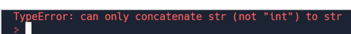

它说：只能将 str（不是“int”）与 str 拼接。Python 试图告诉我们，它无法将字符串与整数拼接。
解决方案是使用 `str()` 函数将整数转换为字符串。`str()` 函数接受一个数字作为参数，并将其转换为字符串：

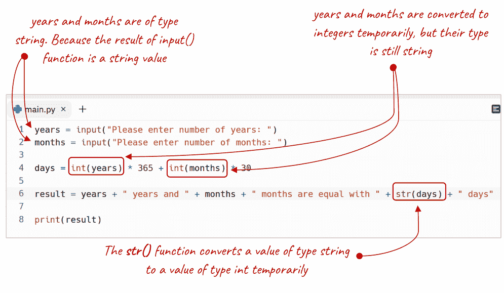

```
请输入年数：2
请输入月数：3
2 年和 3 个月等于 820 天
```

我们也可以使用 float() 函数将整数转换为浮点数：

```
price = 12

price = float(price)

print(price)
```

如果你需要精确控制小数部分，例如，你需要保留两位小数，那么请使用 format() 函数：

```
price = 12

price = '{:.2f}'.format(price)

print(price)
```

### 类型转换

到目前为止，你已经学习了一个名为类型转换的概念，它允许我们使用像 int() 或 str() 这样的函数来转换类型。


Python 中还有另一个概念叫做类型转换。在类型转换中，Python 会自动将一种数据类型转换为另一种数据类型。


在这个例子中，Python 为了执行加法运算，临时将 price 的数据类型从整数自动转换为浮点数：

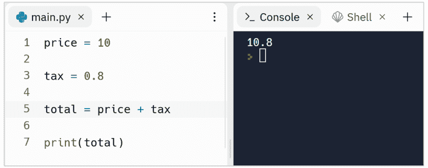

### 将布尔值转换为整数

我们也可以将布尔值转换为整数值。这在我们需要将布尔值存储到数据库时非常有用。当我们把 True 值转换为整数时，它返回 1；当我们把 False 值转换为整数时，它返回 0：

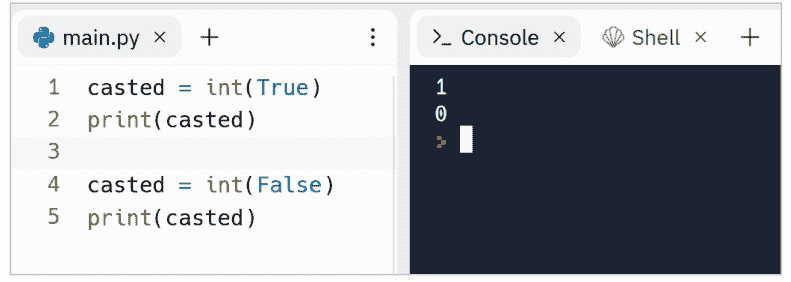

使用 `bool()` 函数，我们可以将整数转换为布尔值。这个函数对 0 返回 False，对任何非零数字返回 True：

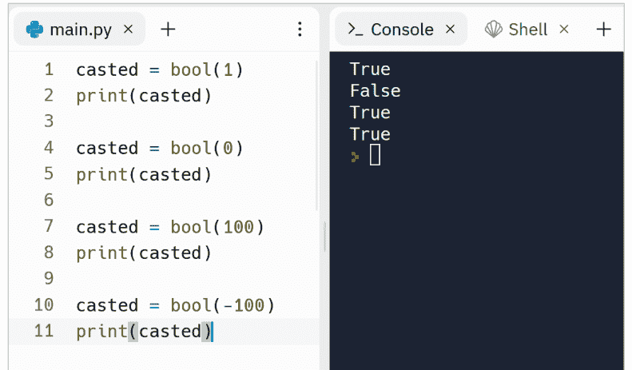

### 使用 format() 函数进行拼接

我们也可以使用 **format()** 函数来执行字符串拼接。这个函数帮助我们以一种简洁的方式进行字符串拼接：

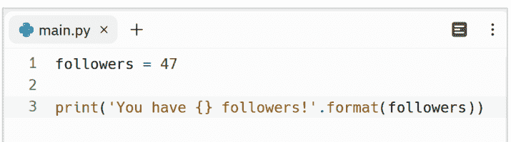

**format()** 函数用 **followers** 变量的值替换了 {} 占位符。

**format()** 函数有一种更简短的形式。在这种形式中，我们可以在字符串前放一个 **f**，并将变量放入占位符中：

```
python
followers = 47

print(f'你有 {followers} 个关注者！')
```

我们可以将 **format()** 函数的结果保存在一个变量中，并在后续行中使用它：

```
python
followers = 47

result = f'你有 {followers} 个关注者！'

print(result)
```

我们甚至可以使用表达式而不是变量：

```
python
online_users = 7
all_users = 100

print(f'{all_users - online_users} 个用户离线！')
```

输出是：

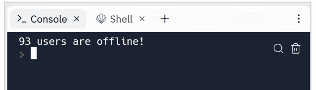

如果我们需要在字符串中使用多个变量，那么我们可以使用多个占位符：

```
python
online_users = 7
all_users = 100

print(f'{online_users} 个 {all_users} 用户在线！')
```

另外，这是 **format()** 函数的另一种形式：

```
python
online_users = 7
all_users = 100

print('{} 个 {} 用户在线！'.format(online_users, all_users))
```

输出是：

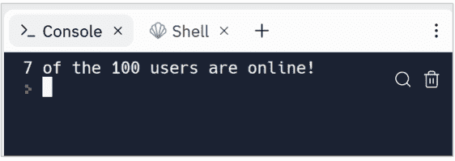

让我们使用 **format()** 函数重写年份转换器的例子：

```
python
years = input("请输入年数：")
months = input("请输入月数：")

days = int(years) * 365 + int(months) * 30

result = "{} 年和 {} 个月等于 {} 天".format(years, months, days)

print(result)
```

所以，我们只需要使用 `{}` 放置占位符，并将变量传递给 **format()** 函数来替换占位符。
**format()** 函数相比使用 **+**（加号）运算符有以下优势：

- 它更具可读性
- 它不需要任何类型转换

### 浮点数据类型

这种数据类型用于创建保存浮点数的变量，例如：

- **3.14**
- **0.02**
- **100.00**

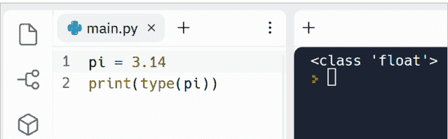

如你所见，**pi** 变量是浮点类型。
关于浮点数的另一点是，如果一个字符串包含浮点数，我们可以使用 **float()** 函数将字符串转换为浮点数：

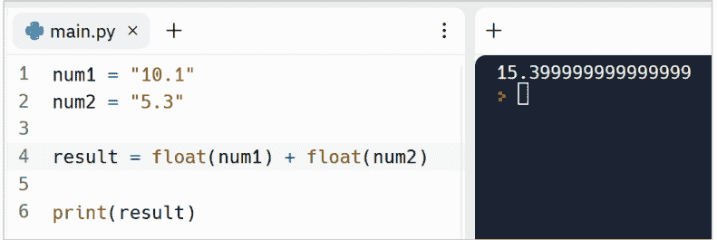

但我们期望的是 15.4，而不是 15.399999999999999！这是怎么回事？🤔

### 数字舍入

这是计算机编程中的一个常见问题。因为浮点值没有精确的二进制表示。这就是为什么我们可能会遇到精度损失和意外结果。
为了解决这个问题，我们需要像这样使用 **format()** 函数：

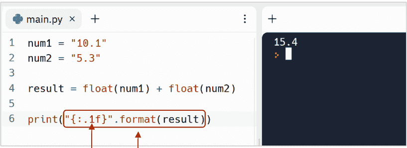

这个函数用占位符 {} 替换结果。但在替换之前，它会使用我们在花括号内定义的格式来格式化数字。在这种情况下，我们定义了只显示一位小数的格式。

所以 **format()** 函数对我们有两个用途：

- 拼接字符串
- 格式化数字

### 布尔数据类型

到目前为止，你已经学习了字符串和整数数据类型。现在让我们来谈谈布尔数据类型。Python 中有另一种数据类型叫做布尔。布尔类型的变量只能接受两个可能的值，True 或 False，不带引号。我们使用这种数据类型来保存两种状态的情况，例如：

```
python
eligible_to_vote = False

is_load_completed = True
```

再举一个例子，假设我们要从用户那里获取两个数字，并检查它们是否相等。我们使用等于 ==（等于）运算符来检查这种相等性。所以首先，让我们使用 **input()** 函数获取两个数字：

```
python
num1 = input("请输入第一个数字：")
num2 = input("请输入第二个数字：")
```

现在，让我们检查这两个变量是否相等，然后打印结果。注意，我们需要将 **num1** 和 **num2** 转换为整数，然后使用 **==** 运算符进行比较：

```
python
num1 = input("请输入第一个数字：")
num2 = input("请输入第二个数字：")

areEqual = int(num1) == int(num2)

print(areEqual)
```

当我们运行这段代码，并输入两个相等的数字时，我们会得到 True：

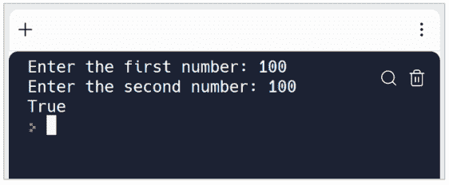

当我们输入两个不同的数字时，我们会得到 False：

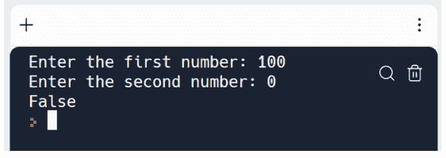

我们可以使用 not 运算符来反转布尔值。换句话说，not 使 True 变为 False，使 False 变为 True：

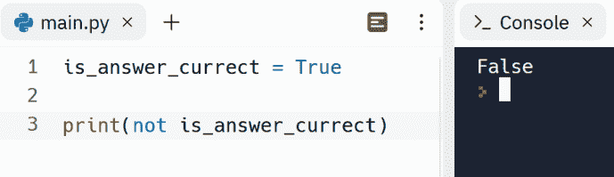

在接下来的章节中，你将看到 ==（等于）运算符和其他比较运算符如何帮助我们根据条件运行代码。

### Python 数据类型练习

准备好提升你的 Python 技能了吗？深入我为你精心设计的实践学习世界。

为什么只是阅读 Python，而不将你的知识付诸实践呢？这些练习旨在巩固你对关键概念的理解，提高你解决问题的能力，并激发你的创造力。

记住，熟能生巧。通过积极参与这些练习，你不仅能建立熟练度，还能培养强大的编程思维。拥抱发现的兴奋，尝试不同的方法，释放 Python 的真正潜力。

不要只做一个被动的读者——做一个主动的学习者！


- [Python 数据类型练习 – Dejavu Code](https://example.com) 第 1 部分
- [Python 数据类型练习 – Dejavu Code](https://example.com) 第 2 部分
- [Python 数据类型练习 – Dejavu Code](https://example.com) 第 3 部分
- [Python 数据类型练习 – Dejavu Code](https://example.com) 第 4 部分

## 第5节

### Python中的运算符

在数学和计算机编程中，运算符是执行特定操作的符号或字符。Python中的重要运算符包括：

- 算术运算符
- 赋值运算符
- 比较运算符
- 布尔（逻辑）运算符

#### 算术运算符

有时我们需要在程序中执行算术计算。为此，我们使用这些常用的算术运算符：

| 运算符 | 描述 | 示例 |
| :--- | :--- | :--- |
| + | 加法 | 10 + 5 = 15 |
| - | 减法 | 10 – 5 = 5 |
| * | 乘法 | 10 * 5 = 50 |
| / | 除法 | 10 / 5 = 2.0 |
| % | 取模。此运算符返回余数。 | 10 % 5 = 0 |
| ** | 幂运算 | 2 ** 3 = 8 |

每个算术运算符需要两个操作数。运算符操作的值称为操作数：

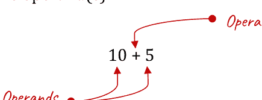

让我们看看实际运行结果：

```python
addition = 10 + 5
subtraction = 10 - 5
multiplication = 10 * 5
division = 10 / 5
modulus = 10 % 5
exponentiation = 2 ** 3

print("Addition: " + str(addition))
print("Subtraction: " + str(subtraction))
print("Multiplication: " + str(multiplication))
print("Division: " + str(division))
print("Modulus: " + str(modulus))
print("Exponentiation: " + str(exponentiation))
```

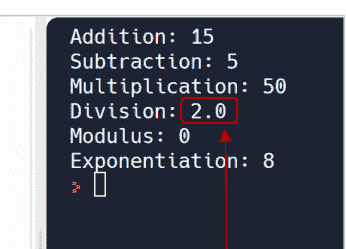

除法运算符的返回值类型是浮点数。

关于这段代码有两点说明：

1. 算术运算符的返回值是数值类型。这就是为什么我们使用`str()`函数来打印每个计算的结果。
2. 除法运算符的返回值是浮点数类型。然而，我们可能不需要显示小数部分。

要移除小数部分，我们可以简单地使用一个名为`trunc()`的函数，它是math类的一部分。由于math模块在我们的代码中默认不可用，我们必须先导入它（在第1行）：

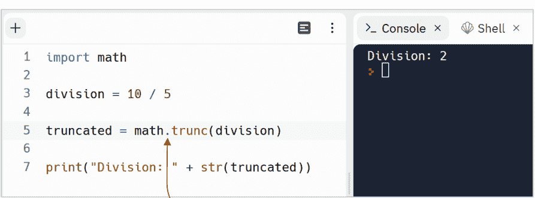

让我们解释每一行发生了什么：

**在第1行**，我们将math模块导入到我们的程序中。换句话说，`trunc()`函数位于一个名为math的模块中，该模块默认在我们的程序中不可用。所以我们需要先将math模块导入到我们的Python程序中，然后才能访问`trunc()`函数。

**在第3行**，我们将10除以5，并将结果赋值给一个名为`division`的变量。

**在第5行**，我们使用math模块中的`trunc()`函数来截断division变量的整数部分。

**在第7行**，我们将`truncated`变量转换为字符串，以便可以与字符串"Division: "进行拼接。

现在你可能会问什么是模块？在Python中，模块就像一个包含函数的库。例如，math模块提供了包含数学函数的函数。正如你在第1行看到的，要访问模块的函数，我们需要将其导入到我们的程序中。之后，我们就可以访问该模块内部的函数了。*要调用模块内部的函数，我们必须在模块名称后使用一个点。*

#### 赋值运算符

你已经知道`=`（赋值运算符）是如何工作的。它将一个值赋给一个变量以供后续使用：

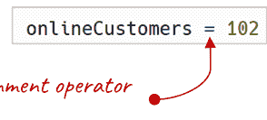

然而，有时我们需要用一个新值重新赋值给一个变量：

```python
onlineCustomers = 102

onlineCustomers = onlineCustomers + 3
```

Python提供了赋值运算符。因此，我们可以简单地使用`+=`运算符将3加到**onlineCustomers**上，而无需重复书写：

```python
onlineCustomers = 102

onlineCustomers += 3
```

让我们看看Python中常见的赋值运算符：

| 运算符 | 示例 | 等同于 |
| :--- | :--- | :--- |
| = | x = 10 | x = 10 |
| += | x += 2 | x = x + 2 |
| -= | x -= 2 | x = x - 2 |
| *= | x *= 2 | x = x * 2 |
| /= | x /= 2 | x = x / 2 |
| %= | x %= 2 | x = x % 2 |

正如你所见，每个赋值运算符和算术运算符一样，需要两个操作数才能工作。

#### 比较运算符

比较运算符比较两个值（操作数）并计算出一个布尔结果，True或False。你已经见过==（等于）运算符：

```python
myShoeSize = 43

shoeSize = 43

isShoeFit = myShoeSize == shoeSize
```

> 等于==运算符计算出一个布尔结果。在这个例子中，结果是True。

在Python中，还有其他比较运算符：

| 运算符 | 含义 | 示例 | 结果 |
| :--- | :--- | :--- | :--- |
| == | 等于 | 10 == 10 | True |
| != | 不等于 | 10 != 10 | False |
| < | 小于 | 10 < 10 | False |
| > | 大于 | 10 > 10 | False |
| <= | 小于或等于 | 10 <= 10 | True |
| >= | 大于或等于 | 10 >= 10 | True |

当操作数（两边的值）相同时，!=（不等于）运算符的结果为False。

关于比较运算符的另一点是，操作数可以是数字、字符串或布尔值。你已经看到比较运算符如何与数字一起工作。让我们看看它们如何与字符串一起工作。

当操作数是字符串类型时，比较运算符会逐个字符地比较操作数（字符串）：

```python
password = "aBc"
confirmedPassword = "aBc"

arePassSame = password == confirmedPassword

print(arePassSame)
```

**arePassSame**的结果是True，因为两个操作数相同。换句话说：

```python
password = "aBc"
confirmedPassword = "aBc"
```

‘a’ 等于 ‘a’
并且 ‘B’ 等于 ‘B’
并且 ‘c’ 等于 ‘c’

所以，当所有字符都相同时，最终结果是True。否则，结果是False。例如，在这个例子中，因为‘c’不等于‘d’，所以结果是False：

```python
password = "aBc"
confirmedPassword = "aBd"

arePassSame = password == confirmedPassword

print(arePassSame)
```

False

即使是下面的程序也会打印False，因为‘B’不等于‘b’，Python是一门*区分大小写*的编程语言：

```python
password = "aBc"
confirmedPassword = "abc"

arePassSame = password == confirmedPassword

print(arePassSame)
```

False

所以，比较运算符是逐个字符地比较字符串的。

#### 布尔（逻辑）运算符

有时我们有布尔值需要比较。为此，我们通常使用这两个布尔运算符：

- and
- or

布尔运算符返回True或False。

| 运算符 | 描述 |
| :--- | :--- |
| **and** | 如果两个操作数都为True，则计算结果为True |
| **or** | 即使其中一个操作数为True，计算结果也为True |

and运算符接受两个布尔值或表达式，如果两个操作数都为True，则计算结果为True。否则，它返回False：

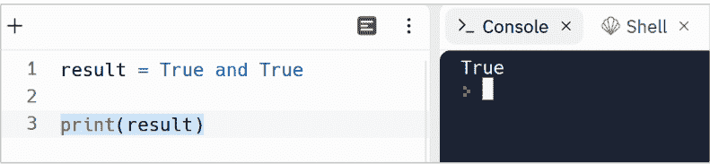

请注意，布尔运算符也可以与表达式一起使用。*表达式是操作数和运算符的组合：*

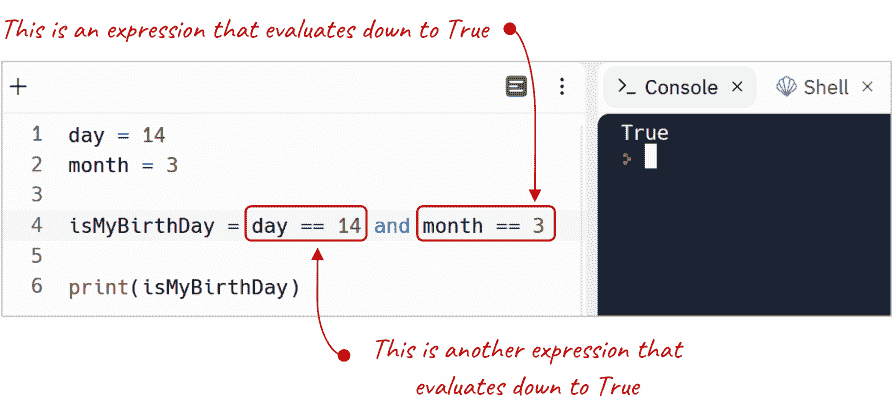

or运算符接受两个布尔值或表达式，如果两个操作数都为False，则计算结果为False。否则，它返回True：

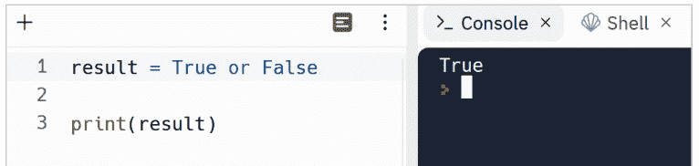

#### 理解运算符优先级

在只有一个运算符和两个操作数的简单表达式中，顺序并不重要。但当一个表达式中有多个运算符和操作数时，我们就必须了解一个叫做运算符优先级的概念。*这个优先级简单地定义了执行顺序。*

为了说明清楚，我请你猜测这个程序的输出：

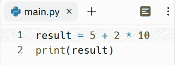

结果是25：

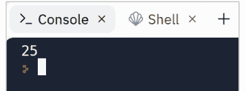

为什么？因为乘法的优先级高于加法。所以，它先计算2 * 10，然后将结果与5相加。

以下是Python中运算符的优先级顺序：

| 运算符 | 描述 |
| :--- | :--- |
| **()** | 圆括号 |
| **\*\*** | 幂运算 |
| **\*, /, //, %** | 乘法、除法、整除、取模 |
| **+, -** | 加法、减法 |
| **==, !=, >, >=, <, <=** | 比较 |
| **and** | 逻辑与 |
| **or** | 逻辑或 |

请注意，具有相同优先级的运算符具有从左到右的结合性。例如，在像这样的表达式中：

5 + 2 – 3

加法和减法具有相同的优先级。因此，它从左到右计算表达式。

另外，你可能已经注意到圆括号具有最高的优先级。我们可以利用圆括号的这个特性来简化表达式：

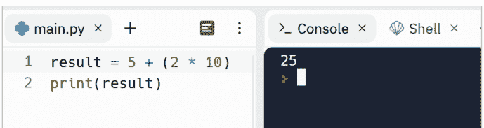

所以现在，作为人类，我们能更好地理解第1行将如何执行。

此外，我们可以使用圆括号来改变默认的优先级：

### Python 运算符练习

准备好提升你的 Python 技能了吗？深入我为你精心设计的实践练习世界吧。

既然可以将知识付诸实践，为何只是阅读 Python 呢？这些练习旨在巩固你对关键概念的理解，提升你的问题解决能力，并激发你的创造力。

记住，熟能生巧。通过积极参与这些练习，你不仅能提升熟练度，还能培养出强大的编程思维。拥抱发现的兴奋，尝试不同的方法，释放 Python 的真正潜力。

不要只做一个被动的读者——要成为一个主动的学习者！


- [Python 运算符练习 – Dejavu Code](https://example.com) 第 1 部分
- [Python 运算符练习 – Dejavu Code](https://example.com) 第 2 部分
- [Python 运算符练习 – Dejavu Code](https://example.com) 第 3 部分
- [Python 运算符练习 – Dejavu Code](https://example.com) 第 4 部分

## 第 6 节

### Python 中重要的内置函数

到目前为止，我们已经使用过像 `input()`、`print()`、`format()`、`int()` 和 `str()` 这样的函数。但 Python 中还有很多函数。让我们来谈谈 Python 中其他一些重要的函数。

#### 处理字符串的重要函数

由于字符串在 Python 中被广泛使用，我将向你介绍更多处理字符串的函数。

##### len() 函数

`len()` 是一个处理字符串的函数。假设我们需要检查一个密码是否足够强。而强密码的一个重要特征是其长度等于或大于 8 个字符。我们可以使用 `len()` 函数获取字符串的长度。在这个程序中，我们获取密码的长度并检查它是否足够强：

```python
password = input('Please enter a password: ')
passwordLength = len(password)

isPasswordStrong = passwordLength >= 8

print('Is password strong: {}'.format(isPasswordStrong))
```

**在第 1 行**，我们从用户那里获取一个密码
**在第 2 行**，我们获取密码的长度
**在第 4 行**，我们检查密码的长度是否大于或等于 8
**在第 6 行**，我们打印输出

该程序的输出如下：

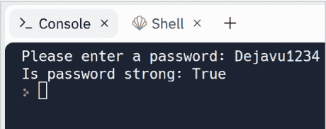

另一次使用弱密码运行的输出如下：

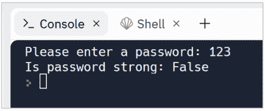

##### lower() 和 upper() 函数

其他处理字符串的有用函数是 `lower()` 和 `upper()`，它们帮助我们将字符串转换为小写或大写。假设我们需要从用户那里获取两次电子邮件地址，并检查它们是否相同。我们*不能*像这样执行此任务：

```python
email = input("Please enter your email: ")
confirmedEmail = input("Please enter your email again: ")

areEmailsTheSame = email == confirmedEmail

print("Are emails the same: {}".format(areEmailsTheSame))
```

你可以思考一下这段代码。为什么这段代码不能满足我们的需求？
因为，我们的用户可能以不同的格式输入她的/他的电子邮件：
email@gmail.com
Email@gmail.com
Email@Gmail.com
而且我们知道，Python 是区分大小写的。所以，Python 将这些电子邮件视为三个不同的文本：

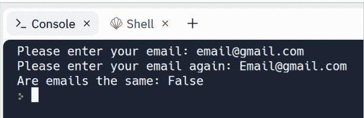

所以我们需要像 **upper()** 或 **lower()** 这样的东西来将输入转换为大写或小写，然后再检查它们是否相同：

```python
email = input("Please enter your email: ")
confirmedEmail = input("Please enter your email again: ")

areEmailsTheSame = email.lower() == confirmedEmail.lower()

print("Are emails the same: {}".format(areEmailsTheSame))
```

现在我们的程序运行正常：

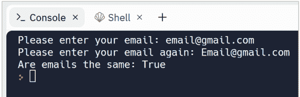

让我们看另一个直接打印 **lower()** 和 **upper()** 结果的例子：

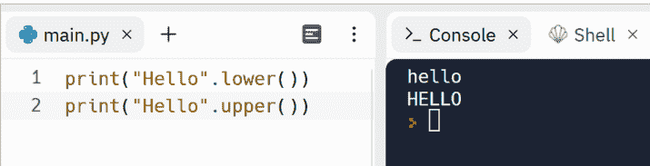

你可能已经注意到，有些函数跟在点号后面，比如 `lower()`，而有些函数像 `len()` 一样被调用。

##### find() 函数

此函数用于在字符串中搜索。此函数返回给定字符串中子字符串首次出现的索引：

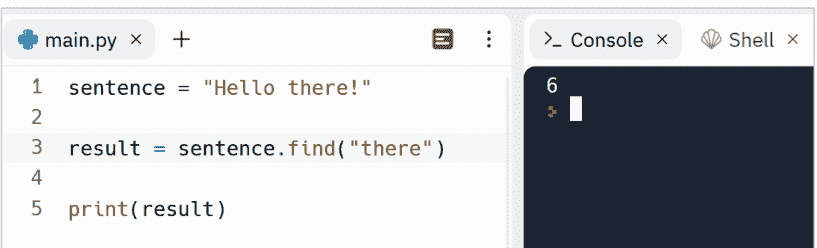

输出是 6，因为 'there' 首次出现在索引 6 处。如前所述，在 Python 中计数从零开始。
换句话说，Python 在这个字符串的第 6 个字符处找到了 'there'。
请注意，此函数区分大小写。所以，例如，它找不到 'There'，因为 T 是大写的。当它找不到任何内容时，它会返回 -1：

```python
sentence = "Hello there!"

result = sentence.find("There")

print(result)
```

```
-1
```

## 第 7 节

### 条件执行

是时候学习如何在我们的程序中做出决策了。正如你到目前为止所看到的，Python 解释器通常从上到下按顺序执行代码。但我们可以使用条件语句根据不同的条件执行不同的代码块。

#### if 语句

最简单的决策语句是 if 语句。if 是 Python 中最常见的流程控制。让我们从用户那里获取一个密码，如果它是一个强密码，那么打印 'it is a strong password'：

```python
password = input('Please enter your password: ')

if len(password) >= 8:
    print('Your password is strong!')
```

我们可以这样理解第 3 行：如果密码（变量）的长度大于或等于 8，则执行第 4 行，否则跳过第 4 行。
运行此程序两次。第一次输入一个长度大于或等于 8 个字符的密码。它将打印一条消息，说 'Your password is strong!'！

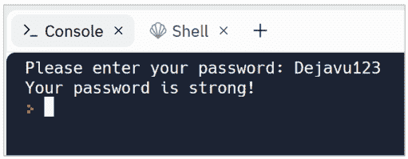

第二次，输入一个长度小于 8 个字符的密码：

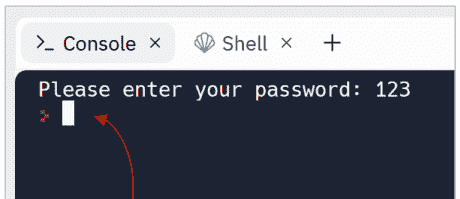

如你所见，它没有打印任何内容！
让我们回顾一下 if 语句的语法：

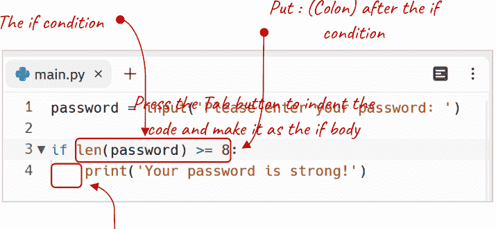

我们需要在 if 关键字后写一个条件。这个条件通常检查两个值是否相同，因此它必须返回一个布尔值，True 或 False。比较运算符包括 ==、!=、>、>=、<、<=，用于比较两个整数、浮点数、布尔值或字符串。不要忘记在条件后加上冒号。在下一行，按 Tab 键并编写你希望在条件满足时执行的代码。

当条件的结果为 True 时，它执行 if 主体。*我们可以通过缩进来标识 if 主体。主体可以是单行或多行，但必须缩进。*

当条件不满足时，Python 将执行 if 主体之后的代码。这就是为什么当我们输入一个长度小于 8 个字符的密码时，它不会打印消息。

我们可以将条件的结果保存在一个变量中，并将该变量用作条件：

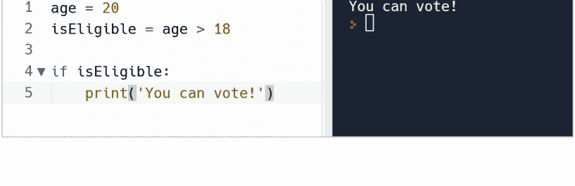

当 **isEligible** 为 True 时，它运行第 5 行，否则跳过第 5 行。
如前所述，if 主体可以是单行或多行。这是一个两行的主体：

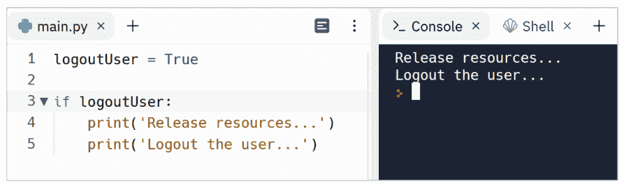

#### else 部分

else 部分是一个备选代码块，当之前的条件不为 True 时执行。假设我们需要在密码较弱时打印另一条消息。所以，像这样修改代码：

```python
password = input('Please enter your password: ')

if len(password) >= 8:
    print('Your password is strong!')

if len(password) < 8:
    print('Your password is weak!')
```

现在我们有两个 if 语句。其中一个检查密码是否大于或等于 8 个字符，并在条件满足时打印适当的消息，另一个 if 语句（在第 6 行）检查密码长度是否小于 8 个字符，如果是，则打印另一条消息。

所以，当我们运行这个程序并输入一个少于8个字符的密码时，我们会得到一个合适的提示信息，而不是什么都没有：

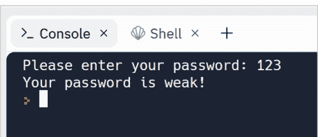

现在我们的程序对用户更友好了！因为用户知道发生了什么。但这个程序还需要一些改进。我们可以简单地使用 `else` 将两个 `if` 语句合并成一个：

```python
password = input('Please enter your password: ')

if len(password) >= 8:
    print('Your password is strong!')
else:
    print('Your password is weak!')
```

我们可以这样理解这段代码：如果条件满足，则执行 `if` 代码块（第4行），否则执行 `else` 代码块（第6行）。
当我们运行这个程序时，会得到相同的结果。但这个程序性能更好。因为它不需要检查两个条件，只检查一个条件。

### 多重条件

有时程序逻辑需要检查多个条件。在这种情况下，我们可以使用 `elif` 为 `if` 语句添加额外的条件：

```python
print('1. English')
print('2. Hindi')
print('3. Spanish')
print('4. French')

language = input('Please enter your language: ')

if language == '1':
    print('Hello!')
elif language == '2':
    print('नमस्ते!')
elif language == '3':
    print('Hola!')
elif language == '4':
    print('Bonjour!')
else:
    print('Your input is not valid!')
```

我们只能有一个 `if` 或 `else` 语句，但可以根据需要多次使用 `elif` 语句。每个 `elif` 语句仅在前面的条件都为 `False` 时执行其代码块。

在这个例子中，它检查输入的数字，并根据输入的数字显示问候信息。用户可以输入1到4之间的数字，否则会打印警告信息而不是问候语：


注意，我们需要用字符串（如 `'1'` 或 `'2'`）而不是数字（如 `1` 或 `2`）来检查用户输入。因为 `input` 函数（第6行）会返回一个字符串。所以，`language` 的类型是字符串，我们需要用另一个字符串来检查它。
另外，当所有 `if` 条件都不满足时，`else` 部分将被执行：


### 内嵌条件

此外，有时我们需要在一个 `if` 条件中检查多个条件。例如，假设我们需要像这样检查税率：

```python
print('****** TAX CALCULATOR ******')

isMarried = True
hasChildren = True

taxRate = 0

if isMarried == True:
    if hasChildren == True:
        taxRate = 32
    else:
        taxRate = 38

print('Your tax rate is: {}%'.format(taxRate))
```

这个程序的输出如下：


**在第6行**，我们定义了一个名为 **taxRate** 的变量，并暂时将其初始化为0，我们将在第10行或第12行为其重新赋一个合适的值。

**在第8行**，我们检查 **isMarried** 是否为 `True`，如果是，则（在第9行）*同时*检查 **hasChildren** 是否也为 `True`，如果是，则将 **taxRate** 设置为32。

第12行仅在第9行的条件不满足时执行。

第9行的 `if` 语句被称为内嵌 `if` 语句。

### 使用布尔运算符组合条件

我们可以使用布尔运算符（`and`, `or`）来简化前面的程序。换句话说，我们可以将第8行和第9行的 `if` 语句合并成一个 `if` 语句。为此，将程序重写如下：

```python
print('******* TAX CALCULATOR *******')

isMarried = True
hasChildren = True

taxRate = 0

if isMarried == True and hasChildren == True:
    taxRate = 32
else:
    taxRate = 38

print('Your tax rate is: {}%'.format(taxRate))
```

因此，只有当两个条件都为 `True` 时，第9行才会被执行，否则执行第11行。

这个程序的输出与前一个相同：


我们可以根据需要设置任意多的条件。在这个例子中，我们在条件中使用了三个测试：


所以，当所有条件都必须为 `True` 时，我们使用 `and`。另外，有时我们需要在任一条件为 `True` 时运行一段代码。在这种情况下，我们使用 `or` 运算符组合条件：


像 `and` 一样，我们可以根据需要使用任意多个 `or` 运算符。

我们也可以同时使用两种布尔运算符（`and`, `or`）。在这个例子中，如果 `test1` 和 `test2` 为 `True`，或者 `test3` 为 `True`，则条件为 `True`：


我们可以使用括号来提高可读性：


### Python 条件语句练习

准备好提升你的 Python 技能了吗？深入我为你精心设计的实践学习世界。

为什么只是阅读 Python 知识，而不将你的知识付诸实践呢？这些练习旨在巩固你对关键概念的理解，提高你的问题解决能力，并激发你的创造力。

记住，熟能生巧。通过积极参与这些练习，你不仅能建立熟练度，还能培养强大的编程思维。拥抱发现的兴奋，尝试不同的方法，释放 Python 的真正潜力。

不要只做一个被动的读者——要做一个主动的学习者！


- [Python 条件语句练习 – Dejavu Code](https://example.com) 第1部分
- [Python 条件语句练习 – Dejavu Code](https://example.com) 第2部分
- [Python 条件语句练习 – Dejavu Code](https://example.com) 第3部分
- [Python 条件语句练习 – Dejavu Code](https://example.com) 第4部分

# 第8节

## 编写你自己的函数

现在你知道了，有一些内置函数是 Python 标准库的一部分。换句话说，像 `print()`、`input()`、`str()`、`int()` 这样的函数是由 Python 开发者编写的。*作为程序员，我们需要做的就是调用它们。*

*除此之外，我们可以定义自己的函数。这些函数需要我们根据需求来编写。*

所以，函数分为两类：

- 由其他开发者编写的内置函数。我们需要做的就是调用它们。
- 由我们作为开发者编写的用户自定义函数。我们必须先编写函数，然后调用它们。

让我们看看如何在 Python 中编写用户自定义函数。这些属于我们的函数！让我举个例子来理解什么是用户自定义函数以及它们的用途。

假设我们需要从用户那里获取一个国家名称并打印其首都。所以，我们可能需要这样的代码：

```python
country = input('Please enter a country name: ')

capital = ''

if country == 'France':
    capital = 'Paris'
elif country == 'Germany':
    capital = 'Berlin'
elif country == 'Italy':
    capital = 'Rome'

print('The capital of {} is {}'.format(country, capital))
```

### 编写你的第一个函数

现在假设，我们需要从用户那里获取另一个国家并将其转换为首都名称。那么，我们现在应该怎么做？我们应该复制相同的代码吗？

```python
country = input('Please enter a country name: ')

capital = ''

if country == 'France':
    capital = 'Paris'
elif country == 'Germany':
    capital = 'Berlin'
elif country == 'Italy':
    capital = 'Rome'

print('The capital of {} is {}'.format(country, capital))

country = input('Please enter a country name: ')

capital = ''

if country == 'France':
    capital = 'Paris'
elif country == 'Germany':
    capital = 'Berlin'
elif country == 'Italy':
    capital = 'Rome'

print('The capital of {} is {}'.format(country, capital))
```

绝对不行！

我们必须将这段代码转换为一个用户自定义函数，然后根据需要多次使用该函数。在 Python 中，用户自定义函数的声明以关键字 **def** 开头，后跟函数名、一对括号和一个冒号：

### 从函数返回值

函数的优势之一在于，它们只需编写一次，却可以被多次调用。

但是，在软件设计中，编写一个承担多种职责的函数是一种不良实践。我们在前一个示例中编写的函数，承担了三项任务：

- 1- 获取一个国家名称，
- 2- 然后根据它确定首都，
- 3- 最后打印结果：

因此，这个函数应该被拆分为三个独立的函数：

- 1- 一个获取国家名称的函数（任务 #1）
- 2- 另一个确定首都的函数（任务 #2）
- 3- 另一个打印结果的函数（任务 #3）

让我们从任务 #1 开始：

```python
def get_country():
    country = input('Please enter a country name: ')
    return country

def country_to_capital():
    country = get_country()

    capital = ''

    if country == 'France':
        capital = 'Paris'
    elif country == 'Germany':
        capital = 'Berlin'
    elif country == 'Italy':
        capital = 'Rome'

    print('The capital of {} is {}'.format(country, capital))

country_to_capital()
```

**在第 1 到 3 行**，我们定义了一个名为 `get_country()` 的函数，它从用户那里获取输入并将其赋值给 `country` 变量（第 2 行），然后返回 `country` 变量的值（第 3 行）。函数可以返回任何类型的值，包括字符串、数字或布尔值。我们甚至可以直接返回 `input()` 函数的结果而不使用 `country` 变量，但不推荐这样做，因为它会降低代码的可读性。

**在第 6 行**，我们首先调用 `get_country()`，因此它执行这个函数，执行完毕后，返回 `country` 变量的值。返回到哪里？它返回到调用 `get_country()` 的地方。

所以，函数可以通过使用 `return` 关键字来返回一个值。*我们通常将 return 放在函数的末尾。* 因为 return 会结束函数的执行并将结果返回给调用者。

当我们运行这个程序时，我们将得到相同的结果。现在让我们将任务 #3 提取到一个新函数中。

### 向函数传递参数

因此，我们应该定义另一个函数，其任务是打印某些内容。但我们必须传递它所需的值（参数）：

**在第 5 到 6 行**，我们定义了一个名为 `print_in_console()` 的函数，它接受两个值（参数）并将它们打印到输出中。

**在第 20 行**，我们简单地调用 `print_in_capital()` 函数，并传递给它这个函数所需的值（参数）。

你已经熟悉“参数”这个术语了。参数是在调用函数时发送给函数的值。

而形参（Parameter）是我们函数定义中在括号内定义的变量。有些人错误地将这两个术语互换使用，所以不要混淆。

当我们再次运行这段代码时，我们将得到相同的结果。但这一次，我们的程序更有条理了。

*此外，当每个函数都有其特定的任务时，它会增加我们程序的可测试性。*

除此之外，当我们遵循这个原则时，它会提高可扩展性。例如，假设我们想使用真实的打印机来打印结果。那么我们可以简单地编写另一个函数来完成这个任务，并用它替换 `print_in_console()`。

让我们回顾一下执行这段代码时会发生什么。

当我们运行程序时，Python 发现有三个函数定义（在第 1、5、8 行）和一个函数调用（在第 22 行）。

所以现在 Python 知道它必须逐行执行 `country_to_capital()` 函数的主体。

在这个函数的第一行（第 9 行），它必须计算 =（赋值运算符）右侧的表达式，并将其赋值给 `country` 变量。因此，它执行 `get_country()` 函数的第一行，从用户那里获取一个字符串并将其赋值给 `country` 变量（第 2 行）。在下一行（第 3 行），它将 `country` 变量中的内容返回到第 9 行。

所以现在第 9 行的 **country** 变量就知道了我们的用户输入了哪个国家。

然后 Python 继续运行下一行（第 11 行），用一个临时值初始化 `capital` 变量（第 11 行），确定首都（在第 13 到 18 行），最后执行 **print_in_console()** 函数，但在执行之前，它将 `country` 和 `capital` 传递给 **print_in_console()** 函数，所以现在 **print_in_console()** 函数就知道应该打印什么了。

*你可能已经注意到的一点是，一个函数可以接受也可以不接受值。同样，一个函数可以返回也可以不返回值。这取决于你程序的逻辑。*

### 关于函数的回顾

如果你对函数仍然感到困惑，这部分是为你准备的。让我们回顾一下！

Python 有一些预定义的函数，比如 `str()`。但有时我们需要拥有自己的函数，这些函数被称为用户定义函数。因此，如果我们需要一遍又一遍地执行相同的任务，我们就将其代码组织成一个函数，给函数分配一个名称，然后一遍又一遍地调用函数名，而不是重复代码。然而，我们也将代码拆分成函数，以保持程序的模块化。

在最简单的形式中，函数只是为了执行一个任务而编写的，不接受参数也不返回值：

```python
def open_browser():
    print('Browser opened!')

open_browser()
```

此外，有时我们需要向函数传递一个或多个值，以便函数可以基于这些值进行工作。在这个例子中，我们传递了需要打开的浏览器：

如果我们需要向函数传递多个值，需要用逗号分隔参数：

因此，我们可以通过逗号分隔来传递任意数量的参数。只需记住，传递给函数的参数顺序很重要。参数的顺序必须与参数定义的顺序一致。

有时我们还需要返回一个值（通常是函数的结果）。这个值可以是任何类型，比如字符串、数字或布尔值。在这个例子中，我们返回一个布尔值，并在第6行将返回值保存在**result**变量中：

```python
def open_browser(name):
    print(f'{name} opened!')
    opened_successfully = True
    return opened_successfully

result = open_browser('Google Chrome')

print(f'Is browser open? {result}')
```

**控制台输出：**

```
Google Chrome opened!
Is browser open? True
```

### 局部作用域与全局作用域

请注意，我们无法在函数外部访问函数内部定义的变量。因为它们具有*局部作用域*。这意味着，当我们在函数内部定义一个变量时，它只在创建它的函数内可用。例如，我们无法在`open_browser`函数外部访问`opened_successfully`：

```python
def open_browser(name):
    print(f'{name} opened!')
    opened_successfully = True

open_browser('Google Chrome')
print(f'Is browser open? {opened_successfully}')
```

因此，程序会生成错误信息，因为找不到该变量：

另一方面，在函数外部定义的变量具有*全局作用域*。这意味着它们可以在代码的任何地方访问。在这个例子中，我们在全局作用域定义了baseTax变量，因此它可以在函数内部（第4行和第7行）和函数外部（第9行）访问。
需要注意的一个重要点是：在创建变量之前，我们无法访问它：

### 专业技巧

最后，请为你的函数选择有意义的名称。这有助于我们和其他阅读代码的开发者快速理解每个函数的目的。由于函数代表操作，名称可以以动词开头，例如：

- send_email
- print_report
- build_database
- insert_into_database
- delete_file
- ...

此外，如果你的函数返回一个值，可以使用以下动词：

- get_email_address
- calculate_profit
- generate_report
- compute_delay

如果你的函数返回一个布尔值，建议使用简短的疑问句形式来命名函数：

- is_internet_connected
- are_emails_valid

### Python 自定义函数练习

准备好提升你的Python技能了吗？深入我为你精心设计的实践学习世界。

为什么只是阅读Python知识，而不将你的知识付诸实践呢？这些练习旨在巩固你对关键概念的理解，提升你的问题解决能力，并激发你的创造力。

记住，熟能生巧。通过积极参与这些练习，你不仅能提升熟练度，还能培养强大的编程思维。拥抱发现的兴奋，尝试不同的方法，释放Python的真正潜力。

不要只是被动阅读——要成为主动的学习者！

[Python 自定义函数练习 – Dejavu Code](https://dejavu-code.com)

# 第9节

# Python中的数据结构

在Python和其他编程语言中，数据结构定义了一组相关数据如何存储在一个名称下的方式。简单来说，到目前为止，我们定义变量来存储单个值。但通过使用数据结构，我们可以将多个值存储在一个变量中。

在Python中，我们通常使用以下数据结构：

- 列表
- 元组
- 集合
- 字典
- 数组

每种数据结构都有其存储和检索数据的方式。现在让我澄清一点。我们有多种数据结构，是因为每种都有其独特的存储和检索数据的方式。例如，Python中的元组比列表占用更少的内存。因此，当我们需要存储大量数据，并且*确切知道这些数据的数量*时，使用元组比列表更好。*但有时我们不知道需要存储多少个值。在这种情况下，列表是元组的良好替代品。*

## Python中的列表数据结构

列表是Python中我们需要了解的主要数据结构之一。
让我们定义一个列表，表示迈阿密过去7天（上周）的温度：

```python
tempInMiami = [27, 29, 30, 30, 28, 29, 30]
```

现在我们有一个名为**tempInMiami**的变量，它包含7个值！**用技术术语来说，我们有一个包含7个元素的列表。** 因此，要创建一个列表，我们需要将元素放在`[]`（方括号）中，并且每个元素需要用`,`（逗号）分隔。

但是，我们也可以将这7个值存储在7个变量中！使用像列表这样的数据结构有什么优势吗？

使用7个变量而不是列表会是这样的：

```
tempInMiamiDay1 = 27
tempInMiamiDay2 = 29
tempInMiamiDay3 = 30
tempInMiamiDay4 = 30
tempInMiamiDay5 = 28
tempInMiamiDay6 = 29
tempInMiamiDay7 = 30
```

现在假设我们需要知道这一周的最低温度是多少？
嗯，如果我们把值存储在列表中，我们可以简单地调用一个名为**min()**的函数，并将温度列表传递给它来找到最低值：

```python
tempInMiami = [27, 29, 30, 30, 28, 29, 30]

minTemp = min(tempInMiami)

print('The minimum temperature is {}'.format(minTemp))
```

输出是：

但如果我们把值存储在多个变量中，我们可能需要这样的代码：

```
1  tempInMiamiDay1 = 27
2  tempInMiamiDay2 = 29
3  tempInMiamiDay3 = 30
4  tempInMiamiDay4 = 30
5  tempInMiamiDay5 = 28
6  tempInMiamiDay6 = 29
7  tempInMiamiDay7 = 30
8
9  minTemp = tempInMiamiDay1
10
11 if tempInMiamiDay2 < minTemp:
12     mintemp = tempInMiamiDay2
13 elif tempInMiamiDay3 < minTemp:
14     mintemp = tempInMiamiDay3
15 elif tempInMiamiDay4 < minTemp:
16     mintemp = tempInMiamiDay4
17 elif tempInMiamiDay5 < minTemp:
18     mintemp = tempInMiamiDay5
19 elif tempInMiamiDay6 < minTemp:
20     mintemp = tempInMiamiDay6
21 elif tempInMiamiDay7 < minTemp:
22     mintemp = tempInMiamiDay7
23
24 print('The minimum temperature is {}'.format(minTemp))
```

这段代码的输出也会是正确的。
但正如你所看到的，通过使用像列表这样的数据结构，我们的数据组织有序且易于处理。想象一下，如果我们需要处理一年甚至更长时间的温度数据，那会有多混乱！

### 列表索引

我已经在Python中讨论过索引。例如，`find()`函数用于在字符串中搜索。这个函数返回子字符串在给定字符串中首次出现的*索引*：

```python
sentence = "Hello there!"

result = sentence.find("there")

print(result)
```

输出是6，因为'there'首次出现在索引6处。如前所述，在Python中计数从零开始。
现在让我们谈谈索引在列表中是如何工作的。要单独访问列表的每个元素，我们可以使用该特定元素的索引。例如，要访问**tempInMiami**列表的第一个值，我们需要在**[]**（方括号）中使用其索引：

```python
tempInMiami = [27, 29, 30, 30, 28, 29, 30]

firstItem = tempInMiami[0]

print('The first item is {}'.format(firstItem))
```

输出是：

```
The first item is 27
```

如果我们尝试使用列表中不存在的索引：

我们会得到这样的错误信息：

这个错误属于**indexError**类型。它的错误信息非常自解释：“list index out of range”。这个列表的范围是0到6。因此，我们不允许对这个列表使用像10这样的索引。

### 向列表添加新元素

**Python中的列表是可变的（可更改的）。** 这意味着我们可以在创建列表后更改列表的元素。我们可以添加、更新或删除列表中的一个或多个元素。

要向现有列表中添加一个新项目，我们可以直接使用 **insert()** 函数。**insert()** 函数需要两个参数：一个索引和我们需要插入列表的新值：

```python
items = ['Item 1', 'Item 2']

items.insert(2, 'Item 3')

print(items)
```

**在第1行**，我们定义了一个名为 **items** 的列表，其中包含两个字符串类型的值。
**在第3行**，我们在这个列表的索引2处插入了一个新值 'Item 3'。

因此，当我们使用 **print()** 函数打印这个列表时，输出将如下所示：


*控制台试图向我们展示，输出是显示一个列表的结果。*

或者，我们可以在列表的开头插入一个新项目：

```python
items = ['Item 1', 'Item 2']

items.insert(0, 'Item 3')

print(items)
```

**输出：**

['Item 3', 'Item 1', 'Item 2']

我们也可以同时向列表中添加多个项目。为此，我们首先需要创建另一个列表，然后扩展第一个列表：

```python
list1 = ['Item 1', 'Item 2', 'Item 3']

list2 = ['Item 4', 'Item 5']

list1.extend(list2)

print(list1)
```

输出结果：

```
['Item 1', 'Item 2', 'Item 3', 'Item 4', 'Item 5']
```

我们也可以创建一个空列表，然后向其中添加项目：


**在第1行**，我们定义了一个名为 **items** 的空列表，没有默认项目。

### 向列表追加新项目

我们可以简单地使用 **append()** 函数将新项目追加到列表的末尾：


### 从列表中移除项目

我们可以简单地使用名为 **remove()** 的函数从列表中移除一个项目。此函数接受一个项目并将其从列表中移除：

```python
items = ['Item 1', 'Item 2', 'Item 3']

items.remove('Item 2')

print(items)
```

输出完全符合我们的预期：

```
['Item 1', 'Item 3']
```

请注意，Python 是区分大小写的。因此，如果我们不注意这一点，将会得到一条错误消息：


所以，我们会得到一个错误，提示你正尝试从列表中移除某个项目，但该项目在该列表中不存在：

```
Traceback (most recent call last):
  File "main.py", line 3, in <module>
    items.remove('item 2')
ValueError: list.remove(x): x not in list
```

### 更新列表中的现有项目

以下是如何更新列表中现有项目的方法：

```python
items = ['Item 1', 'Item 2', 'Item 4']

items[2] = 'Item 3'

print(items)
```

我们可以简单地使用项目的索引来重新赋值或更新其值。因此，第3行意味着将 'Item 3' 赋值给 **items** 列表中索引2处的值：

```
['Item 1', 'Item 2', 'Item 3']
```

### 清空列表

要同时移除列表中的所有项目，我们可以调用 `clear()` 函数：


`[]` 代表一个空列表。

### 对列表项目进行排序

要对列表的项目进行排序，我们可以调用 `sort()` 函数：


我们也可以通过反转结果来按降序对项目进行排序。我们只需要将 `reverse = True` 传递给 `sort()` 函数：


请注意，**sort()** 函数也适用于字符串和字符。默认情况下，字符串列表的元素按字母顺序排序：

```python
items = ['Python', 'C++', 'Java', 'C#', 'Javascript']

items.sort()

print(items)
```

排序后的项目如下：

```
['C#', 'C++', 'Java', 'Javascript', 'Python']
```

### 统计列表中项目的出现次数

如果我们需要统计指定项目在列表中出现的次数，我们可以简单地使用 **count()** 函数。例如，要查看有多少天的气温是30°C，我们可以这样使用 **count()** 函数：

```python
tempInMiami = [27, 29, 30, 30, 28, 29, 30]

result = tempInMiami.count(30)

print('{} day(s) was 30°C'.format(result))
```

### 获取列表的长度

我们也可以使用 count() 函数来找出列表中有多少个项目：

```python
items = ['Python', 'C++', 'Java', 'C#', 'Javascript']

numberOfItems = len(items)

print('There are {} item(s) in the list'.format(numberOfItems))
```

输出结果：


### in 关键字

通过使用 in 关键字，我们可以找出一个项目是否存在于列表中。如果指定的项目存在于列表中，它返回 True，否则返回 False。在这个例子中，False 存在于列表中，所以 in 关键字返回 True，if 语句执行其主体（第4行）：


### Python 中的列表切片

我们也可以使用 :（冒号切片）运算符来切片列表。换句话说，我们可以使用此运算符访问列表中的一系列项目：


因此，在第3行，我们切片了 **items** 列表，其起始索引为1，结束索引为3。换句话说，Python 将 **items** 列表从索引1 *切片到* 索引3：


列表切片还有另一种形式。我们可以从指定索引开始切片直到末尾：


### 使用列表推导式复制列表

有多种方法可以基于现有列表创建一个新列表。最简单的方法是创建一个空列表，遍历原始列表，并将其项目逐一追加到空列表中。我们通过使用 for 循环来实现这一点。你稍后会学习循环。在这个例子中，我们有一个以美元计价的价格列表，我们想创建一个以欧元计价的新列表：


for 循环用于遍历像列表这样的序列。在这个例子中，我们有4次迭代。因为 usdPrices 列表有4个项目。在每次迭代中，for 循环将当前项目赋值给 price 变量。例如，在第一次迭代中，price 是117.6，在第二次迭代中，price 变量的值是98.0，依此类推。

复制列表的第二种方法是使用名为列表推导式的概念。它的工作原理类似于上一个例子中的 for 循环：

```python
usdPrices = [120, 100, 30, 55]

euroPrices = [price * 0.98 for price in usdPrices]

print(euroPrices)
```

列表推导式由一对方括号组成。在方括号内，我们定义表达式。该表达式的工作原理类似于上一个例子。我们可以将其视为一个 for 循环。第一部分是计算兑换值的表达式，然后是 for 关键字，后跟一个变量名，该变量名逐一保存元素的值。

我们甚至可以定义一个计算兑换值的函数，并在方括号内使用该函数：

```python
usdPrices = [120, 100, 30, 55]

def exchange(price):
    return price * 0.98

euroPrices = [exchange(price) for price in usdPrices]

print(euroPrices)
```

### 过滤列表

我们也可以使用列表推导式来过滤列表。要过滤列表，我们需要添加一个 if 语句。在这个例子中，我们将大于18岁的年龄复制到一个新列表中：

```python
ages = [22, 35, 17, 16, 49]

eligible = [age for age in ages if age > 18]

print(eligible)
```

### Python 中的列表的列表

现在你知道列表可以包含项目。*美妙之处在于，一个项目也可以是一个列表。因此，我们可以有一个列表的列表。* 例如，我们可以这样存储上个月的温度：

```python
week1 = [28, 29, 30, 30, 29, 27, 26]
week2 = [27, 27, 26, 25, 25, 26, 26]
week3 = [27, 27, 28, 30, 29, 28, 26]
week4 = [28, 26, 25, 24, 25, 24, 26]

month = [week1, week2, week3, week4]

print(month)
```

打印 month 时，我们将得到如下输出：


这里有一个微妙之处。控制台试图告诉我们，在另一个列表内部有4个列表。它通过使用 []（方括号）来实现这一点，像这样：

[[...], [...], [...], [...]]

因此，在第6行，我们有一个列表，其中包含4个列表作为其项目。现在的问题是，我们如何通过主列表（month）访问内部列表（week1, week2, week3 和 week4）的项目？

例如，我们如何访问第一个列表的第一个项目？

很简单，我们只需要使用两次 []（方括号）。换句话说，在这种列表中包含列表的情况下，我们需要定义两个索引，第一个索引定义是哪个列表，第二个索引定义该列表中的哪个项目：


输出是28，因为第一个列表的第一个项目是28！

因此，通过将列表作为元素使用，我们可以更有效地组织数据！

### 字符串就像字符列表

我们可以将字符串视为字符列表，并通过索引访问字符串的每个元素：

```python
lang = 'Python'
print(lang[2])
```

但是，我们可以使用 `list()` 函数将字符串转换为字符列表：

```python
lang = list('Python')
print(lang)
```

如你所见，我们现在有了一个字符列表。

### Python 中的元组

在 Python 中，元组类似于列表。这意味着我们可以对元组应用你所学的关于列表的操作。*唯一的区别是元组是不可变的（不可更改的）。换句话说，一旦元组被赋值，我们就无法修改其中的元素。*

要定义一个存储过去 7 天温度的元组，我们可以使用以下语法：

```python
items = (31, 32, 30, 29, 28, 30, 31)

print(items)
```

输出结果：


因此，我们使用 `()` 圆括号来创建一个新的元组。这就是为什么控制台使用圆括号来显示结果。
如前所述，元组是不可变的（不可更改的）。所以，我们不能使用编辑元组的函数，例如：

-   insert()
-   extend()
-   remove()
-   clear()
-   sort()

但我们可以使用用于检索元组元素的相同函数，例如：

-   len()
-   count()
-   min()
-   max()

我们还可以使用 `:`（冒号切片）运算符对元组进行切片，并且没有元组推导式。

### Python 中的集合

集合也是一种数据结构，可以将多个值存储在一个变量中。但集合有其自身的优势。*集合的优势在于集合中的所有元素必须是唯一的：*


我们可以使用 `{}`（花括号）来定义一个集合。如你所见，集合中不能有任何重复的元素。

集合推导式是可用的，就像你在列表推导式中看到的那样。

此外，集合拥有列表或元组中不存在的强大方法。

### Python 中的字典

字典用于存储键值对的集合。我们使用 `:`（冒号）分隔键和值，使用 `,`（逗号）分隔不同的键值对：


这是第 3 行的输出：


我们也可以这样格式化第 1 行：


在这个例子中，**user** 字典有 3 个键值对：


现在我们可以通过键来访问值：


#### 向字典添加或更新新元素

我们可以使用以下语法向字典添加新元素：


字典是可变的（可更改的），因此我们可以添加或更新元素。第 7 行发生的情况是，如果存在名为 'address' 的键，则将其值更新为 'Downtown'，否则在字典末尾添加一个新的键值对：


#### 字典推导式

与集合和列表一样，我们可以使用字典推导式。最简单的形式如下：


如你所见，我们使用字典推导式创建了 **user** 字典的一个副本。当我们打印 **copy** 字典时，我们将得到相同的结果。

然而，我们可以使用字典推导式来过滤字典。在这个例子中，我们有一个包含任务及其状态的字典。要过滤这个字典，我们可以使用 if 语句。例如，我们可以过滤字典以显示状态为 False（尚未完成）的任务：

```python
tasks = {
    'Reading' : True,
    'Walking' : False,
    'Playing with kids': True
}

#TODO
filtered = {key:value for (key, value) in tasks.items() if value == False}

print(filtered)
```

当我们打印过滤后的字典时，它显示了 Walking 任务，因为其值为 False：

```shell
{'Walking': False}
```

#### 其他字典实用函数

有一些与字典相关的函数。例如，使用 `keys()` 函数，我们可以获取字典的所有键：

```python
user = {
    'name' : 'Emma',
    'age' : 26,
    'ssn' : 123456789
}

print(user.keys())
```

```
dict_keys(['name', 'age', 'ssn'])
```

同样，使用 **values()** 函数，我们可以访问字典的所有值：

```python
user = {
    'name' : 'Emma',
    'age' : 26,
    'ssn' : 123456789
}

print(user.values())
```

```
dict_values(['Emma', 26, 123456789])
```

此外，使用 **clear()** 函数，我们可以从字典中移除所有元素。

### Python 中的数组数据结构

数组是可用于存储相同数据类型值的数据结构。数组可以容纳固定数量的值。此外，这些值必须是相同的数据类型：

```python
import array
tempInMiami = array.array('i', [27, 29, 30, 30, 28, 29, 30])
```

现在我们有一个名为 **tempInMiami** 的变量，它包含 7 个值。另外请注意，我们需要导入一个名为 **array** 的模块（第 1 行）。*因为 Python 本身不支持数组。*

array.array 意味着有一个名为 array 的数据结构（点号后的第二个 array），它位于一个名为 array 的模块（第一个 array）内部：


这可能会让我们感到困惑。因为名称相同。array 在 array 里？！搞什么鬼！所以，让我们在 Python 中使用一个名为 **as** 的关键字。**我们用它来为模块指定别名：**

```python
import array as arr
tempInMiami = arr.array('i', [27, 29, 30, 30, 28, 29, 30])
```

现在我们可以通过别名 **arr** 来访问 array 模块。但在 Python 中，我们通常使用数组的替代品，如 **Pandas** 和 **NumPy**。

### Pandas 和 NumPy

在数据驱动的程序中，推荐使用 **Pandas** 和 **NumPy**。这些库为 Python 添加了更强大的数据结构。因此，如果数据分析是你的程序的首要任务，那么尝试学习这些库：


简而言之，如果你需要对数据执行一些基本任务，请使用 Python 内置的数据结构，如列表、元组、集合和字典。否则，尝试学习 Pandas 和 NumPy。值得了解的是，我们也将列表、元组、集合和字典称为可迭代对象。因为我们可以遍历它们的元素。

### 同构与异构

关于你所学的数据结构，有一个重要的注意事项。除了数组是同构的之外，其他所有数据结构都是异构的。


因此，数组是同构的。换句话说，数组必须包含相同数据类型的元素。

异构意味着像列表这样的数据结构中的元素可以是其他类型的组合，例如整数、浮点数、字符串和元组：

```python
items = [2.2 , 'another item', [1, 2, 3], False]
print(items)
```

### 序列类型转换

我们可以使用 list()、tuple()、set() 和 dict() 函数进行类型转换。例如，要将列表转换为元组，我们可以简单地使用 tuple() 函数：

```python
irregularVerbs = ['awake', 'be', 'beat', 'bite']

casted = tuple(irregularVerbs)

print(type(casted))
```

**输出：**

```
<class 'tuple'>
```

如果我们有一个元组列表，我们可以使用 dict() 函数将其转换为字典。在这个例子中，我们有一个包含两个元组的列表，每个元组都有一个键和一个值。使用 dict() 函数，我们可以将列表转换为字典：

```python
tasksList = [('task1', 2), ('task2', 4)]

tasksDict = dict(tasksList)

print(tasksDict)
```

**输出：**

```
{'task1': 2, 'task2': 4}
```

### Python 列表练习

准备好提升你的 Python 技能了吗？深入我为你精心设计的实践学习世界。

既然可以将知识付诸实践，为什么只是阅读 Python 呢？这些练习旨在巩固你对关键概念的理解，提高你的问题解决能力，并激发你的创造力。

记住，熟能生巧。通过积极参与这些练习，你不仅能提高熟练度，还能培养强大的编程思维。拥抱发现的兴奋，尝试不同的方法，释放 Python 的真正潜力。

不要只是做一个被动的读者——做一个主动的学习者！


[Python 列表练习 – Dejavu Code](https://example.com) 第 1 部分

[Python 列表练习 – Dejavu Code](https://example.com) 第 2 部分

## 第10节

### Python中的循环

我们通常使用循环结构来：

- 重复执行一段代码
- 遍历列表、元组、字典、集合和字符串

Python中两种重要的循环结构是For循环和While循环。

#### 重复执行一段代码

假设我们正在编写一个数字钱包，其中一个任务是编写一段代码，该代码需要：

- 接受5个单词作为恢复词
- 将这些单词存储到一个列表中
- 显示该列表

如果不使用循环，代码会是这样的：

```
1  listOfWords = []
2
3  word1 = input('Please enter word #1: ')
4  listOfWords.append(word1)
5  word2 = input('Please enter word #2: ')
6  listOfWords.append(word2)
7  word3 = input('Please enter word #3: ')
8  listOfWords.append(word3)
9  word4 = input('Please enter word #4: ')
10 listOfWords.append(word4)
11 word5 = input('Please enter word #5: ')
12 listOfWords.append(word5)
13
14 print('You recovery words are: {}'.format(listOfWords))
```

输出结果是：

但让我们使用For循环来让生活更轻松！

#### For循环

这种循环结构帮助我们根据需要执行代码多次。这就是为什么我将使用For循环重写之前的代码：

```python
listOfWords = []

for i in range(1, 6):
    word = input('Please enter word #{}: '.format(i))
    listOfWords.append(word)

print('You recovery words are: {}'.format(listOfWords))
```

当我们运行这段代码时，输出结果将是一样的：

正如你所看到的，For循环保持了代码的可读性，并使代码易于维护。

For循环以**for**关键字开头，后跟一个**变量**，然后是**in**关键字和一个名为range的函数，之后是For循环的主体：

所以，第3行意味着重复执行主体（第4和第5行）5次。`range(1, 6)`在给定范围内生成一个数字序列。在这个例子中，它生成数字1、2、3、4和5，因为我们指定从*1开始直到6*。以下是这个程序的工作原理：

1. 在第一次重复中，For循环将1赋值给**i**变量并执行主体。这就是为什么它询问用户“Please enter word #1: ”，因为此时**i**是1
2. 在第二次重复中，For循环将下一个生成的数字赋值给**i**，即2。这就是为什么它询问用户“Please enter word #2: ”，因为此时**i**是2
3. 在第三次重复中，For循环将下一个生成的数字赋值给**i**，即3。这就是为什么它询问用户“Please enter word #3: ”，因为此时**i**是3
4. 在第四次重复中，For循环将下一个生成的数字赋值给**i**，即4。这就是为什么它询问用户“Please enter word #4: ”，因为此时**i**是4
5. 在第五次重复中，For循环将下一个生成的数字赋值给**i**，即5。这就是为什么它询问用户“Please enter word #5: ”，因为此时**i**是5

现在你知道如何根据需要重复执行任务了。*在编程术语中，我们称每次重复为一次迭代。*

使用循环的优势在于我们可以轻松地维护程序。假设我们想更改输入消息。我们只需在一个地方（第4行）更改它，而不是更改5次：

```
1  listOfWords = []
2
3  for i in range(1, 6):
4      word = input('Please enter recovery word #{}: '.format(i))
5      listOfWords.append(word)
6
7  print('You recovery words are: {}'.format(listOfWords))
```

以下是这个程序的真值表：

| 迭代次数 | i |
| :--- | :--- |
| **第1**次 | 1 |
| **第2**次 | 2 |
| **第3**次 | 3 |
| **第4**次 | 4 |
| **第5**次 | 5 |

#### `range()`函数

`range()`函数生成一个数字列表。该函数接受一个或多个数字，并在列表中生成一个数字序列。`range(1, 6)`在给定范围内生成一个数字序列：
[1, 2, 3, 4, 5]
我们也可以只向该函数传递一个参数，例如`range(6)`，它会生成一个从0开始直到6的数字序列：
[0, 1, 2, 3, 4, 5]
所以，如果我们只向`range()`函数传递1个参数，默认的起始值将是0。
我们还可以向函数传递三个参数，例如`range(1, 10, 2)`。第一个参数定义起始值，第二个参数定义结束值，第三个参数定义步长。所以这个`range()`函数的输出是：

换句话说，步长定义了增量。如果我们没有指定第三个参数，默认值将是1。

#### 使用While循环执行代码直到条件为真

使用For循环，我们可以定义代码必须执行多少次。但有时，存在我们不知道确切重复次数的情况。在这种情况下，我们应该使用While循环。While循环只要其条件为True，就会重复执行一段代码块：

```python
number = -1

while number != 0:
    number = input('Enter a number: ')
    number = int(number)
    if number % 2 == 0:
        print('{} is even.'.format(number))
    else:
        print('{} is odd.'.format(number))
```

这个程序接受一个数字。如果这个数字是偶数，那么它执行第7行；如果数字是奇数，它执行第9行。这个程序会无限运行，除非我们输入0。因为在第3行，我们定义了当数字不为0时，运行While的主体（第4到第9行）。以下是这个程序的一个示例输出：

```
Enter a number: 2
2 is even.
Enter a number: 4
4 is even.
Enter a number: 5
5 is odd.
Enter a number: 10
10 is even.
Enter a number: 0
0 is even.
```

当while循环的条件永远为True时，它会永远执行其主体，这被称为无限循环。所以要注意条件。

简而言之，While循环帮助我们运行一段代码块，直到满足某个条件。但如果我们需要遍历列表、元组、集合或字典，For循环是更好的选择。

#### 遍历值的集合

我们也可以使用For循环和While循环来遍历列表、元组、集合和字典。

#### 遍历列表

你已经知道如何遍历列表了。因为`range()`函数生成一个列表，我们在前面的例子中已经遍历过它了。
所以，我们可以简单地使用For循环来遍历列表。For循环会针对列表中的每个元素执行其主体。在这个例子中，列表包含3个项目，所以它执行For主体（第4行）三次：

```python
fruites = ['🍎', '🍊', '🍋']

for fruit in fruites:
    print(fruit)
```

我们可以按`Ctrl + .`来插入表情符号。*将每个表情符号视为一个字符。*

#### 遍历元组

遍历元组就像遍历列表一样：

#### 遍历列表的列表

我们还可以遍历：

- 列表的列表
- 或元组的列表
- 或列表的元组
- 或元组的元组
- ...

同样的模式也适用于集合和字典。
在这个例子中，我们有一个元组的列表，并想要遍历它。正如你所看到的，这个列表有2个元组作为其元素：

所以，我们使用一个外层循环（第3行）来遍历元组，并使用一个内层循环（第4行）来遍历每个元组的元素。
以下是这个例子的真值表：

| 迭代次数 | a | b |
| :--- | :--- | :--- |
| **外层循环的第1次迭代** | ('🍎', '🍏') | '🍎' |
| **外层循环的第1次迭代** | ('🍎', '🍏') | '🍏' |
| **外层循环的第2次迭代** | ('🍊', '🍋') | '🍊' |
| **外层循环的第2次迭代** | ('🍊', '🍋') | '🍋' |

换句话说，外层循环执行其主体（第4行）两次，在每次执行（迭代）中，内层循环执行其主体（第5行）两次。

#### 遍历集合

遍历集合就像遍历列表或元组一样：

```python
fruites = {'🍎', '🍊', '🍋', '🍎'}

for fruit in fruites:
    print(fruit)
```

正如你记得的，集合会自动移除重复的元素。

#### 遍历字典

如你所知，字典是键值对的集合。当我们使用For循环遍历字典时，For循环在每次迭代中将键赋值给变量。这就是为什么在这个例子中它只打印键：

我们可以通过键来获取值。为此，我们只需使用键名来获取值（第4行）：

或者我们可以直接使用 `values()` 函数来遍历所有值：

### Python 中的 Break 和 Continue

我们可以使用 Break 和 Continue 来终止或改变循环的正常流程。

#### 终止循环

我们可以使用 *Break* 语句在满足特定条件时立即终止 *For 循环* 或 *While 循环*。在这个例子中，我们使用 Break 来结束一个无限循环。这个程序可以接受我们输入的无限个数字并将它们相加。如果我们输入 =，它就会使用 Break 语句来终止无限循环：

```
sum = 0

while True:
    value = input('Enter a number (or = to quit): ')
    if value == '=':
        break
    sum += int(value)

print('Sum is: {}'.format(sum))
```

**在第1行**，我们定义了一个名为 sum 的变量，它将用于存储数字的总和。

**在第3行**，我们定义了一个无限循环。因为条件始终为 True。

**在第4行**，我们从用户那里获取一个值。

**在第5行**，我们检查该值是否为 =，如果是，那么我们必须使用 **break**（第6行）来结束循环。否则，将该值加到 sum 的当前值上。

这是该程序的输出：

因此，当 Break 发生时，循环会忽略剩余的迭代并终止循环。

#### 继续循环

Continue 语句会忽略剩余的代码块，并将循环执行返回到循环的开头。例如，让我们检查该值是否不是数字，如果是，则结束当前迭代并返回到循环的开头。我们使用 `isnumeric()` 方法来检查所有字符是否都是数字：

```
python
sum = 0

while True:
    value = input('Enter a number (or = to quit): ')
    if value == '=':
        break
    elif value.isnumeric() == False:
        continue
    else:
        sum += int(value)

print('Sum is: {}'.format(sum))
```

输出如下：

在第7行，我们检查用户输入的值是否不是数字，如果是，那么我们忽略该次迭代的剩余部分，并使用 Continue 语句（第8行）移动到下一次迭代。

> 简而言之，Break 语句会完全结束一个循环，而 Continue 语句则会结束当前迭代，并在存在下一次迭代时移动到下一次迭代。

#### Pass 语句

我们可以使用 Pass 语句作为稍后添加的功能的占位符。换句话说，我们知道需要一个主体（用于函数或循环），但现在我们不关心具体实现：

```
python
for i in range(6):
    pass
```

因此，当 pass 被执行时，什么也不会发生。这在我们需要先实现程序的主要结构，然后再实现细节时非常有用。

### 使用序列从函数返回多个值

如果我们需要从函数返回多个值，我们可以返回一个序列，如列表、元组、集合或字典。例如，以下函数使用列表返回多个温度值：

```
def getPizzaToppings():
    toppings = ['Bacon', 'Pepperoni', 'Mushrooms']
    return toppings

toppings = getPizzaToppings()
print(toppings)
```

通过这样做，我们可以简单地从函数返回多个值，而不是一个值：

```
['Bacon', 'Pepperoni', 'Mushrooms']
```

也可以将序列作为参数传递：

```
python
def printFavorites(name, foods):
    print(f'{name} is interested in {foods}')

printFavorites('Taylor', ['Pasta', 'Pizza', 'Rice'])

printFavorites('Alice', ['Potato', ['Vegetables']])
```

输出是

```
Taylor is interested in ['Pasta', 'Pizza', 'Rice']
Alice is interested in ['Potato', ['Vegetables']]
```

### Python 循环练习

准备好提升你的 Python 技能了吗？深入我为你精心设计的实践学习世界。

既然可以将知识付诸实践，为什么只是阅读关于 Python 的内容呢？这些练习旨在巩固你对关键概念的理解，提高你解决问题的能力，并激发你的创造力。

记住，熟能生巧。通过积极参与这些练习，你不仅能建立熟练度，还能培养强大的编程思维。拥抱发现的兴奋感，尝试不同的方法，并释放 Python 的真正潜力。

不要只做一个被动的读者——要做一个主动的学习者！

[Python 循环练习 – Dejavu Code](https://dejavu-code.com)

### 下一步是什么？

想要更深入地了解 Python 编程吗？那就看看我独家的 [高级 Python 课程](Premium Python Course) 吧！立即加入，解锁丰富的专家见解和前沿概念。