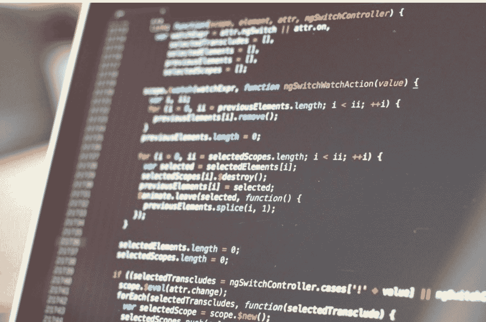
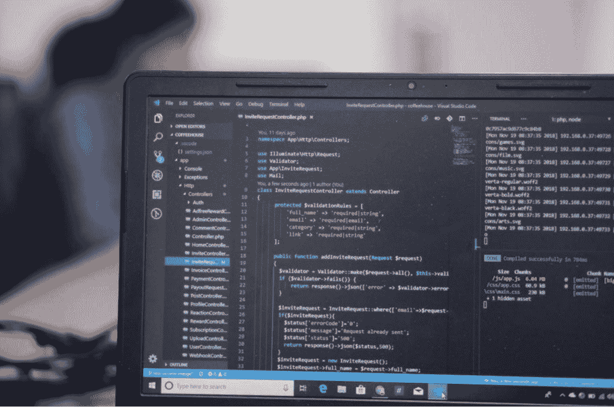
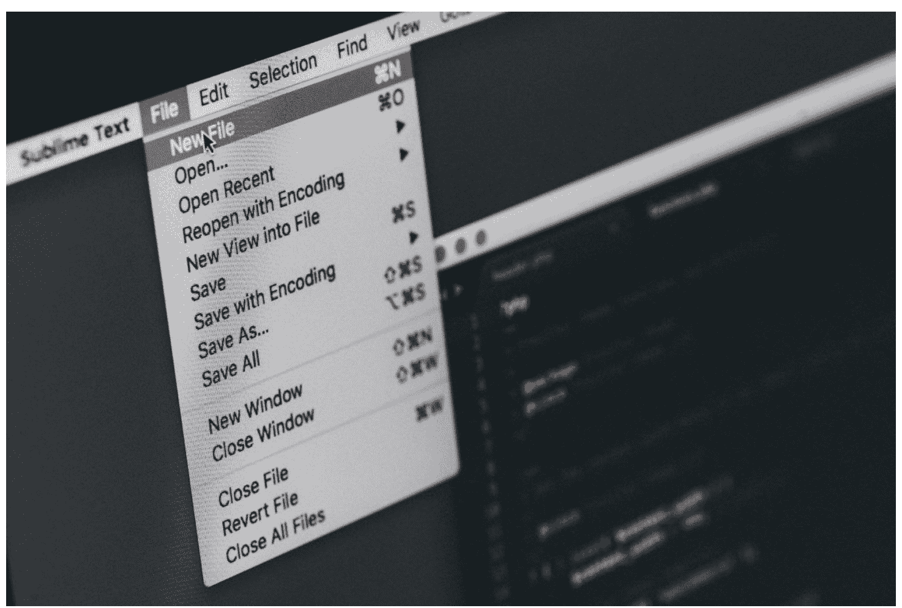

# 快速学习Python编程

**仅需掌握5个简单概念，即可开启Python编程之旅。3小时内即可开始编码。**

克里斯·福特

© 版权所有 Chris Ford 2021 - 保留所有权利。

未经作者或出版商直接书面许可，不得复制、翻印或传播本书所含内容。

在任何情况下，出版商或作者均不对因本书所含信息直接或间接造成的任何损害、赔偿或金钱损失承担任何责任或法律责任。

**法律声明：**

本书受版权保护。仅供个人使用。未经作者或出版商同意，不得修改、分发、销售、使用、引用或转述本书任何部分或内容。

**免责声明：**

请注意，本文档所含信息仅供教育和娱乐目的。我们已尽一切努力提供准确、最新、可靠、完整的信息。不作任何明示或暗示的保证。读者承认作者不提供法律、财务、医疗或专业建议。本书内容源自多种来源。在尝试本书概述的任何技术之前，请咨询持证专业人士。

阅读本文档即表示读者同意，在任何情况下，作者均不对因使用本文档所含信息而产生的任何直接或间接损失负责，包括但不限于错误、遗漏或不准确之处。

## 目录

引言

1.  Python简介
    -   学习Python的好处
    -   Python的不同版本
    -   如何安装Python以开始学习

2.  Python基础
    -   Python解释器
    -   IDE（集成开发环境）
    -   PyCharm
    -   使用PyCharm
    -   Python风格指南
    -   Python注释

3.  变量
    -   理解变量
    -   如何命名变量
    -   如何定义变量
    -   如何查找变量的内存地址
    -   Python中的局部变量和全局变量
    -   保留关键字
    -   Python中的运算符
    -   不同类型的运算符
    -   运算符优先级

4.  Python中的数据类型
    -   什么是数据类型？
    -   理解数据类型
    -   类型转换

5.  列表和元组
    -   什么是列表数据类型？
    -   理解元组
    -   理解字典
    -   示例练习
    -   练习：

6.  用户输入和输出
    -   为什么需要输入值？
    -   理解`input()`函数
    -   如何为用户编写清晰的提示
    -   使用`int()`接受数字输入
    -   输出
    -   示例练习
    -   练习：

7.  条件语句和循环
    -   比较运算符
    -   什么是程序中的控制流语句？
    -   编程结构
    -   If/else条件语句
    -   If Elif else
    -   For循环
    -   While循环
    -   Break和Continue语句
    -   异常处理
    -   示例练习
    -   练习：

8.  函数和模块
    -   什么是函数？
    -   在函数中使用参数
    -   传递参数
    -   关键字参数
    -   Python中的默认值
    -   理解Python中的作用域
    -   理解`Global`语句
    -   如何导入模块
    -   如何创建模块
    -   内置函数和模块
    -   字符串方法
    -   示例练习
    -   示例练习
    -   练习：

9.  类基础
    -   什么是类和对象？
    -   练习：
    -   什么是类变量和实例变量？
    -   什么是类方法和静态方法？

10. Python继承
    -   Python中的方法重写
    -   Python中的特殊方法（`__repr__`和`__str__`）

11. Python中的文件
    -   理解文件和文件路径
    -   练习：

12. 高级编程
    -   Python递归
    -   Python Lambda函数
    -   高级字典函数
    -   线程
    -   Pip包管理器
    -   虚拟环境
    -   使用Pillow库编辑图像
    -   掌握Python正则表达式（Regex）
    -   理解JSON数据
    -   理解Sys模块
    -   迭代器和生成器
    -   Jupyter Notebook
    -   单元测试
    -   面向Python程序员的GitHub
    -   不同的Python库

结语

参考文献

## 免费赠送给读者

如果不避免这7个最大的错误，编程可能会很困难！访问 [chrisfordbooks.com](http://www.chrisfordbooks.com/) 获取这份免费的PDF指南。

[http://www.chrisfordbooks.com/](http://www.chrisfordbooks.com/)

## 引言

计算机以其算术和逻辑能力改变了世界。计算机也可以被称为只能执行指令的“笨”机器。能够与这些“笨”机器高效沟通以快速完成任务的人被称为计算机程序员。就像人类使用不同语言相互交流一样，这些计算机程序员试图使用计算机能理解的高级编程语言与计算机沟通。

Python、Java、C、C#和Swift是过去几十年里改变世界的几种高级编程语言。所有的网站、数据库、移动应用、ATM、交通控制以及许多其他日常应用，都使用这些编程语言编写的软件。

本书以Python作为参考编程语言，作为编程入门指南。Python凭借其对任何领域或操作系统的高度适应性，已证明了其在编程领域的价值。如果你是一名初学者，希望通过Python理解编程基础，那么你做出了正确的选择。即使你是一名经验丰富的程序员，脱离其他语言并选择Python作为主要编程语言，也能帮助你在更短的时间内编写更有效的代码。

## 为什么学习Python至关重要？

Python被认为是一种可以在任何与软件技术相关的领域实现自动化的编程语言。你想创建一个Web应用程序吗？Python拥有实现它的Web库。你想分析大量数据并创建机器学习模型来预测未来实例吗？Python可以做到。你想创建可以维护你的Web服务器和数据库的自动化脚本吗？Python可以优雅地完成。你想开发漏洞利用程序并发现可以利用系统的漏洞吗？Python可以帮你。

这种与所有现有领域的奇妙关联，使Python成为一门受欢迎的编程语言。许多软件公司已将Python列为他们的编程语言，并将根据员工的Python熟练程度来雇佣他们。学习Python可以帮助你在所选领域之外在软件行业获得一席之地，使其成为初学者必备的先决条件。

## 我是谁？

我叫克里斯·福特，是一名经验丰富的Python程序员，专攻网页设计和数据挖掘。我对编程的热爱始于七年前，当时我第一次发现了一款可以自动化的移动应用。我用它来执行我经常忘记做的任务。这个概念引起了我的兴趣，我开始探索更多关于编程及其所拥有的奇迹。尽管进行了艰苦的研究，但由于缺乏好的资源，我在最初的日子里很难创建任何可以转化为实际软件的、有成效的逻辑代码。

我进行了尽职调查，了解到我一直使用的编程语言很复杂，而且只适用于单一目的。在我寻找编程语言的过程中，我探索了各种编程语言，如C#、C、C++和Java，最终接触到了Python。起初，我觉得Python比我之前尝试过的其他高级语言更简单。一旦我掌握了它，我就理解了它的强大之处，以及它如何用少量代码完成更多事情。

Python的强大功能引起了我的兴趣，我开始从事一些小项目，这些项目帮助我从更好的角度理解这门语言。在小项目上获得良好经验后，我开始从事大型项目，如网站和桌面软件。多年来，我对Python的热爱呈指数级增长，并帮助我在编程生涯中不断前进。在接下来的几年里，借助Python库，我开始精通网页设计和数据挖掘。

去年，由于全国范围的封锁，当我和所有人一样被困在家里时，我决定写一本书，帮助那些刚刚接触Python的人获得入门知识，从而帮助他们规划职业生涯。在接下来的几个月里，我进行了广泛的研究，以创建易于外行理解的内容。本书提供了特定于Python的概念和示例。它将帮助你点燃成为高效程序员所必需的编程哲学。

教授Python并非易事，因为它需要对该学科有大量精确的理解。因此，为了让读者彻底理解概念，我提供了实践练习和许多示例，供读者独立使用。

## 这本书如何帮助你？

Python编程易于理解但难以实施。要了解Python实现功能的能力，你需要对编程语言的基础有扎实的了解。本书提供了程序员在编写Python程序方面变得高效所需的理论和实践知识。

为了充分利用本书，建议遵循以下策略。

1.  尝试理解基本概念，并使用思维导图等认知技巧主动回忆内容。
2.  一旦掌握了基础知识，就开始查看示例，理解Python如何使用其语法将基本概念转化为程序化实现。
3.  理解示例后，在自己的计算机上独立完成练习。如果遇到错误，请通过Google搜索并找出背后的原因。
4.  持续且一致地复习内容，以成为该领域的专家。

Python作为一种编程语言，功能多样，需要投入大量精力和毅力才能掌握。我准备好为你提供程序员需要了解的基础知识信息。为了充分利用本书，请保持耐心，并对你的编程之旅保持希望。

## PYTHON简介

Python是一种高级、通用的编程语言。Guido van Rossum在1989年的圣诞节期间因无聊而创造了它。他的核心目标是让其吸引Unix/C黑客。看到该项目在编程社区中获得关注后，他投入了大量时间改进其核心实现。凭借在CWI（Centrum Wiskunde & Informatica）担任核心开发者创建ABC编程语言的经验，Rossum借鉴了ABC的不同特性，创建了一种易于使用且直观的解释型编程语言。他以著名的英国喜剧团体Monty Python的名字为该编程语言命名。

自1990年发布以来，Guido van Rossum一直是Python编程社区的终身仁慈独裁者，这使他成为开源术语中的项目开发主席。随着2000年Python 2.0的发布，Python已成为最受欢迎的编程语言之一。垃圾回收器、列表推导式和Unicode支持等功能的引入，使许多程序员从Perl等更传统的编程语言转向Python。Python社区的进一步重大变化发生在2008年Python 3.0发布时。

Python一直被编程社区提及为最具创新性和最受欢迎的编程语言之一。根据TIOBE排名，自诞生以来，它几乎每年都位列十大编程语言。

最初，Python作为编程语言的流行主要归功于其格言：“做一件事可能只有一种方法。”这与当时流行的Perl语言的格言“做一件事有很多种方法”相矛盾。Python采用极简主义哲学，鼓励程序员创建不复杂的代码。

其极简主义方法也帮助它在初学者中流行起来；它被全球大学作为一年级本科生的参考编程语言进行教授。在Python发明之前，程序员主要使用高级编程语言进行科学开发。随着Python的出现，现实世界的软件开发呈指数级增长。

Python核心团队已扩展了其在不同领域创建软件应用程序的能力。以下提供了一些应用程序，以帮助读者理解Python对软件工程的巨大影响。

1.  Python被广泛用作开发Web应用程序的脚本语言。Python第三方框架如Django和Tornado可以创建复杂的应用程序，为网站访问者提供可靠性和安全性。Python在Facebook、Netflix和Google等流行网站中被高度应用于多种实现。例如，Twisted（Dropbox工程师使用的框架）可以帮助公司有效地与其网络中的计算机进行交互。
2.  Python也广泛应用于科学计算领域。它拥有Numpy和Scipy等库，程序员可以使用这些库根据几何和微积分等不同数学领域创建应用程序。Python也是从事数字视觉和图像处理应用程序的程序员的重要资源。
3.  Python也在当前不断发展的机器学习和人工智能领域留下了印记。Tensorflow和Sci-kit learn等库是开发和实验机器学习模型的可靠资源。Python对自然语言处理的适应性也帮助公司使用它来创建自动翻译器。
4.  Python对软件开发的影响是巨大的。它帮助开发者创建了GIMP、Blender和Maya等复杂软件。它在制作移动视频游戏方面也具有相当的适应性。
5.  Python是Devop工程师的首选脚本语言，他们通常需要处理大量的Linux软件。开发者几乎用Python编写所有Linux安装工具，以实现不同发行版之间的更好可移植性。Apple提供的流行操作系统macOS也使用Python编写各种默认软件。
6.  Python对黑白帽黑客的适应性也值得称赞。许多黑帽黑客使用Python创建漏洞利用程序，可以自动发现有缺陷系统中的漏洞。渗透测试人员也使用Python进行漏洞利用开发，可以在黑客之前检测到这些缺陷。
7.  Python也是创建自动化工具（如机器人和爬虫）的首选编程语言，以减少程序员的手动工作。

凭借其对软件工程的巨大影响，Python在不同方面影响了现代编程语言。Go、Groovy和Swift的开发者受到Python启发，在部署这些语言时采用了极简主义哲学。

## 学习PYTHON的好处

在1990年代的大互联网热潮期间，许多软件公司雇佣程序员编写复杂的代码，以满足全球个人的需求。然而，随着代码开始变得复杂，软件的开发周期大大增加。大部分开发时间都花在了代码维护和解决错误上。在此期间，Python成为成千上万程序员的救星，使他们能够创建简化的编码风格，帮助他们快速维护和部署新代码。

理解Python为其用户提供的不同好处对于初学者来说至关重要。

### 1. 解释型编程语言

Python使用解释器直接执行程序员提供的各种指令。在此过程中，它解析代码并创建中间机器级语言，以减少执行等待时间。由于是高级语言，Python使用自然语言元素，使代码更易于使用和自动化。

### 2. 开源

Python是一种开源语言，因此任何人都可以毫无问题地修改和分发它。其开源性质是其在现实世界中成功的主要原因。Python在GitHub上一直位列前三名编程语言。开源文化也通过避免编写已经存在的代码来帮助程序员节省时间。

初学者也可以使用这些开源项目来理解Python在软件开发背后的复杂编程逻辑。

### 3. 动态类型

与使用编译时间运行代码的静态编程语言不同，动态类型语言使用运行时机制。虽然静态和动态类型语言各有优缺点，但根据经验丰富的计算机科学家的说法，像Python这样的动态类型编程语言被认为更可靠且可重用。

### 4. 支持多种范式

任何高级编程语言都需要支持编程范式，以有效地重用已编写的代码。Python为其用户提供了所有三种流行的范式：结构化、函数式和面向对象。尽管Python为用户提供了多种范式机会，但始终建议使用一致的范式以获得更好的代码可维护性。

### 5. 使用垃圾回收机制

每种编程语言都使用其策略进行有效的内存管理。Python使用垃圾回收器来使用不再被引用的内存。垃圾回收器可以帮助程序员与刚刚删除或修改的数据进行交互，以提高程序速度。

### 6. 优秀的软件质量

Python的成功主要归功于其可读性。所有编写的代码都支持一致性，因此易于维护。编写的Python代码也始终统一，因此软件开发中涉及的复杂逻辑易于理解。软件质量还通过减少调试代码的时间来提高开发者的生产力。例如，使用Python重写C语言解析库只需要三分之一的代码。

### 7. 可移植性

Python的开发方式使其可以在任何操作系统或平台上通过简单安装其解释器来运行。其极高的可移植性帮助程序员为各种独立应用程序创建可移植的GUI（图形用户界面）。

如果你使用Python编写了一个在Linux系统上运行的程序，你可以通过添加几行代码快速修改它，使其在Windows或macOS上工作。

### 8. 巨大的标准库和自定义库

不可否认，Python的流行很可能归功于其广泛的标准库和自定义库，程序员可以使用这些库在任何领域创建任何应用程序。

所有标准库都可以帮助程序员在应用程序级别创建和与系统交互，而可移植库可以帮助程序员在数据分析和机器学习等不同领域开发应用程序。

### 9. 组件集成

Python可以将自身集成到任何预先编写的代码或应用程序中，因此它是定制的首选编程语言。其扩展能力非常强大，可以帮助程序员与任何传统编程语言和库进行交互。

其扩展能力帮助开发者为各种遗留软件创建了新的自定义接口。

### 10. 支持性社区

Python拥有一个非常支持性的社区，帮助初学者不会因可用的大量库而不知所措。有许多论坛，程序员在部署或调试代码时遇到错误可以提问。

与标准库和自定义库相关的资源也非常适合初学者开始着手项目。GitHub上大量的开源项目也能帮助程序员运用相同的原则编写代码。



## PYTHON的不同版本

Python 2和Python 3是初学者可用于创建实际应用的两个流行版本。详细了解它们之间的差异，有助于你在处理实际项目或为客户工作时做出选择。

### Python 2

Python 2于2000年首次发布，其各种创新特性使其成为追求简洁性的程序员的首选。

2021年，Python 2.7版本已成为遗留软件，不会再有进一步的开发，这使其对程序员来说成为一个不切实际的选择。然而，由于将已编写代码迁移到Python 3存在困难，仍有一些程序员坚持使用Python 2.7。许多公司和库不会立即迁移其代码，因为这需要金钱和时间。

Python 3中许多显著的特性已被Python开发团队移植到Python 2.7，以便快速迁移项目。研究人员表示，尽管Python 2.7已成为遗留软件，但对Python 2开发者的需求将持续到2025年。

### Python 3

Python 3于2008年发布，此后经历了重大变革，以使Python在实际项目中尽可能高效。与Python 2不同，它使用更简单的语法，因此更易于维护。

Python 3的流行也归功于其对不同现代计算领域的适应性，如人工智能和机器学习。所有开发者都在专门为Python 3创建库，这就是为什么学习它至关重要。Python 3.9是开发者可用的最新版本。

### 我应该选择哪个版本？

虽然你选择的Python版本完全取决于你的个人需求，但我推荐Python 3。Python 3不仅更易于学习，还能帮助程序员创建更可靠的代码。Python 3也更通用、更强大，因此我推荐任何刚开始学习Python的人选择它。

**注意：** 本书中提供的所有代码均使用Python 3语法规则。

## 如何安装Python以开始学习

Python具有高度可移植性，可以在任何操作系统上运行。请访问[Python.org](https://www.python.org)下载Python 3。

你开发的任何程序或应用都可以在所有操作系统上运行，只需对代码进行少量修改。

例如，为Windows平台编写的Python网络映射器，如果你能修改软件中端口的实现方式，也可以在Linux上工作，因为这两个操作系统使用不同的方式与端口交互。

作为一名程序员，理解如何在不同操作系统上安装Python至关重要。

### 在Linux上安装Python

Linux是一个主要由程序员使用的开源操作系统。由于Linux是专门为编程设计的，几乎所有Linux发行版都预装了Python。

要检查你的Linux系统是否安装了Python，你需要进入终端。要打开新终端，请使用Ctrl + Alt + N。

终端打开后，输入以下命令。

#### 终端代码：

```
$ python3
```

如果Python已安装在你的系统中，你将看到与Python相关的许可信息。但是，如果你看到空白屏幕，则意味着你的Linux发行版未附带Python 3。你需要使用包管理器来安装Python。

许多其他流行的Linux发行版，如Arch、Gentoo和Kali，使用不同的命令和包管理器来安装软件包。请确保根据你的Linux发行版进行研究，以避免出现任何错误。

### 在macOS上安装Python

macOS是Apple维护的流行操作系统之一。与Linux类似，macOS也部署了内置Python支持的操作系统。

要检查macOS是否安装了Python，你首先需要进入终端。通过在主菜单栏中进入“实用工具”菜单来打开终端。

终端打开后，输入以下命令。

#### 终端代码：

```
$ python3
```

如果你没有看到许可消息，则表示Python未安装在你的系统中。你需要使用Homebrew等包管理器在macOS上安装最新版本的Python。

#### 终端代码：

```
$ brew install python3
```

### 在Windows上安装Python

Windows是Microsoft开发的全球流行的操作系统。Windows系统默认不附带Python，因此你需要安装一个可执行包才能开始尝试Python程序。

要在Windows上安装Python 3，请访问[Python.org](https://www.python.org)并点击下载选项卡，你可以根据你的操作系统找到不同的可执行文件。下载可执行安装程序，它会自动将Python安装到你偏好的位置。安装Python安装程序后，请确保使用控制面板将“path”添加到环境变量中，以避免与系统中任何其他编程语言解释器发生冲突。

你可以使用以下命令确认Windows系统中是否安装了Python解释器。

#### 命令提示符代码：

```
> python --version
```

如果你在偏好的操作系统上安装Python时遇到任何问题，我们建议你将终端中显示的错误信息进行搜索。

## PYTHON基础

要使用Python创建软件应用，你需要利用开发环境来执行高级编程任务。本章旨在帮助读者理解Python程序员应关注的高效开发方式的重要性。

### PYTHON解释器

Python是一种解释型语言。它具有其他高级编程语言无法提供的额外优势。例如，Python程序易于测试，因为它们涉及的等待时间较少。

与传统的编译器相比，解释器可以直接执行操作，被推荐为初学者的有利选择。

当你在系统中安装Python时，系统中会安装一个解释器以及IDLE（集成开发和学习环境）。你可以在系统中搜索它，或者在shell终端中输入命令“python”来启动IDLE。

Python IDLE可以被视为初学者的理想开发工具。IDLE首先读取程序中的行，评估其指令，将它们打印在屏幕上，然后循环到下一行。这种机制被称为REPL，是所有解释器用于有效解析和运行代码的基本概念。

使用IDLE，你可以轻松编辑和创建扩展名为.py的文件。IDLE提供回溯信息以指出特定行中的错误，避免初学者因执行失败而感到不知所措。

**如何使用Python IDLE shell？**

在终端中使用默认的“python”命令打开终端。

```
终端代码：
$ python
```

终端将打开一个shell窗口，如下所示。

```
输出：
>>>
```

一些示例：
IDLE可用于测试Python代码，进行任何简单的算术计算和打印语句。

```
程序代码：
>>> print ( " This is a sample text " )
```

当你按回车键时，IDLE将进入REPL模式，并将给定的文本打印在屏幕上，如下所示。

```
输出：
This is a sample text
```

在上面的示例中，print()是Python标准库中的一个方法，程序员可以使用它在终端窗口中输出字符串。

现在，我们将看一些算术示例。

```
程序代码：
>>> 2 + 5
```

这里，我们使用加法运算符，一旦我们按下回车键，IDLE将立即显示输出七。

```
输出：
7
```

**注意：** 请记住，一旦你启动一个新的终端，IDLE中所有正在进行的代码都将被销毁。

#### 如何在IDLE中打开Python文件

Python内置文本编辑器为你提供了编码环境所需的三个基本功能。

- 它可以自动高亮显示你的代码语法
- 它可以自动帮助你完成默认代码
- 它可以自动缩进你的代码

要在IDLE中打开文件，你只需选择工具栏中的“文件”菜单，然后点击“打开”。此操作将打开你的文件系统，以便你可以选择文件。高级程序员通常指定路径以快速打开Python文件。

#### 如何在IDLE中编辑文件

成功打开Python文件后，你就可以用你的代码编辑它了。IDLE将提供特定信息，如文件名、路径以及行号和列号，以帮助程序员轻松创建和调试代码。

编辑文件后，你可以使用F5键执行它。

Python IDLE也是小型项目的优秀调试工具。它提供基本的调试功能，如断点和捕获异常，以快速调试代码。然而，如果项目规模增大，IDLE将难以有效解析和调试代码。

**注意：** Python IDLE提供help()函数，为程序员提供便捷的参考。你可以使用help()查找任何方法或标准库的实现信息。

### IDE（集成开发环境）

虽然 Python IDLE 是试验小段代码的绝佳工具，但要组织 Python 项目的所有已编写代码却变得极其困难。为了解决代码组织混乱和集成能力不足的问题，计算机程序员使用被称为 IDE（集成开发环境）的高级软件应用程序。

IDE 不仅帮助程序员创建组织整齐的代码，还提升了开发者的生产力。它包含内置的开发工具，如代码编辑器、调试器和自动化工具，以减少通常涉及使用单独应用程序构建和迁移代码所需的设置时间。

IDE 提供的一些功能：

#### 1. 轻松集成库和框架

IDE 使程序员能够轻松地与开源或私有框架和库进行集成。一些 IDE 还提供直接与 GitHub 等在线代码仓库集成的选项。

#### 2. 面向对象程序员的工具

面向对象编程是团队项目中高度首选的编程范式。IDE 提供类和对象浏览器，帮助程序员轻松地与大型项目中的不同组件进行交互。一些 IDE 还提供类层次结构图作为参考，以快速启动项目。

#### 3. 语法高亮

语法高亮是一项重要功能，可帮助程序员快速识别不同的编程结构和保留关键字。程序员还可以使用语法高亮更快地检测错误，并通过避免遇到构建时错误来节省时间。

#### 4. 代码补全

IDE 提供智能代码补全功能，帮助初学者不偏离程序的逻辑实现。IDE 使用复杂的人工智能和机器学习算法来预测编程任务中的下一步操作。然而，请记住不要完全依赖它们，因为编程始终是一项人类任务，并且将来也会是。

#### 5. 版本控制

库和框架通常会随时间更新，API 的更改有时可能会破坏应用程序。为了帮助程序员有效地维护软件应用程序，IDE 提供版本控制和自动重构功能。使用这些功能，程序员可以在不干扰核心功能的情况下管理对程序的更改。

除了这些功能外，大多数 IDE 还提供调试和自定义选项，使编程变得实用、令人兴奋且富有成效。

Python 也很幸运地拥有功能完善的 IDE，可以满足程序员的任何需求。Pycharm、Spyder 和 Eclipse 是一些流行的 IDE，程序员可以使用它们来开发 Python 应用程序。

### PYCHARM

Pycharm 是由 Jetbrains 开发的专用 Python IDE，用于创建和协作 Python 项目。使用 Pycharm，开发者可以创建简洁且可读的代码，同时遵循 Python 默认的编码规范。

Pycharm 也是一个跨平台 IDE，程序员可以在 Windows、macOS 和 Linux 上安装。它支持 Python 2 和 Python 3。Pycharm 为用户提供了社区版和专业版。社区版是免费的，提供了许多基本功能，但自定义能力有限。但是，如果你想将你的项目与 Web 或科学框架互联，则有一个收费的专业版。

#### PYCHARM 的独特功能是什么？

##### 1. 代码编辑器

Pycharm 有一个内置的代码编辑器，帮助程序员创建高质量的 Python 代码。它提供自动代码建议，并提供高级配色方案，以便轻松检测不同类型的语法。

编辑器也可以使用不同的主题和插件进行自定义，以提高你的生产力并满足你的视觉审美。

编辑器的设计使得程序员可以轻松检测错误和警告，而无需立即解释它们。代码重新生成和自动缩进也是 Pycharm 提供的一些附加功能。

##### 2. 代码导航

Pycharm 为程序员提供了强大的组织能力，以有效地构建大型项目。特定功能如书签和透镜模式可以帮助初学者按照预期的方式组织代码。

##### 3. 高级重构

重构是一个需要了解的重要功能，特别是用于实现与本地和全局文件相关的更改。重构可以帮助程序员一次性快速重命名类、对象、变量和字符串中的文件。

Pycharm 提供了高级重构选项，以便尽可能快速有效地自定义代码，而不会产生任何构建错误。

##### 4. 与 Web 技术集成

Pycharm 的专业版提供了与 HTML、CSS 和 Typescript 等 Web 技术的轻松集成。Pycharm 集成了所有这些技术，以便直观地与 Python 框架和模块一起工作。

Pycharm 还提供实时编辑功能，帮助 Python Web 开发者在内置的 Web 浏览器中即时跟踪更改。

##### 5. 与科学库集成

由于 Python 在数据科学项目中具有高度适应性，Pycharm 在其专业版中提供了与 NumPy 和 Anaconda 等开源数据科学和机器学习库的紧密集成。

##### 6. 软件测试

Pycharm 还提供了与 Nose 等单元测试框架的集成，以帮助参与大型项目的程序员。可视化调试器、数据库集成和远程开发功能可以最大化参与团队的程序员的生产力。

#### 使用 PYCHARM

##### 步骤 1：安装 Pycharm

安装 Pycharm 是一个简单的过程，你可以在所有操作系统上一键下载。Linux 用户可能需要从各自的包管理器安装 Pycharm。

前往 Jetbrains 官方网站，点击下载部分，等待网站检测你的操作系统。网站将提供一个可执行文件，你可以用它在你的系统中安装。

如果你愿意购买 Pycharm 的专业版，你将需要提供你的账单信息，以便你的 IDE 能够按预期运行。

下载后，在你的系统中安装可执行文件，并等待它自动打开。在旧计算机上运行时，Pycharm 可能无法自动检测你的 Python 版本，因此你可能需要输入路径才能使一切按预期工作。

##### 步骤 2：创建新项目

打开 Pycharm 后，将出现一个弹出窗口，显示最近的项目。在左上角，你会在工具栏上找到一个名为“文件”的选项，它可以为你创建一个新的 Python 项目。点击它，Pycharm 界面将要求你选择用于该项目的解释器。现在选择默认选项‘virtualenv’，然后进入编辑界面。

##### 步骤 3：在 Pycharm 中组织你的文件

打开项目后，你需要创建一个新文件夹来组织你所有的脚本文件。组织至关重要，特别是如果你使用面向对象范式来创建你的软件应用程序。

点击 *新建* -> *文件夹* 以创建一个包含你需要的所有脚本或类的新文件夹。
你也可以使用 *新建* -> *文件* -> *Python* 创建一个新文件。

上述操作将创建一个扩展名为 .py 的文件。你可以根据需要轻松重命名它。

##### 步骤 4：分析 Pycharm 中的界面

- 1. Pycharm 可以自动保存你的代码。但是，如果你仍然想手动保存文件，Windows 用户可以使用 ctrl + S。Mac 用户可以使用 Command + S。
- 2. 你可以使用 Shift+ F10 运行和解释你的 Python 代码。
- 3. 在 Windows 中，使用 Ctrl + F，你可以轻松地在你的 Python 项目中找到任何小代码片段或方法。Mac 用户可以使用 Command + F。
- 4. 要调试代码，你需要输入“Shift + F9”。Pycharm 调试器提供断点和逐行调试选项，以便轻松地与代码交互并找到涉及的逻辑问题。

## PYTHON 风格指南

Python 是一种偏爱简单而非复杂的编程语言。要理解 Python 作为编程语言的本质，读者必须阅读 Tim Peters 的《Python 之禅》。它提供了 19 条指导原则，规定了所有项目的 Python 风格。

理解这些原则并在其编程工作流程中遵循它们，可以帮助 Python 程序员创建其他程序员易于维护和理解的代码。

你可以使用以下终端命令找到与 Python 风格指南相关的所有 19 条工作原则。

```
终端代码：
$ import this
```

以下是Python程序员需要了解的五个关键样式原则。

### 1. 优美胜于丑陋

建议所有Python程序员编写语义优美、易于阅读和理解的代码，而非难以理解的代码。这里的“丑陋”指的是不整洁、难以阅读的代码。移除可能使代码复杂化的不必要语句或条件判断。使用缩进有助于根据结构更好地理解代码。优美的代码不仅带来良好的可读性，还能减少运行所需时间。

### 2. 明确胜于隐晦

除非必要，切勿试图隐藏代码功能以使其明确。冗长的表达会使理解编程逻辑变得困难。提出此样式原则也是为了鼓励Python程序员编写可重新分发的开源代码。

### 3. 简洁胜于复杂

确保编写的代码以更直接的方式处理逻辑，而非使其复杂化。如果可以用十个条件语句或一个方法解决问题，请选择用一个方法解决。尽可能使其简洁。

### 4. 复杂胜于晦涩

编写能执行复杂操作的简单代码并非总是可行。为了执行复杂操作，应力求编写复杂但不晦涩的代码。始终以能在意外发生时捕获异常的方式编写代码。异常可以帮助你快速调试代码。

### 5. 应该只有一种显而易见的方法

建议Python程序员在整个项目中针对一个问题只使用一种编程逻辑，而不是在不同实例中使用三四种逻辑。保持一致性，以便他人轻松理解你的程序代码。一致性提供了灵活性，从而实现轻松快速的维护。

## PYTHON 注释

引入注释是为了帮助程序员在项目工作中轻松记忆或与其他团队成员分享程序所用的编程逻辑。如今，大多数库和框架都基于开源系统运作，因此开始使用注释是实用的，这样他人可以简洁地理解你的代码。

除此之外，强烈建议在编写测试软件应用程序时可被解释器忽略的代码行时使用注释。作为Python程序员，你需要尽可能开始使用注释。注释也能在将来更新代码目录时为你提供帮助。

Python程序员可以使用两种类型的注释来使代码更清晰、更易理解。

### 1. 单行注释

在Python程序中，`#`（井号）之后的所有内容都可称为单行注释。

```
程序代码：
# 这是一个注释，我们将打印一条语句
print("我们已经学习了注释")
输出：
我们已经学习了注释
```

只有`print`语句被执行，解释器忽略了`#`之后写的所有内容。

程序员可以使用单行注释，特别是在代码中间，用于描述程序逻辑或在初始化条件判断和循环时使用。

### 2. 多行注释

你可以使用井号（`#`）创建多行注释，但这不被认为是好的做法。要创建多行注释，Python程序员可以使用字符串字面量。

```
程序代码：
'''
这是一个注释，可用于编写句子或段落。
'''

print("我们刚刚学习了多行注释")
```

```
输出：
我们刚刚学习了多行注释
```

只有`print`语句被执行，解释器忽略了字符串字面量之间的所有内容。

**注意：** 记住在编写注释时不要冗余。只写你的团队成员或未来的你可能需要的内容。

## 变量

为了最大化Python作为编程语言的潜力，程序员需要在程序中开始使用变量和运算符。变量和运算符是程序的基本构建块，有助于构建编程逻辑并创建能有效操作内存的应用程序。

### 理解变量

软件应用程序通常处理数据。用户上传或下载数据以完全体验产品。所有这些用例只有在变量的帮助下才成为可能。

计算机科学家开发变量是为了有效地将数据存储到计算机内存的特定位置。变量可以称为标签，通常是程序中最基本的单元。

你可能在数学中处理代数时已经使用过变量。

```
示例：
2x + 3y
x = 3 且 y = 4
```

数学中的变量通常用于替换方程中的值。计算机科学家在计算机发展的早期阶段采用了相同的概念来有效管理内存资源。

要理解Python程序执行时发生了什么，请阅读以下示例。

```
程序代码：
print("这是一个示例")
输出：
这是一个示例
```

### 发生了什么？

1.  当上述程序执行时，编辑器会将程序中的所有行发送到Python解释器。
2.  解释器会解读程序中的所有单词并确定其目的。
3.  如果解释器感到困惑或发现无法确定的单词，它会抛出警告、异常和错误。
4.  当上述示例执行时，解释器会查看`print`语句并理解其目的是在屏幕上显示括号之间的内容。

现在，看一个上述示例的轻微变体。

```
程序代码：
first = "这是一个示例"
print(first)
输出：
这是一个示例
```

在上面的示例中，`first`被用作变量，将一个字符串存储在特定的内存位置。准确地说，名为`first`的变量现在持有一个值，可以在任何实例中调用。

Python不是静态类型语言，因此在创建变量时不需要声明变量。程序员也可以随时更改Python变量的值。

```
程序代码：
first = "这是一个示例"
print(first)
first = "这是第二个示例"
print(first)
输出：
这是一个示例
这是第二个示例
```

在上面的示例中，为变量声明了不同的字符串后，变量的值立即发生了变化。

### 如何命名变量

Python编程指南在创建变量时提供了严格的规则，以避免它们陷入错误。这也提高了程序的可读性。

**编写变量的规则：**

1.  Python只允许使用数字、字母和下划线来创建变量名。例如，`'$message'`不是合格的变量名。
2.  Python程序员不应以数字开头命名变量。例如，`'message1'`是允许的变量名，但`'1message'`不允许。
3.  Python不允许在创建变量时使用33个保留关键字作为标识符。例如，`'print'`不能用作变量名。
4.  始终编写易于理解的变量名。编写复杂的变量名被认为是不好的编程实践，尤其是在团队协作时。

### 如何定义变量

你可以使用赋值运算符`=`在Python程序中定义变量。

```
语法格式：
变量名 = "变量值"
示例：
first = 2
# 这是一个整数数据类型的变量
second = "美利坚合众国。"
# 这是一个字符串数据类型的变量
```

### 如何查找变量的内存地址

查找变量的内存地址很重要，尤其是在处理需要不断更改其值的复杂应用程序时。传统语言如C使用指针在程序中使用内存地址。

Python提供了一种轻松获取变量内存地址的方法。通常，在C和C++等高级编程语言中，使用指针来查找内存地址。但在Python中，我们需要使用一个名为`id()`的内置函数来获取变量的内存地址。

```
程序代码：
first = 324
id(first)
输出：
1x23238200
```

在上面的示例中，`1x23238200`是变量`first`的内存地址。当变量被替换时，内存地址将保持不变。

程序代码：
first = 324
id(first)
first = 456
id(first)
输出：
1x23238200
1x23238200

## PYTHON中的局部变量和全局变量

Python可以声明仅在函数内部使用的变量。局部变量不能在函数外部被赋值或调用。

```
程序代码：
#这是一个包含局部变量的函数
def exa() :
    d = " 这是一个局部变量"
    print(d)
exa()
输出：
这是一个局部变量
```

在上面的例子中，我们声明了一个具有局部作用域的变量。另一方面，全局变量通常在函数外部声明，但仍然可以在函数内部调用使用。

```
程序代码：
def exa() :
    print(d)
#这是一个全局作用域变量
d = " 这是一个全局变量"
exa()
输出：
这是一个全局变量
```

程序员可以使用不同数据类型的变量，例如整数、字符串、列表和字典。变量也可以与运算符结合使用，以创建复杂的程序。

## 保留关键字

每种编程语言都有其预定义的语法，称为保留关键字，通常用于支持该语言的功能。所有这些保留关键字在从头构建编程语言时，都明确定义了特定的功能。

例如，"if"是Python中的一个保留关键字，用于在编写程序时创建条件语句。

程序员在创建其他编程组件（如变量、函数和类）的标识符时，不能使用保留关键字。Python 3目前有33个保留关键字。

## 动手试试：

打开你的Python终端并输入以下命令，列出所有保留关键字。

```
程序代码：
>>> import keyword
# 此语句用于导入一个库
>>> keyword.kwlist
# 将显示所有保留关键字
```

## PYTHON中的运算符

运算符通常在数学中用于组合字面量并形成语句。

```
示例：
2x + 3y = 7
```

这里，2x、3y和7是字面量，而+和=是运算符。计算机科学家从数学中采用了运算符，并有效地使用它们来赋值和操作数值。

运算符是为计算而设计的，因此可以与对象结合使用以创建复杂的表达式。一组表达式通常构成有效的计算逻辑。

在Python中，运算符尝试组合的值称为操作数。

```
示例：
>>> first = 45
>>> second = 78
>>> first + second
输出：
133
```

在上面的例子中，first和second是操作数，而'+'是运算符。

### 不同类型的运算符

运算符通常是复杂的，并且有不同类型。最常见的是算术运算符，通常用于执行数学运算。

任何数学运算，如加法、减法、乘法和除法，都可以使用这些运算符应用于变量和列表。

#### 1. 加法 (+)

加法运算符通常用于将两个字面量相加；'+'是其符号。当你使用加法运算符将两个不同的数据类型相加时，Python解释器会自动为合适的数据类型进行类型转换。

```
程序代码：
A = 42
B = 33
C = A + B
# + 是一个加法运算符
Print(c)
输出：
75
```

#### 2. 减法

减法运算符通常用于找出两个字面量值或列表之间的差值。'-'是其符号。

```
程序代码：
A = 42
B = 33
C = A - B
# - 是一个减法运算符
Print(c)
输出：
9
```

#### 3. 乘法

乘法运算符通常用于找出两个字面量值或列表之间的乘积。它使用'*'符号表示。

```
程序代码：
A = 42
B = 33
C = A * B
# * 是一个乘法运算符
Print(c)
输出：
1386
```

#### 4. 除法

除法运算符通常用于在两个任何数据类型的数字相除时找出商。每当两个数字相除时，通常会得到一个浮点数作为结果。除法运算符的符号是'/'。

```
程序代码：
A = 42
B = 33
C = A / B
# / 是一个除法运算符
Print(c)
输出：
1.272
```

#### 5. 取模

使用这个特殊的运算符，你可以找出一个数对另一个数取模的结果。在数学上，我们也可以将取模称为两个数之间的余数。取模运算符的符号是'%'。

```
程序代码：
A = 42
B = 33
C = A % B
# % 是取模运算符
Print(c)
输出：
9
```

#### 6. 整除

整除是一种特殊的算术运算符，它提供最接近的整数值作为商值，而不是提供浮点数。在编写Python程序时，整除运算符的符号是'//'。

```
程序代码：
A = 42
B = 33
C = A // B
# // 是一个整除运算符
Print(c)
输出：
1
```

### 运算符优先级

当你创建和处理数学表达式时，了解何时以及如何执行数学运算也很重要。例如，当表达式中有多个运算符时，遵循严格的计算规则非常重要。否则，结果可能会完全改变。

Python程序员可以遵循运算符优先级规则，以避免在创建软件时出现这些问题。

规则：

- 1. 括号是Python表达式中具有最高优先级的元素。如果你在括号内发现任何字面量或变量，那么你需要在继续其他操作之前先计算它们。
- 2. 第二优先级是指数运算符，其次是位运算符。
- 3. 下一个优先级顺序将包括乘法、除法、取模和整除运算符。
- 4. 下一个优先级将给予加法和减法运算符。
- 5. 在处理Python程序时，任何逻辑或比较运算符将具有最低的优先级。

## PYTHON中的数据类型

Python编程语言处理许多不同类型的数据以创建通用应用程序。理解这些不同的值集合、程序员可以执行的操作以及它们在软件开发中的重要性，对于初学者来说至关重要。

### 什么是数据类型？

简单来说，数据类型是程序员在编程语言中创建变量时定义的一组值。由于Python不是静态类型语言，因此没有特定的规则来定义它们。Python解释器通常会自动检测变量的数据类型并执行操作。尽管不需要定义它们，但理解数据类型是创建复杂程序的一项基本技能。

例如，当你创建一个名为'first'的变量，其值为10时，你实际上是创建了一个变量'值'，其值为'10'，数据类型为'整数'。由于Python是动态类型语言，它会自动检测所有变量值的数据类型。

```
程序代码：
first = 10
```

静态类型语言，如C，要求程序员在声明变量时必须提及数据类型。

例如，在C语言中，声明一个具有浮点数据类型的变量，如下所示。

```
程序代码：
float age = 64;
```

### 理解数据类型

为了更深入地理解数据类型，你需要理解Python程序中的一些基本代码片段。

```
示例：
a = 64
b = 54
c = a + b
```

这里a、b和c充当变量，而'+'和'='是运算符。

赋予变量的值称为字面量，并代表一个数据类型值。在上面的例子中，64和54是字面量。字面量通常充当指令，将特定值插入变量。

Python中流行的数据类型有整数、浮点数、字符串和布尔值。深入理解数据类型及其可能的操作是Python程序员的必备前提。

#### 字符串

字符串是用于在程序中表示文本的数据类型。字符串通常用单引号括起来，并包含一系列字符。当你使用字符串数据类型时，会创建一个包含字符序列的'str'对象。

### 字符串数据类型

字符串数据类型是必要的，因为计算机以二进制形式读取数据。需要使用编码机制来转换字符，以便计算机能够根据我们的指令理解和操作它们。ASCII 和 Unicode 是编程语言用于读取文本数据的一些流行编码机制。

在 Python 2 之前，没有办法有效地与中文和韩文等外语进行交互。然而，Python 3 引入了一种 Unicode 机制来处理英语以外的数据。

#### 它们是如何表示的？

```
程序代码：
a = 'This is a string.'
print(a)
输出：
This is a string.
```

引号之间的所有内容都可以称为字符串字面量，可以在程序中的任何地方使用变量 'a' 来调用它。在上面的例子中，字符串由 14 个字符组成，不包括空格。

Python 字符串也可以使用其他三种不同的方式表示。

```
程序代码：
a = "This is a string."
# 双引号中的字面量
print(a)
a = '''This is a single line'''
# 三个单引号中的字面量
print(a)
a = """This is a multiple
lines program"""
# 三个双引号中的字面量，用于表示多行
print(a)
输出：
This is a string.
This is a single line
This is a multiple
lines program
```

Python 中的字符串数据类型可用于创建任意数量的信息。所有特殊字符、符号、字母、数字和空格都可以输入在引号之间。Python 还提供了称为转义序列的特定组件，以有效地格式化现有数据。例如，程序员可以使用 '\n' 来创建新行。

#### 如何访问字符串中的字符

Python 提供了不同的方式来轻松地与字符串数据进行交互。我们可以使用索引轻松访问字符串的特定位置。Python 还使用切片的概念来访问字符串中的字符范围。

正向索引通常从 0 开始，负向索引从 -1 开始。对于切片，使用冒号 (:) 来提供范围。

### 示例：

```
# 在 Python 中访问字符串
sample = 'Python'
print('sample =', sample)
# 将打印第一个字符
print('sample[0] =', sample[0])
# 将打印最后一个字符
print('sample[5] =', sample[5])
# 将从第 3 个字符切片到第 6 个字符
print('sample[2:5] =', sample[2:5])
# 使用负向索引
print('sample[-1] =', sample[-1])
```

##### 输出：

```
sample = Python
sample[0] = P
sample[5] = n
sample[2:5] = thon
sample[-1] = n
```

由于它们是不可变的，因此无法更改或删除字符串中的元素。但是，你可以轻松地重新赋值字符串字面量。当你尝试使用索引替换字符串元素时，会发生类型错误。

#### 字符串格式化

字符串通常用于显示在程序中操作发生时想要出现的信息。许多人还使用字符串来动态显示用户提供的输入值。

要执行字符串格式化，Python 程序员主要可以遵循两种不同的策略。

##### 1. 使用占位符格式化

在这种方法中，程序员需要使用 %（取模）运算符来格式化字符串的外观。使用占位符来格式化字符串是最古老的方法，'%' 被著名地称为字符串格式化运算符。

```
程序代码：
>>> print("%s is a great game" % 'football')
输出：
football is a great game
```

使用占位符方法，你也可以同时格式化两个字符串。

```
程序代码：
>>> print("%s is the national sport of %s" % ('Baseball', 'USA'))
输出：
Baseball is the national sport of USA
```

请记住，虽然 %s 用于格式化字符串，但你可以使用 %d 来格式化整数，使用 %f 来格式化浮点数。

```
程序代码：
>>> print("Brazil won FIFA world cup %d times" % 5)
输出：
Brazil won FIFA world cup 5 times
```

要在字符串中格式化浮点数，你需要使用一种称为 %a.bf 的不同格式。这里，a 代表屏幕上显示的最小字符串数，b 代表小数点后使用的位数。

```
程序代码：
>>> print("The exchange rate of USD to EUR is: %5.2f" % (0.7546))
输出：
The exchange rate of USD to EUR is: 0.75
```

##### 2. 使用 .format() 字符串格式化

Python 3 提供了一种称为 .format() 的特殊方法来格式化字符串，以替代传统的取模 (%) 运算符。Python 2 最近也将 .format() 方法纳入其标准库。

```
示例：
>>> print("Football is popular sport in {}.".format('South America'))
输出：
Football is popular sport in South America
```

使用 .format()，我们也可以使用基于索引的位置来格式化字符串。

```
程序代码：
>>> print('{3} {2} {1} {0}'.format('again', 'great', 'America', 'Make'))
输出：
Make America great again
```

除了这两种方式，你还可以在 Python 中使用 f-strings 来格式化字符串。Lambda 表达式可以在此方法中使用，并且在需要高级格式化场景时使用。

虽然使用占位符方法很诱人，因为它易于实现，但我们建议使用 .format() 方法，因为它被许多 Python 3 专家认为是最佳实践。占位符方法通常在运行时花费更多时间来执行，并不是一个好的解决方案，特别是对于大型项目。

#### 字符串操作技术

字符串是程序中使用最广泛的数据类型，因为数据实例化通常通过字符串发生。理解字符串操作技术是 Python 程序员的先决技能。许多数据科学家和数据分析师完全依赖这些操作技术来创建严谨的机器学习模型。

Python 程序员需要了解的最重要的字符串操作技术是连接和乘法字符串。

##### 1. 连接

连接是指将字符串连接在一起以形成新字符串。要连接两个字符串，你可以使用算术运算符 '+'。你也可以使用空格分隔添加的字符串以提高可读性。

```
程序代码：
sample = 'This is' + ' ' + 'FIFA world cup'
print(sample)
输出：
This is FIFA world cup
```

在上面的例子中，如果没有提供空格，两个字符串将连接在一起，因为 Python 解释器通常不格式化输出。

##### 2. 乘法

乘法是指轻松地反复复制字符串。Python 程序员可以使用数学运算符 "*" 来轻松地乘法字符串。

```
程序代码：
sample = 'welcome' * 4
# 这使得字符串自身乘以 4 次
sample1 = 'To whoever you are'
print(sample + sample1)
输出：
welcome welcome welcome welcome To whoever you are
```

在上面的例子中，我们首先乘法字符串，然后将它们连接到另一个字符串。

##### 3. 追加字符串

虽然连接和乘法字符串都被认为是基本的字符串操作技术，但你可以通过使用特殊运算符 (+=) 追加字符串来进一步提高字符串效率。

```
示例：
sample = 'This is a great'
sample += ' example'
print(sample)
输出：
This is a great example
```

在上面的例子中，+= 用于在末尾追加另一个字符串。但是，你不能使用此运算符在字符串中间添加信息。

##### 4. 长度

除了使用字符串操作，你还可以使用 Python 库中的某些预构建字符串函数来执行其他任务。熟练掌握这些技术可以帮助程序员在 Python 应用程序中有效地格式化数据。

长度是这些方法之一，帮助程序员提及字符串中的字符数。请记住，空格也将作为单独的字符计入计数中。

```
程序代码：
sample = 'Today is Monday'
print(len(sample))
输出：
13
```

##### 5. 查找

在大型字符串中查找子字符串的一部分对于许多 Python 程序员来说是一项重要任务。Python 提供了一个内置的 find() 函数来实现此目的。此方法将输出子字符串的起始索引位置。

**注意：** Python 程序员只能使用正向索引，并且索引从 0 开始。

```
示例：
sample = 'This month is August'
result = sample.find("Augu")
print(result)
```

##### 6. 大小写转换

你可以使用 `.lower()` 方法将字符串中的所有字符转换为小写字母。

```
程序代码：
Sample = "Football is a great sport"
Result = sample.lower()
Print(result)
输出：
football is a great sport
```

在上面的例子中，如果你注意观察，会发现所有大写字母都被转换成了小写。
你可以借助 `.upper()` 方法执行类似的操作，但它是将字符串中的所有字符转换为大写字母。

```
程序代码：
Sample = "Football is a great sport"
Result = sample.upper()
Print(result)
输出：
FOOTBALL IS A GREAT SPORT
```

##### 7. title() 方法

Python 程序员也可以轻松使用 `title()` 方法将字符串转换为标题大小写格式。

```
程序代码：
Sample = "Football is a great sport"
Result = sample.title()
Print(result)
输出：
Football Is a Great Sport
```

##### 8. 替换字符串

Python 程序员经常需要替换字符串的一部分。你可以使用内置的 `replace()` 方法来实现这一点。但是，请记住，使用此方法时，字符串中的所有匹配字符都将被替换。

```
程序代码：
Sample = "Football is a great sport"
Result = sample.replace("Football", "Cricket")
Print(result)
输出：
Cricket is a great sport
```

除了所有这些操作技巧之外，你还可以使用转义序列，例如换行符 (`\n`) 和制表符 (`\t`)，来有效地格式化输出屏幕上的数据。

### 整数

整数是 Python 中用于表示 0 到 9 数字的数据类型。程序经常使用 'int' 字面量，因为它们对于程序逻辑执行和复杂的算术计算都是必需的。

当 Python 解释器在执行过程中遇到 'int' 时，它会创建一个具有指定值的 int 对象。这个值可以在我们需要时随时替换。

"int" 对象在程序中经常使用，是高效程序的基本构建块。例如，网页上的颜色使用一串整数值来表示。

Python 还对这些字面量使用运算符，如 `+`、`-`、`*`、`/`。作为初学者，你需要记住一元运算符 '+' 和 '-'，它们表示整数的符号。

例如，`+12` 表示一个正整数，而 `-12` 表示一个负整数。

```
表示整数
a = 6
print(a)
输出：
6
```

还应该记住，在 Python 中整数字面量的范围通常很大。你可以在变量中输入超过十位数的字面量。尽管使用大整数没有问题，但当程序用涉及巨大整数的操作填满计算机内存时，总是存在内存泄漏的问题。为了摆脱瓶颈情况，请确保涉及大整数字面量的表达式是实用的。

### 浮点数

浮点数是 Python 中的一种特殊数据类型，程序员可以在处理程序变量时使用它来表示浮点数。通常，当我们创建软件时，我们需要处理带小数点的实数。使用 'float' 数据类型变量，你可以表示多达十位小数。

```
程序代码：
A = 7.1213
Print(a)
# 这表示一个浮点变量
输出：
7.1213
```

你也可以使用浮点变量来表示十六进制整数，这是一种流行的数值表示方法。

```
示例：
A = float.hex(3.1212)
Print(a)
输出：
'0x367274872489'
```

Python 程序员还可以使用浮点数来表示复数和指数数。

### 布尔数据类型

布尔是一种特殊的数据类型，可以帮助程序员在某个实例中表示真或假。两个布尔值是 TRUE 和 FALSE。

你大多可以将布尔数据类型与关系运算符一起使用。

```
示例：
Print(100 < 32)
输出：
False
```

由于这是一个假语句，Python 解释器将向程序员输出布尔值 'False'。

### 类型转换

通常，当我们处理程序时，会出现需要改变变量数据类型的情况。Python 提供了使用类型转换来转换数据类型的机会，而不会搞乱程序。

通常，类型转换可以使用两种类型执行：隐式类型转换和显式类型转换。

#### 1. 隐式类型转换

使用隐式类型转换，Python 会在需要时自动转换数据类型。

```
示例：
X = 32
Print(type(x))
# 这打印 x 的数据类型
Y = 2.0
Print(type(y))
# 这打印 y 的数据类型
Z = x + y
Print(Z)
Print(type(Z))
# 发生隐式类型转换
输出：
<class 'int'>
<class 'float'>
64.0
<class 'float'>
```

在上面的例子中，当一个浮点变量与一个整数变量相乘时，结果已经被隐式转换为浮点数据类型变量。

#### 2. 显式类型转换

当 Python 程序员主动改变变量数据类型时，这被称为显式类型转换。通常，显式类型转换使用数据类型函数执行。

##### 将 int 转换为 float：

```
X = 32
# 这是一个值为 '32' 的 int 变量
Z = float(x)
# 现在 int 数据类型被转换为 float
Print(Z)
Print(type(Z))
输出：
32.0
<class 'float'>
```

在上面的例子中，我们使用显式类型转换将数据类型为 'int' 的变量转换为数据类型为 'float' 的变量。

##### 将 float 转换为 int：

```
X = 32.0
# 这是一个值为 '32.0' 的 float 变量
Z = int(x)
# 现在 float 数据类型被转换为 int
Print(Z)
Print(type(Z))
输出：
32
<class 'int'>
```

在上面的例子中，我们使用显式类型转换将数据类型为 'float' 的变量转换为数据类型为 'int' 的变量。

##### 将 int 转换为 string：

```
X = 32
# 这是一个值为 '32' 的 int 变量
Z = str(x)
# 现在 int 数据类型被转换为 string
Print(Z)
Print(type(Z))
输出：
32
<class 'str'>
```

在上面的例子中，我们使用显式类型转换将数据类型为 'int' 的变量转换为数据类型为 'string' 的变量。

##### 将 string 转换为 int：

```
X = "32"
# 这是一个值为 '32' 的 string 变量
Z = int(x)
# 现在 string 数据类型被转换为 int
Print(Z)
Print(type(Z))
输出：
32
<class 'int'>
```

在上面的例子中，我们使用显式类型转换将数据类型为 'string' 的变量转换为数据类型为 'int' 的变量。

### 练习：

按照前面提到的示例，尝试使用相同的输入数据将一个字符串变量类型转换为浮点变量。

## 列表和元组

作为一名程序员，你需要处理大量数据，而不仅仅是单一线性数据。Python 使用列表、元组和字典等数据结构来更高效地处理更多数据。理解这些帮助 Python 程序员操作和轻松修改数据的数据结构是初学者的基本前提。

### 什么是列表数据类型？

列表是一种独特的数据结构，可以按顺序保存多个不同数据类型的数据值。每当程序员提到“列表值”时，它代表整个列表本身。像任何变量一样，列表本身可以被操作、替换、传递给函数，并且可以破坏 Python 变量机制。

列表通常表示如下：

`[64, 48, 32]`

这里 64、48 和 32 是列表元素。列表中的所有元素都是整数数据类型。

列表通常以方括号开始，以方括号结束。逗号通常分隔列表中的所有元素。如果列表中的元素是字符串数据类型，它们将被引号括起来。列表内的元素也可以称为项目。

```
示例：
[USA, China, Russia]
这里 USA、China 和 Russia 是列表中的元素。它们是字符串数据类型。
列表赋值给变量：
>>> sample = [USA, China, Russia]
>>> sample
输出：
[USA, China, Russia]
```

在上面的例子中，变量 'sample' 现在存储了提供的列表。你可以像打印屏幕上任何其他标准数据类型的值一样，使用变量来调用列表。

#### 空列表

如果列表不包含任何元素，则称为空列表或空值列表。

它通常表示为 `[]`。

```
程序代码：
>>> sample = []
# 这是一个空列表
```

#### 理解列表中的索引

列表中的每个元素都可以使用称为索引的唯一 Python 特性单独调用、操作或修改。通常，索引号从 '0' 开始，你可以按照下面示例所示使用它们。

假设列表是 `[USA, China, Russia]`。

```
程序代码：
>>> sample = [USA, China, Russia]
>>> sample[0]
```

### 使用列表进行切片

你可以轻松地使用切片方法创建子列表。通过切片方法，你可以提取特定元素并创建独立的新列表。

**语法：**
列表名 索引起始 : 索引结束

冒号通常用于分隔索引号。第一个索引号指定切片的起始位置，最后一个索引号指定切片的结束位置。

```
程序代码：
>>> sample = [USA, China, Russia, Japan, South Korea]
>>> sample[0 : 2]
输出：
[USA, China, Russia]
程序代码：
>>> sample[2 : 3]
输出：
[Russia, Japan]
```

你也可以在不输入第一个或最后一个索引号的情况下进行切片。例如，如果未提供第一个索引号，解释器将从列表的第一个元素开始。同样，如果未提供最后一个索引号，解释器将把切片延伸到最后一个元素。

```
程序代码：
>>> sample = [USA, China, Russia, Japan, South Korea]
>>> sample[ : 1]
输出：
[USA, China]
程序代码：
>>> sample[2 :]
输出：
[Russia, Japan, South Korea]
```

如果两个值都不提供，那么整个列表将作为输出给出。

```
程序代码：
>>> sample [ : ]
输出：
[USA, China, Russia, Japan, South Korea]
```

### 获取列表长度

内置的 `len()` 函数可以帮助 Python 程序员打印出列表的长度。

```
程序代码：
>>> sample = [USA, China, Russia, Japan, South Korea]
>>> len(sample)
输出：
5
```

你可以直接使用赋值运算符更改列表内的值。请记住，无论何时替换它们，原始值都将永久丢失，无法恢复。仅在必要时才让程序使用它们。

```
程序代码：
>>> sample = [USA, China, Russia, Japan, South Korea]
>>> sample[2] = ['Germany']
>>> print(sample)
输出：
[USA, China, Germany, Japan, South Korea]
```

在上面的示例中，对第二个元素使用赋值语句后，其值已从 'Russia' 更改为 'Germany'。

你也可以使用赋值语句直接用另一个列表值替换一个列表值。

```
程序代码：
>>> sample = [USA, China, Russia, Japan, South Korea]
>>> sample[2] = sample[4]
输出：
[USA, China, Russia, Japan, Russia]
```

在上面的示例中，列表中的最后一个元素被列表中的第二个元素替换。

### 列表连接

你可以使用 "+" 运算符添加两个不同的列表。但是，请记住，两者必须是相同的数据类型。如果不是，有时可能会抛出错误。

```
程序代码：
[4, 5, 6] + [5, 6, 7]
[4, 5, 6, 5, 6, 7]
```

### 列表复制

你可以使用列表复制技术来复制两个字符串。要执行复制技术，你需要使用 "*" 运算符。

```
程序代码：
[4, 5, 6] * 3
输出：
[4, 5, 6, 4, 5, 6, 4, 5, 6]
```

你也可以使用 `del` 语句轻松地从列表中删除元素。但是，请记住，当你删除中间元素时，索引的值会自动更改，因此你的结果可能会改变。在继续删除之前，请确认它是否会影响任何其他操作。

```
程序代码：
>>> sample = [USA, China, Russia, Japan, South Korea]
>>> del sample[3]
>>> sample
输出：
[USA, China, Russia, South Korea]
```

### 列表的 'in' 和 'not in' 运算符

Python 提供了两个名为 'in' 和 'not in' 的运算符，用于确定某个元素是否在列表中。这些运算符的所有输出结果都将以布尔值形式给出。

```
程序代码：
>>> 'China' in [USA, China, Russia, Japan, South Korea]
输出：
TRUE
程序代码：
Sample = [USA, China, Russia, Japan, South Korea]
'Mexico' not in sample
输出：
TRUE
```

你也可以使用多个赋值语句将列表元素分配给变量。

```
示例：
Sample = [USA, China, Russia, Japan, South Korea]
Result1 = sample[0]
Result2 = sample[2]
Result3 = sample[1]
```

你可以使用以下格式，而不是单独将变量分配给单个列表项。

```
程序代码：
Result1, result2, result3 = sample
```

但是，请记住，你只能将其用于列表中确切存在的元素。否则，将发生类型错误并导致程序崩溃。

### 使用 index() 方法在列表中查找值

Python 还提供了各种内置函数，帮助程序员从这些数据结构中提取不同的附加数据。

```
程序代码：
Sample = [USA, China, Russia, Japan, South Korea]
Sample.index('Japan')
输出：
3
```

在上面的示例中，index 方法将列表元素作为属性提及，因此它给出了列表的索引号作为结果。如果你提供一个不存在的列表元素，则会发生类型错误。

```
程序代码：
Sample = [USA, China, Russia, Japan, South Korea]
Sample.index('Switzerland')
输出：
类型错误：列表元素不存在
```

### 使用 append() 和 insert() 向列表添加值

在使用 Python 程序时，在你希望的索引位置添加列表元素至关重要。

```
程序代码：
Sample = [USA, China, Russia, Japan, South Korea]
Sample.append('Canada')
Sample
输出：
[USA, China, Russia, Japan, South Korea, Canada]
```

上面的示例使用了 `append()` 方法将元素添加到列表的末尾。

你也可以使用 `insert()` 方法在任何索引位置插入列表元素。Insert 方法也使用特定格式，要求程序员插入应插入元素的索引号。

Insert (索引位置, '项目')

```
示例：
Sample = [USA, China, Russia, Japan, South Korea]
Sample.insert(3, ‘Canada’)
Sample
输出：
[USA, China, Russia, Canada, Japan, South Korea]
```

在上面的示例中，一个名为 'Canada' 的新元素被添加到索引位置 3，先前存在的元素向前移动一个索引。

### 使用 remove() 删除列表元素

使用 `remove()` 方法，程序员可以快速从列表中删除元素。

```
程序代码：
Sample = [USA, China, Russia, Japan, South Korea]
Sample.remove(‘Japan’)
Sample
输出：
[USA, China, Russia, South Korea]
```

在上面的示例中，使用 `remove()` 方法从列表中移除了元素 'Japan'。如果你尝试删除列表中不存在的元素，将发生值错误。

```
程序代码：
Sample = [USA, China, Russia, Japan, South Korea]
Sample.remove(‘Canada’)
Sample
输出：
值错误：列表元素不存在
```

### 使用 sort() 对列表元素排序

排序是排列数字或字符串值以使其有序的重要技巧。通常，当我们使用 `sort()` 方法时，所有元素将按升序排列。

```
程序代码：
Sample = [3, 5, 1, 9, 4]
Sample.sort()
输出：
[1, 3, 4, 5, 9]
```

你也可以对字符串元素进行排序。元素将按字母顺序排列。

```
程序代码：
Sample = [USA, China, Russia, Japan, South Korea]
Sample.sort()
Sample
输出：
[China, Japan, Russia, South Korea, USA]
```

要按降序排列元素，可以将‘reverse’作为关键字参数与sort()函数一起使用。

```
程序代码：
Sample = [USA, China, Russia, Japan, South Korea]
Sample.sort(reverse = True)
Sample
输出：
USA, South Korea, Russia, Japan, China
```

请记住，当您尝试对列表中的元素进行排序时，列表中的所有元素都应具有相同的数据类型。如果不是，Python解释器无法比较两个不同数据类型之间的值，将抛出TypeError。

```
程序代码：
Sample = USA, China, 3,4,5.4
sample.sort()
Sample
输出：
TypeError: These values cannot be compared
```

### 理解元组

列表是Python中的可变对象。列表中的所有元素都可以使用不同的函数轻松地移除、添加或删除。另一方面，元组是不可变的列表。输入到元组中的任何元素都无法修改。尝试更改元组数据结构中的元素可能会导致“TypeError”。

另外，请记住它们使用圆括号而不是列表数据结构使用的方括号来表示。您也可以在不使用圆括号的情况下表示元组。

```
程序代码：
Sample = (‘football’ , ‘baseball’ , ‘cricket’)
Print(sample)
# 创建一个不带圆括号的元组
输出：
‘football’, ‘baseball’, ‘cricket’
程序代码：
Sample = (‘football’ , ‘baseball’ , ‘cricket’)
Print(sample)
# 创建一个带圆括号的元组
输出：
(‘football’, ‘baseball’, ‘cricket’)
```

### 连接元组

与列表一样，您可以在Python中添加或乘以元组元素。

```
程序代码：
Sample1 = (21,221,22112,32)
Sample2 = (‘element’, ‘addition’)
Print( sample1 + sample2)
# 这连接了两个元组
输出：
(21,221,22112,32,‘element’,‘addition’)
```

您还可以使用Python将一个元组嵌套到另一个元组中。

```
程序代码：
Sample1 = (21,221,22112,32)
Sample2 = (‘element’, ‘addition’)
Sample3 = (sample1,sample2)
Print(sample3)
输出：
( ( 21,221,2212,32), (‘element’, ‘addition’))
```

您还可以使用复制技术重复元组中的元素。

```
程序代码：
Sample1 = ('sport', 'games') * 3
Print(sample1)
输出：
('Sport',' games',' sport', 'games', 'sport', ' games')
```

请记住，元组是不可变的。因此，如果您尝试更改元素的值，则会发生TypeError。

```
程序代码：
Sample1 = (21,221,22112,32)
Sample1[2] = 321
Print(sample1)
输出：
TypeError: Tuple cannot have an assignment statement
```

### 如何在元组中执行切片

要执行切片，您需要输入元组的起始和结束索引，并用冒号(:)分隔。

```
程序代码：
Sample1 = (21, 221, 22112, 32, 64)
Print(sample1[2 : 4])
输出：
(22112, 32, 64)
```

### 如何删除元组

尽管您不能单独删除元组中存在的元素，但您可以删除元组本身。

```
程序代码：
Sample1 = (21, 221, 22112, 32, 64)
Del sample1
```

现在，当您调用该元组时，它将收到一个TypeError，因为该元组已被删除。

## 理解字典

字典是一种特殊的数据结构，它帮助Python将值存储为映射而不是单个值数据元素。字典使用“键：值”对来使数据更加优化。字典使用花括号在程序中表示它们。

### 如何创建字典

要创建字典，您需要将一系列元素放在花括号中。字典通常保存一对值，并用逗号分隔。

```
语法：
Dictionary = [key : value , key : value]
```

您可以在这些键：值对中插入任何值，例如变量或列表。

```
示例：
Sample = {1 : USA , 2 : China , 3 : Brazil , 4 : Argentina}
Print(Sample)
输出：
{1: USA, 2: China, 3: Brazil, 4: Argentina}
```

您还可以使用Python创建嵌套字典。

```
程序代码：
{1 : USA , 2 : China , 3 : Brazil , 4 : { 1 : Football , 2 : Cricket , 3 : Baseball } }
```

要向字典添加元素，您可以使用各种技术。最流行的是添加所有元素。

### 示例练习

编写一个Python程序来打印列表中的偶数。

```
程序代码：
# 这些是我们使用的示例数字
sample = [22,32,11,53,98]
# 使用for循环来解决逻辑
for num in list1:
# 检测偶数的逻辑
if num % 2 == 0:
print(num, end = " ")
输出：
22,32,98
```

### 练习：

- 1. 编写一个Python程序，可以使用列表创建矩阵并提供逆矩阵。
- 2. 编写一个Python程序来形成一些列表并相互交互以玩单词拼乱游戏。
- 3. 编写一个Python程序来反转列表中的所有元素并找出列表中所有字符串的字符长度。
- 4. 编写一个Python程序来有效地升序或降序排列其中的值和键值对。
- 5. 编写一个Python程序来创建一个提供100个常用英语同义词及其含义的列表。
- 6. 编写一个Python程序来反转字典并将其元素替换为蓝色、绿色和橙色的RGB值。

## 用户输入和输出

大多数程序的设计都是为了给用户提供目的。大多数流行的软件都为用户提供了独特的解决方案。为了给软件提供独特的体验，您需要从用户那里获取一些信息。Python程序员需要访问此用户输入并根据该输入执行操作，通常是为了给用户提供独特的体验。所有现实世界的应用程序都需要用户输入和输出才能高效工作。

借助本章中提供的有关输入和输出的信息，您将能够创建根据用户输入执行的长程序。

### 为什么输入值是必要的？

软件根据用户提供的输入运行是创建优秀软件的一般规则之一。当您登录Facebook时，您将输入您的电子邮件和密码，数据库将根据输入数据验证您的凭据。即使是人脸识别技术也使用您的面部映射作为输入数据。每个现实世界的应用程序都以某种方式要求用户提供输入。

例如，假设您应该仅在用户年满18岁时才允许他们访问应用程序。为了实现此条件，您创建了一个编程逻辑来验证用户的年龄，并且仅在他们年满18岁时才允许他们进入应用程序。但是，要应用此编程逻辑，用户首先需要使用输入功能输入他们的年龄。输入可以是Python支持的任何数据类型。


### 理解input()函数

每当您在编写Python程序时使用input()函数，它都会在执行期间暂停程序，并等待用户根据提供的提示输入输入。输入后，用户通常需要按“enter”将提供的输入存储在变量中。

**示例：**
Sample = input ( " Do you like football or baseball more? " )
Print(sample)

当执行上述示例时，用户将首先看到如下所示的输出。

**输出：**
Do you like football or baseball more? : Football

您现在应该输入一个字符串。例如，假设您输入了football作为输入。然后，输出将显示为程序要求为用户打印输入。

**输出：**
Football

当您使用input()函数时，您的唯一参数是将显示在屏幕上的提示。

### 如何为用户编写清晰的提示

每当您使用input()函数时，您必须创建一个用户可以轻松理解并相应响应的提示。

您的提示应该使用简单的词语，并指示您希望用户在终端中输入什么。不应该有任何废话或不必要的文本。

```
**程序代码：**
Sample = input( " What is your nationality? : " )
Print ( " So you are from " + sample +" ! ")
**输出：**
What is your nationality? France
So you are from France!
```

您还可以使用input()函数打印多行字符串作为输入，如下所示。

程序代码：
Prompt = " 这是了解你的好方法 "
Prompt += " \n 现在说说你的年龄？ "
Sample = input(prompt)
Print( " \n 你 " + sample + " 岁了 " )
输出：
这是了解你的好方法
现在说说你的年龄？ : 25
你 25 岁了

### INT() 以接受数值输入

通常，当你使用 `input()` 函数从用户获取输入时，你的输入结果将存储在一个字符串变量中。你可以通过一个例子来验证。

如果你的结果被单引号括起来，那么它就是一个字符串变量。

将值存储在字符串中只有在你不需要进行任何其他进一步计算时才是可行的。

```
示例：
Sample = input ( " 你的年龄是？ ")
输出：
你的年龄是？ 25
```

然而，现在当我们使用比较运算符调用它时，它会抛出一个 TypeError。

```
程序代码：
>>> sample >= 32
```

它会抛出一个错误，因为字符串无法以任何方式与整数进行比较。

为了解决这个问题，我们可以使用一个 `int()` 函数，它帮助解释器将详细信息输入为一个整数值。

```
程序代码：
Sample = input ( " 你的年龄是？ ")
输出：
你的年龄是？ 25
程序代码：
>>> sample = int(sample)
> > > sample >= 32
```

现在这将显示输出为 FALSE，因为 25 不大于或等于 32。

### 输出

从本书一开始，我们就一直在使用 `print()` 函数将程序的结果输出到屏幕上。你输入到 `print()` 函数中的所有表达式都将被转换为字符串并显示在屏幕上。

虽然大多数 Python 程序员通常使用不带任何参数的 `print()` 函数，但你需要了解不同的参数，这些参数可以根据你的用例和便利性改变你输出数据的方式。

让我们首先看一个使用 `print()` 函数的典型示例。

```
程序代码：
print( " 这就是 print 语句的工作方式 " )
```

该语句所做的只是识别括号之间的字符串并将其显示在屏幕上。这就是 print 语句通常的工作方式。你现在可以了解 Python 中 `print()` 函数支持的一些参数。

#### 1. 字符串字面量

在 Python 中使用字符串字面量，你可以格式化屏幕上的输出数据。`\n` 是 Python 程序员可以用来创建新空行的常用字符串字面量。

你可以使用其他字符串字面量，如 `\t`、`\b` 来处理其他特殊情况以格式化输出数据。

```
程序代码：
Print ( " 这是 \n 一行很棒的文字 " )
输出：
这是
一行很棒的文字
```

#### 2. End = “ “ 语句

使用此参数，你可以在执行 `print()` 函数后添加任何指定的内容。

```
程序代码：
Print ( "这是一行很棒的文字", end = "很棒")
输出：
这是一行很棒的文字 很棒
```

#### 3. 分隔符

`print()` 函数可用于使用不同的位置参数在屏幕上输出语句。所有这些位置参数都可以使用分隔符进行分隔。你可以使用这些分隔符通过单个 `print()` 函数创建不同的语句。

```
程序代码：
>>> Print( " 这是 " , " 很棒")
输出：
这是 很棒
```

### 示例练习

编写一个程序，以列表形式接受浮点数作为输入。

```
程序代码：
list = []
x = int(input(" 列表大小是多少？ : "))
for i in range(0, x):
    print("位置是？", i, ":")
    result = float(input())
    list.append(item)
    print("结果是 ", result)
输出：
列表大小是多少？ 5
2.3,5.5,6.4,7.78,3.23
结果是 : 2.3,5.5,6.4,7.78,3.23
```

### 练习：

- 1. 编写一个 Python 程序从用户获取输入。使用此输入，使用不同的算术运算符，如乘法和除法。你也可以尝试求余数。
- 2. 创建一个 Python `print()` 语句，内容为你自己选择的一首诗。
- 3. 创建一个 Python 程序，鼓励 Unicode 开发人员编写具有良好功能的代码。
- 4. 编写一个 Python 程序将十进制数转换为十六进制数。
- 5. 编写一个 Python 程序，同时定义两者。

## 条件语句和循环

我们已经知道程序是一组指令的组合。为了使程序有效工作，我们需要有能力跳过或循环指令，而不是像静态列表那样逐一执行它们。编程是动态的，为了实现多种用例，我们需要理解所有高级编程语言都支持的控制流语句的能力。

没有控制流语句，程序将变得愚蠢和机械，增加程序的运行时间。一个好的程序员应该始终使用可以减少程序执行时间的编程组件。编程语言正是为此目的提供了控制流语句。理解控制流语句是理解诸如函数和面向对象编程概念等高级主题的前提，我们将在后面探讨这些内容。

### 比较运算符

理解不同的比较运算符是理解控制流语句能为 Python 程序员提供的能力的基本前提。

比较运算符，也称为关系运算符，通常比较两个操作数中存在的值，并使用布尔值返回此条件是真还是假。在核心 Python 库中，这些比较运算符有不同的变体。

'TRUE' 和 'FALSE' 是 Python 在成功验证条件后将显示的布尔值。

#### 1. 小于 (<) 运算符

小于 (<) 运算符通常检查条件中的左值是否小于右值。

```
程序代码：
34 < 45
输出：
TRUE
程序代码：
45 < 34
输出：
FALSE
```

在第一个示例中，左值小于右值，因此显示 'TRUE' 布尔值作为输出。然而，第二个示例不满足条件，因此在终端上显示 'FALSE' 布尔值。

你也可以使用小于运算符比较整数值和浮点值。

```
程序代码：
5.2 < 6
输出：
TRUE
```

程序员可以使用小于运算符使用 ASCII 格式比较字符串。

```
程序代码：
'Python' < 'python'
输出：
TRUE
```

在上面的示例中，该语句具有 'TRUE' 布尔值，因为小写字母的 ASCII 值高于大写字母。

比较运算符也可以应用于元组，如下所示。

```
程序代码：
(3,5,7) < (3,5,7,9)
输出：
TRUE
```

但是，请记住，在比较元组时，数据类型应该相同。如果不是，将发生回溯错误并导致程序崩溃。

```
程序代码：
(3,5,7) < (‘one’, 5,6)
输出：
错误：无法比较
```

#### 2. 大于 (>) 运算符

大于 (>) 运算符通常检查条件中的左值是否大于右值。

```
程序代码：
34 > 45
输出：
FALSE
程序代码：
45 > 34
输出：
TRUE
```

在第一个示例中，左值不大于右值，因此显示 'FALSE' 布尔值作为输出。然而，第二个示例满足条件，因此在终端上显示 'TRUE' 布尔值。

练习：

自行找出我们为小于运算符尝试的所有不同类型的实例，并将其应用于大于运算符。

#### 3. 等于 (== 运算符)

当我们想检查两个值是否相等时，我们使用此运算符。

```
程序代码：
34 == 45
输出：
FALSE
程序代码：
23 == 23
输出：
TRUE
```

### 程序中的控制流语句是什么？

应用程序的程序设计应遵循一种称为“控制流”的关键技术，以便与用户进行有效沟通。使用这些语句，用户可以执行必要的操作并忽略不必要的操作。

控制流语句对于每种编程语言都是必不可少的。没有控制流语句，所有程序都将线性执行，使其变得愚蠢且不切实际。条件语句和循环是著名的

### 编程结构

计算机程序员使用编程结构来表示逻辑推理，从而有效地编写代码。Python程序员通常使用三种编程结构来有效地组织和执行代码。

#### 1. 顺序结构

在顺序结构中，程序涉及的所有步骤都按线性顺序执行。

```
示例：
A = 6
Print(a + "is a number" )
输出：
6 is a number
```

在上面的例子中，Python解释器按线性顺序执行了所有步骤。

#### 2. 条件结构

条件结构也称为选择结构，它使用条件语句来选择程序要执行的步骤。在这种结构中，只执行部分语句，因为当程序做出决策时，Python解释器会忽略条件语句中的其他部分。

"If" 和 "if-else" 是一些著名的条件结构语句。

#### 3. 循环结构

循环结构使用条件来重复执行相同的编程步骤，直到条件不再满足。循环的终止由程序员编写的判断条件决定。

"While" 和 "for" 循环是一些著名的循环结构语句。

### IF/ELSE 条件语句

在编写Python程序时，决策至关重要，因为所有现实世界的应用都需要满足特定条件才能执行特定操作。

Python提供了if/else语句，让程序员能够在程序中实现决策逻辑。

```
语法：
If 条件
主体语句
Else
主体语句
```

```
程序代码：
Sample = 64
If sample % 4 == 0
Print ( " This is divided by four " )
else :
Print ( " This is not divided by four " )
输出：
This is divided by four
```

### IF ELIF ELSE

你可以通过使用多个条件表达式来进一步扩展程序的能力。如果你有多个需要检查的语句，那么建议使用这种条件语句。

```
程序代码：
Sample = 64
If sample > 0 :
Print ( " This is a positive real number " )
Elif sample == 0 :
Print( " The number is zero " )
else :
Print ( " This is a negative real number " )
输出：
This is a positive real number
```

你还可以创建嵌套的if/else语句来检查更多条件，并根据这些条件执行语句。

### FOR 循环

For循环用于重复遍历某些序列，直到它们满足条件。你可以对列表、元组和字符串等序列执行for循环。

```
语法：
For val in list :
循环体
```

For循环通常会遍历列表中的所有元素，除非另有说明。

```
示例：
Sample = [2,4,6,8,10]
Result = 0
For val in sample :
Result = result + val
Print ( " The sum of the numbers is ", result)
输出：
The sum of the numbers is 30
```

在上面的例子中，for循环执行了列表中的所有数字，直到条件满足。

### WHILE 循环

While循环与for循环略有不同。它可以一遍又一遍地循环执行任何代码块，直到条件满足。当程序员知道循环将执行多少次时，使用for循环；而当程序员不知道循环可能发生多少次时，则使用while循环。

```
语法：
While 条件
While的主体语句
示例：
Sample = 10
First = 0
Second = 1
While second <= sample
First = first + second
Second = second + 1
Print ( " The sum of numbers is: ", first )
输出：
Enter n: 4
The sum of numbers is 10
```

你可以将while和for循环与条件语句相互链接，以创建复杂的编程逻辑。

### BREAK 和 CONTINUE 语句

循环可以通过Python提供的break和continue语句进行控制和自定义。While循环旨在遍历代码块直到满足条件，但程序员可以使用break和continue根据结果自定义它们以结束或跳过某些语句。

#### 什么是 Python break？

每当Python解释器在循环语句中看到break时，它就会结束程序流程。如果在循环中遇到break，那么最内层的循环将被终止。

**语法：**
Break

#### 什么是 Python continue？

每当Python解释器遇到continue语句时，它将跳过后面的代码。然而，在这种情况下，循环并不会完全退出。它只是跳过当前迭代，进入下一次迭代。

**语法：**
Continue

### 异常处理

编程语言使用异常处理来检测常见错误，并找到一种方法来运行程序而不是崩溃。编写有效的异常是所有参与软件开发的程序员的一项重要技能。异常处理也是在项目测试和维护阶段检测熟悉和陌生错误的绝佳工具。

要处理错误，你需要了解try和except语句，它们可以帮助你向用户提供遇到错误的原因。

### 示例：

访问你的Facebook页面，尝试插入一张大小超过64MB的图片作为你的个人资料图片。加载几分钟后，网站会弹出一个错误提示：“图片尺寸过大”。

在这里，Facebook程序员创建了一个异常处理语句，当图片尺寸超出限制时，向用户显示可能的错误。

异常处理也是程序员学习程序如何响应不同情况的绝佳工具。Python中的许多Web和移动应用程序库都提供预构建的异常，以帮助程序员快速创建无错误的应用程序。

#### 除零错误

在数学中，当我们将一个数除以零时，这是不可能的，并且会导致未定义的值。即使在编程中，当一个数被零除时也是无法定义的，因此所有核心编程语言都为用户提供了除零错误。

我们可以使用这种错误类型来理解使用try和except语句的异常处理。

```
程序代码：
Def division(value) :
Return 64 / value
Print( value(4) )
Print( value (0) )
Print ( value(16) )
输出：
16
ZeroDivisionError : Division by zero
```

在上面的例子中，当我们尝试用参数0调用函数时，程序以ZeroDivisionError结束。因此，我们尝试使用try和except语句来显示此错误并继续执行程序。

#### 什么是 Try 和 Except 语句？

Python程序员需要在‘try’块中编写执行程序时可能发生的潜在错误块，并在‘except’块中提供逻辑解决方案，说明解释器在捕获异常时应该做什么。

```
程序代码：
Def division(value) :
Try :
Return 64 / value
Except ZeroDivisionError:
print ( " A number cannot be divided by zero " )
Print( value(4) )
Print( value (0) )
Print ( value(16) )
输出：
16
Error: A number cannot be divided by zero
4
```

#### 不同类型的错误

除零错误只是Python提供的众多系统错误之一。了解其中一些系统错误对于快速调试或清除错误来说是一个很好的学习曲线。

- **1. 值错误**
当你为函数提供了正确的参数，但使用了该方法不支持的值时，会发生值类型错误。

- **2. 导入错误**
当你尝试导入当前目录中不存在的模块时，会发生导入错误。如果在线包被删除或禁用，你也会收到此错误。

- **3. 操作系统错误**
当你使用的操作系统出现问题时，会发生此错误。这些也可以称为与系统相关的错误。

- **4. 索引错误**
当列表的索引远远超出列表实际支持的范围时，列表数据类型会发生索引错误。

- **5. 键错误**
当字典数据结构中的键不可用以进行处理时，会发生键错误。

- **6. 类型错误**
当函数或对象被赋予不支持的数据类型的值时，会发生类型错误。

- **7. 名称错误**
当在局部或全局作用域中没有提供变量时，会发生此错误。

### 示例练习

使用循环反转给定的整数。

```
程序代码：
value = 453
result = 0
print(" What is the number? ", value)
while value > 0:
reminder = value % 10
result = (result * 10) + reminder
value = value // 10
print("Reversed Number is ", result)
输出：
What is the number? 453
Reversed number is : 354
```

### 练习：

请确保你独立完成所有这些练习的Python代码编写。只有在尽力尝试后仍无法解决时，才可参考网络资源。

1.  编写一个Python程序，列出所有能被12整除且是5的倍数的数字，直到2,000。列出元素时请使用分隔符。
2.  编写一个Python程序，使用`for`和`while`循环将磅转换为千克。
3.  使用Python创建一个在指定范围（1,000到10,000）内生成随机数的程序。
4.  使用循环创建至少五种Rangoli图案。
5.  使用`continue`语句，创建一个Python程序来完成斐波那契数列。
6.  编写一个使用循环的Python程序，将美元转换为欧元和英镑。
7.  编写一个Python程序，用于验证你输入的密码真实性。请确保你遵循密码标准进行验证。

### 规则：

1.  最大字符数为18个。
2.  不能使用除`@`、`$`、`%`和`&`以外的符号。
3.  必须同时使用大写和小写字母。
4.  必须至少使用一个字母。
5.  创建一个Python程序，生成所有字母的图案。确保在编写代码时同时使用循环和条件语句。
6.  创建一个Python程序，验证某一年是否为闰年，并在最后打印出所有闰年。
7.  编写一个Python程序，根据你提供的出生日期输入，提供星座运势结果。

## 函数与模块

Python程序员需要了解经常使用的不同编程范式。函数式编程因其以简单方式完成多样化任务的特性而受到Python程序员的青睐。编写函数并在程序中需要时调用它们，易于遵循且在运行时执行效率高。对于初学者来说，理解函数并学习如何实现它们至关重要。

### 什么是函数？

在数学中，函数是两个集合之间的二元关系，被广泛认为是许多数学家最具影响力的发现之一。计算机程序员最早在Z4（第一台数字计算机）上实现了函数。随后，艾伦·图灵通过使用函数进行调用和返回，彻底改变了其在计算机行业的影响。函数也可以称为方法或子程序。每种著名的编程语言都在其核心中为用户实现了子程序的使用。Python是现代编程语言之一，它更直接地强制使用函数。

### 编程中的函数是什么？

程序员通常创建程序来完成任务。为了完成任务，程序员通常需要创建一个算法，通过逐步指令来完成它。然而，很多时候程序员需要多次执行同一任务。重复编写和链接相同的代码被认为是不切实际的解决方案，因为它会降低生产力。因此，函数被创建出来，以便重用代码来执行不同的计算和逻辑任务。

函数可以是用户定义的，也可以是系统函数。Python提供了庞大的内置函数库，无需重写代码即可完成许多任务。所有这些Python的内置函数都是为了直接有效、避免重复而为程序员创建的。

### 示例：

假设你下载了一个可以更改照片滤镜的移动应用程序。这类应用程序使用预先编写的函数来操作你照片的色调和饱和度，从而为提供的图像应用滤镜。在这里，应用程序的程序员创建了一个函数，将这些滤镜应用于任何提供的照片，而不是为每张图像重新操作一遍。

现实世界中几乎每个界面或组件都使用函数来创建用例，为软件用户服务。Python程序员应该记住，编写函数的主要目的是封装有意义的代码以完成一项任务。

### 函数如何工作

函数的哲学在所有编程语言中都很简单。首先，程序员编写一个执行任务的代码块。程序员应将完成任务所需的所有逻辑和计算逻辑包含在此代码块中。

现在，这个代码块可以在需要时通过函数名调用，而无需重新编写代码。函数调用很敏感，如果操作不当可能会导致错误。函数还包含参数，以便使用特定的输入值调用函数，从而获得更稳健的结果。

### 如何定义你自己的函数

Python使用“def”关键字在程序中创建自定义函数。

我们现在将创建一个名为`welcome()`的小函数，来解释函数是如何定义和调用的。

```
程序代码：
def welcome() :
    "This displays a welcome message for the user"
    print("Hi! We give you a warm welcome to our software")
welcome()
输出：
Hi! We give you a warm welcome to our software
```

### 解释：

1.  在第1行，`def`用于在Python编程语言中定义一个函数。如果不编写函数定义，解释器不会将其识别为函数。函数定义包括`def`，后跟函数的名称。在上面的例子中，`Welcome()`是函数的名称。所有函数的参数通常放在括号之间。函数定义的末尾放置一个冒号。
2.  函数定义之后的所有行都属于函数体。通常，执行任务的所有编程逻辑都包含在此部分。函数体的第一行通常是文档字符串。文档字符串用于描述函数的功能。虽然使用文档字符串不是强制性的，但许多Python程序员认为这是一种良好的实践。文档字符串通常用三引号括起来，可以是多行。
3.  在上面的例子中，第三行使用`print`语句在屏幕上显示内容。虽然在这个例子中，函数只有一个目的，但在现实世界中，函数体通常有超过十行代码来完成一项任务。
4.  第四行表示一个函数调用，它明确表示要执行函数中的内容。当解释器找到函数调用时，它会转到编写的函数并运行它。由于上面的例子是一个没有参数的函数，解释器将简单地通过打印提供的语句来执行。

### 在函数中使用参数

在前面的例子中，我们定义了一个没有参数的基本函数。但在现实世界中，程序员经常使用参数来增强应用程序的功能。

例如，我们可以使用函数中的输入参数动态显示用户名。

```
程序代码：
def welcome(name) :
    "This displays a welcome message for the user along with their name"
    print("Hi, " + name.title() + " ! \nWe give you a warm welcome to our software")
welcome('tom')
welcome('grace')
输出：
Hi, Tom! we give you a warm welcome to our software
Hi, Grace! we give you a warm welcome to our software
```

### 解释：

1.  在函数定义中，我们添加了一个名为`'name'`的参数，它将接受任何值以打印在屏幕上。由于Python不是静态类型语言，因此无需提及参数的数据类型。
2.  在`print`语句中，我们给用户`'name.title()'`来为定义的参数提供值。如果你不为参数提供值，程序将不会执行并以错误结束。`title()`字符串函数以驼峰式风格打印名称，以提高可读性。你可以使用其他字符串函数，如`lower()`或`upper()`来实现不同的结果。
3.  在最后几行，我们使用两个不同的参数参数调用了函数。每个参数将显示不同的输出。这里，`'tom'`和`'grace'`是我们提供给函数中参数的参数。

参数和实参之间的唯一区别是，参数是函数工作所必需的。而实参只是程序员可以更改的值。

### 传递参数

现实世界应用中的函数通常具有多个参数，因此你需要了解将参数传递给函数参数的不同方式。虽然传递参数有几种方式，但位置参数和关键字参数是最常用的。

#### 1. 位置参数

当你使用位置方式传递参数时，需要匹配参数的数量。在位置参数中，传递参数的顺序也变得至关重要。

```
程序代码：
def sports(country, number):
    """ 这描述了一个国家赢得FIFA世界杯的次数 """
    print(country + " has won FIFA " + number + " times")

sports('Brazil', 5)
sports('France', 4)

输出：
Brazil has won FIFA 5 times
France has won FIFA 4 times
```

在上面的例子中，参数是在程序末尾使用参数提供的。

在位置参数中，顺序的改变可能会变得混乱，有时甚至会导致错误，如下所示。

```
程序代码：
def sports(country, number):
    """ 这描述了一个国家赢得FIFA世界杯的次数 """
    print(country + " has won FIFA " + number + " times")

sports(5, Brazil)
sports(4, France)

输出：
5 has won FIFA Brazil times
4 has won FIFA France times
```

位置参数的主要优点是使用这种方式调用函数很容易，特别是当你想多次调用时。

#### 关键字参数

关键字参数是另一种向函数传递参数的著名方式。它通常使用键：值对向函数传递参数。关键字参数主要用于避免传递参数时的混淆。它们也没有任何顺序限制，因为值是直接关联的。然而，一个主要的缺点是传递多个值时需要更多时间，有时会变得复杂。

```
程序代码：
def sports(country, number):
    """ 这描述了一个国家赢得FIFA世界杯的次数 """
    print(country + " has won FIFA " + number + " times")

sports(country='Brazil', number=5)
sports(country='France', number=4)

输出：
Brazil has won FIFA 5 times
France has won FIFA 4 times
```

### PYTHON中的默认值

Python还提供了一种更简单的方法，在创建函数时为不同的参数提供默认值。在编写参数时使用默认值完全是可选的。你可以将其与参数一起输入，也可以在函数调用中直接输入参数值。

使用默认值被认为是一种良好的实践，因为它减少了样板代码。样板代码是程序员需要为解释器编写的自动不必要的代码。在编写应用程序时减少样板代码可以使你的代码看起来不那么复杂，并提高可读性。

```
程序代码：
def sports(country, number=5):
    """ 这描述了一个国家赢得FIFA世界杯的次数 """
    print(country + " has won FIFA " + number + " times")

sports('Brazil')
sports('Argentina')

输出：
Brazil has won FIFA 5 times
Argentina has won FIFA 5 times
```

在上面的例子中，使用默认值简化了函数调用。

请记住，Python解释器仅在函数调用期间未提供参数值时才使用默认值。如果提供了该参数的参数值，则将使用提供的参数值，而不是默认参数值。

```
程序代码：
def sports(country, number=5):
    """ 这描述了一个国家赢得FIFA世界杯的次数 """
    print(country + " has won FIFA " + number + " times")

sports('Brazil')
sports('Argentina', 4)

输出：
Brazil has won FIFA 5 times
Argentina has won FIFA 4 times
```

在上面的例子中，当我们只用一个参数调用函数时，它自动使用了默认值。然而，当我们用两个参数调用函数时，新参数值替换了默认值。



### 理解PYTHON中的作用域

通常，在函数内声明的参数和变量只能在该函数内被调用或使用。相对于函数，这些变量将被称为局部作用域变量，而在函数外声明的变量将被称为全局作用域变量。

**注意：** 一个变量要么是局部变量，要么是全局变量；它不能同时是两者。

### 为什么作用域很重要？

作用域很重要，因为它有助于在执行程序时存储所有赋予它的变量。例如，如果一个程序被销毁，解释器将忘记所有先前赋予的变量，并且在程序重新启动时需要一组新的变量。

每当你在程序中调用一个函数时，都会创建一个局部作用域，并在函数返回值之前使用。当函数返回值时，解释器将忘记所有赋予的变量。

程序员更喜欢在应用程序中使用作用域的主要原因是，它们可以帮助程序员找到在程序中造成错误情况的代码行。如果你对所有变量都使用全局作用域，你可能需要重新检查来自不同函数的所有变量。使用局部和全局变量将提高你的生产力，并帮助你高效地维护大型项目。

### 深入理解局部和全局作用域

1.  你不能在全局作用域中使用局部变量。

```
程序代码：
def vegetable():
    brinjal = 32

vegetable()
print(eggs)

输出：
Traceback error
```

上面提到的例子将生成一个回溯错误，因为你调用了一个带有局部变量的打印函数，而该变量不支持全局作用域。只需记住在全局作用域中只使用全局变量。

2.  然而，所有局部函数都可以在需要时使用全局变量。

```
程序代码：
def vegetable():
    print(brinjal)

brinjal = 32
vegetable()
print(brinjal)

输出：
32
32
```

上面提到的例子将两次打印变量，因为局部函数可以使用具有全局作用域的变量。

3.  一个函数的局部变量不能被任何其他函数使用。

```
程序代码：
def vegetable():
    brinjal = 32
    fruits()
    print(brinjal)

def fruits():
    apple = 21
    brinjal = 42

vegetable()

输出：
32
```

上面的例子很复杂，需要仔细理解才能编写更好的Python程序。

1.  当调用函数 `vegetable()` 时，会创建一个值为32的局部作用域变量 `brinjal`。
2.  立即调用另一个函数 `fruit()`，它创建了两个局部作用域变量 `apple` 和 `brinjal`，值分别为21和42。请记住，多个作用域值可以在Python程序中共存。
3.  现在，`fruit()` 函数返回，因此所有存储的局部作用域变量都将被销毁。
4.  在下一行中，当使用打印语句时，解释器打印32而不是42。

局部变量和全局变量可以具有相同的名称。在编写程序时不会产生冲突。例如，可以创建一个名为 `sample` 的局部变量和全局变量，而不会产生任何错误。虽然为具有局部和全局情况的变量使用相同的名称是可以接受的，但我们建议你不要这样做，因为它可能会导致混淆。

### 理解 'GLOBAL' 语句

全局语句通常用于从函数内部更改全局作用域变量的值。

```
程序代码：
def vegetable():
    global brinjal
    brinjal = 'tasty'

brinjal = 'global'
vegetable()
print(brinjal)

输出：
tasty
```

1.  正如我们在 `brinjal` 的全局语句中提到的，每当调用一个函数时，不会创建局部变量，而是创建一个具有全局作用域的变量。
2.  因此，当解释器执行打印语句时，将打印 `tasty` 的值，因为它是一个具有全局作用域的变量。

Python程序中作用域的使用可以比作一个“黑匣子”，你只需要知道你给出的参数和参数。所有现代编程语言和库都不会要求你查看所有现有的全局作用域变量来增加你的负担。

从初学者的角度来看，你所要做的就是理解程序的功能，并向该函数插入值。

### 如何导入模块

模块是由一组类组合而成的。每个程序都需要模块来高效地完成任务。要使用模块，你需要使用 `import` 语句导入它们。导入模块与C/C++语言中的 `#include` 非常相似。导入模块通常提供在其他程序中使用这些类中存在的方法的权限。

```
语法：
import (模块名称)

示例：
import math
```

上面的语句将Python标准库 `math` 导入到程序中。

当使用导入模块语句时，它会搜索在创建模块时使用的 `_import()_` 函数。使用此场景可以轻松执行任何操作。

**示例：**

```python
import math
print(math.pi)
```

上述命令将首先导入 math 库中存在的所有函数，然后为你提供 'pi' 的字面值。如果未导入，上述 print 语句将给出未定义错误。同时，请注意此处的 pi 是 math 模块中的一个变量。

如果你尝试导入一个模块而 Python 解释器无法检测到它，解释器将在计算机屏幕上显示导入错误。

### 如何创建模块

模块是一个 Python 组件，可以以有组织的方式包含不同的语句和函数。例如，假设你想创建一个移动应用程序。在这种情况下，你可以将所有与用户界面（UI）相关的函数放在一个模块中，而将与网络相关的函数放在另一个模块中。

模块的优点在于你可以轻松地导出它们并与其他应用程序一起使用。许多程序员使用模块在团队管理中创建软件。

### 如何创建你自己的 Python 模块？

1.  创建一个带有 .py 扩展名的 Python 文件。例如，我们必须创建一个名为 sample.py 的 Python 文件。
2.  你现在可以在这个文件中创建函数。

    这里，我将创建一个简单的函数来将两个数字相加。

    ```
    File - sample.py
    def addition(x,y):
        ''' This is a definition that is created to add any two numbers '''
        z = x + y
        return z
    ```

3.  现在，你必须创建一个包含将两个数字相加的函数的 Python 文件。你也创建了一个模块。你可以通过文件名来调用它。

    ```
    Program code:
    >>> import sample
    ```

4.  由于模块中的函数已被导入，你现在可以使用点运算符调用 addition 函数。

    ```
    Program code:
    >>> sample.addition(10,20)
    Output:
    30
    ```

    在上面的例子中，Python 解释器使用 sample 模块中的 addition 函数来提供结果。

### 内置函数和模块

Python 提供了几个内置函数和模块，以帮助程序员有效地创建代码。例如，math 是一个标准的 Python 库，它提供了可以执行数学运算的不同函数。了解一些流行的内置函数和模块是理解你可以用 Python 实现什么的好方法。

#### 1. print()

print() 可能是 Python 中最流行和最常用的内置函数。它将引号之间的任何内容打印到计算机屏幕上。

```
Program code:
print("Hello world")
```

#### 2. abs()

abs() 是一个 Python 内置函数，它返回任何整数数据类型的绝对值。如果提供的输入是复数，那么它返回其模。简单来说，如果提供负值，它将打印其正值。

```
Program code:
c = -67
print(abs(c))
Output:
67
```

#### 3. round()

round() 是一个内置的 Python 函数，它为浮点数提供最接近的整数。

```
Program code:
c = 12.3
d = 12.6
print(round(c))
print(round(d))
Output:
12
13
```

#### 4. max()

max() 是一个内置的 Python 函数，它将从提供的输入值中输出最大数字。max() 函数可以使用任何数据类型执行，包括列表。

```
Program code:
a = 4
b = 8
c = 87
result = max(a,b,c)
print(result)
Output:
87
```

#### 5. sorted()

sorted() 是一个内置函数，程序员可以使用它来按升序或降序对元素进行排序。通常，sorted 内置函数应用于列表。

```
Program code:
a = (3, 34, 43, 2, 12, 56, 67)
b = sorted(a)
print(b)
Output:
(2, 3, 12, 34, 43, 56, 67)
```

#### 6. sum()

sum() 是一个特殊的内置元组函数，它将所有元素相加并为用户提供结果。

```
Program code:
a = (6,8,45,34,23)
y = sum(a)
print(y)
Output:
116
```

#### 7. len()

len() 是一个内置的 Python 函数，它将返回对象的长度。这些主要用于列表和元组。

```
Program code:
a = (2,4,5)
b = len(a)
print(b)
Output:
3
```

#### 8. type()

type() 是一个内置的 Python 函数，它提供有关参数及其所持数据类型的信息。

```
Program code:
a = 3.2323
print(type(a))
Output:
<class 'float'>
```

### 字符串方法

#### 1. strip()

strip() 是一个内置的 Python 字符串函数，它在从字符串中删除提供的参数后返回结果。通常，它会删除前导和尾随字符。

```
Program code:
a = " Hello world"
print(a.strip('wo'))
Output:
Hell rld
```

#### 2. replace()

replace() 是一个内置的 Python 字符串函数，程序员可以使用它将字符串的一部分替换为另一部分。你还可以将要替换的次数作为可选参数提及。

```
Program code:
sample = "This is a great way to be great"
print(sample.replace("great", "bad"))
Output:
This is a bad way to be bad
```

#### 3. split()

你可以使用这个内置的 Python 函数根据提供的分隔符来分割字符串。如果没有提供字符，Python 解释器将自动使用空格代替。

```
Program code:
sample = "Hello world"
print(sample.split('r'))
Output:
['Hello wo', 'rld']
```

在上面的例子中，字符串在 'r' 处被分割，并作为输出放置在列表中。

#### 4. join()

join() 方法是一个独特的字符串函数，可以帮助你向列表或元组元素添加分隔符。你可以使用 Python 提供的不同分隔符，甚至可以使用来自不同 Python 模块的自定义分隔符。你只能连接列表中的字符串元素。你不能连接列表中的整数或浮点数。你也可以使用空字符串代替分隔符。

```
Program code:
sample = ['16', '32', '48', '64']
result = "-"
result = result.join(sample)
Output:
16-32-48-64
```

### 示例练习

问：编写一个 Python 函数，该函数接受一个字符串并计算大写字母和小写字母的数量。

```
program code:
def sample(s):
    d={"Upper":0, "Lower":0}
    for c in s:
        if c.isupper():
            d["Upper"]+=1
        elif c.islower():
            d["Lower"]+=1
        else:
            pass
    return d

print(sample('This is great'))
Output:
{'Upper': 1, 'Lower': 10}
```

### 示例练习

问：编写一个 Python 类来实现 pow(x, n)。

```
program code:
class example:
    def pow(self, first, second):
        if first==0 or first==1 or second==1:
            return first
        if first==-1:
            if second%2 ==0:
                return 1
            else:
                return -1
        if second==0:
            return 1
        if second<0:
            return 1/self.pow(first,-second)
        res = self.pow(first,second//2)
        if second%2 ==0:
            return res*res
        return res*res*first

print(example().pow(2, -3))
Output:
0.125
```

### 练习：

1.  创建一个 Python 程序，随机生成十个数字，并自动找出这十个数字中的最大值。使用 max() 方法解决此程序。
2.  创建一个列表，反转其中的所有元素，然后将它们依次相加。
3.  编写一个 Python 程序，输入十个字符串并反转每一个字符串。
4.  编写一个递归函数来计算 100 的阶乘。
5.  使用字符串操作技术创建一篇 3 页的论文。像在纸上表示它们一样表示所有内容。尽可能多地使用方法。
6.  编写一个提供帕斯卡三角形相关行的 Python 程序。
7.  创建一个 Python 程序，根据提供的输入自动从维基百科提取一篇文章。
8.  创建一个 Python 程序，可以为所有 RGB 颜色创建一个配色方案。

## 类的基础知识

面向对象编程是一种编程范式风格，它改变了软件机构的工作方式。面向对象编程在团队合作时为编写软件提供了几种实用的方法。Python 作为一种编程语言，同时支持函数式和面向对象编程风格。作为一名 Python 程序员，你必须理解并区分类和对象，以编写代表现实世界事物及其实例的程序。

### 什么是类和对象？

类在程序代码中代表现实世界的事物。它们充当蓝图，以便程序员可以轻松地与现实世界的事物进行交互以应对不同的情况。这个原型创建对象，这些对象的特征通常在你创建类时编写。

类帮助程序员将各种功能捆绑到一个实体中。每当你从一个类创建一个对象时，它将拥有你在创建该类时提供的所有行为。此外，程序员可以为每个对象赋予独特的特征，以便更有效地与它们交互。面向对象编程与现实世界的应用用例有着不可思议的关联性，因此它目前是业界最流行的编程范式之一。

类帮助程序员减少样板代码，并一遍又一遍地定义相同的实例。除了使事情变得简单之外，面向对象编程还允许程序员通过简单的实例化和多个实例来编写复杂的代码。

**示例：**

假设你正在使用 Python 创建一个关于猫品种的应用程序。你正在收集 100 多种猫品种的信息，并将尝试通过点击图片来检测它们。为了实现这一点，如果没有面向对象编程，你需要手动或通过 API 输入所有关于品种的信息。即使有了这些复杂的程序，使用模块化或函数式编程仍然很难让从 API 提取的数据与你的应用程序交互。

使用面向对象编程，你将通过创建一个“猫”类来减少代码重复，该类包含多个实例和方法，这些实例和方法将使用创建的对象快速显示不同的猫的详细信息。

例如，“猫”类中的“age”方法可以在从 API 提取数据后提供特定品种猫的最大年龄，并根据该方法打印它们。要打印不同品种的完全相同的详细信息，你需要创建另一个对象。

除了简单性之外，面向对象编程对于在团队中工作的程序员来说是一个救星。因为有了类，他们可以以更有组织的方式分配工作。由于 Python 提供了与类内外变量交互的不同方式，你还可以限制团队成员访问某些数据。Python 中的面向对象编程具有强大的自定义选项，可以帮助你改进程序逻辑的实现。

### 如何创建和使用类

Python 提供了一个简单的语法规则来在 Python 中创建类。

```
class ClassName:
    pass

# Example:
class Cat:
    pass
```

### 解释：

首先，我们创建了一个名为 `Cat` 的类。类名后的括号中没有属性或参数，因为这是一个全新的类，我们从零开始构建。高级类可能包含许多参数和属性，以解决现实世界应用所需的复杂问题。

紧接在类名之后，有一个名为 `This is used to model a cat` 的文档字符串，它描述了创建此类的必要性。你应该多练习编写文档字符串，以帮助其他程序员理解你类的细节。

在下一步中，我们创建了一个 `__init__()` 方法并定义了三个参数。这是一个特殊的函数，当从类创建对象实例时，Python 会自动运行它。`__init__` 函数是 Python 的必需函数；没有它，解释器将拒绝对象的初始化。

类似地，我们创建了另外两个函数 `meow` 和 `purr`，每个函数都有参数。在这个例子中，这两个函数只是打印一条语句。在实际场景中，方法将执行更高级的功能。

你应该已经注意到上述类中所有三个方法中的 `self` 参数。`self` 是一个自动函数参数，需要在类的每个方法中输入。

在类中，所有变量都可以使用点运算符（`.`）调用。例如，`self.age` 就是使用点运算符调用变量的一个例子。

这里，`Cat` 是类名。请记住，不能使用保留关键字作为类名。现在让我们使用 Python 类创建一个关于猫的简单示例。

```python
class Cat():
    """This is used to model a Cat."""
    def __init__(self, breed, age):
        """Initialize breed and age attributes"""
        self.breed = breed
        self.age = age
    def meow(self):
        """This describes about a cat meowing"""
        print(self.breed.title() + " cats meow loudly")
    def purr(self):
        """This describes about a cat purring"""
        print(self.breed.title() + " cats purrs loudly")
```

### 练习：

- 1. 编写一个 Python 程序，导入 Pandas 机器学习库中所有必要的类。
- 2. 使用 Python 的内置模块列出 Python 支持的所有内置函数。创建一个 Python 程序，以表格格式列出所有这些函数。
- 3. 使用面向对象编程，为图书馆管理系统创建一个 OOP 模型。介绍所有可以使用的模块，并列出所有需要给出的参数。
- 4. 编写一个 Python 形状类来计算任何图形的面积。
- 5. 编写一个类，并创建全局变量和实例类变量。
- 6. 使用 Python 类将罗马数字标准转换为十进制系统。

### 什么是类变量和实例变量？

当使用对象来扩展程序功能时，你需要使用两种类型的变量：实例变量和类变量。

#### 类变量

变量首先用于存储具有重要标识符的信息。类变量是专门创建的，以确保你在一致的时间内提供编程组件。当你创建一个类变量时，它们可以在程序中的任何地方使用，而无需担心不支持或导入错误。所有这些类变量通常在类构造期间输入。

类变量的问题在于程序员无法从实例变量初始化它们。

```python
class example:
    Game = "Football"
```

这里 `Game` 是一个类变量，其值为 `Football`。

类变量可以轻松添加和替换，使其成为动态 Python 程序和软件程序员的简单选择。

#### 实例变量

另一方面，实例变量是为此目的明确创建的变量。程序员不能为它们提供不同的变量。许多实例变量在类本身内定义，因此初学者很难理解如何替换它们或如何提供动态分配。虽然有许多方法可以为程序创建内存分配，但你不能将实例变量用于通用程序。

你可以有效地使用类变量和实例变量来创建经久不衰的软件。

### 什么是类方法和静态方法？

函数是不同类型的。它们为读者提供价值和信息。它们可以用来一遍又一遍地做简单的事情。程序员可以根据 Python 使用类方法和静态方法。Python 还提供有关内置函数的详细信息。

#### 类方法

类方法是一种内置方法，在每次创建函数时都会被评估。类方法类似于 Python 程序的构造函数，可以接收隐式第一个参数，以便轻松创建实例。

当你使用类方法时，你无法找到类的对象是什么。类方法是隐式的，也被称为接收即时信息，否则这些信息不受类中任何对象的控制和提供。

- 1. 类方法应绑定到已存在的各种实例变量。
- 2. 你还应该能够使用一个类参数，该参数可以提供有关当前程序周期中存在的类和实例的多个信息。
- 3. 所有变量都可以被修改，并且可以作为类的实例被调用。

#### 静态方法

静态方法是 Python 创始人提供的一种特定编程分析，旨在帮助 Python 程序员理解静态参数在其他高级语言（如 Swift 和 C）中的重要性。

类中存在的许多对象被增强，不能被存在的实例类忽略。不是每个人都能使用类来决定他们的修改函数应该是什么。

要理解静态和实例类之间的区别，你需要了解静态和实例方法构造函数。所有这些构造函数都有无法更改的参数，因为它们与不易创建的函数相关联。

许多人不试图理解参数的本质，因为它们被创建是为了从方法中高效提取信息。此外，作为 Python 程序员，你应该找到不同的方法让字面量理解为什么使用既可以更改又可以使用类方法等数据提取的代码很重要。作为程序员，你还需要了解静态支持的方法，这些方法可以与 Python 软件的标准模块交互。

### Python 继承

面向对象编程提供了一种解决方案，可以避免重复另一个程序员已经编写的代码。当你编写一个类时，你使用这些属性创建不同的属性和方法。假设你需要使用该类以及一些其他新方法。在这种情况下，你可以使用继承。

继承是一个经典的面向对象编程概念，它帮助程序员将一个类的属性继承到另一个类。新类继承自的原始类通常称为父类，从父类继承的类称为子类。

子类除了继承父类中存在的所有属性和方法外，还可以定义新方法来扩展父类的功能。

```python
class parent_class:
    # Body of parent class
    pass

class child_class(parent_class):
    # Body of child class
    pass
```

例如，假设汽车是父类，BMW 是子类，那么继承语法将如下所示。

```python
class car:
    print("This is a car class")

class BMW(car):
    print("This is a BMW class")
```

BMW 类现在使用 Car 类中存在的所有函数，而无需再次重写它们。

### Python 中的方法重写

当你继承一个类时，所有函数都将由派生类使用。但是，如果父类和子类中有两个同名的方法，解释器将优先选择子类而不是父类。

### 从多个类继承

在创建复杂应用程序时，程序员有时会找到创建从不同类继承方法的类的方法。在编程术语中，这种现象被称为多重继承。

```
语法：
Class parent1 :
父类1的主体
Class parent2 :
父类2的主体
Class child( parent1, parent2) :
子类的主体
```

Python程序员在这些情况下会使用`super()`来调用从不同父类继承的方法。

### 示例：

我们将使用一个数学程序来解释Python中的继承是如何工作的。

```
Class shapes :
Def __init__( self, sidesprovided) :
Self.first = sidesprovided
Self.sides = [ 0 for result in range(sidesprovided)]
Def firstside(self):
Self.sides = [ float(input( " 这条边是？"+str(result+1)+" : "))
for result in range(self.first)]
def secondside(self):
for sample in range(self.result):
print( "边",result+1,"是",self.sides results)
```

这个类具有不同的属性和函数，可以在边发生变化或提到不同边时提供重要信息。

你可以使用`firstside()`和`secondside()`方法，利用`shapes`类来显示关于长度的各种详细信息。

由于我们已经对形状类所需的重要属性有了基本的了解，我们现在准备开始一个名为“square”的子类。

```
程序代码：
Class square(shapes) :
def __init__(self):
Shapes.__init__(self,4)
```

4是因为正方形有4条边。如果是三角形，我们可以使用3条边；如果是五边形，则使用5条边。

```
def docalc(self):
    First, second,third = self.sides
    Result = (first + second + third) / 2
    area = (result *(result-first)*(result -second)*(result-3)) ** 2
    print( "正方形的面积是 %0.8f' %docalc")
```

在上面的子类中，我们提到了`docalc()`函数，以提供一种快速计算正方形面积的方法。该程序还使用了`shape`类中的各种函数，因为它从该类继承了这些函数。

你也可以在这个例子中看到方法重写的实例。

### 我们如何导入类？

在编写复杂程序时，你有时可能希望将另一个文件中的类导入到你当前正在处理的类中。这种类的导入使得Python中存在模块。

### PYTHON中的特殊方法（_repr_ 和 _str_）

这些是Python标准库提供的特殊Python函数。这些特殊函数通常对调试目的很有用，用于记录由于类或函数调用而启动的不同对象实例的信息。

#### 1. Python __str__()

此方法通常用于以字符串格式返回对象的表示。通常，每当使用`print()`或`string()`函数操作对象时，解释器都会调用`__str__()`。

#### 2. Python __repr__()

使用此函数，可以尝试再次构造对象。每当使用任何字符串函数操作对象时，这也会以字符串格式提供对象信息。对象信息应采用表达式格式，以提高再次成功构造对象的几率。

请记住，要调用这些函数，你需要首先使用`str()`和`rep()`函数。没有它们，Python解释器不会直接给出结果。

许多程序员对这两个函数感到困惑，因为它们都以字符串格式输出数据。然而，区别在于，由于`__str__()`函数产生的对象信息始终是最终用户可读的格式。相比之下，由于`__repr__()`函数产生的对象信息不是可读格式，但可用于再次构造对象。

```
程序代码：
Sample = date. Determine()
Sample.__str__
()
Sample.__repr__
()
输出：
'2021-08-01 22:32:22.27237'
'Datetime.datetime(2021,08,22,32,22)
```

从上面的例子中，我们可以理解`__str__`函数提供可读格式，而`__repr__`函数是程序员和测试人员可以用来重建对象的对象代码。对象的重建可以帮助程序员快速调试代码并有效地存储这些日志实例。

如果你是一名单元测试人员，那么使用这两个函数对于维护程序至关重要。

## PYTHON中的文件

变量在程序生命周期中的时间是有限的。如果一个变量结束，那么解释器将销毁存储在该变量中的所有数据。如果你处理的数据是敏感且重要的，你不想丢失它。为了解决在Python中存储和保存数据的问题，已经实现了文件。Python文件可以帮助程序员与包含数太字节数据的文件进行交互，并根据他们的方便修改它们。要成为一名高效的程序员，理解Python中存在的文件操作至关重要。



### 理解文件和文件路径

任何操作系统中的任何文件都由两个基本属性组成。一个是文件名，它代表其身份并帮助用户找到其中包含的内容。另一个是文件路径；这允许用户知道文件在操作系统中的位置。

例如，如果`sample.pdf`是一个文件，那么`'C:/users/python/sample.pdf'`就是该文件的路径。这里，`pdf`是文件的扩展名。文件管理系统通常由文件夹和目录组成，以有效地组织系统中的所有文件。

例如，在`'C:/users/python/sample.pdf'`中，`C`是系统的根目录，`'users'`和`'python'`都可以称为根目录中的子文件夹。每当你需要使用Python修改或向文件添加内容时，你必须明确提及文件的路径。否则，提供的命令将不起作用并返回错误。

**注意：** 请记住，Windows操作系统使用反斜杠（`\`）来分隔文件夹名称，而Linux和OS X系统都使用正斜杠（`/`）来分隔文件夹。你可以使用`os.path.join`函数手动输入文件路径，而无需使用反斜杠或正斜杠。

```
示例：
os.path.join('C', 'users', 'python')
'C\users\python'
```

### 当前工作目录

使用Python文件时，你经常需要与当前目录中的文件进行交互。为了帮助程序员高效工作，Python提供了一种简单的方法来访问当前目录中存在的所有文件。你所要做的就是使用`os.getcwd()`函数，让Python解释器检测你的当前目录并列出其路径。

```
示例：
os.getcwd()
'C:\ windows \ program files \ python'
```

高级程序员使用绝对路径和相对路径来访问文件并使用Python操作它们。然而，作为初学者，最好坚持使用绝对路径，因为它更直接。

### 创建新文件夹

每当你创建一个复杂的Python软件时，它可能需要创建自己的目录和文件夹，以有效地组织不同的系统文件。为了帮助程序员解决这个问题，Python提供了`os.makedirs()`函数，该函数可以为软件创建一个新目录以进行交互。

```
示例：
>>> import os
>>> os.makedirs('C:\python\software\tutorials')
```

上面的例子首先导入名为`os`的模块中的所有函数，并将搜索名为`os.makedirs`的方法，该方法可以根据用户提供的路径创建新目录。

作为一名Python程序员，你还需要验证`os.path()`模块中存在的不同函数，以了解Python的各种文件操作方法。

### 如何打开、读取和写入文件

一旦你知道了基本函数，你就可以通过打开、读取和写入内容来直接操作文件。你可以使用`.txt`和`.py`扩展名文件与Python解释器一起运行。请记住，要与特定文件（如`.pdf`或`.docx`）进行交互，你需要使用第三方Python库。根据Python的说法，这些特定类型的文件被称为二进制文件。

首先，在一个新文件夹中创建一个名为`sample.txt`的文件。让我们假设在路径“C:/ users/ python/ files/ sample.txt”中创建了一个名为`sample.txt`的文件。我们现在将使用`open()`、`read()`和`write()`函数与此特定文件进行交互。

对于这个例子，假设`sample.txt`中的数据如下所示。

```
Sample.txt:
' 这是一个包含简单文本的示例文件。'
```

### 使用 open() 函数打开文件

要使用Python打开文件，你所要做的就是使用文件的绝对或相对路径调用该函数。

程序代码：
>>> result = open('C:/users/python/files/sample.txt')
>>> # 这将在Python终端中打开文件

一旦使用了open()函数，解释器将以Python读取模式打开文件。用户可以使用读取模式验证和读取二进制文件中存在的信息，但Python解释器将无法读取该文件。解释器通常会以纯文本支持方式打开文件。如果您要读取pdf或其他高级文件，应安装支持的Python模块来读取它们。

用技术术语来说，每当您在Python中打开一个文件时，解释器都会创建一个新的文件对象，对该文件执行的任何更改都将通过此实例进行。如果文件未保存且实例结束，解释器将销毁所有更改。

### 使用read()函数读取文件

现在，由于文件对象file在打开时已经创建，您只需调用read()函数，Python软件即可读取文件中的全部内容。

```
>>> sample = result.read()
>>> # 这使Python读取文件中的内容
>>> sample
输出：
' This is a sample file with a simple text.'
```

由于您之前已经提供了路径，解释器将使用该路径并读取它，并将文件中存在的所有内容读取到您指定的变量或列表中。

您还可以使用readlines()方法轻松地将文件内容组织成独立的行。

在当前目录中创建一个名为‘example.txt’的单独文件。将以下数据输入其中。

```
example.txt:
This is a paragraph
But with different lines
We use this example to determine
How Python detects different lines
And list out to us
>>> sample = open('example.txt')
>>> sample.readlines()
输出：
[' This is a paragraph \n ', ' But with different lines \n', ' We use this example to determine \n', ' How python detects different lines \n', ' And list out to us \n']
```

上述示例将所有行列在一个列表中，并带有换行符（\n）。

### 使用write()函数向文件写入内容

Python为程序员提供了一个选项，可以使用write()函数将新数据写入文件。它与将输出写入屏幕的print()函数非常相似。每当您使用write()模式打开文件时，解释器都会创建一个新的对象文件。在此模式下，您可以更改内容或在文件末尾追加文本。要以写入模式打开文件，您需要将‘w’作为参数附加到open()函数中。

完成文件写入后，您可以使用close()方法结束它。当您使用close()方法时，您的文件将由Python自动保存。

```
程序代码：
Sample = open('example.txt', 'w')
# 文件现在以写入模式打开
Sample.write(' This is about working in the write mode \n')
```

输出将提供文件中的字符数。例如，在上面的示例中是40。

您可以使用‘a’作为参数，将文本追加到已写入的文件中。

```
程序代码：
Sample = open('example.txt', 'a')
# 文件现在以写入模式打开
Sample.write(' We are now appending new content to the file \n')
# 上面写的句子将被添加到文件中
Sample.close()
```

现在，写入后，我们需要确保Python已读取该文件以将其打印在屏幕上。

```
程序代码：
Sample = open('example.txt')
Result = read(example.txt)
Print(result)
输出：
This is about working in the write mode
We are now appending new content to the file
```

在上面的示例中，当我们打印最终结果时，写入的文件内容和追加的文本将显示在计算机屏幕上。

Python还提供了一个shelve模块，用于快速与文件中的数据交互，并仅在需要时使用它们。要使用shelve模块，您需要先导入它，导入后即可调用它们。

### 复制文件和文件夹

使用Python，您可以使用名为shutil模块的内置库来复制、移动、重命名或删除您的文件。但是，与任何其他库一样，您需要先导入该库。

```
import shutil
```

Python程序员可以使用shutil.copy()函数来复制文件或文件夹。此函数通常有两个参数，要求您输入源路径和目标路径。

```
示例：
Shutil.copy('C:\python.txt', 'C:\python')
```

此命令将使Python创建一个同名的新文件，并复制文件中的所有内容。

```
这里，C:\python.txt是源文件的路径，而C:\python是目标路径。
Shutil.copy('C:\python.txt', 'C:\python\python2.txt')
```

此命令将使Python创建一个名为‘python2.txt’的新文件，并从python.txt复制所有内容。

### 移动和重命名文件和文件夹

Python程序员可以使用shutil.move()函数将文件从一个路径移动到另一个路径。请记住，当您移动文件时，它将从当前目录中完全删除并发送到另一个位置。此函数使用两个参数来完成任务。

```
程序代码：
Shutil.move('C:\sample.txt', 'C:\python')
```

此命令现在将sample.txt文件移动到另一个目录。

如果您怀疑存在同名文件，也可以通过提供名称来移动。

```
程序代码：
Shutil.move('C:\sample.txt', 'C:\python.txt')
在上面的示例中，我们将文件名从‘sample.txt’重命名为‘python.txt’
```

### 如何永久删除文件和文件夹

要从路径中彻底删除文件或文件夹，您可以使用下面提到的内置Python函数。

- 1. os.unlink(path) 此函数将从提供的路径中删除特定文件。
- 2. os.rmdir(path) 此函数将删除提供的文件夹名称。但是，请记住，该文件夹应不包含任何文件。
- 3. shutil.rmtree(path) 此函数将删除一个文件夹及其包含的所有文件和子文件夹。

### 练习：

- 1. 编写一个Python程序，使计算机能够读取整个文本文件。
- 2. 编写一个Python程序，并使用行数创建内容。
- 3. 编写一个Python程序以查找变量或列表的一致详细信息。
- 4. 编写一个Python程序，自动向用户提供总和。
- 5. 编写一个Python程序，以便我们了解频率如何与程序员一起工作。

## 高级编程

首先，祝贺您完成了本书中涉及Python编程基本概念的部分。在掌握了足够的基础知识后，您现在已准备好详细概述一些高级Python编程概念，这些概念将促进您所学到的所有基础知识。理解这些高级概念可以帮助您从不同角度欣赏Python的能力。

### Python递归

递归是一个定义自身的过程。编程语言经常使用相同的概念来创建函数并使它们反复调用自身。这些函数被称为递归函数，通常被认为运行时间较少，因为它们通常不与其他函数交互。

递归函数使代码看起来更简单，并可以帮助程序员更好地组织问题。然而，并非总是可以创建递归函数，因为它们通常难以编写，并且可能占用大量计算机内存。递归函数也难以调试，因为它们会重复自身，并且不与其他变量或程序实例交互。

**使用Python递归函数求阶乘：**

```
Def find_factorial(number):
    """ 这是一个递归函数，旨在查找任何整数的阶乘 """
    If number == 1:
        Return 1
    else:
        Return (number * find_factorial(number-1))

Value = 4
Print(" The factorial of ", value, "is", find_factorial(value))
输出：
The factorial of 4 is 24
```

### 发生了什么？

在上面的例子中，`factorial()` 是一个递归函数，它会调用自身。当我们提到的数字是正整数时，它会使用提供的编程逻辑来调用该函数，从而确定阶乘。

### PYTHON LAMBDA 函数

Lambda 函数是一种在程序中匿名定义的 Python 函数。要在程序中表示一个 lambda 函数，你需要使用关键字 `lambda`。Python 程序员通常使用 lambda 函数来创建在整体程序中具有最小用途的匿名函数。Lambda 函数也据说与 Python 内置函数（如 `filter()`）有着显著的关联。

**Lambda 函数的语法：**
Lambda 参数 : 表达式

请记住，lambda 函数可以接受任意数量的参数，但只能包含一个表达式。

```
**示例：**
Sample = lambda result : result * 2
Print(sample(5))
**输出：**
10
```

### 高级字典函数

字典是 Python 中的高级数据结构，可以有效地监控和记录数据。字典仍然需要使用高级处理函数，如 `max()`、`min()` 和 `sort()`，以实现一些特殊的结果。

#### 使用 max() 函数

上面的例子将首先检查所有字典的键值对，以确定最高值并打印出其键。你也可以将 `max()` 函数与 lambda 函数一起使用。

```
**程序代码：**
Movies = {American Pie : 7 , Schindlers list : 10 , Shashswank redemption : 9 , Avatar : 8}
Maximum = max( Movies, key = movies.get)
Print(Maximum)
**输出：**
Schindler's list
```

#### 使用 min() 函数

上面的例子将首先检查所有字典的键值对，以确定最低值并打印出其键。你也可以将 `min()` 函数与 lambda 函数一起使用。

```
**程序代码：**
Movies = {American Pie : 7 , Schindlers list : 10 , Shashswank redemption : 9 , Avatar : 8}
Minimum = min( Movies, key = movies.get)
Print(Minimum)
**输出：**
American pie
```

#### 使用 sorted() 函数

你可以使用 `sorted()` 方法对 Python 字典中存在的元素进行排序。虽然有多种方法，例如使用 `items()` 方法或字典推导式，但最流行的方法是将其用作可迭代参数。

```
程序代码：
Movies = {American Pie : 7 , Schindlers list : 10 , Shashswank redemption : 9 , Avatar : 8}
Print(sorted(Movies))
输出：
{American Pie : 7 , Avatar : 8 , Shashwank redemption : 9 , Schindlers list : 10}
```

### 线程

线程是一种现象，允许你的 Python 程序同时运行两个实例，而不会结束其中任何一个。如果没有 Python 中的线程概念，现实世界的应用程序无法体验到显著的速度提升。

线程在你的程序中创建一个独立的执行流。线程的多处理有时可能需要与 Python 相关的额外知识。为了运行更快的程序，请确保在实现线程函数之前导入 `multiprocessing` 模块。

要在程序中创建一个独立的线程实例，你需要使用 `.start()`。

```
instance.start()
```

通常，当你结束一个程序时，所有线程都会自动退出。然而，守护线程不会退出，而是在后台运行。任何需要跟踪能力的软件都应该使用守护线程，而不是完全关闭实例。守护线程利用显著更少的内存资源，使其能够在实际实现中运行。

#### 一些额外的线程函数：

- `.join()` 你可以使用此线程函数连接两个线程。
- `.lock()` 你可以使用此线程函数解锁或锁定一个实例。

### PIP 包管理器

Pip 是 Python 的标准包管理器。它通常用于安装标准库中不存在的额外包或依赖项。由于它在程序员中的流行，Python 开发团队已决定在 Python 3 的最新版本中将 pip 作为默认包管理器。

你能用 Pip 做什么？

- 安装新的包和依赖项
- 从不同的仓库或 Python 包索引（PyPI）查找包
- 审查并安装新包或损坏包所需的基本要求
- 一键卸载包和依赖项

要检查你的系统中是否安装了 Pip，请使用以下命令。

```
终端命令：
$ pip – version
```

如果它打印出版本详细信息，则说明包管理器已安装。如果没有，你需要从官方网站手动安装它。

#### 安装包

使用 pip 安装包非常简单，并且完成交易所需的时间显著减少。
例如，要安装流行的 Python 库 `http3`，你可以使用下面提到的语法。

```
终端命令：
$ pip install http3
```

要检查 Python 包的元数据，请使用以下命令。

```
终端命令：
$ pip show http3
```

输出将显示所有元数据信息，例如包的名称、作者、许可证和位置。
要卸载包，你可以使用以下代码格式。

```
终端命令：
$ pip uninstall http3
```

要搜索包，你可以使用下面提到的代码格式。

```
终端命令：
$ pip search oauth
```

此命令将在 Python 包索引中查找名为 `oauth` 的包。你也可以手动提供任何第三方软件索引以在其中搜索。

### 虚拟环境

通常，当我们在系统中创建 Python 项目时，我们会使用多个库，所有这些库都有各自的依赖项。然而，有时 Python 程序员需要处理两个具有不同依赖项的独立项目。Python 创建一个隔离的虚拟环境，以帮助程序员不搞乱他们的系统或避免在此类情况下出现错误。

Python 虚拟环境可以在程序员处理两个不同版本的软件时提供帮助。Python 还提供了创建无限数量虚拟环境的功能。

#### 如何安装 Virtualenv

virtualenv 不是标准的 Python 系统库。我建议你使用 pip 导入该包。

```
终端命令：
$ pip install virtualenv
```

一旦库下载完成，你就可以使用下面列出的终端命令之一来使用 virtualenv。

```
终端命令：
$ virtualenv sample
```

当你输入上述命令时，解释器将创建一个名为 `sample` 的新目录。它会创建全新的应用程序或实例所需的新可执行文件和包。

新创建的虚拟环境只有在使用以下命令成功激活后才能使用。

```
终端命令：
$ source sample/bin/activate
```

一旦你输入此命令，一个新的环境将被激活，你现在可以处理你的项目，而无需担心任何依赖项。

同样，你可以使用以下命令停用虚拟环境。

```
终端命令：
(Sample)$ deactivate
```

### 使用 PILLOW 库编辑图像

Python 在数字处理技术方面具有很强的适应性，并被广泛应用于许多领域。你可以使用一个名为 `pillow` 的第三方库来理解在 Python 中创建媒体处理软件的基本精髓。

首先，你必须使用以下命令通过 pip 安装 pillow。

```
终端命令：
pip install pillow
```

由于 pillow 库非常大，我们将只导入为我们完成工作的特定函数。

```
终端命令：
from PIL import Image
```

一旦函数被导入，我们现在需要打开一个图像进行处理。下载一张图像并将其移动到 pillows 文件夹。如果图像在另一个目录中，你可以指定其路径。

```
程序代码：
Sample = Image.open(“example.jpg”)
```

现在，你有一个图像，可以被库中的其他函数处理。目前，我们将学习如何使用 pillow 库向图像添加文本。

为了实现这一点，你需要将一些其他函数导入到你的程序中。

**程序代码：**
from PIL import ImageFont, ImageDraw

ImageFont 函数提供了一种根据我们的需求将字体下载到目录中的方法。

**程序代码：**
Result = ImageFont.truetype('Helvetica.ttf', 300)

在上面的 Python 命令中，ImageFont 函数接受两个参数。第一个参数指定了字体名称，第二个参数指定了字体大小。

现在，目录中有了图像和字体文件，你需要做的就是渲染文本。

**程序代码：**
Title = "This is edited"
Sample.text((23, 43), Title, (232, 342, 212), font=Result)

上面的函数使用四个参数来渲染图像并将提供的文本放置在屏幕上。

在上面的命令中，第一个参数指定了文本的坐标位置。第二个参数指定了文本。第三个参数使用 RGB 模式定义文本应使用的颜色。最后一个参数提供了需要使用的字体样式。

### 掌握 Python 正则表达式（REGEX）

正则表达式是程序员可以用来使用模式进行搜索的特殊字符序列。正则表达式因其在大量数据中查找模式的强大方法而在 Python 程序员中广受欢迎。Python 提供了一个名为 `re` 的单独模块来处理所有正则表达式。

#### 如何使用 Python 实现正则表达式

1.  指定一个模式字符串。
2.  为模式字符串提供一个正则表达式对象。
3.  使用正则表达式对象查找字符串模式。

**示例：**
```python
import re
Sample = "This is an example"
regex = re.compile(Sample)
Result = regex.search("This is an example")
```

在上面的示例中，我们使用了 `search()` 函数和正则表达式来在字符串中查找模式。

### 理解 JSON 数据

互联网上充满了网站。网站通常与服务器通信以向用户提供数据。服务器保存简单和复杂的数据。作为程序员，你经常需要在数据和服务器之间进行通信以创建突破性的应用程序。JSON 提供了一种简单的方法来构建数据结构。

为了执行所有 JSON 操作，Python 为程序员提供了一个内置的 `json` 库。使用这个库，你可以解析、序列化和反序列化所有与 JSON 参数相关的对象。

#### 如何读取 JSON 文件

要在 Python 中读取 JSON 文件，你需要首先使用以下命令导入。

**终端命令：**
```python
import json
```

一旦导入了库，你就可以创建文件对象，如下所示。

**程序代码：**
```python
json.load(file_object)
```

要粘贴 JSON 文件中存在的内容，Python 程序员需要使用 `loads()` 函数。

**程序代码：**
```python
json.loads(content)
# 这会读取所有 json 函数
```

除了使与服务器通信变得容易之外，JSON 还提供了一种简单的方法来编写 Python Web 程序经常需要的元数据。你可以使用 `json.dump()` 函数将新的 JSON 数据添加到模块或应用程序中。

### 理解 sys 模块

Python 解释器是 Python 生态系统中的一个重要组成部分。Python 解释器会仔细分析每个字面量、常量、方法和变量，以创建逻辑程序的逐步执行。Python 标准库中提供了 `sys` 模块，以提供有关 Python 解释器的高级信息。你可以使用 `sys` 模块来了解有关常量、变量和方法的敏感信息。

要在程序中使用 `sys` 模块，你需要首先导入它，如下所示。

**程序代码：**
```python
import sys
```

1.  要了解此实例中存在的所有现有模块的信息，你可以使用以下命令。
    ```python
    print(sys.argv)
    ```
2.  要了解系统中 Python 的默认系统路径，你可以使用以下命令。
    ```python
    print(sys.path)
    ```
3.  要显示程序实例的版权信息，你可以使用以下命令。
    ```python
    print(sys.copyright)
    ```
4.  要显示变量或实例对象在程序中被使用的次数，你可以使用以下命令。
    ```python
    print(sys.getrefcount(variable))
    ```

### 迭代器和生成器

任何在多次执行时使用相同逻辑的过程都称为迭代。例如，像 Python 这样的编程语言中的循环可以称为迭代。如果一个 for 循环运行了六次，可以说它迭代了六次。

在 Python 中，你可以使用 `iter()` 函数创建一个迭代器对象。你也可以使用 `next()` 函数来查找下一个可迭代对象。

**程序代码：**
```python
Sample = iter(['x', 'y', 'z'])
print(next(Sample))
print(next(Sample))
print(next(Sample))
```
输出：
```
x
y
z
```

生成器也是一种迭代器，但它们使用关键字 `yield` 来实现。生成器也会将所有重复出现一次以上的对象作为输出返回。

迭代器和生成器之间的主要区别在于，迭代器需要一个类来实现，而生成器需要一个函数来实现。

### JUPYTER NOTEBOOK

由于有许多第三方库可以帮助数据科学家以任何可能的方式操作数据，Python 对数据科学项目具有很高的适应性。

Notebook 是为程序员开发的软件工具，它可以在一个地方提供与可视化、媒体和方程式相关的输出。Notebook 帮助程序员有效地管理他们的数据。数据科学家可以使用 Jupyter Notebook 使数据科学模型更具吸引力和易于理解。因为它是一个开源项目，社区提供了许多集成。

#### 如何使用 Jupyter Notebook

要了解 Jupyter，你应该对 Python 和 Pandas 有扎实的知识。要在你的机器上安装 Jupyter，你可以使用 pip 包管理器。

**程序代码：**
```bash
pip3 install Jupyter
```

安装后，你可以打开它并创建你的第一个 Jupyter。该软件将通过一个提供有关你的 notebook 详细信息的界面来欢迎你。安装 Anaconda 也将帮助你轻松更改和修改这些 notebook。

要访问你的 Jupyter Notebook，你需要转到浏览器并输入软件的 URL 地址。当 URL 打开时，Jupyter 将启动一个 Python 服务器，你现在可以随心所欲地与之交互。

该软件将以 `.ipynb` 格式保存所有 Jupyter Notebook。许多工具将帮助你自动将这些文件转换为传统文档或 PDF 格式。

#### 理解 Jupyter Notebook 中的单元格

Jupyter 中 notebook 的主体通常由单元格组成。然而，最重要的是代码单元格和 Markdown 单元格。

##### 1. 代码单元格

这包含运行应用程序所需的所有 Python 代码。此代码可以使用内核进行转换，输出将直接显示在屏幕上。

##### 2. Markdown 单元格

这通常包含以 Markdown 格式编写的有关代码的信息。Markdown 单元格通常用于辅助代码单元格。另外，请记住，你永远不能先创建 Markdown 单元格。

你可以在 Jupyter Notebook 上编辑或编写命令。

#### 理解 Markdown

Markdown 是一种特殊的标记语言，旨在使文本格式化变得容易。程序员可以用它来编写程序和普通文本材料。

每个 Markdown 元素都有自己的规则集。例如，`#` 将创建一个 H1 标题，而 `##` 将创建一个 H2 标题。

### 单元测试

每当程序员编写代码时，他们都需要确保代码质量符合 Python 的指导方针。即使它能工作，复杂和混乱的代码也可能在以后产生错误，并可能导致瓶颈情况。通常，当程序员完成软件时，他需要进行测试用例执行。在此阶段，程序员应分析所有日志测试和报告，以了解所有可能发生的潜在警告。

通常，程序员需要编写手动测试代码来验证其代码的真实性和可维护性。然而，手动测试是一项巨大的任务，有时甚至比开发阶段花费更多时间。Python 提供了一个名为 `unittest` 的单元测试框架来自动测试代码，以使程序员的生活更轻松。

### 单元测试如何进行

要对你的代码进行单元测试，你必须首先决定如何处理测试流程。例如，你可以一次性测试整个模块，或者只对单个函数进行测试。不过，建议从较小的代码开始测试，然后逐步扩展。

单元测试提供哪些功能？

- 1. Python 程序员可以自动测试软件的各个部分。
- 2. 你可以轻松地与其他开发者共享测试代码。Python 解释器也会共享所有构建和运行时错误。
- 3. 你可以组织一组测试，并将其称为集合。这种策略可以帮助程序员长期有效地维护软件。
- 4. 程序员和测试人员可以使用独立的框架轻松管理测试。

单元测试模块提供 `assert()` 方法来执行各种测试。例如，`assertcountequal()` 会检查元素是否按顺序排列。

要编写高效的程序，使其即使在困难的情况下也能良好运行，你需要了解复杂的单元测试方法。

### 面向 Python 程序员的 GITHUB

GitHub 是一个基于 GIT 的资源分配平台。它是一个点对点网站，程序员可以利用它有效地协调项目。GitHub 为其用户提供免费和专业版本。作为基本用户，你所有的仓库都将是公开的，你的代码会立即成为开源代码。另一方面，如果你选择专业版本，你可以使用受高加密算法保护的私有仓库与你的团队协作。

为什么 GitHub 对初学者至关重要？

GitHub 可以是初学者阅读由经验丰富的程序员创建的更高效开源代码的好方法。也有许多项目可供初学者使用，以提高他们的编程和逻辑推理技能。许多 Python 库托管在 GitHub 上，因此探索它是初学者的必备前提。你可以使用多个第三方 Web 或移动客户端立即将 git 项目导入到你的本地系统。

Git 支持版本控制，因此可以轻松更新你的项目依赖项。你可以使用 git 代码一键提交或更改代码。

要创建一个新的仓库，你需要首先使用以下命令进入你的 git 控制台。

```
console code:
$ git config –global root “Project name”
```

一旦你进入 git 控制台，输入以下命令创建一个新目录。

```
console code:
$mkdir. (“Name of the Repository”)
```

你也可以使用以下命令查找有关 git 仓库的附加信息。

```
console code:
$ git status
```

现在你已准备好尝试你的 Python 代码并创建开源项目。

### 不同的 Python 库

Python 库的庞大数量是 Python 作为编程语言流行的主要原因之一。库使开发者能够轻松创建现实世界的应用程序。了解一些可以创建高效 Python 软件的流行 Python 库对任何程序员来说都是至关重要的。

#### 1. Requests

Requests 是一个 Python 库，旨在轻松创建对指定 URL 的 HTTP 请求。由于 Python 是创建网站和开发爬虫的流行编程语言，程序员必须使用可靠的库以简单而有效的方式创建请求和响应。

Requests 还帮助程序员与 API 提供的数据进行交互。虽然所有数据通常以 JSON 格式提供，但 requests 库可以轻松读取和更新这些数据。

你可以使用 pip 包管理器从 Python 包索引安装 requests 库。

```
Program code:
pip install requests
```

#### 2. Scrapy

网络爬虫是从网站一致且自动地提取数据的一种流行方式。爬虫有时也可以与 API 交互并充当爬虫。Scrapy 是一个 Python 库，为 Python Web 开发者提供了快速抓取网络数据的能力。

通常，网络爬虫使用“蜘蛛”来提取数据，而作为 Python 库，Scrapy 扩展了使用高级蜘蛛进行抓取的能力。Scrapy 也受到 Django 的启发；它不会重复库中已有的任何代码。所有 Python 开发者都可以使用 Scrapy shell 来提供关于网站行为和性能的假设。

#### 3. SQLAlchemy

互联网上充满了关系型数据库，这些数据库保存数据并提供不同的映射技术以进行有效交互。所有网站和应用程序更多地使用 SQL 数据库，因为它们的数据映射器技术。

SQLAlchemy 是一个 Python 库，旨在充当使用 Python 开发的软件的对象关系映射器。SQLAlchemy 还运行活动记录模式来检测数据库中存在的数据映射器。Python 程序员还可以安装额外的插件来自动化关系型数据库带来的持续维护工作。

#### 4. NLTK

自然语言处理（NLP）是一种在程序意义上实现认知思想的人工智能技术。NLTK（自然语言工具包）是一组专门从事 NLP 技术的 Python 库。它们主要用英语编写，并根据提供的数据提供各种图形演示。

最初，程序员开发这个 Python 库是将其用作教学资源。然而，它在 NLP 之外领域（如人工智能和机器学习）的适应性使其在数据科学家中流行起来。它提供了诸如词汇分析和命名实体识别等功能。

#### 5. Twisted

要在 Python 中编写任何与互联网相关的软件，程序员应该了解不同的网络概念，并找到支持它们的方法，以便软件可以与之交互。一个名为 Twisted 的 Python 框架被开发出来，为程序员提供了一种替代方案，不必每次都从头创建网络协议。

它支持不同的网络协议，如 TCP、UDP、HTTP 和 IMAP。它使用事件驱动编程范式，在框架被使用时创建回调。它提供高级功能，如外部循环支持、线程和延迟。Twisted 是许多著名网站（如 cloud ki、Twitch 和 Twilio）的主要网络库。

#### 6. NumPy

Python 最初是为了开发桌面和 Web 应用程序而创建的，而不是用于数值或科学计算。然而，在 1995 年，许多科学家发现 Python 的简单性可以帮助它有效地与数学方程相关联。一旦数组的实现被宣布，Python 就开始被各种科学和数值库采用。NumPy 支持高维数组的使用，因此使其成为执行高级数学函数的重要 Python 库之一。

NumPy 为其他几个库提供了高级调试和绑定功能，因此在编写 Python 软件时，它经常与其他流行的科学和机器学习库一起使用。

#### 7. SciPy

在过去的十年里，Python 已成为科学和技术计算中使用最广泛的编程语言。由于其开源性质，许多计算机科学家认为，在创建科学和技术应用程序时使用 Python 作为默认语言可以使它们作为社区更好地交互。SciPy 为不同的科学领域（如优化、插值和图像处理）提供模块。

SciPy 在处理使用数学函数的高维数组时也与 NumPy 相关联。SciPy 对数字成像和信号处理的影响也使其成为技术计算的有利选择。

#### 8. Matplotlib

Matplotlib 被用作 SciPy 的配套库，用于使用图表绘制所有数学方程和高级数学函数。虽然查看方程和函数可以培养你的科学和技术技能，但图表可以让你更清晰地与数据交互。Python 程序员在他们的软件中使用 Matplotlib，以便最终用户能更有效地理解软件的目的。许多人还使用 Matplotlib 作为参考工具，以便更容易地对不同框架进行单元测试。

Matplotlib 使用 GUI 工具包（如 Tkinter）来美观地表示绘图。附加功能（如 GTK 工具、Excel 工具、Basemap 和 cartopy）使其成为涉及技术和科学计算的程序员的关键 Python 库。

#### 9. Pillow

Pillow 是一个 Python 库，程序员可以使用它来操作图像。Pillow 提供不同的模块，可以为软件添加额外的图像增强功能。Pillow 是已经著名的 Python 图像库（PIL）的更新库。PIL 是一个遗留项目，已停止进一步开发。为了利用 PIL 自带的功能，热情的开发者以 Pillow 的名义分叉出来，以支持 Python3。分叉是指将旧库复制到新库中，并添加新功能。

Pillow 支持各种图像文件，如 jpeg、png、tiff 和 gif。使用 Pillow，你可以裁剪、旋转、操作或编辑图像。只需点击几下，Python 程序员就可以使用数百种滤镜。

#### 10. Beautiful Soup

Beautiful Soup 是一个 Python 爬虫库，程序员可以用它来定制如何解析 HTML 和 XML 页面。Beautiful Soup 在从这些网页抓取并提取内容后，会创建一个详细的解析树。它还使用标记语言来执行其解析操作。由于它能够在验证和整合信息时，不产生混乱地抓取数据，因此也被称为一个优美的解析器。

Beautiful Soup 还能与所有最新的 Web 框架和技术以及 HTML 5 元素协同工作。如果你是一名需要创建与 Web 元素交互的软件的 Web 开发者，没有比 Beautiful Soup 更好的 Python 库了。

#### 11. WxPython

WxPython 是一个 Python 封装器，用于流行的跨平台 GUI 库 wxWidgets。wxWidgets 用 C++ 编写，提供了许多工具，可以帮助程序员创建漂亮的桌面应用程序。热心的 Python 开发者创建了一个封装器，以利用 wxWidgets 提供的通用功能来构建桌面和移动应用程序。

它拥有用于控件开发的不同模块。例如，一个按钮模块可以用少量代码帮助你创建各种类型的按钮。

#### 12. PyQT

PyQT 是一个 Python 可扩展库，支持流行的跨平台 GUI 库 Qt。它可以通过一个简单的插件在 Python 中安装。它提供了程序员可以用来开发 Windows、Linux 和 macOS 应用程序的模块。PyQT 也是可移植的，可以在任何操作系统中即时使用。

它拥有一套丰富的各种高级 GUI 控件，以及一个 XML 和 SVG 解析器。它还提供了用于正则表达式、Unicode 建模以及 DOM 接口的不同模块。

#### 13. Pygame

Python 在中端游戏技术方面也具有高度的适应性。Pygame 是一个流行的 Python 库，提供了各种计算机图形和多媒体库，程序员可以用它们来编写视频游戏。它提供了多个模块，借助声音、键盘、鼠标和加速度计来操控游戏体验。

Python 程序员也可以使用 Pygame 来创建适用于 Android 智能手机或平板电脑的游戏。它支持 SDL 库，该库帮助程序员用少量代码创建实时交互式游戏。

#### 14. Pyglet

Pyglet 是一个 Python 库，程序员可以用它来创建高级游戏和多媒体软件。Pyglet 具有高度可移植性，可以帮助程序在所有操作系统上无延迟地运行。它通过提供全屏控制、多显示器和不同格式类型来扩展多媒体软件的功能。

Pyglet 还附带了一个额外的 Avbin 插件，可以完美支持各种音频和视频格式。

#### 15. Nose2

Nose2 是一个 Python 框架，可以自动检测单元测试，并通过鼠标点击执行它们。虽然有许多测试框架，但 Nose2 提供了丰富的插件，可以使测试过程更快。Nose2 还提供了更好的 API 设施，可以与 selenium 网站测试相互链接。

使用 Nose2，你还可以同时运行不同的单元测试流程，使其成为大型代码项目的可行选择。使用 Nose2，你可以捕获日志消息、覆盖测试报告，并用不同的层次组织信息。

#### 16. Bokeh

Bokeh 是一个流行的 Python 库，被数据分析师广泛用于创建具有多种效果的可视化数据。这个 Python 库是专门为在现代 Web 浏览器（如 Safari 和 Opera）中构建可视化而开发的。Bokeh 不仅支持高级交互式图形，还可以用于创建复杂的绘图图表。

许多程序员使用 Bokeh 和流数据集来生成高级图形可视化，使其更具吸引力和直观的美感。Bokeh 与 Javascript 技术具有高度的关联性。

#### 17. Pandas

Pandas 是一个主要用于数据操作的 Python 库，可以执行各种分析技术。它帮助数据科学家从不同的高级格式（如 JSON、SQL 和 Excel）导入数据集，以便这些分析师可以执行合并、数据清理和其他高级分析功能等操作。

Pandas 在将数据与处理器对齐和执行层次再生技术方面也非常出色。许多程序员将 Pandas 与 C 语言库进行比较，因为它们的方法实现方式相似。

#### 18. Scikit learn

机器学习是计算机技术中一个流行的领域，正在将其视野扩展到不同的 Python 库。Sci-kit learn 是 Python 中一个流行的机器学习库，程序员可以用它来创建机器学习模型。它还在密集情况下支持神经网络算法。

Sci-kit learn 与 NumPy 和 Scipy 等数值和科学库有显著的关联性。随机森林、聚类和 K 树是 Sci-kit learn 包含的一些著名算法。

#### 19. Keras

神经网络是计算机科学的一个领域，它在编程意义上利用认知概念。Keras 是一个开源 Python 库，它使用 Python 创建人工神经网络，从而实现复杂的现实世界应用。

它还支持链接到后端软件，如 TensorFlow 和 Microsoft 认知工具包。你需要了解不同的 GPU 和 TPU 单元，以便在使用 Keras 作为主要框架时仔细创建软件。Keras 也可以用作深度学习项目的初步框架。

#### 20. Tensorflow

Tensorflow 是一个流行的机器学习库，用于创建深度神经网络。Tensor flow 使用可微分编程技术来创建可以与互联网上存在的数据流结构相互关联的代码。Tensorflow 最初由 Google 开发，后来因其在 Google 开发者中的流行而被采用为开源。

## 留下一键评论


如果你能花 60 秒在 Amazon 上写一篇简短的评论，即使只有几句话，我将不胜感激！

[https://www.amazon.com/review/create-review/?ie=UTF8&channel=glance-detail&asin=B09FP46GLF](https://www.amazon.com/review/create-review/?ie=UTF8&channel=glance-detail&asin=B09FP46GLF)

## 结论

恭喜你完成了这本书。你现在掌握了可以让你参与中级 Python 项目的技能。从现在开始，要想精通 Python，你必须持续编写高质量的代码。为了提高你的编程技能，通过参与高级项目来挑战自己。

要成为一名高效的程序员，你需要了解一些习惯和技巧，这些是经验丰富的程序员使用并认为有助于他们成为更好程序员的。任何开始学习计算机编程的初学者都可以使用它们来提高自己在该领域的效率。


**1. 用基础知识打下坚实基础**

虽然在几小时内学习语法基础并立即开始项目工作可能看起来既令人兴奋又具有挑战性，但这并不是一种推荐的学习技巧。对于程序员来说，基础知识至关重要。对于 Python 程序员来说，这更为关键，因为 Python 依赖于简洁性。如果你想要直接的可读性，你需要了解它为最终用户提供的所有基础知识。

**2. 将问题分解为更小的部分**

每个程序都在解决一个问题。任何问题都可以用不同的方法来解决。为了编写更好的程序，你需要找到能减少执行时间和运行时间的最佳方法。为了找到最佳方法，你需要将一个大问题分解成一系列更小的问题。使用这种方法来寻找解决方案，可以帮助程序员创建错误更少、单元测试更少的软件。始终使用伪代码而不是编程代码，同时尝试寻找解决问题的方法或方案。一旦找到可行的解决方案，你就可以开始使用你最喜欢的编程语言——Python来实现它。

### 3. 找到你的专长领域

如果你找不到自己最热爱的领域，编程会让人感到不知所措。在计算机科学领域，有太多不同的方向，试图样样都学一点是不切实际的。如果你更喜欢设计和开发网站，而不是提取和分析数据，那么你应该更专注于网站开发，而不是数据分析。Python具有适应任何领域的灵活性，因此你可以毫无问题地在任何地方使用它。

### 4. 沉迷于错误

错误是提升你在编程语言方面专业能力的好方法。每当你遇到错误时，尝试使用解释器给出的回溯错误信息进行搜索。搜索错误可以为你提供关于错误发生原因的信息，以及在不搞乱已编写程序代码的情况下消除错误的不同方法。如果你不断面对障碍，并通过一点小调整就能跨越它们，编程就会变得有趣。

### 5. 学习算法并了解问题解决技术

虽然程序员可以使用基本的传统方法或开源代码来解决简单问题，但在开发软件时，你需要了解不同的算法和问题解决技术，以解决新的复杂问题。务必参考使用高级Python书籍和资源的不同算法方法。作为程序员，为了提高你的逻辑编程能力，我们建议你大量阅读代码。大量阅读代码不仅会帮助你潜意识地找到解决方案，还能帮助你形成一致的编程风格。

学习Python既有趣又令人兴奋。凭借本书提供的信息和知识，你现在已准备好开始探索编程世界。我们希望你能开发出许多以更好的方式推动世界前进的软件。祝你一切顺利！

## 参考文献

Shruthitv. (2018, August 10). *Python variables*. GeeksforGeeks. https://www.geeksforgeeks.org/python-variables/

Sharma, Rohit. (2019, December 16). *Top 7 data types of Python | Python data types*. UpGrad Blog. https://www.upgrad.com/blog/top-7-data-types-of-python-python-data-types/

*Python conditional statements: IF... Else, ELIF, Nested IF & Switch Case*. (2019, October 23). Guru99.com. https://www.guru99.com/if-loop-python-conditional-structures.html

*Loops in Python*. (2017, June 7). GeeksforGeeks. https://www.geeksforgeeks.org/loops-in-python

*File handling in Python*. (2017, October 10). GeeksforGeeks. https://www.geeksforgeeks.org/file-handling-python/

所有图片均来源于 Unsplash. (2000). https://unsplash.com/