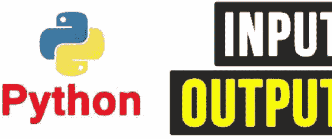
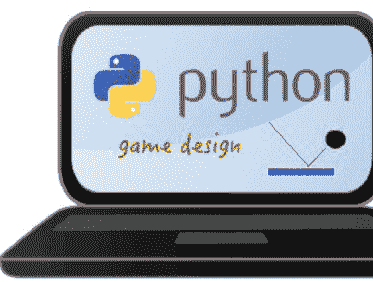
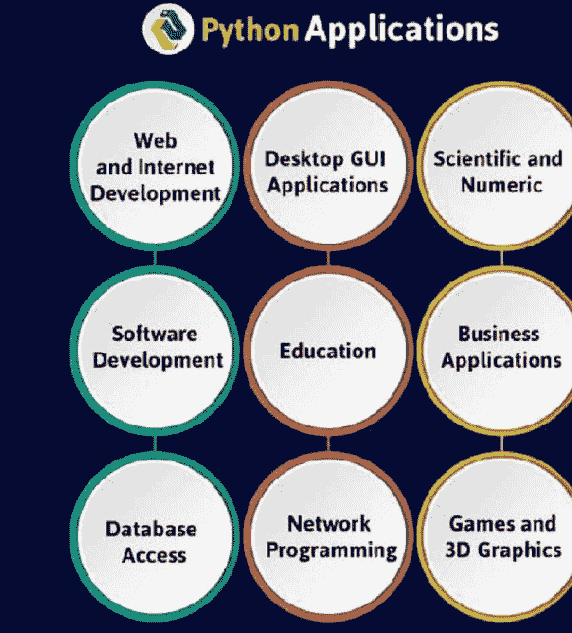
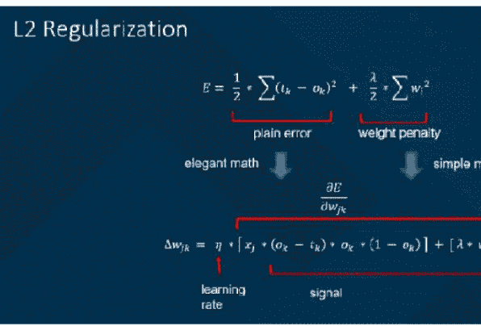
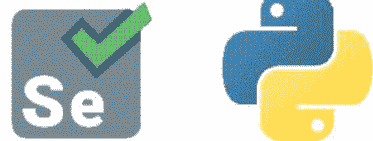
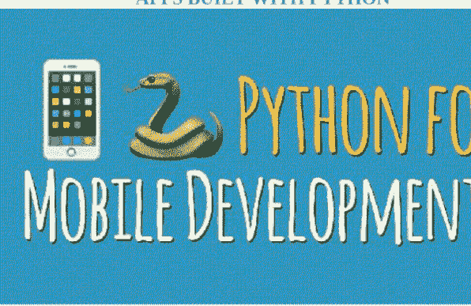
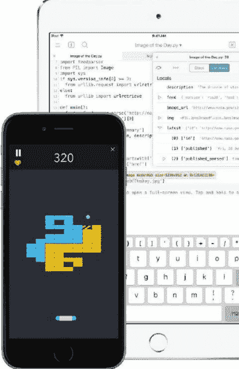

## 学习Python编程

以清晰简洁的方法从零开始编写代码，配合完整的标准培训课程。从初学者到中级水平，通过实例进行动手实践，以符合详细的要求。

恭喜您下载了这本电子书，感谢您的支持。

**请尽情享受！**

© 版权所有 2021 [保留所有权利](https://example.com)

未经出版商事先书面许可，不得以任何形式或任何方式（包括影印、录制或其他电子或机械方法，或任何信息存储和检索系统）复制、分发或传播本出版物的任何部分，但版权法允许的简短引用用于评论和某些其他非商业用途的情况除外。

## 目录

- 第1章
  - 学习Python编程
  - 引言
  - Python在未来保持巨大受欢迎程度的原因
    - 支持多种编程范式
    - 不要求程序员编写冗长代码
    - 提供全面的标准库
    - 促进Web应用开发
    - 便于开发高质量的GUI、科学和数值应用
    - 简化应用原型设计
    - 也可用于移动应用开发
    - 开源
- 第2章
  - 如何接受用户输入并显示输出
- 第3章
  - 如何定义自己的函数和模块
- 第4章
  - 如何编写自己的类
  - 面向对象
- 第5章
  - 如何处理外部文件
- 第6章
  - 探索变量、字符串、整数等以设计对话式程序
- 第7章
  - 理解“图形用户界面”并创建自己的街机游戏和应用
- 第8章
  - Django对现有Python开发者有何益处
  - 更短更简洁的代码
  - 自定义Web应用的选项
  - 用于完成常见任务的内置工具
  - 多种软件包
  - 对象关系映射器（ORM）
  - 人类可读的URL
  - 动态管理界面
  - 优化的安全性
  - 交流想法的选项
- 第9章
  - 重要的Python框架
    - 1) Kivy
    - 2) Qt
    - 3) PyGUI
    - 4) WxPython
    - 5) Django
    - 6) CherryPy
    - 7) Flask
    - 8) Pyramid
    - 9) Web.py
    - 10) TurboGears
- 第10章
  - Python在图像应用中的作用
- 第11章
  - Python中带L2正则化的逻辑回归
- 第12章
  - Python Web应用能否使用Selenium进行测试？
    - 支持主要操作系统和Web浏览器
    - 允许用户创建完整的测试自动化套件
    - 更快地执行测试
    - 需要基本的HTML概念
    - 帮助测试人员解决可维护性问题
    - 提供Selenium Python API
- 第13章
  - Perl与Python
    - 1) 设计目标
    - 2) 语法规则
    - 3) 语言家族
    - 4) 实现相同结果的方式
    - 5) Web脚本语言
    - 6) Web应用框架
    - 7) 用途
    - 8) 性能和速度
    - 9) 结构化数据分析
    - 10) JVM互操作性
    - 11) 高级面向对象编程
    - 12) 文本处理能力
- 第14章
  - 使用Python构建的应用
    - Instagram
    - Pinterest
    - Disqus
    - Spotify
    - Dropbox
    - Uber
    - Reddit
- 第15章
  - 在Android上运行Python的工具
    - BeeWare
    - Chaquopy
    - Kivy
    - Pyqtdeploy
    - QPython
    - SL4A
    - PySide
    - Termux
- 第16章
  - Python作为移动应用开发语言
- 第17章
  - 用于移动应用开发的编程语言
    - BuildFire.js
    - Python
    - Java
    - PHP
    - Swift
    - C#
    - Objective-C
    - C++
    - JavaScript
    - HTML5
    - Ruby
    - Perl
    - Rust
    - SQL

# 第1章

## 学习Python编程

**引言**

Python是高级语言的一个例子。您可能听说过的其他高级语言包括C++、PHP、Pascal、C#和Java。Python是一种易于学习、功能强大的编程语言。它具有高效的高级数据结构和一种简单但有效的面向对象编程方法。

Python最初由Van Rossum在1989年12月构想为一种业余爱好语言。此外，这种通用编程语言的主要且向后不兼容的版本于2008年12月3日发布。但最近，Python被许多调查者评为2015年最受欢迎的编程语言。这种巨大的受欢迎程度表明了Python作为现代编程语言的有效性。同时，Python 3目前被世界各地的开发者用于创建各种桌面GUI、Web和移动应用。

Python是一种高级、解释型的脚本语言，由Guido van Rossum于1980年代末在荷兰国家数学与计算机科学研究所开发。初始版本于1991年在alt.sources新闻组发布，1.0版本于1994年发布。

Python 2.0于2000年发布，2.x版本是2008年12月之前的主流版本。当时，开发团队决定发布3.0版本，其中包含一些相对较小但重要的更改，这些更改与2.x版本不向后兼容。Python 2和3非常相似，Python 3的一些功能已被移植回Python 2。但总的来说，它们仍然不完全兼容。

Python 2和3都继续得到维护和开发，并定期发布更新。截至撰写本文时，可用的最新版本是2.7.15和3.6.5。然而，Python 2的官方生命周期结束日期已定为2020年1月1日，届时将不再维护。如果您是Python新手，建议您专注于Python 3，本教程也将如此。

Python仍由研究所的核心开发团队维护，Guido仍然负责，被Python社区授予BDFL（终身仁慈独裁者）的称号。顺便说一下，Python这个名字并非源自蛇，而是源自英国喜剧团体Monty Python's Flying Circus，Guido是，而且可能仍然是，该团体的粉丝。在Python文档中，经常可以找到对Monty Python小品和电影的引用。

Python在未来很长一段时间内保持巨大受欢迎程度和市场份额的原因还有很多。

### Python在未来保持巨大受欢迎程度的原因

#### 支持多种编程范式

优秀的开发者经常利用不同的编程范式来减少开发大型复杂应用所需的时间和精力。与其他现代编程语言一样，Python也支持多种常用的编程风格，包括面向对象、函数式、过程式和命令式。它还具有自动内存管理功能以及动态类型系统。因此，程序员可以使用该语言来高效开发大型复杂的软件应用。

#### 不要求程序员编写冗长代码

Python的设计完全专注于代码可读性。因此，程序员可以创建可读的代码库，供分布式团队成员使用。同时，该编程语言的简单语法使他们能够在不编写更长代码行的情况下表达概念。这一特性使开发者更容易在规定时间内开发大型复杂应用。由于他们可以轻松跳过其他编程语言所需的某些任务，开发者维护和更新应用变得更加容易。

#### 提供全面的标准库

Python因其广泛的标准库而进一步优于其他编程语言。程序员可以使用这些库来完成各种任务，而无需编写更长的代码行。此外，Python的标准库设计了大量高频使用的编程任务。因此，它帮助程序员完成诸如字符串操作、Web服务的开发和实现、处理互联网协议以及处理操作系统接口等任务。

### 促进 Web 应用程序开发

Python 被设计为一种通用编程语言，本身并不内置 Web 开发功能。但 Web 开发者可以使用各种附加模块，用 Python 编写现代 Web 应用程序。在用 Python 编写 Web 应用程序时，程序员可以选择使用多种高级 Web 框架，包括 Django、web2py、TurboGears、CubicWeb 和 Reahl。这些 Web 框架帮助程序员执行许多操作，无需编写额外代码，例如数据库操作、URL 路由、会话存储与检索，以及输出模板格式化。他们还可以进一步利用这些 Web 框架来保护 Web 应用程序免受跨站脚本攻击、SQL 注入和跨站请求伪造的侵害。

### 促进高质量 GUI、科学和数值应用程序的开发

Python 目前可在 Windows、Mac OS X、Linux 和 UNIX 等主要操作系统上运行。因此，用该编程语言编写的桌面 GUI 应用程序可以部署在多个平台上。程序员还可以使用 Kivy、wxPython 和 PyGtk 等框架来加速跨平台桌面 GUI 应用程序的开发。许多报告指出，Python 被广泛用于开发数值和科学应用程序。在用 Python 编写科学和数值应用程序时，开发者可以利用 Scipy、Pandas、IPython 以及 Python Imaging Library 等工具。

### 简化应用程序原型设计

如今，每个组织都希望通过开发具有独特和创新功能的软件来超越竞争对手。这就是为什么原型设计已成为现代软件开发生命周期中不可或缺的一部分。在编写代码之前，开发者必须创建应用程序的原型，以向各种利益相关者展示其特性和功能。作为一种简单快速的编程语言，Python 使程序员能够在不投入额外时间和精力的情况下开发最终系统。同时，开发者也可以选择直接从原型开始开发系统，只需重构代码即可。

### 也可用于移动应用程序开发

Kivy 等框架也使 Python 可用于开发移动应用程序。作为一个库，Kivy 可用于创建桌面应用程序和移动应用程序。但它允许开发者编写一次代码，然后将相同的代码部署到多个平台上。除了与移动设备的硬件进行交互外，Kivy 还内置了摄像头适配器、用于渲染和播放视频的模块，以及通过多点触控和手势接受用户输入的模块。因此，程序员可以使用 Kivy 为 iOS、Android 和 Windows Phone 创建同一应用程序的不同版本。此外，该框架在创建 Kivy 程序时不需要开发者编写冗长的代码行。创建移动应用程序的不同版本后，他们可以为各个应用商店分别打包应用程序。这一选项使开发者更容易创建移动应用程序的不同版本，而无需部署单独的开发人员。

#### 开源

尽管被评为 2015 年最受欢迎的编程语言，Python 仍然作为开源和免费软件提供。除了大型 IT 公司外，初创公司和自由软件开发者也可以在不支付任何费用或版税的情况下使用该编程语言。因此，Python 使企业更容易显著降低开发成本。同时，程序员也可以利用庞大而活跃的社区的帮助，为软件应用程序添加开箱即用的功能。

Python 的上一个主要版本发布于 2008 年 12 月。Python 3 作为一个向后不兼容的版本发布，其大部分主要功能被移植回 Python 2.6 和 2.7。然而，该编程语言正由社区定期更新。社区于 2 月 23 日发布了 Python 3.4.3，包含多项功能和补丁。因此，开发者始终可以使用最新版本的 Python 编程语言来促进各种软件应用程序的开发。

# 第 2 章

## 如何接受用户输入和显示输出



### 输入函数

经典入门程序中的 hello 程序总是做同样的事情。这并不十分有趣。只有当程序能够处理各种数据时，才会被重用。获取数据的一种方式是直接从用户那里获取。在编辑器中按如下方式修改 hello.py 程序，并使用“文件 ▸ 另存为...”将其保存为 hello_you.py。

```
person = input('Enter your name: ')
print('Hello', person)
```

运行该程序。在 Shell 中，你应该会看到

```
Enter your name:
```

按照指示操作（并按回车键）。确保输入光标位于 Shell 窗口中该行的末尾。输入你的响应后，你可以看到程序已经接收了你输入的那一行。这就是内置函数 input 的作用：首先它打印你作为参数提供的字符串（在本例中为 'Enter your name: '），然后等待输入一行文本，并返回你输入的字符字符串。在 hello_you.py 程序中，这个值被赋给变量 person，以供后续使用。

input 后面括号内的参数很重要。它是一个提示，提示你此时需要键盘输入，并希望说明正在请求什么内容。如果没有提示，用户将不知道发生了什么，计算机只会坐在那里等待！

打开示例程序 interview.py。在运行它之前（使用任何虚构的数据），看看你是否能弄清楚它将做什么：

```
"""Illustrate input and print."""

applicant = input("Enter the applicant's name: ")
interviewer = input("Enter the interviewer's name: ")
time = input("Enter the appointment time: ")
print(interviewer, "will interview", applicant, "at", time)
```

这些语句按照它们在程序文本中出现的顺序执行：顺序执行。这是程序执行流程最简单的方式。你稍后会看到改变这种自然流程的指令。

如果我们想重新加载并修改 hello_you.py 程序，在末尾加上感叹号，你可以尝试：

```
person = input('Enter your name: ')
print('Hello', person, '!')
```

运行它，你会发现间距不对。人名后面不应该有空格，但 print 函数的默认行为是在每个字段之间用空格分隔打印。有几种方法可以解决这个问题。你应该知道一种。在继续下一节之前思考一下。提示：[1]

[1] 字符串上的 + 操作不会添加额外的空格。

#### 1.10.2. 使用关键字参数 sep 进行打印

在 hello_you.py 中，在人名后添加标点符号但不加空格的一种方法是使用加号运算符 +。另一种方法是更改 print 函数中字段之间的默认分隔符。这将引入一个新的语法特性：关键字参数。print 函数有一个名为 sep 的关键字参数。如果你在调用 print 时省略它，就像我们目前所做的那样，它默认被设置为空格。如果你在 hello_you.py 的 print 函数中添加最后一个字段 sep=""，你会得到以下示例文件 hello_you2.py：

```
"""Hello to you! Illustrates sep with empty string in print.
"""

person = input('Enter your name: ')
print('Hello ', person, '!', sep="")
```

试运行该程序。

关键字参数必须列在参数列表的末尾。

#### 1.10.3. 数字和数字字符串

考虑以下问题：提示用户输入两个数字，然后打印出一个说明总和的句子。例如，如果用户输入 2 和 3，你应该打印 'The sum of 2 and 3 is 5.'。

你可能会想象一个像示例文件 addition1.py 那样的解决方案，如下所示。这里有一个问题。在你尝试之前，你能找出问题所在吗？提示：[2]

```
"""Error in addition from input."""

x = input("Enter a number: ")
y = input("Enter a second number: ")
print("The sum of ", x, ' and ', y, ' is ', x+y, '.', sep="") #error
```

无论如何，最终运行它。

我们不需要字符串连接，而是需要整数加法。我们需要整数操作数。在《类型与函数快速入门》中简要提到，我们可以使用类型名称作为函数来转换类型。一种方法就是这样做。下面的示例文件 addition2.py 中还引入了进一步的变量名，以强调类型之间的区别。阅读并运行：

```
"""Conversion of strings to int before addition"""

xString = input("Enter a number: ")
x = int(xString)
yString = input("Enter a second number: ")
```

##### 1.10.3.1. 加法练习

编写一个名为 `add3.py` 的程序，要求用户输入三个数字，然后以与上面 `addition4.py` 类似的格式列出这三个数字及其总和。

##### 1.10.3.2. 商数练习

编写一个名为 `quotient.py` 的程序，提示用户输入两个整数，然后以包含整数除法问题的句子形式打印出来，例如：

14 除以 3 的商是 4，余数是 2

如果忘记了整数除法或取余运算符，请复习“除法与余数”部分。

#### 1.10.4. 字符串格式化操作

在小学测验中，一个常见的惯例是使用填空题。例如，

你好 _____！

你可以填入被问候者的名字，将给定文本与选定的插入内容组合起来。我们以此作为类比：Python 有一个类似的构造，更准确地称为“花括号填充”。字符串上有一个特定的操作叫做 `format`，它可以在花括号包围的位置进行替换。例如，示例文件 `hello_you3.py` 创建并打印的字符串与上一节的 `hello_you2.py` 相同：

```python
"""Hello to you! Illustrates format with {} in print.
"""
person = input('Enter your name: ')
greeting = 'Hello, {}!'.format(person)
print(greeting)
```

这里有几个新概念！

首先使用了对象的方法调用语法。你将在下一章“面向对象”的开头更详细地了解这种非常重要的现代语法。Python 中的所有数据都是对象，包括字符串。对象有与特定对象类型关联的特殊函数语法，称为方法。特别是 `str` 对象有一个名为 `format` 的方法。方法的语法是对象后跟一个句点，然后是方法名，括号内是进一步的参数。

```
object.methodname(parameters)
```

在上面的例子中，对象是字符串 `'Hello {}!'`。方法名为 `format`。还有一个额外的参数 `person`。

`format` 方法的字符串具有特殊形式，其中嵌入了花括号。嵌入花括号的位置将被从 `format` 方法的参数列表中取出的表达式值替换。花括号之间的语法有许多变体。在这种情况下，我们使用的语法是：字符串中第一个（也是唯一一个）带花括号的位置，将从第一个（也是唯一一个）参数进行替换。

在上面的代码中，这个新字符串被赋值给标识符 `greeting`，然后打印该字符串。

引入标识符 `greeting` 是为了将操作分解为更清晰的步骤序列。然而，由于 `greeting` 的值只被引用了一次，可以用更简洁的版本来消除它：

```python
person = input('Enter your name: ')
print('Hello {}!'.format(person))
```

考虑面试程序。假设我们想在句子末尾添加一个句号（前面没有空格）。一种方法是用加号将所有内容组合起来。另一种方法是使用关键字 `sep=""` 进行打印。还有一种方法是使用字符串格式化。使用我们的小学类比，想法是填空：

_____ 将在 _____ 面试 _____。

有多个位置需要替换，`format` 方法可以扩展为多个替换：`format` 字符串中每个有 `'{}'` 的位置，`format` 操作将用 `format` 参数列表中的下一个参数值进行替换。

运行示例文件 `interview2.py`，并检查三种方法的结果是否匹配。

```python
"""Compare print with concatenation and with format string."""

applicant = input("Enter the applicant's name: ")
interviewer = input("Enter the interviewer's name: ")
time = input("Enter the appointment time: ")
print(interviewer + ' will interview ' + applicant + ' at ' + time + '.')
print(interviewer, ' will interview ', applicant, ' at ', time, '.', sep="")
print('{} will interview {} at {}.'.format(interviewer, applicant, time))
```

有时你需要一个单独的字符串，而不仅仅是为了打印。你可以用 `+` 运算符组合片段，但所有片段必须是字符串或显式转换为字符串。`format` 方法的一个优点是它会自动将类型转换为字符串，就像 `print` 函数一样。这是我们的加法句子示例的另一个变体 `addition4a.py`，使用了 `format` 方法。

```python
"""Two numeric inputs, explicit sum"""

x = int(input("Enter an integer: "))
y = int(input("Enter another integer: "))
sum = x + y
sentence = 'The sum of {} and {} is {}.'.format(x, y, sum)
print(sentence)
```

在 `interview2.py` 中不需要转换为字符串。（所有内容一开始就是字符串。）然而，在 `addition4a.py` 中，整数到字符串的自动转换很有用。

到目前为止，没有哪种情况必须使用格式化字符串而不是其他方法。有时格式化字符串提供更短、更简单的表达式。除非在练习中特别要求练习，否则请使用你喜欢的任何方法来组合字符串和数据。花括号中的字段有许多变体来控制格式。我们稍后会看一个例子，即“浮点精度的字符串格式化”，在那里格式化字符串特别有用。

一个技术要点：由于花括号在格式化字符串中具有特殊含义，如果你想让花括号实际包含在最终的格式化字符串中，必须有一个特殊的规则。规则是使用双花括号：`'{{'` 和 `'}}'`。下面的示例代码 `formatBraces.py` 使 `setStr` 指向字符串 `'The set is {5,9}.'`。格式化字符串中开头和结尾的双花括号在格式化字符串中生成字面花括号：

```python
"""Illustrate braces in a formatted string."""
a = 5
b = 9
setStr = 'The set is {{{}, {}}}.'.format(a, b)
print(setStr)
```

这种格式化字符串直接依赖于 `format` 方法参数的顺序。还有另一种使用字典的方法，它在第一个示例程序 `madlib.py` 中使用，并将在“字典与字符串格式化”中进一步讨论。字典方法在许多情况下可能是最好的，但基于计数的方法更容易入门，特别是如果参数只是按顺序使用一次。

##### 可选扩展：使用显式编号条目

想象格式化参数按顺序编号，从 0 开始。在这种情况下是 0、1 和 2。参数位置的编号可以包含在花括号内，因此 `interview2.py` 最后一行的替代方案是（在示例文件 `interview3.py` 中添加）：

```python
print('{0} will interview {1} at {2}.'.format(interviewer, applicant, time))
```

这比之前的版本更冗长，没有明显的优势。然而，如果你想多次使用某些参数，那么使用数字标识参数的方法就很有用。字符串中每个包含 `'{0}'` 的地方，`format` 操作将用列表中的第一个参数值进行替换。每当 `'{1}'` 出现时，将替换下一个格式化参数……

预测下面示例文件 `arith.py` 的结果，如果你输入 5 和 6。然后通过运行它来检查自己。在这种情况下，引用参数位置的数字是必要的。它们都被重复使用并且使用顺序被打乱：

```python
"""Fancier format string example with
```

参数标识符
-- 当某些参数被多次使用时非常有用。"""

```
x = int(input('Enter an integer: '))
y = int(input('Enter another integer: '))
formatStr = '{0} + {1} = {2}; {0} * {1} = {3}.'
equations = formatStr.format(x, y, x+y, x*y)
print(equations)
```

尝试用其他数据运行该程序。

既然你已经掌握了一些基础模块，你将看到更多需要你开始进行创造性发挥的练习。建议你回头重读《学习解决问题》。

###### 1.10.4.1. 加法格式练习

编写一个加法练习的版本，文件名为 `add3f.py`，使用字符串格式化方法来构建与之前相同的最终字符串。

###### 1.10.4.2. 商数格式练习

编写一个商数问题的版本，文件名为 `quotientformat.py`，使用字符串格式化方法来构建与之前相同的最终字符串。同样，请确保给出一个完整的句子，同时说明整数商和余数。

# 第 3 章

## 如何定义你自己的函数和模块

模块指的是包含 Python 语句和定义的文件。

一个包含 Python 代码的文件，例如：`example.py`，被称为一个模块，其模块名就是 `example`。

我们使用模块将大型程序分解成小型、可管理且组织良好的文件。此外，模块提供了代码的可重用性。

我们可以将最常用的函数定义在一个模块中，然后导入它，而不是将它们的定义复制到不同的程序中。

让我们创建一个模块。输入以下内容并将其保存为 `example.py`。

```
### Python Module example

def add(a, b):
    """This program adds two
    numbers and return the result"""

    result = a + b
    return result
```

这里，我们在一个名为 `example` 的模块中定义了一个函数 `add()`。该函数接收两个数字并返回它们的和。

如何在 Python 中导入模块？
我们可以将模块内的定义导入到另一个模块或 Python 的交互式解释器中。

我们使用 `import` 关键字来完成此操作。要导入我们之前定义的模块 `example`，我们在 Python 提示符下输入以下内容。

```
>>> import example
```

这不会将 `example` 中定义的函数名直接放入当前的符号表中。它只将模块名 `example` 放入其中。

使用模块名，我们可以通过点 `.` 运算符来访问函数。例如：

```
>>> example.add(4,5.5)
```

#### 9.5

Python 有大量可用的标准模块。

你可以查看 Python 标准模块的完整列表及其用途。这些文件位于你安装 Python 的位置内的 `Lib` 目录中。

标准模块的导入方式与我们导入用户定义模块的方式相同。

有多种导入模块的方法。它们列举如下。

##### Python import 语句

我们可以使用 `import` 语句导入一个模块，并使用上述的点运算符访问其中的定义。这里有一个例子。

```
###### import statement example
###### to import standard module math

import math
print("The value of pi is", math.pi)
```

当你运行该程序时，输出将是：

The value of pi is 3.141592653589793

##### 重命名导入

我们可以通过重命名来导入一个模块，如下所示。

```
###### import module by renaming it

import math as m
print("The value of pi is", m.pi)
```

我们将 `math` 模块重命名为 `m`。在某些情况下，这可以节省我们的输入时间。

注意，名称 `math` 在我们的作用域中无法识别。因此，`math.pi` 是无效的，`m.pi` 才是正确的实现。

##### Python from...import 语句

我们可以从一个模块中导入特定的名称，而无需导入整个模块。这里有一个例子。

```
###### import only pi from math module

from math import pi
print("The value of pi is", pi)
```

我们只从模块中导入了属性 `pi`。

在这种情况下，我们不使用点运算符。我们也可以导入多个属性，例如：

```
>>> from math import pi, e
>>> pi
3.141592653589793
>>> e
2.718281828459045
```

##### 导入所有名称

我们可以使用以下构造从一个模块导入所有名称（定义）。

```
###### import all names from the standard module math

from math import *
print("The value of pi is", pi)
```

我们从 `math` 模块导入了所有定义。这使得所有不以下划线开头的名称在我们的作用域中可见。

使用星号（`*`）符号导入所有内容不是一种好的编程实践。这可能导致标识符的重复定义。它还会妨碍我们代码的可读性。

##### Python 模块搜索路径

在导入模块时，Python 会查看多个位置。解释器首先查找内置模块，然后（如果未找到）查找在 `sys.path` 中定义的目录列表。搜索顺序如下。

当前目录。

`PYTHONPATH`（一个包含目录列表的环境变量）。

依赖于安装的默认目录。

```
>>> import sys
>>> sys.path
['',
'C:\Python33\Lib\idlelib',
'C:\Windows\system32\python33.zip',
'C:\Python33\DLLs',
'C:\Python33\lib',
'C:\Python33',
'C:\Python33\lib\site-packages']
```

我们可以修改此列表以添加我们自己的路径。

##### 重新加载模块

Python 解释器在一次会话中只导入一次模块。这使得事情更有效率。这里有一个例子来说明这是如何工作的。

假设我们在一个名为 `my_module` 的模块中有以下代码。

```
###### This module shows the effect of
###### multiple imports and reload

print("This code got executed")
```

现在我们来看多次导入的效果。

```
>>> import my_module
```

This code got executed

```
>>> import my_module
```

```
>>> import my_module
```

我们可以看到我们的代码只执行了一次。这说明我们的模块只被导入了一次。

现在，如果我们的模块在程序运行过程中发生了更改，我们就必须重新加载它。一种方法是重新启动解释器。但这并没有太大帮助。

Python 提供了一种简洁的方法来完成此操作。我们可以使用 `imp` 模块中的 `reload()` 函数来重新加载模块。操作如下。

```
>>> import imp
```

```
>>> import my_module
```

This code got executed

```
>>> import my_module
```

```
>>> imp.reload(my_module)
```

This code got executed

<module 'my_module' from '.\my_module.py'>

##### dir() 内置函数

我们可以使用 `dir()` 函数来查找模块内定义的名称。

例如，我们在开头的 `example` 模块中定义了一个函数 `add()`。

```
>>> dir(example)
```

['__builtins__',

'__cached__',
'__doc__',
'__file__',
'__initializing__',
'__loader__',
'__name__',
'__package__',
'add']
```

这里，我们可以看到一个排序后的名称列表（包括 `add`）。所有其他以下划线开头的名称都是与模块关联的默认 Python 属性（我们自己没有定义它们）。

例如，`__name__` 属性包含模块的名称。

```
>>> import example
>>> example.__name__
'example'
```

使用不带任何参数的 `dir()` 函数可以找到我们当前命名空间中定义的所有名称。

```
>>> a = 1
>>> b = "hello"
>>> import math
>>> dir()
['__builtins__', '__doc__', '__name__', 'a', 'b', 'math', 'pyscripter']
```

查看这些示例以了解更多：

Python 程序：洗牌

Python 程序：显示日历。

# 第 4 章

## 如何编写你自己的类

在面向对象的计算机语言（如 Python）中，类基本上是创建你自己的对象的模板。对象是将变量和函数封装成一个单一实体。对象从类中获取它们的变量和函数。

这里有一些例子将帮助你理解——请继续阅读。还有一个交互式代码外壳，只需按下特定窗口顶部的“运行”按钮即可。

描述类及其使用方法的最简单方式是这样的：

想象你拥有强大的力量。你创造了一个物种（“类”）。

然后你为该物种创建属性（“属性”）——身高、体重、四肢、颜色、能力，

以此类推。

然后你创建该物种的一个实例——比如小狗菲多、《权力的游戏》中的卓耿，等等。接着你就可以操作这些实例了：

例如，在游戏中，它们会利用各自的属性进行行动和交互。
在银行应用中，它们代表不同的交易。
在车辆买卖/租赁应用中，车辆类可以派生出诸如汽车这样的子类。每个子类都会有诸如里程数、选装件、功能、颜色和内饰等属性。
你已经能看出这为什么有用了。你正在以一种非常高效、合乎逻辑且实用的方式创建、复用、调整和改进事物。

到现在，你可能已经意识到这是一种分类和分组的方式，它与人类的学习方式相似：

- 从基本意义上说，动物是除人类和树木之外的生物
- 然后你开始了解不同种类的动物——狗、猫可能是我们大多数人最早认识的动物
- 接着你开始了解动物的不同属性——形状、大小、声音、附肢等等。

例如，当你还是个孩子时，你对狗最初的理解可能是一种有四条腿、会叫的东西。然后你学会了区分哪些是真狗，哪些是玩具。明白了“狗”这个概念包含了许多类型。

创建和使用类基本上就是：

- 构建一个用来放置“事物”的模板——一种分类
- 然后可以对这个模板进行操作。例如，找出所有养狗的人，你可以请求他们链接到一个关于宠物的博客；或者找出所有可能成为新信用卡优质客户的银行客户。

这里的关键点是，类是能够产生这些模板实例的对象，可以对这些实例应用操作和方法。这是为任何组织或流程进行概念化、组织化和构建层次结构的绝佳方式。

随着我们的世界变得越来越复杂，这是一种从层次结构角度模拟这种复杂性的方式。它也从虚拟信息技术的角度，加深了对商业、技术和社会环境中流程与交互的理解。

一个例子可能是你创建的一个电子游戏。每个角色都可以是一个“类”，拥有自己的属性，并与其他类的实例进行交互。“国王”类的乔治国王可能会与“小丑”类的宫廷弄臣“搞笑先生”互动，以此类推。例如，一个国王可能有一个皇家的“仆人”类，而一个“仆人”类则总是对应一个“国王”类。

这就是我们将要做的：

- 创建一个类并使用它
- 创建一个模块，将类的创建和初始化移到该模块中
- 在一个新程序中调用该模块来使用这个类。

```python
#TSB - 在Python中创建类 - 火箭位置(x,y)和图表
#一些项目和注释加粗以引起对过程的注意
import matplotlib.pyplot as plt
class Rocket():
    def __init__(self, x=0, y=0):
        #每枚火箭都有(x,y)位置；用户或调用函数可以选择
        #传入x和y值，或者默认设置为0
        self.x = x
        self.y = y

    def move_up(self):
        self.y += 1

    def move_down(self):
        self.y -= 1

    def move_right(self):
        self.x += 1

    def move_left(self):
        self.x -= 1

#制作一系列火箭 - x,y位置，我将其称为rocket
rockets=[]
rockets.append(Rocket())
rockets.append(Rocket(0,2))
rockets.append(Rocket(1,4))
rockets.append(Rocket(2,6))
rockets.append(Rocket(3,7))
rockets.append(Rocket(5,9))
rockets.append(Rocket(8, 15))

#在图表上显示每枚火箭的位置
for index, rocket in enumerate(rockets):
    #火箭的原始位置
    print("Rocket %d is at (%d, %d)." % (index, rocket.x, rocket.y))
    plt.plot(rocket.x, rocket.y, 'ro', linewidth=2, linestyle='dashed', markersize=12)
    #将'火箭'向上移动一格
    rocket.move_up()
    print("New Rocket position %d is at (%d, %d)." % (index, rocket.x, rocket.y))
    #绘制新位置
    plt.plot(rocket.x, rocket.y, 'bo', linewidth=2, linestyle='dashed', markersize=12)
    #将火箭向左移动，然后绘制新位置
    rocket.move_left()
    plt.plot(rocket.x, rocket.y, 'yo', linewidth=2, linestyle='dashed', markersize=12)
    #显示图表图例以匹配颜色和位置
    plt.gca().legend(('original position','^ - Moved up', '< - Moved left'))
    plt.show()
    #plt.legend(loc='upper left')
```

就是这样。你可以创建许多不同的类，包括父类、子类等等。

### 面向对象

Python自诞生以来就是一门面向对象的语言。因此，创建和使用类与对象非常简单。本章将帮助你成为使用Python面向对象编程支持的专家。

如果你之前没有任何面向对象（OO）编程的经验，你可能需要查阅相关的入门课程或至少某种教程，以便掌握基本概念。

不过，这里简要介绍一下面向对象编程（OOP），让你快速上手——

#### OOP术语概述

- **类** – 一个用户定义的对象原型，定义了一组描述该类任何对象的属性。属性包括数据成员（类变量和实例变量）和方法，通过点号表示法访问。
- **类变量** – 由类的所有实例共享的变量。类变量在类内部但在任何类方法之外定义。类变量的使用频率不如实例变量。
- **数据成员** – 保存与类及其对象相关数据的类变量或实例变量。
- **函数重载** – 为一个特定函数分配多种行为。执行的操作因涉及的对象或参数类型而异。
- **实例变量** – 在方法内部定义且仅属于类当前实例的变量。
- **继承** – 将一个类的特性传递给从它派生的其他类。
- **实例** – 某个类的单个对象。例如，一个属于Circle类的对象obj就是Circle类的一个实例。
- **实例化** – 创建一个类的实例。
- **方法** – 在类定义中定义的一种特殊函数。
- **对象** – 由其类定义的数据结构的唯一实例。对象包含数据成员（类变量和实例变量）和方法。
- **运算符重载** – 为一个特定运算符分配多个函数。

### 创建类

`class`语句创建一个新的类定义。类的名称紧跟在关键字`class`之后，然后是一个冒号，如下所示：

```python
class ClassName:
    '可选的类文档字符串'
    class_suite
```

该类有一个文档字符串，可以通过`ClassName.__doc__`访问。

`class_suite`包含定义类成员、数据属性和函数的所有组件语句。

### 示例

以下是一个简单的Python类示例：

```python
class Employee:
    '所有员工的公共基类'
    empCount = 0

    def __init__(self, name, salary):
        self.name = name
        self.salary = salary
        Employee.empCount += 1

    def displayCount(self):
        print "Total Employee %d" % Employee.empCount

    def displayEmployee(self):
        print "Name : ", self.name,  ", Salary: ", self.salary
```

变量`empCount`是一个类变量，其值在所有此类实例之间共享。可以在类内部或外部通过`Employee.empCount`访问它。

第一个方法`__init__()`是一个特殊方法，被称为类构造函数或初始化方法，当你创建此类的新实例时，Python会调用它。

你像声明普通函数一样声明其他类方法，不同之处在于每个方法的第一个参数是`self`。Python会自动将`self`参数添加到列表中；你不需要

### 创建实例对象

要创建类的实例，你需要使用类名调用该类，并传入其`__init__`方法所接受的任何参数。

```
"这将创建Employee类的第一个对象"
emp1 = Employee("Zara", 2000)
"这将创建Employee类的第二个对象"
emp2 = Employee("Manni", 5000)
```

### 访问属性

你可以使用点运算符配合对象来访问对象的属性。类变量则可以使用类名来访问，如下所示：

```
emp1.displayEmployee()
emp2.displayEmployee()
print "Total Employee %d" % Employee.empCount
```

现在，将所有概念整合在一起：

```
#!/usr/bin/python

class Employee:
    'Common base class for all employees'
    empCount = 0

    def __init__(self, name, salary):
        self.name = name
        self.salary = salary
        Employee.empCount += 1

    def displayCount(self):
        print "Total Employee %d" % Employee.empCount

    def displayEmployee(self):
        print "Name : ", self.name,  ", Salary: ", self.salary
```

"这将创建Employee类的第一个对象"
emp1 = Employee("Zara", 2000)
"这将创建Employee类的第二个对象"
emp2 = Employee("Manni", 5000)
emp1.displayEmployee()
emp2.displayEmployee()
print "Total Employee %d" % Employee.empCount

执行上述代码后，会产生以下结果：

```
Name :  Zara ,Salary:  2000
Name :  Manni ,Salary:  5000
Total Employee 2
```

你可以随时添加、删除或修改类和对象的属性：

```
emp1.age = 7  # 添加一个'age'属性。
emp1.age = 8  # 修改'age'属性。
del emp1.age  # 删除'age'属性。
```

除了使用常规语句访问属性外，你还可以使用以下函数：

`getattr(obj, name[, default])` – 用于访问对象的属性。

`hasattr(obj, name)` – 用于检查属性是否存在。

`setattr(obj, name, value)` – 用于设置属性。如果属性不存在，则会被创建。

`delattr(obj, name)` – 用于删除属性。

```
hasattr(emp1, 'age')   # 如果'age'属性存在则返回true
getattr(emp1, 'age')   # 返回'age'属性的值
setattr(emp1, 'age', 8) # 将属性'age'设置为8
delattr(emp1, 'age')   # 删除属性'age'
```

### 内置类属性

每个Python类都保留以下内置属性，它们可以像其他属性一样使用点运算符访问：

`__dict__` – 包含类命名空间的字典。

`__doc__` – 类的文档字符串，如果未定义则为None。

`__name__` – 类名。

`__module__` – 定义类的模块名。在交互模式下，此属性为`"__main__"`。

`__bases__` – 一个可能为空的元组，包含基类，按其在基类列表中出现的顺序排列。

对于上面的类，让我们尝试访问所有这些属性：

```
#!/usr/bin/python

class Employee:
    'Common base class for all employees'
    empCount = 0

    def __init__(self, name, salary):
        self.name = name
        self.salary = salary
        Employee.empCount += 1

    def displayCount(self):
        print "Total Employee %d" % Employee.empCount

    def displayEmployee(self):
        print "Name : ", self.name,  ", Salary: ", self.salary
```

```
print "Employee.__doc__:", Employee.__doc__
print "Employee.__name__:", Employee.__name__
print "Employee.__module__:", Employee.__module__
print "Employee.__bases__:", Employee.__bases__
print "Employee.__dict__:", Employee.__dict__
```

执行上述代码后，会产生以下结果：

```
Employee.__doc__: Common base class for all employees
Employee.__name__: Employee
Employee.__module__: __main__
Employee.__bases__: ()
Employee.__dict__: {'__module__': '__main__', 'displayCount': <function displayCount at 0xb7c84994>, 'empCount': 2, 'displayEmployee': <function displayEmployee at 0xb7c8441c>, '__doc__': 'Common base class for all employees', '__init__': <function __init__ at 0xb7c846bc>}
```

### 销毁对象（垃圾回收）

Python会自动删除不再需要的对象（内置类型或类实例）以释放内存空间。Python定期回收不再使用的内存块的过程被称为垃圾回收。

Python的垃圾回收器在程序执行期间运行，并在对象的引用计数达到零时触发。对象的引用计数会随着指向它的别名数量的变化而变化。

当对象被赋予新名称或放入容器（列表、元组或字典）时，其引用计数会增加。当对象被`del`删除、其引用被重新赋值或其引用超出作用域时，其引用计数会减少。当对象的引用计数达到零时，Python会自动回收它。

```
a = 40    # 创建对象 <40>
b = a     # 增加 <40> 的引用计数
c = [b]   # 增加 <40> 的引用计数
```

```
del a     # 减少 <40> 的引用计数
b = 100   # 减少 <40> 的引用计数
c[0] = -1 # 减少 <40> 的引用计数
```

通常，你不会注意到垃圾回收器何时销毁一个孤立的实例并回收其空间。但是，一个类可以实现特殊方法`__del__()`，称为析构函数，该方法在实例即将被销毁时被调用。此方法可用于清理实例使用的任何非内存资源。

### 示例

这个`__del__()`析构函数会打印即将被销毁的实例的类名：

```
#!/usr/bin/python

class Point:
    def __init__( self, x=0, y=0):
        self.x = x
        self.y = y
    def __del__(self):
        class_name = self.__class__.__name__
        print class_name, "destroyed"
```

```
pt1 = Point()
pt2 = pt1
pt3 = pt1
print id(pt1), id(pt2), id(pt3) # 打印对象的id
del pt1
del pt2
del pt3
```

执行上述代码后，会产生以下结果：

```
3083401324 3083401324 3083401324
Point destroyed
```

注意 – 理想情况下，你应该在单独的文件中定义你的类，然后使用import语句在主程序文件中导入它们。

### 类继承

你可以通过从一个预先存在的类派生来创建一个类，而不是从头开始，方法是在新类名后的括号中列出父类。

子类继承其父类的属性，你可以像在子类中定义的那样使用这些属性。子类也可以覆盖父类的数据成员和方法。

### 语法

派生类的声明方式与父类类似；但是，在类名之后给出了要继承的基类列表：

```
class SubClassName (ParentClass1[, ParentClass2, ...]):
    'Optional class documentation string'
    class_suite
```

```
#!/usr/bin/python

class Parent:       # 定义父类
    parentAttr = 100
    def __init__(self):
        print "Calling parent constructor"

    def parentMethod(self):
        print 'Calling parent method'

    def setAttr(self, attr):
        Parent.parentAttr = attr

    def getAttr(self):
        print "Parent attribute :", Parent.parentAttr

class Child(Parent): # 定义子类
    def __init__(self):
        print "Calling child constructor"

    def childMethod(self):
        print 'Calling child method'
```

```
c = Child()        # 子类的实例
c.childMethod()    # 子类调用其方法
c.parentMethod()   # 调用父类的方法
c.setAttr(200)     # 再次调用父类的方法
c.getAttr()        # 再次调用父类的方法
```

执行上述代码后，会产生以下结果：

```
Calling child constructor
Calling child method
Calling parent method
Parent attribute : 200
```

类似地，你可以从多个父类派生一个类，如下所示：

```
class A:       # 定义你的类A
......

class B:       # 定义你的类B
......

class C(A, B): # A和B的子类
......
```

你可以使用`issubclass()`或`isinstance()`函数来检查两个类和实例之间的关系。

`issubclass(sub, sup)`布尔函数在给定的子类`sub`确实是超类`sup`的子类时返回true。

### 方法重写

你总是可以重写父类的方法。重写父类方法的一个原因可能是，你希望在子类中实现特殊或不同的功能。

### 示例

```python
#!/usr/bin/python

class Parent:       # 定义父类
    def myMethod(self):
        print 'Calling parent method'

class Child(Parent): # 定义子类
    def myMethod(self):
        print 'Calling child method'

c = Child()          # 子类的实例
c.myMethod()         # 子类调用重写的方法
```

当执行上述代码时，会产生以下结果 –

```
Calling child method
```

### 基类重载方法

下表列出了一些你可以在自己的类中重写的通用功能 –

| 序号 | 方法、描述与示例调用 |
| :--- | :--- |
| 1 | `__init__` ( self [,args...] )<br>构造函数（可带任意可选参数）<br>示例调用 : obj = className(args) |
| 2 | `__del__`( self )<br>析构函数，删除一个对象<br>示例调用 : del obj |
| 3 | `__repr__`( self )<br>可求值的字符串表示<br>示例调用 : repr(obj) |
| 4 | `__str__`( self )<br>可打印的字符串表示<br>示例调用 : str(obj) |
| 5 | `__cmp__` ( self, x )<br>对象比较<br>示例调用 : cmp(obj, x) |

### 运算符重载

假设你创建了一个 `Vector` 类来表示二维向量，当你使用加号运算符将它们相加时会发生什么？Python 很可能会报错。

然而，你可以在类中定义 `__add__` 方法来执行向量加法，这样加号运算符就会按预期工作 –

### 示例

```python
#!/usr/bin/python

class Vector:
    def __init__(self, a, b):
        self.a = a
        self.b = b

    def __str__(self):
        return 'Vector (%d, %d)' % (self.a, self.b)

    def __add__(self,other):
        return Vector(self.a + other.a, self.b + other.b)

v1 = Vector(2,10)
v2 = Vector(5,-2)
print v1 + v2
```

当执行上述代码时，会产生以下结果 –

```
Vector(7,8)
```

### 数据隐藏

对象的属性可能在类定义外部可见，也可能不可见。你需要用双下划线前缀来命名属性，这样这些属性就不会被外部直接访问。

### 示例

```python
#!/usr/bin/python

class JustCounter:
    __secretCount = 0

    def count(self):
        self.__secretCount += 1
        print self.__secretCount

counter = JustCounter()
counter.count()
counter.count()
print counter.__secretCount
```

当执行上述代码时，会产生以下结果 –

```
1
2
Traceback (most recent call last):
  File "test.py", line 12, in <module>
    print counter.__secretCount
AttributeError: JustCounter instance has no attribute '__secretCount'
```

Python 通过内部更改名称（包含类名）来保护这些成员。你可以通过 `object._className__attrName` 的方式访问此类属性。如果你将最后一行替换为以下内容，它就能正常工作 –

```python
print counter._JustCounter__secretCount
```

# 第五章

## 如何处理外部文件

所有程序都必须处理外部数据。它们要么从程序文本之外的源接收数据，要么产生某种输出，或者两者兼而有之。想一想：如果程序不产生任何输出，你怎么知道它做了什么？

我们所说的外部数据，是指位于易失性、高速主存储器之外的数据；我们指的是外围设备上的数据。这可能是磁盘上的持久数据，也可能是网络接口上的临时数据。目前，它可能指的是显示在我们终端上的临时数据。

大多数操作系统通过称为文件的抽象概念，提供对简单、统一的外部数据访问。我们将研究操作系统的实现，以及在程序中为我们提供操作系统文件访问的 Python 类。

在《文件对象——我们与文件系统的连接》中，我们提供了 Python 如何处理文件的定义。我们在《文件和打开函数》中介绍了处理文件的内置函数。在《我们在文件对象上使用的方法》中，我们描述了文件对象的一些方法函数。我们将在《文件语句：读写（但不进行算术运算）》中查看文件处理语句。

### 文件对象——我们与文件系统的连接

建立在抽象之上的抽象。文件为我们做了大量的事情。为了支持这种广泛的功能，涉及两个抽象层：操作系统和 Python。不幸的是，这两层使用相同的术语，因此我们必须小心不要随意误用“文件”这个词。

操作系统有各种类型的设备。所有这些不同的设备都使用我们称为文件系统的通用抽象统一起来。计算机的所有设备都以某种操作系统文件的形式出现。一些不是物理设备的东西也以文件的形式出现。文件是在我们的信息基础设施中传输数据的管道。

此外，Python 定义了文件对象。这些文件对象是让我们的 Python 程序访问操作系统文件的装置。

### Python 文件与操作系统文件

文件的工作原理。当你的程序评估 Python 文件对象的方法函数时，Python 会将其转换为对底层操作系统文件的操作。操作系统文件操作会变成对我们计算机上连接的各种设备之一的操作。或者，操作系统文件操作可以变成一个网络操作，通过互联网访问远程计算机的数据。这两层抽象意味着一个 Python 程序可以在各种设备上执行各种各样的操作。

### Python 文件对象

在 Python 中，我们创建一个文件对象来处理文件系统中的文件。除了操作系统文件系统中的文件外，Python 还识别一系列类文件对象，包括用于网络接口的抽象，称为管道和套接字，甚至还有一些内存缓冲区。

与序列、集合和映射不同，文件对象没有 Python 字面量。由于缺少字面量，我们使用 `file()` 或 `open()` 工厂函数创建文件对象。我们向此函数提供两条信息。我们可以提供第三条可选信息，这可能会提高程序的性能。

文件的名称。操作系统将使用其“工作目录”规则来解释此名称。如果名称以 `/`（或 `device:\`）开头，则它是绝对名称。否则，它是相对名称；当前工作目录加上此名称标识该文件。

Python 可以将标准路径（使用 `/`）转换为 Windows 特定路径。这使我们不必真正理解其中的差异。我们可以使用 `/` 来命名所有文件，避免繁琐的细节。

如果我们愿意，可以使用原始字符串来指定使用 `\` 字符的 Windows 路径名。

文件的访问模式。这是读、写和追加的某种组合。该模式还可以包括将字节解释为字符的指令。

可选地，我们可以包含文件的缓冲。通常，我们省略此项。如果给出了缓冲参数，0 表示每个字节在读取或写入时立即传输。值为 1 表示数据按行缓冲，适用于从控制台读取或写入错误日志。更大的数字指定缓冲区大小：超过 4,096 的数字可能会加快你的程序速度。

一旦我们创建了文件对象，我们就可以执行操作来从文件读取字符或向文件写入字符。我们可以读取单个字符或整行。同样，我们可以写入单个字符或整行。

当 Python 将文件作为行序列读取时，每行将成为一个单独的字符串。`'\n'` 字符保留在字符串末尾。可以使用 `rstrip()` 方法函数从字符串中删除这个额外的字符。

文件对象（像序列一样）可以创建一个迭代器，该迭代器将生成文件的各个行。因此，你可以在 `for` 语句中使用文件对象。这使得读取文本文件变得非常简单。

工作完成后，我们还需要使用文件的 `close()` 方法。这会清空内存缓冲区并释放与操作系统文件的连接。在套接字连接的情况下，这将释放用于确保数据通过互联网成功传输的所有资源。

### 文件和打开函数

以下是 `file()` 和 `open()` 工厂函数的正式定义。这些函数创建 Python 文件对象并将其连接到适当的操作系统资源。

```
open(filename, mode[, buffering]) → file
```

filename 是文件的名称。这直接交给操作系统。操作系统期望绝对或相对路径；操作系统会将当前工作目录合并到相对路径中。

模式在下面详细介绍。可以是 `'r'`、`'w'` 或 `'a'`，分别表示读取（默认）、写入或追加。如果在写入或追加模式下打开时文件不存在，它将被创建。如果在写入模式下打开时文件已存在，它将被截断并覆盖。在模式中添加 `'b'`

### 文件操作

对于二进制文件，在模式字符串中添加 `+` 以允许同时进行读写操作。

如果提供了缓冲参数，`0` 表示无缓冲，`1` 表示行缓冲，更大的数字则指定缓冲区大小。

`file(filename, mode[, buffering]) → file`
这是 `open()` 函数的另一个名称。它类似于其他工厂函数，如 `int()` 和 `dict()`。

Python 在所有操作系统中都期望使用 POSIX 标准的 `/` 来分隔文件名路径中的元素。如有必要，Python 会将这些标准名称字符串转换为 Windows 的 `\` 标点。使用标准化的标点可以使你的程序在所有操作系统上可移植。`os.path` 模块提供了以适用于所有操作系统的方式创建有效名称的函数。

#### 提示：构造文件名

当使用 Windows 特定的标点作为文件名时，你会遇到问题，因为 Python 将 `\` 解释为转义字符。要创建包含 Windows 文件名的字符串，你需要在字符串中使用 `\\`，或者使用 `r" "` 字符串字面量。例如，你可以使用以下任意一种：`r"E:\writing\technical\pythonbook\python.html"` 或 `"E:\\writing\\technical\\pythonbook\\python.html"`。

请注意，你通常可以使用 `"E:/writing/technical/pythonbook/python.html"`。这使用了文件路径的 POSIX 标准标点 `/`，并且是最可移植的。Python 通常会为你将标准文件名转换为 Windows 文件名。

通常，你应该使用标准名称（使用 `/`）或使用 `os.path` 模块来构造文件名。此模块消除了使用任何特定标点的需要。`os.path.join()` 函数可以从字符串序列生成标点正确的文件名。

模式字符串指定了操作系统文件将如何被你的程序访问。模式字符串解决了四个独立的问题：打开方式、字节处理、换行符和操作。

对于模式字符串的打开部分，有三种选择：
- `r`：以读取方式打开。从操作系统文件的开头开始。如果操作系统文件不存在，则引发 `IOError` 异常。这是默认值。
- `w`：以写入方式打开。从操作系统文件的开头开始。如果操作系统文件不存在，则创建该操作系统文件。
- `a`：以追加方式打开。从操作系统文件的末尾开始。如果操作系统文件不存在，则创建该操作系统文件。

对于模式字符串的字节处理部分，有两种选择：
- `b`：操作系统文件是字节序列；不要将文件解释为字符序列。这适用于 `.csv` 文件以及图像、电影、声音样本等。

如果未包含 `b`，默认值是将文件解释为普通字符序列。Python 文件对象将是一个迭代器，它从操作系统文件中逐行生成单独的字符串。来自各种编码方案（如 UTF-8 和 UTF-16）的转换将自动处理。

模式字符串的换行符部分有两种选择：
- `U`：通用换行符解释。第一个出现的 `\n`、`\r\n`（或 `\r`）将定义换行符。这三种换行符序列中的任何一种都将被静默转换为标准的 `'\n'` 字符。`\r\n` 是 Windows 特有的功能。

如果未包含 `U`，默认值是仅处理此操作系统的标准换行符。

对于模式字符串的附加操作部分，有两种选择：
- `+`：允许对操作系统文件进行读写操作。
如果未包含 `+`，默认值是只允许有限的操作：对于以 `"r"` 打开的文件只允许读取；对于以 `"w"` 或 `"a"` 打开的操作系统文件只允许写入。

典型的组合包括以下几种：
- `"r"` 用于读取文本文件。
- `"rb"` 用于读取二进制文件。例如，`.csv` 文件通常以二进制模式处理。
- `"w+"` 用于创建新的文本文件以进行读写。

以下示例创建了用于进一步处理的 Python 文件对象：
```python
dataSource= open( "name_addr.csv", "rb" )
newPage= open( "addressbook.html", "w" )
theErrors= open( "/usr/local/log/error.log", "a" )
```

`dataSource`：
此示例以读取方式打开当前工作目录中的现有文件 `name_addr.csv`。变量 `dataSource` 标识此文件对象，我们可以使用此变量从该文件读取字符串。

此文件以二进制模式打开。

`newPage`：
此示例创建一个新文件 `addressbook.html`（如果该文件已存在，则将其截断）。该文件将位于当前工作目录中。变量 `newPage` 标识文件对象。然后我们可以使用此变量向文件写入字符串。

`theErrors`：
此示例追加到文件 `error.log`（如果文件不存在，则创建一个新文件）。该文件具有目录路径 `/usr/local/log/`。由于这是一个绝对名称，它不依赖于当前工作目录。

缓冲文件通常保留为默认值，不指定任何内容。然而，在某些情况下，调整缓冲可以提高性能。例如，错误日志通常是非缓冲的，因此数据可以立即使用。大型输入文件可以使用较大的缓冲区数字打开，以鼓励操作系统通过从设备读取几个大块数据而不是大量小块数据来优化输入操作。

#### 提示：调试文件

在尝试创建文件对象时，可能会出现许多问题。

如果文件名无效，你将得到操作系统错误。通常它们看起来像这样：
```
Traceback (most recent call last):
  File "<stdin>", line 1, in <module>
IOError: [Errno 2] No such file or directory: 'wakawaka'
```

完全正确地获取文件路径非常重要。你会注意到每次启动 IDLE 时，它都认为当前工作目录类似于 `C:\Python26`。你可能正在不同的默认目录中进行工作。

当你在 IDLE 中打开模块文件时，你会注意到 IDLE 会将当前工作目录更改为包含你的模块的目录。如果你将 `.py` 文件和数据文件都放在一个目录中，你会发现事情进展顺利。

下一个最常见的错误是权限错误。这通常意味着尝试写入你没有所有权的文件，或者尝试在你没有写入权限的目录中创建文件。如果你使用的是服务器或公司拥有的计算机，这可能需要与系统管理员合作，以理清你想要做什么以及如何在不损害安全性的情况下完成它。

错误消息中的 `[Errno 2]` 注释是对内部操作系统错误编号的引用。有超过 100 个这样的错误编号，全部收集在名为 `errno` 的模块中。有很多不同的事情可能出错，其中许多是非常、非常模糊的情况。

#### 文件对象上的方法

Python 文件对象是我们对底层操作系统文件的视图。操作系统文件反过来又使我们能够访问特定设备。

Python 文件对象有许多操作，这些操作可以转换文件对象、从操作系统文件读取或写入，或访问有关文件对象的信息。

读取。以下读取方法从操作系统文件获取数据。这些操作也可能改变 Python 文件对象的内部状态和缓冲区。例如，在文件末尾，文件对象的内部状态将被更改。最重要的是，这些方法具有从操作系统文件消耗数据的明显效果。

`file.read(size) → string`
从文件 `f` 中读取多达 `size` 个字符作为单个大字符串。如果 `size` 为负数或省略，则将文件的其余部分读入单个字符串。
```python
from __future__ import print_function
dataSource= open( "name_addr.csv", "r" )
theData= dataSource.read()
for n in theData.splitlines():
    print(n)
dataSource.close()
```

`file.readline(size) → string`
从文件 `f` 中读取下一行或多达 `size` 个字符；可以读取不完整的行。如果 `size` 为负数或省略，则读取下一个完整的行。如果读取了完整的行，它包括尾随的换行符。如果文件在末尾，`f.readline()` 返回一个零长度字符串。如果文件有一个空行，这将是一个长度为 1 的字符串，仅包含换行符。
```python
from __future__ import print_function
dataSource= file( "name_addr.csv", "r" )
n= dataSource.readline()
while len(n) > 0:
    print(n.rstrip())
    n= dataSource.readline()
dataSource.close()
```

`file.readlines(hint)`
从文件 `f` 中读取下一行或从下一个 `hint` 字符中读取尽可能多的行。`hint` 大小可能会向上舍入以匹配内部缓冲区大小。如果 `hint` 为负数或省略，则读取文件的其余部分。所有行都将包括尾随的换行符。如果文件在末尾，`f.readlines()` 返回一个零长度列表。

当我们简单地在 `for` 语句中引用文件对象时，这就是用于迭代文件的函数。
```python
dataSource= file( "name_addr.csv", "r" )
for n in dataSource:
```

### 文件语句：读写操作（不含算术运算）

文件对象（类似序列）可以创建一个迭代器，用于逐行生成文件内容。我们在“循环回顾：迭代器、for语句与生成器”中探讨了序列如何与for语句配合使用。此处，我们将使用文件对象在for语句中读取所有行。

此外，print语句可以将打印字符的目标从标准输出重定向到其他文件。这一点在Python 3.0中将会改变，因此我们不再强调。

#### 打开并读取文件

假设我们有以下文件。如果你使用HotMail、Yahoo!或Google等电子邮件服务，可以下载一个逗号分隔值（CSV）格式的地址簿，其格式与此文件类似。Yahoo!的格式会比此示例包含更多列。

**name_addr.csv**

```
"First","Middle","Last","Nickname","Email","Category"
"Moe","","Howard","Moe","moe@3stooges.com","actor"
"Jerome","Lester","Howard","Curly","curly@3stooges.com","actor"
"Larry","","Fine","Larry","larry@3stooges.com","musician"
"Jerome","","Besser","Joe","joe@3stooges.com","actor"
"Joe","","DeRita","CurlyJoe","curlyjoe@3stooges.com","actor"
"Shemp","","Howard","Shemp","shemp@3stooges.com","actor"
```

以下是一个快速示例，展示如何使用文件迭代器读取此文件。这不是最佳方法，最佳方法将在介绍csv模块时讲解。

```
dataSource = file( "name_addr.csv", "r" )
for addr in dataSource:
    print(addr)
dataSource.close()
```

我们为当前工作目录中的name_addr.csv创建一个Python文件对象，以读取模式打开。我们将此对象命名为dataSource。

for语句为此文件创建一个迭代器；该迭代器将逐行生成文件内容。

我们可以打印每一行。

完成后关闭文件。这将释放程序运行期间占用的操作系统资源。

#### 更完整的读取器

以下程序读取此文件并重新格式化各个记录。它将结果打印到标准输出。这种读取CSV文件的方法并不理想。在下一章中，我们将介绍csv模块，它能处理构建真正可靠程序所需的一些额外细节。

**nameaddr.py**

```
#!/usr/bin/env python
"""Read the name_addr.csv file."""
dataSource = file( "name_addr.csv", "r" )
for addr in dataSource:
    # split the string on the ,s
    quotes= addr.split(",")
    # strip the ""s from each field
    fields= [ f.strip('"') for f in quotes ]
    print( fields[0], fields[1], fields[2], fields[4] )
dataSource.close()
```

我们打开当前工作目录中的name_addr.csv文件。变量dataSource是我们的Python文件对象。

for语句从文件获取一个迭代器。然后可以使用该迭代器，它逐行生成文件内容。每一行都是一个长字符串。字段被双引号包围，并用逗号分隔。

我们使用split()函数按逗号分割字符串。如果引号内的字段包含逗号，此特定方法将无法工作。我们将介绍csv模块，了解如何更好地处理此问题。

我们使用strip()函数从每个字段中移除双引号。注意，我们使用了列表推导式，将包含双引号的字段列表映射为不包含双引号的字段列表。

#### 使用print查看输出

print()函数执行两项操作。我们在“查看结果：print语句”中介绍print()时，快速略过了这两点，因为它们确实是相当高级的概念。

我们在“字符序列：str与Unicode”中介绍了字符串。本章我们介绍文件。现在我们可以打开引擎盖，仔细查看print()函数。

print()函数计算其所有表达式并将其转换为字符串。实际上，它对每个参数值调用str()内置函数。

print()函数写入这些字符串，并用分隔符sep分隔。默认分隔符是空格' '。

print()函数还写入结束符end。默认结束符是换行符'\n'。

print()函数还有一个对我们非常有用的特性。我们可以提供file参数，将输出重定向到特定文件。

我们可以使用此功能将行写入sys.stderr。

```
from __future__ import print_function
import sys
print("normal output")
print("Red Alert!", file=sys.stderr)
print("still normal output", file=sys.stdout)
```

- 我们启用print函数。
- 我们导入sys模块。
- 我们使用未修饰的print语句向标准输出写入消息。
- 我们使用file参数写入sys.stderr。
- 我们也使用file参数写入sys.stdout。

当你在IDLE中运行此代码时，你会注意到错误消息显示为红色，而标准输出显示为蓝色。

#### Print命令

以下是print语句扩展的语法。

print >> file [ , expression , ... ]

`>>` 是这种特殊语法中不可或缺的一部分。这是一种奇特的特殊标点符号，在 Python 语言的其他地方不会出现。它被称为“尖括号打印”。

**重要 Python 3**

这种尖括号打印语法在 Python 3 中将被移除。我们将不再使用带有许多特殊情况的 `print` 语句，而是使用 `print()` 函数。

**打开文件并打印。** 此示例展示了如何在本地目录中打开一个文件并向该文件写入数据。在这个例子中，我们将创建一个名为 `addressbook.html` 的 HTML 文件。我们将向此文件写入一些内容。然后，我们可以用 Firefox 或 Internet Explorer 打开此文件，查看生成的网页。

**addrpage.py**

```python
#!/usr/bin/env python
"""Write the addressbook.html page."""

from __future__ import print_function

new_page = open( "addressbook.html", "w" )

print('<html>', new_page)

print( '<head>'
    '<meta http-equiv="content-type" content="text/html; charset=us-ascii">'
    '<title>addressbook</title></head>', file=new_page)

print( '<body><p>Hello world</p></body>', file=new_page )

print('</html>', file=new_page)

new_page.close()
```

### 基础文件练习

#### 设备结构。

一些磁盘设备被组织成柱面和磁道，而不是块。一个磁盘可能有多个平行的盘片；柱面是在不移动读写头的情况下，跨盘片可用的磁道堆栈。磁道是单个磁盘盘片上一个圆形区域的数据。这有什么优点？这可能导致什么（如果有的话）复杂性？应用程序如何指定要使用的磁道和扇区？

一些磁盘设备被描述为简单的块序列，没有特定顺序。每个块都有一个唯一的数字标识符。这有什么优点？

一些磁盘设备可以进行分区。这与文件处理有什么（如果有的话）关联？

#### 跳过标题记录。

我们的 `name_addr.csv` 文件有一个标题记录。我们可以通过获取迭代器并前进到下一个项目来跳过此记录。

编写 `nameaddr.py` 的一个变体，该变体使用 `iter()` 获取 `dataSource` 文件的迭代器。将此迭代器对象赋值给 `dataSrcIter`。如果你用迭代器 `dataSrcIter` 替换文件 `dataSource`，处理方式会如何改变？在 `for` 语句之前，`dataSrcIter.next()` 返回的值是什么？添加这个如何改变 `for` 语句的处理？

#### 合并两个示例。

我们的两个示例 `addrpage.py` 和 `name_addr.py` 实际上是一个程序的两个部分。一个程序读取姓名和地址，另一个程序写入 HTML 文件。我们可以将这两个程序组合起来，将 CSV 源文件重新格式化为生成的 HTML 页面。

姓名和地址可以格式化为如下所示的网页：

```html
<html>
<head><title>Address Book</title></head>
<body>
<table>
<tr><td>last name</td><td>first name</td><td>email address</td></tr>
<tr><td>last name</td><td>first name</td><td>email address</td></tr>
<tr><td>last name</td><td>first name</td><td>email address</td></tr>
...
</table>
</body>
</html>
```

我们的每个输入字段都变成夹在 `<td>` 和 `</td>` 之间的输出字段。在这种情况下，我们使用诸如 `last name`、`first name` 和 `email address` 之类的短语来显示真实数据将被插入的位置。其他 HTML 元素，如 `<table>`，必须按照此示例中所示的方式打印。

你的最终程序应该打开两个文件：`name_addr.csv` 和 `addressbook.html`。你的程序应该将初始 HTML 材料（直到第一个 `<tr>`）写入输出文件。然后，它应该读取 CSV 记录，在 `<tr>` 到 `</tr>` 之间写入完整的地址行。在读取和写入姓名和地址完成后，它必须从 `</table>` 到 `</html>` 写入 HTML 文件的最后部分。

# 第 6 章

## 探索变量、字符串、整数等以设计对话程序

在我们开始编写程序之前，我们需要为我们的机器人生成一个令牌。访问 Telegram API 和安装必要的依赖项需要此令牌。

### 1. 在 BotFather 中创建一个新机器人

如果你想在 Telegram 中创建一个机器人，你必须在使用之前“注册”你的机器人。当我们“注册”我们的机器人时，我们将获得访问 Telegram API 的令牌。

前往 BotFather（如果你在桌面端打开它，请确保你有 Telegram 应用），然后通过发送 `/newbot` 命令创建新机器人。按照步骤操作，直到获得机器人的用户名和令牌。你可以通过访问此 URL 访问你的机器人：https://telegram.me/YOUR_BOT_USERNAME，你的令牌应该看起来像这样。

704418931:AAEtcZ**************

### 2. 安装库

由于我们将在本教程中使用一个库，请使用此命令安装它。

```
pip3 install python-telegram-bot
```

如果库安装成功，那么我们就可以开始了。

### 编写程序

让我们制作我们的第一个机器人。这个机器人应该在我们发送 `/bop` 命令时返回一张狗的图片。为了能够做到这一点，我们可以使用来自 RandomDog 的公共 API 来帮助我们生成随机的狗图片。

我们机器人的工作流程就像这样简单：

访问 API -> 获取图片 URL -> 发送图片

#### 1. 导入库

首先，导入我们需要的所有库。

```python
from telegram.ext import Updater, CommandHandler
import requests
import re
```

#### 2. 访问 API 并获取图片 URL

让我们创建一个函数来获取 URL。使用 `requests` 库，我们可以访问 API 并获取 json 数据。

```python
contents = requests.get('https://random.dog/woof.json').json()
```

你可以通过在浏览器中访问此 URL 来检查 json 数据：https://random.dog/woof.json。你将在屏幕上看到类似这样的内容：

```json
{"url":"https://random.dog/*****.JPG"}
```

获取图片 URL，因为我们需要该参数才能发送图片。

```python
image_url = contents['url']
```

将此代码包装到一个名为 `get_url()` 的函数中。

```python
def get_url():
    contents = requests.get('https://random.dog/woof.json').json()
    url = contents['url']
    return url
```

#### 3. 发送图片

要发送消息/图片，我们需要两个参数：图片 URL 和接收者的 ID——这可以是群组 ID 或用户 ID。

我们可以通过调用我们的 `get_url()` 函数来获取图片 URL。

```python
url = get_url()
```

使用此代码获取接收者的 ID：

```python
chat_id = update.message.chat_id
```

在我们获取图片 URL 和接收者的 ID 之后，是时候发送消息了，也就是一张图片。

```python
bot.send_photo(chat_id=chat_id, photo=url)
```

将该代码包装在一个名为 `bop` 的函数中，并确保你的代码如下所示：

```python
def bop(bot, update):
    url = get_url()
    chat_id = update.message.chat_id
    bot.send_photo(chat_id=chat_id, photo=url)
```

#### 4. 主程序

最后，创建另一个名为 `main` 的函数来运行我们的程序。不要忘记将 `YOUR_TOKEN` 替换为我们在此教程中早先生成的令牌。

```python
def main():
    updater = Updater('YOUR_TOKEN')
    dp = updater.dispatcher
    dp.add_handler(CommandHandler('bop',bop))
    updater.start_polling()
    updater.idle()

if __name__ == '__main__':
    main()
```

最后，你的代码应该如下所示：

```python
from telegram.ext import Updater, InlineQueryHandler, CommandHandler
import requests
import re

def get_url():
    contents = requests.get('https://random.dog/woof.json').json()
    url = contents['url']
    return url

def bop(bot, update):
    url = get_url()
    chat_id = update.message.chat_id
    bot.send_photo(chat_id=chat_id, photo=url)

def main():
    updater = Updater('YOUR_TOKEN')
    dp = updater.dispatcher
    dp.add_handler(CommandHandler('bop', bop))
    updater.start_polling()
    updater.idle()

if __name__ == '__main__':
    main()
```

#### 5. 运行程序

太棒了！你完成了你的第一个程序。现在让我们检查它是否有效。保存文件，将其命名为 `main.py`，然后使用此命令运行它。

```
python3 main.py
```

通过访问此 URL 前往你的 Telegram 机器人：https://telegram.me/YOUR_BOT_USERNAME。发送 `/bop` 命令。如果一切运行完美，机器人将回复一张随机的狗图片。很可爱，对吧？

**处理错误**

太好了！现在你有了一个机器人，只要你想要，它就会给你发送一张可爱的狗图片。

还有更多！RandomDog API 不仅生成图片，还生成视频和 GIF。如果我们访问 API 并得到一个视频或 GIF，就会出错，机器人不会将其发送给你。

让我们来修复这个问题，使机器人只发送带有图片附件的消息。如果我们收到的是视频或GIF，我们将再次调用API，直到获得图片为止。

### 1. 使用正则表达式匹配文件扩展名

我们将使用正则表达式来解决这个问题。

要区分图片、视频或GIF，我们可以查看文件扩展名。我们只需要URL的最后一部分。

https://random.dog/*****.JPG

首先，我们需要定义程序中允许的文件扩展名。

```
allowed_extension = ['jpg','jpeg','png']
```

然后使用正则表达式从URL中提取文件扩展名。

```
file_extension = re.search("([^.]*$",url).group(1).lower()
```

使用这段代码，创建一个名为`get_image_url()`的函数，循环获取URL，直到我们得到想要的文件扩展名（jpg、jpeg、png）。

```
def get_image_url():
    allowed_extension = ['jpg','jpeg','png']
    file_extension = ""
    while file_extension not in allowed_extension:
        url = get_url()
        file_extension = re.search("([^.]*$",url).group(1).lower()
    return url
```

### 2. 修改你的代码

很好！现在进行最后一步，将`bop()`函数中的`url = get_url()`这一行替换为`url = get_image_url()`，你的代码应该如下所示：

```
from telegram.ext import Updater, InlineQueryHandler, CommandHandler

import re requests

import re

def get_url():
    contents = requests.get('https://random.dog/woof.json').json()
    url = contents['url']
    return url

def get_image_url():
    allowed_extension = ['jpg','jpeg','png']
    file_extension = ""
    while file_extension not in allowed_extension:
        url = get_url()
        file_extension = re.search("([^.]*)$",url).group(1).lower()
    return url

def bop(bot, update):
    url = get_image_url()
    chat_id = update.message.chat_id
    bot.send_photo(chat_id=chat_id, photo=url)

def main():
    updater = Updater('YOUR_TOKEN')
    dp = updater.dispatcher
    dp.add_handler(CommandHandler('bop',bop))
    updater.start_polling()
    updater.idle()

if __name__ == '__main__':
    main()
```

# 第7章

## 理解“图形用户界面”并创建你自己的街机游戏和应用程序。



Arcade，像许多其他包一样，可以通过PyPi获取，这意味着你可以使用`pip`命令（或`pipenv`命令）安装Arcade。如果你已经安装了Python，你可能只需在Windows上打开命令提示符并输入：

```
pip install arcade
```

或者在MacOS和Linux上输入：

```
pip3 install arcade
```

有关更详细的安装说明，你可以参考Arcade的安装文档。

### 简单绘图

你只需几行代码就可以打开一个窗口并创建简单的绘图。

下面的脚本展示了如何使用Arcade的绘图命令来实现这一点。请注意，你不需要知道如何使用类，甚至不需要定义函数。带有快速视觉反馈的编程非常适合任何想要开始学习编程的人。

```
import arcade

#### Set constants for the screen size
SCREEN_WIDTH = 600
SCREEN_HEIGHT = 600

#### Open the window. Set the window title and dimensions (width and height)
arcade.open_window(SCREEN_WIDTH, SCREEN_HEIGHT, "Drawing Example")

#### Set the background color to white.
#### For a list of named colors see:
#### http://arcade.academy/arcade.color.html
#### Colors can also be specified in (red, green, blue) format and
#### (red, green, blue, alpha) format.
arcade.set_background_color(arcade.color.WHITE)

#### Start the render process. This must be done before any drawing commands.
arcade.start_render()

#### Draw the face
x = 300
y = 300
radius = 200
arcade.draw_circle_filled(x, y, radius, arcade.color.YELLOW)

#### Draw the right eye
x = 370
y = 350
radius = 20
arcade.draw_circle_filled(x, y, radius, arcade.color.BLACK)

#### Draw the left eye
x = 230
y = 350
radius = 20
arcade.draw_circle_filled(x, y, radius, arcade.color.BLACK)

#### Draw the smile
x = 300
y = 280
width = 120
height = 100
start_angle = 190
end_angle = 350
arcade.draw_arc_outline(x, y, width, height, arcade.color.BLACK, start_angle, end_angle, 10)

#### Finish drawing and display the result
arcade.finish_render()

#### Keep the window open until the user hits the 'close' button
arcade.run()
```

### 使用函数

当然，在全局上下文中编写代码并不是好的做法。幸运的是，通过使用函数来改进你的程序很容易。这里我们可以看到一个使用函数在特定（x，y）位置绘制松树的例子：

```
def draw_pine_tree(x, y):
    """ This function draws a pine tree at the specified location. """

    # Draw the triangle on top of the trunk.
    # We need three x, y points for the triangle.
    arcade.draw_triangle_filled(x + 40, y,     # Point 1
                                x, y - 100,    # Point 2
                                x + 80, y - 100, # Point 3
                                arcade.color.DARK_GREEN)

    # Draw the trunk
    arcade.draw_lrtb_rectangle_filled(x + 30, x + 50, y - 100, y - 140,
                                      arcade.color.DARK_BROWN)
```

更有经验的程序员会知道，现代图形程序首先将绘图信息加载到显卡上，然后要求显卡稍后以批处理方式绘制它。Arcade也支持这一点。单独绘制10,000个矩形大约需要0.800秒。以批处理方式绘制它们则需要不到0.001秒。

### Window类

较大的程序通常会继承自`Window`类，或使用装饰器。这允许程序员编写代码来处理绘图、更新和处理用户输入。下面是一个基于Window的程序的模板。

```
import arcade

SCREEN_WIDTH = 800
SCREEN_HEIGHT = 600

class MyGame(arcade.Window):
    """ Main application class. """

    def __init__(self, width, height):
        super().__init__(width, height)

        arcade.set_background_color(arcade.color.AMAZON)

    def setup(self):
        # Set up your game here
        pass

    def on_draw(self):
        """ Render the screen. """
        arcade.start_render()
        # Your drawing code goes here

    def update(self, delta_time):
        """ All the logic to move, and the game logic goes here. """
        pass

def main():
    game = MyGame(SCREEN_WIDTH, SCREEN_HEIGHT)
    game.setup()
    arcade.run()

if __name__ == "__main__":
    main()
```

`Window`类有几个方法，你的程序可以重写它们来为程序提供功能。以下是一些最常用的方法：

-   `on_draw`：所有绘制屏幕的代码都放在这里。
-   `update`：所有移动你的项目和执行游戏逻辑的代码都放在这里。这个方法每秒被调用大约60次。
-   `on_key_press`：处理按键被按下的事件，例如给玩家一个速度。
-   `on_key_release`：处理按键被释放的事件，这里你可能会停止玩家的移动。
-   `on_mouse_motion`：每次鼠标移动时都会调用此方法。
-   `on_mouse_press`：当鼠标按钮被按下时调用。
-   `set_viewport`：此函数用于滚动游戏中，当你的世界比一个屏幕上能看到的要大得多时。调用`set_viewport`允许程序员设置当前可见的世界部分。

### 精灵

精灵是在Arcade中创建2D位图对象的一种简单方法。Arcade有使绘制、移动和动画精灵变得容易的方法。你也可以轻松地使用精灵来检测对象之间的碰撞。

### 创建精灵

从图形创建Arcade的`Sprite`类的实例很容易。程序员只需要一个图像文件名作为精灵的基础，以及一个可选的数字来缩放图像的大小。例如：

```
SPRITE_SCALING_COIN = 0.2

coin = arcade.Sprite("coin_01.png", SPRITE_SCALING_COIN)
```

这段代码将使用存储在`coin_01.png`中的图像创建一个精灵。图像将被缩小到其原始高度和宽度的20%。

### 精灵列表

精灵通常被组织成列表。这些列表使管理精灵变得更容易。列表中的精灵将使用OpenGL以组为单位进行批处理绘制。下面的代码设置了一个游戏，其中有一个玩家和一堆供玩家收集的硬币。我们使用两个列表，一个用于玩家，一个用于硬币。

```
def setup(self):
    """ Set up the game and initialize the variables. """
```

### 创建精灵列表
self.player_list = arcade.SpriteList()
self.coin_list = arcade.SpriteList()

#### 分数
self.score = 0

#### 设置玩家
#### 角色图片来自 kenney.nl
self.player_sprite = arcade.Sprite("images/character.png", SPRITE_SCALING_PLAYER)
self.player_sprite.center_x = 50 # 起始位置
self.player_sprite.center_y = 50
self.player_list.append(self.player_sprite)

#### 创建金币
for i in range(COIN_COUNT):

    # 创建金币实例
    # 金币图片来自 kenney.nl
    coin = arcade.Sprite("images/coin_01.png", SPRITE_SCALING_COIN)

    # 定位金币
    coin.center_x = random.randrange(SCREEN_WIDTH)
    coin.center_y = random.randrange(SCREEN_HEIGHT)

    # 将金币添加到列表中
    self.coin_list.append(coin)

我们可以轻松地绘制金币列表中的所有金币：

```
def on_draw(self):
    """ 绘制所有内容 """
    arcade.start_render()
    self.coin_list.draw()
    self.player_list.draw()
```

##### 检测精灵碰撞

`check_for_collision_with_list` 函数允许我们查看一个精灵是否与列表中的另一个精灵发生碰撞。我们可以利用这一点来查看玩家精灵接触到的所有金币。通过一个简单的 for 循环，我们可以从游戏中移除金币并增加分数。

```
def update(self, delta_time):
    # 生成一个与玩家发生碰撞的所有金币精灵的列表。
    coins_hit_list = arcade.check_for_collision_with_list(self.player_sprite, self.coin_list)

    # 遍历每个碰撞的精灵，将其移除，并增加分数。
    for coin in coins_hit_list:
        coin.kill()
        self.score += 1
```

完整示例，请参见 collect_coins.py。

##### 游戏物理

许多游戏都包含某种物理效果。最简单的是俯视视角程序，防止玩家穿墙。平台游戏通过重力和移动平台增加了更多复杂性。一些游戏使用完整的 2D 物理引擎，包含质量、摩擦力、弹簧等。

对于简单的俯视视角游戏，Arcade 程序需要一个玩家（或其他任何东西）无法穿过的墙壁列表。我通常称之为 `wall_list`。然后在 Window 类的 setup 代码中创建一个物理引擎：

```
self.physics_engine = arcade.PhysicsEngineSimple(self.player_sprite, self.wall_list)
```

玩家精灵通过其两个属性 `change_x` 和 `change_y` 获得一个移动向量。一个简单的例子是让玩家通过键盘移动。例如，这可能在 Window 类的自定义子类中：

```
MOVEMENT_SPEED = 5

def on_key_press(self, key, modifiers):
    """每当按下按键时调用。"""

    if key == arcade.key.UP:
        self.player_sprite.change_y = MOVEMENT_SPEED
    elif key == arcade.key.DOWN:
        self.player_sprite.change_y = -MOVEMENT_SPEED
    elif key == arcade.key.LEFT:
        self.player_sprite.change_x = -MOVEMENT_SPEED
    elif key == arcade.key.RIGHT:
        self.player_sprite.change_x = MOVEMENT_SPEED

def on_key_release(self, key, modifiers):
    """当用户释放按键时调用。"""

    if key == arcade.key.UP or key == arcade.key.DOWN:
        self.player_sprite.change_y = 0

    elif key == arcade.key.LEFT or key == arcade.key.RIGHT:
        self.player_sprite.change_x = 0
```

虽然这段代码设置了玩家的速度，但它并不会移动玩家。在 Window 类的 update 方法中，调用 `physics_engine.update()` 会移动玩家，但不会穿过墙壁。

```
def update(self, delta_time):
    """ 移动和游戏逻辑 """

    self.physics_engine.update()
```

转向侧视平台游戏相当容易。程序员只需将物理引擎切换到 `PhysicsEnginePlatformer` 并添加重力常数即可。

```
self.physics_engine = arcade.PhysicsEnginePlatformer(self.player_sprite,
                                                    self.wall_list,
                                                    gravity_constant=GRAVITY)
```

你可以使用像 Tiled 这样的程序来铺设构成你关卡的图块/方块。

示例请参见 sprite_tiled_map.py。

要实现完整的 2D 物理，你可以集成 PyMunk 库。

### 通过示例学习

最好的学习方法之一就是通过示例。Arcade 库有一长串的示例程序，人们可以借鉴它们来创建游戏。这些示例展示了多年来我的学生或在线用户所要求的各种游戏概念。

一旦安装了 Arcade，运行这些演示中的任何一个都很简单。每个示例程序开头都有一个注释，其中包含你可以在命令行上输入的运行示例的命令，例如：

```
python -m arcade.examples.sprite_moving_platforms.
```

# 第 8 章

## DJANGO 对现有 Python 开发者有多大益处


作为一种强大的服务器端脚本语言，Python 使开发人员能够更轻松地快速构建高性能网站。这种面向对象的编程语言支持模块和包。因此，开发人员可以将代码划分为不同的模块，并在不同的项目中重用这些模块。通过使用 Python Web 框架，他们可以进一步显著减少总体开发时间和精力。

正如多项调查所强调的那样，全球现有的 Python 开发人员更喜欢 Django，而不是其他流行的 Python Web 框架，如 TurboGears、Falcon、Pyramid、web2py 和 web.py。Django 既是一个高级 Web 框架，又灵活且可扩展，并附带了帮助开发人员创建定制互联网应用程序的功能。Django 在初学者和现有 Python 程序员中都广受欢迎，原因有很多。

### 是什么让 Django 在现有 Python 程序员中如此受欢迎？

### 更短更简洁的代码

现有的 Python 程序员理解更短更简洁的代码库的长期好处。由于 Python 能够用更少的代码表达常见概念，他们总是可以避免创建冗长的代码。同时，Django 支持模型-视图-控制器（MVC）模式。该模式通过将业务逻辑、用户界面和应用程序数据分离，使程序员能够更高效地组织代码。Python 和 Django 的结合帮助经验丰富的开发人员创建可读性强、更短更简洁的代码。

### 自定义 Web 应用程序的选项

如今，每个企业都希望其网站提供独特而丰富的用户体验。Python 开发人员寻找选项来定制网站的各个部分，而无需投入额外的时间和精力。作为一个灵活的 Web 框架，Django 使他们能够定制网站的不同部分。程序员无需使用预构建的 Web 应用程序，只需专注于根据客户的特定需求定制网站的各个部分。这种专注使他们能够创建根据用户特定需求提供相关内容或信息的应用程序。

### 完成常见任务的内置工具

Django 定期更新，提供新功能和内置工具。它包含各种内置工具，帮助用户无需编写冗长的代码即可完成常见的 Web 开发任务。这些内置工具帮助程序员减少开发大型网站所需的时间。

### 多种多样的软件包

现有的 Python 程序员进一步使用 Django 软件包来提升其 Web 应用程序的性能。Django 软件包包括可重用的工具、应用和站点。许多开发人员经常使用像 Django Extensions、Django Celery、Django Rest Framework 和 South 这样的应用。他们还通过使用 django SHOP、django-oscar、Satchmo、satchless 或 Cartridge 来促进电子商务网站的开发。他们还可以根据 Web 应用程序的性质和需求，从各种可重用的工具、应用和站点中进行选择。这些软件包使他们无需编写额外代码即可轻松提升网站的性能。

### 对象关系映射器（ORM）

不同客户对数据库的选择各不相同。经验丰富的 Python 开发者倾向于使用对象关系映射器来编写数据库查询，而无需使用 SQL。Django 自带一个 ORM，使开发者无需编写冗长的 SQL 查询即可操作数据库。该框架默认实现了 ORM，允许程序员将数据库布局描述为一个 Python 类。同时，他们也可以选择使用 Python API 以更高效的方式访问数据。由于 API 是动态生成的，开发者无需生成任何额外代码。这就是为什么 Django 被广泛用于开发数据驱动型网站。

### 人类可读的 URL

初学者常常忽视人类可读 URL 的重要性。但现有的 Python 开发者明白人类可读 URL 对 Web 应用程序的好处。网站访问者可以更容易地理解和记住 URL。此外，人类可读的 URL 会使网页在搜索引擎结果页面上的排名更高。Django 使程序员更容易为网站访问者和搜索引擎爬虫创建简单、易读且易于记忆的 URL。

### 动态管理界面

每个客户都希望有一个简单且动态的管理界面来顺畅地管理应用程序。Django 的设计特性可以生成一个生产就绪的管理界面。动态管理界面允许经过认证的用户添加、删除和更改对象。因此，它使企业无需使用任何后端界面即可更轻松地编辑或更新网站内容。现有的 Python 程序员利用这一特性在开发模型时设置和运行管理站点。

### 优化的安全性

在安全性方面，Python 优于其他流行的 Web 编程语言。现有的 Python 开发者也利用 Django 的特性来优化 Python Web 应用程序的安全性。与其他 Web 框架不同，Django 通常动态生成网页，并通过模板将内容发送到 Web 浏览器。因此，源代码对 Web 浏览器和最终用户都是隐藏的。由于源代码不直接暴露给最终用户，互联网应用程序获得了全面的安全覆盖。同时，开发者也可以使用 Django 来防止跨站脚本攻击、SQL 注入和其他安全威胁。

### 交流想法的选择

与其他开源技术一样，Django 也得到了一个庞大而活跃社区的支持。因此，现有的 Python Web 开发者经常利用社区的帮助来处理新问题。同时，他们也定期与其他社区成员交流想法和最佳实践。这种交流使他们更容易跟踪 Web 开发的最新趋势，并了解如何轻松地实施这些趋势。

现有的 Python 程序员也会升级到最新版本的 Django，以利用新功能和增强功能，以及大量的错误修复。此外，他们可以获取 Web 框架最新版本的定期安全更新，以保护应用程序免受最新安全威胁。许多程序员甚至升级到最新版本的 Django，以保持其代码库的相关性和时效性。

# 第 9 章

## 重要的 Python 框架

作为一种动态、通用和面向对象的编程语言，Python 被世界各地的开发者广泛用于构建各种软件应用程序。与其他现代编程语言不同，Python 使程序员能够用更少且可读的代码来表达概念。用户还可以选择将 Python 与其他流行的编程语言和工具无缝集成。但它不能直接用于编写不同类型的软件。

通常，Python 开发者必须使用各种框架和工具，在更短的时间内构建高质量的软件应用程序。Python 框架提供的资源帮助用户减少现代应用程序所需的时间和精力。他们还可以根据各个项目的性质和需求从多个框架中进行选择。然而，程序员了解一些在长期内仍将流行的 Python 框架也很重要。

10 个将持续流行的 Python 框架：

**1) Kivy**
作为一个开源的 Python 库，Kivy 使程序员更容易构建多点触控用户界面。它支持许多流行的平台，包括 Windows、Linux、OS X、iOS 和 Android。因此，这个跨平台框架使用户能够使用相同的代码库为多个平台创建应用程序。它还设计了利用原生输入、协议和设备的特性。Kivy 还包含一个快速图形引擎，同时允许用户从 20 多个可扩展小部件中进行选择。

**2) Qt**
这个开源的 Python 框架是用 C++ 编写的。Qt 使开发者能够构建在多个操作系统和设备上运行的互联应用程序和 UI。开发者还可以在不更改代码的情况下创建跨平台应用程序和 UI。Qt 还因其全面的 API 和工具库而优于其他框架。程序员可以选择在社区许可或商业许可下使用 Qt。

**3) PyGUI**
PyGUI 被认为比其他 Python 框架更简单。但它使开发者能够利用 Python 的语言特性来创建 GUI API。PyGUI 目前支持 Windows、OS X 和 Linux。因此，开发者可以使用它来创建可以在这些三个平台上实现的轻量级 GUI API。他们还可以全面地记录 API，而无需参考任何第三方 GUI 库的文档。

**4) WxPython**
这个 Python 的 GUI 工具包帮助程序员创建具有高度功能图形用户界面的应用程序。由于 wxPython 支持 Windows、Linux 和 OS X，开发者可以更容易地在多个平台上运行相同的程序而无需修改代码。用户可以用 Python 编写程序，同时利用框架提供的 2D 路径绘制引擎、标准对话框、可停靠窗口和其他特性。

**5) Django**
Django 是 Python 最流行的高级 Web 应用程序开发框架。尽管是开源的，Django 为快速构建各种网站和 Web 应用程序提供了简单而快速的开发环境。它进一步帮助程序员无需编写冗长的代码即可创建 Web 应用程序。它还具有防止开发者犯下一些常见安全错误的功能。

**6) CherryPy**
作为一个极简的 Web 框架，CherryPy 使程序能够像编写其他面向对象的 Python 程序一样创建网站和 Web 应用程序。因此，开发者可以更容易地构建 Web 应用程序而无需编写冗长的代码。CherryPy 还具有简洁的界面，同时允许开发者决定合适的前端工具和数据存储选项。尽管是市场上最古老的 Python Web 应用程序开发框架，CherryPy 仍被程序员用于创建各种现代网站。

**7) Flask**
Flask 是 Python 可用的微 Web 框架之一。其核心简单易用，但高度可扩展。它也缺少其他 Web 框架提供的许多功能，包括数据库抽象层和表单验证。此外，它不允许用户通过第三方库向 Web 应用程序添加通用功能。然而，Flask 使程序员能够通过使用扩展和代码片段快速创建网站。其他成员贡献的片段和模式帮助开发者无需编写任何额外代码即可完成数据库访问、缓存、文件上传和身份验证等常见任务。

**8) Pyramid**
尽管是一个轻量级且简单的 Python Web 框架，Pyramid 因其高性能和快速性能而深受程序员欢迎。这个开源框架可用于创建各种应用程序。一旦设置了标准的 Python 开发环境，开发者就可以使用 Pyramid 快速构建应用程序。Pyramid 还允许用户利用独立的模型-视图-控制器（MVC）结构。同时，他们还可以通过将其他框架与 Pyramid 集成，进一步利用其他框架的优势。

**9) Web.py**
作为一个简单但功能强大的 Python Web 框架，web.py 帮助程序员快速构建各种现代 Web 应用程序。简单架构与令人印象深刻的开发潜力的结合，进一步帮助用户克服 Web 开发中一些常见的限制和不便。它仍然缺少其他现代 Web 框架提供的许多功能。但开发者可以轻松地将 web.py 与其他框架集成，以获得许多高级功能和特性。

**10) TurboGears**
作为一个高度可扩展的 Python Web 应用程序开发框架，TurboGears 帮助用户消除开发环境中的限制和约束。它可以用作微框架或全栈框架。它还提供了一个灵活的对象关系映射器（ORM），并支持多个数据库、多种数据交换格式和水平数据分区。开发者还可以使用 TurboGears 提供的新小部件系统，以有效开发 AJAX 密集型 Web 应用程序。

总的来说，Python 开发者可以从众多框架中进行选择。其中一些框架有助于开发 GUI 桌面应用程序，而另一些则帮助程序员快速构建现代网站和 Web 应用程序。同时，

# 第10章

## Python在图像应用中的作用



Python是一种高级编程语言，它能让你工作得更快，并更有效地集成你的系统。90%的人更喜欢Python而非其他技术，因为它简单、可靠且易于接口。它常被拿来与Lisp、Tcl、Perl、Ruby、C#、Visual Basic、Visual Fox Pro、Scheme或Java相比较。它可以轻松地与C/ObjC/Java/Fortran进行接口。它可以在所有主要操作系统上运行，例如Windows、Linux/Unix、OS/2、Mac、Amiga等。我们可以看到Python开发正在日新月异地飞速增长。

Python支持多种编程范式和模块。Python也支持互联网通信引擎（ICE）以及许多其他集成技术。它内置了丰富的库和许多附加包，以处理特定任务。Python是一种友好的语言，你可以轻松学会它。Python被广泛应用于许多商业、政府、非营利组织、谷歌搜索引擎、YouTube、美国国家航空航天局、纽约证券交易所等。Python通常用作脚本语言，但也广泛应用于非脚本环境。它提供了非常清晰和可读的语法。你可以轻松地使用这种语言编写程序。Python代码的运行速度对于大多数应用来说绰绰有余。它被广泛应用于各种应用领域。Python是学习面向对象编程的绝佳语言。

用Python编写的应用程序包括：

- Web应用程序（Django，Pylons）
- 游戏（Eve Online - 大型多人在线角色扮演游戏）。
- 3D CAD/CAM。
- 图像应用。
- 科学与教育应用。
- 软件开发（用于项目管理的Trac）。
- 对象数据库（ZODB / Durus）。
- 网络编程（BitTorrent）。
- 移动应用程序。
- 音频/视频应用程序。
- 办公应用程序。
- 控制台应用程序。
- 企业应用程序。
- 文件格式。
- 互联网应用程序。
- Python在图像应用中的应用

在Web应用领域，图像在吸引受众方面总是比文字扮演着更重要的角色。因为一图胜千言。通常，一些用户可能满足于现有的图像，但有些用户希望对图像进行一些创意或修改。为了满足他们的需求，Python提供了各种程序。让我们看看Python是如何在图像应用中使用的。

Gnofract 4D是一个灵活的分形生成程序，允许用户创建称为分形的美丽图像。基于数学原理，计算机自动生成图像，包括Mandelbrot集、Julia集等等。这并不意味着你需要做数学运算来创建图像。相反，你可以根据自己的意愿使用鼠标创建更多图像。它基本上运行在基于Unix的系统上，如Linux和FreeBSD，也可以在Mac OS X上运行。它非常易于使用，速度极快，灵活且具有无限数量的分形函数和大量选项。它是一个广泛使用的开源程序。

Gogh是一个基于PyGTK的绘画程序或图像编辑器，支持压敏平板/设备。

ImgSeek是一个基于内容搜索的照片收藏管理器和查看器。它具有许多功能。如果你想找到某个特定的项目，你只需勾勒出图像的草图，或者你可以使用你收藏中的另一张图像。它能提供你确切需要的东西。

VPython是Python编程语言加上一个名为“visual”的3D图形模块。使用它，你可以轻松地在3D空间中创建对象和动画等。它帮助你在窗口中显示对象。VPython允许程序员更多地关注其程序的计算方面。

MayaVi是一个基于可视化工具包（VTK）的科学可视化程序，支持通过纹理和光线投射映射器进行数据体积可视化。它易于使用。它可以作为Python模块从其他Python程序导入，也可以从Python解释器进行脚本化。

Python应用程序以不同的方式应用于图像应用。不仅在这个领域，它还被用于各种类型的应用程序。

# 第11章

## Python中带L2正则化的逻辑回归



逻辑回归用于二元分类问题——即你有一些“开启”的例子和一些“关闭”的例子。你获得一个训练集作为输入；其中包含每个类的一些例子，以及一个标签，说明每个例子是“开启”还是“关闭”。目标是从训练数据中学习一个模型，这样你就可以预测你以前没见过且不知道标签的新例子的标签。

举个例子，假设你有一堆描述建筑物和地震的数据（例如，建筑物建造的年份、使用的材料类型、地震的强度等），并且你知道每栋建筑在过去的每次地震中是倒塌了（“开启”）还是没有（“关闭”）。利用这些数据，你希望预测一栋给定的建筑在假设的未来地震中是否会倒塌。

首先值得尝试的模型之一就是逻辑回归。

### 编码实现

我当时并没有处理这个确切的问题，但我处理的是类似的问题。作为一个实践自己所宣扬理念的人，我开始寻找一个极其简单的Python逻辑回归类。唯一的要求是我希望它支持L2正则化（稍后详述）。我还要在多个平台上与许多其他人分享这段代码，所以我希望对外部库的依赖尽可能少。

我没有找到完全符合我要求的东西，所以我决定重温旧梦，自己实现它。我以前用C++和Matlab写过，但从未用Python写过。

我不会进行推导，但如果你不害怕一点微积分，网上有很多很好的解释可以参考。只需在谷歌上搜索“logistic regression derivation”（逻辑回归推导）。核心思想是写下在给定某些内部参数设置下数据的概率，然后求导，这将告诉你如何改变内部参数以使数据更可能出现。明白了吗？很好。

对于那些对逻辑回归了如指掌的人，看看`train()`方法有多短。我真的很喜欢在Python中实现它有多容易。

### 正则化

在三月疯狂赛季期间，我因为谈论如何在预测NCAA篮球比赛结果时，对我矩阵分解模型中团队进攻和防守强度的潜在向量进行正则化而间接受到了一些批评。显然人们认为我在胡说八道——疯了吧，对吧？

但说真的，伙计们——正则化是个好主意。

让我把这一点讲透彻。看看运行代码的结果（链接在底部）。

看看第一行。

左边是训练集。有25个例子沿着x轴排列，y轴告诉你例子是“开启”（1）还是“关闭”（0）。对于这些例子中的每一个，都有一个描述其属性的向量，我没有显示出来。训练模型后，我要求模型忽略已知的训练集标签，并仅根据例子的描述向量和模型学到的东西（希望像更强的地震和更旧的建筑会增加倒塌的可能性这样的东西）来估计每个标签为“开启”的概率。概率由红色的X表示。在左上角，红色的X正好位于蓝点之上，所以它对例子的标签非常确定，并且总是正确的。

现在看右边，我们有一些模型以前没见过的新例子。这被称为测试集。这本质上与左边相同，但模型对测试集的类别标签（黄点）一无所知。你看到的是，它仍然在预测标签方面做得不错，但有一些令人不安的情况，它非常自信却非常错误。这就是所谓的过拟合。

这就是正则化发挥作用的地方。当你向下看各行时，有更强的L2正则化——或者等效地，对内部参数为零的压力。这具有降低模型确定性的效果。仅仅因为它能完美地重建训练集，并不意味着它已经掌握了一切。你可以想象，如果你依赖这个模型做出重要决策，那么在里面至少有一点正则化是可取的。

这就是代码。它看起来很长，但大部分是用来生成数据和绘制结果的。

大部分工作在`train()`方法中完成，该方法仅包含三行（密集）代码。它需要numpy、scipy和pylab。

* 为完全公开起见，我应当承认，我生成随机数据的方式使其容易过拟合，这可能使得不带正则化的逻辑回归看起来比实际情况更差。

### Python代码

```python
from scipy.optimize.optimize import fmin_cg, fmin_bfgs, fmin

import numpy as np

def sigmoid(x):
    return 1.0 / (1.0 + np.exp(-x))

class SyntheticClassifierData():
    def __init__(self, N, d):
        """ Create N instances of d dimensional input vectors and a 1D
        class label (-1 or 1). """
        means = .05 * np.random.randn(2, d)

        self.X_train = np.zeros((N, d))

        self.Y_train = np.zeros(N)

        for i in range(N):

            if np.random.random() > .5:

                y = 1

            else:

                y = 0

            self.X_train[i, :] = np.random.random(d) + means[y, :]

            self.Y_train[i] = 2.0 * y - 1

        self.X_test = np.zeros((N, d))

        self.Y_test = np.zeros(N)

        for i in range(N):

            if np.random.randn() > .5:

                y = 1

            else:

                y = 0

            self.X_test[i, :] = np.random.random(d) + means[y, :]

            self.Y_test[i] = 2.0 * y - 1

class LogisticRegression():

    """ A simple logistic regression model with L2 regularization (zero-mean

    Gaussian priors on parameters). """

    def __init__(self, x_train=None, y_train=None, x_test=None, y_test=None,
                 alpha=.1, synthetic=False):
        # Set L2 regularization strength
        self.alpha = alpha

        # Set the data.
        self.set_data(x_train, y_train, x_test, y_test)

        # Initialize parameters to zero, for lack of a better choice.
        self.betas = np.zeros(self.x_train.shape[1])

    def negative_lik(self, betas):
        return -1 * self.lik(betas)

    def lik(self, betas):
        """ Likelihood of the data under the current settings of parameters. """

        # Data likelihood
        l = 0

        for i in range(self.n):

            l += log(sigmoid(self.y_train[i] *

                             np.dot(betas, self.x_train[i, :])))

        # Prior likelihood

        for k in range(1, self.x_train.shape[1]):

            l -= (self.alpha / 2.0) * self.betas[k]**2

        return l

    def train(self):

        """ Define the gradient and hand it off to a scipy gradient-based

        optimizer. """

        # Define the derivative of the likelihood with respect to beta_k.

        # Need to multiply by -1 because we will be minimizing.

        dB_k = lambda B, k : np.sum([-self.alpha * B[k] +

                                    self.y_train[i] * self.x_train[i, k] *

                                    sigmoid(-self.y_train[i] *

                                    np.dot(B, self.x_train[i,:]))

                                    for i in range(self.n)]) * -1

        # The full gradient is just an array of componentwise derivatives

        dB = lambda B : np.array([dB_k(B, k)

            for k in range(self.x_train.shape[1])])

        # Optimize

        self.betas = fmin_bfgs(self.negative_lik, self.betas, fprime=dB)

    def set_data(self, x_train, y_train, x_test, y_test):

        """ Take data that's already been generated. """

        self.x_train = x_train

        self.y_train = y_train

        self.x_test = x_test

        self.y_test = y_test

        self.n = y_train.shape[0]

    def training_reconstruction(self):

        p_y1 = np.zeros(self.n)

        for i in range(self.n):

            p_y1[i] = sigmoid(np.dot(self.betas, self.x_train[i,:]))

        return p_y1

    def test_predictions(self):

        p_y1 = np.zeros(self.n)

        for i in range(self.n):

            p_y1[i] = sigmoid(np.dot(self.betas, self.x_test[i,:]))

        return p_y1

    def plot_training_reconstruction(self):

        plot(np.arange(self.n), .5 + .5 * self.y_train, 'bo')

        plot(np.arange(self.n), self.training_reconstruction(), 'rx')

        ylim([-.1, 1.1])

    def plot_test_predictions(self):

        plot(np.arange(self.n), .5 + .5 * self.y_test, 'yo')

        plot(np.arange(self.n), self.test_predictions(), 'rx')

        ylim([-.1, 1.1])

if __name__ == "__main__":

    from pylab import *

    # Create 20 dimensional data set with 25 points -- this will be

    # susceptible to overfitting.

    data = SyntheticClassifierData(25, 20)

    # Run for a variety of regularization strengths

    alphas = [0, .001, .01, .1]

    for j, a in enumerate(alphas):

        # Create a new learner, but use the same data for each run

        lr = LogisticRegression(x_train=data.X_train, y_train=data.Y_train,

                               x_test=data.X_test, y_test=data.Y_test,

                               alpha=a)

        print "Initial likelihood:"

        print lr.lik(lr.betas)

        # Train the model

        lr.train()

        # Display execution info

        print "Final betas:"

        print lr.betas

        print "Final lik:"

        print lr.lik(lr.betas)

        # Plot the results

        subplot(len(alphas), 2, 2*j + 1)

        lr.plot_training_reconstruction()

        ylabel("Alpha=%s" % a)

        if j == 0:

            title("Training set reconstructions")

        subplot(len(alphas), 2, 2*j + 2)

        lr.plot_test_predictions()

        if j == 0:

            title("Test set predictions")

    show()
```

# 第12章
## Python Web应用程序能否使用Selenium进行测试？



Python目前比其他现代编程语言更受欢迎。这种解释型、面向对象的编程语言作为强大的服务器端脚本语言，在全球开发者中也极受欢迎。由于Python使开发者能够通过编写更少且可读的代码来表达概念，程序员可以显著减少开发时间。同时，开发者也有选项使用流行的Web框架（如Django）来快速创建高性能、复杂的Python Web应用程序。然而，开发者仍然需要全面评估Python Web应用程序的外观、感觉和性能，以提升其受欢迎程度和盈利能力。

在测试互联网应用程序时，开发者有选项从多种浏览器自动化工具中进行选择，如PAMIE、PyXPCOM、windmill、SST和Selenium。但大多数开发者更倾向于使用Selenium而非其他框架来高效测试他们的Python Web应用程序。与其他Web浏览器自动化工具不同，Selenium允许测试专业人员用多种语言（包括Python、C#、Java、PHP、Ruby和Python）编写测试脚本。因此，测试人员有选项通过用Python编写测试脚本来测试Python Web应用程序。全球开发者使用Selenium测试Python Web应用程序还有许多其他原因。

### 为什么质量保证专业人员更喜欢使用Selenium测试Python Web应用程序？

#### 支持主要操作系统和Web浏览器

目前，Selenium支持所有主要操作系统和Web浏览器。该框架目前支持Microsoft Windows和Linux。同样，它兼容大多数流行的Web浏览器，如Firefox、Chrome、Internet Explorer、Safari和Opera。这种兼容性使得质量保证专业人员无需编写单独的代码或使用额外的测试自动化工具，即可在多个平台和Web浏览器上测试Python Web应用程序工具。Selenium还具有在不同Web浏览器和系统上自动生成和执行测试脚本的功能。

#### 允许用户创建完整的测试自动化套件

Selenium测试专业人员可以通过结合Selenium WebDriver和Selenium IDE来创建完整的测试自动化套件。他们可以使用Selenium WebDriver快速创建基于浏览器的回归自动化套件和测试。此外，他们可以扩展和分发测试脚本到多个环境。另一方面，Selenium IDE使测试人员能够快速创建错误重现脚本。因此，质量保证专业人员可以结合Selenium的不同部分来创建完整的测试自动化工具，无需任何许可或第三方API。

### 更快地执行测试

为了识别Web应用程序中的所有缺陷和性能问题，QA专业人员必须反复且频繁地执行测试。但测试人员也必须在有限的时间内完成所有测试。Selenium允许测试专业人员利用基于云的测试网格来提升其测试运行的性能。除了优化测试基础设施外，这些工具还进一步使测试人员能够运行并行测试。因此，测试人员能够更轻松、更快速地反复执行测试。测试人员还可以选择多种开源的基于云的功能测试网格，以避免增加项目开销。

### 需要基本的HTML概念

Selenium支持多种现代编程语言。但在测试Python Web应用程序时，它只需要基本的HTML概念。HTML用于描述网页，而各个HTML标签代表文档内容。因此，HTML标签决定了内容在Web浏览器上的呈现方式。Selenium将HTML元素或属性分为三个不同的类别，即单个、组和自定义。它通过id、链接或链接文本来定位单个元素，而组元素则根据组合值或索引属性来识别。因此，测试人员更容易找出缺陷或错误的位置。此功能使他们能够更轻松、更快速地识别确切的缺陷和性能问题。

### 帮助测试人员解决可维护性问题

除了快速创建和执行测试脚本外，QA专业人员还需要有效地维护测试用例。Selenium通过使用一种称为页面对象的模式来构建自动化测试代码，从而帮助测试人员克服可维护性问题。页面对象关注特定网页的HTML代码结构，而不是检查服务是如何实现的。因此，测试人员可以利用页面对象轻松定位代码、在不同网页之间顺畅导航，并且只需修改一次。由于大多数Selenium代码将位于页面对象内部，测试人员可以轻松地扩展代码库，而无需添加新的Selenium代码。

### 提供Selenium Python API

如前所述，Selenium支持多种编程语言，包括Python。因此，测试人员可以选择用Python编写测试脚本。此外，他们可以使用Selenium Python API，通过访问Selenium WebDrivers（如common、support、chrome、Firefox、ie、remote和phantomjs）来编写验收测试和功能测试。该API的最新版本进一步支持多个Python版本，包括3.2、3.3、3.4和2.7。它还可以通过下载并安装Selenium Python绑定来简单访问。因此，组织可以利用现有Python程序员的技能来高效地执行验收和功能测试。

### 与多个测试框架协同工作

在使用Selenium测试Python Web应用程序时，QA专业人员可以选择使用多种测试框架。目前，这个可移植的Web浏览器自动化框架可与Pytest、PyUnit、unittest和robot framework协同工作。作为Python 2.1标准库的一部分，PyUnit使测试人员能够轻松编写测试，并在文本或GUI模式下执行多个测试。同样，pytest附带了许多功能，帮助测试人员编写更好的程序。因此，QA专业人员可以利用这些测试框架来确保Python Web应用程序在多种Web浏览器上提供无瑕疵的用户体验。

Python是一种开源编程语言，而Selenium是一种开源的Web浏览器自动化工具。因此，组织可以将这两种编程语言和Web测试工具结合使用，以降低项目成本。此外，这种组合将使他们能够在规定的时间内跨主要Web浏览器测试应用程序。

# 第13章

## PERL和PYTHON

Python和Perl都是成熟的、开源的、通用的、高级的、解释型的编程语言。但各种网站上发布的使用统计数据显示，Python目前比Perl更受欢迎。因此，软件开发人员可以通过从Perl转向Python来提升其职业前景。

初学者还可以在不投入额外时间和精力的情况下学习和使用Python编程语言。但是，你不应该仅仅因为一种编程语言的流行度和使用率而转向它。在决定从Perl迁移到Python时，你必须记住这两种编程语言之间的主要区别。

### 从Perl转向Python时必须记住的要点

#### 1) 设计目标

Perl最初被设计为一种脚本语言，旨在简化报告处理能力。因此，它内置了文本处理功能。另一方面，Python最初是作为一种业余爱好编程语言设计的。但它被设计了帮助程序员构建具有简洁、可读和可重用代码的应用程序的功能。这两种编程语言在功能和性能类别上仍然存在差异。

#### 2) 语法规则

Python和Perl的语法规则都受到其他几种编程语言的影响。例如，Perl借鉴了多种编程语言的特性，包括C、shell脚本、sed、AWK和Lisp。同样，Python以类似于Lisp的方式实现了函数式编程特性。但Python因其简单的语法规则而在现代编程语言中广受欢迎。除了易于使用外，Python的语法规则还使程序员能够用更少且可读的代码表达许多概念。

#### 3) 语言家族

Perl属于一个高级编程语言家族，包括Perl 5和Perl 6。Perl的版本5和版本6彼此兼容。开发人员可以轻松地从Perl 5迁移到Perl 6，而无需投入额外的时间和精力。程序员可以选择两种不同版本的Python——Python 2和Python 3。但这两个版本的Python彼此不兼容。因此，程序员必须从该编程语言的两个不同版本中做出选择。

#### 4) 实现相同结果的方式

Python使程序员能够无需编写冗长的代码行来表达概念。但它要求程序员以特定且单一的方式完成任务或实现结果。另一方面，Perl使程序员能够以多种方式完成单个任务或实现相同的结果。因此，许多程序员发现Perl比Python更灵活。但实现相同结果的多种方式常常使用Perl编写的代码变得混乱，且应用程序难以维护。

#### 5) Web脚本语言

Perl最初被设计为一种UNIX脚本语言。许多开发人员使用Perl作为脚本语言，以利用其内置的文本处理能力。然而，许多Web开发人员抱怨Perl比其他广泛使用的脚本语言慢。Python也被程序员广泛用于Web应用程序开发。但它缺乏内置的Web开发能力。因此，开发人员必须利用各种框架和工具来高效、快速地用Python编写Web应用程序。

#### 6) Web应用程序框架

如今，大多数开发人员都利用各种框架提供的工具和功能来高效、快速地构建Web应用程序。Perl Web程序员可以从一系列框架中选择，包括Catalyst、Dancer、Mojolicious、Poet、Interchange、Jifty和Gantry。同样，Web开发人员也可以选择使用多种Python Web框架，包括Django、Flask、Pyramid、Bottle和Cherrypy。然而，Python Web框架的数量远多于Perl Web框架的数量。

#### 7) 用途

如前所述，Python和Perl都是通用编程语言。因此，每种编程语言都用于开发各种软件应用程序。Perl广泛用于图形和网络编程、系统管理以及金融和生物识别应用程序的开发。但Python拥有一个强大的标准库，简化了Web应用程序开发、科学计算、大数据解决方案开发和人工智能任务。因此，开发人员更倾向于使用Python来开发高级和关键任务软件应用程序。

#### 8) 性能和速度

许多研究表明，Python比其他编程语言（如Java和C++）慢。因此，开发人员经常探索提高Python代码执行速度的方法。一些开发人员甚至用自定义运行时替换默认的Python运行时，以使Python应用程序运行得更快。许多程序员甚至发现Perl比Python更快。许多Web开发人员使用Perl作为脚本语言，以使Web应用程序运行更快，并提供更好的用户体验。

#### 9) 结构化数据分析

目前，大数据是软件开发中最热门的趋势之一。如今，许多企业构建自定义应用程序来收集、存储和分析大量的结构化和非结构化数据。Perl提供的PDL使开发人员能够分析大数据。

数据。Perl内置的文本处理能力进一步简化并加速了海量结构化数据的分析。但程序员广泛使用Python进行数据分析。开发者进一步利用Numpy等强大的Python库，以更快、更高效的方式处理和分析海量数据。

#### 10) JVM互操作性

目前，Java是广泛用于开发桌面、Web和移动应用程序的编程语言之一。与Perl相比，Python能与Java虚拟机（JVM）无缝高效地互操作。因此，开发者可以选择编写能在JVM上流畅运行的Python代码，同时利用强大的Java API和对象。这种互操作性帮助程序员通过针对流行的Java平台来构建应用程序，同时使用Python而非Java编写代码。

#### 11) 高级面向对象编程

Perl和Python都是面向对象编程语言。但Python比Perl更好地实现了高级面向对象编程语言。在用Perl编写代码时，程序员仍然需要使用包而不是类。Python程序员可以使用类和对象编写高质量和模块化的代码。许多开发者发现在Perl中编写面向对象代码时，很难保持代码的简单性和可读性。但Perl使程序员能够通过在命令行上使用单行命令轻松完成各种任务。

#### 12) 文本处理能力

与Python不同，Perl在设计时就内置了文本处理能力。因此，许多程序员更喜欢使用Perl来生成报告。Perl还使程序员更容易执行正则表达式和字符串比较操作，如匹配、替换和置换。它还无需开发者编写额外代码来执行异常处理和I/O操作。因此，在构建需要处理文本数据或生成报告的应用程序时，许多程序员更喜欢Perl而不是Python。

总的来说，大量现代软件开发者更喜欢Python而不是Perl。但目前有多种编程语言——Java、C、C++和C#——比Perl和Python都更受欢迎。此外，Python与其他技术一样，也有其自身的缺点。例如，在用该编程语言编写应用程序时，你将需要使用Python框架。因此，在从Perl迁移到Python之前，你必须牢记这两种编程语言的优缺点。

# 第14章

## 使用Python构建的应用程序



在近30年的存在中，Python已成为最受欢迎的编程语言之一。但如果大多数初创公司曾经因其简单性和低成本而使用它，那么像Instagram或Spotify这样的现代巨头则使用Python和Django框架来创造流畅的工作体验。众所周知，Django提供了快速的工作流程、清晰的设计和透明的功能，以及许多其他优势。它让所有级别的开发者都能专注于编写他们的应用程序，而不是重新发明轮子（或者修复它）。除此之外，它是免费的、开源的，并且多年来聚集了一个强大的开发者社区。大公司很欣赏这一点。举个例子，让我们看看一些你可能不知道的用Python编写的应用程序。

**Instagram**
如你所知，这款应用改变了数字摄影世界，使其即时、更易获取和更广泛，扩展了创意线条，并在营销中定义了新规则。它允许用户使用像智能手机这样简单的相机拍照、编辑并在线分享。每天有4亿活跃用户，它显然否定了用Python构建的应用程序不可扩展的任何观念。据Instagram工程师Hui Ding称，Instagram的工程座右铭是“先做简单的事”——而这正是Python允许开发者做的。对他们来说，它用户友好、简单、清晰，并且推崇纯粹的实用主义。而且由于它如此受欢迎，发展工程团队要容易得多。

### Pinterest

排名第三，仅次于Facebook和Twitter，Pinterest是一个允许用户书签图像、收集并与其他用户分享的社交网络。作为网络上使用最广泛的应用程序之一，Pinterest依赖Python和Django来快速处理大量内容。事实上，这个网站从第一天起就使用了Python。

### Disqus

这个评论插件是一种简单有效的方式来吸引受众并推动讨论，同时通过有效审核评论来控制传入内容。允许多种登录选项和跨站点通知，该应用程序服务于具有各种偏好的受众。在这种情况下，Python充分利用了Django的安全功能和定期安全补丁。

### Spotify

Spotify是全球最大的流媒体服务，年收入超过40亿欧元。这使其成为主要的市场参与者，也是企业中顶级的Python用户之一。该公司选择使用Python是因为该语言提供的开发速度和先进的数据分析能力。这使得Spotify能够管理诸如电台和发现等功能，这些功能基于用户的个人音乐偏好。

### Dropbox

另一个用Python构建的顶级应用程序是Dropbox。这个流行的文件托管服务最近从Python 2.7迁移到了Python 3，这是有史以来最大的Python 3迁移之一。作为世界上最受欢迎的桌面应用程序之一，Dropbox可以安装在Windows、macOS和一些Linux版本上。Python可移植且可在许多平台上运行，从PC和Linux到PlayStation，这是一件好事。

### Uber

Uber是一个提供食品配送、点对点拼车和自行车共享（以及其他服务）的叫车服务，它有大量的计算要做。想想看：该公司在全球785个大都市区运营，估计有1亿用户。那是大量的数学运算。但同样，Python处理大量数据且易于学习和使用，这是Python如此受欢迎的两个原因。这些优势使其成为那些应用程序需要可靠、安全并依赖全球开发者维护的公司的明显选择。

### Reddit

美国的社交新闻聚合和讨论网站Reddit也运行在Python上，尽管最初它是用Common Lisp编写的。在寻求更广泛的代码库访问和更大的开发灵活性后，Reddit进行了转换。如果你看看它，这个网站有点像蚁丘。截至2018年2月，每月约有5.42亿访客，Reddit是Python应用程序最令人印象深刻的例子之一。注册用户在数千个类别中发布文本、视频或图像等内容，并对其进行投票。使用本地化管理平台，用户帮助将Reddit翻译成89种不同的语言。同样，Python通过其“自带电池”的方法管理工作负载和复杂功能。

我们能说什么？这是一个强大的组合！正如我们之前提到的，Python曾经是一种用于草稿和初创公司开发的语言，因为它简单且便宜。但通常，最简单的解决方案是最可靠的。一个机制的部件越多，出现故障或有人搞砸的可能性就越大——许多大公司都痛苦地学到了这一点。这就是为什么他们选择使用Python，以及为什么世界上如此多的流行应用程序都是用Python构建的。Python已经证明，你可以用简单、历史悠久的工具构建出令人惊叹的产品——只要你是为用户创建它，并且不必深入研究过于复杂的代码。（当然，除非你想这样做。）

# 第15章

## 在Android上运行Python的工具


Python已经证明自己是一种能力极强的语言——对新手来说易于上手，但在专家手中又很强大。为什么你不能在任何需要告诉计算机做事的地方使用Python呢？你的工具难道不应该利用Python作为语言的所有能力，而不仅仅是那些能很好地映射到C绑定的部分吗？

现代计算不是在80x25的控制台窗口中发生的。它发生在具有丰富用户界面的手机、平板电脑和桌面机器上。难道你不能在所有这些地方使用Python，并利用这些平台的独特能力吗？

最终用户不应该关心他们的工具是用什么语言编写的。而这始于看起来和行为上都像完全原生的工具。原生的外观，原生的行为，以原生应用程序交付的方式交付。为什么你的Python工具不能像原生工具一样融入其中呢？

有几种方法可以在Android上使用Python。

**BeeWare**

### BeeWare

BeeWare 是一套用于构建原生用户界面的工具集。

这正是 BeeWare 所提供的。它提供工具，帮助你编写具有丰富、原生用户界面的 Python 代码；并提供必要的库和支持代码，使该代码能在 iOS、Android、macOS、Linux、Windows、tvOS 等平台上运行。

#### 开源

开源开发流程已被证明是开发健壮可靠软件的最可靠方式。这就是为什么整个 BeeWare 工具套件都采用 BSD 许可证，可供所有人使用和修改。

### Chaquopy

Chaquopy 是 Android Studio 基于 Gradle 构建系统的插件。

Chaquopy 使你能够在应用中自由混合使用 Java 和 Python，根据需要选择最合适的语言：

- 通过 Python API，你可以部分或完全用 Python 编写应用。完整的 Android API 和用户界面工具包都可直接使用。
- Chaquopy 在 Android 标准构建系统内工作：
    - 如果你使用 Android Studio，只需 5 分钟即可开始使用 Chaquopy，无需更改现有开发流程。
    - 下载和安装通过 Gradle 自动化完成。

开始使用：

- 试用 Python 2 或 Python 3 的演示应用。
- 在 GitHub 上浏览示例源代码。
- 或查看文档。

### Kivy

Kivy 是一个基于 OpenGL 的跨平台用户界面工具包。

你可以在 Android 上运行 Kivy 应用程序，基本上任何支持 OpenGL ES 2.0（最低 Android 2.2）的设备都可以。这是现代设备的标准配置；Google 报告称 99.9% 的设备满足此要求。

Kivy APK 是普通的 Android 应用，你可以像分发任何其他应用一样分发它们，包括在 Play 商店等应用商店上分发。它们在暂停或重启时行为正常，可以利用 Android 服务，并且可以访问大多数常规 Java API，如下所述。

请按照以下说明学习如何为 Android 打包应用、在设备上调试代码，以及使用 Android API（如振动和读取传感器）。

Kivy 项目提供了在 Android 上打包应用所需的所有工具，包括构建你自己的独立 APK，该 APK 可以在 Play 商店等市场上分发。这在“为 Android 创建包”文档中有全面介绍。

#### 使用 Android API

尽管 Kivy 是一个 Python 框架，但 Kivy 项目维护着工具，可以轻松使用常规 Java API，涵盖从振动到传感器，再到通过短信或电子邮件发送消息等所有功能。

对于新用户，我们推荐使用 Plyer。对于更高级的访问或当前未封装的 API，你可以直接使用 Pyjnius。Kivy 还提供了一个 android 模块用于基本的 Android 功能。

用户贡献的 Android 代码和示例可在 Kivy wiki 上找到。

### Pyqtdeploy

Pyqtdeploy 是一个用于部署 PyQt 应用程序的工具。它支持部署到桌面平台（Linux、Windows 和 OS X）以及移动平台（iOS 和 Android）。

Pyqtdeploy 的工作原理是获取 PyQt 应用程序的各个模块，将它们冻结，然后将它们放入一个 Qt 资源文件中，该文件通过 Qt 的 rcc 工具转换为 C++ 代码。Python 标准库也以相同方式处理。

Pyqtdeploy 还会生成一个 Qt .pro 文件，描述所有生成的 C++ 代码。然后使用 Qt 的 qmake 工具生成特定于平台的 Makefile，该 Makefile 将生成一个可执行文件。之后可以使用进一步的 Qt 和/或平台特定工具将可执行文件转换为特定于平台的可部署包。

Pyqtdeploy 需要安装 PyQt5 和 Python v3.2 或更高版本。

支持使用 Python v2.6 及更高版本和 Python v3.3 及更高版本编写的 PyQt4 和 PyQt5 应用程序。

Pyqtdeploy 在 BSD 许可证下发布。

### QPython

QPython 是一个设备端脚本引擎和开发环境。

在大多数情况下，脚本可以像原生应用程序一样很好地完成你的工作。现在你可以借助 QPython 来实现它。

QPython 是一个在 Android 设备上运行 Python 程序的脚本引擎。它还可以帮助开发者开发 Android 应用程序。

QPython 包含一个完整的开发套件，帮助你使用移动设备提供的常规 Python 控制台开发程序。

### SL4A

SL4A（Android 脚本层），最初名为 ASE（Android 脚本环境），是一组“外观”，暴露了 Android API 的一个大大简化的子集。

SL4A 通过允许你直接在 Android 设备上编辑和执行脚本及交互式解释器，将脚本语言引入 Android。这些脚本可以访问许多完整的 Android 应用程序可用的 API，但界面大大简化，使事情变得容易完成。

脚本可以在终端中交互式运行，也可以在后台运行。目前支持 Python、Perl、JRuby、Lua、BeanShell、JavaScript、Tcl 和 shell，我们计划添加更多。有关 SL4A 功能的各种演示，请参阅 YouTube 上的 SL4A 视频帮助播放列表。

SL4A 专为开发者设计，是 alpha 质量的软件。

### PySide

PySide（Qt 工具包的 Python 绑定）对 Android 有一些初步支持。

PySide 项目为 Qt 4 提供 LGPL 许可的 Python 绑定。它还包括一个完整的工具链，用于快速为任何基于 Qt 的 C++ 类层次结构生成绑定。PySide Qt 绑定允许自由开源和专有软件开发，并最终旨在支持 Qt 平台。

### Termux

Termux 是一个 Android 终端模拟器和 Linux 环境应用程序，无需 root 权限或设置即可直接工作。一个最小的基础系统会自动安装——可以使用 APT 包管理器安装额外的包。

# 第 16 章

## PYTHON 作为移动应用开发语言



为什么你应该考虑使用 Python 进行移动应用开发？这些特性使其易于用于创建富有表现力的高质量应用。

移动设备已成为当今一代人的主要需求之一。因此，人们几乎不可能离开手机，因为它们在我们的生活中扮演着重要角色。认识到这种依赖性，各种移动应用开发公司频繁推出新应用，以利用这种依赖性。

这是一个巨大的商业机会，至少可以说很有趣。然而，挑战不在于跳上移动应用开发平台，而在于选择正确的编程语言。

### 为什么选择 Python？

在选择最佳编程语言时，我们有多种选择，最简单的方法之一是选择最流行的语言。根据 Codevaal 的数据，Python 是 2014 年最受欢迎的编程语言。

与其他编程语言相比，Python 更容易学习，可读性高，实现简单，因为它具有简洁的语法，需要更少的编码。它专注于业务逻辑，而不是语言的基本事实。Python 被广泛应用于各种应用领域，因为它可以轻松地与 C、Objective-C、Java 或 FORTRAN 连接。它可以在所有主要操作系统上运行，如 Windows、Linux/Unix、OS/2、Mac、Amiga 等。借助 Python，我们可以创建任何类型的移动应用程序，如 Calibre、OpenStack、Ubuntu 软件中心、坦克世界、Quora、BitTorrent、Reddit、Spotify、YouTube、Instagram 等等。

### Python 的特性

已经引入了众多编程语言，每种都有其专长。例如，前五种流行语言：JavaScript、Python、C#、Android with Kotlin 和 Go。

在深入了解 Python 在移动开发中的概念之前，让我们先看看它的主要特性，这些特性为你提供了选择 Python 而非其他工具来开发应用的理由：

- 易于阅读：对于初学者来说，第一次使用静态语言可能非常困难，因为它带来了额外的复杂性。Python 是动态语言，它强制缩进，这有助于提高可读性。
- 易于编码：与 Java 和 C++ 等其他流行语言相比，Python 是一种更容易编码的语言。任何人都可以在几小时内学会 Python。它被称为程序员友好的语言，因为它非常易于使用。
- 解释型语言：对于某些语言，如 C++ 或 Java，我们总是需要先编译它，然后再运行它。但 Python 不同，因为它不需要编译。这是因为在内部，它会立即将一种语言转换为二进制。
- 富有表现力：Python 是一种富有表现力的语言，这被认为是最突出的特点，因为它有助于专注于解决方案而不是语法。
- 面向对象语言：Python 的主要关注点是对象、函数和组合数据。Python 支持多重继承。它还同时支持面向对象和面向过程的编程。

### Python-iOS-support（为iOS编译的CPython）
VOC（一个将CPython字节码转换为Java类文件的转译器）
Python-iOS-template（一个用于iOS项目的cookie-cutter模板）
Python-Android-template（一个用于Android项目的cookie-cutter模板）

Briefcase（一个将Python项目打包为应用程序的distutils扩展）
Rubicon-ObjC（一个Objective-C与Python之间的桥接工具）
Toga（一个跨平台的原生控件库）

上述工具仍处于开发的早期阶段，但它们已足够成熟，足以证明用Python开发移动应用的目标既非幻想，也非海市蜃楼。

### 为什么选择Python进行移动开发？

Python有潜力在任何主流操作系统上运行，例如OS/2、Linux/Unix、Mac、Amiga、Windows等。

该语言提供了一种理念，旨在允许无障碍地进行小规模或大规模的程序开发。

Python为开发者和系统管理员提供了各种各样的工具。

由于Python的灵活性和动态性，谷歌、雅虎和IBM等用户发现使用它非常有趣。

Python的开发和可移植性非常高，这使得同一个应用程序可以跨平台运行。

Python拥有丰富的库和许多其他包来处理特定任务。

### Python在移动开发中的作用

由于其不断扩大的范围，移动应用开发已成为一个主要的商业领域。跨平台的Python框架适用于Android、Windows 7、Linux和Mac。它是编写简单脚本和复杂多线程应用程序的完美工具。

Android支持Python的有趣之处在于，有机会使用已经编写好并可免费使用的无限行代码。iPhone和Android应用的开发者使用多种跨平台开发技术，为客户提供出色的移动应用。

MobiCart、RhoMobile、SwebApps、PhoneGap、Mippin、Appcelerator、AppMkr、Sencha Touch、GENWI、MoSync、WidgetPed和Whoop是移动应用开发中用于跨平台格式化的一些顶级工具。

### 基于Python的移动应用

Aarlogic C05/3：即用型GSM/GPS跟踪PCB，配备Python开发板，并支持基于Google Maps的测试服务器。

Pyroute：一款适用于移动设备的具备GPS功能的地图/路线应用。
FoodPlus：一款移动美食应用，简化了美食订购和追踪流程，专为美食爱好者设计。

AppBackup：一款适用于已越狱iOS设备的应用，允许用户备份和恢复App Store应用的设置和数据。

# 第17章

## 移动应用开发的编程语言


> “智能手机用户每天触摸手机2,617次，平均每天在手机上花费145分钟。”

这是个好消息。因为你现在可以随时随地接触到你的目标受众。

别搞错了。移动用户是最活跃的消费者之一。

如果你能通过移动应用接触到他们，你就能让他们尝试你的产品、购买你的产品，或者加入你的事业。

这就是为什么你应该不断尝试产生新的应用创意。

随着移动营销继续主导数字营销领域，许多企业正在利用最新的移动技术——移动应用，来创建品牌知名度、获取客户并增加收入。

不要落后。你有勇气投身其中，打造自己的移动应用吗？

事实是，如果你刚刚开始涉足这个领域，你需要合适的工具来制作功能性的应用，以及合适的创意来获得你想要的应用估值。

但更重要的是，你需要一种与现代移动平台兼容的编程语言。如今有数百万人使用智能手机。因此，你需要构建兼容的移动应用。

Statista的一份报告显示，从2009年到2015年，智能手机销量惊人增长。2015年，年度智能手机销量超过13亿部，其中Android是使用最广泛的智能手机操作系统。

另一份报告预测，到2020年，全球智能手机出货量将超过16亿部。同样，Android预计将主导全球智能手机市场。

这些数字意味着什么？

如果你要开发移动应用，现在是最合适的时机。无论你是需要成为一名开发者，还是雇佣专业的移动开发者，现在都是开始的最佳时机。

决定投身移动应用开发潮流并非挑战。挑战在于——选择正确的编程语言。

最终，你需要回答这些问题：

- 我从哪里开始？
- 我选择哪种编程语言，为什么？
- 我如何掌握它？
- 我应该在移动开发者身上寻找什么？

这些只是你一想到开发移动应用时脑海中浮现的一些基本问题。

有几种编程语言可供选择。最简单的方法之一是选择最流行的语言。根据codeeval，Python是最流行的编码语言。

下面的指南将帮助你选择正确的移动应用开发编码语言。在本指南结束时，你将绝对清楚一件事——你将使用哪种语言。

### BuildFire.js

BuildFire.js利用BuildFire SDK和Javascript，允许开发者借助BuildFire后端的强大功能快速构建移动应用。

BuildFire已经拥有覆盖70%或更多常见业务用例的插件，因此开发者只需构建针对客户独特的特定功能，而无需从头开始构建整个应用。

这意味着更快的构建速度、更少的麻烦以及构建更多的应用。

BuildFire.js被设计为具有灵活的架构，为开发者提供了使用任何他们喜欢的客户端Javascript框架的选项，包括：jQuery、Angular、React、Underscore等等。

主要特点：

- 易于学习，并可与你已使用的现有框架配合使用
- 高度可扩展
- 将开发时间缩短40%或更多

资源：

通过开发者门户学习如何构建你的第一个应用

### Python

让我们来谈谈最流行的应用开发语言——Python。

Python是一种高级编程语言，广泛应用于Web开发、应用开发、分析和计算科学与数值数据、创建桌面GUI以及软件开发。

Python是学校和大学阶段教授最多的编程语言，因为它在现实生活中有多种应用。

Python语言的核心理念是：

> 优美优于丑陋
> 明了优于隐晦
> 简洁优于复杂
> 复杂优于繁琐
> 可读性很重要

如果有一种语言你应该学习用于应用开发，那应该是Python，因为它易于学习且可读性极佳。

Python是一种强大的高级语言，可用于从头开始创建Android和桌面应用。为了让你了解这种语言的强大之处，Dropbox就是用Python创建的。

如果这还不够鼓舞人心，这里列出了一些其他用Python开发的应用和网站。

- Calibre
- OpenStack
- Ubuntu软件中心
- 坦克世界（我相信你玩过）
- BitTorrent
- Quora
- Reddit
- Spotify
- Instagram
- YouTube

这个名单可以一直列下去……

嗯，潜力就在那里。你可以用Python创建任何类型的移动应用。学习它不是什么大事，因为它是最简单的语言之一。

你可以立即开始。

主要特点：

- 由解释器在运行时处理
- 面向对象语言
- 易于学习和掌握
- 交互式语言
- 易于阅读
- 可扩展
- 支持GUI应用程序
- 可在Windows、Mac、Unix和Linux上运行

资源：

- 《笨办法学Python》是一本免费的入门书籍。
- Keenan Payne的《编写你的第一个Python应用程序》。
- Codeacademy提供免费的Python课程。
- 免费的Python技巧。

### Java

Java是使用最广泛的应用开发语言。根据跟踪开源软件库的VersionEye的数据，开发者完成的大多数项目是用Java编写的，其次是Ruby。

根据PYPL流行度指数，Java是当前年度全球Google搜索量最高的语言。

Java 以 23.4% 的份额位居第一，Python 以 13.7% 的份额位居第二。第一名和第二名之间的差距显示了 Java 在开发者中的受欢迎程度。

Android 操作系统是用 Java 编写的，因此如果你学习 Java，你将能够创建各种类型的 Android 应用程序，这将使你掌握主动权，因为你将掌控应用技术的未来。

Java 是最适合移动应用开发的语言，因为它可以在所有平台上运行，包括著名的 Android。

#### 用途

Java 用于开发：

- Android 应用程序
- 服务器应用程序
- Web 应用程序
- 嵌入式领域
- 大数据技术
- 科学应用程序
- 网站
- 游戏

一些最著名的 Java 应用程序包括：

- ThinkFree 云办公
- NASA World Wind
- 蓝光光盘协会
- UltraMixer

但没有什么能比得上 Android 操作系统。

Java 被认为无处不在，因为它与 Android 操作系统紧密相连。它是开源的，独立于平台，并且在现实世界中有多种用途。

#### 主要特性

- 面向对象语言。
- 它可以在所有平台上运行。
- 支持使集成变得轻而易举的 API。
- 易于学习和阅读。
- 有数百个开源库可用。
- 可以轻松从 Android 社区获得专家帮助。
- 强大的 IDE 使编码变得简单且无错误。

#### 资源

- Android 开发者网站
- Java 教程
- Udemy 上的《Java 初学者完全教程》是一门免费课程
- Oracle 提供的更多 Java 教程

### PHP

超文本预处理器（PHP）是一种服务器端脚本开源语言。它由 Zend Technologies 于 1995 年设计。它最初是为网站开发的，但如今也用于通用开发。

除了服务器端脚本，它还用于命令行脚本和应用程序编码。

PHP 主要是一种用于创建动态网站的编码语言，但根据 Zend 的说法，你也可以用 PHP 创建 Android 和 iOS 应用程序。

使用 PHP，可以编写完整的 Android、iOS 和 Windows 应用程序。Suman Tripathi 分享了一个三层模型，用于在 PHP 中为移动设备开发出色的应用程序。

根据 Jobs Tractor 的报告，PHP 是最受欢迎的编程语言。Java 是第二受欢迎的编程语言。

想象一下，如果你学习 PHP，你将能够创建动态网站、Web 应用程序和各种类型的移动应用程序。它是目前唯一被 78.6% 的开发者支持和使用的编程语言。

更棒的是，你可以创建像 Family Tree 和 eBuddy 这样出色的 Facebook 应用程序。谁知道呢，你也许能用 PHP 创建下一个大型应用程序。

如果你还不知道，你每天访问的一些最大的网站都是用 PHP 编写的，例如 Facebook、Wikipedia、Flickr、Yahoo、Tumblr 等等。

#### 用途

不仅仅是应用程序，你还可以将 PHP 用于大量的开发工作，包括：

- 电子商务网站
- 创建 GUI
- 编写项目管理工具
- 创建 Facebook 应用程序
- 图像处理
- 移动应用程序开发
- 内容管理系统，如 WordPress 和 Drupal
- 动态网站
- WordPress 插件开发
- 创建 PDF

#### 主要特性

- 开源
- 独立于平台
- 使用过程式和面向对象编程
- 易于学习
- 应用广泛
- 服务器兼容性
- 易于数据库集成

#### 资源

- Pear 是 PHP 扩展的最佳仓库。
- 官方 PHP 手册。
- PHP 初学者指南。
- PHP 视频教程。

### Swift

如果有一种编程语言有潜力重塑未来，那就是 Swift。

它由苹果公司于 2014 年 6 月发布，用于 iOS（及支持的系统）和 Linux。它是用于开发 iOS 和 OS X 应用程序的主要编程语言。

根据 TNW 的说法，Swift 是增长最快的语言。对 Swift 开发者的需求增长了 600%，使他们成为最受欢迎的开发者。

我告诉过你 Swift 开发者能赚大钱吗？Swift 开发者在美国的平均工资最高。

现在是学习和用 Swift 编写移动应用程序的最佳时机。

谷歌也在考虑将 Swift 作为其首选语言，而不是 Java。如果谷歌转向 Swift，对 Swift 应用程序和开发者的需求将激增，将没有其他竞争语言。

Swift 意味着商机。

最著名的 Swift 应用程序例子之一就是 SlideShare iOS 应用程序，它完全用 Swift 构建。

目前，Swift 仅适用于 iOS 开发，但由于它可以在 Linux 上运行并且是开源的，这意味着任何人都可以使用它。它仍然很新，那些尽早转向 Swift 的人将拥有优势。

#### 主要特性

- 极其容易学习，特别是如果你了解 Objective-C。
- 它是开源的。
- 它是 Objective-C 的简化版本。
- 易于编码。
- 维护超级简单。
- 它是 iOS 开发的未来。
- 与其他语言相比，它需要更少的编码。

#### 资源

- 官方苹果开发者网站
- Swift 初学者指南
- Swift 入门
- Learnswift 网站

### C#

C# 被称为 C Sharp。它是一种多范式编程语言，面向对象和组件化。它是一种由微软开发的通用编程语言。

你几乎可以用 C# 创建任何东西，从服务器应用程序到 Web 服务，再到游戏、移动应用程序等等。如果你计划开发游戏应用程序，C# 是最好的语言之一，因为它受到 Unity3D 的支持。

大多数专家认为，对 C# 的需求正在下降，市场上没有足够的 C# 开发者职位。

Xamarin 是一个改变了专家和开发者期望的平台。它是一个应用程序构建工具，使 C# 开发者更容易为 Android 和 iOS 创建应用程序。

但移动应用程序开发并不是开发者唯一在做的事情，C# 在商业和生产力工具、企业、实用程序、游戏等方面被广泛使用。

C# 有很大的潜力，因为它被用于你能想到的一切：Visual Studio、AutoCAD、Office 365 和 SharePoint 只是用 C# 构建的软件的几个例子。它主要用于企业级程序的开发。

为了让你了解使用 Xamarin 用 C# 创建移动应用程序有多容易，Nish 仅用一天就创建了一个应用程序。

你可以相当快地用 C# 创建你的下一个移动应用程序。

#### 主要特性

- 易于使用且简单的语言
- 广泛用于 Web 应用程序和大型工具的开发
- 它是一种类型安全的语言
- 它是可扩展的
- 可以访问 .NET 框架

#### 资源

- 微软的免费教程
- LearnCS 是一个不错的资源
- .NET 博客

### Objective-C

Objective-C 是一种面向对象的通用编程语言，源自 C。在 Swift 出现之前，Objective-C 是苹果用于 iOS 和 OS X 开发的核心编程语言。

尽管 Swift 正在取代 Objective-C，但 StackOverflow 上的查询显示，开发者仍在使用 Objective-C。

Github 上的情况也是如此，开发者仍在用 Objective-C 创建他们的项目。

这种过渡不会立即发生。

Paul Krill 表示，Objective-C 不会很快消失，主要有两个原因。首先，在应用程序方面已经投入了大量资金。其次，即使在 Swift 发布后，应用程序的框架仍然依赖于 Objective-C。

因此，学习和用 Objective-C 创建移动应用程序仍然会带来回报。你可以用它创建各种类型的应用程序，这没什么大不了的。

#### 主要特性

- 简单易用
- 使用 Objective-C 时可以使用 C++ 和 C
- 它使用动态运行时
- 它支持动态类型
- 与苹果公司合作顺畅

#### 资源

- Code School 的 Objective-C 教程
- Ray W. 的速成课程
- 苹果公司的培训

### C++

C++，发音为 C Plus Plus，是一种通用的面向对象编程语言，具有低级内存操作特性。

C++ 从 C 继承了其语法，它是 C 的扩展。如果你知道如何使用 C，C++ 就不会是什么大问题。这两种语言共享所有特性，但 C++ 更全面。

对 C# 的需求一直存在。这不仅仅是关于开发移动应用程序，它是一种强大的语言，被用于从金融到制造再到银行等多个领域。

在移动应用程序方面，C++ 一直表现出色，因为它通过其统一的调试体验和强大的环境，有助于轻松开发跨平台移动应用程序。它可以用来为 Android、Windows 和 iOS 创建出色的应用程序。

不仅仅是移动应用程序，C# 还有潜力创建一些最大的工具，如 Google Chrome、Amazon、PayPal、World of Warcraft、Photoshop 等等。

学习 C++ 意味着你将能够顺利地编写游戏、应用程序和商业软件。

C++（和 C）的一些主要用途包括：

### C++

C++ 是一种高级编程语言，广泛应用于各个领域。

#### 应用领域

- 操作系统开发
- 新编程语言开发
- 图形与设计
- 游戏开发
- 应用程序开发
- 网页浏览器
- 编程语言编译器开发
- 医疗、数学和工程应用
- 企业工具
- 计算平台

#### 主要特性

C++ 是功能最强大的语言之一，拥有海量特性。

- 简洁高效
- 面向对象
- 庞大的库
- 可移植性
- 极速运行

#### 资源

- 官方网站
- LearnCPP 是初学者的绝佳资源
- CPlusPlus 是一个免费资源

### JavaScript

JavaScript 是一种高级解释型编程语言。它是一种多范式语言，支持面向对象和函数式编程。

按提供的编程岗位数量计算，JavaScript 排名第三。

JavaScript 主要不是用于应用程序开发的语言，相反，它是浏览器运行的语言，用于开发和控制网页。使用 JavaScript 创建移动应用是可行的，但必须与 CSS、HTML 和 AJAX 结合使用。

有多种框架可用于创建专业的 JavaScript 应用，例如 PhoneGap、jQuery Mobile 和 Ionic。

使用 JavaScript 创建应用很简单，因为你只需编写一次代码，就可以在所有平台（Android、iOS 和 Windows）上发布。

#### 主要特性

- 最简单的语言之一，几天内就能学会。
- 快速高效。
- 在客户端执行，这意味着它通过不使用服务器来节省带宽。
- 用于为原本单调乏味的网站添加动态效果和创建动画。

#### 资源

- JavaScript 官方网站
- Codecademy 上的 JavaScript 课程
- Udacity 上的 JavaScript 基础

### HTML5

HTML5 是 HTML（超文本标记语言）的第五个版本。HTML5 用于在互联网上呈现内容。

HTML5 本质上不是一种移动应用开发语言。为了用 HTML5 创建应用，必须与其他语言（如 JavaScript）结合使用。

你可以用 HTML5 创建 Android 和 iOS 应用。唯一的要求是使用一个强大的框架，例如 PhoneGap。

Joe Wolf 分享了一些关于创建 HTML5 应用的绝佳技巧和理由。你可以用 HTML5（CSS 和 JavaScript）创建移动应用，也可以将其与 API 结合使用。无论如何，HTML5 应用都具有响应性，并且在所有设备上都能流畅运行。

一次编码，多设备使用。

有数百个你每天都在使用的 Web 应用是用 HTML5 创建的。著名的 Google Docs 和 Google Drive 主要是用 HTML5 编写的。不仅如此，Zoho 应用集合拥有超过 33 个生产力应用，其中大部分是用 HTML5 开发的。

那么，当有更复杂的编程语言可供选择时，为什么还要费心用 HTML5 创建移动应用呢？

以下是学习和使用 HTML5 编码的几个理由：

- HTML5 已被移动（和桌面）浏览器完全采用。
- 跨浏览器支持。
- 凭借其跨浏览器支持和响应性，任何用 HTML5 创建的内容都能在所有设备上无障碍运行。
- 使用 canvas 标签在 HTML5 中开发游戏。
- 编码简单且整洁。
- 完全支持视频和音频。

是时候认真对待 HTML5 了。

#### 主要特性

- 易于学习
- 支持移动端
- 响应式设计，支持所有设备
- 拖放功能

#### 资源

- 在 Udemy 上从零开始学习 HTML5 编程。
- HTML5 速查表是初学者的绝佳资源。
- Mozilla 的 HTML5 指南。

### Ruby

Ruby 是一种通用的面向对象编程语言。它由 Yukihiro Matz Matsumoto 在 1990 年代开发。它支持多种范式。

对 Ruby 开发者的需求是 Python 开发者的五倍。它是增长最快的编程语言，平均每个 Ruby 开发者每个项目赚取 77K 美元，有些甚至高达 112K 美元。

对超过 50 个代码仓库服务器的分析显示，Ruby 是完成项目数量第二多的语言，而 Java 位居榜首。

如果不使用 RubyMotion 或 Rhodes 等框架，你无法用 Ruby 创建移动应用。使用这些框架之一，你可以为 Android、iOS、Windows 和 OS X 创建应用。

如果说有一种语言是所有语言中最简单的，那就是 Ruby。你可以在 10 分钟内用 Ruby 创建一个应用。它不仅编码简单，而且功能强大得如同鬼魅。

一些最大的网站是用 Ruby 编写的，例如 Fiverr、Airbnb、Pixlr、Groupon、Basecamp、Scribd、Bloomberg、ThemeForest 等等。

它简单且极其强大。为什么不使用它来创建下一代移动应用呢。

#### 主要特性

- 支持动态类型。
- 面向对象语言。
- 编码简单。任何人都能做到。
- 最适合初学者。
- 使用现有代码。
- 乐于助人的社区。

#### 资源

- Code Academy 的 Ruby 课程。
- Rail Casts。
- 《笨办法学 Ruby》。

### Perl

Perl 是两种语言（Perl 5 和 Perl 6）的结合。这是一个高级动态编程语言家族。它使用了来自其他编程语言（如 C、sed、AWK 等）的特性。Perl 5 和 Perl 6 独立运行和发展。

Perl 用于各种应用，例如自动化、生物信息学、网站开发、应用开发、游戏开发等。

LiveJournal、IMDB 和 Booking 是一些用 Perl 开发的最受欢迎的网站。

用 Perl 开发 Android 应用比以前更容易了，因为 Google 现在为 Perl 开发者提供了其 APK。

对于 iOS 应用开发，你必须使用一个框架。Catalyst、Dancer 和 Mojo 是 Perl 移动应用开发中最著名的三个框架。

#### 主要特性

- Perl 最强大的特性是 CPAN，即综合 Perl 归档网络。
- 它快速、可靠且个性化。
- 它很有趣。Perl 拥有最开心的用户。
- 如果你学习 Perl，你将在低竞争或无竞争的领域中运作。

#### 资源

- 如何在 Android 上构建 Perl。
- Perl 官方网站。
- Perl 入门。

### Rust

Rust 是 Mozilla 开发的一种编译型编程语言。它是一种多范式通用语言。

Rust 类似于 C 和 C++，但它更安全、更好。它拥有强大的管理工具，使其优于 Ruby 和 Python 等其他编程语言。

超过 64% 的开发者正在使用 Rust，这使其在开发者中成为相当流行的编程语言。

Rust 仍然是一种尚未完全成熟的新语言，但它有着光明的未来。有些开发者正在使用 Rust 创建移动应用，例如 John Gallagher 用 Rust 创建了一个 iOS 应用。

Mozilla 的浏览器引擎 Servo 是用 Rust 开发的。不仅如此，还有一些其他大型项目是用 Rust 完成的，例如 Piston、Zinc 和 Maidsafe。

现在学习 Rust 并创建移动应用将使你处于主导地位。Rust 有潜力在不久的将来取代 C 和 C++。

#### 主要特性

- 不是一种容易学习的语言。
- 比大多数其他语言更安全。
- 它很快。
- 它可用于在不同领域创建大量应用。
- 构建系统 Cargo 在开发者中非常有名。
- 开发者们爱上了 Rust。

#### 资源

- 通过示例学习 Rust。
- Rust 入门介绍。
- 30 分钟 Rust 入门。

### SQL

结构化查询语言（SQL）是一种用于管理关系数据库管理系统、数据库分析和数据处理的编程语言。

SQL 不是一种用于开发移动应用的语言，但它支持应用程序。

当你需要从服务器访问数据的移动应用中，将会使用 SQL。本质上，它是将与大多数移动应用集成的唯一语言。因此，学习 SQL 至关重要。

#### 主要特性

- SQL 最好的一点是它不需要任何编码。
- 它可移植，可在所有设备上运行。
- 最容易学习的语言之一。
- SQL 标准使其更容易理解和管理数据库。
- 既作为编程语言又作为交互式语言工作。

同时支持客户端和服务端语言。
与Java无缝集成。

**资源**

- SQL课程提供的免费入门课程。
- Code Academy提供的免费SQL课程。
- SQL Zoo。

你必须明白，大多数消费者开始他们的搜索体验是在移动设备上，而不是在电脑上。因此，你需要构建移动应用来满足这些消费者的需求。

同时，创建一个令人惊叹的应用图标。

那么，你已经了解了。这十三种用于开发移动应用的编程语言，你会选择哪一种？

不知道……

让我来帮你简化一下。

我建议使用（或学习）Swift或BuildFire.js。为什么？

这两种编程语言将重新定义编程的未来——迟早的事。

如果你选择聘请专业的移动应用开发者，请进行适当的研究，并聘请一个能理解你的想法和目标，并能设计出与目标受众清晰沟通的应用的人。