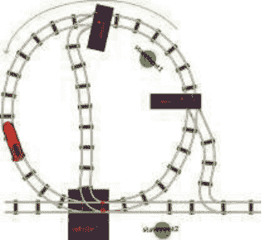
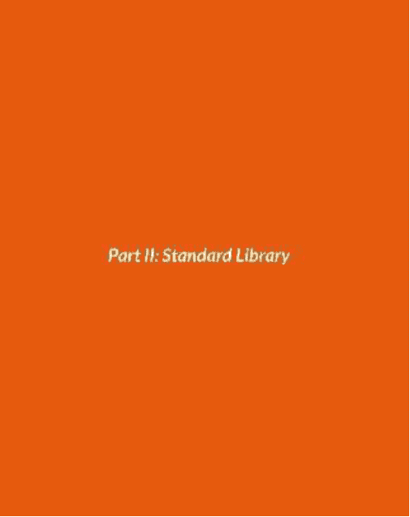

# 快速学习 Python

通过比喻、类比和简单的分步练习来学习基础知识

## 为什么选择 Python？

当你在学校开始软件工程学习时，很可能会从学习 Python 开始。那么，为什么选择 Python 而不是其他编程语言呢？原因很简单：

-   无论你使用什么操作系统，Python 都很容易安装。
-   Python 代码使用纯英文，易于理解。
-   Python 允许你运行错误的代码。

为什么这是好事？
在学习过程中，你难免会犯错。Python 会在你运行代码后告诉你错误，帮助你找到问题所在。

Python 是一个非常强大的工具，但它也易于快速学习，这就是为什么大多数人更喜欢它的原因。

## 安装

针对不同的操作系统（如 Windows、Linux、UNIX 和 Mac OS 等），有预编译好的安装包，便于简单安装。
如果你访问 https://www.python.org/downloads/，你可以为你的操作系统选择合适的安装方法。大多数 Linux 系统都预装了 Python。
本书使用的是 Python 3 版本。
在 Windows 中，安装 Python 后，从“开始”菜单或屏幕中选择 Python IDLE 或 Python 命令行/控制台。IDLE 和控制台的区别在于 IDLE 有一个图形界面，看起来像一个文字处理器。在 Linux、UNIX 和 OS X 中，你可以通过在命令行输入 `python` 来启动 Python 解释器。

要选择特定版本的 Python，请输入 `pythonX`，其中 `X` 是版本号（例如，版本 3 输入 “python3”）。

## Hello World！

大多数时候，你编写 Python 代码时，会在 IDLE 或其他 IDE（如 Eclipse）或富文本编辑器（如 Sublime Text 或 Notepad++）中编写内容。但是，你也可以使用 Python 解释器以交互方式编写代码，因为它的工作方式类似于 UNIX shell。
尽管仅使用解释器来创建程序是可行的，但强烈建议不要这样做，因为很难将代码保存为文件以便进一步重用。相反，应将解释器视为用于测试编码概念的“即时”工具。
现在，让我们让解释器在屏幕上输出 “Hello World!” 字符串。我们通过解释器来实现。

### 终端方式

使用上一章描述的 `python` 命令，从命令行启动解释器。
输入以下内容：`print("Hello world!")` 并按 “Enter”。终端将显示如下：

在上面的代码片段中，你可以看到第一行以 `>>>` 开头。
此图像显示了你向解释器提供动态输入的行。请注意，当你的第一个命令的结果打印在屏幕上后，解释器再次打印了 `>>>`。向解释器发出指令是连续的。你给出一个指令 - 等待执行完成，然后输入另一个命令，依此类推。请注意，在本书的后续部分，如果你在代码片段中看到 `>>>` 符号，这意味着你需要自己在解释器中测试代码。
在第一行，你输入了一个语句。语句无非是指示计算机执行某项任务的指令。任务可以是任何事情，从 `make_a_coffee` 到 `launch_a_rocket`。但在你的情况下，它只是一个简单的 `print` 函数。本书后面会介绍函数。

### 脚本方式

计算机编程的基本原则之一是可重用性。让我们将刚刚在解释器中测试的代码变得可重用。为此，创建一个名为 “hello_world.py” 的文件，并在其中输入以下文本：

1.  `print("Hello World!")`

你放入文件的内容通常就是刚刚通过解释器执行的那行代码。
现在，让我们执行你编写的脚本。
打开命令行，导航到脚本所在的目录，然后输入以下内容：`python hello_world.py`。按回车后，你会看到屏幕上出现了 “Hello World!” 文本。
恭喜！
你已经学会了编写你的第一个 Python 程序并成功运行它。

# 第一部分：内置语言特性

## 变量

在 Python 中，变量可用于将语句的结果存储在计算机的内存中。

等号用于为变量赋值。变量的名称称为其标识符。

```
>>> a is b
True
>>> print (id(a))
123123123
>>> print (id(b))
123123123
```

你可以使用以下语法将相同的值分配给多个变量：

```
>>> a = b = c = d = f = "Hello World!"
>>> a
Hello World!
>>> c
Hello World!
>>> f
Hello World!
```

Python 变量名应遵循以下规则：
1.  必须以字母或下划线开头
2.  只能包含字母、数字或下划线

一些非法变量名的示例：

1.  `2var`
2.  `var-bar`
3.  `foo.loo`
4.  `@var`
5.  `$var`

Python 还有一些不能用作变量名的特殊单词：

`and assert break class continue def del elif else except exec finally for from global if import in is lambda not or pass raise return try while yield`

**问题：** 哪些语句是有效的？

1.  `$foo = "bar"`
2.  `lambda = "bar"`
3.  `finally = "yes"`
4.  `pass = "you shall not"`
5.  `buga_wuga_ = "@@@huz"`
6.  `foo_bar = "bar"`

**答案：** 最后两个。注意，倒数第二个语句看起来只是错误。实际上，它是一个完全合法的变量，具有合法的字符串值。

**问题：** 在一行中将值 “blah” 赋给变量 `zen`、`foo` 和 `bar`。

**答案：**

```
foo = bar = harmony = "blah"
```

## 数据类型

下表概述了 Python 中最常用的数据类型。

| 变量类型 | 示例 | 用法说明 |
| :--- | :--- | :--- |
| bool | `life_is_good = True` | 真/假值 |
| | `hamsters_are_evil = False` | |
| int, long | `size_of_shoes = 42` | 各种整数 |
| | `earth_population = 7000000000` | |
| float | `pi = 3.14159265359` | 非整数 - 小数点后有一个或多个数字 |
| str | `chinese_hi = "hi"` | 任何文本 |
| None | `my_new_book = None` | 没有任何有意义值的空变量 |

你可以使用赋值运算符 “=” 在变量中存储不同类型的信息。
多行字符串可用于存储大段文本。

```
long_text = """ Line one
Line two
Line three
Line Four
"""
```

如你所见，多行字符串是用三引号而不是单引号括起来的普通字符串。
在 Python 中，可以将字符串转换为整数，也可以将整数转换为字符串：

```
>>> str(100)
'100'
>>> int("234")
234
```

#### 测验

**问题：**
1.  这个 `=` 运算符叫什么名字？
2.  如何将数字 `3.14` 转换为字符串 `'3.14'`？

**答案：**
1.  赋值运算符
2.  `str(3.14)`

## 基础数学

Python 有很多内置的算术运算符。下表简要分析了简写符号及其对应的完整形式。假设最初以下条件成立：`a = 3`。

| 运算 | 简写符号 | 完整形式 | a 的值 | 说明 |
| :--- | :--- | :--- | :--- | :--- |
| 加法 | `a += 1` | `a = a + 1` | 4 | |
| 减法 | `a -= 1` | `a = a - 1` | 2 | |
| 乘法 | `a *= 2` | `a = a * 2` | 6 | |
| 除法 | `a /= 2` | `a = a / 2` | 1.5 | 返回小数或浮点数 |
| 取模 | `a %= 2` | `a = a % 2` | 1 | 返回除法的整数余数 |
| 指数 | `a **= 2` | `a = a ** 2` | 9 | 类似于普通数学中的 a^2 |
| 整除 | `a //= 2` | `a = a // 2` | 1 | 仅返回整数（int）值 |
| 取反 | `a = -a` | `a = 0 - a` | -3 | 返回相同值但符号相反 |

在 Python 中计算一个数的平方根也很简单，但它不是内置的语言特性。你将在本书后面学习它！
你可以使用 `abs()` 计算一个数字的绝对值（例如 `|-3|`）。例如，`abs(-3)` 返回 `3`。

## 运算符优先级

Python中执行数值运算的请求方式与传统数学中使用的请求方式相同。
在数学中，有三个通用的运算符优先级：

- 1. 指数和根
- 2. 乘法、除法和取模
- 3. 加法和减法

指数和根在Python中由标准库的函数表示，本书后续将进行介绍。

所有其他优先级都有其固有的Python运算符。
高优先级的任务在低优先级之前执行。相同优先级的所有运算都从左到右单独执行。
例如，表达式：2 + 3 * 4 - 1 的结果是13。乘法在加法和减法之前执行。
为了影响运算符的执行顺序，你应该使用括号()。例如，(3 + 6) * 2 等于18，8/(1 + 1) 等于4。

### 代码示例

下面的代码片段展示了Python解释器中如何处理简单的数学运算。

```
>>> 13 * 2
26
>>> 10 - 32
-22
>>> 11 % 10
1
>>> 6 ** 2
36
>>> 12 / 8
1.5
>>> 12 % 8 + (12 // 8) * 8
12
>>> 6 - 16
22
>>> a = 16
>>> a += 3
>>> a
19
>>> a = 4
>>> b = 6
>>> a *= b
>>> a
24
```

问题：尝试在不使用Python的情况下解决以下问题，然后使用解释器检查你的答案：

- 1. 以下计算的结果是什么：2 + 2 + 2 + 2 + 2 + 2 * 0？
- 2. 这个呢：(2 + 2 + 3 + 4) * (4 * 4 - (2 * 6 + 4))？

答案：10 - 如果你回答0，你忘记了乘法的优先级高于加法。

1. 0 - 如果你的答案是其他值，你忘记了括号内的运算应该首先执行，因为第二个括号表达式 - (4 * 4 - (2 * 6 + 4)) 的结果是0，任何数乘以0结果也是0。

问题：一辆车的速度是100公里/小时。编写一些代码来计算这辆车在N小时内行驶的距离（单位是米，不是公里！）。设N为10。

答案：

```
1. N = 10
2. distance_in_kilometers = 100 * N
3. distance_in_meters = distance_in_kilometers * 1000
```

问题：使用简写符号重写代码

```
1. N = N * J
2. i = i + j * 18
3. f = f - k / 2
```

答案：

```
1. N *= J
2. i += j * 18
3. f -= k / 2
```

问题：已知 f(x) = |x^3 - 20|，求 f(-3)。你的答案应包含两行代码：一行将x初始化为-3，另一行计算结果。

答案：以下Python代码可以完成任务：

```
>>> x = 3
>>> abs(x ** 3 - 20)
47
```

问题：尝试使用-3直接解决上一个问题，而不是使用x变量。
答案：
你的解决方案应该如下所示：

```
>>> abs((-3) ** 3 - 20)
47
```

如果看起来像这样：

```
>>> abs(-3 ** 3 - 20)
47
```

那是错误的，因为取负（即从零减去）的优先级低于指数，因此必须用括号括起来。即使你的解决方案给出了与正确答案相同的结果，那也只是巧合。尝试在 f(x) = |x^2 - 20| 中，分别在取负运算有无括号的情况下，找出x的值，看看区别。

问题：如何使用Python检查一个整数是否是奇数？
回答：使用取模运算符（%）来找到除以2的余数。
如果余数是1，则该数字是奇数。

```
>>> 3 % 2
1
>>> 4 % 2
0
```

## 字符串操作

单词和句子是字符的集合，Python字符串也是如此。
你可以使用索引访问Python字符串中的任何字符，可以从字符串的开头或末尾开始计数。从开头开始时，从0开始计数。

在Python中，数字列表是从零开始的。

```
>>> name = "My Name is Mike"
>>> name[0]
'M'
>>> name[1]
'y'
>>> name[9]
's'
>>> name[-1]
'e'
>>> name[-15]
'M'
>>> name[7]
' '
```

### 切片

你可以从较长的字符串中取出较短的子字符串。这个操作称为“切片”。

```
>>> name[11:14] # 从第11个到第14个，不包括第14个
‘Mik’
>>> name[11:15] # 从第11个到第15个，不包括第15个
‘Mike’
```

如果你想检查一个字符串是否包含特定的子字符串，可以使用“in”运算符。

```
>>> “B” in “Foo”
False
>>>“B” not in “Foo”
True
>>>“G” in “Gohl”
True
>>>“James” in“James is tall”
True
```

*len* 函数计算字符串的长度。

```
>>> len(name)
15
```

### 连接

在Python中，可以将两个字符串组合成一个：
这个操作称为*连接*。
cone + cat + ten + ate

```
>>> boo = "cone" + "cat" + "ten" + "ate"
>>> print(boo)
conecattenate
>>> foo = "one"
>>> bar = "two"
>>> full = foo + " " + bar
>>> print(full)
one two
```

如果你需要一个包含N个子字符串的字符串，可以使用 * 运算符。

```
>>> foo = "foo " * 3
>>> print(foo)
foo foo foo
```

#### 测验

问题：

- 1. 在Python中，可以将多个字符串连接成一个。这个操作叫什么名字？
- 2. 有一个字符串 value = “foobar”。你可以通过以下方式访问子字符串：
`other_value = value[1:3].`
这个操作叫什么名字？other_value的长度是多少？
- 3. 字符串中第一个字符的索引是什么？

答案：

- 1. 连接
- 2. 切片。长度是2。切片操作定义的最后一个字符不包含在内。
- 3. 0

问题：有两个字符串：one = “John is solid” two = “Tea isn’t warm”。
编写Python代码，从one和two生成一个字符串 result = “John isn’t solid”：

答案：

```
result = one[0:8] + two[7:11] + one[8:14]
```

问题：找出以下哪个字符串不包含字母“B”：“Foo”、“Bar”、“Zoo”、“Loo”。

答案：

```
>>> “B” in “Foo”
False
>>>“B” in "Bar"
True
>>>"B" in "Zoo"
False
>>>"B" in "Loo"
False
```

问题：使用Python解释器找出字符串“John is strong”的长度。
答案：

```
>>> len(“John is strong”)
14
```

## 注释

在Python代码上写注释相当简单。
有两种编写Python注释的方法：单行注释和多行注释。

注释旨在帮助用户理解代码，并且会被解释器忽略。
单行注释通过在行首添加 # 字符来创建。它们对于在函数开头添加小注释很有用。

- 1. # 这是一个有效的单行注释。

你也可以在代码行之后添加行内注释，这对于解释语句很有用。

- 1. print(“Hello there!”) # 这在Python 2中会是行内注释。# 这是另一个。

### 多行注释

对于较大的注释，你可以使用三个连续的引号在首尾行，而不是将多个单行注释连接在一起。

- 1. “”” 这是一种更好的方式
- 2. 来使用跨越多行的注释，
- 3. 而不必使用大量的井号。
- 4. “””

这种注释方式通常用作任何阅读程序的人的文档。毕竟，无论你多么有才华，如果你得到一个没有任何注释的程序，除非你事先知道，否则你必须花时间研究代码来弄清楚它的作用以及如何使用它。

## 函数

我们之前谈到过可重用性是编程的一个关键原则。一旦你编写了一些代码，你会想要存储它，这样你就可以在不复制粘贴的情况下再次使用它。这就是函数的作用！函数是一种包装代码的方法，这样它就可以通过调用一个简单的快捷方式再次使用。

假设你想要连续三次打印“Hello Mr. Jones! How are you today?”，而没有任何代码重复。这可以通过以下方式实现：

```
1. def hi():
2. print(“Hello Mr. Jones! How are you today?”)
3. hi()
4. hi()
5. hi()
```

### 基本功能

在上面的代码片段中，你可以看到关键字“def”。这定义了一个处理功能的代码块。函数名需要遵循与变量名类似的规则。这个函数被命名为“hi”，后面跟着括号和冒号。括号内是参数列表，在这种情况下完全是空的。在函数之后，代码块必须缩进以将其定义为嵌套块。

有两个Python惯例你需要遵守：使用四个空格来缩进你的代码块，并且在函数名中只使用小写字母和下划线。

这段代码将无法工作：

```
def hi():
print("Hello Mr. Jones! How are you today?")
```

这段代码也无法工作：

```
def hi():
print("Hello Mr. Jones! How are you today?")
print("foobar")
hi()
```

在函数下面，你可能会看到三行调用它的地方。让我们看一个具体的调用：

调用只是一个函数名，后面跟着作为参数列表传递的参数。参数需要放在括号内。在这种情况下，我们没有参数列表，因此括号是空的。

### 带参数的函数

有时，你需要函数在不同条件下调整其行为。为此，你可以使用函数参数。

假设你想向琼斯先生问好，但对象是任何名字的人。你需要将原始的hi()函数修改成这样：

```
def hi(name):
print("Hello " + name + "! How are you today?")
```

这个函数现在接受一个参数，这是一个名为“name”的变量。然后，“name”与原始字符串的两部分连接起来，形成你的新问候语。

现在你可以这样向约翰、詹姆斯和玛吉问好：

```
hi("John")
hi("James")
hi("Maggie")
```

这将依次打印：

```
Hello John! How are you today?
Hello James! How are you today?
Hello Maggie! How are you today?
```

注意，你可以将值赋给一个变量，然后将变量传递给函数，而不是直接传递值。

```
first_name = "John"
hi(first_name)
```

一旦你设置好函数使用参数，尝试在不提供参数的情况下调用它将导致错误。

### 默认值

为了避免这些错误，你可以为参数提供默认值，如果需要，这些默认值可以被覆盖。

```
def hi(name="sir"):
print("Hello " + name + "! How are you today?")
```

在这种情况下，你可以在有参数和没有参数的情况下调用该函数。调用：

```
hi()
hi("James")
```

将打印：

```
Hello sir! How are you today?
Hello James! How are you today?
```

函数可以混合使用带默认值和不带默认值的参数。带默认值的参数必须放在参数列表的末尾。

```
def foo(bar, zoo="blah"):
...
```

是有效的。而：

```
def foo(bar="blah", zoo):
...
```

则无效。

### 返回值

让我们看看之前练习中涵盖的一个代码片段：

```
N = 10
distance_in_kilometers = 100 * N
distance_in_meters = distance_in_kilometers * 1000
```

假设你需要将这个逻辑封装在一个函数中，这样你就可以输入小时数和速度（km/h），然后以某种方式返回以米为单位的距离？这个逻辑可以使用以下函数实现：

```
def get_distance(speed, duration):
distance_in_kilometers = speed * duration
distance_in_meters = distance_in_kilometers * 1000
return distance_in_meters
```

函数的最后一行包含一个return语句。理解它作用的最佳方法是查看该函数的几次调用：

```
speed = 100
initial_distance = get_distance(speed, 0)
distance_after_a_day = get_distance(speed, 24)
distance_after_a_week = get_distance(speed, 24 * 7)
# day is 24 hours
# week is 7 days
```

正如你可能猜测的那样，return语句允许你将函数的结果存储在一个变量中。执行上述行之后，变量将具有以下值：

| 变量 | 值 |
| :--- | :--- |
| initial_distance | 0 |
| distance_after_a_day | 2400000 |
| distance_after_a_week | 16800000 |

问题：有一个数学函数 f(x,y) = x^y + 100。在Python中实现这个函数。

答案：

```
def function(x, y):
return x ** y + 100
```

问题：哪些函数定义是有效的？

- 1. @foo(bar):
- 2. _foo(bar = 1):
- 3. foo(bar = 2, bla = 1):
- 4. foo(bar = 2, bla):
- 5. foo($bar, bla = 1):

答案：

- 1. 无效：函数名中包含符号 @
- 2. 有效
- 3. 有效：有多个带默认值的参数
- 4. 无效：参数没有默认值
- 5. 无效：参数名中包含符号 $

问题：修改下面的函数，使其返回问候语而不是打印它：

```
def hi():
greeting = "Hello world!!!"
print(greeting)
```

答案：

```
def hi():
greeting = "Hello world!!!"
return greeting
```

## If/Else 和条件语句

我们到目前为止在本书中涵盖的基本语句和操作有很多用途。然而，任何编程的主要目的是执行某种逻辑。

*If/else 块是 Python 中的核心语法结构。* 它们让你有条件地控制程序的流程。

在以下场景中，你需要知道你的车是否行驶过快。如果你超过100公里/小时，函数将打印“太快了！”。如果你以低于限速的速度行驶，函数将打印“你正在低于限速行驶。做得好。”

代码看起来会是这样：

```
def drive(car_speed):
if car_speed > 100:
print("Too fast!")
else:
print("You are driving below the speed limit. Well done")

>>> drive(70)
You are driving below the speed limit. Well done
>>> drive(120)
Too fast!
```

上面的代码中有几件事需要注意。首先，> 运算符。它是一个布尔比较运算符，和数学中使用的一样古老。如果第一个值大于第二个值，它返回 True，否则返回 False。

其次，if/else 语法。如果 is_too_fast 为 True，则执行第一块代码。否则，执行第二块代码。

第三，缩进。函数内的语句被缩进，然后 if/else 块内的语句进一步缩进。

### 布尔表达式

```
greenApple = 100
redApple = 135
print(greenApple == redApple) #测试100和135是否相等 #False
print(greenApple < redApple) #测试100是否小于135 #True
print(greenApple != redApple) #测试是否不相等 #True
```

```
>>> bool(1)
True
>>> bool("")
False
>>> bool(None)
False
>>> bool("blah")
True
>>> bool(0)
False
>>> bool(True)
True
```

在Python中，任何值都可以被解释为True或False。在数据类型中，值0、""（空字符串）、None和False本身是False。任何其他值都是True。

你可以通过将值转换为布尔类型来检查该值是True还是False：此外，还有一些内置的比较运算符，如 >，在调用时返回True或False。下表概述了这些运算符。

### 运算符

- 小于
- 小于或等于
- 大于
- 大于或等于
- 等于
- 不等于
- 与（两个部分都必须为True）
- 或（其中一个部分必须为True）
- 非（与目标表达式相反）

### 语句的返回值

| 语句 | 返回值 |
| :--- | :--- |
| 1 < 2 | True |
| 4 < 3 | False |
| 2 <= 2 | True |
| 4 <= 3 | False |
| 2 > 1 | True |
| 3 > 3 | False |
| 2 >= 2 | True |
| 3 >= 4 | False |
| "foo" == "foo" | True |
| 0 == 1 | False |
| "foo" != "bar" | True |
| 11 != (10 + 1) | False |
| 3 and "foo" | True |
| None and False | False |
| 1 or None | True |
| None or False | False |
| not None | True |
| not True | False |

注意，比较运算符的优先级高于逻辑运算符“and”、“or”和“not”。所有数学运算符的优先级都高于比较运算符。以下是几个复合示例，说明如何使用布尔运算符：

### 备选分支

在许多情况下，逻辑判断可以比仅两个条件更为精细。
让我们修改之前创建的速度函数，使其在速度超过200公里/小时时打印“You are insane, man!!!”，并在速度介于70至80公里/小时之间时打印“The optimal speed for your car.”。

```python
def drive(car_speed):
    if car_speed > 200:
        print("You are insane, man!!!")
    elif car_speed > 100:
        print("Too fast!")
    elif car_speed > 70 and car_speed < 80:
        print("The optimal speed for your car.")
    else:
        print("You are driving below the speed limit. Well done")
```

你可能会注意到，在上面的代码中，我们没有使用不同的布尔变量。相反，我们将比较运算符直接放在`if`语句中。“and”运算符将两个比较运算符连接在一起。
我们还使用了关键字“elif”。这定义了一个备选分支。请注意分支的顺序！如果多个分支为真，则只有第一个分支会被执行。例如：

```python
a = 10
if a > 1:
    print("Big")
elif a > 5:
    print("Really big")
elif a == 10:
    print("Approaching enormity")
elif a > 10:
    print("Enormous!")
```

这段代码将只会打印“Big”，而其他语句将被忽略。

#### 测验

尝试在不使用解释器的情况下回答以下问题。

1.  以下变量的布尔值（`bool(a)`）是什么：
    -   a = False
    -   a = "0"
    -   a = 0 * 18
    -   a = "None"

2.  以下语句的结果是什么：`(2 ** 2 == 4 and False) or (not (16 > 15 or 1 == 3))`

3.  列出Python的逻辑运算符。

4.  以下代码将打印什么？

```python
x = 5
if x == 25:
    print("Quarter")
elif x == 10:
    print("Dime")
elif x == 5:
    print("Nickel")
elif x == 1:
    print("Penny")
else:
    print("Not a coin")
```

5.  假设 x=5, y=0, z=1。以下语句是真还是假？
    -   x == 0
    -   x >= y
    -   2 + 3 == x and y < 1
    -   not (z == 0 or y == 0)
    -   x = 3

6.  以下代码打印什么？

```python
x = 0
if x != 0:
    print("x is nonzero")
```

**答案：**

1.  a) False
    b) True - 这是一个包含字符'0'的字符串，而不是整数
    c) False - 0 * 18 的结果是 0
    d) True - 同样，“None”是一个字符串，而不是真正的`None`值

2.  False - “not”语句内部的表达式为真，使得该部分为假，而第一部分也为假。

3.  and, or, not

4.  Nickel。`x == 25` 和 `x == 10` 均为假，因此第一个为真的表达式是 `x == 5`。

5.  a) False。`==`运算符测试相等性，而5不等于0。
    b) True。5大于或等于0。
    c) True。`2 + 3 == x` 和 `y < 1` 均为真。
    d) False。`y == 0` 为真，因此 `z == 0 or y == 0` 为真，其否定为假。
    e) True。`=`运算符将值3赋给x，而值3在布尔上下文中求值为真。

6.  无。该语句为假，因此代码不会执行。

**问题：** 编写一个语句，测试变量 x 是否小于或等于 100。

**答案：**

-   x <= 100

**问题：** 编写一个语句，测试变量 x 是否在 3 到 10 之间（包含边界）。

**答案：**

```python
x >= 3 and x <= 10
```

**问题：** 编写一个表达式，测试一个变量是否为偶数或5的倍数。

**答案：**

-   (x % 2 == 0) or (x % 5 == 0)

**问题：** 有一个函数声明如下：`person_is_old(age)`，它根据传入的年龄数字返回 True 或 False。编写一个函数，使用上述函数，使得如果人不老则打印“Go to work!”，否则打印“You deserved to have a long vacation”。你的函数也应接受年龄作为其参数。

**答案：**

```python
def tell_what_to_do(age):
    if person_is_old(age):
        print("You deserved to have a long vacation")
    else:
        print("Go to work!")
```

## 类与对象

面向对象编程的关键原则之一是封装——隐藏系统内部运作的细节，这样用户无需了解其工作原理即可使用它。用户与之交互的程序部分被称为“接口”。
就像汽车驾驶员需要方向盘、油门等工具来使用汽车的功能一样，你的代码的用户需要使用称为方法的语法结构。

这里，我们用Python实现了一个汽车类：

```python
class Car:
    def turn_left(self):
        pass
    def turn_right(self):
        pass
    def accelerate(self):
        pass
    def slow_down(self):
        pass
    def open_a_window(self):
        pass
```

在上面的代码中，我们创建了一个类。类是一个具有特定行为的实体。这些行为表现为方法，它们与我们之前使用的函数类似，并且缩进方式相同。类的方法将类本身（“self”）作为其第一个参数。“pass”关键字告诉Python这个代码块不执行任何操作。
这个类可以代表多种不同的汽车，如宝马、奔驰、奥迪、菲亚特、特斯拉等等。让我们创建一个带有一些参数的汽车对象。

```python
bmw_x6 = Car(model="BMW X6", max_speed=230)
```

在上面的代码中，你可以看到汽车对象是用两个参数创建的：`model`和`max_speed`。最初的汽车代码并不支持它们。为了实现这种支持，你必须引入一个`__init__`方法：

```python
class Car:
    def __init__(self, model, max_speed):
        self.model = model
        self.max_speed = max_speed
        self.speed = 0
        ...
```

上面的代码接收你的新汽车对象（“self”），并使用点号表示法为汽车的`model`和`max_speed`赋值。汽车初始速度为零。`init`方法不应包含`return`语句——它仅用于构造你的对象。这个方法被称为“类构造函数”。
加速和减速应相应地增加和减少汽车的速度：

```python
class Car:
    ...
    def accelerate(self, speed_difference):
        self.speed += abs(speed_difference)
        self.speed = min(self.speed, self.max_speed)
    def slow_down(self, speed_difference):
        self.speed -= abs(speed_difference)
        self.speed = max(self.speed, 5)
    ...
```

对象的内部状态使用点号表示法进行修改。`min`和`max`函数用于确保汽车永远不会超过最高速度，或低于-5公里/小时（倒车档）。
以下代码将使汽车加速30公里/小时。

```python
bmw_x6.accelerate(30)
```

当你创建多个类时，你可能希望其中一些类之间存在关系。例如，汽车是一种交通工具，公交车也是一种交通工具。尽管它们有许多相似之处，但它们的内部结构完全不同。

为了反映对象中的相似性和差异性，Python有一个称为继承的特性。
在这个例子中，我们实现了一个`Vehicle`类，它具有与`Car`类类似的`model`和`max_speed`参数。

```python
class Vehicle:
    def __init__(self, model, max_speed):
        self.model = model
        self.max_speed = max_speed
        self.speed = 0
    def accelerate(self, speed_difference):
        self.speed += abs(speed_difference)
        self.speed = min(self.speed, self.max_speed)
    def slow_down(self, speed_difference):
        self.speed -= abs(speed_difference)
        self.speed = max(self.speed, 5)
    ...
```

现在我们需要创建`Car`和`Bus`类；`Car`类是相同的，但`Bus`类没有倒车档。

### 继承

类名后括号中的 `Vehicle` 使得 `Car` 和 `Bus` 类继承自 `Vehicle`。
在 `Bus` 类中，`slow_down` 方法重写了父类的行为。
`super()` 调用向父类发出指令以计算新的速度，随后确保该速度不低于 0 km/h。

```python
class Car(Vehicle):
    pass

class Bus(Vehicle):
    def slow_down(self, speed_difference):
        super().slow_down(speed_difference)
        self.speed = max(self.speed, 0)
```

#### 测验

**问题：**

1.  程序员可能会考虑哪些可供用户使用的实践集合？
2.  类之间的连接叫什么？
3.  在 Python 中创建对象所用策略的总称是什么？例如，以下策略：`__init__(name, max_speed)`。
4.  上一个问题中的方法缺少什么？

**答案：**

1.  接口
2.  继承
3.  类构造函数。
4.  缺少 `self` 参数

**问题：** 编写 Python 代码，使 BMW X6 加速 100 km/h。

**答案：**

```python
bmw_x6.accelerate(100)
```

**问题：** 引入一个 `Bike` 类，它也是一个 `Vehicle`。自行车的主要特点是其速度永远不能超过 30 km/h。

**答案：** 你只需确保在 `Bike` 的构造函数中将最高速度限制为 30 km/h。

```python
class Bike(Vehicle):
    def __init__(self, name, max_speed):
        max_speed = min(max_speed, 30)
        super().__init__(name, max_speed)
```

**问题：** 在上一个练习的代码中添加一个名为 `show_status` 的新方法，该方法打印类似 “The bicycle is BMX, its speed is 27 km/h” 的内容。

**答案：** 方法的实现应如下所示：

```python
def show_status(self):
    print("The bike is " + self.name + ", its speed is " + str(self.speed) + " km/h")
```

## 集合

在许多情况下，你需要对大量非常相似的对象执行相同的操作。例如，在现实生活中，你需要熨烫你的袜子。将每一只袜子都视为需要特殊处理的特殊物品，这似乎不太合理。在编程中，这就是 Python 集合派上用场的地方。集合的一个恰当比喻是一组储物柜。Python 有两种类型的储物柜：带有非正式 ID 的，以及匿名的，仅通过数字列出。要访问未知储物柜中的物品，你可以逐一查看每个储物柜，或者通过整数索引访问特定的一个。在 Python 中，这些储物柜由列表和元组表示。对于带有非正式 ID 的储物柜，你可以逐一查看每个储物柜，或者查看特定的 ID。在 Python 中，这些储物柜由字典表示。本章概述了 Python 的内置集合。

### 元组

元组是不可变的变量类型。

你可以通过以下方式访问元组的元素：

```python
>>> my_tuple = ("apple", "pear", "banana")
>>> my_tuple[1:] # 从第二个到最后
('pear', 'banana')
>>> my_tuple[2][2] # 第三个项目的第三个字符
'n'
```

“不可变”意味着一旦定义了元组，就不能更改它。

```python
>>> my_tuple[2] = "mango" # 用 'mango' 替换 'banana'
TypeError: 'tuple' object does not support item assignment
>>> my_tuple[2][0] = "B" # 尝试将 'b' 更改为 "B"，你会
# 得到一个错误
TypeError: 'str' object does not support item assignment
>>> new_tuple = ('foo', 'bar', 'zoo', 'loo')
>>> type(new_tuple)
<class 'tuple'>
>>> new_tuple[0]
'foo'
>>> new_tuple[3]
'loo'
>>> new_tuple[1:3]
('bar', 'zoo')
>>> len(new_tuple)
4
>>> new_tuple * 2
('foo', 'bar', 'zoo', 'loo', 'foo', 'bar', 'zoo', 'loo')
>>> new_tuple + ('blah', 'blah')
('foo', 'bar', 'zoo', 'loo', 'blah', 'blah')
```

从上面的代码片段可以看出，元组的行为与 Python 字符串类似——不过，字符串只是字符的类型，而元组可以包含任何类型的变量。你可以像处理字符串一样对元组进行切片、列出、连接和复制。
在语法上，元组项必须用括号括起来，并用逗号分隔。即使包含单个项的元组也必须有逗号：`(1,)` 是一个元组，但 `(1)` 不是。

### 列表

列表类似于元组，但可以在创建后进行修改。
让我们定义一个包含三个项目的简单列表：

```python
>>> my_list = ["apple", "pear", "banana"]
>>> my_list[1:] # 从第二个到最后
['pear', 'banana']
>>> my_list[2][2] # 第三个项目的第三个字符
'n'
>>> my_list[2] = "mango" # 用 'mango' 替换 'banana'
>>> my_list
['apple', 'pear', 'mango']
>>> my_list[2][0] = "B" # 尝试将 'b' 更改为 "B"，你会
# 得到一个错误
TypeError: 'str' object does not support item assignment
>>> new_list = ['foo', 'bar', 'zoo', 'loo']
```

你可能已经注意到，列表项应该用方括号括起来。
现在让我们删除第三个项目，并将第一个更改为 “blah”：

```python
>>> new_list.pop(2)
>>> new_list[0] = "blah"
>>> new_list
['blah', 'bar', 'loo']
```

你可以将项目添加到列表的末尾：

```python
>>> new_list.append("new_item")
```

并从列表末尾弹出项目：

```python
>>> new_list.pop()
'new_item'
```

你还可以将项目添加到列表中的特定位置：

```python
>>> new_list = ['foo', 'bar', 'zoo', 'loo']
>>> new_list.insert(1, 'John')
>>> new_list
['foo', 'John', 'bar', 'zoo', 'loo']
```

当你将一个项目添加到列表时，它会占据你指定的位置，并将所有后续项目向右移动。

### 字典

字典是键和值的集合，其工作方式与列表或元组非常相似。字典值可以通过几乎任何类型的索引来寻址，而不是整数索引。
让我们创建一个以人名为键、年龄为值的字典：

```python
ages = {
    "John": 34,
    "Matt": 23,
    "Natasha": 27,
    "Gabriella": 33
}
```

键值对必须用花括号括起来，并用逗号分隔。键和值必须用冒号分隔。字典中的键必须是唯一的，但值可以相同。键可以是几乎任何类型的变量。
以下也是一个有效的字典：

```python
class SomeClass:
    pass

obj1 = SomeClass()
obj2 = SomeClass()
a_dict = {
    obj1: 11,
    obj2: 23
}
```

你可以通过以下方式获取 John 的年龄：

```python
johns_age = ages["John"]
```

同样，你可以通过键设置元素的值：

```python
ages["John"] = 999
```

上述语句要么更改现有键的值，要么在不存在的情况下创建新的键值对。
你也可以从字典中删除一个键值对。

```python
ages.pop("John")
```

#### 测验

**问题：**

1.  哪种集合类似于储物柜上贴有姓名标签的更衣室？哪种类似于匿名储物柜？
2.  列表和元组的主要区别是什么？
3.  浮点数可以用作字典中的键吗？
4.  在字典中，你可以有多少个名为 “John” 的键？
5.  这是一个元组吗：`(123)`？

**答案：**

1.  字典 / 列表和元组
2.  列表可以修改，元组不能
3.  可以，为什么不呢？
4.  恰好一个——所有键必须是唯一的
5.  不是——忘记了一个逗号

**问题：** 使用 Python 获取 Natasha 的年龄。

**答案：**

```python
ages['Natasha']
```

**问题：** 移除 Matt。

**答案：**

```python
ages.pop('Matt')
```

### 循环

集合可用于存储数据，但你也可以遍历它们并对每个项目单独执行操作。
在 Python 中，你可以使用两种类型的循环：`while` 和 `for`。`while` 循环只要某个条件为真就会持续重复。`while` 循环内的语句必须缩进，就像任何其他代码块一样。
循环必须使用 “while” 关键字、布尔语句和冒号来定义。
布尔语句可以是函数调用、变量或比较语句。

此代码将打印数字 1 到 10：

```python
laps = 0
while laps < 10: # 测试
    laps += 1 # 计数器
    print(laps) # 语句1
print("and")
print("Done") # 循环退出
```

### While 循环

Python 提供了 `break` 和 `continue` 语句，以便对循环进行更精细的控制。



```
1. **while** <test1>:
2. <statement1>
3. **if** <test2>: **break**
4. **if** <test3>: **continue**
5. **else**:
6. <statement2>
```

#循环退出，跳过 else #返回顶部 <test1> #如果未发生 break 则执行

### 循环


你可以使用 “for” 循环来遍历一个集合。
假设你有以下列表：
1. a = [“one”, “two”, “three”]
要逐个打印每个字符串，你可以使用这个循环：
1. **for** item **in** a:
2. **print**(item)

循环必须使用 “for” 关键字、用于保存每个单独项的新变量名、“in” 关键字、集合的名称以及冒号来定义。“for” 循环内部的语句也必须缩进。

你可以使用 “break” 命令从循环中跳出：

```
1. numbers = [1, 2, 5, 6, 7, 8, 9]
2. **for** number **in** numbers:
3. **print**(“Looking at: “ + **str**(number))
4. **if** number > 6:
5. **print**(“Too big: “ + **str**(number) + “!”)
6. **break**
```

上述代码产生以下输出：

```
Looking at: 1
Looking at: 2
Looking at: 5
Looking at: 6
Looking at: 7
```

Too big: 7!

迭代在数字 7 之后停止，这意味着数字 8 和 9 不会被包含。
你也可以使用 “continue” 关键字跳过集合中的特定项：

```
1. numbers = [1, 6, 7, 8, 9, 2, 5]
2. for number in numbers:
3. if number > 6:
4. continue
5. print(“Looking at: “ + str(number))
```

上述代码产生以下输出：

```
Looking at: 1
Looking at: 6
Looking at: 2
Looking at: 5
```

这里，我们忽略了数字 7、8 和 9。
字典也可以用同样的方式遍历。

```
1. ages = {
2. “John”: 34,
3. “Matt”: 23,
4. “Natasha”: 27,
5. “Gabriella”: 33
6. }
7. for name in ages:
8. print(name)
```

#### 测验

问题：

+   1. 如果你想编写代码，只要你在睡觉，就每十分钟触发一次警报，你应该使用 “for” 循环还是 “while” 循环？
2. 如何完全停止一个 while 循环？给出两种方法。 3. 如何在 for 循环中跳过特定项？给出两种方法。

答案：

+   1. while
2. 将 while 循环的条件更改为求值为 False，或使用 break 关键字。
3. 将项处理的代码隔离在 if 语句中，或使用 continue 关键字。

#### 练习

问题：编写一些代码，打印出 ages 字典中最年长者的名字。这将用到本书前面章节的知识。
答案：

```
1. ages = {
2. “John”: 34,
3. “Matt”: 23,
4. “Natasha”: 27,
5. “Gabriella”: 33
6. }
7. oldest_person = None
8. current_biggest_age = 0
9. for name in ages:
10. age = ages[name]
11. if age > current_biggest_age: 12. oldest_person = name 13. current_biggest_age = age 14. print(oldest_person)
```

## 文件操作

大多数文件操作可以归结为：打开文件、读取文件、将数据写入文件以及关闭文件。通常，你写入文件的数据是文本。
假设你想将一个整数列表写入文件，使每个整数占一行。首先，打开文件：

```
1. the_file = open(“integers.txt”, “w”)
```

“open” 函数的第一个参数是文件的路径，第二个参数告诉 Python 你想将数据写入文件。这意味着文件在你开始之前不必存在。该函数返回一个文件对象，你可以在之后使用。首先，让我们定义一个整数数组，并将它们作为字符串写入文件。

```
1. integers = [1, 2, 3, 4, 5]
2. for integer in integers:
3. the_file.write(str(integer) + ‘\n’)
```

“write” 方法接受一个字符串作为参数，并将其写入文件。
注意 “\n” 符号 - 这是换行符。它在文件中开始一个新行。

当你完成文件操作后，必须关闭它：

```
1. the_file.close()
```

你也可以从文件中读取数据。
首先，不使用 “w” 标志打开文件：

```
1. the_file = open(“integers.txt”)
```

获取文件中的所有行：

```
1. lines = the_file.readlines()
```

readlines() 函数将文件中的所有行作为字符串列表返回。
让我们打印这些行：

```
1. for line in lines: 2. print(line)
```

执行上述代码后，你将在屏幕上看到以下内容：

```
1
2
3
4
5
```

与写入文件一样 - 完成后关闭它：

```
1. the_file.close()
```

#### 测验

问题：

+   1. 换行符是什么样子的？
2. 完成文件操作后，你应该做什么？
3. 哪种方法用于将数据放入文件？
4. 你应该使用哪种方法来获取文件中的所有行？

答案：

+   1. \n
2. 关闭它
3. write
4. readlines

## 异常

有时会发生意外情况，导致程序无法按预期执行。这些事件称为“异常”。
>>> 1 / 0
按下回车键后，你将看到以下输出：

```
Traceback (most recent call last):
  File "<stdin>", line 1, in <module>
ZeroDivisionError: division by zero
```

这称为异常回溯。它向你显示在异常发生之前调用了哪些函数或方法。最后一行告诉你引发了哪个异常，并提供一些额外的、人类可读的信息。
在 Python 中，你可以通过 try/except 块来实现这一点。
如果异常发生在重要操作的中间怎么办？让我们打印 “*division by zero. But it is totally fine.*” 而不是抛出回溯。

```
1. try:
2.     1 / 0
3. except ZeroDivisionError as e:
4.     print(str(e) + “. But it is totally fine.”)
```

在上面的代码中，你可以看到你想要尝试执行的语句放在 try 块中。所有错误处理代码都放在 except 下。
except 关键字必须伴随一个异常类。
它也可以后跟一个 as 关键字和一个变量，该变量用于存储错误的人类可读描述。

### 自定义异常

你可以定义自己的异常类，以进一步通知代码内部发生了异常情况：

```
1. class YourException(Exception): 2. pass
```

所有自定义异常都必须有一个内置的 Python 异常作为父类。异常不必实现任何其他逻辑。为了引发异常，你应该使用 raise 关键字：

```
1. raise YourException(“Human-readable message”)
```

一旦你执行上述代码，你将看到一个回溯，其中 “Human-readable message” 字符串作为额外细节。处理自定义异常与处理内置异常没有区别：

```
1. try:
2. raise YourException(“Human-readable message”)
3. except YourException as e:
4. print(“Your exception just occurred with a message: “ + str(e))
```

#### 测验

问题：

+   1. 应该使用哪个块来处理异常？
2. 异常发生时打印的长文本块叫什么名字？

答案：

+   1. try/except 块
2. traceback



## Import 语句、Python 模块和包

正如你可能已经注意到的，Python 中的所有源代码都存储在称为模块的各种文件中。每个模块都有一个 .py 扩展名。不同的模块在逻辑上组合在一起，形成称为包的集合。包是一个普通的文件夹，其中包含一个 `__init__.py` 文件。例如，以下是一个包：

+   1. foobar/
2. __init__.py
3. one.py
4. two.py
5. three.py

而这个不是：

+   1. foobar/
2. one.py
3. two.py
4. three.py

默认的 Python 安装附带了大量的包。
这组包称为标准库。

### Import 语句

如果你想使用存储在另一个包中的功能，必须使用 import 语句。
让我们使用 Python 解释器在屏幕上打印你的用户名：

```
>>> import getpass
>>> getpass.getuser()
'gunther'
```

上面的代码片段展示了如何导入最顶层的包。如你所见，包的成员应该通过点运算符访问。
你可以通过直接导入所需内容来避免使用点运算符：

```
>>> from getpass import getuser
>>> getuser()
'gunther'
```

要指明导入的来源，必须使用 from 关键字。有时你可能想从同一个包中使用多个实体。在这种情况下，更简单的方法是直接导入所有实体：

```
>>> from sys import pydebug, flags
```

请注意，Python 包中保存的实体可以是几乎任何 Python 构造。一个类、一个函数、一个变量、一个模块甚至一个包（嵌套包是可能的）。

#### 测验

问题：

- 1. Python 源文件的同义词是什么？
- 2. 包含 Python 模块的文件夹称为什么？
- 3. 随默认 Python 安装一起提供的包集合叫什么？
- 4. 如何从 os 包导入模块 path？

答案：

- 1. 模块
- 2. 包
- 3. 标准库
- 4. from os import path

## 使用 os 模块进行文件操作

尽管可以使用 Python 内置函数和方法来处理文件，但它们并不能涵盖你在操作计算机文件系统时可能遇到的所有场景。本章概述了在处理数据时可能遇到的所有常见任务，以及 Python 处理这些任务的方法。

简要说明：以下部分示例使用了 Linux 的路径结构。若要在 Windows 上尝试，请将斜杠（/）替换为反斜杠（\）。首先，假设你有以下文件夹结构（例如，使用普通文件管理器创建）：

```
/parent/
foo/
one.txt
two.txt
three.txt
```

首先，使用普通终端命令导航到 foo 的父目录：
cd /parent

让我们验证该目录的路径是否符合预期。要获取当前目录的绝对路径，应使用 os.path 模块的 abspath 函数和 curdir 属性：

```
>>> from os.path import abspath, curdir
>>> curdir
'.'
>>> abspath(curdir)
'/parent'
```

curdir 变量保存一个指向当前目录的字符串 - '.'。abspath 接受任何路径作为其参数，并返回绝对路径。现在删除 one.txt 并将 two.txt 重命名为 bar.txt。为此，你需要使用标准库 os 模块中的两个函数：remove 和 rename。

```
>>> from os import remove, rename
>>> remove("foo/one.txt")
>>> rename("foo/two.txt", "foo/bar.txt")
```

你可能已经注意到，要删除文件，必须将其名称传递给函数；要重命名文件，除了提供原始名称外，还应传递将被指定为文件新名称的字符串。注意，提供文件名时，必须给出文件的相对路径或绝对路径。对于绝对路径，一切都简单明了 - 它应以文件系统的根目录开头。绝对路径在 UNIX 和 Windows 上可能分别如下所示：

```
/Blah/Blah/foo/one.txt
C:\Blah\Blah\foo\one.txt
```

相对路径是根据当前目录计算的。假设你在目录 /foo/bar/one 中，想要移动到 /foo/blah/two。在这种情况下，相对路径应为：../../two。两个点代表父目录。由于你需要向上导航两级 - 因此需要 ../../ 序列。由于 *nix 和 Windows 使用不同的分隔符，上面的 remove/rename 代码片段存在一个严重缺陷。它不是跨平台的。为了将其转换为跨平台代码，你应该使用 os.path 模块中的 join 函数：

```
>>> from os import remove, rename
>>> from os.path import join
>>> remove(join("foo", "one.txt"))
>>> rename(join("foo", "two.txt"), join("foo", "bar.txt"))
```

你将路径的所有部分作为字符串传递给 join 函数，然后使用操作系统特定的路径分隔符来生成字符串。你可以列出特定目录中的所有文件和文件夹：

```
>>> from os import listdir
>>> listdir("foo")
["bar.txt", "three.txt"]
```

现在让我们尝试删除 foo 目录。

```
>>> from os import rmdir
>>> rmdir("foo")
Traceback (most recent call last):
  File "<stdin>", line 1, in <module>
OSError: [Errno 39] Directory not empty: 'foo'
```

哎呀！我们引发了一个异常。只要目录内包含任何内容，就无法删除该目录。

#### 测验

问题：

- 1. Windows 和 Linux 文件系统之间的主要区别是什么，使得编写跨平台 Python 程序更加困难？
- 2. os.path.curdir 的值是什么？
- 3. 哪个字符串表示当前目录的父目录？

答案：

- 1. 不同的路径分隔符：Unix 上是 /，Windows 上是 \
- 2. .
- 3. ..

修复上一个示例中的“rmdir”代码，使其能够正常工作。
答案：
为此，你只需先删除其中的所有文件：

```
>>> remove("foo/bar.txt") # 你重命名了它
>>> remove("foo/three.txt")
>>> rmdir("foo")
```

问题：使以下函数跨平台：
1. def show_foobar_here(path): 2. print(path + "/foobar")
答案：

```
1. from os.path import join
2. def show_foobar_here(path):
3. print(join(path, "foobar"))
```

使用 os.path 模块中的 isdir 函数，在当前目录中查找文件夹。遍历文件和文件夹，然后抛出一个自定义的 DirFound 异常，其人类可读的描述为该目录的绝对路径。
答案：
以下是一个足够的解决方案：

```
1. from os.path import isdir, curdir, abspath
2. from os import listdir
3. class DirFound(Exception):
4.     pass
5. def detect_dirs():
6.     for item in listdir(curdir):
7.         if isdir(item):
8.             raise DirFound(abspath(item))
```

### 正则表达式

虽然你可以使用“in”运算符来检查子字符串是否存在于字符串中，但它不会告诉你子字符串的位置，也无法让你非精确地匹配子字符串。看这个字符串：

```
>>> lorem_text = "Lorem ipsum dolor sit amet, consectetur adipiscing elit, sed do eiusmod tempor incididunt ut labore et dolore magna aliqua."
```

你想找出这段文本中是否包含类似“dolor BLA BLA BLA amet”的内容 - 即“dolor”和“amet”按此顺序出现，中间有任意数量的文本。为此，你可以使用 re.search 方法：

```
>>> import re
>>> found = re.search("dolor .* amet", lorem_text)
>>> found
<_sre.SRE_Match object; span=(12, 26), match='dolor sit amet'>
```

“search”函数将正则表达式模式作为其第一个参数，将要搜索的文本作为其第二个参数。正则表达式模式是对你要在文本中查找的内容的灵活描述。格式将在本章后面介绍。

查看 search 函数的返回值：它被称为 MatchObject，它告诉你子字符串在原始文本中的位置。

如果找不到该模式，则函数返回 None：

```
>>> match = re.search("found", lorem_text)
>>> type(match)
<class 'NoneType'>
```

你可以从匹配对象获取子字符串的起始和结束索引：

```
>>> found.start()
12
>>> found.end()
26
```

并访问模式匹配的子字符串：

```
>>> found.group()
'dolor sit amet'
>>> lorem_text[12:26]
'dolor sit amet'
```

注意：如果找到多个模式匹配项，则只返回第一个。如果你需要遍历所有匹配项，请使用 re.finditer 函数：

```
>>> list(re.finditer("dolor .*amet", lorem_text))
[<sre.SRE_Match object; span=(12, 26), match='dolor sit amet'>]
```

如果你想查看字符串是否匹配某个模式，应使用 re.match 函数，它尝试将模式应用于整个字符串：

```
>>> bool(re.match("[0-9][az]*", "0dgfgfg"))
True
>>> bool(re.match("[0-9][az]*", "dgfgfg"))
False
```

正则表达式模式中的符号“ .*”匹配零个或多个任意字符。点代表任意字符，星号代表基数。这是任何正则表达式模式的基本结构：一个符号类型，后跟其基数。

下表概述了最常用的基数。

| 基数 | 描述 |
| :--- | :--- |
| * | 零个或多个 |
| + | 一个或多个 |
| ? | 零个或一个 |
| {m} | 精确数量的符号 |
| {m, n} | 至少 m 个，最多 n 个 |

以下是如何轻松记住其中一些的方法：


```
>>> import re
>>> print (re.search('^Beginning','Beginning of line'))
>>> print (re.search('[^line]', 'Beginning ofline')) # not line
```


```
>>> import re
>>> print (re.search('end$','Find me at the end'))
```

import re

txt = "The quick brown fox jumps over the lazy dog quick"

### 正则表达式

此表展示了最常用的符号。

| 符号 | 描述 | 示例 |
| :--- | :--- | :--- |
| `|` | 或 | `x = re.findall("quick\|dog", txt)` |
| `+` | 一个或多个 | `x = re.findall("quick+", txt)` |
| `*` | 零个或多个 | `x = re.findall("quick*", txt)` |
| `?` | 零个或一个 | `x = re.findall("quick?", txt)` |
| `()` | 分组 | `x = re.findall("quick (a-z)+", txt)` |
| `{}` | 精确匹配 | `x = re.findall("The {2}a-z{2}", txt)` |
| `{x, y}` | 至少 x 个，最多 y 个 | `x = re.findall("The {0,2}a-z{2}", txt)` |
| `.` | 任意单个字符 | `x = re.findall("jumps. dog", txt)` |

| 符号 | 描述 |
| :--- | :--- |
| `.` | 任意字符 |
| `"` | 双引号字符 |
| `\'` | 单引号字符 |
| `\` | 反斜杠 |
| `\t` | 制表符 |
| `\n` | 换行符 |
| `[0-9]` | 0 到 9 之间的任意数字 |
| `[^0-9]` | 非数字的任意字符 |
| `[a-z]` | 任意小写字母 |
| `[^a-z]` | 非小写字母的任意字符 |
| `[a-zA-Z0-9_]` | 任意数字、任意字母或下划线 |

如你所见，一些符号以反斜杠开头。这些符号被称为转义序列，代表那些无法用其他方式描述或属于保留字符的内容。现在让我们尝试组合符号和基数来构建模式。

一个或多个数字：`[0-9]+`

一个可选的、不以零开头的数字：`([1-9]{1}[0-9]+)?`

括号允许你将多个符号组合成符号组，并对整个组应用基数。你可以将上面提到的正则表达式重新表述为：零个或一个数字，该数字以一个非零数字开头，后面跟着多个任意数字。

一个可能包含任意小写字母但不能以下划线 `[^_][a-z]*` 开头的字符串

为了用另一个值替换子字符串的第一次出现，你应该使用 `re.sub` 函数。按以下方式将 `dolor BLA BLA BLA amet` 替换为 `foobar`：

```python
re.sub("dolor .*amet", "foobar", lorem_text)
```

#### 测验

**问题：**

1.  换行符的转义序列是什么？
2.  制表符的转义序列是什么？
3.  如果找不到模式，`re.search` 函数返回什么？
4.  以下调用将匹配什么：`re.search(r'..d', 'food bar')`？尝试在不使用解释器的情况下回答。

**答案：**

1.  `\n`
2.  `\t`
3.  `None`
4.  `ood`

**问题：** 编写一个函数 `is_valid_Python_variable_name(string)`，用于判断该字符串是否可以用作 Python 中的变量名。你无需担心保留关键字。

**答案：**

```python
def is_valid_Python_variable_name(string):
    # 下划线或字母后跟整数、
    # 下划线或字符
    found = re.match("[_A-Za-z][_A-Za-z0-9]*", string)
    return bool(found)
```

**问题：** 编写一个函数 `get_number_of_occurrences(string, substring)`，返回一个整数，计算在字符串中找到子字符串的实例数量。

**答案：**

```python
def get_number_of_occurrences(string, substring):
    findings = list(re.finditer(substring, string))
    return len(findings)
```

## 数学模块

本章概述了 Python 标准库中的数学模块。该模块包含常见数学运算的实现，例如平方根，这些运算未包含在标准函数集中。

使用数学模块，你可以执行常规三角函数运算：

```python
>>> math.sin(math.radians(30))
0.49999999999999994
>>> math.cos(math.radians(60))
0.5000000000000001
>>> math.tan(math.radians(45))
0.9999999999999999
```

注意，参数是弧度制的角度值，而不是度数。这就是为什么需要额外调用 `math.radians`。

此外，你看到的是 `0.4999999999` 而不是 `0.5`，或者 `0.99999999999` 而不是 `1`。这是由于语言处理浮点数计算的方式所致。

你可以获取特定精度的特殊数字，如 pi 和 e：

```python
>>> math.pi
3.141592653589793
>>> math.e
2.718281828459045
```

你还可以计算平方根：

```python
>>> math.sqrt(16)
4.0
>>> math.sqrt(25)
5.0
```

#### 测验

**问题：** 为了回答以下问题，你需要深入研究标准库。

1.  你会使用哪个函数来计算反正切？
2.  应该使用哪个函数进行指数运算？
3.  如何计算一个数的阶乘？

**答案：**

1.  `math.atan`
2.  `math.exp`
3.  `math.factorial`

## JSON

在软件工程中，有一个过程称为序列化。其主要目的是将任意对象的状态转换为可以通过网络传输和/或以某种方式存储的内容，以便稍后可以重建原始对象。重建过程称为反序列化。

序列化的一个现实生活类比是调查现有文物（例如一辆汽车）并为其制作详细蓝图（发动机、车轮、变速箱等）的过程。通过网络发送序列化数据类似于通过普通邮件发送蓝图。而反序列化是某人根据获取的蓝图构建原始对象副本的过程。

在 Web 编程领域，两种数据序列化标准获得了最高的普及度。XML 和 JSON。两者都是文本格式，这意味着使用这些标准表示的数据可以通过简单的文本编辑器（如 VIM）轻松地被人查看。本章的主题是 JSON 以及 Python 使用它进行数据序列化的方法。

JSON 是 JavaScript 编程语言中操作数据的原生方式。

作为一种格式，JSON 操作三种主要结构。

1.  基本类型：整数、浮点数、字符串、布尔值和 null 数据类型
2.  对象：等同于 Python 字典
3.  数组：等同于 Python 列表

如你所见，所有 JSON 结构都与 Python 内置类型完美匹配。因此，将 Python 数据结构序列化为 JSON 的主要目的是将 Python 内置类型转换为 JSON 字符串，该字符串可以例如作为有效负载在 HTTP 请求/响应体中发送。

默认情况下，Python 可以序列化以下数据类型：`int`、`bool`、`None`、`str`、`float`、`long`、`dict` 和 `list`。有扩展此功能的方法，但它们超出了本章的范围。

负责序列化的 Python 模块名为 `json`。它包含两个主要函数：`dumps` 和 `loads`。`dumps` 期望 Python 数据结构作为输入，并返回 JSON 字符串作为输出。`loads` 执行相反的操作 - 它期望 JSON 字符串作为输入，并返回 Python 数据结构作为输出。

### 代码示例

导入 JSON 模块

```python
import json
```

将字符串列表序列化为 JSON 数组

```python
list_of_strings = ["one", "two", "three", "four"]
json_array = json.dumps(list_of_strings)
```

将 JSON 对象反序列化为 Python 数据结构

```python
json_data = """
{
    "integer": 1,
    "inner_object": {
        "nothing": null,
        "boolean": false,
        "string": "foo"
    },
    "list_of_strings": [
        "one",
        "two"
    ]
}
"""
python_dict = json.loads(json_data)
```

序列化一个整数

```python
print(json.dumps(1))  # 1
print(type(json.dumps(1)))  # <class 'str'>
```

### 代码样本

序列化一个字符串

```python
>>> print(json.dumps("FOO"))
"FOO"
>>> print(len(json.dumps("FOO")))
5
```

尝试反序列化非 JSON 内容 - 当输入无法处理时会引发 `ValueError`

```python
>>> json.loads("FOO")
Traceback ...
...
ValueError: No JSON object could be decoded
```

尝试序列化在 JSON 中没有表示的内容 - 默认情况下仅支持有限的 Python 内置类型集

```python
>>> class Teacher(object):
...     pass
>>> t = Teacher()
>>> json.dumps(t)
Traceback ...
...
TypeError: <...Teacher instance at ...> is not JSON serializable
```

#### 测验

**问题：**

1.  Python 中哪个函数负责 JSON 序列化？
2.  “序列化”的反义词是什么？哪个 Python 函数负责它？
3.  此命令的输出是什么：`print(json.dumps("FOO")[0])`？
4.  此命令的输出是什么：`print(len(json.dumps(None)))`？
5.  此命令的输出是什么：`print(type(json.dumps("1.57")))`？

**答案：**

1.  `json.dumps`
2.  反序列化 / `json.loads`
3.  `"`
4.  `4`
5.  `<type 'str'>`

1.  如果你回答 `F` - 你忘记了字符串的 JSON 表示也包括引号
2.  如果你回答 `float` - 你忽略了 JSON 字符串内的双引号

实现 `join_two_arrays` 函数

```python
>>> array_of_strings_one = ["one", "two"]
>>> array_of_strings_two = ["three", "four"]
>>> print(join_two_arrays(array_of_strings_one, array_of_strings_two))
["one", "two", "three", "four"]
>>> type(join_two_arrays(array_of_strings_one, array_of_strings_two))
```

## SQL：sqlite3

软件开发的主要原则之一是可重用性。这一原则可以重新表述为 DRY（不要重复自己）。实现它的最佳方式是避免重复造轮子，而是应用前人已经实现的解决方案。经过数十年信息处理和数据存储的行业发展，出现了一套通用的约束。在这个语境下，“约束”一词指的是应用于待存储数据的一组规则。要理解什么是约束，可以想想电子邮件地址。地址中应该包含一个“@”字符。这个期望就是一个约束。一个具有多重约束的现实系统是汽车装配线。所有零件都必须符合特定标准，如果不符合，就无法完全实现自动化生产线，必须引入人工操作。一个通用的经验法则是，要达到合理的自动化水平，必须牺牲一部分输入的灵活性。为了创建一个通用的约束系统，现有的系统被组合成了现在称为关系数据库的东西。数据以表格形式存储在关系数据库中，其中每一列代表一组规则，规定了每一行可以存储哪些数据类型（字符串、整数、布尔值等）。每一列都有一个类型，该类型代表了数据库引擎关于相应字段可以存储何种数据的规则。类型可以是整数、字符串、布尔值等。主键约束定义了哪个字段应被用作主索引，即行中的哪条信息可以用作其地址。“索引”一词的含义与邮政行业完全相同。它是一个用于简化信息访问的唯一标识符。在邮政系统中，它是特定收件人的地址；在关系数据库中，它是表中的特定行。

### SQL

为了阐明引用可靠性的重要性，我们可以看一个真实的例子。
如果一名学生要转学去另一所学校，他们的名字应该从所有班级的名册中移除。同样，如果你需要从社交数据库中删除一个条目，你也应该删除数据库中所有对它的引用。
在社交数据库中，每当学生转学时，从各个课程中删除该学生的过程被称为引用完整性管理。
外键约束告诉你哪些列包含对数据库中其他位置的引用。
还有许多其他约束。尽管本节不会涵盖所有约束，但已经简要介绍的这些足以让你对关系数据库的行为有一个合理的理解。
在继续之前，你需要了解的最后一件事是结构化查询语言（SQL）。SQL 是一种专门用于声明数据库约束和操作数据（即列出、查看、创建、更新或删除数据）的编程语言。

### Python sqlite3

Python 有一个内置的数据库模块叫做 sqlite3。它是关系数据库和 SQL 的完整 Python 实现。在这里，我们将简要介绍主要的 SQL 语句和数据库结构。
首先，打开你的 Python 解释器并导入 sqlite3

```
import sqlite3
```

初始化数据库连接：

```
conn = sqlite3.connect('example.db')
```

获取游标：

```
cursor = conn.cursor()
cursor.execute("PRAGMA foreign_keys = ON")
```

游标只是一个用于执行 SQL 语句的 Python 对象。在 sqlite3 中，出于性能原因，外键约束默认是禁用的。*PRAGMA 语句可以启用它们。*
现在让我们创建一个简单的 *users* 表。

```
cursor.execute("""
CREATE TABLE users(
id INTEGER NOT NULL PRIMARY KEY AUTOINCREMENT,
email TEXT NOT NULL,
name TEXT NOT NULL
)
""")
```

在上面的代码中，你可能会看到以下内容：每个用户必须有一个电子邮件和一个姓名，它们都是文本值。每个用户都有一个整数标识符，用作主键。*AUTOINCREMENT* 意味着每当创建一个新用户时，*id* 将根据之前存储的用户标识符自动生成。

另外，让我们创建一个名为 vehicles 的表，以便表中提到的每辆车都必须从 *users* 表中列出的人类列表中恰好有一个所有者。

```
cursor.execute("""
CREATE TABLE cars(
id INTEGER NOT NULL PRIMARY KEY AUTOINCREMENT,
brand TEXT NOT NULL,
model TEXT NOT NULL,
owner INTEGER NOT NULL,
FOREIGN KEY(owner) REFERENCES users(id) ON DELETE CASCADE
)
""")
```

在上面的代码中，有一个外键定义，它表示车辆和客户之间的一种所有权关系。ON DELETE CASCADE 语句告诉数据库，每当删除一个用户时，属于该用户的所有车辆也应该被删除。让我们创建一个用户和两辆属于该用户的车：

```
cursor.execute('INSERT INTO users VALUES(NULL, '
'"john.smith@pythonvisually.com", "John Smith")')
cursor.execute('INSERT INTO cars VALUES(NULL, "Fiat", "Polo", 1)')
cursor.execute('INSERT INTO cars VALUES(NULL, "BMW", "X6", 1)')
```

注意，在创建车辆时，我们为所有者传递了值 1。我们知道用户 John Smith 是数据库中第一个创建的用户。因此，他的 ID 合法地是 1。
让我们尝试创建一辆引用不存在的用户的车，例如用户 #2。

```
cursor.execute('INSERT INTO vehicles VALUES(NULL,"Mazda", "6", 2)')
```

你应该会看到一个回溯信息，其中包含以下错误消息：

```
sqlite3.IntegrityError: FOREIGN KEY constraint failed
```

这样，数据库引擎告诉你，你尝试存储的外键存在问题。
现在，让我们操作一下我们创建的测试数据。首先，让我们更改 John 的电子邮件：
上面的代码使用了 UPDATE 语句和 WHERE 子句。结合使用，它们可以让你更新所有符合搜索条件的值。
现在，让我们检查一下电子邮件是否确实已更新：

```
rows = list(cursor.execute(
'SELECT email FROM users WHERE name="John Smith"'))
[("john.smith@pythonvisually.com",)]
```

在选择要检查的用户时，我们使用了 SELECT 语句。在选择过程中，我们声明我们只对用户的电子邮件感兴趣。在列选择的情况下，游标的 execute 方法返回一个数据库行的迭代器，我们将其转换为列表并打印出来。

让我们删除其中一辆车，例如 BMW：

```
cursor.execute('DELETE FROM cars WHERE brand="BMW"')
rows = list(cursor.execute('SELECT * FROM cars'))
len(rows) == 1
```

为了删除该行，我们使用了 DELETE 语句。之后，我们确认车辆总数为一。
最后，让我们检查一下 ON DELETE CASCADE 语句是如何工作的。让我们删除 John 先生。

```
cursor.execute('DELETE FROM users WHERE name="John Smith"')
```

现在检查一下数据库中还剩下多少辆车：

```
rows = list(cursor.execute('SELECT * FROM cars'))
print(len(rows))
len(rows) == 0
```

就是这样。*Fiat 与其所有者一起从数据库中被删除了*。

#### 测验

问题：

1.  缩写‘SQL’代表什么？
2.  陌生的键有助于强制执行哪种可信度？
3.  在主键列中，可以存在多少个具有相似值的不同字段？
4.  SQL用于两个目的。请列出它们。
5.  如果你需要更改一个现有列，应该使用哪个命令？
6.  在关系型数据库中，信息以何种结构存储？
7.  约束通常应用于数据库的哪个部分？
8.  数据集中的单个记录代表什么实体？
9.  缩写‘DRY’代表什么？

答案：

1.  结构化查询语言
2.  参照完整性
3.  恰好一个。每个主键值都应该是唯一的
4.  数据定义和数据操作
5.  UPDATE
6.  表格形式
7.  应用于单个列
8.  行
9.  不要重复自己

问题：假设数据库是完全干净的，编写Python代码来创建一个名为“Mike Stark”、邮箱为“subscribe@pythonvisually.com”的用户。将“Toyota Prius”添加到她的汽车收藏中。

答案：

```python
cursor.execute('INSERT INTO users VALUES(NULL, '
    '"subscribe@pythonvisually.com", "Mike Stark")')
cursor.execute('INSERT INTO cars VALUES(NULL, "Toyota", '
    '"Prius", 1)')
```

问题：编写一个SQL命令，用于删除任何由福特交付的汽车。

答案：

1.  DELETE FROM cars WHERE brand = "Ford"

问题：编写一个SQL命令，用于删除客户#17拥有的所有汽车。

答案：

1.  DELETE FROM cars WHERE owner = 17

# 第三部分：流行的第三方库

## 第三方包

除了默认的Python包之外，还有各种各样的第三方解决方案。为了像使用标准库一样使用它们，它们必须被放置在PYTHONPATH下。PYTHONPATH是一个环境变量，它告诉解释器在哪里查找Python源文件。安装Python包的标准方法是使用“pip”，它有一个简单的命令行界面。安装方法如下：https://pip.pypa.io/en/latest/installing.html

查找所有名称中包含“nose”字符串的包：

```bash
pip search nose
```

安装一个名为“nose”的包：

```bash
pip install nose
```

显示关于“nose”包的信息。

```bash
pip show nose
```

删除nose包：

```bash
pip uninstall nose
```

### 使用Flask进行Web开发

Python在创建网站方面可能是一个极佳的选择，并且有许多框架可以帮助你完成这项任务。本节概述了其中一个框架，Flask (http://flask.pocoo.org/)，它非常容易上手。Flask是一个微框架，它保持其核心简单但可扩展。基础结构被设计得非常轻量级，而新功能可以通过扩展添加。核心功能包括：

-   内置开发服务器和调试器
-   集成的单元测试支持
-   大量使用HTTP方法
-   使用Jinja2模板
-   支持安全cookie
-   100%符合WSGI 1.0标准
-   基于Unicode
-   经过广泛测试并有详细文档

首先，安装该框架：

```bash
pip install flask
```

#### Hello World

创建一个名为hello.py的文件，包含以下代码：

```python
from flask import Flask

app = Flask(__name__)

@app.route("/")
def hello():
    return "Hello World!"

if __name__ == "__main__":
    app.run(debug=True)
```

然后运行它：

```bash
python hello.py
```

如果你打开浏览器并输入：http://localhost:5000，你应该会看到“Hello World!”的温馨景象。恭喜，你刚刚用Flask创建了你的第一个网站。让我们逐行浏览hello.py。

1.  首先，从flask模块导入Flask类。
2.  然后，创建一个名为app的Flask类实例。
3.  @app.route(“/”) 让Flask知道哪个URL会触发其下方的方法。
4.  定义了hello()方法，它返回字符串“Hello World!”。
5.  app.run启动HTTP服务器。

创建一个名为test.py的新文件：

```python
from flask import Flask, request

app = Flask(__name__)

@app.route("/")
def root():
    return "Request Path is: " + request.path

@app.route("/test/")
def test():
    return "Request Path is " + request.path

if __name__ == "__main__":
    app.run(debug=True)
```

你可以看到从flask导入了request模块。这个对象代表客户端发送并由服务器接收的HTTP请求，它包含所请求页面的路径、请求类型以及关于客户端和传输数据的其他信息。在这种情况下，你使用request对象来返回页面的路径。Flask提供了一种简单的方法来响应不同的HTTP方法：

```python
@app.route("/data", methods=['GET'])
def show_data():
    ....

@app.route("/data", methods=['POST'])
def handle_data():
    ....

@app.route("/user/<username>")
def greet_user(username):
    return "Hello " + username
```

你可以将网站URL的片段用作函数中的变量。

```python
import json
from flask import make_response, Flask

app = Flask(__name__)

@app.route("/json")
def get_image():
    # 创建响应
    response = make_response(json.dumps({"foo": "bar"}))
    # 设置正确的mimetype
    response.mimetype = "application/json"
    return response

if __name__ == "__main__":
    app.run(debug=True)
```

到目前为止，所有页面都返回纯文本。Flask会自动将此字符串转换为HTTP响应，并为其提供mimetype “message/html”以及状态码200。现在我们应该调整这种行为。此代码返回一个JSON对象。我们也可以更改错误代码：

```python
@app.route("/error")
def error_page():
    response = make_response("Error Page")
    response.status_code = 404
    return response
```

#### 测验

问题：

1.  Flask是什么，你应该用它来做什么？
2.  为什么Flask被称为微框架？
3.  Flask内置HTTP服务器的默认端口是什么？
4.  你能列出最常用的HTTP方法吗？
5.  考虑以下代码片段：

```python
@app.route("/error")
def error_page():
    return "Error Page"
```

答案：

1.  Flask是一个用于Python的微框架，用于创建Web应用程序。
2.  它保持其核心简单。新功能需要通过扩展来添加。
3.  5000
4.  GET, POST, HEAD, PUT 和 DELETE
5.  200。不要被错误名称所迷惑。你实际上从未更改过状态码。

#### 练习

问题：假设你需要为你的网站创建一个小型对话页面，允许你的用户发布和阅读消息。消息按降序排列，因此最新的消息首先显示。你的网站非常受欢迎，以至于很快就有太多的消息需要显示！你决定将每页的消息数量限制为50条，并添加“下一页”和“上一页”按钮来在页面之间导航。你能编写一个脚本来显示给定页面上的第一条和最后一条消息编号吗？

示例答案

```python
@app.route("/posts")
@app.route("/posts/page/<int:page_nb>")
def show_posts(page_nb=1):
    first_msg = 1 + 50 * (page_nb - 1)
    last_msg = first_msg + 49
    return "Messages {} to {}".format(first_msg, last_msg)
```

注意：为变量page_nb设置默认值，以便路由“/posts”和“/posts/page/1”是等效的。在装饰器中强制page_nb为int类型。这样，像“/posts/page/something”这样的路由将返回404错误。

### 任务自动化配方

#### 文件和目录

处理文件和目录可能很快就会变成一项耗时且乏味的任务。Python提供了便捷的方法来帮助你轻松遍历目录并对文件执行操作。以下代码将以自顶向下方式扫描所有目录和子目录：

```python
import os

for root, dirs, files in os.walk(".", topdown=True):
    for name in files:
        print(os.path.join(root, name))
    for name in dirs:
        print(os.path.join(root, name))
```

Slate是一个小模块，你可以用它轻松地从PDF文件中提取文本。以下代码读取一个PDF文件并提取文档中的所有文本，将每一页显示为一个文本字符串：

```python
>>> import slate
>>> f = open("doc.pdf")
>>> doc = slate.PDF(f)
>>> doc
[..., ..., ...]
>>> doc[1]
"Text from page 2...."
```

Python使得使用urllib访问远程资源变得简单。

```python
>>> from urllib.request import urlopen
>>> response = urlopen("http://a/b/c")
>>> data = response.read()
```

#### 图像处理

Python Imaging Library (PIL) 为 Python 增加了图像处理能力。你可以利用这个库来创建缩略图、在不同文档格式之间转换、打印图像等。

从文件加载图像：

```python
>>> import Image
>>> im = Image.open("Python.jpg")
>>> data = list(im.getdata())
```

获取上面打开的图像的像素列表：

```python
from PIL import Image
from urllib.request import urlopen
import io
response = urlopen("http://a/b/c.jpg")
im_file = io.BytesIO(response.read())
im = Image.open(im_file)
im = im.rotate(90)
im = im.resize((800, 600))
im.save("downloaded_image.jpg", "JPEG")
```

以下代码从给定的 URL 下载图像，对其进行旋转、调整大小，并保存到本地。注意，`io.BytesIO` 用于将缓冲区包装成一个合法的类文件对象。

以下代码从一张 JPEG 图像创建一个 128x128 的缩略图：

```python
from PIL import Image
size = 128, 128
filename = "image.jpg"
im = Image.open(filename)
im.thumbnail(size, Image.ANTIALIAS)
im.save(filename + ".thumbnail", "JPEG")
```

#### 目录清理

假设你需要清理一个目录，并删除所有 2002 年之前的文件。该目录中的每个文件都是一个文本文件（.txt），其第一行是一个日期（yyyy-mm-dd）。

```python
import os
import time
count = 0
kept = 0
deleted = 0
for (root, dirs, files) in os.walk('.'):
    for filename in files:
        if filename.endswith('.txt'):
            f = open(filename, 'r')
            sdate = f.readline();
            f.close()
            pdate = time.strptime(sdate, '%Y-%m-%d\n')
            if pdate.tm_year > 2002:
                kept += 1
            else:
                os.remove(filename)
                deleted += 1
            count += 1
print('Total files: ' + str(count))
print('Kept: ' + str(kept))
print('Deleted: ' + str(deleted))
```

上面的代码执行以下 4 件事：

1.  导入必要的模块。
2.  使用“walk”方法遍历当前目录。
3.  对于目录中的每个文本文件：
    a. 打开文件。
    b. 使用 `f.readline()` 读取日期。
    c. 将日期从字符串转换为 Python 对象。
    d. 如果日期在 2002 年之前，则删除该文件。
4.  统计已删除文件的数量，并在最后显示该数字。

#### 测验

问题：为什么以及何时可能需要将任务自动化？如果 *doc1.pdf* 是一个 PDF 文档，其第一页是空白的，那么以下代码会打印出什么？

```python
import slate
f = open("doc1.pdf")
doc = slate.PDF(f)
f.close()
print(doc[0])
```

答案：

1.  每当你需要反复完成某件事时，你可能需要考虑一种自动化该任务的方法，以节省时间并让你的生活更轻松。