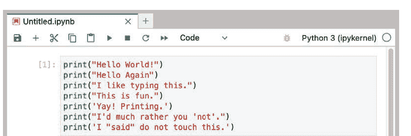
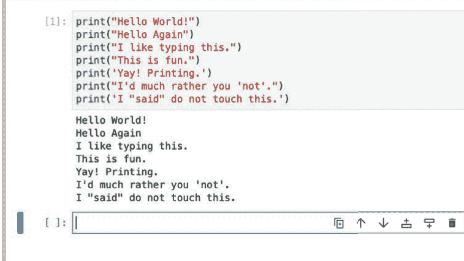
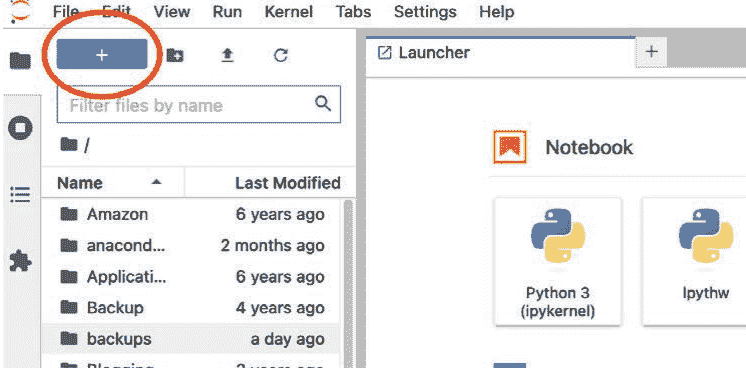

# 像程序员一样学Python

第五版

Zed A. Shaw

## Zed Shaw的“困难之路”系列

访问 **informit.com/hardway** 获取完整出版物列表。

**Zed Shaw的“困难之路”系列** 强调教学和*动手实践*是入门众多计算机科学主题的最佳方式。该系列中的每本书都围绕简短、易懂的练习设计，引导你完成一系列教学，最终创建出可运行的软件。所有练习都经过彻底测试，以确保它们能与真实学生一起工作，从而增加你成功的机会。配套视频会带你逐步讲解每个练习的代码。Zed在书中加入了一些幽默和内部笑话，让你在学习时也能开怀大笑。

请务必与我们保持联系！
informit.com/socialconnect

# 像程序员一样学Python

通往计算机与数据科学奇妙世界的简明入门指南

第五版

Zed A. Shaw

Addison-Wesley

新泽西州霍博肯

封面图片：ioat/Shutterstock
作者照片由Zed A. Shaw提供
第6、7页：Jupyter截图
第84、86页：Python软件基金会截图

制造商和销售商用于区分其产品的许多名称被声明为商标。当这些名称出现在本书中，并且出版商已知存在商标声明时，这些名称已以首字母大写或全大写形式印刷。

作者和出版商在准备本书时已尽心尽力，但不对任何类型的明示或暗示保证承担责任，也不对错误或遗漏承担责任。对于因使用本书所含信息或程序而引起的或与之相关的附带或间接损害，不承担任何责任。

有关批量购买本书或特殊销售机会（可能包括电子版本、定制封面设计以及针对您的业务、培训目标、营销重点或品牌兴趣的特定内容）的信息，请联系我们的企业销售部门：corpsales@pearsoned.com 或 (800) 382-3419。

有关政府销售咨询，请联系 governmentsales@pearsoned.com。

有关美国以外的销售问题，请联系 intlcs@pearson.com。

访问我们的网站：informit.com/aw

美国国会图书馆控制号：2023950645

版权所有 © 2024 Zed A. Shaw

保留所有权利。本出版物受版权保护，未经出版商事先许可，不得以任何形式或任何方式（电子、机械、影印、录音或类似方式）进行任何禁止的复制、存储于检索系统或传输。有关权限、请求表以及Pearson Education全球权利与权限部门内适当联系人的信息，请访问 www.pearson.com/permissions。

ISBN-13: 978-0-13-827057-5
ISBN-10: 0-13-827057-0

$PrintCode

## 目录

前言

## 目录

- 练习题

## 练习 13 参数、解包、变量

练习 13 参数、解包、变量

## 目录

- **练习 20 函数与文件**

## 练习 25 字典与函数

练习 25 字典与函数

## 目录

- **练习 30 假如**

## 调试技巧

调试技巧 . . . . . . . . . . . . . . . . . . . . . . . . . . . . . . . . . . . . . . . . . . . . . . . . . . . . . . . . . . . . . . . . . . . . . . . . . . . . . . . . . . . . . . . . . . . . . . . . . . . . . . . . . . . . . . . . . . . . . . . . . . . . . . . . . . . . . . . . . . . . . . . . . . . . . . . . . . . . . . . . . . . . . . . . . . . . . . . . . . . . . . . . . . . . . . . . . . . . . . . . . . . . . . . . . . . . . . . . . . . . . . . . . . . . . . . . . . . . . . . . . . . . . . . . . . . . . . . . . . . . . . . . . . . . . . . . . . . . . . . . . . . . . . . . . . . . . . . . . . . . . . . . . . . . . . . . . . . . . . . . . . . . . . . . . . . . . . . . . . . . . . . . . . . . . . . . . . . . . . . . . . . . . . . . . . . . . . . . . . . . . . . . . . . . . . . . . . . . . . . . . . . . . . . . . . . . . . . . . . . . . . . . . . . . . . . . . . . . . . . . . . . . . . . . . . . . . . . . . . . . . . . . . . . . . . . . . . . . . . . . . . . . . . . . . . . . . . . . . . . . . . . . . . . . . . . . . . . . . . . . . . . . . . . . . . . . . . . . . . . . . . . . . . . . . . . . . . . . . . . . . . . . . . . . . . . . . . . . . . . . . . . . . . . . . . . . . . . . . . . . . . . . . . . . . . . . . . . . . . . . . . . . . . . . . . . . . . . . . . . . . . . . . . . . . . . . . . . . . . . . . . . . . . . . . . . . . . . . . . . . . . . . . . . . . . . . . . . . . . . . . . . . . . . . . . . . . . . . . . . . . . . . . . . . . . . . . . . . . . . . . . . . . . . . . . . . . . . . . . . . . . . . . . . . . . . . . . . . . . . . . . . . . . . . . . . . . . . . . . . . . . . . . . . . . . . . . . . . . . . . . . . . . . . . . . . . . . . . . . . . . . . . . . . . . . . . . . . . . . . . . . . . . . . . . . . . . . . . . . . . . . . . . . . . . . . . . . . . . . . . . . . . . . . . . . . . . . . . . . . . . . . . . . . . . . . . . . . . . . . . . . . . . . . . . . . . . . . . . . . . . . . . . . . . . . . . . . . . . . . . . . . . . . . . . . . . . . . . . . . . . . . . . . . . . . . . . . . . . . . . . . . . . . . . . . . . . . . . . . . . . . . . . . . . . . . . . . . . . . . . . . . . . . . . . . . . . . . . . . . . . . . . . . . . . . . . . . . . . . . . . . . . . . . . . . . . . . . . . . . . . . . . . . . . . . . . . . . . . . . . . . . . . . . . . . . . . . . . . . . . . . . . . . . . . . . . . . . . . . . . . . . . . . . . . . . . . . . . . . . . . . . . . . . . . . . . . . . . . . . . . . . . . . . . . . . . . . . . . . . . . . . . . . . . . . . . . . . . . . . . . . . . . . . . . . . . . . . . . . . . . . . . . . . . . . . . . . . . . . . . . . . . . . . . . . . . . . . . . . . . . . . . . . . . . . . . . . . . . . . . . . . . . . . . . . . . . . . . . . . . . . . . . . . . . . . . . . . . . . . . . . . . . . . . . . . . . . . . . . . . . . . . . . . . . . . . . . . . . . . . . . . . . . . . . . . . . . . . . . . . . . . . . . . . . . . . . . . . . . . . . . . . . . . . . . . . . . . . . . . . . . . . . . . . . . . . . . . . . . . . . . . . . . . . . . . . . . . . . . . . . . . . . . . . . . . . . . . . . . . . . . . . . . . . . . . . . . . . . . . . . . . . . . . . . . . . . . . . . . . . . . . . . . . . . . . . . . . . . . . . . . . . . . . . . . . . . . . . . . . . . . . . . . . . . . . . . . . . . . . . . . . . . . . . . . . . . . . . . . . . . . . . . . . . . . . . . . . . . . . . . . . . . . . . . . . . . . . . . . . . . . . . . . . . . . . . . . . . . . . . . . . . . . . . . . . . . . . . . . . . . . . . . . . . . . . . . . . . . . . . . . . . . . . . . . . . . . . . . . . . . . . . . . . . . . . . . . . . . . . . . . . . . . . . . . . . . . . . . . . . . . . . . . . . . . . . . . . . . . . . . . . . . . . . . . . . . . . . . . . . . . . . . . . . . . . . . . . . . . . . . . . . . . . . . . . . . . . . . . . . . . . . . . . . . . . . . . . . . . . . . . . . . . . . . . . . . . . . . . . . . . . . . . . . . . . . . . . . . . . . . . . . . . . . . . . . . . . . . . . . . . . . . . . . . . . . . . . . . . . . . . . . . . . . . . . . . . . . . . . . . . . . . . . . . . . . . . . . . . . . . . . . . . . . . . . . . . . . . . . . . . . . . . . . . . . . . . . . . . . . . . . . . . . . . . . . . . . . . . . . . . . . . . . . . . . . . . . . . . . . . . . . . . . . . . . . . . . . . . . . . . . . . . . . . . . . . . . . . . . . . . . . . . . . . . . . . . . . . . . . . . . . . . . . . . . . . . . . . . . . . . . . . . . . . . . . . . . . . . . . . . . . . . . . . . . . . . . . . . . . . . . . . . . . . . . . . . . . . . . . . . . . . . . . . . . . . . . . . . . . . . . . . . . . . . . . . . . . . . . . . . . . . . . . . . . . . . . . . . . . . . . . . . . . . . . . . . . . . . . . . . . . . . . . . . . . . . . . . . . . . . . . . . . . . . . . . . . . . . . . . . . . . . . . . . . . . . . . . . . . . . . . . . . . . . . . . . . . . . . . . . . . . . . . . . . . . . . . . . . . . . . . . . . . . . . . . . . . . . . . . . . . . . . . . . . . . . . . . . . . . . . . . . . . . . . . . . . . . . . . . . . . . . . . . . . . . . . . . . . . . . . . . . . . . . . . . . . . . . . . . . . . . . . . . . . . . . . . . . . . . . . . . . . . . . . . . . . . . . . . . . . . . . . . . . . . . . . . . . . . . . . . . . . . . . . . . . . . . . . . . . . . . . . . . . . . . . . . . . . . . . . . . . . . . . . . . . . . . . . . . . . . . . . . . . . . . . . . . . . . . . . . . . . . . . . . . . . . . . . . . . . . . . . . . . . . . . . . . . . . . . . . . . . . . . . . . . . . . . . . . . . . . . . . . . . . . . . . . . . . . . . . . . . . . . . . . . . . . . . . . . . . . . . . . . . . . . . . . . . . . . . . . . . . . . . . . . . . . . . . . . . . . . . . . . . . . . . . . . . . . . . . . . . . . . . . . . . . . . . . . . . . . . . . . . . . . . . . . . . . . . . . . . . . . . . . . . . . . . . . . . . . . . . . . . . . . . . . . . . . . . . . . . . . . . . . . . . . . . . . . . . . . . . . . . . . . . . . . . . . . . . . . . . . . . . . . . . . . . . . . . . . . . . . . . . . . . . . . . . . . . . . . . . . . . . . . . . . . . . . . . . . . . . . . . . . . . . . . . . . . . . . . . . . . . . . . . . . . . . . . . . . . . . . . . . . . . . . . . . . . . . . . . . . . . . . . . . . . . . . . . . . . . . . . . . . . . . . . . . . . . . . . . . . . . . . . . . . . . . . . . . . . . . . . . . . . . . . . . . . . . . . . . . . . . . . . . . . . . . . . . . . . . . . . . . . . . . . . . . . . . . . . . . . . . . . . . . . . . . . . . . . . . . . . . . . . . . . . . . . . . . . . . . . . . . . . . . . . . . . . . . . . . . . . . . . . . . . . . . . . . . . . . . . . . . . . . . . . . . . . . . . . . . . . . . . . . . . . . . . . . . . . . . . . . . . . . . . . . . . . . . . . . . . . . . . . . . . . . . . . . . . . . . . . . . . . . . . . . . . . . . . . . . . . . . . . . . . . . . . . . . . . . . . . . . . . . . . . . . . . . . . . . . . . . . . . . . . . . . . . . . . . . . . . . . . . . . . . . . . . . . . . . . . . . . . . . . . . . . . . . . . . . . . . . . . . . . . . . . . . . . . . . . . . . . . . . . . . . . . . . . . . . . . . . . . . . . . . . . . . . . . . . . . . . . . . . . . . . . . . . . . . . . . . . . . . . . . . . . . . . . . . . . . . . . . . . . . . . . . . . . . . . . . . . . . . . . . . . . . . . . . . . . . . . . . . . . . . . . . . . . . . . . . . . . . . . . . . . . . . . . . . . . . . . . . . . . . . . . . . . . . . . . . . . . . . . . . . . . . . . . . . . . . . . . . . . . . . . . . . . . . . . . . . . . . . . . . . . . . . . . . . . . . . . . . . . . . . . . . . . . . . . . . . . . . . . . . . . . . . . . . . . . . . . . . . . . . . . . . . . . . . . . . . . . . . . . . . . . . . . . . . . . . . . . . . . . . . . . . . . . . . . . . . . . . . . . . . . . . . . . . . . . . . . . . . . . . . . . . . . . . . . . . . . . . . . . . . . . . . . . . . . . . . . . . . . . . . . . . . . . . . . . . . . . . . . . . . . . . . . . . . . . . . . . . . . . . . . . . . . . . . . . . . . . . . . . . . . . . . . . . . . . . . . . . . . . . . . . . . . . . . . . . . . . . . . . . . . . . . . . . . . . . . . . . . . . . . . . . . . . . . . . . . . . . . . . . . . . . . . . . . . . . . . . . . . . . . . . . . . . . . . . . . . . . . . . . . . . . . . . . . . . . . . . . . . . . . . . . . . . . . . . . . . . . . . . . . . . . . . . . . . . . . . . . . . . . . . . . . . . . . . . . . . . . . . . . . . . . . . . . . . . . . . . . . . . . . . . . . . . . . . . . . . . . . . . . . . . . . . . . . . . . . . . . . . . . . . . . . . . . . . . . . . . . . . . . . . . . . . . . . . . . . . . . . . . . . . . . . . . . . . . . . . . . . . . . . . . . . . . . . . . . . . . . . . . . . . . . . . . . . . . . . . . . . . . . . . . . . . . . . . . . . . . . . . . . . . . . . . . . . . . . . . . . . . . . . . . . . . . . . . . . . . . . . . . . . . . . . . . . . . . . . . . . . . . . . . . . . . . . . . . . . . . . . . . . . . . . . . . . . . . . . . . . . . . . . . . . . . . . . . . . . . . . . . . . . . . . . . . . . . . . . . . . . . . . . . . . . . . . . . . . . . . . . . . . . . . . . . . . . . . . . . . . . . . . . . . . . . . . . . . . . . . . . . . . . . . . . . . . . . . . . . . . . . . . . . . . . . . . . . . . . . . . . . . . . . . . . . . . . . . . . . . . . . . . . . . . . . . . . . . . . . . . . . . . . . . . . . . . . . . . . . . . . . . . . . . . . . . . . . . . . . . . . . . . . . . . . . . . . . . . . . . . . . . . . . . . . . . . . . . . . . . . . . . . . . . . . . . . . . . . . . . . . . . . . . . . . . . . . . . . . . . . . . . . . . . . . . . . . . . . . . . . . . . . . . . . . . . . . . . . . . . . . . . . . . . . . . . . . . . . . . . . . . . . . . . . . . . . . . . . . . . . . . . . . . . . . . . . . . . . . . . . . . . . . . . . . . . . . . . . . . . . . . . . . . . . . . . . . . . . . . . . . . . . . . . . . . . . . . . . . . . . . . . . . . . . . . . . . . . . . . . . . . . . . . . . . . . . . . . . . . . . . . . . . . . . . . . . . . . . . . . . . . . . . . . . . . . . . . . . . . . . . . . . . . . . . . . . . . . . . . . . . . . . . . . . . . . . . . . . . . . . . . . . . . . . . . . . . . . . . . . . . . . . . . . . . . . . . . . . . . . . . . . . . . . . . . . . . . . . . . . . . . . . . . . . . . . . . . . . . . . . . . . . . . . . . . . . . . . . . . . . . . . . . . . . . . . . . . . . . . . . . . . . . . . . . . . . . . . . . . . . . . . . . . . . . . . . . . . . . . . . . . . . . . . . . . . . . . . . . . . . . . . . . . . . . . . . . . . . . . . . . . . . . . . . . . . . . . . . . . . . . . . . . . . . . . . . . . . . . . . . . . . . . . . . . . . . . . . . . . . . . . . . . . . . . . . . . . . . . . . . . . . . . . . . . . . . . . . . . . . . . . . . . . . . . . . . . . . . . . . . . . . . . . . . . . . . . . . . . . . . . . . . . . . . . . . . . . . . . . . . . . . . . . . . . . . . . . . . . . . . . . . . . . . . . . . . . . . . . . . . . . . . . . . . . . . . . . . . . . . . . . . . . . . . . . . . . . . . . . . . . . . . . . . . . . . . . . . . . . . . . . . . . . . . . . . . . . . . . . . . . . . . . . . . . . . . . . . . . . . . . . . . . . . . . . . . . . . . . . . . . . . . . . . . . . . . . . . . . . . . . . . . . . . . . . . . . . . . . . . . . . . . . . . . . . . . . . . . . . . . . . . . . . . . . . . . . . . . . . . . . . . . . . . . . . . . . . . . . . . . . . . . . . . . . . . . . . . . . . . . . . . . . . . . . . . . . . . . . . . . . . . . . . . . . . . . . . . . . . . . . . . . . . . . . . . . . . . . . . . . . . . . . . . . . . . . . . . . . . . . . . . . . . . . . . . . . . . . . . . . . . . . . . . . . . . . . . . . . . . . . . . . . . . . . . . . . . . . . . . . . . . . . . . . . . . . . . . . . . . . . . . . . . . . . . . . . . . . . . . . . . . . . . . . . . . . . . . . . . . . . . . . . . . . . . . . . . . . . . . . . . . . . . . . . . . . . . . . . . . . . . . . . . . . . . . . . . . . . . . . . . . . . . . . . . . . . . . . . . . . . . . . . . . . . . . . . . . . . . . . . . . . . . . . . . . . . . . . . . . . . . . . . . . . . . . . . . . . . . . . . . . . . . . . . . . . . . . . . . . . . . . . . . . . . . . . . . . . . . . . . . . . . . . . . . . . . . . . . . . . . . . . . . . . . . . . . . . . . . . . . . . . . . . . . . . . . . . . . . . . . . . . . . . . . . . . . . . . . . . . . . . . . . . . . . . . . . . . . . . . . . . . . . . . . . . . . . . . . . . . . . . . . . . . . . . . . . . . . . . . . . . . . . . . . . . . . . . . . . . . . . . . . . . . . . . . . . . . . . . . . . . . . . . . . . . . . . . . . . . . . . . . . . . . . . . . . . . . . . . . . . . . . . . . . . . . . . . . . . . . . . . . . . . . . . . . . . . . . . . . . . . . . . . . . . . . . . . . . . . . . . . . . . . . . . . . . . . . . . . . . . . . . . . . . . . . . . . . . . . . . . . . . . . . . . . . . . . . . . . . . . . . . . . . . . . . . . . . . . . . . . . . . . . . . . . . . . . . . . . . . . . . . . . . . . . . . . . . . . . . . . . . . . . . . . . . . . . . . . . . . . . . . . . . . . . . . . . . . . . . . . . . . . . . . . . . . . . . . . . . . . . . . . . . . . . . . . . . . . . . . . . . . . . . . . . . . . . . . . . . . . . . . . . . . . . . . . . . . . . . . . . . . . . . . . . . . . . . . . . . . . . . . . . . . . . . . . . . . . . . . . . . . . . . . . . . . . . . . . . . . . . . . . . . . . . . . . . . . . . . . . . . . . . . . . . . . . . . . . . . . . . . . . . . . . . . . . . . . . . . . . . . . . . . . . . . . . . . . . . . . . . . . . . . . . . . . . . . . . . . . . . . . . . . . . . . . . . . . . . . . . . . . . . . . . . . . . . . . . . . . . . . . . . . . . . . . . . . . . . . . . . . . . . . . . . . . . . . . . . . . . . . . . . . . . . . . . . . . . . . . . . . . . . . . . . . . . . . . . . . . . . . . . . . . . . . . . . . . . . . . . . . . . . . . . . . . . . . . . . . . . . . . . . . . . . . . . . . . . . . . . . . . . . . . . . . . . . . . . . . . . . . . . . . . . . . . . . . . . . . . . . . . . . . . . . . . . . . . . . . . . . . . . . . . . . . . . . . . . . . . . . . . . . . . . . . . . . . . . . . . . . . . . . . . . . . . . . . . . . . . . . . . . . . . . . . . . . . . . . . . . . . . . . . . . . . . . . . . . . . . . . . . . . . . . . . . . . . . . . . . . . . . . . . . . . . . . . . . . . . . . . . . . . . . . . . . . . . . . . . . . . . . . . . . . . . . . . . . . . . . . . . . . . . . . . . . . . . . . . . . . . . . . . . . . . . . . . . . . . . . . . . . . . . . . . . . . . . . . . . . . . . . . . . . . . . . . . . . . . . . . . . . . . . . . . . . . . . . . . . . . . . . . . . . . . . . . . . . . . . . . . . . . . . . . . . . . . . . . . . . . . . . . . . . . . . . . . . . . . . . . . . . . . . . . . . . . . . . . . . . . . . . . . . . . . . . . . . . . . . . . . . . . . . . . . . . . . . . . . . . . . . . . . . . . . . . . . . . . . . . . . . . . . . . . . . . . . . . . . . . . . . . . . . . . . . . . . . . . . . . . . . . . . . . . . . . . . . . . . . . . . . . . . . . . . . . . . . . . . . . . . . . . . . . . . . . . . . . . . . . . . . . . . . . . . . . . . . . . . . . . . . . . . . . . . . . . . . . . . . . . . . . . . . . . . . . . . . . . . . . . . . . . . . . . . . . . . . . . . . . . . . . . . . . . . . . . . . . . . . . . . . . . . . . . . . . . . . . . . . . . . . . . . . . . . . . . . . . . . . . . . . . . . . . . . . . . . . . . . . . . . . . . . . . . . . . . . . . . . . . . . . . . . . . . . . . . . . . . . . . . . . . . . . . . . . . . . . . . . . . . . . . . . . . . . . . . . . . . . . . . . . . . . . . . . . . . . . . . . . . . . . . . . . . . . . . . . . . . . . . . . . . . . . . . . . . . . . . . . . . . . . . . . . . . . . . . . . . . . . . . . . . . . . . . . . . . . . . . . . . . . . . . . . . . . . . . . . . . . . . . . . . . . . . . . . . . . . . . . . . . . . . . . . . . . . . . . . . . . . . . . . . . . . . . . . . . . . . . . . . . . . . . . . . . . . . . . . . . . . . . . . . . . . . . . . . . . . . . . . . . . . . . . . . . . . . . . . . . . . . . . . . . . . . . . . . . . . . . . . . . . . . . . . . . . . . . . . . . . . . . . . . . . . . . . . . . . . . . . . . . . . . . . . . . . . . . . . . . . . . . . . . . . . . . . . . . . . . . . . . . . . . . . . . . . . . . . . . . . . . . . . . . . . . . . . . . . . . . . . . . . . . . . . . . . . . . . . . . . . . . . . . . . . . . . . . . . . . . . . . . . . . . . . . . . . . . . . . . . . . . . . . . . . . . . . . . . . . . . . . . . . . . . . . . . . . . . . . . . . . . . . . . . . . . . . . . . . . . . . . . . . . . . . . . . . . . . . . . . . . . . . . . . . . . . . . . . . . . . . . . . . . . . . . . . . . . . . . . . . . . . . . . . . . . . . . . . . . . . . . . . . . . . . . . . . . . . . . . . . . . . . . . . . . . . . . . . . . . . . . . . . . . . . . . . . . . . . . . . . . . . . . . . . . . . . . . . . . . . . . . . . . . . . . . . . . . . . . . . . . . . . . . . . . . . . . . . . . . . . . . . . . . . . . . . . . . . . . . . . . . . . . . . . . . . . . . . . . . . . . . . . . . . . . . . . . . . . . . . . . . . . . . . . . . . . . . . . . . . . . . . . . . . . . . . . . . . . . . . . . . . . . . . . . . . . . . . . . . . . . . . . . . . . . . . . . . . . . . . . . . . . . . . . . . . . . . . . . . . . . . . . . . . . . . . . . . . . . . . . . . . . . . . . . . . . . . . . . . . . . . . . . . . . . . . . . . . . . . . . . . . . . . . . . . . . . . . . . . . . . . . . . . . . . . . . . . . . . . . . . . . . . . . . . . . . . . . . . . . . . . . . . . . . . . . . . . . . . . . . . . . . . . . . . . . . . . . . . . . . . . . . . . . . . . . . . . . . . . . . . . . . . . . . . . . . . . . . . . . . . . . . . . . . . . . . . . . . . . . . . . . . . . . . . . . . . . . . . . . . . . . . . . . . . . . . . . . . . . . . . . . . . . . . . . . . . . . . . . . . . . . . . . . . . . . . . . . . . . . . . . . . . . . . . . . . . . . . . . . . . . . . . . . . . . . . . . . . . . . . . . . . . . . . . . . . . . . . . . . . . . . . . . . . . . . . . . . . . . . . . . . . . . . . . . . . . . . . . . . . . . . . . . . . . . . . . . . . . . . . . . . . . . . . . . . . . . . . . . . . . . . . . . . . . . . . . . . . . . . . . . . . . . . . . . . . . . . . . . . . . . . . . . . . . . . . . . . . . . . . . . . . . . . . . . . . . . . . . . . . . . . . . . . . . . . . . . . . . . . . . . . . . . . . . . . . . . . . . . . . . . . . . . . . . . . . . . . . . . . . . . . . . . . . . . . . . . . . . . . . . . . . . . . . . . . . . . . . . . . . . . . . . . . . . . . . . . . . . . . . . . . . . . . . . . . . . . . . . . . . . . . . . . . . . . . . . . . . . . . . . . . . . . . . . . . . . . . . . . . . . . . . . . . . . . . . . . . . . . . . . . . . . . . . . . . . . . . . . . . . . . . . . . . . . . . . . . . . . . . . . . . . . . . . . . . . . . . . . . . . . . . . . . . . . . . . . . . . . . . . . . . . . . . . . . . . . . . . . . . . . . . . . . . . . . . . . . . . . . . . . . . . . . . . . . . . . . . . . . . . . . . . . . . . . . . . . . . . . . . . . . . . . . . . . . . . . . . . . . . . . . . . . . . . . . . . . . . . . . . . . . . . . . . . . . . . . . . . . . . . . . . . . . . . . . . . . . . . . . . . . . . . . . . . . . . . . . . . . . . . . . . . . . . . . . . . . . . . . . . . . . . . . . . . . . . . . . . . . . . . . . . . . . . . . . . . . . . . . . . . . . . . . . . . . . . . . . . . . . . . . . . . . . . . . . . . . . . . . . . . . . . . . . . . . . . . . . . . . . . . . . . . . . . . . . . . . . . . . . . . . . . . . . . . . . . . . . . . . . . . . . . . . . . . . . . . . . . . . . . . . . . . . . . . . . . . . . . . . . . . . . . . . . . . . . . . . . . . . . . . . . . . . . . . . . . . . . . . . . . . . . . . . . . . . . . . . . . . . . . . . . . . . . . . . . . . . . . . . . . . . . . . . . . . . . . . . . . . . . . . . . . . . . . . . . . . . . . . . . . . . . . . . . . . . . . . . . . . . . . . . . . . . . . . . . . . . . . . . . . . . . . . . . . . . . . . . . . . . . . . . . . . . . . . . . . . . . . . . . . . . . . . . . . . . . . . . . . . . . . . . . . . . . . . . . . . . . . . . . . . . . . . . . . . . . . . . . . . . . . . . . . . . . . . . . . . . . . . . . . . . . . . . . . . . . . . . . . . . . . . . . . . . . . . . . . . . . . . . . . . . . . . . . . . . . . . . . . . . . . . . . . . . . . . . . . . . . . . . . . . . . . . . . . . . . . . . . . . . . . . . . . . . . . . . . . . . . . . . . . . . . . . . . . . . . . . . . . . . . . . . . . . . . . . . . . . . . . . . . . . . . . . . . . . . . . . . . . . . . . . . . . . . . . . . . . . . . . . . . . . . . . . . . . . . . . . . . . . . . . . . . . . . . . . . . . . . . . . . . . . . . . . . . . . . . . . . . . . . . . . . . . . . . . . . . . . . . . . . . . . . . . . . . . . . . . . . . . . . . . . . . . . . . . . . . . . . . . . . . . . . . . . . . . . . . . . . . . . . . . . . . . . . . . . . . . . . . . . . . . . . . . . . . . . . . . . . . . . . . . . . . . . . . . . . . . . . . . . . . . . . . . . . . . . . . . . . . . . . . . . . . . . . . . . . . . . . . . . . . . . . . . . . . . . . . . . . . . . . . . . . . . . . . . . . . . . . . . . . . . . . . . . . . . . . . . . . . . . . . . . . . . . . . . . . . . . . . . . . . . . . . . . . . . . . . . . . . . . . . . . . . . . . . . . . . . . . . . . . . . . . . . . . . . . . . . . . . . . . . . . . . . . . . . . . . . . . . . . . . . . . . . . . . . . . . . . . . . . . . . . . . . . . . . . . . . . . . . . . . . . . . . . . . . . . . . . . . . . . . . . . . . . . . . . . . . . . . . . . . . . . . . . . . . . . . . . . . . . . . . . . . . . . . . . . . . . . . . . . . . . . . . . . . . . . . . . . . . . . . . . . . . . . . . . . . . . . . . . . . . . . . . . . . . . . . . . . . . . . . . . . . . . . . . . . . . . . . . . . . . . . . . . . . . . . . . . . . . . . . . . . . . . . . . . . . . . . . . . . . . . . . . . . . . . . . . . . . . . . . . . . . . . . . . . . . . . . . . . . . . . . . . . . . . . . . . . . . . . . . . . . . . . . . . . . . . . . . . . . . . . . . . . . . . . . . . . . . . . . . . . . . . . . . . . . . . . . . . . . . . . . . . . . . . . . . . . . . . . . . . . . . . . . . . . . . . . . . . . . . . . . . . . . . . . . . . . . . . . . . . . . . . . . . . . . . . . . . . . . . . . . . . . . . . . . . . . . . . . . . . . . . . . . . . . . . . . . . . . . . . . . . . . . . . . . . . . . . . . . . . . . . . . . . . . . . . . . . . . . . . . . . . . . . . . . . . . . . . . . . . . . . . . . . . . . . . . . . . . . . . . . . . . . . . . . . . . . . . . . . . . . . . . . . . . . . . . . . . . . . . . . . . . . . . . . . . . . . . . . . . . . . . . . . . . . . . . . . . . . . . . . . . . . . . . . . . . . . . . . . . . . . . . . . . . . . . . . . . . . . . . . . . . . . . . . . . . . . . . . . . . . . . . . . . . . . . . . . . . . . . . . . . . . . . . . . . . . . . . . . . . . . . . . . . . . . . . . . . . . . . . . . . . . . . . . . . . . . . . . . . . . . . . . . . . . . . . . . . . . . . . . . . . . . . . . . . . . . . . . . . . . . . . . . . . . . . . . . . . . . . . . . . . . . . . . . . . . . . . . . . . . . . . . . . . . . . . . . . . . . . . . . . . . . . . . . . . . . . . . . . . . . . . . . . . . . . . . . . . . . . . . . . . . . . . . . . . . . . . . . . . . . . . . . . . . . . . . . . . . . . . . . . . . . . . . . . . . . . . . . . . . . . . . . . . . . . . . . . . . . . . . . . . . . . . . . . . . . . . . . . . . . . . . . . . . . . . . . . . . . . . . . . . . . . . . . . . . . . . . . . . . . . . . . . . . . . . . . . . . . . . . . . . . . . . . . . . . . . . . . . . . . . . . . . . . . . . . . . . . . . . . . . . . . . . . . . . . . . . . . . . . . . . . . . . . . . . . . . . . . . . . . . . . . . . . . . . . . . . . . . . . . . . . . . . . . . . . . . . . . . . . . . . . . . . . . . . . . . . . . . . . . . . . . . . . . . . . . . . . . . . . . . . . . . . . . . . . . . . . . . . . . . . . . . . . . . . . . . . . . . . . . . . . . . . . . . . . . . . . . . . . . . . . . . . . . . . . . . . . . . . . . . . . . . . . . . . . . . . . . . . . . . . . . . . . . . . . . . . . . . . . . . . . . . . . . . . . . . . . . . . . . . . . . . . . . . . . . . . . . . . . . . . . . . . . . . . . . . . . . . . . . . . . . . . . . . . . . . . . . . . . . . . . . . . . . . . . . . . . . . . . . . . . . . . . . . . . . . . . . . . . . . . . . . . . . . . . . . . . . . . . . . . . . . . . . . . . . . . . . . . . . . . . . . . . . . . . . . . . . . . . . . . . . . . . . . . . . . . . . . . . . . . . . . . . . . . . . . . . . . . . . . . . . . . . . . . . . . . . . . . . . . . . . . . . . . . . . . . . . . . . . . . . . . . . . . . . . . . . . . . . . . . . . . . . . . . . . . . . . . . . . . . . . . . . . . . . . . . . . . . . . . . . . . . . . . . . . . . . . . . . . . . . . . . . . . . . . . . . . . . . . . . . . . . . . . . . . . . . . . . . . . . . . . . . . . . . . . . . . . . . . . . . . . . . . . . . . . . . . . . . . . . . . . . . . . . . . . . . . . . . . . . . . . . . . . . . . . . . . . . . . . . . . . . . . . . . . . . . . . . . . . . . . . . . . . . . . . . . . . . . . . . . . . . . . . . . . . . . . . . . . . . . . . . . . . . . . . . . . . . . . . . . . . . . . . . . . . . . . . . . . . . . . . . . . . . . . . . . . . . . . . . . . . . . . . . . . . . . . . . . . . . . . . . . . . . . . . . . . . . . . . . . . . . . . . . . . . . . . . . . . . . . . . . . . . . . . . . . . . . . . . . . . . . . . . . . . . . . . . . . . . . . . . . . . . . . . . . . . . . . . . . . . . . . . . . . . . . . . . . . . . . . . . . . . . . . . . . . . . . . . . . . . . . . . . . . . . . . . . . . . . . . . . . . . . . . . . . . . . . . . . . . . . . . . . . . . . . . . . . . . . . . . . . . . . . . . . . . . . . . . . . . . . . . . . . . . . . . . . . . . . . . . . . . . . . . . . . . . . . . . . . . . . . . . . . . . . . . . . . . . . . . . . . . . . . . . . . . . . . . . . . . . . . . . . . . . . . . . . . . . . . . . . . . . . . . . . . . . . . . . . . . . . . . . . . . . . . . . . . . . . . . . . . . . . . . . . . . . . . . . . . . . . . . . . . . . . . . . . . . . . . . . . . . . . . . . . . . . . . . . . . . . . . . . . . . . . . . . . . . . . . . . . . . . . . . . . . . . . . . . . . . . . . . . . . . . . . . . . . . . . . . . . . . . . . . . . . . . . . . . . . . . . . . . . . . . . . . . . . . . . . . . . . . . . . . . . . . . . . . . . . . . . . . . . . . . . . . . . . . . . . . . . . . . . . . . . . . . . . . . . . . . . . . . . . . . . . . . . . . . . . . . . . . . . . . . . . . . . . . . . . . . . . . . . . . . . . . . . . . . . . . . . . . . . . . . . . . . . . . . . . . . . . . . . . . . . . . . . . . . . . . . . . . . . . . . . . . . . . . . . . . . . . . . . . . . . . . . . . . . . . . . . . . . . . . . . . . . . . . . . . . . . . . . . . . . . . . . . . . . . . . . . . . . . . . . . . . . . . . . . . . . . . . . . . . . . . . . . . . . . . . . . . . . . . . . . . . . . . . . . . . . . . . . . . . . . . . . . . . . . . . . . . . . . . . . . . . . . . . . . . . . . . . . . . . . . . . . . . . . . . . . . . . . . . . . . . . . . . . . . . . . . . . . . . . . . . . . . . . . . . . . . . . . . . . . . . . . . . . . . . . . . . . . . . . . . . . . . . . . . . . . . . . . . . . . . . . . . . . . . . . . . . . . . . . . . . . . . . . . . . . . . . . . . . . . . . . . . . . . . . . . . . . . . . . . . . . . . . . . . . . . . . . . . . . . . . . . . . . . . . . . . . . . . . . . . . . . . . . . . . . . . . . . . . . . . . . . . . . . . . . . . . . . . . . . . . . . . . . . . . . . . . . . . . . . . . . . . . . . . . . . . . . . . . . . . . . . . . . . . . . . . . . . . . . . . . . . . . . . . . . . . . . . . . . . . . . . . . . . . . . . . . . . . . . . . . . . . . . . . . . . . . . . . . . . . . . . . . . . . . . . . . . . . . . . . . . . . . . . . . . . . . . . . . . . . . . . . . . . . . . . . . . . . . . . . . . . . . . . . . . . . . . . . . . . . . . . . . . . . . . . . . . . . . . . . . . . . . . . . . . . . . . . . . . . . . . . . . . . . . . . . . . . . . . . . . . . . . . . . . . . . . . . . . . . . . . . . . . . . . . . . . . . . . . . . . . . . . . . . . . . . . . . . . . . . . . . . . . . . . . . . . . . . . . . . . . . . . . . . . . . . . . . . . . . . . . . . . . . . . . . . . . . . . . . . . . . . . . . . . . . . . . . . . . . . . . . . . . . . . . . . . . . . . . . . . . . . . . . . . . . . . . . . . . . . . . . . . . . . . . . . . . . . . . . . . . . . . . . . . . . . . . . . . . . . . . . . . . . . . . . . . . . . . . . . . . . . . . . . . . . . . . . . . . . . . . . . . . . . . . . . . . . . . . . . . . . . . . . . . . . . . . . . . . . . . . . . . . . . . . . . . . . . . . . . . . . . . . . . . . . . . . . . . . . . . . . . . . . . . . . . . . . . . . . . . . . . . . . . . . . . . . . . . . . . . . . . . . . . . . . . . . . . . . . . . . . . . . . . . . . . . . . . . . . . . . . . . . . . . . . . . . . . . . . . . . . . . . . . . . . . . . . . . . . . . . . . . . . . . . . . . . . . . . . . . . . . . . . . . . . . . . . . . . . . . . . . . . . . . . . . . . . . . . . . . . . . . . . . . . . . . . . . . . . . . . . . . . . . . . . . . . . . . . . . . . . . . . . . . . . . . . . . . . . . . . . . . . . . . . . . . . . . . . . . . . . . . . . . . . . . . . . . . . . . . . . . . . . . . . . . . . . . . . . . . . . . . . . . . . . . . . . . . . . . . . . . . . . . . . . . . . . . . . . . . . . . . . . . . . . . . . . . . . . . . . . . . . . . . . . . . . . . . . . . . . . . . . . . . . . . . . . . . . . . . . . . . . . . . . . . . . . . . . . . . . . . . . . . . . . . . . . . . . . . . . . . . . . . . . . . . . . . . . . . . . . . . . . . . . . . . . . . . . . . . . . . . . . . . . . . . . . . . . . . . . . . . . . . . . . . . . . . . . . . . . . . . . . . . . . . . . . . . . . . . . . . . . . . . . . . . . . . . . . . . . . . . . . . . . . . . . . . . . . . . . . . . . . . . . . . . . . . . . . . . . . . . . . . . . . . . . . . . . . . . . . . . . . . . . . . . . . . . . . . . . . . . . . . . . . . . . . . . . . . . . . . . . . . . . . . . . . . . . . . . . . . . . . . . . . . . . . . . . . . . . . . . . . . . . . . . . . . . . . . . . . . . . . . . . . . . . . . . . . . . . . . . . . . . . . . . . . . . . . . . . . . . . . . . . . . . . . . . . . . . . . . . . . . . . . . . . . . . . . . . . . . . . . . . . . . . . . . . . . . . . . . . . . . . . . . . . . . . . . . . . . . . . . . . . . . . . . . . . . . . . . . . . . . . . . . . . . . . . . . . . . . . . . . . . . . . . . . . . . . . . . . . . . . . . . . . . . . . . . . . . . . . . . . . . . . . . . . . . . . . . . . . . . . . . . . . . . . . . . . . . . . . . . . . . . . . . . . . . . . . . . . . . . . . . . . . . . . . . . . . . . . . . . . . . . . . . . . . . . . . . . . . . . . . . . . . . . . . . . . . . . . . . . . . . . . . . . . . . . . . . . . . . . . . . . . . . . . . . . . . . . . . . . . . . . . . . . . . . . . . . . . . . . . . . . . . . . . . . . . . . . . . . . . . . . . . . . . . . . . . . . . . . . . . . . . . . . . . . . . . . . . . . . . . . . . . . . . . . . . . . . . . . . . . . . . . . . . . . . . . . . . . . . . . . . . . . . . . . . . . . . . . . . . . . . . . . . . . . . . . . . . . . . . . . . . . . . . . . . . . . . . . . . . . . . . . . . . . . . . . . . . . . . . . . . . . . . . . . . . . . . . . . . . . . . . . . . . . . . . . . . . . . . . . . . . . . . . . . . . . . . . . . . . . . . . . . . . . . . . . . . . . . . . . . . . . . . . . . . . . . . . . . . . . . . . . . . . . . . . . . . . . . . . . . . . . . . . . . . . . . . . . . . . . . . . . . . . . . . . . . . . . . . . . . . . . . . . . . . . . . . . . . . . . . . . . . . . . . . . . . . . . . . . . . . . . . . . . . . . . . . . . . . . . . . . . . . . . . . . . . . . . . . . . . . . . . . . . . . . . . . . . . . . . . . . . . . . . . . . . . . . . . . . . . . . . . . . . . . . . . . . . . . . . . . . . . . . . . . . . . . . . . . . . . . . . . . . . . . . . . . . . . . . . . . . . . . . . . . . . . . . . . . . . . . . . . . . . . . . . . . . . . . . . . . . . . . . . . . . . . . . . . . . . . . . . . . . . . . . . . . . . . . . . . . . . . . . . . . . . . . . . . . . . . . . . . . . . . . . . . . . . . . . . . . . . . . . . . . . . . . . . . . . . . . . . . . . . . . . . . . . . . . . . . . . . . . . . . . . . . . . . . . . . . . . . . . . . . . . . . . . . . . . . . . . . . . . . . . . . . . . . . . . . . . . . . . . . . . . . . . . . . . . . . . . . . . . . . . . . . . . . . . . . . . . . . . . . . . . . . . . . . . . . . . . . . . . . . . . . . . . . . . . . . . . . . . . . . . . . . . . . . . . . . . . . . . . . . . . . . . . . . . . . . . . . . . . . . . . . . . . . . . . . . . . . . . . . . . . . . . . . . . . . . . . . . . . . . . . . . . . . . . . . . . . . . . . . . . . . . . . . . . . . . . . . . . . . . . . . . . . . . . . . . . . . . . . . . . . . . . . . . . . . . . . . . . . . . . . . . . . . . . . . . . . . . . . . . . . . . . . . . . . . . . . . . . . . . . . . . . . . . . . . . . . . . . . . . . . . . . . . . . . . . . . . . . . . . . . . . . . . . . . . . . . . . . . . . . . . . . . . . . . . . . . . . . . . . . . . . . . . . . . . . . . . . . . . . . . . . . . . . . . . . . . . . . . . . . . . . . . . . . . . . . . . . . . . . . . . . . . . . . . . . . . . . . . . . . . . . . . . . . . . . . . . . . . . . . . . . . . . . . . . . . . . . . . . . . . . . . . . . . . . . . . . . . . . . . . . . . . . . . . . . . . . . . . . . . . . . . . . . . . . . . . . . . . . . . . . . . . . . . . . . . . . . . . . . . . . . . . . . . . . . . . . . . . . . . . . . . . . . . . . . . . . . . . . . . . . . . . . . . . . . . . . . . . . . . . . . . . . . . . . . . . . . . . . . . . . . . . . . . . . . . . . . . . . . . . . . . . . . . . . . . . . . . . . . . . . . . . . . . . . . . . . . . . . . . . . . . . . . . . . . . . . . . . . . . . . . . . . . . . . . . . . . . . . . . . . . . . . . . . . . . . . . . . . . . . . . . . . . . . . . . . . . . . . . . . . . . . . . . . . . . . . . . . . . . . . . . . . . . . . . . . . . . . . . . . . . . . . . . . . . . . . . . . . . . . . . . . . . . . . . . . . . . . . . . . . . . . . . . . . . . . . . . . . . . . . . . . . . . . . . . . . . . . . . . . . . . . . . . . . . . . . . . . . . . . . . . . . . . . . . . . . . . . . . . . . . . . . . . . . . . . . . . . . . . . . . . . . . . . . . . . . . . . . . . . . . . . . . . . . . . . . . . . . . . . . . . . . . . . . . . . . . . . . . . . . . . . . . . . . . . . . . . . . . . . . . . . . . . . . . . . . . . . . . . . . . . . . . . . . . . . . . . . . . . . . . . . . . . . . . . . . . . . . . . . . . . . . . . . . . . . . . . . . . . . . . . . . . . . . . . . . . . . . . . . . . . . . . . . . . . . . . . . . . . . . . . . . . . . . . . . . . . . . . . . . . . . . . . . . . . . . . . . . . . . . . . . . . . . . . . . . . . . . . . . . . . . . . . . . . . . . . . . . . . . . . . . . . . . . . . . . . . . . . . . . . . . . . . . . . . . . . . . . . . . . . . . . . . . . . . . . . . . . . . . . . . . . . . . . . . . . . . . . . . . . . . . . . . . . . . . . . . . . . . . . . . . . . . . . . . . . . . . . . . . . . . . . . . . . . . . . . . . . . . . . . . . . . . . . . . . . . . . . . . . . . . . . . . . . . . . . . . . . . . . . . . . . . . . . . . . . . . . . . . . . . . . . . . . . . . . . . . . . . . . . . . . . . . . . . . . . . . . . . . . . . . . . . . . . . . . . . . . . . . . . . . . . . . . . . . . . . . . . . . . . . . . . . . . . . . . . . . . . . . . . . . . . . . . . . . . . . . . . . . . . . . . . . . . . . . . . . . . . . . . . . . . . . . . . . . . . . . . . . . . . . . . . . . . . . . . . . . . . . . . . . . . . . . . . . . . . . . . . . . . . . . . . . . . . . . . . . . . . . . . . . . . . . . . . . . . . . . . . . . . . . . . . . . . . . . . . . . . . . . . . . . . . . . . . . . . . . . . . . . . . . . . . . . . . . . . . . . . . . . . . . . . . . . . . . . . . . . . . . . . . . . . . . . . . . . . . . . . . . . . . . . . . . . . . . . . . . . . . . . . . . . . . . . . . . . . . . . . . . . . . . . . . . . . . . . . . . . . . . . . . . . . . . . . . . . . . . . . . . . . . . . . . . . . . . . . . . . . . . . . . . . . . . . . . . . . . . . . . . . . . . . . . . . . . . . . . . . . . . . . . . . . . . . . . . . . . . . . . . . . . . . . . . . . . . . . . . . . . . . . . . . . . . . . . . . . . . . . . . . . . . . . . . . . . . . . . . . . . . . . . . . . . . . . . . . . . . . . . . . . . . . . . . . . . . . . . . . . . . . . . . . . . . . . . . . . . . . . . . . . . . . . . . . . . . . . . . . . . . . . . . . . . . . . . . . . . . . . . . . . . . . . . . . . . . . . . . . . . . . . . . . . . . . . . . . . . . . . . . . . . . . . . . . . . . . . . . . . . . . . . . . . . . . . . . . . . . . . . . . . . . . . . . . . . . . . . . . . . . . . . . . . . . . . . . . . . . . . . . . . . . . . . . . . . . . . . . . . . . . . . . . . . . . . . . . . . . . . . . . . . . . . . . . . . . . . . . . . . . . . . . . . . . . . . . . . . . . . . . . . . . . . . . . . . . . . . . . . . . . . . . . . . . . . . . . . . . . . . . . . . . . . . . . . . . . . . . . . . . . . . . . . . . . . . . . . . . . . . . . . . . . . . . . . . . . . . . . . . . . . . . . . . . . . . . . . . . . . . . . . . . . . . . . . . . . . . . . . . . . . . . . . . . . . . . . . . . . . . . . . . . . . . . . . . . . . . . . . . . . . . . . . . . . . . . . . . . . . . . . . . . . . . . . . . . . . . . . . . . . . . . . . . . . . . . . . . . . . . . . . . . . . . . . . . . . . . . . . . . . . . . . . . . . . . . . . . . . . . . . . . . . . . . . . . . . . . . . . . . . . . . . . . . . . . . . . . . . . . . . . . . . . . . . . . . . . . . . . . . . . . . . . . . . . . . . . . . . . . . . . . . . . . . . . . . . . . . . . . . . . . . . . . . . . . . . . . . . . . . . . . . . . . . . . . . . . . . . . . . . . . . . . . . . . . . . . . . . . . . . . . . . . . . . . . . . . . . . . . . . . . . . . . . . . . . . . . . . . . . . . . . . . . . . . . . . . . . . . . . . . . . . . . . . . . . . . . . . . . . . . . . . . . . . . . . . . . . . . . . . . . . . . . . . . . . . . . . . . . . . . . . . . . . . . . . . . . . . . . . . . . . . . . . . . . . . . . . . . . . . . . . . . . . . . . . . . . . . . . . . . . . . . . . . . . . . . . . . . . . . . . . . . . . . . . . . . . . . . . . . . . . . . . . . . . . . . . . . . . . . . . . . . . . . . . . . . . . . . . . . . . . . . . . . . . . . . . . . . . . . . . . . . . . . . . . . . . . . . . . . . . . . . . . . . . . . . . . . . . . . . . . . . . . . . . . . . . . . . . . . . . . . . . . . . . . . . . . . . . . . . . . . . . . . . . . . . . . . . . . . . . . . . . . . . . . . . . . . . . . . . . . . . . . . . . . . . . . . . . . . . . . . . . . . . . . . . . . . . . . . . . . . . . . . . . . . . . . . . . . . . . . . . . . . . . . . . . . . . . . . . . . . . . . . . . . . . . . . . . . . . . . . . . . . . . . . . . . . . . . . . . . . . . . . . . . . . . . . . . . . . . . . . . . . . . . . . . . . . . . . . . . . . . . . . . . . . . . . . . . . . . . . . . . . . . . . . . . . . . . . . . . . . . . . . . . . . . . . . . . . . . . . . . . . . . . . . . . . . . . . . . . . . . . . . . . . . . . . . . . . . . . . . . . . . . . . . . . . . . . . . . . . . . . . . . . . . . . . . . . . . . . . . . . . . . . . . . . . . . . . . . . . . . . . . . . . . . . . . . . . . . . . . . . . . . . . . . . . . . . . . . . . . . . . . . . . . . . . . . . . . . . . . . . . . . . . . . . . . . . . . . . . . . . . . . . . . . . . . . . . . . . . . . . . . . . . . . . . . . . . . . . . . . . . . . . . . . . . . . . . . . . . . . . . . . . . . . . . . . . . . . . . . . . . . . . . . . . . . . . . . . . . . . . . . . . . . . . . . . . . . . . . . . . . . . . . . . . . . . . . . . . . . . . . . . . . . . . . . . . . . . . . . . . . . . . . . . . . . . . . . . . . . . . . . . . . . . . . . . . . . . . . . . . . . . . . . . . . . . . . . . . . . . . . . . . . . . . . . . . . . . . . . . . . . . . . . . . . . . . . . . . . . . . . . . . . . . . . . . . . . . . . . . . . . . . . . . . . . . . . . . . . . . . . . . . . . . . . . . . . . . . . . . . . . . . . . . . . . . . . . . . . . . . . . . . . . . . . . . . . . . . . . . . . . . . . . . . . . . . . . . . . . . . . . . . . . . . . . . . . . . . . . . . . . . . . . . . . . . . . . . . . . . . . . . . . . . . . . . . . . . . . . . . . . . . . . . . . . . . . . . . . . . . . . . . . . . . . . . . . . . . . . . . . . . . . . . . . . . . . . . . . . . . . . . . . . . . . . . . . . . . . . . . . . . . . . . . . . . . . . . . . . . . . . . . . . . . . . . . . . . . . . . . . . . . . . . . . . . . . . . . . . . . . . . . . . . . . . . . . . . . . . . . . . . . . . . . . . . . . . . . . . . . . . . . . . . . . . . . . . . . . . . . . . . . . . . . . . . . . . . . . . . . . . . . . . . . . . . . . . . . . . . . . . . . . . . . . . . . . . . . . . . . . . . . . . . . . . . . . . . . . . . . . . . . . . . . . . . . . . . . . . . . . . . . . . . . . . . . . . . . . . . . . . . . . . . . . . . . . . . . . . . . . . . . . . . . . . . . . . . . . . . . . . . . . . . . . . . . . . . . . . . . . . . . . . . . . . . . . . . . . . . . . . . . . . . . . . . . . . . . . . . . . . . . . . . . . . . . . . . . . . . . . . . . . . . . . . . . . . . . . . . . . . . . . . . . . . . . . . . . . . . . . . . . . . . . . . . . . . . . . . . . . . . . . . . . . . . . . . . . . . . . . . . . . . . . . . . . . . . . . . . . . . . . . . . . . . . . . . . . . . . . . . . . . . . . . . . . . . . . . . . . . . . . . . . . . . . . . . . . . . . . . . . . . . . . . . . . . . . . . . . . . . . . . . . . . . . . . . . . . . . . . . . . . . . . . . . . . . . . . . . . . . . . . . . . . . . . . . . . . . . . . . . . . . . . . . . . . . . . . . . . . . . . . . . . . . . . . . . . . . . . . . . . . . . . . . . . . . . . . . . . . . . . . . . . . . . . . . . . . . . . . . . . . . . . . . . . . . . . . . . . . . . . . . . . . . . . . . . . . . . . . . . . . . . . . . . . . . . . . . . . . . . . . . . . . . . . . . . . . . . . . . . . . . . . . . . . . . . . . . . . . . . . . . . . . . . . . . . . . . . . . . . . . . . . . . . . . . . . . . . . . . . . . . . . . . . . . . . . . . . . . . . . . . . . . . . . . . . . . . . . . . . . . . . . . . . . . . . . . . . . . . . . . . . . . . . . . . . . . . . . . . . . . . . . . . . . . . . . . . . . . . . . . . . . . . . . . . . . . . . . . . . . . . . . . . . . . . . . . . . . . . . . . . . . . . . . . . . . . . . . . . . . . . . . . . . . . . . . . . . . . . . . . . . . . . . . . . . . . . . . . . . . . . . . . . . . . . . . . . . . . . . . . . . . . . . . . . . . . . . . . . . . . . . . . . . . . . . . . . . . . . . . . . . . . . . . . . . . . . . . . . . . . . . . . . . . . . . . . . . . . . . . . . . . . . . . . . . . . . . . . . . . . . . . . . . . . . . . . . . . . . . . . . . . . . . . . . . . . . . . . . . . . . . . . . . . . . . . . . . . . . . . . . . . . . . . . . . . . . . . . . . . . . . . . . . . . . . . . . . . . . . . . . . . . . . . . . . . . . . . . . . . . . . . . . . . . . . . . . . . . . . . . . . . . . . . . . . . . . . . . . . . . . . . . . . . . . . . . . . . . . . . . . . . . . . . . . . . . . . . . . . . . . . . . . . . . . . . . . . . . . . . . . . . . . . . . . . . . . . . . . . . . . . . . . . . . . . . . . . . . . . . . . . . . . . . . . . . . . . . . . . . . . . . . . . . . . . . . . . . . . . . . . . . . . . . . . . . . . . . . . . . . . . . . . . . . . . . . . . . . . . . . . . . . . . . . . . . . . . . . . . . . . . . . . . . . . . . . . . . . . . . . . . . . . . . . . . . . . . . . . . . . . . . . . . . . . . . . . . . . . . . . . . . . . . . . . . . . . . . . . . . . . . . . . . . . . . . . . . . . . . . . . . . . . . . . . . . . . . . . . . . . . . . . . . . . . . . . . . . . . . . . . . . . . . . . . . . . . . . . . . . . . . . . . . . . . . . . . . . . . . . . . . . . . . . . . . . . . . . . . . . . . . . . . . . . . . . . . . . . . . . . . . . . . . . . . . . . . . . . . . . . . . . . . . . . . . . . . . . . . . . . . . . . . . . . . . . . . . . . . . . . . . . . . . . . . . . . . . . . . . . . . . . . . . . . . . . . . . . . . . . . . . . . . . . . . . . . . . . . . . . . . . . . . . . . . . . . . . . . . . . . . . . . . . . . . . . . . . . . . . . . . . . . . . . . . . . . . . . . . . . . . . . . . . . . . . . . . . . . . . . . . . . . . . . . . . . . . . . . . . . . . . . . . . . . . . . . . . . . . . . . . . . . . . . . . . . . . . . . . . . . . . . . . . . . . . . . . . . . . . . . . . . . . . . . . . . . . . . . . . . . . . . . . . . . . . . . . . . . . . . . . . . . . . . . . . . . . . . . . . . . . . . . . . . . . . . . . . . . . . . . . . . . . . . . . . . . . . . . . . . . . . . . . . . . . . . . . . . . . . . . . . . . . . . . . . . . . . . . . . . . . . . . . . . . . . . . . . . . . . . . . . . . . . . . . . . . . . . . . . . . . . . . . . . . . . . . . . . . . . . . . . . . . . . . . . . . . . . . . . . . . . . . . . . . . . . . . . . . . . . . . . . . . . . . . . . . . . . . . . . . . . . . . . . . . . . . . . . . . . . . . . . . . . . . . . . . . . . . . . . . . . . . . . . . . . . . . . . . . . . . . . . . . . . . . . . . . . . . . . . . . . . . . . . . . . . . . . . . . . . . . . . . . . . . . . . . . . . . . . . . . . . . . . . . . . . . . . . . . . . . . . . . . . . . . . . . . . . . . . . . . . . . . . . . . . . . . . . . . . . . . . . . . . . . . . . . . . . . . . . . . . . . . . . . . . . . . . . . . . . . . . . . . . . . . . . . . . . . . . . . . . . . . . . . . . . . . . . . . . . . . . . . . . . . . . . . . . . . . . . . . . . . . . . . . . . . . . . . . . . . . . . . . . . . . . . . . . . . . . . . . . . . . . . . . . . . . . . . . . . . . . . . . . . . . . . . . . . . . . . . . . . . . . . . . . . . . . . . . . . . . . . . . . . . . . . . . . . . . . . . . . . . . . . . . . . . . . . . . . . . . . . . . . . . . . . . . . . . . . . . . . . . . . . . . . . . . . . . . . . . . . . . . . . . . . . . . . . . . . . . . . . . . . . . . . . . . . . . . . . . . . . . . . . . . . . . . . . . . . . . . . . . . . . . . . . . . . . . . . . . . . . . . . . . . . . . . . . . . . . . . . . . . . . . . . . . . . . . . . . . . . . . . . . . . . . . . . . . . . . . . . . . . . . . . . . . . . . . . . . . . . . . . . . . . . . . . . . . . . . . . . . . . . . . . . . . . . . . . . . . . . . . . . . . . . . . . . . . . . . . . . . . . . . . . . . . . . . . . . . . . . . . . . . . . . . . . . . . . . . . . . . . . . . . . . . . . . . . . . . . . . . . . . . . . . . . . . . . . . . . . . . . . . . . . . . . . . . . . . . . . . . . . . . . . . . . . . . . . . . . . . . . . . . . . . . . . . . . . . . . . . . . . . . . . . . . . . . . . . . . . . . . . . . . . . . . . . . . . . . . . . . . . . . . . . . . . . . . . . . . . . . . . . . . . . . . . . . . . . . . . . . . . . . . . . . . . . . . . . . . . . . . . . . . . . . . . . . . . . . . . . . . . . . . . . . . . . . . . . . . . . . . . . . . . . . . . . . . . . . . . . . . . . . . . . . . . . . . . . . . . . . . . . . . . . . . . . . . . . . . . . . . . . . . . . . . . . . . . . . . . . . . . . . . . . . . . . . . . . . . . . . . . . . . . . . . . . . . . . . . . . . . . . . . . . . . . . . . . . . . . . . . . . . . . . . . . . . . . . . . . . . . . . . . . . . . . . . . . . . . . . . . . . . . . . . . . . . . . . . . . . . . . . . . . . . . . . . . . . . . . . . . . . . . . . . . . . . . . . . . . . . . . . . . . . . . . . . . . . . . . . . . . . . . . . . . . . . . . . . . . . . . . . . . . . . . . . . . . . . . . . . . . . . . . . . . . . . . . . . . . . . . . . . . . . . . . . . . . . . . . . . . . . . . . . . . . . . . . . . . . . . . . . . . . . . . . . . . . . . . . . . . . . . . . . . . . . . . . . . . . . . . . . . . . . . . . . . . . . . . . . . . . . . . . . . . . . . . . . . . . . . . . . . . . . . . . . . . . . . . . . . . . . . . . . . . . . . . . . . . . . . . . . . . . . . . . . . . . . . . . . . . . . . . . . . . . . . . . . . . . . . . . . . . . . . . . . . . . . . . . . . . . . . . . . . . . . . . . . . . . . . . . . . . . . . . . . . . . . . . . . . . . . . . . . . . . . . . . . . . . . . . . . . . . . . . . . . . . . . . . . . . . . . . . . . . . . . . . . . . . . . . . . . . . . . . . . . . . . . . . . . . . . . . . . . . . . . . . . . . . . . . . . . . . . . . . . . . . . . . . . . . . . . . . . . . . . . . . . . . . . . . . . . . . . . . . . . . . . . . . . . . . . . . . . . . . . . . . . . . . . . . . . . . . . . . . . . . . . . . . . . . . . . . . . . . . . . . . . . . . . . . . . . . . . . . . . . . . . . . . . . . . . . . . . . . . . . . . . . . . . . . . . . . . . . . . . . . . . . . . . . . . . . . . . . . . . . . . . . . . . . . . . . . . . . . . . . . . . . . . . . . . . . . . . . . . . . . . . . . . . . . . . . . . . . . . . . . . . . . . . . . . . . . . . . . . . . . . . . . . . . . . . . . . . . . . . . . . . . . . . . . . . . . . . . . . . . . . . . . . . . . . . . . . . . . . . . . . . . . . . . . . . . . . . . . . . . . . . . . . . . . . . . . . . . . . . . . . . . . . . . . . . . . . . . . . . . . . . . . . . . . . . . . . . . . . . . . . . . . . . . . . . . . . . . . . . . . . . . . . . . . . . . . . . . . . . . . . . . . . . . . . . . . . . . . . . . . . . . . . . . . . . . . . . . . . . . . . . . . . . . . . . . . . . . . . . . . . . . . . . . . . . . . . . . . . . . . . . . . . . . . . . . . . . . . . . . . . . . . . . . . . . . . . . . . . . . . . . . . . . . . . . . . . . . . . . . . . . . . . . . . . . . . . . . . . . . . . . . . . . . . . . . . . . . . . . . . . . . . . . . . . . . . . . . . . . . . . . . . . . . . . . . . . . . . . . . . . . . . . . . . . . . . . . . . . . . . . . . . . . . . . . . . . . . . . . . . . . . . . . . . . . . . . . . . . . . . . . . . . . . . . . . . . . . . . . . . . . . . . . . . . . . . . . . . . . . . . . . . . . . . . . . . . . . . . . . . . . . . . . . . . . . . . . . . . . . . . . . . . . . . . . . . . . . . . . . . . . . . . . . . . . . . . . . . . . . . . . . . . . . . . . . . . . . . . . . . . . . . . . . . . . . . . . . . . . . . . . . . . . . . . . . . . . . . . . . . . . . . . . . . . . . . . . . . . . . . . . . . . . . . . . . . . . . . . . . . . . . . . . . . . . . . . . . . . . . . . . . . . . . . . . . . . . . . . . . . . . . . . . . . . . . . . . . . . . . . . . . . . . . . . . . . . . . . . . . . . . . . . . . . . . . . . . . . . . . . . . . . . . . . . . . . . . . . . . . . . . . . . . . . . . . . . . . . . . . . . . . . . . . . . . . . . . . . . . . . . . . . . . . . . . . . . . . . . . . . . . . . . . . . . . . . . . . . . . . . . . . . . . . . . . . . . . . . . . . . . . . . . . . . . . . . . . . . . . . . . . . . . . . . . . . . . . . . . . . . . . . . . . . . . . . . . . . . . . . . . . . . . . . . . . . . . . . . . . . . . . . . . . . . . . . . . . . . . . . . . . . . . . . . . . . . . . . . . . . . . . . . . . . . . . . . . . . . . . . . . . . . . . . . . . . . . . . . . . . . . . . . . . . . . . . . . . . . . . . . . . . . . . . . . . . . . . . . . . . . . . . . . . . . . . . . . . . . . . . . . . . . . . . . . . . . . . . . . . . . . . . . . . . . . . . . . . . . . . . . . . . . . . . . . . . . . . . . . . . . . . . . . . . . . . . . . . . . . . . . . . . . . . . . . . . . . . . . . . . . . . . . . . . . . . . . . . . . . . . . . . . . . . . . . . . . . . . . . . . . . . . . . . . . . . . . . . . . . . . . . . . . . . . . . . . . . . . . . . . . . . . . . . . . . . . . . . . . . . . . . . . . . . . . . . . . . . . . . . . . . . . . . . . . . . . . . . . . . . . . . . . . . . . . . . . . . . . . . . . . . . . . . . . . . . . . . . . . . . . . . . . . . . . . . . . . . . . . . . . . . . . . . . . . . . . . . . . . . . . . . . . . . . . . . . . . . . . . . . . . . . . . . . . . . . . . . . . . . . . . . . . . . . . . . . . . . . . . . . . . . . . . . . . . . . . . . . . . . . . . . . . . . . . . . . . . . . . . . . . . . . . . . . . . . . . . . . . . . . . . . . . . . . . . . . . . . . . . . . . . . . . . . . . . . . . . . . . . . . . . . . . . . . . . . . . . . . . . . . . . . . . . . . . . . . . . . . . . . . . . . . . . . . . . . . . . . . . . . . . . . . . . . . . . . . . . . . . . . . . . . . . . . . . . . . . . . . . . . . . . . . . . . . . . . . . . . . . . . . . . . . . . . . . . . . . . . . . . . . . . . . . . . . . . . . . . . . . . . . . . . . . . . . . . . . . . . . . . . . . . . . . . . . . . . . . . . . . . . . . . . . . . . . . . . . . . . . . . . . . . . . . . . . . . . . . . . . . . . . . . . . . . . . . . . . . . . . . . . . . . . . . . . . . . . . . . . . . . . . . . . . . . . . . . . . . . . . . . . . . . . . . . . . . . . . . . . . . . . . . . . . . . . . . . . . . . . . . . . . . . . . . . . . . . . . . . . . . . . . . . . . . . . . . . . . . . . . . . . . . . . . . . . . . . . . . . . . . . . . . . . . . . . . . . . . . . . . . . . . . . . . . . . . . . . . . . . . . . . . . . . . . . . . . . . . . . . . . . . . . . . . . . . . . . . . . . . . . . . . . . . . . . . . . . . . . . . . . . . . . . . . . . . . . . . . . . . . . . . . . . . . . . . . . . . . . . . . . . . . . . . . . . . . . . . . . . . . . . . . . . . . . . . . . . . . . . . . . . . . . . . . . . . . . . . . . . . . . . . . . . . . . . . . . . . . . . . . . . . . . . . . . . . . . . . . . . . . . . . . . . . . . . . . . . . . . . . . . . . . . . . . . . . . . . . . . . . . . . . . . . . . . . . . . . . . . . . . . . . . . . . . . . . . . . . . . . . . . . . . . . . . . . . . . . . . . . . . . . . . . . . . . . . . . . . . . . . . . . . . . . . . . . . . . . . . . . . . . . . . . . . . . . . . . . . . . . . . . . . . . . . . . . . . . . . . . . . . . . . . . . . . . . . . . . . . . . . . . . . . . . . . . . . . . . . . . . . . . . . . . . . . . . . . . . . . . . . . . . . . . . . . . . . . . . . . . . . . . . . . . . . . . . . . . . . . . . . . . . . . . . . . . . . . . . . . . . . . . . . . . . . . . . . . . . . . . . . . . . . . . . . . . . . . . . . . . . . . . . . . . . . . . . . . . . . . . . . . . . . . . . . . . . . . . . . . . . . . . . . . . . . . . . . . . . . . . . . . . . . . . . . . . . . . . . . . . . . . . . . . . . . . . . . . . . . . . . . . . . . . . . . . . . . . . . . . . . . . . . . . . . . . . . . . . . . . . . . . . . . . . . . . . . . . . . . . . . . . . . . . . . . . . . . . . . . . . . . . . . . . . . . . . . . . . . . . . . . . . . . . . . . . . . . . . . . . . . . . . . . . . . . . . . . . . . . . . . . . . . . . . . . . . . . . . . . . . . . . . . . . . . . . . . . . . . . . . . . . . . . . . . . . . . . . . . . . . . . . . . . . . . . . . . . . . . . . . . . . . . . . . . . . . . . . . . . . . . . . . . . . . . . . . . . . . . . . . . . . . . . . . . . . . . . . . . . . . . . . . . . . . . . . . . . . . . . . . . . . . . . . . . . . . . . . . . . . . . . . . . . . . . . . . . . . . . . . . . . . . . . . . . . . . . . . . . . . . . . . . . . . . . . . . . . . . . . . . . . . . . . . . . . . . . . . . . . . . . . . . . . . . . . . . . . . . . . . . . . . . . . . . . . . . . . . . . . . . . . . . . . . . . . . . . . . . . . . . . . . . . . . . . . . . . . . . . . . . . . . . . . . . . . . . . . . . . . . . . . . . . . . . . . . . . . . . . . . . . . . . . . . . . . . . . . . . . . . . . . . . . . . . . . . . . . . . . . . . . . . . . . . . . . . . . . . . . . . . . . . . . . . . . . . . . . . . . . . . . . . . . . . . . . . . . . . . . . . . . . . . . . . . . . . . . . . . . . . . . . . . . . . . . . . . . . . . . . . . . . . . . . . . . . . . . . . . . . . . . . . . . . . . . . . . . . . . . . . . . . . . . . . . . . . . . . . . . . . . . . . . . . . . . . . . . . . . . . . . . . . . . . . . . . . . . . . . . . . . . . . . . . . . . . . . . . . . . . . . . . . . . . . . . . . . . . . . . . . . . . . . . . . . . . . . . . . . . . . . . . . . . . . . . . . . . . . . . . . . . . . . . . . . . . . . . . . . . . . . . . . . . . . . . . . . . . . . . . . . . . . . . . . . . . . . . . . . . . . . . . . . . . . . . . . . . . . . . . . . . . . . . . . . . . . . . . . . . . . . . . . . . . . . . . . . . . . . . . . . . . . . . . . . . . . . . . . . . . . . . . . . . . . . . . . . . . . . . . . . . . . . . . . . . . . . . . . . . . . . . . . . . . . . . . . . . . . . . . . . . . . . . . . . . . . . . . . . . . . . . . . . . . . . . . . . . . . . . . . . . . . . . . . . . . . . . . . . . . . . . . . . . . . . . . . . . . . . . . . . . . . . . . . . . . . . . . . . . . . . . . . . . . . . . . . . . . . . . . . . . . . . . . . . . . . . . . . . . . . . . . . . . . . . . . . . . . . . . . . . . . . . . . . . . . . . . . . . . . . . . . . . . . . . . . . . . . . . . . . . . . . . . . . . . . . . . . . . . . . . . . . . . . . . . . . . . . . . . . . . . . . . . . . . . . . . . . . . . . . . . . . . . . . . . . . . . . . . . . . . . . . . . . . . . . . . . . . . . . . . . . . . . . . . . . . . . . . . . . . . . . . . . . . . . . . . . . . . . . . . . . . . . . . . . . . . . . . . . . . . . . . . . . . . . . . . . . . . . . . . . . . . . . . . . . . . . . . . . . . . . . . . . . . . . . . . . . . . . . . . . . . . . . . . . . . . . . . . . . . . . . . . . . . . . . . . . . . . . . . . . . . . . . . . . . . . . . . . . . . . . . . . . . . . . . . . . . . . . . . . . . . . . . . . . . . . . . . . . . . . . . . . . . . . . . . . . . . . . . . . . . . . . . . . . . . . . . . . . . . . . . . . . . . . . . . . . . . . . . . . . . . . . . . . . . . . . . . . . . . . . . . . . . . . . . . . . . . . . . . . . . . . . . . . . . . . . . . . . . . . . . . . . . . . . . . . . . . . . . . . . . . . . . . . . . . . . . . . . . . . . . . . . . . . . . . . . . . . . . . . . . . . . . . . . . . . . . . . . . . . . . . . . . . . . . . . . . . . . . . . . . . . . . . . . . . . . . . . . . . . . . . . . . . . . . . . . . . . . . . . . . . . . . . . . . . . . . . . . . . . . . . . . . . . . . . . . . . . . . . . . . . . . . . . . . . . . . . . . . . . . . . . . . . . . . . . . . . . . . . . . . . . . . . . . . . . . . . . . . . . . . . . . . . . . . . . . . . . . . . . . . . . . . . . . . . . . . . . . . . . . . . . . . . . . . . . . . . . . . . . . . . . . . . . . . . . . . . . . . . . . . . . . . . . . . . . . . . . . . . . . . . . . . . . . . . . . . . . . . . . . . . . . . . . . . . . . . . . . . . . . . . . . . . . . . . . . . . . . . . . . . . . . . . . . . . . . . . . . . . . . . . . . . . . . . . . . . . . . . . . . . . . . . . . . . . . . . . . . . . . . . . . . . . . . . . . . . . . . . . . . . . . . . . . . . . . . . . . . . . . . . . . . . . . . . . . . . . . . . . . . . . . . . . . . . . . . . . . . . . . . . . . . . . . . . . . . . . . . . . . . . . . . . . . . . . . . . . . . . . . . . . . . . . . . . . . . . . . . . . . . . . . . . . . . . . . . . . . . . . . . . . . . . . . . . . . . . . . . . . . . . . . . . . . . . . . . . . . . . . . . . . . . . . . . . . . . . . . . . . . . . . . . . . . . . . . . . . . . . . . . . . . . . . . . . . . . . . . . . . . . . . . . . . . . . . . . . . . . . . . . . . . . . . . . . . . . . . . . . . . . . . . . . . . . . . . . . . . . . . . . . . . . . . . . . . . . . . . . . . . . . . . . . . . . . . . . . . . . . . . . . . . . . . . . . . . . . . . . . . . . . . . . . . . . . . . . . . . . . . . . . . . . . . . . . . . . . . . . . . . . . . . . . . . . . . . . . . . . . . . . . . . . . . . . . . . . . . . . . . . . . . . . . . . . . . . . . . . . . . . . . . . . . . . . . . . . . . . . . . . . . . . . . . . . . . . . . . . . . . . . . . . . . . . . . . . . . . . . . . . . . . . . . . . . . . . . . . . . . . . . . . . . . . . . . . . . . . . . . . . . . . . . . . . . . . . . . . . . . . . . . . . . . . . . . . . . . . . . . . . . . . . . . . . . . . . . . . . . . . . . . . . . . . . . . . . . . . . . . . . . . . . . . . . . . . . . . . . . . . . . . . . . . . . . . . . . . . . . . . . . . . . . . . . . . . . . . . . . . . . . . . . . . . . . . . . . . . . . . . . . . . . . . . . . . . . . . . . . . . . . . . . . . . . . . . . . . . . . . . . . . . . . . . . . . . . . . . . . . . . . . . . . . . . . . . . . . . . . . . . . . . . . . . . . . . . . . . . . . . . . . . . . . . . . . . . . . . . . . . . . . . . . . . . . . . . . . . . . . . . . . . . . . . . . . . . . . . . . . . . . . . . . . . . . . . . . . . . . . . . . . . . . . . . . . . . . . . . . . . . . . . . . . . . . . . . . . . . . . . . . . . . . . . . . . . . . . . . . . . . . . . . . . . . . . . . . . . . . . . . . . . . . . . . . . . . . . . . . . . . . . . . . . . . . . . . . . . . . . . . . . . . . . . . . . . . . . . . . . . . . . . . . . . . . . . . . . . . . . . . . . . . . . . . . . . . . . . . . . . . . . . . . . . . . . . . . . . . . . . . . . . . . . . . . . . . . . . . . . . . . . . . . . . . . . . . . . . . . . . . . . . . . . . . . . . . . . . . . . . . . . . . . . . . . . . . . . . . . . . . . . . . . . . . . . . . . . . . . . . . . . . . . . . . . . . . . . . . . . . . . . . . . . . . . . . . . . . . . . . . . . . . . . . . . . . . . . . . . . . . . . . . . . . . . . . . . . . . . . . . . . . . . . . . . . . . . . . . . . . . . . . . . . . . . . . . . . . . . . . . . . . . . . . . . . . . . . . . . . . . . . . . . . . . . . . . . . . . . . . . . . . . . . . . . . . . . . . . . . . . . . . . . . . . . . . . . . . . . . . . . . . . . . . . . . . . . . . . . . . . . . . . . . . . . . . . . . . . . . . . . . . . . . . . . . . . . . . . . . . . . . . . . . . . . . . . . . . . . . . . . . . . . . . . . . . . . . . . . . . . . . . . . . . . . . . . . . . . . . . . . . . . . . . . . . . . . . . . . . . . . . . . . . . . . . . . . . . . . . . . . . . . . . . . . . . . . . . . . . . . . . . . . . . . . . . . . . . . . . . . . . . . . . . . . . . . . . . . . . . . . . . . . . . . . . . . . . . . . . . . . . . . . . . . . . . . . . . . . . . . . . . . . . . . . . . . . . . . . . . . . . . . . . . . . . . . . . . . . . . . . . . . . . . . . . . . . . . . . . . . . . . . . . . . . . . . . . . . . . . . . . . . . . . . . . . . . . . . . . . . . . . . . . . . . . . . . . . . . . . . . . . . . . . . . . . . . . . . . . . . . . . . . . . . . . . . . . . . . . . . . . . . . . . . . . . . . . . . . . . . . . . . . . . . . . . . . . . . . . . . . . . . . . . . . . . . . . . . . . . . . . . . . . . . . . . . . . . . . . . . . . . . . . . . . . . . . . . . . . . . . . . . . . . . . . . . . . . . . . . . . . . . . . . . . . . . . . . . . . . . . . . . . . . . . . . . . . . . . . . . . . . . . . . . . . . . . . . . . . . . . . . . . . . . . . . . . . . . . . . . . . . . . . . . . . . . . . . . . . . . . . . . . . . . . . . . . . . . . . . . . . . . . . . . . . . . . . . . . . . . . . . . . . . . . . . . . . . . . . . . . . . . . . . . . . . . . . . . . . . . . . . . . . . . . . . . . . . . . . . . . . . . . . . . . . . . . . . . . . . . . . . . . . . . . . . . . . . . . . . . . . . . . . . . . . . . . . . . . . . . . . . . . . . . . . . . . . . . . . . . . . . . . . . . . . . . . . . . . . . . . . . . . . . . . . . . . . . . . . . . . . . . . . . . . . . . . . . . . . . . . . . . . . . . . . . . . . . . . . . . . . . . . . . . . . . . . . . . . . . . . . . . . . . . . . . . . . . . . . . . . . . . . . . . . . . . . . . . . . . . . . . . . . . . . . . . . . . . . . . . . . . . . . . . . . . . . . . . . . . . . . . . . . . . . . . . . . . . . . . . . . . . . . . . . . . . . . . . . . . . . . . . . . . . . . . . . . . . . . . . . . . . . . . . . . . . . . . . . . . . . . . . . . . . . . . . . . . . . . . . . . . . . . . . . . . . . . . . . . . . . . . . . . . . . . . . . . . . . . . . . . . . . . . . . . . . . . . . . . . . . . . . . . . . . . . . . . . . . . . . . . . . . . . . . . . . . . . . . . . . . . . . . . . . . . . . . . . . . . . . . . . . . . . . . . . . . . . . . . . . . . . . . . . . . . . . . . . . . . . . . . . . . . . . . . . . . . . . . . . . . . . . . . . . . . . . . . . . . . . . . . . . . . . . . . . . . . . . . . . . . . . . . . . . . . . . . . . . . . . . . . . . . . . . . . . . . . . . . . . . . . . . . . . . . . . . . . . . . . . . . . . . . . . . . . . . . . . . . . . . . . . . . . . . . . . . . . . . . . . . . . . . . . . . . . . . . . . . . . . . . . . . . . . . . . . . . . . . . . . . . . . . . . . . . . . . . . . . . . . . . . . . . . . . . . . . . . . . . . . . . . . . . . . . . . . . . . . . . . . . . . . . . . . . . . . . . . . . . . . . . . . . . . . . . . . . . . . . . . . . . . . . . . . . . . . . . . . . . . . . . . . . . . . . . . . . . . . . . . . . . . . . . . . . . . . . . . . . . . . . . . . . . . . . . . . . . . . . . . . . . . . . . . . . . . . . . . . . . . . . . . . . . . . . . . . . . . . . . . . . . . . . . . . . . . . . . . . . . . . . . . . . . . . . . . . . . . . . . . . . . . . . . . . . . . . . . . . . . . . . . . . . . . . . . . . . . . . . . . . . . . . . . . . . . . . . . . . . . . . . . . . . . . . . . . . . . . . . . . . . . . . . . . . . . . . . . . . . . . . . . . . . . . . . . . . . . . . . . . . . . . . . . . . . . . . . . . . . . . . . . . . . . . . . . . . . . . . . . . . . . . . . . . . . . . . . . . . . . . . . . . . . . . . . . . . . . . . . . . . . . . . . . . . . . . . . . . . . . . . . . . . . . . . . . . . . . . . . . . . . . . . . . . . . . . . . . . . . . . . . . . . . . . . . . . . . . . . . . . . . . . . . . . . . . . . . . . . . . . . . . . . . . . . . . . . . . . . . . . . . . . . . . . . . . . . . . . . . . . . . . . . . . . . . . . . . . . . . . . . . . . . . . . . . . . . . . . . . . . . . . . . . . . . . . . . . . . . . . . . . . . . . . . . . . . . . . . . . . . . . . . . . . . . . . . . . . . . . . . . . . . . . . . . . . . . . . . . . . . . . . . . . . . . . . . . . . . . . . . . . . . . . . . . . . . . . . . . . . . . . . . . . . . . . . . . . . . . . . . . . . . . . . . . . . . . . . . . . . . . . . . . . . . . . . . . . . . . . . . . . . . . . . . . . . . . . . . . . . . . . . . . . . . . . . . . . . . . . . . . . . . . . . . . . . . . . . . . . . . . . . . . . . . . . . . . . . . . . . . . . . . . . . . . . . . . . . . . . . . . . . . . . . . . . . . . . . . . . . . . . . . . . . . . . . . . . . . . . . . . . . . . . . . . . . . . . . . . . . . . . . . . . . . . . . . . . . . . . . . . . . . . . . . . . . . . . . . . . . . . . . . . . . . . . . . . . . . . . . . . . . . . . . . . . . . . . . . . . . . . . . . . . . . . . . . . . . . . . . . . . . . . . . . . . . . . . . . . . . . . . . . . . . . . . . . . . . . . . . . . . . . . . . . . . . . . . . . . . . . . . . . . . . . . . . . . . . . . . . . . . . . . . . . . . . . . . . . . . . . . . . . . . . . . . . . . . . . . . . . . . . . . . . . . . . . . . . . . . . . . . . . . . . . . . . . . . . . . . . . . . . . . . . . . . . . . . . . . . . . . . . . . . . . . . . . . . . . . . . . . . . . . . . . . . . . . . . . . . . . . . . . . . . . . . . . . . . . . . . . . . . . . . . . . . . . . . . . . . . . . . . . . . . . . . . . . . . . . . . . . . . . . . . . . . . . . . . . . . . . . . . . . . . . . . . . . . . . . . . . . . . . . . . . . . . . . . . . . . . . . . . . . . . . . . . . . . . . . . . . . . . . . . . . . . . . . . . . . . . . . . . . . . . . . . . . . . . . . . . . . . . . . . . . . . . . . . . . . . . . . . . . . . . . . . . . . . . . . . . . . . . . . . . . . . . . . . . . . . . . . . . . . . . . . . . . . . . . . . . . . . . . . . . . . . . . . . . . . . . . . . . . . . . . . . . . . . . . . . . . . . . . . . . . . . . . . . . . . . . . . . . . . . . . . . . . . . . . . . . . . . . . . . . . . . . . . . . . . . . . . . . . . . . . . . . . . . . . . . . . . . . . . . . . . . . . . . . . . . . . . . . . . . . . . . . . . . . . . . . . . . . . . . . . . . . . . . . . . . . . . . . . . . . . . . . . . . . . . . . . . . . . . . . . . . . . . . . . . . . . . . . . . . . . . . . . . . . . . . . . . . . . . . . . . . . . . . . . . . . . . . . . . . . . . . . . . . . . . . . . . . . . . . . . . . . . . . . . . . . . . . . . . . . . . . . . . . . . . . . . . . . . . . . . . . . . . . . . . . . . . . . . . . . . . . . . . . . . . . . . . . . . . . . . . . . . . . . . . . . . . . . . . . . . . . . . . . . . . . . . . . . . . . . . . . . . . . . . . . . . . . . . . . . . . . . . . . . . . . . . . . . . . . . . . . . . . . . . . . . . . . . . . . . . . . . . . . . . . . . . . . . . . . . . . . . . . . . . . . . . . . . . . . . . . . . . . . . . . . . . . . . . . . . . . . . . . . . . . . . . . . . . . . . . . . . . . . . . . . . . . . . . . . . . . . . . . . . . . . . . . . . . . . . . . . . . . . . . . . . . . . . . . . . . . . . . . . . . . . . . . . . . . . . . . . . . . . . . . . . . . . . . . . . . . . . . . . . . . . . . . . . . . . . . . . . . . . . . . . . . . . . . . . . . . . . . . . . . . . . . . . . . . . . . . . . . . . . . . . . . . . . . . . . . . . . . . . . . . . . . . . . . . . . . . . . . . . . . . . . . . . . . . . . . . . . . . . . . . . . . . . . . . . . . . . . . . . . . . . . . . . . . . . . . . . . . . . . . . . . . . . . . . . . . . . . . . . . . . . . . . . . . . . . . . . . . . . . . . . . . . . . . . . . . . . . . . . . . . . . . . . . . . . . . . . . . . . . . . . . . . . . . . . . . . . . . . . . . . . . . . . . . . . . . . . . . . . . . . . . . . . . . . . . . . . . . . . . . . . . . . . . . . . . . . . . . . . . . . . . . . . . . . . . . . . . . . . . . . . . . . . . . . . . . . . . . . . . . . . . . . . . . . . . . . . . . . . . . . . . . . . . . . . . . . . . . . . . . . . . . . . . . . . . . . . . . . . . . . . . . . . . . . . . . . . . . . . . . . . . . . . . . . . . . . . . . . . . . . . . . . . . . . . . . . . . . . . . . . . . . . . . . . . . . . . . . . . . . . . . . . . . . . . . . . . . . . . . . . . . . . . . . . . . . . . . . . . . . . . . . . . . . . . . . . . . . . . . . . . . . . . . . . . . . . . . . . . . . . . . . . . . . . . . . . . . . . . . . . . . . . . . . . . . . . . . . . . . . . . . . . . . . . . . . . . . . . . . . . . . . . . . . .

## 目录

- 为什么要学习 Bash 或 ZSH？

目录

xiii

- 练习 42 对列表进行操作

## 提取关键概念并进行研究

提取关键概念并进行研究。

练习题

## 目录

- 第一步：查找文档

## 实现第一范式（1NF）

实现第一范式需要确保表中的每一列都包含原子（不可再分）值，并且每条记录都是唯一的。这消除了重复组，并确保了数据具有清晰、扁平的结构。

## 前言

这本简单的书旨在让你入门编程。书名说是学习写代码的“困难”方式，但实际上并非如此。之所以说“困难”，是因为它采用了一种名为*指令式教学*的技术。指令式教学是指我让你完成一系列精心设计的练习，通过重复来培养技能。这种技术对于一无所知、需要在理解更复杂主题前掌握基本技能的初学者非常有效。它被广泛应用于从武术到音乐，甚至基础数学和阅读技能的各个领域。

本书通过循序渐进地构建和确立技能，例如通过练习和记忆，然后将它们应用于越来越难的问题，来指导你学习Python。读完本书，你将具备开始学习更复杂编程主题所需的工具。我喜欢告诉人们，我的书能让你获得“编程黑带”。这意味着你已经足够了解基础知识，可以开始学习编程了。

如果你努力学习，花时间去掌握这些技能，你就能学会编程。

## 第五版的改进

这本最新的《Python编程：从入门到实践》（*Learn Python the Hard Way*）凝聚了十多年来教授绝对初学者（即预备初学者）编程的诸多创新。以下改进只是其中一部分，旨在帮助几乎所有人学习编程：

1.  专注于使用Jupyter notebooks和Anaconda快速入门，而非沿用前几本书的传统Python工具。
2.  虽然从Jupyter和Anaconda开始，但学生之后会“过渡”到专业Python开发中更传统的环境。
3.  减少对相同概念的重复，但增加了与先前概念的结合与互动，以强化学习。
4.  全新的练习24，通过教授学生如何使用`dis()`检查Python的字节码，来讲解图灵机的基本概念。我发现这解决了一个主要问题：学生感觉他们“并不真正了解Python是如何工作的”，而这个练习为他们提供了一个窥探Python实际工作原理的窗口。
5.  完全重写的面向对象编程部分，通过让学生创建自己的玩具OOP系统来教授Python的对象和类。
6.  全新的九个模块，教授“数据科学中的数据部分”，从处理CSV文件的入门主题到与SQL数据库交互。
7.  新的排版约定，明确指出正在讨论哪种类型的代码。例如，当我想让你查看代码中名为“talk”的函数时，我会说“查看`talk()`函数”。传统编程教科书会省略`()`字符，因为这被认为是多余的，他们也使用了“函数”这个词。我发现添加`()`有助于学生在代码中找到函数，并消除关于`talk`指代什么的任何混淆。
8.  大量全新的微妙幽默和程序员“老爸笑话”，让这个话题不那么严肃，更有趣一些。

希望你喜欢我的最新作品。如果你发现任何错误或有任何问题，可以发邮件至help@learncodethehardway.com。你也可以在https://learncodethehardway.com/setup/python/找到快速修复、更新的安装说明和额外建议。如果你在安装软件时遇到任何奇怪的错误，我建议你首先访问这个链接，因为可能有更新内容未包含在你的印刷版中。

> 在InformIT网站上注册你的《Python编程：从入门到实践，第五版》副本，以便在更新和更正发布时方便地获取。要开始注册流程，请访问informit.com/register并登录或创建一个帐户。输入产品ISBN（9780138270575）并点击提交。如果你想收到新版本和更新的独家优惠通知，请勾选框以接收我们的电子邮件。

## 致谢

我要感谢Nick Cohron审阅本书并为我找出所有错误。我还要感谢我的编辑Debra Williams Cauley，她忍受了我不断的拖延和深夜失眠电话，以及Julie Nahil和Pearson的整个团队，他们为制作这本书付出了辛勤劳动。

我还要特别感谢所有过去多年来支持我工作的学生们。如果没有你们的反馈、批评和赞扬，我的课程不会如此完善。我真心感谢你们多年来帮助我创造了宝贵的东西，祝愿你们所有人取得巨大成功。

# 模块 1

## Python入门

# 练习 0

## 准备工作

这个练习没有代码。它只是让你完成以使你的计算机运行Python的练习。你应该尽可能严格地遵循这些说明。如果你在遵循书面说明时遇到问题，请访问https://learncodethehardway.com/setup/python/以获取可能的更正、更新的说明和额外帮助。

### 通用说明

你的总体任务是获得一个“编程环境”，其中包含你可以用来编写代码的工具。几乎每个程序员都有自己专门的环境，但一开始你会想要一些简单的东西来帮助你完成这门课程。课程结束后，你将对编程有足够的了解，然后可以浪费余生去尝试你能想到的每一种工具。这非常有趣。

你需要的是以下内容：

-   Jupyter，它将在本书的第一部分用于让你轻松入门。Jupyter是一个支持多种语言的编程和数据分析环境，但我们将使用Python。
-   Python。你安装的Python版本大多无关紧要，只要它比3.10版本新即可。Python（和其他软件）的版本使用数字来表示其年龄，数字的位置决定了版本之间的变化程度。一般规则是第一个数字表示“重大更改”，第二个数字表示“兼容更改”，第三个数字仅表示错误或安全修复。这意味着如果你有3.8版本和3.10版本，那么它们应该是兼容的。如果你有3.10.1版本和3.10.2版本，那么只有小的修复。
-   一个*基础*程序员编辑器。程序员使用非常复杂的文本编辑器，但你应该从一些简单但仍然可以作为程序员编辑器使用的东西开始。
-   一个终端模拟器。这是你计算机的基于文本的命令接口。如果你看过任何涉及黑客和编程的电影，你就会看到人们疯狂地在黑色屏幕上输入绿色文本，这样他们就可以用他们的“unix exe 32管道攻击”摧毁整个外星种族。一开始你不需要这个，但之后你会“过渡”到使用终端，因为它功能强大且不难学习。

你的计算机上应该已经具备了大部分其他所需的东西，所以让我们为你的操作系统（OS）安装这些要求中的每一项。

### 极简入门

本练习中的说明旨在安装你完成本课程所需的大部分内容，但如果你想以最少的工作量快速开始，请安装：

1.  Anaconda以获取你的Python
2.  Jupyter以编写和运行一些代码
    a. 在Windows上，运行Jupyter的最佳方式是按Windows键（开始菜单）并输入jupyter-lab。这将以合理的方式启动它。
    b. 在Linux上，应该在终端中使用相同的命令。
    c. 在macOS上，你可以在终端中输入该命令，或者像平常一样启动应用程序。

这将为你提供足够的入门条件，但最终你会遇到需要终端和“命令行”Python的练习。当你在课程中达到那个阶段时，请回到这个练习。

### 完整说明

最终你需要安装更多软件来完成课程。书籍中安装说明的问题在于它们很快就会过时。为了解决这个问题，我有一个网页需要你访问，其中包含针对你操作系统的所有说明以及展示安装过程的视频。这些说明会在情况变化时更新，该网页也包含你书籍所需的任何勘误。

要查看这些说明，请访问以下链接：

-   https://learncodethehardway.com/setup/python/

如果你因某种原因无法访问此链接，那么你将需要安装以下内容：

1.  Anaconda以获取你的Python
2.  Jupyter以编写和运行一些代码
3.  Geany用于稍后编辑文本
4.  在Windows上，使用Cmder的完整安装作为你的shell
5.  在macOS上，你有终端；在Linux上，你可以使用任何你喜欢的

### 测试你的设置

安装完所有内容后，请按照以下步骤确认一切正常：

1.  启动你的终端并精确输入此命令，包括空格：mkdir lpthw
2.  一旦成功，你就有了一个名为lpthw的目录，可以在其中放置你的工作。

## 学习命令行

你现在不必立即进行此操作，但如果你在之前的任务中遇到困难，可能需要学习《命令行速成课》(https://learncodethehardway.com/command-line-crash-course/) 来掌握终端（也称为“命令行”）的基础知识。你暂时不会用到这些技能，但命令行是学习用文字控制计算机的绝佳入门方式。它也会在你后续的编程任务中提供很多帮助，所以现在学习只会对你有益。

## 后续步骤

一旦你让一切正常运行，就可以继续课程的其余部分。如果你遇到任何问题，可以发送邮件至 help@learncodethehardway.com，我会帮助你。当你发邮件求助时，请花时间尽可能详细地描述你的问题，并附上截图。

## 练习 1

### 一个好的第一个程序

> **警告！** 如果你跳过了练习 0，那么你就没有正确地进行本书的学习。你是不是想使用 IDLE 或 IDE？我在练习 0 中说过不要使用，所以你不应该使用。如果你跳过了练习 0，请返回并阅读它。

你应该在练习 0 中花足够的时间学习如何安装 Jupyter、运行 Jupyter、运行终端以及同时使用它们。如果你还没有完成这些，请不要继续。你将不会获得良好的体验。这是我唯一一次在练习开始时警告你不要跳过或操之过急。

在 Jupyter 单元格中输入以下文本：

清单 1.1：ex1.py

```
1   print("Hello World!")
2   print("Hello Again")
3   print("I like typing this.")
4   print("This is fun.")
5   print('Yay! Printing.')
6   print("I'd much rather you 'not'.")
7   print('I "said" do not touch this.')
```

你的 Jupyter 单元格应该看起来像这样：



如果你的 Jupyter 窗口看起来不完全一样，不用担心；但应该很接近。你可能有一个略有不同的窗口标题，颜色可能略有不同，而且你的 Jupyter 窗口左侧不会相同，而是会显示你用于保存文件的目录。所有这些差异都没关系。

创建此单元格时，请记住以下几点：

- 1. 我没有输入左侧的行号。这些行号在书中打印出来，这样我就可以通过说“看第 5 行...”来讨论特定的行。你不要在 Python 脚本中输入行号。
- 2. 我将 `print` 放在行的开头，它看起来与我在单元格中的内容完全一样。完全一样就是完全一样，不是差不多一样。每个字符都必须匹配才能正常工作。颜色不重要，只有你输入的字符重要。

一旦它*完全*一样，你就可以按 SHIFT-ENTER 来运行代码。如果你做对了，那么你应该在本练习的*你应该看到的内容*部分看到与我相同的输出。如果没有，那么你做错了什么。不，计算机没有错。

## 你应该看到的内容

按住 SHIFT 并按 ENTER（我将其写为 SHIFT-ENTER）后，Jupyter 输出将如下所示：



你可能会看到不同的窗口外观和布局，但重要的是你输入了命令，并且看到的输出与我的相同。

如果你有错误，它会看起来像这样：

```
1  Cell In[1], line 3
2    print("I like typing this.
3    ^
4  SyntaxError: unterminated string literal (detected at line 1)
```

能够阅读这些错误信息很重要，因为你将会犯很多这样的错误。即使是我也会犯很多这样的错误。让我们逐行查看。

- 1. 我们在 Jupyter 单元格中使用 SHIFT-ENTER 运行了我们的命令。
- 2. Python 告诉我们单元格在第 3 行有错误。
- 3. 它打印出这行代码供我们查看。
- 4. 然后它放置一个 ^（脱字符）来指出问题所在。注意末尾缺少的 "（双引号）字符了吗？
- 5. 最后，它打印出“SyntaxError”并告诉我们一些关于可能是什么错误的信息。通常这些错误信息非常晦涩，但如果你将那段文本复制到搜索引擎中，你会找到其他遇到过该错误的人，你可能就能弄清楚如何修复它。

## 学习练习

学习练习包含你应该*尝试*去做的事情。如果你做不到，可以跳过，稍后再回来。

对于这个练习，尝试以下事情：

- 1. 让你的脚本打印另一行。
- 2. 让你的脚本只打印其中一行。
- 3. 在一行的开头放置一个 #（井号）字符。它做了什么？试着找出这个字符的作用。

从现在开始，除非练习有所不同，否则我不会解释每个练习是如何工作的。

> 信息 “井号”也被称为“磅号”、“哈希”、“网格”或许多其他名称。选择一个让你感觉舒服的称呼。

## 常见学生问题

这些是真实学生在做这个练习时提出的*实际*问题：

**我能使用 IDLE 吗？** 不，目前只使用 Jupyter，稍后我们将使用常规文本编辑器以获得额外的强大功能。

**在 Jupyter 中编辑代码很烦人。我能使用文本编辑器吗？** 完全可以，你也可以在 Jupyter 中创建一个 Python 文件并获得一个“足够好”的编辑器。在左侧显示所有文件的面板中，点击左上角的蓝色 +（加号）按钮。这将带你回到启动 Jupyter 时看到的第一个屏幕。在底部的 $_ Other 下方，你会看到一个带有 Python 标志的 Python File 按钮。点击它，你将获得一个编辑器来处理你的文件。

**我的代码不运行；我只得到提示符，没有输出。** 你很可能从字面上理解了我单元格中的代码，认为 `print("Hello World!")` 意味着只在单元格中输入 "Hello World!"，而没有 print。你的单元格必须与我的*完全*一样。

### 蓝色加号

如果你想使用 Jupyter 创建文件并使用其编辑器，你可以使用“蓝色加号”，如图所示，我在图中画了一个巨大的红圈：



如果你没有看到这个，那么你很可能错误地启动了 Jupyter，意外地在开始菜单中启动了 *Jupyter Notebook*，而不是输入 `jupyter-lab`。

## 注释与井号字符

注释在你的程序中非常重要。它们用于用英语说明某段代码的功能，也用于在需要临时移除程序部分代码时将其禁用。以下是在 Python 中使用注释的方法：

清单 2.1：ex2.py

```
1   # 这是一条注释，方便你日后阅读程序。
2   # # 号之后的所有内容都会被 Python 忽略。
3
4   print("I could have code like this.") # 后面的注释会被忽略
5
6   # 你也可以用注释来“禁用”或注释掉代码：
7   # print("This won't run.")
8
9   print("This will run.")
```

从现在开始，我将这样编写代码。你需要理解的是，所有内容并非必须完全照搬。如果我的 Jupyter 界面看起来与你的略有不同，或者我使用的是文本编辑器，结果也是一样的。请更多地关注文本输出，而不是字体和颜色等视觉显示。

## 你应该看到的内容

```
1   I could have code like this.
2   This will run.
```

同样，我不会展示所有可能终端的截图。你应该明白，前面的内容并非你输出内容的视觉效果的逐字翻译，文本才是你关注的重点。

## 练习题

- 1. 查证你对 # 字符功能的理解是否正确，并确保你知道它的名称（井号或磅符号）。
- 2. 拿出你的代码，从最后一行开始逐行检查。从最后一行开始，逐个单词地核对你应该输入的内容。
- 3. 你发现更多错误了吗？修正它们。
- 4. 大声读出你输入的内容，包括说出每个字符的名称。你发现更多错误了吗？修正它们。

## 常见学生问题

**你确定 # 叫做磅符号吗？** 我称它为井号，因为这是唯一一个没有哪个国家独占、且在所有国家都通用的名称。每个国家都认为自己对这个字符的称呼是最重要的、也是唯一正确的。在我看来，这纯粹是傲慢，真的，大家应该冷静下来，专注于更重要的事情，比如学习编程。

**为什么 `print("Hi # there.")` 中的 # 没有被忽略？** 那段代码中的 # 位于字符串内部，因此它会被放入字符串中，直到遇到结束的 " 字符。字符串中的井号字符只是被视为普通字符，而不是注释。

**如何注释掉多行代码？** 在每一行前面加上一个 #。

**我弄不清楚如何在我国家的键盘上输入 # 字符。我该怎么做？** 一些国家使用 ALT 键和其他键的组合来输入其语言中不常见的字符。你需要在线搜索如何输入它。

**为什么我必须倒着读代码？** 这是一个技巧，让你的大脑不会给代码的每一部分附加意义，这样做能让你精确地处理每一部分。这能捕获错误，是一种方便的错误检查技术。

## 数字与数学

每种编程语言都有某种处理数字和数学运算的方式。别担心：程序员经常谎称自己是数学天才，而实际上并非如此。如果他们是数学天才，他们就会去研究数学，而不是编写有漏洞的 Web 框架以便能开赛车。

这个练习包含很多数学符号。让我们马上说出它们的名称，这样你就知道它们叫什么了。在输入这个练习时，说出它的名称。当觉得说名称很无聊时，你就可以停止说了。以下是它们的名称：

- + 加号
- - 减号
- / 斜杠
- * 星号
- % 百分号
- < 小于
- > 大于
- <= 小于等于
- >= 大于等于

注意运算符缺失了吗？在输入这个练习的代码后，回头弄清楚每个符号的功能并完成表格。例如，+ 执行加法。

清单 3.1：ex3.py

```
1  print("I will now count my chickens:")
2
3  print("Hens", 25 + 30 / 6)
4  print("Roosters", 100 - 25 * 3 % 4)
5
6  print("Now I will count the eggs:")
7
8  print(3 + 2 + 1 - 5 + 4 % 2 - 1 / 4 + 6)
9
10 print("Is it true that 3 + 2 < 5 - 7?")
11
12 print(3 + 2 < 5 - 7)
13
14 print("What is 3 + 2?", 3 + 2)
15 print("What is 5 - 7?", 5 - 7)
16
17 print("Oh, that's why it's False.")
18
19 print("How about some more.")
20
21 print("Is it greater?", 5 > -2)
22 print("Is it greater or equal?", 5 >= -2)
23 print("Is it less or equal?", 5 <= -2)
```

在运行之前，请确保你完全按照原文输入。将你文件中的每一行与我的文件进行比较。

## 你应该看到的内容

```
1  I will now count my chickens:
2  Hens 30.0
3  Roosters 97
4  Now I will count the eggs:
5  6.75
6  Is it true that 3 + 2 < 5 - 7?
7  False
8  What is 3 + 2? 5
9  What is 5 - 7? -2
10 Oh, that's why it's False.
11 How about some more.
12 Is it greater? True
13 Is it greater or equal? True
14 Is it less or equal? False
```

## 练习题

- 1. 在每一行上方，使用 # 为自己写一条注释，解释该行的功能。
- 2. 你可以在 Jupyter 单元格中直接输入大多数数学表达式并获得结果。尝试用它做一些基本计算，比如 1+2，然后按 SHIFT-ENTER。
- 3. 找一些你需要计算的东西，编写一个新的 .py 文件来实现它。
- 4. 重写这个练习，使用浮点数使其更精确。20.0 就是浮点数。

## 常见学生问题

**为什么 % 字符是“取模”而不是“百分比”？** 主要是因为设计者选择这样使用这个符号。在正常书写中，你将其读作“百分比”是正确的。在编程中，这种计算通常使用简单的除法和 / 运算符完成。% 取模是另一种运算，只是恰好使用了 % 符号。

**% 是如何工作的？** 另一种说法是，“X 除以 Y，余数为 J”。例如，“100 除以 16，余数为 4”。% 的结果是 J 部分，即余数部分。

**运算顺序是什么？** 在美国，我们使用一个叫做 PEMDAS 的首字母缩写词，代表 Parentheses（括号）、Exponents（指数）、Multiplication（乘法）、Division（除法）、Addition（加法）、Subtraction（减法）。Python 遵循的也是这个顺序。人们在 PEMDAS 上犯的错误是认为这是一个严格的顺序，即“先做 P，然后 E，然后 M，然后 D，然后 A，然后 S”。实际的顺序是你在一步中从左到右执行乘法 *和* 除法（M&D），*然后* 在另一步中从左到右执行加法和减法。所以，你可以将 PEMDAS 重写为 PE (M&D) (A&S)。

## 变量与名称

现在你可以用 print 打印东西，也可以做数学运算了。下一步是学习变量。在编程中，变量不过是某样东西的名称，类似于我的名字“Zed”是“写这本书的人”的名称。程序员使用这些变量名使他们的代码读起来更像英语，也因为他们记性不好。如果他们不在软件中为事物使用好名字，当他们再次阅读代码时就会迷失方向。

如果你在这个练习中遇到困难，记住你到目前为止学到的用于寻找差异和关注细节的技巧：

- 1. 在每一行上方写一条注释，用英语向自己解释它的功能
- 2. 倒着读你的 Python 代码
- 3. 大声读出你的 Python 代码，甚至说出每个字符

清单 4.1：ex4.py

```
1    cars = 100
2    space_in_a_car = 4.0
3    drivers = 30
4    passengers = 90
5    cars_not_driven = cars - drivers
6    cars_driven = drivers
7    carpool_capacity = cars_driven * space_in_a_car
8    average_passengers_per_car = passengers / cars_driven
9
10
11   print("There are", cars, "cars available.")
12   print("There are only", drivers, "drivers available.")
13   print("There will be", cars_not_driven, "empty cars today.")
14   print("We can transport", carpool_capacity, "people today.")
15   print("We have", passengers, "to carpool today.")
16   print("We need to put about", average_passengers_per_car,
17        "in each car.")
```

> 信息 space_in_a_car 中的 _ 称为下划线字符。如果你还不知道如何输入，请查一下。我们经常使用这个字符在变量名中为单词之间添加一个虚拟空格。

## 你应该看到什么

1. 有100辆车可用。
2. 只有30名司机可用。
3. 今天将有70辆空车。
4. 我们今天可以运送120.0人。
5. 我们今天有90人拼车。
6. 我们需要在每辆车里大约放3.0人。

## 学习练习

当我第一次编写这个程序时，我犯了一个错误，Python是这样告诉我的：

```
Traceback (most recent call last):
  Cell In[1], line 8, in <module>
    average_passengers_per_car = car_pool_capacity / passenger
NameError: name 'car_pool_capacity' is not defined
```

用你自己的话解释这个错误。确保你使用行号并解释原因。

这里有更多的练习：

1. 我用了4.0作为`space_in_a_car`的值，但这有必要吗？如果只是4会怎样？
2. 记住4.0是一个浮点数。它只是一个带小数点的数字，你需要4.0而不是4，这样它才是浮点数。
3. 在每个变量赋值上方写注释。
4. 确保你知道`=`叫什么（等于号），它的作用是给数据（数字、字符串等）命名（`cars_driven`，`passengers`）。
5. 记住`_`是一个下划线字符。

## 常见学生问题

**=（单等号）和 ==（双等号）有什么区别？** =（单等号）将右边的值赋给左边的变量。==（双等号）测试两个东西是否具有相同的值。你稍后会学到这个。

**我们可以写`x=100`而不是`x = 100`吗？** 你可以，但这是不好的形式。你应该像这样在运算符周围添加空格，这样更容易阅读。

**“从后往前读文件（代码）”是什么意思？** 非常简单。想象你有一个包含16行代码的文件。从第16行开始，将它与我的第16行代码进行比较。然后对第15行做同样的事情，依此类推，直到你从后往前读完所有代码。

**为什么你用4.0作为`space_in_a_car`的值？** 主要是为了让你能找出什么是浮点数并提出这个问题。请参阅*学习练习*部分。

## 练习 5

## 更多变量和打印

现在我们将输入更多的变量并打印它们。这次我们将使用一种叫做“格式化字符串”的东西。每次你用"（双引号）将一段文本括起来时，你都在创建一个*字符串*。字符串是你让程序给人看的东西。你打印字符串，将字符串保存到文件，将字符串发送到网络服务器，以及做许多其他事情。

字符串非常方便，所以在这个练习中，你将学习如何制作嵌入了变量的字符串。你通过使用特殊的`{}`序列将变量嵌入字符串中，然后将你想要的变量放在`{}`字符内。你还必须以字母`f`开头字符串，表示“格式化”，就像`f"Hello {somevar}"`这样。这个`f`在`"`（双引号）和`{}`字符之前，告诉Python 3：“嘿，这个字符串需要格式化。把这些变量放进去。”

像往常一样，即使你不理解，也请照着输入，并确保完全一样。

代码清单 5.1: ex5.py

```python
my_name = 'Zed A. Shaw'
my_age = 35 # not a lie
my_height = 74 # inches
my_weight = 180 # lbs
my_eyes = 'Blue'
my_teeth = 'White'
my_hair = 'Brown'

print(f"Let's talk about {my_name}.")
print(f"He's {my_height} inches tall.")
print(f"He's {my_weight} pounds heavy.")
print("Actually that's not too heavy.")
print(f"He's got {my_eyes} eyes and {my_hair} hair.")
print(f"His teeth are usually {my_teeth} depending on the coffee.")

# this line is tricky; try to get it exactly right
total = my_age + my_height + my_weight
print(f"If I add {my_age}, {my_height}, and {my_weight} I get {total}.")
```

## 你应该看到什么

```
Let's talk about Zed A. Shaw.
He's 74 inches tall.
He's 180 pounds heavy.
Actually that's not too heavy.
He's got Blue eyes and Brown hair.
His teeth are usually White depending on the coffee.
If I add 35, 74, and 180 I get 289.
```

## 学习练习

1. 更改所有变量，使每个变量前面都没有`my_`。确保你在所有地方都更改了名称，而不仅仅是在你用`=`设置它们的地方。
2. 尝试编写一些变量，将英寸和磅转换为厘米和千克。不要只是输入测量值。在Python中计算数学。

## 常见学生问题

**我可以这样创建变量吗：`1 = 'Zed Shaw'`？** 不行，`1`不是有效的变量名。它们需要以字符开头，所以`a1`可以，但`1`不行。

**如何对浮点数进行四舍五入？** 你可以使用`round()`函数，像这样：`round(1.7333)`。

**为什么这对我来说没有意义？** 尝试将此脚本中的数字换成你自己的测量值。这很奇怪，但谈论你自己会让它显得更真实。此外，你才刚刚开始，所以它不会太有意义。继续下去，更多的练习会解释得更清楚。

## 字符串和文本

虽然你一直在写字符串，但你仍然不知道它们是做什么的。在这个练习中，我们创建一堆带有复杂字符串的变量，这样你就能看到它们的用途。首先解释一下字符串。

字符串通常是你想要显示给某人或从你编写的程序中“导出”的一段文本。当你用"（双引号）或'（单引号）将文本括起来时，Python就知道你想要某个东西是字符串。你在使用`print`时多次看到过这一点，你将想要放在字符串内的文本放在`print`后的`"`或`'`内以打印字符串。

字符串可以包含你Python脚本中的任意数量的变量。记住，变量是你设置名称`=`（等于）一个值的任何一行代码。在这个练习的代码中，`types_of_people = 10`创建了一个名为`types_of_people`的变量，并将其设置为`=`（等于）10。你可以在任何字符串中使用`{types_of_people}`。你还看到我必须使用一种特殊类型的字符串进行“格式化”；它叫做“f-string”，看起来像这样：

```python
f"some stuff here {avariable}"
f"some other stuff {anothervar}"
```

Python还有另一种使用`.format()`语法的格式化方式，你在第17行会看到。当你想对已经创建的字符串应用格式时，比如在循环中，你会看到我有时会使用它。我们稍后会更详细地介绍。

我们现在将输入一堆字符串、变量和格式，并打印它们。你还将练习使用简短的缩写变量名。程序员喜欢通过使用令人恼火的简短和晦涩的变量名来节省你的时间，所以让我们让你尽早开始阅读和编写它们。

代码清单 6.1: ex6.py

```python
types_of_people = 10
x = f"There are {types_of_people} types of people."

binary = "binary"
do_not = "don't"
y = f"Those who know {binary} and those who {do_not}."

print(x)
print(y)
print(f"I said: {x}")
print(f"I also said: '{y}'")

hilarious = False
joke_evaluation = "Isn't that joke so funny?! {}"

print(joke_evaluation.format(hilarious))

w = "This is the left side of..."
e = "a string with a right side."

print(w + e)
```

## 你应该看到什么

```
There are 10 types of people.
Those who know binary and those who don't.
I said: There are 10 types of people.
I also said: 'Those who know binary and those who don't.'
Isn't that joke so funny?! False
This is the left side of...a string with a right side.
```

## 学习练习

1. 浏览这个程序，并在每一行上方写一个注释来解释它。
2. 找出所有字符串被放入字符串的地方。
3. 你确定只有四个地方吗？你怎么知道？也许我喜欢撒谎。
4. 解释为什么用`+`将两个字符串`w`和`e`相加会得到一个更长的字符串。

## 破坏它

你现在处于一个可以尝试破坏你的代码以查看会发生什么的阶段。把这当作一个游戏，设计最聪明的方法来破坏代码。你也可以找到最简单的方法来破坏它。一旦你破坏了代码，你就需要修复它。如果你有一个朋友，那么你们两个可以尝试破坏对方的代码并修复它。把你的代码给你的朋友，文件名为`ex6.py`，这样他们就可以破坏一些东西。然后你尝试找出他们的错误并修复它。玩得开心，记住，如果你写过一次这个代码，你可以再写一次。如果你把破坏做得太过火了，你总是可以再输入一遍作为额外的练习。

## 常见学生问题

**为什么有些字符串用单引号括起来，而有些不用？** 这主要是出于风格考虑，但我会在包含双引号的字符串内部使用单引号。查看第6行和第15行，看看我是怎么做的。

**如果我觉得这个笑话很有趣，可以写 `hilarious = True` 吗？** 可以，你稍后会学到更多关于这些布尔值的知识。

## 组合字符串

现在我们要进行一系列练习，你只需输入代码并让它运行。我不会解释这个练习，因为它和之前的差不多。目的是提升你的技能。几个练习后见，*不要跳过！不要复制粘贴！*

```
清单 7.1: ex7.py

1  print("Mary had a little lamb.")
2  print("Its fleece was white as {}.".format('snow'))
3  print("And everywhere that Mary went.")
4  print("." * 10)  # 这行做了什么？
5  
6  end1 = "C"
7  end2 = "h"
8  end3 = "e"
9  end4 = "e"
10 end5 = "s"
11 end6 = "e"
12 end7 = "B"
13 end8 = "u"
14 end9 = "r"
15 end10 = "g"
16 end11 = "e"
17 end12 = "r"
18 
19 # 注意末尾的 end = ' '。尝试移除它看看会发生什么
20 print(end1 + end2 + end3 + end4 + end5 + end6, end=' ')
21 print(end7 + end8 + end9 + end10 + end11 + end12)
```

## 你应该看到的内容

```
1  Mary had a little lamb.
2  Its fleece was white as snow.
3  And everywhere that Mary went.
4  ..........
5  Cheese Burger
```

## 学习练习

接下来的几个练习，你将进行完全相同的学习练习。

- 1. 回头检查，为每一行写一个注释说明其作用。
- 2. 从后往前或大声朗读每一行，找出你的错误。
- 3. 从现在开始，当你犯错时，在一张纸上写下你犯了什么类型的错误。
- 4. 当你进行下一个练习时，看看你犯过的错误，并尽量在新练习中避免它们。
- 5. 记住每个人都会犯错。程序员就像魔术师，他们骗所有人相信他们是完美的、从不犯错，但这都是表演。他们一直在犯错。

## 破坏它

你在练习6中破坏代码玩得开心吗？从现在开始，你要破坏你写的或朋友写的所有代码。我不会在每个练习中都明确设置“破坏它”部分，但你的目标是找到尽可能多的不同方式来破坏你的代码，直到你厌倦或穷尽所有可能性。在某些练习中，我可能会指出人们破坏该练习代码的一个特定常见方式，但除此之外，请将此视为一个长期指令：总是去破坏它。

## 常见学生问题

**为什么你使用名为 'snow' 的变量？** 那实际上不是一个变量：它只是一个包含单词 snow 的字符串。变量不会被单引号括起来。

**像你在学习练习1中说的那样，为每一行代码写英文注释是正常的吗？** 不，你只在解释难以理解的代码或你为什么做某事时才写注释。“为什么”通常更重要，然后你尝试编写代码，使其自身就能解释某事是如何完成的。然而，有时你必须编写如此糟糕的代码来解决问题，以至于确实需要在每一行都加注释。在这种情况下，这纯粹是为了让你练习将代码翻译成英语。

**我可以使用单引号或双引号来创建字符串，还是它们有不同的作用？** 在Python中，两种方式创建字符串都是可以接受的，尽管通常你会对任何短字符串使用单引号，比如 'a' 或 'snow'。

## 手动格式化字符串

我们现在将看到如何进行更复杂的字符串格式化。这段代码看起来很复杂，但如果你在每一行上面都写了注释，并将每个部分分解开来，你就会理解它。

```
清单 8.1: ex8.py

1   formatter = "{} {} {} {}"
2
3   print(formatter.format(1, 2, 3, 4))
4   print(formatter.format("one", "two", "three", "four"))
5   print(formatter.format(True, False, False, True))
6   print(formatter.format(formatter, formatter, formatter, formatter))
7   print(formatter.format(
8       "Try your",
9       "Own text here",
10      "Maybe a poem",
11      "Or a song about fear"
12  ))
```

## 你应该看到的内容

```
1   1 2 3 4
2   one two three four
3   True False False True
4   {} {} {} {} {} {} {} {} {} {} {} {}
5   Try your Own text here Maybe a poem Or a song about fear
```

在这个练习中，我使用了一个叫做“函数”的东西，将 formatter 变量转换成其他字符串。当你看到我写 formatter.format(...) 时，我是在告诉Python执行以下操作：

- 1. 获取第1行定义的 formatter 字符串。
- 2. 调用它的 format() 函数，这类似于告诉它执行一个名为 format 的命令行命令。
- 3. 向 format 传递四个参数，这些参数与 formatter 变量中的四个 {} 相匹配。这就像向命令行命令 format 传递参数。
- 4. 在 formatter 上调用 format 的结果是一个新字符串，其中 {} 被四个变量替换。这就是 print 现在打印的内容。

对于第八个练习来说，这内容很多，所以我希望你把它当作一个脑筋急转弯。如果你没有*真正*理解发生了什么也没关系，因为本书的其余部分会慢慢解释清楚。此时，试着研究一下，看看发生了什么，然后继续下一个练习。

## 学习练习

重复练习7的学习练习。

## 常见学生问题

**为什么我必须给 "one" 加引号，但不用给 True 或 False 加引号？** Python 将 True 和 False 识别为表示真和假概念的关键字。如果你给它们加上引号，它们就会变成字符串，无法正常工作。你稍后会学到更多关于它们如何工作的知识。

**我可以使用 IDLE 来运行这个吗？** 不，你应该使用 Jupyter 或命令行（如果你知道怎么用的话）。这对于学习编程至关重要，如果你想学习编程，这是一个很好的起点。Jupyter 是一个比 IDLE 优越得多的工具。

## 多行字符串

到现在你应该意识到，本书的模式是使用多个练习来教你新东西。我从你可能不理解的代码开始，然后更多的练习来解释这个概念。如果你现在不理解某些东西，随着你完成更多练习，你以后会理解的。写下你不理解的地方，然后继续。

```
清单 9.1: ex9.py

1  # 这里有一些新的奇怪东西，记住要精确输入。

2
3  days = "Mon Tue Wed Thu Fri Sat Sun"
4  months = "Jan\nFeb\nMar\nApr\nMay\nJun\nJul\nAug"
5
6  print("Here are the days: ", days)
7  print("Here are the months: ", months)
8
9  print("""
10 There's something going on here.
11 With the three double-quotes.
12 We'll be able to type as much as we like.
13 Even 4 lines if we want, or 5, or 6.
14 """)
```

## 你应该看到的内容

```
1  Here are the days:  Mon Tue Wed Thu Fri Sat Sun
2  Here are the months:  Jan
3  Feb
4  Mar
5  Apr
6  May
7  Jun
8  Jul
9  Aug
10
11 There's something going on here.
12 With the three double-quotes.
13 We'll be able to type as much as we like.
14 Even 4 lines if we want, or 5, or 6.
```

## 学习练习

重复练习7的学习练习。

## 常见学生问题

**为什么我在三个双引号之间加空格时会出错？** 你必须像 """ 这样输入它们，而不是 " " "，意思是每个引号之间*没有*空格。

**如果我想让月份从新的一行开始呢？** 你只需像这样以 \n 开始字符串："\nJan\nFeb\nMar\nApr\nMay\nJun\nJul\nAug"。

**我的错误总是拼写错误，这很糟糕吗？** 大多数编程错误在开始时（甚至以后）都是简单的拼写错误、打字错误或把简单的事情搞错了顺序。

## 字符串中的转义码

在练习9中，我给你抛出了一些新东西，只是为了让你保持警惕。我向你展示了两种创建跨多行字符串的方法。在第一种方法中，我在月份名称之间放置了字符 \n（反斜杠 n）。这两个字符在字符串的该位置插入一个换行符。

这个 \（反斜杠）字符将难以输入的字符编码到字符串中。有各种可用的“转义序列”对应你可能想使用的不同字符。我们将尝试其中几个序列，这样你就能明白我的意思。

一个重要的转义序列是转义单引号 ' 或双引号 "。想象你有一个使用双引号的字符串，你想在字符串内部放一个双引号。如果你写 "I "understand" joe."，那么Python会感到困惑，因为它会认为 "understand" 周围的 " 实际上结束了字符串。你需要一种方法告诉Python字符串内部的 " 不是一个真正的双引号。

为了解决这个问题，你*转义*双引号和单引号，这样Python就知道将它们包含在字符串中。这里有一个例子：

```
1  "I am 6\'2\" tall."  # 转义字符串内部的双引号
2  'I am 6\'2\' tall.'  # 转义字符串内部的单引号
```

解决这个问题的第二种方法是使用三引号，它只是 """ ，其工作方式类似于字符串，但你也可以放入任意多行文本，直到你再次输入 """。我们也将尝试这些。

```
清单 10.1: ex10.py

1  tabby_cat = "\tI'm tabbed in."
2  persian_cat = "I'm split\non a line."
3  backslash_cat = "I'm \ a \ cat."
4
5  fat_cat = """
6  I'll do a list:
7  \t* Cat food
8  \t* Fishies
9  \t* Catnip\n\t* Grass
10 """
11
12 print(tabby_cat)
13 print(persian_cat)
14 print(backslash_cat)
15 print(fat_cat)
```

## 你应该看到什么

查找你制作的制表符。在这个练习中，正确的间距很重要。

```
1       I'm tabbed in.
2   I'm split
3   on a line.
4   I'm \ a \ cat.
5
6   I'll do a list:
7       * Cat food
8       * Fishies
9       * Catnip
10      * Grass
```

## 转义序列

这是 Python 支持的所有转义序列。你可能不会用到很多，但无论如何要记住它们的格式和作用。在一些字符串中尝试它们，看看你是否能让它们起作用。

| 转义序列 | 作用。 |
|---|---|
| \ | 反斜杠 (\) |
| \' | 单引号 (') |
| " | 双引号 (") |
| \a | ASCII 响铃 (BEL) |
| \b | ASCII 退格 (BS) |
| \f | ASCII 换页 (FF) |
| \n | ASCII 换行 (LF) |
| \N{name} | Unicode 数据库中名为 name 的字符（仅限 Unicode） |
| \r | 回车 (CR) |
| \t | 水平制表符 (TAB) |
| \uxxxx | 16 位十六进制值为 xxxx 的字符 |
| \Uxxxxxxxx | 32 位十六进制值为 xxxxxxxx 的字符 |
| \v | ASCII 垂直制表符 (VT) |
| \000 | 八进制值为 000 的字符 |
| \xhh | 十六进制值为 hh 的字符 |

## 学习练习

- 1. 把所有转义序列写在闪卡上，记住它们。
- 2. 改用 '''（三单引号）。你能看出为什么可能用它而不是 """ 吗？
- 3. 结合转义序列和格式字符串来创建更复杂的格式。

## 常见学生问题

**我仍然没有完全弄懂上一个练习。我应该继续吗？** 是的，继续前进。不要停下来，而是记笔记，列出每个练习中你不理解的东西。定期回顾你的笔记，看看在完成更多练习后，你是否能弄清楚这些事情。不过，有时你可能需要回到几个练习并重新做一遍。

**为什么 \ 比其他字符特殊？** 它只是你写出一个反斜杠 (\) 字符的方式。想想为什么你需要这个。

**当我写 // 或 /n 时，它不起作用。** 那是因为你使用的是正斜杠 /，而不是反斜杠 \。它们是不同的字符，作用也完全不同。

**我不明白学习练习 3。你说的“结合”转义序列和格式是什么意思？** 我需要你理解的一个概念是，这些练习中的每一个都可以结合起来解决问题。利用你对格式字符串的了解，编写一些新的代码，使用格式字符串*和*本练习中的转义序列。

**''' 和 """ 哪个更好？** 这完全取决于风格。现在先用 '''（三单引号）风格，但要准备好根据感觉或大家的做法来使用其中任何一种。

## 练习 11

## 向人们提问

现在是时候加快节奏了。你做了很多打印，以让你熟悉输入简单的东西，但那些简单的东西相当无聊。我们现在想做的是将数据输入到你的程序中。这有点棘手，因为你必须学会做两件可能一开始不太明白的事情，但相信我，无论如何都要去做。在几个练习后，它就会变得有意义。

软件做的大部分事情如下：

- 1. 从人那里获取某种输入
- 2. 改变它
- 3. 打印出一些东西来展示它是如何改变的

到目前为止，你一直在打印字符串，但你还不能从人那里获得任何输入。你可能甚至不知道“输入”是什么意思，但无论如何都要输入这段代码，并使其完全相同。在下一个练习中，我们将进一步解释输入。

代码清单 11.1：ex11.py

```
1  print("How old are you?", end=' ')
2  age = input()
3  print("How tall are you?", end=' ')
4  height = input()
5  print("How much do you weigh?", end=' ')
6  weight = input()
7
8  print(f"So, you're {age} old, {height} tall and {weight} heavy.")
```

> 信息 我们在每个 print 行的末尾放了一个 end=' '。这告诉 print 不要用换行符结束该行并转到下一行。

## 你应该看到什么

```
1  How old are you? 38
2  How tall are you? 6'2"
3  How much do you weigh? 180lbs
4  So, you're 38 old, 6'2" tall and 180lbs heavy.
```

## 学习练习

- 1. 上网查找 Python 的 `input` 是做什么的。
- 2. 你能找到其他使用它的方法吗？尝试一些你找到的示例。
- 3. 编写另一个像这样的“表单”来询问其他问题。

## 常见学生问题

**我如何从某人那里获取一个数字以便进行数学运算？** 这有点高级，但试试 `x = int(input())`，它从 `input()` 获取字符串形式的数字，然后使用 `int()` 将其转换为整数。

**我使用 `input("6'2")` 将我的身高输入到原始输入中，但它不起作用。** 你不是把身高放在那里；你直接在终端中输入它。首先，回去把代码改得和我的完全一样。接下来，运行脚本，当它暂停时，在键盘上输入你的身高。就这么简单。

## 练习 12

## 更简单的提示方式

当你输入 input() 时，你输入的是 ( 和 ) 字符，即括号字符。对于 input，你也可以放入一个提示来显示给用户，这样他们就知道该输入什么。将你想要的提示字符串放在 ( ) 内，使其看起来像这样：

```
1 y = input("Name? ")
```

这会提示用户输入“Name?”并将结果放入变量 y。这就是你向某人提问并获得答案的方式。

这意味着我们可以完全重写之前的练习，只使用 input 来完成所有提示。

代码清单 12.1：ex12.py

```
1 age = input("How old are you? ")
2 height = input("How tall are you? ")
3 weight = input("How much do you weigh? ")
4 
5 print(f"So, you're {age} old, {height} tall and {weight} heavy.")
```

## 你应该看到什么

```
1 How old are you? 38
2 How tall are you? 6'2"
3 How much do you weigh? 180lbs
4 So, you're 38 old, 6'2" tall and 180lbs heavy.
```

## 学习练习

- 1. 在你的 Jupyter 单元格中，右键单击任何 print 并选择“显示上下文帮助”。这将为你提供 print 的快速文档。
- 2. 如果你这样做，面板显示“单击函数以查看文档。”，那么你需要使用 SHIFT-ENTER 运行代码，然后再次单击 print() 函数。
- 3. 接下来，转到 Google 并搜索 python print site:python.org 以获取 Python print() 函数的官方文档。

## 常见学生问题

**为什么上下文帮助会消失？** 我不确定，但我怀疑它在你编辑代码时无法确定你想要哪个函数的文档。运行代码，然后它就会突然起作用。你也可以单击你正在处理的任何其他单元格中的任何其他函数。

**这些文档来自哪里？** 这些是添加到代码本身的文档注释，这就是为什么它可能与在线文档不同的原因。养成尽可能同时研究两者的习惯。

## 练习 13

## 参数、解包、变量

我们现在将快速绕道进入终端（又名 PowerShell）版本的 Python 世界。如果你正确完成了练习 0“入门”，你应该已经学会了如何启动终端。如果没有，那么只需在 Windows 上找到名为 PowerShell 的程序，或在 macOS 上找到名为 Terminal 的程序。在本课程的后面，你将学习如何更广泛地使用终端，但在这个练习中，我们只做一个小小的测试。

首先，我希望你使用 Jupyter 的新 Python 文件创建一个名为 ex13.py 的文件：

- 1. 左边有一个目录中文件的列表
- 2. 在该列表上方有一个蓝色的 [+] 按钮
- 3. 单击该按钮，然后滚动到最底部，那里应该有一个带有 Python “蓝黄相间蛇”标志的 Python 文件按钮
- 4. 单击该按钮以打开一个可以输入代码的新面板
- 5. 立即使用鼠标选择“文件”>“保存 Python 文件”，或按住 CTRL 并按 s（通常显示为 Ctrl-S，但你不需要使用 SHIFT 来得到那个 S）
- 6. 这将打开一个模态提示，显示“重命名文件”。输入“ex13”，它应该保留 .py，但确保此输入显示为 ex13.py
- 7. 单击蓝色的 [重命名] 按钮以将文件保存在该目录中

一旦该文件保存，你就可以将此代码输入到文件中：

代码清单 13.1：ex13.py

```
1  from sys import argv
2  # read the WYSS section for how to run this
3  script, first, second, third = argv
4  
5  print("The script is called:", script)
6  print("Your first variable is:", first)
7  print("Your second variable is:", second)
8  print("Your third variable is:", third)
```

我建议你只输入一两行代码，然后执行以下操作：

- 1. 再次保存你的文件。CTRL-s 是最简单的方法，但如果你记不住，可以使用菜单。这次它不应该要求你“重命名”文件，而应该直接保存。
- 2. 你的文件现在已保存到你的项目目录。如果你记得练习 0“入门”，你在 ~/Projects/lpythw 中创建了一个目录，当你运行 jupyter-lab 时，你首先 cd ~/Projects/lpythw

3. 现在启动一个新的终端（在 Windows 上称为 PowerShell），并再次使用 `cd ~/Projects/lpythw/` 命令进入该目录。
4. 最后，输入 `python ex13.py first 2nd 3rd`。（输入时不要带末尾的句号。）当你执行时，你应该会看到*什么都没有*！是的，这*非常重要*。你只输入了一两行代码，所以你的代码中没有 `print` 语句。这意味着它不会打印任何东西，但这很好。如果出现错误，请停下来找出你做错了什么。你输入那行代码时出错了吗？你运行的是 `python ex13.py` 吗？那也是错的。你必须运行 `python ex13.py first 2nd 3rd`。（同样，输入时不要带末尾的句号。）

## 如果你迷失了方向

如果你对自己当前的位置感到困惑，可以在 macOS 上使用 `open` 命令，在 Windows 上使用 `start` 命令。如果你输入：

```
open .
```

在 macOS 计算机上，它会打开一个窗口，显示你终端当前所在位置的内容。在 Windows 的 PowerShell 中输入：

```
start .
```

也会发生同样的事情。这样做将帮助你将“文件在窗口的文件夹中”的概念与“文件在终端（PowerShell）的目录中”的概念联系起来。

如果这是你第一次看到这个建议，那么请回到练习 0 “入门”并复习它，因为你似乎错过了这个重要的概念。

## 代码描述

在第 1 行，我们有一个所谓的“导入”。这是你从 Python 功能集中为脚本添加功能的方式。Python 不会一次性给你所有功能，而是要求你说明你计划使用哪些功能。这使你的程序保持小巧，同时也为以后阅读你代码的其他程序员提供了文档。

`argv` 是“参数变量”，这是编程中一个非常标准的名称，你会在许多其他语言中看到它被使用。这个变量*保存*了你运行 Python 脚本时传递给它的参数。在练习中，你将更多地使用它并观察会发生什么。

第 3 行“解包”了 `argv`，这样它就不再保存所有参数，而是被赋值给你可以使用的四个变量：`script`、`first`、`second` 和 `third`。这可能看起来很奇怪，但“解包”可能是描述它所做事情的最佳词汇。它只是说：“取出 `argv` 中的内容，解包它，并按顺序赋值给左边的所有这些变量。”

之后，我们就像平常一样打印它们。

## 等等！功能还有另一个名字

我在这里称它们为“功能”（这些你导入的小东西，让你的 Python 程序做更多事情），但没有其他人称它们为功能。我使用这个名字只是因为我需要在不使用术语的情况下，引导你学习它们是什么。在你继续之前，你需要学习它们的真名：模块。

从现在开始，我们将把这些导入的“功能”称为*模块*。我会说类似这样的话：“你想导入 `sys` 模块。”其他程序员也称它们为“库”，但我们就坚持用模块吧。

## 你应该看到什么

> **警告！** 注意！你一直在运行没有命令行参数的 Python 脚本。如果你只输入 `python3 ex13.py`，你就做错了！请密切注意我如何运行它。这适用于任何使用 `argv` 的情况。

当你输入完所有代码后，它最终应该像这样运行（你*必须*传递*三个*命令行参数）：

```
$ python ex13.py first 2nd 3rd
The script is called: ex13.py
Your first variable is: first
Your second variable is: 2nd
Your third variable is: 3rd
```

当你用不同的参数进行几次不同的运行时，你应该看到类似这样的结果：

```
$ python ex13.py stuff things that
The script is called: ex13.py
Your first variable is: stuff
Your second variable is: things
Your third variable is: that
```

这里还有一个例子，表明它可以是任何东西：

```
$ python ex13.py apple orange grapefruit
The script is called: ex13.py
Your first variable is: apple
Your second variable is: orange
Your third variable is: grapefruit
```

实际上，你可以用任何你想要的三个东西来替换 `first`、`second` 和 `third`。

如果你运行不正确，你会得到一个像这样的错误：

```
Command failed: python ex13.py first 2nd Traceback (most recent call last):
File "/Users/zedshaw/Projects/learncodethehardway.com/private/db/modules/learn-python-the-hard-way-5e-section-1/code/ex13.py", line 3, in
script, first, second, third=argv ValueError: not enough values to unpack
(expected 4, got 3)
```

当你在运行时没有在命令行上提供足够的参数时（在这个例子中，只有 `first 2nd`），就会发生这种情况。注意当我运行它时，我给了它 `first 2nd`，这导致它给出了一个关于“需要超过 3 个值来解包”的错误，告诉你没有提供足够的参数。

## 练习

- 1. 尝试给你的脚本少于三个参数。看到那个错误了吗？看看你能否解释它。
- 2. 编写一个参数较少的脚本和一个参数较多的脚本。确保你给解包的变量起了好名字。
- 3. 结合 `input` 和 `argv` 来制作一个从用户那里获取更多输入的脚本。不要想得太复杂。只需使用 `argv` 获取一些东西，然后使用 `input` 从用户那里获取其他东西。
- 4. 记住模块为你提供功能。模块。模块。记住这一点，因为我们以后会用到它。

## 常见学生问题

**当我运行它时，我得到 `ValueError: need more than 1 value to unpack`。** 记住，一个重要的技能是注意细节。如果你查看*你应该看到什么*部分，你会看到我在命令行上带参数运行脚本。你应该完全复制我的运行方式。那里还有一个巨大的警告，解释了你刚刚犯的错误，所以，请再次注意。

**`argv` 和 `input()` 有什么区别？** 区别在于用户需要在哪里提供输入。如果他们在命令行上给你的脚本输入，那么你使用 `argv`。如果你想让他们在脚本运行时使用键盘输入，那么使用 `input()`。

**命令行参数是字符串吗？** 是的，它们以字符串形式传入，即使你在命令行上输入的是数字。使用 `int()` 来转换它们，就像使用 `int(input())` 一样。

**如何使用命令行？** 如果你想现在就学习它而不是等待，你可以跳到模块 3，Windows 的练习 38 和 macOS 与 Linux 的练习 39。

**我无法将 `argv` 与 `input()` 结合使用。** 不要想得太复杂。只需在这个脚本的末尾添加两行，使用 `input()` 获取一些东西，然后打印它。从那里开始，尝试在同一个脚本中使用两者的更多方式。

**为什么我不能这样做 `input('? ') = x`？** 因为这与它应该工作的方式相反。按照我做的方式去做，它就会工作。

**为什么你想让我一次输入一行？** 初学者（以及专业人士）犯的最大错误是，他们输入一大块代码，运行一次，然后因为所有需要修复的错误而哭泣。编程语言中的错误很糟糕，并且经常指向源代码中的错误位置。如果你一次只输入几行代码，你会更频繁地运行代码，当你得到一个错误时，你知道它可能是你刚刚输入的行的问题。当你输入 100 行代码时，你会花接下来的 5 天时间试图找到所有错误，然后放弃。省省麻烦，一次输入一点。这是我和大多数有能力的程序员在现实生活中所做的。

此页有意留白

## 提示和传递

让我们做一个练习，结合使用 `argv` 和 `input` 来向用户询问一些具体的问题。在下一个练习中，你将学习读写文件，届时你会需要这个。在这个练习中，我们将以一种稍微不同的方式使用 `input`，让它打印一个简单的 `>` 提示符。

清单 14.1：ex14.py

```
from sys import argv

script, user_name = argv
prompt = '> '

print(f"Hi {user_name}, I'm the {script} script.")
print("I'd like to ask you a few questions.")
print(f"Do you like me {user_name}?")
likes = input(prompt)

print(f"Where do you live {user_name}?")
lives = input(prompt)

print("What kind of computer do you have?")
computer = input(prompt)

print(f"""
Alright, so you said {likes} about liking me.
You live in {lives}.  Not sure where that is.
And you have a {computer} computer.  Nice.
""")
```

我们创建一个变量 `prompt`，将其设置为我们想要的提示符，然后将其传递给 `input`，而不是一遍又一遍地输入它。现在，如果我们想让提示符变成别的东西，我们只需在这个地方更改它，然后重新运行脚本。非常方便。

> **警告！** 记住，你必须像在练习 13 中那样做同样的事情，并使用终端来使这项工作。知道如何从终端运行代码很重要，因为这是运行 Python 代码的一种非常常见的方式。

## 你应该看到什么

运行此脚本时，请记住必须将你的名字作为 `argv` 参数传递给脚本。

```
$ python ex14.py zed
Hi zed, I'm the ex14.py script.
I'd like to ask you a few questions.
Do you like me zed?
> Yes
Where do you live zed?
> San Francisco
What kind of computer do you have?
> Tandy 1000

Alright, so you said Yes about liking me.
You live in San Francisco. Not sure where that is.
And you have a Tandy 1000 computer. Nice.
```

## 练习题

- 1. 查找游戏 Zork 和 Adventure 是什么。尝试找到一份拷贝并玩一玩。
- 2. 将 `prompt` 变量完全改成其他内容。
- 3. 添加另一个参数并在脚本中使用它，就像你在上一个练习中使用 `first, second = ARGV` 那样。
- 4. 确保你理解我是如何将 `"""` 风格的多行字符串与 `{}` 格式激活器结合在最后一个 `print` 语句中的。
- 5. 尝试找到一种方法在 Jupyter 中运行此脚本。你可能需要将使用 `argv` 的代码替换为其他内容，比如一些变量。

## 常见学生问题

**运行此脚本时，我得到 `SyntaxError: invalid syntax`。** 再次强调，你必须在命令行上直接运行它，而不是在 Python 内部运行。如果你输入 `python3`，然后尝试输入 `python3 ex14.py Zed`，它会失败，因为你是在 *Python 内部运行 Python*。关闭你的窗口，然后直接输入 `python3 ex14.py Zed`。

**我不明白你说的改变 `prompt` 是什么意思。** 看看变量 `prompt = '> '`。将其改为不同的值。你知道的；这只是一个字符串，你已经做了 13 个练习来创建它们，所以花点时间弄清楚吧。

**我得到错误 `ValueError: need more than 1 value to unpack`。** 还记得我说过你需要查看 *你应该看到什么* (WYSS) 部分并复制我所做的吗？你需要在这里做同样的事情，专注于我如何输入命令以及为什么我有一个命令行参数。

**如何从 IDLE 运行这个？** 不要使用 IDLE。它是垃圾。

**我可以对 `prompt` 变量使用双引号吗？** 你完全可以。去试试吧。

**你有一台 Tandy 电脑？** 我小时候有。

**运行时我得到 `NameError: name 'prompt' is not defined`。** 你可能是拼错了 `prompt` 变量的名字，或者忘记了那一行。回去将每一行代码与我的进行比较，从脚本底部到顶部。每次你看到这个错误，都意味着你拼错了什么或者忘记了创建变量。

## 读取文件

你知道如何使用 `input` 或 `argv` 从用户那里获取输入。现在你将学习如何从文件中读取。你可能需要多玩玩这个练习才能理解发生了什么，所以仔细做练习并记住你的检查。处理文件时，如果不小心，很容易 *删除你的工作*。

这个练习涉及编写两个文件。一个是你将运行的常规 `ex15.py` 文件，但 *另一个* 被命名为 `ex15_sample.txt`。这第二个文件不是脚本，而是一个纯文本文件，我们将在脚本中读取它。以下是该文件的内容：

```
This is stuff I typed into a file.
It is really cool stuff.
Lots and lots of fun to have in here.
```

我们想做的是在脚本中“打开”那个文件并打印出来。然而，我们不想只是将文件名 `ex15_sample.txt` “硬编码”到我们的脚本中。“硬编码”意味着将一些本应来自用户的信息作为字符串直接放入我们的源代码中。这是不好的，因为我们以后想加载其他文件。解决方案是使用 `argv` 或 `input` 来询问用户要打开哪个文件，而不是“硬编码”文件名。

清单 15.1: ex15.py

```
from sys import argv

script, filename = argv

txt = open(filename)

print(f"Here's your file {filename}:")
print(txt.read())

print("Type the filename again:")
file_again = input("> ")

txt_again = open(file_again)

print(txt_again.read())
```

这个文件中有一些花哨的东西，所以让我们快速分解一下。

第 1-3 行使用 `argv` 获取文件名。接下来是第 5 行，我们使用了一个新命令：`open`。现在，运行 `pydoc open` 并阅读说明。注意，就像你自己的脚本和 `input` 一样，它接受一个参数并返回一个你可以设置为自己的变量的值。你刚刚打开了一个文件。

第 7 行打印了一条小消息，但在第 8 行我们有一些非常新和令人兴奋的东西。我们调用 `txt` 上的一个名为 `read` 的函数。你从 `open` 得到的是一个文件，它也有你可以给它的命令。你通过使用 `.`（点或句点）、命令名称和参数来给文件一个命令，就像 `open` 和 `input` 一样。区别在于 `txt.read()` 说的是：“嘿 txt！执行你的 read 命令，不要参数！”

文件的其余部分是更多相同的内容，但我们将分析留给 *练习题* 部分的你。

## 你应该看到什么

> **警告！** 注意！我说了注意！你一直在运行只有脚本名称的脚本，但现在你使用 `argv`，你必须添加参数。查看下面示例的第一行，你会看到我执行 `python ex15.py ex15_sample.txt` 来运行它。注意在 `ex15.py` 脚本名称之后的额外参数 `ex15_sample.txt`。如果你不输入那个，你会得到一个错误，所以注意！

我创建了一个名为 `ex15_sample.txt` 的文件并运行了我的脚本。

```
Here's your file ex15_sample.txt:
This is stuff I typed into a file.
It is really cool stuff.
Lots and lots of fun to have in here.


Type the filename again:
> ex15_sample.txt
This is stuff I typed into a file.
It is really cool stuff.
Lots and lots of fun to have in here.
```

## 练习题

这是一个很大的跳跃，所以在继续之前，请务必尽力完成这些练习题。

- 1. 在每一行上面，用英语写出该行的作用。
- 2. 如果你不确定，向某人寻求帮助或在线搜索。很多时候搜索“python3 THING”会找到关于该 THING 在 Python 中作用的答案。尝试搜索“python3 open”。
- 3. 我在这里使用了“命令”这个词，但命令也被称为“函数”和“方法”。你将在本书后面学习函数和方法。
- 4. 删除第 10-15 行，这些行使用了 `input`，然后再次运行脚本。
- 5. 只使用 `input` 并尝试以这种方式运行脚本。为什么一种获取文件名的方式比另一种更好？
- 6. 启动 `python3` 以启动 `python3` shell，并像本程序中一样从提示符使用 `open`。注意你如何可以在 `python3` 中打开文件并对其运行 `read`？
- 7. 让你的脚本也对 `txt` 和 `txt_again` 变量调用 `close()`。在完成文件后关闭它们很重要。

## 常见学生问题

**`txt = open(filename)` 返回文件的内容吗？** 不，它不返回。它实际上创建了一个叫做“文件对象”的东西。你可以把文件想象成你在 1950 年代大型计算机上看到的旧磁带驱动器，或者像今天的 DVD 播放器。你可以在它们内部移动然后“读取”它们，但 DVD 播放器不是 DVD，就像文件对象不是文件的内容一样。

**我无法像你在练习题 7 中说的那样在终端/PowerShell中输入代码。** 首先，从命令行直接输入 `python3` 并按回车。现在你就在 `python3` 中了，就像我们之前做过几次的那样。然后你可以输入代码，Python 会一小块一小块地运行它。玩玩那个。要退出，输入 `quit()` 并按回车。

**为什么我们打开文件两次没有错误？** Python 不会限制你多次打开文件，有时这是必要的。

**`from sys import argv` 是什么意思？** 目前只需理解 `sys` 是一个包，这个短语只是说从该包中获取 `argv` 功能。你将在后面学到更多关于这个的内容。

**我把文件名作为 `script`，`ex15_sample.txt=argv` 输入，但它不工作。** 不，那不是你做的方式。让代码完全像我的一样，然后以与我完全相同的方式从命令行运行它。你不是输入文件名；你让 Python 输入文件名。

## 读写文件

如果你完成了上一个练习的“学习钻头”，你应该已经接触过各种可以对文件执行的命令（方法/函数）。以下是我希望你记住的命令列表：

-   close—关闭文件。类似于文本编辑器或文字处理软件中的“文件->保存”。
-   read—读取文件内容。你可以将结果赋值给一个变量。
-   readline—只读取文本文件的一行。
-   truncate—清空文件。如果你在乎这个文件，请小心使用。
-   write('stuff')—将“stuff”写入文件。
-   seek(0)—将读写位置移动到文件的开头。

记住每个命令作用的一种方法是想象黑胶唱片、卡式磁带、VHS录像带、DVD或CD播放器。在计算机的早期，数据存储在这些介质上，因此许多文件操作仍然类似于线性的存储系统。磁带和DVD驱动器需要“寻道”到特定位置，然后你才能在该位置进行读写。如今，我们拥有的操作系统和存储介质模糊了随机存取存储器和磁盘驱动器之间的界限，但我们仍然使用带有必须移动的读写磁头的线性磁带这一旧概念。

目前，这些是你需要知道的重要命令。其中一些命令接受参数，但我们并不真正关心这个。你只需要记住，`write`接受一个字符串参数，即你想写入文件的内容。

让我们用其中一些命令来制作一个简单的小文本编辑器：

清单 16.1: ex16.py

```
1  filename = "test.txt"
2
3  print(f"We're going to erase {filename}.")
4  print("If you don't want that, hit CTRL-C (^C).")
5  print("If you do want that, hit RETURN.")
6
7  input("?")
8
9  print("Opening the file...")
10 target = open(filename, 'w')
11
12 print("Truncating the file.  Goodbye!")
13 target.truncate()
14
15 print("Now I'm going to ask you for three lines.")
16
17 line1 = input("line 1: ")
18 line2 = input("line 2: ")
19 line3 = input("line 3: ")
20
21 print("I'm going to write these to the file.")
22
23 target.write(line1)
24 target.write("\n")
25 target.write(line2)
26 target.write("\n")
27 target.write(line3)
28 target.write("\n")
29
30 print("And finally, we close it.")
31 target.close()
```

这是一个很长的文件，可能是你输入过的最长的一个。所以请放慢速度，仔细检查，*频繁运行*，慢慢来。一个技巧是每次只让一小部分代码运行起来。先让第1-2行运行，然后再加两行，再加几行，直到全部完成并运行起来。

## 你应该看到什么

实际上你会看到两样东西。首先是你新脚本的输出：

```
1  We're going to erase test.txt.
2  If you don't want that, hit CTRL-C (^C).
3  If you do want that, hit RETURN.
4  ?
5  Opening the file...
6  Truncating the file.  Goodbye!
7  Now I'm going to ask you for three lines.
8  line 1:  Mary had a little lamb
9  line 2:  Its fleece was white as snow
10 line 3:  It was also tasty
11 I'm going to write these to the file.
12 And finally, we close it.
```

现在，使用Jupyter的左侧面板打开你创建的文件（在我的例子中是`test.txt`）并查看它。很整洁，对吧？

## 学习钻头

-   1. 如果你不理解这部分，请回过头去，使用注释技巧在脑海中理清它。在每一行上方添加一个简单的英文注释将帮助你理解，或者至少让你知道需要进一步研究什么。
-   2. 编写一个类似于上一个练习14的.py脚本，使用`read`（练习15）和`argv`（练习13）来读取你刚刚创建的文件。确保你在终端/PowerShell中运行它，而不是在Jupyter中。
-   3. 这个文件中有太多重复。使用字符串、格式化和转义，只用一个`target.write()`命令而不是六个来打印出`line1`、`line2`和`line3`。
-   4. 弄清楚为什么我们必须将`'w'`作为额外的参数传递给`open`。提示：`open`试图通过让你明确表示你想写入文件来保证安全。
-   5. 如果你以`'w'`模式打开文件，那么你真的还需要`target.truncate()`吗？阅读Python的`open()`函数文档，看看是否如此。

## 常见学生问题

**使用`'w'`参数时，`truncate()`是必需的吗？** 参见学习钻头5。

**`'w'`是什么意思？** 它实际上只是一个包含一个字符的字符串，用于指定文件的模式。如果你使用`'w'`，那么你就是在说“以‘写入’模式打开这个文件”，这就是`'w'`字符的由来。还有`'r'`表示“读取”，`'a'`表示追加，以及这些模式的修饰符。

**我可以使用哪些文件模式的修饰符？** 目前需要知道的最重要的是`+`修饰符，这样你就可以使用`'w+'`、`'r+'`和`'a+'`。这将以读写模式打开文件，并根据使用的字符以不同方式定位文件。

**只执行`open(filename)`会以`'r'`（读取）模式打开它吗？** 是的，这是`open()`函数的默认模式。

## 练习 17

## 更多文件

现在让我们对文件做更多事情。我们将编写一个Python脚本，将一个文件复制到另一个文件。它会非常简短，但会给你一些关于文件其他操作的思路。

清单 17.1: ex17.py

```
1  from sys import argv
2  from os.path import exists
3
4  from_file = "test.txt"
5  to_file = "new_test.txt"
6
7  print(f"Copying from {from_file} to {to_file}")
8
9  # we could do these two on one line, how?
10 in_file = open(from_file)
11 indata = in_file.read()
12
13 print(f"The input file is {len(indata)} bytes long")
14
15 print(f"Does the output file exist? {exists(to_file)}")
16 print("Ready, hit RETURN to continue, CTRL-C to abort.")
17 input()
18
19 out_file = open(to_file, 'w')
20 out_file.write(indata)
21
22 print("Alright, all done.")
23
24 out_file.close()
25 in_file.close()
```

你应该立即注意到我们导入了另一个方便的命令`exists`。如果文件存在，它返回`True`，基于其名称作为字符串参数。如果不存在，则返回`False`。我们将在本书的后半部分使用这个函数做很多事情，但现在你应该看到如何导入它。

使用`import`是一种获取大量其他更优秀（嗯，通常是）程序员编写的免费代码的方式，这样你就不必自己编写了。

## 你应该看到什么

就像你的其他脚本一样，用两个参数运行这个脚本：要复制的源文件和要复制到的目标文件。我将使用一个名为`test.txt`的简单测试文件：

```
1  Copying from test.txt to new_test.txt
2  The input file is 70 bytes long
3  Does the output file exist? True
4  Ready, hit RETURN to continue, CTRL-C to abort.
5
6  Alright, all done.
```

它应该适用于任何文件。多试几个，看看会发生什么。只是要小心，不要覆盖重要的文件。

## 学习钻头

-   1. 这个脚本*真的*很烦人。没有必要在复制前询问你，而且它向屏幕输出了太多信息。尝试通过移除一些功能使脚本更友好。
-   2. 看看你能把这个脚本缩短到什么程度。我可以让它只有一行。
-   3. 弄清楚为什么你必须在代码中写`out_file.close()`。
-   4. 去阅读Python的`import`语句，并启动`python3`来尝试一下。尝试导入一些东西，看看你是否能做对。如果做不到也没关系。
-   5. 尝试将此代码转换为一个可以从终端/PowerShell再次运行的`ex17.py`脚本。如果你厌倦了Jupyter的文本编辑器，那么可以查看练习0“入门”中提到的编辑器之一。你也可以尝试练习0中提到的任何编辑器或在完整设置页面（https://learncodethehardway.com/setup/python/）上找到的编辑器。

## 常见学生问题

**为什么`'w'`在引号里？** 那是一个字符串。你已经使用字符串有一段时间了。确保你知道什么是字符串。

**你不可能只用一行！** 那取决于你如何定义一行代码。

**觉得这个练习真的很难，这正常吗？** 是的，这完全正常。编程可能直到练习36才会对你“开窍”，或者可能直到你读完书然后用Python做点什么才会开窍。每个人都是不同的，所以继续前进，不断复习你遇到困难的练习，直到它开窍。要有耐心。

# 模块 2

## 编程基础

## 名称、变量、代码、函数

标题很大，对吧？我即将向你介绍*函数*！噔噔噔！每个程序员都会滔滔不绝地谈论函数，以及关于它们如何工作、有什么作用的各种不同想法，但我将给你一个你现在就能使用的最简单的解释。

函数做三件事：

- 1. 它们为代码片段命名，就像变量为字符串和数字命名一样
- 2. 它们接受参数，就像 Python 脚本在练习 13 中接受 argv 一样
- 3. 利用 1 和 2，它们让你能够创建自己的“迷你脚本”或“小命令”

你可以通过在 Python 中使用 `def` 这个词来创建一个*空*函数，像这样：

```
清单 18.1: ex18_demo.py

1   def do_nothing():
2       pass
```

这创建了函数，但 `pass` 关键字告诉 Python 这个函数是空的。要让函数做点事情，你需要在 `def` 行*下面*添加函数的代码，但要缩进四个空格：

```
清单 18.2: ex18_demo.py

1   def do_something():
2       print("I did something!")
```

这实际上将代码 `print("I did something!")` 赋给了名称 `do_something`，这样你就可以在代码的其他地方再次使用它，类似于其他变量。使用你定义的函数就是“运行”它或“调用”它：

```
清单 18.3: ex18_demo.py

1   def do_something():
2       print("I did something!")
3
4   # 现在我们可以通过它的名字来调用它
5   do_something()
```

当底部的 do_something() 运行时，Python 会执行以下操作：

- 1. 在 Python 的内存中找到 do_something() 函数
- 2. 看到你正在用 () 调用它
- 3. 跳转到 def do_something() 所在的行
- 4. 运行 def 下面的代码行，在本例中是一行：print("I did something!")
- 5. 当 def 下面的代码执行完毕后，Python 退出函数并跳回到你调用它的地方
- 6. 然后继续执行，在本例中就是代码的结尾

对于这个练习，你只需要再理解一个概念，那就是函数的“参数”：

清单 18.4: ex18_demo.py

```
1 def do_more_things(a, b):
2     print("A IS", a, "B IS", b)
3
4 do_more_things("hello", 1)
```

在这个例子中，我有两个参数（也称为“形参”）传递给 do_more_things() 函数：a 和 b。当我使用 do_more_things("hello", 1) 调用这个函数时，Python 会临时将 a 赋值为 "hello"，b 赋值为 1，然后调用函数。这意味着，在函数内部，a 和 b 将具有这些值，并且当函数退出时它们会消失。这有点像这样做：

清单 18.5: ex18_demo.py

```
1 def do_more_things(a, b):
2     a = "hello"
3     b = 1
3     print("A IS", a, "B IS", b)
```

请记住，这并不完全准确，因为如果你用不同的参数调用 do_more_things，a 和 b 就会不同。这只是一个例子，仅适用于你这次用 do_more_things("hello", 1) 调用它的情况。

## 练习代码

现在花点时间在 Jupyter 中玩一玩，创建你自己的函数并调用它们，然后再尝试下面的代码。确保你理解你的代码是如何跳转到函数然后又跳转回来的。然后我将让你创建四个不同的函数，然后我会向你展示它们各自是如何关联的：

## 清单 18.6: ex18.py

```
1   # 这个函数就像你之前带 argv 的脚本
2   def print_two(*args):
3       arg1, arg2 = args
4       print(f"arg1: {arg1}, arg2: {arg2}")
5   
6   # 好的，那个 *args 实际上没用，我们可以直接这样做
7   def print_two_again(arg1, arg2):
8       print(f"arg1: {arg1}, arg2: {arg2}")
9   
10  # 这个函数只接受一个参数
11  def print_one(arg1):
12      print(f"arg1: {arg1}")
13  
14  # 这个函数不接受任何参数
15  def print_none():
16      print("I got nothin'.")
17  
18  
19  print_two("Zed", "Shaw")
20  print_two_again("Zed", "Shaw")
21  print_one("First!")
22  print_none()
```

让我们来分析第一个函数 `print_two`，它与你之前编写脚本时所知的内容最为相似：

- 1. 首先我们告诉 Python 我们想用 `def`（代表“定义”）来创建一个函数。
- 2. 在与 `def` 同一行，我们给函数一个名字。在这个例子中，我们称它为 "print_two"，但它也可以是 "peanuts"。这无关紧要，只是你的函数应该有一个简短的名字来说明它的作用。
- 3. 然后我们告诉它我们想要 `*args`（星号参数），这很像你的 `argv` 参数，但用于函数。这*必须*放在 `()` 括号内才能工作。
- 4. 然后我们用 `:`（冒号）结束这一行，并开始缩进。
- 5. 冒号之后，所有缩进四个空格的行都将附加到这个名称 `print_two` 下。我们的第一个缩进行是解包参数，与你的脚本中的做法相同。
- 6. 为了演示它是如何工作的，我们打印出这些参数，就像在脚本中一样。

`print_two` 的问题在于它不是创建函数最简单的方法。在 Python 中，我们可以跳过整个解包参数的过程，直接在 `()` 内使用我们想要的名称。这就是 `print_two_again` 所做的。

之后，你有一个例子，展示了如何在 `print_one` 中创建一个接受一个参数的函数。

最后，你有一个没有参数的函数 `print_none`。

> **警告！** 这一点非常重要。如果现在这还不太明白，不要灰心。我们将进行一些练习，将函数与你的脚本联系起来，并向你展示如何创建更多函数。目前，当我说“函数”时，只需继续思考“迷你脚本”，并继续玩转它们。

## 你应该看到什么

如果你运行 `ex18.py`，你应该看到：

```
1  arg1: Zed, arg2: Shaw
2  arg1: Zed, arg2: Shaw
3  arg1: First!
4  I got nothin'.
```

你立刻就能看到函数是如何工作的。注意，你使用函数的方式就像使用 `exists`、`open` 和其他“命令”一样。事实上，我一直在“骗”你，因为在 Python 中，那些“命令”只是函数。这意味着你也可以创建自己的命令并在脚本中使用它们。

## 学习练习

为后续练习创建一个*函数检查清单*。将这些检查项写在一张索引卡上，在完成剩余练习时或直到你觉得不再需要索引卡之前，把它放在你身边：

- 1. 你的函数定义是否以 `def` 开头？
- 2. 你的函数名是否只包含字符和 `_`（下划线）字符？
- 3. 你是否在函数名后面立即放了 `(`（左括号）？
- 4. 你是否在 `(`（左括号）后面用逗号分隔了你的参数？
- 5. 你是否让每个参数都是唯一的（即没有重复的名称）？
- 6. 你是否在参数后面放了 `):`（右括号和冒号）？
- 7. 你是否将函数中所有想要的代码行都缩进了四个空格？不多也不少
- 8. 你是否通过回到无缩进书写（我们称之为“取消缩进”）来“结束”你的函数？

当你运行（“使用”或“调用”）一个函数时，检查这些事项：

- 1. 你是否通过输入函数名来调用/使用/运行这个函数？
- 2. 你是否在名称后面放了 ( 字符来运行它？
- 3. 你是否将想要的值放入括号中，并用逗号分隔？
- 4. 你是否用 ) 字符结束了函数调用？

在剩余的课程中使用这两个检查清单，直到你不再需要它们为止。

最后，对自己重复几次：

- 1 “‘运行’、‘调用’或‘使用’一个函数，意思都是一样的。”

## 常见学生问题

**函数名允许使用什么？** 和变量名一样。任何不以数字开头，并且由字母、数字和下划线组成的内容都可以。

**\*args 中的 \* 是做什么的？** 那告诉 Python 获取函数的所有参数，然后将它们作为列表放入 args 中。它就像你一直在使用的 argv，但用于函数。除非特别需要，否则通常不经常使用。

**这感觉真的很无聊和单调。** 这很好。这意味着你开始更擅长输入代码并理解它的作用。为了让它不那么无聊，把我告诉你输入的所有内容都输入进去，然后故意把它弄坏。

## 函数与变量

现在，你将把函数与之前练习中学到的变量知识结合起来。如你所知，变量为数据赋予一个名称，以便在程序中使用。如果你有这段代码：

```
x = 10
```

那么你就创建了一个名为 x 的数据，其值等于数字 10。

你也知道，你可以像这样定义（创建）带参数的函数：

```
def print_one(arg1):
    print(f"arg1: {arg1}")
```

参数 arg1 是一个类似于之前 x 的变量，不同之处在于，当你像这样*调用*函数时，它会为你创建：

```
print_one("First!")
```

在练习 18 中，你学习了 Python 在调用函数时如何运行它们，但如果你这样做会发生什么：

```
y = "First!"
print_one(y)
```

你不是直接用 "First!" 调用 print_one，而是将 "First!" 赋值给 y，*然后*将 y 传递给 print_one。这样可行吗？这里有一个小示例代码，你可以在 Jupyter 中测试：

```
def print_one(arg1):
    print(f"arg1: {arg1}")

y = "First!"
print_one(y)
```

这展示了如何将变量概念 y = "First!" 与调用使用这些变量的函数结合起来。在开始这个较长的练习之前，请研究并尝试你自己的变体，但首先给你一些建议：

1. 这个练习很长，所以如果你发现在 Jupyter 中难以管理，可以尝试将其输入到 ex19.py 文件中，然后在终端中运行。
2. 和往常一样，你应该一次只输入几行代码，但如果你只输入函数的第一行，就会遇到问题。你可以通过使用 pass 关键字来解决这个问题，像这样：`def some_func(some_arg): pass`。pass 关键字可以让你创建一个空函数而不会导致错误。
3. 如果你想查看每个函数的功能，可以使用“调试打印”，像这样：`print(">>>> I'm here", something)`。这将打印一条消息，帮助你“跟踪”代码并查看每个函数中 something 的值。

清单 19.1：ex19.py

```
def cheese_and_crackers(cheese_count, boxes_of_crackers):
    print(f"You have {cheese_count} cheeses!")
    print(f"You have {boxes_of_crackers} boxes of crackers!")
    print("Man that's enough for a party!")
    print("Get a blanket.\n")


print("We can just give the function numbers directly:")
cheese_and_crackers(20, 30)


print("OR, we can use variables from our script:")
amount_of_cheese = 10
amount_of_crackers = 50

cheese_and_crackers(amount_of_cheese, amount_of_crackers)


print("We can even do math inside too:")
cheese_and_crackers(10 + 20, 5 + 6)


print("And we can combine the two, variables and math:")
cheese_and_crackers(amount_of_cheese + 100, amount_of_crackers + 1000)
```

## 你应该看到的内容

```
We can just give the function numbers directly:
You have 20 cheeses!
You have 30 boxes of crackers!
Man that's enough for a party!
Get a blanket.

OR, we can use variables from our script:
You have 10 cheeses!
You have 50 boxes of crackers!
Man that's enough for a party!
Get a blanket.

We can even do math inside too:
You have 30 cheeses!
You have 11 boxes of crackers!
Man that's enough for a party!
Get a blanket.

And we can combine the two, variables and math:
You have 110 cheeses!
You have 1050 boxes of crackers!
Man that's enough for a party!
Get a blanket.
```

## 学习练习

1. 你是否记得一次只输入几行代码？你是否在填充函数之前使用 pass 创建了一个空函数？如果没有，请删除你的代码并重新开始。
2. 将 cheese_and_crackers 的名称改为有拼写错误，然后查看错误信息。现在修复它。
3. 删除数学运算中的一个 + 符号，看看你会得到什么错误。
4. 对数学运算进行修改，然后尝试预测你将得到的输出。
5. 更改变量，并尝试猜测这些更改后的输出。

## 常见学生问题

这个练习目前还没有问题，但你可以通过 help@learncodethehardway.org 向我提问以获得帮助。也许你的问题会出现在这里。

## 函数与文件

记住你的函数检查清单，然后进行这个练习，密切关注函数和文件如何协同工作以创建有用的东西。你还应该继续在运行代码之前只输入几行。如果你发现自己输入了太多行，那么删除它们并重新开始。这样做是利用 Python 来训练你对 Python 的理解。

以下是这个练习的代码。再次说明，它很长，所以如果你发现 Jupyter 难以使用，那么编写一个 ex20.py 文件并以这种方式运行它。

清单 20.1：ex20.py

```
from sys import argv

input_file = "ex20_test.txt"

def print_all(f):
    print(f.read())

def rewind(f):
    f.seek(0)

def print_a_line(line_count, f):
    print(line_count, f.readline())

current_file = open(input_file)

print("First let's print the whole file:\n")

print_all(current_file)

print("Now let's rewind, kind of like a tape.")

rewind(current_file)

print("Let's print three lines:")

current_line = 1
print_a_line(current_line, current_file)

current_line = current_line + 1
print_a_line(current_line, current_file)

current_line = current_line + 1
print_a_line(current_line, current_file)
```

请密切关注我们每次运行 `print_a_line` 时如何传入当前行号。这个练习中没有新内容。它有函数，你已经知道它们了。它有文件，你也知道它们。只需花时间去做，你就会明白。

你还需要一个名为 `ex20_test.txt` 的文件，内容如下：

```
This is line 1
This is line 2
This is line 3
```

你可以使用 Jupyter 创建这个文件，使其位于你工作的同一目录中，然后你的 Python 代码应该能够加载它。

## 你应该看到的内容

```
First let's print the whole file:

This is line 1
This is line 2
This is line 3

Now let's rewind, kind of like a tape.
Let's print three lines:
1 This is line 1

2 This is line 2

3 This is line 3
```

## 学习练习

1. 为每一行编写英文注释，以理解该行的功能。
2. 每次运行 `print_a_line` 时，你都会传入一个变量 `current_line`。写出每次函数调用时 `current_line` 的值，并追踪它如何在 `print_a_line` 中变成 `line_count`。
3. 找到使用函数的每个地方，并检查其 `def` 以确保你传递了正确的参数。
4. 在线研究 `file` 的 `seek()` 函数的作用。尝试 `pydoc file`，看看你是否能从中弄清楚。然后尝试 `pydoc file.seek` 看看 `seek` 的作用。
5. 研究简写符号 `+=`，并重写脚本以使用 `+=` 代替。
6. 你能将其转换为使用 `argv` 的终端（命令行）脚本，就像练习 14 中那样吗？

## 常见学生问题

**print_all 和其他函数中的 f 是什么？** f 是一个变量，就像你在练习 18 中其他函数中使用的一样，只不过这次它是一个文件。Python 中的文件有点像大型机上的旧磁带驱动器或 DVD 播放器。它有一个“读取头”，你可以将这个读取头“寻找”到文件中的某个位置，然后在那里进行操作。每次你执行 f.seek(0) 时，你都是移动到文件的开头。每次你执行 f.readline() 时，你都是从文件中读取一行，并将读取头移动到该行末尾的 \n 之后。随着学习的深入，这将得到更详细的解释。

**为什么 seek(0) 没有将 current_line 设置为 0？** 首先，seek() 函数处理的是字节，而不是行。代码 seek(0) 将文件移动到文件的第 0 个字节（第一个字节）。其次，current_line 只是一个变量，与文件没有真正的联系。我们是在手动递增它。

**+= 是什么？** 你知道在英语中我可以将 "it is" 重写为 "it's" 吗？或者我可以将 "you are" 重写为 "you're"？在英语中这被称为“缩写”，这有点像两个操作 = 和 + 的缩写。这意味着 x = x + y 与 x += y 相同。

**readline() 如何知道每一行的位置？** readline() 内部的代码会扫描文件的每个字节，直到找到 \n 字符，然后停止读取文件并返回它到目前为止找到的内容。文件 f 负责在每次 readline() 调用后维护文件中的当前位置，以便它将继续读取每一行。

**为什么文件中的行之间有空行？** readline() 函数返回该行末尾文件中的 \n。在你的 print() 函数调用末尾添加 end = "" 以避免在每一行添加双 \n。

## 函数可以返回值

你一直在使用 `=` 字符来命名变量，并将它们设置为数字或字符串。现在，我们将再次让你大开眼界，向你展示如何使用 `=` 和一个新的 Python 关键字 `return`，将变量设置为函数的返回值。这里有一件事需要特别注意，但首先请键入以下内容：

```
Listing 21.1: ex21.py

1  def add(a, b):
2      print(f"ADDING {a} + {b}")
3      return a + b
4
5  def subtract(a, b):
6      print(f"SUBTRACTING {a} - {b}")
7      return a - b
8
9  def multiply(a, b):
10     print(f"MULTIPLYING {a} * {b}")
11     return a * b
12
13 def divide(a, b):
14     print(f"DIVIDING {a} / {b}")
15     return a / b
16
17
18 print("Let's do some math with just functions!")
19
20 age = add(30, 5)
21 height = subtract(78, 4)
22 weight = multiply(90, 2)
23 iq = divide(100, 2)
24
25 print(f"Age: {age}, Height: {height}, Weight: {weight}, IQ: {iq}")
26
27
28 # A puzzle for the extra credit, type it in anyway.
29 print("Here is a puzzle.")
30
31 what = add(age, subtract(height, multiply(weight, divide(iq, 2))))
32
33 print("That becomes: ", what, "Can you do it by hand?")
```

我们现在正在为加法、减法、乘法和除法编写自己的数学函数。需要注意的重要一点是最后一行，我们写了 `return a + b`（在 `add` 函数中）。这行代码的作用如下：

1.  我们的函数被调用时传入了两个参数：`a` 和 `b`。
2.  我们打印出函数正在做什么，在这个例子中是“ADDING”（相加）。
3.  然后我们告诉 Python 做一件有点“反向”的事情：我们返回 `a + b` 的和。你可能会这样描述：“我将 `a` 和 `b` 相加，然后返回它们。”
4.  Python 将两个数字相加。然后当函数结束时，任何调用它的代码行都可以将这个 `a + b` 的结果赋值给一个变量。

就像本书中的许多其他内容一样，你应该非常缓慢地进行，分解步骤，并尝试追踪发生了什么。为了帮助你，这里有一个额外的挑战来解决一个谜题并学习一些很酷的东西。

## 你应该看到的内容

```
1 Let's do some math with just functions!
2 ADDING 30 + 5
3 SUBTRACTING 78 - 4
4 MULTIPLYING 90 * 2
5 DIVIDING 100 / 2
6 Age: 35, Height: 74, Weight: 180, IQ: 50.0
7 Here is a puzzle.
8 DIVIDING 50.0 / 2
9 MULTIPLYING 180 * 25.0
10 SUBTRACTING 74 - 4500.0
11 ADDING 35 + -4426.0
12 That becomes: -4391.0 Can you do it by hand?
```

## 练习题

1.  如果你不太确定 `return` 的作用，尝试编写几个你自己的函数，让它们返回一些值。你可以返回任何可以放在 `=` 右边的东西。
2.  脚本末尾有一个谜题。我正在获取一个函数的返回值，并将其用作另一个函数的参数。我以链式方式这样做，这样我就有点像在使用函数创建一个公式。它看起来很奇怪，但如果你运行脚本，你可以看到结果。你应该做的是尝试找出能重现这组相同操作的普通公式。
3.  一旦你为谜题推导出公式，就进去看看当你修改函数的部分时会发生什么。尝试故意修改它以产生另一个值。
4.  做反向操作。写一个简单的公式，并以同样的方式使用函数来计算它。

这个练习可能真的会让你绞尽脑汁，但请慢慢来，把它当作一个小游戏。解决这样的谜题正是编程的乐趣所在，所以随着我们的学习，我会给你更多这样的小问题。

## 常见学生问题

**为什么 Python 会“反向”打印公式或函数？** 它并不是真的反向，而是“由内向外”。当你开始将函数分解成单独的公式和函数时，你就会明白它是如何工作的。试着理解我所说的“由内向外”而不是“反向”的意思。

**我如何使用 `input()` 来输入我自己的值？** 还记得 `int(input())` 吗？这样做的问题是你无法输入浮点数，所以也尝试使用 `float(input())` 代替。

**“写出一个公式”是什么意思？** 以 `24 + 34 / 100 - 1023` 作为开始。将其转换为使用函数。现在想出你自己的类似数学方程，并使用变量，使其更像一个公式。

## 字符串、字节和字符编码

要完成这个练习，你需要下载一个我写的名为 `languages.txt` 的文本文件。这个文件包含一个人类语言列表，用于演示几个有趣的概念：

-   现代计算机如何存储人类语言以进行显示和处理，以及 Python 3 如何调用这些字符串
-   你必须如何将 Python 的字符串“编码”和“解码”成一种称为字节的类型
-   如何处理字符串和字节处理中的错误
-   如何阅读代码并找出它的意思，即使你以前从未见过它

你可以通过右键单击鼠标并选择“下载”来可靠地获取此文件。使用链接 https://learnpythonthehardway.org/python3/languages.txt 下载该文件。

此外，你将简要了解 Python 3 的 `if` 语句和列表，用于处理一系列事物。你不必立即掌握这些代码或理解这些概念。你将在后面的练习中得到大量练习。现在你的任务是体验一下未来，并学习前面列表中的四个主题。

> 警告！这个练习很难！其中有很多你需要理解的信息，而且这些信息深入到计算机内部。这个练习很复杂，因为 Python 的字符串很复杂且难以使用。我建议你极其缓慢地进行这个练习。写下你不理解的每一个单词，并查找或研究它。如果必须的话，一次只看一段。你可以在学习这个练习的同时继续其他练习，所以不要卡在这里。慢慢来，花多长时间都行。

## 初步研究

你将创建一个名为 `ex22.py` 的文件，并在 shell 中运行它来完成这个练习。确保你知道如何操作，如果不知道，请回顾练习 0，你在那里学习了如何从终端运行 Python 代码。

我将教你如何研究一段代码以揭示其秘密。你需要 `languages.txt` 文件才能使此代码运行，因此请确保先下载它。`languages.txt` 文件只包含一个以 UTF-8 编码的人类语言名称列表。

```
Listing 22.1: ex22.py

1   import sys
2   script, input_encoding, error = sys.argv
3   
4   
5   def main(language_file, encoding, errors):
6       line = language_file.readline()
7   
8       if line:
9           print_line(line, encoding, errors)
10          return main(language_file, encoding, errors)
11  
12  
13  def print_line(line, encoding, errors):
14      next_lang = line.strip()
15      raw_bytes = next_lang.encode(encoding, errors=errors)
16      cooked_string = raw_bytes.decode(encoding, errors=errors)
17  
18      print(raw_bytes, "<===>", cooked_string)
19  
20  
21  languages = open("languages.txt", encoding="utf-8")
22  
23  main(languages, input_encoding, error)
```

尝试通过写下你不认识的每一个东西来研究这段代码，然后使用通常的 `python THING site:python.org` 进行搜索。例如，如果你不知道 `encode()` 是做什么的，那么搜索 `python encode site:python.org`。一旦你阅读了所有你不知道的东西的文档，就继续这个练习。

一旦你完成了，你就需要在你的 shell 中运行这个 Python 脚本来玩一下。以下是我用来测试它的一些示例命令：

```
1   python ex22.py "utf-8" "strict"
2   python ex22.py "utf-8" "ignore"
3   python ex22.py "utf-8" "replace"
```

有关更多选项，请参阅 `str.encode()` 函数的文档。

> 警告！你会注意到我在这里使用图片来向你展示你应该看到的内容。经过广泛测试，结果发现有太多人的计算机配置为不显示 UTF-8，以至于我不得不使用图片，这样你才能知道会发生什么。即使是我自己的排版系统（LaTeX）也无法处理这些编码，迫使我使用图片代替。如果你没有看到这些，那么你的终端很可能无法显示 UTF-8，你应该尝试修复它。

这些示例使用了 utf-8、utf-16 和 big5 编码来演示转换过程以及可能出现的错误类型。在 Python 3 中，这些名称被称为“编解码器”，但你使用的参数是“encoding”。在本练习的最后，如果你想要尝试更多编码，会有一个可用编码的列表。我很快会解释所有这些输出的含义。你现在只需要对它的工作原理有个大致了解，这样我们才能进行讨论。

运行几次之后，查看你的符号列表，并猜测它们的作用。写下你的猜测后，尝试在线查找这些符号，看看能否证实你的假设。别担心你不知道如何搜索它们。尽管尝试一下。

## 开关、约定与编码

在我解释这段代码的含义之前，你需要了解一些关于数据如何在计算机中存储的基础知识。现代计算机极其复杂，但其核心就像一个巨大的灯开关阵列。计算机使用电能来切换开关的开或关。这些开关可以用 1 表示开，0 表示关。在过去，有各种各样的奇怪计算机，它们不仅仅处理 1 或 0，但如今只处理 1 和 0。1 代表能量、电力、开启、动力、实体。0 代表关闭、完成、消失、断电、缺乏能量。我们把这些 1 和 0 称为“比特”。

现在，一个只让你处理 1 和 0 的计算机效率会极其低下，而且非常烦人。计算机将这些 1 和 0 组合起来，用来编码更大的数字。在最小的单位上，计算机会使用 8 个这样的 1 和 0 来编码 256 个数字（0–255）。但“编码”是什么意思呢？它不过是一个约定俗成的标准，规定了一串比特应该如何表示一个数字。这是人类选择或偶然发现的一个惯例，它规定 00000000 代表 0，11111111 代表 255，00001111 代表 15。在计算机的早期历史中，甚至发生过大规模的争论，争论的焦点仅仅是这些比特的顺序，因为它们只是我们都必须同意的惯例。

如今，我们把 8 个比特（1 和 0）的序列称为一个“字节”。在过去，每个人对字节都有自己的惯例，所以你仍然会遇到一些人认为这个术语应该是灵活的，可以处理 9 位、7 位、6 位的序列，但现在我们只说它是 8 位。这是我们的惯例，这个惯例定义了我们对一个字节的编码。对于使用 16 位、32 位、64 位甚至更多位来编码更大的数字，还有进一步的惯例。有专门的标准组织，他们的工作就是争论这些惯例，然后将它们实现为编码，最终控制开关的开和关。

一旦有了字节，你就可以通过决定另一个惯例——数字如何映射到字母——来开始存储和显示文本。在计算机的早期，有许多惯例将 8 位或 7 位（或更少或更多）映射到计算机内部存储的字符列表上。最终最受欢迎的惯例是美国信息交换标准代码，即 ASCII。这个标准将一个数字映射到一个字母。数字 90 是 Z，其二进制是 1011010，它被映射到计算机内部的 ASCII 表。

你现在就可以在 Python 中尝试一下：

```
>>> 0b1011010
90
>>> ord('Z')
90
>>> chr(90)
'Z'
>>>
```

首先，我用二进制写下数字 90，然后我根据字母 Z 得到数字，接着我将数字转换为字母 Z。不过别担心需要记住这个。我想我使用 Python 以来只做过两次。

一旦我们有了使用 8 位（一个字节）编码字符的 ASCII 惯例，我们就可以将它们“串”在一起组成一个单词。如果我想写下我的名字“Zed A. Shaw”，我只需要使用一个字节序列 [90, 101, 100, 32, 65, 46, 32, 83, 104, 97, 119]。早期计算机中的大部分文本不过是字节序列，存储在内存中，计算机用它们向人显示文本。再次强调，这只是一系列控制开关开和关的惯例。

ASCII 的问题在于它只编码英语，可能还有少数其他类似的语言。记住，一个字节可以容纳 256 个数字（0–255，或 00000000–11111111）。事实证明，全世界语言中使用的字符*远*不止 256 个。不同的国家为他们的语言创建了自己的编码惯例，这在很大程度上是可行的，但许多编码只能处理一种语言。这意味着如果你想把一本美国英语书的标题放在一个泰语句子中间，你就会有点麻烦。你需要一种编码用于泰语，另一种用于英语。

为了解决这个问题，一群人创建了 Unicode。它听起来像“编码”，它旨在成为所有人类语言的“通用编码”。Unicode 提供的解决方案类似于 ASCII 表，但相比之下它非常庞大。你可以使用 32 位来编码一个 Unicode 字符，这比我们可能找到的字符还要多。一个 32 位的数字意味着我们可以存储 4,294,967,295 个字符（2^32），这个空间足以容纳每一种可能的人类语言，甚至可能还有很多外星语言。目前，我们把额外的空间用在了重要的事情上，比如便便和笑脸表情符号。

我们现在有了一个可以编码任何我们想要的字符的惯例，但 32 位是 4 个字节（32/8 == 4），这意味着在我们想要编码的大多数文本中，有太多的空间被浪费了。我们也可以使用 16 位（2 个字节），但在大多数文本中仍然会有空间浪费。解决方案是使用一个巧妙的惯例，用 8 位编码最常见的字符，然后在需要编码更多字符时“转义”到更大的数字。这意味着我们还有一个惯例，它不过是一种压缩编码，使得大多数常见字符可以使用 8 位，然后根据需要转义到 16 位或 32 位。

Python 中编码文本的惯例称为“utf-8”，意思是“Unicode 转换格式 8 位”。它是一种将 Unicode 字符编码为字节序列（字节序列是比特序列，比特序列控制开关序列的开和关）的惯例。你也可以使用其他惯例（编码），但 utf-8 是当前的标准。

## 解析输出

我们现在可以查看前面命令的输出了。让我们只看第一个命令和输出的前几行：

```
$ python ex22.py "utf-8" "strict"
b'Afrikaans' <===> Afrikaans
b'\xe1\x8a\xa0\xe1\x88\x9b\xe1\x88\xad\xe1\x8a\x9b' <===> አፍሪካውያን
b'\xd0\x90\xd2\xa7\xd1\x81\xd1\x88\xd3\x99\xd0\xb0' <===> Аҧсшәа
b'\xd8\xa7\xd9\x84\xd8\xb9\xd8\xb1\xd8\xa8\xd9\x8a\xd8\xa9' <===> العربية
b'Aragon\xc3\xa9s' <===> Aragonés
b'Arpetan' <===> Arpetan
b'Az\xc9\x99rbaycanca' <===> Azərbaycanca
b'Bamanankan' <===> Bamanankan
b'\xe0\xa6\xac\xe0\xa6\xbe\xe0\xa6\x82\xe0\xa6\xb2\xe0\xa6\xbe' <===> বাংলা
b'B\xc3\xa0n-l\xc3\xa2m-g\xc3\xba' <===> Bàn-lâm-gú
b'\xd0\x91\xd0\xb5\xd0\xbb\xd0\xb0\xd1\x80\xd1\x83\xd1\x81\xd0\xba\xd0\xb0\xd1\x8f' <===> Беларуская
b'\xd0\x91\xd1\x8a\xd0\xbb\xd0\xb3\xd0\xb0\xd1\x80\xd1\x81\xd0\xba\xd0\xb8' <===> Български
b'Boarisch' <===> Boarisch
b'Bosanski' <===> Bosanski
b'\xd0\x91\xd1\x83\xd1\x80\xd1\x8f\xd0\xb4\xd0\xb4' <===> Буряад
```

ex22.py 脚本获取写在 b' '（字节字符串）内的字节，并将它们转换为你指定的 UTF-8（或其他）编码。左边是 utf-8 每个字节的数字（以十六进制显示），右边是作为实际 utf-8 输出的字符。理解这一点的方式是：<===> 左边是 Python 的数字字节，或者说是 Python 用来存储字符串的“原始”字节。你用 b' ' 来指定，告诉 Python 这是“字节”。这些原始字节随后在右边被“加工”显示出来，这样你就可以在终端中看到真实的字符。

## 解析代码

我们已经理解了字符串和字节序列。在 Python 中，字符串是一个 UTF-8 编码的字符序列，用于显示或处理文本。字节则是 Python 用来存储这个 UTF-8 字符串的“原始”字节序列，并以 b' 开头，告诉 Python 你正在处理原始字节。这一切都基于 Python 处理文本的惯例。下面是一个 Python 会话，展示了我如何编码字符串和解码字节：

```
>>> raw_bytes = b'\xe6\x96\x87\xe8\xa8\x80'
>>> raw_bytes.decode()
'文言'
>>> utf_string = '文言'
>>> utf_string.encode()
b'\xe6\x96\x87\xe8\xa8\x80'
>>> raw_bytes == utf_string.encode()
True
>>> utf_string == raw_bytes.decode()
True
```

你需要记住的是，如果你有原始字节，那么必须使用 `.decode()` 来获取字符串。原始字节没有约定。它们只是字节序列，除了数字之外没有其他含义，因此你必须告诉 Python “将其解码为 utf 字符串”。如果你有一个字符串并想发送它、存储它、共享它或执行其他操作，那么通常它会工作，但有时 Python 会抛出一个错误，说它不知道如何“编码”它。同样，Python 知道其内部约定，但它不知道你需要什么约定。在这种情况下，你必须使用 `.encode()` 来获取所需的字节。

记住这一点的方法（尽管我几乎每次都查一下）是记住助记符 “DBES”，它代表 “Decode Bytes Encode Strings”（解码字节，编码字符串）。当我需要转换字节和字符串时，我在心里说 “dee bess”。当你有字节并需要字符串时，“解码字节”。当你有字符串并需要字节时，“编码字符串”。

考虑到这一点，让我们逐行分析 `ex22.py` 中的代码：

**1-2** 我从你已经熟悉的常规命令行参数处理开始。

**5** 我在一个方便地称为 `main` 的函数中开始这段代码的主要部分。这将在脚本末尾被调用以启动一切。

**6** 这个函数做的第一件事是从给定的语言文件中读取一行。你以前做过这个，所以这里没什么新东西。就像处理文本文件时一样，只需 `readline`。

**8** 现在我使用了一些新东西。你将在本书的后半部分学习这个，所以请将其视为即将到来的有趣事物的预告。这是一个 if 语句，它让你在 Python 代码中做出决策。你可以“测试”一个变量的真假，并根据该真假运行一段代码或不运行它。在这种情况下，我测试 `line` 是否有内容。`readline()` 函数在到达文件末尾时会返回一个空字符串，而 `if line` 只是测试这个空字符串。只要 `readline` 给我们一些东西，这将是真，下面的代码（缩进的，第 9-10 行）将运行。当这是假时，Python 将跳过第 9-10 行。

**9** 然后我调用一个单独的函数来实际打印这一行。这简化了我的代码，让我更容易理解它。如果我想了解这个函数的作用，我可以跳转到它并研究。一旦我知道 `print_line` 做什么，我就可以将我的记忆附加到名称 `print_line` 上，并忘记细节。

**10** 我在这里写了一小段强大而神奇的代码。我在 `main` 内部再次调用 `main`。实际上，这不是魔法，因为在编程中没有什么真正是神奇的。你需要的所有信息都在那里。这看起来像是我在函数内部调用它自己，这似乎应该是非法的。问问自己，为什么这应该是非法的？没有技术原因我不能在那里调用任何我想要的函数，即使是这个 `main()` 函数。如果一个函数只是跳转到我命名为 `main` 的顶部，那么在它自己末尾调用这个函数将……跳回顶部并再次运行它。那将使它循环。现在回顾第 8 行，你会看到 if 语句防止这个函数永远循环。仔细研究这个，因为它是一个重要的概念，但如果你不能立即掌握它，不要担心。

**13** 我现在开始定义 `print_line()` 函数，它负责实际编码 `languages.txt` 文件中的每一行。

**14** 这是对 `line` 字符串末尾的 `\n` 进行简单的剥离。

**15** 现在我*终于*从 `languages.txt` 文件中获取的语言并将其“编码”为原始字节。记住 “DBES” 助记符。“解码字节，编码字符串。” `next_lang` 变量是一个字符串，因此要获取原始字节，我必须对其调用 `.encode()` 来“编码字符串”。我将想要的编码和如何处理错误传递给 `encode()`。

**16** 然后我执行额外的步骤，通过从 `raw_bytes` 创建一个 `cooked_string` 变量来显示第 15 行的逆操作。记住，“DBES” 说我“解码字节”，而 `raw_bytes` 是字节，所以我对其调用 `.decode()` 以获取 Python 字符串。这个字符串应该与 `next_lang` 变量相同。

**18** 然后我简单地将它们都打印出来，向你展示它们的样子。

**21** 我已经完成了函数定义，所以现在我想打开 `languages.txt` 文件。

**23** 脚本的末尾只是运行 `main()` 函数，并传递所有正确的参数以启动一切并启动循环。记住，这然后跳转到第 5 行定义 `main()` 函数的地方，并且在第 10 行再次调用 `main`，导致它持续循环。第 8 行的 `if line:` 将防止我们的循环永远进行下去。

## 编码深入探讨

我们现在可以使用我们的小脚本来探索其他编码。这是我尝试不同编码并查看如何破坏它们：

```
$ python ex22.py "utf-16" "strict"
b'\xff\xfeA\x00f\x00r\x00i\x00k\x00a\x00a\x00n\x00s\x00' <===> Afrikaans
b'\xff\xfe\xa0\x12\x1b\x12-\x12\x9b\x12' <===> عربي
b'\xff\xfe\x10\x04\xa7\x04A\x04H\x04\xd9\x04\x04' <===> Англий
b'\xff\xfe\x06D\x069\x061\x06(\x06J\x06)\x06"' <===> العربية
...

$ python ex22.py "big5" "strict"
b'Afrikaans' <===> Afrikaans
Traceback (most recent call last):
  # cut the stack trace
UnicodeEncodeError: 'big5' codec can't encode character '\u12a0' in position 0: illegal multibyte sequence
$
```

首先，我进行简单的 UTF-16 编码，以便你可以看到它与 UTF-8 相比如何变化。你也可以使用 “utf-32” 来查看它甚至更大，并了解使用 UTF-8 节省的空间。之后我尝试 Big5，你会看到 Python *根本不喜欢*它。它抛出一个错误，说 “big5” 无法编码位置 0 的一些字符（这非常有帮助）。一个解决方案是告诉 Python 为 Big5 编码“替换”任何坏字符。尝试一下，你会看到它在找到与 Big5 编码系统不匹配的字符的地方放置一个 `?` 字符。

## 破坏它

粗略的想法包括以下内容：

1.  找到以其他编码编码的文本字符串，并将它们放在 `ex22.py` 文件中，看看它是如何破坏的。
2.  找出当你给出一个不存在的编码时会发生什么。
3.  额外挑战：使用 `b''` 字节而不是 UTF-8 字符串重写这个，有效地反转脚本。
4.  如果你能做到这一点，那么你也可以通过删除一些字节来*破坏*这些字节，看看会发生什么。你需要删除多少才能导致 Python 崩溃？你可以删除多少来损坏字符串输出但通过 Python 的解码系统？
5.  使用你从 #4 学到的东西，看看你是否可以篡改文件。你会得到什么错误？你可以造成多大的损坏并让文件通过 Python 的解码系统？

## 入门列表

大多数编程语言都有某种方式在计算机内部存储数据。有些语言只有原始内存位置，但当这种情况发生时，程序员很容易犯错。在现代语言中，你被提供了一些称为“数据结构”的核心数据存储方式。数据结构获取数据片段（整数、字符串，甚至其他数据结构）并以某种有用的方式组织它们。在这个练习中，我们将学习称为“列表”或“数组”（取决于语言）的序列风格数据结构。

Python 最简单的序列数据结构是 `list`，它是一个有序的事物列表。你可以随机访问 `list` 的元素，按顺序访问，扩展它，缩小它，并执行大多数你可以对现实生活中一系列事物所做的操作。

你可以这样创建一个 `list`：

```
fruit = ["apples", "oranges", "grapes"];
```

就是这样。只需在事物的 `list` 周围放置 `[`（左方括号）和 `]`（右方括号），并用逗号分隔它们。你也可以将任何你想要的东西放入 `list`，甚至其他列表：

```
inventory = [ ["Buick", 10], ["Corvette", 1], ["Toyota", 4]];
```

在这段代码中，我有一个 `list`，而那个 `list` 内部有三个 `list`。每个 `list` 然后有一个汽车类型的名称和库存数量。研究这个并确保你在阅读时能够将其分解。将 `list` 存储在其他数据结构内的 `list` 中是非常常见的。

## 访问列表的元素

如果你想要 `inventory` `list` 的第一个元素呢？你拥有的别克汽车数量是多少？你这样做：

```
# get the buick record
buicks = inventory[0]
buick_count = buicks[1]
# or in one move
count_of_buicks = inventory[0][1]
```

在代码的前两行（注释之后），我执行了一个两步过程。我使用 `inventory[0]` 代码来获取 `第一个` 元素。如果你不熟悉编程语言，大多数从 0 开始，而不是 1，因为在大多数情况下这使得数学运算更好。在变量名后使用 `[]` 告诉 Python 这是一个“容器东西”，并说我们想“用这个值索引到这个东西中”，在这种情况下是 0。在下一行中，我获取 `buicks[1]` 元素并从中获取计数 10。

不过，你不必那样做，因为你可以将 `[]` 的使用链接成一个序列，这样在操作过程中就能逐层深入列表。在最后一行代码中，我用 `inventory[0][1]` 实现了这一点，它的意思是“获取第0个元素，然后获取*那个*元素的第1个元素。”

这里你可能会犯一个错误。第二个 `[1]` 并不意味着获取整个 `["Buick", 10]`。它不是线性的，而是“递归”的，意思是它会深入结构内部。你获取的是 `["Buick", 10]` 中的 `10`。更准确地说，这只是前两行代码的组合。

## 练习列表

列表很简单，但你需要练习访问非常复杂的列表的不同部分。重要的是你能*正确*理解如何对嵌套列表进行索引操作。最好的方法是在 Jupyter 中使用这样的列表进行练习。

下面的代码展示了一系列列表。你需要像平常一样输入这段代码，然后使用 Python 访问元素，以得到和我相同的答案。

## 代码

要完成这个挑战，你需要这段代码：

清单 23.1: ex23.py

```
fruit = [
    ['Apples', 12, 'AAA'], ['Oranges', 1, 'B'],
    ['Pears', 2, 'A'], ['Grapes', 14, 'UR']]

cars = [
    ['Cadillac', ['Black', 'Big', 34500]],
    ['Corvette', ['Red', 'Little', 1000000]],
    ['Ford', ['Blue', 'Medium', 1234]],
    ['BMW', ['White', 'Baby', 7890]]]

languages = [
    ['Python', ['Slow', ['Terrible', 'Mush']]],
    ['JavaScript', ['Moderate', ['Alright', 'Bizarre']]],
    ['Perl6', ['Moderate', ['Fun', 'Weird']]],
    ['C', ['Fast', ['Annoying', 'Dangerous']]],
    ['Forth', ['Fast', ['Fun', 'Difficult']]],
]
```

复制粘贴这段代码是可以的，因为这个练习的重点是学习如何访问数据，但如果你想额外练习输入 Python 代码，可以手动输入。

## 挑战

我会给你一个 `list` 名称和其中的一段数据。你的任务是找出需要哪些索引来获取该信息。例如，如果我告诉你 `fruit 'AAA'`，那么你的答案就是 `fruit[0][2]`。你应该尝试通过查看代码在脑海中完成这个操作，然后在 Jupyter 中测试你的猜测。

## 水果挑战

你需要从 `fruit` 变量中获取所有这些元素：

- 12
- 'AAA'
- 2
- 'Oranges'
- 'Grapes'
- 14
- 'Apples'

## 汽车挑战

你需要从 `cars` 变量中获取所有这些元素：

- 'Big'
- 'Red'
- 1234
- 'White'
- 7890
- 'Black'
- 34500
- 'Blue'

## 语言挑战

你需要从 `languages` 变量中获取所有这些元素：

- 'Slow'
- 'Alright'
- 'Dangerous'
- 'Fast'
- 'Difficult'
- 'Fun'
- 'Annoying'
- 'Weird'
- 'Moderate'

## 最终挑战

你现在需要弄清楚这段代码拼出了什么：

```
cars[1][1][1]
cars[1][1][0]
cars[1][0]
cars[3][1][1]
fruit[3][2]
languages[0][1][1][1]
fruit[2][1]
languages[3][1][0]
```

不要先尝试在 Jupyter 中运行它。相反，尝试手动推算出每一行会拼出什么，然后在 Jupyter 中测试。

## 字典入门

在这个练习中，我们将使用与上一个列表练习相同的数据，并用它来学习字典（dicts）。

## 键/值结构

你一直在使用键=值数据，只是没有意识到。当你阅读一封电子邮件时，可能会看到：

```
From: j.smith@example.com
To: zed.shaw@example.com
Subject: I HAVE AN AMAZING INVESTMENT FOR YOU!!!
```

左边是键（From, To, Subject），它们被*映射*到右边冒号后的内容。程序员说键被“映射”到值，但他们也可以说“设置为”，比如，“我将 From 设置为 j.smith@example.com。”在 Python 中，我可能会用一个数据对象来写这封相同的电子邮件，像这样：

```
email = {
    "From": "j.smith@example.com",
    "To": "zed.shaw@example.com",
    "Subject": "I HAVE AN AMAZING INVESTMENT FOR YOU!!!"
};
```

创建数据对象的方法是：

1. 用 {（花括号）开始
2. 写入键，这里是一个字符串，但也可以是数字或几乎任何东西
3. 写入 :（冒号）
4. 写入值，可以是 Python 中任何有效的值

完成这些后，你可以这样访问这个 Python 电子邮件对象：

```
email["From"]
'j.smith@example.com'

email["To"]
'zed.shaw@example.com'

email["Subject"]
'I HAVE AN AMAZING INVESTMENT FOR YOU!!!'
```

与列表索引的唯一区别是你使用字符串（'From'）而不是整数。不过，如果你想的话，也可以使用整数作为键（稍后会详细介绍）。

## 将列表与数据对象结合

编程中的一个常见主题是将组件组合起来以产生意想不到的结果。有时这种意外是崩溃或错误。有时这种意外是完成某项任务的新颖方式。无论如何，当你进行新颖组合时发生的事情，其实并不是什么惊喜或秘密。对你来说可能很惊讶，但通常在语言规范中某处有解释（即使那个理由非常愚蠢）。你的计算机中没有魔法，只有你不理解的复杂性。

一个结合 Python 组件的好例子是将数据对象放入列表中。你可以这样做：

```
messages = [
    {"to": 'Sun', "from": 'Moon', "message": 'Hi!'},
    {"to": 'Moon', "from": 'Sun', "message": 'What do you want Sun?'},
    {"to": 'Sun', "from": 'Moon', "message": "I'm awake!"},
    {"to": 'Moon', "from": 'Sun', "message": 'I can see that Sun.'}
];
```

一旦我这样做，我就可以使用列表语法来访问数据对象，像这样：

```
messages[0]['to']
'Sun'

messages[0]['from']
'Moon'

messages[0]['message']
'Hi!'

messages[1]['to']
'Moon'

messages[1]['from']
'Sun'

messages[1]['message']
'What do you want Sun?'
```

注意我如何在 `messages[0]` 之后立即对数据对象使用 `[ ]`（索引）语法？再次强调，你可以尝试组合特性来看看它们是否有效，如果有效，就去弄清楚为什么，因为总是有原因的（即使它很愚蠢）。

## 代码

你现在将重复你做过的列表练习，并写出我设计的三个数据对象。然后你将把它们输入 Python，并尝试访问我给你的数据。记住要尝试在脑海中完成这个操作，然后用 Python 检查你的工作。你还应该练习对列表和字典结构进行此操作，直到你确信可以访问内容。你会意识到数据是相同的，只是被重新组织了。

清单 24.1: ex24.py

```
fruit = [
    {'kind': 'Apples',  'count': 12, 'rating': 'AAA'},
    {'kind': 'Oranges', 'count': 1,  'rating': 'B'},
    {'kind': 'Pears',   'count': 2,  'rating': 'A'},
    {'kind': 'Grapes',  'count': 14, 'rating': 'UR'}
];

cars = [
    {'type': 'Cadillac', 'color': 'Black',
     'size': 'Big', 'miles': 34500},
    {'type': 'Corvette', 'color': 'Red',
     'size': 'Little', 'miles': 1000000},
    {'type': 'Ford', 'color': 'Blue',
     'size': 'Medium', 'miles': 1234},
    {'type': 'BMW', 'color': 'White',
     'size': 'Baby', 'miles': 7890}
];

languages = [
    {'name': 'Python', 'speed': 'Slow',
     'opinion': ['Terrible', 'Mush']},
    {'name': 'JavaScript', 'speed': 'Moderate',
     'opinion': ['Alright', 'Bizarre']},
    {'name': 'Perl6', 'speed': 'Moderate',
     'opinion': ['Fun', 'Weird']},
    {'name': 'C', 'speed': 'Fast',
     'opinion': ['Annoying', 'Dangerous']},
    {'name': 'Forth', 'speed': 'Fast',
     'opinion': ['Fun', 'Difficult']},
];
```

## 你应该看到什么

请记住，你在这里进行的是一些复杂的数据访问操作，所以慢慢来。你必须遍历你赋值给模块的数据变量，然后访问列表，接着是数据对象，在某些情况下是另一个列表。

## 挑战

我会给你完全相同的一组数据元素让你获取。你的任务是找出需要哪些索引来获取该信息。例如，如果我告诉你 `fruit 'AAA'`，那么你的答案就是 `fruit[0]['rating']`。你应该尝试通过查看代码在脑海中完成这个操作，然后在 Python shell 中测试你的猜测。

## 水果挑战

你需要从 `fruit` 变量中获取所有这些元素：

- 12
- 'AAA'
- 2
- 'Oranges'
- 'Grapes'
- 14
- 'Apples'

## 汽车挑战

你需要从 `cars` 变量中获取所有这些元素：

- 'Big'
- 'Red'
- 1234
- 'White'
- 7890
- 'Black'
- 34500
- 'Blue'

## 语言挑战

你需要从 `languages` 变量中提取出所有这些元素：

- 'Slow'
- 'Alright'
- 'Dangerous'
- 'Fast'
- 'Difficult'
- 'Fun'
- 'Annoying'
- 'Weird'
- 'Moderate'

## 最终挑战

你的最终挑战是写出 Python 代码，输出与练习 23 中相同的歌词。同样，慢慢来，先尝试在脑海中完成，然后再看是否正确。如果出错了，花时间理解为什么出错。作为对比，我曾在脑海中一次性写出歌词且没有出错。我也比你经验丰富得多，所以你可能会犯一些错误，这没关系。

你不知道那是歌词？那是 Prince 的一首歌，叫《Little Red Corvette》。现在命令你，在继续本书之前听 10 首 Prince 的歌，否则我们就不再是朋友了。永远不是！

## 字典与函数

在这个练习中，我们将通过结合函数与字典来做些有趣的事情。本练习的目的是确认你能在 Python 中组合不同的事物。组合是编程的一个关键方面，你会发现许多“复杂”的概念不过是更简单概念的组合。

### 步骤 1：函数名是变量

首先，我们需要确认函数的名称就像其他变量一样。看看这段代码：

```
1  def print_number(x):
2      print("NUMBER IS", x)
3
4  rename_print = print_number
5  rename_print(100)
6  print_number(100)
```

如果你运行这段代码，你会看到 `rename_print` 做的事情与 `print_number` 完全一样，这是因为它们是同一个东西。函数的名称与变量相同，你可以将名称重新赋值给另一个变量。这就像这样做：

```
1  x = 10
2  y = x
```

尝试一下，直到你理解这个概念。创建你自己的函数，然后将它们赋值给新名称，直到你掌握这个想法。

### 步骤 2：带变量的字典

这可能很明显，但以防你还没有建立联系，你可以将变量放入字典中：

```
1  color = "Red"
2
3  corvette = {
4      "color": color
5  }
6
7  print("LITTLE", corvette["color"], "CORVETTE")
```

接下来的这部分很合理，因为你可以将值（如数字和字符串）放入字典中。你也可以将这些相同的值赋给变量，所以将两者结合并将变量放入字典中是合理的。

### 步骤 3：带函数的字典

你应该能看出这是怎么回事了，但现在我们可以将这些概念结合起来，将函数放入字典中：

```
1  def run():
2      print("VROOM")
3
4  corvette = {
5      "color": "Red",
6      "run": run
7  }
8
9  print("My", corvette["color"], "can go")
10 corvette["run"]()
```

我从之前取出了 `color` 变量，直接放入了 `corvette` 字典中。然后我创建了一个 `run` 函数，也将其放入了 `corvette` 中。棘手的部分是最后一行 `corvette["run"]()`，但看看你是否能根据你所知道的来弄清楚。在继续之前，花点时间写下对这行代码作用的描述。

### 步骤 4：解析最后一行

解析最后一行 `corvette["run"]()` 的诀窍在于将其各个部分分开。人们对这样的行感到困惑，是因为他们看到的是一个整体，“运行 corvette”。事实上，这一行是由许多部分组合在一起工作的。如果我们将其分解，可以得到这样的代码：

```
1  # 从 corvette 字典中获取 run 函数
2  myrun = corvette["run"]
3  # 运行它
4  myrun()
```

即使这两行也不是全部情况，但这向你展示了这至少是单行上的两个操作：用 `["run"]` 获取函数，然后用 `()` 运行函数。为了进一步分解，我们可以这样写：

1. `corvette` 告诉 Python 加载字典
2. `[` 告诉 Python 开始对 `corvette` 进行索引
3. `"run"` 告诉 Python 使用 `"run"` 作为键来搜索字典
4. `]` 告诉 Python 你已完成，它应该完成索引
5. Python 然后*返回*与键 `"run"` 匹配的 `corvette` 内容，即之前的 `run()` 函数
6. Python 现在有了 `run()` 函数，所以 `()` 告诉 Python 像调用任何其他函数一样调用它

花点时间理解这是如何工作的，并在 `corvette` 上编写你自己的函数，让它做更多的事情。

## 学习练习

你现在有一段不错的代码在控制一辆汽车。在这个学习练习中，你将创建一个新函数，用于*创建任何汽车*。你的*创建函数*应满足以下要求：

1. 它应该接受参数来设置颜色、速度或你的汽车能做的任何其他事情。
2. 它应该创建一个字典，其中包含正确的设置，并且已经包含你创建的所有函数。
3. 它应该返回这个字典，以便人们可以将结果赋给他们想要的任何东西并在以后使用。
4. 它应该被编写成这样：某人可以创建任意数量的不同汽车，并且他们制作的每一辆都是独立的。
5. 你的代码应该通过更改几辆不同汽车的设置，然后确认它们在其他汽车中没有改变来测试第 4 点。

这个挑战不同，因为我会在后面的练习中展示这个挑战的答案。如果你在这个挑战上遇到困难，那就先搁置一下，继续前进。你很快会再次看到它。

## 字典与模块

在这个练习中，你将探索 `dict` 如何与模块一起工作。你每次使用 `import` 为自己的 Python 源代码添加“功能”时，都在使用模块。你在练习 17 中做得最多，所以在开始本练习之前，回顾一下那个练习可能很好。

### 步骤 1：回顾 `import`

第一步是回顾 `import` 如何工作并进一步发展这些知识。花点时间将这段代码输入到名为 `ex26.py` 的 Python 文件中。你可以在 Jupyter 中通过创建一个文件（左侧，蓝色 [+] 按钮）来完成此操作：

```
清单 26.1: ex26.py

1   name = "Zed"
2   height = 74
```

创建此文件后，你可以使用以下方式导入它：

```
清单 26.2: ex26_code.py

1   import ex26
```

这将把 `ex26.py` 的内容带入你的 Jupyter 实验室，以便你可以像这样访问它们：

```
清单 26.3: ex26_code.py

1   print("name", ex26.name)
2   print("height", ex26.height)
```

花点时间尽可能多地尝试这个。尝试添加新变量并再次导入，看看它是如何工作的。

### 步骤 2：找到 `__dict__`

一旦你理解了 `import` 是将 `ex26.py` 的内容导入到你的实验室中，你就可以开始像这样研究 `__dict__` 变量：

```
清单 26.4: ex26_code.py

1  from pprint import pprint
2
3  pprint(ex26.__dict__)
```

`pprint()` 函数是一个“漂亮打印”函数，它会以更好的格式打印 `__dict__`。

使用 `pprint`，你突然看到 `ex26` 有一个“隐藏”变量叫做 `__dict__`，它*字面上*是一个包含模块中所有内容的字典。你会发现这个 `__dict__` 和许多其他秘密变量遍布 Python。`__dict__` 的内容包含许多不是你代码的东西，但那只是 Python 需要与模块一起工作的东西。

这些变量隐藏得如此之深，以至于即使是顶级专业人士也会忘记它们的存在。许多程序员认为模块与字典*完全不同*，而实际上模块内部使用 `__dict__`，这意味着它*就是*与字典相同。唯一的区别是 Python 有一些语法允许你使用 `.` 运算符而不是字典语法来访问模块，但你*仍然*可以像字典一样访问内容：

```
清单 26.5: ex26_code.py

1  print("height is", ex26.height)
2  print("height is also", ex26.__dict__['height'])
```

两种语法都会得到相同的输出，但 `. ` 模块语法肯定更容易。

### 步骤 3：更改 __dict__

如果模块内部实际上是一个字典，那么更改 `__dict__` 的内容也应该更改模块中的变量。让我们试试：

```
清单 26.6: ex26_code.py

1  print(f"I am currently {ex26.height} inches tall.")
2
3  ex26.__dict__['height'] = 1000
4  print(f"I am now {ex26.height} inches tall.")
5
6  ex26.height = 12
7  print(f"Oops, now I'm {ex26.__dict__['height']} inches tall.")
```

如你所见，当你更改 `ex26.__dict__['height']` 时，变量 `ex26.height` 也会更改，这证明模块实际上就是 `__dict__`。

这意味着 `.` 运算符被转换为 `__dict__[]` 访问操作。我希望你记住这一点，因为很多时候，当初级程序员看到 `ex26.height` 时，他们

我认为这是一个单一的代码单元。实际上，它是三到四个独立的操作：

1.  找到 ex26
2.  找到 ex26.__dict__
3.  用 "height" 索引 __dict__
4.  返回该值

一旦你建立了这个联系，你就会开始理解 `.` 是如何工作的。

## 学习练习：寻找“双下划线变量”

`__dict__` 变量通常被称为“双下划线”变量，但程序员是一群懒人，所以我们只称它们为“dunder 变量”。作为学习 dunder 变量的最后一步，你将访问 Python 数据模型的文档，该文档描述了许多此类 dunder 的用法。

这是一份篇幅很长的文档，其写作风格非常枯燥，因此学习它的最佳方法是搜索 `__`（双下划线），然后根据其描述找到访问此变量的方法。例如，你几乎可以在任何东西上尝试访问 `__doc__`：

清单 26.7: ex26_code.py

```
1  from pprint import pprint
2  print(pprint.__doc__)
```

这将为你提供附加到 `pprint()` 函数的一点文档。你可以使用 `help()` 函数访问相同的信息：

清单 26.8: ex26_code.py

```
1  help(pprint)
```

尝试用你能找到的所有其他 dunder 进行这些实验。你很可能永远不会直接使用它们，但了解 Python 的内部工作原理是很有好处的。

## 代码游戏的五条简单规则

> 信息 本练习旨在在你学习后续练习时定期学习。你应该非常缓慢地进行，并将其与其他解释混合，直到你最终理解。如果你在本练习中迷失了方向，休息一下，做下一个练习。然后，如果你在后面的练习中感到困惑，回来学习我在这里描述的细节。持续这样做，直到它“豁然开朗”。记住，你不会失败，所以只需不断尝试，直到你理解为止。

如果你玩围棋或国际象棋这样的游戏，你知道规则相当简单，但它们所实现的游戏却极其复杂。真正好的游戏具有这种独特品质：简单的规则带来复杂的交互。编程也是一个游戏，它有一些简单的规则，这些规则创造了复杂的交互，在本练习中，我们将学习这些规则是什么。

在我们开始之前，我需要强调，你在编码时很可能不会直接使用这些规则。有些语言确实直接使用这些规则，你的 CPU 也使用它们，但在日常编程中你很少会用到它们。如果是这样，那为什么要学习这些规则呢？

因为这些规则无处不在，理解它们将帮助你理解你编写的代码。它将帮助你在代码出错时进行调试。如果你想知道代码是如何工作的，你将能够将其“反汇编”到其基本规则，并真正看到它是如何工作的。这些规则是一个作弊*码*。双关语完全是故意的。

我还要警告你，**你不会立刻完全理解这一点**。将本练习视为为本模块的其余练习做准备。你应该深入学习本练习，当你卡住时，继续下一个练习作为休息。你需要在本练习和下一个练习之间来回切换，直到这些概念“豁然开朗”并开始变得有意义。你还应该尽可能深入地学习这些规则，但不要在这里卡住。挣扎几天，继续前进，回来，不断尝试。只要你不断尝试，你就不会真正“失败”。

### 规则 1：一切都是一系列指令

所有程序都是一系列指令，告诉计算机做某事。当你输入这样的代码时，你已经看到 Python 在这样做了：

```
1  x = 10
2  y = 20
3  z = x + y
```

这段代码从第 1 行开始，到第 2 行，依此类推直到结束。这是一系列指令，但在 Python 内部，这三行被转换成另一系列指令，看起来像这样：

```
1  LOAD_CONST  0 (10) # 加载数字 10
2  STORE_NAME  0 (x)  # 将其存储在 x 中
3
4  LOAD_CONST  1 (20) # 加载数字 20
5  STORE_NAME  1 (y)  # 将其存储在 y 中
6
7  LOAD_NAME   0 (x)  # 加载 x（即 10）
8  LOAD_NAME   1 (y)  # 加载 y（即 20）
9  BINARY_ADD        # 将它们相加
10 STORE_NAME  2 (z)  # 将结果存储在 z 中
```

这看起来与 Python 版本完全不同，但我*打赌*你可能能弄清楚这一系列指令在做什么。我添加了注释来解释每条指令，你应该能够将其与之前的 Python 代码联系起来。

我不是在开玩笑。现在花点时间，将 Python 代码的每一行与这个“字节码”的行联系起来。使用我提供的注释，我确信你能弄清楚，这样做可能会让你对 Python 代码的理解豁然开朗。

没有必要记住这一点，甚至不需要理解每条指令。你应该意识到的是，你的 Python 代码正在被翻译成一系列更简单的指令，告诉计算机做某事。这一系列指令被称为“字节码”，因为它通常作为计算机理解的一系列数字存储在文件中。你看到的输出通常被称为“汇编语言”，因为它是这些字节的人类“可读”（勉强）版本。

这些更简单的指令从顶部开始处理，一次做一件小事，当程序退出时到达结束。这就像你的 Python 代码一样，只是语法更简单：指令 选项。另一种看待这个问题的方式是，`x = 10` 的每个部分在这个“字节码”中可能变成自己的指令。

这就是代码游戏的第一条规则：你写的一切最终都会变成一系列字节，作为计算机应该做什么的指令输入给计算机。

### 我如何获得这个输出？

要自己获得这个输出，你需要使用一个名为 `dis` 的模块，它代表“反汇编”。这种代码传统上被称为“字节码”或“汇编语言”，所以 `dis` 的意思是“反汇编”。要使用 `dis`，你可以导入它并像这样使用 `dis()` 函数：

```
1  # 导入 dis 函数
2  from dis import dis
3
4  # 将代码作为字符串传递给 dis()
5  dis('''
6  x = 10
7  y = 20
8  z = x + y
9  ''')
```

在这段 Python 代码中，我做了以下事情：

1.  我从 `dis` 模块导入 `dis()` 函数
2.  我运行 `dis()` 函数，但我使用 `'''` 给它一个多行字符串
3.  然后我将我想要反汇编的 Python 代码写入这个多行字符串
4.  最后，我用 `'''` 结束多行字符串和 `dis()` 函数

当你在 Jupyter 中运行它时，你会看到它像我一样转储字节码，但可能带有一些我们稍后会介绍的额外内容。

### 这些字节存储在哪里？

当你运行 Python（版本 3）时，这些字节存储在一个名为 `__pycache__` 的目录中。如果你将这段代码放入 `ex27.py` 文件，然后用 `python ex27.py` 运行它，你应该会看到这个目录。

查看此目录，你应该会看到一堆以 `.pyc` 结尾的文件，其名称与生成它们的代码类似。这些 `.pyc` 文件包含你编译后的 Python 代码，以字节形式存储。

当你运行 `dis()` 时，你打印的是 `.pyc` 文件中数字的人类可读版本。

### 规则 2：跳转使序列非线性

像 `LOAD_CONST 10` 这样的简单指令序列不是很有用。耶！你可以加载数字 10！太棒了！代码开始变得有用的地方在于，当你添加“跳转”的概念，使这个序列非线性时。让我们看一段新的 Python 代码：

```
1 while True:
2     x = 10
```

要理解这段代码，我们必须预示后面的练习，你将学习 `while` 循环。代码 `while True:` 简单地说“当 `True` 为真时，持续运行我下面的代码 `x = 10`。”由于 `True` 总是为真，这将永远循环。如果你在 Jupyter 中运行它，它将永远不会结束。

当你对这段代码执行 `dis()` 时会发生什么？你会看到新的指令 `JUMP_ABSOLUTE`：

```
1 dis("while True: x = 10")
2
3     0 LOAD_CONST          1 (10)
```

## 为什么是反向的？

你可能已经注意到，Python 代码读起来像是“当 True 为 True 时，将 x 设置为 10”，但 `dis()` 的输出读起来更像是“将 x 设置为 10，然后跳回去再做一次”。这是因为规则 #1，它规定我们只能生成一个字节序列。不允许有嵌套结构，或者任何比 `指令 选项` 更复杂的语法。

为了遵循这个规则，Python 必须弄清楚如何将其代码转换为一个能产生所需输出的字节序列。这意味着需要将实际的重复部分移动到序列的末尾，以便它处于一个序列中。你会发现，当查看字节码和汇编语言时，这种“反向”特性经常出现。

## 跳转（JUMP）可以向前吗？

是的，从技术上讲，`JUMP` 指令只是告诉计算机处理序列中的另一条指令。它可以是下一条、前一条，或者未来的某一条。其工作原理是计算机跟踪当前指令的“索引”，并简单地递增该索引。

当你执行 `JUMP` 时，你是在告诉计算机将这个索引更改为代码中的一个新位置。在我们的 `while` 循环代码（如下）中，`JUMP_ABSOLUTE` 位于索引 4（参见左侧的 4）。它运行后，索引变为 0，即 `LOAD_CONST` 所在的位置，因此计算机再次运行该指令。这将无限循环。

```
1       0 LOAD_CONST        1 (10)
2       2 STORE_NAME        0 (x)
3       4 JUMP_ABSOLUTE     0 (to 0)
```

生成对抗网络（GAN）的训练可能具有挑战性且不稳定，这是由于该过程的对抗性质。实现纳什均衡是期望的结果，即生成器生成逼真的样本，而判别器无法区分真实数据和伪造数据。

4. 如果 x *不* 大于 0，那么 Python 将会 *跳过* `y = 10` 这一行。

为了用我们的 Python 字节码实现这一点，我们需要一条新的指令来实现测试部分。我们有 `JUMP`。我们有变量。我们只需要一种方法来 *比较* 两样东西，然后根据比较结果进行跳转。

让我们用 `dis()` 来分析这段代码，看看 Python 是如何做到这一点的：

```
1  dis('''
2  x = 1
3  if x > 0:
4      y = 10
5  ''')
6
7      0 LOAD_CONST               0 (1)  # 加载 1
8      2 STORE_NAME               0 (x)  # x = 1
9
10     4 LOAD_NAME                0 (x)  # 加载 x
11     6 LOAD_CONST               1 (0)  # 加载 0
12     8 COMPARE_OP               4 (>)  # 比较 x > 0
13    10 POP_JUMP_IF_FALSE       10 (to 20) # 如果为假则跳转
14
15    12 LOAD_CONST               2 (10)  # 不为假，加载 10
16    14 STORE_NAME               1 (y)  # y = 10
17    16 LOAD_CONST               3 (None) # 完成，加载 None
18    18 RETURN_VALUE                    # 退出
19
20    # 如果为假则跳转到此处
21    20 LOAD_CONST               3 (None) # 加载 none
22    22 RETURN_VALUE                    # 退出
```

这段代码的关键部分是 `COMPARE_OP` 和 `POP_JUMP_IF_FALSE`：

```
1    4 LOAD_NAME        0 (x)    # 加载 x
2    6 LOAD_CONST       1 (0)    # 加载 0
3    8 COMPARE_OP       4 (>)    # 比较 x > 0
4   10 POP_JUMP_IF_FALSE 10 (to 20) # 如果为假则跳转
```

这段代码的作用如下：

- 1. 使用 `LOAD_NAME` 加载变量 x。
- 2. 使用 `LOAD_CONST` 加载常量 0。
- 3. 使用 `COMPARE_OP`，它执行 `>` 比较，并为后续留下一个 True 或 False 的结果。
- 4. 最后，`POP_JUMP_IF_FALSE` 使得 `if x > 0` 生效。它“弹出” True 或 False 的值来获取它，如果读到的是 False，它将跳转到指令 20。
- 5. 这样做会在比较结果为 False 时跳过设置 y 的代码，但如果比较结果为 True，那么 Python 只是运行下一条指令，即开始 `y = 10` 序列。

花些时间仔细研究一下，试着理解它。如果你有打印机，可以尝试打印出来，手动将 x 设置为不同的值，然后追踪代码是如何工作的。当你设置 `x = -1` 时会发生什么？

## 你说的“弹出”（pop）是什么意思？

在前面的代码中，我跳过了 Python 如何“弹出”值来读取它的具体细节，但它将其存储在一个叫做“栈”的东西里。现在，你只需要把它想象成一个临时存储的地方，你把值“压入”（push）其中，然后“弹出”（pop）它们。在你学习的这个阶段，你真的不需要比这更深入。只需理解其效果是获取上一条指令的结果。

## 等等，像 `COMPARE_OP` 这样的测试不也用于循环中吗？

是的，根据你目前所学的知识，你可能现在就能弄清楚它是如何工作的。尝试编写一个 `while` 循环，看看你能否用现在所学的知识让它工作起来。不过，如果做不到也不用担心，我们将在后面的练习中介绍这一点。

## 规则 4：存储控制测试

你需要某种方法在代码运行时跟踪变化的数据，这是通过“存储”来完成的。通常，这种存储位于计算机的内存中，你为存储在内存中的数据创建名称。当你编写这样的代码时，你一直在这样做：

```
1    x = 10
2    y = 20
3    z = x + y
```

在前面的每一行中，我们都在创建一个新的数据片段并将其存储在内存中。我们还给这些内存片段起了名字 x、y 和 z。然后我们可以使用这些名称从内存中“回忆”这些值，这就是我们在 `z = x + y` 中所做的。我们只是从内存中回忆 x 和 y 的值并将它们相加。

这就是大部分情况，但这条小规则的重要部分在于，你几乎总是使用内存来控制测试。

当然，你可以这样写代码：

```
1    if 1 < 2:
2        print("but...why?")
```

但这毫无意义，因为它只是在一个毫无意义的测试之后运行第二行代码。1 总是小于 2，所以这没用。

像 `COMPARE_OP` 这样的测试大放异彩的地方在于，当你使用变量使测试基于计算动态变化时。这就是为什么我认为这是“代码游戏”的一条“规则”，因为没有变量的代码并没有真正参与游戏。

花些时间回顾前面的例子，找出使用 `LOAD` 指令加载值的地方，以及使用 `STORE` 指令将值存储到内存中的地方。

## 规则 5：输入/输出控制存储

代码游戏的最后一条规则是你的代码如何与外部世界交互。拥有变量很好，但一个只有你输入到源文件中的数据的程序并不是很有用。你需要的是 *输入* 和 *输出*。

输入是你从文件、键盘或网络等事物将数据获取到代码中的方式。你在上一个模块中已经使用 `open()` 和 `input()` 来做到了这一点。每次你打开一个文件、读取内容并对其执行某些操作时，你都在访问输入。当你使用 `... input()` 向用户提问时，你也使用了输入。

输出是你保存或传输程序结果的方式。输出可以是通过 `print()` 输出到屏幕，通过 `file.write()` 输出到文件，甚至通过网络传输。

让我们对一个简单的 `input('Yes? ')` 用法运行 `dis()`，看看它做了什么：

```
1    from dis import dis
2    dis("input('Yes? ')")
3
4    0 LOAD_NAME            0 (input)
5    2 LOAD_CONST           0 ('Yes? ')
6    4 CALL_FUNCTION        1
7    6 RETURN_VALUE
```

你可以看到现在有一条新的指令 `CALL_FUNCTION`，它实现了你在练习 18 中学到的函数调用。当 Python 看到 `CALL_FUNCTION` 时，它会找到通过 `LOAD_NAME` 加载的函数，然后跳转到该函数以运行其代码。函数的工作原理背后还有很多内容，但你可以将 `CALL_FUNCTION` 视为类似于 `JUMP_ABSOLUTE`，但跳转到指令中的一个命名位置。

## 综合运用

综合这五条规则，我们有了以下的代码游戏：

- 1. 你读取数据作为程序的输入（规则 #5）
- 2. 你将这些数据存储在存储器（变量）中（规则 #4）
- 3. 你使用这些变量执行测试...（规则 #3）
- 4. ... 这样你就可以跳转...（规则 #2）
- 5. ... 指令序列...（规则 #1）
- 6. ... 将数据转换为新的变量（规则 #4）...
- 7. ... 然后你将其写入输出以进行存储或显示（规则 #5）

虽然这看起来很简单，但这些小规则创造了非常复杂的软件。电子游戏就是一个 *非常* 复杂的软件的绝佳例子。电子游戏读取你的控制器或键盘作为输入，更新控制场景中模型的变量，并使用高级指令将场景渲染到你的屏幕上作为输出。

现在花些时间回顾你完成过的练习，看看你是否更好地理解了它们。对你不理解的代码使用 `dis()` 有帮助吗，还是更令人困惑？如果有帮助，那么尝试在所有代码上使用它以获得新的见解。如果没有帮助，那么就记住它以备后用。当你对练习 26 这样做时，这将特别有趣。

## 字节码列表

随着你继续练习，我会让你对一些代码运行 `dis()` 来分析它在做什么。你需要完整的 Python 字节码列表来学习，可以在 `dis()` 文档的末尾找到。

## `dis()` 是一个支线任务

后续的练习中会有简短的部分，要求你对代码运行 `dis()` 来研究字节码。这些部分是你学习过程中的“支线任务”。这意味着它们对于理解 Python *并非*必不可少，但如果你完成了它们，可能会对你以后有所帮助。如果它们太难，那就跳过它们，继续课程的其余部分。

`dis()` 最重要的一点是，它让你直接了解 *Python* 认为你的代码在做什么。如果你对代码的工作方式感到困惑，或者只是好奇 Python 实际上在做什么，这会对你有所帮助。

## 记忆逻辑

今天是你开始学习逻辑的日子。到目前为止，你已经尽可能多地进行了文件读写、终端操作，并学到了相当多的 Python 数学功能。

从现在开始，你将学习*逻辑*。你不会学习学术界喜欢研究的复杂理论，而只会学习让真实程序运行起来、真实程序员每天都需要的简单基础逻辑。

学习逻辑必须在你进行一些记忆之后进行。我希望你做这个练习整整一周。不要动摇。即使你感到极其无聊，也要坚持下去。这个练习包含一组你必须记忆的逻辑表，以便让你更容易完成后续的练习。

我警告你，一开始这不会有趣。它会极其枯燥乏味，但这教你一项作为程序员非常重要的技能。你*将*需要能够记忆生活中重要的概念。一旦你理解了这些概念，其中大多数都会变得令人兴奋。你会与它们搏斗，就像与一只鱿鱼摔跤，然后有一天你会突然明白。所有记忆基础知识的努力日后都会得到巨大回报。

这里有一个如何记忆而不发疯的技巧：每天花一点时间，记下你最需要努力的部分。不要试图坐下来连续两个小时记忆这些表格。这行不通。你的大脑无论如何只会记住你在最初 15 或 30 分钟内学习的内容。相反，制作一堆索引卡，正面写上左列（True 或 False），背面写上右列。然后你应该把它们拿出来，看到“True or False”并立即说出“True!”。持续练习直到你能做到这一点。

一旦你能做到，就开始每晚在笔记本上写下你自己的真值表。不要只是抄写。尝试凭记忆完成。当你卡住时，快速瞥一眼我这里提供的表格来刷新记忆。这样做将训练你的大脑记住整个表格。

不要在这个练习上花费超过一周的时间，因为你将在学习过程中应用它。

### 真值术语

在 Python 中，我们使用以下术语（字符和短语）来确定某事是“True”还是“False”。计算机上的逻辑完全在于查看这些字符和某些变量的组合在程序的某个点上是否为 True。

- and
- or
- not
- != (不等于)
- == (等于)
- >= (大于等于)
- <= (小于等于)
- True
- False

你实际上以前遇到过这些字符，但可能没有接触过这些术语。这些术语（and, or, not）实际上就像你预期的那样工作，就像在英语中一样。

## 真值表

我们现在将使用这些字符来制作你需要记忆的真值表。首先是 not X 的表格：

| NOT | True? |
|---|---|
| not False | True |
| not True | False |

这是 X or Y 的表格：

| OR | True? |
|---|---|
| True or False | True |
| True or True | True |
| False or True | True |
| False or False | False |

现在是 X and Y 的表格：

| AND | True? |
|---|---|
| True and False | False |
| True and True | True |
| False and True | False |
| False and False | False |

然后我们有 not 与 or 组合的表格，即 not (X or Y)：

| NOT OR | True? |
|---|---|
| not (True or False) | False |
| not (True or True) | False |
| not (False or True) | False |
| not (False or False) | True |

你应该将这些表格与 or 和 and 表格进行比较，看看是否注意到某种模式。这是 not (X and Y) 的表格。如果你能找出规律，你可能就不需要记忆它们了。

| NOT AND | True? |
|---|---|
| not (True and False) | True |
| not (True and True) | False |
| not (False and True) | True |
| not (False and False) | True |

现在我们进入等式部分，这是以各种方式测试一个事物是否等于另一个。首先是 X != Y：

| NOT EQUAL | True? |
|---|---|
| 1 != 0 | True |
| 1 != 1 | False |
| 0 != 1 | True |
| 0 != 0 | False |

最后是 X == Y：

| EQUAL | True? |
|---|---|
| 1 == 0 | False |
| 1 == 1 | True |
| 0 == 1 | False |
| 0 == 0 | True |

现在使用这些表格制作你自己的卡片，并花一周时间记忆它们。但请记住，这本书里没有失败，只有每天尽你所能，然后再多努力一点点。

## 常见学生问题

**我不能只学习布尔代数背后的概念而不记忆这些吗？** 当然，你可以这样做，但那样你就必须在编码时不断查阅布尔代数的规则。如果你先记忆这些，不仅会锻炼你的记忆能力，还会让这些操作变得自然。之后，布尔代数的概念就很容易了。但选择适合你的方法。

## 布尔练习

你从上一个练习中学到的逻辑组合被称为“布尔”逻辑表达式。布尔逻辑在编程中*无处不在*。它是计算的基础部分，非常熟悉这些逻辑表达式就像熟悉音乐中的音阶一样。

在这个练习中，你将把你记忆的逻辑练习拿到 Python 中尝试。针对每个逻辑问题，写下你认为的答案。在每种情况下，答案要么是 True，要么是 False。一旦你写下了答案，你将在终端中启动 Python 并输入每个逻辑问题来确认你的答案。

1. True and True
2. False and True
3. 1 == 1 and 2 == 1
4. "test" == "test"
5. 1 == 1 or 2 != 1
6. True and 1 == 1
7. False and 0 != 0
8. True or 1 == 1
9. "test" == "testing"
10. 1 != 0 and 2 == 1
11. "test" != "testing"
12. "test" == 1
13. not (True and False)
14. not (1 == 1 and 0 != 1)
15. not (10 == 1 or 1000 == 1000)
16. not (1 != 10 or 3 == 4)
17. not ("testing" == "testing" and "Zed" == "Cool Guy")
18. 1 == 1 and (not ("testing" == 1 or 1 == 0))
19. "chunky" == "bacon" and (not (3 == 4 or 3 == 3))
20. 3 != 3 and (not ("testing" == "testing" or "Python" == "Fun"))

我还会给你一个技巧，帮助你解决后面更复杂的问题。

每当你看到这些布尔逻辑语句时，你可以通过这个简单的过程轻松解决它们：

1. 找到一个等式测试（== 或 !=）并用其真值替换它
2. 找到括号内的每个 and/or 并先解决它们
3. 找到每个 not 并反转它
4. 找到任何剩余的 and/or 并解决它
5. 完成后，你应该得到 True 或 False

我将用 #20 的一个*变体*来演示：

```
3 != 4 and not ("testing" != "test" or "Python" == "Python")
```

以下是我逐步进行并展示转换过程，直到将其简化为单个结果：

1. 解决每个等式测试：
   - 3 != 4 是 True，所以用 True 替换它，得到 True and not ("testing" != "test" or "Python" == "Python")
   - "testing" != "test" 是 True，所以用 True 替换它，得到 True and not (True or "Python" == "Python")
   - "Python" == "Python" 是 True，所以用 True 替换它，我们得到 True and not (True or True)
2. 找到括号 () 内的每个 and/or：
   - (True or True) 是 True，所以替换它，得到 True and not (True)
3. 找到每个 not 并反转它：
   - not (True) 是 False，所以替换它，我们得到 True and False
4. 找到任何剩余的 and/or 并解决它们：
   - True and False 是 False，你就完成了

这样我们就完成了，知道结果是 False。

> **警告！** 更复杂的那些一开始可能看起来非常难。你应该能够很好地尝试解决它们，但不要气馁。我只是让你为更多这样的“逻辑体操”做好准备，这样以后更酷的东西会容易得多。坚持下去，记录你做错的地方，但不要担心它还没有完全进入你的脑海。它会来的。

## 你应该看到什么

在你尝试猜测这些之后，你的 Jupyter 单元格可能看起来像这样：

```
>>> True and True
True
>>> 1 == 1 and 2 == 2
True
```

## 学习练习

- 1. Python 中有很多类似于 `!=` 和 `==` 的运算符。试着尽可能多地找出这些“相等运算符”。它们应该像 `<` 或 `<=` 这样。
- 2. 写出每个相等运算符的名称。例如，我称 `!=` 为“不等于”。
- 3. 通过输入新的布尔运算符来玩转 Python，在按回车键之前，试着大声说出它是什么。不要思考。喊出你想到的第一个东西。把它写下来，然后按回车键，并记录你答对和答错的次数。
- 4. 扔掉学习练习 3 的那张纸，这样你就不会在以后不小心试图使用它了。

## 常见学生问题

**为什么 `"test" and "test"` 返回 `"test"` 或者 `1 and 1` 返回 `1` 而不是 `True`？** Python 和许多其他语言喜欢返回其布尔表达式中的一个操作数，而不仅仅是 `True` 或 `False`。这意味着如果你执行 `False and 1`，你会得到第一个操作数 (`False`)，但如果你执行 `True and 1`，你会得到第二个 (`1`)。试着玩一下这个。

**`!=` 和 `<>` 之间有什么区别吗？** Python 已经弃用 `<>` 而推荐使用 `!=`，所以请使用 `!=`。除此之外，应该没有区别。

**难道没有捷径吗？** 有的。任何包含 `False` 的 `and` 表达式会立即为 `False`，所以你可以停在那里。任何包含 `True` 的 `or` 表达式会立即为 `True`，所以你也可以停在那里。但要确保你能处理整个表达式，因为这在以后会很有帮助。

## 如果

这是你将要输入的下一个 Python 脚本，它将向你介绍 `if` 语句。输入这个，让它完全正确地运行，然后我们将看看你的练习是否得到了回报。

清单 30.1: ex30.py

```python
people = 20
cats = 30
dogs = 15

if people < cats:
    print("Too many cats! The world is doomed!")

if people > cats:
    print("Not many cats! The world is saved!")

if people < dogs:
    print("The world is drooled on!")

if people > dogs:
    print("The world is dry!")

dogs += 5

if people >= dogs:
    print("People are greater than or equal to dogs.")

if people <= dogs:
    print("People are less than or equal to dogs.")

if people == dogs:
    print("People are dogs.")
```

## 你应该看到什么

```
Too many cats! The world is doomed!
The world is dry!
People are greater than or equal to dogs.
People are less than or equal to dogs.
People are dogs.
```

## 用 dis() 分析它

在接下来的几个练习中，我想让你对你正在研究的一些代码运行 `dis()`，以更深入地了解它的工作原理：

```python
from dis import dis

dis('''
if people < cats:
    print("Too many cats! The world is doomed!")
''')
```

这在正常编程时*不是*你会做的事情。我只想让你在这里做这件事，是为了给你另一种理解正在发生的事情的方式。如果 `dis()` 并没有真正帮助你更理解代码，那么请随意做一下然后忘记它。

要研究这个，只需将 Python 代码放在这个 `dis()` 输出旁边，并尝试识别与字节码匹配的 Python 代码行。

## 学习练习

在这个学习练习中，试着猜测你认为 `if` 语句是什么以及它做什么。在进入下一个练习之前，试着用你自己的话回答这些问题：

- 1. 你认为 `if` 对它下面的代码做了什么？
- 2. 为什么 `if` 下面的代码需要缩进四个空格？
- 3. 如果不缩进会发生什么？
- 4. 你能在 `if` 语句中放入第 28 练习中的其他布尔表达式吗？试试看。
- 5. 如果你改变 `people`、`cats` 和 `dogs` 的初始值会发生什么？

## 常见学生问题

**`+=` 是什么意思？** 代码 `x += 1` 与执行 `x = x + 1` 相同，但涉及更少的输入。你可以称这个为“递增”运算符。`-=` 和你以后将学到的许多其他表达式也是如此。

## Else 和 If

在上一个练习中，你研究了一些 `if` 语句，然后试着猜测它们是什么以及它们是如何工作的。在你学习更多之前，我将通过回答你在学习练习中遇到的问题来解释所有内容。你做了学习练习，对吧？

- 1. 你认为 `if` 对它下面的代码做了什么？`if` 语句在代码中创建了一个所谓的“分支”。它有点像那些“选择你自己的冒险”书，如果你做一个选择，就翻到一页，如果你选择另一个方向，就翻到另一页。`if` 语句告诉你的脚本：“如果这个布尔表达式为 `True`，那么运行它下面的代码；否则跳过它。”
- 2. 为什么 `if` 下面的代码需要缩进四个空格？行末的冒号是你告诉 Python 你将创建一个新的代码“块”的方式，然后缩进四个空格告诉 Python 哪些代码行在该块中。这与你在本书前半部分创建函数时所做的完全相同。
- 3. 如果不缩进会发生什么？如果不缩进，你很可能会创建一个 Python 错误。Python 期望你在以 `:`（冒号）结束一行后缩进一些内容。
- 4. 你能在 `if` 语句中放入第 28 练习中的其他布尔表达式吗？试试看。是的，你可以，它们可以像你喜欢的那样复杂，尽管真正复杂的东西通常风格不佳。
- 5. 如果你改变 `people`、`cats` 和 `dogs` 的初始值会发生什么？因为你是在比较数字，如果你改变数字，不同的 `if` 语句将评估为 `True`，并且它们下面的代码块将运行。回去输入不同的数字，看看你是否能在脑海中弄清楚哪些代码块会运行。

将我的答案与你的答案进行比较，并确保你真正理解了代码“块”的概念。这在你做下一个练习时很重要，你将编写所有可以使用的 `if` 语句部分。

输入这个并让它也能工作。

清单 31.1: ex31.py

```python
people = 30
cars = 40
trucks = 15

if cars > people:
    print("We should take the cars.")
elif cars < people:
    print("We should not take the cars.")
else:
    print("We can't decide.")

if trucks > cars:
    print("That's too many trucks.")
elif trucks < cars:
    print("Maybe we could take the trucks.")
else:
    print("We still can't decide.")

if people > trucks:
    print("Alright, let's just take the trucks.")
else:
    print("Fine, let's stay home then.")
```

## 你应该看到什么

```
We should take the cars.
Maybe we could take the trucks.
Alright, let's just take the trucks.
```

## 用 dis() 分析它

我们现在到了一个 `dis()` 有点太复杂而难以研究的地步。让我们只选择一个代码块来研究：

```python
from dis import dis

dis('''
if cars > people:
    print("We should take the cars.")
elif cars < people:
    print("We should not take the cars.")
else:
    print("We can't decide.")
''')
```

我认为研究这个的最佳方法是将 Python 代码放在 `dis()` 输出旁边，并尝试将 Python 代码行与其字节码匹配。如果你能做到这一点，那么你将远远领先于许多甚至不知道 Python 有 `dis()` 的 Python 程序员。

如果你弄不明白，别担心。这都是为了将你的知识推向极限，以找到理解 Python 的新方法。

## 学习练习

- 1. 试着猜测 `elif` 和 `else` 在做什么。
- 2. 改变 `cars`、`people` 和 `trucks` 的数字，然后跟踪每个 `if` 语句，看看会打印什么。
- 3. 尝试一些更复杂的布尔表达式，比如 `cars > people` 或 `trucks < cars`。
- 4. 在每一行上面写一行英文描述，说明这一行的作用。

## 常见学生问题

**如果多个 `elif` 块都为 `True` 会发生什么？** Python 从顶部开始，运行第一个为 `True` 的块，所以它只会运行第一个。

## 练习 32

### 做出决策

在本书的前半部分，你主要只是打印出被称为“函数”的东西，但所有内容基本上都是直线式的。你的脚本从顶部开始运行，一直到底部结束。如果你创建了一个函数，你可以稍后运行该函数，但它仍然没有真正做出决策所需的分支结构。现在你有了 `if`、`else` 和 `elif`，你就可以开始编写能够做出决策的脚本了。

在上一个脚本中，你编写了一组简单的测试来提出一些问题。在这个脚本中，你将向用户提问，并根据他们的回答做出决策。编写这个脚本，然后多玩几次以弄清楚它。

清单 32.1: ex32.py

```
1   print("""You enter a dark room with two doors.
2   Do you go through door #1 or door #2?""")
3
4   door = input("> ")
5
6   if door == "1":
7       print("There's a giant bear here eating a cheese cake.")
8       print("What do you do?")
9       print("1. Take the cake.")
10      print("2. Scream at the bear.")
11
12      bear = input("> ")
13
14      if bear == "1":
15          print("The bear eats your face off.  Good job!")
16      elif bear == "2":
17          print("The bear eats your legs off.  Good job!")
18      else:
19          print(f"Well, doing {bear} is probably better.")
20          print("Bear runs away.")
21
22  elif door == "2":
23      print("You stare into the endless abyss at Cthulhu's retina.")
24      print("1. Blueberries.")
25      print("2. Yellow jacket clothespins.")
26      print("3. Understanding revolvers yelling melodies.")
27
28      insanity = input("> ")
29
30      if insanity == "1" or insanity == "2":
31          print("Your body survives powered by a mind of jello.")
32          print("Good job!")
33      else:
34          print("The insanity rots your eyes into a pool of muck.")
35          print("Good job!")
36
37  else:
38      print("You stumble around and fall on a knife and die.  Good job!")
```

这里的一个关键点是，你现在将 `if` 语句*放在*另一个 `if` 语句*内部*作为可以运行的代码。这非常强大，可用于创建“嵌套”决策，其中一个分支引向另一个分支，再引向另一个分支。

确保你理解 `if` 语句嵌套在 `if` 语句内部的概念。事实上，完成学习练习来真正掌握它。

## 你应该看到什么

以下是我玩这个小冒险游戏的过程。我玩得不太好。

```
1  You enter a dark room with two doors.
2  Do you go through door #1 or door #2?
3  > 1
4  There's a giant bear here eating a cheese cake.
5  What do you do?
6  1. Take the cake.
7  2. Scream at the bear.
8  > 2
9  The bear eats your legs off.  Good job!
```

### dis() 它

这次没有 *dis() It* 部分，因为这段代码太复杂了，难以理解，但如果你觉得幸运，可以试试这个：

```
1  from dis import dis
2
3  dis('''
4  if door == "1":
5      print("1")
6      bear = input("> ")
7      if bear == "1":
8          print("bear 1")
9      elif bear == "2":
10         print("bear 2")
11     else:
12         print("bear 3")
13 ''')
```

这将产生大量需要分析的代码，但尽力而为。过一会儿确实会变得无聊，但它也能帮助你理解 Python 的工作原理。再次强调，如果这让你困惑，可以跳过它，以后再试。

## 学习练习

- 1. 为游戏创建新的部分，并改变人们可以做出的决策。在游戏变得荒谬之前，尽可能地扩展它。
- 2. 编写一个全新的游戏。也许你不喜欢这个，所以创建你自己的。这是你的电脑；做你想做的事。

## 常见学生问题

**我可以用一系列 `if-else` 组合来替换 `elif` 吗？** 在某些情况下可以，但这取决于每个 `if/else` 是如何编写的。这也意味着 Python 会检查每个 `if-else` 组合，而不是像使用 `if-elif-else` 时那样只检查第一个为假的组合。尝试编写一些这样的代码来找出区别。

**我如何判断一个数字是否在某个数字范围内？** 你有两个选择：使用 `0 < x < 10` 或 `1 <= x < 10`——这是经典表示法——或者使用 `x in range(1, 10)`。

**如果我想在 `if-elif-else` 块中有更多选项怎么办？** 为每个可能的选择添加更多的 `elif` 块。

## 循环和列表

你现在应该能够编写一些更有趣的程序了。如果你一直在跟进，你应该意识到现在你可以将你学到的所有其他东西与 `if` 语句和布尔表达式结合起来，让你的程序做聪明的事情。

然而，程序还需要非常快速地执行重复性任务。我们将在本练习中使用 `for` 循环来构建和打印各种列表。当你做练习时，你将开始弄清楚它们是什么。我现在不会告诉你。你必须自己弄清楚。

在使用 `for` 循环之前，你需要一种方法将循环的结果存储在某个地方。最好的方法是使用列表。列表正如其名：一个按从第一到最后的顺序组织的事物的容器。这并不复杂；你只需要学习新的语法。首先，以下是如何创建列表：

```
1 hairs = ['brown', 'blond', 'red']
2 eyes = ['brown', 'blue', 'green']
3 weights = [1, 2, 3, 4]
```

你用 `[`（左方括号）开始列表，它“打开”列表。然后，将你想要放入列表的每个项目用逗号分隔，类似于函数参数。最后，用 `]`（右方括号）结束列表，表示列表结束。然后 Python 将这个列表及其所有内容分配给变量。

> 警告！这是不会编程的人感到棘手的地方。你的大脑被教导世界是平的。还记得上一个练习中你将 `if` 语句放在 `if` 语句内部吗？那可能让你的大脑感到疼痛，因为大多数人不会思考如何将事物“嵌套”在事物内部。在编程中，嵌套结构无处不在。你会发现函数调用其他函数，这些函数有 `if` 语句，`if` 语句中有列表，列表里面还有列表。如果你看到这样的结构却无法理解，拿出纸和笔，一点一点地手动分解它，直到你理解为止。

我们现在将使用一些 `for` 循环来构建一些列表并打印它们：

清单 33.1: ex33.py

```
1 the_count = [1, 2, 3, 4, 5]
2 fruits = ['apples', 'oranges', 'pears', 'apricots']
3 change = [1, 'pennies', 2, 'dimes', 3, 'quarters']
4
5  # this first kind of for-loop goes through a list
6  for number in the_count:
7      print(f"This is count {number}")
8
9  # same as above
10 for fruit in fruits:
11     print(f"A fruit of type: {fruit}")
12
13 # also we can go through mixed lists too
14 for i in change:
15     print(f"I got {i}")
16
17 # we can also build lists, first start with an empty one
18 elements = []
19
20 # then use the range function to do 0 to 5 counts
21 for i in range(0, 6):
22     print(f"Adding {i} to the list.")
23     # append is a function that lists understand
24     elements.append(i)
25
26 # now we can print them out too
27 for i in elements:
28     print(f"Element was: {i}")
```

## 你应该看到什么

```
1  This is count 1
2  This is count 2
3  This is count 3
4  This is count 4
5  This is count 5
6  A fruit of type: apples
7  A fruit of type: oranges
8  A fruit of type: pears
9  A fruit of type: apricots
10 I got 1
11 I got pennies
12 I got 2
13 I got dimes
14 I got 3
15 I got quarters
16 Adding 0 to the list.
17 Adding 1 to the list.
18 Adding 2 to the list.
19 Adding 3 to the list.
20 Adding 4 to the list.
21 Adding 5 to the list.
22 Element was: 0
23  Element was: 1
24  Element was: 2
25  Element was: 3
26  Element was: 4
27  Element was: 5
```

### dis() 它

这次我们保持简单，只看看 Python 如何执行 `for` 循环：

```
1  from dis import dis
2
3  dis('''
4  for number in the_count:
5      print(number)
6  ''')
```

这次我将在这里重现输出，以便我们可以分析它：

```
1   0 LOAD_NAME      0 (the_count) # get the count list
2   2 GET_ITER                       # start iteration
3   4 FOR_ITER        6 (to 18)      # for-loop jump to 18
4   6 STORE_NAME      1 (number)    # create number variable
5
6   8 LOAD_NAME       2 (print)     # load print()
7  10 LOAD_NAME       1 (number)    # load number
8  12 CALL_FUNCTION   1             # call print()
9  14 POP_TOP                         # clean stack
10 16 JUMP_ABSOLUTE  2 (to 4)       # jump back to FOR_ITER at 4
11
12 18 LOAD_CONST      0 (None)      # jump here when FOR_ITER done
13 20 RETURN_VALUE
```

这里我们在 `FOR_ITER` 操作中看到一个新东西。这个操作通过执行以下步骤使 `for` 循环工作：

- 1. 调用 `the_count.__next__()`
- 2. 如果这表示 `the_count` 中没有更多元素，则跳转到 18
- 3. 如果还有元素，则继续执行
- 4. `STORE_NAME` 然后将 `the_count.__next__()` 的结果赋值给名称 `number`

这就是 `for` 循环实际做的全部事情。它主要是一个单字节码 `FOR_ITER` 结合其他几个操作来遍历列表。

## 学习练习

1.  看看你之前是如何使用 `range()` 的。查阅 `range()` 函数的文档来理解它。
2.  你是否可以在第22行完全避免使用那个 `for` 循环，而直接将 `range(0,6)` 赋值给 `elements`？
3.  查找关于 Python 列表的文档并阅读。除了 `append`，你还能对列表进行哪些其他操作？

## 常见学生问题

**如何创建一个二维（2D）列表？** 那就是一个列表中的列表，像这样：`[[1, 2, 3], [4, 5, 6]]`

**列表和数组不是一回事吗？** 这取决于具体的语言和实现。从经典定义来看，列表和数组由于实现方式不同而有很大区别。不过在 Ruby 中，它们被称为“数组”。在 Python 中，它们被称为“列表”。目前就称它们为“列表”吧，因为 Python 就是这么叫的。

**为什么 `for` 循环可以使用一个尚未定义的变量？** 这个变量是在循环开始时由 `for` 循环定义的，每次循环时都会将其初始化为当前循环的元素。

**为什么 `for i in range(1, 3):` 只循环两次而不是三次？** `range()` 函数只生成从第一个数到最后一个数的数字，*不包括最后一个数*。所以它会在2停止，而不是3。事实证明，这是进行此类循环最常用的方式。

**`elements.append()` 是做什么的？** 它只是将元素追加到列表的末尾。打开 Python shell，用你创建的列表尝试几个例子。任何时候遇到这样的东西，都一定要在 Python shell 中交互式地尝试一下。

## While 循环

现在，用一个新的循环——`while` 循环——来彻底震撼你的思维。`while` 循环会持续执行其下的代码块，只要布尔表达式为 `True`。

等等，你一直在跟上术语对吧？如果我们写一行代码并以 `:`（冒号）结尾，那就告诉 Python 开始一个新的代码块？然后我们缩进，那就是新的代码。这一切都是为了构建你的程序，让 Python 理解你的意思。如果你没有理解这个概念，那就回去多做一些关于 `if` 语句、函数和 `for` 循环的练习，直到你弄明白为止。

稍后，我们会有一些练习来训练你的大脑阅读这些结构，就像我们之前把布尔表达式烙印在你脑海中一样。

回到 `while` 循环。它们所做的就是像 `if` 语句一样进行测试，但不同的是，它们不是只运行一次代码块，而是跳回到 `while` 所在的“顶部”并重复执行。`while` 循环会一直运行，直到表达式为 `False`。

`while` 循环的问题在于：有时它们不会停止。如果你的意图就是一直循环到宇宙尽头，那这很棒。否则，你几乎总是希望你的循环最终能结束。

为了避免这些问题，有一些规则需要遵循：

1.  确保你谨慎使用 `while` 循环。通常 `for` 循环更好。
2.  检查你的 `while` 语句，确保布尔测试在某个时刻会变为 `False`。
3.  如果有疑问，在 `while` 循环的顶部和底部打印出你的测试变量，看看它在做什么。

在这个练习中，你将通过进行这三项检查来学习 `while` 循环：

```
清单 34.1: ex34.py

1  i = 0
2  numbers = []
3
4  while i < 6:
5      print(f"At the top i is {i}")
6      numbers.append(i)
7
8      i = i + 1
9    print("Numbers now: ", numbers)
10   print(f"At the bottom i is {i}")
11
12
13   print("The numbers: ")
14
15   for num in numbers:
16       print(num)
```

## 你应该看到的内容

```
1    At the top i is 0
2    Numbers now:  [0]
3    At the bottom i is 1
4    At the top i is 1
5    Numbers now:  [0, 1]
6    At the bottom i is 2
7    At the top i is 2
8    Numbers now:  [0, 1, 2]
9    At the bottom i is 3
10   At the top i is 3
11   Numbers now:  [0, 1, 2, 3]
12   At the bottom i is 4
13   At the top i is 4
14   Numbers now:  [0, 1, 2, 3, 4]
15   At the bottom i is 5
16   At the top i is 5
17   Numbers now:  [0, 1, 2, 3, 4, 5]
18   At the bottom i is 6
19   The numbers:
20   0
21   1
22   2
23   3
24   4
25   5
```

## 用 dis() 分析

在我们“代码游戏”的最后一个“支线任务”中，你将使用 `dis()` 来分析 `while` 循环是如何工作的：

```
1    from dis import dis
2
3    dis('''
4    i = 0
5    while i < 6:
6        i = i + 1
7    ''')
```

你已经见过大部分这些字节码了，所以需要你自己来弄清楚这个 `dis()` 输出与 Python 代码之间的关系。记住，你可以在 `dis()` 文档的末尾查找所有字节码。祝你好运！

## 学习练习

1.  将这个 `while` 循环转换成一个可以调用的函数，并将测试条件（`i < 6`）中的 `6` 替换为一个变量。
2.  使用这个函数重写脚本，尝试不同的数字。
3.  在函数参数中添加另一个变量，你可以传入它来改变第8行的 `+ 1`，这样你就可以改变每次递增的量。
4.  再次重写脚本，使用这个函数来看看有什么效果。
5.  用 `for` 循环和 `range` 来重写它。你还需要中间的递增器吗？如果你不删除它会发生什么？

如果在任何时候你这样做时程序失控了（很可能会），只需按住 CTRL 键并按 c（CTRL-c），程序就会中止。

## 常见学生问题

**`for` 循环和 `while` 循环有什么区别？** `for` 循环只能“遍历”事物的集合。`while` 循环可以做任何你想要的迭代（循环）。然而，`while` 循环更难正确使用，通常你可以用 `for` 循环完成很多事情。

**循环很难。我该如何理解它们？** 人们不理解循环的主要原因是他们无法跟踪代码的“跳转”。当一个循环运行时，它会执行其代码块，在最后它会跳回到顶部。为了可视化这一点，在循环中到处放置 `print` 语句，打印出 Python 正在运行循环的哪个位置以及在这些点上变量被设置为什么值。在循环之前、循环顶部、中间和底部写 `print` 行。研究输出并尝试理解正在发生的跳转。

## 练习 35

## 分支与函数

你已经学习了 `if` 语句、函数和列表。现在是时候挑战你的思维了。输入这个，看看你是否能弄清楚它在做什么：

清单 35.1: ex35.py

```
1  from sys import exit
2
3  def gold_room():
4      print("This room is full of gold.  How much do you take?")
5
6      choice = input("> ")
7      if "0" in choice or "1" in choice:
8          how_much = int(choice)
9      else:
10         dead("Man, learn to type a number.")
11
12     if how_much < 50:
13         print("Nice, you're not greedy, you win!")
14         exit(0)
15     else:
16         dead("You greedy bastard!")
17
18
19 def bear_room():
20     print("There is a bear here.")
21     print("The bear has a bunch of honey.")
22     print("The fat bear is in front of another door.")
23     print("How are you going to move the bear?")
24     bear_moved = False
25
26     while True:
27         choice = input("> ")
28
29         if choice == "take honey":
30             dead("The bear looks at you then slaps your face off.")
31         elif choice == "taunt bear" and not bear_moved:
32             print("The bear has moved from the door.")
33             print("You can go through it now.")
34             bear_moved = True
35         elif choice == "taunt bear" and bear_moved:
36             dead("The bear gets pissed off and chews your leg off.")
37         elif choice == "open door" and bear_moved:
38             gold_room()
39         else:
40             print("I got no idea what that means.")
41
42
43 def cthulhu_room():
44     print("Here you see the great evil Cthulhu.")
45     print("He, it, whatever stares at you and you go insane.")
46     print("Do you flee for your life or eat your head?")
47
48     choice = input("> ")
49
50     if "flee" in choice:
51         start()
52     elif "head" in choice:
53         dead("Well that was tasty!")
54     else:
55         cthulhu_room()
56
57
58 def dead(why):
59     print(why, "Good job!")
60     exit(0)
61
62 def start():
63     print("You are in a dark room.")
64     print("There is a door to your right and left.")
65     print("Which one do you take?")
66
67     choice = input("> ")
68
69     if choice == "left":
70         bear_room()
71     elif choice == "right":
72         cthulhu_room()
73     else:
74         dead("You stumble around the room until you starve.")
75
76
77 start()
```

## 你应该看到的内容

这是我玩游戏的过程：

```
1  You are in a dark room.
2  There is a door to your right and left.
3  Which one do you take?
4  > left
5  There is a bear here.
6  The bear has a bunch of honey.
```

## 练习 36

## 设计与调试

既然你已经了解了 if 语句，我将给你一些关于 for 循环和 while 循环的规则，这些规则能让你避免麻烦。我还会给你一些调试技巧，以便你能找出程序中的问题。最后，你将设计一个类似于上一个练习的小游戏，但会有一些小变化。

## 从想法到可运行代码

任何人都可以遵循一个简单的过程，将你的想法转化为代码。这不是*唯一*的过程，但它对许多人来说都很有效。在你形成自己的个人流程之前，请使用这个方法。

1.  以你理解的任何形式将你的想法从脑海中提取出来。你是作家吗？那就写一篇关于你想法的文章。你是艺术家或设计师吗？那就画出用户界面。你喜欢图表吗？看看序列图，这是编程中最有用的图表之一。
2.  为你的代码创建一个文件。是的，信不信由你，这是大多数人都会绊倒的重要一步。如果你想不出名字，就先随便选一个。
3.  用纯英语（或任何对你来说最容易的语言）将你的想法描述为注释。
4.  从顶部开始，将第一个注释转换为“伪代码”，它有点像 Python，但你不需要关心语法。
5.  将那个“伪代码”转换为真正的 Python 代码，并不断运行你的文件，直到这段代码实现注释所说的功能。
6.  重复此过程，直到你将所有注释都转换为 Python。
7.  退后一步，审查你的代码，然后*删除它*。你不必总是这样做，但如果你养成丢弃第一个版本的习惯，你将获得两个好处：
    a. 你的第二个版本几乎总是比第一个更好。
    b. 你向自己确认，这不仅仅是愚蠢的运气。你确实能够编程。这有助于克服冒名顶替综合症并建立自信。

让我们用一个简单的问题“创建一个简单的华氏度到摄氏度转换器”来举例。第一步，我会写出我所知道的关于转换的知识：

C 等于 (F - 32) / 1.8。我应该向用户询问 F，然后打印出 C。

一个非常基础的数学公式是理解问题的简单方法。第二步，我写下描述我的代码应该做什么的注释：

```
# ask the user for the F
# convert it to a float()
# C = (F - 32) / 1.8
# print C to the user
```

一旦我有了这个，我就用伪代码“填空”。我只做第一行，这样你就可以完成了：

```
# ask the user for the F
F = input(?)

# convert it to a float()
# C = (F - 32) / 1.8
# print C to the user
```

注意我写得很随意，没有把语法写对，这就是伪代码的要点。一旦我有了这个，就把它转换成正确的 Python：

```
# ask the user for the F
F = input("C? ")

# convert it to a float()
# C = (F - 32) / 1.8
# print C to the user
```

*运行它！* 你应该不断地运行你的代码。如果你输入了超过几行代码，就删除它们重新开始。这样容易得多。

现在这些行可以工作了，我继续处理下一个注释并重复这个过程，直到我将所有注释都转换为 Python。当我的脚本最终可以工作时，我删除它并用我所知道的知识重写它。也许这次我直接写 Python，或者我只是再次重复这个过程。这样做将向我自己确认我确实能够做到。这不仅仅是愚蠢的运气。

## 这是一个专业流程吗？

你可能认为这个过程不切实际或不专业。我认为当你刚开始时，你需要的工具与那些已经编程很长时间的人不同。我可以坐下来，带着一个想法直接编程，但我专业编程的时间可能比你活着的时间还长。然而，在我脑海中，这本质上就是我遵循的过程。我只是在脑海中快速地完成它，而你必须在外部练习它，直到将其内化。

当我遇到困难或学习一门新语言时，我确实会使用这个过程。如果我不知道一门语言但知道我想做什么，那么我通常可以写下注释并慢慢将它们转换为代码，这也教会了我那门语言。我和你之间的唯一区别是我做得更快，因为多年的训练。

## 关于“X/Y”伪问题

一些专业人士声称这个过程会让学生染上一种奇怪的疾病，叫做“X/Y 问题”。他们将 X/Y 问题描述为“有人想做 X，但只知道如何做 Y，所以他们询问如何做 Y。”X/Y 问题的问题在于它批评了那些只是在学习如何编程的人，并且没有提供解决方案。对于“X/Y 问题厌恶者”来说，解决方案似乎是“已经知道答案”，因为如果他们知道如何做 X，就不会费心去做 Y。这种信念的虚伪之处在于，所有讨厌这类问题的人都经历过完全做同样的事情并问过完全相同的“X/Y”问题的阶段。

另一个问题是，他们因为*你*而责怪他们糟糕的文档。一个经典的例子来自 X/Y 问题的原始描述：

```
<n00b> How can I echo the last three characters in a filename?

<feline> If they're in a variable:  echo ${foo: -3}
<feline> Why 3 characters?  What do you REALLY want?
<feline> Do you want the extension?

<n00b> Yes.

<feline> Then ASK FOR WHAT YOU WANT!
<feline> There's no guarantee that every filename will
<feline> have a three-letter extension,
<feline> so blindly grabbing three characters does not
<feline> solve the problem.
<feline> echo ${foo##*.}
```

首先，这个 feline 人实际上是在一个专门回答问题的 IRC 频道里对一个提问的人大喊大叫。“说出你想要什么！”第二个问题是，他们的解决方案是我——一个拥有数十年经验的 bash 和 Linux 专业人士——每次都需要*查阅*的东西。它是 bash 中文档最差、最不易用的功能之一。初学者怎么可能事先知道他们应该使用一些复杂的“dollar brace name pound pound asterisk dot brace”操作？如果网上有简单的文档解释如何做到这一点，这个人很可能就不会问这个问题了。更好的是，如果 bash 实际上*拥有*一个针对这个每个人在 shell 中都需要的、极其常见的操作的基本功能。

当涉及到“X/Y 问题”时，它实际上只是对初学者之所以是初学者而大喊大叫的借口。每一个声称讨厌这个问题的人要么实际上不写代码，要么在学习编程时*肯定*做过完全相同的事情。这就是你学习编程的方式。你提出问题并跌跌撞撞地学习如何实现解决方案。所以如果你遇到像 <feline> 这样的人，就忽略他们。他们只是利用你作为对某人生气并感到优越的借口。

---

7  那只胖熊在另一扇门前。
8  你打算怎么移动那只熊？
9  > taunt bear
10 熊已经从门前移开了。
11 你现在可以过去了。
12 > open door
13 这个房间里满是金子。你要拿多少？
14 > 1000
15 你这个贪婪的家伙！干得好！

## 学习练习

1.  画一张游戏地图，以及你如何在其中流动。
2.  修复你所有的错误，包括拼写错误。
3.  为你不理解的函数写注释。
4.  为游戏添加更多内容。你能做些什么来简化和扩展它？
5.  gold_room 有一种奇怪的方式让你输入一个数字。这种做法有哪些错误？你能做得比我写的更好吗？看看 int() 是如何工作的，寻找线索。

## 常见学生问题

**救命！这个程序是怎么工作的！？** 当你理解一段代码遇到困难时，只需在*每一行*上面写一个英文注释，解释该行的作用。保持你的注释简短且与代码相似。然后要么画出代码的工作原理图，要么写一段描述它的段落。如果你这样做，你就会明白。

**为什么你写** `while True`**？** 那会创建一个无限循环。

**`exit(0)`** **是做什么的？** 在许多操作系统上，程序可以用 `exit(0)` 中止，传入的数字将指示是否出错。如果你用 `exit(1)`，那么它将是一个错误，但 `exit(0)` 将是一个正常的退出。它之所以与正常的布尔逻辑（`0==False`）相反，是因为你可以使用不同的数字来表示不同的错误结果。你可以用 `exit(100)` 表示与 `exit(2)` 或 `exit(1)` 不同的错误结果。

**为什么** `input()` **有时写成** `input('> ')`**？** input 的参数是一个字符串，它会在获取用户输入之前作为提示打印出来。

此外，你会注意到在之前的互动中，没有一个人*要求查看代码*。如果<n00b>当时直接展示了他们的代码，那么<feline>本可以推荐更好的方法来完成。问题就解决了。我的意思是，假设<feline>确实会编程，而不仅仅是待在IRC里等着扑向那些毫无防备的提问新手。

## If语句规则

1.  每个`if`语句都必须有一个`else`。
2.  如果这个`else`永远不会执行，因为它没有意义，那么你必须在`else`中使用`die()`函数，打印错误信息并终止程序，就像我们在之前的练习中所做的那样。这将发现*许多*错误。
3.  规则#1和#2的例外情况是，在任何扫描列表项的`for`循环或类似循环中，或者在列表推导式中。无论如何都加上`else`，如果它在那里没有意义，再移除它。
4.  尽量不要将`if`语句嵌套超过两层，并始终尝试保持单层。
5.  将`if`语句视为段落，其中每个`if`-`elif`-`else`组合就像一组句子。在其前后留出空行。
6.  你的布尔测试应该简单。如果它们很复杂，请将计算移到函数前面的变量中，并为变量起一个好名字。

如果你遵循这些简单的规则，你将开始编写比大多数程序员更好的代码。回到之前的练习，看看我是否遵循了所有这些规则。如果没有，改正我的错误。

> **警告！** 在现实生活中，永远不要成为规则的奴隶。为了训练目的，你需要遵循这些规则来强化你的思维，但在现实生活中，有时这些规则只是愚蠢的。如果你认为某个规则很愚蠢，试着不要使用它。

## 循环规则

1.  仅在需要无限循环时使用`while`循环，这意味着可能永远不会用到。这仅适用于Python；其他语言则不同。
2.  对于所有其他类型的循环，使用`for`循环，特别是当有固定或有限数量的项目需要循环时。

## 调试技巧

1.  不要使用“调试器”。调试器就像对病人进行全身扫描。你得不到任何具体有用的信息，反而会发现一大堆无用且令人困惑的信息。
2.  调试程序的最佳方法是使用`print`在程序的不同点打印变量的值，以查看它们在哪里出错。
3.  在编写程序时，确保程序的各个部分能正常工作。不要在尝试运行之前编写大量的代码文件。写一点，运行一点，修复一点。

## 作业

现在写一个类似于我在上一个练习中创建的游戏。它可以是任何你想要的、风格相似的游戏。花一周时间让它尽可能有趣。对于学习练习，尽可能多地使用列表、函数和模块（还记得练习13中的那些吗？），并尽可能多地找到新的Python知识来让游戏运行起来。

在开始编码之前，你必须为你的游戏绘制一张地图。在纸上创建玩家必须经过的房间、怪物和陷阱，然后再编码。

一旦你有了地图，就尝试编码。如果你发现地图有问题，就调整它，并让代码与之匹配。

开发软件的最佳方式是像这样分小块进行：

1.  在一张纸或索引卡上，写下你需要完成软件所需的任务列表。这是你的待办事项清单。
2.  从你的清单中挑选最容易完成的任务。
3.  在你的源文件中写下英文注释，作为你将如何在代码中完成此任务的指南。
4.  在英文注释下编写一些代码。
5.  快速运行你的脚本，看看代码是否有效。
6.  持续循环工作：编写一些代码，运行它进行测试，修复它，直到它能工作。
7.  从你的清单中划掉这个任务，然后挑选下一个最容易的任务并重复。

这个过程将帮助你以系统、一致的方式开发软件。在工作过程中，通过删除你不需要的任务和添加你需要的任务来更新你的清单。

## 符号回顾

是时候回顾你所知道的符号和Python关键字了，并尝试在接下来的几课中再学习一些。我已经列出了所有需要了解的重要Python符号和关键字。

在本课中，取每个关键字，首先尝试凭记忆写出它的作用。然后，在线搜索它，看看它真正的作用。这可能很困难，因为其中一些很难搜索，但无论如何都要尝试。

如果你凭记忆写错了其中一个，制作一张索引卡，写上正确的定义，并尝试“纠正”你的记忆。

最后，在一个小型Python程序中使用每一个，或者尽可能多地使用。目标是找出符号的作用，确保你写对了，如果没写对就纠正它，然后使用它来巩固记忆。

## 关键字

| 关键字 | 描述 | 示例 |
| :--- | :--- | :--- |
| and | 逻辑与 | True and False == False |
| as | with-as语句的一部分 | with X as Y: pass |
| assert | 断言（确保）某事为真 | assert False, "Error!" |
| break | 立即停止此循环 | while True: break |
| class | 定义一个类 | class Person(object) |
| continue | 不处理循环的剩余部分；重新开始 | while True: continue |
| def | 定义一个函数 | def X(): pass |
| del | 从字典中删除 | del X[Y] |
| elif | 否则如果条件 | if: X; elif: Y; else: J |
| else | 否则条件 | if: X; elif: Y; else: J |
| except | 如果发生异常，执行此操作 | except ValueError as e: print(e) |
| exec | 将字符串作为Python代码运行 | exec 'print("hello")' |
| finally | 无论是否发生异常，最终都执行此操作 | finally: pass |
| for | 循环遍历一组事物 | for X in Y: pass |
| from | 与import一起使用，导入模块的特定部分 | from x import Y |
| global | 声明你想要一个全局变量 | global X |
| if | 如果条件 | if: X; elif: Y; else: J |
| import | 将模块导入到当前模块中使用 | import os |
| in | for循环的一部分。也用于测试X是否在Y中 | for X in Y: pass 以及 1 in [1] == True |
| is | 类似于==，用于测试相等性 | 1 is 1 == True |
| lambda | 创建一个短的匿名函数 | s = lambda y: y ** y; s(3) |
| not | 逻辑非 | not True == False |
| or | 逻辑或 | True or False == True |
| pass | 此代码块为空 | def empty(): pass |
| print | 打印此字符串 | print('this string') |
| raise | 当出错时引发异常 | raise ValueError("No") |
| return | 退出函数并返回一个值 | def X(): return Y |
| try | 尝试此代码块，如果发生异常，则转到except | try: pass |
| while | while循环 | while X: pass |
| with | 使用一个表达式作为变量 | with X as Y: pass |
| yield | 在此暂停并返回给调用者 | def X(): yield Y; X().next() |

## 数据类型

对于数据类型，写出每个类型的组成部分。例如，对于字符串，写出如何创建一个字符串。对于数字，写出几个数字。

| 类型 | 描述 | 示例 |
| --- | --- | --- |
| True | 真布尔值 | True or False == True |
| False | 假布尔值 | False and True == False |
| None | 表示“无”或“无值” | x = None |
| bytes | 存储字节，可能是文本、PNG、文件等 | x = b"hello" |
| strings | 存储文本信息 | x = "hello" |
| numbers | 存储整数 | i = 100 |
| floats | 存储小数 | i = 10.389 |
| lists | 存储事物的列表 | j = [1,2,3,4] |
| dicts | 存储键值对映射 | e = {'x': 1, 'y': 2} |

## 字符串转义序列

对于字符串转义序列，在字符串中使用它们以确保它们按你预期的方式工作。

| 转义符 | 描述 |
|---|---|
| \\ | 反斜杠 |
| \' | 单引号 |
| \" | 双引号 |
| \a | 响铃 |
| \b | 退格 |
| \f | 换页 |
| \n | 换行 |
| \r | 回车 |
| \t | 制表符 |
| \v | 垂直制表符 |

## 旧式字符串格式

字符串格式也是一样的：在一些字符串中使用它们，以了解它们的作用。

| 转义符 | 描述 | 示例 |
|---|---|---|
| %d | 十进制整数（非浮点数） | "%d" % 45 == '45' |
| %i | 与 %d 相同 | "%i" % 45 == '45' |
| %o | 八进制数 | "%o" % 1000 == '1750' |
| %u | 无符号十进制 | "%u" % -1000 == '-1000' |
| %x | 十六进制小写 | "%x" % 1000 == '3e8' |
| %X | 十六进制大写 | "%X" % 1000 == '3E8' |
| %e | 指数表示法，小写 'e' | "%e" % 1000 == '1.000000e+03' |
| %E | 指数表示法，大写 'E' | "%E" % 1000 == '1.000000E+03' |
| %f | 浮点实数 | "%f" % 10.34 == '10.340000' |
| %F | 与 %f 相同 | "%F" % 10.34 == '10.340000' |
| %g | %f 或 %e，取较短者 | "%g" % 10.34 == '10.34' |
| %G | 与 %g 相同但大写 | "%G" % 10.34 == '10.34' |
| %c | 字符格式 | "%c" % 34 == '"' |

| 转义符 | 描述 | 示例 |
|---|---|---|
| %r | Repr 格式（调试格式） | "%r" % int == "<type 'int'>" |
| %s | 字符串格式 | "%s there" % 'hi' == 'hi there' |
| %% | 百分号 | "%g%%" % 10.34 == '10.34%' |

较旧的 Python 2 代码使用这些格式化字符来实现 f-strings 的功能。可以尝试将它们作为一种替代方案。

## 运算符

其中一些运算符你可能不熟悉，但无论如何都要查阅一下。弄清楚它们的作用，如果仍然无法理解，可以留到以后再研究。

| 运算符 | 描述 | 示例 |
|---|---|---|
| + | 加法 | 2 + 4 == 6 |
| - | 减法 | 2 - 4 == -2 |
| * | 乘法 | 2 * 4 == 8 |
| ** | 幂运算 | 2 ** 4 == 16 |
| / | 除法 | 2 / 4 == 0.5 |
| // | 整除 | 2 // 4 == 0 |
| % | 字符串插值或取模 | 2 % 4 == 2 |
| < | 小于 | 4 < 4 == False |
| > | 大于 | 4 > 4 == False |
| <= | 小于等于 | 4 <= 4 == True |
| >= | 大于等于 | 4 >= 4 == True |
| == | 等于 | 4 == 5 == False |
| != | 不等于 | 4 != 5 == True |
| ( ) | 圆括号 | len('hi') == 2 |
| [ ] | 列表方括号 | [1,3,4] |
| { } | 字典花括号 | {'x': 5, 'y': 10} |
| @ | At 符号（装饰器） | @classmethod |
| , | 逗号 | range(0, 10) |
| : | 冒号 | def X(): |
| . | 点号 | self.x = 10 |
| = | 赋值等号 | x = 10 |
| ; | 分号 | print("hi"); print("there") |
| += | 加并赋值 | x = 1; x += 2 |
| -= | 减并赋值 | x = 1; x -= 2 |
| *= | 乘并赋值 | x = 1; x *= 2 |
| /= | 除并赋值 | x = 1; x /= 2 |
| //= | 整除并赋值 | x = 1; x //= 2 |
| %= | 取模并赋值 | x = 1; x %= 2 |
| **= | 幂并赋值 | x = 1; x **= 2 |

花大约一周时间来学习这些内容，但如果你能更快完成，那就更好了。关键是要尝试覆盖所有这些符号，并确保它们牢牢地记在脑海中。同样重要的是，找出你*不知道*的内容，以便日后加以弥补。

## 阅读代码

现在找一些 Python 代码来阅读。你应该阅读任何能找到的 Python 代码，并尝试借鉴你发现的好点子。实际上，你已经具备了足够的知识来阅读代码，但可能还不完全理解代码的作用。本课教授的是如何运用你所学的知识来理解他人的代码。

首先，打印出你想要理解的代码。是的，打印出来，因为你的眼睛和大脑更习惯阅读纸张而不是电脑屏幕。确保一次打印几页。

其次，通读你的打印稿，并在以下方面做笔记：

- 1. 函数及其功能。
- 2. 每个变量首次被赋值的位置。
- 3. 程序不同部分中同名的变量。这些变量以后可能会带来麻烦。
- 4. 任何没有 else 子句的 if 语句。它们正确吗？
- 5. 任何可能无法结束的 while 循环。
- 6. 任何你因任何原因无法理解的代码部分。

第三，一旦你标记了所有这些内容，尝试通过边写注释边解释的方式来向自己说明。解释函数、它们的使用方式、涉及的变量以及任何你能弄清楚这段代码的内容。

最后，对于所有困难的部分，逐行、逐函数地追踪每个变量的值。实际上，再打印一份，在页边空白处写下你需要“追踪”的每个变量的值。

一旦你对代码的功能有了清晰的理解，回到电脑前再次阅读，看看是否发现了新的东西。不断寻找更多代码并这样做，直到你不再需要打印稿为止。

## 练习题

- 1. 查明什么是“流程图”并绘制几个。
- 2. 如果你在阅读的代码中发现错误，尝试修复它们，并将你的修改发送给作者。
- 3. 当你不使用纸张时，另一种技巧是在代码中用 # 注释写下你的笔记。有时，这些注释可以成为帮助下一个人的实际注释。

## 常见学生问题

**我该如何在网上搜索这些东西？** 只需在你想查找的任何内容前加上“python3”。例如，要查找 yield，搜索 python3 yield。

# 模块 3

## 运用你所学的知识

## 超越 Windows 上的 Jupyter

Jupyter 是一个用于交互式分析的绝佳环境。你可以加载数据、处理数据、优化数据、生成图表、添加文档，甚至编辑文件。对于分析师日常工作的大部分内容来说，这可能已经足够了，但 Jupyter 有一些局限性：

- 1. 很难以一种他人可以重用的方式与他人分享你的分析。当然，你可以给他们一个笔记本查看，或者以各种方式在线发布，但无法像导入 Python 模块那样轻松地导入 Jupyter 笔记本。
- 2. Jupyter 笔记本倾向于促进“复制粘贴代码”，这意味着你更经常地在每个笔记本中复制粘贴所需的通用代码，或者只是保留一个包含你常用设置的模板笔记本。这在一段时间内有效，但最终会退化，特别是如果你发现了一个错误，现在必须遍历所有笔记本修复所有复制粘贴代码中的错误。将你的通用“样板”代码放入一个模块中并导入，效率要高得多。这也能让你与可能需要与你使用相同系统的其他人分享。
- 3. 你无法在 Jupyter 笔记本上运行自动化测试。自动化测试是确保你的代码在修改时持续工作以及帮助使用你代码的其他人确认其正常工作的宝贵资源。你会发现这在数据清洗时特别有用。数据往往很杂乱且经常变化，因此测试可以确认当你需要更新各种数据模型时，你的代码仍然有效。
- 4. 百分之九十八的其他程序员不使用 Jupyter。如果你正在做任何计划交给程序员的分析，你需要将其“正式化”为一个他们可以获取并使用的 Python 项目。如果你能创建一个基本项目，放入他们喜欢的版本控制系统，并编写一些文档，那么他们通常可以为你改进它。如果你只是在去度假一个月前扔给他们一个 Untitled.ipynb，你会被千颗垂死太阳的所有热情所憎恨。或者只是被忽略。这取决于你在哪里工作。
- 5. 将你的 Untitled.ipynb 转换为正式 Python 项目的另一个好处是视角。很多时候，当你将其转换为另一种语言、平台或媒介时，你认为非常好的东西会发生变化。你可能认为你的分析很棒，然后将其转换为 Python 模块，却发现它完全是垃圾或者可以更高效。这类似于画家将画作倒过来看以发现错误，或者音乐家在车里听自己的歌曲。视角的改变几乎总能显示出你可以改进工作的方法。
- 6. 学习如何在没有 Jupyter 的情况下编写 Python 代码的最重要原因是独立性。我不以我的教育风格灌输人们，因为我认为培养依赖特定产品、公司、语言或社区的学生是错误的。我希望你能够随着编程潮流的变化从一种技术迁移到另一种技术，因为这确实是一个时尚行业。有一天，Python 和 Jupyter 是有史以来最好的东西，第二天每个人都在使用某个“网红”在 YouTube 视频中吹捧的新热门技术。如果你想在这个行业拥有长久的职业生涯，你*不*想依赖任何东西，而实现这种独立性的第一步是学习如何像程序员一样使用你的计算机。

这是否意味着你*不应该*使用 Jupyter？不，Jupyter 对于进行分析和弄清楚要写什么非常棒。我希望你能够根据需要*同时*使用 Jupyter *和其他*系统，为了实现这个目标，我将教你*命令行的基础知识*。

## 为什么学习 PowerShell？

你知道吗，微软降职了创建 PowerShell 的人？从大约 1990 年到 2010 年，微软非常反对任何没有图形用户界面的东西。他们花了很多钱来羞辱和恐吓任何看起来像文本控制计算机的东西，这是一种奇怪的尝试，目的是让人们不使用 Linux。所以当 PowerShell 出现时，微软的管理层将其视为破坏行为，并降职了那个可怜的家伙。这是许多人倾向于避免使用 PowerShell 的原因之一，即使它可能是完成这项工作的正确工具。

图形系统对于图形化的事情很棒，但当你需要做任何需要大量重复或模式匹配的事情时，它们往往会崩溃。现在打开一个资源管理器窗口，尝试列出所有以 ex 开头但以数字和 .py 结尾的文件。使用 PowerShell 来做这件事很简单：

```
ls ex*[0-9].py
```

这看起来很复杂，但在这个练习结束时，你将理解它并能够使用 PowerShell 来控制你的计算机。你应该*只*使用 PowerShell 吗？不，当然不是。使用最适合这项工作的工具，而 PowerShell 对于许多*编程*任务来说是最好的。

## 什么是 PowerShell？

以防你不熟悉 PowerShell，它是一种迷你编程语言，允许你使用命令来控制你的计算机。这些命令具有以下通用形式：

```
command -option1 -option2 arg1,arg2
```

命令通常是你需要计算机执行的操作：

- ls 列出文件
- cp 复制文件
- rm 删除文件

在 PowerShell 中，许多命令也有冗长的版本：

- `ls` 也是 `Get-ChildItem`
- `cp` 也是 `Copy-Item`
- `rm` 也是 `Remove-Item`

这些命令都接受以 `-`（短横线）字符开头的选项。例如，`ls` 有 `-Recurse` 选项，用法如下：

```
ls -Recurse
# 或者冗长版本
Get-ChildItem -Recurse
```

最后，你可以为命令添加参数，参数通常是要对其执行命令的某个资源：

```
ls -Recurse ~/Desktop
```

如果这会在屏幕上输出一大堆文本，你可以按住 `CTRL` 键并按 `c` 来中止它。你可能需要按多次才能中止。PowerShell 参数的一个注意事项是，它期望多个项目用逗号分隔：

```
ls -Recurse ~/Desktop,"~/Photos/My Family Pics"
```

你将在本练习中更深入地学习这个命令，但让我们分解这一行，以便你理解：

1. `ls` 是我们想要的命令。你也可以使用 `Get-Item`。
2. `-Recurse` 意味着“递归地进入所有目录（文件夹）”。
3. `~`（波浪号）表示“我的主目录”，即包含你用户文件的顶级文件夹。我的是 `C:\Users\Zed`。
4. 你会看到我输入 `/`（斜杠）而不是 `\`（反斜杠），因为键盘上的 `/` 更容易按到，而且我是个老派的 Unix 黑客，我的手拒绝输入 `\` 字符。幸运的是，PowerShell 允许你使用任意一种，并且会自动转换，所以用哪个更容易输入就用哪个。
5. `Desktop` 是我想要列出的第一个目录（文件夹）。
6. `,`（逗号）分隔第一个要列出的目录和第二个目录。
7. `"~/Photos/My Family Pics"` 就像第一个目录 `~/Desktop` 一样，但我必须给它加上引号，因为它的名称 `My Family Pics` 中包含空格。你必须这样做，因为 PowerShell 会认为 `My`、`Family` 和 `Pics` 都是 `ls` 的参数。

最后，任何时候你想了解一个命令——或者想了解更多关于 PowerShell 的知识——你都可以查阅微软的官方文档：https://learn.microsoft.com/en-us/powershell/scripting/learn/ps101/00-introduction

微软的文档非常出色，你可能花一周时间阅读这篇介绍就能学到几乎所有关于 PowerShell 的知识。你也可以使用 `help` 命令获得即时帮助：

```
help ls

# 它也被称为
Get-Help ls
```

请记住，`ls` 是 `Get-ChildItem` 的一个便捷别名，因此 `help` 命令列出的是 `Get-ChildItem` 的文档。

## PowerShell 与 Cmder

在本课中，我将介绍 PowerShell 的基本命令。Cmder 是一个改进的 PowerShell “控制台模拟器”。我建议你安装完整版的 Cmder，并通过它来使用 PowerShell，而不是运行原始的 PowerShell。Cmder 附带了更多对开发者友好的设置，并且允许你使用标签页，这在开发时非常重要。

> **信息** 截至 2022 年，Cmder 中有一个小错误，会导致它运行 `cmd.exe` 而不是 PowerShell。在做任何操作之前，按下你的 Windows 键，然后输入 `PowerShell`。你会在可用命令列表中看到 PowerShell，你应该点击它来运行。

> **警告！** 不要，我重复一遍，不要运行名为 `PowerShell ISE` 的命令。这个命令有问题，并且会因为某些奇怪的原因丢失你所有的设置。只运行 `PowerShell` 命令。运行一次此命令后，你的 Cmder 就会使用它。

如果由于某种原因你无法运行 Cmder，那么普通的 PowerShell 在整个课程中仍然有效。Cmder 实际上并不替换 PowerShell。Cmder 所做的只是托管 PowerShell 并以更好的界面为你显示它。其他一切应该都能正常工作。

## 启动 Jupyter

既然你已经在使用 Jupyter，了解如何在 PowerShell 中启动它会很有帮助。最简单的方法是使用 `jupyter-lab` 命令：

```
jupyter-lab
```

在 Cmder 中，我喜欢按 `CTRL-t` 创建一个新的“标签页”，然后在最右边勾选“To bottom”框，这样我就可以让 lab 在上面运行，而我输入的代码在下面。你可能只想要一个全新的标签页，所以不要勾选那个框。

你可以通过将特定笔记本添加到命令中来运行它：

```
jupyter-lab Untitled.ipynb
```

请参阅以下关于使用 `start` 的说明，以帮助你用鼠标找到你的文件。

## 获取帮助

如果你想了解一个命令的选项，你可以轻松地在线搜索微软的文档，但如果你想阅读本地文档，可以运行此命令：

```
Get-Help -Name Command
```

将“Command”替换为你感兴趣的命令，它将打印出文档。例如，如果我想获取 `ls` 命令的帮助，我会这样做：

```
Get-Help -name ls
```

你不必使用驼峰命名法，可以直接输入 `get-help -name ls`。

当你运行此命令时，它将显示 `Get-ChildItem` 的文档。在 PowerShell 中，`ls` 命令是此核心命令的别名，但除此之外，文档应该是正确的。

## 你在哪里？使用 start

你大部分时间都在使用资源管理器窗口来浏览你的计算机。如果你不知道“资源管理器”是什么，它就是当你点击一个文件夹时打开的图形用户界面窗口。事实上，你通常会称某个东西为“文件夹”，而在终端中，当它们完全相同时，你会称它为“目录”。我大部分计算机生涯都在使用某种终端和 shell 来浏览计算机，所以我熟悉通过文本输出“查看”计算机。你可以使用 `start` 命令将你通过图形查看计算机的视图与我通过文本查看计算机的视图连接起来，如下所示：

```
start .
```

`.` 表示“当前目录（文件夹）”，`start` 在资源管理器中打开当前目录。`start` 命令实际上就像双击文件一样，所以你可以用它打开任何文件来查看。假设你在一个包含你想要打开的 PDF 的文件夹中：

```
start taxes.pdf
```

这就像双击 `taxes.pdf` 一样。你也可以打开任何其他目录：

```
start ~/Desktop/Games
```

这就像双击桌面上的 Games 文件夹一样。我建议你在学习 PowerShell 时经常使用 `start`，这样你就可以开始使用你已经知道的关于计算机的知识来了解你所在的位置。很快你就不需要它了，除非你实际上想用鼠标操作某些东西并需要打开文件夹。

## 从图形界面到 PowerShell

`start` 命令非常有用，但你还需要一种方法，从你在资源管理器中打开的目录（文件夹）转到 PowerShell 中的命令。你可以将资源管理器中打开的任何文件拖到 PowerShell 窗口中，以将该文件的路径“插入”到你的 PowerShell 命令中。首先打开你的桌面来测试这一点：

```
start ~/Desktop
```

现在开始一个新的 `ls` 命令，但不要按 `ENTER`：

```
ls # 停在这里
```

在桌面窗口中随机选择一个文件，用鼠标抓住它，然后将其拖到 PowerShell 窗口中，完整的路径应该会插入到你的命令中。以下是我将 Games 文件夹拖到窗口时发生的情况：

```
ls C:\Users\Zed\Desktop\Games
```

这是将你的资源管理器/文件夹视图与 PowerShell 的文本视图连接起来的另一部分。这适用于任何文件，因此如果你在尝试查找文件位置时迷路了，请这样做：

1. 在资源管理器中打开文件
2. 用鼠标抓住你找不到的文件
3. 将其拖到任何 PowerShell 窗口
4. 现在你就有了文件的完整路径

## 你在哪里？使用 pwd

在 Windows 中，你的主目录位于 `C:\Users\username`，其中 `username` 是你登录时使用的任何名称。我的是 `C:\Users\lcthw`，因为我在 Windows 计算机上使用登录名“lcthw”。

当你启动 PowerShell 时，你从这个目录开始。尝试此命令以查看它在哪里：

```
pwd
```

这会打印出你的工作目录（`pwd` 意为“打印工作目录”），即你的 PowerShell 在磁盘驱动器上的位置。然后你应该向左看，看到 PowerShell 为你的命令提示符打印出相同的信息。这是我的：

```
Path
______
C:\Users\lcthw\Projects\lpythw
```

区别在于 `pwd` 打印出到当前位置的*完整路径*，所以在我这里是 `C:\Users\lcthw\Projects\lpythw`。然而，在提示符上，它只打印当前目录的名称，即 `lpythw`。

## 这里有什么？

当你保存正在处理的文件时，它会被写入主目录中的磁盘。问题是它被保存在主目录的“某个地方”，你必须去找到它。为此，你需要两个命令：一个用于列出目录，一个用于切换到目录（你稍后会学到）。

每个目录都有其内容的列表，你可以使用 `ls` 命令查看：

```
ls
ls Desktop
ls ~
```

在前面的示例中，我首先列出了当前目录的内容。“当前目录”也是 `pwd`（“打印工作目录”）命令中的“工作目录”。它只是 PowerShell 在提示符上或运行 `pwd` 时告诉你所在的位置。接下来，我列出了 Desktop 目录的内容，其中应该包含桌面上的文件和“文件夹”。

最后，我使用特殊字符 `~`（波浪号）来列出我的主目录的内容。在 PowerShell 中，`~` 字符是“我的主目录”的缩写。查看此示例以了解其工作原理：

```
C:\Users\lcthw
> pwd

Path
______
/Users/lcthw


C:\Users\lcthw
> ls /Users/lcthw
```

## 文件、文件夹、目录与路径

在讲解如何在目录间移动之前，我需要先解释三个相互关联的概念。文件包含你的数据，它们会有类似 `mydiary.txt` 或 `ex1.py` 这样的名称。

这些文件位于目录中，你已经见过类似 `/Users/zed` 这样的目录。目录可以“嵌套”，意味着我可以在目录里再放目录，层层嵌套，文件则放在最内层。我可能有一个名为 `/Users/zed/Projects/lpythw` 的目录，如果我把 `ex1.py` 文件放进去，它的完整路径就是 `/Users/zed/Projects/lpythw/ex1.py`。

最后这部分被称为“路径”，你可以把它想象成迷宫中通向某个特殊房间的路径。你也可以结合 `~`（波浪号）的概念来替代 `/Users/zed`，这样路径就变成了 `~/Projects/lpythw/ex1.py`。

当你使用 PowerShell 时，你有目录、文件和路径的概念，那么当你在资源管理器中浏览时，它们如何对应到“文件夹”呢？

“文件夹”和“目录”没有区别。它们是同一回事，所以如果你在资源管理器中通过一系列鼠标点击来访问“文件夹”，那么你也可以用那条点击路径来将内容作为“目录”列出。它们本质上是相同的，理解这一点很重要。

学习它们之间关联的一种方法是使用资源管理器创建文件夹，在其中放入小文件，然后使用 PowerShell 来查找并打开这些文件。把它想象成在终端里寻宝。在开始之前，你需要用到 `cd` 命令来“更改目录”。

## 移动目录

你知道如何在 PowerShell 中列出当前所在目录的内容：

```
ls ~/Projects/lpythw/
```

你也可以使用 `cd` 命令*切换*到那个*目录*：

```
cd ~/Projects/lpythw/
pwd
```

这个确切的命令对你来说不会起作用，因为你从未创建过 "Projects" 和 "lpythw" 目录，但现在请花点时间在你的 Finder 窗口中创建它们（你需要的是“新建文件夹”），然后像我演示的那样使用 `cd`。

PowerShell 和 `cd` 的理念是，你在目录间移动，就像它们是带有连接走廊的小房间。如果你玩过电子游戏，你就知道这是什么感觉。你的 `cd Projects/lpythw` 命令就像将你的角色移动到名为 Projects 的房间，然后走进下一个房间 lpythw。

现在就花点时间继续使用 `ls`、`pwd` 和 `cd` 来探索你的计算机。在你的 Finder 窗口中创建目录（文件夹），然后尝试从 PowerShell 内部访问它们，直到你的大脑建立起连接。这可能需要一些时间，因为你正在尝试将使用多年的图形界面映射到全新的文本元素上。

## 相对路径

假设你执行了这个操作：

```
cd ~/Projects/lpythw
```

现在你被困在这个 `lpythw` 目录里了，那么如何“返回”呢？你需要相对路径操作符：

```
cd ..
```

`..`（点点）表示“我当前目录的上一级目录”，所以在这种情况下，因为 `Projects` 在 `lpythw` 的“上面”，所以 `..` 就代表 `Projects`。那么这两个命令是等效的：

```
cd ..
cd ~/Projects
```

如果 `Projects` 包含两个名为 `lpythw` 和 `mycode` 的目录，你可以这样做：

```
cd ~/Projects/lpythw
# 哦，我指的是 mycode
cd ../mycode
```

如果你仍然把 `cd` 想象成在建筑物的房间之间移动，那么 `..` 就是你原路返回的方式。

## 创建与销毁

你不必使用任何图形界面来创建目录。你可以使用命令，几十年来，这就是与文件交互的方式。用于操作目录和文件的命令有：

-   `mkdir` — 创建一个新目录
-   `rmdir` — 移除一个目录，但仅当它为空时
-   `rm` — 移除（几乎）任何东西
-   `new-item` — 创建一个新的空文件或目录

我故意没有完全解释这些命令，因为我想让*你自己*去弄清楚并学习它们。弄清楚这些命令有助于你*掌握*自己的学习，并让知识更牢固。利用你目前所学的知识来学习这些命令，例如使用 `get-help -name rm` 来阅读手册。

## 标志与参数

命令的结构大致（但不完全）如下：

```
command flags arguments
```

命令是你输入的单词，比如 `ls`、`cd` 或 `cp`。“标志”是你用来配置命令运行方式的东西，在 PowerShell 中它们以 `-` 开头。

> **注意** 像 `python` 这样的命令来自 Unix，所以它们也会使用以 `--` 开头的选项标志。例如，`python --help`。

然后是“参数”，它们是以空格（或逗号）分隔的、你提供给命令的信息片段。对于 `cp`，这是两个参数，分别给出文件的源和目标：

```
cp ex1.txt ex1.py
```

在这个例子中，文件 `ex1.txt` 是第一个参数，`ex1.py` 是第二个参数，所以这会将第一个参数复制到第二个参数。

## 复制与移动

你也可以复制文件和移动文件或目录。继续你的自学，尝试学习并使用这些新命令：

-   `cp` — 复制文件
-   `mv` — 移动文件

记住，你可以使用 `get-help cp` 和 `get-help mv` 来研究这些命令。这些命令也是你刚学到的、可以接受多个参数的首批命令。

## 环境变量

到目前为止，命令显然是使用 `-`（短横线）选项配置的，但其中许多也使用一种稍显隐蔽的东西来配置，称为“环境变量”，简称“env vars”。这些是存在于你的 shell 中的设置，不会立即可见，但用于为所有命令配置持久选项。要查看你的环境，请输入：

```
get-childitem env:
```

你也可以指定查看单个变量：

```
$env:path
```

这应该会打印出你的 `PATH` 变量，它指定了 PowerShell 将在其中搜索你运行的程序（如 `python.exe`）的目录。

## 运行代码

终于到了！这整节课的最终目的！如何运行代码？假设你有一个名为 `ex1.py` 的 Python 文件，你想运行它以查看其输出（并看看它是否有效）：

```
python ex1.py
```

如你所见，`python` 是 Python 的“运行器”，它只是加载 `ex1.py` 文件并运行它。Python 也接受许多选项，所以试试这个：

```
python --help
```

另一个你会经常使用的命令是 `conda` 命令，它为你的项目安装 Python 库：

```
conda install pytest
```

如果你创建一个名为 `testproject` 的目录，`cd` 进去，然后运行这个命令，你将安装 `pytest` 测试框架。我们稍后会更多地使用这个命令，但现在，这基本上是你需要知道的内容。

## 常用按键序列

在使用软件时，你需要知道三个按键序列：

-   `CTRL-c` — 中止程序
-   `CTRL-z` — 关闭你的输入，通常会退出程序
-   `CTRL-d` — 在一些移植到 Windows 的 Unix 软件中，你必须使用 `CTRL-d` 而不是 `CTRL-z`

这些并不是完全可靠的中止程序的方法，因为程序员有可能捕获它们并阻止你退出。不过，它们在大多数情况下应该有效。

## 实用的开发者命令

当你在开发网站并需要确保获取的是真实输出时，`curl` 非常有用。你可以这样运行它：

```
curl http://127.0.0.1:5000
```

我们稍后会详细解释所有这些内容，但请记住，`curl` 是你查看网站完整文本的工具。

## 总结

这肯定不足以让你成为 PowerShell 大师，但它应该足以让你理解我在本课程其余部分所做的操作，并有足够的基础跟上进度。我强烈建议你不断使用 `start` 来弄清楚你所在的位置，并阅读微软的入门课程以学习更多内容。

## 超越 macOS/Linux 上的 Jupyter

Jupyter 是一个出色的交互式分析环境。你可以加载数据、处理数据、优化数据、生成图表、添加文档，甚至编辑文件。对于分析师日常完成的大多数工作来说，这可能已经足够了，但 Jupyter 也有一些局限性：

1.  以他人可复用的方式分享你的分析成果很困难。当然，你可以给他们一个笔记本查看，或者以各种方式在线发布，但无法像导入 Python 模块那样轻松地导入一个 Jupyter notebook。
2.  Jupyter notebook 往往会助长“复制粘贴代码”的习惯，这意味着你会更频繁地复制粘贴每个 notebook 中都需要的常用代码，或者只是保留一个包含你常用设置的模板 notebook。这在一段时间内是可行的，但最终会变得混乱，尤其是当你发现一个 bug，现在必须遍历所有 notebook 修复所有复制粘贴代码中的 bug 时。将你的常用“样板”代码放入一个模块中然后导入，效率要高得多。这也能让你与可能需要和你使用相同系统的其他人分享。
3.  你无法对 Jupyter notebook 运行自动化测试。自动化测试是确保你的代码在修改时持续工作，以及帮助使用你代码的其他人确认其正常工作的宝贵资源。你会发现这在数据清洗时特别有用。数据往往很杂乱且经常变化，因此测试可以确认当你需要更新各种数据模型时，你的代码是否仍然有效。
4.  百分之九十八的其他程序员不使用 Jupyter。如果你正在做任何计划交给程序员的分析，你需要将其“形式化”为一个他们可以获取并使用的 Python 项目。如果你能创建一个基本项目，放入他们喜欢的版本控制系统，并编写一些文档，那么他们通常可以为你改进它。如果你只是在去度假一个月前扔给他们一个 Untitled.ipynb，你将会被千颗垂死太阳的所有热情所憎恨。或者只是被无视。这取决于你在哪里工作。
5.  将你的 Untitled.ipynb 转换为正式 Python 项目的另一个好处是视角。很多时候，当你将某些东西转换到另一种语言、平台或媒介时，你认为非常好的东西会发生变化。你可能认为你的分析很棒，然后将其转换为 Python 模块，却发现它完全是垃圾或者本可以高效得多。这类似于画家倒过来看画以发现错误，或者音乐家在车里听自己的歌。视角的转换几乎总能显示出你可以改进工作的方法。
6.  学习如何在没有 Jupyter 的情况下编写 Python 代码的最重要原因是独立性。我不以我的教育风格灌输人们，因为我认为培养依赖特定产品、公司、语言或社区的学生是错误的。我希望你能够在编程潮流变化时从一种技术迁移到另一种技术，因为这确实是一个时尚行业。有一天，Python 和 Jupyter 是有史以来最好的东西，第二天每个人都在使用某个“网红”在 YouTube 视频中吹捧的新热门技术。如果你想在这个行业拥有长久的职业生涯，你*不*想依赖任何东西，而实现这种独立性的第一步是学习如何像程序员一样使用你的计算机。

这是否意味着你*不应该*使用 Jupyter？不，Jupyter 对于进行分析和弄清楚要写什么非常棒。我希望你能够根据需要*同时*使用 Jupyter *和其他*系统，为了实现这个目标，我将教你*命令行的基础知识*。

## macOS 的麻烦

如果你使用的是 macOS，你可能被迫使用一个名为 zsh 的不同 shell。你应该能够使用 zsh 执行所有这些命令，但如果你想使用 Bash，你可以强制 macOS 使用 Bash。在终端中输入此命令：

```
chsh -s /bin/bash
```

然后完全注销你的计算机并重新登录。如果成功，你应该能够输入：

```
echo $SHELL
```

该命令应打印出 "/bin/bash"，这样就完成了。

## 为什么学习 Bash 或 ZSH？

图形系统对于图形化任务很棒，但当你需要做任何需要大量重复或模式匹配的事情时，它们往往会崩溃。现在打开一个 Finder 窗口，尝试列出所有以 ex 开头但以数字和 .py 结尾的文件。用 Bash 做这件事很简单：

```
ls ex*[0-9].py
```

这看起来很复杂，但在这个练习结束时，你将理解它并能够使用 Bash 来控制你的计算机。应该*只*使用 Bash 吗？不，当然不是。使用最适合工作的工具，而 Bash 是许多*编程*任务的最佳工具。

## 什么是 Bash？

以防你不熟悉 Bash，它是一种迷你编程语言，允许你使用命令来控制你的计算机。这些命令具有以下通用形式：

```
command -o1 --option-number2 arg1 arg2
```

-o1 是一个“短选项”，通常是一个字符，但如果这些难以记住，大多数命令都有一个你可以使用的 --two-word 版本。命令通常是你需要计算机执行的操作：

-   ls – 列出文件
-   cp – 复制文件
-   rm – 删除文件

每个命令都接受以 -（短横线）字符开头的单字母选项，以及以 -- 开头的一词或两词选项。例如，ls 有 -R 选项，如下所示：

```
ls -R
```

最后，你可以向命令添加参数，这通常是命令要操作的某个资源：

```
ls -R ~/Desktop
```

如果这向屏幕输出了一堆文本，你可以按住 CTRL 并按 c 来中止它。你可能需要按多次才能中止。Bash 参数的一个注意事项是它期望多个项目用空格分隔，并且你可能需要在任何名称中包含空格的内容周围加上引号：

```
ls -R ~/Desktop "~/Photos/My Family Pics"
```

你将在本练习中更深入地学习这个命令，但让我们分解这一行，以便你理解：

1.  ls 是我们想要的命令。
2.  -R 表示“递归地进入所有目录（文件夹）”。
3.  ~（波浪号）表示“我的主目录”，这是包含你用户文件的顶级文件夹。我的是 /Users/Zed
4.  / 在路径中分隔目录（文件夹）。路径只是你从主目录到要访问的更深层文件夹所点击的文件夹链。
5.  Desktop 是我想要列出的第一个目录（文件夹）。
6.  （空格）分隔要列出的第一个目录和第二个目录。
7.  "~/Photos/My Family Pics" 就像第一个目录 ~/Desktop 一样，但我必须在其周围加上引号，因为它的名称 My Family Pics 中包含空格。你必须这样做，因为 Bash 会认为 My、Family 和 Pics 都是 ls 的参数。

现在我们可以进入你通常最常用的命令了。我认为这些命令构成了我日常使用的 95%。

## 启动 Jupyter

既然你已经在使用 Jupyter，了解如何在 Bash 中启动它会很有帮助。最简单的方法是使用 `jupyter-lab` 命令：

```
jupyter-lab
```

你可以通过将其添加到命令中来运行特定的 notebook：

```
jupyter-lab Untitled.ipynb
```

请参阅以下关于使用 open 的说明，以帮助你使用鼠标查找文件。

## 获取帮助

通常你可以通过向命令添加 `-h` 或 `--help` 来获取帮助，如下所示：

```
man -h
```

这在某些命令上往往会失败，因此获取帮助的另一种方法是使用 `man` 命令打印出该命令的“手册”：

```
man ls
```

这将打印出 `ls` 命令的完整文档。我通常先尝试 `-h`，如果不行，再使用 `man`。

## 你在哪里使用 open？

你大部分时间都在使用 Finder 窗口浏览你的计算机。如果你不知道“Finder”是什么，它只是你点击文件夹时打开的 GUI 窗口。事实上，你通常会称某物为“文件夹”，而在终端中你会称其为“目录”，尽管它们是完全相同的东西。我计算机生涯的大部分时间都在使用某种终端和 shell 来浏览计算机，因此我熟悉通过文本输出“查看”计算机。你可以使用命令 `open` 将你通过图形查看计算机的视图与我通过文本查看计算机的视图连接起来，如下所示：

```
open .
```

## 从图形界面到 Bash

`open` 命令非常有用，但你也需要一种方法，将你在 Finder 中打开的目录（文件夹）转换为 Bash 中的命令。你可以将 Finder 中打开的任何文件拖拽到 Bash 窗口，从而将该文件的路径“插入”到你的 bash 命令中。首先打开你的桌面来测试一下：

```
open ~/Desktop
```

现在开始一个新的 `ls` 命令，但*不要按回车键*：

```
ls # stop here
```

在桌面窗口中随机选择一个文件，用鼠标抓住它，然后拖拽到 Bash 窗口中，完整的路径应该就会被插入到你的命令中。以下是我将 Games 文件夹拖拽到窗口后的结果：

```
ls /Users/Zed/Desktop/Games
```

这是将你的 Finder/文件夹视图与 Bash 的文本视图连接起来的另一部分。这适用于任何文件，所以如果你在寻找某个文件的位置时迷路了，可以这样做：

- 在 Finder 中打开该文件
- 用鼠标抓住你找不到的文件
- 将它拖拽到任何 Bash 窗口

现在你就拥有了该文件的完整路径。

## 你在哪里？使用 pwd

在 macOS 上，你的真实主目录是 `/Users/username`，其中 “username” 是你登录时使用的任何名称。因此我的主目录名为 `/Users/zed`，但在 Linux 上，他们使用 `/home/username`。在 Linux 上，我的主目录是 `/home/zed`。

当你启动终端时，你一开始就在这个主目录中。尝试这个命令来查看它在哪里：

```
pwd
```

这会打印出你的工作目录（pwd 的意思是“打印工作目录”），并显示你位于磁盘驱动器中。然后你应该向左看，会发现 *Bash* 为你的命令提示符打印出了相同的信息。以下是我的：

```
Zeds-iMac-Pro:lpythw zed$ pwd
/Users/zed/Projects/lpythw
```

区别在于 `pwd` 打印出到你当前位置的*完整路径*，所以在我这里就是 `/Users/zed/Projects/lpythw`。然而，在提示符上，它只打印当前目录的名称，即 `lpythw`。Bash 还会打印出其他有用的信息，比如我的计算机名（`Zeds-iMac-Pro`）和我当前的用户名（`zed`）。

## 这里有什么？

当你保存正在处理的文件时，它会被写入到你主目录中的磁盘上。问题在于它被保存在你主目录的“某个地方”，你需要去找到它。为此，你需要两个命令：一个用于列出目录内容，另一个用于切换到目录（你稍后会学到）。

每个目录都有一个内容列表，你可以用 `ls` 命令查看：

```
ls
ls Desktop
ls ~
```

在前面的例子中，我首先列出了当前目录的内容。“当前目录”也是 `pwd`（“打印工作目录”）命令中的“工作目录”。它就是你的 Bash shell 在提示符上或运行 `pwd` 时告诉你的位置。接下来，我列出了 Desktop 目录的内容，这应该是你桌面上的文件和“文件夹”。

最后，我使用特殊字符 `~`（波浪号）来列出我的主目录的内容。在 Unix 系统（Linux 和 macOS）上，`~` 字符是“我的主目录”的缩写。看看这个例子，了解它是如何工作的：

```
Zeds-iMac-Pro:~ zed$ pwd
/Users/zed
Zeds-iMac-Pro:~ zed$ ls /Users/zed
# ... lots of output
Zeds-iMac-Pro:~ zed$ ls ~
# ... the same output
```

你可以看到，`pwd` 命令显示我在 macOS 计算机上的 `/Users/zed`，如果我使用 `ls /Users/zed` 或 `ls ~`，我会得到相同的输出。

在 Bash 中，`#`（井号）字符用于创建注释或 Bash 忽略的文本块。你可以像我这样在那里写注释。在这种情况下，我截断了所有输出，但我使用注释告诉你输出很多，然后是相同的输出。因为那一行以 `#` 开头，它会被 Bash 忽略。

## 文件、文件夹、目录和路径

在我介绍如何在目录中移动之前，我需要解释三个相互关联的概念。文件是保存你数据的东西，它们会有像 `mydiary.txt` 或 `ex1.py` 这样的名字。

这些文件位于你见过的目录中，比如 `/Users/zed`。目录可以“更深”，意味着我可以在目录里面放目录，再在目录里面放目录，文件放在那些目录里。我可以有一个名为 `/Users/zed/Projects/lpythw` 的目录，如果我把我的 `ex1.py` 文件放在那里，它就会位于 `/Users/zed/Projects/lpythw/ex1.py`。

最后一部分被称为“路径”，你可以把它想象成通往一个特殊房间的迷宫路径。你也可以结合 `~`（波浪号）的概念来替换 `/Users/zed`，然后路径就变成了 `~/Projects/lpythw/ex1.py`。

当你在使用 Bash 时，你有目录、文件和路径，那么当你通过图形文件浏览器查看时，这如何映射到“文件夹”？我说“图形文件浏览器”是因为 Bash 在 macOS 和 Linux 上都能工作，而你在两者上查看文件的图形方式是不同的。在 macOS 上，这就是你点击计算机上的文件夹时得到的“Finder 窗口”。

“文件夹”和“目录”之间没有区别。它们是同一回事，所以如果你在 Finder 中通过一系列鼠标点击来访问“文件夹”，那么你可以使用那个点击路径来将该内容列为“目录”。它们实际上是同一回事，理解这一点对你很重要。

了解它们是相连的一种方法是使用你的 Finder 创建文件夹，在其中放置小文件，然后使用 Bash 来找到这些文件并打开它们。把它想象成在你的终端中进行寻宝。在你这样做之前，你需要 `cd` 命令来“切换目录”。

## 移动位置

你知道如何从你在 Bash 中的位置列出一个目录：

```
ls ~/Projects/lpythw/
```

你也可以使用 `cd` 命令*切换*到该*目录*：

```
cd ~/Projects/lpythw/
pwd
```

这对你来说不会神奇地起作用，因为你从未创建过 “Projects” 和 “lpythw” 目录，但现在花点时间在你的 Finder 窗口中创建它们（你需要的是“新建文件夹”），然后像我演示的那样使用 `cd`。

Bash 和 `cd` 的理念是，你正在目录中移动，就好像它们是带有连接走廊的小房间。如果你玩过电子游戏，你就知道这是什么感觉。你的 `cd Projects/lpythw` 命令就像将你的角色移动到名为 Projects 的房间，然后走进下一个房间 `lpythw`。

现在就花点时间继续使用 `ls`、`pwd` 和 `cd` 来探索你的计算机。在你的 Finder 窗口中创建目录（文件夹），然后尝试从 Bash 内部访问它们，直到你的大脑建立起连接。这可能需要一段时间，因为你正在尝试将你使用多年的图形界面映射到新的文本元素。

## 相对路径

想象一下你做了这个：

```
cd ~/Projects/lpythw
```

现在你被困在这个 `lpythw` 目录中，那么如何“返回”？你需要相对路径操作符：

```
cd ..
```

`..`（点点）表示“我当前目录的上一级目录”，所以在这种情况下，由于 Projects 在 lpythw 的“上面”，它使得 `..` 代表 Projects。那么这两个命令是相同的：

```
cd ..
cd ~/Projects
```

如果 Projects 包含两个名为 `lpythw` 和 `mycode` 的目录，你可以这样做：

```
cd ~/Projects/lpythw
# oops I meant mycode
cd ../mycode
```

## 创建与销毁

你无需使用任何图形界面来创建目录。你可以使用命令，而且几十年来，这一直是与文件交互的方式。用于操作目录和文件的命令有：

- mkdir—创建新目录
- rmdir—删除目录，但仅限于空目录
- rm—删除任何内容。使用 `rm -rf` 可以无条件删除一个目录
- touch—创建一个新的空文件

我故意没有完全解释这些命令，因为我想*让你*自己去摸索并学习它们。弄清楚这些命令有助于你*掌握*自己的学习，并让知识更牢固。利用你目前所学的知识来学习这些命令，例如使用 `man rm` 来阅读手册。

## 隐藏文件

在像 macOS 和 Linux 这样的 Unix 系统中，文件方面有一个小小的“陷阱”。假设你尝试删除一个目录：

```
Zeds-iMac-Pro:~ zed$ rmdir Projects
rmdir: Projects: Directory not empty
```

你会得到这个错误，提示 Projects 不为空，这是因为 lpythw 目录在里面，所以你尝试这样做：

```
Zeds-iMac-Pro:~ zed$ rmdir Projects/lpythw
rmdir: Projects/lpythw: Directory not empty
```

什么？你明明已经清空了那个目录，怎么会“不为空”？试试这个：

```
cd Projects/lpythw
ls -la
```

现在你会看到这个奇怪的新文件，令人头疼的 .DS_Store。这只会出现在 macOS 系统上，因为任何 Unix 系统都会将以 .（点）开头的文件视为特殊文件，通常不会显示给你。要看到它，你必须使用 `ls -la` 命令来列出所有文件，包括隐藏文件。

## 标志与参数

命令的结构大致（但不完全）如下：

```
command flags arguments
```

命令是你输入的单词，比如 `ls`、`cd` 或 `cp`。“标志”是你用来配置命令运行方式的东西，它们以 `-` 或 `--` 开头。这就是你用 `ls -la` 所做的事情。你给 `ls` 命令添加了 `-l` 和 `-a` 标志，告诉它“列出所有”文件。当标志是单个字母时，你不必为每个标志单独加 `-`。你可以像我那样将它们组合成 `-la`。

另一种标志是 `--blah` 风格，通常只用作单字母版本的替代方案，更具可读性。有时这些标志也写成 `--var=value` 的形式。

然后是“参数”，它们是你提供给命令的、以空格分隔的信息片段。对于 `cp`，这是两个参数，分别给出文件的源和目标：

```
cp ex1.txt ex1.py
```

在这个例子中，文件 `ex1.txt` 是第一个参数，`ex1.py` 是第二个参数，所以这会将第一个参数复制到第二个参数。

最后，你可以组合这些。所以如果我想复制整个目录及其内容，我会这样做：

```
cp -r lpythw backup
```

`-r` 选项表示“递归”，这是计算机科学中一个花哨的说法，意思是“进入目录内部”。这样做会将 `lpythw` 完整复制到 `backup`。

## 复制与移动

你也可以复制文件和移动文件或目录。继续你的自学，尝试学习并使用这些新命令：

- cp—复制文件
- mv—移动文件

记住，你可以使用 `man cp` 和 `man mv` 来研究这些命令。这些命令也是你刚学到的、可以接受多个参数的首批命令。

## 环境变量

到目前为止，这些命令显然是使用 `-`（短横线）和 `--`（双短横线）风格的选项来配置的，但其中许多也使用一种稍微隐蔽的东西来配置，称为“环境变量”，简称“env vars”。这些是存在于你的 Shell 中的设置，不会立即可见，但可以为所有命令配置持久性选项。要查看你的环境，请输入：

```
env
```

还有一个方便的命令叫 `grep`，它接受一个命令的输出并进行过滤，只显示你想要的内容，所以试试这个：

```
env | grep PATH
```

现在你应该只看到 PATH 变量的设置。那个 `|`（管道）字符是做什么的？它被称为“管道”，你可以把它想象成一个……管道。说真的，它就是一个管道，将一个命令的输出发送到另一个命令的输入。它们非常方便，你会在课程中看到我经常使用它们，但它们也非常简单。输出进入输入。就是这样。就像一个管道。

## 运行代码

终于！这整节课的全部意义！如何运行代码？假设你有一个名为 `ex1.py` 的 Python 文件，你想运行它以查看其输出（并看看它是否有效）：

```
python ex1.py
```

如你所见，`python` 是 Python 的“运行器”，它只是加载 `ex1.py` 文件并运行它。Python 也接受许多选项，所以试试这个：

```
python --help
```

另一个你会经常使用的命令是 `conda` 命令，它为你的项目安装 Python 库：

```
conda install pytest
```

如果你创建一个名为 `testproject` 的目录，`cd` 进入它，并运行这个命令，你将安装 pytest 测试框架。我们稍后会更多地使用这个命令，但现在，这基本上是你需要知道的内容。

## 常用按键序列

在使用软件时，你需要知道两个按键序列：

- CTRL-c—中止程序
- CTRL-d—关闭你的输入，通常会退出程序

这些并不是完全可靠的中止程序的方法，因为程序员有可能捕获它们并阻止你退出。例如，这是 GNU `bc` 命令非常“有帮助”（并非如此）的情况：

```
Zeds-iMac-Pro:~ zed$ bc
bc 1.06
Copyright 1991-1994, 1997, 1998, 2000 Free Software Foundation, Inc.
This is free software with ABSOLUTELY NO WARRANTY.
For details type `warranty'.
2 + 5
7

(interrupt) use quit to exit.
quit
```

真是有帮助。谢谢你告诉我不能使用 CTRL-c，而必须使用“quit”来退出。我敢肯定有人花了很多时间来捕获 CTRL-c 按键序列，只是为了告诉我然后输入 quit，而不是直接……为我退出。

尽管如此，通常这两个按键序列可以让你退出程序，或者打印一条消息告诉你如何操作。

## 有用的开发者命令

有三个命令作为有用的开发者命令经常出现：

- curl—如果你给它一个浏览器中的 URL，它*通常*会显示原始文本。你可能需要使用 `curl -L URL` 来告诉 curl 跟随重定向。
- ps—列出你计算机上所有正在运行的进程。
- kill—让你终止一个进程。如果它正在运行而你可以停止它，请使用这个：`kill -KILL PID`

当你在处理网站并需要确保你获得真实输出时，Curl 很有用。你可以这样运行它：

```
curl http://127.0.0.1:5000
```

我们稍后会详细解释所有这些内容，但请记住，Curl 是你查看网站完整文本的工具。

`ps` 命令列出当前正在运行的进程。进程就是你运行过的程序之一，这种情况通常发生在你有多个终端窗口或多个标签页打开时。你可能有一个无法用 CTRL-c 终止的命令，所以你可以用 `ps` 找到它，然后用 `kill` 杀掉它。首先这样做：

```
Zeds-iMac-Pro:~ zedshaw$ ps
PID TTY           TIME CMD
677 ttys000    0:00.03 /Applications/iTerm.app/Contents/MacOS/iTerm2
679 ttys000    0:00.05 -bash
1684 ttys001   0:00.03 /Applications/iTerm.app/Contents/MacOS/iTerm2
1686 ttys001   0:00.01 -bash
```

这将列出当前运行的所有进程，你可以看到我的输出显示打开了几个终端。PID 是“进程 ID”，这个数字让你可以从另一个窗口终止该进程。只需获取 PID，转到一个新窗口，然后输入：

```
kill -KILL 679
```

你也可以使用 `kill -TERM PID` 来稍微温和一点。通常我先尝试 TERM，如果不行，再用 KILL。

## 着陆

这肯定不足以让你成为 bash 大师，但它应该足以让你理解我在课程其余部分所做的事情，并有足够的知识跟上进度。

## 高级开发者工具

本练习的核心在于避免“自伤工具”。“自伤工具”是一种专门设计来让你自食其果的工具。它始终指向下方，且没有安全锁，因此每次你试图瞄准时，都会炸掉自己的脚趾。由于软件本身的限制、糟糕的配置设计或其他可用性疏忽，软件中充满了这类“自伤工具”。

> 提示 如果你在阅读本课程的印刷版时遇到问题，请访问 https://learncodethehardway.com/setup/python/ 获取最新的修复和安装说明。

## 管理 conda 环境

Python 有一个名为“环境”的实用功能，你可以在一个安全的位置为特定项目安装专用软件。你可以为项目“激活”环境，进行工作，完成后“停用”环境。这个功能是必要的，因为不同项目之间可能存在相互冲突的依赖，这使得在同一台机器上处理不同项目变得困难。

你可以使用 conda 创建并激活一个名为“lpythw”的新环境：

```
conda create --name lpythw
conda activate lpythw
```

执行此操作后，你应该会看到你的 Shell 提示符发生变化，显示 lpythw，这样你就知道自己处于该环境中。之后，你可以安装所有需要的软件，完成后停用它：

```
conda deactivate
```

你应该为所有项目使用新的环境，不要在基础环境中安装软件。这样可以更容易地从错误的安装中恢复。

最后，你可以使用 `conda info --envs` 列出环境：

```
$ conda info --envs
# conda environments:
#
base                     /Users/Zed/anaconda3
lpythw                   * /Users/Zed/anaconda3/envs/lpythw
```

你可以使用 `conda list` 列出环境中的软件包。

## 添加 conda-forge

官方的 Anaconda 仓库包含大量软件，但有时你需要更多。要获取更多软件，请使用非常出色的 conda-forge 项目。这是一个由社区主导的额外软件包流，用于增强基础 conda 软件包。要设置 conda-forge，请执行以下操作：

```
# 确认版本 >= 4.9
conda --version

# 进入基础环境
conda deactivate
```

这将设置你的环境为最新版本并可靠地工作。接下来，你将需要安装一个更快的“求解器”，这是 conda 中决定安装什么的部分：

```
# 显著加速 anaconda
conda install -n base conda-libmamba-solver
conda config --set solver libmamba
```

libmamba 求解器应该会安装，但如果你遇到 libarchive.19 的错误，那么你无法在不删除 Anaconda 安装并重新开始的情况下使用 mamba。无论如何，你现在可以进行更新：

```
# 这可能需要一些时间
conda update -n base conda
```

然后你可以添加 conda-forge 频道以访问额外的软件；但是，我将让你使用“安全”方式安装它，这使其优先级*低于*来自 Anaconda 的官方软件：

```
# 添加 conda-forge 频道
conda config --append channels conda-forge
# 使 conda-forge 版本优先
conda config --set channel_priority strict
```

我曾尝试以不同的方式使用它，但将 conda-forge 置于默认频道之前会导致版本号出现严重的安装问题。

最后，让我们创建一个你可以从现在开始用于工作的环境：

```
# 创建你的环境
conda create -n lpythw
conda activate lpythw
```

执行此操作后，你将能够访问几乎所有需要的内容，但你*可能*需要使用另一个名为 pip 的命令。我建议阅读“提示和技巧”以获取更多信息，特别是如果你使用 Apple CPU Mac 并且需要安装软件。

## 使用 pip

pip 命令是在通用 Python 项目中安装软件的最常用方法。pip 命令从与 conda 命令不同的来源安装软件，因此如果你在 Anaconda 环境中运行 pip，可能会遇到版本冲突。如果 conda 有需要项目版本 1.2 的软件，但 pip 安装了版本 2.6，那么你将遇到奇怪的软件错误和崩溃。如果你安装的模块使用编译的二进制组件，这一点尤其正确。

启用 conda-forge 后，你很可能拥有 pip 所需的一切，但如果有*确实*需要的模块在 conda-forge 中不可用，那么如果你迫切需要，有两种方法可以使用 pip。首先，你可以创建一个*仅使用 pip 安装*的新环境：

```
conda create --name newenv-pip
conda activate newenv-pip
pip install package
# 之后仅使用 pip
```

我在这些环境的名称末尾加上 -pip，以便我知道它们仅使用 pip。如果你绝对必须混合使用 conda 和 pip 项目，那么你需要创建一个新环境，但在使用 pip 之前先使用 conda：

```
conda create --name new-condapip
conda activate new-condapip
conda install x-package
conda install y-package
pip install z-package
```

这样是可行的，因为 conda 知道 pip，所以你可以先使用 conda 进行安装，然后 pip 就能正常工作。如果你反过来做，pip 不知道 conda，所以它会搞乱 conda 的安装。你还应该注意到我在名称末尾加上了 -condapip，以便我知道这是什么类型的环境。

## 使用 .condarc

你的主目录中应该有一个名为 .condarc 的文件，当前包含以下内容：

```
channels:
  - conda-forge
  - defaults
channel_priority: strict
```

此文件保存 conda 的配置值，你可能不需要更改，但如果需要，你可以在官方文档中找到其文档。

## 通用编辑技巧

这些建议适用于大多数编辑器，而不仅仅是 Geany：

1.  除非语言本身要求，否则不要使用制表符。一些程序员认为制表符更易用，但由于配置差异，它们很容易被各种编辑器搞乱。Emacs 以将制表符“压缩”为三个或五个空格而臭名昭著，然后在保存文件时不得不添加额外的空格。这会以糟糕的方式改变缩进，并发送给具有不同配置的其他程序员，导致一切混乱，尤其是在 Python 中。其他编辑器也会这样做，由于没有人能绝对保证制表符始终是偶数个空格且永远不会被“压缩”，最好避免使用它们。
2.  使用 Python 时，你可能想在编辑器中打开“可见空格”。在 Geany 中，这通过 View->Show White Space 设置，它将用小灰色符号显示每个制表符和空格字符。大多数编辑器都有类似的设置，所以请研究一下。在其他语言中，这不太有用，但也没有坏处。
3.  在大多数编辑器中要经常保存。你通常可以在工作时反复按 CTRL-s 以确保已保存。我使用一个名为 Vim 的编辑器，它通常会为我做这件事，但我仍然经常保存。
4.  Geany 非常棒，但你应该尝试尽可能多的编辑器。你永远不知道什么时候会偶然发现一个在你梦中歌唱的编辑器。最终你会找到一个适合你的编辑器，并可以根据你的确切工作风格进行微调。
5.  开始在你使用的编辑器中更改配置，以解决你可能遇到的问题。每个编辑器都允许你更改字体、颜色、背景和窗口方向，许多编辑器还有插件。Geany 有一个很好的插件列表，包含你可能想要的许多功能，所以试试它们。你甚至可以使用 GeanyPy 用 Python 编写插件，所以如果有非常具体的需求，这对你来说可能是一个有趣的项目。Visual Studio Code 也有大量易于安装的插件。
6.  如果你在一个有特定 IDE 的平台上工作，那么不要与之对抗，直接使用该公司的 IDE。如果我正在为 Android 手机编写软件，那么我会使用 Android Studio。如果我正在为 iPhone 编写软件，那么——你猜对了——我会使用 Xcode。我确实更喜欢使用 Vim 的强大和自由，但狂热只会阻碍我实现目标。

## 进一步学习

关于作为程序员工作，我能给你的总体建议是：假设你拥有与计算机相关的所有经验。如果你正在使用一个编辑器并且讨厌字体，那就更改它。需要“深色模式”但不受支持？想办法更改它或使用不同的编辑器。不要只是接受事物的现状，学会更改你的计算机，以帮助你在工作时更高效、更舒适或更快乐。

## 项目骨架

这个练习完全是可选的，但如果你想创建自己的包以便在其他项目中使用，它会很有用。我将向你展示如何为你的代码创建一个项目，在你的conda环境中本地安装并使用它。我不会介绍如何将其发布到PyPI或Anaconda的频道，但如果你需要这样做，网上有大量文档可供参考。

在阅读本文档时，你可能会遇到安装失败的死胡同。任何时候遇到错误，我建议你删除你的test_project并重试。通常是因为你漏掉了一个步骤，再次尝试安装很可能会成功。这几乎适用于你需要安装的任何软件。

## 激活环境

无论你做什么，都不要在基础环境中测试。切换到lpythw环境或你已有的任何环境：

```
conda activate lpythw
```

这将确保如果你的安装破坏了环境，你可以将其移除并恢复。

## 直接使用cookiecutter

Audrey和Danny Roy Greenfeld是我的两位朋友，他们创建了cookiecutter项目。这个项目以一致的方式生成其他文件和项目，这样你就不必记住特定文件格式或目录结构的每一个细节。我们将在这里使用它，通过cookiecutter-conda-python模块创建一个基本的conda项目：

```
conda install cookiecutter
```

安装cookiecutter后，你可以创建一个快速的test_project来玩玩：

```
cookiecutter https://github.com/conda/cookiecutter-conda-python.git
full_name [Full Name]: Zed Shaw
email [Email Address]: help@learncodethehardway.com
github_username [Destination github org or username]: lcthw
repo_name [repository-name]: test_project
package_name [test_project]: test_project
project_short_description [Short description]: A test project.
noarch_python [y]: y
include_cli [y]: y
Select open_source_license:
1 - MIT
2 - BSD
3 - ISC
4 - Apache
5 - GNUv3
6 - Proprietary
Choose from 1, 2, 3, 4, 5, 6 [1]: 1
```

我选择MIT许可证只是为了测试，但如果你选择了6 - Proprietary，那么它不会为你创建LICENSE文件，这会导致后续步骤失败。如果你这样做了，只需在test_project目录中创建一个空的LICENSE文件即可。

现在你已经创建了目录，可以开始处理它了：

```
cd test_project
# 如果你上面选择了6，就创建LICENSE文件
ls
```

你现在应该花些时间探索这个目录的内容，然后创建一个文件以便稍后在test_project/testing.py中使用：

```
def hello():
    print("Hello!")
```

## 构建你的项目

现在你需要告诉conda使用conda build conda.recipe来构建项目。conda.recipe目录包含所有构建信息，主要在conda.recipe/meta.yaml文件中。如果你遇到问题，请检查该文件，特别是如果你没有创建LICENSE文件。

```
conda build conda.recipe
# 大量输出
# 寻找这一行
TEST END: /Users/USER/anaconda3/conda-bld/noarch/test-project-0+unknown-py_0.tar.bz2
```

如果你有错误，请参阅“常见错误”部分，看看是否是常见错误。

## 安装你的项目

当你运行构建时，它会将生成的test-project-0+unknown-py_0.tar.bz2放在你计算机上一个……有趣的位置。在安装说明中，我让你寻找TEST END行：

```
TEST END: /Users/USER/anaconda3/conda-bld/noarch/test-project-0+unknown-py_0.tar.bz2
```

在Windows上是：

```
TEST END: C:\Users\lcthw\anaconda3\conda-bld\noarch\test-project-0+unknown-py_0.tar.bz2
```

那就是你的包所在的位置，所以现在你可以用conda install来安装它：

```
conda install /Users/USER/anaconda3/conda-bld/noarch/test-project-0+unknown-py_0.tar.bz2
Downloading and Extracting Packages
Downloading and Extracting Packages
Preparing transaction: done
Verifying transaction: done
Executing transaction: done
```

安装后，你应该能在包列表中看到它：

```
$ conda list test-project
# packages in environment at /Users/USER/anaconda3/envs/lpythw:
#
# Name                    Version                   Build  Channel
test-project              0+unknown                 py_0    local
```

注意它将项目重命名为test-project，但如果你用-来命名你的项目，它会出错。有关更多信息，请参阅*常见错误*部分。

## 测试安装

学习如何安装的最后一步是通过在ex41.py文件中导入它来测试它是否真的安装了。请确保将此文件创建在test_project目录*之外*的目录中。

清单41.1：ex41.py

```
from test_project import testing

testing.hello()
```

如果你的安装成功，那么这段代码应该能成功运行。如果没有，那么是时候调试为什么hello()函数缺失了。

## 移除test-project

如果你完成了安装测试，那么你应该移除test-project以防万一：

```
conda remove test-project
```

这样你就准备好创建自己的项目来安装或分享了。

## 常见错误

conda build产生的错误是可怕的。我建议如果你遇到错误，就删除项目并重试。要找到这些错误，你必须向上滚动很远，寻找红色的错误文本。这很困难，但以下是我最好的线索：

- *error: metadata-generation-failed*——如果你看到错误`error in test-project setup command: Problems to parse EntryPoint(name='test-project', value='test-project.cli:cli', group='console_scripts')`，那是因为你用-命名了你的项目，比如test-project而不是test_project。
- ValueError: License file given in about/license_file——再次向上滚动，你会看到提到about/license_file的这一行，这意味着你缺少LICENSE文件。

## 学习练习

1. 重复这个过程，但使用你最近一直在处理的一些Python代码。你应该将其打包、安装，并在另一个需要它的项目中使用它。
2. 尝试在jupyter-lab中使用你的项目，看看它是否有效。你可能需要激活你的lpython环境才能使其工作。
3. 阅读conda build的文档以及为PyPI打包项目的类似文档。
4. 研究将你的项目发布到Anaconda和PyPI需要什么。我认为第3和第4点可以在你实际想做这件事时再处理。
5. 阅读更多关于cookiecutter项目以及你可以用它做什么的信息。它以后会对你有用。

## 对列表进行操作

你已经学习了列表。当你学习while循环时，你将数字“追加”到列表末尾并打印出来。还有一些学习练习，你应该在Python文档中找到所有其他可以对列表做的事情。那是很久以前的事了，所以如果你不知道我在说什么，请复习那些主题。

找到了吗？记得吗？很好。当你这样做时，你有一个列表，你“调用”了它的append()函数。然而，你可能并不真正理解发生了什么，所以让我们看看我们可以对列表做些什么。

当你写mystuff.append('hello')时，你实际上是在Python内部引发了一系列事件，导致mystuff列表发生一些事情。以下是它的工作原理：

1. Python看到你提到了mystuff，并查找该变量。它可能需要向后查看你是否用=创建了它，它是否是函数参数，或者它是否是全局变量。无论哪种方式，它都必须先找到mystuff。
2. 一旦找到mystuff，它就读取.（点）运算符，并开始查看作为mystuff一部分的变量。由于mystuff是一个列表，它知道mystuff有一堆适用于列表的函数。
3. 然后它遇到append，并将该名称与mystuff声称拥有的所有名称进行比较。如果append在里面（它确实在），那么Python就抓取它来使用。
4. 接下来，Python看到(（括号），并意识到，“哦，嘿，这应该是一个函数。”此时它像平常一样调用（运行、执行）该函数，但它是用一个额外的参数调用该函数。
5. 那个额外的参数是……mystuff！我知道，很奇怪，对吧？但这就是Python的工作方式，所以最好记住它并假设那就是结果。最终发生的是一个函数调用，看起来像append(mystuff, 'hello')，而不是你读到的mystuff.append('hello')

在大多数情况下，你不需要知道这正在发生，但当你从Python收到这样的错误消息时，它会有所帮助：

```
$ python3
>>> class Thing(object):
...     def test(message):
...             print(message)
...
>>> a = Thing()
>>> a.test("hello")
Traceback (most recent call last):
```

## 你应该看到什么

```
等等，那个列表里没有10个东西。我们来修正一下。
添加：Boy
现在有7个项目了。
添加：Girl
现在有8个项目了。
添加：Banana
现在有9个项目了。
添加：Corn
现在有10个项目了。
好了：['Apples', 'Oranges', 'Crows', 'Telephone', 'Light', 'Sugar',
    'Boy', 'Girl', 'Banana', 'Corn']
让我们用这些东西做点事情。
Oranges
Corn
Corn
Apples Oranges Crows Telephone Light Sugar Boy Girl Banana
Telephone#Light
```

## 列表能做什么

假设你想创建一个基于“钓鱼纸牌”的电脑游戏。如果你不知道“钓鱼纸牌”是什么，现在就花点时间去网上查一下。要做到这一点，你需要某种方法将“一副牌”的概念放入你的Python程序中。然后你必须编写Python代码，知道如何操作这个想象中的牌组，这样玩你游戏的人就会觉得它是真实的，即使它不是。你需要的是一个“牌组”结构，程序员称这种东西为“数据结构”。

什么是数据结构？仔细想想，“数据结构”只是一种*结构化*（组织）一些*数据*（事实）的正式方式。它真的就这么简单。尽管有些数据结构可能变得极其复杂，但它们都只是在程序中存储事实的一种方式，这样你就可以用不同的方式访问它们。它们结构化数据。

在下一个练习中，我将更深入地探讨这个问题，但列表是程序员最常用的数据结构之一。它们只是你想要存储并按索引随机或线性访问的事实的有序列表。什么？！但请记住我说过的话：仅仅因为程序员说“列表就是列表”，并不意味着它比现实世界中列表本身更复杂。让我们以牌组作为列表的例子：

1. 你有一堆有数值的牌
2. 这些牌堆叠在一起，形成一个从顶牌到底牌的列表
3. 你可以随机从顶部、底部或中间取牌
4. 如果你想找到一张特定的牌，你必须拿起牌组一张一张地翻看

让我们看看我说过的话：

- “一个有序列表”——是的，牌组是有顺序的，有第一张和最后一张
- “你想要存储的东西”——是的，牌是我想要存储的东西
- “并随机访问”——是的，我可以从牌组中的任何地方抓一张牌
- “或线性访问”——是的，如果我想找到一张特定的牌，我可以从头开始按顺序查找
- “通过索引”——差不多，因为对于牌组，如果我告诉你去拿索引19的牌，你必须数到那张牌。在我们的Python列表中，计算机可以直接跳到你给出的任何索引

这就是列表的全部功能，这应该能让你理解编程中的概念。编程中的每个概念通常都与现实世界有某种关系。至少有用的概念是这样。如果你能找出现实世界中的类比，那么你就可以用它来理解数据结构应该能做什么。

## 何时使用列表

当你遇到符合列表数据结构有用特性的情况时，就使用列表：

1. 如果你需要保持顺序。记住，这是列表顺序，而不是*排序*顺序。列表不会为你排序。
2. 如果你需要通过数字随机访问内容。记住，这是使用从0开始的*基数*数字。
3. 如果你需要线性地（从头到尾）遍历内容。记住，这就是for循环的用途。

那么，这就是你使用列表的时候。

## 学习练习

1. 对于每个被调用的函数，按照函数调用的步骤将它们翻译成Python所做的操作。例如，`more_stuff.pop()`就是`pop(more_stuff)`。
2. 用英语翻译这两种查看函数调用的方式。例如，`more_stuff.pop()`读作“在more_stuff上调用pop”。同时，`pop(more_stuff)`意味着“用参数more_stuff调用pop”。理解它们实际上是同一件事。
3. 去网上阅读关于“面向对象编程”的内容。感到困惑？我也是。别担心。你会学到足够多的知识，以后可以慢慢学习更多。
4. 阅读Python中“类”是什么。*不要阅读其他语言如何使用“类”这个词。那只会让你更困惑。*
5. 如果你完全不知道我在说什么，别担心。程序员喜欢觉得自己聪明，所以他们发明了面向对象编程，将其命名为OOP，然后过度使用它。如果你觉得那很难，你应该试试“函数式编程”。
6. 找出10个现实世界中适合放在列表中的例子。尝试编写一些脚本来处理它们。

## 常见学生问题

**你不是说不要使用`while循环`吗？** 是的，所以请记住，有时如果你有充分的理由，可以打破规则。只有傻瓜才会一直墨守成规。

**为什么`join(' ', stuff)`不起作用？** `join`的文档编写方式让人困惑。它不是那样工作的，而是一个你在*插入*字符串上调用的方法，用于放在要连接的列表之间。将其重写为`' '.join(stuff)`。

**为什么你使用了`while循环`？** 试试用`for循环`重写它，看看是否更容易。

**`stuff[3:5]`是做什么的？** 它从`stuff`列表中提取一个“切片”，从元素3到元素4，这意味着它*不包括*元素5。它类似于`range(3,5)`的工作方式。

## 对字典进行操作

你现在将学习Python中的字典数据结构。字典（或“dict”）是一种存储数据的方式，就像列表一样，但不是只使用数字来获取数据，你可以使用几乎任何东西。这让你可以将字典视为存储和组织数据的数据库。

让我们比较一下字典能做什么和列表能做什么。你看，列表让你可以这样做：

```
清单 43.1: ex43_pycon_out.py

>>> things = ['a', 'b', 'c', 'd']
>>> print(things[1])
b
>>> things[1] = 'z'
>>> print(things[1])
z
>>> things
['a', 'z', 'c', 'd']
```

你可以使用数字来“索引”列表，这意味着你可以使用数字来找出列表中有什么。你现在应该知道列表的这一点，但要确保你理解你*只能*使用数字从列表中获取项目。

字典的作用是让你使用*任何东西*，而不仅仅是数字。是的，字典将一个东西与另一个东西关联起来，无论它是什么。看看：

```
清单 43.2: ex43_pycon_out.py

>>> stuff = {'name': 'Zed', 'age': 39, 'height': 6 * 12 + 2}
>>> print(stings['name'])
Zed
>>> print(stuff['age'])
39
>>> print(stuff['height'])
74
>>> stuff['city'] = "SF"
>>> print(stuff['city'])
SF
```

你会看到，我们使用字符串而不是数字来指定我们想要从stuff字典中获取什么。我们也可以用字符串将新东西放入字典中。不过，它不一定是字符串。我们也可以这样做：

## 字典示例

我们现在要做一个练习，你*必须*非常仔细地学习。我希望你输入这段代码并尝试理解其中的运作原理。注意你何时将内容放入字典、何时从中获取，以及你使用的所有操作。注意这个示例如何将州映射到其缩写，然后再将缩写映射到州内的城市。记住，“映射”或“关联”是字典中的关键概念。

清单 43.5：ex43.py

```python
# create a mapping of state to abbreviation
states = {
    'Oregon': 'OR',
    'Florida': 'FL',
    'California': 'CA',
    'New York': 'NY',
    'Michigan': 'MI'
}

# create a basic set of states and some cities in them
cities = {
    'CA': 'San Francisco',
    'MI': 'Detroit',
    'FL': 'Jacksonville'
}

# add some more cities
cities['NY'] = 'New York'
cities['OR'] = 'Portland'

# print out some cities
print('-' * 10)
print("NY State has: ", cities['NY'])
print("OR State has: ", cities['OR'])

# print some states
print('-' * 10)
print("Michigan's abbreviation is: ", states['Michigan'])
print("Florida's abbreviation is: ", states['Florida'])

# do it by using the state then cities dict
print('-' * 10)
print("Michigan has: ", cities[states['Michigan']])
print("Florida has: ", cities[states['Florida']])

# print every state abbreviation
print('-' * 10)
for state, abbrev in list(states.items()):
    print(f"{state} is abbreviated {abbrev}")

# print every city in state
print('-' * 10)
for abbrev, city in list(cities.items()):
    print(f"{abbrev} has the city {city}")

# now do both at the same time
print('-' * 10)
for state, abbrev in list(states.items()):
    print(f"{state} state is abbreviated {abbrev}")
    print(f"and has city {cities[abbrev]}")

print('-' * 10)
# safely get a abbreviation by state that might not be there
state = states.get('Texas')

if not state:
    print("Sorry, no Texas.")

# get a city with a default value
city = cities.get('TX', 'Does Not Exist')
print(f"The city for the state 'TX' is: {city}")
```

## 你应该看到的内容

```
1 -----------
2 NY State has: New York
3 OR State has: Portland
4 -----------
5 Michigan's abbreviation is: MI
6 Florida's abbreviation is: FL
7 -----------
8 Michigan has: Detroit
9 Florida has: Jacksonville
10 -----------
11 Oregon is abbreviated OR
12 Florida is abbreviated FL
13 California is abbreviated CA
14 New York is abbreviated NY
15 Michigan is abbreviated MI
16 -----------
17 CA has the city San Francisco
18 MI has the city Detroit
19 FL has the city Jacksonville
20 NY has the city New York
21 OR has the city Portland
22 -----------
23 Oregon state is abbreviated OR
24 and has city Portland
25 Florida state is abbreviated FL
26 and has city Jacksonville
27 California state is abbreviated CA
28 and has city San Francisco
29 New York state is abbreviated NY
30 and has city New York
31 Michigan state is abbreviated MI
32 and has city Detroit
33 -----------
34 Sorry, no Texas.
35 The city for the state 'TX' is: Does Not Exist
```

## 字典能做什么

字典是数据结构的另一个例子，和列表一样，它们是编程中最常用的数据结构之一。字典用于将你想要存储的东西“映射”或“关联”到你用来获取它们的键。同样，程序员不会对一个不像真正装满单词的字典那样工作的东西使用“字典”这样的术语，所以让我们用它作为我们现实世界的例子。

假设你想找出单词“Honorificabilitudinitatibus”的意思。今天你只需将这个词复制粘贴到搜索引擎中，然后就能找到答案，我们可以说搜索引擎就像一个非常巨大、超级复杂的*牛津英语词典*（OED）版本。在搜索引擎出现之前，你会这样做：

1.  去图书馆找到“那本词典”。假设是OED。
2.  你知道“honorificabilitudinitatibus”以字母“H”开头，所以你在书的侧面找到带有“H”的小标签。
3.  然后你快速翻阅页面，直到接近“hon”开始的地方。
4.  然后你再快速翻几页，直到找到“honorificabilitudinitatibus”或者遇到“hp”开头的单词的开头，并意识到这个词不在OED中。
5.  一旦找到词条，你就阅读定义来弄清楚它的意思。

这个过程几乎与字典的工作方式完全相同，你基本上是在将单词“honorificabilitudinitatibus”映射到它的定义。Python中的字典就像现实世界中的词典，比如OED。

## 练习

1.  用你所在国家或其他国家的城市和州/地区做同样类型的映射。
2.  查找关于字典的Python文档，并尝试对它们做更多的事情。
3.  弄清楚你*不能*用字典做什么。一个主要的是它们没有顺序，所以试着玩玩这个。

## 常见学生问题

**列表和字典有什么区别？** 列表用于项目的有序列表。字典（或dict）用于将一些项目（称为“键”）与其他项目（称为“值”）匹配。

**我什么时候会用到字典？** 当你必须获取一个值并“查找”另一个值时使用一个。事实上，你可以称字典为“查找表”。

**我什么时候会用到列表？** 对于任何需要按顺序排列且只需要通过数字索引查找的事物序列，使用列表。

**如果我需要一个字典，但我需要它是有序的怎么办？** 看看Python中的collections.OrderedDict数据结构。Python 3.7及更高版本现在保证字典是有序的。

## 从字典到对象

在做这个练习之前，你应该复习以下练习：

-   练习24，*字典入门*，以刷新你对字典的理解
-   练习25，*字典和函数*，了解如何将函数放入字典并调用它们
-   练习26，*字典和模块*，了解模块在幕后只是字典，以及更改底层的`__dict__`如何更改模块

在这个练习中，你将通过使用之前的信息创建自己的小型对象系统来学习面向对象编程。

## 步骤1：将字典传递给函数

想象一下你想记录关于人的信息，然后让他们说话。也许这是一个小型视频游戏，小人物在一个小镇上种植食物。你想知道他们的名字、年龄和头发颜色。你还需要一种让他们说话的方法。运用你所知道的，你可能会发明这段代码：

清单 44.1：ex44_1.py

```python
becky = {
    "name": "Becky",
    "age": 34,
    "eyes": "green"
}

def talk(who, words):
    print(f"I am {who['name']} and {words}")

talk(becky, "I am talking here!")
```

让我们分解一下以确认你理解这段代码：

1.  我创建了一个becky变量，其中包含关于Becky的所有信息
2.  然后我有一个名为talk的函数，它接受这个becky变量并打印出该角色的一小段对话
3.  然后我调用这个函数，传入becky变量和Becky要说的话

有趣的是，你可以将此函数用于任何与becky变量具有相同“签名”的对象。如果你用这个相同的字典创建了1,000个角色，`talk()`函数仍然会工作。

## 你应该看到什么

当你运行*步骤 1*的代码时，你应该看到以下输出：

```
1  I am Becky and I am talking here!
```

在后续版本的代码中，这个输出不会改变。

## 步骤 2：在字典内部对话

这个设计的第一个问题是，代码中任何想要让这些角色说话的部分都必须知道 `talk()` 函数。这不算太大的问题，但也许你希望每个角色都有特殊的 `talk()` 函数，执行不同的操作。

解决这个问题的一种方法是将 `talk()` 函数“附加”到字典本身，如下所示：

清单 44.2：ex44_2.py

```
1  def talk(who, words):
2      print(f"I am {who['name']} and {words}")
3  
4  becky = {
5      "name": "Becky",
6      "age": 34,
7      "eyes": "green",
8      "talk": talk # 看到了吗？
9  }
10 
11 becky['talk'](becky, "I am talking here!")
```

这个版本与第一个版本的区别在于：

- 1. 我将 `talk()` 函数移到了顶部，以便我们稍后可以引用它。
- 2. 然后我将该函数放入 becky 字典中，使用 `"talk": talk`。*记住*，函数就像任何其他变量一样，这意味着你可以将它传递给其他函数，并将其放入 `list` 或 `dict` 中。
- 3. 然后最后一行一步到位地调用了 `talk()` 函数。

最后一行*可能*会让你感到困惑，所以我们只分解这一行：

- 1. `becky['talk']`：Python 获取 becky 字典中分配给 'talk' 键的内容。这就像你执行 `print(becky['age'])` 来获取 becky 的 age 键一样。不要被这之后的字符弄糊涂了。
- 2. (becky, "I am talking here!")：你知道 Python 在变量后看到 () 就会将其视为函数调用，而你刚刚获取了 becky['talk'] 的内容，所以这会将这些内容作为函数调用。然后它将变量 becky 和字符串 "I am talking here!" 传递给它。

你可以通过将代码拆分为两行来进一步研究这段代码，如下所示：

```
1  becky_talk = becky['talk']
2  becky_talk(becky, "I am talking here!")
```

让人困惑的是，他们在原始的“单行代码”中看到所有这些字符，大脑会将其视为一个大单词。分析这些代码的方法是使用变量将它们拆分为单独的行。

## 步骤 3：闭包

接下来要学习的概念是“闭包”。闭包是在另一个函数内部创建的任何函数，但访问其父函数中的数据。让我们看看这段代码，看看闭包的实际应用：

清单 44.3：ex44_3.py

```
1  # 这个函数创建函数
2  def constructor(color, size):
3      print(">>> constructor color:", color, "size:", size)
4  
5      # 注意缩进！
6      def repeater():
7          # 注意这个函数使用了 color, size
8          print("### repeater color:", color, "size:", size)
9  
10     print("<<< exit constructor");
11     return repeater
12 
13 # 返回的是 repeater 函数
14 blue_xl = constructor("blue", "xl")
15 green_sm = constructor("green", "sm")
16 
17 # 看看这些 repeater 是如何“知道”参数的？
18 for i in range(0,4):
19     blue_xl()
20     green_sm()
```

分解这段代码，我们得到以下内容：

- 1. 我开始一个名为 def constructor(color, size) 的函数，它将为我创建函数。
- 2. 我首先用一个简单的 print() 来跟踪这个函数。
- 3. 然后我定义了 repeater() 函数，但注意它被缩进在 constructor 下面。这将该函数放在 constructor 内部，因此它只能在该块中使用。
- 4. 在 def repeater() 下，我执行了一个 print()，但*仔细*看看这个 print() 行使用了什么。它使用了来自 def constructor(color, size) 的变量 color 和 size，但这些是函数参数。这意味着它们是临时的，当 constructor 退出时，它们就“死亡”了，对吧？不。
- 5. 然后我打印另一行跟踪信息，表示 constructor 正在退出。
- 6. 我返回 repeater()，以便调用者可以拥有它，但记住 color 和 size 应该已经死亡了，对吧？这不是一个错误吗？
- 7. 在我定义了 constructor 之后，我用它来创建两个名为 blue_xl 和 green_sm 的 repeater() 函数。
- 8. 然后我有一个 for 循环，使用这两个函数来重复打印我给 constructor 的*正确*大小和颜色。
- 9. 这意味着在其他函数内部创建的函数*保留对其使用变量的访问权限*。

这里的关键是 def repeater() 如何缩进在 def constructor *下面*，但试图使用 color 和 size。Python 检测到这一点并创建了一个*闭包*，这是一个保留对其使用过的任何变量的引用的函数。即使父函数早已退出，这些引用也会被保留。

## 你应该看到什么

当你运行这段闭包代码时，你应该看到以下输出：

```
1  >>> constructor color: blue size: xl
2  <<< exit constructor
3  >>> constructor color: green size: sm
4  <<< exit constructor
5  ### repeater color: blue size: xl
6  ### repeater color: green size: sm
7  ### repeater color: blue size: xl
8  ### repeater color: green size: sm
9  ### repeater color: blue size: xl
10 ### repeater color: green size: sm
11 ### repeater color: blue size: xl
12 ### repeater color: green size: sm
```

如果你得到不同的输出，请检查你的 constructor()，确保你正确地缩进了内容。

## 步骤 4：人员构造函数

当你想创建 100 个人时会发生什么？在*步骤 2*的代码中，你必须手动创建每个字典并将 talk() 函数放入其中，这很荒谬。我们有计算机来处理重复性的工作，所以让我们利用我们目前所学的知识，为我们的人员创建一个新的 constructor()。

我们将使用你目前所学的一切来创建一个“构造”人员的函数：

清单 44.4：ex44_4.py

```
1  def Person_new(name, age, eyes):
2      person = {
3          "name": name,
4          "age": age,
5          "eyes": eyes,
6      }
7
8      def talk(words):
9          print(f"I am {person['name']} and {words}")
10
11     person['talk'] = talk
12
13     return person
14
15 becky = Person_new("Becky", 39, "green")
16
17 becky['talk']("I am talking here!")
```

这段代码使用了以下概念：

- 1. Person_new() 是一个构造函数，这意味着它创建一个新的人员字典并将 talk() 函数附加到它上面。
- 2. talk() 函数是一个闭包，这意味着它可以访问在 Person_new() 函数顶部创建的人员。
- 3. 它将这个 talk() 函数添加到人员中，就像你在步骤 2 中所做的那样，但由于这是来自步骤 3 的闭包，我们不必手动将人员传递给它。
- 4. 它返回这个带有基于闭包的 talk() 的新人员，然后我们可以像以前一样使用它，但它更简洁一些。

如果我们比较步骤 2 的最后一行和这一行，我们得到以下内容：

```
1  # 来自步骤 2，看到了两个 becky 的使用吗？
2  becky['talk'](becky, "I am talking here!")
3
4  # 来自步骤 4，现在只有一个 becky
5  becky['talk']("I am talking here!")
```

使用 Person_new() 构造函数，我们可以移除这个额外的 becky 变量，这使得使用起来更加可靠。这也意味着如果我们愿意，我们可能可以给不同种类的人不同的 talk() 函数。

## 练习题

- 1. 使用 `Person_new()` 创建更多人员。
- 2. 添加一个新函数 `hit()`，使一个人击打另一个人。
- 3. 在人员的 `dict` 中添加生命值，并让 `hit()` 随机减少每个人的生命值。你需要为此使用 `random()`。
- 4. 为人员添加职业属性，并为不同职业赋予不同的生命值、伤害和对话。例如，“拳击手”会比职业为“婴儿”的人拥有更多的生命值和伤害。Python 有比这更好的工具来处理同样的问题，但对这段代码来说，这是一个有趣的挑战。
- 5. 最后，让你的代码使用循环运行一个小型格斗俱乐部，让不同的人进行战斗。

## 基础面向对象编程

在练习 44 中，你学习了如何使用函数创建带有附加函数的特殊字典容器。在这个练习中，你将学习使用 Python 的 class 关键字和面向对象编程（OOP）功能来做同样事情的“正确”方法。

OOP *非常*复杂，难以理解和解释，所以我们将从代码开始，逐步建立你对这个概念的理解。在学习时，你需要记住的最重要的事情是 *OOP 很奇怪*。人类不是这样思考世界的，OOP 背后的大部分理论已经被现代心理学和神经学所推翻。这意味着你需要不断练习 OOP 代码，直到你掌握它。这需要时间和接触，所以不要放弃。

## Python 的人员

我们将首先回顾这段实现相同输出的代码，但使用 Python 的官方 OOP 系统。让这段代码运行起来，然后将其与 ex44.py 文件并排放置进行比较。

清单 45.1：ex45.py

```
1  class Person(object):
2  
3      # 这是 init 周围的双下划线
4      def __init__(self, name, age, eyes):
5          self.name = name
6          self.age = age
7          self.eyes = eyes
7  
8      def talk(self, words):
9         print(f"I am {self.name} and {words}")
10 
11 becky = Person("Becky", 39, "green")
12 becky.talk("I am talking here!")
```

这将产生相同的输出，但实现方式非常不同。让我们分解这段代码，并将其与你在 ex44.py 中编写的代码进行比较。

- 1. 我使用 class 关键字定义了一个 Person 类。类定义了当你创建 Person 时，它将拥有什么数据和函数。
- 2. 然后我有一个 def __init__() 函数，它类似于 DIY 版本中的 Person_new() 函数。它的任务是配置你创建的任何 Person，为其提供所需的数据。

注意：`__init__()` 有两个下划线，通常被称为“双下划线”或“dunder”函数。

3.  `__init__()` 接受与 name、age 和 eyes 相同的参数，但还有一个额外的参数 self，它代表 ex44.py 代码中的 person。
4.  在 `__init__()` 内部，我使用 `self.name = name` 将 name、age 和 eyes 分别赋值给 self。这类似于执行 `self['name'] = name`，而在底层，Python 实际上就是这样做的。
5.  然后我定义了一个 `def talk()` 函数，它接受参数 self 和 words。记住，self 就像 ex44.py 中的 person，但 Python 会为你处理绑定，而在 ex44.py 中你必须手动将其绑定到你的 `talk()` 函数。
6.  定义之后，我们使用 Person 构造函数创建一个对象。我们将这个对象命名为 becky，因此 Person 类就变成了一个“构造函数”，类似于 ex44.py 中的 Person_new。Python 所做的比 DIY 的 Person_new() 多得多，但它们在目的和用法上是相似的。
7.  最后，我调用 `becky.talk("I am talking here!")` 让 Becky 说话，这段代码与 ex44.py 代码中的 `becky['talk']("I am talking here!")` 几乎相同。

如果你比较 ex44.py 和 ex45.py，你应该能看出它们的相似之处。ex44.py 中的 DIY 版本肯定不如 ex45.py 中的官方 Python OOP 版本，但它旨在作为一个“桥梁”，将你对函数和字典的了解连接到 Python 中类和对象的工作方式。

ex45.py 中的类版本也拥有更坚实的基础，并支持许多额外的功能，因此在此之后，永远不要用我在 ex44.py 中的方式来做 OOP。那只是为了训练。

## 使用 dir() 和 __dict__

许多 Python 开发者认为 Python 的对象与 dict 完全不同，但我们实际上可以找到对象和类内部的 dict。在创建 becky 对象后立即添加这些行：

```python
# this is the becky line
becky = Person("Becky", 39, "green")
# add this line
print(becky.__dict__)
```

再次运行 ex45.py 文件，你应该会看到：

```
{'name': 'Becky', 'age': 39, 'eyes': 'green'}
I am Becky and I am talking here!
```

你还记得在模块中访问 `__dict__` 的时候吗？Python 的对象也有一个 `__dict__`，它包含了你在 `__init__` 中设置的所有属性。这里还有一些其他可以尝试的内容：

```python
# the class that becky comes from
print(becky.__class__)

# the contents of that class
print(becky.__class__.__dict__)

# a list of strings for everything
print(dir(becky))

# these two do the same thing
print(becky.talk)
print(getattr(becky, 'talk'))

# this is the class's version of talk
print(becky.__class__.__dict__['talk'])
```

最后两行很有趣，因为它们输出的内容不同：

```
<bound method Person.talk of
    <__main__.Person object at 0x7fc338253cd0>>
<function Person.talk at 0x7fc3280b9750>
```

区别在于，绑定方法意味着它就像你在 ex44.py 中创建的闭包，因此它已绑定到对象，并且默认可以访问 self 参数。第二个是类中尚未绑定的基础函数。有关此内容的实验，请参阅 *学习练习* 部分。

## 关于点 (.)

在 ex44.py 中，你必须使用字典语法手动访问函数，如下所示：

```python
becky = Person_new("Becky", 39, "green")
becky['talk']("I am talking here!")
```

在 ex45.py 中，你改用了 .（点）运算符：

```python
becky = Person("Becky", 39, "green")
becky.talk("I am talking here!")
```

你过去多次使用过这种 .（点）语法，但并没有真正理解它。既然你现在可以定义类并用它们来创建对象，让我们来修正这个理解。

对于 OOP 新手来说，一个主要的困惑来源是像 `becky.talk("I am talking here!")` 这样的代码行，因为他们将其视为*单个*操作，而实际上它是为你执行的多个操作。如果我们*仅*分解这一行，我们得到以下内容：

1.  becky 是你想要访问的 Person 类对象。
2.  . 告诉 Python 你想要访问——或获取——这个对象中的某些内容。它类似于字典变量的 `['key']` 语法。
3.  talk 成为你想要从 becky 对象中获取的键。
4.  然后 Python 会在你的 becky 对象内部查找，看看你是否有一个名为 talk 的已设置属性。记住之前的 `dir(becky)` 测试，它确实在那里，因此函数被返回。
5.  然后 Python 在 `dir(becky)` 中找到 `talk()` 函数并返回它供你调用。

由此我们现在知道，.（点）运算符到此为止，而 `becky.talk("I am talking here!")` 的剩余部分*仅*是对该函数的调用。这意味着它实际上是*两行*代码，如下所示：

```python
talk = becky.talk
talk("I am talking here!")
```

任何时候你对单行代码感到困惑时，都可以像这样将其转换为两行（或多行）代码。

## 术语

OOP 人士使用的一些你应该知道的术语：

-   **类**——这是用于构造对象的定义。可以将其想象为一个蓝图。在我们的代码中，这就是 `class Person`。
-   **对象**——每次使用类时，它都会创建一个对象。这就是 becky 变量。
-   **实例**——这是对象的另一个名称，例如“这是一个 Person 的实例”。
-   **实例化**——这是说“创建一个对象”或“创建一个实例”的一种方式。
-   **属性**——这是作为你用来创建对象的类定义的一部分，属于对象的任何数据。在我们的代码中，这就是 `self.name` 或 `self.age`。
-   **方法**——它只是附加到类上的一个函数。当有人声称方法与函数有根本不同时，不要感到困惑。如果有人这么说，问问他们是否认为鲑鱼与鱼完全不同。
-   **继承**——这是一个我们稍后会介绍的复杂主题，但你可以有一个从另一个类获取额外功能的类。这类似于你从父母那里继承某些特征的方式。
-   **成员**——类的成员只是类中定义的属性和方法。
-   **多态**——这是当使用不同继承的类时发生的情况的协议。这是一个复杂的话题，老实说，它带来的麻烦远大于其价值。

## 关于 self

你可能想知道这个 self 变量从哪里来，或者为什么需要它。想象你有这段代码：

```python
# make some objects
frank = Person("Frank", 100, "green")
mary = Person("Mary", 20, "brown")
```

如果你查看 Person 的 `__init__`，你会看到使用 self 设置每个人的名字、年龄和眼睛的行：

```python
def __init__(self, name, age, eyes):
    self.name = name
    self.age = age
    self.eyes = eyes
```

当 Python 调用这个 `__init__()` 函数时，它需要一些临时变量供你操作。在 make some objects 代码中，`frank =` 发生在调用 `Person()` 之后。记住，Python 执行右侧，然后将结果赋值给左侧。

这意味着，在调用 `__init__()` 时，还没有 frank。为了解决这个问题，Python 创建一个临时变量，将其作为 self 传递给你的 `__init__()`，以便你可以设置它，然后返回它，以便它可以被赋值给上面的 frank 或 mary。

你需要一个临时变量用于 `__init__()` 是有道理的，但 `talk(self, word)` 及其 self 呢？即使 frank 或 mary 已经存在，你的 `talk()` 函数如何知道它们？它们在这个函数之外，而且你定义 `talk()` 时与这些其他变量是分开的。为了解决这个问题，当你使用 . 运算符时，Python 会“记住” `talk()` 是附加在 frank 或 mary 上的，并将其作为 self 参数传递进去。这样，你的 Person 要工作，你就不需要知道除了 self 之外的任何事情。

这种设计的唯一问题是你会遇到这样的错误：

```
Traceback (most recent call last):
  File "ex45.py", line 13, in <module>
    becky.talk("I am talking here!")
TypeError: Person.talk() takes 1 positional argument but 2 were given
```

这个错误真的很令人困惑，但它基本上是说你在 Person 类中定义 `def talk()` 时忘记了 self。

## 学习练习

1.  Python 3 允许你将类写成 `class Person` 或使用 `class Person(object)`。研究一下为什么会有第二种形式，以及在 Python 3 中是否真的需要使用它。
2.  使用你的 `Person` 类在循环中创建 1,000 个人，并将他们存储在一个 `list` 中。
3.  重复练习 44 中相同的学习练习，即创建可以互相战斗的人物。这意味着要添加生命值、让人物互相攻击的方法，以及赋予人物不同战斗能力的职业。
4.  将此解决方案与你在练习 44 中制作的解决方案进行比较。你更喜欢哪一个？即使你更喜欢之前的方案，也请不要再编写那样的代码了。它只是一个训练练习。
5.  记得你如何能从 `becky.__class__.__dict__` 获取 `talk()` 函数，但它与 `becky.talk` 不同吗？尝试调用它，看看会得到什么错误。你能修复这个错误吗？

## 常见学生问题

**为什么我应该使用面向对象编程？** 因为你正在使用的语言以 OOP 作为组织代码的主要方式。如果它是像 Python、Java、C++、Ruby 或 C# 这样的语言，那么 OOP 会更容易。其他语言更依赖函数和模块作为组织代码的主要方式，因此使用 OOP 会很痛苦。

## 继承与高级 OOP

你必须理解的一个重要概念是类和对象之间的区别。问题是，类和对象之间并没有真正的“区别”。它们实际上是同一事物在不同时间点的不同状态。我将通过一个禅宗公案来演示：

1.  鱼和鲑鱼有什么区别？

这个问题是不是让你有点困惑？请真正坐下来思考一分钟。我的意思是，鱼和鲑鱼是不同的，但是，等等，它们是同一回事，对吧？鲑鱼是鱼的*一种*，所以我的意思是它没有不同。但与此同时，鲑鱼是一种特定*类型*的鱼，所以它实际上与所有其他鱼都不同。这就是为什么它是鲑鱼而不是大比目鱼。所以鲑鱼和鱼是相同但又不同的。很奇怪。

这个问题令人困惑，因为大多数人不会这样思考真实的事物，但他们凭直觉理解它们。你不需要思考鱼和鲑鱼之间的区别，因为你*知道*它们之间的关系。你知道鲑鱼是鱼的*一种*，并且还有其他种类的鱼，而无需理解这一点。

让我们更进一步。假设你有一个装满三条鲑鱼的桶，因为你是个好人，你决定给它们起名为 Frank、Joe 和 Mary。现在，思考这个问题：

1.  Mary 和鲑鱼有什么区别？

同样，这是一个奇怪的问题，但它比鱼与鲑鱼的问题稍微容易一些。你知道 Mary 是一条鲑鱼，所以她并没有真正的不同。她只是鲑鱼的一个特定“实例”。Joe 和 Frank 也是鲑鱼的实例。当我说“实例”时，我的意思是它们是从其他鲑鱼创建的，现在代表具有鲑鱼属性的真实事物。

现在是令人费解的想法：`Fish` 是一个类，`Salmon` 是一个类，而 `Mary` 是一个对象。思考一下。让我们慢慢分解，看看你是否理解。

鱼是一个类，意味着它不是一个*真实*的事物，而是我们附加到具有相似属性的事物实例上的一个词。有鳍吗？有鳃吗？生活在水中吗？好吧，它可能是一条鱼。

然后一位拥有博士学位的人走过来说：“不，我年轻的朋友，*这条*鱼实际上是*Salmo salar*，俗称鲑鱼。”这位教授进一步澄清了鱼的概念，并创建了一个名为 `Salmon` 的新类，该类具有更具体的属性。鼻子更长、肉色偏红、体型大、生活在海洋或淡水中、味道鲜美？可能是一条鲑鱼。

最后，一位厨师走过来对博士说：“不，你看这条鲑鱼，我叫她 Mary，我要用美味的酱汁把她做成美味的鱼片。”现在你有了这条鲑鱼（也是鱼的一个实例）的*实例*，名叫 Mary，变成了填饱你肚子的真实东西。它变成了一个对象。

就是这样：Mary（对象）是鲑鱼（类）的一种，而鲑鱼是鱼（父类）的一种——对象是类的子类的实例。

## 代码中的体现

这是一个奇怪的概念，但老实说，你只在创建新类和使用类时才需要担心它。我将向你展示两个技巧，帮助你判断某物是类还是对象。

首先，你需要学习两个口头禅：“is-a”和“has-a”。当你谈论对象和类通过类关系相互关联时，使用“is-a”这个短语。当你谈论对象和类仅因为*引用*彼此而相关时，使用“has-a”。

现在，浏览这段代码，将每个 ##?? 注释替换为一个注释，说明下一行代表的是 is-a 还是 has-a 关系，以及该关系是什么。在代码的开头，我已经列出了一些示例，所以你只需要写出剩余的部分。

记住，is-a 是鱼和鲑鱼之间的关系，而 has-a 是鲑鱼和鳃之间的关系。

清单 46.1: ex46.py

```
1   ## Animal is-a object (yes, sort of confusing) look at the extra credit
2   class Animal(object):
3       pass
4
5   ## ??
6   class Dog(Animal):
7
8       def __init__(self, name):
9           ## ??
10          self.name = name
11
12  ## ??
13  class Cat(Animal):
14
15      def __init__(self, name):
16          ## ??
17          self.name = name
18
19  ## ??
20  class Person(object):
21
22      def __init__(self, name):
23          ## ??
24          self.name = name
25
26          ## Person has-a pet of some kind
27          self.pet = None
28
29  ## ??
30  class Employee(Person):
31
32      def __init__(self, name, salary):
33          ## ?? hmm what is this strange magic?
34          super(Employee, self).__init__(name)
35          ## ??
36          self.salary = salary
37
38  ## ??
39  class Fish(object):
40      pass
41
42  ## ??
43  class Salmon(Fish):
44      pass
45
46  ## ??
47  class Halibut(Fish):
48      pass
49
50
51  ## rover is-a Dog
52  rover = Dog("Rover")
53
54  ## ??
55  satan = Cat("Satan")
56
57  ## ??
58  mary = Person("Mary")
59
60  ## ??
61  mary.pet = satan
62
63  ## ??
64  frank = Employee("Frank", 120000)
65
66  ## ??
67  frank.pet = rover
68
69  ## ??
70  flipper = Fish()
71
72  ## ??
73  crouse = Salmon()
74
75  ## ??
76  harry = Halibut()
```

## 关于 class Name(object)

在 Python 3 中，你不需要在类名后添加 `(object)`，但 Python 社区相信“显式优于隐式”，因此我和其他 Python 专家决定包含它。你可能会遇到在简单类后没有 `(object)` 的代码，这些类完全没问题，并且可以与你创建的带有 `(object)` 的类一起工作。此时它只是额外的文档，对你的类的工作方式没有影响。

在 Python 2 中，这两种类型的类之间存在差异，但现在你不必担心了。使用 `(object)` 唯一棘手的部分是需要进行思维体操，说“类 Name 是 object 类型的一个类”。这现在可能听起来让你困惑，因为它是一个类，是一个名称对象，是一个类，但不要为此感到难过。只需将 `class Name(object)` 视为说“这是一个基本的简单类”，你就会没事的。

最后，在未来，Python 程序员的风格和品味可能会改变，这种显式使用 `(object)` 可能会被视为你是一个糟糕程序员的标志。如果发生这种情况，只需停止使用它，或者告诉他们：“Python 禅宗说显式优于隐式。”

## 学习练习

1.  研究为什么 Python 添加了这个奇怪的 object 类，以及这意味着什么。
2.  是否可以像使用对象一样使用一个类？
3.  在本练习中，用函数填充动物、鱼和人，让它们做事。看看当函数在“基类”（如 Animal）中与在（例如）Dog 中时会发生什么。
4.  找到其他人的代码，并理清所有的 is-a 和 has-a 关系。
5.  创建一些新的关系，这些关系是列表和字典，这样你也可以有“has-many”关系。
6.  你认为存在“is-many”关系吗？阅读关于“多重继承”的内容，然后如果可以的话避免使用它。

## 常见学生问题

**这些 ## ?? 注释是干什么用的？** 这些是“填空”注释，你需要用正确的“是一个”、“拥有一个”概念来填充。请重新阅读这个练习，并查看其他注释以理解我的意思。

**`self.pet = None` 的意义是什么？** 这确保了该类的 `self.pet` 属性被设置为默认值 `None`。

**`super(Employee, self).__init__(name)` 是做什么的？** 这是你可靠地运行父类 `__init__` 方法的方式。搜索“python3 super”，并阅读关于它“有害”和“有益”的各种建议。

## 基本的面向对象分析与设计

我将描述一个当你想用 Python 构建东西时可以使用的过程，特别是使用面向对象编程（OOP）。我所说的“过程”是指我会给你一系列按顺序执行的步骤，但你不必完全拘泥于此，或者它也不一定总是适用于每个问题。它们只是许多编程问题的良好起点，不应被视为解决此类问题的*唯一*方式。这个过程只是你可以遵循的一种方法。

过程如下：

1.  写下或画出关于问题的描述
2.  从第 1 步中提取关键概念并进行研究
3.  为这些概念创建类层次结构和对象映射
4.  编写类代码并编写测试来运行它们
5.  重复并完善

看待这个过程的方式是“自上而下”，这意味着它从非常抽象、松散的想法开始，然后慢慢完善，直到想法变得坚实，可以编写代码。

我首先只是写下关于问题的描述，并尝试思考我能想到的任何事情。我甚至可能画一两个图表，某种地图，或者给自己写一系列描述问题的电子邮件。这让我能够表达问题中的关键概念，并探索我可能已经知道的内容。

然后我浏览这些笔记、图画和描述，并提取关键概念。有一个简单的技巧：只需列出你写作和图画中的所有*名词*和*动词*，然后写出它们之间的关系。这为我在下一步中为类、对象和函数提供了一个很好的名称列表。我拿这个概念列表，然后研究我不理解的任何概念，以便在需要时进一步完善它们。

一旦我有了概念列表，我就创建一个简单的概念大纲/树状图，以及它们如何作为类相互关联。你通常可以拿你的名词列表，开始问“这个概念和其他概念名词相似吗？这意味着它们有一个共同的父类，那么它叫什么？”持续这样做，直到你有一个类层次结构，它只是一个简单的树状列表或图表。然后拿你有的*动词*，看看它们是否是每个类的函数名，并将它们放入你的树中。

确定了这个类层次结构后，我坐下来编写一些基本的骨架代码，只包含类、它们的函数，没有其他内容。然后我编写一个测试来运行这段代码，并确保我创建的类有意义且工作正常。有时我可能会先写测试，有时我可能会写一点测试、一点代码、一点测试，等等，直到整个东西构建完成。

最后，我不断循环这个过程，重复并完善，尽可能清晰，然后再进行更多实现。如果我因为某个未预料到的概念或问题而在任何特定部分卡住，那么我会坐下来，只针对那个部分重新开始这个过程，以便在继续之前更好地理解它。

我现在将通过为这个练习设计一个游戏引擎和一个游戏来演示这个过程。

## 简单游戏引擎的分析

我想制作的游戏叫做“来自佩卡尔星球的戈松 #25”，它将是一个小型太空冒险游戏。脑海中只有这个概念，我可以探索这个想法，并弄清楚如何让游戏栩栩如生。

## 写下或画出关于问题的描述

我将为这个游戏写一小段话：

> “外星人入侵了一艘宇宙飞船，我们的英雄必须穿过一个房间迷宫，击败他们，以便逃入逃生舱，前往下方的行星。这个游戏将更像 Zork 或 Adventure 类型的游戏，有文本输出和有趣的死亡方式。游戏将涉及一个引擎，该引擎运行一个充满房间或场景的地图。每个房间在玩家进入时会打印自己的描述，然后告诉引擎接下来从地图中运行哪个房间。”

此时我对游戏及其运行方式有了一个很好的想法，所以现在我想描述每个场景：

- *死亡*——这是玩家死亡的时候，应该是一些有趣的东西。
- *中央走廊*——这是起点，已经有一个戈松站在那里，玩家必须用一个笑话击败它才能继续。
- *激光武器库*——这是英雄在到达逃生舱之前获得中子炸弹以炸毁飞船的地方。它有一个键盘，英雄必须猜出数字。
- *舰桥*——这是另一个与戈松战斗的场景，英雄在这里放置炸弹。
- *逃生舱*——这是英雄逃生的地方，但只有在猜对正确的逃生舱之后。

此时我可能会画一张这些场景的地图，并可能为每个房间写更多的描述——在我探索问题时想到的任何东西。

## 提取关键概念并进行研究

我现在有足够的信息来提取一些名词并分析它们的类层次结构。首先我列出所有名词：

- 外星人
- 玩家
- 飞船
- 迷宫
- 房间
- 场景
- 戈松
- 逃生舱
- 行星
- 地图
- 引擎
- 死亡
- 中央走廊
- 激光武器库
- 舰桥

我也可能会浏览所有动词，看看它们是否可能是好的函数名，但我现在先跳过这一步。

此时，你也可能研究这些概念中的每一个以及你现在不知道的任何事情。例如，我可能会玩几个这类游戏，以确保我知道它们是如何工作的。我可能会研究飞船是如何设计的，或者炸弹是如何工作的。也许我会研究一些技术问题，比如如何将游戏状态存储在数据库中。在我完成这些研究后，我可能会根据我拥有的新信息从第 1 步重新开始，重写我的描述并提取新的概念。

## 为这些概念创建类层次结构和对象映射

一旦我有了这些，我就通过问“什么与其他事物相似？”将其转化为类层次结构。我还问，“什么基本上只是另一个事物的另一个词？”

我立刻看到“房间”和“场景”基本上是同一回事，这取决于我想怎么做。我将为这个游戏选择“场景”。然后我看到所有特定的房间，如“中央走廊”，基本上只是“场景”。我还看到“死亡”基本上是一个“场景”，这证实了我选择“场景”而不是“房间”，因为你可以有一个死亡场景，但死亡房间有点奇怪。

“迷宫”和“地图”基本上是一样的，所以我将使用“地图”，因为我更常用它。我不想做战斗系统，所以我将忽略“外星人”和“玩家”，留到以后处理。“行星”也可以只是另一个场景，而不是特定的东西。

经过所有这些思考过程，我开始在我的文本编辑器中创建一个看起来像这样的类层次结构：

1.  地图
2.  引擎
3.  场景
4.  死亡
5.  中央走廊
6.  激光武器库
7.  舰桥
8.  逃生舱

然后我会根据描述中的动词，弄清楚每个东西需要哪些操作。例如，从描述中我知道我需要一种方式来“运行”引擎，从地图中“获取下一个场景”，获取“开场场景”，以及“进入”一个场景。我会像这样添加它们：

1.  地图
    -   next_scene
    -   opening_scene
2.  引擎
    -   play
3.  场景
    -   enter
4.  死亡
5.  中央走廊
6.  激光武器库
7.  舰桥
8.  逃生舱

注意我如何只在场景下放置了 `-enter`，因为我知道它下面的所有场景都会继承它，并且稍后必须重写它。

## 编写类代码并编写测试来运行它们

一旦我有了这个类树和一些函数，我就在编辑器中打开一个源文件，并尝试为它编写代码。通常我只会将树复制粘贴到源文件中，然后将其编辑成类。这是一个小例子，展示了它最初可能的样子，文件末尾有一个简单的测试：

清单 47.1：ex47_classes.py

```python
class Scene(object):

    def enter(self):
        pass
```

class Engine(object):

    def __init__(self, scene_map):
        pass

    def play(self):
        pass

class Death(Scene):

    def enter(self):
        pass

class CentralCorridor(Scene):

    def enter(self):
        pass

class LaserWeaponArmory(Scene):

    def enter(self):
        pass

class TheBridge(Scene):

    def enter(self):
        pass

class EscapePod(Scene):

    def enter(self):
        pass


class Map(object):

    def __init__(self, start_scene):
        pass

    def next_scene(self, scene_name):
        pass

    def opening_scene(self):
        pass


a_map = Map('central_corridor')
a_game = Engine(a_map)
a_game.play()

在这个文件中，你可以看到我只是复制了我想要的层级结构，然后在末尾添加了一点代码来运行它，看看这个基本结构是否都能工作。在本练习的后续部分，你将填充这段代码的其余部分，使其按照游戏描述运行。

## 重复与完善

我这个小流程的最后一步与其说是一个步骤，不如说是一个循环。你永远不会一次性完成这个操作。相反，你会根据后续步骤中学到的信息，再次回顾整个过程并进行完善。有时我会进行到第3步，然后意识到我需要在第1步和第2步上做更多工作，于是我会停下来回去处理那些步骤。有时我会灵光一现，跳到最后，在脑海中构思出解决方案并编写代码，但之后我会回去完成前面的步骤，以确保涵盖所有可能性。

这个流程的另一个理念是，它不仅仅是在单一层面执行的操作，而是当你遇到特定问题时，可以在每个层面执行的操作。假设我还不知道如何编写 `Engine.play` 方法。我可以停下来，*仅仅*针对这一个函数执行整个流程，以弄清楚如何编写它。

## 自顶向下与自底向上

这个过程通常被称为“自顶向下”，因为它从最抽象的概念（顶部）开始，逐步向下进行到实际实现。我希望你从现在开始，在分析书中的问题时使用我刚才描述的这个过程，但你应该知道，编程中还有另一种解决问题的方法，它从代码开始，然后“向上”走向抽象概念。另一种方法被称为“自底向上”。以下是执行此操作的一般步骤：

1.  取问题的一小部分；编写一些代码并使其勉强运行
2.  将代码完善为更正式的形式，包含类和自动化测试
3.  提取你使用的关键概念，并尝试寻找相关研究
4.  描述实际发生的情况
5.  回去完善代码，可能将其丢弃并重新开始
6.  重复，转向问题的其他部分

我发现，一旦你对编程更加熟练，并且能够自然地用代码思考问题时，这个过程会更好。当你了解整体拼图的小部分，但可能还没有足够的整体概念信息时，这个过程非常有用。将其分解成小块并用代码进行探索，然后帮助你逐步解决问题，直到解决它。然而，请记住，你的解决方案可能会曲折而奇怪，这就是为什么我这个版本的流程涉及回去寻找研究，然后根据你所学到的知识来清理内容。

## “来自佩卡尔25号星球的戈顿”的代码

停！我将向你展示我对前面问题的最终解决方案，但我不希望你直接跳进去输入这个。我希望*你*拿我做的粗略骨架代码，并尝试根据描述使其工作。一旦你有了自己的解决方案，然后你可以回来看看我是怎么做的。

我将把这个最终文件 ex47.py 分解成几个部分并逐一解释，而不是一次性展示所有代码。

清单 47.2: ex47.py

```python
from sys import exit
from random import randint
from ex47_dialogue import DIALOGUE
```

这只是我们游戏的基本导入。唯一的新东西是从 ex47_dialogue.py 模块导入 DIALOGUE 数据。这个模块包含游戏的所有对话文本，这样你就不必输入所有文本。你可以从 learncodethehardway.com 的 Python 资源下载该文件并保存到你的计算机。如果你无法访问互联网，那么这里是整个文件：

清单 47.3: ex47_dialogue.py

```python
DIALOGUE = {
    "CentralCorridor_enter": """
    The Gothon of Planet Percal #25 have invaded your ship and
    destroyed your entire crew.  You are the last surviving
    member and your last mission is to get the neutron destruct
    bomb from the Weapons Armory, put it in the bridge, and blow
    the ship up after getting into an escape pod.

    You're running down the central corridor to the Weapons
    Armory when a Gothon jumps out, red scaly skin, dark grimy
    teeth, and evil clown costume flowing around his hate filled
    body.  He's blocking the door to the Armory and about to
    pull a weapon to blast you.
    """,
    "CentralCorridor_shoot": """
    Quick on the draw you yank out your blaster and fire it at
    the Gothon.  His clown costume is flowing and moving around
    his body, which throws off your aim.  Your laser hits his
    costume but misses him entirely.  This completely ruins his
    brand new costume his mother bought him, which makes him fly
    into an insane rage and blast you repeatedly in the face
    until you are dead.  Then he eats you.
    """,
    "CentralCorridor_dodge": """
    Like a world class boxer you dodge, weave, slip and slide
    right as the Gothon's blaster cranks a laser past your head.
    In the middle of your artful dodge your foot slips and you
    bang your head on the metal wall and pass out.  You wake up
    shortly after only to die as the Gothon stomps on your head
    and eats you.
    """,
    "CentralCorridor_joke": """
    Lucky for you they made you learn Gothon insults in the
    academy.  You tell the one Gothon joke you know: Lbhe zbgure
    vf fb sng, jura fur fvgf nebhaq gur ubhfr, fur fvgf nebhaq
    gur ubhfr.  The Gothon stops, tries not to laugh, then busts
    out laughing and can't move.  While he's laughing you run up
    and shoot him square in the head putting him down, then jump
    through the Weapon Armory door.
    """,
    "LaserWeaponArmory_enter": """
    You do a dive roll into the Weapon Armory, crouch and scan
    the room for more Gothon that might be hiding.  It's dead
    quiet, too quiet.  You stand up and run to the far side of
    the room and find the neutron bomb in its container.
    There's a keypad lock on the box and you need the code to
    get the bomb out.  If you get the code wrong 10 times then
    the lock closes forever and you can't get the bomb.  The
    code is 3 digits.
    """,
    "LaserWeaponArmory_guess": """
    The container clicks open and the seal breaks, letting gas
    out.  You grab the neutron bomb and run as fast as you can
    to the bridge where you must place it in the right spot.
    """,
    "LaserWeaponArmory_fail": """
    The lock buzzes one last time and then you hear a sickening
    melting sound as the mechanism is fused together.  You
    decide to sit there, and finally the Gothon blow up the
    ship from their ship and you die.
    """,
    "TheBridge_enter": """
    You burst onto the Bridge with the netron destruct bomb
    under your arm and surprise 5 Gothon who are trying to take
    control of the ship.  Each of them has an even uglier clown
    costume than the last.  They haven't pulled their weapons
    out yet, as they see the active bomb under your arm and
    don't want to set it off.
    """,
    "TheBridge_throw_bomb": """
    In a panic you throw the bomb at the group of Gothon and
    make a leap for the door.  Right as you drop it a Gothon
    shoots you right in the back killing you.  As you die you
    see another Gothon frantically try to disarm the bomb. You
    die knowing they will probably blow up when it goes off.
    """,
}
```

## 代码清单 47.4：ex47.py

```python
class Scene(object):

    def enter(self):
        print("This scene is not yet configured.")
        print("Subclass it and implement enter().")
        exit(1)
```

正如你在骨架代码中看到的，我为 `Scene` 创建了一个基类，它将包含所有场景共有的功能。在这个简单的程序中，它们的功能不多，所以这更像是一个演示，展示你会如何创建一个基类。

## 代码清单 47.5：ex47.py

```python
class Engine(object):

    def __init__(self, scene_map):
        self.scene_map = scene_map

    def play(self):
        current_scene = self.scene_map.opening_scene()
        last_scene = self.scene_map.next_scene('finished')

        while current_scene != last_scene:
            next_scene_name = current_scene.enter()
            current_scene = self.scene_map.next_scene(next_scene_name)

        # be sure to print out the last scene
        current_scene.enter()
```

我还有我的 `Engine` 类，你可以看到我已经在使用 `Map.opening_scene` 和 `Map.next_scene` 这些方法了。因为我做了一些规划，所以我可以先假设我会编写这些方法，然后在编写 `Map` 类之前就使用它们。

## 代码清单 47.6：ex47.py

```python
class Death(Scene):

    quips = [
        "You died.  You kinda suck at this.",
        "Your Mom would be proud...if she were smarter.",
        "Such a luser.",
        "I have a small puppy that's better at this.",
        "You're worse than your Dad's jokes."
    ]

    def enter(self):
        print(Death.quips[randint(0, len(self.quips)-1)])
        exit(1)
```

我的第一个场景是名为 `Death` 的特殊场景，它向你展示了你可以编写的最简单的场景类型。

## 代码清单 47.7：ex47.py

```python
class CentralCorridor(Scene):

    def enter(self):
        print(DIALOGUE["CentralCorridor_enter"])

        action = input("> ")

        if action == "shoot!":
            print(DIALOGUE["CentralCorridor_shoot"])
            return 'death'

        elif action == "dodge!":
            print(DIALOGUE["CentralCorridor_dodge"])
            return 'death'

        elif action == "tell a joke":
            print(DIALOGUE["CentralCorridor_joke"])
            return 'laser_weapon_armory'

        else:
            print("DOES NOT COMPUTE!")
            return 'central_corridor'
```

之后我创建了 `CentralCorridor`，这是游戏的起点。我在 `Map` 之前编写游戏的场景，因为我稍后需要引用它们。

## 代码清单 47.8：ex47.py

```python
class LaserWeaponArmory(Scene):

    def enter(self):
        print(DIALOGUE["LaserWeaponArmory_enter"])

        code = f"{randint(1,9)}{randint(1,9)}{randint(1,9)}"
        guess = input("[keypad]> ")
        guesses = 0

        while guess != code and guesses < 10:
            print("BZZZZEDDD!")
            guesses += 1
            guess = input("[keypad]> ")

        if guess == code:
            print(DIALOGUE["LaserWeaponArmory_guess"])
            return 'the_bridge'
        else:
            print(DIALOGUE["LaserWeaponArmory_fail"])
            return 'death'


class TheBridge(Scene):

    def enter(self):
        print(DIALOGUE["TheBridge_enter"])

        action = input("> ")

        if action == "throw the bomb":
            print(DIALOGUE["TheBridge_throw_bomb"])
            return 'death'

        elif action == "slowly place the bomb":
            print(DIALOGUE["TheBridge_place_bomb"])
            return 'escape_pod'
        else:
            print("DOES NOT COMPUTE!")
            return "the_bridge"


class EscapePod(Scene):

    def enter(self):
        print(DIALOGUE["EscapePod_enter"])

        good_pod = randint(1,5)
        guess = input("[pod #]> ")

        if int(guess) != good_pod:
            print(DIALOGUE["EscapePod_death"]
                    .format(guess=guess))
            return 'death'
        else:
            print(DIALOGUE["EscapePod_escape"]
                    .format(guess=guess))
            return 'finished'


class Finished(Scene):

    def enter(self):
        print("You won! Good job.")
        return 'finished'
```

这是游戏其余的场景，由于我知道需要它们，并且已经考虑了它们如何衔接，所以我能够直接编写它们的代码。

顺便说一句，我不会直接输入所有这些代码。记住，我说过要尝试增量式地构建，一次一小部分。我只是向你展示最终结果。

## 代码清单 47.9：ex47.py

```python
class Map(object):

    scenes = {
        'central_corridor': CentralCorridor(),
        'laser_weapon_armory': LaserWeaponArmory(),
        'the_bridge': TheBridge(),
        'escape_pod': EscapePod(),
        'death': Death(),
        'finished': Finished(),
    }

    def __init__(self, start_scene):
        self.start_scene = start_scene

    def next_scene(self, scene_name):
        val = Map.scenes.get(scene_name)
        return val

    def opening_scene(self):
        return self.next_scene(self.start_scene)
```

之后是我的 `Map` 类，你可以看到它用一个字典按名称存储每个场景，然后我通过 `Map.scenes` 来引用那个字典。这也是为什么 `Map` 放在场景之后，因为字典必须引用场景，所以它们必须先存在。

## 代码清单 47.10：ex47.py

```python
a_map = Map('central_corridor')
a_game = Engine(a_map)
a_game.play()
```

最后，我有了运行游戏的代码，它创建一个 `Map`，然后将那个 `Map` 交给 `Engine`，最后调用 `play` 让游戏运行起来。

## 你应该看到什么

确保你理解这个游戏，并且首先尝试自己解决它。如果你被难住了，可以稍微“作弊”一下，阅读我的代码，然后继续尝试自己解决。

这个脚本的长度相当大，所以我不打算在这里包含它，我假设你知道如何运行它。

## 学习练习

- 1. 改变它！也许你讨厌这个游戏。它可能太暴力了，或者你不喜欢科幻。让游戏运行起来，然后把它改成你喜欢的样子。这是你的电脑；你让它做你想做的事。
- 2. 我的代码里有一个 bug。为什么门锁要猜 11 次？
- 3. 解释返回下一个房间是如何工作的。
- 4. 给游戏添加作弊码，这样你就可以通过更难的房间。我可以用一行两个词来实现。
- 5. 回到我的描述和分析，然后尝试为英雄和他遇到的各种 Gothon 构建一个小型战斗系统。
- 6. 这实际上是一个叫做“有限状态机”的东西的小版本。阅读关于它们的内容。它们可能不容易理解，但还是试试吧。

## 常见学生问题

**我可以在哪里找到我自己游戏的故事？** 你可以自己编造，就像你会给朋友讲故事一样。或者你可以从你喜欢的书或电影中取一些简单的场景。

## 继承与组合

在英雄战胜邪恶反派的童话故事里，总有一片黑暗森林。它可能是一个洞穴、一片森林、另一个星球，或者只是某个大家都知道英雄不该去的地方。当然，反派登场后不久你就会发现，没错，英雄必须去那个愚蠢的森林干掉坏人。似乎英雄总是陷入需要他在这片邪恶森林里冒生命危险的境地。

你很少读到关于那些足够聪明、能完全避开整个局面的英雄的童话故事。你从未听过一个英雄说：“等等，如果我离开去海上发财，把 Buttercup 留下，我可能会死，然后她就得嫁给某个叫 Humperdink 的丑陋王子。Humperdink！我想我还是留在这里，开个‘农场男孩出租’业务吧。”如果他那样做了，就不会有火沼、死亡、复活、剑斗、巨人，或者任何真正的故事了。因此，这些故事中的森林就像黑洞一样存在，无论英雄做什么，都会把他们拖进去。

在面向对象编程中，继承就是那片邪恶森林。经验丰富的程序员知道要避开这个邪恶，因为他们知道在黑暗森林继承的深处，有多重继承这个邪恶女王。她喜欢用她那巨大的复杂性牙齿吞噬软件和程序员，咀嚼着倒下者的血肉。但森林是如此强大和诱人，几乎每个程序员都必须进去，并试图带着邪恶女王的头颅活着出来，然后才能称自己为真正的程序员。你无法抗拒继承森林的吸引力，所以你进去了。冒险之后，你学会了远离那片愚蠢的森林，如果被迫再次进入，就带上一支军队。

这基本上是一种幽默的说法，我要教你一些你应该谨慎使用的东西，叫做“继承”。目前在森林里与女王战斗的程序员可能会告诉你，你必须进去。他们这么说是因为他们需要你的帮助，因为他们创造的东西可能超出了他们的处理能力。但你应该永远记住这一点：

> 继承的大多数用法都可以被组合简化或替代，而多重继承应该不惜一切代价避免。

## 什么是继承？

继承用于表示一个类将从父类获得其大部分或全部特征。每当你写 `class Foo(Bar)` 时，就会隐式地发生这种情况，这表示“创建一个继承自 Bar 的类 Foo”。当你这样做时，语言会使你对 Foo 实例执行的任何操作也像对 Bar 实例执行一样工作。这样做让你可以将通用功能放在 Bar 类中，然后根据需要在 Foo 类中专门化该功能。

当你进行这种专门化时，父类和子类可以通过三种方式进行交互：

- 1. 对子类的操作意味着对父类的操作
- 2. 对子类的操作覆盖父类的操作
- 3. 对子类的操作改变父类的操作

我现在将按顺序演示每一种情况，并向你展示相应的代码。

## 隐式继承

首先，我将展示当你在父类中定义函数但*不在*子类中定义时发生的隐式操作：

清单 48.1: ex48a.py

```
1  class Parent(object):
2
3      def implicit(self):
4          print("PARENT implicit()")
5
6  class Child(Parent):
7      pass
8
9  dad = Parent()
10 son = Child()
11
12 dad.implicit()
13 son.implicit()
```

在 `class Child:` 下使用 `pass` 是你告诉 Python 你想要一个空块的方式。这创建了一个名为 `Child` 的类，但表示其中没有新内容需要定义。相反，它将从 `Parent` 继承其所有行为。当你运行此代码时，你会得到以下输出：

```
1  PARENT implicit()
2  PARENT implicit()
```

注意，即使我在第 13 行调用 `son.implicit()`，即使 `Child` *没有*定义 `implicit()` 函数，它仍然有效，并调用在 `Parent` 中定义的那个。这向你表明，如果你在基类（即 `Parent`）中放入函数，那么所有子类（即 `Child`）将自动获得这些功能。这对于你需要在许多类中重复使用的代码非常方便。

## 显式覆盖

隐式调用函数的问题在于，有时你希望子类的行为有所不同。在这种情况下，你想在子类中覆盖该函数，有效地替换其功能。为此，只需在 Child 中定义一个同名函数即可。以下是一个示例：

清单 48.2: ex48b.py

```
1  class Parent(object):
2
3      def override(self):
4          print("PARENT override()")
5
6  class Child(Parent):
7
8      def override(self):
9          print("CHILD override()")
10
11 dad = Parent()
12 son = Child()
13
14 dad.override()
15 son.override()
```

在这个例子中，我在两个类中都有一个名为 override 的函数，所以让我们看看运行它时会发生什么：

```
1  PARENT override()
2  CHILD override()
```

如你所见，当第 14 行运行时，它运行 Parent.override() 函数，因为该变量（dad）是一个 Parent。但当第 15 行运行时，它打印出 Child.override 消息，因为 son 是 Child 的一个实例，并且 Child 通过定义自己的版本覆盖了该函数。

现在休息一下，在继续之前尝试玩转这两个概念。

## 在之前或之后改变

使用继承的第三种方式是覆盖的一种特殊情况，你希望在父类版本运行之前或之后改变其行为。你首先像前面的例子一样覆盖该函数，但然后你使用一个名为 super 的 Python 内置函数来获取父类版本进行调用。以下是这样做的示例，以便你能理解这个描述：

清单 48.3: ex48c.py

```
1  class Parent(object):
2
3      def altered(self):
4          print("PARENT altered()")
5
6  class Child(Parent):
7
8      def altered(self):
9          print("CHILD, BEFORE PARENT altered()")
10         super(Child, self).altered()
11         print("CHILD, AFTER PARENT altered()")
12
13 dad = Parent()
14 son = Child()
15
16 dad.altered()
17 son.altered()
```

这里重要的行是 9-11，当 son.altered() 被调用时，我在 Child 中执行以下操作：

- 1. 因为我覆盖了 Parent.altered，所以 Child.altered() 版本运行，第 9 行按预期执行。
- 2. 在这种情况下，我想在之前和之后做一些事情，所以在第 9 行之后，我想使用 super 来获取 Parent.altered() 版本。
- 3. 在第 10 行，我调用 super(Child, self).altered()，它知道继承关系，并会为你获取父类。你应该能将其理解为“使用参数 Child 和 self 调用 super，然后在它返回的任何内容上调用函数 altered”。
- 4. 此时，Parent.altered() 版本的函数运行，并打印出父类消息。
- 5. 最后，这从 Parent.altered() 返回，Child.altered() 函数继续打印之后的消息。

如果你运行这个，你应该会看到：

```
1 PARENT altered()
2 CHILD, BEFORE PARENT altered()
3 PARENT altered()
4 CHILD, AFTER PARENT altered()
```

## 三者结合

为了演示所有这些，我有一个最终版本，在一个文件中展示了继承的每种交互类型：

清单 48.4: ex48d.py

```
1  class Parent(object):
2  
3      def override(self):
4          print("PARENT override()")
5  
6      def implicit(self):
7          print("PARENT implicit()")
8  
9      def altered(self):
10         print("PARENT altered()")
11 
12 class Child(Parent):
13 
14     def override(self):
15         print("CHILD override()")
16 
17     def altered(self):
18         print("CHILD, BEFORE PARENT altered()")
19         super(Child, self).altered()
20         print("CHILD, AFTER PARENT altered()")
21 
22 dad = Parent()
23 son = Child()
24 
25 dad.implicit()
26 son.implicit()
27 
28 dad.override()
29 son.override()
30 
31 dad.altered()
32 son.altered()
```

逐行阅读这段代码，并写下注释解释该行的作用以及它是否是覆盖。然后运行它，确认你得到预期的结果：

```
1  PARENT implicit()
2  PARENT implicit()
3  PARENT override()
4  CHILD override()
5  PARENT altered()
6  CHILD, BEFORE PARENT altered()
```

## super() 的原因

这本应是常识，但当我们遇到“多重继承”时就会遇到麻烦。多重继承是指你定义一个类，它同时继承自一个或多个类，就像这样：

```python
class SuperFun(Child, BadStuff):
    pass
```

这相当于说“创建一个名为 SuperFun 的类，它同时继承自 Child 和 BadStuff 类。”

在这种情况下，每当对任何 SuperFun 实例执行隐式操作时，Python 都必须在类层次结构中查找 Child 和 BadStuff 的可能函数，但它需要以一致的顺序执行此操作。为此，Python 使用“方法解析顺序”（MRO）和一种称为 C3 的算法来理清顺序。

由于 MRO 很复杂，并且使用了定义良好的算法，Python 不能让你自己去正确处理 MRO。相反，Python 为你提供了 `super()` 函数，它在你需要像我在 `Child.altered()` 中所做的那种修改类型操作的地方，为你处理所有这些。使用 `super()`，你不必担心是否正确，Python 会为你找到正确的函数。

## 在 `__init__()` 中使用 super()

`super()` 最常见的用法实际上是在基类的 `__init__()` 函数中。这通常是你需要在子类中做一些事情，然后在父类中完成初始化的唯一地方。以下是在 Child 中快速完成此操作的示例：

```python
class Child(Parent):
    def __init__(self, stuff):
        self.stuff = stuff
        super(Child, self).__init__()
```

这与 `Child.altered()` 示例非常相似，只是我在 `__init__()` 中设置了一些变量，然后让 Parent 用其 `Parent.__init__()` 进行初始化。

## 组合

继承很有用，但实现相同功能的另一种方式是使用其他类和模块，而不是依赖隐式继承。如果你看看利用继承的三种方式，其中两种涉及编写新代码来替换或修改功能。这可以通过简单地调用模块中的函数来轻松复制。以下是执行此操作的示例：

清单 48.5：ex48e.py

```python
class Other(object):
    def override(self):
        print("OTHER override()")

    def implicit(self):
        print("OTHER implicit()")

    def altered(self):
        print("OTHER altered()")

class Child(object):
    def __init__(self):
        self.other = Other()

    def implicit(self):
        self.other.implicit()

    def override(self):
        print("CHILD override()")

    def altered(self):
        print("CHILD, BEFORE OTHER altered()")
        self.other.altered()
        print("CHILD, AFTER OTHER altered()")

son = Child()

son.implicit()
son.override()
son.altered()
```

在这段代码中，我没有使用 Parent 这个名字，因为这里*没有*父子“是一个”的关系。这是一种“有一个”的关系，其中 Child 有一个 Other，它使用 Other 来完成工作。当我运行它时，我得到以下输出：

```
OTHER implicit()
CHILD override()
CHILD, BEFORE OTHER altered()
OTHER altered()
CHILD, AFTER OTHER altered()
```

你可以看到，Child 和 Other 中的大部分代码都是相同的，以完成相同的事情。唯一的区别是我必须定义一个 `Child.implicit()` 函数来执行那一个操作。然后我可以问自己，我是否需要这个 Other 是一个类，或者我是否可以将其变成一个名为 other.py 的模块？

## 何时使用继承或组合

“继承与组合”的问题归结为尝试解决可重用代码的问题。你不希望软件中到处都是重复的代码，因为那样既不整洁也不高效。继承通过创建一种机制来解决这个问题，让你在基类中拥有隐含的功能。组合通过为你提供模块和调用其他类中函数的能力来解决这个问题。

如果两种解决方案都能解决重用问题，那么哪种情况适合哪种方案？答案是非常主观的，但我会给你我的三个指导原则，告诉你何时使用哪种：

- 1. 尽一切代价避免多重继承，因为它太复杂而不可靠。如果你不得不使用它，那么准备好了解类层次结构，并花时间找出所有东西的来源。
- 2. 使用组合将代码打包成模块，这些模块在许多不同的无关地方和情况下使用。
- 3. 仅当存在明显相关的可重用代码片段，适合放在一个共同概念下，或者由于你正在使用的东西而必须这样做时，才使用继承。

不要成为这些规则的奴隶。关于面向对象编程要记住的是，它完全是程序员为了打包和共享代码而创造的社会惯例。因为它是社会惯例，但在 Python 中被规范化了，你可能因为与你共事的人而被迫避免这些规则。在这种情况下，了解他们如何使用这些东西，然后适应情况。

## 学习练习

这个练习只有一个学习练习，因为它是一个大练习。阅读 http://www.python.org/dev/peps/pep-0008/ 并开始尝试在你的代码中使用它。你会注意到其中一些与你在这本书中学到的不同，但现在你应该能够理解他们的建议并在你自己的代码中使用它们。本书中的其余代码可能会也可能不会遵循这些指南，取决于它是否使代码更混乱。我建议你也这样做，因为理解比用你对深奥风格规则的知识给每个人留下深刻印象更重要。

## 常见学生问题

**如何提高解决以前未见过的问题的能力？** 提高解决问题能力的唯一方法是尽可能多地*自己*解决问题。通常人们遇到难题后会急于寻找答案。当你必须完成事情时，这没问题，但如果你有时间自己解决，那就花时间。停下来，尽可能长时间地对着问题苦思冥想，尝试每一种可能的方法，直到你解决它或放弃。之后，你找到的答案会更令人满意，你最终会提高解决问题的能力。

**对象不就是类的副本吗？** 在某些语言（如 JavaScript）中，这是真的。这些被称为“原型语言”，对象和类之间除了用法之外没有太多区别。然而，在 Python 中，类充当“铸造”新对象的模板，类似于使用模具（模板）铸造硬币的方式。

## 你来做一个游戏

你需要开始学习自力更生。我希望你在学习这本书的过程中，已经了解到你需要的所有信息都在互联网上。你只需要去搜索。你唯一缺少的是正确的关键词和搜索时要找什么。现在你应该有感觉了，所以是时候在一个大项目上努力挣扎，并尝试让它运行起来了。

以下是你的要求：

- 1. 做一个与我做的不同的游戏。
- 2. 使用多个文件，并使用 `import` 来使用它们。确保你知道那是什么。
- 3. 使用*每个房间一个类*，并给类起符合其目的的名字（如 GoldRoom, KoiPondRoom）。
- 4. 你的运行程序需要知道这些房间，所以创建一个运行它们并了解它们的类。有很多方法可以做到这一点，但可以考虑让每个房间返回下一个房间是什么，或者设置一个变量表示下一个房间是什么。

除此之外，我把它留给你。花整整一周时间，把它做成你能做的最好的游戏。使用类、函数、字典、列表以及任何你能用的东西让它变得更好。这节课的目的是教你如何构建需要其他文件中其他类的类。

记住，我没有告诉你*确切*如何做，因为你必须自己做。去弄清楚吧。编程就是解决问题，这意味着尝试、实验、失败、放弃你的工作，然后再次尝试。当你遇到困难时，寻求帮助并向人们展示你的代码。如果他们对你刻薄，忽略他们，专注于那些不刻薄并提供帮助的人。继续工作并清理它，直到它变得很好，然后再展示更多。

祝你好运，一周后带着你的游戏再见。

## 评估你的游戏

在这个练习中，你将评估你刚刚制作的游戏。也许你做了一部分就卡住了。也许你让它运行起来了，但只是勉强。无论哪种方式，我们将讨论一堆你现在应该知道的事情，并确保你在游戏中涵盖了它们。我们将学习正确格式化类、使用类的常见惯例以及许多“教科书”知识。

为什么我要让你自己尝试做，然后向你展示如何正确地做？从现在开始，在这本书中，我将尝试让你自力更生。到目前为止，我大部分时间都在牵着你的手，我不能再这样做了。我现在将给你一些事情去做，让你自己去做，然后给你改进你所做事情的方法。起初你会感到吃力，甚至可能非常沮丧，但请坚持下去，最终你会培养出解决问题的思维。你将开始为问题寻找创造性的解决方案，而不仅仅是照搬教科书上的答案。

## 函数风格

我之前教过的关于如何编写优质函数的所有规则都适用，但还需注意以下几点：

-   由于各种原因，程序员将类中的函数称为“方法”。这多半是术语上的讲究，但要提醒你的是，每当你使用“函数”这个词时，他们可能会烦人地纠正你，说应该是“方法”。如果他们太烦人，就请他们证明“方法”与“函数”在数学基础上有何不同，他们就会闭嘴了。
-   使用类时，你大部分时间都在讨论让类“执行操作”。不要根据函数的功能来命名，而要像在给类下达命令一样命名。就像 `pop` 是在说“嘿，列表，把这个弹出来”。它不叫 `remove_from_end_of_list`，因为尽管这是它的功能，但这并不是对列表的*命令*。
-   保持函数小而简单。不知为何，人们开始学习类时，往往会忘记这一点。

## 类风格

-   你的类应使用“驼峰命名法”，如 `SuperGoldFactory`，而不是 `super_gold_factory`。
-   尽量不要在 `__init__()` 函数中做太多事情。这会使它们更难使用。
-   你的其他函数应使用“下划线格式”，所以写 `my_awesome_hair`，而不是 `myawesomehair` 或 `MyAwesomeHair`。
-   在组织函数参数时保持一致性。如果你的类需要处理用户、狗和猫，除非确实不合理，否则请在整个类中保持这个顺序。如果一个函数接受 `(dog, cat, user)`，而另一个接受 `(user, cat, dog)`，使用起来会很困难。
-   尽量不要使用来自模块或全局变量的变量。它们应该是相当自包含的。
-   愚蠢的一致性是狭隘思想的顽疾。一致性是好的，但仅仅因为别人都这么做就愚蠢地遵循某些愚蠢的信条，则是糟糕的风格。要独立思考。
-   始终，*始终*使用 `class Name(object)` 格式，否则你会有大麻烦。

## 代码风格

-   给你的代码留出垂直空间，以便人们阅读。你会发现一些非常糟糕的程序员能够写出合理的代码，但不添加*任何*空格。这在任何语言中都是糟糕的风格，因为人眼和大脑使用空格和垂直对齐来扫描和分隔视觉元素。没有空格就像给你的代码涂上了绝佳的伪装漆。
-   如果你不能大声读出来，它可能就很难阅读。如果你在让某物易于使用方面遇到问题，试着大声读出来。这不仅迫使你放慢速度真正阅读它，还有助于你发现难懂的部分和需要为可读性而修改的地方。
-   在找到自己的风格之前，尽量模仿其他人在 Python 中的做法。
-   一旦你找到了自己的风格，不要因此而自大。与他人的代码合作是程序员的一部分，而其他人的品味可能真的很差。相信我，你可能也会有很糟糕的品味，甚至自己都没意识到。
-   如果你发现有人写的代码风格你喜欢，试着写一些模仿那种风格的东西。

## 好的注释

-   程序员会告诉你，你的代码应该足够可读，以至于不需要注释。然后他们会用最官方的口吻说：“因此，永远不应该写注释或文档。证毕。”这些程序员要么是顾问（别人无法使用他们的代码时他们能赚更多钱），要么是无能之辈（往往从不与他人合作）。忽略他们，写注释。
-   写注释时，描述你*为什么*要做你正在做的事情。代码已经说明了*如何*做，但你*为什么*以这种方式做事更重要。
-   为函数编写文档注释时，要为必须使用你代码的人编写文档。你不必做得太夸张，但用一两句简短的话说明某人可以用这个函数做什么，会很有帮助。
-   虽然注释是好的，但太多就不好了，而且你需要维护它们。保持注释相对简短且切中要点，如果你修改了一个函数，检查一下注释以确保它仍然正确。

## 评估你的代码

我现在要你假装自己是我。摆出非常严肃的表情，打印出你的代码，用红笔标记你发现的每一个错误，包括本次练习中的错误以及你目前读过的其他指南中的错误。标记完代码后，我希望你修复所有发现的问题。然后重复这个过程几次，寻找任何可以改进的地方。使用我教给你的所有技巧，将你的代码分解成你能做到的最小、最细致的分析。

这个练习的目的是训练你对类的注意力细节。完成这段代码后，找别人的代码做同样的事情。打印出代码的一部分，指出你发现的所有错误和风格问题。然后修复它，看看你的修复是否能在不破坏程序的情况下完成。

我希望你这一周除了评估和修复代码——你自己的代码和别人的代码——什么都不做。这将是相当艰苦的工作，但当你完成时，你的大脑会像拳击手的手一样被训练得紧绷而敏锐。

## 自动化测试

模块三的最后一个练习将教你如何创建自动化测试。自动化测试是运行其他代码并确认其仍然正常工作的代码。作为程序员，你改进工作的主要方式来自自动化你手动执行的任务，而测试是你最容易自动化的任务之一。一旦你有了一个不错的自动化测试套件，每次你做出更改时都可以运行它，以测试一切是否仍然正常工作。

## 测试的目的是什么？

有很多人出于各种原因和风格提倡测试，但根据我的经验，自动化测试真正只有一个主要好处：

> 一个完整的自动化测试套件可以确认新代码不会破坏旧代码。

当你更改代码时，你的新代码有可能会破坏你编写的其他内容。随着软件规模和编写团队的增大，这种情况会变得更加真实。一旦你有超过两个人，你就会遇到一个人更改了某些东西而破坏了另一个人代码的情况。如果你有几个相互连接的模块，一个模块的更改可能会导致其他模块崩溃。

这导致了拥有测试的一个重要结果：

> 你可以完全重写旧代码，因为你的测试有助于确保一切继续正常工作。

自动化测试确实带来了一些额外的好处：

1.  它是自动化的，所以你不会浪费时间一遍又一遍地输入相同的内容。
2.  它会保持一致，所以你不会忘记你的某个测试。
3.  自动化测试可以帮助发现你使用的 API 中的错误或糟糕设计，但如果你高效地测试，这种情况较少见。
4.  它可以给你一个看待代码的新视角，这可能有助于你简化它。如果你的测试很糟糕，那么也许是时候重写代码了。

## 如何高效测试

那么，编写测试最有效的方式是什么？我发现这个过程能以最少的努力提供最大的价值：

1.  编写假装是用户的测试，无论该用户是访问你网站的人还是使用你 API 的程序员。你的测试应该假装是一个实际的人在做好的和坏的事情。
2.  尽可能多地引发错误，并确认它们确实被报告了。例如，在注册表单上提供错误的电子邮件地址、用户名和密码，然后检查错误。如果你的测试稍后运行而没有错误，那么你肯定破坏了某些东西。
3.  使用覆盖率报告工具来确认你的测试至少覆盖了大部分代码，包括错误处理程序。
4.  任何你无法覆盖的代码都应该被分析，要么作为无用代码删除，要么如果确实不是无用的，则为其编写单独的测试。如果你无法从 UI 覆盖代码，那它为什么在那里？以防万一？“以防万一的代码”是安全定时炸弹，所以直接删除它。你以后随时可以把它加回来。如果它是后台作业运行的代码或根本没有被用户使用，那么就为那段代码编写一个专门的测试。
5.  最后，如果你的代码使用了任何其他人运行的其他服务，那么编写测试来确认这些服务继续正常工作。你不会相信公司和个人在不通知你的情况下更改他们的服务有多频繁。一个检查他们服务的测试可以在未来为你节省大量的停机时间。这些测试的唯一问题是你通常无法在常规的开发者工作流中运行它们。最好在监控工具或其他一些不频繁的检查服务中单独运行。如果你的测试运行服务检查，你可能会使服务宕机——或者更糟——由于意外地每天发出数千个请求而产生巨额成本。

如果你独自工作，你可以只做步骤 #1–3，但随着代码的增长，你需要开始做剩下的这些。这些也不是测试软件时你需要做的所有事情的详尽列表。那本身就是一整本书。

## 安装 PyTest

在 Python 中，最好的测试系统是 PyTest，使用 conda 安装很容易：

```
conda activate lpythw # don't forget this
conda install pytest
```

你还需要安装一个“覆盖率”工具，它会告诉你你的测试是否覆盖了你想要的代码：

```
# don't forget to activate
conda install pytest-cov
```

在你学会如何编写简单的测试后，我会向你展示如何使用覆盖率工具。

## 简单的 PyTest 示例

对于这个简单的测试，你需要两个文件：一个包含一些代码，另一个是用于测试的 `ex50_test.py` 文件。我将使用你之前见过的 `Person` 类来实现一个简单的战斗系统：

清单 50.1：ex50.py

```python
class Person:
    def __init__(self, name, hp, damage):
        self.name = name
        self.hp = hp
        self.damage = damage

    def hit(self, who):
        self.hp -= who.damage

    def alive(self):
        return self.hp > 0
```

测试从 `ex50` 模块导入这个 `Person` 类，然后确认一个拳击手可以击中一个名为 Zed 的僵尸：

清单 50.2：ex50_test.py

```python
from ex50 import Person

def test_combat():
    boxer = Person("Boxer", 100, 10)
    zombie = Person("Zed", 1000, 1000)

    # these asserts are bad, fix them
    assert boxer.hp == 100, "Boxer has wrong hp."
    assert zombie.hp == 1000, "Zombe has wrong hp."

    boxer.hit(zombie)
    assert zombie.alive(), "Zombie should be alive."

    zombie.hit(boxer)
    assert not boxer.alive(), "Boxer should be dead."
```

`assert` 关键字是标准的 Python 语法，用于检查一个条件是否为真，如果条件为假则中止执行。PyTest 使用 `assert` 来测试 `Person` 类是否按预期工作，这样你就不必记住很多测试函数。`assert` 的格式如下：

```python
assert TEST, "MESSAGE"
```

当 `TEST` 为假时，Python 会打印 `MESSAGE` 并引发一个异常。消息也可以是一个 f-string，以提供更多信息。

## 运行 pytest

如果你尝试正常运行这个 `ex50_test.py` 文件，它不会产生任何输出。你需要使用 `pytest` 命令来运行它，如下所示：

```bash
pytest ex50_test.py
```

这样做是可行的，但 pytest 足够智能，可以自动找到你的测试，所以你也可以直接运行 `pytest`，它会找到并运行任何以 `test_` 开头或以 `_test.py` 结尾的文件。试试看，你会得到相同的输出。

## 异常和 try/except

异常是代码向其他代码报告错误的一种方式。异常在发生错误的地方被“抛出”，然后被处理错误的其他代码“捕获”。以下代码示例“抛出”和“捕获”了两种不同类型的错误。

清单 50.3：ex50_except.py

```python
try:
    count = int("hello")
except ValueError:
    print("Bad number given.")

try:
    assert 1 == 2, "One does not equal 2"
except Exception as what:
    print("assert throws", type(what))
```

如果你运行这段简单的代码，它会尝试用 `int()` 转换 "hello"，但会失败。通常这会打印一条错误消息并退出 Python，但你可以用 `try` 和 `except` 来“包裹”它，以“捕获”错误并执行不同的操作。

第二部分向你展示了 `assert` 抛出的内容，它会打印出 `<class 'AssertionError'>`。以下是这段代码的完整运行结果：

```
Bad number given.
assert throws <class 'AssertionError'>
```

异常在 Python 中随处可见，但直到你深入学习编程，你才会经常遇到它们。很可能在这门课程之后你就必须处理它们，但它们并不那么难。只需阅读官方的 Python 文档，到时候你就会知道你需要的一切。

## 获取覆盖率报告

你肯定想通过 pytest-cov 的覆盖率报告来验证你的测试。要获得基本报告，你需要添加 `--cov=DIR`，其中 `DIR` 是要分析的代码目录。这*不是*测试目录，而是代码所在的目录。你的设置非常简单，所以使用 `.` 作为目录：

```bash
pytest --cov=.
```

这将打印你的测试结果，以及目录中所有文件的表格，显示测试“覆盖”了多少代码。以下是我目录中的一个小样本：

| 名称 | 语句数 | 未覆盖 | 覆盖率 |
|---|---|---|---|
| ex39.py | 29 | 29 | 0% |
| ex40.py | 10 | 10 | 0% |
| .. 省略许多文件.. | | | |
| ex50.py | 9 | 0 | 100% |
| ex50_except.py | 8 | 8 | 0% |
| ex50_test.py | 10 | 0 | 100% |
| **总计** | **668** | **584** | **13%** |

我从输出中省略了许多文件，但你可以看到有些文件覆盖率为 0%，而其他文件为 100%。你可以通过传递 `--cov-report html` 来获取 HTML 报告：

```bash
pytest --cov-report html:coverage --cov=.
```

这将在 `coverage` 目录中保存一个 HTML 覆盖率报告，你可以使用以下命令查看：

```bash
# PowerShell 使用 start
start coverage/index.html

# macOS 使用 open
open coverage/index.html
```

这应该会在你的浏览器中打开报告，如果你点击一个文件，它会准确显示哪些行已经运行过。尚未测试的行会以红色高亮显示。

## 学习练习

这个示例测试仅用于教学，但可以大大改进，以便日后更容易使用：

1.  以各种方式使此测试失败，以便你了解失败的样子。尝试破坏 `ex50_test.py` 和 `ex50.py` 文件。也许在 `ex50.py` 中做错误的数学运算，使 `self.hp` 错误；然后在 `ex50_test.py` 中尝试向 `assert` 提供错误的数据。

2.  `assert` 消息没有告诉你任何关于它们为什么错误的信息。“Boxer has wrong hp.” 应该告诉你 hp *应该*是多少以及*为什么*应该是那个值。使用 f"" 字符串提供更多信息。

3.  测试使用代码 `self.hp` 检查对象内部的值，但这通常是难以维护的测试的根源。最好不使用它，而是只使用外部函数来确认一切正常。

4.  另一个*非常*有用的事情是向 `Person` 类添加一个 `__invariant__()` 函数。这来自一种称为契约式设计的编程风格，由 Bertrand Meyer 创建，你向代码中添加工具以确认事情按预期工作。`__invariant__()` 函数的工作是检查 `Person` 对象的内部状态，确保没有“坏”的条件。例如，它会确认 `self.damage` 永远不会是 0，并且当 `self.hp > 0` 时人物是 `alive()` 的。编写一个 `__invariant__()` 函数，你的测试可以调用它，使用 `assert` 来验证 `Person` 对象的内部状态。

5.  测试的另一面是 `Person` 类没有提供任何错误检查。如果你给某人 -100 伤害会发生什么？他们现在是治疗者了吗？在你的 `__init__()` 和其他函数中添加一些 `assert` 检查以防止错误输入，然后使用你所知道的 `try/except` 来确认这些检查有效。

## 常见学生问题

**我必须先写测试吗？** 一些测试狂热者喜欢强制执行一种他们称之为“测试先行”的特定测试方式。他们的说法是，测试软件的唯一正确方法是在编写测试代码之前编写零代码。问题是*没有人*声称做“测试先行”测试的人实际上这样做。他们*真正*做的是先写一个“spike”，这是一个快速的 hack 来探索问题。*然后*他们基于 spike 编写测试，最后基于测试和 spike 编写代码。这意味着他们没有遵循自己的规定，这通常是任何在建议中绝对化的人的真实情况。

**我应该什么时候写测试？** 我强烈主张从你知道的开始。你知道如何编写代码，但不太清楚应该得到什么结果？那就从代码开始。你知道你希望如何与代码交互，但还不知道它如何工作？那就从测试开始。从你知道的开始让你起步，而起步通常是大多数人最难的事情。

**我如何让我的代码 100% 正确？** 你做不到。没有软件会是 100% 正确的，任何声称他们的方法、编程语言或系统能产生“正确”或“完美”软件的人都是在向你兜售幻想。你能做的只是降低缺陷的概率，而测试有助于此。

**我必须达到100%的代码覆盖率吗？** 不，这并非完全必要，但如果你能做到，它将有助于降低缺陷发生的概率。覆盖率的主要目标是确认你正在高效地检查代码的所有分支。你需要避免的是测试1行代码200次却忽略了30行错误处理代码。覆盖率将帮助你发现这些情况并使其更高效，但它不是整体测试质量的衡量标准。它只是测试效率和基线质量目标的衡量标准。

**其他人说从最小的单元开始，永远不要测试UI。** 是的，有些人这么说，通常这些人是按小时收费的顾问。尝试他们的建议，但要用测量来证实他们的说法。用两种风格编写一些测试，使用覆盖率查看你测试代码的频率和测试内容，并跟踪你达到目标所需的时间。完成后，你将通过测量形成*自己*关于什么对*你*最好的看法。

# 模块 4

## Python 与数据科学

## 什么是数据清洗？

在课程的这个阶段，你已经了解了Python。你可能对Python并不感到*自信*，也不了解Python的*全部*，但大多数使用Python的人也是如此。有些所谓的专业人士实际上不知道可以使用`dis()`来研究Python字节码。这些“专业人士”甚至不知道Python*有*字节码。鉴于你知道如何分析Python用于处理代码的字节，我可以说你可能比当今许多Python程序员更有知识。

这是否意味着你擅长Python？不，完全不是。死记硬背编程语言的任意事实并不能让你精通该语言。要成为一名有能力的程序员，你必须将对Python工作原理的理解与实际使用它来构建软件结合起来。编程是一种*创造性实践*，类似于音乐、写作和绘画。你可以记住指板上的每一个音符，但如果你实际上不会弹奏这些音符，你就不知道如何弹吉他。你可以记住英语语法的每一条规则，但如果你实际上写不出引人入胜的故事或文章，那么你就不会写作。你可以记住每种颜料的每一种特性，但如果你不能用这些颜料画一幅肖像，那么你就不会绘画。

最后一个模块的目标是让你从“我*了解*Python”转变为“我能用Python*创建软件*”。我将教你如何将头脑中的想法转化为可工作的软件，但我必须警告你，这个过程*非常*令人沮丧。许多初学者发现甚至难以很好地表达他们的想法，更不用说好到足以创建软件了。你通过经验来提高用代码表达想法的能力。你只需一遍又一遍地去做，直到它变得容易为止。这就是为什么学习如此令人沮丧，因为感觉你没有取得任何进展，直到最终你做到了。

为了实现这个目标，我将在接下来的六个练习中向你展示三件事：

1.  一个抽象或定义不清的挑战。不要把这些挑战当作像糟糕的面试那样试图愚弄你。我会告诉你我认为你需要的任何秘密。把挑战看作是“宽松的”，这样你就有自由找到自己的解决方案。由于我没有给你一个确切的问题，我不期望任何特定的解决方案。
2.  一个新的高级Python概念，需要融入到你的解决方案中。我建议你先用任何你能想到的方式创建解决方案的第一个版本，*然后*创建一个使用新Python概念的新版本。
3.  更多可以探索的技术，这些技术可能使问题更容易解决，或者与主题相关。能够探索新技术对程序员来说很重要，但有时这也是乐趣的一半。

在这个第一个练习中，我还将描述一个将你的想法转化为代码的过程。仔细阅读这个过程并使用它，直到你对自己的技能有信心，这一点很重要。

在你熟悉这个过程之后，你可以修改它以适应你的工作方式，或者尝试新的方法将你的想法转化为代码。

## 为什么是数据清洗？

在这个练习中，我将向你介绍我最喜欢的主题之一，称为“数据清洗”。数据清洗是使用代码清理糟糕数据以供代码其他部分使用的实践。它出现在你将要进行的*每一种*类型的编程中，而不仅仅是数据科学。对于初学者来说，它也是一个近乎完美的主题，原因有很多：

1.  这是几乎每个人都能理解的东西
2.  你通常有大量时间来处理它，并且可以反复与问题交互直到解决
3.  它易于自动化和测试
4.  代码几乎*总是*糟糕的，主要是因为输入太棘手了
5.  它仍然是许多数据科学项目的重要组成部分，因为没有数据你就无法进行科学

> **信息** 当你进行数据清洗时，你实际上是在做一种叫做提取、转换和加载（ETL）的事情。这个练习是关于提取阶段，你需要从各种媒体中提取数据。通常你会以良好的格式（如JSON或CSV文件）接收数据。在最糟糕的——有时也是最有利可图的——情况下，媒体不是任何你能使用的格式，你必须手动提取所需内容。

## 问题

我是你的经理，昨晚开车回家时有了一个想法。我走进你们团队的办公室，含糊地说：“美国啤酒消费量作为移动服务。”我走了出去，你们团队立即开会实施这个绝妙的想法。会议结束后，高级开发人员指派你找出美国每月生产多少啤酒，但你只能从烟酒枪炮及爆炸物管理局（ATF）获取PDF数据。ATF有Excel（.xls）格式的数据，但高级开发人员告诉你使用PDF，因为“我们在2010年购买了Adobe Acrobat的许可证。”

啤酒统计数据来自ATF的TTB部门，网址是ttb.gov，但请使用我在 https://learncodethehardway.com/setup/python/ttb/ 提供的2022年数据副本。

你的工作是下载该PDF并提取以下数据：

-   报告期
-   报告日期
-   当月产量、去年同期、累计至今
-   月末库存（当月、去年同期）
-   产量与月末库存之间的差额，以确定当月的实际销售量

为了帮助你开始这个项目，你将使用pdftotext项目，但你可以自由使用任何可以从PDF文件中提取文本的项目。

## 设置

要安装pdftotext，请使用conda：

```
conda activate lpythw
conda install pdftotext
```

## 如何编码

在课程结束时解释如何编码似乎很奇怪，但这是我发现学生在让代码运行方面遇到最多问题的地方。有一个特定的过程你可以遵循，它将带你从开始到可工作的软件。它不会是*很棒*的软件，这就是为什么你应该在让它工作后重写你的解决方案。如果你能再次做到，你将确信这是你真正的技能，而不是“愚蠢的运气”。

最可行的初学者过程是：

1.  立即创建一个文件或项目。信不信由你，很多学生会坐在那里盯着屏幕，没有打开任何文件。简单地创建一个文件或一个空项目就足以让你开始。
2.  在文件中输入问题的描述，可以直接从原文中复制，也可以用自己的话。在将其写入文件之前，你可能需要以你熟悉的方式更多地处理这一步。你擅长绘画吗？尝试画一个图表。你能写作吗？尝试给自己写一封描述问题的电子邮件。然后将你描述的内容写入文件，以便将其转换为代码。
3.  将此描述转换为一系列注释，描述解决方案的每个步骤。为此，将#2中的描述分解为每个步骤的单独行，然后添加任何你认为未提及的额外步骤。

## 流程示例

我现在将为你展示上述流程的一个小例子。创建一个名为 ex51.py 的文件，并立即输入以下内容：

```
1  你的任务是下载该 PDF 并提取以下数据：
2
3  * 报告期
```

在演示中，我只完成第一个任务。其余部分由你完成。

接下来，我将这些内容转换为注释，但我会将“下载”改为“打开”，因为我将手动下载文件：

```
1  # 打开 PDF
2  # 提取报告期
```

一旦我有了这些，我会对它们进行扩展，直到我觉得有了一个计划：

```
1  # 导入我需要的模块
2  # 打开 PDF
3  # 将其转换为文本
4  # 查找报告期
5  # 打印它
```

我现在有了一套可靠的步骤，所以我可以在每个步骤下放置一些伪代码。由于这是一本文本书籍，我会在所有步骤下都放置伪代码。如果我逐一完成，这本书将长达 900 页。你应该一次只做一个步骤，并在进行下一个步骤之前确保每个步骤都能正常工作。

```
1  # 导入我需要的模块
2  import pdftotext
3  import sys for argv
4  
5  # 打开 PDF
6  infile = open sys argv[1]
7  
8  # 将其转换为文本
9  pdf = pdftotext infile
10 
11 lines = split pdf
12 
13 # 查找报告期
14 for line in lines
15   if line starts with "Reporting Period"
16     # 打印它
17     print line
```

你会注意到伪代码与 Python 非常相似，最终你将直接编写 Python 代码。一旦我有了伪代码，我会将其转换为 Python，并得到以下最终结果：

清单 51.1: ex51.py

```
1  # 导入我需要的模块
2  import pdftotext
3  import sys
4  
5  # 打印 PDF
6  infile = open(sys.argv[1], "rb")
7  
8  # 将其转换为文本
9  pdf = pdftotext.PDF(infile)
10 
11 lines = "".join(pdf).split("\n")
12 
13 # 查找报告期
14 for line in lines:
15    if line.startswith("Reporting Period"):
16        # 打印它
17        print(line)
17    else:
18        print(line)
```

但此时，代码是不完整的，因为它只打印那一行，而你需要的是下一行。这是故意的，所以你必须自己解决。我建议花时间让这段代码运行起来，然后尝试实际解决给定的问题，并从输入中获取 *报告期*。它应该是下一行。

## 解决策略

最简单的方法是弄清楚何时在输出中收到数字，然后简单地提取正确的数字。这是让程序运行起来的一个好的第一步，但计算行数并不十分健壮。它可能在一个 PDF 上有效，但下个月可能因为一行移动而失败。

接下来你可以尝试使用这两个正则表达式：

```
1  numbers = re.compile(r"^[,\d\s]+$")
2  ignore = re.compile(r"^\s*$")
```

你可以使用 `.match()` 函数来确定一行是否包含数字或应该被跳过，如下所示：

```
1  numbers.match(line)
2  ignore.match(line)
```

“正则表达式”是一种匹配输入模式的方法，正则表达式在某个时候学习是*极其*有用的。对于这个练习，你可以直接使用我提供的正则表达式，并阅读官方的 Python 正则表达式文档以获取更多信息。

通过这些正则表达式匹配行，你有了一种过滤掉除数字以外所有内容的方法。如果你能获得一个数字列表，那么简单的索引到你想要的数字将更有效。

解决这个问题的下一种方法是通过其模式检测每一行，并用所有数据填充一个大型字典或类。当你找到行时，你提取行中的数据，忽略没有数据的行，然后确认你得到的是预期的正确数据。这个版本使用解析来确认你仍然得到相同的格式，所以如果你得到一个新的 PDF，其中的行顺序混乱，你就能检测到。

还有很多其他方法可以解决这个问题，但尝试这些方法看看你如何处理。我相信你可能会在这个练习上花费相当长的时间，可能是一两周。数据整理对于这样一个简单的问题来说具有相当多的深度，并且有很多技术可以尝试。慢慢来，享受这个过程。

## 强大的 ETL 工具

你已经完成了一个小项目来体验 ETL。你现在应该花一些时间研究和尝试更多工具。

- https://github.com/spotify/luigi
- https://petl.readthedocs.io
- https://airflow.apache.org
- https://www.bonobo-project.org
- https://pypi.org/project/pdftotext/
- https://docs.python.org/3/library/re.html

所有这些都是针对 *提取、转换和加载* 过程不同方面的项目。有些像 Luigi 这样的工具通过各种 GUI 和工具来管理整个过程并可视化正在发生的事情。

如果你对数据科学的这一部分感兴趣，我建议你尝试安装并尽可能多地尝试这些工具。总是需要喜欢处理糟糕数据的人，而且这不是一个难以学习的主题。这就是为什么我喜欢它作为一个很好的初学者学习主题。

## 学习练习

1.  在 2023 年的所有 PDF 上运行此程序，并生成一份关于报告的报告。
2.  如果你的解析器无法处理 2023 年的所有报告，那么考虑改进它，使其更加健壮。
3.  所有数据整理工具都需要的一个东西是“异常日志”。异常日志报告哪些输入的哪些部分数据格式错误，同时可能保存实际数据以供以后检查。你需要这个，因为你不想让一个损坏的 PDF 毁掉整个 ETL 过程，但你确实需要回去修复问题并重新运行它。为你的工具创建一个异常日志系统。
4.  查看 Python 中的 dbm 模块，将数据存储到磁盘。对于这个应用程序，dbm 模块不是很好，但它对于基本存储很有用。最后三个练习将涵盖 SQL 和 SQLite3，这要好得多。

## 从网络抓取数据

Python 最流行的两个用途是 *数据科学* 和 *网络抓取*，因为网络抓取通常为你的数据科学管道提供数据。如果你有一个需要啤酒销售数据的应用程序，那么从 ATF TTB 网站抓取可能是你唯一的解决方案。如果你需要在文本上训练一个 GPT 模型，那么从各种论坛网站抓取是一个不错的选择。网络上有如此多的数据可用；只是它们处于不友好的视觉格式中。

网络抓取也是一个很好的初学者主题，原因与数据整理相同：

1.  这是每个人都理解的东西，因为他们整天使用浏览器。大多数人都对网页是什么有一些概念。
2.  网络抓取不需要大量的理论或计算机科学知识。你只需要一种获取网页并解析原始 HTML 以获取所需内容的方法。
3.  手动下载你想要研究的页面并随心所欲地处理它很容易。
4.  就像数据整理一样，代码几乎从不“优雅”。你可以自由地创建最糟糕的 hack 来让它运行起来，然后再进行优化。
5.  它也是许多数据科学项目中非常重要的一部分。*数据科学需要数据*。网络上有大量的 *数据*。
6.  网络抓取 *也* 引导你进行 Web 应用程序的自动化测试，因此你可以通过学习测试来进行双重教育。

## 介绍 with

我想在每个项目中至少包含一个高级概念。在这个项目中，我想让你使用 `with` 关键字。`with` 关键字创建一个块，确保其资源在块退出时被清理。它主要用于文件，但也适用于任何需要可靠打开和关闭的东西。这里有一个简单的例子：

```
1 with open("test.txt") as f:
2     print(f.read())
```

这将 `print()` 文件 `test.txt` 的内容，但当 `with` 块退出时，它将自动调用 `f.close()` 来清理它。这意味着如果 `test.txt` 不存在，你将不会有一个悬空的打开文件。在入门代码中，我向你展示了如何使用它来创建你正在处理的页面的“缓存”以节省时间。

## 问题

团队里的高级开发者把椅子滑到你的桌前，擦掉手指上的奇多粉，捋了捋他紫色的头发，然后问道：“进展如何？”你解释说你是手动下载PDF文件的，高级开发者一脸困惑地看着你。“手……动？那是什么？你是说，你用手从网站上下载文件？真恶心。”然后他慢慢地把椅子从你身边挪开，每蹬一下腿就嘟囔一句“恶心”，直到回到自己的座位，说了句“呃”，然后转向他自己的电脑。

我猜你需要自动下载PDF文件吧？高级开发者说得对。手动下载这些PDF文件既烦人又容易出错。写一个Python脚本来为你下载文件并提取数据要好得多。网页可能包含数据，但它们是为人类阅读设计的，而不是为计算机。为了解决这个问题，你将使用一个项目来从网页上“抓取”数据并下载你需要的PDF文件。

你的任务如下：

- 1. 编写一个Python脚本，能够从ttb.gov网站下载每个月/年的PDF文件。
- 2. 对这个网站友好一点，在脚本调试好之前，将下载限制为仅五个PDF文件。
- 3. 使用磁盘缓存页面和PDF文件，这样你就不会频繁访问网站。这也能让你工作得更快，因为你不必等待网络。
- 4. 一旦你能够可靠地获取所有PDF文件，你就应该整合上一个练习中的统计信息提取功能，以生成完整的统计数据。
- 5. 是时候正式创建一个项目并为你的代码编写自动化测试了。下一个练习将要求你重写部分内容，因此拥有测试将使这个过程更快、更简单。

再次强调，这个主题非常深入，你可以花上整整一个月来探索关于网络抓取的一切。慢慢来，尽可能多地学习。

## 环境设置

你应该已经安装了BeautifulSoup项目，但请先确认一下：

```
$ conda list beautiful
# packages in environment at ~/anaconda3:
#
# Name                    Version                   Build  Channel
beautifulsoup4            4.12.2           py311hecd8cb5_0
```

你还应该有lxml项目，但请安装html5lib项目作为替代：

```
conda install html5lib
```

这将为你完成本练习的其余部分做好准备，但请记住，你可以使用任何能完成任务的工具。我给你这些建议是为了让你快速上手，但如果你知道更好的工具，请随意使用。

## 线索

要解决这个问题，你需要一些基础知识：

- 1. 如何下载一个URL
- 2. 将其保存到磁盘，这样你在工作时就不必依赖网络
- 3. 使用BeautifulSoup加载它
- 4. 如何使用with语句

这里有一小段入门代码供你开始：

代码清单 52.1: ex52.py

```python
from bs4 import BeautifulSoup
from urllib import request
import os

if not os.path.exists("ttb_stats.json"):
    with open("ttb_page.html", "wb") as f:
        resp = request.urlopen("https://learncodethehardway.com/setup/python/ttb/")
        body = resp.read()
        f.write(body)
else:
    with open("ttb_page.html") as f:
        body = f.read()

# 如果你不能使用html5lib，可以将其改为lxml
soup = BeautifulSoup(body, "html5lib")
print(soup.title)
```

我建议你阅读这段代码，做一些笔记，然后尝试从头开始重建它，这样你才能真正掌握这个解决方案。我的线索主要是为了让你起步，因为这通常是初学者最难的部分，但最终你需要自己开始。即使现在有点帮助，也不妨练习一下。

## 强大的抓取工具

与数据整理练习一样，你可以研究许多用于网络抓取的工具：

- Requests是一个比urllib更易于使用的HTTP客户端。
- Playwright实际上运行Chrome或Firefox来模拟整个浏览器。如果你需要更复杂的网络抓取，那么这就是你的选择，但它更难使用。
- Scrapy是一个更全面的网络抓取库，由Zyte维护，Zyte还提供抓取托管系统。
- commoncrawl.org是一个免费的开放网络爬虫数据仓库。既然他们已经为你爬取了数据，就没有必要再爬取了。

## 学习练习

- 1. 你的缓存系统应该查看来自`request.urlopen()`的响应头，以确定网站何时发生了更改。你需要跟踪这些文件何时更改，如果网站更新，你将更新你的缓存。请记住，你需要对*每个*文件都这样做，而不是只在一个网站更改时。另外，研究一下E-Tag头作为另一个变更指标。
- 2. 你可以在下载文件*之前*发送一个OPTIONS请求来获取文件的日期。弄清楚如何用`urllib`做到这一点。

## 从API获取数据

在这个练习中，你将访问我用于learncodethehardway.com网站的应用程序编程接口（API）。在Web开发中，API通常是以下内容的组合：

- 1. 一个你可以通过HTTP协议访问的Web服务器。当你使用urllib从ttb.gov网站获取啤酒生产PDF时，你就使用了HTTP。HTTP也是你的浏览器用来向你显示Web应用程序的协议。
- 2. 这个Web服务器以某种易于解析的数据格式进行响应。这就是PDF和API的区别所在。当然，你从ttb.gov获取了关于啤酒生产的数据，但*你*必须从PDF中解析出这些数据。API以一种可以直接加载到你的应用程序中、无需手动解析的格式为你提供数据。
- 3. 更高级别的API将提供自动发现API工作方式的功能。这是API的一个更高级的特性，但许多API会有一个描述API的初始URL，然后每个数据项会描述允许的内容并链接到相关元素。关于如何实现这一点没有官方标准，但如果可用，那将是很棒的。

我在我的Web应用程序中使用了一个符合第1点和第2点的API，但只部分符合第3点，因为我实际上并不关心其他人是否能动态地弄清楚如何使用我的API。列表项#3是一种常见做法，因为私有API是为API所有者编写的特定应用程序制作的，而公共API则旨在供任何人使用和发现。我选择我的私有API是因为*很多时候*它们是最有用的，因为其他人太懒了，懒得去逆向工程它们。

> 信息 请不要下载课程的原始视频或HTML文件，因为这几乎肯定会压垮我的小型Web服务器。这也违反了服务条款。

## JSON简介

你在API中遇到的主要格式是JavaScript对象表示法（JSON）。JSON是一种用于传输数据的标准数据格式，具有简单严格的格式，但人们仍然可以阅读。语法来自JavaScript，但它是通用的，看起来也类似于Python的字典语法。你应该阅读json.org上的JSON规范来了解它。以下是我的API中的一个JSON代码片段示例：

```json
{
    "id": 3,
    "created_at": "2023-08-25 06:36:35",
    "updated_at": "2023-09-17 01:07:41",
    "title": "Learn Python the Hard Way, 5th Edition (2023)",
    "description": "The 5th Edition of Learn Python the Hard Way released in 2023.",
    "price": 20,
    "currency": "USD",
    "currency_symbol": "$",
    "active": 1,
    "slug": "learn-python-the-hard-way-5e-2023",
    "category": "Python",
    "created_by": "Zed A. Shaw"
}
```

如你所见，这很容易成为Python数据，并且在许多其他语言中也能工作。这种键=值存储的语法非常古老，许多语言都采用了它，这就是为什么JSON对其他语言来说如此易于使用。

## 问题

公司的CEO告诉我的老板——老板又告诉了我——CEO认为我工作不够努力。她在《CIO杂志》上读到，观看时长是YouTube上最重要的指标——而learncodethehardway.com有视频，这意味着它和YouTube完全一样。CEO认为我应该测量总观看时长，以证明我工作努力。我立刻冲进你们团队的办公室——不知为何不停地擦鼻子——然后大喊：“快！观看时长！视频！统计数据！停下所有事情！”然后我跑出去，跳上我的特斯拉，和CEO去打高尔夫球，以确保她知道我还在。

团队停下了所有事情，又开了一次会，高级开发者告诉你他们会处理这个问题，但CEO也想让你处理这个问题，以便“尽可能多地在这个协同效应上发出触角”。不确定那是什么意思，但看起来你是在重复高级开发者的工作？谁在乎呢——这不是你的钱；是投资者的钱！

我的网站learncodethehardway.com有一个用于我销售课程的简单API。每个课程有模块，模块有课程，课程有媒体。不过我相当懒，所以我想让你计算我所有视频的总观看时长。你的脚本应该具有以下功能：

- 1. 你必须自己发现数据及其规则。高级开发者太忙了。*线索*提供了一个小的入门代码，可以让你获取JSON输出进行分析并发现每一块数据。
- 2. 脚本应该输出每个*课程*、*模块*和*课程*的观看时长（即可用视频分钟数），作为单独的CSV文件。
- 3. 我赚的钱不够多，不能让你用你那有bug的API下载器来折腾我的网站。你需要在成功获取数据后缓存结果。正确完成此任务的一个关键是，所有数据都有某种updated_at字段，当数据更改时该字段会更新。

每个API都会告诉你如何访问它，所以关键在于理清你获取的数据以及如何分析它。这个练习故意设计得比较模糊，你需要自己摸索。在信息有限的情况下解决问题，是创建自己软件的重要组成部分。

## 准备工作

在这个练习中，你将使用requests项目来访问learncodethehardway.com的API。安装方式如下：

```
conda activate lpythw
conda install requests
```

Requests非常适合访问API，但如果你需要下载大型文件，请小心，因为它可能会一次性将整个下载内容缓冲到内存中，从而导致问题。

## 线索

learncodethehardway.com的API相当简单，支持四个可访问的URL：

- /api/course—获取可用课程列表的主URL
- /api/module—获取模块信息
- /api/lesson—单个课程的信息
- /api/lesson_media—课程访问的每个媒体的详细信息，这些信息是用ffmpeg提取的

当你访问这些API时，它们会告诉你访问规则。你可以使用以下起始代码开始：

清单 53.1: ex53.py

```python
import requests
from pprint import pprint
import sys
import csv

api_url = "http://learncodethehardway.com/api/course"

# list all courses
r = requests.get(api_url)
data = r.json()
pprint(data)

# get one course, full=true includes all modules
r = requests.get(api_url, params={
    "course_id": 1, "full": "true" })

data = r.json()
pprint(data)

# remember with? use it with csv
```

## 超棒的API工具

- FastAPI—快速生成此类API的绝佳方式
- AlpineJS—如果你使用*FastAPI*创建JSON API并制作HTML页面，那么Alpine是一种轻松访问JSON API的方式，而且，看，你就有了一个Web框架
- jq—一个极其有用的工具，用于查询和查看JSON数据
- curl—用于从命令行获取网站数据。尝试`curl SOMESITE | jq`来轻松漂亮地打印JSON数据

## 学习练习

1.  你还能发现关于课程中媒体的哪些其他信息？ffmpeg会自动输出哪些信息？
2.  找到其他API并尝试使用它们。

## 使用pandas进行数据转换

我们现在将探索pandas，这是数据科学家处理数据的主要方式。它在数据科学之外也是一个有用的项目，因此无论你的未来如何，都值得使用。pandas主要提供数据转换和DataFrame结构，许多统计和数学应用程序都使用它。我们将在后面的练习中探索DataFrame的概念。

在这个练习中，你将使用pandas来处理你创建的CSV文件，为你的老板输出各种格式。你还将使用一个名为Pandoc的工具来生成这份报告。你不必使用Pandoc，但它是一个极其有用的工具，可以生成各种格式的报告。

## 介绍Pandoc

Pandoc的工作是将一种文本格式转换为另一种格式。它可以获取Markdown文件并将其转换为HTML、PDF、ePub和许多其他格式。这意味着你可以用易于编写的Markdown编写报告，然后将其转换为工作所需的任何格式。需要向期刊提交LaTeX文件？Pandoc。需要向Web服务器团队提交HTML？Pandoc。

## 问题

我不喜欢你之前练习中的CSV文件。它们太不专业了。我是一个懒惰的经理，没时间想办法在手机上查看它们。我只有标题要创建Jira工单！我的老板正忙着和CEO打高尔夫。你以为我们是什么？工人？呸。那是你的工作。

你需要将这些CSV文件转换成几种格式，给我、我的老板和CEO：

1.  我想要一个Excel .xls文件，我可以加载到Microsoft Excel（又名Boomer pandas）中。
2.  我的老板想要一个包含表格的HTML文件，我可以发送邮件并假装是我做的。
3.  CEO只想要一个PDF，上面有大数字，总结可用的总观看时间。别用细节烦她！她有投资者要欺骗！

解决这个问题的最佳方法是：

1.  使用csv打开你之前练习中的CSV文件。是的，你可以直接生成文档，但让我们假装一个高级开发人员把这些CSV文件扔给了你，所以你只能处理它们。
2.  然后使用pandas将加载的数据直接转换为.xlsx文件。
3.  一旦pandas转换工作正常，你需要将其转换为.xlsx文件格式。
4.  使用Pandoc为我的老板和CEO生成报告。你的脚本应该输出Markdown，但使用Pandoc生成PDF和HTML报告。
5.  运行Pandoc时，你应该使用subprocess模块来高效运行它，并用Python控制它。

线索给出了这个解决方案的近80%，但真正的工作将是报告要求和使用你被给予的CSV文件。请记住，这对*你*来说是一个完全虚构的问题，但在现实生活中，你会*经常*遇到这种情况。你很少会直接从另一个数据源获得非常干净的数据。相反，你会得到PDF、.xls文件、.csv文件、原始JPEG图像扫描，甚至你从未听说过的更奇怪的格式。擅长处理糟糕的数据是进入数据科学的*绝佳*方式。数据整理是*每个人都*需要的东西，但许多人并不特别喜欢做，因为这“低于”他们的身份。

## 准备工作

要使用pandas的Excel输出，你需要安装openpyxl：

```
conda activate lpythw
conda install openpyxl
```

安装完成后，*线索*中的代码应该可以工作。

## 线索

这段代码比之前的代码做得更多，但我觉得你需要更多帮助来让pandas部分工作，这样你就可以专注于报告和分析部分：

清单 54.1: ex54.py

```python
import csv
from pprint import pprint
import pandas as pd

records = []

with open("ex53.csv") as csvfile:
    reader = csv.DictReader(csvfile)
    for row in reader:
        records.append(row)

# do your analysis here

df = pd.DataFrame(records)

pprint(df)

df.to_excel("ex54.xlsx")
```

你有几种方法可以处理：

1.  加载CSV，只使用普通的Python进行分析。在分析工作正常后，使用DataFrame.to_excel()输出结果。这可能是一个好的第一步。
2.  跳到练习55，了解更多关于pandas的知识，并用它进行分析。你最终会在后面的练习中这样做，所以如果你觉得这个练习太简单，那就现在开始学习pandas。

## 学习练习

1.  你能往返你的结果并用FastAPI生成一个JSON API吗？这是一个高级任务，但如果你能完成，你就赢了。
2.  用pandas还能输出多少种其他格式？尝试生成更多文件。

## 如何阅读文档（以pandas为例）

这个练习将教授两个非常重要的技能。首先，你将学习pandas及其DataFrame结构。这是Python数据科学领域处理数据的最常见方式。其次，你将学习*如何阅读典型的程序员文档*。这是一个*有用得多*的技能，因为它适用于你将遇到的每一个编程主题。事实上，你应该将这个练习视为使用pandas来教你如何阅读文档。

> **信息** 对于这个练习，你可以自由切换回Jupyter，以便更容易地探索和记录你所学到的东西。如果你想用pandas创建一个项目，你可以将你在Jupyter中学到的东西用于创建它。

## 为什么程序员文档很糟糕

绘画中有一个概念叫做“格式塔”。一幅画的格式塔是指画的所有部分如何组合在一起，创造出一个单一的、连贯的体验。想象一下，我画了一幅你的肖像，创造了你见过的最完美的嘴巴、眼睛、鼻子、耳朵和头发。你看到每个部分都是完美的，然后你退后一步，当它们放在一起时……它们都错了。眼睛离得太近了；鼻子与其他部分相比太暗了，耳朵大小不一。单独来看，它们是完美的，但当组合成一件完成的艺术品时，它们很糟糕，因为我*没有*同时关注画的格式塔。

要使某物具有高质量，你必须关注每个单独部分的品质*以及*这些部分如何组合在一起。程序员文档经常像这幅糟糕的肖像，有着完美但不协调的特征。程序员会非常清晰准确地描述每一个函数、每个函数选项的细微差别，以及他们创建的每个类。然后完全忽略任何描述这些部分如何组合在一起或如何使用它们做任何事情的文档。

这种文档随处可见。看看Python最初的SQLite3文档，然后与最终包含“如何使用”占位符的最新版本进行比较。这是一个相当重要的话题，你需要它来保证良好的安全性，而它……被随意忽视了大约十年？

从这种文档中学习需要一种更*主动*的阅读风格。这就是你在这个练习中将学到的。

## 如何主动阅读程序员文档

我不会强迫你忍受那些写得非常糟糕的文档。相反，你将迈出一小步，学习如何使用 pandas 文档来阅读文档。pandas 的文档写得很好。它至少有一个快速入门指南让你开始，还有实用手册、操作指南、API 参考以及大量示例。一切都描述得很清楚，但当你阅读时，你仍然会感到有些困惑，因为文档太多，分散在各处，没有清晰的指引。

这就是*主动*阅读发挥作用的地方，这也是我在整个课程中让你做的事情——*让你输入代码并修改它*。主动阅读程序员文档意味着*你*必须在阅读时输入代码，修改代码以发现更多内容，并将所学应用到你自己的问题中，以学习*如何*使用你所学的东西。你这个过程的目标是*找到程序员忽略的整体结构*。

## 步骤 #1：找到文档

你应该做的第一件事是找到文档。你可能会笑，但有时这第一步就很困难。需要问的重要问题：

1. *你查看的是正确版本的文档吗？* 这在 Python 和 JavaScript 中是一个非常常见的问题，因为有时旧文档在 Google 上比新文档更受欢迎。
2. *这份文档是指南还是 API 描述？* 你至少需要一份指南和 API 文档。实际上你需要更多，但如果一个项目*只有* API 文档，那么你将不得不付出更多努力来学习它。指南是你想要开始的地方。
3. *是否有包含大量示例的实用手册或操作指南？* 你在编程世界中找到了独角兽。
4. *对你来说最有趣的话题是什么？* 你是否有特定的迫切需求？是否有文档涵盖这个主题？

## 步骤 #1 与 pandas

让我们浏览 pandas 文档并回答这些问题：

1. 是的，看起来文档是正确版本。
2. /docs/ 目录下既有指南也有 API 参考。你需要指南来跟随学习，也需要 API 参考来查找你以后在自己项目中使用的具体内容。
3. 是的，有入门教程，教你如何做各种事情，还有用户指南中的实用手册，包含许多快速示例。
4. *对你来说最有趣的话题是什么？* 在这个练习中，你将专注于 DataFrame，因此任何涵盖该主题的文档都很有用。如果你想处理许多 .csv 文件，那么你会寻找解释如何加载和保存 .csv 文件的文档。

## 步骤 #2：确定你的策略

如果大多数问题的答案都是“否”，你该怎么办？如果项目只有自动生成的 API 文档，而没有一个文档或示例解释如何*使用* API 呢？首先，你*必须*使用这堆垃圾吗？人生太短暂，不要使用连开发者都不在乎的软件，所以也许就不要使用它。如果你真的想使用它或必须使用它，那么你有两个互补的策略：

1. 找到其他人编写的关于该项目的指南和示例代码
2. 选择你自己的小项目来使用该项目，并花时间阅读 API 文档以使你的项目运行起来

如果项目拥有你需要的一切，那么你有几个不同的策略：

1. 从任何包含大量示例的实用手册和操作文档开始
2. 从项目认为重要的每个主题的指南开始
3. 无论如何都从 API 文档开始，并尝试使用 API 制作你自己的软件

这些选项并非互斥。从一个选项开始，如果它不起作用，就切换到另一个。持续这样做，直到你理解足够多以使用该项目或进一步研究。

## 步骤 #2 与 pandas

在 pandas 示例中，我们拥有所需的一切，*除了*一个告诉我们去哪里的整体指南，这就是为什么你需要一个策略。在这种情况下，我有三个互补的策略：

- 从实用手册和操作文档开始，并将它们作为深入研究相关文档的指南。
- 从更深入的用户指南开始，在阅读过程中阅读实用手册和操作文档以获取实际示例。
- 尝试使用 API 参考制作一些东西。有时如果你*热衷于*研究一个想法，这是最好的策略，但如果太难，不要气馁。如果你卡住了，就切换到其他策略。

## 步骤 #3：代码优先，文档其次

这看起来可能违反直觉，但当阅读程序员文档时，如果你从代码开始，然后再阅读相关文档，你会取得更大的成功。这之所以有效，是因为代码是你能够体验的东西，而这种体验让你更好地理解文档中所说的内容。

## 步骤 #3 与 pandas

让我们以 pandas 的 10 分钟指南为例。马上就有这段代码：

```python
import numpy as np
import pandas as pd
s = pd.Series([1, 3, 5, np.nan, 6, 8])
# this prints it in Jupyter
s
dates = pd.date_range("20130101", periods=6)
# print it in Jupyter
dates
```

这段代码分散在多个关于代码的简短描述中，所以你首先输入每个示例。一旦它运行起来，修改它，*然后*阅读描述。这将使描述更容易理解。

然而，如果你先阅读描述，你会读到：

```
Customarily, we import as follows.

Creating a Series by passing a list of values, letting
pandas create a default RangeIndex.

Creating a DataFrame by passing a NumPy array with a
datetime index using date_range() and labeled columns:
```

这些单独来看，或者只是快速浏览代码，几乎毫无意义。在你让代码运行起来之后，这些句子有助于填补你理解上的空白。它们还链接到更多关于你刚刚使用的内容的文档。

## 步骤 #4：破坏或修改代码

在你让一段代码运行起来之后，花时间破坏它，以便你可以看到错误是如何处理的。初学者的一个*巨大*障碍是解读编程语言产生的复杂错误信息。阅读它们并使用 Google 查找答案几乎是一门奇怪的艺术。学习“糟糕错误语言”的方法之一是故意让自己接触尽可能多的错误，以便你可以研究它们。

第二件事是问你是否可以做某事，然后尝试去做。你会问：“我如何给一个 Series 设置不同的索引？”或者，你可能会问：“我如何将一个 Series 传递给 DataFrame？”你想要关注的修改类型是你刚刚学到的东西的*组合*。

## 步骤 #5：做笔记

学习编码（或任何事情）的一个关键方面是将你所学到的东西解释给自己听。在你工作时做到这一点的最佳方法是在你存放编写代码的目录中有一个 `notes.txt` 文件。在这个 `notes.txt` 文件中，写下你有的问题、你发现的事情以及关于你正在学习的内容的评论。

`notes.txt` 文件的另一个重要部分是*链接*。你应该在工作时记录你阅读或需要阅读的内容的链接。这将在你以后需要记住在哪里读到某事时有所帮助。

## 步骤 #6：在你自己的项目中使用它

这最后一个模块的全部目的是将你从一个*知道* Python 的人转变为一个能够*使用* Python 表达自己想法的人。在你觉得自己对项目有足够的理解之后，你应该尝试用它制作*任何*大小的东西。这时你将转向更多地依赖 API 参考，而不是其他文档。

## 步骤 #6 与 pandas

如果你卡住了，想不出要创建什么，那么从实用手册或操作文档中取一个示例，并修改它以做一些新的事情。也许你让它从 SQL 数据库加载数据，或者更改使用的数据。

## 步骤 #7：写下你所学到的

当我想起绘画、写作和编程时，我认为它们是*表达我的自动思想、经验和感受，以便我能有意识地理解它们*的媒介。绘画帮助我理解我所看到的。写作帮助我理解我所知道和感受到的。编程帮助我理解如何做某事。

我整天用眼睛看世界，但只有当我试图*画出*我所看到的东西时，我才开始有意识地理解我正在看到什么。绘画迫使我有意识地理解我的视觉系统处理世界的自动方式。

编程迫使我将对事物运作方式的理解，组织成逻辑步骤和结构。当我将一个过程或想法转化为代码后，我就能理解它实际上是如何运作的。

写作帮助我将那些近乎随机的想法，组织成一个连贯的、有意识的结构。将所有想法组织成一篇条理清晰、行文流畅的文章，这一过程有助于我进一步理解自己的想法。

更重要的是，每一种媒介——绘画、编程和散文——都迫使我探索我*不知道*的东西。以这些方式将我的知识外化，让我得以一窥自己的大脑。我可以看着一幅画说：“嗯，看来我完全不知道这朵花实际长什么样。”我可以研究代码并发现：“我显然不清楚这个算法应该如何运作。”我可以通读一篇文章并看到：“我真的不知道如何解释我对这个主题的感受。”

这就是为什么你应该写下你所学到的东西。你不必把它展示给任何人看，也不必成为一个好作家。你的写作不必是原创的。我告诉你，99%的写作都*不是*原创的。重点不是用你有多聪明的写作来打动别人。重点是向*你自己*解释你所知道的，以便你能看看自己是否真的学到了东西。

## 使用 pandas 完成第 7 步

对于第 7 步，我希望你写至少 8-10 段文字，向别人讲解你刚刚学到的关于 DataFrame 的知识。你会如何向一个懂 Python 的人解释 DataFrame？关于如何使用它，你最好的建议是什么？使用时有什么需要避免的地方吗？

另一个选择是为你自己编写一个学习 pandas DataFrame 的课程。如果你要为别人写一份指南，他们应该阅读哪些链接才能最好地理解它？对于每个链接，描述他们在那个阶段学到了什么，以及它与之前学习的链接有何关联。

最后一个选择是使用 Jupyter 创建一个笔记本，演示并解释别人需要学习的所有内容。我建议先写一个简短版本的课程想法，然后将其转化为一个遵循课程的结构化笔记本。

## 第 8 步：整体是什么？

这个过程的最后一步是问自己：“这个项目的整体是什么？”这是一个更抽象的步骤，应该从你的写作和笔记中自然产生，但能够总结项目将为你提供一个心理框架，以容纳你学到的所有其他内容。

你对项目的理解可能与作者不同，但你对项目的描述更多是为*你*自己，而不是为所有人做的一个概括性陈述。

## 使用 pandas 完成第 8 步

如果我要总结 pandas 的目的，我可能会有几个“整体性陈述”：

- “pandas 的目的是为 Python 提供在其他统计和数学语言（如 R、SAS 和 Mathematica）中常见的高级功能”
- “pandas 提供了一种更简单的方式来加载、结构化和操作表格数据以进行分析”

我说得对吗？你想到了什么？这是否有助于你更好地理解 pandas？

## 阅读我的 pandas 课程

虽然学习如何阅读文档并设计自己的课程对你很有用，但我也觉得你可能需要一份由我提供的课程。问题是，项目经常变化，我希望这门课程比 pandas 的下一个版本持续得更久。为了解决这个问题，你需要访问 https://learnpythonthethardway.com/setup/python/ 以获取最新的更新课程。

此页有意留白

## 仅使用 pandas

在这个练习中，你将把你制作的那些杂乱无章的脚本，整合成一个干净的工具，该工具在整个过程中仅使用 pandas。你将为 TTB 啤酒统计数据和我网站的视频观看时间都这样做。

## 创建一个项目

是时候整理一下，为这个练习创建一个项目了。你不需要安装这个项目，但它应该包含所有必需的项目文件、自动化测试、一个 README.md 以及运行你的工具所需的脚本。

## 问题

你被提升了！我厌倦了那个只能生成 CSV 文件的高级开发人员，现在你负责我的啤酒和视频观看时间帝国了。我希望你创建一个单一的工具，完成你从练习 51 到现在所学到的所有内容。我想要的解决方案应具备以下所有功能：

1.  pandas 到骨子里。你应该尽可能使用 pandas 做所有事情，包括转换数据、处理数据和生成报告。
2.  TTB 提供 .xls 文件，所以放弃 PDF 解析吧。我当时在想什么？！
3.  你的工具应该处理命令行选项，允许我为 TTB 啤酒统计数据或我网站的观看时间生成 HTML 或 PDF 报告。
4.  我需要测试！自动化测试，覆盖率至少达到 90%，否则你就被解雇了！交出你的徽章！收拾你的桌子！你拿不到你每月 0 美元的工资了！
5.  别搞垮我的服务器！你应该缓存来自 TTB 和我网络服务器的数据，这样你的工具才能运行得快。
6.  我需要一个选项来告诉它强制下载所有内容，以防你的缓存不起作用。
7.  如果你使用 Git 来维护你的代码，让你的报告更漂亮，并想出新颖的方式来向我展示数据，你会得到奖金。

只要你是使用 pandas 来生成这些报告，你可以在这个项目中自由发挥创意。

## 设置

你应该拥有让这一切工作所需的一切，但我强烈建议你为此项目创建一个新的 conda 环境：

```
conda deactivate
conda create ex56
```

显然，你不必把它叫做 ex56。你可以叫它“beertime”、“lastpaycheck”、“señordev”、“señora-boss”或者任何你想要的名字。重点是玩得开心，不要太认真……但如果你没做好，我也会解雇你。

## 学习演练

1.  这可能是一个艰难的演练，但看看你是否能为这个项目制作一个 Web 用户界面，而不是命令行工具。如果这超出了你的能力范围，不要担心，但尝试一些超出你技能范围的事情是学习的好方法。我建议查看 FastAPI 和 Alpine.js，作为制作用户界面和 API 的可能解决方案。

## SQL 速成课

没有数据就无法进行科学，而用于存储和管理数据最广泛使用的语言是 SQL。许多“非 SQL”数据库都有一些看起来非常像 SQL 的语言。这是因为——尽管有其缺点——SQL 是一种经过深思熟虑的语言，用于指定数据的存储、查询和转换。学习 SQL 基础知识只会对你的数据科学有帮助，但我认为 SQL 是结束这门课程的好方法还有另一个重要原因：

我不希望这门课程*仅仅*关于数据科学。我使用数据科学*和 Python*作为主题来教授编程的基础知识。它们只是帮助我实现教你如何使用计算机来表达你的思想和想法这一目标的工具。

SQL 在技术行业的*每个*部分以及许多个人项目中都有出现。你的手机有 100% 的概率拥有多个 SQLite3 数据库。你的电脑上都有 SQLite3 数据库。你在 Web 应用程序、桌面应用程序、手机应用程序甚至视频游戏中都能找到 SQL。如果你安装的应用程序中没有它，那么在你和互联网上的其他计算机之间，很可能在某处有一个 SQL 数据库。即使某个东西不使用 SQL 数据库，它也很可能使用与之非常相似的东西。

这意味着学习 SQL 不仅会让你作为数据科学家受益，而且几乎会让每一个有抱负的程序员受益，无论他们在媒介中走的是哪条路。

### 什么是 SQL？

SQL 是一种语言，它能够使用*主要是*声明式的结构来管理和查询数据库中的一组表。这是一个需要拆解的大句子，所以让我们把它分解成小块：

- “SQL”通常发音为“sequel”，就像*蝙蝠侠归来*是迈克尔·基顿主演的优秀*蝙蝠侠*的一部糟糕续集一样。
- “*是一种语言*”意味着存在一种语法，类似于 Python 或 JavaScript 有你必须学习的定义语法。
- “*它能够*”意味着它将允许你使用该语言控制数据库中使用的数据结构。
- “*管理*”意味着你可以使用 SQL 不仅控制表*中*的内容，还控制定义表的内容以及数据库软件运作的许多方面。
- “*和查询*”意味着 SQL 还提供了一种从多个表中提取数据以回答你可能有的问题的方法。SQL 在这方面的能力非常强大，有时（*很多时候？*）你可以用几个 SQL 查询来替代复杂的 Python 数据科学代码。

## 准备工作

要完成接下来的练习，你需要安装 sqlite3 程序，不过你的电脑上很可能已经安装了。打开终端窗口并输入：

```
sqlite3 euro.sqlite3
```

这将启动一个 sqlite3 内部的提示符，你可以通过以下命令退出：

```
.quit sqlite3
```

如果这能正常工作，那么你的 sqlite3 就设置完成了。如果你确实需要下载它，请在 sqlite3.org 上找到适合你操作系统的相应链接。

接下来你需要的是欧洲央行历史欧元汇率数据集。你可以在 https://www.ecb.europa.eu/stats/eurofxref/eurofxref-hist.zip 下载最新数据。

> 提示：如果缺少此数据，你可以参考 https://learncodethehardway.com/setup/python/ 链接，看看我是否提供了更新的数据源或替代的 .csv 文件。

下载此文件后，你可以解压并将其中的 .csv 文件保存到本次练习的工作目录中。

## 修复与加载

根据你获取此数据的时间，你可能会发现它有一个额外的尾随逗号。这意味着*数据清洗时间到了！*你需要编写一个小型 Python 脚本来加载这个 .csv 文件，修复尾随列，然后写入一个修正后的文件。正如我多次提到的，从其他来源获取的数据几乎*总是*存在一些奇怪的问题。

*提示：* 你可以使用 Python 的 range 语法 `row[0:-1]` 来移除最后一列。

我将我的文件命名为 `fixed.csv`。一旦你修复了数据并移除了尾随列，你就可以像这样将其加载到 sqlite3 中：

```
sqlite3 euro.sqlite3

sqlite> .import --csv "fixed.csv" euro
sqlite> select count(*) from euro;
6331
sqlite>
```

我展示的是 sqlite3 shell，所以你不需要输入 `sqlite>`，那是提示符。根据你下载文件的时间，你得到的数字可能与 6331 不同。

然后你可以使用 `.schema` 命令查看可用的行，该命令会显示表 `euro` 的定义方式：

```
sqlite> .schema euro
```

我将在下一个练习中更详细地介绍 SQL 和 schema，但现在它只是表的行及其包含的数据类型。

## 备份你的数据库

在操作过程中，你需要备份你的 `euro.sqlite3` 数据库。你会对其进行修改，当数据库损坏时，你不会希望重新加载整个数据库。要备份数据库，请执行：

```
sqlite3 euro.sqlite3 ".backup euro_backup.sqlite3"
```

要恢复数据库，只需将文件复制回去：

```
cp euro_backup.sqlite3 euro.sqlite3
```

sqlite3 还有更多点命令，所以请使用 `.help` 命令了解更多信息，并阅读 SQLite3 CLI 文档。

## 创建、读取、更新、删除

在你编程中使用的几乎每个容器中，都有四个基本操作：

1. 在容器中创建事物，*以及*创建容器
2. 读取容器中的事物，*以及*读取容器的元信息
3. 更新容器中的事物，*以及*更新容器的元信息
4. 从容器中删除事物，*以及*删除容器结构的部分内容

回顾 Python 的 io 模块，你可以看到文件具有所有这些元素。你可以打开它们、创建它们、更新它们、从中读取、向其中写入新内容，以及获取文件信息。

SQL 和 sqlite3 为数据库、其表以及这些表的内容提供了所有这些功能。将目录和文件映射到 SQL 数据库的一个好方法是使用以下结构：

- *数据库*就像一个*目录*。sqlite3 命令使你能够创建数据库（mkdir）、在数据库中创建表（touch）以及从数据库中删除表（rm）。
- *表*就像*目录*中的一个文件。SQL 提供了类似于 *Geany* 或文本编辑器的命令，一旦你意识到...
- *行*就像*文件*中的一*行*。如果 *Geany* 类似于 SQL，那么表中的行就像在文本编辑器中一样被编辑。你可以添加行（行）、更改行中的文本、删除行、搜索行等。

最后，我们可以将“创建”、“读取”、“更新”和“删除”——即 CRUD 操作——映射到你通常对文件执行的操作：

- *CREATE* 映射到 mkdir、cp 和 touch 等命令，在文本编辑器中添加新行
- *READ* 映射到 ls、cat 和 grep 等命令，在文本编辑器中搜索行
- *UPDATE* 映射到 mv（你在更新名称）以及编辑文件中一行的内容
- *DELETE* 映射到 rm 和 rmdir 等命令，或从文件中删除一行

一旦你理解了这一点，你就可以开始将每个主要的 SQL 命令映射到 CRUD 操作的一部分。如果我提供的 SQLite3 文档链接不是很有帮助，请参考练习 55 关于阅读文档的内容。

## SELECT

SELECT 语句是 SQL 的 *READ* 操作。其目的是获取你想要的数据类型的描述，然后扫描表（或多张表）以收集数据。运行 SELECT 的结果实际上是另一个临时表。让我们对 ECB 数据进行一个简单的查询，看看它是如何工作的：

```sql
SELECT date, USD
FROM euro
WHERE date(date) > date('2023-01-01');
```

这将获取 '2023-01-01' 之后的所有 USD 汇率，并打印一个包含结果的大表。让我们分解这个语句的每个部分，以便你理解它在做什么：

1. SELECT 启动语句（有时也称为“命令”）。
2. date, USD 是你想要从 euro 表中获取的列。如果你从多个表中选择，你可以像 Python 中的对象一样使用表名：euro.date, euro.USD
3. FROM 启动你将要查询的表列表。
4. euro 是你希望 date, USD 来自的表。你可以通过用逗号分隔来指定多个表，就像 Python 列表一样。
5. WHERE 启动你的选择标准，这是一个类似于 Python if 语句的布尔逻辑表达式。这个例子只有一个条件，但你可以使用 AND 或 OR 进行更复杂的选择。
6. date(date) > date('2023-01-01') 是因为 SQLite3 使用各种 date() 函数将数据转换为日期对象进行比较。当你想进行日期和时间计算时，这就是方法。这表示“date 在 2023-01-01 之后的每一行”。
7. 最后，用 ;（分号）结束语句。如果不这样做，你可能会遇到麻烦，因为 SQLite3 在让你中止搞砸的命令方面做得不太好。

研究这个并尝试许多不同的条件和结果。尝试获取不同的货币和不同的时间范围。

## 日期和时间

你可以阅读更多关于 SQLite3 项目日期函数的内容，但主要需要理解的是 SQLite3 实际上只存储文本（或者，它过去是这样），并且实际上没有日期类型。相反，你在进行比较或日期/时间计算之前使用函数将数据转换为日期。

最常见的操作是：

- date('2023-01-01')—将其转换为日期。
- datetime('2023-01-01 12:00:00.000')—转换此日期+时间戳。
- time('12:00:00.000')—仅转换时间签名。
- date('now')—当前日期，也适用于以上所有三种情况。

## INSERT

INSERT 语句是 SQL 的 *CREATE* 操作。使用 INSERT，你可以向表中添加新行，类似于在文本文档末尾追加新内容。让我们再添加一些美元的值：

```sql
INSERT INTO euro (date, USD)
VALUES (date('now'), 1.090);

INSERT INTO euro (date, USD)
VALUES (date('now', '+1 day'), 1.087);
```

再次，让我们分解这些行，以便你理解它们的作用：

- 1. INSERT INTO 开始插入语句。
- 2. euro 是要追加新行的表。
- 3. ( 开始列出你想要设置的 *列*。如果你知道列的确切顺序，可以省略这部分，但我很少知道所有列，所以必须明确列出。
- 4. date, USD 是我们将设置的两个列。任何未列出的列将获得默认值或 null。如果某列被定义为不允许 null，你也可能会引发错误。
- 5. ) 结束列列表。
- 6. VALUES 开始插入的值部分。
- 7. ( 开始要插入的数据列表。它将按照与你在 VALUES 之前给出的列列表相同的顺序进行匹配。
- 8. date('now') 是将此设置为今天日期的方法。
- 9. 1.090 是 USD 列的一个数字。
- 10. ); 最终结束数据列表，而 ; 结束语句。

第二行几乎相同，只是我使用了 SQLite3 日期数学，通过 date('now', '+1 day') 计算提前一天。你可以在第一个参数之后放置任意多的额外计算。

你可以使用 SELECT 来查看你的数据，但这个数据有一个问题。货币名称都在 INSERT 中被引用，因此当你查询这些数据时，你会得到奇怪的结果：

```sql
SELECT * FROM euro WHERE date(date) > date('now', '-1 day');
```

```
2023-09-21|1.09||||||||||||||||||
2023-09-22|1.087||||||||||||||||||
```

重复的 | 条是空列，因为当你在 INSERT 中说 (date, USD) 时，你没有为剩余的表列插入任何内容。这意味着每个国家在该天都有 null。

在下一个练习中，我们将通过“规范化”来修复这个问题，这是清理那些与 SQL 配合不佳的表的过程。

## UPDATE

UPDATE 语句将更改多行中的数据，并使用与 SELECT 相同的 WHERE 语法：

```sql
UPDATE euro
SET USD=100, date='2048-01-01'
WHERE
date(date) > date('2023-01-01')
AND USD=1.0808;
```

这是我第一次使用 AND 进行更复杂的选择，但 UPDATE 类似于 SELECT 与 INSERT 的组合，即使它没有添加任何新行。让我们分解这个，以便你理解我的意思：

- 1. UPDATE 开始更新语句。
- 2. euro 是要更改的表。
- 3. SET 是你分配新值的方式，这意味着语法与 INSERT 不同，INSERT 使用 VALUES 而不是 column=value。
- 4. WHERE 然后来自 SELECT，指示要更改哪些行。
- 5. date(date) > date('2023-01-01') 表示 2023 年之后的每一行。
- 6. AND USD=1.0808 添加“并且 USD 汇率为 1.0808”。
- 7. ; 结束语句。

使用你对 SELECT 和 UPDATE 的了解来撤销你刚刚所做的操作。你需要首先使用 SELECT 确认这确实有效，然后使用 UPDATE 来更正值。使用你的 euro.sqlite3 的备份来获取此恢复可能需要的缺失数据，但看看在没有先前数据的情况下你能纠正多少。

## DELETE 和事务

最后，DELETE 语句从表中删除行。如果你想删除我们设置 USD=100 的行，我们这样做：

```sql
DELETE FROM euro WHERE USD=1.1215;
```

与 SELECT 和 UPDATE 一样，WHERE 子句可以采用 AND 和 OR 的常规布尔形式。让我们也快速分解这个：

- 1. DELETE FROM 开始删除语句。
- 2. euro 是要从中删除的表。我强烈建议你一次只从一个表中删除，而当你需要在一个原子操作中从多个表中删除时，使用事务（见下一段第一段）。
- 3. WHERE，就像 SELECT 和 UPDATE 一样，决定要删除哪些行。虽然你应该一次只从一个表中删除，但你可以使用多个表来确定要删除的内容。
- 4. USD=1.1215 仅适用于 USD 为 1.1215 的行。
- 5. ; 结束语句。

这里有一个问题，因为如果你不小心删除了太多怎么办？你也可能错误地使用 UPDATE 并更新了太多。如果能添加一个“安全阀”，在更改不正确时阻止其发生，那就太好了。这就是事务的用武之地：

```sql
SELECT count(*) FROM euro;

BEGIN TRANSACTION;

DELETE FROM euro;

ROLLBACK TRANSACTION;

SELECT count(*) FROM euro;
```

如果你运行这个，你会看到计数没有变化。确保你有备份，然后将 ROLLBACK TRANSACTION 更改为 COMMIT TRANSACTION 以查看它删除所有内容。

通常，DELETE FROM euro 会在没有警告的情况下销毁你的整个数据库。使用 BEGIN TRANSACTION，你正在创建一个“保存点”，你想要完成的工作受到保护。你可以执行任意多的 SQL，如果你想中止，就执行 ROLLBACK TRANSACTION。如果你想提交，就使用 COMMIT TRANSACTION，它就会生效。

当你有一系列必须全部成功的更改时，事务非常重要。假设你要更新 10 行，然后更新另一个表，但第二次更新导致错误。如果你没有 TRANSACTION，那么你的前 10 次更新实际上有效，但现在你的数据库损坏了，因为第二次更新集失败了。使用 TRANSACTION，你可以在第二次更新集失败时中止，什么都不会发生。

## 数学、聚合和 GROUP BY

SQLite3 项目具有广泛的内置数学函数，可用于对数据执行计算。还有许多聚合函数，可根据行组执行计算，你可以使用 GROUP BY 子句来构建这些行组。

首先，你可以使用 GROUP BY 按列对行进行分组。试试这个：

```sql
SELECT date, USD from euro GROUP BY date;
```

这将给你每个日期的 USD，但这不是特别有用。最好将 GROUP BY 与一个聚合函数结合使用，如下所示：

```sql
SELECT count(date),
    date, avg(USD),
    min(USD), max(USD)
FROM euro
GROUP BY
    date(date, "start of month");
```

这好多了，因为现在我们按月对结果进行分组，并获取该月 USD 的 avg()、min() 和 max()。看看 2000 年。那是互联网泡沫破裂。

在我给你最后一个挑战之前，让我们分解这最后一个 SQL 语句：

- 1. SELECT 开始你的选择语句。
- 2. count(date) 将计算每个 GROUP BY 组中具有日期值的行数。*这意味着如果任何日期设置为 null，它将不会被计数。*
- 3. date, avg(USD) 仍然列出列，但它在新行上。avg(USD) 将给出该 GROUP BY 中 USD 的平均汇率。
- 4. min(USD), max(USD) 然后给出最小值和最大值。你也可以在其中任何一个之后添加 as 来为它们命名，以便在查询中引用。如果你做了 min(USD) as min，那么你可以在 WHERE 子句中使用 min。列名也会更改为 min。

## Python 访问

本练习的学习任务描述起来很简单，但实际操作可能对你来说有些难度：

使用 Python 重复本练习中展示的所有 SQL 操作。

要完成这个目标，你需要参考 Python SQLite3 文档中的代码，该文档非常详细地介绍了如何使用这个模块。在完成练习 55 之后，你也知道如何学习这类文档，所以在研究这个库时请运用你的技能。

在解决这个问题时，你*必须*做的一件事是在 SQL 中使用占位符值，如*如何在 SQL 查询中使用占位符绑定值*中所述。如果链接没有直接跳转到该部分，请一直滚动到底部或搜索“占位符”这个词。

## SQL 规范化

在上一个练习中，我们使用欧洲央行的历史欧元数据集探索了 SQL 基础知识。在这个练习中，我将通过将这些数据重塑为多个表来“规范化”它，从而教你数据建模。

### 什么是规范化？

规范化是关于减少数据集中的冗余。当你看到某种形式的冗余时，将其移至单独的表中，然后通过 id 列链接这两个表。这会变得非常复杂和理论化，但这是基本思想。这样做有几个优点：

- 1. 它减少了数据的大小，而减小的大小通常会提高性能（但并非总是如此）。
- 2. 它帮助你理解数据的结构，可能让你对更好的分析有更深入的见解。
- 3. 它使许多查询更快，因为你可以将搜索范围缩小到你想要的特定数据，而不是总是搜索所有数据（但并非总是如此）。
- 4. 它使以后更容易增强数据，因为你可以更改一个小型独立表的内容，而不是试图更改一个巨大的表。
- 5. 它有助于发现分析中的错误，因为你被迫解释两块数据应该如何关联。一个用户是有一个购买记录还是多个购买记录？这是否意味着一个购买记录有多个用户还是只有一个用户？规范化突出了这类错误，并迫使你正式化一个答案。
- 6. 它让你看起来像一个真正的专业人士，因为你知道“规范化”这个词的含义。

当你规范化一个数据库时，你需要遵循一个过程，经历不同的“级别”或“范式”：

- 1. 第一范式（1NF）的目标是为每种类型和每条数据创建一行和一列。
- 2. 第二范式（2NF）的目标是将冗余的*离散*数据根据它们与表中键的关系移至单独的表中。
- 3. 第三范式（3NF）要求行中的每条信息都只关于该行的键。这是大多数人停止规范化的地方，因为进一步的规范化可能会使数据比你的应用程序需要的更复杂。

让我们以欧洲央行表为例，将其规范化到第二范式（2NF）。在这个数据集中，规范化到第三范式（3NF）并不是很有用。

## 第一范式

我是一个务实的人，所以我认为如果你拥有的数据能满足你的目的，那就直接使用它。如果你想了解欧元相对于其他货币的价格，欧洲央行的数据完全没问题。如果你想制作一些图表、进行时间序列计算和其他常见的金融分析，它也是一个更好的数据集。

如果你想创建一个存储*比*欧洲央行数据*更多*内容的数据库，会发生什么？这就是规范化开始变得有用的地方。如果你查看欧洲央行的数据，你会看到它有这样的设计：

| 日期 | USD | JPY | BGN | ... |
|---|---|---|---|---|
| 2023-09-19 | 1.0713 | 158.2 | 1.9558 | ... |

现在想象一下，你需要开始跟踪哪些国家已经停止使用其货币。这种情况不常发生，但确实会发生。使用这个巨大的表，你将不得不*为每种货币创建一个新的布尔列*。

| 日期 | USD | USD_done | JPY | JPY_done | BGN | BGN_done |
|---|---|---|---|---|---|---|
| 2023-09-19 | 1.0713 | 0 | 158.2 | 0 | 1.9558 | 0 |

这让我这个程序员的大脑痛苦地尖叫。如果你还需要跟踪该货币所属国家的全名怎么办？同样，你必须*为每种货币创建一个新的字符串列*。这太痛苦了，我甚至不会向你展示这个可怕的表格。

这种数据被称为“非规范化”，因为存在大量冗余，但这是在表的*模式*中，而不是在数据本身中。理解这一点很重要，因为在原始的 .csv 文件中，*数据本身*并没有太多冗余。每种货币在每个日期都有一列独特的数据。冗余存在于*每一列*的结构中，这就是为什么添加关于每种货币的新信息会导致这么多问题。

这也是为什么我说你想消除*离散*数据的冗余。离散数据是指项目数量有限的数据。在这个数据中只有有限数量的货币代码，但货币波动数字可以在任何数值范围内。这些数字*不是*离散的，所以试图减少它们的冗余会失败。货币代码或它们是否已停止使用是离散的数据，所以你可以消除它们的冗余。

如果你尝试通过创建单列货币来解决这个问题呢？

| 日期 | 货币 | 汇率 |
|---|---|---|
| 2023-09-19 | USD | 1.0713 |
| 2023-09-19 | JPY | 158.2 |
| 2023-09-19 | BGN | 1.9558 |

现在我们已经修复了模式重复，但这向我们展示了数据重复。如果你对整个表这样做，你会得到每种货币在每一天都重复出现。你可以添加我之前提到的信息，比如 discontinued、currency_name 列，但这些列在每个日期也会有重复的数据。

尽管存在这个问题，这个表符合第一范式（1NF），可以进入下一阶段。你需要修复的另一个问题是任何包含多个数据元素的列。想象一下数据是这样的：

| 日期 | 货币 | 汇率 |
|---|---|---|
| 2023-09-19 | USD | [1.0713, 1.588] |
| 2023-09-19 | JPY | [158.2, 257.8] |
| 2023-09-19 | BGN | [1.9558, 2.34] |

这在 SQL 中实际上很难做到，但在这里我把汇率变成了一个包含两个数字的列。这也需要通过提取每个数字并创建新行来转换：

| 日期 | 货币 | 汇率 |
|---|---|---|
| 2023-09-19 | USD | 1.0713 |
| 2023-09-19 | USD | 1.588 |
| 2023-09-19 | JPY | 158.2 |
| 2023-09-19 | JPY | 257.8 |
| 2023-09-19 | BGN | 1.9558 |
| 2023-09-19 | BGN | 2.34 |

## 实现 1NF

在大多数规范化情况下，你必须弄清楚如何使用 SQL 来更改数据，但我们在 SQLite3 中的欧元表太糟糕了，无法使用 SQL。虽然可能可行，但更改你的 Python ex57.py 脚本，使其使用 Python SQLite3 创建表要容易得多。

在本练习的这一点上，我希望你像这样实现 1NF 表：

- 1. 更改你的 ex57.py 脚本，使其在表不存在时创建表
- 2. 像以前一样加载数据，但不要写入新的 .csv 文件，你应该使用 Python 的 sqlite3 将数据直接写入数据库
- 3. 你在这个阶段的唯一目标是我之前描述的 1NF 表，但请记住，你将在下一节中更改此脚本以创建 2NF 版本
- 4. 一旦你这样做，数据的大小会急剧增加，所以考虑在从 .csv 文件读取几百行后停止以节省时间

## 在 SQL 中创建表

要完成这个目标，你需要知道如何创建表和删除（drop）它们。要创建一个表，请使用以下语法：

```sql
CREATE TABLE IF NOT EXISTS rate (
  id INTEGER PRIMARY KEY AUTOINCREMENT NOT NULL,
  date DATE, currency TEXT, rate FLOAT
);
```

`IF NOT EXISTS` 是可选的。你应该阅读 `CREATE TABLE` 文档以了解完整的语法，但这将创建一个名为 `rate` 的表，其中包含你想要的三个字段：`id`、`date`、`currency` 和 `rate`。复杂的 `INTEGER PRIMARY KEY AUTOINCREMENT` 只是说创建一个 `id`，它是一个数字，在每次插入时自动递增。这样做意味着你在执行插入时不包含 `id` 列，而是让数据库为你选择数字。

你还需要在表存在时删除它：

```sql
DROP TABLE IF EXISTS table_name;
```

这里的 `IF EXISTS` 也是可选的。我建议你假设数据库是全新的，这样你就可以在每次运行时删除表并重新创建它。否则，你必须执行复杂的加载逻辑来检查现有数据。

## 第二范式（2NF）

现在你有了这个第一范式（1NF）的数据，它重复了货币名称：

| 日期 | 货币 | 汇率 |
|---|---|---|
| 2023-09-19 | USD | 1.0713 |
| 2023-09-19 | JPY | 158.2 |

| 日期 | 货币 | 汇率 |
|---|---|---|
| 2023-09-19 | BGN | 1.9558 |

下一个任务是创建一个*仅*包含货币信息的新表，然后将其链接回汇率表。现在我们有两个表，如下所示：

| id | 日期 | 货币_id | 汇率 |
|---|---|---|---|
| 1 | 2023-09-19 | 1 | 1.0713 |
| 2 | 2023-09-19 | 2 | 158.2 |
| 3 | 2023-09-19 | 3 | 1.9558 |

注意，这里我用`货币_id`替换了`货币`，它将引用此表中的货币信息：

| id | 货币 |
|---|---|
| 1 | USD |
| 2 | JPY |
| 3 | BGN |

我用类似的数字替换了重复的货币名称，但这正是你想要的。记住，你的目标是消除*离散的*冗余。`货币_id`列可以是任何数字，但`货币`名称是一个固定的集合。这也将允许你随后向新的货币表添加更多列，而这在1NF版本的表中是不容易做到的。

## 实现2NF

在实现此模式时，你可以采取两种通用路径：

1.  利用SQL将数据库从一种模式“迁移”到另一种模式。在这条路径中，你编写一系列SQL语句，将模式和数据转换为2NF表集。这个过程称为“迁移”，它在现代数据库开发中至关重要，因为它允许你升级生产数据库而无需长时间停机。
2.  直接重写你的ex57.py脚本以使用此模式。由于你是第一次加载这些数据，你可以立即让数据变得更好。这是理想的情况，因为你可以在数据进入生产环境之前处理它，并避免以后痛苦的迁移。

对于练习的这一部分，我希望你尝试这两种选项。首先，使用SQL将数据更改为新的双表配置。然后你应该重写你的ex57.py脚本以直接执行此操作。这将帮助你理解两种选项的工作原理以及何时使用哪种选项。

为了帮助你入门，这是我用于选项1的SQL：

清单 58.1: euro_migrate.sql

```sql
DROP TABLE IF EXISTS currency;

CREATE TABLE currency (id INTEGER PRIMARY KEY
  AUTOINCREMENT NOT NULL, currency TEXT);

ALTER TABLE rate ADD COLUMN currency_id INTEGER;

INSERT INTO currency (currency) SELECT currency FROM rate GROUP BY
currency;

UPDATE rate SET currency_id = currency.id FROM currency WHERE
rate.currency = currency.currency;

ALTER TABLE rate DROP COLUMN currency;
```

你可以用事务来改进它，但只要数据自编写以来没有更改，它就应该能正确工作。如果数据确实更改了，那么请修复我的SQL。让我们逐行浏览这个euro_migrate.sql文件：

1.  我首先用DROP命令删除货币表，但注意我添加了IF EXISTS。这确保了即使数据库为空，你的SQL也能运行。
2.  然后我用CREATE创建货币表，但这次我没有使用IF NOT EXISTS。这是因为第一行总是会删除该表。
3.  然后我用ALTER TABLE修改汇率表。ALTER TABLE是你向表中添加或删除列的方式，但它确实有局限性，所以请阅读文档来研究它。
4.  一旦模式符合我的要求，我就使用rate作为数据源INSERT INTO货币表。`SELECT currency FROM rate GROUP BY currency`部分可以单独运行（请运行它）以查看它产生什么。这个“子查询”将产生我们想要的数据，然后INSERT INTO将遍历每个结果行并将其用作插入到currency中的数据。
5.  一旦currency更新完毕，我现在就可以使用UPDATE命令将原始的rate.currency迁移到新的currency.id。这与SELECT的工作方式类似，但它将rate.currency_id设置为currency.id，条件是rate.currency = currency.currency。
6.  现在rate.currency_id指向currency.id，我可以使用另一个ALTER TABLE从rate中删除currency列，转换就完成了。

研究这一个SQL文件将对你非常有益，所以我建议你用`sqlite3 euro.sqlite3`打开你的euro.sqlite3文件，并逐行粘贴每一行。粘贴每一行后，使用以下命令检查数据库：

```sql
sqlite> .schema rate
sqlite> .schema currency
sqlite> select * from rate;
sqlite> select * from currency;
```

这是你检查数据库内容的方式，它应该能帮助你开始理解这个SQL在做什么。

## 使用Python

迁移非常有用，但在你的情况下，第一次就把数据做对要更有益得多。研究你提取的数据以确定最佳结构，可以为你以后节省大量的痛苦。为此，你需要更改你的ex57.py加载器脚本，使其现在执行以下操作：

1.  创建包含rate和currency表的新模式，准备就绪。
2.  使用`csv.DictReader()`代替`csv.reader()`。它的工作方式相同，但返回一个字典，其中每列名称作为键。这是获取每行所有国家列表的秘诀。
3.  从行中的其他数据中提取日期。现在你有了rate.date、rate.rate和currency.currency列作为字典中的键和值。
4.  这个字典的键现在是你第一次插入currency表的数据。你只需要执行一次，所以你可以使用csv.DictReader()的第一行来加载currency表。
5.  一旦加载了currency表，你可以再次查询它以获取id=currency文本，并将其放入一个新的字典中，以便在构建rate表时参考。
6.  最后，你处理每一行，插入每个rate和currency_id。

你可能会意识到，这种方法最终比SQL解决方案*更*复杂。你可能会尝试一种中间方法，像以前一样加载rate表，但然后使用另一个解决方案中的SQL进行转换。

## 查询2NF数据

我们现在可以探索如何使用高级SELECT语法跨这两个表进行查询。如果我想要2023年1月1日之后的所有USD汇率，我会这样做：

```sql
SELECT * FROM rate, currency WHERE
rate.currency_id=currency.id
AND currency.currency='USD'
AND date(rate.date) > date('2023-01-01');
```

让我们逐部分浏览这个查询：

1.  我像以前学过的那样执行`SELECT * FROM`来选择每一列。如果你想缩小范围，你可以命名你想要的每一列，例如rate.date、rate.rate、rate.currency_id和currency.id。
2.  接下来我列出我要查询的两个表：rate、currency，但如果你不连接这些表，你会得到奇怪的结果。
3.  在WHERE之后，我用`rate.currency_id=currency.id`进行连接。这告诉SQL通过rate.currency_id和currency.id列将rate的每一行与currency的每一行匹配。
4.  `AND currency.currency='USD'`也（并且）进一步将结果缩小到仅与currency表中currency.currency为'USD'的行匹配的行。
5.  然后我们来看SQLite3如何处理日期。要进行日期比较，你需要对列和要使用的日期都应用`date()`或`datetime()`函数。在这个例子中，我使用`date(rate.date) > date('2023-01-01')`来表示“将rate.date转换为日期并与'2023-01-01'进行比较，我也希望后者是一个日期()。”你可以阅读SQLite3日期和时间函数文档以获取可能函数的完整列表。

如果你正确执行此操作，那么你应该只获得2023年USD货币的汇率。如果你忘记了`rate.currency_id=currency.id`会怎样？试试看，但使用`count(*)`来查看结果的差异：

```sql
sqlite> SELECT count(*) from rate, currency
    WHERE currency.currency='USD' AND
    date(rate.date) > date('2023-01-01');

7544

sqlite> SELECT count(*) from rate, currency WHERE
    rate.currency_id=currency.id AND
    currency.currency='USD' AND
    date(rate.date) > date('2023-01-01');

184
```

没有`currency_id=currency.id`的结果是无意义的，你可以看到当你弄错时会得到多得多的结果。这是因为SQL以一种无用的方式合并了两个表，它们之间没有连接。我实际上想不出为什么你会想这样做。你还可以看到汇率毫无意义。一天USD是1.07，第二天是8.9？

## 使用连接进行查询

许多使用SQL的人*坚持*认为，不了解“连接”的一切就无法使用SQL。SQL连接是一种通过将结果连接在一起来告诉SQL如何跨多个表进行搜索的方法。问题在于，大多数连接是表之间简单等值连接的更复杂版本，而且很多时候，如果你不小心，连接会给你带来意想不到的结果。当你涉及到更晦涩的连接，如左外连接时，尤其如此。

让我们再看一下那个查询，但只使用`count(*)`来查看返回了多少结果：

```sql
SELECT count(*) FROM rate, currency
WHERE rate.currency_id=currency.id
AND currency.currency='USD'
AND date(rate.date) > date('2023-01-01');
```

在我的数据库中，我得到了184个结果。现在，让我们使用连接做同样的事情：

```sql
SELECT count(*) FROM rate
JOIN currency ON rate.currency_id=currency.id
WHERE currency.currency='USD'
AND date(rate.date) > date('2023-01-01');
```

这个查询的结果是……184。它产生了完全相同的结果，语法也几乎相同。你主要是将一个WHERE子句移到了`JOIN currency ON`子句上，而不知为何，这现在让你成为了“数据库专家”。

还有其他连接选项，但它们中的大多数产生的结果*可能*不是你想要的，除非你真的知道自己在做什么。这些连接变体将返回一个或两个表的所有数据，但会用空值填充任何缺失的数据。老实说，在我使用数据库的30多年里，我一次也没有想要过那个。99.99999%的情况下，我想要的是来自某些表的数据，这些数据受到其他表中数据的约束。

那么你应该使用哪个呢？使用任何一个有意义的。我使用只包含WHERE的版本，因为我知道它会准确地返回我告诉它的内容，没有数据库之间的怪异现象，也不需要维恩图来告诉我返回了什么。你可能喜欢连接，因为它看起来“更干净”，或者因为你只需要在FROM之后提到一个表。无论你的原因是什么，只要精通你选择的风格，并了解另一种风格即可。

## 学习练习

针对2NF数据库编写更多查询，以回答以下问题：

- 1. 2022年美元的平均汇率是多少？
- 2. 所有年份中日元的最低汇率是多少？
- 3. 使用你所知道的UPDATE知识，确保所有rate.rate行中rate == 'N/A'的行都被设置为null。
- 4. 解释这个SQL：

```sql
SELECT count(*) as total, currency.currency
FROM rate, currency
WHERE rate.currency_id = currency.id
AND rate.rate is null
GROUP BY currency.currency
ORDER BY total DESC;
```

试着猜测它会做什么，然后在官方SQLite3文档中研究你不理解的任何关键字或语法。一旦你觉得理解了，就运行它，看看你的分析是否正确。

最后，为什么我使用`count(*)`而不是`count(rate.rate)`？你会如何使用连接来重写这个查询？

## SQL关系

我们的最后一个练习将涵盖SQL中的关系概念。从技术上讲，每个表都是一个关系，但我们将更具体地讨论以各种方式连接到其他表的表。

### 一对多（1:M）

SQL中的“关系”是一种使用表中的id列通过“一对多”或“多对多”关系将一个表与另一个表关联起来的方法。在我们的ECB数据中，我们有每个国家的汇率和该汇率适用的货币。我们可以这样描述汇率和货币之间的关系：

> “一个汇率对应一种货币，而一种货币对应多个汇率。”

在我们的ECB数据的2NF版本中，第一部分是通过在rate表中放置一个currency_id来建模的，这样每个rate行只有一个currency_id。这也实现了“货币对应多个汇率”的一面，因为对rate.currency_id中的currency_id的任何查询都会拉出该一种货币的所有每日汇率。

### Python中的一对多

我发现，如果你看到这些概念在Python中通常是如何实现的，会更容易理解它们。如果我想在Python中表达“汇率对应一种货币”，我会这样做：

```python
class Rate:
    def __init__(self, date, rate, currency):
        self.date = date
        self.rate = rate
        self.currency = currency
```

我只需创建一个属性并将其设置为等于此汇率的货币。这种连接是通过rate表中的rate.currency_id实现的，而在Python中，它是使用`=`实现的。

在等式的另一边，我们有“货币对应多个汇率”。为了在Python中实现这一点，我这样做：

```python
class Currency:
    def __init__(self, rates):
        # rates是一个列表，但是……等等
        self.rates = rates
```

在这个例子中，rates是一个Rate对象的列表，对应于SQL的rate表。

### 一对多问题

不过，我现在有一个问题。一个汇率需要附加到每个货币上，但货币需要一个所有Rate对象的列表。为了理解我的意思，这里有一些有问题的代码，试图创建一个Currency和几个Rate：

```python
jan_usd = [Rate('Jan', 1.2, usd), Rate('Jan', 1.3, usd)]
usd = Currency(jan_usd)
```

你看到问题了吗？我不能在创建jan_usd列表时使用变量usd，因为它还没有被创建，而我不能在填充jan_usd列表之前创建usd。有几种方法可以解决这个问题，但让我们看看你是否能想出来。

那么，你的任务是发明一个Rate和Currency类，可以创建来正确建模这个数据库。Currency如何获取其汇率列表？Rate如何获取Currency？如果你能实际使用SQLite3模块从数据库中加载这些对象，可以获得额外加分。以不同的方式创建变量也是可以接受的。

### 多对多（M:M）

另一种关系是“多对多”关系，可以这样表述：

> “一个汇率对应多种货币，而一种货币对应多个汇率。”

这实际上是不正确的，但如果我们确实想建模这个，我们需要一个*第三个*表，通常命名为rate_currency。这个第三个表将包含来自rate.id的id和来自currency.id的id，如下所示：

| rate_id | currency_id |
|---|---|
| 1 | 1 |
| 2 | 2 |
| 3 | 3 |

你的货币表将保持不变，但你的rate表将如下所示：

| id | date | rate |
|---|---|---|
| 1 | 2023-09-19 | 1.0713 |
| 2 | 2023-09-19 | 158.2 |
| 3 | 2023-09-19 | 1.9558 |

你删除了currency_id并将其移到rate_currency中，现在你可以让任何汇率在任何一天与任何货币相关联。你还需要为rate的每一行提供自己的id列。这也是*荒谬的*，不是你实际会做的事情，因为现在这个数据库的复杂性太高，而几乎没有好处。这并不意味着多对多关系是错误的；它们实际上非常棒，你应该在发现它们的地方使用它们。只是*这个*确实是一个糟糕的选择。我在这里这样做只是为了演示。

> **信息** 你可能注意到，在命名表或谈论表时，我没有使用英语的复数形式。这是因为英语的复数结构变化无常，所以可靠地使用它是不一致的。另一个原因是，每个表不被视为“汇率”的容器，而是一个“汇率”的结构。你可以将表想象成Python中的一个类，每一行是Python中的一个对象。你不会将你的Person类命名为“People”，因为它不是一个容器。SQL数据库中的表也是如此。

### 多对多问题

我想确保你明白，在ECB数据上进行这种多对多转换是*错误的*，让你理解这一点的最好方法是让你进行转换然后使用它。通过编写一个新的迁移脚本和一个新的加载器脚本，将你的2NF ECB数据库变成一个多对多的怪物。

我建议从让你最有信心的地方开始。你对Python有信心但对SQL没有信心吗？那么就在没有数据库的情况下用纯Python创建这个多对多模型。你对SQL的理解感觉很好吗？那么首先尝试编写一个创建多对多表的迁移脚本。或者，也许你喜欢编写加载器？那么编写一个创建多对多模型的新版本加载器。

### 一对一（1:1）

还有一种关系类型叫做“一对一”关系，但它并不常见。一对一关系通常这样写：

一个汇率对应一种货币，而一种货币对应一个汇率。

对于ECB数据来说，这同样不正确，但如果你要创建这样的结构，你只需在`rate`表中添加一个`currency_id`，在`currency`表中添加一个`rate_id`，这样两行数据就能从两侧牢固地连接起来。

需要思考的问题是：为什么不直接用新信息扩展其中一个表呢？如果`rate`表的每一行都对应`currency`表的单一行，那么这两个表本质上就是一个表。你完全可以将`currency`表中的数据直接放入`rate`表，从而省去一步操作。

有时你需要这样做，是因为你无法更改其中一个表。也许`rate`表对于数据库来说太大了，但你需要更多信息。也许`rate`表被一个无法处理更多列的旧服务所使用。甚至可能有一个不让你在生产表上使用`ALTER TABLE`的数据库管理员。无论出于何种原因，一对一关系通常用于在无法使用`ALTER TABLE`时扩展表。

## 带属性的关系

虽然一对多关系用处不大，但带属性的关系在需要时却极其有用。带属性的关系所做的只是在多对多表中添加一些额外信息。在我们的`rate_currency`表中，这可能意味着添加一个`updated_at`列来跟踪此关系最后更新的时间：

| rate_id | currency_id | updated_at |
| :--- | :--- | :--- |
| 1 | 1 | 2023年1月1日 |
| 2 | 2 | 2023年1月10日 |
| 3 | 3 | 2023年8月3日 |

在这个例子中，它不是很有用，但当你有一段数据似乎不属于多对多关系的任何一方时，它就*非常*有用了。每当你疑惑“更新时间应该放在`rate`表还是`currency`表？”时，就可以使用带属性的关系。你可能想要跟踪的是*连接*的更新时间，而这在连接表上效果最好。

## 查询多对多表

一对多表查询和多对多查询之间真的没有什么不同；你只是多添加了一个必须通过`id`列连接的表。以下是我使用本练习数据库的做法：

```
SELECT count(*) FROM
  rate, currency, rate_currency
WHERE rate.id=rate_currency.rate_id
  AND currency.id=rate_currency.currency_id
  AND currency.currency='USD'
  AND date(rate.date) > date('2023-01-01');
```

我将其从仅使用`rate.currency_id=currency.id`改为使用新的`rate_currency`表中的`id`列。只需将三个表设置为相等，就可以开始了。

你会如何使用JOIN来实现这一点？

```
SELECT count(*) FROM rate
  JOIN currency
    ON rate_currency.currency_id=currency.id
  JOIN rate_currency
    ON rate_currency.rate_id=rate.id
WHERE currency.currency='USD'
AND date(rate.date) > date('2023-01-01');
```

老实说，我认为这并不比另一种形式更好。它并不差，但我发现WHERE版本更直接、更容易理解。你喜欢用哪个就用哪个。

## 你的最后一次学习练习

欢迎来到课程的尾声。我希望你在与我一起学习的过程中获得了知识和信心。对于你最后的学习练习，我希望你去获取Joe Celko所著的《*SQL for Smarties*》这本书。这本书上次更新是在2014年，但自那以后SQL并没有太大变化，而Joe的书是你能找到的最全面的SQL书籍。我相信，如果你想学习SQL，那么使用SQLite3完成Joe的书将是你完全理解它所需要的一切。

你可能认为我已经教了你足够多，可能在一段时间内确实如此，但你*会*遇到更好的SQL知识能为你解决大问题的情况。即使你未来的目标不是数据科学，SQL的普及也使得学好它成为一项非常有价值的投资。

## 来自一位更资深程序员的建议

想象一下，现在是1820年，你想要一幅你母亲的精美肖像画。你听说粉彩画风靡一时，可以快速完成，而且看起来很漂亮，尤其是在你晚上用来照亮家的烛光下。你联系了一位艺术家，他们来到你家，为你母亲画了一些初步草图，然后安排后续访问来完成画作。由于艺术家使用粉彩，他们可以在创纪录的6小时坐姿中完成一幅非常漂亮的肖像画，还能让你母亲看起来更年轻。而且它只花费你一周的薪水，与油画相比非常划算。油画非常昂贵，可能需要几个月的时间。

几十年过去了，你的孩子们想要一幅你的精美肖像。现在是1840年，你的孩子们为你报名去拍一张照片！这太令人兴奋了，因为照片看起来如此真实，而且如此简单。你去了摄影师的工作室，穿着最好的衣服坐在椅子上，摄影师拍下了照片。整个过程大约需要30分钟，照片瞬间拍好。几年内，更多拍照方式被发明出来，几十年内，摄影开始彻底改变世界，无论好坏。最终，你母亲的粉彩画早已被遗忘。

今天你（不是1820年代的你）生活在一个摄影使之成为可能的世界里。你正在通过一台直接源自早期相机的计算机屏幕或一本使用相机印刷的书籍来查看这门课程。你的计算机也是摄影的直接后代，创建CPU的原始过程利用了类似于冲洗胶片的技术。不仅如此，如果没有利用摄影来交换构建所有设备所需的图纸、设计、文档和许多其他制品的能力，你的计算机就不会存在。你也极有可能因为摄影和绘画而活着，这些技术帮助像拜耳这样的公司开创了现代化学制造业。如果没有在颜料上完善的工业化化学，你就不会有阿司匹林、抗生素、X光和DNA照片。

我坚信摄影创造了现代世界，而且我相信你目前正站在计算领域一场类似革命的边缘，随着生成式AI的最新发明。它还处于早期阶段，但像大语言模型和Stable Diffusion这样的技术已经是有用的技术，并且只会变得更好。最终，这些技术将催生出更好、更高效的技术，就像摄影创造了现在为现代相机传感器提供动力的硅晶片一样。如果这些技术继续发展，那么程序员会怎样？

可能和摄影充分发展后画家的遭遇一样。在摄影之前，如果你想留下母亲的记忆，就必须雇佣一位艺术家，而所有这些艺术家在一代人之内就都失业了。现在，找到一个能准确画肖像的艺术家是件很奇怪的事。我相信编程也会非常相似，找到一个能真正从头开始编写代码而不需要帮助的程序员会变得很奇怪。

如果是这样，那么为什么要费心学习编程呢？原因和我学习画写实肖像一样：

编程不仅仅是为了给某个亿万富翁把按钮调成矢车菊蓝而获得报酬。

我学画画是因为我觉得我会喜欢它，而且我确实非常喜欢。我可以轻松地拍一张照片，但绘画给了我一种拍照无法获得的独特体验。我学编程是因为我真的很喜欢让计算机做事，编程给了我一种如果让大语言模型代劳就无法获得的体验。我编程是因为我觉得我必须这样做，而*不仅仅*是因为它能支付账单。

这对作为新程序员的你意味着什么？摄影和绘画的故事在1900年代继续，当时画家们意识到他们*不必*再画写实的画了。他们可以画任何他们想画的东西，所以他们创作了反映他们是谁以及他们所见的画作。绘画从一种你为了支付账单而做的事情，变成了人类表达的载体，这就是我们今天所认为的*艺术*。

我相信这很快也会发生在编程领域。你会看到程序员从不得不做像“把这个按钮放大20%”这样平凡无聊的任务中解放出来。他们将能够利用计算来表达他们的思想和情感。当然，当人们需要钱时，显然仍然会做那些无聊的工作（这没什么可羞愧的）。许多艺术家也画过几幅猫肖像来支付房租。但绝大多数编程将转变为一种表达自我的新艺术形式，而不仅仅是一份无聊的工作。

这不是很快就会发生的事情，但我希望这本书能让你为这种变化做好准备。学习数据科学是理解生成式AI模型如何工作的第一步。理解这项技术的工作原理将让你对编程的未来有一定程度的掌控。现在学习编程也是创建你想创建的软件的第一步。也许在未来，每个人都成为某种独立游戏开发者？谁知道呢，但如果你愿意灵活变通并拥抱新事物，你现在就拥有了一个美好的未来。

在那之前，如果你能运用我教给你的东西找到一份工作或创建一个小企业，我会很高兴。我不想让你认为我*反对*将编程作为职业。毕竟，如果你连自己都养不活，编程的艺术未来就不可能实现。

# 索引

页码后跟斜体 "*t*" 表示表格。

## 符号

- != 不等于运算符，155*t*
- "" 双引号语法，20
- """ 三重双引号语法，30，31，32
- # 井号字符，8，10，11，13，178
- # 磅号字符。参见 # 井号字符
- % 取模或字符串插值运算符，12，155*t*
- %= 取模赋值运算符，156*t*
- ( ) 括号运算符，38，155*t*
- * 乘法运算符，12
- *= 乘法赋值运算符，156*t*
- ** 幂运算符，155*t*
- **= 幂赋值运算符，156*t*
- + 加法运算符，12，155*t*
- += 加法赋值/自增运算符，125，156*t*
- , 逗号运算符，155*t*
- - 减法运算符，12，155*t*
- -= 减法赋值运算符，156*t*
- . 点运算符，155*t*
- / 除法运算符，12，155*t*
- // 整除运算符，155*t*
- /= 除法赋值运算符，156*t*
- //= 整除赋值运算符，156*t*
- : 冒号运算符，138，155*t*
- ; 分号运算符，156*t*
- < 小于运算符，12，155*t*
- <= 小于等于运算符，12，155*t*
- = 等于运算符，17，155*t*
- == 双等于运算符，17，155*t*
- > 大于运算符，12，155*t*
- > 提示符，46
- >= 大于等于运算符，12，155*t*
- @ 装饰器运算符，155*t*
- [ ] 列表括号运算符，155*t*
- \n 反斜杠 n 语法，30，32
- ^ 脱字符，8
- _ 下划线字符，16，17，65
- __ 双下划线字符，104，213
- {} 字典花括号运算符，20，155*t*
- ~ 波浪号字符，166，177

## A

- Anaconda 平台
    - conda 编程环境，186–188
    - 课程设置，xix，3
- API（应用程序编程接口）
    - 从中获取数据，272–274
    - 相关工具，275
- argv 变量，40，43
- 向人提问。参见 input() 函数
- 汇编语言，107
- 面向对象编程中的属性，215
- 自动化测试，252

## B

- Bash shell
    - #（井号）字符在其中的使用，178
    - curl 命令，183
    - 环境变量，182
    - 文件管理，176，178–180，181
    - 标志和参数格式，181
    - 获取帮助，175
    - 隐藏文件，180
    - kill 命令，183
    - open 命令，175–176
    - ps 命令，183–184
    - pwd（打印工作目录）命令，177
    - 在其中启动 Jupyter，175
- 代码块，110，126
- 布尔代数，119
- 布尔逻辑表达式，116–118，120–122
- 布尔值，24
- 破坏代码，23，27，283–284
- 字节码反汇编器，dis()，107–109，114，136，260
- 字节码，107，113

## C

- 使用变量名进行计算，17
- 调用格式化函数，28
- 驼峰命名法，249
- cd lpthw 命令，4
- Celko, Joe，314
- 面向对象编程中的类
    - 与对象对比，218–222
    - 作为模板，246
    - 定义，215
    - 层次结构创建，224，226–227
    - 使用 (object) 命名，221
    - 风格约定，249
- 闭包函数，208–209
- Cmder 程序
    - 通过它访问 PowerShell，163
    - 在其中启动 Jupyter，164
    - 在 Windows 上使用，3
- 代码格式化，250
- 代码设计步骤，146–147
- 代码编写步骤，150
- 编码指南，262–263
- 命令行速成课程，4，43
- 命令行编程
    - 与 IDE/IDLE 对比，29，48
    - 与 Python 环境对比，47
    - 在 Bash shell 中，173–184
    - 调用和传递参数，28，42–43
    - 学习，4
    - 参数赋值，40
    - 在 PowerShell 中，161–171
    - 学习的价值，4，29
- 注释
    - 用于禁用代码，10，11
    - 用于解释代码，10，13，16，23，27，250
    - 良好的注释风格，250
    - 作为学习技巧，157
- Commoncrawl.org 数据仓库，271
- COMPARE_OP 测试，110–111
- 面向对象编程中的组合，243–245
- conda 编程环境，186–188
- conda-forge，187
- Condarc 文件，188
- Constructor() 函数，208–210
- 上下文帮助，38，39
- cookiecutter 项目，190–191
- CTRL-c 键序列，171，183
- CTRL-d 键序列，171，183
- CTRL-s 键序列，189
- CTRL-z 键序列，171
- curl 命令
    - 在 Bash shell 中，183
    - 在 PowerShell 中，171

## D

- 获取数据。参见 input() 函数
- 数据分析环境，2
- 数据整理，260–266
- 数据对象
    - 与列表结合，93–96
    - 创建语法，92–93
- 数据结构，定义，196–197
- 数据类型列表，153t
- dbm 模块，266
- 调试
    - 技巧，149–150
    - 使用反汇编，106–113
- DIALOGUE 函数，230–232
- __dict__ 变量，102–104，213–214
- 字典（数据结构）
    - 关联信息，200–204
    - 与列表对比，204
    - 作为数据对象，92–96
    - 示例，201–203
    - 与函数，98–100
    - 介绍，92–94
    - 与模块，102–104
    - 与对象，206–210
    - 传递给函数，206–210
    - 作为重构的列表，94
    - 用于数据映射，200–204
- dir() 函数，214
- 目录
    - 在 Bash shell 中，178–180
    - 文件夹，167
    - 在 PowerShell 中，167–169
- 项目目录，40
- 目录，7，40，41，108
- dis 模块，107–109，110–111
- dis() 函数
    - 字节码列表，113
    - input('Yes?') 分析，112–113
    - 跳转分析，110–111
    - for 循环分析，136
    - while 循环分析，139–140
- 字节码反汇编，107–113
- 编程文档
    - 访问，281–282
    - 陷阱，280
    - 使用，282–284
    - 撰写学习笔记，284–286
- 双下划线变量，104

## E

- elements.append() 函数，137
- elif（否则如果）语句，127–128，130–132，142–144
- else 语句，127–128，130–132，142–144
- 嵌入变量，20
- end=' '，36
- 环境变量
    - Bash 设置，182
    - PowerShell 设置，170
- 环境变量
    - Bash 设置，182
    - PowerShell 设置，170
- 编程环境
    - 激活，190
    - conda 环境，186–188，190–193
    - IDE（集成开发环境），6，189
    - Jupyter 设置，2–4
    - 在 Python 中管理，186–189
- 相等运算符，121–122
- 错误消息，8
- 错误检查技术
    - 大声朗读代码，11
    - 反向阅读代码，10
    - 阅读错误消息，8
    - 处理小代码块，44
- 转义码
    - 列表，33
    - 用于字符串内的引号，32
    - 在字符串中，33
- 转义序列，32，34
- ETL（提取、转换和加载）
    - 从 PDF 提取数据，261–262，263–265
    - 相关工具，266
- 异常日志，264
- 异常，152t–153t，254–255
- exit(0) 函数，142–144

## F

- f 字符串，20
- False 关键字，29
- 在 Jupyter 中创建文件，40
- 文件处理，40
- 有限状态机，237
- 标志和参数格式
    - 在 Bash shell 中，181
    - 在 PowerShell 中，169
- 浮点数，13，17，18，21
- 流程图，157
- 文件夹。参见 目录
- for 循环，134–137，138，140，149
- format() 函数
    - 用于复杂字符串，28
    - 语法，22
- 编程的未来，316–317

## G

- Geany 文本编辑器，3，4，189
- 生成式 AI（人工智能），316–317
- Go Fish 纸牌游戏，196
- Greenfeld, Audrey，190
- Greenfeld, Danny Roy，190

## H

- 来自作者的帮助，5

## I

- IDE（集成开发环境），6
- IDLE（集成开发与学习环境），6，9，29
- if 语句
    - 与布尔表达式，124–125
    - 与代码分支，126–128
    - 规则，149
- import 函数，41，102–103
- 自增运算符，125
- 语法中的缩进，110，126，138，156t
- 无限循环，144
- 面向对象编程中的继承
    - 与组合对比，243–245
    - 定义，215
    - 示例，218–221
    - 父类和子类，238–243，244–245
- __init__() 函数，243，249
- input() 函数
    - 数据输入过程，37
    - 获取数据，37
- 编程环境组件的安装，3
- 面向对象编程中的实例，215
- 面向对象编程中的实例化，215
- int() 函数，37，142–144
- 整数，转换为整数的数字，37
- is-a/has-a 关系，219–221

## J

- JSON（JavaScript 对象表示法），272–273
- 序列中的跳转，108–111
- Jupyter
    - 单元格输入和输出，6–10
    - 在 macOS/Linux 中的限制，172–173
    - 在 Windows 中的限制，160–161
    - 作为编程环境，2，29
    - Python File 按钮，40
    - 运行，3
    - 启动，4
    - 在 Cmder 中启动，164
    - 在 PowerShell 中启动，163
- Jupyter-lab，3，40
- jupyter-lab 命令，4

## K

- 关键字列表，152t–153t
- kill 命令，183

## L

- 大型语言模型，316
- 学习者与专业编码者，147–149
- conda 中的 libmamba 求解器，187
- 库（模块），42
- Linux 操作系统
    - Jupyter 在其中的限制，172–173
    - 导航，3
- 列表（数据结构）
    - 与数组对比，137
    - 使用 append 调用，194–196
    - 使用 argv 创建，66
    - 使用循环创建，134–140
    - 使用字符串创建，32–33
    - 将数据对象放入其中，93–95
    - 语法，88–91，153t
    - 实用性，196–197
- 编程中的逻辑
    - 与布尔代数，119
    - 用于记忆的真值表，117–118

编程中的逻辑（续）
    真值项，116–117

循环
    通过JUMP实现，108–110
    与跳转，140
    使用for循环，134–137
    规则，149
    使用while循环，138–140

lpythw目录
    环境，190，193
    在其中安装PyTest，253
    在Bash中导航至，177–181
    在PowerShell中导航至，166–168
    设置，3–4
    配置，40–41，186–187

Ls命令，在PowerShell中，164，165，166

类和函数，249
    变量，22

嵌套if语句，130–131，134，149

数据规范化
    1NF（第一范式），301–303
    2NF（第二范式），303–306
    定义，300

## M

MacOS
    Finder窗口，175
    Jupyter的限制，172–173
    导航，3
    终端，41

数学
    在Jupyter中计算，13
    函数，298–299
    单位换算，21
    Python语法，12，14
    符号，12
    参见数学运算符符号

成员，在OOP中，215

记忆，真值表，116–119

方法，在OOP中，215

方法解析顺序（MRO），243

方法。参见函数

mkdir lpthw命令，3

模块，42，43

取模（%）字符，13，14

## O

对象，在OOP中，215

面向对象编程（OOP）
    创建基类，232–233
    自底向上过程，230
    组合，243–245
    区分类和对象，218–222
    游戏示例，225–228，230–237
    游戏构建示例，225–227
    继承，238–243
    将字典传递给函数，206–210
    Python的OOP系统，212–217
    术语，215
    自顶向下过程，224–225，229

OOP。参见面向对象编程（OOP）

open命令（macOS），4，175–176

操作系统（OS），2，4

运算，数学，12

运算符，列表，155t

## N

NameError，17

名称和命名
    与_（下划线）字符，16
    与=（等于）运算符，17

## P

pandas库
    DataFrame结构，276，285
    文档访问和使用，280–286
    项目，289
    设置，277

Pandoc，276–277

参数，赋值，43

传递参数，28

伪代码（p-code），263–264

pdftotext项目，262

PEMDAS运算顺序，12，14

人物（角色）构建
    使用class Person(object)，212–213
    使用person_new构造函数，209–210
    作为变量，206

pip命令，188

Playwright网页抓取工具，270

多态，在OOP中，215

pop函数，111，201

PowerShell
    #（井号）字符的使用，167
    通过Cmder访问，163
    命令行编程语言，161–163
    环境变量，170
    文件管理，164–165，167–170
    标志和参数格式，169
    获取帮助，164
    微软入门课程，171
    pwd（打印工作目录）命令，165–166
    运行代码，170–171
    start命令，164–165

print()函数，6，10，38

程序员编辑器
    基础，2
    编辑技巧，189

编程环境。参见环境，编程

项目/lpythw，40

提示，38，46，48

原型语言，246

ps命令，183–184

伪代码（p-code），263–264

pwd（打印工作目录）命令
    在Bash shell中，177–178
    在PowerShell中，165–166

PyTest
    覆盖率报告，256
    演示，254
    异常，255
    安装，253

Python，版本，2

Python File按钮，在Jupyter中，40

## R

range()函数，137

阅读代码
    大声朗读，16，27，250
    倒序阅读，10，11，16，18，27
    批判性阅读，156

repeater()函数，208–209

request.urlopen()，271

Requests网页抓取工具，270

round()函数，21

编程规则，五条简单规则，106–113

## S

Scrapy网页抓取工具，271

self变量，216

序列图，146

序列错误，31

Shell（程序），3，80，81，148

SHIFT-ENTER运行命令，8

软件，2，3，16，36，150

拼写错误，31

SQL for Smarties (Celko)，314

SQL语言
    属性关系，313
    备份和恢复，292
    命令，293–299
    数据清洗，292
    数据库结构，293
    日期/时间函数，294–295
    DELETE和事务语句，297–298
    目录和文件，293
    INSERT语句，295–296
    多对多（M:M）数据关系，311–312
    数学函数，298–299
    规范化。参见数据规范化
    一对多（1:M）数据关系，310–311
    一对一（1:1）数据关系，312–313
    占位符值，299
    查询，语法，306–308，313–314
    使用范围，290–291
    SELECT语句，293–294
    表，创建，303
    UPDATE语句，296–297

SQLite 3程序，291

稳定扩散，316

start命令（Windows操作系统），4，164–165

存储，数据
    dbm模块，266
    与输入/输出函数，112–113
    与值的回忆，111–112

字符串
    组合，27
    与命令行参数，43
    转义序列，32，34，154t
    解释，22
    格式化，20，22，28，29
    字符串内部，23
    格式列表，154t–155t
    多行，30，31
    使用单引号或双引号格式化，22，24，27
    用作提示，38
    嵌入变量，20

super()函数，240–243

符号复习，152t–155t

SyntaxError解释，8

文本编辑器
    配置，189
    在Jupyter中，9

基于文本的命令界面，2

文本输出与视觉显示，10

代码游戏规则，106–113

回溯，17

True关键字，29

真值表，用于记忆，117–118

真值项，116–117

输入，与输出的关系，6，8

变量的输入和打印，20

拼写错误，31

## T

制表符，189

对话，编程
    使用.talk()函数，214–215，216
    使用talk()函数，206–210

talk()函数，206–210

模板，项目
    conda构建，191–193
    cookiecutter安装，190–191

终端
    创建文件，40
    测试，3，4

终端模拟器，2

测试代码
    自动化测试，252
    代码覆盖率，256，258
    PyTest，253–257
    编写测试，252–253，257
    网页抓取期间，269

## U

解包argv，41

## V

变量
    定义，16
    dunder（双下划线），104
    嵌入字符串，20
    名称和命名，16，17，20–21，22，66，88
    用于动态测试，112

版本，Python，2

可见空格，189

Visual Studio Code，189

## W

网页抓取，268–271

while True语句，142–144

while循环，108，111

while循环，138–140，149

Windows操作系统
    资源管理器窗口，164
    Jupyter的限制，160–161
    导航，3，41
    with关键字，268

## X

X/Y问题，148–149

## Z

Zsh shell。参见Bash shell

Zyte网页抓取工具，271

此页有意留白


照片由Marvent/Shutterstock提供

# IT专业人士的视频培训

### 快速学习
只需几小时即可学习一项新技术。视频培训能在更短时间内教授更多内容，且材料通常更易于吸收和记忆。

### 观看学习
讲师演示概念，让您看到技术的实际应用。

### 自我测试
我们的完整视频课程提供贯穿始终的自评测验。

### 便捷
大多数视频支持流媒体播放，并可选择下载课程进行离线观看。

了解更多，浏览我们的商店，并观看免费示例课程，请访问 [informit.com/video](http://informit.com/video)

使用折扣码 **VIDBOB** 购买视频课程可享受标价50%*的优惠


*折扣码VIDBOB可在informit.com购买符合条件的图书时享受标价50%的折扣。符合条件的图书包括大多数完整课程视频、图书+电子书捆绑包、图书/电子书+视频捆绑包、单个视频课程、Rough Cuts、Safari Books Online、不可折扣的图书、与我们零售合作伙伴促销的图书，以及任何作为每日电子书优惠或每周视频优惠的图书均不符合折扣条件。折扣不可与其他优惠叠加，且不可兑换现金。优惠可能随时变更。


# 在 informit.com/register 注册您的产品

获取额外福利，并在下次购买时节省高达65%*的费用

- 自动获得一张优惠券，可享受图书、电子书和网络版35%的折扣，以及视频课程65%的折扣，有效期30天。请在您的InformIT购物车或账户页面的“管理代码”部分查找您的优惠码。
- 下载可用的产品更新。
- 访问额外材料（如有）。**
- 勾选框以接收我们的消息，并获取新版本和相关产品的独家优惠。

# InformIT——值得信赖的技术学习资源

InformIT是培生旗下信息技术品牌的在线家园，培生是全球领先的教育公司。在informit.com，您可以

- 购买我们的图书、电子书和视频培训。大多数电子书无DRM保护，并包含PDF和EPUB文件。
- 利用我们的特别优惠和促销活动（informit.com/promotions）。
- 注册特别优惠和内容通讯（informit.com/newsletters）。
- 访问数千个免费章节和视频课程。
- 享受美国订单免运费服务。*

* 优惠可能随时变更。
** 注册福利因产品而异。福利将列在您账户页面的“已注册产品”下。

# 与InformIT建立联系——访问 informit.com/community


Addison-Wesley • Adobe Press • Cisco Press • Microsoft Press • Oracle Press • Peachpit Press • Pearson IT Certification • Que