# 正确学习 Python

如何像计算机科学家一样思考

Ritza
营销即教育

# 正确学习 Python

如何像计算机科学家一样思考

Ritza

本书可在 http://leanpub.com/think-cs-py 购买

本版本发布于 2021-12-01

这是一本 Leanpub 图书。Leanpub 通过精益出版流程赋能作者和出版商。精益出版是指使用轻量级工具和多次迭代来发布进行中的电子书，以获取读者反馈，不断调整直到你拥有合适的书籍，并在完成后建立影响力。

© 2021 Ritza

## 目录

- 版权声明

## 目录

- 2.7. 类型转换函数

## 目录

5.14. 练习

## 目录

- 8.3. 处理字符串的各个部分

## 目录

11.9. 对象与引用

## 目录

- 14.3. 一个更实际的问题

## 目录

第18章：递归

## 目录

22.9. 多态

## 目录

- 26.3. 使用 Python 列表实现栈

## 目录

A.14. 我有一个函数或方法，但它的返回值不符合预期。

## 版权声明

版权所有 (C) Peter Wentworth, Jeffrey Elkner, Allen B. Downey 和 Chris Meyers。根据自由软件基金会发布的 GNU 自由文档许可证 1.3 版或任何后续版本的条款，允许复制、分发和/或修改本文档；其中不变部分为前言、序言和贡献者列表，无封面文本，也无封底文本。许可证副本包含在名为“GNU 自由文档许可证”的章节中。

## 前言

作者：David Beazley

作为一名教育工作者、研究者和书籍作者，我非常高兴看到这本书的完成。Python 是一门有趣且极其易用的编程语言，在过去几年中其受欢迎程度稳步提升。Python 由 Guido van Rossum 在十多年前开发，其简洁的语法和整体风格很大程度上源于 ABC——一种在 1980 年代开发的教学语言。然而，Python 也是为了解决实际问题而创建的，它借鉴了 C++、Java、Modula-3 和 Scheme 等多种编程语言的特性。因此，Python 最显著的特点之一就是它对专业软件开发者、科学家、研究人员、艺术家和教育工作者都具有广泛的吸引力。

尽管 Python 吸引了众多不同的群体，你可能仍然会问：为什么选择 Python？或者为什么用 Python 来教授编程？回答这些问题并非易事——尤其是当大众舆论更倾向于选择 C++ 和 Java 这样更“自虐”的替代方案时。然而，我认为最直接的答案是：用 Python 编程非常有趣，而且效率更高。

当我教授计算机科学课程时，除了让内容对学生来说有趣和引人入胜之外，我还希望涵盖重要的概念。不幸的是，入门编程课程往往过于关注数学抽象，导致学生因与语法、编译和执行看似晦涩规则相关的底层细节问题而感到沮丧。尽管这种抽象和形式化对于专业软件工程师和计划继续学习计算机科学的学生很重要，但在入门课程中采用这种方法大多会让计算机科学变得枯燥。当我授课时，我不希望看到一屋子毫无灵感的学生。我更愿意看到他们通过探索不同的想法、采用非常规的方法、打破规则并从错误中学习来尝试解决有趣的问题。这样做时，我不想浪费半个学期的时间去理清晦涩的语法问题、难以理解的编译器错误信息，或者程序可能产生一般保护错误的数百种方式。

我喜欢 Python 的原因之一是它在实用性和概念性之间提供了非常好的平衡。由于 Python 是解释型的，初学者可以几乎立即上手这门语言并开始做一些有趣的事情，而不会陷入编译和链接的问题中。此外，Python 附带了一个庞大的模块库，可用于执行从 Web 编程到图形处理等各种任务。拥有如此实用的重点是吸引学生的好方法，它允许他们完成重要的项目。然而，Python 也可以作为介绍重要计算机科学概念的绝佳基础。由于 Python 完全支持过程和类，可以逐步向学生介绍过程抽象、数据结构和面向对象编程等主题——所有这些都适用于后续的 Java 或 C++ 课程。Python 甚至借鉴了函数式编程语言的许多特性，可用于介绍在 Scheme 和 Lisp 课程中会更详细涵盖的概念。

在阅读 Jeffrey 的序言时，他提到 Python 让他看到了更高的成功率和更低的挫败感，并且能够更快地取得更好的成果，这让我印象深刻。尽管这些评论指的是他的入门课程，但我在芝加哥大学的高级研究生计算机科学课程中有时也出于完全相同的原因使用 Python。在这些课程中，我经常面临在紧张的九周学期内涵盖大量困难课程材料的艰巨任务。虽然使用 C++ 这样的语言确实可能带来很多痛苦和折磨，但我经常发现这种方法适得其反——尤其是当课程主题与编程本身无关时。我发现使用 Python 让我能够更好地专注于手头的实际主题，同时让学生完成实质性的课堂项目。

尽管 Python 仍然是一门年轻且不断发展的语言，但我相信它在教育领域有着光明的未来。这本书是朝着这个方向迈出的重要一步。

David Beazley
芝加哥大学
《Python Essential Reference》作者

## 序言

作者：Jeffrey Elkner

这本书的存在归功于互联网和自由软件运动所促成的合作。它的三位作者——一位大学教授、一位高中教师和一位专业程序员——从未面对面合作过，但在许多其他人的帮助下，我们得以紧密合作，他们花费时间和精力向我们发送反馈。

我们认为这本书证明了这种合作的好处和未来可能性，其框架由 Richard Stallman 和自由软件基金会建立。

### 我如何以及为何开始使用 Python

1999 年，大学理事会的高级计算机科学考试首次使用 C++ 进行。与全国许多高中一样，更换语言的决定直接影响了我在弗吉尼亚州阿灵顿的约克镇高中的计算机科学课程。在此之前，Pascal 是我们一年级和 AP 课程的教学语言。为了保持让学生接触同一语言两年的惯例，我们决定在 1997-98 学年的一年级课程中切换到 C++，以便在下一年与大学理事会的 AP 课程变更保持同步。

两年后，我确信 C++ 不是向学生介绍计算机科学的合适选择。虽然它确实是一种非常强大的编程语言，但它也是一门极其难学难教的语言。我发现自己不断与 C++ 的复杂语法和多种实现方式作斗争，并因此不必要地失去了许多学生。确信我们的一年级课程必须有更好的语言选择，我开始寻找 C++ 的替代品。

我需要一种语言，它能在我们 GNU/Linux 实验室的机器上运行，也能在大多数学生家中使用的 Windows 和 Macintosh 平台上运行。我希望它是自由软件，这样学生无论收入如何都能在家使用。我希望它被专业程序员使用，并且有一个活跃的开发者社区。它必须同时支持过程式和面向对象编程。最重要的是，它必须易于学习和教学。当我根据这些目标研究各种选择时，Python 脱颖而出，成为最佳候选。

我请约克镇一位有才华的学生 Matt Ahrens 尝试 Python。在两个月内，他不仅学会了这门语言，还编写了一个名为 pyTicket 的应用程序，使我们的员工能够通过网络报告技术问题。我知道 Matt 不可能在这么短的时间内用 C++ 完成这种规模的应用程序，这一成就加上 Matt 对 Python 的积极评价，表明 Python 正是我所寻找的解决方案。

### 寻找教材

决定在下一年的两门入门计算机科学课程中都使用 Python 后，最紧迫的问题是缺乏可用的教材。

自由文档拯救了我们。那年早些时候，Richard Stallman 向我介绍了 Allen Downey。我们俩都曾写信给 Richard，表达了对开发自由教育材料的兴趣。Allen 已经编写了一本一年级计算机科学教材《How to Think Like a Computer Scientist》。当我读这本书时，我立刻知道我想在课堂上使用它。这是我见过的最清晰、最有帮助的计算机科学教材。它强调了编程中涉及的思维过程，而不是特定语言的特性。阅读它立刻让我成为了一名更好的教师。

《How to Think Like a Computer Scientist》不仅是一本优秀的书，而且是在 GNU 公共许可证下发布的，这意味着它可以自由使用和修改以满足用户的需求。一旦我决定使用 Python，我想到我可以将 Allen 的原始 Java 版本翻译成这门新语言。虽然我自己无法编写一本教材，但以 Allen 的书为基础让我能够做到这一点，同时也证明了在软件开发中如此成功的协作开发模式也可以用于教育材料。

过去两年致力于这本书的工作对我和我的学生来说都是有益的，我的学生在这个过程中发挥了重要作用。由于每当有人发现拼写错误或难懂的段落时，我都可以立即进行更改，我鼓励他们通过寻找书中的错误来参与，每次他们提出导致文本更改的建议时，我都会给他们加分。这有两个好处：鼓励他们更仔细地阅读文本，并让最重要的批评者——使用它学习计算机科学的学生——彻底审阅文本。

对于关于面向对象编程的后半部分，我知道需要比我更有实际编程经验的人来正确完成。这本书未完成的状态持续了将近一年，直到开源社区再次提供了完成它所需的手段。

我收到了 Chris Meyers 的电子邮件，表达了对这本书的兴趣。Chris 是一名专业程序员，去年开始在俄勒冈州尤金的莱恩社区学院教授 Python 编程课程。教授这门课程的前景让 Chris 接触到了这本书，他立即开始提供帮助。到学年结束时，他在我们的网站 http://openbookproject.net 上创建了一个配套项目 *Python for Fun*，并与我一些最优秀的学生一起担任导师，引导他们超越我能达到的水平。

## 用Python介绍编程

过去两年翻译和使用《像计算机科学家一样思考》一书的过程，证实了Python非常适合教授初学者。Python极大地简化了编程示例，并使重要的编程思想更易于教授。

本书中的第一个例子就说明了这一点。这是传统的“hello, world”程序，在本书的Java版本中如下所示：

```
class Hello {

    public static void main (String[] args) {
        System.out.println ("Hello, world.");
    }
}
```

在Python版本中，它变成了：

```
print("Hello, World!")
```

尽管这是一个简单的例子，但Python的优势显而易见。约克镇的计算机科学I课程没有先修要求，因此许多看到这个例子的学生都是第一次接触程序。他们中的一些人无疑有点紧张，因为听说计算机编程很难学。Java版本总是迫使我在这两个不尽如人意的选项中做出选择：要么解释`class Hello`、`public static void main`、`String[] args`等语句，冒着从一开始就让一些学生感到困惑或畏惧的风险；要么告诉他们“现在先别担心这些，我们以后再讨论”，冒着同样的风险。此时课程的教育目标是向学生介绍编程语句的概念，并让他们编写第一个程序，从而将他们引入编程环境。Python程序恰好包含了完成这些任务所需的内容，仅此而已。

比较本书每个版本中程序的解释性文本，进一步说明了这对初学者意味着什么。在Java版本中，有七段关于“Hello, world!”的解释；而在Python版本中，只有几句话。更重要的是，缺失的六段内容并非涉及计算机编程的大思想，而是关于Java语法的细枝末节。我发现整本书中都存在同样的情况。由于Python的语法清晰得多，使得这些解释变得不必要，因此在Python版本的文本中，整段整段的内容直接消失了。

使用像Python这样的高级语言，可以让教师推迟讨论机器的底层细节，直到学生具备了更好地理解这些细节所需的背景知识。因此，它在教学上能够做到先讲重要的东西。最好的例子之一就是Python处理变量的方式。在Java中，变量是一个名称，如果它是内置类型，则表示一个存储值的位置；如果不是，则表示对对象的引用。解释这种区别需要讨论计算机如何存储数据。因此，变量的概念与机器的硬件紧密相连。变量这个强大而基本的概念对于初学者（无论是计算机科学还是代数）来说已经足够难了。字节和地址对此毫无帮助。在Python中，变量是一个指向某个事物的名称。这对初学者来说是一个更直观的概念，也更接近他们在数学课程中学到的变量含义。今年我教变量时遇到的困难比过去少得多，我花在帮助学生解决使用变量问题上的时间也更少了。

Python在编程教学和学习方面的另一个例子是其函数语法。我的学生一直很难理解函数。主要问题集中在函数定义和函数调用之间的区别，以及相关的参数和实参的区别。Python以其堪称优美的语法解决了这个问题。函数定义以关键字`def`开头，所以我只需告诉学生：“当你定义一个函数时，以`def`开头，后面是你定义的函数名；当你调用一个函数时，只需调用（输入）它的名称。参数与定义相关；实参与调用相关。”没有返回类型、参数类型，也没有引用参数和值参数来干扰，因此我现在能够在不到以前一半的时间内教会学生函数，并且他们的理解更好。

使用Python提高了我们计算机科学课程对所有学生的教学效果。与使用C++或Java教学相比，我看到了更高的整体成功水平和更低的挫败感水平。我进度更快，效果更好。更多的学生在课程结束时能够创建有意义的程序，并对编程体验产生了积极的态度。

## 建立社区

我收到了来自世界各地的电子邮件，人们使用这本书来学习或教授编程。一个用户社区已经开始形成，许多人通过向http://openbookproject.net/pybiblio的配套网站发送材料来为这个项目做出贡献。

随着Python的持续发展，我预计用户社区的增长将继续并加速。这个用户社区的出现以及它所暗示的教育工作者之间类似合作的可能性，是我在参与这个项目过程中最令人兴奋的部分。通过共同努力，我们可以提高可用材料的质量，并节省宝贵的时间。我邀请您加入我们的社区，并期待收到您的来信。请通过jeff@elkner.net与我联系。

Jeffrey Elkner
Governor's Career and Technical Academy in Arlington
Arlington, Virginia

## 贡献者列表

借用自由软件基金会的理念来说，这本书像自由言论一样是自由的，但不一定像免费披萨一样是免费的。它的诞生源于一种合作，而这种合作如果没有GNU自由文档许可证是不可能实现的。因此，我们要感谢自由软件基金会制定了这个许可证，并且当然，让我们能够使用它。

我们还要感谢过去几年来给我们发送建议和更正的100多位目光敏锐、深思熟虑的读者。本着自由软件的精神，我们决定以贡献者列表的形式表达我们的感激之情。不幸的是，这个列表并不完整，但我们正在尽力保持其更新。它也变得太大，无法包含所有发送一两个拼写错误的人。你们得到了我们的感谢，你们也获得了个人满足感，因为你们让一本你们觉得有用的书对你们自己和所有使用它的人都变得更好。第二版的新增内容将是那些持续做出贡献的人。

如果您有机会浏览这个列表，您应该意识到，这里的每个人都通过给我们发送一条信息，让您和所有后续读者免受技术错误或不够清晰的解释所带来的困惑。

尽管已经进行了如此多的更正，但这本书中可能仍然存在错误。如果您偶然发现一个，我们希望您能花一点时间联系我们。电子邮件地址（用于本书的Python 3版本）是p.wentworth@ru.ac.za。由于您的建议而做出的重大更改将使您出现在下一版的贡献者列表中（除非您要求省略）。谢谢！

### 第二版

- Mike MacHenry的一封邮件让我对尾递归有了正确的认识。他不仅指出了演示中的一个错误，还建议了如何纠正它。
- 直到五年级学生Owen Davies在一个周六早上的Python拓展课上找到我，说他想用Python编写纸牌游戏“金拉米”，我才终于知道我想用什么作为面向对象编程章节的案例研究。
- 特别感谢Jeff在2009-2010学年GCTAA的Python编程课上的先驱学生们：Safath Ahmed、Howard Batiste、Louis Elkner-Alfaro和Rachel Hancock。你们持续而深思熟虑的反馈导致了本书大多数章节的修改。你们为积极投入的学习者树立了标准，这将帮助新州长学院成为它应有的样子。感谢你们，这确实是一本经过学生检验的教材。
- 同样感谢Jeff在2007-2008学年HB-Woodlawn项目的计算机科学课上的学生们：James Crowley、Joshua Eddy、Eric Larson、Brian McGrail和Iliana Vazuka。

## 第一章：程序之道

（可在[此处YouTube](https://youtu.be/lhtUREG6vAg)观看基于本章的视频。）

本书的目标是教你像计算机科学家一样思考。这种思维方式融合了数学、工程学和自然科学的一些最佳特质。像数学家一样，计算机科学家使用形式语言来表达思想（具体来说是计算）。像工程师一样，他们设计事物，将组件组装成系统，并评估不同方案之间的权衡。像科学家一样，他们观察复杂系统的行为，形成假设，并检验预测。

计算机科学家最重要的技能是**问题解决**。问题解决意味着能够清晰、准确地构思问题、创造性地思考解决方案并表达解决方案。事实证明，学习编程的过程是练习问题解决技能的绝佳机会。这就是为什么本章被称为“程序之道”。

在某个层面上，你将学习编程，这本身就是一项有用的技能。在另一个层面上，你将把编程作为达到目的的手段。随着我们的深入，这个目的将变得越来越清晰。

### 1.1. Python编程语言

你将要学习的编程语言是Python。Python是**高级语言**的一个例子；你可能听说过的其他高级语言有C++、PHP、Pascal、C#和Java。

正如你从“高级语言”这个名字可能推断出的那样，也有**低级语言**，有时被称为机器语言或汇编语言。粗略地说，计算机只能执行用低级语言编写的程序。因此，用高级语言编写的程序必须在运行前被翻译成更合适的形式。

几乎所有程序都是用高级语言编写的，因为它们具有优势。用高级语言编程要容易得多，因此程序编写时间更短，更易于阅读，并且更有可能是正确的。其次，高级语言是**可移植的**，这意味着它们可以在不同类型的计算机上运行，只需很少或无需修改。

在本版教材中，我们使用一个名为**Replit**的在线编程环境。要跟随示例并完成练习，你只需要一个免费账户——只需导航到 https://replit.com 并完成注册流程。

一旦你有了账户，创建一个新的repl，并从下拉菜单中选择Python作为语言。你会看到它自动创建了一个名为`main.py`的文件。按照惯例，包含Python程序的文件名以`.py`结尾。

[^1]: https://youtu.be/lhtUREG6vAg

---

- Ammar Nabulsi 从第1章和第2章中提交了大量更正。
- Aldric Giacomoni 指出了我们在第5章中对斐波那契数列定义的错误。
- Roger Sperberg 提交了几处拼写更正，并指出了第3章中一处逻辑错误。
- Adele Goldberg 在2007年PyCon大会上与Jeff坐在一起，给了他一份贯穿全书的建议和更正清单。
- Ben Bruno 提交了第4、5、6和7章的更正。
- Carl LaCombe 指出我们在第6章中错误地使用了“交换律”一词，而正确的术语应该是“对称性”。
- Alessandro Montanile 提交了第3、12、15、17、18、19和20章中代码示例和文本错误的更正。
- Emanuele Rusconi 在第4、8和15章中发现了错误。
- Michael Vogt 报告了第6章示例中的缩进错误，并提交了关于改进第1章中shell与script部分清晰度的建议。

### 第一版

- Lloyd Hugh Allen 提交了第8.4节的更正。
- Yvon Boulianne 提交了第5章中一处语义错误的更正。
- Fred Bremmer 在第2.1节提交了一处更正。
- Jonah Cohen 编写了Perl脚本，将本书的LaTeX源代码转换为漂亮的HTML。
- Michael Conlon 在第2章提交了一处语法更正，并在第1章改进了风格，他还发起了关于解释器技术方面的讨论。
- Benoit Girard 在第5.6节提交了一处幽默错误的更正。
- Courtney Gleason 和 Katherine Smith 编写了horsebet.py，该程序曾作为早期版本书中的案例研究。他们的程序现在可以在网站上找到。
- Lee Harr 提交的更正数量之多，我们这里无法一一列出，事实上他应该被列为本书的主要编辑之一。
- James Kaylin 是使用本教材的学生。他提交了大量更正。
- David Kershaw 修复了第3.10节中损坏的catTwice函数。
- Eddie Lam 提交了第1、2和3章的大量更正。他还修复了Makefile，使其在首次运行时创建索引，并帮助我们建立了版本控制方案。
- Man-Yong Lee 提交了第2.4节示例代码的更正。
- David Mayo 指出第1章中的“unconsciously”一词需要改为“subconsciously”。
- Chris McAloon 提交了第3.9和3.10节的几处更正。
- Matthew J. Moelter 是长期贡献者，他向本书提交了大量更正和建议。
- Simon Dicon Montford 报告了第3章中缺失的函数定义和几处拼写错误。他还发现了第13章中increment函数的错误。
- John Ouzts 更正了第3章中返回值的定义。
- Kevin Parks 就如何改进本书的分发提供了宝贵的意见和建议。
- David Pool 提交了第1章术语表中的一处拼写错误，以及鼓励的话语。
- Michael Schmitt 提交了关于文件和异常章节的更正。
- Robin Shaw 指出了第13.1节中的一个错误，其中printTime函数在示例中使用但未定义。
- Paul Sleigh 在第7章发现了一个错误，并在Jonah Cohen将LaTeX转换为HTML的Perl脚本中发现了一个bug。
- Craig T. Snydal 正在德鲁大学的一门课程中测试本教材。他贡献了几条宝贵的建议和更正。
- Ian Thomas 和他的学生正在一门编程课程中使用本教材。他们是第一批测试本书后半部分章节的人，他们提出了大量更正和建议。
- Keith Verheyden 在第3章提交了一处更正。
- Peter Winstanley 让我们知道了第3章中我们拉丁文的一个长期错误。
- Chris Wrobel 更正了文件I/O和异常章节中的代码。
- Moshe Zadka 对本项目做出了不可估量的贡献。除了撰写字典章节的初稿外，他在本书早期阶段提供了持续的指导。
- Christoph Zwerschke 提交了几处更正和教学建议，并解释了“gleich”和“selbe”之间的区别。
- James Mayer 给我们发来了一大堆拼写和排版错误，包括贡献者列表中的两处。
- Hayden McAfee 发现了两个示例之间一个可能引起混淆的不一致之处。
- Angel Arnal 是一个国际翻译团队的成员，负责本书的西班牙语版本。他还在英文版本中发现了几处错误。
- Tauhidul Hoque 和 Lex Berezny 创作了第1章的插图，并改进了许多其他插图。
- Michele Alzetta 博士在第8章发现了一个错误，并就斐波那契数列和“老处女”游戏提出了一些有趣的教学评论和建议。
- Andy Mitchell 在第1章发现了一处拼写错误，在第2章发现了一个损坏的示例。
- Kalin Harvey 在第7章建议了一处澄清，并发现了一些拼写错误。
- Christopher P. Smith 发现了几处拼写错误，并正在帮助我们为Python 2.2更新本书做准备。
- David Hutchins 在前言中发现了一处拼写错误。
- Gregor Lingl 在奥地利维也纳的一所高中教授Python。他正在翻译本书的德语版，并在第5章发现了几处严重错误。
- Julie Peters 在前言中发现了一处拼写错误。

翻译和运行Python的引擎被称为**Python解释器**：有两种使用方式：*即时模式*和*脚本模式*。在即时模式下，你将Python表达式输入到Python解释器窗口中，解释器会立即显示结果：

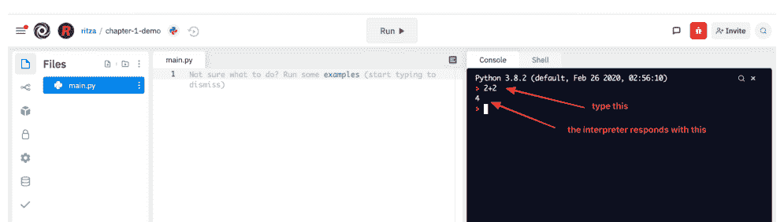

`>>>`或`>`被称为**Python提示符**。解释器使用提示符来表明它已准备好接收指令。我们输入了`2 + 2`，解释器计算了我们的表达式，并回复了4，然后在下一行给出了一个新的提示符，表明它已准备好接收更多输入。

直接在解释器中工作对于测试简短的代码片段很方便，因为你可以获得即时反馈。可以把它想象成用来帮助你解决问题的草稿纸。任何超过几行的代码都应该放入脚本中。脚本的优点在于它们可以保存到磁盘、打印等等。要创建脚本，你可以将代码输入到中间窗格，如下所示

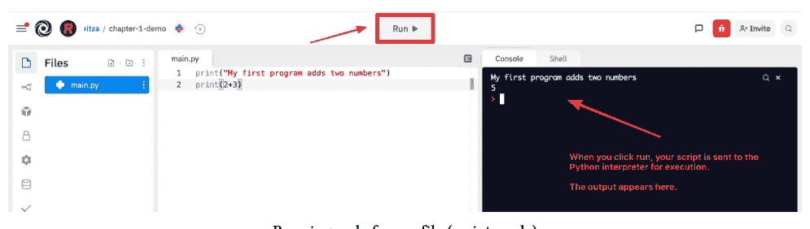

```
1 print("My first program adds two numbers")
2 print(2+3)
```

要执行程序，请点击Replit中的**运行**按钮。你现在是一名计算机程序员了！在开始编写更高级的程序之前，让我们先看一些更多的理论。

### 1.2. 什么是程序？

**程序**是一系列指令，指定了如何执行计算。计算可能是数学方面的，例如求解方程组或寻找多项式的根，但它也可以是符号计算，例如在文档中搜索和替换文本，或者（奇怪的是）编译程序。

细节在不同语言中看起来不同，但一些基本指令几乎出现在每种语言中：

- **输入**
  - 从键盘、文件或其他设备获取数据。
- **输出**
  - 在屏幕上显示数据，或将数据发送到文件或其他设备。
- **数学**
  - 执行基本的数学运算，如加法和乘法。
- **条件执行**
  - 检查特定条件并执行相应的语句序列。
- **重复**
  - 重复执行某些操作，通常带有一些变化。

信不信由你，这基本上就是全部了。你曾经使用过的每一个程序，无论多么复杂，都是由或多或少看起来像这样的指令组成的。因此，我们可以将编程描述为将一个大型、复杂的任务分解成越来越小的子任务的过程，直到这些子任务足够简单，可以用这些基本指令的序列来执行。

这可能有点模糊，但当我们讨论**算法**时，我们会回到这个话题。

### 1.3. 什么是调试？

编程是一个复杂的过程，因为它是由人类完成的，所以经常会导致错误。编程错误被称为**bug**，而跟踪和纠正它们的过程被称为**调试**。使用bug一词来描述小的工程困难至少可以追溯到1889年，当时托马斯·爱迪生在他的留声机上遇到了一个bug。

程序中可能发生三种错误：[语法错误](https://en.wikipedia.org/wiki/Syntax_error)、[运行时错误](https://en.wikipedia.org/wiki/Runtime_(program_lifecycle_phase))和[语义错误](https://en.wikipedia.org/wiki/Logic_error)。区分它们对于更快地跟踪它们很有用。

### 1.4. 语法错误

Python只有在程序语法正确的情况下才能执行程序；否则，该过程将失败并返回错误消息。**语法**指的是程序的结构以及关于该结构的规则。例如，在英语中，句子必须以大写字母开头并以句号结尾。这个句子包含一个**语法错误**。这个句子也是。

对于大多数读者来说，一些语法错误并不是一个重大问题，这就是为什么我们可以毫无问题地阅读E. E. Cummings的诗歌。Python则不那么宽容。如果你的程序中任何地方有一个语法错误，Python将显示一条错误消息并退出，你将无法运行你的程序。在你编程生涯的头几周，你可能会花很多时间来跟踪语法错误。然而，随着你获得经验，你会犯更少的错误，并更快地找到它们。

### 1.5. 运行时错误

第二种错误是运行时错误，之所以这样称呼是因为错误直到你运行程序时才会出现。这些错误也被称为**异常**，因为它们通常表明发生了异常（且不好的）事情。

运行时错误在你将在前几章看到的简单程序中很少见，所以你可能需要一段时间才会遇到一个。

### 1.6. 语义错误

第三种错误是**语义错误**。如果你的程序中存在语义错误，它将成功运行，也就是说计算机不会生成任何错误消息，但它不会做正确的事情。它会做其他事情。具体来说，它会做你告诉它做的事情。

问题在于你写的程序不是你想要写的程序。程序的含义（它的语义）是错误的。识别语义错误可能很棘手，因为它需要你通过查看程序的输出并试图弄清楚它在做什么来反向工作。

### 1.7. 实验性调试

你将获得的最重要的技能之一是调试。虽然它可能令人沮丧，但调试是编程中最富智力、最具挑战性和最有趣的部分之一。

在某些方面，调试就像侦探工作。你面对着线索，你必须推断导致你看到的结果的过程和事件。

调试也像实验科学。一旦你弄清楚了哪里出了问题，你就修改你的程序并再次尝试。如果你的假设是正确的，那么你可以预测修改的结果，你就离一个可工作的程序更近了一步。如果你的假设是错误的，你就必须提出一个新的假设。正如夏洛克·福尔摩斯指出的那样，当你排除了不可能之后，无论剩下什么，无论多么不可能，都一定是真相。（A. Conan Doyle，*《四签名》*）

对某些人来说，编程和调试是同一回事。也就是说，编程是逐步调试程序直到它做你想做的事情的过程。这个想法是，你应该从一个能做某事的程序开始，进行小的修改，并在进行过程中调试它们，这样你总是有一个可工作的程序。

例如，Linux是一个包含数百万行代码的操作系统内核，但它最初是Linus Torvalds用来探索Intel 80386芯片的一个简单程序。根据Larry Greenfield的说法，Linus早期的项目之一是一个在显示AAAA和BBBB之间切换的程序。这后来演变成了Linux（*《Linux用户指南测试版1》*）。

后面的章节将对调试和其他编程实践提出更多建议。

### 1.8. 形式语言和自然语言

**自然语言**是人们所说的语言，如英语、西班牙语和法语。它们不是由人设计的（尽管人们试图对它们施加一些秩序）；它们是自然演变而来的。

**形式语言**是人们为特定应用而设计的语言。例如，数学家使用的符号是一种形式语言，特别擅长表示数字和符号之间的关系。化学家使用一种形式语言来表示分子的化学结构。最重要的是：

*编程语言是被设计用来表达计算的形式语言。*

形式语言往往有严格的语法规则。例如，3+3=6是一个语法正确的数学陈述，但3=+6$不是。H2O是一个语法正确的化学名称，但2Zz不是。

语法规则有两种类型，涉及**标记**和结构。标记是语言的基本元素，如单词、数字、括号、逗号等。在Python中，像`print("Happy New Year for ", 2013)`这样的语句有6个标记：一个函数名、一个左括号（圆括号）、一个字符串、一个逗号、一个数字和一个右括号。

在构建标记的方式上可能会出错。3=+6$的问题之一是$在数学中不是一个合法的标记（至少据我们所知）。同样，2Zz在化学符号中不是一个合法的标记，因为没有元素的缩写是Zz。

第二种语法规则涉及语句的**结构**——即标记的排列方式。语句 `3=+6$` 在结构上是非法的，因为不能在等号后直接放置加号。同样，分子式必须将下标放在元素名称之后，而非之前。在我们的 Python 示例中，如果省略逗号，或者将两个括号改为 `print)"Happy New Year for ",2013(`，我们的语句仍然包含六个合法且有效的标记，但其结构是非法的。

当你阅读英语句子或形式语言中的语句时，你必须弄清楚句子的结构是什么（尽管在自然语言中你是下意识地完成这一过程的）。这个过程被称为**解析**。

例如，当你听到句子“The other shoe fell”时，你会理解“the other shoe”是主语，“fell”是谓语。一旦你解析了一个句子，你就能弄清楚它的意思，即句子的**语义**。假设你知道“shoe”是什么以及“fall”意味着什么，你就会理解这个句子的大致含义。

尽管形式语言和自然语言有许多共同特征——标记、结构、语法和语义——但它们之间也存在许多差异：

#### 歧义性

- 自然语言充满了歧义，人们通过使用上下文线索和其他信息来处理。形式语言被设计成几乎或完全无歧义的，这意味着任何语句无论上下文如何，都只有一个确切的含义。

#### 冗余性

- 为了弥补歧义并减少误解，自然语言使用了大量的冗余。因此，它们往往很冗长。形式语言则冗余较少，更为简洁。

#### 直译性

- 形式语言的含义就是其字面意思。另一方面，自然语言充满了习语和隐喻。如果有人说“The other shoe fell”，很可能并没有鞋子，也没有东西掉下来。你需要找到原始的笑话才能理解“the other shoe falling”的习语含义。雅虎问答认为它知道！

以自然语言为母语的人——所有人——通常很难适应形式语言。在某些方面，形式语言和自然语言之间的差异就像诗歌和散文之间的差异，但更为显著：

#### 诗歌

- 词语既用于其声音也用于其意义，整首诗共同创造了一种效果或情感反应。歧义不仅常见，而且常常是刻意为之。

#### 散文

- 词语的字面意义更为重要，结构也贡献了更多含义。散文比诗歌更易于分析，但仍然常常存在歧义。

#### 程序

- 计算机程序的含义是明确且直译的，完全可以通过分析标记和结构来理解。

以下是一些阅读程序（以及其他形式语言）的建议。首先，请记住形式语言比自然语言密集得多，因此阅读它们需要更长时间。此外，结构非常重要，因此通常不建议从上到下、从左到右阅读。相反，学会在脑海中解析程序，识别标记并解释结构。最后，细节很重要。像拼写错误和标点错误这样的小问题，在自然语言中可以蒙混过关，但在形式语言中可能会产生很大影响。

### 1.9. 第一个程序

传统上，用新语言编写的第一个程序被称为“Hello, World!”，因为它所做的只是显示“Hello, World!”这几个字。在 Python 中，脚本如下所示：（对于脚本，我们将在 Python 语句左侧显示行号。）

```
1 print("Hello, World!")
```

这是一个使用 **print 函数**的示例，它实际上不会在纸上打印任何东西。它会在屏幕上显示一个值。在这种情况下，显示的结果是

```
1 Hello, World!
```

程序中的引号标记了值的开始和结束；它们不会出现在结果中。

有些人通过“Hello, World!”程序的简洁程度来评判编程语言的质量。按照这个标准，Python 做得相当不错。

### 1.10. 注释

随着程序变得越来越大和越来越复杂，它们会变得越来越难读。形式语言很密集，通常很难通过查看一段代码来弄清楚它在做什么，或者为什么这样做。

因此，在程序中添加注释以自然语言解释程序在做什么是一个好主意。

计算机程序中的**注释**是仅面向人类读者的文本——解释器会完全忽略它。

在 Python 中，`#` 标记开始一个注释。该行的其余部分将被忽略。这是“Hello, World!”的一个新版本。

```
1  #--------------------------------------------------
2  # This demo program shows off how elegant Python is!
3  # Written by Joe Soap, December 2010.
4  # Anyone may freely copy or modify this program.
5  #--------------------------------------------------
6
7  print("Hello, World!")    # Isn't this easy!
```

你还会注意到我们在程序中留了一个空行。空行也会被解释器忽略，但注释和空行可以使你的程序更容易被人解析。请大量使用它们！

### 1.11. 术语表

**算法**
解决一类问题的一组特定步骤。

**错误**
程序中的错误。

**注释**
程序中面向其他程序员（或任何阅读源代码的人）的信息，对程序的执行没有影响。

**调试**
查找和移除三种编程错误中任何一种的过程。

**异常**
运行时错误的另一个名称。

**形式语言**
人们为特定目的设计的语言之一，例如表示数学思想或计算机程序；所有编程语言都是形式语言。

**高级语言**
像 Python 这样设计为易于人类读写的编程语言。

**即时模式**
一种使用 Python 的风格，我们在命令提示符下输入表达式，结果会立即显示。与脚本相对，参见 Python shell 词条。

**解释器**
执行你的 Python 脚本或表达式的引擎。

**低级语言**
一种设计为易于计算机执行的编程语言；也称为机器语言或汇编语言。

**自然语言**
人们自然演化出的任何一种语言。

**目标代码**
编译器翻译程序后的输出。

**解析**
检查程序并分析其语法结构。

**可移植性**
程序可以在多种计算机上运行的属性。

**print 函数**
程序或脚本中使用的函数，它使 Python 解释器在其输出设备上显示一个值。

**问题解决**
制定问题、找到解决方案并表达解决方案的过程。

**程序**
指定计算机要执行的操作和计算的一系列指令。

**Python shell**
Python 解释器的交互式用户界面。Python shell 的用户在提示符（`>>>`）下输入命令，并按回车键立即将这些命令发送给解释器进行处理。shell 一词来自 Unix。在本书 RLE 版本中使用的 PyScripter 中，解释器窗口是我们进行即时模式交互的地方。

**运行时错误**
直到程序开始执行才发生，但阻止程序继续运行的错误。

**脚本**
存储在文件中的程序（通常是解释型程序）。

**语义错误**
程序中导致其执行与程序员意图不符的错误。

**语义**
程序的含义。

**源代码**
编译前的高级语言程序。

**语法**
程序的结构。

**语法错误**
程序中导致无法解析——因此也无法解释——的错误。

**标记**
程序语法结构的基本元素之一，类似于自然语言中的单词。

### 1.12. 练习

1.  写一个语义可理解但语法错误的英语句子。再写一个语法正确但有语义错误的英语句子。
2.  使用 Python 解释器，输入 `1 + 2` 然后按回车。Python 会计算这个表达式，显示结果，然后显示另一个提示符。`*` 是乘法运算符，`**` 是幂运算符。通过输入不同的表达式并记录 Python 解释器显示的内容来进行实验。
3.  输入 `1 2` 然后按回车。Python 尝试计算该表达式，但由于该表达式在语法上不合法而无法计算。相反，它会显示错误消息：在许多情况下，Python 会指出语法错误发生的位置，但这并不总是准确的，而且它不会提供太多关于错误原因的信息。
因此，在很大程度上，你需要自己承担学习语法规则的责任。
在这个例子中，Python 报错是因为数字之间没有运算符。
看看你能否找到更多在 Python 提示符下输入时会产生错误信息的例子。记下你在提示符下输入的内容以及 Python 返回给你的错误信息的最后一行。

4.  输入 `print("hello")`。Python 会执行这条语句，其效果是打印出字母 h-e-l-l-o。注意，你用来包围字符串的引号并不是输出的一部分。
现在输入 `"hello"` 并描述你的结果。记下你何时看到引号，何时没有看到。

5.  输入不带引号的 `cheese`。输出将类似于这样：

```
Traceback (most recent call last):
  File "<interactive input>", line 1, in ?
NameError: name 'cheese' is not defined
```

这是一个运行时错误；具体来说，它是一个 `NameError`，更具体地说，它是一个因为名称 `cheese` 未定义而产生的错误。如果你还不明白这意味着什么，你很快就会明白的。

6.  在 Python 提示符下输入 `6 + 4 * 9` 并按回车键。记录发生了什么。
现在创建一个包含以下内容的 Python 脚本：

```
6 + 4 * 9
```

运行这个脚本时会发生什么？现在将脚本内容更改为：

```
print(6 + 4 * 9)
```

并再次运行它。

这次发生了什么？

每当在 Python 提示符下输入一个表达式时，它都会被求值，并且结果会自动显示在下一行。（就像在你的计算器上，如果你输入这个表达式，你会得到结果 42。）

然而，脚本是不同的。表达式的求值不会自动显示，因此需要使用 **print** 函数来使答案显示出来。

在命令提示符下的即时模式中，几乎不需要使用 print 函数。

## 第 2 章：变量、表达式和语句

（在 [YouTube 上观看基于本章的视频](https://youtu.be/gIvstR16col)。）

### 2.1. 值和数据类型

**值**是程序操作的基本元素之一——比如一个字母或一个数字。我们目前见过的值有 4（我们计算 2 + 2 的结果）和 "Hello, World!"。

这些值被归类为不同的**类**或**数据类型**：4 是一个*整数*，而 "Hello, World!" 是一个*字符串*，之所以这样称呼是因为它包含一串字母。你（和解释器）可以通过它们被引号包围来识别字符串。

如果你不确定一个值属于哪个类，Python 有一个名为 **type** 的函数可以告诉你。

```
>>> type("Hello, World!")
<class 'str'>
>>> type(17)
<class 'int'>
```

毫不奇怪，字符串属于 **str** 类，整数属于 **int** 类。不太明显的是，带小数点的数字属于一个叫做 **float** 的类，因为这些数字是以一种叫做*浮点数*的格式表示的。在这个阶段，你可以将 *class* 和 *type* 这两个词互换使用。我们将在后面的章节中更深入地理解什么是类。

```
>>> type(3.2)
<class 'float'>
```

那么像 "17" 和 "3.2" 这样的值呢？它们看起来像数字，但它们像字符串一样被引号包围。

```
>>> type("17")
<class 'str'>
>>> type("3.2")
<class 'str'>
```

它们是字符串！

Python 中的字符串可以用单引号 (') 或双引号 (") 包围，或者用三个引号 (''' 或 """) 包围。

```
>>> type('This is a string.')
<class 'str'>
>>> type("And so is this.")
<class 'str'>
>>> type("""and this.""")
<class 'str'>
>>> type('''and even this...''')
<class 'str'>
```

双引号字符串可以包含单引号，例如 "Bruce's beard"，单引号字符串可以包含双引号，例如 'The knights who say "Ni!"'。

用三个引号符号包围的字符串称为三引号字符串。它们可以包含单引号或双引号：

```
>>> print('''"Oh no", she exclaimed, "Ben's bike is broken!"''')
"Oh no", she exclaimed, "Ben's bike is broken!"
>>>
```

三引号字符串甚至可以跨越多行：

```
>>> message = """This message will
... span several
... lines."""
>>> print(message)
This message will
span several
lines.
>>>
```

Python 不关心你是使用单引号、双引号还是三引号来包围你的字符串：一旦它解析了你的程序或命令的文本，它存储值的方式在所有情况下都是相同的，并且周围的引号不是值的一部分。但是当解释器想要显示一个字符串时，它必须决定使用哪个引号来使其看起来像一个字符串。

```
>>> 'This is a string.'
'This is a string.'
>>> """And so is this."""
'And so is this.'
```

所以 Python 语言设计者通常选择用单引号包围他们的字符串。你认为如果字符串已经包含单引号会发生什么？

当你输入一个大整数时，你可能会想在每三位数字之间使用逗号，例如 42,000。这在 Python 中不是一个合法的整数，但它确实意味着其他东西，这是合法的：

```
>>> 42000
42000
>>> 42,000
(42, 0)
```

嗯，这完全不是我们所期望的！因为逗号，Python 选择将其视为一对值。我们将在后面学习关于这对值的知识。但是，目前，请记住不要在你的整数中放入逗号或空格，无论它们有多大。同时回顾我们在前一章所说的话：形式语言是严格的，符号是简洁的，即使是最小的改变也可能意味着与你意图完全不同的东西。

### 2.2. 变量

编程语言最强大的功能之一是能够操作**变量**。变量是引用一个值的名称。

**赋值语句**给变量一个值：

```
>>> message = "What's up, Doc?"
>>> n = 17
>>> pi = 3.14159
```

这个例子做了三个赋值。第一个将字符串值 "What's up, Doc?" 赋给一个名为 `message` 的变量。第二个将整数 17 赋给 `n`，第三个将浮点数 3.14159 赋给一个名为 `pi` 的变量。

赋值符号 `=` 不应与*等于*混淆，等于使用符号 `==`。赋值语句将运算符左侧的*名称*绑定到右侧的*值*。这就是为什么如果你输入以下内容会得到错误：

```
>>> 17 = n
File "<interactive input>", line 1
SyntaxError: can't assign to literal
```

**提示：**
*在阅读或编写代码时，对自己说“n 被赋值为 17”或“n 得到值 17”。不要说“n 等于 17”。*

在纸上表示变量的一种常见方法是写出名称，并用一个箭头指向变量的值。这种图被称为**状态快照**，因为它显示了在特定时刻每个变量的状态。（可以将其视为变量的“心态”。）此图显示了执行赋值语句的结果：

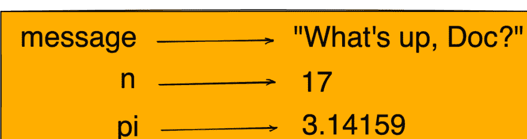

状态快照

如果你要求解释器求值一个变量，它将产生当前链接到该变量的值：

```
>>> message
"What's up, Doc?"
>>> n
17
>>> pi
3.14159
```

我们在程序中使用变量来“记住”事情，也许是足球比赛的当前得分。但变量是*可变的*。这意味着它们可以随时间变化，就像足球比赛的记分牌一样。你可以给一个变量赋一个值，然后稍后给同一个变量赋一个不同的值。*（这与数学不同。在数学中，如果你给 x 赋值为 3，它不能在计算过程中改变以链接到不同的值！）*

你会注意到我们三次改变了 `day` 的值，而在第三次赋值时，我们甚至让它引用了一个不同类型的值。

编程的很大一部分工作是让计算机记住事物，例如*你手机上未接来电的数量*，然后在你再次漏接电话时安排更新或更改该变量。

### 2.3. 变量名和关键字

**变量名**可以任意长。它们可以包含字母和数字，但必须以字母或下划线开头。虽然使用大写字母是合法的，但按照惯例我们不会这样做。如果你使用了，请记住大小写很重要。`Bruce` 和 `bruce` 是不同的变量。

下划线字符（`_`）可以出现在名称中。它通常用于包含多个单词的名称中，例如 `my_name` 或 `price_of_tea_in_china`。

在某些情况下，以下划线开头的名称具有特殊含义，因此对于初学者来说，一个安全的规则是所有名称都以字母开头。

如果你给变量一个非法的名称，你会得到一个语法错误：

```
>>> 76trombones = "big parade"
SyntaxError: invalid syntax
>>> more$ = 1000000
SyntaxError: invalid syntax
>>> class = "Computer Science 101"
SyntaxError: invalid syntax
```

`76trombones` 是非法的，因为它不是以字母开头。`more$` 是非法的，因为它包含一个非法字符，即美元符号。但 `class` 有什么问题呢？

事实证明，`class` 是 Python 的**关键字**之一。关键字定义了语言的语法规则和结构，不能用作变量名。

Python 有三十多个关键字（并且随着 Python 的改进，时不时会引入或淘汰一两个）：

| and | as | assert | break | class | continue |
| --- | --- | --- | --- | --- | --- |
| def | del | elif | else | except | exec |
| finally | for | from | global | if | import |
| in | is | lambda | nonlocal | not | or |
| pass | raise | return | try | while | with |
| yield | True | False | None | | |

你可能想把这个列表放在手边。如果解释器对你的某个变量名报错而你不知道原因，看看它是否在这个列表上。

程序员通常为他们的变量选择对程序的人类读者有意义的名称——它们帮助程序员记录或记住变量的用途。

**注意**

*初学者有时会将“对人类读者有意义”与“对计算机有意义”混淆。因此，他们可能会错误地认为，因为他们将某个变量命名为 `average` 或 `pi`，它就会神奇地计算平均值，或者神奇地知道变量 `pi` 应该有一个像 3.14159 这样的值。不！计算机并不理解你打算让变量表示什么。*

*所以你会发现一些讲师在教初学者时故意不选择有意义的名称——不是因为我们认为这不是一个好习惯，而是因为我们试图强化这样一个信息：你——程序员——必须编写程序代码来计算平均值，并且你必须编写一个赋值语句来给变量 `pi` 赋予你想要的值。*

### 2.4. 语句

**语句**是 Python 解释器可以执行的一条指令。到目前为止，我们只见过赋值语句。我们很快会看到的其他一些语句类型有 `while` 语句、`for` 语句、`if` 语句和 `import` 语句。（还有其他类型！）

当你在命令行上输入一条语句时，Python 会执行它。语句不会产生任何结果。

### 2.5. 求值表达式

**表达式**是值、变量、运算符和函数调用的组合。如果你在 Python 提示符下输入一个表达式，解释器会**求值**它并显示结果：

```
>>> 1 + 1
2
>>> len("hello")
5
```

在这个例子中，`len` 是一个内置的 Python 函数，它返回字符串中的字符数。我们之前见过 `print` 和 `type` 函数，所以这是我们见到的第三个函数示例！

对*表达式*的*求值*会产生一个值，这就是为什么表达式可以出现在赋值语句的右侧。一个单独的值本身就是一个简单的表达式，变量也是如此。

```
>>> 17
17
>>> y = 3.14
>>> x = len("hello")
>>> x
5
>>> y
3.14
```

### 2.6. 运算符和操作数

**运算符**是表示加法、乘法和除法等计算的特殊标记。运算符使用的值称为**操作数**。

以下是所有合法的 Python 表达式，其含义或多或少是清楚的：

```
20+32   hour-1   hour*60+minute   minute/60   5**2   (5+9)*(15-7)
```

标记 `+`、`-` 和 `*`，以及使用括号进行分组，在 Python 中的含义与在数学中相同。星号（`*`）是乘法的标记，`**` 是幂运算的标记。

```
>>> 2 ** 3
8
>>> 3 ** 2
9
```

当变量名出现在操作数的位置时，在执行操作之前，它会被其值替换。

加法、减法、乘法和幂运算都按你预期的方式工作。

示例：那么让我们将 645 分钟转换为小时：

```
>>> minutes = 645
>>> hours = minutes / 60
>>> hours
10.75
```

哎呀！在 Python 3 中，除法运算符 `/` 总是产生浮点数结果。我们可能想知道的是有多少整小时，以及还剩多少分钟。Python 为我们提供了两种不同风格的除法运算符。第二种称为**地板除法**，使用标记 `//`。它的结果总是一个整数——如果它必须调整数字，它总是将其向左移动到数轴上。所以 `6 // 4` 得到 1，但 `-6 // 4` 可能会让你惊讶！

```
>>> 7 / 4
1.75
>>> 7 // 4
1
>>> minutes = 645
>>> hours = minutes // 60
>>> hours
10
```

注意选择正确的除法运算符风格。如果你正在处理需要浮点值的表达式，请使用能准确进行除法的除法运算符。

### 2.7. 类型转换函数

在这里，我们将再看三个 Python 函数：`int`、`float` 和 `str`，它们将（尝试）将其参数分别转换为 `int`、`float` 和 `str` 类型。我们称这些为**类型转换**函数。

`int` 函数可以接受一个浮点数或一个字符串，并将其转换为整数。对于浮点数，它会丢弃数字的小数部分——这个过程我们称为向数轴上的零截断。让我们看看实际操作：

```
>>> int(3.14)
3
>>> int(3.9999)           # 这不会四舍五入到最接近的整数！
3
>>> int(3.0)
3
>>> int(-3.999)           # 注意结果更接近零
-3
>>> int(minutes / 60)
10
>>> int("2345")           # 解析字符串以产生一个整数
2345
>>> int(17)               # 即使参数已经是整数，它也有效
17
>>> int("23 bottles")
```

最后一种情况看起来不像一个数字——我们期望什么？

```
Traceback (most recent call last):
  File "<interactive input>", line 1, in <module>
ValueError: invalid literal for int() with base 10: '23 bottles'
```

类型转换函数 `float` 可以将整数、浮点数或语法合法的字符串转换为浮点数：

```
>>> float(17)
17.0
>>> float("123.45")
123.45
```

类型转换函数 `str` 将其参数转换为字符串：

```
>>> str(17)
'17'
>>> str(123.45)
'123.45'
```

### 2.8. 运算顺序

当表达式中出现多个运算符时，求值顺序取决于**优先级规则**。Python 的数学运算符遵循与数学相同的优先级规则。首字母缩写词 PEMDAS 是记住运算顺序的一种有用方式：

1.  **括号**具有最高优先级，可用于强制表达式按你想要的顺序求值。由于括号中的表达式首先被求值，所以 `2 * (3-1)` 是 4，`(1+1)**(5-2)` 是 8。你也可以使用括号使表达式更易于阅读，例如 `(minute * 100) / 60`，即使它不改变结果。
2.  **幂运算**具有次高优先级，所以 `2**1+1` 是 3 而不是 4，`3*1**3` 是 3 而不是 27。
3.  **乘法**和两种**除法**运算符具有相同的优先级，高于**加法**和**减法**，后者也具有相同的优先级。所以 `2*3-1` 得到 5 而不是 4，`5-2*2` 是 1 而不是 6。

具有相同优先级的运算符从左到右求值。在代数中，我们说它们是左结合的。所以在表达式 `6-3+2` 中，减法首先发生，得到 3。然后我们加上 2 得到结果 5。如果操作是从右到左求值的，结果将是 `6-(3+2)`，即 1。（首字母缩写词 PEDMAS 可能会误导你认为除法的优先级高于乘法，加法在减法之前进行——不要被误导。减法和加法具有相同的优先级，并且适用从左到右的规则。）

由于一些历史原因，从左到右左结合规则的一个例外是幂运算符 `**`，因此一个有用的提示是，当涉及幂运算时，始终使用括号来强制执行你想要的精确顺序：

```
>>> 2 ** 3 ** 2    # 最右边的 ** 运算符首先执行！
512
>>> (2 ** 3) ** 2  # 使用括号来强制执行你想要的顺序！
64
```

Python 的即时模式命令提示符非常适合探索和试验像这样的表达式。

### 2.9. 字符串操作

通常，你不能对字符串执行数学运算，即使字符串看起来像数字。以下是非法的（假设 `message` 的类型是字符串）：

```
>>> message - 1       # 错误
>>> "Hello" / 123     # 错误
>>> message * "Hello" # 错误
>>> "15" + 2          # 错误
```

有趣的是，`+` 运算符确实可以用于字符串，但对于字符串，`+` 运算符表示**连接**，而不是加法。连接意味着通过将两个操作数首尾相连来连接它们。例如：

### 2.10. 输入

```python
fruit = "banana"
baked_good = " nut bread"
print(fruit + baked_good)
```

该程序的输出是 banana nut bread。单词 nut 前的空格是字符串的一部分，对于在拼接的字符串之间产生空格是必要的。
`*` 运算符也适用于字符串；它执行重复操作。例如，`'Fun'*3` 的结果是 `'FunFunFun'`。其中一个操作数必须是字符串；另一个必须是整数。
一方面，这种对 `+` 和 `*` 的解释通过与加法和乘法的类比是有意义的。正如 `4*3` 等同于 `4+4+4`，我们期望 `"Fun"*3` 与 `"Fun"+"Fun"+"Fun"` 相同，事实也确实如此。另一方面，字符串拼接和重复与整数加法和乘法在一个重要方面有所不同。你能想到一个加法和乘法具有而字符串拼接和重复没有的属性吗？

Python 中有一个内置函数用于从用户获取输入：

```python
n = input("Please enter your name: ")
```

在 Replit 中运行此脚本的示例会在左侧的控制台中显示你的输入问题，如下所示：

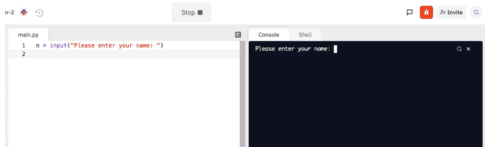

程序的用户可以输入姓名并按回车键，当此操作发生时，输入的文本将从 input 函数返回，在本例中被赋值给变量 `n`。
即使你要求用户输入他们的年龄，你也会得到一个像 `"17"` 这样的字符串。作为程序员，你的工作是使用我们之前看到的 `int` 或 `float` 转换函数，将该字符串转换为 `int` 或 `float`。

### 2.11. 组合

到目前为止，我们已经单独考察了程序的元素——变量、表达式、语句和函数调用——而没有讨论如何将它们组合起来。
编程语言最有用的特性之一是它们能够将小的构建块**组合**成更大的块。
例如，我们知道如何让用户输入一些输入，我们知道如何将获得的字符串转换为浮点数，我们知道如何编写复杂的表达式，我们也知道如何打印值。让我们将这些组合成一个四步的小程序，该程序要求用户输入圆的半径值，然后根据公式计算圆的面积

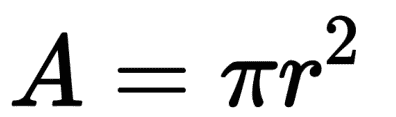

圆的面积

首先，我们将一次执行这四个步骤：

```python
response = input("What is your radius? ")
r = float(response)
area = 3.14159 * r**2
print("The area is ", area)
```

现在让我们将前两行组合成一行代码，并将后两行组合成另一行代码。

```python
r = float( input("What is your radius? ") )
print("The area is ", 3.14159 * r**2)
```

如果我们真的想更巧妙一些，我们可以将所有内容写在一个语句中：

```python
print("The area is ", 3.14159*float(input("What is your radius?"))**2)
```

这样紧凑的代码对人类来说可能不是最容易理解的，但它确实说明了我们如何从构建块组合出更大的块。

如果你对是否组合代码或将其分解为更小的步骤有疑问，请尝试使其尽可能简单，以便人类能够理解。我的选择将是上面第一种情况，包含四个独立的步骤。

### 2.12. 取模运算符

取模运算符作用于整数（和整数表达式），并给出第一个数除以第二个数时的余数。在 Python 中，取模运算符是一个百分号（`%`）。其语法与其他运算符相同。它与乘法运算符具有相同的优先级。

```python
>>> q = 7 // 3    # 这是整数除法运算符
>>> print(q)
2
>>> r = 7 % 3
>>> print(r)
1
```

所以 7 除以 3 等于 2，余数为 1。
取模运算符被证明非常有用。例如，你可以检查一个数是否能被另一个数整除——如果 `x % y` 为零，则 `x` 能被 `y` 整除。
此外，你可以从一个数中提取最右边的数字。例如，`x % 10` 产生 `x` 的最右边数字（以 10 为基数）。类似地，`x % 100` 产生最后两位数字。
它在进行转换时也非常有用，例如从秒转换为小时、分钟和秒。因此，让我们编写一个程序，要求用户输入一些秒数，然后将其转换为小时、分钟和剩余的秒数。

```python
total_secs = int(input("How many seconds, in total?"))
hours = total_secs // 3600
secs_still_remaining = total_secs % 3600
minutes = secs_still_remaining // 60
secs_finally_remaining = secs_still_remaining % 60

print("Hrs=", hours, " mins=", minutes,
      "secs=", secs_finally_remaining)
```

### 2.13. 术语表

**赋值语句**
将值赋给名称（变量）的语句。赋值运算符 `=` 的左侧是一个名称。赋值标记的右侧是一个表达式，该表达式由 Python 解释器求值，然后赋值给该名称。赋值语句左右两侧的区别常常让新程序员感到困惑。在以下赋值中：

```python
n = n + 1
```

`n` 在 `=` 的两侧扮演着非常不同的角色。在右侧，它是一个值，并构成表达式的一部分，该表达式将在赋值给左侧的名称之前由 Python 解释器求值。

**赋值标记**
`=` 是 Python 的赋值标记。不要将其与 *等于* 混淆，后者是用于比较值的运算符。

**组合**
将简单的表达式和语句组合成复合语句和表达式的能力，以便简洁地表示复杂的计算。

**拼接**
将两个字符串首尾相连。

**数据类型**
一组值。值的类型决定了它如何在表达式中使用。到目前为止，你看到的类型有整数（`int`）、浮点数（`float`）和字符串（`str`）。

**求值**
通过按顺序执行操作来简化表达式，以产生单个值。

**表达式**
变量、运算符和值的组合，表示单个结果值。

**浮点数**
一种 Python 数据类型，用于存储*浮点*数。浮点数在内部存储为两部分：*基数*和*指数*。以标准格式打印时，它们看起来像十进制数。使用 `float` 时要小心舍入错误，并记住它们只是近似值。

**整数除法**
一种运算符（用标记 `//` 表示），将一个数除以另一个数并产生一个整数，或者，如果结果还不是整数，则产生下一个最小的整数。

**整数**
一种 Python 数据类型，用于保存正整数和负整数。

**关键字**
编译器用于解析程序的保留字；你不能使用像 `if`、`def` 和 `while` 这样的关键字作为变量名。

**取模运算符**
一种运算符，用百分号（`%`）表示，作用于整数，并在将一个数除以另一个数时产生余数。

**操作数**
运算符操作的值之一。

**运算符**
表示简单计算的特殊符号，如加法、乘法或字符串拼接。

**优先级规则**
管理涉及多个运算符和操作数的表达式求值顺序的一组规则。

**状态快照**
在程序执行的特定时刻，对一组变量及其引用的值的图形表示。

**语句**
Python 解释器可以执行的指令。到目前为止，我们只看到了赋值语句，但我们很快会遇到 `import` 语句和 `for` 语句。

**字符串**
一种 Python 数据类型，用于保存字符字符串。

**值**
可以存储在变量中或在表达式中计算的数字或字符串（或其他稍后将命名的东西）。

**变量**
引用值的名称。

**变量名**
赋予变量的名称。Python 中的变量名由字母序列（a..z、A..Z 和 _）和数字（0..9）组成，并以字母开头。在最佳编程实践中，变量名应选择得能描述其在程序中的用途，使程序*自文档化*。

### 2.14. 练习

1.  取句子：All work and no play makes Jack a dull boy. 将每个单词存储在单独的变量中，然后使用 `print` 在一行中打印出该句子。
2.  给表达式 `6 * 1 - 2` 添加括号，使其值从 4 变为 -6。
3.  在之前能正常工作的代码行前添加注释，并记录重新运行程序时会发生什么。
4.  启动 Python 解释器，在提示符下输入 `bruce + 4`。这将给你一个错误：

    NameError: name 'bruce' is not defined

    给 `bruce` 赋一个值，使得 `bruce + 4` 的计算结果为 10。
5.  计算复利最终金额的公式在维基百科上给出为：

    复利公式

    $P' = P(1 + \frac{r}{n})^{nt}$

    其中：
    * $P$ 是原始本金
    * $P'$ 是新的本金
    * $r$ 是名义年利率
    * $n$ 是复利频率
    * $t$ 是利息适用的总时间长度（使用与 $r$ 相同的时间单位表示，通常为年）。

    复利公式

    编写一个 Python 程序，将本金 $10000 赋值给变量 `P`，将 `n` 赋值为 12，将 `r` 赋值为 8% 的利率。然后让程序提示用户输入资金将复利的年数 `t`。计算并打印 `t` 年后的最终金额。
6.  在脑海中计算以下数值表达式，然后使用 Python 解释器检查你的结果：

    1 >>> 5 % 2
    2 >>> 9 % 5
    3 >>> 15 % 12
    4 >>> 12 % 15
    5 >>> 6 % 6
    6 >>> 0 % 7
    7 >>> 7 % 0

    最后一个例子发生了什么？为什么？如果你能正确预测除最后一个之外的所有计算机响应，那么是时候继续前进了。如果不能，现在就花时间自己举例探索。探索取模运算符，直到你确信自己理解它的工作原理。
7.  你看了一眼时钟，正好是下午 2 点。你设置了一个闹钟，将在 51 小时后响起。闹钟会在什么时间响起？（*提示：你可以用手指计数，但这不是我们想要的。如果你忍不住想用手指计数，就把 51 改成 5100。*）
8.  编写一个 Python 程序来解决上述问题的通用版本。询问用户当前时间（以小时为单位），并询问要等待的小时数。你的程序应该输出闹钟响起时钟面上的时间。

## 第 3 章：你好，小海龟！

Python 中有许多*模块*提供了非常强大的功能，我们可以在自己的程序中使用。其中一些可以发送电子邮件或获取网页。本章我们将要研究的模块允许我们创建海龟并让它们绘制形状和图案。

海龟很有趣，但本章的真正目的是让我们多学一点 Python，并发展我们的*计算思维*主题，或者像计算机科学家一样思考。这里涵盖的大部分 Python 内容将在后面更深入地探讨。

### 3.1. 我们的第一个海龟程序

让我们写几行 Python 程序来创建一个新的海龟并开始绘制一个矩形。（我们将引用第一个海龟的变量称为 `alex`，但如果我们遵循上一章的命名规则，我们可以选择另一个名字）。

```
1  import turtle            # 允许我们使用海龟
2  wn = turtle.Screen()     # 为海龟创建一个游乐场
3  alex = turtle.Turtle()   # 创建一个海龟，赋值给 alex
4
5  alex.forward(50)          # 告诉 alex 向前移动 50 个单位
6  alex.left(90)             # 告诉 alex 转 90 度
7  alex.forward(30)          # 完成矩形的第二条边
8
9  wn.mainloop()             # 等待用户关闭窗口
```

当我们运行这个程序时，会弹出一个新窗口：

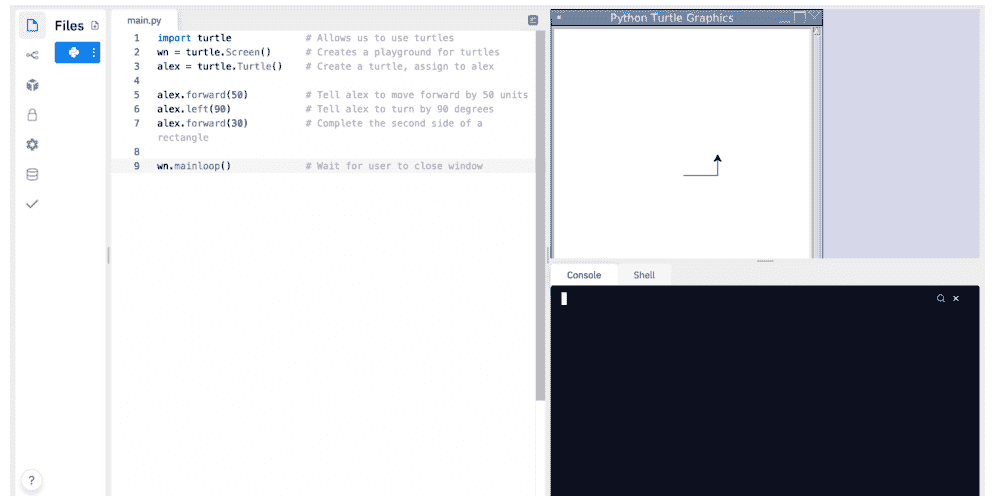

#### 海龟窗口

关于这个程序，有几件事我们需要理解。
第一行告诉 Python 加载一个名为 `turtle` 的模块。该模块为我们带来了两种可以使用的新类型：`Turtle` 类型和 `Screen` 类型。点表示法 `turtle.Turtle` 意思是“*在 turtle 模块中定义的 Turtle 类型*”。（记住 Python 区分大小写，所以模块名（小写 `t`）与类型 `Turtle` 不同。）

然后我们创建并打开它所谓的屏幕（我们更愿意称之为窗口），并将其赋值给变量 `wn`。每个窗口包含一个**画布**，这是窗口内我们可以绘制的区域。

在第 3 行，我们创建了一个海龟。变量 `alex` 被设置为引用这个海龟。

所以这前三行已经设置好了，我们准备好让我们的海龟在画布上绘制了。

在第 5-7 行，我们指示**对象** `alex` 移动和转向。我们通过**调用**或激活 `alex` 的**方法**来做到这一点——这些是所有海龟都知道如何响应的指令。

最后一行也起作用：变量 `wn` 引用上面显示的窗口。当我们调用它的 `mainloop` 方法时，它进入一个等待事件（如按键、鼠标移动和点击）的状态。当用户关闭窗口时，程序将终止。

一个对象可以有各种方法——它可以做的事情——它也可以有**属性**——（有时称为特性）。例如，每只海龟都有一个*颜色*属性。方法调用 `alex.color("red")` 会使 `alex` 变成红色，绘制也会是红色的。（注意 *color* 这个词是美式拼写！）

海龟的颜色、画笔的宽度、海龟在窗口中的位置、它面向的方向等等，都是其当前**状态**的一部分。类似地，窗口对象有背景颜色、标题栏中的一些文本，以及屏幕上的大小和位置。这些都是窗口对象状态的一部分。

存在相当多的方法允许我们修改海龟和窗口对象。我们只展示几个。在这个程序中，我们只注释了与前面示例不同的那些行（并且我们为这只海龟使用了不同的变量名）：

```
1  import turtle
2  wn = turtle.Screen()
3  wn.bgcolor("lightgreen")    # 设置窗口背景颜色
4  wn.title("Hello, Tess!")    # 设置窗口标题
5  
6  tess = turtle.Turtle()
7  tess.color("blue")          # 告诉 tess 改变她的颜色
8  tess.pensize(3)              # 告诉 tess 设置她的画笔宽度
9  
10 tess.forward(50)
11 tess.left(120)
12 tess.forward(50)
13 
14 wn.mainloop()
```

当我们运行这个程序时，这个新窗口会弹出，并将留在屏幕上，直到我们关闭它。

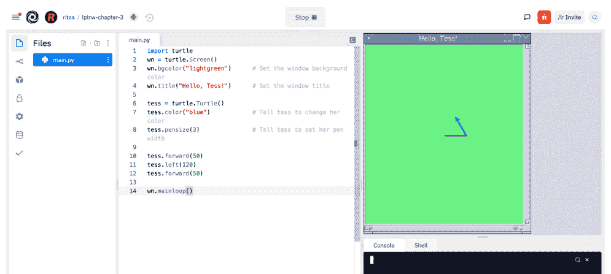

扩展这个程序 ...

1.  修改这个程序，使其在创建窗口之前，提示用户输入所需的背景颜色。它应该将用户的响应存储在一个变量中，并根据用户的意愿修改窗口的颜色。（*提示：你可以在 http://www.tcl.tk/man/tcl8.4/TkCmd/colors.htm 找到允许的颜色名称列表。它包括一些相当不寻常的名称，如“peach puff”和“HotPink”。*）
2.  进行类似的更改，允许用户在运行时设置 tess 的颜色。
3.  对 tess 的画笔宽度做同样的事情。*提示：你与用户的对话将返回一个字符串，但 tess 的 pensize 方法期望其参数是一个 int。因此，你需要在将其传递给 pensize 之前将字符串转换为 int。*

### 3.2. 实例——一群海龟

就像我们可以在程序中拥有许多不同的整数一样，我们也可以拥有许多海龟。每一只都被称为一个**实例**。每个实例都有自己的属性和方法——所以 alex 可能用细黑笔在某个位置绘制，而 tess 可能用粗粉笔朝自己的方向前进。

```python
import turtle
wn = turtle.Screen()           # 设置窗口及其属性
wn.bgcolor("lightgreen")
wn.title("Tess & Alex")

tess = turtle.Turtle()         # 创建 tess 并设置一些属性
tess.color("hotpink")
tess.pensize(5)

alex = turtle.Turtle()         # 创建 alex

tess.forward(80)               # 让 tess 绘制等边三角形
tess.left(120)
tess.forward(80)
tess.left(120)
tess.forward(80)
tess.left(120)                 # 完成三角形

tess.right(180)                # 让 tess 转身
tess.forward(80)               # 让她远离原点

alex.forward(50)               # 让 alex 绘制一个正方形
alex.left(90)
alex.forward(50)
alex.left(90)
```

### 3.3. for 循环

当我们绘制正方形时，过程相当繁琐。我们必须明确地重复移动和转向四个步骤。如果我们要绘制六边形、八边形或四边形，情况会更糟。

因此，所有程序的一个基本构建块就是能够重复执行某些代码。

Python 的 **for** 循环为我们解决了这个问题。假设我们有一些朋友，我们想给他们每人发一封电子邮件，邀请他们参加我们的派对。我们还不太清楚如何发送电子邮件，所以目前我们只为每位朋友打印一条消息：

```
1  for f in ["Joe","Zoe","Brad","Angelina","Zuki","Thandi","Paris"]:
2      invite = "Hi " + f + ".  Please come to my party on Saturday!"
3      print(invite)
4  # more code can follow here ...
```

运行后，输出如下：

```
1  Hi Joe.  Please come to my party on Saturday!
2  Hi Zoe.  Please come to my party on Saturday!
3  Hi Brad.  Please come to my party on Saturday!
4  Hi Angelina.  Please come to my party on Saturday!
5  Hi Zuki.  Please come to my party on Saturday!
6  Hi Thandi.  Please come to my party on Saturday!
7  Hi Paris.  Please come to my party on Saturday!
```

- 第 1 行 for 语句中的变量 f 称为**循环变量**。我们本可以选择任何其他变量名。
- 第 2 行和第 3 行是**循环体**。循环体总是缩进的。缩进决定了哪些语句“在循环体内”。
- 在每次*迭代*或*循环*中，首先会检查是否还有更多项目需要处理。如果没有剩余项目（这称为循环的**终止条件**），循环就结束了。程序执行将继续到循环体后的下一条语句（例如，在本例中是第 4 行注释下方的下一条语句）。
- 如果仍有项目需要处理，循环变量会更新为指向列表中的下一个项目。这意味着，在本例中，循环体将执行 7 次，每次 f 将指向不同的朋友。
- 在每次执行循环体结束后，Python 会返回到 for 语句，以查看是否有更多项目需要处理，并将下一个项目分配给 f。

### 3.4. for 循环的执行流程

当程序执行时，解释器始终跟踪即将执行的语句。我们称之为程序的**控制流**或**执行流程**。当人类执行程序时，他们通常用手指依次指向每条语句。因此，我们可以将控制流视为“Python 移动的手指”。

到目前为止，控制流严格地从上到下，一次执行一条语句。for 循环改变了这一点。

**for 循环流程图**

如果我们绘制流程图，控制流通常很容易可视化和理解。这展示了 for 语句执行的精确步骤和逻辑。

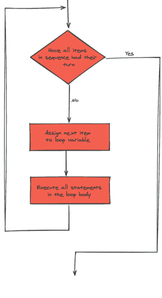

for 循环流程图

### 3.5. 循环简化了我们的海龟程序

要绘制一个正方形，我们希望重复四次相同的操作——移动海龟并转向。我们之前用了 8 行代码让 alex 绘制正方形的四条边。下面的代码实现了完全相同的功能，但只用了三行：

```
1  for i in [0,1,2,3]:
2      alex.forward(50)
3      alex.left(90)
```

一些观察：

- 虽然“节省几行代码”可能很方便，但这并不是重点。更重要的是，我们找到了一个“重复模式”的语句，并重新组织了程序以重复该模式。找到这些代码块并围绕它们组织程序是计算思维中的一项关键技能。
- 提供值 [0,1,2,3] 是为了让循环体执行 4 次。我们本可以使用任何四个值，但这些是惯用值。事实上，它们非常流行，以至于 Python 为我们提供了特殊的内置 range 对象：

```
1 for i in range(4):
2     # Executes the body with i = 0, then 1, then 2, then 3
3 for x in range(10):
4     # Sets x to each of ... [0, 1, 2, 3, 4, 5, 6, 7, 8, 9]
```

- 计算机科学家喜欢从 0 开始计数！
- range 可以为 for 循环中的循环变量提供一系列值。它们从 0 开始，在这些情况下不包括 4 或 10。
- 我们之前的小技巧，确保 alex 完成最后的转向以达到 360 度，已经得到了回报：如果我们没有这样做，我们就无法使用循环来绘制正方形的第四条边。它将成为一个“特殊情况”，与其他边不同。在可能的情况下，我们更愿意让代码符合通用模式，而不是创建特殊情况。

因此，要重复某件事四次，一个好的 Python 程序员会这样做：

```
1 for i in range(4):
2     alex.forward(50)
3     alex.left(90)
```

到现在，你应该能够看到如何修改我们之前的程序，以便 tess 也能使用 for 循环来绘制她的等边三角形。

但是现在，如果我们做出这个改变会发生什么？

```
1 for c in ["yellow", "red", "purple", "blue"]:
2     alex.color(c)
3     alex.forward(50)
4     alex.left(90)
```

变量也可以被赋予一个列表值。因此，列表也可以用于更一般的情况，而不仅仅是在 for 循环中。上面的代码可以重写为：

```
# Assign a list to a variable
clrs = ["yellow", "red", "purple", "blue"]
for c in clrs:
    alex.color(c)
    alex.forward(50)
    alex.left(90)
```

### 3.6. 更多海龟方法和技巧

海龟方法可以使用负角度或距离。因此，tess.forward(-100) 会让 tess 向后移动，tess.left(-30) 会让她向右转。此外，因为一个圆有 360 度，向左转 30 度会让 tess 面向与向右转 330 度相同的方向！（不过，屏幕上的动画会有所不同——你将能够分辨出 tess 是顺时针还是逆时针旋转！）

这表明我们不需要同时拥有左转和右转方法——我们可以极简主义，只保留一个方法。还有一个 backward 方法。（如果你非常极客，你可能会喜欢说 alex.backward(-100) 来让 alex 向前移动！）

像科学家一样思考的一部分是理解我们领域中更多的结构和丰富的关系。因此，复习一些关于几何和数轴的基本事实，并找出左、右、后、前、负和正距离或角度值之间的关系，如果我们想玩海龟，这是一个好的开始。

海龟的笔可以抬起或放下。这允许我们将海龟移动到不同的位置而不绘制线条。方法如下：

```
alex.penup()
alex.forward(100)    # This moves alex, but no line is drawn
alex.pendown()
```

每个海龟都可以有自己的形状。开箱即用的形状有：arrow、blank、circle、classic、square、triangle、turtle。

```
alex.shape("turtle")
```

### 3.7. 术语表

**属性**
属于特定对象的某种状态或值。例如，tess 有一个颜色。

**画布**
窗口中进行绘图的区域。

**控制流**
参见下一章的执行流程。

**for 循环**
Python 中用于方便地重复执行循环体中语句的语句。

**循环体**
嵌套在循环内的任意数量的语句。这种嵌套通过语句在 `for` 循环语句下缩进来表示。

**循环变量**
作为 `for` 循环一部分使用的变量。在循环的每次迭代中，它会被赋予不同的值。

**实例**
某种类型或类的对象。tess 和 alex 是 `Turtle` 类的不同实例。

**方法**
附加到对象上的函数。调用或激活该方法会导致对象以某种方式响应，例如，当我们说 `tess.forward(100)` 时，`forward` 就是该方法。

**调用**
对象拥有方法。我们使用动词“调用”来表示激活该方法。调用方法是通过在方法名后放置括号来完成的，括号内可以包含一些参数。因此，`tess.forward()` 就是对 `forward` 方法的一次调用。

**模块**
包含 Python 定义和语句的文件，旨在供其他 Python 程序使用。模块的内容通过使用 `import` 语句提供给其他程序。

**对象**
变量可以引用的“东西”。这可以是一个屏幕窗口，或者是我们创建的某个海龟。

**range**
Python 中用于生成整数序列的内置函数。当我们需要编写一个执行固定次数的 `for` 循环时，它特别有用。

**终止条件**
导致循环停止重复其主体的条件。在本章我们看到的 `for` 循环中，终止条件是当没有更多元素可以分配给循环变量时。

### 3.8. 练习

1.  编写一个程序，打印 `We like Python's turtles!` 1000 次。
2.  列出你的手机对象的三个属性。列出你的手机的三个方法。
3.  编写一个程序，使用 `for` 循环打印
    1.  一年中的某个月份是 January
    2.  一年中的某个月份是 February
    3.  ...
4.  假设我们的海龟 tess 的朝向是 0 —— 面向东方。我们执行语句 `tess.left(3645)`。tess 会做什么，她最终的朝向是多少？
5.  假设你有赋值 `xs = [12, 10, 32, 3, 66, 17, 42, 99, 20]`
    a.  编写一个循环，在每一行打印列表中的每个数字。
    b.  编写一个循环，在每一行打印每个数字及其平方。
    c.  编写一个循环，将列表中的所有数字相加到一个名为 `total` 的变量中。在开始相加之前，你应该将 `total` 变量设置为 0，并在循环完成后打印 `total` 的值。
    d.  打印列表中所有数字的乘积。（乘积意味着所有数字相乘）
6.  使用 `for` 循环让海龟绘制以下正多边形（正多边形意味着所有边长度相同，所有角度相同）：
    -   等边三角形
    -   正方形
    -   六边形（六条边）
    -   八边形（八条边）
7.  一个醉酒的海盗随机转向，然后向前走 100 步，再随机转向，再走 100 步，再随机转向，等等。一位社会科学学生在每次走 100 步之前记录下每次转向的角度。她的实验数据是 [160, -43, 270, -97, -43, 200, -940, 17, -86]。（正角度是逆时针方向。）使用海龟绘制我们这位醉酒朋友走过的路径。
8.  增强你上面的程序，告诉我们醉酒海盗在蹒跚行走结束后的朝向。（假设他从朝向 0 开始）。
9.  如果你要画一个有 18 条边的正多边形，你需要在每个拐角处将海龟转向多少度？
10. 在交互式提示符下，预测以下每一行代码的作用，然后记录实际发生的情况。给自己打分，每正确预测一项得一分：

```python
>>> import turtle
>>> wn = turtle.Screen()
>>> tess = turtle.Turtle()
>>> tess.right(90)
>>> tess.left(3600)
>>> tess.right(-90)
>>> tess.speed(10)
>>> tess.left(3600)
>>> tess.speed(0)
>>> tess.left(3645)
>>> tess.forward(-100)
```

11. 编写一个程序来绘制如下形状：

    

    提示：
    -   在纸上尝试一下，像移动和转动海龟一样移动和转动你的手机。观察在完成五角星之前，你的手机完成了多少次完整的旋转。由于每次完整旋转是 360 度，你可以计算出手机旋转的总度数。如果将其除以 5，因为五角星有五个角，你就会知道在每个角需要将海龟转向多少度。
    -   如果你不想显示海龟，可以将其隐藏在隐形斗篷后面。如果它的笔是放下的，它仍然会画线。该方法通过 `tess.hideturtle()` 调用。要使海龟再次可见，请使用 `tess.showturtle()`。

12. 编写一个程序来绘制一个类似这样的钟面：

    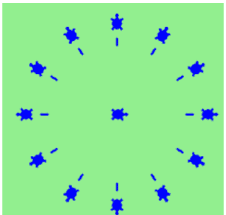

    **钟面**

13. 创建一个海龟，并将其赋值给一个变量。当你询问它的类型时，你会得到什么？
14. 海龟的集合名词是什么？（提示：它们不是以 *群* 出现的。）
15. 蟒蛇的集合名词是什么？蟒蛇是蝰蛇吗？蟒蛇有毒吗？

## 第 4 章：函数

### 4.1. 函数

在 Python 中，**函数** 是一个命名的语句序列，它们共同构成一个整体。它们的主要目的是帮助我们将程序组织成与我们思考问题方式相匹配的块。

**函数定义** 的语法是：

```python
def NAME( PARAMETERS ):
    STATEMENTS
```

我们可以为我们创建的函数起任何我们想要的名字，只是不能使用 Python 关键字作为名称，并且名称必须遵循合法标识符的规则。

函数内部可以有任意数量的语句，但它们必须从 `def` 开始缩进。在本书的示例中，我们将使用标准的四空格缩进。函数定义是我们将看到的几种 **复合语句** 中的第二种，它们都遵循相同的模式：

1.  以关键字开头并以冒号结尾的标题行。
2.  由一个或多个 Python 语句组成的 **主体**，每个语句从标题行缩进相同的量 —— *Python 风格指南建议 4 个空格*。

我们已经看到遵循此模式的 `for` 循环。

所以再次查看函数定义，标题中的关键字是 `def`，后面是函数名和括在括号中的一些 *参数*。参数列表可以为空，也可以包含任意数量的参数，参数之间用逗号分隔。无论哪种情况，括号都是必需的。参数指定了为了使用新函数我们需要提供的信息（如果有的话）。

假设我们正在使用海龟，我们需要的一个常见操作是绘制正方形。“画一个正方形”是一个抽象，或者说是一个思维块，它包含了许多更小的步骤。所以让我们编写一个函数来捕捉这个“构建块”的模式：

import turtle

def draw_square(t, sz):
    """让海龟 t 绘制一个边长为 sz 的正方形。"""
    for i in range(4):
        t.forward(sz)
        t.left(90)

wn = turtle.Screen()       # 设置窗口及其属性
wn.bgcolor("lightgreen")
wn.title("Alex 遇见函数")

alex = turtle.Turtle()     # 创建 alex
draw_square(alex, 50)      # 调用函数绘制正方形
wn.mainloop()

这个函数名为 `draw_square`。它有两个参数：一个用于告诉函数移动哪个海龟，另一个用于告诉它我们想要绘制的正方形的大小。确保你知道函数体在哪里结束——这取决于缩进，空行在此目的上不算数！

#### 用于文档的文档字符串

如果函数头之后的第一个内容是一个字符串，它会被视为 **文档字符串**，并在 Python 和一些编程工具中得到特殊处理。例如，当我们在 Repl.it 中输入一个内置函数名并带有未闭合的括号时，会弹出一个工具提示，告诉我们该函数接受哪些参数，并显示文档字符串中包含的任何其他文本。

文档字符串是在 Python 中记录我们函数的关键方式，文档部分很重要。因为调用我们函数的人不应该需要知道函数内部发生了什么或它是如何工作的；他们只需要知道我们的函数接受什么参数、它做什么以及预期的结果是什么。足以在不查看底层实现的情况下使用该函数。这回到了我们稍后将讨论的抽象概念。

文档字符串通常使用三引号字符串形成，因为它们允许我们以后轻松扩展文档字符串，如果我们想写的不止一行的话。

为了与注释区分开来，函数开头的字符串（文档字符串）可以在运行时被 Python 工具检索。相比之下，注释在程序解析时会被完全消除。

定义一个新函数并不会使函数运行。为此，我们需要一个 **函数调用**。我们已经看到如何调用一些内置函数，如 `print`、`range` 和 `int`。函数调用包含被执行的函数名称，后跟一个值列表，称为 *参数*，这些值被赋给函数定义中的参数。因此，在程序的倒数第二行，我们调用函数，并将 alex 作为要操作的海龟传递，将 50 作为我们想要的正方形大小传递。当函数执行时，变量 sz 引用值 50，变量 t 引用与变量 alex 相同的海龟实例。

一旦我们定义了一个函数，我们可以根据需要多次调用它，每次调用时其语句都会被执行。我们可以用它来让我们的任何海龟绘制一个正方形。在下一个例子中，我们稍微修改了 draw_square 函数，让 tess 绘制 15 个正方形，并带有一些变化。

```python
import turtle

def draw_multicolor_square(t, sz):
    """让海龟 t 绘制一个边长为 sz 的多色正方形。"""
    for i in ["red", "purple", "hotpink", "blue"]:
        t.color(i)
        t.forward(sz)
        t.left(90)

wn = turtle.Screen()           # 设置窗口及其属性
wn.bgcolor("lightgreen")

tess = turtle.Turtle()         # 创建 tess 并设置一些属性
tess.pensize(3)

size = 20                      # 最小正方形的大小
for i in range(15):
    draw_multicolor_square(tess, size)
    size = size + 10            # 为下次增加大小
    tess.forward(10)          # 让 tess 稍微向前移动
    tess.right(18)             #    并给她一些转向

wn.mainloop()
```

### 4.2. 函数可以调用其他函数

现在假设我们想要一个函数来绘制一个矩形。我们需要能够用不同的宽度和高度参数来调用该函数。而且，与正方形的情况不同，我们不能将相同的事情重复 4 次，因为四条边不相等。

因此，我们最终想出了这段相当不错的代码来绘制矩形。

```python
def draw_rectangle(t, w, h):
    """让海龟 t 绘制一个宽度为 w、高度为 h 的矩形。"""
    for i in range(2):
        t.forward(w)
        t.left(90)
        t.forward(h)
        t.left(90)
```

参数名特意选择为单个字母，以确保它们不会被误解。在实际程序中，一旦我们有了更多经验，我们会坚持使用比这更好的变量名。但关键在于，程序并不“理解”我们正在绘制矩形，或者参数代表宽度和高度。像矩形、宽度和高度这样的概念是我们人类赋予的意义，而不是程序或计算机理解的概念。

*像科学家一样思考* 涉及寻找模式和关系。在上面的代码中，我们在一定程度上做到了这一点。我们没有仅仅绘制四条边。相反，我们发现可以将矩形绘制为两半，并使用循环来重复该模式两次。

但现在我们可能发现正方形是一种特殊的矩形。我们已经有了一个绘制矩形的函数，所以我们可以用它来绘制我们的正方形。

```python
def draw_square(tx, sz):    # draw_square 的新版本
    draw_rectangle(tx, sz, sz)
```

这里有一些值得注意的点：

- 函数可以调用其他函数。
- 像这样重写 `draw_square` 捕捉了我们发现的正方形和矩形之间的关系。
- 该函数的调用者可能会说 `draw_square(tess, 50)`。该函数的参数 `tx` 和 `sz` 分别被赋值为 `tess` 对象和整数 `50`。
- 在函数体内，它们就像任何其他变量一样。
- 当调用 `draw_rectangle` 时，首先获取变量 `tx` 和 `sz` 中的值，然后进行调用。因此，当我们进入函数 `draw_rectangle` 的顶部时，其变量 `t` 被赋值为 `tess` 对象，而该函数中的 `w` 和 `h` 都被赋予值 50。

到目前为止，可能还不清楚为什么值得费心创建所有这些新函数。实际上，有很多原因，但这个例子展示了两个：

1. 创建一个新函数给了我们一个机会来命名一组语句。函数可以通过将复杂计算隐藏在单个命令后面来简化程序。函数（包括其名称）可以捕捉我们对问题的心理分块或 *抽象*。
2. 创建一个新函数可以通过消除重复代码来使程序更小。

正如我们可能预料的那样，我们必须先创建一个函数才能执行它。换句话说，函数定义必须在函数被调用之前执行。

### 4.3. 执行流程

为了确保函数在第一次使用之前被定义，我们必须知道语句执行的顺序，这被称为 **执行流程**。我们在前一章已经稍微讨论过这一点。

执行总是从程序的第一条语句开始。语句从上到下依次执行。

函数定义不会改变程序的执行流程，但请记住，函数内部的语句在函数被调用之前不会执行。虽然不常见，但我们可以在另一个函数内部定义一个函数。在这种情况下，内部定义直到外部函数被调用时才会执行。

函数调用就像执行流程中的一个绕道。流程不是执行下一条语句，而是跳转到被调用函数的第一行，执行那里的所有语句，然后返回到离开的地方继续执行。

这听起来很简单，直到我们记住一个函数可以调用另一个函数。在一个函数执行过程中，程序可能需要执行另一个函数中的语句。但在执行那个新函数时，程序可能还需要执行另一个函数！

幸运的是，Python 擅长跟踪它所在的位置，因此每次函数完成时，程序都会在调用它的函数中从它离开的地方继续执行。当它到达程序末尾时，它会终止。

这个混乱故事的寓意是什么？当我们阅读程序时，不要从上到下阅读。相反，遵循执行流程。

#### 观察执行流程的实际操作

Repl.it 没有“单步执行”功能。为此，我们建议使用不同的 IDE，如 [PyScripter](https://sourceforge.net/projects/pyscripter/)。

在 PyScripter 中，我们可以通过“单步执行”任何程序来观察执行流程。PyScripter 会在每一行代码即将执行之前高亮显示它。

PyScripter 还允许我们将鼠标悬停在程序中的任何变量上，它会弹出该变量的当前值。因此，这使得检查程序的“状态快照”——分配给程序变量的当前值——变得容易。

这是建立对每一步发生的事情深入而透彻理解的强大机制。学会很好地使用单步执行功能，并在心理上保持主动：当你处理代码时，在每一步之前挑战自己：*“这一行会对程序中的任何变量产生什么变化？”* 和 *“执行流程接下来会去哪里？”*

让我们回到上面绘制 15 个多色正方形的程序，看看这是如何工作的。首先，我们将在 import 语句下面添加一行神奇的代码——虽然不是严格必要的，但它会使我们的生活简单得多，因为它防止了进入包含海龟代码的模块。

```python
import turtle
__import__("turtle").__traceable__ = False
```

现在我们准备开始了。将鼠标光标放在我们创建海龟屏幕的程序行上，然后按 F4 键。这将运行 Python 程序直到，但不包括，我们光标所在的行。我们的程序现在会“中断”，并在下一行要执行的地方提供高亮显示，类似于这样：

https://sourceforge.net/projects/pyscripter/

### 4.4. 需要参数的函数

大多数函数都需要参数：参数提供了通用性。例如，如果我们想求一个数的绝对值，就必须指明这个数是多少。Python 有一个内置函数用于计算绝对值：

```python
>>> abs(5)
5
>>> abs(-5)
5
```

在这个例子中，`abs` 函数的参数是 5 和 -5。
有些函数接受多个参数。例如，内置函数 `pow` 接受两个参数：底数和指数。在函数内部，传递的值被赋值给称为**形参**的变量。

```python
>>> pow(2, 3)
8
>>> pow(7, 4)
2401
```

另一个接受多个参数的内置函数是 `max`。

```python
>>> max(7, 11)
11
>>> max(4, 1, 17, 2, 12)
17
>>> max(3 * 11, 5**3, 512 - 9, 1024**0)
503
```

`max` 可以接受任意数量的参数，用逗号分隔，并返回传递的最大值。参数可以是简单值或表达式。在最后一个例子中，返回 503，因为它比 33、125 和 1 都大。

### 4.5. 返回值的函数

上一节中的所有函数都返回值。此外，像 `range`、`int`、`abs` 这样的函数都返回可用于构建更复杂表达式的值。
因此，这些函数与像 `draw_square` 这样的函数之间的一个重要区别是，`draw_square` 的执行不是为了计算一个值——相反，我们编写 `draw_square` 是为了执行一系列步骤，使海龟绘图。

在本书中，返回值的函数称为**有返回值函数**。有返回值函数的反面是**无返回值函数**——不是为了其结果值而执行，而是因为它做了有用的事情而执行。（Java、C#、C 和 C++ 等语言使用“void 函数”一词，而 Pascal 等语言称其为**过程**。）即使无返回值函数不是为了其结果值而执行，Python 也总是希望返回一些东西。因此，如果程序员没有安排返回值，Python 会自动返回值 None。

我们如何编写自己的有返回值函数？在第 2 章末尾的练习中，我们看到了复利的标准公式，现在我们将它写成一个有返回值函数：

$$P' = P\left(1 + \frac{r}{n}\right)^{nt}$$

其中：

$P$ 是原始本金
$P'$ 是新的本金
$r$ 是名义年利率
$n$ 是复利频率
$t$ 是利息应用的总时间长度（使用与 $r$ 相同的时间单位表示，通常是年）。

#### 复利

```python
def final_amt(p, r, n, t):
    """
        将复利公式应用于 p
        以产生最终金额。
    """

    a = p * (1 + r/n) ** (n*t)
    return a         # 这是新的，使函数有返回值。

# 既然我们有了上面的函数，让我们调用它。
toInvest = float(input("How much do you want to invest?"))
fnl = final_amt(toInvest, 0.08, 12, 5)
print("At the end of the period you'll have", fnl)
```

- return 语句后面跟着一个表达式（这里是 a）。这个表达式将被求值，并作为调用此函数的“果实”返回给调用者。
- 我们提示用户输入本金金额。toInvest 的类型是字符串，但我们需要一个数字才能进行操作。因为它是钱，可能有小数位，所以我们使用了 float 类型转换函数来解析字符串并返回一个浮点数。
- 注意我们如何输入参数：8% 的利率，每年复利 12 次，持续 5 年。
- 当我们运行这个程序时，得到输出

At the end of the period you'll have 14898.457083

所有这些小数位看起来有点乱，但请记住，Python 不理解我们正在处理金钱：它只是尽其所能进行计算，不进行四舍五入。稍后我们将看到如何格式化打印的字符串，以便在打印前将其漂亮地四舍五入到两位小数。

- 这一行 `toInvest = float(input("How much do you want to invest?"))` 也展示了另一个*组合*的例子——我们可以调用像 `float` 这样的函数，它的参数可以是我们沿途调用的其他函数调用（如 `input`）的结果。

这里还有一点非常重要。我们作为参数传递的变量名——`toInvest`——与形参名——`p`——无关。就好像当 `final_amt` 被调用时，执行了 `p = toInvest`。在调用者中值叫什么名字并不重要，在 `final_amt` 中它的名字是 `p`。

这些短变量名变得相当棘手，所以也许我们更喜欢以下版本之一：

```python
def final_amt_v2(principalAmount, nominalPercentageRate,
                    numTimesPerYear, years):
    a = principalAmount * (1 + nominalPercentageRate /
                            numTimesPerYear) ** (numTimesPerYear*years)
    return a

def final_amt_v3(amt, rate, compounded, years):
    a = amt * (1 + rate/compounded) ** (compounded*years)
    return a
```

它们都做同样的事情。运用你的判断力来编写最能让其他人理解的代码！短变量名更经济，有时使代码更容易阅读：如果爱因斯坦使用了更长的变量名，E = mc2 就不会那么令人难忘了！如果你确实喜欢短名称，请确保你也有注释来向读者阐明这些变量的用途。

### 4.6. 变量和参数是局部的

当我们在函数内部创建一个**局部变量**时，它只存在于函数内部，我们不能在外部使用它。例如，再次考虑这个函数：

```python
def final_amt(p, r, n, t):
    a = p * (1 + r/n) ** (n*t)
    return a
```

如果我们尝试在函数外部使用 a，会得到一个错误：

```python
>>> a
NameError: name 'a' is not defined
```

变量 a 是 final_amt 的局部变量，在函数外部不可见。
此外，a 只在函数执行期间存在——我们称之为它的**生命周期**。当函数执行终止时，局部变量被销毁。
参数也是局部的，其行为类似于局部变量。例如，p、r、n、t 的生命周期从 final_amt 被调用开始，到函数完成执行时结束。
因此，函数不可能将某个局部变量设置为一个值，完成执行，然后在下次被调用时恢复该局部变量。函数的每次调用都会创建新的局部变量，它们的生命周期在函数返回给调用者时到期。

### 4.7. 重新审视海龟

既然我们有了有返回值函数，我们就可以专注于重新组织我们的代码，使其更符合我们的思维模块。这个重新排列的过程称为**重构**代码。
在使用海龟时，我们总是想做两件事：为海龟创建窗口，以及创建一个或多个海龟。我们可以编写一些函数，使这些任务在未来更容易：

```python
def make_window(colr, ttle):
    """
    使用给定的背景颜色和标题设置窗口。
    返回新窗口。
    """
    w = turtle.Screen()
    w.bgcolor(colr)
    w.title(ttle)
    return w

def make_turtle(colr, sz):
```

```python
def make_turtle(colr, sz):
    """
    设置一个具有给定颜色和画笔大小的海龟。
    返回新的海龟对象。
    """
    t = turtle.Turtle()
    t.color(colr)
    t.pensize(sz)
    return t

wn = make_window("lightgreen", "Tess and Alex dancing")
tess = make_turtle("hotpink", 5)
alex = make_turtle("black", 1)
dave = make_turtle("yellow", 2)
```

重构代码的技巧在于，要预判每次调用函数时我们可能想要改变哪些部分：这些部分应该成为我们编写的函数的参数，或可变部分。

### 4.8. 术语表

**参数**
在调用函数时提供给函数的值。该值被赋给函数中对应的形参。参数可以是涉及运算符、操作数以及其他有返回值函数调用的表达式的结果。

**函数体**
复合语句的第二部分。函数体由一系列语句组成，这些语句从头部开始都缩进相同的量。Python 社区中使用的标准缩进量是 4 个空格。

**复合语句**
由两部分组成的语句：

1.  头部 - 以确定语句类型的关键字开始，以冒号结束。
2.  函数体 - 包含一个或多个从头部开始缩进相同量的语句。

复合语句的语法如下所示：

```
keyword ... :
    statement
    statement ...
```

**文档字符串**
附加到函数上作为其 `__doc__` 属性的特殊字符串。像 Repl.it 这样的工具可以使用文档字符串为程序员提供文档或提示。当我们学习模块、类和方法时，会看到文档字符串也可以在那里使用。

**执行流程**
程序运行期间语句执行的顺序。

**栈帧**
栈图中表示函数调用的一个方框。它包含函数的局部变量和参数。

**函数**
执行某些有用操作的命名语句序列。函数可以接受参数，也可以不接受；可以返回结果，也可以不返回。

**函数调用**
执行一个函数的语句。它由函数名后跟括号括起来的参数列表组成。

**函数组合**
将一个函数调用的输出用作另一个函数调用的输入。

**函数定义**
创建一个新函数的语句，指定其名称、参数以及它执行的语句。

**有返回值函数**
调用时返回一个值的函数。

**头部行**
复合语句的第一部分。头部行以关键字开始，以冒号 (`:`) 结束。

**导入语句**
允许将另一个 Python 模块中定义的函数和变量引入另一个脚本环境的语句。要使用海龟的功能，我们需要先导入 turtle 模块。

**生命周期**
变量和对象都有生命周期——它们在程序执行过程中的某个时刻被创建，并在某个时刻被销毁。

**局部变量**
在函数内部定义的变量。局部变量只能在其函数内部使用。函数的参数也是一种特殊的局部变量。

**形参**
在函数内部使用的名称，用于引用作为参数传递给它的值。

**重构**
一个花哨的词，用于描述重新组织我们的程序代码，通常是为了使其更易于理解。通常，我们有一个已经可以工作的程序，然后我们回去“整理它”。这通常涉及选择更好的变量名称，或识别重复的模式并将该代码移入函数中。

**栈图**
函数栈、它们的变量以及它们所引用的值的图形表示。

**回溯**
发生运行时错误时打印的正在执行的函数列表。回溯也通常被称为*堆栈跟踪*，因为它按函数在[运行时栈](http://en.wikipedia.org/wiki/Runtime_stack)中存储的顺序列出了这些函数。

**无返回值函数**
与有返回值函数相反：不返回值的函数。它执行是为了完成其工作，而不是为了它返回的值。

### 4.9. 练习

1.  编写一个无返回值（非有返回值）函数来绘制一个正方形。在程序中使用它来绘制下面所示的图像。假设每条边长为 20 个单位。（*提示：注意当程序结束时，海龟已经从上一个正方形的终点移开了。*）

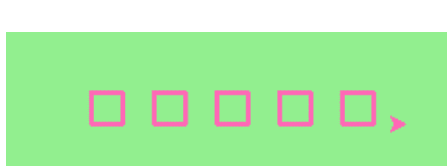

2.  编写一个程序来绘制这个图形。假设最内层的正方形每条边长为 20 个单位，每个后续的正方形每条边都比它里面的那个大 20 个单位。

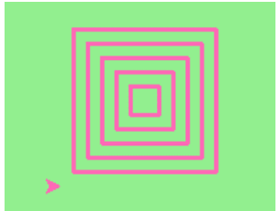

3.  编写一个无返回值函数 `draw_poly(t, n, sz)`，让海龟绘制一个正多边形。当使用 `draw_poly(tess, 8, 50)` 调用时，它将绘制出如下形状：

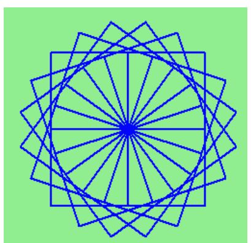

4.  这张图片中的两个螺旋线仅在转弯角度上有所不同。绘制这两个螺旋线。

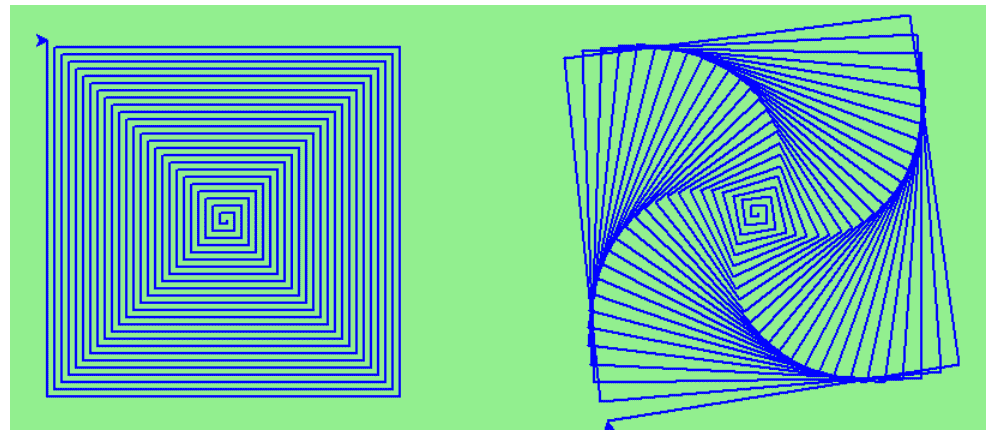

5.  编写一个无返回值函数 `draw_equitriangle(t, sz)`，它调用上一题中的 `draw_poly`，让它的海龟绘制一个等边三角形。

6.  编写一个有返回值函数 `sum_to(n)`，返回从 1 到 n（包括 n）的所有整数的和。所以 `sum_to(10)` 将是 1+2+3...+10，返回值 55。

7.  编写一个函数 `area_of_circle(r)`，返回半径为 r 的圆的面积。

8.  编写一个无返回值函数来绘制一个五角星，其中每条边的长度为 100 个单位。（提示：你应该在每个顶点将海龟转动 144 度。）


9.  扩展你上面的程序。绘制五个五角星，但在每个五角星之间，抬起画笔，向前移动 350 个单位，向右转 144 度，放下画笔，然后绘制下一个五角星。你会得到类似这样的图形：


如果你不抬起画笔，它会是什么样子？

## 第 5 章：条件语句

当我们能够测试条件并根据测试结果改变程序行为时，程序就变得非常有趣了。这就是本章的内容。

### 5.1. 布尔值和表达式

布尔值要么为真，要么为假。它以英国数学家乔治·布尔的名字命名，他首次提出了布尔代数——一些用于推理和组合这些值的规则。这是所有现代计算机逻辑的基础。

在 Python 中，两个布尔值是 `True` 和 `False`（大小写必须完全如所示），Python 类型是 `bool`。

```
>>> type(True)
<class 'bool'>
>>> type(true)
Traceback (most recent call last):
  File "<interactive input>", line 1, in <module>
NameError: name 'true' is not defined
```

**布尔表达式**是求值后产生布尔值结果的表达式。例如，运算符 `==` 测试两个值是否相等。它产生（或*返回*）一个布尔值：

```
>>> 5 == (3 + 2)   # 5 是否等于 3 + 2 的结果？
True
>>> 5 == 6
False
>>> j = "hel"
>>> j + "lo" == "hello"
True
```

在第一个语句中，两个操作数求值为相等的值，因此表达式求值为 `True`；在第二个语句中，5 不等于 6，所以我们得到 `False`。

`==` 运算符是六个常见的**比较运算符**之一，它们都产生布尔结果；以下是全部六个：

```
x == y              # 如果 ... x 等于 y，则产生 True
x != y              # ... x 不等于 y
x > y               # ... x 大于 y
x < y               # ... x 小于 y
x >= y              # ... x 大于或等于 y
x <= y              # ... x 小于或等于 y
```

尽管这些操作可能很熟悉，但 Python 符号与数学符号不同。一个常见的错误是使用单等号 (`=`) 而不是双等号 (`==`)。请记住 `=` 是赋值运算符，而 `==` 是比较运算符。此外，不存在 `=<` 或 `=>` 这样的东西。

像我们目前看到的任何其他类型一样，布尔值可以赋给变量、打印等。

```
>>> age = 18
>>> old_enough_to_get_driving_licence = age >= 17
>>> print(old_enough_to_get_driving_licence)
True
>>> type(old_enough_to_get_driving_licence)
<class 'bool'>
```

### 5.2. 逻辑运算符

有三个**逻辑运算符**：`and`、`or` 和 `not`，它们允许我们从更简单的布尔表达式构建更复杂的布尔表达式。这些运算符的语义（含义）与其在英语中的含义相似。例如，`x > 0 and x < 10` 仅在 `x` 大于 0 且同时 `x` 小于 10 时才产生 `True`。

`n % 2 == 0 or n % 3 == 0` 在*任一*条件为 `True` 时为 `True`，即，如果数字 `n` 能被 2 整除*或*能被 3 整除。（你认为如果 `n` 同时能被 2 和 3 整除会发生什么？表达式会产生 `True` 还是 `False`？在你的 Python 解释器中试试看。）

最后，`not` 运算符对布尔值取反，所以 `not (x > y)` 在 `(x > y)` 为 `False` 时为 `True`，即，如果 `x` 小于或等于 `y`。

`or` 运算符左侧的表达式首先被求值：如果结果为 `True`，Python 不会（也不需要）求值右侧的表达式——这被称为*短路求值*。类似地，对于 `and` 运算符，如果左侧的表达式产生 `False`，Python 不会求值右侧的表达式。

因此，没有不必要的求值。
```

### 5.3. 真值表

真值表是一个小表格，它允许我们列出所有可能的输入，并给出逻辑运算符的结果。因为 `and` 和 `or` 运算符各有两个操作数，所以描述 `and` 语义的真值表只有四行。

| a | b | a and b |
|---|---|---|
| False | False | False |
| False | True | False |
| True | False | False |
| True | True | True |

在真值表中，我们有时使用 `T` 和 `F` 作为两个布尔值的简写：以下是描述 `or` 的真值表：

| a | b | a or b |
|---|---|---|
| F | F | F |
| F | T | T |
| T | F | T |
| T | T | T |

第三个逻辑运算符 `not` 只接受一个操作数，因此它的真值表只有两行：

| a | not a |
|---|---|
| F | T |
| T | F |

### 5.4. 简化布尔表达式

一套用于简化和重排表达式的规则被称为代数。例如，我们都熟悉学校里的*代数*规则，比如：

```
n * 0 == 0
```

这里我们看到一种不同的代数——布尔代数——它提供了处理布尔值的规则。

首先是 `and` 运算符：

```
1 x and False == False
2 False and x == False
3 y and x == x and y
4 x and True == x
5 True and x == x
6 x and x == x
```

以下是 `or` 运算符的一些对应规则：

```
1 x or False == x
2 False or x == x
3 y or x == x or y
4 x or True == True
5 True or x == True
6 x or x == x
```

两个 `not` 运算符相互抵消：

```
1 not (not x) == x
```

### 5.5. 条件执行

为了编写有用的程序，我们几乎总是需要检查条件并相应地改变程序行为的能力。**条件语句**赋予我们这种能力。最简单的形式是 `if` 语句：

```
1 if x % 2 == 0:
2     print(x, " is even.")
3     print("Did you know that 2 is the only even number that is prime?")
4 else:
5     print(x, " is odd.")
6     print("Did you know that multiplying two odd numbers " +
7             "always gives an odd result?")
```

`if` 语句之后的布尔表达式被称为**条件**。如果为真，则所有缩进的语句都会被执行。否则，所有在 `else` 子句下缩进的语句将被执行。

**带有 else 子句的 if 语句流程图**

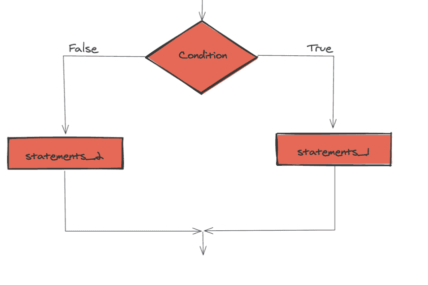

流程图 - if else

if 语句的语法如下所示：

```
1  if BOOLEAN EXPRESSION:
2      STATEMENTS_1          # 如果条件求值为 True，则执行
3  else:
4      STATEMENTS_2          # 如果条件求值为 False，则执行
```

与上一章的函数定义以及其他复合语句（如 `for`）一样，`if` 语句由一个头部行和一个主体组成。头部行以关键字 `if` 开头，后跟一个布尔表达式，并以冒号 (`:`) 结尾。
随后的缩进语句称为一个代码块。第一个未缩进的语句标志着代码块的结束。
如果布尔表达式求值为 `True`，则第一个代码块中的每个语句将按顺序执行。如果布尔表达式求值为 `False`，则整个第一个代码块将被跳过，转而执行 `else` 子句下缩进的所有语句。
`if` 语句的两个子句下可以出现的语句数量没有限制，但每个代码块中必须至少有一个语句。有时，拥有一个没有语句的部分很有用（通常作为占位符或脚手架，用于我们尚未编写的代码）。在这种情况下，我们可以使用 `pass` 语句，它除了充当占位符外什么也不做。

```
1 if True:        # 这总是 True，
2     pass        #   所以这总是被执行，但它什么也不做
3 else:
4     pass
```

### 5.6. 省略 else 子句

没有 else 子句的 if 语句流程图

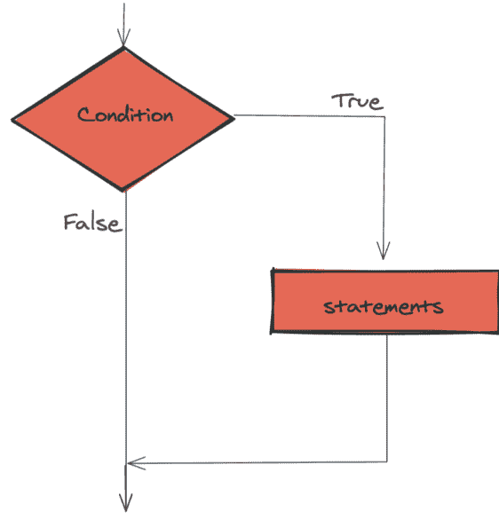

流程图 - 仅 if

`if` 语句的另一种形式是完全省略 `else` 子句。在这种情况下，当条件求值为 `True` 时，语句被执行，否则执行流程将继续到 `if` 之后的语句。

```
1 if x < 0:
2     print("The negative number ", x, " is not valid here.")
3     x = 42
4     print("I've decided to use the number 42 instead.")
5
6 print("The square root of ", x, "is", math.sqrt(x))
```

在这种情况下，输出平方根的 `print` 函数是 `if` 之后的那个——不是因为我们留了空行，而是因为代码的缩进方式。还要注意，除非我们有 `import math` 语句（通常放在脚本顶部附近），否则函数调用 `math.sqrt(x)` 会报错。

**Python 术语**

Python 文档有时使用术语 **suite**（语句组）来表示我们这里所说的*代码块*。它们指的是同一件事，由于大多数其他语言和计算机科学家使用“代码块”这个词，我们将坚持使用它。

还要注意，`else` 不是一个语句。`if` 语句有两个子句，其中一个是（可选的）`else` 子句。

### 5.7. 链式条件

有时存在超过两种可能性，我们需要超过两个分支。表达这种计算的一种方式是**链式条件**：

```
1 if x < y:
2     STATEMENTS_A
3 elif x > y:
4     STATEMENTS_B
5 else:
6     STATEMENTS_C
```

**此链式条件的流程图**

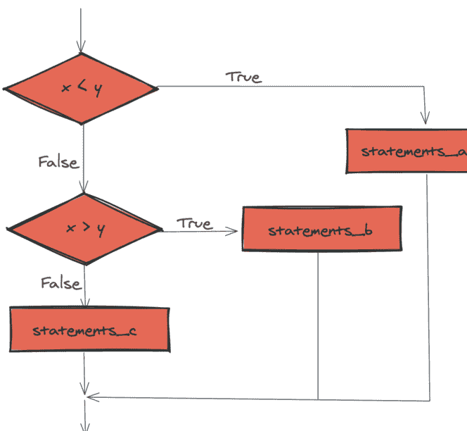

流程图 - 链式条件

`elif` 是 `else if` 的缩写。同样，只有一个分支会被执行。`elif` 语句的数量没有限制，但只允许一个（可选的）最终 `else` 语句，并且它必须是语句中的最后一个分支：

```
1 if choice == "a":
2     function_one()
3 elif choice == "b":
4     function_two()
5 elif choice == "c":
6     function_three()
7 else:
8     print("Invalid choice.")
```

每个条件按顺序检查。如果第一个为假，则检查下一个，依此类推。如果其中一个为真，则执行相应的分支，语句结束。即使有多个条件为真，也只有第一个为真的分支被执行。

### 5.8. 嵌套条件

一个条件也可以**嵌套**在另一个条件内。（这又是组合性的主题！）我们可以将前面的示例改写如下：

**此嵌套条件的流程图**

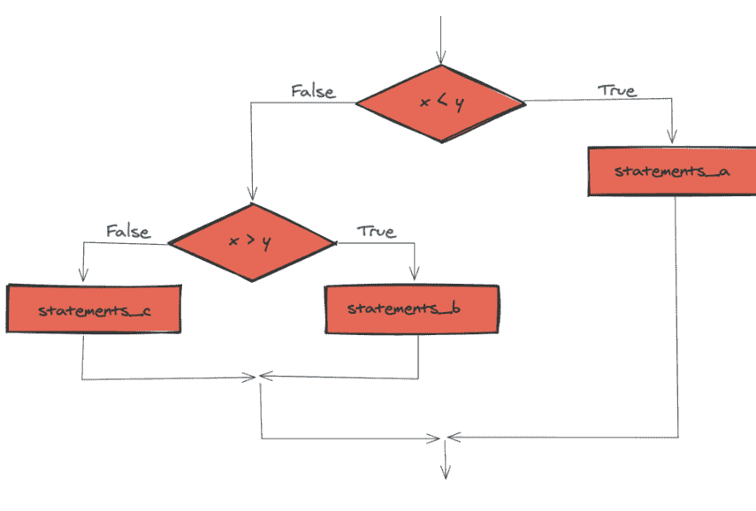

**流程图 - 嵌套条件**

```
1  if x < y:
2      STATEMENTS_A
3  else:
4      if x > y:
5          STATEMENTS_B
6      else:
7          STATEMENTS_C
```

外部条件包含两个分支。第二个分支包含另一个 `if` 语句，该语句本身有两个分支。那两个分支也可能包含条件语句。

尽管语句的缩进使结构清晰可见，但嵌套条件很快就会变得难以阅读。一般来说，尽可能避免使用它们是一个好主意。

逻辑运算符通常提供简化嵌套条件语句的方法。例如，我们可以使用单个条件重写以下代码：

```
1  if 0 < x:            # 假设 x 是一个整数
2      if x < 10:
3          print("x is a positive single digit.")
```

只有当我们通过了两个条件时，`print` 函数才会被调用，因此，与其使用两个各自具有简单条件的 `if` 语句，我们可以使用 `and` 运算符构造一个更复杂的条件。现在我们只需要一个 `if` 语句：

```
1  if 0 < x and x < 10:
2      print("x is a positive single digit.")
```

### 5.9. return 语句

`return` 语句，无论是否带有值（取决于函数是有返回值的还是无返回值的），允许我们在到达函数末尾之前（或之时）终止函数的执行。使用提前返回的一个原因是如果我们检测到错误条件：

```
1  def print_square_root(x):
2      if x <= 0:
3          print("Positive numbers only, please.")
4          return
5
6      result = x**0.5
7      print("The square root of", x, "is", result)
```

函数 `print_square_root` 有一个名为 `x` 的参数。它做的第一件事是检查 `x` 是否小于或等于 0，如果是，则显示错误消息，然后使用 `return` 退出函数。执行流程立即返回给调用者，函数的剩余行不会被执行。

### 5.10. 逻辑相反

六个关系运算符中的每一个都有一个逻辑相反：例如，假设当我们的年龄大于或等于 17 岁时可以获得驾照，那么当我们小于 17 岁时就不能获得驾照。

注意 `>=` 的相反是 `<`。

## 第五章：条件语句

| 运算符 | 逻辑相反 |
| --- | --- |
| == | != |
| != | == |
| < | >= |
| <= | > |
| > | <= |
| >= | < |

理解这些逻辑相反关系，有时能让我们摆脱 `not` 运算符。在计算机代码中，`not` 运算符通常相当难以阅读，如果我们能消除它们，我们的意图通常会更清晰。

例如，如果我们写了这样的 Python 代码：

```python
if not (age >= 17):
    print("Hey, you're too young to get a driving licence!")
```

使用简化定律，改为这样写可能会更清晰：

```python
if age < 17:
    print("Hey, you're too young to get a driving licence!")
```

两条强大的简化定律（称为德摩根定律）在处理复杂的布尔表达式时通常很有帮助：

```python
not (x and y)  ==  (not x) or (not y)
not (x or y)   ==  (not x) and (not y)
```

例如，假设我们只有在魔法光剑充能达到 90% 或更高，并且我们的防护盾拥有 100 或更多能量单位时，才能杀死巨龙。我们在游戏中发现了这段 Python 代码：

```python
if not ((sword_charge >= 0.90) and (shield_energy >= 100)):
    print("Your attack has no effect, the dragon fries you to a crisp!")
else:
    print("The dragon crumples in a heap. You rescue the gorgeous princess!")
```

德摩根定律结合逻辑相反关系，可以让我们以（可能）更容易理解的方式重写条件，如下所示：

```python
if (sword_charge < 0.90) or (shield_energy < 100):
    print("Your attack has no effect, the dragon fries you to a crisp!")
else:
    print("The dragon crumples in a heap. You rescue the gorgeous princess!")
```

我们也可以通过交换条件语句的 `then` 和 `else` 部分来摆脱 `not`。因此，这是第三个等效版本：

```python
if (sword_charge >= 0.90) and (shield_energy >= 100):
    print("The dragon crumples in a heap. You rescue the gorgeous princess!")
else:
    print("Your attack has no effect, the dragon fries you to a crisp!")
```

这个版本可能是三个版本中最好的，因为它与最初的英文陈述非常接近。代码的清晰度（对其他人而言），以及让代码易于看出其功能符合预期，应该始终是优先考虑的事项。

随着我们编程技能的提高，我们会发现解决任何问题都有不止一种方法。因此，好的程序是*设计*出来的。我们做出有利于清晰、简洁和优雅的选择。*软件架构师*这个头衔很好地说明了我们的工作——我们是*架构师*，在我们的产品中平衡美感、功能性、简洁性和清晰度。

**提示**

> *一旦我们的程序运行起来，我们应该花点时间尝试完善它。写好注释。思考一下使用不同的变量名是否会让代码更清晰。我们能否做得更优雅？我们是否应该使用一个函数？我们能否简化条件语句？*

*我们将代码视为我们的创作，我们的艺术品！我们让它变得伟大。*

### 5.11. 类型转换

我们在前面的章节中已经初步了解过这个内容。再看一遍没有坏处！

许多 Python 类型都内置了一个函数，该函数尝试将其他类型的值转换为其自身的类型。例如，`int` 函数接受任何值，并在可能的情况下将其转换为整数，否则会报错：

```python
>>> int("32")
32
>>> int("Hello")
ValueError: invalid literal for int() with base 10: 'Hello'
```

`int` 也可以将浮点值转换为整数，但请记住它会截断小数部分：

```python
>>> int(-2.3)
-2
>>> int(3.99999)
3
>>> int("42")
42
>>> int(1.0)
1
```

`float` 函数将整数和字符串转换为浮点数：

```python
>>> float(32)
32.0
>>> float("3.14159")
3.14159
>>> float(1)
1.0
```

Python 区分整数值 1 和浮点值 1.0 可能看起来很奇怪。它们可能代表相同的数字，但它们属于不同的类型。原因是它们在计算机内部的表示方式不同。

`str` 函数将其接收的任何参数转换为字符串类型：

```python
>>> str(32)
'32'
>>> str(3.14149)
'3.14149'
>>> str(True)
'True'
>>> str(true)
Traceback (most recent call last):
  File "<interactive input>", line 1, in <module>
NameError: name 'true' is not defined
```

`str` 适用于任何值并将其转换为字符串。如前所述，`True` 是一个布尔值；`true` 只是一个普通的变量名，在这里未定义，因此我们得到一个错误。

### 5.12. 海龟条形图

海龟的功能远比我们目前看到的要强大得多。完整文档可在 http://docs.python.org/py3k/library/turtle.html 找到。

这里有几个给我们的海龟的新技巧：

- 我们可以让海龟在画布上海龟的当前位置显示文本。执行此操作的方法是 `alex.write("Hello")`。
- 我们可以用一种颜色填充一个形状（圆形、半圆形、三角形等）。这是一个两步过程。首先我们调用方法 `alex.begin_fill()`，然后我们绘制形状，最后我们调用 `alex.end_fill()`。
- 我们之前设置了海龟的颜色——我们现在也可以设置它的填充颜色，这不必与海龟和画笔颜色相同。我们使用 `alex.color("blue", "red")` 来设置海龟用蓝色绘制，用红色填充。

好的，那么我们能让 tess 画一个条形图吗？让我们从一些要绘制的数据开始，

```python
xs = [48, 117, 200, 240, 160, 260, 220]
```

对应每个数据测量值，我们将绘制一个具有该高度和固定宽度的简单矩形。

```python
def draw_bar(t, height):
    """ Get turtle t to draw one bar, of height. """
    t.left(90)
    t.forward(height)    # Draw up the left side
    t.right(90)
    t.forward(40)        # Width of bar, along the top
    t.right(90)
    t.forward(height)    # And down again!
    t.left(90)           # Put the turtle facing the way we found it.
    t.forward(10)        # Leave small gap after each bar

...
for v in xs:             # Assume xs and tess are ready
    draw_bar(tess, v)
```

简单的条形图

好的，虽然不是特别令人印象深刻，但这是一个不错的开始！这里重要的是思维分块，或者我们如何将问题分解成更小的部分。我们的分块是绘制一个条形，我们为此编写了一个函数。然后，对于整个图表，我们反复调用我们的函数。

接下来，在每个条形的顶部，我们将打印数据的值。我们将在 `draw_bar` 的函数体中执行此操作，通过添加 `t.write(' ' + str(height))` 作为函数体的新第三行。我们在数字前加了一个小空格，并将数字转换为字符串。没有这个额外的空格，我们的文本往往会尴尬地紧贴在左侧的条形上。现在结果看起来好多了：

带编号的条形图

现在我们将添加两行来填充每个条形。我们最终的程序现在看起来像这样：

```python
import turtle

def draw_bar(t, height):
    """ Get turtle t to draw one bar, of height. """
    t.begin_fill()           # Added this line
    t.left(90)
    t.forward(height)
    t.write("  "+ str(height))
    t.right(90)
    t.forward(40)
    t.right(90)
    t.forward(height)
    t.left(90)
    t.end_fill()             # Added this line
    t.forward(10)

wn = turtle.Screen()        # Set up the window and its attributes
wn.bgcolor("lightgreen")

tess = turtle.Turtle()      # Create tess and set some attributes
tess.color("blue", "red")
tess.pensize(3)

xs = [48,117,200,240,160,260,220]

for a in xs:
    draw_bar(tess, a)

wn.mainloop()
```

它产生了以下结果，这更令人满意：

填充的条形图

嗯。也许条形在底部不应该相互连接。我们需要在条形之间的间隙处抬起画笔。我们将把这个（以及一些其他的调整）留给你作为练习！

### 5.13. 术语表

**块**
一组具有相同缩进的连续语句。

**主体**
复合语句中跟在头部后面的语句块。

**布尔代数**
一些用于重排和推理布尔表达式的规则。

**布尔表达式**
一个要么为真要么为假的表达式。

**布尔值**
恰好有两个布尔值：`True` 和 `False`。当布尔表达式被 Python 解释器求值时，会产生布尔值。它们的类型是 `bool`。

**分支**
由条件执行确定的执行流程的可能路径之一。

#### 链式条件
一种具有两个以上可能执行流程的条件分支。在 Python 中，链式条件使用 `if ... elif ... else` 语句编写。

#### 比较运算符
用于比较两个值的六种运算符之一：`==`、`!=`、`>`、`<`、`>=` 和 `<=`。

#### 条件
条件语句中决定执行哪个分支的布尔表达式。

#### 条件语句
根据某些条件控制执行流程的语句。在 Python 中，关键字 `if`、`elif` 和 `else` 用于条件语句。

#### 逻辑运算符
用于组合布尔表达式的运算符之一：`and`、`or` 和 `not`。

#### 嵌套
一个程序结构位于另一个结构内部，例如一个条件语句位于另一个条件语句的分支内。

#### 提示符
向用户发出系统已准备好接受输入数据的视觉提示。

#### 真值表
一个简洁的布尔值表格，可以描述运算符的语义。

#### 类型转换
一个显式函数调用，它接受一个类型的值并计算出另一个类型的相应值。

#### 将代码包装在函数中
为一系列程序语句添加函数头和参数的过程通常被称为“将代码包装在函数中”。每当相关程序语句需要多次使用时，这个过程非常有用。当它允许程序员表达他们的思维分块，以及他们如何将一个复杂问题分解成若干部分时，它就更加有用了。

### 5.14. 练习

1.  假设一周的天数从星期日到星期六编号为 0, 1, 2, 3, 4, 5, 6。编写一个函数，给定天数编号，返回天数名称（一个字符串）。

2.  你去度了一个美好的假期（如果你不喜欢快乐的练习，也许是去监狱），在第 3 天（星期三）出发。你在 137 次睡眠后回家。编写一个通用版本的程序，它询问起始天数编号和停留时间长度，然后告诉你你将在星期几回家。

3.  给出以下条件的逻辑相反条件：

```
1   a > b
2   a >= b
3   a >= 18  and  day == 3
4   a >= 18  and  day != 3
```

4.  这些表达式求值结果是什么？

```
1   3 == 3
2   3 != 3
3   3 >= 4
4   not (3 < 4)
```

5.  完成这个真值表：

| p | q | r | (not (p and q)) or r |
|---|---|---|---|
| F | F | F | ? |
| F | F | T | ? |
| F | T | F | ? |
| F | T | T | ? |
| T | F | F | ? |
| T | F | T | ? |
| T | T | F | ? |
| T | T | T | ? |

6.  编写一个函数，给定一个考试分数，根据以下方案返回一个字符串——该分数的等级：

| 分数 | 等级 |
|---|---|
| >= 75 | 一等 |
| [70-75) | 二等上 |
| [60-70) | 二等 |
| [50-60) | 三等 |
| [45-50) | F1 补考 |
| [40-45) | F2 |
| < 40 | F3 |

方括号和圆括号分别表示闭区间和开区间。闭区间包含该数字，开区间不包含。所以 39.99999 得到等级 F3，但 40 得到等级 F2。假设

```
1  xs = [83, 75, 74.9, 70, 69.9, 65, 60, 59.9, 55, 50,
2      49.9, 45, 44.9, 40, 39.9, 2, 0]
```

通过打印此列表中所有元素的分数和等级来测试你的函数。

7.  修改海龟条形图程序，使画笔在每根条形图之间的小间隙处抬起。

8.  修改海龟条形图程序，使任何值为 200 或以上的条形图填充红色，值在 [100 到 200) 之间的填充黄色，代表小于 100 的值的条形图填充绿色。

9.  在海龟条形图程序中，如果列表中的一个或多个数据值为负数，你预期会发生什么？试一试。修改程序，使其在打印负条形图的文本值时，将文本放在条形图底部的下方。

10. 编写一个函数 `find_hypot`，给定直角三角形的两条边长，返回斜边的长度。（提示：`x ** 0.5` 将返回平方根。）

11. 编写一个函数 `is_rightangled`，给定三角形的三条边长，将确定该三角形是否为直角三角形。假设函数的第三个参数始终是最长的边。如果三角形是直角三角形，它将返回 `True`，否则返回 `False`。

> 提示：浮点数运算并不总是完全精确，因此测试浮点数是否相等是不安全的。如果一个优秀的程序员想知道 x 是否等于 y 或足够接近 y，他们可能会这样编码：

```
1  if abs(x-y) < 0.000001:    # 如果 x 大约等于 y
2      ...
```

12. 扩展上述程序，使边长可以以任何顺序传递给函数。

13. 如果你对浮点数运算有时不准确的原因感到好奇，在一张纸上，将 10 除以 3 并写下十进制结果。你会发现它不会终止，所以你需要一张无限长的纸。计算机内存或计算器中数字的表示存在类似的问题：内存是有限的，一些数字可能不得不被丢弃。因此，微小的误差会悄然产生。尝试这个脚本：

```
1  import math
2  a = math.sqrt(2.0)
3  print(a, a*a)
4  print(a*a == 2.0)
```

## 第 6 章：有返回值的函数

### 6.1. 返回值

我们使用过的内置函数，如 `abs`、`pow`、`int`、`max` 和 `range`，都产生了结果。调用这些函数中的每一个都会生成一个值，我们通常将其赋给一个变量或用作表达式的一部分。

```
1 biggest = max(3, 7, 2, 5)
2 x = abs(3 - 11) + 10
```

我们还编写了自己的函数来返回复利计算的最终金额。
在本章中，我们将编写更多返回值的函数，由于找不到更好的名字，我们将它们称为 *有返回值的函数*。第一个例子是 `area`，它返回给定半径的圆的面积：

```
1 def area(radius):
2     b = 3.14159 * radius**2
3     return b
```

我们之前见过 `return` 语句，但在有返回值的函数中，`return` 语句包含一个 **返回值**。这个语句的意思是：计算返回表达式，然后立即将其作为此函数的结果（果实）返回。提供的表达式可以任意复杂，所以我们可以这样编写这个函数：

```
1 def area(radius):
2     return 3.14159 * radius * radius
```

另一方面，像上面的 `b` 这样的 **临时变量** 通常使调试更容易。
有时拥有多个 `return` 语句很有用，每个条件分支一个。我们已经见过内置的 `abs`，现在我们看看如何编写自己的：

```
1 def absolute_value(x):
2     if x < 0:
3         return -x
4     else:
5         return x
```

编写上述函数的另一种方法是省略 else，只在 if 条件后跟第二个 return 语句。

```
1 def absolute_value(x):
2     if x < 0:
3         return -x
3     return x
```

思考这个版本，并说服自己它与第一个版本工作方式相同。
出现在 return 语句之后，或执行流程永远无法到达的任何其他地方的代码，被称为 **死代码** 或 **不可达代码**。
在有返回值的函数中，确保程序的每条可能路径都命中 return 语句是一个好主意。以下版本的 absolute_value 未能做到这一点：

```
1 def bad_absolute_value(x):
2     if x < 0:
3         return -x
4     elif x > 0:
5         return x
```

这个版本不正确，因为如果 x 恰好为 0，则两个条件都不为真，函数在未命中 return 语句的情况下结束。在这种情况下，返回值是一个特殊的值，称为 **None**：

```
1 >>> print(bad_absolute_value(0))
2 None
```

所有 Python 函数在不返回另一个值时都返回 None。
也可以在 for 循环中间使用 return 语句，在这种情况下，控制权立即从函数返回。让我们假设我们想要一个函数来查看一个单词列表。它应该返回第一个 2 个字母的单词。如果没有，它应该返回空字符串：def find_first_2_letter_word(xs):
    for wd in xs:
        if len(wd) == 2:
            return wd
    return ""

```
>>> find_first_2_letter_word(["This", "is", "a", "dead", "parrot"])
'is'
>>> find_first_2_letter_word(["I", "like", "cheese"])
''
```

单步执行这段代码，并确信在我们提供的第一个测试用例中，函数在处理列表的第二个元素时就返回了：它不需要遍历整个列表。

### 6.2. 程序开发

此时，你应该能够查看完整的函数并说出它们的功能。此外，如果你一直在做练习，你已经编写了一些小函数。当你编写更大的函数时，你可能会开始遇到更多困难，尤其是在运行时错误和语义错误方面。

为了处理日益复杂的程序，我们将建议一种称为**增量开发**的技术。增量开发的目标是通过一次只添加和测试少量代码来避免长时间的调试过程。

举个例子，假设我们想找到两个点之间的距离，这两个点由坐标 (x1, y1) 和 (x2, y2) 给出。根据勾股定理，距离为：


第一步是考虑 Python 中的 `distance` 函数应该是什么样子。换句话说，输入（参数）是什么，输出（返回值）是什么？

在这个例子中，两个点是输入，我们可以用四个参数来表示。返回值是距离，这是一个浮点值。

我们已经可以写出一个函数的框架，它捕捉了我们目前的思考：

```
def distance(x1, y1, x2, y2):
    return 0.0
```

显然，这个版本的函数不计算距离；它总是返回零。但它在语法上是正确的，并且可以运行，这意味着我们可以在使其更复杂之前对其进行测试。

为了测试新函数，我们用示例值调用它：

```
>>> distance(1, 2, 4, 6)
0.0
```

我们选择这些值是为了使水平距离等于 3，垂直距离等于 4；这样，结果就是 5（一个 3-4-5 三角形的斜边）。在测试函数时，知道正确答案是很有用的。

此时我们已经确认函数在语法上是正确的，我们可以开始添加代码行了。每次增量更改后，我们再次测试函数。如果在任何点发生错误，我们知道它一定在哪里——在我们添加的最后一行代码中。

计算中的一个逻辑第一步是找到差值 x2- x1 和 y2- y1。我们将使用名为 dx 和 dy 的临时变量来引用这些值。

```
def distance(x1, y1, x2, y2):
    dx = x2 - x1
    dy = y2 - y1
    return 0.0
```

如果我们用上面显示的参数调用函数，当执行流程到达 return 语句时，dx 应该是 3，dy 应该是 4。我们可以通过在 PyScripter 中将光标放在 return 语句上，并运行程序在到达光标时中断执行（使用 F4 键）来检查这一点。然后我们通过将鼠标悬停在变量 dx 和 dy 上来检查它们，以确认函数获得了正确的参数并正确执行了第一次计算。如果没有，只有几行代码需要检查。

接下来我们计算 dx 和 dy 的平方和：

```
def distance(x1, y1, x2, y2):
    dx = x2 - x1
    dy = y2 - y1
    dsquared = dx*dx + dy*dy
    return 0.0
```

同样，我们可以在这个阶段运行程序并检查 dsquared 的值（应该是 25）。

最后，使用分数指数 0.5 来求平方根，我们计算并返回结果：

```
def distance(x1, y1, x2, y2):
    dx = x2 - x1
    dy = y2 - y1
    dsquared = dx*dx + dy*dy
    result = dsquared**0.5
    return result
```

如果这工作正常，你就完成了。否则，你可能想在 return 语句之前检查 `result` 的值。

当你刚开始时，你可能一次只添加一两行代码。随着你获得更多经验，你可能会发现自己编写和调试更大的概念块。无论哪种方式，逐行单步执行你的代码并验证每一步是否符合你的预期，可以为你节省大量调试时间。随着你编程技能的提高，你应该发现自己能够管理越来越大的代码块：这非常类似于我们学习阅读字母、音节、单词、短语、句子、段落等的方式，或者我们学习将音乐分块的方式——从单个音符到和弦、小节、乐句等等。

这个过程的关键方面是：

- 1. 从一个可工作的骨架程序开始，进行小的增量更改。在任何点，如果有错误，你都会确切知道它在哪里。
- 2. 使用临时变量来引用中间值，以便你可以轻松地检查和验证它们。
- 3. 一旦程序工作正常，放松一下，坐回来，尝试你的各种选项。（有有趣的研究将“玩乐性”与更好的理解、更好的学习、更多的乐趣以及对你能实现什么更积极的心态联系起来——所以花些时间摆弄一下！）你可能想将多个语句合并成一个更大的复合表达式，或者重命名你使用的变量，或者看看你是否能让函数更短。一个好的指导原则是力求使代码尽可能易于他人阅读。

这是函数的另一个版本。它利用了 `math` 模块中的平方根函数（我们很快会学习模块）。你更喜欢哪个？哪个看起来“更接近”我们开始时使用的勾股公式？

```
import math

def distance(x1, y1, x2, y2):
    return math.sqrt( (x2-x1)**2 + (y2-y1)**2 )
```

```
>>> distance(1, 2, 4, 6)
5.0
```

### 6.3. 使用 print 调试

另一种强大的调试技术（单步执行和检查程序变量的替代方法）是在代码中精心选择的位置插入额外的 print 函数。然后，通过检查程序的输出，你可以检查算法是否在做你期望它做的事情。然而，请明确以下几点：

- 你必须对问题有一个清晰的解决方案，并且必须知道在调试程序之前应该发生什么。在你关心编写代码*之前*，在纸上*解决*问题（也许使用流程图来记录你采取的步骤）。编写程序并不能解决问题——它只是*自动化*了你会采取的手动步骤。所以首先确保你有一个有效的纸笔手动解决方案。然后编程就是让这些手动步骤自动发生。
- 不要编写**话痨**函数。话痨是一个有产出的函数，除了其主要任务外，还会向用户请求输入或打印输出，而如果它只是安静地完成工作，会更有用。

例如，我们见过像 `range`、`max` 和 `abs` 这样的内置函数。如果它们在执行任务时提示用户输入或打印结果，这些函数都不会成为其他程序的有用构建块。

所以一个好建议是避免在有产出的函数内部调用 `print` 和 `input` 函数，*除非你的函数的主要目的是执行输入和输出*。这个规则的一个例外可能是暂时在你的代码中插入一些 `print` 调用，以帮助调试和理解代码运行时发生的情况，但一旦你让事情正常工作，这些就会被移除。

### 6.4. 组合

正如你现在应该预料到的，你可以从另一个函数内部调用一个函数。这种能力称为**组合**。

举个例子，我们将编写一个函数，它接受两个点，圆心和圆周上的一个点，并计算圆的面积。

假设圆心点存储在变量 `xc` 和 `yc` 中，圆周上的点在 `xp` 和 `yp` 中。第一步是找到圆的半径，即两个点之间的距离。幸运的是，我们刚刚编写了一个函数 `distance`，它正好做这个，所以现在我们要做的就是使用它：

### 6.5. 布尔函数

函数可以返回布尔值，这通常便于将复杂的测试隐藏在函数内部。例如：

```python
def is_divisible(x, y):
    """ Test if x is exactly divisible by y """
    if x % y == 0:
        return True
    else:
        return False
```

通常会给**布尔函数**起一个听起来像是是非题的名字。`is_divisible` 返回 `True` 或 `False`，以指示 `x` 是否能被 `y` 整除。

我们可以利用 `if` 语句的条件本身就是一个布尔表达式这一事实，使函数更简洁。我们可以直接返回它，完全避免使用 `if` 语句：

```python
def is_divisible(x, y):
    return x % y == 0
```

以下会话展示了新函数的实际运行：

```python
>>> is_divisible(6, 4)
False
>>> is_divisible(6, 3)
True
```

布尔函数常用于条件语句中：

```python
if is_divisible(x, y):
    ... # Do something ...
else:
    ... # Do something else ...
```

可能会有人想写成这样：

```python
if is_divisible(x, y) == True:
```

但这个额外的比较是不必要的。

### 6.6. 有风格地编程

可读性对程序员来说非常重要，因为在实践中，程序被阅读和修改的次数远多于被编写的次数。但是，像大多数规则一样，我们偶尔也会打破它们。本书中的大多数代码示例将遵循 *Python 增强提案 8* (PEP 8)，这是由 Python 社区开发的风格指南。

随着我们的程序变得更加复杂，我们将有更多关于风格的内容要说，但以下几点建议现在就会很有帮助：

- 使用 4 个空格（而不是制表符）进行缩进
- 将行长度限制在 78 个字符以内
- 命名标识符时，对类使用驼峰命名法（我们稍后会讲到），对函数和变量使用小写字母加下划线
- 将导入语句放在文件顶部
- 将函数定义放在一起
- 使用文档字符串来记录函数
- 使用两个空行分隔函数定义
- 将顶层语句，包括函数调用，集中放在程序底部

### 6.7. 单元测试

在软件开发中，对源代码进行自动化的**单元测试**是一种常见的最佳实践。单元测试提供了一种自动验证代码的各个部分（例如函数）是否正常工作的方法。这使得在以后更改函数的实现并快速测试其是否仍然按预期工作成为可能。

一些年前，组织认为其宝贵的资产是程序代码和文档。现在，组织会将软件预算的很大一部分用于制作（和保存）他们的测试。

单元测试还迫使程序员思考函数需要处理的不同情况。而且，你只需要在脚本中输入一次测试，而不是在开发代码时一遍又一遍地输入相同的测试数据。

程序中额外存在的、为了使调试或测试更容易而编写的代码被称为**脚手架**。

针对某些代码的测试集合被称为其**测试套件**。

在 Python 中进行单元测试有几种不同的方法——但在这个阶段，我们将忽略 Python 社区通常的做法，而是从两个我们自己编写的函数开始。我们将使用这些函数来编写我们的单元测试。

让我们从本章前面编写的 `absolute_value` 函数开始。回想一下，我们写了几个不同的版本，最后一个版本是不正确的，有一个错误。测试能发现这个错误吗？

首先我们规划我们的测试。我们想知道当函数的参数为负数、正数或零时，函数是否返回正确的值。在规划测试时，你总是需要仔细考虑“边缘”情况——在这里，传递给 `absolute_value` 的参数 0 处于函数行为变化的边缘，正如我们在本章开头所看到的，这是程序员容易出错的地方！因此，它是一个适合包含在我们的测试套件中的好案例。

我们将编写一个辅助函数来检查单个测试的结果。它接受一个布尔参数，并会打印一条消息告诉我们测试通过了，或者打印一条消息通知我们测试失败了。函数体的第一行（在函数的文档字符串之后）神奇地确定了调用发生时脚本中的行号。这使我们能够打印测试的行号，这将有助于我们识别哪些测试通过或失败。

```python
import sys

def test(did_pass):
    """ Print the result of a test. """
    linenum = sys._getframe(1).f_lineno  # Get the caller's line number.
    if did_pass:
        msg = "Test at line {0} ok.".format(linenum)
    else:
        msg = "Test at line {0} FAILED.".format(linenum)
    print(msg)
```

还有一些使用 format 方法的稍微棘手的字符串格式化，我们暂时略过，将在未来的章节中详细介绍。但有了这个函数，我们就可以开始构建我们的测试套件了：

```python
def test_suite():
    """ Run the suite of tests for code in this module (this file).
    """
    test(absolute_value(17) == 17)
    test(absolute_value(-17) == 17)
    test(absolute_value(0) == 0)
    test(absolute_value(3.14) == 3.14)
    test(absolute_value(-3.14) == 3.14)

test_suite()       # Here is the call to run the tests
```

在这里你会看到我们在测试套件中构建了五个测试。我们可以针对 absolute_value 的第一个或第二个版本（正确的版本）运行它，我们会得到类似以下的输出：

```
Test at line 25 ok.
Test at line 26 ok.
Test at line 27 ok.
Test at line 28 ok.
Test at line 29 ok.
```

但假设你将函数更改为一个不正确的版本，像这样：

```python
def absolute_value(n):    # Buggy version
    """ Compute the absolute value of n """
    if n < 0:
        return 1
    elif n > 0:
        return n
```

你能在这个代码中找到至少两个错误吗？我们的测试套件可以！我们得到：

```
Test at line 25 ok.
Test at line 26 FAILED.
Test at line 27 FAILED.
Test at line 28 ok.
Test at line 29 FAILED.
```

这是三个*测试失败*的例子。

Python 有一个内置的语句叫做 **assert**，它的功能几乎与我们的 `test` 函数相同（除了当第一个断言失败时程序会停止）。你可能想阅读关于它的内容，并用它来代替我们的 `test` 函数。

### 6.8. 术语表

**布尔函数**

返回布尔值的函数。bool 类型唯一可能的值是 `False` 和 `True`。

**话痨函数**

在不应该与用户交互时（使用 `input` 或 `print`）却与用户交互的函数。只将其输入参数转换为输出结果的静默函数通常是最有用的。

**（函数的）组合**

从另一个函数的主体内部调用一个函数，或者将一个函数的 `return` 值用作另一个函数调用的参数。

**死代码**

程序中永远无法执行的部分，通常因为它出现在 `return` 语句之后。

**有返回值的函数**

产生 `return` 值而不是 `None` 的函数。

**增量开发**

### 6.9. 练习

以下所有练习都应添加到一个单独的文件中。在该文件中，你还应添加上面所示的 `test` 和 `test_suite` 脚手架函数，然后，在完成练习的过程中，将新的测试添加到你的测试套件中。（如果你打开教材的在线版本，可以轻松地将测试和代码片段复制粘贴到你的 Python 编辑器中。）
完成每个练习后，请确认所有测试都通过。

1.  四个基本方位可以用单字母字符串缩写为 "N"、"E"、"S" 和 "W"。编写一个函数 `turn_clockwise`，它接受这四个方位点之一作为参数，并返回顺时针方向的下一个方位点。以下是一些应该通过的测试：

```
test(turn_clockwise("N") == "E")
test(turn_clockwise("W") == "N")
```

你可能会问“如果函数的参数是其他值怎么办？”对于所有其他情况，函数应返回值 `None`：

```
test(turn_clockwise(42) == None)
test(turn_clockwise("rubbish") == None)
```

2.  编写一个函数 `day_name`，将整数 0 到 6 转换为星期的名称。假设第 0 天是“星期日”。同样，如果函数的参数无效，则返回 `None`。以下是一些应该通过的测试：

```
test(day_name(3) == "Wednesday")
test(day_name(6) == "Saturday")
test(day_name(42) == None)
```

3.  编写逆函数 `day_num`，它接受一个星期名称，并返回其对应的数字：

```
test(day_num("Friday") == 5)
test(day_num("Sunday") == 0)
test(day_num(day_name(3)) == 3)
test(day_name(day_num("Thursday")) == "Thursday")
```

同样，如果此函数接收到无效参数，它应返回 `None`：

```
test(day_num("Halloween") == None)
```

4.  编写一个函数，帮助回答诸如“今天是星期三。我 19 天后要去度假。那天是星期几？”这样的问题。因此，该函数必须接受一个星期名称和一个增量参数——要增加的天数——并应返回结果星期名称：

```
test(day_add("Monday", 4) == "Friday")
test(day_add("Tuesday", 0) == "Tuesday")
test(day_add("Tuesday", 14) == "Tuesday")
test(day_add("Sunday", 100) == "Tuesday")
```

*提示：使用上面编写的前两个函数来帮助你编写这个函数。*

5.  你的 `day_add` 函数是否已经可以处理负增量？例如，-1 表示昨天，-7 表示一周前：

```
test(day_add("Sunday", -1) == "Saturday")
test(day_add("Sunday", -7) == "Sunday")
test(day_add("Tuesday", -100) == "Sunday")
```

如果你的函数已经可以工作，请解释原因。如果它不能工作，请使其能够工作。

*提示：尝试使用取模函数 %（在上一章开头介绍过）的一些情况。具体来说，探索当 x 为负数时，x % 7 会发生什么。*

6.  编写一个函数 `days_in_month`，它接受月份的名称，并返回该月的天数。忽略闰年：

```
test(days_in_month("February") == 28)
test(days_in_month("December") == 31)
```

如果函数接收到无效参数，它应返回 None。

7.  编写一个函数 `to_secs`，将小时、分钟和秒转换为总秒数。以下是一些应该通过的测试：

```
test(to_secs(2, 30, 10) == 9010)
test(to_secs(2, 0, 0) == 7200)
test(to_secs(0, 2, 0) == 120)
test(to_secs(0, 0, 42) == 42)
test(to_secs(0, -10, 10) == -590)
```

8.  扩展 `to_secs`，使其能够处理实数值作为输入。它应始终返回整数秒数（向零截断）：

```
test(to_secs(2.5, 0, 10.71) == 9010)
test(to_secs(2.433,0,0) == 8758)
```

9.  编写三个函数，它们是 `to_secs` 的“逆函数”：
1.  `hours_in` 返回总秒数所代表的完整整数小时数。
2.  `minutes_in` 返回总秒数中减去小时后剩余的完整整数分钟数。
3.  `seconds_in` 返回总秒数所代表的剩余秒数。
你可以假设传递给这些函数的总秒数是整数。以下是一些测试用例：

```
test(hours_in(9010) == 2)
test(minutes_in(9010) == 30)
test(seconds_in(9010) == 10)
```

**需求并不总是显而易见的……**
在上面的第三种情况下，需求似乎相当模糊和不确定。但测试澄清了我们实际需要做什么。
单元测试通常具有澄清规范的次要好处。如果你编写自己的测试套件，请将其视为解决问题过程的一部分，因为你需要询问你真正期望发生什么，以及你是否考虑了所有可能的情况。
鉴于我们强调*像计算机科学家一样思考*，你可能会喜欢阅读至少一篇关于思考的文章，以及关于*流体智力*等有趣想法的文章，这是解决问题的关键要素。例如，参见 http://psychology.about.com/od/cognitivepsychology/a/fluid-crystal.htm。学习计算机科学需要流体智力和晶体智力的良好结合。

10. 以下哪些测试失败了？解释原因。

```
test(3 % 4 == 0)
test(3 % 4 == 3)
test(3 / 4 == 0)
test(3 // 4 == 0)
test(3+4 * 2 == 14)
test(4-2+2 == 0)
test(len("hello, world!") == 13)
```

11. 编写一个 compare 函数，如果 a > b 返回 1，如果 a == b 返回 0，如果 a < b 返回 -1

```
test(compare(5, 4) == 1)
test(compare(7, 7) == 0)
test(compare(2, 3) == -1)
test(compare(42, 1) == 1)
```

12. 编写一个名为 hypotenuse 的函数，它接受直角三角形的两条直角边长度作为参数，并返回斜边的长度：

```
test(hypotenuse(3, 4) == 5.0)
test(hypotenuse(12, 5) == 13.0)
test(hypotenuse(24, 7) == 25.0)
test(hypotenuse(9, 12) == 15.0)
```

13. 编写一个函数 slope(x1, y1, x2, y2)，它返回通过点 (x1, y1) 和 (x2, y2) 的直线的斜率。确保你的 slope 实现能够通过以下测试：

```
test(slope(5, 3, 4, 2) == 1.0)
test(slope(1, 2, 3, 2) == 0.0)
test(slope(1, 2, 3, 3) == 0.5)
test(slope(2, 4, 1, 2) == 2.0)
```

然后在一个名为 intercept(x1, y1, x2, y2) 的新函数中调用 slope，该函数返回通过点 (x1, y1) 和 (x2, y2) 的直线的 y 轴截距：

```
test(intercept(1, 6, 3, 12) == 3.0)
test(intercept(6, 1, 1, 6) == 7.0)
test(intercept(4, 6, 12, 8) == 5.0)
```

14. 编写一个名为 is_even(n) 的函数，它接受一个整数作为参数，如果参数是偶数则返回 True，如果是奇数则返回 False。

将你自己的测试添加到测试套件中。

15. 现在编写函数 is_odd(n)，当 n 是奇数时返回 True，否则返回 False。也为此函数包含单元测试。

最后，修改它，使其调用 is_even 来确定其参数是否为奇数整数，并确保其测试仍然通过。

16. 编写一个函数 is_factor(f, n)，它通过以下测试：test(is_factor(3, 12))
test(not is_factor(5, 12))
test(is_factor(7, 14))
test(not is_factor(7, 15))
test(is_factor(1, 15))
test(is_factor(15, 15))
test(not is_factor(25, 15))

单元测试的一个重要作用是，它们也可以作为预期行为的明确“规范”。这些测试用例回答了“我们是否将1和15视为15的因子？”这个问题。

17. 编写 `is_multiple` 函数以满足以下单元测试：

```
test(is_multiple(12, 3))
test(is_multiple(12, 4))
test(not is_multiple(12, 5))
test(is_multiple(12, 6))
test(not is_multiple(12, 7))
```

你能找到一种在 `is_multiple` 的定义中使用 `is_factor` 的方法吗？

18. 编写函数 `f2c(t)`，该函数设计用于返回给定华氏温度对应的最接近摄氏度的整数值。（提示：你可能需要使用内置函数 `round`。尝试在 Python shell 中打印 `round.__doc__` 或查阅 `round` 函数的帮助文档，并进行实验，直到你熟悉其工作方式。）

```
test(f2c(212) == 100)    # 水的沸点
test(f2c(32) == 0)       # 水的冰点
test(f2c(-40) == -40)    # 哇，多么有趣的情况！
test(f2c(36) == 2)
test(f2c(37) == 3)
test(f2c(38) == 3)
test(f2c(39) == 4)
```

19. 现在做相反的操作：编写函数 `c2f`，将摄氏度转换为华氏度：

```
test(c2f(0) == 32)
test(c2f(100) == 212)
test(c2f(-40) == -40)
test(c2f(12) == 54)
test(c2f(18) == 64)
test(c2f(-48) == -54)
```

## 第7章：迭代

计算机常被用于自动化重复性任务。重复执行相同或相似的任务而不犯错误，是计算机擅长而人类不擅长的事情。

一组语句的重复执行称为**迭代**。由于迭代非常普遍，Python 提供了多种语言特性使其更易于实现。我们已经在第3章见过 `for` 语句。这可能是你最常使用的迭代形式。但在本章中，我们将探讨 `while` 语句——另一种让程序进行迭代的方式，在略有不同的情况下很有用。

在开始之前，让我们先回顾一些概念...

### 7.1. 赋值

正如我们之前提到的，对同一个变量进行多次赋值是合法的。新的赋值会使现有变量指向一个新值（并停止指向旧值）。

```python
airtime_remaining = 15
print(airtime_remaining)
airtime_remaining = 7
print(airtime_remaining)
```

该程序的输出是：

```
15
7
```

因为第一次打印 `airtime_remaining` 时，其值为15，第二次打印时，其值为7。

区分赋值语句和测试相等性的布尔表达式尤为重要。因为 Python 使用等号（=）进行赋值，很容易将 `a = b` 这样的语句解释为布尔测试。与数学不同，它不是！请记住，Python 中表示相等运算符的符号是 `==`。

还要注意，相等性测试是对称的，但赋值不是。例如，如果 `a == 7`，那么 `7 == a`。但在 Python 中，语句 `a = 7` 是合法的，而 `7 = a` 则不合法。

在 Python 中，赋值语句可以使两个变量相等，但由于后续的赋值可以改变其中任何一个，它们不必保持相等：

```
a = 5
b = a    # 执行此行后，a 和 b 现在相等
a = 3    # 执行此行后，a 和 b 不再相等
```

第三行改变了 a 的值，但没有改变 b 的值，所以它们不再相等。（在一些编程语言中，使用不同的符号进行赋值，例如 <- 或 :=，以避免混淆。有些人还认为“变量”这个词选择得不太恰当，我们本应称它们为“可赋值对象”。Python 选择遵循常见术语和符号用法，这在 C、C++、Java 和 C# 等语言中也能找到，因此我们使用符号 = 进行赋值，== 表示相等，并且我们谈论的是变量。）

### 7.2. 更新变量

当执行赋值语句时，首先计算右侧的表达式（即赋值符号之后的表达式）。这会产生一个值。然后进行赋值，使左侧的变量现在指向新值。

赋值最常见的形式之一是更新，其中变量的新值取决于其旧值。从我的通话余额中扣除40美分，或在记分板上增加一次跑动。

```
n = 5
n = 3 * n + 1
```

第2行的意思是*获取 n 的当前值*，将其乘以三并加一，然后将结果赋值给 n，*从而使 n 指向该值*。因此，执行上述两行后，n 将指向/引用整数 16。

如果你尝试获取一个从未被赋值的变量的值，你会得到一个错误：

```
>>> w = x + 1
Traceback (most recent call last):
  File "<interactive input>", line 1, in
NameError: name 'x' is not defined
```

在更新变量之前，你必须将其**初始化**为某个起始值，通常使用简单的赋值：

```
runs_scored = 0
. . .
runs_scored = runs_scored + 1
```

第3行——通过加1来更新变量——非常常见。这被称为变量的**递增**；减1则称为**递减**。有时程序员也谈论“增加”一个变量，意思与递增1相同。

### 7.3. 重新审视 for 循环

回想一下，for 循环处理列表中的每个项目。每个项目依次（重新）赋值给循环变量，并执行循环体。我们在前面的章节中见过这个例子：

```
for f in ["Joe", "Zoe", "Brad", "Angelina", "Zuki", "Thandi", "Paris"]:
    invitation = "Hi " + f + ".  Please come to my party on Saturday!"
    print(invitation)
```

遍历列表中的所有项目称为**遍历**列表，或**遍历**。

现在让我们编写一个函数来计算数字列表中所有元素的总和。先手动完成这个操作，并尝试准确地分离出你采取的步骤。你会发现你需要保留一个“运行总计”，记录到目前为止的总和，无论是在纸上、脑子里还是计算器上。从一步到下一步记住事物，正是我们在程序中拥有变量的原因：因此我们需要一些变量来记住“运行总计”。它应该初始化为零，然后我们需要遍历列表中的项目。对于每个项目，我们希望通过将下一个数字加到运行总计上来更新它。

```
def mysum(xs):
    """ 计算列表 xs 中所有数字的总和，并返回总数。 """
    running_total = 0
    for x in xs:
        running_total = running_total + x
    return running_total

# 将类似这样的测试添加到你的测试套件中...
test(mysum([1, 2, 3, 4]) == 10)
test(mysum([1.25, 2.5, 1.75]) == 5.5)
test(mysum([1, -2, 3]) == 2)
test(mysum([ ]) == 0)
test(mysum(range(11)) == 55)  # 11 不包含在列表中。
```

### 7.4. while 语句

以下是一段演示 while 语句用法的代码片段：

```
def sum_to(n):
    """ 返回 1+2+3 ... n 的和 """
    ss = 0
    v = 1
    while v <= n:
        ss = ss + v
        v = v + 1
    return ss

# 用于你的测试套件
test(sum_to(4) == 10)
test(sum_to(1000) == 500500)
```

你几乎可以像读英语一样读 while 语句。它的意思是，当 v 小于或等于 n 时，继续执行循环体。在循环体内，每次递增 v。当 v 超过 n 时，返回你累积的总和。

更正式地说，以下是 while 语句的精确执行流程：

- 计算第5行的条件，产生一个值，该值为 False 或 True。
- 如果值为 False，则退出 while 语句，并继续执行下一条语句（本例中为第8行）。
- 如果值为 True，则执行循环体中的每条语句（第6行和第7行），然后返回到第5行的 while 语句。

循环体由 while 关键字下方缩进的所有语句组成。

请注意，如果循环条件在第一次进入循环时就为 False，则循环体中的语句永远不会执行。

循环体应改变一个或多个变量的值，以便最终条件变为 False 并终止循环。否则，循环将永远重复，这被称为**无限循环**。计算机科学家们一个无尽的娱乐来源是观察到洗发水上的说明“涂抹、冲洗、重复”就是一个无限循环。

在本例中，我们可以证明循环会终止，因为我们知道 n 的值是有限的，并且我们可以看到 v 的值在每次循环中递增，因此它最终必须超过 n。在其他情况下，判断循环是否会终止并不那么容易，甚至在某些情况下是不可能的。

你会注意到，while 循环对于你——程序员——来说，比等效的 for 循环需要做更多的工作。使用 while 循环时，你必须自己管理循环变量：给它一个初始值，测试是否完成，然后确保你在循环体中改变某些东西以使循环终止。相比之下，这是一个使用 for 的等效函数：

def sum_to(n):
    """ 返回 1+2+3 ... n 的和 """
    ss = 0
    for v in range(n+1):
        ss = ss + v
    return ss

注意对 `range` 函数的调用有点巧妙——我们必须给 `n` 加一，因为 `range` 生成的列表会包含起始值但不包含你给定的结束值。很容易在这里犯编程错误并忽略这一点，但因为我们已经投入精力编写了一些单元测试，我们的测试套件会捕捉到这个错误。

那么，如果 `for` 循环看起来更简单，为什么还要有两种循环呢？下一个例子展示了我们需要 `while` 循环提供的额外能力的场景。

### 7.5. 考拉兹 3n + 1 序列

让我们来看一个多年来一直让数学家们着迷和困惑的简单序列。他们甚至无法回答关于这个序列的一些相当简单的问题。

创建该序列的“计算规则”是从某个给定的 `n` 开始，然后根据 `n` 生成序列的下一项：如果 `n` 是偶数，则将其减半；否则将其乘以三再加一。当 `n` 达到 1 时，序列终止。

这个 Python 函数实现了该算法：

```python
def seq3np1(n):
    """ 打印从 n 开始的 3n+1 序列，
         当它达到 1 时终止。
    """
    while n != 1:
        print(n, end=", ")
        if n % 2 == 0:       # n 是偶数
            n = n // 2
        else:                # n 是奇数
            n = n * 3 + 1
    print(n, end=".\n")
```

首先注意第 6 行的 `print` 函数有一个额外的参数 `end=", "`。这告诉 `print` 函数在打印的字符串后面加上程序员选择的任何内容（在这种情况下，是一个逗号后跟一个空格），而不是结束该行。因此，每次在循环中打印内容时，它都会打印在同一行输出上，数字之间用逗号分隔。循环终止后，第 11 行的 `print(n, end=".\n")` 调用将打印 `n` 的最终值，后跟一个句点和一个换行符。（你将在下一章学习 `\n`（换行符））。

继续执行此循环的条件是 `n != 1`，因此循环将继续运行，直到达到其终止条件（即 `n == 1`）。

每次循环时，程序输出 `n` 的值，然后检查它是偶数还是奇数。如果是偶数，则使用整数除法将 `n` 的值除以 2。如果是奇数，则将该值替换为 `n * 3 + 1`。以下是一些示例：

```
>>> seq3np1(3)
3, 10, 5, 16, 8, 4, 2, 1.
>>> seq3np1(19)
19, 58, 29, 88, 44, 22, 11, 34, 17, 52, 26, 13,
40, 20, 10, 5, 16, 8, 4, 2, 1.
>>> seq3np1(21)
21, 64, 32, 16, 8, 4, 2, 1.
>>> seq3np1(16)
16, 8, 4, 2, 1.
>>>
```

由于 `n` 有时增加有时减少，目前没有明显的证明表明 `n` 最终会达到 1，或者程序会终止。对于某些特定的 `n` 值，我们可以证明其终止性。例如，如果起始值是 2 的幂，那么 `n` 的值在每次循环中都会是偶数，直到它达到 1。前面的例子以这样一个序列结束，起始值为 16。

看看你能否找到一个较小的起始数字，它需要超过一百步才能终止。

除了特定值之外，这个有趣的问题最初是由一位名叫洛塔尔·考拉兹的德国数学家提出的：*考拉兹猜想*（也称为 *3n + 1 猜想*），即该序列对于所有正整数 `n` 都会终止。到目前为止，还没有人能够证明或证伪它！（猜想是一个可能为真，但无人能确定的陈述。）

仔细思考一下，要证明或证伪“所有正整数最终都会使用考拉兹规则收敛到 1”这个猜想需要什么。借助快速计算机，我们已经能够测试到非常大的整数，到目前为止，它们最终都收敛到了 1。但谁知道呢？也许存在某个尚未测试的数字，它不会减少到 1。

你会注意到，如果你在达到 1 时不停止，序列会进入自己的循环：1, 4, 2, 1, 4, 2, 1, 4 ... 因此，一种可能性是可能存在我们尚未发现的其他循环。

维基百科上有一篇关于考拉兹猜想的详尽文章。该序列还有其他名称（冰雹序列、神奇数字等），你会发现计算机已经测试了多少整数，并发现它们都收敛了！

#### 在 for 和 while 之间选择

如果你在开始循环之前就知道需要执行循环体的最大次数，那么使用 `for` 循环。例如，如果你正在遍历一个元素列表，你知道你可能需要的最大循环次数就是“列表中的所有元素”。或者如果你需要打印 12 的乘法表，我们立刻就知道循环需要运行多少次。

因此，任何类似“迭代这个天气模型 1000 次”，或“搜索这个单词列表”，“找出所有小于 10000 的素数”的问题都表明使用 `for` 循环是最好的。

相比之下，如果你需要重复某些计算直到满足某个条件，并且你无法提前计算出这何时（或是否）会发生，就像我们在这个 3n + 1 问题中所做的那样，你就需要一个 `while` 循环。

我们将第一种情况称为**确定性迭代**——我们事先知道所需的一些确定界限。后一种情况称为**不确定性迭代**——我们不确定需要多少次迭代——我们甚至无法确定一个上界！

### 7.6. 跟踪程序

为了编写有效的计算机程序，并建立程序执行的良好概念模型，程序员需要培养**跟踪**计算机程序执行的能力。跟踪涉及成为计算机，并在示例程序运行中跟踪执行流程，在每条指令执行后记录所有变量的状态和程序生成的任何输出。

为了理解这个过程，让我们跟踪上一节中对 `seq3np1(3)` 的调用。在跟踪开始时，我们有一个变量 `n`（参数），初始值为 3。由于 3 不等于 1，因此执行 `while` 循环体。打印 3，并计算 `3 % 2 == 0`。由于其结果为 False，因此执行 `else` 分支，并计算 `3 * 3 + 1` 并将其赋值给 `n`。

为了在手动跟踪程序时跟踪所有这些，在纸上为程序运行时创建的每个变量设置一个列标题，并为输出设置另一个列标题。我们目前的跟踪看起来像这样：

```
n                到目前为止打印的输出
--               ----------------------
3                3,
10
```

由于 `10 != 1` 的结果为 True，因此再次执行循环体，并打印 10。`10 % 2 == 0` 为 True，因此执行 `if` 分支，`n` 变为 5。到跟踪结束时，我们有：

```
n                到目前为止打印的输出
--               ---------------------
3                3,
10               3, 10,
5                3, 10, 5,
16               3, 10, 5, 16,
8                3, 10, 5, 16, 8,
4                3, 10, 5, 16, 8, 4,
2                3, 10, 5, 16, 8, 4, 2,
1                3, 10, 5, 16, 8, 4, 2, 1.
```

跟踪可能有点乏味且容易出错（这就是为什么我们首先让计算机做这些事情！），但这是程序员必须具备的一项基本技能。从这个跟踪中，我们可以学到很多关于我们代码工作方式的知识。例如，我们可以观察到，一旦 `n` 成为 2 的幂，程序将需要 `log2(n)` 次循环体执行才能完成。我们还可以看到，最终的 1 不会在循环体内作为输出打印出来，这就是为什么我们在最后放置了特殊的 `print` 函数。

跟踪程序当然与单步执行代码并能够检查变量有关。使用计算机为你**单步执行**更不容易出错，也更方便。此外，随着你的程序变得越来越复杂，它们可能在执行数百万步之后才到达你真正感兴趣的代码，因此手动跟踪变得不可能。能够在需要的地方设置**断点**要强大得多。因此，我们强烈建议你投入时间学习如何充分利用你的编程环境。

还有一些很棒的可视化工具可以帮助你跟踪和理解小段 Python 代码。我们推荐的是 http://pythontutor.com/

我们曾告诫不要使用喋喋不休的函数，但在这里使用了它们。随着我们学习更多的 Python，我们将能够向你展示如何生成一个值列表来保存序列，而不是让函数打印它们。这样做将消除在逻辑中间放置所有这些烦人的 `print` 函数的需要，并使函数更有用。

### 7.7. 计数位数

以下函数计算正整数中的十进制位数：

def num_digits(n):
    count = 0
    while n != 0:
        count = count + 1
        n = n // 10
    return count

调用 `print(num_digits(710))` 将会打印 3。跟踪此函数调用的执行过程（可以使用 PyScripter 中的单步执行功能，或 Python 可视化工具，或在纸上进行），以确信其工作正常。

此函数演示了一种重要的计算模式，称为**计数器**。变量 count 被初始化为 0，然后在每次执行循环体时递增。当循环退出时，count 包含结果——循环体执行的总次数，这与数字的位数相同。

如果我们只想统计数字为 0 或 5 的位数，在递增计数器之前添加一个条件判断即可实现：

```
def num_zero_and_five_digits(n):
    count = 0
    while n > 0:
        digit = n % 10
        if digit == 0 or digit == 5:
            count = count + 1
        n = n // 10
    return count
```

确认 `test(num_zero_and_five_digits(1055030250) == 7)` 通过。

然而，请注意 `test(num_digits(0) == 1)` 失败。解释原因。你认为这是代码中的错误，还是规范中的错误，或是我们的期望有误，或者是测试用例的问题？

### 7.8. 简写赋值

递增一个变量是如此常见的操作，以至于 Python 为其提供了一种简写语法：

```
>>> count = 0
>>> count += 1
>>> count
1
>>> count += 1
>>> count
2
```

`count += 1` 是 `count = count + 1` 的简写。我们将此运算符读作“加等于”。递增的值不一定是 1：

```
>>> n = 2
>>> n += 5
>>> n
7
```

对于 `-=`, `*=`, `/=`, `//=` 和 `%=` 也有类似的简写：

```
>>> n = 2
>>> n *= 5
>>> n
10
>>> n -= 4
>>> n
6
>>> n //= 2
>>> n
3
>>> n %= 2
>>> n
1
```

### 7.9. 帮助与元表示法

Python 为其所有内置函数和库提供了详尽的文档。不同的系统有不同的方式来访问这些帮助。在 PyScripter 中，点击“帮助”菜单项，然后选择“Python 手册”。接着搜索关于内置函数 `range` 的帮助。你会得到类似这样的内容：

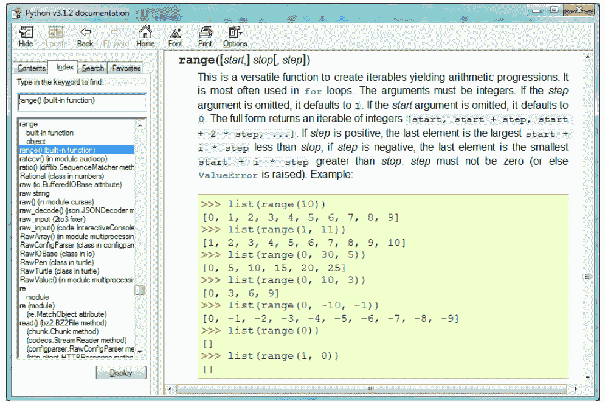

注意参数描述中的方括号。这些是**元表示法**的例子——用于描述 Python 语法，但本身不是语法的一部分。此文档中的方括号表示该参数是可选的——程序员可以省略它。因此，这第一行帮助信息告诉我们，`range` 必须始终有一个 `stop` 参数，但它可以有一个可选的 `start` 参数（如果存在，后面必须跟一个逗号），并且它也可以有一个可选的 `step` 参数（如果存在，前面必须跟一个逗号）。

帮助中的示例表明 `range` 可以有 1、2 或 3 个参数。列表可以从任何起始值开始，并以非 1 的增量递增或递减。这里的文档还说明参数必须是整数。

你还会经常遇到的其他元表示法是粗体和斜体的使用。粗体表示这些是标记——关键字或符号——必须完全按照它们在 Python 代码中的样子输入，而斜体术语代表“此类型的某个东西”。因此，语法描述

```
for variable in list:
```

意味着在编写 Python 代码时，你可以用任何合法的变量和任何合法的列表来替换它们。这个（简化的）`print` 函数描述展示了元表示法的另一个例子，其中的省略号 (...) 表示你可以有任意多个对象（甚至零个），用逗号分隔：

```
print( [object, ...] )
```

元表示法为我们提供了一种简洁而强大的方式来描述某些语法或特性的模式。

### 7.10. 表格

循环擅长的事情之一是生成表格。在计算机普及之前，人们不得不手工计算对数、正弦、余弦和其他数学函数。为了使这更容易，数学书籍包含了列出这些函数值的长表格。创建这些表格既缓慢又乏味，而且往往充满错误。

当计算机出现时，最初的反应之一是，“*这太棒了！我们可以用计算机来生成表格，这样就不会有错误了。*”这被证明是（大部分）正确的，但目光短浅。不久之后，计算机和计算器变得如此普及，以至于这些表格变得过时了。

嗯，几乎是。对于某些操作，计算机使用值表来获得近似答案，然后执行计算以改进近似值。在某些情况下，底层表格中存在错误，最著名的是英特尔奔腾处理器芯片用于执行浮点除法的表格。

尽管对数表不像以前那样有用了，但它仍然是迭代的一个很好的例子。以下程序在左列输出一系列值，在右列输出 2 的该值次幂：

```
for x in range(13):    # Generate numbers 0 to 12
    print(x, "\t", 2**x)
```

字符串 "\t" 代表一个**制表符**。"\t" 中的反斜杠字符表示一个**转义序列**的开始。转义序列用于表示制表符和换行符等不可见字符。序列 `\n` 代表一个**换行符**。

转义序列可以出现在字符串中的任何位置；在此示例中，制表符转义序列是字符串中的唯一内容。你认为如何在字符串中表示一个反斜杠？

当字符和字符串显示在屏幕上时，一个称为光标的不可见标记会跟踪下一个字符将放置的位置。在 `print` 函数之后，光标通常会移动到下一行的开头。

制表符将光标向右移动，直到到达其中一个制表位。制表符对于使文本列对齐很有用，如上一个程序的输出所示：

```
0 1
1 2
2 4
3 8
4 16
5 32
6 64
7 128
8 256
9 512
10 1024
11 2048
12 4096
```

由于列之间的制表符，第二列的位置不依赖于第一列中的数字位数。

### 7.11. 二维表格

二维表格是一种你读取行和列交叉点处值的表格。乘法表就是一个很好的例子。假设你想打印一个从 1 到 6 的值的乘法表。

一个好的开始方法是编写一个循环，打印 2 的倍数，全部在一行上：

```
for i in range(1, 7):
    print(2 * i, end="   ")
print()
```

这里我们使用了 `range` 函数，但让它从 1 开始其序列。随着循环的执行，i 的值从 1 变化到 6。当 range 的所有元素都已分配给 i 时，循环终止。每次循环，它显示 2 * i 的值，后跟三个空格。

同样，`print` 函数中额外的 `end=" "` 参数抑制了换行，而是使用三个空格。循环完成后，第 3 行的 `print` 调用结束当前行，并开始一个新行。

程序的输出是：

```
2 4 6 8 10 12
```

到目前为止，一切顺利。下一步是**封装**和**泛化**。

### 7.12. 封装与泛化

封装是将一段代码包装在函数中的过程，允许你利用函数擅长的所有事情。你已经看到了一些封装的例子，包括前一章中的 `is_divisible`。

泛化意味着将特定的东西，比如打印 2 的倍数，使其更通用，比如打印任何整数的倍数。

此函数封装了前面的循环，并将其泛化为打印 n 的倍数：

```
def print_multiples(n):
    for i in range(1, 7):
        print(n * i, end="   ")
    print()
```

要封装，我们所要做的就是添加第一行，它声明了函数的名称和参数列表。要泛化，我们所要做的就是将值 2 替换为参数 n。

如果我们用参数 2 调用此函数，我们会得到与之前相同的输出。用参数 3，输出是：

```
3    6    9    12    15    18
```

用参数 4，输出是：

```
4    8    12    16    20    24
```

到现在，你可能已经猜到如何打印乘法表了——通过用不同的参数重复调用 `print_multiples`。事实上，我们可以使用另一个循环：

```
for i in range(1, 7):
    print_multiples(i)
```

注意这个循环与 `print_multiples` 内部的循环有多相似。我们所做的只是将 `print` 函数替换为一个函数调用。

此程序的输出是一个乘法表：

### 7.13. 更多封装

为了再次演示封装，让我们将上一节的代码包装到一个函数中：

```python
def print_mult_table():
    for i in range(1, 7):
        print_multiples(i)
```

这个过程是一个常见的**开发计划**。我们通过在任何函数之外编写代码行，或者将它们输入到解释器中来开发代码。当代码能够运行后，我们将其提取出来并包装到一个函数中。

如果你在开始编写时不知道如何将程序划分为函数，这种开发计划特别有用。这种方法允许你边设计边进行。

### 7.14. 局部变量

你可能想知道我们如何在 `print_multiples` 和 `print_mult_table` 中使用相同的变量 `i`。当其中一个函数改变变量的值时，这不会引起问题吗？

答案是否定的，因为 `print_multiples` 中的 `i` 和 `print_mult_table` 中的 `i` 不是同一个变量。

在函数定义内部创建的变量是局部的；你无法从其所属函数的外部访问局部变量。这意味着只要它们不在同一个函数中，你就可以自由地拥有多个同名的变量。

Python 会检查函数中的所有语句——如果其中任何语句为变量赋值，这就是 Python 将该变量设为局部变量的线索。

该程序的堆栈图显示，两个名为 `i` 的变量不是同一个变量。它们可以引用不同的值，改变其中一个不会影响另一个。

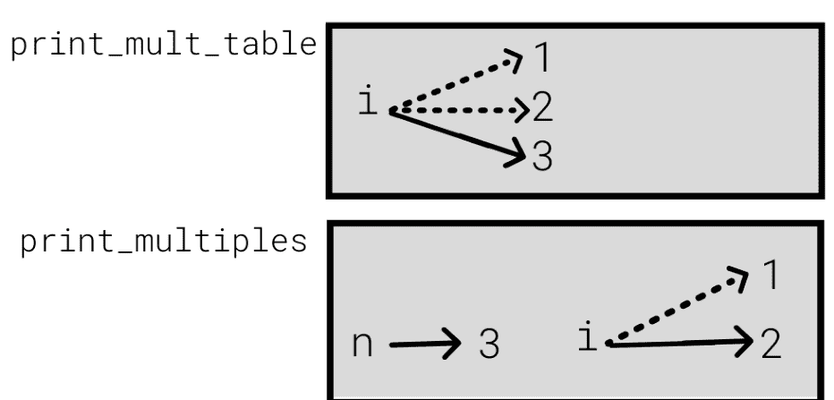

堆栈图 2

在 `print_mult_table` 中，`i` 的值从 1 到 6。在图中它恰好是 3。下一次循环时它将是 4。每次循环时，`print_mult_table` 都会以当前 `i` 的值作为参数调用 `print_multiples`。该值被赋给参数 `n`。

在 `print_multiples` 内部，`i` 的值从 1 到 6。在图中，它恰好是 2。改变这个变量不会影响 `print_mult_table` 中 `i` 的值。

拥有同名的不同局部变量是常见且完全合法的。特别是，像 `i` 和 `j` 这样的名称经常用作循环变量。如果你仅仅因为在其他地方使用了它们就避免在一个函数中使用它们，你可能会使程序更难阅读。

http://pythontutor.com/ 上的可视化工具非常清楚地展示了两个变量 `i` 是不同的变量，以及它们如何具有独立的值。

### 7.15. break 语句

`break` 语句用于立即离开其循环体。接下来要执行的语句是循环体之后的第一条语句：

```python
for i in [12, 16, 17, 24, 29]:
    if i % 2 == 1:  # 如果数字是奇数
        break        # ... 立即退出循环
    print(i)
print("done")
```

这将打印：

```
12
16
done
```

#### 前测试循环——标准循环行为

`for` 和 `while` 循环在开始时进行测试，在执行循环体的任何部分之前。它们被称为前测试循环，因为测试发生在循环体之前（pre）。`break` 和 `return` 是我们调整这种标准行为的工具。

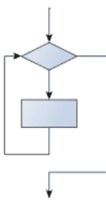

### 7.16. 其他循环形式

有时我们希望拥有中间测试循环，其退出测试位于循环体的中间，而不是在开始或结束处。或者后测试循环，将其退出测试放在循环体的最后。其他语言对这些不同的形式有不同的语法和关键字，但 Python 只是使用 `while` 和 `if condition: break` 的组合来完成任务。

一个典型的例子是用户需要输入要相加的数字的问题。为了表示没有更多输入，用户输入一个特殊值，通常是 -1 或空字符串。这需要一个中间退出循环模式：输入下一个数字，然后测试是否退出，否则处理该数字：

中间测试循环流程图

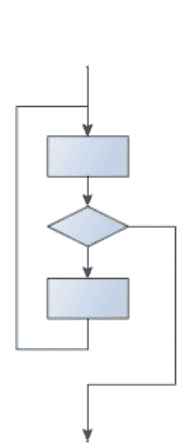

```python
total = 0
while True:
    response = input("Enter the next number. (Leave blank to end)")
    if response == "":
        break
    total += int(response)
print("The total of the numbers you entered is ", total)
```

说服自己这符合中间退出循环流程图：第 3 行做一些有用的工作，第 4 和第 5 行可以退出循环，如果它们不退出，第 6 行在下一次迭代开始之前做更多有用的工作。

`while bool-expr:` 使用布尔表达式来确定是否再次迭代。`True` 是一个平凡的布尔表达式，所以 `while True:` 意味着总是再次执行循环体。这是一个语言惯用法——大多数程序员会立即识别的惯例。由于第 2 行的表达式永远不会终止循环（它是一个虚拟测试），程序员必须安排在其他地方以某种其他方式（即在此示例中的第 4 和第 5 行）中断（或返回）循环体。聪明的编译器或解释器会理解第 2 行是一个必须始终成功的假测试，因此它甚至不会生成测试，我们的流程图甚至没有将菱形的虚拟测试框放在循环的顶部！

类似地，只需将 `if condition: break` 移动到循环体的末尾，我们就创建了一个后测试循环的模式。当你想确保循环体至少执行一次时（因为第一次测试只在第一次循环体执行结束时发生），会使用后测试循环。这很有用，例如，如果我们想与用户玩一个交互式游戏——我们总是想至少玩一局：

```python
while True:
    play_the_game_once()
    response = input("Play again? (yes or no)")
    if response != "yes":
        break
print("Goodbye!")
```

**提示：思考你希望退出测试发生在哪里。**

一旦你认识到你需要一个循环来重复某些事情，思考它的终止条件——我什么时候想停止迭代？然后弄清楚你是否需要在开始第一次（以及每次）迭代之前进行测试，或者在第一次（以及每次）迭代结束时进行测试，或者可能在每次迭代的中间进行测试。需要从用户输入或从文件读取的交互式程序通常需要在迭代的中间或结束时退出循环，当清楚没有更多数据要处理，或者用户不想再玩我们的游戏时。

### 7.17. 一个例子

以下程序实现了一个简单的猜数字游戏：

```python
import random                # 我们在模块章节介绍随机数，
rng = random.Random()        #   所以请提前浏览。
number = rng.randrange(1, 1000) # 获取 [1 到 1000) 之间的随机数。

guesses = 0
msg = ""

while True:
    guess = int(input(msg + "\nGuess my number between 1 and 1000: "))
    guesses += 1
    if guess > number:
        msg += str(guess) + " is too high.\n"
    elif guess < number:
        msg += str(guess) + " is too low.\n"
    else:
        break

input("\n\nGreat, you got it in {0} guesses!\n\n".format(guesses))
```

这个程序利用了数学的**三歧性**定律（给定实数 a 和 b，以下三个条件中恰好有一个必须为真：a > b，a < b，或 a == b）。

在第 18 行有一个对 `input` 函数的调用，但我们没有对结果做任何处理，甚至没有将其赋给一个变量。这在 Python 中是合法的。在这里，它的作用是弹出输入对话框窗口并等待用户响应，然后程序才终止。程序员经常使用在脚本末尾进行一些额外输入的技巧，只是为了保持窗口打开。

还要注意在第 6、12 和 14 行使用了 `msg` 变量，它最初是一个空字符串。每次循环时，我们都扩展显示的消息：这允许我们在询问下一个猜测的同一位置显示程序的反馈。

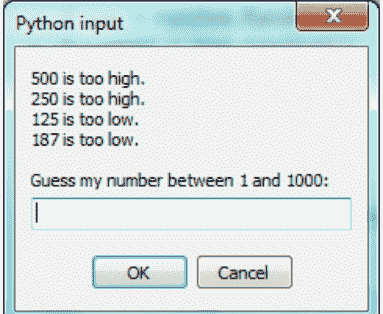

### 7.18. continue 语句

这是一个控制流语句，它导致程序立即跳过当前迭代中循环体其余部分的处理。但循环仍然继续运行其剩余的迭代：

```python
for i in [12, 16, 17, 24, 29, 30]:
    if i % 2 == 1:        # 如果数字是奇数
        continue           # 不处理它
    print(i)
print("done")
```

这将打印：

```
12
16
24
30
done
```

### 7.19. 更通用的泛化

作为泛化的另一个例子，假设你想要一个程序，它能打印任意大小的乘法表，而不仅仅是六乘六的表格。你可以给 `print_mult_table` 添加一个参数：

```python
def print_mult_table(high):
    for i in range(1, high+1):
        print_multiples(i)
```

我们用表达式 `high+1` 替换了值 7。如果我们用参数 7 调用 `print_mult_table`，它会显示：

```
1     2     3     4     5     6
2     4     6     8     10    12
3     6     9     12    15    18
4     8     12    16    20    24
5     10    15    20    25    30
6     12    18    24    30    36
7     14    21    28    35    42
```

这没问题，只是我们可能希望表格是方阵——行数和列数相同。为此，我们给 `print_multiples` 添加另一个参数来指定表格应该有多少列。

为了有点“烦人”，我们把这个参数也叫做 `high`，以此说明不同的函数可以有同名的参数（就像局部变量一样）。这是完整的程序：

```python
def print_multiples(n, high):
    for i in range(1, high+1):
        print(n * i, end="   ")
    print()

def print_mult_table(high):
    for i in range(1, high+1):
        print_multiples(i, high)
```

注意，当我们添加一个新参数时，我们必须改变函数的第一行（函数头），并且也必须改变在 `print_mult_table` 中调用该函数的地方。

现在，当我们调用 `print_mult_table(7)` 时：

```
1     2     3     4     5     6     7
2     4     6     8     10    12    14
3     6     9     12    15    18    21
4     8     12    16    20    24    28
5     10    15    20    25    30    35
6     12    18    24    30    36    42
7     14    21    28    35    42    49
```

当你恰当地泛化一个函数时，你通常会得到一个具有你未曾计划的功能的程序。例如，你可能注意到，因为 ab = ba，表格中的所有条目都出现了两次。你可以通过只打印一半的表格来节省墨水。为此，你只需改变 `print_mult_table` 中的一行。将

```python
print_multiples(i, high+1)
```

改为

```python
print_multiples(i, i+1)
```

你会得到：

```
1
2     4
3     6     9
4     8     12    16
5     10    15    20    25
6     12    18    24    30    36
7     14    21    28    35    42    49
```

### 7.20. 函数

我们已经多次提到函数的所有优点。到现在，你可能想知道这些优点到底是什么。以下是一些：

1.  捕捉你的思维分块。将复杂任务分解为子任务，并给子任务一个有意义的名称，这是一种强大的思维技巧。回顾一下说明后测循环的例子：我们假设有一个名为 `play_the_game_once` 的函数。这种分块使我们能够搁置特定游戏的细节——它是纸牌游戏、井字游戏还是角色扮演游戏——而只专注于程序逻辑的一个孤立部分——让玩家选择是否想再玩一次。
2.  将长程序划分为函数允许你分离程序的各个部分，单独调试它们，然后将它们组合成一个整体。
3.  函数便于使用迭代。
4.  设计良好的函数通常对许多程序都有用。一旦你编写并调试了一个函数，你就可以重用它。

### 7.21. 配对数据

我们已经在 Python 中见过名字列表和数字列表。我们将稍微提前看一下教材，展示一种更高级的数据表示方式。在 Python 中，将两个东西配对就像把它们放入括号一样简单，像这样：

```python
year_born = ("Paris Hilton", 1981)
```

我们可以将许多配对放入一个配对列表中：

```python
celebs = [("Brad Pitt", 1963), ("Jack Nicholson", 1937),
          ("Justin Bieber", 1994)]
```

以下是使用这种结构化数据可以做的一些快速示例。首先，打印所有名人：

```python
print(celebs)
print(len(celebs))
```

```
[("Brad Pitt", 1963), ("Jack Nicholson", 1937), ("Justin Bieber", 1994)]
3
```

注意 `celebs` 列表只有 3 个元素，每个元素都是一个配对。
现在我们打印那些在 1980 年之前出生的名人的名字：

```python
for (nm, yr) in celebs:
    if yr < 1980:
        print(nm)
```

```
Brad Pitt
Jack Nicholson
```

这展示了我们在 `for` 循环中尚未见过的东西：我们没有使用单个循环控制变量，而是使用了一对变量名 `(nm, yr)`。循环执行了三次——列表中的每个配对执行一次，在每次迭代中，两个变量都被赋予正在处理的数据对中的值。

### 7.22. 用于嵌套数据的嵌套循环

现在我们将提出一个更冒险的结构化数据列表。在这种情况下，我们有一个学生列表。每个学生有一个名字，与另一个他们注册的科目列表配对：

```python
students = [
    ("John", ["CompSci", "Physics"]),
    ("Vusi", ["Maths", "CompSci", "Stats"]),
    ("Jess", ["CompSci", "Accounting", "Economics", "Management"]),
    ("Sarah", ["InfSys", "Accounting", "Economics", "CommLaw"]),
    ("Zuki", ["Sociology", "Economics", "Law", "Stats", "Music"])]
```

这里我们将一个包含五个元素的列表赋值给了变量 `students`。让我们打印出每个学生的名字，以及他们注册的科目数量：

```python
# 打印所有学生及其课程数量。
for (name, subjects) in students:
    print(name, "takes", len(subjects), "courses")
```

Python 愉快地给出了以下输出：

```
John takes 2 courses
Vusi takes 3 courses
Jess takes 4 courses
Sarah takes 4 courses
Zuki takes 5 courses
```

现在我们想知道有多少学生在学习计算机科学（CompSci）。这需要一个计数器，并且对于每个学生，我们需要第二个循环来依次测试每个科目：

```python
# 统计有多少学生在学习计算机科学
counter = 0
for (name, subjects) in students:
    for s in subjects:           # 一个嵌套循环！
        if s == "CompSci":
            counter += 1

print("The number of students taking CompSci is", counter)
```

```
The number of students taking CompSci is 3
```

你应该建立一个你自己感兴趣的数据列表——也许是你 CD 的列表，每张 CD 包含一个歌曲标题列表，或者是一个电影标题列表，每部电影有一个参演明星列表。然后你可以问诸如“哪些电影由安吉丽娜·朱莉主演？”这样的问题。

### 7.23. 用于求平方根的牛顿法

循环经常用于通过从一个近似答案开始并迭代改进它来计算数值结果的程序中。

例如，在我们有计算器或计算机之前，人们需要手动计算平方根。牛顿使用了一个特别好的方法（有证据表明这个方法在很多年前就已为人所知）。假设你想知道 n 的平方根。如果你从几乎任何近似值开始，你可以用以下公式计算出一个更好的近似值（更接近实际答案）：

```python
better = (approx + n/approx)/2
```

用你的计算器重复这个计算几次。你能看出为什么每次迭代都会让你的估计值更接近一点吗？这个特定算法的一个惊人特性是它收敛到准确答案的速度有多快——这对于手动计算来说是一个巨大的优势。

通过使用一个循环并重复这个公式，直到更好的近似值足够接近前一个近似值，我们可以编写一个计算平方根的函数。（事实上，这就是你的计算器求平方根的方式——它可能有一个稍微不同的公式和方法，但它也是基于反复改进其猜测的。）

这是一个不定迭代问题的例子：我们无法提前预测我们想要改进猜测多少次——我们只是想越来越接近。我们循环的停止条件将是当我们的旧猜测和改进后的猜测彼此“足够接近”时。

理想情况下，我们希望在停止时，旧猜测和新猜测完全相等。但在涉及实数的计算机算术中，精确相等是一个棘手的概念。因为实数没有被绝对精确地表示（毕竟，像 π 或 2 的平方根这样的数字有无限多位小数，因为它是无理数），我们需要通过询问“a 是否足够接近 b？”来制定循环的停止测试。这个停止条件可以这样编码：

```python
if abs(a-b) < 0.001:  # 为了更好的精度，可以将这个值设得更小
    break
```

注意我们取了 a 和 b 之间差值的绝对值！

这个问题也是中间退出循环何时适用的一个好例子：

def sqrt(n):
    approx = n/2.0    # 从某个猜测值开始
    while True:
        better = (approx + n/approx)/2.0
        if abs(approx - better) < 0.001:
            return better
        approx = better

# 测试用例
print(sqrt(25.0))
print(sqrt(49.0))
print(sqrt(81.0))

输出结果为：

```
1 5.000000000002
2 7.0
3 9.0
```

看看你能否通过改变停止条件来改进近似值。同时，逐步跟踪算法（或许可以手工计算，使用计算器），看看在达到 sqrt(25) 的这个精度水平之前需要多少次迭代。

### 7.24. 算法

牛顿法是算法的一个例子：它是一种解决一类问题（在本例中是计算平方根）的机械过程。

有些知识不是算法性的。例如，学习历史日期或乘法表涉及记忆特定的解决方案。

但你学到的进位加法、借位减法和长除法技术都是算法。或者如果你是一个热衷于数独的解题者，你可能有一套你总是遵循的特定步骤。

算法的一个特点是它们执行起来不需要任何智能。它们是机械过程，每一步都根据一套简单的规则从上一步推导出来。它们旨在解决一类或一类问题，而不仅仅是单个问题。

理解困难的问题可以通过逐步的算法过程来解决（并且拥有为我们执行这些算法的技术）是带来巨大好处的主要突破之一。因此，虽然算法的执行可能很无聊，并且可能不需要任何智能，但算法或计算思维——即使用算法和自动化作为解决问题的基础——正在迅速改变我们的社会。有些人认为，这种向算法思维和过程的转变对我们的社会影响甚至会超过印刷机的发明。而设计算法的过程是有趣的、具有智力挑战性的，并且是我们称之为编程的核心部分。

人们自然、毫不费力、无需有意识思考就能做的一些事情，是最难用算法表达的。理解自然语言就是一个很好的例子。我们都会做，但到目前为止，没有人能够解释我们是如何做到的，至少不是以逐步机械算法的形式。

### 7.25. 术语表

**算法**
解决一类问题的逐步过程。

**循环体**
循环内部的语句。

**断点**
程序代码中的一个位置，程序执行将在此暂停（或中断），允许你检查程序变量的状态，或单步执行各个语句，一次执行一个。

**递增**
程序员俚语。与 increment 同义。

**continue 语句**
导致跳过当前循环迭代剩余部分的语句。执行流返回到循环顶部，评估条件，如果条件为真，则开始循环的下一次迭代。

**计数器**
用于计数的变量，通常初始化为零，并在循环体中递增。

**光标**
一个不可见的标记，用于跟踪下一个字符将被打印的位置。

**递减**
减少 1。

**确定性迭代**
我们对循环体将执行的次数有上限的循环。确定性迭代通常最好编码为 for 循环。

**开发计划**
开发程序的过程。在本章中，我们演示了一种基于开发代码来完成简单、具体的事情，然后进行封装和泛化的开发风格。

**封装**
将大型复杂程序划分为组件（如函数），并隔离组件彼此（例如，通过使用局部变量）。

**转义序列**
一个转义字符 \，后跟一个或多个可打印字符，用于指定一个不可打印字符。

**泛化**
用适当通用的东西（如变量或参数）替换不必要的特定东西（如常量值）。泛化使代码更通用、更可能被重用，有时甚至更容易编写。

**递增**
作为名词和动词，递增意味着增加 1。

**无限循环**
终止条件永远无法满足的循环。

**非确定性迭代**
我们只需要继续执行直到满足某个条件的循环。while 语句用于这种情况。

**（变量的）初始化**
初始化变量是给它一个初始值。因为在 Python 中，变量在赋值之前不存在，所以它们在创建时就被初始化。在其他编程语言中，情况并非如此，变量可以在未初始化的情况下创建，在这种情况下，它们具有默认值或垃圾值。

**迭代**
一组编程语句的重复执行。

**循环**
允许我们重复执行一条语句或一组语句，直到满足终止条件的构造。

**循环变量**
用作循环终止条件一部分的变量。

**元符号**
帮助描述其他符号的额外符号或符号。在这里，我们引入了方括号、省略号、斜体和粗体作为元符号，以帮助描述 Python 语法的可选、可重复、可替换和固定部分。

**中间测试循环**
执行部分循环体，然后测试退出条件，然后可能再执行部分循环体的循环。我们没有针对这种情况的特殊 Python 构造，但可以一起使用 `while` 和 `break`。

**嵌套循环**
位于另一个循环体内部的循环。

**换行符**
导致光标移动到下一行开头的特殊字符。

**后测试循环**
执行循环体，然后测试退出条件的循环。我们没有针对这种情况的特殊 Python 构造，但可以一起使用 `while` 和 `break`。

**前测试循环**
在决定是否执行其循环体之前进行测试的循环。`for` 和 `while` 都是前测试循环。

**单步执行**
一种解释器执行模式，你能够一次执行程序一步，并检查该步骤的结果。对于调试和构建你对正在发生的事情的内部心理模型很有用。

**制表符**
导致光标移动到当前行上下一个制表位的特殊字符。

**三分法**
给定任何实数 `a` 和 `b`，以下关系之一恰好成立：`a < b`、`a > b` 或 `a == b`。因此，当你能确定其中两个关系为假时，你可以假设剩下的一个为真。

**跟踪**
通过手工跟踪程序的执行流程，记录变量状态的变化和产生的任何输出。

### 7.26. 练习

本章向我们展示了如何对项目列表求和，以及如何计数项目。计数示例还有一个 `if` 语句，让我们只计数一些选定的项目。在上一章中，我们还展示了一个函数 `find_first_2_letter_word`，它允许我们在循环内部通过使用 `return` 在某个条件发生时“提前退出”。我们现在还有 `break` 来退出循环但不退出包含它的函数，以及 `continue` 来放弃循环的当前迭代而不结束循环。

列表遍历、求和、计数、测试条件和提前退出的组合是一个丰富的构建块集合，可以以强大的方式组合，创建许多略有不同的函数。

前六个问题是你应该能够仅使用这些构建块编写的典型函数。

1.  编写一个函数来计算列表中有多少个奇数。
2.  对列表中所有偶数求和。
3.  对列表中所有负数求和。
4.  计算列表中长度为 5 的单词数量。
5.  对列表中所有元素求和，直到但不包括第一个偶数。（编写你的单元测试。如果没有偶数怎么办？）
6.  计算列表中直到并包括单词“sam”第一次出现的所有单词。（为此情况也编写你的单元测试。如果“sam”没有出现怎么办？）
7.  向牛顿的 sqrt 函数添加一个打印函数，每次计算时都打印出 better。用 25 作为参数调用你修改后的函数，并记录结果。
8.  跟踪最后一个版本的 print_mult_table 的执行，并弄清楚它是如何工作的。
9.  编写一个函数 print_triangular_numbers(n)，打印出前 n 个三角形数。调用 print_triangular_numbers(5) 将产生以下输出：
10. 编写一个函数 is_prime，它接受一个整数参数，当参数是素数时返回 True，否则返回 False。添加类似这样的测试用例：

```
1    1        1
2    2        3
3    3        6
4    4        10
5    5        15
```

（提示：使用网络搜索来了解什么是三角形数。）

```
1    test(is_prime(11))
2    test(not is_prime(35))
3    test(is_prime(19911121))
```

最后一个用例可能代表你的出生日期。你出生在素数日吗？在一个有 100 名学生的班级中，你认为有多少人会有素数出生日期？

## 11. 重新审视第3章练习中的醉酒海盗问题。这次，醉酒海盗先转向，然后向前走几步，并重复此过程。我们的社会科学学生现在记录成对的数据：每次转向的角度，以及转向后走的步数。她的实验数据是 [(160, 20), (-43, 10), (270, 8), (-43, 12)]。使用海龟画出我们这位醉酒朋友走过的路径。

## 12. 通过给出像上面那样的成对列表，海龟可以画出许多有趣的形状，其中每对的第一个项目是转向的角度，第二个项目是向前移动的距离。设置一个成对列表，让海龟画出一个带有中心十字的房子，如图所示。这应该在不重复经过任何线条/边缘，并且不抬起画笔的情况下完成。

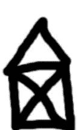

## 13. 并非所有像上面那样的形状都可以在不抬起画笔或不重复经过边缘的情况下画出。以下哪些可以画出？

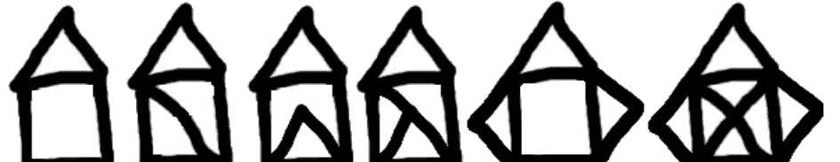

现在阅读维基百科关于欧拉路径的文章 (http://en.wikipedia.org/wiki/Eulerian_path)。学习如何通过观察立即判断是否可能找到解决方案。如果路径是可能的，你还会知道从哪里下笔开始绘制，以及应该在哪里结束！

## 14. `num_digits(0)` 会返回什么？修改它，使其在这种情况下返回 1。为什么调用 `num_digits(-24)` 会导致无限循环？（提示：-1//10 的结果是 -1）修改 `num_digits`，使其能正确处理任何整数值。添加这些测试：

```
test(num_digits(0) == 1)
test(num_digits(-12345) == 5)
```

## 15. 编写一个函数 `num_even_digits(n)`，用于计算 `n` 中偶数位数的数量。这些测试应该通过：

```
test(num_even_digits(123456) == 3)
test(num_even_digits(2468) == 4)
test(num_even_digits(1357) == 0)
test(num_even_digits(0) == 1)
```

## 16. 编写一个函数 `sum_of_squares(xs)`，用于计算列表 `xs` 中数字的平方和。例如，`sum_of_squares([2, 3, 4])` 应该返回 4+9+16，即 29：

```
test(sum_of_squares([2, 3, 4]) == 29)
test(sum_of_squares([ ]) == 0)
test(sum_of_squares([2, -3, 4]) == 29)
```

## 17. 你和你的朋友组成一个团队，编写一个两人游戏，人机对战，例如井字棋。你的朋友将编写一局游戏的逻辑，而你将编写允许多局游戏、计分、决定谁先手等的逻辑。你们两人协商程序的两个部分如何结合，并提出了这个简单的框架（你的朋友稍后会改进它）：

```python
# Your friend will complete this function
def play_once(human_plays_first):
    """
    Must play one round of the game. If the parameter
    is True, the human gets to play first, else the
    computer gets to play first.  When the round ends,
    the return value of the function is one of
    -1 (human wins),  0 (game drawn),  1 (computer wins).
    """
    # This is all dummy scaffolding code right at the moment...
    import random              # See Modules chapter ...
    rng = random.Random()
    # Pick a random result between -1 and 1.
    result = rng.randrange(-1,2)
    print("Human plays first={0},  winner={1} "
                .format(human_plays_first, result))
    return result
```

- a. 编写主程序，反复调用此函数进行游戏，每局结束后宣布结果为“我赢了！”、“你赢了！”或“平局！”。然后询问玩家“你想再玩一次吗？”，如果选择再玩则继续，否则说“再见”并终止程序。
- b. 记录每位玩家的获胜次数和平局次数。每局结束后，也宣布当前得分。
- c. 添加逻辑，使玩家轮流先手。
- d. 计算人类在所有游戏中的获胜百分比。同样在每局结束时宣布。
- e. 绘制你的逻辑流程图。

## 第8章：字符串

### 8.1. 复合数据类型

到目前为止，我们已经看到了内置类型，如 `int`、`float`、`bool`、`str`，以及列表和元组。字符串、列表和元组与其他类型有本质区别，因为它们由更小的部分组成。就字符串而言，它们由更小的字符串组成，每个字符串包含一个**字符**。

由更小部分组成的类型称为**复合数据类型**。根据我们要做什么，我们可能希望将复合数据类型视为一个整体，或者我们可能希望访问它的各个部分。这种模糊性是有用的。

### 8.2. 将字符串作为整体处理

我们之前看到每个海龟实例都有自己的属性和一些可以应用于该实例的方法。例如，我们可以设置海龟的颜色，我们写了 `tess.turn(90)`。
就像海龟一样，字符串也是一个对象。因此每个字符串实例都有自己的属性和方法。
例如：

```python
>>> ss = "Hello, World!"
>>> tt = ss.upper()
>>> tt
'HELLO, WORLD!'
```

`upper` 是一个可以在任何字符串对象上调用的方法，用于创建一个新字符串，其中所有字符都是大写的。（原始字符串 `ss` 保持不变。）
还有其他方法，如 `lower`、`capitalize` 和 `swapcase`，它们可以做其他有趣的事情。
要了解有哪些可用的方法，你可以查阅帮助文档，查找字符串方法，并阅读文档。或者，如果你有点懒，只需在 PyScripter 脚本中输入以下内容：
当你输入句点来选择 `ss` 的方法之一时，PyScripter 会弹出一个选择窗口，显示所有可用的方法（大约有70个——谢天谢地我们只会用到其中几个！）。

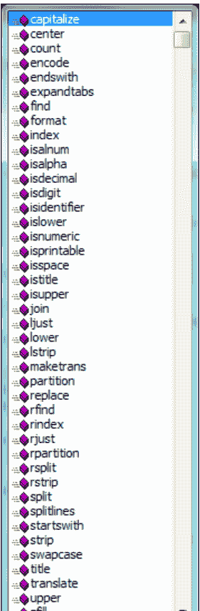

当你输入方法名称时，会显示有关其参数和返回类型以及文档字符串的进一步帮助。这是一个很好的例子，说明工具（PyScripter）如何使用模块程序员提供的元信息（文档字符串）。

```python
greet = "Hello, World"
xx= greet.swapcase()
print(xx)
```

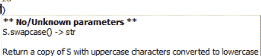

### 8.3. 处理字符串的各个部分

**索引运算符**（Python 使用方括号括起索引）从字符串中选择一个单字符子字符串：

```python
>>> fruit = "banana"
>>> m = fruit[1]
>>> print(m)
```

表达式 `fruit[1]` 从 `fruit` 中选择字符编号 1，并创建一个仅包含此单个字符的新字符串。变量 `m` 引用该结果。当我们显示 `m` 时，可能会感到惊讶：

```
a
```

计算机科学家总是从零开始计数！"banana" 中下标位置为零的字母是 b。因此在位置 [1] 我们得到字母 a。

如果我们想访问字符串的第零个字母，只需在方括号内放置 0，或任何计算结果为 0 的表达式：

```python
>>> m = fruit[0]
>>> print(m)
b
```

方括号中的表达式称为**索引**。索引指定有序集合中的一个成员，在本例中是字符串中的字符集合。索引*指示*你想要哪一个，因此得名。它可以是任何整数表达式。

我们可以使用 `enumerate` 来可视化索引：

```python
>>> fruit = "banana"
>>> list(enumerate(fruit))
[(0, 'b'), (1, 'a'), (2, 'n'), (3, 'a'), (4, 'n'), (5, 'a')]
```

现在不用担心 `enumerate`，我们将在列表章节中看到更多内容。

注意索引返回的是一个*字符串*——Python 没有专门的单字符类型。它只是一个长度为 1 的字符串。

我们之前也见过列表。相同的索引表示法可用于从列表中提取元素：

```python
>>> prime_nums = [2, 3, 5, 7, 11, 13, 17, 19, 23, 29, 31]
>>> prime_nums[4]
11
>>> friends = ["Joe", "Zoe", "Brad", "Angelina", "Zuki", "Thandi", "Paris"]
>>> friends[3]
'Angelina'
```

### 8.4. 长度

`len` 函数应用于字符串时，返回字符串中的字符数：

```python
>>> fruit = "banana"
>>> len(fruit)
6
```

要获取字符串的最后一个字母，你可能会尝试这样做：
这行不通。它会导致运行时错误 `IndexError: string index out of range`。原因是 "banana" 中索引位置 6 没有字符。因为我们从零开始计数，六个索引编号为 0 到 5。要获取最后一个字符，我们必须从 fruit 的长度中减去 1：
或者，我们可以使用负索引，它从字符串末尾开始倒数。表达式 `fruit[-1]` 产生最后一个字母，`fruit[-2]` 产生倒数第二个，依此类推。
正如你可能猜到的，使用负索引进行索引对列表也适用。
我们不会在本笔记的其余部分使用负索引——没有多少计算机语言使用这种惯用法，你最好避免使用它。但互联网上有大量 Python 代码会使用这个技巧，所以最好知道它的存在。

### 8.5. 遍历和 `for` 循环

许多计算涉及一次处理字符串的一个字符。通常它们从开头开始，依次选择每个字符，对其进行一些处理，直到结束。这种处理模式称为**遍历**。一种编码遍历的方法是使用 `while` 语句：
这个循环遍历字符串，并在单独的行上显示每个字母。循环条件是 `ix < len(fruit)`，因此当 `ix` 等于字符串长度时，条件为假，循环体不执行。访问的最后一个字符是索引为 `len(fruit)-1` 的字符，即字符串中的最后一个字符。
但我们之前已经看到 `for` 循环可以轻松地遍历列表中的元素，它也可以用于字符串：每次循环时，字符串中的下一个字符会被赋值给变量 `c`。循环会持续到没有剩余字符为止。这里我们可以看到，与 `while` 循环相比，`for` 循环在遍历字符串时赋予了我们更强的表达能力。

以下示例展示了如何使用字符串连接和 `for` 循环来生成一个字母序列。字母序列指的是元素按字母顺序排列的序列或列表。例如，在罗伯特·麦克洛斯基的著作《让路给小鸭子》中，小鸭子们的名字依次是 Jack、Kack、Lack、Mack、Nack、Ouack、Pack 和 Quack。这个循环按顺序输出这些名字：

该程序的输出为：

```
1 Jack
2 Kack
3 Lack
4 Mack
5 Nack
6 Oack
7 Pack
8 Qack
```

当然，这并不完全正确，因为 Ouack 和 Quack 拼写有误。你将在下面的练习中修正这个问题。

### 8.6. 切片

字符串的*子串*可以通过获取**切片**来获得。类似地，我们可以对列表进行切片，以引用列表中的某个子列表：

```
>>> s = "Pirates of the Caribbean"
>>> print(s[0:7])
Pirates
>>> print(s[11:14])
the
>>> print(s[15:24])
Caribbean
>>> friends = ["Joe", "Zoe", "Brad", "Angelina", "Zuki", "Thandi", "Paris"]
>>> print(friends[2:4])
['Brad', 'Angelina']
```

运算符 `[n:m]` 返回字符串中从第 n 个字符到第 m 个字符的部分，包含第一个但不包含最后一个。如果你想象索引指向字符*之间*，如下面的图示所示，这种行为就说得通了：

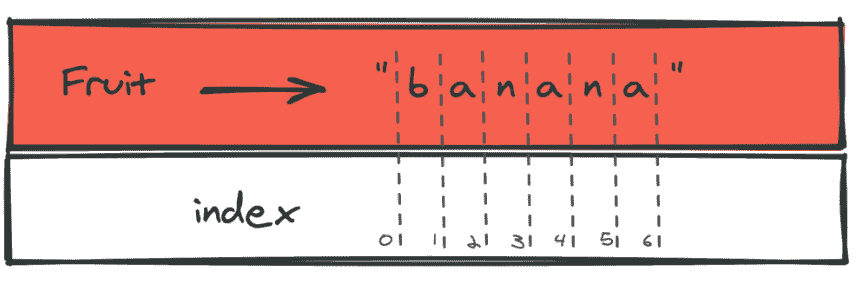

如果你把这想象成一张纸，切片运算符 `[n:m]` 会复制出纸上 n 和 m 位置之间的部分。只要 m 和 n 都在字符串的范围内，你的结果长度将是 (m-n)。

这里增加了三个技巧：如果你省略第一个索引（冒号前），切片将从字符串（或列表）的开头开始。如果你省略第二个索引，切片将延伸到字符串（或列表）的末尾。类似地，如果你提供的 n 值大于字符串（或列表）的长度，切片将取到末尾的所有值。（它不会像普通索引操作那样给出“超出范围”的错误。）因此：

```
>>> fruit = "banana"
>>> fruit[:3]
'ban'
>>> fruit[3:]
'ana'
>>> fruit[3:999]
'ana'
```

你认为 `s[:]` 是什么意思？那 `friends[4:]` 呢？

### 8.7. 字符串比较

比较运算符适用于字符串。要检查两个字符串是否相等：

其他比较操作对于按词典顺序排列单词很有用：

这类似于你在字典中使用的字母顺序，只是所有大写字母都排在所有小写字母之前。因此：

你的单词 Zebra 排在 banana 之前。

解决这个问题的一个常见方法是在执行比较之前将字符串转换为标准格式，例如全部小写。一个更困难的问题是让程序意识到斑马不是水果。

### 8.8. 字符串是不可变的

在赋值语句的左侧使用 `[]` 运算符来改变字符串中的某个字符，这种想法很诱人。例如：

这段代码不会产生输出 `Jello, world!`，而是会产生运行时错误 `TypeError: 'str' object does not support item assignment`。

字符串是**不可变的**，这意味着你不能更改现有的字符串。你能做的最好的事情是创建一个基于原始字符串变化的新字符串：

这里的解决方案是将一个新的首字母连接到 `greeting` 的一个切片上。此操作对原始字符串没有影响。

### 8.9. `in` 和 `not in` 运算符

`in` 运算符用于测试成员关系。当 `in` 的两个参数都是字符串时，`in` 检查左参数是否是右参数的子串。

```
>>> "p" in "apple"
True
>>> "i" in "apple"
False
>>> "ap" in "apple"
True
>>> "pa" in "apple"
False
```

请注意，字符串是自身的子串，空字符串是任何其他字符串的子串。（同样请注意，计算机科学家喜欢非常仔细地考虑这些边界情况！）

```
>>> "a" in "a"
True
>>> "apple" in "apple"
True
>>> "" in "a"
True
>>> "" in "apple"
True
```

`not in` 运算符返回与 `in` 逻辑相反的结果：

```
>>> "x" not in "apple"
True
```

将 `in` 运算符与使用 `+` 的字符串连接结合起来，我们可以编写一个函数来删除字符串中的所有元音字母：

```
def remove_vowels(s):
    vowels = "aeiouAEIOU"
    s_sans_vowels = ""
    for x in s:
        if x not in vowels:
            s_sans_vowels += x
    return s_sans_vowels

test(remove_vowels("compsci") == "cmpsc")
test(remove_vowels("aAbEefIijOopUus") == "bfjps")
```

### 8.10. 一个查找函数

下面的函数是做什么的？

```
def find(strng, ch):
    """
    Find and return the index of ch in strng.
    Return -1 if ch does not occur in strng.
    """
    ix = 0
    while ix < len(strng):
        if strng[ix] == ch:
            return ix
        ix += 1
    return -1

test(find("Compsci", "p") == 3)
test(find("Compsci", "C") == 0)
test(find("Compsci", "i") == 6)
test(find("Compsci", "x") == -1)
```

从某种意义上说，`find` 是索引运算符的反向操作。它不是接受一个索引并提取相应的字符，而是接受一个字符并找到该字符出现的索引。如果未找到该字符，函数返回 -1。

这是另一个我们在循环内部看到 `return` 语句的例子。如果 `strng[ix] == ch`，函数会立即返回，从而过早地跳出循环。

如果字符没有出现在字符串中，那么程序会正常退出循环并返回 -1。

这种计算模式有时被称为**尤里卡遍历**或**短路求值**，因为一旦我们找到我们正在寻找的东西，我们就可以喊“尤里卡！”，走捷径，然后停止寻找。

### 8.11. 循环和计数

以下程序计算字母 `a` 在字符串中出现的次数，是计数中介绍的计数器模式的另一个例子。

```
def count_a(text):
    count = 0
    for c in text:
        if c == "a":
            count += 1
    return(count)

test(count_a("banana") == 3)
```

### 8.12. 可选参数

要找到字符串中某个字符第二次或第三次出现的位置，我们可以修改 `find` 函数，添加第三个参数作为搜索字符串中的起始位置：

```
def find2(strng, ch, start):
    ix = start
    while ix < len(strng):
        if strng[ix] == ch:
            return ix
        ix += 1
    return -1

test(find2("banana", "a", 2) == 3)
```

调用 `find2("banana", "a", 2)` 现在返回 3，这是从索引 2 开始搜索时，“a”在“banana”中第一次出现的索引。`find2("banana", "n", 3)` 返回什么？如果你说 4，那么你很可能理解了 `find2` 的工作原理。

更好的是，我们可以使用**可选参数**将 `find` 和 `find2` 结合起来：

```
def find(strng, ch, start=0):
    ix = start
    while ix < len(strng):
        if strng[ix] == ch:
            return ix
        ix += 1
    return -1
```

当一个函数有可选参数时，调用者可以提供一个匹配的参数。如果向 `find` 提供了第三个参数，它将被赋值给 `start`。但如果调用者省略了该参数，那么 `start` 将被赋予函数定义中 `start=0` 指示的默认值。

因此，调用此版本的 `find` 函数 `find("banana", "a", 2)` 的行为与 `find2` 完全相同，而在调用 `find("banana", "a")` 时，`start` 将被设置为 **默认值** 0。

向 `find` 添加另一个可选参数，使其从起始位置搜索，直到但不包括结束位置：

```
def find(strng, ch, start=0, end=None):
    ix = start
    if end is None:
        end = len(strng)
    while ix < end:
        if strng[ix] == ch:
            return ix
        ix += 1
    return -1
```

`end` 的可选值很有趣：如果调用者没有提供任何参数，我们给它一个默认值 `None`。在函数体中，我们测试 `end` 的值，如果调用者没有提供任何参数，我们将 `end` 重新赋值为字符串的长度。然而，如果调用者为 `end` 提供了参数，则将使用调用者的值进行循环。

此函数中 `start` 和 `end` 的语义与 `range` 函数中的完全相同。

以下是一些应该通过的测试用例：

```
1 ss = "Python strings have some interesting methods."
2 test(find(ss, "s") == 7)
3 test(find(ss, "s", 7) == 7)
4 test(find(ss, "s", 8) == 13)
5 test(find(ss, "s", 8, 13) == -1)
6 test(find(ss, ".") == len(ss)-1)
```

### 8.13. 内置的 find 方法

既然我们已经完成了编写一个强大的 `find` 函数的所有工作，我们可以揭示字符串本身已经拥有自己的内置 `find` 方法。它能做我们代码能做的一切，甚至更多！

内置的 `find` 方法比我们的版本更通用。它可以查找子字符串，而不仅仅是单个字符：

```
1 >>> "banana".find("nan")
2 
3 >>> "banana".find("na", 3)
4 4
```

通常我们更喜欢使用 Python 提供的方法，而不是重新发明我们自己的等效方法。但许多内置函数和方法都是很好的教学练习，你学到的基础技术是成为熟练程序员的基石。

### 8.14. split 方法

字符串上最有用的方法之一是 `split` 方法：它将一个包含多个单词的字符串分割成一个单词列表，并移除它们之间的所有空白字符。（空白字符是指任何制表符、换行符或空格。）这允许我们将输入读取为单个字符串，然后将其分割成单词。

```
>>> ss = "Well I never did said Alice"
>>> wds = ss.split()
>>> wds
['Well', 'I', 'never', 'did', 'said', 'Alice']
```

### 8.15. 清理你的字符串

我们经常会处理包含标点符号，或制表符和换行符的字符串，特别是，正如我们将在未来章节中看到的，当我们从文件或互联网读取文本时。但是，如果我们正在编写一个程序，比如，统计词频或检查每个单词的拼写，我们更愿意去除这些不需要的字符。

我们将只展示一个如何从字符串中去除标点符号的例子。记住字符串是不可变的，所以我们不能改变带有标点符号的字符串——我们需要遍历原始字符串并创建一个新字符串，省略任何标点符号：

```
punctuation = "!"#$%&'()*+,-./:;<=>?@[\]^_`{|}~"

def remove_punctuation(s):
    s_sans_punct = ""
    for letter in s:
        if letter not in punctuation:
            s_sans_punct += letter
    return s_sans_punct
```

设置第一个赋值语句既混乱又容易出错。幸运的是，Python 的 `string` 模块已经为我们完成了这项工作。因此，我们将对这个程序进行轻微的改进——我们将导入 `string` 模块并使用它的定义：

```
import string

def remove_punctuation(s):
    s_without_punct = ""
    for letter in s:
        if letter not in string.punctuation:
            s_without_punct += letter
    return s_without_punct

test(remove_punctuation("'Well, I never did!', said Alice.') ==
                         "Well I never did said Alice")
test(remove_punctuation("Are you very, very, sure?") ==
                         "Are you very very sure")
```

将这个函数与上一节的 `split` 方法组合在一起，形成了一个有用的组合——我们将清理标点符号，而 `split` 将清理换行符和制表符，同时将字符串转换为单词列表：

```
1 my_story = """
2 Pythons are constrictors, which means that they will 'squeeze' the life
3 out of their prey. They coil themselves around their prey and with
4 each breath the creature takes the snake will squeeze a little tighter
5 until they stop breathing completely. Once the heart stops the prey
6 is swallowed whole. The entire animal is digested in the snake's
7 stomach except for fur or feathers. What do you think happens to the fur,
8 feathers, beaks, and eggshells? The 'extra stuff' gets passed out as ---
9 you guessed it --- snake POOP! """
10
11 wds = remove_punctuation(my_story).split()
12 print(wds)
```

输出：

```
1 ['Pythons', 'are', 'constrictors', ... , 'it', 'snake', 'POOP']
```

还有其他有用的字符串方法，但本书并非旨在成为参考手册。另一方面，*Python 库参考* 是。连同大量其他文档，它可以在 [Python 网站](https://www.python.org/) 上找到。

### 8.16. 字符串 format 方法

在 Python 3 中，格式化字符串最简单且最强大的方法是使用 `format` 方法。为了了解它是如何工作的，让我们从几个例子开始：

```
1 s1 = "His name is {0}!".format("Arthur")
2 print(s1)
3
4 name = "Alice"
5 age = 10
6 s2 = "I am {1} and I am {0} years old.".format(age, name)
7 print(s2)
8
9 n1 = 4
10 n2 = 5
11 s3 = "2**10 = {0} and {1} * {2} = {3:f}".format(2**10, n1, n2, n1 * n2)
12 print(s3)
```

运行脚本产生：

```
1 His name is Arthur!
2 I am Alice and I am 10 years old.
3 2**10 = 1024 and 4 * 5 = 20.000000
```

模板字符串包含占位符，... {0} ... {1} ... {2} ... 等等。`format` 方法将其参数替换到占位符中。占位符中的数字是索引，用于确定哪个参数被替换——请确保你理解上面的第 6 行！

但还有更多！每个替换字段也可以包含一个**格式规范**——它总是由 `:` 符号引入（上面的第 11 行使用了一个）。这修改了替换到模板中的方式，并且可以控制诸如：

- 字段是左对齐 `<`、居中 `^` 还是右对齐 `>`
- 在结果字符串中分配给字段的宽度（一个像 10 这样的数字）
- 转换的类型（我们最初只会强制转换为浮点数 `f`，就像我们在上面代码的第 11 行所做的那样，或者我们可能会要求将整数转换为十六进制，使用 `x`）
- 如果类型转换是浮点数，你还可以指定需要多少位小数（通常，`.2f` 对于处理两位小数的货币很有用。）

让我们做一些简单且常见的例子，这应该足以满足大多数需求。如果你需要做任何更深奥的事情，请使用 `help` 并阅读所有强大、详细的细节。

```
1 n1 = "Paris"
2 n2 = "Whitney"
3 n3 = "Hilton"
4
5 print("Pi to three decimal places is {0:.3f}".format(3.1415926))
6 print("123456789 123456789 123456789 123456789 123456789 123456789")
7 print("|||{0:<15}|||{1:^15}|||{2:>15}|||Born in {3}|||"
8       .format(n1,n2,n3,1981))
9 print("The decimal value {0} converts to hex value {0:x}"
10      .format(123456))
```

此脚本产生输出：

```
1 Pi to three decimal places is 3.142
2 123456789 123456789 123456789 123456789 123456789 123456789
3 |||Paris          |||     Whitney      |||          Hilton|||Born in 1981|||
4 The decimal value 123456 converts to hex value 1e240
```

你可以有多个占位符索引同一个参数，或者甚至有根本没有被引用的额外参数：

```
1 letter = """
2 Dear {0} {2}.
3 {0}, I have an interesting money-making proposition for you!
4 If you deposit $10 million into my bank account, I can
5 double your money ...
6 """
7
8 print(letter.format("Paris", "Whitney", "Hilton"))
9 print(letter.format("Bill", "Henry", "Gates"))
```

这产生以下内容：

```
1 Dear Paris Hilton.
2 Paris, I have an interesting money-making proposition for you!
3 If you deposit $10 million into my bank account, I can
4 double your money ...
5
6
7 Dear Bill Gates.
8 Bill, I have an interesting money-making proposition for you!
9 If you deposit $10 million into my bank account I can
10 double your money ...
```

正如你可能预料的那样，如果你的占位符引用了你没有提供的参数，你会得到一个索引错误：

```
1 >>> "hello {3}".format("Dave")
2 Traceback (most recent call last):
3   File "<interactive input>", line 1, in <module>
4 IndexError: tuple index out of range
```

以下示例说明了字符串格式化的真正实用性。首先，我们将尝试在不使用字符串格式化的情况下打印一个表格：

```
1 print("i\ti**2\ti**3\ti**5\ti**10\ti**20")
2 for i in range(1, 11):
3     print(i, "\t", i**2, "\t", i**3, "\t", i**5, "\t",
4                                     i**10, "\t", i**20)
```

此程序打印出从 1 到 10 的数字的各种幂的表格。（这假设制表符宽度为 8。如果你的制表符宽度设置为 4，你可能会看到比这更糟糕的情况。）在其当前形式下，它依赖于制表符（`\t`）来对齐值列，但当表格中的值大于制表符宽度时，这就会失效：1 i i**2 i**3 i**5 i**10 i**20
2 1 1 1 1 1 1
3 2 4 8 32 1024 1048576
4 3 9 27 243 59049 3486784401
5 4 16 64 1024 1048576 1099511627776
6 5 25 125 3125 9765625 95367431640625
7 6 36 216 7776 60466176 3656158440062976
8 7 49 343 16807 282475249 79792266297612001
9 8 64 512 32768 1073741824 1152921504606846976
10 9 81 729 59049 3486784401 12157665459056928801
11 10 100 1000 100000 10000000000 100000000000000000000

一种可能的解决方案是改变制表符宽度，但第一列已经有足够的空间了。最好的解决方案是独立设置每一列的宽度。正如你可能已经猜到的，字符串格式化提供了一个好得多的解决方案。我们还可以将每个字段右对齐：

```
layout = "{0:>4}{1:>6}{2:>6}{3:>8}{4:>13}{5:>24}"

print(layout.format("i", "i**2", "i**3", "i**5", "i**10", "i**20"))
for i in range(1, 11):
    print(layout.format(i, i**2, i**3, i**5, i**10, i**20))
```

运行这个版本会产生以下（令人满意得多的）输出：

1 i i**2 i**3 i**5 i**10 i**20
2 1 1 1 1 1 1
3 2 4 8 32 1024 1048576
4 3 9 27 243 59049 3486784401
5 4 16 64 1024 1048576 1099511627776
6 5 25 125 3125 9765625 95367431640625
7 6 36 216 7776 60466176 3656158440062976
8 7 49 343 16807 282475249 79792266297612001
9 8 64 512 32768 1073741824 1152921504606846976
10 9 81 729 59049 3486784401 12157665459056928801
11 10 100 1000 100000 10000000000 100000000000000000000

### 8.17. 总结

本章介绍了许多新概念。以下总结可能有助于你记住所学内容。

**索引（[]）**
使用位置（从0开始）访问字符串中的单个字符。例如："This"[2] 的结果是 "i"。

**长度函数（len）**
返回字符串中的字符数。例如：
len("happy") 的结果是 5。

**for 循环遍历（for）**
*遍历*字符串意味着逐个访问字符串中的每个字符。例如，以下 for 循环：

```
for ch in "Example":
    ...
```

会执行循环体7次，每次 ch 的值都不同。

**切片（[:]）**
*切片*是字符串的子串。例如：'bananas and cream'[3:6] 的结果是 ana（'bananas and cream'[1:4] 的结果也是 ana）。

**字符串比较（>, <, >=, <=, ==, !=）**
六种常见的比较运算符适用于字符串，根据字典顺序进行求值。例如：
"apple" < "banana" 的结果是 True。"Zeta" < "Appricot" 的结果是 False。"Zebra" <= "aardvark" 的结果是 True，因为所有大写字母都排在小写字母之前。

**in 和 not in 运算符（in, not in）**
*in* 运算符用于测试成员关系。对于字符串，它测试一个字符串是否包含在另一个字符串中。例如："heck" in "I'll be checking for you." 的结果是 True。"cheese" in "I'll be checking for you." 的结果是 False。

### 8.18. 术语表

**复合数据类型**
一种数据类型，其值由本身也是值的组件或元素组成。

**默认值**
如果在函数调用中未提供可选参数的实参，则赋予该参数的值。

**文档字符串**
位于函数或模块定义第一行的字符串常量（正如我们稍后将看到的，在类和方法定义中也是如此）。
文档字符串提供了一种将文档与代码关联的便捷方式。编程工具也使用文档字符串来提供交互式帮助。

**点表示法**
使用**点运算符**（.）来访问对象的方法和属性。

**不可变数据值**
无法修改的数据值。对不可变值的元素或切片（子部分）进行赋值会导致运行时错误。

**索引**
用于选择有序集合中成员的变量或值，例如字符串中的字符或列表中的元素。

**可变数据值**
可以修改的数据值。所有可变值的类型都是复合类型。列表和字典是可变的；字符串和元组不是。

**可选参数**
在函数头中通过赋值给默认值来定义的参数，如果在函数调用中未提供相应的实参，则该参数将接收该默认值。

**短路求值**
一种编程风格，一旦确定结果，就跳过额外的工作。在本章中，我们的 `find` 函数在找到目标后立即返回；它没有遍历字符串中剩余的所有项目。

**切片**
由索引范围指定的字符串部分（子串）。更一般地说，可以使用切片运算符（`sequence[start:stop]`）创建 Python 中任何序列类型的子序列。

**遍历**
迭代集合的元素，对每个元素执行类似的操作。

**空白字符**
任何移动光标而不打印可见字符的字符。常量 `string.whitespace` 包含所有空白字符。

### 8.19. 练习

我们建议你创建一个单独的文件，包含我们前面章节中的测试框架，并将所有需要测试的函数放入该文件中。

1. 以下每个表达式的结果是什么：

```
>>> "Python"[1]
>>> "Strings are sequences of characters."[5]
>>> len("wonderful")
>>> "Mystery"[:4]
>>> "p" in "Pineapple"
>>> "apple" in "Pineapple"
>>> "pear" not in "Pineapple"
>>> "apple" > "pineapple"
>>> "pineapple" < "Peach"
```

2. 修改：

```
prefixes = " JKLMNOPQ"
suffix = "ack"

for letter in prefixes:
    print(letter + suffix)
```

使得 Ouack 和 Quack 拼写正确。

3. 将

```
fruit = "banana"
count = 0
for char in fruit:
    if char == "a":
        count += 1
print(count)
```

封装到一个名为 count_letters 的函数中，并对其进行泛化，使其接受字符串和字母作为参数。让函数返回字符数，而不是打印答案。调用者应该负责打印。

4. 现在重写 count_letters 函数，使其不遍历字符串，而是重复调用 find 方法，并使用可选的第三个参数来定位被计数字母的新出现位置。

5. 在你的程序中，将一个包含你最喜欢的段落文本的三引号字符串赋值给一个变量——可能是一首诗、一篇演讲、烘焙蛋糕的说明、一些励志诗句等。

编写一个函数，该函数删除字符串中的所有标点符号，将字符串拆分为单词列表，并计算你的文本中包含字母“e”的单词数量。你的程序应该打印如下文本分析：

你的文本包含 243 个单词，其中 109 个（44.8%）包含一个 "e"。

6. 打印一个整洁的乘法表，如下所示：

```
          1   2   3   4   5   6   7   8   9  10  11  12
    :---------------------------------------------------
 1:  1   2   3   4   5   6   7   8   9  10  11  12
 2:  2   4   6   8  10  12  14  16  18  20  22  24
 3:  3   6   9  12  15  18  21  24  27  30  33  36
 4:  4   8  12  16  20  24  28  32  36  40  44  48
 5:  5  10  15  20  25  30  35  40  45  50  55  60
 6:  6  12  18  24  30  36  42  48  54  60  66  72
 7:  7  14  21  28  35  42  49  56  63  70  77  84
 8:  8  16  24  32  40  48  56  64  72  80  88  96
 9:  9  18  27  36  45  54  63  72  81  90  99 108
10: 10  20  30  40  50  60  70  80  90 100 110 120
11: 11  22  33  44  55  66  77  88  99 110 121 132
12: 12  24  36  48  60  72  84  96 108 120 132 144
```

7. 编写一个函数，反转其字符串参数，并满足以下测试：

```
test(reverse("happy") == "yppah")
test(reverse("Python") == "nohtyP")
test(reverse("") == "")
test(reverse("a") == "a")
```

8. 编写一个函数，镜像其参数：

```
test(mirror("good") == "gooddoog")
test(mirror("Python") == "PythonnohtyP")
test(mirror("") == "")
test(mirror("a") == "aa")
```

9. 编写一个函数，从字符串中删除给定字母的所有出现：

```
test(remove_letter("a", "apple") == "pple")
test(remove_letter("a", "banana") == "bnn")
test(remove_letter("z", "banana") == "banana")
test(remove_letter("i", "Mississippi") == "Msssspp")
test(remove_letter("b", "") = "")
test(remove_letter("b", "c") = "c")
```

10. 编写一个函数，识别回文。（提示：使用你的 reverse 函数可以轻松实现！）：

```
test(is_palindrome("abba"))
test(not is_palindrome("abab"))
test(is_palindrome("tenet"))
test(not is_palindrome("banana"))
test(is_palindrome("straw warts"))
test(is_palindrome("a"))
# test(is_palindrome(""))    # 空字符串是回文吗？
```

11. 编写一个函数，计算子串在字符串中出现的次数：

```
test(count("is", "Mississippi") == 2)
test(count("an", "banana") == 2)
test(count("ana", "banana") == 2)
test(count("nana", "banana") == 1)
test(count("nanan", "banana") == 0)
test(count("aaa", "aaaaaa") == 4)
```

12. 编写一个函数，从另一个字符串中删除第一个出现的字符串：

```
test(remove("an", "banana") == "bana")
test(remove("cyc", "bicycle") == "bile")
test(remove("iss", "Mississippi") == "Mississippi")
test(remove("eggs", "bicycle") == "bicycle")
```

13. 编写一个函数，从另一个字符串中删除所有出现的字符串：

## 第9章：元组

### 9.1. 元组用于数据分组

我们之前看到，可以通过用圆括号括起来将值对分组。回顾这个例子：

```
>>> year_born = ("Paris Hilton", 1981)
```

这是一个**数据结构**的例子——一种用于分组和组织数据以使其更易于使用的机制。

这个值对是一个**元组**的例子。推广来说，元组可以用来将任意数量的项目组合成一个复合值。在语法上，元组是一个用逗号分隔的值序列。虽然不是必须的，但按照惯例，元组通常用圆括号括起来：

```
>>> julia = ("Julia", "Roberts", 1967, "Duplicity", 2009, "Actress", "Atlanta, Georgia")
```

元组对于表示其他语言通常称为*记录*的东西很有用——一些属于一起的相关信息，比如你的学生记录。这里没有描述每个字段的含义，但我们可以猜测。元组让我们可以将相关信息“打包”在一起，并将其作为一个整体使用。

元组支持与字符串相同的序列操作。索引运算符从元组中选择一个元素。

```
>>> julia[2]
1967
```

但是，如果我们尝试使用元素赋值来修改元组的某个元素，会得到一个错误：

```
>>> julia[0] = "X"
TypeError: 'tuple' object does not support item assignment
```

所以像字符串一样，元组是不可变的。一旦Python在内存中创建了一个元组，它就不能被更改。

当然，即使我们不能修改元组的元素，我们总是可以让`julia`变量引用一个包含不同信息的新元组。为了构造新元组，我们可以方便地切片旧元组的部分并将这些片段连接起来形成新元组。所以如果`julia`有一部新的近期电影，我们可以将她的变量更改为引用一个使用了旧元组部分信息的新元组：

```
>>> julia = julia[:3] + ("Eat Pray Love", 2010) + julia[5:]
>>> julia
("Julia", "Roberts", 1967, "Eat Pray Love", 2010, "Actress", "Atlanta, Georgia")
```

要创建一个包含单个元素的元组（但你可能不会经常这样做），我们必须包含最后的逗号，因为没有最后的逗号，Python会将下面的`(5)`视为括号中的整数：

```
>>> tup = (5,)
>>> type(tup)
<class 'tuple'>
>>> x = (5)
>>> type(x)
<class 'int'>
```

### 9.2. 元组赋值

Python有一个非常强大的**元组赋值**特性，它允许赋值语句左侧的变量元组被赋值为右侧元组的值。（我们已经看到它用于值对，但它可以推广。）

```
(name, surname, b_year, movie, m_year, profession, b_place) = julia
```

这相当于七条赋值语句，全部在一行中完成。一个要求是左侧的变量数量必须与元组中的元素数量匹配。

思考元组赋值的一种方式是将其视为元组的打包/解包。

在元组打包中，左侧的值被“打包”成一个元组：

```
>>> b = ("Bob", 19, "CS")    # 元组打包
```

在元组解包中，右侧元组中的值被“解包”到左侧的变量/名称中：

```
>>> b = ("Bob", 19, "CS")
>>> (name, age, studies) = b    # 元组解包
>>> name
'Bob'
>>> age
19
>>> studies
'CS'
```

偶尔，交换两个变量的值很有用。使用常规的赋值语句，我们必须使用一个临时变量。例如，交换a和b：

```
temp = a
a = b
b = temp
```

元组赋值巧妙地解决了这个问题：

```
(a, b) = (b, a)
```

左侧是一个变量元组；右侧是一个值元组。每个值被赋给其对应的变量。右侧的所有表达式在任何赋值之前都会被求值。这个特性使得元组赋值非常通用。

自然地，左侧的变量数量和右侧的值数量必须相同：

```
>>> (a, b, c, d) = (1, 2, 3)
ValueError: need more than 3 values to unpack
```

### 9.3. 元组作为返回值

函数总是只能返回一个值，但通过使该值成为一个元组，我们可以有效地将任意多的值组合在一起，并将它们一起返回。这非常有用——我们经常想知道某个击球手的最高分和最低分，或者我们想找到平均值和标准差，或者我们想知道年、月、日，或者如果我们正在进行一些生态建模，我们可能想知道在给定时间岛上兔子和狼的数量。

例如，我们可以编写一个函数，返回半径为r的圆的面积和周长：

```
def f(r):
    """ 返回半径为r的圆的（周长，面积） """
    c = 2 * math.pi * r
    a = math.pi * r * r
    return (c, a)
```

### 9.4. 数据结构的可组合性

我们在前面的章节中看到，我们可以创建一个值对列表，并且我们有一个例子，其中元组的一个项目本身就是一个列表：

```
students = [
    ("John", ["CompSci", "Physics"]),
    ("Vusi", ["Maths", "CompSci", "Stats"]),
    ("Jess", ["CompSci", "Accounting", "Economics", "Management"]),
    ("Sarah", ["InfSys", "Accounting", "Economics", "CommLaw"]),
    ("Zuki", ["Sociology", "Economics", "Law", "Stats", "Music"])]
```

元组的项目本身可以是其他元组。例如，我们可以改进关于电影明星的信息，以包含完整的出生日期而不仅仅是年份，并且我们可以有一个她的一些电影及其制作日期的列表，等等：

```
julia_more_info = ( ("Julia", "Roberts"), (8, "October", 1967),
                   "Actress", ("Atlanta", "Georgia"),
                   [ ("Duplicity", 2009),
                     ("Notting Hill", 1999),
                     ("Pretty Woman", 1990),
                     ("Erin Brockovich", 2000),
                     ("Eat Pray Love", 2010),
                     ("Mona Lisa Smile", 2003),
                     ("Oceans Twelve", 2004) ])
```

注意，在这种情况下，元组只有五个元素——但每个元素本身又可以是另一个元组、一个列表、一个字符串或任何其他类型的Python值。这个特性被称为**异构性**，意味着它可以由不同类型的元素组成。

### 9.5. 术语表

**数据结构**
为了便于使用而组织的数据。

**不可变数据值**
不能被修改的数据值。对不可变值的元素或切片（子部分）进行赋值会导致运行时错误。

**可变数据值**
可以被修改的数据值。所有可变值的类型都是复合类型。列表和字典是可变的；字符串和元组不是。

**元组**
包含相关元素的不可变数据值。元组用于将相关数据组合在一起，例如一个人的姓名、年龄和性别。

**元组赋值**
使用单个赋值语句对元组中的所有元素进行赋值。元组赋值是*同时*发生的，而不是按顺序发生的，这使其对于交换值很有用。

### 9.6. 练习

1. 我们在本章中没有提到是否可以将元组作为参数传递给函数。构建一个小型Python示例来测试这是否可能，并写下你的发现。
2. 值对是元组的泛化，还是元组是值对的泛化？
3. 值对是一种元组，还是元组是一种值对？

## 第10章：事件处理

### 10.1. 事件驱动编程

大多数程序和设备（如手机）都响应*事件*——发生的事情。例如，你可能移动鼠标，计算机会响应。或者你点击一个按钮，程序会做一些有趣的事情。在本章中，我们将非常简要地介绍事件驱动编程的工作原理。

### 10.2. 按键事件

这是一个具有一些新功能的程序。将其复制到你的工作区并运行它。当海龟窗口打开时，按下方向键，让tess移动起来！

```python
import turtle

turtle.setup(400,500)                # 确定窗口大小
wn = turtle.Screen()                 # 获取窗口的引用
wn.title("处理按键！")               # 更改窗口标题
wn.bgcolor("lightgreen")             # 设置背景颜色
tess = turtle.Turtle()               # 创建我们最喜欢的海龟

# 接下来的四个函数是我们的“事件处理器”。
def h1():
    tess.forward(30)

def h2():
    tess.left(45)

def h3():
    tess.right(45)

def h4():
    wn.bye()                         # 关闭海龟窗口

# 这些行将按键“连接”到我们定义的处理器。
wn.onkey(h1, "Up")
```

## 第10章：事件处理

```
24 wn.onkey(h2, "Left")
25 wn.onkey(h3, "Right")
26 wn.onkey(h4, "q")
27
28 # 现在我们需要告诉窗口开始监听事件，
29 # 如果我们监控的任何键被按下，其
30 # 处理函数将被调用。
31 wn.listen()
32 wn.mainloop()
```

以下是一些需要注意的要点：

- 我们需要在第31行调用窗口的`listen`方法，否则它不会注意到我们的按键。
- 我们将处理函数命名为`h1`、`h2`等，但我们可以选择更好的名称。处理函数可以是任意复杂的函数，可以调用其他函数等。
- 按下键盘上的`q`键会调用函数`h4`（因为我们在第26行将`q`键绑定到了`h4`）。在执行`h4`时，窗口的`bye`方法（第20行）会关闭海龟窗口，这导致窗口的`mainloop`调用（第31行）结束其执行。由于我们在第32行之后没有编写任何语句，这意味着我们的程序已经完成了所有工作，因此它也将终止。
- 我们可以通过字符代码（如我们在第26行所做的）或符号名称来引用键盘上的键。一些可以尝试的符号名称包括：`Cancel`（Break键）、`BackSpace`、`Tab`、`Return`（Enter键）、`Shift_L`（任意Shift键）、`Control_L`（任意Control键）、`Alt_L`（任意Alt键）、`Pause`、`Caps_Lock`、`Escape`、`Prior`（Page Up）、`Next`（Page Down）、`End`、`Home`、`Left`、`Up`、`Right`、`Down`、`Print`、`Insert`、`Delete`、`F1`、`F2`、`F3`、`F4`、`F5`、`F6`、`F7`、`F8`、`F9`、`F10`、`F11`、`F12`、`Num_Lock`和`Scroll_Lock`。

### 10.3. 鼠标事件

鼠标事件与按键事件有些不同，因为它的处理函数需要两个参数来接收x,y坐标信息，告诉我们事件发生时鼠标的位置。

```
1 import turtle
2
3 turtle.setup(400,500)
4 wn = turtle.Screen()
5 wn.title("How to handle mouse clicks on the window!")
6 wn.bgcolor("lightgreen")
7
8 tess = turtle.Turtle()
9 tess.color("purple")
10 tess.pensize(3)
11 tess.shape("circle")
12
13 def h1(x, y):
14     tess.goto(x, y)
15
16 wn.onclick(h1)  # 将窗口上的点击事件连接起来。
17 wn.mainloop()
```

第14行使用了一个新的海龟方法——这允许我们将海龟移动到一个*绝对*坐标位置。（到目前为止我们看到的大多数例子都是将海龟*相对*于其当前位置移动）。所以这个程序的作用是将海龟（并画一条线）移动到鼠标点击的任何位置。试试看！

如果我们在第14行之前添加这一行，我们还将学到一个有用的调试技巧：

```
1 wn.title("Got click at coords {0}, {1}".format(x, y))
```

因为我们可以轻松更改窗口标题栏中的文本，所以这是一个显示偶尔的调试或状态信息的有用位置。（当然，这不是窗口标题的真正目的！）

但还有更多！

窗口不仅可以接收鼠标事件：单个海龟也可以有自己的鼠标点击处理函数。“接收”点击事件的海龟将是鼠标下方的那个。所以我们将创建两个海龟。每个海龟都将一个处理函数绑定到自己的`onclick`事件。这两个处理函数可以为它们的海龟做不同的事情。

```
1 import turtle
2
3 turtle.setup(400,500)           # 确定窗口大小
4 wn = turtle.Screen()            # 获取窗口的引用
5 wn.title("Handling mouse clicks!") # 更改窗口标题
6 wn.bgcolor("lightgreen")        # 设置背景颜色
7 tess = turtle.Turtle()          # 创建两个海龟
8 tess.color("purple")
9 alex = turtle.Turtle()          # 将它们分开
10 alex.color("blue")
11 alex.forward(100)
12
13 def handler_for_tess(x, y):
14     wn.title("Tess clicked at {0}, {1}".format(x, y))
15     tess.left(42)
16     tess.forward(30)
17
18 def handler_for_alex(x, y):
19     wn.title("Alex clicked at {0}, {1}".format(x, y))
20     alex.right(84)
21     alex.forward(50)
22
23 tess.onclick(handler_for_tess)
24 alex.onclick(handler_for_alex)
25
26 wn.mainloop()
```

运行这个程序，点击海龟，看看会发生什么！

### 10.4. 来自计时器的自动事件

闹钟、厨房计时器和詹姆斯·邦德电影中的热核炸弹都被设定为在特定时间间隔后产生一个“自动”事件。Python中的海龟模块有一个计时器，可以在时间到时触发事件。

```
1 import turtle
2
3 turtle.setup(400,500)
4 wn = turtle.Screen()
5 wn.title("Using a timer")
6 wn.bgcolor("lightgreen")
7
8 tess = turtle.Turtle()
9 tess.color("purple")
10 tess.pensize(3)
11
12 def h1():
13     tess.forward(100)
14     tess.left(56)
15
16 wn.ontimer(h1, 2000)
17 wn.mainloop()
```

在第16行，计时器被启动并设置为在2000毫秒（2秒）后触发。当事件确实发生时，处理函数被调用，tess开始行动。
不幸的是，当设置一个计时器时，它只会触发一次。所以一个常见的惯用法或风格是在处理函数内部重新启动计时器。这样计时器就会持续产生新的事件。试试这个程序：

```
python
import turtle

turtle.setup(400,500)
wn = turtle.Screen()
wn.title("Using a timer to get events!")
wn.bgcolor("lightgreen")

tess = turtle.Turtle()
tess.color("purple")

def h1():
    tess.forward(100)
    tess.left(56)
    wn.ontimer(h1, 60)

h1()
wn.mainloop()
```

### 10.5. 一个例子：状态机

状态机是一个可以处于几种不同状态之一的系统。我们绘制一个状态图来表示该机器，其中每个状态被绘制为一个圆或椭圆。某些事件发生，导致系统离开一个状态并转换到不同的状态。这些状态转换通常在图上绘制为箭头。

这个想法并不新鲜：当第一次打开手机时，它进入一个我们可以称为“等待PIN码”的状态。输入正确的PIN码后，它转换到不同的状态——比如“就绪”。然后我们可以锁定手机，它会进入“已锁定”状态，等等。

我们经常遇到的一个简单状态机是交通灯。这是一个状态图，显示该机器持续循环经过三个不同的状态，我们将其编号为0、1和2。

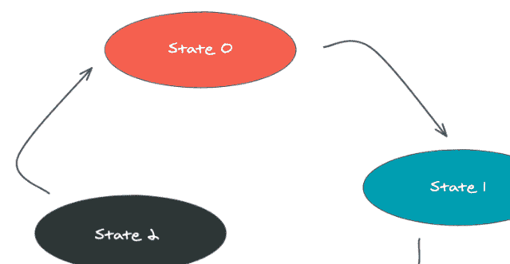

我们将构建一个使用海龟模拟交通灯的程序。这里有三个要点。第一个展示了一些使用海龟的不同方式。第二个演示了我们如何在Python中编程一个状态机，通过使用一个变量来跟踪当前状态，以及多个不同的if语句来检查当前状态，并在我们转换到不同状态时采取行动。第三个要点是使用键盘上的事件来触发状态变化。

复制并运行这个程序。确保你理解每一行的作用，根据需要查阅文档。

```
python
import turtle           # Tess变成一个交通灯。

turtle.setup(400,500)
wn = turtle.Screen()
wn.title("Tess becomes a traffic light!")
wn.bgcolor("lightgreen")
tess = turtle.Turtle()

def draw_housing():
    """ 绘制一个漂亮的外壳来容纳交通灯 """
    tess.pensize(3)
    tess.color("black", "darkgrey")
    tess.begin_fill()
    tess.forward(80)
    tess.left(90)
    tess.forward(200)
    tess.circle(40, 180)
    tess.forward(200)
    tess.left(90)
    tess.end_fill()

draw_housing()

tess.penup()
# 将tess定位到绿灯应该在的位置
tess.forward(40)
tess.left(90)
tess.forward(50)
# 将tess变成一个大的绿色圆圈
tess.shape("circle")
tess.shapesize(3)
tess.fillcolor("green")

# 交通灯是一种有三种状态的状态机，
# 绿色、橙色、红色。我们将这些状态编号为0、1、2
# 当机器改变状态时，我们改变tess的位置和
# 她的填充颜色。

# 这个变量保存机器的当前状态
state_num = 0

def advance_state_machine():
    global state_num
    if state_num == 0:        # 从状态0转换到状态1
        tess.forward(70)
        tess.fillcolor("orange")
        state_num = 1
    elif state_num == 1:      # 从状态1转换到状态2
        tess.forward(70)
        tess.fillcolor("red")
        state_num = 2
    else:                     # 从状态2转换到状态0
        tess.back(140)
        tess.fillcolor("green")
```

### 10.6. 术语表

**绑定**
我们将一个函数（或将其关联）与一个事件绑定，这意味着当该事件发生时，该函数会被调用以处理它。

**事件**
在我们程序的正常控制流“之外”发生的事情，通常来自某些用户操作。典型的事件是鼠标操作和按键操作。我们还看到，可以设置一个计时器来创建一个事件。

**处理程序**
为响应事件而被调用的函数。

### 10.7. 练习

1.  为第一个示例程序添加一些新的按键绑定：
    - 按下 R、G 或 B 键应将 tess 的颜色更改为红色、绿色或蓝色。
    - 按下 + 或 - 键应增加或减少 tess 画笔的宽度。确保画笔大小保持在 1 到 20 之间（包含 1 和 20）。
    - 处理其他一些按键来更改 tess 的某些属性，或窗口的某些属性，或赋予她可以通过键盘控制的新行为。
2.  修改交通灯程序，使变化自动发生，由计时器驱动。
3.  在前面的章节中，我们看到了两个海龟方法 `hideturtle` 和 `showturtle`，它们可以隐藏或显示海龟。这表明我们可以采用不同的方法来实现交通灯程序。在你上面的程序中添加如下内容：为另一组交通灯绘制第二个外壳。创建三个独立的海龟来分别代表绿灯、橙灯和红灯，并将它们适当地放置在你的新外壳内。当你的状态发生变化时，只需在任何时候让三个海龟中的一个可见即可。一旦你完成了这些更改，坐下来思考一些深刻的问题：你现在有两种不同的方法来使用海龟模拟交通灯，而且两种方法似乎都有效。某种方法是否比另一种更可取？哪一种更接近现实——即你所在城镇的交通灯？
4.  现在你有了一个为每种灯使用不同海龟的交通灯程序，也许可见/不可见的技巧并不是一个好主意。如果我们观察交通灯，它们会亮起和熄灭——但当它们熄灭时，它们仍然在那里，可能只是颜色更暗。现在修改程序，使灯光不会消失：它们要么亮，要么灭。但当它们熄灭时，它们仍然可见。
5.  你的交通灯控制器程序已获得专利，你即将变得非常富有。但你的新客户需要一个改变。他们希望他们的状态机有四种状态：绿色，然后绿色和橙色一起，然后只有橙色，然后是红色。此外，他们希望在每个状态花费不同的时间。机器应在绿色状态停留 3 秒，然后在绿色+橙色状态停留 1 秒，然后在橙色状态停留 1 秒，然后在红色状态停留 2 秒。更改状态机中的逻辑。
6.  如果你不知道网球计分是如何运作的，请询问朋友或查阅维基百科。球员 A 和球员 B 之间的一场网球比赛总是有一个比分。我们希望将“比分状态”视为一个状态机。比赛从状态 (0, 0) 开始，意味着两名球员都还没有得分。我们假设这对中的第一个元素是球员 A 的得分。如果球员 A 赢得第一分，比分变为 (15, 0)。如果 B 赢得第一分，状态变为 (0, 15)。下面是状态图的前几个状态和转换。在此图中，每个状态有两种可能的结果（A 赢得下一分，或 B 赢得下一分），最上面的箭头始终是当 A 赢得该分时发生的转换。完成该图，显示所有转换和所有状态。（提示：如果你在图中包含平分状态、占先状态以及“A 胜”和“B 胜”状态，则共有二十个状态。）

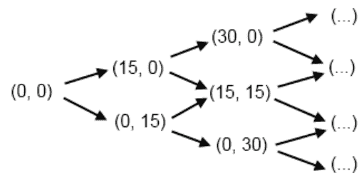

## 第 11 章：列表

**列表**是值的有序集合。构成列表的值称为其**元素**或其**项目**。我们将使用术语元素或项目来表示相同的意思。列表类似于字符串，字符串是字符的有序集合，不同之处在于列表的元素可以是任何类型。列表和字符串——以及其他维护其项目顺序的集合——称为**序列**。

### 11.1. 列表值

有几种方法可以创建一个新列表；最简单的方法是将元素括在方括号（[ 和 ]）中：

```
ps = [10, 20, 30, 40]
qs = ["spam", "bungee", "swallow"]
```

第一个示例是一个包含四个整数的列表。第二个是一个包含三个字符串的列表。列表的元素不必是相同的类型。以下列表包含一个字符串、一个浮点数、一个整数和（令人惊讶地）另一个列表：

```
zs = ["hello", 2.0, 5, [10, 20]]
```

列表中的列表被称为**嵌套**的。
最后，没有元素的列表称为空列表，用 [] 表示。
我们已经看到，我们可以将列表值赋给变量或将列表作为参数传递给函数：

```
>>> vocabulary = ["apple", "cheese", "dog"]
>>> numbers = [17, 123]
>>> an_empty_list = []
>>> print(vocabulary, numbers, an_empty_list)
["apple", "cheese", "dog"] [17, 123] []
```

### 11.2. 访问元素

访问列表元素的语法与访问字符串字符的语法相同——索引运算符：[]（不要与空列表混淆）。括号内的表达式指定索引。请记住，索引从 0 开始：

```
>>> numbers[0]
17
```

任何计算结果为整数的表达式都可以用作索引：

```
>>> numbers[9-8]
5
>>> numbers[1.0]
Traceback (most recent call last):
  File "<interactive input>", line 1, in <module>
TypeError: list indices must be integers, not float
```

如果你尝试访问或赋值给一个不存在的元素，你会得到一个运行时错误：

```
>>> numbers[2]
Traceback (most recent call last):
  File "<interactive input>", line 1, in <module>
IndexError: list index out of range
```

通常使用循环变量作为列表索引。

```
horsemen = ["war", "famine", "pestilence", "death"]

for i in [0, 1, 2, 3]:
    print(horsemen[i])
```

每次循环时，变量 i 用作列表的索引，打印第 i 个元素。这种计算模式称为**列表遍历**。
上面的示例除了从列表中获取项目外，不需要也不使用索引 i，因此这个更直接的版本——其中 for 循环获取项目——可能更可取：

```
horsemen = ["war", "famine", "pestilence", "death"]

for h in horsemen:
    print(h)
```

### 11.3. 列表长度

函数 `len` 返回列表的长度，等于其元素的数量。如果你打算使用整数索引来访问列表，最好将此值用作循环的上界，而不是常量。这样，如果列表的大小发生变化，你就不必遍历程序更改所有循环；它们将适用于任何大小的列表：

```
horsemen = ["war", "famine", "pestilence", "death"]

for i in range(len(horsemen)):
    print(horsemen[i])
```

循环体最后一次执行时，i 是 len(horsemen) - 1，这是最后一个元素的索引。（但现在没有索引的版本看起来更好了！）
尽管列表可以包含另一个列表，但嵌套列表在其父列表中仍被视为单个元素。此列表的长度为 4：

```
>>> len(["car makers", 1, ["Ford", "Toyota", "BMW"], [1, 2, 3]])
4
```

### 11.4. 列表成员关系

in 和 not in 是测试序列成员关系的布尔运算符。我们之前在字符串中使用过它们，但它们也适用于列表和其他序列：

```
>>> horsemen = ["war", "famine", "pestilence", "death"]
>>> "pestilence" in horsemen
True
>>> "debauchery" in horsemen
False
>>> "debauchery" not in horsemen
True
```

使用此方法可以产生一个更优雅的版本，用于我们之前在 nested_data 部分中用来计算学习计算机科学的学生数量的嵌套循环程序：

```
students = [
    ("John", ["CompSci", "Physics"]),
    ("Vusi", ["Maths", "CompSci", "Stats"]),
    ("Jess", ["CompSci", "Accounting", "Economics", "Management"]),
    ("Sarah", ["InfSys", "Accounting", "Economics", "CommLaw"]),
    ("Zuki", ["Sociology", "Economics", "Law", "Stats", "Music"])]

# Count how many students are taking CompSci
counter = 0
for (name, subjects) in students:
    if "CompSci" in subjects:
        counter += 1

print("The number of students taking CompSci is", counter)
```

### 11.5. 列表操作

`+` 运算符用于连接列表：

```python
>>> a = [1, 2, 3]
>>> b = [4, 5, 6]
>>> c = a + b
>>> c
[1, 2, 3, 4, 5, 6]
```

类似地，`*` 运算符用于将列表重复指定次数：

```python
>>> [0] * 4
[0, 0, 0, 0]
>>> [1, 2, 3] * 3
[1, 2, 3, 1, 2, 3, 1, 2, 3]
```

第一个示例将 `[0]` 重复了四次。第二个示例将列表 `[1, 2, 3]` 重复了三次。

### 11.6. 列表切片

我们之前在字符串中看到的切片操作同样适用于处理子列表：

```python
>>> a_list = ["a", "b", "c", "d", "e", "f"]
>>> a_list[1:3]
['b', 'c']
>>> a_list[:4]
['a', 'b', 'c', 'd']
>>> a_list[3:]
['d', 'e', 'f']
>>> a_list[:]
['a', 'b', 'c', 'd', 'e', 'f']
```

### 11.7. 列表是可变的

与字符串不同，列表是**可变的**，这意味着我们可以更改其元素。通过在赋值语句左侧使用索引运算符，我们可以更新其中一个元素：

```python
>>> fruit = ["banana", "apple", "quince"]
>>> fruit[0] = "pear"
>>> fruit[2] = "orange"
>>> fruit
['pear', 'apple', 'orange']
```

应用于列表的方括号运算符可以出现在表达式的任何位置。当它出现在赋值语句的左侧时，它会更改列表中的一个元素，因此 `fruit` 的第一个元素已从 `"banana"` 更改为 `"pear"`，最后一个元素从 `"quince"` 更改为 `"orange"`。对列表元素的赋值称为**元素赋值**。元素赋值不适用于字符串：

```python
>>> my_string = "TEST"
>>> my_string[2] = "X"
Traceback (most recent call last):
  File "<interactive input>", line 1, in <module>
TypeError: 'str' object does not support item assignment
```

但适用于列表：

```python
>>> my_list = ["T", "E", "S", "T"]
>>> my_list[2] = "X"
>>> my_list
['T', 'E', 'X', 'T']
```

使用切片运算符，我们可以一次性更新整个子列表：

```python
>>> a_list = ["a", "b", "c", "d", "e", "f"]
>>> a_list[1:3] = ["x", "y"]
>>> a_list
['a', 'x', 'y', 'd', 'e', 'f']
```

我们也可以通过将空列表赋值给它们来从列表中删除元素：

```python
>>> a_list = ["a", "b", "c", "d", "e", "f"]
>>> a_list[1:3] = []
>>> a_list
['a', 'd', 'e', 'f']
```

我们还可以通过将元素插入到所需位置的空切片中来向列表添加元素：

```python
>>> a_list = ["a", "d", "f"]
>>> a_list[1:1] = ["b", "c"]
>>> a_list
['a', 'b', 'c', 'd', 'f']
>>> a_list[4:4] = ["e"]
>>> a_list
['a', 'b', 'c', 'd', 'e', 'f']
```

### 11.8. 列表删除

使用切片删除列表元素可能容易出错。Python 提供了一种更具可读性的替代方法。`del` 语句从列表中删除一个元素：

```python
>>> a = ["one", "two", "three"]
>>> del a[1]
>>> a
['one', 'three']
```

正如您可能预料的那样，如果索引超出范围，`del` 会导致运行时错误。
您也可以将 `del` 与切片一起使用来删除子列表：

```python
>>> a_list = ["a", "b", "c", "d", "e", "f"]
>>> del a_list[1:5]
>>> a_list
['a', 'f']
```

通常，切片选择的子列表包含所有元素，直到但不包括第二个索引。

### 11.9. 对象与引用

执行这些赋值语句后

```python
a = "banana"
b = "banana"
```

我们知道 `a` 和 `b` 将引用一个包含字母 "banana" 的字符串对象。但我们还不知道它们是否指向*同一个*字符串对象。
Python 解释器有两种可能的方式来安排其内存：

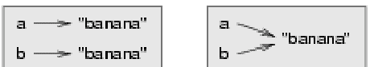

在一种情况下，`a` 和 `b` 引用两个具有相同值的不同对象。在第二种情况下，它们引用同一个对象。

我们可以使用 `is` 运算符测试两个名称是否引用同一个对象：

```python
>>> a is b
True
```

这告诉我们 `a` 和 `b` 都引用同一个对象，并且第二种状态快照准确地描述了这种关系。

由于字符串是*不可变的*，Python 通过让两个引用相同字符串值的名称引用同一个对象来优化资源。

列表则不是这样：

```python
>>> a = [1, 2, 3]
>>> b = [1, 2, 3]
>>> a == b
True
>>> a is b
False
```

这里的状态快照如下所示：

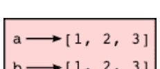

`a` 和 `b` 具有相同的值，但不引用同一个对象。

### 11.10. 别名

由于变量引用对象，如果我们将一个变量赋值给另一个变量，则两个变量引用同一个对象：

```python
>>> a = [1, 2, 3]
>>> b = a
>>> a is b
True
```

在这种情况下，状态快照如下所示：

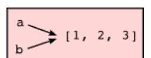

因为同一个列表有两个不同的名称 `a` 和 `b`，我们说它是**别名**。通过一个别名进行的更改会影响另一个：

```python
>>> b[0] = 5
>>> a
[5, 2, 3]
```

虽然这种行为可能很有用，但有时会出乎意料或不受欢迎。通常，在处理可变对象时（即在我们教科书的这一部分是列表，但随着我们学习类和对象、字典和集合，我们会遇到更多可变对象），避免别名更安全。当然，对于不可变对象（即字符串、元组），没有问题——当您访问别名名称时，不可能更改某些内容并得到意外结果。这就是为什么 Python 在看到节省资源的机会时可以自由地为字符串（和任何其他不可变类型的数据）创建别名。

### 11.11. 克隆列表

如果我们想修改列表并同时保留原始副本，我们需要能够复制列表本身，而不仅仅是引用。这个过程有时称为**克隆**，以避免“复制”一词的歧义。

克隆列表最简单的方法是使用切片运算符：

```python
>>> a = [1, 2, 3]
>>> b = a[:]
>>> b
[1, 2, 3]
```

获取 `a` 的任何切片都会创建一个新列表。在这种情况下，切片恰好包含整个列表。所以现在的关系是这样的：

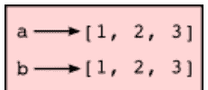

现在我们可以自由地对 `b` 进行更改，而不用担心会无意中更改 `a`：

```python
>>> b[0] = 5
>>> a
[1, 2, 3]
```

### 11.12. 列表与 for 循环

正如我们已经看到的，`for` 循环也适用于列表。`for` 循环的通用语法是：

```python
for VARIABLE in LIST:
    BODY
```

所以，正如我们所见

```python
friends = ["Joe", "Zoe", "Brad", "Angelina", "Zuki", "Thandi", "Paris"]
for friend in friends:
    print(friend)
```

它读起来几乎像英语：对于（列表中的）每个朋友，打印（朋友的）名字。
任何列表表达式都可以在 `for` 循环中使用：

```python
for number in range(20):
    if number % 3 == 0:
        print(number)

for fruit in ["banana", "apple", "quince"]:
    print("I like to eat " + fruit + "s!")
```

第一个示例打印 0 到 19 之间所有 3 的倍数。第二个示例表达了对各种水果的热情。
由于列表是可变的，我们经常希望遍历列表并更改其每个元素。以下代码将列表 `xs` 中的所有数字平方：

```python
xs = [1, 2, 3, 4, 5]

for i in range(len(xs)):
    xs[i] = xs[i]**2
```

花点时间思考一下 `range(len(xs))`，直到你理解它是如何工作的。
在这个例子中，我们既对项目的*值*感兴趣（我们想要对该值求平方），也对其*索引*感兴趣（以便我们可以将新值赋给该位置）。这种模式非常常见，以至于 Python 提供了一种更好的实现方式：

```python
xs = [1, 2, 3, 4, 5]

for (i, val) in enumerate(xs):
    xs[i] = val**2
```

`enumerate` 在列表遍历期间生成（索引，值）对。尝试下一个示例，以更清楚地了解 `enumerate` 的工作原理：

```python
for (i, v) in enumerate(["banana", "apple", "pear", "lemon"]):
    print(i, v)
```

```
0 banana
1 apple
2 pear
3 lemon
```

### 11.13. 列表参数

将列表作为参数传递实际上是传递列表的引用，而不是列表的副本或克隆。因此，参数传递为您创建了一个别名：调用者有一个引用列表的变量，被调用函数有一个别名，但只有一个底层列表对象。例如，下面的函数接受一个列表作为参数，并将列表中的每个元素乘以 2：

```python
def double_stuff(a_list):
    """ 将 a_list 中的每个元素覆盖为其值的两倍。 """
    for (idx, val) in enumerate(a_list):
        a_list[idx] = 2 * val
```

如果我们将以下内容添加到我们的脚本中：

### 11.14. 列表方法

点运算符也可用于访问列表对象的内置方法。我们将从最有用的方法开始，该方法用于将内容添加到现有列表的末尾：

```python
>>> mylist = []
>>> mylist.append(5)
>>> mylist.append(27)
>>> mylist.append(3)
>>> mylist.append(12)
>>> mylist
[5, 27, 3, 12]
```

`append` 是一个列表方法，它将传入的参数添加到列表的末尾。在创建新列表时，我们将大量使用它。继续这个例子，我们展示几个其他的列表方法：

```python
>>> mylist.insert(1, 12)  # 在位置1插入12，其他元素后移
>>> mylist
[5, 12, 27, 3, 12]
>>> mylist.count(12)      # 12在mylist中出现了多少次？
2
>>> mylist.extend([5, 9, 5, 11])  # 将整个列表添加到mylist末尾
>>> mylist
[5, 12, 27, 3, 12, 5, 9, 5, 11]
>>> mylist.index(9)       # 查找mylist中第一个9的索引
6
>>> mylist.reverse()
>>> mylist
[11, 5, 9, 5, 12, 3, 27, 12, 5]
>>> mylist.sort()
>>> mylist
[3, 5, 5, 5, 9, 11, 12, 12, 27]
>>> mylist.remove(12)    # 移除列表中第一个12
>>> mylist
[3, 5, 5, 5, 9, 11, 12, 27]
```

尝试并使用这里展示的列表方法，阅读它们的文档，直到你确信自己理解了它们的工作原理。

### 11.15. 纯函数与修改器

接受列表作为参数并在执行过程中修改它们的函数称为**修改器**，它们所做的更改称为**副作用**。

**纯函数**不产生副作用。它仅通过参数（它不修改这些参数）和返回值与调用程序通信。以下是作为纯函数编写的 `double_stuff`：

```python
def double_stuff(a_list):
    """ 返回一个新列表，其中包含
        a_list中元素的两倍。
    """
    new_list = []
    for value in a_list:
        new_elem = 2 * value
        new_list.append(new_elem)

    return new_list
```

这个版本的 `double_stuff` 不会改变其参数：

```python
>>> things = [2, 5, 9]
>>> xs = double_stuff(things)
>>> things
[2, 5, 9]
>>> xs
[4, 10, 18]
```

我们之前看到的一个赋值规则是“首先计算右侧，然后将结果值赋给变量”。因此，将函数结果赋给传递给函数的同一个变量是相当安全的：

```python
>>> things = [2, 5, 9]
>>> things = double_stuff(things)
>>> things
[4, 10, 18]
```

哪种风格更好？

任何可以用修改器完成的事情，也可以用纯函数完成。事实上，一些编程语言只允许纯函数。有证据表明，使用纯函数的程序比使用修改器的程序开发更快、更不容易出错。然而，修改器有时很方便，在某些情况下，函数式程序效率较低。

一般来说，我们建议你在合理的情况下编写纯函数，只在有明显优势时才使用修改器。这种方法可以称为*函数式编程风格*。

### 11.16. 生成列表的函数

上面 `double_stuff` 的纯函数版本使用了一个重要的**模式**，可以放入你的工具箱。每当你需要编写一个创建并返回列表的函数时，模式通常是：

- 将结果变量初始化为空列表
- 循环
    - 创建一个新元素
    - 将其附加到结果
- 返回结果

让我们展示这个模式的另一个用途。假设你已经有一个函数 `is_prime(x)` 可以测试 x 是否为质数。编写一个函数，返回所有小于 n 的质数列表：

```python
def primes_lessthan(n):
    """ 返回所有小于n的质数列表。 """
    result = []
    for i in range(2, n):
        if is_prime(i):
            result.append(i)
    return result
```

### 11.17. 字符串与列表

字符串上最有用的两个方法涉及与子字符串列表的相互转换。`split` 方法（我们已经见过）将字符串分解为单词列表。默认情况下，任意数量的空白字符都被视为单词边界：

```python
>>> song = "The rain in Spain..."
>>> wds = song.split()
>>> wds
['The', 'rain', 'in', 'Spain...']
```

一个可选参数称为**分隔符**，可用于指定用作子字符串之间边界标记的字符串。以下示例使用字符串 `ai` 作为分隔符：

```python
>>> song.split("ai")
['The r', 'n in Sp', 'n...']
```

请注意，分隔符不会出现在结果中。

`split` 方法的逆操作是 `join`。你选择一个所需的**分隔符**字符串（通常称为*粘合剂*），并使用粘合剂连接列表中的每个元素：

```python
>>> glue = ";"
>>> s = glue.join(wds)
>>> s
'The;rain;in;Spain...'
```

你粘合在一起的列表（本例中的 `wds`）不会被修改。此外，如以下示例所示，你可以使用空粘合剂或多字符字符串作为粘合剂：

```python
>>> " --- ".join(wds)
'The --- rain --- in --- Spain...'
>>> "".join(wds)
'TheraininSpain...'
```

### 11.18. list 和 range

Python 有一个内置的类型转换函数叫做 `list`，它尝试将你给它的任何东西转换成列表。

```python
>>> xs = list("Crunchy Frog")
>>> xs
['C', 'r', 'u', 'n', 'c', 'h', 'y', ' ', 'F', 'r', 'o', 'g']
>>> "".join(xs)
'Crunchy Frog'
```

`range` 的一个特定特性是它不会立即计算所有值：它“推迟”计算，并按需或“懒惰地”进行。我们可以说它给出了一个**承诺**，在需要时产生值。如果你的计算短路搜索并提前返回，这非常方便，如本例所示：

```python
def f(n):
    """ 查找101和小于n之间的第一个能被21整除的正整数
    """
    for i in range(101, n):
        if (i % 21 == 0):
            return i

test(f(110) == 105)
test(f(10000000000) == 105)
```

在第二个测试中，如果 `range` 急切地构建一个包含所有这些元素的列表，你很快就会耗尽计算机的可用内存并导致程序崩溃。但它比那更聪明！这个计算工作得很好，因为 `range` 对象只是一个承诺，在需要时产生元素。一旦 `if` 中的条件变为真，就不会生成更多元素，函数返回。（注意：在 Python 3 之前，`range` 不是懒惰的。如果你使用早期版本的 Python，YMMV！）

YMMV：你的结果可能不同

缩写 YMMV 代表 *your mileage may vary*（你的结果可能不同）。美国汽车广告经常引用汽车的油耗数据，例如它们每加仑可行驶28英里。但这总是伴随着法律小字警告读者，他们可能无法获得相同的结果。术语 YMMV 现在被习惯性地用来表示“你的结果可能不同”，例如 *这款手机的电池续航时间为3天，但 YMMV*。

你有时会发现懒惰的 `range` 被包裹在 `list` 调用中。这迫使 Python 将懒惰的承诺转换为实际的列表：

```python
>>> range(10)           # 创建一个懒惰的承诺
range(0, 10)
>>> list(range(10))     # 兑现承诺，生成一个列表。
[0, 1, 2, 3, 4, 5, 6, 7, 8, 9]
```

### 11.19. 嵌套列表

嵌套列表是作为另一个列表中元素出现的列表。在这个列表中，索引为3的元素是一个嵌套列表：

```python
>>> nested = ["hello", 2.0, 5, [10, 20]]
```

如果我们输出索引为3的元素，得到：

```python
>>> print(nested[3])
[10, 20]
```

要从嵌套列表中提取元素，我们可以分两步进行：

```python
>>> elem = nested[3]
>>> elem[0]
10
```

或者我们可以将它们组合起来：

### 11.20. 矩阵

嵌套列表常用于表示矩阵。例如，矩阵：

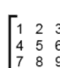

可以表示为：

```python
>>> mx = [[1, 2, 3], [4, 5, 6], [7, 8, 9]]
```

`mx` 是一个包含三个元素的列表，其中每个元素是矩阵的一行。我们可以用通常的方式从矩阵中选择一整行：

```python
>>> mx[1]
[4, 5, 6]
```

或者，我们可以使用双重索引形式从矩阵中提取单个元素：

```python
>>> mx[1][2]
6
```

第一个索引选择行，第二个索引选择列。虽然这种表示矩阵的方式很常见，但它并非唯一可能的方式。一个小小的变体是使用列的列表而不是行的列表。稍后我们将看到一种更激进的替代方案，使用字典。

### 11.21. 术语表

**别名**
包含对同一对象引用的多个变量。

**克隆**
创建一个与现有对象具有相同值的新对象。复制对象的引用会创建一个别名，但不会克隆该对象。

**分隔符**
用于指示字符串应在何处拆分的字符或字符串。

**元素**
列表（或其他序列）中的值之一。方括号运算符用于选择列表的元素。也称为*项*。

**不可变数据值**
无法修改的数据值。对不可变值的元素或切片（子部分）进行赋值会导致运行时错误。

**索引**
指示列表中项目位置的整数值。索引从 0 开始。

**项**
参见*元素*。

**列表**
值的集合，每个值在列表中都有固定的位置。与其他类型 `str`、`int`、`float` 等类似，也有一个 `list` 类型转换函数，它尝试将其接收的任何参数转换为列表。

**列表遍历**
按顺序访问列表中的每个元素。

**修改器**
在函数体内更改其参数的函数。只有可变类型才能被修改器更改。

**可变数据值**
可以修改的数据值。所有可变值的类型都是复合类型。列表和字典是可变的；字符串和元组则不是。

**嵌套列表**
作为另一个列表元素的列表。

**对象**
变量可以引用的事物。

**模式**
一系列语句，或一种编码风格，在许多不同情况下具有普遍适用性。成为成熟的计算机科学家的一部分是学习和形成构成你工具包的模式和算法。模式通常对应于你的“心理分块”。

**承诺**
一个对象，承诺执行某些工作或在最终需要时提供某些值，但它懒散地推迟立即执行工作。调用 `range` 会产生一个承诺。

**纯函数**
没有副作用的函数。纯函数仅通过其返回值对调用程序进行更改。

**序列**
由有序元素集合组成的任何数据类型，其中每个元素由索引标识。

**副作用**
调用函数导致的程序状态变化。副作用只能由修改器产生。

**步长**
线性序列中连续元素之间的间隔。`range` 函数的第三个（可选）参数称为步长。如果未指定，则默认为 1。

### 11.22. 练习

1.  Python 解释器对以下代码的响应是什么？

```python
>>> list(range(10, 0, -2))
```

`range` 函数的三个参数分别是 `start`、`stop` 和 `step`。在此示例中，`start` 大于 `stop`。如果 `start` < `stop` 且 `step` < 0 会发生什么？写出 `start`、`stop` 和 `step` 之间关系的规则。

2.  考虑以下代码片段：

```python
import turtle

tess = turtle.Turtle()
alex = tess
alex.color("hotpink")
```

这个片段创建了一个还是两个海龟实例？设置 `alex` 的颜色是否也会改变 `tess` 的颜色？请详细解释。

3.  在以下 Python 代码的第三行执行前后，为 `a` 和 `b` 绘制状态快照：

```python
1 a = [1, 2, 3]
2 b = a[:]
3 b[0] = 5
```

4.  以下程序的输出是什么？

```python
1 this = ["I", "am", "not", "a", "crook"]
2 that = ["I", "am", "not", "a", "crook"]
3 print("Test 1: {0}".format(this is that))
4 that = this
5 print("Test 2: {0}".format(this is that))
```

请提供对结果的*详细*解释。

5.  列表可用于表示数学*向量*。在本练习及后续几个练习中，你将编写函数来执行向量的标准运算。创建一个名为 `vectors.py` 的脚本，并编写 Python 代码以通过每种情况下的测试。

编写一个函数 `add_vectors(u, v)`，该函数接受两个长度相同的数字列表，并返回一个新列表，其中包含每个列表对应元素的和：

```python
1 test(add_vectors([1, 1], [1, 1]) == [2, 2])
2 test(add_vectors([1, 2], [1, 4]) == [2, 6])
3 test(add_vectors([1, 2, 1], [1, 4, 3]) == [2, 6, 4])
```

6.  编写一个函数 `scalar_mult(s, v)`，该函数接受一个数字 `s` 和一个列表 `v`，并返回 `v` 乘以 `s` 的标量倍数[^10]：

[^10]: http://en.wikipedia.org/wiki/Scalar_multiple

```python
1 test(scalar_mult(5, [1, 2]) == [5, 10])
2 test(scalar_mult(3, [1, 0, -1]) == [3, 0, -3])
3 test(scalar_mult(7, [3, 0, 5, 11, 2]) == [21, 0, 35, 77, 14])
```

7.  编写一个函数 `dot_product(u, v)`，该函数接受两个长度相同的数字列表，并返回每个列表对应元素乘积的和（即 `点积`<sup>11</sup>）。

```python
1 test(dot_product([1, 1], [1, 1]) == 2)
2 test(dot_product([1, 2], [1, 4]) == 9)
3 test(dot_product([1, 2, 1], [1, 4, 3]) == 12)
```

8.  **对数学倾向者的额外挑战**：编写一个函数 `cross_product(u, v)`，该函数接受两个长度为 3 的数字列表，并返回它们的 `叉积`<sup>12</sup>。你应该编写自己的测试。

9.  描述以下代码片段中 `" ".join(song.split())` 和 `song` 之间的关系。对于所有赋给 `song` 的字符串，它们都相同吗？它们何时会不同？

```python
1 song = "The rain in Spain..."
```

10. 编写一个函数 `replace(s, old, new)`，该函数在字符串 `s` 中将所有出现的 `old` 替换为 `new`：

```python
1 test(replace("Mississippi", "i", "I") == "MIssIssIppI")
2
3 s = "I love spom! Spom is my favorite food. Spom, spom, yum!"
4 test(replace(s, "om", "am") ==
5     "I love spam! Spam is my favorite food. Spam, spam, yum!")
6
7 test(replace(s, "o", "a") ==
8     "I lave spam! Spam is my favarite faad. Spam, spam, yum!")
```

> <sup>11</sup>http://en.wikipedia.org/wiki/Dot_product
> <sup>12</sup>http://en.wikipedia.org/wiki/Cross_product

**提示：** 使用 `split` 和 `join` 方法。

11. 假设你想交换两个变量中的值。你决定将其提取为一个可重用的函数，并编写了以下代码：

```python
def swap(x, y):      # Incorrect version
    print("before swap statement: x:", x, "y:", y)
    (x, y) = (y, x)
    print("after swap statement: x:", x, "y:", y)

a = ["This", "is", "fun"]
b = [2,3,4]
print("before swap function call: a:", a, "b:", b)
swap(a, b)
print("after swap function call: a:", a, "b:", b)
```

运行此程序并描述结果。哎呀！它没有达到你预期的效果！解释原因。使用像 http://pythontutor.com 这样的 Python 可视化工具可能有助于你建立一个关于正在发生什么的良好概念模型。调用 `swap` 后，`a` 和 `b` 的值将是什么？

## 第 12 章：模块

**模块**是一个包含 Python 定义和语句的文件，旨在用于其他 Python 程序。有许多 Python 模块随 Python 一起作为**标准库**的一部分提供。我们至少已经见过其中两个，`turtle` 模块和 `string` 模块。

我们还向你展示了如何访问帮助。帮助系统包含 Python 附带的所有标准模块的列表。试试帮助功能吧！

### 12.1. 随机数

我们经常想在程序中使用随机数，以下是一些典型用途：

-   玩需要计算机掷骰子、选数字或抛硬币的运气游戏，
-   随机洗牌，
-   允许/使敌方飞船出现在随机位置并向玩家开火，
-   在为估算建造水坝的环境影响建立计算机模型时模拟可能的降雨，
-   用于互联网上的银行会话加密。

Python 提供了一个 `random` 模块来帮助完成此类任务。你可以使用帮助来查找它，但以下是我们将使用它的关键内容：

```python
import random

# Create a black box object that generates random numbers
rng = random.Random()

dice_throw = rng.randrange(1,7)   # Return an int, one of 1,2,3,4,5,6
delay_in_seconds = rng.random() * 5.0
```

`randrange` 方法调用在其下限和上限参数之间生成一个整数，使用与 `range` 相同的语义——因此包含下限，但不包含上限。所有值出现的概率相等（即结果是*均匀*分布的）。像 `range` 一样，`randrange` 也可以接受一个可选的步长参数。所以假设我们需要一个小于 100 的随机奇数，我们可以说：

#### 12.1.1. 可重复性与测试

随机数生成器基于**确定性**算法——可重复且可预测。因此它们被称为**伪随机**生成器——并非真正的随机。它们从一个*种子*值开始。每次请求另一个随机数时，你将获得一个基于当前种子属性的随机数，而种子的状态（生成器的属性之一）将会更新。

对于调试和编写单元测试，可重复性非常方便——程序每次运行时都执行相同的操作。我们可以通过强制随机数生成器每次使用已知种子初始化来实现这一点。（通常这只在测试期间需要——玩纸牌游戏时，如果洗好的牌序总是和上次一样，很快就会变得无聊！）

```python
drng = random.Random(123)  # 使用已知初始状态创建生成器
```

这种创建随机数生成器的替代方法为对象提供了一个显式的种子值。如果没有这个参数，系统可能会使用基于时间的值。因此，今天从`drng`获取的随机数序列将与明天获取的完全相同！

#### 12.1.2. 从袋中取球、掷骰子、洗牌

以下是一个生成包含n个介于下限和上限之间的随机整数的列表的示例：

```python
import random

def make_random_ints(num, lower_bound, upper_bound):
    """
    生成一个包含num个介于lower_bound和upper_bound之间的随机整数的列表。
    upper_bound是开区间边界。
    """
    rng = random.Random()  # 创建一个随机数生成器
    result = []
    for i in range(num):
        result.append(rng.randrange(lower_bound, upper_bound))
    return result
```

```python
>>> make_random_ints(5, 1, 13)  # 选取5个随机月份编号
[8, 1, 8, 5, 6]
```

注意结果中出现了重复项。这通常是期望的，例如，如果我们掷五次骰子，我们预期会有一些重复。

但如果你不想要重复项呢？如果你想要5个不同的月份，那么这个算法就是错误的。在这种情况下，一个好的算法是生成可能性列表，将其打乱，然后切片出你想要的元素数量：

```python
xs = list(range(1,13))  # 创建列表1..12（没有重复项）
rng = random.Random()   # 创建一个随机数生成器
rng.shuffle(xs)         # 打乱列表
result = xs[:5]         # 取前五个元素
```

在统计学课程中，第一种情况——允许重复——通常被描述为*有放回*地从袋中取球——每次取出的球都会放回，因此它可能再次出现。第二种情况，没有重复，通常被描述为*无放回*地从袋中取球。一旦球被取出，就不会再放回。电视彩票游戏就是这样运作的。

第二种“打乱并切片”算法在你只需要少量元素但来自非常大的域时效果不佳。假设我想要五个介于一千万之间的数字，且不重复。生成一个包含一千万个项目的列表，打乱它，然后切片出前五个，这将是一场性能灾难！所以让我们再试一次：

```python
import random

def make_random_ints_no_dups(num, lower_bound, upper_bound):
    """
    生成一个包含num个介于lower_bound和upper_bound之间的随机整数的列表。
    upper_bound是开区间边界。
    结果列表不能包含重复项。
    """
    result = []
    rng = random.Random()
    for i in range(num):
        while True:
            candidate = rng.randrange(lower_bound, upper_bound)
            if candidate not in result:
                break
        result.append(candidate)
    return result

xs = make_random_ints_no_dups(5, 1, 10000000)
print(xs)
```

这令人满意地生成了5个随机数，且没有重复：

```
[3344629, 1735163, 9433892, 1081511, 4923270]
```

即使这个函数也有其陷阱。你能看出在这种情况下会发生什么吗？

```python
xs = make_random_ints_no_dups(10, 1, 6)
```

### 12.2. time模块

随着我们开始处理更复杂的算法和更大的程序，一个自然的担忧是“我们的代码高效吗？”一种实验方法是计时各种操作需要多长时间。time模块有一个名为`process_time`的函数，推荐用于此目的。每当调用`process_time`时，它返回一个浮点数，表示自程序开始运行以来经过了多少秒。

使用方法是在开始执行要测量的代码之前调用`process_time`并将结果赋给一个变量，比如`t0`。然后在执行之后，再次调用`process_time`（这次我们将结果保存在变量`t1`中）。差值`t1 - t0`就是经过的时间，是衡量程序运行速度的一种方式。

让我们尝试一个小例子。Python有一个内置的`sum`函数，可以对列表中的元素求和。我们也可以编写自己的函数。你认为它们在速度上会如何比较？我们将尝试对列表`[0, 1, 2 ...]`进行两种方式的求和，并比较结果：

```python
import time

def do_my_sum(xs):
    sum = 0
    for v in xs:
        sum += v
    return sum

sz = 10000000       # 让列表包含1000万个元素
testdata = range(sz)

t0 = time.process_time()
my_result = do_my_sum(testdata)
t1 = time.process_time()
print("my_result    = {0} (time taken = {1:.4f} seconds)"
      .format(my_result, t1-t0))

t2 = time.process_time()
their_result = sum(testdata)
t3 = time.process_time()
print("their_result = {0} (time taken = {1:.4f} seconds)"
      .format(their_result, t3-t2))
```

在一台配置适中的笔记本电脑上，我们得到以下结果：

```
my_sum    = 49999995000000 (time taken = 1.5567 seconds)
their_sum = 49999995000000 (time taken = 0.9897 seconds)
```

因此，我们的函数比内置函数慢约57%。在不到一秒的时间内生成并求和一千万个元素，这表现相当不错！

### 12.3. math模块

math模块包含你在计算器上通常能找到的数学函数（sin、cos、sqrt、asin、log、log10）以及一些数学常量，如pi和e：

```python
>>> import math
>>> math.pi                # 常量pi
3.141592653589793
>>> math.e                 # 常量自然对数底数
2.718281828459045
>>> math.sqrt(2.0)         # 平方根函数
1.4142135623730951
>>> math.radians(90)       # 将90度转换为弧度
1.5707963267948966
>>> math.sin(math.radians(90))  # 计算90度的正弦值
1.0
>>> math.asin(1.0) * 2     # 将1.0的反正弦值乘以2得到pi
3.141592653589793
```

与几乎所有其他编程语言一样，角度以*弧度*而非度表示。有两个函数`radians`和`degrees`用于在这两种常用的角度测量方式之间转换。

注意这个模块与我们使用`random`和`turtle`的另一个区别：在`random`和`turtle`中，我们创建对象并在对象上调用方法。这是因为对象具有*状态*——乌龟有颜色、位置、朝向等，每个随机数生成器都有一个种子值，该值决定了它的下一个结果。

数学函数是“纯”的，没有任何状态——计算2.0的平方根不依赖于任何状态或过去发生的历史。因此，这些函数不是对象的方法——它们只是被归类在一个名为`math`的模块中的函数。

### 12.4. 创建自己的模块

创建自己的模块，我们只需要将脚本保存为具有`.py`扩展名的文件。例如，假设这个脚本被保存为名为`seqtools.py`的文件：

```python
def remove_at(pos, seq):
    return seq[:pos] + seq[pos+1:]
```

我们现在可以在编写的脚本或交互式Python解释器中使用我们的模块。为此，我们必须首先`import`该模块。

>>> import seqtools
>>> s = "A string!"
>>> seqtools.remove_at(4, s)
'A sting!'

导入时我们不包含 `.py` 文件扩展名。Python 要求 Python 模块的文件名以 `.py` 结尾，因此文件扩展名不包含在 **import 语句**中。
使用模块可以将非常大的程序分解为可管理的部分，并将相关的部分组织在一起。

### 12.5. 命名空间

**命名空间**是属于一个模块或一个函数的标识符集合（正如我们很快将看到的，类中也有命名空间）。通常，我们希望一个命名空间包含“相关”的内容，例如所有的数学函数，或者所有与随机数相关的典型操作。
每个模块都有自己的命名空间，因此我们可以在多个模块中使用相同的标识符名称，而不会引起标识冲突。

```python
# Module1e1.py

question = "What is the meaning of Life, the Universe, and Everything?"
answer = 42
```

```python
# Module1e2.py

question = "What is your quest?"
answer = "To seek the holy grail."
```

我们现在可以导入这两个模块，并分别访问其中的 `question` 和 `answer`：

```python
import module1
import module2

print(module1.question)
print(module2.question)
print(module1.answer)
print(module2.answer)
```

将输出以下内容：

1 What **is** the meaning of Life, the Universe, **and** Everything?
2 What **is** your quest?
3 42
4 To seek the holy grail.

函数也有自己的命名空间：

```python
def f():
    n = 7
    print("printing n inside of f:", n)

def g():
    n = 42
    print("printing n inside of g:", n)

n = 11
print("printing n before calling f:", n)
f()
print("printing n after calling f:", n)
g()
print("printing n after calling g:", n)
```

运行此程序产生以下输出：

```
printing n before calling f: 11
printing n inside of f: 7
printing n after calling f: 11
printing n inside of g: 42
printing n after calling g: 11
```

这里的三个 `n` 不会冲突，因为它们各自位于不同的命名空间中——它们是三个不同变量的三个名称，就像可能有三个不同的人，都叫“布鲁斯”一样。

命名空间允许多个程序员在同一个项目上工作，而不会发生命名冲突。

命名空间、文件和模块之间有什么关系？

Python 有一个方便且简化的映射关系：每个文件对应一个模块，从而产生一个命名空间。此外，Python 从文件名获取模块名，这成为命名空间的名称。

`math.py` 是一个文件名，模块名为 `math`，其命名空间也是 `math`。因此在 Python 中，这些概念或多或少是可以互换的。

但你会遇到其他语言（例如 C#），它们允许一个模块跨越多个文件，或者一个文件包含多个命名空间，或者多个文件共享同一个命名空间。因此文件名不必与命名空间相同。

所以，一个好主意是尝试在脑海中保持这些概念的区别。

文件和目录组织的是我们计算机中存储内容的*位置*。另一方面，命名空间和模块是编程概念：它们帮助我们组织如何将相关的函数和属性分组。它们不涉及“在哪里”存储内容，也不必与文件和目录结构一致。

因此在 Python 中，如果你重命名文件 `math.py`，其模块名也会改变，你的 `import` 语句需要更改，你引用该命名空间内函数或属性的代码也需要更改。

在其他语言中，情况不一定如此。因此，不要因为 Python 模糊了这些概念，就混淆它们！

### 12.6. 作用域和查找规则

标识符的**作用域**是程序代码中可以访问或使用该标识符的区域。

Python 中有三个重要的作用域：

- **局部作用域**指的是在函数内声明的标识符。这些标识符保存在属于该函数的命名空间中，每个函数都有自己的命名空间。
- **全局作用域**指的是在当前模块或文件中声明的所有标识符。
- **内置作用域**指的是 Python 内置的所有标识符——那些无需导入即可使用的标识符，如 `range` 和 `min`，它们（几乎）总是可用的。

Python（像大多数其他计算机语言一样）使用优先级规则：同一个名称可能出现在多个作用域中，但最内层的或局部作用域总是优先于全局作用域，而全局作用域总是优先于内置作用域。让我们从一个简单的例子开始：

```python
def range(n):
    return 123*n

print(range(10))
```

会打印什么？我们定义了自己的函数 `range`，因此现在存在潜在的歧义。当我们使用 `range` 时，是指我们自己的函数，还是内置的函数？使用作用域查找规则可以确定这一点：调用的是我们自己的 `range` 函数，而不是内置的函数，因为我们的函数 `range` 在全局命名空间中，它优先于内置名称。

因此，尽管像 `range` 和 `min` 这样的名称是内置的，但如果你选择定义自己的变量或函数来重用这些名称，它们可能会被“隐藏”而无法使用。（重新定义内置名称是一种令人困惑的做法——因此，要成为一名优秀的程序员，你需要理解作用域规则，并明白你可能会做一些导致混淆的糟糕事情，然后避免这样做！）

现在，一个稍微复杂一点的例子：

```python
n = 10
m = 3
def f(n):
    m = 7
    return 2*n+m

print(f(5), n, m)
```

这会打印 17 10 3。原因是第 1 行和第 2 行的两个变量 `m` 和 `n` 在函数外部的全局命名空间中。在函数内部，创建了名为 `n` 和 `m` 的新变量，*仅在 `f` 执行期间存在*。这些变量在函数 `f` 的局部命名空间中创建。在 `f` 的函数体内，作用域查找规则决定了我们使用局部变量 `m` 和 `n`。相比之下，当我们从 `f` 返回后，`print` 函数的 `n` 和 `m` 参数指的是第 1 行和第 2 行的原始变量，这些变量没有因为执行函数 `f` 而发生任何改变。

还要注意，`def` 在这里将名称 `f` 放入了全局命名空间。因此它可以在第 7 行被调用。

第 1 行的变量 `n` 的作用域是什么？它的作用域——它可见的区域——是第 1、2、6、7 行。由于局部变量 `n` 的存在，它在第 3、4、5 行被隐藏了。

### 12.7. 属性和点运算符

在模块内定义的变量称为模块的**属性**。我们已经看到对象也有属性：例如，大多数对象都有一个 `__doc__` 属性，一些函数有 `__annotations__` 属性。属性使用**点运算符**（`.`）访问。`module1` 和 `module2` 的 `question` 属性通过 `module1.question` 和 `module2.question` 访问。

模块包含函数和属性，点运算符以相同的方式访问它们。`seqtools.remove_at` 指的是 `seqtools` 模块中的 `remove_at` 函数。

当我们使用点分名称时，我们通常称其为**完全限定名**，因为我们明确指出了我们指的是哪个 `question` 属性。

### 12.8. 三种 import 语句变体

以下是将名称导入当前命名空间并使用它们的三种不同方式：

```python
import math
x = math.sqrt(10)
```

这里只有单个标识符 `math` 被添加到当前命名空间。如果你想访问模块中的某个函数，你需要使用点表示法来访问它。
这是另一种安排：

```python
from math import cos, sin, sqrt
x = sqrt(10)
```

名称被直接添加到当前命名空间，无需限定即可使用。名称 `math` 本身没有被导入，因此尝试使用限定形式 `math.sqrt` 会出错。
然后我们有一个方便的简写：

```python
from math import *   # Import all the identifiers from math,
                    #   adding them to the current namespace.
x = sqrt(10)         # Use them without qualification.
```

在这三种方法中，第一种方法通常是首选，尽管它意味着每次需要多打一点字。不过，我们可以通过以不同的名称导入模块来使事情更简短：

```python
>>> import math as m
>>> m.pi
3.141592653589793
```

但是，嘿，有了能自动补全的漂亮编辑器和快速的手指，这只是个小代价！
最后，观察这个情况：

```python
def area(radius):
    import math
    return math.pi * radius * radius

x = math.sqrt(10)    # This gives an error
```

这里我们导入了 `math`，但我们将其导入到了 `area` 的局部命名空间中。因此该名称在函数体内可用，但在外部脚本中不可用，因为它不在全局命名空间中。

### 12.9. 将你的单元测试器转换为模块

在第6章（有产出的函数）接近尾声时，我们介绍了单元测试以及我们自己的测试函数，你不得不将这个函数复制到你编写测试的每个模块中。现在我们可以将这个定义放入它自己的模块中，比如 `unit_tester.py`，然后在每个新脚本中只需使用一行代码即可：

```
from unit_tester import test
```

### 12.10. 术语表

**属性**
在模块（或类或实例——我们稍后会看到）内部定义的变量。模块属性通过使用**点运算符** (.) 来访问。

**点运算符**
点运算符 (.) 允许访问模块的属性和函数（或类或实例的属性和方法——正如我们在其他地方看到的那样）。

**完全限定名**
一个以某些命名空间标识符和点运算符为前缀的名称，或者以实例对象为前缀的名称，例如 `math.sqrt` 或 `tess.forward(10)`。

**import 语句**
一条使模块中包含的对象可在另一个模块中使用的语句。import 语句有两种形式。使用假设的名为 `mymod1` 和 `mymod2` 的模块，每个模块包含函数 `f1` 和 `f2`，以及变量 `v1` 和 `v2`，这两种形式的示例如下：

```
import mymod1
from mymod2 import f1, f2, v1, v2
```

第二种形式将导入的对象带入导入模块的命名空间，而第一种形式为导入的模块保留一个单独的命名空间，需要使用 `mymod1.v1` 来访问该模块中的 `v1` 变量。

**方法**
对象的类似函数的属性。方法通过点运算符在对象上*调用*。例如：

```
>>> s = "this is a string."
>>> s.upper()
'THIS IS A STRING.'
>>>
```

我们说方法 `upper` 在字符串 `s` 上被调用。`s` 隐式地是 `upper` 的第一个参数。

**模块**
一个包含 Python 定义和语句的文件，旨在供其他 Python 程序使用。模块的内容通过使用 `import` 语句提供给其他程序。

**命名空间**
一个提供名称上下文的语法容器，使得相同的名称可以存在于不同的命名空间中而不会产生歧义。在 Python 中，模块、类、函数和方法都构成命名空间。

**命名冲突**
在给定的命名空间中，两个或多个名称无法明确解析的情况。使用

```
import string
```

而不是

```
from string import *
```

可以防止命名冲突。

**标准库**
库是用作其他软件开发工具的软件集合。编程语言的标准库是随核心编程语言一起分发的此类工具的集合。Python 附带了一个广泛的标准库。

### 12.11. 练习

1. 打开 `calendar` 模块的帮助文档。
2. 尝试以下操作：

```
python
import calendar
cal = calendar.TextCalendar()    # 创建一个实例
cal.pryear(2012)                 # 这里发生了什么？
```

3. 观察到一周从周一开始。一位富有冒险精神的计算机科学学生认为，将一周从周四是更好的心理分块，因为这样到周末只有两个工作日，而且每周中间都有休息。阅读 `TextCalendar` 的文档，看看你如何帮助他打印出符合他需求的日历。
4. 找到一个函数来打印你今年生日所在的月份。
5. 尝试这个：

```
python
d = calendar.LocaleTextCalendar(6, "SPANISH")
d.pryear(2012)

# 尝试其他几种语言，包括一种不起作用的语言，看看会发生什么。
```

6. 实验 `calendar.isleap`。它期望什么作为参数？它返回什么结果？这是什么类型的函数？

详细记录你从这些练习中学到的内容。

7. 打开 `math` 模块的帮助文档。
8. `math` 模块中有多少个函数？
9. `math.ceil` 是做什么的？`math.floor` 呢？（*提示：* floor 和 ceil 都期望浮点数参数。）
10. 描述我们一直在如何计算与 `math.sqrt` 相同的值，而不使用 `math` 模块。
11. `math` 模块中的两个数据常量是什么？

详细记录你在本次练习中的调查结果。

12. 调查 `copy` 模块。`deepcopy` 是做什么的？在上一章的哪些练习中 `deepcopy` 会派上用场？
13. 创建一个名为 `mymodule1.py` 的模块。添加属性 `myage` 设置为你的当前年龄，以及 `year` 设置为当前年份。创建另一个名为 `mymodule2.py` 的模块。添加属性 `myage` 设置为 0，以及 `year` 设置为你的出生年份。现在创建一个名为 `namespace_test.py` 的文件。导入上面两个模块并编写以下语句：

```
print( (mymodule2.myage - mymodule1.myage) ==
    (mymodule2.year - mymodule1.year) )
```

当你运行 `namespace_test.py` 时，你会看到输出 `True` 或 `False`，这取决于你今年是否已经过了生日。

这个例子说明的是，我们不同的模块都可以有名为 `myage` 和 `year` 的属性。因为它们在不同的命名空间中，所以它们彼此不会冲突。当我们编写 `namespace_test.py` 时，我们完全限定我们指的是哪个变量 `year` 或 `myage`。

14. 将以下语句添加到上一个练习中的 `mymodule1.py`、`mymodule2.py` 和 `namespace_test.py`：

```
print("My name is", __name__)
```

运行 `namespace_test.py`。发生了什么？为什么？现在将以下内容添加到 `mymodule1.py` 的底部：

```
if __name__ == "__main__":
    print("This won't run if I'm imported.")
```

再次运行 `mymodule1.py` 和 `namespace_test.py`。在哪种情况下你会看到新的 print 语句？

15. 在 Python shell / 交互式解释器中，尝试以下操作：

```
>>> import this
```

Tim Peters 对命名空间有什么看法？

16. 在一个连续的解释器会话中，给出 Python 解释器对以下每个语句的响应：

```
>>> s = "If we took the bones out, it wouldn't be crunchy, would it?"
>>> s.split()
>>> type(s.split())
>>> s.split("o")
>>> s.split("i")
>>> "@".join(s.split("o"))
```

确保你理解为什么你会得到每个结果。然后应用你所学的知识，使用 `str` 对象的 `split` 和 `join` 方法来填充下面函数的主体：

```
def myreplace(old, new, s):
    """ 将 s 中所有出现的 old 替换为 new。 """
    ...

test(myreplace(",", ";", "this, that, and some other thing") ==
     "this; that; and some other thing")
test(myreplace(" ", "**",
     "Words will now      be  separated by stars.") ==
     "Words**will**now**be**separated**by**stars.")
```

你的解决方案应该通过测试。

17. 创建一个名为 `wordtools.py` 的模块，并设置好我们的测试脚手架。现在添加函数以使这些测试通过：

```
test(cleanword("what?") == "what")
test(cleanword("'now!'")) == "now")
test(cleanword("?+=\'w-o-r-d!,@$()'")) == "word")

test(has_dashdash("distance--but"))
test(not has_dashdash("several"))
test(has_dashdash("spoke--"))
test(has_dashdash("distance--but"))
test(not has_dashdash("-yo-yo-"))

test(extract_words("Now is the time! 'Now', is the time? Yes, now.") == ['now','is','the','time','now','is','the','time','yes','now'])
test(extract_words("she tried to curtsey as she spoke--fancy") == ['she','tried','to','curtsey','as','she','spoke','fancy'])

test(wordcount("now", ["now","is","time","is","now","is","is"]) == 2)
test(wordcount("is", ["now","is","time","is","now","the","is"]) == 3)
test(wordcount("time", ["now","is","time","is","now","is","is"]) == 1)
test(wordcount("frog", ["now","is","time","is","now","is","is"]) == 0)

test(wordset(["now", "is", "time", "is", "now", "is", "is"]) == ["is", "now", "time"])
test(wordset(["I", "a", "a", "is", "a", "is", "I", "am"]) == ["I", "a", "am", "is"])
test(wordset(["or", "a", "am", "is", "are", "be", "but", "am"]) == ["a", "am", "are", "be", "but", "is", "or"])

test(longestword(["a", "apple", "pear", "grape"]) == 5)
test(longestword(["a", "am", "I", "be"]) == 2)
test(longestword(["this","supercalifragilisticexpialidocious"]) == 34)
test(longestword([ ]) == 0)
```

保存此模块，以便你可以在未来的程序中使用它包含的工具。

## 第13章：文件

### 13.1. 关于文件

程序运行时，其数据存储在*随机存取存储器*（RAM）中。RAM速度快且成本低廉，但它也是**易失性**的，这意味着当程序结束或计算机关闭时，RAM中的数据会消失。为了使数据在下次计算机启动和程序运行时仍然可用，必须将其写入**非易失性**存储介质，例如硬盘驱动器、USB驱动器或CD-RW。

非易失性存储介质上的数据存储在介质上称为**文件**的命名位置中。通过读写文件，程序可以在程序运行之间保存信息。

处理文件与使用笔记本非常相似。要使用笔记本，必须先打开它。使用完毕后，必须关闭它。笔记本打开时，可以从中读取或写入。无论哪种情况，笔记本持有者都知道自己所在的位置。他们可以按自然顺序阅读整个笔记本，也可以随意跳转。

所有这些同样适用于文件。要打开一个文件，我们需要指定其名称并指明是读取还是写入。

### 13.2. 编写我们的第一个文件

让我们从一个简单的程序开始，该程序将三行文本写入文件：

```
1 myfile = open("test.txt", "w")
2 myfile.write("My first file written from Python\n")
3 myfile.write("-----------------------------\n")
4 myfile.write("Hello, world!\n")
5 myfile.close()
```

打开文件会创建我们称之为文件**句柄**的东西。在这个例子中，变量`myfile`引用了新的句柄对象。我们的程序在句柄上调用方法，这会对通常位于我们磁盘上的实际文件进行更改。

在第1行，open函数接受两个参数。第一个是文件名，第二个是**模式**。模式"w"表示我们以写入模式打开文件。

使用模式"w"时，如果磁盘上没有名为test.txt的文件，它将被创建。如果已经存在一个，它将被我们正在写入的文件替换。

为了将数据放入文件，我们在句柄上调用write方法，如上面的第2、3和4行所示。在更大的程序中，第2-4行通常会被一个循环替换，该循环将更多行写入文件。

关闭文件句柄（第5行）告诉系统我们已完成写入，并使磁盘文件可供其他程序（或我们自己的程序）读取。

**句柄有点像电视遥控器**

我们都熟悉电视遥控器。我们在遥控器上执行操作——切换频道、更改音量等。但真正的动作发生在电视上。因此，通过简单的类比，我们将遥控器称为我们与底层电视交互的句柄。

有时我们想强调这种区别——文件句柄与文件不同，遥控器与电视也不同。但有时我们更愿意将它们视为一个单一的心理块或抽象，我们只会说“关闭文件”或“切换电视频道”。

### 13.3. 逐行读取文件

现在文件存在于我们的磁盘上，我们可以打开它，这次是为了读取，并逐行读取文件中的所有行。这次，模式参数是"r"，表示读取：

```
1 mynewhandle = open("test.txt", "r")
2 while True:                     # 永远读取下去
3     theline = mynewhandle.readline()  # 尝试读取下一行
4     if len(theline) == 0:       # 如果没有更多行
5         break                   #     退出循环
6 
7     # 现在处理我们刚刚读取的行
8     print(theline, end="")
9 
10 mynewhandle.close()
```

这是我们工具箱中的一个便捷模式。在更大的程序中，我们会在第8行的循环体中加入更广泛的逻辑——例如，如果文件的每一行都包含我们一个朋友的姓名和电子邮件地址，也许我们会将该行拆分成几部分，并调用一个函数向该朋友发送聚会邀请。

在第8行，我们抑制了print通常附加到字符串末尾的换行符。为什么？这是因为字符串本身已经包含换行符：第3行的readline方法返回所有内容，*包括*换行符。这也解释了文件结束检测逻辑：当文件中没有更多行可读时，`readline`返回一个空字符串——一个末尾甚至没有换行符的字符串，因此其长度为0。

**先失败...**

在我们的示例中，文件中有三行，但我们进入了循环*四*次。在Python中，你只有在无法读取另一行时才知道文件没有更多行。在其他一些编程语言（例如Pascal）中，情况有所不同：在那里你读取三行，但你有所谓的*前瞻*——读取第三行后，你已经知道文件中没有更多行了。你甚至不允许尝试读取第四行。

因此，在Pascal和Python中逐行处理的模板有微妙的不同！

当你将你的Python技能转移到你的下一个计算机语言时，一定要问清楚你如何知道文件何时结束：该语言的风格是“尝试，失败后你就知道了”，还是“前瞻”？

如果我们尝试打开一个不存在的文件，我们会得到一个错误：

```
>>> mynewhandle = open("wharrah.txt", "r")
IOError: [Errno 2] No such file or directory: "wharrah.txt"
```

### 13.4. 将文件转换为行列表

从磁盘文件获取数据并将其转换为行列表通常很有用。假设我们有一个包含我们朋友及其电子邮件地址的文件，文件中每行一个。但我们希望这些行按字母顺序排序。一个好的计划是将所有内容读入一个行列表，然后对该列表进行排序，然后将排序后的列表写回另一个文件：

```
f = open("friends.txt", "r")
xs = f.readlines()
f.close()

xs.sort()

g = open("sortedfriends.txt", "w")
for v in xs:
    g.write(v)
g.close()
```

第2行的`readlines`方法读取所有行并返回一个字符串列表。
我们可以使用上一节的模板逐行读取，并自己构建列表，但使用Python实现者为我们提供的方法要容易得多！

### 13.5. 一次读取整个文件

处理文本文件的另一种方法是将文件的完整内容读入一个字符串，然后使用我们的字符串处理技能来处理内容。

如果我们不关心文件的行结构，我们通常会使用这种文件处理方法。例如，我们已经看到字符串上的split方法可以将字符串拆分为单词。因此，以下是我们计算文件中单词数量的方法：

```
1 f = open("somefile.txt")
2 content = f.read()
3 f.close()
4
5 words = content.split()
6 print("There are {0} words in the file.".format(len(words)))
```

注意这里我们在第1行省略了"r"模式。默认情况下，如果我们不提供模式，Python会以读取模式打开文件。

**你的文件路径可能需要显式命名。**

在上面的例子中，我们假设文件somefile.txt与你的Python源代码在同一目录中。如果情况并非如此，你可能需要提供文件的完整路径或相对路径。在Windows上，完整路径可能类似于"C:\temp\somefile.txt"，而在Unix系统上，完整路径可能是"/home/jimmy/somefile.txt"。

我们将在本章后面回到这个话题。

### 13.6. 处理二进制文件

保存照片、视频、zip文件、可执行程序等的文件称为**二进制**文件：它们不是按行组织的，不能用普通文本编辑器打开。Python处理二进制文件同样容易，但当我们从文件读取时，我们将得到字节而不是字符串。这里我们将一个二进制文件复制到另一个：

```
1  f = open("somefile.zip", "rb")
2  g = open("thecopy.zip", "wb")
3
4  while True:
5      buf = f.read(1024)
6      if len(buf) == 0:
7          break
8      g.write(buf)
9
10 f.close()
11 g.close()
```

这里有一些新东西。在第1行和第2行，我们在模式中添加了"b"，以告诉Python这些文件是二进制文件而不是文本文件。在第5行，我们看到read可以接受一个参数，该参数告诉它尝试从文件中读取多少字节。这里我们选择在循环的每次迭代中读取和写入最多1024字节。当我们尝试读取时得到一个空缓冲区，我们就知道可以退出循环并关闭两个文件。

如果我们在第6行设置一个断点（或在那里打印type(buf)），我们将看到buf的类型是bytes。在本教科书中，我们不会对bytes对象进行任何详细的工作。

### 13.7. 一个例子

许多有用的行处理程序会逐行读取文本文件，并在将行写入输出文件时进行一些小的处理。它们可能会在输出文件中对行进行编号，或者在每60行后插入额外的空行，以便于在纸张上打印，或者仅从源文件的每行中提取某些特定列，或者仅打印包含特定子字符串的行。我们称这类程序为**过滤器**。

这是一个将文件复制到另一个文件的过滤器，省略任何以#开头的行：

```
1  def filter(oldfile, newfile):
2      infile = open(oldfile, "r")
3      outfile = open(newfile, "w")
4      while True:
5          text = infile.readline()
6          if len(text) == 0:
7              break
8          if text[0] == "#":
9              continue
10
11         # 在这里放置任何更多的处理逻辑
12         outfile.write(text)
```

### 13.8. 目录

非易失性存储介质上的文件是按照一套称为**文件系统**的规则组织的。文件系统由文件和**目录**组成，目录是文件和其他目录的容器。

当我们通过打开并写入来创建一个新文件时，新文件会进入当前目录（即我们运行程序时所在的目录）。同样，当我们打开一个文件进行读取时，Python 会在当前目录中查找它。

如果我们想打开其他位置的文件，就必须指定文件的**路径**，即文件所在目录（或文件夹）的名称：

```python
>>> wordsfile = open("/usr/share/dict/words", "r")
>>> wordlist = wordsfile.readlines()
>>> print(wordlist[:6])
['\n', 'A\n', "A's\n", 'AOL\n', "AOL's\n", 'Aachen\n']
```

这个（Unix）示例打开一个名为 `words` 的文件，该文件位于名为 `dict` 的目录中，`dict` 又位于 `share` 中，`share` 位于 `usr` 中，而 `usr` 位于系统的顶级目录 `/` 中。然后，它使用 `readlines` 将每一行读入一个列表，并打印出该列表的前 5 个元素。

Windows 路径可能是 `"c:/temp/words.txt"` 或 `"c:\temp\words.txt"`。因为反斜杠用于转义换行符和制表符等字符，所以我们需要在字面字符串中写两个反斜杠才能得到一个！因此，这两个字符串的长度是相同的！

我们不能使用 `/` 或 `\` 作为文件名的一部分；它们被保留用作目录和文件名之间的**分隔符**。

文件 `/usr/share/dict/words` 应该存在于基于 Unix 的系统中，并包含一个按字母顺序排列的单词列表。

### 13.9. 如何从网络获取内容？

Python 库在某些地方相当混乱。但这里有一个非常简单的示例，它将某个网络 URL 的内容复制到本地文件。

```python
import urllib.request

url = "https://www.ietf.org/rfc/rfc793.txt"
destination_filename = "rfc793.txt"

urllib.request.urlretrieve(url, destination_filename)
```

`urlretrieve` 函数——只需一次调用——就可以用来从互联网下载任何类型的内容。

在它工作之前，我们需要正确处理几件事：

- 我们试图获取的资源必须存在！请使用浏览器检查这一点。
- 我们需要有写入目标文件名的权限，并且文件将在“当前目录”中创建——即 Python 程序保存所在的同一文件夹。
- 如果我们位于需要身份验证的代理服务器后面（就像一些学生那样），这可能需要一些更特殊的处理来绕过我们的代理。出于本演示的目的，请使用本地资源！

这是一个略有不同的示例。我们不是将网络资源保存到本地磁盘，而是直接将其读入一个字符串并返回：

```python
import urllib.request

def retrieve_page(url):
    """ Retrieve the contents of a web page.
        The contents is converted to a string before returning it.
    """
    my_socket = urllib.request.urlopen(url)
    dta = str(my_socket.read())
    my_socket.close()
    return dta

the_text = retrieve_page("https://www.ietf.org/rfc/rfc793.txt")
print(the_text)
```

打开远程 URL 会返回我们称为**套接字**的东西。这是我们程序与远程 Web 服务器之间连接的端点句柄。我们可以像操作文件句柄一样，对套接字对象调用 `read`、`write` 和 `close` 方法。

### 13.10. 术语表

**分隔符**
用于指定文本各部分之间边界的由一个或多个字符组成的序列。

**目录**
一个命名的文件集合，也称为文件夹。目录可以包含文件和其他目录，这些目录被称为包含它们的目录的*子目录*。

**文件**
一个命名的实体，通常存储在硬盘、软盘或 CD-ROM 上，包含一个字符流。

**文件系统**
一种用于命名、访问和组织文件及其包含数据的方法。

**句柄**
我们程序中与底层资源（例如文件）连接的对象。文件句柄让我们的程序可以操作/读取/写入/关闭磁盘上的实际文件。

**模式**
计算机程序中一种独特的操作方式。Python 中的文件可以以四种模式之一打开：读取（"r"）、写入（"w"）、追加（"a"）和读写（"+"）。

**非易失性存储器**
无需电源即可保持其状态的存储器。硬盘、闪存驱动器和可重写光盘（CD-RW）都是非易失性存储器的例子。

**路径**
指定文件确切位置的一系列目录名称。

**文本文件**
包含可打印字符的文件，这些字符被组织成由换行符分隔的行。

**套接字**
连接的一端，允许向另一台计算机读取或写入信息。

**易失性存储器**
需要电流来维持状态的存储器。计算机的*主存储器*或 RAM 是易失性的。存储在 RAM 中的信息在计算机关机时会丢失。

### 13.11. 练习

1.  编写一个程序，读取一个文件并写出一个新文件，其中的行顺序颠倒（即旧文件中的第一行成为新文件中的最后一行）。
2.  编写一个程序，读取一个文件并仅打印包含子字符串 `snake` 的行。
3.  编写一个程序，读取一个文本文件并生成一个输出文件，该文件是原始文件的副本，但每行的前五列包含一个四位数的行号，后跟一个空格。输出文件中的第一行从 1 开始编号。确保每个行号在输出文件中格式化为相同的宽度。使用你的一个 Python 程序作为此练习的测试数据：你的输出应该是该 Python 程序的带编号打印列表。
4.  编写一个程序来撤销上一个练习的编号：它应该读取一个带编号行的文件，并生成另一个没有行号的文件。

## 第 14 章：列表算法

本章与我们目前所做的有些不同：我们不是介绍更多新的 Python 语法和特性，而是将重点放在程序开发过程以及一些处理列表的算法上。

正如本书所有部分一样，我们期望你，读者，将我们的代码复制到你的 Python 环境中，进行尝试和实验，并与我们一起学习。

本章的一部分内容涉及《爱丽丝梦游仙境》这本书和一个词汇文件。请通过以下链接将这两个文件下载到你的本地机器。[https://learnpythontherightway.com/_downloads/alice_in_wonderland.txt](https://learnpythontherightway.com/_downloads/alice_in_wonderland.txt) 和 [https://learnpythontherightway.com/_downloads/vocab.txt](https://learnpythontherightway.com/_downloads/vocab.txt)。

### 14.1. 测试驱动开发

在我们“有返回值的函数”章节的早期，我们介绍了*增量开发*的思想，即我们添加小的代码片段来逐步构建整体，以便我们能够轻松地及早发现问题。在该章节的后面，我们介绍了单元测试，并给出了测试框架的代码，以便我们能够用代码捕获为正在编写的函数设计的适当测试。

**测试驱动开发（TDD）**是一种软件开发实践，它将这些实践更进一步。关键思想是应该*首先*编写自动化测试。这种技术被称为*测试驱动*，因为——如果我们相信极端主义者的话——只有在存在一个失败的测试需要通过时，才应该编写非测试代码。

我们仍然可以保留以小的增量步骤工作的模式，但现在我们将用一系列日益复杂的单元测试来定义和表达这些步骤，这些测试在每个阶段都对我们的代码提出更高的要求。

我们现在将把注意力转向一些处理列表的标准算法，但在本章的学习过程中，我们将尝试以 TDD 所设想的精神来进行。

### 14.2. 线性搜索算法

我们想知道一个特定项目在项目列表中的索引位置。具体来说，如果找到该项目，我们将返回其索引；如果项目不在列表中，我们将返回 -1。让

我们先从一些测试开始：

```
1  friends = ["Joe", "Zoe", "Brad", "Angelina", "Zuki", "Thandi", "Paris"]
2  test(search_linear(friends, "Zoe") == 1)
3  test(search_linear(friends, "Joe") == 0)
4  test(search_linear(friends, "Paris") == 6)
5  test(search_linear(friends, "Bill") == -1)
```

鉴于我们的测试甚至无法运行，更不用说通过了，我们现在来编写这个函数：

```
1  def search_linear(xs, target):
2      """ 在序列 xs 中查找并返回 target 的索引 """
3      for (i, v) in enumerate(xs):
4          if v == target:
5              return i
6      return -1
```

这里有几个要点需要学习：我们在第 8.10 节中见过类似的算法，当时我们在字符串中搜索一个字符。那里我们使用了 `while` 循环，而这里我们使用了 `for` 循环，并结合 `enumerate` 在每次迭代中提取 `(i, v)` 对。还有其他变体——例如，我们可以使用 `range` 让循环只遍历索引，或者我们可以使用当在列表中未找到项目时返回 `None` 的惯用法。但所有这些变体的核心相似之处在于，我们使用之前介绍的短路“尤里卡”遍历模式，依次测试列表中的每个项目，从第一个到最后一个——一旦找到我们正在寻找的目标，就立即从函数返回。

从头到尾搜索序列中的所有项目称为**线性搜索**。每次我们检查 `v == target` 时，我们称之为一次**探测**。我们喜欢计算探测次数来衡量算法的效率，这将是算法执行时间的一个足够好的指标。

线性搜索的特点是，找到某个目标所需的探测次数直接取决于列表的长度。因此，如果列表大小增加十倍，我们可以预期搜索时间也会增加十倍。还要注意，如果我们搜索的目标不在列表中，我们必须一直走到最后才能返回负值。因此，这种情况需要 N 次探测，其中 N 是列表的长度。然而，如果我们搜索的目标确实存在于列表中，我们可能很幸运，立即在位置 0 找到它，或者我们可能需要进一步查找，甚至可能一直到最后一个项目。平均而言，当目标存在时，我们大约需要遍历列表的一半，即 N/2 次探测。

我们说这种搜索具有**线性性能**（线性意味着直线），因为，如果我们测量不同大小列表（N）的平均搜索时间，然后绘制搜索时间与 N 的关系图，我们会得到一条大致为直线的图表。

对于小列表来说，这样的分析意义不大——计算机足够快，如果列表只有少数几个项目，就不必费心。因此，通常我们感兴趣的是算法的**可扩展性**——当我们给它们更大的问题时，它们表现如何。如果我们的列表中有一百万或一千万个项目（也许是您当地图书馆的图书目录），使用这种搜索是否明智？对于非常大的数据集会发生什么，例如，Google 搜索是如何如此出色地工作的？

### 14.3. 一个更现实的问题

随着孩子学习阅读，人们期望他们的词汇量会增长。因此，一个 14 岁的孩子被期望比一个 8 岁的孩子认识更多的单词。在为某个年级指定阅读书籍时，一个重要的问题可能是“*这本书中哪些单词不在该年级的预期词汇表中？*”

假设我们可以将词汇表读入程序，并读取一本书的文本，将其拆分为单词。让我们为我们接下来需要做的事情编写一些测试。测试数据通常可以非常小，即使我们最终打算将程序用于更大的情况：

```
1  vocab = ["apple", "boy", "dog", "down",
2              "fell", "girl", "grass", "the", "tree"]
3  book_words = "the apple fell from the tree to the grass".split()
4  test(find_unknown_words(vocab, book_words) == ["from", "to"])
5  test(find_unknown_words([], book_words) == book_words)
6  test(find_unknown_words(vocab, ["the", "boy", "fell"]) == [])
```

注意我们有点懒，使用了 `split` 来创建我们的单词列表——这比手动输入列表更容易，而且如果您想将句子输入程序并将其转换为单词列表，这非常方便。

我们现在需要实现我们已经编写了测试的函数，并且我们将利用我们的线性搜索。基本策略是遍历书中的每个单词，在词汇表中查找它，如果它不在词汇表中，就将其保存到一个新的结果列表中，然后从函数返回该列表：

```
1  def find_unknown_words(vocab, wds):
2      """ 返回 wds 中不在 vocab 中的单词列表 """
3      result = []
4      for w in wds:
5          if (search_linear(vocab, w) < 0):
6              result.append(w)
7      return result
```

我们现在可以高兴地报告，所有测试都通过了。

现在让我们看看可扩展性。我们在本章开头可以下载的文本文件中有更真实的词汇表。将 vocab.txt 文件上传到一个新的 repl，以便您可以从代码中访问它。

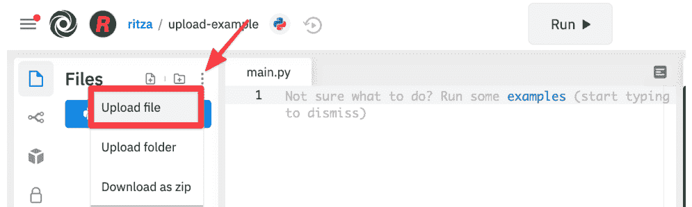

现在让我们读取文件（作为一个字符串）并将其拆分为单词列表。为了方便起见，我们将创建一个函数来为我们做这件事，并在 vocab 文件上进行测试。

```
def load_words_from_file(filename):
    """ 从 filename 读取单词，返回单词列表。 """
    f = open(filename, "r")
    file_content = f.read()
    f.close()
    wds = file_content.split()
    return wds

bigger_vocab = load_words_from_file("vocab.txt")
print("词汇表中有 {0} 个单词，开头是\n {1} "
      .format(len(bigger_vocab), bigger_vocab[:6]))
```

Python 响应如下：

```
词汇表中有 19469 个单词，开头是
['a', 'aback', 'abacus', 'abandon', 'abandoned', 'abandonment']
```

所以我们有了一个更合理大小的词汇表。现在让我们加载一本书，再次使用我们在本章开头下载的那本。加载一本书与从文件加载单词非常相似，但我们将进行一些额外的“黑魔法”。书里充满了标点符号，并且混合了小写和大写字母。我们需要清理书的内容。这将涉及移除标点符号，并将所有内容转换为相同的大小写（小写，因为我们的词汇表都是小写的）。因此，我们需要一种更复杂的方法将文本转换为单词。

第 14 章：列表算法

231

```
1 test(text_to_words("My name is Earl!") == ["my", "name", "is", "earl"])
2 test(text_to_words("'Well, I never!', said Alice.') ==
3                         ["well", "i", "never", "said", "alice"])
```

字符串有一个强大的 `translate` 方法。其思想是设置所需的替换——对于每个字符，我们可以给出一个对应的替换字符。`translate` 方法将在整个字符串中应用这些替换。那么，我们开始吧：

```
1 def text_to_words(the_text):
2     """ 返回一个单词列表，移除所有标点符号，
3         并全部转换为小写。
4     """
5 
6     my_substitutions = the_text.maketrans(
7         # 如果你找到这些中的任何一个
8         "ABCDEFGHIJKLMNOPQRSTUVWXYZ0123456789!"#$%&()*+,-./:;<=>?@[\]^_`{|}~'",
9         # 用这些替换它们
10        "abcdefghijklmnopqrstuvwxyz                                        ")
11 
12     # 现在翻译文本。
13     cleaned_text = the_text.translate(my_substitutions)
14     wds = cleaned_text.split()
15     return wds
```

翻译将所有大写字符转换为小写，将所有标点符号字符和数字转换为空格。然后，当然，`split` 在将文本拆分为单词列表时会去掉空格。
测试通过了。
现在我们准备好读取我们的书了：

```
1 def get_words_in_book(filename):
2     """ 从 filename 读取一本书，并返回其单词列表。 """
3     f = open(filename, "r")
4     content = f.read()
5     f.close()
5     wds = text_to_words(content)
6     return wds
7 
8 book_words = get_words_in_book("alice_in_wonderland.txt")
9 print("书中有 {0} 个单词，前 100 个是\n{1}".
10       format(len(book_words), book_words[:100]))
```

Python 打印以下内容（都在一行上，我们为教科书做了一点修改）：这本书共有27336个单词，前100个单词是
['alice', 's', 'adventures', 'in', 'wonderland', 'lewis', 'carroll',
'chapter', 'i', 'down', 'the', 'rabbit', 'hole', 'alice', 'was',
'beginning', 'to', 'get', 'very', 'tired', 'of', 'sitting', 'by',
'her', 'sister', 'on', 'the', 'bank', 'and', 'of', 'having',
'nothing', 'to', 'do', 'once', 'or', 'twice', 'she', 'had',
'peeped', 'into', 'the', 'book', 'her', 'sister', 'was', 'reading',
'but', 'it', 'had', 'no', 'pictures', 'or', 'conversations', 'in',
'it', 'and', 'what', 'is', 'the', 'use', 'of', 'a', 'book',
'thought', 'alice', 'without', 'pictures', 'or', 'conversation',
'so', 'she', 'was', 'considering', 'in', 'her', 'own', 'mind',
'as', 'well', 'as', 'she', 'could', 'for', 'the', 'hot', 'day',
'made', 'her', 'feel', 'very', 'sleepy', 'and', 'stupid',
'whether', 'the', 'pleasure', 'of', 'making', 'a']

好了，现在我们已经准备好了所有部分。让我们看看这本书中有哪些单词不在词汇表中：

```
>>> missing_words = find_unknown_words(bigger_vocab, book_words)
```

现在我们需要等待相当长的时间，大约一分钟，Python才最终处理完毕，并打印出书中不在词汇表中的3398个单词的列表。嗯……这并不是特别可扩展。对于一个大二十倍的词汇表（例如，你经常会发现学校词典有300,000个单词），以及更长的书籍，这将会很慢。所以，让我们在思考如何在下一节改进这个问题的同时，进行一些计时测量。

```
import time

t0 = time.process_time()
missing_words = find_unknown_words(bigger_vocab, book_words)
t1 = time.process_time()
print("There are {0} unknown words.".format(len(missing_words)))
print("That took {0:.4f} seconds.".format(t1-t0))
```

我们得到结果和一些可以稍后参考的计时数据：

```
There are 3398 unknown words.
That took 49.8014 seconds.
```

### 14.4. 二分查找

如果你思考一下我们刚刚做的事情，它并不是我们在现实生活中工作的方式。如果给你一个词汇表，并要求你判断某个单词是否存在，你可能会从中间开始。你可以这样做，因为词汇表是有序的——所以你可以探测中间的某个单词，并立即意识到你的目标在探测的单词之前（或者之后）。反复应用这个原则，引导我们找到了一个在已排序的项目列表中搜索的更好的算法。（注意，如果项目没有排序，你除了查看所有项目外别无选择。但是，如果我们知道项目是有序的，我们就可以改进我们的搜索技术）。

让我们从一些测试开始。记住，列表需要是排序的：

```
xs = [2,3,5,7,11,13,17,23,29,31,37,43,47,53]
test(search_binary(xs, 20) == -1)
test(search_binary(xs, 99) == -1)
test(search_binary(xs, 1) == -1)
for (i, v) in enumerate(xs):
    test(search_binary(xs, v) == i)
```

即使我们的测试用例这次也很有趣：注意我们从列表中不存在的项目开始，并查看边界条件——在列表中间，小于列表中的所有项目，大于最大的项目。然后我们使用一个循环，将每个列表项作为目标，并确认我们的二分查找返回该列表中对应项的索引。

思考在被搜索的列表中有一个*感兴趣区域*（ROI）是有用的。这个ROI将是列表中仍然可能找到我们目标的部分。我们的算法将从ROI设置为列表中的所有项目开始。在ROI中间的第一次探测中，有三种可能的结果：要么我们找到目标，要么我们知道可以丢弃ROI的上半部分，或者我们知道可以丢弃ROI的下半部分。我们不断重复这个过程，直到找到目标，或者直到感兴趣区域中没有更多项目。我们可以这样编码：

```python
def search_binary(xs, target):
    """ Find and return the index of key in sequence xs """
    lb = 0
    ub = len(xs)
    while True:
        if lb == ub:   # If region of interest (ROI) becomes empty
            return -1

        # Next probe should be in the middle of the ROI
        mid_index = (lb + ub) // 2

        # Fetch the item at that position
        item_at_mid = xs[mid_index]

        # print("ROI[{0}:{1}](size={2}), probed='{3}', target='{4}'"
        #       .format(lb, ub, ub-lb, item_at_mid, target))

        # How does the probed item compare to the target?
        if item_at_mid == target:
            return mid_index    # Found it!
        if item_at_mid < target:
            lb = mid_index + 1  # Use upper half of ROI next time
        else:
            ub = mid_index      # Use lower half of ROI next time
```

感兴趣区域由两个变量表示，一个下界`lb`和一个上界`ub`。精确了解这些索引的值是什么很重要。我们将让`lb`持有ROI中第一个项目的索引，让`ub`持有最后一个感兴趣项目*之后*的索引。因此，这些语义类似于Python切片语义：感兴趣区域恰好是切片`xs[lb:ub]`。（该算法实际上从未获取任何数组切片！）

有了这段代码，我们的测试通过了。太好了。现在，如果我们用这个搜索算法的调用代替`find_unknown_words`中的`search_linear`调用，我们能提高性能吗？让我们这样做，并再次运行这个测试：

```python
t0 = time.process_time()
missing_words = find_unknown_words(bigger_vocab, book_words)
t1 = time.process_time()
print("There are {0} unknown words.".format(len(missing_words)))
print("That took {0:.4f} seconds.".format(t1-t0))
```

多么惊人的差异！快了200多倍！

```
There are 3398 unknown words.
That took 0.2262 seconds.
```

为什么这个二分查找比线性查找快这么多？如果我们取消注释第15和16行的打印语句，我们将得到搜索过程中探测的跟踪。让我们继续，尝试一下：

```
>>> search_binary(bigger_vocab, "magic")
ROI[0:19469](size=19469), probed='known', target='magic'
ROI[9735:19469](size=9734), probed='retailer', target='magic'
ROI[9735:14602](size=4867), probed='overthrow', target='magic'
ROI[9735:12168](size=2433), probed='mission', target='magic'
ROI[9735:10951](size=1216), probed='magnificent', target='magic'
ROI[9735:10343](size=608), probed='liken', target='magic'
ROI[10040:10343](size=303), probed='looks', target='magic'
ROI[10192:10343](size=151), probed='lump', target='magic'
ROI[10268:10343](size=75), probed='machete', target='magic'
ROI[10306:10343](size=37), probed='mafia', target='magic'
ROI[10325:10343](size=18), probed='magnanimous', target='magic'
ROI[10325:10334](size=9), probed='magical', target='magic'
ROI[10325:10329](size=4), probed='maggot', target='magic'
ROI[10328:10329](size=1), probed='magic', target='magic'
10328
```

在这里我们看到，找到目标单词“magic”只需要14次探测，就在索引10328处找到了。重要的是，每次探测都将剩余的感兴趣区域减半（带有一些截断）。相比之下，线性查找需要10329次探测才能找到相同的目标单词。

单词*binary*的意思是*二*。二分查找得名于每次探测将列表分成两部分，并从感兴趣区域中丢弃一半的事实。

这个算法的美妙之处在于，即使我们将词汇表的大小翻倍，它也只需要多一次探测！再翻倍一次，又只需要多一次探测。所以随着词汇表变大，这个算法的性能变得更加令人印象深刻。

我们能用一个公式来表示吗？如果我们的列表大小是N，我们可能需要的最大探测次数k是多少？如果我们将问题反过来，数学计算会更容易一些：在只允许进行k次探测的情况下，我们能处理多大的列表N？

进行1次探测，我们只能搜索大小为1的列表。进行2次探测，我们可以处理大小最多为3的列表——（第一次探测测试中间项，然后第二次探测测试左子列表或右子列表）。再进行一次探测，我们可以处理7个项目（中间项，以及两个大小为3的子列表）。进行4次探测，我们可以搜索15个项目，5次探测让我们可以搜索多达31个项目。所以一般关系由公式给出

### 14.5. 从列表中移除相邻重复项

我们经常需要获取列表中的唯一元素，即生成一个新列表，其中每个不同的元素只出现一次。以我们在《爱丽丝梦游仙境》中查找不在我们词汇表中的单词为例。我们曾报告有3398个这样的单词，但该列表中存在重复项。事实上，单词“alice”在书中出现了398次，而它并不在我们的词汇表中！我们该如何移除这些重复项呢？

一个好方法是先对列表排序，然后移除所有相邻的重复项。让我们从移除相邻重复项开始：

```
test(remove_adjacent_dups([1,2,3,3,3,3,5,6,9,9])) == [1,2,3,5,6,9])
test(remove_adjacent_dups([]) == [])
test(remove_adjacent_dups(["a", "big", "big", "bite", "dog"]) ==
                            ["a", "big", "bite", "dog"])
```

这个算法简单且高效。我们只需记住最近插入结果列表的元素，并避免再次插入它：

```
def remove_adjacent_dups(xs):
    """ 返回一个新列表，其中已移除 xs 中所有相邻的重复项。
    """
    result = []
    most_recent_elem = None
    for e in xs:
        if e != most_recent_elem:
            result.append(e)
            most_recent_elem = e

    return result
```

该算法的工作量是线性的——xs 中的每个元素都使循环恰好执行一次，并且没有嵌套循环。因此，将 xs 中的元素数量加倍应导致此函数运行时间加倍：列表大小与运行时间的关系将绘制为一条直线（线性）。

现在让我们回到对《爱丽丝梦游仙境》的分析。在将书中的单词与词汇表进行核对之前，我们将对这些单词进行排序并消除重复项。因此，我们的新代码如下所示：

```
all_words = get_words_in_book("alice_in_wonderland.txt")
all_words.sort()
book_words = remove_adjacent_dups(all_words)
print("There are {0} words in the book. Only {1} are unique.".
                    format(len(all_words), len(book_words)))
print("The first 100 words are\n{0}".
                    format(book_words[:100]))
```

几乎神奇地，我们得到了以下输出：

```
There are 27336 words in the book. Only 2570 are unique.
The first 100 words are
['_i_', 'a', 'abide', 'able', 'about', 'above', 'absence', 'absurd',
 'acceptance', 'accident', 'accidentally', 'account', 'accounting',
 'accounts', 'accusation', 'accustomed', 'ache', 'across', 'act',
 'actually', 'ada', 'added', 'adding', 'addressed', 'addressing',
 'adjourn', 'adoption', 'advance', 'advantage', 'adventures',
 'advice', 'advisable', 'advise', 'affair', 'affectionately',
 'afford', 'afore', 'afraid', 'after', 'afterwards', 'again',
 'against', 'age', 'ago', 'agony', 'agree', 'ah', 'ahem', 'air',
 'airs', 'alarm', 'alarmed', 'alas', 'alice', 'alive', 'all',
 'allow', 'almost', 'alone', 'along', 'aloud', 'already', 'also',
 'altered', 'alternately', 'altogether', 'always', 'am', 'ambition',
 'among', 'an', 'ancient', 'and', 'anger', 'angrily', 'angry',
 'animal', 'animals', 'ann', 'annoy', 'annoyed', 'another',
 'answer', 'answered', 'answers', 'antipathies', 'anxious',
 'anxiously', 'any', 'anything', 'anywhere', 'appealed', 'appear',
 'appearance', 'appeared', 'appearing', 'applause', 'apple',
 'apples', 'arch']
```

刘易斯·卡罗尔仅用2570个不同的单词就创作出了一部经典文学作品！

### 14.6. 合并已排序的列表

假设我们有两个已排序的列表。设计一个算法将它们合并成一个单一的已排序列表。

一个简单但低效的算法可以是直接将两个列表拼接在一起，然后对结果进行排序：

```
newlist = (xs + ys)
newlist.sort()
```

但这没有利用两个列表已经排序这一事实，对于非常大的列表，其可扩展性和性能会很差。
让我们先准备一些测试用例：

```
xs = [1,3,5,7,9,11,13,15,17,19]
ys = [4,8,12,16,20,24]
zs = xs+ys
zs.sort()
test(merge(xs, []) == xs)
test(merge([], ys) == ys)
test(merge([], []) == [])
test(merge(xs, ys) == zs)
test(merge([1,2,3], [3,4,5]) == [1,2,3,3,4,5])
test(merge(["a", "big", "cat"], ["big", "bite", "dog"]) ==
["a", "big", "big", "bite", "cat", "dog"])
```

以下是我们的合并算法：

```
def merge(xs, ys):
    """ 合并已排序的列表 xs 和 ys。返回一个已排序的结果 """
    result = []
    xi = 0
    yi = 0

    while True:
        if xi >= len(xs): # 如果 xs 列表已处理完，
            result.extend(ys[yi:]) # 将 ys 中剩余的项目添加进来
            return result # 然后完成。

        if yi >= len(ys): # 同样，但交换角色
            result.extend(xs[xi:])
            return result

        # 两个列表仍有项目，将较小的项目复制到结果中。
        if xs[xi] <= ys[yi]:
            result.append(xs[xi])
            xi += 1
        else:
            result.append(ys[yi])
            yi += 1
```

该算法的工作原理如下：我们创建一个结果列表，并维护两个索引，每个列表一个（第3-5行）。在循环的每次迭代中，将两个列表中较小的项目复制到结果列表中，并推进该列表的索引。一旦任一索引到达其列表的末尾，我们就将另一个列表中的所有剩余项目复制到结果中，然后返回。

### 14.7. 再谈《爱丽丝梦游仙境》！

合并已排序列表的算法背后，是一种广泛可复用的深层计算模式。该模式的精髓是“*遍历列表，始终处理每个列表中剩余的最小项目，并考虑以下情况：*”

- 当任一列表没有更多项目时，我们该怎么办？
- 如果每个列表中的最小项目彼此相等，我们该怎么办？
- 如果第一个列表中的最小项目小于第二个列表中的最小项目，我们该怎么办？
- 在剩余的情况下，我们该怎么办？

假设我们有两个已排序的列表。通过调整合并算法模式来处理以下每种情况，锻炼你的算法技能：

- 仅返回同时存在于两个列表中的项目。
- 仅返回存在于第一个列表但不在第二个列表中的项目。
- 仅返回存在于第二个列表但不在第一个列表中的项目。
- 返回存在于第一个或第二个列表中的项目。
- 返回第一个列表中未被第二个列表中匹配元素消除的项目。在这种情况下，第二个列表中的一个项目“淘汰”第一个列表中的一个匹配项。此操作有时称为 `bagdiff`。例如 `bagdiff([5,7,11,11,11,12,13], [7,8,11])` 将返回 `[5,11,11,12,13]`。

在上一节中，我们对书中的单词进行了排序并消除了重复项。我们的词汇表也是排序的。因此，上述第三种情况——查找第二个列表中不在第一个列表中的所有项目，将是实现 `find_unknown_words` 的另一种方式。与其在字典中搜索每个单词（无论是线性搜索还是二分搜索），为何不使用合并算法的变体来返回出现在书中但不在词汇表中的单词呢？

```python
def find_unknowns_merge_pattern(vocab, wds):
    """ Both the vocab and wds must be sorted. Return a new
        list of words from wds that do not occur in vocab.
    """

    result = []
    xi = 0
    yi = 0

    while True:
        if xi >= len(vocab):
            result.extend(wds[yi:])
            return result

        if yi >= len(wds):
            return result

        if vocab[xi] == wds[yi]:  # Good, word exists in vocab
            yi += 1

        elif vocab[xi] < wds[yi]:  # Move past this vocab word,
            xi += 1

        else:                      # Got word that is not in vocab
            result.append(wds[yi])
            yi += 1
```

现在，我们将所有部分整合在一起：

这里的性能表现更加惊人：

```
There are 828 unknown words.
That took 0.0410 seconds.
```

让我们回顾一下我们做了什么。我们从一个在词汇表中逐词线性查找的方法开始，该方法大约需要50秒。我们实现了一个巧妙的二分查找，将时间缩短到0.22秒，快了200多倍。但随后我们做了更好的事情：我们对书中的单词进行了排序，消除了重复项，并使用合并模式来查找书中不在字典里的单词。这比二分查找算法还要快大约五倍。在本章结束时，我们的算法比最初的尝试快了1000多倍！

这真可以称得上是高效的一天！

### 14.8. 八皇后问题，第一部分

正如维基百科所述，“*八皇后问题是将八个国际象棋皇后放置在8x8棋盘上，使得没有两个皇后相互攻击的问题。因此，一个解决方案要求没有两个皇后共享同一行、列或对角线。*”

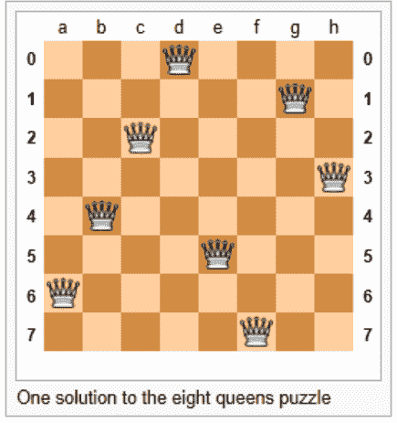

请自己尝试一下，并手动找出更多解决方案。

我们想编写一个程序来找到这个谜题的解决方案。事实上，这个谜题可以推广到在NxN棋盘上放置N个皇后，所以我们将考虑一般情况，而不仅仅是8x8的情况。也许我们可以找到在12x12棋盘上放置12个皇后，或在20x20棋盘上放置20个皇后的解决方案。

我们如何处理这样一个复杂的问题？一个好的起点是思考我们的*数据结构*——我们究竟计划如何在程序中表示棋盘及其皇后的状态？一旦我们对谜题在内存中的样子有了一些把握，我们就可以开始思考解决谜题所需的函数和逻辑，即我们如何将另一个皇后放到棋盘上的某个位置，并检查它是否与棋盘上已有的任何皇后冲突。

找到一个好的表示方法，然后找到一个好的算法来操作数据，这两个步骤并不总是可以相互独立地完成。当你思考所需的操作时，你可能希望稍微改变或重组数据，以使所需的操作更容易进行。

算法和数据之间的这种关系，在计算机科学先驱之一、Pascal语言的发明者尼克劳斯·维尔特所著的书名《*算法+数据结构=程序*》中得到了优雅的表达。

让我们集思广益，思考一下如何在内存中表示棋盘和皇后。

- 一种可能性是使用二维矩阵（一个包含8个列表的列表，每个列表包含8个方格）。我们想知道棋盘的每个方格是否包含皇后——每个方格只有两种可能的状态——所以也许列表中的每个元素可以是True或False，或者更简单地，是0或1。

那么，上述解决方案的状态可以有如下数据表示：

```
bd1 = [[0,0,0,1,0,0,0,0],
       [0,0,0,0,0,0,1,0],
       [0,0,1,0,0,0,0,0],
       [0,0,0,0,0,0,0,1],
       [0,1,0,0,0,0,0,0],
       [0,0,0,0,1,0,0,0],
       [1,0,0,0,0,0,0,0],
       [0,0,0,0,0,1,0,0]]
```

你还应该能看出空棋盘将如何表示，并开始想象需要对数据进行哪些操作或更改，才能将另一个皇后放置在棋盘上的某个位置。

- 另一个想法可能是保留一个皇后位置的坐标列表。例如，使用图中的表示法，我们可以将该解决方案的状态表示为：

```
bd2 = [ "a6", "b4", "c2", "d0", "e5", "f7", "g1", "h3" ]
```

- 我们可以对此进行其他调整——也许这个列表中的每个元素应该是一个元组，两个轴都使用整数坐标。作为优秀的计算机科学家，我们可能会从0开始为每个轴编号，而不是从1开始。现在我们的表示可以是：

```
bd3 = [(0,6), (1,4), (2,2), (3,0), (4,5), (5,7), (6,1), (7,3)]
```

- 看着这种表示，我们不禁注意到第一个坐标是0,1,2,3,4,5,6,7，它们恰好对应于列表中每对元素的索引位置。所以我们可以丢弃它们，得出这个非常紧凑的替代表示：

```
bd4 = [6, 4, 2, 0, 5, 7, 1, 3]
```

这将是我们要使用的表示，让我们看看它能带我们走向何方。

现在让我们对这个问题有一些深刻的见解。你认为解决方案中没有重复数字是巧合吗？解决方案[6,4,2,0,5,7,1,3]包含数字0,1,2,3,4,5,6,7，但没有一个是重复的！其他解决方案可能包含重复数字吗，还是不会？

稍加思考就能让你确信，解决方案中永远不可能有重复的数字：这些数字代表皇后所在的行，因为我们永远不允许将两个皇后放在同一行，所以任何解决方案中都不会有重复的行号。

我们的关键洞察

> 在我们的表示中，N皇后问题的任何解决方案都必须是数字[0 .. N-1]的一个排列。

请注意，并非所有排列都是解决方案。例如，[0,1,2,3,4,5,6,7]将所有皇后都放在同一条对角线上。

哇，我们似乎仅仅通过思考，而不是编码，就在这个问题上取得了进展！

我们的算法现在应该开始成形了。我们可以从列表[0..N-1]开始，生成该列表的各种排列，并检查每个排列是否有任何冲突（皇后位于同一条对角线上）。如果没有冲突，它就是一个解决方案，我们可以打印它。

让我们在这个问题上精确而清晰：如果我们只使用行的排列，并且使用我们紧凑的表示，那么皇后之间不可能在行或列上发生冲突，我们甚至不需要考虑这些情况。所以我们唯一需要测试的冲突是对角线上的冲突。

听起来一个有用的函数应该是能够测试两个皇后是否共享一条对角线。每个皇后都在某个(x,y)位置。那么，位于(5,2)的皇后与位于(2,0)的皇后共享一条对角线吗？(5,2)与(3,0)冲突吗？

```
test(not share_diagonal(5,2,2,0))
test(share_diagonal(5,2,3,0))
test(share_diagonal(5,2,4,3))
test(share_diagonal(5,2,4,1))
```

一点几何知识会对我们有所帮助。一条对角线的斜率要么是1，要么是-1。我们真正想问的问题是*它们在x和y方向上的距离是否相同？* 如果是，它们就共享一条对角线。因为对角线可以向左或向右，所以这个程序使用每个方向上的绝对距离是合理的：

```
def share_diagonal(x0, y0, x1, y1):
    """ Is (x0, y0) on a shared diagonal with (x1, y1)? """
    dy = abs(y1 - y0)    # Calc the absolute y distance
    dx = abs(x1 - x0)    # Calc the absolute x distance
    return dx == dy       # They clash if dx == dy
```

如果你复制代码并运行它，你会很高兴地发现测试通过了！

现在让我们考虑如何手动构建一个解决方案。我们将在第一列的某个位置放置一个皇后，然后在第二列放置一个，前提是它不与棋盘上已有的皇后冲突。然后我们将放置第三个，检查它是否与左侧已有的两个皇后冲突。当我们考虑第6列的皇后时，我们需要检查它是否与左侧所有列（即第0,1,2,3,4,5列）的皇后冲突。

因此，下一个构建块是一个函数，给定一个部分完成的谜题，它可以检查第c列的皇后是否与左侧第0,1,2,..c-1列的任何皇后冲突：

```
# Solutions cases that should not have any clashes
test(not col_clashes([6,4,2,0,5], 4))
test(not col_clashes([6,4,2,0,5,7,1,3], 7))

# More test cases that should mostly clash
test(col_clashes([0,1], 1))
test(col_clashes([5,6], 1))
test(col_clashes([6,5], 1))
test(col_clashes([0,6,4,3], 3))
test(col_clashes([5,0,7], 2))
test(not col_clashes([2,0,1,3], 1))
test(col_clashes([2,0,1,3], 2))
```

这是我们的函数，它让所有测试都通过了：

def col_clashes(bs, c):
    """ 如果第 c 列的皇后与左侧任意皇后冲突，则返回 True。
    """
    for i in range(c):    # 检查 c 列左侧的所有列
        if share_diagonal(i, bs[i], c, bs[c]):
            return True

    return False          # 无冲突 - c 列的放置是安全的。

最后，我们将给程序一个排列——即所有皇后都已放置，每行一个，每列一个。但这个排列是否存在对角线冲突？

test(not has_clashes([6,4,2,0,5,7,1,3])) # 上面的解
test(has_clashes([4,6,2,0,5,7,1,3]))    # 交换前两行
test(has_clashes([0,1,2,3]))            # 尝试小的 4x4 棋盘
test(not has_clashes([2,0,3,1]))        # 4x4 情况的解

以及使测试通过的代码：

def has_clashes(the_board):
    """ 判断皇后在对角线上是否有冲突。
        这里我们假设 the_board 是列号的排列，
        因此我们不显式检查行或列的冲突。
    """
    for col in range(1, len(the_board)):
        if col_clashes(the_board, col):
            return True
    return False

到目前为止我们所做工作的总结：我们现在有了一个强大的函数 `has_clashes`，它可以判断一个配置是否是皇后问题的解。现在让我们继续生成大量排列并寻找解吧！

### 14.9. 八皇后问题，第 2 部分

这是有趣且简单的部分。我们可以尝试找出 [0,1,2,3,4,5,6,7] 的所有排列——这可能在算法上具有挑战性，并且是解决问题的*暴力*方法。我们尝试所有可能，找出所有解。

当然，我们知道 N 个元素有 N! 种排列，因此我们可以初步估计搜索所有解需要多长时间。实际上不会太长——8! 只有 40320 种不同的情况需要检查。这比从 64 个位置中放置八个皇后要好得多。如果你计算从 64 个格子中选择 8 个给皇后的组合数，公式（称为 *N choose k*，其中选择 k=8 个格子，总共有 N=64 个）会得到一个巨大的数字 4426165368，由 (64! / (8! x 56!)) 得出。

因此，我们之前的关键洞察——我们只需要考虑排列——将我们所谓的*问题空间*从大约 44 亿种情况减少到了仅仅 40320 种！

然而，我们甚至不会探索所有这些情况。当我们引入随机数模块时，我们了解到它有一个 *shuffle* 方法，可以随机排列一个项目列表。因此，我们将编写一个“随机”算法来寻找 N 皇后问题的解。我们将从排列 [0,1,2,3,4,5,6,7] 开始，反复打乱列表，并测试每个排列是否有效！在这个过程中，我们将计算在找到每个解之前需要多少次尝试，并且我们将找到 10 个解（我们可能会多次找到同一个解，因为 shuffle 是随机的！）：

def main():
    import random
    rng = random.Random()   # 实例化一个生成器

    bd = list(range(8))     # 生成初始排列
    num_found = 0
    tries = 0
    while num_found < 10:
        rng.shuffle(bd)
        tries += 1
        if not has_clashes(bd):
            print("Found solution {0} in {1} tries.".format(bd, tries))
            tries = 0
            num_found += 1

main()

几乎神奇地，而且速度很快，我们得到了这个：

1 Found solution [3, 6, 2, 7, 1, 4, 0, 5] in 693 tries.
2 Found solution [5, 7, 1, 3, 0, 6, 4, 2] in 82 tries.
3 Found solution [3, 0, 4, 7, 1, 6, 2, 5] in 747 tries.
4 Found solution [1, 6, 4, 7, 0, 3, 5, 2] in 428 tries.
5 Found solution [6, 1, 3, 0, 7, 4, 2, 5] in 376 tries.
6 Found solution [3, 0, 4, 7, 5, 2, 6, 1] in 204 tries.
7 Found solution [4, 1, 7, 0, 3, 6, 2, 5] in 98 tries.
8 Found solution [3, 5, 0, 4, 1, 7, 2, 6] in 64 tries.
9 Found solution [5, 1, 6, 0, 3, 7, 4, 2] in 177 tries.
10 Found solution [1, 6, 2, 5, 7, 4, 0, 3] in 478 tries.

这里有一个有趣的事实。在 8x8 的棋盘上，已知这个谜题有 92 个不同的解。我们随机选择我们表示的 40320 种可能排列中的一种。因此，我们每次尝试选中一个解的概率是 92/40320。换句话说，平均而言，我们需要 40320/92 次尝试——大约 438.26 次——才能偶然发现一个解。我们打印的尝试次数看起来我们的实验数据与我们的理论相当吻合！

将这段代码保存以备后用。

在 PyGame 章节中，我们计划编写一个模块来绘制带有皇后的棋盘，并将该模块与此代码集成。

### 14.10. 术语表

**二分查找**
一种著名的算法，用于在有序列表中搜索目标。列表中的每次探测都允许我们丢弃一半剩余的项目，因此该算法非常高效。

**线性**
与直线相关。在这里，我们讨论绘制算法所花费的时间如何取决于其处理的数据大小的图表。线性算法具有可以描述这种关系的直线图。

**线性搜索**
一种从第一个项目开始探测列表或序列中每个项目的搜索，直到找到它要找的东西。它用于在无序项目列表中搜索目标。

**归并算法**
一种高效的算法，将两个已排序的列表合并，产生一个排序的列表结果。归并算法实际上是一种计算模式，可以适应并重用于各种其他场景，例如找出在书中但不在词汇表中的单词。

**探测**
在搜索项目时，我们每次查看都称为探测。在我们的迭代章节中，我们也玩了一个猜测游戏，计算机试图猜测用户的秘密数字。这些尝试中的每一次也称为探测。

**测试驱动开发 (TDD)**
一种软件开发实践，通过一系列小的、迭代的步骤来实现所需的功能，这些步骤由自动化测试驱动，这些测试*首先编写*，表达了对所需功能的日益精细的描述。（有关更多信息，请参阅维基百科文章 [测试驱动开发](http://en.wikipedia.org/wiki/Test_driven_development)¹⁵。）

### 14.11. 练习

1. 本章中名为“爱丽丝梦游仙境”的部分再次从观察开始，即归并算法使用了一种可以在其他情况下重用的模式。改编归并算法来编写以下每个函数，如那里所建议的：

    1. 仅返回两个列表中都存在的项目。
    2. 仅返回存在于第一个列表中但不在第二个列表中的项目。
    3. 仅返回存在于第二个列表中但不在第一个列表中的项目。
    4. 返回存在于第一个或第二个列表中的项目。
    5. 返回第一个列表中未被第二个列表中的匹配元素消除的项目。在这种情况下，第二个列表中的一个项目“淘汰”第一个列表中的一个匹配项目。此操作有时称为 *bagdiff*。例如 `bagdiff([5,7,11,11,11,12,13], [7,8,11])` 将返回 `[5,11,11,12,13]`

2. 修改皇后程序以解决一些大小为 4、12 和 16 的棋盘。通常在一分钟内你能解决的最大谜题尺寸是多少？

3. 改编皇后程序，以便我们保留已打印解的列表，这样我们就不会重复打印同一个解。

4. 棋盘是对称的：如果我们有一个皇后问题的解，它的镜像解——无论是沿 X 轴还是 Y 轴翻转棋盘——也是一个解。并且将棋盘旋转 90 度、180 度或 270 度也是一个解。在某种意义上，仅仅是其他解的镜像或旋转的解——属于同一族——不如唯一的“核心情况”有趣。对于 8 皇后问题的 92 个解，如果你考虑旋转和镜像，只有 12 个唯一的族。维基百科上有一些关于此的精彩内容。

    1. 编写一个函数，沿 Y 轴镜像一个解，
    2. 编写一个函数，沿 X 轴镜像一个解，
    3. 编写一个函数，将解逆时针旋转 90 度，并使用它来提供 180 度和 270 度旋转。
    4. 编写一个函数，给定一个解，它生成该解的对称族。例如，[0,4,7,5,2,6,1,3] 的对称性是：

    ```
    [[0,4,7,5,2,6,1,3],[7,1,3,0,6,4,2,5],
    [4,6,1,5,2,0,3,7],[2,5,3,1,7,4,6,0],
    [3,1,6,2,5,7,4,0],[0,6,4,7,1,3,5,2],
    [7,3,0,2,5,1,6,4],[5,2,4,6,0,3,1,7]]
    ```

5. 现在改编皇后程序，使其不会列出属于同一族的解。它只打印来自唯一族的解。

6. 每周，一位计算机科学家购买四张彩票。她总是选择相同的质数，她希望如果中了大奖，就能上电视和Facebook，告诉所有人她的秘诀。这将突然引发公众对素数的广泛兴趣，并成为开启新时代的触发事件。她用Python将每周购买的彩票表示为一个列表的列表：

```
my_tickets = [ [ 7, 17, 37, 19, 23, 43],
[ 7, 2, 13, 41, 31, 43],
[ 2, 5, 7, 11, 13, 17],
[13, 17, 37, 19, 23, 43] ]
```

完成以下练习。

1.  每次彩票开奖会随机抽取六个球，编号从1到49。编写一个函数来返回一次彩票开奖结果。

2.  编写一个函数，比较一张彩票和一次开奖结果，返回该彩票上正确的号码数量：

test(lotto_match([42,4,7,11,1,13], [2,5,7,11,13,17]) == 3)

3.  编写一个函数，接受一个彩票列表和一次开奖结果，返回一个列表，显示每张彩票上正确的号码数量：

test(lotto_matches([42,4,7,11,1,13], my_tickets) == [1,2,3,1])

4.  编写一个函数，接受一个整数列表，返回列表中素数的数量：

test(primes_in([42, 4, 7, 11, 1, 13]) == 3)

5.  编写一个函数，检查这位计算机科学家在选择的四张彩票中是否遗漏了任何素数。返回她遗漏的所有素数列表：

test(prime_misses(my_tickets) == [3, 29, 47])

6.  编写一个函数，重复进行新的开奖，并将开奖结果与四张彩票进行比较。

    1.  计算需要多少次开奖，直到这位计算机科学家的某张彩票至少有3个正确号码。尝试进行二十次实验，并计算所需开奖次数的平均值。
    2.  平均需要多少次开奖，她才能至少有4个正确号码？
    3.  平均需要多少次开奖，她才能至少有5个正确号码？（提示：这可能需要一些时间。如果你能打印一些点，像进度条一样，显示20次实验中每一次何时完成，那就太好了。）

请注意，我们在这里很难构造测试用例，因为我们的随机数不是确定性的。只有在你已经知道答案应该是什么的情况下，自动化测试才真正有效！

6.  阅读《爱丽丝梦游仙境》。你可以阅读我们随教材提供的纯文本版本，或者如果你的电脑上有电子书阅读器软件，或者有Kindle、iPhone、Android等设备，你可以在 http://www.gutenberg.org 找到适合你设备的版本。他们还提供带有图片的html和pdf版本，以及数千本其他经典书籍！

## 第15章：类和对象——基础

### 15.1. 面向对象编程

Python是一种**面向对象编程语言**，这意味着它提供了支持[面向对象编程](http://en.wikipedia.org/wiki/Object-oriented_programming)¹⁶ (OOP)的特性。

面向对象编程起源于20世纪60年代，但直到20世纪80年代中期，它才成为创建新软件时使用的主要[编程范式](http://en.wikipedia.org/wiki/Programming_paradigm)¹⁷。它被开发出来是为了处理软件系统日益增长的规模和复杂性，并使这些大型复杂系统更容易随时间进行修改。

到目前为止，我们编写的大多数程序都使用[过程式编程](http://en.wikipedia.org/wiki/Procedural_programming)¹⁸范式。在过程式编程中，重点是编写操作数据的函数或*过程*。在面向对象编程中，重点是创建同时包含数据和功能的**对象**。（我们已经见过海龟对象、字符串对象和随机数生成器，这只是我们已经使用过对象的几个例子。）

通常，每个对象定义对应于现实世界中的某个对象或概念，而操作该对象的函数对应于现实世界对象交互的方式。

### 15.2. 用户定义的复合数据类型

我们已经见过像`str`、`int`、`float`和`Turtle`这样的类。我们现在准备好创建我们自己的用户定义类：`Point`。

考虑数学中点的概念。在二维空间中，点是两个数字（坐标），它们被集体视为一个对象。点通常写在括号中，坐标用逗号分隔。例如，(0, 0)表示原点，(x, y)表示从原点向右x单位、向上y单位的点。

与点相关的一些典型操作可能包括计算一个点到原点的距离，或到另一个点的距离，或找到两个点的中点，或询问一个点是否落在给定的矩形或圆内。我们很快就会看到如何将这些操作与数据组织在一起。

在Python中表示点的一种自然方式是使用两个数值。那么，问题是如何将这两个值组合成一个复合对象。一个快速而简单的解决方案是使用元组，对于某些应用来说，这可能是一个不错的选择。

另一种方法是定义一个新的**类**。这种方法需要更多的努力，但它有即将显现的优势。我们希望每个点都有一个x和一个y属性，所以我们的第一个类定义如下所示：

```python
class Point:
    """ Point class represents and manipulates x,y coords. """

    def __init__(self):
        """ Create a new point at the origin """
        self.x = 0
        self.y = 0
```

类定义可以出现在程序中的任何位置，但通常靠近开头（在`import`语句之后）。一些程序员和语言倾向于将每个类放在自己的模块中——我们这里不会这样做。类定义的语法规则与其他复合语句相同。有一个以关键字`class`开头的头部，后跟类名，以冒号结尾。缩进级别告诉我们类在哪里结束。

如果类头后面的第一行是一个字符串，它将成为类的文档字符串，并将被各种工具识别。（这也是函数中文档字符串的工作方式。）

每个类都应该有一个名为`__init__`的特殊方法。每当创建`Point`的新实例时，这个**初始化方法**会自动调用。它给程序员一个机会，通过设置新实例所需的属性的初始状态/值来设置它们。`self`参数（我们可以选择任何其他名称，但`self`是惯例）会自动设置为引用需要初始化的新创建的对象。

那么，现在让我们使用我们的新`Point`类：

```python
p = Point()      # Instantiate an object of type Point
q = Point()      # Make a second point

print(p.x, p.y, q.x, q.y)  # Each point object has its own x and y
```

这个程序打印：

0 0 0 0

因为在对象初始化期间，我们为每个对象创建了两个名为x和y的属性，并将它们都赋值为0。

这应该看起来很熟悉——我们以前使用类来创建多个对象：

```python
from turtle import Turtle

tess = Turtle()    # Instantiate objects of type Turtle
alex = Turtle()
```

变量p和q被分配了对两个新Point对象的引用。像Turtle或Point这样创建新对象实例的函数称为**构造函数**，每个类自动提供一个与类同名的构造函数函数。

将类视为制造对象的*工厂*可能会有所帮助。类本身不是点的实例，但它包含制造点实例的机制。每次我们调用构造函数，我们就是在要求工厂为我们制造一个新对象。当对象从生产线上下来时，它的初始化方法被执行，以使对象按照其工厂默认设置正确设置。

“给我制造一个新对象”和“将其设置初始化为工厂默认设置”的组合过程称为**实例化**。

### 15.3. 属性

像现实世界的对象一样，对象实例既有属性也有方法。

我们可以使用点表示法修改实例中的属性：

```python
>>> p.x = 3
>>> p.y = 4
```

模块和实例都创建自己的命名空间，访问每个命名空间中包含的名称（称为**属性**）的语法是相同的。在这种情况下，我们选择的属性是来自实例的数据项。

以下状态图显示了这些赋值的结果：

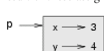

变量p引用一个Point对象，该对象包含两个属性。每个属性引用一个数字。

我们可以使用相同的语法访问属性的值：

```python
>>> print(p.y)
4
>>> x = p.x
>>> print(x)
3
```

表达式 `p.x` 的含义是，“前往对象 `p` 所指的对象，并获取 `x` 的值”。在本例中，我们将该值赋给了一个名为 `x` 的变量。变量 `x`（此处位于全局命名空间）与属性 `x`（位于实例所属的命名空间）之间不存在冲突。点表示法的目的在于明确无歧义地指明我们所引用的变量。

我们可以将点表示法用作任何表达式的一部分，因此以下语句是合法的：

```
print("(x={0}, y={1})".format(p.x, p.y))
distance_squared_from_origin = p.x * p.x + p.y * p.y
```

第一行输出 `(x=3, y=4)`。第二行计算出值 25。

### 15.4. 改进我们的初始化器

目前，要创建一个位于位置 (7, 6) 的点需要三行代码：

```
p = Point()
p.x = 7
p.y = 6
```

我们可以通过在 `__init__` 方法中添加额外参数，使我们的类构造函数更具通用性，如下例所示：

```
class Point:
    """ Point class represents and manipulates x,y coords. """

    def __init__(self, x=0, y=0):
        """ Create a new point at x, y """
        self.x = x
        self.y = y

# Other statements outside the class continue below here.
```

这里的 `x` 和 `y` 参数都是可选的。如果调用者未提供参数，它们将获得默认值 0。以下是我们改进后的类的实际使用情况：

```
>>> p = Point(4, 2)
>>> q = Point(6, 3)
>>> r = Point()       # r represents the origin (0, 0)
>>> print(p.x, q.y, r.x)
4 3 0
```

**严格来说……**

如果我们非常挑剔，我们会认为 `__init__` 方法的文档字符串不准确。`__init__` 并不*创建*对象（即为其分配内存），——它只是在对象创建后将其初始化为出厂默认设置。

但像 PyScripter 这样的工具理解实例化——创建和初始化——是同时发生的，它们选择显示*初始化器*的文档字符串作为工具提示，以指导调用类构造函数的程序员。

因此，我们编写文档字符串，使其在弹出帮助使用我们 `Point` 类的程序员时最有意义：

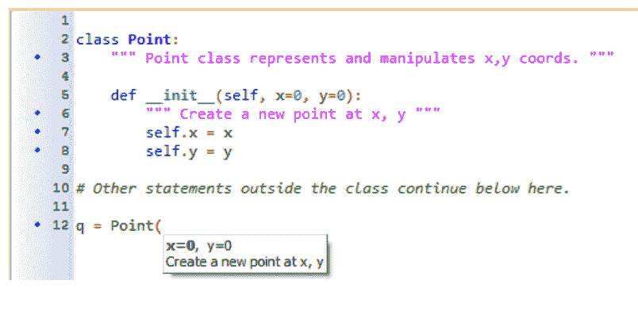

### 15.5. 为我们的类添加其他方法

使用像 `Point` 这样的类而不是简单元组 (6, 7) 的关键优势现在变得显而易见。我们可以向 `Point` 类添加对点来说有意义的操作方法，但这些方法可能不适用于其他元组，例如 (25, 12)，后者可能代表，比如，一天和一个月，例如圣诞节。因此，计算到原点的距离对点来说是有意义的，但对（日，月）数据则不然。对于（日，月）数据，我们可能需要不同的操作，例如找出它在 2020 年将是星期几。

创建像 `Point` 这样的类为我们的程序和我们的思维带来了非凡的“组织能力”。我们可以将有意义的操作及其适用的数据类型组合在一起，而类的每个实例都可以拥有自己的状态。

**方法**的行为类似于函数，但它是在特定实例上调用的，例如 `tess.right(90)`。与数据属性一样，方法使用点表示法访问。

让我们添加另一个方法 `distance_from_origin`，以更好地了解方法的工作原理：

```
class Point:
    """ Create a new Point, at coordinates x, y """

    def __init__(self, x=0, y=0):
        """ Create a new point at x, y """
        self.x = x
        self.y = y

    def distance_from_origin(self):
        """ Compute my distance from the origin """
        return ((self.x ** 2) + (self.y ** 2)) ** 0.5
```

让我们创建几个点实例，查看它们的属性，并在它们上调用我们的新方法：（我们必须先运行程序，使我们的 `Point` 类对解释器可用。）

```
>>> p = Point(3, 4)
>>> p.x
3
>>> p.y
4
>>> p.distance_from_origin()
5.0
>>> q = Point(5, 12)
>>> q.x
5
>>> q.y
12
>>> q.distance_from_origin()
13.0
>>> r = Point()
>>> r.x
0
>>> r.y
0
>>> r.distance_from_origin()
0.0
```

定义方法时，第一个参数指的是正在被操作的实例。如前所述，惯例是将此参数命名为 `self`。
注意，`distance_from_origin` 的调用者并未显式提供与 `self` 参数匹配的参数——这是由我们在背后完成的。

### 15.6. 实例作为参数和参数值

我们可以像往常一样将对象作为参数传递。我们已经在一些 turtle 示例中见过这种情况，在题为“条件语句”的章节中，我们将 turtle 传递给像 `draw_bar` 这样的函数，以便该函数可以控制和使用我们传递给它的任何 turtle 实例。
请注意，我们的变量只持有对对象的引用，因此将 `tess` 传递给函数会创建一个别名：调用者和被调用函数现在都有一个引用，但只有一个 turtle！
以下是一个涉及我们新的 `Point` 对象的简单函数：

```
def print_point(pt):
    print("({0}, {1})".format(pt.x, pt.y))
```

`print_point` 接受一个点作为参数，并以我们选择的任何方式格式化输出。如果我们使用之前定义的点 `p` 调用 `print_point(p)`，输出为 `(3, 4)`。

### 15.7. 将实例转换为字符串

大多数面向对象的程序员可能不会做我们在 `print_point` 中刚刚做的事情。当我们处理类和对象时，首选的替代方法是向类添加一个新方法。而且我们不喜欢调用 `print` 的喋喋不休的方法。更好的方法是拥有一个方法，使每个实例都能产生自身的字符串表示。我们最初将其称为 `to_string`：

```
class Point:
    # ...

    def to_string(self):
        return "({0}, {1})".format(self.x, self.y)
```

现在我们可以说：

```
>>> p = Point(3, 4)
>>> print(p.to_string())
(3, 4)
```

但是，我们不是已经有一个 `str` 类型转换器可以将我们的对象转换为字符串吗？是的！而且 `print` 在打印东西时不是自动使用这个吗？也是的！但这些自动机制尚未完全做到我们想要的：

```
>>> str(p)
'<__main__.Point object at 0x01F9AA10>'
>>> print(p)
'<__main__.Point object at 0x01F9AA10>'
```

Python 有一个巧妙的技巧来解决这个问题。如果我们把新方法命名为 `__str__` 而不是 `to_string`，那么每当 Python 解释器需要将 Point 转换为字符串时，它就会使用我们的代码。让我们现在重新做一遍：

```
class Point:
    # ...

    def __str__(self):   # All we have done is renamed the method
        return "({0}, {1})".format(self.x, self.y)
```

现在情况看起来很棒了！

```
>>> str(p)    # Python now uses the __str__ method that we wrote.
(3, 4)
>>> print(p)
(3, 4)
```

### 15.8. 实例作为返回值

函数和方法可以返回实例。例如，给定两个 Point 对象，找出它们的中点。首先，我们将把它写成一个常规函数：

```
def midpoint(p1, p2):
    """ Return the midpoint of points p1 and p2 """
    mx = (p1.x + p2.x)/2
    my = (p1.y + p2.y)/2
    return Point(mx, my)
```

该函数创建并返回一个新的 Point 对象：

```
>>> p = Point(3, 4)
>>> q = Point(5, 12)
>>> r = midpoint(p, q)
>>> r
(4.0, 8.0)
```

现在让我们把它作为一个方法来做。假设我们有一个点对象，并希望找到它与某个其他目标点之间的中点：

```
class Point:
    # ...

    def halfway(self, target):
        """ Return the halfway point between myself and the target """
        mx = (self.x + target.x)/2
        my = (self.y + target.y)/2
        return Point(mx, my)
```

这个方法与函数相同，只是一些重命名。它的用法可能像这样：

```
>>> p = Point(3, 4)
>>> q = Point(5, 12)
>>> r = p.halfway(q)
>>> r
(4.0, 8.0)
```

虽然这个例子将每个点赋值给一个变量，但这并非必须。就像函数调用是可组合的一样，方法调用和对象实例化也是可组合的，从而导致这种不使用变量的替代方案：

### 15.9. 视角的转变

函数调用的原始语法 `print_time(current_time)` 暗示函数是主动的执行者。它表达的意思类似于：“嘿，print_time！这里有一个对象需要你来打印。”

在面向对象编程中，对象被视为是主动的执行者。像 `current_time.print_time()` 这样的调用则表示：“嘿，current_time！请打印你自己！”

在我们早期介绍海龟时，我们使用了面向对象的风格，因此我们说 `tess.forward(100)`，这是要求海龟自己向前移动指定的步数。

这种视角的转变可能显得更礼貌，但起初可能并不明显它为何有用。但有时，将责任从函数转移到对象上，可以编写出功能更强大的函数，并使代码更易于维护和重用。

面向对象风格最重要的优势在于，它更准确地契合了我们的心智分组和现实生活经验。在现实生活中，我们的烹饪方法是微波炉的一部分——我们不会有一个烹饪函数孤零零地放在厨房角落，然后把微波炉传给它！同样，我们使用手机自身的方法来发送短信，或将其状态更改为静音。现实世界对象的功能往往紧密地封装在对象内部。OOP 允许我们在组织程序时准确地反映这一点。

### 15.10. 对象可以有状态

当我们还需要维护一些不时更新的状态时，对象就显得最为有用。考虑一个海龟对象。它的状态包括其位置、朝向、颜色和形状等信息。像 `left(90)` 这样的方法会更新海龟的朝向，`forward` 会改变其位置，依此类推。

对于一个银行账户对象，状态的一个主要组成部分是当前余额，可能还有所有交易的日志。这些方法将允许我们查询当前余额、存入新资金或进行支付。支付操作将包括金额和描述，以便可以将其添加到交易日志中。我们还需要一个方法来显示交易日志。

### 15.11. 术语表

**属性**
构成实例的命名数据项之一。

**类**
一种用户定义的复合类型。类也可以被视为其实例对象的模板。（iPhone 是一个类。到 2010 年 12 月，估计已售出 5000 万个实例！）

**构造函数**
每个类都有一个“工厂”，其名称与类相同，用于创建新实例。如果类有一个*初始化方法*，则此方法用于正确设置新对象的属性（即状态）。

**初始化方法**
Python 中的一种特殊方法（名为 `__init__`），在创建新对象时自动调用，以将新创建对象的属性设置为其初始（工厂默认）状态。

**实例**
类型为某个类的对象。实例和对象可互换使用。

**实例化**
创建一个类的实例，并运行其初始化器。

**方法**
在类定义内部定义的函数，并在该类的实例上调用。

**对象**
一种复合数据类型，常用于对现实世界中的事物或概念进行建模。它将与该类数据相关的数据和操作捆绑在一起。实例和对象可互换使用。

**面向对象编程**
一种强大的编程风格，其中数据和操作它的操作被组织成对象。

**面向对象语言**
一种提供诸如用户定义类和继承等特性的语言，这些特性有助于面向对象编程。

### 15.12. 练习

1.  重写名为 *Fruitful functions* 章节中的 `distance` 函数，使其接受两个 `Point` 作为参数，而不是四个数字。

2.  为 `Point` 添加一个方法 `reflect_x`，该方法返回一个新的 `Point`，即该点关于 x 轴的反射点。例如，`Point(3, 5).reflect_x()` 的结果是 `(3, -5)`。

3.  添加一个方法 `slope_from_origin`，该方法返回连接原点与该点的直线的斜率。例如：

```
>>> Point(4, 10).slope_from_origin()
2.5
```

哪些情况会导致此方法失败？

4.  直线的方程是“y = ax + b”（或者可能是“y = mx + c”）。系数 a 和 b 完全描述了这条直线。在 `Point` 类中编写一个方法，使得如果给定一个点实例和另一个点，它将计算连接这两个点的直线方程。它必须以两个值的元组形式返回两个系数。例如：

```
>>> print(Point(4, 11).get_line_to(Point(6, 15)))
(2, 3)
```

这告诉我们连接这两个点的直线方程是“y = 2x + 3”。此方法何时会失败？

5.  给定四个落在圆周上的点，找到圆的圆心。此函数何时会失败？

*提示：* 你*必须*在考虑编程之前*知道如何解决这个几何问题。如果你不理解你希望计算机做什么，你就无法为问题编程出解决方案！

6.  创建一个新类 `SMS_store`。该类将实例化 `SMS_store` 对象，类似于手机上的收件箱或发件箱：

```
my_inbox = SMS_store()
```

此存储可以容纳多条短信（即其内部状态将只是一个消息列表）。每条消息将表示为一个元组：

```
(has_been_viewed, from_number, time_arrived, text_of_SMS)
```

收件箱对象应提供以下方法：

```
my_inbox.add_new_arrival(from_number, time_arrived, text_of_SMS)
# 创建新的短信元组，将其插入到存储中的其他消息之后。
# 创建此消息时，其 has_been_viewed 状态设置为 False。

my_inbox.message_count()
# 返回 my_inbox 中短信消息的数量

my_inbox.get_unread_indexes()
# 返回所有尚未查看的短信消息的索引列表

my_inbox.get_message(i)
# 返回 message[i] 的 (from_number, time_arrived, text_of_sms)
# 同时将其状态更改为“已查看”。
# 如果位置 i 没有消息，则返回 None

my_inbox.delete(i)    # 删除索引 i 处的消息
my_inbox.clear()      # 删除收件箱中的所有消息
```

编写该类，创建一个消息存储对象，为这些方法编写测试，并实现这些方法。

## 第 16 章：类和对象——深入一点

### 16.1. 矩形

假设我们想要一个类来表示位于 XY 平面某处的矩形。问题是，我们需要提供哪些信息来指定这样一个矩形？为简单起见，假设矩形是垂直或水平放置的，从不倾斜。

有几种可能性：我们可以指定矩形的中心（两个坐标）及其大小（宽度和高度）；或者我们可以指定一个角及其大小；或者我们可以指定两个对角。一个常规的选择是指定矩形的左上角及其大小。

同样，我们将定义一个新类，并为其提供一个初始化器和一个字符串转换方法：

```
class Rectangle:
    """ A class to manufacture rectangle objects """

    def __init__(self, posn, w, h):
        """ Initialize rectangle at posn, with width w, height h """
        self.corner = posn
        self.width = w
        self.height = h

    def __str__(self):
        return "({0}, {1}, {2})"
                .format(self.corner, self.width, self.height)

box = Rectangle(Point(0, 0), 100, 200)
bomb = Rectangle(Point(100, 80), 5, 10)    # In my video game
print("box: ", box)
print("bomb: ", bomb)
```

为了指定左上角，我们在新的 Rectangle 对象中嵌入了一个 Point 对象（就像我们在上一章中使用的那样）！我们创建了两个新的 Rectangle 对象，然后打印它们，输出如下：

### 16.2. 对象是可变的

我们可以通过对对象的某个属性进行赋值来改变其状态。例如，要增加一个矩形的大小而不改变其位置，我们可以修改 `width` 和 `height` 的值：

```
box.width += 50
box.height += 100
```

当然，我们可能更希望提供一个方法将这个操作封装在类内部。我们还将提供另一个方法来将矩形移动到其他位置：

```
class Rectangle:
    # ...

    def grow(self, delta_width, delta_height):
        """ Grow (or shrink) this object by the deltas """
        self.width += delta_width
        self.height += delta_height

    def move(self, dx, dy):
        """ Move this object by the deltas """
        self.corner.x += dx
        self.corner.y += dy
```

让我们来试试：

```
>>> r = Rectangle(Point(10,5), 100, 50)
>>> print(r)
((10, 5), 100, 50)
>>> r.grow(25, -10)
>>> print(r)
((10, 5), 125, 40)
>>> r.move(-10, 10)
>>> print(r)
((0, 15), 125, 40)
```

### 16.3. 同一性

“相同”这个词的含义似乎非常明确，直到我们仔细思考，才发现它比我们最初预期的要复杂得多。

例如，如果我们说“爱丽丝和鲍勃有相同的车”，我们的意思是他们的车是同一品牌和型号，但它们是两辆不同的车。如果我们说“爱丽丝和鲍勃有相同的母亲”，我们的意思是他们的母亲是同一个人。

当我们谈论对象时，也存在类似的歧义。例如，如果两个 `Point` 对象是相同的，这是否意味着它们包含相同的数据（坐标），还是它们实际上是同一个对象？

我们已经在关于列表的章节中见过 `is` 运算符，当时我们讨论了别名：它允许我们找出两个引用是否指向同一个对象：

```
>>> p1 = Point(3, 4)
>>> p2 = Point(3, 4)
>>> p1 is p2
False
```

即使 `p1` 和 `p2` 包含相同的坐标，它们也不是同一个对象。如果我们将 `p1` 赋值给 `p3`，那么这两个变量就是同一个对象的别名：

```
>>> p3 = p1
>>> p1 is p3
True
```

这种相等性称为**浅相等**，因为它只比较引用，而不比较对象的内容。
要比较对象的内容——**深相等**——我们可以编写一个名为 `same_coordinates` 的函数：

```
def same_coordinates(p1, p2):
    return (p1.x == p2.x) and (p1.y == p2.y)
```

现在，如果我们创建两个包含相同数据的不同对象，我们可以使用 `same_coordinates` 来找出它们是否表示具有相同坐标的点。

```
>>> p1 = Point(3, 4)
>>> p2 = Point(3, 4)
>>> same_coordinates(p1, p2)
True
```

当然，如果两个变量指向同一个对象，它们既具有浅相等也具有深相等。

#### 警惕 ==

> “当我用一个词的时候，”矮胖子以一种相当轻蔑的语气说，“它的意思就是我选择它的意思——不多也不少。” *《爱丽丝梦游仙境》*

Python 有一个强大的特性，它允许类的设计者决定像 `==` 或 `<` 这样的操作应该意味着什么。（我们刚刚展示了如何控制我们自己的对象如何转换为字符串，所以我们已经迈出了第一步！）我们稍后会介绍更多细节。但有时实现者会附加浅相等语义，有时则是深相等，如下面这个小实验所示：

```
p = Point(4, 2)
s = Point(4, 2)
print("== on Points returns", p == s)
# By default, == on Point objects does a shallow equality test

a = [2,3]
b = [2,3]
print("== on lists returns", a == b)
# But by default, == does a deep equality test on lists
```

输出如下：

```
== on Points returns False
== on lists returns True
```

因此我们得出结论，即使两个列表（或元组等）是具有不同内存地址的不同对象，对于列表，`==` 运算符测试的是深相等，而在点的情况下，它进行的是浅测试。

### 16.4. 复制

别名可能会使程序难以阅读，因为在一个地方所做的更改可能会在另一个地方产生意想不到的效果。很难跟踪所有可能引用给定对象的变量。

复制对象通常是别名的一种替代方案。`copy` 模块包含一个名为 `copy` 的函数，可以复制任何对象：

```
>>> import copy
>>> p1 = Point(3, 4)
>>> p2 = copy.copy(p1)
>>> p1 is p2
False
>>> same_coordinates(p1, p2)
True
```

一旦我们导入了 `copy` 模块，我们就可以使用 `copy` 函数来创建一个新的 `Point`。`p1` 和 `p2` 不是同一个点，但它们包含相同的数据。

要复制像 `Point` 这样不包含任何嵌入对象的简单对象，`copy` 就足够了。这称为浅复制。

对于像 `Rectangle` 这样包含对 `Point` 引用的对象，`copy` 做得并不完全正确。它复制的是对 `Point` 对象的引用，因此旧的 `Rectangle` 和新的 `Rectangle` 都指向同一个 `Point`。

如果我们以通常的方式创建一个矩形 `b1`，然后使用 `copy` 创建一个副本 `b2`，结果的状态图如下所示：

这几乎肯定不是我们想要的。在这种情况下，对其中一个 `Rectangle` 对象调用 `grow` 不会影响另一个，但对任何一个调用 `move` 都会影响两个！这种行为令人困惑且容易出错。浅复制为表示角点的 `Point` 创建了一个别名。

幸运的是，`copy` 模块包含一个名为 `deepcopy` 的函数，它不仅复制对象，还复制任何嵌入的对象。了解到这个操作被称为**深复制**也就不足为奇了。

```
>>> b2 = copy.deepcopy(b1)
```

现在 `b1` 和 `b2` 是完全独立的对象。

### 16.5. 术语表

**深复制**
复制对象的内容以及任何嵌入的对象，以及嵌入在它们中的对象，依此类推；由 `copy` 模块中的 `deepcopy` 函数实现。

**深相等**
值的相等，或两个引用指向具有相同值的对象。

**浅复制**
复制对象的内容，包括对嵌入对象的任何引用；由 `copy` 模块中的 `copy` 函数实现。

**浅相等**
引用的相等，或两个引用指向同一个对象。

### 16.6. 练习

1.  在 `Rectangle` 类中添加一个 `area` 方法，返回任何实例的面积：

```
r = Rectangle(Point(0, 0), 10, 5)
test(r.area() == 50)
```

2.  在 `Rectangle` 类中编写一个 `perimeter` 方法，以便我们可以找到任何矩形实例的周长：

```
r = Rectangle(Point(0, 0), 10, 5)
test(r.perimeter() == 30)
```

3.  在 `Rectangle` 类中编写一个 `flip` 方法，交换任何矩形实例的宽度和高度：

```
r = Rectangle(Point(100, 50), 10, 5)
test(r.width == 10 and r.height == 5)
r.flip()
test(r.width == 5 and r.height == 10)
```

4.  在 `Rectangle` 类中编写一个新方法，测试一个 `Point` 是否落在矩形内。对于这个练习，假设一个位于 (0,0)、宽度为 10、高度为 5 的矩形在宽度和高度上具有开放的上界，即它在 x 方向上从 [0 到 10) 延伸，其中 0 包含在内但 10 被排除，在 y 方向上从 [0 到 5) 延伸。因此它不包含点 (10,2)。以下测试应该通过：

```
r = Rectangle(Point(0, 0), 10, 5)
test(r.contains(Point(0, 0)))
test(r.contains(Point(3, 3)))
test(not r.contains(Point(3, 7)))
test(not r.contains(Point(3, 5)))
test(r.contains(Point(3, 4.99999)))
test(not r.contains(Point(-3, -3)))
```

5.  在游戏中，我们经常在精灵周围放置一个矩形的“边界框”。（精灵是一个可以在游戏中移动的对象，我们很快就会看到。）然后我们可以通过比较它们的矩形是否在任何地方重叠来对炸弹和飞船等进行*碰撞检测*。

编写一个函数来确定两个矩形是否碰撞。*提示：这可能是一个相当困难的练习！在编码之前，请仔细考虑所有情况。*

## 第17章：PyGame

PyGame 是一个不属于标准 Python 发行版的包，因此如果你尚未安装它（即 `import pygame` 失败），请从 http://pygame.org/download.shtml 下载并安装合适的版本。本笔记基于 PyGame 1.9.1，这是撰写时的最新版本。

PyGame 附带了大量的教程、示例和帮助文档，因此你有充分的机会在代码上挑战自我。不过，你可能需要稍微找找才能找到这些资源：例如，如果你在 Windows 机器上安装了 PyGame，它们最终会位于类似 C:\Python31\Lib\site-packages\pygame\ 的文件夹中，你会在其中找到 *docs* 和 *examples* 目录。

### 17.1. 游戏循环

我们将要讨论的游戏结构总是遵循这个固定模式：

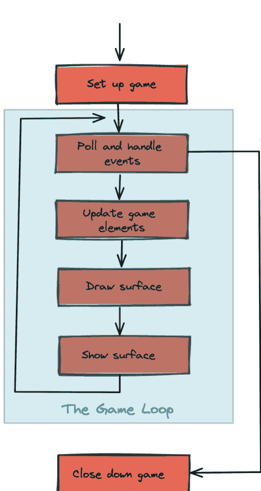

在每个游戏中，在 *设置* 部分，我们将创建一个窗口，加载并准备一些内容，然后进入 **游戏循环**。游戏循环持续做四件主要的事情：

- 它 **轮询** 事件——即询问系统是否发生了事件——并做出适当响应，
- 它更新任何需要更改的内部数据结构或对象，
- 它将游戏的当前状态绘制到一个（不可见的）表面上，
- 它将刚刚绘制的表面显示出来。

```python
import pygame

def main():
    """ Set up the game and run the main game loop """
    pygame.init()     # Prepare the pygame module for use
    surface_sz = 480  # Desired physical surface size, in pixels.

    # Create surface of (width, height), and its window.
    main_surface = pygame.display.set_mode((surface_sz, surface_sz))

    # Set up some data to describe a small rectangle and its color
    small_rect = (300, 200, 150, 90)
    some_color = (255, 0, 0)    # A color is a mix of (Red, Green, Blue)

    while True:
        ev = pygame.event.poll()  # Look for any event
        if ev.type == pygame.QUIT:  # Window close button clicked?
            break              #    ... leave game loop

        # Update your game objects and data structures here...

        # We draw everything from scratch on each frame.
        # So first fill everything with the background color
        main_surface.fill((0, 200, 255))

        # Overpaint a smaller rectangle on the main surface
        main_surface.fill(some_color, small_rect)

        # Now the surface is ready, tell pygame to display it!
        pygame.display.flip()

    pygame.quit()    # Once we leave the loop, close the window.

main()
```

这个程序会弹出一个窗口，该窗口会一直存在直到我们关闭它：

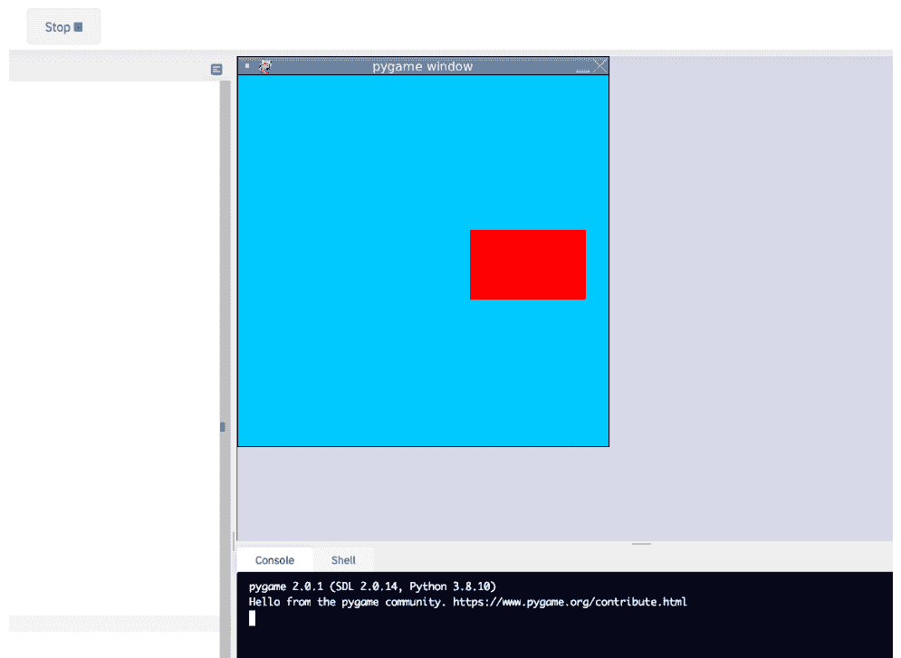

PyGame 将所有图形绘制到矩形 *表面* 上。在第5行初始化 PyGame 后，我们创建了一个包含主表面的窗口。游戏的主循环从第15行延伸到第30行，包含以下关键逻辑：

- 首先（第16行），我们轮询以获取下一个可能准备好的事件。此步骤之后总会跟一些条件语句，用于确定是否发生了我们感兴趣的任何事件。就 PyGame 而言，轮询事件会消耗该事件，因此我们只有一次机会获取和使用每个事件。在第17行，我们测试事件类型是否为预定义常量 pygame.QUIT。这是当用户点击 PyGame 窗口的关闭按钮时我们会看到的事件。对此事件的响应是，我们离开循环。
- 一旦我们离开循环，第32行的代码会关闭窗口，我们将从函数 `main` 返回。你的程序可以继续做其他事情，或者重新初始化 pygame 并创建另一个窗口，但通常它也会结束。
- 有不同种类的事件——按键、鼠标移动、鼠标点击、操纵杆移动等等。通常，我们会在第19行之前插入新代码来测试和处理所有这些情况。总体思路是“先处理事件，然后再考虑其他事情”。
- 在第20行，我们会更新对象或数据——例如，如果我们想改变即将绘制的矩形的颜色、位置或大小，我们会在这里重新赋值 `some_color` 和 `small_rect`。
- 编写游戏的一种现代方式（既然我们有了快速的计算机和快速的显卡）是在游戏循环的每次迭代中从头开始重绘所有内容。因此，我们在第24行做的第一件事就是用背景色填充整个表面。表面的 `fill` 方法接受两个参数——用于填充的颜色，以及要填充的矩形。但第二个参数是可选的，如果省略，则填充整个表面。
- 在第27行，我们填充第二个矩形，这次使用 `some_color`。矩形的位置和大小由元组 `small_rect` 给出，这是一个4元素元组 (x, y, width, height)。
- 重要的是要理解 PyGame 表面的原点位于左上角（不同于将原点放在屏幕中间的 turtle 模块）。因此，如果你想让矩形更靠近窗口顶部，你需要使其 y 坐标更小。
- 如果你的图形显示硬件试图在程序写入内存的同时读取内存，它们会相互干扰，导致视频噪声和闪烁。为了解决这个问题，PyGame 在主表面中维护两个缓冲区——程序绘制到的 *后缓冲区*，而 *前缓冲区* 正在向用户显示。每次程序完全准备好其后缓冲区后，它会翻转两个缓冲区的后/前角色。因此，第24行和第27行的绘制不会改变屏幕上看到的内容，直到我们在第30行 `flip` 缓冲区。

### 17.2. 显示图像和文本

要在主表面上绘制图像，我们需要将图像（比如一个沙滩球）加载到其自己的新表面中。主表面有一个 `blit` 方法，可以将像素从沙滩球表面复制到其自身表面。当我们调用 `blit` 时，我们可以指定沙滩球应放置在主表面的哪个位置。术语 **blit** 在计算机图形学中广泛使用，意思是 *将像素从内存的一个区域快速复制到另一个区域*。

因此，在设置部分，在我们进入游戏循环之前，我们会加载图像，像这样：

```python
ball = pygame.image.load("ball.png")
```

在上面程序的第28行之后，我们会添加这段代码来在位置 (100,120) 显示我们的图像：

```python
main_surface.blit(ball, (50, 70))
```

要显示文本，我们需要做三件事。在我们进入游戏循环之前，我们实例化一个字体对象：

```python
# Instantiate 16 point Courier font to draw text.
my_font = pygame.font.SysFont("Courier", 16)
```

同样，在第28行之后，我们使用字体的 render 方法创建一个包含绘制文本像素的新表面，然后，就像图像的情况一样，我们将新表面 blit 到主表面。注意 render 接受两个额外的参数——第二个参数告诉它在绘制时是否要仔细平滑文本的边缘（这个过程称为抗锯齿），第二个参数是我们希望文本呈现的颜色。这里我们使用了 (0,0,0)，即黑色：

```python
the_text = my_font.render("Hello, world!", True, (0,0,0))
main_surface.blit(the_text, (10, 10))
```

我们将通过计算帧数——游戏循环的迭代次数——并记录一些计时信息来演示这两个新功能。在每一帧，我们将显示帧数和帧率。我们只会在每500帧后更新帧率，届时我们会查看时间间隔并进行计算。

首先下载一张沙滩球的图片。你可以在 https://learnpythontherightway.com/_-downloads/ball.png 找到一张。使用“上传文件”菜单将其上传到你的 repl。现在你可以运行以下代码。

```python
import pygame
import time

def main():

    pygame.init()    # Prepare the PyGame module for use
    main_surface = pygame.display.set_mode((480, 240))

    # Load an image to draw. Substitute your own.
    # PyGame handles gif, jpg, png, etc. image types.
    ball = pygame.image.load("ball.png")

    # Create a font for rendering text
    my_font = pygame.font.SysFont("Courier", 16)

    frame_count = 0
    frame_rate = 0
    t0 = time.process_time()

    while True:

        # Look for an event from keyboard, mouse, joystick, etc.
        ev = pygame.event.poll()
        if ev.type == pygame.QUIT:    # Window close button clicked?
            break                     # Leave game loop

        # Do other bits of logic for the game here
        frame_count += 1
        if frame_count % 500 == 0:
            t1 = time.process_time()
            frame_rate = 500 / (t1-t0)
            t0 = t1

        # Completely redraw the surface, starting with background
        main_surface.fill((0, 200, 255))

        # Put a red rectangle somewhere on the surface
        main_surface.fill((255,0,0), (300, 100, 150, 90))

        # Copy our image to the surface, at this (x,y) posn
        main_surface.blit(ball, (50, 70))

        # Make a new surface with an image of the text
```

帧率高得离谱——远超人眼处理画面的速度。（商业电子游戏通常将帧率设定为每秒60帧（fps）。）当然，一旦我们在游戏循环中开始执行更复杂的操作，帧率就会下降。

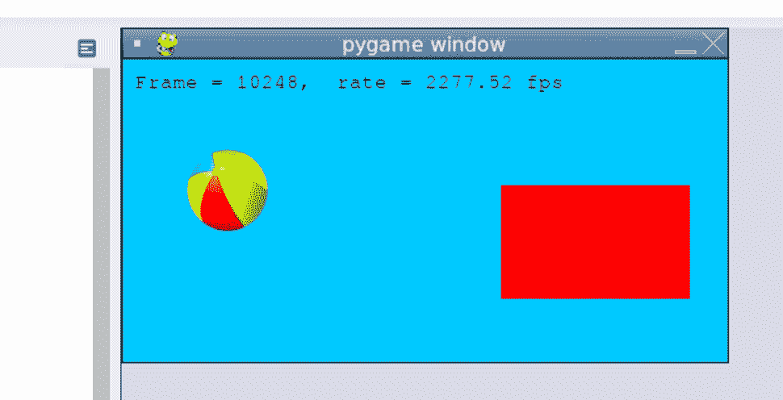

### 17.3. 为N皇后问题绘制棋盘

我们之前已经解决了N皇后问题。对于8x8的棋盘，其中一个解是列表[6,4,2,0,5,7,1,3]。让我们用这个解作为测试数据，现在使用PyGame来绘制这个带有皇后的棋盘。

我们将为绘图代码创建一个新模块，名为`draw_queens.py`。当我们的测试用例运行成功后，我们可以回到求解器，导入这个新模块，并在每次发现解时调用我们的新函数来绘制棋盘。

我们首先用黑色和红色的方格作为棋盘背景。也许我们可以创建一个图像来加载和绘制，但这种方法需要为不同尺寸的棋盘准备不同的背景图像。直接绘制我们自己的、尺寸合适的红色和黑色矩形听起来更有趣！

```python
def draw_board(the_board):
    """ Draw a chess board with queens, from the_board. """

    pygame.init()
    colors = [(255,0,0), (0,0,0)]    # Set up colors [red, black]

    n = len(the_board)              # This is an NxN chess board.
    surface_sz = 480                # Proposed physical surface size.

    sq_sz = surface_sz // n         # sq_sz is length of a square.
    surface_sz = n * sq_sz          # Adjust to exactly fit n squares.

    # Create the surface of (width, height), and its window.
    surface = pygame.display.set_mode((surface_sz, surface_sz))
```

这里我们预先计算了`sq_sz`，即每个方格的整数尺寸，以便我们能将方格完美地放入可用窗口中。因此，如果我们希望棋盘是480x480，并且我们绘制的是8x8的棋盘，那么每个方格的尺寸就需要是60个单位。但我们注意到，7x7的棋盘无法完美地放入480——我们会得到一些难看的边框，方格无法完全填满。因此，在创建窗口之前，我们重新计算了表面尺寸，以确保能精确容纳我们的方格。

现在让我们在游戏循环中绘制方格。我们需要一个嵌套循环：外层循环遍历棋盘的行，内层循环遍历列：

```python
# Draw a fresh background (a blank chess board)
for row in range(n):          # Draw each row of the board.
    c_indx = row % 2          # Change starting color on each row
    for col in range(n):      # Run through cols drawing squares
        the_square = (col*sq_sz, row*sq_sz, sq_sz, sq_sz)
        surface.fill(colors[c_indx], the_square)
        # now flip the color index for the next square
        c_indx = (c_indx + 1) % 2
```

这段代码中有两个重要的思想：首先，我们根据行和列的循环变量计算要填充的矩形，将它们乘以方格的尺寸以获得其位置。当然，每个方格都有固定的宽度和高度。因此，`the_square`代表了当前循环迭代中要填充的矩形。第二个思想是，我们必须在每个方格上交替颜色。在之前的设置代码中，我们创建了一个包含两种颜色的列表，这里我们操作`c_indx`（它始终只有0或1两个值），使每一行的起始颜色与前一行不同，并在每次填充方格时切换颜色。

这（连同其他未显示的、将表面翻转到屏幕上的代码片段）产生了令人愉悦的背景，如下所示，适用于不同尺寸的棋盘：


现在，开始绘制皇后！回想一下，我们的解[6,4,2,0,5,7,1,3]意味着在棋盘的第0列，我们希望皇后在第6行；在第1列，皇后在第4行，以此类推。因此，我们需要一个循环来遍历每个皇后：

```python
for (col, row) in enumerate(the_board):
    # draw a queen at col, row...
```

在本章中，我们已经有一个沙滩球的图像，所以我们将用它来代表皇后。在游戏循环之前的设置代码中，我们加载球的图像（就像之前做的那样），在循环体中，我们添加这行代码：

```python
surface.blit(ball, (col * sq_sz, row * sq_sz))
```

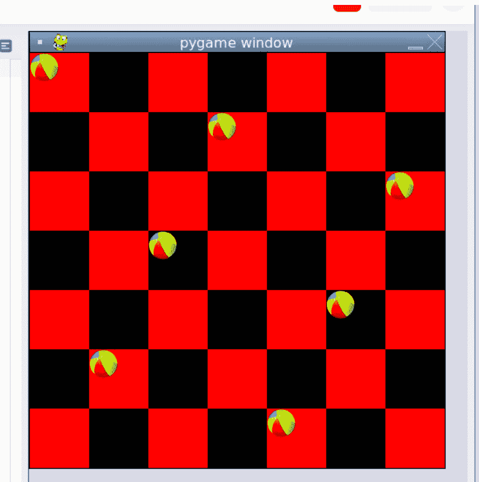

我们快完成了，但那些皇后需要居中在它们的方格里！我们的问题源于球和矩形都以左上角作为参考点。如果我们要将这个球居中放在方格里，我们需要在x和y方向上给它一个额外的偏移量。（由于球是圆的，方格是正方形的，两个方向的偏移量是相同的，所以我们只计算一个偏移值，并在两个方向上使用它。）

我们需要的偏移量是（方格尺寸减去球尺寸）的一半。因此，我们将在游戏的设置部分预先计算这个值，在加载球并确定方格尺寸之后：

```python
ball_offset = (sq_sz - ball.get_width()) // 2
```

现在我们修改球的绘图代码，就完成了：

```python
surface.blit(ball, (col * sq_sz + ball_offset, row * sq_sz + ball_offset))
```

我们可能需要考虑一下，如果球比方格大，会发生什么。在这种情况下，`ball_offset`会变成负数。所以它仍然会居中在方格里——只是会溢出边界，或者可能完全遮住方格！

以下是完整的程序：

```python
import pygame

def draw_board(the_board):
    """ Draw a chess board with queens, as determined by the the_board. """

    pygame.init()
    colors = [(255,0,0), (0,0,0)]    # Set up colors [red, black]

    n = len(the_board)            # This is an NxN chess board.
    surface_sz = 480              # Proposed physical surface size.
    sq_sz = surface_sz // n       # sq_sz is length of a square.
    surface_sz = n * sq_sz        # Adjust to exactly fit n squares.

    # Create the surface of (width, height), and its window.
    surface = pygame.display.set_mode((surface_sz, surface_sz))

    ball = pygame.image.load("ball.png")

    # Use an extra offset to centre the ball in its square.
    # If the square is too small, offset becomes negative,
    #   but it will still be centered :-)
    ball_offset = (sq_sz-ball.get_width()) // 2

    while True:

        # Look for an event from keyboard, mouse, etc.
        ev = pygame.event.poll()
        if ev.type == pygame.QUIT:
            break;

        # Draw a fresh background (a blank chess board)
        for row in range(n):        # Draw each row of the board.
            c_indx = row % 2        # Alternate starting color
            for col in range(n):    # Run through cols drawing squares
                the_square = (col*sq_sz, row*sq_sz, sq_sz, sq_sz)
                surface.fill(colors[c_indx], the_square)
                # Now flip the color index for the next square
                c_indx = (c_indx + 1) % 2

        # Now that squares are drawn, draw the queens.
        for (col, row) in enumerate(the_board):
            surface.blit(ball,
                (col*sq_sz+ball_offset,row*sq_sz+ball_offset))

        pygame.display.flip()


    pygame.quit()

if __name__ == "__main__":
    draw_board([0, 5, 3, 1, 6, 4, 2])    # 7 x 7 to test window size
    draw_board([6, 4, 2, 0, 5, 7, 1, 3])
    draw_board([9, 6, 0, 3, 10, 7, 2, 4, 12, 8, 11, 5, 1])  # 13 x 13
    draw_board([11, 4, 8, 12, 2, 7, 3, 15, 0, 14, 10, 6, 13, 1, 5, 9])
```

这里还有一件事值得回顾。第50行的条件语句测试当前执行程序的名称是否为`__main__`。这使我们能够区分这个模块是作为主程序运行，还是被其他地方导入并用作模块。如果我们在Python中运行这个模块，第51-54行的测试用例将会被执行。然而，如果我们把这个模块导入到另一个程序中（即我们之前的N皇后求解器），第50行的条件将为假，第51-54行的语句就不会运行。

在第14章（14.9. 八皇后问题，第2部分）中，我们的主程序看起来像这样：

def main():

    bd = list(range(8))    # 生成初始排列
    num_found = 0
    tries = 0
    while num_found < 10:
        random.shuffle(bd)
        tries += 1
        if not has_clashes(bd):
            print("Found solution {0} in {1} tries.".format(bd, tries))
            tries = 0
            num_found += 1

main()
```

现在我们只需要做两处修改。在程序的顶部，导入我们一直在使用的模块（假设我们将其命名为 `draw_queens`）。（你需要确保两个模块保存在同一个文件夹中。）然后在第10行之后，添加一个调用来绘制我们刚刚发现的解：

```
draw_queens.draw_board(bd)
```

这样就得到了一个非常令人满意的组合：程序可以搜索N皇后问题的解，并且每当找到一个解时，就会弹出一个棋盘来展示该解。

### 17.4. 精灵

精灵是一个可以在游戏中移动的对象，它有自己的内部行为和状态。例如，一艘飞船可以是一个精灵，玩家可以是一个精灵，子弹和炸弹也都可以是精灵。

面向对象编程（OOP）非常适合这种情况：每个对象都可以有自己的属性和内部状态，以及一些方法。让我们用N皇后棋盘来玩点花样。我们不想把皇后放在她的最终位置，而是想让她从棋盘顶部掉下来，让她落入位置，也许途中还会弹跳。

我们需要的第一个封装是将每个皇后变成一个对象。我们将维护一个所有活动精灵的列表（即一个皇后对象列表），并在游戏循环中安排两件新事情：

- 在处理事件之后、绘制之前，对每个精灵调用一个 `update` 方法。这将给每个精灵一个机会，以某种方式修改其内部状态——也许改变其图像，或改变其位置，或旋转自身，或让自己变大一点或变小一点。
- 一旦所有精灵都更新了自己，游戏循环就可以开始绘制——首先绘制背景，然后依次对每个精灵调用 `draw` 方法，并将绘制任务委托（交给）对象本身。这符合OOP的理念，我们不是说“嘿，`draw`，显示这个皇后！”，而是更倾向于说“嘿，`皇后`，自己画自己！”

我们从一个简单的对象开始，暂时没有移动或动画，只是一个脚手架，看看如何将所有部分组合在一起：

```
class QueenSprite:

    def __init__(self, img, target_posn):
        """ 为棋盘上的这个目标位置创建并初始化一个皇后
        """
        self.image = img
        self.target_posn = target_posn
        self.posn = target_posn

    def update(self):
        return              # 暂时什么都不做。

    def draw(self, target_surface):
        target_surface.blit(self.image, self.posn)
```

我们给了精灵三个属性：要绘制的图像、目标位置和当前位置。如果我们要移动精灵，当前位置可能需要与目标位置不同，目标位置是我们希望皇后最终到达的地方。在这段代码中，我们目前在 `update` 方法中什么也没做，而我们的 `draw` 方法（将来可能保持这么简单）只是将其自身绘制在调用者提供的表面的当前位置上。

有了类定义，我们现在实例化我们的N个皇后，将它们放入精灵列表中，并安排游戏循环在每一帧调用每个精灵的 `update` 和 `draw` 方法。新的代码片段和修改后的游戏循环如下所示：

```
1  all_sprites = []      # 保存游戏中所有精灵的列表
2
3  # 为每个皇后创建一个精灵对象，并填充我们的列表。
4  for (col, row) in enumerate(the_board):
5      a_queen = QueenSprite(ball,
                            (col*sq_sz+ball_offset, row*sq_sz+ball_offset))
6      all_sprites.append(a_queen)
7
8  while True:
9      # 查找来自键盘、鼠标等的事件。
10     ev = pygame.event.poll()
11     if ev.type == pygame.QUIT:
12         break;
13
14     # 要求每个精灵更新自身。
15     for sprite in all_sprites:
16         sprite.update()
17
18     # 绘制一个新的背景（一个空白的棋盘）
19     # ... 与之前相同 ...
20
21     # 要求每个精灵绘制自身。
22     for sprite in all_sprites:
23         sprite.draw(surface)
24
25     pygame.display.flip()
```

这就像之前一样工作，但我们为皇后创建对象所做的额外工作，为一些更雄心勃勃的扩展铺平了道路。

让我们从一个下落的皇后对象开始。在任何时刻，它都会有一个速度，即在某个方向上的速率。（我们只处理y方向的运动，但发挥你的想象力！）因此，在对象的 `update` 方法中，我们希望通过其速度来改变其当前位置。如果我们的N皇后棋盘漂浮在太空中，速度将保持不变，但是，嘿，在地球上我们有重力！重力在每个时间间隔都会改变速度，所以我们需要一个球在下落过程中加速。重力对所有皇后来说都是恒定的，所以我们不会将其保存在实例中——我们只需将其作为模块中的一个变量。我们还将做另一个改变：我们将让每个皇后从棋盘顶部开始，这样它就可以向其目标位置下落。有了这些改变，我们现在得到以下内容：

```
gravity = 0.0001

class QueenSprite:

    def __init__(self, img, target_posn):
        self.image = img
        self.target_posn = target_posn
        (x, y) = target_posn
        self.posn = (x, 0)    # 让球从其列的顶部开始
        self.y_velocity = 0    # 初始速度为零

    def update(self):
        self.y_velocity += gravity    # 重力改变速度
        (x, y) = self.posn
        new_y_pos = y + self.y_velocity  # 速度移动球
        self.posn = (x, new_y_pos)       # 到这个新位置。

    def draw(self, target_surface):    # 与之前相同。
        target_surface.blit(self.image, self.posn)
```

进行这些更改后，我们得到了一个新的棋盘，其中每个皇后从其列的顶部开始，并加速，直到它从棋盘底部掉落并永远消失。一个好的开始——我们有了运动！

下一步是让球在到达其自身目标位置时反弹。让东西反弹相当容易——你只需改变其速度的符号，它就会以相同的速度向相反方向移动。当然，如果它正朝着棋盘顶部向上移动，它会被重力减速。（重力总是向下拉！）你会发现它会一直反弹到它开始的地方，速度达到零，然后再次开始下落。所以我们将得到永远不会安定下来的弹跳球。

让对象安定下来的一个现实方法是每次反弹时损失一些能量（可能是由于摩擦）——所以不是简单地反转速度符号，我们将其乘以某个分数因子——比如 -0.65。这意味着球每次反弹只保留65%的能量，所以它会像现实生活中一样，在短时间后停止反弹，并在其“地面”上安定下来。

唯一的更改在 `update` 方法中，现在看起来像这样：

```
def update(self):
    self.y_velocity += gravity
    (x, y) = self.posn
    new_y_pos = y + self.y_velocity
    (target_x, target_y) = self.target_posn  # 解包位置
    dist_to_go = target_y - new_y_pos        # 距离我们的地面还有多远？

    if dist_to_go < 0:                       # 我们在地面以下吗？
        self.y_velocity = -0.65 * self.y_velocity  # 反弹
        new_y_pos = target_y + dist_to_go    # 移回地面上方

    self.posn = (x, new_y_pos)               # 设置我们的新位置。
```

呵呵呵！我们不会展示动画截图，所以请将代码复制到你的Python环境中自己看看。

### 17.5. 事件

到目前为止，我们处理的唯一事件类型是QUIT事件。但我们也可以检测按键按下和释放事件、鼠标移动以及鼠标按钮按下或释放事件。请查阅PyGame文档并点击链接到Event。

当你的程序轮询并从PyGame接收到一个事件对象时，其事件类型将决定有哪些次要信息可用。每个事件对象都携带一个*字典*（你可能在这些笔记的适当时候才会学到）。字典保存了某些对事件类型有意义的*键*和*值*。

例如，如果事件类型是MOUSEMOTION，我们就能在附加到事件的字典中找到鼠标位置和鼠标按钮状态的信息。同样，如果事件是KEYDOWN，我们可以从字典中得知哪个键被按下，以及是否有任何修饰键（shift、control、alt等）也被按下。当游戏窗口变为活动状态（即获得焦点）或失去焦点时，你也会收到事件。

如果没有等待的事件，将返回类型为NOEVENT的事件对象。事件可以被打印出来，让你可以进行实验和玩耍。因此，在轮询任何事件之后立即将这些代码行放入游戏循环中，会非常有信息量：

设置好后，按下空格键和退出键，观察你得到的事件。点击你的三个鼠标按钮。将鼠标在窗口上移动。（这会产生大量事件，因此你可能还需要将这些事件从打印中过滤掉。）你将得到类似这样的输出：

```
1  <Event(17-VideoExpose {})> 
2  <Event(1-ActiveEvent {'state': 1, 'gain': 0})> 
3  <Event(2-KeyDown {'scancode': 57, 'key': 32, 'unicode': ' ', 'mod': 0})> 
4  <Event(3-KeyUp {'scancode': 57, 'key': 32, 'mod': 0})> 
5  <Event(2-KeyDown {'scancode': 1, 'key': 27, 'unicode': '\x1b', 'mod': 0})> 
6  <Event(3-KeyUp {'scancode': 1, 'key': 27, 'mod': 0})> 
7  ... 
8  <Event(4-MouseMotion {'buttons': (0, 0, 0), 'pos': (323, 194), 'rel': (-3, -1)})> 
9  <Event(4-MouseMotion {'buttons': (0, 0, 0), 'pos': (322, 193), 'rel': (-1, -1)})> 
10 <Event(4-MouseMotion {'buttons': (0, 0, 0), 'pos': (321, 192), 'rel': (-1, -1)})> 
11 <Event(4-MouseMotion {'buttons': (0, 0, 0), 'pos': (319, 192), 'rel': (-2, 0)})> 
12 <Event(5-MouseButtonDown {'button': 1, 'pos': (319, 192)})> 
13 <Event(6-MouseButtonUp {'button': 1, 'pos': (319, 192)})> 
14 <Event(4-MouseMotion {'buttons': (0, 0, 0), 'pos': (319, 191), 'rel': (0, -1)})> 
15 <Event(5-MouseButtonDown {'button': 2, 'pos': (319, 191)})> 
16 <Event(5-MouseButtonDown {'button': 5, 'pos': (319, 191)})> 
17 <Event(6-MouseButtonUp {'button': 5, 'pos': (319, 191)})> 
18 <Event(6-MouseButtonUp {'button': 2, 'pos': (319, 191)})> 
19 <Event(5-MouseButtonDown {'button': 3, 'pos': (319, 191)})> 
20 <Event(6-MouseButtonUp {'button': 3, 'pos': (319, 191)})> 
21 ... 
22 <Event(1-ActiveEvent {'state': 1, 'gain': 0})> 
23 <Event(12-Quit {})>
```

那么，现在让我们在游戏循环顶部附近的代码中进行这些更改：

```python
while True:
    # Look for an event from keyboard, mouse, etc.
    ev = pygame.event.poll()
    if ev.type == pygame.QUIT:
        break
    if ev.type == pygame.KEYDOWN:
        key = ev.dict["key"]
        if key == 27:              # On Escape key ...
            break                  #   leave the game loop.
        if key == ord("r"):
            colors[0] = (255, 0, 0)    # Change to red + black.
        elif key == ord("g"):
            colors[0] = (0, 255, 0)    # Change to green + black.
        elif key == ord("b"):
            colors[0] = (0, 0, 255)    # Change to blue + black.

    if ev.type == pygame.MOUSEBUTTONDOWN: # Mouse gone down?
        posn_of_click = ev.dict["pos"]    # Get the coordinates.
        print(posn_of_click)              # Just print them.
```

第7-16行展示了处理KEYDOWN事件的典型方式——如果一个键被按下，我们会测试是哪个键，并采取一些行动。有了这个，我们有了另一种退出皇后程序的方法——通过按下退出键。此外，我们可以使用按键来改变绘制的棋盘颜色。

最后，在第20行，我们（相当简陋地）响应了鼠标按钮的按下。

作为本节的最后一个练习，我们将编写一个更好的鼠标点击响应处理器。我们要做的是弄清楚用户是否点击了我们的某个精灵。如果在点击发生时鼠标下方有一个精灵，我们将把点击事件发送给该精灵，并让它以某种合理的方式响应。

我们将从一些代码开始，这些代码可以找出点击位置下方是哪个精灵，可能没有！我们向类中添加一个方法`contains_point`，如果点在精灵的矩形内，则返回`True`：

```python
def contains_point(self, pt):
    """ Return True if my sprite rectangle contains point pt """
    (my_x, my_y) = self.posn
    my_width = self.image.get_width()
    my_height = self.image.get_height()
    (x, y) = pt
    return ( x >= my_x and x < my_x + my_width and
             y >= my_y and y < my_y + my_height)
```

现在在游戏循环中，一旦我们看到了鼠标事件，我们就确定哪个皇后（如果有的话）应该被告知响应事件：

```python
if ev.type == pygame.MOUSEBUTTONDOWN:
    posn_of_click = ev.dict["pos"]
    for sprite in all_sprites:
        if sprite.contains_point(posn_of_click):
            sprite.handle_click()
            break
```

最后一件事是在`QueenSprite`类中编写一个名为`handle_click`的新方法。当精灵被点击时，我们只需在向上的方向上增加一些速度，即把它踢回空中。

```python
def handle_click(self):
    self.y_velocity += -0.3   # Kick it up
```

有了这些更改，我们有了一个可玩的游戏！看看你是否能让所有的球都保持运动，不让任何一个停下来！

### 17.6. 动画浪潮

许多游戏都有动画精灵：它们蹲下、跳跃和射击。它们是怎么做到的？
考虑这10张图片的序列：如果我们快速连续地显示它们，Duke会向我们挥手。
（Duke是来自Javaland王国的友好访客。）


一个包含用于动画的小*补丁*的复合图像称为**精灵表**。通过在浏览器中右键单击并将其保存到你的工作目录中，命名为`duke_spritesheet.png`，来下载这个精灵表。

精灵表是经过精心准备的：10个补丁中的每一个都精确地间隔50像素。因此，假设我们想绘制补丁编号4（从0开始编号），我们只想绘制在精灵表中从x位置200开始、宽度为50像素的矩形。这里我们展示了补丁并突出显示了我们想要绘制的补丁。

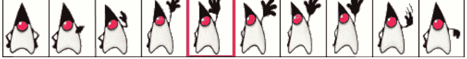

我们一直在使用的`blit`方法——用于将像素从一个表面复制到另一个表面——可以复制源表面的子矩形。因此，这里的宏伟想法是，每次我们绘制Duke时，我们不会blit整个精灵表。相反，我们将提供一个额外的矩形参数，该参数决定了精灵表的哪个部分将被blit。

我们将在本节中向现有的N皇后绘制游戏添加新代码。我们想要的是在棋盘上某个地方放置一些Duke的实例。如果用户点击其中一个，我们将让他通过挥手来响应，完成他的一个动画周期。

但在我们这样做之前，我们需要另一个改变。到目前为止，我们的游戏循环一直以非常快且不可预测的帧率运行。因此，我们基于反复试验选择了一些*魔法数字*用于重力和球的弹跳与踢动。如果我们打算开始动画化更多精灵，我们需要驯服我们的游戏循环，使其以固定的、已知的帧率运行。这将使我们能够更好地规划我们的动画。

PyGame为我们提供了仅用两行代码就能做到这一点的工具。在游戏的设置部分，我们实例化一个新的`Clock`对象：

```python
my_clock = pygame.time.Clock()
```

就在游戏循环的底部，我们调用这个对象上的一个方法，将帧率限制在我们指定的任何值。因此，让我们通过在游戏循环底部添加这一行，将我们的游戏和动画规划为每秒60帧：

```python
my_clock.tick(60)  # Waste time so that frame rate becomes 60 fps
```

你会发现你现在必须回去调整重力和踢球的数字，以匹配这个慢得多的帧率。当我们规划一个动画，使其仅在固定的帧率下合理工作时，我们说我们已经*烘焙*了动画。在这种情况下，我们正在为每秒60帧烘焙我们的动画。

为了适应我们已有的皇后棋盘的现有框架，我们想要创建一个`DukeSprite`类，该类具有与`QueenSprite`类相同的所有方法。然后我们可以将一个或多个Duke实例添加到我们的`all_sprites`列表中，我们现有的游戏循环随后将调用Duke实例的方法。让我们从新类的骨架脚手架开始：

```python
class DukeSprite:
    def __init__(self, img, target_posn):
        self.image = img
        self.posn = target_posn

    def update(self):
        return

    def draw(self, target_surface):
        return

    def handle_click(self):
        return

    def contains_point(self, pt):
        # Use code from QueenSprite here
        return
```

我们需要对现有游戏进行的唯一更改都在设置部分。我们加载新的精灵表，并在棋盘上我们想要的位置实例化几个Duke实例。因此，在进入游戏循环之前，我们添加这段代码：

```python
# Load the sprite sheet
duke_sprite_sheet = pygame.image.load("duke_spritesheet.png")

# Instantiate two duke instances, put them on the chessboard
duke1 = DukeSprite(duke_sprite_sheet,(sq_sz*2, 0))
duke2 = DukeSprite(duke_sprite_sheet,(sq_sz*5, sq_sz))

# Add them to the list of sprites which our game loop manages
all_sprites.append(duke1)
all_sprites.append(duke2)
```

现在游戏循环将测试每个实例是否被点击，并调用该实例的点击处理程序。它还将为所有精灵调用更新和绘制方法。我们需要做的所有剩余更改都将在 DukeSprite 类的方法中完成。

让我们从绘制其中一个图块开始。我们将在类中引入一个新属性 `curr_patch_num`。它的值在 0 到 9 之间，用于确定绘制哪个图块。因此，绘制方法的工作是计算要绘制的图块的子矩形，并仅将精灵表的该部分绘制到目标表面：

```python
def draw(self, target_surface):
    patch_rect = (self.curr_patch_num * 50, 0,
                  50, self.image.get_height())
    target_surface.blit(self.image, self.posn, patch_rect)
```

现在来让动画工作起来。我们需要在 update 方法中安排逻辑，以便在动画进行时，我们定期更改 `curr_patch_num`，并决定何时将 Duke 恢复到静止位置并停止动画。一个重要的问题是游戏循环的帧率——在我们这里是 60 fps——与*动画速率*——我们希望更改 Duke 动画图块的速率——并不相同。因此，我们将 Duke 挥手动画周期的持续时间规划为 1 秒。换句话说，我们希望在 60 次 update 调用中播放 Duke 的 10 个动画图块。（这就是动画的“烘焙”过程！）因此，我们将在类中维护另一个动画帧计数器，当不进行动画时它为零，每次调用 update 时计数器递增直到 59，然后回到 0。然后我们可以将该动画计数器除以 6，以设置 `curr_patch_num` 变量来选择我们想要显示的图块。

```python
def update(self):
    if self.anim_frame_count > 0:
        self.anim_frame_count = (self.anim_frame_count + 1) % 60
        self.curr_patch_num = self.anim_frame_count // 6
```

请注意，如果 `anim_frame_count` 为零，即 Duke 处于静止状态，则此处不会发生任何事情。但如果我们启动计数器，它将计数到 59，然后回到零。还要注意，因为 `anim_frame_count` 只能是 0 到 59 之间的值，所以 `curr_patch_num` 将始终保持在 0 到 9 之间。这正是我们所需要的！

那么我们如何触发动画并使其开始运行呢？通过鼠标点击。

```python
def handle_click(self):
    if self.anim_frame_count == 0:
        self.anim_frame_count = 5
```

这里有两点值得注意。我们只在 Duke 静止时才启动动画。当 Duke 已经在挥手时点击他会被忽略。当我们启动动画时，我们将计数器设置为 5——这意味着在下一次调用 update 时，计数器变为 6，图像就会改变。如果我们设置计数器为 1，我们将需要等待 5 次 update 调用才会发生任何事情——会有轻微的延迟，但足以让事情感觉迟钝。

最后的修饰是在实例化类时初始化我们的两个新属性。以下是整个类的代码：

```python
class DukeSprite:

    def __init__(self, img, target_posn):
        self.image = img
        self.posn = target_posn
        self.anim_frame_count = 0
        self.curr_patch_num = 0

    def update(self):
        if self.anim_frame_count > 0:
            self.anim_frame_count = (self.anim_frame_count + 1) % 60
            self.curr_patch_num = self.anim_frame_count // 6

    def draw(self, target_surface):
        patch_rect = (self.curr_patch_num * 50, 0,
                      50, self.image.get_height())
        target_surface.blit(self.image, self.posn, patch_rect)

    def contains_point(self, pt):
        """ Return True if my sprite rectangle contains pt """
        (my_x, my_y) = self.posn
        my_width = self.image.get_width()
        my_height = self.image.get_height()
        (x, y) = pt
        return (x >= my_x and x < my_x + my_width and
                y >= my_y and y < my_y + my_height)

    def handle_click(self):
        if self.anim_frame_count == 0:
            self.anim_frame_count = 5
```

现在我们的棋盘上有两个额外的 Duke 实例，点击其中任何一个都会导致该实例挥手。

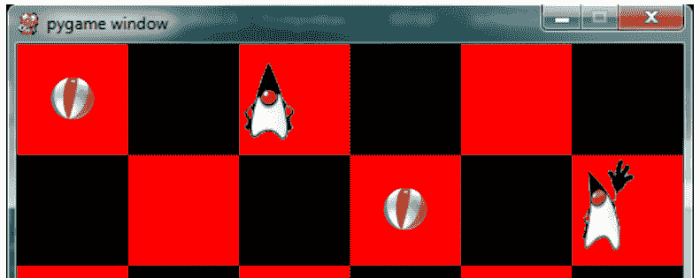

### 17.7. 外星人 - 案例研究

找到 PyGame 包中的示例游戏（在 Windows 系统上，类似 C:\Python3\Lib\site-packages\pygame\examples），并玩一下 Aliens 游戏。然后在显示行号的编辑器或 Python 环境中阅读代码。

它做了许多比我们更高级的事情，并且更多地依赖 PyGame 框架来处理其逻辑。以下是一些需要注意的要点：

- 帧率在游戏循环底部附近被刻意限制在第 311 行。如果我们改变那个数字，我们可以让游戏变得非常慢或快到无法玩！
- 有不同种类的精灵：爆炸、子弹、炸弹、外星人和玩家。其中一些有多个图像——通过交换图像，我们得到精灵的动画，即外星飞船灯光变化，这在第 112 行完成。
- 不同种类的对象被引用在不同的精灵组中，PyGame 帮助维护这些组。这让程序可以检查碰撞，例如，玩家发射的子弹列表和正在攻击的飞船列表之间的碰撞。PyGame 为我们做了很多艰苦的工作。
- 与我们的游戏不同，Aliens 游戏中的对象有有限的生命周期，必须被杀死。例如，如果我们射击，会创建一个 Shot 对象——如果它到达屏幕顶部而没有与任何东西碰撞爆炸，它必须从游戏中移除。第 141-142 行执行此操作。类似地，当一个下落的炸弹接近地面时（第 156 行），它实例化一个新的 Explosion 精灵，炸弹自我销毁。
- 有随机的计时增加了乐趣——何时生成下一个外星人，何时外星人投下下一个炸弹等。
- 游戏也播放声音：一个不太轻松的循环声音，加上射击和爆炸的声音。

### 17.8. 反思

面向对象编程是软件的良好组织工具。在本章的示例中，我们已经开始使用（并希望欣赏）这些好处。在这里，我们有 N 个皇后，每个都有自己的状态，落到自己的楼层水平，反弹，被踢等等。我们可能可以在没有对象的组织能力的情况下管理——也许我们可以为每个皇后维护速度列表、目标位置列表等等——我们的代码可能会复杂得多、丑陋得多，而且差得多！

### 17.9. 术语表

**动画速率**
我们播放连续图块以产生运动错觉的速率。在本章考虑的示例中，我们在一秒钟内播放了 Duke 的 10 个图块。与帧率不同。

**烘焙动画**
一种设计为在预定固定帧率下看起来良好的动画。这减少了游戏运行时需要进行的计算量。高端商业游戏通常会烘焙它们的动画。

**blit**
计算机图形学中使用的一个动词，意思是快速将图像或像素从一个图像或表面的子矩形复制到另一个表面或图像。

**帧率**
游戏循环执行和更新显示的速率。

**游戏循环**
驱动游戏逻辑的循环。它通常会轮询事件，然后更新游戏中的每个对象，然后绘制所有内容，然后将新绘制的帧显示出来。

**像素**
构成图像的单个图像元素或点。

**轮询**
询问是否发生了按键或鼠标移动等事件。游戏循环通常轮询以发现发生了什么事件。这与“事件”一章中看到的事件驱动程序不同。在那些情况下，按钮点击或按键事件会触发程序中处理函数的调用，但这发生在你不知情的情况下。

**精灵**
游戏中的主动代理或元素，具有自己的状态、位置和行为。

**表面**
这是 PyGame 对 Turtle 模块称为*画布*的术语。表面是用于显示形状和图像的像素矩形。

### 17.10. 练习

1. 享受 Python 和 PyGame 的乐趣。
2. 我们故意在 Duke 动画的代码中留下了一个错误。如果你点击 Duke 右侧的棋盘方格之一，他仍然会挥手。为什么？找到一个单行修复来解决这个错误。
3. 使用你首选的搜索引擎在其图像库中搜索“sprite sheet playing cards”。创建一个列表 [0..51] 来表示一副牌中的 52 张牌。洗牌，切出前五张作为你一手扑克牌。显示你发到的手牌。
4. 所以 Aliens 游戏在外太空，没有重力。子弹会永远飞走，炸弹下落时不会加速。给游戏添加一些重力。决定你是否允许你自己的子弹落回头上杀死你。
5. 那些讨厌的外星人似乎直接穿过彼此！改变游戏，让它们碰撞，并在巨大的爆炸中相互摧毁。

## 第18章：递归

**递归**意味着“用自身来定义某事物”，通常是在更小的尺度上，可能重复多次，以达到目标。例如，我们可以说“人类是母亲也是人类的人”，或者“目录是包含文件和（更小的）目录的结构”，或者“家谱始于一对夫妇，他们有孩子，每个孩子又有自己的家庭子树”。

编程语言通常支持**递归**，这意味着为了解决问题，函数可以*调用自身*来解决更小的子问题。

### 18.1. 绘制分形

就我们的目的而言，**分形**是一种具有*自相似*结构的图形，它可以用自身来定义。

让我们从著名的科赫分形开始。0阶科赫分形就是一条给定长度的直线。

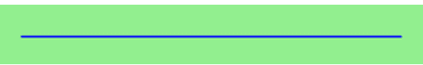

1阶科赫分形是这样获得的：不是画一条线，而是画四条更小的线段，按照这里所示的模式：


现在，如果我们对每个1阶线段再次重复这个科赫模式会发生什么？我们会得到这个2阶科赫分形：


再次重复我们的模式，我们得到一个3阶科赫分形：


现在让我们反过来思考。要绘制一个3阶科赫分形，我们可以简单地绘制四个2阶科赫分形。但每个2阶分形又需要四个1阶科赫分形，而每个1阶分形又需要四个0阶分形。最终，唯一实际发生的绘制是在0阶。这在Python中很容易编码：

```python
def koch(t, order, size):
    """
        让海龟t绘制一个'阶数'和'大小'的科赫分形。
        保持海龟朝向不变。
    """

    if order == 0:           # 基本情况只是一条直线
        t.forward(size)
    else:
        koch(t, order-1, size/3)   # 走1/3的路程
        t.left(60)
        koch(t, order-1, size/3)
        t.right(120)
        koch(t, order-1, size/3)
        t.left(60)
        koch(t, order-1, size/3)
```

这里的新关键点是，如果阶数不为零，`koch`会递归调用自身来完成任务。

让我们做一个简单的观察并精简这段代码。记住向右转120度等同于向左转-120度。所以通过一点巧妙的重新排列，我们可以用一个循环代替第10-16行：

```python
def koch(t, order, size):
    if order == 0:
        t.forward(size)
    else:
        for angle in [60, -120, 60, 0]:
            koch(t, order-1, size/3)
            t.left(angle)
```

最后一次转向是0度——所以它没有效果。但它让我们找到了一个模式，将七行代码减少到三行，这将使我们接下来的观察更容易。

#### 递归，高层视角

思考这个问题的一种方式是说服自己，当你为0阶分形调用函数时，它能正确工作。然后进行一次*信念的飞跃*，说“*仙女教母*（或者Python，如果你能把Python想象成你的仙女教母）*知道如何在第11、13、15和17行为我处理递归的0级调用，所以我不需要考虑那个细节！*”我需要关注的是如何绘制一个1阶分形*如果我假设0阶分形已经工作*。

你正在练习*心智抽象*——在解决大问题时忽略子问题。

如果这种思维方式有效（你应该练习它！），那么把它提升到下一个层次。啊哈！现在我可以看到，当为2阶调用时它会工作*假设它在1阶已经工作*。

而且，一般来说，如果我能假设n-1阶的情况有效，我能解决n阶问题吗？

玩过数学归纳法证明的数学学生应该在这里看到一些非常强的相似之处。

#### 递归，低层操作视角

理解递归的另一种方式是摆脱它！如果我们有单独的函数来绘制3阶、2阶、1阶和0阶分形，我们可以相当机械地将上述代码简化为不再有任何递归的情况，像这样：

```python
def koch_0(t, size):
    t.forward(size)

def koch_1(t, size):
    for angle in [60, -120, 60, 0]:
        koch_0(t, size/3)
        t.left(angle)

def koch_2(t, size):
    for angle in [60, -120, 60, 0]:
        koch_1(t, size/3)
        t.left(angle)

def koch_3(t, size):
    for angle in [60, -120, 60, 0]:
        koch_2(t, size/3)
        t.left(angle)
```

这种“展开”递归的技巧给了我们一个操作视角来看发生了什么。你可以跟踪程序进入`koch_3`，然后从那里进入`koch_2`，然后进入`koch_1`，等等，一路向下经过递归的不同层次。

这可能是构建你理解的一个有用提示。然而，心智目标是能够进行抽象！

### 18.2. 递归数据结构

我们见过的所有Python数据类型都可以以多种方式分组在列表和元组内。列表和元组也可以嵌套，为组织数据提供了许多可能性。为了使数据更易于使用而进行的数据组织称为**数据结构**。

现在是选举时间，我们正在帮助计算陆续到来的选票。来自各个选区、选区、市、县和州的选票有时报告为总票数，有时报告为小计票数列表。在考虑如何最好地存储计数后，我们决定使用*嵌套数字列表*，我们定义如下：

*嵌套数字列表*是一个列表，其元素是：

1. 数字
2. 嵌套数字列表

注意，术语*嵌套数字列表*在其自身定义中使用。像这样的**递归定义**在数学和计算机科学中相当常见。它们提供了一种简洁而强大的方式来描述**递归数据结构**，这些结构部分由自身更小、更简单的实例组成。定义不是循环的，因为在某个点我们会到达一个不包含任何列表作为元素的列表。

现在假设我们的任务是编写一个函数，将嵌套数字列表中的所有值求和。Python有一个内置函数可以求数字序列的和：

```python
>>> sum([1, 2, 8])
11
```

然而，对于我们的*嵌套数字列表*，`sum`将不起作用：

```python
>>> sum([1, 2, [11, 13], 8])
Traceback (most recent call last):
  File "<interactive input>", line 1, in <module>
TypeError: unsupported operand type(s) for +: 'int' and 'list'
>>>
```

问题在于这个列表的第三个元素[11, 13]本身是一个列表，所以它不能直接与1、2和8相加。

### 18.3. 处理递归数字列表

为了对递归嵌套数字列表中的所有数字求和，我们需要遍历列表，访问其嵌套结构中的每个元素，将任何数字元素添加到我们的总和中，并对任何本身是子列表的元素*递归地重复求和过程*。

得益于递归，对嵌套数字列表求值所需的Python代码出奇地短：

```python
def r_sum(nested_num_list):
    tot = 0
    for element in nested_num_list:
        if type(element) == type([]):
            tot += r_sum(element)
        else:
            tot += element
    return tot
```

`r_sum`的主体主要是一个遍历`nested_num_list`的`for`循环。如果`element`是一个数值（`else`分支），它就被简单地加到`tot`上。如果`element`是一个列表，那么`r_sum`再次被调用，以该元素作为参数。函数定义中函数调用自身的语句称为**递归调用**。

上面的例子有一个**基本情况**（在第7行），它不会导致递归调用：元素不是（子）列表的情况。没有基本情况，你会有**无限递归**，你的程序将无法工作。

递归确实是计算机科学中最美丽、最优雅的工具之一。

一个稍微复杂的问题是在我们的嵌套数字列表中找到最大值：

### 18.4. 案例研究：斐波那契数

著名的**斐波那契数列** 0, 1, 1, 2, 3, 5, 8, 13, 21, 34, 55, 89, 134, ... 由斐波那契（1170-1250）提出，他用此模型来描述（成对）兔子的繁殖情况。如果在第7代你总共有21对兔子，其中13对是成年兔，那么下一代所有成年兔都会繁殖出新的幼兔，而之前的幼兔则会长大成为成年兔。因此在第8代，你将有13+21=34对兔子，其中21对是成年兔。

这个解释兔子繁殖的*模型*做了一个简化的假设：兔子永远不会死亡。科学家们常常做出（不切实际的）简化假设和限制，以便在问题上取得一些进展。

如果我们从0开始为数列的项编号，我们可以将每一项递归地描述为前两项之和：

```
1  fib(0) = 0
2  fib(1) = 1
3  fib(n) = fib(n-1) + fib(n-2)  for n >= 2
```

这可以非常直接地翻译成一些Python代码：

```
1  def fib(n):
2      if n <= 1:
3          return n
4      t = fib(n-1) + fib(n-2)
5      return t
```

这是一个效率特别低下的算法，我们将在学习字典时展示一种改进方法：

```
1 import time
2 t0 = time.clock()
3 n = 35
4 result = fib(n)
5 t1 = time.clock()
6
7 print("fib({0}) = {1}, ({2:.2f} secs)".format(n, result, t1-t0))
```

我们得到了正确的结果，但计算量呈爆炸式增长！：

```
1 fib(35) = 9227465, (10.54 secs)
```

### 18.5. 递归目录和文件示例

以下程序列出一个目录及其所有子目录的内容。

```
1 import os
2
3 def get_dirlist(path):
4     """
5     Return a sorted list of all entries in path.
6     This returns just the names, not the full path to the names.
7     """
8     dirlist = os.listdir(path)
9     dirlist.sort()
10    return dirlist
11
12 def print_files(path, prefix = ""):
13    """ Print recursive listing of contents of path """
14    if prefix == "":  # Detect outermost call, print a heading
15        print("Folder listing for", path)
16        prefix = "| "
17
18    dirlist = get_dirlist(path)
19    for f in dirlist:
20        print(prefix+f)                # Print the line
21        fullname = os.path.join(path, f)   # Turn name into full pathname
22        if os.path.isdir(fullname):        # If a directory, recurse.
23            print_files(fullname, prefix + "| ")
```

使用某个文件夹名称调用函数 `print_files` 将产生类似以下的输出：

```
Folder listing for c:\python31\Lib\site-packages\pygame\examples
1 | __init__.py
2 | aacircle.py
3 | aliens.py
4 | arraydemo.py
5 | blend_fill.py
6 | blit_blends.py
7 | camera.py
8 | chimp.py
9 | cursors.py
10 | data
11 | | alien1.png
12 | | alien2.png
13 | | alien3.png
14 | ...
```

### 18.6. 使用PyGame的动画分形

这里我们有一个8阶的树形分形图案。我们标注了一些边，显示了绘制每条边时的递归深度。

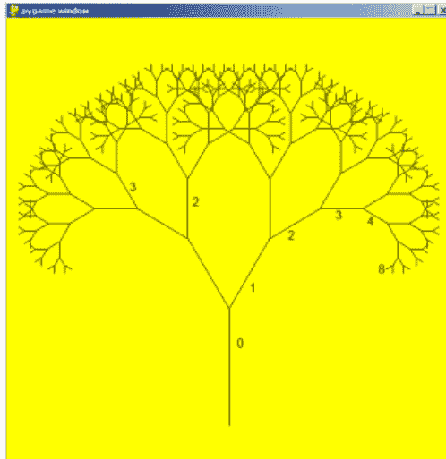

在上面的树中，偏离主干的角度是30度。改变这个角度会产生其他有趣的形状，例如，当角度为90度时，我们得到这个：

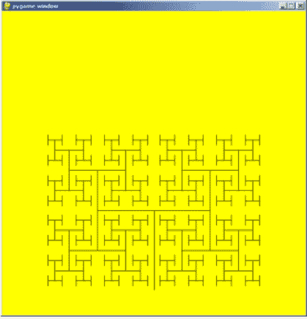

如果我们非常快速地生成和绘制树木，每次稍微改变角度，就会产生一个有趣的动画。虽然Turtle模块可以相当优雅地绘制这样的树，但我们可能难以获得良好的帧率。因此，我们将改用PyGame，并进行一些修饰和观察。（再次建议您将此代码复制粘贴到您的Python环境中。）

```
python
import pygame, math
pygame.init()           # prepare the pygame module for use

# Create a new surface and window.
surface_size = 1024
main_surface = pygame.display.set_mode((surface_size,surface_size))
my_clock = pygame.time.Clock()


def draw_tree(order, theta, sz, posn, heading, color=(0,0,0), depth=0):

    trunk_ratio = 0.29     # How big is the trunk relative to whole tree?
    trunk = sz * trunk_ratio # length of trunk
    delta_x = trunk * math.cos(heading)
    delta_y = trunk * math.sin(heading)
    (u, v) = posn
    newpos = (u + delta_x, v + delta_y)
    pygame.draw.line(main_surface, color, posn, newpos)

    if order > 0:   # Draw another layer of subtrees
        # These next six lines are a simple hack to make the two major halves
        # of the recursion different colors. Fiddle here to change colors
        # at other depths, or when depth is even, or odd, etc.
        if depth == 0:
            color1 = (255, 0, 0)
            color2 = (0, 0, 255)
        else:
            color1 = color
            color2 = color

        # make the recursive calls to draw the two subtrees
        newsz = sz*(1 - trunk_ratio)
        draw_tree(order-1, theta, newsz, newpos, heading-theta, color1, depth+1)
        draw_tree(order-1, theta, newsz, newpos, heading+theta, color2, depth+1)

def gameloop():

    theta = 0
    while True:

        # Handle events from keyboard, mouse, etc.
        ev = pygame.event.poll()
        if ev.type == pygame.QUIT:
            break;

        # Updates - change the angle
        theta += 0.01

        # Draw everything
        main_surface.fill((255, 255, 0))
        draw_tree(9, theta, surface_size*0.9, (surface_size//2, surface_size-50), -math.pi/2)

        pygame.display.flip()
        my_clock.tick(120)

gameloop()
pygame.quit()
```

- 数学库使用弧度而非角度。
- 第14和15行使用了一些高中三角学知识。根据所需线条（树干）的长度及其所需角度，cos和sin帮助我们计算需要移动的x和y距离。
- 第22-30行是不必要的，除非我们想要一棵彩色的树。
- 在第49行的主游戏循环中，我们在每一帧都改变角度，并重新绘制新的树。
- 第18行表明PyGame也可以绘制线条，以及更多图形。请查阅文档。例如，通过在第18行下方直接添加以下行，可以在树的每个分支点绘制一个小圆圈：

```
1 pygame.draw.circle(main_surface, color, (int(posn[0]), int(posn[1])), 3)
```

另一个有趣的效果——如果你希望强化在不同递归深度调用函数的不同实例这一概念，这也很有启发性——是创建一个颜色列表，并让每个递归深度使用不同的颜色进行绘制。（使用递归深度作为颜色列表的索引。）

### 18.7. 术语表

**基本情况**
递归函数中条件语句的一个分支，它不会引发进一步的递归调用。

**无限递归**
一个函数递归地调用自身，却从未达到任何基本情况。最终，无限递归会导致运行时错误。

**递归**
调用一个正在执行的函数的过程。

**递归调用**
调用一个正在执行的函数的语句。递归也可以是间接的——函数f可以调用g，g调用h，而h可以回调f。

### 18.8. 练习

1.  修改科赫分形程序，使其绘制科赫雪花，如下所示：

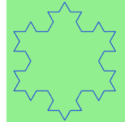

2.  1.  绘制一条用户指定阶数的切萨罗撕裂线分形。
    我们展示了阶数为0、1、2、3的四条不同线条。在此示例中，撕裂角度为10度。

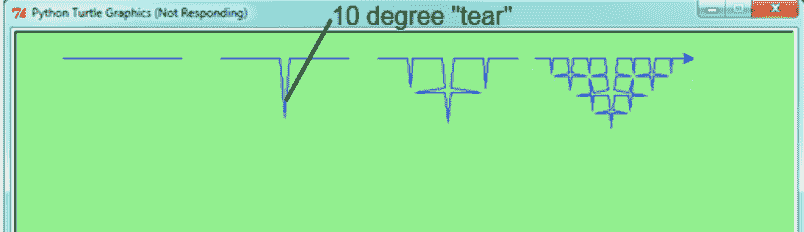

2.  四条线构成一个正方形。使用a部分中的代码绘制切萨罗正方形。改变角度会产生有趣的效果——可以尝试一下，或者让用户输入撕裂角度。

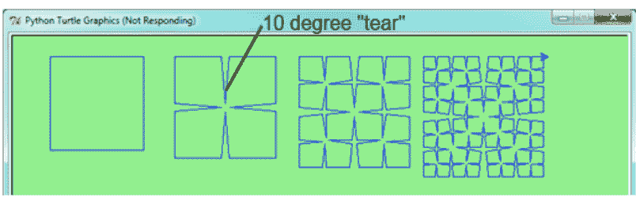

3.  （针对数学倾向者）。此处展示的正方形中，更高阶的绘图会变得稍大一些。（观察每个正方形的底边——它们并未对齐。）这是因为我们只是为每个递归子问题将绘制的线段部分减半。因此，我们通过撕裂的宽度“增长”了整个正方形。你能解决这个几何问题，使得子问题情况（包括撕裂）的总大小与原始大小完全相同吗？

3.  阶数为0的谢尔宾斯基三角形是一个等边三角形。阶数为1的三角形可以通过绘制3个更小的三角形来绘制（此处为了帮助理解，它们被画得略微分离）。图中还展示了更高阶的2和3阶三角形。绘制用户输入的任意阶数的谢尔宾斯基三角形。

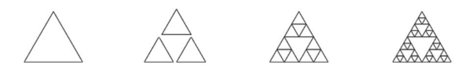

4.  改编上述程序，在递归的某个深度改变其三个子三角形的颜色。下图展示了两种情况：左侧在深度0（递归的最外层）改变颜色，右侧在深度2改变颜色。如果用户提供负深度，则颜色永不改变。（提示：添加一个新的可选参数`colorChangeDepth`（默认为-1），并在每次递归子调用中将其减小。然后，在递归之前的代码部分，测试该参数是否为零，并更改颜色。）

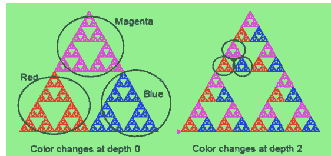

5.  编写一个函数`recursive_min`，返回嵌套数字列表中的最小值。假设没有空列表或子列表：

```
1 test(recursive_min([2, 9, [1, 13], 8, 6]) == 1)
2 test(recursive_min([2, [[100, 1], 90], [10, 13], 8, 6]) == 1)
3 test(recursive_min([2, [[13, -7], 90], [1, 100], 8, 6]) == -7)
4 test(recursive_min([[[-13, 7], 90], 2, [1, 100], 8, 6]) == -13)
```

6.  编写一个函数`count`，返回`target`在嵌套列表中出现的次数：

```
1 test(count(2, []), 0)
2 test(count(2, [2, 9, [2, 1, 13, 2], 8, [2, 6]]) == 4)
3 test(count(7, [[9, [7, 1, 13, 2], 8], [7, 6]]) == 2)
4 test(count(15, [[9, [7, 1, 13, 2], 8], [2, 6]]) == 0)
5 test(count(5, [[5, [5, [1, 5], 5], 5], [5, 6]]) == 6)
6 test(count("a",
7     [["this",["a",["thing","a"],"a"],"is"], ["a","easy"]]) == 4)
```

7.  编写一个函数`flatten`，返回一个包含嵌套列表中所有值的简单列表：

```
1 test(flatten([2,9,[2,1,13,2],8,[2,6]]) == [2,9,2,1,13,2,8,2,6])
2 test(flatten([[9,[7,1,13,2],8],[7,6]]) == [9,7,1,13,2,8,7,6])
3 test(flatten([[9,[7,1,13,2],8],[2,6]]) == [9,7,1,13,2,8,2,6])
4 test(flatten([["this",["a",["thing"],"a"],"is"],["a","easy"]]) ==
5         ["this","a","thing","a","is","a","easy"])
6 test(flatten([]) == [])
```

8.  不使用递归重写斐波那契算法。你能找到该序列中更大的项吗？你能找到`fib(200)`吗？

9.  使用帮助功能了解`sys.getrecursionlimit()`和`sys.setrecursionlimit(n)`的作用。创建几个类似于`infinite_recursion.py`中所做的实验，以测试你对这些模块函数工作原理的理解。

10. 编写一个程序，遍历目录结构（如本章最后一节所示），但不是打印文件名，而是返回目录或子目录中所有文件的完整路径列表。（不要在此列表中包含目录——只包含文件。）例如，输出列表可能包含如下元素：
`[“C:\Python31\Lib\site-packages\pygame\docs\ref\mask.html”, “C:\Python31\Lib\site-packages\pygame\docs\ref\midi.html”, ... “C:\Python31\Lib\site-packages\pygame\examples\aliens.py”, ... “C:\Python31\Lib\site-packages\pygame\examples\data\boom.wav”, ... ]`

11. 编写一个名为`litter.py`的程序，该程序在给定目录树根（或默认为当前目录）的每个子目录中创建一个名为`trash.txt`的空文件。现在编写一个名为`cleanup.py`的程序来删除所有这些文件。

**提示 #1：** 使用本章最后一节示例中的程序作为这两个递归程序的基础。因为你将要删除磁盘上的文件，最好确保操作正确，否则你可能会丢失重要的文件。因此，一个极好的建议是，最初你应该模拟删除文件——只打印你打算删除的每个文件的完整路径名。一旦你确信逻辑正确，并且可以看到没有删除错误的东西，你就可以用实际操作替换打印语句。

**提示 #2：** 在`os`模块中查找一个可以删除文件的函数。

## 第19章：异常

### 19.1. 捕获异常

每当发生运行时错误时，它会创建一个**异常**对象。程序在此时停止运行，Python会打印出回溯信息，最后以描述所发生异常的消息结束。

例如，除以零会创建一个异常：

```
1 >>> print(55/0)
2 Traceback (most recent call last):
3   File "<interactive input>", line 1, in <module>
4 ZeroDivisionError: integer division or modulo by zero
```

访问不存在的列表项也是如此：

```
1 >>> a = []
2 >>> print(a[5])
3 Traceback (most recent call last):
4   File "<interactive input>", line 1, in <module>
5 IndexError: list index out of range
```

或者尝试对元组进行项赋值：

```
1 >>> tup = ("a", "b", "d", "d")
2 >>> tup[2] = "c"
3 Traceback (most recent call last):
4   File "<interactive input>", line 1, in <module>
5 TypeError: 'tuple' object does not support item assignment
```

在每种情况下，最后一行的错误消息都有两部分：冒号前是错误类型，冒号后是错误的具体信息。

有时我们想要执行一个可能导致异常的操作，但我们不希望程序停止。我们可以使用`try`语句来“包装”一段代码，从而**处理异常**。

例如，我们可能会提示用户输入文件名，然后尝试打开它。如果文件不存在，我们不希望程序崩溃；我们希望处理异常：

```
1 filename = input("Enter a file name: ")
2 try:
3     f = open(filename, "r")
4 except:
5     print("There is no file named", filename)
```

try语句有三个独立的子句或部分，由关键字try ... except ... finally引入。except或finally子句可以省略，因此上述代码首先考虑了最常见的try语句版本。

try语句执行并监视第一个块中的语句。如果没有异常发生，它会跳过except子句下的块。如果发生任何异常，它会执行except子句中的语句，然后继续。

我们可以将此功能封装在一个函数中：exists，它接受一个文件名，如果文件存在则返回true，否则返回false：

```
1 def exists(filename):
2     try:
3         f = open(filename)
4         f.close()
5         return True
6     except:
7         return False
```

此函数中的try语句之前已经介绍过（相同的代码），所以我认为在这里添加一个else子句是合适的。

pw: 嗨 Victor - 我看了else: 并且反对它！在我看来，这只是一个可怕的语言特性。我们不仅通过重载关键字else（在这里，在if中，以及在for循环中）使事情复杂化，而且它并没有比直接内联“没有发生异常”增加任何新的表达能力。而且允许的组合很难解释。如果你有finally子句，你可以省略except子句。但如果你省略except，你就不能有else，……等等。在我看来，风险太大，回报太小。

## 一个不使用异常来测试文件是否存在的模板

我们刚刚展示的函数并不是我们推荐的。它打开并关闭文件，这在语义上不同于询问“它是否存在？”。如何不同？首先，它可能会更新文件上的某些时间戳。其次，如果其他程序恰好已经打开了该文件，或者我们的权限设置不允许我们打开该文件，它可能会告诉我们没有这样的文件。

Python在os模块中提供了一个名为os.path的模块。它提供了许多用于处理路径、文件和目录的有用函数，因此你应该查看帮助文档。

import os

# 这是检查文件是否存在的首选方法。
if os.path.isfile("c:/temp/testdata.txt"):

我们可以使用多个 `except` 子句来处理不同类型的异常（关于异常的更完整讨论，请参阅 Python 创始人 Guido van Rossum 的 [Python 教程](http://docs.python.org/py3k/tutorial/index.html) 中的 [错误和异常](http://docs.python.org/py3k/tutorial/errors.html) 课程）。因此，程序可以在文件不存在时执行一种操作，而在文件被另一个程序使用时执行另一种操作。

### 19.2. 引发我们自己的异常

我们的程序能否故意引发自己的异常？如果我们的程序检测到错误条件，我们可以**引发**一个异常。下面是一个从用户获取输入并检查该数字是否为非负数的示例：

第 5 行创建了一个异常对象，在本例中是一个 `ValueError` 对象，它封装了关于该错误的特定信息。假设在这种情况下，函数 A 调用了 B，B 调用了 C，C 调用了 D，D 调用了 `get_age`。第 6 行的 `raise` 语句将此对象作为一种“返回值”带出，并立即从 `get_age()` 退出到其调用者 D。然后 D 再次退出到其调用者 C，C 退出到 B，依此类推，每个都将异常对象返回给其调用者，直到遇到一个可以处理该异常的 `try ... except`。我们称之为“展开调用栈”。

`ValueError` 是与我们想要引发的错误类型最匹配的内置异常类型之一。内置异常的完整列表可以在 [Python 库参考](http://docs.python.org/py3k/library/index.html) 的 [内置异常](http://docs.python.org/py3k/library/exceptions.html) 部分找到，同样由 Python 的创始人 Guido van Rossum 编写。

如果调用 `get_age` 的函数（或其调用者，或其调用者的调用者，...）处理了错误，那么程序可以继续运行；否则，Python 会打印回溯信息并退出：

```
>>> get_age()
Please enter your age: 42
42
>>> get_age()
Please enter your age: -2
Traceback (most recent call last):
  File "<interactive input>", line 1, in <module>
  File "learn_exceptions.py", line 4, in get_age
    raise ValueError("{0} is not a valid age".format(age))
ValueError: -2 is not a valid age
```

错误消息包括异常类型以及在首次创建异常对象时提供的附加信息。
通常，第 5 行和第 6 行（创建异常对象，然后引发异常）会合并成一条语句，但这里确实发生了两个不同且独立的事情，因此在我们第一次学习处理异常时，将这两个步骤分开可能是有意义的。这里我们将其全部放在一条语句中：

```
raise ValueError("{0} is not a valid age".format(age))
```

### 19.3. 重新审视一个早期示例

使用异常处理，我们现在可以修改上一章中的 `recursion_depth` 示例，使其在达到允许的最大递归深度时停止：

```
def recursion_depth(number):
    print("Recursion depth number", number)
    try:
        recursion_depth(number + 1)
    except:
        print("I cannot go any deeper into this wormhole.")

recursion_depth(0)
```

运行此版本并观察结果。

### 19.4. `try` 语句的 `finally` 子句

一种常见的编程模式是获取某种资源——例如，我们创建一个供海龟绘图的窗口，或者我们拨号连接到我们的互联网服务提供商，或者我们可能打开一个文件进行写入。然后我们执行一些可能引发异常或可能没有任何问题的计算。
无论发生什么，我们都想“清理”我们获取的资源——例如关闭窗口、断开拨号连接或关闭文件。`try` 语句的 `finally` 子句正是实现这一点的方法。考虑这个（有些刻意的）示例：

```python
import turtle
import time

def show_poly():
    try:
        win = turtle.Screen()  # 获取/创建一个资源，例如一个窗口
        tess = turtle.Turtle()

        # 此对话框可能被取消，
        #   或者转换为 int 可能失败，或者 n 可能为零。
        n = int(input("How many sides do you want in your polygon?"))
        angle = 360 / n
        for i in range(n):  # 绘制多边形
            tess.forward(10)
            tess.left(angle)
        time.sleep(3)  # 让程序等待几秒钟
    finally:
        win.bye()  # 关闭海龟的窗口

show_poly()
show_poly()
show_poly()
```

在第 20-22 行，`show_poly` 被调用了三次。每次调用都为其海龟创建一个新窗口，并绘制一个具有用户输入边数的多边形。但是，如果用户输入了一个无法转换为 `int` 的字符串怎么办？如果他们关闭了对话框怎么办？我们会得到一个异常，*但即使我们遇到了异常，我们仍然想关闭海龟的窗口*。第 17-18 行为我们做了这件事。无论我们是否成功完成 `try` 子句中的语句，`finally` 块都将始终被执行。

请注意，异常仍然未被处理——只有 `except` 子句才能处理异常，因此我们的程序仍然会崩溃。但至少它的海龟窗口会在崩溃前关闭！

### 19.5. 术语表

异常
在**运行时**发生的**错误**。

处理异常
**通过**将**代码块包装在** `try` ... `except` 结构中，**以**防止异常**导致**我们的程序**崩溃**。

引发
**通过使用** `raise` 语句**来创建**一个故意的异常。

### 19.6. 练习

1. 编写一个名为 `readposint` 的函数，该函数使用 `input` 对话框提示用户输入一个正整数，然后检查输入以确认其符合要求。它应该能够处理无法转换为 `int` 的输入，以及负数 `int`，以及边缘情况（例如，当用户关闭对话框或根本没有输入任何内容时）。

## 第 20 章：字典

到目前为止，我们详细研究的所有复合数据类型——字符串、列表和元组——都是序列类型，它们使用整数作为索引来访问其中包含的值。

**字典**是另一种复合类型。它们是 Python 的内置**映射类型**。它们将**键**（可以是任何不可变类型）映射到值（可以是任何类型，异构的），就像列表或元组的元素一样。在其他语言中，它们被称为关联数组，因为它们将键与值关联起来。

作为一个例子，我们将创建一个将英语单词翻译成西班牙语的字典。对于这个字典，键是字符串。

创建字典的一种方法是从空字典开始并添加**键值对**。空字典用 {} 表示：

```
>>> eng2sp = {}
>>> eng2sp["one"] = "uno"
>>> eng2sp["two"] = "dos"
```

第一个赋值创建了一个名为 `eng2sp` 的字典；其他赋值向字典添加了新的键值对。我们可以用通常的方式打印字典的当前值：

```
>>> print(eng2sp)
{"two": "dos", "one": "uno"}
```

字典的键值对用逗号分隔。每对包含一个键和一个值，用冒号分隔。

哈希

这些对的顺序可能不是预期的。Python 使用复杂的算法（设计用于非常快速的访问）来确定键值对在字典中的存储位置。就我们的目的而言，我们可以认为这种顺序是不可预测的。

你可能还会想知道，既然将键映射到值的相同概念可以使用元组列表来实现，为什么我们还要使用字典：

```python
>>> {"apples": 430, "bananas": 312, "oranges": 525, "pears": 217}
{'pears': 217, 'apples': 430, 'oranges': 525, 'bananas': 312}
>>> [('apples', 430), ('bananas', 312), ('oranges', 525), ('pears', 217)]
[('apples', 430), ('bananas', 312), ('oranges', 525), ('pears', 217)]
```

原因在于字典非常快，它使用一种称为哈希的技术实现，这使我们能够非常快速地访问值。相比之下，元组列表的实现则很慢。如果我们想找到与某个键关联的值，就必须遍历每个元组，检查第0个元素。如果键甚至不在列表中呢？我们只能遍历到列表末尾才能知道。

另一种创建字典的方法是使用与前面输出相同的语法提供一个键值对列表：

```python
>>> eng2sp = {"one": "uno", "two": "dos", "three": "tres"}
```

我们书写这些对的顺序无关紧要。字典中的值是通过键来访问的，而不是通过索引，因此无需关心顺序。
以下是我们使用键来查找对应值的方法：

```python
>>> print(eng2sp["two"])
'dos'
```

键 "two" 对应的值是 "dos"。
列表、元组和字符串被称为*序列*，因为它们的元素是按顺序出现的。字典是我们遇到的第一个非序列的复合类型，因此我们不能对字典进行索引或切片。

### 20.1. 字典操作

`del` 语句可以从字典中删除一个键值对。例如，以下字典包含各种水果的名称和每种水果的库存数量：

```python
>>> inventory = {"apples": 430, "bananas": 312, "oranges": 525, "pears": 217}
>>> print(inventory)
{'pears': 217, 'apples': 430, 'oranges': 525, 'bananas': 312}
```

如果有人买走了所有的梨，我们可以从字典中删除该条目：

```python
>>> del inventory["pears"]
>>> print(inventory)
{'apples': 430, 'oranges': 525, 'bananas': 312}
```

或者，如果我们预计很快会有更多梨到货，我们可能只需更改与梨关联的值：

```python
>>> inventory["pears"] = 0
>>> print(inventory)
{'pears': 0, 'apples': 430, 'oranges': 525, 'bananas': 312}
```

一批新香蕉到货可以这样处理：

```python
>>> inventory["bananas"] += 200
>>> print(inventory)
{'pears': 0, 'apples': 430, 'oranges': 525, 'bananas': 512}
```

`len` 函数也适用于字典；它返回键值对的数量：

```python
>>> len(inventory)
4
```

### 20.2. 字典方法

字典有许多有用的内置方法。
`keys` 方法返回 Python 3 所称的其底层键的视图。视图对象与我们之前看到的 `range` 对象有些相似——它是一个惰性承诺，在程序的其余部分需要元素时才交付它们。我们可以迭代视图，或者像这样将视图转换为列表：

```python
for k in eng2sp.keys():    # k 的顺序是未定义的
    print("Got key", k, "which maps to value", eng2sp[k])

ks = list(eng2sp.keys())
print(ks)
```

这会产生以下输出：

```
Got key three which maps to value tres
Got key two which maps to value dos
Got key one which maps to value uno
['three', 'two', 'one']
```

迭代字典的键是非常常见的操作，因此我们可以在 `for` 循环中省略 `keys` 方法调用——迭代字典会隐式地迭代其键：

```python
for k in eng2sp:
    print("Got key", k)
```

`values` 方法类似；它返回一个可以转换为列表的视图对象：

```python
>>> list(eng2sp.values())
['tres', 'dos', 'uno']
```

`items` 方法也返回一个视图，它承诺返回一个元组列表——每个键值对对应一个元组：

```python
>>> list(eng2sp.items())
[('three', 'tres'), ('two', 'dos'), ('one', 'uno')]
```

元组在循环中同时获取键和值时通常很有用：

```python
for (k,v) in eng2sp.items():
    print("Got",k,"that maps to",v)
```

这会产生：

```
Got three that maps to tres
Got two that maps to dos
Got one that maps to uno
```

`in` 和 `not in` 运算符可以测试一个键是否在字典中：

```python
>>> "one" in eng2sp
True
>>> "six" in eng2sp
False
>>> "tres" in eng2sp    # 注意 'in' 测试的是键，而不是值。
False
```

这个方法非常有用，因为在字典中查找一个不存在的键会导致运行时错误：

```python
>>> eng2sp["dog"]
Traceback (most recent call last):
  ...
KeyError: 'dog'
```

### 20.3. 别名和拷贝

与列表的情况一样，因为字典是可变的，我们需要注意别名。每当两个变量引用同一个对象时，对其中一个的更改会影响另一个。
如果我们想修改字典并保留原始副本，请使用 `copy` 方法。例如，`opposites` 是一个包含反义词对的字典：

```python
>>> opposites = {"up": "down", "right": "wrong", "yes": "no"}
>>> alias = opposites
>>> copy = opposites.copy()    # 浅拷贝
```

`alias` 和 `opposites` 引用同一个对象；`copy` 引用同一个字典的新副本。如果我们修改 `alias`，`opposites` 也会改变：

```python
>>> alias["right"] = "left"
>>> opposites["right"]
'left'
```

如果我们修改 `copy`，`opposites` 保持不变：

```python
>>> copy["right"] = "privilege"
>>> opposites["right"]
'left'
```

### 20.4. 稀疏矩阵

我们之前使用列表的列表来表示矩阵。对于大多数元素非零的矩阵来说，这是一个不错的选择，但考虑一个像这样的稀疏矩阵<sup>23</sup>：

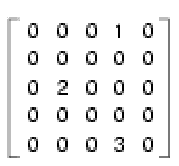

列表表示包含大量的零：

```python
matrix = [[0, 0, 0, 1, 0],
          [0, 0, 0, 0, 0],
          [0, 2, 0, 0, 0],
          [0, 0, 0, 0, 0],
          [0, 0, 0, 3, 0]]
```

另一种方法是使用字典。对于键，我们可以使用包含行号和列号的元组。以下是同一矩阵的字典表示：

```python
>>> matrix = {(0, 3): 1, (2, 1): 2, (4, 3): 3}
```

我们只需要三个键值对，每个非零元素一个。每个键是一个元组，每个值是一个整数。

要访问矩阵的一个元素，我们可以使用 `[]` 运算符：

```python
>>> matrix[(0, 3)]
1
```

请注意，字典表示的语法与嵌套列表表示的语法不同。我们使用一个索引，即一个整数元组，而不是两个整数索引。

有一个问题。如果我们指定一个为零的元素，会得到一个错误，因为字典中没有该键的条目：

```python
>>> matrix[(1, 3)]
KeyError: (1, 3)
```

`get` 方法解决了这个问题：

> <sup>23</sup>http://en.wikipedia.org/wiki/Sparse_matrix

```python
>>> matrix.get((0, 3), 0)
1
```

第一个参数是键；第二个参数是如果键不在字典中时 `get` 应返回的值：

```python
>>> matrix.get((1, 3), 0)
0
```

`get` 确实改善了访问稀疏矩阵的语义。可惜语法不太优雅。

### 20.5. 记忆化

如果你玩过递归章节中的 `fibo` 函数，你可能已经注意到，提供的参数越大，函数运行所需的时间就越长。此外，运行时间增长得非常快。在我们的一台机器上，`fib(20)` 瞬间完成，`fib(30)` 大约需要一秒钟，而 `fib(40)` 则需要几乎无限长的时间。

要理解原因，请考虑 `n = 4` 时 `fib` 的这个调用图：

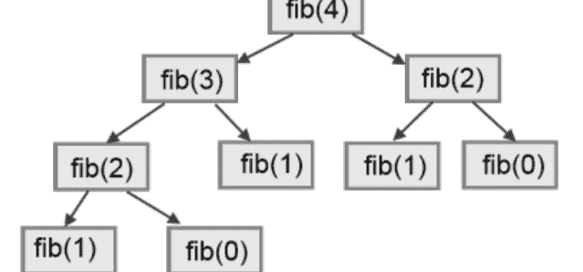

调用图显示了一些函数帧（函数被调用的实例），并将每个帧与其调用的函数的帧连接起来。在图的顶部，`n = 4` 的 `fib` 调用了 `n = 3` 和 `n = 2` 的 `fib`。依次地，`n = 3` 的 `fib` 调用了 `n = 2` 和 `n = 1` 的 `fib`。以此类推。

数一数 `fib(0)` 和 `fib(1)` 被调用了多少次。这是对问题的一个低效解决方案，而且随着参数变大，情况会变得更糟。

一个好的解决方案是通过将已经计算过的值存储在字典中来跟踪它们。为以后使用而存储的先前计算的值称为备忘录。以下是使用备忘录的 `fib` 实现：

alreadyknown = {0: 0, 1: 1}

def fib(n):
    if n not in alreadyknown:
        new_value = fib(n-1) + fib(n-2)
        alreadyknown[n] = new_value
    return alreadyknown[n]

名为 `alreadyknown` 的字典用于记录我们已知的斐波那契数。我们从仅有的两对映射开始：0 映射到 0；1 映射到 1。

每当调用 `fib` 函数时，它会检查字典以确定是否已包含结果。如果存在，函数可以立即返回，无需进行更多递归调用。如果不存在，则必须计算新值。新值在函数返回前被添加到字典中。

使用这个版本的 `fib`，我们的机器可以在眨眼之间计算出 `fib(100)`。

```
>>> fib(100)
354224848179261915075
```

### 20.6. 字母计数

在第 8 章（字符串）的练习中，我们编写了一个计算字符串中某个字母出现次数的函数。这个问题的一个更通用版本是构建字符串中字母的频率表，即每个字母出现的次数。

这样的频率表对于压缩文本文件可能很有用。因为不同的字母出现的频率不同，我们可以通过为常见字母使用较短的编码，为出现频率较低的字母使用较长的编码来压缩文件。

字典提供了一种生成频率表的优雅方式：

```
>>> letter_counts = {}
>>> for letter in "Mississippi":
...     letter_counts[letter] = letter_counts.get(letter, 0) + 1
...
>>> letter_counts
{'M': 1, 's': 4, 'p': 2, 'i': 4}
```

我们从一个空字典开始。对于字符串中的每个字母，我们找到当前的计数（可能为零）并将其递增。最后，字典包含字母及其频率的键值对。

按字母顺序显示频率表可能更具吸引力。我们可以使用 `items` 和 `sort` 方法来实现：

```
>>> letter_items = list(letter_counts.items())
>>> letter_items.sort()
>>> print(letter_items)
[('M', 1), ('i', 4), ('p', 2), ('s', 4)]
```

注意第一行我们必须调用类型转换函数 `list`。这将把从 `items` 得到的“承诺”转换为列表，这是在使用列表的 `sort` 方法之前必需的一步。

### 20.7. 术语表

调用图
由节点组成的图，节点表示函数帧（或调用），以及有向边（带箭头的线）显示哪些帧产生了其他帧。

字典
一个键值对的集合，将键映射到值。键可以是任何不可变的值，而关联的值可以是任何类型。

不可变数据值
不能被修改的数据值。对不可变值的元素或切片（子部分）进行赋值会导致运行时错误。

键
在字典中*映射到*值的数据项。键用于在字典中查找值。每个键在字典中必须是唯一的。

键值对
字典中的成对项之一。通过键在字典中查找值。

映射类型
映射类型是一种由键集合和关联值组成的数据类型。Python 唯一的内置映射类型是字典。字典实现了[关联数组](http://en.wikipedia.org/wiki/Associative_array)抽象数据类型。

备忘录
临时存储预计算值以避免重复相同计算。

可变数据值
可以被修改的数据值。所有可变值的类型都是复合类型。列表和字典是可变的；字符串和元组则不是。

### 20.8. 练习

1.  编写一个程序，读取一个字符串，并按字母顺序返回该字符串中出现的字母表及其出现次数。应忽略大小写。当用户输入数据 “ThiS is String with Upper and lower case Letters” 时，程序的示例输出如下：

```
a 2
c 1
d 1
e 5
g 1
h 2
i 4
l 2
n 2
o 1
p 2
r 4
s 5
t 5
u 1
w 2
```

2.  给出 Python 解释器对以下每个连续解释器会话的响应：

```
>>> d = {"apples": 15, "bananas": 35, "grapes": 12}
>>> d["bananas"]
```

```
>>> d["oranges"] = 20
>>> len(d)
```

```
>>> "grapes" in d
```

```
>>> d["pears"]
```

```
>>> d.get("pears", 0)
```

```
>>> fruits = list(d.keys())
>>> fruits.sort()
>>> print(fruits)
```

```
>>> del d["apples"]
>>> "apples" in d
```

确保你理解为什么得到每个结果。然后应用你所学的知识来填充下面函数的主体：

```
def add_fruit(inventory, fruit, quantity=0):
    return

# 使这些测试通过...
new_inventory = {}
add_fruit(new_inventory, "strawberries", 10)
test("strawberries" in new_inventory)
test(new_inventory["strawberries"] == 10)
add_fruit(new_inventory, "strawberries", 25)
test(new_inventory["strawberries"] == 35)
```

3.  编写一个名为 `alice_words.py` 的程序，创建一个名为 `alice_words.txt` 的文本文件，其中包含《爱丽丝梦游仙境》文本版本中所有单词的字母顺序列表及其出现次数。（你可以从 http://www.gutenberg.org 获取该书的免费纯文本版本，以及许多其他书籍。）你的输出文件的前 10 行应如下所示：

```
Word Count
====================
a 631
a-piece 1
abide 1
able 1
about 94
above 3
absence 1
absurd 2
```

单词 “alice” 在书中出现了多少次？

4.  《爱丽丝梦游仙境》中最长的单词是什么？它有多少个字符？

## 第 21 章：案例研究：为你的文件建立索引

我们展示一个小型案例研究，它将模块、递归、文件、字典结合在一起，并介绍了简单的序列化和反序列化。

在本章中，我们将使用字典来帮助我们快速查找文件。

该案例研究包含两个组件：

- 一个爬虫程序，扫描磁盘（或文件夹）并构建字典保存到你的磁盘。
- 一个查询程序，加载字典并能快速回答用户关于文件位置的查询。

### 21.1. 爬虫

在递归章节的末尾，我们展示了一个如何递归列出给定文件系统路径下所有文件的例子。

我们将借用（并稍作修改）那段代码来提供爬虫的框架。它的功能是递归遍历给定路径下的每个文件。（我们很快会弄清楚如何处理这些文件：目前我们只打印它的短名称和完整路径。）

```
# 爬虫遍历文件系统并构建字典
import os

def crawl_files(path):
    """ 递归访问路径下的所有文件 """

    # 获取当前文件夹中的所有条目。
    dirlist = os.listdir(path)
    for f in dirlist:
        # 将每个名称转换为完整路径名
        fullname = os.path.join(path, f)

        # 如果是目录，则递归。
        if os.path.isdir(fullname):
            crawl_files(fullname)
        else:  # 对文件执行一些有用的操作
            print("{0:30} {1}".format(f, fullname))

crawl_files("C:\Python32")
```

我们得到类似这样的输出：

```
CherryPy-wininst.log          C:\Python32\CherryPy-wininst.log
bz2.pyd                        C:\Python32\DLLs\bz2.pyd
py.ico                         C:\Python32\DLLs\py.ico
pyc.ico                        C:\Python32\DLLs\pyc.ico
pyexpat.pyd                    C:\Python32\DLLs\pyexpat.pyd
python3.dll                    C:\Python32\DLLs\python3.dll
select.pyd                     C:\Python32\DLLs\select.pyd
sqlite3.dll                    C:\Python32\DLLs\sqlite3.dll
tcl85.dll                      C:\Python32\DLLs\tcl85.dll
tclpip85.dll                   C:\Python32\DLLs\tclpip85.dll
tk85.dll                       C:\Python32\DLLs\tk85.dll
...
```

我们现在将对此进行调整，将文件的短名称和完整路径作为键值对存储在字典中。但首先，有两个观察点：

- 我们可能有许多同名的文件（在不同的路径中）。例如，名称 `index`。
- 文件名不区分大小写。（嗯，对 Windows 用户来说是这样！）因此，一个好的技术是在存储之前*规范化*键。这里我们只需确保所有键都转换为小写。当然，我们稍后编写查询程序时也会做同样的事情。

`html` 非常常见。但字典的键必须是唯一的。我们的解决方案是将字典中的每个键映射到一个路径*列表*。

我们将通过设置一个全局字典（初始为空）来修改上面的代码：在第 3 行插入语句 `thedict = {}` 即可完成此操作。然后，我们不再在第 17 行打印信息，而是将文件名和路径添加到字典中。代码需要检查键是否已存在：

### 21.2. 将字典保存到磁盘

我们构建的字典是一个对象。为了保存它，我们需要将其转换为一个字符串，然后将该字符串写入磁盘上的文件。该字符串必须采用一种格式，使得另一个程序能够明确地重建一个具有相同键值对的字典。将对象转换为字符串表示的过程称为**序列化**，而其逆操作——从字符串重建新对象——则称为**反序列化**。

有几种方法可以实现这一点：有些使用二进制格式，有些使用文本格式，不同类型数据的编码方式也各不相同。一种在Web服务器和网页中广泛使用的流行且轻量级的技术是使用JSON（JavaScript对象表示法）编码。

令人惊讶的是，我们只需要四行新代码就能将字典保存到磁盘：

```python
import json

f = open("C:\temp\mydict.txt", "w")
json.dump(thedict, f)
f.close()
```

你可以在磁盘上找到该文件，并用文本编辑器打开它，查看JSON编码的样子。

### 21.3. 查询程序

这个程序需要从磁盘文件重建字典，然后提供一个查询函数：

```python
import json

f = open("C:\temp\mydict.txt", "r")
dict = json.load(f)
f.close()
print("Loaded {0} filenames for querying.".format(len(dict)))

def query(filename):
    f = filename.lower()
    if f not in dict:
        print("No hits for {0}".format(filename))
    else:
        print("{0} is at ".format(filename))
        for p in dict[f]:
            print("...", p)
```

以下是一个示例运行：

```
>>> 
Loaded 14861 filenames for querying.
>>> query('python.exe')
python.exe is at
... C:\Python32\python.exe
>>> query('java.exe')
No hits for java.exe
>>> query('INDEX.HtMl')
INDEX.HtMl is at
... C:\Python32\Lib\site-packages\cherrypy\test\static\index.html
... C:\Python32\Lib\site-packages\eric5\Documentation\Source\index.html
... C:\Python32\Lib\site-packages\IPython\frontend\html\notebook\static\codemirror\m\node\css\index.html
... C:\Python32\Lib\site-packages\IPython\frontend\html\notebook\static\codemirror\m\node\htmlmixed\index.html
... C:\Python32\Lib\site-packages\IPython\frontend\html\notebook\static\codemirror\m\node\javascript\index.html
... C:\Python32\Lib\site-packages\IPython\frontend\html\notebook\static\codemirror\m\node\markdown\index.html
... C:\Python32\Lib\site-packages\IPython\frontend\html\notebook\static\codemirror\m\node\python\index.html
... C:\Python32\Lib\site-packages\IPython\frontend\html\notebook\static\codemirror\m\node\rst\index.html
... C:\Python32\Lib\site-packages\IPython\frontend\html\notebook\static\codemirror\m\node\xml\index.html
... C:\Python32\Lib\site-packages\pygame\docs\index.html
... C:\Python32\Lib\site-packages\pygame\docs\ref\index.html
... C:\Python32\Lib\site-packages\PyQt4\doc\html\index.html
>>>
```

### 21.4. 压缩序列化的字典

JSON文件可能会变得相当大。Python中提供了Gzip压缩功能，因此让我们利用它……

当我们把字典保存到磁盘时，我们打开了一个用于写入的文本文件。我们只需更改程序的那一行（并导入正确的模块），就可以创建一个gzip文件而不是普通的文本文件。替换代码如下：

```python
import json, gzip, io

## f = open("C:\temp\mydict.txt", "w")
f = io.TextIOWrapper(gzip.open("C:\temp\mydict.gz", mode="wb"))
json.dump(thedict, f)
f.close()
```

神奇的是，我们现在得到一个压缩文件，它比文本版本小约7倍。（像这样的压缩/解压缩通常由Web服务器和浏览器执行，以实现显著更快的下载速度。）

现在，当然，我们的查询程序需要解压缩数据：

```python
import json, gzip, io

## f = open("C:\temp\mydict.txt", "r")
f = io.TextIOWrapper(gzip.open("C:\temp\mydict.gz", mode="r"))
dict = json.load(f)
f.close()
print("Loaded {0} filenames for querying.".format(len(dict)))
```

可组合性是关键……

在本书的早期章节中，我们讨论了可组合性：将不同的代码片段和功能组合或连接起来以构建更强大结构的能力。

这个案例研究展示了这一点的一个绝佳例子。我们的JSON序列化器和反序列化器可以与我们的文件机制链接。gzip压缩器/解压缩器也可以向我们的程序呈现自己，就好像它只是一个专门的数据流，就像从文件中读取一样。最终结果是强大工具的非常优雅的组合。可组合性让我们可以轻松地完成所有这些，而不需要单独的步骤来将字典序列化为字符串、压缩字符串、将结果字节写入文件等！

### 21.5. 术语表

**反序列化**
从某种外部文本表示重建内存中的对象。

**gzip**
一种无损压缩技术，可减少数据的存储大小。（无损意味着你可以完全恢复原始数据。）

**JSON**
JavaScript对象表示法是一种用于序列化和传输对象的格式，通常在运行JavaScript的Web服务器和Web浏览器之间使用。Python包含一个`json`模块来提供此功能。

**序列化**
将对象转换为字符串（或字节），以便可以通过互联网发送或保存在文件中。接收者可以从数据重建新对象。

## 第22章：更多面向对象编程

### 22.1. MyTime

作为用户定义类型的另一个例子，我们将定义一个名为`MyTime`的类，用于记录一天中的时间。我们将提供一个`__init__`方法，以确保每个实例都使用适当的属性和初始化来创建。类定义如下所示：

```python
class MyTime:

    def __init__(self, hrs=0, mins=0, secs=0):
        """ Create a MyTime object initialized to hrs, mins, secs """
        self.hours = hrs
        self.minutes = mins
        self.seconds = secs
```

我们可以实例化一个新的`MyTime`对象：

```python
tim1 = MyTime(11, 59, 30)
```

该对象的状态图如下所示：

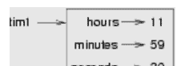

我们将添加一个`__str__`方法作为读者的练习，以便`MyTime`对象可以体面地打印自己。

### 22.2. 纯函数

在接下来的几节中，我们将编写两个版本的名为`add_time`的函数，该函数计算两个`MyTime`对象的和。它们将演示两种函数：纯函数和修改器。

以下是`add_time`的一个粗略版本：

def add_time(t1, t2):
    h = t1.hours + t2.hours
    m = t1.minutes + t2.minutes
    s = t1.seconds + t2.seconds
    sum_t = MyTime(h, m, s)
    return sum_t

该函数创建一个新的 MyTime 对象，并返回对这个新对象的引用。这被称为**纯函数**，因为它不会修改作为参数传递给它的任何对象，并且没有副作用，例如更新全局变量、显示值或获取用户输入。

下面是如何使用此函数的示例。我们将创建两个 MyTime 对象：`current_time`，包含当前时间；以及 `bread_time`，包含面包机制作面包所需的时间。然后我们将使用 `add_time` 来计算面包何时完成。

```python
>>> current_time = MyTime(9, 14, 30)
>>> bread_time = MyTime(3, 35, 0)
>>> done_time = add_time(current_time, bread_time)
>>> print(done_time)
12:49:30
```

该程序的输出是 12:49:30，这是正确的。另一方面，有些情况下结果并不正确。你能想到一个吗？

问题在于，这个函数没有处理秒数或分钟数相加超过六十的情况。当这种情况发生时，我们必须将多余的秒数进位到分钟列，或将多余的分钟进位到小时列。

这是该函数的一个更好的版本：

```python
def add_time(t1, t2):
    h = t1.hours + t2.hours
    m = t1.minutes + t2.minutes
    s = t1.seconds + t2.seconds

    if s >= 60:
        s -= 60
        m += 1

    if m >= 60:
        m -= 60
        h += 1

    sum_t = MyTime(h, m, s)
    return sum_t
```

这个函数开始变得更大，但仍然不能处理所有可能的情况。稍后我们将建议一种能产生更好代码的替代方法。

### 22.3. 修改器

有时，让函数修改其作为参数接收的一个或多个对象是有用的。通常，调用者保留对其传递的对象的引用，因此函数所做的任何更改对调用者都是可见的。以这种方式工作的函数称为**修改器**。

`increment` 函数，用于向 MyTime 对象添加给定的秒数，最自然地应该写成一个修改器。该函数的初稿如下所示：

```python
def increment(t, secs):
    t.seconds += secs

    if t.seconds >= 60:
        t.seconds -= 60
        t.minutes += 1

    if t.minutes >= 60:
        t.minutes -= 60
        t.hours += 1
```

第一行执行基本操作；其余部分处理我们之前看到的特殊情况。这个函数正确吗？如果参数 `seconds` 远大于六十会发生什么？在这种情况下，只进位一次是不够的；我们必须持续进行，直到 `seconds` 小于六十。一个解决方案是将 `if` 语句替换为 `while` 语句：

```python
def increment(t, seconds):
    t.seconds += seconds

    while t.seconds >= 60:
        t.seconds -= 60
        t.minutes += 1

    while t.minutes >= 60:
        t.minutes -= 60
        t.hours += 1
```

当 `seconds` 不为负数且 `hours` 不超过 23 时，这个函数现在是正确的，但它并不是一个特别好的解决方案。

### 22.4. 将 increment 转换为方法

再一次，面向对象编程的程序员更喜欢将处理 MyTime 对象的函数放入 MyTime 类中，所以让我们将 `increment` 转换为一个方法。为了节省空间，我们将省略之前定义的方法，但你应该在你的版本中保留它们：

```python
class MyTime:
    # 之前的方法定义在此处...

    def increment(self, seconds):
        self.seconds += seconds

        while self.seconds >= 60:
            self.seconds -= 60
            self.minutes += 1

        while self.minutes >= 60:
            self.minutes -= 60
            self.hours += 1
```

这个转换纯粹是机械性的——我们将定义移入类定义中，并（可选地）将第一个参数的名称更改为 `self`，以符合 Python 的风格约定。
现在我们可以使用调用方法的语法来调用 `increment`。

```python
current_time.increment(500)
```

同样，调用该方法的对象被赋值给第一个参数 `self`。第二个参数 `seconds` 获得值 500。

### 22.5. 一个“啊哈！”的洞察

通常，对问题的高层次洞察可以使编程变得容易得多。
在这个案例中，洞察在于 MyTime 对象实际上是一个以 60 为基数的三位数！秒组件是个位，分钟组件是六十位，小时组件是三千六百位。
当我们编写 `add_time` 和 `increment` 时，我们实际上是在进行以 60 为基数的加法，这就是为什么我们必须从一列进位到下一列。
这个观察提出了处理整个问题的另一种方法——我们可以将 MyTime 对象转换为一个单一的数字，并利用计算机知道如何进行数字算术运算这一事实。以下方法被添加到 MyTime 类中，用于将任何实例转换为相应的秒数：

```python
class MyTime:
    # ...

    def to_seconds(self):
        """ 返回此实例表示的秒数
        """
        return self.hours * 3600 + self.minutes * 60 + self.seconds
```

现在，我们需要的是一种将整数转换回 MyTime 对象的方法。假设我们有 `tsecs` 秒，一些整数除法和取模运算符可以为我们做到这一点：

```python
hrs = tsecs // 3600
leftoversecs = tsecs % 3600
mins = leftoversecs // 60
secs = leftoversecs % 60
```

你可能需要思考一下才能确信这种从一种基数转换到另一种基数的技术是正确的。

在面向对象编程中，我们真正试图做的是将数据和应用于它的操作包装在一起。因此，我们希望将这个逻辑放在 MyTime 类内部。一个好的解决方案是重写类初始化器，使其能够处理超出**规范化**值的秒或分钟的初始值。（规范化的时间类似于 3 小时 12 分钟 20 秒。相同的时间，但未规范化可能是 2 小时 70 分钟 140 秒。）

让我们为 MyTime 重写一个更强大的初始化器：

```python
class MyTime:
    # ...

    def __init__(self, hrs=0, mins=0, secs=0):
        """ 创建一个新的 MyTime 对象，初始化为 hrs, mins, secs。
            mins 和 secs 的值可能超出 0-59 的范围，
            但生成的 MyTime 对象将是规范化的。
        """

        # 计算要表示的总秒数
        totalsecs = hrs*3600 + mins*60 + secs
        self.hours = totalsecs // 3600        # 分割为 h, m, s
        leftoversecs = totalsecs % 3600
        self.minutes = leftoversecs // 60
        self.seconds = leftoversecs % 60
```

现在我们可以这样重写 `add_time`：

```python
def add_time(t1, t2):
    secs = t1.to_seconds() + t2.to_seconds()
    return MyTime(0, 0, secs)
```

这个版本比原始版本短得多，并且更容易证明或推理其正确性。

### 22.6. 泛化

在某些方面，从 60 进制转换到 10 进制再转回来，比仅仅处理时间更难。基数转换更抽象；我们处理时间的直觉更好。

但如果我们有洞察力，将时间视为 60 进制数，并投入精力编写转换，我们得到的程序会更短、更易于阅读和调试，也更可靠。

以后添加功能也更容易。例如，想象一下减去两个 MyTime 对象以找出它们之间的时间间隔。朴素的方法是实现带借位的减法。使用转换函数会更容易，也更有可能是正确的。

具有讽刺意味的是，有时让问题变得更难（或更通用）反而使编程变得更容易，因为特殊情况更少，出错的机会也更少。

#### 特化与泛化

计算机科学家通常喜欢特化他们的类型，而数学家则经常采取相反的方法，将所有东西泛化。

我们这是什么意思呢？

如果我们请一位数学家解决一个涉及工作日、世纪中的天数、扑克牌、时间或多米诺骨牌的问题，他们最可能的反应是观察到所有这些对象都可以用整数表示。例如，扑克牌可以从 0 到 51 编号。世纪中的天数可以编号。数学家会说“*这些东西是可枚举的——元素可以被唯一编号（并且我们可以反转这个编号以回到原始概念）。所以让我们给它们编号，并将我们的思考限制在整数上。幸运的是，我们有强大的技术和对整数的良好理解，因此我们的抽象——我们处理和简化这些问题的方式——是尝试将它们归结为关于整数的问题。*”

计算机科学家倾向于做相反的事情。我们会争辩说，许多整数运算对于多米诺骨牌或世纪中的天数来说根本没有意义。因此，我们通常会定义新的特化类型，比如 MyTime，因为我们可以限制、控制和特化可能的操作。面向对象编程特别受欢迎，因为它为我们提供了一种将方法和特化数据打包成新类型的好方法。

两种方法都是强大的问题解决技术。通常，尝试从两个角度思考问题可能会有所帮助——“*如果我试图将所有东西都归结为很少的原始类型会发生什么？*”，与“*如果这个东西有自己的特化类型会发生什么？*”

### 22.7. 另一个例子

`after` 函数应该比较两个时间，并告诉我们第一个时间是否严格晚于第二个时间，例如：

```
>>> t1 = MyTime(10, 55, 12)
>>> t2 = MyTime(10, 48, 22)
>>> after(t1, t2)          # t1 是否在 t2 之后？
True
```

这稍微复杂一些，因为它操作的是两个 `MyTime` 对象，而不仅仅是一个。但我们还是更愿意将其编写为一个方法——在这种情况下，是第一个参数上的一个方法：

```
class MyTime:
    # 此处为之前定义的方法...

    def after(self, time2):
        """ 如果我严格大于 time2，则返回 True """
        if self.hours > time2.hours:
            return True
        if self.hours < time2.hours:
            return False

        if self.minutes > time2.minutes:
            return True
        if self.minutes < time2.minutes:
            return False
        if self.seconds > time2.seconds:
            return True

        return False
```

我们在一个对象上调用此方法，并将另一个对象作为参数传递：

```
if current_time.after(done_time):
    print("面包会在开始之前就做好！")
```

我们几乎可以像读英语一样读这个调用：如果当前时间在完成时间之后，那么……
这里的 `if` 语句逻辑值得特别注意。第 11-18 行只有在两个小时字段相同时才会被执行到。同样，第 16 行的测试也只有在两个时间的小时和分钟都相同时才会执行。

我们能否利用之前的“顿悟”和额外工作，将两个时间都转换为整数，从而使这个过程更简单？是的，效果非常显著！

```
class MyTime:
    # 此处为之前定义的方法...

    def after(self, time2):
        """ 如果我严格大于 time2，则返回 True """
        return self.to_seconds() > time2.to_seconds()
```

这是一种很好的编码方式：如果我们想判断第一个时间是否在第二个时间之后，就把它们都转换成整数，然后比较这些整数。

### 22.8. 运算符重载

一些语言，包括 Python，允许同一个运算符在应用于不同类型时具有不同的含义。例如，Python 中的 `+` 对于整数和字符串意味着完全不同的事情。这个特性被称为**运算符重载**。

当程序员也能为他们自己定义的类型重载运算符时，这个特性尤其有用。

例如，要重载加法运算符 `+`，我们可以提供一个名为 `__add__` 的方法：

```
class MyTime:
    # 此处为之前定义的方法...

    def __add__(self, other):
        return MyTime(0, 0, self.to_seconds() + other.to_seconds())
```

和往常一样，第一个参数是调用该方法的对象。第二个参数被方便地命名为 `other`，以区别于 `self`。要将两个 `MyTime` 对象相加，我们创建并返回一个新的 `MyTime` 对象，其中包含它们的和。

现在，当我们对 `MyTime` 对象应用 `+` 运算符时，Python 会调用我们编写的 `__add__` 方法：

```
>>> t1 = MyTime(1, 15, 42)
>>> t2 = MyTime(3, 50, 30)
>>> t3 = t1 + t2
>>> print(t3)
05:06:12
```

表达式 `t1 + t2` 等价于 `t1.__add__(t2)`，但显然更优雅。作为练习，请添加一个 `__sub__(self, other)` 方法来重载减法运算符，并尝试使用它。

在接下来的几个练习中，我们将回到在关于对象的第一章中定义的 `Point` 类，并重载它的一些运算符。首先，将两个点相加就是将它们各自的 (x, y) 坐标相加：

```
class Point:
    # 此处为之前定义的方法...

    def __add__(self, other):
        return Point(self.x + other.x, self.y + other.y)
```

有几种方法可以重载乘法运算符的行为：通过定义一个名为 `__mul__` 的方法，或者 `__rmul__`，或者两者都定义。

如果 `*` 的左操作数是一个 `Point`，Python 会调用 `__mul__`，它假设另一个操作数也是一个 `Point`。它计算两个点的**点积**，根据线性代数的规则定义：

```
def __mul__(self, other):
    return self.x * other.x + self.y * other.y
```

如果 `*` 的左操作数是一个基本类型，而右操作数是一个 `Point`，Python 会调用 `__rmul__`，它执行**标量乘法**：

```
def __rmul__(self, other):
    return Point(other * self.x, other * self.y)
```

结果是一个新的 `Point`，其坐标是原始坐标的倍数。如果 `other` 是一个不能与浮点数相乘的类型，那么 `__rmul__` 将会产生错误。

这个例子展示了两种乘法：

```
>>> p1 = Point(3, 4)
>>> p2 = Point(5, 7)
>>> print(p1 * p2)
43
>>> print(2 * p2)
(10, 14)
```

如果我们尝试计算 `p2 * 2` 会发生什么？由于第一个参数是一个 `Point`，Python 会调用 `__mul__`，并将 `2` 作为第二个参数。在 `__mul__` 内部，程序尝试访问 `other` 的 `x` 坐标，这会失败，因为整数没有属性：

```
>>> print(p2 * 2)
AttributeError: 'int' object has no attribute 'x'
```

不幸的是，错误信息有点晦涩。这个例子展示了面向对象编程的一些困难。有时，仅仅弄清楚正在运行什么代码就已经足够困难了。

### 22.9. 多态

我们编写的大多数方法只适用于特定类型。当我们创建一个新对象时，我们会编写操作该类型的方法。

但有一些操作我们希望应用于多种类型，例如前面章节中的算术运算。如果许多类型支持相同的操作集，我们就可以编写适用于这些类型中任何一种的函数。

例如，`multadd` 操作（在线性代数中很常见）接受三个参数；它将前两个相乘，然后加上第三个。我们可以在 Python 中这样编写它：

```
def multadd (x, y, z):
    return x * y + z
```

这个函数适用于任何可以相乘的 `x` 和 `y` 的值，以及任何可以与乘积相加的 `z` 的值。

我们可以用数值来调用它：

```
>>> multadd (3, 2, 1)
7
```

或者用 Point：

```
>>> p1 = Point(3, 4)
>>> p2 = Point(5, 7)
>>> print(multadd (2, p1, p2))
(11, 15)
>>> print(multadd (p1, p2, 1))
44
```

在第一种情况下，`Point` 与一个标量相乘，然后与另一个 `Point` 相加。在第二种情况下，点积产生一个数值，所以第三个参数也必须是一个数值。

像这样可以接受不同类型参数的函数被称为**多态**的。

再举一个例子，考虑 `front_and_back` 函数，它将一个列表打印两次，正向和反向：

```
def front_and_back(front):
    import copy
    back = copy.copy(front)
    back.reverse()
    print(str(front) + str(back))
```

因为 reverse 方法是一个修改器，我们在反转列表之前先复制一份。这样，这个函数就不会修改它作为参数接收的列表。

这是一个将 front_and_back 应用于列表的例子：

```
>>> my_list = [1, 2, 3, 4]
>>> front_and_back(my_list)
[1, 2, 3, 4][4, 3, 2, 1]
```

当然，我们打算将这个函数应用于列表，所以它能工作并不奇怪。奇怪的是我们能否将其应用于 Point。

要确定一个函数是否可以应用于一个新类型，我们应用 Python 的多态基本规则，称为**鸭子类型规则**：*如果函数内部的所有操作都可以应用于该类型，那么该函数就可以应用于该类型。* front_and_back 函数中的操作包括 copy、reverse 和 print。

并非所有编程语言都以这种方式定义多态。查阅 *duck typing*，看看你是否能弄清楚为什么它有这个名字。

copy 适用于任何对象，而且我们已经为 Point 对象编写了 __str__ 方法，所以我们只需要在 Point 类中添加一个 reverse 方法：

```
def reverse(self):
    (self.x , self.y) = (self.y, self.x)
```

然后我们就可以将 Point 传递给 front_and_back：

```
>>> p = Point(3, 4)
>>> front_and_back(p)
(3, 4)(4, 3)
```

最有趣的多态是无意的那种，我们发现我们已经编写的一个函数可以应用于一个我们从未计划过的类型。

### 22.10. 术语表

点积
线性代数中定义的一种运算，将两个`Point`相乘并产生一个数值。

函数式编程风格
一种程序设计风格，其中大多数函数都是纯函数。

修改器
一种改变其接收的一个或多个参数对象的函数或方法。大多数修改器函数是void（不返回值）。

归一化
如果数据符合某个缩减的范围或规则集，则称其为归一化。我们通常将角度归一化到[0..360)范围内的值。我们将分钟和秒归一化到[0..60)范围内的值。如果当地商店将冷饮标价为“一美元，二百五十美分”，我们会感到惊讶。

运算符重载
扩展内置运算符（`+`、`-`、`*`、`>`、`<`等），使其对不同类型的参数执行不同的操作。我们在本书早期已经看到`+`如何对数字和字符串进行重载，这里我们展示了如何进一步对用户定义的类型进行重载。

多态
一种可以对多种类型进行操作的函数。注意细微的区别：重载对不同类型有不同的函数（都具有相同的名称），而多态函数是一个可以适用于一系列类型的单一函数。

纯函数
一种不修改其接收的任何参数对象的函数。大多数纯函数是有返回值的，而不是void。

标量乘法
线性代数中定义的一种运算，将`Point`的每个坐标乘以一个数值。

### 22.11. 练习

1. 编写一个布尔函数`between`，该函数接受两个`MyTime`对象`t1`和`t2`作为参数，如果调用对象位于这两个时间之间，则返回`True`。假设`t1 <= t2`，并在下界处进行闭区间测试，在上界处进行开区间测试，即如果`t1 <= obj < t2`则返回`True`。
2. 将上述函数转换为`MyTime`类中的一个方法。
3. 重载必要的运算符，以便不必编写：
   `if t1.after(t2): ...`
   而可以使用更方便的：
   `if t1 > t2: ...`
4. 使用我们的“Aha”洞察重写`increment`为一个方法。
5. 为`increment`方法创建一些测试用例。特别考虑向时间添加负秒数的情况。如果`increment`尚未处理此情况，请修复它以处理这种情况。（你可以假设永远不会减去比时间对象中更多的秒数。）
6. 物理时间可以是负数吗，还是时间必须始终向前移动？一些严肃的物理学家认为这不是一个愚蠢的问题。看看你能在互联网上找到关于这个主题的什么信息。

## 第23章：对象的集合

### 23.1. 组合

到目前为止，我们已经看到了几个组合的例子。最早的例子之一是将方法调用作为表达式的一部分。另一个例子是语句的嵌套结构；我们可以在`while`循环中放置一个`if`语句，在另一个`if`语句中，依此类推。

看到这种模式，并学习了列表和对象之后，我们应该不会惊讶地发现我们可以创建对象的列表。我们还可以创建包含列表（作为属性）的对象；我们可以创建包含列表的列表；我们可以创建包含对象的对象；等等。

在本章和下一章中，我们将以`Card`对象为例，探讨这些组合的一些示例。

### 23.2. Card对象

如果你不熟悉常见的扑克牌，现在是拿一副牌的好时机，否则本章可能不太有意义。一副牌有五十二张，每张牌属于四种花色之一和十三种点数之一。花色是黑桃、红桃、方块和梅花（在桥牌中按降序排列）。点数是A、2、3、4、5、6、7、8、9、10、J、Q和K。根据我们玩的游戏，A的点数可能高于K或低于2。点数有时被称为牌的面值。

如果我们想定义一个新对象来表示一张扑克牌，属性应该是什么是显而易见的：`rank`和`suit`。属性应该是什么类型就不那么明显了。一种可能性是使用包含“Spade”等词的字符串表示花色，使用“Queen”等词表示点数。这种实现的一个问题是，比较牌以查看哪张牌的点数或花色更高并不容易。

另一种选择是使用整数来**编码**点数和花色。编码，我们不是指有些人认为的加密或翻译成密码。计算机科学家所说的编码是指定义一个数字序列与我想要表示的项目之间的映射。例如：

```
Spades  --> 3
Hearts  --> 2
Diamonds --> 1
Clubs   --> 0
```

这种映射的一个明显特征是花色按顺序映射到整数，因此我们可以通过比较整数来比较花色。点数的映射相当明显；每个数字点数映射到相应的整数，对于花牌：

```
Jack --> 11
Queen --> 12
King --> 13
```

我们使用数学符号表示这些映射的原因是它们不是Python程序的一部分。它们是程序设计的一部分，但从未在代码中显式出现。`Card`类型的类定义如下所示：

```python
class Card:
    def __init__(self, suit=0, rank=0):
        self.suit = suit
        self.rank = rank
```

像往常一样，我们提供一个初始化方法，该方法接受每个属性的可选参数。要创建一些对象，例如表示梅花3和方块J，使用以下命令：

```python
three_of_clubs = Card(0, 3)
card1 = Card(1, 11)
```

在上面的第一种情况下，第一个参数0表示花色梅花。保存此代码以备后用...在下一章中，我们假设已经将`Card`类和即将出现的`Deck`类保存在名为`Cards.py`的文件中。

### 23.3. 类属性和`__str__`方法

为了以人们容易阅读的方式打印`Card`对象，我们希望将整数代码映射到单词。一种自然的方法是使用字符串列表。我们在类定义的顶部将这些列表分配给**类属性**：

```python
class Card:
    suits = ["Clubs", "Diamonds", "Hearts", "Spades"]
    ranks = ["narf", "Ace", "2", "3", "4", "5", "6", "7",
             "8", "9", "10", "Jack", "Queen", "King"]

    def __init__(self, suit=0, rank=0):
        self.suit = suit
        self.rank = rank

    def __str__(self):
        return (self.ranks[self.rank] + " of " + self.suits[self.suit])
```

类属性在任何方法之外定义，可以从类中的任何方法访问。

在`__str__`内部，我们可以使用`suits`和`ranks`将`suit`和`rank`的数值映射到字符串。例如，表达式`self.suits[self.suit]`意味着使用对象`self`的属性`suit`作为名为`suits`的类属性的索引，并选择适当的字符串。

`ranks`中第一个元素为“narf”的原因是作为列表中第零个元素的占位符，该元素永远不会被使用。唯一有效的点数是1到13。这个浪费的项目并非完全必要。我们可以像往常一样从0开始，但将点数2编码为整数2，3编码为3，等等，这样更不容易混淆。

使用我们目前的方法，我们可以创建和打印牌：

```python
>>> card1 = Card(1, 11)
>>> print(card1)
Jack of Diamonds
```

像`suits`这样的类属性被所有`Card`对象共享。这样做的好处是我们可以使用任何`Card`对象来访问类属性：

```python
>>> card2 = Card(1, 3)
>>> print(card2)
3 of Diamonds
>>> print(card2.suits[1])
Diamonds
```

因为每个`Card`实例都引用相同的类属性，所以我们有一个别名情况。缺点是，如果我们修改一个类属性，它会影响类的每个实例。例如，如果我们决定方块J实际上应该被称为“漩涡鲸鱼J”，我们可以这样做：

```python
>>> card1.suits[1] = "Swirly Whales"
>>> print(card1)
Jack of Swirly Whales
```

问题在于，*所有*的方块牌都变成了漩涡鲸鱼牌：

```
>>> print(card2)
3 of Swirly Whales
```

修改类属性通常不是一个好主意。

### 23.4. 比较卡牌

对于基本类型，有六种关系运算符（<、>、== 等）用于比较值，并确定一个值何时大于、小于或等于另一个值。如果我们希望自己的类型能够使用这些关系运算符的语法进行比较，就需要在类中定义六个相应的特殊方法。

我们希望从一个名为 `cmp` 的单一方法开始，它包含了排序的逻辑。按照惯例，比较方法接受两个参数 `self` 和 `other`，如果第一个对象更大则返回 1，如果第二个对象更大则返回 -1，如果它们相等则返回 0。

有些类型是完全有序的，这意味着我们可以比较任何两个元素并说出哪个更大。例如，整数和浮点数就是完全有序的。有些类型是无序的，这意味着没有一种有意义的方式来说明一个元素比另一个大。例如，水果是无序的，这就是为什么我们不能比较苹果和橙子，我们也不能有意义地对一组图像或一组手机进行排序。

扑克牌是部分有序的，这意味着有时我们可以比较卡牌，有时则不能。例如，我们知道梅花3比梅花2大，方块3比梅花3大。但是，梅花3和方块2哪个更好呢？一个点数更高，但另一个花色更高。

为了使卡牌可比较，我们必须决定哪个更重要，点数还是花色。老实说，这个选择是任意的。为了做出选择，我们将说花色更重要，因为一副新牌是按花色排序的，先是所有梅花，然后是所有方块，依此类推。

确定了这一点，我们就可以编写 `cmp` 方法了：

```python
def cmp(self, other):
    # 检查花色
    if self.suit > other.suit: return 1
    if self.suit < other.suit: return -1
    # 花色相同...检查点数
    if self.rank > other.rank: return 1
    if self.rank < other.rank: return -1
    # 点数也相同...平局
    return 0
```

在这种排序中，A（Ace）的点数低于2（Deuce）。
现在，我们可以定义六个特殊方法，为我们实现每个关系运算符的重载：

```python
def __eq__(self, other):
    return self.cmp(other) == 0

def __le__(self, other):
    return self.cmp(other) <= 0

def __ge__(self, other):
    return self.cmp(other) >= 0

def __gt__(self, other):
    return self.cmp(other) > 0

def __lt__(self, other):
    return self.cmp(other) < 0

def __ne__(self, other):
    return self.cmp(other) != 0
```

有了这套机制，关系运算符现在就能按我们期望的方式工作了：

```python
>>> card1 = Card(1, 11)
>>> card2 = Card(1, 3)
>>> card3 = Card(1, 11)
>>> card1 < card2
False
>>> card1 == card3
True
```

### 23.5. 牌组

既然我们已经有了表示卡牌的对象，下一个合乎逻辑的步骤就是定义一个类来表示牌组。当然，一副牌由多张卡牌组成，所以每个 Deck 对象都将包含一个卡牌列表作为属性。许多纸牌游戏至少需要两副不同的牌——一副红色牌和一副蓝色牌。

以下是 Deck 类的类定义。初始化方法创建 `cards` 属性，并生成标准的五十二张牌：

```python
class Deck:
    def __init__(self):
        self.cards = []
        for suit in range(4):
            for rank in range(1, 14):
                self.cards.append(Card(suit, rank))
```

填充牌组最简单的方法是使用嵌套循环。外层循环枚举花色，从0到3。内层循环枚举点数，从1到13。由于外层循环迭代四次，内层循环迭代十三次，所以循环体总共执行了五十二次（十三乘以四）。每次迭代都创建一个具有当前花色和点数的新 Card 实例，并将该卡牌添加到 `cards` 列表中。

有了这个，我们就可以实例化一些牌组了：

```python
red_deck = Deck()
blue_deck = Deck()
```

### 23.6. 打印牌组

通常，当我们定义一个新类型时，我们希望有一个方法来打印实例的内容。要打印一个 Deck，我们遍历列表并打印每张 Card：

```python
class Deck:
    ...
    def print_deck(self):
        for card in self.cards:
            print(card)
```

这里以及从现在开始，省略号（...）表示我们省略了类中的其他方法。

作为 `print_deck` 的替代方案，我们可以为 Deck 类编写一个 `__str__` 方法。`__str__` 的优点是它更灵活。它不是仅仅打印对象的内容，而是生成一个字符串表示，程序的其他部分可以在打印前操作它，或者存储起来供以后使用。

这是一个返回 Deck 字符串表示的 `__str__` 版本。为了增加一点趣味，它将卡牌排列成级联形式，每张卡牌比前一张多缩进一个空格：

```python
class Deck:
    ...
    def __str__(self):
        s = ""
        for i in range(len(self.cards)):
            s = s + " " * i + str(self.cards[i]) + "\n"
        return s
```

这个例子展示了几个特点。首先，我们没有遍历 `self.cards` 并将每张卡牌赋值给一个变量，而是使用 `i` 作为循环变量和卡牌列表的索引。

其次，我们使用字符串乘法运算符将每张卡牌比上一张多缩进一个空格。表达式 `" " * i` 生成的空格数量等于 `i` 的当前值。

第三，我们没有使用 `print` 命令来打印卡牌，而是使用了 `str` 函数。将一个对象作为参数传递给 `str` 等同于在该对象上调用 `__str__` 方法。

最后，我们使用变量 `s` 作为**累加器**。最初，`s` 是空字符串。每次循环，都会生成一个新字符串，并与 `s` 的旧值连接以获得新值。当循环结束时，`s` 包含 Deck 的完整字符串表示，如下所示：

```
>>> red_deck = Deck()
>>> print(red_deck)
Ace of Clubs
 2 of Clubs
  3 of Clubs
   4 of Clubs
    5 of Clubs
     6 of Clubs
      7 of Clubs
       8 of Clubs
        9 of Clubs
         10 of Clubs
          Jack of Clubs
           Queen of Clubs
            King of Clubs
             Ace of Diamonds
              2 of Diamonds
               ...
```

依此类推。尽管结果显示为52行，但它是一个包含换行符的长字符串。

### 23.7. 洗牌

如果一副牌被完美地洗过，那么任何一张牌出现在牌组中任何位置的可能性都是相等的，并且牌组中的任何位置包含任何一张牌的可能性也是相等的。

为了洗牌，我们将使用 `random` 模块中的 `randrange` 函数。给定两个整数参数 a 和 b，`randrange` 会选择一个在范围 a <= x < b 内的随机整数。由于上界严格小于 b，我们可以使用列表的长度作为第二个参数，并保证得到一个合法的索引。例如，如果 `rng` 已经被实例化为一个随机数源，这个表达式会选择牌组中一张随机卡牌的索引：

```python
rng.randrange(0, len(self.cards))
```

洗牌的一个简单方法是遍历卡牌，并将每张卡牌与随机选择的一张卡牌交换。卡牌有可能与自身交换，但这没关系。事实上，如果我们排除了这种可能性，卡牌的顺序就不会是完全随机的：

```python
class Deck:
    ...
    def shuffle(self):
        import random
        rng = random.Random()    # 创建一个随机生成器
        num_cards = len(self.cards)
        for i in range(num_cards):
            j = rng.randrange(i, num_cards)
            (self.cards[i], self.cards[j]) = (self.cards[j], self.cards[i])
```

我们没有假设牌组中有五十二张牌，而是获取列表的实际长度并将其存储在 `num_cards` 中。

对于牌组中的每张卡牌，我们从尚未洗过的卡牌中随机选择一张。然后我们将当前卡牌 (i) 与选定的卡牌 (j) 交换。为了交换卡牌，我们使用元组赋值：

```python
(self.cards[i], self.cards[j]) = (self.cards[j], self.cards[i])
```

虽然这是一种很好的洗牌方法，但随机数生成器对象也有一个 `shuffle` 方法，可以就地打乱列表中的元素。因此，我们可以重写这个函数以使用为我们提供的那个：

class Deck:
    ...
    def shuffle(self):
        import random
        rng = random.Random()  # 创建一个随机数生成器
        rng.shuffle(self.cards)  # 使用其shuffle方法

### 23.8. 移除和发牌

Deck类另一个有用的方法是remove，它接受一张牌作为参数，将其移除，并在牌在牌组中时返回True，否则返回False：

```
class Deck:
    ...
    def remove(self, card):
        if card in self.cards:
            self.cards.remove(card)
            return True
        else:
            return False
```

`in`运算符在第一个操作数位于第二个操作数中时返回True。如果第一个操作数是一个对象，Python会使用该对象的`__eq__`方法来确定与列表中项目的相等性。由于我们在Card类中提供的`__eq__`检查的是深度相等性，因此remove方法也检查深度相等性。

为了发牌，我们希望移除并返回顶牌。列表方法pop提供了一种便捷的方式来实现这一点：

```
class Deck:
    ...
    def pop(self):
        return self.cards.pop()
```

实际上，pop移除的是列表中的最后一张牌，因此我们实际上是从牌组底部发牌。

我们可能还需要的另一个操作是布尔函数is_empty，当牌组中没有牌时返回True：

```
class Deck:
    ...
    def is_empty(self):
        return self.cards == []
```

### 23.9. 术语表

- 编码：通过构建一种类型值与另一种类型值之间的映射，用一种类型的值来表示另一种类型的值。
- 类属性：在类定义内部但在任何方法外部定义的变量。类属性可以从类中的任何方法访问，并由类的所有实例共享。
- 累加器：在循环中用于累积一系列值的变量，例如通过将它们连接到字符串或添加到运行总和中。

### 23.10. 练习

1. 修改cmp，使A的排名高于K。

## 第24章：继承

### 24.1. 继承

与面向对象编程最常关联的语言特性是**继承**。继承是定义一个新类的能力，该新类是现有类的修改版本。

此特性的主要优点是，您可以在不修改现有类的情况下向类添加新方法。它被称为继承，因为新类继承了现有类的所有方法。扩展这个比喻，现有类有时被称为**父**类。新类可以称为**子**类或有时称为子类。

继承是一个强大的特性。一些没有继承会很复杂的程序，使用继承可以简洁而简单地编写。此外，继承可以促进代码重用，因为您可以在不修改父类的情况下自定义其行为。在某些情况下，继承结构反映了问题的自然结构，这使得程序更容易理解。

另一方面，继承可能使程序难以阅读。当调用一个方法时，有时不清楚在哪里可以找到它的定义。相关代码可能分散在多个模块中。此外，许多可以使用继承完成的事情，也可以同样优雅（或更优雅地）完成。如果问题的自然结构不适合继承，这种编程风格可能弊大于利。

在本章中，我们将演示继承的使用，作为玩纸牌游戏“老处女”程序的一部分。我们的目标之一是编写可重用的代码，以实现其他纸牌游戏。

### 24.2. 一手牌

对于几乎任何纸牌游戏，我们都需要表示一手牌。一手牌当然类似于一副牌。两者都由一组牌组成，并且都需要添加和移除牌等操作。此外，我们可能希望有能力洗牌和洗牌。

一手牌也不同于一副牌。根据所玩的游戏，我们可能希望对手牌执行一些对牌组没有意义的操作。例如，在扑克中，我们可能对手牌进行分类（顺子、同花等）或将其与另一手牌进行比较。在桥牌中，我们可能希望计算一手牌的得分以进行叫牌。

这种情况表明使用继承。如果`Hand`是`Deck`的子类，它将拥有`Deck`的所有方法，并且可以添加新方法。

我们将本章的代码添加到上一章的`Cards.py`文件中。在类定义中，父类的名称出现在括号中：

```
class Hand(Deck):
    pass
```

此语句表明新的`Hand`类继承自现有的`Deck`类。

`Hand`构造函数初始化手牌的属性，即`name`和`cards`。字符串`name`标识这手牌，可能是持有它的玩家的名字。name是一个可选参数，默认值为空字符串。`cards`是手牌中的牌列表，初始化为空列表：

```
class Hand(Deck):
    def __init__(self, name=""):
        self.cards = []
        self.name = name
```

对于几乎任何纸牌游戏，都需要从牌组中添加和移除牌。移除牌已经处理好了，因为`Hand`从`Deck`继承了`remove`。但我们必须编写`add`：

```
class Hand(Deck):
    ...
    def add(self, card):
        self.cards.append(card)
```

同样，省略号表示我们省略了其他方法。列表`append`方法将新牌添加到牌列表的末尾。

### 24.3. 发牌

现在我们有了`Hand`类，我们希望从`Deck`发牌到手牌中。这个方法应该放在`Hand`类还是`Deck`类中并不立即明显，但由于它操作的是单个牌组和（可能）多个手牌，将其放在`Deck`中更自然。

`deal`应该相当通用，因为不同的游戏会有不同的要求。我们可能希望一次发完整副牌，或者给每手牌添加一张牌。

`deal`接受两个参数，一个手牌列表（或元组）和要发的总牌数。如果牌组中的牌不够，该方法会发出所有牌并停止：

```
class Deck:
    ...
    def deal(self, hands, num_cards=999):
        num_hands = len(hands)
        for i in range(num_cards):
            if self.is_empty():
                break                    # 如果没牌了就中断
            card = self.pop()            # 取顶牌
            hand = hands[i % num_hands]  # 轮到谁了？
            hand.add(card)               # 将牌添加到手牌
```

第二个参数num_cards是可选的；默认值是一个很大的数字，这实际上意味着牌组中的所有牌都会被发出。

循环变量i从0到num_cards-1。每次循环，使用列表方法pop从牌组中移除一张牌，该方法移除并返回列表中的最后一项。

取模运算符（%）允许我们以循环方式发牌（每次给每手牌一张牌）。当i等于列表中的手牌数时，表达式i % num_hands会绕回到列表的开头（索引0）。

### 24.4. 打印手牌

要打印手牌的内容，我们可以利用从Deck继承的`__str__`方法。例如：

```
>>> deck = Deck()
>>> deck.shuffle()
>>> hand = Hand("frank")
>>> deck.deal([hand], 5)
>>> print(hand)
Hand frank contains
 2 of Spades
 3 of Spades
 4 of Spades
 Ace of Hearts
 9 of Clubs
```

这不是一手好牌，但它具备了同花顺的雏形。

虽然继承现有方法很方便，但Hand对象中可能还有我们打印时希望包含的额外信息。为此，我们可以在Hand类中提供一个`__str__`方法，覆盖Deck类中的那个：

```
class Hand(Deck):
    def __str__(self):
        s = "Hand " + self.name
        if self.is_empty():
            s += " is empty\n"
        else:
            s += " contains\n"
        return s + Deck.__str__(self)
```

最初，s是一个标识手牌的字符串。如果手牌为空，程序会附加单词is empty并返回s。

否则，程序会附加单词contains和Deck的字符串表示，这是通过在self上调用Deck类的`__str__`方法计算得出的。

将self（引用当前Hand）发送给Deck方法可能看起来很奇怪，直到您记住Hand是Deck的一种。Hand对象可以做Deck对象能做的一切，因此将Hand发送给Deck方法是合法的。

通常，使用子类的实例代替父类的实例总是合法的。

### 24.5. CardGame类

CardGame类处理所有游戏共有的基本任务，例如创建牌组并洗牌：

```
class CardGame:
    def __init__(self):
        self.deck = Deck()
        self.deck.shuffle()
```

这是我们第一次看到初始化方法执行重要的计算，而不仅仅是初始化属性。

为了实现特定的游戏，我们可以从CardGame继承并为新游戏添加功能。作为示例，我们将编写一个“老处女”游戏的模拟。

“老处女”的目标是摆脱手中的牌。您通过按点数和颜色匹配牌来做到这一点。例如，梅花4与黑桃4匹配，因为两种花色都是黑色的。红心J与方块J匹配，因为两者都是红色的。

游戏开始时，从牌组中移除梅花Q，这样黑桃Q就没有匹配的牌了。剩下的五十一张牌以循环方式发给玩家。发牌后，所有玩家尽可能多地匹配并丢弃牌。

当无法再进行任何配对时，游戏开始。每位玩家轮流从左侧最近的、仍有牌的邻居那里抽取一张牌（不看牌面）。如果抽到的牌与玩家手中的某张牌配对，则将这对牌移除。否则，该牌加入玩家手中。最终，所有可能的配对都会完成，只剩下一张黑桃皇后留在输家手中。

在我们的计算机游戏模拟中，计算机操作所有手牌。不幸的是，真实游戏的一些细微差别丢失了。在真实游戏中，持有老处女牌的玩家会费些心思让邻居抽到那张牌，比如稍微显眼地展示它，或者可能不那么显眼地展示它，甚至可能不那么显眼地不展示那张牌。计算机只是随机抽取邻居的牌。

### 24.6. OldMaidHand 类

玩老处女游戏的手牌需要一些超出一般手牌能力的能力。我们将定义一个新类 `OldMaidHand`，它继承自 `Hand` 并提供一个名为 `remove_matches` 的额外方法：

```python
class OldMaidHand(Hand):
    def remove_matches(self):
        count = 0
        original_cards = self.cards[:]
        for card in original_cards:
            match = Card(3 - card.suit, card.rank)
            if match in self.cards:
                self.cards.remove(card)
                self.cards.remove(match)
                print("Hand {0}: {1} matches {2}"
                      .format(self.name, card, match))
                count += 1
        return count
```

我们首先复制牌列表，这样我们就可以在遍历副本的同时从原始列表中移除牌。由于 `self.cards` 在循环中被修改，我们不想用它来控制遍历。如果 Python 正在遍历一个正在变化的列表，它可能会变得相当困惑！

对于手中的每张牌，我们找出它的配对牌并寻找它。配对牌具有相同的点数和相同颜色的另一种花色。表达式 `3 - card.suit` 将梅花（花色 0）转换为黑桃（花色 3），将方块（花色 1）转换为红心（花色 2）。你应该验证相反的操作也有效。如果配对牌也在手中，则两张牌都被移除。

以下示例演示了如何使用 `remove_matches`：

```python
>>> game = CardGame()
>>> hand = OldMaidHand("frank")
>>> game.deck.deal([hand], 13)
>>> print(hand)
Hand frank contains
Ace of Spades
 2 of Diamonds
  7 of Spades
   8 of Clubs
    6 of Hearts
     8 of Spades
      7 of Clubs
       Queen of Clubs
        7 of Diamonds
         5 of Clubs
          Jack of Diamonds
           10 of Diamonds
            10 of Hearts
>>> hand.remove_matches()
Hand frank: 7 of Spades matches 7 of Clubs
Hand frank: 8 of Spades matches 8 of Clubs
Hand frank: 10 of Diamonds matches 10 of Hearts
>>> print(hand)
Hand frank contains
Ace of Spades
 2 of Diamonds
  6 of Hearts
   Queen of Clubs
    7 of Diamonds
     5 of Clubs
      Jack of Diamonds
```

注意，`OldMaidHand` 类没有 `__init__` 方法。我们从 `Hand` 继承它。

### 24.7. OldMaidGame 类

现在我们可以将注意力转向游戏本身。`OldMaidGame` 是 `CardGame` 的子类，有一个名为 `play` 的新方法，该方法接受一个玩家列表作为参数。

由于 `__init__` 从 `CardGame` 继承，新的 `OldMaidGame` 对象包含一个新的洗好的牌堆：

```python
class OldMaidGame(CardGame):
    def play(self, names):
        # Remove Queen of Clubs
        self.deck.remove(Card(0,12))

        # Make a hand for each player
        self.hands = []
        for name in names:
            self.hands.append(OldMaidHand(name))

        # Deal the cards
        self.deck.deal(self.hands)
        print("----------- Cards have been dealt")
        self.print_hands()

        # Remove initial matches
        matches = self.remove_all_matches()
        print("----------- Matches discarded, play begins")
        self.print_hands()

        # Play until all 50 cards are matched
        turn = 0
        num_hands = len(self.hands)
        while matches < 25:
            matches += self.play_one_turn(turn)
            turn = (turn + 1) % num_hands

        print("----------- Game is Over")
        self.print_hands()
```

`print_hands` 的编写留作练习。

游戏的一些步骤已被分离到方法中。`remove_all_matches` 遍历手牌列表并对每个手牌调用 `remove_matches`：

```python
class OldMaidGame(CardGame):
    ...
    def remove_all_matches(self):
        count = 0
        for hand in self.hands:
            count += hand.remove_matches()
        return count
```

`count` 是一个累加器，用于累加每手牌中的配对数。当我们遍历完所有手牌后，返回总数（`count`）。

当配对总数达到二十五时，手牌中已移除五十张牌，这意味着只剩一张牌，游戏结束。

变量 `turn` 跟踪轮到哪位玩家。它从 0 开始，每次增加一；当它达到 `num_hands` 时，取模运算符将其重置为 0。

方法 `play_one_turn` 接受一个参数，指示轮到谁。返回值是本轮中完成的配对数：

```python
class OldMaidGame(CardGame):
    ...
    def play_one_turn(self, i):
        if self.hands[i].is_empty():
            return 0
        neighbor = self.find_neighbor(i)
        picked_card = self.hands[neighbor].pop()
        self.hands[i].add(picked_card)
        print("Hand", self.hands[i].name, "picked", picked_card)
        count = self.hands[i].remove_matches()
        self.hands[i].shuffle()
        return count
```

如果玩家的手牌为空，则该玩家退出游戏，因此他或她什么都不做并返回 0。

否则，一轮包括找到左侧第一个有牌的玩家，从邻居那里拿一张牌，并检查配对。在返回之前，手牌中的牌会被洗牌，以便下一个玩家的选择是随机的。

方法 `find_neighbor` 从紧邻左侧的玩家开始，继续绕圈直到找到仍有牌的玩家：

```python
class OldMaidGame(CardGame):
    ...
    def find_neighbor(self, i):
        num_hands = len(self.hands)
        for next in range(1, num_hands):
            neighbor = (i + next) % num_hands
            if not self.hands[neighbor].is_empty():
                return neighbor
```

如果 `find_neighbor` 绕了一整圈都没有找到牌，它将返回 `None` 并导致程序其他地方出错。幸运的是，我们可以证明这永远不会发生（只要游戏结束被正确检测）。

我们省略了 `print_hands` 方法。你可以自己编写它。

以下输出来自游戏的截断形式，其中只有前十五张牌（十点及以上）发给三名玩家。使用这个小牌堆，游戏在七次配对后停止，而不是二十五次。

```python
>>> import cards
>>> game = cards.OldMaidGame()
>>> game.play(["Allen","Jeff","Chris"])
---------- Cards have been dealt
Hand Allen contains
King of Hearts
Jack of Clubs
Queen of Spades
King of Spades
10 of Diamonds

Hand Jeff contains
Queen of Hearts
Jack of Spades
Jack of Hearts
King of Diamonds
Queen of Diamonds

Hand Chris contains
Jack of Diamonds
King of Clubs
10 of Spades
10 of Hearts
10 of Clubs

Hand Jeff: Queen of Hearts matches Queen of Diamonds
Hand Chris: 10 of Spades matches 10 of Clubs
---------- Matches discarded, play begins
Hand Allen contains
King of Hearts
Jack of Clubs
Queen of Spades
King of Spades
10 of Diamonds

Hand Jeff contains
Jack of Spades
Jack of Hearts
King of Diamonds

Hand Chris contains
Jack of Diamonds
King of Clubs
10 of Hearts

Hand Allen picked King of Diamonds
Hand Allen: King of Hearts matches King of Diamonds
Hand Jeff picked 10 of Hearts
Hand Chris picked Jack of Clubs
Hand Allen picked Jack of Hearts
Hand Jeff picked Jack of Diamonds
Hand Chris picked Queen of Spades
Hand Allen picked Jack of Diamonds
Hand Allen: Jack of Hearts matches Jack of Diamonds
Hand Jeff picked King of Clubs
Hand Chris picked King of Spades
Hand Allen picked 10 of Hearts
Hand Allen: 10 of Diamonds matches 10 of Hearts
Hand Jeff picked Queen of Spades
Hand Chris picked Jack of Spades
Hand Chris: Jack of Clubs matches Jack of Spades
Hand Jeff picked King of Spades
Hand Jeff: King of Clubs matches King of Spades
---------- Game is Over
Hand Allen is empty

Hand Jeff contains
Queen of Spades

Hand Chris is empty
```

所以 Jeff 输了。

### 24.8. 术语表

继承
定义一个新类的能力，该类是先前定义类的修改版本。

父类
子类从中继承的类。

子类
通过继承现有类而创建的新类；也称为子类。

### 24.9. 练习

1.  向 `OldMaidGame` 类添加一个方法 `print_hands`，该方法遍历 `self.hands` 并打印每手牌。
2.  定义一种新的海龟 `TurtleGTX`，它具有一些额外功能：它可以向前跳跃给定的距离，并且它有一个里程表，用于跟踪海龟自出厂以来行驶的距离。（父类有许多同义词，如 `fd`、`forward`、`back`、`backward` 和 `bk`：对于本练习，只需专注于将此功能放入 `forward` 方法中。）仔细思考如果海龟被要求向前移动负数距离时如何计算距离。（我们不会想买一辆二手海龟车，其里程表读数是伪造的，因为它的前车主经常倒车绕街区。在你附近的车里试试这个，看看当你倒车时，汽车的里程表是向上还是向下计数。）
3.  行驶一段随机距离后，你的海龟应该因爆胎而抛锚。发生这种情况后，每当调用 `forward` 时，都引发一个异常。同时提供一个 `change_tyre` 方法来修复爆胎。

## 第 25 章：链表

### 25.1. 嵌入式引用

我们已经看到引用其他对象的属性示例，我们称之为**嵌入式引用**。一种常见的数据结构**链表**利用了这一特性。

链表由**节点**组成，每个节点包含对列表中下一个节点的引用。此外，每个节点包含一个称为**货物**的数据单元。

链表被认为是一种**递归数据结构**，因为它具有递归定义。

链表要么是：

1.  空列表，由 `None` 表示，或者
2.  一个包含货物对象和对链表引用的节点。

递归数据结构适合使用递归方法。

### 25.2. Node 类

与编写新类时通常一样，我们将从初始化方法和 `__str__` 方法开始，以便我们可以测试创建和显示新类型的基本机制：

```python
class Node:
    def __init__(self, cargo=None, next=None):
        self.cargo = cargo
        self.next  = next

    def __str__(self):
        return str(self.cargo)
```

与通常一样，初始化方法的参数是可选的。默认情况下，货物和链接 `next` 都设置为 `None`。

节点的字符串表示只是货物的字符串表示。由于任何值都可以传递给 `str` 函数，我们可以在列表中存储任何值。

要测试到目前为止的实现，我们可以创建一个 `Node` 并打印它：

```
>>> node = Node("test")
>>> print(node)
test
```

为了使其有趣，我们需要一个包含多个节点的列表：

```
>>> node1 = Node(1)
>>> node2 = Node(2)
>>> node3 = Node(3)
```

此代码创建了三个节点，但我们还没有列表，因为节点没有**链接**。状态图如下所示：

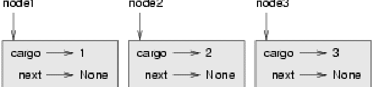

要链接节点，我们必须使第一个节点引用第二个节点，第二个节点引用第三个节点：

```
>>> node1.next = node2
>>> node2.next = node3
```

第三个节点的引用是 None，这表明它是列表的末尾。现在状态图如下所示：

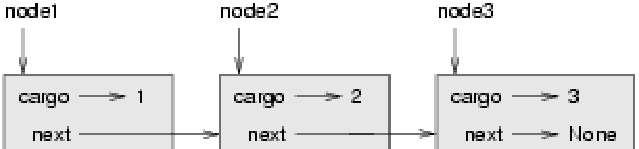

现在你知道如何创建节点并将它们链接成列表。此时可能不太清楚的是为什么。

### 25.3. 列表作为集合

列表很有用，因为它们提供了一种将多个对象组装成单个实体的方法，有时称为**集合**。在示例中，列表的第一个节点作为整个列表的引用。

要将列表作为参数传递，我们只需传递对第一个节点的引用。例如，函数 `print_list` 接受单个节点作为参数。从列表的头部开始，它打印每个节点，直到到达末尾：

```
def print_list(node):
    while node is not None:
        print(node, end=" ")
        node = node.next
    print()
```

要调用此方法，我们传递对第一个节点的引用：

```
>>> print_list(node1)
1 2 3
```

在 `print_list` 内部，我们有一个对列表第一个节点的引用，但没有变量引用其他节点。我们必须使用每个节点的 `next` 值来获取下一个节点。
要遍历链表，通常使用像 `node` 这样的循环变量来依次引用每个节点。
此图显示了 `list` 的值以及 `node` 依次取的值：

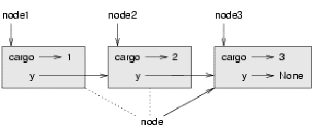

### 25.4. 列表和递归

使用递归方法表达许多列表操作是很自然的。例如，以下是一个反向打印列表的递归算法：

1.  将列表分成两部分：第一个节点（称为头部）；其余部分（称为尾部）。
2.  反向打印尾部。
3.  打印头部。

当然，步骤 2（递归调用）假设我们有一种反向打印列表的方法。但如果我们假设递归调用有效——信念的飞跃——那么我们可以说服自己这个算法是有效的。

我们需要的是一个基本情况和一种证明对于任何列表，我们最终都会达到基本情况的方法。给定列表的递归定义，一个自然的基本情况是空列表，由 `None` 表示：

```
def print_backward(list):
    if list is None: return
    head = list
    tail = list.next
    print_backward(tail)
    print(head, end=" ")
```

第一行通过不执行任何操作来处理基本情况。接下来的两行将列表分成头部和尾部。最后两行打印列表。`print` 语句的 `end` 参数防止 Python 在每个节点后打印换行符。

我们像调用 `print_list` 一样调用此方法：

```
>>> print_backward(node1)
3 2 1
```

结果是反向列表。

你可能想知道为什么 `print_list` 和 `print_backward` 是函数而不是 `Node` 类中的方法。原因是我们想使用 `None` 表示空列表，而在 `None` 上调用方法是不合法的。这种限制使得以干净的面向对象风格编写列表操作代码变得笨拙。

我们能否证明 `print_backward` 总是会终止？换句话说，它总是会达到基本情况吗？事实上，答案是否定的。某些列表会使此方法崩溃。

回顾递归章节

在我们之前关于递归的章节中，我们区分了需要信念飞跃的高级视图和低级操作视图。就心理分块而言，我们希望鼓励更抽象的高级视图。

但如果你想看到细节，你应该使用单步调试工具进入递归级别，并在每次调用 `print_backward` 时检查执行堆栈帧。

### 25.5. 无限列表

没有什么能阻止节点引用列表中较早的节点，包括它自己。例如，此图显示了一个包含两个节点的列表，其中一个节点引用自身：

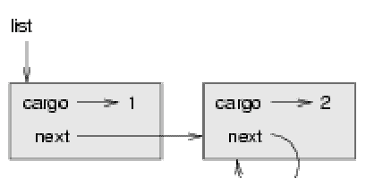

如果我们在此列表上调用 `print_list`，它将无限循环。如果我们调用 `print_backward`，它将无限递归。这种行为使得无限列表难以处理。

然而，它们偶尔很有用。例如，我们可以将数字表示为数字列表，并使用无限列表表示循环小数。

无论如何，我们无法证明 `print_list` 和 `print_backward` 终止是有问题的。我们能做的最好的就是假设性陈述：“如果列表不包含循环，那么这些方法将终止。”这种类型的声明称为**前置条件**。它对其中一个参数施加约束，并描述如果满足约束时方法的行为。你很快会看到更多示例。

### 25.6. 基本模糊性定理

`print_backward` 的一部分可能引起了你的注意：

```
head = list
tail = list.next
```

第一次赋值后，`head` 和 `list` 具有相同的类型和相同的值。那么为什么我们要创建一个新变量呢？

原因是这两个变量扮演不同的角色。我们将 `head` 视为对单个节点的引用，将 `list` 视为对列表第一个节点的引用。这些角色不是程序的一部分；它们存在于程序员的头脑中。

通常，我们无法通过查看程序来判断变量扮演什么角色。这种模糊性可能很有用，但它也可能使程序难以阅读。我们经常使用像 `node` 和 `list` 这样的变量名来记录我们打算如何使用变量，有时创建额外的变量来消除歧义。

我们可以不使用 `head` 和 `tail` 来编写 `print_backward`，这使其更简洁但可能不太清晰：

### 25.7. 修改列表

修改链表有两种方式。显然，我们可以更改某个节点的数据，但更有趣的操作是添加、删除或重新排列节点。

例如，让我们编写一个方法，删除列表中的第二个节点并返回对已删除节点的引用：

```python
def remove_second(list):
    if list is None: return
    first = list
    second = list.next
    # Make the first node refer to the third
    first.next = second.next
    # Separate the second node from the rest of the list
    second.next = None
    return second
```

同样，我们使用临时变量来使代码更具可读性。以下是使用此方法的方法：

```python
>>> print_list(node1)
1 2 3
>>> removed = remove_second(node1)
>>> print_list(removed)
2
>>> print_list(node1)
1 3
```

此状态图显示了操作的效果：

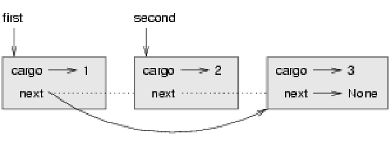

如果你调用此方法并传递一个只有一个元素的列表（一个**单例**）会发生什么？如果你传递空列表作为参数会发生什么？此方法是否有前置条件？如果有，请修复该方法以合理的方式处理违反前置条件的情况。

### 25.8. 包装器和辅助器

通常将列表操作分成两个方法很有用。例如，要以传统的列表格式 [3, 2, 1] 反向打印列表，我们可以使用 `print_backward` 方法打印 3, 2，但我们需要一个单独的方法来打印括号和第一个节点。让我们称之为 `print_backward_nicely`：

```python
def print_backward_nicely(list):
    print("[", end=" ")
    print_backward(list)
    print("]")
```

同样，检查像这样的方法是否适用于特殊情况（如空列表或单例）是一个好主意。

当我们在程序的其他地方使用此方法时，我们直接调用 `print_backward_nicely`，它代表我们调用 `print_backward`。从这个意义上说，`print_backward_nicely` 充当**包装器**，它使用 `print_backward` 作为**辅助器**。

### 25.9. LinkedList 类

我们实现列表的方式存在一些微妙的问题。在因果关系的逆转中，我们将首先提出一种替代实现，然后解释它解决了什么问题。

首先，我们将创建一个名为 `LinkedList` 的新类。它的属性是一个包含列表长度的整数和一个对第一个节点的引用。`LinkedList` 对象充当操作 `Node` 对象列表的句柄：

```python
class LinkedList:
    def __init__(self):
        self.length = 0
        self.head = None
```

LinkedList 类的一个优点是它提供了一个自然的位置来放置像 print_backward_nicely 这样的包装器函数，我们可以将其作为 LinkedList 类的一个方法：

```python
class LinkedList:
    ...
    def print_backward(self):
        print("[", end=" ")
        if self.head is not None:
            self.head.print_backward()

class Node:
    ...
    def print_backward(self):
        if self.next is not None:
            tail = self.next
            tail.print_backward()
        print(self.cargo, end=" ")
```

只是为了混淆，我们重命名了 print_backward_nicely。现在有两个名为 print_backward 的方法：一个在 Node 类中（辅助器）；一个在 LinkedList 类中（包装器）。当包装器调用 self.head.print_backward 时，它调用的是辅助器，因为 self.head 是一个 Node 对象。

LinkedList 类的另一个好处是它使添加或删除列表的第一个元素变得更容易。例如，add_first 是 LinkedList 的一个方法；它接受一个数据项作为参数并将其放在列表的开头：

```python
class LinkedList:
    ...
    def add_first(self, cargo):
        node = Node(cargo)
        node.next = self.head
        self.head = node
        self.length += 1
```

像往常一样，你应该检查这样的代码，看看它是否处理了特殊情况。例如，如果列表最初为空会发生什么？

### 25.10. 不变量

有些列表是格式良好的；有些则不是。例如，如果一个列表包含一个循环，它将导致我们的许多方法崩溃，因此我们可能希望要求列表不包含循环。另一个要求是 `LinkedList` 对象中的 `length` 值应等于列表中的实际节点数。

像这样的要求被称为**不变量**，因为理想情况下，它们应该对每个对象始终成立。为对象指定不变量是一种有用的编程实践，因为它使证明代码的正确性、检查数据结构的完整性以及检测错误变得更容易。

关于不变量有时令人困惑的一点是，有时它们会被违反。例如，在 `add_first` 的中间，在我们添加节点之后但在我们增加 `length` 之前，不变量被违反了。这种违反是可以接受的；事实上，如果不违反不变量至少一小段时间，通常无法修改对象。通常，我们要求每个违反不变量的方法都必须恢复不变量。

如果存在任何重要的代码段在其中不变量被违反，那么注释清楚地说明这一点就很重要，这样就不会执行依赖于不变量的操作。

### 25.11. 术语表

- **嵌入式引用**：存储在对象属性中的引用。
- **链表**：使用一系列链接节点实现集合的数据结构。
- **节点**：列表的一个元素，通常实现为包含对相同类型另一个对象的引用的对象。
- **数据**：节点中包含的数据项。
- **链接**：用于将一个对象链接到另一个对象的嵌入式引用。
- **前置条件**：方法正确工作必须为真的断言。
- **基本歧义定理**：对列表节点的引用可以被视为**单个对象**或**节点列表中的第一个**。
- **单例**：具有单个节点的链表。
- **包装器**：充当调用者**和**辅助方法之间中间人的方法，通常使方法更易于调用或更不易出错。
- **辅助器**：不由调用者直接调用，而是由另一个方法用来执行部分操作的方法。
- **不变量**：应始终对对象为**真**的断言（也许**在**对象**被**修改时除外）。

### 25.12. 练习

1. 按照惯例，列表通常以括号形式打印，元素之间用逗号分隔，如 [1, 2, 3]。修改 `print_list` 使其生成这种格式的输出。

## 第 26 章：栈

### 26.1. 抽象数据类型

到目前为止，你看到的数据类型都是具体的，因为我们已经完全指定了它们的实现方式。例如，Card 类使用两个整数表示一张卡片。正如我们当时讨论的，这不是表示卡片的唯一方式；有许多替代实现。

**抽象数据类型**（ADT）指定了一组操作（或方法）和操作的语义（它们做什么），但它没有指定操作的实现。这就是它抽象的原因。

为什么这很有用？

1. 如果你可以指定所需的操作而不必同时考虑操作如何执行，它就简化了指定算法的任务。
2. 由于通常有多种方式实现 ADT，因此编写一个可用于任何可能实现的算法可能很有用。
3. 众所周知的 ADT，如本章中的 Stack ADT，通常在标准库中实现，因此可以编写一次并由许多程序员使用。
4. ADT 上的操作提供了一种用于指定和讨论算法的通用高级语言。

当我们谈论 ADT 时，我们经常区分使用 ADT 的代码（称为**客户端**代码）和实现 ADT 的代码（称为**提供者/实现者**代码）。

### 26.2. 栈 ADT

在本章中，我们将研究一个常见的 ADT，即**栈**。栈是一个集合，意味着它是一个包含多个元素的数据结构。我们见过的其他集合包括字典和列表。

ADT 由可以对其执行的操作定义，这称为**接口**。栈的接口由这些操作组成：

```
__init__
初始化一个新的空栈。
```

### 26.3. 使用 Python 列表实现栈

Python 提供的列表操作与定义栈的操作类似。其接口并非完全符合预期，但我们可以编写代码来将栈抽象数据类型（ADT）转换为内置操作。

这段代码被称为栈 ADT 的**实现**。通常，实现是一组满足接口语法和语义要求的方法。

以下是使用 Python 列表实现的栈 ADT：

```python
class Stack:
    def __init__(self):
        self.items = []

    def push(self, item):
        self.items.append(item)

    def pop(self):
        return self.items.pop()

    def is_empty(self):
        return (self.items == [])
```

`Stack` 对象包含一个名为 `items` 的属性，它是栈中元素的列表。初始化方法将 `items` 设置为空列表。

要将新元素压入栈，`push` 方法将其追加到 `items`。要弹出栈顶元素，`pop` 方法使用同名（*同名的*）列表方法来移除并返回列表的最后一个元素。

最后，要检查栈是否为空，`is_empty` 方法将 `items` 与空列表进行比较。

像这样，方法由简单调用现有方法组成的实现，被称为**薄层封装**。在现实生活中，薄层封装是家具制造中用于隐藏下方低质量木材的优质木材薄涂层。计算机科学家使用这个比喻来描述一小段隐藏实现细节并提供更简单或更标准接口的代码。

### 26.4. 压栈与弹栈

栈是一种**泛型数据结构**，这意味着我们可以向其中添加任何类型的元素。以下示例将两个整数和一个字符串压入栈：

```python
>>> s = Stack()
>>> s.push(54)
>>> s.push(45)
>>> s.push("+")
```

我们可以使用 `is_empty` 和 `pop` 来移除并打印栈上的所有元素：

```python
while not s.is_empty():
    print(s.pop(), end=" ")
```

输出为 + 45 54。换句话说，我们刚刚使用栈反向打印了元素！诚然，这不是打印列表的标准格式，但使用栈来做这件事非常容易。

你应该将这段代码与上一章中 `print_backward` 的实现进行比较。`print_backward` 的递归版本与这里的栈算法之间存在自然的相似之处。区别在于，`print_backward` 使用运行时栈在遍历列表时跟踪节点，然后在递归返回时打印它们。栈算法做同样的事情，只是它使用 `Stack` 对象而不是运行时栈。

### 26.5. 使用栈计算后缀表达式

在大多数编程语言中，数学表达式以运算符位于两个操作数之间的形式书写，例如 1 + 2。这种格式称为**中缀**。一些计算器使用的替代格式称为**后缀**。在后缀中，运算符跟在操作数之后，例如 1 2 +。

后缀有时很有用的原因是，有一种自然的方法可以使用栈来计算后缀表达式：

1.  从表达式开头开始，一次获取一个项（运算符或操作数）。
    -   如果该项是操作数，则将其压入栈。
    -   如果该项是运算符，则从栈中弹出两个操作数，对它们执行运算，并将结果压回栈。
2.  当到达表达式末尾时，栈中应该恰好剩下一个操作数。该操作数就是结果。

### 26.6. 解析

要实现前面的算法，我们需要能够遍历字符串并将其分解为操作数和运算符。这个过程是**解析**的一个例子，其结果——字符串的各个部分——被称为**词法单元**。你可能还记得第 1 章中的这些术语。

Python 在字符串对象和 `re`（正则表达式）模块中都提供了 `split` 方法。字符串的 `split` 方法使用单个字符作为**分隔符**将其拆分为列表。例如：

```python
>>> "Now is the time".split(" ")
['Now', 'is', 'the', 'time']
```

在这个例子中，分隔符是空格字符，因此字符串在每个空格处被拆分。

函数 `re.split` 功能更强大，允许我们提供正则表达式而不是分隔符。正则表达式是指定一组字符串的一种方式。例如，`[A-z]` 是所有字母的集合，`[0-9]` 是所有数字的集合。`^` 运算符对集合取反，因此 `[^0-9]` 是所有非数字的集合，这正是我们想要用来拆分后缀表达式的集合：

```python
>>> import re
>>> re.split("([^0-9])", "123+456*/")
['123', '+', '456', '*', '', '/', '']
```

生成的列表包括操作数 123 和 456 以及运算符 * 和 /。它还包括两个在操作数后插入的空字符串。

### 26.7. 计算后缀表达式

要计算后缀表达式，我们将使用上一节的解析器和再上一节的算法。为了简单起见，我们将从一个只实现 + 和 * 运算符的计算器开始：

```python
def eval_postfix(expr):
    import re
    token_list = re.split("([^0-9])", expr)
    stack = Stack()
    for token in token_list:
        if token == "" or token == " ":
            continue
        if token == "+":
            sum = stack.pop() + stack.pop()
            stack.push(sum)
        elif token == "*":
            product = stack.pop() * stack.pop()
            stack.push(product)
        else:
            stack.push(int(token))
    return stack.pop()
```

第一个条件处理空格和空字符串。接下来的两个条件处理运算符。我们目前假设其他任何内容都必须是操作数。当然，更好的做法是检查错误输入并报告错误消息，但我们稍后会处理。

让我们通过计算 (56 + 47) * 2 的后缀形式来测试它：

```python
>>> eval_postfix("56 47 + 2 *")
206
```

结果足够接近。

### 26.8. 客户端与提供者

ADT 的基本目标之一是分离提供者（编写实现 ADT 的代码的人）和客户端（使用 ADT 的人）的关注点。提供者只需要担心实现是否正确——是否符合 ADT 的规范——而无需关心它将如何被使用。

相反，客户端*假设* ADT 的实现是正确的，而无需担心细节。当你使用 Python 的内置类型之一时，你可以完全以客户端的身份来思考。

当然，当你实现一个 ADT 时，你也必须编写客户端代码来测试它。在这种情况下，你同时扮演两个角色，这可能会令人困惑。你应该努力随时注意自己扮演的是哪个角色。

### 26.9. 术语表

**抽象数据类型 (ADT)**
一种数据类型（通常是对象的集合），由一组操作定义，但可以用多种方式实现。

**客户端**
使用 ADT 的程序（或编写该程序的人）。

**分隔符**
用于分隔词法单元的字符，例如自然语言中的标点符号。

**泛型数据结构**
一种可以包含任何类型数据的数据结构。

**实现**
满足接口语法和语义要求的代码。

**接口**
定义 ADT 的一组操作。

**中缀**
一种将运算符放在操作数之间的数学表达式书写方式。

**解析**
读取一串字符或词法单元并分析其语法结构的过程。

**后缀**
一种将运算符放在操作数之后的数学表达式书写方式。

**提供者**
实现 ADT 的代码（或编写该代码的人）。

**词法单元**
在解析过程中被视为一个单元的一组字符，例如自然语言中的单词。

**薄层封装**
家具制造中用于隐藏下方低质量木材的优质木材薄涂层。在计算机科学中，指一小段隐藏实现细节并提供更简单或更标准接口的代码。

一个**类**定义，它通过调用其他方法（有时带有简单转换）来实现抽象数据类型（ADT）的方法定义。这种“外衣”类本身不执行实质性工作，但它改进或标准化了客户端看到的接口。

### 26.10. 练习

1.  将后缀算法应用于表达式 1 2 + 3 *。此示例展示了后缀表示法的一个优点——无需使用括号来控制运算顺序。要在中缀表示法中得到相同结果，我们必须写成 (1 + 2) * 3。
2.  写出一个与 1 + 2 * 3 等价的后缀表达式。

## 第27章：队列

本章介绍两种抽象数据类型：队列和优先队列。在现实生活中，**队列**是一排等待某事的人。在大多数情况下，队列中的第一个人是下一个被服务的对象。但也有例外。在机场，航班即将起飞的人有时会从队列中间被叫出。在超市，一个有礼貌的人可能会让只带了几件商品的人排在自己前面。

决定谁下一个进行的规则称为**排队策略**。最简单的排队策略称为“先进先出”，简称 **FIFO**。最通用的排队策略是**优先级排队**，其中每个人被分配一个优先级，优先级最高的人先进行，无论到达顺序如何。我们说这是最通用的策略，因为优先级可以基于任何事物：航班起飞时间；某人有多少杂货；或者某人有多重要。当然，并非所有排队策略都是公平的，但公平与否取决于观察者的视角。

队列抽象数据类型和优先队列抽象数据类型具有相同的操作集。区别在于操作的语义：队列使用先进先出策略；而优先队列（顾名思义）使用优先级排队策略。

### 27.1. 队列抽象数据类型

队列抽象数据类型由以下操作定义：

-   `__init__`：初始化一个新的空队列。
-   `insert`：向队列中添加一个新项目。
-   `remove`：从队列中移除并返回一个项目。返回的项目是第一个被添加的项目。
-   `is_empty`：检查队列是否为空。

### 27.2. 链式队列

我们将要查看的第一个队列抽象数据类型实现称为**链式队列**，因为它由链接的 `Node` 对象组成。以下是类定义：

```python
class Queue:
    def __init__(self):
        self.length = 0
        self.head = None

    def is_empty(self):
        return self.length == 0

    def insert(self, cargo):
        node = Node(cargo)
        if self.head is None:
            # If list is empty the new node goes first
            self.head = node
        else:
            # Find the last node in the list
            last = self.head
            while last.next:
                last = last.next
            # Append the new node
            last.next = node
        self.length += 1

    def remove(self):
        cargo = self.head.cargo
        self.head = self.head.next
        self.length -= 1
        return cargo
```

`is_empty` 和 `remove` 方法与 `LinkedList` 的 `is_empty` 和 `remove_first` 方法相同。`insert` 方法是新的，并且稍微复杂一些。

我们希望在列表末尾插入新项目。如果队列为空，我们只需将 `head` 设置为指向新节点。

否则，我们将遍历列表找到最后一个节点，并将新节点附加到末尾。我们可以通过其 `next` 属性为 `None` 来识别最后一个节点。

一个正确形成的 `Queue` 对象有两个不变量。`length` 的值应该是队列中的节点数，并且最后一个节点的 `next` 应该等于 `None`。请确信此方法保持了这两个不变量。

### 27.3. 性能特征

通常，当我们调用一个方法时，我们并不关心其实现细节。但有一个细节我们可能想知道：该方法的性能特征。它需要多长时间，随着集合中项目数量的增加，运行时间如何变化？

首先看 `remove`。这里没有循环或函数调用，这表明该方法的运行时间每次都是相同的。这样的方法称为**常数时间**操作。实际上，当列表为空时，该方法可能稍微快一些，因为它跳过了条件语句的主体，但这种差异并不显著。

`insert` 的性能则大不相同。在一般情况下，我们必须遍历列表以找到最后一个元素。

这种遍历所需的时间与列表的长度成正比。由于运行时间是长度的线性函数，因此该方法称为**线性时间**。与常数时间相比，这非常糟糕。

### 27.4. 改进的链式队列

我们希望有一个队列抽象数据类型的实现，能够以常数时间执行所有操作。一种方法是修改 Queue 类，使其同时维护对第一个和最后一个节点的引用，如图所示：

改进的队列实现如下所示：

```python
class ImprovedQueue:
    def __init__(self):
        self.length = 0
        self.head = None
        self.last = None

    def is_empty(self):
        return self.length == 0
```

到目前为止，唯一的更改是 `last` 属性。它在 `insert` 和 `remove` 方法中使用：

```python
class ImprovedQueue:
    ...
    def insert(self, cargo):
        node = Node(cargo)
        if self.length == 0:
            # If list is empty, the new node is head and last
            self.head = self.last = node
        else:
            # Find the last node
            last = self.last
            # Append the new node
            last.next = node
            self.last = node
        self.length += 1
```

由于 `last` 跟踪最后一个节点，我们不必搜索它。因此，该方法是常数时间的。

为了获得这种速度，我们需要付出代价。我们必须在 `remove` 中添加一个特殊情况，以便在移除最后一个节点时将 `last` 设置为 `None`：

```python
class ImprovedQueue:
    ...
    def remove(self):
        cargo = self.head.cargo
        self.head = self.head.next
        self.length -= 1
        if self.length == 0:
            self.last = None
        return cargo
```

此实现比链式队列实现更复杂，并且更难以证明其正确性。优点是我们实现了目标——`insert` 和 `remove` 都是常数时间操作。

### 27.5. 优先队列

优先队列抽象数据类型具有与队列抽象数据类型相同的接口，但语义不同。同样，接口是：

-   `__init__`：初始化一个新的空队列。
-   `insert`：向队列中添加一个新项目。
-   `remove`：从队列中移除并返回一个项目。返回的项目是具有最高优先级的项目。
-   `is_empty`：检查队列是否为空。

语义上的区别在于，从队列中移除的项目不一定是第一个被添加的项目。相反，它是队列中具有最高优先级的项目。优先级是什么以及它们如何相互比较，优先队列实现并未指定。这取决于队列中有哪些项目。

例如，如果队列中的项目有名称，我们可能会按字母顺序选择它们。如果它们是保龄球分数，我们可能会从最高到最低，但如果是高尔夫分数，我们会从最低到最高。只要我们能比较队列中的项目，我们就能找到并移除具有最高优先级的项目。

此优先队列实现有一个属性，是一个包含队列中项目的 Python 列表。

```python
class PriorityQueue:
    def __init__(self):
        self.items = []

    def is_empty(self):
        return not self.items

    def insert(self, item):
        self.items.append(item)
```

初始化方法、`is_empty` 和 `insert` 都是列表操作的“外衣”。唯一有趣的方法是 `remove`：

```python
class PriorityQueue:
    ...
    def remove(self):
        maxi = 0
        for i in range(1, len(self.items)):
            if self.items[i] > self.items[maxi]:
                maxi = i
        item = self.items[maxi]
        del self.items[maxi]
        return item
```

在每次迭代开始时，`maxi` 保存着我们目前见过的最大项（最高优先级）的索引。每次循环中，程序会将第 i 项与当前的“冠军”进行比较。如果新项更大，则将 `maxi` 的值设置为 `i`。

当 `for` 语句完成时，`maxi` 就是最大项的索引。该项将从列表中移除并返回。

让我们测试一下这个实现：

```python
>>> q = PriorityQueue()
>>> for num in [11, 12, 14, 13]:
...     q.insert(num)
...
>>> while not q.is_empty():
...     print(q.remove())
...
14
13
12
11
```

如果队列包含简单的数字或字符串，它们会按照数值或字母顺序，从高到低被移除。Python 可以找到最大的整数或字符串，因为它可以使用内置的比较运算符来比较它们。

如果队列包含一个对象类型，它必须提供一个 `__gt__` 方法。当 `remove` 使用 `>` 运算符比较项时，它会调用其中一个项的 `__gt__` 方法，并将另一个作为参数传递。只要 `__gt__` 方法工作正常，优先队列就能正常工作。

### 27.6. Golfer 类

作为一个具有非典型优先级定义的对象示例，让我们实现一个名为 `Golfer` 的类，用于跟踪高尔夫球手的姓名和成绩。像往常一样，我们从定义 `__init__` 和 `__str__` 开始：

```python
class Golfer:
    def __init__(self, name, score):
        self.name = name
        self.score = score

    def __str__(self):
        return "{0:16}: {1}".format(self.name, self.score)
```

`__str__` 使用 `format` 方法将姓名和成绩放入整齐的列中。
接下来我们定义一个 `__gt__` 版本，其中最低分获得最高优先级。一如既往，如果 `self` 大于 `other`，`__gt__` 返回 `True`，否则返回 `False`。

```python
class Golfer:
    ...
    def __gt__(self, other):
        return self.score < other.score    # Less is more
```

现在我们准备好用 `Golfer` 类测试优先队列了：

```python
>>> tiger = Golfer("Tiger Woods", 61)
>>> phil = Golfer("Phil Mickelson", 72)
>>> hal = Golfer("Hal Sutton", 69)
>>>
>>> pq = PriorityQueue()
>>> for g in [tiger, phil, hal]:
...     pq.insert(g)
...
>>> while not pq.is_empty():
...     print(pq.remove())
...
Tiger Woods    : 61
Hal Sutton     : 69
Phil Mickelson : 72
```

### 27.7. 术语表

- **常数时间**
    运行时间不依赖于数据结构大小的操作。

- **FIFO（先进先出）**
    一种排队策略，其中第一个到达的成员是第一个被移除的。

- **线性时间**
    运行时间是数据结构大小的线性函数的操作。

- **链式队列**
    使用链表实现的队列。

- **优先队列**
    一种排队策略，其中每个成员的优先级由外部因素决定。优先级最高的成员是第一个被移除的。

- **Priority Queue**
    一个定义了可能在优先队列上执行的操作的抽象数据类型。

- **队列**
    一组等待某种服务的有序对象。

- **Queue**
    一个执行可能在队列上执行的操作的抽象数据类型。

- **排队策略**
    决定队列中下一个被移除的成员的规则。

### 27.8. 练习

1. 使用 Python 列表编写一个 Queue ADT 的实现。将此实现与 ImprovedQueue 在一系列队列长度下的性能进行比较。
2. 使用链表编写一个 Priority Queue ADT 的实现。你应该保持列表有序，以便移除操作是常数时间操作。将此实现与 Python 列表实现的性能进行比较。

## 第 28 章：树

与链表类似，树由节点组成。一种常见的树是**二叉树**，其中每个节点包含对另外两个节点（可能是 `None`）的引用。这些引用被称为左子树和右子树。与列表节点类似，树节点也包含数据。树的状态图如下所示：

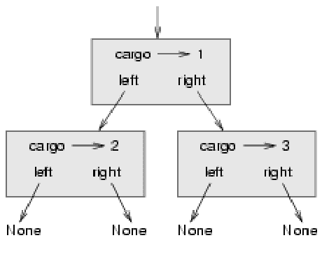

为了避免图片杂乱，我们通常省略 `Nones`。
树的顶部（`tree` 引用的节点）被称为**根**。为了符合树的比喻，其他节点被称为分支，而具有空引用的尖端节点被称为**叶子**。我们画图时把根放在顶部，叶子放在底部，这看起来可能有点奇怪，但这还不是最奇怪的事情。
更糟糕的是，计算机科学家们还混入了另一个比喻：家谱。顶部节点有时被称为**父节点**，它引用的节点是它的**子节点**。具有相同父节点的节点被称为**兄弟节点**。
最后，还有一套用于描述树的几何词汇。我们已经提到了左和右，但还有上（朝向父节点/根）和下（朝向子节点/叶子）。此外，所有与根节点距离相同的节点构成了树的一个**层**。
我们可能不需要三个比喻来谈论树，但它们确实存在。
与链表类似，树是递归数据结构，因为它们是递归定义的。一棵树要么是：

1.  空树，由 `None` 表示，或者
2.  一个包含对象引用（数据）和两个树引用的节点。

### 28.1. 构建树

组装树的过程类似于组装链表的过程。每次构造函数调用都会构建一个单独的节点。

```python
class Tree:
    def __init__(self, cargo, left=None, right=None):
        self.cargo = cargo
        self.left = left
        self.right = right

    def __str__(self):
        return str(self.cargo)
```

数据可以是任何类型，但 `left` 和 `right` 参数应该是树节点。`left` 和 `right` 是可选的；默认值是 `None`。
要打印一个节点，我们只需打印数据。
构建树的一种方法是自底向上。首先分配子节点：

```python
left = Tree(2)
right = Tree(3)
```

然后创建父节点并将其链接到子节点：

```python
tree = Tree(1, left, right)
```

我们可以通过嵌套构造函数调用来更简洁地编写此代码：

```python
>>> tree = Tree(1, Tree(2), Tree(3))
```

无论哪种方式，结果都是本章开头的那棵树。

### 28.2. 遍历树

每当你看到一个新的数据结构时，你的第一个问题应该是：“我该如何遍历它？”遍历树最自然的方式是递归。例如，如果树包含整数作为数据，此函数返回它们的总和：

```python
def total(tree):
    if tree is None: return 0
    return total(tree.left) + total(tree.right) + tree.cargo
```

基本情况是空树，它不包含数据，所以总和为 0。递归步骤进行两次递归调用以找到子树的总和。当递归调用完成时，我们将父节点的数据相加并返回总数。

### 28.3. 表达式树

树是表示表达式结构的自然方式。与其他表示法不同，它可以明确地表示计算。例如，中缀表达式 `1 + 2 * 3` 是模糊的，除非我们知道乘法在加法之前发生。

这个表达式树表示相同的计算：

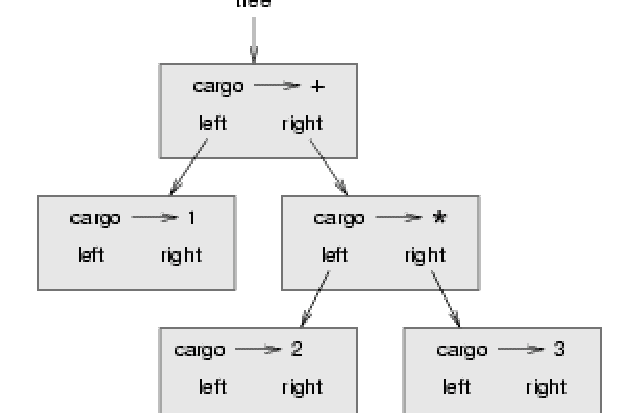

表达式树的节点可以是像 `1` 和 `2` 这样的操作数，也可以是像 `+` 和 `*` 这样的运算符。操作数是叶节点；运算符节点包含对其操作数的引用。（所有这些运算符都是**二元**的，意味着它们恰好有两个操作数。）

我们可以这样构建这棵树：

```python
>>> tree = Tree("+", Tree(1), Tree("*", Tree(2), Tree(3)))
```

看图可知，操作顺序毫无疑问；乘法首先发生，以便计算加法的第二个操作数。

表达式树有许多用途。本章中的示例使用树将表达式转换为后缀、前缀和中缀。编译器内部也使用类似的树来解析、优化和翻译程序。

### 28.4. 树的遍历

我们可以遍历表达式树并打印其内容，如下所示：

```python
def print_tree(tree):
    if tree is None: return
    print(tree.cargo, end=" ")
    print_tree(tree.left)
    print_tree(tree.right)
```

换句话说，要打印一棵树，首先打印根节点的内容，然后打印整个左子树，最后打印整个右子树。这种遍历树的方式称为**前序遍历**，因为根节点的内容出现在子节点内容*之前*。对于前面的例子，输出是：

```python
>>> tree = Tree("+", Tree(1), Tree("*", Tree(2), Tree(3)))
>>> print_tree(tree)
+ 1 * 2 3
```

这种格式不同于后缀和中缀；它被称为**前缀表示法**，其中运算符出现在操作数之前。

你可能会想，如果以不同的顺序遍历树，会得到不同表示法的表达式。例如，如果先打印子树，然后打印根节点，你会得到：

```python
def print_tree_postorder(tree):
    if tree is None: return
    print_tree_postorder(tree.left)
    print_tree_postorder(tree.right)
    print(tree.cargo, end=" ")
```

结果是 1 2 3 * +，这是后缀表示法！这种遍历顺序称为**后序遍历**。

最后，要**中序遍历**一棵树，你需要打印左子树，然后打印根节点，最后打印右子树：

```python
def print_tree_inorder(tree):
    if tree is None: return
    print_tree_inorder(tree.left)
    print(tree.cargo, end=" ")
    print_tree_inorder(tree.right)
```

结果是 1 + 2 * 3，这是中缀表示法的表达式。

公平地说，我们应该指出，我们忽略了一个重要的复杂性。有时，当我们用中缀表示法书写表达式时，必须使用括号来保持运算顺序。因此，仅靠中序遍历不足以生成中缀表达式。

尽管如此，经过一些改进，表达式树和三种递归遍历提供了一种将表达式从一种格式转换为另一种格式的通用方法。

如果我们进行中序遍历并跟踪我们在树中的层级，就可以生成树的图形表示：

```python
def print_tree_indented(tree, level=0):
    if tree is None: return
    print_tree_indented(tree.right, level+1)
    print("  " * level + str(tree.cargo))
    print_tree_indented(tree.left, level+1)
```

参数 `level` 用于跟踪我们在树中的位置。默认情况下，它初始为 0。每次进行递归调用时，我们传递 `level+1`，因为子节点的层级总是比父节点大一级。每个项目根据层级缩进两个空格。示例树的结果是：

```python
>>> print_tree_indented(tree)
    3
  *
    2
+
    1
```

如果你侧着看输出，会看到原始图形的简化版本。

### 28.5. 构建表达式树

在本节中，我们将解析中缀表达式并构建相应的表达式树。例如，表达式 `(3 + 7) * 9` 会生成以下树：

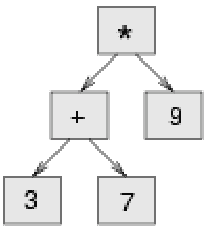

请注意，我们通过省略属性名称简化了图表。

我们将编写的解析器处理包含数字、括号以及运算符 `+` 和 `*` 的表达式。我们假设输入字符串已经被标记化为一个 Python 列表（生成此列表留作练习）。`(3 + 7) * 9` 的标记列表是：

```python
["(", 3, "+", 7, ")", "*", 9, "end"]
```

`end` 标记对于防止解析器读取超出列表末尾很有用。

我们要编写的第一个函数是 `get_token`，它接受一个标记列表和一个期望的标记作为参数。它将期望的标记与列表中的第一个标记进行比较：如果匹配，它从列表中移除该标记并返回 `True`；否则，返回 `False`：

```python
def get_token(token_list, expected):
    if token_list[0] == expected:
        del token_list[0]
        return True
    return False
```

由于 `token_list` 引用一个可变对象，这里所做的更改对任何引用同一对象的其他变量都是可见的。

下一个函数 `get_number` 处理操作数。如果 `token_list` 中的下一个标记是一个数字，`get_number` 会移除它并返回一个包含该数字的叶节点；否则，返回 `None`。

```python
def get_number(token_list):
    x = token_list[0]
    if type(x) != type(0): return None
    del token_list[0]
    return Tree(x, None, None)
```

在继续之前，我们应该单独测试 `get_number`。我们将一个数字列表赋值给 `token_list`，提取第一个数字，打印结果，并打印 `token_list` 的剩余部分：

```python
>>> token_list = [9, 11, "end"]
>>> x = get_number(token_list)
>>> print_tree_postorder(x)
9
>>> print(token_list)
[11, "end"]
```

我们需要的下一个方法是 `get_product`，它为乘积构建表达式树。一个简单的乘积有两个数字作为操作数，例如 `3 * 7`。

这是一个处理简单乘积的 `get_product` 版本。

```python
def get_product(token_list):
    a = get_number(token_list)
    if get_token(token_list, "*"):
        b = get_number(token_list)
        return Tree("*", a, b)
    return a
```

假设 `get_number` 成功并返回一个单节点树，我们将第一个操作数赋值给 `a`。如果下一个字符是 `*`，我们获取第二个数字并用 `a`、`b` 和运算符构建一个表达式树。

如果下一个字符是其他任何东西，那么我们只返回包含 `a` 的叶节点。以下是两个例子：

```python
>>> token_list = [9, "*", 11, "end"]
>>> tree = get_product(token_list)
>>> print_tree_postorder(tree)
9 11 *
```

```python
>>> token_list = [9, "+", 11, "end"]
>>> tree = get_product(token_list)
>>> print_tree_postorder(tree)
9
```

第二个例子意味着我们将单个操作数视为一种乘积。这种乘积的定义是反直觉的，但事实证明它很有用。

现在我们必须处理复合乘积，例如 `3 * 5 * 13`。我们将此表达式视为乘积的乘积，即 `3 * (5 * 13)`。生成的树是：

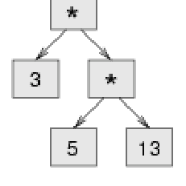

通过对 `get_product` 进行小的修改，我们可以处理任意长度的乘积：

```python
def get_product(token_list):
    a = get_number(token_list)
    if get_token(token_list, "*"):
        b = get_product(token_list)        # 此行已更改
        return Tree("*", a, b)
    return a
```

换句话说，一个乘积可以是一个单节点，或者是一个以 `*` 为根节点、左边是一个数字、右边是一个乘积的树。这种递归定义应该开始让你感到熟悉了。

让我们用一个复合乘积来测试新版本：

```python
>>> token_list = [2, "*", 3, "*", 5 , "*", 7, "end"]
>>> tree = get_product(token_list)
>>> print_tree_postorder(tree)
2 3 5 7 * * *
```

接下来，我们将添加解析求和的能力。同样，我们使用一个稍微反直觉的求和定义。对我们来说，一个求和可以是一个以 `+` 为根节点、左边是一个乘积、右边是一个求和的树。或者，一个求和可以只是一个乘积。

如果你愿意接受这个定义，它有一个很好的特性：我们可以将任何表达式（不带括号）表示为乘积的和。这个特性是我们解析算法的基础。

`get_sum` 尝试构建一个左边是乘积、右边是求和的树。但如果它没有找到 `+`，它就只构建一个乘积。

```python
def get_sum(token_list):
    a = get_product(token_list)
    if get_token(token_list, "+"):
        b = get_sum(token_list)
        return Tree("+", a, b)
    return a
```

让我们用 `9 * 11 + 5 * 7` 来测试它：

```python
>>> token_list = [9, "*", 11, "+", 5, "*", 7, "end"]
>>> tree = get_sum(token_list)
>>> print_tree_postorder(tree)
9 11 * 5 7 * +
```

我们快完成了，但我们仍然需要处理括号。在表达式中任何可以出现数字的地方，也可以出现一个用括号括起来的完整求和。我们只需要修改 `get_number` 来处理**子表达式**：

### 28.6. 处理错误

在整个解析器中，我们一直假设表达式是格式良好的。例如，当到达子表达式的末尾时，我们假设下一个字符是右括号。如果出现错误，下一个字符是其他内容，我们就需要处理它。

```python
def get_number(token_list):
    if get_token(token_list, "("):
        x = get_sum(token_list)
        if not get_token(token_list, ")"):
            raise ValueError('Missing close parenthesis')
        return x
    else:
        # The rest of the function omitted
```

`raise` 语句抛出我们创建的异常对象。在这个例子中，我们只是使用了能找到的最合适的内置异常类型，但你应该知道，如果需要，你可以创建自己更具体的用户定义异常。如果调用 `get_number` 的函数，或者回溯中的其他函数处理了这个异常，那么程序就可以继续执行。否则，Python 将打印一条错误消息并退出。

### 28.7. 动物分类树

在本节中，我们将开发一个使用树来表示知识库的小程序。该程序与用户交互，创建一个由问题和动物名称组成的树。以下是一个示例运行：

```
Are you thinking of an animal? y
Is it a bird? n
What is the animal's name? dog
What question would distinguish a dog from a bird? Can it fly
If the animal were dog the answer would be? n

Are you thinking of an animal? y
Can it fly? n
Is it a dog? n
What is the animal's name? cat
What question would distinguish a cat from a dog? Does it bark
If the animal were cat the answer would be? n

Are you thinking of an animal? y
Can it fly? n
Does it bark? y
Is it a dog? y
I rule!

Are you thinking of an animal? n
```

以下是此对话构建的树：

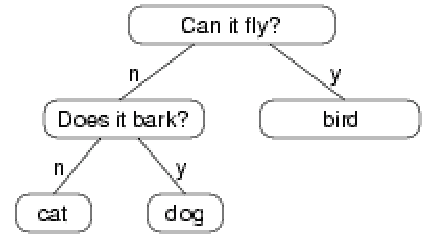

在每一轮开始时，程序从树的顶部开始并提出第一个问题。根据答案，它移动到左子节点或右子节点并继续，直到到达叶节点。此时，它会做出猜测。如果猜测不正确，它会询问用户新动物的名称以及一个能区分（错误的）猜测和新动物的问题。然后，它向树中添加一个包含新问题和新动物的新节点。

以下是代码：

```python
def yes(ques):
    ans = input(ques).lower()
    return ans[0] == "y"

def animal():
    # Start with a singleton
    root = Tree("bird")

    # Loop until the user quits
    while True:
        print()
        if not yes("Are you thinking of an animal? "): break

        # Walk the tree
        tree = root
        while tree.left is not None:
            prompt = tree.cargo + "? "
            if yes(prompt):
                tree = tree.right
            else:
                tree = tree.left

        # Make a guess
        guess = tree.cargo
        prompt = "Is it a " + guess + "? "
        if yes(prompt):
            print("I rule!")
            continue

        # Get new information
        prompt  = "What is the animal's name? "
        animal  = input(prompt)
        prompt  = "What question would distinguish a {0} from a {1}? "
        question = input(prompt.format(animal, guess))

        # Add new information to the tree
        tree.cargo = question
        prompt = "If the animal were {0} the answer would be? "
        if yes(prompt.format(animal)):
            tree.left = Tree(guess)
            tree.right = Tree(animal)
        else:
            tree.left = Tree(animal)
            tree.right = Tree(guess)
```

函数 `yes` 是一个辅助函数；它打印一个提示，然后从用户那里获取输入。如果响应以 `y` 或 `Y` 开头，函数返回 `True`。

`animal` 外层循环的条件是 `True`，这意味着它会一直持续，直到执行 `break` 语句（如果用户没有在想一种动物）。

内层 `while` 循环从上到下遍历树，由用户的响应引导。

当向树中添加一个新节点时，新问题替换了原有的内容，两个子节点分别是新动物和原始内容。

该程序的一个缺点是，当它退出时，它会忘记你精心教给它的一切！修复这个问题留作练习。

### 28.8. 术语表

- **二元运算符**：接受两个操作数的运算符。
- **二叉树**：每个节点引用零个、一个或两个子节点的树。
- **子节点**：被某个节点引用的节点之一。
- **叶节点**：树中最底部的节点，没有子节点。
- **层**：与根节点距离相等的节点集合。
- **父节点**：引用给定节点的节点。
- **后序遍历**：一种遍历树的方式，在访问节点本身之前先访问其子节点。
- **前缀表示法**：一种编写数学表达式的方式，每个运算符出现在其操作数之前。
- **前序遍历**：一种遍历树的方式，在访问节点的子节点之前先访问该节点。
- **根节点**：树中最顶部的节点，没有父节点。
- **兄弟节点**：共享同一个父节点的节点。
- **子表达式**：括号中的表达式，在更大的表达式中充当单个操作数。

### 28.9. 练习

1.  修改 `print_tree_inorder`，使其在每个运算符和每对操作数周围加上括号。输出是否正确且无歧义？括号是否总是必要的？
2.  编写一个函数，接受一个表达式字符串并返回一个标记列表。
3.  在表达式树函数中找出其他可能发生错误的地方，并添加适当的 `raise` 语句。用格式不正确的表达式测试你的代码。
4.  想出各种将动物知识树保存到文件中的方法。实现你认为最简单的一种。

## 附录 A：调试

程序中可能发生不同类型的错误，区分它们以更快地追踪问题很有用：

1.  **语法错误**是 Python 在将源代码翻译成字节码时产生的。它们通常表示程序的语法有问题。例如：在 `def` 语句末尾省略冒号会产生有些冗余的消息 `SyntaxError: invalid syntax`。
2.  **运行时错误**是运行时系统在程序运行过程中出现问题时产生的。大多数运行时错误消息包含错误发生的位置以及正在执行的函数信息。例如：无限递归最终会导致超出最大递归深度的运行时错误。
3.  **语义错误**是程序编译并运行但未执行正确操作的问题。例如：表达式可能未按你预期的顺序求值，导致意外结果。

调试的第一步是确定你正在处理哪种类型的错误。尽管以下部分按错误类型组织，但有些技术适用于多种情况。

### A.1. 语法错误

一旦你弄清楚语法错误是什么，通常很容易修复。不幸的是，错误消息通常没有帮助。最常见的消息是 `SyntaxError: invalid syntax` 和 `SyntaxError: invalid token`，两者都不是很有信息量。

另一方面，该消息确实告诉你程序中问题发生的位置。实际上，它告诉你 Python 注意到问题的位置，这不一定是错误所在的位置。有时错误在错误消息位置之前，通常在前一行。

如果你是增量构建程序的，你应该对错误的位置有很好的了解。它将在你添加的最后一行中。

如果你是从书中复制代码，首先非常仔细地将你的代码与书中的代码进行比较。检查每个字符。同时，请记住书可能是错误的，所以如果你看到看起来像语法错误的东西，它可能就是。

以下是一些避免最常见语法错误的方法：

1.  确保你没有使用 Python 关键字作为变量名。
2.  检查每个复合语句（包括 `for`、`while`、`if` 和 `def` 语句）的末尾是否有冒号。
3.  检查缩进是否一致。你可以使用空格或制表符进行缩进，但最好不要混用。每一级的嵌套量应该相同。
4.  确保代码中的任何字符串都有匹配的引号。
5.  如果你有使用三引号（单引号或双引号）的多行字符串，请确保你正确地终止了字符串。未终止的字符串可能会在程序末尾导致 `invalid token` 错误，或者它可能会将程序的后续部分视为字符串，直到遇到下一个字符串。在第二种情况下，它可能根本不会产生错误消息！
6.  未闭合的括号 —— `(`、`{` 或 `[` —— 会使 Python 将下一行作为当前语句的一部分继续处理。通常，错误几乎会立即在下一行发生。
7.  检查条件语句中是否使用了经典的 `=` 而不是 `==`。

如果以上方法都不奏效，请继续阅读下一节...

### A.2. 无论我怎么做，我的程序都无法运行。

如果编译器说有错误而你却没有看到，那可能是因为你和编译器查看的不是同一段代码。检查你的编程环境，确保你正在编辑的程序就是 Python 试图运行的那个。如果你不确定，试着在程序开头故意添加一个明显的语法错误。现在再次运行（或导入）它。如果编译器没有发现这个新错误，那么很可能是你的环境设置有问题。

如果发生这种情况，一种方法是重新开始一个像 Hello, World! 这样的新程序，并确保你能运行一个已知的程序。然后逐步将新程序的部分添加到这个可运行的程序中。

### A.3. 运行时错误

一旦你的程序在语法上正确，Python 就可以导入它并至少开始运行它。那可能会出什么问题呢？

### A.4. 我的程序完全没有反应。

当你的文件由函数和类组成，但实际上没有调用任何东西来开始执行时，这个问题最常见。如果你只打算导入这个模块来提供类和函数，这可能是有意为之的。

如果不是有意为之，请确保你调用了一个函数来开始执行，或者从交互式提示符执行一个函数。另请参阅下面的[执行流程](#)部分。

### A.5. 我的程序挂起了。

如果一个程序停止并且似乎什么也没做，我们说它挂起了。通常这意味着它陷入了无限循环或无限递归。

1.  如果你怀疑某个特定的循环是问题所在，请在该循环之前添加一个 `print` 语句，说明“进入循环”，并在循环之后添加另一个 `print` 语句，说明“退出循环”。
2.  运行程序。如果你收到了第一条消息但没有收到第二条，那么你遇到了无限循环。请转到下面的[无限循环](#)部分。
3.  大多数情况下，无限递归会导致程序运行一段时间，然后产生 `RuntimeError: Maximum recursion depth exceeded` 错误。如果发生这种情况，请转到下面的[无限递归](#)部分。
4.  如果你没有收到这个错误，但你怀疑某个递归方法或函数有问题，你仍然可以使用[无限递归](#)部分中的技术。
5.  如果以上步骤都不起作用，开始测试其他循环和其他递归函数和方法。
6.  如果这也不起作用，那么可能是你不理解程序中的执行流程。请转到下面的[执行流程](#)部分。

### A.6. 无限循环

如果你认为你遇到了无限循环，并且你认为你知道是哪个循环导致了问题，请在循环末尾添加一个 `print` 语句，打印条件中变量的值和条件的值。

例如：

```python
while x > 0 and y < 0:
    # Do something to x
    # Do something to y

    print("x: ", x)
    print("y: ", y)
    print("condition: ", (x > 0 and y < 0))
```

现在当你运行程序时，每次循环你都会看到三行输出。在循环的最后一次迭代中，条件应该为 False。如果循环持续进行，你将能够看到 x 和 y 的值，并且你可能会弄清楚为什么它们没有被正确更新。

在像 PyScripter 这样的开发环境中，你还可以在循环开始处设置一个断点，并单步执行循环。当你这样做时，通过将鼠标悬停在 x 和 y 上来检查它们的值。

当然，所有的编程和调试都要求你对算法应该做什么有一个良好的心智模型：如果你不理解 x 和 y 应该发生什么，打印或检查它的值用处不大。调试代码的最佳地点可能是在远离电脑的地方，专注于理解应该发生什么。

### A.7. 无限递归

大多数情况下，无限递归会导致程序运行一段时间，然后产生 `Maximum recursion depth exceeded` 错误。

如果你怀疑某个函数或方法导致了无限递归，首先检查以确保有一个基本情况。换句话说，应该存在某种条件，使得函数或方法在不进行递归调用的情况下返回。如果没有，那么你需要重新思考算法并确定一个基本情况。

如果存在基本情况但程序似乎没有达到它，请在函数或方法的开头添加一个 `print` 语句，打印参数。现在当你运行程序时，每次调用该函数或方法时，你都会看到几行输出，并且你会看到参数。如果参数没有朝着基本情况移动，你就会明白为什么没有。

再次强调，如果你有一个支持轻松单步执行、断点和检查的环境，请好好利用它。我们相信，逐步跟踪代码可以构建关于计算如何发生的最佳和最准确的心智模型。如果可以，请使用它！

### A.8. 执行流程

如果你不确定执行流程如何在你的程序中移动，请在每个函数的开头添加 `print` 语句，消息类似于“进入函数 foo”，其中 foo 是函数的名称。

现在当你运行程序时，它会在每次调用函数时打印一条跟踪信息。

如果你不确定，请使用调试器单步执行程序。

### A.9. 当我运行程序时，我得到了一个异常。

如果在运行时发生错误，Python 会打印一条消息，其中包含异常的名称、发生问题的程序行以及回溯信息。

在导致异常的行上设置一个断点，然后四处查看！

回溯信息标识了当前正在运行的函数，然后是调用它的函数，然后是调用*那个*函数的函数，依此类推。换句话说，它追溯了导致你到达当前位置的函数调用路径。它还包括你的文件中每个调用发生的行号。

第一步是检查程序中发生错误的地方，看看你是否能弄清楚发生了什么。以下是一些最常见的运行时错误：

**NameError**
你试图使用一个在当前环境中不存在的变量。记住，局部变量是局部的。你不能从定义它们的函数外部引用它们。

**TypeError**
有几种可能的原因：

1.  你试图不当地使用一个值。例如：使用非整数的东西对字符串、列表或元组进行索引。
2.  格式字符串中的项目与传递用于转换的项目之间不匹配。如果项目数量不匹配或请求了无效的转换，就可能发生这种情况。
3.  你向函数或方法传递了错误数量的参数。对于方法，请查看方法定义并检查第一个参数是否为 `self`。然后查看方法调用；确保你在正确类型的对象上调用该方法，并正确提供其他参数。

**KeyError**
你试图使用字典不包含的键值来访问字典的元素。

**AttributeError**
你试图访问不存在的属性或方法。

### A.10. 我添加了太多打印语句，导致输出泛滥成灾。

使用打印语句进行调试的一个问题是，你可能会被输出淹没。有两种方法可以解决：简化输出或简化程序。

要简化输出，你可以移除或注释掉那些没有帮助的打印语句，或者将它们合并，或者格式化输出使其更易于理解。

要简化程序，你可以做几件事。首先，缩小程序正在处理的问题规模。例如，如果你正在排序一个序列，就排序一个小序列。如果程序从用户那里获取输入，就给它最简单的、能引发问题的输入。

其次，清理程序。移除无用代码，并重新组织程序，使其尽可能易于阅读。例如，如果你怀疑问题出在程序中一个深度嵌套的部分，尝试用更简单的结构重写那部分。如果你怀疑一个大函数，尝试将其拆分成更小的函数并分别测试。

通常，寻找最小测试用例的过程会引导你找到错误。如果你发现一个程序在一种情况下有效，但在另一种情况下无效，这会给你提供关于发生了什么的线索。

同样，重写一段代码可以帮助你发现细微的错误。如果你做了一个你认为不会影响程序的更改，但它确实影响了，这可能会给你提示。

你还可以将调试打印语句包装在某个条件中，从而抑制大部分输出。例如，如果你正在尝试使用二分查找来查找一个元素，但它不工作，你可能会在条件语句中编写一个调试打印语句：如果候选元素的范围小于6，则打印调试信息，否则不打印。

同样，断点也可以设置为条件断点：你可以在一条语句上设置断点，然后编辑该断点，使其“仅在表达式为真时中断”。

### A.11. 语义错误

在某些方面，语义错误是最难调试的，因为编译器和运行时系统没有提供关于错误的信息。只有你知道程序应该做什么，也只有你知道它没有做到。

第一步是在程序文本和你看到的行为之间建立联系。你需要一个关于程序实际在做什么的假设。让这变得困难的一件事是计算机运行得如此之快。

你常常希望你能将程序减速到人类的速度，使用某些调试器你可以做到。但是，与设置调试器、插入和移除断点以及单步执行程序到错误发生的位置相比，插入几个位置恰当的`print`语句所花费的时间通常很短。

### A.12. 我的程序不工作。

你应该问自己这些问题：

- 1. 程序是否应该做某事但似乎没有发生？找到执行该功能的代码部分，并确保它在你认为应该执行的时候执行。
- 2. 是否发生了不应该发生的事情？在你的程序中找到执行该功能的代码，看看它是否在不应该执行的时候执行。
- 3. 代码的某个部分是否产生了你意想不到的效果？确保你理解相关代码，特别是如果它涉及调用其他Python模块中的函数或方法。阅读你调用的函数的文档。通过编写简单的测试用例并检查结果来尝试它们。

为了编程，你需要对程序如何工作有一个心智模型。如果你编写了一个程序，但它没有做你期望的事情，通常问题不在程序中；而是在你的心智模型中。

纠正你的心智模型的最佳方法是将程序分解为其组件（通常是函数和方法），并独立测试每个组件。一旦你发现你的模型与现实之间的差异，你就可以解决问题。

当然，你应该在开发程序的同时构建和测试组件。如果你遇到一个问题，应该只有少量新代码是未知是否正确的。

### A.13. 我有一个复杂的表达式，但它没有做我期望的事情。

编写复杂的表达式是可以的，只要它们是可读的，但它们可能很难调试。通常，将复杂表达式分解为一系列对临时变量的赋值是一个好主意。

例如：

```
self.hands[i].add_card(self.hands[self.find_neighbor(i)].pop_card())
```

这可以重写为：

```
neighbor = self.find_neighbor(i)
picked_card = self.hands[neighbor].pop_card()
self.hands[i].add_card(picked_card)
```

显式版本更容易阅读，因为变量名提供了额外的文档，而且更容易调试，因为你可以检查中间变量的类型并显示或检查它们的值。

复杂表达式可能出现的另一个问题是，求值顺序可能不是你期望的。例如，如果你正在将表达式 x/2π 翻译成Python，你可能会写：

```
y = x / 2 * math.pi
```

这是不正确的，因为乘法和除法具有相同的优先级，并且从左到右求值。所以这个表达式计算的是 (x/2)π。

调试表达式的一个好方法是添加括号以使求值顺序明确：

```
y = x / (2 * math.pi)
```

每当你不确定求值顺序时，使用括号。程序不仅会正确（在做你打算做的事情的意义上），而且对于那些没有记住优先级规则的其他人来说，它也会更具可读性。

### A.14. 我有一个函数或方法，它没有返回我期望的东西。

如果你有一个带有复杂表达式的`return`语句，你没有机会在返回之前打印`return`值。同样，你可以使用一个临时变量。例如，而不是：

```
return self.hands[i].remove_matches()
```

你可以写：

```
count = self.hands[i].remove_matches()
return count
```

现在你有机会在返回之前显示或检查count的值。

### A.15. 我真的、真的卡住了，我需要帮助。

首先，尝试离开电脑几分钟。电脑发出的波会影响大脑，导致以下效果：

- 1. 沮丧和/或愤怒。
- 2. 迷信信念（电脑讨厌我）和神奇思维（只有当我反戴帽子时程序才工作）。
- 3. 随机游走编程（试图通过编写每一个可能的程序并选择那个能做正确事情的程序来编程）。

如果你发现自己遭受了这些症状中的任何一种，站起来去散散步。当你冷静下来时，思考一下程序。它在做什么？这种行为的一些可能原因是什么？你上次有一个工作的程序是什么时候，你接下来做了什么？

有时只是需要时间来找到错误。我们经常在离开电脑并让思绪漫游时发现错误。找到错误的一些最佳地点是火车上、淋浴时和床上，就在你入睡之前。

### A.16. 不，我真的需要帮助。

这种情况会发生。即使是最优秀的程序员偶尔也会卡住。有时你在一个程序上工作了很长时间，以至于看不到错误。一双新的眼睛正是你需要的。

在你找别人帮忙之前，确保你已经用尽了这里描述的技术。你的程序应该尽可能简单，你应该在引发错误的最小输入上工作。你应该在适当的位置有打印语句（并且它们产生的输出应该是可理解的）。你应该足够理解问题，以便能够简洁地描述它。

当你找人帮忙时，一定要给他们所需的信息：

## 附录 B：杂项工作手册

这本工作手册/食谱集仍在编写中。

### B.1. 熟练度的五大要素

这是美国总统委托进行的一项重要研究。它探讨了学生在数学方面达到熟练水平所需的条件。

但它同样惊人地准确适用于计算机科学，甚至爵士乐演奏所需的熟练度！

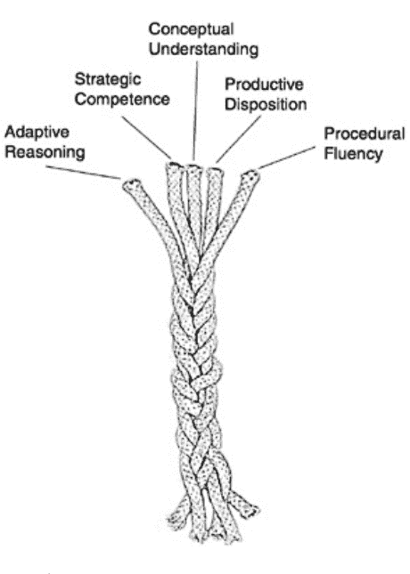

1.  **程序性流畅度**：学习语法。学习打字。熟悉你的工具。学习并练习音阶。学习重新排列公式。
2.  **概念性理解**：理解各个部分为何如此组合。
3.  **策略性能力**：你能看出下一步该做什么吗？你能将这个文字问题转化为你的符号表示吗？你能将音乐引向你想要的方向吗？
4.  **适应性推理**：你能看出如何将所学知识应用于这个新问题吗？
5.  **积极的倾向**：我们需要那种*我能行！*的态度！
    1.  你习惯性地认为学习这些东西是值得的。
    2.  你足够勤奋和自律，能够啃下硬骨头，并投入练习时间。
    3.  你培养出一种*效能感*——相信自己能够做成事情！

请查看 http://mason.gmu.edu/~jsuh4/teaching/strands.htm，或 Kilpatrick 的著作 http://www.nap.edu/openbook.php?isbn=0309069955

### B.2. 发送电子邮件

有时用 Python 做些强大的事情很有趣——记住我们在熟练度五大要素中看到的“积极的倾向”部分包括*效能感*——即能够完成有用事情的感觉。这里有一个 Python 示例，展示如何向某人发送电子邮件。

```python
import smtplib, email.mime.text

me = "joe@my.org.com"            # Put your own email here
fred = "fred@his.org.com"        # And fred's email address here
your_mail_server = "mail.my.org.com" # Ask your system administrator

# Create a text message containing the body of the email.
# You could read this from a file, of course.
msg = email.mime.text.MIMEText("""Hey Fred,

I'm having a party, please come at 8pm.
Bring a plate of snacks and your own drinks.
Joe""" )

msg["From"] = me                 # Add headers to the message object
msg["To"] = fred
msg["Subject"] = "Party on Saturday 23rd"

# Create a connection to your mail server
svr = smtplib.SMTP(your_mail_server)
response = svr.sendmail(me, fred, msg.as_string()) # Send message
if response != {}:
    print("Sending failed for ", response)
else:
    print("Message sent.")

svr.quit()                       # Close the connection
```

在本课程的背景下，请注意我们如何使用此程序中的两个对象：我们在第 9 行创建一个消息对象，并在第 16-18 行设置一些属性。然后我们在第 21 行创建一个连接对象，并请求它发送我们的消息。

### B.3. 编写你自己的 Web 服务器

Python 作为编写 Web 应用程序的工具正日益普及。虽然人们可能会使用 Python 在像 Apache 这样的 Web 服务器后面处理请求，但也有强大的库允许你用几行代码编写自己的独立 Web 服务器。这种更简单的方法意味着你可以在几分钟内让一个测试 Web 服务器在你自己的桌面机器上运行，而无需安装任何额外的软件。

在这个食谱示例中，我们使用 wsgi（“wizz-gee”）协议：这是一种将 Web 服务器连接到运行以提供服务的代码的现代方式。有关 wsgi 的更多信息，请参见 http://en.wikipedia.org/wiki/Web_Server_Gateway_Interface。

```python
from codecs import latin_1_encode
from wsgiref.simple_server import make_server

def my_handler(environ, start_response):
    path_info = environ.get("PATH_INFO", None)
    query_string = environ.get("QUERY_STRING", None)
    response_body = "You asked for {0} with query {1}".format(
                            path_info, query_string)
    response_headers = [("Content-Type", "text/plain"),
                        ("Content-Length", str(len(response_body)))]
    start_response("200 OK", response_headers)
    response = latin_1_encode(response_body)[0]
    return [response]

httpd = make_server("127.0.0.1", 8000, my_handler)
httpd.serve_forever()  # Start the server listening for requests
```

当你运行此程序时，你的机器将在端口 8000 上监听请求。（你可能需要告诉你的防火墙软件对你的新应用程序友好一些！）

在 Web 浏览器中，导航到 http://127.0.0.1:8000/catalogue?category=guitars。你的浏览器应该会收到响应

```
You asked for /catalogue with query category=guitars
```

你的 Web 服务器将持续运行，直到你中断它（如果你使用 PyScripter，按 Ctrl+F2）。
重要的第 15 和 16 行在本地机器上创建了一个 Web 服务器，在端口 8000 上监听。每个传入的 html 请求都会导致服务器调用 my_handler，该函数处理请求并返回相应的响应。

我们在下面修改了上面的示例：my_handler 现在检查 path_info，并调用专门的函数来处理每种不同的传入请求。（我们说 my_handler 将请求分派给相应的函数。）我们可以轻松添加其他更多的请求情况：

```python
import time

def my_handler(environ, start_response):
    path_info = environ.get("PATH_INFO", None)
    if path_info == "/gettime":
        response_body = gettime(environ, start_response)
    elif path_info == "/classlist":
        response_body = classlist(environ, start_response)
    else:
        response_body = ""
        start_response("404 Not Found", [("Content-Type", "text/plain")])

    response = latin_1_encode(response_body)[0]
    return [response]

def gettime(env, resp):
    html_template = """<html>
    <body bgcolor='lightblue'>
        <h2>The time on the server is {0}</h2>
        <body>
        </html>
        """
    response_body = html_template.format(time.ctime())
    response_headers = [("Content-Type", "text/html"),
            ("Content-Length", str(len(response_body)))]
    resp("200 OK", response_headers)
    return response_body

def classlist(env, resp):
    return  # Will be written in the next section!
```

注意 gettime 如何返回一个（虽然简单）html 文档，该文档是通过使用 format 将内容替换到预定义模板中动态构建的。

### B.4. 使用数据库

Python 有一个用于使用流行的轻量级 sqlite 数据库的库。有关这个自包含、可嵌入、零配置的 SQL 数据库引擎的更多信息，请访问 http://www.sqlite.org。

首先，我们有一个脚本，它创建一个新数据库，创建一个表，并将一些测试数据行存储到表中：（将此代码复制并粘贴到你的 Python 系统中。）

我们得到以下输出：

```
Database table StudentSubjects has been created.
StudentSubjects table now has 18 rows of data.
```

我们的下一个食谱扩展了上一节中的 Web 浏览器。我们将允许像 classlist?subject=CompSci&year=2012 这样的查询，并展示我们的服务器如何从查询字符串中提取参数、查询数据库，并将行作为 html 页面中的格式化表格发送回浏览器。我们将从两个新的导入开始，以访问 sqlite3 和 cgi，这是一个帮助我们解析发送到服务器的表单和查询字符串的库：

```python
import sqlite3
import cgi
```

现在我们用一个能够完成我们需要的功能的处理程序替换存根函数 classlist：

classlistTemplate = """<html>
<body bgcolor='lightgreen'>
  <h2>Students taking {0} during {1}:</h2>
  <table border=3 cellspacing=2 cellpadding=2>
{2}
  </table>
<body>
</html>
"""

def classlist(env, resp):

    # 从查询字符串（或提交的表单）中解析字段值
    # 在真实的服务器中，你需要检查它们是否存在！
    the_fields = cgi.FieldStorage(environ = env)
    subj = the_fields["subject"].value
    year = the_fields["year"].value

    # 连接到数据库，构建查询，获取行。
    connection = sqlite3.connect("c:\studentRecords.db")
    cursor = connection.cursor()
    cursor.execute("SELECT * FROM StudentSubjects WHERE subject=? AND year=?",
                   (subj, year))
    result = cursor.fetchall()
    # 为表格构建HTML行
    table_rows = ""
    for (sn, yr, subj) in result:
        table_rows += "    <tr><td>{0}<td>{1}<td>{2}\n". format(sn, yr, subj)

    # 现在将标题和数据插入模板，并完成响应
    response_body = classlistTemplate.format(subj, year, table_rows)
    response_headers = [("Content-Type", "text/html"),
            ("Content-Length", str(len(response_body)))]
    resp("200 OK", response_headers)
    return response_body

当我们运行此程序并在浏览器中导航到 http://127.0.0.1:8000/classlist?subject=CompSci&year=2012 时，我们将得到如下输出：

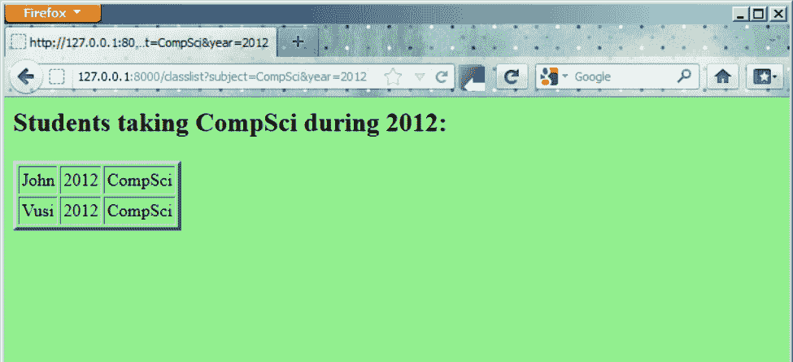

我们不太可能从头开始编写自己的Web服务器。但这种方法的美妙之处在于，它为使用wsgi协议的服务器端应用程序创建了一个绝佳的测试环境。一旦我们的代码准备就绪，我们就可以将其部署在像Apache这样的Web服务器后面，该服务器可以使用wsgi与我们的处理程序进行交互。

## 附录C：为Python开发配置Ubuntu

注意：以下说明假设您已连接到互联网，并且已启用主软件包仓库和universe软件包仓库。所有unix shell命令均假设从您的主目录（$HOME）运行。最后，任何以sudo开头的命令都假定您在计算机上拥有管理员权限。如果没有——请咨询您的系统管理员以安装所需的软件。

以下是在Ubuntu 9.10（Karmic）上设置用于本书的家庭环境的说明。我使用Ubuntu GNU/Linux进行本书的开发和测试，因此它是唯一一个我可以亲自回答设置和配置问题的系统。

本着软件自由和开放协作的精神，如果您想为自己的喜爱系统维护类似的附录，请与我联系。如果您同意回答有关它的用户反馈，我将非常乐意链接到它或将其放在Open Book Project网站上。

谢谢！

Jeffrey Elkner<sup>24</sup>
Governor’s Career and Technical Academy in Arlington
Arlington, Virginia

### C.1. Vim

Vim<sup>25</sup>可以非常有效地用于Python开发，但Ubuntu默认只安装了vim-tiny软件包，因此它不支持彩色语法高亮或自动缩进。

要使用Vim，请执行以下操作：

- 1. 从unix命令提示符运行：
$ sudo apt-get install vim-gnome

- 2. 在您的主目录中创建一个名为.vimrc的文件，其中包含以下内容：
syntax enable
filetype indent on
set et

<sup>24</sup>mailto:jeff@elkner.net
<sup>25</sup>http://www.vim.org

```
set sw=4
set smarttab
map <f2> :w|!python %
```

当您编辑扩展名为.py的文件时，您现在应该拥有彩色语法高亮和自动缩进。按下该键应运行您的程序，并在程序完成后将您带回编辑器。

要学习使用vim，请在unix命令提示符运行以下命令：

```
$ vimtutor
```

### C.2. $HOME环境

以下在您的主目录中创建一个有用的环境，用于添加您自己的Python库和可执行脚本：

- 1. 在主目录的命令提示符下，通过运行以下命令创建bin和lib/python子目录：

$ mkdir bin lib
$ mkdir lib/python

- 2. 将以下行添加到主目录中.bashrc的底部：
PYTHONPATH=$HOME/lib/python
EDITOR=vim

export PYTHONPATH EDITOR

这将把您首选的编辑器设置为Vim，将您自己的lib/python子目录添加到Python路径中，用于您的Python库，并将您自己的bin目录添加为放置可执行脚本的位置。您需要注销并重新登录，然后本地bin目录才会出现在您的搜索路径中<sup>26</sup>。

<sup>26</sup>http://en.wikipedia.org/wiki/Path_(variable)

### C.3. 使Python脚本可执行并可从任何地方运行

在unix系统上，可以使用以下过程使Python脚本*可执行*：

- 1. 将此行作为脚本的第一行：

```
#!/usr/bin/env python3
```

- 2. 在unix命令提示符下，键入以下内容使myscript.py可执行：

```
$ chmod +x myscript.py
```

- 3. 将myscript.py移动到您的bin目录，它将可以从任何地方运行。

## 附录D：自定义和贡献本书

注意：以下说明假设您已连接到互联网，并且已启用主软件包仓库和universe软件包仓库。所有unix shell命令均假设从您的主目录（$HOME）运行。最后，任何以sudo开头的命令都假定您在计算机上拥有管理员权限。如果没有——请咨询您的系统管理员以安装所需的软件。

本书是自由的，这意味着您有权对其进行修改以满足您的需求，并重新分发您的修改，以便我们整个社区都能受益。

然而，如果制作自定义版本或贡献更正和补充所需的工具不在您的掌握之中，这种自由就缺乏意义。本附录试图将这些工具交到您手中。

谢谢！

Jeffrey Elkner<sup>27</sup>
Governor’s Career and Technical Academy in Arlington
Arlington, Virginia

### D.1. 获取源代码

本书使用名为Sphinx<sup>30</sup>的文档生成系统，以ReStructuredText<sup>29</sup>格式标记<sup>28</sup>。
源代码位于 https://code.launchpad.net/~thinkcspy-rle-team/thinkcspy/thinkcspy3-rle。

在Ubuntu计算机上获取源代码的最简单方法是：

- 1. 在您的系统上运行 sudo apt-get install bazaar 以安装bazaar<sup>31</sup>。
- 2. 运行 bazaar branch lp:thinkcspy。

上面的最后一个命令将从Launchpad下载本书源代码到名为thinkcspy的目录中，该目录包含构建本书所需的Sphinx源代码和配置信息。

### D.2. 制作HTML版本

要生成本书的html版本：

- 1. 运行 `sudo apt-get install python-sphinx` 以安装Sphinx文档系统。
- 2. `cd thinkcspy` - 进入包含本书源代码的 `thinkcspy` 目录。
- 3. `make html`。

最后一个命令将运行sphinx并创建一个名为 `build` 的目录，其中包含文本的html版本。

*注意：* Sphinx还支持构建其他输出类型，例如 [PDF](http://en.wikipedia.org/wiki/PDF)。这要求您的系统上存在 [LaTeX](http://en.wikipedia.org/wiki/LaTeX)。由于我个人只使用html版本，我将不在这里尝试记录该过程。

## 附录E：一些技巧、窍门和常见错误

这些是针对Python初学者可能有用的想法、技巧和常见错误的小总结。

### E.1. 函数

函数帮助我们进行心理分块：它们允许我们将语句组合在一起以实现高级目的，例如，一个函数用于对项目列表进行排序，一个函数用于让乌龟绘制螺旋线，或者一个函数用于计算某些测量值的平均值和标准差。

有两种函数：有返回值的函数，或称为值返回函数，它们*计算并返回一个值*，我们使用它们主要是因为我们对它们将返回的值感兴趣。空（无返回值）函数被使用是因为它们*执行我们想要完成的操作*——例如，让乌龟绘制一个矩形，或打印前一千个质数。它们总是返回 `None`——一个特殊的虚拟值。

提示：`None` 不是字符串

像 `None`、`True` 和 `False` 这样的值不是字符串：它们是Python中的特殊值，并且在我们第2章（变量、表达式和语句）中给出的关键字列表中。关键字在语言中是特殊的：它们是语法的一部分。因此，我们不能创建名为 `True` 的变量或函数——我们会得到语法错误。（内置函数不像关键字那样享有特权：我们可以定义名为 `len` 的变量或函数，但这样做是愚蠢的！）

除了有返回值/无返回值的函数家族外，Python中的 `return` 语句有两种形式：一种返回有用的值，另一种不返回任何内容，或返回 `None`。如果我们到达任何函数的末尾而没有显式执行任何 `return` 语句，Python会自动返回值 `None`。

提示：理解函数需要返回什么

也许什么都不返回——有些函数纯粹是为了执行操作而不是计算并返回结果。但如果函数应该返回一个值，请确保所有执行路径都返回该值。

为了使函数更有用，它们被赋予了*参数*。因此，一个让乌龟绘制正方形的函数可能有两个参数——一个用于需要绘制的乌龟，另一个用于正方形的大小。参见第4章（函数）中的第一个示例——该函数可以使用适用于任何海龟，以及任何尺寸的正方形。因此，它比总是使用特定海龟（比如 tess）来绘制特定尺寸（比如 30）正方形的函数要通用得多。

提示：使用参数使函数通用化

理解函数的哪些部分是硬编码且不可更改的，哪些部分应该成为参数，以便函数的调用者可以自定义它们。

提示：尝试将 Python 函数与我们已知的概念联系起来

在数学中，我们熟悉像 f(x) = 3x + 5 这样的函数。我们已经理解，当我们调用函数 f(3) 时，我们在参数 x 和实参 3 之间建立了某种关联。尝试将此与 Python 中的参数传递进行类比。

测验：函数 f(z) = 3z + 5 与上面的函数 f 相同吗？

### E.2. 逻辑与控制流问题

我们经常想知道某个条件是否对列表中的任何项成立，例如“列表中是否有任何奇数？”这是一个常见的错误：

```
def any_odd(xs):  # 有缺陷的版本
    """ 如果 xs（一个整数列表）中存在奇数，则返回 True。 """
    for v in xs:
        if v % 2 == 1:
            return True
        else:
            return False
```

我们能发现这里有两个问题吗？一旦执行 return 语句，我们就会离开函数。因此，“如果我找到一个奇数，我可以返回 True”的逻辑是没问题的。然而，我们不能在只查看一个元素后就返回 False——只有在遍历完所有元素且没有一个是奇数时，我们才能返回 False。所以第 6 行不应该在那里，第 7 行必须在循环之外。要找到上面的第二个问题，考虑一下如果你用一个空列表作为参数调用这个函数会发生什么。这是一个修正后的版本：

```
def any_odd(xs):
    """ 如果 xs（一个整数列表）中存在奇数，则返回 True。 """
    for v in xs:
        if v % 2 == 1:
            return True
    return False
```

这种“尤里卡”或“短路”风格的函数返回方式——一旦我们确定结果就立即返回——最早见于第 8.10 节（字符串章节）。

它优于下面这个同样能正确工作的版本：

```
def any_odd(xs):
    """ 如果 xs（一个整数列表）中存在奇数，则返回 True。 """
    count = 0
    for v in xs:
        if v % 2 == 1:
            count += 1    # 统计奇数的数量
    if count > 0:
        return True
    else:
        return False
```

这个版本的性能劣势在于，即使它很早就知道了结果，它也会遍历整个列表。

提示：思考函数的返回条件

我是否需要在所有情况下查看所有元素？我能否提前退出？在什么条件下？什么时候我必须检查列表中的所有项？

第 7-10 行的代码也可以简化。表达式 `count > 0` 的计算结果是一个布尔值，要么是 `True`，要么是 `False`。这个值可以直接用在 `return` 语句中。因此，我们可以删掉那段代码，简单地写成：

```
def any_odd(xs):
    """ 如果 xs（一个整数列表）中存在奇数，则返回 True。 """
    count = 0
    for v in xs:
        if v % 2 == 1:
            count += 1    # 统计奇数的数量
    return count > 0    # 啊哈！一个理解布尔表达式
                        #   不仅仅用在 if 语句中的程序员！
```

尽管这段代码更紧凑，但它不如那个在找到第一个奇数时就进行短路返回的版本优雅。

提示：泛化你对布尔值的使用

成熟的程序员不会写 `if is_prime(n) == True:`，而是会写 `if is_prime(n):`。更广泛地思考布尔值，而不仅仅是在 `if` 或 `while` 语句的上下文中。像算术表达式一样，它们有自己的运算符集（`and`、`or`、`not`）和值（`True`、`False`），并且可以赋值给变量、放入列表等。一个提升布尔值使用技巧的好资源是 http://en.wikibooks.org/wiki/Non-Programmer%27s_Tutorial_for_Python_3/Boolean_Expressions

练习时间：

- 我们如何修改它来创建另一个函数，当*所有*数字都是奇数时返回 True？你还能使用短路风格吗？
- 我们如何修改它，使得当至少有三个数字是奇数时返回 True？在找到第三个奇数时短路遍历——除非必要，否则不要遍历整个列表。

### E.3. 局部变量

函数被调用或激活，在它们执行期间，会创建自己的栈帧，其中包含局部变量。局部变量是属于当前激活的变量。一旦函数返回（无论是通过显式的 return 语句，还是因为 Python 执行到了最后一条语句），栈帧及其局部变量都会被销毁。这的一个重要后果是，函数不能使用自己的变量在不同激活之间记住任何状态。它不能计算自己被调用了多少次，或者记住在红色和蓝色之间切换颜色，除非它使用全局变量。全局变量即使在我们的函数退出后也会存活，因此它们是在调用之间维护信息的正确方式。

```
sz = 2
def h2():
    """ 每次调用时绘制螺旋的下一步。 """
    global sz
    tess.turn(42)
    tess.forward(sz)
    sz += 1
```

这个代码片段假设我们的海龟是 tess。每次我们调用 h2()，它都会转向、绘制，并增加全局变量 sz。Python 总是假设对变量的赋值（如第 7 行）意味着我们想要一个新的局部变量，除非我们提供了 global 声明（在第 4 行）。因此，省略 global 声明意味着这将无法工作。

提示：当你退出函数时，局部变量不会存活

使用像 http://pythontutor.com/ 这样的 Python 可视化工具来建立对函数调用、栈帧、局部变量和函数返回的深刻理解。

提示：函数中的赋值会创建局部变量

在函数内对变量的任何赋值都意味着 Python 将创建一个局部变量，除非我们使用 global 进行覆盖。

### E.4. 事件处理函数

我们关于事件处理的章节展示了我们可以处理的三种不同类型的事件。它们各自有其微妙之处，可能会让我们犯错。

- 事件处理函数是 void 函数——它们不返回任何值。
- 它们由 Python 解释器在响应事件时自动调用，因此我们看不到调用它们的代码。
- 鼠标点击事件会传递两个坐标参数给它的处理函数，因此当我们编写这个处理函数时，必须提供两个参数（通常命名为 x 和 y）。这就是处理函数知道鼠标点击发生位置的方式。
- 按键事件处理函数必须绑定到它响应的按键上。

使用按键时有一个繁琐的额外步骤：我们必须记住在程序接收任何按键之前发出 `wn.listen()`。但如果用户按下按键 10 次，处理函数将被调用十次。

- 使用计时器创建一个未来事件只会导致对处理函数的一次调用。如果我们想要重复的周期性处理函数激活，那么我们需要在处理函数内部调用 `wn.ontimer(....)` 来设置下一个事件。

### E.5. 字符串处理

字符串上只有四个*真正*重要的操作，掌握了它们我们几乎就能做任何事情。还有许多锦上添花的方法（我们称之为语法糖）可以让生活更轻松，但如果我们能熟练运用这四个基本操作，我们将打下坚实的基础。

- `len(str)` 查找字符串的长度。
- `str[i]` 下标操作提取字符串的第 i 个字符，作为一个新字符串。
- `str[i:j]` 切片操作从字符串中提取一个子字符串。
- `str.find(target)` 返回 target 在字符串中出现的索引，如果未找到则返回 -1。

因此，如果我们需要知道“snake”是否作为子字符串出现在 s 中，我们可以这样写

### E.6. 循环与列表

计算机之所以有用，是因为它们能够快速且精确地重复计算。因此，循环将成为你遇到的几乎所有程序的核心特性。

**提示：不要创建不必要的列表**

如果你需要保存数据以供后续计算，列表会很有用。但如果你不需要列表，最好就不要生成它们。

以下是两个函数，它们都生成一千万个随机数，并返回这些数字的总和。两者都能正常工作。

```python
import random
joe = random.Random()

def sum1():
    """ Build a list of random numbers, then sum them """
    xs = []
    for i in range(10000000):
        num = joe.randrange(1000)  # Generate one random number
        xs.append(num)             # Save it in our list
    
    tot = sum(xs)
    return tot

def sum2():
    """ Sum the random numbers as we generate them """
    tot = 0
    for i in range(10000000):
        num = joe.randrange(1000)
        tot += num
    return tot

print(sum1())
print(sum2())
```

在这里，更倾向于使用第二个版本的原因是什么？（提示：在你的电脑上打开一个工具，比如性能监视器，观察内存使用情况。在 `sum1` 中出现致命内存错误之前，你能把列表做得多大？）

类似地，在处理文件时，我们通常可以选择将整个文件内容读入一个字符串，或者我们可以一次读取一行，并在读取时处理每一行。逐行处理是更传统、或许也更安全的方式——无论文件有多大，你都能轻松应对。（当然，在计算机内存小得多的旧时代，这种文件处理模式至关重要。）但你可能会发现一次性读取整个文件有时更方便！

除非被问及字符串中是否出现单词“snake”，否则将字符串分割成单词是错误的。

假设我们被要求读取一些数据行并查找函数定义，例如：`def some_function_name(x, y):`，并且我们进一步被要求分离并处理函数的名称。（假设是打印它。）

```python
s = "..."                     # Get the next line from somewhere
def_pos = s.find("def ")       # Look for "def " in the line
if def_pos == 0:               # If it occurs at the left margin
    op_index = s.find("(")      # Find the index of the open parenthesis
    fnname = s[4:op_index]      # Slice out the function name
    print(fnname)               # ... and work with it.
```

可以扩展这些想法：

- 如果函数定义是缩进的，而不是从第0列开始呢？代码需要做一些调整，我们可能还需要确保 `def_pos` 位置之前的所有字符都是空格。我们不想在像这样的数据上做错事：`# I def initely like Python!`
- 我们在第3行假设会找到一个左括号。可能需要检查我们是否确实找到了！
- 我们还假设关键字 `def` 和函数名开头之间恰好有一个空格。对于 `def f(x)` 这种情况，它将无法很好地工作。

正如我们已经提到的，还有更多“语法糖”方法让我们能更轻松地处理字符串。有一个 `rfind` 方法，类似于 `find`，它从字符串末尾向前搜索。如果我们想查找某物的最后一次出现，它很有用。`lower` 和 `upper` 方法可以进行大小写转换。而 `split` 方法非常适合将字符串分割成单词列表或行列表。我们在本书中也广泛使用了 `format` 方法。事实上，如果我们想练习阅读 Python 文档并自行学习一些新方法，字符串方法是一个极好的资源。

**练习：**

- 假设任何一行文本最多可以包含一个以“http://”开头并在行中下一个空格处结束的 URL。编写一段代码片段来提取并打印完整的 URL（如果存在）。（提示：阅读 `find` 的文档。它接受一些额外的参数，因此你可以设置一个起始搜索点。）
- 假设一个字符串最多包含一个子字符串“< ... >”。编写一段代码片段来提取并打印尖括号之间的字符串部分。