## 趣味项目学Python

包含50个游戏、艺术与模拟项目，附带二维码源代码

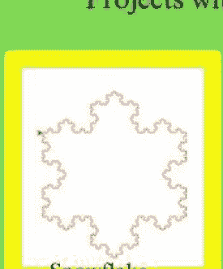

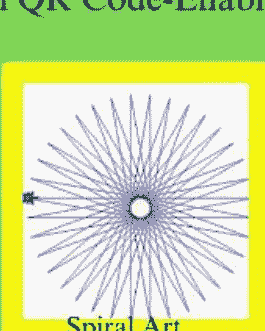

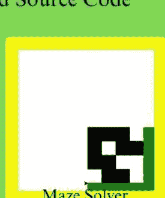

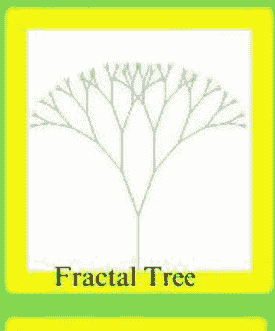

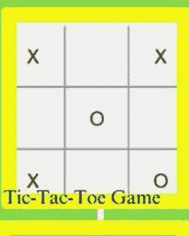

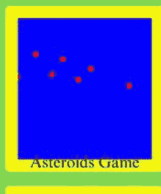

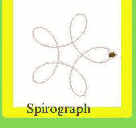

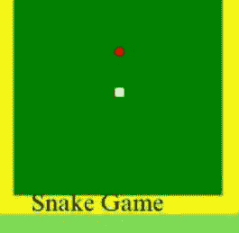


沙里夫·艾哈迈德

## 目录

版权所有 © 2023 沙里夫·艾哈迈德

- 引言
- 如何在线运行代码
- 项目1：螺旋艺术生成器
- 项目2：分形树生成器
- 项目3：万花尺绘图
- 项目4：迷宫求解器
- 项目5：雪花生成器
- 项目6：动态姓名艺术
- 项目7：乒乓球游戏
- 项目8：贪吃蛇游戏
- 项目9：小行星游戏
- 项目10：太空侵略者游戏
- 项目11：用形状绘画
- 项目12：交通灯模拟器
- 项目13：简易画图程序
- 项目14：动态时钟
- 项目15：L系统树生成器
- 项目16：待办事项应用
- 项目17：计算器
- 项目18：计算器
- 项目19：图片查看器
- 项目20：测验应用
- 项目21：日历应用
- 项目22：闹钟
- 项目23：BMI计算器
- 项目24：绘图应用
- 项目25：支出追踪器
- 项目26：密码生成器
- 项目27：柱状图生成器
- 项目28：饼图生成器
- 项目29：折线图生成器
- 项目30：散点图生成器
- 项目31：热力图生成器
- 项目32：词云生成器
- 项目33：使用Folium的交互式地图
- 项目34：情感分析仪表板
- 项目35：人脸检测
- 项目36：运动检测
- 项目37：井字棋游戏
- 项目38：猜数字游戏
- 项目39：秒表
- 项目40：倒计时器
- 项目41：图表绘制器
- 项目42：掷骰子
- 项目43：语言翻译器
- 项目44：文件浏览器
- 项目45：数字签名创建器
- 项目46：简易网址缩短器
- 项目47：字数统计器
- 项目48：基础文本编辑器
- 项目49：石头、剪刀、布游戏
- 项目50：温度转换器
- 结语

## 趣味项目学Python

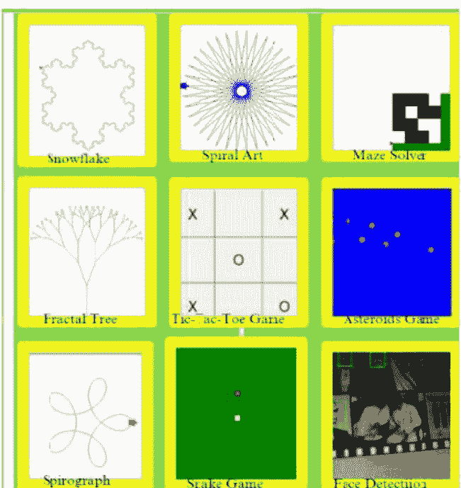

包含50个游戏、艺术与模拟项目，附带二维码源代码

## 沙里夫·艾哈迈德

## 版权所有 © 2023
沙里夫·艾哈迈德

## 保留所有权利

未经出版商事先书面许可，不得以任何形式或任何方式（电子、机械、影印、录音、扫描或其他方式）复制、存储在检索系统中或传播本书的任何部分。

《趣味项目学Python：包含50个游戏、艺术与模拟项目，附带二维码源代码》是Python编程初学者的实用资源。本书的50个项目均产生图形用户界面（GUI）输出，确保引人入胜的学习体验。每个项目都附有二维码，方便读者轻松获取源代码，以便在计算机或移动设备上运行。这些二维码使读者能够方便地在线访问和运行源代码。

本书还包含每个项目的结果图像和可视化输出，以增强理解。鼓励读者积极参与编码练习，并尝试使用提供的代码。

虽然我们已尽一切努力确保代码的准确性和功能性，但作者和出版商对实际应用中的任何错误或意外后果不承担责任。

鼓励读者根据个人学习和创意目的，调整、修改和扩展这些项目。在本书中获得的技能为更广泛的Python编程工作奠定了基础。我们希望《趣味项目学Python》能传授必要的Python技能，并激发您探索编码和软件开发世界的热情。

感谢您选择本书作为您Python学习之旅的伙伴。

## 引言

欢迎阅读沙里夫·艾哈迈德所著的《趣味项目学Python：包含50个游戏、艺术与模拟项目，附带二维码源代码》。无论您是充满好奇的初学者还是崭露头角的程序员，本书都将带您踏上激动人心的Python编程之旅。它不仅仅是一本Python教程；更是一份邀请，邀请您利用Python的强大功能和简洁性去探索、创造和学习。

在当今数字时代，Python是一门必学的编程语言，原因有几个令人信服的理由。其清晰简洁的语法使其对初学者友好。Python的多功能性延伸到Web开发、数据科学、人工智能、科学计算、游戏开发等多个领域。Python开发者需求旺盛，而强大的社区为您的编码之旅提供了支持和资源。无论是为了职业发展还是教育追求，Python的广泛应用使其成为一个宝贵的选择。

要成为编程专家需要时间和实践。许多人在学习基础知识时就失去了热情，甚至在有机会实际应用新知识之前就放弃了。在本书中，我们采取了不同的方法。我们从图形化、日常项目开始，如游戏、绘画、计算器等。这样，我们从一开始就保持学习体验的趣味性和回报性。

编程可能令人生畏，但它不必如此。通过本书，我们设计了50个实践项目，使学习Python成为一种愉快且互动的体验。每个项目都向您介绍新的概念和技术，同时提供切实的成果。从螺旋艺术生成器和万花尺绘图等艺术创作，到乒乓球、贪吃蛇和太空侵略者等娱乐游戏，这些项目确保Python学习既有趣又有回报。

但我们并未止步于此。本书旨在提供不仅仅是代码；它通过二维码源代码提供了学习的便利。您只需简单扫描，即可在计算机或移动设备上访问、运行和实验代码。不再需要繁琐的手动输入；扫描即可编码。


但我们并未止步于此。本书旨在提供不仅仅是代码；它通过二维码源代码提供了学习的便利。您只需简单扫描，即可在计算机或移动设备上访问、运行和实验代码。不再需要繁琐的手动输入；扫描即可编码。

本合集涵盖了广泛的Python应用，从创建艺术到解决迷宫、开发游戏以及构建实用应用程序。我们还包含了数据可视化、自然语言处理甚至简单人工智能的项目。这些项目涵盖了无数应用，满足读者多样化的兴趣和学习目标。

这不仅仅是关于编码；每个项目都是理解Python基础并探索其多功能性的机会。您可以将在此学到的知识应用于您独特的想法，将其变为现实。因此，踏上这段Python之旅，让您的创造力蓬勃发展。Python编程的世界在等待着您，我们将在此引导您。

### 本书主要特点：

-   探索50个多样化的Python图形用户界面项目。
-   项目涵盖游戏开发、艺术、绘图、模拟和人工智能。
-   提供详细的代码解释，便于理解。明确代码修改的关键区域。
-   理解每个项目的现实意义。通过二维码轻松获取代码，实现代码的便捷运行。参与互动式、实践性的学习体验。
-   获取视觉辅助资料，以清晰了解项目成果。培养日常使用的实用技能。

### 如何在线运行代码

扫描二维码

复制代码

访问 www. tkinter.io

粘贴你的Python代码

运行代码

如果无法运行，请参考以下说明

如果 https://trinket.io 无法运行，请在 replit.com 上运行Python代码。请遵循以下步骤：

#### 1. 创建Replit账户：

如果你还没有Replit账户，需要注册一个。你可以访问Replit网站 (https://replit.com) 并按照注册流程操作。

#### 2. 启动新的Repl：

登录后，点击“New Repl”按钮创建一个新的Python项目。系统会提示你选择要使用的编程语言；请选择“Python”。

#### 3. 编写你的Python代码：

在出现的编辑器中，你可以编写Python代码。你可以创建多个文件，并在需要时添加依赖项。

#### 4. 运行你的代码：

要运行代码，请点击通常位于编辑器顶部的“Run”按钮。Replit将执行你的Python程序，输出将显示在屏幕底部的控制台中。

就是这样！你现在可以使用Replit.com编写、运行和分享Python代码了。Replit是一个用户友好的平台，可以轻松地在云端开发和运行Python应用程序，这对于协作和在线编码活动尤其有帮助。

**如果你熟悉PyCharm、VS Code、IDLE或Jupyter Notebook，你可以使用这些代码编辑器中的任何一个**

### 项目1：螺旋艺术生成器

代码链接 在此运行 - Tkinter 或 Reptil

螺旋艺术生成器是一个有趣且视觉效果出色的Python项目，它使用Turtle图形库。它帮助初学者学习基本的图形编程和Turtle模块。这个项目允许你通过操纵Turtle的移动来创建迷人的螺旋图案。这是一种在探索Python能力的同时获得实践经验的好方法，既富有创意又引人入胜。

```python
import turtle

#### 设置Turtle屏幕窗口
window = turtle.Screen()
window.bgcolor("white") # 创建一个Turtle对象
artist = turtle.Turtle()
artist.shape("turtle") artist.color("blue")
artist.speed(10) # 根据需要调整速度 (1-10)

#### 绘制螺旋的函数
def draw_spiral(sides, length, angle):
    for _ in range(sides):
        artist.forward(length)
        artist.right(angle)

#### 螺旋的边数（更改此值以改变图案）
num_sides = 36
```

```python
#### 每条边的长度（更改此值以获得更大或更小的螺旋）
side_length = 100

#### Turtle转弯的角度（更改此值以改变螺旋形状）
turn_angle = 170

#### 绘制螺旋
draw_spiral(num_sides, side_length, turn_angle)

#### 关闭Turtle图形窗口
on click window.exitonclick()
```

### 解释：

-   `.import turtle`：导入Turtle图形库，它允许我们使用乌龟形状的对象创建图形。
-   `.window = turtle.Screen()`：为Turtle图形创建一个窗口。`window.bgcolor("white")`：将窗口的背景颜色设置为白色。
-   `.artist = turtle.Turtle()`：创建一个名为artist的Turtle对象。`artist.shape("turtle")`：将Turtle的形状设置为“turtle”。`artist.color("blue")`：将Turtle的颜色设置为蓝色。`artist.speed(10)`：设置Turtle的绘制速度（1-10；根据需要调整）。
-   定义一个函数`draw_spiral`，用于绘制具有指定边数、边长和转弯角度的螺旋。`num_sides = 36`：螺旋的边数（调整以获得不同形状）。
-   `.side_length = 100`：每条边的长度（调整以获得更大或更小的螺旋）。
-   `.turn_angle = 170`：Turtle转弯的角度（调整以改变螺旋形状）。
-   `.draw_spiral(num_sides, side_length, turn_angle)`：调用`draw_spiral`函数来创建螺旋。
-   `.window.exitonclick()`：点击时关闭Turtle图形窗口。

##### 可修改点（用于修改结果）：

-   `.num_sides`：更改螺旋的边数以创建不同的形状。
-   `.side_length`：调整每条边的长度以获得更大或更小的螺旋。
-   `.turn_angle`：改变转弯角度以改变螺旋的形状和图案。

### 项目2：分形树生成器

代码链接 在此运行 - Tkinter 或 Reptil

分形树生成器是一个Python项目，它使用Turtle图形库来创建迷人的、自我复制的树木。这个项目不仅产生令人惊叹的视觉效果，还教授Python中的递归、分支和角度等基本概念。对于初学者来说，这是深入学习编程并探索分形之美的绝佳方式。

```python
import turtle

def draw_branch(branch_length, t):
    if branch_length > 5:
        # 绘制主分支
        t.forward(branch_length)
        # 右子树（递归调用）
        t.right(20)
        draw_branch(branch_length - 15, t)
        # 左子树（递归调用）
        t.left(40)
        draw_branch(branch_length - 15, t)
        # 返回原始位置
        t.right(20)
        t.backward(branch_length)

def main():
    window = turtle.Screen()
    window.bgcolor("white")
```

```python
fractal_tree = turtle.Turtle()
fractal_tree.speed(0) # 设置绘制速度（0是最快的） fractal_tree.color("green")
fractal_tree.left(90) # 开始时让乌龟朝上 fractal_tree.penup()
fractal_tree.setpos(0, -200) # 设置起始位置 fractal_tree.pendown()

draw_branch(100, fractal_tree) # 更改100以获得不同的树大小
window.exitonclick()

if __name__ == "__main__":
    main()
```

### 解释：

-   我们首先导入turtle库，它允许我们创建绘图和图形。
-   `draw_branch`是一个递归函数，用于生成分形树。它接受两个参数：`branch_length`（当前分支的长度）和`t`（Turtle对象）。
-   在`draw_branch`内部，我们有一个基本情况：如果`branch_length`小于或等于5，我们就停止绘制。
-   我们向前绘制主分支，长度为`branch_length`个单位。然后我们进行两次递归调用：
    a. `t.right(20)`和`draw_branch(branch_length - 15, t)`创建右子树。
    b. `t.left(40)`和`draw_branch(branch_length - 15, t)`创建左子树。
-   创建子树后，我们返回到原始位置和方向。
-   在主函数中：
-   我们设置Turtle环境，指定背景颜色，创建一个Turtle对象（`fractal_tree`），并设置其属性。
-   我们将乌龟定位到起始点，并通过调用`draw_branch`并传入初始分支长度（你可以更改此值）来启动绘制。
-   最后，我们等待点击以关闭绘图窗口。

##### 可修改点：

-   你可以在主函数中更改初始分支长度（当前设置为100）以创建更大或更小的树。
-   调整`draw_branch`函数中的角度（20和40）以改变分支模式和树的整体外观。
-   修改`fractal_tree.color("green")`这一行以改变树的颜色。

### 项目三：万花尺绘图

万花尺绘图项目是初学者通过海龟图形探索Python编程的一种有趣且富有创意的方式。它涉及创建被称为万花尺的迷人几何图案。这个项目将帮助你理解Python的Turtle模块、循环以及像参数方程这样的数学概念。对于有志于学习编程的人来说，这是一个极好的垫脚石，能以一种直观且引人入胜的方式学习图形和数学关系。

```python
import turtle
import math

#### 创建一个海龟屏幕
screen = turtle.Screen()
screen.bgcolor("white")

#### 创建一个海龟
spiro = turtle.Turtle()
spiro.shape("turtle")
spiro.color("blue")
spiro.speed(0)  # 调整速度以实现更快或更慢的绘图

#### 绘制万花尺的函数
def draw_spirograph(R, r, d):
    # 计算初始位置
    x = (R - r) * math.cos(0) + d * math.cos(((R - r) / r) * 0)
    y = (R - r) * math.sin(0) - d * math.sin(((R - r) / r) * 0)
    spiro.penup()
    spiro.goto(x, y)
    spiro.pendown()
    theta = 0
    while theta <= 360:
        # 万花尺的参数方程
        x = (R - r) * math.cos(math.radians(theta)) + d * math.cos(((R - r) / r) * math.radians(theta))
        y = (R - r) * math.sin(math.radians(theta)) - d * math.sin(((R - r) / r) * math.radians(theta))
        spiro.goto(x, y)
        theta += 1

#### 在此自定义你的万花尺
R = 100  # 大圆的半径
r = 20   # 小圆的半径
d = 50   # 小圆中心到笔尖的距离

#### 绘制万花尺
draw_spirograph(R, r, d)

#### 点击时关闭绘图窗口
screen.exitonclick()
```

### 解释：

1.  导入turtle和math模块，以创建绘图窗口并执行数学计算。
2.  创建一个白色背景的海龟屏幕。
3.  创建一个名为spiro的海龟，并设置其属性（形状、颜色和速度）。调整速度值以实现更快或更慢的绘图。
4.  定义一个函数`draw_spirograph`来绘制万花尺。
5.  使用参数方程计算初始位置。
6.  使用`penup()`和`pendown()`方法将海龟移动到起始位置而不进行绘制。
7.  使用循环，根据参数方程计算并绘制万花尺的点，同时海龟沿着路径移动。
8.  通过设置`R`、`r`和`d`的值来自定义你的万花尺，以改变图案的大小和形状。
9.  调用`draw_spirograph`函数，使用指定的参数绘制万花尺。
10. 使用`exitonclick()`方法，在点击时关闭绘图窗口。

### 变化点：

尝试使用不同的`R`、`r`和`d`值来创建各种万花尺图案。这个项目提供了一个关于Python编程、图形和三角学等数学概念的实践入门。

### 项目四：迷宫求解器

使用海龟图形的迷宫求解器项目是向初学者介绍Python编程的一种引人入胜的方式。这个项目不仅提供了有趣的视觉体验，还有助于学习者理解递归和算法开发等重要概念。通过实现一个迷宫求解算法，这个项目能提升问题解决能力、逻辑思维和Python编码熟练度。

```python
import turtle as t

#### 创建一个二维迷宫，表示为列表的列表
maze = [
    [1, 1, 1, 0, 1],
    [1, 0, 1, 1, 1],
    [1, 1, 0, 0, 1],
    [0, 1, 1, 0, 1],
    [1, 1, 1, 1, 1]
]

#### 在(x, y)处绘制一个正方形的函数
def draw_square(x, y):
    t.penup()
    t.goto(x, y)
    t.pendown()
    t.begin_fill()
    for _ in range(4):
        t.forward(40)
        t.right(90)
    t.end_fill()

#### 绘制迷宫的函数
def draw_maze():
    t.speed(0)
    t.color("black")
    t.penup()
    for y in range(len(maze)):
        for x in range(len(maze[y])):
            if maze[y][x] == 1:
                draw_square(x * 40, -y * 40)

#### 使用递归求解迷宫的函数
def solve_maze(x, y):
    if 0 <= x < len(maze[0]) and 0 <= y < len(maze) and maze[y][x] == 1:
        maze[y][x] = 2  # 将当前单元格标记为已访问
        if x == len(maze[0]) - 1 and y == 0:
            t.color("green")
            draw_square(x * 40, -y * 40)
            t.color("black")
            return True  # 迷宫已解决
        if (solve_maze(x + 1, y) or solve_maze(x - 1, y) or solve_maze(x, y + 1) or solve_maze(x, y - 1)):
            t.color("green")
            draw_square(x * 40, -y * 40)
            t.color("black")
            return True  # 迷宫已解决
    return False

#### 主函数
if __name__ == "__main__":
    draw_maze()
    t.speed(1)
    t.delay(0)
    if not solve_maze(0, len(maze) - 1):
        print("No solution found.")
    t.exitonclick()
```

### 解释：

-   导入Turtle库并命名为`t`。
-   创建一个表示为列表的列表的二维迷宫（`maze`）。`1`代表墙壁，`0`代表开放路径。
-   定义一个函数`draw_square(x, y)`，用于在给定坐标`(x, y)`处绘制一个正方形。
-   定义一个函数`draw_maze()`，用于使用海龟图形绘制迷宫。
-   定义一个递归函数`solve_maze(x, y)`来求解迷宫。它递归地探索路径，并将访问过的单元格标记为`2`。
-   在主程序部分，绘制迷宫，并尝试从左下角`(0, len(maze) - 1)`开始求解。
-   如果找到解，则用绿色方块标记路径。

### 变化点：

-   要更改迷宫布局，请通过修改`maze`列表中的`1`和`0`来实现。
-   使用`t.speed()`调整海龟绘图速度，使动画更快或更慢。
-   如果需要处理更复杂的迷宫，可以在`solve_maze()`函数中自定义迷宫求解逻辑。

### 项目五：雪花生成器

雪花生成器是一个有趣的项目，它使用Python的Turtle图形库来创建复杂的雪花图案。通过实现这个项目，初学者将学习迭代绘图、递归以及Turtle库的基础知识。他们将获得在构建代码结构和使用循环创建复杂视觉图案方面的宝贵经验。

```python
import turtle as t

#### 绘制指定阶数和长度的科赫雪花的函数
def koch_snowflake(order, length):
    if order == 0:
        t.forward(length)
    else:
        length /= 3.0
        koch_snowflake(order - 1, length)
        t.left(60)
        koch_snowflake(order - 1, length)
        t.right(120)
        koch_snowflake(order - 1, length)
        t.left(60)
        koch_snowflake(order - 1, length)

#### 初始化海龟
t.speed(0)  # 设置绘图速度（0是最快的）
t.penup()
t.goto(-150, 90)  # 设置起始位置
t.pendown()

#### 通过更改这些值来自定义雪花
order = 4  # 雪花的阶数（值越高，复杂度越高）
length = 300  # 每条边的长度

#### 绘制雪花
for _ in range(3):
    t.color('Red')
    koch_snowflake(order, length)
    t.right(120)

#### 点击时关闭绘图窗口
t.exitonclick()
```

### 解释：

-   `import turtle as t`：导入Turtle图形库并命名为`t`，以便于使用。
-   `def koch_snowflake(order, length)`：定义一个函数`koch_snowflake`，用于绘制指定阶数和长度的科赫雪花。
-   在`koch_snowflake`函数内部：
    -   如果`order`为0，则简单地向前移动给定的长度。
    -   如果`order`不为0，则将长度除以3以创建线段，并递归调用`koch_snowflake`来绘制雪花的线段。
-   `t.speed(0)`：将绘图速度设置为最快。
-   `t.penup()`和`t.pendown()`：抬起和放下画笔，以便在不绘制的情况下移动。
-   `t.goto(-150, 90)`：设置起始位置。
-   `order`和`length`可以自定义，以改变雪花的复杂度和大小。
-   `for`循环绘制三条科赫雪花边，以创建一个完整的雪花。

##### 可修改点：

- 通过改变顺序和长度变量，初学者可以尝试不同的雪花大小和复杂度，从而更深入地理解递归和Python中的海龟图形是如何工作的。

### 项目6：动态姓名艺术

代码链接 在此运行 - Tkinter 或 Reptil

“动态姓名艺术”项目是一个有趣且富有创意的方式，通过海龟图形向初学者介绍Python编程。这个项目允许你使用彩色动画绘制你的名字或任何单词。这是一个绝佳的机会，在创作个性化艺术的同时，学习循环、函数和基本图形。这个项目适合初学者，并提供了使用Python海龟模块的实践经验。

```python
import turtle as t

#### Function to draw a single letter
def draw_letter(letter, pen_color):
    t.pendown()
    t.pencolor(pen_color)
    t.write(letter, font=("Arial", 20, "normal"))
    t.penup()
    t.forward(30)  # Adjust the spacing between letters

#### Set up the Turtle screen
t.bgcolor("black")  # Background color
t.speed(1)  # Drawing speed (1 is slow, 10 is fast)
t.penup()
t.goto(-100, 0)  # Starting position

#### Your name or word to animate
name = "Python"
```

```python
#### Customization: Change the colors as desired
colors = ["red", "orange", "yellow", "green", "blue", "purple"]

#### Animation loop
for color in colors:
    for letter in name:
        draw_letter(letter, color)
    t.goto(-100, -30)  # Return to the starting position
    #t.clear()

#### Close the Turtle graphics window on click
t.exitonclick()
```

### 解释：

- 将海龟图形库导入为 `t`。
- 定义一个函数 `draw_letter` 来绘制单个字母。它接受要绘制的字母和画笔颜色作为参数。
- 设置海龟屏幕：
  - 将背景颜色设置为黑色。调整绘图速度。
- 初始化画笔位置。
- 使用 `name` 定义要动画显示的姓名或单词。在 `colors` 列表中自定义你想要用于动画的颜色。
- 开始动画循环：
  - 对于 `colors` 中的每种颜色，遍历 `name` 中的每个字母。
  - 使用 `draw_letter` 函数以指定颜色绘制字母。
  - 返回起始位置。清除之前的绘图。
- 当你点击它时，关闭海龟图形窗口。

##### 可修改点：

- 修改 `name` 变量以显示不同的单词或姓名。自定义 `colors` 列表以更改动画颜色。
- 调整 `draw_letter` 函数中的字体和字体大小以获得不同的文本样式。
- 尝试不同的 `bg_color` 和 `speed` 设置以创建不同的视觉效果。

### 项目7：乒乓球游戏

代码链接 在此运行 - Tkinter 或 Reptil

“乒乓球游戏”是一个经典的街机游戏，使用Python的海龟图形库实现。这个项目向初学者介绍了游戏开发，并帮助他们学习用户输入、动画、碰撞检测和基本游戏逻辑等概念。这是进一步学习Python的一个很好的起点。要运行这个项目，你需要Python和海龟图形库，后者是Python预装的。

```python
import turtle

#### Set up the game window
window = turtle.Screen()
window.title("Pong Game")
window.bgcolor("blue")
window.setup(width=800, height=600)
window.tracer(0)

#### Paddle A
paddle_a = turtle.Turtle()
paddle_a.speed(0)
paddle_a.shape("square")
paddle_a.color("white")
paddle_a.shapesize(stretch_wid=1, stretch_len=5)
paddle_a.penup()
paddle_a.goto(0, -250)

#### Paddle B
paddle_b = turtle.Turtle()
paddle_b.speed(0)
paddle_b.shape("square")
paddle_b.color("white")
paddle_b.shapesize(stretch_wid=1, stretch_len=5)
paddle_b.penup()
paddle_b.goto(0, 250)

#### Ball
ball = turtle.Turtle()
ball.speed(0.5)
ball.shape("circle")
ball.color("Red")
ball.penup()
ball.goto(0, 0)
ball.dx = .1
ball.dy = -.1
```

```python
#### Function to move paddle A up
def paddle_a_up():
    y = paddle_a.ycor()
    if y < 250:
        y += 20
        paddle_a.sety(y)

#### Function to move paddle A down
def paddle_a_down():
    y = paddle_a.ycor()
    if y > -240:
        y -= 20
        paddle_a.sety(y)

#### Function to move paddle B up
def paddle_b_up():
    y = paddle_b.ycor()
    if y < 250:
        y += 20
        paddle_b.sety(y)

#### Function to move paddle B down
def paddle_b_down():
    y = paddle_b.ycor()
    if y > -240:
        y -= 20
        paddle_b.sety(y)

#### Keyboard bindings
window.listen()
window.onkeypress(paddle_a_up, "w")
window.onkeypress(paddle_a_down, "s")
window.onkeypress(paddle_b_up, "Up")
window.onkeypress(paddle_b_down, "Down")
```

```python
#### Main game loop
while True:
    window.update()

    # Move the ball
    ball.setx(ball.xcor() + ball.dx)
    ball.sety(ball.ycor() + ball.dy)

    # Border checking
    if ball.ycor() > 290:
        ball.sety(290)
        ball.dy *= -1

    if ball.ycor() < -290:
        ball.sety(-290)
        ball.dy *= -1

    if ball.xcor() > 390:
        ball.goto(0, 0)
        ball.dx *= -1

    if ball.xcor() < -390:
        ball.goto(0, 0)
        ball.dx *= -1

    # Paddle and ball collisions
    if (ball.dx > 0) and (350 > ball.xcor() > 340) and (paddle_b.ycor() + 50 > ball.ycor() > paddle_b.ycor() - 50):
        ball.color("blue")
        ball.setx(340)
        ball.dx *= -1

    elif (ball.dx < 0) and (-350 < ball.xcor() < -340) and (paddle_a.ycor() + 50 > ball.ycor() > paddle_a.ycor() - 50):
        ball.color("red")
        ball.setx(-340)
        ball.dx *= -1
```

### 解释：

- 导入 `turtle` 库来创建游戏。
- 设置带有黑色背景的游戏窗口。
- 使用海龟图形创建挡板（A和B）以及球。
- 设置挡板和球的初始位置、颜色和形状。创建移动挡板上下的函数。
- 设置键盘绑定以调用挡板移动函数。创建一个游戏循环来持续更新屏幕。
- 移动球并检查与屏幕边界的碰撞。使用 `w` 和 `s` 移动挡板A。
- 使用上箭头和下箭头按钮移动挡板B。
- 检查球与挡板之间的碰撞，并相应地更新球的方向和颜色。

##### 可修改点：

- 你可以更改挡板和球的大小、形状或颜色。
- 调整球和挡板的初始位置、速度和方向，使游戏更容易或更具挑战性。
- 自定义挡板移动的键盘绑定。
- 为游戏添加计分或额外功能，使其对玩家更复杂和更具吸引力。
- 尝试不同的颜色、背景和视觉元素，以增强游戏的外观。

### 项目8：贪吃蛇游戏

[代码链接](Code link) 在此运行 - [Tkinter](Tkinter) 或 [Reptil](Reptil)

贪吃蛇游戏项目是一个经典的街机游戏，使用Python的海龟图形库实现。这个项目非常适合初学者，因为它强化了Python的基本概念，如循环、条件语句和函数。它还介绍了基本的游戏开发原则。通过这个项目，你将获得关于游戏开发和Python编程的宝贵见解。

```python
import turtle
import time
import random

#### Set up the screen
wn = turtle.Screen()
wn.title("Snake Game")
wn.bgcolor("Green")
wn.setup(width=600, height=600)
wn.tracer(0)

#### Snake head
head = turtle.Turtle()
head.speed(0)
head.shape("square")
head.color("white")
head.penup()
head.goto(0, 0)
head.direction = "stop"

#### Food
food = turtle.Turtle()
food.speed(0)
food.shape("circle")
food.color("red")
food.penup()
food.goto(0, 100)

#### Snake body segments
segments = []

#### Functions
def go_up():
    if head.direction != "down":
        head.direction = "up"

def go_down():
```

### 项目 8：贪吃蛇游戏

```python
if head.direction != "up": head.direction = "down"
```

```python
def go_left():
    if head.direction != "right":
        head.direction = "left"

def go_right():
    if head.direction != "left":
        head.direction = "right"

def move():
    if head.direction == "up":
        y = head.ycor()
        head.sety(y + 20)
    if head.direction == "down":
        y = head.ycor()
        head.sety(y - 20)
    if head.direction == "left":
        x = head.xcor()
        head.setx(x - 20)
    if head.direction == "right":
        x = head.xcor()
        head.setx(x + 20)
```

```python
#### 键盘绑定
wn.listen()
wn.onkeypress(go_up, "w")
wn.onkeypress(go_down, "s")
wn.onkeypress(go_left, "a")
wn.onkeypress(go_right, "d")

#### 主游戏循环
while True:
    wn.update()

    # 检查是否撞墙
    if head.xcor() > 290 or head.xcor() < -290 or head.ycor() > 290 or head.ycor() < -290:
        # 结束游戏
        wn.bgcolor("red")
        head.goto(0, 0)
        head.direction = "stop"
        time.sleep(1)
        wn.bgcolor("black")

    # 隐藏身体段
    for segment in segments:
        segment.goto(1000, 1000)

    # 清空身体段列表
    segments.clear()

    # 检查是否吃到食物
    if head.distance(food) < 20:
        # 将食物移动到随机位置
        x = random.randint(-290, 290)
        y = random.randint(-290, 290)
        food.goto(x, y)

        # 为蛇添加一个身体段
        new_segment = turtle.Turtle()
        new_segment.speed(0)
        new_segment.shape("square")
        new_segment.color("white")
        new_segment.penup()
        segments.append(new_segment)

    # 按逆序移动身体段
    for index in range(len(segments) - 1, 0, -1):
        x = segments[index - 1].xcor()
        y = segments[index - 1].ycor()
        segments[index].goto(x, y)

    # 将第一个身体段移动到蛇头的位置
    if len(segments) > 0:
        x = head.xcor()
        y = head.ycor()
        segments[0].goto(x, y)

    move()
```

### 解释：

- 导入必要的库（turtle、time 和 random）。设置游戏屏幕。
- 创建蛇头、食物和身体段。
- 定义蛇移动和键盘绑定的函数。进入游戏循环，该循环持续更新屏幕。检查是否撞墙，如果蛇撞墙则结束游戏。检查是否与食物碰撞，并处理蛇的生长。
- 移动蛇的身体段以跟随蛇头。
- 检查蛇头是否与身体碰撞，如果发生碰撞则结束游戏。
- 使用 `time.sleep(0.1)` 来控制游戏速度。

##### 可修改点：

- 你可以通过改变各个方面来自定义游戏，例如：
- 修改蛇头、食物和身体段的颜色和形状。
- 调整蛇的大小和速度。改变游戏窗口的大小。尝试不同的控制键。自定义游戏结束行为。
- 添加音效或计分机制。
- 创建更多关卡或障碍物以增加复杂性。

### 项目 9：小行星游戏

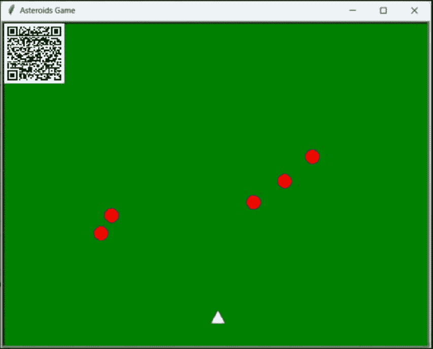

[代码链接](Code link) 在此运行 - [Tkinter](Tkinter) 或 [Reptil](Reptil)

小行星游戏是一个令人兴奋的项目，它允许初学者在构建经典街机风格游戏的同时探索 Python 的 Turtle Graphics 库。这个项目将增强你对 Python 编程概念的理解，如循环、函数和事件处理。这是一种有趣的方式来应用你的知识并培养解决问题的能力。

```python
import turtle
import random
import math

#### 设置屏幕
wn = turtle.Screen()
wn.bgcolor("green")
wn.title("小行星游戏")

#### 创建玩家的飞船
player = turtle.Turtle()
player.color("white")
player.shape("triangle")
player.penup()
player.speed(0)
player.setposition(0, -200)
player.setheading(90)

#### 设置玩家速度
playerspeed = 15

#### 创建小行星
asteroids = []
num_asteroids = 5

for _ in range(num_asteroids):
    asteroid = turtle.Turtle()
    asteroid.color("red")
    asteroid.shape("circle")
    asteroid.penup()
    asteroid.speed(0)
    x = random.randint(-200, 200)
    y = random.randint(100, 250)
    asteroid.setposition(x, y)
    asteroids.append(asteroid)

#### 设置小行星速度
asteroid_speed = 2

#### 定义玩家的移动函数
def move_left():
    x = player.xcor()
    x -= playerspeed
    if x < -250:
        x = -250
    player.setx(x)

def move_right():
    x = player.xcor()
    x += playerspeed
    if x > 250:
        x = 250
    player.setx(x)

#### 设置键盘绑定
wn.listen()
wn.onkeypress(move_left, "Left")
wn.onkeypress(move_right, "Right")

#### 主游戏循环
while True:
    for asteroid in asteroids:
        # 移动小行星
        y = asteroid.ycor()
        y -= asteroid_speed
        asteroid.sety(y)

        # 检查是否与玩家碰撞
        if player.distance(asteroid) < 20:
            player.hideturtle()
            asteroid.hideturtle()
            print("游戏结束")
            wn.bye()

        # 检查胜利条件
        if all(asteroid.ycor() < -250 for asteroid in asteroids):
            print("你赢了！")
            wn.bye()
```

### 解释：

- 导入所需的 turtle、random 和 math 库。
- 使用 `turtle.Screen()` 创建游戏屏幕，设置其背景颜色和标题。
- 使用 `turtle.Turtle()` 创建玩家的飞船。设置其颜色、形状和初始位置。
- 设置玩家的速度。
- 创建一个名为 `asteroids` 的列表来存储小行星。
- 使用 for 循环创建小行星。随机设置它们的颜色、形状和初始位置。
- 设置小行星的速度。
- 定义 `move_left` 和 `move_right` 函数来左右移动玩家的飞船。
- 为左右箭头键设置键盘绑定。进入主游戏循环。
- 在循环内，向下移动每个小行星。
- 检查玩家和小行星之间是否发生碰撞。如果发生碰撞，隐藏玩家和小行星并结束游戏。
- 检查胜利条件。如果所有小行星都通过了玩家的飞船，你就赢了。

##### 可修改点：

- 要更改小行星的数量，请修改 `num_asteroids` 变量。
- 通过更改 `playerspeed` 变量来调整玩家的速度。使用 `asteroid_speed` 变量修改小行星的速度。
- 通过更改其颜色和形状来自定义玩家飞船的外观。
- 更改 `wn.title()` 中的屏幕标题，为你的游戏赋予一个独特的名称。

### 项目 10：太空侵略者游戏

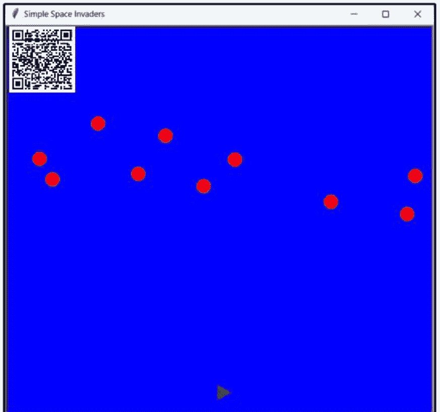

[代码链接](Code link) 在此运行 - [Tkinter](Tkinter) 或 [Reptil](Reptil)

这个项目向你介绍了使用 Turtle Graphics 库在 Python 中进行游戏开发。太空侵略者是一款经典的街机游戏，它不仅创建起来很有趣，还能提供宝贵的编程概念经验，如循环、条件语句、用户输入和图形。你将通过构建这个引人入胜的游戏来学习游戏开发的基础知识以及如何提高你的编码技能。

```python
import turtle
import random

#### 设置屏幕
wn = turtle.Screen()
wn.title("简易太空侵略者")
wn.bgcolor("blue")
wn.setup(width=600, height=600)

#### 创建玩家
player = turtle.Turtle()
player.speed(0)
player.shape("triangle")
player.color("green")
player.penup()
player.goto(0, -250)
player.direction = "stop"

#### 创建敌人
enemies = []

for _ in range(10):
    enemy = turtle.Turtle()
    enemy.speed(0)
    enemy.shape("circle")
    enemy.color("red")
    enemy.penup()
    x = random.randint(-290, 290)
    y = random.randint(100, 250)
    enemy.goto(x, y)
    enemies.append(enemy)

#### 左右移动玩家
def move_left():
    x = player.xcor()
    x -= 20
    if x < -290:
        x = -290
    player.setx(x)

def move_right():
    x = player.xcor()
    x += 20
    if x > 290:
        x = 290
    player.setx(x)

#### 键盘绑定
wn.listen()
wn.onkeypress(move_left, "Left")
wn.onkeypress(move_right, "Right")
```

keypress(move_right, "Right")

#### 主游戏循环
while True:
    for enemy in enemies:
        y = enemy.ycor() - 2
        enemy.sety(y)
    # 检查与玩家的碰撞
    if player.distance(enemy) < 20:
        player.hideturtle()
        enemy.hideturtle()
        print("游戏结束")
        wn.bye()
    # 如果 y < -300，则重新生成敌人
    if y < -300:
        x = random.randint(-290, 290)
        y = random.randint(100, 250)
        enemy.goto(x, y)
wn.mainloop()

### 解释：

- 导入必要的库：用于图形的 turtle 和用于生成随机位置的 random。
- 设置游戏屏幕，背景为黑色。
- 创建玩家的飞船，形状为绿色三角形，并将其定位在屏幕底部中央。
- 创建一个列表 `enemies` 来存放敌方飞船。
- 创建 10 个敌方飞船，形状为红色圆形，并将它们随机定位在屏幕顶部。
- 定义函数 `move_left()` 和 `move_right()`，用于在屏幕边界内左右移动玩家。
- 设置键盘绑定，以便在按下左箭头和右箭头键时调用移动函数。
- 实现主游戏循环：敌人向下移动，检查与玩家的碰撞，并在到达屏幕底部时重新生成。
- 如果发生碰撞，隐藏玩家和敌人，打印“游戏结束”，并关闭游戏窗口。

### 可调整点：

- 通过更改 `for` 循环中的范围来调整敌人的数量。
- 通过更改玩家和敌人的形状、颜色或大小来修改它们的外观。
- 通过更改数值来调整敌人和玩家的移动速度。
- 自定义游戏结束消息或实现计分功能。

### 项目 11：用形状绘图

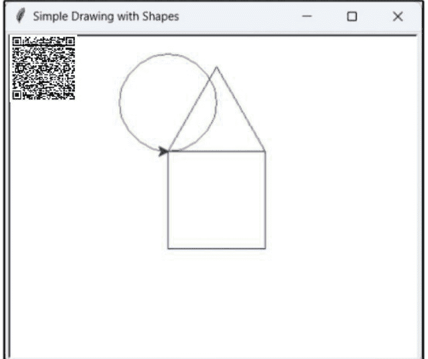

代码链接 在此运行 - [Tkinter](https://www.google.com/search?q=Tkinter) 或 [Reptil](https://www.google.com/search?q=Reptil)

本项目将向你介绍 Python 中的 Turtle 图形世界，让你能够使用圆形、正方形和三角形等形状创建美丽的图画。这是一种学习 Python 并提高对循环和函数等基本编程概念理解的绝佳方式，同时还能享受乐趣。你还将深入了解如何使用库并绘制视觉上吸引人的图案。无需外部库；Turtle 图形包含在 Python 的标准库中。

```python
import turtle

#### 创建一个 Turtle 屏幕
screen = turtle.Screen()
screen.title("用形状进行简单绘图")
screen.bgcolor("white")

#### 创建一个 Turtle 对象
pen = turtle.Turtle()
pen.speed(1)  # 设置绘图速度（1 为慢，10 为快）

#### 绘制正方形的函数
def draw_square(side_length):
    for _ in range(4):
        pen.color('blue')
        pen.forward(side_length)
        pen.right(90)

#### 绘制圆形的函数
def draw_circle(radius):
    pen.color('red')
    pen.circle(radius)

#### 绘制等边三角形的函数
def draw_triangle(side_length):
    for _ in range(3):
        pen.color('green')
        pen.forward(side_length)
        pen.left(120)

#### 绘制形状
pen.penup()
pen.goto(-50, 50)  # 定位 Turtle
pen.pendown()

#### 你可以在这里更改绘图的形状、大小和颜色
draw_square(100)
draw_circle(50)
draw_triangle(100)

#### 点击关闭 Turtle 图形窗口
screen.exitonclick()
```

### 解释：

- 导入 turtle 模块，它提供了 Turtle 图形功能。
- 创建一个背景为白色并带有标题的 Turtle 屏幕。
- 创建一个名为 `pen` 的 Turtle 对象，用于在屏幕上绘图。将其绘图速度设置为 1（慢）。
- 定义三个函数：`draw_square`、`draw_circle` 和 `draw_triangle`，用于绘制各自的形状。这些函数使用循环来重复绘图命令。
- 抬起画笔（这样在移动时不会绘图），将其定位到 (-50, 50)，然后放下画笔开始绘图。
- 通过取消注释所需行并注释其他行来选择要绘制的形状（正方形、圆形或三角形）。
- 你可以通过修改函数参数和 `pen` 对象的方法来更改形状的大小、颜色或位置。
- 程序等待点击以关闭 Turtle 图形窗口，让你欣赏自己的作品。

### 可调整点：

- 通过更改其值、颜色或大小来修改外观。


### 项目 12：交通灯模拟器

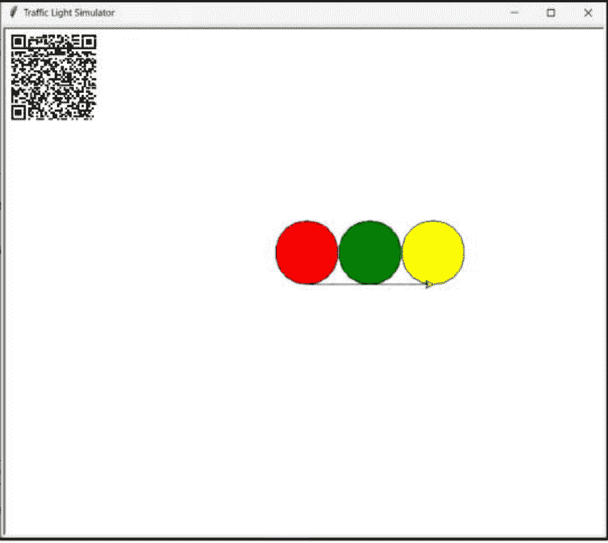

代码链接 在此运行 - Tkinter 或 Reptil

本项目使用 Python 的 Turtle 图形库模拟交通灯。这是一种适合初学者的学习 Python 图形、循环和条件语句的方式。通过创建交通灯的视觉表示，你将获得控制图形的实践经验，并可以进一步探索 Python 编程概念。

```python
import turtle
import time

#### 绘制单个交通灯的函数
def draw_traffic_light(color):
    turtle.fillcolor(color)
    turtle.begin_fill()
    turtle.circle(40)
    turtle.end_fill()

#### 设置 Turtle 屏幕
screen = turtle.Screen()
screen.title("交通灯模拟器")

#### 交通灯的初始状态
state = "red"

while True:
    if state == "red":
        draw_traffic_light("red")
        time.sleep(2)  # 红灯持续 2 秒
        state = "green"
        turtle.clear()
    elif state == "green":
        draw_traffic_light("green")
        time.sleep(2)  # 绿灯持续 2 秒
        state = "yellow"
        turtle.clear()
    else:
        draw_traffic_light("yellow")
        time.sleep(1)  # 黄灯持续 1 秒
        state = "red"
        turtle.clear()

turtle.done()
```

### 解释：

- 导入所需的库：用于图形的 turtle 和用于控制时间间隔的 time。
- 定义一个函数 `draw_traffic_light(color)`，用于绘制一个给定颜色的交通灯圆形。
- 初始化 Turtle 屏幕，标题为“交通灯模拟器”。将交通灯的初始状态设置为“red”。
- 使用无限循环（`while True`）来模拟交通灯的行为。
- 在循环内部，检查当前状态，并使用 `draw_traffic_light` 绘制相应颜色的圆形。
- 使用 `time.sleep()` 控制每个灯光状态的时间间隔。更新状态并使用 `turtle.clear()` 清除之前的圆形。程序将无限循环这些状态。

### 可调整点：

- 你可以更改 `time.sleep()` 中的时间间隔，使交通灯变化更快或更慢。
- 通过修改 `draw_traffic_light` 函数来更改交通灯的颜色或外观。
- 添加额外功能，如行人信号或音效，以增强模拟器。

### 项目 13：简单画图程序

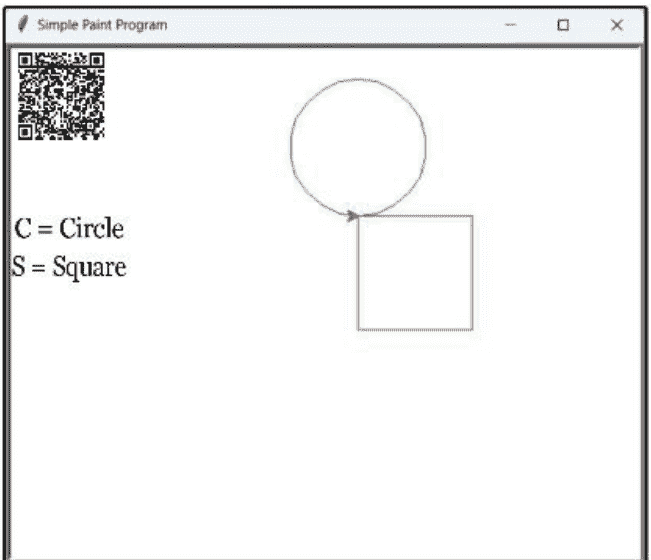

代码链接 在此运行 - Tkinter 或 Reptil

使用 Turtle 图形的“简单画图程序”是一个有趣且具有教育意义的 Python 项目，它允许初学者探索计算机图形和用户交互的世界。它通过引入事件处理、用户界面和基本绘图技术等概念来帮助提高你的 Python 技能。你将学习如何创建一个简单的画图应用程序，使你能够绘制彩色形状并释放你的创造力。

```python
import turtle as t

#### 设置屏幕
t.bgcolor("white")
t.title("简单画图程序")
t.setup(width=800, height=600)

#### 定义绘制形状的函数
def draw_line(x, y):
    t.penup()
    t.goto(x, y)
    t.pendown()

def draw_circle(x, y):
    t.penup()
    t.goto(x, y)
    t.pendown()
    t.color('green')
    t.circle(60)

def draw_square(x, y):
    t.penup()
    t.goto(x, y)
    t.pendown()
    t.color('red')
    for _ in range(4):
        t.forward(100)
        t.right(90)

def clear_screen():
    t.clear()

#### 设置事件处理器
t.onscreenclick(draw_line)
t.onkeypress(lambda: draw_circle(t.xcor(), t.ycor()), "c")
t.onkeypress(lambda: draw_square(t.xcor(), t.ycor()), "s")
t.onkeypress(clear_screen, "Escape")
t.listen()
t.mainloop()
```

#### 说明：

- 导入海龟图形库，别名为 t。
- 设置海龟屏幕，背景为白色，并设置窗口标题。定义绘制不同形状的函数：直线、圆形和正方形。
- 创建一个 clear_screen 函数来清除绘图。设置事件处理器：
  - `t.onscreenclick(draw_line)` 监听鼠标点击并绘制直线。
  - `t.onkeypress(lambda: draw_circle(t.xcor(), t.ycor()), "c")` 监听 'c' 键并绘制圆形。
  - `t.onkeypress(lambda: draw_square(t.xcor(), t.ycor()), "s")` 监听 's' 键并绘制正方形。
  - `t.onkeypress(clear_screen, "x")` 监听 'x' 键并清除屏幕。
- 使用 `t.listen()` 开始监听事件，并通过 `t.mainloop()` 进入海龟图形主循环。

##### 可修改点：

- 你可以通过定义新的绘图函数并为其分配按键来更改形状或添加更多形状。
- 修改颜色、大小和画笔属性以自定义绘图体验。
- 探索额外的海龟图形函数以增强程序功能，例如更改画笔颜色和样式。

### 项目 14：动画时钟

代码链接 在此运行 - Tkinter 或 Reptil

在这个 Python 项目中，我们将使用海龟图形库创建一个动画时钟。这个项目不仅视觉上吸引人，还能帮助初学者理解关键概念，如绘制形状、使用循环和处理角度。通过构建这个时钟，你将获得宝贵的经验，这对进一步的 Python 学习大有裨益。

```python
#### 导入必要的库
import turtle
from datetime import datetime

#### 设置海龟屏幕
wn = turtle.Screen()
wn.title("Animated Clock")
wn.bgcolor("white")
wn.setup(width=600, height=600)
wn.tracer(0)

#### 创建钟面
clock_face = turtle.Turtle()
clock_face.speed(0)
clock_face.color("black")
clock_face.penup()
clock_face.goto(0, -210)
clock_face.pendown()
clock_face.circle(210)

#### 创建时针
hour_hand = turtle.Turtle()
hour_hand.speed(0)
hour_hand.shape("arrow")
hour_hand.color("blue")
hour_hand.shapesize(stretch_wid=0.05, stretch_len=7)

#### 创建分针
minute_hand = turtle.Turtle()
minute_hand.speed(0)
minute_hand.shape("arrow")
minute_hand.color("green")
minute_hand.shapesize(stretch_wid=0.05, stretch_len=10)

#### 创建秒针
second_hand = turtle.Turtle()
second_hand.speed(0)
second_hand.shape("arrow")
second_hand.color("red")
second_hand.shapesize(stretch_wid=0.02, stretch_len=15)

#### 更新时钟
def update_clock():
    now = datetime.now()
    second = now.second
    minute = now.minute
    hour = now.hour % 12

    # 移动时针
    second_angle = -90 + second * 6
    minute_angle = -90 + (minute + second / 60) * 6
    hour_angle = -90 + (hour + minute / 60) * 30

    second_hand.setheading(second_angle)
    minute_hand.setheading(minute_angle)
    hour_hand.setheading(hour_angle)

    wn.update()
    wn.ontimer(update_clock, 1000)

update_clock()

#### 点击关闭窗口
wn.exitonclick()
```

#### 说明：

- 我们首先导入必要的库：用于图形的 turtle 和用于处理时间的 datetime。
- 我们设置海龟屏幕，背景为白色，并创建一个名为 clock_face 的海龟对象来绘制时钟的圆形表盘。
- 另外创建了三个海龟对象：hour_hand、minute_hand 和 second_hand，分别代表时针、分针和秒针。
- update_clock 函数获取当前时间并计算时针的角度。然后相应地设置海龟对象的朝向。
- 我们使用 `wn.update()` 更新屏幕，并使用 `wn.ontimer(update_clock, 1000)` 每 1000 毫秒（1 秒）调用一次 update_clock 函数。
- 程序会持续运行，直到用户点击屏幕（`wn.exitonclick()`）。

##### 可修改点：

- 你可以通过修改海龟对象的相关属性来更改时针的颜色和形状。
- 通过更改 setup 参数来调整时钟的大小、位置或背景。
- 通过改变其外观或添加数字和标记来自定义钟面。
- 尝试不同的更新间隔（`wn.ontimer`）以获得更流畅或更快的动画效果。

### 项目 15：L-系统树生成器

代码链接 在此运行 - Tkinter 或 Reptil

“L-系统树生成器”是一个引人入胜的 Python 项目，它向你介绍了 L-系统的概念，这是一种用简单规则描述复杂几何结构的方法。使用海龟图形库，这个项目允许你创建美丽的树状图案。这是提高 Python 技能的同时深入数学和算法思维的好方法。

```python
import turtle

#### 设置海龟屏幕
window = turtle.Screen()
window.bgcolor("white")
window.title("L-system Tree Generator")

#### 创建一个海龟对象
tree = turtle.Turtle()
tree.speed(0) # 设置绘图速度（0 是最快的）

#### 定义 L-系统规则
rules = {
    "F": "FF+[+F-F-F]-[-F+F+F]",
    "+": "+",
    "-": "-"
}

#### 初始公理
axiom = "F"

#### 生成 L-系统字符串
iterations = 5 # 更改此值以获得不同大小的树
lsystem = axiom
for _ in range(iterations):
    lsystem = "".join([rules.get(c, c) for c in lsystem])

#### 每个前进步骤的长度
step_length = 10

#### 左转和右转的角度（以度为单位）
angle = 22.5

#### 用于存储位置和朝向的栈
stack = []

#### 绘制 L-系统
for char in lsystem:
    if char == "F":
        tree.forward(step_length)
    elif char == "+":
        tree.right(angle)
    elif char == "-":
        tree.left(angle)
    elif char == "[":
        stack.append((tree.pos(), tree.heading()))
    elif char == "]":
        position, heading = stack.pop()
        tree.penup()
        tree.goto(position)
        tree.setheading(heading)
        tree.pendown()

#### 点击关闭海龟图形窗口
window.exitonclick()
```

#### 说明：

- 导入 turtle 库：我们首先导入 turtle 库。
- 设置海龟屏幕：我们为海龟图形创建一个窗口，并设置其背景颜色和标题。
- 创建海龟对象：我们创建一个名为 tree 的海龟对象来绘制我们的 L-系统树。
- 定义 L-系统规则：我们使用字典定义 L-系统的规则。
- 设置初始公理：公理是 L-系统的起点。
- 生成 L-系统字符串：我们迭代应用规则以生成 L-系统字符串。
- 设置步长和角度：我们定义每个前进步骤的长度以及左转和右转的角度。
- 用于存储位置和朝向的栈：我们使用一个栈来存储海龟的位置和朝向，当我们在 L-系统字符串中遇到 "[" 和 "]" 符号时。
- 绘制 L-系统：我们遍历 L-系统字符串，并使用海龟命令根据生成的字符串绘制树。
- 关闭海龟图形窗口：窗口将保持打开状态，直到你点击它。

##### 可修改点：

- 你可以更改 iterations 变量以生成不同大小和复杂度的树。
- 调整 step_length 和 angle 变量以改变树枝的外观。
- 尝试 rules 字典中的 L-系统规则以创建完全不同的树结构。

### 项目 16：待办事项列表应用

代码链接 在此运行 - [Tkinter](https://www.example.com/tkinter) 或 [Reptil](https://www.example.com/reptil)

“待办事项列表应用”是一个使用 Tkinter 库的简单交互式 Python 项目。它是 GUI 编程的绝佳入门，帮助初学者掌握事件处理、用户界面设计和数据管理等基本概念。这个项目通过提供创建功能性桌面应用程序的实践经验来增强 Python 技能。

### 项目 16：待办事项应用

```python
import tkinter as tk

def add_task():
    task = entry.get()
    if task:
        listbox.insert(tk.END, task)
        entry.delete(0, tk.END)

def remove_task():
    selected_task = listbox.curselection()
    if selected_task:
        listbox.delete(selected_task)

#### 创建主窗口
root = tk.Tk()
root.title("To-Do List App")

#### 创建一个列表框来显示任务
listbox = tk.Listbox(root, selectmode=tk.SINGLE)
listbox.pack(pady=10)

#### 创建一个输入框部件用于添加任务
entry = tk.Entry(root)
entry.pack(pady=5)

#### 创建添加和移除按钮
add_button = tk.Button(root, text="Add Task", command=add_task)
remove_button = tk.Button(root, text="Remove Task", command=remove_task)
add_button.pack()
remove_button.pack()

root.mainloop()
```

### 解释：

- `import tkinter as tk`：将 Tkinter 库导入为 tk。
- `def add_task()`：定义一个函数 `add_task`，用于向列表中添加任务。
- `task = entry.get()`：从输入框部件中获取文本。
- `if task`：检查任务是否非空。
- `listbox.insert(tk.END, task)`：将任务添加到列表框的末尾。
- `entry.delete(0, tk.END)`：清空输入框部件。
- `def remove_task()`：定义一个函数 `remove_task`，用于从列表中移除选中的任务。
- `selected_task = listbox.curselection()`：从列表框中获取选中的任务。
- `if selected_task`：检查是否有任务被选中。
- `listbox.delete(selected_task)`：从列表框中删除选中的任务。
- `root = tk.Tk()`：创建主窗口。
- `root.title("To-Do List App")`：设置主窗口的标题。
- `listbox = tk.Listbox(root, selectmode=tk.SINGLE)`：创建一个单选模式的列表框部件。
- `listbox.pack(pady=10)`：将列表框部件打包到主窗口中。
- `entry = tk.Entry(root)`：创建一个用于输入任务的输入框部件。
- `entry.pack(pady=5)`：将输入框部件打包到主窗口中。
- `add_button = tk.Button(root, text="Add Task", command=add_task)`：创建一个调用 `add_task` 函数的添加按钮。
- `remove_button = tk.Button(root, text="Remove Task", command=remove_task)`：创建一个调用 `remove_task` 函数的移除按钮。
- `add_button.pack()`：将添加按钮打包到主窗口中。
- `remove_button.pack()`：将移除按钮打包到主窗口中。
- `root.mainloop()`：启动 Tkinter 主循环以显示图形用户界面。

### 项目 17：计算器

这个 Python 项目是一个使用 Tkinter 库构建的图形用户界面（GUI）简单计算器，是初学者的理想起点。它提供了 Python 编程和 GUI 开发的实际应用。通过理解这段代码，初学者可以掌握 Tkinter、事件处理和基本算术运算的基础知识，为进一步学习 Python 奠定坚实基础。

```python
import tkinter as tk

#### 创建主窗口
window = tk.Tk()
window.title("Simple Calculator")

#### 用于用户输入的输入框
entry = tk.Entry(window, width=20, font=("Arial", 18))
entry.grid(row=0, column=0, columnspan=4)

#### 执行算术运算的函数
def button_click(number):
    current = entry.get()
    entry.delete(0, tk.END)
    entry.insert(0, current + str(number))

#### 创建数字和运算符按钮
buttons = [
    "7", "8", "9", "/",
    "4", "5", "6", "*",
    "1", "2", "3", "-",
    "0", ".", "=", "+"
]

row_val = 1
col_val = 0

for button in buttons:
    tk.Button(window, text=button, padx=20,
    pady=20, font=("Arial", 18), command=lambda
    b=button: button_click(b)).grid(row=row_val, column=col_val)
    col_val += 1
    if col_val > 3:
        col_val = 0
        row_val += 1

#### 计算并显示结果的函数
def calculate():
    result = eval(entry.get())
    entry.delete(0, tk.END)
    entry.insert(0, result)

#### 清除按钮
tk.Button(window, text="C", padx=20, pady=20,
          font=("Arial", 18), command=lambda: entry.delete(0, tk.END)).grid(row=row_val, column=col_val)

#### 等于按钮
tk.Button(window, text="=", padx=20, pady=20,
          font=("Arial", 18), command=calculate).grid(row=row_val, column=col_val + 1)

#### 运行应用程序窗口。
window.mainloop()
```

### 解释：

- 将 Tkinter 库导入为 tk。创建主应用程序窗口。设置窗口标题。
- 创建一个用于用户输入的输入框部件。
- 定义一个函数 `button_click` 来处理按钮点击。创建一个包含数字和运算符的按钮列表。
- 使用循环在网格上创建并定位按钮。定义一个 `calculate` 函数来计算并显示结果。创建“C”按钮以清空输入框。
- 创建“=”按钮来计算结果。启动主应用程序循环。

##### 可修改点：

- 你可以通过更改 `window.title("Simple Calculator")` 来自定义窗口标题。
- 通过调整 `padx`、`pady` 和 `font` 参数来修改按钮的外观。
- 添加更多函数和按钮以实现额外功能，如平方根、幂运算等。
- 改进用户输入的错误处理和验证。

### 项目 18：数字时钟

本项目将指导初学者使用 Python 的 Tkinter 库创建一个简单而有趣的数字时钟。构建数字时钟是理解 GUI 编程基础的好方法。它介绍了部件、事件处理和更新显示等概念。它是更复杂 GUI 应用程序的基础，也是 Python 爱好者的绝佳起点。

```python
#### 导入 Tkinter 库
import tkinter as tk
from time import strftime

#### 创建一个 tkinter 窗口
root = tk.Tk()
root.title("Digital Clock")

#### 更新时间的函数
def time():
    string = strftime('%H:%M:%S %p')
    label.config(text=string)
    label.after(1000, time)

#### 创建一个用于显示时间的标签
label = tk.Label(root, font=('calibri', 40, 'bold'), background='purple', foreground='white')

#### 将标签打包到 tkinter 窗口中
label.pack(anchor='center')

#### 调用 time 函数来更新时间
time()

#### 启动 tkinter 主循环
root.mainloop()
```

### 解释：

- `import tkinter as tk`：导入 Tkinter 库并将其别名为 tk。
- `from time import strftime`：从 time 模块导入 `strftime` 函数，该函数有助于格式化时间。
- `root = tk.Tk()`：创建一个名为 `root` 的 Tkinter 窗口。
- `root.title("Digital Clock")`：将窗口标题设置为“Digital Clock”。
- `def time()`：定义一个名为 `time` 的函数，用于更新时钟。
- `string = strftime('%H:%M:%S %p')`：使用 `strftime` 将当前时间格式化为“HH:MM:SS AM/PM”格式。
- `label.config(text=string)`：用当前时间更新标签的文本。
- `label.after(1000, time)`：安排 `time` 函数在 1000 毫秒（1 秒）后再次运行。
- `label = tk.Label(root, font=('calibri', 40, 'bold'), background='purple', foreground='white')`：创建一个用于显示时间的标签部件。自定义其字体、背景色和文本颜色。
- `label.pack(anchor='center')`：将标签打包到 Tkinter 窗口的中心。
- `time()`：最初调用 `time` 函数以显示当前时间。
- `root.mainloop()`：启动 Tkinter 主循环以处理事件并保持窗口打开。

##### 可修改点：

- 你可以通过修改标签部件的 `font`、`background` 和 `foreground` 属性来更改时钟的外观。
- 要更新时钟的时间格式，请调整传递给 `strftime` 的格式字符串。例如，使用 `'%I:%M:%S %p'` 表示带 AM/PM 的 12 小时制。
- 要更改时钟的初始窗口大小，请使用 `root.geometry("widthxheight")` 设置窗口尺寸。
- 使用 `root.title("Your Title")` 自定义窗口标题。尝试不同的颜色、字体和样式，使其成为你自己的。

### 项目 19：图像查看器

使用 Tkinter 图形用户界面的“图像查看器”项目，让用户能够轻松地浏览和查看图像。这是向初学者介绍 Python GUI 编程的绝佳方式。通过构建这个应用程序，初学者将学习如何处理图像、创建用户友好的界面以及开发基本的导航控件。它是通往更复杂 GUI 应用程序的垫脚石。

所需安装：Pillow 安装：pip install Pillow

```python
import tkinter as tk
from tkinter import filedialog
from PIL import Image, ImageTk

#### Create the main window
root = tk.Tk()
root.title("Image Viewer")

#### Create a canvas to display the image
canvas = tk.Canvas(root, width=400, height=400)
canvas.pack()

#### Function to open and display an image
def open_image():
    file_path = filedialog.askopenfilename(filetypes=[("Image files", "*.png *.jpg *.jpeg *.gif *.bmp *.ico")])
    if file_path:
        image = Image.open(file_path)
        photo = ImageTk.PhotoImage(image)
        canvas.create_image(0, 0, anchor=tk.NW, image=photo)
        canvas.image = photo

#### Create an "Open Image" button
open_button = tk.Button(root, text="Open Image", command=open_image)
open_button.pack()

#### Create an "Exit" button to close the application
exit_button = tk.Button(root, text="Exit", command=root.destroy)
exit_button.pack()

#### Start the Tkinter main loop
root.mainloop()
```

### 解释：

- 导入必要的库：tkinter 用于 GUI，filedialog 用于文件处理，以及来自 Pillow 的 Image 和 ImageTk 用于图像操作。
- 使用 tk.Tk() 创建主窗口并设置其标题。
- 创建一个 400x400 像素大小的画布来显示图像。定义一个 `open_image()` 函数来打开并显示图像。
- 在 `open_image()` 函数内部：
    - 使用 `filedialog.askopenfilename()` 打开文件对话框，让用户选择图像文件。
    - 检查是否选择了文件（`if file_path:`）。
    - 使用 `Image.open()` 打开选定的图像，并使用 `ImageTk.PhotoImage()` 创建一个 PhotoImage。
    - 使用 `canvas.create_image()` 在画布上显示图像。
- 创建一个“打开图像”按钮，点击时调用 `open_image()` 函数。
- 创建一个“退出”按钮，点击时关闭应用程序。
- 使用 `root.mainloop()` 启动 Tkinter 主循环以运行应用程序。

##### 可修改点：

- 通过更改 `canvas = tk.Canvas(root, width=400, height=400)` 中的宽度和高度值来修改画布大小。自定义按钮的文本和外观。
- 你可以添加更多功能，例如缩放、旋转或滚动浏览多张图像。
- 改进错误处理，以应对所选文件不是有效图像的情况。
- 添加状态栏以显示图像信息。

### 项目 20：测验应用

“测验应用”是一个使用 Tkinter GUI 构建的简单且交互式的 Python 项目。这个项目将帮助初学者在创建引人入胜的测验应用程序的同时，掌握 Python 和 Tkinter 的基础知识。用户可以回答多项选择题，应用程序将即时反馈他们的表现。

```python
import tkinter as tk

class QuizApp:
    def __init__(self, root):
        self.root = root
        self.root.title("Quiz App")
        self.current_question = 0
        self.score = 0
        # Define questions and answers (you can customize this)
        self.questions = [
            {
                'question': "What is the capital of France?",
                'options': ["London", "Madrid", "Paris", "Berlin"],
                'correct_answer': "Paris"
            },
            {
                'question': "Which planet is known as the Red Planet?",
                'options': ["Venus", "Mars", "Jupiter", "Saturn"],
                'correct_answer': "Mars"
            },
            {
                'question': "What is 2 + 2?",
                'options': ["3", "4", "5", "6"],
                'correct_answer': "4"
            },
        ]
        self.label = tk.Label(root, text="")
        self.label.pack(pady=10)
        self.show_question()

    def show_question(self):
        if self.current_question < len(self.questions):
            question_data = self.questions[self.current_question]
            self.label.config(text=question_data['question'])

            self.buttons = []
            for option in question_data['options']:
                button = tk.Button(self.root, text=option, command=lambda option=option: self.check_answer(option, question_data['correct_answer']))
                self.buttons.append(button)

            for button in self.buttons:
                button.pack(fill="both", padx=10, pady=5)
        else:
            self.show_result()

    def check_answer(self, selected_option, correct_answer):
        if selected_option == correct_answer:
            self.score += 1
        self.current_question += 1
        for button in self.buttons:
            button.pack_forget()
        self.show_question()

    def show_result(self):
        self.label.config(text=f"You scored {self.score} out of {len(self.questions)}!")
        self.current_question = 0
        self.score = 0

if __name__ == "__main__":
    root = tk.Tk()
    app = QuizApp(root)
    root.mainloop()
```

### 解释：

- 我们导入 Tkinter 库并命名为 tk。
- 我们创建一个 QuizApp 类来初始化测验。
- 我们将测验问题和答案设置为字典列表。我们创建一个标签来显示问题，以及一个按钮列表用于答案选项。
- 我们使用循环来显示问题和答案选项。
- 当用户选择一个选项时，`check_answer` 方法被调用以检查其是否正确并更新分数。
- 当所有问题都回答完毕后，我们显示最终分数。

##### 可修改点：

- 要更改测验问题，请用你的问题、选项和正确答案修改 `self.questions` 列表。
- 你可以通过修改标签、按钮和窗口布局来自定义 GUI 外观。
- 向 `self.questions` 列表中添加更多问题以扩展测验。

### 项目 21：日历应用

使用 Tkinter GUI 的日历应用项目旨在帮助初学者在创建实用应用程序的同时学习 Python。它允许用户交互式地查看和管理他们的日程安排。通过构建这个项目，你将获得创建图形用户界面、处理用户输入以及处理日期和日历的宝贵经验。

```python
import tkinter as tk
from tkinter import ttk
import calendar

#### Function to show the calendar for a given year and month
def show_calendar():
    year = int(year_entry.get())
    month = int(month_combobox.get())
    cal_text.delete(1.0, tk.END)  # Clear previous calendar
    cal = calendar.month(year, month)
    cal_text.insert(tk.END, cal)

#### Create the main application window
root = tk.Tk()
root.title("Calendar App")

#### Label and Entry for Year
year_label = tk.Label(root, text="Year:")
year_label.pack()
year_entry = tk.Entry(root)
year_entry.pack()

#### Label and Combobox for Month
month_label = tk.Label(root, text="Month:")
month_label.pack()
months = ["January", "February", "March", "April", "May", "June", "July",
         "August", "September", "October", "November", "December"]
month_combobox = ttk.Combobox(root, values=months)
month_combobox.pack()

#### Button to Show Calendar
show_button = tk.Button(root, text="Show Calendar", command=show_calendar)
show_button.pack()

#### Text widget to display the calendar
cal_text = tk.Text(root, height=10, width=30)
cal_text.pack()

root.mainloop()
```

### 解释：

- 我们导入所需的库：tkinter、ttk（用于组合框）和 calendar。
- 我们定义一个函数 `show_calendar()`，当用户点击“显示日历”按钮时，它将显示日历。它检索用户输入的年份和月份，并使用 `calendar.month()` 函数生成该月份的日历。
- 我们使用 `tk.Tk()` 创建主应用程序窗口，并将其标题设置为“日历应用”。
- 我们创建标签、输入框和一个组合框，供用户输入年份和选择月份。
- 我们创建一个“显示日历”按钮，点击时调用 `show_calendar()` 函数。
- 我们创建一个文本小部件来显示日历。
- `root.mainloop()` 函数启动 Tkinter 事件循环，允许应用程序响应用户交互。

### 可更改之处：

-   你可以自定义图形用户界面的外观，例如字体、颜色和控件尺寸。
-   添加诸如事件调度和提醒之类的功能。实现导航按钮以在月份之间切换。将日历数据保存到文件或从文件加载。
-   为无效输入（例如非数字年份）添加错误处理。

### 项目 22：闹钟

[代码链接](#) 在此运行 - [Reptil](#)

使用 Tkinter 图形用户界面的“闹钟”项目是初学者学习 Python 的一种引人入胜的方式。它提供了创建图形用户界面和处理事件的实践经验。通过构建这个闹钟，你将理解关键概念，如图形用户界面设计、用户交互以及在 Python 中处理时间。

```python
import tkinter as tk
from tkinter import messagebox
import time
import winsound

#### Function to set the alarm
def set_alarm():
    alarm_time = entry.get()
    try:
        time.strptime(alarm_time, "%H:%M")
        while True:
            current_time = time.strftime("%H:%M")
            if current_time == alarm_time:
                messagebox.showinfo("Alarm", "Time to wake up!")
                winsound.Beep(1000, 1000)  # Beep sound for 1 second
                break
    except ValueError:
        messagebox.showerror("Error", "Invalid time format. Use HH:MM.")

#### Create the main window
root = tk.Tk()
root.title("Alarm Clock")

#### Label and entry for setting the alarm time
label = tk.Label(root, text="Enter alarm time (HH:MM):")
label.pack(pady=10)
entry = tk.Entry(root)
entry.pack()

#### Button to set the alarm
set_button = tk.Button(root, text="Set Alarm", command=set_alarm)
set_button.pack()

#### Run the Tkinter main loop
root.mainloop()
```

### 解释：

-   导入必要的库：tkinter 用于图形用户界面，messagebox 用于显示消息，time 用于处理时间，winsound 用于播放蜂鸣声。
-   定义一个函数 `set_alarm()` 来设置闹钟。它从输入框获取闹钟时间，检查其是否为有效的时间格式（HH:MM），然后持续检查当前时间，直到与闹钟时间匹配。
-   使用 `tk.Tk()` 创建主窗口并设置其标题。
-   创建一个标签和一个输入控件，供用户输入闹钟时间。创建一个标签为“Set Alarm”的按钮（`set_button`），并通过 `command` 参数将其链接到 `set_alarm` 函数。
-   最后，使用 `root.mainloop()` 运行 Tkinter 主循环，这将使图形用户界面应用程序保持运行并响应。

### 可更改之处：

-   你可以通过更改 `winsound.Beep()` 的参数（频率和持续时间）来自定义闹钟声音。通过调整控件属性（如颜色、字体和尺寸）来修改图形用户界面的外观。
-   添加额外功能，如小睡、多个闹钟或更高级的时间输入方法。

### 项目 23：BMI 计算器

代码链接 在此运行 - Reptil

这个使用 Python 和 Tkinter 构建的简单 BMI（身体质量指数）计算器允许用户输入他们的体重和身高，以即时计算他们的 BMI。它是一个极好的项目，适合初学者学习使用 Tkinter 进行图形用户界面编程以及 Python 中的基本数据计算。通过这个项目，初学者将获得创建用户友好界面和使用 Python 执行基本数学运算的宝贵经验。

```python
import tkinter as tk

#### Function to calculate BMI
def calculate_bmi():
    weight = float(weight_entry.get())
    height = float(height_entry.get()) / 100 # Convert height from cm to meters
    bmi = weight / (height ** 2)
    result_label.config(text=f"Your BMI: {bmi:.2f}")

#### Create the main window
root = tk.Tk()
root.title("BMI Calculator")

#### Create labels
weight_label = tk.Label(root, text="Weight (kg):")
height_label = tk.Label(root, text="Height (cm):")
result_label = tk.Label(root, text="Your BMI will appear here")

#### Create entry widgets
weight_entry = tk.Entry(root)
height_entry = tk.Entry(root)

#### Create a calculate button
calculate_button = tk.Button(root, text="Calculate BMI", command=calculate_bmi)

#### Pack widgets
weight_label.pack()
weight_entry.pack()
height_label.pack()
height_entry.pack()
calculate_button.pack()
result_label.pack()

#### Start the GUI main loop
root.mainloop()
```

### 解释：

-   导入 Tkinter 库：`import tkinter as tk`
-   定义一个函数 `calculate_bmi()`，根据用户输入的体重和身高计算 BMI。
-   创建主窗口：`root = tk.Tk()`
-   为体重、身高和结果创建标签和输入控件。
-   创建一个“Calculate BMI”按钮，并将其回调链接到 `calculate_bmi()` 函数。
-   将所有控件打包到主窗口中以进行视觉排列。使用 `root.mainloop()` 启动 Tkinter 主循环。

### 可更改之处：

-   你可以修改标签或按钮文本。
-   如果需要，你可以更改计算逻辑以使用不同的 BMI 公式。
-   根据你的喜好自定义图形用户界面的外观和布局。

### 项目 24：绘图应用程序

代码链接 在此运行 - Reptil

这个使用 Tkinter 构建的绘图应用程序允许初学者探索 Python 的图形用户界面功能，并获得基本绘图函数的实践经验。这是一个有趣且交互式的项目，让用户可以绘画和发挥创造力，帮助他们理解图形用户界面编程、事件处理和基本图形操作的基础知识。

```python
#### Import the Tkinter library
import tkinter as tk

#### Create a function to change the pen color
def change_color(new_color):
    global pen_color
    pen_color = new_color

#### Create a function to clear the canvas
def clear_canvas():
    canvas.delete("all")

#### Create a function to handle mouse button click
def start_drawing(event):
    global last_x, last_y
    last_x, last_y = event.x, event.y

#### Create a function to handle mouse movement
def draw(event):
    global last_x, last_y
    x, y = event.x, event.y
    canvas.create_line((last_x, last_y, x, y),
        fill=pen_color, width=2)
    last_x, last_y = x, y

#### Create the main application window
app = tk.Tk()
app.title("Drawing Application")

#### Create a canvas for drawing
canvas = tk.Canvas(app, bg="white",
    width=400, height=400)
canvas.pack()

#### Create buttons for color selection and clearing canvas
colors = ["red", "green", "blue", "black"]
for color in colors:
    tk.Button(app, bg=color, width=2, command=
        lambda c=color: change_color(c)).pack(side="left")
tk.Button(app, text="Clear",
    width=8, command=clear_canvas).pack(side="left")

#### Bind mouse events to canvas
canvas.bind("<Button-1>", start_drawing)
canvas.bind("<B1-Motion>", draw)

#### Initialize the pen color
pen_color = "black"

#### Initialize variables to store last mouse position
last_x, last_y = None, None

app.mainloop()
```

### 解释：

-   我们导入 Tkinter 库来创建图形用户界面。
-   `change_color()` 函数根据点击的按钮更改画笔颜色。
-   `clear_canvas()` 函数清除画布。
-   当点击鼠标左键开始绘图时，会调用 `start_drawing()` 函数。
-   当鼠标移动以绘制线条时，会调用 `draw()` 函数。我们创建主应用程序窗口（`app`）和一个用于绘图的画布。
-   创建了用于颜色选择和清除画布的按钮。我们将鼠标事件绑定到画布以处理绘图。
-   程序初始化画笔颜色和用于存储最后鼠标位置的变量。
-   主 Tkinter 循环（`app.mainloop()`）启动应用程序。

### 可更改之处：

-   你可以通过修改 `canvas = tk.Canvas(...)` 行中的 `width` 和 `height` 来更改画布大小。
-   修改 `colors` 列表中的颜色选项以添加或移除颜色选择。
-   通过更改 `canvas.create_line(...)` 中的 `width` 参数来调整线宽，以获得更粗或更细的线条。
-   自定义按钮标签和外观。
-   添加更多功能，如形状、撤销/重做或将绘图保存，以进一步增强应用程序。

### 项目 25：支出追踪器

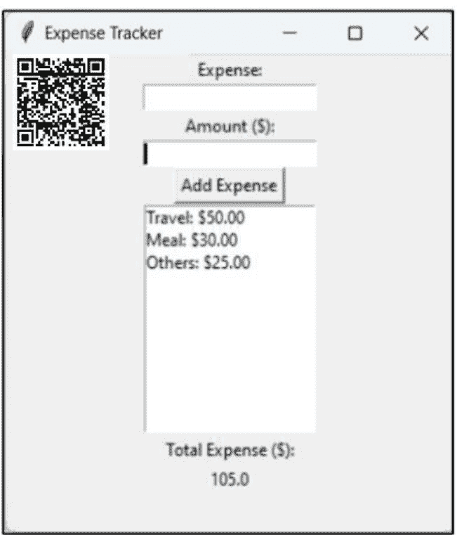

代码链接 在此运行 - Reptil

支出追踪器项目是一个使用 Tkinter 图形用户界面构建的简单实用的 Python 应用程序。它帮助用户高效地追踪日常开支。这个项目不仅提供了一个有用的工具，也是初学者学习 Python GUI 编程的绝佳途径。通过跟随这个项目，初学者将获得使用 Tkinter 构建用户友好型应用程序的宝贵经验。

```python
import tkinter as tk

def add_expense():
    expense = expense_entry.get()
    amount = float(amount_entry.get())
    if expense and amount > 0:
        expense_listbox.insert(tk.END, f"{expense}: ${amount:.2f}")
        total.set(total.get() + amount)
        expense_entry.delete(0, tk.END)
        amount_entry.delete(0, tk.END)

#### Create the main window
root = tk.Tk()
root.title("Expense Tracker")

#### Create and set a variable for the total expense
total = tk.DoubleVar()
total.set(0)

#### Expense Entry
expense_label = tk.Label(root, text="Expense:")
expense_label.pack()
expense_entry = tk.Entry(root)
expense_entry.pack()
#### Amount Entry
amount_label = tk.Label(root, text="Amount ($):")
amount_label.pack()
amount_entry = tk.Entry(root)
amount_entry.pack()
#### Add Expense Button
add_button = tk.Button(root, text="Add Expense", command=add_expense)
add_button.pack()
#### Expense List
expense_listbox = tk.Listbox(root)
expense_listbox.pack()
#### Total Expense Label
total_label = tk.Label(root, text="Total Expense ($):")
total_label.pack()
total_label_value = tk.Label(root, textvariable=total)
total_label_value.pack()
root.mainloop()
```

### 解释：

- 我们首先导入 Tkinter 库，它提供了在 Python 中创建 GUI 应用程序的工具。
- `add_expense` 是一个函数，当按下“添加支出”按钮时，它会将支出添加到列表中并更新总额。
- 我们使用 `tk.Tk()` 创建主窗口，并将其标题设置为“支出追踪器”。
- 我们创建一个名为 `total` 的 `DoubleVar` 来跟踪总支出，并将其初始化为 0。
- 我们为输入支出及其相应金额创建标签和输入框。
- 我们创建一个“添加支出”按钮，点击时调用 `add_expense` 函数。
- 我们创建一个列表框来显示输入的支出。
- 我们通过创建一个标签和一个显示 `total` 变量的标签来显示总支出。
- 最后，我们使用 `root.mainloop()` 启动主事件循环，使 GUI 具备功能。

##### 可修改点：

- 修改 GUI 布局和设计。为无效输入添加错误处理。
- 将支出保存到文件以供将来参考。实现删除或编辑支出的功能。为支出添加类别。
- 为每条支出条目添加日期和时间戳。通过添加额外的功能和特性来改善整体用户体验。

### 项目 26：密码生成器

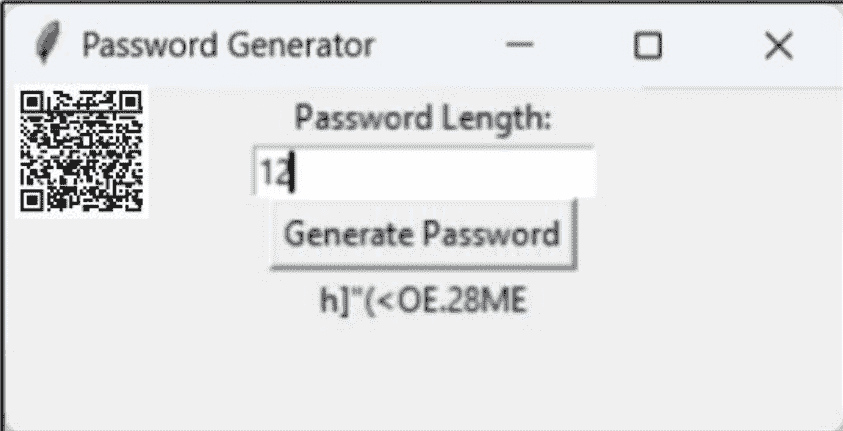

代码链接 在此运行 - Reptil

密码生成器项目是一个使用 Tkinter 图形用户界面构建的简单实用的 Python 应用程序。它帮助用户高效地生成随机密码。这个项目不仅提供了一个有用的工具，也是初学者学习 Python GUI 编程的绝佳途径。通过跟随这个项目，初学者将获得使用 Tkinter 构建用户友好型应用程序的宝贵经验。

```python
import tkinter as tk
import random
import string

#### Function to generate a random password
def generate_password():
    password_length = int(length_entry.get())
    characters = string.ascii_letters + string.digits + string.punctuation
    password = "".join(random.choice(characters) for i in range(password_length))
    result_label.config(text=password)

#### Create the main window
window = tk.Tk()
window.title("Password Generator")

#### Label for password length
length_label = tk.Label(window, text="Password Length:")
length_label.pack()

#### Entry field for password length
length_entry = tk.Entry(window)
length_entry.pack()

#### Button to generate password
generate_button = tk.Button(window, text="Generate Password", command=generate_password)
generate_button.pack()

#### Label to display the generated password
result_label = tk.Label(window, text="")
result_label.pack()

#### Start the Tkinter main loop
window.mainloop()
```

### 解释：

- 我们首先导入 `tkinter` 库（别名为 `tk`）以及其他必要的库（`random` 和 `string`）。
- 我们定义了一个函数 `generate_password()`，它根据用户输入生成随机密码。它获取所需的密码长度，创建一个字符池（字母、数字和标点符号），并选择随机字符来构建密码。
- 我们使用 `tk.Tk()` 创建主应用程序窗口，并将其标题设置为“密码生成器”。
- 我们创建一个标签（`length_label`）和一个输入框（`length_entry`），允许用户指定所需的密码长度。
- 我们创建一个标签为“生成密码”的按钮（`generate_button`），点击时触发 `generate_password()` 函数。
- 我们创建一个标签（`result_label`）来显示生成的密码。最后，我们使用 `window.mainloop()` 启动 Tkinter 主循环，这使 GUI 应用程序保持运行并响应用户操作。

##### 可修改点：

- 你可以通过修改标签、按钮及其属性来改变 GUI 的外观。
- 要更改用于生成密码的字符集，你可以修改 `characters` 变量。
- 进一步自定义密码生成逻辑，例如根据用户偏好添加包含大写字母、小写字母、数字或特殊字符的选项。实现密码强度指示器或额外的安全功能，使生成器更加强大。

### 项目 27：柱状图生成器

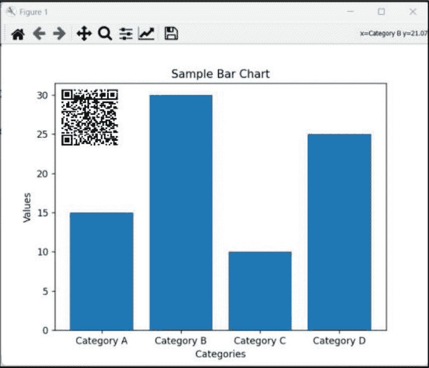

代码链接 在此运行 - Reptil

在这个 Python 项目中，你将使用 Matplotlib 库创建一个简单的柱状图生成器。这个项目是可视化数据和获得数据表示实践经验的绝佳方式。通过完成这个项目，初学者将学习如何安装库、导入库、创建基本图表以及自定义图表，这些都是进一步学习 Python 编程和数据分析的基本技能。

所需安装：Matplotlib => pip install matplotlib

```python
import matplotlib.pyplot as plt

#### Sample data (change this to your own data)
categories = ['Category A', 'Category B', 'Category C', 'Category D']
values = [15, 30, 10, 25]

#### Create a bar chart
plt.bar(categories, values)

#### Customize the chart
plt.title('Sample Bar Chart')
plt.xlabel('Categories')
plt.ylabel('Values')

#### Display the chart
plt.show()
```

### 解释：

- `import matplotlib.pyplot as plt`：导入用于数据可视化的 Matplotlib 库。为了方便，我们给它一个别名 `plt`。
- `categories` 和 `values`：这些是示例数据数组。你应该用你自己的数据替换它们。`categories` 代表每个柱子的标签，`values` 代表每个柱子的高度。
- `plt.bar(categories, values)`：使用 `bar` 函数创建柱状图。该函数接受类别和相应的值作为其参数。
- `plt.title('Sample Bar Chart')`：设置图表的标题。
- `plt.xlabel('Categories')`：设置 x 轴（水平轴）的标签。
- `plt.ylabel('Values')`：设置 y 轴（垂直轴）的标签。
- `plt.show()`：显示图表。

### 项目 28：饼图生成器

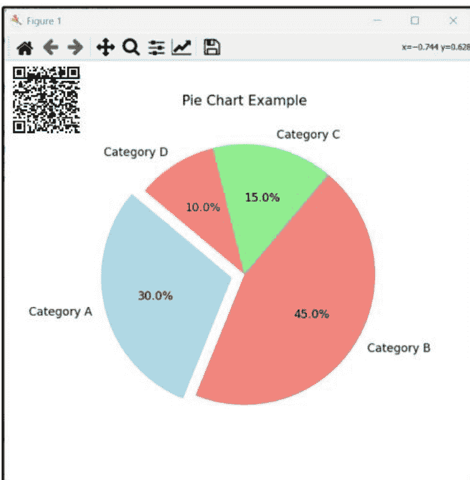

代码链接 在此运行 - Reptil

饼图生成器项目是初学者学习 Python 编程和数据可视化的一种引人入胜的方式。在这个项目中，你将创建一个 Python 程序，从一组数据生成饼图。饼图通常用于将数据表示为圆形“饼图”的切片，从而轻松理解不同数据类别的比例。这个项目将帮助你理解基本的数据可视化概念、Python 库以及如何创建数据的图形表示。

所需安装：Matplotlib => pip install matplotlib

import matplotlib.pyplot as plt

#### 饼图数据（修改此数据以自定义你的图表）
categories = ['类别 A', '类别 B', '类别 C', '类别 D']
values = [30, 45, 15, 10]
colors = ['浅蓝色', '浅珊瑚色', '浅绿色', '浅鲑鱼色']
explode = (0.1, 0, 0, 0)  # 突出显示第一个扇区（类别 A）

#### 创建饼图
plt.figure(figsize=(8, 8))  # 设置图表尺寸
plt.pie(values, labels=categories, colors=colors, explode=explode, autopct='%1.1f%%', startangle=140)
plt.title('饼图示例')  # 设置标题

#### 显示图表
plt.show()

### 解释：

- 导入 Matplotlib 库，该库用于创建图表。定义要绘制的数据：categories 代表每个扇区的标签，values 代表每个类别的值，colors 指定每个扇区的颜色，explode 定义是否将某个扇区与其他部分分离（0.1 表示分离第一个扇区）。
- 使用 `plt.figure()` 创建一个图形以设置图表尺寸。
- 使用 `plt.pie()` 创建饼图，指定数据、标签、颜色、突出显示、用于显示百分比的 `autopct` 以及起始角度。使用 `plt.title()` 为图表设置标题。
- 使用 `plt.show()` 显示图表。

### 项目 29：折线图生成器

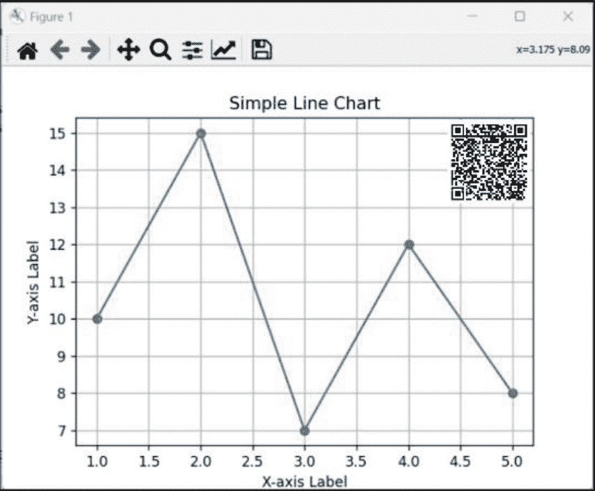

代码链接 在此运行 - Reptil

折线图生成器项目允许初学者使用 Python 创建交互式折线图。使用 Matplotlib 库，该项目介绍了数据可视化和绘图的基本概念。对于那些对数据科学或在 Python 中可视化数据感兴趣的人来说，这是一个很好的起点。

```
import matplotlib.pyplot as plt

#### 数据（你可以修改这些数据以获得不同的结果）
x_values = [1, 2, 3, 4, 5]
y_values = [10, 15, 7, 12, 8]

#### 创建折线图
plt.plot(x_values, y_values, marker='o', linestyle='-')

#### 自定义图表标签和标题
plt.xlabel('X 轴标签')
plt.ylabel('Y 轴标签')
plt.title('简单折线图')

#### 显示图表
plt.grid(True)  # 添加网格线
plt.show()
```

### 解释：

- 导入 Matplotlib 库用于创建绘图。
- 在两个列表（`x_values` 和 `y_values`）中定义你的数据点。你可以修改这些列表以绘制不同的数据。
- 使用 `plt.plot()` 创建折线图。`marker='o'` 在数据点处添加圆形标记，`linestyle='-'` 指定连接它们的实线。使用 `plt.xlabel()`、`plt.ylabel()` 和 `plt.title()` 自定义图表标签和标题。
- 使用 `plt.grid(True)` 为图表添加网格线。最后，使用 `plt.show()` 显示图表。

### 项目 30：散点图生成器

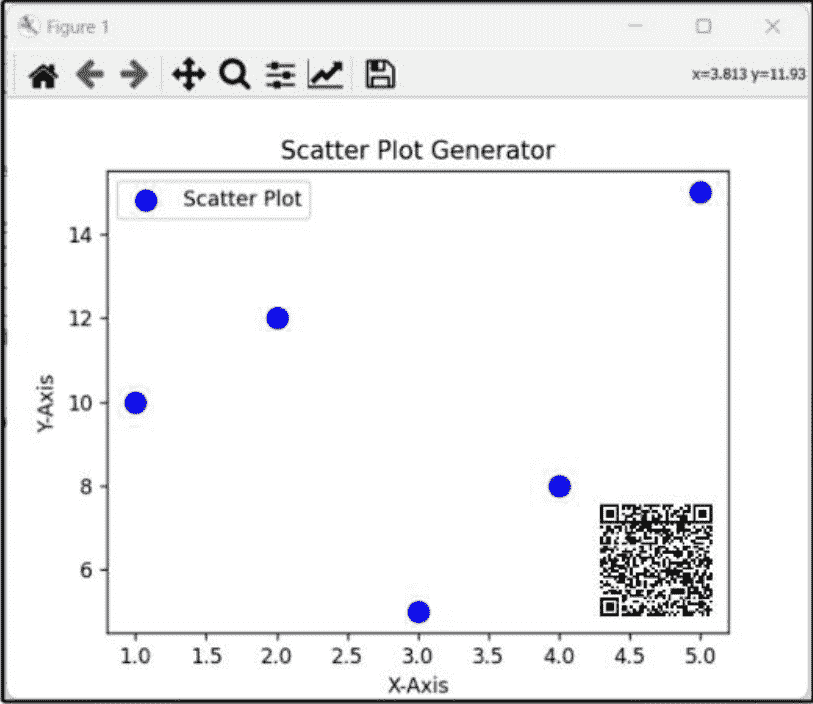

代码链接 在此运行 - Reptil

散点图生成器项目允许初学者根据给定的数据点创建视觉上吸引人的散点图。散点图在数据可视化和分析中至关重要。该项目不仅帮助学习者理解数据表示，还向他们介绍了 Matplotlib 库，这是 Python 中数据可视化的基本工具。通过完成这个项目，初学者将增强对 Python 编程的信心，并为更高级的数据分析和可视化任务做好更好的准备。

```
import matplotlib.pyplot as plt

#### 数据点（修改这些值以自定义你的绘图）
x = [1, 2, 3, 4, 5]
y = [10, 12, 5, 8, 15]

#### 生成散点图
plt.scatter(x, y, color='blue', marker='o', s=100, label='散点图')

#### 自定义绘图
plt.title('散点图生成器')
plt.xlabel('X 轴')
plt.ylabel('Y 轴')
plt.legend(loc='upper left')

#### 显示绘图（如果需要保存绘图，请修改此行）
plt.show()
```

### 解释：

- 导入 Matplotlib 库，该库用于数据可视化。定义你的数据点。你可以修改 `x` 和 `y` 列表中的值以创建不同的散点图。
- 使用 `plt.scatter()` 函数生成散点图。通过指定颜色、标记样式、标记大小和标签来自定义绘图的外观。
- 通过添加标题、标记坐标轴和指定图例位置来自定义绘图。
- 最后，使用 `plt.show()` 显示绘图。如果你想将绘图保存为图像，可以使用 `plt.savefig('scatter_plot.png')` 代替 `plt.show()`。

### 项目 31：热力图生成器

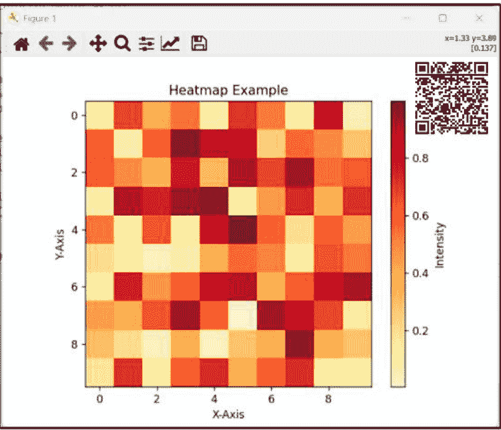

代码链接 在此运行 - Reptil

热力图生成器是一种视觉上吸引人的数据表示方式。在这个 Python 项目中，你将学习如何使用 Matplotlib 和 NumPy 库创建热力图。热力图对于可视化数据密度、识别模式和做出数据驱动的决策非常有用。该项目将通过提供数据可视化的实践经验来增强你的 Python 技能。

所需安装：Numpy => pip install numpy

```
import numpy as np
import matplotlib.pyplot as plt

#### 为热力图创建随机数据（替换为你的数据）
data = np.random.rand(10, 10)

#### 创建热力图
plt.imshow(data, cmap='YlOrRd', interpolation='nearest')
plt.colorbar(label='强度')

#### 为坐标轴添加标签
plt.xlabel('X 轴')
plt.ylabel('Y 轴')

#### 添加标题
plt.title('热力图示例')

#### 显示热力图
plt.show()
```

### 解释：

- 导入必要的库：NumPy 用于数据生成，Matplotlib 用于绘图。
- 使用 NumPy 创建随机数据。在这个例子中，我们生成一个 10x10 的随机值矩阵。你可以将其替换为你自己的数据集。
- 使用 `plt.imshow()` 创建热力图。传入数据，指定颜色映射（`cmap`），并选择插值方法（`interpolation`）以获得更平滑的渲染效果。
- 使用 `plt.colorbar()` 为绘图添加颜色条以指示强度级别。
- 使用 `plt.xlabel()` 和 `plt.ylabel()` 标记 x 轴和 y 轴。使用 `plt.title()` 为热力图添加标题。
- 最后，使用 `plt.show()` 显示热力图。

### 项目 32：词云生成器

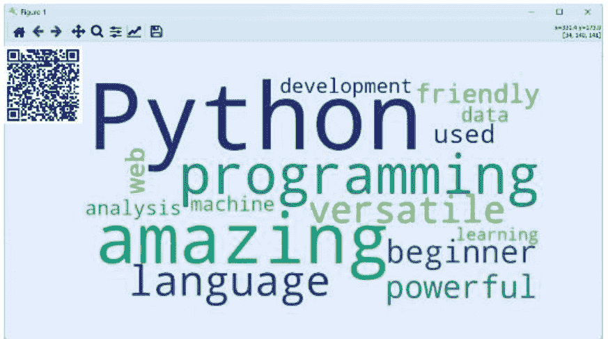

代码链接 在此运行 - Reptil

在这个项目中，你将学习如何使用 Python 创建词云生成器。词云是文本数据的可视化表示，其中单词以不同的大小显示，出现频率更高的单词显示得更大。这个项目不仅帮助你创建有趣的视觉效果，还教你关于文本处理、数据可视化以及 Python 库（如 matplotlib 和 wordcloud）的知识。这是一种有趣且引人入胜的方式来提升你的 Python 技能。

```
#### 导入所需库
from wordcloud import WordCloud
import matplotlib.pyplot as plt

#### 示例文本数据（你可以将其替换为你自己的文本）
text_data = "Python 是一种令人惊叹的编程语言。它用途广泛、功能强大且对初学者友好。Python 可用于 Web 开发、数据分析、机器学习等。"

#### 创建 WordCloud 对象
wordcloud = WordCloud(width=800, height=400, background_color='white').generate(text_data)

#### 显示词云
plt.figure(figsize=(10, 5))
plt.imshow(wordcloud, interpolation='bilinear')
plt.axis('off')  # 隐藏坐标轴
plt.show()
```

### 解释：

- 我们首先导入必要的库：从 wordcloud 库导入 WordCloud，以及 matplotlib.pyplot 作为 plt。
- 接下来，我们定义一个示例文本数据变量 `text_data`。你可以将其替换为你自己的文本数据或从文件加载文本。
- 我们创建一个名为 `wordcloud` 的 WordCloud 对象，并设置特定属性，如宽度、高度和背景颜色。你可以调整这些属性来改变词云的外观。
- 要生成词云，我们使用 WordCloud 对象的 `generate` 方法，传入我们的 `text_data`。
- 我们使用 `plt.figure()` 设置显示词云的绘图。在这里，我们还指定了图形尺寸。
- 我们使用 `plt.imshow()` 显示词云图像，并将插值方法设置为 `'bilinear'` 以获得更平滑的渲染效果。

我们使用 `plt.axis('off')` 隐藏坐标轴，使词云更具视觉吸引力。最后，我们使用 `plt.show()` 显示词云。

### 项目 33：使用 Folium 的交互式地图

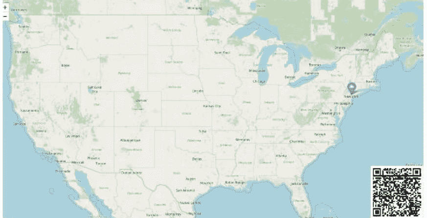

代码链接 在此运行 - Reptil

“使用 Folium 的交互式地图”项目允许初学者使用 Python 创建动态且交互式的地图。通过使用 Folium 库，学习者可以获得数据可视化和地理空间数据处理的实践经验。该项目有助于更深入地理解 Python 编程概念，是更高级数据可视化项目的绝佳基础。

所需安装：folium => pip install folium

```python
#### Import the Folium library
import folium

#### Create a base map centered at a specific location (e.g., New York City)
map_center = [40.7128, -74.0060]
my_map = folium.Map(location=map_center, zoom_start=12)

#### Add a marker to the map (e.g., Times Square)
marker_location = [40.758896, -73.985130]
folium.Marker(
    location=marker_location,
    popup='Times Square',
    icon=folium.Icon(icon='cloud')
).add_to(my_map)

#### Add a circle to the map (e.g., Central Park)
circle_location = [40.785091, -73.968285]
folium.Circle(
    location=circle_location,
    radius=1000,
    # in meters
    color='blue',
    fill=True, fill_color='blue'
).add_to(my_map)

#### Save the map to an HTML file
my_map.save('interactive_map.html')

#### Open the map in a web browser
import webbrowser
webbrowser.open('interactive_map.html')
```

### 解释：

- 导入 folium 库，该库用于创建交互式地图。使用 folium.Map() 创建一个基础地图。指定位置（经纬度）和 zoom_start（初始缩放级别）。你可以更改 location 以将地图中心设置为不同的位置。
- 使用 folium.Marker() 向地图添加标记。指定标记的位置、弹出消息和图标（可选）。你可以更改标记的位置和弹出消息。
- 使用 folium.Circle() 向地图添加一个圆。指定圆的位置、以米为单位的半径、颜色和填充颜色。你可以更改圆的位置和外观。
- 将地图保存到名为 "interactive_map.html" 的 HTML 文件中。使用 webbrowser 库在网页浏览器中打开地图。

### 项目 34：情感分析仪表板

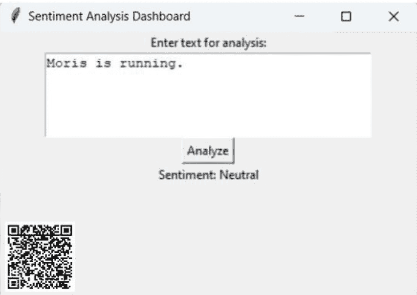

[代码链接](url) 在此运行 - [Reptil](url)

情感分析仪表板是一个令人兴奋的 Python 项目，它分析文本数据的情感，并在交互式图形界面中呈现。对于初学者来说，这是一个宝贵的学习体验，因为它结合了 Python 的文本处理、数据可视化和 GUI 开发。它让你能够洞察文本数据背后的情感，这对于社交媒体监控和客户反馈分析等各种应用至关重要。

所需安装：textblob => pip install textblob

```python
import tkinter as tk
from textblob import TextBlob

#### Function to perform sentiment analysis
def analyze_sentiment():
    text = text_entry.get("1.0", "end-1c")  # Get text from the input field
    analysis = TextBlob(text)

    # Determine sentiment polarity (positive, neutral, negative)
    if analysis.sentiment.polarity > 0:
        sentiment_label.config(text="Sentiment: Positive")
    elif analysis.sentiment.polarity == 0:
        sentiment_label.config(text="Sentiment: Neutral")
    else:
        sentiment_label.config(text="Sentiment: Negative")

#### Create the main window
root = tk.Tk()
root.title("Sentiment Analysis Dashboard")

#### Create and configure GUI elements
text_label = tk.Label(root, text="Enter text for analysis:")
text_label.pack()

text_entry = tk.Text(root, height=5, width=40)
text_entry.pack()

analyze_button = tk.Button(root, text="Analyze", command=analyze_sentiment)
analyze_button.pack()

sentiment_label = tk.Label(root, text="")
sentiment_label.pack()

#### Start the main loop
root.mainloop()
```

### 解释：

- 导入所需的库：tkinter 用于 GUI，TextBlob 用于情感分析。
- 定义 analyze_sentiment 函数，该函数将对输入文本执行情感分析。
- 从 Text 小部件 (text_entry) 获取输入文本，并创建一个 TextBlob 对象进行情感分析。
- 使用 analysis.sentiment.polarity 值确定情感极性。如果大于 0，则情感为正面；如果等于 0，则为中性；否则为负面。
- 使用 tk.Tk() 创建主应用程序窗口并设置其标题。创建并配置 GUI 元素：标签、文本输入框、触发情感分析的按钮以及显示情感结果的标签。
- 当点击“分析”按钮时，它会调用 analyze_sentiment 函数来分析输入文本的情感。
- 使用 root.mainloop() 启动主事件循环以运行 GUI 应用程序。

### 项目 35：人脸检测

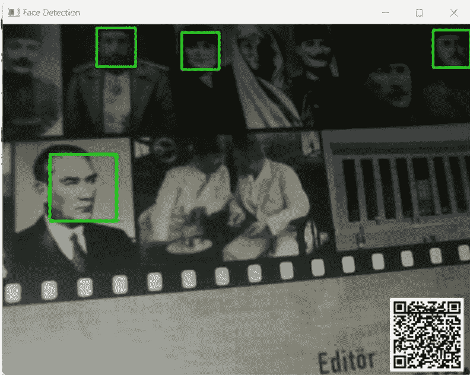

**代码链接** 在此运行 - 编辑器（IDLE / vscode 等）

这个人脸检测项目是初学者使用 Python 和 OpenCV 深入了解计算机视觉和图像处理的绝佳方式。它允许你检测图像或实时视频流中的人脸。理解这个项目将为更高级的计算机视觉应用奠定基础。你将学习如何操作图像、使用 OpenCV 以及应用基本的对象检测技术。

所需安装：opencv-python => pip install opencv-python

```python
import cv2

#### Load the pre-trained Haar Cascade face classifier
face_cascade = cv2.CascadeClassifier(cv2.data.haarcascades + 'haarcascade_frontalface_default.xml')

#### Initialize the webcam (use 0 for the default camera)
cap = cv2.VideoCapture(0)

while True:
    # Read a frame from the webcam
    ret, frame = cap.read()

    # Convert the frame to grayscale for face detection
    gray = cv2.cvtColor(frame, cv2.COLOR_BGR2GRAY)

    # Detect faces in the frame
    faces = face_cascade.detectMultiScale(gray, scaleFactor=1.3, minNeighbors=5, minSize=(30, 30))

    # Draw rectangles around the detected faces
    for (x, y, w, h) in faces:
        cv2.rectangle(frame, (x, y), (x + w, y + h), (0, 255, 0), 2)

    # Display the frame with detected faces
    cv2.imshow('Face Detection', frame)

    # Exit the loop when the 'q' key is pressed
    if cv2.waitKey(1) & 0xFF == ord('q'):
        break

#### Release the webcam and close the OpenCV window
cap.release()
cv2.destroyAllWindows()
```

### 解释：

- 导入 OpenCV 库，这是此项目所必需的。使用 cv2.CascadeClassifier 加载预训练的 Haar Cascade 人脸分类器。
- 通过创建 VideoCapture 对象（0 是默认摄像头）来初始化网络摄像头。
- 启动一个无限循环，从网络摄像头持续捕获帧。
- 使用 cap.read() 从网络摄像头读取一帧。将帧转换为灰度图以进行人脸检测。
- 使用 face_cascade.detectMultiScale() 在灰度帧中检测人脸。
- 使用 cv2.rectangle() 在检测到的人脸周围绘制矩形。使用 cv2.imshow() 显示带有检测到的人脸的帧。
- 检查是否按下了 'q' 键以退出循环。
- 完成后，释放网络摄像头并关闭 OpenCV 窗口。

### 项目 36：运动检测

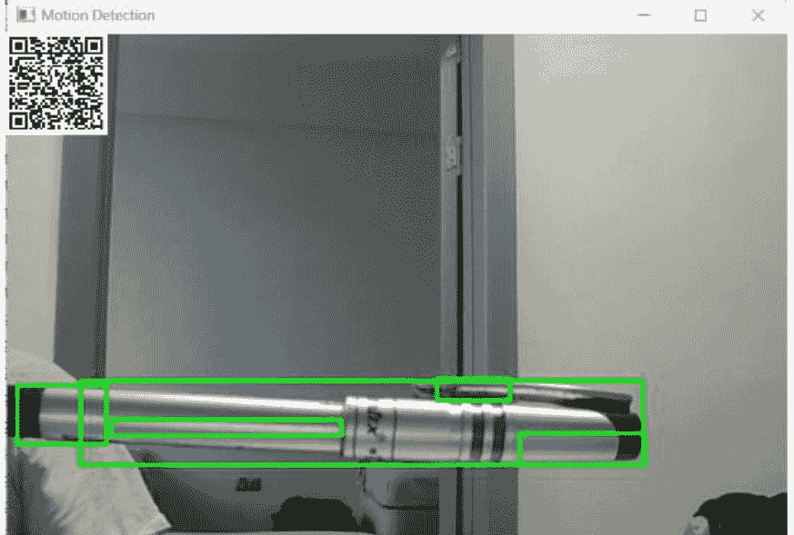

**代码链接** 在此运行 - 编辑器（IDLE / vscode 等）

在这个 Python 项目中，我们将使用 OpenCV 创建一个简单的运动检测系统。这个项目将帮助初学者理解图像处理和计算机视觉概念，例如帧差分、轮廓检测和视频捕获。这是探索 OpenCV 及其功能并获得实践经验的好方法。

所需安装：opencv-python => pip install opencv-python

```python
import cv2
import numpy as np

#### Initialize video capture from your webcam (0 for default webcam)
cap = cv2.VideoCapture(0)

#### Create a background subtractor object
bg_subtractor = cv2.createBackgroundSubtractorMOG2()

while True:
    # Read a frame from the webcam
    ret, frame = cap.read()

    # Apply the background subtractor to the frame
    fg_mask = bg_subtractor.apply(frame)

    # Find contours in the foreground mask
    contours, _ = cv2.findContours(fg_mask, cv2.RETR_EXTERNAL, cv2.CHAIN_APPROX_SIMPLE)
```

for contour in contours:
    # 忽略小轮廓（噪声）
    if cv2.contourArea(contour) < 200: continue

    # 在运动物体周围绘制边界框
    x, y, w, h = cv2.boundingRect(contour)
    cv2.rectangle(frame, (x, y), (x+w, y+h), (0, 255, 0), 2)

    # 显示带有运动检测的原始帧
    cv2.imshow("Motion Detection", frame)

    # 按 'q' 键退出循环
    if cv2.waitKey(1) & 0xFF == ord('q'): break

#### 释放视频捕获并关闭所有窗口
cap.release()
cv2.destroyAllWindows()
```

### 解释：

- 导入必要的库，OpenCV (cv2) 和 NumPy (numpy)。从你的网络摄像头初始化视频捕获。你可以更改参数以使用不同的摄像头源（例如，USB摄像头）。
- 使用 `cv2.createBackgroundSubtractorMOG2()` 创建一个背景减除器对象。这有助于通过减去背景来识别运动物体。
- 进入一个循环，持续从网络摄像头捕获帧。使用 `cap.read()` 从网络摄像头读取一帧。`ret` 表示帧是否被成功读取。
- 将背景减除器应用于帧以获取前景掩码。
- 使用 `cv2.findContours()` 在前景掩码中查找轮廓。轮廓是帧中代表潜在运动的感兴趣区域。
- 遍历检测到的轮廓。
- 通过设置最小面积阈值来忽略小轮廓（可能是噪声）。
- 使用 `cv2.rectangle()` 在运动物体周围绘制边界框。使用 `cv2.imshow()` 显示带有运动检测的原始帧。
- 检查用户是否按下 'q' 键以退出循环。
- 完成后释放视频捕获并关闭所有 OpenCV 窗口。

### 项目 37：井字棋游戏

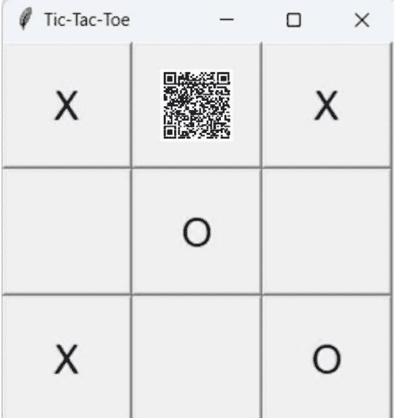

[代码链接](https://example.com) 在此运行 - [Reptil](https://example.com)

井字棋游戏 GUI 项目是 Python tkinter 库的入门级介绍。它帮助你理解 GUI 开发和基本的游戏逻辑。通过构建这个项目，你将学习处理用户输入、事件驱动编程以及 Python 中的基本游戏状态管理。这是提升你 Python 技能的好方法。

```python
import tkinter as tk
from tkinter import messagebox
root = tk.Tk()
root.title("Tic-Tac-Toe")
current_player = "X"
board = [" " for _ in range(9)]
#### 创建按钮
buttons = []
for i in range(9):
    button = tk.Button(root, text=" ", font=("normal", 20),
                       width=5, height=2, command=lambda i=i: handle_click(i))
    buttons.append(button)
    button.grid(row=i // 3, column=i % 3)

def handle_click(index):
    global current_player
    if board[index] == " ":
        buttons[index].config(text=current_player)
        board[index] = current_player
        if check_winner(current_player):
            messagebox.showinfo("Tic-Tac-Toe", f"Player {current_player} wins!")
            reset_game()
        elif " " not in board:
            messagebox.showinfo("Tic-Tac-Toe", "It's a tie!")
            reset_game()
        else:
            current_player = "O" if current_player == "X" else "X"

#### 检查获胜者的函数
def check_winner(player):
    winning_combinations = [(0, 1, 2), (3, 4, 5), (6, 7, 8),
        (0, 3, 6), (1, 4, 7), (2, 5, 8),
        (0, 4, 8), (2, 4, 6)]
    for combo in winning_combinations:
        if board[combo[0]] == board[combo[1]] == board[combo[2]] == player:
            return True
    return False

#### 重置游戏的函数
def reset_game():
    global current_player, board
    current_player = "X"
    board = [" " for _ in range(9)]
    for button in buttons:
        button.config(text=" ")

root.mainloop()
```

### 解释：

- 导入 tkinter 库以创建 GUI，并导入 messagebox 以显示消息。
- 初始化 tkinter 窗口。
- 将窗口标题设置为 "Tic-Tac-Toe"。
- 创建变量以跟踪当前玩家和游戏棋盘。
- 创建一个空列表 `buttons` 来存放游戏按钮。
- 使用循环创建 9 个按钮并将其添加到 `buttons` 列表中。每个按钮都配置了一个回调函数 `handle_click(i)`。
- 定义 `handle_click` 函数来处理按钮点击。它更新按钮文本、更新游戏棋盘、检查获胜者并切换当前玩家。
- 定义 `check_winner` 函数来检查玩家是否获胜。它检查所有可能的获胜组合。
- 定义 `reset_game` 函数在游戏结束时重置游戏。使用 `root.mainloop()` 启动主循环。这使 GUI 窗口保持运行并响应。

### 项目 38：猜数字游戏

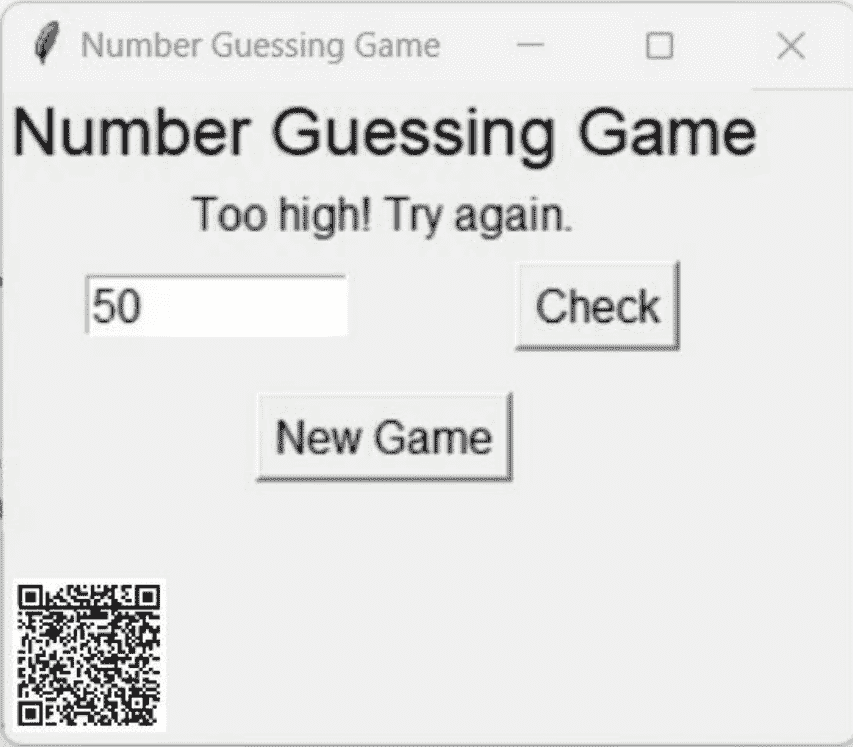

代码链接 在此运行 - Reptil

“猜数字游戏”是一个简单而有趣的 Tkinter GUI 项目，允许用户在指定范围内猜测一个随机数。这个项目是 Python GUI 编程的绝佳入门，可以作为进一步学习 Python 的垫脚石。它教授用户输入、条件语句和 GUI 开发等基本概念。

```python
import tkinter as tk
import random

#### 检查用户猜测的函数
def check_guess():
    user_guess = int(entry_guess.get())
    if user_guess < secret_number:
        result_label.config(text="Too low! Try again.")
    elif user_guess > secret_number:
        result_label.config(text="Too high! Try again.")
    else:
        result_label.config(text=f"Congratulations! You guessed it right, the number was {secret_number}.")

#### 开始新游戏的函数
def new_game():
    global secret_number
    secret_number = random.randint(1, 100)
    result_label.config(text="Guess a number between 1 and 100:")
    entry_guess.delete(0, 'end')

#### 创建主窗口
window = tk.Tk()
window.title("Number Guessing Game")

#### 创建并配置小部件
title_label = tk.Label(window, text="Number Guessing Game", font=("Arial", 18))
result_label = tk.Label(window, text="Guess a number between 1 and 100:", font=("Arial", 12))
entry_guess = tk.Entry(window, width=10, font=("Arial", 12))
check_button = tk.Button(window, text="Check", command=check_guess, font=("Arial", 12))
new_game_button = tk.Button(window, text="New Game", command=new_game, font=("Arial", 12))

#### 使用 grid 布局管理器排列小部件
title_label.grid(row=0, column=0, columnspan=2)
result_label.grid(row=1, column=0, columnspan=2)
entry_guess.grid(row=2, column=0, padx=5, pady=5)
check_button.grid(row=2, column=1, padx=5, pady=5)
new_game_button.grid(row=3, column=0, columnspan=2, padx=5, pady=10)

#### 程序运行时开始新游戏
new_game()

#### 运行主循环
window.mainloop()
```

### 解释：

- 导入 tkinter 库（作为 tk）以创建 GUI，并导入 random 库以生成随机数。
- 定义一个函数 `check_guess` 来比较用户的猜测与秘密数字并提供反馈。
- 定义一个函数 `new_game` 来通过生成新的秘密数字并重置标签和输入字段来开始新游戏。
- 使用 `tk.Tk()` 创建主窗口并设置其标题。
- 为游戏创建并配置标签、输入框和按钮。通过指定行和列使用 grid 布局管理器排列小部件。
- 在程序运行时调用 `new_game` 函数以开始新游戏。
- 启动 Tkinter 主循环以显示 GUI。


### 项目 39：秒表

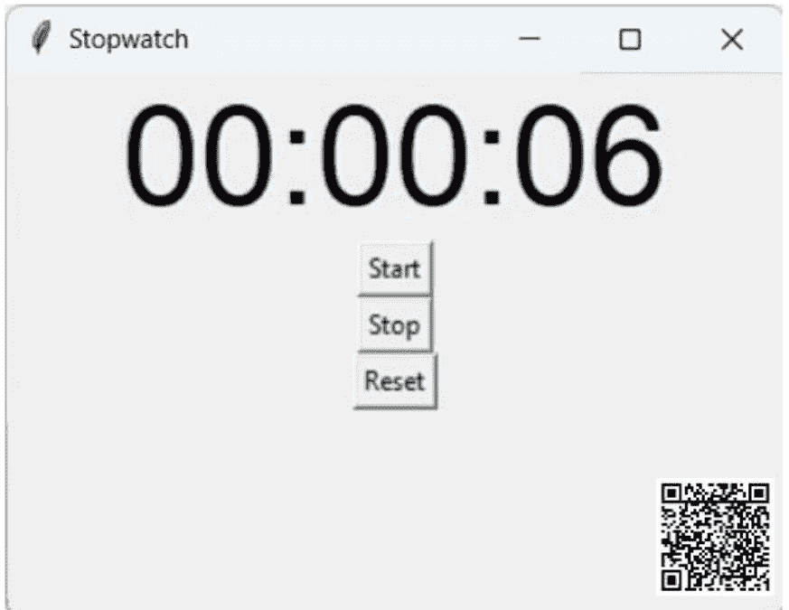

[代码链接](https://example.com/code) 在此运行 - [Reptil](https://example.com/reptil)

“秒表” Tkinter GUI 项目是学习 Python 编程的一种简单而有趣的方式。这个项目将向你介绍用于创建图形用户界面的 Tkinter 库，并帮助你理解事件处理和基于计时器的功能。通过构建这个秒表，你将获得宝贵的技能，这些技能可以应用于 Python 中更复杂的 GUI 应用程序。

### 项目 40：倒计时器

这个倒计时器项目是一个交互式的 Tkinter 图形用户界面应用程序，允许用户设置特定时长的计时器。这是一个适合初学者的项目，它介绍了 Python 编程的基本概念，包括使用 Tkinter 构建图形界面以及处理与时间相关的函数。这个项目帮助初学者获得创建实用且视觉上吸引人的应用程序的实践经验。

```python
import tkinter as tk
from tkinter import ttk
import time

#### Function to start the countdown
def start_countdown():
    try:
        # Get the user-defined countdown duration in seconds
        countdown_time = int(entry.get())
        # Update the label to show the initial countdown time
        label.config(text=f"Time Left: {countdown_time} seconds")
        # Disable the entry field and start button
        entry.config(state=tk.DISABLED)
        start_button.config(state=tk.DISABLED)
        # Start the countdown
        while countdown_time > 0:
            label.config(text=f"Time Left: {countdown_time} seconds")
            root.update()
            time.sleep(1)
            countdown_time -= 1
        # After the countdown is finished, re-enable the entry field
        # and start button
        entry.config(state=tk.NORMAL)
        start_button.config(state=tk.NORMAL)
        label.config(text="Countdown Complete!")
    except ValueError:
        label.config(text="Please enter a valid number")

#### Create the main window
root = tk.Tk()
root.title("Countdown Timer")

#### Create a label for displaying the countdown
label = tk.Label(root, text="", font=("Helvetica", 24))
label.pack(pady=10)

#### Create an entry field for user input
entry = ttk.Entry(root, font=("Helvetica", 18))
entry.pack(pady=10)

#### Create a start button to initiate the countdown
start_button = ttk.Button(root, text="Start Countdown", command=start_countdown)
start_button.pack(pady=10)

#### Run the application
root.mainloop()
```

### 解释：

- 导入必要的库：`tkinter` 用于图形用户界面，`ttk` 用于主题化组件，`time` 用于处理与时间相关的操作。
- 定义一个函数 `start_countdown()`，当用户点击“开始倒计时”按钮时将调用该函数。
- 在 `start_countdown()` 函数内部：
    - 从输入框获取用户定义的倒计时持续时间（以秒为单位）。
    - 更新标签以显示初始倒计时时间。
    - 禁用输入框和开始按钮以防止进一步输入。
    - 启动一个倒计时循环，该循环更新标签、更新图形用户界面、休眠 1 秒，并递减倒计时时间，直到其达到零。
    - 倒计时完成后，重新启用输入框和开始按钮，并显示“倒计时完成！”。
- 创建主 Tkinter 窗口并设置其标题。
- 创建一个标签组件用于显示倒计时时间。
- 创建一个输入组件用于用户输入。
- 创建一个开始按钮，当点击时调用 `start_countdown()` 函数。
- 使用 `root.mainloop()` 运行 Tkinter 主事件循环以启动图形用户界面应用程序。

### 项目 41：图形绘制器

**代码链接**

```python
import tkinter as tk
from datetime import datetime

def start():
    global running
    running = True
    update()

def stop():
    global running
    running = False

def reset():
    global running
    running = False
    global counter
    counter = 0
    time_label.config(text="00:00:00")

def update():
    if running:
        global counter
        counter += 1
    minutes, seconds = divmod(counter, 60)
    hours, minutes = divmod(minutes, 60)
    time_string = f"{hours:02d}:{minutes:02d}:{seconds:02d}"
    time_label.config(text=time_string)
    root.after(1000, update)

running = False
counter = 0
root = tk.Tk()
root.title("Stopwatch")

time_label = tk.Label(root, text="00:00:00", font=("Arial", 48))
start_button = tk.Button(root, text="Start", command=start)
stop_button = tk.Button(root, text="Stop", command=stop)
reset_button = tk.Button(root, text="Reset", command=reset)

time_label.pack()
start_button.pack()
stop_button.pack()
reset_button.pack()
root.mainloop()
```

### 解释：

- 导入所需的库：`tkinter` 用于图形用户界面，`datetime` 用于处理与时间相关的操作。
- 定义三个函数：`start`、`stop` 和 `reset`。当点击相应的按钮时，将调用这些函数。
- 在 `start` 函数内部，将 `running` 变量设置为 `True` 以指示秒表正在运行，并调用 `update` 函数。
- 在 `stop` 函数内部，将 `running` 变量设置为 `False` 以暂停秒表。
- 在 `reset` 函数内部，将 `running` 设置为 `False`，将 `counter` 重置为零，并将时间标签更新为“00:00:00”。
- `update` 函数负责更新标签上显示的时间。它计算经过的时间，将其格式化为小时、分钟和秒，并更新标签文本。`root.after(1000, update)` 这行代码安排 `update` 函数每 1000 毫秒（1 秒）运行一次，前提是秒表正在运行。
- 初始化全局变量 `running` 和 `counter`。
- 创建主 tkinter 窗口并将其标题设置为“秒表”。创建一个标签组件用于显示时间，三个按钮分别用于开始、停止和重置操作，并将它们打包到窗口上。
- 使用 `root.mainloop()` 启动 tkinter 主事件循环。

### 图形绘制器

“图形绘制器”是一个基于 Tkinter 的图形用户界面项目，允许用户绘制简单的数学函数并以图形形式进行可视化。该项目是学习 Python 编程和使用 Tkinter 进行 GUI 开发的绝佳入门。它帮助初学者理解创建用户友好界面、处理用户输入以及利用 Python 库进行数学计算和图形表示的基础知识。

```python
import tkinter as tk
from tkinter import ttk
from matplotlib.figure import Figure
from matplotlib.backends.backend_tkagg import FigureCanvasTkAgg

#### Create the main application window
root = tk.Tk()
root.title("Graph Plotter")

#### Function to plot the graph
def plot_graph():
    expression = entry.get()  # Get the user-entered expression
    try:
        x = range(-10, 11)  # Define the x-axis range
        y = [eval(expression.replace('x', str(i))) for i in x]  # Calculate y values
        ax.clear()  # Clear previous plot
        ax.plot(x, y)  # Plot the graph
        ax.set_xlabel("X-axis")
        ax.set_ylabel("Y-axis")
        ax.set_title("Function: " + expression)
        canvas.draw()
    except Exception as e:
        result_label.config(text="Error: " + str(e))

#### Create a label and an entry for the user to enter a function
label = ttk.Label(root, text="Enter a function (e.g., x**2 + 2*x - 3):")
label.pack()

entry = ttk.Entry(root)
entry.pack()

#### Create a button to trigger the graph plotting
plot_button = ttk.Button(root, text="Plot Graph", command=plot_graph)
plot_button.pack()

#### Create a Matplotlib figure for the graph
fig = Figure(figsize=(6, 4))
ax = fig.add_subplot(111)

#### Create a Matplotlib canvas for Tkinter
canvas = FigureCanvasTkAgg(fig, master=root)
canvas.get_tk_widget().pack()

#### Create a label to display errors
result_label = ttk.Label(root, text="", foreground="red")
result_label.pack()

root.mainloop()
```

### 解释：

- 导入所需的库，包括用于 GUI 组件的 tkinter、ttk，以及用于绘图的 matplotlib。
- 使用 `tk.Tk()` 创建主应用程序窗口。
- 定义一个函数 `plot_graph()`，用于根据用户输入绘制图形。
- 在 `plot_graph()` 函数内部，从输入框中获取用户输入的数学表达式。
- 将 x 轴范围定义为 `range(-10, 11)`。
- 通过为范围内的每个 x 值计算表达式，得到相应的 y 值。
- 清除 Matplotlib 图形上的先前绘图。
- 使用 `ax.plot()` 绘制图形，并设置标签和标题。
- 创建一个标签和一个输入框，供用户输入数学函数。
- 创建一个按钮，点击时调用 `plot_graph()` 函数来绘制图形。
- 为图形创建一个 Matplotlib 图形和坐标轴。
- 创建一个 Matplotlib 画布，将图形嵌入到 Tkinter 窗口中。
- 创建一个标签，用于在用户输入出现问题时显示错误信息。
- 使用 `root.mainloop()` 启动 Tkinter 主事件循环。

### 项目 42：骰子投掷器

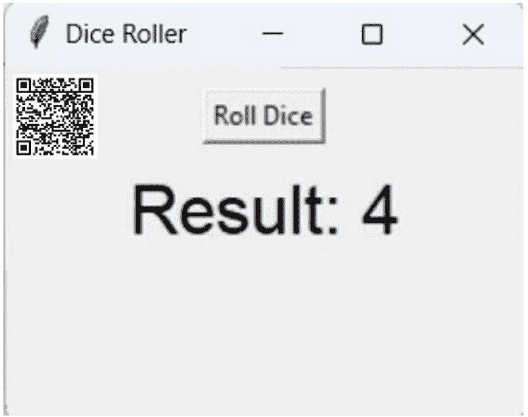

[代码链接](https://example.com/code) 在此运行 - [Reptil](https://example.com/reptil)

骰子投掷器 Tkinter GUI 项目是初学者学习 Python 编程的一种有趣方式。它提供了一个用户友好的界面来投掷虚拟骰子。该项目将帮助学习者理解使用 Tkinter 创建图形用户界面（GUI）和处理事件的基础知识。此外，它还提供了 Python 中随机数生成的实际应用。

```python
import tkinter as tk
import random

#### Function to roll the dice and update the result label
def roll_dice():
    result = random.randint(1, 6)  # Generate a random number between 1 and 6
    result_label.config(text=f"Result: {result}")

#### Create the main application window
app = tk.Tk()
app.title("Dice Roller")

#### Create a button to roll the dice
roll_button = tk.Button(app, text="Roll Dice", command=roll_dice)
roll_button.pack(pady=10)

#### Create a label to display the result
result_label = tk.Label(app, text="", font=("Arial", 24))
result_label.pack()

#### Start the GUI
app.mainloop()
```

### 解释：

- 我们首先导入必要的库：用于 GUI 的 tkinter 和用于随机数生成的 random。
- 我们定义一个函数 `roll_dice`，它使用 `random.randint(1, 6)` 生成一个 1 到 6 之间的随机数。这模拟了投掷一个六面骰子。
- 我们使用 `tk.Tk()` 创建主应用程序窗口，并将其标题设置为“骰子投掷器”。
- 我们创建一个按钮（`roll_button`），文本为“投掷骰子”，并通过 `command` 参数将其与 `roll_dice` 函数关联。这意味着当按钮被点击时，`roll_dice` 函数将被执行。
- 我们使用 `pack()` 将按钮放置在窗口中，并添加一些内边距（`pady`）使其看起来更美观。
- 我们创建一个标签（`result_label`），初始显示空文本，并将其字体大小设置为 24。
- 我们再次使用 `pack()` 将标签放置在按钮下方。
- 最后，我们使用 `app.mainloop()` 启动 Tkinter GUI 应用程序，这将保持窗口运行直到用户关闭它。

### 项目 43：语言翻译器

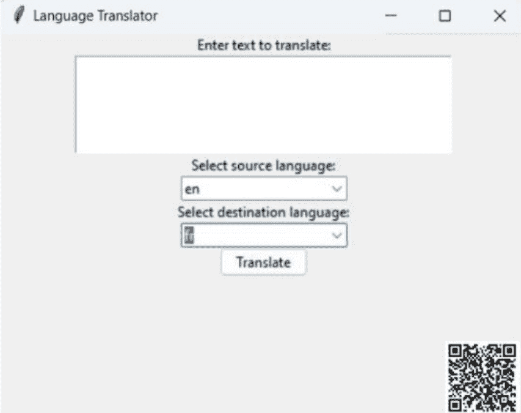

代码链接 在此运行 - Reptil

“语言翻译器” Tkinter GUI 项目是一个交互式 Python 程序，允许用户将文本从一种语言翻译成另一种语言。该项目不仅是一个实用工具，还有助于 Python 编程初学者理解如何使用 Tkinter 创建图形用户界面（GUI），以及如何使用 googletrans 等外部库进行语言翻译。通过构建这个项目，初学者可以在 GUI 开发和 API 集成方面获得宝贵的经验。

所需安装：`pip install googletrans==4.0.0-rc1`

```python
import tkinter as tk
from tkinter import ttk
from googletrans import Translator

def translate_text():
    text_to_translate = entry.get()
    translator = Translator()
    translated_text = translator.translate(text_to_translate, src=source_lang.get(), dest=destination_lang.get())
    result_label.config(text=f"Translation: {translated_text.text}")

#### Create the main application window
root = tk.Tk()
root.title("Language Translator")

#### Create and set labels
label1 = ttk.Label(root, text="Enter text to translate:")
label1.pack()

#### Create a bigger text box for user input
entry = tk.Text(root, height=5, width=40) # Adjust the height and width as needed
entry.pack()

#### Create and set source language dropdown
source_label = ttk.Label(root, text="Select source language:")
source_label.pack()
source_lang = ttk.Combobox(root, values=['en', 'es', 'fr', 'de', 'ja', 'ko'])
source_lang.set('en')
source_lang.pack()

#### Create and set destination language dropdown
destination_label = ttk.Label(root, text="Select destination language:")
destination_label.pack()
destination_lang = ttk.Combobox(root, values=['en', 'es', 'fr', 'de', 'ja', 'ko'])
destination_lang.set('es')
destination_lang.pack()

#### Create a translate button
translate_button = ttk.Button(root, text="Translate", command=translate_text)
translate_button.pack()

#### Create a label for displaying the translation result
result_label = ttk.Label(root, text="")
result_label.pack()

#### Start the main application loop
root.mainloop()
```

### 解释：

- 导入必要的库：用于 GUI 的 tkinter，用于翻译的 `googletrans.Translator`。
- 定义一个函数 `translate_text`，当“翻译”按钮被按下时调用。它从输入框中获取文本，使用 googletrans 进行翻译，并更新结果标签。
- 使用 `tk.Tk()` 创建主应用程序窗口并设置其标题。创建并放置用于用户说明的标签。
- 创建一个用于用户输入的输入框并放置它。
- 创建源语言和目标语言的标签及下拉菜单，用于语言选择。
- 将默认源语言设置为英语（'en'），目标语言设置为西班牙语（'es'）。
- 放置源语言和目标语言的下拉菜单。
- 创建一个“翻译”按钮，按下时调用 `translate_text` 函数。

### 项目 44：文件浏览器

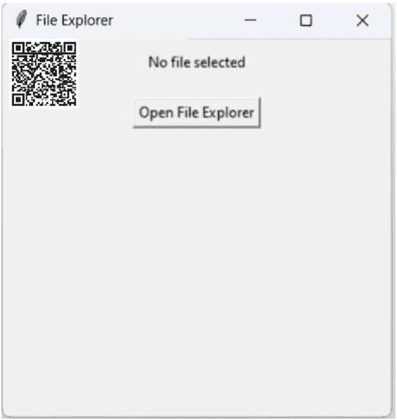

[代码链接](#) 在此运行 - [Reptil](#)

“文件浏览器” Tkinter GUI 项目为初学者提供了一个简单而宝贵的机会，以探索 Python 的 Tkinter 库并提升他们的 Python 技能。该项目使用户能够通过一个直观且交互式的界面来浏览其计算机的文件系统。这个实践项目有助于初学者理解 Python 中 GUI 开发和文件处理的基础知识。

```python
import tkinter as tk
from tkinter import filedialog
import os

#### Function to open the file explorer dialog
def open_file_explorer():
    filepath = filedialog.askopenfilename()
    if filepath:
        status_label.config(text=f"Selected File: {os.path.basename(filepath)}")
    else:
        status_label.config(text="No file selected")

#### Create the main window
root = tk.Tk()
root.title("File Explorer")

#### Create and configure a label to display file status
status_label = tk.Label(root, text="", padx=10, pady=10)
status_label.pack()

#### Create a button to open the file explorer dialog
browse_button = tk.Button(root, text="Open File Explorer", command=open_file_explorer)
browse_button.pack(padx=20, pady=10)

#### Run the Tkinter main loop
root.mainloop()
```

### 解释：

- 导入必要的库：`tkinter` 用于 GUI，`filedialog` 用于文件浏览器对话框，`os` 用于文件操作。
- 定义一个函数 `open_file_explorer()` 来打开文件浏览器对话框。它使用 `filedialog.askopenfilename()` 来获取所选文件的路径。如果选择了文件，它会用所选文件的名称更新 `status_label`。
- 使用 `tk.Tk()` 创建主窗口并设置其标题。
- 创建一个标签 (`status_label`) 来显示文件状态并配置其内边距。
- 将 `status_label` 放入主窗口。
- 创建一个标记为“打开文件浏览器”的按钮 (`browse_button`)，并将其与 `open_file_explorer()` 函数关联。
- 将 `browse_button` 放入主窗口并设置内边距。
- 使用 `root.mainloop()` 启动 Tkinter 主循环，这将使 GUI 保持运行。

### 项目 45：数字签名创建器

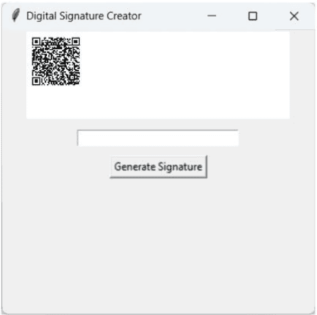

[代码链接](https://example.com/code) 在此运行 - [Reptil](https://example.com/reptil)

“数字签名创建器”是一个 Tkinter GUI 项目，旨在向初学者介绍 Python 编程和 GUI 开发。它提供了一种交互式的方式来创建数字签名。通过这个项目，学习者将获得使用 Tkinter 创建图形用户界面、处理用户输入和生成独特签名的经验。对于那些对 GUI 开发和密码学都感兴趣的人来说，这个项目是一个极好的起点。

所需安装：`pip install pillow`

```python
import tkinter as tk
from tkinter import Canvas, Button, Entry
from PIL import Image, ImageDraw

#### Create a function to generate a digital signature
def generate_signature():
    text = entry.get()
    image = Image.new("RGB", (300, 100), "white")
    draw = ImageDraw.Draw(image)
    draw.text((10, 40), text, fill="black")
    image.save("signature.png")
    status_label.config(text="Signature created as 'signature.png'")

#### Create the main window
root = tk.Tk()
root.title("Digital Signature Creator")

#### Create and configure the canvas
canvas = Canvas(root, width=300, height=100, bg="white")
canvas.pack()

#### Create and configure the input field
entry = Entry(root, width=30)
entry.pack(pady=10)

#### Create and configure the Generate button
generate_button = Button(root, text="Generate Signature", command=generate_signature)
generate_button.pack()

#### Create and configure the status label
status_label = tk.Label(root, text="", fg="green")
status_label.pack()

root.mainloop()
```

### 解释：

- 我们首先导入必要的库：`tkinter` 用于创建 GUI，以及来自 Pillow (PIL) 的 `Image` 和 `ImageDraw` 用于图像处理。
- 接下来，我们定义一个函数 `generate_signature`，当点击“生成签名”按钮时，它将创建数字签名。它从输入字段获取用户输入，创建一个新图像，在其上绘制文本签名，并将其保存为“signature.png”。状态标签会更新以指示过程已完成。
- 我们使用 `tk.Tk()` 创建主窗口并设置其标题。
- 我们分别使用 `Canvas` 和 `Entry` 小部件创建一个用于显示签名的画布和一个输入字段。
- 使用 `Button` 创建“生成签名”按钮，并指定当点击此按钮时应调用 `generate_signature` 函数。
- 添加一个状态标签来显示消息，例如签名成功创建时。
- 最后，我们使用 `root.mainloop()` 启动 GUI 的主事件循环。

### 项目 46：基础 URL 缩短器

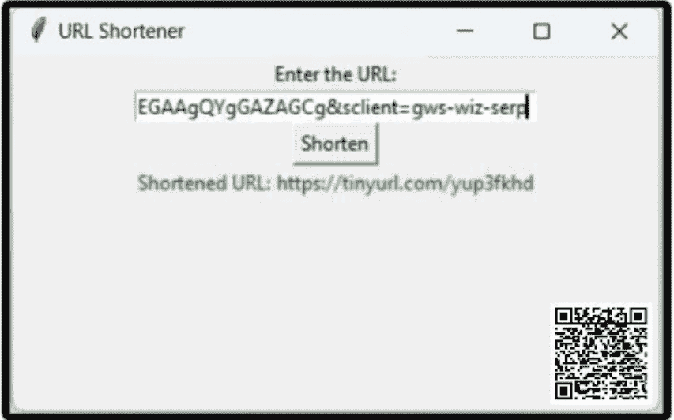

[代码链接](https://example.com/code) 在此运行 - [Reptil](https://example.com/reptil)

“基础 URL 缩短器” Tkinter GUI 项目是一个简单而实用的初学者项目。它允许用户输入一个长 URL 并获得一个缩短版本，使链接分享更容易。该项目向初学者介绍了使用 Tkinter 进行 GUI 开发的基础知识，并提供了在 Python 中处理 URL 的实践经验，这是 Web 相关项目的一项宝贵技能。

所需安装：`pip install pyperclip pyshorteners`

```python
import tkinter as tk
import pyshorteners

#### Function to shorten the URL and copy to clipboard
def shorten_url():
    original_url = input_entry.get()

    # Check if the URL is empty
    if not original_url:
        result_label.config(text="Please enter a URL", fg="red")
    else:
        # Create a Shortener object
        s = pyshorteners.Shortener()
        shortened_url = s.tinyurl.short(original_url)
        # Display the shortened URL
        result_label.config(text=f"Shortened URL: {shortened_url}", fg="green")
        # Copy the shortened URL to the clipboard
        window.clipboard_clear()
        window.clipboard_append(shortened_url)
        window.update()

#### Create the main window
window = tk.Tk()
window.title("URL Shortener")

#### Create and place input label and entry
input_label = tk.Label(window, text="Enter the URL:")
input_label.pack()
input_entry = tk.Entry(window, width=40)
input_entry.pack()

#### Create and place shorten button
shorten_button = tk.Button(window, text="Shorten", command=shorten_url)
shorten_button.pack()

#### Create and place result label
result_label = tk.Label(window, text="", fg="black")
result_label.pack()

#### Start the main loop
window.mainloop()
```

### 解释：

- 导入必要的库：`tkinter` 用于 GUI，`pyperclip` 用于剪贴板功能，`pyshorteners` 用于 URL 缩短。
- 定义 `shorten_url` 函数，以便在点击按钮时处理 URL 缩短。
- 使用 `input_entry.get()` 从输入字段获取原始 URL。检查输入的 URL 是否为空。如果为空，则显示错误消息。创建一个 `pyshorteners.Shortener()` 对象以与 URL 缩短服务（本例中为 TinyURL）交互。
- 使用 `s.tinyurl.short(original_url)` 缩短原始 URL。
- 在结果标签中以绿色显示缩短后的 URL，并使用 `pyperclip.copy()` 将其复制到剪贴板。
- 使用 `tk.Tk()` 创建主窗口并设置其标题。
- 创建并放置输入标签和输入小部件，供用户输入 URL。
- 创建并放置缩短按钮，点击时调用 `shorten_url` 函数。
- 创建并放置结果标签以显示缩短后的 URL。使用 `window.mainloop()` 启动主循环。

### 项目 47：字数统计器

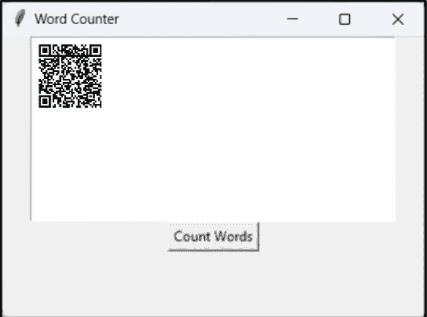

代码链接 在此运行 - Reptil

### 项目 47：单词计数器

“单词计数器” Tkinter 图形界面项目旨在通过创建一个简单但有趣的应用程序来帮助初学者学习 Python。该项目允许用户输入文本，并统计文本中的单词数量。这是练习使用图形用户界面（Tkinter）和 Python 基础字符串操作的绝佳方式。作为初学者，你将获得构建用户友好型应用程序的实践经验。

```python
import tkinter as tk

#### Function to count words in the entered text
def count_words():
    text = input_text.get("1.0", "end-1c")  # Get text from the input Text widget
    words = text.split()  # Split text into words
    word_count = len(words)  # Count the number of words
    result_label.config(text=f"Word Count: {word_count}")

#### Create the main application window
root = tk.Tk()
root.title("Word Counter")

#### Create a Text widget for input
input_text = tk.Text(root, height=10, width=40)
input_text.pack()

#### Create a button to trigger word counting
count_button = tk.Button(root, text="Count Words", command=count_words)
count_button.pack()

#### Create a label to display the word count result
result_label = tk.Label(root, text="")
result_label.pack()

#### Start the Tkinter main loop
root.mainloop()
```

### 解释：

- `import tkinter as tk`：导入 Tkinter 库，并为方便起见将其命名为 `tk`。
- 定义一个函数 `count_words()`，当点击“Count Words”按钮时将调用此函数。在此函数内部：
  - `text = input_text.get("1.0", "end-1c")`：获取 `input_text` Text 组件中输入的文本，不包括末尾的换行符。
  - `words = text.split()`：使用空白字符作为分隔符，将文本分割成单词列表。
  - `word_count = len(words)`：通过查找单词列表的长度来计算单词数量。
  - `result_label.config(text=f"Word Count: {word_count}")`：更新 `result_label` 的文本以显示单词计数。
- 使用 `root = tk.Tk()` 创建主应用程序窗口。使用 `root.title("Word Counter")` 设置窗口标题。
- 使用 `input_text = tk.Text(root, height=10, width=40)` 创建用于输入的 Text 组件。
- 将 `input_text` 组件打包以在窗口中显示。
- 使用 `count_button = tk.Button(root, text="Count Words", command=count_words)` 创建用于计数的按钮。
- 将 `count_button` 组件打包以在窗口中显示。
- 使用 `result_label = tk.Label(root, text="")` 创建用于显示单词计数结果的标签。
- 将 `result_label` 组件打包以在窗口中显示。使用 `root.mainloop()` 启动 Tkinter 主循环。

### 项目 48：基础文本编辑器

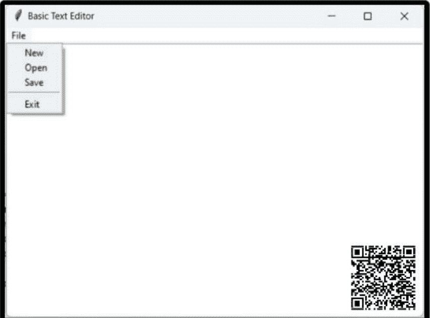

[代码链接](#) 在此运行 - [Reptil](#)

“基础文本编辑器”是一个 Tkinter 图形界面项目，允许用户创建、编辑和保存文本文档。该项目是初学者学习 Python 的绝佳起点，因为它介绍了图形界面开发、文件处理和事件处理等基本概念。通过完成此项目，学习者将获得可应用于更复杂 Python 应用程序的实践经验。

```python
import tkinter as tk
from tkinter import filedialog

def new_file():
    text.delete("1.0", tk.END)

def open_file():
    file_path = filedialog.askopenfilename()
    if file_path:
        with open(file_path, 'r') as file:
            text.delete("1.0", tk.END)
            text.insert(tk.END, file.read())

def save_file():
    file_path = filedialog.asksaveasfilename(defaultextension=".txt")
    if file_path:
        with open(file_path, 'w') as file:
            file.write(text.get("1.0", tk.END))

#### Create the main window
root = tk.Tk()
root.title("Basic Text Editor")

#### Create a text widget
text = tk.Text(root)
text.pack()

#### Create a menu bar
menu_bar = tk.Menu(root)
root.config(menu=menu_bar)

#### File menu
file_menu = tk.Menu(menu_bar, tearoff=0)
menu_bar.add_cascade(label="File", menu=file_menu)
file_menu.add_command(label="New", command=new_file)
file_menu.add_command(label="Open", command=open_file)
file_menu.add_command(label="Save", command=save_file)
file_menu.add_separator()
file_menu.add_command(label="Exit", command=root.quit)

#### Start the main loop
root.mainloop()
```

### 解释：

- 导入必要的库：导入 `tkinter` 库和 `filedialog` 模块，分别用于图形界面组件和文件对话框。
- 定义新建、打开和保存操作的函数：
  - `new_file()`：清空文本组件。
  - `open_file()`：使用文件对话框打开文件，并在文本组件中显示其内容。
  - `save_file()`：打开文件对话框以保存文本组件的当前内容。
- 创建主窗口（`root`）并设置其标题。
- 创建文本组件（`text`）并在主窗口中显示。创建菜单栏（`menu_bar`）并将其附加到主窗口。
- 创建“文件”菜单（`file_menu`），包含新建、打开、保存和退出选项。
- 使用 `root.mainloop()` 启动 Tkinter 主循环。

### 项目 49：石头、剪刀、布游戏

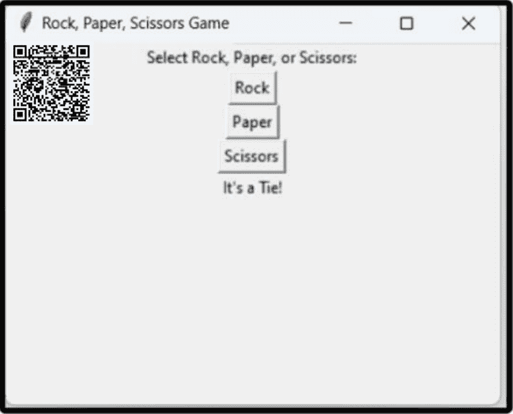

[代码链接](#) 在此运行 - [Reptil](#)

在这个“石头、剪刀、布游戏” Tkinter 图形界面项目中，你将创建一个简单的交互式游戏，允许玩家选择石头、剪刀或布来与计算机对战。该项目将帮助初学者掌握 Python 的基本概念，如使用 Tkinter 进行用户界面设计、处理用户输入、条件语句和随机数生成。这是开始你的 Python 之旅并获得构建图形用户界面实践经验的绝佳方式。

```python
import tkinter as tk
import random

#### Function to handle user choice and determine the winner
def play_game(player_choice):
    choices = ["Rock", "Paper", "Scissors"]
    computer_choice = random.choice(choices)

    if player_choice == computer_choice:
        result_label.config(text="It's a Tie!")
    elif (
        (player_choice == "Rock" and computer_choice == "Scissors") or
        (player_choice == "Paper" and computer_choice == "Rock") or
        (player_choice == "Scissors" and computer_choice == "Paper")
    ):
        result_label.config(text="You Win!")
    else:
        result_label.config(text="Computer Wins!")

#### Create the main window
root = tk.Tk()
root.title("Rock, Paper, Scissors Game")

#### Create a label for instructions
instructions_label = tk.Label(root, text="Select Rock, Paper, or Scissors:")
instructions_label.pack()

#### Create buttons for player's choices
rock_button = tk.Button(root, text="Rock", command=lambda: play_game("Rock"))
paper_button = tk.Button(root, text="Paper", command=lambda: play_game("Paper"))
scissors_button = tk.Button(root, text="Scissors", command=lambda: play_game("Scissors"))
rock_button.pack()
paper_button.pack()
scissors_button.pack()

#### Create a label to display the game result
result_label = tk.Label(root, text="")
result_label.pack()

#### Start the Tkinter event loop
root.mainloop()
```

### 解释：

- 导入 `tkinter` 库用于图形界面组件，导入 `random` 库用于随机数生成。
- 定义 `play_game` 函数来处理游戏逻辑。它接受 `player_choice` 作为参数，并为计算机随机选择一个选项。
- 检查不同的游戏结果：平局、玩家获胜或计算机获胜，并相应地更新 `result_label`。
- 使用 `tk.Tk()` 创建主窗口并设置窗口标题。创建用于说明和玩家选择的标签和按钮，然后将它们打包以在窗口中显示。
- 使用 lambda 函数在点击按钮时将玩家的选择传递给 `play_game` 函数。
- 创建一个标签（`result_label`）来显示游戏结果。
- 使用 `root.mainloop()` 启动 Tkinter 事件循环以运行图形界面应用程序。

### 项目 50：温度转换器

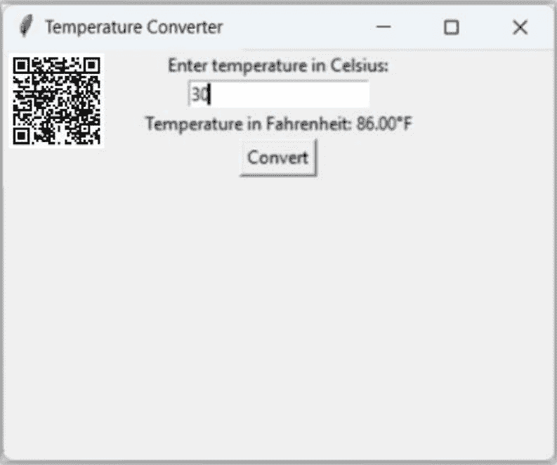

[代码链接](#) 在此运行 - [Reptil](#)

### 温度转换器

“温度转换器” Tkinter 图形界面项目是一个简单但有趣的 Python 编程实践方式。它允许用户在摄氏度和华氏度之间进行温度转换。通过构建这个项目，初学者将学习使用 Tkinter 进行图形界面开发、基本数学运算和事件处理，这些都是进行更复杂 Python 项目的基础技能。

```python
import tkinter as tk

def convert_temperature():
    celsius = float(entry.get())
    fahrenheit = (celsius * 9/5) + 32
    result_label.config(text=f"Temperature in Fahrenheit: {fahrenheit:.2f}°F")

#### Create the main application window
app = tk.Tk()
app.title("Temperature Converter")

#### Create labels and entry fields
label = tk.Label(app, text="Enter temperature in Celsius:")
label.pack()

entry = tk.Entry(app)
entry.pack()

result_label = tk.Label(app, text="")
result_label.pack()

#### Create a Convert button
convert_button = tk.Button(app, text="Convert", command=convert_temperature)
convert_button.pack()

#### Start the main event loop
app.mainloop()
```

## 说明

- 我们首先导入 `tkinter` 库，它提供了创建图形用户界面（GUI）的工具。
- 我们定义了一个 `convert_temperature` 函数，当点击“转换”按钮时，该函数将执行温度转换。
- 在 `convert_temperature` 函数内部，我们获取输入框中输入的值（假设为摄氏度），并将其转换为浮点数。
- 我们使用公式 `(Celsius * 9/5) + 32` 执行从摄氏度到华氏度的温度转换。
- 我们更新 `result_label` 的文本，以显示转换后的华氏温度，并四舍五入到两位小数。
- 我们使用 `tk.Tk()` 创建主应用程序窗口并设置其标题。我们为用户输入和结果显示创建了标签和输入框。
- 我们创建了一个“转换”按钮，点击时将执行 `convert_temperature` 函数。
- 最后，我们使用 `app.mainloop()` 启动主事件循环，它使图形界面应用程序保持运行并响应用户操作。

## 结语

随着我们读完《趣味项目学 Python：50 个游戏、艺术与模拟项目（附二维码源码）》，这不仅仅是一个结束；它更是你激动人心的 Python 之旅的开端。通过这 50 个多样化的项目，你已经深入 Python 的世界，获得了实用的技能、解决问题的能力和创造性的见解。

本书旨在弥合理论与实践之间的鸿沟。它承认学习编程可能具有挑战性，而失去热情是常见的。通过从图形化的日常项目——如游戏、艺术和计算器——入手，我们旨在让你的学习体验保持趣味盎然，并保持你的学习热情。

我们也认识到，Python 不仅仅是一种语言；它是通往多样化职业机会的门户。正是 Python 的简洁性使其成为从网络开发到人工智能等各行各业的首选。它在就业市场上的适应性和需求是我们踏上这段 Python 之旅的两个关键原因。

我们的使命不仅是教授 Python，更是激发创造力。每个项目都为你打开了理解 Python 基础和编程艺术的大门。无论你对游戏、数据还是人工智能充满热情，这本书都让你领略 Python 广阔的可能性。

有了二维码支持的源代码，你的学习变得轻松无忧。你可以在电脑或移动设备上访问、运行和试验代码。这种便利性将学习转变为一种愉快、实用的体验。

当你合上这本书时，请记住，这不是结束；这是你编程冒险的开始。拥抱 Python，探索你的想法，并继续构建你的技能。你的编程未来一片光明，Python 是你的指路明灯。感谢你选择这本书作为你踏入 Python 精彩可能性世界的垫脚石。