# 使用 Jupyter 学习 Python

Serena Bonaretti

www.learnpythonwithjupyter.com

亲爱的编程者，

感谢你对 *使用 Jupyter 学习 Python* 的兴趣！我希望它能帮助你学习计算思维和 Python 编程！

*使用 Jupyter 学习 Python* 的编写是一项**进行中的工作**。我每 4-6 周发布一个新章节，因为我在工作之余撰写这本书。这就是为什么它需要一些时间。

*使用 Jupyter 学习 Python* 是**开放且免费**的，并且将保持开放和免费。在本书完成后，我可能会出版一本印刷版。那将有一个（低廉的）成本来覆盖印刷和分发费用。

你可以在这篇 Jupyter 博客文章中找到一些关于 *使用 Jupyter 学习 Python* **构建**的信息：https://blog.jupyter.org/introducing-learn-python-with-jupyter-11214f152159。我将在未来的文章中更广泛地讨论 *使用 Jupyter 学习 Python* 背后的语言学、教学法和心理学方面。

如果你有任何评论或问题，请**给我发邮件**至 serena.bonaretti.research@gmail.com，我将很乐意回复。

感谢你与我一起学习，
Serena

# 使用 Jupyter 学习 Python

Serena Bonaretti

www.learnpythonwithjupyter.com

关于免费电子书：
许可：CC BY-NC-SA

关于未来的印刷版：
版权所有 ©202x Serena Bonaretti。保留所有权利。
未经作者事先书面许可，不得以任何形式或任何方式（电子、机械、影印或其他方式）复制、存储在检索系统中或传播本书的任何部分。
虽然作者已尽最大努力确保本书所含信息和说明的准确性，但作者对任何错误或遗漏不承担任何责任，包括但不限于因使用或依赖本书而造成的损害责任。使用本书所含信息和说明的风险由您自行承担。如果本书包含或描述的任何代码示例或其他技术受开源许可或他人知识产权的约束，您有责任确保您的使用符合此类许可和/或权利。

导言部分和第 1-22 章的编辑和校对由 John Batson 完成
封面设计由 Federica Dias 完成 (www.behance.net/federicadias)

www.learnpythonwithjupyter.com

> Eccoci nuovamente insieme per imparare a leggere e a scrivere.
Io direi, però, di più: per imparare a conoscere meglio il mondo e noi stessi.
*我们又在一起学习如何阅读和写作了。*
*实际上，我想说的是：学习更好地了解世界和我们自己。*
—Alberto Manzi, Non è mai troppo tardi, *It's never too late*

> Simple is better than complex.
—Tim Peters, The Zen of Python

# 目录

关于本书
第 ix 页

导言

学习编程时我们需要学习什么
第 xiii 页

准备工作

Jupyter/Python 环境
第 3 页

下载本书材料
第 8 页

第一部分：创建基础

| 章节 | 语法 | 计算思维 | 深入探讨 |
| :--- | :--- | :--- | :--- |
| 1. 文本、问题和艺术
第 11 页 | ■ 字符串
■ 内置函数
input() 和 print() | ■ 从用户获取信息
■ 打印到屏幕 | 我们的手指有记忆
第 16 页 |
| 2. 事件和最爱
第 18 页 | ■ 赋值符号
■ 连接符号 | ■ 创建变量
■ 为变量赋值
■ 连接字符串 | 处理 NameError 和 SyntaxError
第 21 页 |

第二部分：列表和 if/else 简介

| 章节 | 语法 | 计算思维 | 深入探讨 |
| :--- | :--- | :--- | :--- |
| 3. 在书店里
第 25 页 | ■ 列表
■ if/else 结构
■ 成员运算符 in
■ 缩进 | ■ 列表作为集合数据类型
■ 基于二元条件执行命令 | 让我们给变量起有意义的名字！
第 28 页 |
| 4. 杂货购物
第 30 页 | ■ 列表方法
.append() 和
.remove() | ■ 方法作为特定数据类型的函数
■ 基于条件向列表添加和删除元素 | 为什么我们打印这么多？
第 34 页 |
| 5. 定制汉堡菜单
第 36 页 | ■ 列表方法 .index(),
.pop(), 和 .insert() | ■ 将列表元素与索引关联
■ 查找元素索引
■ 基于索引向列表添加和删除元素 | 我们用英语编程！
第 39 页 |
| 6. 环游世界
第 41 页 | ■ 三秒规则
■ 加一规则和减一规则 | ■ 切片以从列表中提取元素
■ 使用正负索引以及正序和逆序进行切片
■ 省略索引 | 为什么有加一规则？
第 47 页 |
| 7. 感官、行星和房子
第 50 页 | ■ 关键字 del | ■ 使用列表切片替换、添加和删除元素
■ 列表连接
■ 删除变量与其内容
■ 从列表方法过渡到切片 | 什么是内核？
第 56 页 |

# 第三部分：for 循环简介

| 章节 | 语法 | 计算思维 | 深入探讨 |
| :--- | :--- | :--- | :--- |
| 8. 我朋友们最爱的菜肴 第 61 页 | - for 循环<br>- 内置函数 range() 和 str() | - 使用 for 循环重复命令<br>- 使用 for 循环自动切片列表 | 处理 IndexError 和 IndentationError 第 66 页 |
| 9. 在动物园 第 69 页 | - 比较运算符 ==<br>- 内置函数 len()<br>- # 用于命令注释<br>- 用 i 缩写索引 | - 命令重复中的二元条件<br>- 代码注释 | 处理 TypeError 第 73 页 |
| 10. 我的手套在哪？ 第 76 页 | - 比较运算符 !=, >, >=, <, <= | - 通过组合 for 循环和 if/else 结构，基于元素长度或位置在列表中搜索元素<br>- 使用变量代替硬编码值 | 让我们使用键盘快捷键！ 第 82 页 |
| 11. 清理邮件列表 第 85 页 | - 字符串方法 .lower(), .upper(), .title(), .capitalize() | - 在 for 循环中通过重新赋值更改列表元素 | 我在哪个列表中更改元素？ 第 88 页 |
| 12. 书店里真是一团糟！ 第 91 页 | - 特殊字符 "\n" | - 在 for 循环中创建列表<br>- 字符串切片<br>- 多次连续切片 | 追加还是连接。不要赋值！ 第 96 页 |

# 第四部分：数字和算法

| 章节 | 语法 | 计算思维 | 深入探讨 |
| :--- | :--- | :--- | :--- |
| 13. 实现计算器 第 101 页 | - 算术运算符<br>- 内置函数 int(), float(), type()<br>- 关键字 elif | - 数字变量作为字符串、整数或浮点数<br>- 使用 elif 测试多个变量值<br>- 将代码组合成一个代码单元 | 解算术表达式 第 108 页 |
| 14. 玩转数字 第 110 页 | （无新语法） | - 基于条件更改数字<br>- 基于条件分离数字<br>- 在数字列表中查找最大值<br>- 使用模运算确定数字可见性 | 不要用保留字命名变量！ 第 113 页 |
| 15. 幸运饼干 第 116 页 | - 关键字 import<br>- random 模块函数 .randing(a,b) 和 .choice(list) | - 模块作为包含特定函数的单元<br>- 导入模块<br>- 编程中的随机性 | 如果我不在 for 循环中使用索引会怎样？ 第 119 页 |
| 16. 石头剪刀布 第 121 页 | （无新语法） | - 测试、调试、并行性、分而治之、算法 | 为什么我们说调试、分而治之和算法？ 第 127 页 |

# 第五部分：while 循环和条件

| 章节 | 语法 | 计算思维 | 深入探讨 |
| :--- | :--- | :--- | :--- |
| 17. 你想要更多糖果吗？<br>第 131 页 | ■ 关键字 `while` | ■ while 循环用于询问未知数量的输入<br>■ 计数器<br>■ 初始化和更改条件中的变量 | *编写代码就像写电子邮件！*<br>第 135 页 |
| 18. 动物、唯一数字和求和<br>第 137 页 | （无新语法） | ■ 识别各种条件<br>■ 使用分而治之解决问题 | *不要混淆 while 循环和 if/else！*<br>第 147 页 |
| 19. 与、或、非、不在<br>第 150 页 | ■ 逻辑运算符 and, or, 和 not<br>■ 成员运算符 `not in` | ■ 合并条件<br>■ 反转条件 | *什么是 GitHub？*<br>第 155 页 |
| 20. 比较和条件的背后<br>第 157 页 | ■ 布尔值 | ■ 布尔值作为单个或多个条件的结果<br>■ 真值表<br>■ 布尔值作为 while 循环中的标志 | *GeeksforGeeks 和 Stack Overflow 有什么区别？*<br>第 162 页 |

# 第六部分：列表和 for 循环回顾

| 章节 | 语法 | 计算思维 | 深入探讨 |
| :--- | :--- | :--- | :--- |
| 21. 列表概述<br>第 167 页 | ■ 列表方法：`.clear()`, `.copy()`, `.count()`, `.extend()`, `.reverse()`, `.sort()` | ■ 列表元素的算术运算<br>■ 列表之间的“算术”运算<br>■ 列表赋值<br>■ 添加和删除列表元素<br>■ 列表排序和搜索 | *为什么不用 for 循环删除列表元素？*<br>第 176 页 |
| 22. 关于 for 循环的更多内容<br>第 180 页 | ■ 内置函数 `list()` 和 `enumerate()` | ■ for 循环作为命令的重复<br>- 通过索引、元素以及索引和元素进行 for 循环<br>■ 列表推导式<br>■ 元组<br>■ 嵌套 for 循环 | *Markdown 基础*<br>第 189 页 |
| 23. 列表的列表<br>第 192 页 | ■ （无新语法） | ■ 列表的列表<br>■ 切片列表的列表<br>■ 使用 for 循环浏览列表的列表<br>■ 展平列表的列表 | *列表的列表和图像*<br>第 196 页 |

## 关于本书

**我将从本书中学到什么？** 在本书中，你将学习使用 Jupyter Notebook 进行 Python 编程。更重要的是，你将培养计算思维——即我们编程时的思维方式。

**本书有何不同？** 本书的主题进阶设计基于计算思维的发展，同时注重语法和策略，而非罗列互不关联的语言特性及孤立示例。

**本书适合我吗？** 如果你从未编写过代码，如果你正在学习在线课程或视频但感觉难以完全掌握，或者你需要更好地构建你的 Python 和编程知识体系，那么本书适合你。此外，如果你正在接受科学训练但编程能力不强，如果你正从其他编程语言过渡到 Python/Jupyter 环境，或者你是一位正在寻找教学材料的教师，本书也适合你。

**本书的结构是怎样的？** 本书分为 11 个部分。第一部分介绍计算环境——即 Jupyter/Python 环境。接下来的十个部分涵盖计算思维和 Python 语法。每个部分包含两到五章，共计三十八章。

**章节的结构是怎样的？** 每章以一个或多个嵌入叙述中的编码示例开始，并辅以详细解释。此外，每章包含若干理论和编码练习。所有章节都以回顾总结本章主要概念的“回顾”部分结束，并附有一个“深入探讨”部分，提供编码策略或有趣知识。

**为什么将代码嵌入叙述中？** 故事提供背景并有助于长期记忆。它们在学习外语中被广泛使用。而且，在许多方面，编程语言*就是*一种外语。

**为什么有代码发音？** 当我们编码时，我们会在内心默念或低声读出代码，偶尔也会与同事大声讨论。尽管编码具有很强的语音成分，但目前尚无统一的代码发音标准。本书中提出的发音是经过数小时与不同母语学生一对一互动后优化得出的结果。

**本书包含哪些类型的练习？** 在本书中，你将找到理论练习和编码练习。理论练习旨在加强代码理解和语法准确性。编码练习旨在让你通过实践来学习。

**网站上有什么内容？** 在 `www.learnpythonwithjupyter.com` 上，你可以找到与每章相关的 Jupyter Notebook，以便你在学习时进行测试和实验。你还可以找到一个社区，其中包含理论和编码练习的解决方案。你可以提问并提出替代方案，以加深你的理解。

**我该如何使用本书？** 从第一部分“准备开始”开始，安装并学习计算环境。然后，按章节顺序学习。对于每一章，从 `www.learnpythonwithjupyter.com` 下载相应的 notebook。确保你理解语法，尝试运行代码，并完成理论练习。阅读“回顾”和“深入探讨”部分，它们会给你有用的提示。最后，完成编码练习，并将你的解决方案与社区中的方案进行比较。显然，在完成练习之前查看解决方案会削弱你的学习机会。如果你不理解问题或解决方案，请在社区中提问。花时间解决每个练习。错过对某一章的理解可能会影响你对后续章节的理解。

**本书的语言风格如何？** 语言通俗易懂且简单——但精确。有清晰的定义和细致的解释。我直接与*你*对话，但在解释语法时使用“我们”。我们共同学习！此外，当我分享沿途学到的一些技巧时，我会使用第一人称。

## 引言

在本部分，我们将简要讨论编程环境、语言语法和计算思维。如果你渴望开始编码，可以先跳过这部分，稍后再回来看！

## 学习编程时，我们需要学什么？

编程很大程度上是告诉计算机该做什么。我们人类需要编写计算机能理解的命令，为此，我们需要学习以不同的方式思考。我们必须从零开始，掌握一种由*简洁*和*逻辑*指令构成的新沟通方式。实际上，我们至少需要学习三件事：编程环境、语言语法和计算思维。让我们看看这些是什么！

**编程环境**是**一个我们可以编写和执行代码的程序**。有多种环境可以编写 Python 代码。在本书中，我们将使用 Jupyter/Python 环境，自 2015 年发布以来，它在工业界和学术界的使用日益广泛（图 1.1）。它允许将代码与叙述相结合，非常适合创建报告、草拟代码和学习编程。其他非常常见的编程环境是集成开发环境（IDE）。对于 Python，流行的 IDE 有 PyCharm、Visual Studio 和 Spyder（图 1.2）。IDE 通常嵌入各种组件，例如脚本编辑器、变量环境面板以及用于测试和执行代码的控制台。在第 32 章，你将熟悉其中之一——Spyder，它常用于科学编程。最后，最基础的环境是 Python IDLE，它包含在 Python 安装中。它由一个看起来非常像终端的 shell 组成，可以在其中输入和执行命令（图 1.3）。

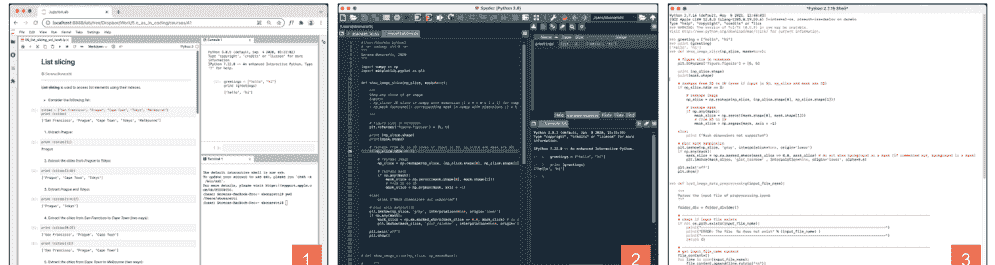

语言**语法**是**定义如何编写命令的一套规则**。你已经非常熟悉至少一种语法，那就是你的母语语法。在你的母语中，你知道单词、标点符号，以及如何将这些元素排列成句子，进而组成段落和完整的文本。在编程中，模式是相似的。我们必须了解数据类型和运算符，以及如何将它们排列在 *if/else* 结构和循环中，以创建函数和类。在表 1 中，你可以看到本书将学习的元素和语法的概要总结。如果大部分内容你不理解，不用担心——随着本书的进展，一切都会变得越来越清晰。

## 引言

| 数据类型（单词） | 运算符（标点） | 结构和循环（句子） | 代码单元（段落） | 软件（文本） |
| :--- | :--- | :--- | :--- | :--- |
| 字符串、列表、整数、浮点数、布尔值、元组、字典、集合 | 赋值、成员、算术、比较、逻辑 | if/else 结构、for 循环、while 循环 | 函数 | 类（面向对象编程） |

表 1. 编程语言的组成部分，从最基本（左）到最复杂（右）。在列标题中，括号内的词语显示了与自然语言语法的相似性。

最后，**计算思维**是**我们编程时的思维方式**。每当我们接触一个新主题时，我们都需要学习*如何思考*该主题并培养特定的技能。你将在本书中培养的一些能力包括：

- *创建算法*，即构思并实现一系列顺序指令来解决问题
- *分而治之*，即将问题分解为子问题，然后组合子问题的解决方案以获得主问题的解决方案
- *模式识别*，即在新问题中识别出先前已解决问题的特征，以便应用类似的解决方案
- *解决方案泛化*，即将解决方案从特定情况推广到更广泛的情境

与任何学科一样，培养一种思维方式需要学习和练习。因此，计算思维的培养伴随着语法学习和编码实践。我们将从第 1 章开始构建这些能力。在下一部分“准备开始”中，你将下载、安装并学习如何使用 Jupyter/Python 环境。

## 准备工作

在本部分，我们将设置 Jupyter/Python 环境并学习如何使用它。让我们开始这段激动人心的旅程吧！

## Jupyter/Python 环境

理解 Jupyter/Python 环境的一个简单方法是将其想象成一个俄罗斯套娃——那些尺寸递减、一个套一个的木制娃娃（图 2）。最大的娃娃是 **JupyterLab**，这是一个基于 Web 的环境，我们可以在其中打开、组织和处理各种类型的文件。在 JupyterLab 中，有 **Jupyter Notebook**，这是一个基于 Web 的应用程序，我们可以在其中编写带有叙述性文字的代码。Jupyter Notebook 支持多种编程语言，其中之一就是 **Python**。最后，Python 通过大量的 **模块** 和 **包** 得到丰富，这些模块和包允许我们为代码添加有用的功能。让我们安装 Jupyter/Python 环境并看看它是如何工作的！

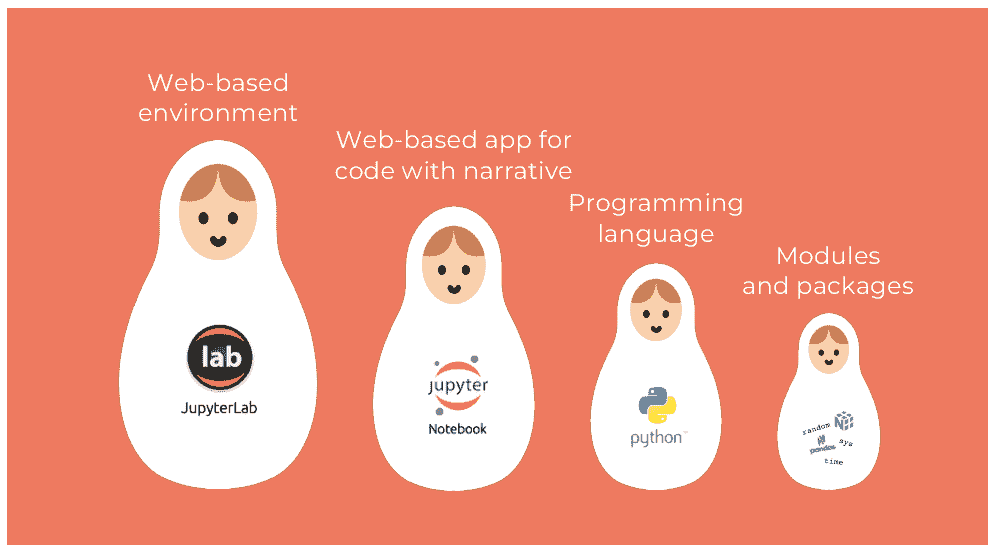

## 安装 Jupyter/Python 环境

你可以通过 Anaconda（一个常用的科学计算发行版）一次性安装 JupyterLab、Jupyter Notebook、Python 及其科学计算包。访问 Anaconda 网站，https://www.anaconda.com/products/individual，然后点击 *download*。这可能需要几分钟时间。下载完成后，像安装任何其他软件一样安装 Anaconda：在需要时点击 *next*，并保留默认选项（除非你有特定要求）。安装过程也可能需要几分钟。Anaconda 安装完成后，通过双击其图标（如图 3 方框 1 所示）打开 Anaconda Navigator。打开后，你将看到 Anaconda 中包含的所有软件，包括 JupyterLab（图 3，方框 2）、Jupyter Notebook（图 3，方框 3）和 Spyder（图 3，方框 4）。在本书中，我们将使用 JupyterLab 作为工作环境来编写 Python 代码。那么，让我们学习如何使用它吧！


图 3. Anaconda 界面：(1) 图标，(2) JupyterLab，(3) Jupyter Notebook，(4) Spyder，以及 (5) JupyterLab 启动按钮。

## JupyterLab

JupyterLab 是一个我们可以以有组织且高效的方式编写代码的环境。通过点击 Anaconda 中 JupyterLab 面板（图 3，方框 5）的 *Launch* 按钮来打开它。你将看到类似图 4 的界面。以下是 JupyterLab 最相关的功能以及一些关于如何最佳使用它的建议。

- *JupyterLab 是一个基于 Web 的环境*。当你启动 JupyterLab 时，首先注意到的是它在浏览器中启动。然而，其地址包含 *localhost*（图 4，方框 1），这意味着你实际上是在 *本地* 工作，即在你的计算机上。换句话说，你 *不需要* 连接到互联网就能使用 JupyterLab。
- *顶部栏*（图 4，方框 2）。顶部栏中的项目，如 *File*、*Edit*、*View* 等，非常直观，与许多其他软件类似。我们将在本书中描述最相关的项目，但你可以开始探索它们！目前，只需注意当点击某些顶部栏按钮（例如 *File*）时，出现的一些项目可能是浅灰色的，因为它们被禁用了（例如 *Save As*..）。这是因为它们指的是 Jupyter Notebook，我们将在下一节中打开它。最后，JupyterLab 一个有趣的功能是你可以设置深色主题。如果你想要这个，前往 *Settings*，然后 *JupyterLab themes*，并点击 *JupyterLab Dark*。
- *浏览和打开文件*。在 JupyterLab 的左侧，你可以找到一个带有垂直选项卡的面板（图 4，方框 3）。第一个选项卡包含一个代表文件夹的图标，目前，我们将只关注这一个。文件夹选项卡在其右侧打开一个面板，其中包含一些功能。第一个是顶部栏（图 4，方框 4），包含一个符号 +，允许我们启动一个启动器（图 4，方框 7）；一个包含 + 的文件夹图标，用于创建新文件夹；一个向上的箭头，用于上传新文件；以及一个圆形箭头，用于刷新当前目录的内容——在编程中，我们通常说 **目录** 而不是 *文件夹*。紧下方是一个用于搜索文件的框。然后，是 **工作目录** 的路径（图 4，方框 5）——即我们当前打开和保存文件的文件夹。再下方是目录内容的列表（图 4，方框 6）。在 JupyterLab 中，你只能从这个面板打开 *现有* 文件，而不能通过双击计算机文件夹中的文件来打开。因此，你需要知道如何在 JupyterLab 中导航文件夹。要返回到上一个文件夹，请点击图 4 方框 5 中的文件夹名称（例如，要返回到此屏幕截图中的上一个文件夹，你会点击 *book*）。要进入子文件夹——当前文件夹中的一个文件夹——只需双击文件夹面板（图 4，方框 6）中列出的子文件夹。最后一点：当点击文件夹图标（图 4，方框 3）时，整个文件浏览器面板会切换出去，意味着它会消失。再次点击时，整个面板会切换回来，因此它会重新出现。如果你的屏幕较小，切换出去可能很方便。


图 4. JupyterLab 界面，包含：(1) 本地 URL，(2) 顶部栏，(3) 侧边选项卡，(4) 文件夹浏览器顶部栏，(5) 文件夹浏览器，(6) 文件夹内容，(7) 启动器，以及 (8) Jupyter Notebook 启动按钮。

- *启动工具*。启动器是你打开 *新* 的笔记本、控制台、终端、文本文件等的地方（图 4，方框 7）。或者，你可以通过点击顶部栏（图 4，方框 2）的 *File*，然后 *New*，再选择你想要的文件类型来打开新文件和工具。是时候打开一个 Jupyter Notebook 了！

## Jupyter Notebook

要打开一个 Jupyter Notebook，请前往启动器并点击 Notebook 图标（图 4，方框 8）。一个新的 Notebook 在启动器区域打开（图 5，方框 2），并在浏览器面板（图 5，方框 1）中显示为 *Untitled.ipynb*。Notebook 的扩展名是 *.ipynb*，代表交互式 Python 笔记本。要给 Notebook 一个合适的名称，请在浏览器面板（图 5，方框 1）中右键点击 *Untitled.ipynb*。然后，点击 *Rename*，并将其更改为任何你想要的名称——例如 *practicing_cells.ipynb*。你可能已经注意到，通过右键点击文件名，你可以执行其他几种操作，如删除、剪切、复制、复制等。

现在让我们关注 Notebook 的内容。Jupyter Notebook 本质上是一个包含一系列 **单元格** 的文件，即像你在图 5 方框 4 中看到的灰色矩形。每个单元格可以包含代码或叙述性文字，我们稍后会看到。单元格左侧的 **蓝色条**（图 5，方框 5）表示当前单元格是 **活动单元格**。当存在多个单元格时，我们可以通过点击单元格左侧的方括号 [ ] 来使一个单元格变为活动状态。当一个单元格处于活动状态时，我们可以通过多种方式执行各种操作，无论是通过键盘命令还是通过 Notebook 顶部栏（图 5，方框 3，在图 6 中放大）、JupyterLab 顶部栏（图 4，方框 2），或者通过在单元格 *内* 右键点击！这听起来可能有些冗余，但它的设计是为了帮助具有不同习惯的编码员——有些人喜欢使用键盘命令，有些人喜欢点击屏幕——方便地执行他们需要的单元格操作。如果选项对你来说太多，那么只需选择一种方式并坚持下去！以下是一些有用的单元格操作以及执行它们的一些可能方式。

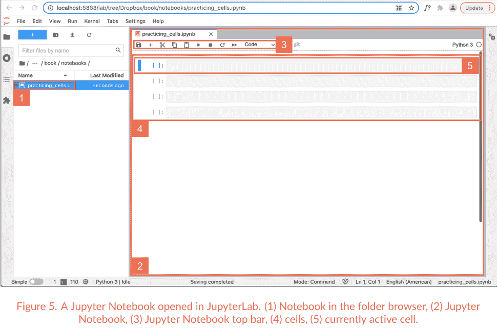

- *创建单元格*：要在活动单元格下方创建一个新单元格，按 *B*（代表 *below*），或点击 Notebook 顶部栏（图 6，项目 2）的加号按钮。新创建的单元格成为活动单元格。我们也可以通过按 *A*（代表 *above*）在活动单元格上方创建一个新单元格（没有对应的顶部栏按钮）。
- *删除单元格*：要删除活动单元格，按两次 *D*，或点击剪刀按钮（图 6，项目 3）。
- *复制单元格*：要复制活动单元格，首先按 *C*，然后按 *V*（不按 *command* 或 *control*！），或点击项目 4 进行复制，然后点击项目 5 进行粘贴（图 6）。
- *撤销或重做单元格操作*：要撤销单元格操作（例如，如果你误删了一个单元格），按 *Z*，或在 JupyterLab 顶部栏（图 4，方框 2）中，前往 *Edit*，然后 *Undo cell operation*。类似地，要重做单元格操作，同时按 *shift* 和 *Z*，或在 JupyterLab 顶部栏中，前往 *Edit* 然后 *Redo cell operation*。
- *移动单元格*：左键点击活动单元格的方括号 [ ]，并按住鼠标按钮，将单元格向上或向下移动。当你到达想要移动单元格的位置时，释放鼠标。或者，你可以前往 JupyterLab 顶部栏（图 4，方框 2）的 *Edit*，然后点击 *Move Cells Up* 或 *Move Cells Downs*。
- *添加行号*。行号在编码时非常有用——你将从第 1 章开始意识到这一点。要添加行号，请前往 JupyterLab 顶部栏（图 4，方框 2）的 *View*，然后点击 *Show Line Numbers*。
- *其他操作*。你可以拆分或合并单元格，启用或禁用输出的滚动等，方法是前往 JupyterLab 顶部栏（图 4，方框 2），然后查看 *Edit* 中的选项，或者通过在单元格 *内* 右键点击并浏览出现的选项。只需探索它们！

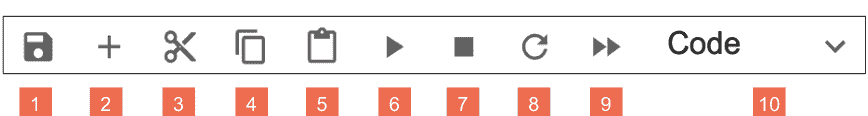

图 6. Jupyter Notebook 顶部栏：(1) 保存 Notebook，(2) 添加单元格，(3) 剪切单元格，(4) 复制单元格，(5) 粘贴单元格，(6) 运行单元格，(7) 中断内核，(8) 重启内核，(9) 重启内核并运行整个 Notebook，以及 (10) 将单元格定义为代码或 markdown。

图 6 中剩余的按钮呢？第一个代表软盘的按钮——是的，曾经我们把数据保存在软盘上！——用于保存 Notebook。按钮 6 到 9 用于执行代码，你将在第 1 章（按钮 6）和第 7 章（按钮 7 到 9）学习如何使用它们。

最后，是时候讨论单元格内容了！正如我们之前提到的，一个单元格可以包含两样东西：代码或叙述性文字。默认情况下，Jupyter Notebook 单元格是 *代码* 单元格。要将一个单元格转换为 *文本* 单元格，请在键盘上按 *M*，或点击 Jupyter Notebook 顶部栏（图 6，项目 10）的下拉菜单，然后选择 *Markdown*。**Markdown** 是 HTML（用于创建网站的编码语言）的简化版本。这就是为什么 Jupyter 环境是基于 Web 的：为了利用 Web 浏览器的丰富功能！在 Notebook 中编写叙述性文字对于将代码嵌入到使工作流程易于理解的解释中至关重要。你可以在

## 下载书籍材料

在本书的其余部分，你将找到38个章节。每个章节都有一个Jupyter Notebook，其文件名包含相应的章节编号。每个Notebook都包含文本中讨论的示例，以便你在阅读时进行练习和理解。请在www.learnpythonwithjupyter.com下载这些Notebook。我强烈建议你将Notebook保存在一个*新文件夹*中——而不是*下载*文件夹——这样你就不会将它们与其他用途下载的文件混淆。如果你想更进一步，我真心建议你将这个文件夹创建在*云服务*中，这样即使你的电脑出故障或出现问题（是的，电脑是机器，它们会坏！），你也不会丢失文件。至于云服务，你可以使用Google Drive (https://www.google.com/drive)、Dropbox (https://www.dropbox.com) 或任何你偏好的其他服务。使用这些工具非常简单。下载安装程序将系统安装到你的电脑上。安装完成后，你会看到一个新文件夹。只需在新创建的云文件夹中创建一个用于存放Notebook的文件夹，你所有的文件就会始终自动同步和保存。

最后，在本书的每一章中，你都会找到编码练习。我建议你创建一个单独的文件夹，名为*练习*或类似名称，并在这个文件夹中为本书每一章的练习创建一个Jupyter Notebook。自己创建Notebook将加强你的组织能力，并让你更加熟悉Jupyter/Python环境。

至此，我们真的准备好了。让我们开始编码吧！

# 第一部分

## 创建基础

是时候开始编码了！在这一部分，你将学习我们在整本书中将使用的基本元素。你将学习字符串——即包含文本的数据类型——以及用于组合字符串的连接操作。你还将学习如何提问以及如何打印信息。最重要的是，你将学习什么是变量。让我们开始吧！

## 1. 文本、问题和艺术

*字符串、input() 和 print()*

编程语言是书面语言，而书面交流的核心是*文本*。在Python中，*文本*是如何表示的？我们如何向一个人提问？我们又如何向一个人提供信息？为了回答这些问题，让我们打开Jupyter Notebook 1并开始吧！

## 1. 编写文本：字符串

在编码中，我们使用*字符串*这个词来指代*文本*。我们可以如下定义字符串：

> **字符串**是引号之间的文本

让我们看下面的两个例子。左边是我们看到的Jupyter Notebook 1中的代码。右边是我们如何读出代码。让我们大声读出代码：

```
[]: 1 "This is a string"  This is a string
[]: 1 'Everything you write between quotes is a string'  Everything you write between quotes is a string
```

现在让我们考虑以下陈述。它们是真还是假？

### 真还是假？

- 1. 字符串包含文本
- 2. 字符串在Jupyter Notebook中是绿色的
- 3. 引号可以是单引号或双引号

#### 计算思维和语法

让我们详细分析上面的代码！在每个单元格中，都有一个*字符串*。正如我们所看到的，字符串只是引号之间的一些文本。*文本*指的是我们可以在键盘上输入的任何**字符**：字母、数字、符号，甚至空格！*引号*可以是**双引号** " "，如上面的例子，或者**单引号** ' '，如下面的例子。开始字符串的引号称为**开引号**，而结束字符串的引号称为**闭引号**。在Python中编写字符串时，我们可以使用双引号或单引号；我们只需要确保不要混淆它们。换句话说，如果我们以开*双*引号开始编写字符串，我们必须以闭*双*引号结束字符串。同样，如果我们以开*单*引号开始编写字符串，我们必须以闭*单*引号结束字符串。*字符串*是Python的一种**数据类型**，这意味着它们是Python语言的核心部分之一（参见第4页的表1）。在Jupyter Notebook中，Python字符串是*红色*的。

## 第一部分。创建基础

让我们运行第一个单元格。**运行单元格**意味着**执行**该单元格中的**代码**。在Notebook中，将鼠标放在单元格内的任何位置。如果你还没有这样做，请单击鼠标左键。光标将变成一个闪烁的垂直条。然后，转到键盘。如果你使用的是MacOS，请同时按*shift*和*return*。如果你使用的是Windows，请同时按*shift*和*enter*（如果任何键上没有明确写出，*enter*是键盘右侧描绘有角度箭头的键）。或者，你可以单击Jupyter Notebook顶部栏中的*开始*按钮（第9页图6，图标6）。

这就是我们运行第一个单元格后的样子：

```
[1]: 1 "This is a string"
    'This is a string'
    This is a string
```

当我们运行一个单元格时，会发生两件事。首先，一个数字出现在单元格左侧的方括号之间。在这种情况下，数字是1，因为这是我们运行的第一个单元格。其次，我们执行了代码。在这种情况下，我们看到了单元格的内容；即，'This is a string'。Jupyter Notebook用单引号显示字符串，即使字符串是用双引号编写的。如上所述，单引号和双引号是等效的。

让我们运行第二个单元格。像之前一样，在单元格内任意位置左键单击。然后，如果使用MacOS，按*shift*和*return*，如果使用Windows，按*shift*和*enter*，或者单击Jupyter Notebook顶部栏中的*开始*按钮。这是我们得到的结果：

```
[2]: 1 'Everything you write between quotes is a string'
    'Everything you write between quotes is a string'
    Everything you write between quotes is a string
```

同样发生了两件事。首先，数字2出现在单元格左侧的方括号之间，表明这是我们运行的第二个单元格。正如越来越清楚的那样，**左侧方括号之间的数字**表示单元格的**执行顺序**。其次，我们可以看到单元格中包含的字符串：'Everything you write between quotes is a string'。

## 2. 提问：input()

在所有编程语言中，都有向人提问的方法，我们通常称这个人为**用户**。这是一个非常重要的特性，因为它允许计算机与人进行交互。这是什么意思？让我们看看代码！大声读出下面两个单元格（右边是发音）：

```
[]: 1 input ("What's your name?")
    input what's your name?
[]: 1 input ("Where are you from?")
    input where are you from?
```

单元格内的代码是做什么的？通过解决以下练习获得第一个提示。

### 匹配句子两半

- 1. What's your name? 是
- 2. input() 是一个内置函数，并且
- 3. 当运行包含input()的单元格时
- 4. 一个内置函数后面总是跟着

- a. 它是绿色的
- b. 圆括号
- c. 一个字符串
- d. 我们可以回答一个问题

#### 计算思维和语法

让我们理解这些代码行是如何工作的！让我们运行第一个单元格。我们将得到一个文本框：

```
[*]: 1 input ("What's your name?")
What's your name? [ ]
```

在矩形框中输入你的名字（我会写我的！）：

```
[*]: 1 input ("What's your name?")
What's your name? Serena
```

现在按键盘上的*return*或*enter*。你将看到以下内容（当然，你会看到你的名字！）：

```
[3]: 1 input ("What's your name?")
What's your name? Serena
'Serena'
```

这里发生了一些关键的事情！首先，单元格左侧的数字如预期变成了3。但在回答问题时，数字3被一个**星号 (*)** 取代。这表明一个单元格已经开始运行但尚未完成。要完成单元格运行并执行代码，我们必须在输入答案后按*return*或*enter*。如果单元格运行未完成，单元格中的代码将不会被执行，此外，我们将无法运行后续的单元格。现在，让我们看看代码。我们知道"What's your name?"是一个字符串，因为它是引号之间的文本并且是红色的。那么**input()**呢？input()允许我们**向用户提问**。在Jupyter Notebook中，input()创建一个*文本框*（一个白色矩形），我们可以在其中插入一些文本。input()执行特定任务，被称为*内置函数*。

> **内置函数**是执行特定任务的命令

我们可以通过两个特征来识别一个代码元素是否是内置函数。首先，在Jupyter Notebook中，内置函数总是*绿色*的。其次，内置函数后面总是跟着**圆括号 ()**。在本书中，我们不称它们为*括号*，而是称为**圆括号**，以区别于我们在后续章节中将遇到的其他类型的括号。在圆括号之间，我们经常写一个**参数**，对于input()来说，这个参数是一个包含我们想要提问的问题的字符串。*内置函数*非常有用，因为它们包含了编程语言的创建者编写的代码，以方便编码时的易用性。

# 第一部分：创建基础

让我们运行下一个单元格：

```
[*]: 1 input ("Where are you from?")
Where are you from? [          ]
```

与之前类似，现在在文本框中输入你的原籍国（我会输入我的！）：

```
[*]: 1 input ("Where are you from?")
Where are you from? Italy
```

现在按下键盘上的 *回车* 或 *Enter* 键。你将看到类似以下的输出（你会看到你的原籍国！）：

```
[4]: 1 input ("Where are you from?")
Where are you from? Italy
'Italy'
```

这里发生的事情与之前的单元格类似。让我们总结一下：单元格左侧的数字变成了 4，因为这是我们运行的第四个单元格。*内置函数* `input()` 在 Jupyter Notebook 中创建了一个文本框，我们可以在其中回答作为参数传递给它的字符串中包含的问题。太简洁了？让我们再试一次：当我们运行单元格时，*内置函数* `input()` 向我们显示问题（我们将其作为字符串放在圆括号内），并创建一个文本框，我们可以在其中输入答案。输入答案后，我们按下 *回车* 或 *Enter* 键来完成代码执行。

此时我们可以问自己：在日常生活中，我们哪里能看到 `input()` 的实际应用？每次我们被要求在设备上输入内容时，其背后都有一个类似于 `input()` 的函数！例如，当我们输入姓名以开设新账户、输入从 ATM 机取款的金额或填写在线表格时，情况就是如此。

最后，需要提及的是，当我们编写代码时，*我们身兼两职*——也就是说，我们有两个角色：我们同时是程序员和用户！编写代码时，我们戴上 *程序员帽*：我们创建代码以执行任务，设计代码结构，并定义用户消息。测试代码时，我们戴上 *用户帽*：我们检查代码是否按预期工作、是否易于使用以及用户交互是否愉快。编码时，我们不断切换帽子！

## 3. ASCII 艺术：print()

我们现在知道如何向用户提问，但如何向他们提供信息呢？我们使用 *内置函数* `print()`！了解 `print()` 有多种方法，下面这种方法确实很有趣。它涉及一种称为 ASCII 艺术的数字艺术类型，通过键盘上的符号可以创建图像。让我们看看下面的单元格：

```
[]: 1 print ("/\_/\ ")
2 print (">^,^< ")
3 print (" / \ ")
4 print ("(__)___")
```

我们将向屏幕打印什么？答案很简单，但在运行单元格之前，让我们通过完成以下练习快速分析一下代码。

### 判断对错？

1. print() 是一个字符串
2. print() 可以有一个字符串作为参数
3. 在编码中，我们逐行打印

### 计算思维与语法

让我们最终运行单元格。我们得到的结果如下：

```
[5]:
1 print ("/\_/\  ")
2 print (">^.^<  ")
3 print (" / \  ")
4 print ("(__)___")
/\_/\n>^.^<
 / \n(__)___
```

我们使用键盘符号创建的小猫被显示在屏幕上。为此，我们使用了一个新的内置函数：print()。**print() 在屏幕上显示**我们提供的参数——在这种情况下是一个 *字符串*。你可能会问：但是当我们运行单元格 1 和 2 时，我们可以看到 *字符串* 的内容；为什么我们需要 print()？我们能够看到单元格 1 和 2 中的字符串是 Jupyter Notebook 的一个特性。运行单元格后，Jupyter Notebook 会显示最后一行的内容，但不会显示之前行的内容。如果我们将单元格 5 代码中的 print() 函数删除，它将只显示最后一个 *字符串*：

```
[5]:
1 "/\_/\  ">
2 ">^.^<  ">
3 " / \  ">
4 "(__)___"
'(__)___'
```

通过观察单元格 5 中的代码，还有几点需要指出。在 Jupyter Notebook 单元格中，我们可以编写多行代码。这些行将**按顺序**执行。换句话说，当我们运行单元格时，Python 首先执行第 1 行，然后执行第 2 行，依此类推，直到到达单元格的最后一行。此外，在字符串中，**空格很重要**。空格是 *字符*，因此空格是 *字符串* 的一个元素，它占据自己的位置。然而，代码元素之间的空格并不重要。例如，下面两行是等效的：

```
[5]:
1 print ("(__)___")
2 print( "(__)___" )
'(__)___'
'(__)___'
```

# 第一部分：创建基础

在编写带有重复内容的代码时，保持代码行之间的某种**平行性**是一种良好的实践。比较我们上面编写的单元格 5 中的代码，

```
[]: 1 print ("/\_/\  ")
    2 print (">^.^<  ")
    3 print ("  / \  ")
    4 print ("(___)__ ")
```

与下面未对齐引号和圆括号的相同代码：

```
[]: 1 print ("/\_/")
    2 print (">^.^<")
    3 print (" / ")
    4 print ("(___)__ ")
```

我们可以看到，在第二种情况下，代码看起来有些混乱。相反，当我们对齐引号、括号和其他符号时——正如你将在后续章节中看到的——我们创建的代码更**可读**且**更不易出错**。我们还将讨论许多技巧，以尽量减少我们可能在代码中引入的错误。

在回顾之前还有一个问题：在日常生活中，我们哪里能看到函数 `print()` 的实际应用？每次我们在设备上看到消息时！例如：“注册完成”、“感谢您的购买”或“注销成功”。在底层代码中，有一个类似于 `print()` 的函数！

### 回顾

- **字符串** *类型* 是引号之间的文本
- **input()** 是一个 *内置函数*，用于要求用户输入一个值
- **print()** 是一个 *内置函数*，用于在屏幕上显示一个值

> **我们的手指有记忆**

学习编码时，**输入每一条命令**非常重要，要抵制复制/粘贴的诱惑。输入有助于我们以至少两种方式**记忆**命令。首先，输入命令时，我们在脑海中拼写它，因此我们在心中重复它，从而记住它。其次，我们的手指可以记住输入模式。例如，输入 `print()` 时，我们的手指会自动记住在 `print` 之后立即输入圆括号。类似于钢琴家在演奏时不看键盘而看乐谱，我们编码时希望不看键盘而看屏幕。这种输入方式称为**盲打**（或触摸打字）。它帮助我们更快，并**最小化我们犯错的数量**，因为我们不必不断将视线在键盘和屏幕之间移动。我们如何学习 *盲打*？这很容易；只需要一些练习。其理念是每个手指按压键盘上的一些特定键，如下一页的图所示。我们将左手食指放在字母 F 上，右手食指放在字母 J 上——这两个键上的小凸起定义了起始点。其余手指将放在同一行的键上。对于左手，中指放在字母 D 上，无名指放在 S 上，小指放在 A 上。类似地，对于右手，中指放在字母 K 上，无名指放在 L 上，小指放在分号上。那么中间的字母 G 和 H 怎么办？需要时，左手食指将从 F 移动到 G，右手食指从 J 移动到 H。然后手指将为其他字母上下移动，保持相同的相对位置。

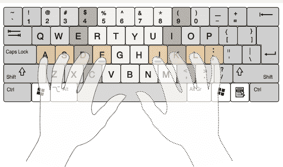

图片修改自 https://commons.wikimedia.org/w/index.php?curid=9666341。By Cy21 - Own work, CC BY-SA 3.0.

有很多网站可以以有趣的方式学习盲打，例如 www.typing.com 和 www.typingclub.com。它们是免费的，创建账户不是强制性的。它们提供从输入单个字母、音节、单词到整个句子的渐进式练习。试一试？

准备好进行一些编码练习了吗？创建一个新的 Notebook 并解决下面的练习。如果你不记得如何创建新的 Notebook 或新的单元格，请查看第 8 页和第 9 页。

### 让我们编码吧！

1.  *编写字符串。* 使用 *双* 引号编写一个字符串。然后，运行单元格并观察发生了什么。然后使用 *单* 引号编写一个字符串。运行单元格并观察发生了什么。
2.  *提问。* 使用 *内置函数* input() 编写两个问题，然后回答它们。
3.  *ASCII 艺术。* 复制以下至少一件 ASCII 艺术作品：

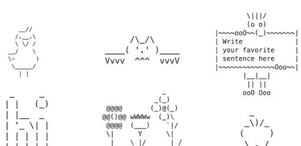

## 2. 事件与收藏

变量、赋值与字符串拼接

让我们通过学习*变量*和*字符串拼接*来继续构建我们的基础知识。它们是什么？让我们一起使用2号Notebook来探索吧！大声朗读下面的示例，并尝试理解代码的功能：

### 1. 组织一场活动

- 你正在组织一场活动，并为参与者创建了以下报名表：

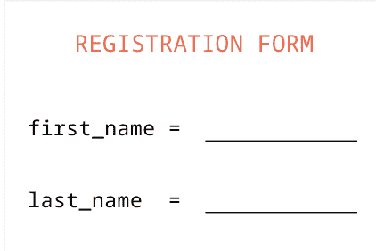

活动参与者的报名表。

- 第一位参与者到来，你填写了表格：

```
1  first_name = "Fernando"
2  last_name = "Pérez"
```

- 然后你打印出你在报名表中输入的内容：

```
1  print (first_name)
2  print (last_name)
```

这些单元格中的代码有什么作用？让我们通过完成下面的练习来获取一些提示。

### 判断正误？

1. 命令 `first_name = "Fernando"` 将字符串 "Fernando" 赋值给变量 `first_name`
2. 命令 `print(first_name)` 将打印出 Fernando
3. 命令 `print(last_name)` 将打印出 `last_name`

### 计算思维与语法

猜猜会发生什么？让我们运行第一个单元格：

```
[1]:
1 first_name = "Fernando"
2 last_name = "Pérez"
```

在第1行，我们创建了一个名为 `first_name` 的**变量**。我们将字符串 "Fernando" **赋值**给变量 `first_name`，这就是它的**值**。类似地，在第2行，我们创建了一个名为 `last_name` 的变量，并将字符串 "Pérez" 作为值赋给它。通常，我们可以将任何值赋给一个变量。例如，我们可以通过编写以下代码来登记我们的第二位客人，Guido van Rossum：

```
[ ]:
1 first_name = "Guido"
2 last_name = "van Rossum"
```

如你所见，*变量*名保持不变（`first_name` 和 `last_name`），而赋给的*值*可以不同（"Fernando" 或 "Guido"，"Pérez" 或 "van Rossum"）。我们可以这样定义变量：

> **变量**是分配给一个值的标签

在Python中，变量名是*小写*的。当由多个单词组成时，这些单词用*下划线*连接，就像 `first_name` 一样。在Jupyter Notebook中，变量显示为**黑色**。符号 `=` 称为**赋值运算符**。这与我们数学中学到的*等于*毫无关系！在编程中，*等于*有不同的符号，我们将在第9章看到。在编程中，我们使用符号 `=` **将一个值赋给一个变量**，我们将其读作*被赋值*。这是一个需要记住的非常重要的概念，也是最反直觉的概念之一！在Jupyter Notebook中，符号显示为*紫色*。

现在让我们运行第二个单元格：

```
[2]:
1 print (first_name)
2 print (last_name)
Fernando
Pérez
```

正如你所料，在第1行，我们向屏幕打印出赋给变量 `first_name` 的*值*，即 Fernando。在第2行，我们打印出赋给变量 `last_name` 的值，即 Pérez。Fernando Pérez 是谁？Jupyter Notebook 的创建者！而 Guido van Rossum 呢？Python 的创建者！

### 2. 收藏

是时候将我们目前所学的知识整合起来了！让我们阅读以下代码：

```
[ ]:
1 name = input ("What's your name?")
```

```
[ ]:
1 favorite_food = input ("What's your favorite food?")
```

# 第一部分：创建基础

```
1 print ("Hi! My name is " + name)
2 print ("My favorite food is " + favorite_food)
2 print (name + "'s favorite food is " + favorite_food)
```

print Hi! My name is 与 name 拼接
print My favorite food is 与 favorite_food 拼接
print name 与 's favorite food is 与 favorite_food 拼接

这段代码中发生了什么？让我们通过完成下面的练习来获取一些提示！

### 判断正误？

1. 问题 *What's your name?* 的答案被赋值给变量 *name*  T F
2. 问题 *What's your favorite food?* 在问题 *What's your name?* 之前被提问  T F
3. 如果第一个问题的答案是 *Terry*，第二个问题的答案是 *mango*，那么第三个打印语句将显示 *Terry's favorite food is pizza*  T F
4. 符号 + 可以将一个字符串和一个包含字符串的变量组合起来  T F

### 计算思维与语法

让我们运行第一个单元格：

```
1 name = input ("What's your name?")
What's your name? Serena
```

name 被赋值为 input what's your name?

我们在文本框中输入的名字将被赋值给变量 name。

让我们运行第二个单元格：

```
1 favorite_food = input ("What's your favorite food?")
What's your favorite food? pasta
```

favorite_food 被赋值为 input what's your favorite food?

与上面的例子类似，我们在文本框中输入的内容将被赋值给变量 favorite_food。

现在让我们运行这个Notebook的最后一个单元格。我们期望打印出什么？

```
1 print ("Hi! My name is " + name)
2 print ("My favorite food is " + favorite_food)
2 print (name + "'s favorite food is " + favorite_food)
Hi! My name is Serena
My favorite food is pasta
Serena's favorite food is pasta
```

print Hi! My name is 与 name 拼接
print My favorite food is 与 favorite_food 拼接
print name 与 's favorite food is 与 favorite_food 拼接

在第1行，我们打印出字符串 "Hi! My name is " 与赋给变量 name 的值的组合。在处理*字符串*时，符号 + 称为**拼接符号**，而不是*加号*！拼接的意思就是*链接在一起*。+ 允许我们**合并字符串**，我们可以将其读作*与...拼接*。

我们现在学习了构建编码技能和知识的非常基础的内容。现在让我们花几分钟时间完成下面的练习，这将帮助我们清晰地总结到目前为止所学的语法！

### 填空

通过插入每个单词及其在Jupyter Notebook中的颜色来填空。参见第一句中的示例：

1. input() 是一个内置函数，显示为绿色。
2. 同样，print() 是一个 ________________，显示为 ________________。
3. name 是一个 ________________，显示为 ________________。
4. "My favorite food is" 是一个 ________________，显示为 ________________。
5. = 是 ________________，显示为 ________________。
6. + 是 ________________，也显示为 ________________。

### 回顾

- 在编码中，我们将**值赋给变量**
- 符号 = 是**赋值运算符**（而不是*等于符号*！），可以读作*被赋值*
- 符号 + 在处理字符串时是**拼接符号**（而不是*加号*！），可以读作*与...拼接*

#### 处理 NameError 和 SyntaxError

当我们编写代码时，不可避免地会犯错，并得到错误消息。在编码时收到错误消息是*正常的*。学会阅读错误消息很重要，这样我们才能快速修复错误并继续编码。有不同类型的错误，我们将在本书中学习如何修复它们。这是一个错误示例：

```
---------------------------------------------------------------------------
NameError                                 Traceback (most recent call last)
<ipython-input-6-a0c307bd3f14> in <module>
----> 1 print ("Hi! My name is " + ame )
      2 print ("My favorite food is " +  favorite_food )
      3 print ( name + "'s favorite food is " + favorite_food )

NameError: name 'ame' is not defined
```

遇到错误时，我们必须执行两个步骤：

1. **阅读消息的最后一行**，它告诉我们犯了什么类型的错误
2. **寻找绿色箭头**，它指向错误所在的行。

在这种情况下，我们遇到了一个**名称错误**。消息的最后一行说：`NameError: name 'ame' is not defined`。这是一个非常常见的错误消息。它意味着你的代码中没有变量 'ame'。这个错误消息通常在两种情况下出现：当我们拼错了变量名，或者当我们没有运行包含变量初始化（或创建）的前一个Jupyter Notebook单元格时。在这个例子中，我们拼错了变量 'name'。这个变量出现在第1行和第3行。我们应该看哪一行？指向第1行的箭头告诉我们错误在第1行，我们可以看到我们输入了 'ame' 而不是 'name'。所以我们可以纠正拼写错误，重新运行单元格，然后快速继续编码！另一个非常常见的错误消息如下：

```
File "<ipython-input-1-daed5bd3b17e>", line 1
    print ("Hi! My name is " name)
          ^
SyntaxError: invalid syntax
```

在这种情况下，我们犯了一个**语法错误**。消息的最后一行说：`SyntaxError: invalid syntax`，这意味着我们忘记了一些符号或标点。错误在哪里？对于语法错误，我们查看消息中的两行：在第一行的末尾，我们看到错误在第1行；在代码行之后，我们看到一个*脱字符* ^，它指向命令中缺少内容的部分。

准备好练习了吗？开始吧！

### 让我们编码吧！

1. *在健身房。* 你是一名健身房经理，需要登记一个新会员。你会创建哪些变量？写出三个变量，为每个变量赋一个值（确保它们是字符串！），然后打印出来。
2. *在书店。* 你是一家书店的老板，想创建一个图书目录。你从第一本书开始：Liza Mundy 的 *Code Girls*。你创建两个变量，*书名* 和 *作者*，为它们赋上实际的标题和作者，然后打印出来。然后，选择一本你喜欢的书，再次创建这两个变量，赋上相应的值，并打印出来。
3. *你来自哪里？* 询问一个人他们来自哪个国家以及住在哪里。然后像本章代码中的第5个单元格一样打印出三个句子。
4. *你最喜欢的歌曲是什么？* 询问一个人他们最喜欢的歌曲和最喜欢的歌手。然后像本章代码中的第5个单元格一样打印出三个句子。

## 第二部分

## 列表与 if/else 结构简介

在本部分中，你将学习列表，它本质上是各种类型元素的集合——例如字符串。你还将学习如何操作它们，即如何添加、删除或替换一个或多个元素。最后，你将学习 if/else 结构，它允许根据条件执行代码。准备好了吗？我们开始吧！

## 3. 在书店里

列表与 if... in... / else...

列表长什么样？我们如何使用 if/else 条件？为了回答这些问题，让我们打开 Jupyter Notebook 3 并开始吧！大声朗读以下示例并尝试理解它：

- 你是一家书店的老板。编程书架上有：

```python
books = ["Learn Python", "Python for all", "Intro to Python"]
print(books)
```

- 一位新顾客进来，你问她想要什么书：

```python
wanted_book = input("Hi! What book would you like to buy?")
print(wanted_book)
```

- 你检查是否有这本书，并相应地回复：

```python
if wanted_book in books:
    print("Yes, we sell it!")
else:
    print("Sorry, we do not sell that book")
```

上面的代码做了什么？通过完成以下练习来获取一些提示。

### 对还是错？

1. 编程书架上有 2 本书
2. 如果顾客想要的书在编程书架上，你就打印：Yes, we sell it!
3. if/else 块允许我们根据条件执行命令

### 计算思维与语法

让我们逐行分析代码，从第一个单元格开始：

```python
books = ["Learn Python", "Python for all", "Intro to Python"]
print(books)
['Learn Python', 'Python for all', 'Intro to Python']
```

第 1 行有一个名为 books 的变量，我们为其赋值一个字符串类型的元素序列："Learn Python"、"Python for all" 和 "Intro to Python"。元素之间用逗号分隔，并且位于方括号内。具有这种语法的变量称为列表。在我们的代码中，books 是一个列表类型的变量，其元素是字符串类型。换句话说，我们可以说 books 是一个字符串列表。列表定义如下：

> 列表是一个由逗号 , 分隔的元素序列，位于方括号 [] 之间

顾名思义，列表就是字面上的元素列表，类似于购物清单或待办事项列表。它可以包含各种类型的元素，例如字符串、数字等。目前，我们只考虑字符串列表。

让我们运行第二个单元格：

```python
[2]:
1 wanted_book = input("Hi! What book would you like to buy?")
2 print(wanted_book)
Hi! What book would you like to buy? Learn Python
Learn Python
```

wanted_book 被赋值为输入 "Hi! What book would you like to buy?" 打印 wanted_book

你现在熟悉这个单元格中的代码了。简要总结一下，第 1 行我们创建了一个名为 wanted_book 的变量，它包含用户对问题的回答：Hi! What book would you like to buy? 然后，在第 2 行，我们打印了变量 wanted_book 中包含的值。

让我们运行第三个单元格：

```python
[3]:
1 if wanted_book in books:
2     print("Yes, we sell it!")
3 else:
4     print("Sorry, we do not sell that book")
Yes, we sell it!
```

if wanted_book in books 打印 "Yes, we sell it!" else 打印 "Sorry, we do not sell that book"

在这里，我们终于遇到了 if/else 结构。让我们从第 1 行和第 2 行开始学习它的工作原理。这些行表示如果 wanted_book（即 "Learn Python"）在 books（即 ["Learn Python", "Python for all", "Intro to Python"]）中（第 1 行），则打印 "Yes, we sell it!"（第 2 行）。在第 1 行，我们检查分配给变量 wanted_book 的值是否是列表 books 的元素之一。如果是这种情况，那么我们转到第 2 行并向用户打印肯定的回答。

如果 wanted_book 不在列表中呢？让我们重新运行单元格 2 并输入一个不在列表中的书：

```python
[4]:
1 wanted_book = input("Hi! What book would you like to buy?")
2 print(wanted_book)
Hi! What book would you like to buy? Basic Python
Basic Python
```

wanted_book 被赋值为输入 "Hi! What book would you like to buy?" 打印 wanted_book

在这种情况下，当你运行下面的单元格时，你期望什么？让我们运行它：

```python
[5]:
1 if wanted_book in books:
2     print("Yes, we sell it!")
3 else:
4     print("Sorry, we do not sell that book")
Sorry, we do not sell that book
```

if wanted_book in books 打印 "Yes, we sell it!" else 打印 "Sorry, we do not sell that book"

我们再次从第 1 行开始，这里我们读取如果 wanted_book（现在是 "Basic Python"）在 books（即 ["Learn Python", "Python for all", "Intro to Python"]）中。但这一次，"Basic Python" 不在列表 books 中。所以我们跳过第 2 行，直接转到第 3 行——那里有 else——然后继续到第 4 行，我们打印字符串 "Sorry, we do not sell that book"。

正如你从上面的例子中推断出的那样，在 if/else 结构中，代码的执行取决于**条件的真实性**。如果 if 行中的条件被满足，即为真，我们执行其下的代码。否则，如果 if 行中的条件未被满足，即为假，那么我们执行 else 下的代码。因此，我们可以将 if/else 结构定义如下：

> 一个 **if/else 结构**检查一个条件是真还是假，
并相应地执行代码：
如果条件被满足，则执行 **if** 条件下的代码；
如果条件*未*被满足，则执行 **else** 下的代码。

现在让我们关注语法。if/else 结构由四部分组成，解释如下：

- **if 条件**（第 1 行）包含一个决定代码执行的条件。它由三个组成部分构成：(1) **关键字 if**，在 Jupyter Notebook 中显示为*粗体绿色*，(2) 条件本身，以及 (3) 标点符号冒号 :
- **语句**（第 2 行）包含如果第 1 行的条件被满足时执行的代码
- **else**（第 3 行）隐式包含第 1 行条件的替代方案。这一行总是由**关键字 else** 后跟冒号 : 组成
- **语句**（第 4 行）包含如果第 1 行的条件未被满足时执行的代码

注意：else 及其后续语句不是必需的。有些情况下，如果条件不满足，我们不想做任何事情。本章后续部分将提供一些此场景的示例。

在结束之前，让我们更深入地研究这些行，并关注另外两个方面：成员条件和缩进。在编码中，我们可以使用各种类型的条件，你将在本书中看到它们。在这种情况下，我们有一个**成员条件**：wanted_book in books（第 1 行），我们检查一个变量是否包含列表中的一个元素。在成员条件中，我们写：(1) 变量名，(2) **in**，以及 (3) 我们要在其中查找元素的列表。**in** 是一个**成员运算符**。在 Jupyter Notebook 中，它显示为粗体绿色，就像关键字一样。通常，确保不要将粗体绿色的关键字与较浅绿色的内置函数混淆。

最后，请注意 if 条件（第 2 行）和 else（第 4 行）下的语句总是缩进的，即向右移动。一个**缩进**由 4 个空格或 1 个制表符组成。在 Jupyter Notebook 中，在编写 if 或 else 行后按回车键或返回键时，光标总是自动放置在正确的缩进位置。在 if 或 else 条件下，我们可以编写任意多的命令，但它们必须正确缩进才能被执行。

### 完成表格

到目前为止，你已经学到了相当多的语法。使用第一行中的示例来完成下表，总结你目前所知的语法。

| 代码元素 | 它是什么 | 它做什么 |
|---|---|---|
| books | 一个列表类型的变量 | 它包含一个字符串序列 |
| wanted_book | | |
| "Learn Python" | | |
| if | | |
| in | | |
| else | | |
| = | | |
| + | | |
| input() | | |
| print() | | |

### 回顾

- **列表**是 Python 的一种*类型*，包含一个由逗号 , 分隔的元素序列（例如字符串），位于方括号 [] 之间
- **if/else 结构**允许我们根据条件执行代码
- **成员运算符 in** 验证一个元素是否在列表中
- 在 Python 中，我们对 if 或 else 下的语句使用**缩进**

> 让我们给变量起有意义的名字！

编写代码的基本标准之一是**可读性**。编写易于我们自己（未来的自己）和他人阅读的代码很重要。使代码可读的方法之一是创建**有意义的变量名**。例如，让我们考虑本章中分析的代码。在单元格 2 的第 1 行，我们创建了变量 wanted_book：

```python
[2]: 1 wanted_book = input("Hi! What book would you like to buy?")
```

我们可以将变量命名为 answer 而不是 wanted_book：

```python
[2]: 1 answer = input("Hi! What book would you like to buy?")
```

### 让我们开始编程吧！

针对以下每个场景，创建与本章中类似的代码。

- 1. *在艺术画廊*。你是一家艺术画廊的老板。列出一些你出售的画作。一位新顾客进来，你询问她想买哪幅画。你检查是否有这幅画并做出相应回复。
- 2. *在旅行社*。你是一家旅行社的老板。列出一些你出售门票的旅游目的地。一位新顾客进来，你询问他想去哪里。你检查是否提供该旅游目的地并做出相应回复。
- 3. *在化学实验室*。你是一名实验室经理。架子上有一些装有化学品的罐子。列出包含化学品名称的清单。一位实验室成员来找你，你询问她想要什么化学品。你在系统中检查是否有该化学品并做出相应回复。
- 4. *在茶室*。你是一家茶室的老板。列出你提供的茶品。一位新顾客进来，你询问他想喝什么茶。你在菜单上检查是否供应这种茶并做出相应回复。

## 4. 杂货购物

列表方法：.append() 和 .remove()

什么是方法？.append() 和 .remove() 有什么作用？要回答这些问题，请打开 Jupyter Notebook 4 并跟随操作。让我们从以下示例开始：

- 你正要去一家杂货店，需要购买一些食物：

```python
shopping_list = ["carrots", "chocolate", "olives"]
print(shopping_list)
```

- 就在离家前，你问自己是否还需要买别的东西。如果该物品不在列表中，你就添加它：

```python
new_item = input("What else do I have to buy?")
if new_item in shopping_list:
    print(new_item + " is/are already in the shopping list")
    print(shopping_list)
else:
    shopping_list.append(new_item)
    print(shopping_list)
```

- 最后，你问自己是否需要移除一个物品。如果是，你就从列表中移除该物品：

```python
item_to_remove = input("What do I have to remove?")
if item_to_remove in shopping_list:
    shopping_list.remove(item_to_remove)
    print(shopping_list)
else:
    print(item_to_remove + " is/are not in the shopping list")
    print(shopping_list)
```

为了更好地理解这段代码中发生的事情，请在下面的练习中匹配句子的两半。

### 匹配句子的两半

- 1. 变量 shopping_list 包含
- 2. 如果新物品不在购物清单中
- 3. 如果要移除的物品在购物清单中
- 4. 方法 .append() 允许我们
- 5. 方法 .remove() 允许我们

- a. 我们将其从购物清单中移除
- b. 从列表中移除一个元素
- c. "carrots"、"chocolate" 和 "olives"
- d. 我们将其添加到购物清单中
- e. 在列表末尾添加一个元素

### 计算思维与语法

让我们通过运行第一个单元格来深入研究代码：

```python
[1]:
1  shopping_list = ["carrots", "chocolate", "olives"]
2  print(shopping_list)
['carrots', 'chocolate', 'olives']
```

购物清单被赋值为 carrots, chocolate, olives 打印购物清单

我们从一个名为 shopping_list 的列表开始，它包含三个字符串："carrots"、"chocolate" 和 "olives"（第 1 行）。然后，我们将购物清单打印到屏幕上（第 2 行）。

.append() 是做什么的？让我们运行第二个单元格：

```python
[2]:
1  new_item = input("What else do I have to buy?")
2  if new_item in shopping_list:
3      print(new_item + " is/are already in the shopping list")
4      print(shopping_list)
5  else:
6      shopping_list.append(new_item)
7      print(shopping_list)
What else do I have to buy? carrots
carrots is/are already in the shopping list
['carrots', 'chocolate', 'olives']
```

新物品被赋值为 input What else do I have to buy? 如果新物品在购物清单中 打印新物品连接上 is/are already in the shopping list 打印购物清单 否则 购物清单点 append 新物品 打印购物清单

在这个单元格中，我们要求用户输入一个要购买的新物品，答案保存在变量 new_item 中（第 1 行）。然后，我们根据 new_item 中包含的值采取行动。如果 new_item 已经在 shopping_list 中（第 2 行），我们打印一条消息说该物品已在购物清单中（第 3 行）。为了使消息更精确，我们将 new_item 中的字符串与字符串 "is/are already in the shopping list" 连接起来。然后，我们打印购物清单以检查该物品是否确实在列表中（第 4 行）。

## 第 2 部分。列表和 if/else 构造简介

如果该物品*不*在购物清单中呢？让我们重新运行单元格并输入一个不在列表中的物品：

```python
[3]:
1  new_item = input("What else do I have to buy?")
2  if new_item in shopping_list:
3      print(new_item + " is/are already in the shopping list")
4      print(shopping_list)
5  else:
6      shopping_list.append(new_item)
7      print(shopping_list)
What else do I have to buy? apples
['carrots', 'chocolate', 'olives', 'apples']
```

新物品被赋值为 input What else do I have to buy?
如果新物品在购物清单中
打印新物品连接上 is/are already in the shopping list
打印购物清单
否则
购物清单点 append 新物品
打印购物清单

这次，我们在 `input()` 创建的文本框中输入了 *apples*（第 1 行）。因为 *apples* 不在购物清单中（第 2 行），我们跳过第 3 行和第 4 行的命令，直接跳转到 else（第 5 行）执行下面的命令。我们将新物品添加到列表中（第 6 行），并打印列表以检查是否正确添加了元素（第 7 行）。

我们如何向列表中添加新元素？让我们仔细看看第 6 行。这里，方法 `.append()` 将元素 `new_item` 添加到 `shopping_list`。请注意，`.append()` 总是**在列表末尾添加一个元素**。正如我们所说，`.append()` 是一个方法。但什么是方法？一个初步定义（我们将在本书末尾讨论面向对象编程时重新定义它）如下：

> **方法**是针对特定变量*类型*的内置函数

你可以通过它们后面跟着圆括号来识别方法是函数。然而，方法有其自己的语法，由四个元素组成：(1) 变量名，(2) 点，(3) 方法名，和 (4) 圆括号。在圆括号中，可以有一个**参数**，例如本例中的 `new_item`。不同的数据类型有不同的方法。例如，`.append()` 可以用于列表，但不能用于字符串。列表总共有十一种方法，我们将在本书中学习所有这些方法。在 Jupyter Notebook 中，方法显示为*蓝色*。

最后，.remove() 是做什么的？让我们运行最后一个单元格：

```python
[4]:
1 item_to_remove = input("What do I have to remove?")
2 if item_to_remove in shopping_list:
3     shopping_list.remove(item_to_remove)
4     print(shopping_list)
5 else:
6     print(item_to_remove + " is/are not in the shopping list")
7     print(shopping_list)
What do I have to remove? olives
['carrots', 'chocolate', 'apples']
```

要移除的物品被赋值为 input what do I have to remove?
如果要移除的物品在购物清单中
购物清单点 remove 要移除的物品
打印购物清单
否则
打印要移除的物品连接上 is/are not in the shopping list
打印购物清单

这次，我们询问用户他们想移除什么物品（第 1 行）。如果要移除的物品在购物清单中（第 2 行），那么我们移除该物品（第 3 行）并打印结果列表（第 4 行）。我们如何移除一个物品？我们使用 .remove()，这是从列表中移除物品的列表方法。语法与 .append() 和任何其他方法相同：列表名后跟点、方法名和圆括号，圆括号中可以包含一个参数。作为参数，.remove() 接受要从列表中移除的元素。

如果我们用不在列表中的元素回答问题“我需要移除什么？”会怎样？让我们看看：

```python
[5]:
1 item_to_remove = input("What do I have to remove?")
2 if item_to_remove in shopping_list:
3     shopping_list.remove(item_to_remove)
4     print(shopping_list)
5 else:
6     print(item_to_remove + " is/are not in the shopping list")
7     print(shopping_list)
What do I have to remove? grapes
grapes is/are not in the list
['carrots', 'chocolate', 'apples']
```

要移除的物品被赋值为 input what do I have to remove?
如果要移除的物品在购物清单中
购物清单点 remove 要移除的物品
打印购物清单
否则
打印要移除的物品连接上 is/are not in the shopping list
打印购物清单

在 input() 创建的文本框中，我们输入了 grapes（第 1 行），它不在 shopping_list 中（第 2 行）。因此，我们跳过第 3 行和第 4 行，跳转到第 5 行的 else。在那里，我们打印一条消息说 item_to_remove 不在购物清单中（第 6 行），并打印购物清单进行最终检查（第 7 行）。

# 第二部分：列表与 if/else 结构简介

### 完成表格

在 Python 中，我们使用大量标点符号。请参考第 1 行的示例，通过完成下表来总结你目前所见过的标点符号。

| 标点符号 | 名称 | 功能 |
|---|---|---|
| ' ' 或 " " | 单引号或双引号 | 用于包含字符串 |
| ( ) | 圆括号 | |
| [ ] | 方括号 | |
| : | 冒号 | |
| , | 逗号 | |
| . | 句点 | |

### 回顾

- 方法 .append() 在列表的*末尾***添加一个元素**。
- 方法 .remove() 从列表中**移除一个元素**。

> 为什么我们要打印这么多内容？

在编程时，**控制变量的值**非常重要。尤其是在学习编程时，每次创建或修改变量，确保代码按预期执行都很关键。打印是一种简单的方法，可以检查变量的修改是否符合我们的意图。例如，考虑单元格 4 中的代码，我们重点关注 if 条件及其语句（第 2-4 行）。让我们在不使用打印命令的情况下重写它：

我们如何知道代码确实正确执行了？也就是说，我们如何知道 'olives' 是否真的从 shopping_list 中被移除了？我们可以假设它发生了，但在亲眼看到之前无法确定。因此，我们需要打印。让我们通过将 print() 添加回第 4 行来重写代码：

```
[4]:
1  item_to_remove = input("What do I have to remove?")
2  if item_to_remove in shopping_list:
3      shopping_list.remove(item_to_remove)
4      print(shopping_list)
What do I have to remove? olives
['carrots', 'chocolate', 'apples']
```

因为我们打印了，所以可以确认 'olives' 不在 shopping_list 中。因此，我们的代码完成了预期的任务。编程时要经常打印；你随时可以稍后删除 print() 函数。

### 让我们编码吧！

1. 针对以下每个场景，创建类似于本章中展示的代码。
    a. *组织活动。* 你正在组织一个活动。写下你需要购买的物品清单。然后询问你的共同组织者还需要购买什么。如果该物品不在列表中，则添加它。最后，询问你的共同组织者是否有需要从列表中移除的物品。如果有，则从列表中移除该物品。
    b. *最喜欢的城市。* 写一个包含城市名称的列表。询问朋友他们最喜欢的城市。如果该城市不在列表中，则添加它。然后，询问朋友是否不喜欢你列出的某个城市。如果是，则从列表中移除该城市。
2. *鞋店。* 你是一家鞋店的老板，需要为下一个夏季订购新货。你去储藏室，创建了一个剩余鞋子的列表：运动鞋、靴子、芭蕾平底鞋。你知道夏天顾客会想要凉鞋，所以你将它们添加到列表中。然而，他们不会购买靴子，所以你将它们从列表中移除。在你收到新货后，一位新顾客进来。你询问他想试穿什么鞋，他回答说想试穿凉鞋。你查看列表并相应地回复。然后你询问他是否想看看其他东西，他回答说想试穿靴子。你再次查看列表并相应地回复。
3. *货币兑换处。* 你在货币兑换处工作。可用的货币有欧元、加拿大元和日元，而瑞士法郎不可用，因此你需要订购它。创建一个可用货币列表和一个待订购货币列表。一位新顾客进来；你询问她想要什么货币。在她回答后，你检查可用货币列表。如果她想要的货币可用，你告诉她你有该货币，从可用货币列表中移除该货币，并将该货币添加到待订购货币列表中。如果她想要的货币不可用，你告诉她你没有该货币，并将该货币添加到待订购货币列表中。

## 5. 自定义汉堡菜单

列表方法：.index()、.pop() 和 .insert()

让我们再学习三个列表方法：.index()、.pop() 和 .insert()。打开 Jupyter Notebook 5，并大声阅读以下示例。

- 你正在美食广场，准备点餐。今天的菜单包括一个汉堡、一份配菜和一杯饮料：

```
todays_menu = ["burger", "salad", "coke"]
print(todays_menu)
```

- 你对汉堡和可乐很满意，但想把配菜从沙拉换成薯条。为此，你需要：

1. 查看配菜在菜单中的位置：

```
side_dish_index = todays_menu.index("salad")
print(side_dish_index)
```

2. 从配菜位置移除沙拉：

```
todays_menu.pop(side_dish_index)
print(todays_menu)
```

3. 在配菜位置添加薯条：

```
todays_menu.insert(side_dish_index, "fries")
print(todays_menu)
```

这段代码中发生了什么？通过完成以下练习来获取一些提示。

### 判断对错？

1. 方法 .index() 给出元素在列表中的位置。
2. 沙拉的位置是 2。
3. 我们移除位置 side_dish_index 处的元素，并在同一位置插入一个新元素。
4. .index()、.pop() 和 .insert() 是三个字符串方法。

### 计算思维与语法

让我们分析代码的细节！运行第一个单元格：

```
[1]:
1 todays_menu = ["burger", "salad", "coke"]
2 print(todays_menu)
['burger', 'salad', 'coke']
```

我们创建了一个名为 todays_menu 的列表，包含三个字符串类型的元素——"burger"、"salad" 和 "coke"（第 1 行），并将其打印出来（第 2 行）。

在第二个单元格中，我们遇到了新的列表方法 .index()。它的作用是什么？运行该单元格：

```
[2]:
1 side_dish_index = todays_menu.index("salad")
2 print(side_dish_index)
1
```

方法 .index() 在列表 todays_menu 中查找元素 "salad" 并告诉我们它的位置。更技术性地说，.index() 接受参数 "salad" 并返回其索引。然后，"salad" 的位置被赋值给变量 side_dish_index（第 1 行），我们将其打印出来（第 2 行）。注意，在编程中，我们交替使用 index 和 position 这两个同义词。

为什么 "salad" 在位置 1 而不是 2？这是因为在 Python 中，我们从 0 开始计数元素，如下图所示："burger" 在位置 0，"salad" 在位置 1，"coke" 在位置 2。

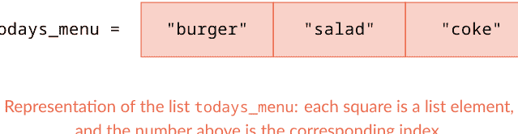

最后，请注意元素位置是一个数字。在 Python 中，零、正整数和负整数被称为整数，缩写为 int。在我们的示例中，变量 side_dish_index 包含数字 1，其类型为整数。

让我们通过运行下一个单元格来了解 .pop() 的作用：

```
[3]:
1 todays_menu.pop(side_dish_index)
2 print(todays_menu)
['burger', 'coke']
```

方法 .pop() 从列表 todays_menu 中移除位置 side_dish_index 处的元素。换句话说，.pop() 接受 side_dish_index 作为参数，并移除该索引处的元素，即 "salad"。在上一章中，我们看到了另一个从列表中删除元素的方法：.remove()。这两个方法有什么区别？方法 .remove() 删除具有特定值的元素，而 .pop() 删除特定位置的元素。

最后，让我们学习方法 .insert()。运行最后一个单元格：

```
[4]:
1 todays_menu.insert(side_dish_index, "fries")
2 print(todays_menu)
['burger', 'fries', 'coke']
```

方法 .insert() 允许我们在特定索引处添加元素。它接受两个参数：(1) 我们想要插入新元素的索引，以及 (2) 新元素的值。在本例中，我们想在位置 side_dish_index（即位置 1）插入字符串 "fries"。类似地，在上一章中，我们看到了另一个向列表添加元素的方法：.append()。有什么区别？方法 .append() 在列表末尾添加元素，而 .insert() 在列表的特定位置添加元素。

最后，在处理列表时，我们必须始终意识到每个元素都有一个位置。在某些情况下，直接操作元素并使用 .append() 和 .remove() 等方法更方便。在其他情况下，操作元素的位置更合适，因此我们使用 .index()、.pop() 和 .insert() 等方法。请注意，.append()、.remove()、.pop() 和 .insert() 会修改列表。另一方面，.index() 提供有关列表的信息，我们可以将此信息保存在单独的变量中。最后，.append()、.remove()、.index() 和 .pop() 只接受一个参数，而 .insert() 接受两个参数，即位置和新元素。

### 完成表格

到目前为止，你已经学习了五个列表方法。通过完成下表来总结它们的功能。

| 列表方法 | 功能 |
|---|---|
| .append() | |
| .remove() | |
| .index() | |
| .pop() | |
| .insert() | |

### 回顾

- 方法 .index() 返回元素在列表中的位置。
- 方法 .pop() 从列表中移除特定位置的元素。
- 方法 .insert() 在列表的特定位置添加一个元素。
- 元素的索引（或位置）从 0 开始，以 1 为单位递增；它们是整数类型。

我们用英语编程！

有一次在咖啡休息时间，一位同事对我说：“说英语的人编程时，实际上用的是自己的母语，这难道不疯狂吗？我的意思是，当他们说 *if* 时，他们实际上就是在说 *if*！”我以前从未想过这个问题。对我来说，作为意大利语母语者，*if* 只是由两个符号组成的一个关键词。读 *if book in books* 和 *ab book in books* 完全一样。我已经学会了将关键词和变量名视为没有内在含义的抽象符号；它们只是具有特定功能的实体。那次谈话之后，我在心里将关键词和变量名翻译成我的母语，一切都变得更有意义，也更合理了！我理解了变量名的重要性（它们在英语中确实有含义！），因此，我开始编写像 *if book in books* 这样的命令，而不是 *if variable_1 in list_1*。现在，当我编程时，我主要用英语思考。但那个翻译过程帮助我获得了更多的意识，并使我的代码更具可读性。在第4章和第5章中，我们学习了五种列表方法。它们的名字在英语中确实有含义。*Remove*、*insert* 和 *index* 都相当直观。要记住 *append* 是在列表末尾添加新元素，可以想到书的附录，它总是在末尾，或者想到肠道的阑尾，它位于腹部的某个末端。要记住 *pop*，可以想到做爆米花，就像小爆炸一样，这里是从某个位置移除元素。无论英语是否是你的母语，请记住我们用英语编程！

### 让我们开始编程吧！

1.  对于以下每个场景，创建类似于本章中展示的代码：
    a.  *买一辆新自行车*。你去自行车店买你的新自行车。在那里你找到一辆你喜欢的自行车：它是蓝色的，电动的，并且有变速器。用这些特征写一个列表。你对自行车是电动的并且有变速器感到满意，但你想改变它的颜色。为此，你（1）查看*蓝色*在自行车选项列表中的位置，（2）移除*蓝色*，（3）添加你想要的颜色。
    b.  *在线订购一件T恤*。你正在网上订购一件新T恤。你找到一件你喜欢的T恤，它是红色的，圆领，上面印有*在此处添加你的文字*。用这些特征写一个列表。现在你想在T恤上添加你自己的文字。为此，你（1）查看*在此处添加你的文字*的位置，（2）移除*在此处添加你的文字*，（3）添加你想要印在T恤上的文字。完成练习后，你能想到另一种改变T恤印花的方法吗？
2.  *史蒂夫·乔布斯*。给定以下列表：
    steve_jobs = ["somebody", "learn", "use", "a computer", "it teaches us"]
    通过执行以下操作，找出史蒂夫·乔布斯的一句名言：
    a.  在列表末尾添加新字符串 "think"。
    b.  在位置1添加 "should"。
    c.  在位置3添加 "how to"。然后也在位置7添加它。
    d.  将 "use" 替换为 "program"。
    e.  在 "a computer" 之后添加 "because"。
    f.  将 "somebody" 替换为 "everybody"。
    g.  在末尾添加 " - Steve Jobs"。
3.  *格蕾丝·霍珀*。你知道为什么我们在编程中说 *debugging*（调试）吗？让我们来找出原因！给定以下列表：
    ```
    grace_hopper = ["In 1946", "a moth", "caused", "a malfunction", "in an early", "electromechanical", "computer"]
    ```
    通过执行以下操作来修改它：
    a.  将 "In 1946" 替换为 "From then on"。
    b.  在 "computer" 之后添加 "we said"。
    c.  移除位置5（第6个元素）的字符串，并在同一位置添加 "with a"。
    d.  移除位置3（第4个元素）的字符串。
    e.  将 "a moth" 替换为 "when anything"。
    f.  移除 "in an early"。
    g.  在列表末尾添加 "it had bugs in it"。
    h.  将 "caused" 替换为 "went wrong"。
    i.  在列表末尾添加 " - Grace Hopper"。

## 6. 环游世界

### 列表切片

在前两章中，你学习了五种操作列表的方法：.append()、.remove()、.index()、.pop() 和 .insert()。这些列表方法非常方便且易于记忆；然而，它们可能使代码变得相当繁琐。在Python中，有一种替代的、更紧凑的方式来更改、添加和删除列表元素，你将在下一章中看到。这种替代方法基于切片；因此，在本章中，我们将专注于这个主题。准备好了解关于切片的一切了吗？打开Jupyter Notebook 6并跟着做！首先，什么是切片？

> **切片**意味着通过索引访问列表元素

如果你爱吃甜食，“切片”这个词会立刻让你想到一块蛋糕。事实上，切蛋糕和切列表之间有相当大的相似之处！在第一种情况下，你为客人——也为你自己——“提取”一块或多块蛋糕；在第二种情况下，你为后续的代码行提取一个或多个列表元素。

- 让我们认识一下我们将要切片的列表：
    ```
    [1]: 1 cities = ["San Diego", "Prague", "Cape Town", "Tokyo",
    "Melbourne"]
    2 print (cities)
    ['San Diego', 'Prague', 'Cape Town', 'Tokyo', 'Melbourne']
    ```
    在这个单元格中，有一个名为 cities 的列表，包含五个字符串："San Diego"、"Prague"、"Cape Town"、"Tokyo" 和 "Melbourne"（第1行），我们将其打印出来（第2行）。

我们将如何切片 cities？切片的**语法**非常简单。它由**列表名称后跟方括号**组成，像这样：cities[]。在方括号之间，我们写上要切片的**元素位置**。因此，意识到列表中每个元素的位置至关重要。在列表 cities 中，元素具有以下位置：

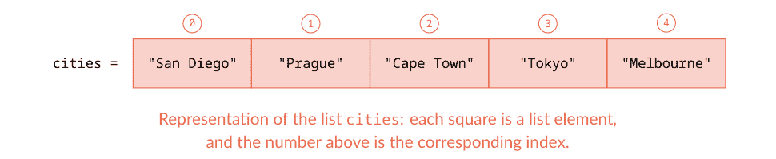

现在，我们如何在方括号之间书写元素位置？根据我们想要切片多少个元素、它们在哪里以及我们想要以哪个方向提取它们，有各种不同的规则。我们将在接下来的页面中学习所有这些规则。

开始前最后一点说明：为了更好地学习切片，我建议使用这种方法。每次你阅读一个切片任务（例如：切片 "Prague"），用一张纸盖住下面的代码。尝试猜测代码，并将你的猜测与解决方案进行比较。然后仔细阅读解释。在继续下一个示例之前，确保你完全理解当前示例。废话少说，开始切片吧！

1.  切片 "Prague"：
    ```
    [2]:
    1 print (cities[1])
    'Prague'
    print cities in position one
    ```
    在这个单元格中，我们切片（或访问）位于位置1的 "Prague"，并打印它。如你所见，当我们从列表中切片**单个元素**时，我们在方括号之间写下元素本身的位置。因此，我们可以将此语法总结为 **list_name[element_position]**，我们可以读作 *list name in position element position*。

    注意：为简单起见，在本示例及后续示例中，我们只打印切片元素。但是，可以将切片元素赋值给一个变量，如下所示：
    ```
    [2]:
    1 sliced_city = cities[1]
    2 print (sliced_city)
    'Prague'
    sliced_city is assigned cities in position one
    print sliced_city
    ```
    我们将在后续章节中将切片列表元素赋值给变量。现在，让我们专注于理解切片的工作原理！

2.  切片从 "Prague" 到 "Tokyo" 的城市：
    ```
    [3]:
    1 print (cities[1:4])
    ['Prague', 'Cape Town', 'Tokyo']
    print cities in positions from one to four
    ```
    在这个单元格中，我们切片并打印三个连续的元素——"Prague"、"Cape Town" 和 "Tokyo"——它们分别位于位置1、2和3。在方括号之间，我们写两个数字，用冒号 : 分隔。第一个数字是我们想要切片的*第一个*元素的位置，我们称之为 **start**（起始）。在本例中，start 是1，对应于 "Prague"。第二个数字是我们想要切片的*最后一个*元素的位置，我们必须给它加1。我们称之为 **stop**（停止）。stop 总是遵循**加一规则**，它简单地说**我们必须给想要切片的最后一个元素的位置加1**（你可以在本章末尾的 *in more depth* 部分了解此规则背后的原理）。在这个例子中，最后一个元素（"Tokyo"）的位置是3，由于加一规则，我们必须给它加1，所以 stop 是4。我们可以将切片连续元素的语法总结为 **list_name[start:stop]**，我们可以读作 *list name in positions from start to stop*。

3.  切片 "Prague" 和 "Tokyo"：
    ```
    [4]:
    1 print (cities[1:4:2])
    ['Prague', 'Tokyo']
    print cities in positions from one to four with a step of two
    ```

在这种情况下，我们想要切片并打印两个不连续的元素——"Prague"和"Tokyo"——它们分别位于位置1和3。在上面的代码中，你可能已经认出1是起始位置，4是停止位置（因为加一规则），而2呢？那就是**步长**！正如你所看到的，"Tokyo"位于"Prague"之后2步的位置：从"Prague"到"Cape Town"是1步，从"Cape Town"到"Tokyo"又是1步，总共2步。因此，切片**不连续元素**的语法是我们上面示例中规则的扩展：**list_name[start:stop:step]**，你可以读作*列表名从起始到停止，步长为步长*。我们可以称之为**三s规则**，其中三个s分别是起始、停止和步长的首字母。

三s规则最方便的地方在于，我们可以在多种情况下简化它。例如，你可能想知道：为什么在示例2中，我们从"Prague"切片到"Tokyo"时没有写步长？因为**当元素连续时，步长为1**——"Cape Town"在"Prague"之后1步，"Tokyo"在"Cape Town"之后1步——而当步长为1时，我们可以直接省略它。显然，我们本可以像下面这样指定步长来编写代码：

```
[3]: 1 print (cities[1:4:1])
['Prague', 'Cape Town', 'Tokyo']
```

然而，在这里添加步长是多余的，所以我们直接省略了它。

4.  从"San Diego"切片到"Cape Town"：

```
[5]: 1 print (cities[0:3])
['San Diego', 'Prague', 'Cape Town']
```

这里我们需要切片连续元素。因此，我们指定起始位置，即"San Diego"的0，以及停止位置，即"Cape Town"的3，但我们可以省略步长，因为它为1。有趣的是，在这种情况下，我们可以进一步简化三s规则！因为**起始**与**列表的第一个元素**重合，我们可以直接省略它：

```
[6]: 1 print (cities[:3])
['San Diego', 'Prague', 'Cape Town']
```

5.  从"Cape Town"切片到"Melbourne"：

```
[7]: 1 print (cities[2:5])
['Cape Town', 'Tokyo', 'Melbourne']
```

同样，我们需要切片连续元素。因此，我们指定起始位置，即"Cape Town"的2，以及停止位置，即"Melbourne"的5（因为加一规则），但我们省略步长，因为它为1。再一次，我们可以简化三s规则！如何简化？**停止**与**列表的最后一个元素**重合，所以我们可以直接省略它：

```
[8]: 1 print (cities[2:])
['Cape Town', 'Tokyo', 'Melbourne']
```

到目前为止，我们已经看到了三s规则的完整应用（示例3），以及省略起始（示例4）、停止（示例5）和步长（示例2）的情况。我们还能如何简化它？让我们看看下面的例子。你认为代码会是什么样子？

## 第2部分：列表和if/else结构简介

6.  切片"San Diego"、"Cape Town"和"Melbourne"：

```
[9]: 1 print (cities[0:5:2])
['San Diego', 'Cape Town', 'Melbourne']
```

打印从位置零到五，步长为二的城市

这次，要切片的元素不是连续的。我们从0开始，即"San Diego"的位置，我们在5停止（因为加一规则），即"Melbourne"的位置，并指定步长为2，因为我们每隔一个元素切片一次。然而，正如你可能猜到的，因为起始与列表的开头重合，停止与列表的最后一个元素重合，我们可以同时省略两者，并将上面的代码重写如下：

```
[10]: 1 print (cities[::2])
['San Diego', 'Cape Town', 'Melbourne']
```

打印从列表开头到结尾，步长为二的城市

你现在掌握了三s规则，并学会了如何简化它。我们还能如何运用它？让我们看看列表cities的另一种表示：

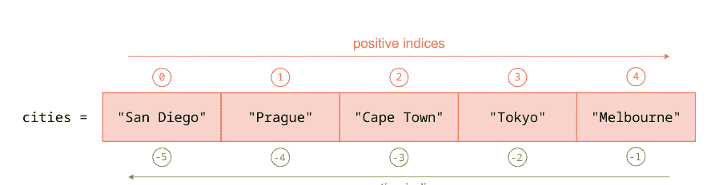

在列表中，索引可以是正数（从左到右）或负数（从右到左）。

在Python中，列表的每个元素都可以通过正索引或负索引来标识。当我们**从左到右**考虑元素时，我们使用**正索引**，当我们**从右到左**考虑元素时，我们使用**负索引**。*正*索引从0开始，每次增加1个单位（0, 1, 2等）。*负*索引从-1开始，每次减少1个单位（-1, -2, -3等）。注意，负索引不从0开始，以避免歧义：位置0的元素始终是从左侧开始的列表的第一个元素。负索引在什么时候方便？例如，当我们处理一个非常长的列表时。在这种情况下，从0开始数遍所有元素会很繁琐。所以我们可以从最后一个元素开始倒着数！

我们如何在切片中使用负索引？让我们来看看！

7.  切片"Melbourne"：

```
[11]: 1 print (cities[4])
Melbourne
```

打印位置4的城市

在这个例子中，我们像示例1中学到的那样提取了"Melbourne"：在方括号之间写下它的*正*索引，即4。然而，"Melbourne"是列表的最后一个元素；因此，使用它的*负*索引来切片它要方便得多，像这样：

```
[12]: 1 print (cities[-1])
Melbourne
```

打印位置负一的城市

使用负索引的优势在于，我们不需要数遍所有列表元素来知道"Melbourne"的位置。由于"Melbourne"是列表的最后一个元素，我们只需写-1。这节省了我们的时间，并消除了因数错而可能产生的错误。

8.  使用负索引切片从"Prague"到"Tokyo"的所有城市：

```
[13]: 1 print (cities[-4:-1])
['Prague', 'Cape Town', 'Tokyo']
```

打印从位置负四到负一的城市

这是示例2的替代方案。在那里，我们使用正索引提取了从"Prague"到"Tokyo"的城市，而在这里我们想使用负索引。它可能看起来令人生畏，但推理过程总是一样的。我们想要提取的第一个元素是Prague，它在位置-4，因此起始是-4。我们想要提取的最后一个元素是Tokyo，它在位置-2，因此停止是-1，因为加一规则。与之前的例子一样，当从长列表的末尾提取元素时，使用负索引可以非常方便。

在这个例子中，我们看到了如何为起始和停止使用负索引。那么步长呢？**负步长**允许我们**按相反顺序切片元素**，即从右到左。负步长可以与正或负的起始和停止一起使用。这可能听起来令人困惑，但我们将在接下来的三个例子中澄清它。按相反顺序切片是一个非常强大的功能，也是掌握切片你需要知道的最后一点。让我们来看看！

9.  使用正索引（相反顺序）切片从"Tokyo"到"Prague"的所有城市：

```
[14]: 1 print (cities[3:0:-1])
['Tokyo', 'Cape Town', 'Prague']
```

打印从位置三到零，步长为负一的城市

在切片时——通常在编码时——意识到我们期望的结果极其重要。当按相反顺序切片时，心中有结果确实可以避免混淆。所以，让我们从那里开始。我们想要打印出"Tokyo"、"Cape Town"和"Prague"。第一个元素是"Tokyo"，它在位置3，所以起始是3。最后一个元素是"Prague"，它在位置1。当我们按相反顺序切片时，我们不是使用加一规则，而是必须使用**减一规则**，它说**我们必须从想要切片的最后一个元素的位置减去1**。为什么？这非常直观。正如我们所知，对于停止，我们总是想要取*下一个*位置。当按正向顺序切片时，下一个位置在最后一个元素的*右侧*。因此，我们给它的索引加1。另一方面，当按相反顺序切片时，下一个位置在最后一个元素的*左侧*。因此，我们从它的索引中减去1。现在，回到我们的例子。最后一个元素是"Prague"，它在位置1。并且因为减一规则，停止是0。最后，我们需要定义步长。因为元素是连续的，步长应该是1，但因为我们是反向进行，我们必须在前面加一个负号，所以步长变成了-1。

总之，当按相反顺序切片时，我们必须：(1) 确保我们清楚地知道第一个和最后一个元素，(2) 对停止应用减一规则，以及 (3) 使用负步长。

现在，让我们把难度再提高一点！看看下一个例子。

# 第二部分：列表与 if/else 结构简介

10. 使用*负*索引（*反向*顺序）从"Tokyo"到"Prague"切片所有城市：

```
[15]: 1 print (cities[-2:-5:-1])
['Tokyo', 'Cape Town', 'Prague']
```

打印从*负二*到*负五*位置的城市，步长为*负一*

当使用负索引作为起始和停止位置时，规则与使用正索引时完全相同。我们想要切片的第一个元素是"Tokyo"，它在位置 -2，所以起始是 -2。最后一个元素是"Prague"，它在位置 -4。由于负一规则，我们必须从 -4 中减去 1，因此停止是 -5。最后，由于我们是反向切片连续元素，步长是 -1。正如你现在可以想象的，使用负索引在反向切片长列表末尾的元素时非常方便。

11. 切片所有城市（*反向*顺序）：

```
[16]: 1 print (cities[::-1])
['Melbourne','Tokyo', 'Cape Town',
'Prague', 'San Diego']
```

从列表开头到列表结尾打印，步长为*负一*

要切片的第一个元素是"Melbourne"，它是列表的最后一个元素。因此，我们可以省略起始。要切片的最后一个元素是"San Diego"，它是列表的第一个元素。因此，我们也可以省略停止。我们只需要写出步长，即 -1，因为我们是反向切片连续元素。很容易记住！

最后一点。学习切片一开始可能会让人感到不知所措，因为涉及所有规则、正负索引的使用，以及正向和反向思考列表。然而，正确学习切片不仅因为编码中经常使用，还因为它能锻炼你的大脑并加强你的逻辑思维，所以是基础性的。花时间学习规则并完成下面的练习。你将在后续章节中受益匪浅！

### 完成表格

完成下表，用自己的话概述切片：

| 切片语法 | 功能 |
|---|---|
| list_name[index] | |
| list_name[start:stop:step] | |
| list_name[:stop:step] | |
| list_name[start::step] | |
| list_name[start:stop] | |
| list_name[negative_index] | |
| list_name[::-negative_step] | |
| list_name[::-1] | |

### 回顾

- 要切片*一个*元素，我们使用规则：`list_name[element_position]`
- 要切片*多个*元素，我们使用**三s规则**：`list_name[start:stop:step]`，其中：
    - 我们可以省略：从列表第一个元素开始切片时的*起始*；切片到列表最后一个元素时的*停止*；以及切片列表连续元素时的*步长*
    - *停止*在从左到右（*正向*顺序）切片时遵循**加一**规则，在从右到左（*反向*顺序）切片时遵循**减一**规则
- *element_position*、*start*、*stop* 和 *step* 的值可以是：
    - *正数*：当从左到右（*正向*顺序）考虑元素时
    - *负数*：当从右到左（*反向*顺序）考虑元素时
- *负步长*用于反转列表

> ## 为什么是加一规则？
到目前为止，我们已经了解到每个列表元素都与一个索引或位置相关联。然而，在 Python 中，每个元素实际上被认为位于两个位置之间，如图所示：

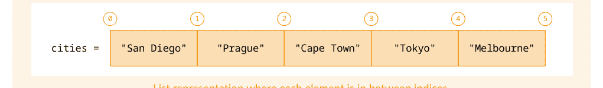

让我们重新考虑示例 2，其中我们提取了从"Prague"到"Tokyo"的城市：

```
python
print (cities[1:4])
# 打印从位置一到四的城市
# ['Prague', 'Cape Town', 'Tokyo']
```

使用上述表示，我们可以看到起始是 1，因为它是"Prague"（要切片的第一个元素）之前的索引。停止是 4，因为它是"Tokyo"（要切片的最后一个元素）之后的索引。

对许多人来说，考虑索引之间的元素非常直接。对其他人来说，考虑元素只有一个索引——就像我们到目前为止所做的那样——更容易。我的建议是选择一种表示方式并坚持下去。在本书中，我们将继续用单个索引表示列表元素。

# 第二部分：列表与 if/else 结构简介

### 让我们编码吧！

1. *水果和蔬菜。* 给定以下列表：

`fruits_and_veggies = ["peppers", "apricots", "carrots", "apples", "zucchini", "grapes", "cabbage", "oranges", "asparagus", "pears"]`

使用切片提取：

a. 苹果和葡萄之间的农产品（包括葡萄）
b. 所有蔬菜
c. 所有水果
d. 胡萝卜和芦笋之间的蔬菜（包括芦笋）
e. 苹果和橙子之间的水果（包括橙子）

2. *衣服、文具和电子产品。* 给定以下列表：

`objects = ["mobile", "t_shirt", "pencil", "laptop", "hat", "ruler", "tv", "pants", "pen"]`

使用切片提取：

a. 所有衣服
b. 所有文具
c. 所有电子产品
d. 第二个和最后一个文具物品
e. 第一个和最后一个电子产品
f. 第一个和第二个衣物物品

3. *室内设计。* 给定以下列表：`interior_design = ["sofa", "curtain", "lamp", "table", "carpet", "plant", "armchair", "blanket", "vase"]`

使用切片以*正向*顺序（从左到右）提取以下元素，一次使用*正*索引，一次使用*负*索引：

a. 所有家具
b. 所有纺织品
c. 所有装饰元素
d. 由5个字母组成的物品（手动计数，无需编码）

4. *植物园。* 给定以下列表：

`botanic_garden = ["tulip", "pine", "poppy", "palm", "rose", "oak", "daisy", "eucalyptus"]`

使用切片提取以下元素，一次以*正向*顺序（从左到右），一次以*反向*顺序（从右到左）：

a. 所有花
b. 所有树
c. 所有以 *p* 开头的花和树（手动查找，无需编码）
d. "pine"、"rose" 和 "eucalyptus"
e. 所有花和树

5. *旅行社。* 你是一家旅行社的老板，以下是你提供的目的地：

```
destinations = ["Boston", "Madrid", "Shanghai", "Cairo", "Mexico City", "Copenhagen",
"Seoul", "Casablanca", "Lima", "Vienna", "Bangkok", "Nairobi", "Buenos Aires",
"Athens", "Manila", "Cape Town"]
```

你还有一份包含未来想提供的额外目的地的列表：

```
future_destinations = ["Tunis"]
```

a. 一位新顾客进来，你问他想去哪里。他回答：柏林。你检查柏林是否在目的地列表中。如果柏林在列表中，你说你出售柏林的机票。如果柏林不在目的地列表中，你：(1) 告诉顾客你不出售柏林的机票；(2) 告诉他目的地列表中有哪些欧洲城市；(3) 将柏林添加到未来目的地列表中。
b. 由于柏林的机票不可用，你的顾客现在考虑去亚洲。所以你告诉他亚洲的目的地。他告诉你他忘记了你提到的最后两个亚洲地方；所以你再次告诉他。然后，他说他本想去香港。但香港不是一个可用的目的地，所以你将它添加到未来目的地列表中。
c. 现在你问你的顾客是否对去美洲大陆感兴趣，他回答：多伦多。你检查多伦多是否在列表中。类似于你为柏林所做的，如果多伦多在列表中，你说你出售多伦多的机票。如果多伦多不在目的地列表中，你：(1) 告诉你的顾客你不出售多伦多的机票，(2) 告诉他美洲大陆有哪些城市在目的地列表中，(3) 将多伦多添加到未来目的地列表中。
d. 顾客仍然犹豫不决。你认为他可能对去非洲旅行感兴趣，所以你告诉他非洲的所有目的地。他最终告诉你他想去开普敦！所以你用未来目的地列表中的突尼斯替换目的地列表中的开普敦，并从未来目的地列表中移除突尼斯。
e. 顾客终于走了，你想制作一份包含你提供的所有目的地的传单。为此，你将三个新的未来目的地添加到当前目的地列表中（以什么顺序？），并打印出你为每个大陆提供的目的地。在此过程中，你注意到非洲只有四个目的地。所以在打印非洲目的地之前，你向目的地列表添加一个非洲目的地。最后，你关店回家，在辛苦工作一天后享受你的夜晚！

## 7. 感官、行星与一列火车

使用切片修改、添加和删除列表元素

既然你已经了解了切片的所有知识，让我们看看如何用它来操作列表——即如何修改、添加或删除列表元素。请从 www.learnpythonwithjupyter.com 下载并打开第7个 Jupyter Notebook，然后跟着一起操作。与上一章类似，用一张纸盖住这些页面中的代码。首先，尝试猜测要执行的命令，然后与下面的代码进行比较。别忘了大声读出代码！

## 1. 感官

让我们首先学习如何使用**切片**和**赋值**来**修改列表元素**。

- 从以下列表开始：

```python
senses = ["eyes", "nose", "ears", "tongue",
          "skin"]
print(senses)
# Output: ['eyes', 'nose', 'ears', 'tongue', 'skin']
```

列表 `senses` 包含五个字符串："eyes"、"nose"、"ears"、"tongue" 和 "skin"（第1行），我们将其打印出来（第2行）。

- 将 "nose" 替换为 "smell"：

```python
senses[1] = "smell"
print(senses)
# Output: ['eyes', 'smell', 'ears', 'tongue', 'skin']
```

要修改**一个列表元素**，我们将新值赋给切片后对应元素位置的列表。在这个例子中，我们想替换的元素——"nose"——位于位置1。因此，我们切片位置1的列表，并将新字符串 "smell" 赋值给它（第1行）。然后，我们打印列表以检查修改是否正确（第2行）。

此时，你可能会问：既然我已经知道如何用方法来操作列表，为什么还要学习使用切片来操作列表呢？至少有三个原因！第一个原因：**减少出错的可能性**。第1行的代码是我们第5章学过的代码的替代方案，当时我们用了三个方法来替换一个元素，即：

```python
nose_index = senses.index("nose")
senses.pop(nose_index)
senses.insert(nose_index, "smell")
```

通过使用切片，我们将命令数量从3个减少到1个，并且不需要创建额外的变量——`nose_index`。通过编写更少的代码，我们最大限度地减少了出错的可能性！第二个原因：**切片使代码编写更快**。想象一下你需要替换4个元素。使用切片，你只需要写4行代码；而使用列表方法，则需要12行！最后，第三个原因：从列表方法过渡到列表切片，使我们能够从更具体的思维方式转向更**抽象的思维方式**。如你所知，使用列表方法时，我们使用的是一种更接近*自然*语言的*编码*语言。方法名称实际上是英语词汇中的单词，例如 *remove*、*insert* 等。而使用切片时，我们使用数字——代表元素位置——因此我们用（数字）符号代替了单词。如你所见，我们正在逐步构建编码所需的抽象思维。所以，让我们继续吧！

- 将 "tongue" 和 "skin" 替换为 "taste" 和 "touch"：

```python
senses[3:5] = ["taste", "touch"]
print(senses)
# Output: ['eyes', 'smell', 'ears', 'taste', 'touch']
```

要修改列表中的**多个元素**，首先切片我们想要替换的元素，然后将包含新值的列表赋值给它们。在这个例子中，我们想替换两个元素，所以我们使用三步规则进行切片。起始位置是 "tongue" 的位置，即3，停止位置是 "skin" 的位置，即4，但由于加一规则，它变成了5。步长是1，所以我们可以省略它。我们将包含新元素的列表——字符串 "taste" 和 "touch"——赋值给切片后的列表（第1行）。最后，我们打印列表以确保修改正确发生（第2行）。

- 将 "eyes" 和 "ears" 替换为 "sight" 和 "hearing"：

```python
senses[0:3:2] = ["sight", "hearing"]
print(senses)
# Output: ['sight', 'smell', 'hearing', 'taste', 'touch']
```

与上一个例子类似，我们想替换多个元素。所以，我们首先切片列表。起始位置是 "eyes" 的位置，即0（可以省略）。停止位置是 "ears" 的位置，即2，但由于加一规则，它变成了3。这两个元素不相邻，因此我们必须写出步长，即2。最后，我们将包含我们想要添加的两个字符串的列表赋值给切片后的列表："sight" 和 "hearing"。请注意，我们想要替换的两个元素不相邻，但 Python 会负责将 "sight" 和 "hearing" 放在正确的位置（第1行）。最后，我们打印最终列表以检查所做的修改（第2行）。

## 2. 行星

要向列表中**添加新元素**，我们可以使用**切片结合列表拼接和赋值**。怎么做？让我们看看下面的例子！

- 从以下列表开始：

```python
planets = ["Mercury", "Mars", "Earth", "Neptune"]
print(planets)
# Output: ['Mercury', 'Mars', 'Earth', 'Neptune']
```

我们从列表 `planets` 开始，它包含四个字符串："Mercury"、"Mars"、"Earth" 和 "Neptune"（第1行），我们将其打印出来（第2行）。

- 在列表末尾添加 "Jupiter"：

```python
planets = planets + ["Jupiter"]
print(planets)
# Output: ['Mercury', 'Mars', 'Earth', 'Neptune', 'Jupiter']
```

要在列表末尾添加一个元素，我们（1）将其放入一个列表中，（2）将其与原始列表拼接，（3）将结果赋值给原始列表。这比听起来简单！让我们从第1行的最右边开始。我们取新元素 "Jupiter"——它是一个字符串——并将其放在方括号中以将其转换为一个列表：`["Jupiter"]`。为什么我们需要改变 "Jupiter" 的数据类型？因为我们想使用拼接将其添加到列表 `planets` 中。而且，就像字符串拼接一样，我们只能将字符串与字符串拼接；在列表拼接中，我们只能将列表与列表拼接。请注意，列表拼接的工作方式与字符串拼接相同。最后，我们将操作的结果赋值给原始列表 `planets` 以实际修改它。通常我们说将结果重新赋值给原始列表。整个操作构成了 `.append()` 方法的替代方案。最后，我们打印修改后的列表以检查代码的正确性（第2行）。

你可能已经意识到，在这个例子中没有切片！这是因为这是一个特殊情况，我们在列表末尾添加一个元素——如果我们在列表开头添加一个元素也是类似的。我们可以写 `planets[0:4] + ["Jupiter"]`，其中 `planets[0:4]` 切片了列表中的所有元素，但那是多余的。让我们在接下来的两个例子中看看切片的实际应用！

- 在 "Mars" 和 "Earth" 之间添加 "Venus"：

```python
planets = planets[0:2] + ["Venus"] + planets[2:5]
print(planets)
# Output: ['Mercury', 'Mars', 'Venus', 'Earth', 'Neptune', 'Jupiter']
```

在这个例子中，我们想在列表中间添加一个元素。为此，我们（1）在想要插入新元素的位置将列表分成两段，（2）通过将新元素作为列表与两个列表段拼接来插入它，（3）将结果赋值给原始列表。像之前一样，这比听起来简单！我们想在 "Mars" 和 "Earth" 之间分割列表。因此，第一个列表段将包含 "Mercury" 和 "Mars"。所以，我们从位置0（对应 "Mercury"）开始切片 `planets`，并在位置2停止（由于加一规则）；"Mars" 在位置1。

第二个列表段将包含 "Earth"、"Neptune" 和 "Jupiter"。所以，我们从位置2（对应 "Earth"）开始切片，并在位置5停止（由于加一规则）；"Jupiter" 在位置4。在两个列表段之间，我们拼接一个包含字符串 "Venus" 的新列表——像之前一样，我们必须将 "Venus" 从字符串更改为列表。我们通过将拼接结果赋值给原始列表来结束操作。你可能已经意识到，这一行是 `.insert()` 方法的替代方案（第1行）。最后，我们打印获得的列表以检查操作的正确性（第2行）。

思考整个过程的一个好方法是将列表想象成一列**玩具火车**，其中每个列表元素都是一节车厢。当我们想插入一节新车厢，例如一节餐车时，我们在想要新车厢的位置将火车分成两部分。然后，我们将火车的第一部分添加到餐车的左侧，将火车的第二部分添加到餐车的右侧。这样，我们就得到了修改后的火车！

- 在 "Neptune" 和 "Jupiter" 之间添加 "Uranus" 和 "Saturn"：

```python
planets = planets[:5] + ["Uranus", "Saturn"] + planets[5:]
print(planets)
# Output: ['Mercury', 'Mars', 'Venus', 'Earth', 'Neptune', 'Uranus', 'Saturn', 'Jupiter']
```

要在列表中间插入**多个连续元素**，我们使用与上面相同的方法。我们从开头（起始位置省略）切片列表 `planets` 的第一部分到位置5，这对应于 "Neptune" 的位置加1。然后，我们将两个新元素 "Uranus" 和 "Saturn" 作为一个列表进行拼接。最后，我们拼接列表 `planets` 的剩余部分，从位置5（对应 "Jupiter"）开始，到列表末尾结束（停止位置省略）。你可能会注意到，当我们想在列表中间插入多个连续元素时，我们只需**将所有元素放入一个列表中**（第1行）。最后，我们打印修改后的列表以检查是否正确添加了新元素（第2行）。

现在有一个技巧！我们看到第一个列表段的起始位置和第二个列表段的停止位置被省略了。此外，你可能已经注意到第一个列表段的停止位置与第二个列表段的起始位置重合——它们都是5。这是因为第一个列表段的停止位置应用了加一规则。因此，当使用切片添加新元素时，我们**只需计算第一个列表段的停止位置**。它将与第二个列表段的起始位置重合。其余的起始和停止位置可以省略！

在继续之前有一个重要说明：在过去的三个例子中，我们从赋值符号的右侧开始分析代码。专注于那一侧是很常见的，因为那是我们定义变量更改和操作的地方。有时，我们甚至可以从赋值符号的右侧开始编写代码，然后在左侧输入相应的变量名。从**反向分析或编写代码**开始是非常常见的！

# 第二部分：列表与 if/else 结构简介

### 3. 一栋房子

要**删除**列表元素，我们可以使用**关键字 del** 结合**列表切片**。这非常简单。让我们来看看！

-   考虑以下列表：

```python
[9]:
1 house = ["kitchen", "dining room", "living room",
          "bedroom", "bathroom", "garden", "balcony",
          "terrace"]
2 print (house)
['kitchen', 'dining room', 'living room', 'bedroom',
 ' bathroom', 'garden','balcony','terrace']
```

house 被赋值为厨房、餐厅、客厅、卧室、浴室、花园、阳台、露台，打印 house

我们从一个名为 house 的列表开始，它包含 8 个字符串（第 1 行），然后我们将其打印出来（第 2 行）。

-   删除 "dining room"：

```python
[10]:
1 del house[1]
2 print (house)
['kitchen', 'living room', 'bedroom', ' bathroom',
 'garden', 'balcony','terrace']
```

删除 house 中位置一的元素，打印 house

要**删除列表中的一个元素**，我们可以使用 del 后跟在要删除元素位置进行切片的列表。在这个例子中，我们想要移除字符串 "dining room"，它位于位置 1，所以我们写关键字 del 后跟 house[1]。**del** 是一个**关键字**，允许我们**删除一个变量或变量中的某些元素**——在这个例子中，是列表中的某些元素。就像我们目前见过的其他关键字——例如 if 和 else——del 在 Jupyter Notebook 中以*粗体绿色*显示。你可能已经意识到，使用 del 和切片是使用列表方法 .pop() 或 .remove() 的一种替代方案（第 1 行）。移除元素后，我们打印列表以进行检查（第 2 行）。

-   删除 "garden" 和 "balcony"：

```python
[11]:
1 del house[4:6]
2 print (house)
['kitchen', 'living room', 'bedroom', ' bathroom',
 'terrace']
```

删除 house 中从位置四到六的元素，打印 house

要**删除列表中的连续元素**，我们使用与上面相同的语法：我们写关键字 del 后跟在要删除元素位置进行切片的列表。在这个例子中，起始位置是 "garden" 的位置，即 4，结束位置是 "balcony" 的位置，即 5，由于加一规则变成了 6（第 1 行）。然后我们打印出缩减后的列表（第 2 行）。

-   删除 "kitchen"、"bedroom" 和 "terrace"：

```python
[12]:
1 del house[::2]
2 print (house)
['living room', ' bathroom']
```

删除 house 中从列表开头到结尾、步长为二的元素，打印 house

要**删除列表中的非连续元素**，我们使用与上面相同的过程：我们写关键字 `del`，后跟在要移除元素位置进行切片的列表。在这个例子中，起始位置对应于 "kitchen"，它是列表的第一个元素，所以我们可以省略它。结束位置对应于 "terrace"，它是列表的最后一个元素，所以我们也可以省略它。步长是 2，因为我们想要删除每隔一个元素（第 1 行）。最后，我们打印剩余的列表（第 2 行）。

-   删除 "house"：

```python
[13]: 1 del house
2 print (house)

NameError Traceback (most recent call last)
<ipython-input-13-ef0756c89224> in <module>
1 del house
----> 2 print (house)
NameError: name 'house' is not defined
```

最后，我们想要删除整个 house！所以我们写关键字 `del` 后跟变量名 `house`（第 1 行）。这一次，当我们打印列表 `house` 时，我们得到了一个错误。这是一个*名称错误*，告诉我们变量不再存在（第 2 行）。这是一个好的错误，告诉我们成功达成了目标：我们删除了*整个*变量 `house`！

### 完成表格

在前面的四章中，你学习了如何使用方法或切片来操作列表。完成下面的表格，比较这两种不同的技术：

| 列表操作 | 列表方法 | 列表切片 |
| --- | --- | --- |
| 在列表开头添加一个元素 | | |
| 在列表中间添加一个元素 | | |
| 在列表末尾添加一个元素 | | |
| 更改列表中的一个元素 | | |
| 删除列表中的一个元素 | | |

-   如果你想添加、更改或删除*多个*元素，有什么不同？在此写下你的答案：

### 回顾

-   要*更改*列表元素，我们可以使用切片和赋值
-   要*添加*列表元素，我们可以结合切片、连接和赋值
-   要*删除*列表元素，我们可以使用关键字 `del` 和切片

什么是 Jupyter Notebook 内核？

内核是 Jupyter Notebook 中执行代码的组件。当我们运行一个单元格时，内核会告诉 Python 执行计算并保存变量。每个 Notebook 都有自己的内核。当我们打开一个 Notebook 时，会自动创建一个新的内核并准备好执行代码。现在你可能会问：我们为什么要关心内核？因为有时我们需要中断它或重启它以继续运行代码。让我们看看这是什么意思。

*中断内核。* 考虑两个包含代码的单元格。在第一个单元格中，我们使用函数 `input()` 提出一个问题。在第二个单元格中，我们打印包含答案的变量。我们想要执行代码，所以我们运行第一个单元格。在左侧，我们在方括号之间得到星号符号，表示代码正在执行。但在输入答案之前，我们错误地运行了第二个单元格！现在第二个单元格也在左侧的方括号之间得到了星号符号，像这样：

```python
[*]: 1  name = input ("What's your name?")
     What's your name? [__________]

[*]: 1  print (name)
```

在这种情况下，情况被冻结，没有代码被执行！所以我们需要中断内核。为此，我们可以转到 JupyterLab 顶部栏，然后到 *Kernel*，再选择 *Interrupt Kernel*；或者我们可以转到 Jupyter Notebook 顶部栏并按下中断内核按钮——即下图中的项目 7（修改自 *Getting ready* 部分）：

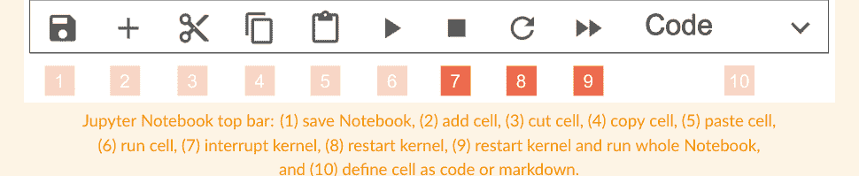

中断内核后，方括号之间的星号符号消失，我们可以再次运行每个单元格。

*重启内核。* 考虑本章中的列表 `house`。假设我们想要删除元素 "dining room"，就像我们在上面的一个例子中所做的那样。但是，由于错误，我们输入了错误的切片索引——即 0 而不是 1——删除了 "kitchen" 而不是 "dining room"，像这样：

```python
[9]: 1 house = ["kitchen", "dining room",
    "living room", "bedroom", "bathroom",
    "garden", "balcony", "terrace"]
```

house 被赋值为厨房、餐厅、客厅、卧室、浴室、花园、阳台、露台，

```python
[10]: 1 del house[0]
     2 print (house)
     ['dining room', 'living room', 'bedroom',
     'bathroom', 'garden', 'balcony','terrace']
```

删除 house 中位置零的元素
打印 house

我们想要恢复原始变量 house 并重新运行我们代码的更正版本——del house[1]——以获得正确的结果。我们如何回去？通过重启内核！为此，我们可以转到 JupyterLab 顶部栏，然后 Kernel，再选择 Restart Kernel；或者我们可以转到 Jupyter Notebook 顶部栏并按下弯曲箭头（上图中的项目 8）。然后，我们可以重新运行 Notebook 的单元格。或者，我们可以通过转到 JupyterLab 顶部栏，然后 Kernel，再选择 Restart Kernel and Run all Cells；或者转到 Jupyter Notebook 顶部栏并按下带有两个箭头尖端的符号（上图中的项目 9）来重启内核并一次重新运行所有 Notebook 单元格。你可能会问：我每次犯错都必须重启内核吗？不一定。在这种情况下，可以只重新运行第一个单元格以将变量 house 恢复到其原始值，然后使用更正后的代码重新运行第二个单元格。然而，当处理多个变量，或者我们对单个变量犯了多个错误时，重置内核并从头开始是一个好的做法。

### 让我们编码吧！

1. Stephanie Shirley。你知道 Stephanie Shirley 的故事吗？让我们看看她做了什么！给定以下列表：

```python
stefanie_shirley = ["In 1962", "Stephanie Shirley", "founded", "a software company",
"employing", "only women", "working from home"]
```

使用列表切片执行以下操作：

-   a. 将 "founded" 替换为 "thrived"
-   b. 删除位置 0（第一个元素）的元素
-   c. 将 "employing" 替换为 "transferred ownership"
-   d. 在 "thrived" 和 "a software company" 之间添加 "and over the years"
-   e. 将 "only women" 替换为 "to her staff"
-   f. 在位置 4（第五个元素）插入 "gradually"
-   g. 将 "a software company" 替换为 "she"
-   h. 在列表末尾添加 "70 millionaires"
-   i. 删除 "Stephanie Shirley"
-   j. 将 "working from home" 替换为 "creating"
-   k. 在列表开头插入 "The business"

然后，使用列表方法重新执行相同的操作。

# 第二部分：列表与 if/else 结构简介

2. *蒂姆·伯纳斯-李*。蒂姆·伯纳斯-李发明了什么？让我们一探究竟！给定以下列表：

```
tim_bernerslee = ["Tim Berners-Lee", "invented", "the World Wide Web", "in 1989",
"at CERN in Geneva", "info.cern.ch", "was", "the address of",
"the world's first website and Web server"]
```

使用*列表切片*完成以下操作：

- a. 移除 "info.cern.ch"
- b. 将 "was" 替换为 "consists of"
- c. 移除位置 1 的元素（第二个元素）
- d. 在列表末尾添加 "all over the world"
- e. 将 "the world's first website and Web server" 替换为 "about 75 million servers"
- f. 移除位置 0 的元素（第一个元素）
- g. 将 "in 1989" 替换为 "Nowadays"
- h. 移除位置 0 的元素（第一个元素）
- i. 将 "at CERN in Geneva" 替换为 "it is estimated that"
- j. 在位置 2（第三个元素）添加 "the internet"
- k. 移除位置 4 的元素（第五个元素）

然后，使用*列表方法*重新完成相同操作。

3. *艾伦·图灵*。艾伦·图灵的贡献带来了什么？让我们来发现！给定以下列表：

```
alan_turing = ["Turing", "created", "an electromechanical machine", "to crack",
"the Nazi Navy's", "Enigma Code"]
```

使用*列表切片*完成以下操作：

- a. 将 "the Nazi Navy's" 替换为 "shortened the war"
- b. 在位置 5（第六个元素）插入 "by two years"
- c. 将 "an electromechanical machine" 替换为 "his contribution"
- d. 在末尾添加 "saving millions of lives"
- e. 将 "created" 替换为 "that"
- f. 移除 "to crack"
- g. 将 "Turing" 替换为 "It is estimated"
- h. 移除位置 5 的元素（第六个元素）

然后，使用*列表方法*重新完成相同操作。

## 第三部分

## FOR 循环简介

在本部分，你将学习 *for* 循环，这是编程中的两种循环之一——另一种是 *while* 循环。我们将学习它的语法以及如何使用它来搜索列表中的元素、修改列表以及自动创建新列表。开始吧！

## 8. 我朋友们最喜欢的菜肴

for... in range()

**for 循环**是编程中最重要的结构之一，因为它允许我们**重复执行命令**。这是什么意思，它是如何工作的？现在打开 Jupyter Notebook 8 来回答这些问题吧！大声朗读以下示例并尝试理解它：

- 这里是我的朋友们和他们最喜欢的菜肴列表：

```
friends = ["Geetha", "Luca", "Daisy", "Juhan"]
dishes = ["sushi", "burgers", "tacos", "pizza"]
```

- 这些是我所有的朋友：

```
print ("My friends' names are:")
print (friends)
```

- 这些是我的朋友们，一个接一个：

```
for index in range (0,4):
    print ("index:" + str(index))
    print ("friend:" + friends[index])
```

- 这些是他们最喜欢的菜肴：

```
print ("Their favorite dishes are:")
print (dishes)
```

- 这些是他们最喜欢的菜肴，一个接一个：

```
for index in range (0,4):
    print ("index:" + str(index))
    print ("dish:" + dishes[index])
```

- 这是我的朋友们，以及他们最喜欢的菜肴，一个接一个：

```
for index in range (0,4):
    print ("My friend " + friends[index] + "'s favorite dish is " + dishes[index])
```

通过完成下一个练习，获取关于代码功能的提示。

# 第三部分：for 循环简介

### 将句子两半匹配起来

- 1. for 循环允许我们
- 2. 变量 index
- 3. 在第一个循环中，变量 index
- 4. 内置函数 range() 决定了
- 5. 内置函数 range() 可以接受

- a. 一个起始值和一个结束值作为参数
- b. 命令重复执行的次数
- c. 重复执行缩进的命令
- d. 在每次循环中改变值
- e. 被赋值为 0

### 计算思维与语法

让我们从运行第一个单元格开始：

```
[1]:
1  friends = ["Geetha", "Luca", "Daisy", "Juhan"]
2  dishes = ["sushi", "burgers", "tacos", "pizza"]
```

friends 被赋值为 Geetha, Luca, Daisy, Juhan
dishes 被赋值为 sushi, burgers, tacos, pizza

有两个列表——friends 和 dishes——每个都包含四个字符串。

让我们运行第二个单元格：

```
[2]:
1  print ("My friends' names are:")
2  print (friends)
My friends' names are:
['Geetha', 'Luca', 'Daisy', 'Juhan']
```

打印 My friends' names are:
打印 friends

我们打印出字符串 My friends' names are:（第 1 行）和列表 friends 的内容（第 2 行）。

现在让我们运行第三个单元格，它包含第一个 for 循环：

```
[3]:
1  for index in range (0,4):
2      print("index:" + str(index))
3      print("friend:" + friends[index])
index: 0
friend: Geetha
index: 1
friend: Luca
index: 2
friend: Daisy
index: 3
friend: Juhan
```

for index in range from zero to four
print index: concatenated with string of index
print friend: concatenated with friends in position index

代码通过重复执行第 2 行和第 3 行四次，打印出每个列表元素的位置和值。这是如何发生的？让我们从第 1 行开始，它是 for 循环的头部。它由五个部分组成：

- **for**：启动 for 循环的关键字。像所有关键字一样，它在 Jupyter Notebook 中是粗体绿色。
- **index**：一个变量，在每次循环迭代中被赋予不同的值（我们稍后会详细讨论）。
- **in**：一个成员运算符，与你在第 3 章 if...in/else 结构中学到的相同。
- **range()**：一个内置的 Python 函数。你可以通过它后面跟着圆括号并且在 Jupyter Notebook 中显示为绿色来识别它是一个函数——就像 `input()` 和 `print()` 一样。我们稍后也会详细讨论 `range()`。
- **:** 即冒号标点。

为了更好地理解这一行的作用，让我们从内置函数 `range()` 开始。它接受两个参数：0 和 4。它们是两个整数，我们可以称之为——猜猜是什么？——起始值和结束值！那么，`range()` 是做什么的？在笔记本中创建一个单独的单元格，然后编写并运行以下代码：

```
[4]: 1 list(range (0,4))
     [0,1,2,3]
```

内置函数 `range()` 返回一个从起始值（包含）到结束值（不包含，因为加一规则）的整数序列。在这个例子中，整数从 0 到 3，并且——再猜猜是什么？——它们对应于列表 `friends` 的元素索引！为什么这里有 `list()`？这是另一个内置函数，我们在这里写它是为了正确的打印输出。现在不要太担心它。让我们专注于理解 for 循环！

我们如何处理由 `range()` 创建的整数列表？我们将它们赋值给变量 `index`！在每次代码重复——或**循环**，或**迭代**——中，`index` 随后被赋予由 `range()` 创建的一个数字。也就是说，在第一个循环中，`index` 被赋值为 0；在第二个循环中，`index` 被赋值为 1；依此类推。我们可以将变量 `index` 命名为任何名称——例如，`loop_id`、`iteration_number`。然而，惯例是将其命名为 `index`，所以我们将采用这个名称。现在，我们可以用变量 `index` 做什么？至少两件事！

首先，我们可以打印 `index` **以跟踪哪个循环正在执行**，就像我们在第 2 行所做的那样。在第一个循环中，`index` 被赋值为 0，所以我们打印 "index: 0"。在第二个循环中，`index` 被赋值为 1，所以我们打印 "index: 1"——依此类推。为什么这里有 `str()`？因为我们只能将字符串与字符串连接，而 `index` 是一个整数！所以，我们需要将变量 `index` 的类型从整数更改为字符串。为此，我们可以使用内置函数 `str()`，它**将变量转换为字符串**。

其次，我们可以使用 `index` **自动逐个切片列表元素**。正如你现在所知，`index` 在每次迭代中都会改变，并且它可以被赋予从列表开头——即 0——到列表末尾——在这种情况下是 3——的值。让我们看看上面单元格的第 3 行。在第一个循环中，当 `index` 被赋值为 0 时，`friends[index]` 与 `friends[0]` 相同——即 "Geetha"。在第二个循环中，当 `index` 被赋值为 1 时，`friends[index]` 与 `friends[1]` 相同，即 "Luca"。依此类推。

头部下方的行——在这个例子中是第 2 行和第 3 行——被称为 for 循环的**主体**。它们总是**缩进的**，并且可以有任意多行。它们执行的次数由函数 `range()` 创建的数字序列决定。

# 第三部分：for 循环简介

在进入下一个单元格之前，让我们总结一下单元格 3 中的代码做了什么。我们需要总共四次遍历这三行代码，过程如下：

- 在第一次迭代中，`index` 被赋值为 0（第 1 行），因此我们打印 `index: 0`（第 2 行），然后打印位置 `index`（即 0）处的 `friends` 元素，即 `friend: Geetha`（第 3 行）。
- 在第二次迭代中，`index` 被赋值为 1（第 1 行），因此我们打印 `index: 1`（第 2 行），然后打印位置 `index`（即 1）处的 `friends` 元素，即 `friend: Luca`（第 3 行）。
- 在第三次迭代中，`index` 被赋值为 2（第 1 行），因此我们打印 `index: 2`（第 2 行），然后打印位置 `index`（即 2）处的 `friends` 元素，即 `friend: Daisy`（第 3 行）。
- 在第四次迭代中，`index` 被赋值为 3（第 1 行），因此我们打印 `index: 3`（第 2 行），然后打印位置 `index`（即 3）处的 `friends` 元素，即 `friend: Juhan`（第 3 行）。

了解每次循环中发生的情况对于确保我们的代码按预期执行至关重要。任何时候你对 `for` 循环中发生的事情感到不确定时，**请像我们刚才那样，逐行逐次迭代地思考你的代码**。如果代码特别复杂，你也可以**创建一个表格**，在其中跟踪每次迭代的每一行，如下所示：

| 循环 | for index in range(0,4): | print("index:"+str(index)) | print("friend:"+friends[index]) |
|---|---|---|---|
| 第一次 | index = 0 | index: 0 | friend: friends[0] → Geetha |
| 第二次 | index = 1 | index: 1 | friend: friends[1] → Luca |
| 第三次 | index = 2 | index: 2 | friend: friends[2] → Daisy |
| 第四次 | index = 3 | index: 3 | friend: friends[3] → Juhan |

在进入下一个单元格之前，让我们定义一下 `for` 循环：

> **for 循环**是将一组命令重复执行**确定**次数的结构。

这个定义总结了 `for` 循环的两个主要特征。

1. 我们多次执行位于 `for` 循环**主体内的代码行**。
2. **执行次数是已知的**，并且由内置函数 `range()` 创建的数字序列决定。

让我们继续看单元格 4：

```
[4]:
1 print ("Their favorite dishes are:")
2 print (dishes)
Their favorite dishes are:
['sushi', 'burgers', 'tacos', 'pizza']
```

我们打印出字符串 `Their favorite dishes are:`（第 1 行）和列表 `dishes` 的内容（第 2 行）。

让我们运行单元格 5，其中包含另一个 `for` 循环：

```
[5]:
1  for index in range (0,4):
2      print("index:" + str(index))
3      print("dish:" + dishes[index])

index: 0
friend: sushi
index: 1
friend: burgers
index: 2
friend: tacos
index: 3
friend: pizza
```

其头部与我们在单元格 3 中遇到的 `for` 循环相同，包括内置函数 `range()` 的起始值和停止值。同样，第 2 行——我们在每次迭代中打印 `index` 值——也是相同的。然而，在第 3 行，我们逐个打印出菜名。让我们再次逐次迭代地分析代码：

- 在第一次迭代中，`index` 被赋值为 0（第 1 行），因此我们打印 `index: 0`（第 2 行），然后打印位置 `index`（即 0）处的 `dishes` 元素，即 `dish: sushi`（第 3 行）。
- 在第二次迭代中，`index` 被赋值为 1（第 1 行），因此我们打印 `index: 1`（第 2 行），然后打印位置 `index`（即 1）处的 `dishes` 元素，即 `burgers`（第 3 行）。
- 在第三次迭代中，`index` 被赋值为 2（第 1 行），因此我们打印 `index: 2`（第 2 行），然后打印位置 `index`（即 2）处的 `dishes` 元素，即 `tacos`（第 3 行）。
- 在第四次迭代中，`index` 被赋值为 3（第 1 行），因此我们打印 `index: 3`（第 2 行），然后打印位置 `index`（即 3）处的 `dishes` 元素，即 `pizza`（第 3 行）。

最后，让我们运行最后一个单元格：

```
[6]:
1  for index in range (0,4):
2      print ("My friend " + friends[index] +
             "'s favorite dish is " + dishes[index])

My friend Geetha's favorite dish is sushi
My friend Luca's favorite dish is burgers
My friend Daisy's favorite dish is tacos
My friend Juhan's favorite dish is pizza
```

这里又是一个 `for` 循环。其头部与前两个示例中的相同：我们创建一个从 0 到 3 的整数序列，并在每次迭代中将它们逐个赋值给变量 `index`（第 1 行）。有一点需要注意：除了起始值和停止值，内置函数 `range()` 还可以接受一个步长作为参数，如下所示：

```
[6]:
1  for index in range (0,4,1):
```

关于起始值和停止值，步长的工作方式与切片（第 6 章）完全相同。在这些示例中，我们省略了步长，因为其默认值为 1——即我们取列表的所有元素。你将在本章末尾的编码练习中尝试不同的步长值。

最后，`for` 循环的主体由一行代码组成，我们打印出一个由四部分组成的句子，这四部分相互连接。第一部分和第三部分是两个字符串——`"My friend "` 和 `"'s favorite dish is "`。第二部分和第四部分是列表 `friends` 和 `dishes` 在位置 `index` 处切片得到的元素（第 2 行）。你会注意到，我们可以在一个 `for` 循环中使用 `index` **同时切片多个相同长度的列表的相同位置**。

### 填空

用你自己的话完成以下句子，以总结 `for` 循环的语法和功能：

1. 一个 `for` 循环是 ____________________________________________________________________________ 。
2. 一个 `for` 循环头部是 ________________________________________________________________________ 。
3. 一个 `for` 循环主体是 _________________________________________________________________________ 。
4. `for` 是一个 ________________________ ，在 Jupyter Notebook 中显示为 ________________________ 颜色。
5. `index` 是一个 ________________________ ，在 Jupyter Notebook 中显示为 ________________________ 颜色。它被赋值为 ____________________________________________________________________________ 。
6. `range()` 是一个 ________________________ ，在 Jupyter Notebook 中显示为 ________________________ 颜色。它可以接受三个参数： ________________________ 、 ________________________ 和 ________________________ 。它返回 ____________________________________________________________________________ 。
7. 一次迭代或循环是 ____________________________________________________________________________ 。

### 回顾

- `for` 循环是将命令重复执行固定次数的结构。
- 当 `for` 循环用于切片列表时，重复次数与列表长度一致。
- `for` 循环头部的通用语法是：`for index in range(start, stop, step):`
- `for` 循环的主体是缩进的，可以包含任意多行代码。
- `range()` 是一个内置的 Python 函数，它创建一个从起始值（包含）到停止值（不包含）的整数序列。
- `str()` 是一个内置的 Python 函数，它将变量转换为字符串。

> **处理 IndexError 和 IndentationError**

在执行 `for` 循环时，我们可能会遇到两种错误：索引错误和缩进错误。让我们看看它们发生的原因以及如何修复它们！

索引错误。让我们修改单元格 3 中的示例，将停止值改为 5（而不是 4）。当我们运行该单元格时，会得到以下错误。

```
[3]:
1 for index in range (0,5):
2     print("index:" + str(index))
3     print("friend:" + friends[index])

index: 0
friend: Geetha
index: 1
friend: Luca
index: 2
friend: Daisy
index: 3
friend: Juhan
index: 4

IndexError Traceback (most recent call last)
<ipython-input-13-ef0756c89224> in <module>
      1 for index in range (0,5):
      2     print ("index: " + str(index))
----> 3     print ("friend: " + friends[index])
IndexError: list index out of range
```

让我们解读一下错误信息。正如你在第 2 章所知，我们从最后一行开始阅读，它告诉我们错误的类型：`IndexError: list index out of range`。这意味着我们**试图切片一个列表中不存在的位置**。我们在哪里这样做了？让我们寻找箭头。它指向第 3 行，我们在那里切片 `friends` 的 `index` 位置。`index` 的值是多少？从打印输出的最后一行，我们可以看到 `index` 是 4。因此，我们试图切片列表 `friends` 的位置 4，而该位置不存在。修复这个错误很简单：我们只需将 `range()` 中的停止值更正为 4。

缩进错误。缩进错误非常容易识别和修复。让我们看这个例子：

```
[3]:
1 for index in range (0,4):
2 print("index:" + str(index))

File "/var/ipykernel_54813/8597.py", line 2
print ("index: " + str(index))
^
IndentationError: expected an indented block
```

同样，我们从错误信息的最后一行开始阅读，它写着：`IndentationError: expected an indented block`。这意味着我们**没有缩进一行代码**。在哪里？信息在第一行的末尾提到了第 2 行。修复方法很直接：我们只需缩进第 2 行。最后一点：Jupyter Notebook（和其他编辑器）通过在我们按回车键后正确定位光标来帮助我们避免缩进错误。

### 让我们开始编程吧！

1.  针对以下每个场景，创建与本章中类似的代码。
    a.  *世界首都。* 编写两个列表，一个包含世界各国，另一个包含其首都城市。首先，将所有国家作为一个列表打印出来，并逐个打印所有国家。然后，将所有城市作为一个列表打印出来，并逐个打印所有城市。最后，打印出每个国家及其首都。
    b.  *世界动物。* 编写两个列表，一个包含世界上的动物，另一个包含它们生活的洲（或国家）。首先，将所有动物作为一个列表打印出来，并逐个打印所有动物。然后，将所有大洲作为一个列表打印出来，并逐个打印所有大洲。最后，打印出每种动物及其所在的大洲。

2.  *山脉与河流。* 给定以下列表：
    `mountains_rivers = ["everest", "mississipi", "yosemite", "nile", "mont blanc", "amazon"]`
    打印：
    a.  所有元素作为一个列表
    b.  使用 for 循环逐个打印所有元素
    c.  使用切片打印山脉
    d.  使用 for 循环逐个打印山脉（提示：记住 `range()` 可以有三个参数：start, stop, step）
    e.  使用切片打印河流
    f.  使用 for 循环逐个打印河流（你使用了什么 start？）
    g.  使用切片逆序打印所有元素
    h.  使用 for 循环逐个逆序打印所有元素（你使用了什么 start, stop 和 step？）

3.  *野生动物。* 给定以下列表：
    `wild_animals = ["eagle", "bear", "parrot", "tiger", "pelican", "coyote"]`
    打印：
    a.  所有动物作为一个列表
    b.  使用 for 循环逐个打印所有动物
    c.  使用切片打印哺乳动物
    d.  使用 for 循环逐个打印哺乳动物
    e.  使用切片打印鸟类
    f.  使用 for 循环逐个打印鸟类（你使用了什么 start？）
    g.  使用切片逆序打印所有动物
    h.  使用 for 循环逐个逆序打印所有动物

## 9. 在动物园

带 if... ==... / else... 的 for 循环

我们能将 for 循环和 if/else 结构结合起来吗？当然可以！怎么做？打开 Jupyter Notebook 9 并跟着操作。大声朗读以下示例，并尝试理解它的工作原理：

- 你在动物园，写下了一个你看到的一些动物的列表：

```python
animals = ["giraffe", "penguin", "dolphin"]
print(animals)
```

- 然后你逐个打印出这些动物：

```python
# for each position in the list
for i in range(0, len(animals)):
    print("--- Beginning of loop ---")
    # print each element and its position
    print("The element in position " + str(i) + " is " + animals[i])
```

- 你真的很想看到企鹅：

```python
wanted_to_see = "penguin"
```

- 回家后，你告诉朋友你看到了哪些动物，并特别指出你真正想看到的那一个：

```python
# for each position in the list
for i in range(0, len(animals)):
    # if the current animal is
    # what you really wanted to see
    if animals[i] == wanted_to_see:
        # print out that that's the animal
        # you really wanted to see
        print("I saw a " + animals[i] + " and I really wanted to see it!")
    else:
        # just print out what you saw
        print("I saw a " + animals[i])
```

这段代码中发生了什么？通过完成以下练习来获取一些提示。

## 第三部分. for 循环简介

### 真还是假？

1.  我们可以使用 if/else 结构在 for 循环中包含一个条件
2.  内置函数 len() 返回列表中元素的数量
3.  井号 # 开始一行新的代码
4.  == 符号检查两个变量是否不同

### 计算思维与语法

让我们从运行第一个单元格开始：

```python
[1]:
animals = ["giraffe", "penguin",
           "dolphin"]
print(animals)
['giraffe', 'penguin', 'dolphin']
```

我们考虑一个名为 animals 的列表，它包含三个字符串："giraffe"、"penguin" 和 "dolphin"（第 1 行），然后我们将其打印出来（第 2 行）。

让我们运行第二个单元格：

```python
[2]:
# for each position in the list
for i in range(0, len(animals)):
    print("--- Beginning of loop ---")
    # print each element and its position
    print("The element in position " +
          str(i) + " is " + animals[i])

--- Beginning of loop ---
The element in position 0 is giraffe
--- Beginning of loop ---
The element in position 1 is penguin
--- Beginning of loop ---
The element in position 2 is dolphin
```

我们运行 for 循环三次，每次我们都打印第 3 行和第 5 行。让我们深入代码以更好地理解它！第 2 行的 for 循环头部与我们在前一章看到的语法相比有两个变化。首先，我们使用缩写 i 作为变量索引。缩短常用变量的名称在编码中很常见，因为它减少了所需的输入量。一些缩写成为了惯例——就像本例一样——因此，从现在开始我们将使用 i。其次，我们使用 len(animals) 作为内置函数 range() 的 stop，而不是一个整数。如果我们使用一个整数，那么 stop 将是 3，因为最后一个元素——"dolphin"——位于位置 2，我们根据加一规则为其加 1。但是，如果我们向列表中添加另一个元素呢？我们将不得不记住将 stop 从 3 修改为 4。可以想象，这种做法非常容易出错，因为很容易忘记更新 stop 或数错最后一个元素的位置。因此，我们不想硬编码 stop——也就是说，明确地写出它的值。我们希望它依赖于我们正在处理的变量，这样我们就不必处理可能的变化。为此，我们使用 len()，这是一个内置函数，返回变量的长度——对于列表 animals 来说就是 3。我们可以使用这个技巧，因为列表的长度总是比最后一个元素的索引大一个单位；因此，它与 stop 一致。从现在开始，我们不需要通过计数来找到 stop——len() 会为我们完成！

让我们分析 for 循环的主体。在第 3 行，我们打印一个字符串，说明我们处于循环的开始。它的目的是**视觉上与众不同**，以使每次迭代的打印输出**易于识别**。除了 *Beginning of loop*，我们还可以使用像 *New iteration*、*New loop* 等句子。为了增加可见性，我们还可以在文本前后使用符号——例如本例中的破折号（---）。替代方案可以是箭头（--->）、波浪号（~~~）或键盘上的任何其他字符。在第 5 行，我们打印出每个元素及其在由四个部分连接而成的句子中的位置。第一部分和第三部分——"The element in position " 和 " is "——是两个硬编码的字符串。第二个元素是当前循环的索引。它是一个整数，所以我们使用内置函数 str() 将其转换为字符串。最后，最后一个元素（animals[i]）是一个字符串，包含一个在每次迭代中切片到不同位置 i 的列表元素——即 "giraffe"、"penguin" 或 "dolphin"。

最后，第 1 行和第 4 行以**井号**（#）开头，后面跟着文本。这些行被称为**注释**。它们是什么？让我们给出一个定义：

> **注释**是代码的描述或解释。

注释是编码的**基本组成部分**。它们可以包含代码的**描述**，或者关于我们为何做出某种编码选择的**解释**，或者任何其他与理解它们所指代码相关的**信息**。在 Jupyter Notebook 中，注释是浅绿色的，并且位于它们所解释的行之上并与之对齐。例如，第 4 行的注释指的是第 5 行的代码，因此它被缩进并与第 5 行对齐。你可能想知道我们为什么要写注释。至少有两个原因。第一个原因：**使代码对我们自己和其他人可读**。阅读旧代码时，我们很少记得为什么写我们所写的内容——是的，即使是我们自己写的！同样，当我们阅读别人的代码时，如果代码没有良好的注释，我们通常很难理解他们做了什么以及为什么这样做。第二个原因：**跟踪我们正在做的事情**。编写代码时，我们有时会专注于小细节而失去大局观。在这些情况下，我们最终可能会问自己：我为什么又在写这个？使用注释来概述代码可以帮助我们跟踪需要**实现**——即编写——的步骤。最后，我们如何写出有用的注释？很简单：**使用精确的语言**。写 # here is a for loop 不会给代码增加任何信息，因为循环是清晰可见的。描述 for 循环做什么以及为什么这样做更有意义；例如，# using a for loop to browse a list and print out its elements one by one。另外，不要认为任何一行代码是理所当然的。真的很容易忘记我们为什么那样写那行代码！一般来说，请记住**注释是为人类编写的**，而不是为 Python 编写的。事实上，Python 在读取我们的代码时会跳过注释。试着在一行代码前添加一个井号：Python 不会执行它！

让我们运行下一个单元格：

```python
[3]:
wanted_to_see = "penguin"
```

我们创建一个名为 wanted_to_see 的变量，并为其赋值字符串 "penguin"。

# 第三部分：for 循环简介

让我们运行最后一个单元格：

```python
# for each position in the list
for i in range(0, len(animals)):
    # if the current animal is
    # what you really wanted to see
    if animals[i] == wanted_to_see:
        # print out that that's the animal
        # you really wanted to see
        print("I saw a " + animals[i] +
              " and I really wanted to see it!")
    else:
        # just print out that you saw it
        print("I saw a " + animals[i])
```

for each position in the list
for i in range from zero to len of animals
if the current animal is what you really wanted to see
if animals in position i equals wanted to see
print out that that's the animal you really wanted to see
print I saw a concatenated with animals in position i concatenated with and I really wanted to see it!
else:
just print out that you saw it
print I saw a concatenated with animals in position i

I saw a giraffe
I saw a penguin and I really wanted to see it!
I saw a dolphin

我们再次使用 for 循环来遍历列表元素。但这一次，**我们对每个元素应用了一个条件**。让我们逐行分析。for 循环的头部与单元格 2 中的相同。然后，在第 4 行，我们开始了一个 if/else 结构。它与我们在第 3 章学到的类似：它由一个 if 条件（第 4 行）、一个语句（第 6 行）、一个 else（第 7 行）和另一个语句（第 9 行）组成。然而，关键字 `if` 之后的条件不同。在第 3 章，我们使用成员运算符 `in` 来检查一个元素是否在列表中。在这种情况下，我们检查分配给两个变量 `animals[i]` 和 `wanted_to_see` 的值是否相等。为此，我们写 (1) 关键字 `if`；(2) 第一个变量，即 `animals[i]`；(3) 比较运算符 `==`，以及 (4) 第二个变量，即 `wanted_to_see`。**比较运算符** `==` 读作 *等于* 或 *is equal to*。请注意，**== 与 = 非常不同**。符号 `==` 是一个**比较运算符**，用于条件中检查分配给两个变量的值是否相同。符号 `=` 是赋值运算符，用于将值赋给变量。

为了确保这段代码的功能清晰，让我们逐步分析 for 循环：

- 在第一次循环中：在第 2 行，`i` 被赋值为 0。在第 4 行，我们检查位置 `i` 的 `animals`——其中 `i` 是 0，所以 `animals[0]` 是 "giraffe"——是否等于分配给变量 `wanted_to_see` 的值，即 "penguin"。因为 "giraffe" 不等于 "penguin"，我们跳过第 6 行 `if` 下的语句，直接跳到第 9 行 `else` 下的语句。在那里，我们打印 "I saw a giraffe"
- 在第二次循环中：在第 2 行，`i` 被赋值为 1。在第 4 行，我们再次检查位置 `i` 的 `animals`——其中 `i` 是 1，所以 `animals[1]` 是 "penguin"——是否等于分配给变量 `wanted_to_see` 的值。在这种情况下，两个变量 `animals[i]` 和 `wanted_to_see` 的值相等，所以我们执行 `if` 条件下的语句（第 6 行），打印 "I saw a penguin and I really wanted to see it!"
- 最后，在第三次循环中：在第 2 行，`i` 被赋值为 2。在第 4 行，我们再次检查位置 `i` 的 `animals`——其中 `i` 是 2，因此 `animals[2]` 是 "dolphin"——是否等于分配给变量 `wanted_to_see` 的值，即 "penguin"。因为 "dolphin" 不等于 "penguin"，我们跳过第 6 行的语句，直接跳到 else 下的语句，即第 9 行。在那里，我们打印 "I saw a dolphin"。

### 完成表格

在编程中有很多术语——即通常使用但含义并不总是清晰的技术词汇或表达。你是否已经熟悉了到目前为止介绍的术语？通过写下以下表达的含义来完成表格：

| 表达 | 含义 |
| :--- | :--- |
| 运行一个单元格（第 1 章） | |
| 编写可读的代码（第 3 章） | |
| 函数接受一个参数（第 5 章） | |
| 函数返回一个整数（第 5 章） | |
| 重新赋值给一个变量（第 7 章） | |
| 元素是硬编码的（第 8 章） | |
| 为代码添加注释（第 9 章） | |
| 硬编码（第 9 章） | |
| 实现代码（第 9 章） | |

### 回顾

- 在 for 循环中，变量索引通常缩写为 i
- 内置函数 len() 返回变量的长度
- 我们可以在 for 循环中使用 if/else 结构
- 我们可以在 if 条件中使用比较运算符 ==（等于或 is equal to）
- 注释以井号 # 开头，它们是描述或解释

# 第三部分：for 循环简介

### 处理 TypeError

当我们尝试连接不同类型的变量时，类型错误很常见。让我们看一个例子，修改自本章的单元格 2：

```python
# for each position in the list
for i in range(0, len(animals)):
    print("--- Beginning of loop ---")
    # print each element and its position
    print("The element in position " +
          i + " is " + animals[i])
```

```
--- Beginning of loop ---
--------------------------------------------------
TypeError Traceback (most recent call last)
<ipython-input-5-db98c59ed681> in <module>
      3 print("-- Beginning of loop --")
      4 # print each element and its position
----> 5 print("The element in position " + i +
             " is " + animals[i])
TypeError: can only concatenate str (not "int") to str
```

错误消息的最后一行说 TypeError: can only concatenate str (not "int") to str。这意味着在我们代码的某个地方，我们正试图将一个整数与一个或多个字符串连接起来。在哪里？绿色箭头指向第 5 行，那里有三个连接。如上文所述，组成部分是 "The element in position" 和 " is "，这是两个硬编码的字符串；列表元素 animals[i]——即 "giraffe"、"penguin" 或 "dolphin"——这也是一个字符串；以及变量 i，这是一个介于 0 和 2 之间的整数。所以 i 就是问题所在！解决这个错误非常容易：我们只需使用内置函数 str() 将 i 转换为字符串，像这样：str(i)。

让我们看另一个例子，修改自第 7 章：

```python
planets = planets + "Jupyter"
print(planets)
```

```
--------------------------------------------------
TypeError Traceback (most recent call last)
<ipython-input-5-db98c59ed681> in <module>
----> 1 planets = planets + "Jupyter"
      2 print(planets)
TypeError: can only concatenate list (not "str") to list
```

这一次，错误消息的最后一行说：TypeError: can only concatenate list (not "str") with list。我们正试图将一个字符串连接到一个列表。在哪里？绿色箭头指向第 1 行。在连接符号周围，有 planets——这是一个列表——和 "Jupyter"——这是一个字符串！纠正这个错误很简单：我们只需将 "Jupyter" 放在方括号内，将其转换为一个列表，像这样：["Jupyter"]。当遇到类型错误时，记住要**分析错误发生行中每个变量的类型**。同时，请记住，我们只能将列表与列表连接，字符串与字符串连接！

### 让我们编码吧！

*注意：从本章开始，在适当的地方编写代码注释。*

1. 对于以下每个场景，创建类似于本章中展示的代码：
    a. *运动。* 写一个你喜欢的运动列表，并将它们逐一打印出来。你最喜欢的运动是什么？为它创建一个变量。最后，逐一打印出所有运动，指明它们是否是你最喜欢的运动。
    b. *宇航员的下一个目的地。* 你是一名宇航员，你写下了太阳系行星的列表：水星、火星、金星、地球、海王星、天王星、土星、木星。逐一打印出行星。然后，为你的下一个目的地创建一个变量。最后，打印出所有行星，指明它们是否是你的下一个目的地。

2. *月份。* 给定以下列表：
    ```python
    months = ["February", "July", "January", "August", "December", "June"]
    ```
    使用 for 循环打印出冬季月份的名称。然后，使用 for 循环打印出夏季月份的名称。选择一个你喜欢的月份并将其赋值给一个变量。逐一打印出所有月份，指明当前月份是否是你最喜欢的。最后，你可以使用什么替代方法来检查你最喜欢的月份是否在列表中？

3. *玛丽·K·凯勒。* 给定以下列表：
    ```python
    mary_k_keller = ['a nun', 'She was also', 'in Computer Science.',
                     'to receive a Ph.D.', 'American woman', 'the first',
                     'was', 'Mary K. Keller']
    ```
    首先使用切片，然后使用 for 循环，以相反的顺序打印出所有元素。然后，考虑以下变量：`name = 'Mary K. Keller'`。以两种方式检查这个变量是否在列表中：首先，使用 if/else 结构；然后，在 for 循环中使用 if/else 结构。这两种方法有什么区别？

## 10. 我的手套在哪儿？

用于搜索的 for 循环

当与列表结合使用时，for 循环通常至少用于三种操作：搜索元素、修改元素和创建新列表，这将在接下来的三章中学习。在本章中，我们将从学习如何使用 for 循环在列表中搜索元素开始。准备好了吗？打开 Jupyter Notebook 10 并跟随操作。在每个任务后用一张纸盖住代码，并尝试猜测答案。然后进行比较并阅读解释。让我们开始吧！

- 谁没有一个乱糟糟的抽屉呢？这是我们的！里面装着一些配饰：

```python
accessories = ["belt", "hat", "gloves",
               "sunglasses", "ring"]
print(accessories)
```
```
['belt', 'hat', 'gloves', 'sunglasses', 'ring']
```

`accessories` 被赋值为 `belt`、`hat`、`gloves`、`sunglasses`、`ring`。
`print accessories`

我们从由 5 个字符串组成的列表 `accessories` 开始（第 1 行），并将其打印出来（第 2 行）。

- 逐一打印所有配饰及其在列表中的位置。使用类似 "The element x is in position y" 的句子：

```python
# for each position in the list
for i in range(len(accessories)):
    # print each element and its position
    print("The element " + accessories[i] +
          " is in position" + str(i))
```
```
The element belt is in position 0
The element hat is in position 1
The element gloves is in position 2
The element sunglasses is in position 3
The element ring is in position 4
```

`for each position in the list`
`for i in range len of accessories`
`print each element and its position`
`print The element concatenated with accessories in position i concatenated with is in position concatenated with string of i`

我们通过使用 for 循环打印每个列表元素及其位置来热身，正如我们在第 8 章和第 9 章所学的那样。for 循环的语法与我们之前看到的相同，只是在头部做了一个最后的简化：我们**省略了起始值**。当起始值为 0 时——即列表的开头——我们不需要写出来。当结束值与列表末尾重合时，我们也能省略吗？不太行：内置函数 `range()` 将不知道在哪里停止创建连续整数（如果你需要回顾 `range()` 创建一个整数列表，请参见第 63 页的单元格 4）。最后，请注意我们继续为每条命令添加注释以提高代码可读性。

现在是时候在抽屉里寻找物品了。我们该怎么做？要搜索列表元素，我们必须（1）创建一个 **for 循环来浏览列表的所有元素**，以及（2）**使用 if/else 结构**来检查当前元素是否具有我们想要的特征，就像我们在第 9 章的单元格 4 中所做的那样。通常，我们可以根据各种条件搜索元素。在前面的章节中，我们搜索了元素是否存在于列表中（第 3 章）以及等于给定变量的元素（第 9 章）。在本章中，我们将搜索具有特定长度和特定列表位置的元素。为此，我们将使用**比较运算符**。准备好了吗？开始吧！

1. 打印名称**由** 6 个字符**组成**的配饰及其在列表中的位置。使用类似 "The element x is in position y and it has n characters" 的句子：

```python
# for each position in the list
for i in range(len(accessories)):
    # if the length of the element equals 6
    if len(accessories[i]) == 6:
        # print the element, its position,
        # and its number of characters
        print("The element " + accessories[i] +
              " is in position" + str(i) +
              " and it has 6 characters")
```
```
The element gloves is in position 2 and it has 6 characters
```

`for each position in the list`
`for i in range len of accessories`
`if the length of the element equals six`
`if len of accessories in position i equals six`
`print the element, its position, and its number of characters`
`print The element concatenated with accessories in position i concatenated with is in position concatenated with string of i concatenated with and it has six characters`

我们想要找到由 6 个字符组成的列表元素。如上所述，我们创建一个 for 循环来浏览列表中的所有元素（第 2 行），并编写一个 if/else 结构来评估当前元素——即 `accessories[i]`——是否由 6 个字符组成（第 4 行和第 6 行）。我们如何知道一个字符串有多少个字符？**字符数量与字符串长度一致**；因此，我们可以使用内置函数 `len()`。因此，在 if 条件中，我们将列表当前元素的长度——`len(animals[i])`——与我们想要的字符数——即 6——进行比较。我们使用的比较运算符是 `==`（*等于*），它检查两个值是否相同，正如你在第 9 章单元格 4 中学到的那样。如果当前元素满足条件，我们就打印第 6 行的句子，就像我们对元素 "gloves" 所做的那样。其他元素呢？我们不想做任何事情，所以我们只需省略 if/else 结构的 else 部分。注意第 1、3 和 5 行的注释。

2. 打印名称**少于** 6 个字符的配饰：

```python
# for each position in the list
for i in range(len(accessories)):
    # if the length of the element is less
    # than 6
    if len(accessories[i]) < 6:
        # print the element, its position,
        # and its number of characters
        print("The element " + accessories[i] +
              " is in position" + str(i) +
              " and it has less than 6 characters")
```
```
The element belt is in position 0 and it has less than 6 characters
The element hat is in position 1 and it has less than 6 characters
The element ring is in position 4 and it has less than 6 characters
```

`for each position in the list`
`for i in range len of accessories`
`if the length of the element is less than six`
`if len of accessories in position i less than 6`
`print the element, its position, and its number of characters`
`print The element concatenated with accessories in position i concatenated with is in position concatenated with string of i concatenated with and it has less than 6 characters`

代码结构与示例 1 相同。改变的是比较运算符，它是 `<`，读作**小于**（第 4 行）。通过使用这个运算符，我们检查当前元素的长度是否小于 6。对于由少于 6 个字符组成的元素，我们打印第 6 行的句子——即对于字符串 "belt"、"hat" 和 "ring"。

3. 打印名称由**多于** 6 个字符组成的配饰。同时，将 6 赋值给一个变量：

```python
# defining the threshold
n_of_characters = 6
# for each position in the list
for i in range(len(accessories)):
    # if the length of the element is greater
    if len(accessories[i]) > n_of_characters:
        # print the element, its position,
        print("The element " + accessories[i] +
              " is in position" + str(i) +
              " and it has more than " +
              str(n_of_characters) + " characters")
```
```
The element sunglasses is in position 3 and it has more than 6 characters
```

在这个例子中，我们增加了两个新内容。第一个很直接：我们使用比较运算符 `>`，读作**大于**（第 6 行）。在这种情况下，只有一个字符串有超过 6 个字符——即 "sunglasses"——所以我们为该元素打印第 8 行。

第二个新内容是变量 `n_of_characters`（第 2 行）。它被赋值为 6——即我们想要打印列表元素的阈值长度。为什么我们创建 `n_of_characters` 而不是简单地使用 6？因为我们在两行代码中使用了它——在条件中（第 6 行）和在打印中（第 8 行）——这可能导致错误。如果我们想考虑 4 个字符而不是 6 个呢？我们将不得不修改第 6 行和第 8 行的数字，而且我们可能会忘记在两个地方都进行修改。相反，通过使用变量 `n_of_characters`，我们只需在一个地方（第 2 行）更改值。**创建包含值的变量**而不是在代码块中硬编码是**良好的实践**。变量通常写在**代码块的开头**，以便于查找，特别是当代码由多行组成时。

4. 打印名称由**不同于** 6 个字符组成的配饰：

```python
# defining the threshold
n_of_characters = 6
# for each position in the list
for i in range(len(accessories)):
```

## 5. 打印位置小于或等于2的配件：

```python
# 定义阈值
position = 2
# 遍历列表中的每个位置
for i in range(len(accessories)):
    # 如果元素的位置小于或等于阈值
    if i <= position:
        # 打印元素、其位置及其位置特征
        print("The element " + accessories[i] + " is in position" + str(i) + ", which is less than or equal to " + str(position))
```

The element belt is in position 0, which is less than or equal to 2
The element hat is in position 1, which is less than or equal to 2
The element gloves is in position 2, which is less than or equal to 2

在这个例子中，我们再次引入了两个新概念。第一个新概念是比较运算符 <=，读作**小于或等于**（第6行）。两个比较运算符 <=（小于或等于）和 <（小于）有什么区别？使用 <= 时，我们*包含*阈值——也就是说，我们考虑所有位置等于2或小于2的元素。使用 < 时，我们*排除阈值*——也就是说，我们只考虑位置严格小于2的元素。

# 第三部分：for 循环简介

第二个新概念是，我们希望根据元素的*位置*来搜索元素。我们如何做到这一点？首先，我们创建一个名为 position 的变量，并为其赋值阈值——即2（第2行）。然后，我们需要编写比较条件。我们如何知道每个元素的位置？**在 for 循环中，当前列表元素的位置就是 i！**还记得前面章节的内容吗？

- 在第一次循环中，i 被赋值为0，因此 accessories[i] 是 accessories[0]，即 "belt"
- 在第二次循环中，i 被赋值为1，因此 accessories[i] 是 accessories[1]，即 "hat"
- 在第三次循环中，i 被赋值为2，因此...

因此，在 if 条件中，我们将当前元素位置 i 与变量 position 中的阈值位置进行比较（第6行）。对于所有位置 i 小于或等于 position 的元素，我们打印第8行——即对于 "belt"、"hat" 和 "gloves"。

## 6. 打印位置**至少为2**的配件：

```python
# 定义阈值
position = 2
# 遍历列表中的每个位置
for i in range(len(accessories)):
    # 如果元素的位置大于或等于阈值
    if i >= position:
        # 打印元素、其位置及其位置特征
        print("The element " + accessories[i] +
              " is in position" + str(i) +
              ", which is at least " + str(position))
```

The element gloves is in position 2, which is at least 2
The element sunglasses is in position 3, which is at least 2
The element ring is in position 4, which is at least 2

在最后一个例子中，代码结构保持不变，但我们使用了比较运算符 >=，读作*大于或等于*（第6行）。与之前类似，>=（*大于或等于*）和 >（*大于*）的区别在于，使用 >= 时我们包含阈值，而使用 > 时我们排除阈值。在这种情况下，对于所有位置至少——即大于或等于——position 的元素，我们打印第8行的句子，这些元素是 "gloves"、"sunglasses" 和 "ring"（第8行）。

最后，一个记住由两个符号组成的比较运算符拼写的技巧：符号 = **总是在第二个位置**，正如你在 !=（示例4）、<=（示例5）和 >=（示例6）中会注意到的那样。

### 完成表格

在本章中，你学习了六种比较运算符。在下面的表格中，用你自己的话总结它们的特点：

| 比较运算符 | 功能 | 读法 |
| :--- | :--- | :--- |
| == | | |
| != | | |
| > | | |
| >= | | |
| < | | |
| <= | | |

### 插入到正确的列中

到目前为止，你已经学习了几个编程元素：数据类型、内置函数、关键字和列表方法。你还记得哪个是哪个吗？将以下元素插入到正确的列中：

string, else, input(), if, .remove(), print(), .index(), len(),
str(), del, list, .append(), range(), for, .insert(), integer, .pop()

| 数据类型 | 内置函数 | 关键字 | 列表方法 |
| :--- | :--- | :--- | :--- |
| | | | |
| | | | |
| | | | |
| | | | |

### 回顾

- 我们可以使用 for 循环结合 if/else 结构来搜索列表中的元素
- 在代码块中创建变量而不是使用硬编码值是一个好习惯，可以减少出错的可能性。变量通常位于代码块的开头
- 在 Python 中，有六种比较运算符：==, !=, >, >=, <, <=

### 让我们使用键盘快捷键！

在编码时，使用键盘快捷键可以最大限度地减少打字中断，这非常实用。虽然这听起来可能有点夸张，但使用鼠标有时确实会分散注意力，因为它会减慢打字节奏并中断写作流程。另一方面，快捷键让我们可以永远不离开键盘！它们是**同时按下的键组合**，可以执行各种操作。让我们看看最常见的几种。在下面的例子中，我们将使用下图中彩色的按键。

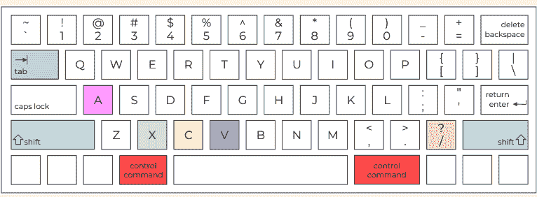

在以下快捷键组合中，*control/command* 表示如果你使用的是 Windows 操作系统，你需要按 *control* 键，如果你使用的是 MacOS 操作系统，则按 *command* 键（即上图中的红色按键之一）。此外，符号 + 表示你需要同时按下所列出的按键。以下快捷键中你知道哪些？

- *control/command* + A（红色键 + 粉色键）：选择单元格中的所有代码行——字母 A 代表 *all*（全部）
- *control/command* + X（红色键 + 灰色键）：剪切选中的代码行
- *control/command* + C（红色键 + 黄色键）：复制选中的代码行
- *control/command* + V（红色键 + 紫色键）：粘贴选中的代码行
- *control/command* + /（红色键 + 橙色键）：在选中的代码行前添加 #——即注释掉它们。如果再次按下该组合键，# 会被移除，代码取消注释
- *tab*（绿色键）：缩进选中的代码行——即将代码行向右移动四个空格
- *shift* + *tab*（蓝色键 + 绿色键）：减少选中代码行的缩进——即将代码行向左移动四个空格

请注意，这些快捷键可以一次用于*多行*代码，从而加快编写速度。结合学习十指打字（参见第1章更深入的部分），使用快捷键是更快、不间断地编写代码的有效方式！

### 让我们开始编程吧！

1.  *季节*。给定以下列表：

`seasons = ["spring", "summer", "fall", "winter"]`

打印：

a.  所有名称由至少5个字符组成的季节
b.  所有名称由4个或更少字符组成的季节
c.  所有位置小于2的季节
d.  所有位置至少为2的季节

2.  *单词搜索*。你正在为一家杂志社工作，刚刚为读者创建了一个新的单词搜索游戏。以下是游戏中隐藏的单词：

`words = ["cards", "park", "pets", "football", "golf", "crosswords", "toys", "exercise", "hobbies", "riding", "biking", "games", "reading", "movies", "walking", "concerts"]`

网格完成后：

a.  创建一个名为 *title* 的变量，包含要查找的单词数量，然后打印出来（例如，*包含16个单词的单词搜索*）
b.  找出由5个字母组成的单词。更具体地说，打印一个标题，该标题必须包含该单词组的字母数量，以及这些单词
c.  是否有少于5个字符的单词？如果有，对于每个单词，打印一个句子，包含单词本身、它在列表中的位置以及它的字符数
d.  类似地，是否有超过8个字符的单词？如果有，对于每个单词，打印一个句子，包含单词本身、它在列表中的位置以及它的字符数
e.  列表后半部分中，字符数不等于7的单词有哪些？它们的位置是什么？字符数是多少？
f.  最后，列表前四分之一中，由4个字符组成的单词有哪些？它们的位置是什么？

你可以在社区网站上下载本练习解决方案的单词搜索游戏！

3.  *拼写比赛*。以下是肌肉骨骼（msk）系统类别的一些单词，你需要为接下来的拼写比赛记忆它们：

`msk_words = ["ankle", "patella", "rib", "femur", "sternocleidomastoid", "tendon", "sternum", "abdominal external oblique", "muscle", "scapula", "radius", "bone", "vertebra", "ligament", "ulna", "skull", "clavicle"]`

a.  你需要学习多少个单词？计算并打印出来
b.  每个单词的长度是多少？（包括空格）
c.  现在让我们根据单词长度进行分组。这里是一个短单词列表：

`short = ["leg"]`

将所有6个字符或更少的单词添加到列表中，并打印结果。列表中有多少个单词？

## 第3部分. for循环简介

d.  这里是一个中等长度的单词列表：

```
intermediate = ["cartilage"]
```

添加所有7、8和9个字符的单词。然后打印结果。列表中有多少个单词？

e.  最后，这里是一个长单词列表：

```
long = ["pectoralis major"]
```

添加所有剩余的单词并打印结果。列表中有多少个单词？

## 11. 清理邮件列表

使用for循环修改列表元素

是时候学习如何使用for循环来修改列表元素了！打开Jupyter Notebook 11并跟着操作。别忘了注意代码的发音。开始吧！

- 你负责一份通讯，需要向以下地址发送电子邮件：

```
emails = ["SARAH.BROWN@GMAIL.com",
          "Pablo.Hernandez@live.com",
          "LI.Min@hotmail.com"]
```

- 为了保持一致性，你希望所有电子邮件地址都是小写的。所以你修改它们：

```
# 遍历列表中的每个位置
for i in range (len(emails)):
    
    print ("-> 循环: " + str(i))
    
    # 打印修改前的元素
    print ("修改前，位置 " + str(i) + " 的元素是 " + emails[i])
    
    # 修改元素并重新赋值
    emails[i] = emails[i].lower()
    
    # 打印修改后的元素
    print ("修改后，位置 " + str(i) + " 的元素是 " + emails[i])

# 打印修改后的列表
print ("现在列表是: " + str(emails))
```

上面的代码有什么新内容？通过完成以下练习来获取一些提示。

### 对还是错？

1.  要修改列表元素，我们需要在修改后重新赋值
2.  方法 .lower() 是一个列表方法
3.  方法 .lower() 将字符串更改为大写
4.  注释和空行使代码更具可读性

## 第3部分. for循环简介

### 计算思维与语法

让我们运行第一个单元格：

```
[1]: emails = ["SARAH.BROWN@GMAIL.com",
"Pablo.Hernandez@live.com",
"LI.Min@hotmail.com"]
```

emails 被赋值为
SARAH.BROWN@GMAIL.com,
Pablo.Hernandez@live.com,
LI.Min@hotmail.com

我们考虑一个由三个字符串组成的列表，每个字符串对应一个电子邮件地址（第1行）。

让我们运行第二个单元格：

```
[2]: # 遍历列表中的每个位置
for i in range (len(emails)):
    
    print ("-> 循环: " + str(i))
    
    # 打印修改前的元素
    print ("修改前，位置 " + str(i) + " 的元素是 " + emails[i])
    
    # 修改元素并重新赋值
    emails[i] = emails[i].lower()
    
    # 打印修改后的元素
    print ("修改后，位置 " + str(i) + " 的元素是 " + emails[i])

# 打印修改后的列表
print ("现在列表是: " + str(emails))
```

遍历列表中的每个位置
for i in range 到 emails 的长度

打印 -> 循环: 连接
i 的字符串

打印修改前的元素
打印 修改前，位置
连接 i 的字符串
连接 是 连接
位置 i 的 emails

修改元素并重新赋值
位置 i 的 emails 被赋值为
位置 i 的 emails 调用 lower

打印修改后的元素
打印 修改后，位置
连接 i 的字符串
连接 是 连接
位置 i 的 emails

打印修改后的列表
打印 现在列表是: 连接
emails 的字符串

```
-> 循环: 0
修改前，位置 0 的元素是: SARAH.BROWN@GMAIL.com
修改后，位置 0 的元素是: sarah.brown@gmail.com
-> 循环: 1
修改前，位置 1 的元素是: Pablo.Hernandez@live.com
修改后，位置 1 的元素是: pablo.hernandez@live.com
-> 循环: 2
修改前，位置 2 的元素是: LI.Min@hotmail.com
修改后，位置 2 的元素是: li.min@hotmail.com
现在列表是: ['sarah.brown@gmail.com', 'pablo.hernandez@live.com',
'li.min@hotmail.com']
```

我们使用for循环来遍历列表中的所有元素（第2行）。在for循环内部，有四个命令。让我们逐一查看。

在第3行，我们为for循环的每次迭代打印一个标题，正如我们在第9章第2个单元格中学到的。标题由一个符号（即 ->）和当前循环的编号（由变量 i 表示）组成。该符号使标题易于视觉识别，而循环编号有助于检查每次特定迭代中发生的情况。

在第5行，我们打印修改前的当前元素（emails[i]），即它在列表中的样子。这将方便比较修改前后的当前元素。

在第7行，我们修改当前元素。我们如何做到这一点？我们获取当前元素 emails[i]，并使用**字符串方法** .lower() 将其更改为小写。你可能记得方法是特定数据类型的函数，它们在Jupyter Notebook中显示为蓝色，其语法是：(1) 变量名，(2) 点，(3) 方法名，和 (4) 圆括号，其中可以有一个参数（参见第32页）。我们如何知道 .lower() 是一个*字符串*方法？因为 emails[i] 是一个字符串！
Python 至少有四种方法来更改字符大小写：

- .lower() 将字符串的所有字符更改为小写
- .upper() 将字符串的所有字符更改为大写
- .title() 将字符串的第一个字符更改为大写，其余所有字符更改为小写
- .capitalize() 将字符串中每个单词的第一个字符更改为大写，其余所有字符更改为小写

最后，要实际修改列表元素，我们需要**将修改后的元素重新赋值给它本身**。换句话说，我们需要**用其新版本覆盖当前元素**。如果我们不这样做，那么列表元素将保持不变。

在第9行，我们打印一个包含修改后元素的句子，以检查修改是否确实发生。为了双重检查，我们还可以将此句子与第5行打印的包含修改前元素的句子进行比较。

在第10行，我们打印新列表。由于字符串连接，我们需要将列表 emails 转换为字符串。因此，我们使用内置函数 str()，就像处理整数一样。

最后，我们使用两种技术来提高代码可读性。首先，我们在每个主要命令之前添加注释，解释代码的功能（第1、6、9、12和15行）。其次，我们添加空行，以视觉方式分隔对应于一个或多个命令的思想单元，就像我们在文本中处理段落一样（第3、5、8、11和14行）。

### 代码匹配

给定以下字符串：
greeting = "hElLo, How arE YoU?"
将每个命令与正确的输出连接起来：

1. print(greeting.lower())
2. print(greeting.upper())
3. print(greeting.title())
4. print(greeting.capitalize())

a. 'HELLO, HOW ARE YOU?'
b. 'Hello, how are you?'
c. 'hello, how are you?'
d. 'Hello, How Are You?'

# 第三部分：for 循环简介

### 回顾

- 要修改列表元素，我们总是需要将修改后的元素重新赋值给自身。
- 用于更改大小写的字符串方法有：`.lower()`、`.upper()`、`.title()` 和 `.capitalize()`。

### 我在哪个列表中修改元素？

有时，我们需要在将列表元素添加到现有列表之前对其进行修改。这可能会引起关于*在哪里*修改列表元素的困惑。让我们考虑这个例子：

- 给定以下列表：

```python
sports = ["diving", "hiking"]
```

- 将山地运动添加到以下列表中，确保字符串为大写：

```python
mountain_sports = ["CLIMBING"]
```

我们想从列表 `sports` 中取出字符串 "hiking"，将其转换为 "HIKING"，然后添加到列表 `mountain_sports` 中。我们在哪里将字符串转换为大写呢？让我们看看这两种情况。

情况 1：在原始列表和新列表中都修改元素。
考虑以下代码：

```python
sports[1] = sports[1].upper()
mountain_sports.append(sports[1])
print(sports)
print(mountain_sports)
```

```
['diving', 'HIKING']
['CLIMBING', 'HIKING']
```

在这个例子中，我们首先将位置 1 的元素更改为大写（第 1 行），然后将修改后的元素附加到列表 `mountain_sports`（第 2 行）。当我们打印出两个列表（第 3 和第 4 行）时，我们看到元素 "HIKING" 在两个列表中都是大写的。可以想象，修改原始列表中的元素并不是最佳选择，因为我们可能需要原始列表 `sports` 进行进一步的计算。我们如何只在 `mountain_sports` 中将 "hiking" 转换为大写呢？让我们看看下一个例子。

### 情况 2：仅在新列表中修改元素。

考虑以下代码：

```python
current_sport = sports[1].upper()
mountain_sports.append(current_sport)
print(sports)
print(mountain_sports)
```

```
['diving', 'hiking']
['CLIMBING', 'HIKING']
```

在这个例子中，我们将转换后的元素——即使用命令 `sports[1].upper()` 创建的 'HIKING'——赋值给一个新变量。这个新变量是 `current_sport`（第 1 行）。然后，我们将变量 `current_sport` 附加到列表 `mountain_sports`（第 2 行）。当我们打印出两个列表（第 3 和第 4 行）时，我们看到 "HIKING" 只在列表 `mountain_sports` 中。我们可以将 `current_sport` 称为**中间**、**辅助**或**临时**变量。它的作用是临时存储一个我们将在后续代码中使用的值。虽然它们非常方便，但临时变量通常不被推荐，因为它们会占用计算机内存。我们能避免使用 `current_sport` 吗？可以，让我们看看这最后一个例子：

```python
mountain_sports.append(sports[1].upper())
print(sports)
print(mountain_sports)
```

```
['diving', 'hiking']
['CLIMBING', 'HIKING']
```

在这个最后的例子中，有一个**嵌套命令**，即一个包含一个或多个命令的命令，就像俄罗斯套娃一样（第 1 行）。要分解嵌套命令，我们通常从内部命令开始，然后向外移动。在这个例子中，内部命令是 `sports[1].upper()`，我们在这里将字符串 'hiking' 修改为大写。外部命令是 `mountain_sports.append()`，我们在这里将修改后的元素——即 'HIKING'——添加到列表中。如你所见，内部命令就是我们在前一个例子中赋值给变量 `current_sport` 的内容。因此，我们可以通过在嵌套命令中直接替换其内容来避免使用临时变量。最后，当我们打印出两个列表（第 2 和第 3 行）时，我们看到我们只在列表 `mountain_sports` 中将 "hiking" 更改为大写。

嵌套命令是编写紧凑代码的一种便捷方式。我们可以将多少个命令相互嵌套？理论上，想要多少就多少！实际上，我们希望将嵌套命令保持在最低限度，以在代码效率和代码可读性之间取得良好平衡。

### 让我们编码吧！

1. 对于以下每个场景，创建类似于本章中展示的代码：
    a. *编辑文章*。你在一家报社工作，你必须编辑一篇包含大量首字母缩略词的文章：
        `acronyms = ["asap", "faq", "fyi", "diy"]`
        所有缩略词都是小写的，所以你将它们更改为大写。
    b. *姓名牌*。你正在组织一个活动，你有以下姓名列表：
        `names = ["JOHN", "geetha", "xiao", "LAURA"]`
        你想打印出漂亮的姓名牌，所以你将所有姓名首字母大写。

2. *颜色*。给定以下列表：
    `colors = ["yellow", "beige", "green", "red", "ultramarine", "coral", "lavender", "silver", "cyan", "blue", "black", "magenta", "gold", "pink", "scarlet", "brown"]`
    a. 有多少种颜色？计算一下！
    b. 从第二个元素（位置 1）开始，将每个第三个单词更改为大写。
    c. 从第三个元素（位置 2）开始，将每个第三个单词首字母大写。
    d. 使用 for 循环将列表 `colors` 前半部分的所有颜色添加到以下列表中，确保它们是小写的：
        `some_colors = ["white"]`
        现在 `some_colors` 中有多少种颜色？
    e. 使用切片将列表 `colors` 后半部分的所有颜色添加到以下列表中：
        `more_colors = ["purple"]`
        现在 `more_colors` 中有多少种颜色？将它们更改为大写。

3. *露营*。给定以下列表：
    `camping = ["tent", "adventure", "boots", "hiking", "hat", "nature", "path", "lake", "mountain_sports", "fire", "water bottle", "fishing", "national park", "beach", "compass", "forest", "trail", "sleeping bag"]`
    a. 里面有多少个元素？
    b. 获取所有由少于（包括）6个字母组成的单词，并将它们添加到以下列表中，每个单词首字母大写：
        `short_camping = ["Trip"]`
    c. 从第一个单词（位置 0）开始，切片列表 `camping` 的每个第二个单词，并将它们赋值给一个名为 `some_camping_words` 的新变量。
    d. 将 `some_camping_words` 中由非4个字符组成的字符串的每个单词首字母大写。
    e. 在 `some_camping_words` 中，使用列表方法删除第一个单词（位置 0）。
    f. 在 `some_camping_words` 中，使用列表方法删除 "path"。
    g. `short_camping` 还是 `some_camping_words` 中的单词更多？使用 if/else 结构打印出哪个列表的单词更多，以及它们包含多少个单词。

## 12. 书店里真是一团糟！

使用 for 循环创建新列表

让我们最终学习如何使用 for 循环来创建新列表。打开 Jupyter Notebook 12 并跟着操作。再次提醒，不要忘记大声读出代码！

- 今天店里有很多顾客，他们把作者姓氏以 A 和 S 开头的书搞混了：

```python
authors = ["Alcott", "Saint-Exupéry",
"Arendt", "Sepulveda", "Shakespeare"]
```

- 所以你必须把作者姓氏以 A 开头的书放在一个书架上，把作者姓氏以 S 开头的书放在另一个书架上：

```python
# 将变量初始化为空列表
shelf_a = []
shelf_s = []

# 遍历列表中的每个位置
for i in range(len(authors)):

    # 打印当前元素
    print("The current author is: " + authors[i])

    # 获取当前作者的首字母
    author_initial = authors[i][0]
    print("The author's initial is: " + author_initial)

    # 如果作者的首字母是 A
    if author_initial == "A":
        # 将作者添加到书架 A
        shelf_a.append(authors[i])
        print("The shelf A now contains: " + str(shelf_a) + "\n")

    # 否则（作者的首字母不是 A）
    else:
        # 将作者添加到书架 S
        shelf_s = shelf_s + [authors[i]]
        print("The shelf S now contains: " + str(shelf_s) + "\n")
```

# 第三部分：for 循环简介

```python
# 打印最终的书架
print ("The authors on the shelf A are: " + str(shelf_a))
print ("The authors on the shelf S are: " + str(shelf_s))
```

打印最终的书架
打印 "The authors on the shelf A are: " 并连接 shelf_a 的字符串表示
打印 "The authors on the shelf S are: " 并连接 shelf_s 的字符串表示

这段代码中有哪些新概念？完成下面的练习来获取一些提示。

### 判断正误？

1.  我们通过赋值一对方括号来初始化一个空列表
2.  我们可以在一条命令中组合多个切片操作
3.  `.append()` 方法和列表连接执行的是两种不同的操作
4.  特殊字符 "\n" 会在打印后创建一个空行

### 计算思维与语法

让我们运行第一个单元格：

```python
authors = ["Alcott", "Saint-Exupéry", "Arendt", "Sepulveda", "Shakespeare"]
```

authors 被赋值为 Alcott, Saint-Exupéry, Arendt, Sepulveda, Shakespeare

列表 authors 由五个字符串组成，每个字符串对应一位书籍作者的姓氏。这些姓氏以 A 或 S 开头。

让我们运行第二个单元格。代码很长，所以我们分段来看。以下是第 1-3 行：

```python
# 将变量初始化为空列表
shelf_a = []
shelf_s = []
```

将变量初始化为空列表
shelf_a 被赋值为一个空列表
shelf_s 被赋值为一个空列表

我们创建了两个新列表 `shelf_a` 和 `shelf_s`，并为它们赋值一对空的方括号。从技术上讲，我们说**初始化了两个空列表**——这意味着我们创建了 `shelf_a` 和 `shelf_s` 这两个列表，但它们目前还没有任何内容。我们为什么要这样做？当我们分析第 18 行和第 24 行时，我们将回答这个问题。所以，让我们继续！

让我们分析第 5-9 行：

```python
# 遍历列表中的每个位置
for i in range (len(authors)):

    # 打印当前元素
    print ("The current author is: " + authors[i])
```

遍历列表中的每个位置
for i in range len of authors
打印当前元素
打印 "The current author is: " 并连接 authors 在位置 i 的值

我们创建了一个 for 循环来遍历列表 `authors` 中的所有元素（第 6 行），并打印一句话来跟踪每次迭代中切片的列表元素（第 9 行）。

让我们继续看第 11-13 行：

```python
# 获取当前作者的首字母
author_initial = authors[i][0]
print ("The author's initial is: " + author_initial)
```

获取当前作者的首字母
author_initial 被赋值为 authors 在位置 i 的值在位置零的值
打印 "The author's initial is: " 并连接 author_initial

在每次迭代中，我们获取当前作者的首字母（第 12 行），并将其打印出来（第 13 行）。我们如何获取作者的首字母？让我们关注第 12 行赋值符号右侧的 `authors[i][0]`。这里有两对方括号，表示两个连续的切片操作。为了理解这是如何工作的，让我们用变量对应的值来替换它们。在第一次循环中，`i` 是 0；因此，我们得到 `authors[0][0]`。`authors[0]` 是 "Alcott"，而 "Alcott"[0] 是 "A"。类似地，在第二次循环中，`i` 是 1，因此我们得到 `authors[1][0]`。`authors[1]` 是 "Saint-Exupéry"，而 "Saint-Exupéry"[0] 是 "S"。以此类推。第一对方括号 `[i]` 用于切片列表以获得一个字符串，而第二对方括号 `[0]` 用于切片字符串以获得一个字符。总之，当处理**多个连续切片**时，我们从左到右依次执行。请注意，**字符串切片**的工作方式与列表切片相同。

让我们看看第 15-25 行：

```python
# 如果作者的首字母是 A
if author_initial == "A":
    # 将作者添加到 shelf_a
    shelf_a.append(authors[i])
    print ("The shelf A now contains: " + str(shelf_a) + "\n")

# 否则（作者的首字母不是 A）
else:
    # 将作者添加到 shelf_s
    shelf_s = shelf_s + [authors[i]]
    print ("The shelf S now contains: " + str(shelf_s) + "\n")
```

如果作者的首字母是 A
if author_initial equals A
将作者添加到 shelf_a
shelf_a 点 append authors 在位置 i 的值
打印 "The shelf A now contains: " 并连接 shelf_a 的字符串表示并连接反斜杠 n

否则（作者的首字母不是 A）
else:
将作者添加到 shelf_s
shelf_s 被赋值为 shelf_s 连接 authors 在位置 i 的值
打印 "The shelf S now contains: " 并连接 shelf_s 的字符串表示并连接反斜杠 n

我们仍然在第 6 行开始的 for 循环中，并且发现了一个 if/else 结构。如果作者的首字母等于 A（第 16 行），我们将当前作者 `authors[i]` 追加到列表 `shelf_a`（第 18 行）。然后，我们打印 `shelf_a` 的当前状态（第 19 行）。如果作者的首字母不是 A，那么我们进入 else（第 22 行），并将当前作者 `authors[i]` 连接到列表 `shelf_s`（第 24 行）。请注意，`authors[i]` 被放在方括号中是为了类型兼容性：`authors[i]` 是一个字符串，因此必须将其转换为列表才能与列表 `shelf_s` 连接（我们在第 7 章第 6 个单元格中学过这一点）。最后，我们打印 `shelf_s` 的当前状态（第 25 行）。现在让我们看一些更多细节。

在第 18 行和第 24 行，我们向列表添加一个元素。在第一种情况下，我们使用列表方法 `.append()`，而在第二种情况下，我们使用连接。这两种方法执行完全相同的操作，可以互换使用。

在第 19 行和第 24 行的 print 命令末尾，你会注意到 "\n"。那是什么？它是一个**特殊字符**，用于在打印后创建一个空行。反斜杠 `\` 告诉 Python 将 `n` 视为一个特殊字符，意思是*换行*，而不是字母表中的一个字母。打印空行是提高 for 循环中代码可读性的另一种方法，除了打印循环标题（参见第 9 章第 2 个单元格）。你将在第 27 章的“深入探讨”部分看到更多特殊字符。

最后，我们可以回答在第 1-3 行提出的问题：为什么我们需要将 `shelf_a` 和 `shelf_s` 初始化为空列表？因为向一个不存在的列表添加新元素是不可能的！

作为一般规则，**当使用 for 循环创建并填充一个空列表时，我们必须：**

1.  在 for 循环之前初始化一个空列表
2.  在 for 循环内部连接或追加新元素

让我们以第 27-29 行作为总结：

```python
# 打印最终的书架
print ("The authors on the shelf A are: " + str(shelf_a))
print ("The authors on the shelf S are: " + str(shelf_s))
```

上面，我们打印了创建的列表的最终版本——`shelf_a`（第 28 行）和 `shelf_s`（第 29 行）。在这两种情况下，我们都使用内置函数 `str()` 将列表转换为字符串以进行连接。

最后，让我们看看打印输出：

```
The current author is: Alcott
The author's initial is: A
The shelf A now contains: ['Alcott']

The current author is: Saint-Exupéry
The author's initial is: S
The shelf S now contains: ['Saint-Exupéry']

The current author is: Arendt
The author's initial is: A
The shelf A now contains: ['Alcott', 'Arendt']

The current author is: Sepulveda
The author's initial is: S
The shelf S now contains: ['Saint-Exupéry', 'Sepulveda']

The current author is: Shakespeare
The author's initial is: S
The shelf S now contains: ['Saint-Exupéry', 'Sepulveda', 'Shakespeare']

The authors on the shelf A are: ['Alcott', 'Arendt']
The authors on the shelf S are: ['Saint-Exupéry', 'Sepulveda', 'Shakespeare']
```

每组三行代码在一次 for 循环迭代中打印。第一行在第 9 行打印（例如，The current author is: Alcott），第二行在第 13 行打印（例如，The author's initial is: A），第三行在作者首字母为 A 时在第 19 行打印（例如，The shelf A now contains: ['Alcott']），或者在作者首字母为 S 时在第 25 行打印（例如，The shelf S now contains: ['Saint-Exupéry']）。每组 3 行之后，由于第 19 行和第 25 行 print 命令末尾的 "\n"，都有一个空行。最后两行包含 `shelf_a` 和 `shelf_s` 的最终内容，来自第 28 行和第 29 行的打印。

最后，代码包含多个注释和代码块之间的空行，以提高可读性。

### 代码匹配

让我们总结一下我们关于 for 循环所学到的内容！给定以下列表：

```python
hot_drinks = ["tea", "coffee", "hot chocolate"]
```

将每个命令与正确的输出和相应的操作连接起来：

1.  for i in range (len(hot_drinks)):
        print (hot_drinks[i])

2.  for i in range (len(hot_drinks)):
        if hot_drinks[i][0] == "c":
            print (hot_drinks[i])

3.  for i in range (len(hot_drinks)):
        if len(hot_drinks[i]) == 3:
            hot_drinks[i] = hot_drinks[i].upper()
        print (hot_drinks)

4.  long_words = []
        for i in range (len(hot_drinks)):
            if len(hot_drinks[i]) >= 6:
                long_words.append(hot_drinks[i])
        print (long_words)

a. ['TEA', 'coffee', 'hot chocolate']

b. tea
   coffee
   hot chocolate

c. ['coffee', 'hot chocolate']

d. coffee

★. 创建列表元素
♣. 更改列表元素
■. 逐个打印列表元素
▲. 查找列表元素

### 回顾

- 要在 for 循环中创建并填充一个列表，我们必须：(1) 在 for 循环*之前*初始化一个空列表，(2) 在 for 循环*内部*使用 `.append()` 或列表连接来填充列表
- 字符串切片的工作方式与列表切片相同
- 在多个连续切片中，我们从左到右依次执行一个切片
- 特殊字符 "\n" 会在打印后创建一个空行

# 第三部分：for 循环简介

追加或拼接。不要赋值！

在 for 循环中创建新列表时，一个常见错误是将新元素赋值给列表，而不是追加或拼接它。让我们通过以下示例来理解其含义。这里使用的是本章前面用过的同一个列表：

```python
authors = ["Alcott", "Saint-Exupéry", "Arendt", "Sepulveda", "Shakespeare"]
```

让我们简化代码，只创建包含作者姓氏以 A 开头的列表。为了展示错误如何发生，在第 10 行，我们将 `authors[i]` 赋值给新列表 `shelf_a`，而不是追加（或拼接）它。在整个代码中，`shelf_a` 发生了什么变化？

```python
# 初始化变量
shelf_a = []
# 遍历列表中的每个位置
for i in range(len(authors)):
    # 获取作者的首字母
    author_initial = authors[i][0]

    # 如果作者的首字母是 A
    if author_initial == "A":
        # 将作者添加到 shelf_a
        shelf_a = authors[i]

        print("The shelf A now " + "contains: " + str(shelf_a))
# 打印最终的书架
print("The authors on the shelf A are: " + str(shelf_a))
```

The shelf A now contains: Alcott
The shelf A now contains: Arendt
The authors on the shelf A are: Arendt

让我们逐步分析 for 循环，并关注以 A 开头的名字：

- 当 i 为 0（第 4 行）时，`author_initial` 是 "A"（第 6 行）；if 条件为真（第 8 行），因此我们将 `authors[i]`——即 "Alcott"——赋值给 `shelf_a`（第 10 行），并打印出 The shelf A now contains: Alcott（第 11 行）。通过第 10 行的赋值，我们隐式地将 `shelf_a` 从一个列表（我们在第 2 行初始化的）转换成了一个字符串——因为我们给它赋值了字符串 "Alcott"。
- 当 i 为 2（第 4 行）时，`author_initial` 是 "A"（第 6 行）；if 条件为真（第 8 行），我们将 `authors[i]`——即 "Arendt"——赋值给 `shelf_a`（第 10 行），并打印出：The shelf A now contains: Arendt（第 11 行）。在这种情况下，在第 10 行的赋值中，我们用值 "Arendt" 覆盖了之前循环中赋值的值 "Alcott"；因此，`shelf_a` 仍然是一个字符串。

在第 13 行，我们打印 `shelf_a` 的最终版本，它是一个值为 "Arendt" 的字符串。

总之，将一个变量赋值给列表（例如 `shelf_a = authors[i]`）会改变列表本身的类型为该变量的类型（例如 `shelf_a` 变成了字符串）。此外，该值在每次循环中都会被覆盖，最终值是最后一次循环中赋的值。因此，向列表添加元素的正确方法是追加——例如 `shelf_a.append(authors[i])`——或拼接——例如 `shelf_a = shelf_a + [authors[i]]`。

### 让我们来编码！

1. 对于以下每种场景，创建类似于本章中展示的代码。
    a. *销售电动汽车。* 你在一家著名的汽车公司工作，需要运送刚到的新电动汽车。你的同事将运往西班牙和葡萄牙的汽车贴上了标签，但他们把它们搞混了：
    ```python
    e_cars = ["PT-754J", "ES-096L", "PT-536G", "FR-543H", "PT-653H"]
    ```
    根据目的地将这两组汽车分开。
    b. *教授英语动词。* 你是一名教外国学生的英语老师。他们中的一些人难以理解动词在第三人称单数（he/she/it）或其他人称（I/you/we/they）中的变位。因此你提供了一个动词列表：
    ```python
    english_verbs = ["eat", "drink", "eats", "sleep", "drinks", "sleeps"]
    ```
    并帮助学生将动词分为第三人称和其他人称。

2. *甜点。* 给定以下列表：
    ```python
    desserts = ["meringue", "apple pie", "eclair", "rice pudding", "chocolate",
    "english pudding", "cake", "icing"]
    ```
    获取所有首字母，将它们转换为大写，并将它们拼接到一个新列表中。然后反转该列表。你得到了什么甜点？

3. *猜职业。* 给定以下列表：
    ```python
    jobs = ["photog", "bal", "mu", "inve", "ambas", "si", "ler", "stig", "rapher", "ci",
    "ator", "ina", "an", "sador"]
    ```
    将由 2、3、4、5 和 6 个字母组成的字符串分组到新列表中。你得到了哪些职业？确保每个职业的首字母大写。

4. *艺术。* 给定以下列表：
    ```python
    art = ["apor", "refsscu", "atwat", "fetes", "erta", "jtylpt", "aprco", "srap",
    "ruolo", "texture", "gitp", "puors"]
    ```
    为以下每种情况创建新列表：
    - 如果字符串长度为 4，则从第二个位置（位置 1）开始获取两个字母
    - 如果字符串长度为 5，则获取第三和第四个字母（位置 2 和 3）
    - 如果字符串长度至少为 6，则获取最后三个字母
    你得到了哪些艺术词汇？确保所有字符串都是大写！

## 第四部分

## 数字与算法

在本部分中，你将学习如何执行算术运算、使用随机数以及实现你的第一个算法。准备好了吗？让我们开始吧！

## 13. 实现计算器

整数、浮点数和算术运算

在前面的章节中，你已经培养了相当多的计算思维，所以现在你已经准备好学习数字、一些简单的数学和算法了！一个普遍的误解是，要想擅长编程就必须非常擅长数学。然而，事实并非如此，正如你将在接下来的章节中看到的！

在本章中，你将通过实现一个计算器开始熟悉编程中的数字。为此，你首先需要学习 Python 中的算术运算符以及如何向用户请求一个数字。与前面的章节一样，尝试先自己解决任务，然后将你的答案与下面的代码进行比较。你也可以在 Jupyter Notebook 13 中找到代码。让我们开始吧！

### 1. Python 中的算术运算有哪些？

在 Python 中，有 7 种算术运算。让我们快速逐一探索它们。哪些是你已经知道的，哪些是新的？

1. 加法：

```python
4 + 3
# 7
```

要将两个数字相加，我们使用算术运算符 `+`，读作 *加*。如你所知，相同的符号 `+` 在合并字符串或列表时用作连接符号；在这种情况下，它读作 *与...连接*。

2. 减法：

```python
6 - 2
# 4
```

要从一个数字中减去另一个数字，我们使用算术运算符 `-`，读作 *减*。

3. 乘法：

```python
6 * 5
# 30
```

要将两个数字相乘，我们使用乘法运算符 `*`，读作 *乘以*。注意，在 Python（和其他编程语言）中，乘法符号与纸笔计算中使用的符号不同，后者可能是叉号 x 或中点运算符 ·。

4. 幂运算：

```python
2 ** 3
# 8
```

要计算一个数的幂，我们使用幂运算符 `**`，读作 *的...次方*。运算 `2**3` 对应于纸笔计算中的 2³。

5. 除法：

```python
10 / 5
# 2.0
```

要将一个数除以另一个数，我们使用正斜杠 `/`，读作 *除以*。注意，除法的结果总是一个小数。

6. 整除：

```python
7 // 4
# 1
```

要执行整除，我们使用运算符 `//`，由两个正斜杠组成，读作 *整除*。整除是一种结果四舍五入到**最接近的较小整数**的除法。在这个例子中，对应的除法 `/` 的结果将是 1.75，因此整除的结果是 1，这是最接近 1.75 的较小整数。单词 *floor* 表示我们将结果向下取整，即——用一个比喻来说——取到房子的地板。

7. 取模：

```python
7 % 4
# 3
```

要计算模数，我们使用运算符 `%`，读作 *取模*。此运算计算一个**余数**（或模数），这是在整除后回到被除数所需的数字。例如，从单元格 6 我们知道整除 `7//4` 的结果是 1。如果我们用 1（结果）乘以 4（除数），得到 4（4x1=4）。要得到 7（被除数），我们需要 3，这就是模数（4+3=7）。注意，modulo 是运算符的名称，而 modulus 是操作的名称，也是余数的同义词。模运算在编码中经常使用，正如你将在下一章中看到的。

总结一下，Python 提供了七种算术运算符：

- 1 个用于加法（`+`）
- 1 个用于减法（`-`）
- 2 个属于“乘法家族”，即乘法（`*`）和幂运算（`**`）
- 3 个属于“除法家族”，即除法（`/`）、整除（`//`）和取模（`%`）

注意，除法运算符可以提供*整数*或*小数*作为结果，这与被除数和除数的特性无关。通过解决以下练习来发现更多细微差别。在 Python 中测试你的答案！

### 真还是假？

1. 除法的结果总是一个整数（即没有小数）。例如，11/5 的结果是整数 2。
2. 7//2 的结果是 3，但 -7//2 的结果是 -4。这是因为整除会四舍五入到最接近的较小整数。
3. 7.5 % 3 的结果是 1.5。因此，模运算的结果可以是小数。

## 2. 我们如何让用户输入一个数字？

当要求用户输入一个数字时，注意变量类型非常重要。让我们看看这是什么意思！

- 让用户输入一个数字，将其赋值给一个变量，并打印出该变量：

```python
number = input("Insert a number:")
print(number)
# Insert a number: 9
# 9
```

我们使用内置函数 `input()` 来让用户输入一个数字，并将答案保存在变量 `number` 中（第1行）。然后，我们打印出变量的值（第2行）。你期望变量 `number` 是什么类型？让我们来找出答案！

- 检查变量 `number` 的类型：

```python
type(number)
# str
```

要了解变量的类型，我们使用内置函数 `type()`，它**接受一个变量作为输入并返回其类型**。在打印输出中，我们看到 `number` 的类型是 `str`，这是字符串的缩写。但9不应该是整数吗？是的！然而，`number` 是一个字符串，因为内置函数 `input()` **返回字符串**，无论用户在键盘上输入什么（字符、数字或符号）。为了将 `number` 的值转换为可以在计算中使用的实际数字，我们必须将其类型从字符串转换为整数。

- 将 `number` 转换为整数，打印出来，并检查其类型：

```python
number = int(number)
print(number)
type(number)
# 9
# int
```

内置函数 `int()` 接受一个非整数变量作为输入，并将其作为整数返回。请注意，要实际转换变量类型，我们需要将内置函数 `int()` 的输出**重新赋值**给变量本身（第1行）。在第2行，我们打印 `number`，它仍然是9。然而，这次 `number` 的类型是 `int`，正如我们在第3行的 `type(number)` 中看到的。如果我们想要一个十进制数呢？在这种情况下，我们必须将变量类型转换为浮点数！

- 将 `number` 转换为浮点数，打印出来，并检查其类型：

```python
number = float(number)
print(number)
type(number)
# 9.0
# float
```

内置函数 `float()` 接受一个非十进制变量作为输入，并将其作为十进制数返回。同样在这种情况下，我们需要将 `float()` 的输出重新赋值给变量本身，以实际更改数据类型（第1行）。从第2行的打印中，我们看到变量 `number` 现在是9.0，即一个十进制数。从第3行的命令中，我们可以看到 `number` 现在的类型是 `float`。让我们回到起点，让变量 `number` 变回字符串！你会怎么做？

- 将 `number` 转换回字符串，打印出来，并检查其类型：

```python
number = str(number)       # number is assigned str of number
print(number)             # print number
type(number)              # type number
# 9.0
# str
```

要将变量转换为字符串，我们使用内置函数 `str()`，我们在第8章学过。请注意，由于我们将 `number` 从浮点数（而不是整数）转换为字符串，所以值现在是 `9.0`——也就是说，它包含了十进制部分。

> **数值变量**可以是三种类型：
- **整数**（整数），用于计算
- **浮点数**（十进制数），用于计算
- **字符串**，当我们需要将数字作为文本时——例如，将它们连接到字符串时

我们终于了解了Python中的算术运算以及如何向用户询问数字。所以我们准备好创建一个计算器了！我们从哪里开始？从用户输入开始！让我们在下面的练习中找出输入。

### 完成句子

用你需要从用户那里获取的输入来完成以下句子，以实现一个计算器。如果你不确定，想想你自己使用计算器时输入什么：

1. 第一个输入是 ____________________________________________________________________。
2. 第二个输入是 ________________________________________________________________。
3. 第三个输入是 ________________________________________________________________。

## 3. 让我们创建计算器！

- 向用户询问第一个输入，即第一个数字。它应该是什么类型？

```python
first_number = input("Insert the first number:")  # first_number is assigned input Insert the first number:
first_number = float(first_number)               # first_number is assigned float of first_number
type(first_number)                              # type first number
# Insert the first number: 4
# float
```

我们使用内置函数 `input()` 向用户询问第一个数字，并将用户的选择赋值给变量 `first_number`（第1行）。然后，我们需要将 `first_number` 的类型从字符串转换为数值类型以进行计算。我们选择哪种类型：整数还是浮点数？如果用户输入一个整数，我们需要将 `first_number` 转换为整数。但如果用户输入一个十进制数呢？那么，我们需要将 `first_number` 转换为浮点数！所以我们选择一个包容性的解决方案，即将 `first_number` 转换为浮点数，以涵盖整数和十进制数。因此，我们使用内置函数 `float()`，并将其重新赋值给变量 `first_number`（第2行）。最后，我们打印出 `first_number` 的类型以检查其是否正确（第3行）。

- 向用户询问第二个输入，即算术运算符：

```python
operator = input("Insert an arithmetic operator:")
type(operator)
# Insert the arithmetic operator: +
# str
```

我们向用户询问一个算术运算符，并将值保存在变量 `operator` 中（第1行）。因为算术运算符是一个符号，我们将其保留为字符串，并打印出其类型以检查正确性（第2行）。

- 最后，向用户询问第三个也是最后一个输入，即第二个数字。它应该是什么类型？

```python
second_number = float(input("Insert the second number:"))
type(second_number)
# Insert the second number: 3
# float
```

正如我们对 `first_number` 所做的那样，我们使用内置函数 `input()` 向用户询问第二个数字。然后，我们需要使用内置函数 `float()` 将用户的选择从字符串转换为浮点数。我们没有像在单元格13（第1行和第2行）中那样使用两个单独的命令，而是**将两个内置函数嵌套在一起**：我们在将用户的选择赋值给变量 `second_number` 之前将其转换为浮点数（第1行）。然后，我们打印出 `second_number` 的类型以确保它是浮点数（第2行）。

- 让我们编写计算器的核心！你会怎么做？在查看下面的实现之前，尝试一些想法：

```python
if operator == "+":
    result = first_number + second_number
elif operator == "-":
    result = first_number - second_number
elif operator == "*":
    result = first_number * second_number
elif operator == "**":
    result = first_number ** second_number
elif operator == "/":
    result = first_number / second_number
elif operator == "//":
    result = first_number // second_number
elif operator == "%":
    result = first_number % second_number
else:
    print("You didn't enter an arithmetic operator")
print(result)
# 7.0
```

我们的代码将执行的操作取决于用户输入的算术运算符；因此，我们需要考虑所有可能性。为此，我们为算术运算符创建了一个长条件列表，并附带相应的计算。我们从加法开始（第1行和第2行）。在if条件中，我们检查来自单元格14的变量operator是否等于符号+。因为operator是一个字符串，我们也需要将加法运算符视为字符串，所以将其放在引号内（即"+"）（第1行）。在随后的语句中，我们计算用户输入的两个数值变量（first_number和second_number）的和，并将结果赋值给变量result（第2行）。然后，我们考虑减法（第3行和第4行）。我们像上面一样构建代码：首先，我们编写一个条件，检查变量operator是否等于字符串"-"（第3行）；然后，我们执行用户输入的两个数字的差，并将结果赋值给变量result（第4行）。

正如你可能注意到的，第3行的条件以关键字elif开头，这是else if的缩写。当我们检查一个变量的多个条件时，我们使用elif，在本例中是operator。我们继续使用类似的结构编写剩余的算术运算代码（第5-14行）。使用if/elif/else结构时，请确保始终在所有条件下测试代码。为此，在我们的示例中，为每个条件重新输入变量first_number、operator和second_number，并确保打印出的内容是你预期的。我们以else结束条件列表（第15行），在用户未输入有效算术运算符的情况下打印警告（第16行）。最后，我们打印出变量result以检查我们的代码是否正确（第17行）。请注意，我们在if/elif/else结构的末尾打印result，而不是在每个语句之后（第2、4、6、8、10、12、14行），以避免冗余。

- 最后，让我们打印出结果：

```python
print(str(first_number) + " " +
      operator + " " + str(second_number) +
      " = " + str(result))
# 4.0 + 3.0 = 7.0
```

我们打印结果，连接first_number、operator、second_number和result。请注意我们将数值变量转换为字符串以便进行拼接。

最后，让我们将上述所有代码行合并到一个单元格中，创建一个真正的计算器。这样在执行代码时，我们只需运行一个单元格（而不是多个单元格）：

```python
# 第一个输入
first_number = float(input("请输入第一个数字："))

# 运算符
operator = input("请输入一个算术运算符：")

# 第二个输入
second_number = float(input("请输入第二个数字："))

# 计算
if operator == "+":
    result = first_number + second_number
elif operator == "-":
    result = first_number - second_number
elif operator == "*":
    result = first_number * second_number
elif operator == "**":
    result = first_number ** second_number
elif operator == "/":
    result = first_number / second_number
elif operator == "//":
    result = first_number // second_number
elif operator == "%":
    result = first_number % second_number
else:
    print("您没有输入算术运算符")

# 打印结果
print(str(first_number) + " " + operator + " " + str(second_number) + " = " + str(result))
```

当我们在实现结束时将代码合并到一个单元格中时，我们通常会编辑和清理它以提高可读性。在这个例子中，我们通过将内置函数 `input()` 嵌套在内置函数 `float()` 中，直接将 `first_number` 转换为浮点数（第2行）；我们删除了所有中间打印语句（即，我们移除了单元格13的第3行，单元格14和15的第2行，以及单元格16的第17行）；并且我们添加了注释（第1、4、7、10和28行）和空行（第3、6、6、27行）。

### 完成表格

在本章中，你学习了七种算术运算符。在下面的表格中，用你自己的话总结它们的特点：

| 算术运算符 | 运算 | 发音 |
| :--- | :--- | :--- |
| + | | |
| - | | |
| * | | |
| ** | | |
| / | | |
| // | | |
| % | | |

### 回顾

- Python中有七种算术运算符：+、-、*、**、/、//、%
- 数字可以用三种数据类型表示：整数用于整数，浮点数用于小数，字符串用于文本
- 要将变量转换为整数，我们使用内置函数 `int()`；要将变量转换为浮点数，我们使用内置函数 `float()`
- 要检查变量的类型，我们使用内置函数 `type()`
- 我们使用关键字 `elif` 来检查同一变量的多个条件

> 求解算术表达式
算术表达式是算术运算的组合。就像我们在纸上表达式中所做的那样，我们按照特定的顺序执行运算，这由首字母缩略词BEDMAS概括。首先，我们执行括号内的运算，然后计算指数、除法、乘法、加法和减法。这里有一个例子：

```python
6 + 2 * 3  # 六加二乘以三
# 12
```

我们首先执行乘法，然后是加法。因此，我们先计算 2 * 3，结果是 6，然后计算 6 + 6，结果是 12。

这里是另一个例子：

```python
(6 + 2) * 3
# 24
```

首先，我们执行圆括号内的运算 (6 + 2)，结果是 8，然后计算乘法 8 * 3，结果是 24。注意，在编码中括号只能是圆括号。

### 让我们编码吧！

1.  *数学竞赛。* 你正在举办一场数学竞赛，参赛者必须从三个信封中选择一个，并解决所选信封中的算术运算：
    - 如果参赛者选择信封1，她将需要解决：$(3 \times 5^2 \div 15)-(5-2^2)$
    - 如果参赛者选择信封2，她将需要解决：$-1 \times [(3-4 \times 7) \div 5]-2^3 \times 24 \div 6$
    - 如果参赛者选择信封3，她将需要解决：$\frac{(36-3) \times 4}{(15-9) \div 3}$

    计算出结果。

2.  *几何辅导。* 你正在帮助邻居的孩子做一些几何练习。他需要计算圆柱体的面积和体积，你想用Python来验证结果的正确性。向孩子询问圆柱体的半径和高度。然后使用以下公式计算圆柱体的面积和体积：$area = 2\pi r^2 + 2\pi rh$ 和 $volume = \pi r^2h$。*提示：* $\pi$ 的值是多少？将其赋值给一个变量！
    他还需要计算边长为 $a = 4$ 的立方体的表面积和体积。他没有正确的公式，所以你在互联网上查找它们。编写代码来测试他的计算是否正确。

3.  *外面温度多少？* 你正在欧洲和北美之间旅行，需要打包合适的衣服。编写一个温度转换器，已知摄氏度和华氏度之间的关系是 $C = 5 \div 9 \times (F - 32)$。回答以下两个问题：
    a. 迈阿密的温度是75°F。摄氏度是多少？
    b. 里斯本的温度是17°C。华氏度是多少？

## 14. 玩转数字

数字列表的常见操作

数字列表是编码中最常用的数据结构之一。它们遵循与字符串列表相同的规则——也就是说，我们可以使用切片和方法（例如 `.append()`、`.remove()` 等）来操作它们。在本章中，我们将探索一些使用数字列表执行的典型任务。打开 Jupyter Notebook 14 并跟随操作。像我们之前做的那样，尝试先自己解决任务：首先定义预期的解决方案，概述达到它的步骤，然后编写代码来解决它。完成后，将你的实现与这里提出的进行比较。

### 1. 根据条件更改数字

编码中最常见的任务之一是根据某些条件更改列表中的数字。让我们看一个例子！

- 给定以下数字列表：

```python
numbers = [12, 3, 15, 7, 18]  # numbers 被赋值为十二、三、十五、七、十八
```

我们从一个包含五个整数的列表开始。

- 从大于或等于10的数字中减去1，给小于10的数字加上2：

```python
# 遍历列表中的每个位置
for i in range(len(numbers)):  # i 在 numbers 的长度范围内循环

    # 如果当前数字 >= 10
    if numbers[i] >= 10:  # 如果位置 i 的数字大于或等于十
        # 减去 1
        numbers[i] = numbers[i] - 1  # 位置 i 的数字被赋值为位置 i 的数字减一

    # 否则
    else:  # else:
        # 加上 2
        numbers[i] = numbers[i] + 2  # 位置 i 的数字被赋值为位置 i 的数字加二

# 打印最终结果
print(numbers)  # 打印 numbers
# [11, 5, 14, 9, 17]
```

我们实现一个 for 循环来遍历列表 `numbers` 的所有元素（第2行）。然后，我们使用 if/else 结构来定义一个条件并相应地进行计算。如果当前数字——即 `numbers[i]`——大于10（第4行），我们减去1，并将结果重新赋值给 `numbers[i]`（第6行），类似于我们在第11章（单元格2，第10行）看到的。如果当前数字不大于或等于10，我们跳转到 else（第10行）。然后，我们将当前数字加上2，并重新赋值（第12行）。让我们逐步看看这是如何工作的：

- 在第一次循环中，i 是 0（第2行）。位置0的数字是12，大于10（第4行），所以我们减去1，得到11，并通过重新赋值（第7行）将12替换为11。
- 在第二次循环中，i 是 1（第2行）。位置1的数字是3，不大于或等于10（第4行），所以我们跳转到 else（第10行）。在那里，我们将3加上2，得到5，并通过重新赋值（第12行）将3替换为5。
- 以此类推。

最后，我们打印获得的列表以检查其正确性（第12行）。

### 2. 根据条件分离数字

数字列表的另一个非常常见的任务是根据给定条件将数字分离到新列表中。让我们看一个例子！

- 给定以下数字列表：

```python
numbers = [2, 10, 7, 5, 0, 9]  # numbers 被赋值为二、十、七、五、零、九
```

我们从一个包含六个整数的列表开始。

- 将数字分离到两个不同的列表中——一个用于奇数，一个用于偶数：

```python
# 初始化空列表
even = []  # even 被赋值为一个空列表
odd = []  # odd 被赋值为一个空列表

# 遍历列表中的每个位置
for i in range(len(numbers)):  # i 在 numbers 的长度范围内循环

    # 如果当前数字是偶数
    if numbers[i] % 2 == 0:  # 如果位置 i 的数字模二等于零
        # 将其添加到 even 列表
        even.append(numbers[i])  # even 点 append 位置 i 的数字
    # 否则
    else:  # else:
        # 将其添加到 odd 列表
        odd.append(numbers[i])  # odd 点 append 位置 i 的数字

# 检查最终结果
print(even)  # 打印 even
print(odd)  # 打印 odd
# [2, 10, 0]
# [7, 5, 9]
```

我们创建两个空列表，一个将包含偶数（第2行），另一个将包含奇数（第3行）。为了填充它们，我们需要一个 for 循环以及列表方法 `.append()`（或使用拼接），正如我们在第13章学到的。因此，我们创建一个 for 循环

## 3. 查找数字列表中的最大值

处理数字列表时，第三项非常常见的任务是查找列表中的最大值（或最小值）。在查看解决方案之前，请尝试自己通过编写和测试代码来找出下面列表的最大值。

- 给定以下数字列表：
- 找出列表中的最大数字：

```python
numbers = [2, -5, 34, 70, 22]
```

```python
# 用列表的第一个元素初始化最大值
maximum = numbers[0]

# 从列表的第二个位置开始遍历到末尾
for i in range(1, len(numbers)):
    # 如果当前数字大于当前最大值
    if numbers[i] > maximum:
        # 将该数字赋值给最大值
        maximum = numbers[i]
# 打印列表的最大值
print(maximum)
```

我们创建一个名为 `maximum` 的变量来存放列表中的最大数字，并用列表中的第一个数字 `numbers[0]`（第1行）对其进行初始化。然后，我们使用一个 `for` 循环，从列表元素的第二个位置遍历到最后一个位置（第5行）——我们不从0开始，因为将 `numbers[0]`（来自 `for` 循环）与自身（赋值给 `maximum`）进行比较没有意义。接着，我们检查当前数字是否大于最大值（第8行）。如果是，我们将该数字赋值给 `maximum`（第10行）。如果不是，我们不需要执行任何操作；因此，我们可以跳过 `else`。最后，我们打印出最大值（第13行）。换句话说，我们将列表的第一个数字，即2，赋值给一个我们称之为 `maximum` 的变量（第1行）。然后，我们将列表中所有后续的数字与 `maximum` 的值进行比较，如果列表中的数字大于 `maximum`，我们就将该列表数字赋值给 `maximum`（第5-10行）。当我们查看每次迭代时，会发生以下情况：

- 当 `i` 为1时，`numbers[1]` 是 -5，它不大于2，所以我们不做任何操作。
- 当 `i` 为2时，`numbers[2]` 是 34，它大于2。因此，34是新的最大值，我们将其赋值给变量 `maximum`。
- 当 `i` 为3时，`numbers[3]` 是 70，它大于34。因此，70是新的最大值，我们将其赋值给变量 `maximum`。
- 当 `i` 为4时，`numbers[4]` 是 22，它不大于70，所以我们不做任何操作。由于 `for` 循环结束，`maximum` 的值是70，正如我们在上一次迭代中找到的那样。

最后，为什么我们用列表的第一个元素而不是一个非常小的数字来初始化变量 `maximum`？考虑以下例子。假设我们用一个很小的数字，比如 -999993，来初始化 `maximum`。然而，当前列表可能是 -999993，例如 [-999998, -999996, -999994]，这样我们就无法找到列表的最大值（即 -999994）。当我们寻找最大值时，选择一个特定的数字作为初始 `maximum` 不允许我们概括我们的代码。我们想要**比较列表中的数字**。

### 判断正误？

1. 要更改列表中的一个数字，我们需要将新值重新赋值给列表中的同一位置。对 错
2. 要计算一个数字是否能被另一个数字整除或是否是其倍数，我们使用了算术运算符整除。对 错
3. 要计算列表中数字的最大值，我们将列表中的数字相互比较。对 错

### 回顾

处理数字列表时，一些基本任务包括：

- 根据条件更改列表中的数字
- 根据条件将数字分隔到新的列表中
- 查找列表中的最大值（或最小值）

> **不要用保留字命名变量！**

命名变量时，重要的是不要使用保留字，即内置函数或关键字的名称。我们如何知道一个名称是否是保留字？如果我们将其用作变量名会发生什么？考虑以下示例：

```python
len = 10
print(len)
```

我们创建一个名为 `len` 的变量，并将数字十赋值给它。如你所见，**变量名**显示为**绿色**，这意味着它是一个**保留字**——我们知道 `len()` 是一个 Python 内置函数，并且变量名通常显示为黑色（第1行）。当我们打印变量时，没有遇到任何问题（第2行）。但是，如果我们想在后续代码中计算列表的长度，就会得到一个错误：

```python
numbers = [1, 2, 3]
len(numbers)
```

```
TypeError Traceback (most recent call last)
<ipython-input-5-db98c59ed681> in <module>
      1 numbers = [1, 2, 3]
----> 2 len(numbers)
TypeError: 'int' object is not callable
```

错误信息显示：'int' object is not callable，这意味着我们想将 `len` 用作函数；然而，现在 `len` 是一个整数！换句话说，通过将变量命名为 `len`（单元格1，第1行），我们用一个整数覆盖了函数 `len`，并且无法再将其用作函数。要解决此问题，我们必须重启内核，即我们需要擦除所有变量并从头开始（参见第7章的深入部分）。

### 动手编码！

1. *查找数字列表中的最小值。* 给定以下数字列表：
   `numbers = [78, -900, 356, -103, 0, -78]`
   找出列表中的最小数字。

2. *按位置分组数字。* 给定以下数字列表：
   `numbers = [4, 25, 7, -8, 59, 63, -10, 74]`
   使用 `for` 循环将奇数位置的数字与偶数位置的数字分离开来。

3. *数字倍数。* 给定以下数字列表：
   `numbers = [20, 24, 69, 15, 100, 16, 40, 80, 33, 57, 2, 200]`
   创建一个列表存放10的倍数，一个列表存放3的倍数，以及一个列表存放剩余的数字。最后，删除列表 `numbers`。

4. *最长和最短字符串。* 给定以下字符串列表：
   `dogs = ["labrador", "chihuahua", "basset hound", "bernese shepherd", "poodle", "cocker spaniel"]`
   找出最长和最短的字符串。打印出这两个字符串及其长度。

5. *列表数字求和。* 给定以下数字列表：
   `numbers = [3, 5, 2]`
   计算总和。

6. *斐波那契数列。* 斐波那契数列是一个数字序列，其中当前数字是前两个数字的和。编写代码，要求用户输入一个数字 *n*，并打印出 *n* 个斐波那契数。

*提示：* 从序列 [1,1] 开始

*示例：*

- 用户输入：10
- 输出：[1, 1, 2, 3, 5, 8, 13, 21, 34, 55]

## 15. 幸运饼干

Python 的 random 模块

让我们继续探索 Python 中的数字，学习如何生成随机数。随机性在编码中非常有用，例如用于创建游戏或科学模拟。阅读以下示例并尝试理解它。你可以在 Notebook 15 中尝试这些代码。让我们开始吧！

- 你正在一家中餐馆用餐，餐后你得到了一个幸运饼干。只剩下三个幸运饼干了。每个里面都有一条信息：

```python
fortune_cookies = ["The man on the top of the mountain did not fall there", "If winter comes, can spring be far behind?", "Land is always on the mind of a flying bird"]
```

- 你会得到哪个幸运饼干？让电脑来决定！为此，电脑需要一个名为 `random` 的 Python 模块：

```python
import random
```

- 当电脑选择一个索引时，这是你的信息：

```python
# 选择一个信息索引
message_index = random.randint(0, len(fortune_cookies)-1)
print(message_index)

# 获取信息
message = fortune_cookies[message_index]
print(message)
```

- 当电脑直接选择一个元素时，这是你的信息：

```python
# 选择一条信息
message = random.choice(fortune_cookies)
print(message)
```

### 判断正误？

1. import 是一个函数
2. random 是一个 Python 模块
3. .randint() 和 .choice() 是 random 包的函数
4. 函数 .randint() 和 .choice() 的参数是字符串类型

### 计算思维与语法

让我们从运行第一个单元格开始：

```python
[1]: 1 fortune_cookies = ["The man on the top of the mountain did not fall there", "If winter comes, can spring be far behind?", "Land is always on the mind of a flying bird"]
```

`fortune_cookies` 被赋值为 "The man on the top of the mountain did not fall there"、"If winter comes, can spring be far behind?"、"Land is always on the mind of a flying bird"。

变量 `fortune_cookies` 是一个包含3个字符串的列表。

让我们继续第二个单元格：

```python
[2]: 1 import random
```

`import random`

我们使用关键字 `import` 来导入 `random` 模块。这是什么意思呢？如你所知，Python 包含基本的内置函数，例如 `print()`、`input()`、`len()`、`range()` 等。然而，当我们编程时，我们经常需要用于重复性任务的工具，例如生成随机数、浏览目录、计算统计数据等。因此，Python 包含称为模块的额外单元。我们将在第32章更详细地讨论模块。现在，让我们记住这个定义：

> 模块是包含用于特定任务函数的单元。

因为在 Python 中有大量的模块——如果一次性全部导入可能会拖慢我们的计算机——我们通常只导入计划使用的模块（或模块）。要导入模块，我们使用关键字 `import` 后跟模块名称。

现在让我们运行第3个单元格：

```python
[3]: 1 # pick a message index
2 message_index = random.randint(0, len(fortune_cookies)-1)
3 print(message_index)
4
5 # get the message
6 message = fortune_cookies[message_index]
7 print(message)
```

输出：
```
2
Land is always on the mind of a flying bird
```

`pick a message index`
`message_index` 被赋值为 `random.randint(0, len(fortune_cookies)-1)`
`print(message_index)`

`get the message`
`message` 被赋值为 `fortune_cookies[message_index]`
`print(message)`

模块 `random` 包含多个函数，在这个单元格中我们使用了 `.randint()`（第2行）。如你所见，调用模块函数的语法如下：(1) 模块名；(2) 点；(3) 函数名；以及 (4) 圆括号之间的函数输入。函数 `.randint()` 接受两个整数作为输入——我们可以称之为 `a` 和 `b`（`.randint(a,b)`）——并返回它们之间（包含）的一个随机数——也就是说，`a` 和 `b` 都可以是生成的随机数。在我们的例子中，我们想选择一个代表列表 `fortune_cookies` 中元素索引（或位置）的随机数。因此，我们可以写 `.randint(0,2)`。但是，如果我们向列表中添加或删除一些字符串怎么办？我们将不得不手动更改端点 `b`，这很容易出错！类似于我们在 `for` 循环中对停止值的处理，我们**参数化** `b`，也就是说，我们将 `b` 写成列表长度的函数。因此，我们输入 `len(fortune_cookies)`，然后减去1，因为列表索引从零开始（即 `len(fortune_cookies)` 是3，但最后一个元素的索引是2）。创建随机数后，我们将其赋值给 `message_index`，并打印它（第3行）。最后，我们切片列表 `fortune_cookies` 在 `message_index` 位置，提取一个字符串并赋值给变量 `message`（第6行），然后打印到屏幕（第7行）。最后一点：尝试多次运行这个单元格。会发生什么？每次 `.randint()` 返回不同的数字（0、1或2），因此我们得到不同的幸运饼干消息！

让我们看看最后一个单元格：

```python
[4]:
1  # pick a message
2  message = random.choice(fortune_cookies)
3  print(message)
```

输出：
```
The man on the top of the mountain did not fall there
```

在这种情况下，我们使用了 `random` 模块中的另一个函数，称为 **`.choice()`**，它接受一个列表作为输入，并返回列表中随机选择的一个元素（第2行）。最后，我们打印消息（第3行）。

`.choice()` 和 `.randint()` 有什么区别？使用 `.choice()` 时，我们不知道计算机随机选择的元素的*位置*，而使用 `.randint()` 时，我们知道元素在列表中的位置。

### 匹配句子两半

+   1. 在 `range(start, stop, step)` 中
2. 在 `.randint(a,b)` 中
3. 函数 `.randint(a,b)`
4. 函数 `.choice(list)`
5. 使用字符串或列表方法的语法是
6. 使用模块中函数的语法是

+   a. 模块名，点，函数名()
b. 从列表中返回一个随机元素
c. 不包含停止值
d. 变量名，点，方法名()
e. 包含端点 `b`
f. 返回 `a` 和 `b` 之间（包含）的一个随机整数

### 回顾

- 模块是包含用于特定任务函数的单元。
- 要导入模块，我们使用关键字 `import`。导入通常写在代码的开头，并且只写一次。
- 调用模块函数时，我们使用以下语法：`module_name.function_name()`
- `random` 是一个生成随机数的模块。它包含多个函数，包括：
    - `.randint(a,b)`：返回端点 `a` 和 `b` 之间（包含）的一个随机整数
    - `.choice(list_name)`：返回列表的一个元素

> ### 如果我不在 for 循环中使用索引会怎样？

正如我们在前面章节中所知，在 `for` 循环中，变量 `i` 的值从 `range()` 函数创建的区间的起始值变化到停止值（减去1！）。在循环内部，我们使用 `i` 来打印当前循环编号（例如 `print("This is loop number " + str(i))`）或自动切片列表元素（例如 `print(friends[i])`）。然而，在某些情况下，我们不需要 `i`。让我们看一个例子：

我们使用 `for` 循环来生成并打印三个随机数（第4-8行）。如你所见，我们使用 `for` 循环来重复不包含 `i` 的命令。在这种情况下，Python 风格约定是在 `for` 循环的头部用下划线（即 `_`）代替 `i`（第4行），以表示我们在循环中不需要索引。在循环头部使用 `i` 不会出错，但会降低其他 Python 程序员的代码可读性。

```python
import random

# repeat the commands 3 times (index not needed)
for _ in range(0,3):
    # create a random number between 10 and 20
    random_number = random.randint(10,20)
    # print the number
    print("The random number is " + str(random_number))

# Output:
# The random number is: 14
# The random number is: 17
# The random number is: 12
```

### 让我们编码吧！

1. 对于以下每种场景，创建类似于本章中展示的代码：
    a. *抛硬币*。抛硬币时有哪些可能性？将它们写在一个列表中。然后，抛硬币，一次使用 `.randint()`，一次使用 `.choice()`。你得到了什么？
    b. *掷骰子*。掷骰子时有哪些可能性？将它们写在一个列表中。然后，掷骰子，一次使用 `.randint()`，一次使用 `.choice()`。你得到了哪些数字？最后，选择一种方法掷骰子三次。你得到了哪些数字？
2. *十个随机数*。使用 `for` 循环创建一个包含10个0到100之间随机数的列表。
3. *某个数字的唯一随机倍数*。创建一个包含100个5到60之间随机数的列表。根据它们是否是4的倍数，将它们分成两个列表。然后，创建另一个名为 `unique` 的列表，其中添加前一个列表中唯一的4的倍数。这意味着，例如，如果42出现多次，它在 `unique` 中只会出现一次。如果数字已经存在于 `unique` 中，打印一个句子，如：*The number x is already in unique*。你能随机生成多少个唯一的4的倍数？
4. *玩质数*。创建一个包含150个50到100之间随机数的列表，并根据它们是否是质数2、3、5或7的倍数将它们分成列表（如果一个数是多个质数的倍数，可以添加到多个列表中）。然后，分别对每个列表的所有元素求和（*不要*使用你可能在网上找到的内置函数）。每个和是否是原始质数的倍数？也就是说，所有3的倍数的和是否是3的倍数？

## 16. 石头剪刀布

算法导论

人人都知道石头剪刀布这个游戏！世界各地的孩子们都在玩这个起源于至少2000年前中国的游戏¹。在本章中，我们将学习如何用Python实现这个游戏。你会怎么做呢？在下面的练习中写下你的想法，并尝试编写自己的实现。然后，看看下面的计算解决方案，它也在Notebook 16中实现。

### 完成句子

思考实现石头剪刀布所需的三个步骤，并将它们写在下面。考虑你将与电脑对战：它会随机选择布、石头或剪刀，你也会做同样的选择。谁会赢？

1. __________________________________________________________________________________.
2. __________________________________________________________________________________.
3. __________________________________________________________________________________.

## 1. 电脑选择

第一步，电脑从布、石头和剪刀中选择。怎么做呢？让我们看看下面的代码。

- 让电脑选择*石头*、*布*或*剪刀*：

```python
import random

# list of game possibilities
possibilities = ["rock", "paper", "scissors"]

# computer random pick
computer_pick = random.choice(possibilities)
print(computer_pick)
```

我们导入了上一章学过的`random`包（第1行）。然后，我们创建一个包含可能选择的列表——即三个字符串"rock"、"paper"和"scissors"（第4行）。我们使用`random`包中的`.choice()`函数从`possibilities`列表中随机选择一个元素。最后，我们将选择保存在变量`computer_pick`中（第7行）并打印出来（第8行）。在这个例子中，`computer_pick`是`rock`。

¹https://en.wikipedia.org/wiki/Rock_paper_scissors

## 2. 玩家选择

第二步，轮到玩家从石头、布和剪刀中选择。让我们看看下面。

- 让玩家在*石头*、*布*或*剪刀*中选择：

```python
# asking the player to make their choice
player_choice = input("Rock, paper, or scissors?")
print(player_choice)
```

我们使用内置函数`input`让玩家在石头、布或剪刀中选择，并将选择保存在变量`player_choice`中（第2行）。然后，我们将其打印出来作为检查（第3行）。在我们的例子中，玩家选择了石头。

## 3. 确定谁赢

是时候确定谁赢了！我们怎么做呢？电脑有三种可能的选择，玩家也是。因此，有九种可能的情况。我们如何编码它们而不遗漏任何一种？一种方法是定义三种情况，其中电脑的选择是固定的，而玩家的选择是变化的。让我们看看实现！

- 如果电脑选择*石头*：

```python
if computer_pick == "rock":
    # compare to the player's choice
    if player_choice == "rock":
        print("Tie!")
    elif player_choice == "paper":
        print("You win!")
    else:
        print("The computer wins!")
```

我们从一个`if`条件开始，检查电脑的选择是否等于"rock"（第1行）。然后我们评估玩家的选择。如果玩家的选择等于"rock"（第4行），那么我们打印平局（第5行）。如果玩家的选择等于"paper"（第6行），那么我们打印玩家赢（第7行）。最后，在剩余的情况——玩家的选择是"scissors"——（第8行），我们打印电脑赢（第9行）。代码非常简单：一个`if`条件包含一个`if/elif/else`结构，语句中有打印。如你所见，我们**直接向玩家打印消息**，而不是向程序员。你可能记得，当我们编码时，我们交替戴两顶帽子：程序员帽子或玩家帽子（见第14页）。如果我们打印"玩家赢"（第7行），我们是在告诉*程序员*代码有效。但如果我们打印*你赢了！*，我们是在和*玩家*说话，也就是我们为之编码的人！想想你玩电脑游戏的时候：你会收到什么样的消息？

在`if/elif/else`结构中，**测试所有条件**很重要。我们想确保所有语句都正确执行，正如我们在实现计算器（第13章）时提到的那样。

测试到底是什么意思？

> **测试**意味着**评估和验证**代码是否**做了它应该做的事**

我们如何在这个例子中测试代码？我们重新运行单元格2——我们让玩家在石头、布和剪刀中选择——两次：一次输入`paper`，一次输入`scissors`。每次运行后，我们重新运行单元格3以检查相应的打印输出是否正确。按照条件中出现的顺序输入字符串很重要：首先是`rock`，然后是`paper`，最后是`scissors`。**保持相同的顺序有助于我们确保测试所有条件**，而不会跳过任何一个。

有时测试与**调试**混淆，但它们是两个非常不同的概念。你可能多次听过**调试**这个词。它的确切含义是什么？

> **调试**意味着**识别**并**移除**代码中的错误

调试有点像侦探工作。当我们收到错误消息，或者没有得到预期的结果时，我们需要理解错误**在哪里**，以便修复它。一种非常常见的调试方法是在每行代码之后**打印**变量，以检查它们被赋予的值。当变量值不是预期值时，那就是错误发生的地方！一旦我们找到错误，我们就可以修复它，然后继续编码。要更深入地理解为什么我们使用调试这个词，请阅读本章末尾的“更深入”部分。

让我们继续实现石头剪刀布，看看电脑选择的第二种可能性。

- 如果电脑选择`paper`：

```python
if computer_pick == "paper":
    # compare to the player's choice
    if player_choice == "paper":
        print("Tie!")
    elif player_choice == "scissors":
        print("You win!")
    else:
        print("The computer wins!")
```

代码的结构与前一个单元格相同：一个`if`条件（第1行）包含一个`if/elif/else`结构（第4-9行）。改变的是条件中的比较项——即字符串——我们检查电脑是否选择了"paper"，并根据打印的消息更改玩家的条件。

当我们编写具有重复结构的代码时——比如在我们的例子中——使用**平行结构**至关重要。什么是平行结构？

> **平行结构**意味着为后续的代码行或代码块保持**对应的结构**

在我们的例子中，我们可以保持*条件*的顺序相同——例如，第一个比较项总是"rock"，第二个总是"paper"，第三个总是"scissors"——或者我们可以保持*语句*的顺序相同——即，第一条消息总是"Tie!"（单元格3和4的第5行），第二条总是"You win!"（两个单元格的第7行），第三条总是"The computer wins!"（两个单元格的第9行）。平行结构帮助我们记住在每个结构中**列出所有条件**，并提高代码的**可读性**。

再次，我们不要忘记**测试所有条件**。我们首先必须确保电脑选择的是布。由于我们只有三个选项，一个简单的方法是重新运行单元格1，直到我们得到我们需要的——即"paper"。然后，我们重新运行单元格2和4三次，每次输入玩家选择并测试相应的打印，**按照**if/elif/else结构中的**相同顺序**。换句话说，首先我们在单元格2输入"paper"，运行单元格4测试第4-5行。然后，我们在单元格2输入"scissors"，运行单元格4测试第6-7行。最后，我们在单元格2输入"scissors"，运行单元格4测试第8-9行。

让我们最后看看第三种情况。

- 如果电脑选择*剪刀*：

```python
if computer_pick == "scissors":
    # compare to the player's choice
    if player_choice == "scissors":
        print("Tie!")
    elif player_choice == "rock":
        print("You win!")
    else:
        print("The computer wins!")
```

在最后一种情况下，代码结构也类似：一个if条件（第1行）嵌套一个if/elif/else结构（第4-9行）。我们检查电脑是否选择了"scissors"，以及玩家是否选择了"scissors"（第4行）、"rock"（第6行）或"paper"（第8行的else）。与单元格4一样，我们构造条件，使打印语句与单元格3中的条件**平行**。最后，再次，我们想确保**测试代码**。因此，我们首先重新运行单元格1，确保computer_pick是"scissors"。然后，我们重新运行单元格2和5，依次输入并测试"scissors"、"rock"和"paper"。

请注意，我们考虑的是一个**行为良好的玩家**，即一个正确输入石头、布或剪刀，没有任何拼写错误的玩家。在接下来的所有章节中，我们将假设我们处理的是行为良好的玩家，以专注于编码语法和思维。我们将在第30章学习检查输入的正确性。

至此，代码完成了！作为程序员，我们已经处理了代码的各个部分，编写并测试了它们。现在是时候将所有代码整合起来给玩家使用了！

### 合并代码

- 让我们合并代码：

```python
import random

# list of game possibilities
possibilities = ["rock", "paper", "scissors"]

# computer random pick
computer_pick = random.choice(possibilities)

# asking the player to make their choice
player_choice = input("Rock, paper, or scissors?")

# determine who wins
# if the computer picks rock
if computer_pick == "rock":
    # compare to the player's choice
    if player_choice == "rock":
        print("Tie!")
    elif player_choice == "paper":
        print("You win!")
    else:
        print("The computer wins!")

# if the computer picks paper
if computer_pick == "paper":
    # compare to the player's choice
    if player_choice == "paper":
        print("Tie!")
    elif player_choice == "scissors":
        print("You win!")
    else:
        print("The computer wins!")

# if the computer picks scissors
if computer_pick == "scissors":
    # compare to the player's choice
    if player_choice == "scissors":
        print("Tie!")
    elif player_choice == "rock":
        print("You win!")
    else:
        print("The computer wins!")
```

```
import random

list of game possibilities
possibilities is assigned rock, paper, scissors

computer random pick
computer_pick is assigned random dot choice possibilities

asking the player to make their choice
player choice is assigned input rock, paper, or scissors?

determine who wins
if the computer picks rock
if computer pick equals rock
compare to the player's choice
if player choice equals rock
print Tie!
elif player choice equals paper
print You win!
else:
print The computer wins!

if the computer picks paper
if computer pick equals paper
compare to the player's choice
if player choice equals paper
print Tie!
elif player choice equals scissors
print You win!
else:
print The computer wins!

if the computer picks scissors
if computer pick equals scissors
compare to the player's choice
if player choice equals scissors
print Tie!
elif player choice equals rock
print You win!
else:
print The computer wins!
```

在合并代码时，我们通常会进行一些**编辑以改善代码的使用和可读性**。在这个例子中，我们删除了 `computer_pick` 的打印输出（它在单元格1的第8行），因为我们不希望玩家提前知道计算机的选择。同样，我们删除了 `player_choice` 的打印输出（它在单元格2的第3行），因为玩家已经从第9行的输入中看到了自己的选择。其他编辑可能包括改进注释、使变量名更有意义、重构代码的某些部分等。

现在让我们退一步，观察我们实现这个游戏所用的流程。我们首先定义了三个步骤（参见练习*完成句子*）。然后，我们分别实现了每个步骤（参见段落1. *计算机选择*，2. *玩家选择*，和3. *决定谁赢*）。最后，我们将所有代码合并在一起并进行了编辑（参见*合并代码*）。这种处理任务的方法被称为*分而治之*。

> **分而治之**意味着将一个项目**分解**为**子项目**，**解决**这些子项目，然后**合并**这些子项目的解决方案，从而获得原始项目的解决方案。

换句话说，解决一个计算（但不严格限于计算！）任务有三个步骤：

1. 将项目分解为子项目
2. 分别解决各个子项目
3. 合并子项目的解决方案，以获得整个项目的解决方案

最后但同样重要的是，让我们来谈谈算法！你肯定多次听过这个词。什么是算法？

> **算法**是**一系列严谨的步骤**，用于**执行并完成一项任务**。

算法只是解决问题、任务或作业的流程。它们不一定很复杂。实际上，它们可以非常简单。日常生活中有很多算法！想想你刷牙的一系列步骤：拿起牙膏管，打开并挤压它，把牙膏挤到牙刷上，等等。这就是一个算法！或者想想烹饪食谱，特别是印刷的食谱。顶部是配料清单（例如，2根胡萝卜，3个洋葱），这些是变量（例如，carrots = 2, onions = 3）。然后是食谱的执行，即将配料加工成最终菜肴的步骤。在编程领域，过去几十年里已经开发了许多算法。最著名的算法是为列表排序、查找质数、在列表中查找元素等而设计的。我们不会在本书中深入探讨它们，但你可以在更高级的书籍和互联网上找到大量的例子和解释。

### 完成表格

在本章中，你学习了编码中更多重要的概念。用你自己的话写下它们的定义：

| 概念 | 定义 |
|---|---|
| 测试 | |
| 调试 | |
| 并行性 | |
| 分而治之 | |
| 算法 | |

### 回顾

- 算法是执行任务的一系列步骤
- 在编写算法（以及通常的代码）时，我们大量使用并行性、测试、调试和分而治之。

### 为什么我们说调试、分而治之和算法？

你知道为什么我们说*调试*、*分而治之*和*算法*吗？*调试*一词起源于1947年，当时在哈佛大学的Mark II计算机的一个继电器中发现了一只飞蛾，导致计算机故障。这只飞蛾随后被粘贴在一张日志表上，并附有注释*继电器70面板F（飞蛾）在继电器中。发现虫子的第一个实际案例*（见下图）。尽管注释中没有提到*调试*这个词，但它因在该计算机上工作的Grace Hopper而变得流行$^{a,b}$。*分而治之*归功于马其顿的腓力二世，并被罗马统治者尤利乌斯·凯撒、法国皇帝拿破仑等人重新使用$^c$。它指的是一种军事策略，入侵者分割敌军力量，以便更容易地击败他们并整体征服他们。最后，*算法*一词源自al-Khwarizmi，这是9世纪波斯数学家和天文学家Muhammad ibn Musa al-Khwarizmi的姓氏，他的著作在中世纪晚期的欧洲被广泛阅读。他写了一本关于印度-阿拉伯数字系统的书，该书在12世纪被翻译成拉丁文。拉丁文手稿以*Dixit Algorizmi*（“Al-Khwarizmi如是说”）开头，其中“Algorizmi”是翻译者对Al-Khwarizmi姓氏的拉丁化$^d$。

---
$^a$ https://en.wikipedia.org/wiki/Debugging
$^b$ https://en.wikipedia.org/wiki/Grace_Hopper
$^c$ https://en.wikipedia.org/wiki/Divide_and_rule
$^d$ https://en.wikipedia.org/wiki/Algorithm

第四部分. 数字与算法

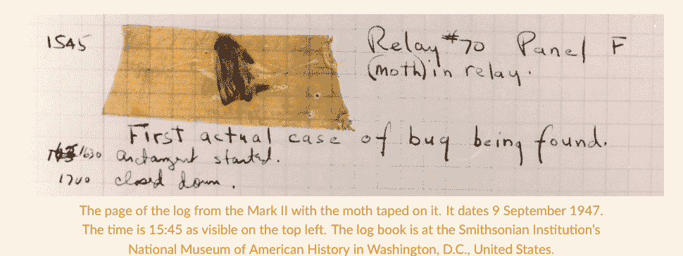

### 让我们编码吧！

1. *知识竞赛之夜！*。知识竞赛是一种问答游戏，玩家需要回答关于各种主题的问题。对于这个知识竞赛的实现，请为3个不同的主题准备3个问题及其对应的答案。让玩家选择一个主题，然后随机提出一个关于该主题的问题。最后，告诉玩家答案是否正确。如果不正确，打印出正确答案。以下是一些提示：

- 你如何组织你的问题和答案？你使用哪些Python数据类型？
- 你需要执行哪些动作序列？在编码前把它们写下来。你总可以在实现过程中更新它们。
- 你如何测试你的代码是否正确？
- 记住要分而治之！

# 第五部分

## WHILE循环与条件

在第五部分，你将学习编码中的最后一个构造：while循环。你还将学习可以在while循环和if/elif/else语句中使用的各种类型的条件。让我们开始吧！

## 17. 你想要更多糖果吗？

while 循环

在编程中，有三种基本结构：if/elif/else、for 循环和 while 循环。你现在已经掌握了前两种，本章你将最终学习 **while** 循环！阅读下面的代码，并尝试理解它的作用。请配合笔记本 17 一起学习！

```python
# initialize variable
number_of_candies = 0

# print the initial number of candies
print("You have " + str(number_of_candies) + " candies")

# ask if one wants a candy
answer = input("Do you want a candy? (yes/no)")

# as long as the answer is yes
while answer == "yes":
    # add a candy
    number_of_candies += 1
    # print the current number of candies
    print("You have " + str(number_of_candies) + " candies")
    # ask again if they want more candies
    answer = input("Do you want more candies? (yes/no)")

# print the final number of candies
print("You have a total of " + str(number_of_candies) + " candies")
```

完成以下练习，开始熟悉 while 循环的语法和功能！

### 判断对错？

1. while 是一个变量
2. while 循环头部包含一个条件
3. 变量 answer 在代码中出现了 2 次
4. 变量 number_of_candies 在每次循环中增加一个单位
5. 只要玩家输入 yes，while 循环就继续；当玩家输入 no 时，循环停止

### 计算思维与语法

让我们运行单元格，并将代码分成两个独立的块来分析。我们从第一个块开始：

```python
# initialize variable
number_of_candies = 0

# print the initial number of candies
print("You have " + str(number_of_candies) + " candies")
```

我们创建了一个名为 `number_of_candies` 的变量，并将其初始化为 0（第 2 行）。这个变量将用来记录我们想要的糖果数量。它是一个非常重要的变量，我们将在分析第二块代码时再次讨论它。在第 5 行，我们打印出当前拥有的糖果数量，也就是零。

让我们看看下一块代码，它是整个代码的核心：

```python
# ask if one wants a candy
answer = input("Do you want a candy? (yes/no)")

# as long as the answer is yes
while answer == "yes":
    # add a candy
    number_of_candies += 1
    # print the current number of candies
    print("You have " + str(number_of_candies) + " candies")
    # ask again if they want more candies
    answer = input("Do you want more candies? (yes/no)")

# print the final number of candies
print("You have a total of " + str(number_of_candies) + " candies")
```

让我们看看 while 循环是如何工作的。我们询问玩家是否想要一颗糖果，并将回复保存在变量 `answer` 中（第 8 行）。然后，我们进入 while 循环头部，它大致表示：只要变量 `answer` 等于 yes，就执行以下操作（第 11 行）：给变量 `number_of_candies` 增加一个单位（第 14 行）；打印出当前的糖果数量（第 17 行），并再次询问玩家是否想要更多糖果（第 20 行）。然后，我们回到 while 循环头部（第 11 行）。如果第 20 行的答案是 yes，我们将重复上述操作，即：给变量 `number_of_candies` 增加一个单位（第 14 行）；打印出当前的糖果数量（第 17 行），并再次询问玩家是否想要更多糖果（第 20 行）。然后，我们将再次回到 while 循环头部（第 11 行）。如果第 20 行的答案再次是 yes，我们将再次重复上述操作，即：给变量 `number_of_candies` 增加一个单位（第 14 行），…… 我们将**只要**变量 `answer` 等于 yes，就一直这样做。如果玩家在第 20 行回答 *no* 会怎样？当我们回到 while 循环头部（第 11 行）时，条件不再成立，因为 `answer` 不等于 yes！所以循环停止，我们直接跳到 while 循环体之后的第一行（第 23 行）。在那里，我们打印出糖果的总数。

现在让我们看看语法。while 循环以一个**头部**（第 11 行）开始，它由三部分组成：(1) 关键字 `while`，(2) 一个条件，和 (3) 冒号 `:`（每个结构头部都以冒号结尾！）。在这个例子中，我们检查分配给变量 `answer` 的值是否等于字符串 "yes"。我们将在下一章看到其他类型的条件。头部之后是 while 循环的**主体**（第 13-20 行）。主体是**缩进的**，类似于 `for` 循环主体和 `if/elif/else` 语句。现在让我们把注意力集中在两个变量上：`answer` 和 `number_of_candies`。

你看到变量 `answer` 多少次，分别在哪里？`answer` 出现在**三个**不同的地方：(1) while 循环**之前**（第 8 行），(2) while 循环的**条件中**，以及 (3) while 循环的**主体中**。为什么我们需要它出现三次？在 while 循环之前，我们必须初始化包含在 while 循环头部条件中的变量；否则，当循环开始时，我们无法评估条件本身。在我们的例子中，我们用玩家的第一个回答初始化了 `answer`（第 8 行）。然后，我们必须检查涉及变量 `answer` 的条件。在这种情况下，我们检查 `answer` 是否等于 yes（第 11 行）。最后，我们必须允许变量发生变化（第 20 行），以便循环可以终止；否则，循环将无限期地继续下去。我们迟早都会忘记这最后一部分，从而陷入**无限循环**！如果这发生在你身上，只需停止单元格（如果运行时间太长，重启内核！）

最后，让我们看看变量 `number_of_candies`。你看到它多少次，分别在哪里？`number_of_candies` 出现在**两个**地方：(1) while 循环**之前**，它在这里被**初始化**（第 2 行），以及 (2) while 循环**内部**，它在这里每次循环**增加**一个单位（第 14 行）。变量 `number_of_candies` 通常被称为**计数器**，因为**它记录循环的次数**。符号 `+=` 是一个**赋值符号**，我们可以读作 *增加*。它是 `number_of_candies = number_of_candies + 1` 的一种紧凑写法。对于任何算术运算符，都有一个相关的赋值运算符，即 `-=`（*减少*）、`*=`（*乘以并重新赋值*）、`/=`（*除以并重新赋值*）等。请注意，在赋值运算符中，符号 `=` 总是位于第二位，在算术运算符之后。

## 第 5 部分。while 循环与条件

for 循环和 while 循环有什么区别？在第 8 章中，我们将 while 循环定义如下：

> **for 循环**是将一组命令重复执行**确定**次数

在 **for 循环**中，我们确切地知道我们将运行循环体中的命令**多少次**。相反，**在 while 循环中，我们*不*知道**我们将运行循环体中的命令多少次，因为 while 循环的持续时间取决于头部条件的有效性。让我们定义 while 循环并总结其特点：

> **while 循环**是将一组命令重复执行**只要一个条件成立**

当头部的条件不再为真时，while 循环停止。我们必须始终给条件中的变量提供变化的可能性，以便头部的条件可以变为假，循环可以停止。如果条件中的变量（在我们的例子中是 `answer`）在 while 循环主体中无法改变，那么我们将得到一个无限循环。最后，要知道我们运行循环多少次，我们可以使用一个计数器（在我们的例子中是 `number_of_candies`）来跟踪迭代次数。计数器的存在不是强制性的。

### 插入到正确的列中

到目前为止，你已经学习了几种运算符：算术运算符、赋值运算符和比较运算符。将每个符号插入到正确的列中：

+, ==, *=, <, /, *, <=, =, //=, /=, //, !=, -=, -, +=, >=, %=, **, %, **=, >

| 算术运算符 | 赋值运算符 | 比较运算符 |
| --- | --- | --- |
| | | |
| | | |
| | | |
| | | |
| | | |
| | | |

### 回顾

-   `while` 循环是在条件成立时重复执行一组命令。
-   条件中的变量必须在条件判断前初始化。它还必须在循环体内的某处被修改，以便当条件不再成立时循环能够停止。
-   `while` 循环可以有一个计数器。计数器用于跟踪循环次数，必须在循环头之前初始化。
-   当使用算术运算更新变量时，我们可以使用相应的赋值运算符，即 `+=`、`-=` 等。

> **写代码就像写邮件！**

写邮件时我们会做哪些步骤？我们从收件人地址和邮件主题开始，然后继续写称呼、邮件正文、问候语，最后以签名结束（这不就是一个算法吗？）。完成后，我们会再读一遍邮件进行检查。我们纠正一些拼写错误，并快速编辑一些地方。通常，我们会更深入：重新组织一些句子或完全重排某些段落。不知不觉中，我们已经把邮件看了好几遍！

现在，想想我们写代码时的步骤。首先，我们编写导入语句、变量和算法实现。然后我们测试它，检查它是否有效，如果无效，我们就修正它。一旦它最终能工作，我们就删除未使用的变量，压缩一些代码行，改进变量名，并清理注释。就像处理邮件一样，我们循环地查看代码，即从上到下看几遍，就像我们重读邮件一样。但出于某种原因，当我们编码时，我们常常希望第一稿就是最终实现，如果做不到，我们就会感到沮丧。

写代码时，**请将你花在测试、调试和改进代码上的时间视为过程的一部分**，而不是阻止你做其他事情的额外时间！这都是过程的一部分！

### 让我们开始编码！

1.  对于以下每个场景，创建类似于本章中展示的代码：
    a.  *你想要更多饼干吗？*
    b.  *你想要更少的练习吗？*
2.  *在奶酪店。* 你拥有一家奶酪店，以每片50美分的价格出售奶酪片。一位新顾客进来，你询问他们是否想要奶酪。顾客不确定要买多少奶酪，所以在每片之后，你再次询问他们是否想要另一片奶酪。只要顾客说“是”，你就添加一片奶酪，更新最终价格，并告诉他们奶酪片的数量和目前的总价。你卖出了多少片奶酪？最终价格是多少？
3.  *玩数字游戏。* 给定以下列表：`numbers = [0]`，询问玩家是否应该向列表中添加另一个数字。只要玩家说“是”，就将你添加的最后一个数字与当前循环的计数器之和添加到列表中。*示例*：如果你运行 `while` 循环7次，你将得到以下列表：`[0, 1, 3, 6, 10, 15, 21, 28]`
4.  *生成偶数。* 给定一个空列表，询问玩家是否应该向列表中添加另一个数字。只要玩家说“是”，就创建一个0到100之间的随机数，如果该数字是偶数，则将其添加到列表中。你生成了多少个数字？其中有多少个是偶数？有多少个是奇数？你生成的偶数和奇数数量之间的比率是多少？

## 第5部分. `while` 循环与条件

## 18. 动物、唯一数字与求和

多种条件

在上一章中，我们只看到了 `while` 循环中的一种条件——即变量等于“yes”。现在让我们看看另外三个使用其他类型条件的例子。首先，尝试自己解决每个任务：仔细阅读需求，列出要执行的步骤，逐一实现，并将代码合并为解决方案（分而治之！）。这次，也尝试更进一步：留意你在解决任务时大脑所经历的过程。**你经常会发现编码时反复出现的思维模式。** 了解并识别它们将使你有所觉察，从而加快你的工作速度。

对于以下每个示例，你将看到一种可能的编码任务处理方法。也许它与你的想法相似，或者可能不同。无论如何，它都会给你提供可能的思维路径。你可以在 Notebook 18 上尝试这些解决方案。废话不多说——让我们开始编码吧！

### 1. 猜猜动物！

给定以下列表：

```python
animals = ["giraffe", "dolphin", "penguin"]
```

创建一个游戏，计算机随机选择这三个动物中的一个，玩家必须猜出计算机选择的动物。确保玩家持续游戏，直到猜中计算机选择的动物。在游戏结束时，告诉玩家猜中动物用了多少次尝试。

游戏有四个要求：(1) 计算机随机选择三个动物中的一个；(2) 玩家必须猜出计算机选择的动物；(3) 玩家持续游戏，直到猜中计算机选择的动物；(4) 在游戏结束时，告诉玩家猜中动物用了多少次尝试。让我们看看如何实现每个要求！

1.  *计算机随机选择三个动物中的一个。* 这非常直接：

```python
import random

# computer pick
computer_pick = random.choice(animals)
print(computer_pick)
```

我们导入 `random` 包（第1行），并使用其函数 `.choice()` 让计算机从列表 `animals` 中随机选择一个元素（第4行）。然后，我们打印 `computer_pick` 作为检查（第5行）。

2.  *玩家必须猜出计算机选择的动物。* 这个任务也很简单：

```python
# player guess
player_guess = input("Guess the animal! Choices: giraffe, dolphin, penguin:")
```

我们使用 `input()` 函数让玩家输入他们的猜测（第2行）。我们假设玩家的输入是 `giraffe`。

3.  *玩家持续游戏，直到猜中计算机选择的动物。* “直到猜中动物”这个短语等同于“只要他们猜动物”，这立即提示我们应该使用 `while` 循环。我们在循环头中写什么条件？让我们看看：

```python
# as long as the player's guess and the computer's pick are different
while player_guess != computer_pick:

    # tell the player that the animal is not right
    print("That's not the right animal!")

    # ask the player to guess again
    player_guess = input("Try again! Guess the animal! Choices: giraffe, dolphin, penguin:")

# tell the player that they guessed the right animal
print("Well done! You guessed " + computer_pick)
```

当玩家猜中动物时，循环必须停止，即直到 `player_guess` 和 `computer_pick` 相同。通常，当一个需求定义了停止 `while` 循环的条件时，我们必须反向思考：我们需要找到允许 `while` 循环继续的条件。在我们的例子中，只要 `player_guess` 不等于 `computer_pick`，循环就必须继续（第2行）。在循环体内，我们向玩家提供反馈，说明他们选择的动物不正确（第5行），并要求玩家再次猜测动物（第8行），以便 `while` 循环可以继续。最后，在循环之后，我们打印一条消息确认玩家猜对了动物（第12行）。

4.  *在游戏结束时，告诉玩家猜中动物用了多少次尝试。* 我们绝对需要一个计数器！

```python
# initializing the counter
n_of_attempts = 1
```

## 第18章 动物、唯一数字与求和

### 第5部分 while循环与条件

```python
import random

# computer pick
computer_pick = random.choice(animals)
# print(computer_pick)

# player guess
player_guess = input("Guess the animal! Choices: giraffe, dolphin, penguin:")

# initializing the counter
n_of_attempts = 1

# as long as the player's guess and the computer's pick are different
while player_guess != computer_pick:

    # tell the player that the animal is not right
    print("That's not the right animal!")

    # print the numbers of attempts so far
    print("Number of attempts so far: " + str(n_of_attempts))

    # increase the number of attempts
    n_of_attempts += 1

    # ask the player to guess again
    player_guess = input("Try again! Guess the animal! Choices: giraffe, dolphin, penguin:")

# tell the player that they guessed the right animal
print("Well done! You guessed " + computer_pick + " at attempt number " + str(n_of_attempts))
```

Guess the animal! Choices: giraffe, dolphin, penguin: giraffe
That's not the right animal!
Number of attempts so far: 1
Try again! Guess the animal! Choices: giraffe, dolphin, penguin: dolphin
Well done! You guessed dolphin at attempt number 2

我们创建了计数器 `n_of_attempts`（第2行），并将其初始化为1。为什么是1而不是0？因为玩家在while循环*之前*就输入了第一次猜测（参见要求2。*玩家必须猜中电脑选择的动物*），这就是第一次尝试！然后，我们告诉玩家当前的尝试次数（第11行），并在每次循环中将 `n_of_attempts` 增加一个单位（第14行）。最后，我们在最后的打印语句中包含了总尝试次数（第20行）。

完成这四个任务后，我们可以将代码合并在一起！以下是完整的解决方案：

```python
import random

# computer pick
computer_pick = random.choice(animals)
# print(computer_pick)

# player guess
player_guess = input("Guess the animal! Choices: giraffe, dolphin, penguin:")

# initializing the counter
n_of_attempts = 1

# as long as the player's guess and the computer's pick are different
while player_guess != computer_pick:

    # tell the player that the animal is not right
    print("That's not the right animal!")

    # print the numbers of attempts so far
    print("Number of attempts so far: " + str(n_of_attempts))

    # increase the number of attempts
    n_of_attempts += 1

    # ask the player to guess again
    player_guess = input("Try again! Guess the animal! Choices: giraffe, dolphin, penguin:")

# tell the player that they guessed the right animal
print("Well done! You guessed " + computer_pick + " at attempt number " + str(n_of_attempts))
```

请注意，我们注释掉了 `computer_pick` 的打印（第5行），因为最终代码是给玩家用的，而不是给程序员用的！

### 2. 创建一个包含8个唯一随机数的列表！

这是我们的下一个任务：

- 创建一个包含8个0到10之间随机数的列表。确保它们是唯一的，即每个数字在列表中只出现一次。如果数字已经在列表中，则打印以下内容：*数字x已经在列表中。* 在找到8个唯一数字之前，你生成了多少个数字？

这个任务有四个要求：(1) 创建一个包含8个0到10之间随机数的列表；(2) 确保它们是唯一的，即每个数字在列表中只出现一次；(3) 如果数字已经在列表中，则打印 *数字x已经在列表中*；(4) 在找到8个唯一数字之前，你生成了多少个数字？让我们逐一分析这些要求！

1. *创建一个包含8个0到10之间随机数的列表。*
仅根据这个要求，我们可以使用for循环和`.random`模块中的`.randint()`函数来创建一个包含8个数字的列表：

```python
import random

# initialize the number list
unique_random_numbers = []

# for 8 times
for _ in range(8):

    # create a random number between 0 and 10
    unique_random_numbers.append(random.randint(0, 10))

# print the list
print(unique_random_numbers)
[7, 9, 3, 2, 3, 0, 9, 6]
```

我们导入了`random`包（第1行），并将`unique_random_numbers`（它将包含创建的数字）初始化为空列表（第4行）。然后，我们创建了一个for循环，在其中生成八个0到10之间的随机数，并将它们附加到`unique_random_numbers`（第6-10行）。请注意，我们在循环头中使用下划线而不是变量`i`，因为我们在循环体中不需要`i`（参见第15章“深入探讨”部分*如果我不在for循环中使用索引会怎样？*）。最后，我们打印`unique_random_numbers`以检查它是否确实包含八个随机数（第13行）。让我们进入下一个要求！

2. *确保它们是唯一的，即每个数字在列表中只出现一次。* 在我们上面打印的列表中，数字不是唯一的：3和9都出现了两次。因此，我们需要修改我们的代码。怎么做？我们不知道在获得8个唯一数字之前需要生成多少个随机数，也就是说，我们不知道需要运行多少次命令`unique_random_numbers.append(random.randint(0,10))`（上面单元格中的第9行）。因此，我们不能使用for循环——当我们知道确切的迭代次数时使用它——而是需要使用while循环，当迭代次数由条件决定时使用它。**在起草过程中修改代码是正常的**，正如我们在上一章的“深入探讨”部分*写代码就像写电子邮件！*中提到的。在这个while循环中我们使用什么条件？列表必须由8个元素组成，因此其长度必须为8！让我们看看如何转换代码：

```python
import random

# initialize the number list
unique_random_numbers = []

# as long as the length of the list is not 8
while len(unique_random_numbers) != 8:

    # create a random number between 0 and 10
    number = random.randint(0, 10)

    # if the number is already in the list
    if number in unique_random_numbers:
        # place holder
        a = 0
    # otherwise
    else:
        # add the new number to the list
        unique_random_numbers.append(number)

# print the list
print(unique_random_numbers)
[1, 8, 10, 7, 3, 0, 5, 9]
```

在第7行，我们将for循环的头部替换为while循环的头部，条件是只要列表的长度不等于8，循环就**继续运行**。然后，我们生成一个随机数（第10行）。在将随机数添加到列表之前，我们需要确保它是一个新的（或唯一的！）数字。因此，我们创建了一个`if ... in / else`结构（第12-19行），这是我们在第3章学过的。如果数字已经在列表中（第13行），那么我们不想将其添加到列表中。下一个要求将告诉我们该怎么做，所以现在我们可以只使用一个占位符，或者一个我们计划替换的非功能性命令（`a=0`，第15行）。使用占位符不是很好的编码实践，但在非常早期的起草阶段，我们有时可以破例。如果数字不在列表中（第17行的`else`），那么我们将其附加到列表中（第19行）。

3. 如果数字已经在列表中，则打印：数字x已经在列表中
我们将占位符`a=0`替换为打印命令（第15行）：

```python
import random

# initialize the number list
unique_random_numbers = []
```

# 第五部分：while 循环与条件

```python
import random

# 初始化数字列表
unique_random_numbers = []

# 初始化计数器
counter = 0

# 只要列表长度不等于 8
while len(unique_random_numbers) != 8:

    # 创建一个 0 到 10 之间的随机数
    number = random.randint(0, 10)

    # 计数器加 1
    counter += 1

    # 如果该数字已在列表中
    if number in unique_random_numbers:
        # 打印该数字已在列表中
        print("The number " + str(number) +
              " is already in the list")

    # 否则
    else:
        # 将新数字添加到列表
        unique_random_numbers.append(number)

# 打印最终列表和生成的数字总数
print(unique_random_numbers)
print("The total amount of generated numbers is: " + str(counter))
```

The number 1 is already in the list
The number 10 is already in the list
The number 7 is already in the list
The number 5 is already in the list
[1, 8, 10, 7, 3, 0, 5, 9]
The total amount of generated numbers is: 12

我们初始化计数器（第 7 行），在每次迭代中将其增加一个单位（第 16 行），并打印出来（第 29 行）。

## 3. 求 3 的倍数之和

- 编写代码，持续要求玩家输入一个整数，直到他们输入一个负数为止。最后，打印所有输入的 3 的倍数的整数之和。

该任务有两个要求：(1) 持续要求玩家输入一个整数，直到他们输入一个负数；(2) 最后，打印所有输入的 3 的倍数的整数之和。让我们看看如何实现它们！

1. 持续要求玩家输入一个整数，直到他们输入一个负数。要求很明确：我们使用 input 函数要求玩家输入数字，并使用 while 循环持续询问。我们在循环头中使用哪个条件？让我们看看：

```python
# 要求用户输入一个整数
number = int(input("Enter an integer: "))

# 只要数字是正数
while number >= 0:
    # 要求输入下一个新整数
    number = int(input("Enter another integer: "))
```

Enter an integer: 3
Enter another integer: 6
Enter another integer: 4
Enter another integer: -1

只要玩家输入的数字是负数，循环就必须继续，也就是说，只要 number 是正数——大于或等于零（第 5 行）。正如我们在前一章所学，条件中的变量必须出现在三个地方：循环前、循环头中以及循环内。因此，首先我们用玩家输入的整数初始化变量 number（第 2 行）。然后，我们在 while 循环头中设置变量的条件（如第 5 行所示）。最后，为了避免无限循环，我们要求玩家输入一个新数字（第 7 行）。让我们实现第二个要求！

2. 最后，打印所有输入的 3 的倍数的整数之和。
我们需要检查用户输入的数字是否是 3 的倍数，如果是，则将它们相加。有什么思路吗？让我们开始起草代码：

```python
# 包含要相加的数字的列表
numbers = []

# 要求用户输入一个整数
number = int(input("Enter an integer: "))

# 只要数字是正数
while number >= 0:

    # 如果数字是 3 的倍数
    if number % 3 == 0:

        # 将数字添加到列表
        numbers.append(number)

    # 要求输入下一个整数
    number = int(input("Enter another integer: "))

# 打印 3 的倍数列表
print(numbers)

# 初始化总和为 0
sum_of_numbers = 0

# 计算数字的总和
for i in range(len(numbers)):
    sum_of_numbers = numbers[i] + sum_of_numbers

# 打印最终总和
print("The sum of the multiples of 3 is: " + str(sum_of_numbers))
```

Enter an integer: 3
Enter another integer: 6
Enter another integer: 4
Enter another integer: -1
[3, 6]
The sum of the entered multiples of 3 is: 9

我们可以创建一个名为 numbers 的空列表，用于包含 3 的倍数（第 2 行）。然后，在 while 循环内，我们添加一个 if 结构，其中我们使用取模运算符检查当前数字是否是 3 的倍数。如果条件满足，我们将数字附加到 numbers 列表中（第 13 行）。在 while 循环结束时（即玩家输入负数之后），我们将列表中的数字相加，类似于我们在第 14 章练习 5 中所做的。首先，我们创建变量 sum_of_numbers，它将包含最终总和，并将其初始化为零（第 22 行）。然后，我们使用 for 循环遍历包含 3 的倍数的 numbers 列表，将当前列表元素（numbers[i]）加到 sum_of_numbers 中的金额上（第 26 行）。最后，我们在第 29 行打印出总和。

我们解决了任务，但我们可以改进代码吗？让我们再读一遍要求：*最后，打印所有输入的 3 的倍数的整数之和*。我们没有被要求将 3 的倍数保存在列表中——只是打印它们的总和。我们需要创建列表吗？不必要！那么，我们怎么做呢？让我们看看这个替代解决方案：

```python
# 初始化总和为 0
sum_of_numbers = 0

# 要求用户输入一个整数
number = int(input("Enter an integer: "))

# 只要数字是正数
while number >= 0:

    # 如果数字是 3 的倍数
    if number % 3 == 0:

        # 将数字加到总和
        sum_of_numbers += number

    # 要求输入下一个整数
    number = int(input("Enter another integer: "))
```

# 第五部分：while 循环与条件

- 给定以下列表：
- 创建一个游戏，让电脑随机选择一种水果，玩家需要猜出电脑选择的水果。确保玩家持续游戏，直到猜中电脑选择的水果。

```python
fruits = ["mango", "orange", "banana"]
```

我们需要解决三个任务：（1）电脑随机选择一种水果，（2）玩家需要猜出电脑选择的水果，以及（3）我们必须确保玩家持续游戏，直到猜中电脑选择的水果。前两个要求很直接，我们将快速解决它们。我们将重点关注第三个要求。

1. 电脑随机选择一种水果。

```python
import random

# computer pick
computer_pick = random.choice(fruits)
```

我们导入 `random` 包（第1行），并使用 `.choice()` 方法让电脑从 `fruits` 列表中随机选择一个元素。

2. 玩家需要猜出电脑选择的水果。

```python
# player guess
player_guess = input("Guess the fruit! Choices: mango, orange, banana: ")
```

我们使用内置函数 `input()` 来让玩家输入一种水果（第7行）。

3. 确保玩家持续游戏，直到猜中电脑选择的水果。第一反应可能是这样做：

```python
# check the player guess
if player_guess == computer_pick:
    print("That's right! The fruit is " + computer_pick)
else:
    print("Nope! Try again!")
```

我们使用 `if/else` 结构检查 `player_guess` 是否等于 `computer_pick`，并相应地打印消息（第9-11行）。如果玩家没有猜对水果，我们必须让他们再次猜测（就像第7行那样）。然后，我们必须再次检查猜测是否正确（就像第9-11行那样），如此循环。这是不可行的，因为我们无法知道玩家需要猜多少次才能猜对！此外，我们会重复代码，这意味着我们可以使用循环！所以，以下是使用 `while` 循环的正确解决方案：

```python
while player_guess != computer_pick:
    # as long as the player's guess is not right
    player_guess = input("Nope! Try again! Guess the fruit! Choices: mango, orange, banana: ")
```

只要 `player_guess` 不等于 `computer_pick`（第9行），我们就让玩家进行猜测（第11行），我们在 `while` 循环头部的条件中检查这一点（第9行），只要条件成立，循环就会继续。

### 让我们来编程！

1. 猜数字！创建一个游戏，电脑在0到10之间选择一个数字，玩家需要猜出它。如果玩家猜的数字太高或太低，电脑会告诉玩家。当玩家猜中数字时游戏停止。最后，告诉玩家猜中数字用了多少次尝试。
2. 12个偶数随机数。创建一个包含12个0到30之间偶数的列表。你排除了多少个奇数？
3. 儿童拼写游戏。创建一个帮助孩子学习拼写的游戏。游戏有以下要求：（1）创建一个待拼写单词的列表。从这些单词中随机选择一个单词，并告诉孩子所选单词（例如，“拼写单词‘hello’”）。（2）孩子必须一次输入一个字母。如果孩子输入了正确的字母，则给予积极强化（例如，“做得好！”），并要求输入下一个字母。如果孩子没有输入正确的字母，则告诉他们字母不正确，并再次要求输入字母。
    - 挑战1：不要只创建1个单词列表，而是创建3个列表，每个主题一个，这样孩子可以在拼写单词前选择一个主题。
    - 挑战2：只要孩子想拼写新单词，游戏就继续。

## 19. and, or, not, not in

组合与反转条件

到目前为止，我们在 `if/else` 结构和 `while` 循环中只考虑了一个条件。如果我们需要多个条件呢？如果我们需要反转一个条件呢？在本章中，我们将学习如何使用逻辑运算符 `and`、`or`、`not` 和成员运算符 `not in` 来组合或反转条件。像往常一样，在查看解决方案之前，请尝试自己解决任务，你也可以在 Notebook 19 中找到解决方案。让我们开始吧！

### 1. and

- 给定以下整数列表：

```python
numbers = [1, 5, 7, 2, 8, 19]
```

- 打印出介于5和10之间的数字：

```python
# for each position in the list
for i in range(len(numbers)):
    # if the current number is between 5 and 10
    if numbers[i] >= 5 and numbers[i] <= 10:
        # print the current number
        print("The number " + str(numbers[i]) + " is between 5 and 10")
```

The number 5 is between 5 and 10
The number 7 is between 5 and 10
The number 8 is between 5 and 10

我们使用 `for` 循环遍历列表中的所有元素（第2行）。然后，我们检查每个数字是否在5和10之间（第5行）。要介于两个数字之间，一个数字必须大于或等于较小的数字，并且小于或等于较大的数字。这两个条件（大于或等于和小于或等于）必须同时成立。要检查两个（或更多）条件是否同时成立，我们使用逻辑运算符 `and` 将它们连接起来。

> 当我们想检查所有条件是否都成立时，我们使用逻辑运算符 `and`

让我们看看语法。对于逻辑运算符 `and` 前后的每个条件，我们都必须写：（1）一个变量（例如，`numbers[i]`），（2）一个比较运算符（例如，`>=`），以及（3）一个比较项（例如，`5`）。在代码的最后，我们打印满足两个条件的数字（第7行）。

## 2. 或

给定以下字符串：

```python
message = "Have a nice day!!!"
```

以及所有标点符号：

```python
punctuation = ""\/'()[]{}<>.,;:?!@~#$%&*_"
```

字符串 `punctuation` 包含了拉丁字母键盘上的所有标点符号。请将这些符号与你键盘上的符号进行比较，并注意是否有额外的符号！如果有，请在 Jupyter Notebook 19 中将它们添加到 `punctuation` 中！字符串 `punctuation` 开头的符号 `""\/'` 可能有点令人困惑，让我们来梳理一下。第一个引号 `"` 是引入字符串的符号。接下来的两个符号 `\/'` 是特殊字符——你可能记得特殊字符 `\n`，它用于换行（第 12 章）。反斜杠 `\` 告诉 Python，后面的引号 `"` 是一个实际的反斜杠字符，而不是我们用来关闭字符串的符号。最后一个反斜杠 `\` 是一个实际的反斜杠，因为后面的正斜杠 `/` 不是特殊字符。

打印并计算标点符号**或**元音字符的数量：

```python
# 元音字符串
vowels = "aeiou"

# 初始化计数器
counter = 0

# 遍历 message 中的每个位置
for i in range(len(message)):
    # 如果当前元素是标点符号或元音
    if message[i] in punctuation or message[i] in vowels:
        # 打印一条消息
        print(message[i] + " is a vowel or a punctuation")
        # 增加计数器
        counter += 1

# 打印最终数量
print("The total amount of punctuation or vowels is " + counter)
```

## 第 5 部分。while 循环和条件

```
i is a vowel or a punctuation
e is a vowel or a punctuation
a is a vowel or a punctuation
! is a vowel or a punctuation
! is a vowel or a punctuation
! is a vowel or a punctuation
The total amount of punctuation or vowels is 9
```

与我们处理标点符号的方式类似，我们创建了一个包含元音的字符串（第 2 行）。我们还创建了一个计数器，用于计算标点符号或元音字符的数量，并将其初始化为零（第 5 行）。然后，我们进入解决方案的核心！我们使用一个 for 循环来遍历字符串 `message` 中的所有字符（第 8 行）。**字符串的 for 循环与列表的 for 循环工作方式完全相同。** 在循环体中，我们使用成员运算符 `in`（第 11 行）来检查每个字符是否是标点符号或元音，这是我们在第 3 章学过的。更具体地说，我们检查 `message[i]` 是否在字符串 `punctuation` 中或在字符串 `vowels` 中。请注意，与 for 循环一样，成员运算符 `in` 对字符串的工作方式与对列表的工作方式相同。由于只有一个条件可以成立（一个字符不能同时是标点符号和元音！），我们使用**逻辑运算符 `or`** 将两个条件合并——即 `message[i] in punctuation or message[i] in vowels`。

> 当我们想检查**至少一个条件是否成立**时，我们使用逻辑运算符 **`or`**

语法与逻辑运算符 `and` 相同：我们需要在 `or` **之前和之后**都写上 (1) 一个变量，(2) 一个比较运算符，和 (3) 一个比较项。为了结束循环体，我们为满足至少一个条件的字符打印一条消息（第 14 行），并将计数器增加一个单位（第 17 行）。在循环结束时，我们打印元音或标点符号字符的最终数量（第 20 行）。

## 3. 非

- 给定以下整数列表：

```python
numbers = [4, 6, 7, 9]
```

`numbers` 被赋值为四、六、七、九。

- 打印出**不能**被 2 整除的数字：

```python
# 遍历列表中的每个位置
for i in range(len(numbers)):
    # 如果当前数字不是偶数
    if not numbers[i] % 2 == 0:
        # 打印当前数字
        print(numbers[i])
```

对于列表中的每个位置（第 2 行），我们必须检查该数字是否*不是*偶数。让我们暂时思考一下相反的情况：如果我们必须检查数字是否是偶数，我们会写什么条件？`if numbers[i] % 2 == 0`。要否定一个条件，我们只需在条件**之前**添加**逻辑运算符 `not`**——更具体地说，在条件开头的变量之前（第 5 行）。

> 当我们想检查**一个条件的反面是否成立**时，我们使用逻辑运算符 **`not`**

如果条件满足，我们就打印该数字（第 8 行）。

这是解决这个任务的唯一方法吗？也许你最初想到的第一个想法更接近这个：

```python
# 遍历列表中的每个位置
for i in range(len(numbers)):
    # 如果当前数字是奇数
    if numbers[i] % 2 != 0:
        # 打印当前数字
        print(numbers[i])
```

对于列表中的每个位置（第 2 行），我们检查 `numbers[i]` 除以 2 的余数是否不等于 0（第 5 行）。如果是，我们就打印该数字（第 8 行）。

哪种解决方案更好？这取决于个人偏好！如果你犹豫不决，就选择在语法和推理上看起来最简单的解决方案。在编码中，通常有多种方法可以解决一个任务。保持解决方案**简单**有利于**可读性**和**理解**。

关于条件的最后一点：当组合条件时，我们需要遵循特定的顺序，类似于我们处理算术运算符的方式（参见第 13 章的*求解算术表达式*）。从最高到最低的优先级顺序是：`not`、`and`、`or`（易于记忆的首字母缩写：**NAO**）。当你不确定时，将需要优先处理的条件写在圆括号 `()` 中。

## 4. 不在

- 生成 5 个 0 到 10 之间的随机数。如果随机数**不在**以下列表中，则添加它们：

```python
numbers = [1, 4, 7]
```

```python
import random
```

```python
# 循环五次
for _ in range(5):
    # 生成一个 0 到 10 之间的随机数
    number = random.randint(0, 10)
    # 打印该数字作为检查
    print(number)
    # 如果新数字不在 numbers 中
    if number not in numbers:
        # 将该数字添加到 numbers
        numbers.append(number)

# 打印最终列表
print(numbers)
```

```
6
6
10
7
9
[1, 4, 7, 6, 10, 9]
```

我们首先导入 `random` 包（第 1 行）。然后，我们创建一个运行五次的 for 循环（第 4 行）——注意使用下划线而不是变量 `i`，因为我们在 for 循环体中不需要任何索引（参见第 15 章的*如果我不在 for 循环中使用索引会怎样？*）。然后，我们创建一个随机变量（第 7 行）并打印它作为检查（第 9 行）。为了评估变量 `number` **是否不在列表** `numbers` 中（第 12 行），我们使用**成员运算符 `not in`**，它是成员运算符 `in` 的反面（第 3 章）。如果条件满足，我们就将随机生成的数字附加到数字列表中（第 14 行）。最后，我们打印完成的列表（第 17 行）。

### 插入到正确的列

你现在知道了所有的成员、比较和逻辑运算符。将每个符号插入到正确的列中：

`<`、`or`、`in`、`!=`、`not`、`>`、`==`、`not in`、`>=`、`and`、`<=`

| 成员运算符 | 比较运算符 | 逻辑运算符 |
| --- | --- | --- |
| | | |
| | | |
| | | |
| | | |
| | | |

### 回顾

- 逻辑运算符是 `and`、`or` 和 `not`。
- 当组合条件时，执行顺序是 `not`、`and`、`or`（NAO）。
- 成员运算符是 `in` 和 `not in`。

> ### 什么是 GitHub？
你可能听说过 GitHub，或者你可能在它的网站（github.com）上浏览过一些页面。当然，你已经在 GitHub 上查看过本书练习的解决方案了！但 GitHub 到底是什么？简单来说，我们可以将 GitHub 视为一个云服务或一个巨大的代码服务器。程序员们更喜欢使用 GitHub 来同步他们的代码，而不是使用 Dropbox、Google Drive 等。GitHub 有自己的语言：文件夹被称为 *repositories*（仓库），将文件发送到服务器被称为 *push*（推送），从服务器获取文件被称为 *pull*（拉取）。每个仓库都包含文件——它们可以存储任何文件，无论是否包含代码——以及特定于编码的元素，例如 *issues*（议题），任何人都可以在其中指出需要解决的错误或建议新功能。为什么程序员使用 GitHub 而不是其他云服务？因为 GitHub 支持**版本控制**，即它**跟踪代码随时间的变化**。每次我们推送代码更新时，我们都可以将其与之前的版本进行比较，如果新代码不起作用，我们可以回退到早期版本。此外，GitHub 对于协作项目很有用：程序员可以独立处理任务的不同部分，然后集成代码，而不会意外地影响彼此的代码，同时跟踪每个程序员的贡献。这些任务实际上是由 **Git** 执行的，它是一个分布式版本控制系统，即一个管理代码更改的软件。其他使用 Git 的平台包括 GitLab（gitlab.com）和 Bitbucket（bitbucket.org），其中 GitHub 是最受欢迎的。

### 让我们编码吧！

1. *Python 之禅。* 解决以下 4 个步骤，你将发现 Python 之禅！

    a) 给定以下字符串列表：
    `strings_to_slice = ["reisk", "kpan", "xfsimpleg", "bosolutionb", "pobetterx", "weorb", "ofworsep", "aathanx", "hoau", "hfcomplexx", "poors", "opcomplicatedx", "rwsolutions", "re?o"]`
    创建一个名为 `sliced_strings` 的新列表，包含相同的字符串，但去掉前两个字母和最后一个字母（例如："gfhio" 将变成 "hi"）。

    b) 给定以下字符串列表：
    `strings_to_invert = ["emos", "elpoep", "kniht", "taht", "xelpmoc", "ro", "detacilpmoc", "si", "retteb", "naht", "elpmis"]`
    创建一个名为 `inverted_strings` 的新列表，包含相同的字符串，但顺序反转（例如："ih" 将变成 "hi"）。

c) 给定以下字符串列表：

strings_to_pick = ["this", "sounds", "simple", "but", "is", "it?", "some", "things", "look", "better", "than", "when", "complex", "but", "complex", "again", "is", "worse", "better", "than", "complicated", "I'm", "confused"]

找出同时存在于 sliced_strings 和 inverted_strings 中的单词，将它们转换为大写，并添加到一个新列表中。你得到了什么句子？

d) 这个句子来自哪里？运行以下 Python 命令：import this

2. *玩转数字。* 给定以下数字列表：

numbers = [7, 9, 15, 19, 24, 30, 37, 45, 50]

a) 打印能被 3 和 5 整除的数字；b) 打印能被 3 或 5 整除的数字；c) 打印能被 3 整除但不能被 5 整除的数字。用两种不同的方式执行任务 c)，一次使用 `not`，一次不使用 `not`。

3. *升级版石头、剪刀、布。* 在第 16 章中，我们实现了石头、剪刀、布游戏。在那个版本中，有很多重复代码。在编程中，我们通常不希望有重复，因为它们可能引入错误。我们如何让代码不那么重复？通过组合条件！在这个游戏中，你可以组合哪些条件？使用逻辑运算符，以更简洁的方式重写石头、剪刀、布游戏。优化代码后，通过添加一个 `while` 循环使其成为一个真正的游戏，让玩家可以随心所欲地玩。*提示：* 不要从计算机和玩家的选择角度思考，而是从结果的角度思考，即平局和玩家（或计算机）获胜。

## 20. 比较和条件的幕后

### 布尔值

终于到了揭晓比较和条件背后秘密的时候了！当我们写一个比较或条件时，Python “看到”了什么？让我们通过下面的代码来找出答案！请跟随 Notebook 20 一起操作。

### 1. 单个比较或条件

- 给定以下赋值：

```
[1]: 1 number = 5
```

- 以下比较操作的结果是什么？

```
[2]: 1 print (number > 3)
True
```

打印的值是 True。事实上，5 大于 3 是正确的！但 True 是什么？一个字符串？一个变量？让我们在下一个单元格中找出答案！

- 将上述操作赋值给一个变量并打印它。它是什么类型？

```
[3]: 1 result = number > 3
2 print (result)
3 type (result)
True
bool
```

我们将比较操作 `number > 3` 的结果赋值给变量 `result`（第 1 行）。然后，我们打印 `result`（第 2 行），得到 True——就像在单元格 2 中一样。最后，我们打印 `type(result)` 的结果来确定变量 `result` 的类型（第 3 行）——我们在第 13 章提到了内置函数 `type()`。我们说变量 `result` 的类型是布尔值，其值为 True。布尔值是一种数据类型，就像字符串、列表、整数等一样。

让我们继续探索比较和条件背后的秘密。看看这个例子：

- 以下比较操作的结果是什么？

```
[4]: 1 print (number < 3)
False
```

这次，打印结果是 False。显然，3 不小于 5。让我们继续，类似于我们在单元格 3 中所做的。

### 第 5 部分。while 循环和条件

- 将上述操作赋值给一个变量并打印它。它是什么类型？

```
[5]:
1 result = number < 3
2 print (result)
3 type (result)
False
bool
```

我们将比较操作 `number < 3` 的输出赋值给变量 `result`（第 1 行），并打印它（第 2 行），得到 `False`，就像在单元格 4 中一样。然后，我们打印变量 `result` 的类型（第 3 行），得到 `bool`，就像我们对 `True` 所做的那样。

> 布尔值是一种变量**类型**。它们只能有两个值：**True** 或 **False**

当我们在 if/else 结构或 while 循环头部编写条件时，Python “读取”条件背后的结果：即 `True` 或 `False`。例如，当我们写：

```
1 if numbers > 3:
2     print ("Correct!")
```

Python “看到”：

```
1 if True:
2     print ("Correct!")
```

### 2. 组合比较或条件

让我们将操作更进一步，看看组合条件时会发生什么。

- 以下比较操作的结果是什么？

```
[6]:
1 number = 3
2 print (number > 1)
3 print (number < 5)
4 print (number > 1 and number < 5)
True
True
True
```

我们将 3 赋值给变量 `number`（第 1 行）。然后，我们打印三个比较操作的结果。对于所有操作——`number > 1`（第 2 行）、`number < 5`（第 3 行）和 `number > 1 and number < 5`（第 4 行）——结果都是 `True`。让我们关注第 4 行，我们使用逻辑运算符 `and` 组合了两个比较操作。对于这些组合操作，Python “看到”：

```
4 print (True and True):
True
```

如我们所见，两个 `True` 条件通过逻辑运算符 `and` 组合的结果是 `True`。

### 第 20 章。比较和条件的幕后

- 如果我们将第一个条件改为假，会发生什么？

```
[7]:
1 number = 3
2 print (number > 4)
3 print (number < 5)
4 print (number > 4 and number < 5)

False
True
False
```

第一个条件现在是 False，因为 3 不大于 4（第 2 行），而第二个条件仍然是 True（第 3 行）。第 2 行的 False 条件与第 3 行的 True 条件组合返回 False（第 4 行）。在最后一种情况下，Python “看到”：print False and True

```
4 print (False and True):
False
```

因此，一个 True 和一个 False 条件通过逻辑运算符 `and` 合并的输出是 False。让我们继续分析剩余的组合！

- 如果我们将第二个条件改为假，会发生什么？

```
[8]:
1 number = 3
2 print (number > 1)
3 print (number < 2)
4 print (number > 1 and number < 2 )

True
False
False
```

第一个条件是 True（第 2 行）——就像在单元格 6 中一样——而第二个条件现在是 False，因为 3 不小于 2（第 3 行）。类似于单元格 7，一个 True 条件和一个 False 条件（第 4 行）的组合返回 False。在这种情况下，Python “读取”：print True and False

```
4 print (True and False):
False
```

我们可以推断，一个 False 和一个 True 条件通过逻辑运算符 `and` 合并的输出总是 False，无论条件的顺序如何。

- 最后，如果我们将两个条件都改为假，会发生什么？

```
[9]:
1 number = 3
2 print (number > 4)
3 print (number < 2)
4 print (number > 4 and number < 2)

False
False
False
```

### 第 5 部分。while 循环和条件

两个条件都是 False，因为 4 既不大于 4（第 2 行），也不小于 2（第 3 行）。两个条件的组合也是 False（第 4 行）。这就是 Python “看到”的：

```
4 print (False and False): print False and False
False
```

我们可以使用**真值表**来总结使用逻辑运算符 `and` 组合条件的结果：

| 第一个条件 | 第二个条件 | 第一个条件 and 第二个条件 |
|---|---|---|
| (1) | True | True | True |
| (2) | False | True | False |
| (3) | True | False | False |
| (4) | False | False | False |

第 1 行对应我们在单元格 6 中看到的示例，其中两个条件都是 True，它们的组合也是 True。我们可以将第一行读作 *True and True 得到 True*。第 2 行，其中 *True and False 得到 False*，对应单元格 7 中的示例。第 3 行——*False and True 得到 False*——对应单元格 8 中的示例。最后，第 4 行对应单元格 9 中的示例，其中 *False and False 得到 False*。当你编写使用 `and` 组合条件的代码时，可以使用此表作为参考来确定结果！

当我们使用逻辑运算符 `or` 组合条件时会发生什么？以下是 **or 的真值表**：

| 第一个条件 | 第二个条件 | 第一个条件 or 第二个条件 |
|---|---|---|
| (1) | True | True | True |
| (2) | False | True | True |
| (3) | True | False | True |
| (4) | False | False | False |

对于逻辑运算符 `or`，*True and True 得到 True*（第 1 行），*False and True 得到 True*（第 2 行），*True and False 得到 True*（第 3 行），*False and False 得到 False*（第 4 行）。

`and` 和 `or` 真值表之间有什么异同？两个表的第一个和第二个条件的列是相同的，但结果发生了变化。对于 `and`，只有当两个条件都为 True 时，结果才为 True，在所有其他情况下都为 False。相反，对于 `or`，只有当两个条件都为 False 时，结果才为 False，在所有其他情况下都为 True。附注：在其他教科书或互联网上，你可能会发现第一个和第二个条件的列是颠倒的。但结果保持不变！

让我们以**逻辑运算符 not 的真值表**来结束。如下所示：

| 条件 | not 条件 |
|---|---|
| (1) | True | False |
| (2) | False | True |

`not` 会反转条件。当我们在 True 条件前写 `not` 时，它变成 False（第 1 行）。相反，当我们在 False 条件前写 `not` 时，它变成 True（第 2 行）。

## 创建你的示例

在笔记本中，为“与”真值表和“非”真值表的每一行编写一个示例，类似于我们上面为“与”所做的。

## 3. 我们还在哪里使用布尔值？

布尔值经常在 while 循环中用作**标志**。这是什么意思？

- 看看这个修改过的例子*你还想要更多糖果吗？*，它来自第17章：

```python
# initialize variable
number_of_candies = 0

# use a Boolean as a flag
flag = True

# print the initial number of candies
print("You have " + str(number_of_candies) + " candies")

# as long as the flag is True
while flag == True:

    # ask if they want a candy
    answer = input("Do you want a candy? (yes/no)")

    # if the answer is yes
    if answer == "yes":

        # add a candy
        number_of_candies += 1

        # print the total number of candies
        print("You have " + str(number_of_candies) + " candies")

    # if the answer is not yes
    else:

        # print the final number of candies
        print("You have a total of " + str(number_of_candies) + " candies")

        # stop the loop by assigning False to the flag
        flag = False
```

### 找出不同之处

你能找出上面例子中的 while 循环和第17章中的 while 循环之间的一些区别吗？

你可能还记得第17章，对于一个 while 循环，我们必须创建一个变量，这个变量需要：(1) 在循环头*之前初始化*，(2) 包含在循环头*内的一个条件中*，并且 (3) 允许在循环体*内改变*以避免无限迭代。在第17章的例子中，遵循这三个规则的变量是 `answer`。在这个例子中，它是 `flag`。我们将 `flag` 初始化为一个值为 `True` 的布尔值（第5行），然后在 while 循环头中检查它的值是否等于 `True`（第11行），最后我们允许它变为 `False`（第32行）以避免无限循环。`flag` 是一个常见的变量名，用于表示这种行为的布尔变量——`counter` 是另一个典型的变量名，用于表示记录迭代次数的变量。我们可以把 `flag` 变量想象成一个交通灯，它让循环继续或停止。只要交通灯是绿色的（即 `flag` 是 `True`），循环就会继续。当交通灯变成红色（即 `flag` 被赋值为 `False`）时，循环结束。在 while 循环中使用布尔标志有点像是为条件提供答案，而不是让循环头去测试条件。

使用标志时，while 循环的构造可能会改变。这个新代码版本中的变量 `answer` 怎么样？我们在 while 循环体的开头初始化 `answer`，在那里我们使用内置函数 `input` 向玩家提问（第14行）。然后我们创建一个 if/else 条件，根据 `answer` 的值来决定做什么（第17-32行）。如果 `answer` 是 "yes"，那么我们将计数器 `number_of_candies` 加1（第20行），并向玩家打印反馈（第23行）。否则（即 `else`），我们向玩家打印最终反馈（第29行），并允许标志改变（第32行）。

这些是编写 while 循环的几种方式。我们应该使用哪一种？所有方式都有其优缺点。选择看起来更简单、更容易理解的那一种！

### 回顾

- 当我们编写一个比较或一个条件时，结果是一个布尔变量
- 布尔值是 Python 的一种类型，就像列表、字符串、整数等一样
- 只有2个布尔值：True 和 False
- 使用 and、or、not 组合条件遵循*真值表*
- 布尔值可以在 while 循环中用作*标志*（它们就像交通灯一样）

## GeeksforGeeks 和 Stack Overflow 之间有什么区别？

有几种在线编码资源。它们之间有什么区别？我们如何选择使用哪一个？简单来说，我们可以将网站分为两类：教程网站和问答（Q&A）网站。在**教程网站**中，每个页面都包含关于特定主题的清晰而广泛的解释。常见的教程网站有 GeeksforGeeks (www.geeksforgeeks.org)、W3Schools (www.w3schools.com) 或 learnpython.org (www.learnpython.org)。后两个网站还允许你直接在网页上输入代码，这样你就可以立即测试你所学的内容。另一方面，在**问答网站**中，每个页面都以用户的一个问题开始，然后是其他用户的回答。通常，问题是关于解决错误或寻找更好的代码实现。例子包括 Stack Overflow (www.stackoverflow.com) 或 Reddit (www.reddit.com)。问答网站对程序员来说非常有用。我们都会遇到不知道如何解决的问题。好消息是，总有人以前遇到过同样的问题，而且我们可以在网上找到他们的解决方案！

### 让我们编码吧！

1. *你想减少练习吗？* 使用布尔值作为循环头中的标志，重写第17章练习*你想减少练习吗？*中的 while 循环。
2. *抛硬币！* 抛硬币时，我们有两个结果：正面和反面。在这个练习中，我们将用 `True` 表示正面，用 `False` 表示反面。抛硬币8次，并将结果保存在一个元素类型为布尔值的列表中。你得到了多少次正面和反面？正面和反面次数的比率是多少？现在抛硬币1000次。新的比率是多少？这两个比率有什么不同？
3. *比较器。* 比较器是一种比较两个数字的算法。它类似于计算器，但它使用比较运算符而不是算术运算符。创建一个比较器，要求用户输入两个整数，并打印这两个整数之间所有可能的比较结果。*示例：* 如果用户输入3和5，则打印：
    3 > 5 is False
    3 < 5 is True
    等等。
    确保：(1) 使用所有比较运算符；(2) 尽可能使用布尔值；(3) 允许用户根据需要长时间使用比较器。你使用了哪些数字来测试比较器是否正常工作？什么时候你会得到 `True` 作为输出？

# 第6部分

## 聚焦列表和 for 循环

在本部分中，你将把你现有的关于列表和 for 循环的知识与新的概念和属性结合起来。在第6部分结束时，你将完全掌握列表和循环！

## 21. 列表概述

操作、方法和技巧

我们学习计算思维和 Python 编程的旅程已经过半！因此，这是一个很好的时机，可以稍作休息，并总结我们到目前为止所学到的关于列表的一切。在本章中，我们将运用 Python 列表的“语法规则”，并强调一些值得了解的新重要属性。本章包含许多示例和细节，将帮助你提高编码技能并理解他人的代码。让我们开始吧！请跟随笔记本21！

### 1. 列表元素的算术运算

你可能还记得第13章，在 Python 中有7种算术运算：加法 (+)、减法 (-)、乘法 (*)、幂运算 (**)、除法 (/)、整除 (//) 和取模 (%)。要执行*逐元素*的算术运算——即对列表元素进行运算——我们使用 for 循环。**逐元素运算可以在 (1) 两个或多个相同长度的列表之间进行，或者 (2) 在一个列表和一个数字之间进行。** 在这两种情况下，我们都**使用 for 循环**。让我们看两个加法的例子（但它们对任何运算都有效）。

- 逐元素相加两个列表：

```python
odd_numbers = [1, 3, 5]
even_numbers = [2, 4, 6]
summed = []

for i in range(len(odd_numbers)):
    summed.append(odd_numbers[i] + even_numbers[i])
print(summed)
# Output: [3, 7, 11]
```

我们从 `odd_numbers` 和 `even_numbers` 开始，它们是两个各包含3个整数的列表（第1行和第2行），以及 `summed`，我们将其初始化为空列表（第3行）。然后，我们创建一个 for 循环，遍历其中一个数字列表的索引（第5行），并将列表 `odd_numbers` 的当前元素与列表 `even_numbers` 中相同位置的元素相加的结果追加到 `summed` 中（第6行）。最后，我们打印结果以供检查（第8行）。请注意，我们将结果保存在第三个列表（`summed`）中，该列表在循环前被初始化为空（第3行），并在循环过程中填充（第6行）。如果我们不想创建第三个列表，我们可以覆盖其中一个现有列表（例如，`odd_numbers[i]=odd_numbers[i] + even_numbers[i]`）。

- 将一个数字加到列表的每个元素：

```python
numbers = [1, 2, 3]
number = 3
```

## 第6部分：聚焦列表与for循环

```python
4  for i in range(len(numbers)):
5      numbers[i] += number
6
7  print(numbers)
[4, 5, 6]
```

for i in range len of numbers
numbers in position i incremented by number
print numbers

我们创建一个包含三个整数的列表`numbers`（第1行），并将变量`number`赋值为3（第2行）。然后，我们使用`for`循环遍历列表元素的所有位置（第4行），并将每个元素的值增加`number`（第5行）。最后，我们打印结果（第7行）。与之前的示例类似，我们可以选择覆盖现有列表（如本例所示），也可以在`for`循环之前创建一个空列表（例如，`summed = []`），并在循环中填充它（例如，`summed.append(numbers[i] + number)`）。

## 2. 列表之间的“算术”操作

列表之间的操作实际上并非算术运算，但它们使用了具有不同含义的算术符号。**两种可能的操作是连接**，使用符号`+`（读作“与...连接”）**和复制**，使用符号`*`（读作“被[数字]复制”）。让我们看一些例子：

-   • 连接两个列表：

```python
[3]:
1  odd_numbers = [1, 3, 5]
2  even_numbers = [2, 4, 6]
3  concatenated = odd_numbers + even_numbers
4  print(concatenated)
[1, 3, 5, 2, 4, 6]
```

odd_numbers is assigned one, three, five
even_numbers is assigned two, four, six
concatenated is assigned odd numbers concatenated with even numbers
print concatenated

我们创建两个列表，一个包含奇数（`odd_numbers`；第1行），另一个包含偶数（`even_numbers`；第2行）。然后，我们使用连接符号`+`将它们连接起来（第3行），并将结果存储在一个名为`concatenated`的新列表中（第3行）。如果我们不想创建新变量，可以覆盖两个现有列表中的一个：`odd_numbers = odd_numbers + even_numbers`。最后，我们打印结果（第4行），这是一个按顺序合并了`odd_numbers`和`even_numbers`元素的列表。

-   • 将一个列表复制3次：

```python
[4]:
1  numbers = [1, 2, 3]
2  number = 3
3  replicated = numbers * number
4  print(replicated)
[1, 2, 3, 1, 2, 3, 1, 2, 3]
```

odd_numbers is assigned one, two, three
number is assigned three
replicated is assigned numbers replicated by number
print replicated

我们创建一个名为`numbers`的列表（第1行）和一个名为`number`的整数变量（第2行）。然后，我们使用符号`*`将列表`numbers`复制变量`number`指定的次数，并将结果保存在一个名为`replicated`的新列表中（第3行）。同样，我们不必创建新变量，而是可以覆盖现有列表：`numbers = numbers * number`。最后，我们打印`replicated`（第4行）。如打印输出所示，`replicated`包含了重复三次的列表`numbers`。

168

复制有什么用？让我们看下面的例子：

```python
[5]:
1 short_list = [0]
2 number = 50
3 long_list = short_list * number
4 print(long_list)
[0, 0, 0, 0, 0, 0, 0, 0, 0, 0, 0, 0, 0, 0, 0, 0, 0, 0, 0, 0, 0, 0, 0, 0, 0, 0, 0, 0, 0, 0, 0, 0, 0, 0, 0, 0, 0, 0, 0, 0, 0, 0, 0, 0, 0, 0, 0, 0, 0, 0, 0]
```

我们将`short_list`初始化为一个包含一个零的列表（第1行），并将变量`number`赋值为50（第2行）。然后，我们使用符号`*`将`short_list`复制`number`指定的次数（第3行），并将结果存储在变量`long_list`中。最后，我们打印`long_list`（第4行）。如你所见，我们得到了一个包含50个零的列表。如果我们手动创建`long_list`，那将非常繁琐，而且我们很容易数错列表中零的数量！最后请注意，作为创建变量`short_list`和`number`的替代方案，我们可以直接写：`long_list=[0]*50`。

## 3. 列表赋值

当我们将一个列表赋值给另一个列表时，必须非常小心！让我们看看为什么。

-   - 给定一个包含几个整数的列表：

```python
[6]:
1 given_list = [1, 2, 3]
2 print(given_list)
[1, 2, 3]
```

我们创建一个名为`given_list`的列表，包含一些整数（第1行），并打印它（第2行）。

-   - 将`given_list`赋值给`new_list`：

```python
[7]:
1 new_list = given_list
2 print(new_list)
[1, 2, 3]
```

我们将`given_list`赋值给另一个名为`new_list`的列表（第1行），并打印它（第2行）。如我们所见，`new_list`包含了与`given_list`相同的元素，正如预期的那样。让我们更进一步！

-   - 更改`new_list`的第一个列表元素：

```python
[8]:
1 new_list[0] = 40
2 print(new_list)
[40, 2, 3]
```

我们将`new_list`的第一个元素更改为40（第1行），并打印更改后的`new_list`（第2行）。正如预期，第一个元素现在是40。那么`given_list`呢？

-   - 打印`given_list`：

```python
[9]:
1 print(given_list)
[40, 2, 3]
```

`given_list`的第一个元素也是40！这是因为当我们把一个列表赋值给另一个时，我们是给同一个列表起了两个名字。这有点像一个人有两个名字：例如，我的

兄弟的名字是Flavio Alberto。无论我叫他Flavio还是Alberto，他始终是同一个人！

-   - 如何创建一个列表的独立副本？

```python
[10]:
1  given_list = [1, 2, 3]
2  new_list = given_list.copy()
3  new_list[0] = 40
4  print(given_list)
5  print(new_list)
[1, 2, 3]
[40, 2, 3]
```

像我们在单元格6中所做的那样，我们创建了包含几个数字的列表`given_list`（第1行）。然后，我们没有将`given_list`赋值给`new_list`（我们在单元格7中所做的），而是使用了**方法`.copy()`**，它**创建一个列表的独立副本**（第2行）。继续兄弟的类比，这就像我们创建了一个相似但独立的双胞胎，这样当我们做出更改时，更改只发生在我们实际修改的列表中。在示例的最后，我们像在单元格8中那样将`new_list`的第一个元素更改为40（第3行），并打印出两个列表（第4行和第5行）。

## 4. 向列表添加一个元素或一个列表

我们可以通过两种方式向列表添加**一个元素**：要么使用**方法`.append()`**在**末尾**添加（参见第4章），要么使用**方法`.insert()`**在**特定位置**添加（参见第5章）。让我们看两个简单的例子来回顾这些方法的工作原理。

-   - 在列表末尾添加一个元素：

```python
[11]:
1  numbers = [1, 2, 3]
2  numbers.append(4)
3  print(numbers)
[1, 2, 3, 4]
```

我们创建一个包含三个整数的列表`numbers`（第1行），并使用方法`.append()`添加数字4（第2行）。然后，我们打印`numbers`以检查结果（第3行）。

-   - 在位置1插入数字2：

```python
[12]:
1  numbers = [1, 3, 4]
2  numbers.insert(1, 2)
3  print(numbers)
[1, 2, 3, 4]
```

我们初始化一个包含整数1、3和4的列表（第1行）。在位置1，我们使用方法`.insert()`插入数字2，该方法的参数**首先是位置**，然后是**新元素的值**（第2行）。最后，我们打印`numbers`（第3行）。

有两种方式可以将**一个列表**添加到另一个列表的**末尾**：**连接**（参见单元格3和下面的另一个示例）和**方法`.extend()`**。

-   • 连接两个列表：

```python
[13]:
1  first_list = [1, 2, 3]
2  second_list = [4, 5, 6]
3  third_list = first_list + second_list
4  print(third_list)
[1, 2, 3, 4, 5, 6]
```

first_list is assigned one, two, three
second_list is assigned four, five, six
third list is assigned first list concatenated with second list
print third list

我们创建两个列表，分别名为`first_list`和`second_list`，并为它们分配一些整数（第1行和第2行）。然后，我们连接这两个列表以获得`third_list`（第3行）。最后，我们打印`third_list`（第4行）。

-   • 将一个列表添加到另一个列表的末尾：

```python
[14]:
1  first_list = [1, 2, 3]
2  second_list = [4, 5, 6]
3  first_list.extend(second_list)
4  print(first_list)
[1, 2, 3, 4, 5, 6]
```

first_list is assigned one, two, three
second_list is assigned four, five, six
first list dot extend second list
print first list

我们使用与单元格13相同的两个列表（第1行和第2行），但使用方法`.extend()`来合并它们。`.extend()`的语法是：(1) 我们想要添加另一个列表的列表，(2) 点号，以及 (3) 圆括号内的被添加列表（第3行）。然后，我们打印合并后的列表（第4行）。

连接和`.extend()`之间有什么区别？使用连接时，我们可以创建一个新列表（例如，`third_list = first_list + second_list`），也可以将一个列表添加到现有列表中（例如，`first_list = first_list + second_list`）。而使用`.extend()`时，我们只能修改应用该方法的列表（即单元格14中的`first_list`）。此外，使用`.extend()`时，我们只能将一个列表添加到另一个列表的末尾，而使用连接——结合切片——我们可以将一个列表添加到另一个列表的开头（例如，`first_list = second_list + first_list`）或中间（例如，`first_list = first_list[:2] + second_list + first_list[2:]`）。

## 5. 从列表中删除元素

我们可以根据值使用`.remove()`（参见第4章）或根据位置使用`.pop()`（参见第5章）来删除列表元素。我们也可以使用`.clear()`删除所有元素。让我们看一些例子来回顾这些方法并学习一些新技巧。

-   • 从以下列表中，删除所有元素"ciao"：

```python
[15]:
1  greetings = ["ciao","ciao","hello"]
2  greetings.remove("ciao")
3  print(greetings)
['ciao', 'hello']
```

greetings is assigned ciao, ciao, hello
greetings dot remove ciao
print greetings

我们从一个包含三个字符串的列表开始，其中元素"ciao"出现了两次（第1行）。然后，我们使用方法`.remove()`来消除"ciao"（第2行）。最后，我们打印`greetings`（第3行）。只有一个"ciao"（第一个）被删除了！在包含多个相似元素的列表中，方法`.remove()`只删除第一个元素。我们如何从`greetings`中删除两个"ciao"？这

## 第6部分：聚焦列表与for循环

最初的直觉想法可能是使用for循环遍历所有元素位置，并根据特定条件（本例中，若元素等于"ciao"则移除）删除不需要的元素。然而，正如本章末尾*深入探讨*部分所述，此方案并不可行。我们需要的是while循环：

```python
greetings = ["ciao", "ciao", "hello"]
while "ciao" in greetings:
    greetings.remove("ciao")
print(greetings)
['hello']
```

我们从列表`greetings`开始（第1行），然后创建一个while循环，只要字符串"ciao"存在于`greetings`中（第2行），就使用`.remove()`方法将其移除（第3行）。最后，打印结果（第4行）。

让我们继续了解如何根据位置移除元素以及移除列表中的所有元素。在接下来的两个单元格（17和18）中，我们在第1行编写列表，在第3行打印结果。在第2行，我们使用了不同的列表方法。让我们看看示例：

- 根据位置移除字符串"hello"：

```python
greetings = ["ciao", "ciao", "hello"]
greetings.pop(2)
print(greetings)
['ciao', 'ciao']
```

要根据位置移除元素，我们使用在第5章学过的`.pop()`方法（第2行）。你可能还记得，**该方法的参数是要删除元素的位置。**

- 移除列表中的所有元素：

```python
greetings = ["ciao", "ciao", "hello"]
greetings.clear()
print(greetings)
[]
```

要移除列表中的所有元素，我们使用`.clear()`方法（第2行）。列表**变为空列表。**

另一种移除列表元素的方法是使用列表推导式。我们将在下一章学习它。

## 6. 列表排序

在编码中，对列表进行排序是一项非常常见的任务。例如，我们可能希望按字母顺序对姓名进行排序（参见下面的练习“更进一步！”），或者按升序或降序对价格列表进行排序。在下面的三个示例（单元格19、20和21）中，我们将创建一个名为`numbers`的整数列表（第1行），使用新方法执行任务（第2行），并打印结果（第3行）。

对以下整数列表进行排序：

```python
numbers = [5, 7, 6]
numbers.sort()
print(numbers)
[5, 6, 7]
```

要对列表`numbers`进行排序，我们使用`.sort()`方法（第2行）。从打印输出中可以看到，数字按递增（或升序）方式排序，即从最小到最大。如果我们想按递减（或降序）方式对数字进行排序呢？答案在下一个示例中：

按降序对以下整数列表进行排序：

```python
numbers = [5, 7, 6]
numbers.sort(reverse=True)
print(numbers)
[7, 6, 5]
```

我们像上面的示例一样使用`.sort()`，但添加了参数`reverse`，并为其赋值布尔值`True`——你将从第28章开始学习更多关于方法（或函数）参数的知识。从打印输出中可以看到，列表现在按降序排序：即从最大到最小的数字。

反转以下整数列表的顺序：

```python
numbers = [5, 7, 6]
numbers.reverse()
print(numbers)
[6, 7, 5]
```

我们使用`.reverse()`方法来反转列表中元素的顺序。因此，最后一个元素将变成第一个，倒数第二个元素将变成第二个，依此类推。请注意，`.reverse()`根据元素的位置对元素进行排序，而`.sort()`（参见上面的示例）根据元素的值对元素进行排序。

## 7. 搜索元素

让我们通过学习如何搜索和计数元素来结束我们对列表方法的漫长探索。

创建一个列表并搜索特定元素：

```python
letters = ["a", "g", "c", "g"]
position = letters.index("g")
print(position)
1
```

我们创建包含字符串的列表`letters`（第1行），并使用在第5章学过的`.index()`方法查找元素"g"的位置。然后，打印结果（第3行）。如你所见，`.index()`只给我们第一个元素的位置，即1——因为在Python中元素位置从0开始。

- 如何找到所有位置？

```python
letters = ["a", "g", "c", "g"]
positions = []
for i in range(len(letters)):
    if letters[i] == "g":
        positions.append(i)
print(positions)
[1, 3]
```

要找到列表中某个元素的所有位置，我们可以使用for循环！我们创建列表`letters`（第1行）和空列表`positions`，后者将包含字母"g"对应的索引（第2行）。然后，我们创建一个for循环来遍历字母的所有位置（第3行），如果当前字母等于"g"（第4行），则将其位置（即"i"）追加到列表`positions`中（第5行）。最后，打印结果（第6行）。

- 统计某个元素在列表中出现的次数：

```python
letters = ["a", "g", "c", "g"]
n = letters.count("g")
print(n)
2
```

我们从与上面示例相同的列表`letters`开始（第1行），并使用`.count()`方法计算字母"g"在列表中出现的次数（第2行）。最后，打印结果（第3行）。

在本章中，你已经复习并学习了如何使用列表方法和各种运算符执行我们在列表上执行的所有典型操作。此时，你可以认为自己是列表专家了！恭喜！

### 更进一步！

回答以下问题，发现更多关于列表的技巧！

1. 如何高效地移除列表中偶数位置的元素？
2. `.clear()`方法和`del`关键字之间有什么区别？
3. 对于字符串列表，`.sort()`方法的输出是什么？例如：`sweets = ["chocolate", "icecream", "candy", "cake"]`
4. 对于包含字符串和数字的列表，`.sort()`方法的输出是什么？例如：`sweets_numbers = ["chocolate", 43, "icecream", "candy", "cake", 18]`

### 完成表格

在本章中，你学习或复习了11种列表方法。请在下表中填写方法定义和实现相同操作的替代方法。其中一些替代方法在本章或前面的章节中已经介绍过，但对于其他方法，你需要自己想出新的方法（可以随意查阅互联网！）

| 方法 | 功能 | 替代方法 |
|---|---|---|
| .append() | | |
| .clear() | | |
| .copy() | | |
| .count() | | |
| .extend() | | |
| .index() | | |
| .insert() | | |
| .pop() | | |
| .remove() | | |
| .reverse() | | |
| .sort() | | |

### 回顾

- 我们可以使用算术运算符 +, -, *, /, **, //, % 对列表执行逐元素操作
- 我们可以使用连接 + 和复制 * 对列表执行“算术”操作
- 列表的11种方法是：`.append()`, `.clear()`, `.copy()`, `.count()`, `.extend()`, `.index()`, `.insert()`, `.pop()`, `.remove()`, `.reverse()`, `.sort()`
- 在这11种方法中，返回新值的3种方法是`.copy()`, `.count()`和`.index()`。其他8种方法会修改列表本身

### 为什么不能使用for循环来移除列表元素？

for循环不是移除列表元素的正确方式，至少有两个原因。让我们在这个例子中看看：

```python
greetings = ["ciao", "ciao", "hello"]
for i in range(len(greetings)):
    print("------------------")
    print("i == " + str(i))
    print("before the if:")
    print(greetings)
    if greetings[i] == "ciao":
        del greetings[i]
    print("after the if:")
    print(greetings)
```

```
------------------
i == 0
before the if:
['ciao', 'ciao', 'hello']
after the if:
['ciao', 'hello']
------------------
i == 1
before the if:
['ciao', 'hello']
after the if:
['ciao', 'hello']
------------------
i == 2
before the if:
['ciao', 'hello']
```

```
IndexError Traceback (most recent call last)
Cell In[16], line 6
      5 print("before the if:")
      6 print("greetings")
----> 7 if greetings[i] == "ciao":
      8     del greetings[i]
      9 print("after the if:")
IndexError: list index out of range
```

我们从第5节创建的列表`greetings`开始（第1行）。然后，我们创建一个for循环来遍历列表中的所有位置（第2行）。在for循环中，我们使用if条件检查当前元素是否等于要移除的元素（第7行）。如果是这种情况，那么我们使用在第6章学过的`del`关键字移除当前元素（第8行）。在主要命令之间，我们打印一些消息以检查每次迭代时的列表变化：每个循环的图形分隔符（第3行）、当前迭代编号（第4行）、删除前的列表（第5行和第6行）以及删除后的列表（第9行和第10行）。请注意，为了后续解释的清晰，打印的行用字母标识，这些字母在实际运行代码时不会打印出来。

让我们看看每次循环中发生了什么：

- 第一次循环（i==0）：在 if 语句之前，列表是完整的 `["ciao", "ciao", "hello"]`（第 (c) 行）。在 if 语句之后，`greetings` 列表只包含 `["ciao", "hello"]`（第 (e) 行）。发生了三个变化：(1) 位置 0 的字符串 "ciao"（下图中橙色部分）被移除；(2) 元素索引从 0 重新开始，改变了剩余元素的位置（即绿色的 "ciao" 在 if 语句前位于位置 1，if 语句后移到了位置 0；字符串 "hello" 在 if 语句前位于位置 2，if 语句后移到了位置 1）；(3) 列表的长度从 3 变为 2。变化 (2) 和 (3) 将在第二次和第三次循环中产生影响。

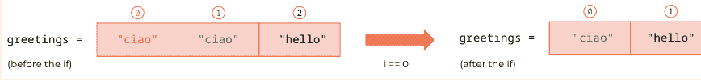

删除列表元素后，列表内容、元素位置和列表长度的变化。

- 第二次循环（i==1）：在 if 语句之前，列表与上一次循环结束时相同，即 `["ciao", "hello"]`（第 (i) 行）。在 if 语句之后，列表保持不变（k），因为当前元素 `greetings[1]`，即 "hello"，不满足 if 条件。为什么位置 0 的字符串 "ciao"（上图中绿色部分）没有被删除？上一次循环中列表索引的变化将 "ciao" 从位置 1 移到了位置 0，因此我们跳过了它的删除，因为我们目前正处于 for 循环的第二次迭代！

- 第三次循环（i==2）：在 if 语句之前，列表仍然是 `["ciao", "hello"]`（第 (0) 行）。然后，我们在代码的第 6 行（if 条件所在行）遇到了索引错误。这是因为现在 i 是 2，但 `greetings[2]` 不存在，因为我们在第一次循环中删除第一个 "ciao" 时缩短了列表。因此，“超出范围”的错误是由于尝试切片列表 `greetings` 的位置 2（该位置不存在）而失败导致的！注意，索引 i 目前是 2，因为在 for 循环的头部（第 2 行），我们声明 i 从 0 到列表的长度（`len(greetings)`），这是列表的初始长度，并不会适应循环期间的长度变化！

总之，使用 for 循环删除列表中的元素可能导致两个错误：(1) 由于索引偏移，我们**跳过了应该删除的列表元素**；(2) 由于我们通过删除某些元素缩短了列表，我们得到了与索引相关的**超出范围错误**。

## 第 6 部分. 聚焦列表和 for 循环

### 让我们编码吧！

1.  *在市场卖蔬菜。* 在你的市场摊位上，你一天开始时有以下商品：

| 商品 | 数量 | 单价 |
|---|---|---|
| 胡萝卜 | 10 | 0.7 |
| 西葫芦 | 12 | 0.5 |
| 土豆 | 4 | 0.2 |

- a) 创建三个列表：一个用于商品，一个用于商品数量，一个用于它们的价格。今天你有 3 位顾客。你想记录每位顾客花了多少钱以及买了多少农产品。
- b) 创建并初始化一个名为 `total` 的列表，其中每个元素对应一位顾客花费的金额（这个列表有多长？它的内容是什么？）
- c) 第一位顾客买了 2 个胡萝卜、4 个西葫芦和 3 个土豆。创建一个列表，其中每个元素是购买商品的数量（即列表将包含 3 个元素，分别对应胡萝卜、西葫芦和土豆的数量）。
- d) 顾客付了多少钱？将金额保存在列表 `total` 的第一个位置，不要创建中间变量（提示：如果你不知道怎么做，先用中间变量解决任务，然后想办法去掉它）。
- e) 第二位顾客买了 3 个胡萝卜和 3 个土豆。创建相应的商品列表。顾客付了多少钱？将金额保存在列表 `total` 的第二个位置。
- f) 第三位顾客想要 6 个胡萝卜、4 个西葫芦和 1 个土豆。创建相应的商品列表。
- g) 你有足够的商品出售吗？计算一下。
- h) 鉴于第三位顾客将购买所有剩余商品（例如，如果他们想要 6 个胡萝卜，但只剩下 2 个，他们就买 2 个），你如何修改他们的商品列表？使用 if/else。
- i) 第三位顾客付了多少钱？将金额保存在列表 `total` 的第三个位置。
- j) 顾客在你的摊位平均消费是多少？
- k) 今天你最受欢迎的商品是什么？最不受欢迎的呢？计算一下！

2.  *新年倒计时！* 给定以下列表：`numbers = [0,1,2,3,4,5,6,7,8,9]`，使用 a) 列表方法；b) 切片；c) for 循环来反转它。这三种方法有什么区别？

3.  应用商店。你正在对应用商店数据进行市场调研。以下是商店中应用的价格：

```
app_prices = [
7.99, 7.99, 2.99, 4.99, 7.99, 9.99, 9.99, 1.99, 1.99, 1.99,
4.99, 5.99, 3.99, 5.99, 0.99, 3.99, 3.99, 2.99, 1.99, 4.99,
8.99, 1.99, 3.99, 1.99, 1.99, 8.99, 6.99, 0.99, 6.99, 8.99,
3.99, 1.99, 0.99, 1.99, 0.99, 8.99, 1.99, 7.99, 3.99, 1.99,
8.99, 2.99, 4.99, 6.99, 4.99, 7.99, 8.99, 1.99, 2.99, 0.99,
7.99, 6.99, 7.99, 6.99, 2.99, 0.99, 0.99, 3.99, 2.99, 5.99,
0.99, 0.99, 7.99, 9.99, 5.99, 5.99, 1.99, 4.99, 5.99, 5.99,
6.99, 9.99, 5.99, 5.99, 1.99, 8.99, 9.99, 4.99, 9.99, 4.99,
0.99, 0.99, 2.99, 9.99, 3.99, 6.99, 8.99, 4.99, 1.99, 9.99,
0.99, 7.99, 1.99, 4.99, 4.99, 0.99, 3.99, 3.99, 1.99, 8.99,
3.99, 9.99, 5.99, 2.99, 2.99, 2.99, 5.99, 4.99, 3.99, 8.99,
5.99, 8.99, 8.99, 1.99, 9.99, 7.99, 6.99, 7.99, 4.99, 4.99,
7.99, 8.99, 7.99, 4.99, 5.99, 5.99, 0.99, 2.99, 8.99, 7.99,
1.99, 3.99, 3.99, 4.99, 9.99, 0.99, 1.99, 3.99, 9.99, 5.99,
4.99, 8.99, 6.99, 5.99, 6.99, 7.99, 1.99, 2.99, 9.99, 6.99,
9.99, 6.99, 8.99, 8.99, 2.99, 1.99, 9.99, 1.99, 7.99, 9.99,
4.99, 3.99, 9.99, 9.99, 6.99, 6.99, 7.99, 9.99, 2.99, 4.99]
```

- a) 有多少个应用？
- b) 有多少个应用的价格是 4.99？用两种方式计算结果，一次使用列表方法，一次使用 for 循环。
- c) 价格为 4.99 的应用占百分比是多少？
- d) 商店中应用的唯一价格有哪些？找出它们并按升序排序。
- e) 每个价格有多少个应用？
- f) 应用最受欢迎的价格是什么？

## 22. 关于 for 循环的更多内容

在列表及其他方面重复命令的各种方式

在过去的几章中，我们已经学习了如何使用 for 循环来浏览列表（第 8 章和第 9 章）、在列表中搜索元素（第 10 章）、更改列表元素（第 11 章）以及通过一次添加一个元素来创建列表（第 12 章）。此外，我们还使用 for 循环来独立于列表重复命令（参见第 15 章的“深入探讨”部分）。为了完整性，我们将从简要回顾我们已经知道的内容开始本章。然后，我们将发现可以与列表一起使用的新 for 循环，每个循环都有其自己的特点和用法。准备好了吗？请跟随笔记本 22！

### 1. 重复命令

正如定义所说，

> **for 循环**是将一组命令重复**确定**次数。

让我们通过以下示例来复习这个概念：

- 打印 3 个 1 到 10 之间的随机数：

```python
import random

for _ in range(3):
    number = random.randint(1, 10)
    print(number)
```

我们导入 `random` 包（第 1 行）。然后，我们实现 for 循环（第 3-5 行）。我们从头部开始，它包含：(1) 关键字 **for**；(2) 一个用于索引的变量；(3) 成员运算符 **in**；以及 (4) 内置函数 `range()`（第 3 行）。在这种情况下，我们使用下划线作为索引变量，因为我们在循环体中不需要索引。我们将在下一段中回顾内置函数 `range()` 的特点。在 for 循环的主体中——它总是相对于头部缩进——我们使用 `random` 包中的 `.randint()` 函数创建一个 1 到 10 之间的随机数（第 4 行），并打印创建的数字（第 5 行）。循环体中的代码行在每次循环或迭代中重复——在这种情况下，如 `range(3)` 所示，重复三次。

### 2. 带列表的 for 循环

至少有 4 种方法可以将 for 循环与列表一起使用。你已经知道第一种：通过索引进行 for 循环。在本节中，我们将学习通过元素进行 for 循环、通过索引和元素，以及列表推导式。请注意，*通过索引*、*通过元素*和*通过索引和元素*并非技术术语；然而，我们将用它们来区分不同类型的 for 循环。相反，*列表推导式*是一个技术术语，你可以在任何 Python 书籍或编程网站上找到。在本节的所有示例中，我们将从以下包含三个字符串的列表开始：

```
last_names = ["garcia", "smith", "zhang"]
```

我们的任务是将每个字符串的首字母改为大写。为此，我们将对每个列表元素应用 `.title()` 方法，并尽可能覆盖现有列表。

## 2.1 通过索引的 for 循环

你已经知道这种 for 循环类型。让我们通过以下示例来回顾一下。

- 使用通过*索引*的 for 循环将每个字符串首字母大写：

```
last_names = ["garcia", "smith", "zhang"]

for i in range(len(last_names)):
    print("The element in position " + str(i) + " is: " + last_names[i])
    last_names[i] = last_names[i].title()

print(last_names)
The element in position 0 is: garcia
The element in position 1 is: smith
The element in position 2 is: zhang
['Garcia', 'Smith', 'Zhang']
```

我们从要修改的列表开始（第 1 行）。然后，我们编写 for 循环头，它由以下部分组成：(1) 关键字 `for`；(2) 索引变量 `i`；(3) 成员运算符 `in`；以及 (4) 内置函数 `range`（第 3 行）。`range()` 可以有三个参数：`start`，当它为 0 时我们省略——就像本例中一样；`stop`，通常与列表长度一致；以及 `step`，当它为 1 时我们省略——就像本例中一样。如果我们只需要浏览列表的前半部分，可以写 `range(0, len(last_names)//2)`，或者如果我们只想浏览列表的每个第二个位置，可以写 `range(0, len(last_names), 2)`。另外，别忘了 `range()` 是一个内置函数，可以独立于 for 循环使用**来创建一个整数范围**：例如，`list(range(0,4))` 返回列表 `[0,1,2,3]`，而 `list(range(0,4,2))` 返回 `[0,2]`。为什么在创建列表时我们将 `list()` 与 `range()` 结合使用？因为**内置函数 `list()` 将** `range()` 的输出——它本身是一种数据类型——**转换为列表**。在 for 循环体中，我们打印索引 `i` 的当前值和通过切片提取的相应元素 `last_names[i]`（第 4 行）。然后，我们通过应用字符串方法 `.title()` 并将结果重新赋值给 `last_names[i]` 本身来更改当前元素 `last_names[i]`（第 5 行）。最后，我们打印 `last_names` 以检查修改后的列表（第 7 行）。

## 2.2 通过元素的 for 循环

让我们学习实现 for 循环的第一种新方式：通过*元素*的 for 循环。阅读下面的示例并尝试理解它的作用：

- 使用通过*元素*的 for 循环将每个字符串首字母大写：

```
last_names = ["garcia", "smith", "zhang"]
last_names_upper = []

for last_name in last_names:
    print ("The current element is " + last_name)
    last_names_upper.append(last_name.title())

print (last_names_upper)
The current element is: garcia
The current element is: smith
The current element is: zhang
['Garcia', 'Smith', 'Zhang']
```

与前面的示例一样，我们从要修改的列表开始（第 1 行）。我们继续创建一个名为 `last_names_upper` 的新空列表，我们将在循环中填充它（第 2 行）。然后，我们创建通过元素的 for 循环（第 4-6 行）。头部的语法是：(1) 关键字 `for`；(2) 一个变量；(3) 成员运算符 `in`；以及 (4) 要浏览的列表。与通过索引的 for 循环有两个不同之处。首先，**位置 (2) 的变量**不叫 `index` 或 `i`，而是通常用列表名称的单数形式来命名——也就是说，如果列表名称是 `last_names`，那么变量名就是 `last_name`；如果列表名称是 `numbers`，那么变量名就是 `number`；以此类推。这不是一条规则，而是 Python 编程者之间一个有用的约定。第二个不同之处是我们在位置 (4) 直接使用**列表本身**——即 `last_names`——而不是 `range(len(last_names))`。现在让我们关注循环体。首先，我们打印当前元素 `last_name`（第 5 行）。你可能注意到，没有切片（即没有 `[i]`）。这是因为在通过元素的 for 循环中，**位置 (2) 的变量**——即 `last_name`——**会自动逐个浏览列表元素，而无需知道它们的位置**。这与通过*索引*的 for 循环中发生的情况相反，在通过索引的 for 循环中，位置 (2) 的变量——即 `i`——浏览列表位置而无需知道相应的元素；要获取一个元素，我们必须使用切片（例如 `last_name[i]`）。请参阅下图了解两种循环之间区别的示意图。

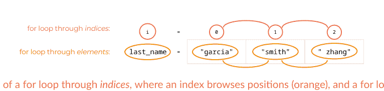

在示例的第一次迭代中，last_name 是 "garcia"；在第二次迭代中，它是 "smith"；在第三次迭代中，它是 "zhang"。我们通过将方法 `.title()` 应用于字符串 last_name 并将输出附加到 last_names_upper 来结束（第 6 行）。最后，我们打印 last_names_upper（第 8 行）。为什么我们不直接修改 last_names？因为在通过元素的 for 循环中，**我们无法修改**我们正在浏览的**列表**。我们只能创建一个新列表（即 last_name_upper），我们将修改后的元素（即 last_name.title()）附加到其中。让我们看看如果我们尝试使用通过*元素*的 for 循环来更改元素会发生什么：

```
for last_name in last_names:
    print ("last_name before change: " + last_name)
    last_name = last_name.title()
    print ("last_name after change: " + last_name)
print (last_names)
last_name before change: garcia
last_name after change: Garcia
last_name before change: smith
last_name after change: Smith
last_name before change: zhang
last_name after change: Zhang
['garcia', 'smith', 'zhang']
```

在第一次迭代中，变量 last_name 是 "garcia"（第 2 行），我们将其更改为 "Garcia"（第 3 行），并打印它（第 4 行）。在第二次迭代中，last_name 是 "smith"（第 2 行），我们将其更改为 "Smith"（第 3 行），并打印它（第 4 行）。该过程在第三次迭代中对 "zhang" 继续进行。然而，当我们打印最终列表时，所有字符串仍然是小写（第 6 行）。这是因为**通过元素的 for 循环不跟踪元素位置，因此无法知道在哪里覆盖列表元素**。最后，请注意，由于没有索引，在通过元素的 for 循环中我们**无法跟踪迭代次数**。如果我们需要知道迭代次数，我们可以使用通过*索引*的 for 循环（第 2.1 节）或通过*索引和元素*的 for 循环（第 2.3 节）。

## 2.3 通过索引和元素的 for 循环

顾名思义，通过*索引和元素*的 for 循环将通过*索引*的 for 循环与通过*元素*的 for 循环结合起来。它的实现很简单。在阅读后续解释之前，尝试理解下面的示例。

- 使用通过*索引和元素*的 for 循环将每个字符串首字母大写：

```
last_names = ["garcia", "smith", "zhang"]

for i,last_name in enumerate (last_names):
    print ("The element in position " + str (i) + " is: " + last_name)
    last_names[i] = last_name.title()

print (last_names)
The element in position 0 is: garcia
The element in position 1 is: smith
The element in position 2 is: zhang
['Garcia', 'Smith', 'Zhang']
```

for 循环头由 (1) 关键字 for；(2) 两个由逗号分隔的变量，称为 i 和 last_name；(3) 成员运算符 in；以及 (4) 内置函数 enumerate()，以列表 last_names 作为参数（第 3 行）组成。与其他 for 循环头的不同之处再次在于组件 (2) 和 (4)。i 和 last_name 的作用非常直观：i 是浏览列表中所有位置的索引——就像在通过索引的 for 循环中一样——而 last_name 是浏览列表中所有元素的变量——就像在通过元素的 for 循环中一样。要浏览的值由 enumerate() 提供，我们可以从以下命令中看到（我们使用 list() 将 enumerate() 的输出数据类型转换为要打印的列表）：

```
print(list(enumerate(last_names)))
[(0, 'garcia'), (1, 'smith'), (2, 'zhang')]
```

内置函数 enumerate() 提供了一个索引和元素配对的列表——即 (0, 'garcia')、(1, 'smith') 和 (2, 'zhang')。每对都在圆括号中，表示一个元组。元组是用逗号分隔并放在圆括号中的元素序列。我们将在第 34 章讨论元组的特性。在本示例的 for 循环期间，变量 i 被赋予每对的第一个元素——即 0、1 和 2——而变量 last_name 被赋予每对的第二个元素——即 'garcia'、'smith' 和 'zhang'。在示例的剩余部分，我们首先打印每个元素的位置 i 及其值 last_name（第 4 行）。然后，我们将方法 `.title()` 应用于 last_name，并将结果赋值给相同位置的元素 last_names[i]（第 5 行）。最后，我们打印结果列表（第 6 行）。当我们需要提取整个列表的位置和元素时，通过索引和位置的 for 循环非常有用。

## 2.4 列表推导式

将 for 循环与列表结合使用的第四种也是最后一种方法称为列表推导式。乍一看可能很复杂，但我们马上来梳理一下！

- 使用包含通过索引的 for 循环的列表推导式将每个字符串首字母大写：

```
last_names = ["garcia", "smith", "zhang"]
last_names = [last_name.title() for
i in range(len(last_names))]
print (last_names)
['Garcia', 'Smith', 'Zhang']
```

在第 2 行，我们看到：(1) 列表名称；(2) 赋值符号；以及 (3) 列表推导式。在列表推导式中，有一对方括号内嵌了两个组件：(1) 我们将要插入列表的列表元素的值——即 last_name.title()；以及 (2) 一个 for 循环头——即 for i in range(len(last_names))。为了更好地理解语法，让我们看看下面的图，它比较了单元格 2 中的通过索引的 for 循环和列表

## 第6部分：聚焦列表与for循环

如你所见，列表推导式的组成部分与for循环的组成部分相同，只是位置有所颠倒。在for循环中，我们首先编写头部（第(a)行；橙色矩形），然后将修改后的元素（黄色矩形）赋值给元素本身（第(b)行）。在列表推导式（第(c)行）中，我们首先编写修改后的元素（黄色矩形），然后编写for循环头部（橙色矩形）。如你所见，**列表推导式是一种快速、紧凑地创建或修改列表的单行命令**。我们通过打印新列表（第3行）来结束前面的示例。

我们能否编写一个包含遍历*元素*的for循环头部的列表推导式？可以！让我们看看如何做到。

- 使用包含遍历*元素*的for循环的*列表推导式*来大写每个字符串：

```python
last_names = ["garcia", "smith", "zhang"]
last_names = [last_name.title() for last_name in last_names]
print(last_names)
# Output: ['Garcia', 'Smith', 'Zhang']
```

与之前类似，在列表推导式中，我们首先编写列表的新元素——即`last_name.title()`——然后编写遍历*元素*的for循环头部——即`for last_name in last_names`（第2行）。让我们将单元格3中遍历*元素*的for循环与上面单元格中的列表推导式进行比较。这一次，for循环和相应的列表推导式之间存在很大差异。你能发现吗？

```python
# (a) for last_name in last_names:
#     (b) last_names_upper.append(last_name.title())

# (c) last_names = [last_name.title() for last_name in last_names]
```

遍历*元素*的for循环（第a-b行）与列表推导式（第c行）的比较。

区别在于，在遍历*元素*的for循环中，我们必须创建一个新列表——即`last_names_upper`（第(b)行）——而在列表推导式中，我们可以覆盖现有列表——即`last_names`（第(c)行）。其余的语法对应关系是相同的。在for循环中，我们首先编写头部（第(a)行；橙色矩形），然后修改一个元素（第(b)行；黄色矩形）。另一方面，在列表推导式（第(c)行）中，我们首先编写一个修改后的元素（黄色矩形），然后编写for循环头部（橙色矩形）。

列表推导式的另一个有趣特点是它们**可以包含条件结构**。让我们来看看！

- 仅保留并大写长度小于6个字符的元素：

```python
last_names = ["garcia", "smith", "zhang"]
last_names = [last_name.title() for
              last_name in last_names if
              len(last_name) < 6]
print(last_names)
# Output: ['Smith', 'Zhang']
```

我们通过在列表推导式的*末尾*添加一个**if条件**（第2行）来修改单元格6中的代码。让我们再次比较列表推导式的结构与相应的for循环。

与上面类似，在列表推导式（第(d)行）中，我们首先编写新元素，它位于for循环体的最后一行（黄色矩形；for循环中的第(c)行）。然后，我们基本上从循环的开头重新开始，并依次添加命令。因此，我们首先编写for循环头部（橙色矩形；循环中的第(a)行），然后编写if条件（黑色矩形；循环中的第(c)行）。

最后，列表推导式对于**根据条件删除列表元素**非常有用。在上一章的单元格16中，我们使用了一个包含`.remove()`的while循环来删除具有相似特征的多个元素。现在，让我们学习如何使用列表推导式以更紧凑的方式删除元素。

- 删除由5个字符组成的元素：

```python
last_names = ["garcia", "smith", "zhang"]
last_names = [last_name.title()
              for last_name in last_names
              if len(last_name) != 5]
print(last_names)
# Output: ['Garcia']
```

使用列表推导式删除元素时，**我们必须考虑要*保留*的元素，而不是要删除的元素！**这是因为在列表推导式中，第一个位置必须写入要插入列表的元素。因此，如果我们想删除长度为5的元素，我们需要反向思考，编写允许我们*保留*长度不等于5的元素的条件——即`if len(last_name) != 5`（第2行）。

### 完成表格

在本章中，你学习了四种不同的编写列表for循环的方法。我们何时使用哪一种？通过用Yes或No填写下表来突出显示for循环之间的差异。

| 操作 | 通过索引的for循环 | 通过元素的for循环 | 通过索引和元素的for循环 | 列表推导式 |
| :--- | :--- | :--- | :--- | :--- |
| 获取当前索引 | | | | |
| 更改列表元素 | | | | |
| 删除列表元素 | | | | |
| 浏览完整列表 | | | | |
| 仅浏览列表的一部分 | | | | |

## 3. 嵌套for循环

作为本章的最后一个主题，让我们学习嵌套for循环。**嵌套for循环**是**一个for循环嵌套在另一个for循环内部**。它是如何工作的？阅读下面的示例，并尝试理解发生了什么。

- 给定以下元音字母列表：

```python
vowels = ["A", "E", "I", "O", "U"]
```

我们从一个字符串列表开始（第1行）。

- 对于每个元音字母，打印其右侧的所有元音字母：

```python
for i in range(len(vowels)):
    print("-- " + vowels[i])
    for j in range(i + 1, len(vowels)):
        print(vowels[j])
# Output:
# -- A
# E
# I
# O
# U
# -- E
# I
# O
# U
# -- I
# O
# U
# -- O
# U
# -- U
```

此示例中的嵌套for循环由一个**外部for循环**（其头部在第1行）和一个**内部for循环**（其头部在第3行）组成。在*外部*for循环中，索引`i`从0（省略）到列表长度（第1行）；因此，`i`将遍历所有列表位置。在*内部*for循环中，索引`j`从`i+1`到列表长度（第3行）；因此，`j`将遍历当前位置`i`右侧的所有剩余列表位置。**对于*外部*循环的每次迭代，必须在进入*外部*循环的下一次迭代之前完成*内部*循环。**以下是每次循环发生的情况：

- 在第一次*外部*循环中，`i`为0。我们打印`"-- " + vowels[0]`，即`-- A`（第2行）。然后，我们运行整个*内部*for循环（第3-4行）。索引`j`将从`i+1`开始——即0+1，因此是1——并根据*加一规则*在`len(vowels)-1`处停止——即4。因此，`j`将遍历位置：[1, 2, 3, 4]。因此，在*内部*for循环中：
    - 在第一次迭代中，`j`为1。我们打印`vowels[1]`，即E
    - 在第二次迭代中，`j`为2。因此，我们打印`vowels[2]`，即I
    - 在第三次迭代中，`j`为3，我们打印`vowels[3]`，即O
    - 在第四次迭代中，`j`为4，我们打印`vowels[4]`，即U。*内部*循环完成，我们返回*外部*循环。
- 在第二次*外部*循环中，`i`为1，因此我们打印`"-- " + vowels[1]`，即`-- E`（第2行）。然后，我们再次运行整个*内部*for循环（第3-4行）。内部循环的起点是`i+1`，即1+1——也就是2。因此，`j`将遍历位置：[2, 3, 4]。因此，在*内部*循环中：
    - 在第一次循环中，`j`为2，我们打印`vowels[2]`，即I
    - 在第二次循环中，`j`为3，我们打印`vowels[3]`，即O
    - 在第三次循环中，`j`为4，我们打印`vowels[4]`，即U。*内部*循环再次完成，我们返回*外部*循环。
- 在第三次*外部*循环中，`i`为2，所以我们打印`-- I`。然后，我们运行完整的*内部*循环，如上所述，`j`遍历位置3和4，分别对应元素O和U。
- 在第四次*外部*循环中，`i`为3，所以我们打印`-- O`。在*内部*循环中，`j`仅被赋值为位置4，对应元素U。
- 在最后一次*外部*循环中，`i`为4，所以我们打印`-- U`。没有*内部*循环，因为起点`i+1`是5，与终点5重合。

我们能否有更多的循环相互嵌套？可以！按照惯例，索引名称是`i`、`j`、`k`等。然而，强烈建议*不要*使用太多的for循环，因为它们在计算上非常昂贵，也就是说，它们会占用大量的内存和时间。我们将在下一章中更多地讨论嵌套for循环，届时我们将使用它们来遍历列表的列表。

### 回顾

- 当我们使用 `for` 循环重复执行不需要索引的命令时，可以用下划线代替索引。
- 列表的 `for` 循环至少有 4 种类型：遍历*索引*（使用 `range()`）、遍历*元素*、遍历*索引和元素*（使用 `enumerate()`），以及列表推导式。
- 内置函数 `list()` 可用于将 `range()` 和 `enumerate()` 的输出转换为列表。
- 内置函数 `enumerate()` 可同时从列表中提取成对的索引和元素。
- 元组是由逗号分隔并置于圆括号内的元素序列。
- 嵌套 `for` 循环是指 `for` 循环内部的 `for` 循环。

### Markdown 基础

如你所知，在 Jupyter 笔记本中，我们可以使用单元格来编写代码或文本。编写文本对于将我们的代码嵌入到解释工作流程的故事（或叙述）中至关重要——也就是说，我们如何从问题表述到其计算解决方案。在 Jupyter 笔记本中，叙述是用一种称为 Markdown 的标记语言编写的——标记语言基本上是用于编写文本的编码语言。Markdown 是 HTML 的简化版本，HTML 是用于编程网站的编码语言。Markdown 的语法非常简单。基本语法规则是：

- 标题以 1 个井号（#）开头，副标题以 2 个井号（##）开头，子副标题以 3 个井号（###）开头，以此类推，最多 6 个井号（######）。

| 命令 | 渲染效果 |
|---|---|
| #标题 | **标题** |
| ##副标题 | **副标题** |
| ###子副标题 | **子副标题** |

- 要将文本设为斜体，我们在单词或短语前后各加 1 个星号；要将文本设为粗体，我们在单词或短语前后各加 2 个星号。

| 命令 | 渲染效果 |
|---|---|
| *斜体文本* | *斜体文本* |
| **粗体文本** | **粗体文本** |

第 6 部分。聚焦列表和 for 循环

- 要将文本显示为代码，我们在命令前后各加一个反引号 `。

| 命令 | 渲染效果 |
| :--- | :--- |
| `print ('markdown 中的命令')` | print ('markdown 中的命令') |

使用 Markdown，我们还可以创建表格、添加图片、编写有序和无序列表等，并集成 HTML 代码——如果你了解的话。在以下网站查找所有 Markdown 语法规则：https://www.markdownguide.org/。

### 让我们编码吧！

1.  *自助餐。* 这些朋友在一家自助餐厅：

    ```python
    friends = ["Geetha", "Huanxiang", "Megan", "Pedro"]
    ```

    这是自助餐的指食：

    ```python
    food = ["sushi", "nachos", "samosa", "cheese"]
    ```

    每个人尝试每种指食。打印出这样的句子：
    *Geetha 吃寿司*
    *Geetha 吃玉米片*
    ...
    针对所有朋友，(a) 使用嵌套 `for` 循环遍历*索引*，(b) 使用嵌套 `for` 循环遍历*元素*。

2.  *玩耍的孩子。* 在幼儿园，孩子们正在玩一个游戏，每次老师摇铃时，他们必须与另一个孩子配对。最终，每个孩子都会与所有其他孩子配对。给定以下孩子列表：

    ```python
    kids = ["Paul", "Juhee", "Luca", "Maria"]
    ```

    a) 打印出从第一个孩子开始的所有可能组合，即：
    *Paul 和 Juhee 玩*
    *Paul 和 Luca 玩*
    *Paul 和 Maria 玩*
    *Juhee 和 Luca 玩*
    *Juhee 和 Maria 玩*
    *Luca 和 Maria 玩*
    b) 打印出从最后一个孩子（Maria）开始的所有可能组合。

3.  *世界城市。* 给定以下城市列表：

    ```python
    cities = ["Bogota", "Riga", "Kinshasa", "Damascus", "New Delhi", "Auckland"]
    ```

    a) 使用 `for` 循环遍历*索引*，创建一个新列表，包含字符数超过 7 个的城市名称，并将其转换为大写。

    b) 使用 `for` 循环遍历*元素*，创建一个新列表，包含字符数在 7 到 10 之间的城市的首字母缩写。

    c) 使用 `for` 循环遍历*索引和元素*，打印出每个元素的小写形式及其位置。

    d) 使用*列表推导式*，创建一个新列表，包含字符数少于 7 个的城市名称，并将其转换为小写。

4.  *学习计数。* 使用嵌套 `for` 循环打印从 10 到 29 的连续数字。外层 `for` 循环打印第一位数字，内层 `for` 循环打印第二位数字，例如：

    ```
    10
    11
    12
    ...
    29
    ```

5.  *数字三角形。* 向用户询问一个数字。然后打印一个数字三角形，其中最大行数是所查询的数字。例如：

    ```
    输入：5
    输出：
    1
    2 2
    3 3 3
    4 4 4 4
    5 5 5 5 5
    ```

    提示：考虑使用 `print()` 函数中的 `end` 参数。在线查找如何使用 `end` 的示例。

## 23. 列表的列表

切片、嵌套 for 循环和展平

什么是列表的列表？

> 列表的列表是一个元素为列表的列表。

列表的列表遵循与列表相同的规则；它们只是增加了一层“额外的”索引。在本章中，你将学习如何切片列表的列表、使用嵌套 `for` 循环遍历它们，以及展平它们的方法。请跟随笔记本 23 一起学习。开始吧！

### 1. 切片

要切片列表的列表，我们通过**增加一层额外的索引**来修改我们在第 6 章学到的列表切片规则。让我们看看它是如何工作的！

- 给定以下列表的列表：

    ```python
    animals = [["dog", "cat"], ["cow",
        "sheep", "horse", "chicken", "rabbit"],
        ["panda", "elephant", "giraffe",
        "penguin"]]
    ```

    列表的列表 `animals` 由三个元素组成，分别是列表 `["dog", "cat"]`、`["cow", "sheep", "horse", "chicken", "rabbit"]` 和 `["panda", "elephant", "giraffe", "penguin"]`（第 1 行）。我们将这些列表中的每一个称为**子列表**，它们的元素（`"dog"`、`"cat"`、`"cow"` 等）称为**子元素**。让我们学习如何切片子列表和子元素！

- 打印包含宠物、农场动物和野生动物的子列表：

    ```python
    print(animals[0])
    print(animals[1])
    print(animals[2])
    ```

    输出：
    ```
    ['dog', 'cat']
    ['cow', 'sheep', 'horse', 'chicken', 'rabbit']
    ['panda', 'elephant', 'giraffe', 'penguin']
    ```

    包含宠物的子列表——["dog", "cat"]——位于位置 0；因此我们打印 `animals[0]`。类似地，包含农场动物的列表——["cow", "sheep", "horse", "chicken", "rabbit"]——位于位置 1，所以我们用命令 `print(animals[1])` 打印它（第 2 行）。最后，包含野生动物的列表——["panda", "elephant", "giraffe", "penguin"]——位于位置 2，因此命令是 `print(animals[2])`（第 3 行）。

- 打印子元素 "cat"、"rabbit"，以及从 "panda" 到 "giraffe" 的元素：

    ```python
    print(animals[0][1])
    print(animals[1][-1])
    print(animals[2][:3])
    ```

    输出：
    ```
    cat
    rabbit
    ['panda', 'elephant', 'giraffe']
    ```

    要提取子元素，我们使用**双重切片**，其中**第一层切片——由第一对方括号表示——提取一个子列表，第二层切片——由第二对方括号表示——提取一个或多个子元素**。要提取子元素 "cat"，我们首先用命令 `animals[0]` 提取宠物子列表 ["dog", "cat"]——就像在单元格 2，第 1 行中那样。然后，从获得的子列表中，我们切片位于位置 1 的 "cat"。因此，完整命令是 `animals[0][1]`（第 1 行）。字符串 "rabbit" 是第二个子列表（包含农场动物）的最后一个元素。因此，要切片 "rabbit"，我们写 `animals[1][-1]`，其中第一层切片 `[1]` 提取农场动物子列表——就像我们在单元格 2，第 2 行中所做的那样——第二层切片 `[-1]` 提取子元素 "rabbit"（第 2 行）。最后，从 "panda" 到 "giraffe" 的子元素位于野生动物子列表中，即 `animals[2]`——正如我们在单元格 2，第 3 行中看到的。在这个子列表中，"panda" 位于位置 0，我们将其省略，而 "giraffe" 位于位置 2，我们根据 *加一* 规则为其加 1。因此，最终命令是 `print(animals[2][:3])`。

### 2. 嵌套 for 循环

要浏览列表的列表中的元素，我们可以使用嵌套 `for` 循环，其中**外层循环浏览列表的列表**，**内层循环浏览子列表**。尝试理解以下示例的作用，然后阅读解释。

- 给定以下列表的列表：

    ```python
    sports = [["skiing", "skating",
        "curling"], ["canoeing", "cycling",
        "swimming", "surfing"]]
    ```

    我们从一个包含两个子列表的列表的列表开始。第一个子列表包含 3 个字符串，第二个子列表由 4 个字符串组成（第 1 行）。

- 使用嵌套 `for` 循环遍历*索引*，逐个打印子列表元素：

    ```python
    for i in range(len(sports)):
        for j in range(len(sports[i])):
            print(sports[i][j])
    ```

    输出：
    ```
    skiing
    skating
    curling
    canoeing
    cycling
    swimming
    surfing
    ```

    在*外层* `for` 循环中，索引 i 遍历位置 0——对应于子列表 ["skiing", "skating", "curling"]——和位置 1——对应于子列表 ["canoeing", "cycling", "swimming", "surfing"]。

## 第6部分：聚焦列表与for循环

"swimming", "surfing"]——（第1行）。在每次*外层*for循环中，*内层*for循环从0（省略）开始遍历当前子列表，直到子列表的长度，即`len(sports[i])`（第2行）。在*内层*for循环的每次迭代中，我们打印当前元素`sports[i][j]`（第3行）。实际操作如下：

- 在第一次*外层*循环中，i为0，我们执行一次完整的*内层*循环来遍历第一个子列表：
  - 在第一次*内层*循环中，j为0，因此我们打印`sports[0][0]`，即"skiing"。
  - 在第二次*内层*循环中，j为1，因此我们打印`sports[0][1]`，即"skating"。
  - 在第三次*内层*循环中，j为2，因此我们打印`sports[0][2]`，即"curling"。*内层*for循环结束，我们进入第二个*外层*for循环。
- 在第二次*外层*循环中，i为1，我们执行另一次完整的*内层*循环来遍历第二个子列表：
  - 在第一次*内层*循环中，j为0，因此我们打印`sports[1][0]`，即"canoeing"。
  - 在第二次*内层*循环中，j为1，因此我们打印`sports[1][1]`，即"cycling"。
  - 在第三次*内层*循环中，j为2，因此我们打印`sports[1][2]`，即"swimming"。
  - 在第四次*内层*循环中，j为3，因此我们打印`sports[1][3]`，即"surfing"。*内层*for循环结束；同时*外层*for循环也结束，因为没有更多子列表了。

我们能否通过遍历*元素*的for循环来实现同样的效果？可以！在查看以下代码之前，试着猜猜如何实现！

- 使用嵌套for循环遍历*元素*，逐个打印子列表元素：

```
[6]:
1  for seasonal_sports in sports:
2      for sport in seasonal_sports:
3          print (sport)

skiing
skating
curling
canoeing
cycling
swimming
surfing
```

在*外层*for循环中，变量`seasonal_sports`被依次赋值为第一个子列表和第二个子列表（第1行）。在*内层*for循环中，变量`sport`被赋值为当前子列表的每个元素（第2行）。在*内层*for循环的每次迭代中，我们打印变量`sport`的当前值（第3行）。换句话说：

- 在*外层*for循环的第一次迭代中，`seasonal_sports`是["skiing", "skating", "curling"]，*内层*for循环以如下方式遍历`seasonal_sports`的所有子元素：
  - 在第一次*内层*循环中，sport是"skiing"。
  - 在第二次*内层*循环中，sport是"skating"。
  - 在第三次*内层*循环中，sport是"curling"。*内层*for循环结束，我们返回外层for循环。
- 在*外层*for循环的第二次迭代中，`seasonal_sports`是["canoeing", "cycling", "swimming", "surfing"]，*内层*for循环以如下方式遍历`seasonal_sports`的所有子元素：
  - 在第一次*内层*循环中，sport是"canoeing"。
  - 在第二次*内层*循环中，sport是"cycling"。
  - 在第三次*内层*循环中，sport是"swimming"。
  - 在第四次*内层*循环中，sport是"surfing"。*内层*for循环结束，*外层*for循环也结束，因为我们已经遍历了所有子列表。

## 3. 扁平化

**扁平化意味着将列表的列表转换为一个列表。** 换句话说，我们把子元素从它们的子列表中取出来，放入一个列表中。实现这个操作的方法有很多。我们将看到四种不同的方法，但可能还有更多。对于每种方法，先尝试自己实现，然后再查看下面的示例和解释。

- 给定以下列表的列表：

```
[7]: 1 instruments = [["contrabass", "cello", "clarinet"], ["gong", "guitar"], ["tambourine", "trumpet", "trombone", "triangle"]]
    instruments 被赋值为 contrabass, cello, clarinet, gong, guitar, tambourine, trumpet, trombone, triangle
```

- 使用嵌套for循环遍历*索引*来扁平化列表：

```
[8]: 1 flat_instruments = []
    flat instruments 被赋值为空列表
    2 for i in range(len(instruments)):
    for i in range len instruments
    3     for j in range(len(instruments[i])):
    for j in range len instruments in position i
    4         flat_instruments.append(instruments[i][j])
    flat instruments dot append instruments in position i in position j
    5 print (flat_instruments)
    print flat instruments
    ['contrabass', 'cello', 'clarinet', 'gong', 'guitar', 'tambourine', 'trumpet', 'trombone', 'triangle']
```

我们从空列表flat_instruments开始，它将在后续的嵌套for循环中被填充（第1行）。然后，对于列表的列表中的每个位置（第2行）和每个子列表中的每个位置（第3行），我们将当前子元素instruments[i][j]追加到flat_instruments（第4行）。最后，我们打印最终的列表（第5行）。如你所见，我们扁平化了instruments，即将一个列表的列表转换为一个列表，其元素是instruments的子元素。

- 使用嵌套for循环遍历*元素*来扁平化列表：

```
[9]: 1 flat_instruments = []
    flat instruments 被赋值为空列表
    2 for group in instruments:
    for group in instruments
    3     for instrument in group:
    for instrument in group
    4         flat_instruments.append(instrument)
    flat instruments dot append instrument
    5 print (flat_instruments)
    print flat instruments
    ['contrabass', 'cello', 'clarinet', 'gong', 'guitar', 'tambourine', 'trumpet', 'trombone', 'triangle']
```

与前面的示例类似，我们从空列表flat_instruments开始（第1行）。我们使用*外层*for循环遍历子列表（第2行），在每个子列表内，我们使用*内层*for循环遍历子元素（第3行）。我们将当前子元素追加到flat_instruments（第4行）。最后，我们打印获得的扁平化列表（第5行）。

- 使用for循环和列表连接来扁平化列表：

```
[10]:
1 flat_instruments = []
2 for group in instruments:
3     flattened += group
4 print (flat_instruments)
['contrabass', 'cello', 'clarinet', 'gong', 'guitar', 'tambourine', 'trumpet',
'trombone', 'triangle']
```

再次，我们从空列表flat_instruments开始（第1行）。我们编写一个遍历元素的for循环来遍历子列表（第2行）。我们将每个子列表连接到flat_instruments（第3行）——对应的显式命令是flat_instruments = flat_instruments + group。最后，我们打印flat_instruments（第4行）。这种方法的优点是我们只使用一个for循环。你可能记得，for循环在计算上是昂贵的——在内存和时间方面——因此尽量减少它们的使用是良好的实践。

- 使用列表推导式来扁平化列表：

```
[11]:
1 instruments = [instrument for group in instruments for instrument in group]
2 print (instruments)
['contrabass', 'cello', 'clarinet', 'gong', 'guitar', 'tambourine', 'trumpet',
'trombone', 'triangle']
```

正如你在前一章可能记得的，使用列表推导式时，我们不需要创建一个新列表，而是可以直接修改当前列表——在这个例子中是instruments。在列表推导式中，我们写：(1) 我们想添加到列表中的内容，即instrument；(2) 外层for循环的头部，即for group in instruments；以及(3) 内层for循环的头部，即for instrument in group（第1行）。注意，在列表推导式中，我们可以使用嵌套for循环遍历元素，因为我们不需要元素的位置。最后，我们打印结果（第2行）。

### 回顾

- 列表的列表是以列表为元素的列表。
- 切片时，我们使用两对方括号。第一对方括号中，我们写要切片的子列表的位置；在第二对方括号中，我们写子元素的位置。
- 我们可以使用嵌套for循环来遍历子元素。
- 我们可以使用嵌套for循环、for循环结合连接或列表推导式来扁平化列表的列表。

### 列表的列表与图像

你肯定知道数字图像由像素组成，即组织在网格中的小彩色方块。我们可以将网格视为一个列表的列表，其中每个子元素对应一个特定颜色的像素。让我们考虑下图：

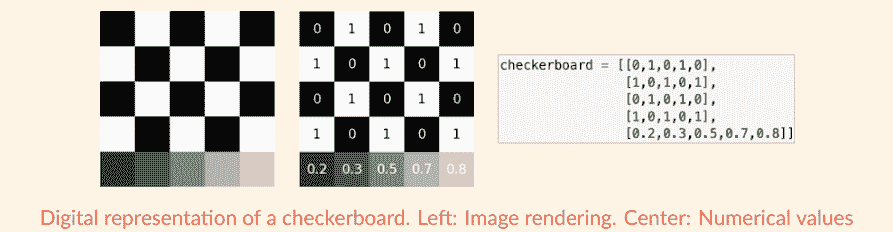

每个黑色方块对应一个包含0的像素，每个白色方块对应一个包含1的像素。因此，棋盘的第一行（和第三行）由子列表[0, 1, 0, 1, 0]表示，第二行（和第四行）由子列表[1, 0, 1, 0, 1]表示。棋盘的最后一行包含各种灰度的像素。每个像素对应一个十进制（浮点）数。较深的灰色更接近0（即黑色），而较亮的灰色更接近1（即白色）。

那么数字彩色图像呢？每个像素由一个RGB列表编码，该列表由三个数字组成，每个数字代表不同的颜色：第一个数字代表红色（R）分量，第二个数字代表绿色（G）分量，第三个数字代表蓝色（B）分量。

让我们看看下面的图。

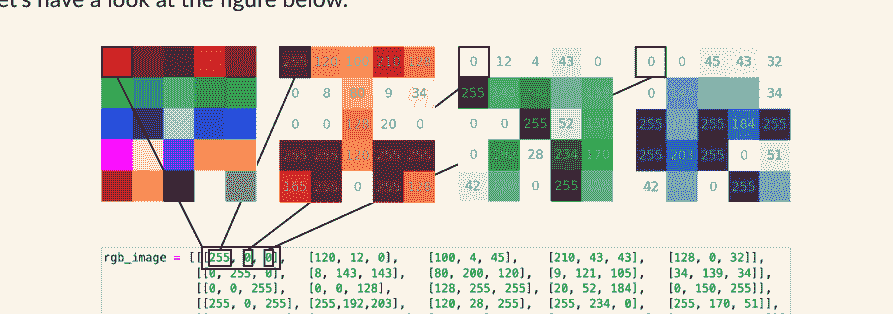

每个像素由一个包含三个数字的子列表表示。例如，左上角的像素是红色的，由子列表[255, 0, 0]表示，其中255代表红色的数量，第一个0代表绿色的数量，第二个0代表蓝色的数量。每一行是一个列表的列表，被包含在一个列表的列表的列表中！最后，请注意，对于灰度和彩色图像，定义颜色的数字范围可以从0到1，也可以从0到255。

## 第六部分：聚焦列表与 for 循环

### 开始编程吧！

1.  *动手试试*。给定以下嵌套列表：
    numbers = [[3,7,1],[7,6,5,4],[8,9,7,4,5]]。
    a) 每个子列表的长度是多少？
    b) 在第一个子列表中，将第三个元素替换为前两个元素的和。
    c) 在第二个子列表中，将元素按升序排序。
    d) 在第三个子列表中，将数字 4 替换为数字 3。
    e) 总共有多少个数字 7？将它们的位置保存在一个嵌套列表中（预期结果：[[0, 1], [1, 3], [2, 2]]）。

2.  *求和练习*。给定以下嵌套列表：
    numbers = [[1,3,5],[7,2,8],[3,4,9]]。
    a) 创建一个列表，包含每个子列表中数字的和（预期结果：[9, 17, 16]）。
    b) 使用 (1) 通过索引的 for 循环和 (2) 通过值的 for 循环，计算嵌套列表中所有元素的总和。

3.  *矩阵时间！* 给定以下矩阵：
    matrix = [[4,1,3,9], [2,1,6,5], [4,0,3,8], [7,2,6,2]]
    （如果你不熟悉矩阵，可以将矩阵想象成一个包含数字的表格）
    a) 将矩阵打印为 4x4 的表格（预期结果：
    [4, 1, 3, 9]
    [2, 1, 6, 5]
    [4, 0, 3, 8]
    [7, 2, 6, 2]）
    b) 计算主对角线上所有元素的乘积并打印结果（预期结果：24）。注意：主对角线从左上角延伸到右下角。在此示例中，主对角线包含：4,1,3,2。
    c) 垂直求和矩阵的值（预期结果：[17, 4, 18, 24]）。

## 参考资料

- 封面灵感来源于 Nadia Eghbal 所著的《Working in Public: The Making and Maintenance of Open Source Software》一书的封面。Stripe Press. 2020
- 书中的一些示例灵感来源于 Adrienne Tacke 所著的《Coding for Kids: Python: Learn to Code with 50 Awesome Games and Activities》一书中的示例。Rockridge Press. 2019

亲爱的编程者，

感谢你与我一同学习！

访问 www.learnpythonwithjupyter.com 以：

- 查找关于本书的更多信息
- 下载 Jupyter Notebooks
- 加入 LPWJ 社区获取练习解答和问答

我期待收到关于本书的反馈和评论！
请在 tinyurl.com/lpwj-feedback 填写反馈表，和/或通过 serena.bonaretti.research@gmail.com 给我发邮件，让我知道你的想法！

祝好，
Serena

**下一章发布：2024年1月28日，第24章**