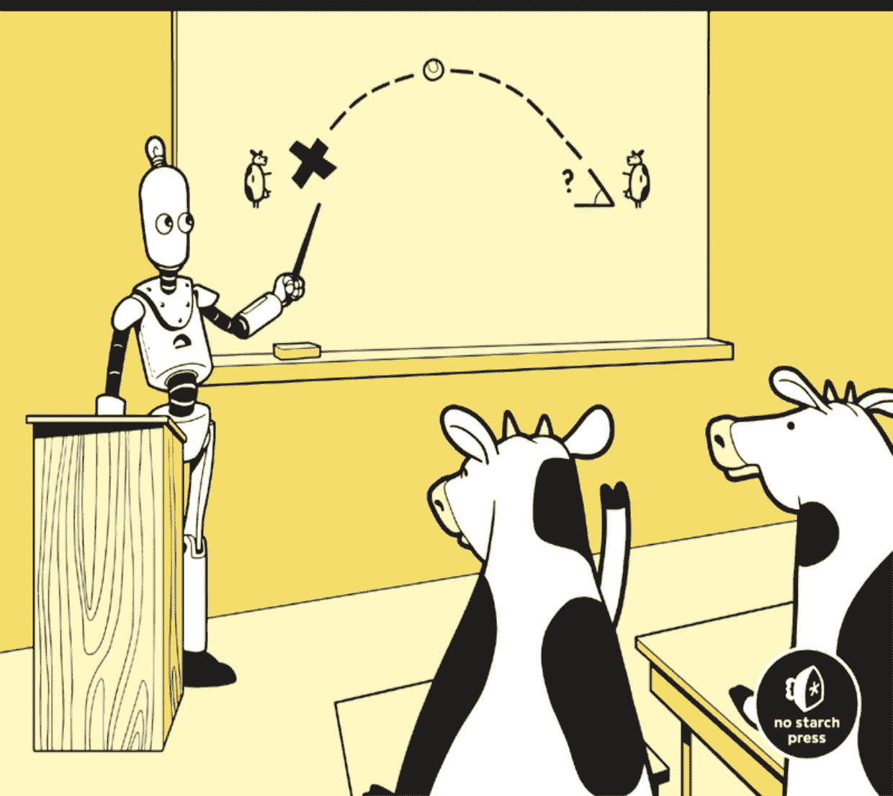
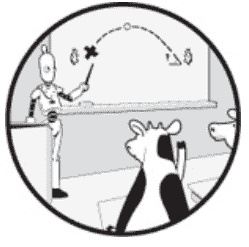

# 通过解决问题学习编程

Python编程入门

作者：丹尼尔·津加罗



旧金山

# 通过解决问题学习编程。版权所有 © 2021 丹尼尔·津加罗。

保留所有权利。未经版权所有者和出版商事先书面许可，不得以任何形式或任何方式（电子或机械，包括影印、录制，或通过任何信息存储或检索系统）复制或传播本作品的任何部分。

ISBN-13: 978-1-7185-0132-4（印刷版）
ISBN-13: 978-1-7185-0133-1（电子书）

出版人：比尔·波洛克
执行编辑：芭芭拉·严
制作经理：雷切尔·莫纳汉
制作编辑：卡西·安德烈亚迪斯
开发编辑：亚历克斯·弗里德
内页和封面设计：章鱼工作室
封面插画师：罗布·盖尔
技术审阅：卢克·萨夫恰克
文字编辑：金·温普塞特
校对：埃米莉·巴塔利亚
索引编制：桑吉夫·库马尔·辛哈

有关图书分销商或翻译的信息，请直接联系No Starch Press, Inc.：
No Starch Press, Inc.
245 8th Street, San Francisco, CA 94103
电话：1.415.863.9900；info@nostarch.com
www.nostarch.com

*美国国会图书馆编目出版数据*
名称：津加罗，丹尼尔，作者。
标题：通过解决问题学习编程：Python编程入门 / 作者：丹尼尔·津加罗。
描述：旧金山，加利福尼亚州：No Starch Press，[2021] | 包含索引。
标识符：LCCN 2021011082（印刷版）| LCCN 2021011083（电子书）| ISBN 9781718501324（印刷版）| ISBN 9781718501331（电子书）
主题：LCSH：Python（计算机程序语言）| 计算机编程。
分类：LCC QA76.73.P98 Z55 2021（印刷版）| LCC QA76.73.P98（电子书）| DDC 005.13/3--dc23
LC记录可在 https://lccn.loc.gov/2021011082 获取
LC电子书记录可在 https://lccn.loc.gov/2021011083 获取

No Starch Press和No Starch Press标志是No Starch Press, Inc.的注册商标。本文中提及的其他产品和公司名称可能是其各自所有者的商标。我们并非每次使用商标名称时都使用商标符号，而是仅以编辑方式使用这些名称，以惠及商标所有者，无意侵犯商标。

本书中的信息按“原样”基础分发，不作任何担保。虽然在准备本作品时已采取一切预防措施，但作者和No Starch Press, Inc.均不对任何个人或实体因其中包含的信息直接或间接造成的或据称造成的任何损失或损害承担责任。

献给父亲，为了计算机代码

以及

献给母亲，为了教师代码

## 关于作者

丹尼尔·津加罗博士是多伦多大学计算机科学副教授兼获奖教师。他的主要研究领域是计算机科学教育，研究学生如何学习（有时不学习）计算机科学材料。他是*《算法思维》*（No Starch Press，2021）的作者，该书帮助学习者理解和使用算法与数据结构。

## 关于技术审阅

卢克·萨夫恰克是一位经常从事自由编辑和业余编程的爱好者；他最喜欢的项目包括一个散文转诗歌转换器、一个用于切出正确数量蛋糕片的视觉辅助工具，以及一个为数学导师设计的使用数字的Boggle游戏版本。他目前在多伦多郊区教授法语和英语。他还写诗和为钢琴作曲，如果可以的话，他会以此为生。可以在 https://sawczak.com/ 找到他。

# 简要目录

- 致谢
- 引言
- 第1章：入门
- 第2章：做出决策
- 第3章：重复代码：确定循环
- 第4章：重复代码：不确定循环
- 第5章：使用列表组织值
- 第6章：使用函数设计程序
- 第7章：读写文件
- 第8章：使用集合和字典组织值
- 第9章：使用完全搜索设计算法
- 第10章：大O与程序效率
- 后记
- 附录：问题来源
- 索引

## 详细目录

## 致谢

## 引言

- 在线资源
- 本书适合谁
- 为什么学习Python？
- 安装Python
    - Windows
    - macOS
    - Linux
- 如何阅读本书
- 使用编程评测系统
- 创建你的编程评测系统账户
    - DMOJ评测系统
    - Timus评测系统
    - USACO评测系统
- 关于本书

# 1 入门

- 我们将要做什么
- Python Shell
    - Windows
    - macOS
    - Linux

## 问题 #1：单词计数

- 挑战
- 输入
- 输出

### 字符串

- 表示字符串
- 字符串运算符
- 字符串方法

### 整数和浮点数

### 变量

### 赋值语句

### 更改变量值

### 使用变量计数单词

### 读取输入

### 写入输出

#### 启动文本编辑器

#### 程序

#### 运行程序

##### 提交到评测系统

## 问题 #2：圆锥体积

- 挑战
- 输入
- 输出

#### Python中的更多数学

##### 访问Pi

#### 指数

##### 字符串和整数之间的转换

### 解决问题

## 总结

## 章节练习

## 注释

# 2 做出决策

## 问题 #3：获胜队伍

- 挑战
- 输入
- 输出

#### 带else的if

### 解决问题

## 问题 #4：电话推销员

- 挑战
- 输入
- 输出

### 布尔运算符

##### or运算符

##### and运算符

##### not运算符

### 解决问题

## 注释

#### 输入和输出重定向

## 总结

## 章节练习

## 注释

## 3 重复代码：确定循环

### 问题 #5：三个杯子

- 挑战
- 输入
- 输出

#### 为什么需要循环？

#### for循环

#### 嵌套

### 解决问题

### 问题 #6：占用空间

- 挑战
- 输入
- 输出

#### 一种新型循环

## 索引

##### 循环的Range

##### 通过索引的循环Range

### 解决问题

### 问题 #7：数据计划

- 挑战
- 输入
- 输出

#### 循环读取输入

### 解决问题

## 总结

## 章节练习

## 注释

## 4 重复代码：不确定循环

## 问题 #8：老虎机

- 挑战
- 输入
- 输出

### 探索测试用例

#### for循环的局限性

#### while循环

##### 使用while循环

##### 在循环中嵌套循环

#### 添加布尔运算符

### 解决问题

### 取模运算符

##### F-字符串

## 问题 #9：歌曲播放列表

- 挑战
- 输入
- 输出

### 字符串切片

### 解决问题

## 问题 #10：秘密句子

- 挑战
- 输入
- 输出

#### for循环的另一个局限性

#### 通过索引的while循环

### 解决问题

#### break和continue

- break
- continue

## 总结

## 章节练习

## 注释

## 5 使用列表组织值

### 问题 #11：村庄邻里

- 挑战
- 输入
- 输出

#### 为什么需要列表？

### 列表

#### 列表可变性

### 了解方法

### 列表方法

- 添加到列表
- 对列表排序
- 从列表中移除值

### 解决问题

### 避免代码重复：另外两种解决方案

- 使用巨大尺寸
- 构建尺寸列表

## 问题 #12：学校旅行

- 挑战
- 输入
- 输出
- 一个陷阱

### 分割字符串和连接列表

- 将字符串分割成列表
- 将列表连接成字符串

### 更改列表值

### 解决大部分问题

- 探索测试用例
- 代码

#### 如何处理陷阱

- 探索测试用例
- 更多列表操作
- 查找最大值的索引
- 解决问题

### 问题 #13：面包师奖励

- 挑战
- 输入
- 输出

### 表示表格

- 探索测试用例
- 嵌套列表

### 解决问题

## 总结

## 章节练习

## 注释

# 6 使用函数设计程序

## 问题 #14：纸牌游戏

- 挑战
- 输入
- 输出

### 探索测试用例

### 定义和调用函数

- 无参数函数
- 带参数函数
- 关键字参数
- 局部变量
- 可变参数
- 返回值

### 函数文档

### 解决问题

## 问题 #15：动作人偶

- 挑战
- 输入
- 输出

### 表示盒子

### 自顶向下设计

-   进行自顶向下设计
-   顶层
-   任务 1：读取输入
-   任务 2：检查所有盒子是否正常
-   任务 3：获取仅包含左右高度的新盒子列表
-   任务 4：对盒子排序
-   任务 5：判断盒子是否已整理好
-   整合所有部分

## 总结

## 章节练习

## 注释

# 7 读写文件

### 问题 #16：文章格式化

-   挑战
-   输入
-   输出

### 处理文件

-   打开文件
-   从文件读取
-   写入文件

### 解决问题

-   探索测试用例
-   代码

## 问题 #17：农场播种

-   挑战
-   输入
-   输出

### 探索测试用例

### 自顶向下设计

-   顶层
-   任务 1：读取输入
-   任务 2：识别奶牛
-   任务 3：排除草的种类
-   任务 4：选择编号最小的草种类
-   任务 5：写入输出

## 总结

## 章节练习

## 注释

# 8 使用集合和字典组织值

## 问题 #18：电子邮件地址

-   挑战
-   输入
-   输出

### 使用列表

-   清理电子邮件地址
-   主程序

### 搜索列表的效率

### 集合

### 集合方法

### 搜索集合的效率

### 解决问题

### 问题 #19：常见单词

-   挑战
-   输入
-   输出

### 探索测试用例

### 字典

### 字典索引

### 遍历字典

### 反转字典

### 解决问题

-   代码
-   添加后缀
-   找出第 k 个最常见的单词
-   主程序

## 问题 #20：城市与州

-   挑战
-   输入
-   输出

### 探索测试用例

### 解决问题

## 总结

## 章节练习

## 注释

## 9 使用完全搜索设计算法

### 问题 #21：救生员

-   挑战
-   输入
-   输出

### 探索测试用例

### 解决问题

-   解雇一名救生员
-   主程序
-   我们程序的效率

### 问题 #22：滑雪场

-   挑战
-   输入
-   输出

### 探索测试用例

### 解决问题

-   确定一个区间的成本
-   主程序

### 问题 #23：奶牛棒球

-   挑战
-   输入
-   输出

#### 使用三个嵌套循环

-   代码
-   我们程序的效率

#### 先排序

-   代码
-   我们程序的效率

#### Python 模块

#### `bisect` 模块

### 解决问题

## 总结

## 章节练习

## 注释

## 10 大 O 表示法与程序效率

## 计时的问题

### 大 O 表示法

-   常数时间
-   线性时间
-   二次时间
-   三次时间
-   多个变量
-   对数时间
-   n log n 时间
-   处理函数调用
-   总结

## 问题 #24：最长围巾

-   挑战
-   输入
-   输出

### 探索测试用例

### 算法 1

### 算法 2

### 问题 #25：彩带绘画

-   挑战
-   输入
-   输出

### 探索测试用例

### 解决问题

## 总结

## 章节练习

## 注释

## 后记

## 附录：问题来源

## 索引

## 致谢

真的吗？我又能和 No Starch Press 的团队合作了？Barbara Yien 邀请我加入。Bill Pollock 和 Barbara 信任我，让我负责本书的教学方法。我的开发编辑 Alex Freed 细心、友善且及时。我感谢所有参与本书制作的人员，包括我的文字编辑 Kim Wimpsett、制作编辑 Kassie Andreadis 和封面设计师 Rob Gale。我非常幸运。

我感谢多伦多大学为我提供了写作的时间和空间。我感谢我的技术审稿人 Luke Sawczak 对手稿的仔细审阅。

我感谢所有为本书中使用的问题以及整个竞赛编程领域做出贡献的人。我感谢 DMOJ 管理员对我工作的支持。

我感谢我的父母处理了所有事情——*所有事情*。他们只让我做一件事，那就是学习。

我感谢我的伴侣 Doyali，她为我们投入了更多时间来完成这本书，并以身作则地展示了写作所需的用心。

最后，我感谢你们所有人阅读这本书并渴望学习。

## 引言


我们使用计算机来完成任务和解决问题。例如，也许你曾用文字处理器写过文章或信件。也许你曾用电子表格程序来整理财务。也许你曾用图像编辑器来修饰图片。很难想象在没有计算机的情况下做这些事情。我们从文字处理器、电子表格程序和图像编辑器中获益良多。

这些程序被编写为通用工具，以完成各种各样的任务。然而，归根结底，它们是别人编写的程序，而不是我们自己编写的。当现成的程序不能完全满足我们的需求时，我们该怎么办？

在本书中，我们的目标是学习如何通过超越最终用户使用现有程序所能做的事情来掌控我们的计算机。我们将编写自己的程序。我们不会编写文字处理器、电子表格或图像编辑器。这些是巨大的任务，幸运的是，人们已经完成了。相反，我们将学习如何编写小程序来解决我们原本无法解决的问题。我想帮助你学习如何向计算机传达指令；这些指令将告诉计算机如何执行你解决问题的计划。

为了向计算机发出指令，我们使用*编程语言*编写代码。编程语言规定了我们编写的代码的规则，并决定了计算机对该代码的响应方式。

我们将学习使用 Python 编程语言进行编程。这是一项你将从本书中获得的具体技能，可以写在你的简历上。但比 Python 更重要的是，你将学习使用计算机解决问题所需的思维方式。编程语言来来去去，但我们解决问题的方式不会改变。我希望这本书能帮助你从最终用户走向程序员，并让你在探索可能性的过程中获得乐趣。

### 在线资源

本书的补充资源，包括可下载的代码和额外的练习，可在 https://nostarch.com/learn-code-solving-problems/ 获取。

### 本书适合谁

本书适合任何想学习如何编写计算机程序来解决问题的人。我心中有三类特定的人群。

首先，你可能听说过 Python 编程语言，并想学习如何用 Python 编写代码。我将在下一节解释为什么 Python 是学习第一门编程语言的绝佳选择。你将在本书中学到很多关于 Python 的知识，并且如果你下一步是阅读更高级的 Python 书籍，你将具备相应的能力。

其次，如果你没听说过 Python，或者只是想了解编程是怎么回事，别担心：这本书也适合你！本书将教你如何思考编程。程序员有特定的方法将问题分解为可管理的部分，并用代码表达这些部分的解决方案。在这个层面上，使用什么编程语言并不重要，因为程序员的思维方式并不局限于某种特定的语言。

最后，你可能有兴趣学习其他编程语言，如 C++、Java、Go 或 Rust。你在学习 Python 过程中附带学到的很多东西，在你学习其他编程语言时也会很有用。此外，Python 本身也绝对值得学习。接下来让我们看看原因。

### 为什么学习 Python？

多年的入门编程教学经验告诉我，Python 是学习第一门编程语言的绝佳选择。与其他语言相比，Python 代码通常更具结构性和可读性。一旦你习惯了，你可能会同意它的部分内容读起来几乎像英语！Python 还具有许多其他语言所不具备的功能，包括强大的数据处理和存储工具。我们将在本书中使用其中的许多功能。

Python 不仅是一种优秀的教学语言，也是世界上最受欢迎的编程语言之一。程序员使用它来编写 Web 应用程序、游戏、可视化、机器学习软件等等。

就是这样：一门非常适合教学的语言，同时也为你带来了专业优势。我不能再要求更多了！

### 安装 Python

在我们能够用 Python 编程之前，我们需要安装它。现在就让我们开始吧。

Python 有两个主要版本：Python 2 和 Python 3。Python 2 是一个较旧的版本，已不再受支持。在本书中，我们使用 Python 3，因此你需要在计算机上安装 Python 3。

Python 3 相对于 Python 2 是一次重大的演进，但即使在版本 3 内部，Python 也在不断变化。Python 3 的第一个版本是 Python 3.0。然后发布了 Python 3.1，接着是 Python 3.2，依此类推。在撰写本文时，Python 3 的最新版本是 Python 3.9。像 Python 3.6 这样较旧的版本也足以满足本书的需求，但我鼓励你安装并使用最新版本的 Python。

请按照以下针对你操作系统的步骤来安装 Python。

##### Windows

Windows 默认不附带 Python。要安装它，请访问 https://www.python.org/ 并点击 **Downloads**。这应该会为你提供下载适用于 Windows 的最新版本 Python 的选项。点击链接下载 Python，然后运行安装程序。在安装过程的最初几个屏幕中，点击 **Add Python 3.9 to PATH** 或 **Add Python to environment variables**；这将使运行 Python 变得容易得多。（如果升级 Python，你可能需要点击“自定义安装”来找到此选项。）

##### macOS

macOS 默认不附带 Python 3。要安装它，请访问 https://www.python.org/ 并点击 **Downloads**。这应该会为你提供下载适用于 macOS 的最新版 Python 的选项。点击链接下载 Python，然后运行安装程序。

##### Linux

Linux 附带 Python 3，但可能是较旧的 Python 3 版本。安装说明会因你使用的 Linux 发行版而异，但你应该能够使用你喜欢的包管理器安装最新版本的 Python。

### 如何阅读本书

一口气从头到尾阅读本书可能让你学到的东西非常有限。这就像试图通过邀请某人到你家弹几个小时钢琴，然后把他们赶走，调暗灯光，独自弹奏来学习钢琴一样。这不是学习基于实践的技能的方式。

以下是我对如何阅读本书的建议：

**分散你的学习时间。** 将练习集中在少数几次进行，效果远不如分散练习。当你感到疲倦时，休息一下。没有人能告诉你每次学习多久才应该休息。也没有人能告诉你读完这本书需要多长时间。这取决于你自己的身心状态。

**暂停以测试你的理解。** 阅读某些内容可能会给我们一种比实际理解得更好的错觉。应用所学材料会迫使我们所知道的和我们认为自己知道的保持一致。因此，在每章的关键点，我包含了多项选择的“概念检查”问题，要求你做出预测。认真对待这些问题！阅读每个问题，并在不使用电脑查阅任何资料的情况下承诺给出一个答案。然后，阅读我的答案和解释。这是一个确认你是否走在正确道路上的机会。如果你回答错误，或者回答正确但理由错误，请花时间在继续之前补救你的理解。这可能涉及更多地尝试讨论的相关 Python 特性，重读书中的材料，或在网上搜索额外的解释和示例。

**练习编程。** 在阅读时做出预测将有助于巩固你对关键概念的理解。但要成为一名熟练的问题解决者和程序员，你需要的不止这些。你需要练习使用 Python 来解决新问题，这些问题的解决方案你在书中没有读到过。每章末尾都有一组练习题。请尽可能多地完成这些练习。

学习编程需要时间。如果你进展缓慢或犯了很多错误，不要气馁。不要被你在网上可能遇到的任何虚张声势的孔雀吓倒。让自己周围充满能帮助你学习的人和资源。

### 使用编程评测网站

我决定围绕来自 *编程评测* 网站的问题来构建本书。编程评测网站提供了一个编程问题库，世界各地的程序员都可以解决这些问题。你提交你的解决方案——你的 Python 代码——网站会对你的代码运行测试。如果你的代码对每个测试用例都产生了正确的答案，那么你的解决方案很可能是正确的。相反，如果你的代码对一个或多个测试用例产生了错误的答案，那么你的代码就是不正确的，需要修改。

我认为编程评测网站特别适合学习编程，原因有几个：

**快速反馈** 在学习编程的早期阶段，快速、有针对性的反馈至关重要。编程评测网站在你提交代码后立即提供反馈。

**高质量的问题** 我发现编程评测网站上的问题质量很高。许多问题最初来自编程竞赛。其他问题由与编程评测网站相关的个人编写，或者只是想帮助他人学习。有关每个问题的来源，请参阅“问题来源”附录。

**问题数量** 编程评测网站包含数百个问题。我只为本书选择了一小部分。如果你需要更多练习，相信我：编程评测网站可以提供。

**社区功能** 编程评测网站允许用户阅读和回复评论。如果你在某个问题上卡住了，可以浏览评论，看看别人留下的提示。如果你仍然卡住，可以考虑发表自己的评论寻求帮助。一旦你成功解决了一个问题，你的学习并没有结束！许多编程评测网站允许你查看其他人提交的代码。深入研究一些这样的提交，看看它们与你的代码相比如何。解决问题的方法总是有多种。也许你的方式目前对你来说最直观，但向其他可能性敞开大门是迈向编程精通的重要一步。

#### 创建你的编程评测网站账户

我们将在本书中使用几个编程评测网站。这是因为每个编程评测网站都托管着一些在其他网站上找不到的问题；我们需要多个编程评测网站来涵盖我选择的所有问题。

以下是我们将使用的编程评测网站：

| 评测网站 | URL |
|---|---|
| DMOJ | https://dmoj.ca/ |
| Timus | https://acm.timus.ru/ |
| USACO | http://usaco.org/ |

每个编程评测网站都要求你在提交代码前创建一个账户。让我们现在就完成创建账户的过程，同时了解一下这些评测网站。

#### DMOJ 评测网站

DMOJ 评测网站是我们在本书中使用最频繁的评测网站。与任何其他评测网站相比，花时间探索 DMOJ 网站并了解其提供的内容都是值得的。

要在 DMOJ 评测网站上创建账户，请访问 *https://dmoj.ca/* 并点击 **Sign up**。在出现的注册页面上，输入你的用户名、密码和电子邮件地址。此页面还允许你设置默认编程语言。我们将在本书中专门使用 Python 编程语言，因此我建议在此处点击 **Python 3**。点击 **Register!** 创建你的账户。注册后，你可以使用你的用户名和密码登录 DMOJ。

本书中的每个问题首先指明可以在哪个评测网站找到该问题，以及你应该使用哪个问题代码来访问它。例如，我们在第 1 章要处理的第一个问题可以在 DMOJ 上找到，问题代码是 **dmopc15c7p2**。要在 DMOJ 上找到此问题，请点击 **Problems**，在搜索框中输入 **dmopc15c7p2**，然后点击 **Go**。你应该会看到该问题是唯一的结果。如果你点击问题标题，你应该会看到问题本身。

当你准备好为某个问题提交 Python 代码时，找到该问题并点击 **Submit solution**。在出现的页面上，将你的 Python 代码粘贴到文本框中，然后点击 **Submit!**。你的代码将被评判，并显示结果。

#### Timus 评测网站

要在 Timus 评测网站上创建账户，请访问 *https://acm.timus.ru/* 并点击 **Register**。在出现的注册页面上，输入你的姓名、密码、电子邮件地址和其他请求的信息。点击 **Register** 创建你的账户。然后，检查你的电子邮件，查找来自 Timus 的包含你的评测 ID 的消息。每次提交 Python 代码时，你都需要你的评测 ID。

目前无法设置默认编程语言，因此在提交 Python 代码时，请务必选择可用的 Python 3 版本。

我们只在第 6 章使用一次 Timus 评测网站，因此我不会在此处做更多说明。

#### USACO 评测网站

要在 USACO 评测网站上创建账户，请访问 *http://usaco.org/* 并点击 **Register for New Account**。在出现的注册页面上，输入你的用户名、电子邮件地址和其他请求的信息。点击 **Submit** 创建你的账户。然后，检查你的电子邮件，查找来自 USACO 的包含你的密码的消息。获得密码后，你可以使用你的用户名和密码登录 USACO。

目前无法设置默认编程语言，因此在提交 Python 代码时，请务必选择可用的 Python 3 版本。你还需要选择包含你的 Python 代码的文件，而不是将代码粘贴到文本框中。

我们直到第 7 章才会使用 USACO 评测网站，因此我不会在此处做更多说明。

### 关于本书

本书的每一章都由来自编程评测网站的两到三个问题驱动。事实上，我在每章开始时都会提出第一个问题，然后再教授任何新的 Python 知识！我这样做的目的是激励你想要学习解决问题所需的 Python 特性。如果在阅读问题描述后你不确定如何解决问题，请不要担心。（如果你还不能解决这个问题，那么你读对书了！）如果你理解了问题要求你做什么，那么你就准备好了。我们将一起学习 Python 并解决问题。本章后续的问题可能会引入更多的 Python 特性，或者要求我们扩展在第一个问题中学到的内容。每章末尾都有练习，你应该自己解决，以练习刚刚学到的内容。

以下是我们将在每章学习的内容概要：

**第 1 章：入门** 在我们能够使用 Python 解决任何问题之前，我们需要学习相当多的入门概念。在本章中，我们将学习这些概念，包括输入 Python 代码、处理字符串和数字、使用变量、读取输入和写入输出。

**第 2 章：做出决策** 在本章中，我们将学习 `if` 语句，它允许我们的程序根据特定条件是真还是假来决定做什么。

**第 3 章：重复代码：确定循环** 许多程序只要还有工作要做就会继续运行。在本章中，我们将学习 `for` 循环，它让我们的程序处理每一条输入，直到工作完成。

#### 第四章：重复代码：无限循环
有时我们事先并不知道程序应该重复执行某个指定行为多少次。`for`循环并不适合这类问题。在本章中，我们将学习`while`循环，只要特定条件为真，它就会重复执行代码。

#### 第五章：使用列表组织值
Python列表允许我们使用单个名称来引用一整串数据。使用列表有助于我们组织数据，并利用Python提供的强大列表操作（如排序和搜索）。在本章中，我们将全面学习列表。

#### 第六章：使用函数设计程序
一个包含大量代码的大型程序，如果不加以良好组织，可能会变得难以驾驭。在本章中，我们将学习函数，它帮助我们设计由小型、自包含的代码块组成的程序。使用函数可以使程序更易于理解和修改。我们还将学习自顶向下的设计方法，这是一种使用函数设计程序的方法。

#### 第七章：读写文件
文件为向程序提供数据或从程序获取数据提供了便利。在本章中，我们将学习如何从文件读取数据以及向文件写入数据。

#### 第八章：使用集合和字典组织值
随着我们开始解决越来越具有挑战性的问题，思考数据的存储方式变得至关重要。在本章中，我们将学习两种使用Python存储数据的新方法：使用集合和使用字典。

#### 第九章：使用完全搜索设计算法
程序员在解决每个问题时并非都从零开始。相反，他们会思考是否可以使用一种通用的解决方案模式——一种*算法*——来解决它。在本章中，我们将学习完全搜索算法，它可以用来解决各种各样的问题。

#### 第十章：大O表示法与程序效率
有时我们可能会写出一个功能正确但运行速度过慢以至于在实践中无法使用的程序。在本章中，我们将学习如何描述程序的效率，并了解我们可以用来编写更高效代码的工具。

# 1 入门



编程涉及编写代码来解决问题。因此，我想从一开始就和你一起解决问题。也就是说，我们不会先逐个学习Python概念然后再解决问题，而是将通过一个问题来引导我们需要学习的概念。

在本章中，我们将解决两个问题：确定一行文本中的单词数量（类似于文字处理软件中的字数统计功能）以及计算圆锥体的体积。解决这些问题需要了解相当多的Python概念。你可能会觉得需要更多细节才能完全理解我在这里介绍的一些内容以及它们如何在Python程序设计中协同工作。别担心：我们将在后续章节中重新审视并详细阐述最重要的概念。

## 我们将要做什么

如引言所述，我们将使用Python编程语言来解决竞赛编程问题。每个竞赛编程问题都可以在在线判题网站上找到。我假设你已经按照引言中的说明安装了Python并创建了你的判题账户。

对于每个问题，我们将编写一个程序来解决它。每个问题都指定了程序将接收的*输入*类型，以及预期的*输出*（或结果）类型。如果我们的程序能够接受任何有效的输入并产生正确的输出，那么它就正确地解决了问题。

通常，会有数百万甚至数十亿种可能的输入。每种这样的输入被称为一个*问题实例*。例如，在我们将要解决的第一个问题中，输入是一行文本，比如`hello there`或`bbaabbb aa abab`。我们的任务是输出该行中的单词数量。编程中最强大的思想之一是，通常少量的通用代码就能解决看似无穷无尽的问题实例。无论这行文本有2个单词、3个还是50个，都无关紧要。我们的程序每次都能正确处理。

我们的程序将执行三个任务：

**读取输入** 我们需要确定正在解决的具体问题实例，因此我们首先读取提供的输入。

**处理** 我们处理输入以确定正确的输出。

**写出输出** 解决问题后，我们生成所需的输出。

这些步骤之间的界限可能并不总是清晰的——例如，我们可能需要将一些处理与生成一些输出交织进行——但记住这三个大致步骤会很有帮助。

你可能每天都在使用遵循这种输入-处理-输出模型的程序。考虑一个计算器程序：你输入一个公式（输入），程序处理你的数字（处理），然后程序显示答案（输出）。或者考虑一个网络搜索引擎：你输入一个搜索查询（输入），搜索引擎确定最相关的结果（处理），然后显示它们（输出）。

将这类程序与*交互式*程序进行对比，后者融合了输入、处理和输出。例如，我正在使用文本编辑器编写这本书。当我输入一个字符时，编辑器会通过将该字符添加到我的文档中来响应。它不会等到我输入完整个文档才显示给我；它在我构建文档时交互式地显示它。在本书中，我们不会编写交互式程序。如果你在学习本书后有兴趣编写此类程序，你会很高兴地知道Python完全能够胜任这项任务。

每个问题的文本既可以在本书中找到，也可以在在线判题网站上找到。然而，文本不会完全匹配，因为为了全书的一致性，我已经对其进行了重写。别担心：我所写的内容传达了与官方问题陈述相同的信息。

## Python Shell

对于本书中的每个问题，我们都想编写一个程序并将其保存在文件中。但这假设我们知道要编写什么程序！对于本书中的许多问题，我们需要先学习一些新的Python特性才能解决它。

尝试Python特性的最佳方式是使用Python shell。它是一个交互式环境，你输入一些Python代码并按ENTER键，Python就会向你显示结果。一旦我们学到足够多的知识来解决当前问题，我们将停止使用shell，转而在文本文件中输入我们的解决方案。

首先，在你的桌面上创建一个名为*programming*的新文件夹。我们将使用该文件夹来存储我们为本书所做的所有工作。

现在，我们将导航到这个*programming*文件夹并启动Python shell。无论何时你想启动Python shell，请按照你的操作系统执行以下步骤。

##### Windows

在Windows上，执行以下操作：

1. 按住SHIFT键并右键单击你的**programming**文件夹。
2. 从出现的菜单中，单击**在此处打开PowerShell窗口**。如果该选项不存在，请单击**在此处打开命令窗口**。
3. 在出现的窗口底部，你会看到一行以大于号（>）结尾。这是你的操作系统*提示符*，它正在等待你输入命令。你在这里输入操作系统命令，*而不是*Python代码。确保在每个命令后按ENTER键。
4. 你现在位于你的*programming*文件夹中。如果你想查看里面有什么，可以输入*dir*（代表*directory*）。你现在应该看不到任何文件，因为我们还没有创建任何文件。
5. 现在，输入**python**来启动Python shell。

当你启动Python shell时，你应该会看到类似这样的内容：

```
Python 3.9.2 (tags/v3.9.2:1a79785, Feb 19 2021, 13:30:23)
[MSC v.1928 32 bit (Intel)] on win32
Type "help", "copyright", "credits" or "license" for more information.
>>>
```

这里重要的是，你在第一行看到的Python版本至少是3.6。如果你有一个较旧的版本，特别是2.x，或者Python根本没有加载，请按照引言中的说明安装最新版本的Python。

在这个窗口的底部，你会看到>>> Python提示符。这是你输入Python代码的地方。永远不要自己输入>>>符号。编程完成后，你可以按CTRL-Z然后按ENTER退出。

##### macOS

在macOS上，执行以下操作：

1. 打开终端。你可以通过按COMMAND-空格键，输入**terminal**，然后双击结果来打开。
2. 在出现的窗口中，你会看到一行以美元符号（$）结尾。这是你的操作系统*提示符*，它正在等待你输入命令。你在这里输入操作系统命令，*而不是*Python代码。确保在每个命令后按ENTER键。
3. 你可以输入`ls`命令来获取当前文件夹内容的列表。你的*Desktop*应该列在那里。
4. 输入`cd Desktop`导航到你的*Desktop*文件夹。`cd`命令代表*change directory*；*directory*是文件夹的另一个名称。
5. 输入`cd programming`导航到你的*programming*文件夹。
6. 现在，输入`python3`来启动Python shell。（你也可以尝试输入`python`，不带3，但这可能会启动较旧的Python 2版本。Python 2不适合学习本书。）

当你启动Python shell时，你应该会看到类似这样的内容：

```
Python 3.9.2 (default, Mar 15 2021, 17:23:44)
[Clang 11.0.0 (clang-1100.0.33.17)] on darwin
Type "help", "copyright", "credits" or "license" for more information.
>>>
```

这里重要的是，你在第一行看到的Python版本至少是3.6。如果你使用的是旧版本，特别是2.x，或者Python根本没有加载，请按照介绍中的说明安装最新版本的Python。

在这个窗口的底部，你会看到一个>>> Python提示符。这是你输入Python代码的地方。永远不要自己输入>>>符号。编程完成后，你可以按CTRL-D退出。

##### Linux

在Linux上，请执行以下操作：

1.  右键单击你的*programming*文件夹。
2.  在弹出的菜单中，点击*在终端中打开*。（如果你更习惯，也可以打开终端并导航到你的*programming*文件夹。）
3.  在弹出窗口的底部，你会看到一行以美元符号（$）结尾。这是你的操作系统*提示符*，它正在等待你输入命令。你在这里输入操作系统命令，*而不是*Python代码。确保在每个命令后按回车键。
4.  你现在位于你的*programming*文件夹中。你可以输入ls来查看里面有什么。你应该还看不到任何文件，因为我们还没有创建任何文件。
5.  现在，输入**python3**来启动Python shell。（你也可以尝试输入`python`，不带3，但这可能会启动旧版本的Python 2。Python 2不适合用于学习本书。）

当你启动Python shell时，你应该会看到类似这样的内容：

```
Python 3.9.2 (default, Feb 20 2021, 20:57:50)
[GCC 7.5.0] on linux
Type "help", "copyright", "credits" or "license" for more information.
>>>
```

这里重要的是，你在第一行看到的Python版本至少是3.6。如果你使用的是旧版本，特别是2.x，或者Python根本没有加载，请按照介绍中的说明安装最新版本的Python。

在这个窗口的底部，你会看到一个>>> Python提示符。这是你输入Python代码的地方。永远不要自己输入>>>符号。编程完成后，你可以按CTRL-D退出。

## 问题 #1：单词计数

现在是我们的第一个问题了！我们将使用Python编写一个简单的单词计数程序。我们将学习如何从用户那里读取输入，处理输入以解决问题，并输出结果。我们还将学习如何在程序中操作文本和数字，利用Python内置操作，并在解决问题的过程中存储中间结果。

这是DMOJ问题 dmopc15c7p2。

### 挑战

计算提供的单词数量。对于这个问题，一个*单词*是任何由小写字母组成的序列。例如，`hello`是一个单词，但像`bbaabbb`这样的非英语“单词”也算。

### 输入

输入是一行文本，由小写字母和空格组成。每对单词之间恰好有一个空格，第一个单词前和最后一个单词后没有空格。

该行的最大长度为80个字符。

### 输出

输出输入行中的单词数量。

### 字符串

*值*是Python程序的基本构建块。每个值都有一个*类型*，类型决定了可以对该值执行的操作。在单词计数问题中，我们处理的是一行文本。文本在Python中存储为字符串值，因此我们需要学习字符串。为了解决问题，我们输出文本中的单词数量，因此我们还需要学习数值。让我们从字符串开始。

#### 表示字符串

*字符串*是用于存储和操作文本的Python类型。要编写字符串值，我们将其字符放在单引号之间。请在Python shell中跟随操作：

```
>>> 'hello'
'hello'
>>> 'a bunch of words'
'a bunch of words'
```

Python shell会回显我输入的每个字符串。当我们的字符串包含单引号作为其字符之一时会发生什么？

```
>>> 'don't say that'
File "<stdin>", line 1
    'don't say that'
          ^
SyntaxError: invalid syntax
```

单词don't中的单引号终止了字符串。该行的其余部分，t say that'，因此没有意义，这就是产生语法错误的原因。*语法错误*意味着我们违反了Python的规则，没有编写有效的Python代码。为了解决这个问题，我们可以利用双引号也可以用来分隔字符串这一事实：

```
>>> "don't say that"
"don't say that"
```

除非相关字符串包含单引号，否则本书中我不会使用双引号。

#### 字符串运算符

我们可以使用字符串来保存我们要计数的文本。要计数单词——或对字符串进行任何其他操作——我们需要学习如何使用字符串。字符串附带了丰富的操作。其中一些操作在操作数之间使用特殊符号。例如，+运算符用于字符串连接：

```
>>> 'hello' + 'there'
'hellothere'
```

哎呀——我们需要在这两个单词之间加一个空格。让我们在第一个字符串的末尾添加一个：

```
>>> 'hello ' + 'there'
'hello there'
```

还有*运算符，它将字符串复制指定次数：

```
>>> '-' * 30
'------------------------------'
```

那里的30是一个整数值。我稍后会更多地讨论整数。

#### 概念检查

以下代码的输出是什么？

```
>>> "" * 3
```

- A. """
- B. ""
- C. 此代码产生语法错误（无效的Python代码）

答案：B。""是空字符串——一个零字符的字符串。将空字符串重复三次仍然是空字符串！

#### 字符串方法

方法是特定于值类型的操作。字符串有大量方法。例如，有一个名为upper的方法，它生成字符串的大写版本：

```
>>> 'hello'.upper()
'HELLO'
```

我们从方法获得的信息称为方法的*返回值*。例如，对于前面的例子，我们可以说`upper`返回了字符串'HELLO'。

对值执行方法称为*调用*该方法。调用方法涉及在值和方法名之间放置*点运算符*（.）。它还需要在方法名后加括号。对于某些方法，我们让这些括号为空，就像调用`upper`时一样。

对于其他方法，我们可以选择性地在其中包含信息。还有一些方法需要信息，没有信息就无法工作。我们在调用方法时包含的信息称为方法的*参数*。

例如，字符串有一个`strip`方法。如果调用时不带参数，`strip`会从字符串中移除所有前导和尾随空格：

```
>>> '  abc'.strip()
'abc'
>>> '  abc  '.strip()
'abc'
>>> 'abc'.strip()
'abc'
```

但我们也可以用一个字符串作为参数来调用它。如果我们这样做，该参数决定了从开头和结尾移除哪些字符：

```
>>> 'abc'.strip('a')
'bc'
>>> 'abca'.strip('a')
'bc'
>>> 'abca'.strip('ac')
'b'
```

让我们再讨论一个字符串方法：`count`。我们向它传递一个字符串参数，它会告诉我们该参数在我们的字符串中出现了多少次：

```
>>> 'abc'.count('a')
1
>>> 'abc'.count('q')
0
>>> 'aaabcaa'.count('a')
5
>>> 'aaabcaa'.count('ab')
1
```

如果参数的出现重叠，则只计算第一次出现：

```
>>> 'ababa'.count('aba')
1
```

与我描述的其他方法不同，`count`对我们解决单词计数问题直接有用。
想象一个像'this is a string with a few words'这样的字符串。注意每个单词后面都有一个空格。事实上，如果你必须手动计算单词数量，你可能会使用空格来判断每个单词在哪里结束。如果我们计算字符串中的空格数量会怎样？为此，我们可以将一个由单个空格字符组成的字符串传递给`count`。它看起来像这样：

```
>>> 'this is a string with a few words'.count(' ')
7
```

我们得到一个值7。这不完全是单词数量——该字符串有八个单词——但我们已经很接近了。为什么我们得到7而不是8？
原因是每个单词后面都有一个空格，除了最后一个单词。因此，计算空格无法考虑最后一个单词。为了解决这个问题，我们需要学习如何处理数字。

### 整数和浮点数

一个*表达式*由值和运算符组成。我们现在将看到如何编写数值并将其与运算符组合。
有两种不同的Python类型表示数字：整数（没有小数部分）和浮点数（有小数部分）。
我们将整数值写为没有小数点的数字。以下是一些示例：

### 变量

我们现在知道如何编写字符串和数值了。我们也会发现，能够存储它们以便稍后访问是很有价值的。在单词计数程序中，如果能将一行单词存储在某个地方，然后再计算单词数量，那将非常方便。

### 赋值语句

*变量*是一个指向值的名称。每当我们稍后使用变量名时，它就会被该变量所指向的值替代。要让一个变量指向一个值，我们使用*赋值语句*。赋值语句由一个变量、一个等号（=）和一个表达式组成。Python 会计算表达式，并让变量指向结果。下面是一个赋值语句的例子：

```
>>> dollars = 250
```

现在，每当我们使用 `dollars` 时，它都会被 250 替代：

```
>>> dollars
250
>>> dollars + 10
260
>>> dollars
250
```

一个变量一次只能指向一个值。一旦我们使用赋值语句让一个变量指向另一个值，它就不再指向旧值了：

```
>>> dollars = 250
>>> dollars
250
>>> dollars = 300
>>> dollars
300
```

我们可以拥有任意多的变量。大型程序通常使用数百个变量。下面是使用两个变量的例子：

```
>>> purchase_price1 = 58
>>> purchase_price2 = 9
>>> purchase_price1 + purchase_price2
67
```

请注意，我选择的变量名能体现它们存储的内容。例如，这两个变量与两次购买的价格有关。使用 `p1` 和 `p2` 作为变量名会更容易输入，但过几天我们可能就忘了这些名字是什么意思了！
我们也可以让变量指向字符串：

```
>>> start = 'Monday'
>>> end = 'Friday'
>>> start
'Monday'
>>> end
'Friday'
```

与指向数字的变量一样，我们可以在更大的表达式中使用它们：

```
>>> start + '-' + end
'Monday-Friday'
```

Python 变量名应以小写字母开头，然后可以包含额外的字母、用于分隔单词的下划线和数字。

### 更改变量值

假设我们有一个变量 `dollars`，它指向值 250：

```
>>> dollars = 250
```

现在我们想增加这个值，让 `dollars` 指向 251。这样做是不行的：

```
>>> dollars + 1
251
```

结果是 251，但这个值消失了，没有存储在任何地方：

```
>>> dollars
250
```

我们需要的是一个赋值语句来捕获 `dollars + 1` 的结果：

```
>>> dollars = dollars + 1
>>> dollars
251
>>> dollars = dollars + 1
>>> dollars
252
```

学习者常把赋值符号 `=` 当作相等。但不要这样做！赋值语句是一个命令，让变量指向一个表达式的值，而不是声称两个实体相等。

#### 概念检查

执行以下代码后，`y` 的值是多少？

```
>>> x = 37
>>> y = x + 2
>>> x = 20
```

- A. 39
- B. 22
- C. 35
- D. 20
- E. 18

> 答案：A。对 `y` 只有一次赋值，它让 `y` 指向值 39。`x = 20` 赋值语句改变了 `x` 指向的内容，从 37 变为 20，但这对 `y` 所指向的值没有影响。

### 使用变量计数单词

让我们盘点一下在解决单词计数问题上取得的进展：

- 我们了解了字符串，可以用字符串存储一行单词。
- 我们了解了字符串的 `count` 方法，可以用它来计算一行单词中的空格数。这比我们需要的输出值少一个。
- 我们了解了整数，可以用它的 `+` 运算符给一个数字加 1。
- 我们了解了变量和赋值语句，它们帮助我们保存值，这样我们就不会丢失它们。

将所有这些结合起来，我们可以让一个变量指向一个字符串，然后计算单词数量：

```
>>> line = 'this is a string with a few words'
>>> total_words = line.count(' ') + 1
>>> total_words
8
```

这里的 `line` 和 `total_words` 变量不是必需的；下面是如何在没有它们的情况下完成：

```
>>> 'this is a string with a few words'.count(' ') + 1
8
```

但是，使用变量来捕获中间结果是保持代码可读性的好习惯。一旦我们的程序超过几行，变量就变得不可或缺了。

### 读取输入

我们编写的代码有一个问题，它只适用于我们输入的特定字符串。它告诉我们 'this is a string with a few words' 中有八个单词，但仅此而已。如果我们想知道另一个字符串中有多少个单词，就必须用新的字符串替换当前的字符串。然而，要解决单词计数问题，我们需要程序能够处理作为程序输入的*任何*字符串。

要读取一行输入，我们使用 `input` 函数。*函数*类似于方法：我们调用它，可能带有一些参数，它返回一个值给我们。方法和函数的一个区别是函数不使用点运算符。所有传递给函数的信息都是通过参数传递的。

下面是调用 `input` 函数然后输入一些内容的例子——在这个例子中，是单词 `testing`：

```
>>> input()
testing
'testing'
```

当你输入 `input()` 并按回车键时，你不会得到 `>>>` 提示符。相反，Python 会等待你在键盘上输入一些内容并按回车键。然后 `input` 函数返回你输入的字符串。通常，如果我们不将该字符串存储在任何地方，它就会丢失。让我们使用赋值语句来存储我们输入的内容：

```
>>> result = input()
testing
>>> result
'testing'
>>> result.upper()
'TESTING'
```

请注意最后一行，我在 `input` 返回的值上使用了 `upper` 方法。这是允许的，因为 `input` 返回一个字符串，而 `upper` 是一个字符串方法。

### 写入输出

你已经看到，在 Python shell 中输入表达式会导致它们的值被显示出来：

一个单独的值是最简单的表达式。
熟悉的数学运算符适用于整数。我们有用于加法的 `+`，用于减法的 `-`，以及用于乘法的 `*`。我们可以使用这些运算符编写更复杂的表达式。

```
>>> 8 + 10
18
>>> 8 - 10
-2
>>> 8 * 10
80
```

请注意运算符周围的空格。虽然 `8+10` 和 `8 + 10` 对 Python 来说是一样的，但后者使表达式对我们人类来说更容易阅读。
Python 有两个除法运算符，而不是一个！`//` 运算符执行整数除法，它会丢弃任何余数并将结果向下取整：

```
>>> 8 // 2
4
>>> 9 // 5
1
>>> -9 // 5
-2
```

如果你想得到除法的余数，使用取模运算符，写作 `%`。例如，8 除以 2 没有余数：

```
>>> 8 % 2
0
```

8 除以 3 余数为 2：

```
>>> 8 % 3
2
```

与 `//` 相比，`/` 运算符不做任何舍入：

```
>>> 8 / 2
4.0
>>> 9 / 5
1.8
>>> -9 / 5
-1.8
```

这些结果值不是整数！它们有一个小数点，属于另一种 Python 类型，称为 *float*（“浮点数”）。你可以通过包含小数点来编写浮点值：

```
>>> 12.5 * 2
25.0
```

我们现在将专注于整数，并在本章后面解决圆锥体积问题时再回到浮点数。

当我们在表达式中使用多个运算符时，Python 使用优先级规则来确定运算符的应用顺序。每个运算符都有一个优先级。就像我们在纸上计算数学表达式一样，Python 在执行加法和减法（较低优先级）之前执行乘法和除法（较高优先级）：

```
>>> 50 + 10 * 2
70
```

同样，就像在纸上一样，括号内的操作具有最高优先级。我们可以利用这一点来强制 Python 按我们想要的顺序执行操作：

```
>>> (50 + 10) * 2
120
```

程序员经常在技术上不需要的时候也添加括号。这是因为 Python 有很多运算符，正如我们将看到的，跟踪它们的优先级容易出错，而且程序员通常不会这样做。

如果你想知道整数值和浮点值是否像字符串一样有方法，它们确实有！但它们并不那么有用。例如，有一个方法可以告诉我们整数占用了多少计算机内存。整数越大，需要的内存就越多：

```
>>> (5).bit_length()
3
>>> (100).bit_length()
7
>>> (99999).bit_length()
17
```

我们需要在整数周围加上括号；否则，点运算符会与小数点混淆，导致语法错误。

这只是 Python shell 提供的一个便利功能。它假设如果你输入一个表达式，那么你可能想查看它的值。但当在 Python shell 之外运行 Python 程序时，这种便利就消失了。相反，每当我们想输出某些内容时，必须显式地使用 print 函数。print 函数在 shell 中也能工作：

```
>>> print('abc')
abc
>>> print('abc'.upper())
ABC
>>> print(45 + 9)
54
```

请注意，print 输出的字符串周围没有引号。这很好——我们可能本来就不想在与程序用户交流时包含引号！
print 的一个很好的特性是，你可以提供任意数量的参数，它们都会被输出，并用空格分隔：

```
>>> print('abc', 45 + 9)
abc 54
```

### 解决问题：一个完整的 Python 程序

我们现在准备好通过编写一个完整的 Python 程序来解决单词计数问题。退出 Python shell，你将回到操作系统命令提示符。

#### 启动文本编辑器

我们将使用文本编辑器来编写代码。请按照你的操作系统对应的步骤操作。

##### Windows

在 Windows 上，我们将使用 Notepad，一个基础的文本编辑器。在操作系统命令提示符下，导航到你的 *programming* 文件夹（如果尚未到达）。然后输入 **notepad word_count.py** 并按回车键。由于 *word_count.py* 文件不存在，Notepad 会询问你是否要创建一个新的 *word_count.py* 文件。点击 **是**，你就可以开始输入你的 Python 程序了。

##### macOS

在 macOS 上，你可以使用任何你喜欢的文本编辑器。一个你可能已经安装的编辑器是 TextEdit。在操作系统命令提示符下，导航到你的 *programming* 文件夹（如果尚未到达）。然后输入以下两个命令，每个命令后按回车键：

```
$ touch word_count.py
$ open -a TextEdit word_count.py
```

`touch` 命令创建一个空文件，以便你的文本编辑器可以打开它。现在你就可以开始输入你的 Python 程序了。

##### Linux

在 Linux 上，你可以使用任何你喜欢的文本编辑器。一个你可能已经安装的编辑器是 gedit。在操作系统命令提示符下，导航到你的 *programming* 文件夹（如果尚未到达）。然后输入 **gedit word_count.py** 并按回车键。现在你就可以开始输入你的 Python 程序了。

#### 程序

文本编辑器加载后，你就可以输入我们 Python 程序的代码了。代码在清单 1-1 中。

```
❶ line = input()
❷ total_words = line.count(' ') + 1
❸ print(total_words)
```

*清单 1-1：解决单词计数问题*

输入代码时，不要输入 ❶、❷ 或 ❸。这些标记是为了帮助我们逐步讲解代码，它们不是代码本身的一部分。

我们首先从输入获取文本行并将其赋值给一个变量 ①。这给了我们一个字符串，我们可以对其使用 count 方法。我们将空格计数加 1，以考虑字符串中的最后一个单词，并使用变量 total_words 来引用该结果 ②。最后要做的就是输出 total_words 所引用的值 ③。

输入完代码后，务必保存文件。

#### 运行程序

要运行程序，我们将使用操作系统命令提示符下的 python 命令。正如我们所见，单独输入 python 会运行 Python shell，但这次我们不想那样。相反，我们想告诉 Python 运行 word_count.py 中的程序。为此，请导航到你的 programming 文件夹，然后输入 python word_count.py。在本书中，如果需要，请使用 python3 命令代替 python 命令。

你的程序现在正在 input 提示符处等待你输入内容。输入几个单词，按回车键，你应该会看到我们的程序正常工作。例如，输入以下内容：

```
this is my first python program
```

你应该会看到程序输出 6。

如果你看到的是 Python 错误，请回头检查代码，确保你输入完全正确。Python 要求精确。即使缺少一个括号或单引号也会导致错误。

如果运行这个程序花了你一些时间，请不要感到沮丧。让第一个程序运行起来可能需要大量工作。我们必须能够将程序输入到文件中，调用 Python 运行该程序，并修复因程序不正确而导致的任何错误。但无论程序多么复杂，运行程序的步骤都不会改变，因此你在这里花费的时间在后续学习本书时将非常值得。

#### 提交给评测系统

恭喜！我希望你在计算机上运行第一个 Python 程序感到满意。但我们如何知道这个程序是正确的呢？它对所有可能的字符串都有效吗？我们可以在更多字符串上测试它，但为了进一步确信代码的正确性，我们将把它提交到在线评测系统。评测系统会自动对我们的代码运行一系列测试，并告诉我们是否通过了测试，或者是否有问题。

访问 https://dmoj.ca/ 并登录。（如果你没有 DMOJ 账户，请按照简介中的说明创建一个。）点击 **Problems**，搜索单词计数问题代码 dmopc15c7p2。点击搜索结果加载问题——它被称为 Not a Wall of Text 而不是 Word Count。

然后你应该会看到问题作者编写的题目文本。点击 **Submit Solution**，并将我们的代码粘贴到文本区域。确保选择 Python 3 作为编程语言。最后，点击 **Submit** 按钮。

DMOJ 对我们的代码运行测试并显示结果。对于每个测试用例，你会看到一个状态代码。*AC* 代表 *accepted*（通过），这是你希望在每个测试用例中看到的。其他代码包括 *WA*（*wrong answer*，错误答案）和 *TLE*（*time limit exceeded*，超出时间限制）。如果你看到这些代码之一，请仔细检查你粘贴的代码，确保它与文本编辑器中的代码完全匹配。

假设所有测试用例都通过了，我们应该看到我们的得分是 100/100，并且我们为此获得了 3 分。

对于每个问题，我们将遵循解决单词计数问题时使用的方法。首先，我们将探索使用 Python shell，并根据需要学习新的 Python 特性。然后，我们将编写一个解决问题的程序。我们将通过提供自己的测试用例在计算机上测试该程序。最后，我们将代码提交给评测系统。如果任何测试用例失败，我们将再次检查代码并修复问题。

## 问题 #2：圆锥体积

在单词计数中，我们需要从输入读取一个字符串。在这个问题中，我们需要从输入读取整数。这样做需要一个额外的步骤来从字符串生成整数。我们还将进一步学习在 Python 中进行数学运算。

这是 DMOJ 问题 dmopc14c5p1。

### 挑战

计算一个直圆锥的体积。

### 输入

输入由两行文本组成。第一行包含整数 $r$，即圆锥的半径。第二行包含整数 $h$，即圆锥的高度。$r$ 和 $h$ 都在 1 到 100 之间。（也就是说，$r$ 和 $h$ 的最小值是 1，最大值是 100。）

### 输出

输出半径为 $r$、高度为 $h$ 的直圆锥的体积。计算体积的公式是 $(\pi r^2 h)/3$。

### Python 中的更多数学运算

假设我们有 r 和 h 变量，分别引用半径和高度：

```
>>> r = 4
>>> h = 6
```

现在我们要计算 $(\pi r^2 h)/3$。代入半径 4 和高度 6，我们得到 $(\pi * 4^2 * 6)/3$。使用 $\pi$ 的值 3.14159，计算器给出的结果是 100.531。我们如何在 Python 中做到这一点？

#### 访问 Pi

要访问 $\pi$ 的值，我们将使用一个合适的变量。这是一个将 PI 赋值为高精度值的赋值语句：

```
PI = 3.141592653589793
```

这更像是一个*常量*而不是变量，因为我们永远不想在代码中更改 PI 的值。按照 Python 惯例，对于这样的变量使用大写字母，就像我在这里做的那样。

#### 指数

回顾我们的公式 $(\pi r^2 h)/3$，我们唯一还没有讨论的是如何执行 $r^2$ 部分。由于 $r^2$ 等同于 $r * r$，我们可以使用乘法而不是指数运算。

#### 字符串与整数之间的转换

我们最终需要将半径和高度作为输入读取。然后，我们将使用这些值来计算体积。让我们尝试一下：

```
>>> r = input()
4
>>> h = input()
6
```

`input` 函数总是返回一个字符串，即使用户输入的是整数：

```
>>> r
'4'
>>> h
'6'
```

单引号确认了这些值是字符串。字符串不能用于执行数学计算。如果我们尝试，会得到一个错误：

```
>>> (PI * r ** 2 * h) / 3
Traceback (most recent call last):
  File "<stdin>", line 1, in <module>
TypeError: unsupported operand type(s) for ** or pow(): 'str' and 'int'
```

当我们使用错误类型的值时，会生成一个 `TypeError`。Python 反对我们对字符串 `r` 和整数 `2` 使用 `**` 运算符。`**` 运算符是纯粹的数学运算符，与字符串一起使用时没有意义。
要将字符串转换为整数，我们可以使用 Python 的 `int` 函数：

```
>>> r
'4'
>>> h
'6'
>>> r = int(r)
>>> h = int(h)
>>> r
4
>>> h
6
```

现在我们可以再次在公式中使用这些值：

```
>>> (PI * r ** 2 * h) / 3
100.53096491487338
```

每当您有一个字符表示整数的字符串时，都可以使用 `int` 函数将其转换为整数类型的值。它可以处理前导和尾随空格，但不能处理非数字字符：

```
>>> int(' 12 ')
12
>>> int('12x')
Traceback (most recent call last):
  File "<stdin>", line 1, in <module>
ValueError: invalid literal for int() with base 10: '12x'
```

在将 `input` 返回的字符串转换为整数时，我们可以分两步进行：首先将 `input` 的返回值赋给一个变量，然后将该值转换为整数：

```
>>> num = input()
82
>>> num = int(num)
>>> num
82
```

或者我们可以将 `input` 和 `int` 调用结合起来：

```
>>> num = int(input())
82
>>> num
82
```

这里，传递给 `int` 的参数是 `input` 返回的字符串。`int` 函数接受这个字符串并将其作为整数返回。
如果我们需要反向转换，从整数到字符串，可以使用 `str` 函数：

```
>>> num = 82
>>> 'my number is ' + num
Traceback (most recent call last):
  File "<stdin>", line 1, in <module>
TypeError: can only concatenate str (not "int") to str
>>> str(num)
'82'
>>> 'my number is ' + str(num)
'my number is 82'
```

我们不能将字符串和整数连接起来。`str` 函数将 82 转换为 '82'，以便可以在字符串连接中使用。

### 解决问题

我们准备好解决圆锥体体积问题了。创建一个名为 *cone_volume.py* 的文本文件，并输入清单 1-2 中的代码。

```
PI = 3.141592653589793

radius = int(input())
height = int(input())

volume = (PI * radius ** 2 * height) / 3

print(volume)
```

#### 清单 1-2：解决圆锥体体积问题

我添加了空行，将代码分成逻辑部分。Python 会忽略这些空行，但这样的空行可以使我们更容易阅读和分块代码。

请注意，我使用了描述性的变量名：`radius` 代替 `r`，`height` 代替 `h`，以及 `volume`。单字母变量名在数学公式中很常见，但在编写代码时，我们可以使用传达更多信息的变量名。

我们首先让一个名为 `PI` 的变量指向 π 的近似值 ❶。然后，我们从输入中读取半径 ❷ 和高度 ❸，并将两者从字符串转换为整数。我们使用直圆锥体的体积公式来计算体积 ❹。最后，我们输出体积 ❺。

保存您的 cone_volume.py 文件。

通过输入 `python cone_volume.py` 运行您的程序，然后输入半径和高度的值。使用计算器验证您的程序是否产生正确的输出！

如果您为半径或高度输入了垃圾值会怎样？例如，运行您的程序并输入以下内容：

```
xyz
```

您应该会看到一个错误：

```
Traceback (most recent call last):
  File "cone_volume.py", line 3, in <module>
    radius = int(input())
ValueError: invalid literal for int() with base 10: 'xyz'
```

这肯定一点也不友好。但为了学习编程的目的，我们不会担心这个。评测系统上的所有测试用例都将根据问题的输入规范是有效的，因此我们永远不必担心如何处理无效输入。

说到评测系统，DMOJ 欠我们三分，因为我们已经完成了这个问题的正确代码编写。请继续提交您的作品！

## 总结

我们开始了！我们刚刚通过编写 Python 代码解决了前两个问题。我们学习了编程的基础知识，包括值、类型、字符串、整数、方法、变量、赋值语句以及输入和输出。

一旦您熟悉了这些材料——也许通过完成一些后续练习——就进入第 2 章。在那里，我们将学习我们的程序如何做出决策。我们将不再编写总是从上到下运行的程序。它们将更加灵活，为正在解决的特定问题实例做需要的事情。

## 章节练习

每章末尾都有一些供您尝试的练习。我鼓励您尽可能多地完成练习。

有些练习可能需要您很长时间。您可能会因为反复出现的 Python 错误而感到沮丧。就像任何值得学习的技能一样，需要专注的练习。当您开始做练习时，我建议先手动解决几个例子。这样您就知道问题在问什么，以及您的程序应该做什么。否则，您可能是在没有计划的情况下编写代码，同时既要组织思路又要编写程序。

如果您的代码不工作，请问：您想要的精确行为是什么？哪些代码行可能是导致您遇到错误的罪魁祸首？是否有另一种可能更简单的方法可以尝试？

我在本书网站 (https://nostarch.com/learn-code-solving-problems/) 上包含了练习的解答。但在您对所选练习进行一次、两次或三次认真的尝试之前，请不要偷看那些解答。如果您确实查看了解答并了解了如何解决问题，请休息一下，然后尝试从头开始自己解决它。解决问题的方法通常不止一种。如果您的解决方案做了正确的事情但与我的不同，并不意味着我们中有一个是错的。相反，这为您提供了将您的代码与我的代码进行比较的机会，也许在此过程中学习到替代技术。

- 1. DMOJ 问题 wc16c1j1, A Spooky Season
- 2. DMOJ 问题 wc15c2j1, A New Hope
- 3. DMOJ 问题 ccc13j1, Next in Line
- 4. DMOJ 问题 wc17c1j2, How’s the Weather?（注意转换方向！）
- 5. DMOJ 问题 wc18c3j1, An Honest Day’s Work（提示：如何确定瓶盖的数量以及这些瓶盖所需的总油漆量？）

## 注释

Word Count 最初来自 DMOPC ’15 四月竞赛。Cone Volume 最初来自 DMOPC ’14 三月竞赛。

# 2
## 做出决策

我们日常使用的大多数程序在执行过程中会根据发生的情况表现不同。例如，当文字处理器询问我们是否要保存工作时，它会根据我们的回答做出决定：如果我们回答“是”，则保存工作；如果我们回答“否”，则不保存工作。在本章中，我们将学习 `if` 语句，它让我们的程序做出决策。

我们将解决两个问题：确定篮球比赛的结果，以及确定一个电话号码是否属于电话推销员。

## 问题 #3：获胜队伍

在这个问题中，我们需要输出一条取决于篮球比赛结果的消息。为此，我们将全面了解 `if` 语句。我们还将学习如何在程序中存储和操作真值和假值。

这是 DMOJ 问题 ccc19j1。

### 挑战

在篮球比赛中，有三种得分方式：三分球、两分球和一分罚球。

您刚刚观看了一场苹果队和香蕉队之间的篮球比赛，并记录了每支球队成功的三分球、两分球和一分罚球的数量。

每支队伍的得分情况。请判断比赛是苹果队获胜、香蕉队获胜，还是平局。

### 输入

输入共有六行。前三行给出苹果队的得分情况，后三行给出香蕉队的得分情况。

- 第一行是苹果队成功投中的三分球数量。
- 第二行是苹果队成功投中的两分球数量。
- 第三行是苹果队成功罚中的一分球数量。
- 第四行是香蕉队成功投中的三分球数量。
- 第五行是香蕉队成功投中的两分球数量。
- 第六行是香蕉队成功罚中的一分球数量。

每个数字都是0到100之间的整数。

### 输出

输出为单个字符。

- 如果苹果队得分高于香蕉队，输出 A（代表 Apples）。
- 如果香蕉队得分高于苹果队，输出 B（代表 Bananas）。
- 如果苹果队和香蕉队得分相同，输出 T（代表 Tie）。

### 条件执行

我们可以运用第一章所学的知识来取得很大进展。我们可以使用 `input` 和 `int` 来读取输入的六个整数。我们可以使用变量来保存这些值。我们可以将成功投中的三分球数量乘以3，两分球数量乘以2。我们可以使用 `print` 来输出 A、B 或 T。

我们尚未学习的是，程序如何对比赛结果做出判断。我可以通过两个测试用例来说明为什么需要这个功能。

首先，考虑这个测试用例：

```
5
1
3
1
1
1
```

苹果队得分 5 * 3 + 1 * 2 + 3 = 20 分，香蕉队得分 1 * 3 + 1 * 2 + 1 = 6 分。苹果队赢得了比赛，因此正确的输出是：

```
A
```

其次，考虑这个测试用例，其中苹果队和香蕉队的得分被交换了：

```
1
1
1
5
1
3
```

这次，香蕉队赢得了比赛，因此正确的输出是：

```
B
```

我们的程序必须能够比较苹果队的总得分和香蕉队的总得分，并根据比较结果选择输出 A、B 或 T。

我们可以使用 Python 的 `if` 语句来做这类决策。*条件*是一个值为真或假的表达式，而 `if` 语句使用条件来决定做什么。`if` 语句导致*条件执行*，之所以这样命名，是因为程序的执行受到条件的影响。

我们将首先学习一种新的类型，它让我们能够表示真或假的值，以及如何构建这种类型的表达式。然后，我们将使用这样的表达式来编写 if 语句。

#### 布尔类型

将一个表达式传递给 Python 的 `type` 函数，它会告诉你表达式值的类型：

```
>>> type(14)
<class 'int'>
>>> type(9.5)
<class 'float'>
>>> type('hello')
<class 'str'>
>>> type(12 + 15)
<class 'int'>
```

我们尚未遇到的一种 Python 类型是布尔（`bool`）类型。与拥有数十亿种可能值的整数、字符串和浮点数不同，布尔值只有两个：`True` 和 `False`。这些正是我们表示条件结果所需要的值。

```
>>> True
True
>>> False
False
>>> type(True)
<class 'bool'>
>>> type(False)
<class 'bool'>
```

我们能用这些值做什么呢？对于数字，我们有像 `+` 和 `-` 这样的数学运算符，可以将值组合成更复杂的表达式。我们需要一套新的运算符来处理布尔值。

#### 关系运算符

5 大于 2 吗？4 小于 1 吗？我们可以使用 Python 的*关系运算符*进行这样的比较。它们产生 `True` 或 `False`，因此用于编写*布尔表达式*。

`>` 运算符接受两个操作数，如果第一个大于第二个则返回 True，否则返回 False：

```
>>> 5 > 2
True
>>> 9 > 10
False
```

类似地，我们有用于小于的 `<` 运算符：

```
>>> 4 < 1
False
>>> -2 < 0
True
```

有用于大于或等于的 `>=`，以及用于小于或等于的 `<=`：

```
>>> 4 >= 2
True
>>> 4 >= 4
True
>>> 4 >= 5
False
>>> 8 <= 6
False
```

要判断相等性，我们使用 `==` 运算符。这是两个等号，不是一个。记住，一个等号（=）用于赋值语句；它与检查相等性无关。

```
>>> 5 == 5
True
>>> 15 == 10
False
```

对于不等性，我们使用 `!=` 运算符。如果操作数不相等则返回 True，如果相等则返回 False：

```
>>> 5 != 5
False
>>> 15 != 10
True
```

真正的程序不会去计算我们已经知道结果的表达式。我们不需要 Python 告诉我们 15 不等于 10。更典型地，我们会在这些表达式中使用变量。例如，`number != 10` 是一个值取决于 `number` 所指内容的表达式。

关系运算符也适用于字符串。在检查相等性时，大小写很重要：

```
>>> 'hello' == 'hello'
True
>>> 'Hello' == 'hello'
False
```

如果一个字符串在字母顺序上排在另一个前面，那么它就小于另一个：

```
>>> 'brave' < 'cave'
True
>>> 'cave' < 'cavern'
True
>>> 'orange' < 'apple'
False
```

但是，当同时涉及小写和大写字符时，情况可能会出人意料：

```
>>> 'apple' < 'Banana'
False
```

很奇怪，对吧？这与字符在计算机内部的存储方式有关。通常，大写字母在字母顺序上排在小写字母之前。再看看这个：

```
>>> '10' < '4'
True
```

如果这些是数字，那么结果将是 False。但字符串是从左到右逐个字符进行比较的。Python 比较 '1' 和 '4'，因为 '1' 更小，所以 `<` 运算符返回 True。请确保你的值具有你认为它们具有的类型！

一个适用于字符串但不适用于数字的关系运算符是 `in`。如果第一个字符串在第二个字符串中至少出现一次，则返回 True，否则返回 False：

```
>>> 'ppl' in 'apple'
True
>>> 'ale' in 'apple'
False
```

#### 概念检查

以下代码的输出是什么？

```
a = 3
b = (a != 3)
print(b)
```

- A. True
- B. False
- C. 3
- D. 此代码会产生语法错误

答案：B。表达式 `a != 3` 的计算结果为 False；然后 `b` 被赋予这个 False 值。

#### if 语句

我们现在将探讨 Python if 语句的几种变体。

##### 单独的 if

假设我们将最终得分保存在两个变量 `apple_total` 和 `banana_total` 中，并且我们希望在 `apple_total` 大于 `banana_total` 时输出 A。我们可以这样做：

```
>>> apple_total = 20
>>> banana_total = 6
>>> if apple_total > banana_total:
...     print('A')
...
A
```

正如我们所料，Python 输出了 A。

if 语句以关键字 `if` 开始。*关键字*是对 Python 有特殊含义且不能用作变量名的词。关键字 `if` 后面跟着一个布尔表达式，然后是一个冒号，再然后是一个或多个缩进的语句。这些缩进的语句通常被称为 if 语句的*代码块*。如果布尔表达式为 True，则执行该代码块；如果布尔表达式为 False，则跳过该代码块。

注意提示符从 `>>>` 变成了 `...`。这是在提醒我们，我们正处于 if 语句的代码块内部，必须缩进代码。我选择缩进四个空格，因此要缩进代码，请按四次空格键。一些 Python 程序员使用 TAB 键来缩进，但本书将只使用空格。

一旦你输入 `print('A')` 并按回车键，你应该会看到另一个 `...` 提示符。由于我们没有其他内容要放入这个 if 语句，请再次按回车键以关闭此提示符并返回到 `>>>` 提示符。这次额外的按回车键是 Python shell 的一个特点；当我们编写 Python 程序文件时，不需要这样的空行。

让我们看一个在 if 语句的代码块中放置两个语句的例子：

```
>>> apple_total = 20
>>> banana_total = 6
>>> if apple_total > banana_total:
...     print('A')
...     print('Apples win!')
...
A
Apples win!
```

两个 print 调用都执行了，产生了两行输出。

让我们尝试另一个 if 语句，这次布尔表达式为 False：

```
>>> apple_total = 6
>>> banana_total = 20
>>> if apple_total > banana_total:
...     print('A')
...
```

这次没有调用 `print` 函数：`apple_total > banana_total` 的结果为 False，因此 `if` 语句的代码块被跳过。

##### 使用 elif 的 if

让我们使用三个连续的 `if` 语句：如果苹果队获胜则打印 A，如果香蕉队获胜则打印 B，如果平局则打印 T：

```python
>>> apple_total = 6
>>> banana_total = 6
>>> if apple_total > banana_total:
...     print('A')
...
>>> if banana_total > apple_total:
...     print('B')
...
>>> if apple_total == banana_total:
...     print('T')
...
T
```

前两个 `if` 语句的代码块被跳过，因为它们的布尔表达式为 False。但第三个 `if` 语句的代码块执行了，输出了 T。

当你将一个 `if` 语句放在另一个之后时，它们是独立的。每个布尔表达式都会被求值，无论之前的布尔表达式是 True 还是 False。

对于 `apple_total` 和 `banana_total` 的任何给定值，我们的 `if` 语句中只有一个能运行。例如，如果 `apple_total > banana_total` 为 True，那么第一个 `if` 语句将运行，但另外两个不会。我们可以编写代码来强调只允许一个代码块运行。下面是我们可以这样做的方法：

```python
❶ >>> if apple_total > banana_total:
...     print('A')
❷ ... elif banana_total > apple_total:
...     print('B')
... elif apple_total == banana_total:
...     print('T')
...
T
```

现在这是一个单独的 `if` 语句，而不是三个独立的 `if` 语句。因此，在 `...` 提示符处不要按 ENTER 键；而是输入 `elif` 行。

要执行这个 `if` 语句，Python 首先求值第一个布尔表达式 ❶。如果它为 True，则输出 A，并跳过其余的 `elif`。如果它为 False，Python 继续求值第二个布尔表达式 ❷。如果它为 True，则输出 B，并跳过剩余的 `elif`。如果它为 False，Python 继续求值第三个布尔表达式 ❸。如果它为 True，则输出 T。

关键字 `elif` 代表“else-if”。用它来提醒，只有当 `if` 语句中它之前的“else”部分都没有执行时，才会检查 `elif` 表达式。

这个版本的代码等同于我们之前使用三个独立 `if` 语句的代码。如果我们想允许执行多个代码块的可能性，我们就必须使用三个独立的 `if` 语句，而不是一个带有 `elif` 块的 `if` 语句。

##### 使用 else 的 if

我们可以使用 `else` 关键字在 `if` 语句中的所有布尔表达式都为 False 时运行代码。这是一个例子：

```python
>>> if apple_total > banana_total:
...     print('A')
... elif banana_total > apple_total:
...     print('B')
... else:
...     print('T')
...
T
```

Python 从上到下求值布尔表达式。如果其中任何一个为 True，Python 运行关联的代码块并跳过 `if` 语句的其余部分。如果所有布尔表达式都为 False，Python 执行 `else` 代码块。

注意，这里不再测试 `apple_total == banana_total`。到达 `if` 语句 `else` 部分的唯一途径是 `apple_total > banana_total` 为 False 且 `banana_total > apple_total` 为 False，也就是说，如果两个值相等。

你应该使用独立的 `if` 语句吗？使用带有 `elif` 的 `if` 语句？使用带有 `else` 的 `if` 语句？这通常取决于个人偏好。如果你想最多执行一个代码块，就使用 `elif` 链。`else` 可以帮助使代码更清晰，并且无需编写一个兜底的布尔表达式。比 `if` 语句的精确风格更重要得多的是编写正确的逻辑！

#### 概念检查

以下代码运行后，`x` 的值是多少？

```python
x = 5
if x > 2:
    x = -3
if x > 1:
    x = 1
else:
    x = 3
```

- A. -3
- B. 1
- C. 2
- D. 3
- E. 5

答案：D。因为 `x > 2` 为 True，所以第一个 `if` 语句的代码块执行。赋值 `x = -3` 使 `x` 指向 -3。现在看第二个 `if` 语句。这里，`x > 1` 为 False，所以 `else` 代码块运行，`x = 3` 使 `x` 指向 3。我建议将 `if x > 1` 改为 `elif x > 1`，并观察程序行为如何变化！

#### 概念检查

以下两段代码片段做的事情完全一样吗？
假设 `temperature` 已经指向一个数字。

代码片段 1：

```python
if temperature > 0:
    print('warm')
elif temperature == 0:
    print('zero')
else:
    print('cold')
```

代码片段 2：

```python
if temperature > 0:
    print('warm')
elif temperature == 0:
    print('zero')
print('cold')
```

- A. 是
- B. 否

答案：B。代码片段 2 *总是* 将 `cold` 作为其最后一行输出，因为 `print('cold')` 没有缩进！它不与任何 `if` 语句关联。

### 解决问题

是时候解决“获胜队伍”问题了。在本书中，我通常会先展示完整代码，然后进行讨论。但由于我们这里的解决方案比第 1 章的那些更长，我决定在这种情况下先分三部分展示代码，然后再整体呈现。

首先，我们需要读取输入。这需要六次调用 `input`，因为我们有两支队伍，每支队伍有三条信息。我们还需要将每条输入转换为整数。以下是代码：

```python
apple_three = int(input())
apple_two = int(input())
apple_one = int(input())

banana_three = int(input())
banana_two = int(input())
banana_one = int(input())
```

其次，我们需要确定苹果队和香蕉队的得分。对于每支队伍，我们将三分、两分和一分的得分相加。我们可以这样做：

```python
apple_total = apple_three * 3 + apple_two * 2 + apple_one
banana_total = banana_three * 3 + banana_two * 2 + banana_one
```

第三，我们生成输出。如果苹果队获胜，我们输出 A；如果香蕉队获胜，我们输出 B；否则，我们知道比赛是平局，所以我们输出 T。我们使用一个 `if` 语句来完成这个，如下所示：

```python
if apple_total > banana_total:
    print('A')
elif banana_total > apple_total:
    print('B')
else:
    print('T')
```

这就是我们需要的所有代码。完整的解决方案见清单 2-1。

```python
apple_three = int(input())
apple_two = int(input())
apple_one = int(input())

banana_three = int(input())
banana_two = int(input())
banana_one = int(input())

apple_total = apple_three * 3 + apple_two * 2 + apple_one
banana_total = banana_three * 3 + banana_two * 2 + banana_one

if apple_total > banana_total:
    print('A')
elif banana_total > apple_total:
    print('B')
else:
    print('T')
```

清单 2-1：解决获胜队伍问题

如果你将我们的代码提交给评测系统，你应该会看到所有测试用例都通过了。

#### 概念检查

以下版本的代码是否正确解决了问题？

```python
apple_three = int(input())
apple_two = int(input())
apple_one = int(input())

banana_three = int(input())
banana_two = int(input())
banana_one = int(input())

apple_total = apple_three * 3 + apple_two * 2 + apple_one
banana_total = banana_three * 3 + banana_two * 2 + banana_one

if apple_total < banana_total:
    print('B')
elif apple_total > banana_total:
    print('A')
else:
    print('T')
```

- A. 是
- B. 否

答案：A。运算符和代码顺序不同，但代码仍然是正确的。如果苹果队输了，我们输出 B（因为香蕉队赢了）；如果苹果队赢了，我们输出 A；否则，我们知道比赛是平局，所以我们输出 T。

在继续之前，你可能想尝试解决第 45 页“章节练习”中的练习 1。

## 问题 #4：电话推销员

有时我们需要编码比目前看到的更复杂的布尔表达式。在这个问题中，我们将学习帮助我们做到这一点的布尔运算符。
这是 DMOJ 问题 ccc18j1。

### 挑战

在这个问题中，我们将假设电话号码是四位数。一个电话号码属于电话推销员，如果它的四位数满足以下所有三个属性：

- 第一位数字是 8 或 9。
- 第四位数字是 8 或 9。
- 第二位和第三位数字相同。

例如，一个四位数为 8119 的电话号码属于电话推销员。
判断一个电话号码是否属于电话推销员，并指出我们应该接听电话还是忽略它。

### 输入

有四行输入。这些行分别给出电话号码的第一位、第二位、第三位和第四位数字。每个数字是 0 到 9 之间的整数。

### 输出

如果电话号码属于电话推销员，输出 `ignore`；否则，输出 `answer`。

### 布尔运算符

一个属于电话推销员的电话号码必须满足什么条件？它的第一位数字必须是 8 *或* 9。*并且*，它的第四位数字必须是 8 *或* 9。*并且*，第二位和第三位数字必须相同。我们可以使用 Python 的*布尔运算符*来编码这种“或”和“与”逻辑。

#### or 运算符

or 运算符接受两个布尔表达式作为其操作数。如果至少有一个操作数为 True，则返回 True，否则返回 False：

```
>>> True or True
True
>>> True or False
True
>>> False or True
True
>>> False or False
False
```

要从 or 运算符得到 False，唯一的可能是它的两个操作数都为 False。
我们可以使用 or 来判断一个数字是 8 还是 9：

```
>>> digit = 8
>>> digit == 8 or digit == 9
True
>>> digit = 3
>>> digit == 8 or digit == 9
False
```

回顾第 1 章“整数和浮点数”中的内容，Python 使用运算符优先级来确定运算符的应用顺序。or 的优先级低于关系运算符，这意味着我们通常不需要在操作数周围加括号。例如，在 `digit == 8 or digit == 9` 中，or 的两个操作数是 `digit == 8` 和 `digit == 9`。这等同于我们写成 `(digit == 8) or (digit == 9)`。
在英语中，如果有人说“如果数字是 8 或 9”，这是有意义的。但在 Python 中这样写是不行的：

```
>>> digit = 3
>>> if digit == 8 or 9:
...     print('yes!')
...
yes!
```

请注意，我（错误地！）将第二个操作数写成了 `9` 而不是 `digit == 9`。Python 输出了 `yes!`，考虑到 `digit` 指的是 3，这肯定不是我们想要的。原因是 Python 将非零数字视为 True。由于 9 被视为 True，这使得整个 or 表达式为 True。在将自然语言翻译成 Python 时，请仔细检查你的布尔表达式，以避免这类错误。

#### and 运算符

and 运算符在其两个操作数都为 True 时返回 True，否则返回 False：

```
>>> True and True
True
>>> True and False
False
>>> False and True
False
>>> False and False
False
```

要从 and 运算符得到 True，唯一的可能是它的两个操作数都为 True。
and 的优先级高于 or。下面是一个例子说明为什么这很重要：

```
>>> True or True and False
True
```

Python 解释该表达式时，and 会先执行：

```
>>> True or (True and False)
True
```

结果是 True，因为 or 的第一个操作数是 True。
我们可以通过加括号来强制 or 先执行：

```
>>> (True or True) and False
False
```

结果是 False，因为 and 的第二个操作数是 False。

#### not 运算符

另一个重要的布尔运算符是 `not`。与 `or` 和 `and` 不同，`not` 只接受一个操作数（不是两个）。如果其操作数为 `True`，`not` 返回 `False`，反之亦然：

```
>>> not True
False
>>> not False
True
```

`not` 的优先级高于 `or` 和 `and`。

#### 概念检查

这里有一个表达式以及该表达式带括号的版本。其中哪一个的计算结果为 `True`？

A. `not True and False`
B. `(not True) and False`
C. `not (True and False)`
D. 以上都不是

---

答案：C。表达式 `(True and False)` 的计算结果为 `False`；因此 `not` 使整个表达式为 `True`。

#### 概念检查

考虑表达式 `not a or b`。

以下哪种情况会使表达式为 `False`？

A. `a 为 False，b 为 False`
B. `a 为 False，b 为 True`
C. `a 为 True，b 为 False`
D. `a 为 True，b 为 True`
E. 以上不止一种情况

答案：C。如果 a 为 True，那么 `not a` 为 False。由于 b 也为 False，or 的两个操作数都为 False，因此整个表达式计算结果为 False。

### 解决问题

有了布尔运算符，我们就可以解决电话推销员问题了。我们的解决方案在代码清单 2-2 中。

```
num1 = int(input())
num2 = int(input())
num3 = int(input())
num4 = int(input())

if ((num1 == 8 or num1 == 9) and
    (num4 == 8 or num4 == 9) and
    (num2 == num3)):
    print('ignore')
else:
    print('answer')
```

代码清单 2-2：解决电话推销员问题

与“获胜队伍”问题一样，我们首先读取输入并将其转换为整数。

我们的 if 语句的高级结构是三个由 and 运算符连接的表达式；每个表达式都必须为 True，整个表达式才为 True。我们要求第一个数字是 8 或 9，第四个数字是 8 或 9，并且第二个和第三个数字相等。如果这三个条件都满足，那么我们就知道这个电话号码属于电话推销员，我们输出 `ignore`。否则，这个电话号码不属于电话推销员，我们输出 `answer`。

我将布尔表达式分成了三行。这需要将整个表达式用一对额外的括号括起来，就像我做的那样。（如果没有这些括号，你会得到语法错误，因为 Python 无法知道表达式在下一行继续。）

Python 风格指南建议一行不超过 79 个字符。包含完整布尔表达式的那一行刚好在 76 个字符以内。但我认为三行版本更清晰，突出了每个必须为 True 的条件。

我们这里有一个很好的解决方案。为了进一步探讨，让我们讨论一些其他方法。

我们的代码使用布尔表达式来检测电话号码何时属于电话推销员。我们也可以选择编写代码来检测电话号码何时*不*属于电话推销员。如果电话号码不属于电话推销员，我们应该输出 `answer`；否则，我们应该输出 `ignore`。

如果第一个数字不是 8 也不是 9，那么电话号码就不属于电话推销员。或者，如果第四个数字不是 8 也不是 9，那么电话号码就不属于电话推销员。或者，如果第二个和第三个数字不相等，那么电话号码就不属于电话推销员。如果这些表达式中有一个为 True，那么电话号码就不属于电话推销员。

代码清单 2-3 展示了实现此逻辑的代码版本。

```
num1 = int(input())
num2 = int(input())
num3 = int(input())
num4 = int(input())

if ((num1 != 8 and num1 != 9) or
    (num4 != 8 and num4 != 9) or
    (num2 != num3)):
    print('answer')
else:
    print('ignore')
```

代码清单 2-3：解决电话推销员问题，另一种方法

要正确使用所有这些 `!=`、`or` 和 `and` 运算符并不容易！例如，请注意，我们必须将所有 `==` 运算符改为 `!=`，所有 `or` 运算符改为 `and`，所有 `and` 运算符改为 `or`。

另一种方法是使用 `not` 运算符一次性否定“是电话推销员”的表达式。代码清单 2-4 展示了该代码。

```
num1 = int(input())
num2 = int(input())
num3 = int(input())
num4 = int(input())

if not ((num1 == 8 or num1 == 9) and
        (num4 == 8 or num4 == 9) and
        (num2 == num3)):
    print('answer')
else:
    print('ignore')
```

代码清单 2-4：解决电话推销员问题，使用 not 运算符

你觉得这些解决方案中哪一个最直观？构建 if 语句的逻辑通常不止一种方式，我们应该使用最容易正确实现的方式。对我来说，代码清单 2-2 是最自然的，但你可能有不同的看法！

选择你最喜欢的版本并提交给评测系统。你应该能看到所有测试用例都通过了。

## 注释

我们应该始终努力使我们的程序尽可能清晰。这有助于避免在编程时引入错误，并在错误确实发生时更容易修复我们的代码。有意义的变量名、运算符周围的空格、将程序分成逻辑部分的空行、简单的 if 语句逻辑：所有这些实践都可以提高我们编写的代码质量。另一个好习惯是为我们的代码添加*注释*。

注释以 `#` 字符开头，并持续到行尾。Python 会忽略注释，因此它们对程序的功能没有影响。我们添加注释是为了提醒自己或他人我们所做的设计决策。假设阅读代码的人了解 Python，因此避免那些仅仅重述代码功能的注释。以下是一段带有不必要注释的代码：

```
>>> x = 5
>>> x = x + 1 # 将 x 增加 1
```

这个注释除了我们已经知道的赋值语句信息外，没有增加任何内容。

代码清单 2-5 展示了代码清单 2-2 带注释的版本。

## 3 重复代码：确定循环

当我们让计算机一遍又一遍地重复某个过程时，它们便大放异彩。无论需要执行10次、100次还是十亿次，它们都会不知疲倦地精确执行我们的要求。在本章中，我们将学习循环——一种指示计算机重复执行程序部分代码的语句。

我们将使用循环来解决三个问题：追踪杯子下小球的位置、统计占用停车位的数量，以及确定手机套餐中可用的数据量。

### 问题 #5：三个杯子

在这个问题中，我们将追踪杯子移动时小球在杯子下的位置。但杯子可能移动多次，因此我们无法为每次移动单独编写代码。相反，我们将学习并使用 `for` 循环，它让我们能更轻松地为每次移动运行代码。

这是 DMOJ 问题 `coci06c5p1`。

### 挑战

Borko 有一排三个不透明的杯子：一个在左边（位置1），一个在中间（位置2），一个在右边（位置3）。左边的杯子下有一个小球。我们的任务是在 Borko 交换杯子位置时，追踪小球的位置。

Borko 可以进行三种类型的交换：

**A** 交换左边和中间的杯子
**B** 交换中间和右边的杯子
**C** 交换左边和右边的杯子

例如，如果 Borko 的第一次交换是 A 类型，那么他会交换左边和中间的杯子；因为小球起始在左边，这次交换会把它移到中间。如果他的第一次交换是 B 类型，那么他会交换中间和右边的杯子；左边的杯子保持不动，所以小球的位置不会改变。

### 输入

输入是一行最多50个字符的字符串。每个字符指定 Borko 进行的一次交换类型：A、B 或 C。

### 输出

输出小球的最终位置：

- 1 如果小球在左边
- 2 如果小球在中间
- 3 如果小球在右边

#### 为什么需要循环？

考虑这个测试用例：

```
ACBA
```

这里有四次交换。为了确定小球的最终位置，我们需要执行每一次交换。
第一次交换是 A 类型，交换左边和中间的杯子。由于小球起始在左边，这导致小球移动到中间。第二次交换是 C 类型，交换左边和右边的杯子。由于小球当前在中间，这对小球的位置没有影响。第三次交换是 B 类型，交换中间和右边的杯子。这把小球从中间移到了右边。第四次交换是 A 类型，交换左边和中间的杯子。这

# ccc18j1, 电话推销员

```python
num1 = int(input())
num2 = int(input())
num3 = int(input())
num4 = int(input())

# Telemarketer number: first digit 8 or 9, fourth digit 8 or 9,
# second digit and third digit are same
if ((num1 == 8 or num1 == 9) and
    (num4 == 8 or num4 == 9) and
    (num2 == num3)):
    print('ignore')
else:
    print('answer')
```

代码清单 2-5：解决电话推销员问题，添加了注释

我添加了三行注释：顶部的注释❶提醒我们问题代码和名称，`if` 语句前的两行注释❷提醒我们检测电话推销员电话号码的规则。

不要过度使用注释。尽可能编写本身就不需要注释的代码。但对于复杂的代码，或者为了记录你为什么选择以特定方式做某事，现在一个恰当的注释可以节省以后的时间和避免挫折。

#### 输入和输出重定向

当你向评测系统提交 Python 代码时，它会运行许多测试用例来判断你的代码是否正确。难道有人在那里，尽职地等待新代码，然后疯狂地用键盘敲击测试用例吗？

不可能！一切都是自动化的。没有人用键盘输入测试用例。那么，如果我们通过键盘输入来满足 `input` 调用，评测系统是如何测试我们的代码的呢？

事实是，`input` 不一定从键盘读取输入。它是从一个称为标准输入的输入源读取，默认情况下，标准输入就是键盘。

可以改变标准输入，使其指向一个文件而不是键盘。这种技术称为输入重定向，评测系统就是用它来提供输入的。

我们也可以自己尝试输入重定向。对于输入很小的程序——只有一行文本或几个整数——输入重定向可能不会节省太多时间。但对于测试用例可能长达几十行或几百行的程序，输入重定向使得测试我们的工作变得容易得多。我们不必一遍又一遍地输入相同的测试用例，而是可以将其存储在文件中，然后根据需要多次运行我们的程序。

让我们在电话推销员问题上尝试输入重定向。导航到你的 *programming* 文件夹，创建一个名为 *telemarketers_input.txt* 的新文件。在该文件中，输入以下内容：

```
8
1
1
9
```

问题规定我们应该每行提供一个整数，所以我们在这里每行写一个。

保存文件。现在输入 **python telemarketers.py < telemarketers_input.txt** 来使用输入重定向运行你的程序。你的程序应该输出 ignore，就像你从键盘输入测试用例一样。

`<` 符号指示你的操作系统使用文件而不是键盘来提供输入。`<` 符号后面是包含输入的文件名。

要尝试在不同的测试用例上运行你的程序，只需修改 *telemarketers_input.txt* 文件并再次运行你的程序。

我们也可以改变输出的去向，尽管本书不需要这样做。`print` 函数输出到 *标准输出*，默认情况下是屏幕。我们可以改变标准输出，使其指向一个文件。我们使用 *输出重定向* 来实现，写作 `>` 符号后跟文件名。

输入 **python telemarketers.py > telemarketers_output.txt** 来使用输出重定向运行你的程序。提供四个整数的输入，你应该会回到操作系统提示符。但你不应该看到电话推销员程序的任何输出！那是因为我们已经将输出重定向到了文件 telemarketers_output.txt。如果你在文本编辑器中打开 telemarketers_output.txt，你应该能在那里看到输出。

小心使用输出重定向。如果你使用一个已经存在的文件名，你的旧文件将被覆盖！务必仔细检查你使用的是你想要的文件名。

## 总结

在本章中，我们学习了如何使用 `if` 语句来指导程序的行为。`if` 语句的关键要素是布尔表达式，即一个值为 `True` 或 `False` 的表达式。为了构建布尔表达式，我们使用关系运算符如 `==` 和 `>=`，以及布尔运算符如 `and` 和 `or`。

根据 `True` 和 `False` 来决定做什么，使我们的程序更灵活，能够适应当前的情况。但我们的程序仍然局限于处理少量的输入和输出——无论我们通过单独调用 `input` 和 `print` 能做什么。在下一章中，我们将开始学习循环，它让我们能够重复代码，从而处理任意多的输入和输出。

想处理100个值吗？1000个呢？而且只需要少量的 Python 代码？我知道现在就来激发你可能有点早，因为你还有下面的练习要做。但当你准备好了，请继续阅读！

## 章节练习

这里有一些供你尝试的练习。

1. DMOJ 问题 `ccc06j1`，加拿大卡路里计数
2. DMOJ 问题 `ccc15j1`，特殊的日子
3. DMOJ 问题 `ccc15j2`，快乐还是悲伤
4. DMOJ 问题 `dmopc16c1p0`，C.C. 和 Cheese-kun
5. DMOJ 问题 `ccc07j1`，谁在中间

## 注释

Winning Team 原题来自2019年加拿大计算机竞赛初级组。Telemarketers 原题来自2018年加拿大计算机竞赛初级组。

对球没有影响。因此，正确的输出是3，因为球最终停在了右边。

请注意，对于每次交换，我们都必须做出决定来判断球是否移动，如果移动，则相应地移动球。做决定是我们在第2章就学过的事情。例如，如果交换类型是A且球在左边，那么球会移动到中间。代码如下所示：

```
if swap_type == 'A' and ball_location == 1:
    ball_location = 2
```

我们可以为球移动的其他每种情况添加一个`elif`：交换类型A且球在中间，交换类型B且球在中间，交换类型B且球在右边，等等。这个大的`if`语句足以处理一次交换。但这还不足以解决三杯问题，因为我们的测试用例可能有多达50次交换。我们需要为每次交换重复`if`语句的逻辑。我们当然不想把相同的代码复制粘贴50次。想象一下，如果你打错了一个字，却需要修改50次。或者你突然对多达一百万次交换的测试用例感兴趣。不，我们目前所学的知识还不够。我们需要一种方法来遍历这些交换，对每一次执行相同的逻辑。我们需要一个循环。

#### for 循环

Python的`for`语句用于创建`for`循环。`for`循环允许我们处理序列的每个元素。到目前为止，我们见过的唯一序列类型是字符串。我们将在后续学习其他类型；`for`循环适用于所有序列类型。

这是我们第一个`for`循环的例子：

```
>>> secret_word = 'olive'
>>> for char in secret_word:
...     print('Letter: ' + char)
...
Letter: o
Letter: l
Letter: i
Letter: v
Letter: e
```

在关键字`for`之后，我们写一个*循环变量*的名称。循环变量是在循环过程中引用不同值的变量。在字符串上的`for`循环中，循环变量引用字符串的每个字符。

我选择了变量名`char`（代表“character”），以提醒我们该变量引用的是字符串中的一个字符。有时，使用上下文相关的变量名会更清晰。例如，在三杯问题中，我们可以使用`swap_type`这个名字来提醒我们它引用的是一种交换类型。

在变量名之后，我们有关键字`in`，然后是我们要循环遍历的字符串。在我们的例子中，我们循环遍历`secret_word`引用的字符串，即`'olive'`。

与`if`语句的`if`、`elif`和`else`行一样，`for`行以冒号（`:`）结尾。并且，也像`if`语句一样，`for`语句有一个缩进的代码块，包含一条或多条语句。

缩进语句的一次执行被称为循环的一次*迭代*。以下是我们循环在每次迭代中执行过程的逐步说明：

- 在第一次迭代中，Python将`char`设置为引用`'o'`，即`'olive'`的第一个字符。然后运行循环块，该块仅包含对`print`的调用。由于`char`引用`'o'`，因此输出为`Letter: o`。
- 在第二次迭代中，Python将`char`设置为引用`'l'`，即`'olive'`的第二个字符。然后调用`print`，输出`Letter: l`。
- 这个过程再重复三次，每次对应`'olive'`中的一个剩余字符。
- 然后循环终止。我们循环之后没有代码，所以程序运行结束。如果循环之后还有其他代码，那么程序将继续执行那些代码。

你可以在`for`循环的代码块中放入多条语句。这是一个例子：

```
>>> secret_word = 'olive'
>>> for char in secret_word:
...     print('Letter: ' + char)
...     print('*')
...
Letter: o
*
Letter: l
*
Letter: i
*
Letter: v
*
Letter: e
*
```

现在，在循环的每次迭代中，我们有两条语句执行：一条输出字符串的当前字母，另一条输出一个`*`字符。

`for`循环遍历序列的元素，因此序列的长度告诉我们将有多少次迭代。`len`函数接受一个字符串并返回其长度：

```
>>> len('olive')
5
```

因此，我们对`'olive'`的`for`循环将包含五次迭代：

```
>>> secret_word = 'olive'
>>> print(len(secret_word), 'iterations, coming right up!')
>>> for char in secret_word:
...     print('Letter: ' + char)
...
5 iterations, coming right up!
Letter: o
Letter: l
Letter: i
Letter: v
Letter: e
```

我使用了带多个参数的`print`❶，而不是使用字符串连接，以避免将长度转换为字符串。

`for`循环是一种所谓的*确定循环*，指的是迭代次数是预先确定的。还有*不确定循环*，其迭代次数取决于程序运行时发生的情况。我们将在下一章学习这些。

#### 概念检查

以下代码的输出是什么？

```
s = 'garage'
total = 0

for char in s:
    total = total + s.count(char)

print(total)
```

- A. 6
- B. 10
- C. 12
- D. 36

答案：B。对于`'garage'`中的每个字符，我们将其计数加到`total`上。有两个`g`，两个`a`，一个`r`，两个`a`（又一个！），两个`g`（又一个！），和一个`e`。

#### 嵌套

`for`循环的代码块包含一条或多条语句。这些语句可以包括单行语句，如函数调用和赋值语句。但它们也可以包括多行语句，如`if`语句和循环。

让我们从一个`for`循环内部的`if`语句的例子开始。假设我们只想输出字符串中的大写字符。字符串有一个`isupper`方法，我们可以用它来判断一个字符是否大写：

```
>>> 'q'.isupper()
False
>>> 'Q'.isupper()
True
```

我们可以在`if`语句中使用`isupper`来控制`for`循环每次迭代时发生的事情：

```
>>> title = 'The Escape'
>>> for char in title:
...     if char.isupper():
...         print(char)
...
T
E
```

这里要注意缩进。我们需要为`for`循环缩进一级，为嵌套的`if`语句再缩进一级。

在第一次迭代中，`char`引用`'T'`。由于`'T'`是大写的，`isupper`测试返回`True`，`if`语句块运行。这导致输出`T`。在第二次迭代中，`char`引用`'h'`。这次，`isupper`测试返回`False`，所以`if`语句块不运行。总的来说，`for`循环遍历字符串的每个字符，但嵌套的`if`语句只触发了两次：一次是字符串开头的`'T'`，一次是`'Escape'`开头的`'E'`。

那么嵌套在`for`循环中的`for`循环呢？我们可以这样做！这是一个例子：

```
>>> letters = 'ABC'
>>> digits = '123'
>>> for letter in letters:
...     for digit in digits:
...         print(letter + digit)
...
A1
A2
A3
B1
B2
B3
C1
C2
C3
```

这段代码生成所有第一个字符来自`letters`，第二个字符来自`digits`的双字符字符串。

在外层（`letters`）循环的第一次迭代中，`letter`引用`'A'`。这次迭代涉及完全运行内层（`digits`）循环。在整个内层循环运行期间，`letter`都引用`'A'`。在内层循环的第一次迭代中，`digit`引用`1`，这解释了`A1`的输出。在内层循环的第二次迭代中，`digit`引用`2`，输出`A2`。在内层循环的第三次也是最后一次迭代中，`digit`引用`3`，输出`A3`。

我们还没完成！我们只完成了外层循环的一次迭代。在外层循环的第二次迭代中，`letter`引用`'B'`。现在内层循环的三次迭代再次运行，这次`letter`引用`'B'`。这产生了`B1`、`B2`和`B3`的输出。最后，在外层循环的第三次迭代中，`letter`引用`'C'`，内层循环产生`C1`、`C2`和`C3`。

#### 概念检查

以下代码的输出是什么？

```
title = 'The Escape'
total = 0

for char1 in title:
    for char2 in title:
        total = total + 1

print(total)
```

- A. 10
- B. 20
- C. 100
- D. 此代码会产生语法错误，因为两个嵌套循环不能同时使用`title`

答案：C。`total`初始为0，在内层循环的每次迭代中增加1。`'The Escape'`的长度是10。因此外层循环有10次迭代。对于这些迭代中的每一次，内层循环都有10次迭代。因此内层循环总共有10*10 = 100次迭代。

### 解决问题

回到三杯问题。我们需要的结构是一个 `for` 循环来遍历每次交换，以及一个嵌套的 `if` 语句来跟踪球的位置：

```
for swap_type in swaps:
    # 一个大的 if 语句来跟踪球的位置
```

交换类型有三种（A、B 和 C），球的位置也有三种可能，因此很容易得出结论：我们需要编写一个包含 3 * 3 = 9 个布尔表达式的 `if` 语句（一个在 `if` 之后，另外八个在 `elif` 之后）。实际上，我们只需要六个布尔表达式。九个中有三个根本不会移动球：当球在右边时的 A 类型交换，当球在左边时的 B 类型交换，以及当球在中间时的 C 类型交换。

清单 3-1 提供了三杯问题的解决方案。

```
swaps = input()

ball_location = 1

for swap_type in swaps:
    if swap_type == 'A' and ball_location == 1:
        ball_location = 2
    elif swap_type == 'A' and ball_location == 2:
        ball_location = 1
    elif swap_type == 'B' and ball_location == 2:
        ball_location = 3
    elif swap_type == 'B' and ball_location == 3:
        ball_location = 2
    elif swap_type == 'C' and ball_location == 1:
        ball_location = 3
    elif swap_type == 'C' and ball_location == 3:
        ball_location = 1

print(ball_location)
```

清单 3-1：解决三杯问题

我使用 `input` 将交换字符串赋值给 `swaps` 变量。`for` 循环遍历这些交换。每次交换都由嵌套的 `if` 语句处理。`if` 和 `elif` 分支分别编码了给定交换类型和给定球位置下发生的情况，然后相应地移动球。例如，如果交换类型是 A 且球在位置 1，那么球最终会到达位置 2。

这是一个代码示例，其中使用多个 `elif`（一个大的 `if` 语句）还是多个 `if`（多个 `if` 语句）很重要。如果我们把 `elif` 改成 `if`，那么我们的代码就不再正确了。清单 3-2 展示了不正确的代码。

```
# 此代码不正确

swaps = input()

ball_location = 1

for swap_type in swaps:
    if swap_type == 'A' and ball_location == 1:
        ball_location = 2
    if swap_type == 'A' and ball_location == 2:
        ball_location = 1
    if swap_type == 'B' and ball_location == 2:
        ball_location = 3
    if swap_type == 'B' and ball_location == 3:
        ball_location = 2
    if swap_type == 'C' and ball_location == 1:
        ball_location = 3
    if swap_type == 'C' and ball_location == 3:
        ball_location = 1

print(ball_location)
```

*清单 3-2：不正确地解决三杯问题*

如果我们说代码不正确，我们是在声称它至少在一个测试用例上失败了。你能找到一个这个代码产生错误答案的测试用例吗？

这是一个这样的测试用例：

```
A
```

对我们来说，球在每次交换中最多移动一次可能是合理的。但 Python 会机械地运行你编写的代码，无论它是否符合我们的预期。在这种情况下，我们只有一次交换，所以球最多应该移动一次。在 `for` 循环的第一次也是唯一一次迭代中，Python 检查第一个 `if` 表达式。它是 `True`，所以 Python 将 `ball_location` 设置为 2。然后，Python 检查第二个 `if` 表达式。因为我们刚刚将 `ball_location` 改为 2，所以这个表达式是 `True`！因此 Python 将 `ball_location` 设置为 1。程序的输出是 1，而它应该是 2。

这是一个*逻辑错误*的例子：一种导致程序遵循错误逻辑并产生错误答案的错误。逻辑错误的一个常见术语是*bug*。当程序员通过代码来修复 bug 时，这被称为*调试*。

通常只需要一个简单的测试用例就能证明程序是不正确的。当你试图缩小代码问题的范围时，不要从长的测试用例开始。这样的测试用例结果很难手动验证，并且通常会启动复杂的执行路径，我们从中可能学到的东西很少。相比之下，一个小的测试用例不会让我们的程序做太多事情；如果它做错了，那么我们就不必费力去寻找罪魁祸首。设计小的、有针对性的测试用例并不总是容易的。这是一项你可以通过练习来磨练的技能。

将我们正确的代码提交给评测系统，然后我们继续。

在继续之前，你可能想尝试解决第 67 页“章节练习”中的练习 1 和 2。

### 问题 #6：被占用的空间

我们知道如何遍历字符串的字符。但有时我们需要知道我们在字符串中的位置，而不仅仅是存储在那里的字符。这个问题就是一个这样的例子。

这是 DMOJ 问题 ccc18j2。

### 挑战

你管理一个有 *n* 个停车位的停车场。昨天，你记录了每个停车位是被汽车占用还是空着。今天，你再次记录了每个停车位是被汽车占用还是空着。指出两天都被占用的停车位数量。

### 输入

输入由三行组成。

- 第一行包含整数 *n*，即停车位的数量。*n* 在 1 到 100 之间。
- 第二行包含一个由 *n* 个字符组成的字符串，表示昨天的信息，每个字符对应一个停车位。C 表示被占用的停车位（C 代表 car），. 表示空的停车位。例如，CC. 表示前两个停车位被占用，第三个是空的。
- 第三行包含一个由 *n* 个字符组成的字符串，表示今天的信息，格式与第二行相同。

### 输出

输出两天都被占用的停车位数量。

#### 一种新型循环

我们最多可能有 100 个停车位，所以你可能不会惊讶这里会出现循环。我们在解决三杯问题时学到的那种 `for` 循环当然可以遍历停车位信息字符串：

```
>>> yesterday = 'CC.'
>>> for parking_space in yesterday:
...     print('The space is ' + parking_space)
...
The space is C
The space is C
The space is .
```

这告诉我们昨天每个停车位是否被占用。但我们也需要知道每个停车位今天是否也被占用。

考虑这个测试用例：

```
3
CC.
.C.
```

第一个停车位昨天被占用。那个停车位两天都被占用吗？要回答这个问题，我们需要查看今天字符串中对应的字符。它是一个 .（空），所以这个停车位没有两天都被占用。

第二个停车位呢？那个停车位昨天也被占用。而且，查看今天字符串的第二个字符，它今天也被占用。所以这*确实*是一个两天都被占用的停车位。（这是唯一一个这样的停车位；这个测试用例的正确输出是 1。）

遍历一个字符串的字符无助于我们找到另一个字符串中的对应字符。但如果我们能跟踪我们在字符串中的位置——我们在第一个停车位，我们在第二个停车位，依此类推——我们就可以从每个字符串中查找对应的字符。我们目前学到的 `for` 循环不是实现这一点的方法。实现这一点的方法是使用索引和一种新型的 `for` 循环。

## 索引

字符串中的每个字符都有一个*索引*，它表示其位置。第一个字符在索引 0，第二个字符在索引 1，依此类推。在自然语言中，我们通常从 1 开始计数。在英语中，没有人会说“*hello* 中位置 0 的字符是 *h*”。但大多数编程语言，包括 Python，都是从 0 开始的。

要使用索引，我们在字符串后面跟一个方括号中的索引。以下是一些索引的示例：

```
>>> word = 'splore'
>>> word[0]
's'
>>> word[3]
'o'
>>> word[5]
'e'
```

如果愿意，我们可以在索引中使用变量：

```
>>> where = 2
>>> word[where]
'l'
>>> word[where + 2]
'r'
```

我们可以对非空字符串使用的最高索引是其长度减 1。（空字符串没有有效的索引。）例如，'splore' 的长度是 6，所以索引 5 是它的最高索引。任何更大的索引都会导致错误：

```
>>> word[len(word)]
Traceback (most recent call last):
  File "<stdin>", line 1, in <module>
IndexError: string index out of range
```

#### 概念检查

以下代码的输出是什么？

```
s = 'abcde'
t = s[0] + s[-5] + s[len(s) - 5]

print(t)
```

- A. aaa
- B. aae
- C. aee
- D. 此代码会产生错误

答案：A。这三个索引都指向字符串 'abcde' 中的第一个字符。首先，`s[0]` 指向 'a'，因为 'a' 在字符串的索引 0 处。其次，`s[-5]` 指向 'a'，因为 'a' 是从右数第五个字符。第三，`s[len(s) - 5]` 指向 'a'，因为索引计算结果为 0：5（字符串的长度）减去 5。

##### Range for 循环

Python 的 `range` 函数生成整数范围，我们可以用这些范围来控制 `for` 循环。与遍历字符串字符不同，`range` for 循环遍历的是整数。如果向 `range` 提供一个参数，我们会得到一个从 0 到比该参数小 1 的范围：

```
>>> for num in range(5):
...     print(num)
...
0
1
2
3
4
```

注意，5 没有被输出。
如果向 `range` 提供两个参数，我们会得到一个从第一个参数开始，到第二个参数结束（但不包括第二个参数）的序列：

```
>>> for num in range(3, 7):
...     print(num)
...
3
4
5
6
```

我们可以通过包含第三个参数来使用不同的*步长*进行计数。默认步长是 1，即每次增加一。让我们尝试几个其他的步长：

```
>>> for num in range(0, 10, 2):
...     print(num)
...
0
2
4
6
8

>>> for num in range(0, 10, 3):
...     print(num)
...
0
3
6
9
```

我们也可以倒序计数，但*不能*像这样：

```
>>> for num in range(6, 2):
...     print(num)
...
```

这行不通，因为默认情况下 `range` 是向上计数的。步长为 -1 可以让我们一次向后移动一个：

```
>>> for num in range(6, 2, -1):
...     print(num)
...
6
5
4
3
```

要从 6 倒数到 0（包括 0），第二个参数需要是 -1：

```
>>> for num in range(6, -1, -1):
...     print(num)
...
6
5
4
3
```

有时快速查看一个范围内的数字而不编写循环会很有帮助。不幸的是，`range` 函数不会直接显示这些数字：

```
>>> range(3, 7)
range(3, 7)
```

我们可以将该结果传递给 `list` 函数来获取我们想要的内容：

```
>>> list(range(3, 7))
[3, 4, 5, 6]
```

当用一个范围调用时，`list` 函数会生成该范围内整数的列表。我们稍后会详细学习列表；现在，请记住 `list` 是诊断范围错误的一个辅助工具。

#### 概念检查

以下循环执行多少次迭代？

```
for i in range(10, 20):
    # Some code here
```

- A. 9
- B. 10
- C. 11
- D. 20

答案：B。该范围遍历数字 10, 11, 12, 13, 14, 15, 16, 17, 18 和 19。共有 10 个数字，因此有 10 次迭代。

##### 通过索引进行 Range for 循环

假设我们有表示昨天和今天停车位信息的字符串：

```
>>> yesterday = 'CC.'
>>> today = '.C.'
```

给定一个索引，我们可以查看昨天和今天该索引处的信息：

```
>>> yesterday[0]
'C'
>>> today[0]
'.'
```

我们可以使用 `range` for 循环遍历索引来处理每一对对应的字符。我们知道昨天和今天的字符串长度相同。但这个长度可以是 1 到 100 之间的任何值，所以我们不能写类似 `range(3)` 的代码。我们希望用索引 0, 1, 2 等进行迭代，一直到字符串长度减 1。我们可以通过使用其中一个字符串的长度作为 `range` 的参数来实现：

```
>>> for index in range(len(yesterday)):
...     print(yesterday[index], today[index])
...
C .
C C
..
```

我将循环变量命名为 `index`。其他常见的名称包括 `i`（`index` 的首字母）和 `ind`。从现在开始，我将使用 `i`。

不要将此循环变量命名为 `status` 或 `information`。这些名称暗示它取值为 'C' 和 '.'，而实际上它取值为整数。

### 解决问题

有了我们的 `range` for 循环，我们准备好解决“占用空间”问题了。我们的策略是从字符串的开头到结尾遍历每个索引。我们可以检查昨天和今天信息中每个索引处的内容。使用嵌套的 `if` 语句，我们将确定停车位是否在两天都被占用。

代码清单 3-3 是我们的解决方案。

```
n = int(input())
yesterday = input()
today = input()

occupied = 0

for i in range(len(yesterday)):
    if yesterday[i] == 'C' and today[i] == 'C':
        occupied = occupied + 1

print(occupied)
```

代码清单 3-3：解决占用空间问题

程序首先读取三行输入：`n` 指停车位的数量；`yesterday` 和 `today` 分别指昨天和今天的停车位信息。

注意，我们没有再次引用停车位的数量（`n`）。我们可以利用它来获取字符串的长度，但我选择忽略它，因为在现实场景中通常不会提供这个数字。

我们使用 `occupied` 变量来统计昨天和今天都被占用的停车位数量。我们将该变量初始化为 0 ❶。

现在我们进入 `range` for 循环，它遍历 `yesterday` 和 `today` 的有效索引 ❷。对于每个这样的索引，我们检查停车位昨天是否被占用以及今天是否被占用 ❸。如果是，我们将这个停车位计入总数，将 `occupied` 增加 1 ❹。

当 `range` for 循环终止时，我们将遍历完所有停车位。昨天和今天都被占用的停车位总数可以通过 `occupied` 变量访问。剩下的就是输出这个总数。

这个问题就解决了。是时候将你的代码提交给评测系统了。

### 问题 #7：数据套餐

我们已经知道 `for` 循环在从输入读取数据后处理数据时很有用。它们在读取数据本身时也经常很有用。在这个问题中，我们将处理分布在多行的数据，并使用 `for` 循环来帮助我们读取所有数据。
这是 DMOJ 问题 coci16c1p1。

### 挑战

Pero 与他的手机运营商有一个数据套餐，每月提供给他 $x$ 兆字节的数据。此外，他在给定月份未使用的任何数据都会结转到下个月。例如，如果 $x$ 是 10，而 Pero 在某个月只使用了 4MB，那么剩余的 6MB 将结转到下个月（届时他将有 $10 + 6 = 16$MB 可用）。
我们已知 Pero 在前 $n$ 个月中每个月使用的兆字节数。我们的任务是确定下个月可用的兆字节数。

### 输入

输入包含以下行：

- 一行包含整数 $x$，即每月提供给 Pero 的兆字节数。$x$ 在 1 到 100 之间。
- 一行包含整数 $n$，即 Pero 拥有该数据套餐的月份数。$n$ 在 1 到 100 之间。
- $n$ 行，每行对应一个月，给出 Pero 在该月使用的整数兆字节数。每个数字至少为 0，并且永远不会超过可用的兆字节数。（例如，如果 $x$ 是 10，而 Pero 当前有 30MB 可用，下一个数字最多为 30。）

### 输出

输出下个月可用的兆字节数。

#### 循环读取输入

到目前为止，在我们所有的问题中，我们都知道确切需要从输入读取多少行。例如，在“三个杯子”问题中，我们读取一行；在“占用空间”问题中，我们读取三行。在这里的“数据套餐”问题中，我们事先不知道要读取多少行，因为它取决于我们从第二行读取的数字。

我们可以读取输入的第一行：

```python
monthly_mb = int(input())
```

（我使用变量名 `monthly_mb` 而不是 `x`，是为了赋予它一些含义。）

然后我们可以读取输入的第二行：

```python
n = int(input())
```

但如果没有循环，我们就无法读取更多内容。一个 `range` 循环在这里非常合适，因为它可以让我们恰好循环 `n` 次：

```python
for i in range(n):
    # 处理月份
```

### 解决问题

我解决这个问题的策略是跟踪从之前月份结转的数据量（以兆字节为单位）。我称之为 *结余*。

考虑这个测试用例：

```
10
3
4
12
1
```

每个月，Pero 获得 10MB 的数据，我们需要处理他在提供的三个月内使用的数据。第一个月，Pero 获得 10MB 并使用了 4MB，因此结转的结余是 6MB。第二个月，Pero 又获得了 10MB，所以他现在总共有 16MB。这个月他使用了 12MB，因此结转的结余是 16 – 12 = 4MB。第三个月，Pero 又获得了 10MB，所以他现在总共有 14MB。这个月他使用了 1MB，因此结转的结余是 14 – 1 = 13MB。

我们需要知道 Pero 在下一个月（即第四个月）可用的数据量。他有从前三个月结转的 13MB，并且这个月他获得了通常的 10MB，所以他总共有 13 + 10 = 23MB 可以使用。

当我根据这个解释编写代码时，我忽略了加上最后的 10，所以我的输出是 13 而不是 23。我完全专注于结余，忘记了我们需要的不是进入下个月的结余，而是可用的总数据量。这个总量是结余加上 Pero 每月获得的数据量。
请参见清单 3-4（已更正！）的代码。

```python
monthly_mb = int(input())
n = int(input())

excess = 0

❶ for i in range(n):
    used = int(input())
    ❷ excess = excess + monthly_mb - used

❸ print(excess + monthly_mb)
```

清单 3-4：解决数据计划问题

`excess` 变量从 0 开始。在 `range` 循环的每次迭代中，我们为 `excess` 赋予一个值，该值考虑了每月获得的数据量和该月使用的数据量。

`range` 循环运行 `n` 次，对应于 Pero 使用数据计划的每个月 ❶。`i` 取的值——0、1 等——对我们来说并不重要，因为我们没有理由关心我们正在处理哪个月份。因此，我们不在程序中的任何地方使用 `i` 的值。你可以将 `i` 替换为 `_`（下划线）以明确表示该变量的“无关”状态，但为了与其他示例保持一致，我将保留为 `i`。

在 `range` 循环中，我们读取本月使用的数据量。然后，我们更新结余的数据量 ❷：它是之前的值，加上 Pero 每月获得的数据量，减去 Pero 本月使用的数据量。

在计算了 `n` 个月后的结余数据量后，我们报告下个月可用的数据量 ❸。

解决问题的方法总是多种多样的。编程是创造性的，我很高兴观察人们想出的各种解决方案策略。即使你已经成功解决了一个问题，你也可以搜索这个问题，学习其他人是如何解决的。此外，一些在线评测系统，如 DMOJ，允许你在解决问题后查看其他人的提交。对于通过所有测试用例的提交：那些程序员的做法与你不同吗？对于未通过某些测试用例的提交：代码有什么问题？阅读他人的代码是提高自己编程技能的好方法！

你能想出另一种解决数据计划问题的方法吗？

这里有一个提示：你可以先计算 Pero 获得的总数据量，然后减去他使用的数据量。我鼓励你花些时间研究如何做到这一点，然后再继续！

Pero 获得的总数据量，包括下个月获得的，是 $x * (n + 1)$，其中 $x$ 是每月获得的数据量。为了确定下个月可用的数据量，我们可以从这个总量开始，减去 Pero 每月使用的量。这个策略在清单 3-5 中编码。

```python
monthly_mb = int(input())
n = int(input())

total_mb = monthly_mb * (n + 1)

for i in range(n):
    used = int(input())
    total_mb = total_mb - used

print(total_mb)
```

清单 3-5：解决数据计划问题，替代方法

选择你最喜欢的解决方案，并提交给评测系统。

对一个人来说直观的东西，对另一个人可能并不直观。你可能阅读一个解释或代码，却无法理解它。这并不意味着你不够聪明。这只是意味着你需要一种不同的呈现方式，一种更符合你当前思维方式的呈现方式。你也可以标记那些难以理解的解释和示例，以便日后复习。一旦你获得了更多的实践经验，它们可能会被证明非常有用。

## 总结

在本章中，我们学习了 `for` 循环。标准的 `for` 循环遍历序列的字符；`range` 循环遍历范围内的整数。我们解决的每个问题都需要处理许多输入，如果没有循环，我们将无法管理这些输入。

当你需要将代码重复指定次数时，`for` 循环是首选的循环。Python 还有另一种类型的循环，我们将在下一章学习如何使用它。为什么我们需要 `for` 循环以外的东西？`for` 循环不能做什么？好问题！我现在告诉你：练习 `for` 循环是为即将到来的内容做准备的好方法。

## 章节练习

这里有一些练习供你尝试。

- 1. DMOJ 问题 wc17c3j3，Uncrackable
- 2. DMOJ 问题 coci18c3p1，Magnus
- 3. DMOJ 问题 ccc11s1，English or French
- 4. DMOJ 问题 ccc11s2，Multiple Choice
- 5. DMOJ 问题 coci12c5p1，Ljestvica
- 6. DMOJ 问题 coci13c3p1，Rijeci
- 7. DMOJ 问题 coci18c4p1，Elder

## 注释

Three Cups 原题来自 2006/2007 年克罗地亚信息学公开赛，第 5 场。Occupied Spaces 原题来自 2018 年加拿大计算机竞赛，初级组。Data Plan 原题来自 2016/2017 年克罗地亚信息学公开赛，第 1 场。

# 4 重复代码：不定循环


你在第 3 章学到的 `for` 循环和 `range` 循环对于遍历字符串或索引范围很方便。但当我们没有字符串或者索引不遵循固定模式时，我们该怎么办呢？我们使用 `while` 循环，这是本章的主题。`while` 循环比 `for` 循环更通用，可以处理 `for` 循环无法处理的情况。

我们将解决三个 `for` 循环力不从心的问题：确定老虎机可以玩多少次、组织歌曲播放列表直到用户想要停止，以及解码一条编码消息。

## 问题 #8：老虎机

在我们用完钱之前，可以玩多少次老虎机？这是一个微妙的问题，不仅取决于我们的初始资金，还取决于我们玩时的赢钱模式。我们将看到，对于这种情况，我们需要一个 `while` 循环，而不是 `for` 循环。

这是 DMOJ 问题 ccc00s1。

### 挑战

玛莎去赌场，带了 *n* 个 25 美分硬币。赌场有三台老虎机，她按顺序玩它们，直到没有硬币为止。也就是说，她玩第一台老虎机，然后第二台，然后第三台，然后回到第一台，然后第二台，依此类推。每次游戏花费一个硬币。

老虎机根据以下规则运行：

- 第一台老虎机每玩第 35 次支付 30 个硬币。
- 第二台老虎机每玩第 100 次支付 60 个硬币。
- 第三台老虎机每玩第 10 次支付 9 个硬币。
- 其他任何游戏都不支付任何东西。

确定玛莎在没有硬币之前玩的次数。

### 输入

输入由四行组成。

- 第一行包含一个整数 $n$，即玛莎带到赌场的硬币数量。$n$ 在 1 到 1,000 之间。
- 第二行包含一个整数，表示第一台老虎机自上次支付以来被玩的次数。这些游戏发生在玛莎到达之前，玛莎的游戏从那里继续。例如，假设第一台老虎机自上次支付以来已被玩了 34 次。那么，玛莎第一次玩它时将赢得 30 个硬币。
- 第三行包含一个整数，表示第二台老虎机自上次支付以来被玩的次数。
- 第四行包含一个整数，表示第三台老虎机自上次支付以来被玩的次数。

### 输出

输出以下句子，其中 $x$ 是玛莎在没有硬币之前玩的次数：

> 玛莎在破产前玩了 $x$ 次。

### 探索测试用例

让我们通过一个例子来梳理，以确保这个问题中的所有细节都清晰明了。我们将使用以下测试用例：

```
7
28
0
8
```

为了仔细追踪玛莎的操作，我们需要记录六项信息。使用表格来记录很方便，因为每一行可以告诉我们每次操作后的状态。我们的列如下：

- **操作次数** 玛莎已经玩过的老虎机数量
- **硬币数** 玛莎拥有的25美分硬币数量
- **下次操作** 玛莎接下来将要玩的老虎机
- **第一台操作次数** 第一台老虎机自上次中奖以来被玩的次数
- **第二台操作次数** 第二台老虎机自上次中奖以来被玩的次数
- **第三台操作次数** 第三台老虎机自上次中奖以来被玩的次数

开始时，玛莎玩了零台老虎机，她有七枚硬币，她接下来将玩第一台老虎机。第一台老虎机自上次中奖以来已被玩了28次，第二台已被玩了0次，第三台已被玩了8次。我们的状态如下：

| 操作次数 | 硬币数 | 下次操作 | 第一台操作次数 | 第二台操作次数 | 第三台操作次数 |
| :--- | :--- | :--- | :--- | :--- | :--- |
| 0 | 7 | 第一台 | 28 | 0 | 8 |

玛莎首先玩第一台老虎机。这花费一枚硬币。因为这是这台机器自上次中奖以来的第29次被玩，而不是第35次，所以老虎机没有支付给玛莎任何东西。玛莎接下来将玩第二台老虎机。这是我们的新状态：

| 操作次数 | 硬币数 | 下次操作 | 第一台操作次数 | 第二台操作次数 | 第三台操作次数 |
| :--- | :--- | :--- | :--- | :--- | :--- |
| 1 | 6 | 第二台 | 29 | 0 | 8 |

玩第二台老虎机花费一枚硬币。因为这是这台机器自上次中奖以来的第一次被玩，而不是第100次，所以老虎机没有支付给玛莎任何东西。玛莎接下来将玩第三台老虎机。这是我们的新状态：

| 操作次数 | 硬币数 | 下次操作 | 第一台操作次数 | 第二台操作次数 | 第三台操作次数 |
| :--- | :--- | :--- | :--- | :--- | :--- |
| 2 | 5 | 第三台 | 29 | 1 | 8 |

玩第三台老虎机花费一枚硬币。因为这是这台机器自上次中奖以来的第9次被玩，而不是第10次，所以老虎机没有支付给玛莎任何东西。接下来，玛莎将循环回到第一台老虎机。这是我们的新状态：

| 操作次数 | 硬币数 | 下次操作 | 第一台操作次数 | 第二台操作次数 | 第三台操作次数 |
| :--- | :--- | :--- | :--- | :--- | :--- |
| 3 | 4 | 第一台 | 29 | 1 | 9 |

现在玛莎玩第一台老虎机：

| 操作次数 | 硬币数 | 下次操作 | 第一台操作次数 | 第二台操作次数 | 第三台操作次数 |
| :--- | :--- | :--- | :--- | :--- | :--- |
| 4 | 3 | 第二台 | 30 | 1 | 9 |

然后玛莎玩第二台老虎机：

| 操作次数 | 硬币数 | 下次操作 | 第一台操作次数 | 第二台操作次数 | 第三台操作次数 |
| :--- | :--- | :--- | :--- | :--- | :--- |
| 5 | 2 | 第三台 | 30 | 2 | 9 |

玛莎的硬币快用完了！但好消息即将到来，因为她接下来将玩第三台老虎机。它自上次中奖以来已被玩了九次。因此，下一次是它的第10次，这将支付给玛莎九枚硬币。她有两枚硬币，支付一枚来玩这台机器，然后得到九枚，所以这次操作后她将有 2 – 1 + 9 = 10 枚硬币：

| 操作次数 | 硬币数 | 下次操作 | 第一台操作次数 | 第二台操作次数 | 第三台操作次数 |
| :--- | :--- | :--- | :--- | :--- | :--- |
| 6 | 10 | 第一台 | 30 | 2 | 0 |

注意，第三台老虎机自上次中奖以来现在已被玩了零次。

到目前为止是六次操作。我鼓励你继续追踪。你应该会看到玛莎再也没有获得任何支付，并且在再玩10次（总共16次）后，玛莎就破产了。

### for 循环的局限性

在第3章中，我们学习了 for 循环。标准的 for 循环遍历一个序列，比如一个字符串。在老虎机问题中，我们当然没有字符串。

范围 for 循环遍历一个整数范围，可以用来循环指定的次数。但是我们应该为老虎机问题循环多少次？十次？五十次？谁知道呢。这取决于玛莎在破产前能玩多少次。

我们没有字符串，也不知道需要多少次迭代。如果我们只有 for 循环，我们就会陷入困境。

这就引出了 while 循环，这是 Python 提供的最通用的循环结构。我们可以编写与字符串或整数序列无关的 while 循环。作为这种额外灵活性的代价，我们需要在编写循环时更加小心并承担更多责任。让我们深入了解一下！

### while 循环

要编写 while 循环，我们使用 Python 的 while 语句。while 循环由一个布尔表达式控制。如果布尔表达式为 True，那么 Python 执行一次 while 循环的迭代。如果表达式仍然为 True，那么 Python 再次执行一次迭代，依此类推，直到布尔表达式为 False。如果布尔表达式一开始就是 False，那么循环根本不会运行。

while 循环是*不确定循环*：迭代次数可能事先未知。

#### 使用 while 循环

让我们从以下 while 循环示例开始：

```
>>> num = 0
>>> while num < 5:
...     print(num)
...     num = num + 1
...
0
1
2
3
4
```

在 for 循环中，循环变量是为我们创建的；我们不必在循环之前使用赋值语句来创建变量。但在 while 循环中，我们得不到任何免费的东西。如果我们需要一个变量在 while 循环中遍历值，那么我们必须自己创建该变量。我们在这里通过在循环之前让 num 引用 0 来做到这一点 ❶。

while 循环本身由布尔表达式 `num < 5` ❷ 控制。如果 `num < 5` 为 True，那么循环块中的代码将运行。现在，num 引用 0，所以布尔表达式为 True。因此我们运行循环块，输出 0，然后将 num 增加到 1 ❸。

我们跳回循环顶部并再次评估 `num < 5` 布尔表达式。由于 num 引用 1，表达式为 True。因此我们再次运行循环块，输出 1，然后将 num 增加到 2。

回到循环顶部：`num < 5` 仍然为 True 吗？是的，因为 num 只有 2。这启动了循环的另一次迭代，输出 2 并将 num 增加到 3。

这种模式继续，循环再迭代两次：一次当 num 引用 3，一次当 num 引用 4。当 num 引用 5 时，`num < 5` 布尔表达式最终为 `False`，这终止了循环。

重要的是我们要记住增加 `num` ❸。`for` 循环会自动让我们的循环变量遍历适当的值。但是，同样，在 `while` 循环中我们得不到任何免费的东西，必须自己更新变量以使我们越来越接近循环终止。如果我们忘记增加 `num`，就会发生这种情况：

```
>>> num = 0
>>> while num < 5:
...     print(num)
...
0
0
0
0
0
0
0
0
... forever
```

如果你在你的计算机上运行这段代码，你的屏幕将充满零，你将不得不终止你的程序。你可以通过按 CTRL-C 或关闭 Python 窗口来做到这一点。

问题在于 `num < 5` 永远保持 `True`；循环中的任何东西都无法使其变为 `False`。这种循环永不终止的情况称为*无限循环*。无意中产生无限 `while` 循环出奇地容易。如果你看到相同的值重复出现或者你的程序似乎什么也没做，很可能你陷入了无限循环。仔细检查 `while` 循环的布尔表达式以及循环块是否正在朝着终止取得进展。

我们可以对 `num` 变量做任何我们想做的事情。这是一个每次增加三的 `while` 循环：

```
>>> num = 0
>>> while num < 10:
...     print(num)
...     num = num + 3
...
0
3
6
9
```

这是一个从 4 倒数到 0 的 while 循环：

```
>>> num = 4
>>> while num >= 0:
...     print(num)
...     num = num - 1
...
4
3
2
1
0
```

注意我在这里使用了 `>=` 而不是 `>` ❶。这样，当 num 引用 0 时，while 循环会按预期运行。

#### 概念检查

以下代码的输出是什么？

```
n = 3
while n > 0:
    if n == 5:
        n = -100
    print(n)
    n = n + 1
```

- A.
3
4

- B.
3
4
5

- C.

#### 概念检查

以下代码的输出是什么？

```
x = 6
while x > 4:
    x = x - 1
    print(x)
```

A.
6
5

B.
6
5
4

C.
5
4

D.
5
4
3

E.
6
5
4
3

答案：C。许多 while 循环会先执行操作再更新循环变量，但这个循环不是。它先递减循环变量 x，然后输出它。由于 6 大于 4，循环执行一次迭代，将 x 赋值为 5，然后输出 5。接下来，5 大于 4，因此我们再次迭代，这次将 4 赋值给 x 并输出 4。然后就结束了：4 不大于 4，所以循环终止。

#### 循环嵌套

我们可以在 while 循环内部嵌套循环，就像在 for 循环内部嵌套循环一样。在第 3 章的“嵌套”部分，我提到内部 for 循环在外部循环的下一次迭代开始之前完成其所有迭代。while 循环也是如此。这里有一个例子：

```
>>> i = 0
>>> while i < 3:
...     j = 8
...     while j < 11:
...         print(i, j)
...         j = j + 1
...     i = i + 1
...
0 8
0 9
0 10
1 8
1 9
1 10
2 8
2 9
2 10
```

每个 i 的值都对应三行输出，每行对应内部 j 循环的一次迭代。

#### 概念检查

以下嵌套循环输出多少行？

```
x = 0
y = 1
while x < 3:
    while y < 3:
        print(x, y)
        y = y + 1
    x = x + 1
```

A. 2
B. 3
C. 6
D. 8
E. 9

答案：A。外部循环的布尔表达式 x < 3 为真，因此我们执行外部循环的一次迭代。这导致内部循环的两次迭代：一次当 y 为 1 时，一次当 y 为 2 时，每次迭代都打印一行输出。所以目前有两行输出。

但是代码中没有任何地方重置 y 的值！因此，y < 3 永远不会再为真，内部循环也不会再有任何迭代。

在处理嵌套 while 循环时，忘记重置循环变量是一个常见错误。

#### 添加布尔运算符

为了解决老虎机问题，我们希望当 Martha 至少有一个 25 美分硬币时循环。这看起来像这样：

```
while quarters >= 1:
```

这个简单的布尔表达式对于这个问题来说就足够了。但就像 if 语句一样，while 关键字后面的布尔表达式可以包含关系运算符或布尔运算符。这里有一个例子：

```
>>> x = 4
>>> y = 10
>>> while x <= 10 and y <= 13:
...     print(x, y)
...     x = x + 1
...     y = y + 1
...
4 10
5 11
6 12
7 13
```

while 循环由布尔表达式 x <= 10 and y <= 13 控制。与任何 and 运算符一样，它的两个操作数都必须为真，整个表达式才为真。当 x 为 8 且 y 为 14 时，循环终止，因为 y <= 13 这个操作数为假。

### 解决问题

为了解决老虎机问题，我们知道需要一个 while 循环，而不是 for 循环，因为我们无法提前预测迭代次数。循环的每次迭代都会玩当前的老虎机。当循环终止时，Martha 将没有剩余的硬币，我们将输出她玩的次数。

以下是每次迭代我们需要做的事情：

- 减少 Martha 的硬币数量一个（因为玩一次老虎机需要一个硬币）。
- 如果 Martha 当前在第一台老虎机上，就玩那台机器。这包括增加这台机器被玩的次数。如果这是第 35 次玩，那么支付给 Martha 并将这台机器被玩的次数重置为 0。
- 如果 Martha 当前在第二台老虎机上，就玩那台机器（类似于我们玩第一台机器的方式）。
- 如果 Martha 当前在第三台老虎机上，就玩那台机器（类似于我们玩第一台机器的方式）。
- 增加 Martha 的游玩次数（因为我们刚刚玩了一台机器）。
- 移动到下一台机器。如果 Martha 刚刚玩了第一台机器，我们想移动到第二台；如果她刚刚玩了第二台，我们想移动到第三台；如果她刚刚玩了第三台，我们想循环回到第一台。

我们的程序现在变得越来越长，所以像我刚才那样概述计划是控制复杂性并引导我们编写正确代码的有用技巧。我们可以使用大纲来确保我们遵循计划并且没有遗漏任何东西。

我们的代码在清单 4-1 中。

```
quarters = int(input())
first = int(input())
second = int(input())
third = int(input())

plays = 0
machine = 0

while quarters >= 1:
    quarters = quarters - 1

    if machine == 0:
        first = first + 1
        if first == 35:
            first = 0
            quarters = quarters + 30
    elif machine == 1:
        second = second + 1
        if second == 100:
            second = 0
            quarters = quarters + 60
    elif machine == 2:
        third = third + 1
        if third == 10:
            third = 0
            quarters = quarters + 9

    plays = plays + 1
    machine = machine + 1
    if machine == 3:
        machine = 0

print('Martha plays', plays, 'times before going broke.')
```

#### 清单 4-1：解决老虎机问题

quarters 变量跟踪 Martha 拥有的 25 美分硬币数量。first、second 和 third 变量分别跟踪自上次支付以来第一台、第二台和第三台老虎机被玩的次数。

machine 变量跟踪 Martha 下次将要玩的老虎机。第一台老虎机用数字 0 表示，第二台用数字 1 表示，第三台用数字 2 表示。因此，让 machine 指向 0 表示下次将玩第一台老虎机 ①。

我们本可以用 1、2 和 3 而不是 0、1 和 2 来指代老虎机。或者我们可以使用字符串：'first'、'second' 和 'third'。但从零开始编号项目是惯例，所以我在这里就是这样做的。

这个程序中的最后一个变量是 plays，它跟踪 Martha 已经玩了多少次老虎机。一旦 Martha 用完硬币，我们就会输出这个数字。

程序的主体是一个 while 循环，只要 Martha 还有硬币，它就会循环 ②。

循环的每次迭代玩一台老虎机。因此，我们做的第一件事是减少 Martha 的硬币数量一个 ❸。接下来，我们玩当前的老虎机。

我们在老虎机 0 上吗？老虎机 1？老虎机 2？我们需要一个 if 语句来回答这个问题。

我们首先检查是否在老虎机 0 上 ❹。如果是，那么我们将自这台老虎机上次支付以来的游玩次数增加一。为了确定 Martha 是否获得支付，我们然后检查这台机器自上次支付以来是否恰好被玩了 35 次 ❺。如果是，那么我们将这台机器的游玩次数重置为 0，并将 Martha 的硬币增加 30。

这里有几个嵌套层级，所以花些时间让自己相信代码的逻辑是正确的。特别要注意的是，每次我们玩第一台机器时，我们都会将其游玩次数增加一。但我们只在每 35 次游玩后支付 Martha——这就是为什么我们有内部 if 语句 ❺！

我们处理第二台和第三台老虎机的方式与处理第一台相同。唯一的区别是每台老虎机在自己的游玩次数后支付 Martha，并支付给 Martha 自己数量的硬币。

玩过一台老虎机后，我们将 Martha 的游玩次数增加一 ❻。现在剩下的就是移动到下一台机器，这样如果循环还有下一次迭代，我们就会在正确的机器上。

要移动到下一台机器，我们将 `machine` 增加一 ❼。如果我们之前在机器 0 上，这将使我们移动到机器 1。如果我们之前在机器 1 上，这将使我们移动到机器 2。如果我们之前在机器 2 上，这将使我们移动到机器 3。

. . . 机器 3？没有机器 3！如果我们刚刚玩了机器 2，那么我们想从机器 0 重新开始。为此，我们添加一个检查：如果我们刚刚移动到机器 ❽，那么我们知道我们刚刚玩了机器 2，所以我们重置 `machine` 为机器 0。

当循环终止时，我们知道 Martha 没有剩余的硬币了。作为最后一步，我们输出所需的句子，包括 Martha 的游玩次数。

这段代码有很多事情要做：当 Martha 没有硬币时停止，跟踪当前机器，在适当的时候支付 Martha，并计算 Martha 的游玩次数。现在可以提交这段代码，但也要考虑你是否会以不同的方式编写其中的部分内容。

不同的方式。如果在循环顶部将播放次数增加1而不是在底部增加，会发生什么？在循环顶部或底部将硬币数减少1有区别吗？你会使用新变量来记录玛莎玩每台老虎机的次数，而不是修改`first`、`second`和`third`吗？我强烈建议你尝试我们这里所做的各种变体。如果你做出更改后代码不再通过测试，那太好了！现在你有了一个新的学习机会来修复代码，并了解为什么你的更改导致了不期望的行为。

接下来的两节将对代码进行进一步优化。我们将使用`%`运算符来减少所需的变量数量，并学习使用f-string来简化字符串的构建方式。

### 取模运算符

在第1章的“整数和浮点数”中，我介绍了用于计算整数除法余数的取模（`%`）运算符。例如，16除以5的余数是1：

```
>>> 16 % 5
1
```

而15除以5的余数是0（因为5能整除15）：

```
>>> 15 % 5
0
```

第二个操作数决定了`%`可能返回的值的范围。可能的返回值是从0到但不包括第二个操作数。例如，如果第二个操作数是3，那么`%`只能返回0、1和2。此外，随着第一个操作数的增加，我们会循环遍历所有可能的返回值。这里有一个例子：

```
>>> 0 % 3
0
>>> 1 % 3
1
>>> 2 % 3
2
>>> 3 % 3
0
>>> 4 % 3
1
>>> 5 % 3
2
>>> 6 % 3
0
>>> 7 % 3
1
```

注意这个模式：0, 1, 2, 0, 1, 2，依此类推。

这种行为对于计数到指定数字然后循环回0非常有用。这正是我们玩老虎机时需要的行为：我们玩老虎机0，然后是1，然后是2，然后是0，然后是1，然后是2，然后是0，然后是1，依此类推。（这也是我使用0、1和2而不是其他值来指代老虎机的另一个原因。）

假设变量`plays`表示玛莎已经玩的次数。为了确定下一台要玩的机器（0、1或2），我们可以使用`%`运算符。例如，假设玛莎到目前为止玩了一台老虎机，我们想知道她接下来会玩哪一台。她接下来会玩老虎机1，`%`运算符告诉我们：

```
>>> plays = 1
>>> plays % 3
1
```

如果玛莎到目前为止玩了六次，那么她玩了老虎机0、1、2、0、1、2。她接下来要玩的老虎机是机器0。而且，由于她已经玩了所有三台机器两次，没有其他额外的播放，`%`运算符给出0：

```
>>> plays = 6
>>> plays % 3
0
```

最后一个例子，假设玛莎到目前为止玩了11次。她完成了三个完整的循环：0, 1, 2, 0, 1, 2, 0, 1, 2。那是九次播放。剩下的两次播放让玛莎在下一次播放时位于老虎机2：

```
>>> plays = 11
>>> plays % 3
2
```

也就是说，我们可以在不显式维护机器变量的情况下确定要玩的老虎机。

我们还可以使用`%`来简化确定当前老虎机下一次播放是否支付玛莎的逻辑。考虑第一台老虎机。在清单4-1中，我们计算了自老虎机支付以来的播放次数。如果该数字是35，那么我们支付玛莎并将计数重置为0。但如果我们使用`%`运算符，就没有必要重置计数。我们只需检查老虎机是否被播放了35的倍数次，如果是，则支付玛莎。要测试一个数字是否是35的倍数，我们可以使用`%`运算符。如果一个数字除以35没有余数，那么它就是35的倍数：

```
>>> first = 35
>>> first % 35
0
>>> first = 48
>>> first % 35
13
>>> first = 70
>>> first % 35
0
>>> first = 175
>>> first % 35
0
```

我们只需检查`first % 35 == 0`来确定是否支付玛莎。
我已经更新了清单4-1以使用`%`运算符。新代码在清单4-2中。

```
quarters = int(input())
first = int(input())
second = int(input())
third = int(input())

plays = 0

while quarters >= 1:
    ❶ machine = plays % 3
    quarters = quarters - 1

    if machine == 0:
        first = first + 1
        ❷ if first % 35 == 0:
            quarters = quarters + 30
    elif machine == 1:
        second = second + 1
        if second % 100 == 0:
            quarters = quarters + 60
    elif machine == 2:
        third = third + 1
        if third % 10 == 0:
            quarters = quarters + 9

    plays = plays + 1

print('Martha plays', plays, 'times before going broke.')
```

清单4-2：使用%解决老虎机问题

我使用了本节描述的两种方式：根据播放次数确定当前机器❶，以及确定玛莎在一次播放中是否获得报酬（例如，在❷处）。

将`%`与返回除法余数联系起来，掩盖了它的灵活性。每当您需要循环计数（0, 1, 2, 0, 1, 2）时，请考虑是否可以使用`%`来简化您的代码。

### F-Strings

我们解决老虎机问题的最后一步是输出所需的句子，如下所示：

```
print('Martha plays', plays, 'times before going broke.')
```

我们必须记住结束第一个字符串，以便我们可以输出播放次数，然后为句子的后半部分开始一个新字符串。此外，我们使用多个参数进行打印，以避免将`plays`转换为字符串。如果我们存储结果字符串而不是打印它，我们需要`str`转换：

```
>>> plays = 6
>>> result = 'Martha plays ' + str(plays) + ' times before going broke.'
>>> result
'Martha plays 6 times before going broke.'
```

对于像这样的简单句子，将字符串和整数粘合在一起是可以的，但它无法扩展。当我们尝试嵌入三个整数而不是一个时，它看起来是这样的：

```
>>> num1 = 7
>>> num2 = 82
>>> num3 = 11
>>> 'We have ' + str(num1) + ', ' + str(num2) + ', and ' + str(num3) + '.'
'We have 7, 82, and 11.'
```

我们不想一直跟踪所有这些引号、加号和空格。
构建由字符串和数字组成的字符串最灵活的方法是使用*f-string*。以下是使用f-string的上一个示例：

```
>>> num1 = 7
>>> num2 = 82
>>> num3 = 11
>>> f'We have {num1}, {num2}, and {num3}.'
'We have 7, 82, and 11.'
```

注意字符串开头引号前的*f*。*f*代表格式，因为f-string允许您格式化字符串的内容。在f-string内部，我们可以在花括号内放置表达式。在构建字符串时，每个表达式都被其值替换并插入到字符串中。结果只是一个普通的旧字符串——这里没有新类型：

```
>>> type(f'hello')
<class 'str'>
>>> type(f'{num1} days')
<class 'str'>
```

花括号中的表达式可以比裸变量名更复杂：

```
>>> f'The sum is {num1 + num2 + num3}'
'The sum is 100'
```

我们可以在老虎机问题的最后一行使用f-string。它看起来会是这样：

```
print(f'Martha plays {plays} times before going broke.')
```

即使在最简单的字符串格式化上下文中，我认为f-string也增加了清晰度。请将它们记在心里，以便在您发现自己从较小的部分构建字符串时使用。

关于f-string的一个警告：它们是在Python 3.6中添加的，在撰写本文时，这仍然是一个相当新的Python版本。在旧版本的Python中，f-string会导致语法错误。

如果您使用f-string，请务必检查您提交的评测系统是否使用Python 3.6或更新版本来测试您的代码。

在继续之前，您可能想尝试解决第99页“章节练习”中的练习1。

## 问题 #9：歌曲播放列表

有时我们事先不知道会提供多少输入。我们将在本问题中看到，在这种情况下，while循环正是我们需要的。

这是DMOJ问题ccc08j2。

### 挑战

我们有五首最喜欢的歌曲，分别命名为A、B、C、D和E。我们创建了这些歌曲的播放列表，并使用一个应用程序来管理播放列表。歌曲的初始顺序是A、B、C、D、E。该应用程序有四个按钮：

- 按钮1：将播放列表的第一首歌曲移动到播放列表的末尾。例如，如果播放列表当前是A、B、C、D、E，那么它会变为B、C、D、E、A。
- 按钮2：将播放列表的最后一首歌曲移动到播放列表的开头。例如，如果播放列表当前是A、B、C、D、E，那么它会变为E、A、B、C、D。
- 按钮3：交换播放列表的前两首歌曲。例如，如果播放列表当前是A、B、C、D、E，那么它会变为B、A、C、D、E。
- 按钮4：播放播放列表！

我们提供了用户的按钮按压记录。当用户按下按钮4时，输出播放列表中歌曲的顺序。

### 输入

输入由成对的行组成，其中一对的第一行给出按钮编号（1、2、3或4），第二行给出用户按下此按钮的次数（在1到10之间）。也就是说，第一行是按钮编号，第二行是次数

当按下按钮时，第三行是按钮编号，第四行是按下次数，依此类推。输入以以下两行结束：

```
4
1
```

表示用户按了一次按钮4。

### 输出

输出所有按钮操作后播放列表中的歌曲顺序。输出必须在一行内，每对歌曲之间用空格分隔。

### 字符串切片

我们解决“歌曲播放列表”问题的高级计划是一个while循环，只要我们没有找到按钮4的按下，循环就会持续进行。每次迭代中，我们将读取两行输入并进行处理。这引出了以下结构：

```
button = 0

while button != 4:
    # 读取按钮编号
    # 读取按下次数
    # 处理按钮操作
```

在while循环之前，我们创建变量button并使其指向数字0 ❶。如果没有这个，button变量将不存在，我们会在while循环的布尔表达式中得到NameError。任何除了4以外的数字都可以用来触发循环的第一次迭代。

在这个while循环内部，我们将使用一个for循环来处理按钮操作。对于每次按下，我们将使用一个if语句来检查按下了哪个按钮。我们需要在if语句中有四个缩进的语句块，每个按钮一个。

让我们讨论如何处理每个按钮。按钮1将播放列表中的第一首歌移动到播放列表的末尾。因为我们有少量已知数量的歌曲，我们可以使用字符串索引来连接每个字符。记住，字符串的第一个字符在索引0处，而不是1。我们可以像这样将该字符放在字符串的末尾：

```
>>> songs = 'ABCDE'
>>> songs = songs[1] + songs[2] + songs[3] + songs[4] + songs[0]
>>> songs
'BCDEA'
```

这相当笨拙，并且特定于恰好有五首歌的情况。我们可以使用字符串切片来编写更通用且更不易出错的代码。

*切片*是Python的一个特性，它让我们可以引用字符串的子字符串。（事实上，它适用于任何序列，正如我们将在本书后面看到的。）它接受两个索引：我们想要开始的索引，以及我们想要结束的索引右边一个的位置。例如，如果我们使用索引4和8，那么我们将得到索引4、5、6和7处的字符。切片使用方括号，两个索引之间用冒号分隔：

```
>>> s = 'abcdefghijk'
>>> s[4:8]
'efgh'
```

切片不会改变`s`所引用的内容。我们可以通过赋值语句让`s`引用切片：

```
>>> s
'abcdefghijk'
>>> s = s[4:8]
>>> s
'efgh'
```

很容易在这里犯一个差一错误，认为`s[4:8]`包括索引8处的字符。但它不包括，就像`range(4, 8)`不包括8一样。所以虽然这种行为可能有点违反直觉，但它在`range`和切片中都是一致应用的。

执行字符串切片时，我们必须始终包含冒号，但起始和结束索引是可选的。如果我们省略起始索引，Python从索引0开始切片：

```
>>> s = 'abcdefghijk'
>>> s[:4]
'abcd'
```

如果我们省略结束索引，Python切片直到字符串的末尾：

```
>>> s[4:]
'efghijk'
```

如果两个索引都省略呢？这将给我们一个包含整个字符串的切片：

```
>>> s[:]
'abcdefghijk'
```

我们甚至可以在切片中使用负索引。这里有一个例子：

```
>>> s[-4:]
'hijk'
```

起始索引指的是从右边数第四个字符，即'h'，结束索引被省略。因此我们得到一个从'h'到字符串末尾的切片。与索引不同，切片永远不会产生索引错误。如果我们使用的索引超出了字符串的范围，Python会切片到字符串的适当末端：

```
>>> s[8:20]
'ijk'
>>> s[-50:2]
'ab'
```

我们将使用字符串切片来实现按钮1、2和3的行为。以下是按钮1的代码：

```
>>> songs = 'ABCDE'
>>> songs = songs[1:] + songs[0]
>>> songs
'BCDEA'
```

切片给出了除索引0处字符外的整个字符串。（这里没有特定于长度为5的字符串；这段代码适用于任何长度的非空字符串。）附加那个缺失的字符会导致第一首歌移动到播放列表的末尾。其他按钮的切片类似；你接下来会看到那段代码。

#### 概念检查

以下代码的输出是什么？

```
game = 'Lost Vikings'
print(game[2:-6])
```

- A. st V
- B. ost V
- C. iking
- D. st Vi
- E. Viking

答案：A。索引2处的字符是'Lost'中的's'。索引-6处的字符是'Vikings'中的第一个'i'。由于我们从索引2开始，到但不包括索引-6，所以我们得到切片'st V'。

#### 概念检查

哪个密码能让以下循环退出？

```
valid = False

while not valid:
    s = input()
    valid = len(s) == 5 and s[:2] == 'xy'
```

- A. xyz
- B. xyabc
- C. abcxy
- D. 以上不止一个密码能让循环退出
- E. 没有；循环从不执行，没有密码被获取

答案：B。当valid为True时（因为此时not valid为False），while循环终止。给定密码中，长度为5且前两个字符是'xy'的只有xyabc。因此，这是唯一一个将valid设置为True并结束循环的给定密码。

### 解决问题

现在我们已经练习了使用while循环在还有更多按钮需要处理时循环，以及使用切片进行字符串操作，我们准备好解决“歌曲播放列表”问题了。代码见清单4-3。

```
songs = 'ABCDE'

button = 0

❶ while button != 4:
    button = int(input())
    presses = int(input())
    ❷ for i in range(presses):
        if button == 1:
            ❸ songs = songs[1:] + songs[0]
        elif button == 2:
            ❹ songs = songs[-1] + songs[:-1]
        elif button == 3:
            ❺ songs = songs[1] + songs[0] + songs[2:]

❻ output = ""
for song in songs:
    output = output + song + ' '

❼ print(output[:-1])
```

清单4-3：解决歌曲播放列表

只要按钮4没有被按下，while循环就会继续❶。在while循环的每次迭代中，我们读取按钮编号，然后读取该按钮被按下的次数。

现在，嵌套在外层while循环中，我们需要为每次按钮按下循环一次。在决定使用哪种循环类型时，请记住所有循环类型。这里，range for循环是最佳选择❷，因为这是循环指定次数的最简单方式。

range for循环内部的行为取决于按下了哪个按钮。因此，我们使用if语句来检查按钮编号并相应地修改播放列表。如果按下按钮1，我们使用切片将第一首歌移动到播放列表的末尾❸。如果按下按钮2，我们使用切片将最后一首歌移动到播放列表的开头❹。为此，我们从字符串右端的字符开始，然后使用切片附加所有其他字符。对于按钮3，我们需要修改播放列表，使前两首歌交换位置。我们构建一个新字符串，包含索引1处的字符，然后是索引0处的字符，然后是从索引2开始的所有字符❺。

一旦我们退出while循环，我们需要输出歌曲，每对歌曲之间用空格分隔。我们不能直接输出songs，因为那没有空格。相反，我们构建一个具有适当空格的输出字符串。为此，我们从空字符串开始❻，然后使用for循环连接每首歌和一个空格。一个小烦恼是这会在字符串末尾，即最后一首歌之后添加一个空格，而我们不想要那个。因此，我们使用切片来移除那个最终的空格字符❼。

你现在准备好提交给评测系统了。

在继续之前，你可能想尝试解决第99页“章节练习”中的练习3。

## 问题 #10：秘密句子

即使我们有一个字符串，即使我们知道将提供多少输入，while循环可能仍然是所需的循环类型。这个问题展示了为什么可能是这种情况。

这是DMOJ问题coci08c3p2。

### 挑战

Luka在课堂上写一个秘密句子。他不想让老师能够读懂它，所以他没有写下原始句子，而是写下了一个编码版本。在句子中的每个元音（a, e,

### for 循环的另一个局限性

在第 3 章中，我们学习了如何使用 for 循环处理字符串。for 循环会从头到尾逐个字符地遍历字符串。在许多情况下，这正是我们想要的。例如，在“三个杯子”问题中，我们需要从左到右查看每次交换，因此我们对交换字符串使用了 for 循环。

在其他情况下，这种限制过于严格，范围 for 循环可能更合适。范围 for 循环让我们能够访问索引而不是字符。它还允许我们以任意选择的步长跳过序列。例如，我们可以使用范围 for 循环访问字符串的每第三个字符：

```
>>> s = 'zephyr'
>>> for i in range(0, len(s), 3):
...     print(s[i])
...
z
h
```

我们也可以使用范围 for 循环从右到左处理字符串，而不是从左到右：

```
>>> for i in range(len(s) - 1, -1, -1):
...     print(s[i])
...
r
y
h
p
e
z
```

所有这些都假设我们希望在每次迭代中以固定量移动。

如果我们有时想向右移动一个字符，有时想向右移动三个字符呢？这并非完全不切实际。事实上，如果我们能做到这一点，那么我们离解决“秘密句子”问题就更近了一步。

要理解原因，请看这个测试用例：

ipi lipikepe yopoupu

想象一下，我们正在通过复制字符来重建卢卡的原始句子。编码句子中的第一个字符是元音 i。这也是卢卡原始句子的第一个字符。根据卢卡编码句子的方式，我们知道接下来的两个字符将是 p 和 i。我们不希望将这些包含在卢卡的原始句子中，因此我们需要跳过它们。也就是说，在处理索引 0 之后，我们希望跳转到索引 3。

索引 3 是一个空格字符。由于它不是元音，我们将其原样复制到卢卡的原始句子中，然后移动到索引 4。索引 4 是 l，另一个非元音，所以我们也复制它并移动到索引 5。在索引 5 处，我们有一个元音；复制它之后，我们希望跳转到索引 8。

这里的步长是多少？有时我们跳三个，但并非总是如此。有时我们跳一个，但也并非总是如此。它是三和一的混合。for 循环并非为这种处理而设计。

使用 while 循环，我们可以随心所欲地在字符串中穿梭，不受预定义步长的束缚。

### 通过索引的 while 循环

编写一个遍历字符串索引的 while 循环与编写任何其他类型的 while 循环并无不同。我们只需要考虑字符串的长度。以下是我们如何从左到右遍历字符串的每个字符：

```
>>> s = 'zephyr'
>>> i = 0
>>> while i < len(s):
...     print('We have ' + s[i])
...     i = i + 1
...
We have z
We have e
We have p
We have h
We have y
We have r
```

变量 i 允许我们访问字符串的每个字符。它从 0 开始，每次循环增加一。

我在循环的布尔表达式中使用了 < ❶，以便在我们尚未达到字符串长度时继续循环。如果我使用 <= 而不是 <，我们会收到 IndexError：

```
>>> i = 0
>>> while i <= len(s):
...     print('We have ' + s[i])
...     i = i + 1
...
We have z
We have e
We have p
We have h
We have y
We have r
Traceback (most recent call last):
  File "<stdin>", line 2, in <module>
IndexError: string index out of range
```

字符串的长度是 6。我们得到这个错误是因为循环试图访问 s[6]，这不是字符串中的有效索引。

想通过每次跳三个字符而不是一个字符来遍历字符串吗？没问题；只需将 i 增加 3 而不是 1：

```
>>> i = 0
>>> while i < len(s):
...     print('We have ' + s[i])
...     i = i + 3
...
We have z
We have h
```

我们也可以从右到左而不是从左到右。我们必须从 len(s) - 1 开始而不是 0，并且每次迭代必须减少 i 而不是增加它。我们还必须更改循环的布尔表达式以检测我们何时在字符串的开头而不是结尾。以下是我们如何从右到左遍历每个字符：

```
>>> i = len(s) - 1
>>> while i >= 0:
...     print('We have ' + s[i])
...     i = i - 1
...
We have r
We have y
We have h
We have p
We have e
We have z
```

while 循环在字符串上的最后一个用例：在满足某个条件的第一个索引处停止。策略是使用布尔 and 运算符，在还有更多字符需要检查且我们尚未满足条件时继续循环。例如，以下是我们如何找到字符串中第一个 'y' 的索引：

```
>>> i = 0
>>> while i < len(s) and s[i] != 'y':
...     i = i + 1
...
>>> print(i)
4
```

如果字符串中没有任何 'y'，循环会在 i 等于字符串长度时停止：

```
>>> s = 'breeze'
>>> i = 0
>>> while i < len(s) and s[i] != 'y':
...     i = i + 1
...
>>> print(i)
6
```

当 i 指向 6 时，and 的第一个操作数为 False，因此循环终止。你可能想知道为什么 and 的第二个操作数在这里没有导致错误，因为索引 6 不是字符串中的有效索引。原因是布尔运算符使用*短路求值*，这意味着如果运算符的结果已知，它们会停止求值其操作数。对于 and，如果第一个操作数为 False，那么我们知道无论第二个操作数是什么，and 都将返回 False；因此 Python 不会求值第二个操作数。类似地，对于 or，如果第一个操作数为 True，那么 or 保证返回 True，因此 Python 不会求值第二个操作数。

### 解决问题

现在我们知道如何使用 while 循环遍历字符串。

对于“秘密句子”，我们需要根据我们看到的是元音还是非元音来执行不同的操作。如果我们看到的是元音，那么我们需要复制该字符并向前跳三个字符（以跳过 p 和该元音的第二次出现）。如果我们看到的是非元音，那么我们需要复制该字符并移动到下一个字符。因此，我们总是复制当前字符，但然后根据当前字符是否是元音移动三个或一个字符。我们可以在 while 循环内部使用 if 语句来为每个看到的字符做出这个决定。

“秘密句子”的解决方案在代码清单 4-4 中。

```
sentence = input()

result = ""
i = 0

while i < len(sentence):
    result = result + sentence[i]
    if sentence[i] in 'aeiou':
        i = i + 3
    else:
        i = i + 1

print(result)
```

代码清单 4-4：*解决秘密句子*

result 变量 ❶ 用于构建原始句子，一次一个字符。

while 循环的布尔表达式是用于循环直到达到字符串末尾的标准表达式 ❷。在该循环中，我们首先将当前字符连接到 result 的末尾。然后我们检查当前字符是否是元音 ❸。回顾第 2 章中的“关系运算符”，in 运算符可用于检查第一个字符串是否出现在第二个字符串中。如果在元音字符串中找到当前字符，我们向前跳三个字符；如果没有，我们移动到下一个字符。

一旦循环终止，我们就已经遍历了整个编码句子，并将正确的字符复制到 result 中。因此，最后要做的就是输出这个变量。

你准备好将我们的代码提交给评判系统了。Grepeapat wopork！

### break 和 continue

在本节中，我将向你展示 Python 支持的另外两个循环关键字：break 和 continue。根据我的经验，引入这些关键字会导致学习者过度使用它们，从而损害其循环的清晰度，因此我决定在本书的其他地方避免使用它们。尽管如此，它们偶尔很有用，而且你很可能会在其他 Python 代码中看到它们，所以让我们简要讨论一下。

#### break

break 关键字会立即终止循环，无需任何疑问。

当我们解决“歌曲播放列表”问题时，我们使用了一个 while 循环，当按钮不是 4 时循环。我们也可以使用 break 来解决那个问题；代码见代码清单 4-5。

```
songs = 'ABCDE'

❶ while True:
    button = int(input())
    ❷ if button == 4:
        ❸ break
    presses = int(input())
    for i in range(presses):
        if button == 1:
```

songs = songs[1:] + songs[0]
elif button == 2:
    songs = songs[-1] + songs[:-1]
elif button == 3:
    songs = songs[1] + songs[0] + songs[2:]

output = ""
for song in songs:
    output = output + song + ' '

print(output[:-1])
```

代码清单 4-5：使用 **break** 解决歌曲播放列表问题

循环的布尔表达式 ❶ 看起来很可疑：`True` 总是 `True`，所以乍一看，这个循环似乎永远不会终止。（这就是 **break** 的缺点。我们不能仅仅通过查看布尔表达式来理解循环终止的条件。）但它确实可以终止，因为我们使用了 **break**。如果按下按钮 4 ❷，我们就会遇到一个 **break** ❸，这会终止循环。

让我们再看一个使用 **break** 的例子。在本章的“通过索引遍历的 while 循环”中，我们编写了代码来查找字符串中第一个 'y' 的索引。下面是使用 **break** 的实现方式：

```
>>> s = 'zephyr'
>>> i = 0
>>> while i < len(s):
...     if s[i] == 'y':
...         break
...     i = i + 1
...
>>> print(i)
4
```

同样，请注意循环的布尔表达式具有误导性：它暗示循环总是运行到字符串末尾，但进一步观察会发现，一个 **break** 潜伏其中，并可能影响终止。

一个 **break** 只会终止它所在的循环，而不会影响任何外层循环。下面是一个例子：

```
>>> i = 0
>>> while i < 3:
...     j = 10
...     while j <= 50:
...         print(j)
...         if j == 30:
...             break
...         j = j + 10
...     i = i + 1
...
10
20
30
10
20
30
10
20
30
```

注意 break 1 如何缩短了 j 循环。但它并不影响 i 循环：该循环有三次迭代，与没有 break 1 时完全一样。

#### continue

`continue` 关键字结束循环的当前迭代，而不运行其剩余代码。与 `break` 不同，它不会完全结束循环。如果循环条件为 `True`，则循环会继续进行后续迭代。

下面是一个使用 `continue` 打印字符串中每个元音及其索引的例子：

```
>>> s = 'zephyr'
>>> i = 0
>>> while i < len(s):
...     if not s[i] in 'aeiou':
...         i = i + 1
...         continue
...     print(s[i], i)
...     i = i + 1
...
e 1
```

如果当前字符不是元音 1，我们就不想打印它。因此，我们将 i 增加 1 以跳过此字符，然后使用 `continue` 2 结束当前迭代。如果我们执行到 if 语句 3 的下方，那就意味着我们正在处理一个元音（否则 `continue` 会阻止我们到达这里）。因此，我们输出该字符并将 i 增加 1 以跳过此字符。

`continue` 关键字很诱人，因为它似乎为我们提供了一种跳出不想要的迭代的方法。“这不是元音。我走了！”但 if 语句也可以用来实现相同的行为，而且逻辑通常更清晰：

```
>>> s = 'zephyr'
>>> i = 0
>>> while i < len(s):
...     if s[i] in 'aeiou':
...         print(s[i], i)
...     i = i + 1
...
e 1
```

if 语句不是在当前字符不是元音时跳过迭代，而是在它*是*元音时处理它。

## 总结

本章问题的共同特点是，我们事先不知道循环需要多少次迭代。

- **老虎机** 迭代次数取决于初始硬币数量和老虎机的赔付率。
- **歌曲播放列表** 迭代次数取决于按下了多少次按钮。
- **秘密句子** 迭代次数以及每次迭代的操作，取决于元音在字符串中的位置。

当迭代次数未知时，我们转向 while 循环，它会根据需要运行。使用 while 循环比使用 for 循环的代码更容易出错。它也更灵活，因为我们摆脱了 for 循环必须系统地遍历序列的限制。

在下一章中，我们将学习列表，它允许我们存储大量的数字或字符串数据。你认为我们将如何处理所有这些数据？是的：循环！练习以下习题来磨练你的循环技巧。在我们使用列表解决问题时，你会经常用到它们。

## 章节练习

你现在有三种循环可供使用：for 循环、带 range 的 for 循环和 while 循环。使用循环解决问题的部分挑战在于知道该使用哪种循环！对于以下每个练习，尝试使用不同类型的循环，以找到你最喜欢的解决方案。

1. DMOJ 问题 ccc20j2，流行病学
2. DMOJ 问题 coci08c1p2，鸟
3. DMOJ 问题 ccc02j2，美式加拿大人
4. DMOJ 问题 ecoo13r1p1，取个号
5. DMOJ 问题 ecoo15r1p1，吃彩虹糖时
6. DMOJ 问题 ccc19j3，冷压缩

## 注释

“老虎机”最初来自 2000 年加拿大计算机竞赛，初级/高级组。“歌曲播放列表”最初来自 2008 年加拿大计算机竞赛，初级组。“秘密句子”最初来自 2008/2009 年克罗地亚信息学公开赛，第 3 场比赛。

# 5 使用列表组织数值

我们已经看到可以使用字符串来处理字符序列。在本章中，我们将学习列表，它帮助我们处理其他类型值的序列，例如整数和浮点数。我们还将学习如何将列表嵌套在列表中，这使我们能够处理数据网格。

我们将使用列表解决三个问题：找到一组村庄的最小邻域大小、确定学校旅行是否筹集到足够的资金，以及计算面包店提供的奖金数量。

## 问题 #11：村庄邻域

在这个问题中，我们将找到一组村庄的最小邻域大小。我们会发现存储所有邻域大小很有帮助。我们可能有多达 100 个村庄，为每个村庄使用单独的变量将是一场噩梦。我们将看到列表允许我们将原本独立的变量聚合到一个集合中。我们还将学习 Python 强大的列表操作，用于修改、搜索和排序列表。

这是 DMOJ 问题 ccc18s1。

### 挑战

有 $n$ 个村庄位于一条直路上的不同点上。每个村庄由一个整数表示，该整数指示其在道路上的位置。

一个村庄的左邻居是位置次小的村庄；一个村庄的右邻居是位置次大的村庄。一个村庄的*邻域*由该村庄与其左邻居之间空间的一半，加上该村庄与其右邻居之间空间的一半组成。例如，如果有一个村庄在位置 10，其左邻居在位置 6，右邻居在位置 15，那么这个村庄的邻域从位置 8（6 和 10 的中点）开始，到位置 12.5（10 和 15 的中点）结束。

最左边和最右边的村庄只有一个邻居，因此邻域的定义对它们没有意义。在本题中，我们将忽略这两个村庄的邻域。

邻域的*大小*计算为邻域最右位置减去邻域最左位置。例如，从 8 到 12.5 的邻域大小为 $12.5 - 8 = 4.5$。

确定最小邻域的大小。

### **输入**

输入包含以下几行：

- 一行包含整数 $n$，即村庄的数量。$n$ 在 3 到 100 之间。
- $n$ 行，每行给出一个村庄的位置。每个位置是一个介于 $-1,000,000,000$ 和 $1,000,000,000$ 之间的整数。位置不需要按从左到右的顺序排列；一个村庄的邻居可能在这些行中的任何位置。

### **输出**

输出最小邻域的大小。小数点后恰好保留一位数字。

### **为什么使用列表？**

作为读取输入的一部分，我们需要读取 $n$ 个整数（表示村庄位置的整数）。我们曾经处理过一次

在第3章解决“数据计划”问题时，我们就已经遇到过这种情况。当时，我们使用了一个范围循环来精确地循环$n$次。这里我们也会这样做。

“数据计划”和“村庄邻里”之间有一个关键区别。在“数据计划”中，我们读取一个整数，使用它，然后就再也不需要引用它了。我们不需要保留它。但在“村庄邻里”中，仅仅看到每个整数一次是不够的。一个村庄的邻里取决于它的左右邻居。如果无法访问这些邻居，我们就无法计算村庄邻里的大小。我们需要存储所有村庄的位置以供后续使用。

为了说明为什么需要存储所有村庄的位置，请看这个测试用例：

```
6
20
50
4
19
15
1
```

这里有六个村庄。要找到一个村庄邻里的大小，我们需要该村庄的左右邻居。

输入中的第一个村庄位于位置20。这个村庄邻里的大小是多少？要回答这个问题，我们需要访问所有村庄的位置，以便找到它的左右邻居。扫描这些位置，你可以确定左邻居在位置19，右邻居在位置50。因此，这个村庄邻里的大小是$(20 - 19)/2 + (50 - 20)/2 = 15.5$。

输入中的第二个村庄位于位置50。这个村庄邻里的大小是多少？同样，我们需要查看这些位置来找出答案。这个村庄恰好是最右边的，所以我们忽略这个村庄的邻里。

输入中的第三个村庄位于位置4。左邻居在位置1，右邻居在位置15，所以这个村庄邻里的大小是$(4 - 1)/2 + (15 - 4)/2 = 7$。

输入中的第四个村庄位于位置19。左邻居在位置15，右邻居在位置20，所以这个村庄邻里的大小是$(19 - 15)/2 + (20 - 19)/2 = 2.5$。

唯一剩下的需要考虑的村庄位于位置15。如果你计算它的邻里大小，你应该得到答案7.5。

比较我们计算出的所有邻里大小，我们看到最小值——也就是这个测试用例的正确答案——是2.5。
我们需要一种方法来存储所有村庄的位置，以便找到每个村庄的邻居。字符串没有帮助，因为字符串存储的是字符，而不是整数。Python列表来救场了！

### 列表

*列表*是一种Python类型，用于存储一系列值。（你有时会看到列表值被称为*元素*。）我们使用方括号来界定列表。
我们只能在字符串中存储字符，但可以在列表中存储任何类型的值。这个整数列表保存了上一节中的村庄位置。

```
>>> [20, 50, 4, 19, 15, 1]
[20, 50, 4, 19, 15, 1]
```

这是一个字符串列表：

```
>>> ['one', 'two', 'hello']
['one', 'two', 'hello']
```

我们甚至可以创建一个包含不同类型值的列表：

```
>>> ['hello', 50, 365.25]
['hello', 50, 365.25]
```

你学到的关于字符串的大部分知识也适用于列表。例如，列表支持用于连接的+运算符和用于复制的*运算符：

```
>>> [1, 2, 3] + [4, 5, 6]
[1, 2, 3, 4, 5, 6]
>>> [1, 2, 3] * 4
[1, 2, 3, 1, 2, 3, 1, 2, 3, 1, 2, 3]
```

我们甚至有`in`运算符，它告诉我们一个值是否在列表中：

```
>>> 'one' in ['one', 'two', 'hello']
True
```

```
>>> 'n' in ['one', 'two', 'three']
False
```

我们还有`len`函数来获取列表的长度：

```
>>> len(['one', 'two', 'hello'])
3
```

列表是一个序列，我们可以使用`for`循环来遍历它的值：

```
>>> for value in [20, 50, 4, 19, 15, 1]:
...     print(value)
...
20
50
4
19
15
1
```

我们可以让变量引用列表，就像让它们引用字符串、整数和浮点数一样。让我们创建两个变量来引用列表，然后将它们连接起来产生一个新列表。

```
>>> lst1 = [1, 2, 3]
>>> lst2 = [4, 5, 6]
>>> lst1 + lst2
[1, 2, 3, 4, 5, 6]
```

虽然我们显示了连接后的列表，但我们并没有存储它，正如我们再次查看列表时所看到的：

```
>>> lst1
[1, 2, 3]
>>> lst2
[4, 5, 6]
```

要让一个变量引用连接后的列表，我们使用赋值：

```
>>> lst3 = lst1 + lst2
>>> lst3
[1, 2, 3, 4, 5, 6]
```

像lst、lst1和lst2这样的名字可以在不需要更具体地说明列表内容时使用。
但不要使用`list`本身作为变量名。它已经是一个我们可以用来将序列转换为列表的名字：

```
>>> list('abcde')
['a', 'b', 'c', 'd', 'e']
```

如果你创建一个名为`list`的变量，你将失去这个有价值的行为，并且会混淆那些期望`list`不被篡改的读者。
最后，列表支持索引和切片。索引返回单个值，切片返回一个值列表：

```
>>> lst = [50, 30, 81, 40]
>>> lst[1]
30
>>> lst[-2]
81
>>> lst[1:3]
[30, 81]
```

如果我们有一个字符串列表，我们可以通过两次索引来访问其中一个字符串的字符，首先选择一个字符串，然后选择一个字符：

```
>>> lst = ['one', 'two', 'hello']
>>> lst[2]
'hello'
>>> lst[2][1]
'e'
```

#### 概念检查

以下代码在`total`变量中存储了什么？

```
lst = [a list of numbers]
total = 0
i = 1

while i <= len(lst):
    total = total + i
    i = i + 1
```

- A. 列表的和
- B. 列表的和，不包括其第一个值
- C. 列表的和，不包括其第一个和最后一个值
- D. 此代码会导致错误，因为它访问了列表的无效索引
- E. 以上都不是

答案：E。此代码将数字1、2、3等相加，直到列表的长度。它根本没有添加列表中的数字或索引列表！

### 列表的可变性

字符串是*不可变的*，这意味着它们不能被修改。当我们看起来在更改字符串时（例如，使用字符串连接），我们实际上是在创建一个新字符串，而不是修改一个已有的字符串。

另一方面，列表是*可变的*，这意味着它们*可以*被修改。

我们可以通过使用索引来观察这种区别。如果我们尝试更改字符串的一个字符，我们会得到一个错误：

```
>>> s = 'hello'
>>> s[0] = 'j'
Traceback (most recent call last):
  File "<stdin>", line 1, in <module>
TypeError: 'str' object does not support item assignment
```

错误消息说字符串不支持项赋值，这仅仅意味着我们不能更改它们的字符。

但因为列表是可变的，我们可以更改它们的值：

```
>>> lst = ['h', 'e', 'l', 'l', 'o']
>>> lst
['h', 'e', 'l', 'l', 'o']
>>> lst[0] = 'j'
>>> lst
['j', 'e', 'l', 'l', 'o']
>>> lst[2] = 'x'
>>> lst
['j', 'e', 'x', 'l', 'o']
```

如果没有精确理解赋值语句，可变性可能导致看似令人困惑的行为。这里有一个例子：

```
>>> x = [1, 2, 3, 4, 5]
>>> y = x
>>> x[0] = 99
>>> x
[99, 2, 3, 4, 5]
```

到目前为止还没有什么意外。但你可能会对这个感到惊讶：

```
>>> y
[99, 2, 3, 4, 5]
```

99是怎么进入y的？
当我们把x赋值给y时❶，y被设置为引用与x相同的列表。赋值语句不会复制列表。只有一个列表，它恰好有两个名字（或*别名*）引用它。所以如果我们对那个列表进行更改，无论我们通过x还是y引用该列表，我们都会看到那个更改。
可变性很有用，因为它直接模拟了我们可能想要对列表中的值执行的操作。如果我们想更改一个值，我们只需更改它。没有可变性，更改一个值是不可能的。我们将不得不创建一个新列表，该列表与旧列表相同，只是更改了我们想要更改的那个值。这可以工作，但它是更改值的一种迂回且不太透明的方式。
如果你确实想要一个列表的副本，而不仅仅是它的另一个名称，你可以使用切片。省略起始和结束索引，这将产生整个列表的副本：

```
>>> x = [1, 2, 3, 4, 5]
>>> y = x[:]
```

>>> x[0] = 99
>>> x
[99, 2, 3, 4, 5]
>>> y
[1, 2, 3, 4, 5]

注意观察，这次当 x 列表改变时，y 列表并没有变化。它们是两个独立的列表。

#### 概念检查

以下代码的输出是什么？

```
lst = ['abc', 'def', 'ghi']
lst[1] = 'wxyz'

print(len(lst))
```

- A. 3
- B. 9
- C. 10
- D. 4
- E. 此代码会产生错误

答案：A。更改列表的值是允许的（因为列表是可变的）。但是，将索引 1 处的值更改为一个更长的字符串，并不会改变列表有三个值这一事实。

### 了解方法

与字符串类似，列表也有许多有用的方法。我将在下一节向你展示其中一些，但首先我想向你展示如何自行了解方法。

你可以使用 Python 的 `dir` 函数来获取特定类型的方法列表。只需将一个值作为参数传递给 `dir`，你就会得到该值所属类型的方法。

以下是我们使用字符串值作为参数调用 `dir` 时得到的结果：

```
>>> dir("")
['__add__', '__class__', '__contains__', '__delattr__',
<更多带下划线的内容>
'capitalize', 'casefold', 'center', 'count', 'encode',
'endswith', 'expandtabs', 'find', 'format',
'format_map', 'index', 'isalnum', 'isalpha', 'isascii',
'isdecimal', 'isdigit', 'isidentifier', 'islower',
'isnumeric', 'isprintable', 'isspace', 'istitle',
'isupper', 'join', 'ljust', 'lower', 'lstrip',
'maketrans', 'partition', 'replace', 'rfind', 'rindex',
'rjust', 'rpartition', 'rsplit', 'rstrip', 'split',
'splitlines', 'startswith', 'strip', 'swapcase', 'title',
'translate', 'upper', 'zfill']
```

注意，我们使用空字符串调用了 `dir`。我们本可以使用任何字符串值调用 `dir`；空字符串只是输入最快。

忽略顶部带下划线的名称；这些名称是供 Python 内部使用的，通常不是程序员关心的内容。其余的名称是你可调用的字符串方法。在该列表中，你会找到你已经知道的字符串方法，例如 `isupper` 和 `count`，以及许多我们尚未遇到的其他方法。

要了解如何使用一个方法，你可以在调用 `help` 时使用该方法的名称。以下是我们获得的关于字符串 `count` 方法的帮助信息：

```
>>> help("".count)
Help on built-in function count:

count(...) method of builtins.str instance
    S.count(sub[, start[, end]]) -> int

    Return the number of non-overlapping occurrences of
    substring sub in string S[start:end]. Optional
    arguments start and end are interpreted as in
    slice notation.
```

该帮助信息告诉我们如何调用该方法 ❶。

方括号表示可选参数。如果你想仅计算子字符串 `sub` 在字符串某个切片中的出现次数，你会使用 `start` 和 `end`。

浏览方法列表以检查是否有方法可用于帮助你完成当前的编程任务是值得的。即使你以前使用过某个方法，查看帮助信息也可以向你展示你不知道存在的功能！

要查看有哪些列表方法可用，请调用 `dir([])`。要了解它们，请调用 `help([].xxx)`，其中 `xxx` 是列表方法的名称。

#### 概念检查

以下是字符串 `center` 方法的帮助信息：

```
>>> help(''.center)
Help on built-in function center:

center(width, fillchar=' ', /) method of builtins.str instance
    Return a centered string of length width.

    Padding is done using the specified fill character
    (default is a space).
```

以下代码产生的字符串是什么？

```
'cave'.center(8, 'x')
```

- A. 'xxcavexx'
- B. ' cave '
- C. 'xxxxcavexxxx'
- D. ' cave '

答案：A。我们使用宽度 8 和填充字符 'x' 调用了 `center`。（如果我们只提供一个参数，则会使用空格作为 `fillchar`。）因此，结果字符串的长度将为 8。字符串 'cave' 有四个字符，所以我们需要再添加四个字符才能达到长度 8。因此，Python 在开头添加两个空格，在末尾添加两个空格，以使字符串居中。

### 列表方法

是时候在“村庄邻里”问题上取得进展了。我能想到两个对列表的操作，它们将帮助我们解决这个问题。

首先，向列表添加元素。我们将从没有村庄位置开始，然后从输入中逐个读取它们。因此，我们需要一种方法将这些位置逐个添加到一个不断增长的列表中：首先列表为空，然后包含一个村庄位置，接着是两个，依此类推。

其次，对列表排序。一旦我们读取了村庄位置，我们需要找到最小的邻里。这涉及到查看每个村庄位置及其左右邻居的距离。村庄位置可能以任何顺序出现，因此通常不容易找到给定村庄的邻居。回想一下我们在本章“为什么使用列表？”中所做的工作。对于每个村庄，我们都必须扫描整个列表来找到它的邻居。如果我们按位置对村庄进行排序，事情就会变得简单得多。那么我们就能确切地知道邻居在哪里：它们就在一个村庄的正左方和正右方。

例如，以下是我们按读取顺序排列的示例村庄：

```
20 50 4 19 15 1
```

这太乱了！在真实的街道上，它们会按位置顺序排列，像这样：

```
1 4 15 19 20 50
```

想要位置 4 的村庄的邻居吗？只需查看紧邻的左侧和右侧：1 和 15。位置 15 的村庄的邻居呢？看，它们就在那里——4 和 19。不再需要到处搜索。我们将对村庄位置列表进行排序，以简化我们的代码。

我们可以使用 `append` 方法向列表添加元素，使用 `sort` 方法对列表进行排序。我们将学习这两个方法，以及你在继续使用列表时可能会发现有用的其他几个方法，然后我们将回来解决“村庄邻里”问题。

#### 向列表添加元素

`append` 方法向列表*追加*元素，这意味着它将一个值添加到现有值的末尾。以下是 `append` 将三个村庄位置添加到一个初始为空的列表中的示例：

```
>>> positions = []
>>> positions.append(20)
>>> positions
[20]
>>> positions.append(50)
>>> positions
[20, 50]
>>> positions.append(4)
>>> positions
[20, 50, 4]
```

注意，我们使用 `append` 时没有使用赋值语句。`append` 方法不返回列表；它修改现有列表。

一个常见的错误是在使用修改列表的方法时使用赋值语句。犯这个错误会导致列表丢失，如下所示：

```
>>> positions
[20, 50, 4]
>>> positions = positions.append(19)
>>> positions
```

什么都没有了！从技术上讲，`positions` 现在指向一个 `None` 值；你可以使用 `print` 来查看：

```
>>> print(positions)
None
```

`None` 值用于表示没有可用信息。这绝对不是我们期望的——我们想要我们的四个村庄位置！——但我们通过一个错误的赋值语句丢失了列表。

如果你的列表消失了，或者你得到了与 `None` 值相关的错误消息，请确保你没有在修改列表的方法上使用赋值语句。

`extend` 方法与 `append` 相关。当你想将一个列表（而不是单个值）连接到现有列表的末尾时，可以使用 `extend`。

这是一个例子：

```
>>> lst1 = [1, 2, 3]
>>> lst2 = [4, 5, 6]
>>> lst1.extend(lst2)
>>> lst1
[1, 2, 3, 4, 5, 6]
>>> lst2
[4, 5, 6]
```

如果你想在列表的末尾以外的位置插入元素，可以使用 `insert` 方法。它接受一个索引和一个值，并将该值插入到索引位置：

```
>>> lst = [10, 20, 30, 40]
>>> lst.insert(1, 99)
>>> lst
[10, 99, 20, 30, 40]
```

#### 对列表排序

`sort` 方法对列表进行*排序*，将其值按顺序排列。如果我们不带参数调用它，它会按从小到大的顺序排序：

```
>>> positions = [20, 50, 4, 19, 15, 1]
>>> positions.sort()
>>> positions
[1, 4, 15, 19, 20, 50]
```

如果我们使用值为 `True` 的 `reverse` 参数调用它，它会按从大到小的顺序排序：

```
>>> positions.sort(reverse=True)
>>> positions
[50, 20, 19, 15, 4, 1]
```

我使用的语法 `reverse=True` 是新的。根据我们到目前为止在本书中调用方法和函数的方式，你可能认为单独使用 `True` 就可以了。但不行：`sort` 需要完整的 `reverse=True`，原因我将在第 6 章解释。

#### 从列表中移除值

#### 概念检查

以下代码运行后，`lst` 的值是多少？

```
lst = [2, 4, 6, 8]
lst.remove(4)
lst.pop(2)
```

- A. [2, 4]
- B. [6, 8]
- C. [2, 6]
- D. [2, 8]
- E. 此代码会产生错误

答案：C。`remove` 调用移除了值 4，留下 `[2, 6, 8]`。然后 `pop` 调用移除了索引 2 处的值，即值 8。最终列表为 `[2, 6]`。

### 解决问题

假设我们已经成功读取并排序了村庄位置。此时我们的列表看起来会是这样：

```
>>> positions = [1, 4, 15, 19, 20, 50]
>>> positions
[1, 4, 15, 19, 20, 50]
```

为了找到最小邻域的大小，我们首先计算索引 1 处村庄的邻域大小。（注意我们不从索引 0 开始：索引 0 处的村庄是最左边的，根据问题描述，我们可以忽略它。）我们可以这样计算该邻域大小：

```
>>> left = (positions[1] - positions[0]) / 2
>>> right = (positions[2] - positions[1]) / 2
>>> min_size = left + right
>>> min_size
7.0
```

`left` 变量存储邻域左半部分的大小，`right` 存储右半部分的大小。然后我们将它们相加得到邻域的总大小。我们得到的值是 7.0。

这是需要超越的值。我们如何知道是否有其他村庄的邻域更小呢？我们可以使用循环来处理其他村庄。如果我们发现一个比当前最小值更小的邻域，我们就将当前最小值更新为那个更小的大小。

我们的解决方案代码在清单 5-1 中。

```
n = int(input())

❶ positions = []

❷ for i in range(n):
    ❸ positions.append(int(input()))

❹ positions.sort()

❺ left = (positions[1] - positions[0]) / 2
right = (positions[2] - positions[1]) / 2
min_size = left + right

❻ for i in range(2, n - 1):
    left = (positions[i] - positions[i - 1]) / 2
    right = (positions[i + 1] - positions[i]) / 2
    size = left + right
    ❼ if size < min_size:
        min_size = size

print(min_size)
```

清单 5-1：解决村庄邻域问题

我们首先从输入读取 `n`，即村庄的数量。同时，我们将 `positions` 设置为引用一个空列表 ❶。

第一个 `range` for 循环 ❷ 的每次迭代负责读取一个村庄位置并将其附加到 `positions` 列表中。它通过使用 `input` 读取下一个村庄位置，`int` 将其转换为整数，以及列表方法 `append` 将该整数附加到列表来实现 ❸。那一行代码 ❸ 等同于以下三行独立的代码：

```
position = input()
position = int(position)
positions.append(position)
```

读取村庄位置后，我们接下来按升序对它们进行排序 ④。然后我们计算索引 1 处村庄的邻域大小，并使用 `min_size` 存储它 ⑤。

接下来，在第二个循环中，我们遍历每个需要计算邻域大小的其他村庄 ⑥。这些村庄从索引 2 开始，到索引 `n - 2` 结束。（我们不想考虑索引 `n - 1` 处的村庄，因为那是最右边的村庄。）因此，我们使用 `range`，第一个参数为 2（因此从 2 开始），第二个参数为 `n - 1`（因此在 `n - 2` 结束）。

在循环内部，我们计算当前村庄的邻域大小，方法与第一个村庄完全相同。到目前为止我们找到的最小邻域大小由 `min_size` 引用。当前村庄的邻域是否比我们目前的最小值更小？为了回答这个问题，我们使用一个 `if` 语句 ⑦。如果这个村庄的邻域小于 `min_size`，我们就将 `min_size` 更新为这个邻域的大小。如果这个村庄的邻域不小于 `min_size`，那么我们什么都不做，因为这个村庄不会改变最小邻域的大小。

遍历完所有村庄后，`min_size` 必定是最小邻域的大小。因此我们输出 `min_size` 的值。

该问题描述的“输出”部分指定了“小数点后恰好包含一位数字”。如果最小大小是像 6.25 或 8.33333 这样的值呢？我们不应该对此做些什么吗？

不。我们目前的做法是安全的。我们能得到的唯一邻域大小是像 3.0（小数点后为 0）和 3.5（小数点后为 .5）这样的数字。原因如下。当我们计算邻域的左半部分时，我们用两个整数相减，然后将得到的整数除以 2。如果除以 2 之前是一个偶数整数，那么除法会得到一个 .0 的数字（没有余数）。如果除以 2 之前是一个奇数整数，那么除法会得到一个 .5 的数字。邻域的右半部分也是如此：大小将是 .0 或 .5 的数字。因此，将左右两部分相加得到总大小，保证会得到另一个 .0 或 .5 的数字。

### 避免代码重复：另外两种解决方案

在第二个 `range` for 循环之前和循环内部都包含“计算邻域大小”的代码，这有点令人失望。

通常，重复的代码表明我们可能能够改进代码的设计。我们希望避免重复的代码，因为它增加了我们必须维护的代码量，并且如果重复的代码存在缺陷，会使修复代码中的问题变得更加困难。在这里，重复的代码对我来说似乎可以接受（它只有三行），但让我们讨论两种避免它的方法。这些是通用的方法，你可以将它们应用于其他类似的问题。

#### 使用一个巨大的大小

我们在循环之前计算村庄邻域大小的唯一原因是，这样循环就有东西可以与其他邻域大小进行比较。如果我们进入循环时没有 `min_size` 的值，当代码尝试将其与当前村庄的大小进行比较时，我们会得到一个错误。

如果我们在循环之前将 `min_size` 设置为 0.0，那么循环将永远不会找到更小的大小，并且无论测试用例如何，我们都会错误地输出 0.0。使用 0.0 将是一个 bug！

但是一个巨大的值，一个至少与每个可能的邻域大小一样大的值，*会*起作用。我们只需要让它足够大，以确保循环的第一次迭代找到的大小不会更大，从而确保我们伪造的巨大值永远不会被输出。

根据该问题描述的“输入”部分，我们知道每个位置都在 -1,000,000,000 和 1,000,000,000 之间。那么，我们可能拥有的最大邻域发生在我们在位置 -1,000,000,000 有一个村庄，在位置 1,000,000,000 有另一个村庄，并且在中间某处有一个村庄的情况下。那个中间村庄的邻域大小将是 1,000,000,000。因此，我们可以将 `min_size` 初始化为 1000000000.0 或更大的大小。这种替代方法在清单 5-2 中。

```
n = int(input())

positions = []

for i in range(n):
    positions.append(int(input()))

positions.sort()

min_size = 1000000000.0

❶ for i in range(1, n - 1):
    left = (positions[i] - positions[i - 1]) / 2
```

#### 构建尺寸列表

避免代码重复的另一种方法是将每个邻域尺寸存储在一个尺寸列表中。Python 有一个内置的 `min` 函数，它接受一个序列并返回其最小值：

```
>>> min('qwerty')
'e'
>>> min([15.5, 7.0, 2.5, 7.5])
2.5
```

（Python 还有一个 `max` 函数，它返回序列的最大值。）

参见清单 5-3，这是一个使用 `min` 处理邻域尺寸列表的解决方案。

```
n = int(input())

positions = []

for i in range(n):
    positions.append(int(input()))

positions.sort()

sizes = []

for i in range(1, n - 1):
    left = (positions[i] - positions[i - 1]) / 2
    right = (positions[i + 1] - positions[i]) / 2
    size = left + right
    sizes.append(size)

min_size = min(sizes)
print(min_size)
```

清单 5-3：使用 min 解决村庄邻域问题

请随意将这些解决方案中的任何一个提交给评测系统，选择你最喜欢的一个！

在继续之前，你可能想尝试解决第 134 页“章节练习”中的练习 1。

## 问题 #12：学校旅行

你遇到的许多问题，其输入每行包含多个整数或浮点数。我们之前避免了这些问题，但它们无处不在！现在我们将学习如何使用列表来处理这类问题的输入。

这是 DMOJ 问题 ecoo17r1p1。

### 挑战

学生们想在学年末去学校旅行，但他们需要钱来支付费用。为了筹款，他们组织了一次早午餐。参加早午餐，一年级学生支付 12 美元，二年级学生支付 10 美元，三年级学生支付 7 美元，四年级学生支付 5 美元。

在早午餐筹集的所有资金中，50% 可用于支付学校旅行费用（另外 50% 用于支付早午餐本身）。

我们被告知了学校旅行的费用、每个年级学生的比例以及学生总数。请确定学生们是否需要为学校旅行筹集更多资金。

### 输入

输入包含 10 个测试用例，每个测试用例三行（总共 30 行）。以下是每个测试用例的三行内容：

- 第一行包含学校旅行的费用（以美元计）；它是一个介于 50 到 50,000 之间的整数。
- 第二行包含四个数字，分别表示参加早午餐的一年级、二年级、三年级和四年级学生的比例。每对数字之间有一个空格。每个数字介于 0 和 1 之间，它们的总和为 1（即 100%）。
- 第三行包含整数 $n$，即参加早午餐的学生人数。$n$ 介于 4 到 2,000 之间。

### 输出

对于每个测试用例：如果学生需要为学校旅行筹集更多资金，输出 YES；否则，输出 NO。

### 一个陷阱

假设有 50 名学生，其中 10%（比例为 0.1）是四年级学生。那么我们可以计算出 50 * 0.1 = 5 名学生是四年级学生。

现在假设有 50 名学生，但其中 15%（比例为 0.15）是四年级学生。如果我们相乘，得到 50 * 0.15 = 7.5 名四年级学生。

有 7.5 名学生没有任何意义，我还没有告诉你在这种情况下我们应该怎么做。完整的问题描述规定我们要向下取整——所以这里我们向下取整到 7。这可能导致一年级、二年级、三年级和四年级的学生总数不等于学生总数。对于未计入的学生，我们将他们添加到学生人数最多的年级。可以保证恰好有一个年级的学生人数最多（不会出现多个年级并列的情况）。

我们将首先忽略这个陷阱来解决问题。然后我们将结合这个陷阱给出完整的解决方案。

### 分割字符串和连接列表

每个测试用例的第二行由四个比例组成，像这样：

```
0.2 0.08 0.4 0.32
```

我们需要一种方法从字符串中提取这四个数字以进行进一步处理。我们将学习字符串的 split 方法，用于将字符串分割成其片段的列表。同时，我们还将学习字符串的 join 方法，它让我们可以反向操作，将列表合并成一个字符串。

#### 将字符串分割成列表

请记住，无论输入看起来如何，input 函数都返回一个字符串。如果输入应被解释为整数，我们需要将字符串转换为整数。如果输入应被解释为浮点数，我们需要将字符串转换为浮点数。那么，如果输入应被解释为四个浮点数呢？嗯，那么我们最好在转换任何内容之前将其分割成单个浮点数！

字符串的 split 方法将字符串分割成其片段的列表。默认情况下，split 按空格分割，这正是我们处理四个浮点数所需要的：

```
>>> s = '0.2 0.08 0.4 0.32'
>>> s.split()
['0.2', '0.08', '0.4', '0.32']
```

split 方法返回一个字符串列表，此时我们可以独立访问每个字符串。这里，我保存 split 返回的列表，然后访问其中的两个值：

```
>>> proportions = s.split()
>>> proportions
['0.2', '0.08', '0.4', '0.32']
>>> proportions[1]
'0.08'
>>> proportions[2]
'0.4'
```

现实世界中的数据通常是逗号分隔而不是空格分隔。小菜一碟：我们可以调用 split 并传递一个参数来告诉它使用什么作为分隔符：

```
>>> info = 'Toronto,Ontario,Canada'
>>> info.split(',')
['Toronto', 'Ontario', 'Canada']
```

#### 将列表连接成字符串

要反向操作，从列表到字符串而不是从字符串到列表，我们可以使用字符串的 join 方法。调用 join 的字符串被用作列表值之间的分隔符。以下是两个例子：

```
>>> lst = ['Toronto', 'Ontario', 'Canada']
>>> ','.join(lst)
'Toronto,Ontario,Canada'
>>> '**'.join(lst)
'Toronto**Ontario**Canada'
```

从技术上讲，join 可以连接任何序列中的值，而不仅仅是列表。这是一个连接字符串中字符的例子：

```
>>> '*'.join('abcd')
'a*b*c*d'
```

### 更改列表值

当我们对一个包含四个片段的字符串使用 split 时，我们得到一个字符串列表：

```
>>> s = '0.2 0.08 0.4 0.32'
>>> proportions = s.split()
>>> proportions
['0.2', '0.08', '0.4', '0.32']
```

在第 1 章的“在字符串和整数之间转换”中，我们了解到看起来像数字的字符串不能用于数值计算。因此，我们需要将这个字符串列表转换为浮点数列表。

我们可以使用 float 将字符串转换为浮点数，像这样：

```
>>> float('45.6')
45.6
```

这只是一个浮点数。我们如何将整个字符串列表转换为浮点数列表？尝试使用以下循环来实现这一点非常诱人：

```
>>> for value in proportions:
...     value = float(value)
```

逻辑是这应该遍历列表中的每个值并将其转换为浮点数。

遗憾的是，它不起作用。列表仍然引用字符串：

```
>>> proportions
['0.2', '0.08', '0.4', '0.32']
```

可能出了什么问题？float 不工作吗？我们可以通过查看转换后 value 的类型来确认 float 工作正常：

```
>>> for value in proportions:
...     value = float(value)
...     type(value)
...
<class 'float'>
<class 'float'>
<class 'float'>
<class 'float'>
```

四个浮点数！但列表固执地仍然是字符串列表。

这里发生的情况是，我们没有更改列表中引用的值。我们更改了变量 value 引用的内容，但这并没有改变列表引用旧字符串值的事实。要实际更改列表引用的值，我们需要在列表的索引处分配新值。以下是操作方法：

```
>>> proportions
['0.2', '0.08', '0.4', '0.32']
>>> for i in range(len(proportions)):
...     proportions[i] = float(proportions[i])
...
>>> proportions
[0.2, 0.08, 0.4, 0.32]
```

range for 循环遍历每个索引，赋值语句更改该索引引用的内容。

### 解决大部分问题

我们现在可以很好地解决不考虑陷阱的问题了。

我们将从一个例子开始，以突出我们的代码需要做什么。然后我们将进入代码本身。

### 探索一个测试用例

这个问题的输入包含 10 个测试用例，但我这里只展示一个。如果你从键盘输入这个测试用例，你会看到答案。但程序不会在那里终止，因为它正在等待下一个测试用例。如果你使用输入重定向处理这个测试用例，你也会看到答案。但随后你会得到一个 EOFError。EOF 代表“文件结束”；该错误是由于程序试图读取比可用输入更多的输入造成的。一旦你的代码对一个测试用例有效，你

##### 表 5-1：学校旅行示例

| 年级 | 该年级学生数 | 每位学生费用 | 筹集资金 |
| :--- | :--- | :--- | :--- |
| 第一年 | 25 | 12 | 300 |
| 第二年 | 10 | 10 | 100 |
| 第三年 | 50 | 7 | 350 |
| 第四年 | 40 | 5 | 200 |

每个年级学生筹集的资金是通过将该年级学生人数乘以该年级每位学生的费用计算得出的；请参见表格最右列。要计算所有学生筹集的总资金，我们可以将最右列的四个数字相加。即 300 + 100 + 350 + 200 = 950 美元。其中只有 50% 可以用于学校旅行。因此我们剩下 950 / 2 = 475 美元，不足以支付 504 美元的旅行费用。因此，正确的输出是 YES，因为必须筹集更多资金。

##### 代码

这个部分解决方案能正确处理任何将比例乘以学生人数得到整数学生数的输入（例如我们刚刚做的测试用例）。代码见清单 5-4。

```python
YEAR_COSTS = [12, 10, 7, 5]

for dataset in range(10):
    trip_cost = int(input())
    proportions = input().split()
    num_students = int(input())

    for i in range(len(proportions)):
        proportions[i] = float(proportions[i])

    students_per_year = []

    for proportion in proportions:
        students = int(num_students * proportion)
        students_per_year.append(students)

    total_raised = 0
    for i in range(len(students_per_year)):
        total_raised = total_raised + students_per_year[i] * YEAR_COSTS[i]

    if total_raised / 2 < trip_cost:
        print('YES')
    else:
        print('NO')
```

清单 5-4：解决大部分学校旅行问题

首先，我们使用变量 `YEAR_COSTS` 来引用参加早午餐的费用列表：第一年、第二年、第三年和第四年学生的费用 ①。一旦我们确定了每个年级的学生人数，我们将乘以这些值来确定筹集的资金。费用从不改变，因此我们永远不会改变这个变量所引用的内容。对于这种“常量”变量，Python 惯例是将其名称大写，正如我在这里所做的。

输入包含 10 个测试用例，因此我们循环 10 次 ②，每个测试用例一次。程序的其余部分都在这个循环内，因为我们想将所有内容重复 10 次。

对于每个测试用例，我们读取三行输入。第二行包含四个比例，因此我们使用 `split` 将其分割成一个包含四个字符串的列表 ③。我们使用 `range` 循环将每个字符串转换为浮点数 ④。

使用这些比例，我们的下一个任务是确定每个年级的学生人数。我们从一个空列表开始 ❺。然后，对于每个比例，我们将学生总数乘以该比例 ❻ 并将其附加到列表中。注意在 ❻ 处，我使用 `int` 来保证我们只附加整数。当用于浮点数时，`int` 通过向零舍入来丢弃小数部分。

现在我们有了计算筹集资金所需的两个列表。在 `students_per_year` 中，我们有一个包含每个年级学生人数的列表，看起来像这样：

```python
[25, 10, 50, 40]
```

在 `YEAR_COSTS` 中，我们有每个年级学生的早午餐费用：

```python
[12, 10, 7, 5]
```

这些列表中索引 0 处的每个值都告诉我们关于第一年学生的信息，索引 1 处的每个值都告诉我们关于第二年学生的信息，依此类推。这样的列表被称为*并行列表*，因为它们并行工作，比单独使用每个列表能告诉我们更多信息。

我们使用这两个列表来计算筹集的总资金，方法是将每个学生人数乘以相应的每位学生费用，并将所有这些结果相加 ❼。

筹集的资金是否足够用于学校旅行？要找出答案，我们使用一个 `if` 语句 ❽。早午餐筹集资金的一半可以用于学校旅行。如果该金额少于学校旅行的费用，那么我们需要筹集更多资金（YES）；否则，我们不需要（NO）。

我们编写的代码非常通用。唯一表明有四个年级学生的线索在 ❶ 处。如果我们想为不同数量的年级解决类似问题，我们所要做的就是更改那一行（并提供具有预期数量比例的输入）。这就是列表的力量：它们帮助我们编写灵活的代码，能够适应我们正在解决的问题的变化。

#### 如何处理特殊情况

现在让我们看看为什么我们当前的程序对某些测试用例会做错，以及我们将用来修复它的 Python 特性。

### 探索一个测试用例

这是我们当前代码处理错误的一个测试用例：

```
50
0.7 0.1 0.1 0.1
9
```

这一次，学校旅行花费 50 美元，有九名学生参加早午餐。对于第一年的学生人数，我们当前的程序会计算 9 * 0.7 = 6.3，然后向下舍入为 6。我们必须向下舍入的事实就是为什么我们必须小心这个测试用例。要查看我们当前的程序对所有四个年级会做什么，请参见表 5-2。

表 5-2：我们当前程序处理错误的学校旅行示例

| 年级 | 该年级学生数 | 每位学生费用 | 筹集资金 |
|---|---|---|---|
| 第一年 | 6 | 12 | 72 |
| 第二年 | 0 | 10 | 0 |
| 第三年 | 0 | 7 | 0 |
| 第四年 | 0 | 5 | 0 |

除了第一年，其他年级都是 0 名学生，因为 9 * 0.1 = 0.9 向下舍入为 0。所以看起来我们只筹集了 72 美元。72 美元的一半是 36 美元，不足以支付 50 美元的学校旅行费用。我们当前的程序输出 YES。我们需要筹集更多资金。

……或者不需要。我们这里应该有九名学生，而不是六名！我们因为舍入丢失了三名学生。问题描述规定我们应该将这些学生添加到学生人数最多的年级，在本例中是第一年。如果我们这样做，我们会看到我们实际上筹集了 9 * 12 = 108 美元。108 美元的一半是 54 美元，所以实际上我们*不需要*为 50 美元的学校旅行筹集更多资金！正确的输出是 NO。

##### 更多列表操作

要修复我们的程序，我们需要做两件事：弄清楚有多少学生因为舍入而丢失，以及将这些学生添加到学生人数最多的年级。

###### 列表求和

要确定因舍入而丢失的学生人数，我们可以将 `students_per_year` 列表中的学生相加，然后从学生总数中减去。Python 的 `sum` 函数接受一个列表并返回其值的总和：

```python
>>> students_per_year = [6, 0, 0, 0]
>>> sum(students_per_year)
6
>>> students_per_year = [25, 10, 50, 40]
>>> sum(students_per_year)
125
```

###### 查找最大值的索引

Python 的 `max` 函数接受一个序列并返回其最大值：

```python
>>> students_per_year = [6, 0, 0, 0]
>>> max(students_per_year)
6
>>> students_per_year = [25, 10, 50, 40]
>>> max(students_per_year)
50
```

我们想要的是最大值的索引，而不是最大值本身，这样我们就可以增加该索引处的学生人数。给定最大值，我们可以使用 `index` 方法找到其索引。它返回找到提供值的最左索引，如果值根本不在列表中则生成错误：

```python
>>> students_per_year = [6, 0, 0, 0]
>>> students_per_year.index(6)
0
>>> students_per_year.index(0)
1
>>> students_per_year.index(50)
Traceback (most recent call last):
  File "<stdin>", line 1, in <module>
ValueError: 50 is not in list
```

我们将搜索一个已知存在于列表中的值，因此不必担心出现错误。

### 解决问题

我们做到了！现在可以更新我们的部分解决方案，以处理任何有效的测试用例。新程序见清单 5-5。

```
YEAR_COSTS = [12, 10, 7, 5]

for dataset in range(10):
    trip_cost = int(input())
    proportions = input().split()
    num_students = int(input())

    for i in range(len(proportions)):
        proportions[i] = float(proportions[i])

    students_per_year = []

    for proportion in proportions:
        students = int(num_students * proportion)
        students_per_year.append(students)

    ❶ counted = sum(students_per_year)
    uncounted = num_students - counted
    most = max(students_per_year)
    where = students_per_year.index(most)
    ❷ students_per_year[where] = students_per_year[where] + uncounted

    total_raised = 0

    for i in range(len(students_per_year)):
        total_raised = total_raised + students_per_year[i] * YEAR_COSTS[i]

    if total_raised / 2 < trip_cost:
        print('YES')
    else:
        print('NO')
```

清单 5-5：解决学校旅行问题

唯一的新代码是从 ❶ 开始的五行。我们使用 `sum` 来计算到目前为止已统计的学生人数，然后从学生总数中减去这个数，得到未统计的学生人数。接着，我们使用 `max` 和 `index` 来确定应该将未统计学生添加到哪一年的索引。最后，我们将未统计的学生添加到这个索引 ❷。（将 0 加到一个数字上不会改变该数字，因此不必担心为 `uncounted` 为 0 的情况编写特殊行为。此代码在该情况下是安全的。）

这个问题就讲到这里。请继续提交给评测系统！然后回来——我们即将探索更通用的列表结构。

在继续之前，你可能想尝试解决第 134 页“章节练习”中的练习 5。

## 问题 #13：面包师奖金

在这个问题中，我们将看到列表如何帮助我们处理二维数据。这类数据在现实世界的程序中经常出现。例如，电子表格形式的数据由行和列组成；处理此类数据需要我们即将学习的技术。

这是 DMOJ 问题 `ecoo17r3p1`。

### 挑战

面包师布里拥有多家加盟商，每家都向消费者销售烘焙食品。在经营 13 年的里程碑之际，面包师布里将根据销售额颁发奖金。奖金取决于每日销售额和每家加盟商的销售额。奖金规则如下：

- 对于所有加盟商总销售额是 13 的倍数的每一天，该倍数将作为奖金发放。例如，某天加盟商总共销售了 26 个烘焙食品，将为总奖金增加 26 / 13 = 2 个奖金。
- 对于所有天总销售额是 13 的倍数的每家加盟商，该倍数将作为奖金发放。例如，一家加盟商总共销售了 39 个烘焙食品，将为总奖金增加 39 / 13 = 3 个奖金。

确定颁发的总奖金数量。

### 输入

输入包含 10 个测试用例。每个测试用例包含以下行：

- 一行包含整数加盟商数量 $f$ 和整数天数 $d$，以空格分隔。$f$ 在 4 到 130 之间，$d$ 在 2 到 4,745 之间。
- $d$ 行，每天一行，包含 $f$ 个以空格分隔的整数。每个整数指定一个销售额。这些行中的第一行给出第一天每个加盟商的销售额，第二行给出第二天每个加盟商的销售额，依此类推。每个整数在 1 到 13,000 之间。

### 输出

对于每个测试用例，输出颁发的总奖金数量。

### 表示表格

此问题的数据可以可视化为表格。我们将从一个示例开始，然后看看如何将表格表示为列表。

### 探索测试用例

如果我们有 $d$ 天和 $f$ 家加盟商，我们可以将数据布局为一个有 $d$ 行和 $f$ 列的表格。

这是一个示例测试用例：

```
6 4
1 13 2 1 1 8
2 12 10 5 11 4
39 6 13 52 3 3
15 8 6 2 7 14
```

与此测试用例对应的表格在表 5-3 中。

**表 5-3：** 面包师奖金表格

| | 0 | 1 | 2 | 3 | 4 | 5 |
|---|---|---|---|---|---|---|
| **0** | 1 | 13 | 2 | 1 | 1 | 8 |
| **1** | 2 | 12 | 10 | 5 | 11 | 4 |
| **2** | 39 | 6 | 13 | 52 | 3 | 3 |
| **3** | 15 | 8 | 6 | 2 | 7 | 14 |

我将行和列从 0 开始编号，以与我们即将在列表中存储此数据的方式一致。

在这个测试用例中颁发了多少奖金？让我们先看看表格的行，它们对应于天。第 0 行的销售额总和是 1 + 13 + 2 + 1 + 1 + 8 = 26。由于 26 是 13 的倍数，这一行给我们带来 26 / 13 = 2 个奖金。第 1 行的总和是 44。这不是 13 的倍数，所以没有奖金。第 2 行的总和是 116——同样，没有奖金。第 3 行的总和是 52，给我们带来 52 / 13 = 4 个奖金。

现在让我们看看列，它们对应于加盟商。第 0 列的总和是 1 + 2 + 39 + 15 = 57。这不是 13 的倍数，所以没有奖金。实际上，唯一给我们带来任何奖金的列是第 1 列。它的总和是 39，给我们带来 39 / 13 = 3 个奖金。

颁发的总奖金数量是 2 + 4 + 3 = 9。所以，9 是此测试用例的正确输出。

#### 嵌套列表

到目前为止，我们已经看到了整数、浮点数和字符串的列表。我们还可以创建列表的列表，称为*嵌套列表*。这种列表的每个值本身就是一个列表。通常使用像 `grid` 或 `table` 这样的变量名来引用嵌套列表。这是一个对应于表 5-3 的 Python 列表：

```
>>> grid = [[ 1, 13, 2, 1, 1, 8],
...     [ 2, 12, 10, 5, 11, 4],
...     [39, 6, 13, 52, 3, 3],
...     [15, 8, 6, 2, 7, 14]]
```

每个列表值对应一行。如果我们索引一次，我们得到一行，它本身是一个列表：

```
>>> grid[0]
[1, 13, 2, 1, 1, 8]
>>> grid[2]
[39, 6, 13, 52, 3, 3]
```

如果我们索引两次，我们得到一个单独的值。这是第 1 行、第 2 列的值：

```
>>> grid[1][2]
10
```

处理列比处理行稍微棘手一些，因为每一列都分布在多个列表中。要访问一列，我们需要从每一行聚合一个值。我们可以用一个循环来完成，该循环逐步构建一个表示列的新列表。这里，我获取第 1 列：

```
>>> column = []
>>> for i in range(len(grid)):
...     column.append(grid[i][1])
...
>>> column
[13, 12, 6, 8]
```

注意第一个索引（行）如何变化，而第二个索引（列）不变 ❶。这挑选出具有相同列索引的每个值。

那么行和列的求和呢？要对一行求和，我们可以使用 `sum` 函数。这是第 0 行的总和：

```
>>> sum(grid[0])
26
```

我们也可以使用循环，像这样：

```
>>> total = 0
>>> for value in grid[0]:
...     total = total + value
...
>>> total
26
```

使用 `sum` 是更简单的选择，所以我们将使用它。

要对一列求和，我们可以构建一个 `column` 列表并对其使用 `sum`，或者我们可以直接计算而不创建新列表。这是后一种方法对第 1 列的处理：

```
>>> total = 0
>>> for i in range(len(grid)):
...     total = total + grid[i][1]
...
```

#### 概念检查

以下代码的输出是什么？

```
lst = [[1, 1],
       [2, 3, 4]]
x = 0

for i in range(len(lst)):
    for j in range(len(lst[0])):
        x = x + lst[i][j]

print(x)
```

- A. 2
- B. 7
- C. 11
- D. 此代码会产生错误（它使用了无效索引）

答案：B。变量 `i` 遍历值 0 和 1（因为 `lst` 的长度是 2）；变量 `j` 也遍历值 0 和 1（因为 `lst[0]` 的长度是 2）。因此，被求和的列表值是那些每个索引为 0 或 1 的值。特别地，这不包括 `lst[1][2]` 处的 4。

#### 概念检查

以下代码包含两个 print 调用。输出是什么？

lst = [[5, 10], [15, 20]]
x = lst[0]
x[0] = 99
print(lst)

lst = [[5, 10], [15, 20]]
y = lst[0]
y = y + [99]
print(lst)

A.

```
[[99, 10], [15, 20]]
[[5, 10], [15, 20]]
```

B.

```
[[99, 10], [15, 20]]
[[5, 10, 99], [15, 20]]
```

C.

```
[[5, 10], [15, 20]]
[[5, 10], [15, 20]]
```

D.

```
[[5, 10], [15, 20]]
[[5, 10, 99], [15, 20]]
```

答案：A。`x` 引用的是 `lst` 的第一行；它是引用 `lst[0]` 的另一种方式。因此，当我们执行 `x[0] = 99` 时，通过 `lst` 查看列表时，该更改也会反映出来。

接下来，`y` 也引用 `lst` 的第一行。但随后我们将一个新列表赋值给 `y`——并且是那个新列表，而不是 `lst` 的第一行，被追加了 99。

### 解决问题

我们解决此问题的代码在代码清单 5-6 中。

```
for dataset in range(10):
    lst = input().split()
    franchisees = int(lst[0])
    days = int(lst[1])
    grid = []

    for i in range(days):
        row = input().split()
        for j in range(franchisees):
            row[j] = int(row[j])
        grid.append(row)

    bonuses = 0

    for row in grid:
        total = sum(row)
        if total % 13 == 0:
            bonuses = bonuses + total // 13

    for col_index in range(franchisees):
        total = 0
        for row_index in range(days):
            total = total + grid[row_index][col_index]
        if total % 13 == 0:
            bonuses = bonuses + total // 13

    print(bonuses)
```

代码清单 5-6：*解决“面包师奖金”问题*

与“学校旅行”问题一样，输入包含 10 个测试用例，因此我们将所有代码放在一个循环 10 次的循环中。

对于每个测试用例，我们读取输入的第一行，并调用 `split` 将其拆分为一个列表 ❶。该列表将包含两个值——加盟商数量和天数——我们将它们转换为整数并分配给适当命名的变量。

`grid` 变量最初是一个空列表。它最终将引用一个行列表，其中每一行是给定日期的销售列表。

我们使用 `for` 循环遍历每一天 ❷。然后我们从输入中读取一行，并调用 `split` 将其拆分为单个销售值的列表。这些值目前是字符串，因此我们使用嵌套循环将它们全部转换为整数 ❸。然后，我们将该行添加到我们的 `grid` 中 ❹。

我们现在已读取输入并存储了网格。是时候计算奖金数量了。我们分两步进行：首先计算来自行的奖金，其次计算来自列的奖金。

要查找来自行的奖金，我们对 `grid` 使用 `for` 循环 ❺。与对列表的任何 `for` 循环一样，它一次给我们一个值。这里，每个值都是一个列表，因此 `row` 在每次迭代中引用不同的列表。`sum` 函数适用于任何数字列表，因此我们在这里使用它来将当前行中的值相加 ❻。如果总和能被 13 整除，那么我们就加上奖金数量。

我们不能像遍历行那样遍历列表的列，因此我们必须借助索引进行循环。我们通过使用 `range` `for` 循环遍历列的索引来实现这一点 ❼。使用 `sum` 来对当前列求和不是一个选项，因此我们需要一个嵌套循环。该嵌套循环遍历各行 ❽，将所需列中的每个值相加。然后我们检查该总和是否能被 13 整除，如果能，则加上任何奖金。

我们最后打印奖金总数。

评判时间！如果你提交我们的代码，你应该会看到所有测试用例都通过了。

## 总结

在本章中，我们学习了列表，它帮助我们处理我们选择的任何类型的集合。数字列表、字符串列表、列表的列表：Python 支持我们需要的一切。我们还学习了列表方法以及为什么对列表进行排序可以使其更容易处理值。

与字符串相比，列表是可变的，这意味着我们可以更改它们的内容。这有助于我们更轻松地操作列表，但我们必须小心修改我们想要修改的列表。

我们已经到了学习的一个阶段，可以编写包含多行代码的程序。我们可以使用 `if` 语句和循环来指导程序的操作。我们可以使用字符串和列表来存储和操作信息。我们可以编写程序来解决具有挑战性的问题。这样的程序可能变得难以设计和阅读。幸运的是，有一个工具可以帮助我们组织程序以控制其复杂性，我们将在下一章学习这个工具。完成以下一些练习可能会加深你对编写大量代码难度的理解。然后你就准备好继续了！

## 章节练习

这里有一些供你尝试的练习。

1. DMOJ 问题 `ccc07j3`，Deal or No Deal 计算器
2. DMOJ 问题 `coci17c1p1`，Cezar
3. DMOJ 问题 `coci18c2p1`，Preokret
4. DMOJ 问题 `ccc00s2`，Babbling Brooks（查看 Python 的 `round` 函数。）
5. DMOJ 问题 `ecoo18r1p1`，Willow's Wild Ride
6. DMOJ 问题 `ecoo19r1p1`，Free Shirts
7. DMOJ 问题 `dmopc14c7p2`，Tides
8. DMOJ 问题 `wac3p3`，Wesley Plays DDR
9. DMOJ 问题 `ecoo18r1p2`，Rue's Rings（如果你在这里使用 f-string，你需要一种方法来包含 `{` 和 `}` 符号本身。你可以通过使用 `{{` 在 f-string 中包含 `{`，通过使用 `}}` 包含 `}`。）
10. DMOJ 问题 `coci19c5p1`，Emacs
11. DMOJ 问题 `coci20c2p1`，Crtanje（你需要支持从 –100 到 100 的行。但是当 Python 列表从索引 0 开始时，我们如何支持负索引行？这里有一个技巧：每当你需要访问行 `x` 时，使用索引 `x + 100`。这会将行号从 –100 到 100 移动到 0 到 200 之间。另外，字符串这里有一个小麻烦：`\` 是一个特殊字符，所以如果你想使用 `\` 字符，你必须使用 `'\\'` 而不是 `'\'`。）
12. DMOJ 问题 `dmopc19c5p2`，Charlie's Crazy Conquest（你必须小心索引和这个游戏的规则！）

## 注释

Village Neighborhood 最初来自 2018 年加拿大计算机竞赛高级组。School Trip 最初来自 2017 年安大略省教育计算组织编程竞赛第一轮。Baker Bonus 最初来自 2017 年安大略省教育计算组织编程竞赛第三轮。

# 6 使用函数设计程序


编写大型程序时，将代码组织成更小的逻辑部分非常重要，每个部分都对整体目标有所贡献。这样，我们就能够独立思考每个部分，而不必担心其他部分在做什么。然后我们将这些部分组合在一起。这些部分被称为*函数*。

在本章中，我们将使用函数来分解和解决两个问题：计算两人纸牌游戏中的得分，以及确定动作人偶盒子是否可以整齐地组织。

## 问题 #14：纸牌游戏

在这个问题中，我们将实现一个两人纸牌游戏。作为思考问题的一部分，我们会发现相同的逻辑片段出现了几次。我们将学习如何将这段代码打包成一个 Python 函数，以避免代码重复并增强代码清晰度。

这是 DMOJ 问题 ccc99s1。

### 挑战

两名玩家 A 和 B 正在玩纸牌游戏。（你不需要了解扑克牌或纸牌游戏就能理解这个问题。）

游戏开始时有一副 52 张牌。玩家 A 从牌堆中取一张牌，然后玩家 B 从牌堆中取一张牌，接着玩家 A，然后玩家 B，直到牌堆中没有牌为止。

牌堆中有 13 种类型的牌。这些类型如下：二、三、四、五、六、七、八、九、十、杰克、皇后、国王、王牌。牌堆中每种类型有四张牌。例如，有四张二、四张三，依此类推，直到四张王牌。（这就是为什么牌堆中有 52 张牌：13 种类型乘以每种类型 4 张牌。）

*大牌*是杰克、皇后、国王或王牌。当玩家拿到一张大牌时，他们可能会得到一些分数。以下是得分规则：

- 如果玩家拿到一张杰克，并且之后牌堆中至少还剩一张牌，并且牌堆中的下一张牌不是大牌，那么玩家得 1 分。
- 如果玩家拿到一张皇后，并且之后牌堆中至少还剩两张牌，并且牌堆中的接下来两张牌都不是大牌，那么玩家得 2 分。
- 如果玩家拿到一张国王，并且之后牌堆中至少还剩三张牌，并且牌堆中的接下来三张牌都不是大牌，那么玩家得 3 分。
- 如果玩家拿到一张王牌，并且之后牌堆中至少还剩四张牌，并且牌堆中的接下来四张牌都不是大牌，那么玩家得 4 分。

我们被要求在玩家得分时输出信息，以及在游戏结束时输出每位玩家的总分。

### 输入

输入由 52 行组成。每行包含牌堆中一张牌的类型。这些行按照牌从牌堆中取出的顺序排列；也就是说，第一行是从牌堆中取出的第一张牌，第二行是取出的第二张牌，依此类推。

### 输出

每当玩家得分时，输出以下行：

玩家 *p* 得 *q* 分。

其中 **p** 代表玩家 A 或玩家 B，**q** 是他们刚刚获得的分数。

当游戏结束时，输出以下两行：

玩家 A：*m* 分。
玩家 B：*n* 分。

其中 **m** 是玩家 A 的总分，**n** 是玩家 B 的总分。

### 探索测试用例

如果你思考如何解决这个问题，可能会想我们是否可以现在就解决它，而无需学习任何新知识。确实可以！我们状态很好。我们可以用一个列表来表示牌堆。我们知道如何使用列表的 `append` 方法向牌堆添加一张牌。我们可以访问列表中的值来寻找大牌。我们甚至还有 f-string 来帮助我们输出玩家和分数信息。

不过，在深入之前，让我们先看一个小例子。这样做将突出我们缺少一个关键的 Python 特性，这个特性将使我们更容易组织解决方案并解决这个问题。

如果我们用 52 张牌的例子，那我们得花上一整年，所以让我们用一个只有 10 张牌的小例子。这不是一个完整的测试用例，所以我们编写的程序无法在它上面运行，但这足以让我们理解游戏的机制以及我们的解决方案需要做什么。以下是测试用例：

queen
three
seven
king
nine
jack
eight
king
jack
four

玩家 A 拿第一张牌，是一张 queen。queen 是一张大牌，玩家 A 可能在这里得 2 分。首先，我们确认在这张 queen 之后牌堆中至少还剩两张牌。接下来，我们必须检查接下来的两张牌，希望其中没有大牌。接下来的两张牌不是大牌——它们是一张 three 和一张 seven——所以玩家 A 得 2 分。

玩家 B 现在拿第二张牌，是一张 three。three 不是大牌，所以玩家 B 没有得分。

玩家 A 现在拿 seven。没有得分。

玩家 B 现在拿 king，所以玩家 B 有机会得 3 分。在这张 king 之后牌堆中至少还剩三张牌。我们必须检查接下来的三张牌，希望其中没有大牌。不幸的是，这三张牌中有一张大牌，一张 jack。玩家 B 没有得分。

玩家 A 现在拿 nine。没有得分。

玩家 B 现在拿第一张 jack。在这张 jack 之后牌堆中至少还剩一张牌。我们必须检查接下来的这张牌，希望它不是大牌。好消息：它不是大牌——它是一张 eight——所以玩家 B 得 1 分。

只剩下一分了，是玩家 A 从牌堆中拿倒数第二张牌（那张 jack）时得到的。

因此，这个测试用例的输出是：

```
Player A scores 2 point(s).
Player B scores 1 point(s).
Player A scores 1 point(s).
Player A: 3 point(s).
Player B: 1 point(s).
```

请注意，每次玩家拿到一张大牌时，我们需要检查两件事：牌堆中是否至少还剩一定数量的牌，以及这些牌中是否没有大牌。第一点我们应该可以通过使用一个变量来跟踪已拿走的牌数来管理。第二点更困难。我们需要一些代码来检查给定数量的牌中是否有大牌。更糟糕的是，如果我们不小心，最终会重复四次非常相似的代码：一次检查 jack 之后的牌，一次检查 queen 之后的两张牌，一次检查 king 之后的三张牌，一次检查 ace 之后的四张牌。如果我们后来发现逻辑有缺陷，就必须在多达四个不同的地方进行修复。

有没有一个 Python 特性可以让我们将“这里没有大牌”的逻辑封装一次，然后调用四次？有。它叫做 *函数*，它只是一个执行小任务的命名代码块。

函数对于代码的组织和清晰度至关重要。所有程序员都使用它们。没有它们，编写像游戏和文字处理器这样的大型软件系统将是不可行的。让我们学习如何使用函数。

### 定义和调用函数

我们已经学习了如何调用 Python 自带的函数。例如，我们使用了 `input` 函数来读取输入。这是一个不带参数的 `input` 调用：

```
>>> s = input()
hello
>>> s
'hello'
```

我们还使用了 Python 的 `print` 函数来输出文本。这是一个带一个参数的 `print` 调用：

```
>>> print('well, well')
well, well
```

内置的 Python 函数是通用的，旨在用于各种场景。当我们希望一个函数解决特定问题时，我们就必须自己定义它。

#### 无参数函数

要*定义*或创建一个函数，我们使用 Python 的 `def` 关键字。这是一个输出三行的函数定义：

```
>>> def intro():
...     print('*********')
...     print('*WELCOME*')
...     print('*********')
...
```

函数定义的结构类似于 `if` 语句或循环。`def` 之后的名称是我们正在定义的函数的名称；在这里，我们定义了一个名为 `intro` 的函数。函数名称之后是一对空括号 `()`。我们稍后会看到，可以在这些括号中包含信息以向函数传递参数。这个 intro 函数不接受任何参数，这就是为什么括号是空的。括号之后是一个冒号；与 if 语句或循环一样，省略冒号是语法错误。在接下来的几行中，我们提供一个缩进的语句块，每次调用函数时都会运行。

当你定义 intro 函数时，你可能期望看到以下输出：

```
**********
*WELCOME*
**********
```

但并没有：到目前为止，我们只是定义了函数，还没有调用它。定义函数没有可观察的效果；它只是将函数存储在计算机的内存中，以便我们稍后可以调用它。我们调用自己的函数就像调用任何 Python 内置函数一样。由于这个 intro 函数不接受任何参数，我们在调用时使用空括号：

```
>>> intro()
**********
*WELCOME*
**********
```

你可以根据需要多次调用此函数。只要我们需要，它就在那里。

#### 带参数的函数

我们的 intro 函数不是很灵活，因为它每次调用时都做同样的事情。我们可以修改函数，以便向它传递参数，而我们传递的参数可以影响函数的功能。这是 intro 函数的一个新版本，允许我们传递一个参数：

```
>>> def intro2(message):
...     line_length = len(message) + 2
...     print('*' * line_length)
...     print(f'*{message}*')
...     print('*' * line_length)
...
```

要调用此函数，我们提供一个字符串参数：

```
>>> intro2('HELLO')
*******
*HELLO*
*******
>>> intro2('WIN')
*****
*WIN*
*****
```

我们不能在没有参数的情况下调用这个 `intro2` 函数——如果我们尝试，会得到一个错误：

```
>>> intro2()
Traceback (most recent call last):
  File "<stdin>", line 1, in <module>
TypeError: intro2() missing 1 required positional argument: 'message'
```

错误提醒我们没有为 message 提供参数。名称 `message` 被称为函数*参数*。当我们调用 `intro2` 时，Python 首先让 `message` 指向我们参数所指向的任何内容；也就是说，`message` 成为我们参数的别名。

我们可以创建具有多个参数的函数。这是一个接受两个参数的函数：要打印的消息和打印次数：

```
>>> def intro3(message, num_times):
...     for i in range(num_times):
...         print(message)
...
```

要调用这个函数，我们提供两个参数。Python 从左到右工作，将第一个参数分配给第一个参数，将第二个参数分配给第二个参数。在以下调用中，'high' 被分配给 `message` 参数，5 被分配给 `num_times` 参数：

```
>>> intro3('high', 5)
high
high
high
high
high
```

请确保提供正确数量的参数。对于 `intro3`，我们需要两个参数。其他任何情况都是错误：

#### 关键字参数

在调用函数时，可以覆盖参数与形参之间从左到右的对应关系。为此，我们可以按任意顺序使用形参的名称。使用形参名称的实参称为*关键字参数*。其工作原理如下：

```python
>>> def intro3(message, num_times):
...     for i in range(num_times):
...         print(message)
...
>>> intro3(message='high', num_times=3)
high
high
high
>>> intro3(num_times=3, message='high')
high
high
high
```

这里的每次函数调用都使用了两个关键字参数。关键字参数的写法是：形参名称、等号，以及其对应的实参。
你甚至可以先使用常规参数，再使用关键字参数：

```python
>>> intro3('high', num_times=3)
high
high
high
```

但一旦使用了关键字参数，就不能再回到常规参数了：

```python
>>> intro3(message='high', 3)
File "<stdin>", line 1
SyntaxError: positional argument follows keyword argument
```

在第5章的“列表排序”中，我们在调用 `sort` 方法时使用了 `reverse` 关键字参数。Python 设计者决定将 `reverse` 设为仅限关键字参数，这意味着如果不使用关键字参数，就无法为其赋值。Python 也允许我们在自己的函数中这样做，但本书中我们不需要这种级别的控制。

#### 局部变量

形参的名称就像普通变量一样，但仅在定义它们的函数内部有效。也就是说，函数形参在其函数外部是不存在的：

```python
>>> def intro2(message):
...     line_length = len(message) + 2
...     print('*' * line_length)
...     print(f'*{message}*')
...     print('*' * line_length)
...
>>> intro2('hello')
*******
*hello*
*******
>>> message
Traceback (most recent call last):
  File "<stdin>", line 1, in <module>
NameError: name 'message' is not defined
```

那么 `line_length` 变量呢——它也是局部的吗？是的：

```python
>>> line_length
Traceback (most recent call last):
  File "<stdin>", line 1, in <module>
NameError: name 'line_length' is not defined
```

如果你有一个变量，然后调用一个使用同名形参或局部变量的函数，会发生什么？你的值会丢失吗？让我们看看：

```python
>>> line_length = 999
>>> intro2('hello')
*******
*hello*
*******
>>> line_length
999
```

呼——它仍然是 999，就像我们离开时一样。局部变量在函数被调用时创建，在函数终止时销毁，所有这些都不会影响具有相同名称的其他变量。

函数可以访问在该函数外部创建的变量。不过，不建议依赖这一点，因为那样函数就不是自包含的了，而是期望它需要的变量确实存在。在本书中，我们将编写只使用局部变量的函数。函数需要的所有信息都将通过其参数提供给函数。

#### 可变参数

由于形参是其对应实参的别名，因此可以用来改变可变值。下面是一个从列表 `lst` 中移除所有 `value` 出现的函数：

```python
>>> def remove_all(lst, value):
...     while value in lst:
...         lst.remove(value)
...
>>> lst = [5, 10, 20, 5, 45, 5, 9]
>>> remove_all(lst, 5)
>>> lst
[10, 20, 45, 9]
```

注意，我们通过使用变量将列表传递给 `remove_all`。如果你直接使用列表值（而不是引用列表的变量）调用它，这个函数将无法完成任何有用的操作：

```python
>>> remove_all([5, 10, 20, 5, 45, 5, 9], 5)
```

该函数从列表中移除了所有的 5，但由于我们没有使用变量，我们再也无法引用该列表。

#### 概念检查

以下代码的输出是什么？

```python
def mystery(s, lst):
    s = s.upper()
    lst = lst + [2]

s = 'a'
lst = [1]
mystery(s, lst)

print(s, lst)
```

- A. a [1]
- B. a [1, 2]
- C. A [1]
- D. A [1, 2]

答案：A。当调用 `mystery` 时，其 `s` 参数被设置为引用 `s` 实参所引用的内容，即字符串 'a'。同样，其 `lst` 参数被设置为引用 `lst` 实参所引用的内容，即列表 [1]。在 `mystery` 内部，`s` 和 `lst` 是局部变量。

现在让我们研究函数本身的两个语句。

首先，`s = s.upper()`。这使得局部变量 `s` 引用 'A'（大写）。但它并没有改变函数外部 `s` 所引用的内容。它仍然引用 'a'（小写）。

其次，`lst = lst + [2]`。对列表使用 `+` 会创建一个新列表（它不会改变现有列表！），因此这使得局部变量 `lst` 引用新列表：[1, 2]。但是，同样，它并没有改变函数外部 `lst` 所引用的内容；它仍然是 [1]。

怎么回事——我之前不是告诉过你函数可以改变可变参数吗？我说过；但要实现这一点，你确实需要改变值本身，而不是局部变量所引用的内容。将前面的程序与下面这个输出不同的程序进行比较：

```python
def mystery(s, lst):
    s.upper() # upper 创建一个新字符串
    lst.append(2) # append 改变列表

s = 'a'
lst = [1]
mystery(s, lst)

print(s, lst)
```

#### 返回值

让我们回到我们的纸牌游戏问题。我们的目标是定义一个函数，告诉我们一个牌列表中是否没有大牌。我们将这个函数命名为 `no_high`。我们还没有编写 `no_high`，但我们仍然可以指定我们希望实现的目标。以下是我们想要的：

```python
>>> no_high(['two', 'six'])
True
>>> no_high(['eight'])
True
>>> no_high(['two', 'jack', 'four'])
False
>>> no_high(['queen', 'king', 'three', 'queen'])
False
```

我们希望前两次调用返回 `True`，因为这些牌列表中没有大牌。我们希望第三次和第四次调用返回 `False`，因为这些牌列表中至少有一张大牌。
我们如何定义一个返回这些 `True` 和 `False` 值的函数？这是函数拼图的最后一块。
要从函数返回一个值，我们使用 Python 的 `return` 关键字。一旦执行到 `return`，函数的执行就会终止，并将指定的值返回给调用者。
以下是我们如何编写 `no_high` 函数：

```python
>>> def no_high(lst):
...     if 'jack' in lst:
...         return False
...     if 'queen' in lst:
...         return False
...     if 'king' in lst:
...         return False
...     if 'ace' in lst:
...         return False
...     return True
...
```

我们首先检查列表中是否有任何 'jack' 牌。如果有，那么我们知道该列表包含一张或多张大牌，所以我们立即返回 `False`。
如果我们还在这里，那么我们知道没有 jack。但可能还有其他大牌，所以我们需要检查它们。其余的 `if` 语句分别检查 queen、king 和 ace，如果其中任何一张在列表中，则返回 `False`。
如果我们没有遇到这四个 `return` 语句中的任何一个，那么列表中就没有大牌。在这种情况下，我们返回 `True`。
一个单独的 `return`，没有给出值，会返回值 `None`。如果你正在编写一个不返回任何有用内容的函数，并且需要在到达代码底部之前终止函数，这很有用。
如果在循环内部遇到 `return`，无论嵌套多深，函数仍会立即终止。以下是一个示例，展示 `return` 如何让我们跳出嵌套循环：

```python
>>> def func():
...     for i in range(10):
...         for j in range(10):
```

#### 概念检查

以下版本的 `no_high` 函数是否正确？也就是说，如果列表中至少有一张大牌，它是否返回 `True`，否则返回 `False`？

```python
def no_high(lst):
    for card in lst:
        if card in ['jack', 'queen', 'king', 'ace']:
            return False
        else:
            return True
```

- A. 是
- B. 否；例如，它对 ['two', 'three'] 返回了错误的值
- C. 否；例如，它对 ['jack'] 返回了错误的值
- D. 否；例如，它对 ['jack', 'two'] 返回了错误的值
- E. 否；例如，它对 ['two', 'jack'] 返回了错误的值

> 答案：E。if-else 语句导致循环总是在第一次迭代时就终止。如果第一张牌是大牌，函数终止并返回 False；如果第一张牌不是大牌，函数终止并返回 True。它没有查看任何其他牌！这就是为什么它在 ['two', 'jack'] 上失败了：第一张牌不是大牌，所以函数返回 True。返回 True 告诉我们列表中没有大牌。但这是错误的：里面有一张杰克！函数做错了事情。它应该返回 False。

### 函数文档

我们现在很清楚我们的 `no_high` 函数是做什么的以及应该如何调用它。但是几个月后呢，当我们旧代码的目的不再容易记起时？或者当我们积累了大量自己的函数，使得记住每个函数的功能变得困难时怎么办？

我们编写的每个函数，都会添加文档来指定每个参数的含义以及函数返回的内容。这样的文档被称为 *docstring*，即“文档字符串”。文档字符串应从函数块的第一行开始编写。以下是带有文档的 `no_high` 函数：

```python
>>> def no_high(lst):
...     """
...     lst 是一个表示牌的字符串列表。
...
...     如果 lst 中没有大牌则返回 True，否则返回 False。
...     """
...     if 'jack' in lst:
...         return False
...     if 'queen' in lst:
...         return False
...     if 'king' in lst:
...         return False
...     if 'ace' in lst:
...         return False
...     return True
...
```

文档字符串以三个双引号（`"""`）开始和结束。就像单引号（`'`）或双引号（`"`）一样，三个双引号可以用来开始和结束任何字符串。用三个引号创建的字符串称为 *三引号字符串*。（三个单引号也可以，但 Python 惯例是使用三个双引号。）它们有一个额外的好处，就是可以通过在每行后按回车键来向字符串添加多行文本；用 `'` 或 `"` 创建的字符串不能像那样跨行。我们使用三引号字符串作为文档字符串，这样我们就可以包含任意多的行。

这里的文档字符串告诉我们 `lst` 是什么：它是一个表示牌的字符串列表。它还告诉我们函数返回一个 `True` 或 `False` 值，以及每个返回值的含义。这些信息足以让某人无需查看代码就能调用该函数。只要有人知道一个函数是做什么的，他们就可以直接使用它。我们一直在使用 Python 函数，却从未看过它们的代码。`print` 是如何工作的？`input` 是如何工作的？我们不知道！但这没关系：我们知道这些函数是做什么的，所以我们可以专注于调用它们。

对于有多个参数的函数，文档字符串应该命名每个参数并给出其预期类型。以下是本章“可变参数”中的 `remove_all` 函数，带有合适的文档字符串：

```python
>>> def remove_all(lst, value):
...     """
...     lst 是一个列表。
...     value 是一个值。
...
...     从 lst 中移除所有 value 的出现。
...     """
...     while value in lst:
...         lst.remove(value)
...
```

请注意，这个文档字符串没有提到返回任何东西。那是因为这个函数没有返回任何有用的东西！它修改了 `lst`，这正是文档字符串所说的它做的事情。

### 解决问题

我们刚刚学习了定义和调用函数的基础知识。在本书的其余部分，每当我们面临一个需要解决的大问题时，我们就能将其解决方案分解为更小的任务，每个任务都将由一个函数来解决。

让我们在 Card Game 的解决方案中使用我们的 `no_high` 函数。代码在清单 6-1 中。

```python
NUM_CARDS = 52

def no_high(lst):
    """
    lst 是一个表示牌的字符串列表。

    如果 lst 中没有大牌则返回 True，否则返回 False。
    """
    if 'jack' in lst:
        return False
    if 'queen' in lst:
        return False
    if 'king' in lst:
        return False
    if 'ace' in lst:
        return False
    return True

deck = []

for i in range(NUM_CARDS):
    deck.append(input())

score_a = 0
score_b = 0
player = 'A'

for i in range(NUM_CARDS):
    card = deck[i]
    points = 0
    remaining = NUM_CARDS - i - 1
    if card == 'jack' and remaining >= 1 and no_high(deck[i+1:i+2]):
        points = 1
    elif card == 'queen' and remaining >= 2 and no_high(deck[i+1:i+3]):
        points = 2
    elif card == 'king' and remaining >= 3 and no_high(deck[i+1:i+4]):
        points = 3
    elif card == 'ace' and remaining >= 4 and no_high(deck[i+1:i+5]):
        points = 4
    if points > 0:
        print(f'玩家 {player} 获得 {points} 分。')

        if player == 'A':
            score_a = score_a + points
            player = 'B'
        else:
            score_b = score_b + points
            player = 'A'

print(f'玩家 A: {score_a} 分。')
print(f'玩家 B: {score_b} 分。')
```

清单 6-1：解决 Card Game

我引入了常量 `NUM_CARDS` 来表示 52。我们将在代码中多次使用它，记住 `NUM_CARDS` 的含义比记住 52 的含义更容易。

接下来我们定义 `no_high` 函数，包括我们深入讨论过的文档字符串。我们总是将函数放在程序的顶部附近。这样，函数就可以被其后的任何代码调用。

程序的主要部分从创建一个列表开始，该列表将保存牌堆中的牌。然后我们从输入读取牌，将每张牌追加到牌堆中。你会注意到牌从未被真正地从牌堆中移除或取出（牌堆在整个程序执行过程中保持原样）。我们本可以那样做。相反，我选择跟踪我们在牌堆中的位置，以便我们知道下一张会被移除的牌是哪张。

我们还维护了另外三个关键变量：`score_a`，玩家 A 的当前总分；`score_b`，玩家 B 的当前总分；以及 `player`，当前玩家的名称。

我们的下一个任务是查看牌堆中的每张牌，为玩家加分。普通的 `for` 循环可以让我们查看当前牌。但这还不够：如果当前牌是大牌，那么我们也必须能够查看后面的牌。为了方便这一点，我们使用一个范围 `for` 循环。

在这个循环的每次迭代中，我们根据玩家从牌堆中取出的牌来确定授予当前玩家的分数。每个得分规则都取决于牌堆中剩余一定数量的牌。`remaining` 变量告诉我们剩余牌的数量。当 `i` 为 0 时，剩余牌的数量是 51，因为我们刚刚取走了第一张牌。当 `i` 为 1 时，剩余牌的数量是 50，依此类推。

剩余卡牌数为50，因为我们刚刚取走了第二张卡牌。通常，剩余卡牌数的表达式为卡牌总数减去i再减去1。

现在我们有四个测试，分别对应得分的四种方式⑦。每个测试都会检查当前卡牌和剩余卡牌数。如果这两个条件都为真，那么就会调用我们的`no_high`函数，并传入包含适当数量卡牌的牌组切片。例如，如果当前卡牌是“J”且至少剩余1张卡牌，那么我们会向`no_high`传递一个长度为1的列表⑦。如果`no_high`返回True，则表示该列表切片中没有大牌，因此当前玩家得分。`points`变量决定了将获得的分数；它在每次循环迭代开始时为0，并根据情况设置为1、2、3或4。

如果玩家得分⑧，那么我们会输出一条消息，指出得分的玩家以及他们获得的分数。

当前迭代剩下的就是将分数加到当前玩家的得分上，并轮到另一位玩家。我们通过一个if-else语句⑨来完成这两项任务。（如果本次迭代中`points`为0，那么只是无害地给玩家的得分加上0。没有必要显式地测试并避免这种情况。）

最后两个打印调用输出每位玩家的总得分。

就这样：我们使用函数来组织代码并使其更易于阅读，从而解决了这个问题。请随意将我们的代码提交给评测系统，你应该会看到所有测试用例都通过了。

## 问题 #15：动作人偶

为了解决卡牌游戏问题，我们首先通过一个例子进行了分析，该例子突出了函数可能有用的地方。现在，我们将使用函数来解决另一个问题，但我们将采用更系统的方法来发现所需的函数。

这是Timus问题2144。这是本书中来自Timus评测系统的唯一问题。要找到该问题，请访问 https://acm.timus.ru/，点击Problem set，点击Volume 12，然后找到问题2144（在评测系统上称为Cleaning the Room）。

### 挑战

莉娜有$n$个未开封的动作人偶盒子。这些盒子不能打开（否则动作人偶会失去价值），因此盒子内动作人偶的顺序不能改变。此外，盒子不能旋转（否则动作人偶会朝向错误的方向）。

每个动作人偶由其高度指定。例如，其中一个盒子可能有三个动作人偶，从左到右的高度分别为4、5和7。当谈论一个动作人偶盒子时，我总是从左到右列出高度。

莉娜想要*整理盒子*，这意味着排列盒子，使得动作人偶的高度从左到右递增或保持不变。

她能否整理盒子取决于盒子内动作人偶的高度。例如，如果第一个盒子有高度为4、5和7的动作人偶，第二个盒子有高度为1和2的动作人偶，那么她可以通过将第二个盒子放在前面来整理这些盒子。但如果我们保持第一个盒子不变，将第二个盒子改为有高度为6和8的动作人偶，那么就无法整理这些盒子。

判断莉娜是否能够整理这些盒子。

### 输入

输入包含以下行：

- 一行包含整数$n$，表示盒子的数量。$n$在1到100之间。
- $n$行，每行对应一个盒子。每行以整数$k$开头，表示该盒子中动作人偶的数量。$k$在1到100之间。（由于$k$至少为1，我们不必担心空盒子。）在$k$之后，有$k$个整数，按从左到右的顺序给出该盒子中动作人偶的高度。每个高度是1到10,000之间的整数。每对整数之间有一个空格。

### 输出

如果莉娜可以整理盒子，输出YES；否则，输出NO。

### 表示盒子

这个问题由几个较小的问题组成，每个问题我们都可以通过编写一个函数来解决。让我们首先看看如何在Python中表示盒子，然后我们将设计所需的函数。

在第5章中，当我们解决Baker Bonus问题时，我们了解到列表可以将其他列表作为其值。这允许我们将列表嵌套在列表中。我们可以使用这种安排来表示动作人偶盒子。例如，这是一个表示两个盒子的列表：

```
>>> boxes = [[4, 5, 7], [1, 2]]
```

第一个盒子有三个动作人偶，第二个有两个。我们可以单独访问每个盒子：

```
>>> boxes[0]
[4, 5, 7]
>>> boxes[1]
[1, 2]
```

我们将从输入中读取盒子的内容，并将该信息放入一个嵌套列表中，就像我展示的那样。然后我们将使用该嵌套列表来确定盒子是否可以整理。

### 自顶向下设计

我们将使用一种称为*自顶向下设计*的程序设计方法来解决这个问题。自顶向下设计将一个大问题分解为几个较小的问题。这很有用，因为每个较小的问题将更容易解决。然后我们可以将这些子问题的解决方案组装起来，以解决原始问题。

#### 进行自顶向下设计

以下是自顶向下设计的工作原理。我们首先编写一个不完整的Python程序，以捕捉解决方案中的主要任务。其中一些任务不需要太多代码，因此我们可以直接解决它们。其他任务需要我们做更多工作，我们将把每个任务转化为一个我们将调用的函数。我们可能还会通过编写一些代码*并*调用一个函数来解决一个任务。然而，这些函数还不存在。我们必须编写它们！

要编写一个所需的函数，我们对该函数的任务重复相同的过程。也就是说，我们首先写下该函数的任务。如果我们能直接为某个任务编写代码，那么我们就做；否则，我们调用另一个函数（我们稍后会编写）来处理该任务。

我们不断这样做，直到没有更多函数需要编写。那时，我们就有了问题的解决方案。

它被称为自顶向下设计，因为我们从问题的顶部或最高层开始，向下深入问题的内部，直到每个任务都完全用代码编写。我们现在将使用这种方法来解决动作人偶问题。

#### 顶层

开始设计时，我们专注于需要解决的主要任务。

我们当然必须读取输入，所以这是我们的第一个任务。

现在，假设我们已经读取了输入。我们应该做什么来确定盒子是否可以整理？一个重要的事情是单独检查每个盒子，以确保其动作人偶的高度是有序的。例如，假设我们有一个盒子[18, 20, 4]。这个盒子的高度是无序的，这意味着我们没有机会整理所有的盒子。我们甚至无法整理这一个！

所以，这是我们的第二个任务：确定每个盒子本身是否按顺序排列其动作人偶。如果其中任何一个盒子的动作人偶是无序的，那么我们就知道盒子无法整理。如果所有盒子都正常，那么我们还有更多需要检查的。

如果每个盒子本身都正常，下一个问题是我们是否可以整理所有的盒子。这里我们可以做出的一个重要观察是，从现在开始我们唯一关心的动作人偶是每个盒子左右两侧的动作人偶。这些之间的动作人偶不再重要。

考虑这个例子，我们有三个盒子：

```
[[9, 13, 14, 17, 25],
[32, 33, 34, 36],
[1, 6]]
```

第一个盒子以高度9的动作人偶开始，以高度25的动作人偶结束。放置在这个盒子左边的动作人偶必须全部高度为9或更少；例如，我们可以将第三个盒子放在这个盒子的左边。放置在这个盒子右边的动作人偶必须全部高度为25或更多；例如，我们可以将第二个盒子放在这个盒子的右边。高度为13、14和17的动作人偶没有任何影响；它们可以不存在。

这就是我们的第三个任务：忽略除盒子两端之外的所有动作人偶。

遵循第三个任务之后，我们将得到一个如下所示的列表：

```
[[9, 25],
[32, 36],
[1, 6]]
```

如果我们先对它们进行排序，就像这样：

```
[[1, 6],
[9, 25],
[32, 36]]
```

那么判断我们是否可以整理这些盒子就容易多了。现在很容易看出一个盒子的相邻盒子必须是什么。（我们在第5章解决Village Neighborhood问题时使用了类似的方法。）所以，我们的第四个任务是排序盒子。

我们的第五个也是最后一个任务是确定这些排序后的盒子是否已整理好。如果动作人偶的高度从左到右排序，则它们已整理好。高度为1、6、9、25、32和36的动作人偶是适当排序的，因此前面的盒子可以整理。但考虑这个例子：

```
[[1, 6],
[9, 50],
[32, 36]]
```

这些盒子无法整理，因为第二个盒子中有一个巨大的动作人偶。第二个盒子占据了高度9到50；第三个盒子不能放在第二个盒子的右边，因为它的高度太小了。

我们现在已经完成了问题的分析，并确定了五个主要任务：

1. 读取输入。
2. 检查所有盒子是否正常。
3. 获取一个新的盒子列表，其中仅包含每个盒子的左右动作人偶高度。
4. 对这些新盒子进行排序。

##### 任务 1：读取输入

我们需要读取包含 $n$（盒子数量）的行，然后读取盒子内容。读取一个整数可以在单行完成，因此我们直接读取 $n$。另一方面，读取盒子内容是一个明确的任务，需要几行代码来完成，所以我们用一个函数来解决它；我们将这个函数命名为 `read_boxes`。以下是主程序目前的结构：

```python
##### 主程序
```

```python
### 读取输入
n = int(input())
boxes = read_boxes(n)

# TODO：检查所有盒子是否正常

# TODO：获取仅包含左右高度的新盒子列表

# TODO：对盒子进行排序

# TODO：判断盒子是否已整理好
```

我已从注释中移除了 TODO，因为从主程序的角度来看，我们已经解决了该任务。当然，我们需要编写 `read_boxes` 函数，现在就来完成它。

`read_boxes` 函数接受一个整数 `n` 作为参数，读取并返回 `n` 个盒子。以下是代码：

```python
def read_boxes(n):
    """
    n 是要读取的盒子数量。

    从输入中读取盒子，并将它们作为盒子列表返回；
    每个盒子是一个包含手办高度的列表。
    """
    boxes = []
    for i in range(n):
        box = input().split()
        box.pop(0)
        for i in range(len(box)):
            box[i] = int(box[i])
        boxes.append(box)
    return boxes
```

我们需要读取 `n` 个盒子，因此循环 `n` 次。在每次循环迭代中，我们读取当前行并将其拆分为各个手办高度。该行以一个整数开头，表示该行中的高度数量，因此在继续之前，我们从列表中移除该值（它位于索引 0 处）。然后，我们将每个高度转换为整数，并将当前盒子添加到盒子列表中。最后，我们返回盒子列表。

我们没有将 `read_boxes` 的任何部分推迟到尚未编写的函数中，因此我们已经完成了这个任务！我们将此函数与其他编写的函数一起放在 `# 主程序` 注释之前。

##### 任务 2：检查所有盒子是否正常

每个盒子本身的手办是否从最矮到最高排列？这是一个好问题，但不是我们仅用一两行代码就能回答的问题。我们依赖一个新函数 `all_boxes_ok` 来告诉我们。如果该函数返回 `False`，则至少有一个盒子的高度顺序混乱，因此我们将无法整理盒子。在这种情况下，我们应该输出 `NO`。如果 `all_boxes_ok` 返回 `True`，那么我们应该执行剩余任务来确定盒子是否可以整理。我们也将这段 if-else 逻辑添加到程序中。以下是目前的代码：

```python
##### 主程序

### 读取输入
n = int(input())
boxes = read_boxes(n)

# 检查所有盒子是否正常
if not all_boxes_ok(boxes):
    print('NO')
else:
    # TODO：获取仅包含左右高度的新盒子列表

    # TODO：对盒子进行排序

    # TODO：判断盒子是否已整理好
```

现在我们需要编写正在调用的 `all_boxes_ok` 函数。我们可以检查每个盒子以确定其是否有序。如果无序，我们立即返回 `False`。如果有序，则检查下一个盒子。如果检查了所有盒子且它们都有序，则返回 `True`。

啊哈，因此我们需要能够检查单个盒子！这听起来像是另一个函数。我们称之为 `box_ok`。

以下是 `all_boxes_ok` 的代码：

```python
def all_boxes_ok(boxes):
    """
    boxes 是一个盒子列表；每个盒子是一个包含手办高度的列表。

    如果 boxes 中的每个盒子的手办高度都按非递减顺序排列，则返回 True，否则返回 False。
    """
    for box in boxes:
        if not box_ok(box):
            return False
    return True
```

我在注释中使用了“非递减”一词，而不是“递增”，因为手办的高度允许相等。例如，盒子 `[4, 4, 4]` 是完全正常的；声称该盒子是“递增的”是不正确的。

我们将 `all_boxes_ok` 任务的一部分推到了 `box_ok` 中，因此接下来编写该函数。代码如下：

```python
def box_ok(box):
    """
    box 是给定盒子中手办高度的列表。

    如果 box 中的高度按非递减顺序排列，则返回 True，否则返回 False。
    """
    for i in range(len(box)):
        if box[i] > box[i + 1]:
            return False
    return True
```

如果任何高度大于其右侧的高度，我们返回 `False`，因为高度顺序不正确。如果通过了 `for` 循环，则没有高度违规，因此我们返回 `True`。

使用自顶向下设计的一个很好的副作用是，我们得到的小块代码可以封装为函数，并可以单独测试。例如，将 `box_ok` 的代码输入到 Python shell 中。然后我们可以测试它：

```python
>>> box_ok([4, 5, 6])
```

我们希望这里返回 `True`，因为盒子按从小到大的高度顺序排列。我们当然不希望实际得到的结果：

```
Traceback (most recent call last):
  File "<stdin>", line 1, in <module>
  File "<stdin>", line 9, in box_ok
IndexError: list index out of range
```

错误从来都不有趣，当我们不得不翻阅大量代码来查找它们时，就更不有趣了。但在这里，我们知道错误仅限于这个小函数，因此我们的查找工作大大减少。问题在于，我们最终会将最右边的高度与其右侧的高度进行比较——而后者当然不存在！因此我们需要提前一次迭代停止，将倒数第二个高度与最后一个高度进行比较。以下是更新后的代码：

```python
def box_ok(box):
    """
    box 是给定盒子中手办高度的列表。

    如果 box 中的高度按非递减顺序排列，则返回 True，否则返回 False。
    """
    for i in range(len(box) - 1):
        if box[i] > box[i + 1]:
            return False
    return True
```

唯一的更改是在 `range` 的调用中。如果你测试此版本的函数，你会看到它按要求工作。我们完成了任务 2！

##### 任务 3：获取仅包含左右高度的新盒子列表

现在我们已经掌握了自顶向下设计的方法。在这个任务中，我们需要一种方法，从包含所有手办的盒子转换为仅包含最左侧和最右侧手办的盒子。我将最左侧和最右侧的手办称为盒子的*端点*。

一种方法是创建一个仅包含端点的新盒子列表，这就是我在这里要做的。你也可以考虑从原始盒子中实际移除高度，尽管这有点棘手。

我将此任务的函数命名为 `boxes_endpoints`。以下是程序的主要部分，已更新为调用该函数：

```python
##### 主程序

### 读取输入
n = int(input())
boxes = read_boxes(n)

# 检查所有盒子是否正常
if not all_boxes_ok(boxes):
    print('NO')
else:
```

##### 任务 4：对盒子进行排序

此时，我们得到了一个端点列表——大致如下所示：

```
>>> endpoints = [[9, 25], [32, 36], [1, 6]]
>>> endpoints
[[9, 25], [32, 36], [1, 6]]
```

我们想要对它们进行排序。为此，我们需要另一个函数吗？某种 `sort_endpoints` 函数？
这次不需要！列表的 `sort` 方法正好满足我们的需求：

```
>>> endpoints.sort()
>>> endpoints
[[1, 6], [9, 25], [32, 36]]
```

当对一个包含双值列表的列表调用 `sort` 时，它会使用第一个值进行排序。（如果第一个值相同，则进一步使用第二个值排序。）
我们可以立即在程序的主部分中调用 `sort`，并再完成一个 TODO。以下是更新后的代码：

```
##### 主程序

### 读取输入
n = int(input())
boxes = read_boxes(n)

# 检查所有盒子是否都正常
if not all_boxes_ok(boxes):
    print('NO')
else:
    # 获取一个仅包含左右高度的新盒子列表
    endpoints = boxes_endpoints(boxes)

    # 对盒子进行排序
    endpoints.sort()

    # TODO：判断盒子是否已组织好
```

我们快完成了。只剩下一个 TODO 了。

##### 任务 5：判断盒子是否已组织好

我们的最终任务是检查端点。它们可能是有序的，像这样：

```
[[1, 6],
[9, 25],
[32, 36]]
```

也可能不是，像这样：

```
[[1, 6],
[9, 50],
[32, 36]]
```

在前一种情况下，我们应该打印 `YES`；在后一种情况下，我们应该打印 `NO`。我们需要一个函数来告诉我们端点是否有序。最后一次更新程序的主部分，我们最终得到如下代码：

```
##### 主程序

### 读取输入
n = int(input())
boxes = read_boxes(n)

# 检查所有盒子是否都正常
if not all_boxes_ok(boxes):
    print('NO')
else:
    # 获取一个仅包含左右高度的新盒子列表
    endpoints = boxes_endpoints(boxes)

    # 对盒子进行排序
    endpoints.sort()

    # 判断盒子是否已组织好
    if all_endpoints_ok(endpoints):
        print('YES')
    else:
        print('NO')
```

我们与问题的完整解决方案之间唯一的障碍就是我们正在调用的 `all_endpoints_ok` 函数。它接受一个列表，其中每个值都是一个端点列表，如果端点有序则返回 `True`，否则返回 `False`。

让我们通过一个例子来感受一下如何实现这个函数。以下是我们将使用的端点列表：

```
[[1, 6],
[9, 25],
[32, 36]]
```

第一个盒子的右端点高度为 6。因此，第二个盒子的左端点高度最好为 6 或更高。如果不是，那么我们就返回 `False`，表示端点无序。但这里没问题，因为第二个盒子的左端点高度为 9。

现在我们使用第二个盒子的右端点 25 重复此检查。第三个盒子的左端点是 32，所以再次没问题，因为 32 至少是 25。

一般来说，如果一个盒子的左端点小于前一个盒子的右端点，我们就返回 `False`。否则，如果所有这些检查都通过，我们就返回 `True`。

以下是代码：

```
def all_endpoints_ok(endpoints):
    """
    endpoints 是一个列表，其中每个值都是一个包含两个值的列表：
    盒子中最左侧和最右侧动作人偶的高度。

    要求：endpoints 已按动作人偶高度排序。

    如果端点来自可以按顺序排列的盒子，则返回 True，否则返回 False。
    """
    maximum = endpoints[0][1]
    for i in range(1, len(endpoints)):
        if endpoints[i][0] < maximum:
            return False
        maximum = endpoints[i][1]
    return True
```

我在文档字符串中添加了一些信息，提醒我们函数被调用时的要求。具体来说，我们必须记住在调用此函数之前对端点进行排序。否则，函数可能返回错误的值。

`endpoints` 的每个值都是一个包含两个值的列表：索引 0 是最左侧（最小）高度，索引 1 是最右侧（最大）高度。代码使用 `maximum` 变量来跟踪盒子的最大高度。在 `for` 循环之前，它指的是第一个盒子中的最大高度。`for` 循环将下一个盒子的最小值与该最大值进行比较。如果下一个盒子的最小值太小，我们就返回 `False`，因为这两个盒子无法正确组织。每次迭代的最后一件事是更新 `maximum`，使其指向下一个盒子的最大值。

##### 整合所有内容

在为所有任务编写了代码，包括作为设计一部分而产生的函数之后，我们准备将它们整合成一个完整的解决方案。是否保留程序主部分中的注释由你决定。我保留了它们，但在实践中，这可能是过度文档化代码的情况，因为函数名称本身就被选择来传达代码的功能。完整的代码见清单 6-2。

```
def read_boxes(n):
    """
    n 是要读取的盒子数量。

    从输入中读取盒子，并将它们作为盒子列表返回；
    每个盒子是一个动作人偶高度的列表。
    """
    boxes = []
    for i in range(n):
        box = input().split()
        box.pop(0)
        for i in range(len(box)):
            box[i] = int(box[i])
        boxes.append(box)
    return boxes

def box_ok(box):
    """
    box 是给定盒子中动作人偶高度的列表。

    如果 box 中的高度是非递减顺序，则返回 True，否则返回 False。
    """
    for i in range(len(box) - 1):
        if box[i] > box[i + 1]:
            return False
    return True

def all_boxes_ok(boxes):
    """
    boxes 是一个盒子列表；每个盒子是一个动作人偶高度的列表。

    如果 boxes 中的每个盒子的动作人偶都按高度非递减顺序排列，
    则返回 True，否则返回 False。
    """
    for box in boxes:
        if not box_ok(box):
            return False
    return True

def boxes_endpoints(boxes):
    """
    boxes 是一个盒子列表；每个盒子是一个动作人偶高度的列表。

    返回一个列表，其中每个值都是一个包含两个值的列表：
    盒子中最左侧和最右侧动作人偶的高度。
    """
    endpoints = []
    for box in boxes:
        endpoints.append([box[0], box[-1]])
    return endpoints

def all_endpoints_ok(endpoints):
    """
    endpoints 是一个列表，其中每个值都是一个包含两个值的列表：
    盒子中最左侧和最右侧动作人偶的高度。

    要求：endpoints 已按动作人偶高度排序。

    如果端点来自可以按顺序排列的盒子，则返回 True，否则返回 False。
    """
    maximum = endpoints[0][1]
    for i in range(1, len(endpoints)):
        if endpoints[i][0] < maximum:
            return False
        maximum = endpoints[i][1]
    return True

##### 主程序

### 读取输入
n = int(input())
boxes = read_boxes(n)

# 检查所有盒子是否都正常
if not all_boxes_ok(boxes):
    print('NO')
else:
    # 获取一个仅包含左右高度的新盒子列表
    endpoints = boxes_endpoints(boxes)

    # 对盒子进行排序
    endpoints.sort()

    # 判断盒子是否已组织好
    if all_endpoints_ok(endpoints):
        print('YES')
    else:
        print('NO')
```

##### 整理盒子
endpoints.sort()

# 判断盒子是否已整理好
if all_endpoints_ok(endpoints):
    print('YES')
else:
    print('NO')

代码清单 6-2：*解决手办问题*

这是我们到目前为止在书中编写的最大的程序。但看看程序的主体部分是多么整洁和精简：它主要是函数调用，只用了一点 if-else 逻辑将它们粘合在一起。

我们在这里每个函数只调用一次。与之相比，`no_high` 卡牌游戏函数我们调用了四次。即使一个函数只被调用一次，它仍然有助于编写有组织、可读的代码。

是时候提交给 Timus 评测系统了。你应该能看到所有测试用例都通过了。

#### 概念检查

在任务 2 中，我们编写了函数 `box_ok` 来判断单个盒子中的手办高度是否有序。它使用了 `range` for 循环。下面这个使用 `while` 循环版本的 `box_ok` 正确吗？

```
def box_ok(box):
    """
    box 是给定盒子中手办高度的列表。

    如果 box 中的高度是非递减顺序，则返回 True，
    否则返回 False。
    """
    ok = True
    i = 0
    while i < len(box) - 1 and ok:
        if box[i] > box[i + 1]:
            ok = False
        i = i + 1
    return ok
```

- A. 正确
- B. 不正确；它可能导致 IndexError
- C. 不正确；它不会导致任何错误，但可能返回错误的值

答案：A。这与我们之前使用 `range` for 循环的版本是等价的。变量 `ok` 初始为 `True`，意味着我们检查过的所有高度都是正常的（因为我们还没检查任何高度！）。`while` 循环在还有更多盒子需要检查且没有高度违规时继续。如果一个手办顺序不对，`ok` 就被设置为 `False`，这会终止循环。如果所有手办都顺序正确，那么 `ok` 的值永远不会从 `True` 变为 `False`。因此，当我们在函数底部返回 `ok` 时，如果所有手办都顺序正确，我们返回 `True`，否则返回 `False`。

## 总结

在本章中，我们学习了函数。函数是一个自包含的代码块，用于解决更大问题的一小部分。我们学习了如何向函数传递信息（通过参数）以及如何获取信息（通过返回值）。

要确定首先编写哪些函数，我们可以使用自顶向下的设计方法。自顶向下的设计帮助我们将一个大问题的解决方案分解成若干个较小的任务；对于每个任务，如果能直接解决就直接解决，如果不能就为它编写一个函数。如果一个给定的任务过于复杂，我们可以对其进行进一步的自顶向下设计。

在下一章中，我们将学习如何处理我们选择的文件，而不是使用标准输入和标准输出。随着我们不断拓展知识的边界，我们将在那一章以及本书的其余部分发现函数的许多用途。通过以下一些练习来增强你使用函数的信心。

## 章节练习

这里有一些供你尝试的练习。对于每个练习，使用自顶向下的设计来识别一个或多个函数，以帮助你组织代码。在每个函数中包含一个文档字符串！

- 1. DMOJ 问题 ccc13s1，从 1987 到 2013
- 2. DMOJ 问题 ccc18j3，我们到了吗？
- 3. DMOJ 问题 ecoo12r1p2，解码 DNA
- 4. DMOJ 问题 crci07p1，Platforme
- 5. DMOJ 问题 coci13c2p2，Misa
- 6. 重新审视第 5 章的一些练习，并通过使用函数来改进你的解决方案。我特别建议重新审视 DMOJ 问题 coci18c2p1 (Preokret) 和 DMOJ 问题 ccc00s2 (Babbling Brooks)。

## 注释

Card Game 最初来自 1999 年加拿大计算机竞赛。Action Figures 最初来自 2019 年乌拉尔学校编程竞赛。

许多现代编程语言，包括 Python，支持两种不同的编程范式。一种基于函数；这就是我们在本章中学习的内容。另一种基于*对象*，并引出一种称为*面向对象编程 (OOP)* 的范式。OOP 涉及定义新类型并为这些类型编写方法。我们在整本书中使用 Python 类型（如整数和字符串），但我们不会以其他方式讨论 OOP。关于 OOP 的介绍以及 OOP 在实践中的案例研究，我推荐 Eric Matthes 的《Python Crash Course》第二版（No Starch Press, 2019）。

# 7 读写文件

到目前为止，我们使用 `input` 函数读取所有输入，使用 `print` 函数写入所有输出。这些函数分别从标准输入（默认为键盘）读取和写入标准输出（默认为屏幕）。虽然我们可以使用输入和输出重定向来更改这些默认值，但有时程序需要对其文件进行更多控制。例如，你的文字处理器允许你打开任何你喜欢的文档文件，并以任何你喜欢的名称保存文件，而无需你费心处理标准输入和标准输出。

在本章中，我们将学习如何编写处理文本文件的程序。我们将使用文件解决两个问题：正确格式化一篇论文和为喂养奶牛的农场播种。

## 问题 #16：论文格式化

这个问题与我们到目前为止解决的所有问题有一个重要的区别：这个问题要求我们从特定文件读取并向特定文件写入！在阅读问题描述时请注意这一点。

这是 USACO 2020 年一月铜牌竞赛的问题 Word Processor。这是本书中第一个来自 USACO（美国计算机奥林匹克竞赛）评测系统的问题。要找到该问题，请访问 http://usaco.org/，点击 **Contests**，点击 **2020 January Contest Results**，然后在 Word Processor 下点击 **View problem**。

### 挑战

奶牛 Bessie 正在写一篇论文。论文中的每个单词只包含小写或大写字符。她的老师指定了每行可以出现的最大字符数（不计空格）。为了满足这个要求，Bessie 使用以下规则写下论文的单词：

- 如果下一个单词能放在当前行，就将其添加到当前行。在行中的每对单词之间包含一个空格。
- 否则，将这个单词放在新行；这一行成为新的当前行。

输出格式正确的论文，每行包含正确的单词。

### 输入

从名为 *word.in* 的文件读取输入。
输入包含两行。

- 第一行包含两个由空格分隔的整数。第一个整数是 *n*，论文中的单词数；它在 1 到 100 之间。第二个整数是 *k*，每行可以出现的最大字符数（不计空格）；它在 1 到 80 之间。
- 第二行包含 *n* 个单词，每对单词之间有一个空格。每个单词最多有 *k* 个字符。

### 输出

将输出写入名为 *word.out* 的文件。
输出格式正确的论文。

### 处理文件

论文格式化问题要求我们从文件 *word.in* 读取并向文件 *word.out* 写入。但在我们能做这些之前，我们需要学习如何在程序中打开文件。

#### 打开文件

使用你的文本编辑器，创建一个名为 *word.in* 的新文件。将该文件放在你一直用于 *.py* Python 程序的同一目录中。

这是我们第一次创建一个不以 *.py* 结尾的文件。相反，它以 *.in* 结尾。确保将文件命名为 *word.in*，而不是 *word.py*。*in* 是 input 的缩写；你会经常看到它用于包含程序输入的文件。

在该文件中，让我们放置论文格式化问题的有效输入。在文件中输入以下内容：

```
12 13
perhaps better poetry will be written in the language of digital computers
```

保存文件。

要在 Python 中打开文件，我们使用 `open` 函数。我们传递两个参数：第一个是文件名，第二个是打开文件的模式。模式决定了我们如何与文件交互。

以下是我们打开 *word.in* 的方法：

```
>>> open('word.in', 'r')
❶ <_io.TextIOWrapper name='word.in' mode='r' encoding='cp1252'>
```

在这个函数调用中，我们提供了一个模式 'r'。*r* 代表“读取”，打开文件以便我们可以从中读取。该模式恰好是一个可选参数，其默认值为 'r'，因此如果我们愿意，可以省略它。但为了保持一致性，我将在整本书中显式包含 'r'。

当我们使用 `open` 时，Python 会给我们一些关于文件如何打开的信息 ❶。例如，它确认了文件名和模式。关于 `encoding` 的部分表明文件是如何从磁盘上的状态解码成我们可以读取的形式的。文件可以使用多种编码进行编码，但我们在本书中不需要担心编码问题。

如果我们尝试打开一个不存在的文件进行读取，我们会得到一个错误：

```
>>> open('blah.in', 'r')
Traceback (most recent call last):
  File "<stdin>", line 1, in <module>
FileNotFoundError: [Errno 2] No such file or directory: 'blah.in'
```

如果你在打开 *word.in* 时遇到此错误，请仔细检查文件名是否正确以及是否在你启动程序的目录中。

Python.

除了用于读取的模式 'r'，还有用于写入的模式 'w'。如果我们使用 'w'，那么我们打开文件就是为了向其中写入文本。

请小心使用模式 'w'。如果你对一个已存在的文件使用 'w'，该文件的内容将被删除。我刚刚就不小心对我的 *word.in* 文件这么做了。没什么大不了的，因为重新创建很容易。但如果我们不小心覆盖了一个重要文件，没人会高兴的。

如果你对一个不存在的文件名使用 'w'，它会创建一个空文件。

让我们使用模式 'w' 来创建一个名为 *blah.in* 的空文件：

```
>>> open('blah.in', 'w')
<_io.TextIOWrapper name='blah.in' mode='w' encoding='cp1252'>
```

现在 *blah.in* 存在了，我们可以打开它进行读取而不会出错：

```
>>> open('blah.in', 'r')
<_io.TextIOWrapper name='blah.in' mode='r' encoding='cp1252'>
```

我们一直看到的 `_io.TextIOWrapper` 是什么？那是 `open` 返回值的类型：

```
>>> type(open('word.in', 'r'))
<class '_io.TextIOWrapper'>
```

可以将此类型视为文件类型。它的值代表打开的文件，你很快就会看到它有我们可以调用的方法。

与任何函数一样，如果我们不将 `open` 的返回值赋给一个变量，那么它的返回值就会丢失。到目前为止，我们调用 `open` 的方式没有给我们任何方法来引用我们打开的文件！

以下是我们如何让一个变量引用一个打开的文件：

```
>>> input_file = open('word.in', 'r')
>>> input_file
<_io.TextIOWrapper name='word.in' mode='r' encoding='cp1252'>
```

我们将能够使用 `input_file` 从 'word.in' 读取。

在解决“文章格式化”问题时，我们还需要一种写入文件 'word.out' 的方法。以下是一个将帮助我们做到这一点的变量：

```
>>> output_file = open('word.out', 'w')
>>> output_file
<_io.TextIOWrapper name='word.out' mode='w' encoding='cp1252'>
```

#### 从文件读取

要从打开的文件中读取一行，我们使用文件的 `readline` 方法。该方法返回一个包含文件下一行内容的字符串。从这个意义上说，它类似于 `input` 函数。然而，与 `input` 不同的是，`readline` 从文件读取，而不是从标准输入读取。

让我们打开 word.in 并读取它的两行：

```
>>> input_file = open('word.in', 'r')
>>> input_file.readline()
'12 13\n'
>>> input_file.readline()
'perhaps better poetry will be written in the language of digital computers\n'
```

这里出乎意料的是每个字符串末尾的 \n。我们使用 `input` 读取一行时肯定没有看到那个。字符串中的 \ 符号是一个转义字符。它转义了字符的标准解释并改变了它们的含义。我们不将 \n 视为两个独立的字符 \ 和 n。相反，\n 只是一个字符：一个换行符。文件中的所有行，可能除了最后一行，都以换行符结尾。如果不是这样，那么所有内容都会在一行上！`readline` 方法字面上给了我们整行，包括其终止的换行符。

以下是我们如何在自己的字符串中嵌入换行符：

```
>>> 'one\ntwo\nthree'
'one\ntwo\nthree'
>>> print('one\ntwo\nthree')
one
two
three
```

Python shell 不处理转义字符的效果，但 `print` 会。

\n 序列在字符串中很有用，因为它帮助我们添加多行。但我们很少希望从文件中读取的行中包含这些换行符。要摆脱它们，我们可以使用字符串的 `rstrip` 方法。这个方法类似于 `strip`，只是它只从字符串的右侧（而不是左侧）移除空白字符。就它而言，换行符就像空格一样是空白字符：

```
>>> 'hello\nthere\n\n'
'hello\nthere\n\n'
>>> 'hello\nthere\n\n'.rstrip()
'hello\nthere'
```

让我们再次尝试从文件读取，这次去掉换行符：

```
>>> input_file = open('word.in', 'r')
>>> input_file.readline().rstrip()
'12 13'
>>> input_file.readline().rstrip()
'perhaps better poetry will be written in the language of digital computers'
```

此时，我们已经读取了两行，所以文件中没有剩余内容可读。`readline` 方法通过返回一个空字符串来表示这一点。

```
>>> input_file.readline().rstrip()
''
```

空字符串意味着我们已经到达文件末尾。如果我们想再次读取这些行，必须重新打开文件以从头开始。

让我们这样做，这次使用变量保存每一行：

```
>>> input_file = open('word.in', 'r')
>>> first = input_file.readline().rstrip()
>>> second = input_file.readline().rstrip()
>>> first
'12 13'
>>> second
'perhaps better poetry will be written in the language of digital computers'
```

如果我们需要读取文件中的所有行，无论有多少行，我们可以使用 `for` 循环。Python 中的文件充当行的序列，因此我们可以像循环字符串和列表一样循环它们：

```
>>> input_file = open('word.in', 'r')
>>> for line in input_file:
...     print(line.rstrip())
...
12 13
perhaps better poetry will be written in the language of digital computers
```

然而，与字符串或列表不同，我们不能第二次循环文件，因为第一次循环会将我们带到文件末尾。如果我们尝试，什么也得不到：

```
>>> for line in input_file:
...     print(line.rstrip())
...
```

#### 概念检查

我们想使用 `while` 循环输出打开的文件 `input_file` 的每一行。（文件可以是任何文件；我并不假设它与“文章格式化”有关。）以下哪段代码正确地做到了这一点？

A.

```
while input_file.readline() != "":
    print(input_file.readline().rstrip())
```

B.

```
line = 'x'
while line != "":
    line = input_file.readline()
    print(line.rstrip())
```

C.

```
line = input_file.readline()
while line != "":
    line = input_file.readline()
    print(line.rstrip())
```

D. 以上所有
E. 以上都不是

在查看答案之前，我鼓励你创建一个包含四五行的文件，并在该文件上尝试每段代码。你还可以考虑在输出的每一行开头添加一个像 * 这样的字符，这样你就能看到任何原本是空白的行。

答案：E。每段代码都有一个微妙的错误。

代码 A 只输出文件的每隔一行。例如，`while` 循环的布尔表达式导致第一行被读取……然后丢失，因为它没有被赋给一个变量。因此，循环的第一次迭代输出文件的第二行。

代码 B 非常接近做正确的事情。它输出文件的所有行，但在末尾也输出了一个多余的空行。

代码 C 未能打印文件的第一行。那是因为第一行在循环之前被读取，但随后循环在没有打印第一行的情况下读取了第二行。它也在末尾产生了一个多余的空行，就像代码 B 一样。

以下是读取并打印每一行的正确代码：

```
line = input_file.readline()
while line != "":
    print(line.rstrip())
    line = input_file.readline()
```

#### 写入文件

要向打开的文件写入一行，我们使用文件的 `write` 方法。我们向它传递一个字符串，该字符串被添加到文件的末尾。

为了解决“文章格式化”问题，我们将写入 word.out。我们还没有准备好解决那个问题，所以让我们改为写入 blah.out。以下是我们如何向该文件写入一行：

```
>>> output_file = open('blah.out', 'w')
>>> output_file.write('hello')
5
```

那个 5 是干什么的？`write` 方法返回写入的字符数。这是对我们写入了预期数量文本的良好确认。

如果你在文本编辑器中打开 *blah.out*，你应该能在其中看到文本 hello。

让我们尝试向文件写入三行。开始：

```
>>> output_file = open('blah.out', 'w')
>>> output_file.write('sq')
2
>>> output_file.write('ui')
2
>>> output_file.write('sh')
2
```

根据我到目前为止告诉你的内容，你可能期望 *blah.out* 看起来像这样：

```
sq
ui
sh
```

但如果你在文本编辑器中打开 *blah.out*，你应该看到以下内容：

```
squish
```

字符在单行上，因为 `write` 不会为我们添加换行符！如果我们想要单独的行，我们需要明确指定，像这样：

```
>>> output_file = open('blah.out', 'w')
>>> output_file.write('sq\n')
3
>>> output_file.write('ui\n')
3
>>> output_file.write('sh\n')
3
```

注意在每种情况下，`write` 写入三个字符，而不是两个。换行符算作一个字符。现在，如果你在文本编辑器中打开 *blah.out*，你应该看到文本分布在三行上：

与 `print` 不同，`write` 方法仅在传入字符串时才有效。要将数字写入文件，需先将其转换为字符串：

```
>>> num = 7788
>>> output_file = open('blah.out', 'w')
>>> output_file.write(str(num) + '\n')
5
```

#### 关闭文件

良好的编程习惯是在完成文件操作后关闭文件。这向代码的阅读者表明该文件已不再使用。
关闭文件也有助于操作系统管理计算机资源。当你使用 `write` 方法时，写入的内容可能不会立即存入文件。相反，Python 或操作系统可能会等待积累一批写入请求，然后一次性写入。关闭已写入的文件可确保你写入的内容安全地存储在文件中。
要关闭文件，需调用其 `close` 方法。以下是打开文件、读取一行并关闭的示例：

```
>>> input_file = open('word.in', 'r')
>>> input_file.readline()
'12 13\n'
>>> input_file.close()
```

一旦关闭文件，你将无法再从中读取或写入：

```
>>> input_file.readline()
Traceback (most recent call last):
  File "<stdin>", line 1, in <module>
ValueError: I/O operation on closed file.
```

### 解决问题

回到文章格式化问题。现在我们已知道如何从 `word.in` 读取并写入 `word.out`。这解决了输入输出需求。
是时候处理问题本身了。
让我们先通过一个测试用例来确保理解如何解决此问题，然后再看代码。

### 探索测试用例

这是我一直在使用的 *word.in* 文件：

```
12 13
perhaps better poetry will be written in the language of digital computers
```

共有 12 个单词，一行中最大字符数（不计空格）为 13。我们应尽可能将单词添加到当前行；一旦单词放不下，就以该单词开始新行。
单词 "perhaps" 包含 7 个字符，因此可以放在第一行。单词 "better" 包含 6 个字符。我们也可以将其放在第一行；加上已有的 "perhaps"，总共 13 个字符（不计两个单词之间的空格）。
单词 "poetry" 无法放入第一行，因此我们以 "poetry" 作为第一个单词开始新行。单词 "will" 可以紧挨着 "poetry" 放在第二行。类似地，"be" 可以紧挨着 "will"。目前我们已有 12 个非空格字符。现在遇到单词 "written"，而第二行只剩一个字符的空间，因此我们被迫以 "written" 作为第一个单词开始下一行。
按照此过程进行，我们需要写入 *word.out* 的完整文章如下：

```
perhaps better
poetry will be
written in the
language of
digital
computers
```

##### 代码

我们的解决方案在代码清单 7-1 中。

```
❶ input_file = open('word.in', 'r')
❷ output_file = open('word.out', 'w')

❸ lst = input_file.readline().split()
n = int(lst[0]) # n not needed
k = int(lst[1])
words = input_file.readline().split()

line = ""
chars_on_line = 0

for word in words:
    if chars_on_line + len(word) <= k:
        line = line + word + ' '
        chars_on_line = chars_on_line + len(word)
    else:
        output_file.write(line[:-1] + '\n')
        line = word + ' '
        chars_on_line = len(word)

output_file.write(line[:-1] + '\n')

input_file.close()
output_file.close()
```

代码清单 7-1：解决文章格式化问题

首先，我们打开输入文件 ❶ 和输出文件 ❷。注意模式：我们以模式 `'r'`（用于读取）打开输入文件，以模式 `'w'`（用于写入）打开输出文件。我们本可以稍后打开输出文件，就在使用之前，但我选择在此处同时打开两个文件以简化程序组织。类似地，我们可以在不再需要文件时立即关闭它，但在本书中，我选择在程序结束时一起关闭所有文件。对于需要处理多个文件的长时间运行程序，你可能希望仅在需要时保持文件打开。

接下来，我们读取输入文件的第一行 ❸。该行包含两个以空格分隔的整数：`n`（单词数量）和 `k`（每行允许的最大字符数，不计空格）。与往常一样，对于以空格分隔的值，我们使用 `split` 进行分离。然后我们读取第二行，其中包含文章的单词。我们再次使用 `split`，这次是将单词字符串分割成单词列表。这解决了输入问题。

两个变量驱动程序的主要部分：`line` 和 `chars_on_line`。`line` 变量指代当前行；我们初始时将其设为空字符串 ❹。`chars_on_line` 变量指代当前行上的字符数（不计空格）。
你可能想知道为什么我要维护 `chars_on_line`。我们不能直接使用 `len(line)` 吗？嗯，如果我们那样做，就会将空格计入统计，而空格不计入每行允许的字符数。我们可以通过减去空格数量来修正这一点，如果你觉得这比保留 `chars_on_line` 变量更直观，我鼓励你自己尝试一下。

现在是时候遍历所有单词了。对于每个单词，我们必须确定它是放在当前行还是下一行。

如果当前行上的非空格字符数加上当前单词的字符数最多为 `k`，那么当前单词可以放在当前行 ⑤。在这种情况下，我们将单词加一个空格添加到当前行，并更新行上的非空格字符数。

否则，当前单词无法放入当前行。当前行已完成！因此我们将该行写入输出文件 ⑥，并更新 `line` 和 `chars_on_line` 变量，以反映这是现在当前行上的唯一单词。

关于 `write` 调用 ⑥ 有两点需要注意。首先，`[:-1]` 切片是为了防止我们输出行末最后一个单词后的空格。其次，你可能期望我在这里使用 f-string，像这样：

```
output_file.write(f'{line[:-1]}\n')
```

然而，在撰写本文时，USACO 评测系统运行的是较旧版本的 Python，不支持 f-string。

为什么我们在循环结束后输出 `line` ⑦？原因是 `for` 循环的每次迭代都保证 `line` 中包含一个或多个我们尚未输出的单词。考虑我们处理每个单词时发生的情况。如果当前单词可以放入当前行，我们不输出任何内容。如果当前单词无法放入当前行，那么我们输出当前行，但不输出下一行的单词。因此，我们需要在循环*之后* ⑦ 将 `line` 写入输出文件；否则，文章的最后一行将会丢失。

我们最后做的是关闭两个文件。

与输出到屏幕相比，写入文件的一个烦人之处在于，运行程序时我们看不到输出。要查看输出，必须在文本编辑器中打开输出文件。
这里有一个提示：使用 `print` 调用而不是 `write` 调用来开发程序，这样所有输出都会显示在屏幕上。这应该更容易发现程序中的错误，并避免在代码和输出文件之间来回切换。一旦你对代码满意，可以将 `print` 调用改回 `write` 调用。然后务必再做一些测试，以确保所有内容都按预期存入文件。

我们准备好提交给 USACO 评测系统了。发送我们的代码！所有测试用例都应该通过。

## 问题 #17：农场播种

我们可以使用循环从文件中读取指定行数。我们将在此问题中这样做，并且会看到它类似于使用循环和 `input` 从标准输入读取。

在第 6 章，当我们解决“动作人偶”问题时，我们学习了使用函数进行自顶向下设计。这是一个重要技能，通过组合多个函数来解决问题。由于关于文件的内容没有更多可说的，我选择了一个同时作为自顶向下设计场所的问题。

这是一个具有挑战性的问题。我们首先需要确切理解我们被要求做什么。之后，我们需要开发一种解决问题的方法，并仔细思考为什么我们的解决方案是正确的。

这是 USACO 2019 年二月铜组竞赛问题“伟大的重新播种”。

### 挑战

农夫约翰有 $n$ 个牧场，他希望全部种上草。牧场编号为 1, 2, . . . , $n$。

农夫约翰有四种不同类型的草种，编号为 1、2、3 和 4。他将为每个牧场选择其中一种草类型。

农夫约翰还有 $m$ 头奶牛。每头奶牛有两个它吃草的最爱牧场。每头奶牛只关心它的两个最爱牧场，不关心其他牧场。为了健康饮食，每头奶牛要求它的两个牧场草类型不同。例如，对于某头给定的奶牛，如果它的一个牧场草类型为 1，另一个为 4，那是可以的。但如果两个牧场草类型都是 1，那就不行。

一片牧场可能是一头以上奶牛的最爱。但可以保证的是，一片牧场最多是三头奶牛的最爱。
确定每片牧场使用的草种类型。每片牧场必须使用1到4之间的草种类型，并且每头奶牛的两个最爱牧场必须使用不同的草种类型。

### 输入

从名为 *revegetate.in* 的文件读取输入。
输入包含以下行：

-   一行包含两个由空格分隔的整数。第一个整数是 $n$，表示牧场的数量；它在2到100之间。第二个整数是 $m$，表示奶牛的数量；它在1到150之间。
-   $m$ 行，每行给出一头奶牛的两个最爱牧场编号。这些牧场编号是1到 $n$ 之间的整数，由空格分隔。

### 输出

将输出写入名为 *revegetate.out* 的文件。
输出一个有效的牧场播种方案。输出是一行 $n$ 个字符，每个字符是 '1'、'2'、'3' 或 '4'。第一个字符是牧场1的草种类型，第二个是牧场2的草种类型，依此类推。
我们可以将这 $n$ 个字符解释为一个 $n$ 位整数。例如，如果我们有五种草种类型 '11123'，那么我们可以将其解释为整数 11123。
当我们有选择输出内容的余地时，这种整数解释就派上用场了。如果存在多种有效的牧场播种方案，我们必须输出解释为整数时最小的那一个。例如，如果 '11123' 和 '22123' 都是有效的，我们输出字符串 '11123'，因为 11123 小于 22123。

### 探索一个测试用例

我们将使用自顶向下的设计来解决这个问题。通过一个测试用例将帮助我们梳理任务。
以下是测试用例：

```
8 6
5 4
2 4
3 5
4 1
2 1
5 2
```

测试用例的第一行告诉我们有八片牧场。它们编号从1到8。第一行还告诉我们有六头奶牛。问题没有指定奶牛的编号，所以我将从0开始编号。每头奶牛的两个最爱牧场在表7-1中，便于参考。

**表 7-1：** 农场播种示例，奶牛

| 奶牛 | 牧场 1 | 牧场 2 |
|---|---|---|
| 0 | 5 | 4 |
| 1 | 2 | 4 |
| 2 | 3 | 5 |
| 3 | 4 | 1 |
| 4 | 2 | 1 |
| 5 | 5 | 2 |

在这个问题中，我们需要做出 *n* 个决定。牧场1应该使用什么草种类型？牧场2应该使用什么草种类型？牧场3？牧场4？依此类推，一直到牧场 *n*。这类问题的一个策略是一次做一个决定，并且在任何一个决定上都不犯错。如果我们设法完成了第 *n* 个决定，并且沿途没有犯任何错误，那么我们的解决方案一定是正确的。

让我们从1到8遍历牧场，看看是否能为每片牧场分配一个草种类型。我们需要优先选择编号较小的草种类型，这样当解释为一个数字时，我们最终会得到最小的草种类型。

牧场1应该选择什么草种类型？唯一关心牧场1的奶牛是奶牛3和4，所以我们只关注这两头。如果我们已经为这些奶牛的某些牧场选择了草种类型，那么我们在选择牧场1时就必须小心。我们不希望给某头奶牛两个相同草种类型的牧场，因为那会违反规则！我们还没有选择任何草种类型，所以无论我们为牧场1选择什么，都不会出错。不过，由于我们想要最小的草种类型，我们将选择草种类型1。

我将把我们的草种类型决定收集在表格中。这是我们刚刚做出的决定，牧场1使用草种类型1：

| 牧场 | 草种类型 |
| :--- | :--- |
| 1 | 1 |

让我们继续。牧场2应该选择什么草种类型？关心牧场2的奶牛是奶牛1、4和5，所以我们关注这些。奶牛4的一个牧场是牧场1，我们为那个牧场选择了草种类型1，所以草种类型1被排除在牧场2的草种类型之外。如果我们为牧场2使用草种类型1，那么我们将给奶牛4两个相同草种类型的牧场，这将违反规则。然而，奶牛1和5没有排除任何其他草种类型，因为我们还没有为它们的牧场选择草种类型。因此，我们选择草种类型2，这是可用的最小编号草种类型。这是我们目前的情况：

| 牧场 | 草种类型 |
| :--- | :--- |
| 1 | 1 |
| 2 | 2 |

牧场3应该选择什么草种类型？唯一关心牧场3的奶牛是奶牛2。奶牛2的牧场是牧场3和5。然而，那头奶牛没有排除任何草种类型，因为我们还没有为牧场5分配草种类型！为了得到最小的数字，我们将为牧场3使用草种类型1。这是我们下一个快照：

| 牧场 | 草种类型 |
| :--- | :--- |
| 1 | 1 |
| 2 | 2 |
| 3 | 1 |

我可以看到我们自顶向下设计中的三个任务在这里变得清晰。首先，我们需要获取关心当前牧场的奶牛。其次，我们需要确定这些奶牛排除了哪些草种类型。第三，我们需要选择未被排除的最小编号草种类型。每个都是一个函数的主要候选。

让我们继续。有三头奶牛关心牧场4：奶牛0、1和3。奶牛0没有排除任何草种类型，因为我们还没有为它的牧场分配草种类型。奶牛1排除了草种类型2，因为我们为牧场2（它的另一个牧场）分配了草种类型2。奶牛3排除了草种类型1，因为我们为牧场1（它的另一个牧场）分配了草种类型1。因此，最小的可用草种类型是3，所以我们为牧场4使用它：

| 牧场 | 草种类型 |
|---|---|
| 1 | 1 |
| 2 | 2 |
| 3 | 1 |
| 4 | 3 |

继续到牧场5。关心牧场5的奶牛是奶牛0、2和5。奶牛0排除了草种类型3；奶牛2排除了草种类型1；奶牛5排除了草种类型2。所以草种类型1、2和3都被排除了。我们唯一的选择是草种类型4。

好险！我们差点用完了草种类型。幸运的是，没有其他奶牛关心牧场5并排除草种类型4。

或者，等等。这根本不是运气，因为问题描述中有这样一段：“可以保证的是，一片牧场最多是三头奶牛的最爱。”这意味着每片牧场最多可以排除三种草种类型。我们永远不会被困住！我们甚至不必担心过去的选择对我们下一个决定的影响。无论我们过去做了什么，我们总是至少有一个可用的草种类型。

让我们将牧场5添加到我们的表格中：

| 牧场 | 草种类型 |
|---|---|
| 1 | 1 |
| 2 | 2 |
| 3 | 1 |
| 4 | 3 |
| 5 | 4 |

还有三片牧场。但没有奶牛关心它们中的任何一个，所以我们可以在每种情况下都使用草种类型1。这给出了：

| 牧场 | 草种类型 |
|---|---|
| 1 | 1 |
| 2 | 2 |
| 3 | 1 |
| 4 | 3 |
| 5 | 4 |
| 6 | 1 |
| 7 | 1 |
| 8 | 1 |

我们可以从上到下读取草种类型，以获得此示例的正确输出。输出如下：

```
12134111
```

### 自顶向下设计

在充分理解我们需要完成的任务后，我们将转向这个问题的自顶向下设计。

#### 顶层

在上一节中，当我们处理一个测试用例时，我们发现了三个任务。在我们的程序能够解决这些任务中的任何一个之前，我们需要读取输入，所以这是第四个任务。我们还需要写入输出。这需要一些思考和几行代码，所以我们称之为第五个任务。

以下是我们五个主要任务：

1.  读取输入。
2.  识别关心当前牧场的奶牛。
3.  排除当前牧场的草种类型。
4.  为当前牧场选择最小编号的草种类型。
5.  写入输出。

正如我们在第6章解决动作人偶问题时所做的那样，我们将从一个TODO注释框架开始，并在解决每个TODO时将其移除。

我们从大部分注释开始。由于我们需要在开始时打开文件并在结束时关闭它们，我也添加了这些代码。

以下是我们开始的地方：

```
##### 主程序

input_file = open('revegetate.in', 'r')
output_file = open('revegetate.out', 'w')

# TODO: 读取输入

# TODO: 识别关心牧场的奶牛

# TODO: 排除牧场的草种类型

# TODO: 为牧场选择最小编号的草种类型

# TODO: 写入输出

input_file.close()
output_file.close()
```

##### 任务 1：读取输入

读取输入的第一行，其中包含整数 $n$ 和 $m$，这是我们已知如何操作的。这足够简单，我认为不需要为此编写一个函数，所以直接处理。接下来，我们需要读取 $m$ 头牛的牧场信息，这里似乎值得编写一个函数。让我们移除“读取输入”注释中的 TODO，处理输入的第一行，并调用我们稍后将编写的 `read_cows` 函数：

```python
# Main Program

input_file = open('revegetate.in', 'r')
output_file = open('revegetate.out', 'w')

# Read input
lst = input_file.readline().split()
num_pastures = int(lst[0])
num_cows = int(lst[1])
favorites = read_cows(input_file, num_cows)

# TODO: Identify cows that care about pasture

# TODO: Eliminate grass types for pasture

# TODO: Choose smallest-numbered grass type for pasture

# TODO: Write output

input_file.close()
output_file.close()
```

我们调用的 `read_cows` 函数 ❶ 将接受一个已为读取而打开的文件，并读取每头牛的两个最喜欢的牧场。它将返回一个列表的列表，其中每个内部列表包含给定牛的两个牧场编号。以下是代码：

```python
def read_cows(input_file, num_cows):
    """
    input_file is a file open for reading; cow information is next to read.
    num_cows is the number of cows in the file.

    Read the cows' favorite pastures from input_file.
    Return a list of each cow's two favorite pastures;
    each value in the list is a list of two values giving the
    favorite pastures for one cow.
    """
    favorites = []
    for i in range(num_cows):
        ❶ lst = input_file.readline().split()
        lst[0] = int(lst[0])
        lst[1] = int(lst[1])
        ❷ favorites.append(lst)
    return favorites
```

此函数将牛最喜欢的牧场累积到 `favorites` 列表中。它使用一个 `for` 循环来实现，该循环运行 `num_cows` 次，每头牛一次。我们需要这个循环，因为要读取的行数取决于文件中的牛数。

在循环的每次迭代中，我们读取下一行并将其拆分为两个组成部分 ❶。然后我们使用 `int` 将这些组成部分从字符串转换为整数。当我们把这个列表附加到 `favorites` 时 ❷，我们实际上附加的是一个包含两个整数的列表。

我们最后做的是返回最喜欢的牧场列表。

在继续之前，让我们确保知道如何调用此函数。我们将独立于我们正在构建的更大程序，单独练习调用它。像这样测试函数很有用，这样我们就可以修复沿途可能发现的任何错误。

使用你的文本编辑器创建一个名为 `revegetate.in` 的文件，内容如下（与我们之前研究的测试用例相同）：

```
8 6
5 4
2 4
3 5
4 1
2 1
5 2
```

现在，在 Python shell 中，输入我们的 `read_cows` 函数的代码。以下是我们调用 `read_cows` 的方法：

```python
>>> input_file = open('revegetate.in', 'r')
❶ >>> input_file.readline()
'8 6\n'
❷ >>> read_cows(input_file, 6)
[[5, 4], [2, 4], [3, 5], [4, 1], [2, 1], [5, 2]]
```

`read_cows` 函数只读取牛的信息。由于我们是在程序之外单独测试此函数，我们需要在调用它之前自己读取文件的第一行 ❶。当我们调用 `read_cows` 时，我们得到一个列表，给出了每头牛最喜欢的牧场。还要注意，我们调用 `read_cows` 时传递的是一个打开的文件，*而不是*文件名 ❷。

请务必在我们的 `# Main Program` 注释之前包含我们的 `read_cows` 函数，以及我们将为其他任务编写的函数。然后我们可以继续任务 2。

##### 任务 2：识别牛

我们解决这个问题的总体策略是依次考虑每个牧场，决定使用哪种草类型。我们将把这个工作组织在一个循环中，循环的每次迭代负责为一个牧场播种。对于每个牧场，我们需要识别关心该牧场的牛，排除已使用的草类型，并选择编号最小的可用草类型。这三个任务必须为每个牧场运行，因此我们将它们缩进到循环内部。

我们将编写一个名为 `cows_with_favorite` 的函数，它告诉我们哪些牛关心当前牧场。

以下是我们目前的主程序：

```python
# Main Program

input_file = open('revegetate.in', 'r')
output_file = open('revegetate.out', 'w')

# Read input
lst = input_file.readline().split()
num_pastures = int(lst[0])
num_cows = int(lst[1])
favorites = read_cows(input_file, num_cows)

for i in range(1, num_pastures + 1):

    # Identify cows that care about pasture
    ❶ cows = cows_with_favorite(favorites, i)

    # TODO: Eliminate grass types for pasture

    # TODO: Choose smallest-numbered grass type for pasture

# TODO: Write output

input_file.close()
output_file.close()
```

我们调用的 `cows_with_favorite` 函数 ❶ 接受一个牛最喜欢的牧场列表和一个牧场编号，并返回关心该牧场的牛。以下是代码：

```python
def cows_with_favorite(favorites, pasture):
    """
    favorites is a list of favorite pastures, as returned by read_cows.
    pasture is a pasture number.

    Return list of cows that care about pasture.
    """
    cows = []
    for i in range(len(favorites)):
        if favorites[i][0] == pasture or favorites[i][1] == pasture:
            cows.append(i)
    return cows
```

该函数遍历 `favorites`，寻找关心编号为 `pasture` 的牧场的牛。每头关心该牧场的牛都被添加到最终返回的 `cows` 列表中。

让我们做一个小测试。在 Python shell 中输入我们的 `cows_with_favorite` 函数。以下是我们将尝试的调用：

```python
>>> cows_with_favorite([[5, 4], [2, 4], [3, 5]], 5)
```

这里有三头牛，我们询问哪些牛关心牧场 5。索引 0 和 2 的牛关心牧场 5，这正是函数告诉我们的：

```
[0, 2]
```

##### 任务 3：排除草类型

现在我们知道哪些牛关心当前牧场。我们的下一步是弄清楚这些牛排除了哪些草类型用于当前牧场。我们排除那些在与这些牛相关联的一个或多个牧场中使用的草类型。我们将编写一个名为 `types_used` 的函数，它告诉我们哪些草类型已经被使用（因此对于当前牧场被排除）。

以下是我们的主程序，已更新为调用此函数：

```python
# Main Program

input_file = open('revegetate.in', 'r')
output_file = open('revegetate.out', 'w')

# Read input
lst = input_file.readline().split()
num_pastures = int(lst[0])
num_cows = int(lst[1])
favorites = read_cows(input_file, num_cows)

❶ pasture_types = [0]

for i in range(1, num_pastures + 1):

    # Identify cows that care about pasture
    cows = cows_with_favorite(favorites, i)

    # Eliminate grass types for pasture
    ❷ eliminated = types_used(favorites, cows, pasture_types)

    # TODO: Choose smallest-numbered grass type for pasture

# TODO: Write output

input_file.close()
output_file.close()
```

除了调用 `types_used` 函数 ❷，我还添加了一个名为 `pasture_types` 的变量 ❶。此变量引用的列表将跟踪每个牧场的草类型。

回想一下，牧场的编号从 1 开始。另一方面，Python 列表的索引从 0 开始。我不喜欢这种差异；如果我们简单地开始向 `pasture_types` 添加草类型，那么牧场 1 的草类型将在索引 0，牧场 2 的草类型将在索引 1，依此类推，总是差一个。这就是为什么我在列表开头添加了一个虚假的 0 ❶；当我们稍后添加牧场 1 的草类型时，它将被放置在索引 1 以匹配。

假设我们已经弄清楚了前四个牧场的草类型。以下是 `pasture_types` 在那时可能的样子：

```
[0, 1, 2, 1, 3]
```

如果我们想要牧场 1 的草类型，我们查看索引 1；如果我们想要牧场 2 的草类型，我们查看索引 2；依此类推。如果我们想要第5个牧场的草类型？嗯，不行，我们还没确定它。如果`pasture_types`的长度是5，那就意味着我们只确定了前四个牧场的草类型。一般来说，我们已确定的草类型数量比列表长度少一个。

现在我们准备好编写`types_used`函数了。它接受三个参数：每头牛最喜欢的牧场列表、关心当前牧场的牛，以及迄今为止为牧场选择的草类型。它返回一个草类型列表，这些草类型已被使用，因此对于当前牧场来说已被排除。代码如下：

```python
def types_used(favorites, cows, pasture_types):
    """
    favorites is a list of favorite pastures, as returned by read_cows.
    cows is a list of cows.
    pasture_types is a list of grass types.

    Return a list of the grass types already used by cows.
    """
    used = []
    for cow in cows:
        pasture_a = favorites[cow][0]
        pasture_b = favorites[cow][1]
        if pasture_a < len(pasture_types):
            used.append(pasture_types[pasture_a])
        if pasture_b < len(pasture_types):
            used.append(pasture_types[pasture_b])
    return used
```

每头牛有两个最喜欢的牧场，我分别用`pasture_a`和`pasture_b`来指代。对于这两个牧场中的每一个，我们检查是否已经为其选择了草类型。如果该牧场已经是`pasture_types`中的一个索引，那么草类型就已经被选定了。这些草类型都会被添加到`used`列表中，函数在遍历完所有相关牛之后返回该列表。

如果有多头牛使用同一个牧场——我们的代码会怎么处理？让我们设计一个简单的测试用例来回答这个问题。

在Python shell中输入我们的`types_used`函数。这是对该函数的一次调用；让我们预测一下它的返回值：

```python
>>> types_used([[5, 4], [2, 4], [3, 5]], [0, 1], [0, 1, 2, 1, 3])
```

我们要小心，别搞混了。第一个参数给出了三头牛最喜欢的牧场。第二个参数给出了关心特定牧场的牛；这些是牛0和牛1。第三个参数给出了我们迄今为止决定的草类型。

那么，牛0和牛1已经使用并因此排除了哪些草类型？牛0关心牧场4，而牧场4使用了草类型3，所以草类型3被排除了。牛1关心牧场2，而牧场2使用了草类型2，所以草类型2被排除了。牛1也关心牧场4——但我们已经从牛0那里知道，牧场4的草类型3被排除了。

我们函数的返回值是：

```python
[3, 2, 3]
```

里面有两个3，一个来自牛0，另一个来自牛1。
里面只有一个3可能看起来更整洁，但我们现在的样子——有重复项——也完全没问题。如果一个草类型在那个列表中，那么它就被排除了，无论它出现一次、两次还是三次。

##### 任务4：选择编号最小的草类型

获得了被排除的草类型后，我们可以进入下一个任务：为当前牧场选择编号最小的可用草类型。为了解决这个问题，我们将调用一个新函数`smallest_available`。它将返回我们应该用于当前牧场的草类型。

这是更新后的主程序，其中调用了`smallest_available`函数：

```python
# Main Program

input_file = open('revegetate.in', 'r')
output_file = open('revegetate.out', 'w')

# Read input
lst = input_file.readline().split()
num_pastures = int(lst[0])
num_cows = int(lst[1])
favorites = read_cows(input_file, num_cows)

pasture_types = [0]

for i in range(1, num_pastures + 1):
    # Identify cows that care about pasture
    cows = cows_with_favorite(favorites, i)

    # Eliminate grass types for pasture
    eliminated = types_used(favorites, cows, pasture_types)

    # Choose smallest-numbered grass type for pasture
    pasture_type = smallest_available(eliminated)
    pasture_types.append(pasture_type)

# TODO: Write output

input_file.close()
output_file.close()
```

一旦我们获得了当前牧场编号最小的草类型，就将其添加到我们已选择的草类型列表中。
这是`smallest_available`函数本身：

```python
def smallest_available(used):
    """
    used is a list of used grass types.

    Return the smallest-numbered grass type that is not in used.
    """
    grass_type = 1
    while grass_type in used:
        grass_type = grass_type + 1
    return grass_type
```

函数从草类型1开始。然后循环直到找到一个尚未使用的草类型，每次迭代将草类型编号加一。一旦找到一个空闲的草类型，函数就返回它。请记住，在四个可用的草类型中，最多只有三个被使用过，因此这个函数保证会成功。

##### 任务5：输出结果

我们的答案就在`pasture_types`里！现在我们要做的就是输出它。这是最终的主程序：

```python
# Main Program

input_file = open('revegetate.in', 'r')
output_file = open('revegetate.out', 'w')

# Read input
lst = input_file.readline().split()
num_pastures = int(lst[0])
num_cows = int(lst[1])
favorites = read_cows(input_file, num_cows)

pasture_types = [0]

for i in range(1, num_pastures + 1):

    # Identify cows that care about pasture
    cows = cows_with_favorite(favorites, i)

    # Eliminate grass types for pasture
    eliminated = types_used(favorites, cows, pasture_types)

    # Choose smallest-numbered grass type for pasture
    pasture_type = smallest_available(eliminated)
    pasture_types.append(pasture_type)

# Write output
pasture_types.pop(0)
write_pastures(output_file, pasture_types)

input_file.close()
output_file.close()
```

在写入输出之前，我们移除了`pasture_types`开头那个虚假的0。我们不想输出那个0，因为它不是一个真正的草类型。然后，我们调用`write_pastures`来实际写入输出。
我们现在只需要`write_pastures`函数。它接受一个为写入而打开的文件和一个草类型列表，并将草类型输出到文件中。代码如下：

```python
def write_pastures(output_file, pasture_types):
    """
    output_file is a file open for writing.
    pasture_types is a list of integer grass types.

    Output pasture_types to output_file.
    """
    pasture_types_str = []
    for pasture_type in pasture_types:
        pasture_types_str.append(str(pasture_type))
    output = ".".join(pasture_types_str)
    output_file.write(output + '\n')
```

目前，`pasture_types`是一个整数列表。我们稍后会看到，在这里使用字符串列表更方便，所以我创建了一个新列表，将每个整数转换为字符串。我没有修改`pasture_types`列表本身，因为那可能会让这个函数的调用者感到意外。调用者调用这个函数时，只期望输出被写入`output_file`，而不期望它的`pasture_types`列表被修改。这个函数没有理由修改它的列表参数。

为了生成输出，我们需要用一个字符串（而不是一个列表）来调用`write`。并且我们需要输出列表中的字符串，它们之间不能有空格。字符串的`join`方法在这里非常适用。正如我们在第5章“将列表连接成字符串”中所学到的，我们调用`join`的那个字符串充当列表中值之间的分隔符。由于我们不希望值之间有任何分隔符，所以我们使用空字符串作为分隔符。`join`方法只适用于字符串列表，而不适用于整数列表，这就是为什么我在这个函数开始时将整数列表转换为字符串列表。

有了作为单个字符串的输出，我们就可以将其写入文件了。

##### 整合起来

完整的程序在清单7-2中。

```python
def read_cows(input_file, num_cows):
    """
    input_file is a file open for reading; cow information is next to read.
    num_cows is the number of cows in the file.

    Read the cows' favorite pastures from input_file.
    Return a list of each cow's two favorite pastures;
    each value in the list is a list of two values giving the
    favorite pastures for one cow.
    """
    favorites = []
    for i in range(num_cows):
        lst = input_file.readline().split()
        lst[0] = int(lst[0])
        lst[1] = int(lst[1])
        favorites.append(lst)
    return favorites

def cows_with_favorite(favorites, pasture):
    """
    favorites is a list of favorite pastures, as returned by read_cows.
    pasture is a pasture number.
```

#### 概念检查

让我们思考一个新版本的“农场播种”问题，其中对关心同一片牧场的奶牛数量没有限制。一片牧场可能是四头、五头甚至更多奶牛的最爱。我们仍然不允许给一头奶牛分配两片草种相同的牧场。

假设我们正在解决这个新版本的问题，并且有一个测试用例，其中一片牧场是超过三头奶牛的最爱。关于这个测试用例，以下哪项是正确的？

- A. *保证*仅用四种草种*无法*解决它。
- B. 可能有办法解决它。如果有，我们的原始解决方案（代码清单 7-2）*可能*会解决它。
- C. 可能有办法解决它。如果有，我们的原始解决方案（代码清单 7-2）*保证*会解决它。
- D. 可能有办法解决它。如果有，我们的原始解决方案（代码清单 7-2）*保证*不会解决它。

答案：B。我们可以找到一个被我们程序正确解决的测试用例，也可以找到一个可以被解决但不是被我们程序解决的测试用例。前者排除了 A 和 D 作为正确答案；后者排除了 C 作为正确答案。

这是一个被我们程序正确解决的测试用例：

```
2 4
1 2
1 2
1 2
1 2
```

每片牧场都是四头奶牛的最爱。然而，我们只用两种草种就能解决这个测试用例。运行我们的程序，你应该会看到它正确地解决了这个测试用例。

现在，这是一个可以被解决，但不是被我们程序解决的测试用例：

```
6 10
2 3
2 4
3 4
2 5
3 5
4 5
1 6
3 6
4 6
5 6
```

我们的程序犯的错误是为牧场 1 使用了草种 1。这样做，它被迫为牧场 6 使用草种 5——这是不允许的！我们的程序失败了，但不要因此断定没有解决这个测试用例的方法。特别是，为牧场 1 使用草种 2，你应该能够找到一种只用四种草种解决这个测试用例的方法。用更复杂的程序解决这类测试用例是可能的，如果你感兴趣，我鼓励你自己思考一下。

## 总结

在本章中，我们学习了如何打开、读取、写入和关闭文件。当你需要存储信息并在以后将其用作输入时，文件非常有用。它们对于向用户传达信息也很有用。我们还了解到，我们处理文件的方式与处理标准输入和标准输出的方式类似。

在下一章中，我们将学习如何将一组值存储在 Python 集合或字典中。存储一组值——这听起来像是列表的功能。然而，我们将看到，集合和字典可以使我们更容易地解决某些类型的问题。

## 章节练习

这里有一些供你尝试的练习。它们都来自 USACO 评测系统，并且需要读写文件。它们还将要求你复习前面章节的材料。

- 1. USACO 2018 年 12 月铜级竞赛题目 混合牛奶
- 2. USACO 2017 年 2 月铜级竞赛题目 奶牛为什么过马路
- 3. USACO 2017 年美国公开赛铜级竞赛题目 迷失的奶牛
- 4. USACO 2019 年 12 月铜级竞赛题目 奶牛体操
- 5. USACO 2017 年美国公开赛铜级竞赛题目 牛基因组学
- 6. USACO 2018 年美国公开赛铜级竞赛题目 团队井字棋
- 7. USACO 2019 年 2 月铜级竞赛题目 困倦的奶牛放牧

## 注释

“文章格式化”最初来自 USACO 2020 年 1 月铜级竞赛。“农场播种”最初来自 USACO 2019 年 2 月铜级竞赛。

除了文本文件，还有许多其他类型的文件。你可能想处理 HTML 文件、Excel 电子表格、PDF 文件、Word 文档或图像文件。Python 可以提供帮助！更多信息请参阅 Al Sweigart 所著的《*Python编程快速上手——让繁琐工作自动化*》第二版（No Starch Press，2019）。

“或许更优美的诗歌”这句话出自 J. C. R. Licklider，引自 Martin Greenberger 编辑的《*计算机与未来世界*》（MIT Press，1962）：

> 但有些人用我们所说的语言写诗。
> 未来数字计算机的语言所写的诗，或许会比用英语写过的任何诗歌都更优美。

# 8 使用集合和字典组织值

当我们需要存储一系列值时，例如动作人偶的高度或文章中的单词，Python 列表非常有用。列表使我们能够轻松地保持值的顺序，并根据索引访问值。然而，正如我们将在本章中看到的，有些操作列表并未优化，包括识别特定值是否在集合中，以及在值对之间建立关联。

在本章中，我们将学习 Python 集合和字典，它们是存储值集合的列表替代方案。我们将看到，当我们需要搜索特定值而不关心其顺序时，集合可能是首选工具；而当我们需要处理值对时，字典可能是首选工具。

我们将使用这些新集合解决三个问题：确定唯一电子邮件地址的数量、在单词列表中查找常见单词，以及确定城市和州的特殊配对数量。

## 问题 #18：电子邮件地址

在这个问题中，我们将存储一组电子邮件地址。我们不关心每个电子邮件地址出现的次数，也不关心保持电子邮件地址的顺序。这些宽松的存储要求意味着我们可以用集合代替列表——一个 Python

### 挑战

你知道吗？一个人的 Gmail 邮箱地址其实有多种写法。

我们可以在 @ 符号前添加一个加号（+）和一串字符，这样发送到这个新地址的邮件，收件人依然能收到。也就是说，就 Gmail 地址而言，从加号到 @ 符号前的所有字符都会被忽略。例如，我告诉别人我的 Gmail 地址是 *daniel.zingaro@gmail.com*，但这只是其中一种写法。如果你发送邮件到 *daniel.zingaro+book@gmail.com* 或 *daniel.zingaro+hi.there@gmail.com*，我都能收到。（选个你喜欢的，打个招呼吧！）

在 Gmail 地址中，@ 符号前的点号也会被忽略。例如，如果你发送邮件到 *danielzingaro@gmail.com*（完全没有点号）、*daniel..zingaro@gmail.com*（连续两个点号）、*da.nielz.in.gar.o..@gmail.com*（点号混乱）、*daniel.zin.garo+blah@gmail.com* 等等，我都能收到。

最后一点：整个地址中的大小写差异也会被忽略。希望你现在没有被我搞得晕头转向，但我确实能收到你发送到 *Daniel.Zingaro@gmail.com*、*DAnIELZIngARO+Flurry@gmAIL.COM* 等地址的邮件。

在这个问题中，我们会收到一些电子邮件地址，需要确定其中有多少个是唯一的。本题中电子邮件地址的规则与 Gmail 相同：从加号到 @ 符号前的字符会被忽略，@ 符号前的点号会被忽略，整个地址的大小写也会被忽略。

### 输入

输入包含 10 个测试用例。每个测试用例包含以下几行：

-   一行包含整数 $n$，表示电子邮件地址的数量。$n$ 在 1 到 100,000 之间。
-   $n$ 行，每行给出一个电子邮件地址。每个电子邮件地址在 @ 符号前至少有一个字符，后跟 @ 符号本身，再后跟 @ 符号后至少一个字符。@ 符号前的字符由字母、数字、点号和加号组成。@ 符号后的字符由字母、数字和点号组成。

### 输出

对于每个测试用例，输出唯一电子邮件地址的数量。
解决测试用例的时间限制为 30 秒。

### 使用列表

你已经学习了本书的七章内容。在每一章中，我都提出了一个问题，然后教你新的 Python 特性来解决它。因此，你可能期望我在解决“电子邮件地址”问题之前，先教你一些新的 Python 知识。

你可能对此有异议：我们不是已经具备所需的一切了吗？毕竟，我们可以编写一个函数，接收一个电子邮件地址并返回一个清理后的版本，去掉加号部分、去掉 @ 符号前的点号，并全部转换为小写。我们还可以维护一个清理后的电子邮件地址列表。对于看到的每个电子邮件地址，我们可以清理它，然后检查它是否在清理后的列表中。如果不在，就添加它；如果在，则什么也不做（因为它已经被计数了）。一旦我们处理完所有电子邮件地址，列表的长度就给出了唯一电子邮件地址的数量。

是的。我们可能已经具备了所需的一切。让我们来尝试解决这个问题。

#### 清理电子邮件地址

考虑电子邮件地址 $DAnIELZIngARO+Flurry@gmAiL.COM$。我们将清理这个电子邮件地址，使其变为 $danielzingaro@gmail.com$。去掉 +Flurry，去掉 @ 符号前的点号，并全部转换为小写。我们可以将清理后的版本视为真实的电子邮件地址。任何其他代表相同真实电子邮件地址的电子邮件地址，在清理后也会匹配 $danielzingaro@gmail.com$。

清理电子邮件地址是一个小型、独立的任务，因此让我们为它编写一个函数。这个 `clean` 函数将接收一个表示电子邮件地址的字符串，清理它，并返回清理后的电子邮件地址。我们将执行三个清理步骤：移除从加号到 @ 符号前的字符、移除 @ 符号前的点号，以及转换为小写。此函数的代码在清单 8-1 中。

```python
def clean(address):
    """
    address is a string email address.

    Return cleaned address.
    """
    # Remove from '+' up to but not including '@'
    ❶ plus_index = address.find('+')
    if plus_index != -1:
        ❷ at_index = address.find('@')
        address = address[:plus_index] + address[at_index:]

    # Remove dots before @ symbol
    at_index = address.find('@')
    before_at = ""
    i = 0
    while i < at_index:
        ❸ if address[i] != '.':
            before_at = before_at + address[i]
        i = i + 1

    ❹ cleaned = before_at + address[at_index:]

    # Convert to lowercase
    ❺ cleaned = cleaned.lower()

    return cleaned
```

*清单 8-1：清理电子邮件地址*

第一步是移除从加号到 @ 符号前的字符。字符串的 `find` 方法在这里很有用。它返回其参数最左边出现的索引，如果未找到参数则返回 -1：

```python
>>> 'abc+def'.find('+')
3
>>> 'abcdef'.find('+')
-1
```

我使用 `find` 来确定最左边加号的索引 ❶。如果根本没有加号，那么这一步就无需操作。但如果有一个，我们就找到 @ 符号的索引 ❷，并移除从加号到 @ 符号前（不包括 @ 符号）的字符。

第二步是移除 @ 符号前的任何点号。为此，我使用一个新字符串 `before_at` 来累积 @ 符号前的部分地址。@ 符号前每个不是点号的字符都被添加到 `before_at` 中 ❸。

`before_at` 字符串不包括 @ 符号或其后的任何字符。我们不想丢失电子邮件地址的那部分，所以我使用一个新变量 `cleaned` 来引用整个电子邮件地址 ❹。

第三步是将整个电子邮件地址转换为小写 ❺。之后，电子邮件地址就清理完毕，我们可以返回它了。

让我们稍微测试一下。将我们的 `clean` 函数代码输入到 Python shell 中。以下是该函数清理几个电子邮件地址的示例：

```python
>>> clean('daniel.zingaro+book@gmail.com')
'danielzingaro@gmail.com'
>>> clean('da.nielz.in.gar.o..@gmail.com')
'danielzingaro@gmail.com'
>>> clean('DAnIELZIngARO+Flurry@gmAiL.COM')
'danielzingaro@gmail.com'
>>> clean('a.b.c@d.e.f')
'abc@d.e.f'
```

如果电子邮件地址已经是清理过的，`clean` 函数会原样返回它：

```python
>>> clean('danielzingaro@gmail.com')
'danielzingaro@gmail.com'
```

##### 主程序

我们可以使用我们的 `clean` 函数来清理任何电子邮件地址。现在的策略是维护一个清理后的电子邮件地址列表。只有当一个清理后的电子邮件地址尚未被添加时，我们才会将其添加到此列表中。这样，我们就能避免添加相同清理后电子邮件地址的重复项。

我们程序的主要部分在清单 8-2 中。请务必在运行此代码之前输入我们的 `clean` 函数（清单 8-1），以获得问题的完整解决方案。

```python
# Main Program

for dataset in range(10):
    n = int(input())
    addresses = []
    for i in range(n):
        address = input()
        address = clean(address)
        if not address in addresses:
            addresses.append(address)

    print(len(addresses))
```

*清单 8-2：主程序，使用列表*

我们有 10 个测试用例要处理，因此我们将程序的其余部分包裹在一个循环 10 次的 `range` for 循环中。

对于每个测试用例，我们读取电子邮件地址的数量，并从一个空的清理后电子邮件地址列表开始 ❶。

然后，我们使用一个内部的 `range` for 循环遍历每个电子邮件地址。我们读取每个电子邮件地址并清理它。然后，如果我们以前没有见过这个清理后的电子邮件地址 ❷，我们就将其添加到我们的清理后电子邮件地址列表中。

当内部循环完成时，我们将构建一个包含所有清理后电子邮件地址的列表。该列表中没有重复项。因此，唯一电子邮件地址的数量就是这个列表的长度，这就是我们输出的内容 ❸。

还不错，对吧？几乎就像我们在第 6 章学习了函数之后就能解决这个问题了。或者，实际上，在第 5 章学习了列表之后就可以。

几乎，但不完全。因为如果你提交给评测系统，你应该会注意到事情并没有按计划进行。

第一个麻烦的迹象是评测系统花了很长时间才显示我们的结果。例如，我在这里等了一分钟才看到结果。与我们之前解决的其他问题相比，那些问题我们很快就得到了反馈。

第二个麻烦的迹象是，当我们的结果最终显示出来时，我们并没有获得这个问题的满分！我只得到了 5 分中的 3.25 分。你可能得到的分数稍多或稍少，但你不应该得到满分 5 分。

我们丢分的原因并非程序有误。我们的程序是正确的。无论测试用例如何，它都能输出正确的唯一电子邮件地址数量。

那么，如果程序正确，问题出在哪里呢？

问题在于我们的程序运行太慢。评测系统通过在每个测试用例开头显示 TLE 来告知我们这一点。TLE 代表时间超限。对于本题，评测系统为每批 10 个测试用例分配了 30 秒。如果我们的程序运行时间超过 30 秒，评测系统会终止我们的程序，并且该批次中剩余的测试用例将不被允许运行。

这可能是你第一次遇到时间超限错误，尽管在完成前面章节的练习时，你可能已经见过它们了。

遇到此错误时，首先要检查的是你的程序是否陷入了无限循环。如果是，那么无论时间限制如何，它都永远不会结束。评测系统会在分配的时间耗尽时终止程序。

如果没有无限循环，那么可能的罪魁祸首就是我们程序本身的*效率*。当程序员谈论效率时，他们指的是程序运行所需的时间。运行更快（耗时更少）的程序比运行更慢（耗时更多）的程序效率更高。为了在时间限制内解决测试用例，我们将使我们的程序更高效。

### 搜索列表的效率

向 Python 列表追加元素极其快速。无论列表只有几个值还是成千上万个值，追加操作所需的时间都是相同的。

然而，使用 `in` 运算符则情况不同。我们的程序使用 `in` 运算符来确定一个清理后的电子邮件地址是否已存在于我们的清理后电子邮件地址列表中。一个测试用例可能包含多达 100,000 个电子邮件地址。那么，在最坏的情况下，我们的程序可能需要使用 `in` 100,000 次。事实证明，当用于包含大量值的列表时，`in` 非常慢，这最终会损害我们程序的效率。为了确定一个值是否在列表中，`in` 会从头到尾搜索列表，逐个检查列表值。它会一直搜索，直到找到它要找的值，或者没有更多的列表值可以检查。`in` 需要查找的值越多，它就越慢。

让我们感受一下随着列表长度增加，`in` 是如何变慢的。我们将使用一个函数，该函数接受一个列表和一个值，并使用 `in` 在列表中搜索该值。它会搜索该值 50,000 次；如果我们只搜索一次，速度会太快，以至于我们无法看清发生了什么。

该函数在代码清单 8-3 中。将其代码输入 Python shell。

```python
def search(collection, value):
    """
    search many times for value in collection.
    """
    for i in range(50000):
        found = value in collection
```

*代码清单 8-3：多次搜索一个集合*

让我们创建一个包含从 1 到 5,000 整数的列表，并搜索 5000。通过搜索列表中最右边的值，我们使 `in` 在该列表上花费尽可能多的时间。不用担心我们使用整数列表而不是电子邮件地址列表来探索这一点。效率将是相似的，而且数字比电子邮件地址容易生成得多！

开始吧：

```python
>>> search(list(range(1, 5001)), 5000)
```

在我的笔记本电脑上，这大约需要三秒钟运行。我们不需要精确计时；我们只是想大致了解随着列表长度增加会发生什么。

现在让我们创建一个包含从 1 到 10,000 整数的列表，并搜索 10000：

```python
>>> search(list(range(1, 10001)), 10000)
```

在我的笔记本电脑上，这大约需要六秒钟。到目前为止的总结是，对于长度为 5000 的列表，需要三秒钟；将列表长度加倍到 10000，时间也加倍到六秒钟。

长度为 20000 的列表呢？试一试：

```python
>>> search(list(range(1, 20001)), 20000)
```

在我的笔记本电脑上，这大约需要 12 秒。时间再次加倍。尝试一个长度为 50000 的列表。你会等上一会儿。我刚刚在我的笔记本电脑上运行了这个：

```python
>>> search(list(range(1, 50001)), 50000)
```

它花了大约 30 秒。记住，我们的 `search` 函数搜索列表 50,000 次。所以，搜索一个长度为 50000 的列表总共 50,000 次需要 30 秒。我们可能会遇到一个需要这么多搜索的测试用例。例如，假设我们一次一个地向列表中添加 100,000 个唯一的电子邮件地址。进行到一半时，我们将有一个包含 50,000 个值的列表；从那时起，剩余的 50,000 次 `in` 操作将作用于一个至少有 50,000 个值的列表。而这仅仅是 10 个测试用例中的一个！我们需要在总共 30 秒内完成所有 10 个测试用例。如果一个测试用例本身就需要大约 30 秒，我们就毫无机会了。搜索列表实在太慢了。Python 列表是错误的类型。我们需要一种更适合这项工作的类型。我们需要一个 Python 集合。你不会相信搜索一个集合有多快。

### 集合

*集合*是一种 Python 类型，用于存储一组值，其中不允许重复值。我们使用花括号来界定集合。与列表不同，集合可能不会按照你指定的顺序维护值。这是一个整数集合：

```python
>>> {13, 15, 30, 45, 61}
{45, 13, 15, 61, 30}
```

注意 Python 打乱了值的顺序。在你的计算机上，你可能会看到不同的顺序。重要的是你不能依赖任何特定的值顺序。如果顺序对你很重要，集合就不是要使用的类型。如果我们尝试包含一个值的多次出现，只会保留一次：

```python
>>> {1, 1, 3, 2, 3, 1, 3, 3, 3}
{1, 2, 3}
```

如果两个集合包含完全相同的值，即使我们以不同的顺序书写它们，它们也是相等的：

```python
>>> {1, 2, 3} == {1, 2, 3}
True
>>> {1, 1, 3, 2, 3, 1, 3, 3, 3} == {1, 2, 3}
True
>>> {1, 2} == {1, 2, 3}
False
```

我们可以创建一个字符串集合，像这样：

```python
>>> {'abc@d.e.f', 'danielzingaro@gmail.com'}
{'abc@d.e.f', 'danielzingaro@gmail.com'}
```

我们不能创建一个列表集合：

```python
>>> {[1, 2], [3, 4]}
Traceback (most recent call last):
  File "<stdin>", line 1, in <module>
TypeError: unhashable type: 'list'
```

集合中的值必须是不可变的，这解释了为什么我们不能将列表放入集合中。这个限制与 Python 如何在集合中搜索值有关。当 Python 将一个值添加到集合时，它使用值本身来确定其确切的存储位置。之后，Python 可以通过查看它应该所在的位置来找到这个值。如果集合中的值可以改变，那么 Python 可能会在错误的位置查找，从而找不到该值。

虽然我们不能创建一个列表集合，但一个集合列表是没有问题的：

```python
>>> lst = [{1, 2, 3}, {4, 5, 6}]
>>> lst
[{1, 2, 3}, {4, 5, 6}]
>>> len(lst)
2
>>> lst[0]
{1, 2, 3}
```

你可以使用 `len` 函数来确定集合中值的数量：

```python
>>> len({2, 4, 6, 8})
4
```

你也可以遍历集合中的值：

```python
>>> for value in {2, 4, 6, 8}:
...     print('I found', value)
...
I found 8
I found 2
I found 4
I found 6
```

但是，你不能对集合进行索引或切片。集合中的值没有索引。要创建一个空集合，你可能期望使用一对空的花括号 `{}`。在 Python 语法的不一致中，这行不通：

```python
>>> type({2, 4, 6, 8})
<class 'set'>
>>> {}
{}
>>> type({})
<class 'dict'>
```

使用 `{}` 给了我们错误的类型：一个 `dict`（字典）而不是一个 `set`（集合）。我们将在本章后面讨论字典。要创建一个空集合，我们使用 `set()`，像这样：

```python
>>> set()
set()
>>> type(set())
<class 'set'>
```

### 集合方法

集合是可变的，所以我们可以添加和删除值。我们可以通过使用方法来执行这些任务。

你可以通过使用 `dir(set())` 来获取集合方法的列表。你也可以使用 `help` 获取特定集合方法的帮助，类似于我们使用 `help` 来了解字符串或列表方法。例如，要了解 `add` 方法，输入 `help(set().add)`。`add` 方法是我们用来向集合添加值的方法。它是列表上 `append` 的类似物：

```python
>>> s = set()
>>> s
set()
>>> s.add(2)
>>> s
{2}
>>> s.add(4)
>>> s
{2, 4}
>>> s.add(6)
>>> s
{2, 4, 6}
>>> s.add(8)
>>> s
{8, 2, 4, 6}
>>> s.add(8)
>>> s
{8, 2, 4, 6}
```

要删除一个值，我们使用 `remove` 方法：

```python
>>> s.remove(4)
>>> s
{8, 2, 6}
>>> s.remove(8)
>>> s
{2, 6}
>>> s = {2, 6}
>>> s.remove(8)
Traceback (most recent call last):
  File "<stdin>", line 1, in <module>
KeyError: 8
```

#### 概念检查

使用 `help` 来了解集合的 `update` 和 `intersection` 方法。

以下代码中 `print` 调用会输出什么？

```
s1 = {1, 3, 5, 7, 9}
s2 = {1, 2, 4, 6, 8, 10}
s3 = {1, 4, 9, 16, 25}
s1.update(s2)
s1.intersection(s3)
print(s1)
```

- A. {1, 2, 3, 4, 5, 6, 7, 8, 9, 10}
- B. {1, 1, 2, 3, 4, 5, 6, 7, 8, 9, 10}
- C. {1, 4, 9}
- D. {1, 4, 9, 16, 25}
- E. {1}

答案：A。`update` 方法会将集合 `s2` 中存在但集合 `s1` 中缺失的元素添加到 `s1` 中。调用 `update` 后，`s1` 变为集合 {1, 2, 3, 4, 5, 6, 7, 8, 9, 10}。

现在来看 `intersection` 调用。两个集合的交集是由同时存在于两个集合中的值组成的集合。这里，`s1` 和 `s3` 的交集是 {1, 4, 9}。然而，`intersection` 方法*不会*修改集合；相反，它会产生一个新集合！因此，它对 `s1` 没有影响。

### 搜索集合的效率

回到解决电子邮件地址问题。

我们关心清理后的电子邮件地址的顺序吗？不！我们只关心一个电子邮件地址是否已经存在。

我们需要允许清理后的电子邮件地址中有重复项吗？也不需要！事实上，我们希望明确避免存储重复的电子邮件地址。

顺序无关紧要，且不允许重复。这两个特点表明集合可能是合适的类型。

我们尝试使用列表失败了，因为搜索列表太慢。使用集合将是一个改进，因为我们可以比搜索列表更快地搜索集合。

我们已经在代码清单 8-3 中使用了 `search` 函数来搜索列表。但该函数并没有做任何特别需要列表的事情！它使用了 `in` 运算符，而 `in` 对列表和集合都有效。因此，我们可以原封不动地使用该函数来搜索集合。

在 Python shell 中输入代码清单 8-3 的 `search` 函数。在你的计算机上跟着操作，感受一下搜索长列表和大集合之间的区别：

```
>>> search(list(range(1, 50001)), 50000)
>>> search(set(range(1, 50001)), 50000)
```

在 ❶ 处，我使用了 `set` 来生成一个整数集合，而不是列表。

在我的笔记本电脑上，搜索列表大约需要 30 秒。相比之下，搜索集合则快如闪电，几乎是瞬时的。

集合势不可挡。不要在列表上尝试这个，但让我们来试试，在一个包含 500,000 个值的集合中搜索：

```
>>> search(set(range(1, 500001)), 500000)
```

搞定！小菜一碟。

Python 管理列表的方式允许我们在任何时间使用任何索引。Python 没有灵活性去随意改变值的顺序：第一个值必须在索引 0，第二个在索引 1，依此类推。但对于集合，Python 可以以任何它想要的方式存储，因为它没有承诺为我们保持顺序。正是这种更大的自由度使得 Python 能够优化集合中的搜索速度。

出于类似的原因，还有其他一些操作在大型列表上非常慢，但在大型集合上却非常快。例如，从列表中删除一个值非常慢，因为 Python 必须减少该值右侧每个值的索引。相比之下，从集合中删除一个值非常快：没有索引需要更新！

### 解决问题

我们已经有了一个清理电子邮件地址的函数（代码清单 8-1），我们将在基于集合的解决方案中使用它。至于主程序，代码清单 8-2 已经完成了大部分工作。我们只需要使用集合而不是列表。
新的主程序在代码清单 8-4 中。要获得该问题的完整解决方案，请在此代码之前包含代码清单 8-1。

```
##### 主程序

for dataset in range(10):
    n = int(input())
    addresses = set()
    for i in range(n):
        address = input()
        address = clean(address)
        addresses.add(address)

    print(len(addresses))
```

代码清单 8-4：使用集合的主程序

注意我们现在使用的是电子邮件地址的集合 ❶，而不是列表。清理每个电子邮件地址后，我们使用集合的 `add` 方法 ❷ 将其添加到集合中。
在代码清单 8-2 中，我们使用了 `in` 运算符来检查电子邮件地址是否已在列表中，以避免添加重复项。在我们的基于集合的解决方案中，没有对应的 `in` 检查。它去哪儿了？看起来我们是在没有确保电子邮件地址不在集合中的情况下就将其添加到集合中。
使用集合时，我们可以省略 `in` 检查，因为集合从不包含重复项。`add` 方法为我们处理了 `in` 检查，确保不会添加重复项。你可以认为 `add` 执行了自己的 `in` 检查。这里没有时间上的顾虑，因为搜索集合非常快。
如果你将此解决方案提交给评测系统，你应该能在时间限制内轻松通过所有测试用例。
正如你在这里看到的，选择合适的 Python 类型可能意味着一个不令人满意的解决方案和一个令人满意的解决方案之间的区别。在开始编写代码之前，问问自己你将频繁执行哪些操作，以及哪种 Python 类型最适合这些操作。
在继续之前，你可能想尝试解决第 236 页“章节练习”中的练习 1 和 2。

## 问题 #19：常用词

在这个问题中，我们需要将单词与其出现次数关联起来。这超出了我们使用集合的能力范围，因此我们不会在这里使用集合。相反，我们将学习并使用 Python 字典。
这是 DMOJ 问题 cco99p2。

### 挑战

给定 $m$ 个单词。这些单词不一定不同；例如，单词 `brook` 可能出现多次。还给定一个整数 $k$。
我们的任务是找到第 $k$ 常用的单词。一个单词 $w$ 是第 $k$ 常用的单词，当且仅当恰好有 $k - 1$ 个不同的单词出现次数比 $w$ 多。根据数据集的不同，第 $k$ 常用的单词可能没有、有一个或有多个。
让我们确保我们清楚第 $k$ 常用单词的定义。如果 $k = 1$，那么我们被要求找出恰好有 0 个单词出现次数更多的单词；也就是说，我们被要求找出出现最频繁的单词。如果 $k = 2$，那么我们被要求找出恰好有 1 个单词出现次数更多的单词。如果 $k = 3$，那么我们被要求找出恰好有两个不同的单词出现次数更多的单词，依此类推。

### 输入

输入包含一行给出测试用例的数量，后面是测试用例本身的行。每个测试用例包含以下行：

- 一行包含整数 $m$（测试用例中的单词数）和 $k$，用空格分隔。$m$ 在 0 到 1,000 之间；$k$ 至少为 1。
- $m$ 行，每行给出一个单词。每个单词最多包含 20 个字符，且所有字符均为小写。

### 输出

对于每个测试用例，输出以下行：

- 一行包含以下内容：

p most common word(s):

其中 **p** 在 *k* 为 1 时是 1st，*k* 为 2 时是 2nd，*k* 为 3 时是 3rd，*k* 为 4 时是 4th，依此类推。

- 每个第 *k* 常用的单词占一行。如果没有这样的单词，则此处没有输出行。
- 一个空行。

解决测试用例的时间限制为一秒。

### 探索一个测试用例

让我们从探索一个测试用例开始。这将增强我们对问题的理解，并激发使用新的 Python 类型的动力。

假设我们对所有单词中最常用的单词感兴趣。这意味着 *k* 是 1。以下是测试用例：

```
1
14 1
storm
cut
magma
cut
brook
gully
gully
storm
cliff
cut
blast
brook
cut
gully
```

出现最频繁的单词是 `cut`。`cut` 出现了四次，没有其他单词有那么多次出现。因此，正确的输出是：

```
1st most common word(s):
cut
```

注意末尾要求的空行 ❶。

现在，如果 $k$ 是 2 呢？我们可以通过再次扫描单词并计算出现次数来回答这个问题，但有一种不同的组织单词的方式会使我们的任务变得容易得多。与其使用单词列表，不如让我们看看每个单词与其出现次数的关联。见表 8-1。

**表 8-1：单词及其出现次数**

| 单词 | 出现次数 |
| :--- | :--- |
| **cut** | 4 |
| **gully** | 3 |
| **storm** | 2 |
| **brook** | 2 |
| **magma** | 1 |
| **cliff** | 1 |
| **blast** | 1 |

我根据单词的出现次数对它们进行了排序。看第一行，我们可以再次确认 `cut` 是 $k = 1$ 时要输出的单词。看第二行，我们看到 `gully` 是 $k = 2$ 时要输出的单词。单词 `gully` 是唯一一个恰好有一个单词出现次数更多的单词。

现在来看 $k = 3$。这次，有*两个*单词要输出，`storm` 和 `brook`，因为它们的出现次数相同。这些单词中的每一个都恰好有两个单词出现次数更多。这表明我们有时需要输出多个单词。

也有可能我们需要输出零个单词！例如，考虑 $k = 4$。*没有*单词恰好有三个单词出现次数更多。查看表格，你可能想知道为什么我们不为 $k = 4$ 输出 `magma`。我们不输出 `magma`，是因为 `magma` 恰好有四个单词（而不是恰好三个单词）出现次数更多。

当 $k = 5$ 时，我们有三个单词要输出：`magma`、`cliff` 和 `blast`。在继续之前，请自行验证对于任何其他 $k$ 值都没有单词要输出——对于 $k = 6$、$k = 7$、$k = 8$、$k = 9$、$k = 100$ 等等，都没有单词。

### 字典

*字典*是一种 Python 类型，用于存储从一组元素（称为*键*）到另一组元素（称为*值*）的映射。
我们使用花括号来界定字典。这与集合使用的符号相同，但 Python 可以根据花括号内的内容区分集合和字典。对于集合，我们列出值；对于字典，我们列出键值对。
这是一个将一些字符串映射到数字的字典：

```
>>> {'cut':4, 'gully':3}
{'cut': 4, 'gully': 3}
```

在这个字典中，键是 'cut' 和 'gully'，值是 4 和 3。键 'cut' 映射到值 4，键 'gully' 映射到值 3。
根据我们对集合的了解，你可能会想知道字典是否保持我们输入键值对的顺序。例如，你可能会想是否会发生这种情况：

```
>>> {'cut':4, 'gully':3}
{'gully': 3, 'cut': 4}
```

从 Python 3.7 开始，答案是否定的：字典会保留你添加键值对的顺序。在早期版本的 Python 中，字典不保持这种顺序，因此你可能以一种顺序添加键值对，但以另一种顺序获取它们。不过，编写不依赖于 Python 3.7 行为的代码仍然是一个好主意，因为在可预见的未来，旧版本的 Python 可能仍在使用。
如果字典包含相同的键值对，即使我们以不同的顺序书写它们，它们也是相等的：

```
>>> {'cut':4, 'gully':3} == {'cut':4, 'gully':3}
True
>>> {'cut':4, 'gully':3} == {'gully': 3, 'cut': 4}
True
>>> {'cut':4, 'gully':3} == {'gully': 3, 'cut': 10}
False
>>> {'cut':4, 'gully':3} == {'cut': 4}
False
```

字典的键必须是唯一的。如果你尝试多次包含相同的键，只有涉及该键的一个键值对会被保留：

```
>>> {'storm': 1, 'storm': 2}
{'storm': 2}
```

相比之下，重复的值是可以的：

```
>>> {'storm': 2, 'brook': 2}
{'storm': 2, 'brook': 2}
```

键必须是不可变的值，例如数字和字符串。值可以是不可变的或可变的。这意味着我们不能使用列表作为键，但可以使用列表作为值：

```
>>> {['storm', 'brook']: 2}
Traceback (most recent call last):
  File "<stdin>", line 1, in <module>
TypeError: unhashable type: 'list'
>>> {2: ['storm', 'brook']}
{2: ['storm', 'brook']}
```

`len` 函数返回字典中键值对的数量：

```
>>> len({'cut':4, 'gully':3})
2
>>> len({2: ['storm', 'brook']})
1
```

要创建一个空字典，我们使用 `{}`。这就是为什么我们不得不使用次优的 `set()` 语法来创建集合——字典获得了更好的语法：

```
>>> {}
{}
>>> type({})
<class 'dict'>
```

类型称为 `dict`，而不是 `dictionary`。
你会在 Python 资源和代码中看到“dictionary”和“dict”互换使用，但在这本书中我将坚持使用“dictionary”。

#### 概念检查

以下哪项最适合使用字典而不是列表或集合？

- A. 人们完成比赛的顺序
- B. 食谱所需的配料
- C. 国家名称及其首都城市
- D. 50 个随机整数

答案：C。这是唯一一个包含键和值之间映射的选项。这里，键可以是国家，值可以是它们的首都城市。

#### 概念检查

以下字典中值的类型（忽略键）是什么？

```
{'MLB': {'Bluejays': [1992, 1993],
         'Orioles': [1966, 1970, 1983]},
 'NFL': {'Patriots': ['too many']}}
```

- A. 整数
- B. 字符串
- C. 列表
- D. 字典
- E. 以上不止一个

答案：D。字典中每个键的值本身就是一个字典。例如，键 'MLB' 映射到一个字典；该字典本身有两个键值对。

### 字典索引

我们可以使用方括号来查找键映射到的值。这类似于我们索引列表的方式，但键充当有效的“索引”：

```
>>> d = {'cut':4, 'gully':3}
>>> d
{'cut': 4, 'gully': 3}
>>> d['cut']
4
>>> d['gully']
3
```

使用不存在的键会导致错误：

```
>>> d['storm']
Traceback (most recent call last):
  File "<stdin>", line 1, in <module>
KeyError: 'storm'
```

我们可以通过首先使用 `in` 检查键是否在字典中来防止此错误。当用于字典时，`in` 运算符仅检查键，而不检查值。以下是我们如何在尝试查找其值之前检查键是否存在：

```
>>> if 'cut' in d:
...     print(d['cut'])
...
4
>>> if 'storm' in d:
...     print(d['storm'])
...
```

对字典进行索引和使用 `in` 是极其快速的操作。无论字典中有多少键，它们都不需要搜索任何类型的列表。

有时使用 `get` 方法比索引查找键的值更方便。即使键不存在，`get` 方法也永远不会产生错误：

```
>>> print(d.get('cut'))
4
>>> print(d.get('storm'))
None
```

如果键存在，`get` 返回其值。否则，它返回 `None` 以表示键不存在。
除了查找键的值之外，我们还可以使用方括号向字典添加键或更改键映射到的值。以下是一些代码，展示了如何执行每种操作，从一个空字典开始：

```
>>> d = {}
>>> d['gully'] = 1
>>> d
{'gully': 1}
>>> d['cut'] = 1
>>> d
{'gully': 1, 'cut': 1}
>>> d['cut'] = 4
>>> d
{'gully': 1, 'cut': 4}
>>> d['gully'] = d['gully'] + 1
>>> d
{'gully': 2, 'cut': 4}
>>> d['gully'] = d['gully'] + 1
>>> d
{'gully': 3, 'cut': 4}
```

#### 概念检查

使用 `help({}.get)` 了解有关字典 `get` 方法的更多信息。
以下代码的输出是什么？

```
d = {3: 4}
d[5] = d.get(4, 8)
d[4] = d.get(3, 9)
print(d)
```

- A. {3: 4, 5: 8, 4: 9}
- B. {3: 4, 5: 8, 4: 4}
- C. {3: 4, 5: 4, 4: 3}
- D. 由 get 引起的错误

答案：B。第一次调用 `get` 返回 8，因为键 4 不在字典中。因此，该行添加了键 5，值为 8。

第二次调用 `get` 返回 4：键 3 已经在字典中，因此第二个参数 9 被忽略。因此，该行添加了键 4，值为 4。

### 遍历字典

如果我们在字典上使用 `for` 循环，我们会得到字典的键：

```
>>> d = {'cut': 4, 'gully': 3, 'storm': 2, 'brook': 2}
>>> for word in d:
...     print('a key is', word)
...
a key is cut
a key is gully
a key is storm
a key is brook
```

我们可能还想访问与每个键关联的值，我们可以通过将每个键用作字典中的索引来实现。这是一个同时访问键及其值的循环：

```
>>> for word in d:
...     print('key', word, 'has value', d[word])
...
key cut has value 4
key gully has value 3
key storm has value 2
key brook has value 2
```

字典有方法让我们访问键、值或两者。
`keys` 方法给我们键，`values` 方法给我们值：

```
>>> d.keys()
dict_keys(['cut', 'gully', 'storm', 'brook'])
>>> d.values()
dict_values([4, 3, 2, 2])
```

这些不是列表，但我们可以将它们传递给 `list` 进行转换：

```
>>> keys = list(d.keys())
>>> keys
['cut', 'gully', 'storm', 'brook']
>>> values = list(d.values())
>>> values
[4, 3, 2, 2]
```

有了作为列表的键，我们可以对键进行排序，然后按排序顺序遍历它们：

```
>>> keys.sort()
>>> keys
['brook', 'cut', 'gully', 'storm']
>>> for word in keys:
...     print('key', word, 'has value', d[word])
...
key brook has value 2
key cut has value 4
key gully has value 3
key storm has value 2
```

我们也可以遍历值：

```
>>> for num in d.values():
...     print('number', num)
...
number 4
number 3
number 2
number 2
```

通常更倾向于遍历键而不是值。从键到其值很容易。然而，正如我们将在下一小节中看到的，从值回到其键并不那么容易。

这里还有一个相关的方法是 `items`。它让我们能同时访问键和值：

```
>>> pairs = list(d.items())
>>> pairs
[('cut', 4), ('gully', 3), ('storm', 2), ('brook', 2)]
```

这为我们提供了另一种遍历字典 `键:值` 对的方式：

```
>>> for pair in pairs:
...     print('key', pair[0], 'has value', pair[1])
...
key cut has value 4
key gully has value 3
key storm has value 2
key brook has value 2
```

仔细观察 `pairs` 的值：

```
>>> pairs
[('cut', 4), ('gully', 3), ('storm', 2), ('brook', 2)]
```

这里有点蹊跷：每个内部值周围是圆括号，而不是方括号。事实证明，这*不是*一个列表的列表，而是一个*元组*的列表：

```
>>> type(pairs[0])
<class 'tuple'>
```

元组与列表相似，都存储一系列值。元组和列表之间最重要的区别是元组是不可变的。你可以遍历它们、索引它们、切片它们，但不能修改它们。如果你尝试修改一个元组，会得到一个错误：

```
>>> pairs[0][0] = 'river'
Traceback (most recent call last):
  File "<stdin>", line 1, in <module>
TypeError: 'tuple' object does not support item assignment
```

你可以使用圆括号创建自己的元组。对于只有一个值的元组，我们需要一个尾随逗号。对于有多个值的元组，则不需要：

```
>>> (4,)
(4,)
>>> (4, 5)
(4, 5)
>>> (4, 5, 6)
(4, 5, 6)
```

元组有方法——但只有少数几个，因为会改变元组的方法是不允许的。如果你感兴趣，我鼓励你了解更多关于元组的知识，但本书后续不会再使用元组。

### 反转字典

我们快要能用字典解决“常见单词”问题了。计划如下：我们维护一个字典，将单词映射到它们的出现次数。每当我们处理一个单词时，我们检查该单词是否已经在字典中。如果不在，我们就添加它，值为1。如果在，我们就将其值增加1。

这是一个添加两个单词的例子，一个是我们之前见过的，一个是我们没见过的：

```
>>> d = {'storm': 1, 'cut': 1, 'magma': 1}
>>> word = 'cut' # 'cut' 已经在字典中
>>> if not word in d:
...     d[word] = 1
... else:
...     d[word] = d[word] + 1
...
>>> d
{'storm': 1, 'cut': 2, 'magma': 1}
>>> word = 'brook' # 'brook' 不在字典中
>>> if not word in d:
...     d[word] = 1
... else:
...     d[word] = d[word] + 1
...
>>> d
{'storm': 1, 'cut': 2, 'magma': 1, 'brook': 1}
```

字典使得从键到值的查找变得容易。例如，给定键 'brook'，我们可以轻松地查找到值 1：

```
>>> d['brook']
1
```

参考表 8-1，这就像从左列的单词到其右列的出现次数。但这并不能直接告诉我们具有指定出现次数的单词。我们真正需要做的是从右列到左列，从出现次数到单词。然后我们就能将出现次数从多到少排序，从而找到我们需要的单词。

也就是说，我们需要从这种字典：

```
{'storm': 2, 'cut': 4, 'magma': 1, 'brook': 2,
'gully': 3, 'cliff': 1, 'blast': 1}
```

转换成这种，即*反转字典*：

```
{2: ['storm', 'brook'], 4: ['cut'], 1: ['magma', 'cliff', 'blast'],
3: ['gully']}
```

原始字典将字符串映射到数字。反转字典将数字映射到字符串。嗯，不完全是：反转字典将数字映射到字符串的*列表*。记住，字典中每个键只允许出现一次。在反转字典中，我们需要将每个键映射到多个值，所以我们把这些值都存储在一个列表中。

要反转一个字典，每个键变成值，每个值变成键。如果一个键在反转字典中还不存在，我们就为它的值创建一个列表。如果一个键已经在反转字典中，那么我们就把它的值添加到它的列表中。

我们现在可以编写一个函数来返回字典的反转版本。代码见清单 8-5。

```
def invert_dictionary(d):
    """
    d 是一个将字符串映射到数字的字典。

    返回 d 的反转字典。
    """
    inverted = {}
    for key in d:
        num = d[key]
        if not num in inverted:
            inverted[num] = [key]
        else:
            inverted[num].append(key)
    return inverted
```

清单 8-5：反转字典

我们使用一个 for 循环遍历字典 d ❶，这给我们每个键。我们索引 d 以获取该键映射的值 ❷。然后我们将这个键:值对添加到反转字典中。如果 num 还不是反转字典中的一个键，那么我们添加它并让它映射到 d 中的关联键 ❸。如果 num 已经是反转字典中的一个键，那么它的值已经是一个列表。因此我们可以使用 append 将 d 中的键作为另一个值添加进去 ❹。

在 Python shell 中输入我们的 invert_dictionary 函数的代码。让我们试一试：

```
>>> d = {'a': 1, 'b': 1, 'c': 1}
>>> invert_dictionary(d)
{1: ['a', 'b', 'c']}
>>> d = {'storm': 2, 'cut': 4, 'magma': 1, 'brook': 2,
...     'gully': 3, 'cliff': 1, 'blast': 1}
>>> invert_dictionary(d)
{2: ['storm', 'brook'], 4: ['cut'], 1: ['magma', 'cliff', 'blast'],
3: ['gully']}
```

现在我们准备好用反转字典来解决“常见单词”问题了。

### 解决问题

如果你想更多地练习自顶向下的设计，你可能想在继续之前自己解决这个问题。为了节省篇幅，我不会在这里遵循自顶向下设计的步骤。相反，我将完整地呈现解决方案，然后我们将讨论每个函数及其使用方式。

##### 代码

解决方案在清单 8-6 中。

```
def invert_dictionary(d):
    """
    d 是一个将字符串映射到数字的字典。

    返回 d 的反转字典。
    """
    inverted = {}
    for key in d:
        num = d[key]
        if not num in inverted:
            inverted[num] = [key]
        else:
            inverted[num].append(key)
    return inverted
```

```
def with_suffix(num):
    """
    num 是一个整数 >= 1。

    返回添加了后缀的 num 字符串；例如 '5th'。
    """
    s = str(num)
    if s[-1] == '1' and s[-2:] != '11':
        return s + 'st'
    elif s[-1] == '2' and s[-2:] != '12':
        return s + 'nd'
    elif s[-1] == '3' and s[-2:] != '13':
        return s + 'rd'
    else:
        return s + 'th'
```

```
def most_common_words(num_to_words, k):
    """
    num_to_words 是一个将出现次数映射到单词列表的字典。
    k 是一个整数 >= 1。

    返回 num_to_words 中第 k 常见的单词列表。
    """
    nums = list(num_to_words.keys())
    nums.sort(reverse=True)

    total = 0
    i = 0
    done = False
    while i < len(nums) and not done:
        num = nums[i]
        if total + len(num_to_words[num]) >= k:
            done = True
        else:
            total = total + len(num_to_words[num])
            i = i + 1

    if total == k - 1 and i < len(nums):
        return num_to_words[nums[i]]
    else:
        return []

n = int(input())

for dataset in range(n):
    lst = input().split()
    m = int(lst[0])
    k = int(lst[1])

    word_to_num = {}

    for i in range(m):
        word = input()
        if not word in word_to_num:
            word_to_num[word] = 1
        else:
            word_to_num[word] = word_to_num[word] + 1

    num_to_words = invert_dictionary(word_to_num)

    ordinal = with_suffix(k)
    words = most_common_words(num_to_words, k)

    print(f'{ordinal} most common word(s):')
    for word in words:
        print(word)

    print()
```

清单 8-6：解决“常见单词”问题

第一个函数是 `invert_dictionary`。我们已经在本章前面的“反转字典”部分讨论过了。我们现在将逐一介绍程序的其他部分。

#### 添加后缀

`with_suffix` 函数 ① 接受一个数字并返回一个添加了正确后缀的字符串。我们需要这个函数是因为那个麻烦的要求，即输出带后缀的 *k*。例如，如果 *k* = 1，那么我们将不得不在输出中生成这一行：

#### 寻找第 k 个最常见的单词

`most_common_words` 函数 ④ 是实际查找所需单词的函数。它接受一个反转字典（将出现次数映射到单词列表）和一个整数 $k$，并返回第 k 个最常见的单词列表。

为了理解其工作原理，让我们看一个示例反转字典。我已将其键按出现次数从多到少排序，因为这正是 `most_common_words` 遍历键的顺序。字典如下：

```
{4: ['cut'],
3: ['gully'],
2: ['storm', 'brook'],
1: ['magma', 'cliff', 'blast']}
```

假设 $k$ 为 3。因此，必须恰好有两个单词比我们返回的单词更常见。我们需要的单词并非由第一个字典键提供。该键仅给出一个单词（cut），因此它不可能是第三常见的单词。同样，我们需要的单词也非由第二个字典键提供。该键再给出一个单词（gully）。至此我们已处理了两个单词，但尚未找到第三常见的单词。然而，我们需要的单词*确实*由第三个字典键提供。该键再给出两个单词；每个单词（storm 和 brook）都恰好有两个出现次数更多的单词，因此这些就是 $k$ 为 3 时的单词。

如果 $k$ 为 4 呢？这次，必须恰好有三个单词比我们返回的单词更常见。候选单词仍然是第三个键中的单词（storm 和 brook），但每个单词只有两个出现次数更多的单词。因此，当 k = 4 时*没有*单词。

总之，我们需要在遍历键时累加看到的单词，直到找到可能包含所需单词的键。如果恰好有 k - 1 个单词出现次数更多，那么我们就找到了 k 对应的单词；否则，就没有单词可输出。

现在让我们逐步分析代码本身。我们首先获取字典键的列表，并按从大到小排序。然后按此逆序遍历键 ❺。*done* 变量告诉我们是否已查看了 k 个或更多单词。一旦满足条件 ❻，我们就退出循环。

循环结束后，我们检查是否存在 k 对应的单词。如果恰好有 k - 1 个单词出现次数更多，并且我们没有超出键的末尾 ❼，那么我们确实有单词可返回。否则，没有单词可返回，因此我们返回空列表。

##### 主程序

现在我们来到程序的主体部分 ❽。我们构建字典 `word_to_num`，将每个单词映射到其出现次数。然后构建反转字典 `num_to_words` ❾，将每个出现次数映射到相关的单词列表。注意这些字典的名称如何传达映射方向：`word_to_num` 从单词到数字，`num_to_words` 从数字到单词。

其余代码调用我们的其他辅助函数并输出相应的单词。

至此，你已准备好提交给评测系统。干得好：这是你用字典解决的第一个问题。无论何时需要在两种类型的值之间映射，都想想是否可以用字典组织信息。如果可以，你很可能正走在高效解决方案的道路上！

## 问题 #20：城市与州

这是另一个我们可以使用字典的问题。阅读问题描述时，思考我们可以用什么作为键，用什么作为值。

这是 USACO 2016 年十二月银组竞赛问题 Cities and States。

### **挑战**

美国被划分为称为*州*的地理区域，每个州包含一个或多个城市。每个州都有一个两个字符的缩写。例如，宾夕法尼亚州的缩写是 PA，南卡罗来纳州的缩写是 SC。我们将用全大写书写城市名和州缩写。

考虑城市对 SCRANTON PA 和 PARKER SC。这对城市是*特殊的*，因为每个城市名的前两个字符给出了另一个城市所在州的缩写。也就是说，SCRANTON 的前两个字符给出了 SC（PARKER 所在的州），PARKER 的前两个字符给出了 PA（SCRANTON 所在的州）。

如果一对城市满足此属性且不在同一州，则它们是*特殊的*。

确定给定输入中特殊城市对的数量。

### **输入**

从名为 *citystate.in* 的文件读取输入。

输入包含以下行：

- 一行包含 *n*，即城市数量。*n* 在 1 到 200,000 之间。
- *n* 行，每行一个城市。每行给出一个全大写的城市名、一个空格和其所在州的全大写缩写。每个城市名在 2 到 10 个字符之间；每个州的缩写恰好两个字符。相同的城市名可以存在于多个州，但不会在同一州出现多次。本问题中城市或州的名称是任何满足这些要求的字符串；它可能不是实际美国城市或州的名称。

### **输出**

将输出写入名为 *citystate.out* 的文件。

输出特殊城市对的数量。

解决每个测试用例的时间限制为四秒。

### 探索测试用例

也许你在想可以用列表解决这个问题。这是个好想法！如果你感兴趣，我建议在继续之前先尝试一下。策略是使用两个嵌套循环考虑每对城市，并检查每对是否特殊。使用这种方法可以得出正确解决方案。

是的，正确解决方案，但也是缓慢的。城市列表可能非常庞大——最多可达 200,000——任何涉及在列表中搜索匹配城市的解决方案都注定太慢。让我们探索一个测试用例，看看字典如何提供帮助。

这是我们的测试用例：

```
12
SCRANTON PA
MANISTEE MI
NASHUA NH
PARKER SC
LAFAYETTE CO
WASHOUGAL WA
MIDDLEBOROUGH MA
MADISON MI
MILFORD MA
MIDDLETON MA
COVINGTON LA
LAKEWOOD CO
```

第一个城市是 SCRANTON PA。要找到涉及此城市的特殊对，我们需要找到其他城市名以 PA 开头且所在州为 SC 的城市。唯一满足此描述的其他城市是 PARKER SC。

请注意，对于 SCRANTON PA，我们只关心其名称以 SC 开头且所在州为 PA。它可能叫 SCMERWIN PA 或 SCSHOCK PA 或 SCHRUTE PA；它仍然会与 PARKER SC 形成特殊对。

让我们将城市名的前两个字符后跟城市所在州称为*组合*。例如，SCRANTON PA 的组合是 SCPA，PARKER SC 的组合是 PASC。

我们现在可以寻找特殊组合对，而不是寻找特殊城市对。让我们试试。

有两个组合为 MAMI 的城市。它们恰好是 MANISTEE MI 和 MADISON MI，但我们只关心有两个。MAMI 城市以 MA 开头且在 MI 州。要计算涉及 MAMI 城市的特殊对，我们需要知道以 MI 开头且在 MA 州的城市。也就是说，我们需要知道 MIMA 城市的数量。有三个 MIMA 城市。它们恰好是 MIDDLEBOROUGH MA、MILFORD MA 和 MIDDLETON MA，但我们只关心有三个。好的——所以我们有两个 MAMI 城市和三个 MIMA 城市。这些组合的特殊对总数因此是 2 * 3 = 6，因为对于两个 MAMI 城市中的每一个，我们都有三个 MIMA 城市可选。

如果你不确定，以下是这些组合的六个特殊对：

- MANISTEE MI 和 MIDDLEBOROUGH MA
- MANISTEE MI 和 MILFORD MA
- MANISTEE MI 和 MIDDLETON MA
- MADISON MI 和 MIDDLEBOROUGH MA
- MADISON MI 和 MILFORD MA
- MADISON MI 和 MIDDLETON MA

如果我们能将组合——SCPA、PASC、MAMI、MIMA 等——映射到出现次数，我们就可以遍历组合以找到特殊城市对的数量。字典是存储此映射的完美工具。

这是我们为测试用例希望创建的字典：

```
{'SCPA': 1, 'MAMI': 2, 'NANH': 1, 'PASC': 1, 'LACO': 2,
'MIMA': 3, 'COLA': 1}
```

有了这个字典，我们可以计算出特殊城市对的数量。让我们逐步处理。

第一个键是 'SCPA'；其值为 1。要找到涉及 'SCPA' 的特殊城市对，我们需要查找 'PASC' 的值。该值也是 1。我们将两个值相乘，得出 1 * 1 = 1 个涉及这些组合的特殊城市对。我们需要对字典中的每个其他键执行相同的过程。

下一个键是 'MAMI'；其值为 2。要找到涉及 'MAMI' 的特殊城市对，我们需要查找 'MIMA' 的值。该值为 3。我们将两个值相乘，得出 2 * 3 = 6 个涉及这些组合的特殊城市对。加上之前找到的 1，我们现在总共有 7 个。

下一个键是'NANH'；其值为1。要找到涉及'NANH'的特殊城市对，我们需要查找'NHNA'的值。但'NHNA'并不是字典中的一个键！不存在涉及这些组合的特殊城市对。我们目前的总数仍然是7。

请密切关注下一个。下一个键是'PASC'；其值为1。要找到涉及'PASC'的特殊城市对，我们需要查找'SCPA'的值。该值也是1。我们将两个值相乘，得到1 * 1 = 1个涉及这些组合的特殊城市对。但是等等：我们在处理键'SCPA'时已经计算过这个城市对了。如果我们在这里加上1，那么最终会重复计算这个城市对。事实上，通过处理每个键，我们将重复计算*每一个*特殊城市对。不过别担心：我们稍后在准备打印最终答案时会进行调整。让我们把这个1加上去。加上之前找到的7，我们现在总共有8个。

下一个键是'LACO'；其值为2。'COLA'的值是1，得到2 * 1 = 2个涉及这些组合的特殊城市对。加上之前找到的8，我们现在总共有10个。

还剩下两个键，'MIMA'和'COLA'。第一个使我们向总数添加6；第二个使我们向总数添加2。加上之前找到的10，我们现在总共有18个。

记住，我们重复计算了每一个特殊城市对。因此，我们并非有18个独特的特殊城市对。我们只有18 / 2 = 9个特殊城市对。我们只需要除以2来消除重复计算。

如果你将我们刚刚处理过的字典与测试用例中的城市进行比较，你会注意到字典中缺少了一些东西。那就是华盛顿州的WASHOUGAL市！它的组合是WAWA，但我们的字典中没有'WAWA'这个键。我们没有将这个城市计算在内，我们需要理解为什么。

WASHOUGAL WA的前两个字符是WA。这意味着WASHOUGAL WA成为特殊城市对一部分的唯一方式是找到另一个州为WA的城市。请注意，WASHOUGAL WA本身也在WA州。然而，问题规定特殊城市对中的两个城市必须来自不同的州。因此，不可能找到涉及WASHOUGAL WA的特殊城市对。为了确保我们不会意外地计算虚假的特殊城市对，我们甚至没有将WASHOUGAL WA包含在字典中。

### 解决问题

我们准备好了！我们可以使用字典来获得一个简洁、快速的解决方案来解决“城市与州”问题。代码在清单8-7中。

```python
input_file = open('citystate.in', 'r')
output_file = open('citystate.out', 'w')

n = int(input_file.readline())

❶ combo_to_num = {}

for i in range(n):
    lst = input_file.readline().split()
    ❷ city = lst[0][:2]
    state = lst[1]
    ❸ if city != state:
        combo = city + state
        if not combo in combo_to_num:
            combo_to_num[combo] = 1
        else:
            combo_to_num[combo] = combo_to_num[combo] + 1

total = 0

❹ for combo in combo_to_num:
    ❺ other_combo = combo[2:] + combo[:2]
    if other_combo in combo_to_num:
        ❻ total = total + combo_to_num[combo] * combo_to_num[other_combo]

❼ output_file.write(str(total // 2) + '\n')

input_file.close()
output_file.close()
```

清单8-7：*解决“城市与州”问题*

这是一个USACO问题，我们需要使用文件而不是标准输入和标准输出。

我们将构建的字典称为`combo_to_num` ❶。它将四字符组合（如'SCPA'）映射到具有该组合的城市数量。

对于输入中的每个城市，我们使用变量来引用城市名称的前两个字符❷及其州。然后，如果这些值不相同❸，我们将它们组合起来并将组合添加到字典中。如果该组合之前不在字典中，我们将其添加并赋值为1；如果它已经存在，我们将其值增加1。

字典现在构建完成。我们遍历它的键❹。对于每个键，我们需要构造另一个组合来查找涉及该键的特殊城市对。例如，如果键是'SCPA'，那么我们希望另一个组合是'PASC'。为此，我们取键的最右边两个字符，然后在其后加上最左边两个字符❺。如果那个另一个组合也在字典中，那么我们将两个键的值相乘，并将结果加到我们的总数中❻。

我们现在需要做的就是将特殊城市对的总数输出到输出文件。如前一节所述，我们需要将总数除以2❼，以消除由于处理字典中的每个键而导致的重复计算。

就是这样：另一个使用字典来解决问题的例子。请随意提交我们的代码！

## 总结

在本章中，我们学习了Python的集合和字典。集合是一个没有顺序且没有重复值的值的集合。字典是一个键值对的集合。正如我们在本章的问题中看到的，有时这些集合比列表更合适。例如，确定一个值是否在集合中，与在列表上执行相同操作相比，速度是快得离谱的。如果我们不关心值的顺序或想要消除重复，我们应该认真考虑使用集合。

同样，字典使得确定键映射到的值变得容易。如果我们正在维护从键到值的映射，那么我们应该认真考虑使用字典。

有了集合和字典，你现在在存储值方面有了更多的灵活性。然而，这种灵活性意味着你需要做出选择。不要再默认使用列表了！使用一种类型与另一种类型之间的差异，可能是解决问题与无法解决问题之间的差异。

我们已经达到了一个重要的里程碑，因为我们现在已经涵盖了本书中我将要教给你的大部分Python内容。这并不意味着你的Python之旅已经完成。除了我包含在书中的内容之外，还有很多关于Python的知识需要了解。但这确实意味着，我们已经达到了一个可以运用我们的Python技能解决各种问题的阶段——无论是在竞赛编程中还是其他方面。

在本书的下一章中，我们将转换方向：从学习新的Python特性转向磨练我们解决问题的能力。我们将专注于一种特定类型的问题，即通过搜索所有候选解决方案来解决的问题。

## 章节练习

这里有一些练习供你尝试。对于每个练习，使用集合或字典。有时，集合或字典将帮助你编写运行更快的代码；其他时候，它将帮助你编写更有条理、更易于阅读的代码。

- 1. DMOJ问题 crci06p1, Bard
- 2. DMOJ问题 dmopc19c5p1, Conspicuous Cryptic Checklist
- 3. DMOJ问题 coci15c2p1, Marko
- 4. DMOJ问题 ccc06s2, Attack of the CipherTexts
- 5. DMOJ问题 dmopc19c3p1, Mode Finding
- 6. DMOJ问题 coci14c2p2, Utrka（尝试用三种不同的方式解决这个问题：使用字典、使用集合和使用列表！）
- 7. DMOJ问题 coci17c2p2, ZigZag（提示：维护两个字典。第一个将每个起始字母映射到其单词列表；第二个将每个起始字母映射到其下一个将被输出的单词的索引。这样，我们可以循环遍历每个字母的单词，而无需显式更新出现次数或修改列表。）

## 注释

“电子邮件地址”问题最初来自2019年安大略省教育计算组织编程竞赛第二轮。“常用词”问题最初来自1999年加拿大计算机奥林匹克竞赛。“城市与州”问题最初来自USACO 2016年12月银组竞赛。

如果你想了解更多关于Python的知识，我推荐Eric Matthes的《Python Crash Course》第二版（No Starch Press, 2019）。当你准备好更上一层楼时，你可能会喜欢阅读Brett Slatkin的《Effective Python》第二版（Addison-Wesley Professional, 2020），它提供了一系列帮助你编写更好Python代码的技巧。

## 9 使用完全搜索设计算法

*算法*是解决问题的一系列步骤。对于本书中的每个问题，我们都通过编写Python代码形式的算法来解决。本章我们将重点讨论算法设计。当面对一个新问题时，有时很难知道该做什么来解决它。我们应该编写什么算法？幸运的是，我们不必每次都从头开始。计算机科学家和程序员已经确定了几种通用类型的算法，很可能其中至少有一种可以用来解决我们的问题。

一种算法类型称为*完全搜索*算法；它涉及尝试所有候选解并选择最佳的一个。例如，如果问题要求我们找最大值，我们就尝试所有解并选择最大的；如果问题要求我们找最小值，我们就尝试所有解并选择最小的。完全搜索算法也被称为*暴力*算法，但我会避免使用这个术语。计算机确实在强力推进，检查一个又一个解，但作为算法设计者，我们所做的事情并没有什么暴力之处。

我们在第5章使用完全搜索算法解决了Village Neighborhood问题。我们被要求找到邻域的最小规模，我们通过查看每个邻域并记住最小的那个的规模来做到这一点。在本章中，我们将使用完全搜索算法来解决其他问题。我们将看到，确定到底要搜索什么可能需要相当大的独创性。

我们将使用完全搜索解决两个问题：确定解雇哪个救生员，以及确定满足滑雪训练营要求的最小成本。然后我们将看到第三个问题，计算满足给定观察结果的奶牛三元组，这需要我们更进一步。

### 问题 #21：救生员

在这个问题中，我们需要确定解雇哪个救生员，以使我们保留对游泳池的最大时间表覆盖。我们将尝试分别解雇每个救生员并观察结果——这就是一个完全搜索算法！

这是USACO 2018年一月铜级竞赛问题Lifeguards。

### 挑战

农夫约翰为他的奶牛购买了一个游泳池。游泳池从时间0开放到时间1000。

农夫约翰雇佣了$n$名救生员来监控游泳池。每名救生员在给定的时间间隔内监控游泳池。例如，一名救生员可能从时间2开始，到时间7结束。我将这样的间隔表示为2–7。一个间隔覆盖的时间单位数是结束时间减去开始时间。例如，时间间隔为2–7的救生员覆盖了$7 - 2 = 5$个时间单位。这些时间单位是从时间2到3、3到4、4到5、5到6和6到7。

不幸的是，农夫约翰只有足够的钱支付$n - 1$名救生员，而不是$n$名救生员，所以他必须解雇一名救生员。

确定解雇一名救生员后仍能覆盖的最大时间单位数。

### 输入

从名为`lifeguards.in`的文件读取输入。

输入包含以下行：

- 一行包含$n$，即被雇佣的救生员数量。$n$在1到100之间。
- $n$行，每行一名救生员。每行给出救生员开始的时间，一个空格，以及救生员结束的时间。开始和结束时间都是0到1,000之间的整数，并且都是不同的。

### 输出

将输出写入名为`lifeguards.out`的文件。

输出$n - 1$名救生员能覆盖的最大时间单位数。

解决每个测试用例的时间限制为四秒。

### 探索一个测试用例

让我们探索一个测试用例，以帮助说明为什么完全搜索算法对这个问题有意义。以下是测试用例：

```
4
5 8
10 15
17 25
9 20
```

你可能尝试用来解决这个问题的一个简单规则是解雇时间间隔最短的救生员。这在直觉上有些道理，因为似乎那个救生员对覆盖游泳池的贡献最小。

这个规则能给我们一个正确的算法吗？让我们看看。它告诉我们解雇5–8的救生员，因为那个救生员的时间间隔最短。这留下了时间间隔为10–15、17–25和9–20的三名救生员。这三名剩余的救生员正好覆盖了9–25的间隔，由$25 - 9 = 16$个时间单位组成。16是正确答案吗？

不幸的是，不是。事实证明，我们应该做的是解雇10–15的救生员。如果我们这样做，那么我们剩下时间间隔为5–8、17–25和9–20的三名救生员。这三名剩余的救生员覆盖了5–8和9–25的间隔。（注意：它们没有覆盖从8到9的时间单位。）第一个间隔覆盖了$8 - 5 = 3$个时间单位，第二个覆盖了$25 - 9 = 16$个时间单位，总共19个时间单位。

正确答案是19，而不是16。解雇时间间隔最短的救生员没有成功。

想出一个总是有效的简单规则来解决这个问题并不容易。不过，我们不必担心：使用完全搜索算法，我们完全避开了这个要求。

以下是我们完全搜索算法解决测试用例的步骤：

1.  首先，它将忽略第一名救生员，并确定三名剩余救生员覆盖的时间单位数。它将得到答案16。它将记住16作为需要超越的分数。
2.  接下来，它将忽略第二名救生员，并确定三名剩余救生员覆盖的时间单位数。它将得到答案19。由于19大于16，它将记住19作为需要超越的分数。
3.  接下来，它将忽略第三名救生员，并确定三名剩余救生员覆盖的时间单位数。它将得到答案14。需要超越的分数仍然是19。
4.  最后，它将忽略第四名救生员，并确定三名剩余救生员覆盖的时间单位数。它将得到答案16。需要超越的分数仍然是19。

在考虑了解雇每名救生员的后果后，算法得出结论，19是正确答案。不可能有比这更好的答案了，因为我们尝试了每一个选项！我们对可能的解进行了完全搜索。

### 解决问题

要使用完全搜索，通常首先编写一个函数来解决特定候选解的问题会很有帮助。然后我们可以多次调用该函数，每个候选解调用一次。

##### 解雇一名救生员

让我们编写一个函数来确定当解雇特定一名救生员时覆盖的时间单位数。清单9-1显示了代码。

```python
def num_covered(intervals, fired):
    """
    intervals is a list of lifeguard intervals;
    each interval is a [start, end] list.
    fired is the index of the lifeguard to fire.

    Return the number of time units covered by all lifeguards
    except the one fired.
    """
    covered = set()
    for i in range(len(intervals)):
        if i != fired:
            interval = intervals[i]
            for j in range(interval[0], interval[1]):
                covered.add(j)
    return len(covered)
```

清单9-1：解决解雇特定一名救生员的情况

第一个参数是救生员时间间隔的列表；第二个是要解雇的救生员的索引。将代码输入Python shell。以下是该函数的两个示例调用：

```python
>>> num_covered([[5, 8], [10, 15], [9, 20], [17, 25]], 0)
16
>>> num_covered([[5, 8], [10, 15], [9, 20], [17, 25]], 1)
19
```

这些调用证实，如果我们解雇救生员0，可以覆盖16个时间单位；如果我们解雇救生员1，可以覆盖19个时间单位。

现在让我们理解函数是如何运作的。我们首先创建一个集合来保存被覆盖的时间单位①。每当一个时间单位被覆盖时，代码会将该时间单位的开始时间添加到集合中。例如，如果从0到1的时间单位被覆盖，那么代码会将0添加到集合中；如果从4到5的时间单位被覆盖，它会将4添加到集合中。

我们遍历救生员的时间间隔。如果一名救生员没有被解雇，那么我们遍历该救生员的时间间隔②，以考虑每个被覆盖的时间单位。我们将这些时间单位中的每一个都添加到集合中③，正如承诺的那样。回想一下，集合不保留重复值；如果我们尝试多次添加相同的时间单位，我们不必担心。我们已经遍历了所有未被解雇的救生员，并将所有被覆盖的时间单位添加到了集合中。因此，我们只需返回集合中的值的数量。

##### 主程序

我们程序的主体部分在代码清单9-2中。它使用`num_covered`函数来确定单独解雇每个救生员时所覆盖的时间单位数。请务必在运行此代码之前输入我们的`num_covered`函数（代码清单9-1），以获得问题的完整解决方案。

```
input_file = open('lifeguards.in', 'r')
output_file = open('lifeguards.out', 'w')

n = int(input_file.readline())

intervals = []

for i in range(n):
    interval = input_file.readline().split()
    interval[0] = int(interval[0])
    interval[1] = int(interval[1])
    intervals.append(interval)

max_covered = 0

for fired in range(n):
    result = num_covered(intervals, fired)
    if result > max_covered:
        max_covered = result

output_file.write(str(max_covered) + '\n')

input_file.close()
output_file.close()
```

*代码清单9-2：主程序*

我们这里处理的是文件，而不是标准输入和标准输出。

程序首先读取救生员的数量，然后使用`for`循环读取每个救生员的时间区间。我们从输入中读取每个时间区间，将其每个组成部分转换为整数，并将其作为包含两个值的列表追加到我们的区间列表中。

我们使用`max_covered`变量来跟踪可以覆盖的最大时间单位数。

现在，我们使用`for`循环单独解雇每个救生员。我们调用`num_covered`来确定在解雇一名救生员的情况下所覆盖的时间单位数。每当能够覆盖更多时间单位时，我们就更新`max_covered`。

当该循环完成时，我们将检查通过解雇每个救生员可以覆盖的时间单位数，并记住了最大值。我们将这个最大值输出以解决问题。

请随意将我们的代码提交给USACO评测系统。对于Python代码，该评测系统对每个测试用例的时限是四秒，但我们的解决方案应该远未达到该限制。例如，我刚刚运行了这里的代码，每个测试用例的完成时间都不超过130毫秒。

##### 我们程序的效率

我们的代码如此之快的原因是救生员数量很少——最多只有100名。如果有大量救生员，那么我们的代码将无法在时限内解决问题。如果有几百名救生员，我们没问题。如果有3,000或4,000名救生员，我们可能勉强通过。但再多的话，我们的代码就会太慢。例如，如果有5,000名救生员，我们可能无法及时完成。我们需要设计一种新的算法，很可能是一种使用比完全搜索更快的方法。

你可能认为5,000是一个巨大的救生员数量，我们的算法无法处理这么大的数量也没关系。但事实并非如此！回想一下第8章中的电子邮件地址问题。在那里，我们必须处理多达100,000个电子邮件地址。再回想一下同一章中的城市与州问题。在那里，我们必须处理多达200,000个城市。相比之下，5,000名救生员并不算多。

完全搜索解决方案通常对于少量输入效果很好。大型测试用例通常是完全搜索解决方案失效的地方。

我们的救生员问题的完全搜索解决方案在大型测试用例上效果不佳的原因是它做了大量重复的工作。想象一下，我们正在解决一个有5,000名救生员的测试用例。我们将解雇救生员0并调用`num_covered`来确定剩余救生员覆盖的时间单位数。然后，我们将解雇救生员1并再次调用`num_covered`。现在，`num_covered`这次所做的工作与上次调用时相似。毕竟，情况没有太大变化。唯一的变化是救生员0回来了，救生员1被解雇了。其他4,998名救生员和之前一样！但`num_covered`不知道这一点。它再次遍历所有救生员。当我们解雇救生员2，然后是救生员3，依此类推时，同样的事情也会发生。每次，`num_covered`都从头开始完成所有工作，而没有从之前的工作中学到任何东西。

请记住，虽然有用，但完全搜索算法确实有其局限性。对于一个我们想要解决的新问题，完全搜索算法是一个有用的起点，即使它最终被证明效率低下。这是因为设计该算法的过程可能会加深我们对问题的理解，并为解决问题带来新的想法。

在下一节中，我们将看到另一个可以使用完全搜索的问题。

#### 概念检查

以下版本的`num_covered`函数正确吗？

```
def num_covered(intervals, fired):
    """
    intervals is a list of lifeguard intervals;
    each interval is a [start, end] list.
    fired is the index of the lifeguard to fire.

    Return the number of time units covered by all lifeguards
    except the one fired.
    """
    covered = set()
    intervals.pop(fired)
    for interval in intervals:
        for j in range(interval[0], interval[1]):
            covered.add(j)
    return len(covered)
```

- A. 是
- B. 否

答案：B。此函数从救生员列表中移除了被解雇的救生员。这是不允许的，因为文档字符串没有说明函数会修改列表。使用这个版本的函数，我们的程序将在许多测试用例中失败，因为救生员信息会随时间丢失。例如，当我们测试解雇救生员0时，救生员0从列表中被移除。当我们稍后测试解雇救生员1时，不幸的是救生员0仍然不见了！如果你想使用一个将被解雇的救生员从列表中移除的函数版本，你需要处理列表的副本而不是原始列表。

### 问题 #22：滑雪场

有时，问题描述会清楚地说明我们应该在完全搜索解决方案中搜索什么。例如，在救生员问题中，我们被要求解雇一名救生员，因此尝试解雇每个救生员是有意义的。其他时候，我们需要更有创意地确定搜索什么。当你阅读下一个问题时，思考一下你会在完全搜索解决方案中搜索什么。

这是USACO 2014年一月铜级竞赛问题滑雪场设计。

### 挑战

农夫约翰的农场上有*n*座小山，每座山的高度在0到100之间。他想将他的农场注册为滑雪训练营。

只有当最高和最低小山之间的高度差为17或更小时，农场才能被注册为滑雪训练营。因此，农夫约翰可能需要增加一些小山的高度并降低其他小山的高度。他只能通过整数单位来改变高度。

改变小山高度*x*单位的成本是*x*²。例如，将一座小山从高度1改为高度4的成本是(4 – 1)² = 9。

确定农夫约翰需要支付的最小金额，以改变小山的高度，从而能够将他的农场注册为滑雪训练营。

### 输入

从名为*skidesign.in*的文件读取输入。

输入包含以下行：

- 一行包含整数$n$，农场上的小山数量。$n$在1到1,000之间。
- $n$行，每行给出一座小山的高度。每个高度是0到100之间的整数。

### 输出

将输出写入名为`skidesign.out`的文件。
输出农夫约翰需要支付的最小金额以改变小山的高度。
解决每个测试用例的时间限制是四秒。

### 探索一个测试用例

让我们看看是否能将从救生员问题中学到的东西应用到这个问题上。为了解决救生员问题，我们单独解雇每个救生员以找出应该解雇的救生员。为了解决滑雪场问题，也许我们可以对每座小山做一些类似的事情？例如，也许我们可以将每座小山的高度用作允许高度范围的下限？
我们将使用以下测试用例进行尝试：

```
4
23
40
16
2
```

这四座小山中最小的高度是2，最大的高度是40。40和2之间的差是38，大于17。农夫约翰将不得不花钱来修复这些小山！
第一座小山的高度是23。如果我们使用23作为范围的下限，那么上限是$23 + 17 = 40$。我们需要计算将所有小山纳入23-40范围内的成本。有两座小山超出了这个范围，即高度为16和2的小山。将它们提高到高度23的成本是$(23 - 16)^2 + (23 - 2)^2 = 490$。490的成本是需要击败的成本。
第二座小山的高度是40。这个范围的上限是$40 + 17 = 57$，所以我们需要将所有小山纳入40-57的范围。其他三座小山超出了这个范围，因此它们每座都对总成本有贡献。

总成本为 $(40 - 23)^2 + (40 - 16)^2 + (40 - 2)^2 = 2,309$。这大于我们当前的最小成本 490，因此 490 仍然是需要超越的成本。（记住，在这个问题中我们试图*最小化*农夫约翰的成本，而在救生员问题中我们试图*最大化*覆盖率。）

第三座山丘的高度是 16，这给出了范围 16–33。有两座山丘超出了这个范围，分别是高度为 40 和 2 的山丘。因此，这个范围的总成本为 $(40 - 33)^2 + (16 - 2)^2 = 245$。新的需要超越的成本是 245！

第四座山丘的高度是 2，这给出了范围 2–19。如果你计算这个范围的成本，你应该得到 457。

使用该算法得到的最小成本是 245。245 是答案吗？我们完成了吗？

都不是！事实证明，最小成本是 221。有两个范围给出了这个最小成本：12–29 和 13–30。没有高度为 12 的山丘。同样，也没有高度为 13 的山丘。因此，我们不能使用山丘高度作为范围的可能低端。

思考一下一个正确的完全搜索算法可能是什么样子，一个保证不会错过任何范围的算法。

这里有一个保证能让我们得到正确答案的计划。我们首先计算范围 0–17 的成本。然后计算范围 1–18 的成本。接着是 2–19。然后是 3–20。然后是 4–21，依此类推。我们逐一测试每个可能的范围，并记住我们获得的最小成本。我们测试的范围与山丘的高度无关。由于我们测试了每个可能的范围，因此不可能错过找到最佳范围。

我们应该测试哪些范围？我们应该测试到多高？我们应该测试范围 50–67 吗？是的。范围 71–88 呢？也是。范围 115–132 呢？不！不是那个。

我们将检查的最后一个范围是 100–117。原因与问题描述中的保证有关，即任何山丘的高度最多为 100。

假设我们计算出范围 101–118 的成本。即使不知道山丘的高度，我们也确定没有山丘在这个范围内。毕竟，山丘的最大高度是 100，而我们的范围从 101 开始。现在将我们的范围从 101–118 向下移动到 100–117。这个 100–117 范围的成本低于 101–118 范围！这是因为 100 比 101 更接近山丘。例如，考虑一座高度为 80 的山丘。将其提升到高度 101 需要花费 $21^2 = 441$，但提升到高度 100 只需花费 $20^2 = 400$。这表明 101–118 不可能是最佳范围。尝试它没有意义。

类似的逻辑解释了为什么尝试任何更高的范围，如 102–119、103–120 等，都是没有意义的。我们总是可以将这些范围向下移动以使其成本更低。

总之，我们将测试恰好 101 个范围：0–17、1–18、2–19，依此类推，一直到 100–117。我们将记住最佳范围的成本。让我们开始吧！

### 解决问题

我们将分两步进行求解，就像解决救生员问题时一样。我们将从一个函数开始，用于确定单个范围的成本。然后我们将编写一个主程序，为每个范围调用此函数一次。

##### 确定一个范围的成本

清单 9-3 给出了确定给定范围成本的函数代码。

```python
MAX_DIFFERENCE = 17
MAX_HEIGHT = 100

def cost_for_range(heights, low, high):
    """
    heights is a list of hill heights.
    low is an integer giving the low end of the range.
    high is an integer giving the high end of a range.

    Return the cost of changing all heights of hills to be
    between low and high.
    """
    cost = 0
    for height in heights:
        if height < low:
            cost = cost + (low - height) ** 2
        elif height > high:
            cost = cost + (height - high) ** 2
    return cost
```

清单 9-3：解决特定范围

我包含了两个常量，我们稍后会用到。MAX_DIFFERENCE 常量记录了最高和最低山丘高度之间允许的最大差值。MAX_HEIGHT 常量记录了山丘的最大高度。

现在让我们看看 `cost_for_range` 函数。它接受一个山丘高度列表和一个由低端和高端指定的所需范围。它返回将山丘高度更改为所有山丘都在所需范围内的成本。我鼓励你将函数的代码输入到 Python shell 中，以便在继续之前尝试一下。

该函数循环遍历每座山丘的高度 ❶，累加将该山丘纳入所需范围的成本。我们需要考虑两种情况。首先，当前山丘的高度可能低于低端 ❷。表达式 `low - height` 给出了我们需要添加到这座山丘的高度量，我们对该结果进行平方以获得成本 ❸。其次，当前山丘的高度可能高于高端 ❹。表达式 `height - high` 给出了我们需要从这座山丘减去的高度量，我们对该结果进行平方以获得成本 ❺。请注意，如果高度已经在低端-高端范围内，我们不做任何处理。一旦我们遍历了所有高度，我们就返回总成本。

##### 主程序

我们程序的主要部分在清单 9-4 中。它使用 `cost_for_range` 函数来确定每个范围的成本。请务必在输入此代码之前输入我们的 `cost_for_range` 函数（清单 9-3），以获得问题的完整解决方案。

```python
input_file = open('skidesign.in', 'r')
output_file = open('skidesign.out', 'w')

n = int(input_file.readline())

heights = []

for i in range(n):
    heights.append(int(input_file.readline()))

❶ min_cost = cost_for_range(heights, 0, MAX_DIFFERENCE)

❷ for low in range(1, MAX_HEIGHT + 1):
    result = cost_for_range(heights, low, low + MAX_DIFFERENCE)
    if result < min_cost:
        min_cost = result

output_file.write(str(min_cost) + '\n')

input_file.close()
output_file.close()
```

清单 9-4：主程序

我们首先读取山丘的数量，然后将每个高度读入 heights 列表。

我们使用 `min_cost` 变量来记住我们目前发现的最小成本。我们将 `min_cost` 设置为范围 0–17 的成本 ❶。然后，在一个 range for 循环 ❷ 中，我们尝试每个其他范围的成本，每次找到更小的成本时都更新 `min_cost`。当我们完成这个循环时，我们输出找到的最小成本。

是时候将我们的代码提交给评测系统了。我们的完全搜索解决方案应该能在时间限制内很好地解决问题。

在下一个问题中，我们将看到一个直接的完全搜索解决方案效率不够高的例子。

#### 概念检查

这是对清单 9-4 中代码的一个建议更改。取这一行：

```python
for low in range(1, MAX_HEIGHT + 1):
```

并将其更改为以下内容：

```python
for low in range(1, MAX_HEIGHT - MAX_DIFFERENCE + 1):
```

代码仍然正确吗？

- A. 是
- B. 否

> 答案：A。代码现在检查的最后一个范围是 83–100，因此我们必须论证我们不再检查的范围——84–101、85–102 等——无关紧要。

考虑范围 84–101。如果我们能论证范围 83–100 至少和 84–101 一样好，那么我们就没有理由检查范围 84–101。

范围 84–101 包括高度 101。但这是没有意义的：最高的山丘高度是 100，所以高度 101 甚至可以不存在。我们可以移除 101 而不会使范围变差。如果我们移除它，我们剩下范围 84–100。啊哈——但 100–84 只有 16，而我们允许的差值是 17。所以我们可以将范围向左扩展一个单位，得到范围 83–100。当然，像这样扩大范围不会使范围变差。它甚至可能使范围变得更好，因为它现在更接近任何高度为 83 或更低的山丘一个单位。

我们从范围 84–101 开始，并证明了范围 83–100 至少一样好。我们可以对范围 85–102、86–103 等进行相同的论证。没有必要比 83–100 更高了！

在继续之前，你可能想尝试解决第 263 页“章节练习”中的练习 1 和 2。

### 问题 #23：奶牛棒球

为了结束本章，我选择了一个问题，在这个问题中，我们需要将算法设计技能提升到超越完全搜索的水平。当你阅读问题时，请注意输入数据并不多。这通常表明完全搜索算法是有效的。但这次不是，因为这样的算法必须通过这些输入进行大量搜索。困难归结为嵌套循环太多。为什么嵌套循环在这里会困扰我们？我们能做些什么？请继续阅读！

这是 USACO 2013 年 12 月铜牌组竞赛问题奶牛棒球。

### 挑战

农夫约翰有 $n$ 头牛。它们排成一列，每头牛都站在一个不同的整数位置上。它们正在开心地互相扔棒球。

农夫约翰在一旁观察着这些嬉闹。他注意到牛 $x$ 把球扔给它右边的某头牛 $y$，然后那头牛 $y$ 又把球扔给它右边的某头牛 $z$。他还知道，第二次扔球的距离至少是第一次扔球距离的一半，且最多是第一次扔球距离的两倍。（例如，如果第一次扔球的距离是 5，那么第二次扔球的距离至少是 5，最多是 10。）

请确定满足农夫约翰观察结果的牛的三元组 $(x, y, z)$ 的数量。

### 输入

从名为 `baseball.in` 的文件读取输入。

输入包含以下几行：

-   一行包含 $n$，即牛的数量。$n$ 在 3 到 1,000 之间。
-   $n$ 行，每行给出一头牛的位置。所有位置都是唯一的，且每个位置都在 1 到 100,000,000 之间。

### 输出

将输出写入名为 `baseball.out` 的文件。

输出满足农夫约翰观察结果的牛的三元组数量。

每个测试用例的解决时间限制为四秒。

#### 使用三重循环

我们可以使用三重循环来考虑所有可能的三元组。我们将先查看代码，然后讨论其效率。

##### 代码

在第 3 章的“嵌套”部分，我们学习了如何使用两个嵌套循环遍历所有值对。代码如下所示：

```
>>> lst = [1, 9]
>>> for num1 in lst:
... for num2 in lst:
...     print(num1, num2)
...
1 1
1 9
9 1
9 9
```

类似地，我们可以使用三个嵌套循环遍历所有值的三元组，如下所示：

```
>>> for num1 in lst:
...     for num2 in lst:
...         for num3 in lst:
...             print(num1, num2, num3)
...
1 1 1
1 1 9
1 9 1
1 9 9
9 1 1
9 1 9
9 9 1
9 9 9
```

使用这样的三重循环为我们解决“牛棒球”问题提供了一个起点。对于每个三元组，我们可以检查它是否符合农夫约翰的观察结果。代码见清单 9-5。

```
input_file = open('baseball.in', 'r')
output_file = open('baseball.out', 'w')

n = int(input_file.readline())

positions = []

for i in range(n):
    positions.append(int(input_file.readline()))

total = 0

for position1 in positions:
    for position2 in positions:
        first_two_diff = position2 - position1
        if first_two_diff > 0:
            low = position2 + first_two_diff
            high = position2 + first_two_diff * 2
            for position3 in positions:
                if position3 >= low and position3 <= high:
                    total = total + 1

output_file.write(str(total) + '\n')

input_file.close()
output_file.close()
```

清单 9-5：使用三重 for 循环

我们将所有牛的位置读入 `positions` 列表。然后，我们使用一个 `for` 循环遍历列表中的所有位置。对于这些位置中的每一个，我们使用一个嵌套的 `for` 循环遍历列表中的所有位置。此时，`position1` 和 `position2` 指的是列表中的两个位置。我们确实需要第三个嵌套循环，但还不是时候。我们首先需要计算 `position1` 和 `position2` 之间的差值，因为这告诉了我们将要寻找的 `position3` 的范围。

根据问题描述，我们要求 `position2` 在 `position1` 的右边。如果是这样，那么我们计算 `position3` 范围的低端和高端，并分别将它们存储在 `low` 和 `high` 中。例如，如果 `position1` 是 1，`position2` 是 6，那么我们将计算 `low` 为 6 + 5 = 11，`high` 为 6 + 5 * 2 = 16。然后我们使用第三个嵌套 `for` 循环遍历列表，寻找介于 `low` 和 `high` 之间的位置。对于每个这样的 `position3`，我们将总数增加 1。

在三重循环之后，我们已经计算出了三元组的总数。最后，我们将该数字输出到输出文件。

让我们在一个小的测试用例上尝试我们的程序，以确保没有发生奇怪的事情。测试用例如下：

```
7
16
14
23
18
1
6
11
```

这个测试用例的正确答案是 11。满足条件的 11 个三元组如下：

-   14, 16, 18
-   14, 18, 23
-   1, 6, 16
-   1, 6, 14
-   1, 6, 11
-   1, 11, 23
-   6, 14, 23
-   6, 11, 16
-   6, 11, 18
-   11, 16, 23
-   11, 14, 18

好消息：我们的程序对这个测试用例输出了 11！它之所以能做到这一点，是因为它最终找到了每个满足条件的三元组。例如，在某个时刻，`position1` 将是 14，`position2` 将是 16，`position3` 将是 18。这个三元组满足距离要求，所以我们的程序会将其计入总数。不要担心稍后当 `position1` 是 18，`position2` 是 16，`position3` 是 14 时会发生什么。我们绝对不想计算那个，因为这些投掷不是向右的。不过我们没问题：`if` 语句阻止了这些三元组被处理。

我们的程序是正确的。但如果你将其提交给评测系统，你会看到它效率不够高。对于这个问题以及许多竞赛编程问题，前几个测试用例都很小——只有几头牛、几个救生员或几个滑雪场。我们的程序应该能够及时解决这些用例。剩下的测试用例则越来越接近可接受输入的极限。我们的程序无法及时解决这些用例。它太慢了。

##### 我们程序的效率

要理解为什么我们的程序如此慢，可以思考一下它必须处理的三元组数量。回想一下我们刚刚研究的测试用例，它有七头牛。我们的程序会检查多少个三元组？嗯，对于第一头牛，有七种选择：16、14、23 等等。第二头牛也有七种选择，第三头牛也有七种选择。将它们相乘，我们看到我们的程序检查了 7 * 7 * 7 = 343 个三元组。

如果我们有八头牛而不是七头呢？那么我们的程序将检查 8 * 8 * 8 = 512 个三元组。

我们可以给出一个适用于任何数量牛的三元组数量的表达式。让我们用 $n$ 表示牛的数量；根据测试用例的不同，它可能是 7、8、50、1,000 等等。那么我们可以说，我们的程序检查的三元组数量是 $n * n * n$，即 $n^3$。

我们可以将任何数量的牛代入 $n$ 来确定我们检查的三元组数量。例如，我们可以验证七头牛的三元组数量是 $7^3 = 343$，八头牛的三元组数量是 $8^3 = 512$。这些数字——343 和 512——非常小。任何计算机检查这么多三元组都不需要几毫秒。作为一个保守的参考，你可以认为一个 Python 程序每秒大约能检查或处理 5,000,000 件事。这个问题的时间限制是每个测试用例四秒，所以我们大约能检查 20,000,000 个三元组。

让我们将更大的数字代入 $n$，看看会发生什么。对于 50 头牛，我们有 $50^3 = 125,000$ 个三元组。没什么大不了的：检查 125,000 件事对今天的计算机来说很容易。对于 100 头牛，我们有 $100^3 = 1,000,000$ 个三元组。同样，没问题。我们可以在不到一秒的时间内检查一百万件事。对于 200 头牛，我们有 $200^3 = 8,000,000$ 个三元组。在四秒内我们仍然没问题，但我希望你开始有点担心了。三元组的数量在这里增长得相当快，而我们才到 200 头牛。记住，我们需要能够支持多达 1,000 头牛。

对于 400 头牛，我们有 $400^3 = 64,000,000$ 个三元组。这太多了，我们无法在四秒内处理完。更糟糕的是，让我们试试 1,000 头牛，这是我们可能遇到的最大数量。对于 1,000 头牛，我们有 $1,000^3 = 1,000,000,000$ 个三元组。那是一十亿。不。我们绝不可能在四秒内检查那么多三元组。我们需要让我们的程序更高效。

#### 先排序

排序在这里很有帮助。让我们看看如何使用排序，然后讨论我们最终解决方案的效率。

##### 代码

我们的牛的位置可以是任意顺序——题目描述中肯定没有保证它们是排好序的。不幸的是，这导致我们的程序检查了许多不可能满足要求的三元组。例如，检查三元组 18, 16, 14 是毫无意义的，因为这些数字不是递增顺序。如果我们一开始就对牛的位置进行排序，那么我们就可以避免检查这些乱序的三元组。

排序还有另一个好处。假设 `position1` 指的是某个牛的位置，`position2` 指的是另一个。对于这对位置，我们知道我们关心的 `position3` 的最小值和最大值。我们可以利用位置已排序这一事实，来减少我们需要检查的这个范围内的值的数量。在继续之前，思考一下为什么是这样。我们如何利用位置已排序这一事实来查看更少的值？

当你准备好后，请查看代码清单 9-6，其中展示了我们的代码。

```python
input_file = open('baseball.in', 'r')
output_file = open('baseball.out', 'w')

n = int(input_file.readline())

positions = []

for i in range(n):
    positions.append(int(input_file.readline()))

positions.sort()

total = 0

for i in range(n):
    for j in range(i + 1, n):
        first_two_diff = positions[j] - positions[i]
        low = positions[j] + first_two_diff
        high = positions[j] + first_two_diff * 2

        left = j + 1
        while left < n and positions[left] < low:
            left = left + 1

        right = left
        while right < n and positions[right] <= high:
            right = right + 1

        total = total + right - left

output_file.write(str(total) + '\n')

input_file.close()
output_file.close()
```

##### 代码清单 9-6：使用排序

在我们开始寻找三元组之前，我们对位置进行排序 ❶。

我们的第一个循环使用循环变量 `i` 遍历所有位置 ❷。这次是 `range` 循环，而不是 `for` 循环，这样我们可以跟踪当前所在的索引。这很有用，因为我们可以使用 `i + 1` 的值作为第二个循环的起始索引 ❸。第二个循环现在永远不会浪费时间去查看第一个位置左侧的位置。

接下来，我们计算第三个位置的值的范围的低端和高端。

与其每次找到一个合适的第三个位置就将 `total` 增加 1，我们可以找到合适位置的左右边界，然后一次性增加 `total`。我们只能以这种方式进行，因为位置列表是已排序的。我们使用 `while` 循环来找到每个边界。第一个 `while` 循环找到左边界 ❹。只要位置小于 `low`，它就继续。完成后，`left` 将是位置大于或等于 `low` 的最左索引。第二个 `while` 循环找到右边界 ❺。只要位置小于或等于 `high`，它就继续。完成后，`right` 是位置大于 `high` 的最右索引。从 `left` 到但不包括 `right` 的每个位置都可以作为涉及索引 `i` 和 `j` 处位置的三元组中的第三个位置。我们将 `right - left` 加到 `total` 中，以计入这些位置 ❻。

这个程序中的两个 `while` 循环相当棘手。让我们通过一个例子来确保我们确切知道它们在做什么。我们将使用以下位置列表；它们与我们在上一节中使用的相同，但已排序：

```
[1, 6, 11, 14, 16, 18, 23]
```

假设 `i` 是 1，`j` 是 2，因此潜在三元组中的两个位置是 6 和 11。对于第三个位置，我们因此寻找大于或等于 16 且小于或等于 21 的位置。第一个 `while` 循环会将 `left` 设置为 4，即位置大于或等于 16 的最左索引。第二个 `while` 循环会将 `right` 设置为 6，即位置大于 21 的最左索引。用 `right` 减去 `left`，我们得到 6 - 4 = 2，这意味着有两个涉及位置 6 和 11 的三元组。在继续之前，我鼓励你确认这些 `while` 循环在“特殊”情况下也能正常工作，例如没有合适的第三个位置或只有一个合适的第三个位置的情况。

我们在本节取得了重大进展。我们这里的代码肯定比我们在代码清单 9-5 中给出的代码更高效。然而，它仍然不够高效。如果你提交给评测系统，你会看到它并没有比我们上次走得更远。它在大多数测试用例上仍然超时。

##### 我们程序的效率

我们程序的问题在于，找到第三个位置仍然可能花费很长时间。那些 `while` 循环仍然有一些低效之处。我可以用一个新的位置列表来演示这一点，即从 1 到 32 的位置。

```
[1, 2, 3, 4, 5, 6, 7, 8, 9, 10, 11, 12, 13, 14, 15, 16,
17, 18, 19, 20, 21, 22, 23, 24, 25, 26, 27, 28, 29, 30, 31, 32]
```

让我们关注 `i` 为 0 且 `j` 为 7 的情况；这些是位置 1 和 8。对于第三个位置，我们寻找大于或等于 15 且小于或等于 22 的位置。为了找到 15，第一个 `while` 循环向右扫描，一次一个位置。它扫描 9，然后是 10，然后是 11，然后是 12，然后是 13，然后是 14，最后是 15。然后第二个 `while` 循环接管，进行类似大量的扫描，一次一个位置，直到找到 23。

每个 `while` 循环实现了一种称为线性搜索的技术。线性搜索是一种一次搜索集合中一个值的技术。扫描所有这些值需要做很多工作！而且还有许多其他 `i` 和 `j` 的值会导致类似的工作量。例如，尝试追踪当 `i` 为 0 且 `j` 为 8，或当 `i` 为 1 且 `j` 为 11 时会发生什么。

我们如何改进这一点？我们如何避免扫描列表的大部分内容来寻找合适的左右索引？

假设我给你一本书，里面有 1000 个排好序的整数，每行一个整数。我让你找到第一个大于或等于 300 的整数。你会一个一个地查看这些数字吗？你会查看 1，然后是 3，然后是 4，然后是 7 吗？还有很长的路要走——你会查看 8，然后是 12，然后是 17 吗？可能不会！如果你直接翻到书的中间，那会快得多。也许你在那儿找到数字 450。由于 450 大于 300，现在你知道这个数字在书的前半部分。它不可能在后半部分，因为那些数字甚至比 450 还大。通过只检查一个数字，你将工作量减少了一半！你现在可以对书的前半部分重复这个过程，翻到开头和中间之间的中间位置。你可能在那儿找到数字 200。现在你知道 300 在后面的某一页，在书的第二部分。你可以重复这个过程，直到找到 300——而且根本不会花很长时间。这种技术——反复将问题一分为二——被称为*二分查找*。它快得惊人。它彻底击败了逐个搜索的线性搜索技术。Python 有一个二分查找函数，它将为牛棒球程序画上完美的句号。不过，这个函数位于一个叫做*模块*的东西里面；我们需要先讨论它们。

#### Python 模块

*模块*是一个独立的 Python 代码集合。模块通常包含几个我们可以调用的函数。

Python 附带了各种模块，我们可以用它们来为程序添加功能。有用于处理随机数、日期和时间、统计、电子邮件、网页、音频文件等的模块。要涵盖所有这些模块，需要单独写一本书！甚至还有你可以下载的模块，以防 Python 没有附带你需要的模块。

在本节中，我将重点介绍一个模块——`random` 模块。我们将使用它来学习关于模块所需知道的一切。然后我们就可以为下一节的二分查找模块做好准备。

你是否曾想知道人们如何制作随机发生事件的电脑游戏？也许是一个你抽卡、掷骰子或敌人不可预测地出现的游戏。关键是使用随机数。Python 通过其 `random` 模块让我们能够访问随机数生成。

在我们使用模块中的内容之前，我们必须*导入*它。一种方法是使用 `import` 关键字导入整个模块，像这样：```python
>>> import random
```

里面有什么？要找出答案，你可以使用 `dir(random)`：

```
>>> dir(random)
['betavariate', 'choice', 'choices', 'expovariate',
'gammavariate', 'gauss', 'getrandbits', 'getstate',
'lognormvariate', 'normalvariate', 'paretovariate',
'randint', 'random', 'randrange', 'sample', 'seed',
'setstate', 'shuffle', 'triangular', 'uniform',
'vonmisesvariate', 'weibullvariate']
```

`random` 模块提供的一个函数是 `randint`。我们向它传递一个范围的低端和高端值，Python 就会返回该范围内的一个随机整数（包括两个端点）。

不过，我们不能像调用普通函数那样直接调用它。如果我们尝试，会得到一个错误：

```
>>> randint(2, 10)
Traceback (most recent call last):
  File "<stdin>", line 1, in <module>
NameError: name 'randint' is not defined
```

我们需要告诉 Python，`randint` 函数位于 `random` 模块中。为此，我们在 `randint` 前面加上模块名和一个点，像这样：

```
>>> random.randint(2, 10)
7
>>> random.randint(2, 10)
10
>>> random.randint(2, 10)
6
```

要获取 `randint` 函数的帮助信息，你可以输入 `help(random.randint)`：

```
>>> help(random.randint)
Help on method randint in module random:

randint(a, b) method of random.Random instance
    Return random integer in range [a, b], including both end points.
```

`random` 模块中另一个有用的函数是 `choice`。我们向它传递一个序列，它会随机返回其中一个值：

```
>>> random.choice(['win', 'lose'])
'lose'
>>> random.choice(['win', 'lose'])
'lose'
>>> random.choice(['win', 'lose'])
'win'
```

如果我们频繁使用模块中的少数几个函数，每次都输入模块名和点会很繁琐。还有另一种导入这些函数的方式，让我们可以像调用任何其他非模块函数一样调用它们。以下是如何只导入 `randint` 函数：

```
>>> from random import randint
```

现在我们可以直接调用 `randint`，而无需在前面加上 `random.`：

```
>>> randint(2, 10)
10
```

如果我们需要 `randint` 和 `choice`，可以同时导入它们：

```
>>> from random import randint, choice
```

本书中我们不会这样做，但我们可以创建自己的模块，包含我们喜欢的任何函数。例如，如果我们设计了一些与玩游戏相关的 Python 函数，可以将它们全部放在一个名为 `game_functions.py` 的文件中。然后我们可以使用 `import game_functions` 导入该模块，并访问其中的函数。

我们在本书中编写的 Python 程序并非设计为可作为模块导入。原因是它们都在开始运行时立即读取输入。模块不应该这样做。相反，模块应该等待其函数被调用后再执行任何操作。`random` 模块就是一个行为良好的模块的例子：它只在我们请求时才开始提供随机内容。

##### bisect 模块

现在我们准备好尝试二分搜索了。在代码清单 9-6 中，我们有两个 `while` 循环。它们很慢，所以我们想摆脱它们。为此，我们将用调用二分搜索函数来替换每个循环：第一个 `while` 循环用 `bisect_left`，第二个用 `bisect_right`。

这两个函数都在 `bisect` 模块中。让我们导入它们：

```
>>> from bisect import bisect_left, bisect_right
```

我们先讨论 `bisect_left`。我们通过提供一个从小到大排序的列表和一个值 `x` 来调用它。它返回列表中大于或等于 `x` 的最左边值的索引。

如果该值在列表中，我们得到其最左边出现的索引：

```
>>> bisect_left([10, 50, 80, 80, 100], 10)
0
>>> bisect_left([10, 50, 80, 80, 100], 80)
2
```

如果该值不在列表中，那么我们得到第一个大于该值的值的索引：

```
>>> bisect_left([10, 50, 80, 80, 100], 15)
1
>>> bisect_left([10, 50, 80, 80, 100], 81)
4
```

如果我们搜索的值大于列表中的所有值，我们得到列表的长度：

```
>>> bisect_left([10, 50, 80, 80, 100], 986)
5
```

让我们在本章前面“先排序”部分中的七个位置列表上使用 `bisect_left`。我们将找到大于或等于 16 的最左边位置的索引：

```
>>> positions = [1, 6, 11, 14, 16, 18, 23]
>>> bisect_left(positions, 16)
4
```

完美：这正是我们需要用来替换代码清单 9-6 中第一个 `while` 循环的。

要替换第二个 `while` 循环，我们将使用 `bisect_right` 而不是 `bisect_left`。我们调用 `bisect_right` 的方式与调用 `bisect_left` 相同：传入一个排序列表和一个值 `x`。它不是返回列表中大于或等于 `x` 的最左边值的索引，而是返回大于 `x` 的最左边值的索引。

让我们比较一下 `bisect_left` 和 `bisect_right`。对于列表中存在的值，`bisect_right` 返回的索引大于 `bisect_left` 返回的索引：

```
>>> bisect_left([10, 50, 80, 80, 100], 10)
0
>>> bisect_right([10, 50, 80, 80, 100], 10)
1
>>> bisect_left([10, 50, 80, 80, 100], 80)
2
>>> bisect_right([10, 50, 80, 80, 100], 80)
4
```

对于不在列表中的值，`bisect_left` 和 `bisect_right` 返回相同的索引：

```
>>> bisect_left([10, 50, 80, 80, 100], 15)
1
>>> bisect_right([10, 50, 80, 80, 100], 15)
1
>>> bisect_left([10, 50, 80, 80, 100], 81)
4
>>> bisect_right([10, 50, 80, 80, 100], 81)
4
>>> bisect_left([10, 50, 80, 80, 100], 986)
5
>>> bisect_right([10, 50, 80, 80, 100], 986)
5
```

让我们在本章前面“先排序”部分中的七个位置列表上使用 `bisect_right`。我们将找到大于 21 的最左边位置的索引：

```
>>> positions = [1, 6, 11, 14, 16, 18, 23]
>>> bisect_right(positions, 21)
6
```

好了：这就是我们可以用来替换代码清单 9-6 中第二个 `while` 循环的。

二分搜索惊人的速度很难通过这些小例子来体会。是时候来点真实的了。我们将在一个长度为 1000000 的列表中搜索最右边的值一百万次。运行这段代码时别走神。你可能会错过它。

```
>>> lst = list(range(1, 1000001))
>>> for i in range(1000000):
...     where = bisect_left(lst, 1000000)
...
```

在我的电脑上，这大约需要一秒钟。你可能想知道如果用列表的 `index` 方法调用替换二分搜索会发生什么。如果你尝试，你真的要等上几个小时代码才能运行完。这是因为 `index`，就像 `in` 运算符一样，对列表进行线性搜索。（有关更多信息，请参见第 8 章中的“搜索列表的效率”。）它不保证列表是有序的，因此无法执行闪电般快速的二分搜索。它必须逐个遍历值，将每个值与我们要搜索的值进行比较。如果你有一个有序列表并想在其中查找值，二分搜索是势不可挡的。

### 解决问题

我们准备好使用二分搜索来解决“奶牛棒球”问题了。代码见代码清单 9-7。

```python
❶ from bisect import bisect_left, bisect_right

input_file = open('baseball.in', 'r')
output_file = open('baseball.out', 'w')

n = int(input_file.readline())

positions = []

for i in range(n):
    positions.append(int(input_file.readline()))

positions.sort()

total = 0

for i in range(n):
    for j in range(i + 1, n):
        first_two_diff = positions[j] - positions[i]
        low = positions[j] + first_two_diff
        high = positions[j] + first_two_diff * 2
        ❷ left = bisect_left(positions, low)
        ❸ right = bisect_right(positions, high)
        total = total + right - left

output_file.write(str(total) + '\n')
input_file.close()
output_file.close()
```

代码清单 9-7：使用二分搜索

首先，我们从 `bisect` 模块导入 `bisect_left` 和 `bisect_right` 函数，以便可以调用它们 ❶。与代码清单 9-6 相比，唯一的其他区别是我们现在使用 `bisect_left` ❷ 和 `bisect_right` ❸ 而不是 `while` 循环。

如果你现在将我们的代码提交给评测系统，你应该能在时间限制内通过所有测试用例。

我们在本节中遵循的弧线是解决难题所需的典型路径。我们可能从一个完全搜索解决方案开始，它是正确的，但可惜也太慢了，无法满足评测系统的时间限制。然后我们进行改进，使我们远离完全搜索，走向更精细的方法。

#### 概念检查

假设我们从代码清单 9-7 开始，使用 `bisect_left` 代替 `bisect_right`。也就是说，我们取这一行：

```python
right = bisect_right(positions, high)
```

并将其更改为以下内容：

```python
right = bisect_left(positions, high)
```

程序还能产生正确的答案吗？

A. 它总是产生正确的答案，就像以前一样。
B. 它有时产生正确的答案；这取决于测试用例。
C. 它从不产生正确的答案。

答案：B。存在一些测试用例，修改后的代码确实能产生正确答案。例如：

```
3
2
4
9
```

正确答案是0，我们的程序输出的也是0。

但请注意，也存在其他测试用例，修改后的代码会产生错误答案。例如：

```
3
2
4
8
```

正确答案是1，但我们的程序输出的是0。当 `i` 为0且 `j` 为1时，程序本应将 `left` 设为2，将 `right` 设为3。不幸的是，使用 `bisect_left` 会导致 `right` 被设为2，因为索引2处是第一个大于或等于8的位置。

看到这个反例，你可能会惊讶地发现，确实有一种方法可以使用 `bisect_left` 而不是 `bisect_right`。要做到这一点，我们需要改变在调用 `bisect_left` 时搜索的内容。如果你好奇，可以尝试一下！

## 总结

在本章中，我们学习了完全搜索算法，即通过搜索所有选项来找到最佳选项的算法。为了确定应该解雇哪位救生员，我们尝试解雇每位救生员并选择最佳方案。为了确定修复滑雪场的最小成本，我们尝试所有有效范围并选择最佳方案。为了确定相关奶牛三元组的数量，我们检查每个三元组并添加符合要求的那些。

有时，完全搜索算法本身就足够高效。我们使用纯粹的完全搜索代码解决了“救生员”和“滑雪场”问题。然而，其他时候，我们需要让完全搜索算法更高效。在解决“奶牛棒球”问题时，我们通过用更快的二分搜索替换完全搜索的 `while` 循环做到了这一点。

程序员和计算机科学家如何讨论效率？你如何知道一个算法是否足够高效？你能否避免实现那些过于缓慢的算法？第10章将为你解答。

## 章节练习

这里有一些练习供你尝试。对于每道题，请使用完全搜索。如果你的解决方案不够高效，请思考如何在仍然产生正确答案的前提下使其更高效。

对于每道练习，请仔细核对题目来源的评测系统：有些在DMOJ评测系统上，有些在USACO评测系统上。

- 1. USACO 2019年一月铜级竞赛题目 Shell Game
- 2. USACO 2016年美国公开赛铜级竞赛题目 Diamond Collector
- 3. DMOJ题目 coci20c1p1, Patkice
- 4. DMOJ题目 ccc09j2, Old Fishin’ Hole
- 5. DMOJ题目 ecoo16r1p2, Spindie
- 6. DMOJ题目 cco96p2, SafeBreaker
- 7. USACO 2019年十二月铜级竞赛题目 Where Am I
- 8. USACO 2016年一月铜级竞赛题目 Angry Cows
- 9. USACO 2016年十二月银级竞赛题目 Counting Haybales
- 10. DMOJ题目 crci06p3, Firefly

## 注释

“救生员”问题最初来自USACO 2018年一月铜级竞赛。
“滑雪场”问题最初来自USACO 2014年一月铜级竞赛。
“奶牛棒球”问题最初来自USACO 2013年十二月铜级竞赛。

除了完全搜索，还有其他类型的算法，例如*贪心算法*和*动态规划算法*。如果一个问题无法通过完全搜索解决，那么值得思考它是否可以使用这些其他类型之一来解决。

如果你有兴趣使用Python学习更多关于这些及其他算法主题，我推荐Magnus Lie Hetland所著的《Python算法》（第2版）（Apress, 2014）。

我也写过一本关于算法设计的书：《算法思维：基于问题的入门》（No Starch Press, 2021）。它遵循与本书相同的问题导向格式；因此，它的风格和节奏你会感到熟悉。然而，它使用的是C编程语言，而不是Python编程语言，所以为了充分利用它，你需要事先学习一些C语言。

在本章中，我们调用了现有的Python函数来执行二分搜索。如果我们愿意，我们可以编写自己的二分搜索代码，而不是依赖这些函数。将列表对半分直到找到我们想要的值的想法是直观的，但实现这一点的代码却出奇地棘手。同样令人惊讶的是，通过二分搜索的变体可以解决的问题范围之广。我前面提到的书《算法思维》中有一整章关于二分搜索及其功能的内容。

# 第10章：大O表示法与程序效率


在本书的前七章中，我们专注于编写正确的程序：对于任何有效输入，我们都希望程序产生预期的输出。然而，除了正确的代码，我们通常还希望代码是高效的，即即使面对大量输入也能快速运行。在学习前七章时，你可能偶尔会遇到“超出时间限制”的错误，但我们第一次正式探讨程序效率是在第8章，当时我们解决了“电子邮件地址”问题。我们看到，有时我们需要让程序更高效，以便在给定的时间限制内完成。

在本章中，我们将首先学习程序员如何思考和交流程序效率。然后，我们将研究两个需要编写高效代码的问题：确定围巾中最受欢迎的部分和给丝带涂色。

对于每个问题，我们将看到我们的初步想法会导致一个效率不够高的算法。但我们会坚持下去，直到为同一个问题设计出一个更快的算法，一个比之前效率显著提高的算法。这体现了程序员的常见工作流程：首先，提出一个正确的算法；然后，仅在需要时，使其更快。

## 计时的问题

本书中我们解决的每个竞赛编程问题都有一个时间限制，规定程序允许运行多长时间。（我从第8章开始在问题描述中加入时间限制，那时我们开始遇到效率成为严重关切的编程问题。）如果我们的程序超时，评测系统会终止我们的程序并返回“超出时间限制”错误。时间限制旨在防止过于缓慢的解决方案通过测试用例。例如，也许我们提出了一个完全搜索解决方案，但问题的作者已经设计出了一个快得多的解决方案。那个更快的解决方案可能是完全搜索的变体，就像我们在第9章解决“奶牛棒球”问题时那样，也可能是一种完全不同的方法。无论如何，时间限制可能被设定为我们的完全搜索解决方案无法按时完成。因此，除了正确性，我们可能还需要程序运行得足够快。

我们可以运行程序来探究它是否足够高效。例如，回想一下第8章“搜索列表的效率”中，我们尝试使用列表解决“电子邮件地址”问题。我们运行了使用越来越大的列表的代码，以了解列表操作所需的时间。这种测试可以让我们对程序的效率有所了解。如果我们的程序根据问题的时间限制来说太慢，那么我们就知道需要优化当前代码或寻找全新的方法。

程序运行所需的时间取决于运行它的计算机。我们不知道评测系统使用的是什么样的计算机，但在自己的计算机上运行程序仍然能提供信息，因为评测系统使用的计算机可能至少和我们的一样快。假设我们在笔记本电脑上运行程序，在某个小测试用例上花了30秒。如果问题的时间限制是三秒，我们可以确信我们的程序就是不够快。

然而，仅仅关注时间限制是有局限性的。想想我们在第9章对“奶牛棒球”的第一个解决方案。我们不需要运行那段代码来确定它有多慢。这是因为我们能够根据程序如果运行将会做的工作量来描述它。例如，在第253页的“我们程序的效率”中，我们说对于 $n$ 头奶牛，我们的程序处理 $n^3$ 个奶牛三元组。请注意，我们这里的重点不是程序运行所需的秒数，而是它根据输入量 $n$ 所做的工作量。

与运行程序并记录执行时间相比，这种分析有显著优势。以下是五个：**执行时间取决于计算机** 对我们的程序进行计时，只能告诉我们程序在一台计算机上运行需要多长时间。这是非常具体的信息，对于理解程序在其他计算机上运行时的表现帮助甚微。在学习本书的过程中，你可能也注意到，即使在同一台计算机上，程序每次运行所需的时间也会有所不同。例如，你可能在一个测试用例上运行程序，发现它需要三秒；然后你再次运行它，在同一个测试用例上，发现它需要两秒半或三秒半。造成这种差异的原因是，你的操作系统正在管理你的计算资源，根据需要将它们分配给不同的任务。操作系统所做的决策会影响你程序的运行时间。

**执行时间取决于测试用例** 在一个测试用例上对我们的程序进行计时，只能告诉我们程序在该测试用例上运行需要多长时间。假设我们的程序在一个小测试用例上运行需要三秒。这看起来可能很快，但关于小测试用例的真相是：对于一个问题，任何合理的解决方案都能快速解决它们。如果我让你告诉我10个电子邮件地址中有多少个不同的地址，或者10头奶牛中有多少个三元组，你可以用你想到的第一个正确方法快速完成。那么，有趣的是大测试用例。它们才是算法技巧发挥作用的地方。我们的程序在一个大测试用例或一个巨大的测试用例上需要多长时间？我们不知道。我们也必须在那些测试用例上运行我们的程序。即使我们那样做了，也可能存在特定类型的测试用例会触发较差的性能。我们可能会误以为我们的程序比实际更快。

**程序需要实现** 我们无法对未实现的东西进行计时。假设我们正在思考一个问题，并想出了解决它的方法。它快吗？虽然我们可以通过实现它来找出答案，但最好能提前知道这个想法是否可能产生一个快速的程序。你不会去实现一个你从一开始就知道是不正确的程序。同样，最好能从一开始就知道一个程序会太慢。

**计时无法解释慢的原因** 如果我们发现我们的程序太慢，那么我们的下一个任务就是设计一个更快的程序。然而，仅仅对程序进行计时并不能让我们洞察程序为什么慢。它就是慢。此外，如果我们设法想出了一个可能的改进方案，我们需要实现它来看看是否有帮助。

**执行时间不易传达** 由于上述许多原因，使用执行时间来与他人讨论算法效率是很困难的。执行时间太具体了：它取决于计算机、操作系统、测试用例、编程语言和所使用的特定实现。我们必须向所有对我们算法效率感兴趣的人提供所有这些信息。

不用担心：计算机科学家已经设计出一种符号来解决计时的这些缺点。它独立于计算机，独立于测试用例，也独立于特定的实现。它指出了慢程序为什么慢。它易于传达。它被称为 *大O*，马上就会介绍。

## 大O

大O是计算机科学家用来简洁描述算法效率的一种符号。这里的关键概念是 *效率类*，它告诉你一个算法有多快，或者等价地，它做了多少工作。算法越快，它做的工作就越少；算法越慢，它做的工作就越多。每个算法都属于一个效率类；效率类告诉你该算法相对于它必须处理的输入量做了多少工作。要理解大O，我们需要理解这些效率类。我们现在将研究七种最常见的效率类。我们将看到那些做最少工作的算法，也就是你希望你的算法能归入的类别。我们还将看到那些做相当多工作的算法，那些算法很可能会给你带来超时错误。

### 常数时间

最理想的算法是那些不随输入量增加而做更多工作的算法。无论问题实例如何，这样的算法大约需要相同数量的步骤。这些被称为 *常数时间* 算法。

这很难相信，对吧？一个无论什么情况都做大约相同工作量的算法？确实，用这样的算法解决问题是罕见的。但当你能做到时，要高兴：你不可能做得更好了。

在本书中，我们设法用常数时间算法解决了几个问题。回想一下第2章中的电话推销员问题，我们需要确定提供的电话号码是否属于电话推销员。我在这里复制了我们来自代码清单2-2的解决方案：

```
num1 = int(input())
num2 = int(input())
num3 = int(input())
num4 = int(input())

if ((num1 == 8 or num1 == 9) and
    (num4 == 8 or num4 == 9) and
    (num2 == num3)):
    print('ignore')
else:
    print('answer')
```

无论电话号码的四位数字是什么，我们的解决方案都做相同的工作量。代码首先读取输入。然后它对num1、num2、num3和num4进行一些比较。如果电话号码属于电话推销员，我们输出一些内容；如果不属于，我们输出其他内容。没有任何输入能让我们的程序做比这更多的工作。

在第2章的前面部分，我们解决了获胜团队问题。我们也是用常数时间解决的吗？是的！这是来自代码清单2-1的解决方案：

```
apple_three = int(input())
apple_two = int(input())
apple_one = int(input())

banana_three = int(input())
banana_two = int(input())
banana_one = int(input())

apple_total = apple_three * 3 + apple_two * 2 + apple_one
banana_total = banana_three * 3 + banana_two * 2 + banana_one

if apple_total > banana_total:
    print('A')
elif banana_total > apple_total:
    print('B')
else:
    print('T')
```

我们读取输入，计算苹果队的总分，计算香蕉队的总分，比较这些总分，然后输出一条消息。苹果队或香蕉队得了多少分并不重要——我们的程序总是做相同的工作量。

等等——如果苹果队投中了无数个三分球呢？计算机处理像10或50这样的小数字，肯定比处理巨大的数字要花更长时间吧？虽然这是真的，但我们在这里不必担心。问题描述指出，每支球队每种类型的得分最多为100分。因此，我们处理的是小数字，可以公平地说，计算机可以在常数步骤内读取或操作这些数字。一般来说，你可以将几十亿以内的数字视为“小数字”。

在大O符号中，我们说常数时间算法是 $O(1)$。这个1并不意味着在常数时间算法中你只能执行一个步骤。如果你执行固定数量的步骤，比如10个甚至10,000个，它仍然是常数时间。但不要写 $O(10)$ 或 $O(10000)$——所有常数时间算法都表示为 $O(1)$。

### 线性时间

大多数算法不是常数时间算法。相反，它们做的工作量取决于输入量。例如，处理1,000个值比处理10个值要做更多的工作。区分这些算法的是输入量与算法所做工作量之间的关系。

*线性时间* 算法是指输入量与所做工作量之间存在线性关系的算法。假设我们在一个包含50个值的输入上运行一个线性时间算法，然后在一个包含100个值的输入上再次运行它。该算法在100个值上做的工作大约是在50个值上做的两倍。

举个例子，让我们看看第3章中的三个杯子问题。我们在代码清单3-1中解决了那个问题，我在这里复制了我们的解决方案：

```
swaps = input()

ball_location = 1
```

● 对于 `swaps` 中的每个 `swap_type`：
    如果 `swap_type` 为 `'A'` 且 `ball_location` 为 1，则 `ball_location` 变为 2。
    否则，如果 `swap_type` 为 `'A'` 且 `ball_location` 为 2，则 `ball_location` 变为 1。
    否则，如果 `swap_type` 为 `'B'` 且 `ball_location` 为 2，则 `ball_location` 变为 3。
    否则，如果 `swap_type` 为 `'B'` 且 `ball_location` 为 3，则 `ball_location` 变为 2。
    否则，如果 `swap_type` 为 `'C'` 且 `ball_location` 为 1，则 `ball_location` 变为 3。
    否则，如果 `swap_type` 为 `'C'` 且 `ball_location` 为 3，则 `ball_location` 变为 1。

打印 `ball_location`。
```

这里有一个 `for` 循环 ●，它所做的工作量与输入量成线性关系。如果有五次交换需要处理，那么循环就迭代五次。如果有十次交换需要处理，那么循环就迭代十次。循环的每次迭代执行固定数量的比较，并且可能改变 `ball_location` 所指的值。因此，这个算法所做的工作量与交换次数成正比。

我们通常用 *n* 来表示提供给问题的输入量。这里，*n* 是交换次数。如果我们需要执行 5 次交换，那么 *n* 就是 5；如果我们需要执行 10 次交换，那么 *n* 就是 10。

如果有 *n* 次交换，那么我们的程序大约执行 *n* 次工作。这是因为 `for` 循环执行 *n* 次迭代，每次迭代执行固定数量的步骤。我们不关心每次迭代执行多少步骤，只要它是一个固定数量即可。无论算法总共执行 *n* 步、10*n* 步还是 10,000*n* 步，它都是一个线性时间算法。用大 O 表示法，我们说这个算法是 *O(n)*。

使用大 O 表示法时，我们不包含 *n* 前面的数字。例如，一个需要 10*n* 步的算法写作 *O(n)*，而不是 *O(10n)*。这有助于我们专注于算法是线性时间这一事实，而忽略线性关系的具体细节。

如果一个算法需要 2*n* + 8 步——这是什么类型的算法？这仍然是线性时间！原因是，一旦 *n* 足够大，线性项 (2*n*) 将主导常数项 (8)。例如，如果 *n* 是 5,000，那么 8*n* 是 40,000。数字 8 与 40,000 相比非常小，我们完全可以忽略它。在大 O 表示法中，我们忽略除主导项之外的所有内容。

许多 Python 操作执行其工作需要常数时间。例如，向列表追加元素、向字典添加条目或索引序列或字典都需要常数时间。

但有些 Python 操作执行其工作需要线性时间。注意将它们计为线性时间，而不是常数时间。例如，使用 Python 的 `input` 函数读取一个长字符串需要线性时间，因为 Python 必须读取输入行上的每个字符。任何检查字符串中每个字符或列表中每个值的操作也需要线性时间。

如果一个算法读取 *n* 个值，并在固定数量的步骤内处理每个值，那么它就是一个线性时间算法。

我们不需要走远就能看到另一个线性时间算法——我们在第 3 章中对“占用空间”问题的解决方案就是另一个这样的例子。我在这里复制了我们来自清单 3-3 的解决方案：

```
n = int(input())
yesterday = input()
today = input()

occupied = 0

for i in range(len(yesterday)):
    if yesterday[i] == 'C' and today[i] == 'C':
        occupied = occupied + 1

print(occupied)
```

我们让 *n* 表示停车位的数量。模式与“三个杯子”问题相同：我们读取输入，然后对每个停车位执行固定数量的步骤。

#### 概念检查

在清单 1-1 中，我们解决了“单词计数”问题。这是该解决方案的代码。

---

line = input()
total_words = line.count(' ') + 1

```
print(total_words)
```

我们算法的大 O 效率是多少？

+   A. $O(1)$
B. $O(n)$

答案：B。很容易认为这个算法是 $O(1)$。毕竟，代码中没有任何循环，而且看起来算法只执行三个步骤：读取输入、调用 `count` 来计算单词数量，以及输出单词数量。

但这个算法是 $O(n)$，其中 $n$ 是输入中的字符数。`input` 函数读取输入需要线性时间，因为它必须逐个字符地读取输入。使用 `count` 方法也需要线性时间，因为它必须处理字符串的每个字符以查找匹配项。因此，这个算法执行线性量的工作来读取输入，并执行线性量的工作来计算单词。总体上，这是一个线性量的工作。

#### 概念检查

在清单 1-2 中，我们解决了“圆锥体积”问题。我在这里复制了该解决方案：

```
PI = 3.141592653589793

radius = int(input())
height = int(input())

volume = (PI * radius ** 2 * height) / 3

print(volume)
```

我们算法的大 O 效率是多少？（回想一下，半径和高度的最大值是 100。）

+   A. $O(1)$
B. $O(n)$

答案：A。我们这里处理的是小数字，因此从输入读取它们需要常数时间。计算体积也需要常数时间：它只是一些数学运算。因此，我们在这里所做的只是几个常数时间的步骤。总体上，这是一个常数量的工作。

#### 概念检查

在清单 3-4 中，我们解决了“数据套餐”问题。我在这里复制了该解决方案：

```
monthly_mb = int(input())
n = int(input())

excess = 0

for i in range(n):
    used = int(input())
    excess = excess + monthly_mb - used

print(excess + monthly_mb)
```

我们算法的大 O 效率是多少？

+   A. $O(1)$
B. $O(n)$

> 答案：B。这个算法的模式与我们对“三个杯子”或“占用空间”问题的解决方案类似，只是它将读取输入与处理输入交织在一起。我们让 *n* 表示每月兆字节数值的数量。程序对这 *n* 个输入值中的每一个都执行固定数量的步骤。因此，这是一个 *O(n)* 算法。

### 二次时间

到目前为止，我们已经讨论了常数时间算法（那些不随输入量增加而做更多工作的算法）和线性时间算法（那些随输入量增加而线性地做更多工作的算法）。与线性时间算法类似，*二次时间*算法也会随输入量增加而做更多工作；例如，处理 1,000 个值比处理 10 个值需要做更多工作。虽然我们可以对相对大量的输入使用线性时间算法，但对于二次时间算法，我们将被限制在更小的输入量上。我们接下来将看到原因。

#### 典型形式

典型的线性时间算法看起来像这样：

```
for i in range(n):
    <以固定数量的步骤处理输入 i>
```

相比之下，典型的二次时间算法看起来像这样：

```
for i in range(n):
    for j in range(n):
        <以固定数量的步骤处理输入 i 和 j>
```

对于 *n* 个值的输入，每个算法处理多少个值？线性时间算法处理 *n* 个值，每次 `for` 循环迭代处理一个。相比之下，二次时间算法在外层 `for` 循环的*每次迭代*中处理 *n* 个值。

在外层 `for` 循环的第一次迭代中，处理 *n* 个值（内层 `for` 循环每次迭代处理一个）；在外层 `for` 循环的第二次迭代中，再处理 *n* 个值（内层 `for` 循环每次迭代处理一个）；以此类推。由于外层 `for` 循环迭代 *n* 次，因此处理的总值数为 $n * n$，即 $n^2$。两个嵌套循环，每个都依赖于 $n$，就产生了一个二次时间算法。用大 O 表示法，我们说二次时间算法是 $O(n^2)$。

让我们比较一下线性时间算法和二次时间算法所做的工作量。假设我们正在处理一个包含 1,000 个值的输入，这意味着 $n$ 是 1,000。一个需要 $n$ 步的线性时间算法将需要 1,000 步。一个需要 $n^2$ 步的二次时间算法将需要 $1,000^2 = 1,000,000$ 步。一百万远大于一千。但谁在乎呢：计算机真的、真的很快，对吧？嗯，是的，对于 1,000 个值的输入，如果我们使用二次时间算法，我们可能没问题。在第 253 页的“我们程序的效率”中，我给出了一个保守的规则，声称我们每秒可以执行大约五百万步。那么，一百万步应该可以在除最严格的时间限制之外的所有情况下完成。

但对二次时间算法的任何乐观都是短暂的。看看如果我们把输入值的数量从 1,000 增加到 10,000 会发生什么。线性时间算法只需要 10,000 步。二次时间算法需要 $10,000^2 = 100,000,000$ 步。嗯……如果我们使用二次时间算法，现在我们的计算机看起来就不那么快了。虽然线性时间算法仍然在毫秒内运行，但二次时间算法至少需要几秒钟。毫无疑问，这里会超时。

#### 概念检查

以下算法的大 O 效率是多少？

```
for i in range(10):
    for j in range(n):
        <以固定数量的步骤处理输入 i 和 j>
```

+   A. $O(1)$
B. $O(n)$
C. $O(n^2)$

答案：B。这里有两个嵌套循环，所以你的第一直觉可能是认为这是一个二次时间算法。不过要小心，因为外层的 `for` 循环只迭代 10 次，与 $n$ 的值无关。因此，该算法的总步骤数是 $10n$。这里没有 $n^2$；$10n$ 是线性的，就像 $n$ 一样。所以，这是一个线性时间算法，而不是二次时间算法。我们将其效率表示为 $O(n)$。

#### 概念检查

以下算法的大 O 效率是多少？

```
for i in range(n):
    <以常数步骤处理输入 i>
for j in range(n):
    <以常数步骤处理输入 j>
```

- A. $O(1)$
- B. $O(n)$
- C. $O(n^2)$

答案：B。这里有两个循环，它们都依赖于 $n$。那么，这难道不是二次时间吗？

不是！这两个循环是顺序的，而不是嵌套的。第一个循环需要 $n$ 步，第二个循环也需要 $n$ 步，总共 $2n$ 步。因此，这是一个线性时间算法。

#### 替代形式

当你看到两个嵌套循环，且每个循环都依赖于 $n$ 时，很可能你看到的是一个二次时间算法。但即使没有这样的嵌套循环，也可能出现二次时间算法。我们可以在电子邮件地址问题的第一个解决方案（清单 8-2）中找到这样的例子。我在此重现该解决方案：

```
# 未显示清理函数

for dataset in range(10):
    n = int(input())
    addresses = []
    for i in range(n):
        address = input()
        ❶ address = clean(address)
        ❷ if not address in addresses:
            addresses.append(address)

print(len(addresses))
```

我们设 $n$ 为 10 个测试用例中看到的最大电子邮件地址数量。外层 `for` 循环迭代 10 次；内层 `for` 循环最多迭代 $n$ 次。因此，我们最多处理 $10n$ 个电子邮件地址，这在 $n$ 上是线性的。

清理电子邮件地址 ❶ 需要常数步骤，所以我们不需要担心这一点。但这仍然*不是*一个线性时间算法，因为内层 `for` 循环的每次迭代都需要超过常数步骤。具体来说，检查电子邮件地址是否已在我们的列表中 ❷ 需要与列表中已有的电子邮件地址数量成比例的工作，因为 Python 必须搜索列表。这本身就是一个线性时间操作！因此，我们处理 $10n$ 个电子邮件地址，每个地址需要 $n$ 的工作量，总共 $10n^2$，即二次时间的工作量。这种二次时间性能正是我们使用此代码时收到超时错误的原因，这促使我们使用集合而不是列表。

### 立方时间

如果一个循环可以导致线性时间，两个嵌套循环可以导致二次时间，那么三个嵌套循环呢？三个嵌套循环，每个都依赖于 $n$，会导致一个*立方时间*算法。在大 O 表示法中，我们说立方时间算法是 $O(n^3)$。

如果你认为二次时间算法很慢，那就等着看立方时间算法有多慢吧。假设 $n$ 是 1,000。我们已经知道线性时间算法大约需要 1,000 步，二次时间算法大约需要 1,000² = 1,000,000 步。立方时间算法将需要 1,000³ = 1,000,000,000 步。十亿步！但情况会更糟。例如，如果 *n* 是 10,000，这仍然是一个很小的输入量，那么立方时间算法将需要 1,000,000,000,000（一万亿）步。一万亿步将需要几分钟的计算时间。不开玩笑：立方时间算法几乎永远不够好。

当我们尝试使用立方时间算法解决清单 9-5 中的牛棒球问题时，它确实不够好。我在此重现该解决方案：

```
input_file = open('baseball.in', 'r')
output_file = open('baseball.out', 'w')

n = int(input_file.readline())

positions = []

for i in range(n):
    positions.append(int(input_file.readline()))

total = 0

❶ for position1 in positions:
    ❷ for position2 in positions:
        first_two_diff = position2 - position1
        if first_two_diff > 0:
            low = position2 + first_two_diff
            high = position2 + first_two_diff * 2

            ❸ for position3 in positions:
                if position3 >= low and position3 <= high:
                    total = total + 1

output_file.write(str(total) + '\n')

input_file.close()
output_file.close()
```

你会在这段代码中看到立方时间的典型特征：三个嵌套循环 ❶ ❷ ❸，每个都依赖于输入量。如你所记得，该问题的时间限制是四秒，我们最多可以有 1,000 头牛。一个处理十亿个三元组的立方时间算法太慢了。

### 多个变量

在第 5 章中，我们解决了面包师奖金问题。我在此重现清单 5-6 中的解决方案：

```
for dataset in range(10):
    lst = input().split()
    franchisees = int(lst[0])
    days = int(lst[1])

    grid = []

    ❶ for i in range(days):
        row = input().split()
        for j in range(franchisees):
            row[j] = int(row[j])
        grid.append(row)

    bonuses = 0

    ❷ for row in grid:
        total = sum(row)
        if total % 13 == 0:
            bonuses = bonuses + total // 13

    ❸ for col_index in range(franchisees):
        total = 0
        for row_index in range(days):
            total = total + grid[row_index][col_index]
        if total % 13 == 0:
            bonuses = bonuses + total // 13

    print(bonuses)
```

这个算法的大 O 效率是多少？这里有一些嵌套循环，所以第一个猜测是这个算法是 $O(n^2)$。但 $n$ 是什么？

在本章到目前为止讨论的问题中，我们使用单个变量 $n$ 来表示输入量：$n$ 可以是交换次数、停车位数量、电子邮件地址数量或牛的数量。但在面包师奖金问题中，我们处理的是二维输入，所以我们需要*两个*变量来表示其数量。我们将第一个变量称为 $d$，表示天数；将第二个变量称为 $f$，表示加盟商数量。更正式地说，因为每个输入有多个测试用例，我们将 $d$ 设为最大天数，$f$ 设为最大加盟商数量。我们需要用 $d$ 和 $f$ *两者*来表示大 O 效率。

我们的算法由三个主要部分组成：读取输入、计算行的奖金数量以及计算列的奖金数量。让我们逐一查看。

读取输入 ❶ 时，我们对外层循环执行 $d$ 次迭代。在每次迭代中，我们读取一行并调用 `split`，这大约需要 $f$ 步。我们还需要另外 $f$ 步来遍历值并将其转换为整数。因此，总共，$d$ 次迭代中的每一次都执行与 $f$ 成比例的步骤数。因此，读取输入需要 $O(df)$ 时间。

现在来看行奖金 ❷。这里的外层循环循环 $d$ 次。每次迭代调用 `sum`，这需要 $f$ 步，因为它必须将 $f$ 个值相加。因此，与读取输入一样，算法的这一部分是 $O(df)$。

最后，让我们看看列奖金的代码 ❸。外层循环循环 $f$ 次。每次迭代导致内层循环迭代 $d$ 次。这里的总数再次是 $O(df)$。

该算法的每个组件都是 $O(df)$。将三个 $O(df)$ 组件相加，整体得到一个 $O(df)$ 算法。

#### 概念检查

以下算法的大 O 效率是多少？

```
for i in range(m):
    <执行需要一步的操作>
for j in range(n):
    <执行需要一步的操作>
```

- A. $O(1)$
- B. $O(n)$
- C. $O(n^2)$
- D. $O(m+n)$
- E. $O(mn)$

答案：D。第一个循环依赖于 *m*，第二个依赖于 *n*。循环是顺序的，而不是嵌套的，因此它们的工作是相加而不是相乘。

### 对数时间

在第 255 页的“我们程序的效率”中，我们讨论了线性搜索和二分搜索之间的区别。线性搜索通过从头到尾搜索列表来查找列表中的值。这是一个 *O(n)* 算法。无论列表是否排序，它都有效。相比之下，二分搜索仅适用于已排序的列表。但如果你有一个已排序的列表，那么二分搜索速度极快。

二分搜索通过将我们要搜索的值与列表中间的值进行比较来工作。如果列表中间的值大于我们要搜索的值，我们继续在列表的左半部分搜索。如果列表中间的值小于我们要搜索的值，我们继续在列表的右半部分搜索。我们不断这样做，每次忽略一半的列表，直到找到我们要找的值。

假设我们使用二分搜索在一个包含 512 个值的列表中查找一个值。这需要多少步？嗯，一步之后，我们忽略了一半的列表，所以我们剩下大约 512 / 2 = 256 个值。（无论我们的值是大于列表中一半的值还是小于一半的值，都不重要；在每种情况下，我们都忽略一半的列表。）两步之后，我们剩下 256 / 2 = 128 个值。三步之后，我们剩下 128 / 2 = 64 个值。继续下去，四步之后我们有 32 个值，五步之后我们有 16 个值，六步之后我们有 8 个值，七步之后我们有 4 个值，八步之后我们有 2 个值，九步之后我们只有 1 个值。

九步——仅此而已！这比使用线性搜索最多需要 512 步要好得多。二分搜索比线性时间算法做的工作少得多。但它是什么类型的算法呢？它不是常数时间：虽然它只需要很少的步骤，但随着输入量的增加，步骤数确实会略有增加。

二分搜索是*对数时间*或*log 时间*算法的一个例子。在大 O 表示法中，我们说对数时间算法是 *O(log n)*。

### 对数时间

对数时间指的是数学中的对数函数。给定一个数字，这个函数告诉你需要将该数字除以多少次底数才能得到1或更小的数。在计算机科学中，我们通常使用的底数是2，因此我们关注的是需要将一个数字除以2多少次才能得到1或更小的数。例如，将512除以2九次才能得到1。我们将其写作 $\log_2 512 = 9$。

对数函数是指数函数的反函数，后者可能更让你熟悉。计算 $\log_2 512$ 的另一种方法是找到一个幂 $p$，使得 $2^p = 512$。由于 $2^9 = 512$，我们确认 $\log_2 512 = 9$。

对数函数的增长速度之慢令人震惊。例如，考虑一个包含一百万个值的列表。二分查找需要多少步来搜索它？它需要 $\log_2 1,000,000$ 步，这大约只有20步。对数时间比线性时间更接近常数时间。任何时候，只要你能用对数时间算法替换线性时间算法，这都是一个巨大的胜利。

### n log n 时间

在第5章中，我们解决了村庄邻里问题。我在这里重现了我们从代码清单5-1中的解决方案：

```
n = int(input())

positions = []

for i in range(n):
    positions.append(int(input()))

positions.sort()

left = (positions[1] - positions[0]) / 2
right = (positions[2] - positions[1]) / 2
min_size = left + right
for i in range(2, n - 1):
    left = (positions[i] - positions[i - 1]) / 2
    right = (positions[i + 1] - positions[i]) / 2
    size = left + right
    if size < min_size:
        min_size = size

print(min_size)
```

看起来像是一个线性时间算法，对吧？我的意思是，有一个线性时间的循环来读取输入❶，另一个线性时间的循环来找到最小尺寸❸。那么，这段代码是 $O(n)$ 吗？

现在下结论还为时过早！原因是我们还没有考虑到我们对位置进行了排序❷。我们不能忽视这一点；我们需要了解排序的效率。正如我们将看到的，排序比线性时间慢。因此，由于排序是这里最慢的步骤，无论排序的效率如何，它都将决定整体的效率。

程序员和计算机科学家已经设计了许多排序算法，这些算法大致可以分为两组。第一组包括需要 $O(n^2)$ 时间的算法。其中最著名的三种排序算法是冒泡排序、选择排序和插入排序。如果你愿意，可以自行了解更多关于这些排序算法的信息，但在这里我们不需要了解它们的任何细节。我们只需要记住 $O(n^2)$ 可能相当慢。例如，要对一个包含10,000个值的列表进行排序，一个 $O(n^2)$ 排序算法大约需要 $10,000^2 = 100,000,000$ 步。我们知道，这将使任何计算机至少需要几秒钟。这相当令人失望：对10,000个值进行排序感觉应该是计算机几乎能立即完成的事情。

现在来看第二组排序算法。这一组包括只需要 $O(n \log n)$ 时间的算法。这一组中有两个著名的排序算法：快速排序和归并排序。同样，如果你愿意，可以自行查阅，但我们这里不需要细节。

$O(n \log n)$ 是什么意思？不要让符号迷惑你。它只是 $n$ 乘以 $\log n$。让我们在一个包含10,000个值的列表上试试。这里，我们有 $10,000 * \log 10,000$ 步，这大约只有132,877步。这是一个非常小的步数，特别是与 $O(n^2)$ 排序算法所需的100,000,000步相比。

现在我们可以问我们真正关心的问题：当我们要求Python对一个列表进行排序时，它使用的是哪种排序算法？答案是：一个 $O(n \log n)$ 的算法！（它被称为Timsort。如果你想了解更多，可以从归并排序开始，因为Timsort是一个增强版的归并排序。）这里没有缓慢的 $O(n^2)$ 排序。总的来说，排序非常快——非常接近线性时间——我们可以使用它而不会过多影响我们的效率。

回到村庄邻里问题，现在我们看到它的效率不是 $O(n)$，而是由于排序，是 $O(n \log n)$。实际上，一个 $O(n \log n)$ 算法只比一个 $O(n)$ 算法多做一点工作，远少于一个 $O(n^2)$ 算法。如果你的目标是设计一个 $O(n)$ 算法，那么设计一个 $O(n \log n)$ 的算法可能就足够好了。

### 处理函数调用

从第6章开始，我们编写了自己的函数来帮助我们设计更大的程序。在我们的大O分析中，我们需要小心地包含调用这些函数时所做的工作。

让我们重新审视第6章的纸牌游戏问题。我们在代码清单6-1中解决了它，我们解决方案的一部分涉及调用我们的 `no_high` 函数。我在这里重现了那个解决方案：

```
NUM_CARDS = 52

def no_high(lst):
    """
    lst is a list of strings representing cards.

    Return True if there are no high cards in lst, False otherwise.
    """
    if 'jack' in lst:
        return False
    if 'queen' in lst:
        return False
    if 'king' in lst:
        return False
    if 'ace' in lst:
        return False
    return True

deck = []

for i in range(NUM_CARDS):
    deck.append(input())

score_a = 0
score_b = 0
player = 'A'

for i in range(NUM_CARDS):
    card = deck[i]
    points = 0
    remaining = NUM_CARDS - i - 1
    if card == 'jack' and remaining >= 1 and no_high(deck[i+1:i+2]):
        points = 1
    elif card == 'queen' and remaining >= 2 and no_high(deck[i+1:i+3]):
        points = 2
    elif card == 'king' and remaining >= 3 and no_high(deck[i+1:i+4]):
        points = 3
    elif card == 'ace' and remaining >= 4 and no_high(deck[i+1:i+5]):
        points = 4

    if points > 0:
        print(f'Player {player} scores {points} point(s).')

    if player == 'A':
        score_a = score_a + points
        player = 'B'
    else:
        score_b = score_b + points
        player = 'A'

print(f'Player A: {score_a} point(s).')
print(f'Player B: {score_b} point(s).')
```

我们将用 $n$ 来表示卡片的数量。`no_high` 函数❶接受一个列表并在其上使用 `in`，因此我们可能得出结论它是 $O(n)$ 时间。（毕竟，`in` 可能必须搜索整个列表才能找到它要找的东西。）然而，我们只用常数大小的列表——最多四张卡片——来调用 `no_high`，因此我们可以将每次 `no_high` 的调用视为 $O(1)$ 时间。

现在我们理解了 `no_high` 的效率，我们可以确定整个程序的大O效率。我们从一个需要 $O(n)$ 时间来读取卡片的循环开始❷。然后我们进入另一个循环，该循环迭代 $n$ 次❸。每次迭代只需要常数步，可能包括一次需要常数步的 `no_high` 调用。因此，这个循环需要 $O(n)$ 时间。因此，程序由两个 $O(n)$ 部分组成，所以整体是 $O(n)$。

要小心准确判断函数调用时执行的工作量。正如你刚才在 `no_high` 中看到的，这可能涉及查看函数本身及其被调用的上下文。

#### 概念检查

以下算法的大O效率是什么？

```
def f(lst):
    for i in range(len(lst)):
        lst[i] = lst[i] + 1

# Assume that lst refers to a list of numbers
for i in range(len(lst)):
    f(lst)
```

- A. $O(1)$
- B. $O(n)$
- C. $O(n^2)$

答案：C。主程序中的循环迭代 $n$ 次。每次迭代，我们调用函数f，该函数本身有一个迭代 $n$ 次的循环。

## 总结

做最少工作的算法是 $O(1)$，其次是 $O(\log n)$，然后是 $O(n)$，接着是 $O(n \log n)$。你是否使用过这四种算法之一来解决问题？如果是，那么你可能已经完成了。如果不是，那么根据时间限制，你可能还有更多工作要做。

我们现在将看两个问题，其中直接的解决方案效率不够——它无法在时间限制内运行。利用我们刚刚学到的大O知识，即使不实现代码，我们也能预测这种低效性！然后我们将研究一个更快的解决方案并实现它，以在时间限制内解决问题。

## 问题 #24：最长围巾

在这个问题中，我们将确定通过切割初始围巾可以制作出的最长所需围巾。阅读以下描述后，暂停一下：你会如何解决它？你能想出多个你想研究其效率的算法吗？

这是DMOJ问题 dmopc20c2p2。

### 挑战

你有一条长度为 $n$ 英尺的围巾，每英尺都有特定的颜色。

你还有 $m$ 位亲戚。每位亲戚通过指定围巾第一英尺和最后一英尺的颜色来描述他们想要的围巾样式。

你的目标是将原始围巾剪裁成一段，使得为其中一位亲戚制作出的所需围巾尽可能长。

### 输入

输入包含以下几行：

-   一行包含两个整数：围巾长度 $n$ 和亲戚数量 $m$，以空格分隔。$n$ 和 $m$ 的取值范围均为 1 到 100,000。
-   一行包含 $n$ 个以空格分隔的整数。每个整数按顺序指定围巾从第一英尺到最后一英尺每一英尺的颜色。每个整数的取值范围为 1 到 1,000,000。
-   $m$ 行，每行对应一位亲戚，包含两个以空格分隔的整数。这两个数字描述了亲戚想要的围巾：第一个整数是期望的第一英尺颜色，第二个整数是期望的最后一英尺颜色。

### 输出

输出通过剪裁原始围巾所能制作出的最长所需围巾的长度。

解决测试用例的时间限制为 0.4 秒。

### 探索一个测试用例

让我们通过一个小型测试用例来确保我们完全理解了问题要求。测试用例如下：

```
6 3
18 4 4 2 1 2
1 2
4 2
18 4
```

我们有一条 6 英尺长的围巾和三位亲戚。围巾每一英尺的颜色依次是 18, 4, 4, 2, 1, 2。我们能制作出的最长所需围巾是多长？

第一位亲戚想要一条第一英尺颜色为 1、最后一英尺颜色为 2 的围巾。我们能做的最好是给这位亲戚一条 2 英尺长的围巾：围巾末尾的 2 英尺（颜色为 1 和 2）。

第二位亲戚想要一条第一英尺颜色为 4、最后一英尺颜色为 2 的围巾。我们可以给他们一条 5 英尺长的围巾：4, 4, 2, 1, 2。

第三位亲戚想要一条第一英尺颜色为 18、最后一英尺颜色为 4 的围巾。我们可以给他们一条 3 英尺长的围巾：18, 4, 4。

我们能制作出的所需围巾的最大长度是 5，所以这就是这个测试用例的答案。

### 算法 1

我们刚才处理测试用例的方式可能立刻让你想到一个可以用来解决这个问题的算法。也就是说，我们应该能够遍历所有亲戚，并找出每位亲戚所需围巾的最大长度。例如，第一位亲戚的最大长度可能是 2，我们记住它。第二位亲戚的最大长度可能是 5。这比 2 长，所以我们记住 5。第三位亲戚的最大长度可能是 3。这不大于 5——这里没有变化。如果这让你想起了一个完全搜索算法（第 9 章）：很好，因为它确实是一个完全搜索算法！

有 *m* 位亲戚。如果我们知道处理每位亲戚需要多长时间，那么我们就能计算出整体的大 O 效率。

这里有一个想法：对于每位亲戚，让我们找到第一英尺颜色的最左索引和最后一英尺颜色的最右索引。一旦我们有了这些索引，那么无论围巾有多长，我们都可以使用这些索引来快速确定这位亲戚所需围巾的最大长度。例如，如果第一英尺颜色的最左索引是 100，最后一英尺颜色的最右索引是 110，那么他们所需围巾的最大长度就是 110 – 100 + 1 = 11。

根据我们尝试查找这些索引的方式，我们可能运气好，能很快找到它们。例如，我们可以从左向右扫描以找到第一英尺颜色的最左索引，并从右向左扫描以找到最后一英尺颜色的最右索引。那么，如果第一英尺的颜色靠近围巾的开头，而最后一英尺的颜色靠近围巾的结尾，我们将非常快地发现这些索引。

然而，我们可能运气不好。找到其中一个或两个索引可能需要多达 $n$ 步。例如，假设一位亲戚想要一条围巾，其第一英尺的颜色恰好出现在围巾的末尾，或者根本没有出现在围巾中。我们将不得不逐英尺检查整个 $n$ 英尺的围巾才能弄清楚。

所以，每位亲戚大约需要 $n$ 步。这是线性时间，我们知道线性时间是很快的。我们搞定了吗？没有，因为在这种情况下，线性时间的工作比它看起来要危险得多。记住，我们将为 $m$ 位亲戚中的每一位都执行这个 $O(n)$ 的工作。因此，我们整体上有一个 $O(mn)$ 的算法。$m$ 和 $n$ 最大可以是 100,000。所以，$mn$ 最大可以是 100,000 * 100,000 = 10,000,000,000。那是 100 亿！考虑到我们每秒大约能执行五百万次操作，而时间限制是 0.4 秒……是的，我们差得远呢。没有必要实现这个算法。我们确信它在大型测试用例上会超时。我们不妨继续前进，把时间花在实现其他算法上。（如果你仍然对代码感到好奇，请参阅与本书相关的在线资源。请记住，即使不看代码，我们已经知道它会太慢了。大 O 分析的力量在于帮助我们理解一个算法在实现之前是否注定失败。）

### 算法 2

我们将不得不以某种方式处理每位亲戚——这是无法避免的。因此，我们将专注于优化的是我们为每位亲戚所做的工作量。不幸的是，像上一节那样处理一位亲戚可能会导致我们检查围巾的很大一部分。正是这种为每位亲戚搜索围巾的做法拖垮了我们。我们需要控制这种搜索。

假设我们可以在了解任何亲戚需求之前，只预先查看一次围巾。我们可以记住围巾中每种颜色的两个信息：它的最左索引和最右索引。那么，无论每位亲戚想要什么，我们都可以使用已经存储的左右索引来计算他们所需围巾的最大长度。

例如，假设我们有这条围巾：

18 4 4 2 1 2

我们将为它存储以下信息：

| 颜色 | 最左索引 | 最右索引 |
| :--- | :--- | :--- |
| 1 | 4 | 4 |
| 2 | 3 | 5 |
| 4 | 1 | 2 |
| 18 | 0 | 0 |

假设一位亲戚想要一条第一英尺颜色为 1、最后一英尺颜色为 2 的围巾。我们查找颜色 1 的最左索引，即 4，以及颜色 2 的最右索引，即 5。然后我们计算 5 – 4 + 1 = 2，这就是这位亲戚所需围巾的最大长度。

神奇的是：无论围巾有多长，我们都可以为每位亲戚做一个快速计算。不再需要反复遍历围巾。这里唯一棘手的是如何计算所有颜色的最左和最右索引，并且只通过查看一次围巾来完成。

代码如清单 10-1 所示。在继续阅读我下面的解释之前，请尝试弄清楚 `leftmost_index` 和 `rightmost_index` 字典是如何构建的。

```python
lst = input().split()
n = int(lst[0])
m = int(lst[1])

scarf = input().split()
for i in range(n):
    scarf[i] = int(scarf[i])

❶ leftmost_index = {}
❷ rightmost_index = {}

❸ for i in range(n):
    color = scarf[i]
    ❹ if not color in leftmost_index:
        leftmost_index[color] = i
        rightmost_index[color] = i
    else:
        rightmost_index[color] = i

max_length = 0

for i in range(m):
    relative = input().split()
    first = int(relative[0])
    last = int(relative[1])
    if first in leftmost_index and last in leftmost_index:
        length = rightmost_index[last] - leftmost_index[first] + 1
        if length > max_length:
            max_length = length

print(max_length)
```

清单 10-1：解决最长围巾问题，算法 2

这个解决方案使用了两个字典：一个用于跟踪每种颜色的最左索引 ❶，另一个用于跟踪每种颜色的最右索引 ❷。

正如承诺的那样，我们只查看围巾的每一英尺一次 ❸。以下是我们如何保持 `leftmost_index` 和 `rightmost_index` 字典更新的方法：

-   如果当前英尺的颜色以前从未出现过 ❹，那么当前索引既是该颜色的最左索引，也是最右索引。
-   否则，当前英尺的颜色以前出现过 ❺。我们不想更新该颜色的最左索引，因为当前索引在旧索引的右边。我们*确实*想更新最右索引，因为我们找到了一个在旧索引右边的索引。

现在是收获的时候了：对于每位亲戚，我们可以简单地从这些字典中查找最左和最右索引 ❻。所需围巾的最大长度等于最后一英尺颜色的最右索引减去第一英尺颜色的最左索引，再加一。

正如我现在将要论证的，这个算法比算法 1 好得多。读取围巾需要 *O(n)* 时间，处理围巾的每一英尺也是如此。到目前为止是 *O(n)* 时间。然后我们处理每位亲戚只需要常数步（不像之前需要 *n* 步！），所以那是 *O(m)* 时间。在

## 问题 #25：彩带涂色

这是另一个我们可能想到的第一个算法会太慢的问题。不过，我们不会在那个算法上浪费太多时间，因为在考虑实现代码之前，我们的大O分析就会告诉我们所有需要知道的信息。然后我们将把时间花在设计一个更快的算法上。

这是DMOJ问题 dmopc17c4p1。

### 挑战

你有一条长度为 $n$ 单位的紫色彩带。第一个单位从位置0开始，到位置1结束（不包括位置1），第二个单位从位置1开始，到位置2结束（不包括位置2），以此类推。然后你执行 $q$ 次涂色操作，每次操作将彩带的一段涂成蓝色。

你的目标是确定彩带中仍然是紫色的单位数量，以及现在变成蓝色的单位数量。

### 输入

输入包含以下几行：

- 一行包含两个整数：彩带长度 $n$ 和涂色操作次数 $q$，用空格分隔。$n$ 和 $q$ 的值都在1到100,000之间。
- $q$ 行，每行对应一次涂色操作，包含两个用空格分隔的整数。第一个整数给出涂色操作的起始位置；第二个整数给出涂色操作的结束位置。起始位置保证小于结束位置；每个整数都在0到 $n$ 之间。涂色操作从起始位置开始，到结束位置结束（不包括结束位置）。这里举一个简单的例子，如果一次涂色操作的起始位置是5，结束位置是12，那么这次操作会将彩带从位置5开始，到位置12结束（不包括位置12）的部分涂色。

### 输出

输出彩带中仍然是紫色的单位数量，一个空格，以及现在变成蓝色的单位数量。
解决测试用例的时间限制为2秒。

### 探索一个测试用例

让我们看一个小型测试用例。这个测试用例不仅能确保我们正确理解了问题，还能突出简单算法的危险。它是这样的：

```
20 4
18 19
4 16
4 14
5 12
```

我们的彩带长度是20，有四次涂色操作。我们的涂色操作将多少彩带涂成了蓝色？
第一次涂色操作将一个单位涂成蓝色，即从位置18开始的那个单位。
第二次涂色操作将从位置4、5、6、7等开始的彩带单位，一直到位置15，全部涂成蓝色。这次操作涂了12个单位，总共13个蓝色单位。
第三次涂色操作涂了10个单位。但所有这些单位都已经被第二次涂色操作涂成蓝色了！如果我们花时间用这次涂色操作去“涂”任何东西，那确实是巨大的时间浪费。无论我们想出什么算法，最好都不要掉入这个浪费时间的陷阱。
第四次涂色操作涂了7个单位。但同样：所有这些单位都已经是蓝色了！
现在我们涂色完成了，我们有13个蓝色单位。还剩下20 – 13 = 7个紫色单位，所以这个测试用例的正确输出是：

```
7 13
```

### 解决问题

彩带的最大长度是100,000，最大涂色操作次数是100,000。回想一下我们解决“最长围巾”问题时的算法1，我们了解到一个 $O(mn)$ 算法在这些限制下太慢了。同样地，这里一个 $O(nq)$ 算法将是不够的，因为它在大型测试用例上无法在时间限制内完成。

这意味着我们无法承担处理每次涂色操作所涂的每个单位。如果我们能更容易地只关注一次涂色操作所涂的*新*单位，那就太好了。然后我们可以遍历每次涂色操作，并累加它贡献的蓝色单位数量。

这很合理，但我们如何确定每次涂色操作的贡献呢？这很棘手，因为下一次涂色操作的某些部分可能已经被之前的涂色操作涂成蓝色了。

然而，如果我们先对涂色操作进行排序，这种情况就会变得简单得多。回想本章前面的“n log n 时间”，排序极其快速，只需要 $O(n \log n)$ 时间。使用排序没有效率问题，所以让我们理解为什么排序在这里对我们有帮助。

对上一节测试用例中的涂色操作进行排序，我们得到以下涂色操作列表：

```
4 14
4 16
5 12
18 19
```

现在涂色操作已经排序，我们可以高效地处理它们。在处理过程中，我们将存储到目前为止处理过的任何涂色操作的最右位置。我们将这个最右位置初始化为0，表示我们还没有涂任何东西。

我们的第一次涂色操作将 $14 - 4 = 10$ 个单位涂成蓝色。现在我们存储的最右位置是14。

我们的第二次涂色操作确实涂了12个单位，但是，这12个单位中有多少是从紫色变成蓝色的呢？毕竟，它与之前的涂色操作重叠，所以其中一些单位已经是蓝色了。我们可以通过从16（当前涂色操作的结束位置）中减去14（我们存储的最右位置）来计算新的蓝色单位数量。这就是我们忽略之前涂色操作已经涂成蓝色的单位的方法。所以，有 $16 - 14 = 2$ 个新的蓝色单位，总共12个蓝色单位。关键的是，我们无需处理这次涂色操作的各个单位就得出了这个结果。在我们继续之前，别忘了将我们存储的最右位置更新为16。

我们的第三次涂色操作与第二次类似，它在我们存储的最右位置之前开始。然而，与第二次涂色操作不同的是，它的结束位置完全没有超过我们存储的最右位置。所以，这次涂色操作没有增加新的蓝色单位，我们存储的最右位置仍然是16。同样，我们无需逐个处理这次涂色操作的每个位置就得出了这个结果！

小心第四次涂色操作。它*没有*增加 19 – 16 = 3 个新的蓝色单位。我们必须以不同的方式处理这次涂色操作，因为它的起始位置在我们存储的最右位置的右侧。在这种情况下，我们根本不使用存储的最右位置，而是计算 19 – 18 = 1 个新的蓝色单位，总共13个蓝色单位。我们还将存储的最右位置更新为19。

唯一的问题是我们如何在Python代码中对涂色操作进行排序。我们需要按它们的起始位置排序；如果多个涂色操作具有相同的起始位置，那么我们希望按它们的结束位置对这些进行排序。

也就是说，我们想将这样的列表：

```
[[18, 19], [4, 16], [4, 14], [5, 12]]
```

转换成这样：

```
[[4, 14], [4, 16], [5, 12], [18, 19]]
```

令人高兴的是，正如我们在第6章“任务4：整理盒子”中发现的那样，列表的 `sort` 方法正是以这种方式工作的。当给定一个列表的列表时，`sort` 使用每个列表中的第一个值进行排序；当这些值相同时，列表会进一步使用第二个值进行排序。看看：

```
>>> strokes = [[18, 19], [4, 16], [4, 14], [5, 12]]
>>> strokes.sort()
>>> strokes
[[4, 14], [4, 16], [5, 12], [18, 19]]
```

算法：搞定。排序：搞定。我们状态很好！在看代码之前，我们只想再知道一件事：它的大O效率是多少？我们需要读取 *q* 个查询；这需要 *O(q)* 时间。然后我们需要对查询进行排序；这需要 *O(q log q)* 时间。最后，我们需要处理查询；这需要 $O(q)$ 时间。其中最慢的是排序的 $O(q \log q)$ 时间，所以这就是我们的整体大O效率。
现在我们有了快速解决方案所需的一切。在清单10-2中查看它。

```
lst = input().split()
n = int(lst[0])
q = int(lst[1])

strokes = []

for i in range(q):
    stroke = input().split()
    strokes.append([int(stroke[0]), int(stroke[1])])

strokes.sort()

rightmost_position = 0

blue = 0

for stroke in strokes:
    stroke_start = stroke[0]
    stroke_end = stroke[1]
    if stroke_start <= rightmost_position:
        if stroke_end > rightmost_position:
            blue = blue + stroke_end - rightmost_position
            rightmost_position = stroke_end
    else:
        blue = blue + stroke_end - stroke_start
        rightmost_position = stroke_end

print(n - blue, blue)
```

*清单 10-2：解决彩带涂色问题*

我们读取每次涂色操作，将其作为包含两个值的列表附加到我们的 strokes 列表 ❶。然后我们对所有涂色操作进行排序 ❷。
接下来我们需要从左到右处理每次涂色操作。有两个关键变量驱动这个处理过程：变量 `rightmost_position` 存储我们到目前为止涂色的最右位置，变量 `blue` 存储我们到目前为止涂成蓝色的单位数量。
要处理一次涂色操作，我们需要知道它是在我们存储的最右位置之前还是之后开始。让我们依次思考这两种情况。

首先：当笔画起始位置在我们存储的最右位置③之前时，我们该如何处理？这个笔画可能会给我们带来一些新的蓝色单元，但前提是它必须延伸超过我们存储的最右位置。如果确实如此，那么新的蓝色单元就是存储的最右位置与笔画结束位置之间的部分④。

其次：当笔画起始位置在我们存储的最右位置⑤之后时，我们又该如何处理？此时，这个笔画与我们目前完成的绘画完全分离；整个笔画都是一个新的蓝色线段。因此，新的蓝色单元就是这个笔画的结束位置与起始位置之间的部分⑥。

请注意，在每种情况下，我们都会正确更新存储的最右位置，以便为处理后续笔画做好准备。

到此结束！在大O分析的指导下，我们得以排除一个已知实现会过于缓慢的算法。接着我们考虑了第二个算法——在实现之前，我们就知道它会足够快。现在是时候将我们的代码提交给评测系统，并享受成功的喜悦了。

## 总结

在本章中，我们学习了大O分析。大O是进一步学习算法设计的重要效率基础。你会在各处看到它：在教程中、在书籍中，很可能在你下次的工作面试中！

我们还解决了两个需要设计高效算法的问题。我们不仅做到了这一点，而且还能利用大O来获得对代码为何如此高效的满意理解。

## 章节练习

这里有一些练习供你尝试。对于每个练习，使用大O来确定你提出的算法是否足够高效，能在时间限制内解决问题。你可能也想实现一些你知道会过于缓慢的算法。这将为你提供额外的练习，巩固你的Python知识，并确认你的大O分析是准确的！

其中一些问题相当具有挑战性。原因有二。首先，根据你在本书中的学习，你可能会同意，想出*任何*算法都可能很困难。想出一个更快的算法则可能更加困难。其次，这是我们共同学习的终点，但只是算法学习的开始。我希望这些问题既能帮助你欣赏自己所取得的成就，也能证明如果你想继续深入，本书之外还有更多内容。

- 1. DMOJ问题 `dmopc17c1p1`，Fujo Neko（该问题提到了使用快速输入/输出。不要忽略这一点！）
- 2. DMOJ问题 `coci10c1p2`，Profesor
- 3. DMOJ问题 `coci19c4p1`，Pod starim krovovima（提示：为了最大化空杯子的数量，你需要将尽可能多的液体放入最大的杯子中。）
- 4. DMOJ问题 `dmopc20c1p2`，Victor’s Moral Dilemma
- 5. DMOJ问题 `avocadotrees`，Avocado Trees!
- 6. DMOJ问题 `coci11c5p2`，Eko（提示：树的最大数量远少于高度的最大数量。从最高到最矮考虑每棵树。）
- 7. DMOJ问题 `wac6p2`，Cheap Christmas Lights（提示：不要尝试每秒翻转一个开关——你怎么知道该翻转哪一个？相反，把它们存起来，一旦你能关闭所有亮着的灯，就立刻全部使用。）
- 8. DMOJ问题 `ioi98p3`，Party Lamps（提示：对于每个按钮，重要的是它被按下的次数是偶数还是奇数。）

## 注释

Longest Scarf 原题来自 DMOPC ’14 March Contest。Ribbon Painting 原题来自 DMOPC ’20 November Contest。

## 后记


在你开始下一步之前，我想花一分钟时间祝贺你到目前为止所取得的成就。有可能你在拿起这本书之前从未做过任何编程。或者你可能做过一点编程，并想提高解决问题的能力。无论如何，如果你已经读完了这本书，并花了必要的时间刻苦练习，那么你现在知道如何使用计算机解决问题了。你学会了如何理解问题描述、设计解决方案，并用代码编写该解决方案。你学习了if语句、循环、列表、函数、文件、集合、字典、完全搜索算法和大O分析。这些是编程的核心工具，也是你将一次又一次使用的工具。你现在也可以称自己为Python程序员了！

也许你的下一步是学习更多关于Python的知识。如果是这样，请参阅第8章末尾的注释。

也许你的下一步是学习另一种编程语言。我个人最喜欢的语言之一是C。与Python相比，它让你更接近程序运行时计算机内部实际发生的事情。如果你想学习C，没有比K. N. King所著的《C Programming: A Modern Approach》（第二版，W. W. Norton & Company, 2008）更好的书了。我认为你现在读这本书正合适。你也可以考虑学习C++、Java、Go或Rust等语言，这取决于你想编写的程序类型（或者仅仅是因为你听说过这些语言）。

也许你的下一步是学习更多关于算法设计的知识。如果是这样，请参阅第9章末尾的注释。

也许你的下一步是休息一下。去做点别的事情。去解决其他类型的问题，这些问题可能与计算有关，也可能无关。

祝你解题愉快！

## 题目来源


我感谢所有通过竞赛编程帮助人们学习的人所付出的时间和专业知识。对于本书中的每道题，我都试图找出它的作者和来源。如果你对以下任何题目有额外的信息或来源说明，请告诉我。更新将发布在本书网站上。

以下是下表中使用的缩写：

- CCC: Canadian Computing Competition
- CCO: Canadian Computing Olympiad
- COCI: Croatian Open Competition in Informatics
- DMOPC: DMOJ Monthly Open Programming Competition
- ECOO: Educational Computing Organization of Ontario Programming Contest
- Ural: Ural School Programming Contest
- USACO: USA Computing Olympiad

| 章节 | 小节 | 原题标题 | 竞赛/作者 |
| :--- | :--- | :--- | :--- |
| 1 | Word Count | Not a Wall of Text | 2015 DMOPC/ FatalEagle |
| 1 | Cone Volume | Core Drill | 2014 DMOPC/ FatalEagle |
| 2 | Winning Team | Winning Score | 2019 CCC |
| 2 | Telemarketers | Telemarketer or Not? | 2018 CCC |
| 3 | Three Cups | Trik | 2006/2007 COCI |
| 3 | Occupied Spaces | Occupy Parking | 2018 CCC |
| 3 | Data Plan | Tarifa | 2016/2017 COCI |
| 4 | Slot Machines | Slot Machines | 2000 CCC |
| 4 | Song Playlist | Do the Shuffle | 2008 CCC |
| 4 | Secret Sentence | Kemija | 2008/2009 COCI |
| 5 | Village Neighborhood | Voronoi Villages | 2018 CCC |
| 5 | School Trip | Munch 'n' Brunch | 2017 ECOO/ Andrew Seidel Reyno Tilikaynen |
| 5 | Baker Bonus | Baker Brie | 2017 ECOO/ Andrew Seidel Reyno Tilikaynen |
| 6 | Card Game | Card Game | 1999 CCC |
| 6 | Action Figures | Cleaning the Room | 2019 Ural/ Ivan Smirnov |
| 7 | Essay Formatting | Word Processor | 2020 USACO/ Nathan Pinsker |
| 7 | Farm Seeding | The Great Revegetation | 2019 USACO/ Dhruv Rohatgi |
| 8 | Email Addresses | Email | 2019 ECOO/ Andrew Seidel, Reyno Tilikaynen, Tongbo Sui |
| 8 | Common Words | Common Words | 1999 CCO |
| 8 | Cities and States | Cities and States | 2016 USACO/ Brian Dean |
| 9 | Lifeguards | Lifeguards | 2018 USACO/ Brian Dean |
| 9 | Ski Hills | Ski Course Design | 2014 USACO/ Brian Dean |
| 9 | Cow Baseball | Cow Baseball | 2013 USACO/ Brian Dean |

## 第10章

| 章节 | 原始标题 | 竞赛/作者 |
| :--- | :--- | :--- |
| 最长的围巾 | 糟糕的圣诞礼物 | 2020 DMOPC/ Roger Fu |
| 丝带绘画 | 丝带涂色乐趣 | 2017 DMOPC/ Jiayi Zhang |

CCC和CCO的问题由滑铁卢大学的数学与计算教育中心（CEMC）所有。

## 索引

### 符号

- +   - != (不等于运算符), 29
- ' (单引号), 6
- " (双引号), 6
- """ (三引号字符串), 150
- () (圆括号), 11
- * (星号运算符), 7, 9, 104
- ** (幂运算符), 20
- + (加号运算符), 7, 9, 104
- - (减号运算符), 9
- . (点运算符), 8
- / (浮点除法运算符), 10
- // (整数除法运算符), 10
- < (小于运算符), 28
- <= (小于等于运算符), 28
- == (等于运算符), 29
- > (大于运算符), 28
- >= (大于等于运算符), 28
- [] (方括号), 88, 103, 109, 220
- % (取模运算符), 10, 82–84
- \n 序列, 175
- {} (花括号), 85, 210, 211, 218

### A

- Action Figures 问题, 153
  - 盒子, 表示, 154
  - 挑战, 153
  - 输入, 154
  - 输出, 154
  - 自顶向下设计, 154
    - 检查盒子, 158
    - 执行, 155
    - 新盒子, 160
    - 整理盒子, 163
    - 读取输入, 157
    - 排序盒子, 162
    - 顶层, 155
- add 方法, 212, 215
- *Algorithmic Thinking* (Zingaro), 264
- 算法
  - 暴力算法, 237
  - 完全搜索算法, 237, 238
  - 常数时间算法, 268, 269
  - 立方时间算法, 277
  - 定义, 237
  - 线性时间算法, 270, 271, 274
  - 对数时间算法, 279
  - *n* log *n* 时间算法, 280
  - 二次时间算法, 274, 275
- 别名, 107
- append 方法, 111, 115, 139
- 参数, 8
- 赋值语句, 11, 111
- *Automate the Boring Stuff with Python*, 第2版 (Sweigart), 201

### B

- Baker Bonus 问题, 128
  - 挑战, 128
  - 输入, 128
  - 输出, 129
  - 问题解决, 132
  - 表格, 129
    - 嵌套列表, 130
- 大O表示法, 268–284, 295
  - 常数时间, 268
  - 立方时间, 276
  - 函数调用, 282
  - 线性时间, 269
  - 对数时间, 279
  - 多个变量, 277
  - $n \log n$ 时间, 280
  - 二次时间, 273
    - 替代形式, 275
    - 典型形式, 274
- 二分查找, 256, 279, 280
- bisect 模块, 258–260
- bisect_left, 258, 259, 261, 262
- bisect_right, 258, 259, 261, 262
- 代码块, 31
- 布尔表达式, if 语句, 31
- 布尔表达式, while 循环, 73
- 布尔运算符, 37, 38, 78
  - and, 39
  - not, 40
  - or, 38
- 布尔类型, 27, 28
- 布尔值, 28
- break, 96
- 暴力算法。参见完全搜索算法
- 程序错误, 55

### C

- *C Programming: A Modern Approach*, 第2版 (King), 296
- 调用方法, 8
- Card Game 问题, 137, 169
  - 挑战, 138
  - 定义和调用函数, 140
    - 带参数的函数, 141
    - 无参数的函数, 141
  - 关键字参数, 143
  - 局部变量, 144
  - 可变参数, 145
  - 返回值, 147
  - 函数文档, 149
  - 最大牌, 138
  - 输入, 138
  - 输出, 138
  - 问题解决, 150
  - 规则, 138
  - 牌的类型, 138
- cd 命令, 4
- center 方法, 109
- 字符, 50
- choice 函数, 258
- Cities and States 问题, 231
  - 挑战, 231
  - 输入, 231
  - 输出, 231
  - 问题解决, 234
- 清理电子邮件地址, 205
- 关闭文件, 179
- 避免代码重复, 116, 137
  - 巨大的尺寸, 116
  - 构建尺寸列表, 117
- 注释行, 43
- 注释, 42, 43
- Common Words 问题, 215
  - 挑战, 215
  - 字典, 218
  - 字典索引, 220
  - 输入, 216
  - 字典反转, 225
  - 遍历字典, 222
  - 输出, 216
  - 问题解决, 227
    - 代码, 227
    - 第k个最常见的单词, 229
    - 主程序, 230
    - 添加后缀, 229
- 完全搜索算法, 237–239, 245
  - Cow Baseball 问题, 249
  - Lifeguards 问题, 238
  - Ski Hills 问题, 244
- *Computers and the World of the Future* (Greenberger), 201
- 条件执行, 27
- Cone Volume 问题, 1, 18
  - 挑战, 19
  - 输入, 19
  - Python中的数学, 19
    - 指数, 19
    - 圆周率, 19
  - 输出, 19
  - 问题解决, 22
  - 字符串和整数转换, 20
- 常数时间算法, 268, 269
- continue, 96, 98
- count 方法, 8, 9, 109
- Cow Baseball 问题, 249
  - bisect 模块, 258
  - 挑战, 249
  - 输入, 249
  - 嵌套循环, 250
    - 代码, 250
    - 程序效率, 252
  - 输出, 250
  - 问题解决, 261
  - Python模块, 256
  - 先排序, 253
    - 代码, 253
    - 程序效率, 255
- 立方时间算法, 277
- 花括号, 85, 210, 211, 218

### D

- Data Plan 问题, 63, 102
  - 挑战, 63
  - 输入, 63
  - 循环, 64
  - 输出, 64
  - 问题解决, 64
- 调试, 55
- 决策制定。*另见* if 语句
  - Telemarketers 问题, 37
  - Winning Team 问题, 25
- def 关键字, 141
- 定义和调用函数, 140
- 确定循环, 47, 51。*另见* for 循环
  - Data Plan 问题, 63
  - Occupied Spaces 问题, 56
  - Three Cups 问题, 47
- dict, 219
- 字典, 203, 218–220
  - get 方法, 221
  - 索引, 220
  - 反转, 225
  - items 方法, 224
  - 键, 218
  - keys 方法, 223
  - 遍历, 222
  - 值, 218
  - values 方法, 223
- dir 函数, 108, 109
- 除法运算符, 10
- DMOJ 评测系统, xxvi, 18
- 文档字符串, 149, 150, 161, 164
- 文档字符串, 149
- 点运算符 (.), 8, 11
- 双引号, 6
- 重复计数, 233, 235

### E

- *Effective Python*, 第2版 (Slatkin), 236
- 效率类别, 268
- 元素, 103
- elif, 33, 49
- else, 33
- Email Addresses 问题, 204
  - 挑战, 204
  - 清理步骤, 205
  - 输入, 204
  - 列表, 搜索效率, 208
  - 列表, 使用列表, 205
    - 清理电子邮件地址, 205
    - 主程序, 207
  - 输出, 205
  - 问题解决, 214
  - 集合, 210
    - 搜索效率, 213
    - 方法, 212
- 转义字符, 175
- Essay Formatting 问题, 172
  - 挑战, 172
  - 输入, 172
  - 输出, 172
  - 问题解决, 179
    - 代码, 180
  - 处理文件, 172
    - 关闭文件, 179
    - 打开文件, 173
    - 从文件读取, 174
    - 写入文件, 177
- 执行时间, 267
- 指数函数, 280
- 幂运算符 (**), 20
- 指数, 19
- 表达式, 9
- extend 方法, 112

### F

- f-字符串, 84–86, 139
- Farm Seeding 问题, 182
  - 挑战, 182
  - 输入, 183
  - 输出, 183
  - 自顶向下设计, 187
    - 奶牛识别, 190
    - 草类型排除, 191
    - 读取输入, 188
    - 最小编号的草类型, 193
    - 顶层, 187
    - 写入输出, 195
- 文件, 172
  - close 方法, 179
  - 关闭, 179
  - open 函数, 173
  - 打开, 173
  - 读取, 174
  - readline 方法, 174, 175
  - write 方法, 177–179
  - 写入, 177
- find 方法, 206
- float 函数, 121
- 浮点数, 9–14, 20
- for 循环, 49–52, 56, 57, 69, 72, 87, 176, 226, 270
  - 代码块, 51
  - 内部的 if 语句, 51
  - 迭代, 65
  - 局限性, 72, 92
  - 范围, 72
  - 变量, 49
- for 语句, 49
- 函数, 15, 137, 140
  - Action Figures 问题, 153
  - Card Game 问题, 137
  - choice, 258
  - 定义和创建, 141
  - dir, 108, 109
  - 文档, 149–150
  - 指数, 280
  - float, 121
  - help, 109
  - input, 15, 140, 171, 174
  - int, 21
  - invert_dictionary, 226
  - 关键字参数, 143
  - len, 50, 211, 219
  - list, 61
  - 局部变量, 144
  - 对数, 280
  - max, 117
  - min, 117
  - 可变参数, 145
  - nonmodule, 258
  - open, 173
  - 参数, 142
  - print, 16, 31, 32, 44, 51, 85, 140, 171
  - randint, 257, 258
  - range, 59
  - 返回值, 147
  - search, 213, 214
  - str, 22
  - sum, 126, 130

### G

get 方法，221
Gmail 地址，204。*另见* 电子邮件地址问题
网格变量，133

### H

help 函数，109
高牌，138，139

### I

- if 语句，25，27，30，31，49，78，141
    - 代码块，31，32
    - for 循环内部，51
    - 单独的 if，31
    - if 与 elif，32
    - if 与 else，33
    - isupper 在其中，52
    - 逻辑，43，49
- in 运算符，96，208，213，215，260
- 非确定循环，51。*另见* while 循环
    - 秘密句子问题，91
    - 老虎机问题，69
    - 歌曲播放列表问题，86
- 索引错误，89
- index 方法，126，260
- 索引，57–59，89，93，105，107
    - 字典，220
    - for 循环的范围，61
- 无限循环，74
- input 函数，15，140，171，174
- 输入重定向，44
- 输入-处理-输出模型，2
- insert 方法，112
- int 函数，21
- 整数解释，183
- 整数，9–14
- 交互式程序，2
- intersection 方法，213
- invert_dictionary 函数，226
- isupper 方法，52，109
- items 方法，224
- 循环迭代，50

### J

join 方法，120，121
评判，18。*另见* 编程评判系统

### K

键，218
keys 方法，223
关键字，31
关键字参数，143，144

### L

len 函数，50，211，219
救生员问题，238
    挑战，238
    输入，238
    输出，239
    问题解决，240
        救生员，解雇一个，240
        主程序，241
        程序效率，242
线性时间算法，270，271，274
线性时间循环，281
list 函数，61
列表，101
    * 运算符，104
    + 运算符，104
    append 方法，111，115，139
    贝克奖金问题，128
    extend 方法，112
    index 方法，126，260
    索引，105
    insert 方法，112
    方法，110
    可变性，106
    并行，124
    pop 方法，112
    位置，115
    remove 方法，113
    学校旅行问题，118
    切片，105
    sort 方法，111，112，162，291
    排序，110
    用方括号界定，103
    求和，126
    值，103
    村庄邻里问题，101
局部变量，144
对数函数，280
对数时间算法，280
逻辑错误，55
最长围巾问题，284
    算法 1，285
    算法 2，286
    挑战，284
    输入，284
    输出，285
循环变量，49，62
遍历键，223
循环。*参见* 确定循环；非确定循环
ls 命令，4

### M

数学运算符，9。*另见* 运算符
max 函数，117
方法，8，108，110，212
min 函数，117
取模运算符 (%)，10，82–84
可变性，106，107

### N

NameError，87
负索引，58
嵌套列表，130
嵌套，51
    层级，81
    循环，77
非递减，159
非模块函数，258

### O

面向对象编程 (OOP)，169
占用空间问题，56
    挑战，56
    索引，57
    输入，56
    循环，56
    range for，59
    range for，通过索引，61
    输出，56
    问题解决，62
打开文件，173
运算符
    !=，29
    *，7，9，104
    **，20
    +，7，9，104
    -，9
    .，8
    /，10
    //，10
    <，28
    <=，28
    ==，29
    >，28
    >=，28
    %，10，82–84
    布尔，37，38，78
    in，96，104，208，213，215，260
    线性时间，271
    关系，78

### P

- 并行列表，124
- 圆括号，11
- 圆周率 (π)，19
- pop 方法，112
- print
    - 调用，50，132，153，182
    - 函数，16，31，32，44，51，85，140，171
- 问题实例，2
- 问题解决，xxii
    - 动作人偶问题，165
    - 贝克奖金问题，132
    - 卡牌游戏问题，150
    - 城市与州问题，234
    - 常见单词问题，227
    - 圆锥体积问题，22
    - 奶牛棒球问题，261
    - 数据套餐问题，64
    - 电子邮件地址问题，214
    - 文章格式问题，179
    - 农场播种问题，196
    - 救生员问题，240
    - 最长围巾问题，286
    - 占用空间问题，62
    - 彩带绘画问题，290
    - 学校旅行问题，127
    - 秘密句子问题，95
    - 滑雪场问题，246
    - 老虎机问题，79
    - 歌曲播放列表问题，90
    - 电话推销员问题，41
    - 三个杯子问题，54
    - 村庄邻里问题，114
    - 获胜队伍问题，35
    - 单词计数问题，16
    - 计时问题，266
        - 执行时间，267
            - 取决于计算机，266
            - 取决于测试用例，267
        - 程序实现，267
        - 运行缓慢，267
- 编程
    - 定义，1
    - 文件夹，3，4
- 编程评判系统，xxiv
    - DMOJ 评判系统，xxvi
    - Timus 评判系统，xxvi
    - USACO 评判系统，xxvi
- 编程语言，xxii
- Python
    - 特性，3
    - 安装，xxiii
        - Linux，xxiii
        - macOS，xxiii
        - Windows，xxiii
    - 学习，xxii
    - 教学语言，xxiii
- Python 2，xxiii
- Python 3.0，xxiii
- Python 3.6，86
- *Python Algorithms*，第 2 版 (Hetland)，264
- *Python Crash Course*，第 2 版 (Matthes)，169，236
- Python 模块，256–258
- Python shell，2–5，17，209，214
    - 定义，3
    - 启动，3
    - Linux，4
    - macOS，4
    - 在其中输入表达式，15，16
    - Windows，3
- Python 类型
    - 字典，218。*另见* 字典
    - 浮点数，9，10
    - 整数，9
    - 列表，103。*另见* 列表
    - 集合，210。*另见* 集合
    - 字符串，6。*另见* 字符串
- python3 命令，4，5

### Q

二次时间算法，274，275

### R

- r，模式，173
- randint 函数，257，258
- range，88
    - for 循环，59，61，69
    - 函数，59，61
- range 函数，59
- readline 方法，174，175
- 关系运算符，28–30，78。*另见* 运算符
- remove 方法，113，212
- return
    - 关键字，147
    - 语句，148
    - 值，8，147
- reverse 关键字参数，144
- reverse=true，112
- 彩带绘画问题，288
    - 挑战，289
    - 输入，289
    - 输出，289
    - 问题解决，290
- rstrip 方法，175

### S

- 学校旅行问题，118
    - 挑战，118
    - 最大值的索引，126
    - 输入，119
    - 连接列表，119
    - 列表操作，126
    - 更改列表值，121
    - 输出，119
    - 问题解决，127
    - 分割字符串，119
        - 将列表连接成字符串，120
        - 列表，转换为，120
        - 列表求和，126
- search 函数，213，214
- 秘密句子问题，91
    - break，96
    - 挑战，91
    - continue，96
    - for 循环的局限性，92
    - 输入，92
    - 输出，92
    - 问题解决，95
    - 通过索引的 while 循环，93
- 集合，210
    - add 方法，212，215
    - 定义，210
    - 搜索效率，213
    - 空集，211
    - intersection 方法，213
    - 方法，212
    - 可变性，212
    - 列表的集合，211
    - remove 方法，212
    - update 方法，213
    - 集合中的值，211
- 集合与字典，203
    - 城市与州问题，231
    - 常见单词问题，215
    - 电子邮件地址问题，204
- 短路求值，95
- 单引号，6
- 滑雪场问题，244
    - 挑战，244
    - 输入，244
    - 输出，244
    - 问题解决，246
        - range 的开销，246
        - 主程序，247
- 切片，88，89，91，105，107
- 老虎机问题，69
    - 布尔运算符，78
    - 挑战，70
    - f-字符串，84
    - for 循环的局限性，72
    - 输入，70
    - 取模运算符，82
    - 循环嵌套，77
    - 输出，70
    - 问题解决，79
    - while 循环，73
- 歌曲播放列表问题，86
    - 挑战，86
    - 输入，86
    - 输出，87
    - 问题解决，90
    - 字符串切片，87
- sort 方法，111，112，162，291
- 先排序，253
    - 代码，253
    - 程序效率，255
- split 方法，120
- 方括号，88，103，109，220
- 标准输入，44
- str 函数，22
- 字符串，6–9
    - center 方法，109
    - count 方法，8，9，109
    - find 方法，206
    - isupper 方法，52，109
    - join 方法，120，121
    - 方法，8
    - 运算符，7
    - 表示，6
    - rstrip 方法，175
    - 切片，87–90
    - split 方法，120
    - strip 方法，8
    - upper 方法，8，15
    - 值，6
- strip 方法，8
- sum 函数，126，130
- 交换，48，49
- 语法错误，6

### T

- 电话推销员问题，37
    - 布尔运算符，38
        - and，39
        - not，40
        - or，38
    - 挑战，37
    - 输入，37
    - 输入与输出重定向，43，44
    - 输出，38
    - 问题解决，41
- 终端，4
- 文本编辑器，启动，16
    - Linux，17
    - macOS，16
    - Windows，16
- 思维，类型，xxii
- 三个杯子问题，47
    - 挑战，48
    - 输入，48
    - 循环，48，49
    - 嵌套，51
    - 输出，48
    - 问题解决，54
    - 交换，54
- Timsort，281
- Timus 评判系统，xxvi，153
- TLE（超时），208，265，268
- TODO 标记，157，187
- 自顶向下设计，154–167
- 元组，224，225
- 双人卡牌游戏。*参见* 卡牌游戏问题
- type 函数，27
- TypeError，21

### U

- update 方法，213
- upper 方法，8，15
- USACO（美国计算机奥林匹克竞赛）评判系统，xxvi，172

### V

- 值，6，218
- values 方法，223
- 变量，11，12
    - 名称，13，49
    - 值，13
- 村庄邻里问题，101
    - 挑战，102
    - 避免代码重复，116
        - 巨大的尺寸，116
        - 构建尺寸列表，117
    - 输入，102
    - 列表方法，108，110
        - 添加，111
        - 移除值，112
        - 排序，112

- 列表可变性，106
- 列表，102，103
- 输出，102
- 问题解决，114
- 大小，102

### W

- w，模式，173
- while 循环，69，73，80，87，90，91
    - 布尔表达式，73，74，87，96
    - 不定循环，73
    - 通过索引，93
    - 使用，73
        - 布尔运算符，78
        - 在循环中嵌套循环，77
    - 变量，73
- while 语句，73
- 获胜团队问题，25
    - 布尔类型，27
    - 挑战，26
    - 条件执行，26，27
    - if 语句，25，27，30
        - 单独的 if，31
        - if 与 elif，32
        - if 与 else，33
    - 输入，26，35
    - 输出，26，35
    - 问题解决，35
    - 关系运算符，28
- 单词计数问题，1，2，5
    - 挑战，5
    - 输入，5
    - 输入-处理-输出模型，2
    - 整数和浮点数，9
        - 赋值语句，11
        - 更改变量值，13
    - 变量，11
- 输出，5
- 问题解决，16
    - 评测机，提交至，18
    - 程序，17
    - 运行程序，17
    - 文本编辑器，启动，16，17
- 读取输入，15
- 字符串，6
    - 方法，8
    - 运算符，7
    - 表示，6
- 变量，使用，14
- 写入输出，15
- write 方法，177–179

## 详细目录

1. 封面
2. 书名页
3. 版权页
4. 献词
5. 关于作者
6. 关于技术审校
7. 简要目录
8. 详细目录
9. 致谢
10. 引言
    1. 在线资源
    2. 本书适合谁
    3. 为何学习 Python？
    4. 安装 Python
    5. 如何阅读本书
    6. 使用编程评测机
    7. 创建你的编程评测机账户
    8. 关于本书
11. 1 入门
    1. 我们将要做什么
    2. Python Shell
    3. 问题 #1：单词计数
    4. 字符串
    5. 整数和浮点数
    6. 使用变量计数单词
    7. 读取输入
    8. 写入输出
    9. 解决问题：一个完整的 Python 程序
    10. 问题 #2：圆锥体积
    11. Python 中的更多数学运算
    12. 字符串与整数之间的转换
    13. 解决问题
    14. 总结
    15. 章节练习
    16. 注释
12. 2 做出决策
    1. 问题 #3：获胜团队
    2. 条件执行
    3. 布尔类型
    4. 关系运算符
    5. if 语句
    6. 解决问题
    7. 问题 #4：电话推销员
    8. 布尔运算符
    9. 解决问题
    10. 注释
    11. 输入和输出重定向
    12. 总结
    13. 章节练习
    14. 注释

### 13. 3 重复代码：确定循环

1. 问题 #5：三个杯子
2. 为何需要循环？
3. for 循环
4. 嵌套
5. 解决问题
6. 问题 #6：占用空间
7. 一种新型循环
8. 索引
9. Range for 循环
10. 通过索引的 Range for 循环
11. 解决问题
12. 问题 #7：数据计划
13. 循环读取输入
14. 解决问题
15. 总结
16. 章节练习
17. 注释

### 14. 4 重复代码：不定循环

1. 问题 #8：老虎机
2. 探索测试用例
3. for 循环的局限性
4. while 循环
5. 解决问题
6. 取模运算符
7. F-字符串
8. 问题 #9：歌曲播放列表
9. 字符串切片
10. 解决问题
11. 问题 #10：秘密句子
12. for 循环的另一个局限性
13. 通过索引的 while 循环
14. 解决问题
15. break 和 continue
16. 总结
17. 章节练习
18. 注释

### 15. 5 使用列表组织值

1. 问题 #11：村庄邻里
2. 为何需要列表？
3. 列表
4. 列表可变性
5. 了解方法
6. 列表方法
7. 解决问题
8. 避免代码重复：另外两种解决方案
9. 问题 #12：学校旅行
10. 分割字符串和连接列表
11. 更改列表值
12. 解决大部分问题
13. 如何处理异常情况
14. 问题 #13：面包师奖励
15. 表示表格
16. 解决问题
17. 总结
18. 章节练习
19. 注释

### 16. 6 使用函数设计程序

1. 问题 #14：纸牌游戏
2. 探索测试用例
3. 定义和调用函数
4. 函数文档
5. 解决问题
6. 问题 #15：动作人偶
7. 表示盒子
8. 自顶向下设计
9. 总结
10. 章节练习
11. 注释

### 17. 7 读写文件

1. 问题 #16：文章格式化
2. 处理文件
3. 解决问题
4. 问题 #17：农场播种
5. 探索测试用例
6. 自顶向下设计
7. 总结
8. 章节练习
9. 注释

### 18. 8 使用集合和字典组织值

1. 问题 #18：电子邮件地址
2. 使用列表
3. 搜索列表的效率
4. 集合
5. 集合方法
6. 搜索集合的效率
7. 解决问题
8. 问题 #19：常见单词
9. 探索测试用例
10. 字典
11. 字典索引
12. 遍历字典
13. 反转字典
14. 解决问题
15. 问题 #20：城市与州
16. 探索测试用例
17. 解决问题
18. 总结
19. 章节练习
20. 注释

### 19. 9 使用完全搜索设计算法

1. 问题 #21：救生员
2. 探索测试用例
3. 解决问题
4. 问题 #22：滑雪场
5. 探索测试用例
6. 解决问题
7. 问题 #23：奶牛棒球
8. 使用三个嵌套循环
9. 先排序
10. Python 模块
11. bisect 模块
12. 解决问题
13. 总结
14. 章节练习
15. 注释

### 20. 10 大 O 表示法与程序效率

1. 计时的问题
2. 大 O 表示法
3. 问题 #24：最长围巾
4. 探索测试用例
5. 算法 1
6. 算法 2
7. 问题 #25：丝带涂色
8. 探索测试用例
9. 解决问题
10. 总结
11. 章节练习
12. 注释

21. 后记

22. 附录：问题来源

23. 索引

1. i
2. ii
3. iii
4. iv
5. v
6. vi
7. vii
8. viii
9. ix
10. x
11. xi
12. xii
13. xiii
14. xiv
15. xv
16. xvi
17. xvii
18. xviii
19. xix
20. xx
21. xxi
22. xxii
23. xxiii
24. xxiv
25. xxv
26. xxvi
27. xxvii
28. xxviii
29. 1
30. 2
31. 3
32. 4
33. 5
34. 6
35. 7
36. 8
37. 9
38. 10
39. 11
40. 12
41. 13
42. 14
43. 15
44. 16
45. 17
46. 18
47. 19
48. 20
49. 21
50. 22
51. 23
52. 24
53. 25
54. 26
55. 27
56. 28
57. 29
58. 30
59. 31
60. 32
61. 33
62. 34
63. 35
64. 36
65. 37
66. 38
67. 39
68. 40
69. 41
70. 42
71. 43
72. 44
73. 45
74. 46
75. 47
76. 48
77. 49
78. 50
79. 51
80. 52
81. 53
82. 54
83. 55
84. 56
85. 57
86. 58
87. 59
88. 60
89. 61
90. 62
91. 63
92. 64
93. 65
94. 66
95. 67
96. 68
97. 69
98. 70
99. 71
100. 72
101. 73
102. 74
103. 75
104. 76
105. 77
106. 78
107. 79
108. 80
109. 81
110. 82
111. 83
112. 84
113. 85
114. 86
115. 87
116. 88
117. 89
118. 90
119. 91
120. 92
121. 93
122. 94
123. 95
124. 96
125. 97
126. 98
127. 99
128. 100
129. 101
130. 102
131. 103
132. 104
133. 105
134. 106
135. 107
136. 108
137. 109
138. 110
139. 111
140. 112
141. 113
142. 114
143. 115
144. 116
145. 117
146. 118
147. 119
148. 120
149. 121
150. 122
151. 123
152. 124
153. 125
154. 126
155. 127
156. 128
157. 129
158. 130
159. 131
160. 132
161. 133
162. 134
163. 135
164. 136
165. 137
166. 138
167. 139
168. 140
169. 141
170. 142
171. 143
172. 144
173. 145
174. 146
175. 147
176. 148
177. 149
178. 150
179. 151
180. 152
181. 153
182. 154
183. 155
184. 156
185. 157
186. 158
187. 159
188. 160
189. 161
190. 162
191. 163
192. 164
193. 165
194. 166
195. 167
196. 168
197. 169
198. 170
199. 171
200. 172
201. 173
202. 174
203. 175
204. 176
205. 177
206. 178
207. 179
208. 180
209. 181
210. 182
211. 183
212. 184
213. 185
214. 186
215. 187
216. 188
217. 189
218. 190
219. 191
220. 192
221. 193
222. 194
223. 195
224. 196
225. 197
226. 198
227. 199
228. 200
229. 201
230. 202
231. 203
232. 204
233. 205
234. 206
235. 207
236. 208
237. 209
238. 210
239. 211
240. 212
241. 213
242. 214
243. 215
244. 216
245. 217
246. 218
247. 219
248. 220
249. 221
250. 222
251. 223
252. 224
253. 225
254. 226
255. 227
256. 228
257. 229
258. 230
259. 231
260. 232
261. 233
262. 234
263. 235
264. 236
265. 237
266. 238
267. 239
268. 240
269. 241
270. 242
271. 243
272. 244
273. 245
274. 246
275. 247
276. 248
277. 249
278. 250
279. 251
280. 252
281. 253
282. 254
283. 255
284. 256
285. 257
286. 258
287. 259
288. 260
289. 261
290. 262
291. 263
292. 264
293. 265

## 目录

-   扉页 1
-   版权页 2
-   献词 4
-   关于作者 5
-   关于技术审校者 6
-   简要目录 7
-   详细目录 8
-   致谢 19
-   引言 20
    -   在线资源 21
    -   本书适合谁 21
    -   为何学习 Python？ 21
    -   安装 Python 22
    -   如何阅读本书 23
    -   使用编程评测系统 24
    -   创建你的编程评测系统账户 25
    -   关于本书 27
-   1 入门 29
    -   我们将要做什么 29
    -   Python Shell 31
    -   问题 #1：单词计数 34
    -   字符串 34
    -   整数和浮点数 38
    -   使用变量计数单词 44
    -   读取输入 45
    -   写入输出 45
    -   解决问题：一个完整的 Python 程序 46
    -   问题 #2：圆锥体积 49
    -   Python 中的更多数学运算 50
    -   字符串与整数之间的转换 51
    -   解决问题 53
    -   总结 55
    -   章节练习 55
    -   注释 56
-   2 做出决策 57
    -   问题 #3：获胜队伍 57
    -   条件执行 58
    -   布尔类型 60
    -   关系运算符 60
    -   if 语句 63
    -   解决问题 68
    -   问题 #4：电话推销员 71
    -   布尔运算符 71
    -   解决问题 75
    -   注释 77
    -   输入与输出重定向 78
    -   总结 80
    -   章节练习 80
    -   注释 80
-   3 重复代码：确定循环 81
    -   问题 #5：三个杯子 81
    -   为什么需要循环？ 82
    -   for 循环 83
    -   嵌套 86
    -   解决问题 89
    -   问题 #6：占用空间 91
    -   一种新型循环 92
    -   索引 93
    -   循环的 range 95
    -   解决问题 101
    -   总结 103
    -   章节练习 104
    -   注释 104
-   4 重复代码：不确定循环 105
    -   问题 #8：老虎机 105
    -   探索一个测试用例 106
    -   for 循环的一个局限性 109
    -   while 循环 109
    -   解决问题 117
    -   取模运算符 120
    -   F-字符串 123
    -   问题 #9：歌曲播放列表 125
    -   字符串切片 126
    -   解决问题 130
    -   问题 #10：秘密句子 131
    -   for 循环的另一个局限性 132
    -   通过索引进行 while 循环 133
    -   解决问题 136
    -   break 和 continue 137
    -   总结 140
    -   章节练习 141
    -   注释 141
-   5 使用列表组织值 142
    -   问题 #11：村庄邻里 142
    -   为什么使用列表？ 143
    -   列表 145
    -   列表的可变性 148
    -   学习方法 150
    -   列表方法 153
    -   解决问题 157
    -   避免代码重复：另外两种解决方案 159
    -   问题 #12：学校旅行 162
    -   分割字符串与连接列表 163
    -   更改列表值 165
    -   解决大部分问题 166
    -   如何处理例外情况 169
    -   问题 #13：面包师奖励 173
    -   表示一个表格 174
    -   解决问题 179
    -   总结 180
    -   章节练习 181
    -   注释 181
-   6 使用函数设计程序 183
    -   问题 #14：纸牌游戏 183
    -   探索一个测试用例 185
    -   定义和调用函数 187
    -   函数文档 197
    -   解决问题 198
    -   问题 #15：动作人偶 201
    -   表示盒子 202
    -   自顶向下设计 203
    -   总结 218
    -   章节练习 218
    -   注释 219
-   7 读写文件 220
    -   问题 #16：文章格式化 220
    -   处理文件 221
    -   解决问题 229
    -   问题 #17：农场播种 233
    -   探索一个测试用例 234
    -   自顶向下设计 238
    -   总结 253
    -   章节练习 253
    -   注释 254
-   8 使用集合和字典组织值 255
    -   问题 #18：电子邮件地址 255
    -   使用列表 257
    -   搜索列表的效率 261
    -   集合 263
    -   集合方法 265
    -   搜索集合的效率 267
    -   解决问题 268
    -   问题 #19：常见单词 270
    -   探索一个测试用例 271
    -   字典 273
    -   字典索引 276
    -   遍历字典 278
    -   反转字典 281
    -   解决问题 283
    -   问题 #20：城市与州 287
    -   探索一个测试用例 289
    -   解决问题 292
    -   总结 293
    -   章节练习 294
    -   注释 294
-   9 使用完全搜索设计算法 297
    -   问题 #21：救生员 297
    -   探索一个测试用例 298
    -   解决问题 299
    -   问题 #22：滑雪场 304
    -   探索一个测试用例 305
    -   解决问题 307
    -   问题 #23：奶牛棒球 310
    -   使用三个嵌套循环 311
    -   先排序 315
    -   Python 模块 319
    -   bisect 模块 321
    -   解决问题 324
    -   总结 326
    -   章节练习 327
    -   注释 327
-   10 大 O 表示法与程序效率 329
    -   计时的问题 329
    -   大 O 表示法 332
    -   问题 #24：最长围巾 351
    -   探索一个测试用例 352
    -   算法 1 353
    -   算法 2 354
    -   问题 #25：彩带绘画 357
    -   探索一个测试用例 358
    -   解决问题 358
    -   总结 362
    -   章节练习 362
    -   注释 363
-   后记 364
-   附录：问题来源 366
-   索引 370