PYTHON 系列

# 通过研究开源项目学习高级 Python

李荣鹏

CRC 出版社
泰勒-弗朗西斯集团
查普曼与霍尔图书

# 通过研究开源项目学习高级 Python

本书独树一帜。它既不是一本百科全书，也不是那种将读者困在教程地狱中的实践指南。它仅仅是一位普通 Python 用户学习经验的提炼。这些经验融合了卓越的教学技巧、细致的依赖关系梳理，最重要的是，饱含热情。

*《通过研究开源项目学习高级 Python》* 帮助读者克服日常任务中的困难，并从著名开源项目的解决方案中寻求洞见。与技术手册不同，本书将技术知识、现实世界应用以及更理论化的内容相结合，为读者提供了一种实用且引人入胜的 Python 学习方法。

通读本书，读者将学习如何编写高效、可读且可维护的 Python 代码，涵盖数据结构、算法、面向对象编程等关键主题。作者对 Python 的热情在本书中熠熠生辉，使其成为初学者和经验丰富的程序员都能享受并从中获得启发的读物。

**李荣鹏 (Ron)** 是一位 YouTube 教育工作者和动画师。他对教育怀有持久的热情。他已出版了两本关于统计学和科学模拟的书籍。

## 查普曼与霍尔/CRC

Python 系列

### 关于本系列

Python 已被列为最受欢迎的编程语言，并在教育和工业界得到广泛应用。本系列丛书将为学生和专业人士提供广泛的 Python 相关书籍。系列中的书目将帮助用户在入门和高级水平上学习该语言，并探索其在数据科学、人工智能和机器学习中的众多应用。系列书目还可辅以 Jupyter 笔记本。

*《使用 Python 进行图像处理与获取，第二版》*
Ravishankar Chityala, Sridevi Pudipeddi

*《Python 包》*
Tomas Beuzen and Tiffany-Anne Timbers

*《使用 Python 进行统计与数据可视化》*
Jesús Rogel-Salazar

*《面向人文学者的 Python 入门》*
William J.B. Mattingly

*《用于科学计算和人工智能的 Python》*
Stephen Lynch

*《学习专业 Python》*
Usharani Bhimavarapu and Jude D. Hemanth

*《通过研究开源项目学习高级 Python》*
李荣鹏

欲了解有关本系列的更多信息，请访问：https://www.crcpress.com/Chapman--HallCRC/book-series/PYTH

# 通过研究开源项目学习高级 Python

李荣鹏

CRC 出版社
泰勒-弗朗西斯集团
博卡拉顿 伦敦 纽约

CRC 出版社是
泰勒-弗朗西斯集团的印记，一家 informa 企业
查普曼与霍尔图书

封面图片：李荣鹏

第一版于 2024 年由 CRC 出版社出版
地址：佛罗里达州博卡拉顿市行政中心大道 2385 号，套房 320，邮编 33431

以及由 CRC 出版社出版
地址：英国牛津郡阿宾登市米尔顿公园公园广场 4 号，邮编 OX14 4RN

*CRC 出版社是泰勒-弗朗西斯集团有限责任公司的印记*

© 2024 李荣鹏

我们已尽合理努力发布可靠的数据和信息，但作者和出版商无法对所有材料的有效性或其使用后果承担责任。作者和出版商已尝试追溯本出版物中所有复制材料的版权所有者，如果未获得以这种形式出版的许可，我们向版权所有者致歉。如果任何版权材料未被确认，请写信告知我们，以便我们在任何未来的重印中予以更正。

除非美国版权法允许，否则本书的任何部分不得以任何形式（无论是电子、机械或其他方式，无论是现在已知或今后发明的，包括影印、缩微胶片和录音）进行重印、复制、传输或利用，也不得用于任何信息存储或检索系统，除非获得出版商的书面许可。

要获得影印或以电子方式使用本作品材料的许可，请访问 www.copyright.com 或联系版权结算中心 (CCC)，地址：马萨诸塞州丹弗斯市罗斯伍德大道 222 号，邮编 01923，电话：978-750-8400。对于在 CCC 上不可用的作品，请联系 mpkbookspermissions@tandf.co.uk

*商标声明*：产品或公司名称可能是商标或注册商标，仅用于识别和解释，无意侵权。

*美国国会图书馆编目出版数据*
名称：李，荣鹏，作者。
标题：通过研究开源项目学习高级 Python / 李荣鹏。
描述：佛罗里达州博卡拉顿：CRC 出版社，2024。| 系列：查普曼与霍尔/CRC Python 系列 | 包括参考文献和索引。
标识符：LCCN 2023024040（印刷版）| LCCN 2023024041（电子书）| ISBN 9781032328164（平装本）| ISBN 9781032328188（精装本）| ISBN 9781003316909（电子书）
主题：LCSH：Python（计算机程序语言）| 开源软件。
分类：LCC QA76.73.P98 L49 2024（印刷版）| LCC QA76.73.P98（电子书）| DDC 005.13/3—dc23/eng/20230725
LC 记录可在 https://lccn.loc.gov/2023024040 获取
LC 电子书记录可在 https://lccn.loc.gov/2023024041 获取

ISBN：978-1-032-32818-8（精装本）
ISBN：978-1-032-32816-4（平装本）
ISBN：978-1-003-31690-9（电子书）

DOI：10.1201/9781003316909

使用 Minion 字体排版
由 codeMantra 制作

献给燕，我生命中最明亮的光。
献给我的家人，他们的决定成就了我今天的生活。
献给 Holly 和 Prosper，房间里无尽的欢乐源泉。

# 目录

前言，x

致谢，xi

+   引言
    本书的目的与范围
    所采用方法概述
    注意事项

+   第 1 章 ■ Python 的数据模型
    Python 数据模型简介
    自定义比较
    受管理的迭代行为
    属性、函数还是字典？
    总结
    注释

+   第 2 章 ■ Python 类的精选主题
    引言
    描述符与属性查找顺序
    描述符揭秘
    Matplotlib 中的惰性求值
    元类及其在 Elasticsearch DSL 中的用法
    使用元食谱理解元类
    使用元类在 Elasticsearch DSL 中建模文档
    总结
    附录
    注释

# 第 3 章 ■ Python 中的并发

- 从自顶向下视角看并发
    - 操作系统与并发
    - 全局解释器锁 (GIL) 简介
- 用于 CPU 密集型任务的多进程
    - pandarallel 中的并行 Pandas Apply
- 用于 I/O 密集型任务的多线程
- 总结
- 注释

# 第 4 章 ■ Python 中的异步编程

- 范式的转变
- 事件驱动模拟
- 异步作为一种模式
- 总结
- 附录
- 注释

# 第 5 章 ■ 增强你的 Python 函数

- 引言
- 用于重试函数的装饰器
- 上下文管理器简述
- 深入 aiosqlite 示例
    - 连接作为执行器和调度器
    - 连接和游标作为异步上下文管理器
- 总结
- 注释

# 第 6 章 ■ 精选的面向对象设计最佳实践

- 理解你的业务
    - 业务概览
- 使用面向对象对业务实体建模
    - 设计核心实体
    - 建立类之间的关系
    - 通用接口的好处
    - 有时不用面向对象才是最佳设计
- 总结 108
- 注释 108

# 第 7 章 ■ 开心果壳中的测试 109

- 引言 109
- Fixture 和参数化 109
    - 参数化 111
    - 资源和 Fixture 113
- 猴子补丁 115
    - 修改内置 Print 115
    - 更强大的猴子补丁 117
- 基于属性的测试 118
- 总结 122
- 注释 122

索引，123

# 前言

我非常激动和高兴地向您呈现这本书。
这本书与我之前的两本书有些相似。并非因为它们主题相似，而是因为我在写作时心中始终清晰地想着读者的形象。在我看来，像这样的书早该存在：有大量优秀的开源 Python 项目，也有很多人觉得学习高级 Python 主题很困难。有一本能无缝连接这些宝贵资源和求知若渴的学习者的书，是自然而然的事情。这本书就是它。当我试图向专业人士学习时，我采用了艰难的方式，埋头苦读，从 20 个浏览器标签页中吸收大量相似的材料。回想起来，我认为有更好的方法：一种具有教育性和指导性的方式。我作为讲师的经验在撰写本书时给了我很大帮助：我能够设身处地为学习者着想。
我非常感谢泰勒-弗朗西斯出版社的编辑们，他们帮助我识别并确认了这种方法的价值。我希望您能发现这种实验性的方法具有教育意义、易于理解且充满乐趣。

# 致谢

我要感谢本书中作为示例使用的开源项目的创建者、维护者和所有贡献者。如果这些优秀的资源不能让我和全球各地的人们自由获取，那是难以想象的。开源运动不仅对软件工程，而且对技术的普遍进步都产生了巨大的影响。衷心感谢你们。

### 引言

## 本书的目的与范围

*《通过研究开源项目学习高级Python》* 是一本为95%的Python用户编写的书，涵盖了他们95%的日常使用场景。

这意味着什么？从内容角度来看，这意味着本书并非一本包罗万象的百科全书。它涵盖了对*大多数*Python用户而言*重要*的所有内容。根据我的观察和研究，以下主题被认为是重要的：

- 1. Python数据模型
- 2. Python类
- 3. 并发与异步编程
- 4. 函数及相关技巧
- 5. 如何设计面向对象系统
- 6. 如何测试代码

它们的重要性体现在不同方面。

- 1. Python数据模型和Python类是基础性的，因为它们是学习其他一切内容的基础。它们是基础，但显然并不容易掌握。许多Python用户，或者说大多数Python用户，并非计算机科学硕士毕业。他们开始使用Python时，只要代码能运行，就只是复制粘贴。在他们学习或职业生涯的某个阶段，基础的缺乏会带来麻烦。我想巩固你们的基础。
- 2. 另外四个主题被认为是普通工程师和更专业工程师之间的差距。我选择这四个，是因为我发现它们容易打破高级主题的循环依赖。例如，不先谈论装饰器就不可能谈论像fixture这样的概念。不先谈论协程的概念就很难想象上下文管理器：嗯，技术上你可以。我试图将利用多个此类概念的开源项目分解成易于消化的部分。aiosqlite的例子可能是最典型的例子。请务必阅读第5章，并告诉我我是否做得可以接受。

以下主题对大多数读者来说不够重要。

- 1. 通过编写C或C++来提升Python性能
- 2. 发布Python包

嗯，如果你在微调Python性能方面工作，这些主题非常重要：不是因为代码不好，而是因为Python本身。例如，一些高性能计算工作需要这些技能，但大多数Python用户在整个职业生涯中从未写过一行C代码。同样，大多数人也不会发布Python包。

关于这两个主题有很好的资源。对于前者，我推荐官方文档；对于后者，我推荐Dane Hillard的书《发布Python包》。老实说，第二个主题本身就足以成为一本独立的书，这也使得将其包含在本书中不切实际。第一个主题也足够写成一本独立的书。

以下主题确实重要，但它们并非Python特有。

- 1. 文档
- 2. 项目管理与沟通

本书的第一稿将文档作为独立的一章。流行的Python开源库通常拥有出色的文档。然而，我写得越多，就越觉得它们不是*高级Python*，而是与*高级编程*相关的技能。每个写代码的人都需要了解它们。将它们包含在一本关于Python的书中并不合适。

类似的想法也适用于项目管理。由于大多数开源项目是为公众开发的，你可以阅读评论、互动，有时甚至是开发者和用户之间激烈的交流。我个人在准备材料时觉得这个话题非常有趣。然而，它们同样不是Python特有的。我不得不放弃它。

让我们讨论一下本书的目的。本书的目的是帮助中等水平的Python用户成为专业的Python用户。

什么是Python用户？什么是中等水平？什么使Python用户变得专业？

Python用户是Python开发者的超集。当我还是博士生时，我经常使用Python。我不是Python开发者。也就是说，我写Python是作为做其他事情的工具，而不是为了写Python本身。相反，Python开发者的工作是编写高质量的Python应用程序。然而，我发现Python用户的工作往往需要非常高的技术技能。例如，对于研究人员来说，Jupyter Notebook远远不够。研究人员有时会*黑入*他们的开发过程，写出糟糕的代码。本书面向有抱负和雄心的Python用户，以便他们能以最高效的方式使用Python。当然，也欢迎开发者。

那么，到底什么是*中等*水平，使你有资格阅读本书呢？如果你

- 1. 有日常编写Python代码执行任务的经验，如字符串操作和表格数据处理。
- 2. 熟悉基本的面向对象编程概念，如类、实例和继承。
- 3. 理解基本的操作系统概念，如进程、线程和内存。
- 4. 熟悉Git、GitHub和VS Code等工具/平台。

那么，你就被认为是中等水平。听起来很容易，对吧？什么使Python用户变得专业？这很重要，因为这正是你在阅读本书时将逐渐学习成为的样子。一个专业的用户可以（但不限于列表）执行以下任务：

- 1. *高效*且*正确*地阅读他人编写的代码。
- 2. 编写更健壮、优雅且经过充分测试的Python代码。
- 3. 深入理解Python的数据模型并*恰当地*使用它。
- 4. 知道如何设计面向对象系统并将其变为现实。

我希望这能让您对本书涵盖的主题以及我期望读者具备的先决条件有一个清晰的了解。

## 所采用方法概述

本书最大的特点之一是它不是以教科书的风格编写的。相反，在情况允许的情况下，它有点像小说一样编写。在教科书中，作者介绍概念，然后是定理，接着是已解决的例子，最后是练习。在小说中，一个角色只有在该出场时才会登场。情节有其自身的节奏，角色有自然的发展路径。在本书中，概念和最佳实践只有在明显且绝对需要时才会被引入。例如，直到我们发现scikit-learn中的类关系变得容易出错且难以管理时，才引入mixin的概念。这就是人类学习的方式。牛顿定律不是以要点列表的形式写成的。它们是在无数次观察、实验和计算之后被发现的。

这里还有一个更详细的例子。你想编写一个测试，测试被测函数是否向屏幕输出了一些内容。你不确定如何做，于是去谷歌搜索。谷歌返回了一些链接，你点击进去。几个页面提到了猴子补丁的概念，但StackOverflow链接中的代码示例太复杂，你无法直接使用。你尝试阅读官方文档，但它太长了。你尝试在GitHub上搜索，但装饰器套着装饰器，语法奇怪。你放弃了。本书提供的是从问题到答案的路径指引。我将解释为什么在测试中引入猴子补丁，它试图解决什么问题以及如何解决。我精心设计了本书中主题的顺序，以便在使用，比如说，*setattr()*函数进行猴子补丁之前，你已经对Python数据模型有了很好的掌握。然后我会向你展示你所面临的问题也存在于知名开源项目中。我们将研究他们如何解决问题，而你自己问题的解决方案将不言自明。我承认，如果开源项目中的例子在开始时太复杂难以吸收，有时顺序必须颠倒。我会先提供你的问题的解决方案，然后再转向开源项目中的对应部分。再次，我非常高兴你选择了这本高度实验性的书。我希望你喜欢它，并期待你的反馈。

注意

1 Dane Hillard. Publishing Python Package. Dec 2022. NY: Manning.

## Python 的数据模型

**Python 数据模型的温和入门**

你是否曾好奇，是什么让 Python 的 *dict* 成为字典，又是什么让 Python 的 *list* 成为列表？在 Python 中，你可以对不同类型的数据结构执行不同的操作。以 *list* 为例，你可以向列表追加成员，用另一个列表 *extend*（扩展）它，或者用整数对其进行 *index*（索引）。让我们用代码片段 1.1 来构建一个汽车列表。

```python
cars = list()
cars.append('bmw')
cars.extend(['audi', 'toyota'])
assert cars[0] == 'bmw'
last_car = cars.pop()
assert last_car == 'toyota'
assert len(cars) == 2
```

代码 1.1 对 Python 列表对象的操作。¹

对于字典，你可以执行一组不同的操作，如代码片段 1.2 所示。你可以 *get*（获取）字典的一个成员。请注意，*list* 和 *dict* 都支持 *len()* 方法。

```python
fruit_prices = dict()
fruit_prices['apple'] = 0.5
fruit_prices['orange'] = 0.25
assert len(fruit_prices) == 2
assert fruit_prices.get('pear') == None
```

代码 1.2 对 Python *dict* 对象的操作。

是什么让列表和字典的行为方式不同？如果我们想修改它们的行为，并创建一个混合数据结构以满足我们的需求呢？这将是本章的主要主题：内置 Python 数据类型的数据模型²。

## 6 ■ 通过研究开源项目学习高级 Python

在 Python 中，一切都是 object 类的实例。你可以将 object 视为 Python 中所有 *事物* 的祖先，包括内置类型如 *int*、*str*、*list*、*dict* 以及所有用户定义的类。让我们用代码片段 1.3 尝试一些例子。

```python
isinstance("California", object)
# True

isinstance(int, object)
# True

isinstance(list(), object)
# True

class Car:
    pass

isinstance(Car(), object)
# True

isinstance(Car, object)
# True
```

代码 1.3 使用 *isinstance()* 函数检查对象的类型。

一个 *Car* 实例是一个对象实例。同样，*Car* 类本身也是一个对象实例。问题是，如果所有 *东西* 都是 object 类的实例，那么是什么让 *list* 与 *dict* 不同呢？

让我们检查 *list* 和 *dict* 支持的方法。
*dir()* 函数返回一个对象支持的属性和方法列表。我们按字母顺序排序该列表，以便更容易比较结果。代码片段 1.4 显示了一个列表实例的结果。

```python
sorted(dir(list()))

# ['__add__', '__class__', '__class_getitem__', '__contains__',
'__delattr__', '__delitem__', '__dir__', '__dir__', '__doc__',
'__eq__', '__format__', '__ge__', ...] # 已跳过
```

代码 1.4 Python 列表对象支持的属性和方法。

让我们检查哪些方法是 *list* 实例支持但 *dict* 实例不支持的，反之亦然。为此，我们需要构建两个集合并取差集，如代码片段 1.5 所示。

```python
set(dir(list())) - set(dir(dict()))
# {'__add__', '__iadd__', '__imul__', '__mul__', '__rmul__',
'append', 'count', 'extend', 'index', 'insert', 'remove',
'reverse', 'sort'}

# 反之亦然

set(dir(dict())) - set(dir(list()))
# {'__ior__', '__or__', '__ror__', 'fromkeys', 'get',
'items', 'keys', 'popitem', 'setdefault', 'update', 'values'}
```

代码 1.5 比较列表和集合支持方法的差异。

你可能注意到 *list* 和 *set* 都支持 `__gt__` 方法。这意味着你可以比较两个列表或两个字典。看起来它们在这里遵循相同的 *协议*，该协议定义了它们能做什么：它们可以与自身同类进行比较。

然而，列表支持 `__add__` 方法，而 *dict* 实例不支持。这暗示它们遵循不同的协议：列表可以直接相加，而字典不能。

在接下来的章节中，你将学习如何创建遵循不同协议的自定义数据结构，并精确控制它们的行为。

## 自定义比较

让我们从一个场景开始。你被一家大型汽车经销商聘用，创建一个应用程序来帮助他们跟踪客户信息。该应用程序的一个关键功能是比较客户的内部信用度。例如，如果两个客户竞标同一辆车，应用程序需要告诉你的老板哪个客户更可信。

我们需要一个 *Customer* 类。代码片段 1.6 创建了它。

```python
class Customer:
    def __init__(self, first_name: str, last_name: str, credit_score: int, credit_limit: int, in_debt: bool, monthly_income: int):
        self.first_name = first_name
        self.last_name = last_name
        self.credit_score = credit_score
        self.credit_limit = credit_limit
        self.in_debt = in_debt
        self.monthly_income = monthly_income

    def __repr__(self):
        debt_status = "not in debt" if self.in_debt == False else "in debt"
        return f"Customer {self.first_name} {self.last_name}, {debt_status}, with a credit score of {self.credit_score}, credit limit of {self.credit_limit} and a monthly income of {self.monthly_income}."
```

代码 1.6 *Customer* 类。

`__repr__` 方法用于打印对象。如果你不定义它，Python 将打印对象的内存地址，如 `<__main__.Customer object at 0x1083c4ee0>`。我们可以创建几个客户并像代码片段 1.7 所示那样操作它们。

```python
john_smith = Customer("John", "Smith", 800, 200000, False, 10000)
richard_dawkins = Customer("Richard", "Dawkins", 700, 240000, True, 8000)
albert_jackson = Customer("Albert", "Jackson", 700, 250000, True, 12000)
melissa_miller = Customer("Melissa", "Miller", 700, 250000, False, 9000)

print(melissa_miller)
# Customer Melissa Miller, not in debt, with a credit score of 700, credit limit of 250000 and a monthly income of 9000.
```

代码 1.7 创建几个客户并打印其中一个。

为了比较客户的财务可信度，汽车经销商根据他们的历史经验制定了一套规则。这些规则按顺序组织，以便按顺序检查。这些规则是：

1.  信用评分更高的客户更可信。
2.  当信用评分相同时，信用额度更高的客户更可信。
3.  当两者都相同时，月收入更高的客户更可信。

然而，如果收入更高的人负债，而收入更低的人没有负债，那么月收入的差额必须大于 4000。否则，没有负债的人更可信。
理想情况下，我们希望比较代码片段 1.8 中的 `john_smith` 和 `richard_dawkins` 对象。然而，我们无法这样做，因为 *Customers* 不支持这样的操作。

```python
john_smith < richard_dawkins
# Traceback (most recent call last):
#   File "FILE_PATH", line 25, in <module>
#     john_smith < richard_dawkins
# TypeError: '<' not supported between instances of 'Customer' and 'Customer'
```

代码 1.8 *Customer* 类不支持比较。

我们有两个解决方案。一个是编写一个比较两个客户的辅助函数。每次我们需要比较客户时，我们可以将该函数传递给类似 *sort()* 方法的 *key* 参数。另一个解决方案是启用对 *Customer* 比较的原生支持。

> 哪个解决方案更好？比较的逻辑需要放在代码中的某个地方。问题是在哪里。规范的方式是在 *Customer* 类中。有两个原因。首先，通过启用像 *john_smith < richard_dawkins* 这样的语法，我们将我们的语法与 Python 风格的比较方式对齐。你的同事更容易将代码集成到他们的项目中。其次，内置的比较逻辑比独立函数更健壮、更不容易出错。当你将代码交付给其他人时，除非代码用户故意覆盖 *Customer* 类中的比较逻辑（这比他们编写另一个独立的比较函数可能性小得多），否则你能更好地控制代码。

让我们暂停一下我们的担忧，向专业人士学习，看看在 *SymPy* 库中是如何完成的。*SymPy* 是一个用于符号计算的开源 Python 库。它可用于执行代数计算和符号微分等。代码片段 1.9 显示了一个微分示例。

```python
import sympy as sym
x = sym.symbols("x")
print(type(x))
# <class 'sympy.core.symbol.Symbol'>
print(sym.diff(x**2 + sym.sin(x) + 2*x, x))
# 2*x + cos(x) + 2
```

代码 1.9 使用 *SymPy* 计算函数的导数。

在片段 1.9 中，我们定义了一个符号 *x* 并对表达式 *x² + sin(x) + 2x* 进行了微分，结果是正确的：*2x + cos(x) + 2*。

像我们的情况一样，自定义比较在 *SymPy* 中也很常见。例如，多项式的项可以按任何顺序排列，但多项式保持不变。我们希望启用这种数学表达式比较。

在 Python 中，*magic*（魔法）方法或 *dunder*（双下划线）方法如 *__lt__* 和 *__ge__* 定义了比较是如何完成的。前者代表 *小于*，后者代表 *大于或等于*。在其他编程语言中，重新定义它们通常被称为 *运算符重载*。

> 如果你好奇的话，Dunder 是 *double underscore*（双下划线）的缩写。

回到 *SymPy*，我们不研究它的实现，而是调查一个 bug 来深入其核心。开发人员发现了一个 bug，在比较中交替两个对象的顺序

## 通过研究开源项目学习高级Python

在2021年初会得到不同的结果。如issue 20796³所述，代码片段1.10中的两个比较都应该返回*False*。根据它们的类型，一个代表数值，另一个代表逻辑值。不同数据类型的对象应该总是不同的。

```python
from sympy import S

S(0.0) == S.false
# True

S.false == S(0.0)
# False
```

代码1.10 *SymPy*中的单例比较。

这里的S代表*Singleton*（单例）。*S.false*意味着在整个数学宇宙中，只有一个这样的*数学假*。只能有一个*假*，也只能有一个*0*。

> 在面向对象编程中，单例是一种设计模式，它将类的实例化限制为单个实例，并确保有一个全局访问点来访问该实例。*S.EmptySet*是一个单例示例，它代表THE（那个）数学空集。使用单例对象来表示数学中的特殊值非常方便，因为空集就是那个空集，没有两个不同的空集，也没有两个不同的无穷大。

现在，我们来看S类的`__eq__`方法的实现。Pull request 20801⁴修复了这个问题，但我已经将PR之前的实现复制到了片段1.11中。在片段1.11中，*self*代表一个浮点数。

```python
def __eq__(self, other):
    from sympy.logic.boolalg import Boolean
    try:
        other = _sympify(other)
    except SympifyError:
        return NotImplemented
    if not self:  # 注释1
        return not other
    if isinstance(other, Boolean):  # 注释2
        return False
    if other.is_NumberSymbol:
        if other.is_irrational:
            return False
        return other.__eq__(self)
    if other.is_Float:
        # 比较是精确的
        # 所以 Float(.1, 3) != Float(.1, 33)
        return self._mpf_ == other._mpf_
    if other.is_Rational:
        return other.__eq__(self)
    if other.is_Number:
        ompf = other._as_mpf_val(self._prec)
        return bool(mlib.mpf_eq(self._mpf_, ompf))
    return False  # Float != 非Number
```

代码1.11 浮点数与布尔值的相等比较，在pull request 20801之前。

`__eq__`方法接受两个参数，第一个是对象本身，第二个是要比较的对象。当你写像`A == B`这样的比较时，会调用比较左侧对象的`__eq__`方法：在示例中，是`A`。

在标记为注释1的行中，我们首先检查对象本身的布尔表示。如果它是`False`，意味着该对象是0，可能是任意精度的。在这种情况下，我们检查另一个对象。如果它也等价于0，那么它们相等。

在标记为注释2的行中，我们检查另一个对象是否是`Boolean`对象。如果是，我们总是返回`False`。从数学上讲，一个数字永远不会与一个`Boolean`相同。

如果你没跟上，这里快速说明一下。我们怎么知道浮点数的`__eq__`方法是错误的？因为`S.false == S(0.0)`给出了正确的答案，即`False`，所以我们知道`S.false.__eq__(S(0.0))`返回了正确的答案。这就是我们知道问题出在浮点数单例对象的`__eq__`实现中的原因。

魔鬼就在我注释的那两行的顺序中。当一个浮点数等价于0时，第一个if语句中的`not self`被求值为`True`，因此如果另一个对象是`False`对象，就会返回`True`值。这两个if语句需要交换顺序。如果类型不同，那么它们永远不等价。这正是pull request 20801修复的内容。

请注意，这个实践与我们为`Customer`类提出的`__lt__`或`__gt__`方法的实现非常相似。标准的顺序很重要。

回到我们最初的问题，代码片段1.12为`Customer`类实现了`__lt__`方法。这可能是写得最优雅的代码。在生产环境中，确保你也编写全面的测试。

```python
def __lt__(self, other):
    income_threshold = 4000
    if self.credit_score != other.credit_score:
        return self.credit_score < other.credit_score

    if self.credit_limit != other.credit_limit:
        return self.credit_limit < other.credit_limit
    income_diff = abs(self.income - other.income)

    if self.monthly_income < other.monthly_income:
        if not self.in_debt and other.in_debt:
            return income_diff > income_threshold
        return True
    elif self.monthly_income > other.monthly_income:
        if self.in_debt and not other.in_debt:
            return income_diff < income_threshold
        return False
    else:
        return False
```

代码1.12 *Customer*类的*小于*逻辑实现。

这个双下划线方法允许用户原生地对客户进行排序，如代码片段1.13所示。

```python
john_smith > richard_dawkins
# True

sorted([john_smith, richard_dawkins, albert_jackson, melissa_miller])[0] == albert_jackson
# True
```

代码1.13 客户实例现在可以直接比较了。

到目前为止一切看起来都很棒。在下一节中，让我们做一些更花哨的事情。

## 受管理的迭代行为

总结我们的第一课，我们体会到Python对象，无论是内置的还是用户定义的，都可以实现或满足不同的*协议*。

我在这里对“协议”一词的定义有点偷懒，偏离了计算机科学的严格含义。它基本上指的是一组定义对象行为的规则。例如，如果你定义了一个带有*change_credit_limit()*方法的*Customer*类，那么我们就有了一个规则，说一个*Customer*对象可以更改其信用额度，而不必太关心它是如何实现的。

Python的内置数据结构实现了不同的协议。*collections.abc*模块为遵守一组协议的容器提供了抽象基类。以下是该模块中的一些示例。

- 1. *Sequence*（序列）：序列是成员的序列。
- 2. *MutableSequence*（可变序列）：成员可以更改的序列。
- 3. *Mapping*（映射）：从键到值的不可变映射。
- 4. *MutableMapping*（可变映射）：映射关系可以更改的Mapping。

请注意抽象基类和容器的抽象基类之间的区别。前者是后者的超集。Python中的抽象基类还包括来自numbers模块和io模块的那些，等等。

每个抽象类都需要有一组特定的抽象方法。这些抽象类之一的*实现*必须实现相应的抽象方法。
抽象类也有继承关系。例如，*Reversible*抽象类是*Iterable*抽象类的子类。因此，除了`iter()`方法，*Reversible*类还定义了`reversed()`方法。*Sequence*抽象类是*Reversible*和*Collection*抽象类的子类。因此，Sequence类还需要定义`len()`方法和`contains()`方法以支持`in`运算符，正如你在`for`循环语句中经常看到的那样。
承蒙Sangmoon Oh的惠允，容器的抽象基类之间的继承关系可以可视化为一个层次结构，如图1.1所示。你可以在Medium上找到他的博客。⁶
我们之所以对抽象类的层次结构感兴趣，是因为有时我们需要创建自己的混合类或弗兰肯斯坦类。以下是汽车经销商示例的延续。
你的雇主，汽车经销商，对你的工作感到满意。现在，管理层希望你创建一个应用程序，根据客户的VIP状态存储和检索客户数据。经过一些分析，你确定你需要一个数据结构来支持

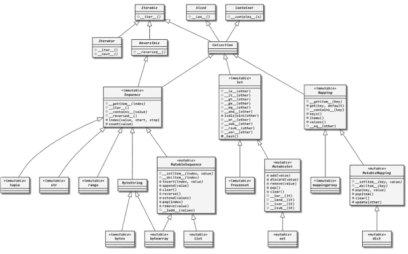

图1.1 容器的抽象基类的类层次结构。

## 14 ■ 通过研究开源项目学习高级Python

满足以下要求。我们将这样的数据结构称为 *CustomerStruct*，它本质上是 *Customers* 的一个容器。

1.  *CustomerStruct* 应支持在 *O(1)* 时间内进行成员测试。
2.  *CustomerStruct* 应高效地支持插入、删除和并集操作。
3.  *CustomerStruct* 应以一种特殊方式支持迭代，即始终首先返回VIP客户。

如果有新车到货，汽车经销商可以首先遍历VIP客户，赋予他们优先选择的特权。*CustomerStruct* 的行为应大体类似于集合。在所有常见数据结构中，只有字典和集合支持在 *O(1)* 时间内进行成员测试。由于我们不是在查找数据，一个集合就足够了。默认集合的问题在于，在进行一些成员操作后，其迭代顺序不是特定的。然而，你应该知道，自Python 3.7起，如果你遍历一个字典，默认的 *dict* 数据结构是插入有序的。我将引用Python文档中的话：

> 集合是一个无序的、不包含重复元素的集合。基本用途包括成员测试和消除重复条目。集合对象还支持数学运算，如并集、交集、差集和对称差集。

我们不想完全实现一个有序集合，因为我们不偏好某个VIP客户胜过另一个，也不偏好某个非VIP客户胜过另一个。如果你对一个功能齐全的有序集合感兴趣，可以查看 ordered sorted container Python 库。⁷

那么问题就归结为实现 `__iter__` 方法，该方法决定了迭代的行为。有趣的是，*SymPy* 的开发者面临过与我们类似的问题。他们想实现有理数集，并允许调用者以特定方式遍历该集合。为什么？回想一下，有理数是可以表示为分数的任何数字。例如，$\frac{1}{2}$、$\frac{3}{5}$ 都是有理数，而 $\pi$（圆的周长与直径的比值）则不是。有理数集也是无限大的。如何合理且穷尽地遍历这样一个无限集合是他们关注的问题。

源代码位于 *sympy.sets.fancyssets.Rationals* 类中，如代码片段1.14所示。

```python
def __iter__(self):
    from sympy.core.numbers import igcd, Rational  # comment 1
    yield S.Zero
    yield S.One
    yield S.NegativeOne
    d = 2
    while True:
        for n in range(d):
            if igcd(n, d) == 1:  # comment 2
                yield Rational(n, d)
                yield Rational(d, n)
                yield Rational(-n, d)
                yield Rational(-d, n)
            d += 1
```

代码 1.14 系统地生成所有有理数。

在标有第一个注释的行中，他们使用了一个名为 `igcd()` 的函数来判断两个数是否互质。`Rational` 类用于构建有理数。如果两个有理数可以约简为同一个数，则它们本质上是相同的。例如，$\frac{1}{2}$ 本质上等同于 $\frac{23}{46}$。接下来的几行首先生成了几个单例对象。只有一个0，一个正1和一个负1，等等。然后，迭代通过增加一个值 $d$ 来控制，同时找到所有可能的 $(n, d)$ 组合，其中 $n$ 小于 $d$ 且与 $d$ 互质。

> 注意，`__iter__` 方法可以无限地生成有理数，这让你明白为什么协议对于编写高效代码很重要。如果代码忠实地完成了它应该做的事情，那么它就不需要是“诚实”的。例如，你可以向用户提供一个处理器来遍历数据库中的大量数据记录。你不想预先查询那么多数据，因为这在内存和时间上都将是灾难性的。你可以做的是返回少量数据供用户使用，维护一个游标，并将额外的查询推迟到需要时再进行。这样摊销成本就会很低。

让我们尝试一下来检查这个模式。我在代码片段1.15中检查了前20个结果。

```python
for idx, val in enumerate(sympy.Rationals):
    if idx < 20:
        print(val)
    else:
        break
# 0
# 1
# -1
# 1/2
# 2
# -1/2
# -2
# 1/3
# 3
# -1/3
# -3
# 2/3
# 3/2
# -2/3
# -3/2
# 1/4
# 4
# -1/4
# -4
# 3/4
```

代码 1.15 使用 *Rationals* 类生成前20个有理数。

现在回到我们的 *CustomerStruct* 案例。我们还需要稍微修改 *Customer* 类，用一个 *is_vip* 参数来初始化它们（片段1.16）。

```python
class Customer:
    def __init__(self, ..., is_vip: bool):
        self.is_vip = is_vip
```

```python
class CustomerStruct:
    def __init__(self, customer_set: set):
        self.customer_set = customer_set

    def __iter__(self):
        for customer in self.customer_set:
            if customer.is_vip:
                yield customer
        for customer in self.customer_set:
            if not customer.is_vip:
                yield customer
```

代码 1.16 首先遍历VIP客户。

这种方法的缺点是我们必须遍历 *customer_set* 两次。嗯，天下没有免费的午餐。更好的解决方案确实存在，但你明白这个意思。

## 属性、函数还是字典？

Python的灵活性是其主要优势之一，但如果使用不当，也是一颗定时炸弹。在上一节中，让我们思考一个案例，我们有不同的方法来解决同一个问题，尽管有些方法在直觉上似乎很奇怪。

一个定义的实例属性可以在实例维护的 *\_\_dict\_\_* 字典中找到。代码片段1.17是一个例子。

```python
class Customer:
    def __init__(self, is_vip: bool):
        self.is_vip = is_vip
print(Customer(True).__dict__)
# {'is_vip': True}
```

代码 1.17 检查一个类的 `__dict__` 属性。

看起来属性检索只是对 `__dict__` 属性进行了一次 `get()` 调用。

每当找不到属性时，我们是否应该直接操作实例的属性字典？假设你想为灵活性留出空间。如果代码用户请求的属性是 `is_VIP` 而不是 `is_vip`，你仍然希望返回 `is_vip` 属性的值并记录一条警告消息，而不是抛出错误。我们能做到吗？

一些读者可能知道，在幕后，有一个对初学者不友好的概念叫做描述符，用于管理属性的查找、存储和操作。我们将在下一章中介绍它，以及属性查找顺序。

假设你遵循属性查找顺序，并且在任何地方都没有名为 `is_VIP` 的属性，不在实例中，也不在 `Customer` 类及其所有父类中。Python有一个内置的特殊方法叫做 `__getattr__()` 来安全地处理这种情况。我们可以自定义它来优雅地处理错误。

> 事实上，属性访问逻辑首先经过 `__getattribute__()` 魔术方法。无论属性是否存在，它都会被调用，并且在 `__getattr__()` 之前被调用，后者作为属性检索失败的最后手段。

代码片段1.18中的逻辑是，每当请求包含字符串 `vip` 的属性时，我们返回 `is_vip` 的值。

```python
class Customer:
    def __getattr__(self, attr_name: str):
        if "vip" in attr_name.lower():
            return self.is_vip
        else:
            raise AttributeError(attr_name)
```

代码 1.18 允许在检索VIP状态时出现轻微的拼写错误。

这行得通。

`__getattr__()` 是一个作为最后解析手段的兜底方法。如果没有用户定义的 `__getattr__()` 方法，默认行为只是抛出一个 `AttributeError` 异常。

这里的教训是，`instance.attribute` 语法在很大程度上是通过字典查找实现的。我们能反过来做吗？我们能用其他东西，比如函数调用等，来模拟字典查找过程吗？当然可以。

`SymPy` 就有一个这样的例子。在 `SymPy` 中，有一个名为 `Transform` 的类，它表示一个数学变换。从高中起，我们就知道这自然地表示为一个函数。然而，在 `SymPy` 中，它被抽象地表示为一个自定义类，部分实现了 `Mapping` 协议。代码片段1.19是其关键部分。

## 18 ■ 通过研究开源项目学习高级Python

```python
class Transform:
    """
    documentation is omitted for the lack of space.
    """
    def __init__(self, transform, filter=lambda x: True):
        self._transform = transform
        self._filter = filter

    def __contains__(self, item):
        return self._filter(item)

    def __getitem__(self, key):
        if self._filter(key):
            return self._transform(key)
        else:
            raise KeyError(key)

    def get(self, item, default=None):
        if item in self:
            return self[item]
        else:
            return default
```

代码 1.19 *Transform* 被实现为一个映射。

`__getitem__(key)` 方法是 `instance[key]` 语法背后的实现，这是一种字典查找。然而，它随后通过将 `key` 传递给 `_transform()` 函数来实现为函数调用，该函数随后用于初始化一个 `Transform` 实例。`Transform` 类的实例由两个函数初始化：`transform` 和 `filter`。`transform` 函数用于转换输入，而 `filter` 函数用于过滤输入，以指示转换是否适用于该输入。我们可以构建一个仅对偶数进行平方运算的 `Transform` 实例，如代码片段 1.20 所示。

```python
from sympy.core.rules import Transform
square_even = Transform(transform = lambda x: x**2, filter = lambda x: x%2 == 0)

3 in square_even
# False

square_even[4]
# 16
```

代码 1.20 一个仅对偶数进行平方运算的 *Transform*。

> 从视觉上看，*square_even[4]* 也可以解释为数组索引：我们想要列表 *square_even* 中的第五个元素。然而，*Mapping* 协议的 *__getitem__()* 方法签名是 *__getitem__(self, key)*，而 *Sequence* 协议的 *__getitem__()* 方法签名是 *__getitem__(self, index)*。显然，我们这里遵循的是 *Mapping* 协议。

一个 *square_even* 对象的行为*像*一个字典，但又不完全一样。例如，它没有 *values* 属性，你也不能遍历其成员。我们从 *Mapping* 协议中挑选了我们需要的部分，构建了自己的类。

嗯，Python 函数本身就是一个原生的映射。我们为什么不直接写一个像 *square_even(4)* 这样的函数呢？我们当然可以。我们可以为 *Transform* 类实现 *__call__* 魔术方法，使实例的行为像一个函数，如代码片段 1.21 所示。

```python
class Transform:
    # omitted for the lack of space
    def __call__(self, val):
        if self._filter(val):
            return self._transform(val)
        return ValueError(val)
```

代码 1.21 为 *Transform* 类添加 *__call__()* 方法。

通过实现 *__call__()* 方法，我们本质上遵循了 *Callable* 协议。任何实现了 *__call__()* 魔术方法的东西都可以*表现得像*一个函数。下载一份 *SymPy* 源代码，修改 *Transform* 类并尝试一下。

此时，我们已经看到了三种不同的方法来实现类似的功能：通过属性访问、类字典查找或函数调用。我们应该选择哪一种？答案取决于上下文和场景的实际含义。

以 *is_vip* 属性为例，我们可以直接实现一个字典查找来启用像 *customer["is_vip"]* 这样的语法。我们可以使用 *__missing__()* 魔术方法来处理缺失的键，这是字典类数据结构中 *__getattr__()* 的回退解析对应方法。然而，这没有意义，因为你的同事不应该去*查找*客户的 VIP 状态。他们知道它*必须*在那里。查找语法制造了一种错觉，好像还有其他键可以查找，但实际上并没有。

同样，*Transform* 示例也有其合理性。类 *Mapping* 的建模使得数学概念与 Python 语法之间建立了对应关系。例如，在数学中，我们说函数或变换的定义域是函数定义在其上的所有值的集合。代码片段 1.22 中的语法是 Python 风格的，并且易于理解：它询问数字 3 是否在我们的变换的定义域中。

使用函数调用时，我们必须将 3 传递给函数并捕获 `ValueError` 异常，这并不直观：你可能需要实现一个名为 `ValueNotInDomain` 的错误，并且你的代码用户必须知道如何处理它。`in` 语法要优雅得多。

```python
3 in square_even
# False
```

代码 1.22 检查 3 是否在 `square_even` 的定义域中。

还有其他因素需要考虑。例如，函数调用可以接受多个参数，而属性访问和字典查找只接受一个。
引用蜘蛛侠的话：能力越大，责任越大。毕竟，我们都是成年人了。

## 总结

在本章中，我们看到 Python 数据模型是语言的核心，并规定了各种对象的行为。Python 对象可以被视为协议的实现，在实现层面具有巨大的自由度。我们在这里只是触及了冰山一角。我鼓励你在你最喜欢的项目中探索 Python 数据模型的用法，看看它们是如何被使用的。
下一章将继续沿着这条路径，重点关注用户定义的类。我们将讨论本章中跳过的描述符协议；类的生命周期以及一些*实用的*元类用法。

## 注释

- 1. 如果你觉得第一个代码示例对你来说很难，那么这本书可能对你来说太高级了。
- 2. https://docs.python.org/3/reference/datamodel.html
- 3. https://github.com/sympy/sympy/issues/20796
- 4. https://github.com/sympy/sympy/pull/20801
- 5. https://docs.python.org/3/library/collections.abc.html#module-collections.abc
- 6. https://sangmoonoh.medium.com/
- 7. https://grantjenks.com/docs/sortedcontainers/

## 第2章
Python 类的精选主题

### 引言

我选择这两个主题是因为它们经常被视为你会寻找问题来应用的解决方案。然而，普通的 Python 用户并不经常使用它们。
事实上，许多 Python 内置行为和标准库中的功能都是使用描述符协议实现的。著名的 Web 框架 Django 使用元类来自定义模型类。我们将看一个 Django 之外的例子，因为每个关于元类的演讲都已经用过它了。
本章将会很有趣。让我们开始吧。

## 描述符与属性查找顺序

首先，从上一章中，我们有两个悬念：描述符和属性查找顺序。事实上，不介绍描述符就不可能讨论属性查找顺序，因为由描述符管理的属性有些特殊。

### 描述符揭秘

描述符只是一个实现了*至少*以下三个魔术方法之一的类。抱歉我先介绍概念，但我保证这会很顺利且简单。

- 1. `__get__(self, obj, type=None) -> value`
- 2. `__set__(self, obj, value) -> None`
- 3. `__delete__(self, obj) -> None`

就是这样。让我们在代码片段 2.1 中定义一个描述符。

```python
class Answer:
    def __get__(self, obj, objtype):
        return 42
```

代码 2.1 一个名为 *Answer* 的简单 Python 描述符。

*Answer* 类是一个描述符。更具体地说，它是一个非数据描述符，或非覆盖描述符。这意味着该描述符将被属性赋值所覆盖。相反，实现了 `__delete__()` 和 `__set__()` 的描述符被称为数据描述符。它们在初始化后不会被属性赋值所覆盖。我们很快就会看到例子。

让我们先在代码片段 2.2 中查看描述符的一个简单用例。

```python
class Answer:
    def __get__(self, obj, objtype):
        return 42

class Universe:
    answer = Answer() # comment 1

u = Universe()
print(u.answer) # 42
print(Universe.answer) # 42
```

代码 2.2 将一个 *Answer* 实例赋值给一个属性。

*answer* 是一个类属性。实例 *u* 没有 *answer* 属性，因此它回退到类的属性。

接下来，我们在代码片段 2.3 中覆盖实例的 *answer* 属性。

```python
u = Universe()
print(u.__dict__) # {}
u.answer = 24
print(u.answer) # 24
print(u.__dict__) # {'answer': 24}
print(Universe.answer) # 42
```

代码 2.3 覆盖类的 *answer* 描述符。

代码片段 2.3 表明 *Answer* 是一个*非数据描述符*：它不*管理*数据；它只是返回数据。

> 非数据描述符是一种只定义了 `__get__()` 方法，而没有定义 `__set__()` 或 `__delete__()` 方法的描述符。当访问使用非数据描述符的类的实例上的属性时，会调用描述符的 `__get__()` 方法，并使用该方法返回的值作为属性值。然而，尝试设置或删除属性将导致 AttributeError。

对于非数据描述符，实例的 `__dict__` 具有更高的优先级。换句话说，Python 会优先使用实例 `__dict__` 中的同名键，然后再回退到其类属性。

让我们为 *Answer* 类添加一个 `__set__()` 魔术方法，使其成为一个所谓的*数据描述符*，也称为*覆盖描述符*，然后再次运行代码，如代码片段 2.4 所示。

```python
class Answer:
    def __get__(self, obj, objtype):
        return 42
    def __set__(self, obj, value):
        obj.answer = value

class Universe:
    answer = Answer()

u = Universe()
print(u.answer) # 42

# 以下行将导致错误：

u.answer = 24 # maximum recursion depth exceeded
```

代码 2.4 将 *Answer* 改为数据描述符。

最后，我们得到了一个递归错误。要理解这个错误，我们需要看看 `__get__()` 和 `__set__()` 方法参数的含义。

以 `__get__()` 为例，*self* 是描述符实例的自引用：即 *answer* 变量。*obj* 是描述符实例被赋值给的*实例*。*objtype* 是实例的类型。让我们用代码片段 2.5 来明确展示这一点。

```python
# 省略了其余部分
    def __get__(self, obj, objtype):
        print(obj, objtype)
        return 42

u.answer
# <__main__.Universe object at 0x7f28856c22e0> <class `__main__.Universe`>
Universe.answer
# None <class `__main__.Universe`>
```

代码 2.5 传递给 `__get__` 方法的 *obj* 和 *objtype*。

如果你从类调用描述符，则没有关联的实例，因此 *obj* 为 None。

当我们尝试将 24 赋值给 *u.answer* 时，会调用数据描述符的 `__set__()` 方法，该方法执行 *obj.answer=24*。然而，*obj* 正是 *Universe* 实例 *u*，而我们正试图给它的 *answer* 属性赋值。

等一下，这不正是我们一开始想要的吗？我们陷入了无限递归。
如何解决这个问题？
解决方案是让描述符管理和存储我们的数据。让 *self*，即实例，来存储和管理一切，如代码片段 2.6 所示。

```python
class Answer:
    def __get__(self, obj, type = None):
        return obj._answer
    def __set__(self, obj, value):
        obj._answer = value

class Universe:
    answer = Answer()
    def __init__(self, answer):
        self.answer = answer

u = Universe(42)
print(u.answer) # 42
u.answer = 24
print(u.answer) # 24
```

代码 2.6 让 *Answer* 描述符持有属性。

问题似乎解决了！如果你熟悉 *property()* 装饰器¹，你可能已经认出了这种模式。事实上，*property()* 就是使用描述符实现的。
这给了我们足够的知识来理解实例属性查找顺序的全貌。事实上，我们已经展示了这段引文中几乎所有的关系，除了最后一个。数据描述符优先于实例变量意味着，如果一个属性有 `__get__()` 方法，则调用它，而不是返回 `__dict__[attribute_name]` 的值。

> 实例查找会扫描一系列命名空间，赋予数据描述符最高优先级，其次是实例变量，然后是非数据描述符，接着是类变量，最后是 `__getattr__()`（如果提供了的话）。²

代码片段 2.7 是最后一个例子，展示了非数据描述符确实优先于类变量。类 A 维护一个类属性 *answer*，其值为 24，而实例有一个非数据描述符，表示其 *answer* 属性的值为 42。

```python
class Answer:
    def __get__(self, obj, type = None):
        return 42

class A:
    answer = 24
    _answer = Answer()
    def __init__(self):
        self.answer = A._answer

instance = A()
print(instance.answer) # 42
```

代码 2.7 非数据描述符优先于类变量。

接下来，让我们关注房间里的大象：为什么我们关心查找顺序，以及我们的代码如何从中受益。

## Matplotlib 中的惰性求值

这个例子展示了如何使用描述符来推迟可能不会用到的繁重工作，直到真正需要时才执行。

如果你使用 Matplotlib 绘制图表，并希望允许读者识别数据点的值，你可能会考虑为坐标轴添加刻度。修改官方 Matplotlib 示例，图 2.1 和图 2.2 是两张图表，展示了 x 轴上有无刻度的差异。它们是用代码片段 2.8 生成的。

```python
import numpy as np
import matplotlib.pyplot as plt
from matplotlib.ticker import AutoMinorLocator
t = np.arange(0.0, 100.0, 0.1)
s = np.sin(0.5 * np.pi * t) * np.exp(-t * 0.01)
fig, ax = plt.subplots()
ax.plot(t, s)
# ax.xaxis.set_minor_locator(AutoMinorLocator())
```

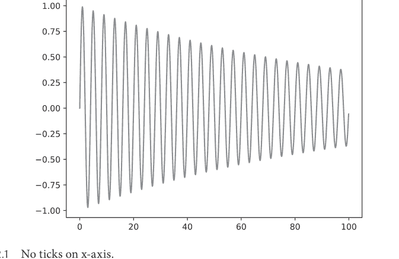

图 2.1 x 轴上没有刻度。

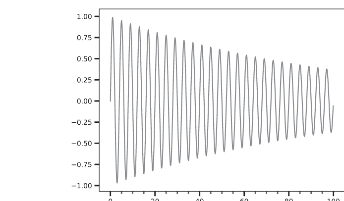

图 2.2 x 轴上有刻度。

```python
# ax.tick_params(which='both', width=2)
# ax.tick_params(which='major', length=7)
# ax.tick_params(which='minor', length=4, color='r')
plt.show()
```

代码 2.8 生成带有和不带有 x 轴刻度的 matplotlib 图像的 Python 代码。

大多数时候用户不需要刻度，因此默认情况下图表没有刻度。它们应该只在需要时才可用。事实上，创建刻度有点慢。这里，我引用 axis.py³ 文件中的代码注释。

> 在初始化期间，Axis 对象经常创建后来未使用的刻度；这被证明是一个非常缓慢的步骤。相反，使用自定义描述符使刻度列表惰性化，并根据需要实例化它们。

嗯，我们看到解决方案是一个自定义描述符。让我们看看 Axis 对象是如何初始化的，如代码片段 2.9 所示。

```python
class Axis(martist.Artist):
    """
    `.XAxis` 和 `.YAxis` 的基类。
    属性

    其他注释已跳过

    majorTicks : list of `.Tick`
    主刻度。
    minorTicks : list of `.Tick`
    次刻度。
    """
    # 代码已跳过
    # 在初始化期间，Axis 对象经常创建后来未使用的刻度；这被证明是一个非常缓慢的步骤。
    # 相反，使用自定义描述符使刻度列表惰性化，并根据需要实例化它们。
    majorTicks = _LazyTickList(major=True)
    minorTicks = _LazyTickList(major=False)
```

代码 2.9 Axis 对象初始化。

注释表明类属性 *majorTicks* 和 *minorTicks* 是 *Tick* 对象的列表。代码片段 2.10 是 `_LazyTickList` 描述符的定义^4。

```python
class _LazyTickList:
    """
    用于刻度列表惰性实例化的描述符。
    参见 ``majorTicks`` 和 ``minorTicks`` 属性定义上方的注释。
    """

    def __init__(self, major):
        self._major = major

    def __get__(self, instance, cls):
        if instance is None:
            return self
        else:
            # instance._get_tick() 本身可能会尝试访问 majorTicks 属性
            # （例如在某些覆盖了 get_xaxis_text1_transform 等方法的投影类中）。
            # 为了避免无限递归，首先将实例上的 majorTicks 设置为空列表，
            # 然后创建刻度并将其附加。
            if self._major:
                instance.majorTicks = []
                tick = instance._get_tick(major=True)
                instance.majorTicks.append(tick)
                return instance.majorTicks
            else:
                instance.minorTicks = []
                tick = instance._get_tick(major=False)
                instance.minorTicks.append(tick)
                return instance.minorTicks
```

代码 2.10 _LazyTickList 的定义

这里有 2 个关键发现：

-   1. _LazyTickList 是一个非数据描述符，这意味着它可以被覆盖。
-   2. 它被覆盖的地方是在它自己的 `__get__()` 方法中。它是自我毁灭的：一旦被调用，它就完成了使命并终止。

另一个有趣的发现是，我们必须在调用 `_get_tick()` 方法之前，先将 `instance.majorTicks` 或 `instance.minorTicks` 设置为空列表。原因与我们之前相同：为了避免无限递归。

> 为了避免无限递归，首先将实例上的 majorTicks 设置为空列表，然后创建刻度并将其附加。

通过将刻度设置为描述符，如果用户从不访问刻度，那么它们将保持为描述符，没有人会知道。一旦用户访问刻度或尝试将其设置为另一组 Tick 对象，描述符将被覆盖，并且它们将永远消失。

在 Python functools 模块中有一个装饰器，实现为一个类：`cached_property`。`cached_property` 允许你在第一次运行方法时执行一个耗时的计算，然后将结果设置为同名属性。下次你访问该方法时，它不再是一个方法，而是一个预先计算好的值。

代码片段 2.11 是一个比较 `property` 装饰器和 `cached_property` 装饰器差异的示例。

```python
import time
from functools import cached_property

class Calculator:
    @property
    def p_calculation(self):
        x = 0.3
        for i in range(1_000_000):
            x = 4 * x * (1-x)
        return x
```

```python
@cached_property
def cp_calculation(self):
    x = 0.3
    for i in range(1_000_000):
        x = 4 * x * (1-x)
    return x
```

```python
c = Calculator()
start = time.time()
for _ in range(10):
    c.p_calculation
end = time.time()
print(end - start) # about 1.28 seconds
```

```python
start = time.time()
for _ in range(10):
    c.cp_calculation
end = time.time()
print(end - start) # about 0.13 seconds
```

代码 2.11 比较 *property* 和 *cached_property* 装饰器。

显然，缓存版本要快得多。然而，假设你*希望*实例能跟踪 x 的值。那么你应该坚持使用 *property*。下面的代码片段 2.12 运行会更快，但运行结果是错误的。

```python
class Calculator:
    def __init__(self, x):
        self.x = x

    @cached_property
    def cp_calculation(self):
        for i in range(1_000_000):
            self.x = 4 * self.x * (1-self.x)
        return self.x
```

```python
c = Calculator(0.3)
for _ in range(10):
    print(c.cp_calculation) # always 0.9892353585201644
```

代码 2.12 *cached_property* 不起作用的案例。

_LazyTickList 的思想与 *cached_property* 非常相似：首次访问会进行根本性的改变并完成繁重的工作。之后的一切都成为标准操作。

## 元类及其在 Elasticsearch DSL 中的使用

在本节中，我们将从最基础的部分开始深入探讨元类。我们还将以 Elasticsearch 领域特定语言（DSL）为例，考察其在这个开源项目中的使用。

### 使用元食谱理解元类

Python 中的元类是什么？元类是一个可以创建类的类。正如我们在第 2 章中讨论的，Python 中的一切都是对象。要创建一个实例，我们调用相应的类。我们可以通过用不同的参数初始化它来定制实例的创建。我们可以在 `__init__()` 方法中进行一些逻辑检查，以确保一切正常。

同样，有时我们希望代码用户创建他们自己的*类*，这样他们就可以创建自己的实例。我们希望在他们的类被用来创建实例之前，对它们做*一些事情*。例如，这些类需要被*验证*、*增强*或*转换*。这就是元类大显身手的地方。

对于大多数场景，我们提供类供其他开发者使用，而不是允许他们构建*增强的*类。这就是为什么元类通常只在允许用户构建工具以实现其自定义任务的库中*合法*使用。对于其他场合，我认为 99% 的情况下，你可以在不使用元类的情况下达到相同的效果。

这里有一个场景。
你是一家大酒店的*厨房主管*。你不做饭，而是管理厨师和厨房的运营。

其他厨师不断创造新食谱以满足客人无尽的胃口。每天，每道菜都根据其食谱烹饪数百次。你希望确保食物始终安全健康。

根据这个场景，我们有如图 2.3 所示的对应关系。

让我们关注右边两列。食谱是创建食物的模板。它们的关系就像类和实例。作为厨房主管，你需要拥有某种叫做*元食谱*的东西来管理所有可能食谱的创建。在 Python 中，层次结构中的这个位置是为元类保留的。

为了让这个例子更具体，假设你想确保所有食谱的配料都不包含鳗鱼。这只是一个随机的例子。我个人非常喜欢鳗鱼。

代码在代码片段 2.13 中给出。

```python
class RecipeMeta(type):
    @classmethod
    def _ingredient_check(cls, ingredients:list):
        if 'eel' in ingredients:
            return False
        return True
```

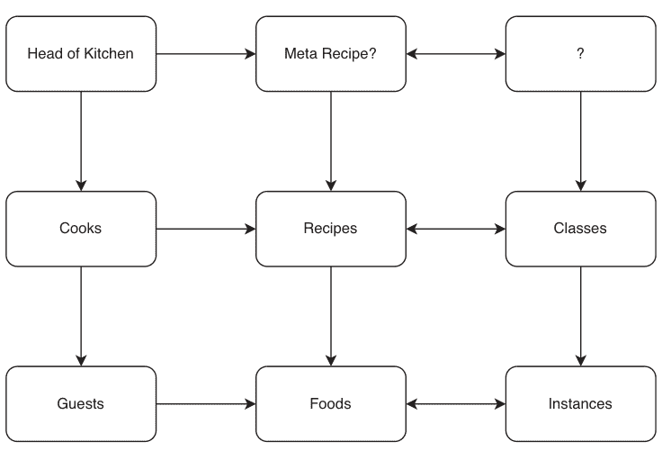

图 2.3 厨房主管实体关系图。

```python
def __new__(cls, class_name, bases, attrs):
    if "ingredients" not in attrs:
        raise Exception("Dish class must have ingredients!")
    if not cls._ingredient_check(attrs['ingredients']):
        raise Exception("Eel is not allowed in the ingredients!")
    return type(class_name, bases, attrs)

class ChickenStew(metaclass = RecipeMeta):
    ingredients = ('chicken',)

class SmokedEel(metaclass = RecipeMeta):
    ingredients = ('eel',)
```

代码 2.13 *RecipeMeta* 元类

运行此代码片段，你会得到一个错误，即 *SmokedEel 的定义*引发了一个异常。非常重要的一点是，这发生在类定义阶段，而不是实例创建阶段。在现实生活中，这对应于你作为厨房主管审查一个食谱提案并拒绝它的过程。你不需要看到一盘*实际的*烟熏鳗鱼来拒绝它。让我们仔细看看 *RecipeMeta*。它扩展了 *type*，这表明它是一个元类。在 Python 中，所有元类都是 *type* 的子类。魔法发生在 `__new__()` 魔术方法中。一个类的 `__new__()` 方法*创建*其实例并将其返回给 `__init__()` 进行初始化。在元类的情况下，元类的 `__new__()` 方法创建类。

为了理解这些参数的含义，让我们先看一个普通类的例子。`__new__()` 方法存在于每个类中，而不仅仅是元类。这个类扩展了内置的 *dict* 类，并为每个键添加一个下划线。在代码片段 2.14 中查看它。

```python
class UnderScoreDict(dict):
    def __new__(cls, d):
        return {"_" + str(k):v for k,v in d.items()}

UnderScoreDict({"a":1, "b":2}) # {'_a': 1, '_b': 2}
```

代码 2.14 为字典的每个键添加下划线。

首先，`__new__()` 方法不一定调用其父类的方法。相反，唯一的要求是它返回一些东西，最好是实例，以便在下游进行初始化。在这里，我只是直接创建了处理过的字典。

其次，我们能用 `__init__()` 实现同样的事情吗？答案是肯定的，如代码片段 2.15 所示。

```python
class UnderScoreDict(dict):
    def __init__(self, d):
        for k,v in d.items():
            self["_" + str(k)] = v
```

代码 2.15 不使用元类实现相同效果。

默认的 `__new__()` 方法返回一个空字典给 `__init__()` 方法进行初始化，然后 `__init__()` 逐个分配键值对。

在实践中，有些情况只有 `__new__()` 才能解决。例如，你想确保你的程序中只有一个实例：单例设计模式，你已经在第 2 章中见过。代码片段 2.16 创建了一个单例。

```python
class Singleton:
    _instance = None
    def __new__(cls, *args, **kwargs):
        if not cls._instance:
            cls._instance = object.__new__(cls, *args, **kwargs)
        return cls._instance
```

代码 2.16 一个*单例*类总是返回同一个实体。

在这个例子中，类 *Singleton* 维护一个类变量 `_instance`。每次创建新实例时，`__new__()` 方法都会检查这是第一次创建这样的实例。如果是，则创建实例，用 `_instance` 变量跟踪它，然后返回它。如果不是，则返回之前创建的实例。

这是用 `__init__()` 无法实现的，因为它不负责实例创建。事实上，`__new__()` 可以做 `__init__()` 能做的一切，但反之则不然。嗯，使用 `__init__()` 允许用户专注于业务逻辑，因为大多数时候用户并不关心实例的创建。

现在，继续讨论元类的情况。我们的例子有点不同，因为我们正在定制类的创建。`__new__()` 方法接受四个参数，我在表（表 2.1）中列出了它们。

| 参数名 | 含义 | 值 |
| :--- | :--- | :--- |
| cls | 元类 | <class `__main__.RecipeMeta`> |
| class_name | 创建的类的名称 | ChickenStew |
| bases | 创建的类的父类 | () |
| attrs | 创建的类的属性字典 | {'__module__': '__main__', '__qualname__': 'ChickenStew', 'ingredients': ('chicken',)} |

如果你继承 *ChickenStew* 类来创建类似 *SpanishChickenStew* 的东西，那么 *ChickenStew* 应该出现在 *bases* 中。这里有一个陷阱，我们很快就会讨论。

参数 *class_name* 是一个字符串。我们从元类调用中得到的是一个类。是谁施展了魔法？是 `type(class_name, bases, attrs)` 负责这种构造。

`type()` 可以接受 1 个或 3 个参数。常见的单参数用法返回对象的类型。然而，当提供 3 个参数时，它可以创建任意类。代码片段 2.17 提供了一个例子。

```python
class_name = "Duck"
quack = lambda x: "Quack"
class Bird:
    pass

Duck = type(class_name, (Bird,), {'quack': quack})

duck = Duck()
print(duck.quack()) # Quack
duck.__class__.mro() # [__main__.Duck, __main__.Bird, object]
```

代码 2.17 使用 `type()` 动态创建类。

我没有编写正常的类定义就创建了一个 *Duck* 类。相反，我通过将其类名、其父类 *Bird* 和一个 `quack()` lambda 函数传递给 `type()` 函数来创建它。

这很神奇且功能强大。

然而，这个例子还有一个最后的问题。如果你确实创建了一个 *ChickenStew* 的子类，并且其配料中包含鳗鱼，检查将无法工作。下面的代码片段 2.18 可以正常工作，通过了检查。
```

## 通过研究开源项目学习高级Python

```python
class SpanishChickenStew(ChickenStew):
    ingredients = ('eel',)
```

**代码 2.18** 子类不会继承元类。

在没有显式指定元类的情况下，子类不会*继承*元类。不过，有一个变通方法。`type(class_name, bases, attrs)`同样包含两个阶段：`type.__new__(cls_type, class_name, bases, attrs)`和`type.__init__(cls, class_name, bases, attrs)`。如果我们在`type.__new__()`函数中没有覆盖`cls_type`变量，返回的类将具有默认的元类：`type`，而不是`RecipeMeta`。
代码片段2.19展示了修复方法。

```python
def __new__(cls, class_name, bases, attrs):
    if "ingredients" not in attrs:
        raise Exception("Dish class must have ingredients!")
    if not cls._ingredient_check(attrs['ingredients']):
        raise Exception("Eel is not allowed in the ingredients!")
    return type.__new__(cls, class_name, bases, attrs)
```

**代码 2.19** 元类继承的修复。

现在，没有人能将鳗鱼偷偷混入鸡肉食谱了。对`SpanishChickenStew`应用`type()`将返回其元类，如代码片段2.20所示。

```python
type(SpanishChickenStew)
# __main__.RecipeMeta
```

**代码 2.20** 类类型正常工作。

最后，在进入Elasticsearch DSL示例之前，我想总结一下本节中使用的`type`的定义。我知道这常常令人困惑（表2.2）。
Python中对`type`还有一些其他特殊处理，比如它本身就是自己的实例，但上述四种用法是最常见的。

**表 2.2** Python中`type`的常见用法

| 用法 | 含义 | 示例 |
| :--- | :--- | :--- |
| `type(instance)` | 返回实例的类/类型 | `type(12)` # `<class 'int'>` |
| `type(class)` | 返回类的元类 | `type(dict)` # `<class 'type'>` |
| `type` | 作为所有元类继承的元类 | `class RecipeMeta(type): pass` |
| `type(class_name, bases, attributes)` | 返回动态创建的类 | `Duck = type(class_name, (Bird,), {'quack': quack})` |

### 使用元类在Elasticsearch DSL中建模文档

我们将要研究的开源项目叫做elasticsearch-dsl-py。它提供了易于使用的语法来操作查询，并开箱即用地执行对象-文档映射。

这里简单介绍一下Elasticsearch。Elasticsearch是一个基于Lucene库的搜索引擎。它提供了一个带有HTTP Web接口和无模式JSON文档的全文搜索引擎。Elasticsearch比PostgreSQL更接近MongoDB。它将记录存储为文档。以下是Elasticsearch与类SQL数据库之间的概念映射。这确实需要你具备一些SQL或两者的基础知识（表2.3）。

为了简化概念，我将引用elasticsearch-dsl-py文档中使用的示例，你可以想象以下json对象是一个*文档*，你可以将其保存到名为blog的*索引*中，以及其他类似对象。该文档有五个*字段*：*author*、*title*、*publish_date*、*tags*和body，如代码片段2.20所示。

```json
{
    "author": "Richard. W",
    "title": "Rule of Apes",
    "body": "a long long body.",
    "published_date": "2021-03-21",
    "tags": ["sci-fi", "thriller"]
}
```

**代码 2.20** blog*索引*中的一个示例*文档*。

将此文档保存到Elasticsearch后，你可以通过文本搜索它。你可以使用“apes”或“Richard”作为关键词在title字段或author字段中搜索。Elasticsearch将使用*分析器*来分析不同的字段。例如，一个良好的文本分析器即使你输入的是*ape*，也能为你找到*apes*。

什么是领域特定语言（DSL）？领域特定语言是一种为解决特定领域问题而设计的编程语言。它们不是通用目的的。例如，SQL用于关系数据库操作。HTML仅用于前端开发。LaTeX仅用于文档排版。Elasticsearch DSL实际上不是一种语言，而是一个库，用我引用的话说，可以帮助编写和运行针对Elasticsearch的查询。它提供了一种更方便、更地道的方式来编写和操作查询。

**表 2.3** Elasticsearch与类SQL数据库中的概念匹配

| Elasticsearch概念 | SQL概念 |
| :--- | :--- |
| 索引 | 表 |
| 文档 | 行 |
| 字段 | 列 |
| 无 | 模式 |

怎么会这样？让我们看看Elasticsearch DSL的官方示例。假设你想保存一个*文章*对象并将其保存到*blog*索引中。要运行此示例，你需要在本地设置一个Elasticsearch实例。我在本章的附录中提供了操作方法。
首先，让我们用代码片段2.21创建一个表示文章的*Article*类。

```python
from datetime import datetime
from elasticsearch_dsl import Document, Date, Integer, Keyword,
Text, connections
connections.create_connection(hosts=['localhost'], port=9200)

class Article(Document):
    title = Text(analyzer='snowball', fields={'raw': Keyword()})
    body = Text(analyzer='snowball')
    tags = Keyword()
    published_from = Date()
    lines = Integer()

    class Index:
        name = 'blog'
        settings = {
            "number_of_shards": 2,
        }

    def save(self, ** kwargs):
        self.lines = len(self.body.split())
        return super(Article, self).save(** kwargs)

    def is_published(self):
        return datetime.now() > self.published_from

Article.init()
```

**代码 2.21** 创建*Article*类。

然后，我们可以用代码片段2.22创建一个具体的文章并保存它。

```python
article = Article(meta={'id': 45},
                  title='Hello world!',
                  tags=['real'],
                  body=''' long text that spawns multiple lines
''',
                  published_from=datetime.now())
article.save()
```

**代码 2.22** 创建一个文章实例。

如果你有使用ORM（对象关系映射）的经验，你可能已经认识到这与ORM的思想非常相似。我们不是使用对象来表示*行*，而是使用对象来表示*文档*，即Elasticsearch的行。

我们将*Article*类定义为*Document*类的子类。Article类没有定义*init()*方法，*article*实例也没有定义*save()*方法。就像我们自己的示例一样，有一个类工厂，一个负责*增强*用户定义类的元类。

让我们看看代码片段2.23，了解新类的*init()*是在哪里定义的。你完全有能力自己探索其他方面。

```python
class Document(ObjectBase, metaclass=IndexMeta):
    """
    Model-like class for persisting documents in elasticsearch.
    """
    @classmethod
    def init(cls, index=None, using=None):
        """
        Create the index and populate the mappings in
        elasticsearch.
        """
        i = cls._index
        if index:
            i = i.clone(name=index)
        i.save(using=using)
```

**代码 2.23** *Document*类的*init()*定义。

*Document*类有一个元类*IndexMeta*。*init()*是一个类方法，其中类的*_index*属性调用自己的*clone()*和*save()*方法。

内联注释是准确的，让我们找出*_index*是如何创建的，因为我们没有创建这个属性。让我们看看*IndexMeta*元类，它被复制到代码片段2.24中。

```python
class IndexMeta(DocumentMeta):
    # global flag to guard us from associating an Index with the
    # base Document
    # class, only user defined subclasses should have an _index
    # attr
    _document_initialized = False

    def __new__(cls, name, bases, attrs):
        new_cls = super().__new__(cls, name, bases, attrs)
        if cls._document_initialized:
            index_opts = attrs.pop("Index", None)
            index = cls.construct_index(index_opts, bases)
            new_cls._index = index
```

index.document(new_cls)
cls._document_initialized = True
return new_cls

@classmethod
def construct_index(cls, opts, bases):
    if opts is None:
        for b in bases:
            if hasattr(b, "_index"):
                return b._index

        # 将 None 设置为索引名称，这样在查询时会设置 _all
        return Index(name=None)

    i = Index(getattr(opts, "name", "*"), using=getattr(opts,
"using", "default"))
    i.settings(**getattr(opts, "settings", {}))
    i.aliases(**getattr(opts, "aliases", {}))
    for a in getattr(opts, "analyzers", ()):
        i.analyzer(a)
    return i

代码 2.24 *IndexMeta* 元类定义。

在 `__new__()` 方法中，我们看到 *index_opts* 是通过从属性字典中弹出 *Index* 来定义的。*Index* 在哪里？它就在我们自己定义的 *Article* 中，如代码片段 2.25 所示。你可以尝试更改其类名，你会看到文章将不会保存到 *blog* 索引中。

class Index:
    name = 'blog'
    settings = {
        "number_of_shards": 2,
    }

代码 2.25 *Index* 类定义在 *Article* 类内部。

如果我们不定义这样的类，文档 Article 将被保存到一个默认的 *None* 索引中。这里我们定义了一个名为 *blog* 的索引，这相当于在关系型数据库中创建一个名为 blog 的表。

接下来，*construct_index()* 类方法创建一个 *Index* 对象。*Index* 对象配置索引的名称和设置，如代码片段 2.26 所示。

i = Index(getattr(opts, "name", "*"), using=getattr(opts, "using",
"default"))

代码 2.26 *construct_index()* 类方法中的索引创建。

接下来，新创建的索引对象被赋值给新类的 `_index` 属性。

> 如果你感兴趣，可以深入研究 `index.py`⁶ 文件中的 *Index* 类。

当一切完成后，`new_class` 被返回给用户，所有繁琐的准备工作都被隐藏在幕后。这里有很多繁琐的细节。所有这些都由元类处理，而不是用户定义的类。用户不需要担心调用哪个 API 来创建索引等。用户只关心文章的实际结构。
总结一下，图 2.4 比较了使用和不使用元类的模式。
如何证明使用元类的合理性？假设有一个内部复杂度很高的系统。这个系统可以是数据库、搜索引擎，或者只是另一个团队构建的大型系统。现在你需要为用户设置与如此复杂的系统交互的规则。他们创建的每个类都需要处于非常好的状态。你有两个选择来确保类是兼容的、健康的并且功能良好。

1.  选项 1，你创建一个元类来与系统和类进行通信，以确保双方都满意，并且类从一开始就是可靠的。
2.  选项 2，你抛出 100 条术语让类创建者遵循，并希望没有错误。

这正是元类真正大放异彩的地方。复杂性的守恒就像能量守恒：如果你不能再减少复杂性，你最好把它转移到安全的地方。

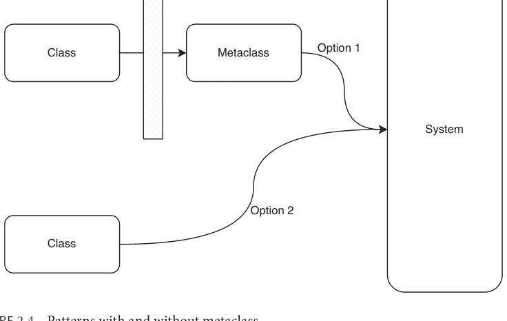

图 2.4 使用和不使用元类的模式。

## 总结

令人着迷的是，描述符协议负责 Python 类的这么多特性和特征。我们介绍了描述符的基本结构，并在 Matplotlib 库和内置模块中展示了示例。

元类在编程中提供了*关注点分离*。它能够在类定义时（而不是实例创建时）实现强大的类定制和创建。这样，最终用户可以专注于他们自己的对象建模或其他业务关注点。

## 附录

以下是快速设置本地运行的 Elasticsearch 实例的指南。我已在搭载 M1 芯片的 Mac 机器上测试过。稍作调整，它应该可以轻松适用于其他操作系统。

步骤 1：如果你的系统上没有安装 Docker，请安装它。访问 docker desktop⁷ 页面，它应该会根据你的操作系统安装正确的版本。

步骤 2：打开终端，通过运行代码示例 2.27 中的命令拉取 docker 镜像。

docker pull docker.elastic.co/elasticsearch/elasticsearch:8.5.3

**代码 2.27** 获取 Elasticsearch 镜像。

步骤 3：运行以下命令启动一个禁用了安全功能的 Elasticsearch 容器，如代码示例 2.28 所示。

docker run --rm -p 9200:9200 -p 9300:9300 -e "xpack.security.enabled=false" -e "discovery.type=single-node" docker.elastic.co/elasticsearch/elasticsearch:8.5.3

这应该可以让你的 docker 实例运行起来。请注意，如果服务对互联网开放，你永远不应该这样启动服务。我们只是这样做，以便你可以轻松测试东西。

在此步骤，你可以使用 *elasticsearch-dsl-py* 与实例通信。

步骤 4（可选）：如果你想有一个图形界面来查看数据在实例中是如何保存的，你可以安装一个名为 Elasticsearch Tools⁸ 的 Chrome 扩展程序，如图 2.5 所示。


图 2.5 Elasticsearch Tool Chrome 扩展程序。

我个人喜欢使用它，因为它非常轻量且直观。Kibana⁹ 是 Elasticsearch 技术栈的默认选择，你也可以探索一下。

## 注释

1.  https://docs.python.org/3/library/functions.html#property
2.  https://docs.python.org/3/howto/descriptor.html
3.  https://github.com/matplotlib/matplotlib/blob/main/lib/matplotlib/axis.py#L572
4.  https://github.com/matplotlib/matplotlib/blob/main/lib/matplotlib/axis.py#L560
5.  https://github.com/elastic/elasticsearch-dsl-py
6.  https://github.com/elastic/elasticsearch-dsl-py/blob/main/elasticsearch_dsl/index.py
7.  https://www.docker.com/products/docker-desktop/
8.  https://chrome.google.com/webstore/detail/elasticsearch-tools/aombbfhbleaidjmbahldfbajjmg-kgojl?hl=en
9.  https://www.elastic.co/kibana/

# 第 3 章
Python 中的并发

## 从自顶向下视角看并发

想象一下，你和你的朋友正在一家餐厅等餐。你点了薯条、烤鸡、炖牛肉和一些沙拉。大约 15 分钟后，所有的食物都准备好了。你非常高兴。

从你的角度来看，食物的烹饪是*同时*发生的。换句话说，它们是并发发生的。作为食客，你并不关心厨房里发生了什么。你关心的是你可以同时享用薯条和炖牛肉。

并发是应用程序或系统的一种行为属性。这是我们从系统外部观察到的东西。拥有一个*并发*的厨房并不能说明食物实际烹饪的任何情况。存在我称之为观察屏障的东西，它隐藏了并发的实际*实现*（图 3.1）。

现在，让我们将视角转移到厨房这边。假设四道菜需要以下任务和时间来完成，如表 3.1 所示。

如果厨房里只有一位厨师，她必须独自准备这四道菜，她会怎么做？

如果她按顺序执行每个任务，总时间是 29 分钟，这对食客来说是不可接受的。然而，任何曾经做过饭的人都会做类似以下的事情。

首先，她需要把预先准备好的鸡放进烤箱，并开始炖牛肉，因为这两样都需要时间。设置计时器是个好主意。然后，她准备沙拉，因为反正是冷的。最后，她需要炸土豆条并密切监控，因为它很容易炸不熟或炸过头。薯条最好趁热吃，所以我们最后做。在烹饪过程中，在计时器响起之前，检查鸡肉和牛肉以确保它们没问题是很安全的。

在时间域中，烹饪任务看起来像图 3.2。

标记为白色的任务是只需要偶尔关注的任务。阴影部分的任务是需要集中注意力的。记住，厨房里只有一位厨师，但她可以很好地准备这四道菜。

## 操作系统与并发

接下来，我们准备将餐厅示例与我们的操作系统知识结合起来。如果你正在电脑上阅读本书，食客与厨房的关系就像你与你的电脑，更具体地说，与操作系统的关系一样。正如食客点餐、厨房备餐，我们让操作系统为我们执行各种任务。正如厨房里发生着许多食客不知道或不关心的事情，操作系统中也发生着许多我们最终用户不关心的事情。

表3.2列出了这两种关系之间的类比。请记住，我们仍在讨论通用的编程场景。在CPython中，存在一些差异，我们很快就会讨论。

让我们看看CPU和厨师之间的异同。他们都是实际任务的执行者。对于单核CPU来说，没有真正的并行，因为它一次只能执行一个任务。CPU会在任务之间切换，以提供它同时处理多项任务的错觉。然而，对于厨师来说，烤鸡和炖牛肉在某种程度上仍可被视为*真正的*并行。

那么，为什么会有两种任务模型：进程和线程？它们有什么区别？
简而言之，线程可以被视为*进程内部*的轻量级进程，具有共享资源、更小的占用空间和更少的创建开销。

进程是重量级的。操作系统会跟踪进程使用的资源，如文件描述符、内存位置和端口号等。通过在进程中创建轻量级线程，它们可以共享一些资源，如共享内存，并使用它们。这显然既强大又危险。编写所谓的多线程代码即使对经验丰富的开发者来说也被认为是困难的。

表3.3总结了进程和线程之间的关键区别。

表3.2 用户-操作系统关系与食客-厨房关系的比较

| 用户-操作系统场景 | 食客-厨房场景 |
| :--- | :--- |
| 用户 | 食客 |
| 操作系统 | 厨房 |
| CPU | 厨师 |
| 进程和线程 | 菜肴烹饪任务 |

表3.3 进程与线程的关键区别

| 视角 | 进程 | 线程 |
| :--- | :--- | :--- |
| 独立性 | 操作系统认为进程是独立的 | 同一进程中的线程被认为是相互依赖的 |
| 内存共享 | 进程拥有不同的内存空间 | 同一进程中的线程可以共享内存 |
| 数据和代码共享 | 进程拥有独立的数据和代码段。 | 同一进程中的线程共享相同的数据段、代码段、文件等。 |
| 开销 | 进程创建、终止等需要更长时间。 | 线程创建、终止等需要更少时间。 |

一般来说，一个进程中的不同线程*可以*并行运行。如果操作系统可以访问多个CPU，它可以将不同的线程分配给不同的CPU。为简单起见，我们不考虑多核CPU和其他变体。

现在的问题是操作系统如何实现并发？答案可以通过一系列“是-否”问题来回答。

1.  是否涉及真正的并行？并行意味着多个CPU正在处理任务。
    a.  如果是，在哪个层面？
        i.  进程层面：多进程
        ii. 线程层面：多线程
    b.  如果否，单个线程也可以实现并发，这将在下一章中介绍。并发不一定需要通过并行化来实现。它很大程度上取决于任务的性质。

在本章的剩余部分，我们将介绍前两种情况。第一种情况是多进程。可视化效果见图3.4：三个进程在三个不同的CPU上运行。

第二种情况是多线程。我们也可以将多进程和多线程结合起来。这是科学计算中常见的模式。

如图3.5所示，进程1有3个线程在三个不同的CPU上并行运行。进程2只有1个线程，在另一个CPU上运行。

有必要稍微提一下线程安全的概念。如果一个操作/函数在多线程环境中能够正常可靠地工作，那么它就是线程安全的。对于一般编程，由于线程可以共享变量、数据库连接等资源，可能会出现竞态条件，即两个或多个线程试图操作同一个共享对象。想象一下烹饪场景。如果两位厨师同时使用一把刀而没有*妥善*清洁，客人可能会出现严重的食物过敏。当然，两位厨师不可能在*完全*相同的时间使用一把刀。

到目前为止，一切似乎都很好。然而，Python中GIL的存在使得Python有点特殊。

## 介绍全局解释器锁（GIL）

在最广泛使用的Python实现CPython中，GIL确保一个Python进程在任何时候只能有一个*运行中*的线程。这意味着即使单个Python进程中存在多个线程，一次也只能运行一个。

图3.6显示，尽管还有两个标记为阴影的空闲CPU，线程1-1、1-2和1-3仍在*竞争*一个CPU。

GIL是历史的产物。在过去，计算机只有一个CPU，而一个CPU只有一个核心。拥有GIL使得单线程代码能够快速安全地运行。它也使得为Python编写C扩展变得容易得多，这被认为是Python生态系统蓬勃发展的原因之一。

GIL难道不是让Python多线程完全失去意义了吗？并非如此。并非所有任务都需要CPU的全部、持续的算力，正如并非所有菜肴都需要厨师的全部注意力。例如，求解科学模型以预测天气会耗尽CPU的容量，但向服务器发送HTTP请求则主要是等待。我们可以将任务分为两类：CPU密集型任务和输入/输出（I/O）密集型任务。这里的*密集*意味着任务受限于某些资源或瓶颈。

---

图3.1 从顾客视角看厨房并发。

表3.1 菜肴及其准备工作量

| 菜肴名称 | 任务 | 工作量 | 主要是等待吗？ |
| :--- | :--- | :--- | :--- |
| 炸薯条 | 炸预切好的土豆 | 2分钟 | 否 |
| 烤鸡 | 烤鸡 | 10分钟 | 是 |
| 炖牛肉 | 加热预先准备好的牛肉 | 14分钟 | 是 |
| 沙拉 | 切蔬菜并加调味汁 | 3分钟 | 否 |

为什么？在任何特定时刻，她只*忙于*做一件事，而且只做一件事。她可能同时*在做*两件甚至更多事情，但烹饪鸡肉和牛肉并不需要太多注意力：她主要是在等待计时器响起或偶尔检查一下。简而言之，在任何时刻，她都*没有*同时忙于烹饪两道菜。

在厨师看来，并发是一种结构性属性，即任务的不同组件或不同子任务（如果你将服务食客视为一个超级任务），可以*乱序*或并行执行，仍然获得相同的确定性结果。

请注意，蓝色烹饪任务和红色烹饪任务之间有两个显著差异。

1.  首先，蓝色任务是并行完成的，这意味着两道菜确实有重叠的烹饪时间。红色任务则没有。
2.  其次，蓝色任务不受厨师精力的限制，你只需等待。红色任务则需要厨师的全部注意力。因此，由于只有一位厨师，红色任务只能按顺序准备。

44 ■ 通过研究开源项目学习高级Python

图3.2 烹饪调度。

图3.3 两位厨师的情况。

如果食客还点了三份每份需要4分钟准备的poke碗，事情会变得更难。在这种情况下，厨房确实需要再增加一位厨师（图3.3）。

有了更多的烹饪/处理能力，即使是需要全神贯注的任务也可以并行化。请注意，如果食客的请求得到了并发处理，他们不需要知道厨房里有多少位厨师。

图3.4 三个进程在三个CPU上的多进程。

图3.5 一个进程*可以*拥有多个线程。

图3.6 GIL限制了Python多线程充分利用多个CPU的能力。

1.  CPU密集型任务受限于CPU的运算速度。它们计算量大，会使CPU持续繁忙。例如科学计算、视频压缩，以及如果你选择用CPU挖矿时的比特币挖矿。

2.  I/O密集型任务受限于输入输出的速度。它们依赖于外部组件或系统的性能。例如，读写磁盘、从互联网发送和接收文件等。在I/O密集型任务的生命周期中，CPU大部分时间处于空闲状态。

如果一个Python进程拥有多个线程，操作系统会以抢占式的方式调度每个线程访问CPU。抢占式意味着操作系统默认会*强制*当前运行的线程放弃CPU，而不会询问现在是否是合适的时机。这种线程间的切换速度如此之快，以至于在你注意到之前，它们已经发生了数百万次。

如果这些线程正在执行I/O密集型任务，那完全没问题！如果它们是人类，它们可能会说：嘿，CPU，我不需要你，我正在等待从磁盘获取我的数据。最终，I/O密集型任务可以一起等待，因此*共同推进*。

回顾烹饪的例子，烤鸡和炖牛肉可以被视为I/O密集型菜肴。沙拉和波奇碗则是*烹饪密集型*菜肴。我见过经验丰富的厨师在洛杉矶韩国城同时监督40份豆腐炖菜的准备工作，但我从未见过任何厨师同时在三个碗里搅拌海藻。

如果Python中没有真正的多线程，这是否意味着有了GIL，线程安全就得到了保证？并非如此。这取决于我们谈论线程安全的层面。是的，线程不会同时竞争共享资源，但这并不意味着它们不会搞乱状态。

这里有一个例子，如果两位厨师需要同一个碗，一位要做米布丁，另一位要做泡菜。如果在布丁制作过程中，第二位厨师盲目地获得了碗的*所有权*并放入了一些泡菜。当第一位厨师*恢复*对碗的所有权时，我敢肯定这位厨师会发疯。Python解释器是线程安全的，但如果逻辑相互重叠，它并不一定使Python程序线程安全。

## 用于CPU密集型任务的多进程

在本节中，我们将深入探讨由*真实*并行计算支持的Python并发模式：多进程。

在开始之前，我需要再解释一个概念澄清，并介绍我所知的最强大的Python代码分析工具之一。

首先，多进程可能并不发生在Python层面，通常，如果你导入一个用C、C++或Fortran编写的库，你并不知道你的Python代码在C层面利用了多进程。在本书中，这些不被视为Python中的多进程。同样，从Python演化而来的其他语言中的多线程也不被视为Python中的多线程。

其次，让我向你介绍viztracer，¹ 一个Python日志记录器、分析器和可视化工具。它支持多进程和多线程Python代码，并以信息丰富且令人愉悦的方式呈现结果。请注意，viztracer确实对代码速度有一定影响。如果它扭曲了代码性能，你可以在不使用它的情况下运行代码以评估影响。

安装和使用viztracer非常容易，只需遵循代码片段3.1。你只需三行代码即可开始可视化你的代码跟踪。假设你的`code`在`main.py`中，我们使用默认输出文件名`result.json`。

```
pip install viztracer

viztracer main.py

vizviewer result.json
```

代码3.1 安装并使用viztracer运行`main.py`并可视化其结果。

现在，我们准备深入探讨。让我们先从一个基本示例开始。我们向每个进程抛出一百万次简单数学计算的迭代。总共有三个这样的进程。以下代码应该是不言自明的。每个进程被赋予不同的参数，启动然后在主进程上`join`，这简单意味着主进程将等待生成的计算进程完成。让我们将此脚本称为`multiprocessing_basic.py`，如代码片段3.2所示。

```
from multiprocessing import Process
import math

def f(x):
    for _ in range(1_000_000):
        x = math.sqrt(x) if x > 1.000001 else 2*x
    return x * x

if __name__ == '__main__':
    processes = [Process(target=f, args=(x,)) for x in [1.1, 2.1,
    3.1]]
    for p in processes:
        p.start()
    for p in processes:
        p.join()
```

代码3.2 基本多进程示例。

使用viztracer分析此代码片段。我们得到以下可视化结果。请注意，根据你的计算机计算能力和物理核心数，实际时间可能会有所不同，进程标识符当然也会不同。

从图3.7中，我们可以清楚地看到有四个进程。我们启动了主进程，它又生成了三个进程。放大主进程和其中一个生成的进程，如图3.8所示。你可以看到每个进程中只有一个线程。右侧显示的图表称为火焰图，但与一般用法相反，它是倒置的。它分解了代码的依赖关系，并在时域中分离运行程序。

接下来，我们放大代码的最小单元，一个`math.sqrt()`函数调用。如图3.9所示，所选调用大约需要20纳秒，这相当快。从火焰图中，你也可以看到这个调用来自代码示例3.2的第7行。请注意，它之前的调用花费了更长的时间，因此并不总是均匀的。为了达到相同的精度，`math.sqrt`的底层实现在C层面可能需要执行更多迭代。这是viztracer无法记录的内容。

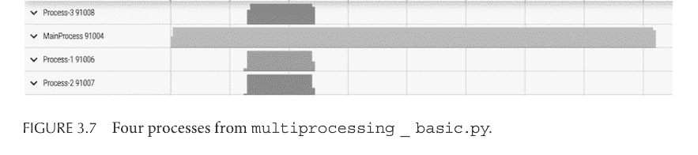

图3.7 来自multiprocessing_basic.py的四个进程。

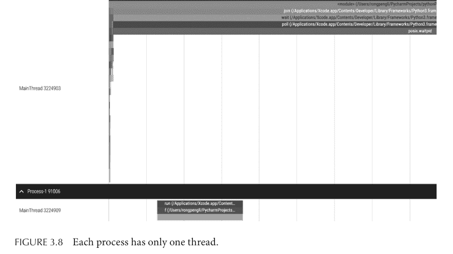

图3.8 每个进程只有一个线程。

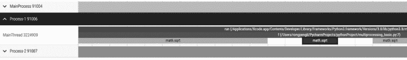


图3.9 *一次math.sqrt调用。*

进程和线程的管理可以通过一个称为*池*的概念系统地完成。池是一个对象，你可以向其提交任务，而无需担心进程和线程的创建和终止。你可以使用*map*方法提交任务并直接检索结果。代码片段3.3是代码片段3.2的池版本。它更短更清晰。

```
python
from multiprocessing import Pool
import math

def f(x):
    for _ in range(1_000_000):
        x = math.sqrt(x) if x > 1.000001 else 2*x
    return x*x

if __name__ == '__main__':
    with Pool(3) as p:
        p.map(f, [1.1, 2.1, 3.1])
```

代码3.3 使用进程池运行任务。

然而，如果你用viztracer分析它，主进程有三个额外的线程。它们是通过使用池模式引入的。图3.10看起来很奇怪，对吧？我们知道GIL阻止多个线程同时运行，但它们看起来像是同时运行的。

这是由于viztracer的一个限制。如果你有兴趣深入了解，Maarten Breddels有一篇很棒的博文²解释了如何结合Linux *perf*和viztracer来解决这个问题。我在其他情况下发现，如果你显式地创建和管理线程，这个问题就消失了。我们将在下一节看到一个例子。

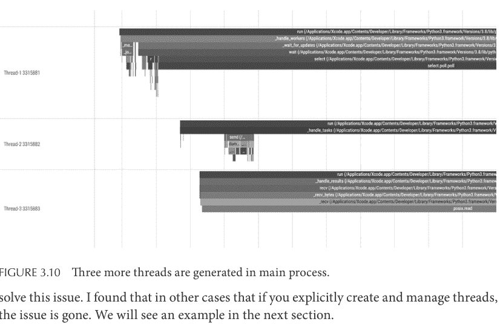

图3.10 主进程中生成了三个额外的线程。

### pandarallel中的并行Pandas Apply

是时候看看现实世界中的多进程了。明星项目pandarallel³是一个库，它能够对pandas DataFrame对象进行并行数据操作。

在Pandas中，你可以使用*apply()*方法操作一列。以下代码片段3.4是一个典型的例子，它创建了一个布尔变量，用于指示DataFrame *df*的闰年状态。

```
python
def is_leap_year(year):
    if year % 400 == 0:
        return True
    elif year % 100 == 0:
        return False
    elif year % 4 == 0:
        return True
    else:
        return False

df["is_leap"] = df["year"].apply(is_leap_year)
```

代码3.4 一个普通的Pandas apply示例。

然而，这个操作是线性完成的。如果DataFrame非常大，可能需要很长时间。pandarallel所做的就是，对于apply方法和类似操作，它用一个并行的、多进程版本覆盖了DataFrame固有的默认方法。

直观地说，这个过程包含三个步骤，可以被视为一种*map-reduce*模式，如图3.11所示。

## 3.11 pandarallel 多进程处理。

1.  将数据集分割成更小的块。
2.  使用多进程对每个子集应用数据操作。
3.  将结果收集回来并拼接在一起。

让我们逐一考察每个阶段。你会发现，一个实用的多进程程序除了多进程本身，还必须解决许多微妙的问题。pandarallel 实现了一个名为 `chunk()` 的实用函数，并将其应用于 pandas 中的不同数据类型，如 DataFrame、Series 和其他 `group_by` 对象。它简单地返回一个切片对象列表，可用于切分一个 `Iterable` 对象。让我们以最基本的 DataFrame 为例。代码片段 3.5 取自 `data_types/dataframe.py`⁴ 文件。

```python
@staticmethod
def get_chunks(
    nb_workers: int, data: pd.DataFrame, **kwargs
) -> Iterator[pd.DataFrame]:
    user_defined_function_kwargs = kwargs["user_defined_function_kwargs"]

    axis_int = get_axis_int(user_defined_function_kwargs)
    opposite_axis_int = 1 - axis_int

    for chunk_ in chunk(data.shape[opposite_axis_int], nb_workers):
        yield data.iloc[chunk_] if axis_int == 1 else data.iloc[:, chunk_]
```

代码 3.5 DataFrame 切片逻辑。

`nb_workers` 变量是将执行数据操作的进程数。默认情况下，它是机器的物理核心数。现在的问题是，切分出的子集将临时存储在哪里？嗯，你可以选择不存储数据，而是将其从主进程传递给生成的工作进程，但这通常不是最优的。请记住，进程是重量级的，为了保持高效，它们最好不要直接相互通信。

答案是内存。在基于 Unix 的操作系统中，一切都是文件，包括*内存*。你可以将 `/dev/shm` 路径视为一个文件系统。*shm* 代表*共享内存*。在 pandarallel 中，这用 `MEMORY_FS_ROOT` 表示，它是内存文件系统的根目录。然而，并非所有操作系统都启用共享内存文件系统，因此 pandarallel 也有跨进程管道模式。

对于每个物理核心，都会创建一个输入文件和一个输出文件。这不可避免地会消耗更多内存。代码片段 3.6 展示了这些文件是如何定义的。

```python
input_files = [
    NamedTemporaryFile(
        prefix=PREFIX_INPUT, suffix=SUFFIX, dir=MEMORY_FS_ROOT,
        delete=False
    )
    for _ in range(nb_workers)
]

output_files = [
    NamedTemporaryFile(
        prefix=PREFIX_OUTPUT, suffix=SUFFIX, dir=MEMORY_FS_ROOT,
        delete=False
    )
    for _ in range(nb_workers)
]
```

代码 3.6 每个 worker 都有一个输入文件和一个输出文件。

计算机科学中有一个理论，计算能力可以被视为一种货币。你可以用计算能力来换取其他东西，比如更好的用户体验。如果你没有足够的计算能力，你就必须牺牲其他资产。在这种情况下，就是*内存空间*。无免费午餐原则在此同样适用。

接下来，让我们看看 pandarallel 的核心，如代码片段 3.7 所示。

```python
pool = CONTEXT.Pool(nb_workers)
results_promise = pool.starmap_async(wrapped_work_function,
                                     work_args_list)
pool.close()
```

代码 3.7 将 pandas 任务分配给 workers。

由于 Windows 和基于 Unix 的操作系统在生成新进程方面有不同的机制，`CONTEXT` 是根据之前运行的操作系统创建的。进程池调用 `starmap_async` 方法来并行运行数据转换任务。

这两行代码有两个要点。首先，*starmap_async* 方法本质上是一个我们之前见过的 *map* 方法，它可以接受多个参数作为一个打包的 Iterable。*star* 本质上意味着 `*args` 中的 `*` 字符，用于解包 args Iterable。

其次，映射是以*异步*方式完成的，因此返回值 `results_promise` 不是处理后的数据集列表，而是一个 *promise* 对象。promise 对象可以按字面意思理解为一个承诺，意思是，嘿，我会在稍后为你获取结果。这是你可以经常检查的承诺。`results_promise` 的类型是属于 pool 模块的 `AsyncResult`。它有像 `get()`、`ready()` 和 `successful()` 这样的方法，你可以调用它们来显式地检索结果（带超时）、检查是否完成以及是否在没有错误的情况下完成。我们将在下一章更详细地讨论异步计算模式。

现在，让我们使用 viztracer 来分析以下使用 pandarallel 的代码片段 3.8。

```python
import pandas as pd
import math
from pandarallel import pandarallel
import numpy as np

pandarallel.initialize(progress_bar=False)

df_size = int(1e4)
df = pd.DataFrame(dict(a=np.random.randint(
    1, 8, df_size), b=np.random.rand(df_size)))

def func(x):
    return math.sin(x.a**2) + math.sin(x.b**2)

res_parallel = df.parallel_apply(func, axis=1)
```

代码 3.8 使用 pandarallel 运行一个繁重的 pandas 作业。

从代码片段 3.9 的日志信息来看，我预计会有 11 个进程：一个主进程和十个 worker 进程。

```
INFO: Pandarallel will run on 10 workers.
INFO: Pandarallel will use standard multiprocessing data transfer
(pipe) to transfer data between the main process and workers.
Total Entries: 1052816
```

代码 3.9 代码片段 3.8 执行时的日志信息。

然而，viztracer 在图 3.12 中显示了 12 个进程。什么是 *SyncManager* 进程？

56 ■ 通过研究开源项目学习高级 Python

图 3.12 pandarallel 有一个名为 *SyncManager* 的额外进程。

同步管理器进程是一个维护名为 manager 的对象及其关联对象的进程，这些对象在其他进程之间共享。在这种情况下，它维护一个队列对象，每个 worker 进程都可以向其中放入一个元组，以更新进程运行状态。

首先，一个队列对象由 manager 创建，如代码片段 3.10 所示。

```python
manager: SyncManager = CONTEXT.Manager()
master_workers_queue = manager.Queue()
```

代码 3.10 创建队列对象。

`master_workers_queue` 然后作为 `work_args_list` 的一部分传递给每个 worker 进程。在运行期间，每个 worker 可以按照先进先出的模式向此队列中放入消息，例如，进程是否成功运行，如代码片段 3.11 所示。

```python
# code skipped
    with output_file_path.open("wb") as file_descriptor:
        pickle.dump(result, file_descriptor)

    master_workers_queue.put((worker_index, WorkerStatus.Success,
None))

except:
    master_workers_queue.put((worker_index, WorkerStatus.Error,
None))
    raise
```

代码 3.11 Workers 将数据放入共享队列。

然而，主进程从这个队列中读取（代码片段 3.12）。

```python
message: Tuple[int, WorkerStatus, Any] = master_workers_queue.get()
worker_index, worker_status, payload = message
```

代码 3.12 主进程从共享队列中读取。

你可能会想，为什么需要这个信息？原因是，尽管每个 worker 进程运行得相当独立，但 pandarallel 维护一个进度条图表，显示每个进程已完成的工作量。它需要来自所有进程的信息。在 Jupyter notebook 上，它就像图 3.13。

你可以在初始化 pandarallel 时启用进度条。每个进度条都由代码片段 3.13 中的逻辑更新：

```python
# initialization of the progress bar
pandarallel.initialize(progress_bar = True)

# update of the progress bar

if worker_status == WorkerStatus.Success:
    progresses[worker_index] = progresses_length[worker_index]
    progress_bars.update(progresses)
elif worker_status == WorkerStatus.Running:
    progress = cast(int, payload)
    progresses[worker_index] = progress

    if next(generation) % nb_workers == 0:
        progress_bars.update(progresses)
elif worker_status == WorkerStatus.Error:
    progress_bars.set_error(worker_index)
    progress_bars.update(progresses)
```

代码 3.13 进度条根据共享队列中的信息进行更新。

此时，我们已经将 pandarallel 的核心分解为基本部分：数据如何传递/共享、进程如何生成以及运行状态如何报告给主进程。

DataFrame 转换是 CPU 密集型的，那么 I/O 密集型任务呢？

图 3.13 进度条。

## 面向I/O密集型任务的多线程

首先让我们确认，对于I/O密集型任务，多线程并不比多进程差，甚至可能更好。

首先，让我们以一个CPU密集型任务作为基准测试。使用viztracer运行代码片段3.14。

```python
import time
from multiprocessing import Process
from threading import Thread
import math

def f(x):
    for _ in range(10_000_000):
        x = math.sqrt(x) if x > 1.000001 else 2*x
    return x * x

if __name__ == '__main__':
    start = time.time()
    processes = [Process(target=f, args=(x,)) for x in [1.1, 2.1, 3.1]]
    for p in processes:
        p.start()
    for p in processes:
        p.join()
    end = time.time()
    process_time = end - start

    start = time.time()
    threads = [Thread(target=f, args=(x,)) for x in [1.1, 2.1, 3.1]]
    for t in threads:
        t.start()
    for t in threads:
        t.join()
    end = time.time()
    thread_time = end - start

    print(f"Multiprocessing time: {process_time:.2f} seconds")
    print(f"Multithreading time: {thread_time:.2f} seconds")
```

代码 3.14 CPU密集型任务的基准测试代码。

在我的台式机上，多进程版本大约需要1.87秒完成，而多线程版本大约需要3.13秒完成。

在图3.14所示的进程层面，我们有三个生成的进程在进行计算。相反，高亮部分是多线程计算*实际*发生的地方。

现在，放大到主进程。我们看到生成了三个线程，并且在图3.15中非常清楚地看到，没有两个线程可以同时运行。GIL是真实存在的。

计算持续时间越长，开销的影响就越小，因此多进程比多线程更适合CPU密集型任务。

那么I/O密集型任务呢？最典型的I/O密集型任务可能是HTTP请求。上述代码片段的关键更改是将数学函数$f()$替换为`retrieve_homepage()`。其实现留给你完成。完成后，使用viztracer运行你的代码，其结构应类似于代码片段3.15。

```python
newspapers = ['https://www.nytimes.com/',
              'https://www.theguardian.com/',
              'https://www.huffingtonpost.com/',
              'https://www.bbc.com/']
```

```python
def retrieve_homepage(newspaper):
    # 编写此函数的多进程版本和多线程版本
    response = requests.get(newspaper)
```

代码 3.15


图 3.14 CPU密集型任务上的多进程与多线程对比。


图 3.15 没有两个线程可以同时运行。

在我的台式机上，多进程版本大约需要1.29秒，而多线程版本大约需要0.76秒。多次运行，多线程版本总是比多进程版本快。如果你查看火焰图，你会看到大部分时间，生成的线程只是在进行连接、握手等操作。CPU可以同时处理多个这样的操作。

如前面章节所述，CPU在不同线程之间快速切换以推进每个线程的执行。这被称为抢占式，因为我们无法明确控制CPU何时切换，CPU也不会征求线程的意见。你可能想知道在Python中使用多线程的意义何在。

让我们看看多线程的一个具体用例：图形用户界面（GUI）。即使没有真正的并行多线程，Python多线程也能派上用场。视频游戏可能是C++多线程编程的一个更好例子，因为性能是关键，但我们现在讨论的是Python。

想象一下与GUI应用程序交互的最典型用例。通常，应用程序由许多不同的组件构成：视觉效果、声音、交互等。

假设你正在使用一个RSS阅读器浏览新闻。RSS阅读器为你获取标题供你浏览。如果你点击一个标题，阅读器随后会获取文章的全部内容。如果RSS阅读器是单线程的，应用程序将不会响应你的滚动或点击手势。你将不得不等待内容加载，然后阅读器才会再次响应。这是一种糟糕的用户体验。

应该有一个专门用于内容获取的线程和另一个专门用于响应用户手势的线程，以获得最佳体验。你可能想知道，如果应用程序是用Python编写的，GIL难道不会阻止它这样做吗？记住，CPU比人类快得多。在两次点击之间，甚至在两帧屏幕之间，CPU已经在线程之间切换了无数次。用户不会注意到任何事情。

让我们看一个来自Python开源库PySimpleGUI的例子。它是一个用于构建简单图形用户界面的Python库，拥有超过1万颗星。下面是其中一个官方示例：*Demo_Multithreaded_Write_Event_Value.py*。由于篇幅原因，我只会在代码片段3.16中粘贴核心部分。你可以通过链接阅读完整代码。

```python
while True:
    event, values = window.read()
    sg.cprint(event, values)
    if event == sg.WIN_CLOSED or event == 'Exit':
        break
    if event.startswith('Start'):
        threading.Thread(target=the_thread, args=(window,), daemon=True).start()
    if event == THREAD_EVENT:
        sg.cprint(f'Data from the thread ', colors='white on purple', end='')
        sg.cprint(f'{values[THREAD_EVENT]}', colors='white on red')
    window.close()
```

代码 3.16 某些事件由新线程处理。

窗口对象监听事件，这些事件本质上是用户与应用程序的交互。例如，关闭窗口是一个事件，点击按钮也是一个事件。在第二个if语句中，如果事件以'Start'开头，则会创建一个新线程来运行`the_thread`函数。你会看到，点击一个名为Start A Thread的按钮会触发这样的事件（代码片段3.17）。`the_thread`函数做什么呢？

```python
def the_thread(window):
    """
    通过窗口事件与应用程序通信的线程。
    每秒唤醒一次，向窗口发送一个新事件和关联的值。
    """
    i = 0
    while True:
        time.sleep(1)
        window.write_event_value(
            '-THREAD-', (threading.current_thread().name, i))
        i += 1
```

代码 3.17 `the_thread`定期向活动窗口写入数据。

它只是一个休眠一段时间然后发送一些信息回窗口以在GUI上渲染的函数。它不是CPU密集型的，因为time.sleep()会让CPU处于空闲状态。

现在，让我们用viztracer运行程序。请注意，你的Python版本必须安装了最新的tkinter。我在这部分演示中使用的MacOS上的Python版本是3.10。你可以使用Homebrew安装它，如代码片段3.18所示。

```bash
brew install python-tk@3.10
```

代码 3.18 安装带有tkinter的Python。

运行演示，应该会弹出一个新窗口，如图3.16所示。

现在，随机点击Start A Thread按钮三次。周期性的消息将出现在活动窗口中，如图3.17所示。关闭窗口，在viztracer的可视化中，我们将看到三个线程定期向窗口发送信息，如图3.18所示。这正是`the_thread`函数应该做的事情。

有一个进程包含一个主线程和三个生成的工作线程。

62 ■ 通过研究开源项目学习高级Python


图 3.16 演示GUI。

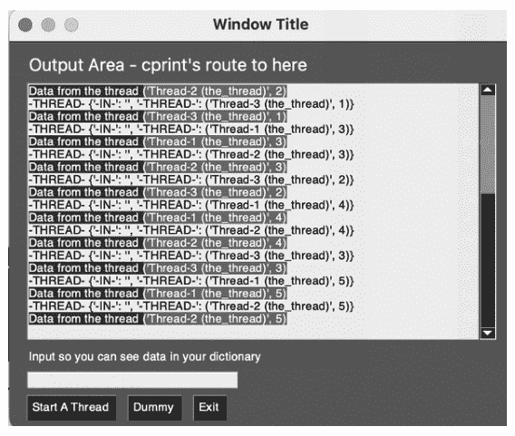

图 3.17 三个工作线程向UI写入数据。

我们在图3.18中确实看到这三个线程大部分时间都在休眠。这个例子可能很简单，但思想很明确：如果你足够快，人们就不会注意到你在使用多线程。这就像在远程工作时代，有些人选择秘密为两家以上的公司工作：如果你效率足够高，而且有些任务基本上很无聊，只需要定期检查，没有人会注意到。

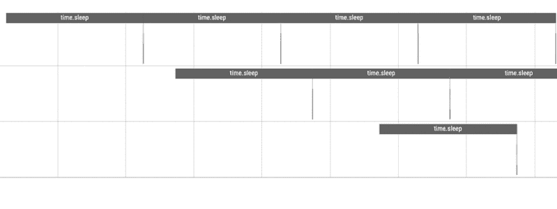

图 3.18 周期性休眠的工作线程。

## 总结

在这一长章中，我们从基本概念出发，探讨了通用编程语言与 Python 之间的差异：GIL 的作用。接着，我们接触了来自 pandarallel 的多进程示例和来自 PySimpleGUI 的多线程示例。我们理解了它们的使用场景。

并发编程是否总是需要多进程或多线程？如果我们想控制线程何时以及在何处让出 CPU 所有权，该怎么办？我们将在下一章中找到答案。

## 注释

- 1. https://github.com/gaogaotiantian/viztracer
- 2. https://www.maartenbreddels.com/perf/jupyter/python/tracing/gil/2021/01/14/Tracing-the-Python-GIL.html
- 3. https://github.com/nalepae/pandarallel
- 4. https://github.com/nalepae/pandarallel/blob/master/pandarallel/data_types/dataframe.py
- 5. https://github.com/PySimpleGUI/PySimpleGUI
- 6. https://github.com/PySimpleGUI/PySimpleGUI/blob/master/DemoPrograms/Demo_Multithreaded_Write_Event_Value.py

## Python 中的异步编程

### 范式的转变

在第 3 章中，我们将并发介绍为一种*行为*属性。如果用户与应用程序交互并感觉系统是并发的，那么用户可能不会关心其实现。在实现层面，我们研究了如何通过利用*真正的*并行性（多进程）和*不那么真实的*并行性（受 GIL 限制的多线程）来实现并发。前者适用于 CPU 密集型任务，后者适用于 I/O 密集型任务。

对于这两种情况，我们都是从时间维度的角度来思考的，即我们关心多个任务是如何执行的，或者它们是否在特定时间点执行。这种视角对于多线程尤其正确，因为我们知道 CPU 在线程之间抢占式跳转，没有线程在完全相同的时间运行。

那么，对于 I/O 密集型任务，从 I/O 事件的角度来思考如何？让我们研究一个现实世界的例子。

假设你正在组织一场慈善国际象棋比赛。你邀请了 1 位大师同时与 5 位业余爱好者对弈。大师比业余爱好者强得多，他甚至不需要思考每一步棋。这场 1 对 5 的比赛应该如何组织？

自然的方式是同步进行。大师等待玩家 1 走一步棋，然后他走一步棋，接着去和玩家 2 对弈。那时，玩家 2 可能已经走了一步，也可能没有。大师可能需要等待。

更糟糕的是，玩家 3、4 和 5 可能也在等待。本质上，他们被其他玩家的思考时间*阻塞*了。

如果我们想模拟这场比赛，更重要的是，我们不想使用多线程，因为 CPU 在线程之间疯狂地快速跳转。这相当于业余爱好者在思考时抢夺大师的注意力！大师可能会发疯并退出。

这就是需要引入新的思维范式的地方。我们需要从事件驱动的角度来思考。在我们的 1 对 5 比赛中，重要的事件是玩家 x 走了一步棋。如果没有人走棋，只是在思考，大师就不需要做任何事情。大师如此强大，以至于比赛永远不会被他阻塞。

换句话说，只要每场比赛都能*自愿*且*合作*地让出大师的注意力，并回到*思考*模式，单个线程就*应该*足以模拟比赛。

这就是范式的转变：从抢占式到协作式，从时间驱动到事件驱动。

### 事件驱动模拟

我们需要解决两个问题。

- 1. 每场比赛需要自愿放弃其*执行*。
- 2. 一个玩家的思考不应阻塞其他玩家的比赛。

第一个问题可以通过使用生成器函数来解决。生成器函数有一个 *yield* 关键字，而不是 *return* 关键字。生成器函数在 yield 关键字处*暂停*，可以通过调用生成器的 *next()* 函数来恢复。代码片段 4.1 是一个经典的斐波那契数生成器示例。

```python
def fibonacci():
    a, b = 0, 1
    while True:
        yield a
        a, b = b, a + b

fib = fibonacci()
for i in range(10):
    print(next(fib))
```

代码 4.1 经典的斐波那契函数。

*fib* 对象是一个生成器对象。每次我们调用 *next()* 函数时，它运行无限循环的 1 轮，并 yield 一个 *a* 的值。生成器不*必须* yield 任何东西。如果它不 yield，它只是让出运行的特权，直到下一次 *next()* 被调用。然而，生成器也可以通过调用其 *send()* 方法来接受输入。这种可以非抢占式地暂停和恢复的函数变体通常被称为协程。

现在，让我们编写一个国际象棋游戏模拟的版本，其中每个玩家在开始思考时让大师离开。这是代码片段 4.2。

```python
import time
import random
from itertools import cycle

def play_chess(player_name):
    while True:
        # 模拟玩家思考随机时间（1到10秒）的生成器函数
        print(f"{player_name} is thinking...")
        yield
        time.sleep(random.uniform(1, 2))
        print(f"{player_name} made a move!")

def main():
    # 模拟国际象棋游戏的主函数
    players = ['Player 1', 'Player 2', 'Player 3', 'Player 4',
               'Player 5']
    player_gen = cycle((play_chess(player) for player in players))
    for player_g in player_gen:
        next(player_g)

if __name__ == "__main__":
    main()
```

代码 4.2 使用生成器让出大师的注意力。

这里，我们看到了另一种创建生成器的方法：只需将列表推导式的方括号替换为圆括号。(play_chess(player) for player in players) 创建了一个长度为 5 的有限生成器，然后我们使用 cycle 函数反复迭代它。运行它，我们在终端中看到代码片段 4.3 的输出。

```
Player 1 is thinking...
Player 2 is thinking...
Player 3 is thinking...
Player 4 is thinking...
Player 5 is thinking...
Player 1 made a move!
Player 1 is thinking...
Player 2 made a move!
Player 2 is thinking..
```

代码 4.3 代码片段 4.2 的输出。

这解决了第一个问题，即每场比赛确实自愿让出了大师的注意力。然而，一个玩家的思考仍然阻塞了其他玩家的动作。我们真正想要的是不同玩家的日志信息顺序会混合在一起，当玩家举手说：嗨，我刚走了一步棋时，大师实际上会从一张桌子跑到另一张桌子。我们有两个解决方案。

代码片段 4.4 中的解决方案是使用强大的 asyncio 库将阻塞的 *time.sleep()* 转换为非阻塞的 *asyncio.sleep()*，并使用 *async-await* 对来替代生成器的 yield 语法。

```python
import asyncio
import random

async def play_chess(player_name):
    while True:
        await asyncio.sleep(random.uniform(1, 2))
        print(f"{player_name}'s made a move!")

async def main():
    players = ['Player 1', 'Player 2', 'Player 3', 'Player 4', 'Player 5']
    tasks = [play_chess(player) for player in players]
    await asyncio.gather(*tasks)

if __name__ == "__main__":
    asyncio.run(main())
```

代码 4.4 使用 *asyncio.sleep()* 解除玩家思考的阻塞。

好的，很多新语法，但别担心。
通过在函数前加上 *async* 关键字，我们将一个普通的 Python 函数变成了协程，这意味着协程可以自愿地暂停和恢复。
问题是：在哪里？在 *await* 关键字使用的地方。我们将 *await* 关键字后面的对象称为*可等待对象*。顾名思义，它们可以被等待。有两种最常见的可等待对象。

- 1. 协程对象是可等待的，我们已经看到了。
- 2. Future 对象也是可等待的。

那么，什么是 future？一个 future 实例代表一个最终应该兑现的承诺。换句话说，你可以持有这个 future 实例，并期望它在稍后的时间拥有一个*最终状态*。例如，你在餐车点餐，你得到一个号码。这个号码是一个 future，表明你的订单将被履行。Future 也可以被*取消*，就像你可以取消你的食物订单一样。
我们将在后面的章节中更多地讨论 future。
在 *play_chess* 协程中，当它进入休眠时，代码将暂停，并将控制权交还给事件循环。事件循环是编程中的一个构造，它不断等待并分派事件或消息。在我们的国际象棋游戏示例中，没有现实世界的事件循环类比。然而，在我们上一章的餐厅/厨房示例中有一个：服务员。假设餐厅里只有一位服务员，当顾客进入餐厅时他会迎接，当顾客坐下时他会点餐，当厨师按铃时他会取餐。他始终观察并倾听餐厅里发生的各种事件，并对每个事件做出响应。

服务员是餐厅信息的中心。他也是一个调度器，决定哪个事件先处理，哪个后处理。如果你在疫情刚结束时去过餐厅，那时每家餐厅都人手不足，你就会明白我在说什么。

在伪代码片段4.5中，事件循环执行以下操作。

```
initialize()
while event != quit
    event := receive_event()
    process_event(event)
```

代码4.5 基本事件循环伪代码。

在asyncio版本的代码中，你可以调用`asyncio.get_event_loop()`来获取当前运行的事件循环。在Python 3.7之前，当`async.run()`不可用时，运行协程`coro()`的语法是直接访问事件循环，如代码片段4.6所示。

```
loop = asyncio.get_event_loop()
loop.run_until_complete(coro())
```

代码4.6 使用事件循环对象调度并运行协程。

请注意，除了asyncio自带的默认事件循环外，还有其他实现。例如，uvloop¹是另一种事件循环实现，据称比内置实现快2-4倍。

现在，运行asyncio版本的代码。我们确实看到玩家走棋的顺序是随机的，如日志片段4.7所示。它也比阻塞版本运行得快得多。

```
Player 3's made a move!
Player 4's made a move!
Player 2's made a move!
Player 5's made a move!
Player 1's made a move!
Player 3's made a move!
Player 2's made a move!
Player 5's made a move!
Player 4's made a move!
```

代码4.7 玩家走棋顺序是随机的。

接下来，让我们使用viztracer分析这段代码，看看使用了多少个线程。只需将无限while循环改为有限的for循环，我们得到图4.1，它显示只有一个线程在完成所有繁重的工作。

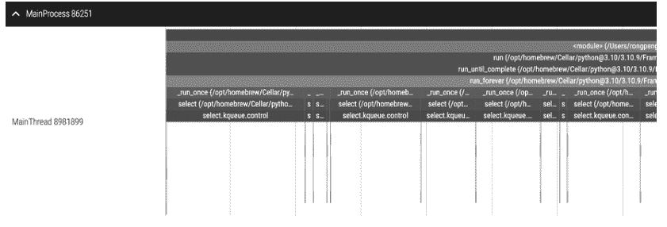

图4.1 五人棋局模拟。

另一种解决方案是继续使用生成器函数作为协程。然而，我们必须自己处理调度。如果你真的想实现自己的事件循环作为练习，我鼓励你参考David Beazley的“Build Your Own Async²”研讨会。这是关于这个主题的最佳资源。在本书中，我们只打算研究成熟的模拟库，如*SimPy*³，来处理所有调度等。

根据其GitHub readme，*SimPy*是一个基于标准Python的离散事件模拟框架。它定义了一个称为*process*的概念，本质上是一个协程，使用可以在*environment*中运行的生成器函数。环境跟踪哪个进程更快，哪个更慢等。代码片段4.8是使用*SimPy*编写的等效模拟。请注意，*SymPy*是我们在第2章中使用的不同库，它是关于符号计算的。

```
import random
import simpy
import time

def play_chess(env, player_name):
    while True:
        yield env.timeout(random.uniform(1, 2))
        print(f"{env.now:.2f}: {player_name} made a move!")

def main():
    # The main simulation environment that simulates the chess game
    env = simpy.rt.RealtimeEnvironment(factor=1)
    players = ['Player 1', 'Player 2', 'Player 3', 'Player 4', 'Player 5']
    for player in players:
        env.process(play_chess(env, player))
    env.run(until=float("inf"))
```

代码4.8 使用SimPy模拟棋局。

默认情况下，SimPy会尝试在虚拟时间中尽可能快地运行模拟。然而，使用*RealtimeEnvironment*会将模拟速度减慢到实际时间。

SimPy库让我们很好地体验了异步事件分发是如何执行的。如果你深入研究core.py⁴代码，环境有一个名为*run()*的方法，它调用*step()*方法直到模拟结束。*step()*做什么？它本质上是从一个堆对象中取出下一个事件，按事件时间排序。看看代码片段4.9中的实现。

```
def step(self) -> None:
    """Process the next event.
    """
    try:
        self._now, _, _, event = heappop(self._queue)
    except IndexError:
        raise EmptySchedule()
    # skipped
```

代码4.9 *Step()*函数从堆中弹出一个事件。

那么，事件循环，本质上是环境，如何知道下一个事件是什么时候以及是什么？Environment类有一个*schedule*方法，正是做这个的，如代码片段4.10所示。它将一个未来会发生的事件推入堆中。如果没有指定，所有事件都具有*NORMAL*优先级。

```
def schedule(
    self,
    event: Event,
    priority: EventPriority = NORMAL,
    delay: SimTime = 0,
) -> None:
    """Schedule an *event* with a given *priority* and a
    *delay*."""
    heappush(self._queue,
             (self._now + delay, priority, next(self._eid),
              event))
    # skip
```

代码4.10 *schedule()*函数将事件推入堆中。

堆数据结构有一个独特的性质，即第一个元素*self._queue[0]*总是最小的。在这种情况下，是最早的事件。通过维护这个堆结构，我们的环境总是知道下一个要模拟的事件是什么。

当一个事件实例被初始化时，一个环境实例会传递给它。因此，一个事件可以通过调用环境实例的*schedule*方法来调度自己。在events.py⁵源代码中有许多例子，管理事件的状态和生命周期。这是一种称为依赖注入⁶的设计模式：它简单地意味着你将对象A的实例传递给对象B使用，而不是要求对象B自己构建。

SimPy像一个循环一样运行，不断获取下一个事件来调度它。请注意，我们人类每天自然地做这件事。当我妻子让我在只剩一卷卫生纸时去买一些，我基本上在脑海中调度了这两个事件并将它们关联起来。希望我下次购物时能记住它们。

好吧。如果异步编程这么好，为什么不把所有代码都改成异步的？

## 异步作为一种模式

在写这本书时，我打算解释异步包装器如何与一个名为aiosqlite的开源库一起工作。然而，我意识到如果不引入相当多的函数式编程（这属于下一章），就不可能涵盖其源代码。

这是用高级Python知识提升自己的典型案例。不同的概念交织在一起，所以你必须像外科手术一样将它们解耦。我们的下一章将涵盖函数相关的概念，并使用aiosqlite的例子，从那里理解这些概念如何使同步到异步的包装成为可能。

那么，我们在这一节做什么？在这一节，我计划澄清一些误解。早些时候，我展示了异步代码都在一个线程上运行。这是为了强调异步编程*可以*仅用一个线程实现并发。然而，这并不意味着异步代码*只能*利用一个线程。事实上，异步代码和普通多线程代码之间最根本的区别是，程序员，而不是操作系统，接管了方向盘，决定任务何时放弃CPU。如果需要多个线程甚至多个进程，那就这样吧。

让我们看一些例子。

首先，让我们用`async`包装一个io阻塞函数，并用`asyncio`创建一个任务，如代码片段4.11所示。

```
import asyncio
import time

async def factorial(name, number):
    f = 1
    for i in range(2, number + 1):
        print(f"Task {name}: Compute factorial({number}), currently i={i}...")
        time.sleep(1)
        f *= i
    print(f"Task {name}: factorial({number}) = {f}")

async def main():
    start = time.time()
    task_a = asyncio.create_task(factorial("A", 4))
```

## 总结

本章我们探讨了从时间维度思维转向事件维度思维的模式。我们以棋局为例展示了这种范式转变。随后，我们窥探了一个事件驱动模拟库，以理解其调度机制。Asyncio 通过创建事件循环来调度协程。我们还强调了异步编程不一定仅限于单线程，它只是一种模式。

虽然我们介绍了如何将普通任务提交到 *concurrent.futures* 执行器，使其返回可等待的 future 对象。然而，我们刻意跳过了将某些同步操作原生转换为异步操作的示例。让我们在下一章中探讨这个大型项目。

## 附录

对于了解代码底层运行机制的开发者，我认为是时候揭示单线程异步编程在底层是如何实现的了。在过程式编程中，每个线程维护一个调用*栈*：一个有序的帧堆栈。为简化起见，我们可以将帧视为包含指令或数据的卡片。每次 CPU 取出一张卡片，并严格按照卡片指示执行操作。当程序启动时，栈被初始化为空列表，指令按照后进先出（LIFO）的模式压入栈中。如果你在代码中调用一个函数 *first_function()*，而该函数又调用了另一个 *second_function()*，那么 *second_function()* 将位于 *first_function()* 之上，因此会先执行，以便将某些结果传递给 *first_function()*。这种抽象被称为栈机。

图 4.5 简化展示了栈机的工作原理。CPU 使用指令指针来跟踪程序当前执行的位置。当调用一个新函数时，它会被压入栈顶。执行完毕后，它会从栈中弹出。这个过程持续进行，直到 *main* 函数返回。

在单栈场景下，由于指令指针仅跟踪栈顶，不可能在不同任务之间跳转执行。我们不能将未完成的工作堆叠在未完成的工作之上。正如你可能猜测的那样，不同的协程维护着独立的栈，或者为了与普通栈区分，称为协程栈。

在图 4.6 中，我们有三个协程，每个协程执行不同的任务。当一个协程将 CPU 让出给调度器时，它*自己的*指令指针会记住当前指向的位置。下次事件循环再次调度它时，它可以从上次中断的地方精确恢复。

这个想法与不同进程之间的上下文切换非常相似。与上下文切换不同的是，每个协程是协作式地决定何时让出 CPU，正如我们多次强调的那样。

## 注释

- 1. https://github.com/MagicStack/uvloop
- 2. https://www.youtube.com/watch?v=Y4Gt3Xjd7G8
- 3. https://simpy.readthedocs.io/en/latest/
- 4. https://gitlab.com/team-simpy/simpy/-/blob/master/src/simpy/core.py
- 5. https://gitlab.com/team-simpy/simpy/-/blob/master/src/simpy/events.py
- 6. https://martinfowler.com/articles/injection.html
- 7. https://github.com/omnilib/aiosqlite

## 强化你的 Python 函数

### 引言

本章的标题是“强化你的 Python 函数”。这不是一章关于纯函数式编程的内容，Python 也不是一门纯函数式编程语言。然而，Python 在其发展过程中吸收了函数式编程的许多优秀特性。编写 Python 代码时，可以结合面向对象编程、过程式编程和函数式编程等不同范式的优点。不要成为教条主义者，要 Pythonic。

让我们探索如何让 Python 函数效能提升 10 倍。

### 用于重试函数的装饰器

假设我们正在编写一个与外部服务通信的应用程序。你的应用程序需要与该服务管理的 20 多个 API 端点进行交互。然而，该外部服务已知存在一些问题。某些 API 端点不稳定，即使你没有做错任何事，也有 40% 的时间请求会失败。这些 API 端点还有速率限制，因此你不能超过像每秒一次这样的请求频率。

通常，你希望以受控的方式重试请求。纯 Python 的实现看起来会像代码片段 5.1。

```python
import time
from random import random
TIME_DELTA = 1
IS_SUCCESS = False

def post_to_endpoint():
    return random() < 0.6
```

if __name__ == '__main__':
    while not IS_SUCCESS:
        IS_SUCCESS = post_to_endpoint()
        time.sleep(TIME_DELTA)

代码 5.1 函数重试的简单实现。

这段代码可以工作，但如果不同的端点有不同的失败率或速率限制，我们就必须在各处编写循环逻辑，这会导致大量的代码重复。我们如何优雅地让像 *post_to_endpoint()* 这样的函数准备好去应对那些难缠的服务呢？

答案是使用装饰器。装饰器是一个函数（在大多数情况下，有时装饰器也可以实现为一个带有 `__call__` 魔术方法的类），它接收一个函数并输出另一个函数。装饰器扩展了输入函数的功能。

在 Python 中，函数是一等公民。你可以创建一个函数列表，将一个函数作为输入传递给另一个函数，并从一个函数返回一个函数。例如，代码片段 5.2 中的模式在 Python 中是很自然的。

```
def prepare_function(fn):
    # do something about fn so it automatically retries
    return fn

prepared_post_to_endpoint = prepare_function(post_to_endpoint)
```

代码 5.2 将一个函数传递给另一个函数。

装饰器是这种模式的语法糖。它神奇地隐藏了背后的细节，并消除了代码重复。代码片段 5.3 是我对 *prepare_function()* 的一个简单、粗糙的实现。

```
@prepare_function
def post_to_endpoint():
    return random() < 0.6

def prepare_function(fn, time_delta=1):
    # do something about fn so it automatically retries
    def new_fun():
        is_success = False
        while not is_success:
            is_success = fn()
            time.sleep(time_delta)
    return new_fun
```

代码 5.3 *prepare_function()* 装饰器的一个简单实现。

由于这种函数重试场景非常普遍，已经有一个用 Python 编写的流行单文件重试库。它支持几种流行的使用场景。我现在只是引用它的自述文件。

代码片段 5.4 展示了两个例子：仅在特定时间段内重试，或以固定的尝试间隔时间进行重试。

```
@retry(stop_max_delay=10000)
def stop_after_10_s():
    print "Stopping after 10 seconds"

@retry(wait_fixed=2000)
def wait_2_s():
    print "Wait 2 second between retries"
```

代码 5.4 不同情况下的重试。

在深入研究其实现之前，让我们先头脑风暴一下，如果你被分配了这个任务，这样一个装饰器应该如何实现。

重试是一个有状态的过程，必须有东西负责跟踪重试是否成功、还剩多少次重试机会等。最好实现一个类来记录这些配置并管理重试行为。这样的类应该能够存储并调用底层函数。

> 在计算中，有状态指的是系统会维护先前交互的记录，而无状态系统则不会。有状态系统更复杂，而无状态系统更简单。

正如我们所料，重试库实现了一个 Retrying 类，它接受许多参数进行初始化，如代码片段 5.5 所示。

```
class Retrying(object):

    def __init__(self,
                 stop=None, wait=None,
                 stop_max_attempt_number=None,
                 stop_max_delay=None,
                 wait_fixed=None,):
        # skip
        pass
```

代码 5.5 Retrying 类接受许多参数进行初始化。

真正的装饰器 retry() 只是一个函数，它通过根据重试逻辑的简单或复杂程度创建两个包装函数，将参数传递给 Retrying 类。查看代码片段 5.6。

```
def retry(*dargs, **dkw):
    """
    Decorator function that instantiates the Retrying object
    @param *dargs: positional arguments passed to Retrying object
    @param **dkw: keyword arguments passed to the Retrying object
    """
    # support both @retry and @retry() as valid syntax
    if len(dargs) == 1 and callable(dargs[0]):
        def wrap_simple(f):

            @six.wraps(f)
            def wrapped_f(*args, **kw):
                return Retrying().call(f, *args, **kw)

            return wrapped_f

        return wrap_simple(dargs[0])

    else:
        def wrap(f):

            @six.wraps(f)
            def wrapped_f(*args, **kw):
                return Retrying(*dargs, **dkw).call(f, *args, **kw)

            return wrapped_f

        return wrap
```

代码 5.6 Retrying 类被包装在 retry 函数内部。

这里，dargs 和 dkw 变量代表装饰器参数和装饰器关键字参数。它们是配置。正如我们头脑风暴的以及代码片段 5.7 所示，Retrying 类有一个 call 方法来调用函数 fn，其核心逻辑仍然是一个 while 循环。

```
def call(self, fn, *args, **kwargs):
    start_time = int(round(time.time() * 1000))
    attempt_number = 1
    while True:
        if self._before_attempts:
            self._before_attempts(attempt_number)
        # skip
```

代码 5.7 call 方法持续重试参数函数。

我将把剩余的阅读留给你自己，因为它相当直接。这个故事的寓意是，你可以在一个装饰器背后构建一个庞然大物，而用户不会知道它的存在。用户不会知道创建了一个 Retrying 实例来管理重试状态和可能的异常。用户只关心一个函数是否被增强以执行所需的任务。

这听起来熟悉吗？事实上，它与元类非常相似。当开发者创建 *retry()* 函数装饰器时，他们不知道它将装饰什么函数，但他们知道该函数可能需要运行多次才能成功。同样，元类不知道将定义什么类，但它控制着类的行为。

事实上，我们也有增强类的类装饰器：它以一个类作为输入，并返回另一个类作为输出。它不如元类强大，但通常更容易理解和维护。

接下来，让我们看看一种特殊的装饰器：上下文管理器。

## 上下文管理器简述

通常，一个函数不是独立的。一个函数的成功运行可能需要某些资源，比如已建立的数据库连接、已打开的文件描述符等。函数运行后，可能需要拆卸一些资源，比如释放线程锁、通知其他服务：我完成了。

也有现实世界的例子。这里有一个简单的例子：假设你是一名体育教练。每次运动员上场前，你都想通过让他们热身来确保他们状态良好。每次他们完成锻炼或比赛后，你都想确保他们得到充分的拉伸和放松。无论他们做什么运动，他们都必须遵循这些步骤。热身总是在运动之前，而拉伸总是在运动之后立即进行。

换句话说，在运动的背景下，一些活动需要以有序的方式进行管理。

我们如何强制执行这种顺序结构？我们需要一个上下文管理器。最简单的上下文管理器可能就在你写过的前 100 行 Python 代码中，如代码片段 5.8 所示。

```
with open("rabbit.txt", 'w') as fp:
    fp.write("Hello, rabbit!")
```

代码 5.8 Python 中最简单的上下文管理器。

无论你在 with 语句内部做什么，都不会影响文件的关闭，因为可以保证文件对象 `fp` 会在你完成读写后进行一些清理工作。

文件对象 `fp` 是一个上下文管理器，因为它实现了以下两个魔术方法：`__enter__()` 和 `__exit__()`。顾名思义，前者在准备上下文和资源时被调用，后者在执行退出 with 语句时被调用。

让我们构建我们自己的 *CoachContextManager* 类，以确保我们的运动员正确地热身和放松（代码片段 5.9）。

```
class CoachContextManager:
    def __init__(self):
        return
```

def __enter__(self):
    print("Warm up for 20 minutes.")

def __exit__(self, exc_type, exc_val, exc_tb):
    print("Stretch for 10 minutes.")

with CoachContextManager() as ccm:
    print("Play basketball for 40 minutes.")

代码 5.9 *CoachContextManager* 类。

运行它。我们确实得到了一个良好的顺序结构，如日志片段 5.10 所示。

```
Warm up for 20 minutes.
Play basketball for 40 minutes.
Stretch for 10 minutes.
```

代码 5.10 教练确保热身和放松。

这个模式看起来熟悉吗？感觉就像你作为教练在作为一个协程工作：让他们热身。然而，你释放了运动员身体的自主权，让他们玩一会儿，就好像另一个协程接管了控制权。等他们结束后，你恢复执行：帮助他们拉伸和放松。

在图 5.1 中，我们可以看到运动员的 CPU 占用如何在教练和运动员之间转移。这自然地映射了 `yield` 语法。我们是否可能使用 `yield` 语法重写上下文管理器？

是的。这正是 *contextlib* 模块中的 *contextmanager* 装饰器所做的。我们可以摆脱类的实例化。相反，我们只需装饰一个函数，将其转换为上下文管理器。

代码片段 5.10 等同于以下使用 *contextmanager* 装饰器的版本（代码片段 5.11）。


图 5.1 上下文管理作为一个让出过程。

```python
from contextlib import contextmanager

@contextmanager
def coach():
    print("Warm up for 20 minutes.")
    yield
    print("Stretch for 10 minutes.")

with coach() as cmm:
    print("Play basketball for 40 minutes")
```

代码 5.11 使用 contextmanager 重写 5.10。

在 `coach()` 函数中，`yield` 之前的所有内容被视为等同于 `__enter__()` 方法，之后的所有内容则等同于 `__exit__()` 方法。

事实上，我们也可以制作一个异步上下文管理器。这没什么特别的。异步仅仅意味着一个进程可以被暂停和恢复。异步上下文管理器可以暂停其 `__enter__()` 部分或 `__exit__()` 部分，以便可以执行其他工作。为了区分差异，异步上下文管理器将实现 `__aenter__()` 和 `__aexit__()` 方法。毫不意外，我们有 `asynccontextmanager` 装饰器。

假设教练需要在为团队热身时讨论比赛策略。代码片段 5.12 模拟了这一点。

```python
import asyncio
from contextlib import asynccontextmanager

@asynccontextmanager
async def coach():
    print("Starting Warming Up")
    await asyncio.sleep(1)
    print("Warm up finish")
    try:
        yield
    finally:
        print("Starting stretching")
        await asyncio.sleep(1)
        print("Stretching is completed")

async def drunk_coach():
    async with coach() as ccm:
        print("Playing basketball!")

async def coach_talking():
    print("Coach is planning the game strategy")
    await asyncio.sleep(0.5)

async def main():
    await asyncio.gather(drunk_coach(), coach_talking())

if __name__ == "__main__":
    asyncio.run(main())
```

代码 5.12 一个异步上下文管理器示例

运行它，我们可以在日志片段 5.13 中看到，醉酒的教练在热身期间发表了讲话。异步上下文管理器允许教练这样做。

```
Starting Warming Up
Coach is planning the game strategy
Warm up finish
Playing basketball!
Starting stretching
Stretching is completed
```

代码 5.13 教练在热身期间发表讲话。

这个故事的寓意是，一个函数可以有很多外部性。为了处理这些外部性，引入了上下文管理器，以确保函数可以在运行后将其环境恢复到之前的状态。这非常重要。例如，如果你托管一个数据库并允许其他人连接它。如果你的开发工具包在用户完成后没有自动断开连接，你将面临使自己的服务过载的风险。

现在，我们有足够的知识来深入研究这个大例子：如何包装一个同步服务，使其在语法更改最小的情况下变为异步。

## 深入 AIOSQLITE 示例

SQLite 是一个流行的轻量级、无服务器的关系数据库管理系统，它将数据存储在磁盘上的单个文件中。它非常简单，以至于开发者喜欢用它来测试概念验证。你不需要管理服务器、设置客户端等。

Python 标准库包含 `sqlite3` 模块，它提供了一种简单方便的方式来使用 Python 与 SQLite 数据库交互。代码片段 5.14 是使用 `sqlite3` 模块与磁盘上的数据库交互的典型示例。

```python
import sqlite3
con = sqlite3.connect("movie.db")
cur = con.cursor()
cur.execute("CREATE TABLE movie(title, year, score)")
cur.execute("""
    INSERT INTO movie VALUES
        ('Monty Python and the Holy Grail', 1975, 8.2),
        ('Crouching Tiger, Hidden Dragon', 2000, 7.9)
""")
con.commit()
for e in cur.execute("SELECT score FROM movie"):
    print(e)
```

代码 5.14 在 Python 中使用原生 sqlite3 模块。

同步代码遵循以下模式。我假设你对此有些熟悉，但如果不熟悉，问题也不大。

1.  连接到数据库以获取连接对象。
2.  获取游标对象以运行查询。
3.  执行查询并获取结果。
4.  重复步骤 4。

将代码异步化意味着使多个查询能够同时运行。在深入 Amethyst Reese² 的实际实现之前，让我们先进行头脑风暴设计。

根据我们之前的经验，我们需要在某处实现的第一个数据结构是一个队列结构，这样我们就可以存储要运行的查询而不会丢失它们。由于我们想要异步执行，每个查询都应该对应一个可以被 `await` 的 future。

当我们有一个查询队列时，我们需要将它们管道传输到一个执行器中，以便执行器可以运行它们并实现这些 future。在这种情况下，理想的执行器是一个线程。这个级别的执行是同步的，但用户不会注意到。

如果可能，我们也希望启用将连接用作异步上下文管理器，以便在一切完成后自动关闭它。同样，我们希望游标成为一个异步迭代器，就像原生版本中同步结果的迭代一样，但是异步的。

### 连接作为执行器和调度器

在 aiosqlite 的实现中有两个核心对象：连接和游标。让我们先看看 *Connection* 类。

*Connection* 类继承自 *Thread*，因此它自然拥有 *start()* 和 *run()* 方法。这使得连接自然成为一个繁重的执行器。让我们先看看它的核心属性，如代码片段 5.15 所示。我删除了一些无聊的内容，但如果你感兴趣，可以在 *core.py*³ 文件中查看其源代码。

```python
class Connection(Thread):
    def __init__(
        self,
        connector: Callable[[], sqlite3.Connection],
    ) -> None:
        self._connection: Optional[sqlite3.Connection] = None
        self._connector = connector
        self._tx: Queue = Queue()
```

代码 5.15 Connection 类

这段源代码中的类型标注非常棒。一个 *Connection* 实例使用一个连接器初始化，这是一个 *Callable*，可能是一个函数，它不接受参数但返回一个真实的 sqlite3 连接。然后它被赋值给 `_connector` 属性。

`_tx` 就是我们之前谈论的队列。我们将在方法中看到它的作用。让我们检查任务何时被调度。我们寻找关键字 `put`，因为这是将东西推入队列的方式。如果你搜索 `put`，你会发现两个有趣的方法。

首先是代码片段 5.16 中的 `_execute()` 方法。

```python
async def _execute(self, fn, *args, **kwargs):
    """Queue a function with the given arguments for execution."""
    if not self._running or not self._connection:
        raise ValueError("Connection closed")

    function = partial(fn, *args, **kwargs)
    future = asyncio.get_event_loop().create_future()

    self._tx.put_nowait((future, function))

    return await future
```

代码 5.16 `_execute()` 方法。

该方法首先检查是否存在有效连接以及线程是否正在运行。如果是，它首先使用 `partial` 方法将 `fn` 函数及其参数打包成一个名为 `function` 的新函数。之后，它从空气中抓取一个 future，并将元组 (future, function) 放入队列。最后，等待它。

`partial` 函数的作用是固定多参数函数的某些参数以创建一个新函数，这样我们就不需要以容易出错的方式传递参数。以代码片段 5.17 为例，假设你有一个计算折扣后价格的函数，但你现在想暴露一个将折扣固定在 30% 的新函数。

```python
from functools import partial

def cal_price(discount, price):
    return price * (1-discount)

cal_price_3 = partial(cal_price, 0.3)

cal_price_3(10) # 7
```

代码 5.17 `functools.partial` 示例。

`partial` 是一个强大的装饰器，可以将你不想让用户修改的信息封装在函数中。然而，大多数 asyncio 调度函数不接受关键字参数。

与`_execute()`方法类似，`_connect()`方法也利用`_tx`任务队列来建立连接。这解释了为什么`_connector`属性是一个`Callable`，而不是一个预先创建的连接（代码片段5.18）。所有任务的接口都是通用的，即使任务是建立连接。

```python
async def _connect(self) -> "Connection":
    """Connect to the actual sqlite database."""
    if self._connection is None:
        try:
            future = asyncio.get_event_loop().create_future()
            self._tx.put_nowait((future, self._connector))
            self._connection = await future
        except Exception:
            self._running = False
            self._connection = None
            raise

    return self
```

代码 5.18 `_connect()`也被视为一个放入队列的任务。

接下来，让我们转向任务消费者。我们应该搜索的关键字符串是`_tx.get()`，因为这是从队列中获取元素的方式。这引出了`run()`方法，它是`Thread.run()`方法的重写。代码片段5.19移除了一些日志语句。

```python
def run(self) -> None:
    """
    Execute function calls on a separate thread.
    :meta private:
    """
    while True:
        try:
            future, function = self._tx.get(timeout=0.1)
        except Empty:
            if self._running:
                continue
            break
        try:
            result = function()
            def set_result(fut, result):
                if not fut.done():
                    fut.set_result(result)
            get_loop(future).call_soon_threadsafe(set_result,
                future, result)
        except BaseException as e:
            def set_exception(fut, e):
                if not fut.done():
                    fut.set_exception(e)
            get_loop(future).call_soon_threadsafe(set_exception,
                future, e)
```

代码 5.19 *run()*方法从队列中消费任务。

只要还有待完成的查询，*Connection*（*Thread*的子类）就会从队列中弹出任务并尝试运行它。如果运行成功，它会设置future的结果，这也会自动将future标记为完成；否则，它会为future设置一个异常。

这里有趣的是*call_soon_threadsafe()*函数的使用。它确保传递给它的任务将以线程安全的方式运行。换句话说，它确保future会被正确设置。

要理解为什么我们需要检查这是如何完成的。在2018年的PR #15之前，有一个任务队列*tx*和一个结果队列*rx*。当线程获取一个任务并运行它时，它会按照任务处理的顺序将结果放回结果队列。

回想一下，Python的*Queue*对象是在线程之间共享的。多个协程可以将结果放入其中。这会导致一个问题：我们如何确保查询结果的顺序与创建查询的顺序一致？

在PR #15之前，*run()*方法不知道谁在等待结果。这个问题以一种粗暴的方式解决了：*execute()*方法实现了一个锁，以确保查询的执行和从结果队列返回查询不受干扰。如果结果队列中没有结果，它会一直快速轮询队列，直到任务完成。这显然会导致潜在的性能问题。

为了解决这个问题，贡献者移除了结果队列和锁。取而代之的是，让Python本身通过调用标准库函数来处理线程安全。这是一个漂亮的拉取请求。

以下是我们已经弄清楚的内容的快速总结。

1.  一个真实的sqlite3连接被包装在一个*Connection*类实例中，该实例继承自*Thread*对象。
2.  *Connection*类在启动时，会持续获取队列中的任务并执行它们。这个过程是同步的。然而，future的结果设置是由事件循环调度的。异步的*execute()*方法将等待future的完成并返回给调用者。

## Connection和Cursor作为异步上下文管理器

对于大多数其他*Connection*方法，它们只是sqlite3对应方法的镜像。然而，有几个特殊的方法。

*Connection*类实现了*\_\_aenter\_\_()*和*\_\_aexit\_\_()*双下划线方法，使其成为一个异步上下文管理器。因此，代码片段5.20中的语法变得合法。

```python
async with aiosqlite.connect("movie_async.db") as db:
    # do stuff
```

代码 5.20 用于建立连接的异步上下文管理器。

这个简单的语法涉及一系列委托。

1.  首先，`connect()`函数返回一个`Connection`实例。
2.  调用`__aenter__()`，它调用`__await__()`方法。
3.  在`__await__()`方法中，线程启动，进一步调用`_connect()`方法。
4.  正如我们之前讨论的，`_connect()`方法创建建立真实连接的任务，并将其作为`db`返回给用户。

这结束了我们对`Connection`类的分析。那么`Cursor`呢？
在原生sqlite3代码中，代码片段5.21将返回错误，因为游标不能用作上下文管理器。

```python
with sqlite3.connect("movie.db") as con:
    with con.cursor() as cur:
        # AttributeError: __enter__
```

代码 5.21 原生sqlite3游标不是上下文管理器。

这意味着游标不是上下文管理器。然而，aiosqlite允许代码片段5.22中的语法，这表明游标本身是一个异步上下文管理器。

```python
async with aiosqlite.connect("movie.db") as db:
    async with db.cursor() as cursor:
        # do stuff
```

代码 5.22 aiosqlite游标是一个异步上下文管理器。

更重要的是，代码片段5.23还显示`Cursor`也是一个异步迭代器。

```python
async with aiosqlite.connect("movie.db") as db:
    async with db.execute("SELECT * FROM movie") as cursor:
        async for row in cursor:
            print(row)
```

代码 5.23 `Cursor`也是一个异步迭代器。

这是如何可能的？
让我们先检查第一种情况。`Connection`类的`cursor()`方法做什么？`cursor()`方法返回一个`Cursor`对象，但`Cursor`对象的参数（一个真实的sqlite3连接游标）不是立即可用的，应该等待它（代码片段5.24）。

```python
@contextmanager
async def cursor(self) -> Cursor:
    """Create an aiosqlite cursor wrapping a sqlite3 cursor
    object."""
    return Cursor(self, await self._execute(self._conn.cursor))
```

代码 5.24 *cursor()*方法返回一个*Cursor*对象。

或者真的是这样吗？让我们检查`@contextmanager`的定义。注意这不是contextlib的contextmanager，因为我们没有导入它。有时它会被重写（代码片段5.25）。

```python
def contextmanager(
    method: Callable[..., Coroutine[Any, Any, _T]]
) -> Callable[..., Result[_T]]:
    @wraps(method)
    def wrapper(self, *args, **kwargs) -> Result[_T]:
        return Result(method(self, *args, **kwargs))

    return wrapper
```

代码 5.25 `@contextmanager`的定义。

contextmanager函数接受一个名为*method*的可调用对象，并返回另一个名为*wrapper*的可调用对象。浏览源代码；你会发现`@contextmanager`装饰器总是装饰方法，所以参数名很完美。
这里，*Callable[..., Coroutine[Any, Any, _T]]*类型表示它是一个接受任意输入但返回协程的可调用对象。这与*cursor()*方法的返回值一致，因为它仍然有一个未完成的参数游标。
然而，在装饰之后，我们有了一个新的可调用对象，它返回的不是协程，而是一个*Result*类类型（代码片段5.26）。那么，什么是*Result*？

```python
class Result(AsyncContextManager[_T], Coroutine[Any, Any, _T]):
    __slots__ = ("_coro", "_obj")

    def __init__(self, coro: Coroutine[Any, Any, _T]):
        self._coro = coro
        self._obj: _T

    def send(self, value) -> None:
        return self._coro.send(value)

    def throw(self, typ, val=None, tb=None) -> None:
        if val is None:
            return self._coro.throw(typ)
```

if tb is None:
    return self._coro.throw(typ, val)

return self._coro.throw(typ, val, tb)

def close(self) -> None:
    return self._coro.close()

def __await__(self) -> Generator[Any, None, _T]:
    return self._coro.__await__()

async def __aenter__(self) -> _T:
    self._obj = await self._coro
    return self._obj

async def __aexit__(self, exc_type, exc, tb) -> None:
    if isinstance(self._obj, Cursor):
        await self._obj.close()

代码 5.26 Result 实现了多个协议。

*Result* 类同时实现了异步上下文管理器和协程的协议。它是一个协程，因此可以被 `await`。它也是一个异步上下文管理器，因此可以异步地进入和退出。

当调用 `__aenter__()` 时，`_coro` 协程会被等待并赋值给 `_obj`，然后返回该对象。这简化了 `async with` 语句的使用，正如 PR #5 中所述，更具体地说是这个提交：让游标无需等待即可用作上下文管理器。这也是一个很棒的拉取请求。

让我们总结一下目前讨论的内容。

1.  `Cursor` 类是对真实 sqlite3 游标的封装。
2.  当使用 `cursor()` 方法创建时，它被 `contextmanager` 装饰器修饰，这使得被装饰的 *Result* 成为一个异步上下文管理器。

有一个小细节我们没有涉及。在 `contextmanager()` 函数中，`@wraps(method)` 是做什么的？

`wraps()` 函数来自 `functools` 模块。它也是一个装饰器。然而，它的特殊之处在于它不会改变被包装函数的行为，而是会传递其元数据，如函数名、文档字符串和参数名等。这对于调试和内省非常有帮助。代码片段 5.27 是一个例子。

```python
from functools import wraps

def logger(func):
    def wrapper(*args, **kwargs):
        return func(*args, **kwargs)
    return wrapper

def logger_wrap(func):
    @wraps(func)
    def wrapper(*args, **kwargs):
        return func(*args, **kwargs)
    return wrapper

@logger
def add(a, b):
    return a + b

print(add.__name__)

@logger_wrap
def add(a, b):
    return a + b

print(add.__name__)
```

代码 5.27 wraps 将元数据传递给被装饰的函数。

第一个 `add` 函数的名称丢失了。它的名称变成了 “wrapper”，而第二个函数的名称由于 `wraps` 装饰器而得以保留。

在这个阶段，你可能明白为什么我在上一章中排除了同步到异步的示例。它太复杂了，把这么多内容抛给我的读者是不切实际的。

最后，让我们看看从 *Cursor* 到 *Connection* 的委托是如何完成的，这呼应了我们之前介绍的 `partial` 装饰器的用法。

如代码片段 5.28 所示，*Cursor* 对象的 *execute()* 方法将调用自己的 `_execute()` 方法。

```python
async def execute(self, sql: str, parameters: Iterable[Any] = None) -> "Cursor":
    """Execute the given query."""
    if parameters is None:
        parameters = []
    await self._execute(self._cursor.execute, sql, parameters)
    return self
```

代码 5.28 *execute()* 调用 _execute() 方法。

这本质上是将执行委托给 *Connection* 对象的 `_execute()`。

```python
async def _execute(self, fn, *args, **kwargs):
    """Execute the given function on the shared connection's thread."""
    return await self._conn._execute(fn, *args, **kwargs)
```

代码 5.29 *Connection 的 _execute()* 执行实际工作。

所以现在我们看到 `partial` 函数捆绑了什么。它是真实 sqlite3 游标的 *execute()* 函数、sql 查询字符串以及参数（如果有的话）。

至此，我们已经涵盖了 aiosqlite 实现的最重要部分。源代码中还有大量细节。我鼓励你自己仔细阅读，以体会其代码的简洁和优雅。

## 总结

本章是关于增强 Python 函数，使其能够被增强甚至被“施法”。我们从一个重试不稳定函数的简单用例开始，然后讨论了上下文管理器的概念，介绍了装饰器等等。最后，我们讨论了用异步接口包装同步库。这不是一项简单的任务，但如果你读到了这里，干得漂亮！

## 注释

1.  https://github.com/rholder/retrying
2.  https://github.com/amyreese
3.  https://github.com/omnilib/aiosqlite/blob/main/aiosqlite/core.py
4.  https://github.com/omnilib/aiosqlite/pull/15

# 第 6 章

## 精选的面向对象设计最佳实践

### 理解你的业务

在编写第一行 Python 代码之前，你应该非常理解你试图建模或模拟的业务。对于面向对象编程来说尤其如此。如果面向对象编程代码存在设计缺陷并提供给用户，用户将需要付出额外的努力来减轻损害，而这种减轻措施往往是容易出错的。最终，代码库的*复杂性*将变得难以管理。然而，拥有一个清晰、可重用的面向对象设计将降低理解的门槛，消除将新代码与现有代码库集成的障碍，并构建出健壮可靠的应用程序。

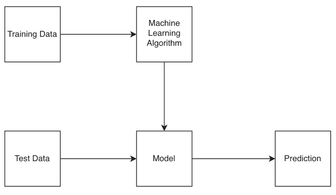

在本章中，我们将研究一个设计良好的 Python 库：scikit-learn。scikit-learn 是一个流行的机器学习库，它使程序员能够轻松构建预测模型并进行数据分析和机器学习。它提供了一套用于机器学习任务的工具，如分类、回归、聚类和降维。请注意，Scikit-learn 并不是深度学习和其他基于神经网络的任务的首选库，PyTorch 和 TensorFlow 在这些方面做得更好。

### *业务*概览

假设今年是 2010 年，你正在考虑开发一个机器学习库。你已经受够了 MATLAB 或其他简陋的商业软件。你会如何设计这个库的架构？早些时候我们看到，在 *aiosqlite* 中，核心类是 *Cursor* 和 *Connection*。对于机器学习，我们的核心类是什么？

对于不熟悉机器学习的读者，这里有一个快速、不完整的介绍。

对于*传统*的机器学习任务（与深度学习相对），有两个常见目标：

1.  找到*特征*和*标签*之间的关系。
2.  或者在无标签的数据集中找到结构特征。

前者称为监督机器学习，后者称为无监督机器学习。

监督机器学习的一个例子是创建一个模型来预测患糖尿病的概率，给定一组特征，如饮食习惯、家族糖尿病史、运动习惯等。

无监督机器学习的一个例子是聚类。例如，有一些带有描述的电影。聚类算法应该能够将这些电影分成几个类别。

监督学习和无监督学习的最大区别在于监督学习利用了真实标签。要了解哪些特征导致了糖尿病，我们必须事先知道一个人是否患有糖尿病。换句话说，我们需要有*标签*。无监督学习旨在发现特征集本身的特征。例如，如果两部电影的描述都包含“天使”这个词，那么这可能表明这两部电影彼此相似。然而，我们永远无法*确定*这种关联，因为我们无法获得真实标签。

对于这两种类型的算法，图 6.1 所示的以下步骤是最基本的。

然而，在现实生活中，这种工作流程过于理想化。例如，大多数训练数据并不适合机器学习算法直接处理。计算机不理解“天使”这个词，我们必须用数值来表示它们。有些特征的量级可能是数千，而其他的可能小得多。

## 通过研究开源项目学习高级Python

从数值上讲，这使得距离计算非常不稳定，而距离计算在许多无监督机器学习算法中被广泛使用。我们需要对数值进行*归一化*。这样的步骤通常被称为预处理。然后我们的工作流程就变成了图6.2所示的样子。

因此，我们使用训练数据来创建预处理器，并使用相同的预处理器来预处理测试数据。你可能会想，为什么不使用所有数据呢？那样不是更准确吗？并非如此。在训练过程的任何步骤中使用测试数据，包括数据预处理，都有*数据泄露*的风险。在构建模型时，我们不应允许使用来自测试数据的任何信息，甚至包括数值的范围。

这很合理，但这并不是全部。流程图中还有其他步骤。例如，交叉验证是构建模型时的常见做法：因为机器学习模型通常有不可训练的参数，而且我们通常不知道哪组参数更好。交叉验证使我们能够评估不同模型的质量。它还可以帮助我们防止所谓的过拟合。

我们的流程变成了下面的图6.3。

除了这个流程中的实体和过程，我们还需要建模其他实体。度量指标就是其中之一。我们需要度量指标来衡量机器学习模型的好坏。例如，如果模型预测的是二元类别，准确率和F1分数是首选的度量指标。数据集也需要建模。我们需要一个*统一的*数据集格式，以便数据集的处理遵循*统一的*接口。

在继续之前，让我们总结一下我们试图在*业务*中实现的目标。

- 1. 数据需要被预处理并分离成训练集和测试集。
- 2. 需要通过类似*模型*工厂的东西使用训练数据集来构建模型。
- 3. 像交叉验证这样的模型选择需要无缝集成。

接下来，我们将设计能够实现这种*业务*的类。

## 用面向对象建模业务实体

### 设计核心实体

首先，最重要的实体是*机器学习算法*和*模型*。从技术上讲，算法是模型的*工厂*。使用相同的算法但不同的参数，我们可以生成许多模型副本。

然而，如果你仔细想想，这可能听起来不对。模型是通过在训练数据集上训练创建的。这是一个*连续*的过程。假设我的训练数据集中有5000行记录。我使用2500行训练了一个线性回归模型。我得到了一个名为`lg_2500`的模型。然而，我还没有完成训练，我需要在剩下的2500行上完成训练以得到`lg_5000`。这没有意义，因为在这个过程中我们实际上创建了5000个模型，即使我们选择只*发布*最终模型。这在概念上就很糟糕。

另一个缺点是缺乏易用性。假设我拿到一个序列化的模型，反序列化它，因为我希望用最近可用的数据继续改进它。然而，我是从另一个工程师那里得到这个模型的，而他已经离开了公司。我无法训练这个模型，因为我找不到生产它的工厂。如果存在版本问题（而且肯定会有）怎么办？这简直是噩梦。

2013年，论文《机器学习软件的API设计：来自scikit-learn项目的经验》¹涵盖了scikit-learn的API是如何设计的。API设计反映了底层核心实体的设计方式。尽管在这篇论文中没有非常明确地说明，但我认为首要的重要决定是将模型的*工厂*和*模型*本身结合起来。它被称为*估计器*。

我们可以从两个方向思考。首先，估计器是一个模型，其训练算法是自包含的。或者，估计器是一个绑定了它所创建模型的训练算法。从整体设计的角度来看，第一种解释更准确。我有时可能会交替使用*模型*和*估计器*。

所有估计器都实现了*fit()*方法。对于监督学习算法，*fit()*方法的签名是*fit(X, y)*，其中*X*是训练特征，*y*是训练标签。fit方法返回类本身作为具有学习参数的训练模型。

对于大多数机器学习算法，有一些超参数的值在训练前是预先确定的。这些参数在估计器初始化时的`__init__()`方法中初始化。例如，决策树的深度或不同回归算法的惩罚系数。

例如，代码片段6.1展示了*DecisionTreeClassifier*的签名。它有很多超参数，注意有些甚至不是数值型的。机器学习算法可以有不同的变体，这些变体也被认为是超参数。

```python
def __init__(
    self,
    *,
    criterion="gini",
    splitter="best",
    max_depth=None,
    min_samples_split=2,
    min_samples_leaf=1,
    min_weight_fraction_leaf=0.0,
    max_features=None,
    random_state=None,
    max_leaf_nodes=None,
    min_impurity_decrease=0.0,
    class_weight=None,
    ccp_alpha=0.0,
) :
    pass
```

代码 6.1 *DecisionTreeClassifier* 初始化。

scikit-learn之所以很棒的一个原因是，它尽可能地为超参数使用了*最合理*的默认值。用户不需要不自信地选择参数。在大多数情况下，算法开箱即用就能很好地工作。

对于学习到的参数，它们是在调用*fit()*方法期间确定的。它们的值将取决于数据集。这些参数包括线性回归中的系数、基于树的算法中的分裂标准以及神经网络中的所有参数。对于驱动最先进语言模型的架构，有数万亿个这样的参数。

例如，*DecisionTreeClassifier*的*fit()*回退到其父类*BaseDecisionTree*的实现²。

自然地，除了*fit()*方法，估计器还必须有与参数相关的实用方法，如*get_params()*和*set_params()*。它们都在*BaseEstimator*类中实现。例如，参数直接存储为估计器对象的属性，可以如代码片段6.2所示检索。

```python
def get_params(self, deep=True):
    """
    Get parameters for this estimator.
    Parameters
    ----------
    deep : bool, default=True
        If True, will return the parameters for this estimator and
        contained subobjects that are estimators.
    Returns
    -------
    params : dict
        Parameter names mapped to their values.
    """
    out = dict()
    for key in self._get_param_names():
        value = getattr(self, key)
        if deep and hasattr(value, "get_params") and not
isinstance(value, type):
            deep_items = value.get_params().items()
            out.update((key + "__" + k, val) for k, val in
deep_items)
        out[key] = value
    return out
```

代码 6.2 *get_params()* 的实现。

然而，估计器不仅仅用于学习模型。在数据上*拟合*的思想也适用于数据预处理。例如，如果我想使用*StandardScaler*³来标准化特征范围，我们也需要知道特征的最大值和最小值，并将其余数据*拟合*到这个范围内。

然而，*StandardScaler*与模型有根本的不同，因为它仍然输出数据，具体来说是转换后的数据。我们称它为*转换器*。转换器是一个不仅在数据上拟合，而且转换数据的实体。转换器有另一个名为`transform()`的方法。让我们看看代码片段6.3中的`StandardScaler`的transform方法。

```python
def transform(self, X, copy=None):
    # skip
    if sparse.issparse(X):
        # skip
    else:
        if self.with_mean:
            X -= self.mean_
        if self.with_std:
            X /= self.scale_
    return X
```

代码 6.3 标准化的实现。

核心逻辑是，如果我们想将数据集中到其均值周围，我们就从每个数据点减去均值。如果我们想按标准差的比例缩小值，我们就将每个数据点除以标准差。

除了`transform()`方法，转换器类还实现了`fit_transform()`方法，将拟合和转换步骤结合在一起。

有趣的是，没有名为`BaseTransformer`的类。只有一个真正的`BaseEstimator`类。我们将在下一小节讨论原因。让我们看看最后一个核心实体：预测器。

`预测器`类是一个具有预测能力的估计器。它有`predict()`和`score()`方法。前者接受测试X并预测它们的标签。即使是像K均值这样的无监督机器学习算法，其`predict()`也会产生无序的簇标签作为整数索引。

`score()`方法产生一个数值分数，衡量预测的好坏。对于分类问题，它量化了预测标签和真实标签之间的差异。对于回归问题，它衡量了预测值和真实值之间的距离。

我们现在有三个核心实体。它们的关系如下所示。

然而，我之前提到过，没有名为`BaseTransformer`或`BasePredictor`的东西，图6.4中显示的继承关系在scikit-learn中从未明确出现。这是怎么回事？

### 建立类之间的关系

scikit-learn没有将`BaseEstimator`子类化为`Transformer`或`Predictor`，而是使用了混入（mixin）将一些属性混合到子类中。我们稍后将比较继承和混入之间的区别。

`base.py`文件定义了以下重要的混入。

- 1. ClassifierMixin
- 2. RegressorMixin

## 通用*接口*的好处

现在，让我们来谈谈机器学习中除了核心实体之外的一些其他重要*业务*话题。
有些估计器以其他估计器作为基本构建块。它们被称为元估计器。例如，*Pipeline*类按*顺序*接受多个估计器作为输入，并将它们捆绑在一起，使它们作为一个统一的实体发挥作用。
代码片段6.8是管道化的一个例子。

```python
pipe = Pipeline([('scaler', StandardScaler()),
                 ('dtc', DecisionTreeClassifier())])
pipe.fit(X_train, y_train)
pipe.score(X_test, y_test)
```

代码6.8 在管道中组合*StandardScaler*和*DecisionTreeClassifier*。
管道接受一个元组列表进行初始化。每个元组包含一个字符串作为当前步骤的名称，以及一个执行实际工作的估计器实例。

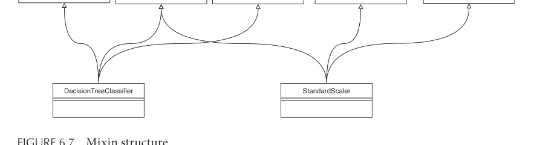

图6.7 Mixin结构。

Pipeline*是*一个估计器，因此它也实现了*fit()*方法，该方法会连续调用管道中的每个估计器。如果管道中的最后一个估计器是一个*预测器*，那么Pipeline也会成为一个实现了*score()*或*predict()*的*预测器*。

非常棒的是，你可以轻松地切换管道的组件。假设你认为单个决策树分类器不够，你想要一个森林（代码片段6.9）。

```python
pipe = Pipeline([('scaler', StandardScaler()),
                  ('rfc', RandomForestClassifier())])
```

代码6.9 从代码片段6.8切换分类器。

通过如此微小的代码更改，我们的代码库将继续工作。这清楚地展示了通用接口的强大之处。

让我们看看另一个元估计器：*GridSearchCV*。它是一个估计器，接受另一个估计器，并使用交叉验证在参数空间网格上搜索后者的最佳超参数（代码片段6.10）。

```python
from sklearn import svm, datasets
from sklearn.model_selection import GridSearchCV
iris = datasets.load_iris()
parameters = {'kernel':('linear', 'rbf'), 'C':[1, 10]}
svc = svm.SVC()
clf = GridSearchCV(svc, parameters)
clf.fit(iris.data, iris.target)
```

代码6.10 *GridSearchCV*的一个官方示例。

估计器*SVC*，即C-支持向量机分类器，是一种利用支持向量机的分类器，支持向量机曾经是一个超级热门的机器学习模型。这里的*C*代表惩罚，因为人们经常用字母*C*来表示惩罚系数。

让我们看看代码片段6.11中的类*__init__()*方法。

```python
def __init__(
    self,
    *,
    C=1.0,
    kernel="rbf",
    # skipped
)
```

代码6.11 支持向量机分类器的初始化。

*C*和*kernel*都是预定义的超参数。*GridSearchCV*基本上接受*parameters*并构建一个2x2的参数空间网格，总共4种组合，以找到分类器的最佳参数集。

为了避免过拟合，模型质量评估使用交叉验证完成。*iris*数据集被分成几个*折*，默认为五折。其中四折用于训练，一折用于*验证*。这个过程重复五次，取平均值作为最终评估。

与管道化类似，*GridSearchCV*最棒的地方在于你可以轻松地插入任何估计器，并提供一组参数及其选择。*GridSearchCV*将开箱即用。这是通用接口的另一个优势。

甚至*GridSearchCV*本身也是一个估计器。它有自己的*fit()*方法，所以你可以将其附加为管道的最后一个阶段。

## 有时没有面向对象编程是最好的设计

有时最好的面向对象设计就是没有设计。在scikit-learn中，有两个例子。

鸭子类型可能比严格的继承关系更合适。scikit-learn支持鸭子类型。鸭子类型是一种编程概念，其中对象的类型或类不如它所拥有的方法和属性集重要。换句话说，如果一个对象走起来像鸭子，叫起来也像鸭子，那么它就被认为是鸭子，无论其实际类型如何。

例如，在构建管道或执行交叉验证时，scikit-learn不会检查对象的类型。相反，它检查该类是否实现了估计器或预测器*应该*实现的必要方法。在片段6.12中，我创建了一个名为*AllZeroEstimator*的简单估计器。它的唯一输出是零。

```python
class AllZeroEstimator:
    def __init__(self):
        pass
    def get_params(self, deep = True):
        return dict()
    def fit(self, X, y):
        pass
    def predict(self, X):
        return np.array([0 for _ in range(len(X.shape[0]))])
    def score(self, X, y):
        return 0
```

代码6.12 创建一个名为*AllZeroEstimator*的新估计器。

然而，我可以毫无问题地将其插入管道。代码片段6.13是完全合法且可运行的。

```python
from sklearn.datasets import load_iris
from sklearn.pipeline import Pipeline
from sklearn.preprocessing import StandardScaler
from sklearn.decomposition import PCA

iris = load_iris()

pipe_steps = [
    ('scaler', StandardScaler()),
```

## 总结

在本章中，我们以 scikit-learn 为例，探讨了面向对象编程的应用方式。我们介绍了该库试图实现的目标、核心实体的设计及其相互关系。我们还展示了 scikit-learn 的设计选择所带来的若干优势。最后，我们讨论了鸭子类型以及一个特殊情况：面向对象编程并非总是开发库或生态系统的最佳选择。

## 注释

- 1. https://arxiv.org/abs/1309.0238
- 2. https://github.com/scikit-learn/scikit-learn/blob/main/sklearn/tree/_classes.py#L177
- 3. https://github.com/scikit-learn/scikit-learn/blob/main/sklearn/preprocessing/_data.py#L659

## 测试简介

### 引言

这是本书的最后一章。本章的主题是测试。我将测试放在本书末尾，并非因为它不重要，而是因为它如此重要，以至于我希望读者能充分掌握装饰器和属性查找等概念，以便更好地理解测试技术。这些概念在前面的章节中已有介绍。如果你还不熟悉，我建议你先阅读相应的章节。如果你已经了解，那么我们可以开始了。

与其他章节一样，我假设你对测试有一个大致的了解。有三种最常见的 Python 测试框架：`unittest`、`pytest` 和 `doctest`。我们将重点关注 `unittest` 和 `pytest`。本章不会变成一个动手实践教程，而是专注于两个库中通用的*理念*，而非*语法*差异。

### 夹具与参数化

假设你编写了一个函数来找出一个数的所有质因数。它看起来像代码片段 7.1。我们希望确保其正确性。

```python
class PrimeFactorizer:
    def __init__(self):
        pass

    def prime_factors(self, n):
        factors = []
        i = 2
        while i * i <= n:
            if n % i:
                i += 1
            else:
                n //= i
                factors.append(i)
        if n > 1:
            factors.append(n)
        return factors
```

代码 7.1 查找所有质因数的朴素实现。

首先，让我简要介绍一下 *prime_factors()* 方法的功能。任何大于 1 的正整数都可以分解为质数的乘积。质数是只能分解为 1 和其自身乘积的数，没有其他选择。例如，5 是质数，但 6 不是：6 等于 3 乘以 2。之后，7、11 和 13 也是质数。质数越来越稀疏，但它们有无穷多个。

数论中的一个基本定理是，所有非质数都是质数的乘积。例如，72 是 2、2、2、3 和 3 的乘积。对于小数字来说这相对容易，但对于大数字来说可能极其困难。在上面的代码中，我们使用了最朴素的方法来查找它们。

从 2 开始，以输入值的平方根为上限，我们将输入值除以 2、3 等。如果能整除，我们就取商重复这个过程。

让我们手动尝试一个数字，比如 70。

数字 2 能整除 70，所以第一个数字是 2，商是 35；3 不能整除 35，但 5 可以。因此，第二个质数是 5。商是 7；7 能整除 7，商是 1。代码执行了几次*无用*的循环后停止。我们得到了最终的列表 2、5 和 7。

让我们编写一些测试。我将代码片段 7.1 放入名为 *prime_factorizer.py* 的文件中，将代码片段 7.2 放入名为 *test_prime_factorizer.py* 的文件中。它们位于同一文件夹中。

```python
import pytest

from prime_factorizer import PrimeFactorizer

class TestPrimeFactorizer:
    def test_prime_factors(self):
        factorizer = PrimeFactorizer()
        assert factorizer.prime_factors(12) == [2, 2, 3]
        assert factorizer.prime_factors(84) == [2, 2, 3, 7]
        assert factorizer.prime_factors(1024) == [2] * 10
        assert factorizer.prime_factors(1) == []
        assert factorizer.prime_factors(2) == [2]
        assert factorizer.prime_factors(7919) == [7919]
        assert factorizer.prime_factors(123456789) == [3, 3, 3607, 3803]
```

代码 7.2 测试 *prime_factors()* 方法。

看起来我们编写了一些相当不错的边界测试用例。我们可以通过在终端中输入代码片段 7.3 中的命令来运行测试。

```bash
python3 -m pytest test_prime_factorizer.py
```

代码 7.3 从命令行运行测试。

测试成功通过。

### 参数化

到目前为止一切看起来都很好。然而，我们希望将输入和预期输出从 *test_prime_factors()* 方法中*提取*出来。这*分离*了数据和测试，从而可以通过避免重复和增加灵活性来编写更简洁、更易读的测试代码。

要参数化一个测试函数，我们在代码片段 7.4 中使用 `@pytest.mark.parametrize` 装饰器。

```python
class TestPrimeFactorizer:
    @pytest.mark.parametrize("n, expected_factors", [
        (12, [2, 2, 3]),
        (84, [2, 2, 3, 7]),
        (1024, [2] * 10),
        (1, []),
        (2, [2]),
        (7919, [7919]),
        (123456789, [3, 3, 3607, 3803]),
    ])
    def test_prime_factors(self, n, expected_factors):
        factorizer = PrimeFactorizer()
        assert factorizer.prime_factors(n) == expected_factors
```

代码 7.4 参数化测试输入和输出。

该装饰器接受一个字符串，用于指示输入和输出的名称。然后我们向它提供一个元组列表，每个元组作为一个输入输出对。

再次运行测试，这次 pytest 不是运行 1 个测试，而是运行了 7 个测试。每一对输入和输出本质上都创建了一个新的测试，如代码片段 7.5 所示。你还可以为特定测试分配 id，这样在出现问题时更容易追踪。你只需在 pytest 命令中加上 -v 即可显示详细信息。

```python
class TestPrimeFactorizer:
    @pytest.mark.parametrize("n, expected_factors", [
        (12, [2, 2, 3]),
        (84, [2, 2, 3, 7]),
```

(1024, [2] * 10),
(1, [],),
(2, [2]),
(7919, [7919]),
(123456789, [3, 3, 3607, 3803]),
], ids=["12", "84", "1024", "1", "2", "7919", "123456789"])
def test_prime_factors(self, n, expected_factors):
    factorizer = PrimeFactorizer()
    assert factorizer.prime_factors(n) == expected_factors
```

代码 7.5 为每个参数集添加标识符。

现在，假设这个函数的用户数学不太好。他很可能会向这个函数传入正整数以外的数据。我们该如何防范呢？换句话说，我们希望通过测试来确保我们的函数能够正确地失败。
在测试中，有时我们不仅想确保成功，还想确保失败。在代码片段 7.6 中，我们来看看 `requests` 库如何处理用户提供了错误 URL 进行查询的情况。

```
@pytest.mark.parametrize(
    "exception, url",
    (
        (MissingSchema, "hiwpefhipowhefopw"),
        (InvalidSchema, "localhost:3128"),
        (InvalidSchema, "localhost.localdomain:3128/"),
        (InvalidSchema, "10.122.1.1:3128/"),
        (InvalidURL, "http://"),
        (InvalidURL, "http://*example.com"),
        (InvalidURL, "http://.example.com"),
    ),
)
def test_invalid_url(self, exception, url):
    with pytest.raises(exception):
        requests.get(url)
```

代码 7.6 Requests 使用参数化来测试不同的错误。

这组测试用正确的错误消息测试了 3 种情况。通常，*pytest.raises* 返回一个 *RaisesContext* 类型的对象，这是一个上下文管理器，它将确保内部操作会引发指定的异常。
在我们的例子中，我们需要首先修改 *prime_factors()* 方法。让我们在开头添加两个错误检查，如代码片段 7.7 所示。

```
def prime_factors(self, n):
    if not isinstance(n, int):
        raise TypeError("Input must be an integer")
    if n < 1:
        raise ValueError("Input must be a positive integer")
#skip
```

代码 7.7 在 `prime_factors()` 中添加两个检查。

然后我们可以编写一个测试，以确保该方法在应该失败时确实失败。

```
@pytest.mark.parametrize("n, expected_error", [
    (-1, ValueError),
    (0, ValueError),
    (1.2, TypeError),
    ("string", TypeError),
    (None, TypeError)
])
def test_prime_factors_errors(self, n, expected_error):
    factorizer = PrimeFactorizer()
    with pytest.raises(expected_error):
        factorizer.prime_factors(n)
```

代码 7.8 确保在测试中引发适当的错误。

运行代码，我们确实看到测试通过了，这意味着引发了确切的错误（代码片段 7.8）。

## 资源与 Fixture

你是否闻到了一些不符合 DRY 原则的味道？DRY 在这里代表 *不要重复自己*。在两个测试中，我们都创建了 `PrimeFactorizer` 的实例。我们能消除这种冗余吗？当我们只有少数几个测试时，这可能不是一个明显的问题。然而，如果有成千上万个测试，而我们正在更改实例创建方式，我们可能会遇到隐藏的“地雷”。

解决这个问题的方法是构建资源准备和资源销毁的过程。作为测试的一般原则，为了运行一个测试，我们可能需要为它提供一些资源，当测试完成后，我们销毁这些资源，就好像*什么都没发生*一样。有时这比你想象的要难。我们将不得不创建人工环境来*欺骗*测试。这是下一节的主题。

在 pytest 框架中，这是通过引入一个 fixture 来完成的。

我们定义一个名为 `factorizer()` 的 fixture，它返回 `PrimeFactorizer` 类的一个新实例。然后我们将这个 fixture 作为参数传递给两个测试方法，这允许我们简化每个测试中的设置代码（代码片段 7.9）。

```
@pytest.fixture
def factorizer():
    return PrimeFactorizer()

# skip
```

114 ■ 通过研究开源项目学习高级 Python

```
def test_prime_factors_errors(self, factorizer, n,
    expected_error):
    with pytest.raises(expected_error):
        factorizer.prime_factors(n)
```

代码 7.9 使用 fixture 创建 *PrimeFactorizer* 实例。

请注意，每个测试（对应每一对输入和输出）都将拥有其独立的 *PrimeFactorizer* 实例。在 *factorizer()* 函数中添加一些打印语句，并在运行测试时在命令中添加 -s，我们将看到这些实例是独立的。

我们可以在 *unittest* 框架中实现类似的功能。*unittest* 不使用 fixture，而是提供一些名称固定的方法来准备测试类。最常见的两个是 *setUp()* 和 *tearDown()*（代码片段 7.10）。

```
import unittest
from prime_factorizer import PrimeFactorizer

class TestPrimeFactorizer(unittest.TestCase):
    def setUp(self):
        self.factorizer = PrimeFactorizer()

    def tearDown(self):
        self.factorizer = None
    # skip
```

代码 7.10 *unittest* 使用 *setUp()* 和 *tearDown()* 方法来准备和销毁资源。

然后对于每个测试，这对方法将分别在测试之前和之后被调用。这就像一个上下文管理器：我们暂停资源管理协程，运行测试，然后将执行权交还给资源管理以完成操作。

让我们看看在 aiosqlite 中使用 *setUp()* 和 *tearDown()* 的一个例子。在 *smoke.py*² 文件中，在运行每个测试之前，如果存在旧的数据库文件，它将被删除（代码片段 7.11）。

```
@classmethod
def setUpClass(cls):
    setup_logger()

def setUp(self):
    if TEST_DB.exists():
        TEST_DB.unlink()

def tearDown(self):
    if TEST_DB.exists():
        TEST_DB.unlink()
```

代码 7.11 aiosqlite 中的冒烟测试使用 *setUp()* 和 *tearDown()*。

> 关于冒烟测试的旁注：冒烟测试是一种初始测试，旨在快速确定系统或应用程序是否能在基本层面运行。“冒烟测试”一词来自电子行业，技术人员会通过打开新设备并观察是否有冒烟来测试它，因为冒烟意味着出了问题。

这里我们还看到了一个新的类方法 *setUpClass()*。它只在测试类下的所有测试方法中运行一次。它的效果将持续整个类的生命周期，而不是特定的方法。这里它设置了一个日志记录器，这是合理的。

## 猴子补丁

现在，我们已经确保我们的 *prime_factors()* 正常工作。假设你想在教育软件中使用这段代码。它需要在屏幕上打印结果，以便学生可以看到结果。当然，在现实生活中，应该有一个 API 来处理所有输出等。这里的想法是，你想在测试环境中访问 *print()* 函数以确保它正常工作。如果你在没有屏幕的虚拟机上进行测试，你应该如何测试它？

这是一个具有重大影响的典型情况：有些资源要么无法访问，要么测试成本太高。例如，针对某些外部 API 运行测试，而这些 API 有速率限制或成本高昂，或者测试某些绘图库以确保某些行为而无需人工检查。

我们需要猴子补丁。在 Python 中，猴子补丁指的是在运行时动态修改类或模块的过程，通过用新的实现替换属性或方法。这种技术可用于修改现有代码的行为，而无需更改源代码。

猴子补丁是*危险的*，应在生产代码中避免使用。它通常意味着糟糕的面向对象编程设计、代码版本不匹配或缺乏维护等。然而，猴子补丁也是一种强大的技术，可用于测试和调试。

### 修改内置 Print

让我们动态修改 *print()* 函数的行为。让我们将正常的系统标准输出重定向到一个变量。

首先，我们在 *prime_factors()* 方法中打印出因式分解结果，如代码片段 7.12 所示。由于我们动态地更改了 *n* 的值，所以我们需要记住它。

class PrimeFactorizer:
    def __init__(self):
        pass

    def prime_factors(self, n):
        m = n
        # 跳过
        print(f"Prime factors of {m} are {factors}")
        return factors

代码 7.12 打印 *prime_factors()* 方法中的信息。

然后，我们用新的打印方式替换内置的 `print`：基本上，就是将所有要打印的内容追加到一个列表中（代码片段 7.13）。

```
class TestPrimeFactorizer:
    @pytest.fixture
    def mock_print(self, monkeypatch):
        output = []

        def mock_printer(*args, **kwargs):
            output.append(args[0])

        monkeypatch.setattr("builtins.print", mock_printer)

        return output

    @pytest.mark.parametrize("n, expected_factors", [
        (12, [2, 2, 3]),
        (84, [2, 2, 3, 7]),
        (1024, [2] * 10),
        (1, []),
        (2, [2]),
        (7919, [7919]),
        (123456789, [3, 3, 3607, 3803]),
    ], ids=["12", "84", "1024", "1", "2", "7919", "123456789"])
    def test_prime_factors(self, n, expected_factors, mock_print):
        factorizer = PrimeFactorizer()
        assert factorizer.prime_factors(n) == expected_factors
        assert f"Prime factors of {n} are {expected_factors}" in mock_print
```

代码 7.13 使用猴子补丁将打印目标重定向到一个列表。

*mock_print* 维护一个列表来存储打印的参数。*mock_printer()* 函数替换了 *builtins* 模块中的默认 *print* 函数。

什么是 *builtins*？每次启动 Python 程序时，Python 都会导入一些你可以直接使用的函数或类。它们与 Python 一起打包在一个名为 *builtins* 的模块中。你可以运行 `dir(__builtin__)` 来查看内置函数、错误等。`print()` 就是其中之一。

*builtins* 模块的行为类似于一个带有属性的类对象，因此 *monkeypatch* 可以使用 `setattr()` 方法动态设置其属性。然后，在且仅在使用 `mock_print* fixture 的测试函数中，系统标准输出变成了一个列表！

## 更强大的猴子补丁

pytest 中的 *monkeypatch* 能做的远不止这些。让我们看看它在两个著名的开源库中的用法。*flask*³ 是一个非常流行的轻量级 Python Web 框架。让我们看看它的 `conftest.py`⁴ 文件中定义了哪些 fixture。我们也会在这个过程中学到一些额外的技巧。

首先，猴子补丁可以改变环境变量。代码片段 7.14 中的 fixture 根据装饰器的参数，整个测试会话只会创建一次。这个 fixture 也会*自动*用于每个测试。

```
@pytest.fixture(scope="session", autouse=True)
def _standard_os_environ():
    mp = monkeypatch.MonkeyPatch()
    out = (
        (os.environ, "FLASK_ENV_FILE", monkeypatch.notset),
        (os.environ, "FLASK_APP", monkeypatch.notset),
        (os.environ, "FLASK_DEBUG", monkeypatch.notset),
        (os.environ, "FLASK_RUN_FROM_CLI", monkeypatch.notset),
        (os.environ, "WERKZEUG_RUN_MAIN", monkeypatch.notset),
    )

    for _, key, value in out:
        if value is monkeypatch.notset:
            mp.delenv(key, False)
        else:
            mp.setenv(key, value)

    yield out
    mp.undo()
```

代码 7.14 使用猴子补丁更改环境变量。

*monkeypatch* 提供了 `delenv()` 和 `setenv()` 函数来删除和设置环境变量。

类似地，你甚至可以改变 Python 可见的系统路径。代码片段 7.15 中定义的 fixture 将 *test_apps* 的路径添加到系统 PATH 环境变量的前面，这样 Python 就会优先找到它。

```
@pytest.fixture
def test_apps(monkeypatch):
    monkeypatch.syspath_prepend(os.path.join(os.path.dirname(__
file__), "test_apps"))
    original_modules = set(sys.modules.keys())

    yield

    for key in sys.modules.keys() - original_modules:
        sys.modules.pop(key)
```

代码 7.15 使用猴子补丁更改 *PATH*。

记住，我们从 unittest 中有 *setUp()* 和 *tearDown()* 函数，它们的行为类似于协程。这个 pytest fixture 就是一个协程。*yield* 之前的所有内容就像 *setUp*，之后的所有内容就像 *tearDown()*。

我们之前没有拆除我们的 *print* 函数替换，因为我们只有一个测试要运行。如果在一个测试会话中有多个测试，比如 flask 的，你就不希望 *test_apps* 对其他不相关的测试可见。

最后一个猴子补丁的例子来自 matplotlib 库。我们之前讨论过坐标轴刻度的惰性创建。在测试 *test_compare_images*5 中，我们将当前工作目录更改为一个临时目录，并在那里做各种疯狂的事情。我会把细节留给你自己，但其核心代码是代码片段 7.16。

```
monkeypatch.chdir(tmp_path)
```

代码 7.16 使用 monkeypatch 更改目录。

接下来，让我们转向另一个在测试讨论中经常被遗漏的重要话题。

## 基于属性的测试

让我们更仔细地看看我们的测试。我们取几个正整数，将它们传递给被测函数，并将结果与预先获得的预期结果进行比较。

无论是否使用 fixture 和猴子补丁，我们到目前为止所做的都是基于示例的测试。基本上，我们预先挑选一些测试示例，并确保函数对这些示例有效。

如果一个*邪恶*的开发者只是编写了一个像代码片段 7.17 这样的函数来通过这些测试呢？

```
class PrimeFactorizer:
    def __init__(self):
        pass

    def prime_factors(self, n):
        if n == 2:
            return [2]
        elif n == 12:
            return [2, 2, 3]
        elif:
            #跳过
```

代码 7.17 一个旨在欺骗测试的函数。

嗯，我们可以添加更多的测试用例，可能更难的。没有工程师能一眼看出 345,234,139,217 的质因数。我在写这本书的时候编了这个随机数。随机化示例输入可能是个好主意。

然而，要实现这个*绝妙*的想法，我们将在测试中实现一个质因数分解方法！我们可以发挥创造力，避免使用试除法。丑陋的事实是，我们在测试中重新发明了轮子。

我们能在不引入示例的情况下进行测试吗？

正确的方向是测试我们函数的属性。结果的属性独立于特定的示例，而是算法或应用程序核心所固有的。

例如，根据我们编写 *prime_factorizer()* 方法的方式，我们的结果必须具有以下*属性*。

1. 返回值是一个整数列表，除非输入是 1。
2. 列表中的每个整数都能整除输入，
3. 整数按升序排列。
4. 每个整数都是质数。
5. 整数的乘积恰好等于输入。

属性测试的思想是，我们随机创建一些示例，并根据这些属性进行检查。幸运的是，已经有一个名为 *hypothesis* 的库为我们完成了大部分工作。代码片段 7.18 是使用 hypothesis 库的一个例子。

```
from hypothesis import given
from hypothesis import strategies as st

class TestPrimeFactorizer:
    @given(st.integers(min_value=1, max_value=10000))
    def test_prime_factors_property(self, n):
        factorizer = PrimeFactorizer()
        factors = factorizer.prime_factors(n)

        assert n == 1 or len(factors) > 0
        assert all(isinstance(f, int) for f in factors)
        assert all(f > 1 for f in factors)
        assert n == 1 or all(n % factor == 0 for factor in factors)
        assert n == 1 or all([factor] == factorizer.prime_
factors(factor) for factor in factors)
        assert all(factors[i] <= factors[i + 1] for i in
range(len(factors) - 1))
        assert n == 1 or n == reduce(lambda x, y: x * y, factors)
```

代码 7.18 使用 hypothesis 测试 *prime_factors*()。

hypothesis 提供了两个基本对象，称为 *given* 和 *strategies*。*given* 本质上是一个装饰器，它接受一个策略作为输入，为被装饰的函数生成测试样本。

*strategies* 模块提供了广泛的函数来定义函数的输入空间。在上面的例子中，我们使用了 *integers* 策略，并限制了输入的下界和上界。

hypothesis 库提供了广泛的策略可能性，你可以组合它们来构建自己的策略。代码 7.19 是一个用于演示目的的自定义策略。

```
from hypothesis import strategies as st

my_tuple_strategy = st.builds(
    tuple,
    st.integers(min_value=0, max_value=100),
    st.text(min_size=1, max_size=10)
)

my_list_strategy = st.lists(my_tuple_strategy, min_size=1)
```

代码 7.19 一个自定义的 *strategy*。

首先，我们创建一个策略，将一个整数和一个字符串绑定到一个元组。我们还指定了整数的范围和字符串的长度。然后，我们构建另一个策略，创建一个由这样的元组组成的列表，最小大小为 1。这种灵活性使得策略构建在生成测试数据时非常强大，这样我们就可以专注于属性，而不必担心*邪恶*开发者的精心设计。

回到因式分解测试，忽略特殊情况 1，我们首先测试返回的列表必须包含至少一个因子。因子必须都是大于 1 的整数。因子必须都能整除输入。因子必须按升序排列，它们的乘积必须与输入匹配。

有趣的测试在于，我们复用已测试的函数来检查每个因子是否为质数。如果是质数，那么我们应该得到一个只包含其自身的列表。这不足以证明该因子*实际上*是质数，但它确实证明了`prime_factors()`函数的自洽性。如果你传入一个质数，它总是会在列表中返回该质数本身。

编写基于属性的测试通常需要对你要解决的问题有更深入的理解。它可以帮助你发现那些你可能未曾想到要手动测试的缺陷，并提高测试覆盖率。基于属性的测试还能帮助你识别代码可能未正确处理的边界情况和边界条件。

然而，基于属性的测试并非总是那么花哨。也有一些简单易行的基于属性的测试，比如往返测试。如果你正在编写一个将A转换为B的东西，那么将其从B转换回来应该能精确地得到A。这是一个非常常见的测试，你可以在`xarray`等库中找到。

`xarray`是一个Python库，它提供了一种处理带标签的多维数组和带标签的多维数据集的方法。它构建在numpy之上。一个自然的任务是将xarray对象转换为pandas DataFrame。`test_pandas_roundtrip.py`文件正是做这项工作的。

例如，代码片段7.20中的测试将一个包含一维变量的数据集转换为pandas DataFrame，然后再转换回来。往返转换后的结果必须与原始结果完全相同。

```
@given(datasets_1d_vars())
def test_roundtrip_dataset(dataset) -> None:
    df = dataset.to_dataframe()
    assert isinstance(df, pd.DataFrame)
    roundtripped = xr.Dataset(df)
    xr.testing.assert_identical(dataset, roundtripped)
```

代码7.20 pandas DataFrame往返测试。

这里，`datasets_1d_vars()`是一个自定义策略。它的定义如代码片段7.21所示。创建一个xarray对象类似于创建pandas DataFrame：我们指定一个索引和一个字典对象，该字典决定了*列*名和值。

```
@st.composite
def datasets_1d_vars(draw) -> xr.Dataset:
    idx = draw(pdst.indexes(dtype="u8", min_size=0, max_size=100))

    vars_strategy = st.dictionaries(
        keys=st.text(),
        values=npst.arrays(dtype=numeric_dtypes, shape=len(idx)).map(
            partial(xr.Variable, ("rows",))
        ),
        min_size=1,
        max_size=3,
    )
    return xr.Dataset(draw(vars_strategy), coords={"rows": idx})
```

代码7.21 创建一个一维xarray数据集。

*strategies.composite*是另一个装饰器，它提供了更强大的策略构建能力。你可以使用*draw*函数从复合策略中的其他策略中抽取值。在这个例子中，*pdst*变量是一个代表*hypothesis.extra.pandas*的策略。它就像是hypothesis库的一个*扩展模块*，允许你为一些常见的数据类型生成数据。

## 总结

总而言之，夹具、参数化、猴子补丁和基于属性的测试是Python测试中的关键技术。夹具提供了一种在测试之间共享代码的方法，而参数化允许使用单个测试函数测试多个输入。猴子补丁在测试期间用于修改对象和属性非常有用，而基于属性的测试则使用生成的输入来确保代码在各种场景下都能正确运行。这些技术提高了测试效率和覆盖率，使得代码更加健壮和可靠。

## 注释

- https://github.com/psf/requests/blob/main/tests/test_requests.py#L94
- https://github.com/omnilib/aiosqlite/blob/main/aiosqlite/tests/smoke.py
- https://github.com/pallets/flask
- https://github.com/pallets/flask/blob/main/tests/conftest.py
- https://github.com/matplotlib/matplotlib/blob/main/lib/matplotlib/tests/test_compare_images.py
- https://docs.xarray.dev/en/stable/
- https://github.com/pydata/xarray/blob/main/properties/test_pandas_roundtrip.py

# 索引

注意：**粗体**页码指表格；*斜体*页码指图。

- 抽象基类 13, *13*
- `_add_` 方法 7
- 高级Python 2
- aiosqlite 71–72, 89
- *AllZeroEstimator* 106, 107
- *Answer* 属性 22
- *Answer* 类 22, 23
- *Answer* 描述符 24
- API设计，机器学习软件 98
- `apply()` 方法 52
- *Article* 类 36, 37
- 文章实例 36
- *Article* 对象 36
- 异步上下文管理器
    - 连接和游标 88–89
    - 用于建立连接 89
- 异步上下文管理器 84
- 异步编程 1
    - 异步作为模式 71–74
    - 事件驱动模拟 65–71
- `asyncio.get_event_loop()` 68
- `asyncio.sleep()` 函数 67
- `asyncontextmanager` 装饰器 83
- 属性查找顺序 21
- *属性-关系文件格式* 107
- *Axis* 对象 26, 27
- `axis.py3` 文件 26
- *BaseDataset* 107
- *BaseDecisionTree* 99
- *BaseDecisionTree* 父类 102
- *BaseEstimator* 类 99, 100, 102, 103
- `base.py` 文件 100
- *BaseTransformer* 100
- 博客索引 35, 36, 38
- 蓝色烹饪任务 43
- 布尔表示 11
- builtins模块 116–117
- 内置特殊方法 17
- 使用OOP的业务实体 97
- `cached_property` 装饰器 28
- `_call_()` 方法 19
- `call_soon_threadsafe()` 函数 88
- *Car* 类 6
- `change_credit_limit()` 12
- *ChickenStew* 类 33
- `chunk()` 53
- 类
    - *answer* 描述符 22
    - 类之间的关系 100
- 经典斐波那契函数 65
- *ClassifierEstimator* 103
- *ClassifierMixin* 101
- `clone()` 方法 37
- `cls_type` 变量 34
- *CoachContextManager* 类 81–82
- `coach()` 函数 83
- *Collection* 抽象类 13
- 并发
    - CPU密集型任务 48–52
    - 实现 42
    - I/O密集型任务 57–63
    - 操作系统 45–48
    - pandarallel中的并行Pandas apply 52–57
    - 自顶向下视角 42–44
- 并发编程 1
- `conftest.py` 117
- *Connection* 类 85, 88–89
- `connect()` 方法 87
- 连接器属性 87
- `construct_index()` 类方法 38
- `contains()` 方法 13
- 上下文管理 82
- `contextmanager()` 函数 90, 91
- 上下文管理器 81–84
- 持续过程 97
- 烹饪调度 44
- `core.py³` 文件 85
- CPU密集型任务 48, 57, 74
- 交叉验证 96
    - 机器学习管道 97
- `cursor()` 方法 89, 90
- 游标对象 92
- 客户类 7–9, 11
- CustomerStruct案例 14, 16
- 自定义比较
    - 客户类 8
    - 客户，财务信誉 8
    - `__eq__` 方法 10–11
    - 客户类的小于逻辑 12
    - 有理数类 16
    - 单例。S.false 10–11
    - `sort()` 方法 9
    - SymPy 9–10
- 自定义策略 120–122
- `dargs` 和 `dkw` 变量 80
- 数据库管理系统 84
- 数据描述符 22, 23
- DataFrame切片逻辑 53
- Python的数据模型 1, 3, 4
    - 属性，函数或字典 16–20
    - 自定义比较 7–12
    - 数据和非数据描述符 22–25
    - `isinstance()` 函数 6
    - 列表和集合支持方法 7
    - 受管理的迭代行为 12–16
    - 预处理 99
    - Python字典对象 5–6
    - Python列表对象 5
    - 传输 55
- `datasets_1d_vars()` 121
- DecisionTreeClassifier 98, 102–104
- `delenv()` 函数 117
- `__delete__()` 方法 22
- 依赖注入 70
- 描述符查找顺序 21
- `/dev/shm` 路径 54
- 菱形结构 103
- `__dict__` 属性 17
- 字典对象 5
- 餐厅-厨房关系 45, 45
- `dir()` 函数 6
- 菜品及其准备工作 43
- doctest 109
- 文档 2, 14
- 文档类 37
- 领域特定语言 (DSL) 35
- dunder，缩写 9
- Elasticsearch领域特定语言 (DSL)
    - 30–39, 31
- elasticsearch-dsl-py 35
- Elasticsearch Tool Chrome扩展 40
- `__enter__()` 方法 83
- `__eq__` 方法 11
- 事件驱动模拟 65–71
- `execute()` 方法 86–87, 92–93
- 显式方法 102
- 扩展模块 122
- `factorial()` 函数 72
- 因式分解测试 120
- `factorizer()` 113
- 斐波那契数生成器 65
- `first_function()` 75
- `fit()` 方法 98, 99, 105
- `fit_transform()` 方法 100
- 五人棋局模拟 69
- for循环语句 13
- 函数重试
    - 到另一个函数 78
    - 装饰器 77–78
    - 用于不同情况 79
    - 实现 78
    - `prepare_function()` 装饰器 78–79
- functools模块 28
- 生成器函数 65, 69
- `__getattr__()` 方法 17
- `__getitem__(key)` 方法 18
- `__get__()` 方法 23, 28
- `get_params()` 99
- `get_tick()` 方法 28
- GitHub 4, 69
- 全局解释器锁 (GIL) 47
- GridSearchCV 105
- group_by对象 53
- `__gt__` 方法 7
- HTTP Web界面 35
- hypothesis 119
- `igcd()` 函数 15
- IndexMeta元类 37–38
- Index对象 38
- index_opts 38
- `init()` 方法 37
- `__init__()` 方法 30, 32–33, 98
- `instance.attribute` 语法 17
- `instance[key]` 语法 18
- 实例变量 32
- 有趣的测试 121
- I/O阻塞函数 71–72

I/O 密集型任务 48, 57, 64, 74
    其基准测试代码 58–59
    多进程 vs. 多线程 59, 59
*isinstance()* 函数 6
*is_vip* 参数 16
*Iterable* 抽象类 13

厨房并发 43
厨房实体关系图 31

Matplotlib 中的惰性求值 25–29
*LazyTickList* 描述符 27, 28, 29
*len()* 方法 5, 13
*list* 对象 5

机器学习
    算法 97
    流程图 94
    管道 97
*magic* 方法 9
*majorTicks* 27
*map* 方法 51
*Mapping* 协议 17, 19
*map-reduce* 模式 52–53
*数学*假 10
*math.sqrt* 调用 51
*math.sqrt()* 函数 50
MATLAB 95
matplotlib 图像 26
*内存空间* 54
*元类* 30–31, **33**
    继承。 34
    子类不*继承* 34
元估计器 104
*Meta Recipe* 30
方法解析顺序 (MRO) 103
*minorTicks* 27
*\_missing\_* () 魔术方法 19
mixin 结构 104
MongoDB 35
猴子补丁 117
*more\_tags()* 方法 102
*MultiOutputEstimator* 103
多栈场景 76
多线程 47
*multiprocessing\_basic.py* 49, 50
多线程代码 45

自然开发路径 3
*nb\_workers* 变量 53
*\_new\_* () 方法 32, **33**
*next()* 函数 65
非数据描述符 22, 24, 25
非覆盖描述符 22

非真正的并行 64
数论 110
NumPy 数组 107

面向对象编程代码 3, 94
OOP 设计 1, 106
操作系统 3, 45–48, 71
ORM (对象关系映射) 37
过拟合 96
覆盖描述符 23

pandarallel 多进程 53
pandas DataFrame 对象 52
并行性 46
*partial* 函数 86
*Pipeline* 类 104
*play\_chess* 协程 67
PostgreSQL 35
*post\_to\_endpoint()* 78
驱动最先进的语言模型 99
*prepare\_function()* 装饰器 78
*PrimeFactorizer* 113
*PrimeFactorizer* 类 113, 114
*prime\_factorizer()* 方法 119
*prime\_factorizer.py* 110
*prime\_factors()* 方法 110, 112–113, 115, 116
*print()* 函数 115
进程 vs. 线程 **45**
进度条 57
项目管理 2
基于属性的测试 118–122
*property()* 装饰器 24–25
伪代码 68
*Publishing Python Packages (Hillard)* 2
pytest 109
*@pytest.mark.parametrize* 装饰器 111
Python; *另见各独立条目*
    类 1
    代码 2
    数据模型 1, 4
    开发者 2
    包 2
    性能 2
    特定 2
    标准库 84
    用户 2

*quack()* lambda 函数 33
*Queue* 对象 88

*RaisesContext* 112
*Rational* 类 14–16
真正的并行 64
*RecipeMeta* 元类 31–32, 34

索引 ■ 125

# 126 ■ 索引

红烧任务 43
\_\_repr\_\_ 方法 8
Result 类 90, 91
retry() 函数装饰器 81
Retrying 类 79
Reversible 抽象类 13
run() 方法 85, 88
运行中的线程 47
save() 方法 37
schedule 方法 70
无模式 JSON 文档 35
scikit-learn 算法 95, 101, 106, 107
score() 方法 100, 102
second\_function() 75
S.EmptySet 10
send() 方法 65
Sequence 抽象类 12, 13
setattr() 函数 4
setenv() 函数 117
\_\_set\_\_() 方法 22–23
setUpClass() 方法 115
setUp() 方法 114, 115
SimPy 69
单例类 32
Singleton.S.false 10
SmokedEel, 定义 31
sort() 方法 9
SpanishChickenStew 33
SQLite 84
sqlite3 模块 84–85
类 SQL 数据库 35
栈机 75
StackOverflow 链接 4
标准化 100
StandardScaler 99, 104
starmap\_async 方法 55
启动一个线程 61
start() 方法 85
有状态进程 79
step() 方法 70

strategies.composite 121, 122
SymPy 库 9
sympy.sets.fancysets.Rationals 类 14
SyncManager 进程 55, 56
tearDown() 方法 114, 115
测试框架 109
    fixture 和参数化 109–115
    通用原则 113
    猴子补丁 115–118
    基于属性的测试 118–122
    资源和 fixture 113
test\_pandas\_roundtrip.py 121
test\_prime\_factorizer.py 110
test\_prime\_factors() 方法 111
Thread.run() 方法 87
时间维度 64
time.sleep() 函数 67
Transform 类 17, 18, 19
transform() 方法 99–100
两个厨师案例 44
type() 33
    常见用法 34
    动态创建类 33–34
    type(class\_name, bases, attrs) 33–34
\_\_type\_new\_\_() 函数 34
统一格式 96
unittest 框架 109, 114
通用接口 104
基于 Unix 的操作系统 54
用户操作关系 45
ValueError 异常 20
ValueNotInDomain 20
原生 sqlite3 游标 89
wraps 携带元数据 92
wraps() 函数 91
xarray 121