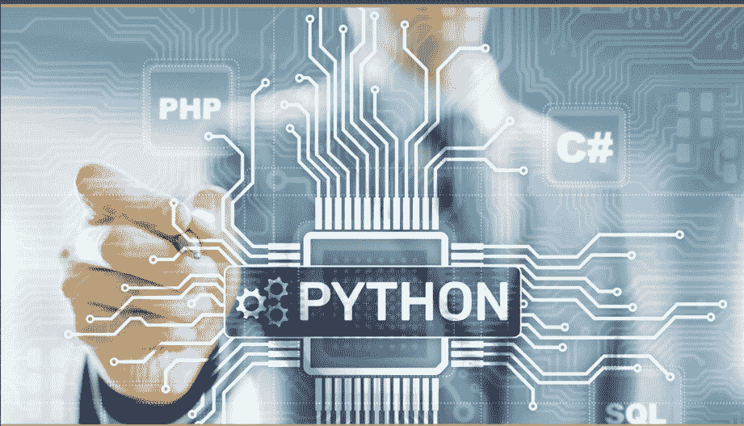
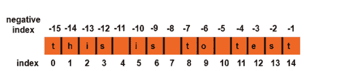
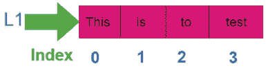
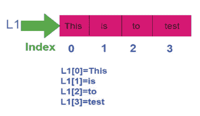
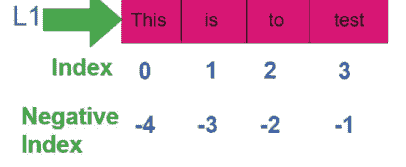
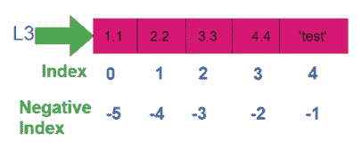
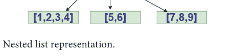
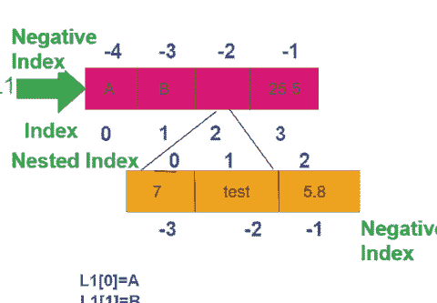

PYTHON 系列

## 学习专业 Python

第一卷：基础篇



乌沙拉尼·巴希马瓦拉普
朱德·D·赫曼特

CRC 出版社
泰勒与弗朗西斯集团
查普曼与霍尔图书

## 学习专业 Python

**《学习专业 Python》第一卷** 是为希望学习 Python 的学生准备的资源，即使他们没有任何编程知识；同时也为希望获得 Python 全面介绍以用于教学的教师而设计。本书帮助学生实现他们在 IT 行业的理想工作梦想，并以简单易懂的方式教授学生，同时强化编码技能。

### 学习专业 Python：第一卷 目标

- 熟悉 Python 编程语言的特性
- 介绍面向对象编程概念
- 探索如何遵循面向对象编程概念编写 Python 代码
- 熟悉类、对象、继承、动态分派、接口和包等概念
- 学习 Python 泛型和集合
- 开发异常处理和多线程应用程序
- 设计图形用户界面（GUI）应用程序

### 查普曼与霍尔/CRC PYTHON 系列

### 关于本系列

Python 已被列为最受欢迎的编程语言，并在教育和工业界广泛使用。本系列丛书将为学生和专业人士提供广泛的 Python 相关书籍。系列中的书目将帮助用户在入门和高级水平上学习该语言，并探索其在数据科学、人工智能和机器学习中的众多应用。系列书目还可以通过 Jupyter 笔记本进行补充。

### 使用 Python 进行图像处理与获取，第二版

拉维尚卡尔·奇蒂亚拉，斯里德维·普迪佩迪

### Python 包

托马斯·贝曾，蒂芙妮-安妮·廷伯斯

### 使用 Python 进行统计与数据可视化

赫苏斯·罗赫尔-萨拉萨尔

### 人文学者 Python 入门

威廉·J.B. 马丁利

### Python 在科学计算与人工智能中的应用

斯蒂芬·林奇

### 学习专业 Python：第一卷：基础篇

乌沙拉尼·巴希马瓦拉普，朱德·D·赫曼特

### 学习专业 Python：第二卷：进阶篇

乌沙拉尼·巴希马瓦拉普，朱德·D·赫曼特

有关本系列的更多信息，请访问：www.crcpress.com/Chapman–HallCRC/book-series/PYTH

## 学习专业 Python

第一卷：基础篇

乌沙拉尼·巴希马瓦拉普
与 朱德·D·赫曼特


CRC 出版社
泰勒与弗朗西斯集团
博卡拉顿 伦敦 纽约

CRC 出版社是
泰勒与弗朗西斯集团的印记，一家 Informa 企业
查普曼与霍尔图书

封面图片来源：Shutterstock.com

第一版于 2024 年由 CRC 出版社出版
地址：佛罗里达州博卡拉顿市西北行政中心大道 2385 号，套房 320，邮编 33431
以及由 CRC 出版社出版
地址：英国牛津郡阿宾登市米尔顿公园公园广场 4 号，邮编 OX14 4RN

CRC 出版社是泰勒与弗朗西斯集团有限责任公司的印记

© 2024 乌拉沙尼·巴希马瓦拉普 与 朱德·D·赫曼特

我们已尽合理努力发布可靠的数据和信息，但作者和出版商无法对所有材料的有效性或其使用后果承担责任。作者和出版商已尝试追溯本出版物中所有复制材料的版权所有者，如果未获得以本形式出版的许可，我们向版权所有者致歉。如果任何版权材料未被确认，请写信告知我们，以便我们在任何未来的重印中予以更正。

除非美国版权法允许，否则本书的任何部分不得以任何形式（无论是电子、机械或其他方式，无论是现在已知或未来发明的，包括影印、缩微拍摄和录音）进行重印、复制、传播或利用，也不得用于任何信息存储或检索系统，除非获得出版商的书面许可。

要获得影印或以电子方式使用本作品材料的许可，请访问 www.copyright.com 或联系版权结算中心（CCC），地址：马萨诸塞州丹弗斯市罗斯伍德大道 222 号，邮编 01923，电话：978–750–8400。对于在 CCC 上不可用的作品，请联系 mpkbookspermissions@tandf.co.uk

商标声明：产品或公司名称可能是商标或注册商标，仅用于识别和解释，无意侵权。

美国国会图书馆编目出版数据
名称：巴希马瓦拉普，乌沙拉尼，作者。| 赫曼特，D. 朱德，作者。
题名：学习专业 Python / 乌沙拉尼·巴希马瓦拉普，D. 朱德·赫曼特。
描述：第一版。| 博卡拉顿：CRC 出版社，2024。| 包括参考文献和索引。
标识符：LCCN 2023007977 | ISBN 9781032539256（第一卷；精装） | ISBN 9781032534237（第一卷；平装） | ISBN 9781003414322（第一卷；电子书） | ISBN 9781032611761（第二卷；精装） | ISBN 9781032611709（第二卷；平装） | ISBN 9781003462392（第二卷；电子书）
主题：LCSH：Python（计算机程序语言） | 计算机编程。
分类：LCC QA76.73.P98 B485 2024 | DDC 005.13/3—dc23/eng/20230508
LC 记录可在 https://lccn.loc.gov/2023007977 获取

ISBN：978-1-032-53925-6（精装）
ISBN：978-1-032-53423-7（平装）
ISBN：978-1-003-41432-2（电子书）

DOI：10.1201/9781003414322

由 Apex CoVantage, LLC 使用 Minion 字体排版

## 目录

前言，xi

作者简介，xiii

### 第 1 章 ■ Python 基础 1

1.1 PYTHON 的历史 1
1.2 PYTHON 的优势 1
1.3 PYTHON 的特性 2
1.4 PYTHON 的应用 2
1.5 PYTHON 版本 3
1.6 PYTHON 标识符 3
1.7 保留字 3
1.8 PRINT () 函数 4
1.9 行与缩进 7
1.10 多行语句 7
1.11 PYTHON 中的引号 8
1.12 PYTHON 中的注释 8
1.13 单行多条语句 9
1.14 PYTHON 变量 10
1.15 变量命名约定 10
1.16 为变量赋值 11
1.17 多重赋值 12
1.18 NONE 变量 13
1.19 数据类型 13
1.20 类型转换 14
1.20.1 隐式转换 14
1.20.2 显式转换 15
1.21 字面量 16
1.22 二进制数制 17
练习 17

### 第 2 章 ■ Python 运算符 19

2.1 运算符简介 19
2.1.1 一元运算符 19
2.1.2 二元运算符 19
2.1.3 三元运算符 19
2.2 二元运算符 20
2.2.1 算术运算符 20
2.2.2 简写运算符 22
2.3 字符串运算符 26
2.4 运算符优先级 27
2.5 表达式求值 28
2.6 INPUT () 函数 29
2.7 库 33
2.7.1 Math 和 CMath 库 33
2.7.2 SciPy 库 36
练习 37

### 第 3 章 ■ 决策与条件 41

3.1 简介 41
3.2 IF 语句 41
3.3 IF-ELSE 语句 43
3.4 嵌套 IF-ELSE 语句 44
3.5 ELIF 语句 46
3.6 WHILE 循环 48
3.7 FOR 循环 49
3.8 嵌套 FOR 循环 52
3.9 嵌套 WHILE 循环 54
3.10 在 FOR 循环中使用 ELSE 语句 55
3.11 FOR 循环中的 PASS 语句 56
3.12 BREAK 语句 56
3.13 CONTINUE 语句 58
3.14 WHILE 循环与 ELSE 分支 60
练习 74

### 第 4 章 ■ 字符串 75

4.1 字符串创建 75
4.2 访问字符串中的值 76
4.3 修改现有字符串 78
4.4 转义字符 79
4.5 字符串特殊字符 80
4.6 字符串格式化运算符 81
4.7 三引号 84
4.8 Unicode 字符串 84
4.9 内置字符串方法 84
4.10 删除字符串 87
练习 88

### 第 5 章 ■ 列表 91

5.1 简介 91
5.2 列表的特性 92
5.3 列表中的决策 93
5.3.1 范围 94
5.4 访问列表中的值 95
5.5 更新列表 99
5.6 删除列表元素 100
5.7 排序 100
5.8 复制 101
5.9 列表上的运算符 102
5.10 索引、切片 104
5.11 列表中搜索 105
5.12 嵌套列表 106
5.13 列表推导式 108
5.14 矩阵表示 109
练习 126

### 第 6 章 ■ 元组 127

6.1 元组创建 127
6.2 访问元组中的值 129
6.3 更新元组 132
6.4 删除元组元素 133
6.5 元组上的操作 134
6.6 元组解包 138
6.7 元组上的索引、切片 140
练习 142

### 第 7 章 ■ 集合 143

7.1 简介 143
7.2 访问集合元素 145
7.3 向集合添加元素 145
7.4 从集合中移除元素 146
7.5 删除集合 146
7.6 Python 集合操作 147
7.7 集合成员运算符 148
7.8 集合预定义方法 149
7.9 冻结集合 152
7.10 冻结集合操作 153
7.11 冻结集合预定义操作 153
练习 156

### 第 8 章 ■ 字典 157

8.1 访问字典元素 163
8.2 复制字典 165

#### 8.3 嵌套字典 166

#### 8.4 更改字典值 167

#### 8.5 向字典添加元素 168

#### 8.6 删除字典元素 168

#### 8.7 字典推导式 169

#### 8.8 字典中的运算符 172

练习 173

## 第9章 ■ 模块与包 175

### 9.1 PYTHON IMPORT 语句 175

### 9.2 PYTHON FROM ... IMPORT 语句 175

### 9.3 包 183

练习 187

## 第10章 ■ 函数 189

### 10.1 定义函数 189

### 10.2 按引用传递 192

### 10.3 函数参数 193

#### 10.3.1 必需参数 194

#### 10.3.2 关键字参数 194

#### 10.3.3 默认参数 197

#### 10.3.4 可变长度参数 198

### 10.4 匿名函数 199

### 10.5 RETURN 语句 200

### 10.6 函数变量作用域 202

### 10.7 向函数传递列表 206

### 10.8 从函数返回列表 208

### 10.9 递归 209

练习 211

## 第11章 ■ 日期与时间 213

### 11.1 TIME 模块 213

### 11.2 日历 214

### 11.3 TIME 模块 214

### 11.4 CALENDAR 模块 215

### 11.5 DATETIME 模块 217

### 11.6 PYTZ 模块 217

### 11.7 DATEUTIL 模块 218

练习 238

## 第12章 ■ 正则表达式 241

### 12.1 RE 模块 241

### 12.2 PYTHON MATCH 函数 243

### 12.3 SEARCH 函数 244

### 12.4 PYTHON MATCH 函数与 SEARCH 函数对比 246

### 12.5 COMPILE 函数 248

### 12.6 FINDALL () 函数 249

### 12.7 SPLIT () 函数 251

### 12.8 SUB () 函数 252

### 12.9 RE.ESCAPE () 函数 254

练习 254

索引, 255

## 前言

Python 是一种通用解释型编程语言，用于深度学习、机器学习和复杂数据分析。Python 是一门完美的初学者语言，因为它易于学习和理解。本书旨在教读者如何用 Python 编程。本书旨在让你快速上手，并让你在短时间内编写真正的 Python 程序。它假设读者之前没有接触过 Python 语言，既适合初学者，也适合有经验的程序员。本书对 Python 核心语言进行了全面、深入的介绍。

本书帮助你快速掌握 Python 编程的基础知识和使用内置函数。然后，本书将帮助你处理异常、数据整理、使用 Python 操作数据库、正则表达式、NumPy 数组、数据框和绘图。Python 编程的最后部分介绍了在阅读本书后如何继续学习 Python，并留下一个问题让你解决，即使在最后一步也能测试你的技能。

本书包含大约 500 个经过测试的程序，所有这些程序都使用 IDE Anaconda、Google colaboratory 和与 Windows 操作系统兼容的 Python 在线编译器进行了测试，并讨论了输出的适当性质。本书还提到了关于谈判最佳报价的面试技巧的技术方面总结，并指导了最佳方式。

本书适用于数据分析师、IT 开发人员以及任何希望开始或转型到软件领域或刷新其 Python 编程知识的人。本书对于计划在数据工程领域建立职业生涯的学生或准备转型的 IT 专业人员也很有用。不需要数据工程的先验知识。本书旨在让你快速上手，并让你在短时间内编写真正的 Python 程序。

它包含 12 章，每章末尾都给出了练习题，使学习者能够复习所获得的知识。每章都以简要介绍、重要提示和基本库方法回顾开始，最后是广泛且发人深省的问题。

我们感谢 Taylor and Francis Publications 承担本书的出版工作并支持我们完成这项工作。任何关于改进本书的建议都将被感激地接受并纳入下一版。

Usharani Bhimavarapu 博士
Jude D. Hemanth 博士

## 作者简介


**Usharani Bhimavarapu** 在印度安得拉邦瓦德斯瓦拉姆的科内鲁·拉克什马亚教育基金会计算机科学与工程系担任助理教授。她从事教学工作已有 14 年，重点是数据挖掘、机器学习和数据结构。她在 SCI、SCIE 和 Scopus 索引期刊上发表了 40 多篇研究论文。她撰写了 12 本关于编程语言的书籍，如 CPP、Java、Python、HTML、CSS 等。


**Jude D. Hemanth 博士** 于 2002 年获得巴拉蒂亚大学电子与通信工程学士学位，2006 年获得安娜大学通信系统硕士学位，2013 年获得卡鲁尼亚大学博士学位。他的研究领域包括计算智能和图像处理。他在著名的 SCIE 索引国际期刊和 Scopus 索引国际会议上发表了 230 多篇研究论文。他的累计影响因子超过 350。他与 Elsevier、Springer 和 IET 等知名出版商合作出版了 37 本编辑书籍。

他曾担任 SCIE 索引国际期刊的副编辑，例如 *IEEE Journal of Biomedical and Health Informatics* (IEEE-JBHI)、*IEEE Transactions on Intelligent Transportation Systems*、*Soft Computing* (Springer)、*Earth Science Informatics* (Springer)、*IET Image Processing*、*Heliyon* (Elsevier)、*Mathematical Problems in Engineering*、*PeerJ Computer Science*、*PLOS One* 和 *Dyna* (西班牙)。他还担任许多 Scopus 期刊的副编辑/客座编辑。他曾担任生物医学工程系列 (Elsevier) 的系列编辑、ASTI 系列 (Springer) 的编委会成员以及机器人与医疗保健系列 (CRC Press) 的编委会成员。

他获得了英国政府 (GCRF 计划) 35,000 英镑的项目资助，合作者来自英国威斯敏斯特大学。他还完成了印度政府 CSIR 和 DST 的两个资助研究项目。他还担任阿根廷计算智能与信息系统 (CI2S) 实验室、巴西 LAPISCO 研究实验室、突尼斯 RIADI 实验室、罗马尼亚克拉约瓦大学应用智能研究中心以及西班牙巴利亚多利德大学电子健康与远程医疗小组的研究科学家。

他是 NVIDIA 大学大使和 NVIDIA 深度学习课程认证讲师。他的名字出现在美国斯坦福大学发布的“世界顶尖 2% 科学家”[2021, 2022] 名单中。他是罗马尼亚 [ARACIS] 和斯洛文尼亚 [SQAA] 高等教育机构的国际认证成员，隶属于欧盟委员会。目前，他在印度哥印拜陀卡鲁尼亚大学电子与通信工程系担任教授。

# 第1章

## Python 基础

Python 是一种常规的通用、高级、面向对象的编程语言。Python 是一种解释型脚本语言。Python 是一种易于理解的多用途脚本语言。Python 是一种多用途编程语言。它可用于 Web、企业应用程序。Python 使开发和调试变得快速。

### 1.1 PYTHON 的历史

Python 由 Guido Van Rossum 于 19 世纪初在荷兰国家数学与计算机科学研究所创建。Python 源自多种其他编程语言，如 ABC、Modula-3、C、CPP、Smalltalk、Unix 和脚本语言。Python 在 GNU 公共许可证 (GPU) 下可用。

### 1.2 PYTHON 的优势

- 1. Python 是解释型的 – 在执行 Python 程序之前无需编译。
- 2. Python 是交互式的 – 开发人员可以立即与解释器交互以编写 Python 程序。
- 3. Python 是面向对象的 – Python 保持面向对象的编程概念，将代码封装在对象中。

#### 1.3 PYTHON 的特点

Python 编程的重要特性：

- 1. Python 提供高级动态数据类型，并加强了动态类型检查。
- 2. Python 是开源的；它可以为开发代码做出贡献。
- 3. Python 像纯英语一样易于理解。
- 4. Python 支持函数式、结构化以及面向对象的编程方法。
- 5. Python 支持自动垃圾回收。
- 6. Python 源代码可以转换为字节码。
- 7. 易于学习 – Python 具有直接的结构和明确的语法。它易于阅读，易于编写，并且跨平台兼容。
- 8. 易于教学 – 与其他编程语言技术相比，工作量更小。
- 9. 易于使用 – Python 代码比其他编程语言更快。
- 10. 易于理解 – 比其他编程语言更容易理解。
- 11. 易于获取 – Python 是免费的、开源的，并且是多平台的。

#### 1.4 PYTHON 的应用

- 1. 可移植 – Python 可以在所有平台上运行，如 Unix、Windows 和 Macintosh。
- 2. 可扩展 – 开发者可以将低级模块组合到 Python 解释器中。这些模块允许程序员修改他们有用的数据库工具。
- 3. Python 提供了商业数据库的接口。
- 4. GUI 编程 – Python 通过系统调用、库和 Windows 系统（如 Windows MFC、Macintosh 和 Unix 的 X Windows 系统）来支持图形用户界面应用程序。
- 5. 可扩展性 – Python 提供系统结构并支持 shell 脚本。

#### 1.5 PYTHON 版本

- 1. CPython
- 2. Cython
- 3. Jython
- 4. PyPy
- 5. RPython

#### 1.6 PYTHON 标识符

Python 标识符是用于识别变量、函数、模块、类或对象的名称。标识符以字母或下划线开头，后跟数字。Python 不允许使用标点符号，如 @、$、^。Python 是一种区分大小写的编程语言。例如，Test 和 test 在 Python 中是两个不同的标识符。

Python 标识符的命名规则：

- 1. 类名以大写字母开头。所有其他标识符以小写字母开头。
- 2. 如果标识符以两个尾随下划线结尾，则该标识符是语言指定的特殊名称。
- 3. 以特定前导下划线开头的标识符表示该标识符是私有的。
- 4. 以两个突出下划线开头的标识符表示它是一个强私有标识符。

#### 1.7 保留字

表 1.1 显示了 Python 关键字。这些关键字不能用作常量、变量或任何其他标识符名称。

##### 表 1.1 保留字

| | | |
|---|---|---|
| and | exec | not |
| assert | finally | or |
| break | for | pass |
| class | from | print |
| continue | global | raise |
| def | if | return |
| del | import | try |
| elif | in | while |
| else | is | with |
| except | lambda | yield |

#### 1.8 PRINT () 函数

print () 将消息打印到屏幕或标准输出。

## 语法

```
print (object, sep=separator, end=end, file= file, flush=flush)
```

- sep – 指定输出参数之间的分隔符。
- end – 指定在 print 语句末尾打印什么。
- flush – 刷新屏幕。其默认值为 false。
- file – 显示消息对象的位置。默认输出到控制台，即 std.out。程序员也可以将消息输出到文件。

end 和 sep 是关键字参数，这些参数用于格式化 print () 函数的输出。程序员可以输入多个由分隔符分隔的对象。空的 print () 向屏幕输出一个空行。

你的第一个 python 程序：

```
print ("this is to test")
```

上一行产生输出：

```
this is to test
```

如果我们删除 print 语句中的双引号：

```
print(this is to test)
```

## 输出

```
File "<ipython-input-86-c0dae74495e9>", line 1
print(this is to test)
      ^
SyntaxError: invalid syntax
```

print () 可以处理 Python 提供的所有数据类型。数据类型数据字符串、数字、字符、对象、逻辑值都可以成功传递给 print ()。

> 注意：print () 不会计算任何内容。

## 程序

```
print("this is to test")
print("this is the second line in python program")
```

## 输出

```
this is to test
this is the second line in python program
```

前面的程序调用了两次 print ()。print () 每次开始执行时都从一个全新的行开始输出。代码的输出按照它们在源文件中放置的顺序产生。前面程序中的第一行产生输出 [this is to test]，第二行产生输出 [this is the second line in python program]。没有任何参数的空 print () 产生一个空行，即只是一个新的空行。

## 程序

```
print("this is to test")
print()
print("this is the second line in python program")
```

## 输出

```
this is to test

this is the second line in python program
```

在前面的程序中，第二行 print 语句引入了空行。

以下程序说明了分隔符和 end 参数：

## 程序

```
print("this", "is", "to", "test", end="@")
```

## 输出

```
this is to test@
```

在前面的程序中，使用了 end 分隔符，因此在打印字符串后，添加了分隔符。

## 程序

```
print("this is", " to test", sep="---", end="#")
print("this is an experiment")
```

## 输出

```
this is--- to test#this is an experiment
```

分配给 end 关键字参数的字符串可以是任意长度。sep 参数的值可以是空字符串。在前面的示例中，分隔符指定为 –。第一个和第二个参数由分隔符分隔。在前面的程序中，分隔符是 –。所以输出是 [this is – to test]。在第一个 print 语句中，指定的 end 参数是 “#”。因此，在打印第一个 print 语句后，放置了 # 符号，第一行输出是 [this is – to test#]。

## 程序

```
print("this", "is", "to", "test", end="\n\n\n")
print("this is an experiment")
```

## 输出

```
this is to test


this is an experiment
```

在前面的程序中，“\n” 用作 end 分隔符，因此在打印第一行字符串后，添加了新行。

#### 1.9 行和缩进

Python 语句不以分号结尾。Python 不提供大括号来指定类和函数定义或流程控制的代码块。代码块由行缩进表示。缩进中的空格数量很重要，块内的所有语句必须使用相同的缩进。在 Python 中，所有连续的行都使用相同数量的空格缩进，这将形成一个块。例如：

```
def test():
    a=1
    print(a)
```

前面的程序产生输出 1。

#### 1.10 多行语句

Python 中的语句通常以新行结束。Python 允许使用行继续字符来表示该行应该继续。

```
a=test_one+\ntest_two+\ntest_three
```

使用 [], {}, () 继续的语句不需要使用行继续字符，例如：

```
a= {1,2,3,4,
5,6,7}
```

#### 1.11 PYTHON 中的引号

Python 允许使用单引号、双引号和三引号来表示字符串字面量。三引号用于跨越多行的字符串。例如，以下是合法的：

```
S="test"
S='test'
S=""" This is to test a multiple lines and sentence """
```

#### 1.12 PYTHON 中的注释

井号 (#) 是注释的开始。井号之后直到行尾的所有字符都是注释的一部分，Python 解释器会忽略该行。例如：

```
print (“this is to test”) # Python comment
```

Python 开发者可以如下注释多行：

```
#This is the first comment
#this is the second line comment
#This is the third line comment
#this is also a comment
```

> 注意：注释在运行时被省略，这些注释在代码中留下额外信息。

> 注意：三引号字符串也会被 Python 解释器忽略，可以用作多行注释。

```
'''this is the
test the
multiline comment ''',
```

## 程序

```
print("test#1")
print("test#2")
#print("test#3")
```

#### 1.13 单行多条语句

分号（;）允许在单行上编写多条语句，前提是这些语句都不在新的代码块中开始。例如：

```
x='test';print(x)
```

**输出**

```
test
```

#### 1.14 Python 变量

每个变量都有一个名称和一个值。变量用于存储值。这意味着当开发者创建一个变量时，解释器会分配内存，并决定在预留的内存中保存什么。通过分配不同数据类型的变量，你可以在这些变量中存储整数、小数或字符。

**语法**

```
变量名=值
例如：i=100
```

> 注意：如果程序员为一个不存在的变量赋值，该变量将被自动创建，也就是说，变量因为被赋值而产生。

#### 1.15 变量命名约定

1.  变量名必须由大写或小写字母（A . . . Z, a . . . z）、数字（0 . . . 9）和特殊符号下划线（_）组成。
2.  变量名必须以字母或特殊符号下划线（_）开头，但不能以数字开头。
3.  变量名不能是保留关键字。
4.  在 Python 中，大写和小写字母被视为不同。
5.  Python 对变量名的长度没有任何限制。
6.  一些有效的变量名是 test, sum, test_sum, test1, test1_avg, myVariable。
7.  一些无效的变量名是 5sum, test sum, False, None。

> 注意：Python 是一种动态类型语言；无需声明变量的类型。

#### 1.16 为变量赋值

Python 变量不需要特定的声明来预留内存空间。当你为变量分配一个值时，声明会自动发生。`=` 用于为变量分配值。`=` 运算符左侧的操作数是变量名，右侧的操作数是存储在变量中的值。例如：

```
t=100
sname='rani'
```

在前面的例子中，t 和 sname 是变量名，100 和 'rani' 是变量值。

> 注意：程序员可以使用赋值运算符或快捷运算符为已存在的变量分配新值。

**程序**

```
Test=1
print(test)
```

**输出**

```
---------------------------------------------------------------------------
NameError                                Traceback (most recent call last)
<ipython-input-23-f210fd97eab0> in <module>()
      1 Test=1
----> 2 print(test)

NameError: name 'test' is not defined
```

发生了名称错误，因为变量名是 Test，但在 print 中使用的变量名是 test。

**程序**

```
i=100
i=50+500
print(i)
```

**输出**

```
550
```

在前面的例子中，变量 i 被赋值为整数字面量 100，在第二行中，i 的值被重新赋值为 550（50 + 500）。变量保留其最新值，也就是说，在第二行中，旧值（即 100）被值 550（50 + 500）覆盖。

**程序**

```
a='5'
b="5"
print(a+b)
```

**输出**

```
55
```

在前面的程序中，a 的值是字符字面量 '5'，而不是数值。b 的值是字符串字面量 '5'。第三行执行计算 a+b。这里 + 用作连接运算符。

**程序：求三角形的斜边**

```
a=5.0
b=3.0
c=(a**2+b**2)**0.5
print("c=",c)
```

**输出**

```
c= 5.830951894845301
```

在前面的程序中，`**` 是幂运算符。在第 3 行，表达式求值时，解释器首先计算表达式 `a**2+b**2`，括号内的运算符具有更高的优先级。

#### 1.17 多重赋值

Python 允许同时为多个变量分配一个值。例如：

```
a=b=c=1
```

在前面的行中，a、b 和 c 的值都是 1。

```
a, b, c=1, 2, 3
```

在前面的例子中，a 的值是 1，b 的值是 2，c 的值是 3。

#### 1.18 None 变量

None 是 Python 中的一个关键字，这个词用于以下情况：

1.  赋值给一个变量
    例如：test=None
2.  与另一个变量进行比较
    if(test==None):
    if test is None:

##### Python 中变量的作用域

1.  全局作用域
2.  局部作用域

#### 1.19 数据类型

内存中存储的数据有多种类型。Python 有多种标准数据类型，如数字、字符串、列表、元组、字典。数字数据类型存储数值，例如 Var1= 1。
Python 支持四种不同的数字类型：

-   int
-   long
-   float
-   complex

#### 1.20 类型转换

Python 支持多种内置函数来完成从一种数据类型到另一种数据类型的转换。这些函数返回转换后的值。Python 支持 2 种数据转换：

1.  隐式转换
2.  显式转换

##### 1.20.1 隐式转换

Python 自动将一种数据类型转换为另一种数据类型。无需用户干预。

**程序：隐式转换**

```
x=123
y=12.34
print (x+y)
x=123
y=10.0
print (x+y)
x=10+1j
y=10.0
print (x+y)
```

**输出**

```
135.34
133.0
(20+1j)
```

**程序：隐式转换**

```
x="test"
y=10
print (x+y)
```

**输出**

```
--------------------------------------------------
TypeError                                 Traceback
(most recent call last)
<ipython-input-65-d2c36b20b8bd> in <module>()
1 x="test"
2 y=10
----> 3 print(x+y)
TypeError: can only concatenate str (not "int") to str
```

##### 1.20.2 显式转换

在显式类型转换中，程序员必须使用预定义的函数。这种类型的转换也称为类型强制转换，因为用户通过使用预定义的函数强制将一种数据类型转换为另一种数据类型。下表给出了一些预定义的显式类型转换函数。

**表格：转换函数**

| 转换函数 | 描述 |
| :--- | :--- |
| int(x[, base]) | 将 x 转换为整数，x 是字符串 |
| long(x[, base]) | 将 x 转换为长整数，x 是字符串 |
| float(x) | 将 x 转换为浮点数 |
| complex(real[, imag]) | 创建一个复数 |
| tuple(x) | 将 x 转换为元组 |
| set(x) | 将 x 转换为集合 |
| list(x) | 将 x 转换为列表 |
| dict(d) | 创建一个字典 |
| chr(x) | 将整数转换为字符 |
| hex(x) | 将整数转换为十六进制值 |
| oct(x) | 将整数转换为八进制值 |

**程序**

```
x="1010"
print("string=",x)
print("conversion to int=",int(x,2))
print("conversion to float=",float(x))
print("conversion to complex=",complex(x))
x=10
print("converting to hexadecimal=",hex(x))
print("converting to octal=",oct(x))
print("conversion to Ascii=",chr(x))
x='test'
print("conversion to tuple=",tuple(x))
print("conversion to set=",set(x))
```

**输出**

```
string= 1010
conversion to int= 10
conversion to float= 1010.0
conversion to complex= (1010+0j)
converting to hexadecimal= 0xa
converting to octal= 0o12
conversion to Ascii=
conversion to tuple= ('t', 'e', 's', 't')
conversion to set= {'s', 't', 'e'}
```

前面的程序使用了显式数据类型转换。

#### 1.21 字面量

字面量就是代码中的一些固定值。Python 有多种类型的字面量——数字（例如，111 或 – 1）、浮点字面量（例如，2.5 或 – 2.5）、字符串字面量（例如，'test' 或 "test"）、布尔字面量（True/False）、None 字面量。

> 注意：None 字面量用于表示值的缺失。

> 注意：Python 3.6 在数字字面量中引入了下划线版本。例如，11_11。

> 注意：Python 的 print() 函数会自动将其他进制数转换为十进制表示。

> 注意：当零是小数点前或后的唯一数字时，Python 会省略它。

在 Python 中，数字 1 是整数字面量，1.0 是浮点字面量。程序员必须将值 1.0 输入为 1.，将 0.1 输入为 .1。为了避免写很多零，Python 使用科学计数法 E 或 e。

例如，10000000 可以表示为 1E7 或 1e7。e 之前的值是基数，e 之后的值是指数。例如，浮点字面量 0.000000001 可以表示为 1e-9 或 1E-9。

#### 1.22 二进制数制

二进制数制用零和一表示。

## 程序

```
print(0o13) #octal representation
print(0x13) #hexadecimal representation
```

## 输出

```
11
19
```

## 练习

1.  在 Python 程序中，使用 `sep= "$"` 和 `end= "..."` 关键字编写第一行代码。
    `print (“this”, “is”, “to”, “test”)`
    `print (“python language”)`
2.  在 Python 程序中，使用 `sep= "***"` 和 `end= "---"` 关键字编写第一行代码。
    `print (“this”, “is”, “to”, “test”)`
    `print (“python language”)`
3.  在 Python 程序中，使用 `sep= "*"` 和 `end= "\n"` 关键字编写第一行代码，使用 `sep= "#"` 和 `end= "---"` 编写第二行代码。
    `print (“this”, “is”, “to”, “test”)`
    `print (“python language”)`
4.  检查以下代码：

```
print (true>false)
print (true<false)
```

5.  二进制数 1101 的十进制值是多少？
6.  二进制数 1001 的十进制值是多少？
7.  二进制数 1101 的十六进制值是多少？
8.  二进制数 1101 的八进制值是多少？
9.  十进制数 145 的八进制值是多少？
10. 十进制数 123 的十六进制值是多少？

# 第 2 章
Python 运算符

## 2.1 运算符简介

运算符是用于操作操作数的符号。运算符可以分类如下：

1.  一元运算符
2.  二元运算符
3.  三元运算符

### 2.1.1 一元运算符

它作用于单个变量。Python 中的一元运算符如下：

+, -,

### 2.1.2 二元运算符

它作用于单个变量。关于二元运算符，请参阅第 2.2 节。

### 2.1.3 三元运算符

它作用于三个变量。三元运算符根据条件为真或假来计算表达式。三元运算符允许在单行中测试条件，而不是使用多行的 if else 代码。

```
a,b = 10, 20
print(a if a> b else b)
```

输出

20

## 2.2 二元运算符

Python 语言支持七种二元运算符：

1.  算术运算符
2.  关系运算符
3.  赋值运算符
4.  逻辑运算符
5.  位运算符
6.  成员运算符
7.  身份运算符

### 2.2.1 算术运算符

表格 算术运算符

| 序号 | 运算符 | 名称 | 示例 | 程序 | 结果 |
| :--- | :--- | :--- | :--- | :--- | :--- |
| 1 | + | 加法 | a+b | a,b=1,4<br>print(a+b) | 5 |
| 2 | - | 减法 | a-b | a,b=10,5<br>print(a-b) | 5 |
| 3 | * | 乘法 | a*b | a,b=10,5<br>print(a*b) | 50 |
| 4 | / | 除法 | a/b | a,b=10,3<br>print(a/b) | 3.3333333333333335 |
| 5 | % | 取模 | a%b | a,b=10,3<br>print(a%b) | 1 |
| 6 | ** | 幂运算 | a**b | a,b=10,5<br>print(a**b) | 100000 |
| 7 | // | 整除 | a//b | a,b=10,3<br>print(a//b) | 3 |

## 程序

前面的程序是关于执行算术运算的 Python 程序。

> 注意：对于 **（幂运算）运算符，左参数是基数，右参数是指数（基数<sup>指数</sup>，例如：2**3 = 2<sup>3</sup>=8）。

> 注意：使用 ** 时，如果两个操作数都是整数，则结果是整数。

> 注意：使用 ** 时，如果其中一个操作数是浮点数，则结果是浮点数。

> 注意：除法运算符产生的结果始终是浮点值。

> 注意：对于整除运算符 (//)，结果总是向较小的整数值方向舍入。

> 注意：使用 // 时，如果两个操作数都是整数，则结果是整数。

> 注意：使用 // 时，如果其中一个操作数是浮点数，则结果是浮点数。

### 2.2.2 简写运算符

表格 赋值运算符（截图）

| 序号 | 运算符 | 名称 | 示例 | 程序 | 结果 |
|---|---|---|---|---|---|
| 1 | = | 赋值 | a=b | a,b= 10, 5 | |
| 2 | += | 加并赋值 | a+=b | a,b=10, 5<br>a+=b<br>print(a) | 15 |
| 3 | -= | 减并赋值 | a-=b | a,b=10, 5<br>a-=b<br>print(a) | 5 |
| 4 | *= | 乘并赋值 | a*=b | a,b=10, 5<br>a*=b<br>print(a) | 50 |
| 5 | /= | 除并赋值 | a/=b | a,b=10, 5<br>a/=b<br>print(a) | 2.0 |
| 6 | %= | 取模并赋值 | a%=b | a,b=10, 5<br>a%=b<br>print(a) | 0 |
| 7 | //= | 整除并赋值 | a//=b | a,b=10, 5<br>a//=b<br>print(a) | 2 |
| 8 | **= | 幂运算并赋值 | a**=b | a,b=10, 5<br>a**=b<br>print(a) | 100000 |
| 9 | &= | 按位与并赋值 | a&=b | a,b=10, 5<br>a&=b<br>print(a) | 0 |

（续）

表格（续）赋值运算符（截图）

| 序号 | 运算符 | 名称 | 示例 | 程序 | 结果 |
|---|---|---|---|---|---|
| 10 | \|= | 按位或并赋值 | a\|=b | a,b=10,5<br>a\|=b<br>print(a) | 15 |
| 11 | ^= | 按位异或并赋值 | a^=b | a,b=10,5<br>a^=b<br>print(a) | 15 |
| 12 | >>= | 二进制右移并赋值 | a>>=b | a,b=10,5<br>a>>=b<br>print(a) | 0 |
| 13 | <<= | 二进制左移并赋值 | a<<=b | a,b=10,5<br>a<<=b<br>print(a) | 320 |

## 程序

前面的程序是关于执行赋值运算的 Python 程序。

表格 比较运算符

| 序号 | 运算符 | 名称 | 语法 | 程序 | 结果 |
| :--- | :--- | :--- | :--- | :--- | :--- |
| 1 | == | 等于 | a==b | a,b=10,5<br>print(a==b) | False |
| 2 | != | 不等于 | a!=b | a,b=10,5<br>print(a!=b) | True |
| 3 | < | 小于 | a<b | a,b=10,5<br>print(a<b) | False |
| 4 | <= | 小于等于 | a<=b | a,b=10,5<br>print(a<=b) | False |
| 5 | > | 大于 | a>b | a,b=10,5<br>print(a>b) | True |
| 6 | >= | 大于等于 | a>=b | a,b=10,5<br>print(a>=b) | True |

## 程序

前面的程序是关于执行关系运算的 Python 程序。

表格 逻辑运算符

| 序号 | 运算符 | 名称 | 示例 | 程序 | 结果 |
| :--- | :--- | :--- | :--- | :--- | :--- |
| 1 | and | 逻辑与 | a and b | a,b=10,5<br>print(a and b) | 5 |
| 2 | or | 逻辑或 | a or b | a,b=10,5<br>print(a or b) | 10 |
| 3 | not | 逻辑非 | not a | a<br>print(not a) | False |

## 程序

前面的程序是关于执行逻辑运算的 Python 程序。

表格 身份运算符

| 序号 | 运算符 | 示例 | 程序 | 结果 |
| :--- | :--- | :--- | :--- | :--- |
| 1 | is | a is b | a,b=10,5<br>print(a is b) | False |
| 2 | is not | a is not b | a,b=10,5<br>print(a is not b) | True |

表格 成员运算符

| 序号 | 运算符 | 示例 | 程序 | 结果 |
| :--- | :--- | :--- | :--- | :--- |
| 1 | in | 10 in list | l=[10,20]<br>print(10 in l) | True |
| 2 | not in | 10 not in list | print(10 not in l) | False |

表格 位运算符

| 序号 | 运算符 | 名称 | 示例 | 程序 | 结果 |
| :--- | :--- | :--- | :--- | :--- | :--- |
| 1 | & | 按位与 | a&b | a,b=10,5<br>print(a&b) | 0 |
| 2 | \| | 按位或 | a\|b | a,b=10,5<br>print(a\|b) | 15 |

（续）

表格（续）位运算符

| 序号 | 运算符 | 名称 | 示例 | 程序 | 结果 |
| :--- | :--- | :--- | :--- | :--- | :--- |
| 3 | ~ | 按位非 | ~a | a,b=10,5<br>print(~b) | -6 |
| 4 | ^ | 按位异或 | a^b | a,b=10,5<br>print(a^b) | 15 |
| 5 | >> | 按位右移 | a>>b | a,b=10,5<br>print(a>>b) | 0 |
| 6 | << | 按位左移 | a<<b | a,b=10,5<br>print(a<<b) | 320 |

## 程序

前面的程序是关于执行位运算的 Python 程序。

## 2.3 字符串运算符

Python 中的字符串运算符是 +（连接）和 *（重复）。连接运算符将多个字符串连接成一个。连接运算符不满足交换律，例如，ab 不等于 ba。当 * 号应用于字符串和一个数字时，它会将字符串重复指定的次数。

## 2.4 运算符优先级

复制运算符的语法：

-   字符串*数字
-   数字*字符串

程序：连接运算符

```
s="test"
s1="ing"
print(s+s1)
```

输出

```
testing
```

程序：复制运算符

```
print("test"*3)
print(3*"sample")
print(3*"1") # 输出 111 而不是 3
```

输出

```
testtesttest
samplesamplesample
111
```

当表达式中存在多个运算符时，运算符优先级决定了首先执行哪个操作。当运算符具有相同优先级时，运算符结合性按特定顺序对运算符进行求值。

表格 运算符优先级

| 优先级 | 运算符 | 描述 |
|---|---|---|
| 1 | + - | 一元 |
| 2 | ** | 二元 |
| 3 | / // % * | 二元 |
| 4 | + - | 二元 |
| 5 | <<= >>= | 二元 |
| 6 | == != | 二元 |

28 ■ 学习专业Python

表格 运算符优先级和结合性

| 运算符优先级顺序 | 含义 | 结合性 |
| :--- | :--- | :--- |
| () | 圆括号 | 从左到右 |
| ** | 指数 | 从右到左 |
| +, -, ~ | 一元加法、一元减法和一元按位非 | 从左到右 |
| *, /, //, % | 乘法、除法、整除、取模 | 从左到右 |
| +, - | 加法、减法 | 从左到右 |
| <<, >> | 按位移位运算符 | 从左到右 |
| & | 按位与 | 从左到右 |
| ^ | 按位异或 | 从左到右 |
| \| | 按位或 | 从左到右 |
| ==, !=, >, >=, <, <=, is, is not, in, not in | 比较、身份和成员运算符 | 从左到右 |
| and, or | 逻辑与、逻辑或 | 从左到右 |
| not | 逻辑非 | 从右到左 |
| =, +=, -=, *=, /=, %=, &=, ^=, \|=, >>=, <<= | 赋值运算符 | 从右到左 |

## 2.5 表达式求值

表达式是操作数和运算符的组合。在Python中，`eval()`函数动态地对表达式进行求值。

语法：

```
eval(expression[,globals[,locals]])
```

例如：

```
eval("123+123")
246
eval("sum([10,10,10])", {})
30
x=100,y=100
eval("x+y")
200
```

在给定的示例中，`x`和`y`都是全局变量。

例如：

```
eval("x+50", {}, {"x":50})
100
```

在引用的示例中，`x`是局部变量，因为它是在`eval`函数内部定义的。

## 2.6 INPUT() 函数

`input()`函数可以读取程序员输入的数据。`input()`函数会提示程序员从控制台（默认从键盘）输入一些数据。当不带参数调用`input()`函数时，该函数会将控制台切换到输入模式。光标闪烁，程序员可以输入一些按键。按下回车键后，输入的数据将通过`input`函数的结果发送到源代码。程序员必须捕获`input`函数返回的内容，否则输入的数据将会丢失。

> 注意：`input()`函数的默认返回类型是字符串。

> 注意：`input()`函数可以带一个参数调用。

例如：`i=input()`

程序

```
print("enter 2 integers")
a=int(input())
b=int(input())
print(a+b)
```

输出

```
enter 2 integers
10
30
40
```

前面的程序使用了不带参数的`input()`函数。

程序

```
a=int(input("enter integer:"))
b=int(input("enter integer:"))
c=a+b
print("sum=",c)
```

输出

```
enter integer:1
enter integer:3
sum= 4
```

30 ■ 学习专业Python

前面的程序使用了带参数的`input()`函数。

程序

```
a=input()
print(a+3)
```

输出

```
5
---------------------------------------------------------------------------
TypeError                                 Traceback (most recent call last)
<ipython-input-22-3ae605921ae5> in <module>()
      1 a=input()
----> 2 print(a+3)

TypeError: can only concatenate str (not "int") to str
```

在前面的程序中，这是一个类型错误，因为`input`返回的是字符串数据类型。Python不能将字符串和整数连接起来。因此，前面的程序抛出了类型错误。

程序

```
a=input()
print(type(a))
```

输出

```
4
<class 'str'>
```

在前面的程序中，输入的值是10。尽管值10是一个整数，但`input()`函数的默认返回类型值是字符串，因此`print`函数的输出是`str`（字符串）。

程序

```
a=float(input("enter float value"))
b=float(input("enter float value"))
c=a+b
print("sum of floats=",c)
```

输出

```
enter float value1.5
enter float value3.8
sum of floats= 5.3
```

前面的程序执行了两个浮点数的求和。要将输入值转换为浮点数，需要使用`float`对`input()`函数进行类型转换。

程序

```
n=int(input("enter integer"))
print(n*"1")
```

输出

```
enter integer4
1111
```

该程序是关于从用户读取数据进行复制操作。

程序

```
#Ascii value
x=input("enter character:")
print("Ascii of ",x,"is",ord(x))
```

输出

```
enter character:a
Ascii of a is 97
```

前面的程序打印ASCII值。

程序

```
print("%5.3e"% (123.456789))
print("%10.3e"% (123.456789))
print("%15.3e"% (123.456789))
print("%-15.3e"% (123.456789))
print("%5.3E"% (123.456789))
```

32 ■ 学习专业Python

```
print("%o"% (15))
print("%5.3o"% (15))
print("%x"% (15))
print("%X"% (15))
print("%10x"% (15))
print("%10.3x"% (15))
print("%x%%"% (15))
print("%d"% (123456789))
print("%d,"% (123456789))
print("{0:4,d}".format(123456789))
print("{0:06d}".format(123))
print("{0:4,.5f}".format(123456789.123456789))
```

输出：

```
1.235e+02
1.235e+02
1.235e+02
1.235e+02
1.235E+02
17
017
f
F
f
00f
f%
123456789
123456789,
123,456,789
000123
123,456,789.12346
```

前面的程序是关于数字格式化的。

程序

```
print("this book costs {0:f} only".format(150.99))
print("this book costs {0:8f} only".format(150.99))
print("this book costs {0:.2f} only".format(150.99))
print("this book costs {0:.3f} only".format(150.99))
print("this book costs {0:.0f} only".format(150.99))
print("this book costs {0:e} only".format(150.99))
```

```
print("this book costs {0:1} only".format(150.99))
print("this book costs {0:d} only".format(150))
print("this book costs {0:8d} only".format(150))
print("this book costs {0:o} only".format(150)) # 八进制
print("this book costs {0:b} only".format(150)) # 二进制
print("{:d}".format(-15))
print("{:=7d}".format(-15))
print("{:=7d}".format(15))
```

输出

```
this book costs 150.990000 only
this book costs 150.990000 only
this book costs 150.99 only
this book costs 150.990 only
this book costs 151 only
this book costs 1.509900e+02 only
this book costs 150.99 only
this book costs 150 only
this book costs    150 only
this book costs 226 only
this book costs 10010110 only
- 15
- 15
15
```

前面的程序是关于数字格式化的。

## 2.7 库

### 2.7.1 Math 和 CMath 库

Math是基础数学模块，处理诸如求和、平均值、指数等数学运算，该库不适用于矩阵乘法等复杂数学运算。其缺点是使用math库执行的数学运算速度非常慢。例如，如果我们考虑此处显示的示例，我们执行了基本的数学运算。语句`math.exp`用于求数字的指数。例如，`math.exp(5)`表示e的5次方，即e⁵。e的值约为2.17。语句`math.pi`返回的值约为3.14。常量`math.e`返回值2.17。`ceil`返回不大于该数的最小整数。`floor`返回给定数的最大整数。`math.trunc`方法返回数字的截断部分。

表格 Math函数

| 函数 | 描述 |
| :--- | :--- |
| min(x1, x2…) | 所有参数中的最小值 |
| max(x1, x2…) | 所有参数中的最大值 |
| pow(x, y) | x**y的值，即 (2**3=8) (2³=8) |
| round(x [, n]) | x四舍五入到小数点后n位 |
| sqrt(x) | x的平方根 |
| abs(x) | x的绝对值 |
| ceil(x) | 不小于x的最小整数 |
| floor(x) | 不大于x的最大整数 |
| exp(x) | x的指数 (eˣ) |
| log(x) | x的自然对数 |
| log10(x) | x的以10为底的对数 |
| fabs(x) | x的绝对值 |

程序

```
import math
x,y,z=10,20,30
print("min=",min(x,y,z))
print("max=",max(x,y,z))
print("sqrt of ",x,"=",math.sqrt(x))
print("round=",round(0.5))
print("power=",pow(2,3))
f=1.5
print("ceil=",math.ceil(f))
print("floor=",math.floor(f))
x=2
print("exponent=",math.exp(x))
print("log=",math.log(x))
print("log10=",math.log10(x))
x=-1
print("absolute=",abs(x))
print("absolute=",math.fabs(x))
```

输出

```
min= 10
max= 30
```

10 的平方根 = 3.1622776601683795
四舍五入 = 0
幂运算 = 8
向上取整 = 2
向下取整 = 1
指数 = 7.38905609893065
自然对数 = 0.6931471805599453
常用对数 = 0.3010299956639812
绝对值 = 1
绝对值 = 1.0

前面的示例使用了一些数学运算，并根据所使用的数学运算产生输出。

```python
import math
print("exp(5)",math.exp(5))
print("Pi",math.pi)
print("Exponent",math.e)
print("factorial(5)",math.factorial(5))
print("ceil(-5)",math.ceil(-5))
print("ceil(5)",math.ceil(5))
print("ceil(5.8)",math.ceil(5.8))
print("floor(-5)",math.floor(-5))
print("floor(5)",math.floor(5))
print("floor(5.8)",math.floor(5.8))
print("trunc(-5.43)",math.trunc(-5.43))
print("pow(3,4)",math.pow(3,4))
print("pow(3,4.5)",math.pow(3,4.5))
print("pow(math.pi,4)",math.pow(math.pi,4))
print("log(4)",math.log(4))
print("log(3,4)",math.log(3,4))
print("log(math.pi,4)",math.log(math.pi,4))
print("sqrt(8)",math.sqrt(8))
```

类似地，复数的数学运算可以通过 Python 中的 CMath 模块获得。CMath 中的方法总是返回一个复数。如果返回值可以表示为实数，则虚部的返回值为零。以下命令行对复数执行数学运算。

```python
import cmath
print("cmath.pi",cmath.pi)
print("cmath.e",cmath.e)
print("sqrt(4+j5)",cmath.sqrt(4+5j))
print("cos(4+5j)",cmath.cos(4+5j))
print("sin(4+5j)",cmath.sin(4+5j))
print("tan(4+5j)",cmath.tan(4+5j))
print("asin(4+5j)",cmath.asin(4+5j))
print("acos(4+5j)",cmath.acos(4+5j))
print("atan(4+5j)",cmath.atan(4+5j))
print("sinh(4+5j)",cmath.sinh(4+5j))
print("cosh(4+5j)",cmath.cosh(4+5j))
print("tanh(4+5j)",cmath.tanh(4+5j))
print("rect(3,4)",cmath.rect(3,4))
print("log(1+2j)",cmath.log(1+2j))
print("exp(1+2j)",cmath.exp(1+2j))
```

### 2.7.2 SciPy 库

SciPy Python 库执行数学运算、数学优化、线性代数等。SciPy 代表科学 Python。它是一个依赖于 NumPy 的科学计算库，提供了用户友好且高效的优化和数值积分功能。执行 SciPy 库的命令行如下：

```python
from scipy.stats import describe
import numpy as np
x=np.random.normal(size=50)
r=describe(x)
print(r)
```

## 解决示例

## 程序

```python
a = 5
a = 1, 2, 3
print(a)
```

## 输出

(1, 2, 3)

## 程序

```python
i=10
print(i!=i>5)
```

## 输出

False

## 程序

```python
x=int(input("enter number:"))
y=int(input("enter number:"))
global x,y
test={"add":x+y, "sub":x-y, "mul":x*y, "div":x/y}
op=input("enter operation:")
print(test.get(op,"wrong option"))
```

## 输出

```
enter number:1
enter number:3
enter operation:add
4
```

## 练习

1.  检查此 Python 程序的结果：
    print (3**2)
    print (3. **2)
    print (3**2.)
    print (3. **2.)
2.  检查此 Python 程序的结果：
    print (3*2)
    print (3. *2)
    print (3*2.)
    print (3. *2.)
3.  检查此 Python 程序的结果：
    print (8/2)
    print (8. /2)
    print (8/2.)
    print (8. /2.)
4.  检查此 Python 程序的结果：
    print (8//2)
    print (8. //2)
    print (8//2.)
    print (8. //2.)
5.  检查此 Python 程序的结果：
    print (-8//2)
    print (8. //2)
    print (-8//2.)
    print (-8. //2.)
6.  检查此 Python 程序的结果：
    print (8%2)
    print (8.5%2)
    print (8%2.5)
    print (8.5%2.5)
7.  运行此 Python 程序并检查结果：
    print (8 + 2)
    print (-8.5 + 2)
    print (-8 + 2.5)
    print (8. +2.5)
8.  运行此 Python 程序并检查结果：

```python
print (8-2)

print (-8.5-2)

print (-8-2.5)

print (8.-2.5)
```

9.  以下 Python 程序的输出是什么？

```python
print ((4**2) +5%2-3*8)
```

10. 以下 Python 程序的输出是什么？

```python
print ((4%2),5**2, (5+ 4**3))
```

11. 编写一个 Python 程序，创建两个变量，并为它们分配不同的值。对它们执行各种算术运算。尝试在一行中打印一个字符串和一个整数，例如，“sum=” 和 total（所有变量的总和）。
12. 检查以下行的输出：

```python
print (5==5)
```

13. 检查以下行的输出：

```python
print (5==5.)
```

14. 运行此 Python 程序并检查结果：

```python
x,y,z=5,6,7

print(x>y)

print(x>z)
```

15. 运行此 Python 程序并检查结果：

```python
x,y,z=1,2,3

print(x>y)

print((z-2) ==x)
```

16. 运行此 Python 程序并检查结果：

```python
x=5
y=5.0
z="5"
if(x==y):
    print(x)
if (x==int(z)):
    print(x)
```

# 第 3 章

## 决策与条件

### 3.1 简介

条件语句可以检查条件并相应地改变程序的行为。
Python 编程语言支持不同的决策语句：

-   If 语句
-   If-else 语句
-   嵌套 if 语句
-   elif 语句

Python 语言将非零、非空值视为 TRUE，将零、空值视为 FALSE。

### 3.2 IF 语句

if 语句后的条件是布尔表达式。如果条件为真，则执行指定的语句块，否则什么也不发生。

## 语法

```python
if condition:
    #Execute the indented block if true
    Statement-1
    Statement-2
    Statement-3
    Statement-4
```

if 语句的必要元素：

1.  if 关键字。
2.  一个或多个空格。
3.  一个其值被解释为真或假的表达式。如果表达式被解释为真，则将执行缩进块。如果被评估的表达式为假，则将省略缩进块，并将执行缩进块级别之后的下一条指令。
4.  后跟换行符的冒号。
5.  一组缩进的语句。

## 程序

```python
a,b=10,5
if(a<b):
    print(" a is smaller than b")
if(b<a):
    print(" b is smaller than a")
```

## 输出

```
b is smaller than a
```

在前面的程序中，第一个 if 条件为假，因此未执行相应的 print 语句，第二个 if 语句为真，因此执行了相应的 print 语句。

### 3.3 IF-ELSE 语句

如果条件评估为真，则执行 if 块，否则执行 else 块。

## 语法

```python
if condition:
    #Execute the indented block if true
    Statement-1
    Statement-2
else:
    #Execute the indented block if condition meets false
    Statement-3
    Statement-4
```

> 注意：if 语句后的两个 else 语句会抛出错误。

## 程序

```python
# python program to find the maximum of two numbers
def maximum(a, b):
    if a >= b:
        return a
    else:
        return b

# main code
a = 2
b = 4
print(maximum(a, b))
```

## 输出

```
4
```

前面的程序使用决策语句找出两个数中的最大值。

## 程序

```python
#Find maximum of two numbers using ternary operator
num1 = int(input("Enter the num1: "))
num2 = int(input("Enter the num2: "))
# printing the maximum value
print("The maximum of all values is", (num1 if num1 >= num2 else num2))
```

## 输出

```
Enter the num1: 3
Enter the num2: 5
The maximum of all values is 5
```

前面的程序使用三元运算符找出两个数中的最大值。

### 3.4 嵌套 IF-ELSE 语句

嵌套 if-else 有不同的形式。

#### 语法-1

```python
if condition1:
    #Execute the indented block if true
    if condition2:
        Statement-1
        Statement-2
    else:
        #Execute the indented block if condition mets false
        if condition3:
            Statement-3
            Statement-4
```

#### 语法-2

```python
if condition1:
    #Execute the indented block if true
    if condition2:
        Statement-1
        Statement-2
    else:
        Statement-3
        Statement-4
    else:
        #Execute the indented block if condition mets false
        if condition3:
            Statement-4
            Statement-5
```

#### 语法-3

```
if condition1:
    # 如果条件为真，则执行缩进的代码块
    if condition2:
        Statement-1
        Statement-2
    else:
        Statement-3
        Statement-4
else:
    # 如果条件为假，则执行缩进的代码块
    if condition3:
        Statement-5
        Statement-6
    else:
        Statement-7
        Statement-8
```

#### 语法-4

```
if condition1:
    # 如果条件为真，则执行缩进的代码块
    if condition2:
        Statement-1
        Statement-2
        if condition3:
            Statement-3
            Statement-4
```

#### 语法-5

```
if condition1:
    # 如果条件1为真，则执行缩进的代码块
    if condition2:
        Statement-1
        Statement-2
        if condition3:
            Statement-3
            Statement-4
    else:
        # 如果条件3为假，则执行缩进的代码块
        Statement-5
        Statement-6
```

46 ■ 学习专业Python

#### 语法-6

```
if condition1:
    # 如果条件为真，则执行缩进的代码块
    if condition2:
        Statement-1
        Statement-2
        if condition3:
            Statement-3
            Statement-4
else:
    # 如果条件1为假，则执行缩进的代码块
    Statement-5
    Statement-6
```

## 程序

```
year = 2000
if (year % 4) == 0:
    if (year % 100) == 0:
        if (year % 400) == 0:
            print("{0} is a leap year".format(year))
        else:
            print("{0} is not a leap year".format(year))
    else:
        print("{0} is a leap year".format(year))
else:
    print("{0} is not a leap year".format(year))
```

## 输出

```
2000 is a leap year
```

上述程序检查一个年份是否为闰年。

### 3.5 ELIF 语句

## 语法

```
if condition 1:
    Statements-1
elif condition 2:
    # 如果条件-1变为假，则执行缩进的代码块
    Statements-2
elif condition 3:
    # 如果以上两个条件都变为假，则执行缩进的代码块
    . . . . . . . . . .
elif condition-n:
    # 如果以上n-1个条件都变为假，则执行缩进的代码块
    Statements-n
else:
    # 如果以上所有条件都变为假，则执行缩进的代码块
    statement
```

在 elif 语句中，else 始终是最后一个分支，并且 else 代码块是一个可选的代码块。

## 程序

```
# 计算成绩
m1 = int(input("enter m1:"))
m2 = int(input("enter m2:"))
m3 = int(input("enter m3:"))
p = (int)(m1 + m2 + m3 / 3)
if (p > 90):
    print("Grade-A")
elif (p > 80 and p <= 90):
    print("Grade-B")
elif (p > 60 and p <= 80):
    print("Grade-c")
elif (p > 60 and p <= 45):
    print("Pass")
else:
    print("Fail")
```

## 输出

```
enter m1:78
enter m2:89
enter m3:94
Grade-A
```

上述程序使用 elif 计算成绩。

### 3.6 WHILE

While 循环在条件求值为真时重复执行。如果条件第一次就为假，则 while 循环体甚至不会执行一次。循环体应该能够改变条件值，因为如果条件一开始为真，循环体可能会无限连续运行。

## 语法

```
while condition:
    # 如果条件求值为真，则执行缩进的代码块
    statement 1
    statement 2
    statement 3
    statement 4
```

## 程序

```
# Python3程序，不使用比较运算符找出三个整数中的最小值
def smallest(x, y, z):
    c = 0
    while (x and y and z):
        x = x - 1
        y = y - 1
        z = z - 1
        c = c + 1
    return c

# 驱动代码
x = 12
y = 15
z = 5
print("Minimum of 3 numbers is", smallest(x, y, z))
```

## 输出

```
Minimum of 3 numbers is 5
```

上述程序使用 while 循环找出三个数中的最小值。

## 程序

```
# 显示乘法表的程序
num = int(input(" Enter the number : "))
i = 1
# 使用for循环迭代乘法10次
print("Multiplication Table of : ")
while i <= 10:
    num = num * 1
    print(num, 'x', i, '=', num * i)
    i += 1
```

## 输出

```
Enter the number : 5
Multiplication Table of :
5 x 1 = 5
5 x 2 = 10
5 x 3 = 15
5 x 4 = 20
5 x 5 = 25
5 x 6 = 30
5 x 7 = 35
5 x 8 = 40
5 x 9 = 45
5 x 10 = 50
```

上述程序使用 while 循环打印乘法表。

### 3.7 FOR 循环

for 循环用于迭代不同数据结构（如列表、元组、字符串等）的项目序列范围。

## 语法

```
for value in sequence-range:
    loop body
```

关于 for 语法的解释将在下一节讨论：

- For 关键字。
- for 关键字后的变量是循环的控制变量，自动计数循环轮次。
- in 关键字。
- range() 函数。range() 函数只接受整数作为其参数，并生成整数序列。

for 循环的主体。有时循环体内的 pass 关键字只是一个空的循环体。循环体可能由 if 语句、if-else 语句、elif 语句、while 循环组成。

> 注意：range() 函数可以接受三个参数：start、end、increment。increment 的默认值为 1。

## 程序

```
# 带有一个参数的range
for seq in range(10):
    print(seq)
```

```
0
1
2
3
4
5
6
7
8
9
```

上述程序使用带有一个参数的 for ... range 打印从 0 到 9 的数字序列。

## 程序

```
# 带有两个参数的range
for seq in range(5, 10):
    print(seq)
```

## 输出

```
5
6
7
8
9
```

上述程序使用带有两个参数的 for ... range 打印从 5 到 10 的数字序列，步长值为 1。

## 程序

```
# 带有三个参数且参数递增的range
for seq in range(50, 1000, 100):
    print(seq)
```

## 输出

```
50
150
250
350
450
550
650
750
850
950
```

上述程序使用带有三个参数的 for ... range，且参数递增，打印从 50 到 1000 的数字序列，步长值为 100。

## 程序

```
# 带有三个参数且参数递减的range
for seq in range(100, 10, -10):
    print(seq)
```

## 输出

```
100
90
80
70
```

上述程序使用带有三个参数的 for ... range，且参数递减，打印从 100 到 10 的数字序列，步长值为 –10。

## 程序

```
# 负数range()
for i in range(-1, -11, -1):
    print(i, end=', ')
```

## 输出

```
-1, -2, -3, -4, -5, -6, -7, -8, -9, -10
```

上述程序对 start、end 和 step 值使用了负数。

### 3.8 嵌套 FOR 循环

嵌套 for 循环用于迭代不同的数据结构和可迭代数据对象。

在 Python 中，一个 for 循环位于另一个 for 循环内部。

## 语法

```
# 外层 for 循环
for element in sequence:
    # 内层 for 循环
    for element in sequence:
        body of inner for loop
    body of outer for loop
```

##### 输出：

```
1 2 3 4 5 6 7 8 9
2 4 6 8 10 12 14 16 18
3 6 9 12 15 18 21 24 27
4 8 12 16 20 24 28 32 36
```

## 程序

```
n = int(input("enter number:"))
for i in range(1, n + 1):
    for j in range(1, i + 1):
        print(i, end=" ")
    print()
```

## 输出

```
enter number:5
1
2 2
3 3 3
4 4 4 4
5 5 5 5 5
```

上述程序以特定模式打印数字。

## 程序

```
n = int(input("enter number:"))
for i in range(1, n + 1):
    for j in range(1, i + 1):
        print(j, end=" ")
    print()
```

## 输出

```
enter number:5
1
1 2
1 2 3
1 2 3 4
1 2 3 4 5
```

上述程序以特定模式打印数字。

### 3.9 嵌套 WHILE

一个 while 循环位于另一个 while 循环内部。

## 语法

```
while expression:
    while expression:
        statement(s)
    statement(s)
```

## 程序

```
# 强数
n = int(input("enter number"))
t = n
sum = 0
while (n != 0):
    i, f = 1, 1
    r = n % 10
    while (i <= r):
        f *= i
        i += 1
    sum += f
    n //= 10
if (t == sum):
    print(t, "is strong number")
else:
    print(t, "is not strong number")
```

## 输出

```
enter number9
9 is not strong number
```

上述程序使用嵌套 while 检查给定的数字是否为强数。

## 程序

```
# 使用嵌套while的乘法表
n = 2
while 1:
    i = 1;
```

while i<=10:
    print("%d x %d = %d\n"%(n,i,n*i));
    i = i+1;
    choice = int(input("Do you want to continue printing the table, press 0 for no?"))
    if choice == 0:
        break;
    n=n+1

## 输出

2 x 1 = 2
2 x 2 = 4
2 x 3 = 6
2 x 4 = 8
2 x 5 = 10
2 x 6 = 12
2 x 7 = 14
2 x 8 = 16
2 x 9 = 18
2 x 10 = 20
Do you want to continue printing the table, press 0 for no?0

上述程序使用嵌套的 while 循环打印乘法表。

### 3.10 在 FOR 循环中使用 ELSE 语句

如果 for 循环中包含任何 break 语句，则 else 语句将不会被执行。

## 语法

```
for statement
    # For loop code
else:
    # Else block code
```

## 程序

```
for i in range(1, 5):
    print(i)
else: # Executed because no break in for
    print("No Break")
```

## 输出

1
2
3
4
No Break

### 3.11 FOR 循环中的 PASS 语句

如果我们想在未来实现代码，而现在它不应该是空的。如果我们让 for 循环为空，解释器会抛出错误。为了防止此类错误，将使用 pass。pass 语句构造了一个不执行任何操作的 for 循环体。

## 语法

```
for val in sequence:
    pass
```

## 程序

```
for i in "this is to test":
    if i=="e" or i=="o":
        pass
    else:
        print(i,end=" ")
```

## 输出

```
this is t tst
```

上述程序在 for 循环中使用了 pass 语句。

### 3.12 BREAK 语句

Break – 立即退出循环并无条件结束循环；控制权转移到循环体之后的下一条指令。

## 语法

```
break
```

## 程序

```
# Use of break statement inside the loop
for val in "string":
    if val == "i":
        break
    print(val)
```

## 输出

s
t
r

上述程序在 for 循环中使用了 break 语句。for 循环遍历字符串字面量 “string”，当遇到字符 “i” 时，for 循环中断。

## 程序

```
n = 1
while n < 5:
    n += 1
    if n == 3:
        break
    print(n)
```

## 输出

2

上述程序是关于 while 循环中的 break 语句。

## 程序

```
for i in range(3):
    for j in range(2):
        if j == i:
            break
        print(i, j)
```

## 输出

1 0
2 0
2 1

上述程序是关于嵌套 for 循环中的 break 循环。

## 程序

```
#break inner loop while
while True:
print ("In outer loop")
i = 0
while True:
print ("In inner loop")
if i >= 5: break
i += 1
print("Got out of inner loop, still inside outer loop")
break
```

## 输出

In outer loop
In inner loop
In inner loop
In inner loop
In inner loop
In inner loop
In inner loop
Got out of inner loop, still inside outer loop

上述程序在嵌套的内部 while 循环中使用了 break 语句。

### 3.13 CONTINUE

Continue – 跳过循环体的剩余部分。

## 语法

```
continue
```

## 程序

```
# Program to show the use of continue statement inside loops
for val in "string":
    if val == "i":
        continue
    print(val)
```

## 输出

s
t
r
n
g

上述程序在 for 循环中使用了 continue 语句。

## 程序

```
i = 1
while i <= 5:
    i = i+1
    if(i==3):
        continue
    print(i)
```

## 输出

2
4
5
6

上述程序是关于 while 循环中的 continue 语句。

## 程序

```
first = [1,2,3]
second = [4,5]
for i in first:
    for j in second:
        if i == j:
            continue
        print(i, '*', j, '=', i * j)
```

## 输出

1 * 4 = 4
1 * 5 = 5
2 * 4 = 8
2 * 5 = 10
3 * 4 = 12
3 * 5 = 15

上述程序是关于嵌套 for 循环中的 continue 循环。

## 程序

```
i=1
while i<=2 :
    print(i,"outer ")
    j=1
    while j<=2:
        print(j,"Inner ")
        j+=1
        if (j==2):
            continue
    i+=1;
```

## 输出

1 Outer
1 Inner
2 Inner
2 Outer
1 Inner
2 Inner

上述程序是关于嵌套 while 循环中的 continue 语句。

### 3.14 WHILE 循环和 ELSE 分支

Python 中的 while 循环和 for 循环有一个有趣的特性。无论循环是否进入其循环体，else 块都会执行一次，但 while 的 else 块只执行一次。

## 语法

```
while condition:
    statements
else:
    statements
```

如果条件在第一次迭代时就变为假，则 while 循环体永远不会执行。

> 注意：如果循环没有被 break 语句终止，则 else 块在循环完成执行后执行。

## 解决示例

## 程序

```
for i in "test":
    if i == "s":
        break
    print(i)
```

## 输出

t
e

###### 程序：continue 语句

```
for i in "test":
    if i == "s":
        continue
    print(i)
```

## 输出

t
e
t

## 程序

```
#Amstrong number
n=int(input("enter number"))
sum=0
t=n
C=0
while t>0:
    c = c+1
    t=t//10
t=n
while t>0:
    r=t%10
    sum+=(r**c)
    t//=10
if n==sum:
    print(n,"is amstrong number")
else:
    print(n,"is not amstrong number")
```

## 输出

```
enter number5
5 is amstrong number
```

上述程序检查给定的数字是否是阿姆斯特朗数。

## 程序

```
#Factorial of a number
n=int(input("enter number"))
f=1
for i in range(1,n+1):
    f*=i
print("factorial is",f)
```

## 输出

```
enter number5
factorial is 120
```

上述程序打印给定数字的阶乘。

## 程序

```
#Reverse the number
n=int(input("enter number"))
rev=0
while(n>0):
    r=n%10
    rev=rev*10+r
    n=n//10
print("reverse number",rev)
```

## 输出

enter number123
reverse number 321

上述程序以相反的顺序打印给定的数字。

## 程序

```
#Palindrome Number
n=int(input("enter number"))
rev=0
t=n
while(n>0):
    r=n%10
    rev=rev*10+r
    n=n//10
if(t==rev):
    print(t," is plindrome")
else:
    print(t," is not plindrome")
```

## 输出

enter number121
121 is plindrome

上述程序检查给定的数字是否是回文数。

## 程序

```
#Printing first max and the second max number
n=int(input("enter range"))
fbig,sbig=0,0
for i in range(0,n,1):
    num=int(input("enter number"))
    if(num>fbig):
        sbig=fbig
        fbig=num
    if(num>sbig and num<fbig):
        sbig=num
print("first max:",fbig)
print("second max:",sbig)
```

## 输出

```
enter range5
enter number4
enter number9
enter nubmer23
enter number45
enter number89
first max: 89
second max: 45
```

上述程序在不使用数组的情况下打印第一大和第二大数字。

## 程序

```
#perfect number
n=int(input("enter number"))
sum=0
for i in range(1,n):
    if(n%i==0):
        sum+=i
if(n==sum):
    print(n,"is perfect number")
else:
    print(n,"is not perfect number")
```

## 输出

```
enter number5
5 is not perfect number
```

上述程序检查给定的数字是否是完美数。

## 程序

```
n=int(input("enter number:"))
for i in range(n,0,-1):
    for j in range(1,i+1):
        print(j,end=" ")
    print()
```

## 输出

```
enter number:5
1 2 3 4 5
1 2 3 4
1 2 3
1 2
1
```

上述程序使用嵌套 for 循环打印图案。

## 程序

```
n=int(input("enter number:"))
for i in range(n,0,-1):
    for j in range(i,0,-1):
        print(j,end=" ")
    print()
```

## 输出

```
enter number:5
5 4 3 2 1
4 3 2 1
3 2 1
2 1
1
```

上述程序使用嵌套 for 循环打印图案。

## 程序

```
# Python program to find the
# minimum of two numbers
def minimum(a, b):
    if a <= b:
        return a
    else:
        return b

# Driver code
a = 2
b = 4
print(minimum(a, b))
```

## 输出

2

上述程序是在不使用 min () 函数的情况下找出两个数字中的最小值。

## 程序

```
# function computes the gross salary from basic salary.
def calculate_gross_salary(basic_salary):
    hra = 0;
    da = 0;
    # salary is less than 2500, hra and da is calculated
    if (basic_salary < 2500):
        hra = (basic_salary * 10) / 100;
        da = (basic_salary * 90) / 100;
    else:
        hra = 1000;
        da = (basic_salary * 95) / 100;
    return (basic_salary + hra + da);

if __name__ == "__main__":
    # Type casting from input string into float value.
    basic_salary = float(input("Enter basic salary: "));
    gross_salary = calculate_gross_salary(basic_salary);
    print("Gross Salary is: %f" % gross_salary);
```

## 输出

Enter basic salary: 10000
Gross Salary is: 20500.000000

前面的程序用于计算净收入。

## 程序

```python
#使用while循环找出3个数中的最大值
numbers = [1,2,5,8,4,99,3]
x = 0
lar = numbers[x]
while x < len(numbers):
    if numbers[x] > lar:
        lar = numbers[x]
    x = x+1
print(lar)
```

## 输出

99

前面的程序使用while循环打印七个数中的最大值。

## 程序

```python
#使用while的无限循环
while True:
    num = int(input("Enter an integer: "))
    print("The double of",num,"is",2 * num)
```

## 输出

```
Enter an integer: 5
The double of 5 is 10
Enter an integer: 7
The double of 7 is 14
Enter an integer: 0
The double of 0 is 0
Enter an integer: -1
The double of -1 is -2
Enter an integer: -0.5
---------------------------------------------------------------------------
ValueError                                Traceback (most recent call last)
<ipython-input-132-d7b1308085a4> in <module>()
      1 #1: Infinite loop using while
```

前面的程序用于演示使用while语句的无限循环。

## 程序

```python
#显示乘法表的程序
num = int(input(" Enter the number : "))
# 使用for循环迭代10次进行乘法运算
print("Multiplication Table of : ")
for i in range(1,11):
    print(num,'x',i,'=',num*i)
```

## 输出

```
Enter the number : 1
Multiplication Table of :
1 x 1 = 1
1 x 2 = 2
1 x 3 = 3
1 x 4 = 4
1 x 5 = 5
1 x 6 = 6
1 x 7 = 7
1 x 8 = 8
1 x 9 = 9
1 x 10 = 10
```

前面的程序使用for语句打印给定数字的乘法表。

## 程序

```python
# Python程序
# 演示continue
# 语句
# 从1循环到10
for i in range(1, 11):
    # 如果i等于6，
    # 继续下一次迭代
    # 而不打印
    if i == 6:
        continue
    else:
        # 否则打印i的值
        print(i, end = " ")
```

## 输出

1 2 3 4 5 7 8 9 10

前面的程序使用continue语句来打印数字。

## 程序

```python
#使用for的无限循环
import itertools
for i in itertools.count():
    print(i)
```

前面的程序是使用for控制语句的无限循环。

## 程序

```python
#帕斯卡三角形
n=int(input("enter range"))
for i in range(0,n):
    for s in range(0,n-i):
        print(end=" ")
    for j in range(0,i+1):
        if(j==0 or i==0):
            c=1
        else:
            c=(int)(c*(i-j+1)/j)
        print(c,end=" ")
    print()
```

## 输出

```
enter range5
1
1 1
1 2 1
1 3 3 1
1 4 6 4 1
```

前面的程序打印帕斯卡三角形。

70 ■ 学习专业Python

## 程序

```python
#使用三元运算符检查偶数或奇数
x=int(input("enter number"))
s="even" if x%2==0 else "odd"
print(x,"is",s)
```

## 输出

```
enter number5
5 is odd
```

前面的程序使用三元运算符检查给定数字是偶数还是奇数。

## 程序

```python
#使用三元运算符找出三个数中的最大值
x=int(input("enter number"))
y=int(input("enter number"))
z=int(input("enter number"))
max= x if x>y and x>z else y if y>z else z
print("max:",max)
```

## 输出

```
enter number5
enter number9
enter number11
max: 11
```

前面的程序使用三元运算符找出三个数中的最大值。

## 程序

```python
#使用三元运算符找出四个数中的最大值
p=int(input("enter number"))
q=int(input("enter number"))
r=int(input("enter number"))
s=int(input("enter number"))
max= p if p>q and p>r and p>s else
q if q>r and q>s else r if r>s else s
print("max:",max)
```

## 输出

```
enter number4
enter number8
enter number3
enter number2
max: 8
```

前面的程序使用三元运算符找出四个数中的最大值。

## 程序

```python
# Python程序，用于找出三个数中的最大值
def maximum(a, b, c):
    if (a >= b) and (a >= c):
        largest = a
    elif (b >= a) and (b >= c):
        largest = b
    else:
        largest = c
    return largest

# 驱动代码
a = 10
b = 14
c = 12
print(maximum(a, b, c))
```

## 程序

```python
# Python3程序，使用除法运算符找出三个整数中的最小值
def smallest(x, y, z):
    if (not (y / x)): # 等同于 "if (y < x)"
        return y if (not (y / z)) else z
    return x if (not (x / z)) else z

# 驱动代码
if __name__ == "__main__":
    x = 78
    y = 88
    z = 68
    print("Minimum of 3 numbers is",
          smallest(x, y, z))
```

## 输出

Minimum of 3 numbers is 68

## 程序

```python
#包含偶数的range()
step = 2
for i in range(2, 20 + step, step):
    print(i, end=' ')
```

## 输出

2 4 6 8 10 12 14 16 18 20

## 程序

```python
#range()索引和切片
range1 = range(0, 10)
# range中的第一个数字（起始数字）
print(range1[0])
# 访问range中的第5个数字
print(range1[5])
#输出 5
# 访问最后一个数字
print(range1[range1.stop - 1])
```

## 输出

0
5
9

## 程序

```python
#负索引range
# 负索引
# 访问最后一个数字
print(range(10)[-1])
# 输出 9
# 访问倒数第二个数字
print(range(10)[-2])
```

## 输出

9
8

## 程序

```python
#切片range
for i in range(10)[3:8]:
    print(i, end=' ')
```

## 输出

3 4 5 6 7

## 程序

```python
#反转range
for i in reversed(range(10, 21, 2)):
    print(i, end=' ')
```

## 输出

20 18 16 14 12 10

## 程序

```python
#单行while循环
n = 5
while n> 0: n -= 1; print(n)
```

## 输出

4
3
2
1
0

## 程序

```python
# 在循环中使用break语句
for val in "string":
    if val == "i":
        break
    print(val)
```

## 输出

s
t
r

## 程序

```python
#使用itertools连接两个或多个range函数
from itertools import chain
a1 = range(10,0,-2)
a2 = range(30,20,-2)
a3 = range(50,40,-2)
final = chain(a1,a2,a3)
print(final)
```

## 输出

```
<itertools.chain object at 0x7f2e824a6ad0>
```

## 练习

1.  编写一个Python程序。使用while循环，持续要求程序员输入单词，直到程序员输入单词“quit”。输入单词“quit”后，循环应终止。
2.  编写一个Python程序，从用户读取输入，并将输入单词中的元音和辅音分开。
3.  编写一个Python程序，从用户读取输入，并打印输入单词的大写形式。

# 第4章

## 字符串

Python不提供字符数据类型。字符串是Python语言中的一种数据类型，程序员可以通过将字符括在引号中来创建字符串。

### 4.1 字符串创建

Python将单引号视为与双引号相同，字符串索引和负索引表示如图4.1所示。
例如：

```python
s='this is to test' #单引号示例
s1="this is to test" # 双引号示例
```

## 语法

```
String name="content inside quotes"
```



图4.1 字符串索引和负索引表示。

### 4.2 访问字符串的值

要访问字符串的值，请使用切片运算符（:）和索引运算符（[]）。

**程序**

```python
s="this is to test"
print(s[0])
print(s[13])
```

**输出**

```
t
s
```

前面的程序使用索引运算符（[]）来显示字符串。

**程序**

```python
s="this is to test"
print(s[0:])
print(s[5:10])
print(s[-3])
print(s[-7:-3])
```

**输出**

```
this is to test
is to
e
to t
```

前面的程序使用切片运算符（:）来显示字符串。

**程序**

```python
s="this is to test"
print(s)
print("s[:6]--",s[:6])
print("s[4:]--",s[4:])
print("s[-1]--",s[-1])
print("s[-2:]--",s[-2:])
print("s[-2:5]--",s[-2:5])
print("s[5:-2]--",s[5:-2])
print("s[::-1]--",s[::-1])
print("s[-14]--",s[-14])
print("s[-15]--",s[-15])
print("s[:-1]--",s[:-1])
print("s[5:-1]--",s[5:-1])
print("s[5:-2]--",s[5:-2])
print("s[-5:-2]--",s[-5:-2])
```

## 输出

```
this is to test
s[:6]-- this i
s[4:]-- is to test
s[-1]-- t
s[-2:]-- st
s[-2:5]--
s[5:-2]-- is to te
s[::-1]-- tset ot si siht
s[-14]-- h
s[-15]-- t
s[:-1]-- this is to tes
s[5:-1]-- is to tes
s[5:-2]-- is to te
s[-5:-2]-- te
```

前面的程序是使用索引表示法显示字符串。

**程序**

```python
s="this is to test"
print(s[15])
```

**输出**

```
IndexError                Traceback (most recent call last)
<ipython-input-12-e2bc36c787f4> in <module>()
      1 s="this is to test"
----> 2 print(s[15])
IndexError: string index out of range
```

前面的程序尝试打印超出范围的索引。

**程序**

```python
s="this is to test"
print(s[1.5])
```

### 4.3 修改现有字符串

程序员可以通过为变量重新赋值另一个字符串来修改现有字符串。

## 程序

```
s="this is to test"
print(s)
s="india"
print(s)
```

## 输出

```
this is to test
india
```

我们可以使用切片运算符来修改字符串的一部分。

## 程序

```
s="this is to test"
print(s[0:])
print ("updated string :- ", s[:6] + 'Python')
```

## 输出

```
this is to test
Updated String :- this iPython
```

在前面的程序中，从第六个字符开始，字符串已被修改为字符串 Python。将字符串 “s to test” 修改为字符串 “python”。

## 程序

```
s="Vijayawada"
print(s)
s="pyhton"
print(s)
s="string example"
print(s)
s="this is to test"
print(s)
```

## 输出

```
vijayawada
pyhton
string example
this is to test
```

前面的程序更新了字符串。

### 4.4 转义字符

转义字符在单引号和双引号中都会被解释。转义字符可以用反斜杠表示法来表示。下表（表 4.1）是转义字符或不可打印字符的列表。

**表 4.1 转义字符**

| 反斜杠表示法 | 描述 |
|---|---|
| \a | 响铃或警报 |
| \b | 退格 |
| \e | 转义 |
| \f | 换页 |
| \n | 换行 |
| \r | 回车 |
| \s | 空格 |
| \t | 制表符 |
| \v | 垂直制表符 |
| \x | 字符 x |
| \xnn | 十六进制表示法 |

注意：print (“\”) 产生输出 \。

## 程序

```
print("")
```

### 4.5 字符串特殊字符

用于访问字符串的特殊字符在表 4.2 中列出。

**表 4.2 字符串特殊字符**

| 运算符 | 描述 |
| :--- | :--- |
| + | 连接 |
| * | 重复 |
| [] | 切片 |
| [:] | 范围切片 |
| In | 成员运算符 – 如果指定字符存在于字符串中则返回 true |
| not in | 成员运算符 – 如果指定字符存在于字符串中则返回 false |
| % | 字符串格式化 |
| r/r | 原始字符串 |

## 程序

```
s="python"
print(s+s)
print(s+s+s)
print(s*4)
print('t' in s)
print('t' not in s)
print("12345"*3)
```

## 输出

```
pythonpython
pythonpythonpython
pythonpythonpythonpython
True
False
123451234512345
```

前面的程序对字符串应用了连接、成员和重复运算符。

### 4.6 字符串格式化运算符

% 运算符是字符串特有的。下表包含可以与 % 一起使用的符号集合。不同的字符串格式化运算符在表 4.3 中列出。

**表 4.3 字符串格式化运算符**

| 格式运算符 | 描述 |
| :--- | :--- |
| %c | 字符 |
| %i | 字符串转换 |
| %s | 有符号整数 |
| %d | 有符号整数 |
| %u | 无符号整数 |
| %o | 八进制整数 |
| %x | 十六进制整数 – 小写 |
| %X | 十六进制整数 – 大写 |
| %e | 指数表示法 – 小写 |
| %E | 指数表示法 – 小写 |
| %f | 浮点数 |
| %g | %f 和 %e 的较短形式 |
| %G | %f 和 %E 的较短形式 |

## 程序

```
s="{}{}{}{}".format('this', 'is', 'for', 'test')
print(s)
s="{} {} {} {}".format('this', 'is', 'for', 'test')
print(s)
s="{3}{2}{1}{0}".format('this', 'is', 'for', 'test')
print(s)
s="{t}{i}{f}{e}".format(t='this',i='is',f='for',e='test')
print(s)
s="{}, string format example".format("pyhton")
print(s)
s="string example in {}".format("pyhton")
print(s)
s="this example is for {}, string".format("pyhton")
print(s)
```

## 输出

```
thisisfortest
this is for test
testforisthis
thisisfortest
pyhton, string format example
string example in pyhton
this example is for pyhton, string
```

前面的程序使用 format () 对字符串进行格式化。

## 程序

```
s="this is to test"
print(s)
s1=`this is to test`
print(s1)
s2="`this is to test' "
print(s2)
s3=`"this is to test"'
print(s3)
s4="""this is
to
test"""
print(s4)
s5="this is \n to test"
print(s5)
s5="this is \t to test"
print(s5)
print("`{}'".format("this is to test"))
print(""{}'".format("this is to test"))
st="this is to test"
print("%s"%st)
print("\%s"%st)
print(""%s""%st)
print("It\'s pyhton \`String\' testing")
print(""Python" String example")
print(r""Python" String example")#raw string
print(R""Python" String example")#raw string
print("{:.7}".format("this is to test"))
```

## 输出

```
this is to test
this is to test
'this is to test'
"this is to test"
this is
to
test
this is
to test
this is     to test
'this is to test'
"this is to test"
this is to test
\this is to test\n"this is to test"
It's python `String` testing
"Python" String example
"Python" String example
"Python" String example
this is
```

前面的程序以不同的格式显示字符串。

## 程序

```
print("this {0:10} is to test {1:10} {2:10}".format
('example','pyhton','string'))
print("this {0:>10} is to test {1:>10} {2:>10}".format
('example','pyhton','string'))
print("this {0:<10} is to test {1:<10} {2:<10}".format
('example','pyhton','string'))
print("this {0:^10} is to test {1:^10} {2:^10}".format
('example','pyhton','string'))
print("this {0:@>10} is to test {1:*>10}{2:&>10}".format
('example','pyhton','string'))
print("this {0:$<10} is to test {1:%<10} {2:~<10}".format
('example','pyhton','string'))
print("this {0:#^10} is to test {1:!^10} {2:*^10}".format
('example','pyhton','string'))
```

## 输出

```
this example      is to test  pyhton      string
this example      is to test  pyhton      string
this example      is to test  pyhton      string
this example      is to test  pyhton      string
this @@@example   is to test  ****pyhton  &&&string
this example$$$   is to test  pyhton%%%%  string~~~~
this #example##   is to test  !!pyhton!!  **string**
```

前面的程序使用 format () 的对齐方式对字符串进行格式化。

### 4.7 三引号

三引号允许字符串跨越多行。

## 程序

```
s="""this is
to test"""
print(s)
```

## 输出

```
this is
to test
```

### 4.8 Unicode 字符串

在 Python 中，普通字符串以 8 位 ASCII 形式存储，而 unicode 字符串以 16 位值存储。

注意：Unicode 字符串使用前缀 u；原始字符串使用前缀 r。

## 程序

```
print(u'test')
```

## 输出

```
test
```

### 4.9 内置字符串方法

一些用于处理字符串的预定义字符串方法在表 4.4 中列出。

**表 4.4 内置字符串方法**

| 方法 | 描述 |
|---|---|
| capitalize () | 将字符串首字母大写。 |
| Count (str, beg=0, end=len(string)) | 计算 str 在字符串中出现的次数，如果给出了起始索引 beg 和结束索引 end，则计算在子字符串中出现的次数。 |
| find (st, beg=0, end=len(string)) | 确定 st 是否出现在字符串或子字符串中，如果给出了起始索引 beg 和结束索引 end，则返回索引，否则返回 – 1。 |
| join (seq) | 合并字符串。 |
| len (st) | 返回字符串的长度。 |
| lower () | 将字符串中的所有大写字母转换为小写。 |
| max (str) | 返回字符串 str 中最大的字母字符。 |
| min (str) | 返回字符串 str 中最小的字母字符。 |
| replace (old, new[, max]) | 将字符串中所有出现的 old 替换为 new，如果给出了 max，则最多替换 max 次。 |
| rstrip () | 对字符串执行 lstrip () 和 rstrip ()。 |
| swapcase () | 反转字符串中所有字母的大小写。 |
| upper () | 将字符串中的小写字母转换为大写。 |
| zfill (width) | 用零左填充，总宽度为 width 个字符。 |

## 程序

```
s="Vijayawada"
print(s)
s[0]='b'
```

## 输出

```
Vijayawada
---------------------------------------------------------------------------
TypeError                                 Traceback (most recent call last)
<ipython-input-18-1f023e1b5186> in <module>()
      1 s="Vijayawada"
      2 print(s)
----> 3 s[0]='b'

TypeError: 'str' object does not support item assignment
```

### 4.10 删除字符串

用户可以删除整个字符串，但不能删除字符串的一部分。

## 程序

```
s="python"
print("the given sting is: ",s)
del s
print(s)
```

## 输出

```
the given sting is: python
```

```
NameError    Traceback (most recent call last)
<ipython-input-17-369fdc4f776a> in <module>()
      2 print("the given sting is: ",s)
      3 del s
----> 4 print(s)

NameError: name 's' is not defined
```

上述程序删除了字符串 `s`。删除字符串后，当用户尝试检索该字符串时，会抛出名称错误，提示字符串未定义。

## 程序

```
s="this is to test"
del s[1]
```

## 输出

```
---------------------------------------------------------------------------
TypeError    Traceback (most recent call last)
<ipython-input-8-6bfc7ff42e45> in <module>()
      1 s="this is to test"
----> 2 del s[1]

TypeError: 'str' object doesn't support item deletion
```

上述程序尝试删除字符串的一部分。Python 不支持删除字符串的一部分，因此我们得到了错误。

## 练习

1.  编写一个 Python 程序，使用换行符和转义字符来匹配以下预期结果：
    “This is”
    “to test”
    “Python language”
2.  编写一个程序来计算字符串中的字符数（不要使用预定义方法）。
3.  从给定字符串中访问前三个字符和最后两个字符。
4.  计算给定字符串中第一个字符的出现次数。
5.  访问给定句子中最长的单词。
6.  交换句子中每个单词的第一个和最后一个字符。
7.  在句子中每个单词的中间插入字符 `<>`。
8.  访问长度小于 3 的单词。
9.  反转句子中的单词。
10. 打印字符串字符的索引。
11. 将元音替换为指定字符。
12. 从字符串中删除重复字符。

# # 列表

## 5.1 简介

列表是元素的集合，但每个元素可以是不同的类型。列表是 Python 编程语言中的一种数据类型，可以写成方括号内以逗号分隔的值的列表。创建列表就是将不同的逗号分隔的值放在方括号内。列表是 Python 中用于存储多个对象的一种类型。它是一个有序且可变的元素集合。

括号内用于选择列表中一个元素的值称为索引，而从列表中选择元素的操作称为索引。列表索引如图 5.1 所示，索引的具体指示如图 5.2 所示。

```
L1= ['this', 'is', 'to', 'test']
```



图 5.1 列表索引。



图 5.2 列表的特定索引位置及其内容。

```
L4= ["a", "b", "c", "d", "e"]
```

列表索引从 0 开始，列表可以进行切片、连接等操作。

> 注意：索引可以是表达式或数字。

> 注意：`+` 在列表上用作连接运算符，`*` 用作重复运算符。

## 5.2 列表的特性

Python 列表的重要特性如下：

- 列表是有序的。
- 列表可以包含任何任意对象。
- 列表元素可以通过索引访问。
- 列表可以嵌套到任意深度。
- 列表是可变的。
- 列表是动态的。

内置函数和预定义方法分别列于表 5.1 和表 5.2。

表 5.1 列表中的内置函数

| 函数 | 描述 |
| :--- | :--- |
| cmp(list1, list2) | 比较两个列表的元素 |
| len(list) | 计算列表的长度 |
| max(list) | 返回列表中的最大元素 |
| min(list) | 返回列表中的最小元素 |
| list(sequences) | 将任何序列转换为列表元素 |
| sum () | 汇总列表中的所有元素 |

表 5.2 Python 中列表的预定义方法

| 方法 | 描述 |
| :--- | :--- |
| list.append(obj) | 在列表末尾添加一个元素 |
| list.count(obj) | 计算列表中元素的数量 |
| list.extend(seq) | 将另一个列表的所有元素添加到列表中 |
| list.index(obj) | 返回第一个匹配项的索引 |
| list.insert(index,obj) | 在定义的索引处插入元素 |
| list.pop(obj=list [-]) | 移除给定索引处的元素 |
| list.remove(obj) | 移除列表 |
| list.reverse() | 反转列表元素的顺序 |
| list.sort([func]) | 按升序对列表中的项目进行排序 |

## 5.3 列表中的决策制定

决策制定在访问/更新/删除 Python 列表中的元素方面起着至关重要的作用。以下各节给出了带有解释的详细示例。

# For 循环

```
r = range(2, 20, 3)
l = list()
for x in r :
    l.append(x)
print(l)
```

## 结果

```
[2, 5, 8, 11, 14, 17]
```

在上述示例中，`list()` 是列表构造函数，`l` 是使用列表构造函数创建的列表对象。变量 `r` 是使用 `range` 创建的，起始元素为 2，结束元素为 20，增量为 3；即第一个元素是 2，第二个元素是 5，第三个元素是 8，依此类推。通过使用 `for` 循环，在第 4 行使用列表的预定义方法 `append` 将变量 `r` 的元素追加到列表 `l` 中。在第 5 行，使用 `print` 语句显示列表。

# While 循环

```
l1 = [1, 3, 5, 7, 9]
l = len(l1)
i = 0
while i < l
print(l1[i])
i += 1
1
3
5
7
9
```

在上述示例中，`l1` 是一个列表，包含五个整数元素。使用 `while` 循环打印列表 `l1` 的元素。变量 `i` 用作索引变量。`while` 条件是 `i < l`，即循环重复列表的长度。如果条件为真，则根据索引位置打印列表元素并递增索引。如果 `while` 为假，则 `while` 循环终止。

### 5.3.1 范围

`range` 函数根据给定的指定值生成数字。语法是

```
range (Start, End, Step)
```

`start` 指示符是起始元素，`end` 指示符是结束元素，`step` 指示符用于递增元素。

```
print(list(range(6)))
```

## 结果

```
[0, 1, 2, 3, 4, 5]
```

在引用的示例中，`start` 是可选的，因此被视为值 0，因为 0 是默认的起始值，而结束元素是数字 6，`step` 也是可选的，所以默认步长为 +1。

```
r = range(2, 20, 5)
l = list(r)
print(l)
```

## 结果

```
[2, 7, 12, 17]
```

在引用的示例中，起始值是 2，结束元素是数字 20，步长是 5。第一个元素是 2，第二个元素是（第一个元素 + 步长，即 2+5=7）7，第三个元素是（第二个元素 + 步长 => 7+5=12）12，依此类推。

## 5.4 访问列表中的值

要检索列表中的值，请使用方括号进行切片，并配合索引或索引范围来获取该索引处的值。例如：

### 示例：列表切片

```
L1= ['this', 'is', 'to', 'test']
print(L1[0])
print(L1[0:3])
```

## 结果

```
this
['this', 'is', 'to']
```

> 注意：负索引是合法的。

索引等于 -1 的元素是列表中的最后一个元素。索引 -2 是列表中的倒数第二个元素。列表的负索引如图 5.3 所示，包含不同数据类型及其索引和负索引的列表如图 5.4 所示。

L1= ['this', 'is', 'to', 'test']



图 5.3 负索引。

L3= [1.1,2.2,3.3,4.4, "test"]



图 5.4 列表中不同数据类型的负索引。

### 示例：

```
# Python program to Print the length of the list
a = []
a.append("this")
a.append("is")
a.append("to")
a.append("test")
print("The length of list is: ", len(a))
```

## 结果

The length of list is: 4

引用的示例打印了列表的长度。变量 `a` 被创建为空列表。首先，字符串 "this" 被追加到该空列表中。现在列表包含一个元素，即 `a=["this"]`。接下来，又有三个字符串被追加到列表中——追加意味着将内容添加到现有列表的末尾。第 5 行之后，列表看起来像 `a= ["this"," is"," to"," test"]`。长度是列表元素的总数。预定义方法 `len()` 返回列表的长度。

## 示例

```
#Accessing Elements in Reversed Order
systems = ['Windows', 'macOS', 'Linux']
# Printing Elements in Reversed Order
For o in reversed(systems):
    print(o)
```

## 结果

Linux
macOS
Windows

引用的示例反转了列表的元素。`reversed()` 是预定义方法，用于反转元素的序列。列表的原始序列是 Windows、MacOS 和 Linux。对列表 `systems` 应用 `reversed()` 后，序列变为 Linux、MacOS 和 Windows。

## 示例

```
#program to swap any two elements in the list
# Getting list from user
myList = []
length = int(input("Enter number of elements: "))
for i in range(0, length):
    val = int(input())
    myList.append(val)
print("Enter indexes to be swapped")
index1 = int(input("index 1: "))
index2 = int(input("index 2: "))
print("Initial List: ", myList)
# Swapping given elements
myList[index1], myList[index2] = myList[index2], myList[index1]
# printing list
print("List after Swapping: ", myList)
```

## 结果

Enter number of elements: 4
2
4
7
9
Enter indexes to be swapped
index 1: 1
index 2: 3
Initial List: [2, 4, 7, 9]
List after Swapping: [2, 9, 7, 4]

引用的示例交换了列表中的元素。列表名 `mylist` 是列表变量，它是一个空列表。`length` 包含用户想要输入到列表中的值的数量。用户输入的值存储在变量 `val` 中，该变量被追加到列表 `mylist` 中。之后，交换了 `index1` 的值与 `index2` 的值。

## 示例

```
#Negative List Indexing In a Nested List
L = ['a', 'b', ['cc', 'dd', ['eee', 'fff']], 'g', 'h']
print(L[-3])
# Prints ['cc', 'dd', ['eee', 'fff']]
print(L[-3] [-1])
# Prints ['eee', 'fff']
print(L[-3] [-1] [-2])
```

## 结果

['cc', 'dd', ['eee', 'fff']]
['eee', 'fff']
eee

引用的示例使用负索引检索列表元素。索引 -1 代表列表元素 'h'，-2 代表列表元素 'g'，-3 代表列表元素 ['cc', 'dd', ['eee', 'fff']]，-4 代表列表元素 'b'，-5 指向列表元素 'a'。在第 4 行，`L[-3][-1]` 首先检索元素 ['cc', 'dd', ['eee', 'fff']]，然后 -1 检索元素 ['eee', 'fff']。`L[-3][-1][-2]` 首先检索 -3 元素 ['cc', 'dd', ['eee', 'fff']]，然后 -1 检索元素 ['eee', 'fff']。在这个列表中，-1 是 'fff'，-2 是 'eee'。所以 `L[-3][-1][-2]` 检索元素 'eee'。

## 5.5 更新列表

用户可以通过在赋值运算符左侧提供切片来更新单个或多个列表元素。用户可以使用 `append()` 方法向现有列表添加元素。

## 示例

```
L1= ['this', 'is', 'to', 'test']
print(L1[0:3])
L1[1] ='testing'
print(L1[0:3])
```

## 结果

```
['this', 'is', 'to']
['this', 'testing', 'to']
```

在引用的示例中，第 2 行的 `L1[1]='testing'` 将 `L1[1]` 处的字符串从 'is' 替换为 'testing'。

## 示例

```
# Python program to demonstrate comparison
# between extend, insert and append
# assign lists
list_1 = [1, 2, 3]
list_2 = [1, 2, 3]
list_3 = [1, 2, 3]
a = [2, 3]
# use methods
list_1.append(a)
list_2.insert(3, a)
list_3.extend(a)
# display lists
print(list_1)
print(list_2)
print(list_3)
```

## 结果

```
[1, 2, 3, [2, 3]]
[1, 2, 3, [2, 3]]
[1, 2, 3, 2, 3]
```

在引用的示例中，变量 `a` 被追加到现有列表 `list_1` 中。列表 `a` 的内容被添加到现有列表 `list_1` 的末尾。将变量 `a` 添加到列表 `list_1` 后，列表变为 `[1, 2, 3, [2, 3]]`。`insert` 方法在特定位置添加特定内容。在第 10 行，变量 `a` 被插入到列表 `list_2` 的第三个位置。将变量 `a` 插入到 `list_2` 后，`list_2` 中的内容是 `[1, 2, 3, [2, 3]]`。`extend` 函数将内容添加到列表的末尾。扩展 `list_3` 后，内容是 `[1, 2, 3, 2, 3]`。

## 5.6 删除列表元素

要删除列表元素，用户可以使用 `del` 语句或 `remove()` 方法。

## 示例

```
L1=['this', 'is', 'to', 'test']
print(L1[0:4])
print(L1[3])
del(L1[3])
print(L1[0:3])
```

## 结果

```
['this', 'is', 'to', 'test']
test
['this', 'is', 'to']
```

在引用的示例中，使用 `del()` 方法从列表中删除元素。语句 `del(L1[3])` 从列表中删除索引 3 的元素，即从列表 `L1` 中删除字符串 `test`。

## 5.7 排序

对列表排序就是对列表的元素进行排序，即排列列表中的元素。预定义方法 `sort()` 和 `sorted()` 用于对列表进行排序。

### 示例：对列表元素排序

```
#Sort a given list
# vowels list
vowels = ['e', 'a', 'u', 'o', 'i']
# sort the vowels
vowels.sort()
# print vowels
print('sorted list: ', vowels)
```

## 结果

sorted list: ['a', 'e', 'i', 'o', 'u']

## 示例

```
# Python prog to illustrate the following in a list
def find_len(list1):
    length = len(list1)
    list1.sort()
    print("Largest element is:", list1[length-1])
    print("Smallest element is:", list1[0])
    print("Second Largest element is:", list1[length-2])
    print("Second Smallest element is:", list1[1])

# Driver Code
list1=[12, 45, 2, 41, 31, 10, 8, 6, 4]
Largest = find_len(list1)
```

## 结果

Largest element is : 45
Smallest element is: 2
Second Largest element is : 41
Second Smallest element is: 4

在引用的示例中，使用 `sort()` 函数对列表进行排序。对列表排序后，它显示了第一个最大元素、第二个最大元素、第一个最小元素和第二个最小元素。

## 5.8 复制

预定义方法 `copy()` 返回列表的浅拷贝。

## 示例

```
#Copying a List
# mixed list
my_list = ['cat', 0, 6.7]
# copying a list
```

## 5.9 列表运算符

用于列表的运算符如表5.3所示。

**表5.3 列表运算符**

| 运算符 | 描述 |
| :--- | :--- |
| + | 连接 |
| * | 重复 |
| in | 成员关系，迭代 |
| not in | 非成员关系 |

## 示例

```python
# 字符串上的重复运算符
s1 = "python"
print(s1 * 3)
```

**结果**

```
pythonpythonpython
```

在上述示例中，`*` 作为重复运算符使用。`print(s1*3)` 表示将 `s1` 重复三次，因此字符串 `python` 被重复了三次。

## 示例

```python
# 列表中的成员关系运算符

# 声明一个列表和一个字符串
str1 = "Hello world"
list1 = [10, 20, 30, 40, 50]

# 检查 'w'（大写）是否存在于 str1 中
if 'w' in str1:
    print("是的！在 ", str1, " 中找到了 w")
else:
    print("没有！在 ", str1, " 中未找到 w")
# 检查 'X'（大写）是否存在于 str1 中
if 'X' not in str1:
    print("是的！X 不存在于 ", str1, " 中")
else:
    print("没有！X 存在于 ", str1, " 中")
# 检查 30 是否存在于 list1 中
if 30 in list1:
    print("是的！在 ", list1, " 中找到了 30")
else:
    print("没有！在 ", list1, " 中未找到 30")
# 检查 90 是否存在于 list1 中
if 90 not in list1:
    print("是的！90 不存在于 ", list1, " 中")
else:
    print("没有！90 存在于 ", list1, " 中")
```

**结果**

```
是的！在 Hello world 中找到了 w
是的！X 不存在于 Hello world 中
是的！在 [10, 20, 30, 40, 50] 中找到了 30
是的！90 不存在于 [10, 20, 30, 40, 50] 中
```

在上述示例中，成员关系运算符 `in` 用于检查列表元素是否存在于列表中。语句 `'w' in str1` 表示检查字符 `w` 是否存在于字符串 `str1` 中。

## 5.10 索引、切片

切片允许程序员复制列表或列表的一部分。

## 语法

```
列表名[起始:结束]
列表名[:结束]  # 等同于 列表名[0:结束]
```

列表的切片会创建一个新列表，从源列表中提取索引从 `start` 到 `end-1` 的元素。

> 注意：起始和结束限制都可以使用负值。

### 示例：切片

```python
# 使用切片获取整个列表
# 初始化列表
List = [1, 2, 3, 4, 5, 6, 7, 8, 9]

# 显示原始列表
print("\n原始列表:\n", List)

print("\n切片列表: ")

# 显示切片列表
print(List[3:9:2])

# 显示切片列表
print(List[::2])

# 显示切片列表
print(List[::])
```

**结果**

```
原始列表:
[1, 2, 3, 4, 5, 6, 7, 8, 9]

切片列表:
[4, 6, 8]
[1, 3, 5, 7, 9]
[1, 2, 3, 4, 5, 6, 7, 8, 9]
```

在上述示例中，变量 `List` 包含九个元素。语句 `List[3:9:2]` 返回从索引3开始的元素，即索引3的元素是4，最后的切片运算符2表示步长为2（即下一个要检索的元素是+2个元素，意味着索引3 + 2，所以检索索引5的元素），检索到元素6，并重复直到列表的最后一个索引9。

## 5.11 列表搜索

要在列表上执行搜索操作，用户必须执行线性搜索。没有预定义的方法来执行列表上的搜索操作。

```python
# 列表中的最大和最小元素
lst = []
num = int(input('有多少个数字: '))
for n in range(num):
    numbers = int(input('输入数字 '))
    lst.append(numbers)
print("列表中的最大元素是 :", max(lst),
      "\n列表中的最小元素是 :", min(lst))
```

**结果**

```
有多少个数字: 4
输入数字 1
输入数字 3
输入数字 5
输入数字 7
列表中的最大元素是 : 7
列表中的最小元素是 : 1
```

在上述示例中，`max()` 和 `min()` 是预定义的方法，用于显示列表中的最大和最小元素。

```python
# Python3 代码用于查找列表中 k 个最大元素

def kLargest(arr, k):
    # 将给定数组 arr 按降序排序。
    arr.sort(reverse=True)
    # 打印前 k 个最大元素
    for i in range(k):
        print(arr[i], end=" ")

# 驱动程序
arr = [1, 23, 12, 9, 30, 2, 50]
# n = len(arr)
k = 3
kLargest(arr, k)
```

**结果**

```
50 30 23
```

在上述示例中，显示了最大的三个元素。为此，首先将数组按升序排序，然后使用 for 循环获取前三个元素。

## 5.12 嵌套列表

一个列表本身又包含另一个列表，称为嵌套列表。嵌套列表 `L1 = [[1, 2, 3, 4], [5, 6], [7, 8, 9]]`。表示如**图5.5**所示。



嵌套列表的负索引如**图5.6**所示。`L1 = ['A', 'B', [7, "test", 5.8], 25.5]`



```
L1[0] = A
L1[1] = B
L1[2] = [7, "test", 5.8]
L1[3] = 25.5
```

**图5.6 嵌套列表负索引。**

```python
# 二维列表
a = [[1, 2, 3, 4], [5, 6], [7, 8, 9]]
for i in range(len(a)):
    for j in range(len(a[i])):
        print(a[i][j], end=' ')
    print()
```

**结果**

```
1 2 3 4
5 6
7 8 9
```

在上述示例中，展示了嵌套的二维列表。外层列表只包含一个元素，内层列表包含三个元素。

```python
# 查找嵌套列表长度
L = ['a', ['bb', 'cc'], 'd']
print(len(L))
# 打印 3
print(len(L[1]))
```

**结果**

```
3
2
```

上述示例显示了嵌套列表的长度。外层列表包含三个元素，内层列表包含两个元素。

### 嵌套列表：三维

```python
# 三维列表
x = 2
y = 2
z = 2
a_3d_list = []

for i in range(x):
    a_3d_list.append([])

for j in range(y):
    a_3d_list[i].append([])

for k in range(z):
    a_3d_list[i][j].append(0)
print(a_3d_list)
```

**结果**

```
[[[0, 0], [0, 0]], [[0, 0], [0, 0]]]
```

## 5.13 列表推导式

列表推导式提供了一种简洁的语法，用于基于现有列表定义和创建列表。

### 示例：嵌套列表

```python
# 嵌套列表推导式
matrix = []
for i in range(5):
    # 在列表内追加一个空子列表
    matrix.append([])
    for j in range(5):
        matrix[i].append(j)
print(matrix)
```

**结果**

```
[[0, 1, 2, 3, 4], [0, 1, 2, 3, 4], [0, 1, 2, 3, 4],
 [0, 1, 2, 3, 4], [0, 1, 2, 3, 4]]
```

## 示例

```python
# 嵌套列表推导式
matrix = [[j for j in range(5)] for i in range(5)]
print(matrix)
```

**结果**

```
[[0, 1, 2, 3, 4], [0, 1, 2, 3, 4], [0, 1, 2, 3, 4],
 [0, 1, 2, 3, 4], [0, 1, 2, 3, 4]]
```

## 5.14 矩阵表示

矩阵是一种n维数据结构，其中数据按行和列排列。Python列表也可以表示为矩阵。

## 示例

```python
print("输入第一个矩阵的大小")
row = int(input("输入行大小 "))
col = int(input("输入列大小 "))
a = []
for i in range(row):
    c = []
    for j in range(col):
        c.append(int(input("数字:")))
    a.append(c)
for i in range(row):
    for j in range(col):
        print(a[i][j], end=" ")
    print()
```

**结果**

```
输入第一个矩阵的大小
输入行大小 2
输入列大小 2
数字:1
数字:2
数字:3
数字:4
1 2
3 4
```

在上述示例中，列表可以表示为列表。变量 `a` 是一个空列表，所有用户输入的元素都存储在列表 `c` 中。然后将列表 `c` 追加到列表 `a` 中。

## 示例

```python
print("输入第一个矩阵的元素")
row = int(input("输入行大小 "))
col = int(input("输入列大小 "))
a = []
for i in range(row):
    c = []
    for j in range(col):
        c.append(int(input("数字:")))
    a.append(c)
for i in range(row):
    for j in range(col):
        print(a[i][j], end=" ")
    print()
print("输入第二个矩阵的元素")
row1 = int(input("输入行大小 "))
col1 = int(input("输入列大小 "))
a1 = []
for i in range(row1):
    c1 = []
    for j in range(col1):
        c1.append(int(input("数字:")))
    a1.append(c1)
for i in range(row1):
    for j in range(col1):
        print(a1[i][j], end=" ")
    print()
print("矩阵加法")
if row == row1 and col == col1:
```

## 结果

```
for i in range(row1):
    for j in range(col1):
        print(a[i][j]+a1[i][j],end=" ")
    print()
else:
    print("addition not possible")
```

## 结果

```
enter first matrix elements
enter row size 2
enter column size 2
number:1
number:2
number:3
number:4
1 2
3 4
enter second matrix elements
enter row size 2
enter column size 2
number:5
number:6
number:7
number:8
5 6
7 8
Matrix Addition
6 8
10 12
```

引用的示例执行了矩阵加法。所示结果仅适用于 2 × 2 矩阵加法。用户可以尝试其他行和列大小。

## 解决示例

## 示例

```
# Python program to Print the length of the list
n = len([10, 20, 30])
print("The length of list is: ", n)
```

## 结果

The length of list is: 3

## 示例

```
# Python program to Print the length of the list
# Initializing list
test_list = [1, 4, 5, 7, 8]
# Printing test_list
print ("The list is : " + str(test_list))
# Finding length of list using loop Initializing counter
counter = 0
for i in test_list:
    # incrementing counter
    counter = counter + 1
# Printing length of list
print ("Length of list using naive method is : " + str(counter))
```

## 结果

The list is : [1, 4, 5, 7, 8]
Length of list using naive method is : 5

### 示例：以相反顺序打印列表

```
# Reverse a List
systems = ['Windows', 'macOS', 'Linux']
print('Original List:', systems)
# List Reverse
systems.reverse()
# updated list
print('Updated List:', systems)
```

## 结果

Original List: ['Windows', 'macOS', 'Linux']
Updated List: ['Linux', 'macOS', 'Windows']

## 示例

```
# Reverse a List Using Slicing Operator
systems = ['Windows', 'macOS', 'Linux']
print('Original List:', systems)
# Reversing a list
# Syntax: reversed_list = systems[start:stop:step]
reversed_list = systems[::-1]
# updated list
print('Updated List:', reversed_list)
```

## 结果

Original List: ['Windows', 'macOS', 'Linux']
Updated List: ['Linux', 'macOS', 'Windows']

## 示例

```
# Swapping two values based on their values entered by the user
# Getting list from user
myList = []
length = int(input("Enter number of elements: "))
for i in range(0, length):
    val = int(input())
    myList.append(val)
print("Enter values to be swapped ")
value1 = int(input("value 1: "))
value2 = int(input("value 2: "))
index1 = myList.index(value1)
index2 = myList.index(value2)
print("Initial List: ", myList)
# Swapping given element
myList[index1], myList[index2] = myList[index2], myList[index1]
# Printing list
print("List after Swapping: ", myList)
```

## 结果

Enter number of elements: 4
1
3
4
5
Enter values to be swapped
value 1: 3
value 2: 5
Initial List: [1, 3, 4, 5]
List after Swapping: [1, 5, 4, 3]

## 示例

```
# Python program to interchange first and last elements in a list
# Swap function
def swapList(newList):
    size = len(newList)
    # Swapping
    temp = newList[0]
    newList[0] = newList[size - 1]
    newList[size - 1] = temp
    return newList
# list
newList = [12, 35, 9, 56, 24]
print(swapList(newList))
```

## 结果

[24, 35, 9, 56, 12]

## 示例

```
# Swap the first and last elements is to use inbuilt function list.pop().
# Swap function
def swapList(list):
    first = list.pop(0)
    last = list.pop(-1)
    list.insert(0, last)
    list.append(first)
    return list
# list
newList = [12, 35, 9, 56, 24]
print(swapList(newList))
```

## 结果

[24, 35, 9, 56, 12]

## 示例

```
# Reverse the first half of list elements in python
l = list(map(int, input("Enter Numbers:").split()))
start = 0
stop = len(l) // 2 - 1
while(start < stop):
    l[start], l[stop] = l[stop], l[start]
    start += 1
    stop -= 1
print(l)
```

## 结果

Enter Numbers: 4
[4]

### 示例：append() 和 insert()

```
# Inserting an Element to the List
# vowel list
vowel = ['a', 'e', 'i', 'u']
# 'o' is inserted at index 3 (4th position)
vowel.insert(3, 'o')
print('Updated List:', vowel)
```

## 结果

Updated List: ['a', 'e', 'i', 'o', 'u']

## 示例

```
# Inserting a Tuple (as an Element) to the List
mixed_list = [{1, 2}, [5, 6, 7]]
# number tuple
number_tuple = (3, 4)
# inserting a tuple to the list
mixed_list.insert(1, number_tuple)
print('Updated List:', mixed_list)
```

## 结果

Updated List: [{1, 2}, (3, 4), [5, 6, 7]]

## 示例

```
# python program to demonstrate working of append function
# assign list
l = ['python']
# use method
l.append('program')
l.append('course')
# display list
print(l)
```

## 结果

['python', 'program', 'course']

## 示例

```
# Nested List
L = ['a', 'b', ['cc', 'dd', ['eee', 'fff']], 'g', 'h']
print(L[2])
# Prints ['cc', 'dd', ['eee', 'fff']]
print(L[2][2])
# Prints ['eee', 'fff']
print(L[2][2][0])
# Prints eee
```

## 结果

['cc', 'dd', ['eee', 'fff']]
['eee', 'fff']
eee

## 示例

```
import functools
# filtering odd numbers
lst = filter(lambda x : x % 2 == 1, range(1, 20))
print(lst)
# filtering odd square which are divisible by 5
lst = filter(lambda x : x % 5 == 0,
             [x ** 2 for x in range(1, 11) if x % 2 == 1])
print(lst)
# filtering negative numbers
lst = filter((lambda x: x < 0), range(-5, 5))
print(lst)
# implementing max() function, using
print(functools.reduce(lambda a, b: a if (a > b) else b, [7, 12, 45, 100, 15]))
```

## 结果

```
<filter object at 0x7f9ec4201f50>
<filter object at 0x7f9ec84b4410>
<filter object at 0x7f9ec4201f50>
100
```

### 示例 18

```
x = []
t = x[0]
print(t)
```

## 结果

```
IndexError  Traceback (most recent call last)
<ipython-input-12-a29e2cf34d86> in <module>()
      1 x = []
----> 2 t = x[0]
      3 print(t)
IndexError: list index out of range
```

## 示例

```
# Python code to clone or copy a list Using the in-built function list()
def Cloning(li1):
    li_copy = li1
    return li_copy
# list
li1 = [4, 8, 2, 10, 15, 18]
li2 = Cloning(li1)
print("Original List:", li1)
print("After Cloning:", li2)
```

## 结果

```
Original List: [4, 8, 2, 10, 15, 18]
After Cloning: [4, 8, 2, 10, 15, 18]
```

### 示例 36

```
# python code to clone or copy a list Using list comprehension
def Cloning(li1):
    li_copy = [i for i in li1]
    return li_copy
# list
li1 = [4, 8, 2, 10, 15, 18]
li2 = Cloning(li1)
print("Original List:", li1)
print("After Cloning:", li2)
```

## 结果

Original List: [4, 8, 2, 10, 15, 18]
After Cloning: [4, 8, 2, 10, 15, 18]

## 示例

```
# python code to clone or copy a list Using append()
def Cloning(li1):
    li_copy = []
    for item in li1:
        li_copy.append(item)
    return li_copy
# list
li1 = [4, 8, 2, 10, 15, 18]
li2 = Cloning(li1)
print("Original List:", li1)
print("After Cloning:", li2)
```

## 结果

Original List: [4, 8, 2, 10, 15, 18]
After Cloning: [4, 8, 2, 10, 15, 18]

## 示例

```
# python code to clone or copy a list Using built-in method copy()
def Cloning(li1):
    li_copy = []
    li_copy = li1.copy()
    return li_copy
# list
li1 = [4, 8, 2, 10, 15, 18]
li2 = Cloning(li1)
print("Original List:", li1)
print("After Cloning:", li2)
```

## 结果

Original List: [4, 8, 2, 10, 15, 18]
After Cloning: [4, 8, 2, 10, 15, 18]

### 示例：列表中的成员运算符

```
# membership operators in and not in
a = 10
b = 20
list = [1, 2, 3, 4, 5]
if (a in list):
    print("Line 1 - a is available in the given list")
else:
    print("Line 1 - a is not available in the given list")
if (b not in list):
    print("Line 2 - b is not available in the given list")
else:
    print("Line 2 - b is available in the given list")
a = 2
if (a in list):
    print("Line 3 - a is available in the given list")
else:
    print("Line 3 - a is not available in the given list")
```

## 结果

Line 1 - a is not available in the given list
Line 2 - b is not available in the given list
Line 3 - a is available in the given list

## 示例

```
# * Operator on lists
def multiply(a, b):
    return a * b
values = [1, 2]
print(multiply(*values))
print(multiply(1, 2))
```

## 结果

2
2

## 示例

```
# Repetition operator on lists
l1 = [1, 2, 3]
print(l1 * 3)
```

## 结果

[1, 2, 3, 1, 2, 3, 1, 2, 3]

## 示例

```
# Repetition operator on a nested list
l1 = [[2]]
l2 = l1 * 2
print(l2)
l1[0][0] = 99
print(l1)
print(l2)
```

## 结果

[[2], [2]]
[[99]]
[[99], [99]]

## 示例

```
# whole list using slicing
# Initialize list
Lst = [50, 70, 30, 20, 90, 10, 50]
# Display list
print(Lst[::])
```

## 结果

[50, 70, 30, 20, 90, 10, 50]

## 示例 49：负数切片

```python
# 负数切片
# 初始化列表
Lst = [50, 70, 30, 20, 90, 10, 50]
# 显示列表
print(Lst[-7::1])
```

**结果**

```
[50, 70, 30, 20, 90, 10, 50]
```

## 示例 50

```python
# 列表中的负数索引
my_list = ['p', 'r', 'o', 'b', 'e']
print(my_list[-1])
print(my_list[-5])
```

**结果**

```
e
p
```

## 示例：使用切片删除列表的一部分

```python
# 使用切片删除列表的一部分
l = [0, 1, 2, 3, 4, 5, 6, 7, 8, 9]
print(l)
# [0, 1, 2, 3, 4, 5, 6, 7, 8, 9]
del l[0]
print(l)
# [1, 2, 3, 4, 5, 6, 7, 8, 9]
del l[-1]
print(l)
# [1, 2, 3, 4, 5, 6, 7, 8]
del l[6]
print(l)
# [1, 2, 3, 4, 5, 6, 8]
```

**结果**

```
[0, 1, 2, 3, 4, 5, 6, 7, 8, 9]
[1, 2, 3, 4, 5, 6, 7, 8, 9]
[1, 2, 3, 4, 5, 6, 7, 8]
[1, 2, 3, 4, 5, 6, 8]
```

## 示例：使用切片删除整个列表

```python
# 使用切片删除整个列表
l = [0, 1, 2, 3, 4, 5, 6, 7, 8, 9]
del l[:]
print(l)
```

**结果**

```
[]
```

## 示例

```python
# 更改嵌套列表项的值
L = ['a', ['bb', 'cc'], 'd']
L[1][1] = 0
print(L)
```

**结果**

```
['a', ['bb', 0], 'd']
```

## 示例

```python
# 向嵌套列表添加项
L = ['a', ['bb', 'cc'], 'd']
L[1].append('xx')
print(L)
# 输出 ['a', ['bb', 'cc', 'xx'], 'd']
```

**结果**

```
['a', ['bb', 'cc', 'xx'], 'd']
```

## 示例

```python
# 向嵌套列表插入项
L = ['a', ['bb', 'cc'], 'd']
L[1].insert(0, 'xx')
print(L)
```

**结果**

```
['a', ['xx', 'bb', 'cc'], 'd']
```

## 示例

```python
# 向嵌套列表扩展项
L = ['a', ['bb', 'cc'], 'd']
L[1].extend([1, 2, 3])
print(L)
# 输出 ['a', ['bb', 'cc', 1, 2, 3], 'd']
```

**结果**

```
['a', ['bb', 'cc', 1, 2, 3], 'd']
```

## 示例

```python
# 从嵌套列表中移除项
L = ['a', ['bb', 'cc', 'dd'], 'e']
x = L[1].pop(1)
print(L)
# 已移除的项
print(x)
# 输出 cc
```

**结果**

```
['a', ['bb', 'dd'], 'e']
cc
```

## 示例

```python
# 使用 del 语句从嵌套列表中移除项。
L = ['a', ['bb', 'cc', 'dd'], 'e']
del L[1][1]
print(L)
# 输出 ['a', ['bb', 'dd'], 'e']
```

**结果**

```
['a', ['bb', 'dd'], 'e']
```

## 示例

```python
# 使用 remove() 方法按值从嵌套列表中删除项。
L = ['a', ['bb', 'cc', 'dd'], 'e']
L[1].remove('cc')
print(L)
# 输出 ['a', ['bb', 'dd'], 'e']
```

**结果**

```
['a', ['bb', 'dd'], 'e']
```

## 示例

```python
# 遍历嵌套列表
L = [[1, 2, 3], [4, 5, 6], [7, 8, 9]]
for list in L:
    for number in list:
        print(number, end=' ')
```

**结果**

```
1 2 3 4 5 6 7 8 9
```

## 示例

```python
# 列表上的 * 运算符
def multiply(a, b):
    return a * b
values = [1, 2]
print(multiply(*values))
print(multiply(1, 2))
```

**结果**

```
2
2
```

## 示例

```python
# 字符串连接
s1 = "Welcome"
s2 = "to"
s3 = "python"
s4 = s1 + s2 + s3
print(s4)
```

**结果**

```
Welcometopython
```

## 示例

```python
# 字符串上的重复运算符
s1 = "python"
print(s1 * 3)
```

**结果**

```
pythonpythonpython
```

## 示例

```python
# 列表上的重复运算符
l1 = [1, 2, 3]
print(l1 * 3)
```

**结果**

```
[1, 2, 3, 1, 2, 3, 1, 2, 3]
```

## 示例

```python
# 嵌套列表上的重复运算符
l1 = [[2]]
l2 = l1 * 2
print(l2)
l1[0][0] = 99
print(l1)
print(l2)
```

**结果**

```
[[2], [2]]
[[99]]
[[99], [99]]
```

## 示例

```python
# 使用切片获取整个列表
# 初始化列表
Lst = [50, 70, 30, 20, 90, 10, 50]
# 显示列表
print(Lst[::])
```

**结果**

```
[50, 70, 30, 20, 90, 10, 50]
```

## 示例

```python
# 负数切片
# 初始化列表
Lst = [50, 70, 30, 20, 90, 10, 50]
# 显示列表
print(Lst[-7::1])
```

**结果**

```
[50, 70, 30, 20, 90, 10, 50]
```

## 练习

1.  编写一个 Python 程序，仅打印学生姓名列表中的第二个元素。
2.  编写一个 Python 程序，打印列表中的最大元素。
3.  编写一个 Python 程序，删除列表中的重复元素。

## 元组

元组是一个按顺序排列的对象集合，它是有序且不可变的。列表和元组的主要区别在于元组使用圆括号，而列表使用方括号。与列表不同，元组不能被修改。元组元素由逗号运算符分隔。元组索引从 0 开始。元组的示例如下：

```python
T1 = ('this', 'is', 'to', 'test')
T2 = ("this", "is", "to", "test")
T3 = (1, 2, 3, 4, 5)
T4 = (1.1, 2.2, 3.3, 4.4)
```

### 6.1 元组创建

空元组写作两个不包含任何内容的圆括号：

```python
T1 = ()
```

如果元组包含单个元素，即使元组只包含一个元素，程序员也必须包含逗号运算符。例如：

```python
T1 = (1,)
```

## 程序

```python
t = tuple((1, 2, 3))
print(t)
t1 = tuple(("this", "is", "to", "test"))
print(t1)
t2 = tuple((1, 2, 3, 3, ("this", "is", "to", "test", "test")))
print(t2)
```

**输出**

```
(1, 2, 3)
('this', 'is', 'to', 'test')
(1, 2, 3, 3, ('this', 'is', 'to', 'test', 'test'))
```

前面的程序演示了使用 `tuple()` 创建元组。

## 程序

```python
t = tuple((1, 2, 3))
print(t)
t1 = tuple(("this", "is", "to", "test"))
print(t1)
t2 = tuple((1, 2, 3, 3, ("this", "is", "to", "test", "test"),
    ["test", 1]))
print(t2)
```

**输出**

```
(1, 2, 3)
('this', 'is', 'to', 'test')
(1, 2, 3, 3, ('this', 'is', 'to', 'test', 'test'),
 ['test', 1])
```

前面的程序演示了元组的创建。
Python 为元组提供了预定义函数。它们列在表 6.1 中，元组的预定义方法列在表 6.2 中。

**表 6.1 元组的预定义函数**

| 函数 | 描述 |
| :--- | :--- |
| cmp(tuple1, tuple2) | 比较两个元组的元素 |
| len(tuple) | 返回元组的总长度 |
| max(tuple) | 返回元组的最大值 |
| min(tuple) | 返回元组的最小值 |
| tuple(sequence) | 将列表转换为元组 |

**表 6.2 元组的预定义方法**

| 方法 | 描述 |
| :--- | :--- |
| count() | 返回指定值在元组中出现的次数 |
| index() | 在元组中搜索指定值并返回找到它的位置 |

## 程序

```python
t = tuple((1, 2, 3, 3, "this", "is", "to", "test", "test",
    ["test", 1]))
print(t.count(3))
print(t.count("test"))
print(t.index(3))
print(t.index("test"))
```

**输出**

```
2
2
2
7
```

前面的程序执行了元组的预定义方法。

### 6.2 访问元组中的值

要检索元组中的值，请使用方括号内的索引或索引范围。例如：

```python
T1 = ("this", "is", "to", "test")
print(T1[0])
print(T1[0:3])
```

**输出**

```
this
('this', 'is', 'to')
```

## 程序

```python
s = tuple(("this", "is", "to", "test", "python", "tuple",
    "example", "collection", "data", "type"))
print(s)
print("s[:6]--", s[:6])
print("s[4:]--", s[4:])
print("s[-1]--", s[-1])
print("s[-2:]--", s[-2:])
print("s[-2:5]--", s[-2:5])
print("s[5:-2]--", s[5:-2])
print("s[::-1]--", s[::-1])
print("s[-10]--", s[-10])
print("s[-9]--", s[-9])
print("s[:-1]--", s[:-1])
print("s[5:-1]--", s[5:-1])
print("s[5:-2]--", s[5:-2])
print("s[-5:-2]--", s[-5:-2])
```

**输出**

```
('this', 'is', 'to', 'test', 'python', 'tuple',
 'example', 'collection', 'data', 'type')
s[:6]-- ('this', 'is', 'to', 'test', 'python', 'tuple')
s[4:]-- ('python', 'tuple', 'example', 'collection',
 'data', 'type')
s[-1]-- type
s[-2:]-- ('data', 'type')
s[-2:5]-- ()
s[5:-2]-- ('tuple', 'example', 'collection')
s[::-1]-- ('type', 'data', 'collection', 'example',
 'tuple', 'python', 'test', 'to', 'is', 'this')
s[-10]-- this
s[-9]-- is
s[:-1]-- ('this', 'is', 'to', 'test', 'python',
 'tuple', 'example', 'collection', 'data')
s[5:-1]-- ('tuple', 'example', 'collection', 'data')
s[5:-2]-- ('tuple', 'example', 'collection')
s[-5:-2]-- ('tuple', 'example', 'collection')
```

前面的程序使用索引表示法访问元组元素。

## 程序

```python
t = tuple((1, 2, 3))
for x in t:
    print(x)
t1 = tuple(("this", "is", "to", "test"))
for x in t1:
    print(x)
t2 = tuple((1, 2, 3, 3, ("this", "is", "to", "test", "test"),
    ["test", 1]))
for x in t2:
    print(x)
```

**输出**

```
1
2
3
this
is
to
test
1
2
3
3
('this', 'is', 'to', 'test', 'test')
['test', 1]
```

前面的程序访问了元组元素。

## 程序

```python
s = tuple(("this", "is", "to", "test"))
print(s)
print(sorted(s))
print(sorted(s, reverse=True))
```

**输出**

```
('this', 'is', 'to', 'test')
['is', 'test', 'this', 'to']
['to', 'this', 'test', 'is']
```

前面的程序使用 `sorted` 函数对元组进行排序。

#### 程序：对元组数字排序

```python
s = tuple((2, 3, 1, 7, 3, 4, 5, 8, 9))
print(s)
```

## 6.3 更新元组

元组是不可变的，也就是说，程序员无法更新或修改元组中的元素。程序员可以利用现有元组的部分内容来创建新的元组。例如：

```python
T1=("this","is","to","test")
T2=(1,2,3,4,5)
T3=T1+T2
print(T3)
```

执行上述代码后，会产生以下结果：

```
('this', 'is', 'to', 'test', 1, 2, 3, 4, 5)
```

## 程序

```python
s=tuple(("this","is","to","test"))
print("s:",s)
s=list(s)
s.append("tuple")
s=tuple(s)
print(s)
```

## 输出

```
s: ('this', 'is', 'to', 'test')
('this', 'is', 'to', 'test', 'tuple')
```

上述程序向元组中添加了元素。

## 程序

```python
t=tuple((1,2,3))
print(t)
print("concat",t+t)
print("replicate",t*3)
```

## 输出

```
(1, 2, 3)
concat (1, 2, 3, 1, 2, 3)
replicate (1, 2, 3, 1, 2, 3, 1, 2, 3)
```

上述程序对元组进行了连接和复制操作。

## 6.4 删除元组元素

元组是不可变的，因此无法删除单个元组元素。程序员可以使用 `del` 语句删除整个元组。例如：

```python
T1=("this","is","to","test")
print(T1[0:3])
del(T1)
print(T1)
```

## 输出

```
('this', 'is', 'to')
---------------------------------------------------------------------------
NameError                                 Traceback (most recent call last)
<ipython-input-5-f29dc347d682> in <module>()
      2 print(T1[0:3])
      3 del(T1)
----> 4 print(T1)
NameError: name 'T1' is not defined
```

## 程序

```python
t=tuple((1,2,3))
print(t)
del t
```

## 输出

```
(1, 2, 3)
```

上述程序删除了整个元组。

## 程序

```python
t=tuple((1,2,3,3,"this","is","to","test","test",
["test",1]))
print(t)
t=list(t)
t.remove(3)
print(t)
t.remove("test")
print(t)
for x in t:
    t.remove(x)
t=tuple(t)
print(t)
```

## 输出

```
(1, 2, 3, 3, 'this', 'is', 'to', 'test', 'test',
['test', 1])
[1, 2, 3, 'this', 'is', 'to', 'test', 'test',
['test', 1]]
[1, 2, 3, 'this', 'is', 'to', 'test', ['test', 1]]
(2, 'this', 'to', ['test', 1])
```

上述程序从元组中移除了元素。

## 6.5 元组操作

`+` 和 `*` 运算符在元组上分别执行连接和复制操作。

注意：`+` 运算符用于连接元组，`*` 运算符用于复制元组。

## 程序

```python
t=(1, 2, 3)
t1=(4, 5, 6)
print(t+t1)
```

## 输出

```
(1, 2, 3, 4, 5, 6)
```

上述程序对元组执行了 `+` 运算符操作。

## 程序

```python
t=(1, 2, 3)
t1=('test')
print(t+t1)
```

## 输出

```
---------------------------------------------------------------------------
TypeError                                 Traceback (most recent call last)
<ipython-input-4-d4200773bff6> in <module>()
      1 t=(1, 2, 3)
      2 t1=('test')
----> 3 print(t+t1)

TypeError: can only concatenate tuple (not "str") to tuple
```

上述程序尝试对整数元组和字符串元组执行 `+` 运算符操作。

## 程序

```python
t=(1, 2, 3)
print(t*3)
```

## 输出

```
(1, 2, 3, 1, 2, 3, 1, 2, 3)
```

上述程序对整数元组执行了 `*` 运算符操作。

## 程序

```python
t1=('test')
print(t1*3)
```

## 输出

```
testtesttest
```

上述程序对字符串元组执行了 `*` 运算符操作。

> 注意：`+` 运算符作为元组的连接运算符，`*` 运算符作为元组的重复运算符。

## 程序

```python
s=tuple(("this","is","to","test",(1,2,3),("true",
"false"),"1"))
print("s:",s)
print("this in s:", "this" in s)
print("3 in s:",3 in s)
print("false in s:","false" in s)
print("(1,2,3) in s:",(1,2,3) in s)
print("(1,2) in s:",(1,2) in s)
print("(1,2) not in s:",(1,2) not in s)
```

## 输出

```
s: ('this', 'is', 'to', 'test', (1, 2, 3), ('true',
'false'), '1')
this in s: True
3 in s: False
false in s: False
(1,2,3) in s: True
(1,2) in s: False
(1,2) not in s: True
```

上述程序在元组上执行了成员运算符操作。

## 程序

```python
s=tuple((1,2,3,4,5,6,9))
print(len(s))
print(max(s))
print(min(s))
print(sum(s))
```

## 输出

```
7
9
1
30
```

上述程序对元组执行了聚合操作。

## 程序

```python
s=tuple((1,2,3,4))
s1=tuple((1,2,3))
print("s:",s)
print("s1:",s1)
print("s==s1:",s==s1)
print("s!=s1",s!=s1)
print("s<s1:",s<s1)
print("s>s1:",s>s1)
print("s>=s1:",s>=s1)
print("s<=s1:",s<=s1)
```

## 输出

```
s: (1, 2, 3, 4)
s1: (1, 2, 3)
s==s1: False
s!=s1 True
s<s1: False
s>s1: True
s>=s1: True
s<=s1: False
```

上述程序对元组执行了比较运算符操作。

## 程序

```python
# 元组中的最大和最小项

lgsmTuple = (25, 17, 33, 89, 77, 10, 64, 11, 55)
print("Tuple Items = ", lgsmTuple)

tupLargest = lgsmTuple[0]
tupSmallest = lgsmTuple[0]
for i in range(len(lgsmTuple)):
    if(tupLargest < lgsmTuple[i]):
        tupLargest = lgsmTuple[i]
        tupLargestPos = i
    if(tupSmallest > lgsmTuple[i]):
        tupSmallest = lgsmTuple[i]
        tupSmallestPos = i

print("Largest Item in lgsmTuple Tuple = ",
      tupLargest)
print("Largest Tuple Item index Position = ",
      tupLargestPos)

print("Smallest Item in lgsmTuple Tuple = ",
      tupSmallest)
print("Smallest Tuple Item index Position = ",
      tupSmallestPos)
```

## 输出

```
Tuple Items =          (25, 17, 33, 89, 77, 10, 64, 11, 55)
Largest Item in lgsmTuple Tuple            =       89
Largest Tuple Item index Position    =       3
Smallest Item in lgsmTuple Tuple           =       10
Smallest Tuple Item index Position  =       5
```

## 6.6 元组解包

在 Python 中，打包（packing）是指将值放入一个新的元组中，而解包（unpacking）是指将元组中的值提取回变量中。

打包：

```python
T=('this','is','to','test') # 打包
```

解包：

将右侧的参数映射到左侧的参数。左侧变量的总数应等于元组中的值总数。对于任意长度，可以使用 `*` 参数。

```python
例如：(a,b,c,d)=T # 解包
```

## 程序

```python
s=("this","is","to","test",(1,2,3),("true",
"false"), "1")
(a,b,c,d,e,f,g)=s
print(a)
print(b)
print(c)
print(d)
print(e)
print(f)
print(g)

print("解包-1")
(a,b,*c)=s
print(a)
print(b)
print(c)

print("解包-2")
(a,*b,c)=s
print(a)
print(b)
print(c)

print("解包-3")
(*a,b,c)=s
print(a)
print(b)
print(c)
```

## 输出

```
this
is
to
test
(1, 2, 3)
('true', 'false')
1
解包-1
this
is
['to', 'test', (1, 2, 3), ('true', 'false'), '1']
解包-2
this
['is', 'to', 'test', (1, 2, 3), ('true', 'false')]
1
解包-3
['this', 'is', 'to', 'test', (1, 2, 3)]
('true', 'false')
1
```

上述程序执行了元组解包操作。

## 6.7 元组的索引和切片

在 Python 中，`[]` 运算符用于对元组进行索引或切片。索引元组可以使用正值或负值。正索引从元组左侧开始获取，而负索引从元组右侧开始获取。元组切片使用切片运算符（`:`）来检索一系列元素。

# 元组索引语法

```
元组名[索引]
```

# 元组切片语法

```
元组名[起始:结束:步长]
```

## 程序

```python
t = ('a', 'b', 'c', 'd')
print(t[1])
print(t[-1])
print(t[:2])
print(t[1:3])
print(t[::2])
```

## 输出

```
b
d
('a', 'b')
('b', 'c')
('a', 'c')
```

上述程序对字符元组执行了索引和切片操作。

## 程序

```python
t = (1, 2, 3, 4)
print(t[1])
print(t[-1])
print(t[:2])
print(t[1:3])
print(t[::2])
```

## 输出

```
2
4
(1, 2)
(2, 3)
(1, 3)
```

上述程序对数字元组执行了索引和切片操作。

# 嵌套元组

嵌套元组是指元组内部包含另一个元组。

## 程序

```python
s=tuple(("this","is","to","test",(1,2,3),("true","false"),"1"))
print(s[4])
print(s[4][0])
print(s[4][1])
print(s[4][2])
print(s[5])
print(s[5][0])
print(s[5][1])
```

## 输出

```
(1, 2, 3)
```

# 第7章

## 集合

### 7.1 简介

集合是一种无序且无索引的集合体。在Python中，集合使用花括号书写。

```
S={"this", "is", "to", "test"}
```

在Python中创建集合有两种方式。

1. 使用花括号
2. 使用集合构造函数

#### 使用花括号创建集合的语法

```
setname={"item1","item2", . . .}
```

#### 使用集合构造函数的语法

```
Setname=set((={"item1","item2", . . .))
```

##### 程序：创建集合

```
s={"this","is","to","test"}
print(s)
s1=set(("this","is","to","test"))
print(s1)
```

## 输出

```
{'test', 'is', 'to', 'this'}
{'test', 'is', 'to', 'this'}
```

##### 程序：创建包含多种数据类型的集合

```
s={"this is to test", (1,2,3), ("pyhton", "set",
    "example"), 10.34567}
print(s)
s1=set(("this is to test", (1,2,3), ("pyhton", "set",
    "example"), 10.34567))
print(s1)
print("pyhton elements")
for x in s:
    print(x)
```

## 输出

```
{'this is to test', ('pyhton', 'set', 'example'),
    10.34567, (1, 2, 3)}
{'this is to test', ('pyhton', 'set', 'example'),
    10.34567, (1, 2, 3)}
Pyhton elements
this is to test
('pyhton', 'set', 'example')
10.34567
(1, 2, 3)
```

##### 程序：向集合赋予重复值

```
s={1,2,3,2, "this", "is", "to", "test", "test"}
print(s)
s1=set((1,2,3,2, "this", "is", "to", "test", "test"))
print(s1)
s2={(1,2,3,2), ("this", "is", "to", "test", "test")}
Print(s2)
```

## 输出

```
{1, 2, 3, 'to', 'test', 'this', 'is'}
{1, 2, 3, 'to', 'test', 'this', 'is'}
{('this', 'is', 'to', 'test', 'test'), (1, 2, 3, 2)}
```

### 7.2 访问集合元素

集合元素不能通过索引或键来访问。程序员必须使用循环来访问集合元素。

**程序：访问集合元素**

```
s={"this", "is", "to", "test"}
print(s)
for x in s:
    print(x)
```

**输出**

```
{'test', 'is', 'to', 'this'}
test
is
to
this
```

### 7.3 向集合添加元素

要向集合中添加元素，有一个预定义的方法叫做 `add()`。要向集合中添加多个项目，有一个预定义的方法叫做 `update()`。

**程序：向集合添加元素**

```
s={"this","is","to","test"}
print(s)
s.add("pyhton")
print(s)
s.add("set")
print(s)
s.add("example")
print(s)
```

**输出**

```
{'test', 'is', 'to', 'this'}
{'this', 'to', 'pyhton', 'test', 'is'}
{'this', 'to', 'pyhton', 'set', 'test', 'is'}
{'this', 'example', 'to', 'pyhton', 'set', 'test', 'is'}
```

##### 程序：添加多个项目

```
s={"this","is","to","test"}
print(s)
s.update(["python","set","example"])
print(s)
```

## 输出

```
{`test`, `is`, `to`, `this`}
{`python`, `this`, `example`, `to`, `set`, `test`, `is`}
```

### 7.4 从集合中移除元素

要从集合中移除元素，有两个预定义的方法叫做 `remove()` 和 `discard()`。还有一个预定义的方法叫做 `pop()`，用于移除集合中最顶层的元素。使用 `pop()` 时，无法保证会移除集合中的哪个元素。

##### 程序：从集合中移除元素

```
s={"this","is","to","test"}
print(s)
s.remove("test")
print(s)
s.discard("this")
print(s)
s.pop()
print(s)
```

## 输出

```
{`test`, `is`, `to`, `this`}
{`is`, `to`, `this`}
{`is`, `to`}
{`to`}
```

### 7.5 删除集合

有两个预定义的方法叫做 `clear()` 和 `del` 用于删除集合元素。`clear()` 只删除集合元素，空集合会保留，但 `del` 关键字会删除整个集合。

##### 程序：使用 del 关键字

```
s={"this","is","to","test"}
print(s)
s.clear()
print(s)
del s
```

## 输出

```
{'test', 'is', 'to', 'this'}
Set()
```

### 7.6 Python 集合操作

大多数集合操作作用于两个集合。表 7.1 列出了集合上的操作。

**表 7.1 Python 集合操作**

| 操作 | 符号 | 描述 |
| :--- | :--- | :--- |
| 并集 | U | 合并两个集合 |
| 交集 | ∩ | 选择两个集合中共同的元素 |
| 差集 | - | 第一个集合中存在但第二个集合中不存在的元素 |

##### 程序：集合操作

```
s={1,2,3,"test"}
s1={"this","is","to","test","1",1}
print("s:",s)
print("s1:",s1)
print("s|s1:",s|s1)
print("s&s1:",s&s1)
print("s^s1:",s^s1)
print("s-s1:",s-s1)
print("s1-s:",s1-s)
```

## 输出

```
s: {1, 2, 3, 'test'}
s1: {1, 'this', '1', 'to', 'test', 'is'}
s|s1: {1, 2, 3, 'this', '1', 'to', 'test', 'is'}
s&s1: {1, 'test'}
s^s1: {2, 'is', 3, 'this', '1', 'to'}
s-s1: {2, 3}
s1-s: {'1', 'is', 'to', 'this'}
```

### 7.7 集合成员运算符

Python 中的集合成员运算符用于测试元素是否在集合中。表 7.2 列出了 Python 的成员操作。

**表 7.2 Python 成员操作**

| 操作 | 描述 |
| :--- | :--- |
| in | 如果在集合中找到该元素则返回 true；否则返回 false |
| not in | 如果在集合中未找到该元素则返回 true；否则返回 false |

##### 程序：集合成员运算符

```
s={1,2,3,"test"}
print("s:",s)
print("test in s:","test" in s)
print("1 in s:"1 in s)
print("5 in s :",5 in s)
print("5 not in s",5 not in s)
```

## 输出

```
s: {1, 2, 3, 'test'}
test in s: True
1 in s: True
5 in s: False
5 not in s True
```

##### 程序：对集合排序

```
s={"this","is","to","test"}
print(s)
print(sorted(s))
print(sorted(s,reverse=True))
```

## 输出

```
{'test', 'is', 'to', 'this'}
['is', 'test', 'this', 'to']
['to', 'this', 'test', 'is']
```

### 7.8 集合预定义方法

表 7.3 列出了 Python 中的集合预定义方法。

**表 7.3 预定义集合方法**

| 方法 | 描述 |
| :--- | :--- |
| add() | 向集合中添加一个元素。集合只维护唯一元素；如果新添加的元素已存在于集合中，则不会添加该元素。 |
| clear() | 从集合中移除所有元素。 |
| copy() | 复制集合。 |
| difference() | 返回仅存在于第一个集合中而不存在于第二个集合中的元素。 |
| intersection() | 返回给定集合中共同的元素。 |
| pop() | 从集合中移除一个随机元素。 |
| symmetric difference() | 返回在给定集合中发现的不重复元素。 |
| union() | 合并给定的集合。 |
| update() | 通过添加传入集合中的不同元素来更新集合。 |

##### 程序：集合预定义函数

```
s={"this", "is", "to", "test"}
s1={"this", "is", "to", "test", "1",1}
print("s:",s)
print("s1:",s1)
print("union:",s.union(s1))
print("intersection:",s.intersection(s1))
print("difference s-s1:",s.difference(s1))
print("difference s1-s:",s1.difference(s))
print("symmetric_difference s-s1:",
      s.symmetric_difference(s1))
print("symmetric_difference s1-s:",
      s1.symmetric_difference(s))
```

## 输出

```
s: {'test', 'is', 'to', 'this'}
s1: {1, 'this', '1', 'to', 'test', 'is'}
union: {1, 'this', '1', 'to', 'test', 'is'}
intersection: {'this', 'is', 'to', 'test'}
difference s-s1: set()
difference s1-s: {'1', 1}
symmetric_difference s-s1: {1, '1'}
symmetric_difference s1-s: {1, '1'}
```

##### 程序：对3个集合进行操作

```
s={"this","is","to","test"}
s1={"this","is","to","test","1",1}
s2={1,2,3,2,"this","is","to","test","test"}
print("s:",s)
print("s1:",s1)
print("s2:",s2)
print("union:",s.union(s1,s2))
print("intersection:",s.intersection(s1,s2))
print("difference s-s1:",s.difference(s1,s2))
print("difference s1-s:",s1.difference(s,s2))
```

## 输出

```
s: {'test', 'is', 'to', 'this'}
s1: {1, 'this', '1', 'to', 'test', 'is'}
s2: {('this', 'is', 'to', 'test', 'test'), (1, 2, 3, 2)}
union: {1, 'this', '1', 'to', ('this', 'is', 'to', 'test', 'test'), 'test', (1, 2, 3, 2), 'is'}
intersection: set()
difference s-s1: set()
difference s1-s: {'1', 1}
```

##### 程序：对四个集合进行操作

```
s={"this","is","to","test"}
s1={"this","is","to","test","1",1}
s2={1,2,3,2,"this","is","to","test","test"}
s3={"this is to test",(1,2,3),("pyhton","set","example"),10.34567}
print("s:",s)
print("s1:",s1)
print("s2:",s2)
print("s3:",s3)
print("union:",s.union(s1,s2,s3))
print("intersection:",s.intersection(s1,s2,s3))
print("difference s-(s1,s2,s3):",s.difference(s1,s2,s3))
print("difference s1-(s,s2,s3):",s1.difference(s,s2,s3))
```

## 7.9 冻结集合

冻结集合函数返回一个不可变的冻结集合对象，该对象使用给定对象（如列表、元组等）中的元素进行初始化。

## 语法

`frozenset(object)`，其中 object 是列表、元组等对象。

##### 程序 17：创建冻结集合

```python
s = frozenset(("this", "is", "to", "test"))
print(s)
```

## 输出

```
frozenset({'test', 'is', 'to', 'this'})
```

## 7.10 冻结集合操作

表 7.4 列出了 Python 中不同的冻结集合操作。

**表 7.4 Python 冻结集合操作**

| 操作 | 符号 | 描述 |
| :--- | :--- | :--- |
| 并集 | \| | 合并两个集合 |
| 交集 | & | 选择两个集合中共同的元素 |
| 差集 | - | 第一个集合中存在但第二个集合中不存在的元素 |

##### 程序：冻结集合操作

```python
s = frozenset(("this", "is", "to", "test"))
s1 = frozenset(("this", "is", "to", "test", "1", 1))
print("s:", s)
print("s1:", s1)
print("s|s1:", s | s1)
print("s&s1:", s & s1)
print("s^s1:", s ^ s1)
print("s-s1:", s - s1)
print("s1-s:", s1 - s)
```

## 输出

```
s: frozenset({'test', 'is', 'to', 'this'})
s1: frozenset({1, 'this', '1', 'to', 'test', 'is'})
s|s1: frozenset({1, 'this', '1', 'to', 'test', 'is'})
s&s1: frozenset({'this', 'is', 'to', 'test'})
s^s1: frozenset({1, '1'})
s-s1: frozenset()
s1-s: frozenset({'1', 1})
```

## 7.11 冻结集合预定义操作

表 7.5 列出了冻结集合的预定义操作。

**表 7.5 冻结集合预定义操作**

| 方法 | 描述 |
| :--- | :--- |
| difference() | 仅返回第一个集合中存在但第二个集合中不存在的元素 |
| intersection() | 返回给定集合中共同的元素 |
| symmetric_difference() | 返回在给定集合中找到的不重复元素 |
| union() | 合并给定的集合 |

##### 程序 18：冻结集合预定义操作

```python
s = frozenset(("this", "is", "to", "test"))
s1 = frozenset(("this", "is", "to", "test", "1", 1))
print("s:", s)
print("s1:", s1)
print("union:", s.union(s1))
print("intersection:", s.intersection(s1))
print("difference s-s1:", s.difference(s1))
print("difference s1-s: ", s1.difference(s))
print("symmetric_difference s-s1: ",
      s.symmetric_difference(s1))
print("symmetric_difference s1-s: ",
      s1.symmetric_difference(s))
```

## 输出

```
s: frozenset({'test', 'is', 'to', 'this'})
s1: frozenset({1, 'this', '1', 'to', 'test', 'is'})
union: frozenset({1, 'this', '1', 'to', 'test', 'is'})
intersection: frozenset({'this', 'is', 'to', 'test'})
difference s-s1: frozenset()
difference s1-s: frozenset({'1', 1})
symmetric_difference s-s1: frozenset({1, '1'})
symmetric_difference s1-s: frozenset({1, '1'})
```

##### 程序 19：冻结集合的关系运算符

```python
s = frozenset((1, 2, 3, 4))
s1 = frozenset((1, 2, 3))
print("s:", s)
print("s1:", s1)
print("s==s1:", s == s1)
print("s!=s1:", s != s1)
print("s<s1:", s < s1)
print("s>s1:", s > s1)
print("s>=s1:", s >= s1)
print("s<=s1:", s <= s1)
```

## 输出

```
s: frozenset({1, 2, 3, 4})
s1: frozenset({1, 2, 3})
s==s1: False
s!=s1: True
s<s1: False
s>s1: True
s>=s1: True
s<=s1: False
```

##### 程序 20：四个冻结集合的操作

```python
s = frozenset(("this", "is", "to", "test"))
s1 = frozenset(("this", "is", "to", "test", "1", 1))
s2 = frozenset((1, 2, 3, 2, "this", "is", "to", "test", "test"))
s3 = frozenset(("this is to test", (1, 2, 3), ("pyhton",
    "set", "example"), 10.34567))
print("s:", s)
print("s1:", s1)
print("s2:", s2)
print("s3:", s3)
print("union:", s.union(s1, s2, s3))
print("intersection:", s.intersection(s1, s2, s3))
print("difference s-(s1,s2,s3):", s.difference(s1, s2, s3))
print("difference s1-(s,s2,s3):", s1.difference(s, s2, s3))
print("difference s2-(s1,s,s3):", s2.difference(s, s1, s3))
print("difference s3-(s1,s2,s):", s3.difference(s1, s2, s))
```

## 输出

```
s: frozenset({'to', 'test', 'this', 'is'})
s1: frozenset({1, 'to', 'this', 'is', 'test', '1'})
s2: frozenset({(1, 2, 3, 2), ('this', 'is', 'to', 'test', 'test')})
s3: frozenset({10.34567, (1, 2, 3), 'this is to test', ('pyhton', 'set', 'example')})
union: frozenset({1, ('pyhton', 'set', 'example'), (1, 2, 3, 2), 'to', 'this', 10.34567, (1, 2, 3), 'is', 'test', 'this is to test', '1', ('this', 'is', 'to', 'test', 'test')})
intersection: frozenset()
difference s-(s1, s2, s3): frozenset()
difference s1-(s, s2, s3): frozenset({1, '1'})
difference s2-(s1, s, s3): frozenset({(1, 2, 3, 2), ('this', 'is', 'to', 'test', 'test')})
difference s3-(s1, s2, s): frozenset({10.34567, (1, 2, 3), 'this is to test', ('pyhton', 'set', 'example')})
```

##### 程序 21：三个冻结集合的操作

```python
s = frozenset(("this", "is", "to", "test"))
s1 = frozenset(("this", "is", "to", "test", "1", 1))
s2 = frozenset((1, 2, 3, 2, "this", "is", "to", "test", "test"))
print("s:", s)
print("s1:", s1)
print("s2:", s2)
print("union:", s.union(s1, s2))
print("intersection:", s.intersection(s1, s2))
print("difference s-(s1,s2):", s.difference(s1, s2))
print("difference s1-(s,s2):", s1.difference(s, s2))
print("difference s2-(s1,s):", s2.difference(s1, s))
```

## 输出

```
s: frozenset({'to', 'test', 'this', 'is'})
s1: frozenset({1, 'to', 'this', 'is', 'test', '1'})
s2: frozenset({(1, 2, 3, 2), ('this', 'is', 'to', 'test', 'test')})
union: frozenset({1, (1, 2, 3, 2), 'to', 'this', 'is', 'test', '1', ('this', 'is', 'to', 'test', 'test')})
intersection: frozenset()
difference s-(s1, s2): frozenset()
difference s1-(s, s2): frozenset({1, '1'})
difference s2-(s1, s): frozenset({(1, 2, 3, 2), ('this', 'is', 'to', 'test', 'test')})
```

## 练习

1.  对集合执行并集和交集操作。
2.  验证一个集合是否是另一个集合的子集。
3.  从集合和冻结集合中移除所有元素。
4.  比较两个集合。
5.  从集合和冻结集合中找出最大和最小元素。

## 字典

字典是 Python 的一种数据结构，它是一组键值对。

> 注意：每个键必须是唯一的。它可以是任何类型，且键区分大小写。

> 注意：每个键不允许有多个值。

空字典通过一对空的花括号构造，即 `{}`。

> 注意：默认情况下，字典是有序集合。

在字典中，每个键与其值用冒号 (`:`) 分隔，各项用逗号运算符分隔，键和值都用花括号括起来。

### 访问字典的值

## 语法

```python
dictionaryname[key]
```

## 程序

```python
marks = {'java': 80, 'python': 90, 'ruby': 86}
print(list(marks)[0])
```

## 8.1 访问字典的元素

-   使用 `for` 循环
-   使用键作为索引
-   使用 `dictionaryname.values()`
-   使用 `dictionaryname.keys()`
-   使用 `dictionaryname.items()`

## 8.2 复制字典

有两种复制字典的方法

-   使用 `copy()`
-   使用 `=` 运算符

## 8.3 嵌套字典

由另一个字典组成的字典称为嵌套字典。

字典的预定义函数和预定义方法分别列于表 8.1 和表 8.2。

**表 8.1 字典函数**

| 函数 | 描述 |
| :--- | :--- |
| `cmp(d1,d2)` | 比较两个字典的所有元素 |
| `len(d)` | 字典 `d` 的总长度 |
| `Str(d)` | 字典的字符串表示 |
| `Type(variable)` | 字典的返回类型 |

**表 8.2 字典方法**

| 方法 | 描述 |
| :--- | :--- |
| `Dict.clear` | 移除字典的所有元素 |
| `Dict.copy` | 字典的浅拷贝 |
| `Dict.fromkeys()` | 创建一个新字典，键来自序列 `seq`，值设置为 `value` |
| `Dict.get(key,default=None)` | 对于键 `key`，返回其值；如果键不在字典中，则返回 `default` |
| `Dict.has_key(key)` | 如果键在字典 `dict` 中则返回 `true`，否则返回 `false` |
| `Dict.items()` | 返回字典的 `(key, value)` 元组对列表 |
| `Dict.keys()` | 返回字典 `dict` 的键列表 |
| `Dict.setdefault(key,default=None)` | 类似于 `get()`，但如果键不在字典中，则会设置 `dict[key]=default` |
| `Dict.update(d2)` | 将字典 `dict2` 的键值对添加到 `dict` 中 |
| `Dict.values()` | 返回字典 `dict` 的值列表 |

158 ■ 学习专业 Python

```python
print(list(marks)[1])
print(list(marks)[2])
print(marks['java'])
```

**输出**

```
java
python
ruby
80
```

上述程序访问键元素。本程序中的字典名称是 `marks`，它由三个元素组成。`marks` 字典中的键是 `java`、`python` 和 `ruby`，指定键对应的值分别是 80、90 和 86。要访问字典的值，请使用字典及其键值，即要从 `marks` 字典中访问 `java` 的值，请使用 `marks['java']`。

**程序**

```python
marks = {'java': 80, 'python': 90, 'ruby': 86}
if "java" in marks:
    print("Exists")
else:
    print("Does not exist")
```

**输出**

```
Exists
```

上述程序使用成员运算符检查键的存在性。

**程序**

```python
marks = {'java': 80, 'python': 90, 'ruby': 86}
print("java" in marks)
print("c" not in marks)
```

**输出**

```
True
True
```

上述程序使用成员运算符检查字典。

**程序**

```python
test= ('a', 'b', 'c')
dict = dict.fromkeys(test)
print("New Dictionary : %s" % str(dict))

dict = dict.fromkeys(test, 11)
print ("New Dictionary : %s" % str(dict))
```

**输出**

```
New Dictionary : {'a': None, 'b': None, 'c': None}
New Dictionary : {'a': 11, 'b': 11, 'c': 11}
```

上述程序使用 `keys()` 访问字典。

**程序**

```python
marks = {'java': 80, 'python': 90, 'ruby': 86}
print(sorted(marks.keys()))
print(sorted(marks.items()))
```

**输出**

```
['java', 'python', 'ruby']
[('java', 80), ('python', 90), ('ruby', 86)]
```

上述程序使用 `sorted()` 访问字典。

**程序**

```python
marks = {'java': 80, 'python': 90, 'ruby': 86}
print("Value : %s" % marks.items())
```

**输出**

```
Value : dict_items([('java', 80), ('python', 90), ('ruby', 86)])
```

上述程序使用 `items()` 访问字典。

160 ■ 学习专业 Python

**程序**

```python
marks = {'java': 80, 'python': 90, 'ruby': 86}
print("Value : %s" % marks.values())
```

**输出**

```
Value : dict_values([80, 90, 86])
```

上述程序使用 `values()` 访问字典。

**程序**

```python
marks = {'java': 80, 'python': 90, 'ruby': 86}
new = "JAVA"
old = "java"
marks[new] = marks.pop(old)

print(marks)
```

**输出**

```
{'python': 90, 'ruby': 86, 'JAVA': 80}
```

上述程序修改字典中的键和项。

**程序**

```python
marks = {'java': 80, 'python': 90, 'ruby': 86}
print(marks.pop("ruby",None))
print(marks)
```

**输出**

```
86
{'java': 80, 'python': 90}
```

上述程序从字典中移除键。

**程序**

```python
marks = {'java': 80, 'python': 90, 'ruby': 86}
print(marks)
marks['pascal']=99
print(marks)
```

**输出**

```
{'java': 80, 'python': 90, 'ruby': 86}
{'java': 80, 'python': 90, 'ruby': 86, 'pascal': 99}
```

上述程序在字典中插入键和项。

**程序**

```python
marks = {'java': 80, 'python': 90, 'ruby': 86}
print(marks)
marks.update({'pascal':99})
print(marks)
```

**输出**

```
{'java': 80, 'python': 90, 'ruby': 86}
{'java': 80, 'python': 90, 'ruby': 86, 'pascal': 99}
```

上述程序使用 `update()` 在字典中插入键和项。

**程序**

```python
a = [1, 2, 3, 4, 5, 6, 7, 8, 9, 10]
x = {n: n*n for n in a}
print(x)
```

**输出**

```
{1: 1, 2: 4, 3: 9, 4: 16, 5: 25, 6: 36, 7: 49, 8: 64, 9: 81, 10: 100}
```

上述程序将列表转换为字典。

**程序**

```python
d={'id':1,'name':'usharani','age':33,'id':5}
print(d['id'])
```

**输出**

```
5
```

上述程序是重复键的演示。

**程序：创建字典**

```python
d={1:"this",2:"is",3:"to",4:"test"}
print(d)
d1=dict(a="this",b="is",c="to",d="test")
print(d1)
```

**输出**

```
{1: 'this', 2: 'is', 3: 'to', 4: 'test'}
{'a': 'this', 'b': 'is', 'c': 'to', 'd': 'test'}
```

**程序：使用 `fromkeys()` 创建字典**

```python
k=('k1','k2','k3')
v=(10,20,30)
d=dict.fromkeys(k,v)
print(d)
v1=(10)
d1=dict.fromkeys(k,v1)
print(d1)
d2=dict.fromkeys(k)
print(d2)
```

**输出**

```
{'k1': (10, 20, 30), 'k2': (10, 20, 30), 'k3': (10, 20, 30)}
{'k1': 10, 'k2': 10, 'k3': 10}
{'k1': None, 'k2': None, 'k3': None}
```

**程序**

```python
d={1:"this",2:"is",3:"to",4:"test"}
print(d)
for x in d:
    print("key:",x,"value:",d.get(x))
print("using index")
for x in d:
    print(d[x])
print("keys")
for x in d.values():
    print(x)
print("values")
for x in d.keys():
    print(x)
print("items")
for x,y in d.items():
    print(x,y)
```

164 ■ 学习专业 Python

**输出**

```
{1: 'this', 2: 'is', 3: 'to', 4: 'test'}
key: 1 value: this
key: 2 value: is
key: 3 value: to
key: 4 value: test
using index
this
is
to
test
keys
this
is
to
test
values
1
2
3
4
items
1 this
2 is
3 to
4 test
```

**程序**

```python
d={1:"this",2:"is",3:"to",4:"test"}
k=d.keys()
print(k)
v=d.values()
print(v)
x=d.items()
print(x)
```

**输出**

```
dict_keys([1, 2, 3, 4])
dict_values(['this', 'is', 'to', 'test'])
dict_items([(1, 'this'), (2, 'is'), (3, 'to'), (4, 'test')])
```

上述程序分别打印字典的键和值。

**程序：字典排序**

```python
d={3:"to",2:"is",1: "this",4:"test"}
print("original",d)
print("sorting keys",sorted(d.keys()))
print("sorted dictionary:",sorted(d.items()))
print("sorted reverse dictionary:",sorted(d.items(),reverse=True))
```

**输出**

```
original {3: 'to', 2: 'is', 1: 'this', 4: 'test'}
sorting keys [1, 2, 3, 4]
sorted dictionary: [(1, 'this'), (2, 'is'), (3, 'to'), (4, 'test')]
sorted reverse dictionary: [(4, 'test'), (3, 'to'), (2, 'is'), (1, 'this')]
```

**程序**

```python
d={1:"this",2:"is",3:"to",4:"test"}
print(d)
d1=d.copy()
print(d1)
d2=dict(d)
print(d2)
```

**输出**

```
{1: 'this', 2: 'is', 3: 'to', 4: 'test'}
{1: 'this', 2: 'is', 3: 'to', 4: 'test'}
{1: 'this', 2: 'is', 3: 'to', 4: 'test'}
```

上述程序使用 `copy()` 复制字典。

**程序**

```python
d={1:"this",2:"is",3:"to",4:"test"}
print(d)
d1=d
print("copy d1:",d1)
d2=dict(d)
print("copy using dict():",d2)
```

**输出**

```
{1: 'this', 2: 'is', 3: 'to', 4: 'test'}
copy d1: {1: 'this', 2: 'is', 3: 'to', 4: 'test'}
copy using dict(): {1: 'this', 2: 'is', 3: 'to', 4: 'test'}
```

上述程序使用 `=` 运算符执行字典复制。

**程序**

```python
d={'a': 'this', 'b': 'is', 'c': 'to', 'd': 'test'}
d1={'a1': 'this', 'b1': 'is', 'c1': 'to', 'd1': 'test'}
d2={"d": d, "d1":d1}
print(d2)
```

**输出**

```
{'d': {'a': 'this', 'b': 'is', 'c': 'to', 'd': 'test'}, 'd1': {'a1': 'this', 'b1': 'is', 'c1': 'to', 'd1': 'test'}}
```

上一节是嵌套字典的示例。

**程序**

```python
d={'a': 'python', 'b': ["this","is","to","test"]}
print(d)
```

## 8.4 更改字典值

有两种方法可以更改字典的值：

- 使用键作为索引
- 使用 `update()` 方法

## 程序

```
d={1:"this",2:"is",3:"to",4:"test"}
print("orginal",d)
d[4]="testing"
print("modified",d)
d.update({4:"test dictionary"})
print("updated",d)
```

## 输出

```
orginal {1: 'this', 2: 'is', 3: 'to', 4: 'test'}
modified {1: 'this', 2: 'is', 3: 'to', 4: 'testing'}
updated {1: 'this', 2: 'is', 3: 'to', 4: 'test dictionary'}
```

上述程序正在修改和更新字典。

## 8.5 向字典添加元素

在 Python 中，有两种方法可以向现有字典添加元素：

- 使用键作为索引
- 使用 `update()` 方法

## 程序

```
d={1:"this",2:"is",3:"to",4:"test"}
print (d)
d["test"]=1
print (d)
```

## 输出

```
{1: 'this', 2: 'is', 3: 'to', 4: 'test'}
{1: 'this', 2: 'is', 3: 'to', 4: 'test', 'test': 1}
```

上述程序使用键作为索引向字典添加元素。

## 程序

```
d={1:"this",2:"is",3:"to",4:"test"}
print("orginal",d)
d.update({5:"python",6:"dictionary"})
print("updated",d)
```

## 输出

```
orginal {1: 'this', 2: 'is', 3: 'to', 4: 'test'}
updated {1: 'this', 2: 'is', 3: 'to', 4: 'test', 5: 'python', 6: 'dictionary'}
```

上述程序使用 `update()` 方法向字典添加元素。

## 8.6 删除字典元素

在 Python 中，有四种方法可以删除字典的元素：

- 使用 `pop()` 方法 – 删除指定键的项
- 使用 `popitem()` 方法 – 删除最后插入的元素
- 使用 `del` 关键字 – 使用键作为索引删除元素
- 使用 `clear()` 方法 – 清空字典

## 程序

```
d={1:"this",2:"is",3:"to",4:"test"}
print(d)
print(d.popitem())
print(d)
d.pop(1)
print(d)
del d[3]
print(d)
```

## 输出

```
{1: 'this', 2: 'is', 3: 'to', 4: 'test'}
(4, 'test')
{1: 'this', 2: 'is', 3: 'to'}
{2: 'is', 3: 'to'}
{2: 'is'}
```

上述程序从字典中删除元素。

## 程序

```
d={1:"this",2:"is",3:"to",4:"test"}
print(d)
d.clear()
print(d)
```

## 输出

```
{1: 'this', 2: 'is', 3: 'to', 4: 'test'}
{}
```

上述程序清空字典的元素。

## 8.7 字典推导式

字典推导式是一种将一个字典转换为另一个字典的技术。

170 ■ 学习专业 Python

## 程序

```
d={i.lower(): i.upper() for i in 'python'}
print(d)
```

## 输出

```
{'p': 'P', 'y': 'Y', 't': 'T', 'h': 'H', 'o': 'O',
 'n': 'N'}
```

上述程序使用字符串方法执行字典推导式。

## 程序

```
d={i: i*i for i in range(5)}
print(d)
s="python"
d1={i: s[i] for i in range(0,len(s))}
print(d1)
d2={i:i*i for i in [1,2,3,4,5]}#uisng list
print(d2)
d3={i:i*i for i in (1,2,3,4,5)}#uisng tuple
print(d3)
d4={i:i*i for i in {1,2,3,4,5}}
print(d4)
d5={x:i for x,i in enumerate(["this","is","to","test"])}
print(d5)
```

## 输出

```
{0: 0, 1: 1, 2: 4, 3: 9, 4: 16}
{0: 'p', 1: 'y', 2: 't', 3: 'h', 4: 'o', 5: 'n'}
{1: 1, 2: 4, 3: 9, 4: 16, 5: 25}
{1: 1, 2: 4, 3: 9, 4: 16, 5: 25}
{1: 1, 2: 4, 3: 9, 4: 16, 5: 25}
{0: 'this', 1: 'is', 2: 'to', 3: 'test'}
```

上述程序使用不同数据类型的字典推导式创建字典。

## 程序

```
d={i: i for i in range(20) if i%2==0}
print("even elements dictionary",d)
```

## 输出

```
even elements dictionary {0: 0, 2: 2, 4: 4, 6: 6, 8: 8, 10: 10,12: 12,14: 14,16: 16,18: 18}
```

上述程序使用字典推导式从字典中访问偶数元素。

## 程序

```
d={1:"this",2:"is",3:"to",4:"test"}
print("original",d)
d1={k:v for(k,v) in d.items()}
print("copy",d1)
d2={k*2:v for(k,v) in d.items()}
print("copy d2",d2)
d3={k:v*2 for(k,v) in d.items()}
print("copy d3",d3)
d4={k:v.capitalize() for(k,v) in d.items()}
print("copy",d4)
```

## 输出

```
original {1: 'this', 2: 'is', 3: 'to', 4: 'test'}
copy {1: 'this', 2: 'is', 3: 'to', 4: 'test'}
copy d2 {2: 'this', 4: 'is', 6: 'to', 8: 'test'}
copy d3 {1: 'thisthis', 2: 'isis', 3: 'toto', 4: 'testtest'}
copy {1: 'This', 2: 'Is', 3: 'To', 4: 'Test'}
```

上述程序使用字典推导式执行字典复制。

## 程序

```
d={1:'a',1.5:'b',True:'c',(0,1):'d'}
print(d)
```

## 输出

```
{1: 'c', 1.5: 'b', (0, 1): 'd'}
```

上述程序创建了一个以不同数据类型为键的字典。

## 8.8 字典中的运算符

我们可以使用不同的运算符在字典上执行一些操作。这里列出了一些示例。

## 程序

```
d={1:"this",2:"is",3:"to",4:"test"}
print(d)
print("1 in d:",1 in d)
print ("test in d:","test" in d.values())
print("5 not in d:",5 not in d)
```

## 输出

```
{1: 'this', 2: 'is', 3: 'to', 4: 'test'}
1 in d: True
test in d: True
5 not in d: True
```

上述程序在字典上使用成员运算符。

## 程序

```
d={1:"this",2:"is",3:"to",4:"test"}
d1={1:"this",2:"is",3:"to",4:"test",5:"python",6:"dictionary"}
print("d:",d)
print("d1:",d1)
print("d==d1:",d==d1)
print("d!=d1:",d!=d1)
```

## 输出

```
d: {1: 'this', 2: 'is', 3: 'to', 4: 'test'}
d1: {1: 'this', 2: 'is', 3: 'to', 4: 'test', 5: 'python', 6: 'dictionary'}
d==d1: False
d!=d1: True
```

上述程序在字典上使用相等运算符。

## 练习

1. 连接两个字典。
2. 创建一个键为数字的字典。
3. 计算字典中所有值的总和。
4. 根据键对字典进行排序。
5. 找出字典中的最大值。
6. 以表格形式打印字典。
7. 将字典拆分为两个列表。

# 第 9 章

## 模块和包

模块可以定义函数、类和变量。模块是一个包含函数的容器。当导入一个模块时，其内容会由 Python 隐式执行。初始化仅在第一次导入时发生，模块所做的赋值不会不必要地重复。

## 9.1 Python 导入语句

用户可以通过在其他 Python 源文件中实现 `import` 语句，将任何 Python 源文件用作模块。

**语法：`import 模块名`**

如果需要导入多个模块，可以在单个 `import` 语句中列出所有模块，模块之间用逗号分隔，而不是使用多个 `import` 语句。

```
import module1[, module2[, module3 . . . module N]]
```

## 9.2 Python `from ... import` 语句

Python 的 `from` 语句允许程序员从模块中将特定属性导入到现有命名空间中。`from import` 语句不会将整个模块导入到当前命名空间中。

## 语法

```
from module-name import attribute1[, attribute2 . . . attribute n]]
```

要将模块中的所有名称导入当前命名空间，请使用 `import *`。

## 语法

```
from module import *
```

# 命名空间

命名空间是一个空间。

> 注意：单个命名空间中的名称应该是唯一的。

Python 中的包是一个目录结构，它由模块、子包和子子包组成。模块是包含 Python 语句和定义（如函数和类定义）的文件。

# 程序：使用模块调用无参数函数

```python
# sample1.py
def fun1():
    print("this is to test module")
```

```python
import sample1
sample1.fun1()
```

```
this is to test module
```

在上述程序中，`fun1()` 存在于模块 `sample1.py` 中。在主程序中，第一行是 `import sample1`，即我们导入了模块 `sample1`，导入模块后，我们可以使用导入模块中的所有变量和函数。主程序的第二行是 `sample1.fun1()`。这是一个有效的语句，因为我们已经导入了模块 `sample1`，并且我们正在从模块 `sample1` 中调用函数 `fun1()`。该程序的输出是 `this is to test module`。

## 程序

```python
# [56] %%writefile sample2.py
def square(n):
    print("square", n * n)
def cube(n):
    print("cube", n * n * n)

# Writing sample2.py

# [57] import sample2
sample2.square(10)
sample2.cube(5)

# square 100
# cube 125
```

前面的程序是关于使用模块调用带参数的函数。模块名称是 sample2。在 sample2 中，`square` 和 `cube` 是两个不同的函数。在第二个程序中，我们导入了 sample2 模块，因此可以直接使用 `square` 和 `cube` 函数。程序输出了平方值和立方值。

## 程序

```python
# %%writefile sample3.py
class samp:
    def display(self):
        print("display method")

# Writing sample3.py

# [63] import sample3 as t
s = t.samp()
s.display()

# display method
```

前面的程序是使用模块调用无参数的函数。模块名称是 sample3。在 sample3 模块中，`display` 是一个用户定义的函数。在第二个程序中，我们将 sample3 模块导入为 `t`，而 `s` 是在模块 sample3 中创建的 `samp` 类的对象。通过使用这个对象，我们可以调用存在于另一个模块中的类函数。

## 程序

```python
# [64] %%writefile sample4.py
class testing:
    def display(self):
        print("display method")

# Writing sample4.py

# [65] from sample4 import *
s = testing()
s.display()
# display method
```

前面的程序是使用模块调用无参数的函数。模块名称是 sample4。在 sample4 模块中，`display` 是一个用户定义的函数。在第二个程序中，我们导入了 sample4 模块。这里请注意区别，在之前的程序中我们只使用了 `import 模块名` 语句，但这里的 `from 模块 import *` 意味着从指定模块导入所有类。接下来，为在模块 sample4 中创建的 `testing` 类创建了对象。通过使用这个对象，我们可以调用存在于另一个模块中的类函数。

## 程序

```python
# [66] %%writefile mymodule.py
class testing1:
    def __init__(self, i, j):
        print("constructor")
        self.i = i
        self.j = j
    def display(self):
        print("i=", self.i)
        print("j=", self.j)

# Writing mymodule1.py
from mymodule1 import *
s = testing1(10, 20)
s.display()
# constructor
# i= 10
# j= 20
```

前面的程序是使用模块调用带参数的构造函数和带参数的函数。模块名称是 mymodule。在 mymodule 中，`display` 是一个用户定义的函数。在第二个程序中，我们导入了 mymodule。接下来，为在模块 mymodule 中创建的 `testing1` 类创建了对象。在创建对象时，类的构造函数会自动调用 `s`。通过使用这个对象，我们可以调用存在于另一个模块中的类函数。

## 程序

```python
# [68] %%writefile mymodule1.py
class sample:
    def __init__(self, i, j):
        print("constructor")
        self.i = i
        self.j = j
    def display(self):
        print("i=", self.i)
        print("j=", self.j)

# Writing mymodule1.py

# [69] from mymodule1 import *
s = sample(10, 20)
s.display()
print("in main prg i=", s.i)

# constructor
# i= 10
# j= 20
# in main prg i= 10
```

前面的程序是使用模块调用带参数的构造函数和无参数的函数。模块名称是 mymodule1。在 mymodule1 中，`display` 是一个用户定义的函数。在第二个程序中，我们导入了 mymodule1。接下来，为在模块 mymodule1 中创建的 `sample` 类创建了对象。在创建对象时，类的构造函数会自动调用。通过使用这个对象，我们可以调用存在于另一个模块中的类函数。在主程序中，调用了存在于另一个模块中的类的变量，并检索了这些变量的值。

## 程序

```python
# [70] %%writefile mymodule2.py
class sample:
    def __init__(self, i, j):
        print("constructor")
        self.i = i
        self.j = j
    def display(self):
        print("i=", self.i)
        print("j=", self.j)

# Writing mymodule2.py

# [71] from mymodule2 import *
S = sample(10, 20)
s.display()
s.i = 100
print("in main prg i=", s.i)

# constructor
# i= 10
# j= 20
# in main prg i= 100
```

前面的程序是使用模块调用带参数的构造函数和无参数的函数。模块名称是 mymodule2。在 mymodule2 中，`display` 是一个用户定义的函数。在第二个程序中，我们导入了 mymodule2。接下来，为在模块 mymodule2 中创建的 `sample` 类创建了对象。在创建对象时，类的构造函数会自动调用。通过使用这个对象，我们可以调用存在于另一个模块中的类函数。在主程序中，调用了存在于另一个模块中的类的变量，并检索了这些变量的值。这里在主类中修改了模块变量。

## 程序

```python
# [72] %%writefile mymodule3.py
class sample:
    def __init__(self, i, j):
        print("sample constructor")
        self.i = i
        self.j = j
    def display(self):
        print("i=", self.i)
        print("j=", self.j)
class test:
    def __init__(self, s):
        print("test constructor")
        self.s = s
    def put(self):
        print("string:", self.s)

# Writing mymodule3.py

# [73] from mymodule3 import *
s = sample(10, 20)
s.display()
s.i = 100
print("in main prg i=", s.i)
t = test("python")
t.put()
t.s = "module example"
print("in main prg i=", t.s)

# sample constructor
# i= 10
# j= 20
# in main prg i= 100
# test constructor
# string: python
# in main prg i= module example
```

前面的程序是使用模块调用多个类的带参数的构造函数和无参数的函数。模块名称是 mymodule3。在 mymodule3 中，创建了两个不同的类，分别名为 `sample` 和 `test`。用户定义的函数 `display` 和 `put` 分别是 `sample` 类和 `test` 类中的函数。在第二个程序中，我们导入了 mymodule3。接下来，为在模块 mymodule3 中创建的 `sample` 类和 `test` 类创建了对象。在创建对象时，类的构造函数会自动调用。通过使用这些对象，我们可以调用存在于另一个模块中的类函数。在主程序中，调用了存在于另一个模块中的类的变量，并检索了这些变量的值。

## 程序：打印模块中的函数

```python
# %%writefile mymodule5.py
class samplee:
    def __init__(self, i, j):
        print("sample constructor")
        self.i = i
        self.j = j
    def display(self):
        print("i=", self.i)
        print("j=", self.j)
class testt:
    def __init__(self, s):
        print("test constructor")
        self.s = s
    def put(self):
        print("string:", self.s)
def fun1():
    print("parameterless function")
def square(n):
    print("square", n * n)
def cube(n):
    print("cube", n * n * n)

from mymodule5 import *
print(dir(mymodule5))
s = samplee(10, 20)
s.display()
s.i = 150
s.j = s.i * 3
print("in main prg i=,j=", s.i, s.j)
t = testt("test class")
t.put()

t.s = "usharani"
print("in main prg i=", t.s)
mymodule5.fun1()
mymodule5.square(5)
mymodule5.cube(5)
```

## 输出

```
['__builtins__', '__cached__', '__doc__', '__file__',
'__loader__', '__name__', '__package__', '__spec__',
'cube', 'fun1', 'samplee', 'square', 'testt']
Sample constructor
i= 10
j= 20
in main prg i=,j= 150 450
test constructor
string: test class
in main prg i= usharani
parameterless function
square 25
cube 125
```

前面的程序是使用模块调用多个类的带参数的构造函数、无参数的函数以及非类函数。

## 9.3 包

Python 中的包是一个或多个相关模块的集合。

## 程序

步骤 1：在 Colab 中挂载 GDrive

```python
# [11] from google.colab import drive
drive.mount('/content/GDrive/')

# Mounted at /content/GDrive/

# [13] import os
print(os.listdir('GDrive'))

# ['MyDrive', '.shortcut-targets-by-id',
# '.file-revisions-by-id', '.Trash-0']
```

步骤 2：创建 pythonpackage 并将路径更改为创建的包

```python
# [15] path = "GDrive/MyDrive/pythonpackage"
os.mkdir(path)

# [16] os.chdir('GDrive/MyDrive/pythonpackage')
```

## 步骤 3：在包 pythonpackage 中创建文件 p1.py

```python
%%writefile p1.py
def fun1():
    print("this is p1.py function")
```

正在写入 p1.py

## 步骤 4：在包 pythonpackage 中创建文件 p22.py

```python
%%writefile p22.py
def fun2():
    print("this is p2.py function")
```

正在写入 p22.py

```python
%cd `/content/GDrive/My Drive/pythonpackage'
```

/content

```python
!ls
```

p1.py  p2.py  __pycache__

## 步骤 5：导入 pythonpackage 和 p1 文件，并调用在文件 p1 中创建的函数 fun1

```python
import p1
from p1 import *
p1.fun1()
```

this is p1.py function

## 步骤 6：导入 p2 文件，并调用在文件 p22 中创建的函数 fun2

```python
import p22
from p22 import *
p22.fun2()
```

this is p2.py function

## 程序

### 步骤 1：在 colab 中挂载 GDrive

```python
from google.colab import drive
drive.mount('/content/GDrive/')
```

Mounted at /content/GDrive/

```python
import os
print(os.listdir('GDrive'))
```

['MyDrive', '.shortcut-targets-by-id', '.file-revisions-by-id', '.Trash-0']

### 步骤 2：创建 pythonpackage 并将路径更改为已创建的包

```python
path = "GDrive/MyDrive/pythonpackage"
os.mkdir(path)
os.chdir('GDrive/MyDrive/pythonpackage')
```

### 步骤 3：在包 pythonpackage 中创建文件 p3.py

```python
%%writefile p3.py
class sample:
    def __init__(self, i, j):
        print("sample constructor")
        self.i = i
        self.j = j
    def display(self):
        print("i=", self.i)
        print("j=", self.j)
```

### 步骤 4：在包 pythonpackage 中创建文件 p4.py

```python
%%writefile p4.py
class test:
    def __init__(self, s):
        print("test constructor")
        self.s = s
    def put(self):
        print("string:", self.s)
```

### 步骤 5：导入 p3 模块及其变量和方法，并导入 p4 模块及其变量和方法

```python
import p3
from p3 import *
import p4
from p4 import *
s = sample(10, 20)
s.display()
s.i = 100
s.j = s.i * 3
print("in main prg i=,j=", s.i, s.j)
t = test("python")
t.put()
t.s = "package example"
print("in main prg s=", t.s)
```

## 输出

```
Sample constructor
i= 10
j= 20
in main prg i=,j= 100 300
test constructor
string: python
in main prg i= package example
```

前面的程序在文件中创建了类，并将其存储在包 my_package 中

## 程序

```python
p5.py
def f3():
    print("testing outside colab function")
    from google.colab import files
    src = list(files.upload().values())[0]
    open('mylib.py', 'wb').write(src)
    import mylib
    mylib.f3()
```

选择文件 p5.py
- p5.py(n/a) - 53 字节，最后修改于：2021年9月11日 - 100% 完成

正在将 p5.py 保存为 p5 (22).py
testing outside colab function

前面的程序在运行时导入了 Python 文件，并在运行时加载了该文件的函数。上传的文件名为 p5.py。它被保存在本地桌面目录中，并在运行时上传。

## 练习

1.  检索模块程序中的列表元素。
2.  检索模块程序中的字典元素。
3.  检索模块程序中的元组和集合元素。
4.  使用模块概念打印乘法表。
5.  使用模块概念显示 CSV 文件的内容。


Taylor & Francis
Taylor & Francis Group
http://taylorandfrancis.com

# 第 10 章

## 函数

函数是可重用代码的一部分，提供了更好的模块化。函数可以有参数和返回值。Python 中的函数有四种类型：

-   内置函数 – Python 语言支持预定义的函数，如 `print()`、`input()`。
-   预定义函数 – 程序员可以创建自己的函数。
-   模块
-   Lambda 函数

### 10.1 定义函数

在 Python 中定义函数的指南：

1.  函数块以关键字 **def** 开头，后跟用户定义的函数名和括号。
2.  输入参数或实参应放在这些括号内。
3.  括号后跟冒号 (`:`)。
4.  函数的初始语句是函数的文档字符串或 doc string，此语句是可选的。
5.  函数中的语句是缩进的。
6.  函数的最后一条语句是 `return` 语句。此语句退出函数，且此语句是可选的。
7.  函数在嵌套或缩进结束处结束。

#### 函数语法

```python
def function_name([parameters]):
    #Doc string
    Statement-1
    Statement-2
    Statement-3
    return [expression]
```

##### 示例程序

```python
def test():
    print("this is inside the function")
    print("this is the second statement inside the function")
test()
```

前面程序的输出如下：

```
this is inside the function
this is the second statement inside the function
```

> 注意：变量名和函数名不应相同。

例如：

```python
def test():
    print("inside function")
test = "a"
test()
```

## 输出

```
---------------------------------------------------------------------------
TypeError                                 Traceback (most recent call last)
<ipython-input-98-4b4c6e06c695> in <module>()
      2 print ("inside function")
      3 test="a"
----> 4 test()
TypeError: 'str' object is not callable
```

前面的程序发生了类型错误，因为变量名和函数名相同——变量和函数都使用了 `test`。

> 注意：如果在定义函数之前调用该函数，将抛出名称错误异常。

例如：

```python
test()  #calling a function before defining the function test ()
def test():
    print("inside function")
```

## 输出

```
---------------------------------------------------------------------------
TypeError                                 Traceback (most recent call last)
<ipython-input-100-a2dea2f337e3> in <module>()
----> 1 test()  #calling a function before defining the function test ()
      2 def test():
      3     print("inside function")
TypeError: 'str' object is not callable
```

前面的程序发生了名称错误，因为函数 `test` 在第 1 行被调用，而它尚未定义。错误名称 `test` 未定义已发生。
函数中的参数数量没有限制。在调用函数时，第一个实参被复制到第一个形参，第二个实参被复制到第二个形参，其余实参依此类推。

### 10.2 按引用传递

Python 中的所有参数或实参都是按引用传递的。当程序员在函数中更改传递的值时，更改会在调用函数中反映出来。

## 程序

```python
def test():
    global l
    print(l)
    l = [2, 3, 4, 5]
    l = [0, 1]
test()
print("in main list=", l)
```

## 输出

```
[0, 1]
in main list= [2, 3, 4, 5]
```

在前面的程序中，列表元素已被修改，其新值反映回主函数中。

### 10.3 函数实参

形参是一个变量，它仅存在于定义它的函数内部。在函数调用时为形参赋值。形参和实参是不同的。形参存在于函数内部，而实参存在于函数外部。形参是函数内部的普通变量，除了在函数体内部，这些形参在其他任何地方都不可见。

> 注意：程序员必须提供与提供的形参数量相同的实参；否则会发生错误。

例如

```python
def test(i, j):
    print("i=", i, "j=", j)
def(10)
```

## 输出

```
File "<ipython-input-105-4ec7275e726b>", line 3
    def(10)
          ^
SyntaxError: invalid syntax
```

前面的程序发生了错误，因为在调用函数 `test` 时只给出了一个实参，但在函数定义中给出了两个形参。对于同一个函数，实参和形参数量应该相同。

程序员可以通过以下几种类型的形参来调用函数：

- 1. 必需参数
- 2. 关键字参数
- 3. 默认参数
- 4. 可变参数

## 10.3.1 必需参数

必需参数也称为位置参数。函数调用中的参数数量必须与函数定义中的参数数量精确匹配。必需参数是按正确位置顺序传递给函数的参数，即第 i<sup>个</sup> 参数被复制到第 i<sup>个</sup> 形参。

## 程序

```python
def test(i,j):
    print("i=",i,"j=",j)
test(10,20)
test(20,10)
```

## 输出

```
i= 10 j= 20
i= 20 j= 10
```

上述程序是关于位置参数的。在第3行调用函数时，值10被传递给 i；第二次调用 test 函数时，值20被复制给变量 i。

## 10.3.2 关键字参数

关键字参数与函数调用相关联。当程序员在函数调用中使用关键字参数时，函数定义通过参数名来识别这些参数。程序员可以省略参数或打乱顺序，因为 Python 解释器能够利用关键字将值与参数匹配。位置无关紧要，即每个参数的值根据其使用的名称（键）来确定其目标。

## 程序

```python
def test(name,surname):
    print("name:",name,"surname:",surname)
test(name="usharani",surname="bhimavarapu")
test(surname="bhimavarapu",name="usharani")
```

## 输出

```
name: usharani surname: bhimavarapu
name: usharani surname: bhimavarapu
```

> 注意：当混合使用关键字参数和位置参数时，位置参数应放在关键字参数之前。

## 程序

```python
def add(a,b,c):
    print("add=", (a+b+c))
add(10,c=20,b=30)
```

## 输出

```
add= 60
```

上述程序是关于位置参数和关键字参数混合使用的。

## 程序

```python
def add(a,b,c):
    print("add=", (a+b+c))
add(c=10,20,b=30)
```

## 输出

```
File "<ipython-input-110-f7d678c0b9db>", line 3
add(c=10,20,b=30)
    ^
SyntaxError: positional argument follows keyword argument
```

在上述程序中发生了错误，因为第一个参数是关键字参数，但第二个参数是位置参数，所以出现了语法错误。位置参数应放在关键字参数之前。将第3行替换为 `add(c=20, a=20,b=30)`，如下一个示例所示。

## 程序

```python
def add(a,b,c):
    print("add=", (a+b+c))
add(c=10,a=20,b=30)
```

## 输出

```
add= 60
```

## 程序

```python
def add(a,b,c):
    print("add=", (a+b+c))
add(10,a=20,b=30)
```

## 输出

```
---------------------------------------------------------------------------
TypeError                                 Traceback (most recent call last)
<ipython-input-112-d05b0f077928> in <module>()
      1 def add(a,b,c):
      2     print("add=", (a+b+c))
----> 3 add(10,a=20,b=30)

TypeError: add() got multiple values for argument 'a'
```

在上述程序中，在函数调用 `add()` 中，第一个参数是位置参数，它被复制给形参 a。第二个参数是关键字参数，试图再次将值20复制给形参 a。此时发生了错误，因为试图向同一个形参 a 传递多个值。使用关键字参数时，应避免向一个形参传递多个值。

## 10.3.3 默认参数

默认参数是指如果在函数调用中未为该参数提供值，则假定其具有默认值的参数。

## 程序

```python
def add(a=1,b=5,c=8):
    print("add=", (a+b+c))
add(10)
```

## 输出

```
add= 23
```

## 程序

```python
def add(a=1,b=5,c=8):
    print("add=", (a+b+c))
add(10,20,30)
```

## 输出

```
add= 60
```

## 程序

```python
def add(a=1,b=5,c=8):
    print("add=", (a+b+c))
add()
```

## 输出

```
add= 14
```

## 程序

```python
def add(a=1,b=5,c=8):
    print("add=", (a+b+c))
add(b=10)
```

## 输出

```
add= 19
```

## 程序

```python
def add(a=1,b=5,c=8):
    print("add=", (a+b+c))
add(a=10,c=20)
```

## 输出

```
add= 35
```

## 程序

```python
def add(a,b=5,c):
    print("add=", (a+b+c))
add(a=10,c=20)
```

## 输出

```
File "<ipython-input-118-957033311ea7>", line 1
def add(a,b=5,c):
      ^
SyntaxError: non-default argument follows default argument
```

当用户在非默认参数之前指定默认参数时，会发生错误。

> 注意：默认参数应位于非默认参数之后。

## 10.3.4 可变长度参数

在变量名前放置一个星号 (*)，用于保留所有非关键字参数的值。

## 程序

```python
def test(*args):
    n = args[0]
    for i in args:
        if i < n:
            n = i
    return n

test(4,1,2,3,4)
```

## 10.4 匿名函数

匿名函数不使用 `def` 关键字以常规方式定义。对于匿名函数，程序员必须使用 `lambda` 关键字。

## 语法

```python
lambda [arg1[, arg2[, arg3 . . . argn]]]: expression
lambda arguments: expression
```

## 程序

```python
t=lambda: None
print(t)
```

## 输出

```
<function <lambda> at 0x7f301ff33d40>
```

上述程序是关于 lambda 语句的。

## 程序

```python
j = lambda i : i + 5
print(j(3))
```

## 输出

```
8
```

上述程序是关于带有一个参数的 lambda 语句。

## 程序

```python
m = lambda i,j : i+j
print(m(3,4))
```

## 输出

```
7
```

上述程序是关于带有两个参数的 lambda 语句。

## 程序

```python
s = [1,2,3,4,5,6,7]
m = list(map(lambda i: i + 2, s))
print(m)
```

## 输出

```
[3, 4, 5, 6, 7, 8, 9]
```

上述程序是关于 lambda 和 `map()` 的。

## 程序

```python
s = [1,2,3,4,5,6,7]
m = list(filter(lambda i: i%2==0, s))
print(m)
```

## 输出

```
[2, 4, 6]
```

上述程序是关于 lambda 和 `filter()` 的。

## 10.5 RETURN 语句

`return` 是 Python 中的一个关键字。`return` 语句是最后一条语句，`return` 语句会退出函数。`return` 语句是可选的语句。它可以包含参数，也可以不包含。`return` 语句有两种形式。

## 语法

```python
return
return(expression)
```

`return` 语句会停止函数执行，并返回到函数调用点。当程序员希望在到达程序末尾之前返回到函数调用点时，可以使用 `return` 语句的变体。

## 程序

```python
def test():
    print("inside function")
    return;
    print("end of functions")
print("in main")
test()
print("end of main")
```

## 输出

```
in main
inside function
end of main
```

在上述程序中，尽管到达了程序末尾，但返回到了主程序——无条件返回。

## 程序

```python
def test():
    return None
test()
print("end of main")
```

## 输出

```
end of main
```

上述程序在用户定义的函数 `test` 中显式返回 `None`。

> 注意：`return` 隐式意味着返回 `None`。

## 程序

```python
def test(i):
    if(i<10):
        print(" should be >10")
        return
test(5)
print("end of main")
```

## 输出

```
should be >10
end of main
```

在上述程序中，`return` 用于条件语句 `if` 中。

## 程序

```python
def test(i,j):
    return(i+j)
print("add",test(5,10))
print("end of main")
```

## 输出

```
add 15
end of main
```

上述程序的结果从函数中返回。

## 程序

```python
def test(i):
    if(i<10):
        return True
print(test(5))
```

## 输出

```
True
```

上述程序返回布尔值。如果变量 `i` 的值小于10，则程序返回布尔值 `True`。

## 10.6 函数变量作用域

在函数体内指定的变量具有局部作用域，而在函数外部定义的变量具有全局作用域。在函数体内声明的变量只能在该函数内检索，而全局变量可以在整个程序中访问，即在所有函数中。

## 程序

```python
def test():
    s="test"
    print(s)
```

## 输出

```python
s="test"
def test():
    s="python"
    print(s)
print(s)
```

## 输出

test

## 程序

```python
def test():
    z=10
    print("z=", z)
print("z=", z)
```

## 输出

```
---------------------------------------------------------------------------
NameError                                 Traceback (most recent call last)
<ipython-input-144-4bf440bl933a> in <module>()
      2 z=10
      3 print("z=", z)
----> 4 print("z=", z)

NameError: name 'z' is not defined
```

发生名称错误是因为参数的作用域仅限于函数内部。在第4行，尝试在函数外部打印函数参数。因此，会引发“x未定义”的错误。

> 注意：无法在函数外部访问函数内部的参数。

## 程序

```python
def test(x):
    i=10
    i*=x
    print("inside function i=",i)
i=25
test(5)
print("in main i=",i)
```

## 输出

```
inside function i= 50
in main i= 25
```

## 程序

```python
def test():
    print("inside function i=",i)
i=10
test()
print("in main i=",i)
```

## 输出

```
inside function i= 10
in main i= 10
```

上述程序在函数内部访问了在函数外部定义的变量。

> 注意：函数内部的变量会遮蔽外部程序变量。函数外部的变量在函数内部也具有作用域。

## 程序

```python
def test():
    print("inside function i=",i)
    i=i+1
i=10
test()
print("in main i=",i)
```

## 输出

```
---------------------------------------------------------------------------
UnboundLocalError                         Traceback (most recent call last)
<ipython-input-130-78236c23d9d2> in <module>()
3 i=i+1
4 i=10
----> 5 test()
6 print("in main i=",i)

<ipython-input-130-78236c23d9d2> in test()
1 def test():
----> 2     print("inside function i=",1)
3 i=i+1
4 i=10
5 test()
UnboundLocalError: local variable 'i' referenced before assignment
```

在上述程序中，发生错误是因为函数无法修改在函数外部定义的变量。在引用的示例中，变量 `i` 在第4行定义于函数外部。由于变量 `i` 在函数外部定义，尝试在第3行的函数内部修改变量 `i`。因此，错误发生。可以通过扩展变量的作用域来消除此类错误。在不传递参数的情况下，尝试修改超出作用域的变量。

## 程序

```python
def test(i):
    print("inside function i=",i)
    i+=1
i=10
test(i)
print("in main i=",i)
```

## 输出

```
inside function i= 10
in main i= 10
```

函数内部的修改无法反映到函数外部，即更改参数值不会反映到函数外部。可以使用 `global` 关键字扩展变量的作用域。

注意：可以使用 `global` 关键字在函数内部扩展变量的作用域。

## 程序

```python
def test():
    global i
    print("inside function i=",i)
    i=i+1
i=10
test()
print("in main i=",i)
```

## 输出

```
inside function i= 10
in main i= 11
```

通过在函数内部使用 `global` 关键字，即使在函数内部创建了新变量，函数也会使用在函数外部定义的变量。在上述程序中，在第2行使用 `global i`，使变量 `i` 成为全局变量。在第4行，尝试修改变量 `i`，此修改会反映到函数外部。

## 程序

```python
a=10
def test():
    global a
    print("inside function a=",a)
    a=50
print("in main a=",a)
```

## 输出

```
in main a= 10
```

## 10.7 将列表传递给函数

列表可以作为参数发送给函数。

## 程序

```python
def test(l):
    for i in l:
        print(i)
l=["this","is","to","test"]
test(l)
```

## 输出

this
is
to
test

上述程序在函数内部访问列表元素。

## 程序

```python
def test():
    global l
    print(l)
    l=[2,3]
l=[0,1]
test()
print("in main list=",l)
```

## 输出

[0, 1]
in main list= [2, 3]

上述程序在函数内部修改列表元素。

## 程序

```python
def test():
    global l
    print(l)
    l=[2,3,4,5]
l=[0,1]
test()
print("in main list=",l)
```

## 输出

[0, 1]
in main list= [2, 3, 4, 5]

上述程序在函数内部追加列表元素。

## 程序

```python
def test():
    global l
    print(l)
    del l[1]
l=[0,1]
test()
print("in main list=",l)
```

## 输出

```
[0, 1]
in main list= [0]
```

上述程序在函数内部删除列表元素。

## 10.8 从函数返回列表

要从 Python 函数返回多个值，我们可以返回列表或元组。

## 程序

```python
def test():
    l=[]
    print("enter how many strings do u want to enter")
    n=int(input())
    for i in range(0,n,1):
        s=input("enter string")
        l.insert(i,s)
    return l
print(test())
```

## 输出

```
enter how many strings do u want to enter
3
enter stringtesting
enter stringpython
enter stringsample
['testing', 'python', 'sample']
```

上述程序从函数返回列表。

## 程序

```python
def test():
    l=[]
    print("enter how many float \n          values do u want to enter")
    n=int(input())
    for i in range(0,n,1):
        f=float(input("enter float"))
        l.insert(i,f)
    return l
l=test()
print(l)
sum=0
for i in range(len(l)):
    sum+=l[i]
print("sum=",sum)
```

## 输出

```
enter how many float values do u want to enter
3
enter float1.1
enter float2.2
enter float3.3
[1.1, 2.2, 3.3]
sum= 6.6
```

上述程序返回列表并处理该列表。

## 10.9 递归

一个函数调用自身被称为递归。

## 程序

```python
def rec(n):
    if n == 1:
        return n
    else:
        return n*rec(n-1)
n = 5
if n < 0:
    print("no factorial for negative numbers")
elif n == 0:
    print("The factorial of 0 is 1")
else:
    print("The factorial of", n, "is", rec(n))
```

## 输出

The factorial of 5 is 120

上述程序是关于使用递归计算阶乘数。

## 程序

```python
def fib(n):
    if n <= 1:
        return n
    else:
        return(fib(n-1) + fib(n-2))
n = 8

if n <= 0:
    print("enter a positive integer")
else:
    print("Fibonacci sequence:")
    for i in range(n):
        print(fib(i))
```

## 输出

Fibonacci sequence:
0
1
1
2
3
5
8
13

上述程序是关于使用递归计算斐波那契数列。

## 程序

```python
def prime(i,n):
    if n==i:
        return 0
    else:
        if(n%i==0):
            return 1
        else:
            return prime(i+1,n)
n=9
print ("Prime Number are: ")
for i in range(2,n+1):
    if(prime(2,i)==0):
        print(i,end=" ")
```

## 输出

```
Prime Number are:
2 3 5 7
```

上述程序是关于使用递归生成素数序列。

## 练习

1. 检查以下 Python 程序的输出：
    ```python
    def test():
        print("inside function")
    test("1")
    ```
2. 检查以下 Python 程序的输出：
    ```python
    test("1")
    def test():
        print("inside function")
    test()
    ```
3. 检查以下 Python 程序的输出：
    ```python
    def test():
        print("inside function")
        print("main function")
        test()
        print("end of main")
    ```
4. 检查以下程序的输出：
    ```python
    def test(name):
        print("welcome",name)
        name=input("enter ur name")
        test(name)
    ```
5. 检查以下程序的输出：
    ```python
    def test(i):
        print("inside function i=",i)
        i=i+1
        i=int(input("Enter integer:"))
        print("in main i=",i)
        test(i)
        print("after function calling i=",i)
    ```
6. 检查以下 Python 程序的结果：
    ```python
    def test(name,surname):
        print("name:",name,"surname:",surname)
        test("usharani","bhimavarapu")
        test("bhimavarapu","usharani")
    ```
7. 检查以下程序的输出：
    ```python
    def test():
        i=10
        print(i)
    ```

# 第 11 章

## 日期和时间

Python 中的 `time` 模块和 `calendar` 模块有助于检索日期和时间。`time` 模块有预定义的方法来表示时间和处理时间。时间以自 1970 年 1 月 1 日 00:00:00 小时以来的秒数表示。

## 11.1 TIME 模块

要访问与时间相关的函数，用户必须导入 `time` 模块。

## 语法

```python
import time
```

## 示例

```python
import time
t=time.time()
print(t)
```

## 输出

```
1631509053.0120902
```

上述示例打印自 1970 年 1 月 1 日以来的滴答数。

## 示例

```python
import time
lt = time.localtime(time.time())
print(lt)
```

## 输出

```
time.struct_time(tm_year=2021, tm_mon=9, tm_mday=13,
tm_hour=4, tm_min=45, tm_sec=30, tm_wday=0,
tm_yday=256, tm_isdst=0)
```

上述示例打印本地时间。

## 11.2 日历

`calendar` 模块具有预定义的方法，用于检索和处理年份与月份。

## 示例

```python
import calendar
C = calendar.month(2020, 10)
print(C)
```

## 输出

```
    October  2020
Mo Tu We Th Fr Sa Su
          1  2  3  4
 5  6  7  8  9 10 11
12 13 14 15 16 17 18
19 20 21 22 23 24 25
26 27 28 29 30 31
```

上述示例显示 2020 年 10 月的日历。

## 11.3 时间模块

`time` 模块具有预定义的方法和属性，用于检索和处理时间。`time` 模块的预定义属性和预定义方法分别列于表 10.1 和表 10.2 中。

日期与时间 ■ 215

**表 10.1 Python 时间模块中的预定义属性**

| 属性 | 描述 |
| :--- | :--- |
| time.timezone | 它是本地时区相对于 UTC 的偏移量，以秒为单位。 |
| time.tzname | 它是本地相关的字符串对。 |

**表 10.2 时间模块中的方法**

| 函数 | 描述 |
| :--- | :--- |
| time.altzone | 它是本地时区相对于 UTC 的偏移量，以秒为单位。 |
| time.asctime([tupletime]) | 返回一个可读的 24 字符字符串格式的日期。 |
| time.clock() | 返回当前的 CPU 时间。 |
| time.ctime() | 返回一个可读的 24 字符字符串格式的日期（以秒为单位）。 |
| time.gmtime([secs]) | 返回一个表示 UTC 时间的时间元组。 |
| time.localtime([secs]) | 返回本地时间。 |
| time.mktime(tupletime) | 返回自纪元以来的时间。 |
| time.sleep(secs) | 将调用线程挂起指定的秒数。 |
| time.strftime(fmt[,tupletime]) | 返回时间的字符串格式。 |
| time.strptime(str, fmt='%a %b %d %H:%M:%S %Y') | 返回时间元组格式的时间。 |
| time.time() | 返回当前时间。 |
| time.tzset() | 重置时间转换规则。 |

## 11.4 日历模块

`calendar` 模块具有预定义的方法，用于检索和处理年份与月份。默认情况下，日历将每周的第一天视为星期一，最后一天视为星期日。日历模块提供以下函数列表。

`calendar` 模块中的预定义方法列于表 10.3 中。日期格式代码列于表 10.4 中。

**表 10.3 日历模块中的预定义方法**

| 函数 | 描述 |
| :--- | :--- |
| calendar.calendar(year, w=2, l=1, c=6) | 返回指定年份的日历，并按指定的 c、w 和 l 进行格式化。 |
| calendar.firstweekday() | 返回每周的起始日。 |
| calendar.leapdays(y1, y2) | 返回给定年份范围之间的闰日数。 |
| calendar.month(year, month, w=2, l=1) | 返回指定月份的日历。 |
| calendar.monthcalendar(year, month) | 返回一个周列表。 |
| calendar.monthrange(year, month) | 返回指定月份的星期几和该月的总天数。 |
| calendar.prcal(year, w=2, l=1, c=6) | 显示日历。 |
| calendar.prmonth(year, month, w=2, l=1) | 显示指定月份的日历。 |
| calendar.setfirstweekday(weekday) | 设置星期几的代码。默认星期几代码为 0 代表星期一，6 代表星期日。 |
| calendar.timegm(tupletime) | 返回以秒为单位的时间。 |
| calendar.weekday(year, month, day) | 返回指定日期的星期几代码。 |
| calendar.isleap(year) | 检查指定年份是否为闰年。 |

**表 10.4 日期格式代码**

| 指令 | 含义 | 示例 |
| :--- | :--- | :--- |
| %a | 星期几的缩写名称 | Sun, Mon, |
| %A | 星期几的全称 | Sunday, Monday, . . . |
| %w | 十进制数字表示的星期几 | 0, 1, 2, 3, 4, 5, 6 |
| %d | 月份中的日期 | 01, 02, . . . 31 |
| %b | 月份的缩写名称 | Jan, Feb |
| %B | 月份的全称 | January, February, . . . |
| %m | 十进制形式的月份 | 01, 02, . . . 12 |
| %y | 十进制填充的年份（两位数） | 00, 01, . . . 99 |
| %Y | 十进制数字的年份（四位数） | 0001, 0002, . . . 2021, . . . 9999 |
| %H | 小时（24 小时制）十进制数字 | 01, 02, . . . 23 |
| %l | 小时（12 小时制）十进制数字 | 01, 02, . . . 12 |
| %p | AM 或 PM 形式的时间 | PM or AM |
| %M | 分钟 | 00, 01, . . . 59 |
| %S | 秒 | 00, 01, . . . 59 |
| %f | 微秒 | 000000, 000001, . . . |
| %z | HHMMSS 形式 | |
| %Z | 时区名称 | |
| %j | 十进制数字表示的一年中的第几天 | 001, 002, . . . 366 |
| %U | 十进制数字表示的一年中的第几周（星期日为一周的第一天） | 00, 01, . . . 53 |
| %W | 十进制数字表示的一年中的第几周（星期一为一周的第一天） | 00, 01, . . . 53 |
| %c | 本地日期和时间 | Mon Sep 13, 10:10:00 |
| %x | 本地日期 | 13/09/2021 |
| %X | 本地时间 | 10:10:00 |

## 11.5 datetime 模块

`datetime` 模块用于处理日期和时间。

语法

```python
import datetime
```

使用 `datetime` 模块获取当前日期如下所示：

```python
import datetime
d = datetime.date.today()
print(d)
```

输出

```
2021-09-29
```

`date` 类中的 `today()` 方法用于获取包含当前本地日期的日期对象。

## 11.6 pytz 模块

`pytz` 模块支持日期时间转换，支持时区计算，并允许创建与时区相关的日期时间对象。

示例

```python
import pytz
print('the timezones are', pytz.all_timezones, '\n')
```

上述示例返回所有时区。

示例

```python
import pytz
import datetime
from datetime import datetime

u = pytz.utc
k = pytz.timezone('Asia/Kolkata')
print('UTC Time =', datetime.now(tz=u))
print('Asia Time =', datetime.now(tz=k))
```

## 输出

```
UTC Time = 2021-09-29 04:15:09.099077+00:00
Asia Time = 2021-09-29 09:45:09.100941+05:30
```

在上述示例中，使用时区实例创建了 `datetime` 实例。

## 11.7 dateutil 模块

`dateutil` 模块允许修改日期和时间。

```python
from datetime import *
from dateutil.relativedelta import *
import calendar
NOW = datetime.now()
# 下个月
print(NOW + relativedelta(months=+1))
# 下个月，再加一周
print(NOW + relativedelta(months=+1, weeks=+1))
# 下个月，再加一周，下午 5 点
print(NOW + relativedelta(months=+1, weeks=+1, hour=17))
```

## 输出

```
2021-10-29 04:29:08.289926
2021-11-05 04:29:08.289926
2021-11-05 17:29:08.289926
```

上述示例计算了下周或下个月的相对日期。

## 示例

```python
import calendar as c
print(c.month(2020, 11))
```

## 输出

```
    November 2020
Mo Tu We Th Fr Sa Su
          1
 2  3  4  5  6  7  8
 9 10 11 12 13 14 15
16 17 18 19 20 21 22
23 24 25 26 27 28 29
30
```

上述示例打印特定年份中指定月份的日历。

## 示例

```python
import calendar as c
print(c.leapdays(1920, 2020))
```

## 输出

```
25
```

上述示例打印年份范围内的闰年计数。

## 示例

```python
from datetime import date
print(date.today())
```

## 输出

```
2021-09-13
```

上述示例打印今天的日期。

## 示例

```python
import calendar as c
print(c.calendar(2020, 1, 1, 1))
```

## 输出

```
                                  2020

      January                   February                   March
Mo Tu We Th Fr Sa Su      Mo Tu We Th Fr Sa Su      Mo Tu We Th Fr Sa Su
                1  2       1  2  3  4  5  6  7                   1  2  3  4  5  6  7
 3  4  5  6  7  8  9       8  9 10 11 12 13 14       8  9 10 11 12 13 14
10 11 12 13 14 15 16      15 16 17 18 19 20 21      15 16 17 18 19 20 21
17 18 19 20 21 22 23      22 23 24 25 26 27 28      22 23 24 25 26 27 28
24 25 26 27 28 29 30      29                        29 30 31
31

       April                      May                       June
Mo Tu We Th Fr Sa Su      Mo Tu We Th Fr Sa Su      Mo Tu We Th Fr Sa Su
       1  2  3  4  5                   1  2  3       1  2  3  4  5  6  7
 6  7  8  9 10 11 12       4  5  6  7  8  9 10       8  9 10 11 12 13 14
13 14 15 16 17 18 19      11 12 13 14 15 16 17      15 16 17 18 19 20 21
20 21 22 23 24 25 26      18 19 20 21 22 23 24      22 23 24 25 26 27 28
27 28 29 30               25 26 27 28 29 30 31      29 30

        July                     August                  September
Mo Tu We Th Fr Sa Su      Mo Tu We Th Fr Sa Su      Mo Tu We Th Fr Sa Su
                1  2       1  2  3  4  5  6  7                   1  2  3  4  5  6
 3  4  5  6  7  8  9       8  9 10 11 12 13 14       7  8  9 10 11 12 13
10 11 12 13 14 15 16      15 16 17 18 19 20 21      14 15 16 17 18 19 20
17 18 19 20 21 22 23      22 23 24 25 26 27 28      21 22 23 24 25 26 27
24 25 26 27 28 29 30      29 30 31                  28 29 30
31

      October                   November                  December
Mo Tu We Th Fr Sa Su      Mo Tu We Th Fr Sa Su      Mo Tu We Th Fr Sa Su
             1  2  3       1  2  3  4  5  6  7                   1  2  3  4  5  6
 4  5  6  7  8  9 10       8  9 10 11 12 13 14       7  8  9 10 11 12 13
11 12 13 14 15 16 17      15 16 17 18 19 20 21      14 15 16 17 18 19 20
18 19 20 21 22 23 24      22 23 24 25 26 27 28      21 22 23 24 25 26 27
25 26 27 28 29 30 31      29 30                     28 29 30 31
```

上述示例打印特定年份的所有月份。

## 示例

```python
from datetime import date
t = date.today()
print("day", t.day)
print("month", t.month)
print("year", t.year)
```

## 输出

```
day 13
month 9
year 2021
```

上述示例打印了各个日期组件。

## 示例

```python
from datetime import date
t = date.today()
print("weekday:", t.weekday())
```

## 输出

```
Weekday: 0
```

上述示例打印了星期几。

> 注意：星期一：0...星期日：7

## 示例

```python
from datetime import datetime
print("Todays date and time:", datetime.now())
```

## 输出

```
Todays date and time: 2021-09-13 04:50:10.232992
```

上述示例打印了今天的日期和时间。

## 示例

```python
from datetime import datetime
n = datetime.now()
print("weekday date and time:", n.strftime("%c"))
print("date", n.strftime("%x"))
print("Time:", n.strftime("%X"))
print("Hours and Minutes:", n.strftime("%H:%M"))
print("time with Meridie", n.strftime("%I:%M:%S %p"))
```

## 输出

```
weekday date and time: Mon Sep 13 04:50:23 2021
date 09/13/21
Time: 04:50:23
Hours and Minutes: 04:50
time with Meridie 04:50:23 AM
```

上述示例使用 `strftime` 格式打印了日期和时间。

## 示例

```python
from datetime import date
d1 = date(2019, 11, 19)
d2 = date(2020, 11, 17)
d = d2 - d1
print(d.days)
print(type(d))
```

## 输出

```
364
<class 'datetime.timedelta'>
```

上述示例打印了两个日期之间的差值。

## 示例

```python
from datetime import date
t = datetime.now()
print("Year 4 digits:", t.strftime("%Y"))
print("Year 2 digits:", t.strftime("%y"))
print("Month:", t.strftime("%m"))
print("Minutes:", t.strftime("%M"))
print("Date", t.strftime("%d"))
print("weekday", t.strftime("%a"))
print("weekday Fullname", t.strftime("%A"))
print("weekday(decimal)", t.strftime("%w"))
print("Month(abbr)", t.strftime("%b"))
print("Month(FullName)", t.strftime("%B"))
print("Microseconds:", t.strftime("%f"))
```

## 输出

```
Year 4 digits: 2021
Year 2 digits: 21
Month: 09
Minutes: 50
Date 13
weekday Mon
weekday Fullname Monday
weekday(decimal) 1
Month(abbr) Sep
Month(FullName) September
Microseconds: 270905
```

上述示例使用 `strftime` 打印了格式化的日期和时间。

## 示例

```python
import datetime
print("Max year", datetime.MAXYEAR)
print("Min Year", datetime.MINYEAR)
print(type(datetime.MAXYEAR))
print(type(datetime.MINYEAR))
```

## 输出

```
Max year 9999
Min Year 1
<class 'int'>
<class 'int'>
```

上述示例使用 `datetime` 模块打印了最小和最大年份。

## 示例

```python
import datetime
print("Min year", datetime.date.min)
print("Min year", datetime.date.max)
print(type(datetime.date.min))
print(type(datetime.date.max))
```

## 输出

```
Min year 0001-01-01
Min year 9999-12-31
<class 'datetime.date'>
<class 'datetime.date'>
```

上述示例使用 `datetime` 模块打印了最小和最大年份的日期。

## 示例

```python
import datetime
d = datetime.date(2020, 11, 17)
print("year:", d.year)
print("month:", d.month)
print("day:", d.day)
```

## 输出

```
year: 2020
month: 11
day: 17
```

上述示例分离了给定日期的年、月、日。

## 示例

```python
import datetime as d
n = d.date.today()
print(n)
n = n.replace(month=5, year=2021)
print(n)
```

## 输出

```
2021-09-13
2021-05-13
```

上述示例将今天的日期替换为指定的日期。

## 示例

```python
import datetime
d = datetime.date.today()
print(d.timetuple())
```

## 输出

```
time.struct_time(tm_year=2020, tm_mon=11, tm_mday=17, tm_hour=0, tm_min=0, tm_sec=0, tm_wday=1, tm_yday=322, tm_isdst=-1)
```

上述示例打印了时间元组属性。

## 示例

```python
import time
print(time.time())
```

## 输出

```
1605595205.6687665
```

上述示例打印了时间戳。

## 示例

```python
import calendar as c
from datetime import date
t = date.today()
cal = c.Calendar()
y = t.year
m = t.month
print(cal.monthdays2calendar(y, m))
```

## 输出

```
[[(0, 0), (0, 1), (0, 2), (0, 3), (0, 4), (0, 5), (1, 6)],
[(2, 0), (3, 1), (4, 2), (5, 3), (6, 4), (7, 5), (8, 6)],
[(9, 0), (10, 1), (11, 2), (12, 3), (13, 4), (14, 5), (15, 6)],
[(16, 0), (17, 1), (18, 2), (19, 3), (20, 4), (21, 5), (22, 6)],
[(23, 0), (24, 1), (25, 2), (26, 3), (27, 4), (28, 5), (29, 6)],
[(30, 0), (0, 1), (0, 2), (0, 3), (0, 4), (0, 5), (0, 6)]]
```

上述示例演示了 `monthdays2calendar()`。

## 示例

```python
import calendar as c
from datetime import date
t = date.today()
cal = c.Calendar()
y = t.year
m = t.month
for i in cal.monthdays2calendar(y, m):
    print(i)
```

## 输出

```
[(0, 0), (0, 1), (0, 2), (0, 3), (0, 4), (0, 5), (1, 6)]
[(2, 0), (3, 1), (4, 2), (5, 3), (6, 4), (7, 5), (8, 6)]
[(9, 0), (10, 1), (11, 2), (12, 3), (13, 4), (14, 5), (15, 6)]
[(16, 0), (17, 1), (18, 2), (19, 3), (20, 4), (21, 5), (22, 6)]
[(23, 0), (24, 1), (25, 2), (26, 3), (27, 4), (28, 5), (29, 6)]
[(30, 0), (0, 1), (0, 2), (0, 3), (0, 4), (0, 5), (0, 6)]
```

> 上述示例演示了 `monthdays2calendar()`。

## 示例

```python
import calendar as c
from datetime import date
t = date.today()
y = t.year
m = t.month
c = calendar.TextCalendar(firstweekday=5)
print(c.formatmonth(y, m, w=5))
```

## 输出

```
              September  2021
Sat  Sun  Mon  Tue  Wed  Thu  Fri
                  1    2    3
 4    5    6    7    8    9   10
11   12   13   14   15   16   17
18   19   20   21   22   23   24
25   26   27   28   29   30
```

> 上述示例演示了 `formatmonth()`。

## 示例

```python
import calendar as c
from datetime import date
t = date.today()
y = t.year
m = t.month
c = calendar.TextCalendar(firstweekday=1)
print(c.formatmonth(y, m, w=3))
```

## 输出

```
September 2021
Tue Wed Thu Fri Sat Sun Mon
1 2 3 4 5 6
7 8 9 10 11 12 13
14 15 16 17 18 19 20
21 22 23 24 25 26 27
28 29 30
```

上述示例演示了 `formatmonth()`。

## 示例

```python
import calendar as c
from datetime import date
t = date.today()
y = t.year
m = t.month
cal = c.Calendar()
for i in cal.monthdayscalendar(y, m):
    print(i)
```

## 输出

```
[0, 0, 1, 2, 3, 4, 5]
[6, 7, 8, 9, 10, 11, 12]
[13, 14, 15, 16, 17, 18, 19]
[20, 21, 22, 23, 24, 25, 26]
[27, 28, 29, 30, 0, 0, 0]
```

上述示例演示了 `monthdayscalendar()`。

## 示例

```python
import calendar as c
from datetime import date
t = date.today()
y = t.year
m = t.month
cal = c.Calendar()
print(cal.monthdayscalendar(y, m))
```

## 输出

```
[[0, 0, 0, 0, 0, 0, 1], [2, 3, 4, 5, 6, 7, 8], [9, 10,
11, 12, 13, 14, 15], [16, 17, 18, 19, 20, 21, 22],
[23, 24, 25, 26, 27, 28, 29], [30, 0, 0, 0, 0, 0, 0]]
```

上述示例演示了 `monthdayscalendar()`。

## 示例

```python
import calendar as c
from datetime import date
t = date.today()
y = t.year
m = t.month
cal = c.Calendar()
for i in cal.itermonthdays2(y, m):
    print(i, end=" ")
```

## 输出

```
(0, 0) (0, 1) (0, 2) (0, 3) (0, 4) (0, 5) (1, 6)
(2, 0) (3, 1) (4, 2) (5, 3) (6, 4) (7, 5) (8, 6)
(9, 0) (10, 1) (11, 2) (12, 3) (13, 4) (14, 5) (15,
6) (16, 0) (17, 1) (18, 2) (19, 3) (20, 4) (21, 5)
(22, 6) (23, 0) (24, 1) (25, 2) (26, 3) (27, 4)
(28, 5) (29, 6) (30, 0) (0, 1) (0, 2) (0, 3) (0, 4)
(0, 5) (0, 6)
```

上述示例迭代了 `monthdays2()`。

## 示例

```python
import calendar as c
from datetime import date
t = date.today()
cal = c.Calendar(firstweekday=5)
y = t.year
m = t.month
for i in cal.itermonthdays2(y, m):
    print(i, end=" ")
```

## 输出

```
(0, 5) (1, 6) (2, 0) (3, 1) (4, 2) (5, 3) (6, 4) (7, 5) (8, 6) (9, 0) (10, 1) (11, 2) (12, 3) (13, 4) (14, 5) (15, 6) (16, 0) (17, 1) (18, 2) (19, 3) (20, 4) (21, 5) (22, 6) (23, 0) (24, 1) (25, 2) (26, 3) (27, 4) (28, 5) (29, 6) (30, 0) (0, 1) (0, 2) (0, 3) (0, 4)
```

上述示例演示了 `itermonthdays2()`。

## 示例

```python
import calendar as c
cal = c.Calendar()
for i in cal.iterweekdays():
    print(i, end=" ")
```

## 输出

```
0 1 2 3 4 5 6
```

上述示例演示了 `iterweekdays()`。

## 示例

```python
import calendar as c
cal = c.Calendar(firstweekday=5)
for i in cal.iterweekdays():
    print(i, end=" ")
```

## 输出

```
5 6 0 1 2 3 4
```

上述示例在一周的第一天是星期五（5）时检索了星期几。

## 示例

```python
import calendar as c
from datetime import date
```

## 学习专业Python

```python
t=date.today()
cal=c.Calendar()
y=t.year
m=t.month
for day in cal.itermonthdays(y,m):
    print(day,end=" ")
```

## 输出

0 0 0 0 0 0 1 2 3 4 5 6 7 8 9 10 11 12 13 14 15 16 17
18 19 20 21 22 23 24 25 26 27 28 29 30 0 0 0 0 0 0

> 引用的示例检索日历中的月份天数。

## 示例

```python
import calendar as c
from datetime import date
t=date.today()
cal=c.Calendar()
y=t.year
m=t.month
for i in cal.yeardayscalendar(y,m):
    print(i)
```

## 输出

```python
[[[0, 0, 1, 2, 3, 4, 5], [6, 7, 8, 9, 10, 11, 12],
[13, 14, 15, 16, 17, 18, 19], [20, 21, 22, 23, 24, 25,
26], [27, 28, 29, 30, 31, 0, 0]], [[0, 0, 0, 0, 0, 1,
2], [3, 4, 5, 6, 7, 8, 9], [10, 11, 12, 13, 14, 15,
16], [17, 18, 19, 20, 21, 22, 23], [24, 25, 26, 27,
28, 29, 0]], [[0, 0, 0, 0, 0, 0, 1], [2, 3, 4, 5, 6,
7, 8], [9, 10, 11, 12, 13, 14, 15], [16, 17, 18, 19,
20, 21, 22], [23, 24, 25, 26, 27, 28, 29], [30, 31, 0,
0, 0, 0, 0]], [[0, 0, 1, 2, 3, 4, 5], [6, 7, 8, 9, 10,
11, 12], [13, 14, 15, 16, 17, 18, 19], [20, 21, 22,
23, 24, 25, 26], [27, 28, 29, 30, 0, 0, 0]], [[0, 0,
0, 0, 1, 2, 3], [4, 5, 6, 7, 8, 9, 10], [11, 12, 13,
14, 15, 16, 17], [18, 19, 20, 21, 22, 23, 24], [25,
26, 27, 28, 29, 30, 31]], [[1, 2, 3, 4, 5, 6, 7], [8,
9, 10, 11, 12, 13, 14], [15, 16, 17, 18, 19, 20, 21],
[22, 23, 24, 25, 26, 27, 28], [29, 30, 0, 0, 0, 0,
0]], [[0, 0, 1, 2, 3, 4, 5], [6, 7, 8, 9, 10, 11, 12], [13, 14, 15, 16, 17, 18, 19], [20, 21, 22, 23, 24, 25, 26], [27, 28, 29, 30, 31, 0, 0]], [[0, 0, 0, 0, 0, 1, 2], [3, 4, 5, 6, 7, 8, 9], [10, 11, 12, 13, 14, 15, 16], [17, 18, 19, 20, 21, 22, 23], [24, 25, 26, 27, 28, 29, 30], [31, 0, 0, 0, 0, 0, 0]], [[0, 1, 2, 3, 4, 5, 6], [7, 8, 9, 10, 11, 12, 13], [14, 15, 16, 17, 18, 19, 20], [21, 22, 23, 24, 25, 26, 27], [28, 29, 30, 0, 0, 0, 0]], [[0, 0, 0, 1, 2, 3, 4], [5, 6, 7, 8, 9, 10, 11], [12, 13, 14, 15, 16, 17, 18], [19, 20, 21, 22, 23, 24, 25], [26, 27, 28, 29, 30, 31, 0]], [[0, 0, 0, 0, 0, 0, 1], [2, 3, 4, 5, 6, 7, 8], [9, 10, 11, 12, 13, 14, 15], [16, 17, 18, 19, 20, 21, 22], [23, 24, 25, 26, 27, 28, 29], [30, 0, 0, 0, 0, 0, 0]] [[[0, 1, 2, 3, 4, 5, 6], [7, 8, 9, 10, 11, 12, 13], [14, 15, 16, 17, 18, 19, 20], [21, 22, 23, 24, 25, 26, 27], [28, 29, 30, 31, 0, 0, 0]]]
```

引用的示例检索完整年份的日历中的月份天数。

## 示例

```python
import calendar as c
from datetime import date
t=date.today()
cal=c.Calendar()
y=t.year
m=t.month
for i in cal.itermonthdates(y,m):
    print(i,end=" ")
```

## 输出

2020-10-26 2020-10-27 2020-10-28 2020-10-29 2020-10-30 2020-10-31 2020-11-01 2020-11-02 2020-11-03 2020-11-04 2020-11-05 2020-11-06 2020-11-07 2020-11-08 2020-11-09 2020-11-10 2020-11-11 2020-11-12 2020-11-13 2020-11-14 2020-11-15 2020-11-16 2020-11-17 2020-11-18 2020-11-19 2020-11-20 2020-11-21 2020-11-22 2020-11-23 2020-11-24 2020-11-25 2020-11-26 2020-11-27 2020-11-28 2020-11-29 2020-11-30 2020-12-01 2020-12-02 2020-12-03 2020-12-04 2020-12-05 2020-12-06

引用的示例检索从今天日期开始的月份天数。

## 示例

```python
import calendar as c
from datetime import date
t=date.today()
y=t.year
m=t.month
cal= calendar.TextCalendar(firstweekday=1)
print(c.prmonth(y,m,w=3))
```

## 输出

```
          September 2021
Mon  Tue  Wed  Thu  Fri  Sat  Sun
              1    2    3    4    5
 6    7    8    9   10   11   12
13   14   15   16   17   18   19
20   21   22   23   24   25   26
27   28   29   30
None
```

## 示例

```python
import calendar as c
from datetime import date
t=date.today()
y=t.year
m=t.month
cal= calendar.TextCalendar()
print(cal.formatyear(y,2))
```

## 输出

```
                           2021

      January               February               March
Mo Tu We Th Fr Sa Su  Mo Tu We Th Fr Sa Su  Mo Tu We Th Fr Sa Su
             1  2  3   1  2  3  4  5  6  7   1  2  3  4  5  6  7
 4  5  6  7  8  9 10   8  9 10 11 12 13 14   8  9 10 11 12 13 14
11 12 13 14 15 16 17  15 16 17 18 19 20 21  15 16 17 18 19 20 21
18 19 20 21 22 23 24  22 23 24 25 26 27 28  22 23 24 25 26 27 28
25 26 27 28 29 30 31                       29 30 31
```

# 2021

April
Mo Tu We Th Fr Sa Su
          1  2  3  4
 5  6  7  8  9 10 11
12 13 14 15 16 17 18
19 20 21 22 23 24 25
26 27 28 29 30

May
Mo Tu We Th Fr Sa Su
                1  2
 3  4  5  6  7  8  9
10 11 12 13 14 15 16
17 18 19 20 21 22 23
24 25 26 27 28 29 30
31

June
Mo Tu We Th Fr Sa Su
       1  2  3  4  5  6
 7  8  9 10 11 12 13
14 15 16 17 18 19 20
21 22 23 24 25 26 27
28 29 30

July
Mo Tu We Th Fr Sa Su
          1  2  3  4
 5  6  7  8  9 10 11
12 13 14 15 16 17 18
19 20 21 22 23 24 25
26 27 28 29 30 31

August
Mo Tu We Th Fr Sa Su
                   1
 2  3  4  5  6  7  8
 9 10 11 12 13 14 15
16 17 18 19 20 21 22
23 24 25 26 27 28 29
30 31

September
Mo Tu We Th Fr Sa Su
          1  2  3  4  5
 6  7  8  9 10 11 12
13 14 15 16 17 18 19
20 21 22 23 24 25 26
27 28 29 30

October
Mo Tu We Th Fr Sa Su
             1  2  3
 4  5  6  7  8  9 10
11 12 13 14 15 16 17
18 19 20 21 22 23 24
25 26 27 28 29 30 31

November
Mo Tu We Th Fr Sa Su
 1  2  3  4  5  6  7
 8  9 10 11 12 13 14
15 16 17 18 19 20 21
22 23 24 25 26 27 28
29 30

December
Mo Tu We Th Fr Sa Su
          1  2  3  4  5
 6  7  8  9 10 11 12
13 14 15 16 17 18 19
20 21 22 23 24 25 26
27 28 29 30 31

前面的程序基于今天的日期和年份显示完整年份的日历。

## 示例

```python
import calendar as c
print(c.firstweekday())
```

## 输出

0

前面的程序以数字形式显示一周的第一天。

## 示例

```python
from datetime import timedelta
t1 = timedelta(seconds = 15)
t2 = timedelta(seconds = 74)
t3 = t1 - t2
print("t3 =", t3)
print("t3 =", abs(t3))
```

## 输出

```
t3 = -1 day, 23:59:01
t3 = 0:00:59
```

前面的程序显示负的时间增量。

## 示例

```python
from datetime import datetime, timedelta
now = datetime.now()
tomorrow = timedelta(days=+1)
print(now + tomorrow)
```

## 输出

```
2021-09-13 05:52:56.799161
2021-09-14 05:52:56.799161
```

前面的程序使用时间增量模块显示今天的日期和下一个日期。

## 示例

```python
from datetime import datetime, timedelta
t1 = datetime.now()
t2 = timedelta(days=+1)
print(t1+t2)
```

## 输出

```
2021-09-14 06:52:01.829130
```

前面的程序对时间增量执行算术加法运算。

## 示例

```python
from datetime import datetime, timedelta
t1 = datetime.now()
t2 = timedelta(days=+1)
print(t1-t2)
```

## 输出

```
2021-09-12 06:52:18.075289
```

前面的程序对时间增量执行算术减法运算。

## 示例

```python
from datetime import timedelta
d = timedelta(microseconds=-1)
print(d*5)
```

## 输出

```
-1 day, 23:59:59.999995
```

前面的程序对时间增量执行算术乘法运算。

## 示例

```python
from datetime import timedelta
d = timedelta(microseconds=-100)
print(d*0.1)
```

## 输出

```
-1 day, 23:59:59.999990
```

前面的程序对时间增量执行浮点数乘法运算。

## 示例

```python
from datetime import datetime, timedelta
d = timedelta(microseconds=-100)
t2 = timedelta(days=+1)
print(d/t2)
```

## 输出

```
-1.1574074074074074e-09
```

前面的程序对时间增量执行算术除法运算。

## 示例

```python
from datetime import datetime, timedelta
t2 = timedelta(days=+1)
print(t2/5)
```

## 输出

```
4:48:00
```

前面的程序对时间增量执行算术除法运算。

## 示例

```python
from datetime import datetime, timedelta
t2 = timedelta(days=+1)
print(t2/0.5)
```

## 输出

```
2 days, 0:00:00
```

前面的程序对时间增量执行浮点数除法运算。

## 示例

```python
from datetime import datetime, timedelta
t1 = timedelta(microseconds=-100)
t2 = timedelta(days=+1)
print(t1%t2)
```

## 输出

```
23:59:59.999900
```

前面的程序对时间增量执行取模运算。

## 示例

```python
from datetime import datetime, timedelta
tl = timedelta(microseconds=-100)
t2 = timedelta(days=+1)
q, r = divmod(tl, t2)
print(q)
print(r)
```

## 输出

```
-1
23:59:59.999900
```

上述程序对时间增量执行了取模运算。

## 示例

```python
from datetime import datetime, timedelta
tl = timedelta(microseconds=-100)
t2 = timedelta(days=+1)
print(+tl)
print(-tl)
print(+t2)
print(-t2)
```

## 输出

```
-1 day, 23:59:59.999900
0:00:00.000100
1 day, 0:00:00
-1 day, 0:00:00
```

上述程序对时间增量执行了一元加法和一元减法运算。

## 示例

```python
from datetime import datetime, timedelta
tl = timedelta(microseconds=-100)
t2 = timedelta(days=+1)
print(str(tl))
print(str(t2))
```

## 输出

```
-1 day, 23:59:59.999900
1 day, 0:00:00
```

上述程序展示了时间增量对象的字符串表示。

## 示例

```python
from datetime import datetime, timedelta
t1 = timedelta(microseconds=-100)
t2 = timedelta(days=+1)
print(repr(t1))
print(repr(t2))
```

## 输出

```
datetime.timedelta(days=-1, seconds=86399, microseconds=999900)
datetime.timedelta(days=1)
```

上述程序显示了时间增量对象的表示形式。

## 练习

- 1. 使用相对增量（`dateutil.relativedelta`）打印特定的星期几。
- 2. 使用相对增量打印上个月和上周。
- 3. 编写一个Python程序，从今天的日期减去三天。
- 4. 编写一个Python程序，打印今天的日期和当前时间。
- 5. 编写一个Python程序，打印今天的日期和星期几。
- 6. 编写一个Python程序，打印今天的日期、昨天的日期和明天的日期。
- 7. 编写一个Python程序，打印指定年份的所有星期六。
- 8. 编写一个Python程序，打印从当前时间延迟5分15秒的时间。
- 9. 编写一个Python程序，打印指定年份的五列日历。
- 10. 编写一个Python程序，判断当前年份是否为闰年。

# 第12章

## 正则表达式

正则表达式（regex）是形成搜索模式的字符序列。正则表达式可用于检查字符串是否包含指定的搜索模式。Python有一个名为`re`的内置包，可用于处理正则表达式。当用户导入`re`模块后，就可以开始使用正则表达式。在Python中，`re`模块支持正则表达式。原始字符串可以表示为`r'expression'`。

## 12.1 RE模块

Python支持正则表达式功能，该功能通过`re`模块实现。此模块包含用于执行正则模式匹配和搜索的预定义属性和方法。

## 语法

```python
import re
```

不同的元字符和模式在表12.1、12.2、12.3和12.4中列出。

### 表12.1 正则表达式修饰符

| 修饰符 | 描述 |
| :--- | :--- |
| re.I | 不区分大小写的匹配 |
| re.L | 根据当前系统区域设置，使用字母组解释单词 |
| re.M | 在行尾和行首进行搜索 |
| re.S | 检查包括换行符在内的句点匹配 |
| re.U | 根据Unicode字母解释字母 |
| re.X | 忽略空白字符 |

### 表12.2 与控制字符相关的正则表达式模式

| 模式 | 描述 |
| :--- | :--- |
| ^ | 在行首搜索 |
| $ | 在行尾搜索 |
| . | 检查单个字符 |
| [...] | 搜索方括号内的字符 |
| [^...] | 搜索不在方括号内的字符 |

### 表12.3 与模式匹配相关的正则表达式模式

| 模式 | 描述 |
| :--- | :--- |
| re* | 搜索指定模式的零次或多次出现 |
| re+ | 搜索指定模式的一次或多次出现 |
| re? | 搜索指定模式的零次或一次出现 |
| re{n} | 搜索指定模式的n次出现 |
| re{n,} | 搜索指定模式的n次或更多次出现 |
| re{n,m} | 搜索指定模式至少n次且最多m次出现 |
| a\|b | 搜索a或b |
| (re) | 记住匹配的模式 |
| (?:re) | 不记住匹配的模式 |
| (?# ...) | 注释 |
| (?=re) | 使用模式指定位置 |
| (?!re) | 使用否定指定位置 |
| (?>re) | 搜索独立模式 |

### 表12.4 与转义序列相关的正则表达式模式

| 模式 | 描述 |
| :--- | :--- |
| \w | 搜索匹配单词 |
| \W | 搜索匹配非单词 |
| \s | 搜索空白字符 |
| \S | 搜索非空白字符 |
| \d | 搜索数字 |
| \D | 搜索非数字 |
| \A | 如果对应字符在字符串开头，则返回匹配模式 |
| \Z | 在字符串末尾搜索 |
| \z | 在字符串末尾搜索 |
| \G | 返回最后找到的匹配 |
| \b | 如果对应字符在字符串开头或末尾，则返回匹配模式 |
| \B | 如果对应字符存在于字符串中但不在开头，则返回匹配模式 |
| \1 . . . \9 | 返回0到9之间任何数字的匹配 |

## 12.2 PYTHON MATCH函数

`match`是`re`模块中的预定义方法，此方法使用可选标志将模式与字符串匹配。

## 语法

```python
re.match(pattern, string, flags=0)
```

`match`函数的参数如下：

- **Pattern** – 此序列是要匹配的正则表达式。
- **String** – 将检查此字符串开头是否匹配该模式。
- **Flags** – 这些是修饰符，不同的修饰符使用按位或（`|`）分隔。

`match`函数在匹配成功时返回匹配对象，否则返回`None`。

匹配对象的`group`函数（）

`group(num=0)` – 返回完整匹配

`groups()` – 以元组形式返回所有类似的子组

## 示例

```python
import re
s = "this is to test the python regular expressions"
m = re.match(r'(.*?)are(.*?) .*', s, re.M)
print(m)
if m:
    print(m.group())
    print(m.group(1))
    print(m.group(2))
```

## 输出

```
None
```

## 示例

```python
import re
s = "this is to test"
x = re.match("^t . . .", s)
if x:
    print("found")
else:
    print("not found")
```

## 输出

```
found
```

上述程序搜索是否有任何单词以‘t’开头且长度为四个字符。

## 12.3 SEARCH函数

`search`函数在字符串中查找正则表达式序列的首次出现。

## 语法

```python
re.search(pattern, string, flags=0)
```

`search`函数的参数如下：

- Pattern – 要匹配的模式。
- String – 在字符串开头搜索。
- Flags – 这些是修饰符，不同的修饰符使用按位或（`|`）分隔。`search`函数中的标志是可选的。

`search`函数在成功时返回匹配对象，否则返回`None`。

匹配对象的`group`函数（）

`group(num=0)` – 返回完整匹配

`groups()` – 以元组形式返回所有类似的子组

## 示例：search函数

```python
import re
txt = "It is still raining"
s = re.search("\s", txt)
print("First white-space at:", s.start())
```

## 输出

```
First white-space at: 2
```

在上述示例中，返回了第一个空格的首次出现位置。

## 示例

```python
import re
str = "This is to test"
s = re.search("test", str)
print(s.span())
print(s.group())
print(s.string)
```

## 输出

```
(11, 15)
test
This is to test
```

上述程序在给定的字符串`str`（即"This is to test"）中搜索字符串"test"。

## 示例

```python
import re
str = "This is to test the regex test"
s = re.search("test", str)
print(s)
print(type(s))
```

## 输出

```
<re.Match object; span=(11, 15), match='test'>
<class 're.Match'>
```

## 示例

```python
import re
s = "this is to test"
r = re.search(r"\bt", s)
print(r.start())
print(r.end())
print(r.span())
```

## 输出

```
0
1
(0, 1)
```

## 示例

```python
import re
s = "this is to test"
r = re.search(r"\D{2} t", s)
print(r.group())
```

## 输出

```
is t
```

## 12.4 Python match 函数与 search 函数

match 函数仅在字符串开头检查匹配，而 search 对象则在字符串中的任意位置检查匹配。

## 示例

```python
import re

a = ["this", "is", "to", "test"]
for s in a:
    x = re.match("(g\w+)\W(g\w+)", s)
    if x:
        print((x.groups()))

a = ["this", "is", "to", "test"]
s = 'test'
for t in a:
    print('Found "%s" in "%s" -> ' % (t, s), end=' ')
    if re.search(t, s):
        print('found a match!')
    else:
        print('no match')
```

## 输出

```
Found "this" in "test" -> Found "is" in "test" ->
Found "to" in "test" -> Found "test" in "test" ->
found a match!
no match
```

## 正则表达式修饰符

| 修饰符 | 描述 |
| --- | --- |
| re.I | 不区分大小写的匹配 |
| re.L | 根据当前系统区域设置，使用字母组解释单词 |
| re.M | 在行尾和行首进行搜索 |
| re.S | 检查包括换行符在内的句点匹配 |
| re.U | 根据 Unicode 字母解释字母 |
| re.X | 忽略空白字符 |

## 正则表达式模式

| 模式 | 描述 |
| :--- | :--- |
| ^ | 在行首搜索 |
| $ | 在行尾搜索 |
| . | 检查单个字符 |
| [...] | 搜索括号内的字符 |
| [^ ...] | 搜索括号外的字符 |
| re* | 搜索指定模式的零次或多次出现 |
| re+ | 搜索指定模式的一次或多次出现 |
| re? | 搜索指定模式的零次或一次出现 |
| re{n} | 搜索指定模式的 n 次出现 |
| re{n,} | 搜索指定模式的 n 次或更多次出现 |
| re{n,m} | 搜索指定模式的至少 n 次且至多 m 次出现 |
| a\|b | 搜索 a 或 b |
| (re) | 记住匹配的模式 |
| (?:re) | 不记住匹配的模式 |
| (?# ...) | 注释 |
| (?=re) | 使用模式指定位置 |
| (?!re) | 使用否定指定位置 |
| (?>re) | 搜索独立模式 |
| \w | 搜索匹配单词 |
| \W | 搜索匹配非单词 |
| \s | 搜索空白字符 |
| \S | 搜索非空白字符 |
| \d | 搜索数字 |
| \D | 搜索非数字 |
| \A | 如果对应字符在字符串开头，则返回匹配模式 |
| \Z | 在字符串末尾搜索 |
| \z | 在字符串末尾搜索 |
| \G | 返回最后找到的匹配 |
| \b | 如果对应字符在字符串开头或末尾，则返回匹配模式 |
| \B | 如果对应字符存在于字符串中但不在开头，则返回匹配模式 |
| \1..\9 | 返回 0 到 9 之间任何数字的匹配 |

## 12.5 compile 函数

re 模块中的 compile 函数用于编译正则表达式模式。此函数有助于在指定字符串中查找匹配模式的出现。

## 语法

```python
re.compile(pattern, flags=0)
```

compile 函数的参数如下：

- **Pattern** – 此模式是要匹配的。
- **Flags** – 关于标志，请参考表 12.1。

re.compile() 返回匹配的模式。

## 示例

```python
import re
x = re.compile('\w+')
print(x.findall("This pen costs rs100/-"))
```

## 输出

```
['This', 'pen', 'costs', 'rs100']
```

前面的示例显示了字母数字组字符。

## 示例

```python
import re
x = re.compile('\d')
print(x.findall("this is my 1st experiment on regex"))
```

## 输出

```
['1']
```

前面的程序从给定字符串中提取数字。

## 12.6 findall () 函数

findall () 函数检查给定字符串中所有指定模式的匹配。

## 语法

```python
re.findall(pattern, string, flags=0)
```

match 函数的参数如下：

- **Pattern** – 此序列是要匹配的正则表达式。
- **String** – 将检查此字符串以匹配字符串开头的模式。
- **Flags** – 这些是修饰符，不同的修饰符使用按位或 (|) 分隔。

## 示例

```python
import re
x = re.compile('\W')
print(x.findall("This is costs rs100/0-"))
```

## 输出

```
[' ', ' ', ' ', '/', '-']
```

前面的程序显示非字母数字字符。

## 示例

```python
import re
x = re.compile('\d')
print(x.findall("we got independence on 15th august 1947"))
```

## 输出

```
['1', '5', '1', '9', '4', '7']
```

前面的程序从给定字符串中提取所有数字。\d 提取所有数字。

## 示例

```python
import re
x = re.compile('\d+')
print(x.findall("we got independence on 15th august 1947"))
```

## 输出

```
['15', '1947']
```

## 示例

```python
import re
str = "This is to test the regex test"
s = re.findall("test", str)
print(s)
```

## 输出

```
['test', 'test']
```

## 12.7 split () 函数

Python re.split () 函数根据给定的特定模式分割给定字符串。此函数返回一个列表，该列表由给定字符串的结果子字符串组成。

## 语法

```python
re.split(pattern, string, maxsplit=0, flags=0)
```

match 函数的参数如下：

- **Pattern** – 此序列是要匹配的正则表达式。
- **String** – 将检查此字符串以匹配字符串开头的模式。
- **Maxsplit** – 用户希望执行的最大分割次数。
- **Flags** – 这些是修饰符，不同的修饰符使用按位或 (|) 分隔。

## 示例

```python
import re
s = 'five:5 twenty one:21 ten:10'
p = '\d+'
r = re.split(p, s, 1)
print(r)
```

## 输出

```
['five:', ' twenty one:21 ten:10']
```

## 示例

```python
from re import split
print(split('\W+', 'this, is,to, test'))
print(split('\W+', 'This, is,to, test'))
print(split('\W+', 'This is my 1st experiment in re'))
print(split('\d+', 'This is my 100 experiment in re'))
```

## 输出

```
['this', 'is', 'to', 'test']
['This', 'is', 'to', 'test']
['This', 'is', 'my', '1st', 'experiment', 'in', 're']
['This is my ', 'experiment in re']
```

## 示例

```python
import re
print(re.split('\d+', 'this is 1 test', 1))
print(re.split('[a-f]+', 'This IS To Test', flags=re.IGNORECASE))
print(re.split('[a-f]+', 'This IS To Test'))
```

## 12.8 sub () 函数

Python re.sub () 函数将给定字符串中指定模式的出现替换为目标模式。

## 语法

```python
re.sub(pattern, repl, string, count=0, flags=0)
```

match 函数的参数如下：

- **Pattern** – 此序列是要匹配的正则表达式。
- **Repl** – 替换字符串。
- **String** – 将检查此字符串以匹配字符串开头的模式。
- **Count** – 替换次数。
- **Flags** – 这些是修饰符，不同的修饰符使用按位或 (|) 分隔。

## 示例

```python
import re
s = 'this is to test'
p = '\s+'
r = ''
s1 = re.sub(p, r, s)
print(s1)
```

## 输出

```
thisistotest
```

## 示例

```python
import re
s = 'this is to test'
r = ''
s1 = re.sub(r'\s+', r, s, 1)
print(s1)
```

## 输出

```
thisis to test
```

## 示例

```python
import re
s = 'this is to test'
p = '\s+'
r = ''
s1 = re.subn(p, r, s)
print(s1)
```

## 输出

```
('thisistotest', 3)
```

## 输出

```
['this is ', ' test']
['This IS To T', 'st']
['This IS To T', 'st']
```

## 12.9 re.escape() 函数

Python 通过使用 `escape()` 函数自动转义所有元字符。

## 示例

```python
import re
print(re.escape("this is to test"))
print(re.escape("this is to test \t ^test"))
```

## 输出

```
this\ is\ to\ test
this\ is\ to\ test\ \ \ \ \ \ \ \ \ \ \ \ \ \ \ \ \ \ \ \ \ \ \ \ \ \ \ \ \ \ \ \ \ \ \ \ \ \ \ \ \ \ \ \ \ \ \ \ \ \ \ \ \ \ \ \ \ \ \ \ \ \ \ \ \ \ \ \ \ \ \ \ \ \ \ \ \ \ \ \ \ \ \ \ \ \ \ \ \ \ \ \ \ \ \ \ \ \ \ \ \ \ \ \ \ \ \ \ \ \ \ \ \ \ \ \ \ \ \ \ \ \ \ \ \ \ \ \ \ \ \ \ \ \ \ \ \ \ \ \ \ \ \ \ \ \ \ \ \ \ \ \ \ \ \ \ \ \ \ \ \ \ \ \ \ \ \ \ \ \ \ \ \ \ \ \ \ \ \ \ \ \ \ \ \ \ \ \ \ \ \ \ \ \ \ \ \ \ \ \ \ \ \ \ \ \ \ \ \ \ \ \ \ \ \ \ \ \ \ \ \ \ \ \ \ \ \ \ \ \ \ \ \ \ \ \ \ \ \ \ \ \ \ \ \ \ \ \ \ \ \ \ \ \ \ \ \ \ \ \ \ \ \ \ \ \ \ \ \ \ \ \ \ \ \ \ \ \ \ \ \ \ \ \ \ \ \ \ \ \ \ \ \ \ \ \ \ \ \ \ \ \ \ \ \ \ \ \ \ \ \ \ \ \ \ \ \ \ \ \ \ \ \ \ \ \ \ \ \ \ \ \ \ \ \ \ \ \ \ \ \ \ \ \ \ \ \ \ \ \ \ \ \ \ \ \ \ \ \ \ \ \ \ \ \ \ \ \ \ \ \ \ \ \ \ \ \ \ \ \ \ \ \ \ \ \ \ \ \ \ \ \ \ \ \ \ \ \ \ \ \ \ \ \ \ \ \ \ \ \ \ \ \ \ \ \ \ \ \ \ \ \ \ \ \ \ \ \ \ \ \ \ \ \ \ \ \ \ \ \ \ \ \ \ \ \ \ \ \ \ \ \ \ \ \ \ \ \ \ \ \ \ \ \ \ \ \ \ \ \ \ \ \ \ \ \ \ \ \ \ \ \ \ \ \ \ \ \ \ \ \ \ \ \ \ \ \ \ \ \ \ \ \ \ \ \ \ \ \ \ \ \ \ \ \ \ \ \ \ \ \ \ \ \ \ \ \ \ \ \ \ \ \ \ \ \ \ \ \ \ \ \ \ \ \ \ \ \ \ \ \ \ \ \ \ \ \ \ \ \ \ \ \ \ \ \ \ \ \ \ \ \ \ \ \ \ \ \ \ \ \ \ \ \ \ \ \ \ \ \ \ \ \ \ \ \ \ \ \ \ \ \ \ \ \ \ \ \ \ \ \ \ \ \ \ \ \ \ \ \ \ \ \ \ \ \ \ \ \ \ \ \ \ \ \ \ \ \ \ \ \ \ \ \ \ \ \ \ \ \ \ \ \ \ \ \ \ \ \ \ \ \ \ \ \ \ \ \ \ \ \ \ \ \ \ \ \ \ \ \ \ \ \ \ \ \ \ \ \ \ \ \ \ \ \ \ \ \ \ \ \ \ \ \ \ \ \ \ \ \ \ \ \ \ \ \ \ \ \ \ \ \ \ \ \ \ \ \ \ \ \ \ \ \ \ \ \ \ \ \ \ \ \ \ \ \ \ \ \ \ \ \ \ \ \ \ \ \ \ \ \ \ \ \ \ \ \ \ \ \ \ \ \ \ \ \ \ \ \ \ \ \ \ \ \ \ \ \ \ \ \ \ \ \ \ \ \ \ \ \ \ \ \ \ \ \ \ \ \ \ \ \ \ \ \ \ \ \ \ \ \ \ \ \ \ \ \ \ \ \ \ \ \ \ \ \ \ \ \ \ \ \ \ \ \ \ \ \ \ \ \ \ \ \ \ \ \ \ \ \ \ \ \ \ \ \ \ \ \ \ \ \ \ \ \ \ \ \ \ \ \ \ \ \ \ \ \ \ \ \ \ \ \ \ \ \ \ \ \ \ \ \ \ \ \ \ \ \ \ \ \ \ \ \ \ \ \ \ \ \ \ \ \ \ \ \ \ \ \ \ \ \ \ \ \ \ \ \ \ \ \ \ \ \ \ \ \ \ \ \ \ \ \ \ \ \ \ \ \ \ \ \ \ \ \ \ \ \ \ \ \ \ \ \ \ \ \ \ \ \ \ \ \ \ \ \ \ \ \ \ \ \ \ \ \ \ \ \ \ \ \ \ \ \ \ \ \ \ \ \ \ \ \ \ \ \ \ \ \ \ \ \ \ \ \ \ \ \ \ \ \ \ \ \ \ \ \ \ \ \ \ \ \ \ \ \ \ \ \ \ \ \ \ \ \ \ \ \ \ \ \ \ \ \ \ \ \ \ \ \ \ \ \ \ \ \ \ \ \ \ \ \ \ \ \ \ \ \ \ \ \ \ \ \ \ \ \ \ \ \ \ \ \ \ \ \ \ \ \ \ \ \ \ \ \ \ \ \ \ \ \ \ \ \ \ \ \ \ \ \ \ \ \ \ \ \ \ \ \ \ \ \ \ \ \ \ \ \ \ \ \ \ \ \ \ \ \ \ \ \ \ \ \ \ \ \ \ \ \ \ \ \ \ \ \ \ \ \ \ \ \ \ \ \ \ \ \ \ \ \ \ \ \ \ \ \ \ \ \ \ \ \ \ \ \ \ \ \ \ \ \ \ \ \ \ \ \ \ \ \ \ \ \ \ \ \ \ \ \ \ \ \ \ \ \ \ \ \ \ \ \ \ \ \ \ \ \ \ \ \ \ \ \ \ \ \ \ \ \ \ \ \ \ \ \ \ \ \ \ \ \ \ \ \ \ \ \ \ \ \ \ \ \ \ \ \ \ \ \ \ \ \ \ \ \ \ \ \ \ \ \ \ \ \ \ \ \ \ \ \ \ \ \ \ \ \ \ \ \ \ \ \ \ \ \ \ \ \ \ \ \ \ \ \ \ \ \ \ \ \ \ \ \ \ \ \ \ \ \ \ \ \ \ \ \ \ \ \ \ \ \ \ \ \ \ \ \ \ \ \ \ \ \ \ \ \ \ \ \ \ \ \ \ \ \ \ \ \ \ \ \ \ \ \ \ \ \ \ \ \ \ \ \ \ \ \ \ \ \ \ \ \ \ \ \ \ \ \ \ \ \ \ \ \ \ \ \ \ \ \ \ \ \ \ \ \ \ \ \ \ \ \ \ \ \ \ \ \ \ \ \ \ \ \ \ \ \ \ \ \ \ \ \ \ \ \ \ \ \ \ \ \ \ \ \ \ \ \ \ \ \ \ \ \ \ \ \ \ \ \ \ \ \ \ \ \ \ \ \ \ \ \ \ \ \ \ \ \ \ \ \ \ \ \ \ \ \ \ \ \ \ \ \ \ \ \ \ \ \ \ \ \ \ \ \ \ \ \ \ \ \ \ \ \ \ \ \ \ \ \ \ \ \ \ \ \ \ \ \ \ \ \ \ \ \ \ \ \ \ \ \ \ \ \ \ \ \ \ \ \ \ \ \ \ \ \ \ \ \ \ \ \ \ \ \ \ \ \ \ \ \ \ \ \ \ \ \ \ \ \ \ \ \ \ \ \ \ \ \ \ \ \ \ \ \ \ \ \ \ \ \ \ \ \ \ \ \ \ \ \ \ \ \ \ \ \ \ \ \ \ \ \ \ \ \ \ \ \ \ \ \ \ \ \ \ \ \ \ \ \ \ \ \ \ \ \ \ \ \ \ \ \ \ \ \ \ \ \ \ \ \ \ \ \ \ \ \ \ \ \ \ \ \ \ \ \ \ \ \ \ \ \ \ \ \ \ \ \ \ \ \ \ \ \ \ \ \ \ \ \ \ \ \ \ \ \ \ \ \ \ \ \ \ \ \ \ \ \ \ \ \ \ \ \ \ \ \ \ \ \ \ \ \ \ \ \ \ \ \ \ \ \ \ \ \ \ \ \ \ \ \ \ \ \ \ \ \ \ \ \ \ \ \ \ \ \ \ \ \ \ \ \ \ \ \ \ \ \ \ \ \ \ \ \ \ \ \ \ \ \ \ \ \ \ \ \ \ \ \ \ \ \ \ \ \ \ \ \ \ \ \ \ \ \ \ \ \ \ \ \ \ \ \ \ \ \ \ \ \ \ \ \ \ \ \ \ \ \ \ \ \ \ \ \ \ \ \ \ \ \ \ \ \ \ \ \ \ \ \ \ \ \ \ \ \ \ \ \ \ \ \ \ \ \ \ \ \ \ \ \ \ \ \ \ \ \ \ \ \ \ \ \ \ \ \ \ \ \ \ \ \ \ \ \ \ \ \ \ \ \ \ \ \ \ \ \ \ \ \ \ \ \ \ \ \ \ \ \ \ \ \ \ \ \ \ \ \ \ \ \ \ \ \ \ \ \ \ \ \ \ \ \ \ \ \ \ \ \ \ \ \ \ \ \ \ \ \ \ \ \ \ \ \ \ \ \ \ \ \ \ \ \ \ \ \ \ \ \ \ \ \ \ \ \ \ \ \ \ \ \ \ \ \ \ \ \ \ \ \ \ \ \ \ \ \ \ \ \ \ \ \ \ \ \ \ \ \ \ \ \ \ \ \ \ \ \ \ \ \ \ \ \ \ \ \ \ \ \ \ \ \ \ \ \ \ \ \ \ \ \ \ \ \ \ \ \ \ \ \ \ \ \ \ \ \ \ \ \ \ \ \ \ \ \ \ \ \ \ \ \ \ \ \ \ \ \ \ \ \ \ \ \ \ \ \ \ \ \ \ \ \ \ \ \ \ \ \ \ \ \ \ \ \ \ \ \ \ \ \ \ \ \ \ \ \ \ \ \ \ \ \ \ \ \ \ \ \ \ \ \ \ \ \ \ \ \ \ \ \ \ \ \ \ \ \ \ \ \ \ \ \ \ \ \ \ \ \ \ \ \ \ \ \ \ \ \ \ \ \ \ \ \ \ \ \ \ \ \ \ \ \ \ \ \ \ \ \ \ \ \ \ \ \ \ \ \ \ \ \ \ \ \ \ \ \ \ \ \ \ \ \ \ \ \ \ \ \ \ \ \ \ \ \ \ \ \ \ \ \ \ \ \ \ \ \ \ \ \ \ \ \ \ \ \ \ \ \ \ \ \ \ \ \ \ \ \ \ \ \ \ \ \ \ \ \ \ \ \ \ \ \ \ \ \ \ \ \ \ \ \ \ \ \ \ \ \ \ \ \ \ \ \ \ \ \ \ \ \ \ \ \ \ \ \ \ \ \ \ \ \ \ \ \ \ \ \ \ \ \ \ \ \ \ \ \ \ \ \ \ \ \ \ \ \ \ \ \ \ \ \ \ \ \ \ \ \ \ \ \ \ \ \ \ \ \ \ \ \ \ \ \ \ \ \ \ \ \ \ \ \ \ \ \ \ \ \ \ \ \ \ \ \ \ \ \ \ \ \ \ \ \ \ \ \ \ \ \ \ \ \ \ \ \ \ \ \ \ \ \ \ \ \ \ \ \ \ \ \ \ \ \ \ \ \ \ \ \ \ \ \ \ \ \ \ \ \ \ \ \ \ \ \ \ \ \ \ \ \ \ \ \ \ \ \ \ \ \ \ \ \ \ \ \ \ \ \ \ \ \ \ \ \ \ \ \ \ \ \ \ \ \ \ \ \ \ \ \ \ \ \ \ \ \ \ \ \ \ \ \ \ \ \ \ \ \ \ \ \ \ \ \ \ \ \ \ \ \ \ \ \ \ \ \ \ \ \ \ \ \ \ \ \ \ \ \ \ \ \ \ \ \ \ \ \ \ \ \ \ \ \ \ \ \ \ \ \ \ \ \ \ \ \ \ \ \ \ \ \ \ \ \ \ \ \ \ \ \ \ \ \ \ \ \ \ \ \ \ \ \ \ \ \ \ \ \ \ \ \ \ \ \ \ \ \ \ \ \ \ \ \ \ \ \ \ \ \ \ \ \ \ \ \ \ \ \ \ \ \ \ \ \ \ \ \ \ \ \ \ \ \ \ \ \ \ \ \ \ \ \ \ \ \ \ \ \ \ \ \ \ \ \ \ \ \ \ \ \ \ \ \ \ \ \ \ \ \ \ \ \ \ \ \ \ \ \ \ \ \ \ \ \ \ \ \ \ \ \ \ \ \ \ \ \ \ \ \ \ \ \ \ \ \ \ \ \ \ \ \ \ \ \ \ \ \ \ \ \ \ \ \ \ \ \ \ \ \ \ \ \ \ \ \ \ \ \ \ \ \ \ \ \ \ \ \ \ \ \ \ \ \ \ \ \ \ \ \ \ \ \ \ \ \ \ \ \ \ \ \ \ \ \ \ \ \ \ \ \ \ \ \ \ \ \ \ \ \ \ \ \ \ \ \ \ \ \ \ \ \ \ \ \ \ \ \ \ \ \ \ \ \ \ \ \ \ \ \ \ \ \ \ \ \ \ \ \ \ \ \ \ \ \ \ \ \ \ \ \ \ \ \ \ \ \ \ \ \ \ \ \ \ \ \ \ \ \ \ \ \ \ \ \ \ \ \ \ \ \ \ \ \ \ \ \ \ \ \ \ \ \ \ \ \ \ \ \ \ \ \ \ \ \ \ \ \ \ \ \ \ \ \ \ \ \ \ \ \ \ \ \ \ \ \ \ \ \ \ \ \ \ \ \ \ \ \ \ \ \ \ \ \ \ \ \ \ \ \ \ \ \ \ \ \ \ \ \ \ \ \ \ \ \ \ \ \ \ \ \ \ \ \ \ \ \ \ \ \ \ \ \ \ \ \ \ \ \ \ \ \ \ \ \ \ \ \ \ \ \ \ \ \ \ \ \ \ \ \ \ \ \ \ \ \ \ \ \ \ \ \ \ \ \ \ \ \ \ \ \ \ \ \ \ \ \ \ \ \ \ \ \ \ \ \ \ \ \ \ \ \ \ \ \ \ \ \ \ \ \ \ \ \ \ \ \ \ \ \ \ \ \ \ \ \ \ \ \ \ \ \ \ \ \ \ \ \ \ \ \ \ \ \ \ \ \ \ \ \ \ \ \ \ \ \ \ \ \ \ \ \ \ \ \ \ \ \ \ \ \ \ \ \ \ \ \ \ \ \ \ \ \ \ \ \ \ \ \ \ \ \ \ \ \ \ \ \ \ \ \ \ \ \ \ \ \ \ \ \ \ \ \ \ \ \ \ \ \ \ \ \ \ \ \ \ \ \ \ \ \ \ \ \ \ \ \ \ \ \ \ \ \ \ \ \ \ \ \ \ \ \ \ \ \ \ \ \ \ \ \ \ \ \ \ \ \ \ \ \ \ \ \ \ \ \ \ \ \ \ \ \ \ \ \ \ \ \ \ \ \ \ \ \ \ \ \ \ \ \ \ \ \ \ \ \ \ \ \ \ \ \ \ \ \ \ \ \ \ \ \ \ \ \ \ \ \ \ \ \ \ \ \ \ \ \ \ \ \ \ \ \ \ \ \ \ \ \ \ \ \ \ \ \ \ \ \ \ \ \ \ \ \ \ \ \ \ \ \ \ \ \ \ \ \ \ \ \ \ \ \ \ \ \ \ \ \ \ \ \ \ \ \ \ \ \ \ \ \ \ \ \ \ \ \ \ \ \ \ \ \ \ \ \ \ \ \ \ \ \ \ \ \ \ \ \ \ \ \ \ \ \ \ \ \ \ \ \ \ \ \ \ \ \ \ \ \ \ \ \ \ \ \ \ \ \ \ \ \ \ \ \ \ \ \ \ \ \ \ \ \ \ \ \ \ \ \ \ \ \ \ \ \ \ \ \ \ \ \ \ \ \ \ \ \ \ \ \ \ \ \ \ \ \ \ \ \ \ \ \ \ \ \ \ \ \ \ \ \ \ \ \ \ \ \ \ \ \ \ \ \ \ \ \ \ \ \ \ \ \ \ \ \ \ \ \ \ \ \ \ \ \ \ \ \ \ \ \ \ \ \ \ \ \ \ \ \ \ \ \ \ \ \ \ \ \ \ \ \ \ \ \ \ \ \ \ \ \ \ \ \ \ \ \ \ \ \ \ \ \ \ \ \ \ \ \ \ \ \ \ \ \ \ \ \ \ \ \ \ \ \ \ \ \ \ \ \ \ \ \ \ \ \ \ \ \ \ \ \ \ \ \ \ \ \ \ \ \ \ \ \ \ \ \ \ \ \ \ \ \ \ \ \ \ \ \ \ \ \ \ \ \ \ \ \ \ \ \ \ \ \ \ \ \ \ \ \ \ \ \ \ \ \ \ \ \ \ \ \ \ \ \ \ \ \ \ \ \ \ \ \ \ \ \ \ \ \ \ \ \ \ \ \ \ \ \ \ \ \ \ \ \ \ \ \ \ \ \ \ \ \ \ \ \ \ \ \ \ \ \ \ \ \ \ \ \ \ \ \ \ \ \ \ \ \ \ \ \ \ \ \ \ \ \ \ \ \ \ \ \ \ \ \ \ \ \ \ \ \ \ \ \ \ \ \ \ \ \ \ \ \ \ \ \ \ \ \ \ \ \ \ \ \ \ \ \ \ \ \ \ \ \ \ \ \ \ \ \ \ \ \ \ \ \ \ \ \ \ \ \ \ \ \ \ \ \ \ \ \ \ \ \ \ \ \ \ \ \ \ \ \ \ \ \ \ \ \ \ \ \ \ \ \ \ \ \ \ \ \ \ \ \ \ \ \ \ \ \ \ \ \ \ \ \ \ \ \ \ \ \ \ \ \ \ \ \ \ \ \ \ \ \ \ \ \ \ \ \ \ \ \ \ \ \ \ \ \ \ \ \ \ \ \ \ \ \ \ \ \ \ \ \ \ \ \ \ \ \ \ \ \ \ \ \ \ \ \ \ \ \ \ \ \ \ \ \ \ \ \ \ \ \ \ \ \ \ \ \ \ \ \ \ \ \ \ \ \ \ \ \ \ \ \ \ \ \ \ \ \ \ \ \ \ \ \ \ \ \ \ \ \ \ \ \ \ \ \ \ \ \ \ \ \ \ \ \ \ \ \ \ \ \ \ \ \ \ \ \ \ \ \ \ \ \ \ \ \ \ \ \ \ \ \ \ \ \ \ \ \ \ \ \ \ \ \ \ \ \ \ \ \ \ \ \ \ \ \ \ \ \ \ \ \ \ \ \ \ \ \ \ \ \ \ \ \ \ \ \ \ \ \ \ \ \ \ \ \ \ \ \ \ \ \ \ \ \ \ \ \ \ \ \ \ \ \ \ \ \ \ \ \ \ \ \ \ \ \ \ \ \ \ \ \ \ \ \ \ \ \ \ \ \ \ \ \ \ \ \ \ \ \ \ \ \ \ \ \ \ \ \ \ \ \ \ \ \ \ \ \ \ \ \ \ \ \ \ \ \ \ \ \ \ \ \ \ \ \ \ \ \ \ \ \ \ \ \ \ \ \ \ \ \ \ \ \ \ \ \ \ \ \ \ \ \ \ \ \ \ \ \ \ \ \ \ \ \ \ \ \ \ \ \ \ \ \ \ \ \ \ \ \ \ \ \ \ \ \ \ \ \ \ \ \ \ \ \ \ \ \ \ \ \ \ \ \ \ \ \ \ \ \ \ \ \ \ \ \ \ \ \ \ \ \ \ \ \ \ \ \ \ \ \ \ \ \ \ \ \ \ \ \ \ \ \ \ \ \ \ \ \ \ \ \ \ \ \ \ \ \ \ \ \ \ \ \ \ \ \ \ \ \ \ \ \ \ \ \ \ \ \ \ \ \ \ \ \ \ \ \ \ \ \ \ \ \ \ \ \ \ \ \ \ \ \ \ \ \ \ \ \ \ \ \ \ \ \ \ \ \ \ \ \ \ \ \ \ \ \ \ \ \ \ \ \ \ \ \ \ \ \ \ \ \ \ \ \ \ \ \ \ \ \ \ \ \ \ \ \ \ \ \ \ \ \ \ \ \ \ \ \ \ \ \ \ \ \ \ \ \ \ \ \ \ \ \ \ \ \ \ \ \ \ \ \ \ \ \ \ \ \ \ \ \ \ \ \ \ \ \ \ \ \ \ \ \ \ \ \ \ \ \ \ \ \ \ \ \ \ \ \ \ \ \ \ \ \ \ \ \ \ \ \ \ \ \ \ \ \ \ \ \ \ \ \ \ \ \ \ \ \ \ \ \ \ \ \ \ \ \ \ \ \ \ \ \ \ \ \ \ \ \ \ \ \ \ \ \ \ \ \ \ \ \ \ \ \ \ \ \ \ \ \ \ \ \ \ \ \ \ \ \ \ \ \ \ \ \ \ \ \ \ \ \ \ \ \ \ \ \ \ \ \ \ \ \ \ \ \ \ \ \ \ \ \ \ \ \ \ \ \ \ \ \ \ \ \ \ \ \ \ \ \ \ \ \ \ \ \ \ \ \ \ \ \ \ \ \ \ \ \ \ \ \ \ \ \ \ \ \ \ \ \ \ \ \ \ \ \ \ \ \ \ \ \ \ \ \ \ \ \ \ \ \ \ \ \ \ \ \ \ \ \ \ \ \ \ \ \ \ \ \ \ \ \ \ \ \ \ \ \ \ \ \ \ \ \ \ \ \ \ \ \ \ \ \ \ \ \ \ \ \ \ \ \ \ \ \ \ \ \ \ \ \ \ \ \ \ \ \ \ \ \ \ \ \ \ \ \ \ \ \ \ \ \ \ \ \ \ \ \ \ \ \ \ \ \ \ \ \ \ \ \ \ \ \ \ \ \ \ \ \ \ \ \ \ \ \ \ \ \ \ \ \ \ \ \ \ \ \ \ \ \ \ \ \ \ \ \ \ \ \ \ \ \ \ \ \ \ \ \ \ \ \ \ \ \ \ \ \ \ \ \ \ \ \ \ \ \ \ \ \ \ \ \ \ \ \ \ \ \ \ \ \ \ \ \ \ \ \ \ \ \ \ \ \ \ \ \ \ \ \ \ \ \ \ \ \ \ \ \ \ \ \ \ \ \ \ \ \ \ \ \ \ \ \ \ \ \ \ \ \ \ \ \ \ \ \ \ \ \ \ \ \ \ \ \ \ \ \ \ \ \ \ \ \ \ \ \ \ \ \ \ \ \ \ \ \ \ \ \ \ \ \ \ \ \ \ \ \ \ \ \ \ \ \ \ \ \ \ \ \ \ \ \ \ \ \ \ \ \ \ \ \ \ \ \ \ \ \ \ \ \ \ \ \ \ \ \ \ \ \ \ \ \ \ \ \ \ \ \ \ \ \ \ \ \ \ \ \ \ \ \ \ \ \ \ \ \ \ \ \ \ \ \ \ \ \ \ \ \ \ \ \ \ \ \ \ \ \ \ \ \ \ \ \ \ \ \ \ \ \ \ \ \ \ \ \ \ \ \ \ \ \ \ \ \ \ \ \ \ \ \ \ \ \ \ \ \ \ \ \ \ \ \ \ \ \ \ \ \ \ \ \ \ \ \ \ \ \ \ \ \ \ \ \ \ \ \ \ \ \ \ \ \ \ \ \ \ \ \ \ \ \ \ \ \ \ \ \ \ \ \ \ \ \ \ \ \ \ \ \ \ \ \ \ \ \ \ \ \ \ \ \ \ \ \ \ \ \ \ \ \ \ \ \ \ \ \ \ \ \ \ \ \ \ \ \ \ \ \ \ \ \ \ \ \ \ \ \ \ \ \ \ \ \ \ \ \ \ \ \ \ \ \ \ \ \ \ \ \ \ \ \ \ \ \ \ \ \ \ \ \ \ \ \ \ \ \ \ \ \ \ \ \ \ \ \ \ \ \ \ \ \ \ \ \ \ \ \ \ \ \ \ \ \ \ \ \ \ \ \ \ \ \ \ \ \ \ \ \ \ \ \ \ \ \ \ \ \ \ \ \ \ \ \ \ \ \ \ \ \ \ \ \ \ \ \ \ \ \ \ \ \ \ \ \ \ \ \ \ \ \ \ \ \ \ \ \ \ \ \ \ \ \ \ \ \ \ \ \ \ \ \ \ \ \ \ \ \ \ \ \ \ \ \ \ \ \ \ \ \ \ \ \ \ \ \ \ \ \ \ \ \ \ \ \ \ \ \ \ \ \ \ \ \ \ \ \ \ \ \ \ \ \ \ \ \ \ \ \ \ \ \ \ \ \ \ \ \ \ \ \ \ \ \ \ \ \ \ \ \ \ \ \ \ \ \ \ \ \ \ \ \ \ \ \ \ \ \ \ \ \ \ \ \ \ \ \ \ \ \ \ \ \ \ \ \ \ \ \ \ \ \ \ \ \ \ \ \ \ \ \ \ \ \ \ \ \ \ \ \ \ \ \ \ \ \ \ \ \ \ \ \ \ \ \ \ \ \ \ \ \ \ \ \ \ \ \ \ \ \ \ \ \ \ \ \ \ \ \ \ \ \ \ \ \ \ \ \ \ \ \ \ \ \ \ \ \ \ \ \ \ \ \ \ \ \ \ \ \ \ \ \ \ \ \ \ \ \ \ \ \ \ \ \ \ \ \ \ \ \ \ \ \ \ \ \ \ \ \ \ \ \ \ \ \ \ \ \ \ \ \ \ \ \ \ \ \ \ \ \ \ \ \ \ \ \ \ \ \ \ \ \ \ \ \ \ \ \ \ \ \ \ \ \ \ \ \ \ \ \ \ \ \ \ \ \ \ \ \ \ \ \ \ \ \ \ \ \ \ \ \ \ \ \ \ \ \ \ \ \ \ \ \ \ \ \ \ \ \ \ \ \ \ \ \ \ \ \ \ \ \ \ \ \ \ \ \ \ \ \ \ \ \ \ \ \ \ \ \ \ \ \ \ \ \ \ \ \ \ \ \ \ \ \ \ \ \ \ \ \ \ \ \ \ \ \ \ \ \ \ \ \ \ \ \ \ \ \ \ \ \ \ \ \ \ \ \ \ \ \ \ \ \ \ \ \ \ \ \ \ \ \ \ \ \ \ \ \ \ \ \ \ \ \ \ \ \ \ \ \ \ \ \ \ \ \ \ \ \ \ \ \ \ \ \ \ \ \ \ \ \ \ \ \ \ \ \ \ \ \ \ \ \ \ \ \ \ \ \ \ \ \ \ \ \ \ \ \ \ \ \ \ \ \ \ \ \ \ \ \ \ \ \ \ \ \ \ \ \ \ \ \ \ \ \ \ \ \ \ \ \ \ \ \ \ \ \ \ \ \ \ \ \ \ \ \ \ \ \ \ \ \ \ \ \ \ \ \ \ \ \ \ \ \ \ \ \ \ \ \ \ \ \ \ \ \ \ \ \ \ \ \ \ \ \ \ \ \ \ \ \ \ \ \ \ \ \ \ \ \ \ \ \ \ \ \ \ \ \ \ \ \ \ \ \ \ \ \ \ \ \ \ \ \ \ \ \ \ \ \ \ \ \ \ \ \ \ \ \ \ \ \ \ \ \ \ \ \ \ \ \ \ \ \ \ \ \ \ \ \ \ \ \ \ \ \ \ \ \ \ \ \ \ \ \ \ \ \ \ \ \ \ \ \ \ \ \ \ \ \ \ \ \ \ \ \ \ \ \ \ \ \ \ \ \ \ \ \ \ \ \ \ \ \ \ \ \ \ \ \ \ \ \ \ \ \ \ \ \ \ \ \ \ \ \ \ \ \ \ \ \ \ \ \ \ \ \ \ \ \ \ \ \ \ \ \ \ \ \ \ \ \ \ \ \ \ \ \ \ \ \ \ \ \ \ \ \ \ \ \ \ \ \ \ \ \ \ \ \ \ \ \ \ \ \ \ \ \ \ \ \ \ \ \ \ \ \ \ \ \ \ \ \ \ \ \ \ \ \ \ \ \ \ \ \ \ \ \ \ \ \ \ \ \ \ \ \ \ \ \ \ \ \ \ \ \ \ \ \ \ \ \ \ \ \ \ \ \ \ \ \ \ \ \ \ \ \ \ \ \ \ \ \ \ \ \ \ \ \ \ \ \ \ \ \ \ \ \ \ \ \ \ \ \ \ \ \ \ \ \ \ \ \ \ \ \ \ \ \ \ \ \ \ \ \ \ \ \ \ \ \ \ \ \ \ \ \ \ \ \ \ \ \ \ \ \ \ \ \ \ \ \ \ \ \ \ \ \ \ \ \ \ \ \ \ \ \ \ \ \ \ \ \ \ \ \ \ \ \ \ \ \ \ \ \ \ \ \ \ \ \ \ \ \ \ \ \ \ \ \ \ \ \ \ \ \ \ \ \ \ \ \ \ \ \ \ \ \ \ \ \ \ \ \ \ \ \ \ \ \ \ \ \ \ \ \ \ \ \ \ \ \ \ \ \ \ \ \ \ \ \ \ \ \ \ \ \ \ \ \ \ \ \ \ \ \ \ \ \ \ \ \ \ \ \ \ \ \ \ \ \ \ \ \ \ \ \ \ \ \ \ \ \ \ \ \ \ \ \ \ \ \ \ \ \ \ \ \ \ \ \ \ \ \ \ \ \ \ \ \ \ \ \ \ \ \ \ \ \ \ \ \ \ \ \ \ \ \ \ \ \ \ \ \ \ \ \ \ \ \ \ \ \ \ \ \ \ \ \ \ \ \ \ \ \ \ \ \ \ \ \ \ \ \ \ \ \ \ \ \ \ \ \ \ \ \ \ \ \ \ \ \ \ \ \ \ \ \ \ \ \ \ \ \ \ \ \ \ \ \ \ \ \ \ \ \ \ \ \ \ \ \ \ \ \ \ \ \ \ \ \ \ \ \ \ \ \ \ \ \ \ \ \ \ \ \ \ \ \ \ \ \ \ \ \ \ \ \ \ \ \ \ \ \ \ \ \ \ \ \ \ \ \ \ \ \ \ \ \ \ \ \ \ \ \ \ \ \ \ \ \ \ \ \ \ \ \ \ \ \ \ \ \ \ \ \ \ \ \ \ \ \ \ \ \ \ \ \ \ \ \ \ \ \ \ \ \ \ \ \ \ \ \ \ \ \ \ \ \ \ \ \ \ \ \ \ \ \ \ \ \ \ \ \ \ \ \ \ \ \ \ \ \ \ \ \ \ \ \ \ \ \ \ \ \ \ \ \ \ \ \ \ \ \ \ \ \ \ \ \ \ \ \ \ \ \ \ \ \ \ \ \ \ \ \ \ \ \ \ \ \ \ \ \ \ \ \ \ \ \ \ \ \ \ \ \ \ \ \ \ \ \ \ \ \ \ \ \ \ \ \ \ \ \ \ \ \ \ \ \ \ \ \ \ \ \ \ \ \ \ \ \ \ \ \ \ \ \ \ \ \ \ \ \ \ \ \ \ \ \ \ \ \ \ \ \ \ \ \ \ \ \ \ \ \ \ \ \ \ \ \ \ \ \ \ \ \ \ \ \ \ \ \ \ \ \ \ \ \ \ \ \ \ \ \ \ \ \ \ \ \ \ \ \ \ \ \ \ \ \ \ \ \ \ \ \ \ \ \ \ \ \ \ \ \ \ \ \ \ \ \ \ \ \ \ \ \ \ \ \ \ \ \ \ \ \ \ \ \ \ \ \ \ \ \ \ \ \ \ \ \ \ \ \ \ \ \ \ \ \ \ \ \ \ \ \ \ \ \ \ \ \ \ \ \ \ \ \ \ \ \ \ \ \ \ \ \ \ \ \ \ \ \ \ \ \ \ \ \ \ \ \ \ \ \ \ \ \ \ \ \ \ \ \ \ \ \ \ \ \ \ \ \ \ \ \ \ \ \ \ \ \ \ \ \ \ \ \ \ \ \ \ \ \ \ \ \ \ \ \ \ \ \ \ \ \ \ \ \ \ \ \ \ \ \ \ \ \ \ \ \ \ \ \ \ \ \ \ \ \ \ \ \ \ \ \ \ \ \ \ \ \ \ \ \ \ \ \ \ \ \ \ \ \ \ \ \ \ \ \ \ \ \ \ \ \ \ \ \ \ \ \ \ \ \ \ \ \ \ \ \ \ \ \ \ \ \ \ \ \ \ \ \ \ \ \ \ \ \ \ \ \ \ \ \ \ \ \ \ \ \ \ \ \ \ \ \ \ \ \ \ \ \ \ \ \ \ \ \ \ \ \ \ \ \ \ \ \ \ \ \ \ \ \ \ \ \ \ \ \ \ \ \ \ \ \ \ \ \ \ \ \ \ \ \ \ \ \ \ \ \ \ \ \ \ \ \ \ \ \ \ \ \ \ \ \ \ \ \ \ \ \ \ \ \ \ \ \ \ \ \ \ \ \ \ \ \ \ \ \ \ \ \ \ \ \ \ \ \ \ \ \ \ \ \ \ \ \ \ \ \ \ \ \ \ \ \ \ \ \ \ \ \ \ \ \ \ \ \ \ \ \ \ \ \ \ \ \ \ \ \ \ \ \ \ \ \ \ \ \ \ \ \ \ \ \ \ \ \ \ \ \ \ \ \ \ \ \ \ \ \ \ \ \ \ \ \ \ \ \ \ \ \ \ \ \ \ \ \ \ \ \ \ \ \ \ \ \ \ \ \ \ \ \ \ \ \ \ \ \ \ \ \ \ \ \ \ \ \ \ \ \ \ \ \ \ \ \ \ \ \ \ \ \ \ \ \ \ \ \ \ \ \ \ \ \ \ \ \ \ \ \ \ \ \ \ \ \ \ \ \ \ \ \ \ \ \ \ \ \ \ \ \ \ \ \ \ \ \ \ \ \ \ \ \ \ \ \ \ \ \ \ \ \ \ \ \ \ \ \ \ \ \ \ \ \ \ \ \ \ \ \ \ \ \ \ \ \ \ \ \ \ \ \ \ \ \ \ \ \ \ \ \ \ \ \ \ \ \ \ \ \ \ \ \ \ \ \ \ \ \ \ \ \ \ \ \ \ \ \ \ \ \ \ \ \ \ \ \ \ \ \ \ \ \ \ \ \ \ \ \ \ \ \ \ \ \ \ \ \ \ \ \ \ \ \ \ \ \ \ \ \ \ \ \ \ \ \ \ \ \ \ \ \ \ \ \ \ \ \ \ \ \ \ \ \ \ \ \ \ \ \ \ \ \ \ \ \ \ \ \ \ \ \ \ \ \ \ \ \ \ \ \ \ \ \ \ \ \ \ \ \ \ \ \ \ \ \ \ \ \ \ \ \ \ \ \ \ \ \ \ \ \ \ \ \ \ \ \ \ \ \ \ \ \ \ \ \ \ \ \ \ \ \ \ \ \ \ \ \ \ \ \ \ \ \ \ \ \ \ \ \ \ \ \ \ \ \ \ \ \ \ \ \ \ \ \ \ \ \ \ \ \ \ \ \ \ \ \ \ \ \ \ \ \ \ \ \ \ \ \ \ \ \ \ \ \ \ \ \ \ \ \ \ \ \ \ \ \ \ \ \ \ \ \ \ \ \ \ \ \ \ \ \ \ \ \ \ \ \ \ \ \ \ \ \ \ \ \ \ \ \ \ \ \ \ \ \ \ \ \ \ \ \ \ \ \ \ \ \ \ \ \ \ \ \ \ \ \ \ \ \ \ \ \ \ \ \ \ \ \ \ \ \ \ \ \ \ \ \ \ \ \ \ \ \ \ \ \ \ \ \ \ \ \ \ \ \ \ \ \ \ \ \ \ \ \ \ \ \ \ \ \ \ \ \ \ \ \ \ \ \ \ \ \ \ \ \ \ \ \ \ \ \ \ \ \ \ \ \ \ \ \ \ \ \ \ \ \ \ \ \ \ \ \ \ \ \ \ \ \ \ \ \ \ \ \ \ \ \ \ \ \ \ \ \ \ \ \ \ \ \ \ \ \ \ \ \ \ \ \ \ \ \ \ \ \ \ \ \ \ \ \ \ \ \ \ \ \ \ \ \ \ \ \ \ \ \ \ \ \ \ \ \ \ \ \ \ \ \ \ \ \ \ \ \ \ \ \ \ \ \ \ \ \ \ \ \ \ \ \ \ \ \ \ \ \ \ \ \ \ \ \ \ \ \ \ \ \ \ \ \ \ \ \ \ \ \ \ \ \ \ \ \ \ \ \ \ \ \ \ \ \ \ \ \ \ \ \ \ \ \ \ \ \ \ \ \ \ \ \ \ \ \ \ \ \ \ \ \ \ \ \ \ \ \ \ \ \ \ \ \ \ \ \ \ \ \ \ \ \ \ \ \ \ \ \ \ \ \ \ \ \ \ \ \ \ \ \ \ \ \ \ \ \ \ \ \ \ \ \ \ \ \ \ \ \ \ \ \ \ \ \ \ \ \ \ \ \ \ \ \ \ \ \ \ \ \ \ \ \ \ \ \ \ \ \ \ \ \ \ \ \ \ \ \ \ \ \ \ \ \ \ \ \ \ \ \ \ \ \ \ \ \ \ \ \ \ \ \ \ \ \ \ \ \ \ \ \ \ \ \ \ \ \ \ \ \ \ \ \ \ \ \ \ \ \ \ \ \ \ \ \ \ \ \ \ \ \ \ \ \ \ \ \ \ \ \ \ \ \ \ \ \ \ \ \ \ \ \ \ \ \ \ \ \ \ \ \ \ \ \ \ \ \ \ \ \ \ \ \ \ \ \ \ \ \ \ \ \ \ \ \ \ \ \ \ \ \ \ \ \ \ \ \ \ \ \ \ \ \ \ \ \ \ \ \ \ \ \ \ \ \ \ \ \ \ \ \ \ \ \ \ \ \ \ \ \ \ \ \ \ \ \ \ \ \ \ \ \ \ \ \ \ \ \ \ \ \ \ \ \ \ \ \ \ \ \ \ \ \ \ \ \ \ \ \ \ \ \ \ \ \ \ \ \ \ \ \ \ \ \ \ \ \ \ \ \ \ \ \ \ \ \ \ \ \ \ \ \ \ \ \ \ \ \ \ \ \ \ \ \ \ \ \ \ \ \ \ \ \ \ \ \ \ \ \ \ \ \ \ \ \ \ \ \ \ \ \ \ \ \ \ \ \ \ \ \ \ \ \ \ \ \ \ \ \ \ \ \ \ \ \ \ \ \ \ \ \ \ \ \ \ \ \ \ \ \ \ \ \ \ \ \ \ \ \ \ \ \ \ \ \ \ \ \ \ \ \ \ \ \ \ \ \ \ \ \ \ \ \ \ \ \ \ \ \ \ \ \ \ \ \ \ \ \ \ \ \ \ \ \ \ \ \ \ \ \ \ \ \ \ \ \ \ \ \ \ \ \ \ \ \ \ \ \ \ \ \ \ \ \ \ \ \ \ \ \ \ \ \ \ \ \ \ \ \ \ \ \ \ \ \ \ \ \ \ \ \ \ \ \ \ \ \ \ \ \ \ \ \ \ \ \ \ \ \ \ \ \ \ \ \ \ \ \ \ \ \ \ \ \ \ \ \ \ \ \ \ \ \ \ \ \ \ \ \ \ \ \ \ \ \ \ \ \ \ \ \ \ \ \ \ \ \ \ \ \ \ \ \ \ \ \ \ \ \ \ \ \ \ \ \ \ \ \ \ \ \ \ \ \ \ \ \ \ \ \ \ \ \ \ \ \ \ \ \ \ \ \ \ \ \ \ \ \ \ \ \ \ \ \ \ \ \ \ \ \ \ \ \ \ \ \ \ \ \ \ \ \ \ \ \ \ \ \ \ \ \ \ \ \ \ \ \ \ \ \ \ \ \ \ \ \ \ \ \ \ \ \ \ \ \ \ \ \ \ \ \ \ \ \ \ \ \ \ \ \ \ \ \ \ \ \ \ \ \ \ \ \ \ \ \ \ \ \ \ \ \ \ \ \ \ \ \ \ \ \ \ \ \ \ \ \ \ \ \ \ \ \ \ \ \ \ \ \ \ \ \ \ \ \ \ \ \ \ \ \ \ \ \ \ \ \ \ \ \ \ \ \ \ \ \ \ \ \ \ \ \ \ \ \ \ \ \ \ \ \ \ \ \ \ \ \ \ \ \ \ \ \ \ \ \ \ \ \ \ \ \ \ \ \ \ \ \ \ \ \ \ \ \ \ \ \ \ \ \ \ \ \ \ \ \ \ \ \ \ \ \ \ \ \ \ \ \ \ \ \ \ \ \ \ \ \ \ \ \ \ \ \ \ \ \ \ \ \ \ \ \ \ \ \ \ \ \ \ \ \ \ \ \ \ \ \ \ \ \ \ \ \ \ \ \ \ \ \ \ \ \ \ \ \ \ \ \ \ \ \ \ \ \ \ \ \ \ \ \ \ \ \ \ \ \ \ \ \ \ \ \ \ \ \ \ \ \ \ \ \ \ \ \ \ \ \ \ \ \ \ \ \ \ \ \ \ \ \ \ \ \ \ \ \ \ \ \ \ \ \ \ \ \ \ \ \ \ \ \ \ \ \ \ \ \ \ \ \ \ \ \ \ \ \ \ \ \ \ \ \ \ \ \ \ \ \ \ \ \ \ \ \ \ \ \ \ \ \ \ \ \ \ \ \ \ \ \ \ \ \ \ \ \ \ \ \ \ \ \ \ \ \ \ \ \ \ \ \ \ \ \ \ \ \ \ \ \ \ \ \ \ \ \ \ \ \ \ \ \ \ \ \ \ \ \ \ \ \ \ \ \ \ \ \ \ \ \ \ \ \ \ \ \ \ \ \ \ \ \ \ \ \ \ \ \ \ \ \ \ \ \ \ \ \ \ \ \ \ \ \ \ \ \ \ \ \ \ \ \ \ \ \ \ \ \ \ \ \ \ \ \ \ \ \ \ \ \ \ \ \ \ \ \ \ \ \ \ \ \ \ \ \ \ \ \ \ \ \ \ \ \ \ \ \ \ \ \ \ \ \ \ \ \ \ \ \ \ \ \ \ \ \ \ \ \ \ \ \ \ \ \ \ \ \ \ \ \ \ \ \ \ \ \ \ \ \ \ \ \ \ \ \ \ \ \ \ \ \ \ \ \ \ \ \ \ \ \ \ \ \ \ \ \ \ \ \ \ \ \ \ \ \ \ \ \ \ \ \ \ \ \ \ \ \ \ \ \ \ \ \ \ \ \ \ \ \ \ \ \ \ \ \ \ \ \ \ \ \ \ \ \ \ \ \ \ \ \ \ \ \ \ \ \ \ \ \ \ \ \ \ \ \ \ \ \ \ \ \ \ \ \ \ \ \ \ \ \ \ \ \ \ \ \ \ \ \ \ \ \ \ \ \ \ \ \ \ \ \ \ \ \ \ \ \ \ \ \ \ \ \ \ \ \ \ \ \ \ \ \ \ \ \ \ \ \ \ \ \ \ \ \ \ \ \ \ \ \ \ \ \ \ \ \ \ \ \ \ \ \ \ \ \ \ \ \ \ \ \ \ \ \ \ \ \ \ \ \ \ \ \ \ \ \ \ \ \ \ \ \ \ \ \ \ \ \ \ \ \ \ \ \ \ \ \ \ \ \ \ \ \ \ \ \ \ \ \ \ \ \ \ \ \ \ \ \ \ \ \ \ \ \ \ \ \ \ \ \ \ \ \ \ \ \ \ \ \ \ \ \ \ \ \ \ \ \ \ \ \ \ \ \ \ \ \ \ \ \ \ \ \ \ \ \ \ \ \ \ \ \ \ \ \ \ \ \ \ \ \ \ \ \ \ \ \ \ \ \ \ \ \ \ \ \ \ \ \ \ \ \ \ \ \ \ \ \ \ \ \ \ \ \ \ \ \ \ \ \ \ \ \ \ \ \ \ \ \ \ \ \ \ \ \ \ \ \ \ \ \ \ \ \ \ \ \ \ \ \ \ \ \ \ \ \ \ \ \ \ \ \ \ \ \ \ \ \ \ \ \ \ \ \ \ \ \ \ \ \ \ \ \ \ \ \ \ \ \ \ \ \ \ \ \ \ \ \ \ \ \ \ \ \ \ \ \ \ \ \ \ \ \ \ \ \ \ \ \ \ \ \ \ \ \ \ \ \ \ \ \ \ \ \ \ \ \ \ \ \ \ \ \ \ \ \ \ \ \ \ \ \ \ \ \ \ \ \ \ \ \ \ \ \ \ \ \ \ \ \ \ \ \ \ \ \ \ \ \ \ \ \ \ \ \ \ \ \ \ \ \ \ \ \ \ \ \ \ \ \ \ \ \ \ \ \ \ \ \ \ \ \ \ \ \ \ \ \ \ \ \ \ \ \ \ \ \ \ \ \ \ \ \ \ \ \ \ \ \ \ \ \ \ \ \ \ \ \ \ \ \ \ \ \ \ \ \ \ \ \ \ \ \ \ \ \ \ \ \ \ \ \ \ \ \ \ \ \ \ \ \ \ \ \ \ \ \ \ \ \ \ \ \ \ \ \ \ \ \ \ \ \ \ \ \ \ \ \ \ \ \ \ \ \ \ \ \ \ \ \ \ \ \ \ \ \ \ \ \ \ \ \ \ \ \ \ \ \ \ \ \ \ \ \ \ \ \ \ \ \ \ \ \ \ \ \ \ \ \ \ \ \ \ \ \ \ \ \ \ \ \ \ \ \ \ \ \ \ \ \ \ \ \ \ \ \ \ \ \ \ \ \ \ \ \ \ \ \ \ \ \ \ \ \ \ \ \ \ \ \ \ \ \ \ \ \ \ \ \ \ \ \ \ \ \ \ \ \ \ \ \ \ \ \ \ \ \ \ \ \ \ \ \ \ \ \ \ \ \ \ \ \ \ \ \ \ \ \ \ \ \ \ \ \ \ \ \ \ \ \ \ \ \ \ \ \ \ \ \ \ \ \ \ \ \ \ \ \ \ \ \ \ \ \ \ \ \ \ \ \ \ \ \ \ \ \ \ \ \ \ \ \ \ \ \ \ \ \ \ \ \ \ \ \ \ \ \ \ \ \ \ \ \ \ \ \ \ \ \ \ \ \ \ \ \ \ \ \ \ \ \ \ \ \ \ \ \ \ \ \ \ \ \ \ \ \ \ \ \ \ \ \ \ \ \ \ \ \ \ \ \ \ \ \ \ \ \ \ \ \ \ \ \ \ \ \ \ \ \ \ \ \ \ \ \ \ \ \ \ \ \ \ \ \ \ \ \ \ \ \ \ \ \ \ \ \ \ \ \ \ \ \ \ \ \ \ \ \ \ \ \ \ \ \ \ \ \ \ \ \ \ \ \ \ \ \ \ \ \ \ \ \ \ \ \ \ \ \ \ \ \ \ \ \ \ \ \ \ \ \ \ \ \ \ \ \ \ \ \ \ \ \ \ \ \ \ \ \ \ \ \ \ \ \ \ \ \ \ \ \ \ \ \ \ \ \ \ \ \ \ \ \ \ \ \ \ \ \ \ \ \ \ \ \ \ \ \ \ \ \ \ \ \ \ \ \ \ \ \ \ \ \ \ \ \ \ \ \ \ \ \ \ \ \ \ \ \ \ \ \ \ \ \ \ \ \ \ \ \ \ \ \ \ \ \ \ \ \ \ \ \ \ \ \ \ \ \ \ \ \ \ \ \ \ \ \ \ \ \ \ \ \ \ \ \ \ \ \ \ \ \ \ \ \ \ \ \ \ \ \ \ \ \ \ \ \ \ \ \ \ \ \ \ \ \ \ \ \ \ \ \ \ \ \ \ \ \ \ \ \ \ \ \ \ \ \ \ \ \ \ \ \ \ \ \ \ \ \ \ \ \ \ \ \ \ \ \ \ \ \ \ \ \ \ \ \ \ \ \ \ \ \ \ \ \ \ \ \ \ \ \ \ \ \ \ \ \ \ \ \ \ \ \ \ \ \ \ \ \ \ \ \ \ \ \ \ \ \ \ \ \ \ \ \ \ \ \ \ \ \ \ \ \ \ \ \ \ \ \ \ \ \ \ \ \ \ \ \ \ \ \ \ \ \ \ \ \ \ \ \ \ \ \ \ \ \ \ \ \ \ \ \ \ \ \ \ \ \ \ \ \ \ \ \ \ \ \ \ \ \ \ \ \ \ \ \ \ \ \ \ \ \ \ \ \ \ \ \ \ \ \ \ \ \ \ \ \ \ \ \ \ \ \ \ \ \ \ \ \ \ \ \ \ \ \ \ \ \ \ \ \ \ \ \ \ \ \ \ \ \ \ \ \ \ \ \ \ \ \ \ \ \ \ \ \ \ \ \ \ \ \ \ \ \ \ \ \ \ \ \ \ \ \ \ \ \ \ \ \ \ \ \ \ \ \ \ \ \ \ \ \ \ \ \ \ \ \ \ \ \ \ \ \ \ \ \ \ \ \ \ \ \ \ \ \ \ \ \ \ \ \ \ \ \ \ \ \ \ \ \ \ \ \ \ \ \ \ \ \ \ \ \ \ \ \ \ \ \ \ \ \ \ \ \ \ \ \ \ \ \ \ \ \ \ \ \ \ \ \ \ \ \ \ \ \ \ \ \ \ \ \ \ \ \ \ \ \ \ \ \ \ \ \ \ \ \ \ \ \ \ \ \ \ \ \ \ \ \ \ \ \ \ \ \ \ \ \ \ \ \ \ \ \ \ \ \ \ \ \ \ \ \ \ \ \ \ \ \ \ \ \ \ \ \ \ \ \ \ \ \ \ \ \ \ \ \ \ \ \ \ \ \ \ \ \ \ \ \ \ \ \ \ \ \ \ \ \ \ \ \ \ \ \ \ \ \ \ \ \ \ \ \ \ \ \ \ \ \ \ \ \ \ \ \ \ \ \ \ \ \ \ \ \ \ \ \ \ \ \ \ \ \ \ \ \ \ \ \ \ \ \ \ \ \ \ \ \ \ \ \ \ \ \ \ \ \ \ \ \ \ \ \ \ \ \ \ \ \ \ \ \ \ \ \ \ \ \ \ \ \ \ \ \ \ \ \ \ \ \ \ \ \ \ \ \ \ \ \ \ \ \ \ \ \ \ \ \ \ \ \ \ \ \ \ \ \ \ \ \ \ \ \ \ \ \ \ \ \ \ \ \ \ \ \ \ \ \ \ \ \ \ \ \ \ \ \ \ \ \ \ \ \ \ \ \ \ \ \ \ \ \ \ \ \ \ \ \ \ \ \ \ \ \ \ \ \ \ \ \ \ \ \ \ \ \ \ \ \ \ \ \ \ \ \ \ \ \ \ \ \ \ \ \ \ \ \ \ \ \ \ \ \ \ \ \ \ \ \ \ \ \ \ \ \ \ \ \ \ \ \ \ \ \ \ \ \ \ \ \ \ \ \ \ \ \ \ \ \ \ \ \ \ \ \ \ \ \ \ \ \ \ \ \ \ \ \ \ \ \ \ \ \ \ \ \ \ \ \ \ \ \ \ \ \ \ \ \ \ \ \ \ \ \ \ \ \ \ \ \ \ \ \ \ \ \ \ \ \ \ \ \ \ \ \ \ \ \ \ \ \ \ \ \ \ \ \ \ \ \ \ \ \ \ \ \ \ \ \ \ \ \ \ \ \ \ \ \ \ \ \ \ \ \ \ \ \ \ \ \ \ \ \ \ \ \ \ \ \ \ \ \ \ \ \ \ \ \ \ \ \ \ \ \ \ \ \ \ \ \ \ \ \ \ \ \ \ \ \ \ \ \ \ \ \ \ \ \ \ \ \ \ \ \ \ \ \ \ \ \ \ \ \ \ \ \ \ \ \ \ \ \ \ \ \ \ \ \ \ \ \ \ \ \ \ \ \ \ \ \ \ \ \ \ \ \ \ \ \ \ \ \ \ \ \ \ \ \ \ \ \ \ \ \ \ \ \ \ \ \ \ \ \ \ \ \ \ \ \ \ \ \ \ \ \ \ \ \ \ \ \ \ \ \ \ \ \ \ \ \ \ \ \ \ \ \ \ \ \ \ \ \ \ \ \ \ \ \ \ \ \ \ \ \ \ \ \ \ \ \ \ \ \ \ \ \ \ \ \ \ \ \ \ \ \ \ \ \ \ \ \ \ \ \ \ \ \ \ \ \ \ \ \ \ \ \ \ \ \ \ \ \ \ \ \ \ \ \ \ \ \ \ \ \ \ \ \ \ \ \ \ \ \ \ \ \ \ \ \ \ \ \ \ \ \ \ \ \ \ \ \ \ \ \ \ \ \ \ \ \ \ \ \ \ \ \ \ \ \ \ \ \ \ \ \ \ \ \ \ \ \ \ \ \ \ \ \ \ \ \ \ \ \ \ \ \ \ \ \ \ \ \ \ \ \ \ \ \ \ \ \ \ \ \ \ \ \ \ \ \ \ \ \ \ \ \ \ \ \ \ \ \ \ \ \ \ \ \ \ \ \ \ \ \ \ \ \ \ \ \ \ \ \ \ \ \ \ \ \ \ \ \ \ \ \ \ \ \ \ \ \ \ \ \ \ \ \ \ \ \ \ \ \ \ \ \ \ \ \ \ \ \ \ \ \ \ \ \ \ \ \ \ \ \ \ \ \ \ \ \ \ \ \ \ \ \ \ \ \ \ \ \ \ \ \ \ \ \ \ \ \ \ \ \ \ \ \ \ \ \ \ \ \ \ \ \ \ \ \ \ \ \ \ \ \ \ \ \ \ \ \ \ \ \ \ \ \ \ \ \ \ \ \ \ \ \ \ \ \ \ \ \ \ \ \ \ \ \ \ \ \ \ \ \ \ \ \ \ \ \ \ \ \ \ \ \ \ \ \ \ \ \ \ \ \ \ \ \ \ \ \ \ \ \ \ \ \ \ \ \ \ \ \ \ \ \ \ \ \ \ \ \ \ \ \ \ \ \ \ \ \ \ \ \ \ \ \ \ \ \ \ \ \ \ \ \ \ \ \ \ \ \ \ \ \ \ \ \ \ \ \ \ \ \ \ \ \ \ \ \ \ \ \ \ \ \ \ \ \ \ \ \ \ \ \ \ \ \ \ \ \ \ \ \ \ \ \ \ \ \ \ \ \ \ \ \ \ \ \ \ \ \ \ \ \ \ \ \ \ \ \ \ \ \ \ \ \ \ \ \ \ \ \ \ \ \ \ \ \ \ \ \ \ \ \ \ \ \ \ \ \ \ \ \ \ \ \ \ \ \ \ \ \ \ \ \ \ \ \ \ \ \ \ \ \ \ \ \ \ \ \ \ \ \ \ \ \ \ \ \ \ \ \ \ \ \ \ \ \ \ \ \ \ \ \ \ \ \ \ \ \ \ \ \ \ \ \ \ \ \ \ \ \ \ \ \ \ \ \ \ \ \ \ \ \ \ \ \ \ \ \ \ \ \ \ \ \ \ \ \ \ \ \ \ \ \ \ \ \ \ \ \ \ \ \ \ \ \ \ \ \ \ \ \ \ \ \ \ \ \ \ \ \ \ \ \ \ \ \ \ \ \ \ \ \ \ \ \ \ \ \ \ \ \ \ \ \ \ \ \ \ \ \ \ \ \ \ \ \ \ \ \ \ \ \ \ \ \ \ \ \ \ \ \ \ \ \ \ \ \ \ \ \ \ \ \ \ \ \ \ \ \ \ \ \ \ \ \ \ \ \ \ \ \ \ \ \ \ \ \ \ \ \ \ \ \ \ \ \ \ \ \ \ \ \ \ \ \ \ \ \ \ \ \ \ \ \ \ \ \ \ \ \ \ \ \ \ \ \ \ \ \ \ \ \ \ \ \ \ \ \ \ \ \ \ \ \ \ \ \ \ \ \ \ \ \ \ \ \ \ \ \ \ \ \ \ \ \ \ \ \ \ \ \ \ \ \ \ \ \ \ \ \ \ \ \ \ \ \ \ \ \ \ \ \ \ \ \ \ \ \ \ \ \ \ \ \ \ \ \ \ \ \ \ \ \ \ \ \ \ \ \ \ \ \ \ \ \ \ \ \ \ \ \ \ \ \ \ \ \ \ \ \ \ \ \ \ \ \ \ \ \ \ \ \ \ \ \ \ \ \ \ \ \ \ \ \ \ \ \ \ \ \ \ \ \ \ \ \ \ \ \ \ \ \ \ \ \ \ \ \ \ \ \ \ \ \ \ \ \ \ \ \ \ \ \ \ \ \ \ \ \ \ \ \ \ \ \ \ \ \ \ \ \ \ \ \ \ \ \ \ \ \ \ \ \ \ \ \ \ \ \ \ \ \ \ \ \ \ \ \ \ \ \ \ \ \ \ \ \ \ \ \ \ \ \ \ \ \ \ \ \ \ \ \ \ \ \ \ \ \ \ \ \ \ \ \ \ \ \ \ \ \ \ \ \ \ \ \ \ \ \ \ \ \ \ \ \ \ \ \ \ \ \ \ \ \ \ \ \ \ \ \ \ \ \ \ \ \ \ \ \ \ \ \ \ \ \ \ \ \ \ \ \ \ \ \ \ \ \ \ \ \ \ \ \ \ \ \ \ \ \ \ \ \ \ \ \ \ \ \ \ \ \ \ \ \ \ \ \ \ \ \ \ \ \ \ \ \ \ \ \ \ \ \ \ \ \ \ \ \ \ \ \ \ \ \ \ \ \ \ \ \ \ \ \ \ \ \ \ \ \ \ \ \ \ \ \ \ \ \ \ \ \ \ \ \ \ \ \ \ \ \ \ \ \ \ \ \ \ \ \ \ \ \ \ \ \ \ \ \ \ \ \ \ \ \ \ \ \ \ \ \ \ \ \ \ \ \ \ \ \ \ \ \ \ \ \ \ \ \ \ \ \ \ \ \ \ \ \ \ \ \ \ \ \ \ \ \ \ \ \ \ \ \ \ \ \ \ \ \ \ \ \ \ \ \ \ \ \ \ \ \ \ \ \ \ \ \ \ \ \ \ \ \ \ \ \ \ \ \ \ \ \ \ \ \ \ \ \ \ \ \ \ \ \ \ \ \ \ \ \ \ \ \ \ \ \ \ \ \ \ \ \ \ \ \ \ \ \ \ \ \ \ \ \ \ \ \ \ \ \ \ \ \ \ \ \ \ \ \ \ \ \ \ \ \ \ \ \ \ \ \ \ \ \ \ \ \ \ \ \ \ \ \ \ \ \ \ \ \ \ \ \ \ \ \ \ \ \ \ \ \ \ \ \ \ \ \ \ \ \ \ \ \ \ \ \ \ \ \ \ \ \ \ \ \ \ \ \ \ \ \ \ \ \ \ \ \ \ \ \ \ \ \ \ \ \ \ \ \ \ \ \ \ \ \ \ \ \ \ \ \ \ \ \ \ \ \ \ \ \ \ \ \ \ \ \ \ \ \ \ \ \ \ \ \ \ \ \ \ \ \ \ \ \ \ \ \ \ \ \ \ \ \ \ \ \ \ \ \ \ \ \ \ \ \ \ \ \ \ \ \ \ \ \ \ \ \ \ \ \ \ \ \ \ \ \ \ \ \ \ \ \ \ \ \ \ \ \ \ \ \ \ \ \ \ \ \ \ \ \ \ \ \ \ \ \ \ \ \ \ \ \ \ \ \ \ \ \ \ \ \ \ \ \ \ \ \ \ \ \ \ \ \ \ \ \ \ \ \ \ \ \ \ \ \ \ \ \ \ \ \ \ \ \ \ \ \ \ \ \ \ \ \ \ \ \ \ \ \ \ \ \ \ \ \ \ \ \ \ \ \ \ \ \ \ \ \ \ \ \ \ \ \ \ \ \ \ \ \ \ \ \ \ \ \ \ \ \ \ \ \ \ \ \ \ \ \ \ \ \ \ \ \ \ \ \ \ \ \ \ \ \ \ \ \ \ \ \ \ \ \ \ \ \ \ \ \ \ \ \ \ \ \ \ \ \ \ \ \ \ \ \ \ \ \ \ \ \ \ \ \ \ \ \ \ \ \ \ \ \ \ \ \ \ \ \ \ \ \ \ \ \ \ \ \ \ \ \ \ \ \ \ \ \ \ \ \ \ \ \ \ \ \ \ \ \ \ \ \ \ \ \ \ \ \ \ \ \ \ \ \ \ \ \ \ \ \ \ \ \ \ \ \ \ \ \ \ \ \ \ \ \ \ \ \ \ \ \ \ \ \ \ \ \ \ \ \ \ \ \ \ \ \ \ \ \ \ \ \ \ \ \ \ \ \ \ \ \ \ \ \ \ \ \ \ \ \ \ \ \ \ \ \ \ \ \ \ \ \ \ \ \ \ \ \ \ \ \ \ \ \ \ \ \ \ \ \ \ \ \ \ \ \ \ \ \ \ \ \ \ \ \ \ \ \ \ \ \ \ \ \ \ \ \ \ \ \ \ \ \ \ \ \ \ \ \ \ \ \ \ \ \ \ \ \ \ \ \ \ \ \ \ \ \ \ \ \ \ \ \ \ \ \ \ \ \ \ \ \ \ \ \ \ \ \ \ \ \ \ \ \ \ \ \ \ \ \ \ \ \ \ \ \ \ \ \ \ \ \ \ \ \ \ \ \ \ \ \ \ \ \ \ \ \ \ \ \ \ \ \ \ \ \ \ \ \ \ \ \ \ \ \ \ \ \ \ \ \ \ \ \ \ \ \ \ \ \ \ \ \ \ \ \ \ \ \ \ \ \ \ \ \ \ \ \ \ \ \ \ \ \ \ \ \ \ \ \ \ \ \ \ \ \ \ \ \ \ \ \ \ \ \ \ \ \ \ \ \ \ \ \ \ \ \ \ \ \ \ \ \ \ \ \ \ \ \ \ \ \ \ \ \ \ \ \ \ \ \ \ \ \ \ \ \ \ \ \ \ \ \ \ \ \ \ \ \ \ \ \ \ \ \ \ \ \ \ \ \ \ \ \ \ \ \ \ \ \ \ \ \ \ \ \ \ \ \ \ \ \ \ \ \ \ \ \ \ \ \ \ \ \ \ \ \ \ \ \ \ \ \ \ \ \ \ \ \ \ \ \ \ \ \ \ \ \ \ \ \ \ \ \ \ \ \ \ \ \ \ \ \ \ \ \ \ \ \ \ \ \ \ \ \ \ \ \ \ \ \ \ \ \ \ \ \ \ \ \ \ \ \ \ \ \ \ \ \ \ \ \ \ \ \ \ \ \ \ \ \ \ \ \ \ \ \ \ \ \ \ \ \ \ \ \ \ \ \ \ \ \ \ \ \ \ \ \ \ \ \ \ \ \ \ \ \ \ \ \ \ \ \ \ \ \ \ \ \ \ \ \ \ \ \ \ \ \ \ \ \ \ \ \ \ \ \ \ \ \ \ \ \ \ \ \ \ \ \ \ \ \ \ \ \ \ \ \ \ \ \ \ \ \ \ \ \ \ \ \ \ \ \ \ \ \ \ \ \ \ \ \ \ \ \ \ \ \ \ \ \ \ \ \ \ \ \ \ \ \ \ \ \ \ \ \ \ \ \ \ \ \ \ \ \ \ \ \ \ \ \ \ \ \ \ \ \ \ \ \ \ \ \ \ \ \ \ \ \ \ \ \ \ \ \ \ \ \ \ \ \ \ \ \ \ \ \ \ \ \ \ \ \ \ \ \ \ \ \ \ \ \ \ \ \ \ \ \ \ \ \ \ \ \ \ \ \ \ \ \ \ \ \ \ \ \ \ \ \ \ \ \ \ \ \ \ \ \ \ \ \ \ \ \ \ \ \ \ \ \ \ \ \ \ \ \ \ \ \ \ \ \ \ \ \ \ \ \ \ \ \ \ \ \ \ \ \ \ \ \ \ \ \ \ \ \ \ \ \ \ \ \ \ \ \ \ \ \ \ \ \ \ \ \ \ \ \ \ \ \ \ \ \ \ \ \ \ \ \ \ \ \ \ \ \ \ \ \ \ \ \ \ \ \ \ \ \ \ \ \ \ \ \ \ \ \ \ \ \ \ \ \ \ \ \ \ \ \ \ \ \ \ \ \ \ \ \ \ \ \ \ \ \ \ \ \ \ \ \ \ \ \ \ \ \ \ \ \ \ \ \ \ \ \ \ \ \ \ \ \ \ \ \ \ \ \ \ \ \ \ \ \ \ \ \ \ \ \ \ \ \ \ \ \ \ \ \ \ \ \ \ \ \ \ \ \ \ \ \ \ \ \ \ \ \ \ \ \ \ \ \ \ \ \ \ \ \ \ \ \ \ \ \ \ \ \ \ \ \ \ \ \ \ \ \ \ \ \ \ \ \ \ \ \ \ \ \ \ \ \ \ \ \ \ \ \ \ \ \ \ \ \ \ \ \ \ \ \ \ \ \ \ \ \ \ \ \ \ \ \ \ \ \ \ \ \ \ \ \ \ \ \ \ \ \ \ \ \ \ \ \ \ \ \ \ \ \ \ \ \ \ \ \ \ \ \ \ \ \ \ \ \ \ \ \ \ \ \ \ \ \ \ \ \ \ \ \ \ \ \ \ \ \ \ \ \ \ \ \ \ \ \ \ \ \ \ \ \ \ \ \ \ \ \ \ \ \ \ \ \ \ \ \ \ \ \ \ \ \ \ \ \ \ \ \ \ \ \ \ \ \ \ \ \ \ \ \ \ \ \ \ \ \ \ \ \ \ \ \ \ \ \ \ \ \ \ \ \ \ \ \ \ \ \ \ \ \ \ \ \ \ \ \ \ \ \ \ \ \ \ \ \ \ \ \ \ \ \ \ \ \ \ \ \ \ \ \ \ \ \ \ \ \ \ \ \ \ \ \ \ \ \ \ \ \ \ \ \ \ \ \ \ \ \ \ \ \ \ \ \ \ \ \ \ \ \ \ \ \ \ \ \ \ \ \ \ \ \ \ \ \ \ \ \ \ \ \ \ \ \ \ \ \ \ \ \ \ \ \ \ \ \ \ \ \ \ \ \ \ \ \ \ \ \ \ \ \ \ \ \ \ \ \ \ \ \ \ \ \ \ \ \ \ \ \ \ \ \ \ \ \ \ \ \ \ \ \ \ \ \ \ \ \ \ \ \ \ \ \ \ \ \ \ \ \ \ \ \ \ \ \ \ \ \ \ \ \ \ \ \ \ \ \ \ \ \ \ \ \ \ \ \ \ \ \ \ \ \ \ \ \ \ \ \ \ \ \ \ \ \ \ \ \ \ \ \ \ \ \ \ \ \ \ \ \ \ \ \ \ \ \ \ \ \ \ \ \ \ \ \ \ \ \ \ \ \ \ \ \ \ \ \ \ \ \ \ \ \ \ \ \ \ \ \ \ \ \ \ \ \ \ \ \ \ \ \ \ \ \ \ \ \ \ \ \ \ \ \ \ \ \ \ \ \ \ \ \ \ \ \ \ \ \ \ \ \ \ \ \ \ \ \ \ \ \ \ \ \ \ \ \ \ \ \ \ \ \ \ \ \ \ \ \ \ \ \ \ \ \ \ \ \ \ \ \ \ \ \ \ \ \ \ \ \ \ \ \ \ \ \ \ \ \ \ \ \ \ \ \ \ \ \ \ \ \ \ \ \ \ \ \ \ \ \ \ \ \ \ \ \ \ \ \ \ \ \ \ \ \ \ \ \ \ \ \ \ \ \ \ \ \ \ \ \ \ \ \ \ \ \ \ \ \ \ \ \ \ \ \ \ \ \ \ \ \ \ \ \ \ \ \ \ \ \ \ \ \ \ \ \ \ \ \ \ \ \ \ \ \ \ \ \ \ \ \ \ \ \ \ \ \ \ \ \ \ \ \ \ \ \ \ \ \ \ \ \ \ \ \ \ \ \ \ \ \ \ \ \ \ \ \ \ \ \ \ \ \ \ \ \ \ \ \ \ \ \ \ \ \ \ \ \ \ \ \ \ \ \ \ \ \ \ \ \ \ \ \ \ \ \ \ \ \ \ \ \ \ \ \ \ \ \ \ \ \ \ \ \ \ \ \ \ \ \ \ \ \ \ \ \ \ \ \ \ \ \ \ \ \ \ \ \ \ \ \ \ \ \ \ \ \ \ \ \ \ \ \ \ \ \ \ \ \ \ \ \ \ \ \ \ \ \ \ \ \ \ \ \ \ \ \ \ \ \ \ \ \ \ \ \ \ \ \ \ \ \ \ \ \ \ \ \ \ \ \ \ \ \ \ \ \ \ \ \ \ \ \ \ \ \ \ \ \ \ \ \ \ \ \ \ \ \ \ \ \ \ \ \ \ \ \ \ \ \ \ \ \ \ \ \ \ \ \ \ \ \ \ \ \ \ \ \ \ \ \ \ \ \ \ \ \ \ \ \ \ \ \ \ \ \ \ \ \ \ \ \ \ \ \ \ \ \ \ \ \ \ \ \ \ \ \ \ \ \ \ \ \ \ \ \ \ \ \ \ \ \ \ \ \ \ \ \ \ \ \ \ \ \ \ \ \ \ \ \ \ \ \ \ \ \ \ \ \ \ \ \ \ \ \ \ \ \ \ \ \ \ \ \ \ \ \ \ \ \ \ \ \ \ \ \ \ \ \ \ \ \ \ \ \ \ \ \ \ \ \ \ \ \ \ \ \ \ \ \ \ \ \ \ \ \ \ \ \ \ \ \ \ \ \ \ \ \ \ \ \ \ \ \ \ \ \ \ \ \ \ \ \ \ \ \ \ \ \ \ \ \ \ \ \ \ \ \ \ \ \ \ \ \ \ \ \ \ \ \ \ \ \ \ \ \ \ \ \ \ \ \ \ \ \ \ \ \ \ \ \ \ \ \ \ \ \ \ \ \ \ \ \ \ \ \ \ \ \ \ \ \ \ \ \ \ \ \ \ \ \ \ \ \ \ \ \ \ \ \ \ \ \ \ \ \ \ \ \ \ \ \ \ \ \ \ \ \ \ \ \ \ \ \ \ \ \ \ \ \ \ \ \ \ \ \ \ \ \ \ \ \ \ \ \ \ \ \ \ \ \ \ \ \ \ \ \ \ \ \ \ \ \ \ \ \ \ \ \ \ \ \ \ \ \ \ \ \ \ \ \ \ \ \ \ \ \ \ \ \ \ \ \ \ \ \ \ \ \ \ \ \ \ \ \ \ \ \ \ \ \ \ \ \ \ \ \ \ \ \ \ \ \ \ \ \ \ \ \ \ \ \ \ \ \ \ \ \ \ \ \ \ \ \ \ \ \ \ \ \ \ \ \ \ \ \ \ \ \ \ \ \ \ \ \ \ \ \ \ \ \ \ \ \ \ \ \ \ \ \ \ \ \ \ \ \ \ \ \ \ \ \ \ \ \ \ \ \ \ \ \ \ \ \ \ \ \ \ \ \ \ \ \ \ \ \ \ \ \ \ \ \ \ \ \ \ \ \ \ \ \ \ \ \ \ \ \ \ \ \ \ \ \ \ \ \ \ \ \ \ \ \ \ \ \ \ \ \ \ \ \ \ \ \ \ \ \ \ \ \ \ \ \ \ \ \ \ \ \ \ \ \ \ \ \ \ \ \ \ \ \ \ \ \ \ \ \ \ \ \ \ \ \ \ \ \ \ \ \ \ \ \ \ \ \ \ \ \ \ \ \ \ \ \ \ \ \ \ \ \ \ \ \ \ \ \ \ \ \ \ \ \ \ \ \ \ \ \ \ \ \ \ \ \ \ \ \ \ \ \ \ \ \ \ \ \ \ \ \ \ \ \ \ \ \ \ \ \ \ \ \ \ \ \ \ \ \ \ \ \ \ \ \ \ \ \ \ \ \ \ \ \ \ \ \ \ \ \ \ \ \ \ \ \ \ \ \ \ \ \ \ \ \ \ \ \ \ \ \ \ \ \ \ \ \ \ \ \ \ \ \ \ \ \ \ \ \ \ \ \ \ \ \ \ \ \ \ \ \ \ \ \ \ \ \ \ \ \ \ \ \ \ \ \ \ \ \ \ \ \ \ \ \ \ \ \ \ \ \ \ \ \ \ \ \ \ \ \ \ \ \ \ \ \ \ \ \ \ \ \ \ \ \ \ \ \ \ \ \ \ \ \ \ \ \ \ \ \ \ \ \ \ \ \ \ \ \ \ \ \ \ \ \ \ \ \ \ \ \ \ \ \ \ \ \ \ \ \ \ \ \ \ \ \ \ \ \ \ \ \ \ \ \ \ \ \ \ \ \ \ \ \ \ \ \ \ \ \ \ \ \ \ \ \ \ \ \ \ \ \ \ \ \ \ \ \ \ \ \ \ \ \ \ \ \ \ \ \ \ \ \ \ \ \ \ \ \ \ \ \ \ \ \ \ \ \ \ \ \ \ \ \ \ \ \ \ \ \ \ \ \ \ \ \ \ \ \ \ \ \ \ \ \ \ \ \ \ \ \ \ \ \ \ \ \ \ \ \ \ \ \ \ \ \ \ \ \ \ \ \ \ \ \ \ \ \ \ \ \ \ \ \ \ \ \ \ \ \ \ \ \ \ \ \ \ \ \ \ \ \ \ \ \ \ \ \ \ \ \ \ \ \ \ \ \ \ \ \ \ \ \ \ \ \ \ \ \ \ \ \ \ \ \ \ \ \ \ \ \ \ \ \ \ \ \ \ \ \ \ \ \ \ \ \ \ \ \ \ \ \ \ \ \ \ \ \ \ \ \ \ \ \ \ \ \ \ \ \ \ \ \ \ \ \ \ \ \ \ \ \ \ \ \ \ \ \ \ \ \ \ \ \ \ \ \ \ \ \ \ \ \ \ \ \ \ \ \ \ \ \ \ \ \ \ \ \ \ \ \ \ \ \ \ \ \ \ \ \ \ \ \ \ \ \ \ \ \ \ \ \ \ \ \ \ \ \ \ \ \ \ \ \ \ \ \ \ \ \ \ \ \ \ \ \ \ \ \ \ \ \ \ \ \ \ \ \ \ \ \ \ \ \ \ \ \ \ \ \ \ \ \ \ \ \ \ \ \ \ \ \ \ \ \ \ \ \ \ \ \ \ \ \ \ \ \ \ \ \ \ \ \ \ \ \ \ \ \ \ \ \ \ \ \ \ \ \ \ \ \ \ \ \ \ \ \ \ \ \ \ \ \ \ \ \ \ \ \ \ \ \ \ \ \ \ \ \ \ \ \ \ \ \ \ \ \ \ \ \ \ \ \ \ \ \ \ \ \ \ \ \ \ \ \ \ \ \ \ \ \ \ \ \ \ \ \ \ \ \ \ \ \ \ \ \ \ \ \ \ \ \ \ \ \ \ \ \ \ \ \ \ \ \ \ \ \ \ \ \ \ \ \ \ \ \ \ \ \ \ \ \ \ \ \ \ \ \ \ \ \ \ \ \ \ \ \ \ \ \ \ \ \ \ \ \ \ \ \ \ \ \ \ \ \ \ \ \ \ \ \ \ \ \ \ \ \ \ \ \ \ \ \ \ \ \ \ \ \ \ \ \ \ \ \ \ \ \ \ \ \ \ \ \ \ \ \ \ \ \ \ \ \ \ \ \ \ \ \ \ \ \ \ \ \ \ \ \ \ \ \ \ \ \ \ \ \ \ \ \ \ \ \ \ \ \ \ \ \ \ \ \ \ \ \ \ \ \ \ \ \ \ \ \ \ \ \ \ \ \ \ \ \ \ \ \ \ \ \ \ \ \ \ \ \ \ \ \ \ \ \ \ \ \ \ \ \ \ \ \ \ \ \ \ \ \ \ \ \ \ \ \ \ \ \ \ \ \ \ \ \ \ \ \ \ \ \ \ \ \ \ \ \ \ \ \ \ \ \ \ \ \ \ \ \ \ \ \ \ \ \ \ \ \ \ \ \ \ \ \ \ \ \ \ \ \ \ \ \ \ \ \ \ \ \ \ \ \ \ \ \ \ \ \ \ \ \ \ \ \ \ \ \ \ \ \ \ \ \ \ \ \ \ \ \ \ \ \ \ \ \ \ \ \ \ \ \ \ \ \ \ \ \ \ \ \ \ \ \ \ \ \ \ \ \ \ \ \ \ \ \ \ \ \ \ \ \ \ \ \ \ \ \ \ \ \ \ \ \ \ \ \ \ \ \ \ \ \ \ \ \ \ \ \ \ \ \ \ \ \ \ \ \ \ \ \ \ \ \ \ \ \ \ \ \ \ \ \ \ \ \ \ \ \ \ \ \ \ \ \ \ \ \ \ \ \ \ \ \ \ \ \ \ \ \ \ \ \ \ \ \ \ \ \ \ \ \ \ \ \ \ \ \ \ \ \ \ \ \ \ \ \ \ \ \ \ \ \ \ \ \ \ \ \ \ \ \ \ \ \ \ \ \ \ \ \ \ \ \ \ \ \ \ \ \ \ \ \ \ \ \ \ \ \ \ \ \ \ \ \ \ \ \ \ \ \ \ \ \ \ \ \ \ \ \ \ \ \ \ \ \ \ \ \ \ \ \ \ \ \ \ \ \ \ \ \ \ \ \ \ \ \ \ \ \ \ \ \ \ \ \ \ \ \ \ \ \ \ \ \ \ \ \ \ \ \ \ \ \ \ \ \ \ \ \ \ \ \ \ \ \ \ \ \ \ \ \ \ \ \ \ \ \ \ \ \ \ \ \ \ \ \ \ \ \ \ \ \ \ \ \ \ \ \ \ \ \ \ \ \ \ \ \ \ \ \ \ \ \ \ \ \ \ \ \ \ \ \ \ \ \ \ \ \ \ \ \ \ \ \ \ \ \ \ \ \ \ \ \ \ \ \ \ \ \ \ \ \ \ \ \ \ \ \ \ \ \ \ \ \ \ \ \ \ \ \ \ \ \ \ \ \ \ \ \ \ \ \ \ \ \ \ \ \ \ \ \ \ \ \ \ \ \ \ \ \ \ \ \ \ \ \ \ \ \ \ \ \ \ \ \ \ \ \ \ \ \ \ \ \ \ \ \ \ \ \ \ \ \ \ \ \ \ \ \ \ \ \ \ \ \ \ \ \ \ \ \ \ \ \ \ \ \ \ \ \ \ \ \ \ \ \ \ \ \ \ \ \ \ \ \ \ \ \ \ \ \ \ \ \ \ \ \ \ \ \ \ \ \ \ \ \ \ \ \ \ \ \ \ \ \ \ \ \ \ \ \ \ \ \ \ \ \ \ \ \ \ \ \ \ \ \ \ \ \ \ \ \ \ \ \ \ \ \ \ \ \ \ \ \ \ \ \ \ \ \ \ \ \ \ \ \ \ \ \ \ \ \ \ \ \ \ \ \ \ \ \ \ \ \ \ \ \ \ \ \ \ \ \ \ \ \ \ \ \ \ \ \ \ \ \ \ \ \ \ \ \ \ \ \ \ \ \ \ \ \ \ \ \ \ \ \ \ \ \ \ \ \ \ \ \ \ \ \ \ \ \ \ \ \ \ \ \ \ \ \ \ \ \ \ \ \ \ \ \ \ \ \ \ \ \ \ \ \ \ \ \ \ \ \ \ \ \ \ \ \ \ \ \ \ \ \ \ \ \ \ \ \ \ \ \ \ \ \ \ \ \ \ \ \ \ \ \ \ \ \ \ \ \ \ \ \ \ \ \ \ \ \ \ \ \ \ \ \ \ \ \ \ \ \ \ \ \ \ \ \ \ \ \ \ \ \ \ \ \ \ \ \ \ \ \ \ \ \ \ \ \ \ \ \ \ \ \ \ \ \ \ \ \ \ \ \ \ \ \ \ \ \ \ \ \ \ \ \ \ \ \ \ \ \ \ \ \ \ \ \ \ \ \ \ \ \ \ \ \ \ \ \ \ \ \ \ \ \ \ \ \ \ \ \ \ \ \ \ \ \ \ \ \ \ \ \ \ \ \ \ \ \ \ \ \ \ \ \ \ \ \ \ \ \ \ \ \ \ \ \ \ \ \ \ \ \ \ \ \ \ \ \ \ \ \ \ \ \ \ \ \ \ \ \ \ \ \ \ \ \ \ \ \ \ \ \ \ \ \ \ \ \ \ \ \ \ \ \ \ \ \ \ \ \ \ \ \ \ \ \ \ \ \ \ \ \ \ \ \ \ \ \ \ \ \ \ \ \ \ \ \ \ \ \ \ \ \ \ \ \ \ \ \ \ \ \ \ \ \ \ \ \ \ \ \ \ \ \ \ \ \ \ \ \ \ \ \ \ \ \ \ \ \ \ \ \ \ \ \ \ \ \ \ \ \ \ \ \ \ \ \ \ \ \ \ \ \ \ \ \ \ \ \ \ \ \ \ \ \ \ \ \ \ \ \ \ \ \ \ \ \ \ \ \ \ \ \ \ \ \ \ \ \ \ \ \ \ \ \ \ \ \ \ \ \ \ \ \ \ \ \ \ \ \ \ \ \ \ \ \ \ \ \ \ \ \ \ \ \ \ \ \ \ \ \ \ \ \ \ \ \ \ \ \ \ \ \ \ \ \ \ \ \ \ \ \ \ \ \ \ \ \ \ \ \ \ \ \ \ \ \ \ \ \ \ \ \ \ \ \ \ \ \ \ \ \ \ \ \ \ \ \ \ \ \ \ \ \ \ \ \ \ \ \ \ \ \ \ \ \ \ \ \ \ \ \ \ \ \ \ \ \ \ \ \ \ \ \ \ \ \ \ \ \ \ \ \ \ \ \ \ \ \ \ \ \ \ \ \ \ \ \ \ \ \ \ \ \ \ \ \ \ \ \ \ \ \ \ \ \ \ \ \ \ \ \ \ \ \ \ \ \ \ \ \ \ \ \ \ \ \ \ \ \ \ \ \ \ \ \ \ \ \ \ \ \ \ \ \ \ \ \ \ \ \ \ \ \ \ \ \ \ \ \ \ \ \ \ \ \ \ \ \ \ \ \ \ \ \ \ \ \ \ \ \ \ \ \ \ \ \ \ \ \ \ \ \ \ \ \ \ \ \ \ \ \ \ \ \ \ \ \ \ \ \ \ \ \ \ \ \ \ \ \ \ \ \ \ \ \ \ \ \ \ \ \ \ \ \ \ \ \ \ \ \ \ \ \ \ \ \ \ \ \ \ \ \ \ \ \ \ \ \ \ \ \ \ \ \ \ \ \ \ \ \ \ \ \ \ \ \ \ \ \ \ \ \ \ \ \ \ \ \ \ \ \ \ \ \ \ \ \ \ \ \ \ \ \ \ \ \ \ \ \ \ \ \ \ \ \ \ \ \ \ \ \ \ \ \ \ \ \ \ \ \ \ \ \ \ \ \ \ \ \ \ \ \ \ \ \ \ \ \ \ \ \ \ \ \ \ \ \ \ \ \ \ \ \ \ \ \ \ \ \ \ \ \ \ \ \ \ \ \ \ \ \ \ \ \ \ \ \ \ \ \ \ \ \ \ \ \ \ \ \ \ \ \ \ \ \ \ \ \ \ \ \ \ \ \ \ \ \ \ \ \ \ \ \ \ \ \ \ \ \ \ \ \ \ \ \ \ \ \ \ \ \ \ \ \ \ \ \ \ \ \ \ \ \ \ \ \ \ \ \ \ \ \ \ \ \ \ \ \ \ \ \ \ \ \ \ \ \ \ \ \ \ \ \ \ \ \ \ \ \ \ \ \ \ \ \ \ \ \ \ \ \ \ \ \ \ \ \ \ \ \ \ \ \ \ \ \ \ \ \ \ \ \ \ \ \ \ \ \ \ \ \ \ \ \ \ \ \ \ \ \ \ \ \ \ \ \ \ \ \ \ \ \ \ \ \ \ \ \ \ \ \ \ \ \ \ \ \ \ \ \ \ \ \ \ \ \ \ \ \ \ \ \ \ \ \ \ \ \ \ \ \ \ \ \ \ \ \ \ \ \ \ \ \ \ \ \ \ \ \ \ \ \ \ \ \ \ \ \ \ \ \ \ \ \ \ \ \ \ \ \ \ \ \ \ \ \ \ \ \ \ \ \ \ \ \ \ \ \ \ \ \ \ \ \ \ \ \ \ \ \ \ \ \ \ \ \ \ \ \ \ \ \ \ \ \ \ \ \ \ \ \ \ \ \ \ \ \ \ \ \ \ \ \ \ \ \ \ \ \ \ \ \ \ \ \ \ \ \ \ \ \ \ \ \ \ \ \ \ \ \ \ \ \ \ \ \ \ \ \ \ \ \ \ \ \ \ \ \ \ \ \ \ \ \ \ \ \ \ \ \ \ \ \ \ \ \ \ \ \ \ \ \ \ \ \ \ \ \ \ \ \ \ \ \ \ \ \ \ \ \ \ \ \ \ \ \ \ \ \ \ \ \ \ \ \ \ \ \ \ \ \ \ \ \ \ \ \ \ \ \ \ \ \ \ \ \ \ \ \ \ \ \ \ \ \ \ \ \ \ \ \ \ \ \ \ \ \ \ \ \ \ \ \ \ \ \ \ \ \ \ \ \ \ \ \ \ \ \ \ \ \ \ \ \ \ \ \ \ \ \ \ \ \ \ \ \ \ \ \ \ \ \ \ \ \ \ \ \ \ \ \ \ \ \ \ \ \ \ \ \ \ \ \ \ \ \ \ \ \ \ \ \ \ \ \ \ \ \ \ \ \ \ \ \ \ \ \ \ \ \ \ \ \ \ \ \ \ \ \ \ \ \ \ \ \ \ \ \ \ \ \ \ \ \ \ \ \ \ \ \ \ \ \ \ \ \ \ \ \ \ \ \ \ \ \ \ \ \ \ \ \ \ \ \ \ \ \ \ \ \ \ \ \ \ \ \ \ \ \ \ \ \ \ \ \ \ \ \ \ \ \ \ \ \ \ \ \ \ \ \ \ \ \ \ \ \ \ \ \ \ \ \ \ \ \ \ \ \ \ \ \ \ \ \ \ \ \ \ \ \ \ \ \ \ \ \ \ \ \ \ \ \ \ \ \ \ \ \ \ \ \ \ \ \ \ \ \ \ \ \ \ \ \ \ \ \ \ \ \ \ \ \ \ \ \ \ \ \ \ \ \ \ \ \ \ \ \ \ \ \ \ \ \ \ \ \ \ \ \ \ \ \ \ \ \ \ \ \ \ \ \ \ \ \ \ \ \ \ \ \ \ \ \ \ \ \ \ \ \ \ \ \ \ \ \ \ \ \ \ \ \ \ \ \ \ \ \ \ \ \ \ \ \ \ \ \ \ \ \ \ \ \ \ \ \ \ \ \ \ \ \ \ \ \ \ \ \ \ \ \ \ \ \ \ \ \ \ \ \ \ \ \ \ \ \ \ \ \ \ \ \ \ \ \ \ \ \ \ \ \ \ \ \ \ \ \ \ \ \ \ \ \ \ \ \ \ \ \ \ \ \ \ \ \ \ \ \ \ \ \ \ \ \ \ \ \ \ \ \ \ \ \ \ \ \ \ \ \ \ \ \ \ \ \ \ \ \ \ \ \ \ \ \ \ \ \ \ \ \ \ \ \ \ \ \ \ \ \ \ \ \ \ \ \ \ \ \ \ \ \ \ \ \ \ \ \ \ \ \ \ \ \ \ \ \ \ \ \ \ \ \ \ \ \ \ \ \ \ \ \ \ \ \ \ \ \ \ \ \ \ \ \ \ \ \ \ \ \ \ \ \ \ \ \ \ \ \ \ \ \ \ \ \ \ \ \ \ \ \ \ \ \ \ \ \ \ \ \ \ \ \ \ \ \ \ \ \ \ \ \ \ \ \ \ \ \ \ \ \ \ \ \ \ \ \ \ \ \ \ \ \ \ \ \ \ \ \ \ \ \ \ \ \ \ \ \ \ \ \ \ \ \ \ \ \ \ \ \ \ \ \ \ \ \ \ \ \ \ \ \ \ \ \ \ \ \ \ \ \ \ \ \ \ \ \ \ \ \ \ \ \ \ \ \ \ \ \ \ \ \ \ \ \ \ \ \ \ \ \ \ \ \ \ \ \ \ \ \ \ \ \ \ \ \ \ \ \ \ \ \ \ \ \ \ \ \ \ \ \ \ \ \ \ \ \ \ \ \ \ \ \ \ \ \ \ \ \ \ \ \ \ \ \ \ \ \ \ \ \ \ \ \ \ \ \ \ \ \ \ \ \ \ \ \ \ \ \ \ \ \ \ \ \ \ \ \ \ \ \ \ \ \ \ \ \ \ \ \ \ \ \ \ \ \ \ \ \ \ \ \ \ \ \ \ \ \ \ \ \ \ \ \ \ \ \ \ \ \ \ \ \ \ \ \ \ \ \ \ \ \ \ \ \ \ \ \ \ \ \ \ \ \ \ \ \ \ \ \ \ \ \ \ \ \ \ \ \ \ \ \ \ \ \ \ \ \ \ \ \ \ \ \ \ \ \ \ \ \ \ \ \ \ \ \ \ \ \ \ \ \ \ \ \ \ \ \ \ \ \ \ \ \ \ \ \ \ \ \ \ \ \ \ \ \ \ \ \ \ \ \ \ \ \ \ \ \ \ \ \ \ \ \ \ \ \ \ \ \ \ \ \ \ \ \ \ \ \ \ \ \ \ \ \ \ \ \ \ \ \ \ \ \ \ \ \ \ \ \ \ \ \ \ \ \ \ \ \ \ \ \ \ \ \ \ \ \ \ \ \ \ \ \ \ \ \ \ \ \ \ \ \ \ \ \ \ \ \ \ \ \ \ \ \ \ \ \ \ \ \ \ \ \ \ \ \ \ \ \ \ \ \ \ \ \ \ \ \ \ \ \ \ \ \ \ \ \ \ \ \ \ \ \ \ \ \ \ \ \ \ \ \ \ \ \ \ \ \ \ \ \ \ \ \ \ \ \ \ \ \ \ \ \ \ \ \ \ \ \ \ \ \ \ \ \ \ \ \ \ \ \ \ \ \ \ \ \ \ \ \ \ \ \ \ \ \ \ \ \ \ \ \ \ \ \ \ \ \ \ \ \ \ \ \ \ \ \ \ \ \ \ \ \ \ \ \ \ \ \ \ \ \ \ \ \ \ \ \ \ \ \ \ \ \ \ \ \ \ \ \ \ \ \ \ \ \ \ \ \ \ \ \ \ \ \ \ \ \ \ \ \ \ \ \ \ \ \ \ \ \ \ \ \ \ \ \ \ \ \ \ \ \ \ \ \ \ \ \ \ \ \ \ \ \ \ \ \ \ \ \ \ \ \ \ \ \ \ \ \ \ \ \ \ \ \ \ \ \ \ \ \ \ \ \ \ \ \ \ \ \ \ \ \ \ \ \ \ \ \ \ \ \ \ \ \ \ \ \ \ \ \ \ \ \ \ \ \ \ \ \ \ \ \ \ \ \ \ \ \ \ \ \ \ \ \ \ \ \ \ \ \ \ \ \ \ \ \ \ \ \ \ \ \ \ \ \ \ \ \ \ \ \ \ \ \ \ \ \ \ \ \ \ \ \ \ \ \ \ \ \ \ \ \ \ \ \ \ \ \ \ \ \ \ \ \ \ \ \ \ \ \ \ \ \ \ \ \ \ \ \ \ \ \ \ \ \ \ \ \ \ \ \ \ \ \ \ \ \ \ \ \ \ \ \ \ \ \ \ \ \ \ \ \ \ \ \ \ \ \ \ \ \ \ \ \ \ \ \ \ \ \ \ \ \ \ \ \ \ \ \ \ \ \ \ \ \ \ \ \ \ \ \ \ \ \ \ \ \ \ \ \ \ \ \ \ \ \ \ \ \ \ \ \ \ \ \ \ \ \ \ \ \ \ \ \ \ \ \ \ \ \ \ \ \ \ \ \ \ \ \ \ \ \ \ \ \ \ \ \ \ \ \ \ \ \ \ \ \ \ \ \ \ \ \ \ \ \ \ \ \ \ \ \ \ \ \ \ \ \ \ \ \ \ \ \ \ \ \ \ \ \ \ \ \ \ \ \ \ \ \ \ \ \ \ \ \ \ \ \ \ \ \ \ \ \ \ \ \ \ \ \ \ \ \ \ \ \ \ \ \ \ \ \ \ \ \ \ \ \ \ \ \ \ \ \ \ \ \ \ \ \ \ \ \ \ \ \ \ \ \ \ \ \ \ \ \ \ \ \ \ \ \ \ \ \ \ \ \ \ \ \ \ \ \ \ \ \ \ \ \ \ \ \ \ \ \ \ \ \ \ \ \ \ \ \ \ \ \ \ \ \ \ \ \ \ \ \ \ \ \ \ \ \ \ \ \ \ \ \ \ \ \ \ \ \ \ \ \ \ \ \ \ \ \ \ \ \ \ \ \ \ \ \ \ \ \ \ \ \ \ \ \ \ \ \ \ \ \ \ \ \ \ \ \ \ \ \ \ \ \ \ \ \ \ \ \ \ \ \ \ \ \ \ \ \ \ \ \ \ \ \ \ \ \ \ \ \ \ \ \ \ \ \ \ \ \ \ \ \ \ \ \ \ \ \ \ \ \ \ \ \ \ \ \ \ \ \ \ \ \ \ \ \ \ \ \ \ \ \ \ \ \ \ \ \ \ \ \ \ \ \ \ \ \ \ \ \ \ \ \ \ \ \ \ \ \ \ \ \ \ \ \ \ \ \ \ \ \ \ \ \ \ \ \ \ \ \ \ \ \ \ \ \ \ \ \ \ \ \ \ \ \ \ \ \ \ \ \ \ \ \ \ \ \ \ \ \ \ \ \ \ \ \ \ \ \ \ \ \ \ \ \ \ \ \ \ \ \ \ \ \ \ \ \ \ \ \ \ \ \ \ \ \ \ \ \ \ \ \ \ \ \ \ \ \ \ \ \ \ \ \ \ \ \ \ \ \ \ \ \ \ \ \ \ \ \ \ \ \ \ \ \ \ \ \ \ \ \ \ \ \ \ \ \ \ \ \ \ \ \ \ \ \ \ \ \ \ \ \ \ \ \ \ \ \ \ \ \ \ \ \ \ \ \ \ \ \ \ \ \ \ \ \ \ \ \ \ \ \ \ \ \ \ \ \ \ \ \ \ \ \ \ \ \ \ \ \ \ \ \ \ \ \ \ \ \ \ \ \ \ \ \ \ \ \ \ \ \ \ \ \ \ \ \ \ \ \ \ \ \ \ \ \ \ \ \ \ \ \ \ \ \ \ \ \ \ \ \ \ \ \ \ \ \ \ \ \ \ \ \ \ \ \ \ \ \ \ \ \ \ \ \ \ \ \ \ \ \ \ \ \ \ \ \ \ \ \ \ \ \ \ \ \ \ \ \ \ \ \ \ \ \ \ \ \ \ \ \ \ \ \ \ \ \ \ \ \ \ \ \ \ \ \ \ \ \ \ \ \ \ \ \ \ \ \ \ \ \ \ \ \ \ \ \ \ \ \ \ \ \ \ \ \ \ \ \ \ \ \ \ \ \ \ \ \ \ \ \ \ \ \ \ \ \ \ \ \ \ \ \ \ \ \ \ \ \ \ \ \ \ \ \ \ \ \ \ \ \ \ \ \ \ \ \ \ \ \ \ \ \ \ \ \ \ \ \ \ \ \ \ \ \ \ \ \ \ \ \ \ \ \ \ \ \ \ \ \ \ \ \ \ \ \ \ \ \ \ \ \ \ \ \ \ \ \ \ \ \ \ \ \ \ \ \ \ \ \ \ \ \ \ \ \ \ \ \ \ \ \ \ \ \ \ \ \ \ \ \ \ \ \ \ \ \ \ \ \ \ \ \ \ \ \ \ \ \ \ \ \ \ \ \ \ \ \ \ \ \ \ \ \ \ \ \ \ \ \ \ \ \ \ \ \ \ \ \ \ \ \ \ \ \ \ \ \ \ \ \ \ \ \ \ \ \ \ \ \ \ \ \ \ \ \ \ \ \ \ \ \ \ \ \ \ \ \ \ \ \ \ \ \ \ \ \ \ \ \ \ \ \ \ \ \ \ \ \ \ \ \ \ \ \ \ \ \ \ \ \ \ \ \ \ \ \ \ \ \ \ \ \ \ \ \ \ \ \ \ \ \ \ \ \ \ \ \ \ \ \ \ \ \ \ \ \ \ \ \ \ \ \ \ \ \ \ \ \ \ \ \ \ \ \ \ \ \ \ \ \ \ \ \ \ \ \ \ \ \ \ \ \ \ \ \ \ \ \ \ \ \ \ \ \ \ \ \ \ \ \ \ \ \ \ \ \ \ \ \ \ \ \ \ \ \ \ \ \ \ \ \ \ \ \ \ \ \ \ \ \ \ \ \ \ \ \ \ \ \ \ \ \ \ \ \ \ \ \ \ \ \ \ \ \ \ \ \ \ \ \ \ \ \ \ \ \ \ \ \ \ \ \ \ \ \ \ \ \ \ \ \ \ \ \ \ \ \ \ \ \ \ \ \ \ \ \ \ \ \ \ \ \ \ \ \ \ \ \ \ \ \ \ \ \ \ \ \ \ \ \ \ \ \ \ \ \ \ \ \ \ \ \ \ \ \ \ \ \ \ \ \ \ \ \ \ \ \ \ \ \ \ \ \ \ \ \ \ \ \ \ \ \ \ \ \ \ \ \ \ \ \ \ \ \ \ \ \ \ \ \ \ \ \ \ \ \ \ \ \ \ \ \ \ \ \ \ \ \ \ \ \ \ \ \ \ \ \ \ \ \ \ \ \ \ \ \ \ \ \ \ \ \ \ \ \ \ \ \ \ \ \ \ \ \ \ \ \ \ \ \ \ \ \ \ \ \ \ \ \ \ \ \ \ \ \ \ \ \ \ \ \ \ \ \ \ \ \ \ \ \ \ \ \ \ \ \ \ \ \ \ \ \ \ \ \ \ \ \ \ \ \ \ \ \ \ \ \ \ \ \ \ \ \ \ \ \ \ \ \ \ \ \ \ \ \ \ \ \ \ \ \ \ \ \ \ \ \ \ \ \ \ \ \ \ \ \ \ \ \ \ \ \ \ \ \ \ \ \ \ \ \ \ \ \ \ \ \ \ \ \ \ \ \ \ \ \ \ \ \ \ \ \ \ \ \ \ \ \ \ \ \ \ \ \ \ \ \ \ \ \ \ \ \ \ \ \ \ \ \ \ \ \ \ \ \ \ \ \ \ \ \ \ \ \ \ \ \ \ \ \ \ \ \ \ \ \ \ \ \ \ \ \ \ \ \ \ \ \ \ \ \ \ \ \ \ \ \ \ \ \ \ \ \ \ \ \ \ \ \ \ \ \ \ \ \ \ \ \ \ \ \ \ \ \ \ \ \ \ \ \ \ \ \ \ \ \ \ \ \ \ \ \ \ \ \ \ \ \ \ \ \ \ \ \ \ \ \ \ \ \ \ \ \ \ \ \ \ \ \ \ \ \ \ \ \ \ \ \ \ \ \ \ \ \ \ \ \ \ \ \ \ \ \ \ \ \ \ \ \ \ \ \ \ \ \ \ \ \ \ \ \ \ \ \ \ \ \ \ \ \ \ \ \ \ \ \ \ \ \ \ \ \ \ \ \ \ \ \ \ \ \ \ \ \ \ \ \ \ \ \ \ \ \ \ \ \ \ \ \ \ \ \ \ \ \ \ \ \ \ \ \ \ \ \ \ \ \ \ \ \ \ \ \ \ \ \ \ \ \ \ \ \ \ \ \ \ \ \ \ \ \ \ \ \ \ \ \ \ \ \ \ \ \ \ \ \ \ \ \ \ \ \ \ \ \ \ \ \ \ \ \ \ \ \ \ \ \ \ \ \ \ \ \ \ \ \ \ \ \ \ \ \ \ \ \ \ \ \ \ \ \ \ \ \ \ \ \ \ \ \ \ \ \ \ \ \ \ \ \ \ \ \ \ \ \ \ \ \ \ \ \ \ \ \ \ \ \ \ \ \ \ \ \ \ \ \ \ \ \ \ \ \ \ \ \ \ \ \ \ \ \ \ \ \ \ \ \ \ \ \ \ \ \ \ \ \ \ \ \ \ \ \ \ \ \ \ \ \ \ \ \ \ \ \ \ \ \ \ \ \ \ \ \ \ \ \ \ \ \ \ \ \ \ \ \ \ \ \ \ \ \ \ \ \ \ \ \ \ \ \ \ \ \ \ \ \ \ \ \ \ \ \ \ \ \ \ \ \ \ \ \ \ \ \ \ \ \ \ \ \ \ \ \ \ \ \ \ \ \ \ \ \ \ \ \ \ \ \ \ \ \ \ \ \ \ \ \ \ \ \ \ \ \ \ \ \ \ \ \ \ \ \ \ \ \ \ \ \ \ \ \ \ \ \ \ \ \ \ \ \ \ \ \ \ \ \ \ \ \ \ \ \ \ \ \ \ \ \ \ \ \ \ \ \ \ \ \ \ \ \ \ \ \ \ \ \ \ \ \ \ \ \ \ \ \ \ \ \ \ \ \ \ \ \ \ \ \ \ \ \ \ \ \ \ \ \ \ \ \ \ \ \ \ \ \ \ \ \ \ \ \ \ \ \ \ \ \ \ \ \ \ \ \ \ \ \ \ \ \ \ \ \ \ \ \ \ \ \ \ \ \ \ \ \ \ \ \ \ \ \ \ \ \ \ \ \ \ \ \ \ \ \ \ \ \ \ \ \ \ \ \ \ \ \ \ \ \ \ \ \ \ \ \ \ \ \ \ \ \ \ \ \ \ \ \ \ \ \ \ \ \ \ \ \ \ \ \ \ \ \ \ \ \ \ \ \ \ \ \ \ \ \ \ \ \ \ \ \ \ \ \ \ \ \ \ \ \ \ \ \ \ \ \ \ \ \ \ \ \ \ \ \ \ \ \ \ \ \ \ \ \ \ \ \ \ \ \ \ \ \ \ \ \ \ \ \ \ \ \ \ \ \ \ \ \ \ \ \ \ \ \ \ \ \ \ \ \ \ \ \ \ \ \ \ \ \ \ \ \ \ \ \ \ \ \ \ \ \ \ \ \ \ \ \ \ \ \ \ \ \ \ \ \ \ \ \ \ \ \ \ \ \ \ \ \ \ \ \ \ \ \ \ \ \ \ \ \ \ \ \ \ \ \ \ \ \ \ \ \ \ \ \ \ \ \ \ \ \ \ \ \ \ \ \ \ \ \ \ \ \ \ \ \ \ \ \ \ \ \ \ \ \ \ \ \ \ \ \ \ \ \ \ \ \ \ \ \ \ \ \ \ \ \ \ \ \ \ \ \ \ \ \ \ \ \ \ \ \ \ \ \ \ \ \ \ \ \ \ \ \ \ \ \ \ \ \ \ \ \ \ \ \ \ \ \ \ \ \ \ \ \ \ \ \ \ \ \ \ \ \ \ \ \ \ \ \ \ \ \ \ \ \ \ \ \ \ \ \ \ \ \ \ \ \ \ \ \ \ \ \ \ \ \ \ \ \ \ \ \ \ \ \ \ \ \ \ \ \ \ \ \ \ \ \ \ \ \ \ \ \ \ \ \ \ \ \ \ \ \ \ \ \ \ \ \ \ \ \ \ \ \ \ \ \ \ \ \ \ \ \ \ \ \ \ \ \ \ \ \ \ \ \ \ \ \ \ \ \ \ \ \ \ \ \ \ \ \ \ \ \ \ \ \ \ \ \ \ \ \ \ \ \ \ \ \ \ \ \ \ \ \ \ \ \ \ \ \ \ \ \ \ \ \ \ \ \ \ \ \ \ \ \ \ \ \ \ \ \ \ \ \ \ \ \ \ \ \ \ \ \ \ \ \ \ \ \ \ \ \ \ \ \ \ \ \ \ \ \ \ \ \ \ \ \ \ \ \ \ \ \ \ \ \ \ \ \ \ \ \ \ \ \ \ \ \ \ \ \ \ \ \ \ \ \ \ \ \ \ \ \ \ \ \ \ \ \ \ \ \ \ \ \ \ \ \ \ \ \ \ \ \ \ \ \ \ \ \ \ \ \ \ \ \ \ \ \ \ \ \ \ \ \ \ \ \ \ \ \ \ \ \ \ \ \ \ \ \ \ \ \ \ \ \ \ \ \ \ \ \ \ \ \ \ \ \ \ \ \ \ \ \ \ \ \ \ \ \ \ \ \ \ \ \ \ \ \ \ \ \ \ \ \ \ \ \ \ \ \ \ \ \ \ \ \ \ \ \ \ \ \ \ \ \ \ \ \ \ \ \ \ \ \ \ \ \ \ \ \ \ \ \ \ \ \ \ \ \ \ \ \ \ \ \ \ \ \ \ \ \ \ \ \ \ \ \ \ \ \ \ \ \ \ \ \ \ \ \ \ \ \ \ \ \ \ \ \ \ \ \ \ \ \ \ \ \ \ \ \ \ \ \ \ \ \ \ \ \ \ \ \ \ \ \ \ \ \ \ \ \ \ \ \ \ \ \ \ \ \ \ \ \ \ \ \ \ \ \ \ \ \ \ \ \ \ \ \ \ \ \ \ \ \ \ \ \ \ \ \ \ \ \ \ \ \ \ \ \ \ \ \ \ \ \ \ \ \ \ \ \ \ \ \ \ \ \ \ \ \ \ \ \ \ \ \ \ \ \ \ \ \ \ \ \ \ \ \ \ \ \ \ \ \ \ \ \ \ \ \ \ \ \ \ \ \ \ \ \ \ \ \ \ \ \ \ \ \ \ \ \ \ \ \ \ \ \ \ \ \ \ \ \ \ \ \ \ \ \ \ \ \ \ \ \ \ \ \ \ \ \ \ \ \ \ \ \ \ \ \ \ \ \ \ \ \ \ \ \ \ \ \ \ \ \ \ \ \ \ \ \ \ \ \ \ \ \ \ \ \ \ \ \ \ \ \ \ \ \ \ \ \ \ \ \ \ \ \ \ \ \ \ \ \ \ \ \ \ \ \ \ \ \ \ \ \ \ \ \ \ \ \ \ \ \ \ \ \ \ \ \ \ \ \ \ \ \ \ \ \ \ \ \ \ \ \ \ \ \ \ \ \ \ \ \ \ \ \ \ \ \ \ \ \ \ \ \ \ \ \ \ \ \ \ \ \ \ \ \ \ \ \ \ \ \ \ \ \ \ \ \ \ \ \ \ \ \ \ \ \ \ \ \ \ \ \ \ \ \ \ \ \ \ \ \ \ \ \ \ \ \ \ \ \ \ \ \ \ \ \ \ \ \ \ \ \ \ \ \ \ \ \ \ \ \ \ \ \ \ \ \ \ \ \ \ \ \ \ \ \ \ \ \ \ \ \ \ \ \ \ \ \ \ \ \ \ \ \ \ \ \ \ \ \ \ \ \ \ \ \ \ \ \ \ \ \ \ \ \ \ \ \ \ \ \ \ \ \ \ \ \ \ \ \ \ \ \ \ \ \ \ \ \ \ \ \ \ \ \ \ \ \ \ \ \ \ \ \ \ \ \ \ \ \ \ \ \ \ \ \ \ \ \ \ \ \ \ \ \ \ \ \ \ \ \ \ \ \ \ \ \ \ \ \ \ \ \ \ \ \ \ \ \ \ \ \ \ \ \ \ \ \ \ \ \ \ \ \ \ \ \ \ \ \ \ \ \ \ \ \ \ \ \ \ \ \ \ \ \ \ \ \ \ \ \ \ \ \ \ \ \ \ \ \ \ \ \ \ \ \ \ \ \ \ \ \ \ \ \ \ \ \ \ \ \ \ \ \ \ \ \ \ \ \ \ \ \ \ \ \ \ \ \ \ \ \ \ \ \ \ \ \ \ \ \ \ \ \ \ \ \ \ \ \ \ \ \ \ \ \ \ \ \ \ \ \ \ \ \ \ \ \ \ \ \ \ \ \ \ \ \ \ \ \ \ \ \ \ \ \ \ \ \ \ \ \ \ \ \ \ \ \ \ \ \ \ \ \ \ \ \ \ \ \ \ \ \ \ \ \ \ \ \ \ \ \ \ \ \ \ \ \ \ \ \ \ \ \ \ \ \ \ \ \ \ \ \ \ \ \ \ \ \ \ \ \ \ \ \ \ \ \ \ \ \ \ \ \ \ \ \ \ \ \ \ \ \ \ \ \ \ \ \ \ \ \ \ \ \ \ \ \ \ \ \ \ \ \ \ \ \ \ \ \ \ \ \ \ \ \ \ \ \ \ \ \ \ \ \ \ \ \ \ \ \ \ \ \ \ \ \ \ \ \ \ \ \ \ \ \ \ \ \ \ \ \ \ \ \ \ \ \ \ \ \ \ \ \ \ \ \ \ \ \ \ \ \ \ \ \ \ \ \ \ \ \ \ \ \ \ \ \ \ \ \ \ \ \ \ \ \ \ \ \ \ \ \ \ \ \ \ \ \ \ \ \ \ \ \ \ \ \ \ \ \ \ \ \ \ \ \ \ \ \ \ \ \ \ \ \ \ \ \ \ \ \ \ \ \ \ \ \ \ \ \ \ \ \ \ \ \ \ \ \ \ \ \ \ \ \ \ \ \ \ \ \ \ \ \ \ \ \ \ \ \ \ \ \ \ \ \ \ \ \ \ \ \ \ \ \ \ \ \ \ \ \ \ \ \ \ \ \ \ \ \ \ \ \ \ \ \ \ \ \ \ \ \ \ \ \ \ \ \ \ \ \ \ \ \ \ \ \ \ \ \ \ \ \ \ \ \ \ \ \ \ \ \ \ \ \ \ \ \ \ \ \ \ \ \ \ \ \ \ \ \ \ \ \ \ \ \ \ \ \ \ \ \ \ \ \ \ \ \ \ \ \ \ \ \ \ \ \ \ \ \ \ \ \ \ \ \ \ \ \ \ \ \ \ \ \ \ \ \ \ \ \ \ \ \ \ \ \ \ \ \ \ \ \ \ \ \ \ \ \ \ \ \ \ \ \ \ \ \ \ \ \ \ \ \ \ \ \ \ \ \ \ \ \ \ \ \ \ \ \ \ \ \ \ \ \ \ \ \ \ \ \ \ \ \ \ \ \ \ \ \ \ \ \ \ \ \ \ \ \ \ \ \ \ \ \ \ \ \ \ \ \ \ \ \ \ \ \ \ \ \ \ \ \ \ \ \ \ \ \ \ \ \ \ \ \ \ \ \ \ \ \ \ \ \ \ \ \ \ \ \ \ \ \ \ \ \ \ \ \ \ \ \ \ \ \ \ \ \ \ \ \ \ \ \ \ \ \ \ \ \ \ \ \ \ \ \ \ \ \ \ \ \ \ \ \ \ \ \ \ \ \ \ \ \ \ \ \ \ \ \ \ \ \ \ \ \ \ \ \ \ \ \ \ \ \ \ \ \ \ \ \ \ \ \ \ \ \ \ \ \ \ \ \ \ \ \ \ \ \ \ \ \ \ \ \ \ \ \ \ \ \ \ \ \ \ \ \ \ \ \ \ \ \ \ \ \ \ \ \ \ \ \ \ \ \ \ \ \ \ \ \ \ \ \ \ \ \ \ \ \ \ \ \ \ \ \ \ \ \ \ \ \ \ \ \ \ \ \ \ \ \ \ \ \ \ \ \ \ \ \ \ \ \ \ \ \ \ \ \ \ \ \ \ \ \ \ \ \ \ \ \ \ \ \ \ \ \ \ \ \ \ \ \ \ \ \ \ \ \ \ \ \ \ \ \ \ \ \ \ \ \ \ \ \ \ \ \ \ \ \ \ \ \ \ \ \ \ \ \ \ \ \ \ \ \ \ \ \ \ \ \ \ \ \ \ \ \ \ \ \ \ \ \ \ \ \ \ \ \ \ \ \ \ \ \ \ \ \ \ \ \ \ \ \ \ \ \ \ \ \ \ \ \ \ \ \ \ \ \ \ \ \ \ \ \ \ \ \ \ \ \ \ \ \ \ \ \ \ \ \ \ \ \ \ \ \ \ \ \ \ \ \ \ \ \ \ \ \ \ \ \ \ \ \ \ \ \ \ \ \ \ \ \ \ \ \ \ \ \ \ \ \ \ \ \ \ \ \ \ \ \ \ \ \ \ \ \ \ \ \ \ \ \ \ \ \ \ \ \ \ \ \ \ \ \ \ \ \ \ \ \ \ \ \ \ \ \ \ \ \ \ \ \ \ \ \ \ \ \ \ \ \ \ \ \ \ \ \ \ \ \ \ \ \ \ \ \ \ \ \ \ \ \ \ \ \ \ \ \ \ \ \ \ \ \ \ \ \ \ \ \ \ \ \ \ \ \ \ \ \ \ \ \ \ \ \ \ \ \ \ \ \ \ \ \ \ \ \ \ \ \ \ \ \ \ \ \ \ \ \ \ \ \ \ \ \ \ \ \ \ \ \ \ \ \ \ \ \ \ \ \ \ \ \ \ \ \ \ \ \ \ \ \ \ \ \ \ \ \ \ \ \ \ \ \ \ \ \ \ \ \ \ \ \ \ \ \ \ \ \ \ \ \ \ \ \ \ \ \ \ \ \ \ \ \ \ \ \ \ \ \ \ \ \ \ \ \ \ \ \ \ \ \ \ \ \ \ \ \ \ \ \ \ \ \ \ \ \ \ \ \ \ \ \ \ \ \ \ \ \ \ \ \ \ \ \ \ \ \ \ \ \ \ \ \ \ \ \ \ \ \ \ \ \ \ \ \ \ \ \ \ \ \ \ \ \ \ \ \ \ \ \ \ \ \ \ \ \ \ \ \ \ \ \ \ \ \ \ \ \ \ \ \ \ \ \ \ \ \ \ \ \ \ \ \ \ \ \ \ \ \ \ \ \ \ \ \ \ \ \ \ \ \ \ \ \ \ \ \ \ \ \ \ \ \ \ \ \ \ \ \ \ \ \ \ \ \ \ \ \ \ \ \ \ \ \ \ \ \ \ \ \ \ \ \ \ \ \ \ \ \ \ \ \ \ \ \ \ \ \ \ \ \ \ \ \ \ \ \ \ \ \ \ \ \ \ \ \ \ \ \ \ \ \ \ \ \ \ \ \ \ \ \ \ \ \ \ \ \ \ \ \ \ \ \ \ \ \ \ \ \ \ \ \ \ \ \ \ \ \ \ \ \ \ \ \ \ \ \ \ \ \ \ \ \ \ \ \ \ \ \ \ \ \ \ \ \ \ \ \ \ \ \ \ \ \ \ \ \ \ \ \ \ \ \ \ \ \ \ \ \ \ \ \ \ \ \ \ \ \ \ \ \ \ \ \ \ \ \ \ \ \ \ \ \ \ \ \ \ \ \ \ \ \ \ \ \ \ \ \ \ \ \ \ \ \ \ \ \ \ \ \ \ \ \ \ \ \ \ \ \ \ \ \ \ \ \ \ \ \ \ \ \ \ \ \ \ \ \ \ \ \ \ \ \ \ \ \ \ \ \ \ \ \ \ \ \ \ \ \ \ \ \ \ \ \ \ \ \ \ \ \ \ \ \ \ \ \ \ \ \ \ \ \ \ \ \ \ \ \ \ \ \ \ \ \ \ \ \ \ \ \ \ \ \ \ \ \ \ \ \ \ \ \ \ \ \ \ \ \ \ \ \ \ \ \ \ \ \ \ \ \ \ \ \ \ \ \ \ \ \ \ \ \ \ \ \ \ \ \ \ \ \ \ \ \ \ \ \ \ \ \ \ \ \ \ \ \ \ \ \ \ \ \ \ \ \ \ \ \ \ \ \ \ \ \ \ \ \ \ \ \ \ \ \ \ \ \ \ \ \ \ \ \ \ \ \ \ \ \ \ \ \ \ \ \ \ \ \ \ \ \ \ \ \ \ \ \ \ \ \ \ \ \ \ \ \ \ \ \ \ \ \ \ \ \ \ \ \ \ \ \ \ \ \ \ \ \ \ \ \ \ \ \ \ \ \ \ \ \ \ \ \ \ \ \ \ \ \ \ \ \ \ \ \ \ \ \ \ \ \ \ \ \ \ \ \ \ \ \ \ \ \ \ \ \ \ \ \ \ \ \ \ \ \ \ \ \ \ \ \ \ \ \ \ \ \ \ \ \ \ \ \ \ \ \ \ \ \ \ \ \ \ \ \ \ \ \ \ \ \ \ \ \ \ \ \ \ \ \ \ \ \ \ \ \ \ \ \ \ \ \ \ \ \ \ \ \ \ \ \ \ \ \ \ \ \ \ \ \ \ \ \ \ \ \ \ \ \ \ \ \ \ \ \ \ \ \ \ \ \ \ \ \ \ \ \ \ \ \ \ \ \ \ \ \ \ \ \ \ \ \ \ \ \ \ \ \ \ \ \ \ \ \ \ \ \ \ \ \ \ \ \ \ \ \ \ \ \ \ \ \ \ \ \ \ \ \ \ \ \ \ \ \ \ \ \ \ \ \ \ \ \ \ \ \ \ \ \ \ \ \ \ \ \ \ \ \ \ \ \ \ \ \ \ \ \ \ \ \ \ \ \ \ \ \ \ \ \ \ \ \ \ \ \ \ \ \ \ \ \ \ \ \ \ \ \ \ \ \ \ \ \ \ \ \ \ \ \ \ \ \ \ \ \ \ \ \ \ \ \ \ \ \ \ \ \ \ \ \ \ \ \ \ \ \ \ \ \ \ \ \ \ \ \ \ \ \ \ \ \ \ \ \ \ \ \ \ \ \ \ \ \ \ \ \ \ \ \ \ \ \ \ \ \ \ \ \ \ \ \ \ \ \ \ \ \ \ \ \ \ \ \ \ \ \ \ \ \ \ \ \ \ \ \ \ \ \ \ \ \ \ \ \ \ \ \ \ \ \ \ \ \ \ \ \ \ \ \ \ \ \ \ \ \ \ \ \ \ \ \ \ \ \ \ \ \ \ \ \ \ \ \ \ \ \ \ \ \ \ \ \ \ \ \ \ \ \ \ \ \ \ \ \ \ \ \ \ \ \ \ \ \ \ \ \ \ \ \ \ \ \ \ \ \ \ \ \ \ \ \ \ \ \ \ \ \ \ \ \ \ \ \ \ \ \ \ \ \ \ \ \ \ \ \ \ \ \ \ \ \ \ \ \ \ \ \ \ \ \ \ \ \ \ \ \ \ \ \ \ \ \ \ \ \ \ \ \ \ \ \ \ \ \ \ \ \ \ \ \ \ \ \ \ \ \ \ \ \ \ \ \ \ \ \ \ \ \ \ \ \ \ \ \ \ \ \ \ \ \ \ \ \ \ \ \ \ \ \ \ \ \ \ \ \ \ \ \ \ \ \ \ \ \ \ \ \ \ \ \ \ \ \ \ \ \ \ \ \ \ \ \ \ \ \ \ \ \ \ \ \ \ \ \ \ \ \ \ \ \ \ \ \ \ \ \ \ \ \ \ \ \ \ \ \ \ \ \ \ \ \ \ \ \ \ \ \ \ \ \ \ \ \ \ \ \ \ \ \ \ \ \ \ \ \ \ \ \ \ \ \ \ \ \ \ \ \ \ \ \ \ \ \ \ \ \ \ \ \ \ \ \ \ \ \ \ \ \ \ \ \ \ \ \ \ \ \ \ \ \ \ \ \ \ \ \ \ \ \ \ \ \ \ \ \ \ \ \ \ \ \ \ \ \ \ \ \ \ \ \ \ \ \ \ \ \ \ \ \ \ \ \ \ \ \ \ \ \ \ \ \ \ \ \ \ \ \ \ \ \ \ \ \ \ \ \ \ \ \ \ \ \ \ \ \ \ \ \ \ \ \ \ \ \ \ \ \ \ \ \ \ \ \ \ \ \ \ \ \ \ \ \ \ \ \ \ \ \ \ \ \ \ \ \ \ \ \ \ \ \ \ \ \ \ \ \ \ \ \ \ \ \ \ \ \ \ \ \ \ \ \ \ \ \ \ \ \ \ \ \ \ \ \ \ \ \ \ \ \ \ \ \ \ \ \ \ \ \ \ \ \ \ \ \ \ \ \ \ \ \ \ \ \ \ \ \ \ \ \ \ \ \ \ \ \ \ \ \ \ \ \ \ \ \ \ \ \ \ \ \ \ \ \ \ \ \ \ \ \ \ \ \ \ \ \ \ \ \ \ \ \ \ \ \ \ \ \ \ \ \ \ \ \ \ \ \ \ \ \ \ \ \ \ \ \ \ \ \ \ \ \ \ \ \ \ \ \ \ \ \ \ \ \ \ \ \ \ \ \ \ \ \ \ \ \ \ \ \ \ \ \ \ \ \ \ \ \ \ \ \ \ \ \ \ \ \ \ \ \ \ \ \ \ \ \ \ \ \ \ \ \ \ \ \ \ \ \ \ \ \ \ \ \ \ \ \ \ \ \ \ \ \ \ \ \ \ \ \ \ \ \ \ \ \ \ \ \ \ \ \ \ \ \ \ \ \ \ \ \ \ \ \ \ \ \ \ \ \ \ \ \ \ \ \ \ \ \ \ \ \ \ \ \ \ \ \ \ \ \ \ \ \ \ \ \ \ \ \ \ \ \ \ \ \ \ \ \ \ \ \ \ \ \ \ \ \ \ \ \ \ \ \ \ \ \ \ \ \ \ \ \ \ \ \ \ \ \ \ \ \ \ \ \ \ \ \ \ \ \ \ \ \ \ \ \ \ \ \ \ \ \ \ \ \ \ \ \ \ \ \ \ \ \ \ \ \ \ \ \ \ \ \ \ \ \ \ \ \ \ \ \ \ \ \ \ \ \ \ \ \ \ \ \ \ \ \ \ \ \ \ \ \ \ \ \ \ \ \ \ \ \ \ \ \ \ \ \ \ \ \ \ \ \ \ \ \ \ \ \ \ \ \ \ \ \ \ \ \ \ \ \ \ \ \ \ \ \ \ \ \ \ \ \ \ \ \ \ \ \ \ \ \ \ \ \ \ \ \ \ \ \ \ \ \ \ \ \ \ \ \ \ \ \ \ \ \ \ \ \ \ \ \ \ \ \ \ \ \ \ \ \ \ \ \ \ \ \ \ \ \ \ \ \ \ \ \ \ \ \ \ \ \ \ \ \ \ \ \ \ \ \ \ \ \ \ \ \ \ \ \ \ \ \ \ \ \ \ \ \ \ \ \ \ \ \ \ \ \ \ \ \ \ \ \ \ \ \ \ \ \ \ \ \ \ \ \ \ \ \ \ \ \ \ \ \ \ \ \ \ \ \ \ \ \ \ \ \ \ \ \ \ \ \ \ \ \ \ \ \ \ \ \ \ \ \ \ \ \ \ \ \ \ \ \ \ \ \ \ \ \ \ \ \ \ \ \ \ \ \ \ \ \ \ \ \ \ \ \ \ \ \ \ \ \ \ \ \ \ \ \ \ \ \ \ \ \ \ \ \ \ \ \ \ \ \ \ \ \ \ \ \ \ \ \ \ \ \ \ \ \ \ \ \ \ \ \ \ \ \ \ \ \ \ \ \ \ \ \ \ \ \ \ \ \ \ \ \ \ \ \ \ \ \ \ \ \ \ \ \ \ \ \ \ \ \ \ \ \ \ \ \ \ \ \ \ \ \ \ \ \ \ \ \ \ \ \ \ \ \ \ \ \ \ \ \ \ \ \ \ \ \ \ \ \ \ \ \ \ \ \ \ \ \ \ \ \ \ \ \ \ \ \ \ \ \ \ \ \ \ \ \ \ \ \ \ \ \ \ \ \ \ \ \ \ \ \ \ \ \ \ \ \ \ \ \ \ \ \ \ \ \ \ \ \ \ \ \ \ \ \ \ \ \ \ \ \ \ \ \ \ \ \ \ \ \ \ \ \ \ \ \ \ \ \ \ \ \ \ \ \ \ \ \ \ \ \ \ \ \ \ \ \ \ \ \ \ \ \ \ \ \ \ \ \ \ \ \ \ \ \ \ \ \ \ \ \ \ \ \ \ \ \ \ \ \ \ \ \ \ \ \ \ \ \ \ \ \ \ \ \ \ \ \ \ \ \ \ \ \ \ \ \ \ \ \ \ \ \ \ \ \ \ \ \ \ \ \ \ \ \ \ \ \ \ \ \ \ \ \ \ \ \ \ \ \ \ \ \ \ \ \ \ \ \ \ \ \ \ \ \ \ \ \ \ \ \ \ \ \ \ \ \ \ \ \ \ \ \ \ \ \ \ \ \ \ \ \ \ \ \ \ \ \ \ \ \ \ \ \ \ \ \ \ \ \ \ \ \ \ \ \ \ \ \ \ \ \ \ \ \ \ \ \ \ \ \ \ \ \ \ \ \ \ \ \ \ \ \ \ \ \ \ \ \ \ \ \ \ \ \ \ \ \ \ \ \ \ \ \ \ \ \ \ \ \ \ \ \ \ \ \ \ \ \ \ \ \ \ \ \ \ \ \ \ \ \ \ \ \ \ \ \ \ \ \ \ \ \ \ \ \ \ \ \ \ \ \ \ \ \ \ \ \ \ \ \ \ \ \ \ \ \ \ \ \ \ \ \ \ \ \ \ \ \ \ \ \ \ \ \ \ \ \ \ \ \ \ \ \ \ \ \ \ \ \ \ \ \ \ \ \ \ \ \ \ \ \ \ \ \ \ \ \ \ \ \ \ \ \ \ \ \ \ \ \ \ \ \ \ \ \ \ \ \ \ \ \ \ \ \ \ \ \ \ \ \ \ \ \ \ \ \ \ \ \ \ \ \ \ \ \ \ \ \ \ \ \ \ \ \ \ \ \ \ \ \ \ \ \ \ \ \ \ \ \ \ \ \ \ \ \ \ \ \ \ \ \ \ \ \ \ \ \ \ \ \ \ \ \ \ \ \ \ \ \ \ \ \ \ \ \ \ \ \ \ \ \ \ \ \ \ \ \ \ \ \ \ \ \ \ \ \ \ \ \ \ \ \ \ \ \ \ \ \ \ \ \ \ \ \ \ \ \ \ \ \ \ \ \ \ \ \ \ \ \ \ \ \ \ \ \ \ \ \ \ \ \ \ \ \ \ \ \ \ \ \ \ \ \ \ \ \ \ \ \ \ \ \ \ \ \ \ \ \ \ \ \ \ \ \ \ \ \ \ \ \ \ \ \ \ \ \ \ \ \ \ \ \ \ \ \ \ \ \ \ \ \ \ \ \ \ \ \ \ \ \ \ \ \ \ \ \ \ \ \ \ \ \ \ \ \ \ \ \ \ \ \ \ \ \ \ \ \ \ \ \ \ \ \ \ \ \ \ \ \ \ \ \ \ \ \ \ \ \ \ \ \ \ \ \ \ \ \ \ \ \ \ \ \ \ \ \ \ \ \ \ \ \ \ \ \ \ \ \ \ \ \ \ \ \ \ \ \ \ \ \ \ \ \ \ \ \ \ \ \ \ \ \ \ \ \ \ \ \ \ \ \ \ \ \ \ \ \ \ \ \ \ \ \ \ \ \ \ \ \ \ \ \ \ \ \ \ \ \ \ \ \ \ \ \ \ \ \ \ \ \ \ \ \ \ \ \ \ \ \ \ \ \ \ \ \ \ \ \ \ \ \ \ \ \ \ \ \ \ \ \ \ \ \ \ \ \ \ \ \ \ \ \ \ \ \ \ \ \ \ \ \ \ \ \ \ \ \ \ \ \ \ \ \ \ \ \ \ \ \ \ \ \ \ \ \ \ \ \ \ \ \ \ \ \ \ \ \ \ \ \ \ \ \ \ \ \ \ \ \ \ \ \ \ \ \ \ \ \ \ \ \ \ \ \ \ \ \ \ \ \ \ \ \ \ \ \ \ \ \ \ \ \ \ \ \ \ \ \ \ \ \ \ \ \ \ \ \ \ \ \ \ \ \ \ \ \ \ \ \ \ \ \ \ \ \ \ \ \ \ \ \ \ \ \ \ \ \ \ \ \ \ \ \ \ \ \ \ \ \ \ \ \ \ \ \ \ \ \ \ \ \ \ \ \ \ \ \ \ \ \ \ \ \ \ \ \ \ \ \ \ \ \ \ \ \ \ \ \ \ \ \ \ \ \ \ \ \ \ \ \ \ \ \ \ \ \ \ \ \ \ \ \ \ \ \ \ \ \ \ \ \ \ \ \ \ \ \ \ \ \ \ \ \ \ \ \ \ \ \ \ \ \ \ \ \ \ \ \ \ \ \ \ \ \ \ \ \ \ \ \ \ \ \ \ \ \ \ \ \ \ \ \ \ \ \ \ \ \ \ \ \ \ \ \ \ \ \ \ \ \ \ \ \ \ \ \ \ \ \ \ \ \ \ \ \ \ \ \ \ \ \ \ \ \ \ \ \ \ \ \ \ \ \ \ \ \ \ \ \ \ \ \ \ \ \ \ \ \ \ \ \ \ \ \ \ \ \ \ \ \ \ \ \ \ \ \ \ \ \ \ \ \ \ \ \ \ \ \ \ \ \ \ \ \ \ \ \ \ \ \ \ \ \ \ \ \ \ \ \ \ \ \ \ \ \ \ \ \ \ \ \ \ \ \ \ \ \ \ \ \ \ \ \ \ \ \ \ \ \ \ \ \ \ \ \ \ \ \ \ \ \ \ \ \ \ \ \ \ \ \ \ \ \ \ \ \ \ \ \ \ \ \ \ \ \ \ \ \ \ \ \ \ \ \ \ \ \ \ \ \ \ \ \ \ \ \ \ \ \ \ \ \ \ \ \ \ \ \ \ \ \ \ \ \ \ \ \ \ \ \ \ \ \ \ \ \ \ \ \ \ \ \ \ \ \ \ \ \ \ \ \ \ \ \ \ \ \ \ \ \ \ \ \ \ \ \ \ \ \ \ \ \ \ \ \ \ \ \ \ \ \ \ \ \ \ \ \ \ \ \ \ \ \ \ \ \ \ \ \ \ \ \ \ \ \ \ \ \ \ \ \ \ \ \ \ \ \ \ \ \ \ \ \ \ \ \ \ \ \ \ \ \ \ \ \ \ \ \ \ \ \ \ \ \ \ \ \ \ \ \ \ \ \ \ \ \ \ \ \ \ \ \ \ \ \ \ \ \ \ \ \ \ \ \ \ \ \ \ \ \ \ \ \ \ \ \ \ \ \ \ \ \ \ \ \ \ \ \ \ \ \ \ \ \ \ \ \ \ \ \ \ \ \ \ \ \ \ \ \ \ \ \ \ \ \ \ \ \ \ \ \ \ \ \ \ \ \ \ \ \ \ \ \ \ \ \ \ \ \ \ \ \ \ \ \ \ \ \ \ \ \ \ \ \ \ \ \ \ \ \ \ \ \ \ \ \ \ \ \ \ \ \ \ \ \ \ \ \ \ \ \ \ \ \ \ \ \ \ \ \ \ \ \ \ \ \ \ \ \ \ \ \ \ \ \ \ \ \ \ \ \ \ \ \ \ \ \ \ \ \ \ \ \ \ \ \ \ \ \ \ \ \ \ \ \ \ \ \ \ \ \ \ \ \ \ \ \ \ \ \ \ \ \ \ \ \ \ \ \ \ \ \ \ \ \ \ \ \ \ \ \ \ \ \ \ \ \ \ \ \ \ \ \ \ \ \ \ \ \ \ \ \ \ \ \ \ \ \ \ \ \ \ \ \ \ \ \ \ \ \ \ \ \ \ \ \ \ \ \ \ \ \ \ \ \ \ \ \ \ \ \ \ \ \ \ \ \ \ \ \ \ \ \ \ \ \ \ \ \ \ \ \ \ \ \ \ \ \ \ \ \ \ \ \ \ \ \ \ \ \ \ \ \ \ \ \ \ \ \ \ \ \ \ \ \ \ \ \ \ \ \ \ \ \ \ \ \ \ \ \ \ \ \ \ \ \ \ \ \ \ \ \ \ \ \ \ \ \ \ \ \ \ \ \ \ \ \ \ \ \ \ \ \ \ \ \ \ \ \ \ \ \ \ \ \ \ \ \ \ \ \ \ \ \ \ \ \ \ \ \ \ \ \ \ \ \ \ \ \ \ \ \ \ \ \ \ \ \ \ \ \ \ \ \ \ \ \ \ \ \ \ \ \ \ \ \ \ \ \ \ \ \ \ \ \ \ \ \ \ \ \ \ \ \ \ \ \ \ \ \ \ \ \ \ \ \ \ \ \ \ \ \ \ \ \ \ \ \ \ \ \ \ \ \ \ \ \ \ \ \ \ \ \ \ \ \ \ \ \ \ \ \ \ \ \ \ \ \ \ \ \ \ \ \ \ \ \ \ \ \ \ \ \ \ \ \ \ \ \ \ \ \ \ \ \ \ \ \ \ \ \ \ \ \ \ \ \ \ \ \ \ \ \ \ \ \ \ \ \ \ \ \ \ \ \ \ \ \ \ \ \ \ \ \ \ \ \ \ \ \ \ \ \ \ \ \ \ \ \ \ \ \ \ \ \ \ \ \ \ \ \ \ \ \ \ \ \ \ \ \ \ \ \ \ \ \ \ \ \ \ \ \ \ \ \ \ \ \ \ \ \ \ \ \ \ \ \ \ \ \ \ \ \ \ \ \ \ \ \ \ \ \ \ \ \ \ \ \ \ \ \ \ \ \ \ \ \ \ \ \ \ \ \ \ \ \ \ \ \ \ \ \ \ \ \ \ \ \ \ \ \ \ \ \ \ \ \ \ \ \ \ \ \ \ \ \ \ \ \ \ \ \ \ \ \ \ \ \ \ \ \ \ \ \ \ \ \ \ \ \ \ \ \ \ \ \ \ \ \ \ \ \ \ \ \ \ \ \ \ \ \ \ \ \ \ \ \ \ \ \ \ \ \ \ \ \ \ \ \ \ \ \ \ \ \ \ \ \ \ \ \ \ \ \ \ \ \ \ \ \ \ \ \ \ \ \ \ \ \ \ \ \ \ \ \ \ \ \ \ \ \ \ \ \ \ \ \ \ \ \ \ \ \ \ \ \ \ \ \ \ \ \ \ \ \ \ \ \ \ \ \ \ \ \ \ \ \ \ \ \ \ \ \ \ \ \ \ \ \ \ \ \ \ \ \ \ \ \ \ \ \ \ \ \ \ \ \ \ \ \ \ \ \ \ \ \ \ \ \ \ \ \ \ \ \ \ \ \ \ \ \ \ \ \ \ \ \ \ \ \ \ \ \ \ \ \ \ \ \ \ \ \ \ \ \ \ \ \ \ \ \ \ \ \ \ \ \ \ \ \ \ \ \ \ \ \ \ \ \ \ \ \ \ \ \ \ \ \ \ \ \ \ \ \ \ \ \ \ \ \ \ \ \ \ \ \ \ \ \ \ \ \ \ \ \ \ \ \ \ \ \ \ \ \ \ \ \ \ \ \ \ \ \ \ \ \ \ \ \ \ \ \ \ \ \ \ \ \ \ \ \ \ \ \ \ \ \ \ \ \ \ \ \ \ \ \ \ \ \ \ \ \ \ \ \ \ \ \ \ \ \ \ \ \ \ \ \ \ \ \ \ \ \ \ \ \ \ \ \ \ \ \ \ \ \ \ \ \ \ \ \ \ \ \ \ \ \ \ \ \ \ \ \ \ \ \ \ \ \ \ \ \ \ \ \ \ \ \ \ \ \ \ \ \ \ \ \ \ \ \ \ \ \ \ \ \ \ \ \ \ \ \ \ \ \ \ \ \ \ \ \ \ \ \ \ \ \ \ \ \ \ \ \ \ \ \ \ \ \ \ \ \ \ \ \ \ \ \ \ \ \ \ \ \ \ \ \ \ \ \ \ \ \ \ \ \ \ \ \ \ \ \ \ \ \ \ \ \ \ \ \ \ \ \ \ \ \ \ \ \ \ \ \ \ \ \ \ \ \ \ \ \ \ \ \ \ \ \ \ \ \ \ \ \ \ \ \ \ \ \ \ \ \ \ \ \ \ \ \ \ \ \ \ \ \ \ \ \ \ \ \ \ \ \ \ \ \ \ \ \ \ \ \ \ \ \ \ \ \ \ \ \ \ \ \ \ \ \ \ \ \ \ \ \ \ \ \ \ \ \ \ \ \ \ \ \ \ \ \ \ \ \ \ \ \ \ \ \ \ \ \ \ \ \ \ \ \ \ \ \ \ \ \ \ \ \ \ \ \ \ \ \ \ \ \ \ \ \ \ \ \ \ \ \ \ \ \ \ \ \ \ \ \ \ \ \ \ \ \ \ \ \ \ \ \ \ \ \ \ \ \ \ \ \ \ \ \ \ \ \ \ \ \ \ \ \ \ \ \ \ \ \ \ \ \ \ \ \ \ \ \ \ \ \ \ \ \ \ \ \ \ \ \ \ \ \ \ \ \ \ \ \ \ \ \ \ \ \ \ \ \ \ \ \ \ \ \ \ \ \ \ \ \ \ \ \ \ \ \ \ \ \ \ \ \ \ \ \ \ \ \ \ \ \ \ \ \ \ \ \ \ \ \ \ \ \ \ \ \ \ \ \ \ \ \ \ \ \ \ \ \ \ \ \ \ \ \ \ \ \ \ \ \ \ \ \ \ \ \ \ \ \ \ \ \ \ \ \ \ \ \ \ \ \ \ \ \ \ \ \ \ \ \ \ \ \ \ \ \ \ \ \ \ \ \ \ \ \ \ \ \ \ \ \ \ \ \ \ \ \ \ \ \ \ \ \ \ \ \ \ \ \ \ \ \ \ \ \ \ \ \ \ \ \ \ \ \ \ \ \ \ \ \ \ \ \ \ \ \ \ \ \ \ \ \ \ \ \ \ \ \ \ \ \ \ \ \ \ \ \ \ \ \ \ \ \ \ \ \ \ \ \ \ \ \ \ \ \ \ \ \ \ \ \ \ \ \ \ \ \ \ \ \ \ \ \ \ \ \ \ \ \ \ \ \ \ \ \ \ \ \ \ \ \ \ \ \ \ \ \ \ \ \ \ \ \ \ \ \ \ \ \ \ \ \ \ \ \ \ \ \ \ \ \ \ \ \ \ \ \ \ \ \ \ \ \ \ \ \ \ \ \ \ \ \ \ \ \ \ \ \ \ \ \ \ \ \ \ \ \ \ \ \ \ \ \ \ \ \ \ \ \ \ \ \ \ \ \ \ \ \ \ \ \ \ \ \ \ \ \ \ \ \ \ \ \ \ \ \ \ \ \ \ \ \ \ \ \ \ \ \ \ \ \ \ \ \ \ \ \ \ \ \ \ \ \ \ \ \ \ \ \ \ \ \ \ \ \ \ \ \ \ \ \ \ \ \ \ \ \ \ \ \ \ \ \ \ \ \ \ \ \ \ \ \ \ \ \ \ \ \ \ \ \ \ \ \ \ \ \ \ \ \ \ \ \ \ \ \ \ \ \ \ \ \ \ \ \ \ \ \ \ \ \ \ \ \ \ \ \ \ \ \ \ \ \ \ \ \ \ \ \ \ \ \ \ \ \ \ \ \ \ \ \ \ \ \ \ \ \ \ \ \ \ \ \ \ \ \ \ \ \ \ \ \ \ \ \ \ \ \ \ \ \ \ \ \ \ \ \ \ \ \ \ \ \ \ \ \ \ \ \ \ \ \ \ \ \ \ \ \ \ \ \ \ \ \ \ \ \ \ \ \ \ \ \ \ \ \ \ \ \ \ \ \ \ \ \ \ \ \ \ \ \ \ \ \ \ \ \ \ \ \ \ \ \ \ \ \ \ \ \ \ \ \ \ \ \ \ \ \ \ \ \ \ \ \ \ \ \ \ \ \ \ \ \ \ \ \ \ \ \ \ \ \ \ \ \ \ \ \ \ \ \ \ \ \ \ \ \ \ \ \ \ \ \ \ \ \ \ \ \ \ \ \ \ \ \ \ \ \ \ \ \ \ \ \ \ \ \ \ \ \ \ \ \ \ \ \ \ \ \ \ \ \ \ \ \ \ \ \ \ \ \ \ \ \ \ \ \ \ \ \ \ \ \ \ \ \ \ \ \ \ \ \ \ \ \ \ \ \ \ \ \ \ \ \ \ \ \ \ \ \ \ \ \ \ \ \ \ \ \ \ \ \ \ \ \ \ \ \ \ \ \ \ \ \ \ \ \ \ \ \ \ \ \ \ \ \ \ \ \ \ \ \ \ \ \ \ \ \ \ \ \ \ \ \ \ \ \ \ \ \ \ \ \ \ \ \ \ \ \ \ \ \ \ \ \ \ \ \ \ \ \ \ \ \ \ \ \ \ \ \ \ \ \ \ \ \ \ \ \ \ \ \ \ \ \ \ \ \ \ \ \ \ \ \ \ \ \ \ \ \ \ \ \ \ \ \ \ \ \ \ \ \ \ \ \ \ \ \ \ \ \ \ \ \ \ \ \ \ \ \ \ \ \ \ \ \ \ \ \ \ \ \ \ \ \ \ \ \ \ \ \ \ \ \ \ \ \ \ \ \ \ \ \ \ \ \ \ \ \ \ \ \ \ \ \ \ \ \ \ \ \ \ \ \ \ \ \ \ \ \ \ \ \ \ \ \ \ \ \ \ \ \ \ \ \ \ \ \ \ \ \ \ \ \ \ \ \ \ \ \ \ \ \ \ \ \ \ \ \ \ \ \ \ \ \ \ \ \ \ \ \ \ \ \ \ \ \ \ \ \ \ \ \ \ \ \ \ \ \ \ \ \ \ \ \ \ \ \ \ \ \ \ \ \ \ \ \ \ \ \ \ \ \ \ \ \ \ \ \ \ \ \ \ \ \ \ \ \ \ \ \ \ \ \ \ \ \ \ \ \ \ \ \ \ \ \ \ \ \ \ \ \ \ \ \ \ \ \ \ \ \ \ \ \ \ \ \ \ \ \ \ \ \ \ \ \ \ \ \ \ \ \ \ \ \ \ \ \ \ \ \ \ \ \ \ \ \ \ \ \ \ \ \ \ \ \ \ \ \ \ \ \ \ \ \ \ \ \ \ \ \ \ \ \ \ \ \ \ \ \ \ \ \ \ \ \ \ \ \ \ \ \ \ \ \ \ \ \ \ \ \ \ \ \ \ \ \ \ \ \ \ \ \ \ \ \ \ \ \ \ \ \ \ \ \ \ \ \ \ \ \ \ \ \ \ \ \ \ \ \ \ \ \ \ \ \ \ \ \ \ \ \ \ \ \ \ \ \ \ \ \ \ \ \ \ \ \ \ \ \ \ \ \ \ \ \ \ \ \ \ \ \ \ \ \ \ \ \ \ \ \ \ \ \ \ \ \ \ \ \ \ \ \ \ \ \ \ \ \ \ \ \ \ \ \ \ \ \ \ \ \ \ \ \ \ \ \ \ \ \ \ \ \ \ \ \ \ \ \ \ \ \ \ \ \ \ \ \ \ \ \ \ \ \ \ \ \ \ \ \ \ \ \ \ \ \ \ \ \ \ \ \ \ \ \ \ \ \ \ \ \ \ \ \ \ \ \ \ \ \ \ \ \ \ \ \ \ \ \ \ \ \ \ \ \ \ \ \ \ \ \ \ \ \ \ \ \ \ \ \ \ \ \ \ \ \ \ \ \ \ \ \ \ \ \ \ \ \ \ \ \ \ \ \ \ \ \ \ \ \ \ \ \ \ \ \ \ \ \ \ \ \ \ \ \ \ \ \ \ \ \ \ \ \ \ \ \ \ \ \ \ \ \ \ \ \ \ \ \ \ \ \ \ \ \ \ \ \ \ \ \ \ \ \ \ \ \ \ \ \ \ \ \ \ \ \ \ \ \ \ \ \ \ \ \ \ \ \ \ \ \ \ \ \ \ \ \ \ \ \ \ \ \ \ \ \ \ \ \ \ \ \ \ \ \ \ \ \ \ \ \ \ \ \ \ \ \ \ \ \ \ \ \ \ \ \ \ \ \ \ \ \ \ \ \ \ \ \ \ \ \ \ \ \ \ \ \ \ \ \ \ \ \ \ \ \ \ \ \ \ \ \ \ \ \ \ \ \ \ \ \ \ \ \ \ \ \ \ \ \ \ \ \ \ \ \ \ \ \ \ \ \ \ \ \ \ \ \ \ \ \ \ \ \ \ \ \ \ \ \ \ \ \ \ \ \ \ \ \ \ \ \ \ \ \ \ \ \ \ \ \ \ \ \ \ \ \ \ \ \ \ \ \ \ \ \ \ \ \ \ \ \ \ \ \ \ \ \ \ \ \ \ \ \ \ \ \ \ \ \ \ \ \ \ \ \ \ \ \ \ \ \ \ \ \ \ \ \ \ \ \ \ \ \ \ \ \ \ \ \ \ \ \ \ \ \ \ \ \ \ \ \ \ \ \ \ \ \ \ \ \ \ \ \ \ \ \ \ \ \ \ \ \ \ \ \ \ \ \ \ \ \ \ \ \ \ \ \ \ \ \ \ \ \ \ \ \ \ \ \ \ \ \ \ \ \ \ \ \ \ \ \ \ \ \ \ \ \ \ \ \ \ \ \ \ \ \ \ \ \ \ \ \ \ \ \ \ \ \ \ \ \ \ \ \ \ \ \ \ \ \ \ \ \ \ \ \ \ \ \ \ \ \ \ \ \ \ \ \ \ \ \ \ \ \ \ \ \ \ \ \ \ \ \ \ \ \ \ \ \ \ \ \ \ \ \ \ \ \ \ \ \ \ \ \ \ \ \ \ \ \ \ \ \ \ \ \ \ \ \ \ \ \ \ \ \ \ \ \ \ \ \ \ \ \ \ \ \ \ \ \ \ \ \ \ \ \ \ \ \ \ \ \ \ \ \ \ \ \ \ \ \ \ \ \ \ \ \ \ \ \ \ \ \ \ \ \ \ \ \ \ \ \ \ \ \ \ \ \ \ \ \ \ \ \ \ \ \ \ \ \ \ \ \ \ \ \ \ \ \ \ \ \ \ \ \ \ \ \ \ \ \ \ \ \ \ \ \ \ \ \ \ \ \ \ \ \ \ \ \ \ \ \ \ \ \ \ \ \ \ \ \ \ \ \ \ \ \ \ \ \ \ \ \ \ \ \ \ \ \ \ \ \ \ \ \ \ \ \ \ \ \ \ \ \ \ \ \ \ \ \ \ \ \ \ \ \ \ \ \ \ \ \ \ \ \ \ \ \ \ \ \ \ \ \ \ \ \ \ \ \ \ \ \ \ \ \ \ \ \ \ \ \ \ \ \ \ \ \ \ \ \ \ \ \ \ \ \ \ \ \ \ \ \ \ \ \ \ \ \ \ \ \ \ \ \ \ \ \ \ \ \ \ \ \ \ \ \ \ \ \ \ \ \ \ \ \ \ \ \ \ \ \ \ \ \ \ \ \ \ \ \ \ \ \ \ \ \ \ \ \ \ \ \ \ \ \ \ \ \ \ \ \ \ \ \ \ \ \ \ \ \ \ \ \ \ \ \ \ \ \ \ \ \ \ \ \ \ \ \ \ \ \ \ \ \ \ \ \ \ \ \ \ \ \ \ \ \ \ \ \ \ \ \ \ \ \ \ \ \ \ \ \ \ \ \ \ \ \ \ \ \ \ \ \ \ \ \ \ \ \ \ \ \ \ \ \ \ \ \ \ \ \ \ \ \ \ \ \ \ \ \ \ \ \ \ \ \ \ \ \ \ \ \ \ \ \ \ \ \ \ \ \ \ \ \ \ \ \ \ \ \ \ \ \ \ \ \ \ \ \ \ \ \ \ \ \ \ \ \ \ \ \ \ \ \ \ \ \ \ \ \ \ \ \ \ \ \ \ \ \ \ \ \ \ \ \ \ \ \ \ \ \ \ \ \ \ \ \ \ \ \ \ \ \ \ \ \ \ \ \ \ \ \ \ \ \ \ \ \ \ \ \ \ \ \ \ \ \ \ \ \ \ \ \ \ \ \ \ \ \ \ \ \ \ \ \ \ \ \ \ \ \ \ \ \ \ \ \ \ \ \ \ \ \ \ \ \ \ \ \ \ \ \ \ \ \ \ \ \ \ \ \ \ \ \ \ \ \ \ \ \ \ \ \ \ \ \ \ \ \ \ \ \ \ \ \ \ \ \ \ \ \ \ \ \ \ \ \ \ \ \ \ \ \ \ \ \ \ \ \ \ \ \ \ \ \ \ \ \ \ \ \ \ \ \ \ \ \ \ \ \ \ \ \ \ \ \ \ \ \ \ \ \ \ \ \ \ \ \ \ \ \ \ \ \ \ \ \ \ \ \ \ \ \ \ \ \ \ \ \ \ \ \ \ \ \ \ \ \ \ \ \ \ \ \ \ \ \ \ \ \ \ \ \ \ \ \ \ \ \ \ \ \ \ \ \ \ \ \ \ \ \ \ \ \ \ \ \ \ \ \ \ \ \ \ \ \ \ \ \ \ \ \ \ \ \ \ \ \ \ \ \ \ \ \ \ \ \ \ \ \ \ \ \ \ \ \ \ \ \ \ \ \ \ \ \ \ \ \ \ \ \ \ \ \ \ \ \ \ \ \ \ \ \ \ \ \ \ \ \ \ \ \ \ \ \ \ \ \ \ \ \ \ \ \ \ \ \ \ \ \ \ \ \ \ \ \ \ \ \ \ \ \ \ \ \ \ \ \ \ \ \ \ \ \ \ \ \ \ \ \ \ \ \ \ \ \ \ \ \ \ \ \ \ \ \ \ \ \ \ \ \ \ \ \ \ \ \ \ \ \ \ \ \ \ \ \ \ \ \ \ \ \ \ \ \ \ \ \ \ \ \ \ \ \ \ \ \ \ \ \ \ \ \ \ \ \ \ \ \ \ \ \ \ \ \ \ \ \ \ \ \ \ \ \ \ \ \ \ \ \ \ \ \ \ \ \ \ \ \ \ \ \ \ \ \ \ \ \ \ \ \ \ \ \ \ \ \ \ \ \ \ \ \ \ \ \ \ \ \ \ \ \ \ \ \ \ \ \ \ \ \ \ \ \ \ \ \ \ \ \ \ \ \ \ \ \ \ \ \ \ \ \ \ \ \ \ \ \ \ \ \ \ \ \ \ \ \ \ \ \ \ \ \ \ \ \ \ \ \ \ \ \ \ \ \ \ \ \ \ \ \ \ \ \ \ \ \ \ \ \ \ \ \ \ \ \ \ \ \ \ \ \ \ \ \ \ \ \ \ \ \ \ \ \ \ \ \ \ \ \ \ \ \ \ \ \ \ \ \ \ \ \ \ \ \ \ \ \ \ \ \ \ \ \ \ \ \ \ \ \ \ \ \ \ \ \ \ \ \ \ \ \ \ \ \ \ \ \ \ \ \ \ \ \ \ \ \ \ \ \ \ \ \ \ \ \ \ \ \ \ \ \ \ \ \ \ \ \ \ \ \ \ \ \ \ \ \ \ \ \ \ \ \ \ \ \ \ \ \ \ \ \ \ \ \ \ \ \ \ \ \ \ \ \ \ \ \ \ \ \ \ \ \ \ \ \ \ \ \ \ \ \ \ \ \ \ \ \ \ \ \ \ \ \ \ \ \ \ \ \ \ \ \ \ \ \ \ \ \ \ \ \ \ \ \ \ \ \ \ \ \ \ \ \ \ \ \ \ \ \ \ \ \ \ \ \ \ \ \ \ \ \ \ \ \ \ \ \ \ \ \ \ \ \ \ \ \ \ \ \ \ \ \ \ \ \ \ \ \ \ \ \ \ \ \ \ \ \ \ \ \ \ \ \ \ \ \ \ \ \ \ \ \ \ \ \ \ \ \ \ \ \ \ \ \ \ \ \ \ \ \ \ \ \ \ \ \ \ \ \ \ \ \ \ \ \ \ \ \ \ \ \ \ \ \ \ \ \ \ \ \ \ \ \ \ \ \ \ \ \ \ \ \ \ \ \ \ \ \ \ \ \ \ \ \ \ \ \ \ \ \ \ \ \ \ \ \ \ \ \ \ \ \ \ \ \ \ \ \ \ \ \ \ \ \ \ \ \ \ \ \ \ \ \ \ \ \ \ \ \ \ \ \ \ \ \ \ \ \ \ \ \ \ \ \ \ \ \ \ \ \ \ \ \ \ \ \ \ \ \ \ \ \ \ \ \ \ \ \ \ \ \ \ \ \ \ \ \ \ \ \ \ \ \ \ \ \ \ \ \ \ \ \ \ \ \ \ \ \ \ \ \ \ \ \ \ \ \ \ \ \ \ \ \ \ \ \ \ \ \ \ \ \ \ \ \ \ \ \ \ \ \ \ \ \ \ \ \ \ \ \ \ \ \ \ \ \ \ \ \ \ \ \ \ \ \ \ \ \ \ \ \ \ \ \ \ \ \ \ \ \ \ \ \ \ \ \ \ \ \ \ \ \ \ \ \ \ \ \ \ \ \ \ \ \ \ \ \ \ \ \ \ \ \ \ \ \ \ \ \ \ \ \ \ \ \ \ \ \ \ \ \ \ \ \ \ \ \ \ \ \ \ \ \ \ \ \ \ \ \ \ \ \ \ \ \ \ \ \ \ \ \ \ \ \ \ \ \ \ \ \ \ \ \ \ \ \ \ \ \ \ \ \ \ \ \ \ \ \ \ \ \ \ \ \ \ \ \ \ \ \ \ \ \ \ \ \ \ \ \ \ \ \ \ \ \ \ \ \ \ \ \ \ \ \ \ \ \ \ \ \ \ \ \ \ \ \ \ \ \ \ \ \ \ \ \ \ \ \ \ \ \ \ \ \ \ \ \ \ \ \ \ \ \ \ \ \ \ \ \ \ \ \ \ \ \ \ \ \ \ \ \ \ \ \ \ \ \ \ \ \ \ \ \ \ \ \ \ \ \ \ \ \ \ \ \ \ \ \ \ \ \ \ \ \ \ \ \ \ \ \ \ \ \ \ \ \ \ \ \ \ \ \ \ \ \ \ \ \ \ \ \ \ \ \ \ \ \ \ \ \ \ \ \ \ \ \ \ \ \ \ \ \ \ \ \ \ \ \ \ \ \ \ \ \ \ \ \ \ \ \ \ \ \ \ \ \ \ \ \ \ \ \ \ \ \ \ \ \ \ \ \ \ \ \ \ \ \ \ \ \ \ \ \ \ \ \ \ \ \ \ \ \ \ \ \ \ \ \ \ \ \ \ \ \ \ \ \ \ \ \ \ \ \ \ \ \ \ \ \ \ \ \ \ \ \ \ \ \ \ \ \ \ \ \ \ \ \ \ \ \ \ \ \ \ \ \ \ \ \ \ \ \ \ \ \ \ \ \ \ \ \ \ \ \ \ \ \ \ \ \ \ \ \ \ \ \ \ \ \ \ \ \ \ \ \ \ \ \ \ \ \ \ \ \ \ \ \ \ \ \ \ \ \ \ \ \ \ \ \ \ \ \ \ \ \ \ \ \ \ \ \ \ \ \ \ \ \ \ \ \ \ \ \ \ \ \ \ \ \ \ \ \ \ \ \ \ \ \ \ \ \ \ \ \ \ \ \ \ \ \ \ \ \ \ \ \ \ \ \ \ \ \ \ \ \ \ \ \ \ \ \ \ \ \ \ \ \ \ \ \ \ \ \ \ \ \ \ \ \ \ \ \ \ \ \ \ \ \ \ \ \ \ \ \ \ \ \ \ \ \ \ \ \ \ \ \ \ \ \ \ \ \ \ \ \ \ \ \ \ \ \ \ \ \ \ \ \ \ \ \ \ \ \ \ \ \ \ \ \ \ \ \ \ \ \ \ \ \ \ \ \ \ \ \ \ \ \ \ \ \ \ \ \ \ \ \ \ \ \ \ \ \ \ \ \ \ \ \ \ \ \ \ \ \ \ \ \ \ \ \ \ \ \ \ \ \ \ \ \ \ \ \ \ \ \ \ \ \ \ \ \ \ \ \ \ \ \ \ \ \ \ \ \ \ \ \ \ \ \ \ \ \ \ \ \ \ \ \ \ \ \ \ \ \ \ \ \ \ \ \ \ \ \ \ \ \ \ \ \ \ \ \ \ \ \ \ \ \ \ \ \ \ \ \ \ \ \ \ \ \ \ \ \ \ \ \ \ \ \ \ \ \ \ \ \ \ \ \ \ \ \ \ \ \ \ \ \ \ \ \ \ \ \ \ \ \ \ \ \ \ \ \ \ \ \ \ \ \ \ \ \ \ \ \ \ \ \ \ \ \ \ \ \ \ \ \ \ \ \ \ \ \ \ \ \ \ \ \ \ \ \ \ \ \ \ \ \ \ \ \ \ \ \ \ \ \ \ \ \ \ \ \ \ \ \ \ \ \ \ \ \ \ \ \ \ \ \ \ \ \ \ \ \ \ \ \ \ \ \ \ \ \ \ \ \ \ \ \ \ \ \ \ \ \ \ \ \ \ \ \ \ \ \ \ \ \ \ \ \ \ \ \ \ \ \ \ \ \ \ \ \ \ \ \ \ \ \ \ \ \ \ \ \ \ \ \ \ \ \ \ \ \ \ \ \ \ \ \ \ \ \ \ \ \ \ \ \ \ \ \ \ \ \ \ \ \ \ \ \ \ \ \ \ \ \ \ \ \ \ \ \ \ \ \ \ \ \ \ \ \ \ \ \ \ \ \ \ \ \ \ \ \ \ \ \ \ \ \ \ \ \ \ \ \ \ \ \ \ \ \ \ \ \ \ \ \ \ \ \ \ \ \ \ \ \ \ \ \ \ \ \ \ \ \ \ \ \ \ \ \ \ \ \ \ \ \ \ \ \ \ \ \ \ \ \ \ \ \ \ \ \ \ \ \ \ \ \ \ \ \ \ \ \ \ \ \ \ \ \ \ \ \ \ \ \ \ \ \ \ \ \ \ \ \ \ \ \ \ \ \ \ \ \ \ \ \ \ \ \ \ \ \ \ \ \ \ \ \ \ \ \ \ \ \ \ \ \ \ \ \ \ \ \ \ \ \ \ \ \ \ \ \ \ \ \ \ \ \ \ \ \ \ \ \ \ \ \ \ \ \ \ \ \ \ \ \ \ \ \ \ \ \ \ \ \ \ \ \ \ \ \ \ \ \ \ \ \ \ \ \ \ \ \ \ \ \ \ \ \ \ \ \ \ \ \ \ \ \ \ \ \ \ \ \ \ \ \ \ \ \ \ \ \ \ \ \ \ \ \ \ \ \ \ \ \ \ \ \ \ \ \ \ \ \ \ \ \ \ \ \ \ \ \ \ \ \ \ \ \ \ \ \ \ \ \ \ \ \ \ \ \ \ \ \ \ \ \ \ \ \ \ \ \ \ \ \ \ \ \ \ \ \ \ \ \ \ \ \ \ \ \ \ \ \ \ \ \ \ \ \ \ \ \ \ \ \ \ \ \ \ \ \ \ \ \ \ \ \ \ \ \ \ \ \ \ \ \ \ \ \ \ \ \ \ \ \ \ \ \ \ \ \ \ \ \ \ \ \ \ \ \ \ \ \ \ \ \ \ \ \ \ \ \ \ \ \ \ \ \ \ \ \ \ \ \ \ \ \ \ \ \ \ \ \ \ \ \ \ \ \ \ \ \ \ \ \ \ \ \ \ \ \ \ \ \ \ \ \ \ \ \ \ \ \ \ \ \ \ \ \ \ \ \ \ \ \ \ \ \ \ \ \ \ \ \ \ \ \ \ \ \ \ \ \ \ \ \ \ \ \ \ \ \ \ \ \ \ \ \ \ \ \ \ \ \ \ \ \ \ \ \

# 索引

## A
- abs 函数，34
- 匿名函数，199
- append 方法，93
- 参数，193
- ASCII 字符编码，84
- assert，4
- 多重赋值，12
- 赋值语句，11，22
- 属性，175

## B
- 二进制数字字面量，16
- 二元运算符，19
- 布尔字面量，16
- break 语句，56
- 内置数学函数，34
- 内置对象类型
  - 字典，158
  - 列表，91
  - 集合，143
  - 字符串，75
  - 元组，127

## C
- 按引用调用，171
- 注释，6
- 比较运算符，20
- 连接运算符，71
- continue 语句，58
- 花括号
  - 字典，157
  - 集合，143

## D
- 数据类型，11
- def 语句，7
- del，79
- 字典，140
- 字典推导式，169

## E
- elif，41
- else，36
- exec，4
- 表达式求值，28

## F
- false，3
- findall 方法，249
- 浮点数，15
- 整除，20
- flush 方法，4
- for 语句，49
- from 语句，175
- 函数，168

## G
- 垃圾回收，2
- get 方法，162
- 全局变量，11

## I
- if，35
- if else 语句，36
- 不可变性，127
- import 语句，155
- 缩进，7
- index 方法，129
- 索引值，78
- 无限循环，67
- input ()，25
- insert 方法，93
- int，11

## K
- 键值对，140
- 关键字，3

## L
- lambda 表达式，116
- len 函数，77
- 列表，81
- 列表推导式，96
- 字面量，14
- 局部作用域，13
- 局部变量，11
- 逻辑运算符，21
- 长整数，13
- 循环，4
- 循环，49

## M
- 模块，155
- 取模运算符，17
- 乘法，17
- 多进程，325
- 多线程，326

## N
- 命名空间，155
- 负索引，67
- 嵌套条件，45
- none 变量，10

## O
- 对象，230
- 面向对象语言，1
- 运算符，16

## P
- 包导入，175
- print 函数，4

## R
- range 函数，15
- reduce 函数，116
- remove 方法，146
- replace 方法，85
- repr 函数，238
- re（正则表达式）模块，241
- return 语句，200
- reverse 方法，93
- round 函数，34
- rstrip 方法，85

## S
- self 参数，230
- 集合，127
- sleep 函数，331
- 切片，68
- 静态方法，235
- 字符串，67

## T
- time 模块，213
- 元组，115
- 类型转换，11

## U
- 一元运算符，16
- 解包，124

## V
- 变量，8

## W
- while else，64
- while 循环，24