O'REILLY

第6版

# 学习Python

强大的面向对象编程

Mark Lutz

第六版

# 学习Python

强大的面向对象编程

Mark Lutz

# 学习Python

作者：Mark Lutz

版权所有 © 2025 Mark Lutz。保留所有权利。

印刷于美国。

由 O’Reilly Media, Inc. 出版，地址：1005 Gravenstein Highway North, Sebastopol, CA 95472。

O’Reilly 图书可用于教育、商业或销售推广用途。大多数图书也提供在线版本 (http://oreilly.com)。如需更多信息，请联系我们的企业/机构销售部门：800-998-9938 或 corporate@oreilly.com。

**组稿编辑：** Louise Corrigan
**开发编辑：** Sara Hunter
**制作编辑：** Kristen Brown
**文字编辑：** nSight, Inc.
**校对：** Piper Content Partners

**索引编制：** nSight, Inc.
**内页设计：** David Futato
**封面设计：** Karen Montgomery
**插图：** Kate Dullea

2025年3月：第六版

# 第六版修订历史

2025-02-25：首次发布

详情请参见 http://oreilly.com/catalog/errata.csp?isbn=9781098171308。

O’Reilly 标志是 O’Reilly Media, Inc. 的注册商标。*学习Python*、封面图片及相关商业外观是 O’Reilly Media, Inc. 的商标。

本书所表达的观点均为作者个人观点，不代表出版商的观点。虽然出版商和作者已尽最大努力确保本书所含信息和说明的准确性，但出版商和作者对任何错误或遗漏概不负责，包括但不限于因使用或依赖本书而造成的损害。使用本书所含信息和说明的风险由您自行承担。如果本书包含或描述的任何代码示例或其他技术受开源许可或他人知识产权的约束，您有责任确保您的使用符合此类许可和/或权利。

978-1-098-17130-8
[LSI]

献给 Vera。
你是我的生命。

# 目录

前言..................................................................................................................... xxxi

# 第一部分 入门

- 1. Python 问答环节................................................................................................ 3
    - 人们为什么使用 Python？..................................................................................... 3
        - 软件质量................................................................................................... 4
        - 开发者生产力.......................................................................................... 5
    - Python 是“脚本语言”吗？.............................................................................. 5
    - 好吧，但有什么缺点？.................................................................................. 6
    - 谁在使用 Python？.......................................................................................... 7
    - 我能用 Python 做什么？..................................................................................... 8
        - 系统编程.......................................................................................... 8
        - GUI 和 UI........................................................................................................ 8
        - 互联网和 Web 脚本................................................................................... 8
        - 组件集成.......................................................................................... 9
        - 数据库访问................................................................................................... 9
        - 快速原型开发................................................................................................ 9
        - 数值和科学计算................................................................... 10
        - 更多：AI、游戏、图像、QA、Excel、应用…….............................................. 10
    - Python 的技术优势是什么？.................................................................... 10
        - 它是面向对象和函数式的..................................................................... 11
        - 它是免费和开源的............................................................................................... 11
        - 它是可移植的......................................................................................................... 11
        - 它是强大的........................................................................................................ 12
        - 它是可混合的......................................................................................................... 13
        - 它相对易于使用................................................................................... 13
        - 它相对易于学习................................................................................ 13
    - 章节总结..................................................................................................... 14
    - 测试你的知识：测验 14
    - 测试你的知识：答案 14

- 2. Python 如何运行程序 17
    - Python 解释器简介 17
    - 程序执行 18
        - 程序员的视角 18
        - Python 的视角 18
    - 执行模型变体 21
        - Python 实现替代方案 22
        - 独立可执行文件 24
        - 未来可能性 25
    - 章节总结 25
    - 测试你的知识：测验 25
    - 测试你的知识：答案 26

- 3. 如何运行程序 27
    - 安装 Python 27
    - 交互式代码 28
        - 启动交互式 REPL 28
        - 在哪里运行：代码文件夹 29
        - 不要输入什么：提示符和注释 30
        - 其他 Python REPL 30
        - 交互式运行代码 31
        - 为什么使用交互式提示符？ 32
    - 程序文件 34
        - 第一个脚本 34
        - 使用命令行运行文件 35
        - 命令行用法变体 36
    - 运行文件的其他方式 37
        - 点击和轻触文件图标 37
        - IDLE 图形用户界面 38
        - 其他 Python IDE 39
        - 智能手机应用 39
        - 浏览器的 WebAssembly 40
        - 用于科学的 Jupyter Notebooks 40
        - 用于加速的预编译器 40
        - 在代码中运行代码 41
        - 其他启动选项 45
    - 我应该使用哪个选项？ 46
    - 章节总结 46
    - 测试你的知识：测验 46
    - 测试你的知识：答案 47
    - 测试你的知识：第一部分练习 48

# 第二部分 对象与操作

- 4. Python 对象简介
    - Python 概念层次结构
    - 为什么使用内置对象？
    - Python 的核心对象类型
        - 数字
        - 字符串
            - 序列操作
            - 不可变性
            - 类型特定方法
            - 获取帮助
            - 编写字符串的其他方式
            - Unicode 字符串
        - 列表
            - 序列操作
            - 类型特定操作
            - 边界检查
            - 嵌套
            - 推导式
        - 字典
            - 映射操作
            - 再谈嵌套
            - 缺失键：if 测试
            - 项迭代：for 循环
        - 元组
            - 为什么使用元组？
        - 文件
            - Unicode 和字节文件
            - 其他类文件工具
        - 其他对象类型
            - 集合
            - 布尔值和 None
            - 类型
            - 类型提示
            - 用户定义对象
            - 以及其他一切
    - 章节总结
    - 测试你的知识：测验
    - 测试你的知识：答案

- 5. 数字与表达式
    - 数字对象基础
        - 数字字面量
        - 内置数字工具 85
    - Python 表达式运算符 85
        - 混合运算符：优先级 87
        - 括号分组子表达式 88
        - 混合类型向上转换 88
        - 预览：运算符重载和多态 89
    - 数字实战 89
        - 变量和基本表达式 89
        - 数字显示格式 91
        - 比较运算符 92
        - 除法运算符 94
        - 整数精度 96
        - 复数 96
        - 十六进制、八进制和二进制 96
        - 位运算 98
        - 数字中的下划线分隔符 99
        - 其他内置数字工具 101
    - 其他数字对象 103
        - Decimal 对象 103
        - Fraction 对象 104
        - Set 对象 106
        - 布尔对象 112
    - 数字扩展 113
    - 章节总结 113
    - 测试你的知识：测验 113
    - 测试你的知识：答案 114

- 6. 动态类型插曲
    - 缺失声明语句之谜 115
    - 变量、对象和引用 116
    - 类型存在于对象上，而非变量上 118
    - 对象是垃圾回收的 118
    - 共享引用 120
        - 共享引用和就地更改 121
        - 共享引用和相等性 123
    - 动态类型无处不在 124
    - 类型提示：可选、未使用，以及为什么？ 125
    - 章节总结 126
    - 测试你的知识：测验 126
    - 测试你的知识：答案 127

- 7. 字符串基础
    - 字符串对象基础 129
    - 字符串字面量 131

## 8. 列表与字典

- 列表 173
- 列表实战 175
- 基本列表操作 175
- 索引与切片 176
- 就地修改列表 177
- 更多列表方法 180
- 迭代、推导式与解包 182
- 其他列表操作 184
- 字典 184
- 字典实战 186
- 基本字典操作 187
- 就地修改字典 187
- 更多字典方法 188
- 其他字典构造方式 189
- 字典推导式 191
- 键的插入顺序 192
- 字典“合并”运算符 193
- 中场休息：书籍数据库 194
- 字典使用技巧 196
- 本章小结 203
- 知识自测：小测验 203
- 知识自测：答案 203

## 9. 元组、文件及其他 207

- 元组 207
- 元组实战 209
- 为何需要列表和元组？ 211
- 再探记录：具名元组 212
- 文件 213
- 打开文件 214
- 使用文件 214
- 文件实战 216
- 文本文件与二进制文件：简述 217
- 通过转换存储对象 218
- 使用 pickle 存储对象 220
- 使用 JSON 存储对象 221
- 使用其他工具存储对象 222
- 文件上下文管理器 223
- 其他文件工具 223
- 核心类型回顾与总结 224
- 对象的灵活性 225
- 引用与拷贝 226
- 比较、相等性与真值 228
- Python 中的 True 和 False 231
- Python 的类型层次结构 233
- 类型对象 233
- Python 中的其他类型 234
- 内置类型的常见陷阱 235
- 赋值创建引用，而非拷贝 235
- 重复操作仅增加一层深度 236
- 警惕循环数据结构 237
- 不可变类型无法就地修改 237
- 本章小结 237
- 知识自测：小测验 238
- 知识自测：答案 238
- 知识自测：第二部分练习 239

# 第三部分 语句与语法

## 10. Python 语句简介

- 再探 Python 概念层次结构
- Python 的语句
- 两个 if 的故事
    - Python 新增了什么
    - Python 移除了什么
    - 为何采用缩进语法？
    - 一些特殊情况
- 快速示例：交互式循环
    - 一个简单的交互式循环
    - 对用户输入进行数学运算
    - 通过测试输入来处理错误
    - 使用 try 语句处理错误
    - 支持浮点数
    - 三层嵌套代码
- 本章小结
- 知识自测：小测验
- 知识自测：答案

## 11. 赋值、表达式与打印

- 赋值
    - 赋值语法形式
    - 基本赋值
    - 序列赋值
    - 扩展解包赋值
    - 多目标赋值
    - 增强赋值
    - 命名赋值表达式
    - 变量名规则
- 表达式语句
    - 表达式语句与就地更改
- 打印操作
    - print 函数
    - 打印流重定向
- 本章小结
- 知识自测：小测验
- 知识自测：答案

## 12. if 与 match 选择

- if 语句
    - 通用格式
    - 基本示例
    - 多选分支 293
- match 语句 295
    - 基本 match 用法 295
    - 高级 match 用法 297
- 再探 Python 语法 299
    - 块分隔符：缩进规则 300
    - 语句分隔符：行与续行 302
    - 特殊语法情况实战 303
- 再探真值 304
- if/else 三元表达式 306
- 本章小结 307
- 知识自测：小测验 307
- 知识自测：答案 308

## 13. while 与 for 循环

- while 循环 311
    - 通用格式 311
    - 示例 312
- break、continue、pass 与循环 else 313
    - 通用循环格式 313
    - pass 313
    - continue 314
    - break 315
    - 循环 else 316
- for 循环 318
    - 通用格式 318
    - 示例 318
- 循环编码技巧 323
    - 计数器循环：range 324
    - 序列扫描：while、range 与 for 325
    - 序列洗牌：range 与 len 326
    - 跳过元素：range 与切片 327
    - 修改列表：range 与推导式 327
    - 并行遍历：zip 328
    - 偏移量与元素：enumerate 331
- 本章小结 332
- 知识自测：小测验 332
- 知识自测：答案 332

## 14. 迭代与推导式

- 迭代 336
    - 迭代协议 337
    - 其他内置可迭代对象 342
- 推导式 347
    - 列表推导式基础 347
    - 列表推导式与文件 348
    - 扩展列表推导式语法 349
    - 推导式悬念 351
- 迭代工具 351
- 其他迭代主题 355
- 本章小结 355
- 知识自测：小测验 356
- 知识自测：答案 356

## 15. 文档插曲 357

- Python 文档来源 357
- # 注释 358
- dir 函数 358
- 文档字符串与 __doc__ 360
- Pydoc：help 函数 363
- Pydoc：HTML 报告 366
- 超越文档字符串：Sphinx 370
- 标准手册 370
- 网络资源 371
- 常见编码陷阱 372
- 本章小结 373
- 知识自测：小测验 373
- 知识自测：答案 374
- 知识自测：第三部分练习 374

# 第四部分 函数与生成器

## 16. 函数基础 379

- 为何使用函数？ 380
- 函数编码概览 381
- 基本函数工具 381
- 高级函数工具 382
- 通用函数概念 382
- def 语句 383
- return 语句 383
- def 在运行时执行 384
- lambda 创建匿名函数 384
- 第一个示例：定义与调用 385
    - 定义 385
    - 调用 386
- Python 中的多态 386
- 第二个示例：序列交集 387
    - 定义 387
    - 调用 388
- 再探多态 389
- 过渡：局部变量 389
- 本章小结 390
- 知识自测：小测验 390
- 知识自测：答案 390

## 17. 作用域

- Python 作用域基础 393
- 作用域概览 394
- 名称解析：LEGB 规则 396
- 作用域示例 398
- 内置作用域 399
- global 语句 401
- 程序设计：最小化全局变量 402
- 程序设计：最小化跨文件更改 404
- 访问全局变量的其他方式 405
- 嵌套函数与作用域 406
    - 嵌套作用域概览 406
    - 嵌套作用域示例 406
    - 闭包与工厂函数 407
    - 任意作用域嵌套 409
- nonlocal 语句 409
    - nonlocal 基础 410
    - nonlocal 实战 410
    - nonlocal 边界情况 411
- 状态保留选项 412
    - 非局部变量：可变、每次调用、LEGB 413
    - 全局变量：可变但共享 413
    - 函数属性：可变、每次调用、显式 414
    - 类：可变、每次调用、面向对象 416
    - 胜出者是…… 416
- 作用域与参数默认值 416
- 循环需要默认值，而非作用域 418
- 本章小结 419
- 知识自测：小测验 420
- 知识自测：答案 421

## 18. 参数

- 参数传递基础 423
- 参数与共享引用 424
- 避免可变参数更改 426
- 模拟输出参数与多返回值 427
- 特殊参数匹配模式 428
    - 参数匹配概览 428
    - 参数匹配语法 429
    - 参数传递细节 430
    - 关键字参数与默认值示例 431
    - 任意参数示例 433
    - 仅关键字参数 437
    - 仅位置参数 439
- 参数顺序：关键细节 440
    - 定义顺序 440
    - 调用顺序 442
- 示例：min 的唤醒电话 443
    - 完整得分 443
    - 额外加分 445
    - 关键点 446
- 示例：通用集合函数 446
    - 测试代码 447
- 示例：打造你自己的 print 448
    - 使用仅关键字参数 449
- 本章小结 451
- 知识自测：小测验 451
- 知识自测：答案 452

## 19. 函数杂项

- 函数设计概念 455
- 递归函数 457
    - 使用递归求和 457
    - 编码替代方案 458
    - 循环语句与递归 459
    - 处理任意结构 460
- 函数工具：属性、注解等 464
    - 一等对象模型 465
    - 函数内省 466
    - 函数属性 467
    - 函数注解与装饰 468
- 匿名函数：lambda 470
    - lambda 基础 471
    - 为何使用 lambda？ 472
    - 如何（不）混淆你的 Python 代码 473
    - 作用域：lambda 也可以嵌套 475
- 函数式编程工具 475
    - 对可迭代对象应用映射函数：map 476
    - 选择可迭代对象中的元素：filter 477
    - 组合可迭代对象中的元素：reduce 478

## 章节总结 479
测试你的知识：测验 479
测试你的知识：答案 479

## 20. 推导式与生成器 483

- 推导式：最终篇章 483
- 列表推导式回顾 484
- 正式推导式语法 485
- 示例：列表推导式与矩阵 487
- 生成器函数与表达式 490
- 生成器函数：`yield` 与 `return` 490
- 生成器表达式：可迭代对象遇见推导式 496
- 生成器函数与生成器表达式 500
- 生成器杂项 501
- 示例：打乱序列 506
- 随机排列序列 506
- 全排列序列 509
- 示例：模拟 `zip` 和 `map` 513
- 编写你自己的 `map` 514
- 编写你自己的 `zip` 和 2.X 版 `map` 515
- 异步函数：简史 517
- 异步基础 518
- 异步总结 524
- 章节总结 525
- 测试你的知识：测验 525
- 测试你的知识：答案 525

## 21. 基准测试插曲 529

- 使用自制工具进行基准测试 529
- 计时器模块：第一版 530
- 计时器模块：第二版 531
- 计时运行器与脚本 533
- 迭代结果 535
- 更多模块修改 538
- 使用 Python 的 `timeit` 进行基准测试 540
- `timeit` 基本用法 540
- 自动化 `timeit` 基准测试 544
- 函数陷阱 549
- 局部名称是静态检测的 549
- 默认值与可变对象 550
- 没有 `return` 的函数 552
- 其他函数陷阱 552
- 章节总结 553
- 测试你的知识：测验 553
- 测试你的知识：答案 553
- 测试你的知识：第四部分练习 554

# 第五部分. 模块与包

## 22. 模块：全景图 559
- 模块基础 559
- 为何使用模块？ 560
- Python 程序架构 560
  - 如何构建程序 561
  - 导入与属性 561
  - 标准库模块 563
- 导入的工作原理 563
  - 第一步：找到它 564
  - 第二步：编译它（可能） 564
  - 第三步：运行它 567
- 模块搜索路径 567
  - 搜索路径组件 567
  - 配置搜索路径 570
  - `sys.path` 列表 570
  - 模块文件选择 571
  - 路径异常：独立模块与包 572
- 章节总结 573
- 测试你的知识：测验 573
- 测试你的知识：答案 573

## 23. 模块编码基础 575
- 创建模块 575
  - 模块文件名 575
  - 其他类型的模块 576
- 使用模块 576
  - `import` 语句 576
  - `from` 语句 577
  - `from *` 语句 577
  - 导入只发生一次 578
  - 导入是运行时赋值 579
  - `import` 与 `from` 的等价性 580
  - `from` 语句的潜在陷阱 580
- 模块命名空间 582
  - 文件如何生成命名空间 582
  - 命名字典：`__dict__` 583
  - 属性名称限定 584
  - 导入与作用域 585
  - 命名空间嵌套 586
- 重载模块 587
  - `reload` 基础 588
  - `reload` 示例 588
  - `reload` 杂项 590
- 章节总结 590
- 测试你的知识：测验 590
- 测试你的知识：答案 591

## 24. 模块包 593
- 使用包 593
- 包导入 594
- 包与模块搜索路径 594
- 创建包 595
  - 基本包结构 595
  - 包 `__init__.py` 文件 597
  - 包 `__main__.py` 文件 599
- 为何需要包？ 600
  - 两个系统的故事 600
  - `__init__.py` 文件的作用 603
- 包相对导入 604
  - 相对导入与绝对导入 604
  - 相对导入的理由与权衡 605
  - 包相对导入实战 605
- 命名空间包 609
  - Python 导入模型 609
  - 命名空间包的理由 610
  - 模块搜索算法 610
  - 命名空间包实战 611
- 章节总结 613
- 测试你的知识：测验 614
- 测试你的知识：答案 614

## 25. 模块杂项 617
- 模块设计概念 617
- 模块中的数据隐藏 618
- 最小化 `from *` 的损害：`_X` 和 `__all__` 619
- 管理属性访问：`__getattr__` 和 `__dir__` 620
- 启用语言变更：`__future__` 622
- 双重用途模式：`__name__` 和 `__main__` 622
- 示例：使用 `__name__` 进行单元测试 623
- `import` 和 `from` 的 `as` 扩展 625
- 模块自省 626
- 示例：使用 `__dict__` 列出模块 627
- 按名称字符串导入模块 629
- 运行代码字符串 629
- 直接调用：两种选择 630
- 示例：传递性模块重载 630
- 模块陷阱 638
  - 模块名称冲突：包与包相对导入 638
  - 顶层代码中的语句顺序很重要 638
  - `from` 复制名称但不链接 639
  - `from *` 可能模糊变量的含义 640
  - `reload` 可能不影响 `from` 导入 640
  - `reload`、`from` 与交互式测试 641
  - 递归 `from` 导入可能不工作 642
- 章节总结 643
- 测试你的知识：测验 643
- 测试你的知识：答案 643
- 测试你的知识：第五部分练习 644

# 第六部分. 类与面向对象编程

## 26. 面向对象编程：全景图 649
- 为何使用类？ 649
- 三万英尺高空看 OOP 651
- 属性继承搜索 651
- 类与实例 653
- 方法调用 653
- 编写类树 654
- 运算符重载 656
- OOP 关于代码复用 656
- 章节总结 659
- 测试你的知识：测验 659
- 测试你的知识：答案 659

## 27. 类编码基础 661
- 类生成多个实例对象 661
- 类对象提供默认行为 662
- 实例对象是具体项 662
- 第一个示例 662
- 类通过继承进行定制 664
- 第二个示例 665
- 类是模块中的属性 666
- 类可以拦截 Python 运算符 667
- 第三个示例 669
- 世界上最简单的 Python 类 671
- 类：底层原理 671
- 记录再探：类与字典 673
- 章节总结 675
- 测试你的知识：测验 675
- 测试你的知识：答案 676

## 28. 一个更真实的示例 679
- 第一步：创建实例 679
  - 编写构造函数 680
  - 边写边测试 681
  - 两种方式使用代码 682
- 第二步：添加行为方法 683
  - 编写方法 684
- 第三步：运算符重载 686
  - 提供打印显示 686
- 第四步：通过子类定制行为 688
  - 编写子类 688
  - 增强方法：错误方式 689
  - 增强方法：正确方式 689
  - 多态实战 691
  - 继承、定制与扩展 692
  - OOP：核心思想 693
- 第五步：也定制构造函数 693
  - OOP 比你想象的更简单 695
  - 组合类的其他方式：复合 695
- 第六步：使用自省工具 698
  - 特殊类属性 699
  - 通用显示工具 700
  - 实例属性与类属性 701
  - 工具类中的名称考量 702
  - 我们类的最终形态 702
- 第七步（最终）：将对象存储在数据库中 704
  - Pickle 与 Shelve 704
  - 在 `shelve` 数据库中存储对象 705
  - 交互式探索 Shelve 706
  - 更新 Shelve 上的对象 708
  - 未来方向 709
- 章节总结 709
- 测试你的知识：测验 710
- 测试你的知识：答案 710

## 29. 类编码细节 713
- `class` 语句 713
  - 通用语法与用法 713
  - 示例：类属性 714
- 方法 716
  - 方法示例 716
  - 其他方法调用可能性 717
- 继承 718
  - 属性树构建 718
  - 继承细则 719
  - 特化继承的方法 719
- 类接口技术 721
  - 抽象超类 722
- 命名空间：结论 724
  - 简单名称：除非赋值，否则为全局 725
  - 属性名称：对象命名空间 725
  - 命名空间的“禅”：赋值对名称进行分类 726
  - 嵌套类：重访 LEGB 作用域规则 728
  - 命名字典：回顾 730
  - 命名空间链接：树攀爬者 732
- 文档字符串再探 734
- 类与模块 735
- 章节总结 736
- 测试你的知识：测验 736
- 测试你的知识：答案 736

## 30. 运算符重载 739
- 基础 739
  - 构造函数与表达式：`__init__` 和 `__sub__` 740
  - 常用运算符重载方法 740
- 索引与切片：`__getitem__` 和 `__setitem__` 742
  - 拦截切片 743
  - 拦截项赋值 744
  - 但 `__index__` 意味着作为整数 745
  - 索引迭代：`__getitem__` 745
- 可迭代对象：`__iter__` 和 `__next__` 746
  - 用户定义的可迭代对象 747
  - 一个对象上的多个迭代器 749
  - 编码替代方案：`__iter__` 加 `yield` 752
- 成员关系：`__contains__`、`__iter__` 和 `__getitem__` 756
- 属性访问：`__getattr__` 和 `__setattr__` 759
  - 属性引用 759
  - 属性赋值与删除 760
  - 其他属性管理工具 761
  - 模拟实例属性的私有性：第一部分 761
- 字符串表示：`__repr__` 和 `__str__` 762
  - 为何有两种显示方法？ 763

## 31. 使用类进行设计

- Python 与面向对象编程 779
- 多态意味着接口，而非调用签名 780
- 面向对象与继承：“是一个”关系 780
- 面向对象与组合：“拥有一个”关系 782
- 重新审视流处理器 784
- 面向对象与委托：“像一个”关系 786
- 伪私有类属性 788
- 名称修饰概述 789
- 为何使用伪私有属性？ 789
- 方法对象：绑定与否 791
- 绑定方法实战 792
- 类是对象：通用对象工厂 795
- 为何需要工厂？ 796
- 多重继承与方法解析顺序 796
- 多重继承如何工作 797
- 方法解析顺序如何工作 799
- 属性冲突解决 801
- 示例：“混入”属性列表器 802
- 示例：将属性映射到继承源 811
- 其他设计相关主题 815
- 章节总结 815
- 测试你的知识：测验 815
- 测试你的知识：答案 816

## 32. 类的杂项与收尾

- 扩展内置对象类型 817
- 通过嵌入扩展类型 818
- 通过子类化扩展类型 819
- Python 对象模型 821
- 类即类型即类 821
- 某些实例比其他实例更平等 822
- 继承的分叉 823
- 元类/类二分法 824
- 以及一个“object”统治它们 825

## 高级属性工具 826

- 插槽：属性声明 826
- 属性：属性访问器 834
- `__getattribute__` 与描述符：属性实现 836

## 静态方法与类方法 837

- 为何需要特殊方法？ 837
- 普通函数方法 838
- 静态方法的替代方案 839
- 使用静态方法和类方法 840
- 使用静态方法计数实例 841
- 使用类方法计数实例 842

## 装饰器与元类 845

- 函数装饰器基础 845
- 初识用户定义的函数装饰器 847
- 初识类装饰器与元类 848
- 更多详情 850

## super 函数 851

- super 基础 851
- super 详解 852
- super 总结 859

## 类的常见陷阱 860

- 更改类属性可能产生副作用 860
- 更改可变类属性也可能产生副作用 861
- 多重继承：顺序很重要 862
- 方法与类中的作用域 863
- 其他类陷阱 864
- “过度包装症” 865
- 章节总结 865
- 测试你的知识：测验 865
- 测试你的知识：答案 866
- 测试你的知识：第六部分练习 866

# 第七部分. 异常

## 33. 异常基础 875

- 为何使用异常？ 875
- 异常的角色 876
- 异常：简述 877
- 默认异常处理器 877
- 捕获异常 878
- 抛出异常 879
- 用户定义的异常 880
- 终止操作 881
- 章节总结 882
- 测试你的知识：测验 883
- 测试你的知识：答案 883

## 34. 异常编码细节

- try 语句 885
- try 语句子句 885
- except 和 else 子句 886
- finally 子句 892
- 组合 try 子句 894
- raise 语句 898
- 抛出异常 898
- except as 钩子 898
- 作用域与 except as 899
- 使用 raise 传播异常 900
- 异常链：raise from 900
- assert 语句 902
- 示例：捕获约束（而非错误！） 903
- with 语句与上下文管理器 904
- 基本 with 用法 904
- 上下文管理协议 905
- 多个上下文管理器 907
- 终止处理器大比拼 908
- 章节总结 909
- 测试你的知识：测验 910
- 测试你的知识：答案 910

## 35. 异常对象

- 异常类 912
- 编码异常类 912
- 为何需要异常层次结构？ 914
- 内置异常类 916
- 内置异常类别 917
- 默认打印与状态 918
- 自定义打印显示 919
- 自定义状态与行为 920
- 提供异常详情 921
- 提供异常方法 921
- 异常组：又一个明星！ 923
- 章节总结 925
- 测试你的知识：测验 926
- 测试你的知识：答案 926

## 36. 异常的杂项与收尾

- 嵌套异常处理器 927
- 示例：控制流嵌套 928
- 示例：语法嵌套 930
- 异常惯用法 931
- 跳出多重嵌套循环：“goto” 931
- 异常不总是错误 932
- 函数可以用 raise 发出条件信号 933
- 关闭文件与服务器连接 934
- 使用外层 try 语句进行调试 934
- 运行进程内测试 935
- 关于 sys.exc_info 的更多信息 935
- 显示错误与回溯 937
- 异常设计技巧与陷阱 938
- 应该包装什么 938
- 捕获过多：避免空 except 和 Exception 938
- 捕获过少：使用基于类的类别 940
- 核心语言总结 941
- Python 工具集 941
- 大型项目的开发工具 941
- 章节总结 944
- 测试你的知识：测验 945
- 测试你的知识：答案 945
- 测试你的知识：第七部分练习 945

# 第八部分. 高级主题

## 37. Unicode 与字节字符串

- Unicode 基础 950
- 字符表示 950
- 字符编码 951
- Python 字符串工具简介 954
- str 对象 954
- bytes 对象 954
- bytearray 对象 955
- 文本与二进制文件 955
- 使用文本字符串 956
- 字面量与基本属性 956
- 字符串类型转换 957
- 在 Python 中编码 Unicode 字符串 959
- 源文件编码声明 964
- 使用字节字符串 966
- 方法 966
- 序列操作 967
- 格式化 968
- 创建字节的其他方式 968
- 混合字符串类型 969
- bytearray 对象 970
- 使用文本与二进制文件 972
- 文本文件基础 973
- 文本与二进制模式 973
- Unicode 文本文件 975
- Unicode、字节与其他字符串工具 977
- re 模式匹配模块 977
- struct 二进制数据模块 978
- pickle 与 json 序列化模块 978
- open 中的文件名与其他文件名工具 980
- Unicode 暮光地带 983
- 在 Python 中丢弃 BOM 983
- Unicode 规范化：标准何去何从？ 987
- 章节总结 989
- 测试你的知识：测验 989
- 测试你的知识：答案 989

## 38. 受管理的属性

- 为何要管理属性？ 991
- 在属性访问时插入代码运行 992
- 属性 993
- 基础 993
- 第一个示例 994
- 计算属性 995
- 使用装饰器编码属性 996
- 描述符 997
- 基础 998
- 第一个示例 1000
- 计算属性 1002
- 在描述符中使用状态信息 1003
- 属性与描述符的关系 1006
- `__getattr__` 与 `__getattribute__` 1007
- 基础 1008
- 第一个示例 1010
- 计算属性 1012
- `__getattr__` 与 `__getattribute__` 比较 1014
- 管理技术比较 1015
- 拦截内置操作属性 1017
- 示例：属性验证 1020
- 使用属性进行验证 1021
- 使用描述符进行验证 1023
- 使用 `__getattr__` 进行验证 1027
- 使用 `__getattribute__` 进行验证 1028
- 章节总结 1029
- 测试你的知识：测验 1029
- 测试你的知识：答案 1030

## 39. 装饰器

- 什么是装饰器？ 1031
- 管理调用与实例 1032
- 管理函数与类 1032
- 使用与定义装饰器 1032
- 为何需要装饰器？ 1033
- 基础 1034
- 函数装饰器基础 1034
- 类装饰器基础 1038
- 装饰器嵌套 1040
- 装饰器参数 1042
- 装饰器也管理函数与类 1042
- 编码函数装饰器 1043
- 跟踪函数调用 1043
- 装饰器状态保留选项 1044
- 类陷阱：装饰方法 1048
- 计时函数调用 1053
- 添加装饰器参数 1055
- 编码类装饰器 1057
- 单例类 1057
- 跟踪对象接口 1059
- 类陷阱：保留多个实例 1062
- 示例：“私有”与“公共”属性 1064
- 实现私有属性 1064
- 实现细节 I 1066
- 为公共声明进行泛化 1067
- 实现细节 II 1070
- 委托内置操作 1070
- 示例：验证函数参数 1075
- 目标 1076
- 用于位置参数的基本范围测试装饰器 1076
- 为关键字参数和默认值进行泛化 1078
- 实现细节 1082

## 40. 元类与继承

-   是否使用元类 1090
-   “辅助”函数的缺点 1090
-   元类与类装饰器：第一回合 1092
-   元类模型 1093
-   类是 `type` 的实例 1093
-   元类是 `type` 的子类 1094
-   类语句调用 `type` 1095
-   类语句可以选择 `type` 1096
-   元类方法协议 1097
-   编写元类 1097
-   一个基本的元类 1097
-   自定义构造和初始化 1099
-   其他元类编码技术 1100
-   使用元类和装饰器管理类 1103
-   继承：终章 1108
-   元类与超类 1110
-   元类继承 1111
-   Python 继承算法：简单版 1112
-   Python 继承算法：复杂版 1115
-   继承总结 1117
-   元类方法 1118
-   元类方法与类方法 1119
-   元类方法中的运算符重载 1120
-   元类方法与实例方法 1120
-   本章小结 1122
-   测试你的知识：测验 1122
-   测试你的知识：答案 1123

## 41. 一切皆好

-   Python 浪潮 1125
-   Python 沙盒 1127
-   Python 的优势 1127
-   结语 1128
-   从这里走向何方 1128
-   再来一次：打印你自己的结业证书！ 1128

# 第九部分. 附录

-   A. 平台使用技巧 1135
-   B. 各部分末尾练习的解答 1157

索引 1197

## 前言

如果你正在书店里浏览，试图理解这本书，请尝试以下几点：

-   *Python* 是当今世界上使用最广泛的编程语言之一。它几乎渗透到计算机在我们生活中扮演的每一个角色，其相对易用性使其成为入门编程的理想选择。
-   *本书*是一本深入教授 Python 语言基础的教程。其内容面向所有类型的 Python 新手，适用于 Python 扮演的每一个角色，并且基于像你一样真实学习者数十年的反馈。
-   *本版*针对 Python 及其世界十年来的变化进行了更新。它删除了现已废弃的 Python 2.X 的内容，探索了截至 3.12 版本添加到 Python 的新工具，并适用于过去和未来的其他 Python 版本。

本前言的其余部分提供了更多关于本书及其主题的背景信息。它解释了自上一版以来的变化，首次介绍了本书的示例包，并可能在你深入细节之前帮助你理清方向。

## Python

根据当今网络上能找到的大多数指标，Python 现在要么是地球上使用最广泛的编程语言，要么非常接近榜首。例如，经常被引用的 TIOBE 流行度指数已将 Python 评为最受欢迎的语言多年。在撰写本版（2024年）时，它将 Python 列为第一，并远远领先于其最接近的追随者 C、C++ 和 Java。

当然，流行度排名容易变化，并且依赖于存在争议的使用指标，我们在此将略过不谈。然而，根据所有可用信号，Python 革命显然已经发生。它现在已成为 Web 开发、科学编程、系统管理、人工智能以及计算机今天所做的几乎所有事情中无处不在的*首选语言*。得益于其相对简单性，Python 也常被用于在教育领域向新手介绍计算机科学。

事实上，现在可以相当肯定地说，Python 在*改变世界*方面发挥了关键作用。通过引领从静态类型编译语言到动态类型脚本语言的转变，Python 带来了至少与早期从机器语言到编译语言的转变一样深刻的变革。脚本语言的转变既实现了以前不切实际的任务，也将该领域向非专业贡献者开放。在此过程中，它将计算机推向了过去几十年无法想象的突出地位。例如，没有像 Python 这样的工具，互联网根本不可能成为今天的样子。无论好坏，Python 都在创造新事物。

抛开崇高的目标不谈，所有这些对本书有两个切实的影响。首先，由于现在是后革命的 Python 世界，本版比前几版少了很多*宣传*。没有理由浪费你的时间去推广一个已经成功的工具。本版仍在第 1 章总结了 Python 的价值主张，但你可能在学习基础知识后探索的领域和工具在互联网上很容易找到，并且变化太频繁，无法在像这样的基础书籍中涵盖。

其次，Python 的流行意味着通过阅读本书，你将为你的工具集增加一项*有价值的技能*，这将帮助你完成各种计算机软件任务。学习 Python 将使你能够进入整个领域，并实现那些原本可能困难或不可能的编程目标。Python 用户现在可以利用丰富的现有成果，并使用一种能加速他们工作的语言。

话虽如此，Python 并非唯一的选择，从头学习计算机科学——用开发者的话说就是*全栈*——也会让你受益匪浅。例如，学习像 C 和 Java 这样的底层语言，仍然可以比单独学习脚本语言给你更完整的视角，并帮助你在遇到复杂问题时解决它们。毕竟，Python 本身在其最常用的版本中只是一个 C 程序。

即便如此，Python 是一个很好的起点，并且足以完成许多任务。虽然它并非没有缺点，并且遭受着当今软件普遍存在的反复无常，但众多开发者仍然发现 Python 比其他工具使用起来更有趣。例如，Java 和 C++ 似乎是为中层管理设计的语言：它们用训练轮和官僚障碍束缚程序员，而这些与你的程序目标关系不大。相比之下，Python 仍然是*盟友多于障碍*。这种观点自然是主观的，但你来对地方了，可以自己算算这笔账。

## 本书

本书是一本关于 Python 语言的教程，也是该领域的经典之作。它是*三十年*使用、推广和教授 Python 的产物，可以追溯到 20 世纪 90 年代中期，当时 Python 还处于 1.X 版本，而网络还只是开发者午餐时闲聊的话题。尽管这里的重点牢牢放在当下，但那段历史自然会增加一些背景，帮助你更深入地理解 Python。尽管你可能听说过，但过去很重要，尤其是在知识型领域。

同样重要的是，本书始终基于来自努力学习 Python 的初学者的现场*反馈*。这些反馈主要归功于二十年间教授的 Python 培训课程。虽然这些课程现在已经像渡渡鸟和雅虎一样成为历史，但本书精心保留了其受学习者启发的材料，因为这是其价值的很大一部分——如果不是大部分的话。

因此，如果你像成千上万的学习者中的大多数一样，他们的经验已被收录于此，你可能会发现本书就像一个自定进度的 Python 培训课程版本。你有时甚至可能发现它在你提问之前就回答了你的问题，因为之前有很多学习者有过同样的疑问。这不是预知能力；它只是反映了这样一个事实：学习资源在倾听学习者时效果最好。

同样值得注意的是，本书有时在介绍 Python 变化时会*批评*它们。批判性思维在工程领域至关重要——尤其是在一个陷入军备竞赛、使数百万人使用的工具变得复杂的领域。在某些层面上，Python 仍然是一个不断一个不断变化的想法沙盒，常常将变革者的傲慢置于用户需求之上，而本书对此直言不讳。话虽如此，这里的主要目标是教育而非批评，而观点嘛，总是带有主观色彩。尽管此处的观点反映了数十年使用和教授Python的经验，但你应始终根据自身所处的环境，自行判断Python变更的净价值。

## 本版

本版完全删除了对*Python 2.X*（该语言的早期版本）的介绍，并新增了对*Python 3.X*（更新且不兼容的版本）近期变化的覆盖。上一版出版于2013年，当时Python 2.X仍被广泛使用，甚至可能占据主导地位。因此，上一版不得不同时涵盖已确立的2.X和新兴的3.X，这有时确实让叙述变得曲折。

十多年后，2.X已正式退出历史舞台，Python世界已全面拥抱3.X，以至于2.X对当今的Python学习者构成了不必要的干扰。因此，在经历了数十年的历程后，此处删除了2.X特定的内容，以便为新的3.X主题腾出空间，并总体上控制书籍篇幅。正式而言，本版已更新至与*Python 3.12*及其时代同步，尽管它也预览了3.13的修改，但其对基础知识的关注使其通常适用于新旧Python版本。

在读者来信如潮水般涌来之前，本书想明确表示，它为失去历史背景（并且内心也怀念2.X更简单的日子）而感到遗憾。但3.X本身就是一个庞大的主题，无需为了一个如今已很少使用的Python版本而分裂叙述并增加页数。所以，安息吧，2.X，愿3.X永存。除非另有说明，本版中的“Python”泛指3.X系列，特指3.12及更高版本。

关于*3.X的修改*，本版新增了f'...' f字符串字面量、:= 命名赋值表达式、match语句、类型提示、异步协程、星号解包扩展、下划线数字分隔符、__main__.py包文件、__getattr__模块钩子、except*异常组、字典键插入顺序、仅限位置的函数参数、基于哈希的字节码文件，以及过去十年间出现的其他新增、弃用和变更。

其中，类型提示和异步协程并未深入涵盖——这是有意为之。前者是一个可选的、学术性的工具，Python本身完全不使用，且与其核心原则相悖。后者是一个高级应用工具，自诞生以来不断演变。两者都很快会进入复杂性陡增的领域，超出了Python初学者的范围。当需要时，关于这些狭窄主题的补充信息在网上搜索即可找到。这里的目标是先学会走稳，再尝试奔跑。

本次其他值得注意的变化包括：

- 高级部分[第37章](#)中的*Unicode*内容是新增且改进的，因为这个主题在Python 3.X和当今世界中已成为必备知识。
- 用法覆盖，包括新的[附录A](#)，更加关注*macOS*、*Android*、*Linux*和*iOS*，因为并非所有本书读者都使用Windows。
- 大多数代码文件示例现在都有编号的*标题*，因为额外的正式性在书中能更好地区分它们，值得占用空间。
- 一些*冗余*被削减了，但并非全部，因为重复在学习资源中是有用甚至重要的。
- 本书的*篇幅*因上一条、重写和流程修改，以及2.X内容削减和3.X内容插入的净效果而减少了，因为它更易于理解。
- 本书的*印刷*版篇幅通过将两个高级但可选的章节（第38章和第39章）移至线上而进一步减少，因为它更便于携带。
- 示例中的虚构*名字*更具性别中立性：“Bob”现在是一个模糊的“Pat”，除非像以前一样与“Sue”配对，因为这能更好地消除偏见。
- *蒙提·派森*的引用已被删除，因为它们可能令人困惑并引发分歧，而且从媒体中借用个性似乎显得廉价。
- *第一人称声音*和*个人轶事*已被全局删除，因为你购买本书是为了学习Python，而不是作者的生平故事。

关于最后两点：Python的同名来源无疑是有趣的东西，但事后看来，强迫性地模仿一个几乎全男性的喜剧团体的作品，可能像是一个排外的男性俱乐部的秘密握手。虽然偶尔的“我”或“我的”可能增添色彩或可信度，但过度使用往往显得自恋。因此，以前的1k“垃圾信息”现在变成了更具包容性的符号，而本书三十年的历程将不得不靠自身来证明。

尽管进行了所有修改，本版仍然更像一部*技术小说*而非参考手册，并且内容足够充实，可与一个关于Python和编程的*完整学期课程*相媲美。它引入主题并在后续章节中将其作为反复出现的主题进行扩展，沿途积累全面的覆盖。*python.org*上有Python快速参考资源，还有大量博客和视频承诺能快速教授Python。本书是为那些明白学好某样东西需要多一点努力的人准备的。

## 媒体选择

截至撰写本文时，本书将以三种形式提供：*印刷*（即纸质）、*电子书*（如PDF、ePub和Kindle）以及*在线*（即网络）。后者指的是出版商的订阅服务，目前品牌为O'Reilly学习平台（前身为Safari）。自然，每种媒介都有其有效用途，因读者而异。例如，许多人更喜欢印刷版用于线性阅读，而电子媒体用于随机搜索和代码复制/粘贴。

当然，欢迎使用最适合你的形式，但应仔细权衡在线媒体固有的*隐私权衡*。到现在，应该已经非常清楚，在线任何东西都存在客户信息和访问权限被秘密使用和出售的潜在风险，而印刷和电子书媒体在很大程度上避免了这一点。虽然盈利模式各不相同，但在线用户在使用他们已全额支付的产品时，可能正有一群销售人员在窥视着他们。

所以请务必小心。除非你必须使用雇主的在线订阅，否则本书建议明智地评估你的媒体选择，并通常推荐其*印刷和电子书*形式，以尽可能保护你的隐私。除非你能获得补偿，否则你的生活真的不应该被变成收入来源。

最后一个媒体提示：本书也可能被其出版商输入到*生成式AI*模型中，这是当前科技媒体的热点话题。虽然这可能对查找孤立的事实有用，但它不是深度学习，也不一定比它反刍的最不可靠的八卦更可靠。在世界弄清楚这一点之前，请明智使用。

## 更新与示例

正如大多数作者会证实的那样，在你阅读了数百遍的材料中发现错别字是极其容易的，而计算机书籍主题中的不兼容变更是一种常态。因此，本版与其所有前作一样，预计在出版后会定期更新。

本书的补充材料、示例文件以及澄清和更正（即勘误）都将在网上维护。以下是这些在线资源的主要坐标；如果这些地址随时间变化，请像往常一样咨询你的本地搜索引擎：

*作者网站*
此网站将用于发布与本书或Python本身相关的通用*说明和更新*——以应对未来的变化，并作为本书的虚拟附录。

*书籍示例*
此网站将托管本书的*示例包*，包含可在线查看和保存的单个文件，以及可下载到设备的所有示例的ZIP文件。

*出版商网站*
此网站将维护本版的*勘误列表*，并记录在重印中应用于文本的补丁。它还将链接到其他格式，包括电子书。

第二个网站是示例*源代码*的所在地。请参阅那里的使用说明，以及第29页“在哪里运行：代码文件夹”中的示例覆盖说明。目前没有计划在*GitHub*上托管示例，因为该网站的学习曲线对初学者来说要求过高，其商业议程也应引起关注。

在上述任何网站上，都欢迎提交关于本书的*错误报告*和*建议*，这些反馈对于书籍质量非常宝贵。但请保持基于事实和文明。勘误列表上的帖子大多具有建设性，但该列表用途有限，并且已知会吸引常见的喷子。这就是全球对话时代的生活。

## 约定与重用

本书的机制在你开始阅读后会更有意义，但作为参考，本书使用以下排版约定：

*斜体*
用于电子邮件地址、URL、文件名、路径名，以及在首次引入新术语时进行强调

**等宽字体**
用于程序代码、文件内容和命令输出，以及指定模块、方法、语句和系统命令

**等宽粗体**
用于代码部分中显示用户将输入的命令或文本，偶尔用于突出显示代码的某些部分

*等宽斜体*
用于可替换内容（你必须填写的内容）和代码部分中的一些注释

此元素表示与附近文本相关的提示、建议或一般性说明。如果你想象一只乌鸦在发出警报，这个图标可能会更有意义。

这里还有三个快速的内容说明：首先，你会在全书中不时发现*侧边栏*（由方框界定）和*脚注*，这些通常是可选阅读内容，但提供了关于所呈现主题的额外背景。例如，以“你为何会在意：”开头的侧边栏，会通过现实世界的用例来深化语言主题。

其次，本书中的Python*错误信息*通常会被缩短以节省空间。请在你自己的设备上运行有问题的代码以获取完整文本。一些信息包含堆栈跟踪，一些在最新的Python中已经衍生出位置指示器和推测性的“你是否..？”帮助信息，这对初学者可能有用，不过老手们的体验可能各不相同；无论如何，在空间紧张的书中，这些额外的文本都显得多余。

最后，出版商对重用本书中的代码有一份标准声明，尽管这里广泛使用的简短、交互式代码片段几乎不值得为此费神。如果你一定要了解，请参阅前面描述的书籍网站以获取正式的重用说明。

## 致谢

为了保持前面讨论的去个人化目标，本版将省略其前几版通常冗长的致谢。取而代之的是，向数十位前学生和读者表达简单的感谢，他们很大程度上塑造了这本书；向出版公司致谢，它使本书得以触及学习者并随时间改进；向众多用户、贡献者和推广者致谢，是他们造就了今天的Python；以及向本书献词页的对象致谢，他耐心地容忍了又一个书籍项目。这可能是最后一个项目了，但你永远不知道一个无聊的作者接下来会做什么。

# 第一部分

## 入门

# 第一章
## Python 问答环节

如果你正在阅读这本书，你可能已经知道Python是什么，以及为什么它是一个重要的学习工具。如果你不知道，你可能在通过阅读本书其余部分学习这门语言并完成一两个项目之前，不会对Python产生兴趣。但在我们深入细节之前，本章将简要介绍Python流行背后的一些主要原因，并开始勾勒这门语言的定义。这将以问答环节的形式进行，解决一些初学者——比如你——最常提出的问题。

## 为什么人们使用Python？

因为有许多编程语言可供选择，这是新手通常的第一个问题，也是开始的好地方。鉴于今天有数百万人使用Python，真的无法完全准确地回答这个问题；开发工具的选择通常基于独特的约束或个人偏好。

但在向数百个团体和数千名学生教授Python之后，出现了一些共同的主题。Python用户引用的主要因素似乎是这些：

- *软件质量*
对许多人来说，Python对可读性、一致性和整体软件质量的关注，使其在编程世界中与其他工具区分开来。Python代码旨在*可读*，因此可重用且可维护——远超传统脚本语言。Python代码的一致性使其相对容易理解，即使你不是编写者。此外，Python对更高级的*软件重用*机制有深入支持，例如面向对象（OO）和函数式编程，这可以进一步提升代码质量。

- *开发者生产力*
Python将开发者生产力提升到编译型或静态类型语言的许多倍。作为衡量标准之一，Python代码通常只有等效C++或Java代码的*三分之一到五分之一*大小。这意味着需要输入的更少，需要调试的更少，事后需要维护的也更少。大多数Python程序也能立即运行，无需其他工具所需的冗长编译和链接步骤，进一步提升了程序员的速度。

- *程序可移植性*
Python程序通常可以在*所有主要计算机平台*上不变地运行。例如，在Linux和Windows之间移植Python程序通常只需在机器之间复制其代码即可。此外，Python为编写可移植的图形用户界面、数据库访问程序、基于Web的系统等提供了多种选择。即使是像程序启动和目录处理这样专有的操作系统接口，在Python中也尽可能地实现了可移植性。

- *应用支持*
Python附带了一个大型的预构建和可移植功能集合，称为*标准库*。该库支持一系列应用级编程任务，从文本模式匹配到网络脚本。此外，Python可以用自制库和大量的第三方软件进行扩展。如后文所述，Python的*第三方领域*提供了用于网站构建、数值编程、人工智能等的工具。例如，NumPy扩展已将Python提升为科学、技术、工程和数学（STEM）的核心工具，而Django和PyTorch在Web和人工智能领域也做了类似的事情。

- *组件集成*
Python脚本可以使用各种集成机制与应用程序的其他部分进行通信。这种集成允许Python用作产品*定制和扩展*工具。例如，Python代码可以调用编译库并由编译程序运行，通过网络与其他组件交互，以及在智能手机上使用Android和iOS工具包。事实上，许多Python核心工具，包括文件，最终都使用预编码的系统库接口；即使你的程序完全是Python编写的，它也不是独立的。

- *对技艺的热爱*
由于Python的易用性和内置工具集，它可以使编程行为*更像乐趣而非苦差*。尽管这种好处是无形且主观的，但它对生产力的影响是一项重要资产。人们确实因编写Python而获得报酬，但许多人使用它只是为了*乐趣*——这在软件领域是罕见的见证。

在这些因素中，前两个——质量和生产力——可能是对大多数Python用户最具说服力的好处；让我们更仔细地看看每一个。

## 软件质量

在设计上，Python具有刻意简洁易读的语法和高度一致的编程模型。正如早期Python会议上的一句口号所证实的，最终结果是Python似乎*契合你的大脑*——也就是说，语言的特性以一致且有限的方式相互作用，并自然地源自一小套核心概念。这使得语言更容易学习、理解和记忆。在实践中，Python程序员在阅读或编写代码时不需要经常查阅手册；它通常就是有意义的。

在理念上，Python采用了一种略带极简主义的心态。这意味着虽然通常有多种方法可以完成编码任务，但通常只有一种明显的方法，几种不太明显的选择，以及贯穿始终的一小套一致的交互。此外，Python通常不会为你做出武断的决定；当交互不明确时，显式干预优于“魔法”。在Python的思维方式中，显式优于隐式，简单优于复杂。

除了这些设计主题外，Python还包括模块和面向对象编程（OOP）等工具，这些工具在你即将掌握的熟练手中自然地促进了代码的可重用性。而且由于Python专注于质量，大多数Python程序员自然也是如此；当需要使用他人的Python代码时，这可能是一个关键优势。

## 开发者生产力

如果你在软件领域工作过，你知道它可能是一段动态而颠簸的旅程。在1990年代中后期的互联网大繁荣时期，很难找到足够的程序员来实施软件项目；开发者被要求像互联网发展一样快地实施系统。在后来的经济衰退和裁员时期，情况发生了变化；编程团队经常被要求用更少的人完成相同的任务。

在这两种情况下，Python都作为一种工具而大放异彩，它允许程序员用更少的努力完成更多的工作。它明确地为*开发速度*进行了优化——其简单的语法、动态类型、缺乏编译步骤和内置工具集，使程序员能够以使用其他工具所需时间的一小部分来开发程序。

最终效果是，Python通常将开发者生产力提升到传统语言所支持水平的许多倍，并常常使不可能变为可能。这在繁荣和萧条时期都是好消息，无论软件行业走向何方。

## Python是“脚本语言”吗？

也许是。Python经常被应用于脚本角色，但并非总是如此。它经常被称为*面向对象的脚本语言*——这个定义融合了对OOP的支持和面向脚本环境的定位，但这可能过于狭隘和轻视。如果非要一句话概括，Python可能更广为人知的是：

> 一种通用编程语言，融合了过程式、函数式和面向对象范式，并通过降低复杂性来加速软件开发。

这可能不太适合印在T恤上，但它捕捉了当今Python的丰富性和范围。尽管如此，*脚本*这个词似乎像胶水一样粘在Python上，也许是与某些其他工具所需的更大努力形成对比。例如，有些人用“脚本”而不是“程序”来描述Python代码文件，因为它似乎更简单、编码更不正式。更有用的是，其他人将“脚本”保留给顶级文件，将“程序”保留给更复杂的多文件应用程序，这在Python中都很常见。

然而，由于*脚本语言*这个术语对不同的观察者有如此多不同的含义，有些人更倾向于根本不将其应用于Python。事实上，当人们听到Python被贴上这样的标签时，往往会做出三种非常不同的假设，其中一些比其他更有用：

- *Shell工具*
有时当人们听说Python被描述为脚本语言时，他们认为这意味着Python是用于编写面向操作系统的脚本的工具。这样的程序通常从控制台命令行启动，并执行诸如处理文本文件和启动其他程序等任务。

正如你将在后面了解到的，Python程序可以并且确实服务于这样的角色，但这只是数十个常见Python应用领域之一。它不仅仅是一种更好的shell脚本语言。

## 控制语言

对其他人而言，脚本语言指的是用于控制和指导（即编写脚本）其他应用程序组件的“粘合”层。如前所述，Python程序确实经常在大型应用程序的上下文中部署。例如，为了测试硬件设备，Python程序可能会调用提供对设备或端口低级访问的组件。同样，程序可能在关键点运行一些Python代码，以支持最终用户的产品定制，而无需发布和重新编译整个系统的源代码。

Python的简单性使其成为一种天然灵活的控制工具。然而，从技术上讲，这也只是一个常见的Python角色；许多（也许是大多数）Python程序员编写独立脚本，从未使用或了解任何集成组件。它不仅仅是一种控制语言。

## 易用性

*脚本语言*这个术语的最佳用途可能是指用于快速编码任务的相对简单的语言。当这个术语应用于Python时尤其如此，它允许比C++等编译语言或Java等大型语言更快的程序开发。其快速的开发周期促进了探索性、增量式的编程模式，这种模式只有亲身体验才能领会。

但不要被误导——Python不仅仅适用于简单任务。相反，它通过其易用性和灵活性使任务变得简单。Python具有平易近人的功能集，但允许程序根据需要扩展其复杂性。因此，它通常用于快速战术任务和长期战略开发。

那么，Python是脚本语言吗？这取决于你问谁（也许还取决于你何时问）。一般来说，*脚本*一词最好保留给Python支持的快速灵活的开发模式，而不是特定的应用领域或限制性标签。

相关地，人们有时也称Python为*解释型语言*，以区别于C和C++等语言。虽然这有时也是为了将其归类，但更容易驳斥：如今Python有许多实现，涵盖了从传统解释器到传统编译器的整个范围，因此“解释型”并不适用。更清晰的区别可能是Python是*动态类型*的，而不是像通常编译的语言那样的静态类型。正如你很快将了解到的，这解释了Python为开发任务带来的大部分强大功能。

## 好的，但缺点是什么？

在Python三十多年的历程中，唯一被普遍认可的缺点可能也是其易用性不可避免的权衡：Python的*执行速度*可能并不总是像C和C++等完全编译和低级语言那样快。虽然今天相对罕见，但你可能偶尔仍需要使用更直接映射到底层硬件的语言来“更接近硬件”完成某些任务。

我们将在第2章讨论实现概念，但简而言之，当今最常用的Python版本将源代码语句编译（即翻译）成称为*字节码*的中间格式，然后解释字节码。字节码提供了可移植性，因为它是一种平台无关的格式。然而，由于Python通常不会一直编译到二进制*机器码*（例如，PC或手机中Intel或ARM芯片的指令），因此某些程序在Python中的运行速度会比在C等完全编译的语言中慢。

你是否*在意*这种执行速度差异取决于你编写什么样的程序。Python会定期优化，Python代码在大多数应用领域本身运行得就足够快。此外，当你在Python脚本中做任何“真实”的事情时，比如处理文件或构建图形用户界面（GUI），你的程序实际上会以C的速度运行，因为这些任务会立即被分派到Python解释器内部的编译C代码中。

而且，Python的速度在今天确实有点误导性：事实上，Python*确实*常用于需要最佳执行速度的领域。例如，数值编程和计算机游戏通常至少需要其核心数值计算组件以C的速度（或更快）运行，但仍然经常使用Python编码。

在Python中，有多种方法可以在需要时实现速度。例如，像*PyPy*这样的系统在程序运行时进一步编译字节码；*Cython*允许你使用C和Python混合编码并完全编译；关键代码可以分离到链接到Python中的*编译扩展*中供脚本使用。例如，*NumPy*数值编程扩展将编译和优化的库与Python语言结合在一起，在此过程中将Python转变为一个既高效又易于使用的数值编程工具。实际上，NumPy Python代码通常能达到与Fortran和C++相当的速度，而没有它们的额外复杂性。

然而，更根本的是，在大多数软件开发中，执行速度并不是唯一的优先事项。Python的*开发速度*优势通常远比任何执行速度损失重要得多，尤其是在现代计算机速度和现代计算机截止日期的情况下。当然，Python还有其他*潜在*缺点，包括其频繁的更改和复杂性，但这些是主观判断，最好在你有机会在本书中审查它们之后做出。

## 今天谁在使用Python？

因为Python是一个免费和开源软件（FOSS）工具，所以无法准确统计其用户群——没有许可证注册可以统计。此外，Python已自动包含在无数Linux发行版、Macintosh计算机以及各种产品和硬件中，这进一步模糊了用户群的图景。

然而，总的来说，Python拥有非常庞大的用户群和活跃的开发者社区。它通常被认为是当今世界上使用最广泛的*前5名*编程语言之一（对于真正的体育迷来说，通常排名第一）。因为Python已经广泛使用了*三十多年*，所以它也非常稳定和健壮。

正因为如此，Python经常被真正的*公司*应用于实际创收的产品中。虽然用户列表容易变化，但当今使用Python的知名公司名单读起来就像是软件领域的名人录：Google、Intel、Disney、YouTube、Industrial Light & Magic、Red Hat、NASA、Eve Online、Seagate、JPL、Hewlett-Packard、JP Morgan Chase、Dropbox、ESRI、Instagram、Spotify、Pinterest、Reddit、Microsoft、Netflix等等。

更广泛地说，当今大多数开发软件的组织都在战略或战术角色中部署Python，并且它经常作为计算机科学教育的首选工具。它不仅仅用于一件事，而是用于所有事情。

要获取比书籍所能提供的更及时的其他Python用户和应用示例，请尝试访问Python网站上的以下页面：[Python成功案例](https://www.python.org/about/success/)、[Python应用](https://www.python.org/about/apps/)和[关于Python的引言](https://www.python.org/about/quotes/)。像往常一样，你也可以在本地浏览器或应用程序中进行网络搜索，以发现其他感兴趣的Python用途。

## 我能用Python做什么？

商业应用可能很引人注目，但人们也使用Python处理各种现实世界中的日常任务，无论是为了利润、需求、爱好还是乐趣。事实上，作为一种通用语言，Python的角色几乎是无限的：你可以用它做从游戏和网站开发到机器人技术和内容管理的所有事情。

话虽如此，Python的角色似乎可以分为几个大类。接下来的几节将概述当今Python一些最常见的应用领域，以及每个领域中使用的突出工具。

两点说明：首先，我们无法在此或本书中深入探讨这些工具。例如，NumPy和Django本身就是书本长度的主题，我们本书的目标是学习你将编写的用于使用这些系统的Python代码。其次，预先向许多其他因篇幅限制而省略的工具致歉；如果你对以下任何主题感兴趣，请在线搜索更多工具和资源。

## 系统编程

Python内置的操作系统服务接口使其成为编写可移植和可维护的系统管理实用程序的理想选择——有时称为shell或命令行工具，尽管它们可能以多种方式使用。Python程序可以搜索文件和目录树、启动和配置其他程序、使用进程、线程和协程进行并行处理等等。

Python的标准库附带了可移植操作系统接口（POSIX）绑定和对所有常用操作系统工具的支持，包括环境变量、文件、套接字、管道、进程、线程、正则表达式模式匹配、命令行参数、标准流接口、shell命令启动器、文件名扩展、ZIP文件实用程序以及XML、JSON和CSV解析器。此外，Python的大部分系统接口被设计为可移植的；例如，一个复制目录树的脚本通常可以在所有托管Python的平台上不变地运行。

## GUI和UI

Python的简单性和快速周转也使其成为适合各种设备上GUI编程的语言。例如，Python附带了一个名为Tkinter（代码中为tkinter）的Tk GUI工具包的标准面向对象接口，允许Python程序实现具有原生外观和感觉的可移植GUI。Python/Tkinter GUI在Windows、macOS和Linux上不变地运行，并且今天在Android上借助一个免费应用程序也可以运行（参见附录A）。

此外，第三方工具提供了其他可移植UI的途径——包括传统的GUI，如Kivy、BeeWare的Toga、PyQt和wxPython；以及基于Web浏览器的解决方案，如Django、Flask和WebAssembly。如果你的应用程序像大多数一样必须与用户交互，Python提供了多种一次编写、到处运行的方式。

## 互联网和Web脚本

Python附带了标准的互联网模块，允许程序在客户端和服务器模式下执行各种网络任务。脚本可以通过套接字通信；提取发送到服务器端CGI Web脚本的表单信息；通过FTP传输文件；解析和生成XML和JSON文档；撰写和发送、接收和解析电子邮件；通过URL获取网页并解析其HTML；等等。

此外，网络上还有大量第三方工具可用于进行Python互联网编程。例如，*Django*、*Flask*、*TurboGears*和*Zope*等Web开发框架支持使用Python构建功能齐全、达到生产质量的网站。其中许多框架包含对象关系映射器、服务器端脚本和模板以及AJAX支持等工具，以提供完整的企业级Web开发解决方案。*Pyjamas* Python到JavaScript转译器；*Beautiful Soup* HTML内容提取器；以及*WebAssembly*、*Pyodide*、*py2wasm*和*PyScript*等浏览器内Python运行环境，提供了更多的Web可能性。

## 组件集成

我们之前讨论过组件集成的作用。Python能够被C、C++和Java编写的系统扩展和嵌入，这使其成为一种灵活的粘合语言，可用于编写其他软件组件行为的脚本。例如，将C库集成到Python中，允许Python测试和启动该库的工具；而将Python嵌入到产品中，则可以在不重新编译整个产品（或完全不提供其源代码）的情况下，进行现场定制编码。

*SWIG*、*Boost.Python*、*CFFI*和*HPy*等工具自动化了将编译组件与Python脚本链接所需的大部分工作，而*Cython*系统允许程序员混合Python和类C代码以创建编译扩展。其他工具提供了更多编写组件脚本的方式——包括*pyjinius*和*Chaquopy* Python/Java桥接；*pywin32*对Windows组件对象模型（COM）的支持；*REST*、*SOAP*和*XML-RPC*跨网络通道；以及*Jython* Java和*IronPython* .NET的Python实现。简而言之，大多数软件组件都在Python代码的适用范围内。

## 数据库访问

对于传统的数据库需求，Python提供了对所有常用关系数据库系统的接口——Oracle、MySQL、PostgreSQL、Informix、ODBC、SQLite等。Python世界还定义了一个*可移植数据库API*，用于从Python脚本访问SQL数据库系统，该API在各种底层数据库实现上看起来是一样的。对于基本的程序存储需求，Python内置支持其自身的*pickle*对象、与语言无关的*JSON*文档以及进程内的*SQLite*嵌入式SQL数据库引擎。

同样对于Python脚本，*PyYAML*解析和生成YAML数据；*ZODB*和*Durus*提供面向对象数据库；*SQLObject*和*SQLAlchemy*实现对象关系映射器（ORM），将Python类嫁接到关系表上；*PyMongo*则提供与高性能JSON风格文档数据库MongoDB的接口。Python还可以访问Google *App Engine*、Microsoft *Azure*和Amazon *AWS*中的云存储选项。

## 快速原型开发

对于Python程序来说，用Python和C编写的组件看起来是一样的。因此，可以先用Python进行系统原型开发，然后将选定的组件转移到完全编译的语言（如C或C++）中进行交付。由于Python不需要在原型固化后完全重写，因此系统中不需要编译语言效率的部分可以继续用Python编码，以便于维护和使用。但要注意：鉴于你之前了解到的众多优化途径，你的原型很可能就是你的最终交付物。

## 数值和科学编程

Python也广泛用于数值编程——这个领域传统上并不被认为是脚本语言的范畴，但已发展成为Python最引人注目的用例之一。其中突出的是前面提到的*NumPy*高性能Python数值编程扩展，它包含数组对象、标准数学库接口等高级工具。通过将Python与用编译语言编写的、以速度见长的数值例程集成，NumPy将Python转变为一个复杂但易于使用的数值编程工具，通常可以替代用Fortran或C++等传统语言编写的代码。

其他数值工具通常以NumPy为核心组件，并添加对可视化、并行处理、统计分析等的支持。例如，*SciPy*提供科学编程工具库；*pandas*支持数据分析；*matplotlib*添加可视化工具；*Jupyter*笔记本面向数学工作者的需求；*Numba*和*PyPy*分别提供Python数值代码的即时（JIT）和预编译（AOT）编译器；而前面提到的*Cython*和*PyPy*系统可以优化算法代码。对于更基本的需求，Python本身带有统计模块；复数、定点数和有理数数学；以及你将在本书中了解到的其他工具。

## 更多领域：AI、游戏、图像、QA、Excel、应用……

Python的应用领域和工具远不止于此。例如，它还用于：

- 人工智能（参见*PyTorch*、*TensorFlow*和*Keras*）
- 游戏编程（参见*pygame*、*Panda3D*和*Kivy*）
- 图像和图形处理（参见*Pillow*、*PyOpenGL*和*OpenCV*）
- 质量保证和测试（参见*PyTest*、*unittest*和*Selenium*）
- Excel电子表格（参见*xlwings*、*PyXLL*和*Excel*）
- 智能手机应用（参见*Kivy*、*BeeWare*和附录A）
- 微控制器和移植（参见*MicroPython*和*PySerial*）
- 当然，还有更多

有关这些及许多其他领域资源的链接，请尝试维基百科的Python [软件页面](https://en.wikipedia.org/wiki/Software)；托管Python *pip*安装的扩展包的[PyPI网站](https://pypi.org/)；以及常规的网络搜索。

尽管应用领域凸显了Python的实用价值，但请记住，其中许多领域很大程度上只是Python组件*集成*角色的再次体现。将Python作为用C等编译语言编写的组件库的前端，使得Python在各种角色中都非常有用。作为一种支持集成的通用语言，Python广泛适用，即使不是普遍适用。

## Python的技术优势是什么？

自然，这是一个开发者的问题。如果你没有编程背景，接下来几节中的术语可能会有点令人困惑——别担心，我们将在本书的后续内容中更详细地探讨所有这些主题。不过，对于当前和未来的开发者，这里快速概述一下Python的主要技术特点。有些之前已经提到过，但本节将补充更多内容。

## 它是面向对象和函数式的

Python从底层开始就是一门面向对象语言。正如你将在本书中发现的，它的*类模型*支持多态、运算符重载和多重继承等高级概念；然而，在Python简单的语法和类型系统背景下，OOP的应用异常简单。事实上，如果你不理解这些术语，你会发现用Python学习它们比用几乎任何其他OOP语言都要容易得多。

同样重要的是，OOP在Python中是一个*选项*；你可以走得很远，而无需立即成为对象大师。与C++非常相似，Python同时支持过程式和面向对象编程模式。其面向对象工具可以在约束允许时加以应用。这在战术开发模式中尤其有用，这种模式通常排除了最能利用OOP优势的设计阶段。

除了其原始的*过程式*（基于语句）和*面向对象*（基于类）范式外，Python如今还内置支持*函数式*编程——根据大多数标准，这包括生成器、推导式、闭包、映射、装饰器、匿名函数lambda和一等函数对象。正如你将在本书中了解到的，这些既可以作为其OOP工具的补充，也可以作为替代。

## 它是免费和开源的

Python可以完全免费使用和分发。与其他*开源*软件（如Linux和Apache）一样，你可以免费从互联网上获取整个Python系统的源代码。对其复制、嵌入到你的系统中或随产品分发没有任何限制。

但不要误解：“免费”并不意味着“无支持”。相反，Python用户可以访问众多在线资源，这些资源响应查询和问题的速度比大多数商业软件更快。此外，由于Python附带完整的源代码，它赋予了开发者闭源商业软件无法提供的能力。尽管研究或更改编程语言的实现代码并非每个人的乐趣所在，但知道你可以这样做是令人欣慰的。你并不依赖于商业供应商的反复无常，因为最终的文档——*源代码*——可以作为最后的手段供你使用。

## 它是可移植的

我们之前提到过可移植性。Python的标准实现是用可移植的ANSI C编写的，可以在当前使用的几乎所有主要平台上编译和运行。例如，Python程序如今可以在从智能手机到超级计算机的所有设备上运行。部分列表包括：Windows和macOS PC、Linux和Unix工作站及服务器、Android和iOS智能手机和平板电脑、VxWorks等实时系统、Cray超级计算机、IBM大型机等。此外，这个列表还在定期扩展；例如，在撰写本文时，Android和iOS正在获得*python.org*的官方支持。

与语言本身一样，Python附带的*标准库*模块被设计为可跨平台边界移植；例如，它们的文件工具消除了某些主机上存储的许多或大部分专有方面。此外，Python程序会自动编译为可移植的*字节码*，该字节码在任何安装了兼容版本Python的平台上运行方式相同（下一章将详细介绍），并且有多种方法可以使用前面描述的传统GUI和基于Web的选项在Python中编写可移植的*用户界面*。

这意味着使用Python语言、其标准库和可移植扩展的程序在大多数托管Python解释器的系统上运行方式相同。Python还支持平台特定的

## 它功能强大

从功能特性来看，Python 有点像混合体。它的工具集使其介于传统脚本语言（如 Tcl、Scheme 和 Perl）和系统开发语言（如 C、C++ 和 Java）之间。Python 既提供了脚本语言的所有简洁性和易用性，又包含了通常在编译型语言中才能找到的更高级的软件工程工具。与一些脚本语言不同，这种组合使得 Python 适用于大规模开发项目。作为预览，以下是 Python 工具箱中的一些主要特性：

*动态类型*
Python 在程序运行时会跟踪程序所使用对象的类型，而无需在代码中进行复杂的类型和大小声明。事实上，正如你将在第 6 章看到的，Python 中没有任何地方存在类型或变量声明（除了最近引入的“类型提示”，但 Python 本身并不使用它）。由于 Python 代码不限制数据类型，因此它通常也自动适用于各种对象。

*自动内存管理*
Python 会自动分配对象，并在对象不再使用时回收它们（“垃圾回收”）。正如你将了解到的，Python 会跟踪正在使用的对象及其占用的内存，因此你无需手动管理。

*大规模编程支持*
为了构建更大的系统，Python 包含了模块、类和异常等工具。这些工具允许你将系统组织成组件，使用面向对象编程来重用和定制代码，并优雅地处理事件和错误。前面提到的 Python 函数式编程工具也满足了部分相同的目标。

*内置对象类型*
Python 将常用的数据结构（如列表、字典和字符串）作为语言的内在部分提供。正如你将看到的，其内置对象既灵活又易于使用。它们可以根据需要增长和收缩，可以任意嵌套以表示复杂信息，并且能避免常见的内存错误。

*内置工具*
为了处理所有这些对象类型，Python 附带了强大且标准的操作，包括连接（合并集合）、切片（提取部分）、排序、映射等。

*库工具*
对于更具体的任务，Python 还附带了大量预编码的库工具，支持从正则表达式模式匹配到网络服务器等一切功能。一旦你学会了语言本身，Python 的库工具就是许多应用级功能发挥作用的地方。

*第三方工具*
由于 Python 是开源的，开发者被鼓励贡献预编码的工具，以支持其内置功能之外的任务。在网上，你可以找到对图像处理、数值编程、数据库访问、网站开发、正式测试等的免费支持（参见第 8 页的“我能用 Python 做什么？”）。

尽管 Python 拥有丰富的工具，但它仍然保持了显著简洁的语法和设计。其结果是一个功能强大的编程工具，兼具脚本语言的所有易用性。

## 它易于混合使用

如前所述，Python 程序可以很容易地通过多种方式“粘合”到用其他语言编写的组件中——无论是本地还是跨网络。这意味着你可以根据需要向 Python 系统添加功能，并在其他环境或系统中使用 Python 程序。

例如，将 Python 混入用更苛刻语言编写的系统中，使其成为易于使用的前端语言，用于测试和定制。如前所述，这也使得 Python 擅长快速原型开发——系统可以先用 Python 编写以加快开发速度，然后在需要时逐步迁移到扩展模块以提高执行速度。

## 它相对易于使用

与 C++、Java 和 C# 等替代方案相比，Python 编程对大多数观察者来说似乎简单得惊人。在大多数情况下运行 Python 代码，你只需输入并运行它。没有像 C 或 C++ 等语言典型的中间编译和链接步骤。Python 立即执行程序，这带来了交互式的编程体验和程序更改后的*快速周转*——在许多情况下，你可以几乎在输入的同时见证程序更改的效果。

当然，开发周期周转只是 Python 易用性的一个方面。它还提供了刻意设计的简洁语法和强大的内置工具。事实上，有些人甚至称 Python 为*可执行的伪代码*。因为它消除了同时代语言的许多复杂性，Python 程序比其他流行语言中的等效程序更简单、更小、更灵活。

这并不是说 Python 使编程变得*轻而易举*。Python 也有其复杂性和晦涩之处，我们将在本书中直接探讨，而且它的某些角色比其他角色更快速。例如，Python 的面向对象继承风格比以前复杂得多，构建独立应用程序或下一章将介绍的预编译程序仍然可能很慢。然而，以同行的标准衡量，Python 对编码者友好得多。

## 它相对易于学习

最后，这引出了本书的重点：特别是与其他广泛使用的编程语言相比，Python 核心语言非常容易学习。事实上，如果你已经是一位经验丰富的程序员，你可以期望在几天内就能编写小规模的 Python 程序——尽管你不应该期望那么快就成为专家，无论你可能从市场部门听到什么！

当然，掌握像当今 Python 这样内容丰富的主题并非易事，我们将在本书的其余部分致力于这项任务。但掌握 Python 所需的投资是值得的：最终，你将获得适用于几乎所有计算机应用领域的编程技能。此外，大多数人发现 Python 的学习曲线比其他编程工具平缓得多，即使这条曲线并不像一些内容出版商声称的那样平坦。

这对于希望将该语言添加到其工具箱的专业开发人员，以及暴露 Python 层用于脚本角色的系统最终用户来说都是好消息。如今，许多系统依赖于人们可以学习足够的 Python 来使用该系统，而几乎不需要支持。此外，Python 培养了一大批出于需求或乐趣而非职业编程的用户，他们可能永远不需要全面的软件开发技能。尽管 Python 拥有你将在本书中遇到的高级工具，但其核心基础知识对初学者和专家都同样易于掌握。

要亲眼看到这一切，让我们结束这个概述，开始编码吧。

## 章节总结

至此，本书的“宣传”部分结束。在本章中，你探索了人们选择 Python 作为编程任务的一些原因。你还了解了它的应用方式，并查看了当今一些代表性知名用户的样本。然而，本书的目标是教授 Python，而不是推销它。评判一门语言的最佳方式是看它的实际应用，因此本书的其余部分将完全专注于此处略过的语言细节。

接下来的两章将开始你对这门语言的技术介绍。在其中，你将学习运行 Python 程序的方法，窥探 Python 的执行模型，并学习用于保存代码的模块文件的基础知识。目标是为你提供足够的信息，以便运行本书其余部分的示例和练习。在第 4 章之前，你不会真正开始编程，但请确保在继续之前掌握启动细节。

## 测试你的知识：测验

在本书中，我们将在每章结束时进行一个关于本章内容的快速开卷测验，以帮助你复习关键概念。这些测验的答案紧随问题之后，我们鼓励你在自己尝试回答问题后查看答案，因为它们有时会提供有用的总结背景。

除了这些章末测验，你还会在本书的每个部分末尾找到实验练习，旨在帮助你开始独立编写 Python 代码，建议答案可在附录中找到。现在，这是你的第一个测验。祝你好运，并确保在需要时回顾本章材料。

- 1. 人们选择使用 Python 的六个主要原因是什么？
- 2. 列举当今使用 Python 的四家著名公司或组织。
- 3. 为什么你可能*不想*在应用程序中使用 Python？
- 4. 你能用 Python 做什么？

## 测试你的知识：答案

你做得怎么样？以下是建议的答案，尽管某些测验问题可能有多种解决方案。同样，即使你对自己的答案很有把握，也鼓励你查看建议以获取额外的背景信息。如果这些回答中有任何你不理解的地方，请参阅本章内容以获取更多细节。

- 1. 软件质量、开发者生产力、程序可移植性、支持库、组件集成和简单的乐趣。其中，质量和生产力主题似乎是人们选择使用 Python 的主要原因，但在软件这样充满挑战的领域，乐趣也很重要。

## 2. 谷歌、工业光魔、喷气推进实验室、ESRI、Instagram 等众多机构。几乎每个进行软件开发的组织都以某种方式使用 Python，无论是用于长期的战略性产品开发，还是用于测试和系统管理等短期战术性任务。

3. Python 的主要缺点是性能：至少在其目前最常见的版本中，它的运行速度不如 C 和 C++ 等完全编译的语言。另一方面，它对于大多数应用来说已经足够快，而且典型的 Python 代码运行速度接近 C 语言，因为它调用了解释器中链接的 C 代码。如果速度至关重要，可以使用编译扩展和 Cython 等其他工具来优化 Python 应用程序中涉及大量计算的部分。

4. 你可以用 Python 做几乎任何计算机能做的事情，从网站开发和游戏到人工智能和航天器控制。数值计算和 Web 开发目前可能处于领先地位，尽管这可能是因为它们是计算机的主要用途之一。

# 第 2 章
Python 如何运行程序

本章和下一章将介绍程序执行——你如何启动代码以及 Python 如何运行它。在本章中，我们将首先从抽象的角度研究 Python 解释器通常如何执行程序。有了这个视角，第 3 章将深入探讨让你自己的程序启动并运行的具体细节。

启动细节本质上是平台特定的，这两章中的某些内容可能不适用于你使用 Python 的方式，因此你可以自由跳过与你的目标无关的部分。同样，过去使用过类似工具并希望快速掌握语言核心内容的读者，可能希望将这些章节中的一些内容留作将来参考。对于我们其他人来说，在我们深入编写或运行代码的细节之前，让我们简要了解一下 Python 运行我们代码的方式。

## 介绍 Python 解释器

到目前为止，我们主要将 Python 作为一种编程语言来讨论。然而，在其最广泛使用的形式中，它也是一个称为 *解释器* 的软件系统。解释器是一种执行其他程序的程序。当你编写一个 Python 程序时，Python 解释器会读取你的程序并执行其中包含的指令。实际上，解释器是你代码和计算机硬件之间的一层逻辑。

安装 Python 时，它会生成许多组件——至少包括一个解释器和一个支持库。根据你的使用方式，Python 解释器可以是一个可执行程序，也可以是一组链接到另一个程序中的库。根据你运行的 Python 版本，解释器本身可能被实现为一个 C 程序、一组 Java 类或其他形式。无论它以何种形式存在，你编写的 Python 代码都必须由这个解释器运行。为此，你通常必须在计算机上安装一个 Python 解释器。

除非你想跟随接下来那个简单的示例一起操作，否则你现在不需要安装 Python，而且本书在下一章之前不会假设你已经准备好了一个 Python 环境。当你准备好时，Python 的安装细节因平台而异，在第 3 章中有简要讨论，并在附录 A 中有完整介绍。

## 程序执行

运行 Python 脚本意味着什么，取决于你是从程序员的角度还是从 Python 解释器的角度来看待这个任务。这两种观点都为 Python 编程提供了重要的视角。

## 程序员的视角

在其最简单但最常见的形式中，Python 程序只是一个包含 Python 语句的文本文件。例如，示例 2-1 中列出的名为 `script0.py` 的文件，可能是你能想到的最简单的 Python 脚本之一，但它完全符合一个功能齐全的 Python 程序的标准。

示例 2-1. script0.py

```
print('hello world')
print(2 ** 100)
```

这个文件包含两个 Python `print` 语句，它们只是将一个字符串（引号中的文本）和一个数值表达式结果（2 的 100 次方）打印到输出流（通常是运行文件的 GUI 或窗口）。现在不用担心这段代码的语法——目前，我们只关心它是如何运行的。本书将在后面的章节中解释 `print` 语句，以及为什么在 Python 中可以如此轻松地计算 2 的 100 次方。

你可以用任何你喜欢的文本编辑器创建这样的语句文件；建议请参见附录 A。按照惯例，Python 程序文件的名称以 `.py` 结尾；从技术上讲，这种命名方案仅对“导入”的文件是必需的——这个术语将在下一章中澄清——但大多数 Python 文件为了保持一致性都使用 `.py` 名称。

在你将这些语句输入到文本文件后，你必须告诉 Python 执行该文件——这仅仅意味着从上到下、一个接一个地运行文件中的所有语句。正如你将在下一章看到的，你可以通过输入命令行、单击图标、在编码 GUI 中以及使用其他技术来启动 Python 程序文件。如果一切顺利，当你执行该文件时，你会在计算机上的某个地方看到两个 `print` 语句的结果——通常默认情况下，是在你运行程序时所在的同一个窗口中：

```
hello world
1267650600228229401496703205376
```

例如，这是在 Windows 笔记本电脑的命令提示符窗口中使用命令行运行此脚本时发生的情况，以确保它没有任何愚蠢的拼写错误：

```
C:\Users\me\code> py script0.py
hello world
1267650600228229401496703205376
```

有关此过程的完整说明，请参见第 3 章，特别是如果你是编程新手；我们将在那里详细介绍编写和启动程序的所有细节。就我们此处的目的而言，我们刚刚运行了一个打印字符串和数字的 Python 脚本。我们可能不会因此代码获得风险投资或在 GitHub 上走红，但它足以捕捉程序执行的基础。

## Python 的视角

上一节的简要描述对于脚本语言来说相当标准，而且通常这是大多数新的 Python 程序员需要知道的全部内容。你将代码输入到文本文件中，然后通过解释器运行这些文件。然而，在底层，当你告诉 Python “开始”时，会发生更多事情。

虽然了解 Python 内部机制对于 Python 编程并非严格要求，但事先对 Python 的运行时结构有一个基本的理解可以帮助你理解你的代码如何融入程序执行的大局。

当你指示 Python 运行你的脚本时，在你的代码实际开始处理之前，Python 会执行几个步骤。具体来说，它首先被编译成一种称为“字节码”的东西，然后被路由到一种称为“虚拟机”的东西。这仅适用于最常见的 Python 版本，你稍后会遇到这个模型的变体。既然最常见的是，嗯，最常见的，让我们先看看这是如何工作的。

## 字节码编译

在内部，并且几乎完全对你隐藏，当你执行一个程序时，Python 首先将你的 *源代码*（文本文件中的语句）编译成一种称为 *字节码* 的格式。编译只是一个翻译步骤，字节码是你的源代码的一种更底层的、与平台无关的表示。大致上，Python 通过将你的每条源语句分解成单独的步骤，将其翻译成一组字节码指令。执行此字节码翻译是为了加速执行——字节码的运行速度比文本文件中的原始源代码语句快得多。

你会注意到上一段说这 *几乎* 完全对你隐藏。如果 Python 程序对你机器有写入权限，它会将程序的字节码保存在以 `.pyc` 扩展名结尾的文件中（`.pyc` 表示 `.py` 源代码，已编译）。从技术上讲，这种保存不会在运行单个文件时发生（如我们在上一节中所做的那样），但在大型多文件程序中，除了最顶层的文件外，所有文件都会发生（稍后会详细介绍）。

Python 将其字节码文件保存在名为 `__pycache__` 的子目录中，该子目录位于源文件所在的目录中，文件名标识了创建它们的 Python 版本（例如，对于 3.12 版本是 `script0.cpython-312.pyc`）。`__pycache__` 子目录避免了混乱，字节码文件的命名约定防止了安装在同一台计算机上的不同 Python 版本相互覆盖对方保存的字节码。我们将在第 22 章更详细地研究这个字节码文件模型，尽管它是自动的，对大多数 Python 程序无关紧要，并且可以在前面描述的替代 Python 实现中自由变化。

那么为什么要这么麻烦呢？简而言之，Python 这样保存字节码是一种 *启动速度* 优化。下次运行程序时，Python 将加载 `.pyc` 文件并跳过编译步骤，只要字节码存在、自上次保存字节码以来你没有更改源代码，并且你没有使用与创建字节码不同的 Python 版本运行。它的工作原理如下：

*源代码更改*
    Python 在字节码文件中保存源代码文件的最后修改时间戳和大小（或可选的哈希值），并在加载字节码时将此信息与源代码进行比较，以了解何时必须重新编译——如果你编辑并重新保存源代码，下次运行程序时会重新创建其字节码。

*Python 版本*
    Python 还会在字节码文件名中添加版本信息后缀，以了解何时必须重新编译——如果你在不同的 Python 实现或版本上运行程序，也会为该 Python 生成并保存其字节码。

结果是，源代码更改和不同的 Python 版本都会自动触发新的字节码文件。如果 Python *无法* 将字节码文件写入你的机器，你的程序仍然可以工作——字节码在内存中生成，并在程序退出时简单地丢弃。

由于`.pyc`文件能加快启动速度，因此对于较大的程序，你需要确保它们被生成。字节码文件也是分发Python程序的一种方式——Python可以仅凭兼容的`.pyc`文件运行程序，即使原始的`.py`源文件缺失也没关系。不过，这并不像简单地删除`.py`文件那样简单，可能需要移动和重命名文件，或者使用第22章稍后讨论的特殊技术。如需在打包时强制编译，请参阅Python的`compileall`模块；关于另一种分发选项，请参阅“独立可执行文件”（见第24页）。

严格来说，字节码是一种*导入*优化。字节码仅对*被导入*的文件保存为`.pyc`文件，而不是对仅作为脚本运行的程序顶层文件保存。此外，一个给定的文件在每次程序运行中只会被导入并可能编译*一次*；后续导入会使用已加载的内容。我们将在第3章探讨导入基础，并在第五部分深入研究导入。目前请记住，对于在*交互式提示符*下输入的代码，永远不会保存字节码——这是一种你将在第3章学习并在本书早期使用的编程模式。

## Python虚拟机（PVM）

一旦你的程序被编译成字节码（或字节码从现有的`.pyc`文件加载），它就会被送交执行，执行者通常被称为Python虚拟机（PVM，为方便缩写爱好者）。PVM听起来比实际更令人印象深刻；实际上，它不是一个独立的程序，也不需要单独安装。事实上，PVM只是一个大的代码循环，它逐一遍历你的字节码指令来执行其操作。也就是说，PVM是Python中的运行时引擎。它始终作为Python系统的一部分存在，是真正运行你脚本的组件，实际上只是“Python解释器”的最后一步。

图2-1说明了这种运行时结构。请记住，所有这些复杂性都是有意对Python程序员隐藏的。字节码编译是自动的，PVM只是你安装在机器上的Python系统的一部分。再次强调，程序员只需编写和运行语句文件，Python会在后台处理运行它们的后勤工作。

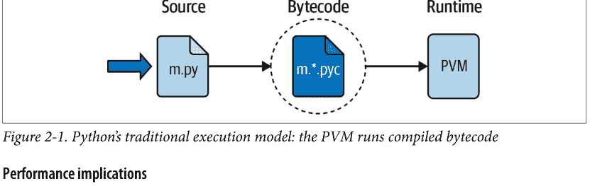

## 性能影响

具有C和C++等完全编译语言背景的读者可能会注意到Python模型中一些显著的差异。首先，Python工作中通常没有构建或“make”步骤：代码在编写后立即运行。其次，Python字节码不是二进制*机器码*（例如，针对Intel或ARM芯片的指令，称为CPU）：它是一种Python特定的格式。这些规则有例外情况（例如，智能手机应用构建可能需要一些时间，而且确实存在完全编译器，正如你将在后面看到的），但我们首先关注常见情况。

这些差异解释了为什么一些Python代码可能不如C或C++代码运行得快，如第1章所述——PVM循环，而不是CPU芯片，仍然必须解释字节码，而字节码指令比CPU指令需要更多的工作。另一方面，与经典解释器不同，仍然存在内部编译步骤——Python不需要反复重新分析和重新解析每个源语句的文本。最终效果是，纯Python代码的运行速度介于传统编译语言和传统解释语言之间。

## 开发影响

Python执行模型的另一个影响是，开发环境和执行环境之间实际上没有区别：编译和执行你源代码的系统实际上是同一个。这种相似性对于具有传统编译语言背景的读者可能更有意义，但在Python中，编译器始终在运行时存在，并且是运行程序系统的一部分。

这使得开发周期更加*快速*。无需在开始执行前进行预编译和链接；只需输入并运行代码。这也为语言增添了更加*动态*的特性——Python程序在运行时构建和执行其他Python程序是可能的，并且通常非常方便。例如，`eval`和`exec`内置函数接受并运行包含Python程序代码的字符串。这种结构也是Python适用于产品定制的原因——因为Python代码可以动态更改，用户可以在现场修改系统的Python部分，而无需编译甚至拥有系统的其余代码。

在更基本的层面上，请记住，在Python中我们真正拥有的只是*运行时*——根本没有初始的编译阶段，一切都发生在程序运行时。这甚至包括创建函数和类以及链接模块等操作。在更静态的语言中，这些事件通常在执行前发生，但在Python中发生在执行期间。正如你将看到的，这使得编程体验比一些读者可能习惯的更加动态。

> ### 为什么Python使用字节码？

鉴于字节码通常比机器码运行得慢，这是一个很好的问题。简短的回答是，Python使用字节码是为了开发速度和语言灵活性。

更详细地说，每个程序最终都必须作为机器码在主机设备的CPU上运行，但程序代码只是根据语言规则编写的文本。像C这样的传统语言通过约束代码以适应CPU的期望，并提前将代码文本翻译成机器码来弥合这一差距。这使得程序运行速度快，但翻译需要时间，并且生成的语言使用起来很笨拙。

Python则定义了一种易于使用的语言，这种语言与机器码相距甚远，无法直接翻译，并使用PVM中介在CPU上运行你程序的字节码。这是一个经典的性能与可用性之间的权衡，但也是一个错误的二分法：你将在后面遇到的许多替代实现确实将一些Python代码编译成机器码，即使使用PVM模型，Python对于许多角色来说也足够快。关于这种权衡的更多信息，请参阅第6页的“好吧，但缺点是什么？”。

## 执行模型变体

既然你已经研究了上一节描述的内部执行流程，你也应该知道它只反映了当今Python的标准实现，而不是Python语言本身的要求。因此，执行模型容易随时间变化。事实上，许多系统已经以某种方式修改了图2-1中的图景。在继续之前，让我们简要探讨这些变体中最突出的。

## Python实现替代方案

截至本文撰写时，Python语言有多种实现。尽管这些Python之间有很多思想和工作的交叉授粉，但每一个都是单独安装的软件系统，有其自己的项目和用户群。除了一个系统外，所有这些系统对于大多数Python初学者来说都是可选阅读，但快速了解它们如何修改执行模型可能有助于揭开运行代码的一般含义的神秘面纱。

简而言之，*CPython*是标准实现——我们到目前为止称之为“常见”版本。它是PC和智能手机上通常的Python，也是大多数读者将使用的系统（如果你不确定，这可能包括你）。这也是本书中使用的版本，尽管这里介绍的Python语言基础知识也适用于所有其他替代方案。所有其他Python实现都有特定的目标，可能实现也可能不实现CPython定义的完整Python语言，但足够接近，可以算作Python。

例如，*PyPy*是CPython的直接替代品，它通过在运行时进一步编译部分程序来更快地运行许多程序。*Jython*和*IronPython*则重新实现CPython以提供对Java和.NET组件的访问；尽管标准CPython程序也可以访问这些组件（例如，通过*pyjnius*和*Chaquopy*访问Java），但Jython和IronPython旨在更加无缝。其他选项加速数值代码，或一般代码。

更详细地说，以下列表简要概述了当今可用的最突出的Python实现——对于因篇幅而省略的当前选项，以及因缺乏水晶球而省略的未来选项，通常表示歉意：

- *CPython：标准*
Python的原始、标准和参考实现通常称为CPython，当你想将其与其他选项对比时（否则就简称为“Python”）。这个名字来源于它是用可移植的ANSI C语言代码编写的。这是你从*python.org*获取的用于PC的Python，从大多数替代发行版和Linux仓库获得的Python，以及在Android和iOS智能手机上的Python应用程序中内置的Python。这也是其实现如图2-1所示的版本，尽管这容易变化（事实上可能变化：见第25页的“未来可能性”）。

- *Jython：用于Java的Python*
Jython系统是Python语言的替代实现。它针对与Java编程语言的集成，就像CPython与C和C++组件集成一样。Jython由Java类组成，这些类将Python源代码编译成Java字节码，然后将其路由到Java虚拟机（JVM）。程序员仍然像往常一样在*.py*文本文件中编写Python语句；Jython系统本质上只是将图2-1中最右边的两个气泡替换为基于Java的等效物，以实现无缝的Java链接。截至本文撰写时，Jython实现了本书未使用的旧版Python 2.X，但正在向3.X努力。

- *IronPython：用于.NET的Python*
IronPython是Python的另一个替代实现。用C#编写，它旨在允许Python程序与为Microsoft的.NET Framework for Windows编写的应用程序以及Mono开源等效物集成。与Jython类似，IronPython将图2-1中的最后两个气泡替换为在.NET环境中执行的等效物。通过它，

## Stackless：面向并发的Python

Stackless Python系统是标准CPython语言的增强版本，专注于并发处理。由于它不在C语言调用栈上保存状态，Stackless使得Python更容易移植到小型栈架构。Stackless还提供了高效的多进程选项，一些用户认为这比CPython后来的异步协程更直观，并促进了新的编程结构。例如，游戏*EVE Online*使用Stackless Python来实现大规模并行任务的高性能。

## PyPy：用于加速的JIT编译器

PyPy是为速度而重新实现的Python。它是最早采用即时编译器处理普通Python代码的系统之一。JIT编译器只是PVM（图2-1中最右侧的气泡）的扩展，它将部分字节码直接转换为机器码以实现更快的执行。PyPy在程序运行时执行此操作，而非在预编译步骤中，并且能够通过跟踪程序处理对象的数据类型，为动态Python语言创建特定于类型的机器码。通过这种方式替换部分字节码，你的程序在执行过程中会运行得越来越快。此外，一些Python程序在PyPy下可能占用更少的内存。

## Numba：用于数值加速的JIT编译器

Numba的Python扩展添加了一个JIT编译器，通过在程序运行时将数值导向的代码直接编译为机器码来优化其性能。为了指导Numba的编译器，函数会使用Numba安装包提供的Python“@”装饰器进行增强。虽然并非所有Python代码都能通过Numba加速，但它对于使用*NumPy*数组和函数以及数学导向的循环的代码效果很好。Numba还支持科学编程中常用的代码并行化范式。

## Shed Skin：用于规范代码的AOT编译器

Shed Skin是一个预编译器，它将未经修饰的Python代码转换为C++代码，然后在运行前编译为机器码。使用AOT时，图2-1中最右侧的两个气泡被预编译的机器码取代。Shed Skin可以生成独立程序和用于其他程序的扩展模块。作为交换，它实现了Python的一个受限子集，要求Python变量满足隐式静态类型约束，并且目前不支持某些Python特性或库。尽管如此，对于某些规范代码，Shed Skin的性能可能优于CPython和基于JIT的选项。

## PyThran：用于数值加速的AOT编译器

PyThran为Python语言的一个子集实现了另一个AOT编译器，专注于科学编程。与Shed Skin类似，它将Python代码转换为C++，使用格式化注释或单独命令文件中提供的静态类型声明。编译生成的C++的结果是一个原生模块，可以被其他Python代码导入和使用。

## Cython：用于加速的Python/C混合语言

Cython系统定义了一种Python/C混合语言，它将Python代码与调用C函数以及使用C类型声明（用于变量、参数和类属性）的能力相结合。Cython代码可以被预编译为使用Python/C API的C代码，然后可以完全编译为机器码。虽然与标准Python不兼容，但Cython对于封装外部C库以及将系统中性能关键的部分实现为高效的C扩展（用于CPython程序）都很有用。

## MicroPython：用于受限环境的Python子集

MicroPython系统是一个专注于效率的替代Python实现。它实现了CPython语言的一个有限方言及其标准库的一个小子集，以优化Python在受限环境中的运行。虽然最初针对微控制器，但MicroPython也被编译用于第3章将介绍的WebAssembly系统，以支持在Web浏览器中运行Python程序，而无需完整的CPython。

## 以及（自然）更多

有关其他Python替代方案，请参阅Python维基上的列表以及网络搜索结果。在其他方案中，Cinder是Meta创建的、以性能为重点的CPython实现，带有JIT编译器等，用于Instagram；Pyston是Dropbox发起的CPython分支，带有JIT编译器和其他优化；Nuitka是一个免费和付费的优化AOT编译器，将标准Python代码转换为C，并被新兴的py2wasm用于将Python代码转换为WebAssembly以在浏览器中使用。

话虽如此，除非你有特定需求只能由某个替代方案满足，否则你可能还是想使用标准的CPython系统。因为它是该语言的参考实现，所以它总是最完整的，并且往往比其他方案更及时、更健壮。尽管如此，CPython不太可能涵盖Python世界中所有正在进行的优化项目，因此当你的目标明确时，请务必评估这些替代方案。

## 独立可执行文件

有时，当人们要求一个“真正的”Python编译器时，他们实际上寻求的只是从他们的Python程序生成独立可执行文件的方法。这更多是一个打包和分发的主题，而非执行流程的概念——对软件开发者比对Python初学者更感兴趣——但它是一个相关的概念。

简而言之，在可以从网上获取的第三方工具的帮助下，可以将你的Python程序转换为真正的独立可执行文件，在Python世界中有时也称为冻结二进制文件。无论它们叫什么，这些程序都可以在不需要Python安装或分发源代码文件的情况下运行。

独立可执行文件将你的程序文件的字节码、PVM（解释器）以及你的程序所需的所有Python支持文件和库打包到一个单独的包中。这个主题有一些变体，但最终结果可以是一个单独的可执行文件（例如，Windows上的.exe文件）或应用程序（例如，macOS上的.app，Android上的.apk或.aab），可以轻松地分发给客户。在图2-1中，就好像最右边的两个气泡——字节码和PVM——被合并成一个组件：一个独立的可执行文件包。

如今，各种系统都能够生成独立可执行文件，并且在平台和功能上各不相同。例如，py2exe为Windows构建独立程序；PyInstaller和cx_freeze为Windows、macOS和Linux制作它们；py2app为macOS创建它们；Buildozer和Briefcase为Android和iOS生成应用程序。

冻结二进制文件与真正编译器的输出不同——它们通过虚拟机运行字节码。因此，除了可能的启动改进外，冻结二进制文件的运行速度与原始源文件相同。冻结二进制文件通常也不小（它们包含一个PVM），但按照当前标准，它们也不算异常大。然而，由于Python被嵌入到冻结包中，因此接收端无需安装Python即可运行你的程序。此外，由于你的字节码被嵌入到包中，它就不那么容易被查看。

更多详情，请参阅本书附录A中关于独立程序的替代介绍，其中包括从同一代码库在多个平台上构建它们的技巧。

## 未来可能性

最后，请注意，这里概述的运行时执行模型实际上是当前Python实现的产物，而非语言本身。例如，在本书的生命周期内，可能会出现一个将不受限制且未经修饰的Python源代码转换为机器码的AOT编译器（尽管三十多年来一直没有出现，这似乎不太可能！），而JIT编译器似乎正在遍地开花。

无论如何，字节码模型可能在未来一段时间内仍将是标准。字节码的可移植性和灵活性是许多Python系统的重要特性。此外，添加类型约束声明以支持静态编译将破坏我们即将探讨的Python编码的大部分灵活性、简洁性、简单性和精神。Python的类型提示（稍后也会介绍）接近这一点，但值得庆幸的是，Python本身目前仍未使用它。


JIT未来主义：虽然CPython目前遵循图2-1中的字节码/PVM模型，但未来可能会对其进行增强。在撰写本文时仍在开发中的3.13版本将添加一个实验性的JIT编译器。与PyPy和其他系统一样，这将在程序运行时将部分字节码直接转换为机器码。在3.13中，它将带来可忽略不计的速度提升，并且默认情况下是禁用的。尽管在出版中预知是危险的，但如果JIT编译器最终能为Python程序带来显著的净收益，未来可能会在CPython中默认启用。

## 章节总结

本章介绍了Python的执行模型——Python如何运行你的程序——并探讨了该模型的一些常见变体，这些变体旨在适应不同的角色和更好的性能。虽然你实际上不需要深入了解Python内部机制来编写Python脚本，但对本章主题的初步了解将帮助你在开始编码时（如下一章所示）真正理解你的程序是如何运行的。不过，首先，这里是通常的章节测验，以回顾你到目前为止所学的内容。

## 测试你的知识：测验

1.  什么是Python解释器？
2.  什么是源代码？
3.  什么是字节码？
4.  什么是PVM？
5.  什么是机器码？
6.  列出Python标准执行模型的两个或更多变体。
7.  CPython、Jython和IronPython有什么不同？
8.  什么是PyPy、Shed Skin和Cython？

## 测试你的知识：答案

1.  Python 解释器是运行你编写的 Python 程序的程序。它本质上在你的 Python 指令和 CPU 的机器码之间充当媒介。
2.  源代码是你为程序编写的语句。它由文本文件中的文本组成，这些文件的名称通常以 `.py` 扩展名结尾。
3.  字节码是 Python 编译你的程序后生成的低级形式。Python 会在可能的情况下自动将字节码存储在扩展名为 `.pyc` 的文件中，并在需要时自动重新创建它。
4.  PVM 是 Python 虚拟机——Python 的运行时引擎，它解释你编译后的字节码。
5.  机器码是计算设备（如 PC 或手机）底层 CPU 的低级指令。因为这是每个程序最终运行的形式，所以 Python 代码必须通过像 PVM 解释器、JIT 或 AOT 编译器这样的软件层翻译成机器码。
6.  Numba、Shed Skin 和独立可执行文件都是执行模型的变体。此外，接下来两个答案中提到的 Python 替代实现也以某种方式修改了该模型——通过替换字节码和虚拟机，或通过添加 JIT 和 AOT 编译器。
7.  CPython 是该语言的标准和参考实现。Jython 和 IronPython 分别处理 Python 程序以用于 Java 和 .NET 环境；它们是 Python 的替代编译器。
8.  PyPy 和 Shed Skin 是针对速度的 Python 重新实现。PyPy 通过使用运行时类型信息和 JIT 编译器，在程序运行时将部分 Python 字节码替换为机器码，从而加速普通的 Python 程序。Shed Skin 使用 AOT 编译器加速程序，该编译器将 Python 的受限子集翻译成 C++，然后可以完全编译成机器码，作为程序运行或在其他程序中使用。Cython 是一种 Python/C 组合，可以编译成可被 CPython 代码访问的机器码扩展。

# 第 3 章

## 如何运行程序

好了，是时候开始运行一些代码了。既然你已经了解了 Python 的用途和执行模型，你终于可以开始一些真正的 Python 编程了。

有多种方法可以告诉 Python 执行你输入的代码，本章涵盖了当今使用的所有主要程序启动技术。在此过程中，你将学习如何*交互式*运行代码，以及如何将其保存在*文件*中，并使用各种技术运行——通过命令行、图标点击、IDLE 图形界面、移动应用、基于 Web 的界面、模块导入等等。

至于上一章，如果你有编程经验并渴望开始深入研究 Python 本身，你可能想略读本章并继续学习[第 4 章](#)。但不要跳过本章早期对预备知识和约定的介绍、对调试技术的概述，或者对模块*导入*的初步介绍——这是理解 Python 程序架构的关键主题，我们直到[第 5 部分](#)才会再次讨论。浏览关于 IDE 和应用程序的部分也是值得的，可以了解一些在你开始编写更大程序时可能更有用的工具。

## 安装 Python

本书通常假设你可以在你的电脑、平板电脑或手机上访问最新版本的 Python。本书不需要安装 Python，在某些情况下也不是必需的，但你需要一个 Python 来跟随示例练习并完成每部分末尾的练习，这两者都是使概念更具体的好方法。

如果你没有 Python 并希望设置一个，请立即参阅[附录 A](#) 获取各平台的安装帮助。简而言之：

- *Windows* 和 *macOS* 用户获取并运行一个自安装的可执行文件，将 Python 安装到他们的设备上。只需双击并在所有提示中选择“是”或“下一步”。
- *Linux*（包括 Windows WSL）用户的计算机上可能预装了可用的 Python，但如果需要或希望，可以从其发行版的软件仓库中安装一个。
- *Android* 和 *iOS* 用户安装一个应用程序，允许他们在手机和平板电脑上本地运行 Python。
- *Unix*（以及一些 Linux）用户通常从完整的源代码分发包编译 Python。

例如，智能手机用户在应用商店获取 Python 应用程序，Windows 和 macOS PC 用户在 Python 主网站的下载页面获取安装程序。Python 也可以通过其他分发渠道获得，前面涵盖的一些 Python 编码模式，如 Jupyter notebooks，有独特的安装和使用步骤。在某些情况下，你可能无法选择 Python 版本，但本书使用 Python 3.12，所以越接近这个版本越好。

在安装之前，你通常应该检查 Python 是否已经存在。在 Windows 上，可以在“开始”菜单中查找它；在大多数平台上，可以通过运行 Python 命令行来查找，如附录 A 和本章下一节所述。为了了解如何操作，让我们假设安装已经完成，继续学习运行 Python 代码的多种方式。

## 交互式代码

本节让我们开始学习交互式 Python 编码的基础知识。因为这是我们第一次运行代码，我们还将在此介绍一些启动后勤工作，例如设置工作目录，所以如果你是编程新手，请务必先阅读本节。本节还解释了本书中使用的一些约定，因此大多数读者至少应该快速浏览一下。

## 启动交互式 REPL

在大多数情况下，运行 Python 代码最简单的方法是在 Python 的交互式命令行（有时称为交互式提示符，通常更简洁地标记为 REPL，代表读取-求值-打印循环）中输入代码。

有多种方法可以启动这个命令行——在编码图形界面或应用程序中、在 Web 笔记本中、从系统控制台等等。假设 Python 已作为可执行程序本地安装在你的设备上，启动交互式解释器会话最平台中立的方法是简单地在你的设备控制台提示符下输入一个 Python 命令，不带任何参数。由于这是最常见的、几乎通用的，并且可以说是最简单的方法，让我们从这里开始。

尽管这个方案具有通用性，但你将输入的 Python 命令以及输入的位置因平台而异。例如，在 Windows、macOS 和 Android 上，`py`、`python3` 和 `python` 分别可以完成此工作，如下所示：

```
$ py
Python 3.12.3 (..., Apr  9 2024, 14:05:25) [MSC v.1938 64 bit (AMD64)] on win32
Type "help", "copyright", "credits" or "license" for more information.
>>> ^Z

$ python3
Python 3.12.2 (..., Feb  6 2024, 17:02:06) [Clang 13.0.0..] on darwin
Type "help", "copyright", "credits" or "license" for more information.
>>> ^D

$ python
Python 3.11.4 (..., Jul  2 2023, 11:17:00) [Clang 14.0.7..] on linux
Type "help", "copyright", "credits" or "license" for more information.
>>> ^D
```

如果你想将此简化为一个例外——Windows 的 `py`，那么 `python3` 在 Android 和 Linux 上也可以工作。本书在平台中立的示例中使用 `python3`，因为它几乎在所有地方都有效。如果你在 Windows 上工作，请改用 `py`（或 `py -3` 以确保是 Python 3.X）；`python3` 在 Windows 上也可以工作，但根据附录 A，目前保留给较少使用的 Store 安装。同样根据该附录，所有这些命令都必须在你的系统搜索路径（通常称为 PATH）上，如果不在，则需要完整路径名，但大多数安装会自动设置。

在系统提示符下像这样输入 Python 命令会启动一个交互式 Python 会话（即 REPL）。这里列表开头的 `$` 字符代表本书中所有平台上的通用系统提示符——它在你的设备上可能有所不同，并且不是你自己输入的内容。在 *Windows* 上，`Ctrl+Z` 组合键（后跟 Enter）结束此会话，如图所示；在 *Unix*（包括 macOS、Linux 和 Android）上，则是 `Ctrl+D`。

你会注意到交互式提示符以一条消息开头，该消息标识了正在使用的 Python（例如，“3.12.3”是 Python 3.12）和它运行的平台（例如，“win32”代表 Windows，“darwin”代表 macOS，“linux”在 Python 3.12 中代表 Linux 和 Android），后面是一行提供更多信息的提示。我们将在本书中省略这些开头的行，除非它们有帮助。

系统提示符（又名 *shell* 或 *console*）的概念是通用的，你可以在其中输入 Python 命令，但具体如何访问它因平台而异。在 Windows 上，它可能是 *Command Prompt* 或 *PowerShell*；在 macOS 和 Linux 上是 *Terminal*；在 Android 上是 *Termux* 应用程序；或者在某些应用程序（如 *Pydroid 3*）中的专用终端屏幕。

在大多数平台上，你也可以通过根本不需要输入命令的方式启动交互式会话，但它们的变化更大。例如，在 *Windows* 上，“开始”菜单选项会打开一个类似的 REPL，所有 PC 上的 IDLE 图形界面、Android 和 iOS 上应用程序中的专用屏幕以及一些 Web 浏览器界面也是如此。我们将在前面介绍其中一些选项，但更多平台提示请参见**附录 A**，更多其他选项的帮助请上网查找。

然而，无论你在哪里看到 `>>>` 提示符，你都处于交互式 Python 会话和 REPL 中——你可以在这里输入任何 Python 语句或表达式，并通过简单地按 Enter 键（或类似按钮）立即运行它。我们稍后会这样做，但首先我们需要整理一些管理细节，以确保所有读者都准备就绪。

## 在哪里运行：代码文件夹

既然你已经开始学习*如何*运行代码，你还需要知道*在哪里*运行代码。你可以在任何可以创建文件的地方保存和运行代码，但本书对使用其示例有两条建议，特别是对新手：

- 在专用的代码文件夹中工作
  为避免覆盖其他内容，请从你设备上的专用代码*文件夹*（又名目录）运行本书的示例。例如，本书在每个设备上的用户帐户（或“主目录”）文件夹中嵌套的一个文件夹中运行所有代码。你的代码文件夹可以位于你喜欢的任何地方，并可以命名为任何你喜欢的名称，但从一个文件夹运行将帮助你跟踪工作并简化一些任务。

- 在代码文件夹的每章子文件夹中工作
  为避免混乱和文件名冲突，还要将你的代码组织到每章的*子文件夹*中，嵌套在你的专用代码文件夹中。每章子文件夹将确保示例中的*导入*无需高级设置（你将在后面学习）即可工作。关于导入和目录的更多信息将在接下来的注释中介绍。现在，请记住本书中的控制台命令将隐式地在主机上的专用代码文件夹的每章子文件夹中运行。为了平台中立性，通常会省略文件夹名称，并且它与代码无关。

如果你打算使用本书的*示例包*，它已经为你完成了设置工作。例如，解压示例会创建一个名为*LP6E*的代码文件夹，其*Chapter03*子文件夹包含本章的代码。如果你打算使用此包来避免输入代码或从电子媒体复制，只需在你正在学习的章节子文件夹中运行其示例。这就是启动REPL和运行脚本文件的地方。正如你稍后将了解到的，除非脚本使用带有明确文件夹路径的文件名，否则我们脚本创建的*数据文件*也会出现在这里。

如果你打算自己创建代码，在我们继续之前，你可能应该*创建*一个类似的代码目录结构。在PC上，使用系统的文件资源管理器，或运行命令行：`mkdir folder`在Windows和Unix上都有效。在Android上，你也可以使用文件资源管理器（或在Termux中使用`mkdir`），但请确保选择一个你的Python应用可以访问的文件夹。一些编码界面可能提供其他创建文件夹的方法；请参阅你的工具了解信息。

一旦你为每章设置好了代码文件夹，始终从那里*开始*编写、保存和运行本书中的示例。你如何做到这一点取决于你的使用模式。在控制台中，一个便携式的`cd folder`命令可以更改目录。在像IDLE这样的图形用户界面中，打开和运行文件可能会进入其文件夹。在其他界面中，你可能在用户界面中为文件启动REPL，或者使用其他此处无法涵盖的各种方案。作为后备，你很快会遇到的Python的`os.getcwd()`会显示当前目录，而其`os.chdir('path')`会更改它——只要你先导入了os。

## 不要输入什么：提示符和注释

说到命令，记住不要输入本书命令行开头用于表示系统控制台提示符的`$`字符；只输入这些提示符*之后*的文本。对于经验丰富的程序员来说，这听起来可能很简单，但这是初学者非常常见的第一个错误，我们这里不排除任何人。

同样，不要输入解释器交互列表中行首显示的`>>>`和`...`提示符字符，本书用它们表示在REPL中运行的代码；只输入这些提示符*之后*的文本。这些是Python标准REPL自动显示的提示符，作为交互式代码输入的视觉指南，它们可能会也可能不会出现在你的界面中。例如，`...`提示符在某些REPL中用于*续行*，但在IDLE中只是一个标签，并且本书的一些列表为了便于复制/粘贴而省略了它；无论哪种方式，都不要自己输入它。

为了帮助你记住这一点，本书中你必须输入的用户输入以**粗体**显示，而提示符则不是。还要记住，在这些系统和Python提示符之后输入的命令旨在立即运行，通常不打算保存在我们将要创建的源文件中；你稍后会明白为什么这个区别很重要。

同样地，你通常不需要输入本书代码列表中以`#`字符开头的文本——正如你稍后将了解到的，这些是*注释*，不是可执行代码。除非`#`用于在脚本顶部引入`#!`指令，否则你可以安全地省略它及其后的整行内容（关于`#!`的更多信息，请参见[附录A](#)）。

## 其他Python REPL

说了这么多，你还应该知道Python REPL也可以在那些使本章涵盖的传统模型复杂化的系统中找到。例如，*IPython*提供了一个替代的、单独安装的、增强的Python交互式会话，它按数字标记命令，不使用`>>>`提示符。*Jupyter*笔记本也提供IPython REPL，并在Web浏览器中运行它，而不是系统控制台（我们将在本章后面探讨Jupyter）。

更复杂的是，[第2章](#)的*PyPy*系统使用`>>>>`作为其REPL提示符，以区别于CPython的三字符`>>>`（尽管你可能需要仔细观察才能分辨）；前面涵盖的*IDLE*图形用户界面在侧面显示`>>>`（而不是在系统控制台中）；智能手机*应用*也可能有所不同（参见[附录A](#)）；从技术上讲，交互式提示符可以更改为任何内容（根据Python文档，它对你的代码来说是`sys.ps1`，可以在启动文件中设置）。

所有这些都意味着你的Python交互式会话可能与本章经常使用的主流模型有所不同。根据你的工具和目标，你可能会看到不同的提示符或根本没有提示符，并且你可能会在Web浏览器、图形用户界面或应用中输入交互式Python代码，而不是在系统控制台中。

不过，总的来说，本书建议在你刚开始时使用它演示和涵盖的传统且更简单的选项。例如，IPython和Jupyter有自己的学习曲线，而Jupyter是面向科学工作的，这只是Python众多角色之一。如果你选择使用像这样的替代编码界面，以及未来肯定会涌现的其他界面，请根据需要推断它们REPL的细微差别。


*REPL未来主义：* 标准CPython计划在3.13版本中改进其交互式REPL界面，该版本在本书撰写时尚未发布。根据计划，REPL将获得彩色提示符、自动缩进、多行编辑和粘贴，以及从其他用户界面和IDE借鉴的彩色异常。当然，颜色在本书的印刷版中并不重要，未来尚未书写，但当你读到这条说明时，一个更加多彩的未来可能已经到来。

提示：如果你觉得未来的功能令人分心，可以将环境变量`PYTHON_COLORS`设置为0来禁用新的REPL颜色。

## 交互式运行代码

解决了这些初步问题后，让我们继续输入一些实际的代码。无论以何种方式启动，Python交互式会话都以打印一些信息性文本开始（同样，此后大部分被省略），然后在等待你输入新的Python语句或表达式时，用`>>>`（或类似符号）提示输入。

在交互式工作时，你的代码结果会在你按下Enter键（或类似键）后显示在`>>>`输入行下方。例如，以下是两个Python `print`语句的结果：

```
$ python3
>>> print('Hello world!')
Hello world!
>>> print(2 ** 8)
256
```

就是这样——我们刚刚运行了一些Python代码（虽然不多，但证明了这一点）。我们现在仍然跳过大部分代码细节，但简而言之，`print`是一个内置工具，它将一行显示你传递给它的内容，发送到你正在工作的地方；因为它在Python中是一个*函数调用*，所以这段代码中的括号是必需的。我们在这里用它来显示一个Python字符串和一个整数，如每个`>>>`输入行后出现的输出行所示。

像这样交互式编码时，你可以输入任意数量的Python命令；每个命令在输入后立即运行。此外，由于交互式会话会自动打印你输入的表达式的结果，你通常不需要在这个提示符下显式地说“print”；以下自动显示的格式可能与print略有不同，但现在了解如何操作并不重要：

```
>>> language = 'Python'
>>> language
'Python'
>>> 2 ** 8
256
>>> ^Z
$
```

### 使用Ctrl-D（在Unix上）或Ctrl-Z（在Windows上）退出

在这里，第一行通过将值赋给变量（language）来保存一个值，该变量由=赋值创建；最后输入的两行是表达式（language和2 ** 8），它们的结果会自动显示。同样，要退出这样的交互式会话并返回系统提示符，在类Unix机器上按Ctrl+D，在Windows上按Ctrl+Z。在稍后讨论的IDLE图形用户界面中，可以在任何地方按Ctrl+D，或者直接关闭窗口。

注意这个列表右侧关于此的斜体注释——这里以#开头。本书在这些地方添加了关于正在说明的内容的注释，但你不需要自己输入这些文本；如果你输入了，Python会将它们作为注释忽略。事实上，就像系统$和Python >>>提示符一样，当它在系统命令行上时，你不应该输入这个；#...部分被Python忽略，但在系统shell中可能是一个错误。

现在，我们在这个会话的代码中没做多少——只输入了一些Python print和赋值语句，以及一些表达式，所有这些我们稍后都会详细研究。主要要注意的是，Python REPL在按下Enter键（或类似键）时立即执行每行输入的代码。

例如，当我们在>>>提示符下输入第一个print语句时，输出（一个Python字符串）立即被回显。无需创建源代码文件，也无需像使用C或C++等语言时通常那样先通过编译器和链接器运行代码。严格来说，交互式代码在内存中被编译成字节码，并由CPython中的PVM运行（参见第2章），但你不需要关心。

正如你将在后面的章节中看到的，你也可以在交互式提示符下运行多行语句（例如，for循环）；这样的语句可能会用...提示续行，如前所述，并在你输入所有行并按两次Enter键添加空行后立即运行。在代码文件中不需要空行（并且会被忽略），但需要让一些REPL知道你的语句已完成。另外，请记住，当前和标准的REPL一次只运行一个语句——不要在其提示符下粘贴大段代码块！

## 为什么使用交互式提示符？

交互式提示符在你输入时运行代码并回显结果，但它不会将你的代码保存在文件中。虽然这意味着你不会在交互式会话中完成大部分实际编码工作，但交互式提示符被证明是学习语言和即时测试程序文件的好地方。以下是这些角色的快速概述。

### 学习

因为它立即执行代码，交互式提示符非常适合试验代码和学习语言，我们将在本书中一直使用它来演示较小的示例并强化概念。事实上，这是要记住的第一个经验法则：如果你对如何一段Python代码如何工作，启动交互式命令行并尝试运行代码以观察结果。

例如，假设你正在阅读一个Python程序的代码，遇到了一个像 `'Hack!' * 8` 这样的表达式，但你不理解它的含义。此时，你可以花10分钟查阅手册、书籍和网络来试图弄清楚代码的作用，或者你可以简单地在交互式环境中运行它：

```
$ python3
>>> 'Hack!' * 8
'Hack!Hack!Hack!Hack!Hack!Hack!Hack!Hack!'
```

你在交互式提示符下获得的这种即时反馈，通常是推断一段代码作用的最快方式。这里，很明显它执行的是字符串重复：在Python中，`*` 对数字表示乘法，但对字符串表示重复——它就像将一个字符串与自身反复拼接（关于字符串的更多内容将在第4章介绍）。

通过这种方式进行实验，你不太可能破坏任何东西——至少，目前还不会。要造成真正的损害，比如删除文件和运行shell命令，你必须通过显式导入模块来真正尝试（我们将在本章稍后介绍一些能让你变得如此“危险”的工具）。然而，纯Python代码几乎总是可以安全运行的。

例如，看看当你在交互式提示符下*犯错*时会发生什么：

```
>>> X
Traceback (most recent call last):
  File "<stdin>", line 1, in <module>
NameError: name 'X' is not defined
```

在Python中，在变量被赋值之前使用它总是一个错误——否则，如果名称被默认值填充，一些错误可能直到为时已晚才会被发现。这意味着你必须在累加计数器之前将其初始化为零，在扩展列表之前将其初始化为空，等等。在Python中你不需要声明变量，但它们必须在你获取其值之前被赋值。

如今，Python中的其他错误消息试图通过“Did you...?”提示来提供更有用的帮助——就像前面提到的寻找 `sys.ps1` 提示符钩子一样。你必须在使用 `sys` 等模块之前导入它们（尽管你可能很快就不需要这个提醒了，而且为了简洁，我们将在本书中截断一些错误消息）：

```
>>> sys.ps1
Traceback (most recent call last):
  File "<stdin>", line 1, in <module>
NameError: name 'sys' is not defined. Did you forget to import 'sys'?
```

你将在后面学到更多关于这些内容。这里的关键点是，当你以这种方式犯错时，你不会*崩溃*Python或你的计算机。相反，你会得到一个有意义的错误消息，指出错误以及导致错误的代码行，你可以继续你的会话或脚本。事实上，一旦你熟悉了Python，它的错误消息可能经常提供你所需的调试支持（关于调试选项的更多信息，请参见第49页的侧边栏“调试Python代码”）。

# 测试

除了作为你在学习语言时进行实验的工具外，交互式解释器也是测试你在文件中编写的代码的理想场所。你可以交互式地导入你的模块文件，并通过在交互式提示符下即时输入调用来测试它们定义的工具。

例如，以下测试了Python标准库中预编码模块中的一个函数（细节：`os.getcwd` 打印你当前工作目录的名称，这里是在macOS主机上），但一旦你开始编写自己的模块文件，你也可以做同样的事情：

```
>>> import os
>>> os.getcwd()                # Testing on the fly
'/Users/me/code'
```

更一般地说，交互式提示符是测试程序组件的地方，无论它们的来源如何——你可以导入并测试Python文件中的函数和类，输入对链接的C函数的调用，在Jython下使用Java类，等等。部分由于其交互特性，Python支持一种实验性和探索性的编程风格，你会发现这很方便。尽管Python程序员也使用文件内代码进行测试（你将在本书后面学习使这变得简单的方法），但对许多人来说，交互式提示符仍然是他们测试的第一道防线。

## 程序文件

尽管交互式提示符非常适合实验和测试，但它有一个很大的缺点：你在那里输入的程序在Python解释器执行后就会消失。因为你交互式输入的代码从未存储在文件中，所以你无法在不重新输入的情况下再次运行它。剪切粘贴和命令回忆在这里可以提供一些帮助，但作用不大，尤其是当你开始编写较大的程序时。要从交互式会话中剪切粘贴代码，你必须编辑掉Python提示符、程序输出等等——这太繁琐了，不值得尝试。

要永久保存程序，你需要将代码写入*文件*，这些文件通常被称为*模块*。模块只是包含Python语句的文本文件。一旦它们被编码，你可以要求Python解释器以多种方式——通过系统命令行、通过文件图标点击、通过IDLE用户界面中的选项等等——多次执行该文件中的语句。无论以何种方式运行，Python每次运行模块文件时都会从上到下执行其中的所有代码。

这个领域的术语可能因角色而异。例如，模块文件在Python中通常被称为*程序*——也就是说，一个程序被认为是一系列预编码的语句，存储在文件中以供重复执行。直接运行的模块文件有时也被称为*脚本*——一个非正式术语，通常指顶层程序文件。有些人保留*模块*一词指代从另一个文件导入的文件，而*脚本*指代程序的主文件；我们通常也会在这里这样使用（请继续关注本章后面关于顶层、导入和主文件含义的更多内容）。

无论你如何称呼它们，接下来的几节将探讨运行输入到文件中的代码的方法。在本节中，你将学习如何以最基本和可移植的方式运行文件：通过在你的计算机系统提示符下输入的Python*命令行*中列出它们的名称。尽管这对某些人来说可能显得原始——并且通常可以通过使用后面讨论的替代方案来完全避免——但对许多程序员来说，用于命令行的系统控制台窗口加上文本编辑器窗口，就构成了他们所需的全部集成开发环境，并提供了对程序更直接的控制。

## 第一个脚本

让我们开始吧。打开你最喜欢的文本编辑器，将示例3-1中的语句输入或复制/粘贴到一个名为 *script1.py* 的新文本文件中，并将其保存在你之前设置的工作代码目录中（如果你跳过了那一步，现在就创建它）。任何编辑器都可以，包括vi、Notepad、智能手机应用的编辑器以及即将介绍的IDLE GUI。你也可以在本书示例包中找到这个文件，但输入代码在早期是一个重要的练习。

示例 3-1. script1.py

```
# A first Python script
import sys                # Load a library module
print(sys.platform)       # Print platform name
print(2 ** 100)           # Raise 2 to a power
x = 'Hack!'
print(x * 8)              # String repetition
```

这个文件是我们第一个正式的Python脚本（不包括第2章中的两行脚本）。你现在还不必太担心这个文件的内容，但简要描述一下，它的代码：

- 导入一个Python模块（额外工具的库）以获取平台的名称
- 运行三个 `print` 函数调用来显示脚本的结果
- 使用一个名为 `x` 的变量（在赋值时创建）来保存一个字符串对象
- 应用各种对象操作，我们将在下一章开始探索这些操作

这里的 `sys.platform` 只是一个标识你正在使用的计算机类型的字符串；它存在于一个名为 `sys` 的Python模块中（其标准库的一部分），你必须导入它才能加载（同样，关于导入的更多内容稍后介绍）。还要注意这个文件如何使用显式的 `print` 调用；与REPL不同，文件中的输出永远不会自动显示，所以你必须在文件中使用 `print` 才能看到它们的输出（忘记这一点是一个常见的初学者错误，但至少你已经被警告过了！）。

为了增加趣味性，这个文件添加了一些Python注释——`#` 字符后面的文本。这些之前已经提到过，但现在它们出现在脚本中，应该更正式一些。注释可以单独出现在行上，也可以出现在一行代码的右侧。`#` 后面的文本只是作为人类可读的注释被忽略，不被视为语句语法的一部分。如果你正在复制这段代码，你可以忽略注释；它们只是提供信息。本书使用不同的格式样式使注释在视觉上更突出，但在你的代码中它们将是普通文本。

再次强调，现在不要关注这个文件中代码的语法；你将在后面学到所有这些。需要注意的主要点是，你将这段代码输入到了文件中，而不是在交互式提示符下。在这个过程中，你编写了一个功能齐全的Python脚本。

不过，请注意，模块文件被命名为 `script1.py`。对于所有顶层文件（即直接运行的文件），它也可以简单地命名为 `script1`，但你想在另一个文件或REPL中导入的代码文件必须以 `.py` 后缀结尾。因为你将来可能想要导入它们，所以为你编写的大多数Python文件使用 `.py` 后缀是一个好主意。此外，一些文本编辑器和文件资源管理器通过 `.py` 后缀来检测Python文件；如果后缀不存在，你可能无法在编辑器中获得语法高亮和自动缩进等功能，或者在资源管理器中无法点击运行。

## 使用命令行运行文件

一旦你保存了上一节的文本文件，你可以通过将完整文件名作为Python命令的第一个参数来要求Python运行它——就像下面在Unix设备的系统shell的 `$` 提示符下输入的那样（但不要在Python REPL提示符下输入这个，如果这对你来说不能立即工作，请继续阅读下一段）：

## 命令行使用变体

当你输入命令来运行一个Python代码文件时，你输入的命令是由系统*shell*程序（例如Unix上的*Bash*）执行的。因此，shell的所有语法都可以用于更自定义的运行。例如，你可以使用特殊的shell语法，将Python脚本的打印输出重定向到一个文件，以便保存供以后使用或检查：

```
$ python3 script1.py > saveit.txt
```

在这种情况下，先前运行中显示的三行输出被存储在文件*saveit.txt*中，而不是被打印出来。这通常被称为*流重定向*；它适用于输出（>）和输入（<）文本，并且在Windows和类Unix系统上都可用。这对于测试很有用，因为你可以编写程序来监视其他程序输出的变化。不过，这与Python关系不大（Python只是支持它），所以我们在这里将跳过关于shell重定向语法的更多细节。重定向仅适用于命令行，因为它是系统shell的功能。

在*Windows*上，你也可以只输入脚本的*名称*而省略Python本身的名称。因为Windows使用文件名关联来查找运行文件的程序，所以文件名就足以运行一个.py文件。例如，以下命令在Windows上将自动由Python运行（技术上，由[附录A](#)中描述的Python的py Windows启动器运行）：

```
$ script1.py
```

这就像你在文件资源管理器中点击文件图标一样工作（一种稍后介绍的启动模式）。这里有一个细节：命令提示符在自己的窗口中以这种方式运行程序，但PowerShell可能不会；如果需要，在后者中使用py来查看未重定向的输出（或者使用稍后介绍的点击图标调用`input()`的技巧）。

最后，如果你的脚本文件位于与你当前工作目录不同的目录中，请记住提供脚本文件的完整路径。例如，以下在Windows PowerShell中运行的py Python命令，假设Python在你的系统路径中，但运行位于其他位置的文件：

```
PS C:\Users\me\code> cd D:\temp\savecode          # 转到不同的文件夹
PS D:\temp\savecode> py C:\Users\me\code\script1.py  # 运行其他位置的脚本
win32
1267650600228229401496703205376
Hack!Hack!Hack!Hack!Hack!Hack!Hack!Hack!
```

如果你的PATH不包含Python的目录，并且Python和你的脚本文件都不在你当前的工作目录中，那么请为两者都使用完整路径——就像下面在macOS上的例子，为了保险起见，还加入了将输出流重定向到当前工作目录（运行此命令时你所在的位置）之外的文件：

```
$ /usr/local/bin/python3 /Users/me/code/script1.py > /Users/me/data/saveit.py
```

这需要输入很多内容，但也是极端且非典型的情况。为了让你的命令比这更简单，请确保Python在你的PATH中，并首先`cd`到脚本或数据文件夹。同样，大多数安装会自动设置PATH，因此在运行命令时，你只需要关注脚本和数据文件夹。

## 运行文件的其他方式

如果你不喜欢命令行，通常可以通过点击文件图标、使用开发GUI以及其他因平台和角色而异的方案来启动Python脚本，从而避免使用命令行。本书通常建议学习者使用命令行，因为它既简单，又是一种常见、通用、可移植且强大的运行代码的方式。但这并不是必须的。虽然Python世界的选择太丰富，无法在此详尽介绍，但让我们快速浏览一下最突出的命令行替代方案，以结束本章。

## 点击和轻触文件图标

在大多数PC平台上，Python程序文件可以通过在本地文件资源管理器中简单地点击或轻触其文件名或图标来运行。例如，这在Windows的文件资源管理器中可以自动工作，这要归功于Python安装期间设置的文件名关联。在macOS的Finder中，如果设置为使用macOS安装中包含的Python启动器打开，点击也可以运行代码文件；当可用时，拖动到Python启动器应用程序与点击效果相同。

在Linux上，文件点击的情况更为复杂，文件可能需要可执行权限和一个以`#!`开头的行来指定Python。在智能手机上，在Android的文件资源管理器（或iOS的“文件”）中轻触文件名可能会在关联的Python应用程序中打开文件，但这可能只适用于某些资源管理器/应用程序组合，并且在某些情况下可能无法访问程序的所有文件。要了解更多，请查阅你的平台和应用程序文档，或在你的设备上进行实验。

另见附录A获取更多信息。如那里所述，Windows和Linux的点击不会在程序结束后保持窗口打开以查看输出和错误消息：如果一个脚本只是打印然后退出，那么，它就是打印然后退出——控制台窗口出现，文本在那里打印，但控制台窗口在程序退出时关闭并消失。根据附录A，在代码中添加对Python的`input()`的调用会强制在退出前暂停，以便你可以看到输出，但这对错误消息没有帮助。当这很重要时，请使用其他运行技术。

## IDLE图形用户界面

到目前为止，我们已经了解了如何使用交互式会话、系统命令行和图标点击来运行Python代码。如果你正在寻找更直观的东西，IDLE为Python编程提供了一个GUI，它是Python系统的一个标准且免费的部分。IDLE通常被称为集成开发环境（IDE），因为它将多个开发任务绑定到一个视图中。

简而言之，IDLE允许你编辑、运行、浏览和调试Python程序，所有这些都在同一个GUI中完成。因为它是用Python和tkinter GUI工具包编写的，所以它可以在所有Python PC平台——Windows、macOS和Linux上可移植地运行。对许多人来说，IDLE代表了输入命令行的易用替代方案，是点击图标更不易出错的替代方案，也是新手开始编辑和运行代码的好方法。你会牺牲一些控制权，但这通常只在你的Python生涯后期才变得重要。

IDLE的安装和启动在附录A中有介绍，因此我们不会在这里重复完整的细节。简而言之，它是Windows和macOS的python.org Python安装程序的标准部分，并且可以在Linux存储库中单独获取。安装后，可以使用常见的启动方式启动：Windows上的“开始”菜单、macOS上的Launchpad或Finder、Linux上的命令行，以及在支持的地方右键点击文件。

附录A还有截图，展示了IDLE在每个平台上的运行情况，但图3-1展示了它在Windows上的深色主题，既为了多样性也为了快速查看；如图所示，在顶部的编辑窗口中运行本章的示例3-1中的script1.py后，其输出出现在交互式Shell窗口中。

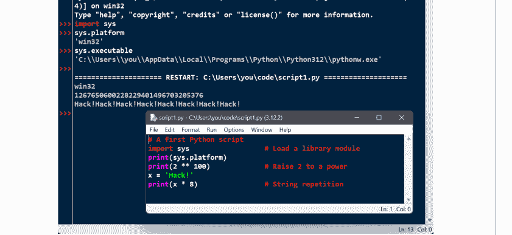

提示：由于 IDLE 只是标准库模块搜索路径上的一个 Python 脚本，因此你通常也可以在任何平台上、从任何目录运行它，只需在系统控制台窗口中输入以下 Python 命令（在 Windows 上，像往常一样使用 `py` 代替 `python3`）。Python 的 `-m` 标志只是使用常规导入搜索来定位模块，但将其作为顶级脚本运行（第五部分涵盖了此搜索以及此处所需的“.”包语法）：

```
$ python3 -m idlelib.idle    # 在包文件夹中查找并运行 idle.py
```

一旦 IDLE 启动，其用法就很简单，并在其程序内帮助文档中有记录。简而言之，Shell 窗口提供了带有命令回溯功能的常规交互式 REPL，每个编辑窗口允许你查看、修改和运行代码文件。Shell 的“文件→新建文件”和“文件→打开...”用于启动和打开代码文件。编辑窗口的“运行→运行模块”运行所选窗口中的代码，而“运行→运行...自定义”支持向脚本传递命令行参数（这超出了本文范围，并非完整的系统 shell，但对于期望这些参数的脚本很有用）。

IDLE 还有更多功能，但作为示例：它还在你输入代码时提供制表符补全、函数的弹出气泡帮助以及对象属性列表，并包含对象浏览器和 GUI 调试器。要使用 IDLE 的调试器，请在“调试”菜单中启用它，通过在编辑窗口中右键单击设置断点，然后运行。对于更简单的调试需求，可以在 Shell 窗口中右键单击任何错误消息的文本，以跳转到发生错误的代码行。

有关更多 IDLE 技巧，请参阅本书附录 A、IDLE 自身的帮助菜单，以及 Python 标准手册中“Python 设置和使用”中针对你平台的说明。与大多数 GUI 一样，学习 IDLE 的最佳方式可能是亲自试用。归根结底，其易用性对某些初学者可能至关重要，但它附带额外的学习曲线，不如命令行灵活，并且添加的“糖衣”在你的编程需求超出其范围时可能成为负面因素。一如既往，请在你附近的 PC 上自行验证。

## 其他 Python IDE

由于 IDLE 是免费的、可移植的，并且是 Python 的标准部分，如果你想使用 IDE，它是一个很好的入门开发工具。然而，对于 Python 开发者来说，还有一些替代 IDE，其中一些比 IDLE 强大和健壮得多。

在这些 IDE 中，PyCharm、PyDev、Wing、VSCode、Spyder 和 PyScripter 都附带了常规的编辑和运行 GUI，但有些添加了额外的高级工具，如代码重构和源代码控制集成。这些 IDE 也有主要的学习曲线，不建议大多数 Python 初学者使用。不过，你可能希望将其存档，以便在你掌握语言并转向工业级开发时，在 Python 职业生涯的后期使用。

## 智能手机应用

如果你在 Android 或 iOS 智能手机或平板电脑上运行本书的示例，你将使用一个应用程序。有些应用，如 Android 上的 Termux，附带传统的命令行，并支持我们见过的所有 REPL 和文件命令。但在其他应用中，你将通过应用用户界面中的设备（例如，按钮点击）来启动代码文件，而不是传统的命令行。这在本质上与在 IDLE 或其他 IDE 中运行代码没有太大不同，但由于细节因应用而异，请参阅附录 A 了解移动平台提示，以及你的应用文档以获取更多信息。

## 用于浏览器的 WebAssembly

尽管是一项新兴技术，但也可以在 Web 浏览器中运行 Python 代码。这目前由 *WebAssembly*（又名 *Wasm*）实现，它定义了一种可移植的字节码格式，由 Web 浏览器运行，就像 Python PVM 运行自己的字节码一样（参见第 2 章）。通过使用 *Emscripten* 等基于 LLVM 的编译器将 Python 解释器的源代码编译为这种格式，Web 浏览器能够运行 Python，从而运行你的 Python 程序。虽然过去其他在浏览器中运行 Python 的尝试大多失败了，但 WebAssembly 已被万维网联盟（W3C）标准化，并且已经得到所有主要桌面和移动 Web 浏览器的支持。

将 Python 本身编译为 Wasm 并非易事（对 Python 初学者来说要求太高），但 *Pyodide* 系统已经为你完成了大部分工作：它是 CPython 到 WebAssembly/Emscripten 平台的移植版本，已编译并准备运行，并具有用于访问浏览器文档对象模型（DOM）和 Web API 的 JavaScript 集成。要在网页中使用 Pyodide，你需要从服务器加载它并在浏览器中初始化，使用一个使用提供的 JavaScript 代码和 API 工具的 HTML 文档。最终结果可以在 Web 浏览器中运行许多 Python 程序，无需本地安装。

这种模式的主要缺点似乎是*速度*和*实用性*。下载编译后的 CPython 解释器在浏览器中运行 Python 脚本并不快，而且在此上下文中 Python 脚本的速度可能有所不同。此外，Pyodide 附带了一套固定的 Python 工具，而由浏览器运行的 Python 脚本位于沙箱中，对主机设备上的工具和资源的访问有限。例如，持久性存储可能支持 POSIX 文件调用和路径，但在此上下文中是虚拟的，并且最终受限于浏览器支持的选项。

因此，虽然此选项可以避免一些 Python 安装并为 Web 上的 Python 开启可能性，但它不如其他选项对通用软件开发有用，并且其未来无法预测。请关注网络上关于这个不断发展的故事的更多信息——包括用于 Wasm 的替代方案 *MicroPython*，它比 CPython 小，但根据第 2 章实现了一个受限的 Python 子集，以及在本书编写时宣布的 *py2wasm* Python 到 Wasm 编译器。

## 用于科学的 Jupyter Notebooks

我们之前在讨论 REPL 时遇到过这个选项。*Jupyter* 是一组工具，允许在 Web 浏览器中运行 Python 代码，重点是支持科学编程任务。其主要和经典工具需要单独安装和启动服务器来运行你在网页中输入的代码，但它也有一种形式，使用前面章节描述的 *WebAssembly* 和 *Pyodide* 系统在浏览器中本地运行代码。在这两种形式中，Jupyter 页面都遵循灵活的笔记本范式，使用我们之前也遇到过的 *IPython* REPL 进行交互式编码，通过按钮点击运行代码单元格，使用 Python 数值工具进行可视化等等。

虽然 Jupyter 在许多 STEM 角色中是一个有用且流行的工具，但它并非针对通用软件开发，也不如本书强调的命令行等传统工具那样广泛适用。如果 Jupyter notebooks 可能成为你 Python 编码未来的一部分，请参阅其他资源以获取使用详情。

## 用于速度的预编译器

同样根据第 2 章，一些 AOT 编译器系统，包括 *Nuitka* 和 *Shed Skin*，将 Python 程序完全编译为机器代码，就像 C 和 C++ 编译器一样。一旦你安装了这样的系统，你将首先在 Python 代码文件上运行其编译器，然后像运行任何其他可执行文件一样运行生成的程序。AOT 编译器可以提高程序速度，但会增加额外的开发步骤，从而大大减慢编程过程，并抵消使用 Python 的一些优势。特别是对于 Python 新手，这些系统最好在使用更易于访问的选项（如传统 REPL、IDE 和命令行）学习 Python 语言之后再探索。

## 在代码中运行代码

本章已经多次谈到“导入模块”，但没有真正解释这个术语的含义。我们将在第五部分深入研究模块和更大的程序架构，但由于导入也是启动程序的一种方式，本节将介绍足够的模块基础知识以帮助你入门。与导入类似，Python 的 `exec` 内置函数也可用于在代码中启动文件，标准库模块中的工具允许你使用命令行启动程序。虽然我们无法在本章中详细介绍，但本节将简要概述此领域的启动器。

### 导入模块

简单来说，每个名称以 `.py` 扩展名结尾的 Python 源代码文件都是一个模块。不需要特殊的代码或语法来使文件成为模块：任何这样的文件都可以。其他文件可以通过导入该模块来访问模块定义的项目——这本质上是加载另一个文件并授予对该文件内容的访问权限。模块的内容通过其属性对外部世界可用——这个术语在下一节中非正式定义。

这种模块范式原来是 Python 程序架构背后的核心思想。较大的程序通常采用多个模块文件的形式，这些文件从其他模块文件导入工具。其中一个模块被指定为主文件或顶级文件，也通常称为脚本——启动整个程序的文件，它像往常一样逐行运行。在此级别之下，全是模块导入模块。

我们将在本书后面更详细地探讨此类架构问题。本章主要关注的事实是，导入操作将正在加载的代码作为最后一步运行。因此，导入文件是启动它的另一种方式。例如，如果你启动一个交互式会话（从系统命令行或其他方式），你可以使用一个简单的导入语句运行我们之前在示例 3-1 中编写的 `script1.py` 文件——这实际上是 Python 代码运行其他 Python 代码：

```
$ python3
>>> import script1
darwin
1267650600228229401496703205376
Hack!Hack!Hack!Hack!Hack!Hack!Hack!Hack!
```


在哪里运行导入：请确保在包含 `script1.py` 的目录（即文件夹）中运行此 Python 命令。根据本章前面关于代码文件夹的介绍，如果你将模块文件保存在当前工作章节的单独文件夹中并在其中运行导入，这将是最简单的。在本书后面，你将了解到 REPL 中的导入会在当前目录中搜索模块，以及在环境变量 `PYTHONPATH` 上列出的模块或以其他方式指定的模块。在你尝试大多数导入之前，当前目录部分就足够了——只要你所有的代码文件都位于那里。

## 重新加载模块

导入（import）用于运行一个文件，但默认情况下，每个会话（实际上是*进程*——即一次程序运行）只会执行一次。在首次导入后，即使你在另一个窗口中修改并保存了模块的源文件，后续的导入也不会产生任何效果：

```
>>> import script1
>>> import script1
```

这是设计如此；导入操作开销较大，在给定的程序运行中，不应为同一个文件重复执行超过一次。正如你将在第22章学到的，导入必须查找文件、将其编译为字节码，并逐行运行代码，而导入者通常只关心模块的行是否定义了其导出内容。

如果你确实想强制Python在同一个会话中再次运行该文件，而无需停止并重启REPL，你需要改用`importlib`标准库模块（以及之前已废弃的`imp`模块，再之前是内置函数——算起来这已经是三种形态了！）中提供的`reload`函数：

```
>>> from importlib import reload
>>> reload(script1)
darwin
1267650600228229401496703205376
Hack!Hack!Hack!Hack!Hack!Hack!Hack!
<module 'script1' from '/Users/me/Code/script1.py'>
```

这里的`from`语句只是从模块中复制一个名称（下一节将详细介绍）。`reload`函数本身会加载并运行你文件源代码的当前版本，如果你在另一个窗口中修改并保存了文件，它会获取这些更改。

这允许你在当前的Python交互式会话中即时编辑和使用新代码。`reload`函数期望一个已加载的模块对象的名称，因此你必须在成功导入一个模块后才能重新加载它（如果导入因错误而失败，你还不能重新加载，必须再次导入）。

请注意，`reload`期望在模块对象名称周围加上括号，而`import`则不需要——`reload`是一个需要*调用*并传递参数的函数，而`import`是一个语句。这也是为什么重新加载时你会得到额外的输出行——最后那行奇怪的输出只是`reload`调用返回值的显示表示，即一个Python模块对象。你将在第16章更详细地学习如何使用函数；目前，当你听到“函数”时，请记住，即使没有参数需要传递，也需要括号来执行调用。

## 模块属性：初探

导入和重新加载提供了一种自然的程序启动选项，因为导入操作的最后一步是执行文件。然而，在更广泛的范畴中，模块扮演着*工具库*的角色，正如你将在第五部分学到的。其基本思想很直接：模块主要是一个变量名的包，称为*命名空间*，而该包内的名称称为*属性*——即附加到特定对象（如模块）上的变量名。

更具体地说，在模块文件顶层赋值的所有名称都成为其属性，模块的导入者可以访问所有这些名称。这些名称通常被赋值给模块导出的工具——函数、类、变量等——这些工具旨在其他文件和其他程序中使用。在外部，模块文件的名称可以通过两种Python语句获取：`import`和`from`，并且可以通过`reload`调用重置。

为了说明，使用文本编辑器在你的工作目录中创建一个名为*myfile.py*的一行Python模块文件，内容如示例3-2所示。

### 示例 3-2. myfile.py

```
title = 'Learning Python, 6th Edition'
```

这可能是世界上最简单的Python模块之一（它只包含一个赋值语句），但足以说明问题。当这个文件被导入时，其代码会运行以生成模块的属性。也就是说，赋值语句创建了一个名为`title`的变量和模块属性。

你可以通过两种不同的方式在其他组件中访问此模块的`title`属性。首先，你可以使用`import`语句将模块作为整体加载，然后通过模块名限定属性名来获取它（注意，我们这里让解释器自动打印）：

```
$ python3
>>> import myfile
>>> myfile.title
'Learning Python, 6th Edition'
```

通常，点表达式语法`object.attribute`允许你获取附加到任何对象的任何属性，这是Python代码中最常见的操作之一。这里，我们用它来访问模块`myfile`内部的字符串变量`title`——换句话说，`myfile.title`。

或者，你可以使用`from`语句从模块中获取（实际上是复制）名称：

```
$ python3
>>> from myfile import title
>>> title
'Learning Python, 6th Edition'
```

正如你稍后将更详细看到的，`from`就像`import`，只是在导入代码中额外进行了一次赋值。从技术上讲，`from`复制模块的属性，使它们成为接收者中的简单变量。因此，这次你可以将导入的字符串称为`title`（一个变量），而不是`myfile.title`（一个属性）。

自然，模块通常定义不止一个名称，以便在其文件内外使用。例如，示例3-3定义了三个。

### 示例 3-3. threenames.py

```
a = 'PC'
b = 'Phone'
c = 'Tablet'
print(a, b, c)
```

这个代码文件`threenames.py`赋值了三个变量，因此为外部世界生成了三个属性。它还在一个`print`语句中使用了自己的三个变量，正如你从系统提示符作为顶级文件运行它时所看到的：

```
$ python3 threenames.py
PC Phone Tablet
```

该文件的所有代码在首次通过`import`或`from`在其他地方导入时，也会照常运行。使用`import`的该文件客户端会获得一个带有属性的模块，而使用`from`的客户端会获得文件名称的副本：

```
$ python3
>>> import threenames
PC Phone Tablet
>>> threenames.b, threenames.c
('Phone', 'Tablet')
>>> from threenames import b, c
>>> b, c
('Phone', 'Tablet')
```

这里的结果以括号形式打印，因为它们实际上是*元组*——一种由输入中的逗号创建的对象（将在本书的下一部分介绍）——你现在可以放心地接受这一点。

从更宏观的角度来看，模块构成了Python程序架构的最高层：作为自包含的命名空间，它们自然支持代码组织和重用，并自动最小化代码中的名称冲突。我们将在本书后面讨论它们更高级的目标。

对于本章，只需知道导入和重新加载是运行代码文件的另一种方式，尽管可能是一个*次要选择*：由于一些我们将在此跳过的复杂怪癖（例如，*reload*更新使用*import*的导入者，但不更新使用*from*的导入者），像命令行和IDE这样的工具通常是运行Python代码的更好选择。

## exec 内置函数

Python还提供了一种不依赖于上一节模块概念的文件启动方式。*exec*内置函数编译并运行你传递给它的字符串中的任何Python源代码语句。与其*eval*表达式表亲一起，这支持了许多你将在后续章节中遇到的动态角色。

然而，通过将代码文件加载的内容传递给*exec*，这提供了另一种从REPL或其他文件启动代码文件的方式，而无需导入和后续重新加载。每次这样的*exec*都运行从文件读取的*当前*版本的代码，而不需要导入或重新加载。例如，再次使用示例3-1的*script1.py*：

```
$ python3
>>> exec(open('script1.py').read())
darwin
1267650600228229401496703205376
Hack!Hack!Hack!Hack!Hack!Hack!Hack!Hack!
```

要理解这段代码，你必须首先知道其中嵌套的*open*和*read*会先运行，从左到右，并将文件的全部内容作为字符串加载。我们将在本书的下一部分研究文件，所以现在将其作为预览。（这也是在Python 3.X中添加的前瞻性知识依赖，但本书正是如此呈现的。）

然而，一旦文件被加载，*exec*调用的效果类似于导入，但它实际上并不导入模块。相反，每次你以这种方式运行*exec/open*组合时，它都会重新且无条件地运行文件的代码——就好像你将文件的代码粘贴到了调用*exec*的位置。因此，这种*exec/open*方案在文件更改后不需要模块重新加载。

不利的一面是，因为它的工作方式就像你将代码粘贴到了调用它的位置，*exec*有可能悄无声息地覆盖你当前可能正在使用的变量。例如，我们的*script1.py*赋值给一个名为*x*的变量。如果该名称也在调用*exec*的位置被使用，该名称的值将被替换——且没有警告：

## 命令行启动器

最后，Python 代码也可以通过使用标准库工具在并行进程中生成命令行的 Python 代码来运行。例如，`os` 模块的 `system` 调用会像你在系统控制台输入命令一样运行命令（此处末尾返回的 0 值表示一切正常）：

```
$ python3
>>> import os
>>> os.system('python3 script1.py')
darwin
1267650600228229401496703205376
Hack!Hack!Hack!Hack!Hack!Hack!Hack!Hack!
0
```

`os` 模块的 `popen` 调用功能类似，但返回一个文件对象，你可以从中读取生成的命令的打印输出作为字符串，供生成代码使用；而 Python 的 `subprocess.run` 调用可用于通过命令行启动程序，并对细节有更多控制。我们将在[第 21 章](#)中使用 `popen`。

虽然与运行代码相关，但所有这些工具都远远超出了本入门章节的范围，因此如果这些工具在未来工作中变得有用，请查阅 Python 的库手册以获取完整信息。另外请注意：这些工具与 `exec` 一样，会愉快地运行你抛出的任何命令行——包括一个删除你所有文件的命令！——因此，除非你确定其他命令是安全的，否则最好将它们限制在运行 Python 命令上。

## 其他启动选项

你已经看到了大量用于 Python 的代码启动选项，但这份清单仍然不完整。例如，Python 代码现在也可以通过以下方式运行：

-   用 C、C++、Java 等编写的程序，这些程序*嵌入*了 Python 和 Python 代码
-   不是完整 IDE 但知道如何运行你正在编辑的 Python 代码的文本*编辑器*
-   Excel *电子表格*，当计算用 Python 编写的单元格时
-   Web *服务器*，自动响应浏览器 UI 操作生成脚本
-   用户启动的*独立可执行文件*，我们在[第 2 章](#)中探讨过
-   以及（一如既往）更多方式

此外，启动技术往往像计算领域的其他一切一样快速发展，未来的选项无法预见。总的来说，由于 Python 能够跟上这些变化，你应该能够以对你所使用的机器有意义的方式启动 Python 程序，无论是现在还是未来——无论是通过在智能手机上滑动、在虚拟现实中抓取图标，还是在同事的谈话声中喊出脚本名称。

## 我应该使用哪个选项？

面对所有这些选项，初学者自然会问：哪个最适合我？一般来说，如果你刚开始学习 Python，你应该尝试基本的命令行和 IDLE GUI，除非你将使用智能手机应用或基于 Web 的笔记本电脑，其界面更为独特。命令行简单而强大，但 IDLE 提供了一个用户友好的 GUI 环境，隐藏了一些底层细节，并且在所有 PC 上工作方式相同。

另一方面，如果你是一位经验丰富的程序员，你可能更习惯于在一个窗口中使用你选择的文本编辑器，在另一个窗口中使用系统控制台界面，通过 Python 命令行启动编辑后的程序。由于开发环境的选择非常主观，本书无法提供太多通用的指导原则。一般来说，你喜欢使用的任何环境对你来说都是最好的。

## 章节总结

在本章中，我们探讨了启动 Python 程序的常见方式：通过运行交互式输入的代码，以及通过系统命令行、文件图标点击、IDE GUI（如 IDLE）等运行存储在文件中的代码。我们在这里涵盖了许多实用的启动领域。本章的目标是为你提供足够的信息，使你能够开始编写一些代码，这将在本书的下一部分进行。在那里，我们将开始探索 Python 语言本身，从其核心*数据类型*开始——这些是你的程序所操作的对象。

不过，首先请完成常规的章节测验，以练习和复习你在这里学到的内容。由于这是本书这一部分的最后一章，之后会有一套更完整的练习，测试你对整个部分主题的掌握程度。对于后一套问题的帮助和答案，或者只是为了复习，请务必在尝试练习后查阅附录 B。

## 测试你的知识：测验

1.  如何启动 Python 交互式解释器会话（REPL）？
2.  你在哪里输入系统命令行来启动脚本文件？
3.  列出四种或更多种运行保存在脚本文件中的代码的方法。
4.  在 Windows 和 Linux 上点击文件图标存在什么陷阱？
5.  为什么你可能需要重新加载模块？
6.  如何在 IDLE GUI 中运行脚本？
7.  模块、属性和命名空间之间有什么关系？

## 测试你的知识：答案

1.  可以通过在系统控制台窗口中输入 Python 命令行来启动 Python 交互式会话。在 Windows 上输入 `py`，在其他所有地方输入 `python3`，并在 Windows 的 *Command Prompt* 或 *PowerShell* 窗口、macOS 和 Linux 的 *Terminal* 以及 Android 的 *Termux* 应用中输入。另一种选择是启动 *IDLE*，因为其主 Shell 窗口就是一个交互式会话。其他 IDE、智能手机应用和基于浏览器的系统可能以更独特的方式提供 REPL。

2.  你在用于通过命令行启动交互式会话的相同界面中输入系统命令行。这可以是你的平台提供的任何系统控制台：同样，Windows 上的 *Command Prompt* 或 *PowerShell*，macOS 和 Linux 上的 *Terminal*，Android 上的 *Termux*，或其他。你在系统提示符下输入，本书中显示为 `$`，而不是在用于输入 Python 代码的 Python 交互式解释器的 `>>>` 提示符下——注意不要混淆这些提示符，因为 Python 和系统 shell 是不同的系统。

3.  脚本（实际上是模块）文件中的代码可以通过系统命令行、文件图标点击、导入和重新加载、`exec` 内置函数、`os` 模块工具以及 IDE GUI 设备（如 IDLE 的 *Run→Run Module* 菜单选项）来运行。一些平台支持更专业的启动技术，如 macOS 上的拖放、智能手机上的应用 UI 和 Web 笔记本电脑。此外，一些文本编辑器有独特的方式来运行 Python 代码，一些 Python 程序作为独立可执行文件提供和运行，一些系统在嵌入模式下使用 Python 代码，即由用另一种语言编写的外部程序运行。虽然处于早期阶段，但代码也可以在 Web 浏览器中运行，例如通过 Pyodide 这样的 Python 到 WebAssembly 的移植。

4.  打印后立即退出的脚本会导致输出文件在你查看输出之前立即消失。`input()` 可以在退出前暂停，使输出窗口保持打开状态，但你的脚本生成的错误消息也会出现在一个输出窗口中，该窗口在你检查其内容之前以及在达到 `input()` 暂停之前就会关闭。因此，系统命令行和 IDE（如 IDLE）更适合大多数开发。

5.  Python 默认每个进程只导入（即加载）一次模块，因此如果你更改了其源代码并希望运行新版本而不停止并重新启动 Python，你将必须重新加载它。你必须至少导入一次模块才能重新加载它。从系统 shell 命令行、通过图标点击或在 IDE（如 IDLE）中运行代码文件通常不会出现这个问题，因为这些启动方案通常每次运行源代码文件的当前版本。`exec`/`open` 对也可以避免重新加载。

6.  在你希望运行的文件的文本编辑窗口中，选择窗口的 *Run→Run Module* 菜单选项。这会将窗口的源代码作为顶级脚本文件在 IDLE 中运行，并将其输出显示回交互式 Python “Shell” 窗口。

7.  每个模块文件自动成为一个命名空间——即一个反映文件顶层赋值的变量包。模块的每个变量在导入时成为模块的属性，并通过“.”限定或从名称副本访问。命名空间有助于避免 Python 程序中的名称冲突：因为每个模块文件都是一个自包含的命名空间，文件必须显式导入其他文件才能使用它们的名称。

## 测试你的知识：第一部分练习

是时候开始自己动手编写一些代码了。第一次练习环节相当简单，但它旨在确保你已准备好跟随本书其余部分学习，其中一些问题还暗示了后续章节将要讨论的主题。请务必查阅附录B第1157页的“第一部分，入门”部分以获取答案；练习及其解答有时包含正文中未讨论的补充信息，因此即使你能够独立回答所有问题，也建议你浏览一下解答。

1.  *交互：* 使用系统命令行、IDLE或任何其他适用于你设备的方法，启动Python交互式命令行（即`>>>`提示符，也称为REPL），并输入表达式`'Hello World!'`（包括引号）。该字符串应该会回显给你。此练习的目的是配置你的环境以运行Python。在极少数情况下，你可能需要输入Python可执行文件的完整路径，或将其路径添加到PATH环境变量中。如需环境变量设置技巧，请参阅附录A。

2.  *程序：* 使用你选择的文本编辑器，编写一个简单的模块文件，其中包含单条语句`print('Hello module world!')`，并将其保存为`module1.py`。现在，使用你喜欢的任何启动选项运行此文件：在IDLE中运行、点击或轻触其文件图标、在控制台中通过命令行启动（例如`python3 module1.py`）、使用`exec`和`imports/reloads`等工具在代码中执行，或使用应用程序、其他IDE和Web笔记本中的UI选项。事实上，尝试使用本章讨论的尽可能多的启动技术来运行你的文件。哪种技术对你来说似乎最容易？

3.  *模块：* 启动Python交互式命令行（`>>>`提示符），并导入你在练习2中编写的模块。尝试将文件移动到另一个目录，然后从其原始目录再次导入它（即在导入时于原始目录中运行Python）。会发生什么？提示：那里仍然有一个`module1`的`.pyc`字节码文件位于`__pycache__`子目录中，但它的命名很奇怪。通常，导入会在当前目录以及PYTHONPATH环境变量列出的每个目录中搜索模块——正如你将在第五部分学到的那样。

4.  *脚本：* 如果你的平台支持，请将你的`module1.py`模块文件复制到另一个名为`script1.py`的文件中；然后在`script1.py`的顶部添加`#!`行，赋予此文件可执行权限，并直接作为可执行文件运行它（例如，不带"python3"）。第一行需要包含什么内容？`#!`行传统上仅在类Unix平台（例如macOS、Linux和Android）上有意义，但如今也适用于Windows，这要归功于py Windows启动器。如果你在Windows上工作，也尝试通过在命令提示符窗口中仅列出其名称（不带前面的py单词）、通过开始菜单、Windows+R运行对话框或其他方案来运行你的文件。在macOS上，尝试拖放到应用程序（或其他位置）中的Python Launcher应用。

5.  *错误和调试：* 在Python交互式命令行（即REPL）中尝试输入数学表达式和赋值。在此过程中，输入表达式`2 ** 500`和`1 / 0`，并像本章早期那样引用一个未定义的变量名。会发生什么？

你可能还不知道，但当你犯错时，你正在进行异常处理，这是我们将在第七部分深入探讨的主题。正如你将在那里学到的，从技术上讲，你正在触发所谓的*默认异常处理器*——打印标准错误消息的逻辑。如果你不捕获错误，默认处理器会捕获它并打印标准错误消息作为响应。

异常也与Python中的*调试*概念紧密相连。当你刚开始时，Python关于异常的默认错误消息可能会提供你需要的所有错误处理支持——它们给出了错误的原因，并显示了错误发生时你代码中处于活动状态的行。有关调试的更多信息，请参阅即将出现的侧边栏“调试Python代码”（第49页）。

6.  *中断和循环：* 在任何Python REPL中，输入：

    ```python
    L = [1, 2]           # 创建一个包含2个元素的列表
    L.append(L)          # 将L作为单个元素附加到自身
    L                    # 打印L：一个循环/循环对象
    ```

    会发生什么？在除最古老的Python版本之外的所有版本中，你将看到附录B解答中描述的奇怪输出，当你在本书下一部分学习对象引用时，这将更有意义。你认为你的Python版本为何对此代码做出如此响应？

7.  *文档：* 在继续之前，至少花五分钟浏览Python库和语言手册，以感受标准库中可用的工具和文档集的结构。至少需要这么长时间才能熟悉手册集中主要主题的位置；一旦完成此操作，就很容易找到所需内容。你可以通过某些Windows上的Python开始菜单条目、IDLE帮助下拉菜单中的Python Docs选项，或在线访问http://www.python.org/doc找到此手册。你将在第15章了解更多关于手册和其他文档来源（包括PyDoc和help函数）的信息。如果你还有时间，去探索Python网站及其PyPI第三方扩展仓库；例如，python.org的“关于”和“搜索”在你入门时可能很有用。

## 调试Python代码

当然，本书的读者中没有人会在代码中出现错误（此处插入笑脸），但对于那些可能不太幸运的朋友，这里快速回顾一下现实世界Python程序员用于调试代码中错误的常用策略。前两个策略在学习过程的早期可能就足够了，但当你开始编写更大的脚本时，其他策略可能会变得重要，所有策略在你开始认真编码并犯下编程中不可避免的错误之前，现在回顾一下都很有用：

-   **什么都不做。** 这并不意味着Python程序员不调试他们的代码。但当你在Python程序中犯错时，你会得到一个有用且可读的错误消息。该消息通过文件和行号精确指出代码中错误的位置，甚至可能提供如本章前面所见的建议性“你是否...？”修复方法。如果你已经了解Python，特别是对于你自己的代码，这通常就足够了——阅读错误消息并修复标记的行。在许多情况下，这*就是*Python中的调试。

-   **插入print语句。** Python程序员调试代码的主要方式可能是插入print语句并再次运行。因为大多数Python代码在更改后会立即运行，这通常是获取比错误消息提供的更多信息的最快方式。print语句不必很复杂——一个简单的“我在这里”信标或变量值的显示通常足以提供你需要的上下文。如果你编写的程序没有控制台窗口（例如某些GUI和应用程序），你可能需要在自动日志文件中查找打印的消息，或使用下一点。

-   **插入对logging模块的调用。** 上一点的信标消息也可以使用Python的logging模块而不是print，以使过程更正式并更好地控制输出。因为这需要一些规划，所以在较大的程序中比在战术脚本中更常见。有关日志记录使用详情，请参阅Python的库手册。

-   **使用GUI调试器。** 对于你没有编写的较大系统，以及想要更详细地跟踪代码的初学者，大多数Python开发GUI都有某种点击式调试支持。IDLE也有一个调试器，但在实践中似乎使用不多——可能是因为它没有命令行，或者仅仅是因为添加print语句通常比设置调试会话更快。要了解更多关于调试器的信息，请参阅IDLE的帮助菜单，或直接自己尝试；其基本界面在本章前面有描述。有关其他IDE中的类似调试支持，请参阅其文档。

-   **使用pdb命令行调试器。** 为了完全控制，Python附带了一个名为pdb的源代码调试器，作为Python标准库中的一个模块可用。使用pdb，你可以输入命令来逐行执行、显示变量、设置和清除断点、继续执行到断点或错误等。你可以通过导入它并调用`pdb.run('code')`或使用命令`python3 -m pdb file.py`将其作为顶级脚本运行来启动pdb。你也可以在错误发生后导入并调用pdb的事后分析`pdb.pm()`以获取有关出了什么问题的更多信息。我们将在第36章重新讨论pdb，但有关更多使用技巧，请参阅Python的库手册和pdb自身的help命令。

-   **使用Python的-i命令行参数。** 除了添加print或运行调试器之外，你仍然可以在错误发生时查看出了什么问题。如果你从命令行运行脚本，并在Python和脚本名称之间传递-i参数（例如`python3 -i script.py`），Python将在脚本退出时自动打开其交互模式（`>>>`提示符），无论它是成功结束还是遇到错误。然后你可以打印变量的最终值以获取有关代码中发生情况的更多详细信息，或导入并运行pdb的调试器或事后分析模式。

-   **在代码中捕获和处理错误。** 最终，错误是Python中一个定义良好的机制，称为异常，你可以在自己的代码中捕获、处理和恢复。你将在第七部分学习如何操作。

也许关于调试的最佳要点是，在Python中，错误被检测和报告是常态，而不是静默传递或完全导致系统崩溃。犯错当然从来都不有趣，但特别是对于那些记得调试意味着拿出十六进制计算器并仔细研究一堆内存转储打印输出的人来说，Python的调试支持使错误比原本可能的情况要痛苦得多。

# 第二部分

## 对象与操作

# 第四章
Python 对象简介

本章开启了我们对 Python 语言的探索之旅。通俗地说，在 Python 中，我们用*东西*做*事情*。“事情”指的是加法、拼接等操作，“东西”则指我们执行这些操作的对象。在本书的这一部分，我们的重点是这些*东西*，以及程序能用它们做的*事情*。

更正式地说，在 Python 中，数据以*对象*的形式存在——它们要么是 Python 提供的内置对象（如字符串和列表），要么是我们使用 Python 类或外部语言工具创建的附加对象。你会发现，这些对象本质上只是内存中的片段，具有值和关联的操作。此外，在 Python 脚本中，*一切*都是对象。即使是简单的数字也符合这一定义，它们有值（例如 99）并支持操作（+、- 等）。

由于对象也是 Python 编程中最基本的概念，本章将通过概览 Python 内置对象类型来开启我们的学习。本部分后续章节将进行更深入的探讨，补充本概览中将略过的细节。在此，我们的目标是进行一次简短的导览，介绍基础知识。

## Python 概念层次结构

在开始编写代码之前，我们首先需要明确本章在整个 Python 知识体系中的位置。从更具体的角度看，Python 程序可以分解为模块、语句、表达式和对象，如下所示：

1. 程序由模块组成。
2. 模块包含语句。
3. 语句包含表达式。
4. *表达式创建和处理对象。*

第三章对模块的讨论介绍了这一层次结构的最高层。本部分的章节从底层开始——探索内置对象以及你可以编写来使用它们的表达式。

我们将在本书的下一部分讨论语句，但你会发现它们主要存在于管理你将在此遇到的对象。此外，等到我们学习本书面向对象编程部分的类时，你会发现它们允许你通过使用和模拟你将在此探索的对象类型来定义自己的新对象类型。因此，内置对象是所有 Python 之旅的必经起点。


*术语时刻：* 传统的编程入门通常强调其三大支柱：*顺序*（“先做这个，再做那个”）、*选择*（“如果这个为真，则做这个”）和*重复*（“多次做这个”）。Python 在所有这三个类别中都有工具，这些术语可能有助于你早期组织思路。但它们也是人为且过于简化的，容易引起混淆。例如，像列表推导式这样的工具既是重复也是选择；这些术语在 Python 中还有其他更具体的含义；而且许多后续概念似乎根本不适合这个框架。在 Python 中，更强大的统一原则是*对象*以及我们能用它们做什么。要了解原因，请继续阅读。

## 为什么使用内置对象？

如果你使用过更低级的编程语言，你会知道你的大部分工作集中在实现*对象*（也称为*数据结构*）来表示应用程序领域中的组件。你可能需要布局内存结构、管理内存分配、实现搜索和访问例程等等。这些任务正如其听起来那样乏味（且容易出错），并且通常会使你偏离程序的真正目标。

在典型的 Python 程序中，大部分这种苦差事都消失了。因为 Python 将强大的对象类型作为语言的内在部分提供，通常在你开始解决问题之前不需要编写对象实现。事实上，除非你需要内置对象未提供的特殊处理，否则使用内置对象几乎总是比自己实现更好。以下是一些原因：

- **内置对象使程序易于编写。** 对于更简单的任务，内置对象通常足以表示问题领域的结构。因为你免费获得了强大的工具，如集合（列表）和搜索表（字典），所以你可以立即使用它们。仅使用 Python 的内置对象类型，你就可以完成很多工作。
- **内置对象是扩展的组成部分。** 对于更复杂的任务，你可能需要使用 Python 类或 C 语言接口提供自己的对象。但正如你将在本书后续部分看到的，手动实现的对象通常建立在内置对象（如列表和字典）之上。例如，栈数据结构可以实现为一个管理或定制内置列表的类。
- **内置对象通常比自定义数据结构更高效。** Python 的内置对象采用了已经优化过的算法，并且通常用 C 等更低级语言实现以提高速度。虽然你可以自己编写类似的对象类型，但通常很难达到内置对象类型提供的性能水平。
- **内置对象是语言的标准部分。** 在某些方面，Python 既借鉴了依赖内置工具的语言（例如 Lisp），也借鉴了依赖程序员自己提供工具实现的语言（例如 C++）。虽然你可以在 Python 中实现独特的对象类型，但你不需要这样做就可以开始。此外，由于 Python 的内置对象是标准的，它们总是相同的；而专有工具包则往往因站点而异。

换句话说，内置对象类型不仅使编程更容易，而且比大多数从零开始创建的东西更强大、更易于访问。无论你是否实现新的对象类型，内置对象都是每个 Python 程序的核心。

## Python 的核心对象类型

表 4-1 预览了 Python 的内置对象，以及用于编写其*字面量*（即生成这些对象的表达式）的一些语法。如果你使用过其他语言，其中一些对象可能看起来很熟悉；例如，数字和字符串分别表示数值和文本值，文件对象提供了处理存储在计算机上的真实文件的接口。

然而，对一些读者来说，表 4-1 中的对象类型可能比你习惯的更通用和灵活。例如，你会发现仅列表和字典就是强大的数据表示工具，它们消除了你在更低级语言中为支持集合和搜索所做的大部分工作。简而言之，列表提供其他对象的有序集合，而字典按键存储对象，两者都具有自动内存管理、支持任意嵌套、可以根据需求增长和收缩，并且可以包含任何类型的对象。

表 4-1. Python 内置（核心）对象

| 对象类型 | 示例字面量/创建方式 |
| :--- | :--- |
| 数字 | 1234, 3.1415, 0b111, 1_234, 3+4j, Decimal, Fraction |
| 字符串 | 'code', "app's", b'a\x01c', 'h\u00c4ck', 'häck' |
| 列表 | [1, [2, 'three'], 4.5], list(range(10)) |
| 字典 | {'job': 'dev', 'years': 40}, dict(hours=10) |
| 元组 | (1, 'app', 4, 'U'), tuple('hack'), namedtuple |
| 文件 | open('docs.txt'), open(r'C:\data.bin', 'wb') |
| 集合 | set('abc'), {'a', 'b', 'c'} |
| 其他核心对象 | 布尔值、类型、None |
| 程序单元对象 | 函数、模块、类（第四、五、六部分） |
| 实现对象 | 编译代码、栈回溯（第四和第七部分） |

表 4-1 还显示了*程序单元*，如函数、模块和类——你将在本书的后续部分遇到它们——在 Python 中也是对象；它们是通过 `def`、`class`、`import` 和 `lambda` 等语句和表达式创建的，可以自由地在脚本中传递、存储在其他对象中等等。Python 还提供了一组*实现相关*的对象，如编译代码对象，这些通常对工具构建者比对应用程序开发者更有趣；我们将在后面探讨这些，但由于其专业角色，探讨深度会较浅。

尽管标题如此，表 4-1 并不真正完整，因为我们在 Python 程序中处理的*一切*都是某种对象。例如，当我们在 Python 中执行文本模式匹配时，我们创建模式对象；当进行网络脚本编写时，我们使用套接字对象。这些其他类型的对象通常通过导入和使用标准或附加库模块中的函数来创建，并具有各自的行为。例如，模式和套接字分别通过调用标准库中 `re` 和 `socket` 模块中的工具来创建。

我们通常称表 4-1 中的对象为*核心对象类型*，因为它们实际上内置于 Python 语言本身——也就是说，有特定的表达式语法来生成其中的大多数。对于

## 数字

如果你过去做过任何编程或脚本编写，表4-1中的某些对象类型可能会让你感到熟悉。即使没有，数字也相当直观易懂。Python的核心对象集包含了常见的类型：没有小数部分的*整数*、有小数部分的*浮点数*，以及更特殊的类型——带有虚部的*复数*、具有灵活精度的*十进制数*、包含分子和分母的*有理数*，以及功能齐全的*集合*。内置数字足以表示大多数数值量——从你的年龄到银行余额——但像向量和矩阵这样的专用数字对象也可以作为第三方扩展使用。

尽管提供了更花哨的选项，Python的基本数字对象，嗯，就是基础的。Python中的数字支持正常的数学运算。例如，加号（+）执行加法，星号（*）用于乘法，两个星号（**）用于幂运算。以下是我们在第3章学过的Python REPL中的演示：

```
$ python3
>>> 123 + 222
345
>>> 1.5 * 4
6.0
>>> 1_234_567, 0x15, bin(21)
(1234567, 21, '0b10101')
>>> 2 ** 100
1267650600228229401496703205376
```

注意这里的最后一个结果：Python的整数对象在需要时会自动为像这样的大数字提供额外的精度。例如，你可以在Python中计算2的12,345次方作为一个整数，但你可能不应该试图理解结果——将近4K位数字，信息量太大了：

```
>>> len(str(2 ** 12345))
3717
```

## 一个非常大的数字有多少位

这种嵌套调用形式是*从内向外*工作的——首先计算**结果，然后使用内置的`str`函数将其转换为数字字符串，最后使用`len`获取结果字符串的长度。最终结果是该数字的位数。`str`和`len`都适用于多种对象类型，我们将在后续内容中再次使用它们。

除了表达式，Python还附带了一些有用的数字*模块*——这些模块只是额外的工具包，我们使用第3章介绍的`import`语句导入使用：

```
>>> import math
>>> math.pi
3.141592653589793
>>> math.sqrt(85)
9.219544457292887
```

`math`模块包含更高级的数字工具作为函数，而`random`模块执行随机数生成和随机选择（这里，从一个用方括号编码的Python*列表*中选择——一个有序的其他对象集合，将在本章后面介绍）：

```
>>> import random
>>> random.random()
0.7082048489415967
>>> random.choice([1, 2, 3, 4])
2
```

Python还包括更特殊的数字对象——如复数、固定精度数和有理数，以及集合和布尔值——而第三方开源扩展领域甚至更多（例如，矩阵和向量，以及扩展精度数）。我们将把这些对象的讨论推迟到本章和本书的后面部分。

到目前为止，我们一直像使用简单计算器一样使用Python；为了更好地利用其内置对象目录，让我们继续探索字符串。


*大数字与DOS攻击*：Python整数可以任意大，甚至可以用于表示具有扩展精度的浮点值。虽然整数大小仅受计算机内存限制，但Python 3.11及更高版本需要额外步骤将病态大数字转换为十进制字符串（例如，用于`str`或显示）。这避免了罕见的拒绝服务攻击，4,300位的限制可以通过`sys`模块工具`set_int_max_str_digits`解除；调用此工具来计算更大数字的位数，所有详细信息请参阅Python文档。

## 字符串

字符串用于记录文本信息（例如你的名字）以及任意字节集合（如图像文件的内容）。它们是我们在Python中称为*序列*的第一个例子——一个按位置排序的其他对象集合。序列保持其包含项目之间的从左到右的顺序：它们的项目通过相对位置存储和获取。严格来说，字符串是单字符字符串的序列；其他更通用的序列对象包括*列表*和*元组*，将在后面介绍。

## 序列操作

作为序列，字符串支持假设项目之间存在位置顺序的操作。例如，如果我们有一个用*引号*（单引号或双引号——它们意思相同，但单引号更常见且不那么杂乱）编码的四字符字符串，我们可以使用内置的`len`函数验证其长度，并使用*索引*表达式获取其组件：

```
>>> S = 'Code'           # 创建一个4字符字符串，并将其赋值给一个名称
>>> len(S)               # 长度：字符数
4
>>> S[0]                 # S中的第一个项目，基于零位置的索引
'C'
>>> S[1]                 # 从左数第二个项目
'o'
```

在Python中，索引在方括号中编码为从开头的偏移量，因此从0开始：第一个项目在索引0处，第二个在索引1处，依此类推。

注意我们如何将字符串赋值给名为`S`的*变量*。我们将在后面详细讨论这是如何工作的（特别是在第6章），但Python变量永远不需要提前声明。当你给变量赋值时，它就被创建了，可以被赋值为任何类型的对象，并且当它出现在表达式中时会被其值替换。在使用其值之前，它也必须已经被赋值。就本章而言，知道我们需要将对象赋值给变量以便稍后使用就足够了。

在Python中，我们也可以从*末尾*向后索引——正索引从左向前计数，负索引从右向后计数。继续我们的REPL会话：

```
>>> S[-1]                # S中从末尾数最后一个项目
'e'
>>> S[-2]                # 从末尾数倒数第二个项目
'd'
```

形式上，负索引只是加到字符串的长度上以产生正偏移量，因此以下两个操作是等效的（尽管第一个更容易编写且更不容易出错）：

```
>>> S[-1]                # S中的最后一个项目
'e'
>>> S[len(S)-1]          # 负索引，困难的方式
'e'
```

注意我们可以在方括号中使用*任意表达式*，而不仅仅是硬编码的数字字面量——在Python期望值的任何地方，我们都可以使用字面量、变量或我们想要的任何表达式。Python的语法在这方面是完全通用的。

除了简单的位置索引，序列还支持更通用的索引形式，称为*切片*，这是一种一步提取整个部分（也称为切片）的方法。例如：

```
>>> S                    # 一个4字符字符串
'Code'
>>> S[1:3]               # S从偏移量1到2（不包括3）的切片
'od'
```

思考切片最简单的方法可能是，它们是一种一步从字符串中提取整个*列*的方法。它们的一般形式`X[I:J]`表示“给我`X`中从偏移量`I`开始直到但不包括偏移量`J`的所有内容”。结果在一个新对象中返回。前面操作中的第二个，例如，`S[1:3]`会从字符串S中提取从偏移量1到2（即1到3-1）的所有字符，生成一个新字符串。其效果是切片或“解析出”位于偏移量1和2处的两个字符。

在切片操作中，左边界默认为零，右边界默认为被切片序列的长度。这导致了一些常见的用法变化：

```
>>> S[1:]            # 第一个字符之后的所有内容（1:len(S)）
'ode'
>>> S                # S本身没有改变
'Code'
>>> S[0:3]           # 除最后一个字符外的所有内容
'Cod'
>>> S[:3]            # 与S[0:3]相同
'Cod'
>>> S[:-1]           # 同样是除最后一个字符外的所有内容，但更简洁（0:-1）
'Cod'
>>> S[:]             # S的完整副本作为顶层对象（0:len(S)）
'Code'
```

注意倒数第二个命令中，负偏移量如何用于指定切片的边界，以及最后一个操作如何有效地复制整个字符串。正如你稍后将了解到的，复制字符串通常没有必要，但这种形式对于其他序列（如列表）可能很有用。

最后，作为序列，字符串也支持使用加号进行*连接*（将两个字符串合并为一个新字符串）和*重复*（通过重复另一个字符串来创建新字符串）：

```
>>> S
'Code'
>>> S + 'xyz'        # 连接
'Codexyz'
>>> S                # S没有改变
'Code'
>>> S * 8            # 重复
'CodeCodeCodeCodeCodeCodeCodeCode'
```

请注意，加号（+）对于不同的对象意味着不同的含义：对于数字是加法，对于字符串是连接。这是Python的一个通用特性，我们将在本书中经常称之为*多态性*——简而言之，这意味着操作的含义取决于被操作的对象。

正如你将在学习动态类型时看到的，这种多态性特性是Python代码简洁性和灵活性的重要原因。由于对象类型不受约束，只要它们支持兼容的接口（如这里的+操作），Python编码的操作通常可以自动适用于许多不同类型的对象。这在Python中是一个重要的概念；你将在本次学习之旅的后续部分了解更多。

## 不可变性

同样请注意前面的例子，我们并没有通过任何操作改变原始字符串。事实上，每个字符串操作都被定义为产生一个新字符串作为结果，因为在Python中字符串是*不可变的*——它们在创建后不能被原地修改。

更一般地说，你永远不能覆盖不可变对象的值。例如，你不能通过赋值给字符串的某个位置来改变它，但你总是可以构建一个新的字符串并将其赋给同一个名称。因为Python会在你使用时自动清理旧对象（正如你稍后将了解到的），这并不像听起来那么低效：

```
>>> S
'Code'

>>> S[0] = 'z'            # 不可变对象不能被修改
...错误文本已省略..
TypeError: 'str' object does not support item assignment

>>> S = 'Z' + S[1:]       # 但我们可以通过表达式创建新对象
>>> S
'Zode'
```

Python中的每个对象都被分类为不可变（不可更改）或可变。就核心对象而言，*数字*、*字符串*和*元组*是不可变的；但*列表*、*字典*和*集合*不是——它们可以被自由地原地修改，你使用类创建的大多数新对象也是如此。这种区分在Python工作中至关重要，其方式我们目前还无法完全探讨。除其他外，不可变性可用于保证对象在整个程序中保持不变；相比之下，可变对象的值可以在任何时间和地点被更改（无论你的代码是否预期到这一点！）。

严格来说，如果你将文本数据展开为单个字符的*列表*，然后用空分隔符将其连接回来，或者使用特殊的*bytearray*对象，你可以*原地*更改基于文本的数据：

```
>>> S = 'Python'
>>> L = list(S)           # 展开为列表：[...]
>>> L
['P', 'y', 't', 'h', 'o', 'n']
>>> L[0] = 'C'            # 原地修改
>>> ''.join(L)            # 用空分隔符连接
'Cython'

>>> B = bytearray(b'app') # 一种bytes/list混合体（提前介绍）
>>> B.extend(b'lication') # 'b'表示字节字符串
>>> B                     # B[i] = ord(x)在这里也适用
bytearray(b'application')
>>> B.decode()            # 转换为普通字符串
'application'
```

*bytearray*支持对文本进行原地更改，但仅限于字符宽度最多为8位（例如ASCII）的文本。所有其他字符串仍然是不可变的——*bytearray*是不可变的*bytes*字符串（其`b'...'`语法将其与普通文本字符串区分开）和可变的*列表*（在`[]`中编码和显示）的独特混合体，但我们必须等到更深入地了解这两者以及Unicode文本后，才能完全理解这段代码。

## 类型特定的方法

到目前为止，我们研究的每个字符串操作实际上都是一个序列操作——也就是说，这些操作也适用于Python中的其他序列，包括列表和元组。除了通用的序列操作外，字符串还有其特有的操作，以*方法*的形式提供——这些是附加到特定对象并作用于该对象的函数，通过使用括号的调用表达式来触发。

例如，字符串*find*方法是基本的子字符串搜索操作（它返回传入子字符串的偏移量，如果不存在则返回-1），而字符串*replace*方法执行全局搜索和替换；两者都作用于它们所附加和调用的对象：

```
>>> S = 'Code'
>>> S.find('od')            # 在S中查找子字符串的偏移量
1
>>> S
'Code'
>>> S.replace('od', 'abl')  # 将S中所有子字符串'od'替换为'abl'
'Cable'
>>> S
'Code'
```

同样，尽管这些字符串方法的名称如此，我们并没有改变原始字符串，而是创建了新字符串作为结果——因为字符串是不可变的，这是唯一可行的方式。字符串方法是Python中文本处理工具的第一道防线。其他方法根据分隔符将字符串拆分为子字符串（作为简单解析形式非常方便），执行大小写转换，测试字符串的内容（数字、字母等），并去除字符串两端的空白字符：

```
>>> line = 'aaa,bbb,ccccc,dd'
>>> line.split(',')         # 根据分隔符拆分为子字符串列表
['aaa', 'bbb', 'ccccc', 'dd']

>>> S = 'code'
>>> S.upper()               # 大小写转换
'CODE'
>>> S.isalpha()             # 内容测试：isalpha、isdigit等
True

>>> line = 'aaa,bbb,ccccc,dd\n'
>>> line.rstrip()           # 去除右侧的空白字符
'aaa,bbb,ccccc,dd'
>>> line.rstrip().split(',') # 组合两个操作，从左到右执行
['aaa', 'bbb', 'ccccc', 'dd']
```

注意这里的最后一个命令——它在拆分之前先去除空白，因为Python是*从左到右*执行的，沿途产生一个临时结果。你可以以这种方式链接方法调用，只要前一个调用返回一个带有方法的对象。

字符串方法也是执行称为*格式化*的高级替换操作的一种方式，它可以通过表达式（原始形式）、字符串方法调用（较新形式）和称为f-字符串的字面量形式（最新形式）来使用。前两种形式用单独的值替换键，第三种形式用嵌入的Python表达式的结果替换它们，所有三种形式在运行时都会解析替换值并构建新字符串：

```
>>> tool  = 'Python'
>>> major = 3
>>> minor = 3

>>> 'Using %s version %s.%s' % (tool, major, minor + 9)  # 格式化表达式
'Using Python version 3.12'

>>> 'Using {} version {}.{}'.format(tool, major, minor + 9) # 格式化方法
'Using Python version 3.12'

>>> f'Using {tool} version {major}.{minor + 9}'             # 格式化字面量
'Using Python version 3.12'
```

是的，如今它有*三种*形式。虽然你可能想为自己的代码选择一种，但所有三种形式在你可能阅读的代码（以及包含它们的书籍）中都是公平的。每种形式都功能丰富，我们将在

## 获取帮助

上一节介绍的方法只是字符串对象可用方法中具有代表性的一小部分。总体而言，本书并未详尽涵盖所有对象方法，但如需了解更多细节，你随时可以调用内置的 `dir` 函数。该函数在不带参数调用时，会列出调用者作用域中已赋值的变量；更实用的是，它会返回传入对象的所有可用属性列表。由于方法是可调用的属性，它们也会出现在此列表中。假设 `S` 仍然是字符串 `'Code'`，以下是它的属性：

```
>>> dir(S)
['__add__', '__class__', '__contains__', '__delattr__', '__dir__', '__doc__',
'__eq__', '__format__', '__ge__', '__getattribute__', '__getitem__',
...etc...
'rindex', 'rjust', 'rpartition', 'rsplit', 'rstrip', 'split', 'splitlines',
'startswith', 'strip', 'swapcase', 'title', 'translate', 'upper', 'zfill']
```

请在实际环境中运行以获取完整列表；此处为节省篇幅，中间部分以 `...etc...` 省略（如今字符串拥有 81 个属性！）。列表后半部分中不含下划线的名称都是字符串对象上的可调用方法。带有 *双下划线* 的名称在本书后续讨论类中的运算符重载之前并不重要。简而言之，它们代表了字符串对象的实现并支持自定义。例如，字符串的 `__add__` 方法是连接操作最终实现的方式；Python 在内部将以下第一种形式映射为第二种形式，尽管你通常不应自己使用第二种形式（它更不直观，甚至可能运行更慢）：

```
>>> S + 'head!'
'Codehead!'
>>> S.__add__('head!')
'Codehead!'
```

`dir` 函数仅给出方法的名称。要了解它们的功能，你可以将它们传递给 `help` 函数：

```
>>> help(S.replace)          # 或 help(str.replace)
Help on built-in function replace:
replace(old, new, count=-1, /) method of builtins.str instance
```

返回一个副本，其中所有出现的子字符串 old 被替换为 new。
...etc...

在大多数控制台窗口中，按 Q 键可退出帮助显示。`help` 是 Python 附带的代码系统（称为 Pydoc）的少数接口之一——Pydoc 是一个从对象中提取文档的工具。在本书后续部分，你将看到 Pydoc 也能将其报告渲染为 HTML 格式，以便在网页浏览器中显示。

你也可以使用 `help(S)` 请求关于 *整个字符串* 的帮助，但这可能没有帮助：除非字符串为空，否则系统会使用字符串的值而非字符串本身。为了获得更好的帮助，你需要知道字符串类型的名称，或者知道 `type` 内置函数会返回任何对象的类型作为另一个对象：`help(str)` 和 `help(type(S))` 都能提供字符串的帮助信息，但可能超出你的需求——因为它们描述了每个方法，所以 `help` 最好用于特定方法。

如需更多信息，你也可以查阅 Python 的标准库参考手册，但 `dir` 和 `help` 是 Python 中文档的第一层级，尤其是在交互式 REPL 环境中工作时。请尽快在你身边的对象上尝试它们。

## 编写字符串的其他方式

到目前为止，我们已经了解了字符串对象的序列操作和类型特定的方法。Python 还提供了多种编写字符串的方式，我们将在后续更深入地探讨。例如，特殊字符可以表示为 *反斜杠转义* 序列，Python 以 \xNN 十六进制转义符号显示它们，除非它们代表可打印字符：

```
>>> S = 'A\nB\tC'       # 转义：\n 是换行符，\t 是制表符
>>> len(S)             # 每个仅代表一个字符
5

>>> S = 'A\0B\0C'       # \0，一个二进制零字节，不会终止字符串
>>> len(S)
5
>>> S                  # 不可打印字符显示为 \xNN 十六进制转义
'A\x00B\x00C'
```

如前所述，Python 允许字符串用 *单引号* 或 *双引号* 括起来——它们含义相同，但允许在不使用转义的情况下嵌入另一种引号（大多数程序员更喜欢单引号以减少杂乱，除非他们怀念其他语言的过去）。你也可以编写用三引号（单引号或双引号）括起来的多行字符串字面量——使用时，所有行会被连接在一起，并在出现换行的地方添加换行符（\n）。这对于在 Python 脚本中嵌入多行 HTML、YAML 或 JSON 代码，以及临时勾勒代码行非常有用——只需在上下方添加三个引号：

```
>>> msg = """
... aaaaaaaaaaaa
... bbb'''bbb"""bbb
... cccccccc
... """
>>> msg
'\naaaaaaaaaaaa\nbbb\'\'\'bbb"""bbb\ncccccccc\n'
```

Python 还支持 *原始* 字符串字面量，它会关闭反斜杠转义机制。此类字面量以字母 r 开头，对于正则表达式模式等字符串以及 Windows 上无需双反斜杠的目录路径（例如 r'C:\Users\you\code'）非常有用。

## Unicode 字符串

Python 的字符串还提供了处理 *非 ASCII 文本* 所需的完整 Unicode 支持。此类文本包括非英语语言中的字符，以及符号和表情符号，在当今的网页、电子邮件、图形用户界面、文档和数据中很常见。Python 的字符串对象让你能够无缝处理此类文本：其普通的 `str` 字符串处理 Unicode 文本（包括 ASCII，它只是 Unicode 的一种简单形式）；而其 bytes 字符串，以及之前用到的可变同族 `bytearray`，处理原始字节值（包括媒体和编码文本）：

```
>>> 'hÃck'                    # 普通 str 字符串是 Unicode 文本
'hÃck'
>>> b'a\x01c'                 # bytes 字符串是基于字节的数据
b'a\x01c'
```

形式上，Python 的字节字符串是 *8 位字节* 的序列，尽可能用 ASCII 字符打印，而其文本字符串是 *Unicode 码位* 的序列——字符的标识数字，打印为我们所熟知的通常字形，在内存中存储或文件中编码时不一定映射到单个字节。事实上，字节的概念并不完全适用于 Unicode：它包含大量码位，太大而无法放入单个字节，并定义了存储和传输的编码，其中字符可以是任意大小：

```
>>> 'Code'                    # 字符在内存中可以是任意大小
'Code'
>>> 'Code'.encode('utf-8')    # 在文件中编码为 UTF-8 的 4 个字节
b'Code'
>>> 'Code'.encode('utf-16')   # 但在 UTF-16 中编码为 10 个字节
b'\xff\xfeC\x00o\x00d\x00e\x00'
```

对于更丰富的文本尤其如此（`ord` 给出字符的码位，`hex` 给出其十六进制字符串）：

```
>>> hex(ord('2'))             # 码位太大，无法放入一个字节
'0x1f40d'
>>> len('2hÃck')              # 每个是一个字符（码位）
6
>>> len('2hÃck'.encode('utf-8'))  # 但编码后的字节大小不同
13
>>> len('2hÃck'.encode('utf-16'))
18
```

要在文本字符串中编写非 ASCII 字符，请使用 `\x` 十六进制转义；短 `\u` 或长 `\U` Unicode 转义；或根据程序文件中可选声明的源编码解释的原始文本（代码的默认编码是通用的 UTF-8）。为说明这一点，以下是我们非 ASCII 的带分音符的 A 字符 Ä 在 Python 中的四种编码方式：

```
>>> 'h\xc4\u00c4\U000000c4ck'  # 编码非 ASCII：十六进制、短、长、原始
'hÄÄÄck'
```

在文本字符串中，所有这些形式都指定代表字符的 Unicode *码位*。相比之下，字节字符串仅使用 `\x` 十六进制转义来嵌入 *原始字节* 的值；这不总是文本，但当它是文本时，它是文本的编码形式，而非解码后的码位，并且编码字节仅在简单文本和编码中与码位相同：

```
>>> '\u00A3', '\u00A3'.encode('latin1'), b'\xA3'.decode('latin1')
('£', b'\xa3', '£')
```

除了这些字符串类型，Unicode 处理通常归结为在 *文件* 之间传输文本数据——存储到文件时自动将文本 *编码* 为字节，并 *解码* 为字符（也称为code points）时读回内存。一旦加载，我们通常只以解码后的字符串形式处理文本。为实现这一点，*文本文件*实现编码并接受和返回文本字符串，而*二进制文件*则处理字节字符串以存储原始数据。

你将在本章后面的文件部分再次遇到Unicode，但我们将把Unicode的其余内容留到本书后面介绍。它在第7、9和15章会简要出现，但大部分内容将推迟到本书的高级主题部分，即第37章。Unicode在当今许多（或大多数）领域都至关重要，但许多Python新手在掌握字符串基础知识之前，只需对其有大致了解即可。

除了内置的字符串对象，Python的标准工具集还包括通过其*re*模块支持文本模式匹配，以及解析JSON、CSV、XML和HTML等文本数据。你将在本书后面遇到更多这些工具的示例，但本教程介绍已经对字符串讲得足够多了，必须继续前进。

## 列表

Python列表对象是该语言提供的最通用的*序列*。列表是按位置排序的任意类型对象的集合，它们没有固定大小。它们也是*可变的*——与字符串不同，列表可以通过对偏移量赋值以及各种列表方法调用来就地修改。因此，它们提供了一个非常灵活的工具来表示任意集合——文件夹中的文件、公司中的员工、收件箱中的电子邮件等等。

## 序列操作

因为它们是序列，所以列表支持我们讨论过的所有字符串序列操作；唯一的区别是大多数操作返回的是列表而不是字符串。例如，给定一个包含三个项目的列表：

```
>>> L = [123, 'text', 1.23]       # 一个包含三个不同类型对象的列表
>>> len(L)
3
```

我们可以像字符串一样进行索引、切片等操作：

```
>>> L[0]                          # 按位置（偏移量）索引
123
>>> L[:-1]                        # 切片列表返回一个新列表
[123, 'text']

>>> L + [4, 5, 6]                 # 连接/重复也会创建新列表
[123, 'text', 1.23, 4, 5, 6]
>>> L * 2
[123, 'text', 1.23, 123, 'text', 1.23]

>>> L                             # 我们没有改变原始列表
[123, 'text', 1.23]
```

## 类型特定操作

Python的列表可能让人联想到其他语言中的*数组*，但它们往往更强大。首先，它们没有固定的*类型*约束——例如，我们刚刚查看的列表包含三个完全不同类型的对象（一个整数、一个字符串和一个浮点数）。此外，列表没有固定的*大小*。也就是说，它们可以根据需要增长和收缩，以响应特定于列表的操作：

```
>>> L.append('Py')          # 增长：在列表末尾添加对象
>>> L
[123, 'text', 1.23, 'Py']

>>> L.pop(2)                # 收缩：删除中间的项目
1.23
>>> L                       # "del L[2]" 也会从列表中删除
[123, 'text', 'Py']
```

这里，列表的append方法扩展了列表的大小并在末尾插入一个项目；pop方法（或等效的del语句）然后删除给定偏移量的项目，导致列表收缩。其他列表方法在任意位置插入项目（insert）、按值删除给定项目（remove）、在末尾添加多个项目（extend）等等。因为列表是可变的，大多数列表方法也会*就地*修改列表对象，而不是创建一个新的：

```
>>> M = ['bb', 'aa', 'cc']
>>> M.sort()
>>> M
['aa', 'bb', 'cc']
>>> M.reverse()
>>> M
['cc', 'bb', 'aa']
```

例如，这里的列表sort方法默认按升序对列表进行排序，reverse方法则反转它；在这两种情况下，方法都直接修改列表（尽管我们稍后将探讨的类似命名的函数则不然）。

## 边界检查

尽管列表没有固定大小，Python仍然不允许我们引用不存在的项目。索引超出列表末尾总是一个错误，赋值超出末尾也是如此（此处和其他地方的错误消息已精简）：

```
>>> L
[123, 'text', 'Py']

>>> L[99]
IndexError: list index out of range

>>> L[99] = 1
IndexError: list assignment index out of range
```

这是有意为之的，因为尝试赋值超出列表末尾通常是一个错误（在C语言中尤其糟糕，因为它不像Python那样进行那么多错误检查）。Python不会默默地增长列表来响应，而是报告错误。要增长列表，我们调用列表方法，如append（或创建一个新列表）。与索引不同，切片会*缩放*偏移量以保持在范围内，但这将留待后续深入章节介绍。

## 嵌套

Python核心对象类型的一个很好的特性是它们支持任意*嵌套*——我们可以以任何组合方式嵌套它们，并且可以嵌套到任意深度。例如，我们可以有一个包含字典的列表，字典又包含另一个列表，等等——根据需要嵌套和混合，以描述我们现实世界中的事物。

这个特性的一个直接应用是表示矩阵，或Python中的“多维数组”。像下面这样包含嵌套列表的列表可以用于基本应用（编码说明：缩进在这里不重要，未闭合括号的Python表达式可以跨多行，一些REPL显示“...”续行提示符，本书中通常省略这些以便于从电子媒体复制粘贴）：

```
>>> M = [[1, 2, 3],
        [4, 5, 6],
        [7, 8, 9]]
>>> M
[[1, 2, 3], [4, 5, 6], [7, 8, 9]]
```

这里，我们编写了一个包含三个其他列表的列表。效果是表示一个3×3的数字矩阵。这样的结构可以通过多种方式访问：

```
>>> M[1]
[4, 5, 6]
>>> M[1][2]
6
```

第一个操作获取整个第二行，第二个操作获取该行中的第三个项目（它从左到右运行，就像之前的字符串strip和split组合一样）。将索引操作串联起来，可以让我们越来越深入地进入嵌套对象结构。提示：这种矩阵结构适用于小规模任务，但对于更严肃的数值计算，你可能需要使用Python的开源NumPy扩展，它可以比我们的嵌套列表结构更高效地存储和处理大型矩阵（这远远超出了本书的范围；参见第1章）。

## 推导式

除了序列操作和列表方法，Python还包括一种更高级的操作，称为列表推导式，它被证明是处理像我们矩阵这样的结构的强大方式。例如，假设我们需要提取上一节矩阵的第二列。通过简单的索引获取行很容易，因为矩阵是按行存储的，但使用列表推导式获取列几乎同样容易：

```
>>> col2 = [row[1] for row in M]
>>> col2
[2, 5, 8]
>>> M
[[1, 2, 3], [4, 5, 6], [7, 8, 9]]
```

列表推导式是一种通过从左到右依次对序列中的每个项目运行表达式来构建新列表的方式。它们用方括号编写（以提示你它们创建了一个列表），由一个表达式和一个共享变量名（这里是row）的循环结构组成。前面的列表推导式基本上就是它的意思：“给我矩阵M中每一行的row[1]，放在一个新列表中。”结果是一个包含矩阵第二列的新列表。

列表推导式在实践中可以更复杂：

```
>>> [row[1] + 1 for row in M]
[3, 6, 9]
>>> [row[1] for row in M if row[1] % 2 == 0]
[2, 8]
```

例如，这里的第一个操作在收集每个项目时加1，第二个操作使用*if*子句和%取模表达式（除法的余数）来*过滤*掉奇数。列表推导式创建结果的新列表，但它们可以用于迭代任何*可迭代*对象——这个术语我们将在本书后面详细阐述，它简单来说是指一个物理序列或一个按需生成项目的虚拟序列。例如，这里我们使用列表推导式遍历一个硬编码的坐标列表和一个字符串：

```
>>> diag = [M[i][i] for i in [0, 1, 2]]    # 从矩阵中收集对角线
>>> diag
[1, 5, 9]

>>> doubles = [c * 2 for c in 'hack']    # 重复字符串中的字符
>>> doubles
['hh', 'aa', 'cc', 'kk']
```

这些表达式也可以用于收集多个值，只要我们将这些值包装在一个嵌套集合中。以下示例说明了使用*range*——一个生成连续整数的内置函数，需要一个外围列表来强制它在REPL中显示所有值（这个谜团后面有更多介绍）：

```
>>> list(range(4))    # 整数 0..(N-1)
[0, 1, 2, 3]
>>> list(range(-6, 7, 2))    # -6 到 +6，步长为2
[-6, -4, -2, 0, 2, 4, 6]

>>> [[x ** 2, x ** 3] for x in range(4)]    # 多个值，"if" 过滤
[[0, 0], [1, 1], [4, 8], [9, 27]]

>>> [[x, x // 2, x * 2] for x in range(-6, 7, 2) if x > 0]
[[2, 1, 4], [4, 2, 8], [6, 3, 12]]
```

正如你可能看出的，列表推导式太复杂了，无法在这个预览中更正式地介绍。这个简短介绍的主要目的是说明Python在其工具库中既包含简单工具也包含高级工具。列表推导式是可选的，但它们在实践中非常有用，并且通常提供处理速度优势。

事实上，推导式语法不仅用于创建列表：将其括在*圆括号*中也可以用于创建一个称为*生成器*的可迭代对象，它根据Python的*迭代协议*按需生成结果——在下面的例子中，使用内置的`sum`对矩阵行中的项目求和，每次调用`next`时：

```
>>> M
[[1, 2, 3], [4, 5, 6], [7, 8, 9]]

>>> G = (sum(row) for row in M)    # 创建一个行和的生成器
>>> next(G)    # 运行迭代协议（提前介绍）
6
>>> next(G)    # 每次调用得到一个新的行和
15
>>> next(G)    # 第3行：7 + 8 + 9
24
```

而推导式语法也可以在括在花括号中时用于创建*集合*和*字典*：

>>> {sum(row) for row in M}  # 生成行和的无序集合
{24, 6, 15}

>>> {i: sum(M[i]) for i in range(3)}  # 生成行和的键值对表
{0: 6, 1: 15, 2: 24}

但要掌握迭代协议以及集合和字典这类对象，我们必须继续深入。

## 字典

与字符串和列表不同，Python 字典根本不是序列，而是被称为*映射*的类别中唯一的核心成员。映射也是其他对象的集合，但它们通过*键*而非相对位置来存储对象。虽然字典现在保留了键的插入顺序，但这可能不适用于你的目标，键到值的映射仍然是其主要作用。字典也是*可变的*：像列表一样，它们可以原地修改，并能按需增长和收缩。同样像列表一样，它们是编码集合的灵活工具，但当集合的元素有名称或标签时——比如数据库记录中的字段——它们更具*记忆性*的键更为适用。

## 映射操作

当以字面量形式编写时，字典用花括号编码，由一系列“*键: 值*”对组成。任何时候我们需要将一组值与键关联起来——描述某物的属性时，字典都很有用。例如，考虑以下包含三个项目的字典，其键为“name”、“job”和“age”，记录了一个虚构（且完全通用和中立）工人的属性：

```
>>> D = {'name': 'Pat', 'job': 'dev', 'age': 40}
```

我们可以通过键来索引这个字典，以获取和更改其键关联的值。字典索引操作使用与序列相同的语法，但方括号中的项目是键，而不是相对位置：

```
>>> D['name']  # 获取键 'name' 的值
'Pat'

>>> D['job'] = 'mgr'  # 更改 Pat 的工作描述
>>> D
{'name': 'Pat', 'job': 'mgr', 'age': 40}
```

尽管花括号字面量形式确实有使用，但更常见的可能是看到字典以不同方式构建（毕竟，在程序运行前很少知道所有程序数据）。例如，以下代码从一个空字典开始，一次填充一个键。与列表中禁止的越界赋值不同，对新字典键的赋值会创建这些键：

```
>>> D = {}
>>> D['name'] = 'Pat'  # 通过赋值创建键
>>> D['job'] = 'dev'
>>> D['age'] = 40
>>> D
{'name': 'Pat', 'job': 'dev', 'age': 40}
```

在这里，我们实际上是在使用字典键作为描述一个虚构人物的记录中的字段名。在其他角色中，字典也可用于替代*搜索*操作——通过键索引字典通常是在 Python 中编码搜索的最快方式。

正如你稍后将了解到的，我们也可以通过向 `dict` 类型名称传递*关键字参数*（函数调用中的一种特殊 *name=value* 语法），或传递在运行时（例如从文件中）获得的键和值序列*压缩*在一起的结果来创建字典。以下两种方式都创建了与前面示例及其等效的 {} 字面量形式相同的字典；第一种需要字符串键，但往往减少输入（和主观噪音），第二种使用了我们将在本书本部分稍后学习的 `zip` 内置函数：

```
>>> pat1 = dict(name='Pat', job='dev', age=40)    # 关键字参数
>>> pat1
{'name': 'Pat', 'job': 'dev', 'age': 40}

>>> pat2 = dict(zip(['name', 'job', 'age'], ['Pat', 'dev', 40]))    # 压缩
>>> pat2
{'name': 'Pat', 'job': 'dev', 'age': 40}
```

注意字典键的从左到右顺序始终相同。虽然不是序列，但字典键保留了它们的*插入顺序*，即使在发生更改时也是如此：键的顺序就是键被添加的顺序。这在 Python 3.7 之前并非标准，在此之前，键的顺序是混乱的，有时需要单独排序。新的排序可能更直观，并且在本书中将被默认采用，但它为字典增添了一种其他非序列所不具备的序列风味。像大多数修改一样，它也改写了历史，并使那些无法像 Python 那样频繁更新的 Python 学习资源失效。变化几乎总是一把双刃剑。

## 嵌套再探

在前面的示例中，我们使用字典来描述一个假想的人，包含三个键。不过，假设信息更复杂。也许我们需要记录名字和姓氏，以及多个工作头衔。这引出了 Python 对象嵌套的另一个实际应用。以下字典一次性编码为字面量，捕获了更结构化的信息（同样，这里的缩进和某些 REPL 中的“...”无关紧要）：

```
>>> rec = {'name': {'first': 'Pat', 'last': 'Smith'},
           'jobs': ['dev', 'mgr'],
           'age': 40.5}
```

这里，我们再次在顶层有一个三键字典（键为 "name"、"jobs" 和 "age"），但值变得更加复杂：一个用于名字的嵌套字典以支持多个部分，以及一个用于工作的嵌套列表以支持多个角色和未来扩展。我们可以像之前访问基于列表的矩阵一样访问此结构的组件，但这次大多数索引是字典键，而不是列表偏移量：

```
>>> rec['name']                    # 'name' 是一个嵌套字典
{'first': 'Pat', 'last': 'Smith'}

>>> rec['name']['last']            # 索引嵌套字典
'Smith'

>>> rec['jobs']                    # 'jobs' 是一个嵌套列表
['dev', 'mgr']
>>> rec['jobs'][-1]                # 索引嵌套列表
'mgr'

>>> rec['jobs'].append('janitor')  # 原地扩展 Pat 的工作描述
>>> rec
{'name': {'first': 'Pat', 'last': 'Smith'}, 'jobs': ['dev', 'mgr', 'janitor'], 'age': 40.5}
```

注意这里的最后一个操作如何*扩展*了嵌套的 jobs 列表——因为 jobs 列表是与包含它的字典分开的一块内存，它可以自由增长和收缩（我们之前遇到的 `pop` 方法是收缩对象的一种方式）。对于有更严格语言背景的读者来说，这可能看起来相当巧妙，但在 Python 中是自然的。

更根本地说，这个示例展示了 Python 核心对象类型的*灵活性*。如你所见，嵌套允许我们直接轻松地构建复杂的信息结构。在像 C 这样的低级语言中构建类似的结构将是繁琐的，并且需要更多的代码：我们必须布局和声明结构和数组，填写值，将所有内容链接起来，等等。在 Python 中，这一切都是自动的——运行表达式会为我们创建整个嵌套对象结构。事实上，这是像 Python 这样的脚本语言的主要优势之一。

同样重要的是，在低级语言中，我们可能必须提前为对象分配*内存*空间，并在不再需要时小心释放它。在 Python 中，这一切都是自动的：对象内存按需分配，并在我们失去对对象的最后一个引用时释放——例如，通过将其变量赋值给其他内容：

```
>>> rec = 0          # 现在先前对象的空间被回收
```

从技术上讲，Python 使用一种称为*垃圾回收*的方案，在程序运行时回收未使用的内存，使你无需在代码中管理此类细节。在标准 Python（即 CPython）中，这主要使用对象*引用计数*，并辅以用于循环的补充垃圾收集器。我们将在第 6 章稍后研究其工作原理；目前，只需知道你可以自由使用对象，而 Python 处理它们的内存。

请注意，在第 8、9 和 27 章中会出现类似于我们刚刚编码的记录结构，我们将使用它来比较和对比列表、字典、元组、命名元组和类——一系列数据结构选项及其权衡，我们将在后面全面介绍。同样值得注意的是，我们在这里使用的记录结构可以使用 Python 中的各种技术保存到文件中，包括其 `pickle` 模块和对语言中立的 JSON（一种与 Python 字典对象惊人相似的数据格式）的支持；更多关于此类工具的内容将在本书后面介绍。

## 缺失键：if 测试

作为映射，字典仅支持通过键访问项目，使用我们刚刚看到的那些操作。此外，它们还支持使用*方法*的类型特定操作，这些方法在各种常见角色中都很有用。例如，字典的 `copy` 和 `update` 方法分别复制字典和将一个字典原地合并到另一个字典中（`|` 运算符执行相同操作，但为其结果创建一个新字典：它只是一个副本加上更新）。

字典方法也在常见的键用例中发挥作用。例如，虽然我们可以赋值给新键来扩展字典，但获取不存在的键仍然是一个错误：

```
>>> D = {'a': 1, 'b': 2, 'c': 3}
>>> D['d'] = 4          # 赋值新键会增长字典
>>> D
{'a': 1, 'b': 2, 'c': 3, 'd': 4}

>>> D['e']              # 引用不存在的键是错误
...error text omitted...
KeyError: 'e'
```

这是我们想要的——获取不存在的东西通常是编程错误。但在通用程序中，我们编写代码时并不总是知道哪些键会存在。我们如何处理这种情况并避免错误？一个解决方案是提前测试。字典

## 项目迭代：for 循环

字典收集了大量有用信息，但如果我们需要逐个处理它们的条目该怎么办呢？事实证明，字典提供了专为此任务设计的方法：

```
>>> D = dict(a=1, b=2, c=3)
>>> D
{'a': 1, 'b': 2, 'c': 3}

>>> list(D.keys())          # 键、值和键/值对
['a', 'b', 'c']
>>> list(D.values())        # list 强制生成结果
[1, 2, 3]
>>> list(D.items())
[('a', 1), ('b', 2), ('c', 3)]
```

如上所示，字典的 `keys`、`values` 和 `items` 方法分别返回其键、值和键/值对（后者是元组，我们稍后会介绍）。然而，实际上，这些方法都返回一个一次产生一个结果的对象，这就是为什么它们被包装在 `list` 调用中，就像我们之前对 `range` 所做的那样。这反映了 Python 中的迭代协议——我们稍后会详细探讨这个概念，但其核心是一个可迭代对象，它拥有一个迭代器对象，该迭代器对象响应 `next` 调用以一次产生一个结果：

```
>>> D.keys()                # 获取一个可迭代对象
dict_keys(['a', 'b', 'c'])

>>> I = iter(D.keys())      # 从可迭代对象获取一个迭代器
>>> next(I)                 # 从迭代器一次获取一个结果
'a'
>>> next(I)                 # 这就是迭代协议的主要部分
'b'
```

我们之前使用相同的 `next` 内置函数从生成器表达式中强制获取结果，但没有 `iter` 步骤：因为生成器不支持多次扫描，它们本身就是自己的迭代器，而 `iter` 是一个空操作。

支持此协议的工具既可以节省内存，又可以最小化延迟，因为它们不会一次产生所有结果。迭代协议适用于 Python 中的各种对象，但如果你使用 Python 的 `for` 循环，通常可以忘记其细节，因为 `for` 循环会自动运行迭代协议来逐个遍历项目——既适用于字符串和列表等物理集合，也适用于生成器、`range` 和 `keys` 等虚拟序列：

```
>>> for key in D.keys():    # 自动运行迭代协议
        print(key, '=>', D[key])  # 显示多个项目，项目间用空格分隔

a => 1
b => 2
c => 3
```

要编写一个 `for` 循环，需要提供一个变量（例如 `key`）和一个可迭代对象（例如 `D.keys()`）；对于对象中的每个项目，`for` 将项目赋值给变量并运行嵌套的（通常是缩进的）代码块——每次循环时都使用该变量来引用当前项目。`for` 是 Python 中主要的*重复*工具之一，与你之前遇到的推导式以及你将在本书后面遇到的更通用的 `while` 循环一起使用。

因为字典迭代非常常见，`for` 和类似的迭代工具也可以隐式地遍历键以及键/值对。例如，以下循环产生与前面示例相同的输出；在所有这些形式之间进行选择部分取决于个人偏好，但显式通常更好：

```
>>> for key in D:
        print(key, '=>', D[key])

>>> for (key, value) in D.items():
        print(key, '=>', value)
```

最后一种使用了所谓的*元组赋值*，它会自动将项目解包到变量中。但要完全理解我们从字典 `items` 方法得到的内容，我们必须继续前进。

## 元组

元组对象（发音为 "toople" 或 "tuhple"，取决于你问谁）大致类似于一个不可更改的列表——元组是*序列*，像列表一样，但它们是*不可变的*，像字符串一样。功能上，它们用于表示项目的固定集合：例如，特定日历日期的组成部分。语法上，它们通常用圆括号而不是方括号编写，并支持任意对象类型、任意嵌套以及我们之前在字符串和列表上使用的常规序列操作：

```
>>> T = (1, 2, 3, 4)
>>> len(T)
4

>>> T + (5, 6)
(1, 2, 3, 4, 5, 6)

>>> T[0], T[1:]
(1, (2, 3, 4))
```

像往常一样，元组也有特定于类型的可调用方法，但远没有列表那么多：

```
>>> T.index(4)
3
>>> T.count(4)
1
```

元组的主要区别在于它们一旦创建就无法更改。也就是说，它们是不可变的序列（一个怪癖：像这里这样的单元素元组需要一个尾随逗号来将它们与简单表达式区分开来）：

```
>>> T[0] = 2
TypeError: 'tuple' object does not support item assignment

>>> T = (2,) + T[1:]
>>> T
(2, 2, 3, 4)
```

像列表和字典一样，元组支持混合类型和嵌套，但它们不像列表和字典那样增长和收缩，因为它们是不可变的：

```
>>> T = 'hack', 3.0, [11, 22, 33]
>>> T
('hack', 3.0, [11, 22, 33])

>>> T[1]
3.0
>>> T[2][1]
22
>>> T.append(4)
AttributeError: 'tuple' object has no attribute 'append'
```

注意这里的第一行：包围元组项目的*圆括号*通常可以省略，就像这里所做的那样。在逗号本身不重要的上下文中，*逗号*才是真正构建元组的东西。这也解释了为什么当你输入用逗号分隔的多个项目时，REPL 会用圆括号显示结果：输入实际上是一个元组。

## 为什么需要元组？

那么，为什么要有这样一种像列表但支持更少操作的对象呢？坦率地说，在实践中元组的使用不如列表频繁，但它们的不可变性正是关键所在。如果你将一组对象作为列表在程序中传递，它可以在任何地方被更改；如果你使用元组，它就不能被更改。也就是说，元组提供了一种完整性约束，这在比这里更大的程序中很方便。我们将在本书后面更多地讨论元组，包括一个基于它们构建的扩展，称为*命名元组*。不过现在，让我们继续介绍本导览的最后一个主要对象。

## 文件

文件对象是你的 Python 代码访问计算机上文件内容的主要方式。它们可用于读写文本备忘录、音频片段、Excel 文档、保存的电子邮件以及你设备上存储的任何其他内容。文件是一种核心对象类型，但它们有点古怪——没有特定的字面语法来创建它们。相反，你通过调用内置的 `open` 函数并传入外部文件名来创建文件对象，可能还需要根据你的目标传入更多参数。

例如，要创建一个文本输出文件，传入其名称和 `'w'` 处理模式字符串以*写入*文本数据；Python 在将换行符 `\n` 写入和读出文件时会自动使其跨平台可移植：

```
>>> f = open('data.txt', 'w')    # 以文本输出模式打开一个新文件
>>> f.write('Hello\n')           # 向其写入字符串
6
>>> f.write('world!\n')          # 返回写入的项目数量
7
>>> f.close()                    # 关闭以将输出缓冲区刷新到磁盘
```

这会在当前目录中创建一个文件并向其写入文本（如果你需要访问设备上其他位置的文件，文件名可以是完整的目录路径）。要读回你刚刚写入的内容，以 `'r'` 处理模式重新打开文件以*读取*文本输入——如果你在调用中省略模式，这也是默认值。然后将文件内容读入字符串并访问它。无论文件包含什么类型的数据，文件的内容在你的脚本中始终是一个字符串：

成员表达式允许我们查询键是否存在，并使用 Python 的 `if` 语句根据结果进行分支。

这引出了我们的第一个 Python *复合语句*——一个包含嵌套部分的语句。如果你正在跟着操作，这里有一些实用提示：在下面的示例中，输入代码后按两次 Enter 键以交互式运行 `if` 语句（在大多数 REPL 中，空行意味着“执行”，如第 3 章所述）；在某些界面中，提示在第一行后会变为“...”（就像前面的多行字典和列表一样）；这次缩进很重要（原因如下）：

```
>>> 'e' in D
False
>>> if not 'e' in D:
        print('missing key!')

missing key!
```

本书后面的章节将更多地讨论 `if` 语句，但其语法很简单。它由单词 `if` 开头，后跟一个结果被解释为真或假的表达式，然后是一个代码块，如果表达式结果为真则运行该代码块。在其完整形式中，`if` 语句还可以有一个 `else` 子句用于假的情况，以及一个或多个 `elif`（“else if”）子句用于其他测试。

功能上，`if` 是 Python 中主要的*选择*工具，也是我们编写脚本中大多数选择和决策逻辑的方式。它与你稍后会遇到的三元 `if/else` 表达式表亲、我们之前使用的 `if` 推导式过滤器类似物，以及你将在本书后面遇到的较新的 `match` 多选择语句一起使用。

如果你过去使用过其他编程语言，你现在可能想知道 Python 如何知道 `if` 语句何时结束。我们将在后面的章节中深入探讨 Python 的语法规则，但简而言之，如果你在语句块中有多个操作要运行，你只需以相同的方式缩进所有语句——这既促进了可读性，又减少了你需要输入的字符数。所有多行语句都遵循这种模式：一个以“:”结尾的标题行和一个（通常是）缩进的代码块，块周围没有“{}”，语句后也不需要“;”（不过请注意：忘记“:”是 Python 初学者最常见的错误！）：

```
>>> if not 'e' in D:
        print('missing')
        print('no, really...')

missing
no, really...
```

除了 `in` 测试之外，还有多种其他方法可以避免访问我们创建的字典中不存在的键：字典的 `get` 方法，它是一个带有默认值的条件索引；`if/else` 三元（三部分）表达式，本质上是一个挤在单行上的有限 `if` 语句；以及 `try` 语句，这是一个我们将在第 10 章首次使用的工具，它完全捕获并从错误中恢复。以下是前两种的实际应用：

```
>>> D.get('a', 'missing')
1
>>> D.get('e', 'missing')
'missing'
>>> D['e'] if 'e' in D else 0
0
```

我们将把这些替代方案的细节留到后面的章节。现在，让我们转向其他字典方法在另一个常见用例中的作用。

## Unicode 与字节文件

上一节的示例展示了文件操作的基础知识，足以满足许多场景的需求。但从技术层面看，它们依赖于宿主平台的 Unicode *编码*默认设置。Python 文本文件在写入时总是使用 Unicode 编码来编码字符串，在读取时进行解码。对于简单的 ASCII 文本数据，这通常无关紧要，因为它们通常能与文件字节直接对应转换。但对于更复杂的数据类型，文件接口可能因内容类型而异。

正如我们之前学习 Unicode 字符串时所暗示的，Python 在文件中对文本和二进制数据有明确的区分：*文本文件*将内容表示为普通的 `str` 字符串，并如前所述自动执行 Unicode 编码和解码；而*二进制文件*将内容表示为特殊的 `bytes` 字符串，允许你原样访问文件内容。

例如，*二进制文件*适用于处理媒体文件、访问 C 程序创建的数据等场景。你发送和接收的是文件的字面内容，无论是编码文本还是 JPEG 图像。在模式中添加 `b` 来调用二进制模式（在 Windows 上，行尾符会是 `\r\n` 而不是 `\n`，因为其换行符与 Unix 不同）：

```
>>> bf = open('data.bin', 'wb')
>>> bf.write(b'h\xFFa\xEEc\xDDk\n')  # Write binary data in a bytes
8
>>> bf.close()
>>> open('data.bin', 'rb').read()    # Read binary data to a bytes
b'h\xffa\xeec\xddk\n'
```

对于*文本文件*，我们不能脱离“哪种类型？”来讨论内容——文件可能使用任何 Unicode 编码，特别是如果它们来自其他平台或互联网。这也适用于可移植程序：如果你希望代码跨平台运行，通常应该明确指定编码，以避免意外情况。幸运的是，这比听起来容易——只需在 `open` 中传入编码名称来强制指定编码：

```
>>> tf = open('unidata.txt', 'w', encoding='utf-8')
>>> tf.write('Z\u00c4ck\U0001f600')  # Encodes to UTF-8
6
>>> tf.close()
```

如果你使用相同的编码（或兼容的编码）读取，就能得到与写入时相同的文本字符码点。文件上的编码字节是 UTF-8 格式，但你的代码通常无需关心：

```
>>> open('unidata.txt', 'r', encoding='utf-8').read()  # Decodes from UTF-8
'Z\u00c4ck\U0001f600'
>>> open('unidata.txt', 'rb').read()  # Raw encoded text
b'Z\xc3\x84ck\xf0\x9f\x98\x80'
```

虽然文件自动化了大部分编码工作，但如果你的程序从其他来源（例如从电子邮件消息解析或通过网络连接获取）获得 Unicode 数据，你也可以手动进行编码和解码：

```
>>> 'h\u00e4ck'.encode('utf-8')
b'h\xc3\xa4ck'
>>> b'h\xc3\xa4ck'.decode('utf-8')
'h\u00e4ck'
```

Python 还支持非 ASCII 文件*名*（不仅仅是内容），但这在很大程度上是自动处理的。关于 Python 中 Unicode 的完整内容，请关注[第 37 章](#)。

## 其他类文件工具

`open` 函数是 Python 中大多数文件处理的主力工具。但对于更高级的任务，Python 还提供了额外的类文件工具：管道、FIFO、套接字、键控访问文件、持久化对象架、基于描述符的文件、关系型和面向对象的数据库接口等等。我们不会在本书中涵盖所有这些主题，但一旦你开始认真编写 Python 程序，就会发现它们很有用。

## 其他对象类型

除了我们目前看到的核心对象类型外，还有一些其他类型，它们虽然不如其他类型那样受关注，但在其预期用途中仍然很有用。让我们快速浏览一下这个类别中的一些“落后者”。

### 集合

Python 集合既不是映射也不是序列；相反，它们是不可变（技术上讲是“可哈希的”）对象的无序集合，每个对象只存储一次。你可以通过调用内置的 `set` 函数并传入一个序列或其他可迭代对象来创建集合，或者使用集合字面量表达式。集合支持常见的数学集合运算：

```
>>> X = set('hack')              # Sequence => set
>>> Y = {'a', 'p', 'p'}           # Set literal
>>> X, Y
({'c', 'k', 'a', 'h'}, {'p', 'a'})

>>> X & Y, X | Y                  # Intersection, union
({'a'}, {'p', 'c', 'k', 'h', 'a'})

>>> X - Y, X > Y                  # Difference, superset
({'c', 'k', 'h'}, False)
```

即使数学不太好的程序员也经常发现集合在常见任务中很有用，例如过滤重复项、隔离差异以及执行与顺序无关的相等性测试（无需排序）：

```
>>> list(set([3, 1, 2, 1, 3, 1]))    # Duplicates removal
[1, 2, 3]
>>> set('code') - set('hack')         # Collection difference
{'d', 'o', 'e'}
>>> set('code') == set('deoc')        # Order-neutral equality
True
```

正如你将在本书本部分稍后看到的，普通集合本身是可变的，可以更改（例如使用它们的 `remove` 和 `add` 方法），但根据定义，其中的不可变项不能更改。

### 布尔值与 None

Python 还提供了布尔值，其中预定义的 `True` 和 `False` 对象本质上只是带有自定义显示逻辑的整数 1 和 0；以及一个名为 `None` 的特殊占位符对象，通常用于初始化名称和对象，并在函数中表示结果缺失：

```
>>> 1 > 2, 1 < 2                   # Booleans
(False, True)
>>> bool('hack')                    # All objects have a Boolean value
True                                # Nonempty means True

>>> X = None                        # None placeholder
>>> print(X)                        # But None is a thing
None
>>> L = [None] * 100                # Initialize a list of 100 Nones
>>> L
[None, None, None, None, None, None, None, None, None, None, None, None,
None, None, None, None, None, None, None, None, ..etc: a list of 100 Nones...]
```

## 类型

最后一个核心对象值得在这里提一下。由内置函数 `type` 返回的 `type` 对象，是一个给出另一个对象类型的对象。我们之前在探索 `help` 函数时使用过它，但这里是它的实际结果：

```
>>> L = [1, 2, 3]
>>> type(L)                         # The type of a list object
<class 'list'>
>>> type(type(L))                   # Even types are objects!
<class 'type'>
```

除了允许你交互式地探索对象外，`type` 对象在其最实际的应用中，允许代码检查其处理对象的类型。事实上，在 Python 脚本中至少有三种方法可以做到这一点：

```
>>> type(L) == type([])    # Type testing, if you must...
True                       # Using a real object

>>> type(L) == list         # Using a type name
True

>>> isinstance(L, list)     # The object-oriented way
True
```

但现在本书已经向你展示了所有这些进行类型测试的方法，根据 Python 的“法律”，必须告诉你，在 Python 程序中这样做几乎总是错误的（并且常常是前 Java 程序员刚开始使用 Python 时的标志！）。原因直到本书后面我们开始编写更大的代码单元（如函数）时才会完全清楚，但这是一个——也许是*核心的*——Python 概念。通过在代码中检查特定类型，你实际上破坏了它的灵活性：你将其限制为只能处理一种类型。没有这样的检查，你的代码可能能够自动处理一系列类型。

这是前面提到的*多态性*的一部分，它源于 Python 没有类型声明。正如我们将在学习编写函数和类时了解到的，在 Python 中，我们针对对象的*接口*（支持的操作）进行编码，而不是针对类型。也就是说，我们关心对象*做什么*，而不是它*是什么*。不关心特定类型意味着代码可以应用于许多类型：任何具有兼容接口的对象都可以工作，无论其具体类型如何。虽然支持类型检查——甚至在某些罕见情况下是必需的——但你会看到这通常不是“Pythonic”的思维方式。事实上，你可能会发现多态性是使用好 Python 的关键。

### 类型提示

话虽如此，Python 已经逐渐积累了一种称为*类型提示*的类型声明机制，最初基于其早期的函数注解，并受到 JavaScript 的 *TypeScript* 方言的启发。通过这些语法和模块扩展，可以命名函数参数和结果、基于类的对象中的属性，甚至 Python 代码中简单变量的预期对象类型，并且这些提示可以被外部类型检查器（如 *mypy*）使用：

```
>>> x: int = 1            # Optional hint: x might be an integer
>>> x = 'anything'        # But it doesn't have to be!
```

然而，重要的是，Python 类型提示仅用于文档和第三方工具使用。Python 语言*本身并不强制或使用类型声明*，并且没有计划这样做。因此，类型提示在大多数衡量标准下基本上是学术性的，不比程序内注释更有用，并且奇怪地与 Python 的核心理念相悖。尽管如此，它被提升为语言语法和复杂子领域，可以说对 Python 学习者和用户都造成了损害。特别是对于初学者来说，这是一个可选且外围的主题，最好推迟到你掌握 Python 动态类型的灵活性之后。我们将在本书的[第 6 章](#)中简要研究它。

可以肯定的是，类型提示并不意味着 Python 不再是动态类型的。事实上，一个要求类型声明的静态类型 Python 根本就不是 Python！一些习惯于限制性语言的程序员可能会遗憾地无论如何都编写 Python 类型提示，作为一种难以打破的习惯（或误导性的能力展示），但优秀的程序员则专注于 Python 的多态性。正如你将发现的，这是用 Python 编写 Python 的方式。

## 用户自定义对象

我们将在本书后续章节中学习Python的*面向对象编程*（OOP）及其`class`语句。不过，从抽象层面来说，类定义了扩展核心集合的新对象类型，因此值得在此简要了解。例如，假设你希望有一种对象来模拟公司中的员工。虽然Python中没有这样特定的核心对象类型（毕竟它不是人力资源语言），但用户自定义的类可能符合要求：

```
>>> class Worker:
...     ...敬请期待第六部分...
```

此处省略了大部分代码，因为在本书当前阶段它们意义不大，但这样的类可能会定义员工的*属性*，如`name`和`pay`，以及编码为自定义方法的*行为*。调用该类将生成我们新类型的对象实例，而类的方法将处理这些对象：

```
>>> sue = Worker('Sue Jones', 60000)    # 创建两个新对象
>>> bob = Worker('Bob Smith', 50000)    # 每个对象都有名字和薪水
>>> sue.lastName()                      # 调用方法处理sue
'Jones'
>>> bob.lastName()                      # 调用方法处理bob
'Smith'
>>> sue.giveRaise(.10)                  # 更新sue的薪水
>>> sue.pay                             # 显示sue的薪水
66000.0
```

这被称为*面向对象*，因为类中的函数总有一个隐含的主体。基于类的对象最终在内部使用内置对象，我们始终可以使用Python的内置对象（如之前使用的字典和列表）来描述员工之类的事物。然而，类通过有意义的名称实现操作，为代码添加结构，并附带继承机制，便于通过*扩展*进行定制。在OOP中，我们致力于通过编写新类来扩展软件，而不是修改已有的功能。

不过，这已经远远超出了本对象预览的范围，因此我们必须在此打住。要全面了解使用类编码的用户自定义对象类型，你必须继续阅读。因为类建立在Python的其他工具之上，它们是本书旅程的主要目的地之一。

## 以及其他一切

如前所述，Python脚本中可以处理的任何东西都是对象类型的一种，因此我们的对象类型之旅必然是不完整的。然而，尽管Python中的一切都是“对象”，但并非所有东西都被视为Python*核心*工具集的一部分。Python中的其他对象类型要么与程序执行相关（如函数、模块、类和编译代码），要么由导入的模块函数实现，而非语言语法。后者往往还具有特定于应用程序的角色——文本模式、数据库接口、网络连接等。

此外，请记住，我们在此遇到的对象是*对象*，但不一定是*面向对象*的——这个概念通常需要Python的`class`语句，你将在本书后面再次遇到它。尽管如此，Python的核心对象是你可能遇到的所有Python脚本的主力，并且通常是更大的非核心对象的基础。

## 章节总结

我们的对象之旅到此结束。本章预览了Python的核心对象类型以及我们可以对它们应用的操作类型。我们学习了适用于多种对象类型的通用操作（例如索引和切片等序列操作），以及作为方法调用提供的特定类型操作（例如字符串分割和列表追加）。我们还定义了一些关键术语，如不可变性、序列和多态性。

在此过程中，我们了解到Python的核心对象类型比低级语言中可用的更灵活、更强大。例如，Python的列表和字典可以嵌套、增长和收缩，并包含任何类型的对象，它们的空间会自动创建和清理。我们还瞥见了字符串和文件如何协同工作以支持二进制和文本数据，窥探了迭代协议和OOP，讨论了类型提示的风险，并介绍了我们将要使用的if和for语句。

本章跳过了许多细节以提供首次导览，因此你不应期望本章的所有内容都已理解。在接下来的几章中，我们将开始深入挖掘，对Python的对象类型进行第二次遍历，以填补此处省略的细节，并让你有更深入的理解。下一章我们将从深入研究Python数字开始。不过，首先，这里是另一个测验。

## 测试你的知识：测验

我们将在后续章节中更详细地探讨本章引入的概念，因此这里只涵盖主要思想：

- 1. 列出Python的四种核心对象类型。
- 2. 为什么它们被称为“核心”对象类型？
- 3. “不可变”是什么意思，Python的哪三种对象类型被认为是不可变的？
- 4. “序列”是什么意思，哪些对象属于这一类别，“可迭代”与之有何关系？
- 5. “映射”是什么意思，哪种核心对象类型是映射？
- 6. 什么是“多态性”，为什么你应该关心它？

## 测试你的知识：答案

- 1. 数字、字符串、列表、字典、元组、文件和集合通常被认为是核心对象类型。布尔值、None和类型本身也属于此类。其中一些类型实际上是类别：有多种数字类型（整数、浮点数、复数、分数和小数）和多种字符串类型（文本字符串、字节字符串和可变字节字符串）。
- 2. 它们被称为“核心”对象类型，因为它们是Python语言本身的一部分，并且始终可用。要创建其他对象，通常必须调用导入模块中的函数。大多数核心对象都有特定的语法来生成其对象：例如，`'hack'`是一个表达式，它创建一个字符串并确定可以应用于它的操作集。因此，核心对象被硬编码到Python的语法中。相比之下，你必须调用内置的open函数来创建文件对象，即使这通常也被认为是一种核心对象类型。
- 3. “不可变”对象是创建后无法更改的对象。Python中的数字、字符串和元组属于此类。虽然你不能就地更改不可变对象，但始终可以通过运行表达式来创建一个新对象。bytearray为字符串提供了可变性，但它们仅直接适用于简单的8位文本（例如ASCII）。
- 4. “序列”是按位置排序的对象集合。字符串、列表和元组在Python中都是序列。它们共享通用的序列操作，如索引、连接和切片，但也具有特定于类型的方法调用。相关术语“可迭代”是指物理序列或按需生成其项目的虚拟序列。序列是可迭代的，但生成器、文件、range等函数的结果以及字典对象（在迭代时产生其键，就像其keys方法一样）也是可迭代的。
- 5. “映射”一词表示将键映射到关联值的对象。Python的字典是其核心对象类型中唯一的映射。映射保留插入顺序（自Python 3.7起），并支持通过键访问存储的数据，以及支持键测试、迭代等的特定于类型的方法调用。
- 6. “多态性”意味着操作（如`+`）的含义取决于被操作的对象。这被证明是使用Python的关键思想（也许是最大的思想）——不将代码限制于特定类型使得该代码自动适用于多种类型。在Python中编写函数和类时，这一点变得更加明显。虽然Python现在有类型提示，但Python本身并不使用它，它仅用于文档和工具。

# 第5章

## 数字与表达式

本章将开始我们对Python语言的深入探索。在Python中，数据以*对象*的形式存在——这些对象可以是Python提供的内置对象，也可以是我们使用Python工具以及C等其他语言创建的对象。事实上，对象是你将编写的每一个Python程序的基础。由于它们是Python编程中最基本的概念，对象也是本书的首要关注点。

在前一章中，我们快速浏览了Python的核心对象类型。虽然那一章介绍了一些关键术语，但出于篇幅考虑，我们避免涉及过多细节。现在，我们将开始对对象概念进行更仔细的第二次审视，以填补之前略过的细节。让我们从探索第一个类别开始：Python的数字对象和操作。

## 数字对象基础

Python的大部分数字支持都相当典型，如果你过去使用过几乎任何其他编程语言，可能会觉得它们很熟悉。它们可以用来跟踪你的银行余额、到火星的距离、网站的访问者数量，以及几乎任何其他数值量。

在Python中，数字实际上不是单一的对象类型，而是一类相似的类型。Python支持常见的数字类型（整数和浮点数），以及用于创建数字的字面量和处理它们的表达式。此外，Python还提供了更高级的数字编程支持和对象，以满足更高级的需求。Python数字工具箱的相当完整的清单包括：

- 整数和浮点数对象
- 复数对象
- 十进制固定精度对象
- 分数有理数对象
- 集合对象和操作
- 布尔和位运算
- 内置模块，如`math`、`cmath`、`random`和`statistics`
- 第三方扩展，包括向量、可视化、绘图和扩展精度

由于此列表第一项中的对象类型在Python代码中最为常见，本章将从基本数字和基础知识开始，然后继续探索此列表中的其他类型，这些类型服务于专门的角色。我们还将在此研究*集合*，它们兼具数字和集合特性，但通常被认为更偏向于前者。不过，在我们深入代码之前，接下来的几节将简要概述我们如何在脚本中编写和处理数字。

## 数字字面量

在其基本对象类型中，Python提供了*整数*（正负整数）和*浮点数*（带有小数部分的数字，有时为了简洁称为*浮点数*）。Python还允许我们使用十六进制、八进制和二进制字面量编写整数；提供复数类型；并允许整数具有无限的*精度*——它们可以增长到你的内存空间允许的任意多位数。表5-1展示了Python的数字类型在程序中作为字面量或构造函数调用时的样子。

*表5-1. 数字字面量和构造函数*

| 字面量 | 解释 |
|---|---|
| 1234, -24, 0, 9_999_999_999_999 | 整数（大小无限制） |
| 1.23, 1., 3.14e-10, 4E210, 4.0e+210 | 浮点数 |
| 0o177, 0x9ff, 0b101010 | 八进制、十六进制和二进制字面量 |
| 3+4j, 3.0+4.0j, 3J | 复数字面量 |
| set('hack'), {1, 2, 3, 4} | 集合：构造函数和字面量 |
| Decimal('1.0'), Fraction(1, 3) | 十进制和分数扩展类型 |
| bool(X), True, False | 布尔类型和常量 |

一般来说，Python的数字类型字面量编写起来很直接，但有几个编码概念值得提前强调：

*整数和浮点数字面量*

整数写成十进制数字串。如前所述，它们的精度（位数）仅受设备可用内存的限制。你可以轻松计算2的1,000,000次方，尽管有30万位数字，打印可能需要一些时间（并且根据第4章，目前默认无法转换为打印字符串）。

浮点数有一个小数点和/或一个可选的带符号指数，由e或E引入，后跟一个可选的符号。如果你写一个带有小数点或指数的数字，Python会将其设为浮点数对象，并在表达式中使用该对象时使用浮点数（而非整数）运算。正如你将了解到的，将浮点数与整数混合也会进行浮点数运算，因为整数会被提升。

*十六进制、八进制和二进制字面量*

整数可以用十进制（基数10）、十六进制（基数16）、八进制（基数8）或二进制（基数2）编码，后三种在某些编程领域很常见。十六进制以0x或0X开头，后跟一串十六进制数字（0–9和A–F）。十六进制数字可以用小写或大写编码。八进制字面量以0o或0O（零和小写或大写字母o）开头，后跟一串八进制数字（0–7）。二进制字面量以0b或0B开头，后跟二进制数字（0–1）。

所有这些字面量在程序代码中都产生整数对象；它们只是指定值的替代语法。内置调用`hex(I)`、`oct(I)`和`bin(I)`将整数转换为其在这三种基数中的表示字符串，而`int(str, base)`根据给定的基数将运行时字符串转换为整数。

*复数*

虽然使用较少，但Python复数字面量写成`实部+虚部`，其中虚部以j或J结尾。实部在技术上是可选的，因此虚部可以单独出现。在内部，复数实现为一对浮点数，但所有数字运算在应用于复数时都执行复数运算。复数也可以通过`complex(real, imag)`内置调用创建。

*编码其他数字类型*

正如你将在本章后面看到的，表5-1末尾还有其他数字类型，服务于更高级或专门的角色。你通过调用导入模块中的函数（例如，十进制和分数）来创建其中一些，其他则有自己的字面量语法（例如，集合），而布尔值是一种专门的整数。

## 内置数字工具

除了表5-1中显示的内置数字字面量和构造调用外，Python还提供了一组处理数字对象的工具：

- 表达式运算符：`+`、`-`、`*`、`/`、`>>`、`**`、`&`、`%`等。
- 内置数学函数：`pow`、`abs`、`round`、`int`、`hex`、`bin`等。
- 实用模块：`random`、`math`、`statistics`等。

我们将在学习过程中遇到所有这些。虽然数字主要通过表达式、内置函数和模块处理，但它们今天也有一些特定类型的方法，你将在本章中遇到。例如，浮点数有一个`as_integer_ratio`方法，对分数数字类型很有用，还有一个`is_integer`方法来测试数字是否为整数。整数属性包括一个`bit_length`方法，它给出表示对象值所需的位数，而作为部分集合和部分数字，集合也支持表达式和方法。不过，由于表达式是大多数数字类型最基本的工具，让我们接下来转向它们。

## Python表达式运算符

处理数字最基本的工具是表达式：数字（或其他对象）和运算符的组合，在Python执行时计算出一个值。在Python中，你使用通常的数学符号和运算符符号编写表达式。例如，要将两个数字X和Y相加，你会写`X + Y`，这告诉Python将`+`运算符应用于X和Y命名的值。表达式的结果是X和Y的和，另一个数字对象。

表5-2抽象地列出了Python中所有可用的运算符表达式。许多是不言自明的；例如，支持通常的数学运算符（`+`、`-`、`*`、`/`等）。如果你过去使用过其他语言，有几个会很熟悉：`%`计算除法余数，`<<`执行按位左移，`&`计算按位与结果，等等。其他则更具Python特色，并非所有本质上都是数字的；例如，`is`运算符测试对象标识（即内存中的相同地址，一种严格形式的相等），`lambda`创建匿名函数。

*表5-2. Python表达式运算符，按优先级递增（绑定）排列*

| 运算符 | 描述 |
| :--- | :--- |
| `yield x`, `yield from x` | 生成器函数发送协议 |
| `x := y` | 赋值表达式 |
| `lambda args: expression` | 匿名函数生成 |
| `x if y else z` | 三元选择（仅当y为真时才计算x） |
| `x or y` | 逻辑或（仅当x为假时才计算y） |
| `x and y` | 逻辑与（仅当x为真时才计算y） |
| `not x` | 逻辑非 |
| `x in y`, `x not in y` | 成员关系（可迭代对象） |
| `x is y`, `x is not y` | 对象标识测试 |
| `x < y`, `x <= y`, `x > y`, `x >= y` | 大小比较，集合子集和超集 |
| `x == y`, `x != y` | 值相等运算符 |
| `x \| y` | 按位或，集合并集，字典合并 |
| `x ^ y` | 按位异或，集合对称差 |
| `x & y` | 按位与，集合交集 |
| `x << y`, `x >> y` | 将x左移或右移y位 |
| `x + y` | 加法，连接 |
| `x - y` | 减法，集合差集 |
| `x * y` | 乘法，重复 |
| `x % y` | 余数，格式化 |
| `x / y`, `x // y` | 除法：真除和整除 |
| `x @ y` | 矩阵乘法（Python未使用） |
| `-x`, `+x`, `~x` | 取负，恒等，按位非（反转） |
| `x ** y` | 幂（指数运算） |
| `await x` | 等待表达式（异步函数） |
| `x[i]` | 索引（序列、映射、其他） |
| `x[i:j:k]` | 切片 |
| `x(...)` | 调用（函数、方法、类、其他可调用对象） |
| `x.attr` | 属性引用 |
| `(...)` | 元组、表达式、生成器表达式 |
| `[...]` | 列表、列表推导式 |
| `{...}` | 字典、集合、字典和集合推导式 |

虽然表5-2可以作为参考，但其中一些运算符只有在实际使用后才能理解其含义，有些则比表格所暗示的更为微妙。例如：

- 如果`yield`不是赋值语句右侧的唯一内容，则必须使用括号；同样，`:=`命名赋值运算符在某些上下文中使用时也需要括号。
- 比较运算符会自动比较集合的所有部分，并且可以链式使用，作为简写和潜在的优化（例如，`X < Y < Z`产生的结果与`X < Y and Y < Z`相同）。
- Python定义了`@`运算符用于矩阵乘法，但并未提供其实现；除非你在类中编写一个实现或使用提供该功能的库，否则该运算符不起任何作用。
- 用于元组、表达式和生成器的括号有时可以省略；当元组的括号被省略时，分隔其元素的逗号在没有其他显著意义的情况下，充当最低优先级运算符。
- 一些运算符，如`yield`、`lambda`和`await`，涉及与数字关系不大的更大主题，在你Python学习生涯的早期阶段可以安全地忽略。

本书将把其他细节留给Python手册，但你稍后会看到表5-2中大多数运算符的实际应用。不过，首先我们需要快速了解一下这些运算符在表达式中可能的组合方式。

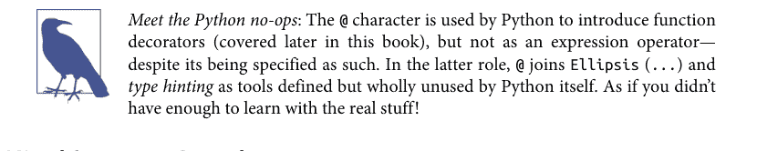

## 混合运算符：优先级

与大多数语言一样，在Python中，你可以通过将表5-2中的运算符表达式串联起来编写更复杂的表达式。例如，两个乘积的和可以写成变量和运算符的混合形式：

```
A * B + C * D
```

这就引出了一个问题：Python如何知道先执行哪个操作？这个问题的答案在于运算符优先级。当你编写一个包含多个运算符的表达式时，Python会根据所谓的优先级规则对其部分进行分组，这种分组决定了表达式各部分的计算顺序。为了表示这一点，表5-2是按运算符优先级排序的：

- 表中位置较低的运算符具有更高的优先级，因此在混合表达式中结合得更紧密。换句话说，表中位置较高的运算符优先级较低，比其下方的运算符结合得更松散。
- 表中同一行的运算符在组合时通常从左到右分组（幂运算除外，它从右到左分组；比较运算符则从左到右链式分组）。

因此，例如，如果你写`X + Y * Z`，Python会先计算乘法（`Y * Z`），然后将结果加到`X`上，因为`*`的优先级比`+`高（在表中位置更低）。同样，在本节最初的示例中，两个乘法（`A * B`和`C * D`）都会在它们的结果相加之前执行，因为`+`在`*`之上。

## 括号分组子表达式

如果你小心地用括号对表达式的部分进行分组，你基本上可以忘记优先级规则。当你用括号将子表达式括起来时，你就覆盖了Python的优先级规则；Python总是*首先*计算括号内的表达式，然后将其结果用于外部表达式。

例如，与其编写`X + Y * Z`，你可以编写以下任一形式来强制Python按你期望的顺序计算表达式：

```
(X + Y) * Z
X + (Y * Z)
```

在第一种情况下，`+`首先应用于`X`和`Y`，因为这个子表达式被括号包裹。在第二种情况下，`*`首先执行（就像根本没有括号一样）。一般来说，在大型表达式中添加括号是个好主意——它不仅强制执行你想要的计算顺序，还有助于提高可读性。

## 混合类型向上转换

除了在表达式中混合运算符，你还可以混合数值类型。例如，你可以将整数与浮点数相加：

```
40 + 3.14
```

但这引出了另一个问题：结果的类型是什么——整数还是浮点数？答案很简单，特别是如果你以前使用过几乎任何其他语言：在混合类型的数值表达式中，*操作数*（表达式中不是运算符的部分）首先被*向上*转换为最复杂操作数的类型，然后在相同类型的操作数上执行数学运算。结果就是向上转换后的操作数的类型。

为此，Python对数值类型的复杂性排序如下：整数比浮点数简单，浮点数比复数简单。因此，当整数与浮点数混合时，如前面的示例，整数首先被向上转换为浮点值，然后浮点运算产生浮点结果。你可以在本地Python REPL中亲自验证：

```
>>> 40 + 3.14    # 整数转浮点数，浮点运算/结果
43.14
```

同样，任何其中一个操作数是复数的混合类型表达式都会导致另一个操作数被向上转换为复数，表达式产生复数结果。转换也适用于相等性和大小比较：`3 == 3.0`为真，但`3 > 3.0`为假。

你可以通过调用内置函数手动转换类型来强制执行：

```
>>> int(3.1415)    # 将浮点数截断为整数
3
>>> float(3)       # 将整数转换为浮点数
3.0
```

然而，你通常不需要这样做：因为Python在表达式中自动向上转换为更复杂的类型，结果通常是你想要的。

虽然自动转换适用于数值和比较运算符，但请记住，它们仅适用于在表达式中混合*数值*对象（例如，整数和浮点数）。通常，Python*不会*自动跨越任何其他类型边界进行转换。例如，将数字字符串与整数相加会导致错误，除非你手动转换其中一个；我们将在第7章探讨字符串时看到一个示例和原理。相等性测试确实适用于混合类型（例如，字符串永远不会等于任何整数），但大小比较则不适用。

## 预览：运算符重载和多态

尽管我们现在专注于内置数字，但所有Python运算符都可以被Python类和C扩展类型*重载*（即实现），以处理你创建的对象。例如，你稍后会看到，用类编码的对象可以使用`x+y`表达式相加或连接，使用`x[i]`表达式索引，等等。

此外，Python本身会自动重载一些运算符，使其根据所处理的内置对象类型执行不同的操作。例如，`+`运算符在应用于数字时执行加法，但在应用于序列对象（如字符串和列表）时执行连接。实际上，当你将其应用于用类定义的对象时，`+`可以表示任何含义。

正如我们在上一章所看到的，这个特性通常被称为*多态*——一个表示操作的含义取决于所处理对象类型的术语。我们将在第16章探讨函数时重新审视这个概念，因为在那个上下文中它会成为一个更明显的特性。

## 数字实战

开始写代码吧！理解数值对象和表达式的最好方法可能是看到它们的实际应用，因此，在掌握了所有前面的基础知识后，让我们启动交互式命令行，尝试一些简单但具有说明性的操作（如果需要帮助启动REPL，请务必参阅第3章）。

## 变量和基本表达式

首先，让我们做一些数学运算来演示一些基础知识。在下面的交互中，我们首先将两个变量（`a`和`b`）赋值为整数，以便稍后在更大的表达式中使用它们。*变量*只是名称——由你或Python创建——用于跟踪程序中的信息。我们将在下一章中更详细地讨论这一点，但在Python中：

- 变量在首次赋值时创建。
- 变量在表达式中使用时会被其值替换。
- 变量必须在表达式中使用前赋值。
- 变量引用对象，无需提前声明。

换句话说，这些赋值导致变量`a`和`b`自动出现：

```
$ python3
>>> a = 3
>>> b = 4
```

这段代码还使用了*注释*。回顾第3章，在Python代码中，`#`标记之后直到行尾的文本被视为注释，Python会忽略它们。注释是为代码编写人类可读文档的一种方式，也是编程的重要组成部分。它们描述代码的各个方面——无论是显著的还是细微的——以帮助他人（以及六个月后的你自己！）。在本书的下一部分，你还将遇到一个相关特性——*文档字符串*——它将文档附加到对象上，以便在代码加载后仍可访问。

不过，再次强调，由于你交互式输入的代码是临时的，通常不会在这种上下文中编写注释。如果你跟着操作，这意味着在 REPL 中，你不需要输入从 `#` 开始到行尾的任何注释文本；这不是我们以这种方式运行的语句的必需部分。

现在，让我们在表达式中使用新的整数对象。此时，`a` 和 `b` 的值仍然是 3 和 4。像这样的变量在表达式中使用时，会被它们的值替换，并且当我们交互式工作时，表达式的结果会立即自动回显：

```
>>> a + 1, a - 1          # 加法 (3 + 1)，减法 (3 - 1)
(4, 2)
>>> b * 3, b / 2          # 乘法 (4 * 3)，除法 (4 / 2)
(12, 2.0)
>>> a % 2, b ** 2         # 取模（余数），幂运算 (4 ** 2)
(1, 16)
>>> 2 + 4.0, 2.0 ** b     # 混合类型转换
(6.0, 16.0)
```

根据第 3 章的内容，这里回显的结果是两个值的*元组*，因为提示符处输入的行包含两个用逗号分隔的表达式；这就是为什么结果显示在括号中。更重要的是，这些表达式之所以有效，是因为其中的变量 `a` 和 `b` 已经被赋值。如果你使用一个*尚未赋值*的不同变量，Python 会报告错误，而不是填充某个默认值：

```
>>> c * 2
NameError: name 'c' is not defined
```

正如第 3 章所预览的，你不需要在 Python 中预先声明变量，但它们必须在使用前至少被赋值一次。实际上，这意味着你必须先将计数器初始化为零才能对其累加，将列表初始化为空列表才能向其追加，等等。

这里有两个稍大一点的表达式，用于说明运算符分组和更多关于转换的内容：

```
>>> b / 2 + a          # 等同于 ((4 / 2) + 3)
5.0
>>> b / (2 + a)        # 等同于 (4 / (2 + 3))
0.8
```

在*第一个*表达式中，没有括号，因此 Python 根据其优先级规则自动对组件进行分组——因为 `/` 在表 5-2 中的优先级低于 `+`，所以它结合得更紧密，因此先被求值。结果就好像表达式被组织成代码右侧注释所示的带括号的形式。在*第二个*表达式中，`+` 部分被加上了括号，以强制 Python 先对其求值（即在 `/` 之前）。

另外，请注意，在这些示例中，所有数字都是整数。Python 的 `/` 执行*真除法*，它总是保留分数余数并给出浮点结果——这反过来又反映在整个表达式的结果中。你可以通过编写 `2.0` 而不是 `2` 来强制产生分数结果，但并非必须。你也可以选择使用*地板除法*，通过用 `//` 代替 `/` 来编写这些示例，Python 将丢弃结果中的小数位；因为结果反映了操作数的类型，对于浮点数，你将得到截断的浮点数：

```
>>> a, b
(3, 4)
>>> b // 2 + a
5
>>> b // (2 + a)
0
>>> b // 2.0 + a
5.0
>>> b // (2.0 + a)
0.0
```

你将在本节后面了解更多关于除法的内容。

## 数值显示格式

一旦你开始认真地使用 Python 数字，某些表达式的结果在第一次看到时可能看起来有点奇怪：

```
>>> 1.1 + 2.2
3.3000000000000003
>>> print(1.1 + 2.2)
3.3000000000000003
```

这个奇怪结果背后的完整故事与浮点硬件的局限性及其无法在有限位数内精确表示某些值有关。Python 浮点数映射到你设备上的底层芯片，其精度仅限于这些芯片所允许的——这是一个物理限制，可以通过扩展浮点精度的附加组件以及第 93 页“浮点数相等性”中讨论的技术来解决。

然而，由于计算机架构远超本书范围，我们将巧妙地说明，你的计算机浮点硬件正在尽其所能，它和 Python 在这里都没有错误。事实上，这在某种程度上是一个显示问题——Python 的浮点显示逻辑试图变得智能，通常显示更少的小数位，但偶尔无法做到。我们之前的示例自动显示了更少的数字，你总是可以在程序中通过字符串格式化来强制显示：

```
>>> num = 1.1 + 2.2
>>> num
3.3000000000000003
>>> '%e' % num
'3.300000e+00'
>>> '%.1f' % num
'3.3'
>>> f'{num:e}', f'{num:.1f}'
('3.300000e+00', '3.3')
```

这里的最后三个测试使用了灵活的字符串格式化，我们将在即将到来的关于字符串的章节（第 7 章）中全面探讨。其结果是字符串，通常（但不总是）打印到显示器或报告中。

## 显示格式：str 和 repr

尽管在本章中还不明显，但交互式回显和 `print` 的默认输出格式在技术上分别对应于内置的 `repr` 和 `str` 函数：

```
>>> repr('hack')       # 用于回显：代码形式
"'hack'"
>>> str('hack')        # 用于 print：用户友好形式
'hack'
```

这两者都将任意对象转换为其字符串表示形式：`repr`（以及默认的交互式回显）产生看起来像代码的结果；`str`（以及 `print` 操作）在可用时转换为通常更用户友好的格式。有些对象两者兼有——一个用于一般用途的 `str`，以及一个带有额外细节的 `repr`。当我们探索字符串和类中的运算符重载时，这个概念将再次出现。

除了为任意对象提供 `print` 字符串外，`str` 内置函数也是字符串对象类型的名称，可以用编码名称调用，以从字节字符串解码 Unicode 字符串，作为第 4 章简要介绍的 `bytes.decode` 方法的替代方案。你将在第 37 章了解更多关于这个高级 `str` 角色的内容。

## 比较运算符

到目前为止，我们一直在处理标准的数值运算（例如加法和乘法），但数字，像所有 Python 对象一样，也可以进行比较。普通比较对数字的工作方式完全如你所料——它们比较操作数的相对大小并返回一个布尔结果，我们通常会在更大的语句和程序中测试并采取行动（例如，参见第 4 章中 `if` 的介绍）：

```
>>> 1 < 2              # 小于（大小）
True
>>> 2.0 >= 1           # 大于或等于：混合类型 1 转换为 1.0
True
>>> 2.0 == 2.0         # 值相等
True
>>> 2.0 != 2.0         # 值不相等
False
```

再次注意混合类型如何仅在数值表达式中被允许；在第二个测试中，Python 根据更复杂的类型 `float` 来比较值。

### 链式比较

有趣的是，Python 还允许我们将多个比较链接在一起以执行范围测试。链式比较是较大布尔表达式的一种简写。简而言之，Python 允许我们将大小比较测试串联起来，以编写链式比较，例如范围测试。例如，表达式 `(A < B < C)` 测试 `B` 是否在 `A` 和 `C` 之间（不包含端点）；它等同于布尔测试 `(A < B and B < C)`，但更易于阅读（和输入）。例如，假设以下赋值：

```
>>> X = 2
>>> Y = 4
>>> Z = 6
```

以下两个表达式具有相同的效果，但第一个输入更短，并且可能运行得稍快，因为 Python 只需要对 `Y` 求值一次——如果 `Y` 是对复杂函数的调用，这可能很重要：

```
>>> X < Y < Z            # 链式比较：范围测试
True
>>> X < Y and Y < Z
True
```

同样的等价关系也适用于假结果，并且允许任意长度的链：

```
>>> X < Y > Z
False
>>> X < Y and Y > Z
False
```

```
>>> 1 < 2 < 3.0 < 4
True
>>> 1 > 2 > 3.0 > 4
False
```

你可以在链式测试中使用其他比较，但结果表达式可能变得不直观，除非你按照 Python 的方式进行求值。例如，以下第一个表达式为假，仅仅是因为 1 不等于 2：

```
>>> 1 == 2 < 3            # 等同于：(1 == 2) and (2 < 3)，但不是：False < 3！
False
>>> True is False is True  # 等同于：(True is False) and (False is True)
False
```

Python 并没有将 `1 == 2` 表达式的 `False` 结果与 3 进行比较——这在技术上等同于 `0 < 3`，结果将是 `True`（你将在本章后面了解更多关于 `True` 和 `False` 对象的内容，并在下一章探讨很少使用的 `is` 身份运算符）。

### 浮点数相等性

在我们继续之前，最后一点说明：除了链式比较，数值比较基于大小，这通常是简单的——尽管浮点数可能并不总是如你所愿地工作，可能需要转换或其他处理才能进行有意义的比较：

```
>>> 1.1 + 2.2 == 3.3      # 这不应该是 True 吗？
False
>>> 1.1 + 2.2              # 接近 3.3，但不完全相等：精度有限
3.3000000000000003
```

这与前面关于数值显示格式的讨论有关，源于浮点数由于其有限的位数而无法精确表示某些值的事实——这是数值编程中的一个基本问题，并非 Python 独有。为了在相等性测试中适应这种不精确性，可以截断、四舍五入、使用地板除，或者从 Python 3.5 开始，导入并调用 `math` 标准库模块的 `isclose`，如果值在彼此的容差范围内，则返回 `True`（关于 `math` 和地板除的更多内容将在后面介绍，关于 `isclose` 的更多内容请参阅 Python 手册）：

## 除法运算符

Python 有两种前面介绍过的除法运算符，还有一个与之密切相关的运算符。以下是完整的集合：

- X / Y
  称为*真除法*，无论操作数类型如何，结果总是保留余数为浮点数。

- X // Y
  称为*地板除法*，无论操作数类型如何，结果总是将小数余数向下截断到其地板值，其结果类型取决于操作数的类型。

- X % Y
  称为*取模*，返回除法的余数，结果类型因操作数类型而异。当用于字符串时，它还执行格式化操作，详见[第7章](#chapter-7)。

以下演示了两种*除法*运算符的实际使用：

```
>>> 10 / 4          # 真除法：总是保留余数
2.5
>>> 10 / 4.0        # 浮点数同理
2.5
>>> 10 // 4         # 地板除法：总是舍弃余数
2
>>> 10 // 4.0       # 浮点数同理，但类型会变化
2.0
```

请注意，`//`运算符结果的对象类型取决于其操作数的类型：如果任一操作数是浮点数，则结果为浮点数；否则为整数。如果你想确保结果是整数，只需将表达式包装在`int`中进行转换：

```
>>> int(10 // 4.0)
2
```

相关的*取模*运算返回除法的余数，其类型与操作数匹配（当你的代码需要知道`//`运算后“剩余”多少时很有用），而内置函数`divmod`在需要时同时给出两部分：

```
>>> 10 % 3, 10 % 3.0    # 除法的余数：(3 * 3) + 1
(1, 1.0)
>>> divmod(10, 3)        # 以元组形式返回除法的两部分
(3, 1)
```

## 地板除法与截断

这里有一个微妙之处：//运算符非正式地称为*截断除法*，但更准确地应称为*地板除法*——它将结果截断到其地板值，即小于真实结果的最接近整数。其净效果是向下取整，而非严格截断，这对负数很重要。你可以使用Python的`math`模块（如你所知，模块必须在使用其内容前导入）亲自查看区别：

```
>>> import math
>>> math.floor(2.5)        # 小于该值的最接近整数
2
>>> math.floor(-2.5)       # 但对负数不是截断！
-3
>>> math.trunc(2.5)        # 截断小数部分（向零取整）
2
>>> math.trunc(-2.5)       # 对负数是截断
-2
```

在运行除法运算符时，你实际上只对正结果进行截断，因为此时截断与地板除法相同；对于负数，结果是地板除法。实际上，两者都是地板除法，只是地板除法对正数恰好与截断相同（*复制粘贴者注意*：如果本书中的减号变成了Unicode破折号，请将其替换为简单的ASCII“-”连字符来运行；Python要求后者作为减号，而工具在这方面臭名昭著地容易出错）：

```
>>> 5 / 2, 5 / -2          # 真除法保留余数
(2.5, -2.5)

>>> 5 // 2, 5 // -2         # 截断到地板：向下取整到第一个更小的整数
(2, -3)

>>> 5 / 2.0, 5 / -2.0       # 浮点数同理
(2.5, -2.5)

>>> 5 // 2.0, 5 // -2.0     # 尽管结果也是浮点数
(2.0, -3.0)
```

如果你真的想要无论符号如何都向零截断，你总是可以将真除法的结果通过`math.trunc`处理（如前所示，内置函数`round`有相关功能，内置函数`int`有相同效果，且两者都不需要导入）：

```
>>> import math
>>> 5 / -2                   # 保留余数
-2.5
>>> 5 // -2                  # 地板除法，结果在下方
-3
>>> math.trunc(5 / -2)       # 截断而非地板除法（与int()相同）
-2
```

那么，为什么对截断如此大惊小怪？在你升级到编写更大的Python程序之前，这不会很明显，但在某些用例中它是一个必不可少的工具。请留意第13章中的一个质数while循环示例以及第四部分末尾的一个相应练习，它们完全依赖于//的截断行为。

## 整数精度

Python除法可能有多种风味，但就编程语言而言，它仍然相当标准。这里有一些更不寻常的东西。如前所述，Python整数支持无限大小：

```
>>> 999999999999999999999999999999999999999999999999999999999999999999999999999999999999999999999999999999999999999999999999999999999999999999999999999999999999999999999999999999999999999999999999999999999999999999999999999999999999999999999999999999999999999999999999999999999999999999999999999999999999999999999999999999999999999999999999999999999999999999999999999999999999999999999999999999999999999999999999999999999999999999999999999999999999999999999999999999999999999999999999999999999999999999999999999999999999999999999999999999999999999999999999999999999999999999999999999999999999999999999999999999999999999999999999999999999999999999999999999999999999999999999999999999999999999999999999999999999999999999999999999999999999999999999999999999999999999999999999999999999999999999999999999999999999999999999999999999999999999999999999999999999999999999999999999999999999999999999999999999999999999999999999999999999999999999999999999999999999999999999999999999999999999999999999999999999999999999999999999999999999999999999999999999999999999999999999999999999999999999999999999999999999999999999999999999999999999999999999999999999999999999999999999999999999999999999999999999999999999999999999999999999999999999999999999999999999999999999999999999999999999999999999999999999999999999999999999999999999999999999999999999999999999999999999999999999999999999999999999999999999999999999999999999999999999999999999999999999999999999999999999999999999999999999999999999999999999999999999999999999999999999999999999999999999999999999999999999999999999999999999999999999999999999999999999999999999999999999999999999999999999999999999999999999999999999999999999999999999999999999999999999999999999999999999999999999999999999999999999999999999999999999999999999999999999999999999999999999999999999999999999999999999999999999999999999999999999999999999999999999999999999999999999999999999999999999999999999999999999999999999999999999999999999999999999999999999999999999999999999999999999999999999999999999999999999999999999999999999999999999999999999999999999999999999999999999999999999999999999999999999999999999999999999999999999999999999999999999999999999999999999999999999999999999999999999999999999999999999999999999999999999999999999999999999999999999999999999999999999999999999999999999999999999999999999999999999999999999999999999999999999999999999999999999999999999999999999999999999999999999999999999999999999999999999999999999999999999999999999999999999999999999999999999999999999999999999999999999999999999999999999999999999999999999999999999999999999999999999999999999999999999999999999999999999999999999999999999999999999999999999999999999999999999999999999999999999999999999999999999999999999999999999999999999999999999999999999999999999999999999999999999999999999999999999999999999999999999999999999999999999999999999999999999999999999999999999999999999999999999999999999999999999999999999999999999999999999999999999999999999999999999999999999999999999999999999999999999999999999999999999999999999999999999999999999999999999999999999999999999999999999999999999999999999999999999999999999999999999999999999999999999999999999999999999999999999999999999999999999999999999999999999999999999999999999999999999999999999999999999999999999999999999999999999999999999999999999999999999999999999999999999999999999999999999999999999999999999999999999999999999999999999999999999999999999999999999999999999999999999999999999999999999999999999999999999999999999999999999999999999999999999999999999999999999999999999999999999999999999999999999999999999999999999999999999999999999999999999999999999999999999999999999999999999999999999999999999999999999999999999999999999999999999999999999999999999999999999999999999999999999999999999999999999999999999999999999999999999999999999999999999999999999999999999999999999999999999999999999999999999999999999999999999999999999999999999999999999999999999999999999999999999999999999999999999999999999999999999999999999999999999999999999999999999999999999999999999999999999999999999999999999999999999999999999999999999999999999999999999999999999999999999999999999999999999999999999999999999999999999999999999999999999999999999999999999999999999999999999999999999999999999999999999999999999999999999999999999999999999999999999999999999999999999999999999999999999999999999999999999999999999999999999999999999999999999999999999999999999999999999999999999999999999999999999999999999999999999999999999999999999999999999999999999999999999999999999999999999999999999999999999999999999999999999999999999999999999999999999999999999999999999999999999999999999999999999999999999999999999999999999999999999999999999999999999999999999999999999999999999999999999999999999999999999999999999999999999999999999999999999999999999999999999999999999999999999999999999999999999999999999999999999999999999999999999999999999999999999999999999999999999999999999999999999999999999999999999999999999999999999999999999999999999999999999999999999999999999999999999999999999999999999999999999999999999999999999999999999999999999999999999999999999999999999999999999999999999999999999999999999999999999999999999999999999999999999999999999999999999999999999999999999999999999999999999999999999999999999999999999999999999999999999999999999999999999999999999999999999999999999999999999999999999999999999999999999999999999999999999999999999999999999999999999999999999999999999999999999999999999999999999999999999999999999999999999999999999999999999999999999999999999999999999999999999999999999999999999999999999999999999999999999999999999999999999999999999999999999999999999999999999999999999999999999999999999999999999999999999999999999999999999999999999999999999999999999999999999999999999999999999999999999999999999999999999999999999999999999999999999999999999999999999999999999999999999999999999999999999999999999999999999999999999999999999999999999999999999999999999999999999999999999999999999999999999999999999999999999999999999999999999999999999999999999999999999999999999999999999999999999999999999999999999999999999999999999999999999999999999999999999999999999999999999999999999999999999999999999999999999999999999999999999999999999999999999999999999999999999999999999999999999999999999999999999999999999999999999999999999999999999999999999999999999999999999999999999999999999999999999999999999999999999999999999999999999999999999999999999999999999999999999999999999999999999999999999999999999999999999999999999999999999999999999999999999999999999999999999999999999999999999999999999999999999999999999999999999999999999999999999999999999999999999999999999999999999999999999999999999999999999999999999999999999999999999999999999999999999999999999999999999999999999999999999999999999999999999999999999999999999999999999999999999999999999999999999999999999999999999999999999999999999999999999999999999999999999999999999999999999999999999999999999999999999999999999999999999999999999999999999999999999999999999999999999999999999999999999999999999999999999999999999999999999999999999999999999999999999999999999999999999999999999999999999999999999999999999999999999999999999999999999999999999999999999999999999999999999999999999999999999999999999999999999999999999999999999999999999999999999999999999999999999999999999999999999999999999999999999999999999999999999999999999999999999999999999999999999999999999999999999999999999999999999999999999999999999999999999999999999999999999999999999999999999999999999999999999999999999999999999999999999999999999999999999999999999999999999999999999999999999999999999999999999999999999999999999999999999999999999999999999999999999999999999999999999999999999999999999999999999999999999999999999999999999999999999999999999999999999999999999999999999999999999999999999999999999999999999999999999999999999999999999999999999999999999999999999999999999999999999999999999999999999999999999999999999999999999999999999999999999999999999999999999999999999999999999999999999999999999999999999999999999999999999999999999999999999999999999999999999999999999999999999999999999999999999999999999999999999999999999999999999999999999999999999999999999999999999999999999999999999999999999999999999999999999999999999999999999999999999999999999999999999999999999999999999999999999999999999999999999999999999999999999999999999999999999999999999999999999999999999999999999999999999999999999999999999999999999999999999999999999999999999999999999999999999999999999999999999999999999999999999999999999999999999999999999999999999999999999999999999999999999999999999999999999999999999999999999999999999999999999999999999999999999999999999999999999999999999999999999999999999999999999999999999999999999999999999999999999999999999999999999999999999999999999999999999999999999999999999999999999999999999999999999999999999999999999999999999999999999999999999999999999999999999999999999999999999999999999999999999999999999999999999999999999999999999999999999999999999999999999999999999999999999999999999999999999999999999999999999999999999999999999999999999999999999999999999999999999999999999999999999999999999999999999999999999999999999999999999999999999999999999999999999999999999999999999999999999999999999999999999999999999999999999999999999999999999999999999999999999999999999999999999999999999999999999999999999999999999999999999999999999999999999999999999999999999999999999999999999999999999999999999999999999999999999999999999999999999999999999999999999999999999999999999999999999999999999999999999999999999999999999999999999999999999999999999999999999999999999999999999999999999999999999999999999999999999999999999999999999999999999999999999999999999999999999999999999999999999999999999999999999999999999999999999999999999999999999999999999999999999999999999999999999999999999999999999999999999999999999999999999999999999999999999999999999999999999999999999999999999999999999999999999999999999999999999999999999999999999999999999999999999999999999999999999999999999999999999999999999999999999999999999999999999999999999999999999999999999999999999999999999999999999999999999999999999999999999999999999999999999999999999999999999999999999999999999999999999999999999999999999999999999999999999999999999999999999999999999999999999999999999999999999999999999999999999999999999999999999999999999999999999999999999999999999999999999999999999999999999999999999999999999999999999999999999999999999999999999999999999999999999999999999999999999999999999999999999999999999999999999999999999999999999999999999999999999999999999999999999999999999999999999999999999999999999999999999999999999999999999999999999999999999999999999999999999999999999999999999999999999999999999999999999999999999999999999999999999999999999999999999999999999999999999999999999999999999999999999999999999999999999999999999999999999999999999999999999999999999999999999999999999999999999999999999999999999999999999999999999999999999999999999999999999999999999999999999999999999999999999999999999999999999999999999999999999999999999999999999999999999999999999999999999999999999999999999999999999999999999999999999999999999999999999999999999999999999999999999999999999999999999999999999999999999999999999999999999999999999999999999999999999999999999999999999999999999999999999999999999999999999999999999999999999999999999999999999999999999999999999999999999999999999999999999999999999999999999999999999999999999999999999999999999999999999999999999999999999999999999999999999999999999999999999999999999999999999999999999999999999999999999999999999999999999999999999999999999999999999999999999999999999999999999999999999999999999999999999999999999999999999999999999999999999999999999999999999999999999999999999999999999999999999999999999999999999999999999999999999999999999999999999999999999999999999999999999999999999999999999999999999999999999999999999999999999999999999999999999999999999999999999999999999999999999999999999999999999999999999999999999999999999999999999999999999999999999999999999999999999999999999999999999999999999999999999999999999999999999999999999999999999999999999999999999999999999999999999999999999999999999999999999999999999999999999999999999999999999999999999999999999999999999999999999999999999999999999999999999999999999999999999999999999999999999999999999999999999999999999999999999999999999999999999999999999999999999999999999999999999999999999999999999999999999999999999999999999999999999999999999999999999999999999999999999999999999999999999999999999999999999999999999999999999999999999999999999999999999999999999999999999999999999999999999999999999999999999999999999999999999999999999999999999999999999999999999999999999999999999999999999999999999999999999999999999999999999999999999999999999999999999999999999999999999999999999999999999999999999999999999999999999999999999999999999999999999999999999999999999999999999999999999999999999999999999999999999999999999999999999999999999999999999999999999999999999999999999999999999999999999999999999999999999999999999999999999999999999999999999999999999999999999999999999999999999999999999999999999999999999999999999999999999999999999999999999999999999999999999999999999999999999999999999999999999999999999999999999999999999999999999999999999999999999999999999999999999999999999999999999999999999999999999999999999999999999999999999999999999999999999999999999999999999999999999999999999999999999999999999999999999999999999999999999999999999999999999999999999999999999999999999999999999999999999999999999999999999999999999999999999999999999999999999999999999999999999999999999999999999999999999999999999999999999999999999999999999999999999999999999999999999999999999999999999999999999999999999999999999999999999999999999999999999999999999999999999999999999999999999999999999999999999999999999999999999999999999999999999999999999999999999999999999999999999999999999999999999999999999999999999999999999999999999999999999999999999999999999999999999999999999999999999999999999999999999999999999999999999999999999999999999999999999999999999999999999999999999999999999999999999999999999999999999999999999999999999999999999999999999999999999999999999999999999999999999999999999999999999999999999999999999999999999999999999999999999999999999999999999999999999999999999999999999999999999999999999999999999999999999999999999999999999999999999999999999999999999999999999999999999999999999999999999999999999999999999999999999999999999999999999999999999999999999999999999999999999999999999999999999999999999999999999999999999999999999999999999999999999999999999999999999999999999999999999999999999999999999999999999999999999999999999999999999999999999999999999999999999999999999999999999999999999999999999999999999999999999999999999999999999999999999999999999999999999999999999999999999999999999999999999999999999999999999999999999999999999999999999999999999999999999999999999999999999999999999999999999999999999999999999999999999999999999999999999999999999999999999999999999999999999999999999999999999999999999999999999999999999999999999999999999999999999999999999999999999999999999999999999999999999999999999999999999999999999999999999999999999999999999999999999999999999999999999999999999999999999999999999999999999999999999999999999999999999999999999999999999999999999999999999999999999999999999999999999999999999999999999999999999999999999999999999999999999999999999999999999999999999999999999999999999999999999999999999999999999999999999999999999999999999999999999999999999999999999999999999999999999999999999999999999999999999999999999999999999999999999999999999999999999999999999999999999999999999999999999999999999999999999999999999999999999999999999999999999999999999999999999999999999999999999999999999999999999999999999999999999999999999999999999999999999999999999999999999999999999999999999999999999999999999999999999999999999999999999999999999999999999999999999999999999999999999999999999999999999999999999999999999999999999999999999999999999999999999999999999999999999999999999999999999999999999999999999999999999999999999999999999999999999999999999999999999999999999999999999999999999999999999999999999999999999999999999999999999999999999999999999999999999999999999999999999999999999999999999999999999999999999999999999999999999999999999999999999999999999999999999999999999999999999999999999999999999999999999999999999999999999999999999999999999999999999999999999999999999999999999999999999999999999999999999999999999999999999999999999999999999999999999999999999999999999999999999999999999999999999999999999999999999999999999999999999999999999999999999999999999999999999999999999999999999999999999999999999999999999999999999999999999999999999999999999999999999999999999999999999999999999999999999999999999999999999999999999999999999999999999999999999999999999999999999999999999999999999999999999999999999999999999999999999999999999999999999999999999999999999999999999999999999999999999999999999999999999999999999999999999999999999999999999999999999999999999999999999999999999999999999999999999999999999999999999999999999999999999999999999999999999999999999999999999999999999999999999999999999999999999999999999999999999999999999999999999999999999999999999999999999999999999999999999999999999999999999999999999999999999999999999999999999999999999999999999999999999999999999999999999999999999999999999999999999999999999999999999999999999999999999999999999999999999999999999999999999999999999999999999999999999999999999999999999999999999999999999999999999999999999999999999999999999999999999999999999999999999999999999999999999999999999999999999999999999999999999999999999999999999999999999999999999999999999999999999999999999999999999999999999999999999999999999999999999999999999999999999999999999999999999999999999999999999999999999999999999999999999999999999999999999999999999999999999999999999999999999999999999999999999999999999999999999999999999999999999999999999999999999999999999999999999999999999999999999999999999999999999999999999999999999999999999999999999999999999999999999999999999999999999999999999999999999999999999999999999999999999999999999999999999999999999999999999999999999999999999999999999999999999999999999999999999999999999999999999999999999999999999999999999999999999999999999999999999999999999999999999999999999999999999999999999999999999999999999999999999999999999999999999999999999999999999999999999999999999999999999999999999999999999999999999999999999999999999999999999999999999999999999999999999999999999999999999999999999999999999999999999999999999999999999999999999999999999999999999999999999999999999999999999999999999999999999999999999999999999999999999999999999999999999999999999999999999999999999999999999999999999999999999999999999999999999999999999999999999999999999999999999999999999999999999999999999999999999999999999999999999999999999999999999999999999999999999999999999999999999999999999999999999999999999999999999999999999999999999999999999999999999999999999999999999999999999999999999999999999999999999999999999999999999999999999999999999999999999999999999999999999999999999999999999999999999999999999999999999999999999999999999999999999999999999999999999999999999999999999999999999999999999999999999999999999999999999999999999999999999999999999999999999999999999999999999999999999999999999999999999999999999999999999999999999999999999999999999999999999999999999999999999999999999999999999999999999999999999999999999999999999999999999999999999999999999999999999999999999999999999999999999999999999999999999999999999999999999999999999999999999999999999999999999999999999999999999999999999999999999999999999999999999999999999999999999999999999999999999999999999999999999999999999999999999999999999999999999999999999999999999999999999999999999999999999999999999999999999999999999999999999999999999999999999999999999999999999999999999999999999999999999999999999999999999999999999999999999999999999999999999999999999999999999999999999999999999999999999999999999999999999999999999999999999999999999999999999999999999999999999999999999999999999999999999999999999999999999999999999999999999999999999999999999999999999999999999999999999999999999999999999999999999999999999999999999999999999999999999999999999999999999999999999999999999999999999999999999999999999999999999999999999999999999999999999999999999999999999999999999999999999999999999999999999999999999999999999999999999999999999999999999999999999999999999999999999999999999999999999999999999999999999999999999999999999999999999999999999999999999999999999999999999999999999999999999999999999999999999999999999999999999999999999999999999999999999999999999999999999999999999999999999999999999999999999999999999999999999999999999999999999999999999999999999999999999999999999999999999999999999999999999999999999999999999999999999999999999999999999999999999999999999999999999999999999999999999999999999999999999999999999999999999999999999999999999999999999999999999999999999999999999999999999999999999999999999999999999999999999999999999999999999999999999999999999999999999999999999999999999999999999999999999999999999999999999999999999999999999999999999999999999999999999999999999999999999999999999999999999999999999999999999999999999999999999999999999999999999999999999999999999999999999999999999999999999999999999999999999999999999999999999999999999999999999999999999999999999999999999999999999999999999999999999999999999999999999999999999999999999999999999999999999999999999999999999999999999999999999999999999999999999999999999999999999999999999999999999999999999999999999999999999999999999999999999999999999999999999999999999999999999999999999999999999999999999999999999999999999999999999999999999999999999999999999999999999999999999999999999999999999999999999999999999999999999999999999999999999999999999999999999999999999999999999999999999999999999999999999999999999999999999999999999999999999999999999999999999999999999999999999999999999999999999999999999999999999999999999999999999999999999999999999999999999999999999999999999999999999999999999999999999999999999999999999999999999999999999999999999999999999999999999999999999999999999999999999999999999999999999999999999999999999999999999999999999999999999999999999999999999999999999999999999999999999999999999999999999999999999999999999999999999999999999999999999999999999999999999999999999999999999999999999999999999999999999999999999999999999999999999999999999999999999999999999999999999999999999999999999999999999999999999999999999999999999999999999999999999999999999999999999999999999999999999999999999999999999999999999999999999999999999999999999999999999999999999999999999999999999999999999999999999999999999999999999999999999999999999999999999999999999999999999999999999999999999999999999999999999999999999999999999999999999999999999999999999999999999999999999999999999999999999999999999999999999999999999999999999999999999999999999999999999999999999999999999999999999999999999999999999999999999999999999999999999999999999999999999999999999999999999999999999999999999999999999999999999999999999999999999999999999999999999999999999999999999999999999999999999999999999999999999999999999999999999999999999999999999999999999999999999999999999999999999999999999999999999999999999999999999999999999999999999999999999999999999999999999999999999999999999999999999999999999999999999999999999999999999999999999999999999999999999999999999999999999999999999999999999999999999999999999999999999999999999999999999999999999999999999999999999999999999999999999999999999999999999999999999999999999999999999999999999999999999999999999999999999999999999999999999999999999999999999999999999999999999999999999999999999999999999999999999999999999999999999999999999999999999999999999999999999999999999999999999999999999999999999999999999999999999999999999999999999999999999999999999999999999999999999999999999999999999999999999999999999999999999999999999999999999999999999999999999999999999999999999999999999999999999999999999999999999999999999999999999999999999999999999999999999999999999999999999999999999999999999999999999999999999999999999999999999999999999999999999999999999999999999999999999999999999999999999999999999999999999999999999999999999999999999999999999999999999999999999999999999999999999999999999999999999999999999999999999999999999999999999999999999999999999999999999999999999999999999999999999999999999999999999999999999999999999999999999999999999999999999999999999999999999999999999999999999999999999999999999999999999999999999999999999999999999999999999999999999999999999999999999999999999999999999999999999999999999999999999999999999999999999999999999999999999999999999999999999999999999999999999999999999999999999999999999999999999999999999999999999999999999999999999999999999999999999999999999999999999999999999999999999999999999999999999999999999999999999999999999999999999999999999999999999999999999999999999999999999999999999999999999999999999999999999999999999999999999999999999999999999999999999999999999999999999999999999999999999999999999999999999999999999999999999999999999999999999999999999999999999999999999999999999999999999999999999999999999999999999999999999999999999999999999999999999999999999999999999999999999999999999999999999999999999999999999999999999999999999999999999999999999999999999999999999999999999999999999999999999999999999999999999999999999999999999999999999999999999999999999999999999999999999999999999999999999999999999999999999999999999999999999999999999999999999999999999999999999999999999999999999999999999999999999999999999999999999999999999999999999999999999999999999999999999999999999999999999999999999999999999999999999999999999999999999999999999999999999999999999999999999999999999999999999999999999999999999999999999999999999999999999999999999999999999999999999999999999999999999999999999999999999999999999999999999999999999999999999999999999999999999999999999999999999999999999999999999999999999999999999999999999999999999999999999999999999999999999999999999999999999999999999999999999999999999999999999999999999999999999999999999999999999999999999999999999999999999999999999999999999999999999999999999999999999999999999999999999999999999999999999999999999999999999999999999999999999999999999999999999999999999999999999999999999999999999999999999999999999999999999999999999999999999999999999999999999999999999999999999999999999999999999999999999999999999999999999999999999999999999999999999999999999999999999999999999999999999999999999999999999999999999999999999999999999999999999999999999999999999999999999999999999999999999999999999999999999999999999999999999999999999999999999999999999999999999999999999999999999999999999999999999999999999999999999999999999999999999999999999999999999999999999999999999999999999999999999999999999999999999999999999999999999999999999999999999999999999999999999999999999999999999999999999999999999999999999999999999999999999999999999999999999999999999999999999999999999999999999999999999999999999999999999999999999999999999999999999999999999999999999999999999999999999999999999999999999999999999999999999999999999999999999999999999999999999999999999999999999999999999999999999999999999999999999999999999999999999999999999999999999999999999999999999999999999999999999999999999999999999999999999999999999999999999999999999999999999999999999999999999999999999999999999999999999999999999999999999999999999999999999999999999999999999999999999999999999999999999999999999999999999999999999999999999999999999999999999999999999999999999999999999999999999999999999999999999999999999999999999999999999999999999999999999999999999999999999999999999999999999999999999999999999999999999999999999999999999999999999999999999999999999999999999999999999999999999999999999999999999999999999999999999999999999999999999999999999999999999999999999999999999999999999999999999999999999999999999999999999999999999999999999999999999999999999999999999999999999999999999999999999999999999999999999999999999999999999999999999999999999999999999999999999999999999999999999999999999999999999999999999999999999999999999999999999999999999999999999999999999999999999999999999999999999999999999999999999999999999999999999999999999999999999999999999999999999999999999999999999999999999999999999999999999999999999999999999999999999999999999999999999999999999999999999999999999999999999999999999999999999999999999999999999999999999999999999999999999999999999999999999999999999999999999999999999999999999999999999999999999999999999999999999999999999999999999999999999999999999999999999999999999999999999999999999999999999999999999999999999999999999999999999999999999999999999999999999999999999999999999999999999999999999999999999999999999999999999999999999999999999999999999999999999999999999999999999999999999999999999999999999999999999999999999999999999999999999999999999999999999999999999999999999999999999999999999999999999999999999999999999999999999999999999999999999999999999999999999999999999999999999999999999999999999999999999999999999999999999999999999999999999999999999999999999999999999999999999999999999999999999999999999999999999999999999999999999999999999999999999999999999999999999999999999999999999999999999999999999999999999999999999999999999999999999999999999999999999999999999999999999999999999999999999999999999999999999999999999999999999999999999999999999999999999999999999999999999999999999999999999999999999999999999999999999999999999999999999999999999999999999999999999999999999999999999999999999999999999999999999999999999999999999999999999999999999999999999999999999999999999999999999999999999999999999999999999999999999999999999999999999999999999999999999999999999999999999999999999999999999999999999999999999999999999999999999999999999999999999999999999999999999999999999999999999999999999999999999999999999999999999999999999999999999999999999999999999999999999999999999999999999999999999999999999999999999999999999999999999999999999999999999999999999999999999999999999999999999999999999999999999999999999999999999999999999999999999999999999999999999999999999999999999999999999999999999999999999999999999999999999999999999999999999999999999999999999999999999999999999999999999999999999999999999999999999999999999999999999999999999999999999999999999999999999999999999999999999999999999999999999999999999999999999999999999999999999999999999999999999999999999999999999999999999999999999999999999999999999999999999999999999999999999999999999999999999999999999999999999999999999999999999999999999999999999999999999999999999999999999999999999999999999999999999999999999999999999999999999999999999999999999999999999999999999999999999999999999999999999999999999999999999999999999999999999999999999999999999999999999999999999999999999999999999999999999999999999999999999999999999999999999999999999999999999999999999999999999999999999999999999999999999999999999999999999999999999999999999999999999999999999999999999999999999999999999999999999999999999999999999999999999999999999999999999999999999999999999999999999999999999999999999999999999999999999999999999999999999999999999999999999999999999999999999999999999999999999999999999999999999999999999999999999999999999999999999999999999999999999999999999999999999999999999999999999999999999999999999999999999999999999999999999999999999999999999999999999999999999999999999999999999999999999999999999999999999999999999999999999999999999999999999999999999999999999999999999999999999999999999999999999999999999999999999999999999999999999999999999999999999999999999999999999999999999999999999999999999999999999999999999999999999999999999999999999999999999999999999999999999999999999999999999999999999999999999999999999999999999999999999999999999999999999999999999999999999999999999999999999999999999999999999999999999999999999999999999999999999999999999999999999999999999999999999999999999999999999999999999999999999999999999999999999999999999999999999999999999999999999999999999999999999999999999999999999999999999999999999999999999999999999999999999999999999999999999999999999999999999999999999999999999999999999999999999999999999999999999999999999999999999999999999999999999999999999999999999999999999999999999999999999999999999999999999999999999999999999999999999999999999999999999999999999999999999999999999999999999999999999999999999999999999999999999999999999999999999999999999999999999999999999999999999999999999999999999999999999999999999999999999999999999999999999999999999999999999999999999999999999999999999999999999999999999999999999999999999999999999999999999999999999999999999999999999999999999999999999999999999999999999999999999999999999999999999999999999999999999999999999999999999999999999999999999999999999999999999999999999999999999999999999999999999999999999999999999999999999999999999999999999999999999999999999999999999999999999999999999999999999999999999999999999999999999999999999999999999999999999999999999999999999999999999999999999999999999999999999999999999999999999999999999999999999999999999999999999999999999999999999999999999999999999999999999999999999999999999999999999999999999999999999999999999999999999999999999999999999999999999999999999999999999999999999999999999999999999999999999999999999999999999999999999999999999999999999999999999999999999999999999999999999999999999999999999999999999999999999999999999999999999999999999999999999999999999999999999999999999999999999999999999999999999999999999999999999999999999999999999999999999999999999999999999999999999999999999999999999999999999999999999999999999999999999999999999999999999999999999999999999999999999999999999999999999999999999999999999999999999999999999999999999999999999999999999999999999999999999999999999999999999999999999999999999999999999999999999999999999999999999999999999999999999999999999999999999999999999999999999999999999999999999999999999999999999999999999999999999999999999999999999999999999999999999999999999999999999999999999999999999999999999999999999999999999999999999999999999999999999999999999999999999999999999999999999999999999999999999999999999999999999999999999999999999999999999999999999999999999999999999999999999999999999999999999999999999999999999999999999999999999

指定值的便捷替代方式，尤其当值与字节和位的映射关系很重要时。我们之前详细介绍了编码规则；现在让我们来实际应用一下。

如前所述，这些其他进制的*字面量*只是指定整数对象值的另一种语法。例如，以下字面量会生成具有指定值的普通整数。在内存中，整数的值是相同的，无论我们在代码中使用哪种进制来指定它：

```
>>> 0x01, 0x10, 0xFF          # 十六进制字面量：基数为16，数字为0-9/A-F
(1, 16, 255)
>>> 0o1, 0o20, 0o377          # 八进制字面量：基数为8，数字为0-7
(1, 16, 255)
>>> 0b1, 0b10000, 0b11111111  # 二进制字面量：基数为2，数字为0-1
(1, 16, 255)
```

这里，十六进制值 0xFF、八进制值 0o377 和二进制值 0b11111111 都是十进制的 255。例如，十六进制值中的 F 数字在十进制中各表示 15，在二进制中是 4 位的 1111，并反映了 16 的幂次。因此，十六进制值 0xFF 和其他值转换为十进制值的过程如下：

```
>>> 0xFF, (15 * (16 ** 1)) + (15 * (16 ** 0))  # 十六进制/二进制如何映射到十进制
(255, 255)
>>> 0x2F, (2 * (16 ** 1)) + (15 * (16 ** 0))
(47, 47)
>>> 0xF, 0b1111, (1*(2**3) + 1*(2**2) + 1*(2**1) + 1*(2**0))
(15, 15, 15)
```

Python 默认以十进制（基数为 10）打印整数值，但它也提供了内置函数，可以将整数转换为其他进制的数字字符串，并按照 Python 字面量语法格式化——当程序或用户期望看到特定进制的值时，这很有用：

```
>>> oct(64), hex(64), bin(64)          # 数字=>数字字符串
('0o100', '0x40', '0b1000000')
```

`oct` 函数将十进制转换为八进制，`hex` 转换为十六进制，`bin` 转换为二进制——全部以字符串形式返回。要反向转换，内置的 `int` 函数可以将数字字符串转换为整数，可选的第二个参数允许你指定数值进制——这对于从文件中读取的字符串形式的数字（而不是在脚本中编码的数字）很有用：

```
>>> 64, 0o100, 0x40, 0b1000000          # 脚本和字符串中的数字=>数字
(64, 64, 64, 64)
>>> int('64'), int('100', 8), int('40', 16), int('1000000', 2)
(64, 64, 64, 64)
>>> int('0x40', 16), int('0b1000000', 2)  # 也支持字面量形式
(64, 64)
```

`eval` 函数也可用于将数字字符串转换为数字，因为它将字符串视为 Python 代码。因此，它具有类似的效果，但通常运行更*慢*——它实际上将字符串作为程序的一部分进行编译和运行，并且它假设运行的字符串来自*可信来源*——一个聪明的用户可能能够提交一个删除你机器上文件的字符串。换句话说，要谨慎使用这个调用：

```
>>> eval('64'), eval('0o100'), eval('0x40'), eval('0b1000000')
(64, 64, 64, 64)
```

最后，你也可以使用 Python 的三种*字符串格式化*工具中的任何一种将整数转换为特定进制的字符串，尽管在我们第 7 章全面介绍字符串之前，你可能需要部分相信这一点：

```
>>> '%o, %x, %#X' % (64, 255, 255)       # 数字=>数字格式化*3
'100, ff, 0XFF'

>>> '{:o}, {:b}, {:x}, {:#X}'.format(64, 64, 255, 255)
'100, 1000000, ff, 0XFF'

>>> f'{64:o}, {64:b}, {255:x}, {255:#X}'   # 最新、最强大的方式
'100, 1000000, ff, 0XFF'
```

在此代码中，`o`、`b` 和 `x` 分别格式化为八进制、二进制和十六进制，而 `#X` 添加进制前缀并使用大写。顺便说一句，你可以避免这三种格式化工具中每个的重复输入（但你可能开始明白为什么通常只选择一种是个好主意——以及为什么功能冗余通常是个坏主意！）：

```
>>> '%(i)o, %(j)x, %(j)#X' % dict(i=64, j=255)
'100, ff, 0XFF'
>>> '{0:o}, {0:b}, {1:x}, {1:#X}'.format(64, 255)
'100, 1000000, ff, 0XFF'
>>> f'{{i:=64}:o}, {i:b}, {{i:=255}:x}, {i:#X}'
'100, 1000000, ff, 0XFF'
```

在继续之前，请记住，其他进制的字面量和转换器也支持*任意*大的整数。例如，以下代码创建一个十六进制整数，并使用转换器以十进制、八进制和二进制显示它：

```
>>> X = 0xFFFFFFFFFFFFFFFFFFFFFFFFFFFF
>>> X
5192296858534827628530496329220095
>>> oct(X)
'0o17777777777777777777777777777777777777777777'
>>> bin(X)
'0b1111111111111111111111111111111111111111111111111111111111111111 ...and so on... 11111'
```

说到二进制数字，下一节将带我们了解处理数字各个位的工具。

## 位运算

除了正常的数值运算（加法、减法等），Python 支持 C 语言中可用的大多数数值表达式。这包括将整数视为*二进制位*字符串的运算符，如果你的 Python 代码必须处理网络数据包、串行端口或由 C 程序生成或用于 C 程序的打包二进制数据，这些运算符会派上用场。

我们无法在此深入探讨布尔数学的基础——同样，那些必须使用它的人可能已经知道它的工作原理，而其他人通常可以完全推迟这个主题——但基础知识是直接的。例如，以下是 Python 的一些位运算符在整数上执行位移和布尔运算的实例：

```
>>> x = 1              # 十进制 1 在二进制中是 0001
>>> x << 2             # 左移 2 位：0100
4
>>> x | 3              # 按位或（任一位为1）：0001 | 0011
3
>>> x & 3              # 按位与（两位都为1）：0001 & 0011
1
```

在第一个表达式中，二进制 1（基数为 2，0001）左移两位，创建二进制 4（0100）。最后两个操作执行二进制或以组合位（0001|0011 = 0011），以及二进制与以选择共同位（0001&0011 = 0001）。这种位掩码操作允许我们在单个整数内编码和提取多个标志和其他值。

这是 Python 中二进制和十六进制数字支持变得特别有用的一个领域——它们允许我们通过位字符串来编码和检查数字：

```
>>> X = 0b0001        # 二进制字面量
>>> X << 2            # 左移
4
>>> bin(X << 2)       # 二进制数字字符串
'0b100'

>>> bin(X | 0b0011)   # 按位或：任一
'0b11'
>>> bin(X & 0b11)     # 按位与：两者
'0b1'
```

对于以十六进制字面量开始或经过进制转换的值也是如此：

```
>>> X = 0xFF          # 十六进制字面量
>>> bin(X)
'0b11111111'
>>> X ^ 0b10101010    # 按位异或：任一但非两者
85
>>> bin(X ^ 0b10101010)
'0b1010101'

>>> int('01010101', 2) # 数字=>数字：按进制将字符串转换为整数
85
>>> hex(85)            # 数字=>数字：十六进制数字字符串
'0x55'
```

同样在这个领域，Python 整数带有一个 `bit_length` 方法，它允许你查询以二进制表示该数字值所需的位数。敏锐的读者可能会指出，通过使用我们在第 4 章首次使用的 `len` 内置函数（为了解释前导的 "0b"）从 `bin` 字符串的长度中减去 2，通常可以达到相同的效果，尽管其临时字符串结果可能使其效率较低：

```
>>> X = 99
>>> bin(X), X.bit_length(), len(bin(X)) - 2
('0b1100011', 7, 7)
>>> bin(256), (256).bit_length(), len(bin(256)) - 2
('0b100000000', 9, 9)
```

我们不会在此深入探讨更多关于这种“位操作”的细节。如果你需要，它是支持的，但位运算在像 Python 这样的高级语言中通常不像在像 C 这样的低级语言中那么重要。根据经验，如果你发现自己想在 Python 中翻转位，你应该考虑你真正使用的是哪种语言。正如你将在接下来的章节中看到的，Python 的列表、字典等提供了比位字符串更丰富的信息编码方式，特别是当你的数据受众包括人类读者时。

## 数字中的下划线分隔符

如果你觉得本章中较长的数字字符串难以阅读，有个好消息：从 3.6 开始，Python 中的数字字面量可以使用嵌入的下划线（"_"）来分组数字，以便于查看。这些下划线不会修改数字值；Python 在读取你的代码后会简单地丢弃它们。然而，它们适用于我们遇到的所有数字和进制，包括复数部分和浮点小数位，并且可以增强脚本中数字字面量的可读性。它们看起来是这样的——左边是之前，右边是之后：

```
>>> 999999999999 == 9_999_999_999_999
True
>>> 0xFFFFFFFF == 0xFF_FF_FF_FF
True
>>> 0o777777777777 == 0o777_777_777_777
True
>>> 0b1111111111111111 == 0b1111_1111_1111_1111
True
>>> 3.141592653589793 == 3.141_592_653_589_793
True
>>> 123456789.123456789 == 123_456_789.123_456_789
True
```

虽然这是一个有用的功能，但你应该记住它只是表面功夫。例如，数字一旦被读取，就会失去下划线。你可以使用我们将在第7章探讨的*字符串格式化*方法和f-string来添加回逗号和下划线分隔符，但这主要是为了显示，原始值已经丢失了：

```
>>> x = 9_999_998
>>> x
9999998
>>> x + 1
9999999
>>> f'{x:,} and {x:_}'
'9,999,998 and 9_999_998'
```

此外，Python不会对下划线进行任何健全性检查，除了禁止前导、尾随和多次出现的使用。下划线实际上只是数字“间隔符”，可以任意使用——也可能被误用：

```
>>> 99_9
999
>>> 1_23_456_7890
1234567890
>>> _9
NameError: name '_9' is not defined. Did you mean: '_'?
>>> 9_
SyntaxError: invalid decimal literal
>>> 9_9__9
SyntaxError: invalid decimal literal
>>> 9_9_9
999
>>> hex(0xf_fff_f_f)
'0xffffffff'
```

还要记住，*逗号*不能在你编写的数字字面量中使用——尽管它们相似，但下划线本质上被忽略作为文档，而如果错误地使用逗号，它们会被视为*元组*项分隔符：

```
>>> 12_345_678
12345678
>>> 12,345,678
(12, 345, 678)
```

下划线确实可以增强可读性，但它们在很大程度上是装饰性的，只适用于代码中的大数字字面量——因为典型的Python程序*计算*大多数数字而不是*硬编码*它们，这在实践中似乎不太常见。一个更有前景的用例是*输入*——字符串到数字的转换器也允许下划线：

```
>>> int('1_234_567')           # 在从数据文件读取的文本中也有效
1234567
>>> eval('1_234_567')           # 但原始数据的可读性重要吗？
1234567
>>> float('1_2_34.567_8_90')
1234.56789
```

但很难仅凭数据就证明下划线的合理性，因为脚本本身可以简单地去除下划线。像所有此类工具一样，在有意义时使用（如果这出现在不公平的面试题中，不要感到震惊！）。

## 其他内置数值工具

除了其核心对象类型外，Python还提供了用于数值处理的内置*函数*和标准库*模块*。例如，内置函数`pow`和`abs`分别计算幂和绝对值。以下是内置*math*模块（包含C语言数学库中的大部分工具）中常用工具的简要汇总，以及一些数值内置函数：

```
>>> import math
>>> math.pi, math.e            # 常用常量
(3.141592653589793, 2.718281828459045)
>>> math.sin(2 * math.pi / 180) # 正弦、正切、余弦
0.03489949670250097
>>> math.sqrt(144), math.sqrt(2) # 平方根
(12.0, 1.4142135623730951)
>>> pow(2, 4), 2 ** 4, 2.0 ** 4.0 # 指数运算（幂）
(16, 16, 16.0)
>>> abs(-62.0), sum((1, 2, 3, 4)) # 绝对值、求和
(62.0, 10)
>>> min(3, 1, 2, 4), max(3, 1, 2, 4) # 最小值、最大值
(1, 4)
```

这里显示的`sum`函数作用于一个数字序列（实际上是*可迭代对象*），而`min`和`max`接受一个集合或单独的参数。还有多种方法可以舍弃浮点数的小数位，既用于计算也用于显示；其中一些比之前展示的更丰富：

```
>>> math.floor(2.567), math.floor(-2.567) # 向下取整：下一个较小的整数
(2, -3)
>>> math.trunc(2.567), math.trunc(-2.567) # 截断：丢弃数字
(2, -2)
>>> int(2.567), int(-2.567) # 截断：替代方法
(2, -2)
>>> round(2.567), round(2.567, 2), round(2567, -3) # 四舍五入到指定位数（+/-）
```

```
>>> '%.1f' % 2.567, '{0:.2f}'.format(2.567)        # 格式化显示（第7章）
('2.6', '2.57')
```

如前所述，最后一种方法生成我们通常会打印的字符串，并支持多种格式化选项。不过，字符串格式化仍然有微妙的不同：`round`进行四舍五入并丢弃小数位，但在内存中仍然是一个数字，而字符串格式化生成的是字符串，而不是数字：

```
>>> (1 / 3.0), round(1 / 3.0, 2), f'{(1 / 3.0):.2f}'
(0.3333333333333333, 0.33, '0.33')
```

有趣的是，在Python中有三种计算*平方根*的方法：使用模块函数、表达式或内置函数（如果你对性能感兴趣，我们将在第四部分末尾的练习及其解决方案中重新探讨这些，看看哪个运行得更快）：

```
>>> import math
>>> math.sqrt(144)            # 模块
12.0
>>> 144 ** .5                # 表达式
12.0
>>> pow(144, .5)             # 内置
12.0
```

请注意，像*math*这样的标准库模块必须导入，但像*abs*和*round*这样的内置函数始终可用，无需导入。这是因为模块是外部组件，而内置函数存在于一个隐式命名空间中，Python会自动搜索该命名空间以查找程序中使用的名称。这个命名空间简单地对应于名为*builtins*的标准库模块，关于名称解析的更多内容将在本书的函数和模块部分介绍；目前，当你听到“模块”时，就想到“导入”。

标准库的*statistics*和*random*模块也必须导入。这两个模块都提供了一系列工具；*statistics*支持计算器上常见的操作，而*random*支持诸如在0和1之间选择随机数以及在两个数字之间选择随机整数等任务：

```
>>> import statistics
>>> statistics.mean([1, 2, 4, 5, 7])    # 平均值、中位数
3.8
>>> statistics.median([1, 2, 4, 5, 7])  # 还有更多：请参阅其文档
4

>>> import random
>>> random.random()
0.5566014960423105
>>> random.random()                     # 随机浮点数、整数、选择、洗牌
0.051308506597373515

>>> random.randint(1, 10)
5
>>> random.randint(1, 10)
9
```

*random*模块还可以从序列中*随机选择*一个项目，并随机*洗牌*一个项目列表：

```
>>> random.choice(['Pizza', 'Tacos', 'Tikka', 'Lasagna'])
'Tikka'
>>> random.choice(['Pizza', 'Tacos', 'Tikka', 'Lasagna'])
'Lasagna'

>>> suits = ['hearts', 'clubs', 'diamonds', 'spades']
>>> random.shuffle(suits)
>>> suits
['spades', 'hearts', 'diamonds', 'clubs']
>>> random.shuffle(suits)
>>> suits
['clubs', 'diamonds', 'hearts', 'spades']
```

虽然我们需要额外的代码才能在这里使其更具体，但`random`模块可用于在游戏中洗牌、在幻灯片GUI中随机选择图像、执行统计模拟等等。我们将在本书后面再次使用它（例如，在第20章的排列案例研究中），但更多细节，请查阅Python的库手册。

## 其他数值对象

到目前为止，在本章中，我们一直在使用Python的核心数值类型——整数、浮点数和复数。这些将足以满足许多程序员可能需要做的大部分数值计算。不过，Python附带了一些更奇特的数值类型，值得在这里简要了解一下。

## Decimal对象

首先，是Python的特殊用途数值对象，正式名称为`Decimal`（非正式名称为decimal）。在语法上，decimal是通过调用导入的标准库模块中的函数创建的，而不是运行字面量表达式。在功能上，decimal类似于浮点数，但它们具有固定且可配置的小数位数。因此，decimal是*固定精度*的浮点值。

例如，使用decimal，我们可以有一个始终只保留两位小数的浮点值。此外，我们可以指定如何舍入或截断超出对象截止点的额外小数位。尽管与普通浮点数相比通常会带来性能损失，但decimal非常适合表示固定精度的量，如金钱总和，并且在某些情况下可以实现更好的数值精度。

### Decimal基础

正如我们在探索比较时所学到的，浮点数学并不完全精确，因为用于存储值的空间有限。例如，以下应该产生零，但并没有。结果接近零，但没有足够的位数来精确表示：

```
>>> 0.1 + 0.1 + 0.1 - 0.3
5.551115123125783e-17  # 接近零，但不完全是
```

使用`print`进行用户友好的显示格式在这里没有帮助，因为与浮点数学相关的硬件在精度（又名*精度*）方面本质上是有限的。然而，使用decimal，结果可以完全准确：

```
>>> from decimal import Decimal
>>> Decimal('0.1') + Decimal('0.1') + Decimal('0.1') - Decimal('0.3')
Decimal('0.0')
```

如图所示，我们可以通过调用`decimal`模块中的`Decimal`构造函数，并传入包含所需小数位数的字符串来创建十进制对象（如果需要，可以使用`str`函数将浮点值转换为字符串）。当表达式中混合使用不同精度的十进制数时，Python会自动转换为最大精度：

```
>>> Decimal('0.1') + Decimal('0.10') + Decimal('0.1000') - Decimal('0.30')
Decimal('0.0000')
```

也可以从浮点对象创建十进制对象，可以通过调用`Decimal.from_float`或直接传入浮点数来实现：

```
>>> Decimal(0.1) + Decimal(0.1) + Decimal(0.1) - Decimal(0.3)
Decimal('2.775557561565156540423631668E-17')
```

这种转换是精确的，但可能会产生大量默认数字，除非按照下一节所述固定精度。

## 设置十进制精度

`decimal`模块中的其他工具可用于设置所有十进制数的精度、安排错误处理等。例如，该模块中的上下文对象允许指定精度（小数位数）和舍入模式（向下、向上取整等）。精度对调用者创建的所有十进制数全局生效：

```
>>> import decimal
>>> decimal.Decimal(1) / decimal.Decimal(7)          # 默认精度
Decimal('0.1428571428571428571428571429')

>>> decimal.getcontext().prec = 4                     # 固定精度
>>> decimal.Decimal(1) / decimal.Decimal(7)
Decimal('0.1429')

>>> Decimal(0.1) + Decimal(0.1) + Decimal(0.1) - Decimal(0.3)  # 更接近0..
Decimal('1.110E-17')
```

从技术上讲，有效数字由输入数字决定，精度应用于数学运算。虽然这比我们在这篇简短概述中能探讨的更为微妙，但这一特性使得十进制数可作为某些货币应用的基础，并且有时可以作为手动舍入和字符串格式化的替代方案。

然而，由于十进制类型在实践中相对较少使用，本书将参考Python的交互式帮助函数和标准库手册以获取更多详细信息。并且由于十进制数解决了与分数类型相同的一些浮点精度问题，让我们继续下一节，看看两者如何比较。

## 分数对象

Python标准库的`fractions`模块实现了一个有理数对象。它本质上显式地保留分子和分母，以避免浮点数学的一些不准确性和局限性。与十进制数一样，分数不像浮点数那样紧密映射到计算机硬件。这意味着它们的性能可能不如浮点数好，但它也允许它们在标准工具中提供额外的实用功能。

## 分数基础

`Fraction`是上一节中`Decimal`固定精度对象的功能近亲，两者都可用于解决浮点对象的数值不准确问题。它的使用方式也类似——像`Decimal`一样，`Fraction`位于一个模块中；导入其构造函数并传入分子和分母来创建一个分数（还有其他方案）。以下交互展示了如何操作：

```
>>> from fractions import Fraction
>>> x = Fraction(1, 3)            # 分子，分母
>>> y = Fraction(4, 6)            # 通过gcd简化为2, 3

>>> x
Fraction(1, 3)
>>> y
Fraction(2, 3)
>>> print(y)
2/3
```

一旦创建，分数可以像往常一样在数学表达式中使用：

```
>>> x + y
Fraction(1, 1)
>>> x - y            # 结果是精确的：分子，分母
Fraction(-1, 3)
>>> x * y
Fraction(2, 9)
```

分数对象也可以从浮点数字符串创建，就像十进制数一样：

```
>>> Fraction('.25')
Fraction(1, 4)
>>> Fraction('1.25')
Fraction(5, 4)

>>> Fraction('.25') + Fraction('1.25')
Fraction(3, 2)
```

## 分数和十进制数中的数值精度

分数数学与浮点类型数学不同，后者受到浮点硬件底层限制的约束。为了比较，以下是使用浮点对象运行的相同操作，以及对其有限精度的说明——在较新的Python版本中，它们可能显示的数字比以前少，但它们在内存中仍然不是精确值：

```
>>> a = 1 / 3            # 精度仅与浮点硬件相当
>>> b = 4 / 6            # 在多次计算中可能失去精度
>>> a
0.3333333333333333
>>> b
0.6666666666666666

>>> a + b
1.0
>>> a - b
-0.3333333333333333
>>> a * b
0.2222222222222222
```

这种浮点限制在无法用其有限的内存位数精确表示的值时尤为明显。`Fraction`和`Decimal`都提供了获得精确结果的方法，尽管代价是速度变慢和代码冗长。例如，在以下示例中（重复自上一节），浮点数没有准确给出预期的零答案，但其他两种类型都做到了：

```
>>> 0.1 + 0.1 + 0.1 - 0.3          # 这应该是零（接近，但不精确）
5.551115123125783e-17

>>> from fractions import Fraction
>>> Fraction(1, 10) + Fraction(1, 10) + Fraction(1, 10) - Fraction(3, 10)
Fraction(0, 1)

>>> from decimal import Decimal
>>> Decimal('0.1') + Decimal('0.1') + Decimal('0.1') - Decimal('0.3')
Decimal('0.0')
```

此外，分数和十进制数都允许比浮点数有时更直观和精确的结果，方式不同——通过使用有理表示和限制精度：

```
>>> 1 / 3                          # 普通浮点数
0.3333333333333333

>>> Fraction(1, 3)                  # 数值精度，两种方式
Fraction(1, 3)

>>> import decimal
>>> decimal.getcontext().prec = 2
>>> Decimal(1) / Decimal(3)
Decimal('0.33')
```

事实上，分数既保留精度又自动简化结果。继续前面的交互：

```
>>> (1 / 3) + (6 / 12)
0.8333333333333333

>>> Fraction(1, 3) + Fraction(6, 12)
Fraction(5, 6)

>>> decimal.Decimal(1 / 3) + decimal.Decimal(6 / 12)
Decimal('0.83')
```

为了支持转换，浮点对象有一个前面提到的`as_integer_ratio`方法，可以生成分子和分母；分数有一个`from_float`方法；而`float`接受`Fraction`作为参数。然而，由于`Fraction`也是一个较少使用的工具，我们也将在此止步；有关`Fraction`的更多详细信息，请自行进一步实验并查阅Python文档。

## 集合对象

除了我们探索的所有数值对象外，Python还内置支持集合——一种无序的唯一且不可变对象的集合，支持与数学集合理论相对应的操作。集合介于集合和数学之间，但更偏向后者，因此值得在本章中介绍。

根据定义，一个项目在集合中只出现一次，无论它被添加多少次。因此，集合有多种应用，特别是在数值和数据库相关的工作中。另一方面，因为集合是其他对象的集合，它们与第4章预览的列表和字典等对象共享一些行为。例如，集合是可迭代的，可以根据需要增长和收缩，并且可以包含各种对象类型。

尽管如此，由于集合是无序的，并且不将键映射到值，它们既不是序列类型也不是映射类型；它们是一个独立的类型类别。此外，由于集合的使用频率通常远低于列表和字典等普遍对象，简要介绍应该足以满足大多数读者的需求；让我们从通常的REPL之旅开始。

## 集合实战

首先，有两种创建集合的方式——通过调用和字面量。*字面量*使用与字典相同的“{}”花括号，但只是枚举项目（没有键），并允许你用单个对象初始化集合。*调用*`set`接受一个现有的序列（或其他可迭代对象）来添加到新集合中，并且是创建空集合所必需的（`{}`保留给空字典）。当打印集合时，它们更喜欢字面量形式，除非是空集：

```
>>> x = set('abcde')          # 通过调用其类型/函数创建集合
>>> y = {99, 'b', 'y', 'd', 1.2}  # 通过字面量创建集合

>>> x
{'d', 'c', 'e', 'a', 'b'}    # 顺序被打乱，显示字面量
>>> y
{1.2, 99, 'y', 'd', 'b'}
```

请注意，集合不保持插入顺序，不像字典中的键（参见第4章的介绍）。这是定义如此——集合只是项目的组——但缺乏位置顺序意味着序列操作不适用于集合。根据以下内容，空集需要调用，字面量中的`*`解包项目，调用和`*`都接受任何可迭代对象，并且集合总是过滤掉重复项；再次强调，这只是Python和其他地方集合的工作方式：

```
>>> z = set()                  # 创建空集：{}是空字典
>>> z
set()

>>> z = set([1.2, 'a', 3, 1.2, 'a'])  # 任何序列都可以，重复项被丢弃
>>> z
{'a', 1.2, 3}

>>> {1, *'abc', *[1, 2, 3]}    # 字面量星号解包（Python 3.5+）
{1, 2, 3, 'c', 'b', 'a'}
```

一旦你有了集合，表达式运算符就会调用集合操作。以下是最常见的操作；要在字符串和列表等普通序列上运行这些操作，你必须首先创建它们的项目的集合：

```
>>> x = set('abcd')
>>> y = set('bdxy')

>>> x - y                      # 差集：在x中，不在y中
{'a', 'c'}

>>> x | y                      # 并集：在任一中
{'y', 'd', 'x', 'c', 'a', 'b'}

>>> x & y                      # 交集：在两者中
{'d', 'b'}

>>> x ^ y                      # 对称差集：不在两者中
{'y', 'x', 'c', 'a'}
```

## 不可变约束与冻结集合

集合是强大而灵活的对象，但它们确实有一个需要牢记的约束——主要由于其内部实现，集合只能包含*不可变*的对象类型（Python 将此称为“可哈希的”，这与“不可变的”足够接近，因此这里使用后者）。因此，列表和字典无法嵌入集合中，但如果你需要存储复合值，其他不可变对象的元组则可以。元组在集合中使用时按完整值进行比较：

```
>>> S = {1.23}

>>> S.add([1, 2, 3])                # 只有不可变对象能在集合中工作
TypeError: unhashable type: 'list'
>>> S.add({'a':1})
TypeError: unhashable type: 'dict'

>>> S.add((1, 2, 3))
>>> S                               # 没有列表或字典；元组、字符串、数字可以
{1.23, (1, 2, 3)}

>>> S | {(4, 5, 6), (1, 2, 3)}      # 并集：等同于 S.union(...)
{1.23, (4, 5, 6), (1, 2, 3)}

>>> (1, 2, 3) in S                  # 成员测试：按完整值
True
>>> (1, 4, 3) in S
False
```

例如，集合中的元组可用于表示日期、记录、IP 地址等（本书后续部分将更多讨论元组）。集合还可以包含模块、类型对象等。集合本身也是可变的，因此不能直接嵌套在其他集合中；如果你需要将一个集合存储在另一个集合中，`frozenset` 内置函数的工作方式与 `set` 类似，但创建的是一个不可变的集合，无法更改，因此可以嵌入其他集合中：

```
>>> S.add(frozenset('app'))
>>> S
{1.23, (1, 2, 3), frozenset({'a', 'p'})}
```

## 集合推导式

除了字面量和函数调用，集合也可以通过运行推导式表达式来创建，这在第 4 章中已简要预览。推导式也适用于列表、字典和生成器，并且在所有这些类型中的行为大体相同。对于集合，推导式在花括号中编写。运行时，它们执行一个循环，在每次迭代中收集表达式的结果；循环变量提供对当前迭代值的访问，以便在收集表达式中使用。结果是一个具有所有正常集合行为的新集合。例如：

```
>>> {x ** 2 for x in [1, 2, 3, 4]}    # 使用推导式创建一个新集合
{16, 1, 4, 9}
```

在这个表达式中，循环在右侧编写，收集表达式在左侧编写（x ** 2）。与列表推导式一样，我们得到的结果几乎就是这个表达式所说的：“给我一个包含列表中每个 X 的平方的新集合。”推导式也可以迭代其他类型的对象，例如字符串；以下第一个示例还说明了基于推导式从现有可迭代对象创建集合的方法：

```
>>> {x for x in 'py3X'}    # 等同于：set('py3x')
{'p', 'X', '3', 'y'}

>>> {c * 4 for c in 'py3X'}    # 收集表达式结果的集合
{'yyyy', '3333', 'XXXX', 'pppp'}
>>> {c * 4 for c in 'py3X' + 'py2X'}    # 表达式在两侧都有效
{'yyyy', '3333', 'XXXX', '2222', 'pppp'}

>>> S = {c * 4 for c in 'py3X'}    # 所有集合操作都适用于结果
>>> S | {'zzzz', 'XXXX'}
{'yyyy', '3333', 'XXXX', 'pppp', 'zzzz'}
>>> S & {'zzzz', 'XXXX'}
{'XXXX'}
```

由于推导式的其余内容依赖于我们尚未准备处理的基础概念，我们将把更多细节推迟到本书后面。在第 8 章中，你将遇到它们的近亲——列表和字典推导式，并且你将在后面，特别是在第 14 章和第 20 章中，了解更多关于所有推导式——集合、列表、字典和生成器——的知识。你会发现，所有推导式都支持此处未显示的附加语法，包括嵌套循环和 if 测试，这在你有机会学习更大的语句之前可能具有挑战性。

## 为什么需要集合？

集合操作有多种常见用途，有些比数学用途更实用。例如，由于项目在集合中只存储一次，集合可用于过滤其他集合中的重复项，尽管代价是原始顺序，因为集合通常是无序的。只需将集合转换为集合，然后再转换回来：

```
>>> L = [1, 2, 1, 3, 2, 4, 5]
>>> set(L)
{1, 2, 3, 4, 5}
>>> L = list(set(L))    # 移除重复项
>>> L
[1, 2, 3, 4, 5]

>>> list(set(['yy', 'cc', 'aa', 'xx', 'dd', 'aa']))    # 但顺序可能改变
['xx', 'cc', 'yy', 'aa', 'dd']
```

集合也可用于*隔离差异*，在列表、字符串和其他可迭代对象中——只需转换为集合并取差集——尽管同样，集合的无序性意味着结果可能与原始顺序不匹配：

```
>>> set([1, 3, 5, 7]) - set([1, 2, 4, 5, 6])    # 查找列表差异
{3, 7}
>>> set('abcdefg') - set('abdghij')                # 查找字符串差异
{'c', 'e', 'f'}
>>> set('code') - set(['t', 'o', 'e'])             # 查找混合差异
{'c', 'd'}
```

你也可以使用集合执行*顺序无关的相等性*测试，方法是在测试前转换为集合，因为顺序在集合中无关紧要。更正式地说，两个集合*相等*当且仅当每个集合的每个元素都包含在另一个集合中——即每个都是另一个的子集，无论顺序如何。例如，你可以使用此方法比较应该相同但可能以不同顺序生成结果的程序的输出。在测试前使用 Python 的 `sorted` 内置函数进行排序具有相同的相等性效果；集合不依赖于昂贵的排序，但也不对项目排序：

```
>>> L1, L2 = [1, 3, 5, 2, 4], [2, 5, 3, 4, 1]
>>> L1 == L2                                    # 顺序在序列中很重要
False
>>> set(L1) == set(L2)                          # 顺序无关的相等性
True
>>> sorted(L1) == sorted(L2)                    # 类似但结果有序
True
>>> 'code' == 'edoc', set('code') == set('edoc'), sorted('code') == sorted('edoc')
(False, True, True)
```

集合也可用于在遍历图或其他*循环*结构时跟踪已访问的位置。例如，我们将在第 25 章和第 31 章中分别编写的传递模块重载器和继承树列表器示例，必须跟踪已访问的项目以避免循环，正如第 19 章抽象讨论的那样。在此上下文中使用列表效率低下，因为搜索需要线性扫描。虽然将访问过的状态记录为字典中的键是高效的，但集合提供了一种本质上等效且可能更直观的替代方案。

最后，当你处理大型数据集合（如数据库查询结果）时，集合也很方便——两个集合的交集包含两个类别共有的对象，并集包含任一集合中的所有项目。为了说明，这里有一个更具体的集合操作示例，应用于假设公司中的人员（与本书中的所有示例一样，任何与现实世界的相似之处纯属巧合！）：

```
>>> engineers = {'pat', 'ann', 'bob', 'sue'}
>>> managers  = {'sue', 'tom'}

>>> 'pat' in engineers                           # pat 是工程师吗？
True

>>> engineers & managers                          # 谁既是工程师又是经理？
{'sue'}

>>> engineers | managers                          # 任一类别中的所有人
{'ann', 'sue', 'pat', 'tom', 'bob'}

>>> engineers - managers                          # 不是经理的工程师
{'pat', 'ann', 'bob'}

>>> managers - engineers                          # 不是工程师的经理
{'tom'}
```

## 布尔对象

尽管有些模糊，但 Python 的布尔类型 `bool` 本质上可以说是数值型的，因为它的两个值 `True` 和 `False` 只是整数 1 和 0 的自定义版本，只是打印方式不同。与许多编程语言一样，Python 将 1 和 0 视为真和假，但它的 `True` 和 `False` 使得布尔角色更加明确。虽然这可能是一些程序员需要了解的全部内容，但让我们简要揭示一下这种类型的“伪造”本质。

为了表示真值，Python 有一个显式的布尔类型，称为 `bool`，预赋值给内置名称 `True` 和 `False` 的对象就是由它创建的。也就是说，`True` 和 `False` 是 `bool` 的实例，而 `bool` 本身只是内置整数类型 `int` 的一个子类（从面向对象的意义上说）。`True` 和 `False` 的行为与整数 1 和 0 完全相同，只是它们有自定义的打印逻辑——它们打印为单词 `True` 和 `False`，而不是数字 1 和 0。`bool` 通过为它的两个对象重新定义 `str` 和 `repr` 字符串格式（本章前面介绍过）来实现这一点，并且所有逻辑测试的结果都产生 `True` 或 `False`。

由于这种自定义，在交互式提示符下输入的布尔表达式会将结果打印为单词 `True` 和 `False`，而不是不那么明显的 1 和 0。此外，布尔值使代码中的真值更加清晰。例如，一个无限循环可以编码为 `while True:`，而不是不那么直观的 `while 1:`，标志可以用 `flag = False` 更清晰地初始化。我们将在第三部分进一步讨论这些语句。

不过，再次强调，对于大多数实际用途，你可以将 `True` 和 `False` 视为预定义为整数 1 和 0 的变量。然而，这种实现可能导致奇怪的结果；因为 `True` 只是带有自定义显示格式的整数 1，在 Python 中 `True + 4` 会产生整数 5：

```
>>> type(True)              # True is a bool
<class 'bool'>
>>> isinstance(True, int)    # As well as an int
True
>>> True == 1                # Same value
True
>>> True is 1                # But a different object: see the next chapter!
False
>>> True or False            # Same as: 1 or 0
True
>>> True + 4
5
# (Hmmm)
```

由于你可能不会在实际的 Python 代码中遇到像最后一个这样的表达式，你可以安全地忽略其更深层次的形而上学含义。我们将在第 9 章重新讨论布尔值，以定义 Python 的真值概念，并在第 12 章再次讨论，以了解 `and` 和 `or` 等布尔运算符的工作原理。

## 数值扩展

最后，尽管 Python 的核心数值对象为大多数应用提供了强大的功能，但大量的第三方开源扩展可用于满足更专门的数值需求。

我们在第 1 章的“我能用 Python 做什么？”一节中调查了这个领域的工具。简而言之，如今有一套常见的工具用于 Python 中的高级数值编程，包括 NumPy、SciPy、pandas、matplotlib、Jupyter 等，还有其他工具用于统计、天文学和人工智能等子领域。

这个工具包被世界各地的研究机构、金融实体和航空航天团体使用，执行以前用 C++ 或 Fortran 等语言编码的任务。许多在这个领域工作的人将 Python 加上数值扩展的组合比作一个免费、灵活且强大的替代方案，类似于 MATLAB 等系统。

虽然这是一个流行且令人兴奋的领域，但 Python 数值编程只是使用该语言的一种方式（例如，Python Web 开发的规模类似），并且本身就足以轻松填满整本书。因此，本书不涵盖数值扩展，而是专注于教你用于各个领域的 Python 语言。一旦你学会了 Python 本身，当你准备提升时，你会发现网络上和你附近的书店里有大量关于附加组件的资源。

## 章节总结

本章介绍了 Python 的数值对象类型以及我们可以对它们应用的操作。在此过程中，我们遇到了可靠的整数和浮点对象，以及一些更奇特且不常用的类型，如复数、小数、分数和集合。我们还探讨了 Python 的表达式语法、类型转换、位运算以及在脚本中编码数字的各种字面量形式。

在本书的这一部分后面，我们将继续深入对象之旅，详细说明下一个对象类型——字符串。然而，在下一章中，我们将花一些时间比这里更详细地探讨变量赋值的机制。这可能是 Python 中最基本的概念，因此在继续之前，请确保查看下一章。不过，首先，是时候进行通常的章节测验了。

## 测试你的知识：测验

- 1. 在 Python 中，表达式 `2 * (3 + 4)` 的值是多少，为什么？
- 2. 在 Python 中，表达式 `2 * 3 + 4` 的值是多少，为什么？
- 3. 在 Python 中，表达式 `2 + 3 * 4` 的值是多少，为什么？
- 4. 你可以使用哪些工具来找到一个数的平方根及其平方？
- 5. 表达式 `1 + 2.0 + 3` 的结果类型是什么，为什么？
- 6. 如何截断和舍入一个浮点数？
- 7. 如何将整数转换为浮点数？
- 8. 你将如何以八进制、十六进制或二进制表示法显示一个整数？
- 9. 你如何将八进制、十六进制或二进制字符串转换为普通整数？

## 测试你的知识：答案

- 1. 值将是 14，即 `2 * 7` 的结果，因为括号强制加法在乘法之前发生。
- 2. 值将是 10，即 `6 + 4` 的结果。在没有括号的情况下，应用 Python 的运算符优先级规则，乘法的优先级高于（即发生在）加法之前，如表 5-2 所示。
- 3. 此表达式产生 14，即 `2 + 12` 的结果，原因与上一个问题相同的优先级原因。
- 4. 获取平方根以及 pi、正切等的函数可在导入的 `math` 模块中找到。要找到一个数的平方根，导入 `math` 并调用 `math.sqrt(N)`。要得到一个数的平方，可以使用指数表达式 `X ** 2` 或内置函数 `pow(X, 2)`。当给定 0.5 的幂时（例如 `X ** .5`），最后两个中的任何一个也可以计算平方根。
- 5. 结果将是一个浮点数：整数被转换为浮点数，这是表达式中最复杂的类型，并使用浮点数学进行计算。
- 6. `int(N)` 和 `math.trunc(N)` 函数进行截断，`round(N, digits)` 函数进行舍入。我们也可以使用 `math.floor(N)` 计算向下取整，并使用字符串格式化操作进行显示舍入。
- 7. `float(I)` 函数将整数转换为浮点数；在表达式中混合整数和浮点数也会导致转换。在某种意义上，Python 的真除法 `/` 也会转换——它总是返回一个包含余数的浮点数结果，即使两个操作数都是整数。
- 8. `oct(I)`、`hex(I)` 和 `bin(I)` 内置函数返回整数的八进制、十六进制和二进制字符串形式。所有三种字符串格式化风格（表达式、方法和 f-string）也提供了一些此类转换的目标。
- 9. `int(S, base)` 函数可用于将八进制、十六进制和二进制数字字符串转换为普通整数（传入 8、16 或 2 作为基数）。`eval(S)` 函数也可用于此目的，但运行成本更高，并且可能存在安全风险。在某种程度上，代码中的其他进制字面量（如 `0xFFFF` 和 `0b1111`）在被 Python 读取时也完成了这项工作。请注意，整数在计算机内存中始终以二进制形式存储；这些只是显示字符串格式的转换。

# 第六章

## 动态类型插曲

在上一章中，我们通过研究 Python 数字及其运算，开始深入探索 Python 的核心对象类型。我们将在下一章继续对象类型的旅程，但在继续之前，你必须掌握 Python 编程中最基本的概念之一，它无疑是 Python 语言简洁性和灵活性的基础：动态类型及其所蕴含的多态性。

正如你将在本书中看到的，在 Python 中，我们不需要声明脚本所使用对象的具体类型。事实上，大多数程序都不应该关心具体的类型——*有意为之*。通过避免这种约束，代码自然能在许多上下文中工作，而且往往超出预期。由于动态类型是这种灵活性的根源，也是新手可能遇到的绊脚石，让我们在这里稍作停留，探索一下这个模型。在旅程结束时，我们还会简要探讨类型提示的悖论，了解为什么应该避免使用它。

## 缺失的声明语句之谜

如果你有 C、C++ 或 Java 等静态类型语言的背景，你可能会在本书的这个阶段感到有些困惑。到目前为止，我们一直在使用变量，而没有声明它们的存在或类型，但它却能正常工作。例如，当我们在交互式会话或程序文件中输入 `a = 3` 时，Python 是如何知道 `a` 应该代表一个整数的？更进一步，Python 是如何知道 `a` 到底是什么的？

一旦你开始问这样的问题，你就进入了 Python 的*动态类型*模型领域。在 Python 中，类型是在运行时自动确定的（“动态地”），而不是通过事先在代码中添加声明来响应（“静态地”）。这意味着你永远不需要声明变量——如果你记住这一切都归结为变量、对象以及它们之间的链接，这个概念可能更容易理解，如下一节所述。

## 变量、对象和引用

正如你在本书迄今为止的许多示例中所看到的，当你在 Python 中运行一个赋值语句，如 `a = 3` 时，即使你从未告诉 Python 使用名称 `a` 作为变量，或者 `a` 应该代表一个整数类型的对象，它也能正常工作。在 Python 语言中，这一切都以非常自然的方式展开，如下所示：

*变量创建*
变量（在 Python 中也称为名称），如 `a`，是在你的代码首次为其赋值时创建的。后续的赋值会更改已创建名称的值。从技术上讲，Python 在你的代码运行之前会检测一些名称（例如，函数中的局部变量），但你可以认为初始赋值创建了变量。

*变量类型*
变量本身从不包含任何类型信息或约束。在 Python 中，类型的概念存在于对象中，而不是名称中。变量本质上是通用的；它们总是简单地在特定时间点引用特定的对象。

*变量使用*
当变量出现在表达式中时，它会立即被其当前引用的对象替换，无论该对象是什么。此外，所有变量在使用前都必须显式赋值；引用未赋值的变量会导致错误。

总而言之，变量在赋值时创建，可以引用任何类型的对象，并且在引用之前必须赋值。这意味着你永远不需要声明脚本使用的名称，但你必须在更新名称之前初始化它们；例如，计数器在增加之前必须初始化为零。

这种动态类型模型与传统语言的类型模型截然不同。当你刚开始时，如果你清楚地区分名称和对象，这个模型通常更容易理解。例如，当我们在 Python REPL 或脚本中这样为变量赋值时：

```
>>> a = 3            # 将一个名称分配给一个对象
```

至少在概念上，Python 将执行三个不同的步骤来完成这个请求。这些步骤反映了 Python 语言中所有赋值的操作：

1. 创建一个对象来表示值 3。
2. 如果变量 `a` 尚不存在，则创建它。
3. 将变量 `a` 链接到新对象 3。

最终结果将是 Python 内部的一个结构，类似于图 6-1。如图所示，变量和对象存储在内存的不同部分，并通过链接关联（图中链接显示为指针）。变量总是链接到对象，而不是其他变量，但较大的对象可能链接到其他对象（例如，列表对象链接到它包含的对象）。


图 6-1. 运行赋值 *a = 3* 后的名称（又名变量）和对象

这些从变量到对象的链接在 Python 中被称为*引用*——一种关联，实现为对象在内存中的地址。每当变量稍后被使用（即被引用）时，Python 会自动遵循变量到对象的链接。这一切比术语可能暗示的要简单。具体来说：

- *变量*是系统表中的命名条目，包含用于链接到对象的空间。
- *对象*是已分配内存的一块，有足够的空间来表示它们所代表的值。
- *引用*是从变量到对象的自动跟随的指针。

至少在概念上，每次你在脚本中通过运行表达式生成一个新值时，Python 都会创建一个新的*对象*（即一块内存）来表示该值。作为一种优化，Python 在内部缓存并重用某些不可变对象，例如小整数和字符串（每个 0 并不是真正的新内存块——稍后会详细介绍这种缓存行为）。但从逻辑角度来看，它的工作方式就像每个表达式的结果值都是一个独立的对象，每个对象都是一块独立的内存。

从技术上讲，对象的结构不仅仅是足以表示其值的空间。每个对象还有两个标准头字段：一个*类型指示符*，用于标记对象的类型；一个*引用计数器*，用于确定何时可以回收该对象。为了理解这两个头字段如何融入模型，我们需要继续前进。

> ### 面向 C 程序员的 Python 引用

具有 C 背景的读者可能会发现 Python 引用类似于 C 的*指针*（即内存地址）。事实上，引用在 CPython 内部是通过指针实现的，它们通常扮演相同的角色，特别是对于可以就地更改的对象（稍后会详细介绍）。

然而，由于引用在使用时总是自动解引用，因此你永远无法对引用本身*做*任何有用的事情。如前所述，被引用对象的地址可能会通过 *id* 内置函数作为唯一 ID 返回，但即使这一点也不能保证：请参阅 Python 的手册。

这种缺乏指针的情况避免了一整类臭名昭著的 C 错误。但你可以将 Python 引用视为 C 的“void*”指针，它们在使用时自动跟随，而不会偏离太远。

## 类型存在于对象中，而非变量中

为了了解对象类型如何发挥作用，看看如果我们多次给变量赋值会发生什么：

```
>>> a = 3          # 它是一个整数
>>> a = 'hack'     # 现在它是一个字符串
>>> a = 1.23       # 现在它是一个浮点数
```

这不是典型的 Python 代码，但它确实有效——a 开始是一个整数，然后变成一个字符串，最后变成一个浮点数。这个例子对前 C 程序员来说尤其奇怪，因为当我们说 a = 'hack' 时，a 的类型似乎从整数变成了字符串。

然而，事实并非如此。在 Python 中，事情的工作方式更简单。名称没有类型；如前所述，类型存在于对象中，而不是名称中。在前面的列表中，我们只是将 a 更改为引用不同的对象。因为变量没有类型，所以我们实际上没有改变变量 a 的类型；我们只是让变量引用了不同类型的对象。事实上，再次强调，在 Python 中，我们对变量所能说的只是它在特定时间点引用了一个特定的对象。

另一方面，对象知道它们是什么类型——每个对象包含一个头字段，用于标记对象的类型。例如，整数对象 3 将包含值 3，以及一个指示符，告诉 Python 该对象是一个整数（严格来说，是指向名为 int 的对象的指针，即整数类型的名称）。字符串对象 'hack' 的类型指示符指向字符串类型（称为 str），而 1.23 指向 float。因为对象知道它们的类型，所以变量不需要知道。

总而言之，在 Python 中，类型与对象相关联，而不是与变量相关联。在典型代码中，给定的变量通常只引用一种对象。但这并不是一个要求，因此你会发现 Python 代码往往比你习惯的要灵活得多——如果你使用得当，你的代码可能会自动适用于多种类型。

如前所述，对象有两个头字段：类型指示符和引用计数器。为了理解后者，我们需要继续前进，简要了解一下对象生命结束时会发生什么。

## 对象是垃圾回收的

在上一节的列表中，我们在每次赋值中将变量 a 赋值给不同类型的对象。但当我们重新赋值变量时，它之前引用的值会发生什么？例如，在以下语句之后，对象 3 会发生什么？

```
>>> a = 3
>>> a = 'text'
```

答案是，在 Python 中，每当一个名称被赋值给一个新对象时，如果先前对象的空间没有被任何其他名称或对象引用，那么该空间就会被回收。这种对象空间的自动回收被称为垃圾回收，它使像 Python 这样支持它的语言的程序员生活变得简单得多。

为了说明，考虑以下示例，它在每次赋值时将名称 x 设置为不同的对象：

```
>>> x = 99
>>> x = 'Python'       # 现在回收 99（除非在其他地方被引用）
>>> x = 3.1415         # 现在回收 'Python'（同上）
>>> x = [1, 2, 3]      # 现在回收 3.1415（同上）
```

首先，请注意，x 每次都被赋值为不同类型的对象。同样，其效果就像是 x 的类型随时间变化，但事实并非如此。请记住，在 Python 中，类型与对象相关联，而非与名称关联。由于名称只是对象的通用引用，因此这类代码可以自然地工作。

其次，请注意，对对象的引用会在此过程中被丢弃。每次 x 被赋值给一个新对象时，Python 都会回收先前对象的空间。例如，当它被赋值为字符串 'Python' 时，对象 99 会立即被回收（假设它没有在其他地方被引用）——也就是说，该对象的空间会自动返回到空闲空间池中，以供未来的对象重用。

在内部，Python 通过在每个对象中维护一个计数器来实现这一壮举，该计数器跟踪当前指向该对象的引用数量。一旦——且恰好在——此计数器降至零时，该对象的内存空间就会被自动回收。在前面的代码清单中，我们假设每次 x 被赋值给一个新对象时，先前对象的引用计数器都会降至零，从而导致其被回收。

垃圾回收最直接、最切实的好处在于，它意味着你可以自由地使用对象，而无需在脚本中分配或释放空间。Python 会在程序运行时自动清理未使用的空间。实际上，这消除了在 C 和 C++ 等低级语言中所需的大量簿记代码。

## 关于 Python 垃圾回收的更多信息

从技术上讲，Python 的垃圾回收主要基于引用计数，如上所述，但它还有一个组件，可以及时检测并回收具有*循环引用*的对象。如果你确定你的代码不会创建循环引用，可以禁用此组件，但它默认是启用的。引用计数和这个可选组件都执行垃圾回收，但后者可能是某些缺乏引用计数的其他语言的用户所认为的“垃圾回收”。

循环引用是引用计数垃圾回收器中的一个经典问题。由于引用是通过指针实现的，因此一个对象可能引用自身，或者引用另一个引用自身的对象。例如，第 48 页“测试你的知识：第一部分练习”中的练习 6 及其在附录 B 中的解决方案展示了如何通过将列表的引用嵌入其自身（例如，`L.append(L)`）来轻松创建一个循环。对于从用户定义类创建的对象的属性赋值，也可能发生相同的现象。虽然相对罕见，但由于这些对象的引用计数永远不会降至零，因此必须对其进行特殊处理。

有关 Python 循环检测器和回收器的更多详细信息，请参阅 Python 库手册中 `gc` 模块的文档。这里最好的要点是，基于垃圾回收的内存管理在 Python 中已为你实现，由精通此任务的人员完成；它运行良好，即使对于循环引用也是如此。

另请注意，本章对 Python 垃圾回收器的描述并非语言定义的一部分，仅适用于 Python 的标准实现（又名 *CPython*）。第 2 章中提到的其他实现，如 *Jython*、*IronPython* 和 *PyPy*，可能使用不同的方案，尽管最终效果相似——未使用的空间会自动为你回收，即使并非总是立即回收。

## 共享引用

到目前为止，我们已经探讨了当单个变量被赋值为对象的引用时会发生什么。现在，让我们在交互中引入另一个变量，并观察其名称和对象会发生什么变化：

```
>>> a = 3
>>> b = a
```

输入这两条语句会产生图 6-2 所示的场景。第二条命令导致 Python 创建变量 b；变量 a 在此处被使用而非被赋值，因此它被替换为其引用的对象（3），而 b 被设置为引用该对象。最终效果是变量 a 和 b 最终引用了*同一个对象*——即指向同一块内存。

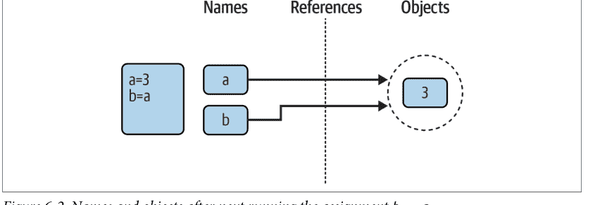

Python 中的这种场景——多个名称引用同一个对象——通常称为*共享引用*（有时或许更准确地说是*共享对象*）。请注意，当这种情况发生时，名称 a 和 b 并非直接相互关联；事实上，在 Python 中，永远无法将一个变量链接到另一个变量。相反，两个变量都通过其引用指向同一个对象。

接下来，假设我们用一条语句扩展此会话：

```
>>> a = 3
>>> b = a
>>> a = 'hack'
```

与所有 Python 赋值一样，此语句只是创建一个新对象来表示字符串值 'hack'，并将 a 设置为引用这个新对象。然而，它不会改变 b 的值；b 仍然引用原始对象，即整数 3。由此产生的引用结构如图 6-3 所示。

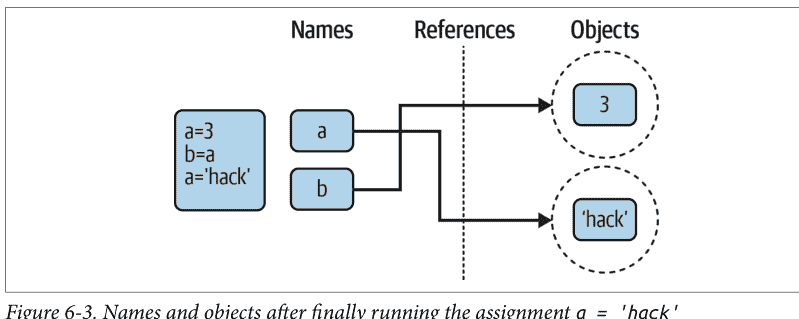

图 6-3. 执行赋值 `a = 'hack'` 后的名称和对象

如果我们改为将 b 更改为 'hack'，也会发生同样的事情——赋值只会改变 b，而不是 a。即使完全没有类型差异，这种行为也会发生。例如，考虑以下三条语句：

```
>>> a = 3
>>> b = a
>>> a = a + 2
```

在这个序列中，发生了相同的事件。Python 使变量 a 引用对象 3，并使 b 引用与 a 相同的对象，如图 6-2 所示；与之前一样，最后的赋值将 a 设置为一个完全不同的对象（在这种情况下，是整数 5，即 `+` 表达式的结果）。它不会作为副作用改变 b。事实上，*永远*无法覆盖对象 3 的值——正如第 4 章所介绍的，整数是*不可变的*，因此永远无法就地更改（明白为什么这很重要了吗？）。我们所能做的只是创建一个新的整数对象。

一种思考方式是，与某些语言不同，Python 中的变量始终是指向对象的指针，而不是可变内存区域的标签：将变量设置为新值并不会改变原始对象，而是导致变量引用一个完全不同的对象。最终效果是，对变量本身的赋值只能影响被赋值的单个变量。然而，当可变对象和就地更改进入方程式时，情况会有所变化；为了了解如何变化，让我们继续前进。

## 共享引用与就地更改

正如你将在本部分后续章节中了解到的，某些操作确实会*就地*更改对象，但它们仅由 Python 的*可变*类型支持——包括列表、字典和集合。例如，对列表中某个偏移量的赋值实际上会就地更改列表对象本身，而不是生成一个全新的列表对象。

尽管在本书的这个阶段，你需要在一定程度上相信这一点，但这种区别在你的程序中可能非常重要。对于支持此类就地更改的对象，你需要更加注意共享引用，因为一个名称的更改可能会影响其他名称。否则，你的对象可能会无缘无故地发生变化。鉴于所有赋值都基于引用（包括函数参数传递），这是一种普遍现象。

为了说明，让我们再次看看第 4 章中介绍的列表对象。回想一下，列表确实支持对位置的就地赋值，它们只是其他对象的集合，用方括号编码：

```
>>> L1 = [2, 3, 4]
>>> L2 = L1
```

这里的 L1 是一个包含对象 2、3 和 4 的列表。列表中的项目通过其位置偏移量访问，因此 `L1[0]` 引用对象 2，即列表 L1 中的第一个项目。当然，列表本身也是对象，就像整数和字符串一样。运行前面的两个赋值后，L1 和 L2 引用同一个共享对象，就像前面示例中的 a 和 b 一样（参见图 6-2）。现在想象一下，像之前一样，我们扩展此交互以执行以下操作：

```
>>> L1 = 24
```

此赋值只是将 L1 设置为不同的对象；L2 仍然引用原始列表，就像上一节一样。然而，如果我们稍微改变此语句的语法，其效果会发生根本性变化：

```
>>> L1 = [2, 3, 4]      # 一个可变对象
>>> L2 = L1              # 创建对同一对象的引用
>>> L1[0] = 24           # 就地更改

>>> L1                   # L1 不同了
[24, 3, 4]
>>> L2                   # 但 L2 也不同了！
[24, 3, 4]
```

实际上，我们在第三行并没有改变 L1 本身；我们改变了 L1 所引用的*对象*的一个组成部分。这种更改会就地覆盖列表对象值的一部分。然而，由于列表对象被其他变量共享（引用），因此像这样的就地更改不仅仅影响 L1——也就是说，你必须意识到，当你进行此类更改时，它们可能会影响程序的其他部分。在此示例中，效果也出现在 L2 中，因为它引用了与 L1 相同的对象。同样，我们实际上也没有改变 L2，但它的值看起来会不同，因为它引用了一个已被就地覆盖的对象。

这种行为仅发生在支持就地更改的可变对象上，并且通常是你想要的，但你应该了解它的工作原理，以便预期到它。这也只是默认行为：如果你不想要这种行为，你可以请求 Python *复制*对象而不是创建引用。有多种方法可以复制列表，包括使用内置的 *list* 函数、列表的 copy 方法以及标准库的 *copy* 模块。也许最常见的方法是从头到尾进行切片（有关切片的更多信息，请参见第 4 章和第 7 章）：

```
>>> L1 = [2, 3, 4]
>>> L2 = L1[:]           # 复制 L1（或 list(L1)、L1.copy() 等）
>>> L1[0] = 24

>>> L1
[24, 3, 4]
>>> L2                   # 这次 L2 没有改变：不同的对象
[2, 3, 4]
```

这里，通过 L1 所做的更改没有反映在 L2 中，因为 L2 引用的是 L1 所引用对象的副本，而不是原始对象；也就是说，两个变量指向不同的对象和不同的内存块。

请注意，这种切片技术不适用于其他主要的可变核心类型，字典和集合，因为它们不是序列——要复制字典或集合，请改用它们的 *X.copy()* 方法调用。

## 共享引用与副本

（列表也有一个），或者将原始对象传递给它们的类型名称，如 `dict` 和 `set`。另外，请注意标准库的 `copy` 模块提供了一个通用的函数来复制任何对象类型，以及一个用于复制嵌套对象结构的函数——例如一个包含嵌套列表的字典：

```python
import copy
X = copy.copy(Y)          # 对任何对象 Y 进行顶层“浅”复制
X = copy.deepcopy(Y)      # 对任何对象 Y 进行深复制：复制所有嵌套部分
```

我们将在第 8 章和第 9 章更深入地探讨列表和字典，并重新审视共享引用和副本的概念。目前，请记住，那些可以就地更改的对象——即可变对象——在它们传递通过的任何代码中，总是容易受到这类影响。在 Python 中，这包括列表、字典、集合以及一些使用 `class` 语句定义的对象。如果这不是期望的行为，只需根据需要复制你的对象即可。

## 公平起见，值得指出的是，本章前面描述的垃圾回收行为对于某些类型来说可能更偏向概念性而非字面意义。考虑以下语句：

```python
>>> x = 99
>>> x = 'Python'          # 现在回收 99 吗？
```

因为 Python 会缓存和重用小整数和小字符串，如前所述，这里的对象 99 可能并没有被真正回收；相反，它很可能会留在系统表中，以便在你下次在代码中生成 99 时重用。然而，大多数类型的对象在不再被引用时会立即被回收；对于那些没有被回收的对象，缓存机制与你的代码无关——除非你使用非典型的工具。

例如，由于 Python 的引用模型，在 Python 程序中有两种不同的方式来检查相等性。让我们创建一个共享引用来演示：

```python
>>> L = [1, 2, 3]
>>> M = L                  # 使 M 和 L 引用同一个对象
>>> L == M                 # 值相同
True
>>> L is M                 # 对象相同
True
```

这里的第一种技术，`==` 运算符，测试两个引用的对象是否具有相同的值；这是 Python 中几乎总是用于相等性检查的方法。第二种方法，`is` 运算符，则测试对象标识——它仅在两个名称指向完全相同的对象时才返回 `True`，因此它是一种更强形式的相等性测试，在大多数程序中很少使用（除了像 `None`、`True` 和 `False` 这样的单实例对象，如前一章所述）。

实际上，`is` 只是简单地比较实现引用的指针，如果需要，它可以作为检测代码中共享引用的一种方式。如果名称指向等价但不同的对象，它会返回 `False`，就像我们运行两个不同的字面表达式时的情况：

```python
>>> L = [1, 2, 3]
>>> M = [1, 2, 3]          # 使 M 和 L 引用不同的对象
>>> L == M                 # 值相同
True
>>> L is M                 # 对象不同
False
```

但现在看看当我们对像整数这样的不可变对象执行相同操作时会发生什么：

```python
>>> X = 99
>>> Y = 99            # 应该是两个不同的对象
>>> X == Y
True
>>> X is Y            # 无论如何是同一个对象：缓存在起作用！
True
```

在这个交互中，X 和 Y 应该是 `==`（值相同），但不是 `is`（对象相同），因为我们运行了两个不同的字面表达式（99）。然而，由于某些整数和字符串被缓存和重用，`is` 告诉我们它们引用的是同一个对象。

如果你真的想深入了解，内置函数 `id` 是另一种检查对象标识的方法（它可能返回也可能不返回对象在内存中的地址）；而标准 `sys` 模块中的 `getrefcount` 函数返回传递对象的引用计数。然而，截至 Python 3.12，后者不像以前那么有趣了，因为它为被认为是“不朽”的对象返回一个非常高的计数——在 Python 中，这仅仅意味着被缓存以供重用：

```python
>>> import sys
>>> sys.getrefcount(99)       # 99 是不朽的（被缓存）
4294967295
>>> sys.getrefcount(2 ** 1000) # 但这个不是
1
>>> id(99) == id(99)          # 相同的 ID/相同的对象（地址？）
True
```

这种对象缓存和重用与你的代码无关（除非你运行 `is` 检查！）。因为你不能就地更改*不可变*的数字或字符串，所以有多少个引用指向同一个对象并不重要——即使所有引用都指向同一个缓存的对象，每个引用也总是看到相同的、不变的值。尽管如此，这种行为反映了 Python 为执行速度优化其模型的众多方式之一。

## 动态类型无处不在

当然，你并不真的需要画出带有圆圈和箭头的名称/对象图来使用 Python。然而，当你刚开始时，如果你能像我们这里所做的那样追踪它们的引用结构，有时会帮助你理解不寻常的情况。例如，如果一个可变对象在你的程序中传递时从你身边改变了，那么你很可能是在亲眼目睹本章的一些主题内容。

此外，即使动态类型在这一点上看起来有点抽象，你最终可能会关心它。因为在 Python 中，*一切*似乎都通过赋值和引用工作，所以对这个模型的基本理解在许多不同的上下文中都很有用。正如你将看到的，它在赋值语句、函数参数、`for` 循环变量、模块导入、类属性等方面的工作方式是相同的。好消息是 Python 中只有*一种*赋值模型；一旦你掌握了动态类型，你就会发现它在语言的任何地方都以相同的方式工作。

在最实际的层面上，动态类型意味着你需要编写的代码更少。同样重要的是，动态类型也是 Python *多态性*的根源，这是第 4 章引入的一个概念，我们将在本书后面再次讨论。因为我们在 Python 代码中不约束类型，所以它既简洁又高度灵活。正如你将看到的，当使用得当时，动态类型——以及它所暗示的多态性——会产生能够随着系统演进自动适应新需求的代码。

## 类型提示：可选的、未使用的，以及为什么？

最后，一个难以置信的情节转折。如果你读过近年来编写的 Python 代码，你可能偶然发现了一些变量名的类型声明，看起来像下面这样——对于像 Python 这样的动态类型语言来说，它们显得好奇且格格不入，乍一看与本章的一些主张相矛盾：

```python
>>> a: int
>>> b: int = 0
>>> c: list[int] = [1, 2, 3]
```

正如第 4 章所预览的，这被称为类型提示。在语法上，它采用冒号和对象类型的形式，位于变量和可选赋值之间。对象类型可以是名称或表达式来表示集合（`list[int]` 表示整数列表），并且可以使用标准库 `typing` 模块中预定义的名称（例如 `Iterable`、`Union` 和 `Any`）来根据精细的理论表达更丰富的类型。截至 Python 3.12，一个新的 `type` 语句甚至可以定义类型别名以在提示中使用，尽管早于它的简单赋值也可以：

```python
>>> type Data = list[float]
>>> Data = list[float]
```

然而，正如第 4 章也指出的，类型提示是可选的、未使用的，并且在很大程度上是学术性的。Python 不要求它们，也不以任何方式使用它们，并且没有打算将来这样做。它们仅用于第三方工具，如类型检查器，以及作为代码注释的替代文档形式。你可以在 `#` 注释和你稍后会遇到的文档字符串中更简单地表达相同的内容。

即使使用，类型提示也不会以任何方式约束你代码的类型。例如，前面 `a` 的类型提示不会创建名称 `a`（只有赋值才会），而 `b` 和 `c` 的提示完全没有被强制执行：

```python
>>> a
NameError: name 'a' is not defined
>>> b = 'hack'
>>> c = 'code'
>>> b, c
('hack', 'code')
```

类型提示也可以出现在函数（和类方法）的定义中，以记录参数和结果的类型，接管了一个称为函数注解的早期特性。我们还没有涵盖这些，但作为预览，以下函数提示它接受一个整数和一个字符串列表，并返回一个浮点数——这些额外的信息出现在宿主对象的 `__annotations__` 字典中：

```python
>>> def func(a: int, b: list[str]) -> float:
...     return 'anything' + a + b
```

然而，对于简单变量，这些提示完全没有被使用，当这个函数实际运行时，任何事情都可以发生。例如，字符串对于输入和输出都工作正常，尽管有看似严格的提示：

```python
>>> func('You', 'Want')
'anythingYouWant'
```

也就是说，类型提示是 Python 采用但完全未使用的概念上沉重的工具。它充其量只是 Python 本身的另一种文档形式，尽管它带有复杂的规则。外部工具可能会使用类型提示来检查类型不匹配（例如 `mypy`）或提高性能，但这些工具也是可选的、不常见的，并且完全独立于 Python 语言。

此外，任何语言的程序都需要运行时测试，而第2章介绍的优化版Python目前并不使用类型提示，在某些情况下也无法使用（参见*PyPy*）。

更重要的是，类型提示也与Python动态类型的核心理念*完全相悖*。在动态类型语言中进行类型声明是一种毫无意义的悖论，它否定了Python的大部分价值主张。向Python学习者教授这种奇怪的扩展，对Python和学习者都是一种伤害。

因此，本书建议初学者至少在熟悉Python的动态类型范式之前，避免使用类型提示。本书也不会进一步介绍它，因为对于努力掌握Python已经相当庞大的基础知识的新手来说，它增加了太多额外的负担却没有带来好处。如果你选择深入研究Python这个愚蠢而复杂的角落，请查阅其文档获取更多信息。

最后——尽管你可能会在来自其他语言的程序员编写的Python代码中看到——类型提示并不意味着Python是静态类型的。Python仍然只使用动态类型，并且希望永远如此。毕竟，这是其相对于其他工具的大部分优势的根源。让我们希望未来的Python开发者在膨胀或破坏这个被数百万人使用和喜爱的工具之前，能很好地理解这一点。

## 章节总结

本章深入探讨了Python的动态类型模型——即Python自动为我们跟踪对象类型的方式，而不是要求我们在脚本中编写声明语句。

在此过程中，我们学习了变量和对象如何通过引用在Python中关联，从而实现类型灵活性。我们还探讨了垃圾回收的主题，了解了共享引用对可变对象如何影响多个变量，并看到了引用如何影响Python中的相等性概念。最后，我们简要了解了类型提示——一个奇怪地向动态类型语言添加未使用类型声明的子领域。

由于Python中只有一种赋值模型，并且赋值在语言中无处不在，因此在继续之前掌握该模型非常重要。以下测验应有助于你回顾本章的一些想法。之后，我们将在下一章继续我们的核心对象之旅，探讨字符串。

## 测试你的知识：测验

1. 考虑以下三条语句。它们会改变A打印的值吗？

   ```python
   A = 'code'
   B = A
   B = 'Python'
   ```

2. 考虑这三条语句。它们会改变A打印的值吗？

   ```python
   A = ['code']
   B = A
   B[0] = 'Python'
   ```

3. 这些呢——A现在被改变了吗？

   ```python
   A = ['code']
   B = A[:]
   B[0] = 'Python'
   ```

## 测试你的知识：答案

1. 不会：A仍然打印为'code'。当B被赋值给字符串'Python'时，发生的所有事情就是变量B被重置为指向新的字符串对象。A和B最初共享（即引用/指向）同一个字符串对象'code'，但在Python中两个名称永远不会链接在一起。因此，将B设置为不同的对象对A没有影响。顺便说一下，如果最后一条语句是B = B + 'coding'，情况也是一样的——连接操作会为其结果创建一个新对象，然后该对象只会被赋值给B。我们永远无法就地覆盖字符串（或数字或元组），因为字符串是不可变的。

2. 会：A现在打印为['Python']。从技术上讲，我们并没有真正改变A或B；相反，我们通过变量B就地覆盖了它们共同引用（指向）的对象的一部分。由于A引用与B相同的对象，更新也反映在A中。

3. 不会：A仍然打印为['code']。这次通过B的就地赋值没有效果，因为切片表达式在列表对象被赋值给B之前创建了它的副本。在第二条赋值语句之后，有两个具有相同值的不同列表对象——在Python中，我们说它们是==，但不是is。第三条语句改变了B指向的列表对象的值，但没有改变A指向的列表对象的值。

> 当引用是“弱”的时候

你可能偶尔会在Python世界中看到“弱引用”这个术语。不，这个词不是对劣势的判断。它指的是一个有些晦涩和高级的工具，与我们这里探讨的引用模型相关，并且像is运算符一样，没有它就无法真正理解。

简而言之，弱引用由weakref标准库模块实现，是对对象的引用，它本身并不阻止被引用的对象被垃圾回收。如果对一个对象的最后剩余引用都是弱引用，那么该对象就可以被回收。当这种情况发生时，它的弱引用将收到通知，告知该对象不再存在，并可以根据需要做出响应。

举个例子，它的实用性在于，对于主要在其他地方使用的大型对象的非必要缓存很有用。如果这样的缓存使用普通引用，仅缓存的引用就会无限期地将对象保留在内存中。通过使用弱引用，当对象不再需要用于其主要角色时，其空间可以被回收，并且缓存将通过下次获取或回调得知其消亡。

并非所有对象类型都可以被弱引用，尽管可以使用我们将在本书后面探讨的OOP技术为某些类型添加支持。不过，这实际上只是我们在这里遇到的引用模型的一个特例扩展。有关弱引用的更多详细信息，请参阅Python库手册中对weakref的介绍，这是一个有用但不幸命名的工具。

# 第7章
## 字符串基础

到目前为止，我们已经研究了数字并探讨了Python的动态类型模型。我们深入对象之旅的下一个主要类型是Python*字符串*——用于存储和表示基于文本和字节信息的字符的有序集合。我们在第4章简要地看过字符串。在这里，我们将重新审视它们，以填补我们之前跳过的细节。

在开始之前，让我们先明确我们*不会*在这里涵盖什么。第4章也简要预览了*Unicode*字符串和文件——用于处理非ASCII文本的工具。Unicode是程序员的关键工具，特别是那些在互联网领域工作的程序员。例如，它可能出现在网页、电子邮件、GUI工具包、文件处理工具、XML和JSON文本等中。同时，对于刚开始的程序员来说，Unicode可能是一个沉重的话题，完全理解它依赖于我们尚未完全研究的工具，比如文件。

鉴于此，本书将其字符串内容分为两部分：这里的基础部分，以及其在高级主题部分的第37章中扩展到Unicode和字节字符串。也就是说，本章只讲述了Python中字符串故事的一部分——大多数脚本使用的部分，也是大多数Python学习者需要预先了解的部分。尽管范围有限，我们在这里学到的一切也将直接适用于Unicode和字节处理，因为Python文本字符串*就是*Unicode，即使它们是简单的ASCII文本，而字节字符串只是限制为字节值的字符串。

在你学习了这里的基础知识之后，建议阅读第37章以了解字符串的其余内容，大多数程序员最终都会想要跟进其内容。Unicode在当今的编程中很少是可选的，尽管最好推迟到你有机会掌握字符串的一般知识之后。那么，让我们开始吧！

## 字符串对象基础

从功能的角度来看，字符串可以用来表示几乎任何可以编码为文本或字节的东西。在文本方面，这包括符号和单词（例如你的名字）、加载到内存中的文本文件内容、互联网地址、Python源代码等。字符串也可以用于保存用于媒体文件和网络传输的原始字节，以及非ASCII Unicode文本的编码和解码形式。

你可能也在其他语言中使用过字符串。Python的字符串在C等语言中扮演着与字符数组相同的角色，但它们是比数组更高级的工具。与C不同，Python中的字符串附带了一套强大的预编码处理工具。同样不同于像

## 字符串字面量

总的来说，字符串在 Python 中使用起来相当简单。不过，你需要了解的第一件事是，在代码中编写字符串的方式有很多种：

- 单引号：`'cod"e'`
- 双引号：`"cod'e"`
- 三引号：`'''...code...'''`，`"""...code..."""`
- 转义序列：`"c\to\nd\0e"`
- 原始字符串：`r"C:\new\test.bin"`
- （第 37 章）字节字面量：`b'co\x01de'`
- （第 37 章）Unicode 字面量：`'h\u00c4ck'`

单引号和双引号形式是迄今为止最常见的；其他形式则用于特定用途，而最后两种高级形式的进一步讨论我们将推迟到第 37 章。现在，让我们快速依次看看所有其他选项。

## 单引号和双引号是相同的

在 Python 字符串中，单引号和双引号字符是可以互换的，尽管它们必须匹配，并且必须是直引号（小心那些会自动更正为斜引号的工具！）。也就是说，字符串字面量可以用两个单引号或两个直双引号括起来编写——这两种形式效果相同，并返回相同类型的对象。例如，以下两个字符串，在通常的 REPL 中编写，一旦被 Python 读取，它们就是相同的：

```
$ python3
>>> 'python', "python"
('python', 'python')
```

支持两者的原因在于，它允许你在字符串中嵌入另一种引号字符，而无需用反斜杠转义。你可以在用单引号字符括起来的字符串中嵌入双引号字符，反之亦然，而无需使用你稍后将遇到的转义符：

```
>>> 'python"s', "python's"          # 无需转义的混合引号
('python"s', "python's")
```

本书通常倾向于在字符串周围使用*单*引号，只是因为它们稍微容易阅读一些，除非字符串中嵌入了单引号。这是一种纯粹的主观风格选择，但 Python 也以这种方式显示字符串，而且如今大多数 Python 程序员也这样做，所以你可能也应该这样做。

请注意，前面代码中的逗号很重要。没有它，Python 会*自动连接*任何类型的相邻字符串字面量。在它们之间添加一个 + 运算符来显式调用连接几乎同样简单，但相邻字面量在代码被读取时就会被连接（正如你将学到的，将这种形式包装在括号中也允许它跨越多行，用于无法使用三引号的较大文本块）：

```
>>> title = "Learning " 'Python' " 6E"    # 读取时的隐式连接
>>> title
'Learning Python 6E'
```

在这些字符串之间添加逗号将产生一个元组，而不是一个字符串。还要注意，在所有这些输出中，Python 以单引号打印字符串，除非它们嵌入了一个引号。如果需要，你也可以通过用反斜杠转义来嵌入引号字符：

```
>>> 'python\'s', "python\"s"
("python's", 'python"s')
```

要理解原因，你需要继续学习转义在一般情况下是如何工作的。

## 转义序列是特殊字符

前面的例子通过在引号前加上反斜杠（\）在字符串中嵌入了一个引号。这代表了字符串中的一个普遍模式：反斜杠用于引入称为*转义序列*的特殊字符编码。

转义序列允许我们将无法轻松插入字符串字面量或无法在键盘上输入的字符嵌入到字符串中。字符 \ 以及字符串字面量中它后面的一个或多个字符，在结果字符串对象中被替换为*单个*字符，该字符具有转义序列指定的值。例如，这是一个嵌入了换行符和制表符的五字符字符串：

```
>>> s = 'a\nb\tc'
```

两个字符 \n 代表一个字符——*换行*字符（从技术上讲，码点值为 10，在 Unicode 及其 ASCII 子集中表示换行）。同样，序列 \t 被替换为*制表*字符（码点 9）。这个字符串打印时的外观取决于你如何打印它。交互式回显将特殊字符显示为转义符，但 `print` 会解释它们：

```
>>> s
'a\nb\tc'
>>> print(s)
a
b	c
```

要完全确定这个字符串中有多少个实际字符，请使用内置的 `len` 函数——它返回字符串中实际的字符数，无论它是如何编码或显示的：

```
>>> len(s)
5
```

这个字符串长五个字符：它包含一个 ASCII a、一个换行符、一个 ASCII b，依此类推。

**但长度不是字节数**：如果你习惯于全 ASCII 文本，很容易认为这个 `len` 结果也意味着五个*字节*，但你可能不应该这样想。实际上，在当今的 *Unicode* 世界中，“字节”已经不再具有它曾经的意义。一方面，Python 字符串对象包含管理数据，使其在内存中比其纯文本更大。

另一方面，字符串内容和长度都反映了 Unicode 分配的*码点*（标识数字），而单个字符的码点不一定映射到单个字节——无论是在内存中解码还是在文件中编码时都是如此。例如，在 UTF-16 编码下，ASCII 字符在文件中是多个字节，并且在内存中可能根据 Python 分配空间的方式而具有任何大小。此外，像 🐍 和 👍 这样的非 ASCII 字符的码点值太大，无法以任何形式放入 8 位字节中。

事实上，Python 正式将 `str` 字符串定义为*Unicode 码点序列*，而不是字节，以明确这一点。关于 Unicode 文本如何消除字节的更多内容，请参阅第 37 章，当你准备好深入研究时。目前，为避免混淆，请在字符串中思考*字符*而不是*字节*。

请注意，前面示例中的原始反斜杠字符实际上并没有与字符串一起存储在内存中；它们仅用于描述要存储在字符串中的特殊字符值。为了编码这些特殊字符，Python 识别一整套转义码序列，如表 7-2 所列以供参考。

*表 7-2. 字符串反斜杠字符*

| 转义 | 含义 |
| :--- | :--- |
| `\\` | 反斜杠（存储一个 \） |
| `\'` | 单引号（存储 '） |
| `\"` | 双引号（存储 "） |
| `\n` | 换行（也称为行馈送） |
| `\r` | 回车（例如，在 Windows 中 \r\n） |
| `\t` | 水平制表符 |
| `\v` | 垂直制表符 |
| `\a` | 响铃（在支持的地方） |
| `\b` | 退格 |
| `\f` | 换页 |
| `\xhh` | 十六进制码点或字节值（恰好 2 位十六进制数字） |
| `\ooo` | 八进制码点或字节值（最多 3 位数字，上限 377） |

与 C 不同，Python 没有单独的字符类型；相反，你只需使用单字符字符串来表示单字符信息。

严格来说，Python 字符串被归类为*不可变序列*，这意味着它们包含的字符具有从左到右的位置顺序，并且不能就地更改。事实上，字符串是我们将在此探索的称为*序列*的更大类对象的第一个代表。请注意本章涵盖的序列操作，因为它们在你稍后将遇到的其他序列类型（如列表和元组）上将以相同方式工作。

作为第一步，表 7-1 通过抽象示例（不要期望其代码片段能运行！）预览了本章讨论的常见字符串字面量和操作。如图所示，空字符串写成一对引号（单引号或双引号），中间没有任何内容，并且有多种方式可以编码字符串。在处理方面，字符串支持*表达式*操作，如连接（组合字符串）、切片（提取部分）、索引（按偏移量获取）等。除了表达式，Python 还提供了一组字符串*方法*来实现常见的特定于字符串的任务，以及用于更高级文本处理任务（如模式匹配）的*模块*。

表 7-1. 常见字符串字面量和操作

| 操作 | 解释 |
| :--- | :--- |
| S = '' | 空字符串 |
| S = "app's" | 双引号，与单引号相同 |
| S = 'c\no\td\x00e' | 转义序列 |
| S = """...multiline...""" | 三引号块字符串 |
| S = r'\temp\data.txt' | 原始字符串（忽略转义） |
| B = b'h\xc4ck' | 字节字符串（第 4 章，第 37 章） |
| S = 'py\U0001F40D' | Unicode 字符串（第 4 章，第 37 章） |
| S = u'py\U0001F40D' | Python 2.X 兼容性（第 37 章） |
| S1 + S2 | 连接、重复 |
| S * 3 | |
| S[i] | 索引、切片、长度 |
| S[i:j] | |
| len(S) | |
| S1 > S2, S1 == S2 | 比较：大小、相等性 |
| 'a %s coder' % kind | 字符串格式化表达式 |
| 'a {0} coder'.format(kind) | 字符串格式化方法 |
| f'a {kind} coder' | 字符串格式化字面量（3.6+） |
| S.find('od') | 字符串方法（参见后面全部 43 个）：搜索、 |
| S.rstrip() | 移除空白、 |
| S.replace('od', 'ood') | 替换、 |
| S.split(',') | 按分隔符分割、 |
| S.isdigit() | 内容测试、 |
| S.lower() | 大小写转换、 |
| S.endswith('thon') | 结尾测试、 |
| S.join(strlist) | 分隔符连接、 |
| S.encode('utf8') | Unicode 编码、 |
| B.decode('latin1') | Unicode 解码等（见表 7-3） |
| `'py' in S.lower()` | 成员关系、迭代 |
| `for x in S: print(x)` | |
| `[c * 2 for c in S]` | |
| `map(ord, S)` | |
| `re.match('Py(.*)on', line)` | 模式匹配：库模块 |

除了表 7-1 中字符串工具的核心之外，Python 还通过标准库的 `re`（代表“正则表达式”）模块（在第 37 章演示）支持更高级的基于模式的字符串处理，甚至还有更高级的文本处理工具，如 HTML、JSON 和 XML 解析器。然而，本书和本章的重点是表 7-1 所代表的基础知识。

本章首先概述字符串字面量形式和字符串表达式，然后继续介绍更高级的工具，如字符串方法和格式化。Python 附带了许多字符串工具，我们不会在这里全部介绍；完整的内容记录在 Python 库手册中。我们的目标是探索足够常用的工具，为你提供一个代表性的样本；我们不会在这里看到实际操作的方法与我们将看到的方法类似。

## 原始字符串抑制转义

正如我们已经看到的，转义序列对于在字符串中嵌入特殊字符非常方便。然而，有时反斜杠用于引入转义的特殊处理可能会带来麻烦。例如，Python 新手尝试在 Windows 上打开文件时，使用类似这样的文件名参数，这种情况出奇地常见：

```
myfile = open('C:\new\text.dat', 'w')
```

他们以为会打开目录 *C:\new* 中名为 *text.dat* 的文件。问题在于，`\n` 被解释为换行符，`\t` 被替换为制表符。实际上，这个调用试图打开一个名为 *C:(换行符)ew(制表符)ext.dat* 的文件，结果通常不尽如人意。

这正是 *原始字符串* 旨在解决的问题。如果在本章涵盖的任何字符串字面量的开引号前出现字母 *r*（大写或小写，但通常是小写），它会关闭转义机制。结果是 Python 会 *按字面意思* 保留你的反斜杠，就像它们在字符串中出现的那样。因此，要解决文件名问题，只需记住在 Windows 上添加字母 *r*：

```
myfile = open(r'C:\new\text.dat', 'w')          # 有效：禁用 \ 转义
```

或者，因为如前一节所述，两个反斜杠实际上是一个反斜杠的转义序列，你可以通过简单地将它们加倍来保留反斜杠，当它们应该被逐字取用时：

```
myfile = open('C:\\new\\text.dat', 'w')          # 同样有效：\\ 表示 \
```

事实上，Python 本身有时在打印带有嵌入反斜杠的字符串时也使用这种加倍方案：

```
>>> path = r'C:\new\text.dat'          # 原始字符串：保留 \s
>>> path          # 显示为 Python 代码
'C:\\new\\text.dat'
>>> print(path)          # 用户友好的格式
C:\new\text.dat
>>> len(path)          # 字符串长度：\s
15
```

如第 5 章所述，交互式提示符下的默认格式打印结果就像它们是代码一样，因此在输出中转义反斜杠。`print` 语句提供了一种更用户友好的格式，显示每个位置实际上只有一个反斜杠。要验证这一点，你可以检查内置 `len` 函数的结果，它返回字符串中的字符数，与显示格式无关。如果你计算 `print(path)` 输出中的字符，你会看到每个反斜杠确实只有 1 个字符，总共 15 个。

除了 Windows 上的目录路径，原始字符串也常用于文本模式匹配中的 *正则表达式*，由第 37 章介绍的 `re` 模块支持。还要注意，Python 脚本通常可以在 Windows 和 Unix 上的目录路径中使用 *正斜杠*，因为这个斜杠是可移植解释的（例如，`'C:/new/text.dat'` 在打开 Windows 文件时也有效）。原始字符串对于使用原生 Windows 反斜杠的路径很有用，以及任何你希望确保 Python 不会动你的 `\` 的时候。它们也适用于三引号字符串，以抑制转义（以及未来无效的转义错误！）在接下来的文本中。

| 转义 | 含义 |
|---|---|
| \0 | 空字符：八进制二进制 0 字符（不终止字符串） |
| \uhhhh | Unicode 字符码点，16 位值（恰好 4 个十六进制数字） |
| \Uhhhhhhhh | Unicode 字符码点，32 位值（恰好 8 个十六进制数字） |
| \N{name} | Unicode 数据库中 ID 为 *name* 的字符 |
| \newline | 忽略（在续行之前） |
| \other | 按字面意思保留，但在 3.12 中发出警告，未来将是错误 |

表 7-2 中的一些转义带有使用规则。再次作为参考，以下是细节：

- `\x`、`\u` 和 `\U` 转义序列分别需要恰好两个、四个和八个十六进制数字。对于 *h*，使用数字 0–9 和 A–F（大写或小写）。
- `\o` 转义接受一到三个八进制数字，并在 Python 3.12 中对超过 `\377` 的值发出警告，因为对于字节来说太大的值会在字节字符串中引起问题。对于 *o*，使用数字 0–7。
- `\u` 和 `\U` 仅在 *str* 文本字符串字面量（例如 `'...'`）中被识别，其中它们给出字符的 Unicode 码点值。这是码点的解码值。
- `\x` 和 `\o` 转义在字节字节字符串字面量（`b'...'`）中有效，其中它们给出字节的绝对值；在 *str* 文本字符串字面量中也有效，其中它们给出字符的 Unicode 码点值。
- 像 `\n` 这样的字母转义在文本中代表它们的 Unicode 码点，在字节中代表它们的 ASCII 编码，即使这两个值一致（关于 Unicode 转义的更多信息在第 37 章）。

让我们回到运行代码。一些字符串转义序列允许你将绝对值作为字符串的字符嵌入。当你这样做时，你实际上是在给出所需字符的 *码点* 值。例如，这是一个五字符字符串，嵌入了两个零值字符（编码为一位八进制转义）：

```
>>> s = 'a\0b\0c'
>>> s
'a\x00b\x00c'
>>> len(s)
5
```

与码点 0 关联的字符通常称为 NULL（或 NUL）。重要的是，在 Python 中，这样的字符不会像 C 中的“空字节”那样终止字符串。相反，Python 在内存中同时保留字符串的长度和文本。事实上，在 Python 中 *没有* 字符会终止字符串。这是一个全部是绝对转义码的字符串——一个绝对的 1 和 2（八进制编码），后跟一个绝对的 3（十六进制编码），并且都是不可打印的：

```
>>> s = '\001\002\x03'
>>> s
'\x01\x02\x03'
>>> len(s)
3
```

请注意，Python 以十六进制显示不可打印字符，无论它们是如何指定的。需要时，你可以自由组合字符、绝对值转义和表 7-2 中更具符号性的转义。为了演示，以下字符串包含字符“HACK”、一个制表符和换行符，以及一个十六进制编码的绝对零字符：

```
>>> S = 'H\tA\nC\x00K'
>>> S
'H\tA\nC\x00K'
>>> len(S)
7
>>> print(S)
H   A
CK
```

当你在 Python 中处理二进制数据文件时，了解这一点变得更加重要。因为它们的内容在脚本中表示为字符串，所以处理包含任何类型二进制字节值的二进制文件是可以的。以二进制模式打开时，文件从外部文件返回原始字节作为 `bytes`——一种支持本章大部分语法和工具的字符串变体（你将在第 4、9 和 37 章找到更多关于文件和字节的内容）。

表 7-2 中的两个限制值得注意。首先，从 Python 3.12 开始，值对于字节来说太大的八进制转义会发出警告，并且很快就会成为错误——尽管文本字符串中的这些转义表示的是码点，而不是字节：

```
>>> '\400'
<stdin>:1: SyntaxWarning: invalid octal escape sequence '\400'
'Ã'
```

这似乎不太可能破坏太多代码，但表 7-2 中的最后一项可能会：如果 Python 不识别 `\` 之后的字符为有效的转义代码，它会简单地在结果字符串中保留反斜杠——至少目前是这样：

```
>>> x = 'C:\py\code'
<stdin>:1: SyntaxWarning: invalid escape sequence '\p'

>>> x                    # 按字面意思保留 \（并显示为 \）
'C:\py\code'
>>> len(x)               # 但不会长久：不要再依赖这个了！
10
```

尽管这种行为在过去三十年里是预期的（甚至被依赖），但最近被认为是不好的，并且在使用时开始发出警告。在 Python 3.12 中，它会引发一个语法警告，不会停止你的程序，但会用唠叨信息弄乱你的输出。更糟糕的是，这将在未来的 Python 中被视为导致程序终止的错误，因此你不应该继续使用它——并且预计要更改你过去编写的所有代码！

然而，即使没有这个向后不兼容的 Python 变更，依赖这种行为的字符串似乎也像在其他地方保留反斜杠一样容易丢失转义中的反斜杠。相反，通过使用 `\`（一个 `\` 的转义）加倍它们，或使用原始字符串——下一节的主题，来显式地编写字面反斜杠，以便它们在所有 Python 版本中都保留在你的字符串中。


*原始字符串的怪癖：* 尽管有其作用，但即使是原始字符串也*不能以*单个反斜杠结尾，因为反斜杠会转义后面的引号字符。也就是说，`r'...\''` 不是有效的字符串字面量：你仍然必须转义周围的引号字符才能将其嵌入字符串中，而 Python 会假定这是你的意图。结果是，原始字符串不能以奇数个反斜杠结尾，包括一个。如果你需要以单个反斜杠结尾原始字符串，你可以使用两个反斜杠并切掉第二个（`r'...\''[:-1]`），手动添加一个（`r'...' + '\'`），或者跳过原始字符串语法，直接在普通字符串中加倍反斜杠（`'...\\'`）。这三种形式都创建了相同的两个字符的字符串，包含一个 Unicode 省略号和一个反斜杠。

## 三引号和多行字符串

到目前为止，你已经看到了单引号、双引号、转义和原始字符串的实际应用。Python 还有一种三引号字符串字面量格式，有时称为*块字符串*，这是一种用于编码多行数据的语法便利形式。这种形式以三个引号（单引号或双引号均可）开始，后跟任意数量的文本行，并以与开始时相同的三引号序列结束。字符串文本中嵌入的单引号和双引号可以转义，但不必转义——字符串不会结束，直到 Python 看到三个未转义的、与开始字面量时相同类型的引号。例如：

```
>>> quip = """Python strings
...     sure have
... a lot of options"""
>>>
>>> quip
'Python strings\n  sure have\na lot of options'
```

这个字符串跨越三行。正如你在第 3 章学到的，在某些界面中，交互式提示符在像这样的续行上会变为 `...`，但在其他界面中则不会。本书在一些示例中省略了这些点，以便于复制粘贴，但如果它们像这里列出的那样出现在你的 REPL 中，而你的环境中没有，请不要输入它们，并根据需要进行推断。

撇开提示符不谈，Python 将此示例中的所有三引号文本收集到一个单独的多行字符串中，在代码有物理换行的地方嵌入换行符（`\n`）。注意，就像在字面量中一样，结果中的第二行有前导空格，但第三行没有——你输入的就是你得到的。要查看换行符被解释后的字符串，请打印它而不是回显：

```
>>> print(quip)
Python strings
  sure have
a lot of options
```

事实上，三引号字符串将保留所有包含的文本，*包括*你代码右侧可能打算作为*注释*的任何内容。所以不要这样做——将你的注释放在引号文本的上方或下方，或者使用前面提到的相邻字符串的自动连接，如果需要的话加上显式的换行符，并使用括号以允许跨行（当你在第 10 章和第 12 章学习语法规则时，你会了解到更多关于后一种形式的内容）：

```
>>> menu = """
... Open        # Comments here added to string!
... Save        # Ditto
... """
>>> menu
'\nOpen        # Comments here added to string!\nSave        # Ditto\n'

>>> menu = (
... 'Open\n'    # Comments here ignored
... 'Save\n'   # But newlines not automatic
... )
>>> menu
'Open\nSave\n'
```

那么为什么要使用三引号字符串呢？首先，当你在程序中需要*多行文本*时，它们很有用——例如，在 Python 源代码文件中嵌入多行错误消息，或 HTML、XML、JSON 或 YAML 代码。你通常可以通过三引号直接将这些块嵌入到脚本中，而无需借助外部文本文件或连接和换行符。

三引号字符串也常用于*文档字符串*（docstrings），这些是字符串字面量，当它们出现在文件中的特定位置时被视为注释（将在第 15 章全面介绍）。这些不必是三引号块，但通常是为了允许多行注释，并且可能需要是三引号原始字符串（例如 r''''''）以避免将来出现无效的转义错误（参见前面提到的 3.12 语法警告）。

最后，三引号字符串有时也被用作一种“非常 hacky”的方式，在开发过程中*临时禁用*代码行。实际上，这并不太糟糕，而且在今天实际上是一种相当常见的做法，但这并不是该字面量的初衷。如果你希望关闭几行代码并再次运行脚本，只需在它们的上方和下方放置三个引号，像这样：

```
X = 1
"""
import os              # Disable this code temporarily
print(os.getcwd())
"""
Y = 2
```

这被标记为“hacky”，因为 Python 确实可能会将这种方式禁用的代码行变成一个字符串，但这在性能方面可能并不重要。对于大段代码，这也比手动在每行前面添加井号然后稍后删除它们更容易。如果你使用的文本编辑器没有专门支持编辑 Python 代码，这一点尤其如此。在 Python 中，实用性往往胜过美观。

## 字符串实战

一旦你用我们刚刚遇到的字面量表达式创建了一个字符串，你几乎肯定会想用它做一些事情。本节和接下来的两节将演示字符串表达式、方法和格式化——Python 语言中文本处理工具的第一线。

### 基本操作

让我们开始与 Python 解释器交互，以说明表 7-1 中列出的基本字符串操作。你可以使用 `+` 运算符连接字符串，使用 `*` 运算符重复字符串：

```
>>> len('abc')          # Length: number of items
3
>>> 'abc' + 'def'      # Concatenation: a new string
'abcdef'
>>> 'Py!' * 4          # Repetition: like 'Py!' + 'Py!' + 'Py!' + 'Py!'
'Py!Py!Py!Py!'
```

这里的 `len` 内置函数返回字符串（或任何其他具有长度的对象）的长度。形式上，用 `+` 添加两个字符串对象会创建一个新的字符串对象，其操作数的内容被连接起来，而用 `*` 重复就像将一个字符串与自身相加给定次数（减一）。在这两种情况下，Python 都允许你创建任意大小的字符串；在 Python 中无需预先声明任何内容，包括数据结构的大小——你只需根据需要构建字符串对象，并让 Python 自动管理底层内存空间，正如我们在第 6 章学到的。

重复起初可能看起来有点晦涩，但它在令人惊讶的许多场景中派上用场。例如，要打印一行 80 个破折号，你可以数到 80，或者让 Python 为你数：

```
>>> print('------ ...more... ------')    # 80 dashes, the hard way
>>> print('-' * 80)                     # 80 dashes, the easy way
```

注意，第 5 章和前面提到的*运算符重载*和*多态*在这里已经起作用了：我们使用的是与数字相加和相乘时相同的 `+` 和 `*` 运算符。Python 执行正确的操作，因为它知道被相加和相乘的对象的类型。但要小心：规则并不像你可能预期的那么宽松。例如，Python 不允许你在 `+` 表达式中混合数字和字符串：`'abc' + 9` 会引发错误，而不是自动将 9 转换为字符串（我们稍后会解决这个问题）。

如表 7-1 末尾附近所示，你还可以在循环中使用 `for` 语句迭代字符串，该语句重复操作，并使用 `in` 表达式运算符测试字符和子字符串的成员资格，这本质上是一种搜索。对于子字符串，`in` 与本章后面介绍的 `str.find()` 方法非常相似，但它返回布尔结果而不是子字符串的位置（如果下面的 `print` 缩进了你的提示符，请不要惊慌；它的 `end=' '` 将显示末尾的默认换行符更改为一个空格）：

```
>>> myjob = 'hacker'
>>> for c in myjob:              # Step through items, print each + ' '
...     print(c, end=' ')        # Suppress newlines after each item
...
h a c k e r
>>> 'k' in myjob                 # Found
True
>>> 'z' in myjob                 # Not found
False
>>> 'HACK' in 'abcHACKdef'       # Substring search, no position returned
True
```

`for` 循环（在第 4 章预览过）将一个变量分配给序列（这里是一个字符串）中的连续项，并为每个项执行一个或多个语句（通常是缩进的）。实际上，变量 `c` 成为一个在字符串字符上移动的游标。因为迭代在 Python 中是一个重要的概念，我们将在本书后面更详细地讨论像这样的迭代工具以及表 7-1 中列出的其他工具（参见第 14 章和第 20 章）。

## 索引与切片

由于字符串是字符的有序集合（也称为*序列*），我们可以通过位置访问其组成部分。正如*第4章*所介绍的，字符串中的字符通过*索引*获取——在字符串后使用方括号提供所需组件的数字偏移量。你将获得指定位置的单字符字符串。

与大多数类C语言一样，Python的偏移量从0开始，到字符串长度减1结束（如果你习惯从1开始计数，“从0开始”可能是一个短暂的障碍）。然而，与C不同的是，Python还允许你使用*负*偏移量从序列（如字符串）中获取项目。从技术上讲，负偏移量会加到字符串的长度上以得到正偏移量，但你也可以将负偏移量视为从末尾向后计数。以下交互演示了这一点：

```
>>> S = 'code'
>>> S[0], S[-2]          # 从前面或末尾索引
('c', 'd')
>>> S[1:3], S[1:], S[:-1] # 切片：提取一个部分
('od', 'ode', 'cod')
```

在这段代码中，第一行定义了一个四字符字符串并将其赋值给名称S。下一行以两种方式*索引*它：S[0]获取从左边偏移量为0的项目——即前面的单字符字符串'c'；而S[-2]获取从末尾偏移量为2的项目——或者等效地，从前面偏移量为(4 + (-2))的项目。

上述示例的最后一行演示了*切片*，这是索引的一种泛化形式，它返回整个*部分*，而不是单个项目。它可用于提取数据列、去除前缀和后缀等。切片也可以被视为一种*解析*（分解内容）类型，特别是应用于字符串时，因为它是提取子字符串的简便方法。事实上，我们将在本章后面探讨文本解析的上下文中研究切片。

切片的工作原理如下：当你使用冒号分隔的一对偏移量索引序列对象（如字符串）时，Python返回一个新对象，其中包含由偏移量对标识的连续部分。左偏移量被视为下界（*包含*），右偏移量是上界（*不包含*）。也就是说，Python从下界开始获取所有项目，直到但不包括上界，并返回一个包含所获取项目的新对象。如果省略，左边界和右边界默认为0和你正在切片的对象的长度。

例如，在我们刚刚运行的示例中，S[1:3]提取偏移量为*1*和*2*的项目——它获取第二个和第三个项目，并在偏移量为3的第四个项目之前停止。接下来，S[1:]获取*第一个之后的所有项目*——未指定的上界默认为字符串的长度，即超出末尾。最后，S[:-1]获取*除最后一个项目外的所有项目*——下界默认为0，-1指的是最后一个项目，不包含在内。用更形象的术语来说，索引和切片映射到单元格，如*图7-1*所示。

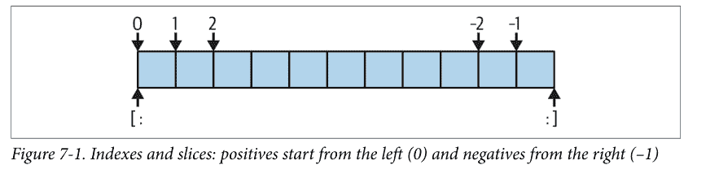

所有这些一开始可能看起来令人困惑，但一旦你掌握了窍门，索引和切片就是简单而强大的工具。记住，如果你不确定切片的效果，可以交互式地尝试一下。在下一章中，你将看到通过*赋值*给切片，甚至可以一步更改另一个对象的整个部分（尽管对于我们正在研究的字符串等不可变对象则不行）。现在，这里有一个详细信息的备忘单供参考：

*索引*——*S[I]*——获取序列中偏移量处的组件：

- 第一个项目在偏移量0处。
- 负索引意味着从末尾或右边向后计数。
- 越界偏移量是错误。
- S[0]获取第一个项目。
- S[-2]获取从末尾数第二个项目（类似于S[len(S)–2]）。

*切片*——*S[I:J]*——提取序列的连续部分：

- 上界不包含在内。
- 如果省略，切片边界默认为0和序列长度。
- 越界偏移量会被调整到范围内。
- S[1:3]获取偏移量1到但不包括3的项目。
- S[1:]获取从偏移量1到末尾（序列长度）的项目。
- S[:3]获取偏移量0到但不包括3的项目。
- S[:-1]获取偏移量0到但不包括最后一个项目的项目。
- S[:]获取从偏移量0到末尾的项目——创建S的顶层副本。

*扩展切片*——*S[I:J:K]*——接受一个步长（或步幅）*K*，默认为+1：

- 允许跳过项目和反转顺序——请参阅下一节。

这里列出的倒数第二个项目点结果是一个常用技术：S[:]创建序列对象的完整顶层*副本*——一个具有相同值但不同内存块的对象（你将在第9章中找到更多关于副本的信息）。这对于像字符串这样的不可变对象不是很有用，但对于可能就地更改的对象（如列表）很方便：制作副本可以避免第6章中显示的共享引用的副作用。

同样根据备忘单，切片在*越界*（超出末尾）偏移量的策略上与索引不同：在索引中它们总是*错误*，因为偏移量不存在，但在切片中*缩放*到范围内，因为这在需要灵活适应大小的程序中很有用：

```
>>> S = 'code'
>>> S[99]
IndexError: string index out of range
>>> S[1:99]
'ode'
```

因为我们要在部分末尾的练习中探讨这个奇怪之处，所以我们在这里长话短说。

## 扩展切片：第三个限制和切片对象

虽然不常用，但切片表达式也支持可选的第三个索引，用作*步长*（有时称为*步幅*）。步长被添加到每个提取项目的索引中。有了它，切片的完整形式是`S[I:J:K]`，意思是“从偏移量*I*到*J*-1，按*K*提取S中的所有项目。”第三个限制*K*默认为+1，这就是为什么通常切片中的所有项目都是从左到右提取的。但是，如果你指定了一个显式值，你可以使用第三个限制来跳过项目或反转它们的顺序。

例如，`S[1:10:2]`将从偏移量1-9中获取*S*中的*每隔一个项目*；也就是说，它将收集偏移量为1、3、5、7和9的项目。通常，第一个和第二个限制默认为0和序列的长度，因此`X[::2]`从序列的开头到末尾获取每隔一个项目：

```
>>> S = 'abcdefghij'
>>> S[1:10:2]          # 跳过项目
'bdfhj'
>>> S[::2]
'acegikmo'
```

你也可以使用负步幅以相反的顺序收集项目。例如，在切片表达式`S[::-1]`中，前两个边界默认为序列长度–1和–1（它们实际上默认为None和None，但这在这里不重要），步幅为–1表示切片应该从右到左而不是通常的从左到右。用更简单的术语来说，效果是*反转*序列：

```
>>> S = 'hello'
>>> S[::-1]            # 反转项目
'olleh'
```

使用负步幅时，前两个边界的意义基本上是相反的。也就是说，切片`S[5:1:-1]`以相反的顺序获取从2到5的项目（结果包含偏移量为5、4、3和2的项目）：

```
>>> S = 'abcdefg'
>>> S[5:1:-1]          # 边界角色不同
'fedc'
```

像这样跳过和反转是三限制切片最常见的用例，但有关更多详细信息，请参阅Python的标准库手册（或交互式运行一些实验）。我们将在本书后面结合`for`循环语句再次讨论三限制切片。

在本书后面，你还将了解到切片等同于使用*切片对象*进行索引，这一发现对于寻求支持这两种操作的类编写者很重要：

```
>>> 'code'[1:3]        # 切片语法
'od'
>>> 'code'[slice(1, 3)] # 切片对象与索引语法 + 对象
'od'
>>> 'code'[::-1]
'edoc'
>>> 'code'[slice(None, None, -1)]
'edoc'
```

## 你为何会关心：切片

在本书中，你会遇到诸如本节这样的常见用例侧边栏，它们让你一窥所讨论的语言特性在实际程序中的典型用法。由于在你对Python有更多了解之前，很难理解这些实际用例，因此这些侧边栏必然包含许多尚未介绍的主题；最多，你应该将它们视为一种预览，了解这些抽象的语言概念如何可能对实际编程任务有用。

例如，你稍后会看到，用于启动Python程序的系统命令行上列出的参数词，在内置`sys`模块的`argv`属性中可用：

```
# File echo.py
import sys
print(sys.argv)

$ python3 echo.py -a -b -c
['echo.py', '-a', '-b', '-c']
```

通常，你只对检查程序名之后的参数感兴趣。这导致了切片的一个典型应用：单个切片表达式可用于返回列表中除第一项之外的所有项。这里，`sys.argv[1:]`返回所需的列表`['-a', '-b', '-c']`。然后你可以处理这个列表，而无需考虑前面的程序名。

切片也常用于清理从输入文件读取的行，就像我们将在第9章中研究的那样。如果你知道一行末尾会有换行符（`\n`），你可以用一个简单的表达式如`line[:-1]`来去掉它，它提取行中除最后一个字符之外的所有字符。在这两种情况下，切片都完成了在低级语言中必须显式编写的逻辑工作。

话虽如此，调用`line.rstrip`方法通常更适用于去除换行符，因为如果行末尾没有换行符（这在使用某些文本编辑工具创建的文件中很常见），此调用会保持行不变。切片仅在你确定行已正确终止时才有效。

## 字符串转换工具

Python的设计格言之一是“拒绝猜测的诱惑”。一个主要例子是，在Python中，你不能将数字和字符串相加，即使字符串看起来像数字（即全是数字）：

```
>>> '62' + 1
TypeError: can only concatenate str (not "int") to str
```

这是设计使然：因为`+`既可以表示加法也可以表示连接，转换的选择将是模棱两可的——你想要`'621'`还是`63`？相反，Python将其视为错误。在Python中，如果魔法会让编码生活更复杂，通常会被省略。

那么，如果你的脚本从文件或用户界面获取一个作为文本字符串的数字，该怎么办？诀窍是，你必须先使用转换工具，然后才能将字符串视为数字，反之亦然。例如：

```
>>> int('62'), str(62)    # Convert from/to string
(62, '62')
```

`int`函数将字符串转换为数字，`str`函数将数字转换为其字符串表示（本质上，打印时的样子）。现在，虽然你不能在`+`等运算符周围混合字符串和数字类型，但如果需要，你可以在操作之前手动转换操作数：

```
>>> S = '62'
>>> I = 1
>>> S + I
TypeError: can only concatenate str (not "int") to str

>>> int(S) + I          # Force addition
63

>>> S + str(I)          # Force concatenation
'621'
```

类似的内置函数处理浮点数与字符串之间的转换，如果你需要在表达式中混合两者：

```
>>> float('1.5') + 2.8
4.3
>>> '1.5' + str(2.8)
'1.52.8'
```

第5章介绍的内置`eval`函数运行包含Python表达式代码的字符串，因此也可以将字符串转换为任何类型的对象。`int`和`float`函数仅转换为数字，但这种限制意味着它们通常更快（也更安全，因为它们不接受任意表达式代码）。正如我们在第5章中也简要看到的，字符串格式化提供了将数字转换为字符串的其他方法；稍后会详细介绍。

## 字符代码转换

关于转换，也可以通过将单个字符传递给内置`ord`函数来将其转换为底层整数代码——这返回用于在内存中表示相应字符的数字“序数”值（技术上是其Unicode码点，正如你将在第37章中学到的，但这目前并不关键）。`chr`函数执行相反的操作，接受一个整数代码并将其转换为相应的字符：

```
>>> ord('h')          # Character => ID (code point)
104
>>> chr(104)          # ID => character (string)
'h'

>>> for c in 'hack':  # All code points in a string
...     print(c, ord(c))
...
h 104
a 97
c 99
k 107
```

你可以使用循环对字符串中的所有字符应用`ord`，如上所示，但这些工具也可用于执行简单的基于字符串的数学运算。例如，要前进到下一个字符，可以转换并在整数中进行数学运算：

```
>>> S = '5'
>>> S = chr(ord(S) + 1)
>>> S
'6'
>>> S = chr(ord(S) + 1)
>>> S
'7'
```

至少对于单字符字符串，这提供了使用内置`int`函数从字符串转换为整数的替代方法（尽管这仅在字符序数按代码预期排序时才有意义！）：

```
>>> int('5')
5
>>> ord('5') - ord('0')
5
```

## 字符串比较

在这里引入序数的另一个原因是它帮助我们理解*字符串比较*：当我们比较两个文本字符串时，Python会自动从左到右、逐字符、按字典顺序比较它们——即按`ord`返回的相同字符码点值——直到第一个不匹配或任一字符串结束。例如，在下面的代码中，`t`的码点大于`k`的码点，最后较长的字符串获胜：

```
>>> 'hack' == 'hack', 'hact' > 'hack', 'hacker' > 'hack'
(True, True, True)
```

对于你在第37章中将遇到的字节字符串（它们逐字节比较直到结果已知），以及下一章更丰富的集合如列表，情况类似（Python会为你比较它们的所有部分）。

## “更改”字符串第一部分：序列操作

还记得术语*不可变序列*吗？正如我们所看到的，作为*序列*意味着字符串支持连接、重复、索引和切片等操作。*不可变*部分意味着你不能就地更改字符串——例如，通过赋值给索引：

```
>>> S = 'text'
>>> S[0] = 'n'
TypeError: 'str' object does not support item assignment
```

那么，在Python中如何修改文本信息呢？要更改字符串，通常需要使用连接和切片等工具构建一个*新*字符串，并将结果赋回字符串的原始名称（如果需要）：

```
>>> S = 'text'
>>> S = S + 'ual!'          # To change a string, make a new one
>>> S
'textual!'
>>> S = S[:4] + ' processing' + S[-1]
>>> S
'text processing!'
```

第一个示例通过连接在S末尾添加子字符串。实际上，它创建了一个*新*字符串并将其赋回S以保存，但你可以将其视为“更改”原始字符串。第二个示例通过切片、索引和连接用多个字符替换了三个字符。正如你将在下一节中看到的，你可以使用`replace`等字符串方法实现类似效果：

```
>>> S = 'text'
>>> S = S.replace('ex', 'hough')
>>> S
'thought'
```

像每个产生新字符串值的操作一样，字符串方法生成新的字符串对象。如果你想保留这些对象，可以将它们赋给变量名。无论是通过序列操作还是方法，为每个字符串更改生成新的字符串对象并不像听起来那样低效——记住，正如前一章所讨论的，Python会自动垃圾回收（回收）旧的未使用的字符串对象，因此新对象会重用先前值占用的空间。Python通常比你预期的更高效。

但字符串方法可以做更多，正如下一节将解释的那样。


*除了bytearray*：正如第4章预览和第37章将介绍的，Python有一种名为`bytearray`的字符串类型，它是*可变的*，因此可以就地更改。`bytearray`对象不是真正的文本字符串；它们是小的8位整数的序列。然而，它们支持大多数与普通字符串相同的操作，并在显示时打印为ASCII字符。因此，它们为需要频繁更改的大量简单8位文本提供了另一种选择。然而，更丰富的Unicode文本和一般的`str`字符串需要此处所示的技术。

## 字符串方法

除了所有已介绍的字符串操作外，字符串还提供了一组支持更复杂文本处理目标的*方法*。在Python中，表达式和内置函数可能适用于多种类型，但方法通常*特定于对象类型*——例如，字符串方法仅适用于字符串对象。一些方法名称在Python中被多个对象使用以保持一致性（例如，许多对象有`count`和`copy`方法，大多数可变对象有`pop`），但它们仍然比其他工具更特定于类型。

## 方法调用语法

如第4章所介绍，方法只是与特定对象关联并作用于它们的函数。从技术上讲，它们是附加到对象的属性，这些属性恰好引用可调用的函数，并且始终具有*隐式主题*。更详细地说，函数是代码包，方法调用同时组合两个操作——属性获取和调用：

*属性获取*
    形式为`object.attribute`的表达式意味着“获取*object*中*attribute*的值。”

*调用表达式*
    形式为`function(arguments)`的表达式意味着“调用*function*的代码，传递零个或多个逗号分隔的*argument*对象给它，并返回*function*的结果值。”

将这两者结合起来，我们就能调用对象的方法。方法调用表达式：

`object.method(arguments)`

从左向右求值——Python 会先获取*对象*的*方法*，然后调用它，同时传入*对象*和*参数*。或者，用更直白的话说，方法调用表达式的含义是：

调用*方法*，使用*参数*来处理*对象*。

如果方法计算出一个结果，该结果也会作为整个方法调用表达式的返回值。一个更具体的例子：

```
>>> S = 'hack'
>>> result = S.find('ac')    # 调用 find 方法在字符串 S 中查找 'ac'
```

这种映射关系对于内置类型的方法以及我们稍后将学习的用户自定义类的方法都成立。正如你在本书的这一部分将看到的，大多数对象都有可调用的方法，并且都使用这种相同的方法调用语法来访问。要调用对象的方法，正如你将在后续章节中看到的，你必须通过一个已存在的对象；方法不能在没有主体的情况下运行（并且这样做也没有意义）。

## 所有字符串方法（今日）

表 7-3 总结了 Python 3.12 中内置字符串对象的方法和调用模式。这些内容会随时间变化，因此请务必查阅 Python 的标准库手册以获取最新列表，或者如第 4 章所示，对任何字符串或 `str` 类型名称交互式地运行 `dir` 或 `help` 调用。

在此表中，`S` 是一个字符串对象；可选参数用 `[]` 括号括起来；嵌套的 `[]` 表示在可选参数之后还有可选参数；`*X` 和 `**X` 表示任意数量的 *X*；所列方法实现了更高级的操作，如分割与连接、大小写转换、内容测试以及子串搜索和替换。

表 7-3. Python 3.12 中的字符串方法调用

| 方法 | 方法 |
|---|---|
| `S.capitalize()` | `S.ljust(width [, fill])` |
| `S.casefold()` | `S.lower()` |
| `S.center(width [, fill])` | `S.lstrip([chars])` |
| `S.count(sub [, start [, end]])` | `S.maketrans(x [, y [, z]])` |
| `S.encode([encoding [, errors]])` | `S.partition(sep)` |
| `S.endswith(suffix [, start [, end]])` | `S.removeprefix(prefix)` |
| `S.expandtabs([tabsize])` | `S.removesuffix(suffix)` |
| `S.find(sub [, start [, end]])` | `S.replace(old, new [, count])` |
| `S.format(fmtstr, *args, **kwargs)` | `S.rfind(sub [, start [, end]])` |
| `S.format_map(mapping)` | `S.rindex(sub [, start [, end]])` |
| `S.index(sub [, start [, end]])` | `S.rjust(width [, fill])` |
| `S.isalnum()` | `S.rpartition(sep)` |
| `S.isalpha()` | `S.rsplit([sep [, maxsplit]])` |
| `S.isascii()` | `S.rstrip([chars])` |
| `S.isdecimal()` | `S.split([sep [, maxsplit]])` |
| `S.isdigit()` | `S.splitlines([keepends])` |
| `S.isidentifier()` | `S.startswith(prefix [, start [, end]])` |
| `S.islower()` | `S.strip([chars])` |
| `S.isnumeric()` | `S.swapcase()` |
| `S.isprintable()` | `S.title()` |
| `S.isspace()` | `S.translate(map)` |
| `S.istitle()` | `S.upper()` |
| `S.isupper()` | `S.zfill(width)` |
| `S.join(iterable)` | |

如你所见，字符串有很多方法，我们在此无法一一涵盖；需要时可以在其他资源中找到遗漏的部分。不过，为了帮助你入门，让我们通过一些代码来演示一些最常用方法的实际应用，并在此过程中阐述 Python 文本处理的基础知识。

## “更改”字符串，第二部分：字符串方法

正如我们所见，大多数字符串不能直接原地更改，因为它们是不可变的。我们在上一节中探讨了使用序列操作来更改字符串，但让我们在方法的背景下继续这个话题。

回顾一下，要从现有字符串创建新的文本值，你可以使用序列操作（如切片和连接）来构造一个新字符串。例如，要替换字符串中间的两个字符，你可以使用类似这样的代码，就像我们在上一节中所做的那样：

```
>>> S = 'textly!'
>>> S[:4] + 'ful' + S[-1]          # 使用序列操作创建一个新字符串
'textful!'
```

但是，如果你真的只是想替换一个子串，你可以改用字符串的 replace 方法：

```
>>> S = 'textly!'
>>> S.replace('ly', 'ful')          # 将 S 中所有的 'ly' 替换为 'ful'
'textful!'
```

replace 方法比这段代码所暗示的更为通用。它接受原始子串（任意长度）和用于替换原始子串的新子串（任意长度）作为参数，并执行全局搜索和替换——受一个可选的第三个参数限制，该参数限制替换的次数：

```
>>> '--@@--@@--'.replace('@', 'PY', 2)
'--PY--PY--@@--'
```

在这种角色中，replace 可以用作实现简单模板替换（例如，在格式信函中）的工具。如果你需要替换一个可以出现在任何偏移量的固定大小字符串，你可以再次进行替换，或者使用字符串的 find 方法搜索子串，然后进行切片：

```
>>> S = 'xxxxPYxxxxPYxxxx'
>>> where = S.find('PY')          # 搜索位置
>>> where                         # 出现在偏移量 4 处
4
>>> S = S[:where] + 'CODE' + S[(where+2):]
>>> S
'xxxxCODExxxxPYxxxx'
```

find 方法返回子串出现的偏移量，如果未找到则返回 -1（它默认从前往后搜索，其近亲 rfind 则反向搜索）。正如我们之前所见，这就像 `in` 表达式一样是一个子串搜索操作，但 find 返回找到的子串的位置。在这种情况下，replace 更容易完成这项工作，并且可以做更多事情——在下面的例子中，替换多个出现位置和多个目标：

```
>>> S = 'xxxxPYxxxxPYxxxx'
>>> S.replace('PY', 'CODE', 1)    # 替换一个
'xxxxCODExxxxPYxxxx'

>>> S.replace('PY', 'CODE')        # 替换所有
'xxxxCODExxxxCODExxxx'

>>> 'xxxxWHATxxxxHOWxxxx'.replace('WHAT', 'CODE').replace('HOW', 'PYTHON')
'xxxxCODExxxxPYTHONxxxx'
```

提醒一下，replace 每次都返回一个新的字符串对象（这就是为什么这里可以将两个调用串联起来）。因为字符串是不可变的，所以方法，就像序列操作一样，永远不会真正原地更改主体字符串——即使它们被称为“replace”！要保存方法调用产生的新字符串对象，请将其赋值给一个名称：

```
>>> S = S.replace('PY', 'CODE')
>>> S
'xxxxCODExxxxCODExxxx'
```

连接操作和 replace 方法每次运行时都会生成新的字符串对象，这是使用它们来更改字符串的一个潜在缺点：每个中间结果都必须创建一个全新的对象，并复制其文本。如果你必须对一个非常大的字符串应用许多更改，你或许可以通过将字符串转换为支持原地更改的对象来提高脚本的性能：

```
>>> S = 'text'
>>> L = list(S)                    # 将字符串拆解为列表
>>> L
['t', 'e', 'x', 't']
```

内置的 list 函数（实际上是一个对象构造调用）从任何序列（或其他可迭代对象）的项中构建一个新列表——在这种情况下，是将字符串的字符“拆解”成一个列表。一旦字符串处于这种形式，你就可以对其进行多次更改，而无需为每次更改生成新的副本：

```
>>> L[0] = 'h'                    # 适用于列表，不适用于字符串
>>> L[3] = '!'
>>> L
['h', 'e', 'x', '!']
```

更改完成后，如果需要（例如，写入文件），你可以使用字符串的 join 方法将列表“聚合”回字符串，从而转换回字符串：

```
>>> S = ''.join(L)                 # 聚合回字符串
>>> S
'hex!'
```

join 方法初次接触时可能看起来有点反直觉。因为它是字符串的方法（而不是列表的方法），所以它通过所需的分隔符字符串来调用。join 将列表（或其他可迭代对象）中的字符串连接在一起，列表项之间使用分隔符；在这种情况下，它使用空字符串分隔符从列表转换回字符串。更一般地说，任何字符串分隔符和字符串的可迭代对象都可以：

```
>>> 'PY'.join(['which', 'language', 'is', 'best', '?'])
'whichPYlanguagePYisPYbestPY?'
```

尽管取决于 Python 的实现，但一次性连接子串可能比单独连接它们运行得更快。前面提到的可变 bytearray 字符串也可能有助于提高效率；因为它可以原地更改，所以它为简单的字节大小文本（如 ASCII）提供了一种替代 list/join 组合的方式。

## 更多字符串方法：解析文本

字符串方法的另一个常见角色是作为文本*解析*的简单形式——即分析结构和提取子串。要提取固定偏移量的子串，我们可以使用*切片*技术：

```
>>> line = 'aaa bbb ccc'
>>> col1 = line[:3]
>>> col2 = line[4:8]
>>> col3 = line[-3:]
>>> col1, col2, col3
('aaa', 'bbb ', 'ccc')
```

这里，数据列出现在固定的偏移量，因此可以从原始字符串中切片出来。只要你的数据组件具有已知的位置，这种技术就可以用于解析。如果数据由某种分隔符分隔，你可以通过*分割*来提取其组件。即使数据可能出现在字符串中的任意位置，这也适用：

```
>>> line = 'aaa bbb     ccc'
>>> cols = line.split()
>>> cols
['aaa', 'bbb', 'ccc']
```

字符串 `split` 方法围绕一个分隔符字符串将字符串分割成子串列表。在前面的例子中，我们没有传递分隔符，因此它默认为空白字符——字符串在一个或多个空格、制表符和换行符处被分割，我们得到一个包含结果子串的列表。在其他应用中，更具体的分隔符可能会分隔数据。为了演示，下一个示例在逗号处分割（因此也解析）字符串，逗号是某些数据库角色中常见的分隔符（前面介绍的字符串转换工具可以将这里的子串更改为数字）：

```
>>> line = 'Python,3.12,scripting,33'
>>> line.split(',')
['Python', '3.12', 'scripting', '33']
```

分隔符也可以长于单个字符：

```
>>> line = 'youPYarePYaPYstringPYcoder'
>>> line.split('PY')
['you', 'are', 'a', 'string', 'coder']
```

尽管切片和分割的解析能力有限，但两者运行速度快，并且可以处理基本的文本提取任务。逗号分隔的文本数据也是 CSV 文件格式的一部分；关于这方面的更高级工具，请参阅 Python 标准库中的 csv 模块。

## 其他常用字符串方法

其他字符串方法具有更专门化的用途——例如，去除文本行末尾的空白、执行大小写转换、测试内容以及测试子字符串是否位于末尾或开头：

```python
>>> line = "Python's strings are awesome!\n"
>>> line.rstrip()                    # 去除空白（或其他字符）
"Python's strings are awesome!"
>>> line.upper()                     # 大小写转换
"PYTHON'S STRINGS ARE AWESOME!\n"
>>> line.isalpha()                   # 内容测试
False
>>> line.endswith('awesome!\n')      # 后缀和前缀测试
True
>>> line.startswith('Python')
True
```

替代技术有时也可用于实现与字符串方法相同的结果——例如，`in` 成员运算符可用于测试子字符串是否存在，而长度和切片操作可用于模拟 `endswith`：

```python
>>> line.find('awesome') != -1       # 通过方法调用或表达式进行搜索
True
>>> 'awesome' in line
True

>>> sub = 'awesome!\n'
>>> line.endswith(sub)                # 通过方法调用或切片进行末尾测试
True
>>> line[-len(sub):] == sub
True
```

请注意，没有一种字符串方法接受*模式*——对于基于模式的文本处理，你必须使用 Python 的 `re` 标准库模块，这是一个高级工具，将在第 37 章简要介绍，但大部分内容超出了本书的范围。然而，由于其局限性，字符串方法可能比 `re` 模块的工具运行得更快。

同样，由于字符串有如此多的方法，我们不会在这里逐一介绍。你将在本书后面看到一些额外的字符串示例，但要了解更多细节，你也可以查阅 Python 库手册和其他参考资源，或者简单地自己进行交互式实验。如第 4 章所述，`help(S.method)` 可提供任何字符串对象 `S` 的*方法*信息；如果你没有 `S`，则使用 `help(str.method)`。

话虽如此，本节的介绍中明显缺少一个方法：`format` 执行字符串格式化，它将许多操作合并为一个步骤。它也是 Python 中一个更大主题的一部分，我们接下来将讨论这个主题。

## 字符串格式化：铁人三项

尽管你可以用已经学过的字符串方法和序列操作完成很多工作，但 Python 还提供了一种更高级的方式来组合字符串处理任务：*字符串格式化*允许我们在单个步骤中对字符串执行多个特定类型的替换。它从来不是严格必需的，但它可能很方便，尤其是在为程序用户布局要显示的文本时。

我们已经在本书中非正式地使用过字符串格式化，但现在是时候深入探讨其细节了。正如前面的示例所暗示的，这个故事不幸地被 Python 的历史弄得复杂了：如今有*三种不同的字符串格式化工具*，它们在功能上大致重叠。这种奇怪的情况反映了软件开发中的一个常见模式——新工具大胆地承诺是过去的彻底改进，结果却被更新的工具所取代，而这些更新的工具也大胆地提出了完全相同的主张。

最终效果是给具有冗余性的语言和用户带来了不必要的陡峭学习曲线。虽然学习资源可以只呈现众多选项中的一种，但这既会强加作者的观点，也会对读者造成极大的伤害：即使你能够只选择一种格式化工具用于自己的工作，但其他工具已经存在了几十年，并且被数百万程序员使用过，这一事实几乎保证了你在开始重用他人代码时会在实际中看到它们。尽管新事物可能努力尝试，但它无法抹去旧事物。

因此，本章为了全面性介绍了所有三种格式化工具。如果你是 Python 或编程新手，你可能应该专注于当前最新最棒的 *f-string* 选项——不是因为它一定“更好”，而是因为它更有可能获得开发关注，并且不太可能在未来被向后不兼容地弃用（其前身至今幸免于此命运，但 Python 在这方面有历史）。

但这并不是说其他工具已经出局：表达式和方法替代方案可能让具有某些其他工具背景的读者感觉更舒适，并且两者在过去三十多年编写的大量 Python 代码中无处不在。学习所有三种选项最能让你有备无患。

## 字符串格式化选项

作为本节将要探讨内容的预览，以下是当今字符串格式化竞赛中的参赛者：

*格式化表达式：* `'%s...%s...' % (value, value)`
自 Python 诞生以来就可用的原始技术，这种形式大致基于 C 语言的 `printf` 模型，并在许多现有代码中广泛使用。右侧的值替换左侧的目标。

*格式化方法：* `'...{}...{}...'.format(value, value)`
在 Python 3.0 中添加的较新技术，这种形式部分源自 C#/.NET 中的同名工具。它在功能上与表达式有很大重叠，但旨在解决主观上被认为不够理想的使用模式。

*格式化字面量：* `f'...{value}...{value}...'`
迄今为止最新的，在 Python 3.6 中添加，这种形式被称为 *f-string*。它与方法有很多共同之处，但模仿了许多支持*字符串插值*的语言——用内联表达式的结果替换它们。

你也可以使用字符串方法手动格式化字符串，尽管这太繁琐了，不值得计数。从技术上讲，还有一个额外的工具 `string.Template`，它早于该方法——并将格式化工具集的数量增加到惊人的*四种*——但它的使用非常少，以至于比上面三个主要选项得到的宣传更少，并且在这里被降级为一个简短的侧边栏（考虑到格式化工具箱的份量，你完全可以假装它根本不存在）！

以下部分将依次介绍上述所有三种格式化选项。虽然在阅读这些文字时，你可能很想直接跳到博客圈可能推荐的任何内容，但这些部分在某种程度上是相互构建的（例如，f-string 使用方法的格式说明符并假设其早期内容），因此建议线性阅读。

## 字符串格式化表达式

由于字符串格式化*表达式*是这个领域的鼻祖，我们将从它们开始。Python 定义了 `%` 二元运算符来处理字符串。你可能还记得，这也是数字的除法余数或取模运算符。当应用于字符串时，`%` 运算符提供了一种简单的方法，可以根据格式定义将值格式化为字符串。与单独处理部分相比，这是一种更简洁的编码多个替换的方式。

### 格式化表达式基础

要使用表达式格式化字符串：

1. 在 `%` 运算符的*左侧*，提供一个格式字符串，其中包含一个或多个嵌入的转换目标，每个目标以 `%` 开头（例如 `%d`）。
2. 在 `%` 运算符的*右侧*，提供你希望 Python 插入到左侧格式字符串中以替换转换目标的对象；对于多个目标，提供一个元组中的多个对象。

例如，在以下格式化示例中，整数 `3` 替换左侧格式字符串中的 `%d`，字符串 `'format'` 替换 `%s`。结果是一个反映这两个替换的新字符串，可以打印或保存以用于其他角色：

```python
>>> 'There are %d ways to %s!' % (3, 'format')    # 格式化表达式
'There are 3 ways to format!'
```

从技术上讲，任何风格的字符串格式化通常都是可选的——你通常可以通过多次连接和转换来完成类似的工作。然而，格式化允许我们将许多步骤合并为一个操作。它功能强大，值得再举几个入门示例：

```python
>>> option = 'expression'
>>> 'Meet the formatting %s!' % option    # 字符串替换
'Meet the formatting expression!'

>>> '%d %s %g you' % (1, 'formatter', 4.0)    # 特定类型的替换
'1 formatter 4 you'

>>> '%s -- %s -- %s' % (42, 3.14159, [1, 2, 3])    # 所有类型都匹配 %s 目标
'42 -- 3.14159 -- [1, 2, 3]'
```

第一个示例将一个字符串插入左侧的目标，替换 `%s` 标记。在第二个示例中，三个值被插入到目标字符串中。

请注意，当你插入多个值时，你需要将右侧的值分组在括号中——也就是说，将它们放在一个*元组*中。`%` 运算符的右侧通常期望一个包含一个或多个项目的元组（或用于键引用的项目字典，后面会介绍），但如果只有一个替换目标，则允许单个非元组项目。当然，在编写表达式时你会知道使用哪种形式，但这种差异仍然被认为是一个怪癖，足以证明其他格式化选项随时间推移是合理的。

任何对象都可以转换为字符串（即打印时使用的字符串），每种对象类型都适用于 `%s` 转换码。因此，除非需要进行特殊格式化，否则 `%s` 通常是格式化表达式中唯一需要记住的代码。

同样，请记住格式化总是生成一个新字符串，而不是修改左侧的字符串；由于字符串是不可变的，它必须如此工作。如果需要保留结果，请像之前一样将其赋值给一个变量名。

## 格式化表达式自定义格式

对于更高级的特定类型格式化，你可以在格式化表达式中使用表 7-4 中列出的任何转换类型码；它们出现在替换目标中的 `%` 字符之后。C 程序员会认出其中大部分，因为 Python 字符串格式化支持所有常见的 C printf 格式码（但返回结果，而不是像 printf 那样显示它）。表中的一些格式码提供了格式化相同类型的替代方式；例如，`%e`、`%f` 和 `%g` 提供了格式化浮点数的替代方式。

表 7-4. 格式化表达式类型码

| 码 | 含义 |
| :--- | :--- |
| s | 字符串（或任何对象的 `str(X)` 字符串） |
| r | 与 s 相同，但使用 `repr`，而非 `str` |
| a | 与 s 相同，但使用 `ascii`，而非 `str` |
| c | 字符（整数码或字符串） |
| d | 十进制（有符号的十进制整数） |
| i | 整数（参见 d） |
| u | 与 d 相同（已过时：不再表示无符号） |
| o | 八进制整数（基数 8） |
| x | 十六进制整数（基数 16） |
| X | 与 x 相同，但使用大写字母 |
| e | 带指数的浮点数，小写 |
| E | 与 e 相同，但使用大写字母 |
| f | 浮点十进制 |
| F | 与 f 相同，但使用大写字母 |
| g | 浮点 e 或 f |
| G | 浮点 E 或 F |
| % | 字面量 %（编码为 %%） |

总而言之，格式字符串中表达式左侧的转换目标支持各种转换操作，其语法相当复杂。正式来说，转换目标的通用结构如下所示，其中 [...] 表示可选部分（其两个方括号字符不包含在表达式的代码中），且各部分之间不允许有空格（尽管某些部分可能包含空格）：

```
%[(keyname)][flags][width][.precision]typecode
```

表 7-4 第一列中的某个 *类型码* 字符出现在此目标字符串格式的末尾，即 *typecode* 处。在 `%` 和此类型码字符之间，你可以执行以下任意操作（或不执行）：

- 提供一个 *键名*，用于索引表达式右侧使用的字典。
- 列出指定零填充（0）、左对齐（-）、数值符号（+）或正数前加空格、负数前加 -（空格）的 *标志*，其中 - 覆盖 0，+ 覆盖空格。
- 为替换文本指定一个总字段 *宽度*（最小宽度）。
- 设置浮点数小数点后显示的位数（*精度*）。

*宽度* 和 *精度* 部分也可以编码为 `*`，以指定它们应从表达式右侧输入值的下一项动态获取其值（当此值在代码运行前未知时很有用，但当使用 *键名* 时不可用）。如果你不需要这些额外工具，格式字符串中简单的 `%s` 将被相应值的默认打印字符串替换，无论其类型如何。

## 高级格式化表达式示例

格式化目标语法在 Python 标准手册和其他参考资源中有完整文档，但为了演示常见用法，让我们探讨几个示例。第一个使用默认格式格式化整数，然后在一个六字符字段中使用左对齐和零填充：

```
>>> x = 1234
>>> res = 'integers: ...%d...%-6d...%06d' % (x, x, x)
>>> res
'integers: ...1234...1234   ...001234'
```

`%e`、`%f` 和 `%g` 格式以不同方式显示浮点数，如下所示的交互所示——`%E` 与 `%e` 相同，但指数为大写，`g` 根据数字内容选择格式（其正式定义为：如果指数小于 -4 或不小于精度，则使用指数格式 `e`，否则使用十进制格式 `f`，默认最小总位数精度为 6；没错，真的！）：

```
>>> x = 1.23456789
>>> x
1.23456789
>>> '%e | %f | %g' % (x, x, x)
'1.234568e+00 | 1.234568 | 1.23457'
>>> '%E' % x
'1.234568E+00'
```

对于浮点数，你可以通过指定左对齐、零填充、数值符号、总字段宽度和小数点后的位数来实现各种额外的格式化效果。对于更简单的任务，你可能只需使用 `%s` 类型码或我们之前使用的 `str` 内置函数转换为字符串即可：

```
>>> '%-6.2f | %05.2f | %+06.1f' % (x, x, x)
'1.23   | 01.23 | +001.2'
>>> '%s' % x, str(x)
('1.23456789', '1.23456789')
```

当大小在运行时才知晓时，你可以通过在格式字符串中使用 `*` 指定 *动态* 计算的宽度和精度，以强制其值从 `%` 运算符右侧输入的下一项获取——此处元组中的 4 给出了精度：

```
>>> '%f, %.2f, %.*f' % (1/3.0, 1/3.0, 4, 1/3.0)
'0.333333, 0.33, 0.3333'
```

像往常一样，自己尝试一些这些示例和操作以获得更深入的理解。

## 基于字典的格式化表达式

作为一种更高级的扩展，`%` 字符串格式化还允许左侧的转换目标引用右侧编码的 *字典* 中的键，并使用相应的值。在语法上，这种形式要求在 `%` 左侧使用 `()` 键引用，右侧使用单个字典（或其他映射）。在功能上，它允许将格式化用作基本的 *模板* 工具。到目前为止，你只是在第 4 章中简要接触过字典，但以下演示了这个想法：

```
>>> '%(qty)s more %(tool)s' % {'qty': 1, 'tool': 'formatter'}
'1 more formatter'
```

这里，左侧格式字符串中的 `(qty)` 和 `(tool)` 引用右侧字典字面量中的 *键*，并获取其关联的值。生成文本（如 HTML 或 XML）的程序通常使用这种形式：它们构建一个值字典，并使用单个格式化表达式一次性替换所有值，使用键引用和从文件加载或在脚本中编码的模板字符串。以下演示了这个想法（注意其第一个注释在三引号上方以使其不在字符串中，且 "..." 提示符可能不会出现在你的 REPL 中）：

```
>>>
>>> reply = """
... Hello %(name)s!
... Welcome to %(year)s
... """

>>> values = {'name': 'Pat', 'year': 2024}    # 构建要替换的值
>>> print(reply % values)                      # 执行替换

Hello Pat!
Welcome to 2024
```

这个技巧有时也与 `vars` 内置函数结合使用，该函数返回一个字典，包含调用它所在位置的所有变量：

```
>>> name = 'Pat'
>>> year = 2024
>>> vars()
{'name': 'Pat', 'year': 2024, ...plus built-in names set by Python...}
```

当在格式化操作的右侧使用时，这允许格式字符串 *按名称* 引用变量——使用字典键语法：

```
>>> '%(name)s from %(year)s' % vars()    # 变量是 vars() 中的键
'Pat from 2024'
```

尽管格式化表达式本质上是基于位置的，但字典也允许它们 *重用值* 多次（有关此操作的另一个演示，请参见第 5 章）：

```
>>> '%(value)f, %(value).2f, %(value).f' % ({'value': 1 / 3.0})
'0.333333, 0.33, 0'
```

我们将在第 8 章更深入地研究字典。另请参见第 96 页的“十六进制、八进制和二进制”，其中包含使用 `%x` 和 `%o` 格式化表达式目标码转换为十六进制和八进制数字字符串的示例，此处不再重复。额外的格式化表达式示例也将作为与格式化方法和 f-string 的比较出现——其中第一个是本章的下一个主题。

## 字符串格式化方法

如前所述，Python 3.0 添加了第二种格式化字符串的方式，有些人认为它更具 Python 特色。与格式化表达式不同，格式化方法并不那么紧密地基于 C 语言的“printf”模型；有时意图更明确；并避免了 `%` 的值或元组怪癖；替换值只是参数，无论是一个还是多个。

另一方面，新技术仍然依赖于“printf”概念，如类型码和格式规范。此外，它与格式化表达式在很大程度上重叠；通常产生更冗长的代码；并且在实践中，在大多数角色中可能同样复杂。如果我们诚实的话，`%` 表达式的值或元组怪癖在理论上比实践中更令人担忧。幸运的是，两者足够相似，许多核心概念是重叠的。

## 格式化方法基础

此选项核心的字符串对象的 `format` 方法基于函数调用语法，而不是表达式。具体来说，它使用调用的主题字符串作为模板，并接受任意数量的参数，这些参数代表要根据模板替换的值。

此选项需要了解函数和调用，但大部分是直接的。在主题字符串中，花括号指定替换目标和要插入的参数——通过相对位置（`{}`）、绝对位置（例如 `{1}`）或关键字（例如 `{name}`）。正如我们将在第 18 章深入探讨参数传递时所了解的，函数和方法的参数可以通过位置（例如 `value`）或关键字（例如 `name=value`）传递，Python 收集任意多个参数的能力允许通用的方法调用模式。作为初始示例：

```
>>> template = '{}, {}, and {}'                    # 相对位置
>>> template.format('expr', 'method', 'fstring')
'expr, method, and fstring'

>>> template = '{0}, {1}, and {2}'                  # 绝对位置
>>> template.format('expr', 'method', 'fstring')
'expr, method, and fstring'

>>> template = '{first}, {second}, and {third}'    # 关键字名称
>>> template.format(first='expr', second='method', third='fstring')
'expr, method, and fstring'

>>> template = '{first}, {0}, and {third}'          # 组合（{0} 或 {}）
>>> template.format('method', first='expr', third='fstring')
'expr, method, and fstring'
```

相比之下，上一节的格式化表达式可能更简洁，但使用字典而不是关键字参数进行命名引用，并且正如你稍后将看到的，它不允许在模板字符串本身中对值源有同样多的灵活性（这可能是优点也可能是缺点，取决于你的视角）：```python
>>> template = '%s, %s, and %s' # 等价于 %s
>>> template % ('expr', 'method', 'fstring')
'expr, method, and fstring'

>>> template = '%(first)s, %(second)s, and %(third)s'
>>> template % dict(first='expr', second='method', third='fstring')
'expr, method, and fstring'
```

请注意此处使用 `dict()` 从关键字参数创建字典的用法，这在第4章引入，并在第8章详细讲解；它通常比 `{...}` 字面量更简洁。自然地，`format` 方法调用中的主题字符串也可以是创建临时字符串的字面量，并且任意对象类型都可以在目标位置进行替换，就像表达式的 `%s` 代码一样：

```
>>> '{pi}, {} and {years}'.format(62, pi=3.14, years=[1995, 2024])
'3.14, 62 and [1995, 2024]'
```

就像 `%` 表达式和其他字符串方法一样，`format` 会创建并返回一个新的字符串对象，该对象可以立即打印或保存以供进一步使用（再次提醒，字符串是不可变的，所以 `format` *必须*创建一个新对象）。任何形式的字符串格式化都不仅仅是为了显示：

```
>>> X = '{pi}, {} and {years}'.format(62, pi=3.14, years=[1995, 2024])
>>> X
'3.14, 62 and [1995, 2024]'

>>> X.split(' and ')
['3.14, 62', '[1995, 2024]']

>>> Y = X.replace('and', 'but under no circumstances')
>>> Y
'3.14, 62 but under no circumstances [1995, 2024]'
```

## 添加键、属性和偏移量

与 `%` 格式化表达式类似，`format` 调用可以变得更复杂以支持更高级的用法。例如，格式化字符串可以命名对象属性和字典键——就像正常的 Python 语法一样，方括号命名字典键，点号表示通过位置或关键字引用的项的对象属性。以下第一个示例在键 `kind` 上索引字典，然后从已导入的 `sys` 模块对象获取属性 `platform`。第二个示例做同样的事情，但通过关键字而不是位置来命名对象：

```
>>> import sys # 标准库模块

>>> 'This {1[kind]} runs {0.platform}'.format(sys, {'kind': 'laptop'})
'This laptop runs darwin'

>>> 'This {map[kind]} runs {sys.platform}'.format(sys=sys, map={'kind': 'phone'})
'This phone runs linux'
```

格式化字符串中的方括号也可以命名偏移量来索引列表（和其他序列），但在每个 `[]` 内，语法上只支持单个正偏移量，因此这个功能并不像你想象的那么通用。要引用负偏移量或切片，或者通常使用任意表达式结果，你必须在格式化字符串本身之外运行表达式，就像处理 `%` 表达式一样（注意此处使用 `*parts` 将元组的项解包为单独的函数参数；我们将在第18章学习函数参数时更多地了解这种形式）：

```
>>> somelist = list('HACK')
>>> somelist
['H', 'A', 'C', 'K']

>>> 'zero={0[0]}, two={0[2]}'.format(somelist)
'zero=H, two=C'

>>> 'first={}, last={}'.format(somelist[0], somelist[-1])    # [-1] 在 fmt 中失败
'first=H, last=K'

>>> parts = (somelist[0], somelist[-1], somelist[1:3])       # [1:3] 在 fmt 中失败
>>> 'first={}, last={}, middle={}'.format(*parts)             # 或 {0}, {1}, {2}
"first=H, last=K, middle=['A', 'C']"
```

如果你确实无法在格式化字符串内实现完全的通用性，请关注 *f-string* 及其任意嵌套表达式（尽管是在代码字面量中而不是方法对象中，并且以更多的冗余和更少的实用性为代价）。

## 格式化方法的自定义格式

与 `%` 表达式的另一个相似之处是，`format` 允许你通过额外的格式化字符串语法实现更具体的布局。对于格式化方法，我们在可能为空的替换目标标识后使用冒号，后跟一个格式说明符，可以指定字段大小、对齐方式和特定的类型代码。以下是格式化字符串中可以作为替换目标出现的正式结构——其四个部分都是可选的（此处用周围的 `[]` 表示，这些方括号不会在格式化字符串中编码），并且必须连续出现，中间不能有空格：

```
{[fieldname][component][!conversionflag][:formatspec]}
```

`{}` 替换目标之外的文本按字面值处理，可以使用双写的 `{{` 和 `}}` 来转义花括号（每个被替换为单个花括号）。在 `{}` 替换目标内：

**fieldname**
是一个可选的数字或关键字，用于标识参数，可以省略以通过相对位置引用参数

**component**
是一个由零个或多个 `.name` 或 `[index]`（方括号必须保留！）引用组成的字符串，用于获取参数的属性和索引值，可以省略以使用整个参数值

**conversionflag**
如果存在，以 `!` 开头，后跟 `s`、`r` 或 `a`，分别调用 `str`、`repr` 或 `ascii` 内置函数处理值（这可能会绕过值的正常格式化）

**formatspec**
如果存在，以 `:` 开头，后跟指定值应如何呈现的文本，包括字段宽度、对齐、填充、十进制精度等细节，并以可选的类型代码结尾

冒号字符后的 *formatspec* 部分有其自身丰富的格式，正式描述如下。正如你稍后将看到的，这部分被 *f-string* 重用（同样，此处的 [...] 表示可选组件，其方括号不是字面编码的，各部分之间不允许有空格，但某些部分内部可以出现空格）：

```
[[fill][align][sign][z][#][0][width][grouping][.precision][typecode]]
```

在 `{}` 替换目标的这个 *formatspec* 部分中，主要部分如下：

**fill**
可以是除 `{` 或 `}` 之外的任何填充字符

**align**
可以是 `<`、`>`、`=` 或 `^`，分别表示左对齐、右对齐、符号字符后填充或居中对齐

**sign**
可以是 `+`（为所有数字添加符号）、`-`（仅为负数添加符号）或空格（正数使用空格）

**grouping**
可以是 `,` 或 `_`，用于请求逗号或下划线分隔符，在十进制数字类型代码中为千位添加，在非十进制数字类型代码中为四位数组添加（仅支持 `_`）

**width *和* precision**
类似于上一节 `%` 表达式中的那些，如前面的示例所示

**typecode**
类似于 `%` 表达式中的那些，但有以下列表中描述的例外情况

*其他*
对于数字，在 *width* 前的 `0` 启用符号感知的零填充（与某些 *fill* 用法冗余），而 `#` 调用替代形式（例如，为二进制和十六进制类型代码 `b` 和 `X` 添加 `0b` 和 `0X` 前缀）。

*formatspec* 也可以在其任何部分包含*嵌套*的 `{}` 替换目标，以动态使用参数列表中的值（类似于格式化表达式中的 `*`）。这些嵌套的 `{}` 使用 *fieldname* 来标识从中提取值的参数，其格式化结果用于替代嵌套的 `{}`。嵌套只能有一层深，而 *f-string*（稍后）在嵌套的 `{}` 中使用任意表达式而不是 *fieldname*。

该方法的 *typecode* 选项与 `%` 表达式中使用的选项大部分重叠，并在前面的表7-4中列出，但格式化方法添加了 `b` 以*二进制*格式显示整数（类似于使用 `bin` 内置函数），添加了 `%` 以显示*百分比*，仅使用 `d` 表示十进制整数（`i` 和 `u` 未使用），在某些情况下使用 `!` 转换标志，并且对于 `s` 需要一个字符串对象（为了灵活地允许任何类型，如表达式的 `%s`，可以*省略*类型代码或完整的 *formatspec*，或使用前面描述的 `!s` 转换标志）。

有关我们将在此省略的替换语法的更多信息，请参阅 Python 的库手册。除了字符串的 `format` 方法外，单个对象也可以使用 `format(object, *formatspec*)` 内置函数进行格式化（该方法内部使用），并且可以在用户定义的类中使用 `__format__` 运算符重载方法进行自定义（参见第六部分）。不同的对象可能使用不同的格式说明符，但大多数遵循规范。

## 高级格式化方法示例

如你所见，格式化方法中的语法可能很复杂。因为在这种情况下你最好的盟友通常是交互式提示符，让我们来看一些例子。在下面的例子中，`{0:10}` 表示第一个位置参数在一个*宽度*为10个字符的字段中；`{1:<10}` 表示第二个位置参数在一个宽度为10个字符的字段中*左对齐*；`^10` 在10个字符宽度中*居中对齐*；而 `{0.platform:>10}` 表示

## F-String 格式化字面量

如果你已经熬过了前面的格式化故事，那么有个好消息：第三个也是最后一个变体基本上只是第二个的变体。*f-string* 是一种文本字符串字面量，它将替换值*嵌入*格式字符串本身，而不是单独列出。不过，它用于指定自定义格式的代码与格式化方法所用的代码相同。因此，你刚刚为格式化方法学到的大部分内容在这里完全适用。

F-string 在 Python 3.6 中引入，执行通常称为*字符串插值*的操作——在 f-string 本身运行时，将表达式的文本替换为实时运行的结果。这些表达式被编码在 f-string 内部，可以是任意的 Python 表达式代码。其功能效果与在表达式中使用 % 后列出替换值，或在 `format` 方法中作为参数列出并无不同。然而，由于 f-string 将值嵌入到它们将被替换的位置，因此通常更短，并且对某些观察者来说可能看起来更容易阅读。

从语法上讲，f-string 以字母 f（大写或小写，但通常是小写）开头，位于任何字符串字面量形式（单引号、双引号或三引号）之前。`f` 前缀可以与 `r` 以任意顺序组合，以编码忽略反斜杠的格式化原始字符串（例如 `rf`），并且 f-string 与任何相邻的文本字符串字面量隐式连接（但如果你想让其他连接的字面量也成为 f-string，则需要在它们上面使用 `f` 前缀——即使在续行上也是如此）。

作为第 37 章的预览，`f` 不能与字节字符串前缀 `b` 组合（这意味着 f-string，像 `format` 方法但不同于 % 表达式，仅适用于文本，不适用于字节）；也不能与向后兼容且很少使用的 `u` 混合（这将产生不适合这个家庭友好型文本的前缀）。

### F-string 格式化基础

在 f-string 字面量中，花括号用于表示替换，就像格式化方法一样。不过，与方法不同的是，`{}` 内包含内联的 Python *表达式*，其格式化的运行时结果将替换括号内的部分：

```
>>> what = 'coding'
>>> tool = 'Python'

>>> f'Learning {what} in {tool}'
'Learning coding in Python'
```

通常，f-string 的结果是一个新字符串，我们让 REPL 显示它，但它也可以被赋值给一个名称，以便在代码的其他地方使用。F-string 也经常出现在 `print` 调用中以显示格式化文本，尽管有时使用频率超过了应有的程度：对于简单的空格分隔打印，没有理由使用 f-string。

在其最简单的形式中，f-string 中 `{}` 内的表达式被求值，然后根据其打印字符串默认值进行格式化。这与等效的表达式或方法没有太大区别，但对你的键盘来说稍微轻松一些，对眼睛来说也可能稍微轻松一些：

```
>>> 'Learning %s in %s' % (what, tool)    # 表达式等效
'Learning coding in Python'

>>> 'Learning {} in {}'.format(what, tool)    # 方法等效
'Learning coding in Python'
```

重要的是，*任何*表达式都可以在花括号中使用，并且其行为与在 f-string 外部时一样：

```
>>> task = f'Learning {what.upper() + "!"} in {tool + str(3.12)}'
>>> task
'Learning CODING! in Python3.12'
```

此外，`{}` 表达式既在它们*出现的位置*求值（受本书后面将介绍的名称作用域细节约束），也在 f-string 运行以生成字符串时求值（而不是在 Python 首次读取你的代码时）。与格式化表达式和方法一样，这是一个运行时操作，使用其命名的任何变量的*当前*值：

第一个参数的平台属性，在 10 个字符宽的字段中右对齐（再次注意使用 `dict()` 从关键字参数创建字典）：

```
>>> '{0:10} = {1:10}'.format('text', 123.4567)
'text        = 123.4567'

>>> '{0:>10} = {1:<10}'.format('text', 123.4567)
'      text = 123.4567  '

>>> '{1[kind]:^10} = {0.platform:^10}'.format(sys, dict(kind='laptop'))
'  laptop    =   darwin  '
```

如前所示，如果你从左到右选择参数，可以*省略*参数编号——尽管这可能会使你的代码不够明确，从而抵消了 format 相对于 % 的一个所谓优点。代码读者必须计算以将 {} 与右侧的参数匹配（这是 f-string 的内联表达式完全避免的）：

```
>>> '{:10} = {:10}'.format('text', 123.4567)
'text        = 123.4567'
```

浮点数在格式化方法调用中支持与 % 表达式中相同的*类型代码*和格式化特异性。例如，在下面的代码中，`{2:g}` 表示第三个参数默认根据 "g" 浮点表示法格式化，`{:.2f}` 指定 "f" 浮点格式，仅保留两位小数（并四舍五入），而 `{:06.2f}` 表示一个宽度为六个字符且左侧零填充的字段：

```
>>> '{0:e}, {1:.3e}, {2:g}'.format(3.14159, 3.14159, 3.14159)
'3.141590e+00, 3.142e+00, 3.14159'

>>> '{:f}, {:.2f}, {:06.2f}'.format(3.14159, 3.14159, 3.14159)
'3.141590, 3.14, 003.14'
```

格式化方法也支持*十六进制、八进制和二进制*格式（% 支持所有这些*除了*二进制）。事实上，字符串格式化是将整数格式化为给定基数的某些内置函数的替代方案：

```
>>> '{:X}, {:o}, {:b}'.format(255, 255, 255)        # 十六进制、八进制、二进制
'FF, 377, 11111111'

>>> hex(255), int('FF', 16), 0xFF                     # 其他与十六进制互转
('0xff', 255, 255)

>>> oct(255), int('377', 8), 0o377                    # 其他与八进制互转
('0o377', 255, 255)

>>> bin(255), int('11111111', 2), 0b11111111          # 其他与二进制互转
('0b11111111', 255, 255)
```

格式化方法还支持*分隔符*插入（但 % 目前*不*支持）：你可以在数字的千位组之间添加逗号和下划线，在十六进制、八进制和二进制格式的四位数组之间添加下划线，并且绝对参数编号允许你*重用*传入的值（% 使用字典来实现相同功能）：

```
>>> '{:,.2f}'.format(12345.678)
'12,345.68'

>>> '{0:,}  {0:_}  {1:_x}  {1:_b}'.format(2 ** 32, 0x1FFFF)
'4,294,967,296  4_294_967_296  1_ffff  1_1111_1111_1111_1111'
```

格式化参数可以在格式字符串中硬编码，也可以通过嵌套格式语法从参数列表中*动态*获取——非常类似于格式化表达式中宽度和精度的 * 语法：

```
>>> '{:.4f}'.format(1 / 3.0)
'0.3333'
>>> '%.4f' % (1 / 3.0)
'0.3333'

>>> '{0:.{1}f}'.format(1 / 3.0, 4)
'0.3333'
>>> '%.*f' % (4, 1 / 3.0)
'0.3333'
```

事实上，format 允许 *formatspec* 字符串的*任何*组件在运行时从参数中获取，而不是在编程时硬编码（这比 % 更通用）。在下面的示例中，一个数字被零填充、左对齐、带符号、宽度为十二、逗号分隔、保留两位小数——分别以静态和动态方式（以及带和不带参数编号的方式，后者几乎超出了本页的宽度限制！）：

```
>>> '{0:<+12,.2f}!'.format(1234.564)
'+1,234.56000!'

>>> '{0:{1}{2}{3}{4}{5}.{6}{7}}!'.format(1234.564, 0, '<', '+', 12, ',', 2, 'f')
'+1,234.56000!'

>>> '{:{}{}{}{}{}{}{}{}}!'.format(1234.564, 0, '<', '+', 12, ',', '.', 2, 'f')
'+1,234.56000!'
```

最后，前面提到的 Python 内置 format 函数也可用于格式化*单个*项。在这种情况下，它可能比使用 format 方法更简单，并且与使用 % 表达式格式化一个项大致相似：

```
>>> '{:.2f}'.format(1.2345)          # 字符串方法
'1.23'
>>> format(1.2345, '.2f')            # 内置函数
'1.23'
>>> '%.2f' % 1.2345                   # 表达式
'1.23'
>>> f'{1.2345:.2f}'                   # 预览：f-string
'1.23'
```

从技术上讲，内置的 format 函数运行主题对象的 __format__ 方法，str.format 方法在内部对每个格式化项执行此操作。不过，与原始 % 表达式的等效形式相比，它仍然更冗长，而当值是变量的名称时，f-string 替代方案可能是最好的——这引出了下一节。

## F-字符串仅在运行时构建

```python
>>> what = 'f-strings'
>>> task
'Learning CODING! in Python3.12'

>>> task = f'Learning {what.upper() + '!'} in {tool + str(3.12)}'
>>> task
'Learning F-STRINGS! in Python3.12'
```

作为预览，这种运行时特性也意味着，与其他所有文本字符串字面量不同，f-字符串不能像第15章的文档字符串那样工作。如果你记住f-字符串是运行时代码，更像 `%` 表达式和 `format` 方法调用，这就说得通了。例如，当在函数中编码时，f-字符串在该函数被调用之前不会运行。

这里有一个语法怪癖：如本例所示，你可以在f-字符串的 `{}` 内嵌入引号，即使它们与用于整个f-字符串的引号相同——但这在Python 3.12中是新增的。在早期的Python版本中，反斜杠转义对嵌套引号无效，尽管其他封闭引号技巧有效，并且这些都不适用于 `{}` 之外：

```python
f'Learning {what + '!'}'    # 在Python 3.12中没问题

f'Learning {what + '!'}'    # 在Python 3.12之前会报错
f'Learning {what + '\!'}'   # 这样也不能让它工作

f"Learning {what + '!'}"    # 在Python 3.12之前（及之后）没问题
f'''Learning {what + '!'}''' # 同上

f'Learning '{what + '!'}''   # 在3.12+中会报错
f'Learning \'{what + '!'}\'' # 如果在{}外转义引号则没问题
```

同样在Python 3.12中新增的是，反斜杠可以在f-字符串的 `{}` 部分使用，其行为与在 `{}` 外部完全一样，注释和换行符也是如此（以下内容可能超出了f-字符串的极限，但证明了这些观点）：

```python
>>> f'{"\n".join([what] * 3) + "\x21"}'
'f-strings\nf-strings\nf-strings!'

>>> f'Learning {
...     what.upper() + '!'
... } in {tool + str(3.12)}'
'Learning F-STRINGS! in Python3.12'
```

换句话说，如果你喜欢f-字符串，你会在Python 3.12+中最喜欢它们。由于本书基于3.12（而3.13也即将发布），它通常会使用3.12的f-字符串规则；如果需要，请为旧版Python修改示例中的引号。

## F-字符串自定义格式

如前所述，f-字符串使用与字符串方法相同的自定义格式语法，因此这里没有太多新东西需要学习。抽象地说，f-字符串使用如下格式编码（通常，`[...]` 表示此处的可选部分，其方括号不是f-字符串代码的一部分，但各部分之间通常允许空格）：

```
f'...literaltext... {expression [=] [!s, !r, or !a] [:formatspec]} ...literaltext...'
```

与方法一样，`{}` 外部的文本按字面意思处理，并使用 `{{` 和 `}}` 来转义花括号，`{}` 部分可以重复以嵌入多个值。在每个部分中，*表达式* 部分是任何Python表达式代码（包括嵌套的f-字符串），它在格式化之前运行以产生替换值。与格式化方法一样，可选的 `!s`、`!r` 或 `!a` 以用户友好、代码形式或带转义的ASCII形式呈现表达式——这与对 `{}` 内包含的整个表达式调用 `str`、`repr` 或 `ascii` 相同。

在 `{}` 内部，在 `:` 之后编码的 *格式规范* 与字符串方法中使用的（几乎）*相同*，并且在前面已经介绍过，因此我们不会在这里重复其语法；有关f-字符串与方法共享的选项，请参见第159页的“格式化方法自定义格式”。作为对开发者的一个小便利，f-字符串还允许在 *表达式* 后使用 `=` 字符，以在格式化值（默认使用 `repr`）之前添加表达式的文本和一个“=”标签。

## 高级f-字符串示例

所有这些通过示例比叙述更容易解释，所以让我们回到运行代码。数字可以用多种方式格式化，这些方式在前面的格式化方法中已经详细说明——包括默认值、固定小数位数、逗号和下划线分隔符、指数、符号和前导零：

```python
>>> a = 3.14156
>>> b = 1_234_567

>>> f'{a} and {b}'
'3.14156 and 1234567'

>>> f'{a:.2f} and {b:09}'
'3.14 and 001234567'

>>> f'{a * 1000:,.2f} and {b:,} and {b:_}'
'3,141.56 and 1,234,567 and 1_234_567'

>>> f'{a * 1000:e} and {b:+012,}'
'3.141560e+03 and +001,234,567'

>>> f'{b:_X} and {b:_o} and {b // 64:_b}'
'12_D687 and 455_3207 and 100_1011_0101_1010'
```

在表达式后添加 `=` 在调试代码时可能很有用，因为它会自动*标记*数据（尽管对于简单的变量名可能比大型表达式更具可读性）：

```python
>>> f'{a=:e} and {b=:+012,}'
'a=3.141560e+00 and b=+001,234,567'

>>> f'{a + 1=:e} and {b * 2=:+012,}'
'a + 1=4.141560e+00 and b * 2=+002,469,134'
```

字符串格式可以根据在格式说明符之前（但在 `=` 之后）编码的 `s/r/a` *标志* 而变化。为了演示，以下使用了一个非ASCII字符（一个带分音符或元音变音符的“A”）：

```python
>>> c = 'h\xc4ck'                    # \xc4 (又名 \u00c4) 是非ASCII字符 Ä
>>> f'{c} and {c} and {c}'            # 默认值
'hÄck and hÄck and hÄck'
>>> f'{c!s} and {c!r} and {c!a}'      # 显示模式，两种方式
"hÄck and 'h\xc4ck' and 'h\xc4ck'"
>>> f'{str(c)} and {repr(c)} and {ascii(c)}'
"hÄck and 'h\xc4ck' and 'h\xc4ck'"
>>> f'{c=!s} and {c=!r} and {c=!a}'   # 带标签
"c=hÄck and c='h\xc4ck' and c='h\xc4ck'"
>>> f'{c=!s:8} and {repr(c)} and {c:0>8}'  # 宽度、填充、对齐
"c=hÄck     and 'h\xc4ck' and 0000hÄck"
```

高级提示：与格式化方法一样，格式规范的某些部分可以在运行时*动态*获取，而不是硬编码，方法是使用嵌套的 `{}` 表达式。嵌套表达式的格式化结果将用于其出现的位置：

```python
>>> width = 8
>>> f'{a:.8f} and {c:0>8}'            # 硬编码参数
'3.14156000 and 0000hÄck'
>>> f'{a:.{width}f} and {c:0>{width}}' # 动态参数
'3.14156000 and 0000hÄck'
>>> f'{a=:.{width}f} and {c * 2:0>{width * 3}}'
'a=3.14156000 and 0000000000000000hÄckhÄck'
```

与 `format` 方法一样，`{}` 中 *格式规范* 的*任何*部分都可以是嵌套的 `{}`——尽管它们在f-字符串中包含的是*表达式*，而不是参数标识符。这就是为什么f-字符串格式只是“（几乎）”相同。f-字符串的其他部分不允许使用 `{}`（前向引用：为了简洁，以下使用序列赋值语法（在第11章正式介绍）按位置分配多个名称——就像 `a=0`、`b='<'` 等）：

```python
>>> what = 1_234.564
>>> a, b, c, d, e, f, g, h = 0, '<', '+', 12, ',', '.', 2, 'f'
>>> f'{what:0<+12,.2f}!'
'+1,234.56000!'
>>> f'{what:{a}{b}{c}{d}{e}{f}{g}{h}}!'  # 但别在家尝试这个？
'+1,234.56000!'
```

使用提示：因为f-字符串运行引用变量的表达式，当替换值在运行时收集在*容器*中时（它们通常如此），它们可能不容易用作*模板*。在下面的例子中，`**` 将字典键转换为关键字参数，你将在本书后面学到：

```python
>>> values = dict(tool='Python', role='scripting')  # 收集的值
>>> 'Use %(tool)s for %(role)s.' % values           # 表达式：键
'Use Python for scripting.'
>>> 'Use {tool} for {role}.'.format(**values)        # 方法：关键字
'Use Python for scripting.'
>>> 'Use {0[tool]} for {0[role]}.'.format(values)    # 方法：重用参数键
'Use Python for scripting.'
>>> f'Use {values['tool']} for {values['role']}.'
'Use Python for scripting.'
```

要获得更令人印象深刻的f-字符串结果，请尽可能将替换值分配给相同作用域的变量：

```python
>>> tool = 'Python'
>>> role = 'scripting'
>>> f'Use {tool} for {role}.'
'Use Python for scripting.'
```

但也要记住，当模板在运行时从*外部文件*加载时（它们通常如此），f-字符串可能不容易使用。虽然格式表达式和方法可以将此类模板视为简单的文本数据，但f-字符串是Python*程序代码*，因此可能必须在加载后使用第5章的 `eval` 函数运行——并且要相信它不包含会造成损害的代码（例如，在Python表达式中删除文件相当容易）：

```python
>>> fs = """f'Use {tool} for {role}.'"""
>>> eval(fs)
'Use Python for scripting.'
```

F-字符串是一个强大的工具，但它们的嵌套表达式使其更倾向于*程序内*格式化，而不是基于数据的角色。有关f-字符串的更多详细信息，请参阅Python语言参考手册中的完整说明。

## 获胜者是……

本书的前一版花了相当大的篇幅（大约七页）来展示当时最新的格式化方法在功能上与表达式是冗余的，以强调编程语言中功能膨胀的缺点。鉴于此后Python的主要格式化工具数量*从两个增加到了三个*，这个信息可能没有完全达到预期效果。因此，本版删除了大部分修辞，并选择将这场竞赛的评判权留给你。

但如果你正在寻找一个*指导原则*，没有一个杀手级论点可以一概而论地否定任何格式化选项。正如本节开头所述，仅从逻辑上讲，*f-字符串*在大多数新代码中可能是最好的：更新的版本不太可能被Python更早淘汰。事实上，我们将在本书的其余部分在适当的地方定期使用它们，因此请期待更多的例子。即便如此，你也会在现有代码中经常看到表达式和方法，并且可能*必须*在f-字符串无法处理的角色中使用它们（例如，用于从文件加载的文本中的替换）。

更根本地说，本书不是在告诉你该做什么，欢迎你使用*任何*你喜欢的格式化选项。将新工具强加给程序员是排他性的、分裂性的，而且可能很粗鲁。尽管当今软件领域存在规范，但开发选项的选择应该是你的——而且只由你来决定。

至于*膨胀*：变化并不总是坏事，但当它造成冗余或不兼容时，它可能是坏事。事实上，你刚刚亲眼目睹了它最糟糕的后果之一：*N*个功能等效的选项可以将新手的学习要求乘以*N*。我们将在本书结尾处回到这个话题以及软件开发中自我驱动的混乱和复杂化的其他危险。现在，我们将简单地指出这东西仍然很重要来结束。但愿未来的版本不会有另一个格式化工具需要记录，未来的学习者也不需要再理解一个。

## 再加一个：string.Template

严格来说，如果算上之前提到的较为冷门的 `string` 模块中的 `Template` 工具，Python 目前内置了*四*种（而非三种）格式化工具。既然你已经了解了其他三种，现在可以比较一下它们的异同。表达式、方法和 f-string 都可以作为模板工具使用，通过字典键、关键字参数或变量来按名称引用替换值（下面的分号 `;` 用于分隔为 f-string 提供引用变量所需的多条语句）：

```
>>> 'The %(num)s %(tool)ss' % dict(num=4, tool='formatter')
'The 4 formatters'
>>> 'The {num} {tool}s'.format(num=4, tool='formatter')
'The 4 formatters'
>>> num=4; tool='formatter'; f'The {num} {tool}s'
'The 4 formatters'
```

该模块的模板系统也允许通过名称引用值，使用 `$` 作为前缀，可以是字典键或关键字，但它不支持其他两种方法的所有功能——这种限制带来了简洁性，而这正是该工具的主要设计初衷：

```
>>> import string
>>> t = string.Template('The $num ${tool}s')
>>> t.substitute(num=4, tool='formatter')
'The 4 formatters'
>>> t.substitute(dict(num=4, tool='formatter'))
'The 4 formatters'
```

更多详情请参阅 Python 手册。你可能也会在 Python 代码中看到这种替代方案（以及第三方领域的其他工具）；值得庆幸的是，这项技术很简单，而且使用频率足够低，因此在这里只做有限介绍。

## 通用类型类别

既然我们已经探索了 Python 集合对象中的第一种——字符串，让我们通过定义几个通用的类型概念来结束本章，这些概念将适用于我们接下来要探讨的大多数类型。关于内置类型，事实证明，同一类别中的所有类型，其操作方式都是相同的，因此我们只需要定义一次这些概念。到目前为止，我们只研究了数字和字符串，但因为它们代表了 Python 三大主要类型类别中的两种，你对其他几种类型的了解可能已经比你想象的要多了。

## 类型按类别共享操作集

正如你所学，字符串是不可变序列：它们不能在原地修改（*不可变*部分），并且它们是按位置排序的集合，通过偏移量访问（*序列*部分）。恰好，我们在本书这一部分将学习的所有序列都响应本章中展示的、用于字符串的相同序列操作——连接、索引、迭代等等。更正式地说，Python 中有三大主要类型（因此也是操作）类别具有这种通用性质：

- 数字（整数、浮点数、十进制数、分数等）
  支持加法、乘法等。
- 序列（字符串、列表、元组）
  支持索引、切片、连接等。
- 映射（字典）
  支持按键索引等。

本章开头提到的 Python 字节字符串在此处属于通用的“字符串”标签；集合本身自成一类（它们不将键映射到值，也不是按位置排序的序列）；我们尚未在深入探索中研究映射（我们将在下一章进行）。然而，我们将遇到的许多其他类型将类似于数字和字符串。例如，对于任何序列对象 *X* 和 *Y*：

- *X* + *Y* 创建一个新的序列对象，其内容是两个操作数的连接。
- *X* * *N* 创建一个新的序列对象，其中包含序列操作数 *X* 的 *N* 个副本。

换句话说，这些操作在任何类型的序列上都以相同的方式工作，包括字符串、列表、元组和一些用户定义的对象类型。唯一的区别是，你得到的新结果对象与操作数 *X* 和 *Y* 的类型相同——如果你连接列表，你会得到一个新的列表，而不是字符串。索引、切片和其他序列操作在所有序列上的工作方式也相同；被处理对象的类型告诉 Python 执行哪种形式的任务（如果这听起来又像*多态*，那确实如此）。

## 可变类型可以在原地修改

字符串的不可变分类是一个需要注意的重要约束，但它往往会让新用户感到困惑。如果一个对象类型是不可变的，你就不能在原地修改它的值；如果你尝试这样做，Python 会抛出错误。相反，你必须运行代码来创建一个包含新值的新对象。Python 中的主要核心类型分解如下：

- 不可变类型（数字、字符串、元组、frozenset）
  不可变类别中的对象类型都不支持原地修改，尽管我们总是可以运行表达式来创建新对象，并根据需要将结果赋值给变量。
- 可变类型（列表、字典、集合、bytearray）
  相反，可变对象类型总是可以通过不创建新对象的操作在原地修改。虽然这类对象可以手动复制，但原地修改支持直接更改。

通常，不可变类型通过保证对象不会被程序的其他部分修改来提供一定程度的完整性。关于为什么这很重要，请参阅第 6 章中关于共享对象引用的讨论。要了解列表、字典和元组如何参与类型类别，我们需要继续下一章的内容。

## 章节总结

在本章中，我们对字符串对象类型进行了深入的第二轮探索。我们学习了如何编写字符串字面量，并探索了字符串操作，包括序列表达式、字符串方法调用以及表达式、方法和字面量形式的字符串格式化。在此过程中，我们深入研究了各种概念，例如切片、方法调用语法和三引号块字符串。我们还定义了一些适用于多种类型的核心概念：例如，序列共享此处为字符串演示的整套操作。

在下一章中，我们将继续类型之旅，探讨 Python 中最通用的对象集合——列表和字典。你会发现，你在这里学到的很多内容也适用于这些类型。正如前面提到的，在本书的最后一部分，我们将回到 Python 的字符串模型，详细阐述 Unicode 文本和二进制数据的细节，这些内容对一些 Python 程序员来说很有趣，但并非所有人都需要，并且依赖于我们尚未完全研究的工具。不过，在继续之前，这里有一个章节测验来复习本章涵盖的内容。

## 测试你的知识：测验

1. 字符串的 `find` 方法可以用来搜索列表吗？
2. 字符串切片表达式可以用于列表吗？
3. 如何将一个字符转换为其 ASCII 整数代码？如何反向转换，从整数代码转换为字符？
4. 在 Python 中，你可能会如何修改一个字符串？
5. 给定一个值为 'c,od,e' 的字符串 S，说出两种提取中间两个字符的方法。
6. 字符串 "a\nb\x1f\000d" 中有多少个字符？
7. 编写一个表达式、一个方法调用和一个 f-string，将 'Python' 和 3.12 格式化在字符串的开头和结尾。

## 测试你的知识：答案

1. 不能，因为方法总是特定于类型的；也就是说，它们只适用于单一对象类型。像 `X+Y` 这样的表达式和像 `len(X)` 这样的内置函数是通用的，可以用于多种类型。例如，在这种情况下，`in` 成员表达式与字符串的 `find` 方法有类似的效果，但它可以用于搜索字符串和列表。Python 会尝试将类似的方法命名保持一致（例如，许多对象都有一个 `copy` 方法，可变对象可能共享像 `pop` 这样的方法名），但方法仍然比其他操作集更具类型特定性。
2. 可以。与方法不同，表达式是通用的，适用于多种类型。在这种情况下，切片表达式实际上是一个序列操作——它适用于任何类型的序列对象，包括字符串、列表和元组。唯一的区别是，当你切片一个列表时，你会得到一个新的列表。
3. 内置的 `ord(S)` 函数将单字符字符串转换为整数字符代码；`chr(I)` 将整数代码转换回字符串。不过请记住，这些整数仅适用于字符仅来自 ASCII 字符集的文本的 ASCII 代码。在 Unicode 模型中，文本字符串实际上是标识整数的 Unicode 码点序列，这些整数可能超出 ASCII 保留的 7 位数字范围（我们在第 4 章预览了 Unicode，并将在第 37 章重新讨论它）。

4.  字符串不能更改；它们是不可变的。但是，你可以通过创建一个新字符串来实现类似的效果——通过连接、切片、使用像 `replace` 这样的方法调用，或运行格式化操作——然后将结果赋值回原始变量名。

5.  你可以使用 `S[2:4]` 对字符串进行切片，或者使用 `S.split(',')[1]` 按逗号分割并索引字符串。尝试交互式地操作一下，亲自看看效果。

6.  六。字符串 `"a\nb\x1f\000d"` 包含字符 `a`、换行符 (`\n`)、`b`、字面值 31（作为十六进制转义 `\x1f`，这是一个代表不可打印控制字符 US 的码位）、字面值 0（一个八进制转义 `\000`）和 `d`。将该字符串传递给内置的 `len` 函数以验证这一点，并打印其每个字符的 `ord` 结果以查看实际的码位（标识数字）值。有关转义的更多详细信息，请参见表 7-2。

7.  结果字符串中间放什么没有正确答案，但作为示例：`'%s is %s' % ('Python', 3.12)` 适用于表达式，而 `'{} is {}'.format('Python', 3.12)` 对于方法调用来说就足够了。如果所有部分都是已知的并且按照默认值格式化，那么几乎没有理由使用 f-string（`f'{"Python"} is {3.12}'` 看起来很傻），但如果值首先被赋给变量，f-string 就更有用了：`x='Python'; y=3.12; f'{x} is {y}'` 或类似写法可以得满分。

# 第 8 章

## 列表和字典

既然我们已经探讨了数字和字符串，本章将继续全面介绍 Python 的 *列表* 和 *字典* 对象——它们是其他对象的集合，也是几乎所有 Python 脚本中的主要工作马。正如你将发现的，两者都具有非凡的灵活性：它们可以就地更改，可以根据需要增长和收缩，并且可以包含任何其他类型的对象并被其嵌套。通过利用这些内置对象类型，你可以在脚本中创建和处理丰富的信息结构，而无需定义自己的新对象类型。

## 列表

本章之旅的第一站是 Python *列表*。列表是 Python 最灵活的有序集合对象类型。与字符串不同，列表可以包含任何类型的对象：数字、字符串，甚至其他列表。此外，与字符串不同，列表可以通过对偏移量和切片赋值、列表方法调用、删除语句等进行就地更改——它们是 *可变* 对象。

Python 列表完成了许多在 C 等低级语言中可能需要手动实现的集合数据结构的工作。以下是其主要属性的快速概览。Python 列表是：

*任意对象的有序集合*
从功能角度看，列表只是收集其他对象的地方，以便你可以将它们视为组。列表还维护其包含项目之间的从左到右的位置顺序。

*通过偏移量访问*
就像字符串一样，你可以通过按对象的偏移量索引列表来从列表中获取组件对象。因为列表中的项目是按其位置排序的，所以你还可以执行切片和连接等任务。

*可变长度、异构且可任意嵌套*
与字符串不同，列表可以就地增长和收缩（它们的长度可以变化），并且它们可以包含任何类型的对象，而不仅仅是一字符字符串（它们是异构的）。因为列表既可以包含其他集合对象，也可以被其他集合对象包含，所以它们还支持任意嵌套；你可以创建列表的列表的列表，依此类推。

### 属于“可变序列”类别

就我们的类型类别限定符而言，列表是可变的（即可以就地更改），并且可以响应与字符串一起使用的所有序列操作，例如索引、切片和连接。事实上，序列操作在列表上的工作方式与在字符串上相同；唯一的区别是，当应用于列表时，连接和切片等序列操作返回的是新列表而不是新字符串。然而，因为列表是可变的，所以它们还支持字符串不支持的其他操作，例如删除、扩展和索引赋值操作，这些操作会就地更改列表。

### 对象引用数组

从技术上讲，Python 列表包含零个或多个对其他对象的引用。如果你有其他语言的背景，列表可能会让你想起指针（地址）数组，而从 Python 列表中获取项目与索引 C 数组一样快。事实上，在标准 CPython 解释器内部，列表实际上是数组，而不是链接结构。然而，正如我们在第 6 章所学，每当引用被使用时，Python 总是遵循对对象的引用，因此你的程序只处理对象。每当你将对象赋值给数据结构组件或变量名时，Python 总是存储对同一对象的引用，而不是它的副本（尽管存储的对象可能是另一个对象的副本，如果你在存储之前请求了副本的话）。

作为预览和参考，表 8-1 总结了常见且具有代表性的列表对象操作。它相当完整，但要了解完整情况，请查阅 Python 标准库手册，或交互式运行 `help(list)` 或 `dir(list)` 调用以获取完整的列表方法列表——你可以传入一个真实的列表，或单词 `list`，它是列表数据类型的名称。这里的方法集特别容易发生变化，因此请务必在未来进行交叉检查。

### 表 8-1. 常见的列表字面量和操作

| 操作 | 解释 |
| :--- | :--- |
| `L = []` | 一个空列表 |
| `L = [123, 'abc', 1.23, {}]` | 四个项目：索引 0..3 |
| `L = ['Pat', 40.0, ['dev', 'mgr']]` | 嵌套子列表 |
| `L = list('code')` | 可迭代对象的项目列表，连续整数列表 |
| `L = list(range(-4, 4))` | |
| `L[i]` | 索引，索引的索引，切片，长度 |
| `L[i][j]` | |
| `L[i:j]` | |
| `len(L)` | |
| `L1 + L2` | 连接，重复 |
| `L * 3` | |
| `L1 > L1, L1 == L2` | 比较：大小，相等性 |
| `3 in L` | 成员关系，迭代 |
| `for x in L: print(x)` | |
| `L.append(4)` | 方法：增长 |
| `L.extend([5, 6, 7])` | |
| `L.insert(i, X)` | |
| `L.index(X)` | 方法：搜索 |
| `L.count(X)` | |
| `L.sort()`<br>`L.reverse()`<br>`L.copy()`<br>`L.clear()` | 方法：排序、反转、复制、清除 |
| `L.pop(i)`<br>`L.remove(X)`<br>`del L[i]`<br>`del L[i:j]`<br>`L[i:j] = []` | 方法、语句：收缩 |
| `L[i] = 3`<br>`L[i:j] = [4, 5, 6]` | 索引赋值，切片赋值 |
| `L = [*x, 0, *y, *z]` | 可迭代对象解包 |
| `L = [x**2 for x in range(5)]`<br>`list(map(ord, 'python'))` | 列表推导式和映射 |

当写成 *字面量* 表达式时，列表被编码为方括号中的一系列对象（实际上是返回对象的表达式），用逗号分隔。例如，表 8-1 中的第二行将变量 `L` 赋值给一个包含四个项目的列表。*嵌套* 列表被编码为嵌套的方括号系列（第 3 行），而 *空* 列表只是一对方括号，里面什么都没有（第 1 行）。¹

表 8-1 中的许多操作应该看起来很熟悉，因为它们与我们之前在字符串上使用的序列操作相同——索引、连接、迭代等等。列表还响应特定于列表的方法调用（提供诸如排序、反转、将项目添加到末尾等实用程序），以及就地更改操作（删除项目、对索引和切片赋值等）。再次强调，列表拥有这些更改操作的工具，因为它们是可变对象类型。

## 列表实战

理解列表的最好方法可能是看它们如何工作。让我们再次转向一些简单的解释器交互来说明表 8-1 中的操作。

### 基本列表操作

因为它们是 *序列*，所以列表支持许多与字符串相同的操作，这意味着我们不必在这里重复所有操作细节。简而言之，列表对 `+` 和 `*` 运算符的响应与字符串非常相似——在这里它们也意味着连接和重复，只是结果是一个新列表，而不是字符串：

```
$ python3
>>> len([1, 2, 3])
3
>>> [1, 2, 3] + [4, 5, 6]
[1, 2, 3, 4, 5, 6]
>>> ['Py!'] * 4
['Py!', 'Py!', 'Py!', 'Py!']
```

> ¹ 在实践中，你不会在列表处理程序中看到很多像这样写出来的列表。更常见的是看到处理动态构建（在运行时）的列表的代码，这些列表来自用户输入、文件内容等。事实上，虽然掌握字面量语法很重要，但 Python 中的许多数据结构都是通过在运行时运行程序代码来构建的。

尽管 `+` 运算符对列表和字符串的工作方式相同，但重要的是要明白它要求两侧是*相同*类型的序列——否则，代码运行时会出现类型错误。例如，你不能直接连接一个列表和一个字符串，除非你先将列表转换为字符串（使用 `str` 或格式化等工具）或将字符串转换为列表（内置的 `list` 函数可以做到这一点）：

```
>>> str([1, 2]) + '34'           # 等同于 '[1, 2]' + '34'
'[1, 2]34'
>>> [1, 2] + list('34')           # 等同于 [1, 2] + ['3', '4']
[1, 2, '3', '4']
```

正如前面章节所建议的，列表也支持*比较*，它会自动从左到右比较所有部分，直到得出结果。例如，在下面的例子中，嵌套的 3 大于嵌套的 2，而末尾的单元素列表 `[1]` 被认为更小，因为它更短（尽管它更倾向于使用“水平受限”这个术语）：

```
>>> L = [1, [2, 3], 4]
>>> (L == [1, [2, 3], 4]), (L > [1, [2, 2], 4]), (L > [1])
(True, True, True)
```

## 索引和切片

因为列表是序列，所以索引和切片对列表的工作方式与对字符串相同。不过，对于列表，索引的结果是你指定偏移量处的任何类型的对象（而不是单个字符的字符串），而对列表进行切片总是返回一个新列表（而不是字符串）：

```
>>> L = ['hack', 'Hack', 'HACK!']
>>> L[2]              # 偏移量从零开始
'HACK!'
>>> L[-2]             # 负数：从右边开始计数
'Hack'
>>> L[1:]             # 切片获取部分
['Hack', 'HACK!']
```

这里的新内容是：因为你可以将列表和其他对象类型嵌套在列表中，所以有时你需要将索引操作串联起来，以*深入*数据结构。例如，在 Python 中表示矩阵（多维数组）最简单的方法之一是使用带有嵌套子列表的列表。这是一个基本的 3 × 3 二维列表数组——这是第 4 章的回顾：

```
>>> matrix = [[1, 2, 3], [4, 5, 6], [7, 8, 9]]
```

使用一个索引，你会得到一整行（实际上是一个嵌套的子列表），使用两个索引，你会得到行中的一个元素：

```
>>> matrix[1]
[4, 5, 6]
>>> matrix[1][1]
5
>>> matrix[2][0]
7
```

如前所述，如果你愿意，列表可以自然地跨越多行，因为它们被一对括号包含；在本书的下一部分，你会看到更多关于这种语法的内容（如果你的 REPL 中没有 "..."，请忽略它）：

```
>>> matrix = [[1, 2, 3],
...           [4, 5, 6],
...           [7, 8, 9]]
>>> matrix[1][1]
5
```

关于矩阵的更多信息，请关注本章后面基于字典的替代方案，当矩阵大部分为空时，它可能更高效。我们还将在第 20 章继续这个主题，编写更多的矩阵代码，特别是使用列表推导式。对于高性能的数值工作，第 1、4 和 5 章提到的 NumPy 扩展提供了处理矩阵的其他方法。

## 就地修改列表

因为列表是可变的，所以它们支持*就地*修改列表对象的操作。也就是说，本节和其他部分中的列表操作都会直接修改列表对象——覆盖其先前的值——而不需要你像处理字符串那样创建一个新的副本。因为 Python 只处理对象引用，所以就地修改对象和创建新对象之间的区别很重要；正如第 6 章所讨论的，如果你就地修改一个对象，你可能同时影响到它的多个引用。

### 索引和切片赋值

这一类中的第一个操作是我们已经探索过的索引和切片的一个变体。使用列表时，你可以通过*赋值*给特定项（*偏移量*）或整个部分（*切片*）来更改其内容：

```
>>> L = ['code', 'Code', 'CODE!']
>>> L[1] = 'Hack'           # 索引赋值
>>> L                       # 替换项 1
['code', 'Hack', 'CODE!']

>>> L[0:2] = ['write', 'Python']  # 切片赋值："删除+插入"
>>> L                       # 替换项 0,1
['write', 'Python', 'CODE!']
```

索引和切片赋值都是就地更改——它们直接修改目标列表，而不是为结果生成一个新的列表对象。Python 中的*索引赋值*与大多数其他语言中的工作方式类似：Python 用一个新的对象引用替换指定偏移量处的单个对象引用；偏移量的引用被更改了。

*切片赋值*，即前面示例中的最后一个操作，一步替换列表的整个部分。因为它可能有点复杂，所以最好将其视为两个步骤的组合：

1.  *删除*：你指定在 `=` 左侧的切片被删除。
2.  *插入*：`=` 右侧可迭代对象中包含的新项被插入到左侧列表中，位于旧切片被删除的位置。²

这并非实际发生的情况，但它有助于阐明为什么插入的项目数量不必与删除的项目数量匹配。例如，给定一个包含两个或更多项的列表 L，赋值 `L[1:2]=[4,5]` 用两个项替换一个项——就好像 Python 首先删除了 `[1:2]` 处的单元素切片（从偏移量 1 开始，到但不包括偏移量 2），然后在被删除切片的位置插入了 4 和 5。净效果使列表*变大*。

这也解释了为什么下面的第二个切片赋值实际上是一个*插入*——Python 用两个项替换了 `[1:1]` 处的空切片；以及为什么第三个实际上是*删除*——Python 删除了切片（偏移量 1 处的项），然后什么也没插入：

```
>>> L = [1, 2, 3]
>>> L[1:2] = [4, 5]            # 替换/插入
>>> L
[1, 4, 5, 3]
>>> L[1:1] = [6, 7]            # 插入（替换无）
>>> L
[1, 6, 7, 4, 5, 3]
>>> L[1:2] = []                # 删除（插入无）
>>> L
[1, 7, 4, 5, 3]
```

实际上，切片赋值一步替换整个部分或“列”——即使该列或其替换为空。因为被赋值的序列长度不必与被赋值的切片长度匹配，所以切片赋值可用于*替换*（通过覆盖）、*扩展*（通过插入）或*缩减*（通过删除）目标列表。这是一个强大的操作，但坦率地说，在实践中你可能不常见到。通常有更直接和易于记忆的方式来替换、插入和删除（包括连接表达式，以及即将介绍的 *insert*、*pop* 和 *remove* 列表方法），Python 程序员在实践中往往更喜欢这些方法。

另一方面，此操作可用作列表前端的一种就地连接——根据下一节的方法介绍，列表的 *extend* 方法在列表末尾执行此操作更易于记忆：

```
>>> L = [1]
>>> L[:0] = [2, 3, 4]          # 在 :0 处插入所有项，前端的空切片
>>> L
[2, 3, 4, 1]
>>> L[len(L):] = [5, 6, 7]    # 在 len(L): 处插入所有项，末尾的空切片
>>> L
[2, 3, 4, 1, 5, 6, 7]
>>> L.extend([8, 9, 10])       # 在末尾插入所有项，命名方法（另见 +=）
>>> L
[2, 3, 4, 1, 5, 6, 7, 8, 9, 10]
```

### 列表方法调用

与字符串一样，Python 列表对象也支持特定类型的方法调用，其中大多数会修改目标列表本身：

```
>>> L = ['write']
>>> L.append('Python')         # 追加：在末尾添加一个项
>>> L
['write', 'Python']
>>> L.extend(['code', 'goodly']) # 扩展：在末尾添加多个项
>>> L
['write', 'Python', 'code', 'goodly']
>>> L.sort()                   # 排序：对列表项排序（'P' < 'c'）
>>> L
['Python', 'code', 'goodly', 'write']
```

*方法*在*第 7 章*中介绍过。简而言之，它们是与特定目标对象（调用它们的对象）关联并作用于这些对象的函数（实际上是引用函数的对象属性）。

## 列表排序

正如我们刚刚看到的，`sort` 方法会就地对列表进行排序。这是一个常用工具，它使用 Python 的标准比较测试（本节大多数示例中是字符串比较，但其他对象也可用于排序），默认按升序排序。你可以通过传递*关键字参数*来修改排序行为——这是一种在函数调用中使用的特殊 `name=value` 语法，我们在前面的章节中已经用过，它按名称传递值，常用于配置选项。

在排序中，`reverse` 参数允许按降序而非升序排序，而 `key` 参数则提供一个单参数函数，该函数返回用于排序的值——在下面的示例中，使用的是字符串对象的标准小写转换器（尽管其较新的 `casefold` 方法可能对某些类型的 Unicode 文本处理得更好）：

```
>>> L = ['abc', 'ABD', 'aBe']
>>> L.sort()                    # 按混合大小写排序
>>> L
['ABD', 'aBe', 'abc']

>>> L = ['abc', 'ABD', 'aBe']
>>> L.sort(key=str.lower)       # 规范化为小写
>>> L
['abc', 'ABD', 'aBe']

>>> L = ['abc', 'ABD', 'aBe']
>>> L.sort(key=str.lower, reverse=True)  # 并改变排序顺序
>>> L
['aBe', 'ABD', 'abc']
```

`sort` 的 `key` 参数在对字典列表进行排序时也很有用，可以通过索引每个字典的某个字段来选择排序值。我们将在本章后面学习字典，并在第四部分了解更多关于关键字函数参数的内容。

这里有两点需要注意：首先，默认情况下，排序无法处理*混合类型*。在 Python 中，混合类型的大小比较是一个错误，因为这通常是模糊的。由于排序内部使用这些比较，因此对混合类型列表进行排序会间接失败。要解决此限制，请使用 `key` 参数在排序过程中编码值转换。以下示例只是使用 `str` 内置函数将所有项转换为字符串，但 `key` 可以是任意你编写的函数（并且通常使用本书后面将介绍的 lambda 表达式进行内联编码）：

```
>>> L = [1, 'hack', 2]           # 混合类型排序默认失败
>>> L.sort()
TypeError: '<' not supported between instances of 'str' and 'int'

>>> L.sort(key=str)
>>> L                            # 启用混合类型排序：全部转为字符串
[1, 2, 'hack']
```

其次，请注意 `append`、`extend` 和 `sort` 方法会*就地*修改关联的列表对象，但不会返回修改后的列表作为结果（从技术上讲，它们返回的是第 4 章介绍的 `None` 占位符对象）。如果你运行 `L=L.append(X)`，你将不会得到修改后的 `L` 值；事实上，你会完全失去对列表的引用！当你使用这些方法时，对象是作为副作用被修改的，因此没有理由重新赋值。

部分由于这些限制，Python 中排序也可作为 `sorted` 内置*函数*使用，它对*任何*集合（不仅仅是列表）进行排序，并返回一个*新*列表作为结果（而不是就地修改集合）：

```
>>> L = ['abc', 'ABD', 'aBe']
>>> sorted(L)                    # 内置排序函数
['ABD', 'aBe', 'abc']
>>> L                            # L 未被修改
['abc', 'ABD', 'aBe']

>>> sorted(L, key=str.lower, reverse=True)  # 与 list.sort 相同的参数
['aBe', 'ABD', 'abc']

>>> L = ['abc', 'ABD', 'aBe']
>>> sorted([x.lower() for x in L], reverse=True)  # 预先转换项：结果不同！
['abe', 'abd', 'abc']
```

注意这里的最后一个示例——我们可以使用列表推导式（在第 4 章介绍，稍后会扩展）在排序前转换为小写，但结果不包含*原始*列表的值，不像使用 `key` 参数那样。后者在排序期间临时应用，而不是完全改变要排序的值。随着学习的深入，你会看到 `sorted` 内置函数有时比 `sort` 方法更有用的场景。

## 更多列表方法

与字符串类似，列表也有其他方法来执行其他专门操作。例如，`reverse` 方法就地反转列表，而 `pop` 方法默认删除末尾的一项。就像排序一样，也有一个 `reversed` 内置函数，它不会就地修改列表。但令人困惑的是，`reversed` 不像 `sorted` 那样返回一个新列表；它返回一个可迭代对象，按需产生结果，如果需要一个真正的列表（例如，用于索引，或在此处的 REPL 中显示），必须用 `list` 调用包装以收集其结果：

```
>>> L = [1, 2, 3, 4, 5]
>>> L
[1, 2, 3, 4, 5]
>>> L.pop()                    # 删除并返回一项：默认为索引 -1 处的项
5
>>> L
[1, 2, 3, 4]
>>> L.reverse()                # 就地反转
>>> L
[4, 3, 2, 1]
>>> list(reversed(L))          # 内置反转函数，返回结果（可迭代对象）
[1, 2, 3, 4]
>>> L                          # L 未被改变
[4, 3, 2, 1]
```

在某些类型的程序中，列表的 `pop` 方法与 `append` 结合使用，以实现快速的后进先出（LIFO）栈结构。列表的末尾充当栈的“顶部”：

```
>>> L = []
>>> L.append(1)                # 压入栈
>>> L.append(2)
>>> L
[1, 2]
>>> L.pop()                    # 弹出栈
2
>>> L
[1]
```

`pop` 方法还接受一个可选的偏移量参数，用于指定要删除和返回的项（默认是最后一项，偏移量为 -1）。其他列表方法包括：按值删除项（`remove`）、在指定偏移量处插入项（`insert`）、计算出现次数（`count`）以及搜索项的偏移量（`index`——搜索项的索引，尽管名字如此，但不要与索引操作本身混淆！）：

```
>>> L = ['hack', 'Py', 'code']
>>> L.index('Py')              # 对象的索引（搜索/查找）
1
>>> L.insert(1, 'more')        # 在偏移量/位置处插入
>>> L
['hack', 'more', 'Py', 'code']
>>> L.remove('code')           # 按值删除
>>> L
['hack', 'more', 'Py']
>>> L.pop(1)                   # 按偏移量/位置删除
'more'
>>> L
['hack', 'Py']
>>> L.count('Py')              # 出现次数
1
```

请注意，与其他列表方法不同，`count` 和 `index` 不会改变列表本身，而是返回有关其内容的信息。在你的 REPL 中运行 `help(list)` 或 `dir(list)`，查看 Python 参考资源，或自己交互式地尝试这些调用，以了解更多关于列表方法的信息。

方法提供特定于类型的工具；例如，此处介绍的列表方法通常仅适用于列表。

如前面的代码所示，`append` 可能是最常用的列表方法。它只是将一个*单个*项（实际上是一个对象引用）*就地*附加到目标列表的末尾，列表会扩展以容纳新增的内容。与连接不同，`append` 期望你传入一个对象，而不是一个列表，并且直接使用它。事实上，`L.append(X)` 的效果类似于 `L+[X]`，但前者*就地*修改 `L`，而后者创建一个新列表。³

相比之下，`extend` 方法在列表末尾添加*多个*项，同样是就地操作。从技术上讲，`extend` 总是遍历并添加传入的*可迭代*对象中的每一项，而 `append` 则简单地添加单个项目而不进行遍历——这种区别在第 14 章会更有意义。目前，只需知道 `extend` 添加多个项，而 `append` 添加一个项。另外，第 11 章将介绍 `+=` 语句，它也对列表进行就地赋值，是添加多个项的另一种方式，与 `extend` 冗余地镜像。

`sort` 方法对列表项进行*排序*，但值得单独用一节来介绍。

³ 与 `+` 连接不同，`append` 不必生成新对象，因此它通常也比 `+` 更快。你也可以使用上一节巧妙的切片赋值来模拟 `append`：`L[len(L):]=[X]` 类似于 `L.append(X)`，而 `L[:]=[X]` 类似于在列表前端附加。两者都删除一个空切片并插入 `X`，像 `append` 一样快速地就地修改 `L`。不过，两者可以说都比列表方法更复杂。例如，`L.insert(0, X)` 也可以将项附加到列表前端，并且看起来明显更易记。`L.insert(len(L), X)` 也在末尾插入一个对象，但除非你喜欢打字，否则你不妨使用 `L.append(X)`！

## 迭代、推导式与解包

列表同样支持我们在上一章字符串中使用过的其他序列操作，包括*迭代*工具，并且经常与第4章预览过的内置函数`range`结合使用：

```python
>>> 3 in [1, 2, 3]                    # 成员关系测试
True
>>> for x in [1, 2, 3]:
...     print(x, end=' ')              # 迭代
...
1 2 3
>>> list(range(5))                     # 计数器生成器（0..N-1）
[0, 1, 2, 3, 4]
```

我们将在第13章更正式地讨论`for`迭代和内置函数`range`，因为它们与语句语法相关。不过，根据第4章的预览，`for`循环会从左到右遍历任何序列（或其他可迭代对象）中的项目，为每个项目执行一条或多条语句；而`range`生成一系列整数，可用于多种用途，包括计数器循环（并通过`list`强制转换以在此处显示其值）。

## 列表推导式与映射

表8-1中的最后两项——列表推导式和`map`调用——也在第4章中介绍过，并在第14章和第20章中详细讲解。它们的基本用法很直接——列表*推导式*与`for`循环非常相似，它通过对序列（实际上是任何可迭代对象）中的每个项目应用一个表达式来构建一个新列表：

```python
>>> res = [x * 4 for x in 'code']     # 列表推导式
>>> res
['cccc', 'oooo', 'dddd', 'eeee']
```

作为预览，这个表达式等同于一个`for`循环，该循环使用我们之前遇到的`append`方法手动构建一个结果列表，但正如你将在后续章节中学到的，列表推导式编写起来更简单，运行速度也可能更快：

```python
>>> res = []                          # 等效的循环代码
>>> for x in 'code':                  # 追加表达式结果
...     res.append(x * 4)
...
>>> res
['cccc', 'oooo', 'dddd', 'eeee']
```

推导式还支持扩展，如`if`过滤器和嵌套`for`循环，而内置函数`map`执行类似的工作，但它对序列（或其他可迭代对象）中的项目应用一个*函数*而不是表达式，并将所有结果收集到一个新列表中——如果我们用`list`包装它以强制其产生所有结果：

```python
>>> [x * 4 for x in 'program' if x >= 'p']   # 使用if子句过滤项目
['pppp', 'rrrr', 'rrrr']

>>> [x + y for x in 'py' for y in '312']      # 嵌套循环：见第14章！
['p3', 'p1', 'p2', 'y3', 'y1', 'y2']

>>> list(map(abs, [-1, -2, 0, 1, 2]))          # 将函数映射到序列上
[1, 2, 0, 1, 2]
```

虽然这些是强大的工具，但它们的循环等效形式也使其成为可选的。请继续关注本章后面的字典推导式相关内容，以及本书后面关于推导式和映射的更多内容。

## 列表字面量解包

从Python 3.5开始，列表字面量还支持`*`语法，该语法在正在创建的列表的顶层*解包*任何可迭代对象（包括列表和字符串等序列）的内容。其效果是将带星号的项目在新列表中展平：

```python
>>> L = ['code', 'hack']
>>> [L, 2, 3, L]
[['code', 'hack'], 2, 3, ['code', 'hack']]  # 普通赋值会嵌套项目

>>> [*L, 2, 3, *L]                            # 列表字面量中的可迭代解包
['code', 'hack', 2, 3, 'code', 'hack']

>>> S = 'code'                                 # 任何序列（或其他可迭代对象）
>>> [*'Py', *S, *range(3)]
['P', 'y', 'c', 'o', 'd', 'e', 0, 1, 2]
```

重要的是，正如当今Python中经常如此，`*`解包从来不是必需的。例如，以下简单的*拼接*操作与前面第一个`*`解包具有相同的效果——在这种情况下是冗余的：

```python
>>> L + [2, 3] + L                            # *解包对列表的作用
['code', 'hack', 2, 3, 'code', 'hack']
```

对于非列表的可迭代对象，不使用`*`的解包需要*转换*，因为`+`期望两边都是列表，但这并没有太多额外的工作，特别是考虑到这种代码的罕见性：

```python
>>> list('Py') + list(S) + list(range(3))     # *解包对非列表的作用
['P', 'y', 'c', 'o', 'd', 'e', 0, 1, 2]
```

*循环*也可以实现与解包相同的目标；它们可能更冗长，但也更通用：

```python
>>> M = []
>>> for x in ('Py', S, range(3)): M.extend(x)  # 循环 vs 特殊情况的技巧
...
>>> M
['P', 'y', 'c', 'o', 'd', 'e', 0, 1, 2]
```

注意这个例子的两点。首先，它将一个包含三个项目的*元组*编码为`for`循环遍历的序列（元组的外层括号是可选的但很明确）。其次，这段代码中的`for`循环通过将其主体上移到*头部*来避免换行，使用了我们将在本书下一部分正式定义的语法规则（简而言之：这仅适用于简单语句，如调用`print`和`extend`）。

因为我们还没有完全准备好讨论完整的迭代故事，所以我们将暂时推迟更多细节，但请注意本章后面关于字典的类似解包表达式。不过，在这里，你应该已经能够自己权衡`*`解包的替代方案是否足够差，以至于值得这种复杂性。

## 其他列表操作

因为列表是可变的，你也可以使用`del`语句就地删除一个项目或部分：

```python
>>> L = ['hack', 'more', 'Py', 'code']
>>> del L[0]                    # 删除一个项目（就地）
>>> L
['more', 'Py', 'code']
>>> del L[1:]                   # 删除整个部分
>>> L                           # 等同于 L[1:] = []
['more']
```

如前所述，因为*切片赋值*是删除加插入，所以你也可以通过将空列表赋值给切片来删除列表的一部分（`L[i:j]=[]`）；Python删除左边命名的切片，然后不插入任何内容。另一方面，将空列表赋值给索引只是将空列表对象的引用存储在指定的槽中，而不是删除一个项目：

```python
>>> L = ['hack', 'more', 'Py', 'code']
>>> L[0:1] = []
>>> L
['more', 'Py', 'code']
>>> L[1:] = []
>>> L
['more']
>>> L[0] = []
>>> L
[[]]
```

尽管刚才讨论的所有操作都是典型的，但可能还有未在此处说明的其他列表方法和操作。方法工具箱也可能随时间变化，事实上已经变化了：较新的`L.copy()`方法创建列表的顶层副本，类似于`L[:]`和`list(L)`，但与集合和字典中的复制方法对称。要获得全面且最新的类型工具列表，你应该始终查阅Python的手册。

而且，因为这是一个非常常见的障碍，本书不得不再次提醒你，这里讨论的所有就地更改操作仅适用于*可变*对象：它们不适用于字符串（或元组，将在第9章介绍），无论你多么努力尝试。可变性是每个对象类型的固有是/否属性——包括本章下一节的主题。

## 字典

与列表一起，*字典*是Python中最灵活的内置对象类型之一。如果你将列表视为基于顺序的对象集合，那么你可以将字典视为基于键的集合；主要区别在于，在字典中，项目是通过*键*而不是位置偏移来存储和获取的。虽然列表可以扮演类似于其他语言中数组的角色，但字典可以替代记录、搜索表以及任何其他项目名称比项目位置更有意义的聚合。

例如，字典可以替代许多你可能在低级语言中必须手动实现的搜索算法和数据结构——作为一种高度优化的内置工具，索引字典是一个非常快速的搜索操作。字典有时也承担其他语言中使用的记录和符号表的工作，可用于表示稀疏（大部分为空）的数据结构，等等。作为其主要属性的概述，Python字典是：

- **通过键访问，而不是偏移位置**
  字典有时被称为*关联数组*或*哈希表*（特别是其他脚本语言的用户）。它们将一组值与相应的键关联起来，因此你可以使用最初存储项目时使用的键从字典中获取项目。你使用与在列表中获取组件相同的索引操作，但索引采用键的形式，而不是相对偏移。

- **任意对象的插入有序集合**
  与列表不同，字典中的键仅按其*插入*的顺序排序。这与列表等序列的位置排序不同：后来添加到字典中的项目总是出现在键列表的末尾（即使它们过去出现得更早），并且无法将键插入到键列表的中间。此外，这种排序是Python 3.7新增的，在此之前，键的左右顺序是伪随机的。在任一排序机制下，键都提供字典中项目的符号（而非物理）位置。

- **可变长度、异构且可任意嵌套**
  与列表一样，字典可以就地增长和收缩（无需创建新副本），它们可以包含任何类型的对象，并且支持任意深度的嵌套（它们可以与列表、其他字典等自由混合）。每个键只能有一个关联的值，但如果需要，该值可以是多个对象的*集合*，并且给定的值可以存储在任意数量的键下。

- **属于“可变映射”类别**
  你可以通过赋值给索引来就地更改字典（它们是*可变*的），但它们不支持适用于字符串和列表的序列操作。因为字典是基于键的集合，依赖于固定位置顺序的操作（例如，拼接、切片）没有意义。相反，字典是*映射*类别的唯一内置核心类型代表——将键映射到值的对象。Python中的其他映射是通过导入模块创建的，而不是语言语法。

- **对象引用表（哈希表）**
  如果列表是支持按位置访问的对象引用数组，那么字典就是支持按键访问的对象引用表。在内部，字典被实现为哈希表（支持非常快速检索的数据结构），它们开始时很小，并根据需求增长。此外，Python使用优化的哈希算法来查找键，因此检索很快。然而，与列表一样，字典存储对象*引用*（而不是副本，除非你在存储之前显式创建它们）。

作为参考和预览，表8-2总结了一些最常见和最具代表性的字典操作，在撰写本文时相对完整。不过，一如既往，你应该查阅Python的库手册或运行`dir(dict)`或`help(dict)`调用以获取完整列表（`dict`是字典类型的内置名称）。

**表8-2. 常见的字面量和操作**

| 操作 | 解释 |
| :--- | :--- |
| `D = {}` | 空字典 |
| `D = {'name': 'Pat', 'age': 40.0}` | 两个项目的字典 |
| `E = {'cto': {'name': 'Sue', 'age': 40}}` | 嵌套 |

| 操作 | 解释 |
| :--- | :--- |
| `D = dict(name='Bob', age=40)` | 替代构造技术：关键字、键/值对、压缩 |
| `D = dict([('name', 'Bob'), ('age', 40)])` | 键/值列表、键列表 |
| `D = dict(zip(keyslist, valueslist))` | |
| `D = dict.fromkeys(['name', 'age'])` | |
| `D['name']` | 按键索引、嵌套索引 |
| `E['cto']['age']` | |
| `'age' in D` | 键成员测试与迭代 |
| `for key in D: print(D[key])` | |
| `D.keys()` | 方法：所有键、 |
| `D.values()` | 所有值、 |
| `D.items()` | 所有键+值元组、 |
| `D.copy()` | 复制（顶层）、 |
| `D.clear()` | 清空（移除所有项）、 |
| `D.update(D2)` | 按键合并、 |
| `D.get(key, default?)` | 按键获取，若不存在则返回默认值（或None）、 |
| `D.pop(key, default?)` | 按键移除，若不存在则返回默认值（或报错） |
| `D.setdefault(key, default?)` | 按键获取，若不存在则设置默认值（或None）、 |
| `D.popitem()` | 移除/返回任意（键，值）对；等等。 |
| `len(D)` | 长度：存储条目的数量 |
| `D[key] = 62` | 添加键、更改键值 |
| `del D[key]` | 按键删除条目 |
| `D1 == D2` | 比较：相等性（仅此） |
| `list(D.keys())` | 字典视图 |
| `D1.keys() & D2.keys()` | |
| `D = {**x, 'a': 1, **y, **z}` | 字典解包 |
| `D = {x: x*2 for x in range(10)}` | 字典推导式 |
| `D | E` | 字典合并表达式：复制 + 更新 |

根据表8-2，当编码为*字面量*表达式时，字典被写成一系列用逗号分隔的*键:值*对，并用花括号括起来。⁴ 空字典就是一对空的花括号，你可以通过简单地将一个字典编码为另一个字典的值，或者在列表或元组字面量中编码一个字典来嵌套字典。然而，字典的用法远不止其字面量，下一节的教程将开始揭示这一点。

## 字典实战

如表8-2总结的那样，字典按键索引，嵌套的字典条目通过一系列索引（方括号中的键）来引用。当Python创建一个字典时，它以一种将值与键关联的方式存储其条目；要取回一个值，你需要提供与之关联的键，而不是它的相对位置。让我们回到交互式提示符，看看这一切在代码中是什么样子。

⁴ 与列表一样，你可能不会经常看到使用字面量完整编码的字典——程序很少在运行前就知道所有数据，更典型的是从用户、文件等动态提取数据。不过，列表和字典的增长方式不同。在下一节中，你将看到通常通过在运行时为新键赋值来构建字典；这种方法对列表无效，列表通常使用append或extend来增长。

## 基本字典操作

在正常操作中，你使用字面量创建字典，并通过按键索引来存储和访问条目：

```
$ python3
>>> D = {'hack': 1, 'Py': 2, 'code': 3}    # 创建一个字典
>>> D['Py']                                  # 按键获取值
2
>>> D                                        # 插入顺序
{'hack': 1, 'Py': 2, 'code': 3}
```

这里，字典被赋值给变量D；键'Py'的值是整数2，依此类推。我们使用与按偏移量索引列表相同的方括号语法来按键索引字典，但这里意味着按键访问，而不是按位置访问。注意这个例子的结尾：与我们在第5章研究的随机顺序集合不同，如今字典键保留其插入顺序，但在正式化这一点之前，我们需要介绍一些基础知识。

内置的len函数也适用于字典——它返回字典中存储的值的数量，或者等价地，其键的数量。字典的in成员运算符允许你测试键是否存在，而keys方法返回字典中的所有键。后者对于完整处理字典很有用，通过在循环中获取相应的值。因为keys结果可以像普通列表一样对待，所以如果顺序很重要且自动插入顺序不能满足要求，它也可以被排序（关于排序和字典的更多内容稍后介绍）：

```
>>> len(D)                    # 字典中的条目数
3
>>> 'code' in D                # 键成员测试
True
>>> list(D.keys())             # 创建D的键的新列表
['hack', 'Py', 'code']
```

注意这个列表中的第二步。如前所述，用于字符串和列表的in成员测试也适用于字典，它检查一个键是否被存储。从技术上讲，这是可行的，因为字典定义了一个由in运行的协议来快速查找键。其他对象提供了反映其常见用途的in协议；例如，文件使用逐行读取的迭代器。这将在本书后面当我们讨论迭代器和类时变得重要。

还要注意这个列表中最后一步的语法。它使用list的原因类似——字典的keys方法返回一个可迭代的“视图”对象，按需生成结果，而不是一个物理列表。list调用强制它一次性提供所有值以在交互式REPL中显示，尽管这个调用不是必需的，在某些其他上下文中甚至可能不是最佳选择。关于这一点，以及字典的其他基础知识，如比较，将在本章后面介绍。

## 就地更改字典

让我们继续我们的交互式会话。字典和列表一样是可变的，因此你可以就地更改、扩展和收缩它们，而无需创建新字典：只需为一个键赋值即可更改或创建条目。del语句在这里也适用；它删除与指定为索引的键关联的条目。还要注意这个例子中列表嵌套在字典中（键'Py'的值）；Python中所有的集合数据类型都可以任意相互嵌套，并且可以独立于其包含对象进行更改：

```
>>> D
{'hack': 1, 'Py': 2, 'code': 3}

>>> D['Py'] = ['app', 'dev']
>>> D
{'hack': 1, 'Py': ['app', 'dev'], 'code': 3}

>>> del D['code']
>>> D
{'hack': 1, 'Py': ['app', 'dev']}

>>> D['years'] = 32
>>> D
{'hack': 1, 'Py': ['app', 'dev'], 'years': 32}

>>> D['Py'][0] = 'program'
>>> D
{'hack': 1, 'Py': ['program', 'dev'], 'years': 32}
```

与列表类似，为字典中的现有索引赋值会更改其关联的值。然而，与列表不同的是，每当你为一个*新*字典键（一个尚不存在的键）赋值时，你就在字典中创建了一个新条目，就像前面例子中为键'years'所做的那样。这对列表不起作用，因为你只能为现有的列表偏移量赋值——Python认为超出列表末尾的偏移量越界并会引发错误。正如你之前学到的，要扩展列表，你需要使用诸如append方法或切片赋值之类的工具。

## 更多字典方法

字典方法提供了各种特定于类型的工具。例如，字典的values和items方法分别返回字典的所有值和（*键,值*）对元组；与keys一起，这些在需要逐一遍历字典条目的循环中很有用（我们将在本章后面开始编写这样的循环）。与keys一样，这两个方法也返回*可迭代*对象，将它们包装在list调用中可以一次性收集它们的值以供显示：

```
>>> D = {'program': 1, 'script': 2, 'app': 3}

>>> list(D.keys())
['program', 'script', 'app']
>>> list(D.values())
[1, 2, 3]
>>> list(D.items())
[('program', 1), ('script', 2), ('app', 3)]
```

在运行时收集数据的实际程序中，你通常无法在程序启动前预测字典中会有什么，更不用说在编码时了。获取一个不存在的键通常是一个错误，但get方法返回一个默认值——None，或传入的默认值——如果键不存在的话。这是一种简单的方法，可以为不存在的键填充默认值，并在你的程序无法提前预测内容时避免缺失键错误：

```
>>> D.get('script')
2
>>> print(D.get('code'))
None
>>> D.get('code', 4)
4
```

`update` 方法为字典提供了类似于字符串连接的功能（尽管它操作的是键值对，而不仅仅是值）。它将一个字典的键值对*合并*到另一个字典中，既会为新键添加新条目，也会在键冲突时盲目覆盖相同键的值：

```
>>> D
{'program': 1, 'script': 2, 'app': 3}
>>> D2 = {'code':4, 'hack':5, 'app': 6}    # 新键被添加，app:6 胜出
>>> D.update(D2)
>>> D
{'program': 1, 'script': 2, 'app': 6, 'code': 4, 'hack': 5}
```

最后，字典的 `pop` 方法从字典中删除一个键并返回其对应的值。它类似于列表的 `pop` 方法，但它接受一个键作为参数，而不是一个可选的位置索引：

```
>>> D.pop('app')                    # 弹出一个字典键
6
>>> D.pop('hack')                   # 删除键并返回其值
5
>>> D
{'program': 1, 'script': 2, 'code': 4}

>>> L = ['aa', 'bb', 'cc', 'dd']    # 按位置弹出列表元素
>>> L.pop()                         # 从末尾删除并返回
'dd'
>>> L.pop(1)                        # 从特定位置删除
'bb'
>>> L
['aa', 'cc']
```

字典还提供了一个 `copy` 方法，顾名思义，它会创建一个副本；我们将在第 9 章重新讨论这一点，因为它是避免共享同一字典引用可能带来的副作用的一种方式。事实上，字典拥有的方法比这里演示的常用方法更多，并且随着时间的推移，可能会增加超出表 8-2 所列范围的方法；同样，完整的列表请参阅 Python 库手册、`dir` 和 `help`，或其他参考资源。

## 其他字典创建方式

由于字典非常有用，随着时间的推移，出现了多种构建它们的方法。以下总结了最常见的替代方式；最后两次对 `dict` 构造函数（实际上是类型名称）的调用，与上面列出的字面量和键赋值形式具有相同的效果：

```
{'name': 'Pat', 'age': 40}              # 1) 传统字面量表达式

D = {}                                  # 2) 动态按键赋值
D['name'] = 'Pat'
D['age']  = 40

dict(name='Pat', age=40)                # 3) dict 关键字参数形式

dict([('name', 'Pat'), ('age', 40)])    # 4) dict 键/值元组形式
```

所有这四种形式都创建了相同的双键字典，但它们在不同的情况下各有用处：
- 第一种形式在你能提前拼写出整个字典时很方便。
- 第二种形式在你需要动态地逐个字段创建字典时很有用。
- 第三种形式比第一种需要更少的输入，但它要求所有键都是字符串。
- 最后一种形式在你需要在运行时将键和值作为序列构建时很有用。

我们之前在排序列表时遇到过 *name=value* 关键字参数；此摘要中使用它们的 *dict* 形式比字面量形式更新，在 Python 代码中很常见，因为它语法更少（因此出错的空间也更小）。摘要中的最后一种形式也常与 *zip* 函数结合使用，用于组合在运行时动态获取的单独的键列表和值列表（例如，从数据文件的列中解析出来）：

```
dict(zip(keyslist, valueslist))          # 压缩的键/值元组形式（后续介绍）
```

关于压缩字典键的更多内容将在下一节介绍。只要所有键的初始值相同，你还可以使用以下特殊形式创建字典——只需传入一个键列表和所有值的初始值（默认为 `None`）。注意这是从 *dict* 类型名称运行的，而不是一个实际的字典：

```
>>> dict.fromkeys(['a', 'b'], 0)
{'a': 0, 'b': 0}
```

尽管在你 Python 职业生涯的这个阶段，仅使用字面量和键赋值也能应付，但当你开始在实际的 Python 程序中应用它们时，你可能会发现所有这些字典创建形式都有用武之地。

## 字典字面量解包

从 Python 3.5 开始，字典*字面量*也支持一种特殊的 ** 语法，用于*解包*另一个字典的顶层内容，类似于我们之前遇到的列表字面量中的 *。一个字面量中可以出现任意数量的 ** 来解包任意数量的字典，当键冲突时，最右边的值胜出：

```
>>> D = dict(a=4, c=3)
>>> {'a': 1, 'b': 2, **D}                  # 字典字面量解包
{'a': 4, 'b': 2, 'c': 3}

>>> dict(a=1, b=2) | D                     # 相同效果，但使用联合运算符
{'a': 4, 'b': 2, 'c': 3}
```

如图所示，** 的效果类似于我们之前遇到的 `update` 方法以及后续将介绍的字典 | 联合运算，在某些情况下可以避免后续的 `update` 调用。它也与你将在第 11 章遇到的扩展解包赋值语句有关。

** 也适用于 *dict*，但这仅仅是因为 ** 在*任何*函数调用中都会解包关键字参数（按照 Python 的惯例，这依赖于我们将在本书后面介绍的更大概念）。然而，与 {} 字面量不同的是，如果任何键出现两次，*dict* 中的 ** 会失败：

```
>>> dict(a=1, **{'b': 2}, **dict(c=3))     # 在 dict() 中有效，如同所有调用一样
{'a': 1, 'b': 2, 'c': 3}                   # 只要没有重复的键！

>>> dict(a=1, b=2, **dict(a=4, c=3))
TypeError: dict() got multiple values for keyword argument 'a'
```

到目前为止的示例演示了许多创建字典的基本方法，但还有另一种更强大的方法，正如下一节将要解释的。

## 字典推导式

与我们在前面内容中遇到的集合和列表推导式类似，字典推导式运行一个隐式循环，收集每次迭代中表达式的键/值结果，并用它们来填充一个新的字典。一个循环变量允许推导式在过程中使用循环迭代值。最终效果让我们可以用比本书后面将要研究的完整语句更简单的代码片段来创建新的字典。

抽象地说，字典推导式映射到 for 循环如下，其中 k 和 v 都可以使用循环变量 x：

```
{k: v for x in iterable}        # 字典推导式

new = {}                        # 等效的循环代码
for x in iterable:
    new[k] = v
```

为了说明，动态初始化字典的一种标准方法是将其键和值与 `zip` 结合，并将结果传递给 `dict` 调用，如上一节所述。`zip` 内置函数是允许我们以这种方式从键和值列表构建字典的钩子——如果你无法在代码中预测键和值的集合，你也许可以将它们构建为列表并将它们压缩在一起。我们将在本书的下一部分详细研究 `zip`；它是一个可迭代对象，因此我们必须将其包装在 `list` 调用中以显示其结果，但其基本用法除此之外是直接的：

```
>>> list(zip(['a', 'b', 'c'], [1, 2, 3]))    # 将键和值压缩在一起
[('a', 1), ('b', 2), ('c', 3)]

>>> D = dict(zip(['a', 'b', 'c'], [1, 2, 3])) # 从 zip 结果创建字典
>>> D
{'a': 1, 'b': 2, 'c': 3}
```

然而，你可以使用字典推导式表达式达到相同的效果。以下使用元组赋值将项解包到变量中（根据其第 4 章的首次介绍），因为它从左到右扫描压缩对的列表。最终效果是为 zip 结果中的每一对创建一个新的字典，其中包含一个键/值对（Python 代码读起来几乎与这个自然语言描述相同，但更正式一些）：

```
>>> D = {k: v for (k, v) in zip(['a', 'b', 'c'], [1, 2, 3])}
>>> D
{'a': 1, 'b': 2, 'c': 3}
```

在这种情况下，推导式编码更长，但它们也比这个例子所暗示的更通用——我们可以用它们将单个值流映射到字典，并将其应用于任何类型的序列（或其他可迭代对象），并且收集的键可以像收集的值一样用表达式计算：

```
>>> D = {x: x ** 2 for x in [1, 2, 3, 4]}    # 或者：in range(1, 5)
>>> D
{1: 1, 2: 4, 3: 9, 4: 16}

>>> D = {c: c * 4 for c in 'HACK'}             # 循环遍历任何可迭代对象
>>> D
{'H': 'HHHH', 'A': 'AAAA', 'C': 'CCCC', 'K': 'KKKK'}
```

## 字典推导式

字典推导式同样可用于从键列表初始化字典，其方式与我们在上一节末尾介绍的 `fromkeys` 方法非常相似：

```python
>>> D = dict.fromkeys(['a', 'b', 'c'], 0)    # 从键初始化字典
>>> D
{'a': 0, 'b': 0, 'c': 0}

>>> D = {k: 0 for k in ['a', 'b', 'c']}    # 相同效果，但使用推导式
>>> D
{'a': 0, 'b': 0, 'c': 0}

>>> D = dict.fromkeys('code')    # 其他可迭代对象，默认值
>>> D
{'c': None, 'o': None, 'd': None, 'e': None}

>>> D = {k: None for k in 'code'}
>>> D
{'c': None, 'o': None, 'd': None, 'e': None}
```

与列表推导式和集合推导式类似，字典推导式也支持此处未展示的额外语法，包括用于从结果中过滤值的 `if` 子句，以及嵌套的 `for` 循环。遗憾的是，要真正理解字典推导式，你还需要了解更多关于 Python 中迭代语句和概念的知识，而本书目前尚未提供足够的信息来充分阐述这一点。你将在第 14 章和第 20 章中更深入地了解所有类型的推导式——列表、集合、字典和生成器——因此我们将把更多细节留到后面讨论。

## 键的插入顺序

到现在，你可能已经注意到字典会记住其键的顺序——无论我们使用何种语法来创建它们。正如本书前面和第 4 章所指出的，从 Python 3.7（以及 CPython 3.6）开始，字典已经摒弃了以前随机的键顺序，转而采用*插入顺序*：键现在按照从最早到最新添加的顺序从左到右排列。这种顺序对于字面量、`dict` 调用、推导式以及动态添加的新键都得以保持。

插入顺序使得字典输出可能更具连贯性和可读性，并且在某些程序中可以避免键排序。这与列表不同（例如，无法在“中间”添加键），也不会使字典成为序列。然而，其效果是相似的。下面是一个简要的说明：

```python
>>> D = dict(a=1, b=2)    # 字面量键从左到右存储
>>> D['c'] = 3    # 新键总是添加在末尾
>>> D
{'a': 1, 'b': 2, 'c': 3}
>>> D.pop('b')    # pop 方法按名称移除任意键
2
>>> D    # 其他键仍保持插入顺序
{'a': 1, 'c': 3}
>>> D['b'] = 2    # 早期的键也放在末尾
>>> D
{'a': 1, 'c': 3, 'b': 2}
>>> D['c'] = 0    # 更改值不影响顺序
>>> D['d'] = 1    # 新添加的键总是放在末尾
>>> D
{'a': 1, 'c': 0, 'b': 2, 'd': 1}
```

如果你仔细观察，可能会注意到字典的插入顺序很像我们之前用列表的 `append` 和 `pop` 方法实现的 LIFO *栈*顺序。事实上，字典的 `popitem` 方法被定义为返回最近添加（即末尾）的键/值对（实际上是一个元组）：

```python
>>> D.popitem()
('d', 1)
>>> D.popitem()
('b', 2)
>>> D
{'a': 1, 'c': 0}
```

虽然在某些场景下很有用，但请记住，你可能仍然需要使用我们即将学习的技术来手动*排序*字典键。例如，为了显示而对文件名排序时，通常需要按字符串值排序，而不是程序的内部插入顺序。

## 字典“并集”运算符

字典工具箱中的最后一项有点特别：从 Python 3.9 开始，字典新增了一个“并集”操作，通过 `|` 运算符触发——这与你在[第 5 章](https://example.com)中见到的集合对象的并集语法相同。

然而，正如引号所示，这个操作并非真正的数学集合并集。它是一种基于位置敏感、基于键的字典*合并*，其工作方式与字典的 `update` 方法相同，但*返回*结果为一个新字典，而不是就地更新目标字典。因此，字典的 `|` 运算符类似于依次运行字典的 `copy` 和 `update` 方法，实际上只是为特定场景提供的一个小便利。以下是其工作示例：

```python
>>> D = dict(a=1, b=2)
>>> D
{'a': 1, 'b': 2}

>>> D | {'b': 3, 'c': 4}          # 更新，返回结果，右侧键值对优先
{'a': 1, 'b': 3, 'c': 4}

>>> D | {'b': 3, 'c': 4} | dict(a=5, d=6)
{'a': 5, 'b': 3, 'c': 4, 'd': 6}
```

使用字典长期以来的 `update` 方法也能达到大致相同的效果，不过它需要手动复制以避免在不需要就地更改的程序中发生意外修改（剧透一下，你将在本书后面遇到的字典并集的就地赋值形式 `|=` 与调用 `update` 方法（不带复制）完全相同）：

```python
>>> D
{'a': 1, 'b': 2}
>>> C = D.copy()
>>> C.update({'b': 3, 'c': 4})    # 不使用 | 表达式的“并集”
>>> C.update(dict(a=5, d=6))
>>> C
{'a': 5, 'b': 3, 'c': 4, 'd': 6}
```

我们之前探讨过的 Python 3.5 字典字面量*解包*也能产生相同的效果，不过，至少在与如下所示的复杂嵌套字面量一起使用时，可读性可能较差：

```python
>>> D
{'a': 1, 'b': 2}
>>> {**D, **{'b': 3, 'c': 4}, **dict(a=5, d=6)}
{'a': 5, 'b': 3, 'c': 4, 'd': 6}
```

正如真正的体育迷会注意到的，这使得专用的字典合并操作从本书上一版的一个增加到了*三个*。考虑到 `update` 方法、较新的 `**` 解包以及最新的 `|` 并集运算符在其主要用例中所做的工作，与非常简单的代码相比几乎是完全冗余的，这种膨胀尤其令人不快：

```python
>>> D1 = dict(a=1, b=1)
>>> D2 = dict(a=2, c=2)

>>> for k in D2: D1[k] = D2[k]    # update()、** 和 | 冗余执行的操作

>>> D1                             # 这真的值得提供 3 种替代方案吗？
{'a': 2, 'b': 1, 'c': 2}
```

字典的 `|` “并集”在有限的场景下可能很方便。但这是否值得用一个二元运算符、众多集合操作之一，以及一个与两个早期工具（这两个工具本身已经与非常简单的代码几乎完全冗余）几乎完全冗余的操作来使字典复杂化，这是一个留给读者解决的谜题。

## 中场休息：书籍数据库

让我们从细节和代码中稍作休息，编写一个更具体的字典应用示例。为纪念本书出版 25 周年，以下代码构建了一个简单的内存版次数据库，将版次*年份*（键）映射到*书名*（值）。如代码所示，你可以通过年份字符串索引来获取版次名称：

```python
>>> table = {'2024': 'Learning Python, 6th Edition',   # 年份 => 书名
            '2013': 'Learning Python, 5th Edition',
            '1999': 'Learning Python'}

>>> table['2024']                                       # 键 => 值
'Learning Python, 6th Edition'

>>> for year in table:                                  # 迭代键
        print(year + '\t' + table[year])

2024    Learning Python, 6th Edition
2013    Learning Python, 5th Edition
1999    Learning Python
```

最后一条命令使用了一个 `for` 循环，自第 4 章预览以来我们已经多次使用它。`for` 循环的完整故事要到第 13 章才会讲述，但这个特定的循环只是遍历表中的每个键，打印一个以制表符分隔的键及其值的列表（回顾第 7 章，Python 字符串中的 `\t` 表示垂直制表符）。

字典不像列表和字符串那样是序列，但如果你需要遍历字典中的项，这很容易——要么调用字典的 `keys` 方法，要么直接使用字典本身。给定一个字典 `D`，`for key in D` 的作用与 `for key in D.keys()` 相同，两者都使用本书后面将详细阐述的*迭代协议*。无论哪种方式，你都可以在 `for` 循环中从*键*索引到*值*，正如这段代码所做的那样。

## 将值映射到键

注意前面的表格是如何将年份映射到书名，而不是反过来。如果你想反向映射——从书名到年份——你可以用不同的方式编写字典：

```python
>>> table = {'Learning Python, 6th Edition': 2024,
            'Learning Python, 5th Edition': 2013,
            'Learning Python':           1999}

>>> table['Learning Python']
1999
```

或者使用其他字典方法，如 `items`，它提供可搜索的序列（下面的代码需要 `list` 调用，因为 `items` 返回一个可迭代的*视图*，这是一个即将讨论的主题）：

```python
>>> list(table.items())[:2]
[('Learning Python, 6th Edition', 2024), ('Learning Python, 5th Edition', 2013)]

>>> [title for (title, year) in table.items() if year == 1999]
['Learning Python']
```

这里的最后一条命令使用了我们之前探讨过的列表*推导式*，以及前面提到并将在本书下一部分介绍的*元组赋值*（简要说明：它将项解包到变量中）。该组合扫描字典 `items` 方法返回的（*键*，*值*）对，选择值匹配搜索目标（1999）的键。

所有这些的最终效果是*反向*索引——从值到键，而不是从键到值。如果你只想存储数据一次，并且很少需要从值反向映射，这很有用（通过序列进行搜索通常比直接的键到值索引慢得多，尽管并非所有程序都需要关心这一点）。

事实上，尽管字典本质上是单向地将键映射到值，但通过一些额外的通用代码，有多种方法可以将值映射回键：

```python
>>> K = 'Learning Python'
>>> V = 1999
>>> table[K]
1999

>>> [key for (key, value) in table.items() if value == V]
['Learning Python']

>>> [key for key in table.keys() if table[key] == V]
['Learning Python']
```

请注意，最后两条命令都返回一个书名*列表*：在字典中，每个键只有*一个*值，但如果一个给定的值存储在多个键下，那么一个值可能对应*多个*键，并且值本身可能是一个集合以表示每个键的多个值。也可以通过将其值和键进行 `zip` 来*反转*字典以索引值——但*仅当*其值都是不可变的且不会出现在多个键下时才行：

```python
>>> dict(zip(table.values(), table.keys()))[1999]
'Learning Python'
```

敏锐的读者可能注意到，这会产生一个具有*整数*键的字典，这根据下一节的提示可以自然地工作。关于这方面的更多内容，请关注第 811 页“示例：将属性映射到继承源”中的 `mapattrs.py` 示例——如果在此处包含该代码，肯定会将本预览推过其极限。就本章而言，让我们通过为字典拼图添加一些实用的部分来结束。

## 字典使用技巧

一旦掌握了窍门，字典其实是相当直观的工具，但在使用时，你还需要了解以下几点额外提示和注意事项：

- **序列操作不适用**
  字典是映射，而非序列。由于它们处理的是键和值，并且仅按插入顺序排序，因此像连接（将值有序地拼接在一起）和切片（提取连续的值段）这样的操作根本不适用——如果你的代码试图在字典上使用它们，Python 会报错。

- **赋值给新索引会添加条目**
  键可以在编写字典字面量时创建（嵌入在字面量本身的代码中），也可以在向现有字典对象的新键单独赋值时创建。最终结果是相同的。

- **键不必总是字符串**
  我们目前的示例都使用字符串作为键，但任何其他*不可变*对象同样适用。例如，你可以使用整数作为键，这使得字典看起来很像列表（至少在索引时是这样）。元组也可以用作字典键，从而允许复合键值（如日期和IP地址）拥有关联的值。用户定义的类实例对象（在第六部分讨论）也可以用作键，只要它们定义了适当的方法；大致来说，它们需要告诉Python它们的值是“可哈希的”，因此不会改变，否则它们作为固定键就毫无用处。像列表、集合和其他字典这样的可变对象不能用作键，因为它们可能改变，但允许作为值。

以下部分将深入探讨这些以及其他字典处理代码的奥秘。

## 使用字典模拟灵活的列表：整数键

前面列表中的最后一点非常重要，值得用几个例子来演示。当你使用列表时，赋值给超出列表末尾的偏移量是非法的：

```
>>> L = []
>>> L[99] = 'hack'
IndexError: list assignment index out of range
```

虽然你可以使用重复来预分配所需大小的列表（例如，[0]*100），但你也可以用字典做类似的事情，而不需要这样的空间分配——以及潜在的浪费。通过使用整数键，字典可以模拟在偏移量赋值时似乎会增长的列表：

```
>>> D = {}
>>> D[99] = 'hack'
>>> D[99]
'hack'
>>> D
{99: 'hack'}
```

这里，看起来D是一个有100个元素的列表，但它实际上是一个只有一个条目的字典；键99的值是字符串'hack'。你可以像列表一样使用偏移量访问这个结构，如果需要，可以用get或in测试来捕获不存在的键，但你不必为将来可能需要赋值的所有位置分配空间。当这样使用时，字典就像更灵活的列表等价物：

```
>>> D[62] = 'code'
>>> D[30] = 'write'
>>> D[62]
'code'
>>> D
{99: 'hack', 62: 'code', 30: 'write'}
```

再举一个例子，我们也可以在之前编写的第一个*书籍数据库*代码中使用整数键，以避免引用年份，尽管这牺牲了表达性（整数键不能包含非数字字符）：

```
>>> table = {2024: 'Learning Python, 6th Edition',  # 整数可以作为键
...etc...
>>> table[2024]
'Learning Python, 6th Edition'
```

## 使用字典处理稀疏数据结构：元组键

类似地，字典键也常被用来实现*稀疏*——大部分为空的——数据结构，例如只有少数位置存储了值的多维数组：

```
>>> Matrix = {}
>>> Matrix[(2, 3, 4)] = 88
>>> Matrix[(7, 8, 9)] = 99
>>>
>>> X = 2; Y = 3; Z = 4  # 分号分隔语句：见第10章
>>> Matrix[(X, Y, Z)]
88
>>> Matrix
{(2, 3, 4): 88, (7, 8, 9): 99}
```

这里，我们用字典表示了一个三维数组，除了位置(2,3,4)和(7,8,9)外都是空的。键是*元组*，记录了非空槽的坐标。我们不必分配一个大部分为空的大型三维矩阵来保存这些值，而是可以使用一个简单的双元素字典。在这种方案中，访问一个空槽会触发不存在的键异常，因为这些槽在物理上并未存储：

```
>>> Matrix[(2,3,6)]
KeyError: (2, 3, 6)
```

## 避免键缺失错误

像上面那样的不存在键的获取错误在稀疏矩阵中很常见，但你可能不希望它们导致程序终止。至少有三种方法可以填充默认值而不是得到这样的错误消息——你可以使用前面展示的字典`get`方法为不存在的键提供默认值，在`if`语句中提前测试键，或者使用`try`语句来捕获并从错误中恢复。虽然直接，但最后一种方法预览了我们将在第10章开始学习的语句语法：

```
>>> Matrix.get((2, 3, 4), 0)  # 存在：获取并返回
88
>>> Matrix.get((2, 3, 6), 0)  # 不存在：使用传入的默认值
0

>>> if (2, 3, 6) in Matrix:  # 获取前检查键
...     print(Matrix[(2, 3, 6)])  # 关于if/else见第10章和第12章
... else:
...     print(0)
...
```

```
>>> try:
...     print(Matrix[(2, 3, 6)])    # 尝试索引
... except KeyError:               # 捕获并恢复
...     print(0)                    # 关于try/except见第10章和第34章
...
0
```

其中，`get`方法在编码要求上最简洁，但`if`和`try`语句在范围上要通用得多——正如你很快将在第10章开始看到的那样。

## 字典中的嵌套

正如你所看到的，字典在Python中可以扮演多种角色。通常，它们可以替代搜索数据结构（因为按键索引是一种搜索操作），并且可以表示多种类型的结构化信息。例如，字典是描述程序领域中对象属性的众多方式之一；也就是说，它们可以扮演其他语言中“记录”或“结构体”的角色，以及在语言中立角色中的JSON内容。例如，以下通过赋值给新键来填充一个描述书籍的字典：

```
>>> rec = {}
>>> rec['title'] = 'Learning Python, 5th Edition'
>>> rec['year']  = 2013
>>> rec['isbn']  = '9781449355739'
>>>
>>> rec['year'], rec['isbn']
(2013, '9781449355739')
```

然而，特别是在嵌套时，Python的内置数据类型使我们能够轻松地表示结构化信息。以下再次使用字典来捕获对象属性，但它一次性编码所有内容，而不是单独为每个键赋值，并嵌套字典和列表来表示结构化的属性值：

```
>>> rec = {'title': 'Learning Python, 5th Edition',
...         'date':  {'year': 2013, 'month': 'July'},
...         'isbns': ['1449355730', '9781449355739']}
```

要获取嵌套对象的组件，只需将索引操作串联起来：

```
>>> rec['title']
'Learning Python, 5th Edition'
>>> rec['isbns']
['1449355730', '9781449355739']
>>> rec['isbns'][1]
'9781449355739'
>>> rec['date']['year']
2013
```

虽然你将在第六部分了解到类（它将数据和逻辑分组）有时在这种记录角色中可能更好，但对于更简单的需求，字典是一个易于使用的工具。关于记录表示选择的更多信息，另见即将出现的侧边栏“为什么你会关心：列表 vs 字典 vs 集合”（第204页）。

还要注意，虽然我们这里专注于一个带有嵌套数据的单个“记录”，但没有理由我们不能将记录本身嵌套在一个更大的、编码为列表或字典的外部数据库集合中，尽管在实际程序中，外部文件或正式的数据库接口通常扮演顶层容器的角色。以下抽象代码片段在实际运行并提供此处省略的另一个记录时，都会打印记录的双元素isbns列表：

```
db = []
db.append(rec)           # 一个列表“数据库”
db.append(other)
db[0]['isbns']
```

```
db = {}
db['lp5e'] = rec        # 一个字典“数据库”
db['lp6e'] = other
db['lp5e']['isbns']
```

在本书后面，你将遇到像Python的shelve这样的工具，它的工作方式非常相似，但会自动将对象映射到文件和从文件映射回来，使它们持久化。Python对象确实*可以*是数据库记录。

## 字典键/值/条目视图对象

当我们之前探索字典的keys、values和items方法时，我们为了在REPL提示符下显示而将它们的结果包装在list调用中。从技术上讲，这是因为这些方法返回的是*视图对象*，它们按需产生结果，而不是物理列表。显示它们的原始值暗示了这一点，但无论如何都收集了它们的值：

```
>>> D = dict(program=1, script=2, app=3)
>>> D.keys()
dict_keys(['program', 'script', 'app'])
```

视图对象是*可迭代的*，我们已经看到这仅仅意味着对象一次生成一个结果项，而不是一次性在内存中生成结果列表。除了可迭代之外，字典视图是*插入有序的*，反映字典未来的*变化*，并支持*集合*操作。另一方面，因为它们不是列表，所以它们不直接支持索引或列表sort方法这样的操作，并且在打印时不会显示为普通列表。

我们将在第14章更正式地讨论可迭代的概念，但就我们的目的而言，知道我们必须将这三个方法的结果通过list内置函数运行，如果我们想应用列表操作或将其值显示为列表，就足够了。例如：

```
>>> D = dict(a=1, b=2, c=3)
>>> D
{'a': 1, 'b': 2, 'c': 3}

>>> K = D.keys()           # 创建一个视图对象，而不是列表
>>> K
dict_keys(['a', 'b', 'c'])
>>> list(K)                # 需要时强制生成真实列表
['a', 'b', 'c']

>>> V = D.values()         # 值和条目视图同理
>>> V
dict_values([1, 2, 3])
>>> list(V)
[1, 2, 3]

>>> D.items()
dict_items([('a', 1), ('b', 2), ('c', 3)])
>>> list(D.items())
[('a', 1), ('b', 2), ('c', 3)]
```

## 字典视图与集合

尽管可能比一般的视图对象更为晦涩，但某些字典视图也具有*类集合*特性，并支持我们在第5章中用于真正集合的并集和交集等集合操作。具体来说，`keys`方法返回的视图是类集合的，`values`视图则不是，而`items`视图在（*键*，*值*）对唯一且可哈希（不可变）时才是类集合的。这反映了逻辑上的对称性：集合元素与字典键一样是唯一且不可变的，而集合本身的行为类似于无序且无值的字典（甚至使用花括号编码）。

以下是键视图在集合操作中的使用示例（延续上一节的会话）；同时展示，字典值视图永远不是类集合的，因为其元素不一定唯一或不可变：

```
>>> K, V
(dict_keys(['a', 'c']), dict_values([1, 3]))

>>> K | {'x': 4}               # 键（及部分项）视图是类集合的
{'x', 'a', 'c'}               # 结果是无序集合，而非视图
```

```
>>> V | {'x': 4}
TypeError: unsupported operand type(s) for |: 'dict_values' and 'dict'
>>> V | {'x': 4}.values()
TypeError: unsupported operand type(s) for |: 'dict_values' and 'dict_values'
```

注意不要将这里的 `|` 与我们在第193页“字典‘并集’运算符”中介绍的*字典*并集操作混淆；当作用于视图时，`|` 并非完整的基于键的字典合并。在集合操作中，视图可以与其他视图、集合和字典混合使用，而字典的处理方式与其键视图相同：

```
>>> D = {'a': 1, 'b': 2, 'c': 3}
>>> D.keys() & D.keys()          # 视图交集
{'b', 'a', 'c'}
>>> D.keys() & {'b'}             # 视图与集合交集
{'b'}
>>> D.keys() & {'b': 1}          # 视图与字典交集
{'b'}
>>> D.keys() | {'b', 'c', 'd'}   # 视图与集合并集
{'b', 'a', 'd', 'c'}
```

项视图也是类集合的，但前提是它们*可哈希*——即仅包含不可变对象：

```
>>> {'a': [1, 2]}.items() | {0, 1}    # 不可变值：不支持集合操作
TypeError: unhashable type: 'list'

>>> D = {'a': 1}
>>> D.items()                          # 项视图仅在可哈希时才是类集合的
dict_items([('a', 1)])
>>> D.items() | D.keys()               # 视图与视图并集
{('a', 1), 'a'}
>>> D.items() | D                      # 字典与其键视图处理方式相同
{('a', 1), 'a'}

>>> D.items() | {('c', 3), ('d', 4)}    # 键值对集合
{('a', 1), ('c', 3), ('d', 4)}

>>> dict(D.items() | {('c', 3), ('d', 4)})  # dict也接受可迭代集合
{'a': 1, 'c': 3, 'd': 4}
```

如需复习这些操作，请参阅第5章关于集合的内容。它们在字典视图中的作用可能不常见，甚至可能偏学术性；但在需要时确实有效（至少现在当它们在期末考试中出现时，你有了一战之力！）。接下来，让我们以两个关于字典的快速编码说明作为结尾。

## 字典键的排序

首先，当固有的插入顺序无法满足需求时，必须对键列表进行排序。但需注意，一种常见的按排序顺序扫描集合的编码模式将无法工作，因为`keys`不返回列表：

```
>>> D = {'c': 3, 'b': 2, 'a': 1}
>>> D
{'c': 3, 'b': 2, 'a': 1}

>>> Ks = D.keys()                    # 对视图对象排序无效！
>>> Ks.sort()
AttributeError: 'dict_keys' object has no attribute 'sort'
```

为解决此问题，你可以手动将键转换为列表，或使用本章前面介绍的`sorted`函数，应用于键视图或字典本身：

```
>>> Ks = list(D.keys())          # 将键转换为列表
>>> Ks.sort()                    # 然后使用list.sort()排序
>>> for k in Ks: print(k, D[k])
...
a 1
b 2
c 3

>>> Ks = D.keys()                # 或对键视图使用sorted()
>>> for k in sorted(Ks): print(k, D[k])  # sorted()接受任何可迭代对象
...                               # sorted()返回其结果
a 1
b 2
c 3
```

其中，使用字典的键迭代器是最简单且常见的，尽管也可以说是隐式的：

```
>>> for k in sorted(D): print(k, D[k])  # 或对字典使用sorted()
...                                     # 字典迭代器产生键
a 1
b 2
c 3
```

## 字典的大小比较

最后，字典可以直接使用 `==` 进行相等性比较，它会自动比较每个键值对并忽略插入顺序：

```
>>> D1 = dict(a=1, b=2, c=3)
>>> D2 = dict(c=3, b=2, a=1)
>>> D1, D2
({'a': 1, 'b': 2, 'c': 3}, {'c': 3, 'b': 2, 'a': 1})
>>> D1 == D2, D1 != D2
(True, False)
```

像 `<` 和 `>` 这样的大小比较在字典本身上不适用，但你可以通过手动比较项视图来实现，前提是你也对它们进行排序以消除任何插入顺序差异（微妙之处：直接对项视图运行 `>` 会执行集合超集测试，因为视图是类集合的——而非大于比较！）：

```
>>> D1 = dict(a=1, b=2, c=4)
>>> D2 = dict(c=3, b=2, a=1)          # D1 > D2: D1['c'] > D2['c']
>>> D1 > D2
TypeError: '>' not supported between instances of 'dict' and 'dict'

>>> list(D1.items()), list(D2.items())
([('a', 1), ('b', 2), ('c', 4)], [('c', 3), ('b', 2), ('a', 1)])

>>> list(D1.items()) > list(D2.items())  # 失败：插入顺序
False
>>> D1.items() > D2.items()              # 失败：超集，非大小比较
False
>>> sorted(D1.items()) > sorted(D2.items())  # 成功：排序以中和顺序
True
```

由于我们将在下一章末尾重新讨论此内容，以在更广泛的比较背景下强化它们，因此我们将在此推迟进一步的介绍。

## 章节总结

在本章中，我们探讨了列表和字典类型——这可能是你在Python代码中会看到和使用的最常见、最灵活且最强大的两种集合类型。我们了解到列表类型支持任意对象的按位置有序集合，并且可以自由嵌套以及按需增长和收缩。字典类型类似，但它按键而非位置存储项，并且仅按键的插入时间排序。列表和字典都是可变的，因此支持多种字符串所不具备的就地更改操作：例如，列表可以通过切片赋值和`append`调用来增长，字典可以通过键赋值和`update`来增长。

在下一章中，我们将通过探讨元组和文件来结束对核心对象类型的深入讲解。之后，我们将转向处理对象的逻辑语句，向编写完整程序再迈进一步。不过，在我们处理这些主题之前，这里有一些章节测验问题来复习你所学的内容。

## 测试你的知识：测验

1. 说出两种构建包含五个整数零的列表的方法。
2. 说出两种构建具有两个键'a'和'b'的字典的方法，每个键的关联值为0。
3. 说出四种可以就地更改列表对象的操作。
4. 说出四种可以就地更改字典对象的操作。
5. 为什么你可能使用字典而不是列表？

## 测试你的知识：答案

1. 字面量表达式如 `[0, 0, 0, 0, 0]` 和重复表达式如 `[0] * 5` 都将创建一个包含五个零的列表。实际上，你也可以通过循环构建一个列表，从空列表开始，在每次迭代中追加0，使用 `L.append(0)`。像 `[0 for i in range(5)]` 这样的列表推导式在这里也可以工作，但这对于这个答案来说有些多余。

2. 字面量表达式如 `{'a': 0, 'b': 0}` 或一系列赋值如 `D = {}`, `D['a'] = 0`, 和 `D['b'] = 0` 将创建所需的字典。你也可以使用更新、更简单的关键字形式 `dict(a=0, b=0)`，或更灵活的键值序列形式 `dict([('a', 0), ('b', 0)])`。因为所有值都相同，你也可以使用特殊形式 `dict.fromkeys('ab', 0)`，字典推导式如 `{k: 0 for k in 'ab'}` 也足够了，尽管这可能有些大材小用。

3. `append` 和 `extend` 方法就地增长列表，`sort` 和 `reverse` 方法对列表排序和反转，`insert` 方法在偏移位置插入项，`remove` 和 `pop` 方法按值和位置从列表中删除项，`del` 语句删除项或切片，索引和切片赋值语句替换项或整个部分。在测验中任选其中四种即可。

4. 字典主要通过赋值给新键或现有键来更改，这会在表中创建或更改键的关联值。此外，`del` 语句删除键的条目，字典的 `update` 方法将一个字典就地合并到另一个字典中，`D.pop(key)` 移除一个键并返回其值。字典还有其他更奇特的就地更改操作。

本章未详细或完全未介绍的方法，例如 `popitem` 和 `setdefault`；更多详情请参阅参考资源。

5. 这个问题有点不公平，因为下面的侧边栏已经给出了答案，但你可能已经自己想明白了。通常，当数据带有标签时（例如，具有字段名称的记录），字典更胜一筹；而列表最适合用于无标签项目的集合（例如，目录中的所有文件）。字典查找通常也比搜索列表更快，尽管这可能因程序和 Python 版本而异。

## 为什么你会关心：列表 vs 字典 vs 集合

掌握了 Python 核心类型库中的所有对象后，一些读者可能会在列表和字典之间选择时感到困惑。简而言之，尽管两者都是其他对象的灵活集合，但列表将项目分配给*位置*，而字典则将它们分配给更具记忆性的*键*。因此，字典数据通常对人类读者来说承载更多意义。例如，嵌套列表结构总是可以用来记录信息：

```python
>>> L = ['Pat', 40.5, ['dev', 'mgr']]  # 基于列表的“记录”
>>> L[0]
'Pat'
>>> L[1]                               # 字段使用位置/数字
40.5
>>> L[2][1]
'mgr'
```

对于某些类型的数据，列表的按位置访问是有意义的——例如，公司员工列表、目录中的文件或数字矩阵。但像下面这样更具符号性的记录，用字典编码可能更有意义，用带标签的字段取代字段位置：

```python
>>> D = {'name': 'Pat', 'age': 40.5, 'jobs': ['dev', 'mgr']}
>>> D['name']
'Pat'
>>> D['age']                          # 基于字典的“记录”
40.5
>>> D['jobs'][1]                      # 名称比数字更有意义
'mgr'
```

为了展示多样性，这里用 `dict` 和关键字重新编码了相同的记录，这对一些人类读者来说可能看起来更易读：

```python
>>> D = dict(name='Pat', age=40.5, jobs=['dev', 'mgr'])
>>> D['name']
'Pat'
>>> D['jobs'].remove('mgr')
>>> D
{'name': 'Pat', 'age': 40.5, 'jobs': ['dev']}
```

在实践中，字典最适合用于具有带标签组件的数据，以及那些可以通过名称进行快速、直接查找而非较慢的线性（从左到右）搜索的结构。正如我们所看到的，它们也更适合稀疏集合和灵活增长的集合。

Python 程序员还可以使用我们在第 5 章学习的*集合*，它们非常像无值字典的键；它们不将键映射到值，但当没有关联值时，通常可以像字典一样用于快速查找，尤其是在搜索例程中：

```python
>>> D = {}
>>> D['state1'] = True           # 一个已访问状态的字典
>>> 'state1' in D
True
>>> S = set()
>>> S.add('state1')              # 相同，但使用集合
>>> 'state1' in S
True
```

请留意在下一章中对这个记录表示主题的重新讨论，届时你将看到*元组*和*命名元组*如何在这个角色中与字典相比较，以及在[第 27 章](#)中，你将了解用户定义的*类*如何融入这个图景，将数据和处理逻辑结合起来。

# 第 9 章

# 元组、文件及其他一切

本章通过探索*元组*（一个不可更改的其他对象的集合）和*文件*（计算机上外部文件的接口），完成了我们对 Python 核心对象类型的深入之旅。正如你将看到的，元组是一个相对简单的对象，主要执行你已经为字符串和列表学过的操作。文件对象是处理各种设备上文件的常用且功能齐全的工具。由于文件在编程中如此普遍，本章对文件的基本概述将在后续章节中通过更大的示例进行补充。

本章也通过总结我们遇到的所有核心对象类型的共同属性——相等性、比较、对象复制等概念——来结束本书的这一部分。我们还将简要探索 Python 工具箱中的其他对象类型，包括 `None` 占位符和 `namedtuple` 混合体；正如你将看到的，尽管我们已经涵盖了所有主要的内置类型，但 Python 中的对象故事比目前所暗示的更为广泛。最后，我们将通过审视一组常见的对象类型陷阱并探索一些练习来结束本书的这一部分，这些练习将允许你实验并巩固所学的概念。

首先说明一点：就像第 7 章的字符串一样，我们对文件的探索将仅限于大多数 Python 程序员——尤其是 Python 新手——需要了解的基础知识。特别是，*Unicode* 文本文件在第 4 章中已经预览过，但我们将把对它们的全面介绍推迟到第 37 章，作为可选或延后阅读。就本章的目的而言，我们将假设任何文本文件的内容都将根据你平台的默认 Unicode 编码进行编码和解码（你暂时不需要知道这意味着什么）。不过，你在这里学到的基础知识将适用于本章中较简单的文件以及第 37 章中的扩展。

## 元组

我们调查的最后一个集合类型是 Python *元组*。元组构造简单的对象组。它们的工作方式与列表非常相似，只是元组不能就地更改（它们是不可变的），并且通常写为括号中的一系列项目，而不是方括号。尽管它们不支持那么多方法，但元组与列表共享大部分属性。以下是基础知识的快速概览。元组是：

- 任意对象的有序集合
  与字符串和列表一样，元组是按位置排序的对象集合（即，它们在内容中保持从左到右的顺序）。与列表和字典一样，它们可以嵌入任何类型的对象。

- 通过偏移量访问
  与字符串和列表一样，元组中的项目通过偏移量（而不是键）访问；它们支持所有基于偏移量的访问操作，例如索引和切片。

- 属于“不可变序列”类别
  与字符串和列表一样，元组是序列；它们支持许多相同的操作。然而，与字符串一样，元组是不可变的；它们不支持应用于列表的任何就地更改操作。

- 固定长度、异构且可任意嵌套
  因为元组是不可变的，所以你不能在不复制的情况下更改元组的大小。另一方面，元组可以包含任何类型的对象，包括其他集合对象（例如，列表、字典和其他元组），因此支持任意嵌套。

- 对象引用数组
  与列表一样，元组最好被视为对象引用数组：元组存储对其他对象的访问点（引用），索引元组相对较快。

表 9-1 突出显示了常见的元组操作。其中，T 表示一个元组。如图所示，元组写为一系列对象（技术上是生成对象的表达式），用逗号分隔，通常用括号括起来。空元组只是一对括号，里面什么都没有。

### 表 9-1. 常见的元组字面量和操作

| 操作 | 解释 |
| :--- | :--- |
| () | 一个空元组 |
| T = (0,) | 一个单项目元组（不是表达式） |
| T = (0, 'Py', 1.2, 3) | 一个四项目元组 |
| T = 0, 'Py', 1.2, 3 | 另一个四项目元组（与上一行相同） |
| T = ('Pat', ('dev', 'mgr')) | 嵌套元组 |
| T = tuple('hack') | 可迭代对象中项目的元组 |
| T[i] | 索引、索引的索引、切片、长度 |
| T[i][j] | |
| T[i:j] | |
| len(T) | |
| T1 + T2 | 连接、重复 |
| T * 3 | |
| T1 > T2, T1 == T2 | 比较：大小、相等性 |
| 'code' in T | 成员关系、迭代 |
| for x in T: print(x) | |
| [x ** 2 for x in T] | |
| T = (*x, 0, *y, *x) | 可迭代对象解包 |
| T.index('Py') | 方法：搜索、计数 |
| T.count('Py') | |
| namedtuple('Emp', ['name', 'jobs']) | 命名元组扩展类型 |

## 元组实战

照例，我们先启动一个交互式会话来探索元组的实际应用。注意表9-1中，元组不具备列表的大多数方法（例如，`append`调用在这里无法工作）。然而，它们确实支持我们之前为字符串和列表探索过的常规序列操作，像往常一样进行递归比较，并且在其字面量中支持与上一章用于列表相同的*可迭代解包语法：

```
$ python3
>>> (1, 2) + (3, 4)
(1, 2, 3, 4)
>>> (1, 2) * 4
(1, 2, 1, 2, 1, 2, 1, 2)
>>> T = (1, 2, 3, 4)
>>> T[0], T[1:3]
(1, (2, 3))
>>> T == (1, 2, 3, 4), T > (1, 2, 3, 3), T > (1, 2, 3)
(True, True, True)
>>> L = ['code', 'hack']
>>> (*L, 1, 2, *(3, 4))
('code', 'hack', 1, 2, 3, 4)
```

## 元组语法的特殊之处：逗号和括号

表9-1中的第二项和第四项值得稍作解释。因为括号也可以包含表达式（参见第5章），所以你需要做一些特殊处理来告诉Python，括号中的单个对象是一个元组对象，而不是一个简单的表达式。如果你确实想要一个单元素元组，只需在单个元素后面、右括号之前添加一个尾随逗号：

```
>>> x = (40)
>>> x
40
>>> y = (40,)
>>> y
(40,)
```

作为一个特例，Python还允许你在语法上不会产生歧义的上下文中省略元组的开括号和闭括号。例如，表9-1的第四行只是列出了四个用逗号分隔的项目。在赋值语句的上下文中，Python会将其识别为一个元组，即使它没有括号。这就是为什么我们在REPL中输入的所有逗号分隔项都会带括号打印出来——它是一个元组：

```
>>> 1, 2, 3, 4
(1, 2, 3, 4)
```

这种语法技巧也常被我们在第7章简要使用过、并将在第11章深入研究的序列赋值简写所利用——左边的名称与右边的值按位置配对并赋值，但两边实际上都是没有括号的元组：

```
>>> a, b, c = 1, 2, 3
>>> a, b, c
(1, 2, 3)
```

现在，有些人会告诉你在元组中始终使用括号，有些人会告诉你在元组中永远不要使用括号（还有些人有自己的生活，不会告诉你该对你的元组做什么！）。元组字面量中*必须*使用括号的最常见情况是那些：

- *括号*重要的地方——在函数调用内部，或嵌套在更大的表达式中
- *逗号*重要的地方——在函数调用内部，或嵌入在列表或字典等更大对象的字面量中

在大多数其他上下文中，包围括号是可选的。对于初学者，最好的建议可能是使用括号可能比记住它们何时可选或必需更容易。许多程序员还发现，括号通过使元组更明确和显眼，往往有助于提高脚本的可读性。

对于在场的语言律师们，请记住，逗号实际上是一种*最低优先级运算符*，尽管仅在它本身不重要的上下文中。在这样的上下文中，是*逗号*构建了元组，而不是括号。这使得后者是可选的，但如果省略括号，也可能导致奇怪、意外的语法错误（例如，在第四部分涵盖的*lambda*中）。养成给元组添加括号的习惯可以避免这些怪异情况。

## 转换、方法和不可变性

除了字面量语法的差异，元组操作（表9-1的中间行）与字符串和列表操作完全相同。唯一值得注意的区别是，当应用于元组时，`+`、`*`和切片操作返回新的*元组*，并且元组不提供你在字符串、列表和字典中看到的相同方法。例如，如果你想*排序*一个元组，你通常必须先将其转换为列表以获得排序方法调用并使其成为可变对象，或者使用较新的`sorted`内置函数，它接受任何序列对象（以及其他*可迭代对象*——这是第4章引入的一个术语，我们将在本书的下一部分更正式地讨论）：

```
>>> T = ('cc', 'aa', 'dd', 'bb')
>>> tmp = list(T)              # 从元组的项创建一个列表
>>> tmp.sort()                 # 对列表排序
>>> tmp
['aa', 'bb', 'cc', 'dd']
>>> T = tuple(tmp)             # 从列表的项创建一个元组
>>> T
('aa', 'bb', 'cc', 'dd')

>>> sorted(T, reverse=True)    # 或者使用sorted内置函数，省去步骤
['dd', 'cc', 'bb', 'aa']
```

这里，`list`和`tuple`内置函数用于将对象转换为列表，然后再转换回元组。实际上，这两个调用都是从任何类型的可迭代对象创建新对象，但最终效果类似于转换。

在某种意义上，列表*推导式*也可以用来转换元组。例如，下面的代码从元组创建一个列表，并在过程中为每个项加上20：

```
>>> T = (1, 2, 3, 4, 5)
>>> L = [x + 20 for x in T]    # 类似于 list(T) + 表达式逻辑
>>> L
[21, 22, 23, 24, 25]
```

列表推导式实际上是*序列操作*——它们总是构建新的列表，但可以用来迭代任何序列对象，包括元组、字符串和其他列表。正如你将在本书后面看到的，它们甚至适用于一些不是物理存储序列的东西——任何*可迭代*对象都可以，包括文件，文件会自动逐行读取。鉴于此，它们可能更适合被称为*迭代*工具。

请注意，如果你的代码必须关心，你必须将上一个示例的列表结果转换回元组。Python中没有元组推导式（正如本书后面探讨的，带括号的推导式会创建*生成器*），尽管你可以通过使用`tuple`强制生成器放弃其值来模拟一个：

```
>>> tuple(x + 20 for x in T)    # 元组“推导式” = 生成器 + 构建器
(21, 22, 23, 24, 25)
```

尽管元组没有与列表和字符串相同的*方法*，但它们确实有两个自己的方法——`index`和`count`的工作方式与列表相同，但它们是为元组对象定义的：

```
>>> T = (1, 2, 3, 2, 4, 2)    # 元组方法
>>> T.index(2)                # 2首次出现的偏移量：索引_从0开始！
1
>>> T.index(2, 2)             # 偏移量2之后出现的偏移量
3
>>> T.count(2)                # 有多少个2？
3
```

另外，请注意关于元组*不可变性*的规则仅适用于元组本身的顶层，而不适用于其内容。例如，元组内的列表可以像往常一样被更改：

```
>>> T = (1, [2, 3], 4)
>>> T[1] = 'mod'              # 这会失败：不能更改元组本身
TypeError: 'tuple' object does not support item assignment

>>> T[1][0] = 'mod'           # 这可以工作：可以更改内部的可变对象
>>> T
(1, ['mod', 3], 4)
```

对于大多数程序来说，这种一级深度的不可变性对于常见的元组角色来说已经足够了。这恰好将我们带到了下一节。

## 为什么需要列表和元组？

这似乎总是教初学者元组时出现的第一个问题：如果我们有列表，为什么还需要元组？部分原因是哲学上的：元组旨在成为对象的简单关联，而列表则旨在成为随时间变化的数据结构。事实上，“元组”的这个含义源于数学，也源于它在关系数据库表中一行的频繁使用。

然而，最好的答案似乎是元组的不可变性提供了一些*完整性*——你可以确信元组不会通过程序中其他地方的另一个引用被更改，但列表则没有这样的保证。因此，元组和其他不可变类型在其他语言中扮演着类似于“常量”声明的角色，尽管常量的概念在Python中与*对象*相关联，而不是变量。

元组也可以用在列表不能用的地方——例如，作为字典键（参见第8章的稀疏矩阵示例）。一些内置操作也可能需要或隐含元组而不是列表（例如，第7章`%`字符串格式化表达式中的替换值），尽管一些操作通常已被泛化以更灵活。作为经验法则，列表是可能需要更改的有序集合的首选工具；元组可以处理固定关联的其他情况。

## 记录再探：命名元组

事实上，数据类型的选择比前一节可能暗示的更为丰富——Python程序员可以从一系列内置核心类型和基于它们构建的扩展类型中进行选择。例如，在前一章的侧边栏“为什么你会关心：列表 vs 字典 vs 集合”（第204页）中，我们看到了如何用列表和字典来表示类似记录的信息，并注意到字典提供了更具助记性的键来标记数据的优势。只要我们不需要可变性，元组可以扮演类似的角色，像列表一样用位置来表示记录字段：

```
>>> pat = ('Pat', 40.5, ['dev', 'mgr'])          # 元组记录
>>> pat
('Pat', 40.5, ['dev', 'mgr'])

>>> pat[0], pat[2]                               # 按位置访问
('Pat', ['dev', 'mgr'])
```

然而，与列表一样，元组中的字段编号通常比字典中的键名包含的信息更少。回顾一下，这里是用字典和命名字段重新编码的相同记录：

```
>>> pat = dict(name='Pat', age=40.5, jobs=['dev', 'mgr'])  # 字典记录
>>> pat['name'], pat['jobs']                                # 按键访问
('Pat', ['dev', 'mgr'])
```

实际上，如果需要，我们可以将字典的部分内容转换为元组：

```
>>> tuple(pat.values())                          # 值转为元组
('Pat', 40.5, ['dev', 'mgr'])
>>> list(pat.items())                            # 项转为元组列表
[('name', 'Pat'), ('age', 40.5), ('jobs', ['dev', 'mgr'])]
```

但这实际上是一个错误的二分法：通过额外的代码，我们可以实现既提供*位置*访问又提供*命名*访问记录字段的对象。例如，`namedtuple`工具（非核心，但始终可在标准库的`collections`模块中使用）实现了一种扩展类型，它为元组添加了逻辑，允许组件通过*位置*和属性*名称*进行访问，并且如果需要，可以转换为类似字典的形式以便通过*键*访问。属性名称来自类，并不完全是字典键，但它们同样具有助记性：

```
>>> from collections import namedtuple             # 导入扩展类型
>>> Rec = namedtuple('Rec', ['name', 'age', 'jobs'])  # 创建一个生成的类
>>> pat = Rec('Pat', age=40.5, jobs=['dev', 'mgr'])    # 一个命名元组记录
>>> pat
Rec(name='Pat', age=40.5, jobs=['dev', 'mgr'])

>>> pat[0], pat[2]                                   # 按位置访问
('Pat', ['dev', 'mgr'])
>>> pat.name, pat.jobs                               # 按属性访问
('Pat', ['dev', 'mgr'])
```

转换为字典也支持在需要时基于键的行为：

```
>>> D = pat._asdict()                              # 类似字典的形式
>>> D['name'], D['jobs']                            # 也按键访问
('Pat', ['dev', 'mgr'])
>>> D
{'name': 'Pat', 'age': 40.5, 'jobs': ['dev', 'mgr']}
```

如你所见，命名元组是元组/类/字典的*混合体*。它们也代表了一种经典的*权衡*。为了换取它们的额外效用，它们需要额外的代码来使用（前面示例中导入类型和创建类的两行启动代码），并且为了实现这种魔法会带来一些性能成本。尽管如此，它们仍然是我们可以在内置类型（如元组）之上构建的自定义数据类型的例子，当需要额外效用时。它们也是*扩展*，而非核心类型——它们存在于标准库中，与第5章的*Fraction*和*Decimal*属于同一类别——因此我们将委托给Python库手册以获取更多细节。

当我们探索用户定义的*类*在第27章中的比较时，请留意关于这个记录表示主题的最终重述。正如你将在那里发现的，类也用名称标记字段，但也可以在同一个代码包中提供程序*逻辑*来处理记录的数据。

## 文件

你可能已经熟悉文件的概念，文件是你电脑、手机或其他计算机上由操作系统管理的命名存储空间。我们将在对象类型之旅中考察的最后一个主要内置对象类型，提供了一种在Python程序中访问这些文件的方式。

简而言之，内置的*open*函数创建一个Python文件对象，它充当你设备上文件的链接。调用*open*之后，你可以通过调用返回的文件对象的方法，将数据字符串传输到关联的外部文件或从其传输。

与你目前见过的类型相比，文件对象是异类。它们被认为是核心类型，因为它们是由内置函数创建的，但它们不是数字、序列或映射，也不响应表达式运算符；它们只导出用于常见文件处理任务的*方法*。大多数文件方法涉及从关联的外部文件执行输入和输出，但其他文件方法允许我们定位到文件中的新位置、刷新输出缓冲区等。表9-2总结了常见的文件操作。

*表9-2. 常见文件操作*

| 操作 | 解释 |
| :--- | :--- |
| `output = open(r'C:\data', 'w')` | 创建输出文件（Windows路径，'w' = 写入） |
| `input = open('/home/me/data', 'r')` | 创建输入文件（Unix路径，'r' = 读取） |
| `input = open('data')` | 创建输入文件（当前目录，'r'是默认值） |
| `aString = input.read()` | 将整个文件读入单个字符串 |
| `aString = input.read(N)` | 读取最多*N*个字符（或字节）到字符串中 |
| `aString = input.readline()` | 读取下一行（包括\n换行符）到字符串中 |
| `aList = input.readlines()` | 将整个文件读入行字符串列表（带\n） |
| `output.write(aString)` | 将字符字符串（或字节）写入文件 |
| `output.writelines(aList)` | 将列表中的所有行字符串写入文件（逐字） |
| `output.close()` | 手动关闭（文件被回收时自动完成） |
| `output.flush()` | 刷新输出缓冲区到磁盘而不关闭 |
| `anyFile.seek(N)` | 将文件位置更改为偏移量*N*以进行下一次操作 |
| `for line in open('data'): use line` | 文件迭代器逐行读取 |
| `open('f.txt', encoding='utf-8')` | Unicode文本文件（使用*str*字符串） |
| `open('f.bin', 'rb')` | 字节文件（使用*bytes*字符串） |
| `codecs.open('f.txt', ...)` | 替代的Unicode文本文件接口 |

## 打开文件

要打开一个文件，程序调用内置的open函数，首先是外部文件名，然后是处理模式。两个参数都是字符串。该调用返回一个文件*对象*，该对象又具有用于数据传输的*方法*：

```
afile = open(filename, mode)
afile.method()
```

open的第一个参数，外部*文件名*，可能包含特定于平台的*绝对*（完整）或*相对*（部分）目录路径前缀，用于标识文件在主机设备文件系统中的位置。文件系统只是存储文件和嵌套文件夹的文件夹层次结构。例如，文件名*a/b/file.txt*包含路径前缀*a/b*，它在Unix（例如macOS、Linux或Android）上指向一个文件，而*a\b\file.txt*在Windows上做同样的事情。

如果*文件名*根本*没有*目录路径前缀，则假定文件存在于当前工作目录（*CWD*）中，因此是*相对*于它的。CWD是运行脚本的文件夹（例如，当你在控制台中启动Python命令时所在的位置）。在REPL中，CWD是你当时工作的任何地方；要查看CWD是什么，在大多数系统shell中运行*pwd*，或在REPL中*import os*后运行Python的*os.getcwd()*。

正如你将在第37章扩展的文件内容中看到的，*文件名*也可能包含非ASCII Unicode字符，Python会自动将其与底层主机的编码进行转换。这些字符可以在文件名中直接提供，也可以在本书后面你将学到的预编码字节字符串中提供。

open的第二个参数，处理*模式*，通常是字符串*'r'*用于打开文本输入（默认），*'w'*用于创建并打开文本输出，或*'a'*用于打开以在末尾追加文本（例如，用于添加到日志文件）。处理模式参数可以指定其他选项：

- 在模式字符串中添加*b*（例如*'wb'*）允许处理*二进制*文件内容。用于文本的行尾转换和Unicode编码被关闭。
- 在模式中添加*+*（例如*'r+'*）打开文件以进行*输入和输出*。你可以对同一个文件对象进行读写，通常与seek操作结合使用以在文件中重新定位。

open的前两个参数都必须是Python字符串。可选的第三个参数接受一个整数来控制输出*缓冲*——传递零表示输出是无缓冲的（它在写入方法调用时立即传输到外部文件），并且可以为特殊类型的文件提供其他参数（例如，文本文件的Unicode*编码*的字符串名称）。你也可以使用*name=value*关键字来传递open参数（例如*file=name*，*mode=mode*），尽管这在本章中有点超出我们的范围。

我们将在这里介绍文件基础知识并探讨一些基本示例，但不会深入所有文件处理模式选项；在REPL中运行*help(open)*或查阅Python库手册以获取更多细节。

## 使用文件

一旦你用open创建了一个文件对象，你就可以调用它的方法来从关联的外部文件读取或写入。在所有情况下，文件内容在Python程序中都以字符串形式呈现；读取文件返回其内容为字符串，内容作为字符串传递给写入方法。读取和写入方法有多种类型；表9-2列出了最常见的几种。以下是一些预先说明的要点：

*文件迭代器可能是读取文本行的最佳方式*
尽管表中的读写方法很常见，但请记住，如今读取文本文件行的最佳方式可能根本不是直接读取文件——正如你将在第14章看到的，文件也有一个*迭代器*，可以在for循环、列表推导式或其他迭代上下文中自动逐行读取。

*内容是字符串，而非对象*
注意表9-2中，从文件*读取*的内容总是以字符串形式返回给你的脚本，因此如果字符串不是你需要的类型，你必须将其转换为其他类型的对象。同样，文件*写入*操作不会添加任何格式，也不会自动将对象转换为字符串，因此如有需要，你必须自行转换并按需格式化。正因如此，我们之前遇到的用于对象与字符串相互转换的工具（例如`int`、`float`、`str`和字符串格式化）在处理文件时非常方便。还要注意，由`print`添加但文件*写入*不会添加的换行符，在将文件*读取*的文本发送到`print`时可能需要跳过，以避免双倍行距。
Python还包括用于处理通用对象存储（`pickle`模块）、处理文件中打包二进制数据（`struct`模块）以及处理特殊类型内容（如JSON和CSV文本）的高级标准库工具。我们将在本章稍后演示这些工具，但Python手册中有完整文档。

*文件是缓冲且可寻址的*
默认情况下，输出文件总是*缓冲*的，这意味着你写入的文本可能不会立即从内存传输到磁盘——关闭文件或运行其`flush`方法会强制将缓冲数据写入磁盘。你可以通过额外的`open`参数来避免缓冲，但这可能会影响性能。Python文件也是基于字节偏移量的*随机访问*——它们的`seek`方法允许你的脚本跳转到特定位置进行读写。

*close可能是可选的：回收时自动关闭*
调用文件的`close`方法会终止你与外部文件的连接，释放其系统资源，并将任何仍在内存中的缓冲输出刷新到磁盘。如第6章所述，一旦对象在程序中不再被引用，其内存空间就会自动回收。当*文件*对象被回收时，如果它们仍然打开，Python也会自动*关闭*它们（程序关闭时也会发生这种情况）。这意味着在Python中，你并不总是需要手动关闭文件，尤其是在运行时间短的简单脚本中，以及单行或表达式使用的临时文件。
另一方面，手动调用`close`没有坏处，并且是一个值得养成的好习惯，尤其是在长时间运行的系统和在REPL中运行的代码中。严格来说，这种文件的自动关闭是标准CPython的实现细节，而非语言定义的一部分——它可能会随时间变化，在交互式REPL中可能不会在你期望的时候发生，并且在垃圾回收器回收空间方式与CPython不同的Python实现中可能无法正常工作。事实上，当在循环中打开许多文件时，某些Python版本可能*需要*调用`close`来立即释放系统资源，而不是等到垃圾回收器处理对象释放。有时也需要调用`close`来刷新尚未回收的文件对象的缓冲输出。关于确保关闭的替代和自动方式，请留意文件对象的*上下文管理器*。

## 文件实战

让我们通过一个示例来演示文件处理的基础知识。以下代码首先打开一个新的文本文件用于输出，写入两行（以换行符`\n`结尾的字符串），然后关闭文件。稍后，该示例再次以输入模式打开同一文件，并使用`readline`逐行读取：

```
>>> myfile = open('myfile.txt', 'w')      # Open for text output: create/empty
16
>>> myfile.write('hello text file\n')    # Write a line of text: string
18
>>> myfile.write('goodbye text file\n')
>>> myfile.close()                       # Ensure output is flushed to disk

>>> myfile = open('myfile.txt')           # Open for text input: 'r' is default
>>> myfile.readline()                     # Read the lines back
'hello text file\n'
>>> myfile.readline()
'goodbye text file\n'
>>> myfile.readline()                     # Empty string: end-of-file
''
```

注意第三次`readline`调用返回一个空字符串——这是大多数文件读取方法告诉你已到达文件末尾的方式（正如你将看到的，空字符串在逻辑测试中本质上是假的）。文件中的空行则返回仅包含换行符（`'\n'`）的字符串，而不是空字符串。

还要注意，文件写入调用返回写入的字符数；这通常除了错误检查外是多余的，但在REPL中会像这样回显。此示例将每一行文本（包括其换行符`\n`）作为字符串写入。写入方法不会为我们添加换行符，因此我们必须包含它来正确终止行；没有这个，下一次写入将只是扩展文件中的当前行。

如果你想显示文件内容并解释换行符，可以使用文件对象的`read`方法将整个文件一次性读入字符串并打印（像这样将`open`和`read`串联起来是从左到右运行的，不允许显式关闭，但对于REPL中的简单输入来说没关系）：

```
>>> open('myfile.txt').read()             # Read all at once into string
'hello text file\ngoodbye text file\n'

>>> print(open('myfile.txt').read())      # User-friendly display
hello text file
goodbye text file
```

如果你想逐行扫描文本文件，文件迭代器通常是最佳选择：

```
>>> for line in open('myfile.txt'):       # Use file iterators, not reads
...     print(line, end='')              # Don't add another \n: line has one!
...
hello text file
goodbye text file
```

以这种方式编码时，由`open`创建的临时文件对象将在每次循环迭代中自动读取并返回一行。这种形式通常最容易编码，内存使用轻量，并且可能比某些其他选项更快（当然，这取决于许多变量）。不过，由于我们还没有讲到语句或迭代器，你将等到第14章才能更完整地解释这段代码。

如前所述，文件内容始终是字符串，因此其他类型的对象必须转换后才能写入。`str`调用以及连接分隔符和换行符就足够了，并且模拟了`print`自动执行的操作（但如果你喜欢`print`提供的语法糖，请继续关注本书下一部分对其的介绍，你将学习如何将其显示路由到你首先用`open`创建的文件）：

```
>>> myfile = open('myfile2.txt', 'w')       # Nonstring objects fail
>>> myfile.write(3.14)
TypeError: write() argument must be str, not float

>>> myfile.write(str(3.14) + '\n')          # Convert (and emulate print)
5
>>> myfile.close()
>>> open('myfile2.txt').read()              # Can reconvert with float()
'3.14\n'
```

顺便说一下，我们在这里创建的文件出现在当前工作目录（CWD）中，因为我们在文件名中没有提供路径前缀。在Python中，你可以使用`os`标准库模块检查CWD是什么并获取那里的文件列表：

```
>>> import os
>>> os.getcwd()                            # Show the current working directory
'/Users/me/code/Chapter09'
>>> os.listdir()                           # List files here (or in a passed path)
['myfile2.txt', 'myfile.txt']
```

这是在macOS上运行的，与shell命令类似，但此类工具在许多程序中都很有用。关键点是，此CWD中的文件名*myfile.txt*在`open`和其他工具中等同于`/Users/me/code/Chapter09/myfile.txt`。


*编码Windows路径*：如果你选择为Windows上的文件提供完整的目录路径，它们可能需要特殊处理，因为Windows的`\`路径分隔符在Python中也用于字符串转义（如第7章所述）。如前所述，`open`在Windows上接受Unix风格的正斜杠代替反斜杠，因此以下任何形式都适用于Windows上的目录路径：

```
open(r'C:\Users\me\code\newdata.txt')      # Raw strings
open('C:/Users/me/code/newdata.txt')       # Forward slashes
open('C:\Users\me\code\newdata.txt')     # Doubled-up escapes
```

第一个命令中的原始字符串形式对于关闭意外的转义（例如`\n`）很有用，尽管其他两个选项使转义问题变得无关紧要。在Unix上，你当然只需使用正斜杠（并省略Windows驱动器盘符：你的驱动器是挂载的，而不是分区的）。

## 文本文件与二进制文件：简要说明

严格来说，上一节中的示例使用的是*文本*文件。更一般地说，文件类型由`open`的第二个参数（模式字符串）决定——其中包含“b”表示*二进制*，这与文本有显著区别：

- *文本文件*将内容表示为普通的`str`字符串，自动执行Unicode编码和解码，并默认执行换行符转换。此模式适用于处理各种文本。

## 带转换的对象存储

我们的下一个示例将多种 Python 对象写入一个*文本*文件的多行中。之前我们曾将单个数字写入文件，但这里我们提升难度，演示更多转换方式。同样，文件内容在代码中是字符串，而写入方法不会进行任何字符串格式化（为节省篇幅，本章从这里开始省略写入操作的返回值）：

```
>>> X, Y, Z = 62, 63, 64
>>> S = 'Text'
>>> D = {'a': 1, 'b': 2}
>>> L = [1, 2, 3]

>>> F = open('datafile.txt', 'w')
>>> F.write(S + '\n')
>>> F.write(f'{X},{Y},{Z}\n')
>>> F.write(str(L) + '$' + str(D) + '\n')
>>> F.close()
```

创建文件后，我们可以通过打开文件并将其内容读入字符串来检查其内容（这里将操作串联成一步）。请注意，交互式回显会显示精确的字符内容，而 `print` 操作会解释嵌入的换行符，以呈现更友好的显示效果：

```
>>> chars = open('datafile.txt').read()
>>> chars
"Text\n62,63,64\n[1, 2, 3]${'a': 1, 'b': 2}\n"
>>> print(chars)
Text
62,63,64
[1, 2, 3]${'a': 1, 'b': 2}
```

现在，我们需要使用其他转换工具将文本文件中的字符串转换为真正的 Python 对象。由于 Python 不会自动将字符串转换为数字（或其他类型的对象），因此如果我们需要使用索引、加法等常规对象工具，就必须进行此转换：

```
>>> F = open('datafile.txt')
>>> line = F.readline()
>>> line
'Text\n'
>>> line.rstrip()
'Text'
```

对于第一行，我们使用了字符串的 `rstrip` 方法来去除末尾的换行符；使用 `line[:-1]` 切片也可以，但前提是我们能确定所有行都以 `\n` 结尾（文件的最后一行有时并非如此）。

到目前为止，我们读取了包含字符串的行。现在让我们获取下一行，其中包含数字，并解析（即提取）该行中的对象：

```
>>> line = F.readline()
>>> line
'62,63,64\n'
>>> parts = line.rstrip().split(',')
>>> parts
['62', '63', '64']
```

这里我们使用了字符串的 `split` 方法，根据逗号分隔符来分割行（在使用 `rstrip` 去除末尾的 `\n` 之后——`rstrip` 的结果是一个新字符串，我们在其上运行 `split`）。结果是一个包含各个数字的子字符串列表。不过，如果我们想对这些数字进行数学运算，仍然需要将字符串转换为整数：

```
>>> int(parts[1])
63
>>> numbers = [int(P) for P in parts]
>>> numbers
[62, 63, 64]
```

正如我们所学，`int` 将数字字符串转换为整数对象，而第 4 章和第 8 章介绍的列表推导式可以一次性将此调用应用于列表中的每个项目（关于列表推导式的更多内容，你将在本书后面找到）。注意：我们不必使用 `rstrip` 来删除行末的 `\n`，因为 `int` 和其他一些转换器会悄悄忽略数字周围的空白字符；不过，显式操作通常是最好的。

最后，要转换文件第三行中存储的列表和字典，我们可以使用 `eval` 来处理它们。`eval` 是一个内置函数，我们在第 5 章首次遇到，它将字符串视为一段可执行的程序代码（从技术上讲，是一个包含 Python 表达式的字符串，其利弊将在下一节讨论）：

```
>>> line = F.readline()                # Next line from file
>>> line
"[1, 2, 3]${'a': 1, 'b': 2}\n"
>>> parts = line.split('$')            # Split (parse) on $
>>> parts
['[1, 2, 3]', "{'a': 1, 'b': 2}\n"]
>>> eval(parts[0])                     # Convert to any object type
[1, 2, 3]
>>> objects = [eval(P) for P in parts]  # Do same for all in list
>>> objects
[[1, 2, 3], {'a': 1, 'b': 2}]
```

由于所有这些解析和转换的最终结果是一个包含普通 Python 对象的列表，而不是字符串，我们现在可以在脚本中对它们应用列表和字典操作。

## 使用 pickle 存储对象

如前面的代码所示，使用 `eval` 将字符串转换为对象是一个强大的工具。事实上，有时它*过于*强大。`eval` 会欣然执行任何 Python 表达式——甚至可能是删除计算机上所有文件的表达式，只要有足够的权限。如果你真的想存储原生的 Python 对象，但又不想将文件内容作为程序代码运行，Python 标准库的 `pickle` 模块可以提供帮助。

`pickle` 模块是一个更高级的工具，它允许我们直接将几乎任何 Python 对象存储到文件中，而无需我们进行字符串转换或反转换。它就像一个超级通用的数据格式化和解析实用程序。例如，要将字典存储到文件中，我们可以在使用二进制模式打开文件后直接对其进行 pickle：

```
>>> D = {'a': 1, 'b': 2}
>>> F = open('datafile.pkl', 'wb')
>>> import pickle
>>> pickle.dump(D, F)                   # Pickle almost any object to file
>>> F.close()
```

然后，要在以后取回字典，我们只需再次使用 `pickle` 来重新创建它，同样使用二进制模式的文件：

```
>>> F = open('datafile.pkl', 'rb')
>>> E = pickle.load(F)                  # Load almost any object from file
>>> E
{'a': 1, 'b': 2}
```

我们得到了一个等效的字典对象，无需手动分割或转换。`pickle` 模块执行所谓的*对象序列化*——将对象转换为字节字符串，以及从字节字符串转换回来——但几乎不需要我们做任何工作。实际上，`pickle` 在内部将我们的字典转换为

## 使用 JSON 存储对象

上一节介绍的 pickle 模块可以将几乎任意的 Python 对象转换为专为 Python 开发的专有格式，该格式经过多年优化以提升性能。JSON 是一种较新的数据交换格式，它既与编程语言无关，又得到多种系统的支持。例如，MongoDB 将数据存储在 JSON 文档数据库中（使用二进制 JSON 格式），而 JSON 在配置文件中也很常见。

JSON 不像 pickle 那样支持广泛的 Python 对象类型，但其可移植性在某些场景下是一个优势，并且它代表了序列化特定类别 Python 对象以进行存储和传输的另一种方式。此外，由于 JSON 在语法上非常接近 Python 的字典和列表，因此与 Python 对象之间的转换非常简单，并且由 `json` 标准库模块自动完成。

例如，一个包含嵌套结构的 Python 字典与 JSON 数据非常相似，尽管 Python 的变量和表达式支持更丰富的结构化选项（以下任何部分在 Python 中都可以是任意表达式）：

```
>>> who = dict(first='Pat', last='Smith')
>>> rec = dict(name=who, job=['dev', 'mgr'], age=40.5)
>>> rec
{'name': {'first': 'Pat', 'last': 'Smith'}, 'job': ['dev', 'mgr'], 'age': 40.5}
```

这里显示的最终字典格式是 Python 代码中的有效字面量，直接打印时几乎可以冒充 JSON，但 `json` 模块使转换正式化——这里是在内存中将 Python 对象与 JSON 序列化的字符串表示相互转换：

```
>>> import json
>>> json.dumps(rec)
'{"name": {"first": "Pat", "last": "Smith"}, "job": ["dev", "mgr"], "age": 40.5}'

>>> S = json.dumps(rec)          # Python => JSON
>>> O = json.loads(S)            # JSON => Python
>>> O
{'name': {'first': 'Pat', 'last': 'Smith'}, 'job': ['dev', 'mgr'], 'age': 40.5}
>>> O == rec
True
```

将 Python 对象与文件中的 JSON 数据字符串相互转换同样简单直接。在存储到文件之前，你的数据只是 Python 对象；`json` 模块在从文件加载时，会从 JSON 文本表示中重新创建它们。在这两种情况下，我们都使用文本文件，因为 JSON 是文本格式：

```
>>> file = open('testjson.txt', 'w')
>>> json.dump(rec, fp=file, indent=4)    # Python => JSON
>>> file.close()
>>> print(open('testjson.txt').read())    # 人类可读的文件内容
{
    "name": {
        "first": "Pat",
        "last": "Smith"
    },
    "job": [
        "dev",
        "mgr"
    ],
    "age": 40.5
}
>>> P = json.load(open('testjson.txt'))    # JSON => Python
>>> P
{'name': {'first': 'Pat', 'last': 'Smith'}, 'job': ['dev', 'mgr'], 'age': 40.5}
>>> P == rec
True
```

一旦从 JSON 文本转换完成，你就可以在脚本中使用常规的 Python 对象操作来处理数据。关于 JSON 相关主题的更多细节，请参阅 Python 的库手册和广泛的网络资源。当然，你也可以将真正的 Python 字典和列表存储在导入的 Python `.py` 模块文件中，数据同样可读且可编辑；然而，JSON 不作为代码运行，并且在今天可能被一些人认为具有更好的互操作性。

请注意，JSON 中的字符串都是 Unicode，以支持更丰富的文本形式。由于内存中的 Python 字符串本身就是 *Unicode*，这种区别在文本与文件之间传输时最为重要。你将在第 37 章学习如何将 Unicode 编码应用于 JSON（以及其他）文件和数据。

## 使用其他工具存储对象

关于处理格式化数据文件的其他常见方法，请参阅标准库的 `struct` 和 `csv` 模块。简要来说，`struct` 模块可以创建和解析通常与 C 程序共享的打包二进制数据：

```
>>> import struct
>>> data = struct.pack('i6s', 62, b'Python')    # 打包一个整数和一个字节字符串
>>> data
b'>\x00\x00\x00Python'

>>> file = open('data.bin', 'wb')    # 写入/读取文件，并解包
>>> file.write(data)                 # 二进制文件中的二进制数据
>>> file.close()

>>> struct.unpack('i6s', open('data.bin', 'rb').read())
(62, b'Python')
```

而 `csv` 模块解析和创建文件及字符串中的逗号分隔值（CSV）数据；它不能直接映射到 Python 对象（并且需要解析后的转换），但它是将值与文件相互映射的另一种方式：

```
>>> import csv
>>> rdr = csv.reader(open('csvdata.txt'))
>>> for row in rdr: print(row)
...
['a', 'bbb', 'cc', 'dddd']
['11', '22', '33', '44']
```

关于其他数据存储想法，如 YAML 和 SQLite，请参阅第 1 章中数据库工具的概述。

## 文件上下文管理器

你还需要关注第 34 章对文件上下文管理器支持的深入讨论。虽然这更像是异常处理的特性而非文件本身的特性，但它允许我们将文件处理代码包装在一个逻辑层中，确保文件在语句退出时自动关闭（如果需要，还会将其输出刷新到磁盘），而不是依赖于垃圾回收期间的自动关闭或手动关闭调用。作为预览：

```
with open('data.txt') as myfile:    # 文件在 "with" 退出时关闭
    for line in myfile:            # 详见第 34 章
        ...在此处使用行...
```

`with` 语句在退出时关闭临时文件，无论是否发生错误。我们将在第 34 章学习的 `try/finally` 语句可以提供类似的功能，但需要额外的代码——具体来说是三行额外代码（尽管我们通常可以避免这两种选项，让 Python 自动为我们关闭文件）：

```
myfile = open('data.txt')
try:                                    # 通用终止处理程序
    for line in myfile:                # 详见第 34 章
        ...在此处使用行...
finally:
    myfile.close()
```

`with` 上下文管理器方案确保在所有 Python 版本中释放系统资源，并且对于输出文件以保证缓冲区刷新可能更有用；然而，与更通用的 `try` 不同，它也仅限于支持其协议的对象。由于这两种选项都需要我们尚未获得的更多信息，因此我们将把其余内容推迟到本书后面再讨论。

## 其他文件工具

表 9-2 中显示了更多、更专业的文件方法，甚至还有更多未在表中列出的方法。例如，如前所述，`seek` 重置你在文件中的当前位置（下一次读取或写入发生在该位置）；`flush` 强制将缓冲输出写入磁盘而不关闭连接（默认情况下，文件始终是缓冲的）；而 `readlines` 和 `writelines` 以行列表的形式处理文件内容。

Python 标准库手册和其他参考资源提供了文件方法的完整细节，但要快速查看，可以交互式地运行 `dir` 或 `help` 调用，传入 `open` 或用它创建的文件对象。更多文件处理示例，请关注第 37 章的扩展内容，以及第 333 页的侧边栏“为什么你会关心：文件扫描器”，它概述了使用我们尚未在此处涵盖的语句的常见文件扫描模式。

另外，请注意，虽然 `open` 函数及其返回的文件对象是你在 Python 脚本中与外部文件交互的主要接口，但 Python 工具集中还有额外的文件相关工具。其中突出的是：

- 标准流：`sys` 模块中的预打开文件对象，例如 `sys.stdout`，默认连接到运行脚本的 UI（详见第 282 页的“打印操作”）

## 核心类型回顾与总结

既然我们已经了解了所有 Python 内置对象的实际应用，让我们通过回顾它们共享的一些属性来结束这次对象类型之旅。表 9-3 根据之前介绍的类型类别，对我们目前研究的所有主要类型进行了分类。以下是一些需要记住的要点：

-   对象根据其类别共享操作。例如，序列对象——字符串、列表和元组——都共享序列操作，如连接、长度和索引。
-   只有可变对象——列表、字典和集合——可以就地更改。你不能就地更改数字、字符串或元组，但可以创建一个具有不同值的新对象。
-   文件只导出方法，因此可变性并不真正适用于它们——它们的状态在处理时可能会改变，但这与 Python 对象的可变性并不完全相同。
-   表 9-3 中的“数字”包括所有数字类型：整数、浮点数、复数、十进制数和分数。
-   表 9-3 中的“字符串”包括所有字符串类型：用于文本的 `str`，以及用于二进制数据的 `bytes`。例外：`bytearray` 字符串类型使分类变得复杂，因为它是一个可变字符串。
-   集合类似于无值字典的键，但它们不映射到值且无序，因此集合既不是映射类型也不是序列类型。例外：`frozenset` 是集合的不可变变体。
-   除了类型类别操作外，表 9-3 中的所有对象类型在 Python 中现在都有可调用的方法，这些方法通常特定于其类型。

表 9-3. 对象分类

| 对象类型 | 类别 | 可变？ |
|---|---|---|
| 数字 | 数值型 | 否 |
| 字符串 | 序列型 | 否 |
| 列表 | 序列型 | 是 |
| 字典 | 映射型 | 是 |
| 元组 | 序列型 | 否 |
| 文件 | 扩展型 | 不适用 |
| 集合 | 集合型 | 是 |
| 冻结集合 | 集合型 | 否 |
| bytearray | 序列型 | 是 |

## 你为何需要关心：运算符重载

在本书的第六部分，你将了解到用类实现的对象可以任意从这些类别中挑选。例如，如果我们想提供一种新的、与内置序列一致的特殊序列对象，我们可以编写一个类来重载索引和连接等操作：

```
class MySequence:
    def __getitem__(self, index):
        # 在 self[index] 等操作时被调用
    def __add__(self, other):
        # 在 self + other 操作时被调用
    def __iter__(self):
        # 在迭代中优先使用
```

等等。我们还可以通过选择性地实现就地更改操作所调用的方法（例如，`__setitem__` 在 `self[index]=value` 赋值时被调用）来使新对象可变或不可变。虽然这超出了本书的范围，但也可以用 C 等外部语言实现新对象作为扩展类型。对于这些，我们填充 C 函数指针槽位以在数字、序列和映射操作集之间进行选择，同样选择不可变性约束。

## 对象灵活性

本书的这一部分介绍了许多*复合*对象类型——带有组件的集合。一般来说：

-   列表、字典和元组可以容纳任何类型的对象。
-   集合可以包含任何类型的不可变对象。
-   列表、字典和元组可以任意嵌套。
-   列表、字典和集合可以动态增长和收缩。

因为它们支持任意结构，Python 的复合对象类型擅长在程序中表示复杂信息。例如，字典中的值可以是列表，列表可以包含元组，元组又可以包含字典，依此类推。嵌套可以达到所需的深度，以对要处理的数据建模。

在代码中，以下交互定义了一个嵌套复合序列对象的树，如图 9-1 所示。要访问其组件，你可以根据需要包含任意多的索引操作。Python 从左到右计算索引，并在每一步获取对更深层嵌套对象的引用。图 9-1 看起来可能是一个病态复杂的数据结构，但它说明了用于访问嵌套对象的一般语法：

```
>>> L = ['abc', [(1, 2), ([3], 4)], 5]
>>> L[1]
[(1, 2), ([3], 4)]
>>> L[1][1]
([3], 4)
>>> L[1][1][0]
[3]
>>> L[1][1][0][0]
3
```

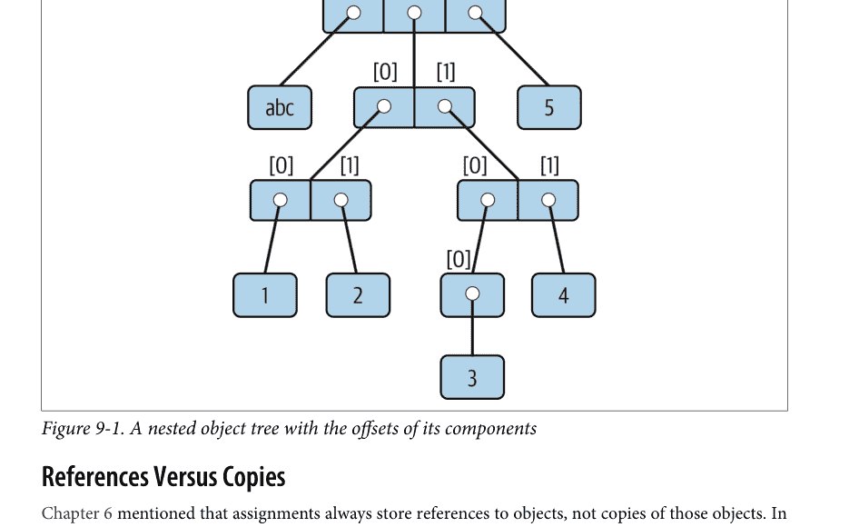

## 引用与副本

第 6 章提到，赋值总是存储对对象的引用，而不是这些对象的副本。在实践中，这通常是你想要的。然而，因为赋值可以生成对同一对象的多个引用，所以重要的是要意识到就地更改可变对象可能会影响程序中其他地方对同一对象的其他引用。如果你不想要这种行为，你需要告诉 Python 显式地复制对象。

我们在第 6 章研究了这种现象，但当自那时以来我们探索过的更大对象介入时，它可能会变得更加微妙。例如，以下示例创建了一个赋值给 `X` 的列表，以及另一个赋值给 `L` 的列表，其中嵌入了一个对列表 `X` 的引用。它还创建了一个字典 `D`，其中包含另一个对列表 `X` 的引用：

```
>>> X = [1, 2, 3]
>>> L = ['a', X, 'b']        # 在另外两个对象中嵌入对 X 对象的引用
>>> D = {'x':X, 'y':2}
```

此时，有三个引用指向创建的第一个列表：来自名称 `X`，来自赋值给 `L` 的列表内部，以及来自赋值给 `D` 的字典内部。这种情况如图 9-2 所示。

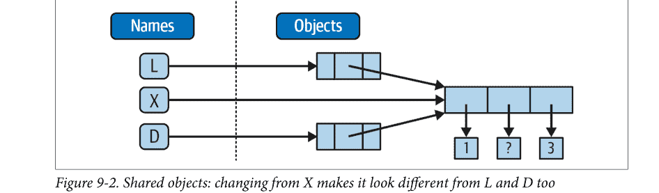

因为列表是可变的，所以从这三个引用中的任何一个更改共享的列表对象也会更改其他两个引用所指向的内容：

```
>>> X[1] = 'surprise'        # 更改所有三个引用！
>>> L
['a', [1, 'surprise', 3], 'b']
>>> D
{'x': [1, 'surprise', 3], 'y': 2}
```

引用是其他语言中指针的高级类比，在使用时总是被遵循。虽然你无法直接获取引用本身，但可以将相同的引用存储在多个地方（变量、列表等）。这是一个特性——你可以在程序中传递一个大对象，而无需沿途生成昂贵的副本。然而，如果你确实想避免共享引用的潜在副作用，你可以通过多种方式请求副本：

-   带有空限制的切片表达式（`L[:]`）复制序列。
-   字典、集合和列表的 `copy` 方法（`X.copy()`）复制字典、集合或列表。
-   一些内置函数，如 `list` 和 `dict` 会创建副本（`list(L)`、`dict(D)`、`set(S)`）。
-   `copy` 标准库模块在需要时进行完整的（“递归”）复制。

例如，假设你有一个列表和一个字典，并且你不希望它们的值通过其他变量被更改：

```
>>> L = [1,2,3]
>>> D = {'a':1, 'b':2}
```

要防止这种情况，只需将副本赋值给其他变量，而不是对同一对象的引用：

```
>>> A = L[:]        # 而不是 A = L（或 list(L), L.copy()）
>>> B = D.copy()    # 而不是 B = D（集合同理）
```

这样，从其他变量所做的更改将改变副本，而非原始对象：

```
>>> A[1] = 'Py'
>>> B['c'] = 'code'           # 更改的是副本，而非原始对象
>>>
>>> L, D
([1, 2, 3], {'a': 1, 'b': 2})
>>> A, B
([1, 'Py', 3], {'a': 1, 'b': 2, 'c': 'code'})
```

就我们最初的示例而言，你可以通过切片原始列表而非简单地命名它来避免引用副作用：

```
>>> X = [1, 2, 3]
>>> L = ['a', X[:], 'b']      # 嵌入 X 对象的副本
>>> D = {'x':X[:], 'y':2}
```

这改变了图 9-2 的情况——L 和 D 现在将指向与 X *不同*的列表。最终效果是，通过 X 所做的更改将只影响 X，而不影响 L 和 D；同样，对 L 或 D 的更改也不会影响 X。

关于副本的最后一点说明：空限制切片和字典复制方法只创建*顶层*副本；也就是说，如果存在嵌套数据结构，它们不会复制这些结构。如果你需要一个深度嵌套数据结构（比如我们在最近几章中编码的各种记录结构）的完整、完全独立的副本，请使用第 6 章介绍的标准 `copy` 模块：

```
import copy
X = copy.deepcopy(Y)           # 完全复制一个任意嵌套的对象 Y
```

此调用会遍历对象以复制其所有部分，无论它们嵌套多深。不过，这种情况要罕见得多，这就是为什么你需要更多说明才能使用此方案。引用通常是你想要的；当引用不适用时，切片和复制方法通常就足以满足你的复制需求。

## 比较、相等性和真值

所有 Python 对象也响应比较：测试相等性、相对大小等。我们在前面的章节中已经看到比较在特定对象上的应用，现在终于可以总结一般规则了。

简而言之，Python 比较总是检查复合对象的所有部分，直到可以确定结果。当存在嵌套对象时，Python 会自动遍历数据结构，从左到右应用比较，并根据需要深入。沿途发现的第一个差异决定了比较结果。

这有时被称为*递归*比较——对顶层对象请求的相同比较会应用于每个嵌套对象，以及*它们*的嵌套对象，依此类推，直到找到结果。在本书后面（第 19 章），你将学习如何编写自己的递归函数，这些函数在嵌套结构上以类似方式工作。现在，如果你需要一个比喻来理解这种结构以及编写递归函数来处理它们的原因，可以想象比较两个网站的所有链接页面。

就核心对象而言，递归是自动的。例如，列表对象的比较会自动比较其所有组件，直到发现不匹配或到达末尾：

```
>>> L1 = [1, ('a', 3)]         # 值相同，但对象不同
>>> L2 = [1, ('a', 3)]
>>> L1 == L2, L1 is L2         # 值相同？对象相同？
(True, False)
```

这里，L1 和 L2 被赋值为等价但不同的列表对象。回顾第 6 章的内容，由于 Python 引用的特性，有两种测试相等性的方法：

- **`==` 运算符测试值等价性。** Python 执行等价测试，递归地比较所有嵌套对象。
- **`is` 运算符测试对象标识。** Python 测试两者是否真的是同一个对象（即，在内存中位于同一地址）。

在前面的示例中，L1 和 L2 通过了 `==` 测试（它们具有等价的值，因为它们的所有组件都是等价的），但未通过 `is` 检查（它们引用两个不同的对象，因此是两块不同的内存）。不过，请注意短字符串的情况：

```
>>> S1 = 'text'
>>> S2 = 'text'
>>> S1 == S2, S1 is S2
(True, True)
```

这里，我们本应有两个值相同的不同对象：`==` 应为真，`is` 应为假。但由于 Python 内部缓存并重用某些对象作为优化，内存中实际上只有一个字符串 `'text'`，由 S1 和 S2 共享。因此，`is` 标识测试报告了真结果。要触发正常行为，我们需要使用更长的字符串（或以其他方式规避可能随时间变化的缓存规则）：

```
>>> S1 = 'a longer string'
>>> S2 = 'a longer string'
>>> S1 == S2, S1 is S2
(True, False)
```

当然，由于字符串是*不可变的*，对象缓存机制与你的代码无关——无论有多少变量引用它们，字符串都不能就地更改。如果标识测试看起来令人困惑，请参阅第 6 章以复习对象引用概念。作为经验法则，`==` 运算符是你几乎在所有相等性检查中都会想要使用的；`is` 则保留用于高度专业的角色。你稍后会看到两者的用例。

如前所示，相对*大小*比较也会递归应用于嵌套数据结构：

```
>>> L1 = [1, ('a', 3)]          # 嵌套的 3 > 嵌套的 2
>>> L2 = [1, ('a', 2)]
>>> L1 < L2, L1 == L2, L1 > L2  # 小于、等于、大于：结果元组
(False, False, True)
```

这里，L1 大于 L2，因为嵌套的 3 大于嵌套的 2。更广泛地说，Python 按以下方式比较其核心对象类型：

- *数字*按相对大小比较，如果需要，会先转换为共同的最高类型（例如，1 < 1.1，其中 1 被替换为 1.0）。
- *字符串*按字典顺序比较（通过 `ord` 返回的字符码点值），逐个字符比较，直到末尾或第一个不匹配（例如，'abc' < 'ac'）。
- *列表*和*元组*通过从左到右比较每个组件来比较，对于嵌套结构则递归比较，直到末尾或第一个不匹配（例如，[1, 3] > [1, 2]）。
- *集合*如果包含相同的项则相等（形式上，如果每个都是另一个的子集），集合的大小比较运算符应用子集和超集测试。
- *字典*如果其排序后的（*键*，*值*）列表相等则比较为相等。字典不支持大小比较，但可以通过比较手动排序的 *items* 结果来编码。
- 非数字的*混合类型*大小比较（例如，`1 < 'text'`）是错误。通过代理，这也适用于排序，排序内部使用比较：非数字混合类型集合无法在不进行转换的情况下排序。

通常，结构化对象的比较进行得就像你将对象写为字面量并从左到右逐个比较它们的所有部分一样。在后面的章节中，你还会看到基于类的对象可以改变它们的比较方式。这里，以下部分提供了关于 Python 内置比较的更多细节。

### 混合类型比较和排序

上一节的最后一点仅适用于非数字混合类型大小测试，不适用于相等性，但它也通过代理适用于*排序*，排序内部进行大小测试。Python 禁止混合类型大小测试，除非是数字类型和手动转换的类型：

```
>>> 11 == '11'                     # 相等性有效，但大小比较无效
False
>>> 11 >= '11'
TypeError: '>=' not supported between instances of 'int' and 'str'

>>> ['11', '22'].sort()             # 排序同理
>>> [11, '11'].sort()
TypeError: '<' not supported between instances of 'str' and 'int'

>>> 11 > 9.123                      # 混合数字转换为最高类型
True
>>> str(11) >= '11', 11 >= int('11') # 手动转换强制执行
(True, True)

>>> [11, '11'].sort(key=str)        # 排序同理：见第 8 章
```

### 字典比较

如第 8 章所述，字典不直接支持大小比较。尽管可能因实现而异，但这据说反映了这样一个事实：大小比较会产生太多开销，并可能妨碍更常见的相等性测试，后者可能使用不比较排序键/值列表的优化方案：

```
>>> D1 = {'b':3, 'a':1}
>>> D2 = {'a':1, 'b':3}
>>> D1 == D2                        # 相等性，而非大小
True
>>> D1 < D2
TypeError: '<' not supported between instances of 'dict' and 'dict'
```

要绕过此限制，可以编写循环按键比较值，或者，如第 8 章所示，只需通过组合 *items* 字典方法和 *sorted* 内置函数来手动比较排序后的键/值列表：

>>> list(D1.items())
[('b', 3), ('a', 1)]
>>> sorted(D1.items())
[('a', 1), ('b', 3)]

>>> sorted(D1.items()) < sorted(D2.items())  # 字典大小比较测试
False
>>> sorted(D1.items()) >= sorted(D2.items())
True

这比简单的 `<` 或 `>` 需要更多代码，并且可能运行得相对较慢；但在实践中，大多数需要此行为的程序要么会开发出更高效的字典数据比较方法，要么不会在意这种缓慢。

## Python 中 True 和 False 的含义

请注意，最后两个示例中返回的测试结果代表真值和假值。它们打印为单词 True 和 False，但既然我们现在开始认真使用这类逻辑测试，是时候更正式地说明这些名称的真实含义了。

在 Python 中，与大多数编程语言一样，整数 0 代表假，整数 1 代表真（这是源于计算机硬件数字特性的遗产）。此外，Python 将任何空数据结构视为假，任何非空数据结构视为真。更一般地说，真和假的概念是 Python 中每个对象的内在属性——每个对象要么为真，要么为假，如下所示：

- 数字为零时为假，否则为真。
- 集合对象为空时为假，否则为真。
- None 占位符对象始终为假。
- True 和 False 分别预设为真和假。

表 9-4 给出了 Python 中各种对象的真值示例。

表 9-4. 对象真值示例

| 对象 | 值 |
| :--- | :--- |
| 'text' | True |
| '' | False |
| [1, 2] | True |
| [] | False |
| {'a': 1} | True |
| {} | False |
| 1 | True |
| 0.0 | False |
| None | False |

作为此特性的一个应用，因为对象本身具有真值，所以常见 Python 程序员编写像 `if X:` 这样的测试，假设 X 是一个字符串，这等同于 `if X != ''`。换句话说，你可以测试对象本身是否包含内容，而不是将其与一个空的（因此为假的）同类型对象进行比较。

## None 对象

如表 9-4 最后一行所示，Python 还提供了一个名为 None 的特殊对象，它始终被视为假。None 在第 4 章中已简要介绍；它是 Python 中一种特殊数据类型的唯一值，通常用作空占位符（类似于 C 语言中的 NULL 指针）。

例如，回想一下，对于列表，除非偏移量已经存在，否则你不能为其赋值——如果你尝试进行越界赋值，列表不会神奇地增长。要预分配一个列表，以便你可以在其任何偏移量中存储值，你可以用 None 对象填充它：

```
>>> size = 50
>>> L = []
>>> L[size - 1] = 'NO'
IndexError: list assignment index out of range

>>> L = [None] * size
>>> L[size - 1] = 'OK'
>>> L[-10:]
[None, None, None, None, None, None, None, None, None, 'OK']
```

这不会限制列表的大小（它以后仍然可以增长和收缩），而只是预设一个初始大小以允许未来的索引赋值。当然，你也可以用零以同样的方式初始化列表，但最佳实践建议，如果列表内容的类型是可变的或尚未确定，则使用 None。

请记住，None 并不意味着“未定义”。也就是说，None 是某种东西，而不是什么都没有（尽管它的名字如此！）——它是一个真实的对象，是一块真实的内存，由 Python 本身创建并赋予一个内置名称。请留意本书后面关于此特殊对象的其他用法；正如你将在第四部分学到的，它也是那些没有通过遇到带有结果值的 return 语句而退出的函数的默认返回值。

## bool 类型

既然我们谈到了真值，也要记住 Python 的布尔类型 bool（在第 5 章中引入）只是增强了 Python 中真和假的概念。正如我们之前所学，内置单词 True 和 False 只是整数 1 和 0 的定制版本——就好像这两个单词在 Python 中的任何地方都被预分配给了 1 和 0。由于这种新类型的实现方式，这实际上只是对已描述的真和假概念的一个小扩展，旨在使真值更加明确：

- 当在真值测试代码中显式使用时，单词 True 和 False 分别等同于 1 和 0，但它们使程序员的意图更清晰。
- 交互式运行的布尔测试结果打印为单词 True 和 False，而不是 1 和 0，以使结果类型更清晰。

你不需要在逻辑语句（如 if）中只使用布尔类型；所有对象仍然固有地为真或为假，如果你使用其他类型，本章中提到的所有布尔概念仍然如所述那样工作。Python 还提供了一个 bool 内置函数，可用于提取对象的布尔值。你可以用它来显式检查一个对象是否为真——即非零或非空：

```
>>> bool(1)
True
>>> bool('text')
True
>>> bool({})
False
```

然而，在实践中，你很少会注意到逻辑测试产生的布尔类型，因为布尔结果会被 if 语句和其他选择工具自动使用。我们将在第 12 章学习逻辑语句时进一步探讨布尔值。

## Python 的类型层次结构

作为总结和参考，图 9-3 概述了 Python 中所有主要的内置对象类型及其关系。我们已经在本书的这一部分探讨了其中最突出的类型。图 9-3 中的其他对象是程序单元（例如函数和模块）或解释器内部结构（例如栈帧和编译代码）。

这里需要注意的主要一点是，Python 程序中处理的所有内容都是一个对象类型。这有时被称为“一等”对象模型，因为所有对象在你的代码中都处于平等地位。例如，你可以将一个类传递给一个函数，将其赋值给一个变量，将其放入列表或字典中，等等。

## 类型对象

事实上，即使类型本身在 Python 中也是一种对象类型：一个对象的类型是类型 type 的一个对象（而不仅仅是因为它是一个不错的绕口令！）。说真的，调用内置函数 `type(X)` 会返回对象 X 的类型对象。其实际应用在于，类型对象可以在 Python 的 if 语句中用于手动类型比较。然而，由于第 4 章中介绍的原因（我们在此不再赘述），手动类型测试在 Python 中通常不是正确的做法，因为它限制了代码的灵活性。Python 追求的是灵活性，而不是约束。

关于类型名称的一点说明：每个核心类型都有一个内置名称，支持各种角色，包括通过面向对象子类化进行类型定制：dict、list、str、tuple、int、float、complex、bytes、type、set 等。从技术上讲，这些名称引用的是类，对这些名称的调用实际上是对象构造函数调用，而不仅仅是转换函数，尽管你可以将它们视为用于基本用法的简单函数。

此外，types 标准库模块为非内置类型提供了额外的类型名称（例如，`types.FunctionType` 是函数的类型），而 isinstance 内置函数在检查类型时考虑了 OOP 中的继承——这是我们 Python 之旅稍后会涉及的主题。然而，由于类型在 Python 中可以通过 OOP 进行定制，因此在极少数代码必须了解特定类型的情况下，通常推荐使用 isinstance 技术。关于类型定制的更多内容在第 32 章，以及一个 isinstance 有用且必要的示例在第 19 章。

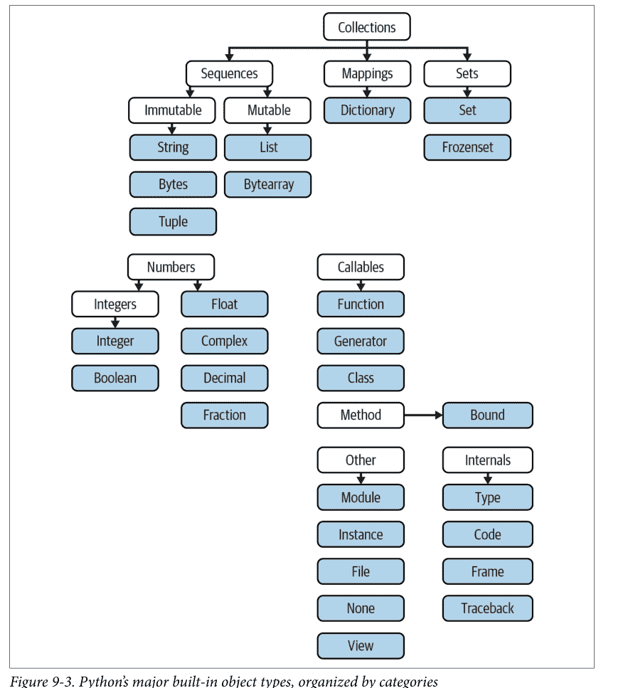

## Python 中的其他类型

除了本书这一部分研究的核心对象，以及你稍后会遇到的程序单元对象（如函数、模块和类）之外，典型的 Python 安装还有数十种额外的对象类型可用，作为链接的 C 扩展或导入的 Python 类——正则表达式对象、GUI 小部件、网络套接字等。根据你询问的对象，你本章前面遇到的 *命名元组* 也可能属于此类，以及第 5 章的 Decimal 和 Fraction。

这些额外工具与你目前见过的内置类型之间的主要区别在于，内置类型具有语言定义的语法来创建其对象（例如，`4` 表示整数，`[1,2]` 表示列表，`open` 函数用于文件，`def` 和 `lambda` 用于函数）。其他工具则通过导入标准库模块来使用。例如，要在模式匹配中创建正则表达式对象，你需要导入 `re` 并调用 `re.compile()`。

由于这个非核心类别中的大多数对象都是超出本语言教程范围的应用层工具，请务必在你的编程生涯中尽早并经常浏览 Python 的库参考手册，以获取所有可供 Python 程序使用的补充工具的全面记录。

*关于 range 呢？* Python 的文档将内置的 `range` 函数重新归类为序列类型，与列表和元组并列，但这是一种学术上的文字游戏，我们在本书中不会遵循。正如你稍后将看到的，`range` 返回一个按需产生结果的 *可迭代* 对象，而不是一个物理存储的序列。它支持一些——但不是全部——序列操作（例如，索引有效但连接无效），但这甚至只是一种实现技巧，远不足以构成与真实序列同级别的新类型。将 `range` 标记为“不可变整数序列”混淆了工具类别，并让 Python 学习者感到困惑。

## 内置类型陷阱

以上就是我们对核心数据类型的探讨。我们将通过讨论一些似乎会困住新用户（以及偶尔的专家）的常见问题及其解决方案来结束本书的这一部分。其中一些是对我们已经涵盖的概念的回顾，但这些问题足够重要，值得在此再次强调。

## 赋值创建的是引用，而非副本

是的，这有些重复，但这是一个如此常见的陷阱，值得再次强调：对 *可变* 对象的共享引用可能很重要。例如，在下面的例子中，赋值给名称 `L` 的列表对象既从 `L` 被引用，也从赋值给名称 `M` 的列表内部被引用。就地更改 `L` 也会更改 `M` 所引用的内容：

```
>>> L = [1, 2, 3]
>>> M = ['X', L, 'Y']          # 嵌入对 L 的引用
>>> M
['X', [1, 2, 3], 'Y']

>>> L[1] = 0                   # 也更改了 M（M 所引用的内容）
>>> M
['X', [1, 0, 3], 'Y']
```

这种效果通常只在较大的程序中才变得重要，而且共享引用通常正是你想要的。但是，如果对象以意想不到和不希望的方式发生变化，你可以通过显式复制它们来轻松避免共享对象。对于列表，你可以随时使用空限制切片（以及其他在本章前面描述的技术）来制作顶层副本：

```
>>> L = [1, 2, 3]
>>> M = ['X', L[:], 'Y']       # 嵌入 L 的副本
>>> L[1] = 0                   # 只更改 L，不更改 M
>>> L
[1, 0, 3]
>>> M
['X', [1, 2, 3], 'Y']
```

请记住，切片限制默认为 0 和被切片序列的长度；如果两者都被省略，切片将提取序列中的每个项目，从而制作一个顶层副本（一个新的、未共享的对象）。

## 重复只增加一层深度

正如我们所学，重复一个序列就像将其与自身相加多次。然而，当 *可变* 序列被嵌套时，效果可能并不总是你所期望的。例如，在下面的例子中，`X` 被赋值为 `L` 重复四次，而 `Y` 被赋值为一个 *包含* `L` 重复四次的列表：

```
>>> L = [4, 5, 6]
>>> X = L * 4          # 类似于 [4, 5, 6] + [4, 5, 6] + ...
>>> Y = [L] * 4        # [L] + [L] + ... = [L, L, ...]

>>> X
[4, 5, 6, 4, 5, 6, 4, 5, 6, 4, 5, 6]
>>> Y
[[4, 5, 6], [4, 5, 6], [4, 5, 6], [4, 5, 6]]
```

微妙的是，由于 `L` 在第二次重复中被嵌套，`Y` 最终嵌入了对赋值给 `L` 的 *原始* 列表的引用，因此容易受到前一节中提到的同类副作用的影响：

```
>>> L[1] = 0          # 影响 Y 但不影响 X
>>> X
[4, 5, 6, 4, 5, 6, 4, 5, 6, 4, 5, 6]
>>> Y
[[4, 0, 6], [4, 0, 6], [4, 0, 6], [4, 0, 6]]
```

这可能看起来很人为和学术化——直到它在你的代码中意外发生！解决此问题的方法与前一节相同，因为这实际上只是创建共享可变对象引用情况的另一种方式——当你不想要共享引用时，请制作副本：

```
>>> L = [4, 5, 6]
>>> Y = [list(L)] * 4  # 嵌入 L 的（共享）副本
>>> L[1] = 0
>>> Y
[[4, 5, 6], [4, 5, 6], [4, 5, 6], [4, 5, 6]]
```

更微妙的是，尽管 `Y` 不再与 `L` 共享一个对象，但它仍然嵌入了四个对 *同一个副本* 的引用。如果你必须避免这种共享，你需要确保每个嵌入的副本都是唯一的：

```
>>> Y[0][1] = 99      # 所有四个副本仍然是相同的
>>> Y
[[4, 99, 6], [4, 99, 6], [4, 99, 6], [4, 99, 6]]

>>> L = [4, 5, 6]
>>> Y = [list(L) for i in range(4)]
>>> Y
[[4, 5, 6], [4, 5, 6], [4, 5, 6], [4, 5, 6]]

>>> Y[0][1] = 99      # 现在它们不同了！
>>> Y
[[4, 99, 6], [4, 5, 6], [4, 5, 6], [4, 5, 6]]
```

如果你记住重复、连接和切片只复制其操作对象的顶层，那么这类情况就更容易理解了。

## 当心循环数据结构

我们在之前的练习中遇到过这个概念，但没有深入探讨：如果一个集合对象包含对自身的引用，它就被称为 *循环对象*。Python 在检测到对象循环回到自身时会打印 `[...]`，而不是陷入无限循环（就像很久以前恐龙在地球上漫游时那样）：

```
>>> L = ['stuff']           # 追加对同一对象的引用
>>> L.append(L)             # 创建一个回到同一对象的循环：[...]
>>> L
['stuff', [...]]
```

除了理解方括号中的三个点代表对象中的循环（如果它们出现在你的输出或工作面试中！），这个案例值得了解，因为它可能导致真正的陷阱——如果你没有预料到，循环结构可能会导致你自己的代码陷入意想不到的循环。

例如，一些遍历结构化数据的程序必须维护一个 *已访问* 项目的列表、字典或集合，并在即将进入可能导致不必要循环的循环时检查它。有关此问题的更多信息，请参阅附录 B 第 1157 页“第一部分，入门”中的练习解答。另请注意第 19 章中关于递归的一般讨论，以及第 25 章中的 `reloadall.py` 程序和第 31 章中的 `ListTree` 类，这些是循环检测可能很重要的具体程序示例。

正如编程中经常发生的情况一样，解决方案就是知识：除非你真的需要，否则不要使用循环引用，并确保在必须注意的程序中预料到它们。创建循环有充分的理由，但除非你有知道如何处理它们的代码，否则引用自身的对象可能弊大于利。然而，它们也不必成为一个意外。

## 不可变类型不能就地更改

最后，为了完整性再说一次：你不能就地更改不可变对象。相反，你需要使用切片、连接等构造一个新对象，并在需要时将其赋值回原始引用：

```
T = (1, 2, 3)

T[2] = 4              # 错误！

T = T[:2] + (4,)      # 正确：(1, 2, 4)
```

这可能看起来像是额外的编码工作（确实如此），但好处是，当你使用像元组和字符串这样的不可变对象时，本节中前面的大多数陷阱都不会发生；因为它们不能被就地更改，所以它们通常不会受到可能危及像列表和字典这样的可变对象的副作用的影响。

## 章节总结

本章探讨了最后两个主要核心对象类型——元组和文件。我们了解到元组支持所有常见的序列操作，只有少数几个方法，不允许任何就地更改（因为它们是不可变的），并且通过命名元组扩展类型进行了泛化。我们还了解到文件由内置的 `open` 函数返回，并提供了读写文本和二进制内容的方法。

在此过程中，我们探讨了如何将Python对象与字符串相互转换以存储到文件中，并研究了`pickle`、`json`以及其他用于高级角色（对象序列化和二进制数据）的模块。最后，我们通过回顾所有对象类型共有的某些属性（例如共享引用）来收尾，并梳理了对象类型领域中常见的错误（“陷阱”）。

在本书的下一部分，我们将转换方向，转向*语句语法*这一主题——即我们在脚本中编写处理步骤和逻辑的方式。接下来的部分将探索Python所有基本的过程式语句。下一章将通过介绍Python通用语法模型来开启这一主题，该模型适用于所有语句类型。不过，在继续之前，请完成本章测验，然后完成本部分末尾的实验练习，以复习类型概念。下一部分的语句主要只是创建和处理对象，因此请务必通过完成所有练习来掌握这一领域，然后再继续阅读。

## 测试你的知识：测验

1.  如何确定一个元组的大小？为什么这个工具位于它所在的位置？
2.  编写一个表达式来更改元组中的第一个项目。在此过程中，(4, 5, 6) 应变为 (1, 5, 6)。
3.  文件打开调用中处理模式参数的默认值是什么？
4.  你可以使用哪个模块将Python对象存储到文件中，而无需自己将它们转换为字符串？
5.  如何一次性复制嵌套结构的所有部分？
6.  Python在什么情况下认为一个对象为真？

## 测试你的知识：答案

1.  内置的`len`函数返回Python中任何容器对象的长度（包含的项目数），包括元组。它是一个内置函数而不是类型方法，因为它适用于许多不同类型的对象。通常，内置函数和表达式可以跨越多种对象类型；方法则特定于单个对象类型，尽管某些方法名称可能在多种类型上可用（例如，`index`适用于列表和元组）。
2.  由于它们是不可变的，你不能真正*就地*更改元组，但你可以生成一个具有所需值的新元组。给定`T = (4, 5, 6)`，你可以通过切片和连接从其部分创建一个新元组来更改第一个项目：`T = (1,) + T[1:]`。（回想一下，单项目元组需要一个尾随逗号。）你也可以将元组转换为列表，就地更改它，然后将其转换回元组，但这代价更高，并且在实践中很少需要——如果你知道对象将需要就地更改，只需使用列表即可。
3.  文件打开调用中处理模式参数的默认值是`'r'`，用于读取文本输入。对于输入文本文件，只需传入外部文件的名称或路径（除非你还需要自定义缓冲策略或提供Unicode文本编码以覆盖平台的默认设置——如第37章所述）。
4.  `pickle`模块可用于将Python对象存储到文件中，而无需显式将它们转换为字符串。`json`类似地根据JSON格式将有限的Python对象集与字符串相互转换。`struct`模块相关，但它假设数据将以打包二进制格式存储在文件中。
5.  导入`copy`模块，如果需要复制嵌套结构`X`的所有部分，请调用`copy.deepcopy(X)`。这在实践中也很少需要；引用通常是期望的行为，浅拷贝（例如`aList[:]`、`aDict.copy()`、`set(aSet)`）通常足以满足大多数复制需求。
6.  如果一个对象是非零数字或非空集合对象，则认为它为真。内置词`True`和`False`本质上预定义为分别与整数`1`和`0`具有相同的含义。

## 测试你的知识：第二部分练习

本节要求你亲身体验编码内置对象基础知识。与之前一样，过程中可能会出现一些新想法，因此完成后（甚至在未完成时）请务必翻到附录B第1160页的“第二部分，对象和操作”查看答案。如果你时间有限，可以考虑从练习10和11（本组中最实用的）开始，然后根据时间从第一题做到最后一题。不过，这都是基础材料，因此请尽量多做；编程是一项动手活动，没有替代品来练习你所读的内容，以使想法融会贯通。

1.  **基础**：交互式地尝试本书本部分中各种操作表中的常见类型操作。要开始，请启动Python交互式解释器（你选择的REPL），键入以下每个表达式，并尝试解释每种情况中发生的事情。注意，其中一些表达式中的分号用作语句分隔符，以便将多个语句压缩到一行：例如，`X=1;X`赋值然后打印变量（更多关于语句语法的内容将在本书下一部分介绍）。还要记住，表达式之间的逗号通常会构建一个元组，即使没有括号：`X,Y,Z`是一个三项目元组，Python会用括号将其打印回来。

    ```
    2 ** 16
    2 / 5, 2 / 5.0

    'hack' + 'code'
    S = 'Python'
    'grok ' + S
    S * 5
    S[0], S[:0], S[1:]

    how = 'fun'
    'coding %s is %s!' % (S, how)
    'coding {} is {}!'.format(S, how)
    f'coding {S} is {how}!'

    ('x',)[0]
    ('x', 'y')[1]

    L = [1, 2, 3] + [4, 5, 6]
    L, L[:], L[:0], L[-2], L[-2:]
    ([1, 2, 3] + [4, 5, 6])[2:4]
    [L[2], L[3]]
    L.reverse(); L
    L.sort(); L
    L.index(4)

    {'a': 1, 'b': 2}['b']
    D = {'x': 1, 'y': 2, 'z': 3}
    D['w'] = 0
    D['x'] + D['w']
    D[(1, 2, 3)] = 4
    list(D.keys()), list(D.values()), (1, 2, 3) in D

    [[], [""], [], (), {}, None]
    ```

2.  **索引和切片**：在交互式提示符下，定义一个名为`L`的列表，其中包含四个字符串或数字（例如`L=[0, 1, 2, 3]`）。然后，尝试以下边界情况。你可能在实际程序中从未见过这些情况（尤其是这里可能出现的奇怪方式！），但它们旨在让你思考底层模型，其中一些可能以不太人工的形式有用——例如，如果序列不如你预期的那么长，越界切片会有所帮助：
    - a. 当你尝试越界索引（例如`L[4]`）时会发生什么？
    - b. 越界切片（例如`L[-1000:100]`）呢？
    - c. 最后，如果你尝试反向提取序列，下限大于上限（例如`L[3:1]`），Python如何处理？提示：尝试将此切片赋值（`L[3:1]=['?']`），并查看值被放置在哪里。你认为这可能与你越界切片时看到的现象相同吗？

3.  **索引、切片和del**：定义另一个包含四个项目的列表`L`，并将一个空列表赋值给其中一个偏移量（例如`L[2]=[]`）。会发生什么？然后，将一个空列表赋值给一个切片（`L[2:3]=[]`）。现在会发生什么？回想一下，切片赋值会删除切片并在其原来的位置插入新值。

    `del`语句删除偏移量、键、属性和名称。在你的列表上使用它来删除一个项目（例如`del L[0]`）。如果你删除整个切片（`del L[1:]`）会发生什么？当你将一个非序列赋值给切片（`L[1:2]=1`）时会发生什么？

4.  **元组赋值**：键入以下行：

    ```
    >>> X = 'code'
    >>> Y = 'hack'
    >>> X, Y = Y, X
    ```

    当你键入这个序列时，你认为`X`和`Y`发生了什么？

5.  **字典键**：考虑以下代码片段：

    ```
    >>> D = {}
    >>> D[1] = 'a'
    >>> D[2] = 'b'
    ```

    你已经知道字典不是通过偏移量访问的，那么这里发生了什么？以下内容是否阐明了这个问题？（提示：字符串、整数和元组共享哪个类型类别？）

    ```
    >>> D[(1, 2, 3)] = 'c'
    >>> D
    {1: 'a', 2: 'b', (1, 2, 3): 'c'}
    ```

6.  **字典索引**：创建一个名为`D`的字典，其中包含三个条目，键分别为`'a'`、`'b'`和`'c'`。如果你尝试索引一个不存在的键（`D['d']`）会发生什么？如果你尝试赋值给一个不存在的键`'d'`（例如`D['d']='hack'`），Python会做什么？这与列表的越界赋值和引用相比如何？这听起来像变量名的规则吗？

# 第三部分

## 语句与语法

# 第10章

## Python语句简介

既然你已经熟悉了Python的内置对象，本章将开始探索其基本的语句形式。与上一部分的思路类似，我们将首先对语句语法进行总体介绍，然后在接下来的几章中更详细地探讨具体的语句。

简单来说，*语句*就是我们编写的、用来告诉Python程序应该做什么的代码。如果如第4章所建议的，程序是“用东西做事”，那么语句就是我们指定程序做何种*事情*的方式。更正式地说，Python是一种基于过程的、基于语句的语言；通过组合语句，我们指定一个Python执行的*过程*，以满足程序的目标。

## 重新审视Python概念层次

理解语句作用的另一种方式是回顾第4章介绍的概念层次，该层次讨论了内置对象以及用于操作它们的表达式。本章将沿着层次结构上升到Python程序结构的下一级：

1. 程序由模块组成。
2. 模块包含语句。
3. *语句包含表达式。*
4. 表达式创建和处理对象。

从根本上说，用Python语言编写的程序由语句和表达式组成。表达式处理对象，并嵌入在语句中。语句编码了程序操作的更大*逻辑*——它们使用并指导表达式来处理我们在前面章节中研究的对象。此外，语句是对象诞生的地方（例如，在赋值语句中的表达式），并且一些语句会创建全新的对象类型（函数、类等）。在顶层，语句总是存在于模块中，而模块本身也由语句管理。

## Python的语句

表10-1总结了Python的语句集。Python中的每条语句都有其特定的目的和特定的语法——定义其结构的规则——不过，正如你将看到的，许多语句共享常见的语法模式，并且一些语句的作用有重叠。表10-1还给出了每条语句在按照其语法规则编码时的示例。在你的程序中，这些代码单元可以执行操作、重复任务、做出选择、构建更大的程序结构等等。

本书的这一部分处理表中从顶部到`break`和`continue`的条目。你已经非正式地接触过表10-1中的一些语句；本书的这一部分将填补之前跳过的细节，介绍Python过程语句集的其余部分，并涵盖整体的语法模型。表10-1中较低位置的、与更大程序单元（函数、类、模块和异常）相关的语句，将引出更大的编程思想，因此它们各自将有专门的章节。更聚焦的语句（如删除各种组件的`del`）将在本书的其他地方以及Python的标准手册中介绍。

表10-1. Python语句

| 语句 | 作用 | 示例 |
| :--- | :--- | :--- |
| 赋值 | 创建引用 | a, b = 'python', 3.12<br>a = (b := next()) + more |
| 调用和其他表达式 | 运行函数 | log.write('app crash') |
| print | 打印对象 | print(hack, code, file=log) |
| if/elif/else | 选择操作 | if 'python' in text:<br>    read(text) |
| match/case | 多路选择 | match edition:<br>    case 6:<br>        print(2024) |
| for/else | 迭代 | for x in myiterable:<br>    print(x) |
| while/else | 通用循环 | while x := file.readline():<br>    print(x) |
| pass | 空占位符 | if 'python' not in text:<br>    pass |
| break | 循环退出 | while True:<br>    if exittest(): break |
| continue | 循环继续 | while True:<br>    if skiptest(): continue |
| def | 函数和方法 | def f(a, b, c=2, *more):<br>    print(a + b + c) |
| return | 函数结果 | def f(a, b, c=2, *more):<br>    return a + b + c |
| yield | 生成器函数 | def gen(n):<br>    for i in n: yield i*2 |
| global | 命名空间 | x = 1<br>def function():<br>    global x; x = 2 |
| nonlocal | 命名空间 | def outer():<br>    x = 1<br>    def inner():<br>        nonlocal x; x = 2 |
| async | 协程指定符 | async def consumer(a, b):<br>    await producer() |
| await | 协程转移 | await asyncio.sleep(1) |
| import | 模块访问 | import sys |
| from | 属性访问 | from sys import stdin as f |
| class | 构建对象 | class Subclass(Superclass):<br>    classAttr = []<br>    def method(self): pass |
| try/except/finally | 捕获异常，终止操作 | try:<br>    action()<br>except:<br>    print('action error') |
| raise | 触发异常 | raise EndSearch(location) |
| assert | 调试检查 | assert X > Y, 'X too small' |
| with | 上下文管理器 | with open('data') as file:<br>    process(file) |
| del | 删除引用 | del data[k]<br>del data[i:j]<br>del obj.attr<br>del variable |
| type | 类型提示别名 | type vector = list[float] |

从技术上讲，表10-1作为快速预览和参考已经足够，但作为完整列表还不够。以下是关于其内容的几个要点：

- 赋值语句有多种语法形式，在第11章中描述：基本赋值、序列赋值、增强赋值等；而命名赋值（:=）用作表达式，而非语句。
- `print`实际上是一个内置函数调用，既不是保留字也不是语句。不过，因为它几乎总是作为表达式语句运行，并且通常单独占一行，所以通常被认为是一种语句类型，并将在第11章中单独讨论。
- `yield`和`await`也是表达式而非语句。与`print`类似，它们经常用作表达式语句，因此包含在此表中，但脚本也可以赋值或以其他方式使用它们的结果，正如你将在第20章中看到的。作为表达式，`yield`和`await`也是保留字，这与`print`不同。
- 语句和表达式中使用的大多数词都是保留字，不能在代码中用作变量；这包括`and`、`in`、`if`、`for`、`while`等。较新的语句使用“软”保留字，这些词仅在它们所属的语句中使用时才是保留的；这包括`match`、`case`和`type`（但不包括`async`和`await`）。我们将在第11章中正式列出完整的保留字列表。

7.  *通用操作*：运行交互式测试以回答以下问题：
    a. 当你尝试在不同类型/混合类型（例如，字符串 + 列表，列表 + 元组）上使用`+`运算符时会发生什么？
    b. 当其中一个操作数是字典时，`+`是否有效？
    c. `append`方法是否同时适用于列表和字符串？在列表上使用`keys`方法呢？（提示：`append`对其主体对象有什么假设？）
    d. 最后，当你对两个列表或两个字符串进行切片或连接时，你会得到什么类型的对象？

8.  *字符串索引*：定义一个包含四个字符的字符串S：S = 'hack'。然后输入以下表达式：S[0][0][0][0][0]。这次有什么线索吗？（提示：回想一下，字符串是字符的集合，但Python字符是单字符字符串。）如果你将此索引表达式应用于列表，例如['h', 'a', 'c', 'k']，它是否仍然有效？为什么？

9.  *不可变类型*：再次定义一个包含四个字符的字符串S：S = 'hack'。编写一个赋值语句，仅使用切片和连接将字符串更改为'heck'。你能仅使用索引和连接执行相同的操作吗？索引赋值呢？

10. *嵌套*：编写一个表示你个人信息的数据结构：姓名（名、中间名、姓）、年龄、工作、地址、电子邮件地址和电话号码。你可以使用任何你喜欢的内置对象类型组合（列表、元组、字典、字符串、数字）来构建数据结构。然后，通过索引访问数据结构的各个组件。对于这个对象，某些结构是否比其他结构更有意义？

11. *文件*：编写一个脚本，创建一个名为*myfile.txt*的新输出文件，并将字符串'Hello file world!'写入其中。然后编写另一个脚本，打开*myfile.txt*并读取和打印其内容。从系统命令行（或你可用的其他脚本启动工具）运行你的两个脚本。新文件是否出现在你运行脚本的目录中？如果你在传递给`open`的文件名中添加不同的目录路径会怎样？注意：文件写入方法不会在你的字符串中添加换行符；如果你想在文件中完全终止该行，请在字符串末尾添加显式的`\n`。

## 两个 if 的故事

在深入探讨表 10-1 中任何具体语句的细节之前，本书希望从展示你在 Python 代码中*不会*输入的内容开始，来介绍 Python 语句语法。

考虑以下用类 C 语言编写的 if 语句：

```
if (x > y) {
    x = 1;
    y = 2;
}
```

这可能是 C、C++、Java、JavaScript 或类似语言中的一条语句。现在，看看 Python 语言中的等效语句：

```
if x > y:
    x = 1
    y = 2
```

首先映入你眼帘的可能是，等效的 Python 语句更简洁——也就是说，语法组件更少。这是有意为之；作为一门脚本语言，Python 的目标之一就是通过减少输入量来让程序员的生活更轻松。而更少的输入也意味着更少的出错空间。

更具体地说，当你比较这两种语法模型时，你会注意到 Python 在其中增加了一个新东西，但移除了类 C 语言中必需的三个东西。

## Python 增加了什么

Python 中新增的语法组件是冒号字符 (:)。所有 Python *复合语句*——即内部嵌套了其他语句的语句——都遵循相同的一般模式：以冒号结尾的标题行，后跟通常缩进在标题行下方的嵌套代码块，如下所示：

```
标题行:
    嵌套语句块
```

冒号是必需的，省略它可能是 Python 新手最常见的编码错误（在 Python 培训课上，我肯定亲眼目睹过数千次）。事实上，如果你是 Python 新手，你几乎肯定很快就会忘记冒号字符，如果还没忘的话。如果你忘了，你会收到一条错误信息，大多数对 Python 友好的编辑器都能轻松发现这个错误：

```
>>> if x
    if x
      ^
SyntaxError: expected ':'
```

最终，包含冒号会成为一种无意识的习惯——以至于你可能也会开始在类 C 语言代码中输入冒号（从而从该语言的编译器那里产生大量有趣的错误信息！）。

## Python 移除了什么

### 圆括号是可选的

第一个是某些语句顶部测试周围的*圆括号*：

```
if (x < y)
```

这里的圆括号是许多类 C 语言的语法所要求的。然而，在 Python 中，它们不是必需的——我们只需省略圆括号，语句的工作方式相同：

```
if x < y
```

从技术上讲，因为每个表达式都可以用圆括号括起来，所以在 Python 代码中包含它们不会造成伤害，如果存在也不会被视为错误。

*但不要这样做。* 你会不必要地磨损键盘，并向全世界宣告你是一个仍在学习 Python 的类 C 语言程序员（这种情况确实会发生）。“Python 方式”是在这类语句中完全省略圆括号。

### 行尾即语句结束

你在 Python 代码中找不到的第二个也是更重要的语法组件是*分号*。在 Python 中，你不需要像在类 C 语言中那样用分号来终止语句：

```
x = 1;
```

在 Python 中，一般规则是行尾自动终止出现在该行上的语句。换句话说，你可以省略分号，它的工作方式相同：

```
x = 1
```

有一些方法可以绕过这个规则，你稍后会看到（例如，将代码包装在括号结构中允许它跨行）。但是，一般来说，在绝大多数 Python 代码中，你每行写一条语句，不需要分号。

同样，如果你怀念你的 C 编程日子（为什么会怀念呢？），你可以继续在每条语句末尾使用分号——Python 语言允许你这样做，如果它们存在的话，因为分号在语句组合时也是一个分隔符。

*但也不要这样做（真的！）*。同样，这样做会告诉全世界你是一个仍未完全转换到 Python 编码的类 C 语言程序员。Pythonic 风格是完全省略分号。根据课堂上的学生来看，这对一些资深程序员来说似乎是个很难改掉的习惯。但你会做到的；分号在 Python 中的这个角色上是无用的噪音。

### 缩进结束即块结束

Python 移除的第三个也是最后一个语法组件……对于即将成为前类 C 语言程序员的人来说，这可能是最不寻常的一个，直到他们使用了 10 分钟并意识到它实际上是一个特性……是你不需要在代码中输入*任何*显式内容来从语法上标记嵌套代码块的开始和结束。你不需要像在类 C 语言中那样在嵌套块周围包含 begin/end、then/endif 或 {/}：

```
if (x > y) {
    x = 1;
    y = 2;
}
```

相反，在 Python 中，我们始终将给定单个嵌套块中的所有语句向右缩进相同的距离，Python 使用语句的物理缩进来确定块的开始和结束位置：

```
if x > y:
    x = 1
    y = 2
```

这种*缩进*意味着这里两个嵌套语句最左边的所有空白空格。Python 不关心你*如何*缩进（你可以使用空格或制表符），或者你缩进*多少*（你可以使用任意数量的空格或制表符）。事实上，一个嵌套块的缩进可以与另一个完全不同。语法规则只是对于给定的单个嵌套块，其所有语句必须向右缩进相同的距离。如果不是这样，你会得到一个语法错误，你的代码将无法运行，直到你修复其缩进使其一致：

```
>>> if True:
...     a = 1
...     b = 2
    b = 2
      ^
IndentationError: unindent does not match any outer indentation level
```

## 为什么使用缩进语法？

对于习惯类 C 语言的程序员来说，缩进规则乍一看可能显得不寻常，但它是 Python 的一个有意为之的特性：它是 Python 几乎强制程序员生成统一、规范和可读代码的主要方式之一。它本质上意味着你必须根据代码的逻辑结构，按*列*垂直对齐代码。最终效果是使你的代码更一致、更可读——不像许多用类 C 语言编写的代码。

更强烈地说，根据代码的逻辑结构对齐代码是使其可读（从而可重用和可维护）的重要部分，无论是对你自己还是对他人。事实上，即使你在阅读本书之后从未使用过 Python，你也应该养成在*任何*块结构语言中为可读性而对齐代码的习惯。Python 通过将其作为语法的一部分来强调这个问题，但这在任何编程语言中都是一件重要的事情，它对代码的可用性有巨大影响。

你的经验可能有所不同，但在许多程序员多年处理过的大型、旧的 C++ 程序中，有一个普遍现象。几乎无一例外，每个程序员都有自己缩进代码的风格。例如，一个用 C++ 语言编写的 *while* 循环可能最初是这样的：

```
while (x > 0) {
```

在我们讨论缩进之前，程序员在类 C 语言中安排 {} 花括号的方式就有三四种，组织机构常常为此进行政治斗争并制定标准文档来解决这些选项（这似乎与编程要解决的问题有点离题）。尽管如此，以下是 C++ 代码中经常遇到的情况。第一个处理代码的人将循环缩进了四个空格：

```
while (x > 0) {
    --------;
    --------;
```

那个人最终转到了其他项目（或者，可悲的是，转到了管理岗位），取而代之的是一个喜欢向右缩进更多的人：

```
while (x > 0) {
    --------;
    --------;
        --------;
        --------;
}
```

后来那个人也转到了其他机会（结束了他们编码恐怖的统治），另一个人接手了代码，这个人喜欢缩进少一些：

```
while (x > 0) {
    --------;
    --------;
        --------;
        --------;
--------;
--------;
}
```

以此类推。最终，块由一个右花括号 (}) 终止，这当然构成了“块结构代码”（是的，讽刺）。不：在任何块结构语言中，无论是 Python 还是其他语言，如果嵌套块没有一致地缩进，它们对读者来说将变得非常难以解释、修改或重用，因为代码不再直观地反映其逻辑含义。*可读性很重要*，而缩进是可读性的一个主要组成部分。

这里还有另一个例子，如果你在类 C 语言中做过很多编程，过去可能被它坑过。考虑以下 C 语句：

```
if (x)
    if (y)
        statement1;
else
    statement2;
```

这里的 else 属于哪个 if？令人惊讶的是，在 C 中，else 与嵌套的 if 语句 (if (y)) 配对，即使从视觉上看它似乎与外部测试 (if (x)) 相关联。这是 C 语言中的一个经典陷阱，它可能导致读者完全误解代码并以错误的方式修改它，而这些错误可能直到火星探测器撞上巨石才会被发现！

在 Python 中这不可能发生——因为缩进是重要的，代码看起来的样子就是它运行的方式。考虑一个等效的 Python 语句：

```
if x:
    if y:
        statement1
else:
    statement2
```

在这个例子中，else 在垂直和视觉上对齐的 if 就是它在逻辑和行为上关联的那个 if（外部的 if x）。从某种意义上说，Python 是一种 WYSIWYG（所见即所得）语言——你看到的就是你得到的——因为代码看起来的样子就是它运行的方式，无论谁编写了它。

如果这还不足以强调 Python 语法的好处，这里还有另一个轶事。一些用 C 语言开发系统软件的*公司*，虽然不要求一致的缩进，但无论如何都会强制执行。这类团队在每天结束时将代码签入源代码控制系统时，运行分析代码中使用的缩进的自动化工具并不罕见。如果工具注意到你的代码缩进不一致，你第二天早上可能会收到一封自动邮件——你的经理也可能会收到！

关键在于，即使语言本身不强制要求，优秀的程序员也深知一致的缩进对代码可读性和质量有着巨大影响。Python 将缩进提升到语法层面，这一点被大多数人视为该语言的一个特性。

同时请记住，几乎每一个对程序员友好的*文本编辑器*都内置了对 Python 语法模型的支持。例如，在 IDLE 图形界面中，当你输入嵌套代码块时，代码行会自动缩进；按下退格键会回退一级缩进，并且你可以自定义 IDLE 在嵌套块中缩进语句的宽度。对此没有硬性规定：*四个空格*非常常见，但你可以自行决定缩进的方式和程度（除非你的公司已经通过流程和文档将此标准化）。对于更深层的嵌套块，向右进一步缩进；对于结束的块，则减少缩进。

不过需要提醒的是，在 Python 中，你可能不应该在同一个代码块中*混合*使用制表符和空格，除非你保持一致；在一个给定的代码块中使用制表符或空格，但不要两者混用（事实上，Python 会对不一致地使用制表符和空格报错，你将在第 12 章看到）。话又说回来，你可能也不应该在*任何*结构化语言中混合使用制表符或空格进行缩进——如果下一位程序员的编辑器设置为以不同于你的方式显示制表符，这样的代码可能会导致严重的可读性问题。C 类语言可能允许编码者这样做，但他们真的不应该：结果可能是一团糟。

无论你使用哪种语言编码，为了可读性，你都应该保持一致的缩进。事实上，如果你在职业生涯早期没有被教导这样做，那是你的老师失职了。大多数程序员——尤其是那些必须阅读他人代码的人——认为 Python 将缩进提升到语法层面是一个优点。此外，对于必须输出 Python 代码的工具来说，生成制表符而不是花括号在实践中并不困难，而且在书籍（包括本书！）的印刷版本中可能模糊代码嵌套的分页，在真实的编码世界中是不会存在的。

总之，如果你做的是在 C 类语言中无论如何都应该做的事情，但去掉了花括号，你的代码就会满足 Python 的语法规则。

## 一些特殊情况

如前所述，在 Python 的语法模型中：

- 行的结束终止该行上的语句（不需要分号）。
- 嵌套语句通过其物理缩进进行分块和关联（不需要花括号）。

这些规则涵盖了你将在实践中编写或看到的几乎所有 Python 代码。然而，Python 还提供了一些特殊规则，允许在语句和嵌套语句块中具有灵活性。它们不是必需的，应该谨慎使用，但程序员在实践中发现它们很有用。

## 语句规则特殊情况

语句有三条特殊规则，其中两条已经在本书中介绍和使用过。首先，虽然语句通常一行一条，但在 Python 中，可以通过用分号分隔，将多条语句*挤*在一行上：

```
a = 1; b = 2; print(a + b)            # 一行三条语句
```

这是 Python 中唯一需要分号的地方：作为语句分隔符。不过，这只有在这样组合的语句本身不是*复合*语句时才有效。换句话说，你只能将简单语句链接在一起，比如赋值，以及对 *print* 和其他函数和方法的调用。像 *if* 测试和 *while* 循环这样的复合语句仍然必须出现在各自的行上（否则，你可以将整个程序挤在一行上，这可能不会让你在同事中很受欢迎！）。

语句的另一个特殊规则本质上是相反的：你可以让单条语句*跨越*多行。要实现这一点，你只需将语句的一部分括在括号对中——圆括号 (())、方括号 ([]) 或花括号 ({})。任何包含在这些结构中的代码都可以跨越多行：你的语句直到 Python 遇到包含该括号对结束部分的行才结束。例如，要继续一个列表字面量：

```
mylist = [1111,       # 续行
         2222,       # (), [], {} 中的任何代码
         3333]
```

因为这段代码包含在方括号对中，Python 只是继续读取下一行，直到遇到右括号。包围字典（以及集合字面量和字典/集合推导式）的花括号也允许它们以这种方式跨行，圆括号处理元组、函数调用和表达式。续行的*缩进*并不重要，但常识决定这些行应该以某种方式对齐以提高可读性。任何 *# 注释*在续行中也会像往常一样被忽略，并且*嵌套*的括号必须在续行运行结束前全部关闭。

圆括号是万能工具——因为*任何*表达式都可以用它们包裹，只需插入一个左*圆括号*，你就可以换到下一行继续你的语句：

```
X = (A + B +
     C + D)
```

顺便说一句，这种技术在*复合*语句中也适用。任何你需要编写大表达式的地方，只需将其包裹在圆括号中，就可以在下一行继续：

```
if (A == 1 and
    B == 2 and
    C == 3):
    print('hack' * 3)
```

一个较旧的规则也允许在上一行以*反斜杠*结尾时使用续行：

```
X = A + B + \
    C + D              # 一种容易出错的旧式替代方法
```

这种替代技术如今有些不被鼓励，因为反斜杠难以注意和维护。它也相当*脆弱*且*容易出错*——反斜杠后不能有空格或 *# 注释*，并且意外省略它可能会产生意想不到的效果，如果下一行被误认为是新语句（在这个例子中，如果 "C + D" 没有缩进，它本身就是一个有效的语句，并且会被静默地执行）。这条规则也是对 C 语言的回归，在 C 语言中它常用于 "#define" 宏。虽然 \ 可能偶尔有用，但在 Python 的世界里，就按 Python 开发者的方式做：作为规则，使用括号对而不是 \。

## 块规则特殊情况

如前所述，嵌套代码块中的语句通常通过向右缩进相同的量来关联。这里有一个特殊情况，以及我们在前面章节中遇到的另一个情况，复合语句的主体可以出现在 Python 中标题行的同一行，位于冒号之后：

```
if x > y: print(x)
```

这允许我们编写单行 if 语句、单行 while 和 for 循环等。不过，与 ; 分隔符类似，这只有在复合语句本身不包含任何复合语句时才有效。也就是说，冒号后面只允许简单语句——赋值、对 print 等的调用，等等。较大的语句仍然必须出现在各自的行上。复合语句的额外部分（例如 if 的 else 部分，你将在下一节中遇到）也必须出现在各自的行上。复合语句主体也可以由分号分隔的多个简单语句组成，但这往往不被推荐。

总的来说，即使并非总是要求，如果你将大多数语句保持在单独的行上，并将嵌套块缩进作为规范，你的代码将来会更容易阅读和修改。此外，一些代码分析和覆盖率工具可能无法区分挤在一行上的多条语句，或者单行复合语句的标题和主体。在 Python 中，保持简单几乎总是对你有利。你可以使用特殊情况例外来编写难以阅读的 Python 代码，但这需要大量工作，而且可能有更好的方式来利用你的时间。

然而，为了看到这些规则的一个主要且常见的例外在实际中的应用（使用单行 if 语句来跳出循环），并介绍更多 Python 的语法，让我们继续下一节，编写一些真实的代码。

## 一个快速示例：交互式循环

当我们接下来的几章介绍 Python 的具体复合语句时，你会看到所有这些语法规则在实际中的应用，但它们在 Python 语言中的任何地方都以相同的方式工作。为了开始，让我们通过一个简短但现实的例子来演示语句语法和嵌套如何结合在一起，并在此过程中介绍一些语句。要跟着做，你可以将本节的示例从电子媒体复制粘贴到你的 REPL 中，或者使用我们在第 3 章学习的任何启动工具，从本书示例包中的文件 interact.py 运行它们。

### 一个简单的交互式循环

假设你被要求编写一个 Python 程序，在控制台窗口中与用户交互。也许你正在接受输入以发送到数据库，或者读取数字用于计算。无论目的是什么，你都需要编写一个循环，从用户在键盘上输入的内容中读取一个或多个输入，并为每个输入打印回一个结果。换句话说，你需要编写一个经典的读取/求值/打印循环程序，类似于 Python 的标准 REPL。

在 Python 中，这种交互式循环的典型样板代码可能如下所示：

```
while True:
    reply = input('Enter text:')
    if reply == 'stop': break
    print(reply.upper())
```

这段代码利用了一些新想法和一些我们已经探讨过的想法：

- 该代码利用了 Python 的 while 循环，这是 Python 最通用的循环语句。我们稍后将更详细地研究 while 语句，但简而言之，它由单词 while 组成，后跟一个被解释为真或假结果的表达式，然后是一个嵌套的代码块，当顶部的测试为真时重复执行。这里的单词 True 被认为总是真，所以这个循环会永远继续下去，除非以某种方式停止。

## 对用户输入进行数学运算

我们之前在本书中遇到的 `input` 内置函数（用于在第3章和附录A中保持窗口在点击后保持打开）在这里用于通用的控制台输入——它会打印其可选的参数字符串作为提示，并将用户输入的回复作为字符串返回。

这里还出现了一个利用嵌套块特殊规则的单行 `if` 语句：`if` 的主体出现在冒号后的标题行上，而不是缩进在下面的新行中。两种方式都可以工作，但如代码所示，我们节省了一行。

最后，Python 的 `break` 语句用于立即退出循环——它直接跳出整个循环语句，程序在循环之后继续执行。如果没有这个退出语句，`while` 将永远循环，因为其测试条件始终为真。

实际上，这种语句组合本质上意味着“从用户读取一行并将其打印为大写，直到用户输入单词 'stop'。”还有其他方式可以编写这样的循环（例如，参见后面的注释），但这里使用的形式在 Python 代码中非常常见，并用于说明语法基础。

注意，嵌套在 `while` 标题行下的所有三行缩进量相同：因为它们以这种方式垂直对齐成一列，所以它们是与 `while` 测试关联并重复执行的代码块。缩进较少的语句或源文件的结束（如此处）都足以终止循环体块。

当此代码运行时，无论是交互式运行还是作为脚本文件运行，我们得到的交互如下：

```
Enter text:python
PYTHON
Enter text:312
312
Enter text:stop
```

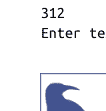

或者使用 `:=` 运算符压缩代码：剧透警告——本节的代码是传统且简单的，作为语法演示，但使用 Python 3.8 中添加并在下一章介绍的 `:=` 命名赋值表达式，可以将其从四行减少到两行。此表达式将一个名称赋值给另一个表达式的结果，但也返回赋值的值作为其整体结果。净效果让我们可以在同一行中获取、赋值和测试输入——并且都在循环的标题中：

```
while (reply := input('Enter text:')) != 'stop':
    print(reply.upper())
```

虽然在狭窄的角色中有用，但此表达式在此上下文中还需要嵌套括号，并且可以说比传统形式更隐式（尽管前 C 程序员的体验可能有所不同！）。

我们的脚本可以工作，但现在假设我们不是将文本字符串转换为大写，而是想对数字输入进行一些数学运算——例如求平方（也许在某个年龄输入程序中以某种误导性的方式戏弄用户）。我们可能会尝试使用这样的语句来实现所需效果：

```
>>> reply = '40'
>>> reply ** 2
TypeError: unsupported operand type(s) for ** or pow(): 'str' and 'int'
```

但这在我们的脚本中不太行得通：来自用户的输入总是作为 *字符串* 返回，并且如本书前面部分所讨论的，Python 不会在表达式中转换对象类型，除非它们都是数字。除非我们手动将其转换为整数，否则无法将数字字符串提升到幂：

```
>>> int(reply) ** 2
1600
```

掌握了这些信息，我们现在可以重新编码我们的循环以执行必要的数学运算。在文件中键入以下内容，然后使用命令行、IDLE 菜单选项或我们在第3章中遇到的任何其他技术运行它（REPL 需要在 `while` 后有一个空行，并且一次只运行一个语句——这里的最终 `print` 没有意义）：

```
while True:
    reply = input('Enter text:')
    if reply == 'stop': break
    print(int(reply) ** 2)
print('Bye')
```

此脚本使用单行 `if` 语句在 "stop" 时退出，如前所述，但它也转换输入以执行所需的数学运算。此版本还在底部添加了退出消息。因为最后一行的 `print` 语句的缩进量 *不如* 嵌套代码块那么多，所以它不被视为循环体的一部分，只会在循环退出后运行一次：

```
Enter text:2
4
Enter text:40
1600
Enter text:stop
Bye
```

## 通过测试输入处理错误

到目前为止一切顺利，但请注意当输入无效时会发生什么：

```
Enter text:xxx
ValueError: invalid literal for int() with base 10: 'xxx'
```

内置的 `int` 函数在面对非数字时会引发 *异常*（即标记错误）。如果我们希望脚本健壮，可以使用字符串对象的 `isdigit` 方法提前检查字符串内容：

```
>>> S = '40'
>>> T = 'xxx'
>>> S.isdigit(), T.isdigit()
(True, False)
```

这也给了我们一个借口，在示例中进一步嵌套语句。以下交互式脚本的新版本使用完整的 `if` 语句来处理转换错误时的异常：

```
while True:
    reply = input('Enter text:')
    if reply == 'stop':
        break
    elif not reply.isdigit():
        print('Bad!' * 8)
    else:
        print(int(reply) ** 2)
print('Bye')
```

我们将在第12章更详细地研究 `if` 语句，但它是脚本中编码逻辑的相当轻量级的工具。在其完整形式中，它由单词 `if` 后跟一个测试和一个关联的代码块；一个或多个可选的 `elif`（“否则如果”）测试和代码块；以及一个可选的 `else` 部分，底部有一个代码块作为默认值。Python 从上到下运行与第一个为真的测试关联的代码块，或者如果所有测试都为假，则运行 `else` 部分。

前面示例中的 `if`、`elif` 和 `else` 部分作为同一语句的一部分关联，因为它们的开头单词都垂直对齐（即共享相同的缩进级别）。`if` 语句从单词 `if` 跨越到脚本最后一行的 `print` 语句之前。反过来，整个 `if` 块是 `while` 循环的一部分，因为它全部缩进在循环的标题行下。一旦你开始使用，像这样的语句嵌套就很自然。

当我们运行新脚本时，其代码在错误发生之前捕获它们，并在继续之前打印错误消息（在将此代码交给质量保证团队之前，你可能希望改进它），但 "stop" 仍然让我们退出，有效数字仍然被平方：

```
Enter text:5
25
Enter text:xxx
Bad!Bad!Bad!Bad!Bad!Bad!Bad!Bad!
Enter text:10
100
Enter text:stop
Bye
```

## 使用 try 语句处理错误

前面的解决方案有效，但正如你将在本书后面看到的，处理 Python 中错误的最通用方法是使用 Python 的 `try` 语句完全捕获并从中恢复。我们将在本书的第七部分深入探讨此语句，但作为预览，在这里使用 `try` 可以产生一些人可能认为比先前版本更简单的代码：

```
while True:
    reply = input('Enter text:')
    if reply == 'stop': break
    try:
        num = int(reply)
    except:
        print('Bad!' * 8)
    else:
        print(num ** 2)
print('Bye')
```

此版本的工作方式与前一个完全相同，但我们用假设转换会工作的代码替换了显式错误检查，并将其包装在异常处理程序中以处理不工作的情况。换句话说，我们不是检测错误，而是在错误发生时简单地响应。

此 `try` 语句是另一个复合语句，并遵循与 `if` 和 `while` 相同的模式。它由单词 `try` 组成，后跟主要代码块（我们试图运行的操作），后跟一个 `except` 部分提供异常处理程序代码，以及一个 `else` 部分，如果在 `try` 部分没有引发异常则运行。Python 首先运行 `try` 部分，然后运行 `except` 部分（如果发生异常）或 `else` 部分（如果没有发生异常）。

在语句嵌套方面，因为单词 `try`、`except` 和 `else` 都缩进到同一级别，所以它们都被视为同一 `try` 语句的一部分。注意，这里的 `else` 部分与 `try` 关联，而不是与 `if` 关联。正如我们所见，`else` 可以出现在 Python 的 `if` 语句中，但它也可以也可能出现在 try 语句和循环中——其缩进告诉你它属于哪个语句。在本例中，try 语句从单词 try 开始，一直延伸到 else 下缩进的代码，因为 else 与 try 的缩进级别相同。此代码中的 if 语句是单行语句，在 break 后结束，因此 else 不适用于它。

## 支持浮点数

同样，我们将在本书后面再次讨论 try 语句。目前，请注意，由于 try 可用于拦截任何错误，它减少了你需要编写的错误检查代码量，并且是处理异常情况的一种非常通用的方法。例如，如果我们确信 print 不会失败，那么这个示例可以更加简洁：

```
while True:
    reply = input('Enter text:')
    if reply == 'stop': break
    try:
        print(int(reply) ** 2)
    except:
        print('Bad!' * 8)
print('Bye')
```

而如果我们想支持浮点数输入而不仅仅是整数，例如，使用 try 会比手动错误测试容易得多——我们可以简单地运行一个 float 调用并捕获其异常：

```
while True:
    reply = input('Enter text:')
    if reply == 'stop': break
    try:
        print(float(reply) ** 2)
    except:
        print('Bad!' * 8)
print('Bye')
```

目前字符串没有 isfloat 方法，因此这种基于异常的方法使我们不必在预先的错误检查中考虑所有可能的浮点语法（考虑到浮点数的多种形态，这是一项非平凡的任务！）。以这种方式编码时，我们可以输入更多种类的数字，但错误和退出仍然像以前一样工作：

```
Enter text:50
2500.0
Enter text:40.5
1640.25
Enter text:1.23E-100
1.5129e-200
Enter text:hack
Bad!Bad!Bad!Bad!Bad!Bad!Bad!Bad!
Enter text:stop
Bye
```


或者使用 eval 和 exec 运行任何内容：Python 的内置 eval 调用（我们在第 5 章和第 9 章中用于转换字符串和文件中的数据）也可以在这里替代 float，并允许输入任意表达式（"2 ** 100" 将是一个合法的输入，尽管有些奇怪，特别是如果我们假设程序正在处理年龄时！）。这是一个强大的概念，但也面临着前面章节提到的相同安全问题。如果你不能信任代码字符串的来源，请使用更专注和限制性的转换工具，如 int 和 float。

Python 的 exec（在第 3 章中用于运行从文件读取的代码）类似于 eval（但假设字符串是语句而不是表达式，并且没有结果），其 compile 调用会将常用的代码字符串预编译为字节码对象以提高速度。运行 help 查看其中任何一个的更多详细信息。我们还将在第 25 章中使用 exec 通过名称字符串导入模块——这是其更动态角色的一个例子。

## 三层嵌套代码

让我们看看代码的最后一个变体。如果需要，嵌套可以让我们走得更远——例如，我们可以扩展之前的仅整数脚本，根据有效输入的相对大小分支到一组备选项之一：

```
while True:
    reply = input('Enter text:')
    if reply == 'stop':
        break
    elif not reply.isdigit():
        print('Bad!' * 8)
    else:
        num = int(reply)
        if num < 20:
            print('low')
        else:
            print(num ** 2)
print('Bye')
```

这个版本在另一个 if 语句的 else 子句中添加了一个嵌套的 if 语句，而该 if 语句本身又嵌套在 while 循环中。当代码像这样有条件或重复时，我们只需将其进一步向右缩进。最终效果与之前的版本类似，但现在对于小于 20 的数字，我们将打印 "low"：

```
Enter text:19
low
Enter text:20
400
Enter text:hack
Bad!Bad!Bad!Bad!Bad!Bad!Bad!Bad!
Enter text:stop
Bye
```

## 章节总结

至此，我们对 Python 语句语法的初步介绍结束。本章介绍了编码语句和代码块的一般规则。正如你所学到的，在 Python 中，我们通常每行编写一条语句，并将嵌套块中的所有语句缩进相同的量（缩进是 Python 语法的一部分）。然而，我们也看到了这些规则的一些例外，包括续行、单行测试和循环。最后，我们将这些想法应用到一个交互式脚本中，该脚本演示了一些语句并展示了语句语法的实际应用。

在下一章中，我们将通过深入探讨 Python 的每个基本过程语句来开始更深入的探索。不过，正如你将看到的，所有语句都遵循这里介绍的一般规则。

## 测试你的知识：测验

1.  在类 C 语言中需要但在 Python 中省略的三样东西是什么？
2.  在 Python 中，语句通常如何终止？
3.  在 Python 中，嵌套代码块中的语句通常如何关联？
4.  如何使单条语句跨越多行？
5.  如何在单行上编写复合语句？
6.  在 Python 中，在语句末尾输入分号是否有任何有效理由？
7.  try 语句是用于什么的？
8.  Python 初学者最常见的编码错误是什么？

## 测试你的知识：答案

1.  类 C 语言要求某些语句中的测试用括号括起来，每条语句末尾用分号，嵌套代码块用花括号括起来。Python 不需要这些（但添加了 :）。
2.  行的末尾终止出现在该行上的语句。或者，如果同一行上出现多条语句，可以用分号分隔；类似地，如果一条语句跨越多行，你必须通过关闭括号对来终止它。
3.  嵌套块中的语句（代码行）都缩进相同数量的制表符或空格。
4.  你可以通过将部分语句括在圆括号、方括号或花括号中来使一条语句跨越多行；当 Python 看到包含该对关闭部分的行时，语句结束。
5.  复合语句的主体可以移动到冒号后的标题行，但前提是主体仅由非复合语句组成。
6.  只有当你需要将多条语句挤到一行代码上时。即便如此，这也仅在所有语句都是非复合语句时有效，并且不鼓励这样做，因为它可能导致代码难以阅读。
7.  try 语句用于捕获和恢复 Python 脚本中的异常（错误）。它通常是手动检查代码中错误的替代方案。
8.  忘记在复合语句的标题行末尾输入冒号字符是最常见的初学者错误。如果你是 Python 新手并且还没有犯过这个错误，你可能很快就会犯！

# 第 11 章

## 赋值、表达式和打印

既然我们已经对 Python 语句语法有了初步介绍，本章将开始深入探讨特定的 Python 语句。我们将从基础开始：赋值语句、表达式语句和打印操作。我们已经在实践中见过所有这些，但在这里我们将填补迄今为止跳过的重要细节。尽管它们相对简单，但正如你将看到的，这些语句类型中的每一种都有可选的变体，一旦你开始编写实际的 Python 程序，这些变体就会派上用场。

## 赋值

我们已经使用 Python 赋值语句一段时间来在示例中保留对象。在其基本形式中，你在等号左侧编写赋值的*目标*，在右侧编写要赋值的*对象*。左侧的目标可以是名称或对象组件，右侧的对象可以是创建对象的任意表达式。在大多数情况下，赋值是直接的，但这里有几个关键属性需要提前注意：

-   **赋值创建对象引用。** 正如*第 6 章*所讨论的，Python 赋值将对象的引用存储在名称或数据结构组件中。它们总是创建对象的*引用*而不是复制对象。因此，Python 变量更像是指针而不是数据存储区域。
-   **名称在首次赋值时创建。** Python 在你第一次*赋值*给它一个值（即对象引用）时创建一个变量名，因此无需提前预声明名称。一些（但不是所有）数据结构槽位在赋值时也会创建（例如，字典条目，一些对象属性）。一旦赋值，每当名称出现在表达式中时，它就会被其引用的值替换。
-   **名称必须在引用前赋值。** 使用你尚未赋值的名称是一个错误。如果你尝试，Python 会引发异常，而不是返回某种模糊的*默认*值。这在 Python 中至关重要，因为名称不是预声明的——如果 Python 为你程序中使用的未赋值名称提供默认值而不是将它们视为错误，你将更难发现代码中的名称拼写错误。

## 赋值语法形式

尽管赋值是 Python 中一个通用且普遍的概念，但在本章中，我们主要关注赋值*语句*以及一种有限的*表达式*。表 11-1 展示了 Python 中可用于编写赋值的不同语法形式。

*表 11-1. 赋值语句和表达式形式*

| 操作 | 解释 |
| :--- | :--- |
| target = 'Hack' | 基本赋值 |
| code, hack = 'py', 'PY' | 元组赋值 |
| [code, hack] = ['py', 'PY'] | 列表赋值 |
| a, b, c, d = 'hack' | 序列赋值 |
| a, *b = 'hack' | 扩展解包赋值 |
| code = hack = 'python' | 多目标赋值 |
| code += 1, hack *= 2 | 增强赋值 |
| (python := 3.12) + 0.01 | 命名赋值表达式 |

表 11-1 顶部的*基本*形式是迄今为止最常见的：将单个目标（一个名称或数据结构组件）绑定到单个对象（一个表达式结果）。事实上，仅使用这种形式你就能完成所有工作。表格中的其他条目代表的形式都是可选的，但程序员在实践中经常发现它们很方便：

*元组和列表赋值*
表格中的第二和第三种形式是相关的。当你在 = 的左侧编写一个元组或列表时，Python 会根据*位置*将右侧的对象与左侧的目标*配对*，并从左到右进行赋值。例如，在表 11-1 的第二行中，两侧都是元组（省略了括号），名称 code 和 hack 分别被赋值为 'py' 和 'PY'。= 的左侧是特殊语法，但右侧是一个真实的对象，这就是为什么这被称为“解包”赋值——右侧的组件被解包到左侧的目标中。

*序列赋值*
元组和列表赋值后来被泛化为我们现在称为*序列赋值*的实例——任何目标序列都可以赋值给任何序列（实际上是可迭代对象）的值，Python 会按位置逐个分配项目。我们甚至可以混合和匹配所涉及序列的类型。例如，表 11-1 中的第四行将一个名称元组与一个字符字符串配对：a 被赋值为 'h'，b 被赋值为 'a'，依此类推。尽管如此灵活，= 左侧的项目仍然是赋值目标的元组或列表。

## 扩展解包赋值

一种更晚的赋值形式允许在将序列（或其他可迭代对象）的部分赋值给目标序列时具有更大的灵活性。例如，表 11-1 中的第五行将 a 与右侧字符串中的第一个字符匹配，将带星号的名称 b 与其余部分匹配：a 被赋值为 'h'，b 被赋值为 ['a', 'c', 'k']。这为切片操作的结果赋值提供了一种替代方案。像这样的星号收集器在某种程度上也篡夺了解包一词，尽管这更多是历史性的而非技术性的产物。

## 多目标赋值

表 11-1 中的第六行展示了多目标形式的赋值。在这种形式中，Python 将对同一对象（最右侧的对象）的引用赋值给左侧的所有目标。在表格中，名称 code 和 hack 都被赋值为对同一字符串对象 'python' 的引用。其效果与我们先运行 hack = 'python' 然后运行 code = hack 相同，因为 hack 求值为原始字符串对象（即，不是该对象的单独副本）。

## 增强赋值

表 11-1 中的倒数第二行是增强赋值的一个例子——一种以简洁方式将表达式和赋值结合在一起的简写。例如，说 code += 1 与 code = code + 1 具有相同的效果，但增强形式需要更少的输入，并且通常运行得更快。此外，如果赋值的目标是可变的，增强赋值可以通过选择就地更新操作而不是对象复制来运行得更快。正如你将看到的，Python 中大多数二元表达式运算符都有一个增强赋值语句（甚至包括未使用的 @！）。

## 命名赋值表达式

Python 3.8 中新增的 := 运算符允许你将赋值编写为表达式，该表达式返回它赋给名称的值。此表达式可以嵌套在赋值语句在语法上不起作用的地方，并且在常见用法中，允许你在代码中的同一位置既赋值给一个名称又使用其值。

## 基本赋值

让我们像往常一样转向 REPL 提示符下的示例。我们已经在本书中使用了表 11-1 的基本赋值，所以你应该熟悉它的基础知识。简而言之，它将单个目标赋值给单个值，其中目标可以是名称、索引、切片或属性，值可以是任何表达式：

```
$ python3
>>> L = [1, 2]           # 名称目标
>>> L[0] = 3             # 索引目标
>>> L[-1:] = [4, 5]      # 切片目标
>>> L
[3, 4, 5]
```

属性目标出现在类中；我们还没有研究过这些，但赋值很简单：

```
object.attr = L          # 属性目标（见第六部分）
```

尽管名称很常见并且在这里占主导地位，但这四种类型的赋值目标中的任何一种都可以在任何赋值形式中使用，除非前面有说明（例如，命名赋值表达式只允许名称）。

名称注解：基本赋值语句也可以有一个*注解*表达式，该表达式由左侧目标后的冒号引入。此语句形式只允许单个目标，用于*类型提示*，在第 6 章末尾附近描述。如那里所述，因为这是可选的、复杂的、Python 完全不使用的，并且从根本上与语言的核心习语相悖，我们在本书中跳过了它。如果你在野外偶然遇到动态类型语言中类型声明的奇怪案例，请参阅 Python 的文档了解更多详情。

## 序列赋值

接下来，这里有一些简单且可比较的元组和列表赋值（又名*序列赋值*）的实际示例，将项目解包到单个变量中：

```
>>> first = 1              # 基本赋值
>>> second = 2

>>> A, B = first, second   # 元组赋值
>>> A, B                   # 类似于 A = first; B = second
(1, 2)

>>> [C, D] = [first, second] # 列表赋值
>>> C, D
(1, 2)
```

请注意，在此交互的第三行中，我们确实编写了两个元组——我们只是省略了它们的外层括号。Python 将赋值运算符右侧元组中的*值*与左侧元组中的*变量*配对，并逐个赋值。当 = 被列表包围时也是如此。

元组赋值导致了 Python 中一个常见的编码技巧，该技巧在第二部分末尾练习的解决方案中引入。因为 Python 在语句运行时创建一个临时元组来保存右侧变量的原始值，所以解包赋值也是*交换*两个变量值的一种简单方法，无需创建自己的临时变量——右侧的元组会自动记住变量的先前值：

```
>>> first = 1
>>> second = 2
>>> first, second = second, first  # 元组：交换值
>>> first, second                 # 类似于 T = first; first = second; second = T
(2, 1)
```

如前所述，Python 中原始的元组和列表赋值形式最终被泛化为接受右侧*任何*类型的序列（实际上是*可迭代对象*），只要它与左侧的序列长度相同。你可以将值的元组赋值给变量的列表，将字符字符串赋值给变量的元组，依此类推。在所有情况下，Python 都按位置从左到右将右侧序列中的项目赋值给左侧序列中的目标：

```
>>> [a, b, c] = (1, 2, 3)  # 将值的元组赋值给名称的列表
>>> a, c
(1, 3)
>>> (a, b, c) = 'ABC'       # 将字符字符串赋值给元组名称
>>> a, c
('A', 'C')
```

更广泛地说，虽然序列赋值的左侧仍然是一个序列（一个目标元组或列表），但右侧可以是任何*可迭代*对象，而不仅仅是任何序列。这是一个更通用的类别，包括物理集合（例如列表）和虚拟集合（例如文件的行），它在第4章中首次定义，并在此后不时出现。我们将在第14章和第20章探讨可迭代对象时巩固这个术语，并在下一节中将其应用于解包一个range可迭代对象。目前，赋值中的“序列”最好与等号左侧的内容相关联。

## 高级序列赋值模式

虽然我们可以在等号周围混合和匹配序列类型，但通常右侧的项目数量必须与左侧的目标数量*相同*，否则会出错。正如你将在下一节看到的，Python允许我们使用扩展解包*语法更通用，但赋值目标和主体中的项目数量通常必须匹配：

```
>>> string = 'TEXT'
>>> a, b, c, d = string          # 两侧数量相同
>>> a, b, c, d
('T', 'E', 'X', 'T')

>>> a, b, c = string             # 数量不匹配则出错
ValueError: too many values to unpack (expected 3)
```

为了更灵活，我们总是可以*切片*。有多种方法可以使用切片来使最后一种情况生效：

```
>>> a, b, c = string[0], string[1], string[2:]  # 索引和切片
>>> a, b, c                                     # a, b, c = ('T', 'E', 'XT')
('T', 'E', 'XT')

>>> a, b, c = list(string[:2]) + [string[2:]]    # 切片并连接
>>> a, b, c                                     # a, b, c = ['T', 'E', 'XT']
('T', 'E', 'XT')

>>> a, b = string[:2]                            # 切片并直接解包
>>> c = string[2:]                               # a, b = 'TE'; c = 'XT'
>>> a, b, c
('T', 'E', 'XT')

>>> (a, b), c = string[:2], string[2:]           # 嵌套序列
>>> a, b, c                                     # (a, b), c = 'TE', 'XT'
('T', 'E', 'XT')
```

正如这个交互中的最后一个例子所示，我们甚至可以赋值*嵌套*序列，Python会根据它们的形状解包其部分，正如预期的那样。在这种情况下，我们赋值一个包含两个项目的元组，其中第一个项目是一个嵌套序列（一个字符串），完全就像我们这样编码一样：

```
>>> ((a, b), c) = ('TE', 'XT')    # 按形状和位置配对
>>> a, b, c
('T', 'E', 'XT')
```

Python将右侧的第一个字符串（'TE'）与左侧的第一个元组（(a, b)）配对，并一次分配一个字符，然后将整个第二个字符串（'XT'）一次性赋值给变量c。在这种情况下，左侧对象的序列嵌套形状必须与右侧对象的形状匹配。像这样的嵌套序列赋值很少见，但对于提取已知形状的数据结构部分来说可能很方便。

例如，你将在第13章中看到，这种技术也适用于for循环，因为循环项被赋值给循环头中给出的目标，就像运行了=语句一样：

```
for (a, b, c) in [(1, 2, 3), (4, 5, 6)]: ...            # 简单元组赋值

for ((a, b), c) in [((1, 2), 3), ((4, 5), 6)]: ...    # 嵌套元组赋值
```

这样的嵌套序列赋值也可以通过下一章的match语句实现，但我们将保留细节直到那时。序列解包赋值也产生了Python中另一个常见的编码习惯——将整数序列赋值给一组变量：

```
>>> red, green, blue = range(3)
>>> red, blue
(0, 2)
```

此代码将=左侧的三个名称分别初始化为整数0、1和2。因为每个名称都获得一个唯一的值，所以它是Python对其他语言中可能见过的*枚举*数据类型的最简单等价物。要理解这一点，你需要回忆range内置函数返回一个*可迭代对象*，它生成一个连续整数的列表（如果你希望像这样在REPL中一次显示其值，请将其包装在列表中）：

```
>>> list(range(3))            # 显示需要list()
[0, 1, 2]
```

这个调用在第4章中简要预览过；因为range常用于for循环，我们将在第13章中更多地讨论它。你可能看到元组赋值的另一个地方是在循环中将序列拆分为其前部和其余部分，如以下while循环（在上一章中介绍）：

```
>>> L = [1, 2, 3, 4]
>>> while L:                    # 重复直到L变为空（假）
...     front, L = L[0], L[1:]   # *替代方案见下一节
...     print(front, L)
...
1 [2, 3, 4]
2 [3, 4]
3 [4]
4 []
```

循环中的元组赋值可以改为编码为以下两行，但将它们串联在一起通常更方便：

```
...     front = L[0]
...     L = L[1:]
```

请注意，此代码将列表用作一种*栈*数据结构，这通常也可以通过列表对象的append和pop方法实现；在这里，front = L.pop(0)与元组赋值语句的效果基本相同，但它是原地更改。你将在第13章中了解更多关于while循环，以及使用for循环遍历序列的其他（通常更好的）方式。

## 扩展解包赋值

上一节演示了如何使用手动切片使序列赋值更通用。在较新的Python版本中，序列赋值进一步扩展以使这更容易。简而言之，一个*星号目标*，*X，可以用于=的左侧，以便指定对右侧可迭代对象的更通用匹配——星号目标被赋值一个列表，该列表收集可迭代对象中未赋值给其他目标的所有项目。这对于常见的编码模式特别方便，例如将序列拆分为其“前部”和“其余部分”，如前面的示例。

### 扩展解包实战

让我们直接进入一个例子来演示这是如何工作的。如前所述，序列赋值通常要求左侧的目标数量与右侧对象中的项目数量完全相同。如果长度不匹配，我们会得到错误，除非我们在右侧手动切片，如上一节所示：

```
>>> seq = [1, 2, 3, 4]
>>> a, b, c, d = seq
>>> a, d
(1, 4)

>>> a, b = seq
ValueError: too many values to unpack (expected 2)
```

然而，我们可以在这个例子中使用单个星号目标进行更通用的匹配。在我们交互式会话的以下延续中，a匹配序列中的第一个项目，b匹配其余部分：

```
>>> a, *b = seq
>>> a
1
>>> b
[2, 3, 4]
```

当使用星号目标时（如这里的名称b），左侧的项目数量不必与右侧可迭代对象的长度匹配（如这里的序列seq）。事实上，星号目标可以出现在左侧的*任何位置*。例如，在下一个交互中，b匹配序列中的最后一个项目，a匹配最后一个之前的所有内容：

```
>>> *a, b = seq
>>> a
[1, 2, 3]
>>> b
4
```

当星号目标出现在*中间*时，它收集列出的其他目标之间的所有内容。因此，在以下交互中，a和c被赋值第一个和最后一个项目，b获得它们之间的所有内容：

```
>>> a, *b, c = seq
>>> a
1
>>> b
[2, 3]
>>> c
4
```

更一般地说，无论星号目标出现在哪里，它都将被赋值一个列表，该列表收集该位置的所有未分配项目：

```
>>> a, b, *c = seq
>>> a
1
>>> b
2
>>> c
[3, 4]
```

当然，像普通序列赋值一样，扩展解包语法适用于任何序列类型（实际上，再次强调，任何*可迭代对象*），而不仅仅是列表。这里它正在解包字符串中的字符和一个可迭代的range——按需生成值0...3：

```
>>> a, *b = 'hack'
>>> a, b
('h', ['a', 'c', 'k'])

>>> a, *b, c = 'hack'
>>> a, b, c
('h', ['a', 'c'], 'k')

>>> a, *b, c = range(4)
>>> a, b, c
(0, [1, 2], 3)
```

这在精神上类似于*切片*，但不完全相同——序列解包赋值总是为匹配的项目返回一个*列表*，而切片返回与切片对象相同类型的序列：

```
>>> S = 'hack'

>>> a, b, c = S[0], S[1:-1], S[-1]    # 切片是类型特定的
>>> a, b, c
('h', 'ac', 'k')

>>> a, *b, c = S                       # 但*总是返回一个列表
>>> a, b, c
('h', ['a', 'c'], 'k')
```

最后，上一节的结束示例通过此扩展变得更加简单，因为我们不必手动切片来获取第一个和其余项目（尽管“其余部分”L在第一个*之后总是变成一个列表）：

```
>>> L = [1, 2, 3, 4]
>>> while L:
...     front, *L = L          # 无需切片即可获取第一个、其余部分
...     print(front, L)
...
1 [2, 3, 4]
2 [3, 4]
3 [4]
4 []
```

### 边界情况

虽然扩展解包很灵活，但一些边界（非典型）情况值得注意。首先，星号目标可能只匹配单个项目，但总是被赋值一个列表：

```
>>> seq = [1, 2, 3, 4]

>>> a, b, c, *d = seq
>>> print(a, b, c, d)
1 2 3 [4]
```

其次，如果没有剩余内容匹配星号目标，无论它出现在哪里，它都被赋值一个空列表。在以下示例中，名称a、b、c和d已经匹配了序列中的每个项目，但Python将e赋值为空列表，而不是将其视为错误情况：

```
>>> a, b, c, d, *e = seq
>>> print(a, b, c, d, e)
1 2 3 4 []

>>> a, b, *e, c, d = seq
>>> print(a, b, c, d, e)
1 2 3 4 []
```

## 一个有用的便利特性

请记住，扩展解包赋值只是一种便利（好吧，除了有点拗口）。我们通常可以通过显式索引和切片实现相同的效果，但扩展解包在编码上更简单。例如，常见的“首项，其余项”分割编码模式可以用两种方式实现，但切片方式需要额外的工作：

```
>>> seq
[1, 2, 3, 4]

>>> a, *b = seq                # 首项，其余项
>>> a, b
(1, [2, 3, 4])

>>> a, b = seq[0], seq[1:]     # 首项，其余项（不使用 *）
>>> a, b
(1, [2, 3, 4])
```

同样常见的“其余项，末项”分割模式也可以用两种方式实现，但扩展解包语法再次明显减少了按键次数（并且显著减少了思考量）：

```
>>> *a, b = seq                # 其余项，末项
>>> a, b
([1, 2, 3], 4)

>>> a, b = seq[:-1], seq[-1]    # 其余项，末项（不使用 *）
>>> a, b
([1, 2, 3], 4)
```

由于扩展解包语法既更简单，又可以说更自然，因此在 Python 代码中也很常见。

## 在 for 循环中的应用

因为 for 循环语句中的循环变量可以是任何赋值目标，所以扩展解包在这里也适用。我们在第 4 章简要使用过 for 循环迭代工具，并将在第 13 章正式学习它，但它在这里的关联很直接：扩展解包赋值可以出现在 `for` 关键字之后，而那里通常使用简单的变量名：

```
for (a, *b, c) in [(1, 2, 3, 4), (5, 6, 7, 8)]: ...
```

在这种上下文中使用时，每次迭代时，Python 只是将下一个值元组赋值给目标元组。例如，在第一次循环时，就好像我们执行了以下赋值语句：

```
a, *b, c = (1, 2, 3, 4)        # b 得到 [2, 3]
```

名称 `a`、`b` 和 `c` 可以在循环代码中用于引用提取出的组件。事实上，这根本不是一个特例，而只是通用赋值的一个实例。正如我们在本章前面看到的，例如，我们可以在循环中使用简单的序列（元组）赋值做类似的事情：

```
for (a, b, c) in [(1, 2, 3), (4, 5, 6)]: ...    # a, b, c = (1, 2, 3), ...
```

我们总是可以通过手动切片来模拟扩展解包赋值的行为：

```
for all in [(1, 2, 3, 4), (5, 6, 7, 8)]: ...
    a, b, c = all[0], all[1:-1], all[-1]
```

由于我们还没有学到足够多关于 for 循环语法的细节，我们将把这个话题搁置，直到第 13 章再次讨论。

> ## Python 的众多“星号”

不，这个侧边栏不是关于个性的（它们在软件文化中已经渗透得比应有的更多了）。它指的是多年来在 Python 中出现的所有 `*` 的特殊语法形式，其中许多你已经见过。在 Python 3.5 之前，特殊的星号项语法形式可以出现在：

- *赋值*中，其中单个 `*X` 星号赋值目标（可以是任何类型：名称、索引、切片、属性），并且在嵌套部分中可重复，用于收集不匹配的项到一个新列表中，如本章所述。
- *函数头*中，其中单个 `*X` 和 `**X` 星号名称分别收集不匹配的位置参数和关键字参数到元组和字典中。
- *函数调用*中，其中单个 `*X` 和 `**X` 星号表达式分别将可迭代对象和映射解包为单独的位置参数和关键字参数。

从 Python 3.5 开始，函数调用（后一项）支持任意数量的 `*X` 和 `**X` 解包表达式，并且任意数量的 `*X` 和 `**X` 星号表达式也可以出现在对象字面量中，在那里它们解包其所在字面量所隐含类型的集合：

```
[x, *iter]    # 列表：解包可迭代对象中的项
(x, *iter, y) # 元组：同上，有无括号均可
{*iter, x}    # 集合：同上，尽管值是无序且唯一的
{x: y, **map} # 字典：解包映射中的键/值，最右侧的重复键胜出
```

从 Python 3.10 开始，`*X` 和 `**X` 星号名称也可以出现在下一章介绍的 `match` 语句的模式中，在那里它们扮演着与序列赋值中类似的角色，尽管两者之间只有 `*X` 重叠，并且它在 `match` 中的赋值实际上是一个真/假测试的副作用。

从 Python 3.11 开始，`except*` 可以出现在 `try` 语句中，它允许多个处理程序运行以处理包装在异常组中的多个异常——这一增加将已经复杂的 `try` 分裂为更窄的角色，我们将在第 35 章才会遇到。

话虽如此，星号之路在 Python 中一直是一条曲折的道路，语言的其他部分在未来也并非不可能崭露头角。欲知更多详情，请参阅星号。

## 多目标赋值

乍一看比序列赋值更简单，多目标赋值只是将所有给定的目标一直赋值给最右边的同一个对象。例如，以下语句将三个名称（变量）`a`、`b` 和 `c` 赋值给字符串 `'code'`：

```
>>> a = b = c = 'code'
>>> a, b, c
('code', 'code', 'code')
```

这种形式等同于——但比以下三个赋值更易于编码且行数更少：

```
>>> c = 'code'
>>> b = c
>>> a = b
```

## 多目标赋值与共享引用

虽然这看起来很简单，但请记住这里只有一个对象，由所有三个变量共享：它们最终都引用内存中的同一个对象。对于不可变类型，这种行为是无忧的——例如，当初始化一组计数器为零时（回想一下，在 Python 中变量必须在使用前赋值，因此你必须在开始累加之前将计数器初始化为零）：

```
>>> a = b = 0
>>> b = b + 1
>>> a, b
(0, 1)
```

这里，改变 `b` 只改变了 `b`，因为数字不支持就地更改。只要赋值的对象是不可变的，多个名称引用它也无关紧要。

然而，像往常一样，当初始化变量为空的*可变*对象（如列表或字典）时，我们必须更加谨慎：

```
>>> a = b = []
>>> b.append(42)
>>> a, b
([42], [42])
```

这一次，因为 `a` 和 `b` 引用*同一个*对象，通过 `b` 就地追加也会影响我们通过 `a` 看到的内容。这实际上只是我们在第 6 章首次遇到的共享引用现象的另一个例子。为避免此问题，请改为在单独的语句中初始化可变对象，这样每个语句都通过运行一个独立的字面量表达式创建一个不同的空对象：

```
>>> a = []
>>> b = []            # a 和 b 不共享同一个对象
>>> b.append(42)
>>> a, b
([], [42])
```

像下面这样的*元组*赋值具有相同的效果，但更简洁——通过运行两个列表字面量表达式，它创建了两个不同的对象：

```
>>> a, b = [], []    # a 和 b 不共享同一个对象
```

## 增强赋值

除了已经介绍过的基本赋值、序列（原始和星号）赋值和多目标赋值形式外，Python 在其发展早期就获得了表 11-2 中列出的所有赋值语句格式。这些格式被称为*增强赋值*，借鉴自 C 语言，它们大多只是简写：它们暗示了二元（双操作数）表达式和赋值的组合。例如，以下两种格式在功能上是等价的，尽管后者可能使用就地选项直接更改 `X`，你稍后会看到：

```
X = X + Y            # 基本形式
X += Y               # 增强形式
```

表 11-2. 增强赋值语句

| X += Y | X -= Y | X *= Y | X /= Y | X @= Y |
| X //= Y | X %= Y | X **= Y | X >>= Y | |
| X <<= Y | X &= Y | X |= Y | X ^= Y | |

增强赋值适用于任何支持隐含二元表达式的类型。例如，以下是将名称加 1 的两种方式；实际上，它们都改变了名称以引用不同的值：

```
>>> x = 1
>>> x = x + 1        # 基本形式
>>> x
2
>>> x += 1           # 增强形式
>>> x
3
```

当应用于*序列*（如字符串）时，增强形式执行连接操作，因为对于此类对象，`+` 的含义就是连接。因此，这里的第二行等同于输入更长的 `S = S + 'HACK'`：

## 增强赋值与共享引用

更微妙的是，列表的 `+=` 操作所隐含的就地修改，与 `+` 拼接操作创建的新对象截然不同。对于所有共享引用的情况，当对象被多个名称引用时，这种差异可能很重要：

```
>>> L = [1, 2]
>>> M = L                    # L 和 M 引用同一个对象
>>> L = L + [3, 4]           # 拼接操作创建了一个新对象
>>> L, M                     # L 发生了变化，但 M 没有
([1, 2, 3, 4], [1, 2])
>>> L = [1, 2]
>>> M = L
>>> L += [3, 4]              # 但 += 实际上意味着扩展，而非 +
>>> L, M                     # M 也看到了就地修改！
([1, 2, 3, 4], [1, 2, 3, 4])
```

这只对列表和字典等可变对象有影响，而且这是一个相当隐蔽的情况（至少，在它影响到你的代码之前！）。一如既往，如果你需要打破共享引用结构，请复制你的可变对象。

## 命名赋值表达式

在 Python 三十多年的历史中，它一直抵制模仿 C 语言的赋值即表达式惯用法，理由是它过于微妙且容易出错，并且会催生难以阅读的代码。尽管这些担忧依然存在，Python 3.8 引入了一种类似的功能，称为命名赋值。

重要的是，这种功能并没有使普通的 `=` 赋值语句像在 C 语言中那样成为可嵌套的表达式。相反，它向 Python 添加了一个新的表达式运算符 `:=`，理由是其不同且有限的语法可以中和其他语言的陷阱。你仍然无法在需要 `==` 时意外输入 `=`，并且 `:=` 在视觉上是独特的。

我们在上一章的一个提示说明中简要探讨过这个表达式。简而言之，表达式 *name := value* 首先计算表达式 *value*，然后同时：

- 将结果*赋值*给提供的变量 *name*
- 将结果作为整个 `:=` 表达式的值*返回*

没有理由仅为第一部分使用此语法，因为 Python 所有的 `=` 赋值语句都已经将值赋给名称（事实上，如果你尝试在不加括号的情况下将 `:=` 用作语句，你会得到语法错误）。然而，由于 `:=` 是一个*返回*所赋值的*表达式*，它可以嵌套在不允许使用语句的上下文中，并可用于既测试又使用已赋值名称的角色。

作为一个虚构的首个示例，以下嵌套的 `:=` 既将 2 赋值给 `b`，又将其返回用于赋值给 `a` 的 `*` 字符串重复结果：

```
>>> a = 'hack' * (b := 2)
>>> a
'hackhack'
>>> b
2
```

在其刻意的限制中，命名赋值只允许左侧是一个简单的、单一的*名称*（变量），因此其他赋值语句形式或对数据结构组件的引用在此处都不起作用：

```
>>> (python := 3.12) + 0.01    # 左侧只是一个名称
3.13
>>> python
3.12

>>> (python, Python := 3.12, 3.13) + 0.01
TypeError: can only concatenate tuple (not "float") to tuple
>>> (python[0] := 3.12) + 0.01
SyntaxError: cannot use assignment expressions with subscript
>>> (python.attr := 3.12) + 0.01
SyntaxError: cannot use assignment expressions with attribute
```

例如，第一个失败被解释为一个三元组，其中 `:=` 位于中间，而不是一个双目标的命名序列赋值。此外，命名赋值不支持我们之前遇到的任何*增强*赋值形式：例如，没有 `:=+`，并且编写语句 `X += 1` 可能实际上比表达式 `(X := X + 1)` 更省事（微妙的是，`:=+` 可以运行，但只是将 `+` 恒等运算符应用于右侧的表达式）。

## 何时使用命名赋值

虽然 `:=` 更有用的上下文有限，但其最常见的用例是与 `if` 和 `while` 语句结合使用，这两者都在前面的章节中介绍过。在没有 `:=` 的情况下，通常——现在仍然如此——是在语句之前给变量赋值，在语句头部测试它，然后在语句体中使用它。

例如，从文件中读取行并必须检测文件结束（你从第 9 章会记得，这意味着一个逻辑上为假的空字符串）的代码可能看起来像这些部分片段（要在此部分实时运行代码，请在每个片段之前打开一个文本文件进行输入并将其赋值给 `file`）：

```
line = file.readline()           # 不使用 := 表达式
if line:
    print(line)

line = file.readline()           # 同上，在 while 循环中
while line:
    print(line)
    line = file.readline()
```

为了避免冗余调用，在 Python 中像这样编写后者也很常见——如前一章所示：

```
while True:                     # 既不使用 := 也不冗余
    line = file.readline()
    if not line: break
    print(line)
```

这些形式仍然有效，并且 `:=` 从来不是必需的。然而，使用 `:=`，我们有时可以将获取、赋值和测试折叠成语句头部本身的一行代码：

```
if line := file.readline():      # := 的替代方案
    print(line)

while line := file.readline():   # 读取所有行（对比：for line in file）
    print(line)
```

在这两种情况下，因为 `:=` *返回* `readline` 调用的结果，其逻辑值可以在语句头部本身进行测试。并且因为 `:=` 也*将*结果*赋值*给 `line`，如果语句体执行，它可以在语句体中使用。结果是，`:=` 提供了一种*快捷方式*，允许以紧凑的方式编码多个操作。

如果你选择使用此表达式，请记住它通常需要加*括号*以避免与周围代码交互。例如，即使将其结果与显式值进行比较，也强制要求使用括号，而这在等效的语句中是不需要的：

```
if (line := file.readline()) != ignore:   # 需要括号
    print(line)

while (line := file.readline()) != stop:  # 并且不是个坏主意
    print(line)
```

根据经验法则，如果你选择使用 `:=`，将其包裹在括号中既可以在视觉上将其突出显示，又可以避免如果其周围代码意外改变其含义时可能出现的棘手问题。例如，在前面的例子中，如果省略括号，名称将被赋值为 `!=` 测试的结果，因为它的绑定比 `:=` 更紧（参见第 9 章）。此外，`:=` 有特殊的语法规则，我们将在此省略，但它们在设计上鼓励括号用法。

除了文件读取和类似角色外，`:=` 还可用于在字面量中重用结果，在推导式和其他迭代工具中获取最后结果，甚至可以嵌套在 f-string 和其自身中——需要加括号：

```
>>> [val := 'Py!', val * 2, val * 3]   # 重用一个值
['Py!', 'Py!Py!', 'Py!Py!Py!']

>>> list(pow := 2 ** num for num in [2, 4, 8])   # 捕获一个结果
[4, 16, 256]
```

>>> pow
256

>>> f'Hello {{name := input("Who are you? ")}}'    # 嵌套在f字符串中（嗯）
Who are you? Pat
'Hello Pat'
>>> name
'Pat'

>>> (x := (y := (z := 1) + 1) + 1)                # 自身嵌套（嗯 * 2）
3
>>> x, y, z
(3, 2, 1)

作为另一个经验法则，请记住，一个深度嵌套且晦涩的 `:=` 表达式可能看起来很聪明，但会比一个简单的独立赋值更难阅读——甚至更难*注意到*。你将在第20章的示例中自行判断这一点。不过，一般来说，为了他人（包括未来的自己！），请像对待许多可嵌套工具一样，谨慎而明智地使用 `:=`。清晰度通常值得多写一两行代码。

## 变量名规则

既然我们已经探讨了赋值语句和表达式，现在是时候更正式地讨论变量*名称*的使用了。在 Python 中，当你给变量赋值时，名称就产生了，但在为程序中的对象选择名称时，需要遵循一些规则：

*语法：（下划线或字母）+（任意数量的字母、数字或下划线）*
变量名必须以下划线或字母开头，后面可以跟任意数量的字母、数字或下划线。`_hack`、`hack` 和 `Hack_1` 是合法的名称，但 `1_hack`、`hack$` 和 `@#!` 不是。

Python 还允许非 ASCII *Unicode* 字符出现在变量名中，但这些字符可能会使你的代码在某些上下文中难以使用，并且需要遵循一些需要深入 Unicode 知识的规则，这些规则过于深奥，此处无法详述。有关此主题的扩展内容，请参阅第37章的注释“变量名中的 Unicode”，完整细节请参阅 Python 的语言手册。

*大小写敏感：HACK 与 hack 不同*
Python 在程序中始终注意大小写，无论是你创建的名称还是保留字。例如，名称 `X` 和 `x` 指向两个不同的变量。为了可移植性，导入的模块文件名中的大小写也很重要，即使在文件系统不区分大小写的平台上（Windows 中常见）。这样，当程序被复制到不同平台时，你的导入仍然有效。

*保留字是禁区*
你定义的名称不能与 Python 语言中具有特殊含义的单词相同。例如，如果你尝试使用 `class` 作为变量名，Python 会引发语法错误，但 `klass` 和 `Class` 可以正常工作。表11-3列出了当前 Python 中*保留*的单词——因此不能用作你自己的名称。注意：Python 的文档今天称这些为“关键字”，尽管长期以来“关键字”一词用于按名称传递的函数参数；为避免混淆，本书使用“保留字”来指代，嗯，保留字。

表11-3. Python 保留字

| False | await | else | import | pass |
| None | break | except | in | raise |
| True | class | finally | is | return |
| and | continue | for | lambda | try |
| as | def | from | nonlocal | while |
| assert | del | global | not | with |
| async | elif | if | or | yield |

除了表11-3（以及第10章部分泄露的内容），单词 `match`、`case`、`_` 和 `type` 是软保留字：它们仅在所属语句的上下文中保留，可以在其他任何地方用作变量。正如你将在下一章学到的，前三个是多选 `match` 语句的一部分；后者用于创建类型别名的 `type` 语句，用于第6章末尾讨论的类型提示。

如你所见，Python 的大多数保留字都是小写的。它们也都是真正保留的——不像你将在本书下一部分遇到的内置作用域中的名称，你不能通过赋值重新定义保留字。例如，语句 `and = 1` 会导致语法错误。

除了大小写混合外，表11-3中的前三个条目——`False`、`None` 和 `True`——在含义上有些不寻常：它们也出现在第17章描述的 Python 内置作用域中，并且从技术上讲是分配给对象的名称。然而，在所有其他意义上，它们是真正保留的，不能在你的脚本中用于除它们所代表的对象之外的任何其他目的。所有其他保留字都硬编码在 Python 的语法中，只能出现在其预期的特定上下文中。²

此外，由于 `import` 语句中的模块名会成为脚本中的变量，因此变量名约束也扩展到你的模块文件名。例如，你可以编写名为 `and.py` 和 `my-code.py` 的文件，并将它们作为顶层脚本运行，但你不能导入它们：它们的名称（不带 `.py` 扩展名）在导入时会成为代码中的变量，因此必须遵循刚刚概述的所有变量规则。因此，保留字是禁区，破折号不行，但下划线可以。这个模块概念将在本书的第五部分重新讨论，届时你会发现这个约束也适用于“包”文件夹的名称。

> ## Python 的弃用策略

因为使新单词成为保留字有可能广泛破坏代码，所以这种更改通常会逐步引入语言。当更改可能影响现有代码时，Python 通常会将其设为一个选项，并在该修改正式启用前的一个或多个版本中开始发出弃用警告。其理念是，你应该有时间注意到警告并在升级 Python 之前更新你的代码。最近，“软”保留字类别出现了，允许在没有警告和破坏的情况下添加新的保留字。这似乎是对弃用警告效果有限的默认承认。

² 例外：Python 的替代实现（如 Jython）可能允许保留字在某些上下文中作为标识符出现。有关替代 Python 的更多信息，请参阅第2章。

> 弃用策略并不总是被遵循，尤其是在像 3.0 这样的主要版本中（它肆意破坏了现有代码），但也包括那些被其推动者认为合理或无害的新更改。理论上，更改由一个负责执行弃用策略的*指导委员会*监督。虽然这在某些情况下有所帮助，但在遏制 Python 中主观的形态变化和膨胀方面，它基本上是无效的，这使得构建可靠和持久的软件比应有的更具挑战性。

即使发出了弃用警告，那些无法轻易更改的程序，如果以源代码形式分发给无意中升级了本地 Python 的用户，也会中断。那些承受这种变化的人，可能会合理地认为弃用警告与其说是礼貌，不如说是给一个巨大伤口贴上的创可贴。警告说你将要粗鲁，并不能使粗鲁变得可以接受！

## 命名约定

除了这些规则，还有一套命名*约定*——不是必需的，但在实践中通常会遵循的规则。例如，因为具有两个前导和尾随下划线的名称（例如，`__name__`）通常对 Python 解释器具有特殊含义，所以你应该避免在自己的名称中使用这种模式，除非在预期的上下文中。以下是 Python 遵循的约定列表：

- 以单个下划线开头的名称（`_X`）不会被 `from module import *` 语句导入，该语句在[第23章](#)中描述。
- 具有两个前导和尾随下划线的名称（`__X__`）是系统定义的名称，对解释器具有特殊含义，并在[第6部分](#)的用户定义 OOP 类中提供实现细节。
- 以两个下划线开头但不*以*两个下划线结尾的名称（`__X`）被本地化（“名称修饰”）到封闭类中，如[第31章](#)中关于伪私有属性的讨论。
- 仅是一个单下划线的名称（`_`）在某些 REPL 中交互式工作时保留上一个表达式的结果，并且是 `match` 中通配符的软关键字，如[第12章](#)所述。

除了这些 Python 解释器约定外，Python 程序员通常还遵循各种其他约定。例如，一些程序员使用“驼峰命名法”（`aLongName`）来区分长名称的各个部分，而另一些则使用下划线（`a_Long_name`）；根据 Python 和本书，这两种方式都是完全有效的。

在本书后面，你还会看到*类*名通常以大写字母开头，*模块*名以小写字母开头，并且名称 `self` 虽然不是保留字，但在类中通常具有特殊作用。此外，在[第17章](#)中，我们将研究另一个更大的名称类别，称为*内置名称*，它们是预定义的但不是保留的（因此可以重新赋值：`open = 99` 可以静默工作，尽管你可能偶尔希望它不能！）。

## 名称没有类型，但对象有

这主要是复习，但请记住，保持 Python 中名称和对象之间的区别至关重要。如[第6章](#)所述，对象有一个类型（例如，整数、列表），并且可能是可变的或不可变的。另一方面，名称（又名变量）始终只是对象的引用；它们没有可变性的概念，并且除了它们在特定时间点恰好引用的对象类型外，没有关联的类型信息。

因此，在不同时间将同一个名称赋值给不同种类的对象是完全可以的：

```
>>> x = 0            # x 绑定到一个整数对象
>>> x = 'Hello'      # 现在它是一个字符串
>>> x = [1, 2, 3]    # 现在它是一个列表
```

特别是当我们稍后在本书中深入探讨函数和类时，你会看到名称的这种通用特性在 Python 编程中可能是一个显著的优势。在第 17 章，你还将了解到名称存在于一种称为 *作用域* 的东西中，它定义了名称可以被使用的位置；你为名称赋值的位置决定了它的可见性。³

## 表达式语句

在 Python 中，你也可以将任何 *表达式* 用作语句——这通常意味着它单独占一行。然而，由于表达式的结果不会被保存，因此在脚本中这样做通常只有在表达式作为副作用执行某些有用操作时才有意义。表达式作为语句通常用于两种情况：

*用于调用函数和方法*
有些函数执行其工作而不返回值。这类函数在其他语言中有时被称为 *过程*。因为它们不返回你可能有兴趣保留的值，所以你可以使用表达式语句来调用这些函数。这也适用于方法，方法只是带有隐式主体的函数。

*用于在交互式提示符处打印值*
正如你现在肯定知道的，Python 会回显在交互式命令行输入的表达式的结果。从技术上讲，这些也是表达式语句；它们是输入 *print* 语句的简写。

表 11-4 列出了一些常见的 Python 表达式语句形式。对函数和方法的调用在函数或方法名称后使用括号，括号内包含零个或多个参数对象（实际上是求值为对象的表达式）进行编码。

*表 11-4. 常见的 Python 表达式语句*

| 操作 | 解释 |
| :--- | :--- |
| hack('Py', 3.12) | 函数调用 |
| code.hack('Py') | 方法调用 |
| hack | 在交互式解释器 (REPL) 中打印结果 |
| print(a, b, c, sep=' ') | 打印操作（一个特殊的函数调用） |
| yield x ** 2 | 生成表达式语句（生成器） |
| await producer() | 暂停以等待步骤完成（协程） |

³ 如果你使用过像 C++ 这样限制性更强的语言，你可能有兴趣知道 Python 中没有 C++ 的 *const* 声明的概念；某些对象可能是 *不可变的*，但名称总是可以被赋值的。Python 也有在类和模块中隐藏名称的方法，但它们与 C++ 的声明不同（如果隐藏属性对你很重要，请参阅第 25 章中关于 _X 模块名称的介绍，第 31 章中关于 __X 类名称的介绍，以及第 39 章中 Private 和 Public 类装饰器示例）。

表 11-4 中的最后三个条目有些特殊。正如你将在本章后面看到的，Python 中的打印是一个函数调用，通常作为语句单独编码，并且足够重要，需要在此处特别说明。生成器和协程函数上的 yield 和 await 操作（在第 20 章讨论）也经常被编码为语句。然而，这三者实际上都只是伪装成语句的表达式实例。

例如，虽然你通常将 print 调用作为表达式语句单独放在一行上运行，但它实际上像任何其他函数调用一样返回一个值——返回值是 None，这是不返回任何有意义内容的函数的默认返回值（它需要另一个 print 才能在输出中显示）：

```
>>> x = print('code')       # print 是一个函数调用表达式
code
>>> print(x)                # 但通常被编码为表达式语句
None
```

还要记住，虽然表达式可以作为语句出现在 Python 中，但反过来并不成立：语句不能用作表达式。一个本身不是表达式的语句通常必须单独出现在一行上，不能嵌套在更大的语法结构中。

例如，Python 不允许你将基本赋值语句 (=) 嵌入其他表达式中。这样做的理由是它可以避免常见的编码错误；你不能意外地通过输入 = 来改变一个变量，而实际上你是想使用 == 相等测试。然而，如果你真的怀念其他语言中的这种编码模式，那么我们之前遇到的更新且视觉上不同的 := 命名赋值表达式以相同的方式工作，但与 == 混淆的可能性更小，并且各种编码替代方案可以实现类似的目标（例如，参见第 13 章中关于 while 的介绍）。

## 表达式语句和就地更改

这就引出了 Python 工作中一个常见的错误，我们之前遇到过，但它非常普遍，值得在此再次快速提醒。表达式语句通常用于运行就地更改列表的列表方法：

```
>>> L = [1, 2]
>>> L.append(3)             # append 是一个就地更改
>>> L
[1, 2, 3]
```

然而，Python 新手将其编码为赋值语句的情况并不少见：

```
>>> L = L.append(4)        # 但 append 返回 None，而不是 L
>>> print(L)               # 所以我们丢失了我们的列表！
None
```

但这行不通：像 append、sort 和 reverse 这样的就地更改方法总是就地更改列表，但不返回它们更改过的列表；相反，它们返回 None 对象。将此类操作的结果赋值回变量名会丢失你对列表的引用（并且它可能在此过程中被垃圾回收）。

所以不要那样做——调用就地更改操作时不要赋值其结果。我们将在第 372 页的“常见编码陷阱”中重新讨论这个现象，因为它也可能出现在我们将在接下来的章节中探讨的一些循环语句的上下文中。

## 打印操作

在 Python 中，`print` 打印东西——它只是标准输出流的一个程序员友好接口。它是一个函数调用表达式，我们在此特别说明是因为它非常普遍，并且通常被编码为语句。

从技术上讲，打印将一个或多个对象转换为其文本表示形式，添加一些次要格式，并将结果文本发送到标准输出或另一个类似文件的流。更详细地说，`print` 与 Python 中的 *文件和流* 概念紧密相关：

*文件对象方法*
在第 9 章中，我们探讨了写入文本的文件对象方法（例如，`file.write(str)`）。打印操作类似，但更专注——文件写入方法将字符串写入任意文件，而 `print` 默认将对象写入 stdout 流，并添加一些自动转换和格式化。与文件方法不同，使用打印操作时无需将对象转换为字符串。

*标准输出流*
标准输出流（通常称为 stdout）只是发送程序文本输出的默认位置。与标准输入和错误流一起，它是脚本启动时创建的三个数据连接之一。标准输出流通常映射到你启动 Python 程序或 REPL 的窗口，除非它已被重定向到操作系统 shell 中的文件或管道，或被你的编码 GUI 重新路由。

因为标准输出流在 Python 中作为内置 `sys` 模块中的 `stdout` 文件对象（即 `sys.stdout`）可用，所以可以用文件写入方法调用来模拟 `print`。然而，`print` 在大多数角色中明显更易于使用，并且可以轻松地将文本打印到其他文件和流。


*过去的回响*：打印也是 Python 3.X 和 2.X 分歧最明显的地方之一：它在 2.X 中从语句演变为 3.X 中的内置函数——并且在此过程中几乎破坏了所有现有的 Python 程序。本书不再涵盖 2.X 的语句，但 3.X 向后不兼容的遗留问题作为语言变更的自然刹车而存在（并且存在于仍然无意识地输入 `print x` 的 Python 编码者的肌肉记忆中！）。

## print 函数

严格来说，打印不是一种单独的语句形式。相反，它只是我们前一节研究的 *表达式语句* 的一个实例。`print` 内置函数通常单独占一行调用，因为它不返回任何我们关心的值（从技术上讲，它返回 `None`，如前一节所述）。然而，因为它是一个普通函数，所以它可以使用标准的函数调用语法（包括用于特殊操作模式的关键字参数），并且可以作为对象传递并重新赋值给不同的实现。

### 调用格式

从语法上讲，对 `print` 函数的调用具有以下形式：

```
print([object, ...][, sep=' '][, end='\n'][, file=sys.stdout][, flush=False])
```

在此表示法中，方括号内的项目是可选的，在给定的调用中可以省略，而 `=` 后的值给出了关键字参数的默认值。简而言之，这个内置函数将一个或多个对象的文本表示形式打印到流 `file` 中，对象之间用字符串 `sep` 分隔，并以字符串 `end` 结尾，根据 `flush` 的设置决定是否刷新缓冲输出。

`sep`、`end`、`file` 和 `flush` 部分（如果存在）必须作为 *关键字参数* 给出——也就是说，你必须使用 *name=value* 语法按名称传递参数，而不是按位置传递。关键字参数在第 18 章中有深入介绍，但它们使用起来很直接。发送到此调用的关键字参数可以出现在要打印的对象之后的任何从左到右的顺序中，它们控制打印操作：

- `sep` 是在每个对象的文本之间插入的字符串，如果未传递，则默认为单个空格。传递空字符串会完全抑制分隔符。
- `end` 是添加在打印文本末尾的字符串，如果未传递，则默认为 `\n` 换行符。传递空字符串可以避免在打印文本末尾换行——下一次 `print` 将继续添加到当前输出行的末尾。
- `file` 指定文本将发送到的文件、标准流或其他类文件对象。如果未传递，则默认为 `sys.stdout` 标准输出流，但可以传递任何具有类文件 `write(string)` 方法的对象，包括已经打开用于输出到外部文件的真实文件对象。
- `flush` 默认为 `False`。它允许 `print` 强制要求其文本立即通过输出流刷新到任何等待的接收者。通常，打印输出是否在内存中缓冲由文件对象决定；向 `flush` 传递一个真值会强制刷新流。

每个要打印的 *对象* 的文本表示形式是通过将对象传递给 `str` 内置调用（或其在 Python 内部的等效形式）获得的；正如我们所见，这个内置函数为任何对象返回一个“用户友好”的显示字符串。⁴ 如果完全没有参数，`print` 函数只是向标准输出流打印一个换行符，这通常会显示一个空行。

## print 函数实战

打印可能比其完整细节所暗示的要简单。为了说明，让我们在 REPL 中运行一些快速示例。以下代码将各种对象类型打印到默认的标准输出流，并添加了默认的分隔符和行尾格式（这些是默认值，因为它们是最常见的用例）：

```
>>> print()                          # 显示一个空行

>>> x = 'python'
>>> y = 3.12
>>> z = ['lp6e']

>>> print(x, y, z)                    # 按默认值打印对象
python 3.12 ['lp6e']
```

⁴ 从技术上讲，打印在 Python 的内部实现中使用了 `str` 的 *等效形式*，但效果是相同的。除了这种转换为字符串的角色外，`str` 也是字符串数据类型的名称，并且可以使用额外的编码参数从原始字节解码 Unicode 字符串，正如你将在第 37 章学到的；后一种角色是高级用法，你可以安全地在此忽略。

这里不需要将对象转换为字符串，就像文件写入方法所要求的那样。默认情况下，`print` 调用在打印的对象之间添加一个空格。要抑制这一点，可以向 `sep` 关键字参数传递一个空字符串，或者传递你选择的替代分隔符：

```
>>> print(x, y, z, sep='')
python3.12['lp6e']
>>>
>>> print(x, y, z, sep=', ')
python, 3.12, ['lp6e']
```

同样默认情况下，`print` 添加一个行尾字符来终止输出行。你可以通过向 `end` 关键字参数传递一个空字符串来抑制这一点并完全避免换行，或者你可以传递一个不同的终止符，包括一个 `\n` 字符来手动换行（如果需要）（以下第二个示例是单行中的两个语句，用分号分隔，以演示自定义终止符在 REPL 中的效果）：

```
>>> print(x, y, z, end='')
python 3.12 ['lp6e']>>>
>>>
>>> print(x, y, z, end=''); print(x, y, z)
python 3.12 ['lp6e']python 3.12 ['lp6e']
>>> print(x, y, z, end='...\n')
python 3.12 ['lp6e']...
>>>
```

你还可以组合关键字参数来同时指定分隔符和行尾字符串——它们可以以任何顺序出现，但必须出现在所有要打印的对象之后：

```
>>> print(x, y, z, sep='...', end='!\n')
python...3.12...['lp6e']!
>>> print(x, y, z, end='!\n', sep='...')
python...3.12...['lp6e']!
```

以下是 `file` 关键字参数的用法——它将打印的文本定向到一个打开的输出文件或其他兼容对象，持续单次打印的时间（这实际上是一种流重定向的形式，我们将在本节后面重新讨论这个主题）：

```
>>> print(x, y, z, sep='...', file=open('data.txt', 'w'))
>>> print(x, y, z)
python 3.12 ['lp6e']
>>> print(open('data.txt').read())
python...3.12...['lp6e']
```

最后，请记住，`print` 操作提供的分隔符和行尾选项只是便利功能。如果你需要显示更具体的格式化，请不要以这种方式打印。相反，要么提前构建一个更自定义的字符串，要么在 `print` 内部构建，使用我们在第 7 章掌握的字符串工具——然后一次性打印该字符串。例如，字符串格式化表达式和 f-string 就是为这类工作设计的：

```
>>> text = '%s: %-.4f, %05d' % (x, y, int(z[0][-2]))
>>> print(text)
python: 3.1200, 00006
>>> print(f'{x}: {y:-0.4f}, {int(z[0][-2]):05d}')
python: 3.1200, 00006
```

另一方面，似乎存在一种误解，认为 `print` 必须使用 f-string，它们被不必要地使用了。事实上，如果你只是想打印用空格分隔的对象，f-string 就是大材小用了：

```
>>> a, b, c, = 11, 3.14, 'hack'
>>> print(f'{a} {b} {c}')
11 3.14 hack
>>> print(a, b, c)
11 3.14 hack
```

一如既往，不要用大锤来钉每一颗钉子！

## 打印流重定向

正如我们所看到的，`print` 默认将文本发送到标准输出流。然而，将其发送到其他地方通常很有用——例如，发送到文本文件，以保存结果供以后使用或测试目的。尽管这种重定向通常可以在 Python 本身之外的系统 shell 中完成（使用类似 `> file` 的语法，参见第 36 页的“命令行用法变体”），但这并不是 Python 工具，并且从 Python 代码中重定向脚本的流同样容易。

## Python "hello world" 程序

让我们从通常的（且基本上毫无意义的）语言基准测试开始——“hello world”程序。要在 Python 中打印“hello world”消息，只需用 `print` 打印该字符串：

```
>>> print('hello world')          # 打印一个字符串对象
hello world
```

实际上，因为表达式结果会在交互式命令行上回显，你通常甚至不需要在那里使用 `print` 语句——只需键入你想要打印的表达式，它们的结果就会被回显回来：

```
>>> 'hello world'                 # 交互式回显
'hello world'
```

这段代码并不是什么惊天动地的软件掌握壮举，但它足以说明打印行为。然而，从技术上讲，`print` 操作只是 Python 的一个 *人性化* 特性——它为 `sys.stdout` 对象提供了一个简单的接口，并带有一些默认格式化。事实上，如果你喜欢比必须做的更努力（或者怀念你的 Java 编码日子），你也可以这样编写 `print` 操作，这省略了 `write` 调用的返回值以节省空间，如第 9 章所示：

```
>>> import sys                    # 用困难的方式打印
>>> sys.stdout.write('hello world\n')
hello world
```

这段代码显式调用了 `sys.stdout` 的 `write` 方法——这是一个在 Python 启动时预设为连接到输出流的打开文件对象的属性。`print` 操作隐藏了大部分这些细节，为简单的打印任务提供了一个简单的工具。

## 手动流重定向

那么，为什么要费心学习困难的打印方式呢？`sys.stdout` 作为 `print` 的等效形式，原来是 Python 中一种常见技术的基础。通常，`print` 和 `sys.stdout` 直接相关，如下所示。这个语句：

```
print(X, Y)
```

等同于更长的：

```
import sys
sys.stdout.write(str(X) + ' ' + str(Y) + '\n')
```

## 自动流重定向

尽管通过赋值 `sys.stdout` 来重定向打印文本是一个有用的工具，但上一节代码存在一个潜在问题：如果需要切换回原始输出流，没有直接的方法可以恢复它。不过，由于 `sys.stdout` 只是一个普通的文件对象，你总是可以保存它并在需要时恢复它：⁵

```python
>>> import sys
>>> temp = sys.stdout              # Save for restoring later
>>> sys.stdout = open('log.txt', 'a')  # Redirect prints to a file

>>> print('lp6e was here')         # Prints go to file, not here
>>> print(1, 2, 3)
>>> sys.stdout.close()                    # Flush output to disk

>>> sys.stdout = temp                     # Restore original stream
>>> print('back in the REPL')             # Prints show up here again
back in the REPL
>>> print(open('log.txt').read())          # Result of earlier prints
lp6e was here
1 2 3
```

> 5 你也可以使用 sys 模块中的 `__stdout__` 属性，它指的是程序启动时 `sys.stdout` 的原始值。不过，你仍然需要将 `sys.stdout` 恢复为 `sys.__stdout__` 才能回到这个原始流值。更多详情请参阅 sys 模块文档。另请注意，在某些没有控制台显示文本的 GUI 程序中，`sys.stdout` 及其同类可能为 None；在重要的地方请务必检查这一点。

如你所见，像这样手动保存和恢复原始输出流涉及额外的繁琐工作。由于这种情况经常出现，因此提供了一个 print 扩展功能，使其变得不必要。

如前所述，`file` 关键字允许单个 print 调用将其文本发送到文件（或类文件对象）的 write 方法，而无需实际重置 `sys.stdout`。由于重定向是临时的，普通的 print 调用会继续打印到原始输出流。例如，以下代码片段再次将打印文本发送到名为 log.txt 的文件：

```python
log = open('log.txt', 'a')
print(x, y, z, file=log)                 # Print to a file-like object
print(a, b, c)                           # Print to original stdout
```

如果你需要在同一个程序中同时打印到文件和标准输出流，这些重定向形式的 print 非常方便。但是，如果你使用这些形式，请确保给它们一个文件对象（或具有与文件对象相同 write 方法的对象），而不是文件名字符串。以下是实际应用中的技术：

```python
>>> log = open('log2.txt', 'w')
>>> print(1, 2, 3, file=log)
>>> print(4, 5, 6, file=log)
>>> log.close()
>>> print(7, 8, 9)
7 8 9
>>> print(open('log2.txt').read())
1 2 3
4 5 6
```

这些扩展形式的 print 也常用于将错误消息打印到标准错误流，该流在你的脚本中作为预打开的文件对象 `sys.stderr` 可用。你可以使用其文件 write 方法并手动格式化输出，或者使用重定向语法进行打印：

```python
>>> import sys
>>> sys.stderr.write(('Bad!' * 8) + '\n')
Bad!Bad!Bad!Bad!Bad!Bad!Bad!Bad!

>>> print('Bad!' * 8, file=sys.stderr)
Bad!Bad!Bad!Bad!Bad!Bad!Bad!Bad!
```

现在你已经了解了所有关于 print 重定向的知识，打印与文件 write 方法之间的等价性应该很清楚了。以下演示使用两种方式打印，然后将输出重定向到外部文件以验证打印的文本相同（在 Unix 上，你不会像在 Windows 上那样在换行符中添加 \r，write 结果会返回到这里）：

```python
>>> import sys
>>> X, Y = 1, 2

>>> print(X, Y)                          # Print: the easy way
1 2
>>> sys.stdout.write(str(X) + ' ' + str(Y) + '\n')  # Print: the hard way

>>> print(X, Y, file=open('temp1', 'w'))                # Redirect text to file
>>> open('temp2', 'w').write(str(X) + ' ' + str(Y) + '\n') # Send to file manually

>>> print(open('temp1', 'rb').read())                # Binary mode for bytes
b'1 2\r\n'
>>> print(open('temp2', 'rb').read())
b'1 2\r\n'
```

如你所见，除非你碰巧喜欢打字，否则 print 操作通常是显示文本的最佳选择。关于 print 与文件 write 等价性的另一个示例，请关注第 18 章中的 print 函数模拟示例；它使用了这里的编码模式来提供一个可定制的 print 等效功能。

## 章节总结

在本章中，我们通过探索赋值、表达式和 print 操作，开始了对 Python 语句的深入研究。尽管这些通常易于使用，但它们有一些替代形式，虽然可选，但在实践中通常很方便——例如，增强赋值和命名赋值，以及 print 操作的重定向形式，使我们能够避免一些手动编码工作。在此过程中，我们还研究了变量名的语法、流重定向技术以及各种需要避免的常见错误，例如将 append 方法调用的结果赋值回变量。

在下一章中，我们将继续我们的语句之旅，详细介绍 if 语句，这是 Python 的主要选择工具；在那里，我们还将更深入地探讨 Python 的语法模型，查看布尔表达式的行为，以及 match 多选语句。不过，在我们继续之前，本章末尾的测验将测试你在这里学到的知识。

## 测试你的知识：测验

- 1. 列出三种将三个变量赋值为相同值的方法。
- 2. 将三个变量赋值给一个可变对象有什么危险？
- 3. 说 `L = L.sort()` 有什么问题？
- 4. 如何使用 print 操作将文本发送到外部文件？

## 测试你的知识：答案

- 1. 你可以使用多重目标赋值（`A = B = C = 0`）、序列赋值（`A, B, C = 0, 0, 0`），或者在三行上分别使用多个赋值语句（`A = 0`、`B = 0` 和 `C = 0`）。使用后一种技术，如第 10 章所述，你也可以通过用分号分隔将三个独立的语句连接在同一行上（`A = 0; B = 0; C = 0`）。
- 2. 如果你这样赋值：`A = B = C = []`，那么所有三个名称都引用同一个对象，因此从一个进行原地修改（例如 `A.append(99)`）会影响其他两个。这仅适用于对可变对象（如列表和字典）的原地更改；对于不可变对象（如数字和字符串），此问题无关紧要，因为它们永远不能被原地更改。

# 第12章
if 与 match 选择语句

本章介绍 Python 中用于根据测试结果从备选操作中进行选择的两个语句：

- **if/elif/else**：大多数程序中的主要选择工具，能够编码任意逻辑
- **match/case**：用于更窄范围的多选选择工具，具有高级匹配操作

由于这是我们首次深入探讨*复合语句*——即嵌套其他语句的语句——我们还将比第10章的介绍更详细地探讨 Python 语句语法模型背后的一般概念。由于 `if` 语句引入了测试的概念，本章还将讨论布尔表达式，涵盖“三元” `if` 表达式，并补充一些关于真值测试的一般细节。

## if 语句

简单来说，Python 的 `if` 语句用于选择要执行的操作。与其 `if` 表达式对应物一起，它是 Python 中的主要选择工具，代表了 Python 程序所拥有的大部分*逻辑*。它也是我们的第一个复合语句。像所有此类语句一样，`if` 语句可以包含其他语句，包括其他的 `if`。事实上，Python 允许你以顺序方式（使它们一个接一个地执行）和任意嵌套方式（使它们仅在特定条件下执行，例如选择和循环）在程序中组合语句。

### 通用格式

Python 的 `if` 语句是大多数过程语言中 `if` 语句的典型代表。它采用 `if` 测试的形式，后跟一个或多个可选的 `elif`（代表“else if”）测试，以及一个最终且可选的 `else` 块。测试和 `else` 部分各自有一个关联的嵌套语句块，缩进在标题行下方。当 `if` 语句运行时，Python 执行与第一个求值为真的测试相关联的代码块，或者如果所有测试都为假，则执行 `else` 块。`if` 语句的一般形式如下所示：

```
if test1:                    # 主 if 测试
    statements1            #     关联的代码块
elif test2:                  # 可选的 elif 测试
    statements2            #     关联的代码块
else:                        # 可选的 else 默认分支
    statements3            #     关联的代码块
```

## 基本示例

为了演示，让我们来看几个 `if` 语句在 REPL 中工作的简单示例。除了初始的 `if` 测试及其关联的语句外，所有部分都是可选的。因此，在最简单的情况下，可以省略其他部分：

```
$ python3
>>> if 1:
...     print('true')
...
true
```

正如你之前所见，在许多 REPL 中，提示符会变为 `...` 以表示续行；在 IDLE 中，你只需换行到缩进的行（需要时按退格键回退）。在大多数交互式界面中，按两次 Enter 键输入一个空行会终止并运行整个语句。

请记住，1 是布尔真值（正如我们稍后将回顾的，单词 `True` 是其等价物），因此此语句的测试总是成功。要处理此处的假结果，请编写当 `if` 测试不为真时运行的 `else` 部分：

```
>>> if not 1:
...     print('true')
... else:
...     print('false')
...
false
```

如果你正在跟着操作：本章希望省略所有 `...` 提示符以便于电子复制粘贴，但这会打乱像 `else` 这样的关联行的缩进。因此，提示符在可能的情况下被省略，一些较长示例的代码在输出之前列出时没有提示符。本书的示例包中也有不含提示符的代码。

这是一个更复杂的 `if` 语句，包含了所有可选部分；它旨在显示当今移动操作系统的根源（尽管它并非完全包含，并且在你不久的将来某个挑剔的时刻可能容易过时）：

```
if os in ['iOS', 'iPhoneOS']:
    print('macOS')
elif mode == 'mobile' and os != 'Windows':
    print('Linux')
else:
    print('unknown?')
```

```
>>> os, mode = 'Windows', 'mobile'
>>> ...在此处插入上面的代码...
unknown?
```

这个多行语句从 `if` 行延伸到 `else` 下嵌套的代码块。当它运行时，Python 执行嵌套在第一个为真的测试下的语句，或者如果所有测试都为假（在此示例中，它们确实如此），则执行 `else` 部分。实际上，`elif` 和 `else` 部分都可以省略，并且每个部分中可以嵌套多个语句。请注意，单词 `if`、`elif` 和 `else` 通过垂直对齐且具有相同缩进（忽略你可能在粘贴并实时运行时看到的 REPL 提示符）这一事实相关联。

前面示例中的 `and` 表达式在其左右两侧的表达式都为真时为真（关于此类逻辑测试的更多内容将在后面介绍）。`if` 语句也可以*嵌套*以编码依赖于其他选择的选择，以及一般的任意逻辑。例如，以下代码首先确保正在处理移动设备，然后检查特定的系统名称——从逻辑上讲，在外层和内层 `if` 之间存在一个隐含的 `and`：

```
if mode == 'mobile':
    if os == 'Android':
        print('Linux')
    elif os != 'Windows':
        print('macOS')

>>> os, mode = 'Android', 'mobile'
>>> ...在此处插入上面的代码...
Linux
```

## 多选选择

在 Python 3.10 版本之前，它没有类似于某些其他语言中“switch”的*多选*选择语句，该语句根据变量的值选择操作。正如你将在后面了解到的，Python 现在已经发展出了一个 `match` 语句来实现相同的目标（并且功能强大得多！）。即便如此，多选逻辑通常可以通过一系列 `if/elif` 测试轻松编码，偶尔也可以通过索引字典或搜索列表来实现。由于字典和列表可以在运行时动态构建，它们通常比脚本中硬编码的 `if`（或 `match`）逻辑更灵活。例如，以下代码根据操作系统名称大致选择其发布年份：

```
>>> choice = 'Windows'
>>> print({'macos': 2001,  # 基于字典的 'switch'
        'Linux': 1991,  # 使用 get() 获取默认值（后面介绍）
        'Windows': 1985}[choice])
1985
```

尽管第一次看到时可能需要一点时间来理解，但这个字典*确实*是一个多选分支——对键 `choice` 进行索引会分支到一组值中的一个，就像其他语言中的“switch”语句一样。一个几乎等价但更冗长的 Python `if` 语句可能如下所示：

```
if choice == 'macos':  # 等价的 if 语句
    print(2001)
elif choice == 'Linux':
    print(1991)
elif choice == 'Windows':
    print(1985)
else:
    print('Bad choice')

>>> ...在此处插入上面的代码...
1985
```

尽管它可能更具可读性，但像这样的 `if` 语句的潜在缺点是，除非将其构建为字符串并使用第10章中提到的 `eval` 或 `exec` 等工具运行，否则它无法像字典一样轻松处理程序运行时才确定的选择。在更动态的程序中，数据结构提供了额外的灵活性。

## 处理 switch 默认情况

注意这里的 if 语句中的 else 子句，用于处理没有键匹配时的默认情况。如第 8 章所示，字典默认值可以通过 in 表达式、get 方法调用，或使用前一章介绍的 try 语句进行异常捕获来编码。所有这些相同的技术都可以在这里用于在基于字典的多选中编码默认操作。作为此上下文中的回顾，以下是使用默认值的 get 方案（这也使用了更紧凑的 dict 调用来创建相同的字典）：

```
>>> branch = dict(macos=2001, Linux=1991, Windows=1985)
>>> print(branch.get('Windows', 'Bad choice'))
1985
>>> print(branch.get('Solaris', 'Bad choice'))
Bad choice
```

在 if 语句中使用 in 成员测试可以达到相同的默认效果：

```
>>> choice = 'AmigaOS'
>>> if choice in branch:
...     print(branch[choice])
... else:
...     print('Bad choice')
...
Bad choice
```

而 try 语句是处理基于字典的默认值的通用方法，通过捕获和处理它们原本会触发的错误（有关异常的更多信息，请参见第 11 章的概述和第 VII 部分的完整讨论）：

```
>>> choice = 'GEM'
>>> try:
...     print(branch[choice])
... except KeyError:
...     print('Bad choice')
...
Bad choice
```

## 处理更复杂的操作

如你所见，字典擅长将值与键关联，但如何处理可以在与 if 语句关联的语句块中编码的更复杂操作呢？在第 IV 部分，你将了解到字典也可以包含函数，以表示更复杂的操作并实现通用的“跳转表”。这些函数作为字典值出现，可以编码为函数名或内联 lambda，并通过简单地添加括号来触发它们的操作。

以下是此技术的抽象示例，但在你学习更多关于函数定义的知识后，请继续关注第 19 章的重新讨论：

```
def action(): ...
def default(): ...

branch = {'Android':   lambda: ...,    # 一个可调用函数对象的表
          'iOS':       action,          # 通过内联 lambda，或在其他地方定义
          'Symbian OS': lambda: ...}
choice = 'Android'
branch.get(choice, default)()          # 获取并运行关联的操作
```

尽管基于字典的多选分支在处理更动态数据的程序中很有用，但大多数程序员可能会发现，编码 if 语句是执行此任务的直接方式。作为编码的经验法则，当有疑问时，倾向于简单性和可读性；这是“Pythonic”的方式。

当然，这里的重点是，match 语句今天可能更好地处理基本的多选——尽管它不像 if 那样处理通用逻辑，不能像字典索引那样处理动态数据，并且在其他角色中带来了大量的额外复杂性。你必须继续阅读下一节才能亲眼看到这一切。

## match 语句

在 Python 三十多年的历史中，它一直抵制添加多选语句，这在很大程度上是因为我们刚刚探讨的所有使用现有工具编码此类逻辑的选项。这些选项渗透到大量的 Python 代码中，并且仍然是相对简单的技术，在今天编写的 Python 代码中完全有效。

然而，编程语言往往倾向于相互军备竞赛——复制其他语言的特性，并在此过程中侵蚀自身的独特性，而且往往没有比熟悉其他工具更好的理由。这一过程的成果之一是 match 语句，自 Python 3.10 起新增。

在基本层面上，match 是一个潜在有用的工具，它为 Python 添加了多选语句。在这个层面上，它的工作方式非常类似于其他语言中的“switch”语句，并且可以在某些上下文中替代 if/elif/else 组合和字典索引。然而，在其完整形式中，match 实现了所谓的结构化模式匹配，这很快就会陷入复杂性的深渊，并且似乎是对大多数 Python 程序员从未提出的问题的一个高度复杂的答案。特别是对于新手来说，这需要大量的理由来证明其合理性。

因此，本节将重点介绍 match 的基本角色，并简要提及其高级模式匹配角色，更多内容请参考 Python 的手册。

## 基本 match 用法

好消息是，match 的基本用法很简单。在其第一级形式中，match 的工作方式与 if 语句和字典索引相同——就像以下模拟某些地区交通灯的抽象片段（要运行这里的大多数示例，请首先将变量分配给其开头注释中列出的选项之一）：

```
# state = 'go' 或 'stop' 或其他

if state == 'go':
    print('green')
elif state == 'stop':              # 基于 if 的多选
    print('red')
else:
    print('yellow')

colors = dict(go='green', stop='red')    # 基于字典的多选
print(colors.get(state, 'yellow'))
```

等效的 match 语句为此类多选逻辑提供了显式语法，代价是额外的行和额外的缩进：

```
match state:
    case 'go':
        print('green')
    case 'stop':
        print('red')
    case _:
        print('yellow')
```

此语句的工作原理如下：match 首先计算其标题行中给出的表达式（例如 state），然后将其结果与缩进在其下方的 case 标题行中给出的值（例如 'go'）进行比较——一个接一个，从上到下。一旦找到第一个匹配项，就会运行嵌套在匹配 case 下的代码块，并退出整个 match。如果没有 case 值匹配，match 语句要么运行 case _ 下的块（它提供回退默认值，并且必须最后出现），要么在没有 _ case 的情况下简单地静默退出。

通常，case 块可以包含多个语句和嵌套，而 match 本身也可以嵌套在其他语句中。此外，case 标题还可以指定由 |（“或”）分隔的多个值，这些值都会被检查是否匹配，使用 as 命名一个变量以分配给匹配的值，并给出一个简单变量，该变量被分配匹配表达式的结果并且总是匹配（因此结束语句，类似于匿名的 _）：

```
# state = 'go' 或 'proceed' 或 'start'，或 'stop' 或 'halt'，或任何其他

match state:
    case 'go' | 'proceed' | 'start':  # 匹配这 3 个中的任何一个
        print('green')                # 第一个从左到右的匹配获胜
        print('means go')
    case 'stop' | 'halt' as what:     # 匹配任何一个，并分配给 what
        print('red')                  # 如果分配了，what 在 match 之后仍然存在
        print('means', what)
    case other:                       # 将 other 设置为 state，并匹配
        print('catchall', other)       # 如果分配了，other 在 match 之后仍然存在
```

通常，嵌入在 case 标题中并在成功匹配期间分配的变量（如此示例中的 what 和 other）在 match 语句本身之后仍然存在：只要该代码是同一作用域的一部分，就可以在 match 退出后的代码中使用它——这大致意味着相同的模块或函数，如本书后面所述。

## Match 与 if 实际对比

作为一个实际的 match 示例，以下将语句映射到类别，并在此过程中分配一些变量以供后续使用；我们将在下一章正式介绍这里使用的 for 循环：

```
>>> for stmt in ['if', 'while', 'try']:
...     match stmt:
...         case 'if' | 'match':
...             print('logic')
...         case 'for' | 'while' as which:
...             print('loop')
...         case other:
...             print('tbd')

logic
loop
tbd
```

## 高级 match 用法

如前所述，除了目前展示的基础用法外，`match` 的复杂程度已超出本书能有效涵盖的范围。在这种形态下，它远不止是多重选择逻辑，而是定义了一种用于提取结构化对象组件的专属语言。作为简要概述，这个功能强大的 `match` 将 case 值视为模式，这些模式可以是：

- 字面量模式：字面量 X 通过相等性或同一性匹配相同的值
- 通配符模式：_ 匹配任何内容，但值不会被赋给 _
- 捕获模式：变量 X 匹配任何内容，并将被赋值给它
- 或模式：X | Y | Z 匹配模式 X 或 Y 或 Z，在第一个匹配处停止
- 别名模式：X as Y 匹配模式 X，并将匹配的值赋给 Y
- 其他模式，通过结构匹配序列、映射、属性和实例

作为一个（可能令人畏惧的）人为示例，示例 12-1 演示了字面量、序列和映射模式。其 [...] 和 (...) 模式都匹配任何序列且可互换；其 {...} 匹配映射；而模式中的单个 * 或 ** 分别收集序列或映射中未匹配的部分。在此上下文中使用 * 类似于第 11 章的扩展解包赋值，尽管此处的 ** 是独特的，并非模式的所有部分都必须是变量，且对带星号名称的赋值实际上是匹配布尔测试的副作用（粘贴者注意：此处为可读性添加的空行在 REPL 中无效，且 [...] 模式会排除 (...)；请从文件运行并自由实验）。

## 示例 12-1. matchdemo.py

```python
# state = 1 or
# [1, 2, 3] or [0, 2, 3] or (1, 2, 3) or (0, 2, 3) or
# dict(a=1, b=2, c=3) or dict(a=0, b=2, c=3) or other

match state:
    case 1 | 2 | 3 as what:            # 匹配整数字面量，what = 1
        print('or', what)

    case [1, 2, what]:                 # 匹配序列 (1)，what = 3
        print('list', what)
    case [0, *what]:                   # 匹配序列 (0)，what = [2, 3]
        print('list', what)

    case {'a': 1, 'b': 2, 'c': what}:  # 匹配映射，what = 3
        print('dict', what)
    case {'a': 0, **what}:             # 匹配映射，what = {'b': 2, 'c': 3}
        print('dict', what)

    case (1, 2, what):                 # 匹配序列：同 [1, 2, what]
        print('tuple', what)
    case (0, *what):                   # 匹配序列：同 [0, *what]
        print('tuple', what)

    case _ as what:                    # 匹配所有其他情况，what = other
        print('other', what)
```

微妙之处在于，此代码 case 头部中的 [...]、{...} 和 (...) 模式并非普通的对象字面量。它们实际上是包含嵌套模式的*特殊语法*形式，其中许多在此处恰好是字面量模式。嵌套模式也可以是捕获模式（可能在最多一个 * 或 ** 之后），并可使用 | 或 _ 通配符。例如，case 头部 [*a, 2 | 3, _] 是一个有效的序列模式，但与列表字面量关系不大。

*属性*和*实例*模式需要你尚未掌握的知识（这是当今 Python 中反复出现的主题），但它们检查属性值和继承树成员资格，其某些组件又是嵌套模式，可能是字面量、捕获等。作为预览——你可以在阅读*第六部分*后回顾：

```python
class Emp:
    def __init__(self, name): self.name = name

pat = Emp('Pat')                       # pat.name 变为 'Pat'：见第六部分！

# state = 'Pat' 或 pat

match state:
    case pat.name as what:              # 匹配对象的属性，what = 'Pat'
        print('attr', what)
    case Emp(name=what):                # 匹配 Emp 实例，what = 'Pat'
        print('instance', what)
```

如果这对你的多重选择逻辑需求来说已经过于复杂，*括号*可用于任何模式周围进行分组（如同一般表达式）；*嵌套*结构递归匹配，如同序列赋值中一样；每个 case 头部还可以以可选的 *guard* 表达式结尾，由 if 引入（在可选的 as 捕获之后），该表达式必须为 true 才能选择该 case 并运行其代码块：

```python
state = ((1, 2), 3)
guard1 = True

match state:
    case ((a, 2), b) if guard1:        # 仅当 guard1 为 True 时匹配并运行
        print(f'case1 {a=} {b=}')
    case (a, 3) as what:               # 仅当 guard1 为 False 时到达
        print(f'case2 {a=} {what=}')
    case [a, (3 | 4)] as what if guard1:
        print(f'case3 {a=} {what=}')
```

所有这些似乎是一场功能风暴，旨在解决绝大多数简单直接的用法。因此，由于篇幅（和仁慈）所限，本书对 `match` 的介绍必须在此止步。有关 `match` 高级角色的更多信息，包括其特殊模式的所有细节，请查阅 Python 的在线资源。

不过，在查阅之前，请稍作思考：Python 在没有 `match` 语句的情况下成功使用了三十年，并登上了编程语言堆的顶端。给这门语言再添一个复杂难懂的子领域，以规避少量琐碎代码，这至少与用户需求一样，可能源于傲慢。

话虽如此，`match` 在更简单的角色中可能有用，尽管在编写多重选择逻辑时，你仍需在 `if`、字典获取和 `match` 之间做出选择。虽然你通常应努力避免仅仅因为在其他语言中做过某事就去做（毕竟你现在使用的是 Python），但这些选择权在你。

## Python 语法回顾

Python 的语法模型在第 10 章已介绍。既然我们正转向更大的语句如 `if` 和 `match`，本节回顾并扩展之前介绍的语法概念。总的来说，Python 拥有简单的、基于语句的语法。其要点包括：

- **语句依次执行，除非另有指示。** Python 通常按从先到后的顺序运行文件或嵌套块中的语句，但像 `if`（以及循环和异常）这样的语句会导致解释器在代码中跳转。因为 Python 在程序中的路径称为控制流，所以影响它的语句如 `if` 通常被称为*控制流语句*。
- **块和语句边界自动检测。** 如我们所见，Python 中代码块周围没有大括号或 "begin/end" 分隔符；相反，Python 使用语句在头部下的缩进来将语句分组到嵌套块中。类似地，Python 语句通常不以分号结束；相反，一行的结束通常标记该行编码语句的结束。作为稍后会遇到的特殊情况，语句在有用时可以跨行和合并到一行。
- **复合语句 = 头部 + ":" + 缩进语句。** 所有 Python *复合语句*——那些包含嵌套语句的——都遵循相同的模式：一个以冒号结尾的头部行，后跟一个或多个嵌套语句，通常在头部下缩进。缩进的语句称为一个*块*（或有时称为*套件*）。在 `if` 语句中，`elif` 和 `else` 是 `if` 的一部分，但它们也是带有自己嵌套块的头部行。作为特殊情况，如果块不是复合的，它们可以与头部在同一行。

## 代码块界定符：缩进规则

如第10章所述，Python通过行*缩进*——即代码左侧的空白——自动检测代码块边界。本节将重述这些规则，并补充一些细节。

简而言之，所有向右缩进相同距离的语句都属于同一个代码块。换句话说，一个代码块内的语句在垂直方向上对齐，如同一列。当遇到缩进较少的行或文件末尾（或在REPL中输入空行）时，代码块结束；而更深层嵌套的代码块只需比其外层代码块的语句进一步向右缩进即可。

例如，图12-1展示了以下代码的代码块结构：

```
x = 1
if x:
    y = 2
    if y:
        print('block2')
    print('block1')
print('block0')
```

这段代码包含三个代码块：第一个（文件的顶层代码）完全没有缩进，第二个（在外层if语句内）缩进四个空格，第三个（嵌套if下的print语句）缩进八个空格。

顶层（非嵌套）代码必须从第1列开始，但嵌套的代码块可以从任意列开始；缩进可以由任意数量的空格和制表符组成，只要给定单个代码块内的所有语句缩进一致即可。也就是说，Python不关心你*如何*缩进代码；它只关心缩进是否一致。每个缩进级别使用四个空格或一个制表符是常见约定，但在Python世界中并没有绝对的标准或规则。

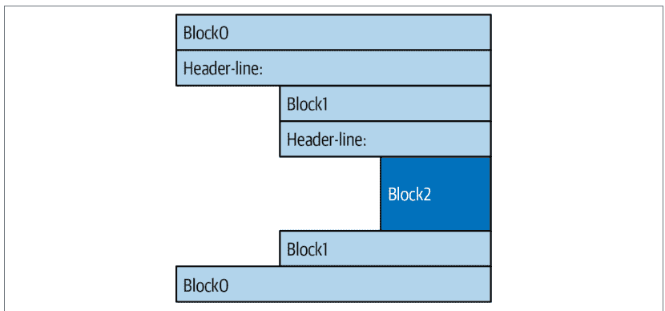

图12-1. 由缩进表示的嵌套代码块

在实践中，缩进代码相当自然。例如，以下完全无意义的代码片段展示了Python代码中常见的缩进错误，这些错误很容易发现，因为它们在视觉上是歪斜的：

```
x = 'Hack'                    # 错误：第一行被缩进
if 'tho' in 'python':
    print(x * 8)
    x += 'More!'              # 错误：意外的缩进
    if x.endswith('re!'):
        x *= 2
        print(x)              # 错误：不一致的缩进
```

这段代码正确缩进的版本如下——即使对于这样一个人为的例子，正确的缩进也使代码的意图更加清晰：

```
x = 'Hack'
if 'tho' in 'python':
    print(x * 8)              # 打印 8 Hack
    x += 'More!'
    if x.endswith('re!'):
        x *= 2
        print(x)              # 打印 HackMore!HackMore!
```

重要的是要知道，Python中空白字符唯一重要的地方是用于代码左侧的缩进；在大多数其他上下文中，空格可以写也可以不写。然而，缩进确实是Python语法的一部分，而不仅仅是一种风格建议：任何给定单个代码块内的所有语句都必须缩进到相同的级别，否则Python会报告语法错误。这是有意为之的——因为你不需要显式标记嵌套代码块的开始和结束，所以在Python中，其他语言中存在的一些语法冗余是不必要的。

如第10章所述，将缩进作为语法模型的一部分也强制执行了一致性，这是像Python这样的结构化编程语言中可读性的关键组成部分。在Python的语法中，每一行代码的缩进都明确地告诉读者它与什么相关联。这种统一且一致的外观反过来使Python代码更易于维护和重用。

最终，缩进比你想象的要容易。一致缩进的代码总是满足Python的规则，而且大多数文本编辑器（包括IDLE）都通过在你输入时自动缩进，使你轻松遵循Python的模型。

## 避免混合使用制表符和空格

话虽如此，你应该知道一条经验法则：虽然你可以使用空格或制表符进行缩进，但在一个代码块内*混合*使用两者通常不是个好主意——请选择其中一种。从技术上讲，制表符相当于足够的空格，可以将当前列号移动到8的倍数，如果你一致地混合使用制表符和空格，你的代码将可以工作。然而，混合使用制表符和空格会使代码难以阅读和修改，这完全超出了Python的语法规则——制表符在下一个程序员的编辑器中可能看起来与在你的编辑器中非常不同。

出于这些原因，当脚本在一个代码块内不一致地混合使用制表符和空格进行缩进时（即以一种依赖于制表符等效空格的方式），Python会发出错误。所以不要这样做：在Python中，要像Python程序员那样做，使用一致的缩进而不是代码块界定符。

## 语句界定符：行与续行

虽然代码块是缩进的，但Python中的语句通常在它出现的行末结束。然而，当一个语句太长而无法放在单行上时，可以使用一些特殊规则使其跨越多行：

- **如果你正在延续一个“开放配对”，语句可以跨越多行。** 如果语句的代码被包含在()、{}或[]配对中，则总可以在下一行继续。例如，括号中的表达式以及字典和列表字面量可以跨越任意多行；语句直到包含配对结束部分（即)、}或]）的行末才结束。*续行*——语句的第2行及之后——可以从任意缩进级别开始，但最好以某种方式垂直对齐以提高可读性。
- **如果语句以反斜杠结尾，它们可以跨越多行。** 虽然最好作为后备选项，但如果语句需要跨越多行，你也可以在上一行末尾添加一个反斜杠——一个未嵌入字符串字面量或注释中的\——以表示你在下一行继续。因为你也可以通过在大多数构造周围添加括号来续行，所以反斜杠现在很少使用。这种方法也容易出错：意外忘记一个\可能会生成语法错误或导致下一行独立运行。
- **如果用分号分隔，语句可以组合在一起。** 虽然不常见，但你可以用分号结束一个语句。有时通过用分号分隔多个语句，将它们挤在一行上，但这仅在组合的语句不是复合语句时有效。
- **语句可以包含多行字符串。** 正如我们在第7章所学，三引号字符串块旨在正常跨越多行。我们还在第7章学过，相邻的字符串字面量会被隐式连接；当与前面提到的开放配对规则结合使用时，将此构造包装在括号中允许它跨越多行。

## 特殊语法案例实战

以下是使用刚才描述的开放配对规则的续行示例。界定构造，如方括号中的列表，可以跨越任意多行：

```
L = ['app',
    'script',
    'program']          # 开放配对可以跨越多行
```

这也适用于包含在[]中的列表推导式；包含在()中的任何内容（元组、表达式、函数参数和头文件，以及生成器表达式）；以及包含在{}中的任何内容（字典和集合字面量及推导式）。其中一些是我们将在后续章节中学习的工具，但此规则自然涵盖了实践中大多数跨越多行的构造。

如果你习惯使用反斜杠来续行，在Python中也可以，但这不是常见做法：

```
if a == b and c == d and \
    d == e and f == g:
    print('old school')          # 反斜杠允许续行...
```

因为任何表达式都可以包含在括号中，所以如果你需要代码跨越多行，通常可以使用开放配对技术——只需将语句的一部分包装在括号中：

```
if (a == b and c == d and
    d == e and e == f):
    print('new school')          # 但括号通常也可以，而且更明显
```

事实上，反斜杠通常不被鼓励，因为它们太容易被忽略，也太容易被完全省略。在下面的例子中，x被赋值为10，使用了反斜杠，如预期；但如果意外省略了反斜杠，x将被赋值为6，而*不会报告错误*（+4本身是一个有效的表达式语句）。在具有更复杂赋值的真实程序中，这可能是一个非常隐蔽的bug的来源：

```
x = 1 + 2 + 3 \
+4                    # 省略 \ 会使结果大不相同！
```

作为另一个特殊情况，Python允许你在同一行上编写多个非复合语句（即没有嵌套语句的语句），用分号分隔。一些程序员使用这种形式来节省程序文件空间，但如果你在大部分工作中坚持每行一个语句，通常会使代码更具可读性：

```
x = 1; y = 2; print(x)          # 多个简单语句
```

如第7章所述，三引号字符串字面量也可以跨越多行。此外，如果两个字符串字面量彼此相邻，它们会被连接，就像在它们之间添加了一个+——当与开放配对规则结合使用时，包装在括号中允许这种形式跨越多行。例如，以下第一个在换行处插入换行符并将5赋给'\naaaa\nbbbb\ncccc'，而其他两个隐式连接并将5赋给'aaaabbbbcccc'；正如我们在第7章所见，#注释在第二种形式中被忽略，但在第一种形式中*包含*在字符串中，而*f字符串*即使在续行上也需要f前缀：

## 重新审视真值

比较、相等性和真值的概念在第9章中已介绍过。不过，与语法类似，if 是我们学习的第一个实际使用这些工具的语句，因此我们将结合额外信息重新梳理这些概念。总的来说，Python 的布尔运算符与其他语言中的对应运算符有些不同。在 Python 中：

- 所有对象都具有固有的布尔真值或假值。
- 任何非零数字或非空对象都被视为真。
- 零值数字、空对象和特殊对象 `None` 被视为假。
- 比较和相等性测试会递归应用于数据结构。
- 比较和相等性测试返回 `True` 或 `False`（是整数 1 和 0 的自定义版本）。
- 布尔 `and` 和 `or` 运算符返回一个真或假的*对象*。
- 布尔运算符一旦知道结果就会停止求值（*短路求值*）。

`if` 语句根据真值采取行动，但*布尔*运算符用于以更丰富的方式组合其他测试的结果，以产生新的真值。更正式地说，Python 中有三种布尔表达式运算符：

`X and Y`
    如果 *X* 和 *Y* 都为真，则为真——并返回 *X* 或 *Y* 中的一个。

`X or Y`
    如果 *X* 或 *Y* 中有一个为真，则为真——并返回 *X* 或 *Y* 中的一个。

`not X`
    如果 *X* 为假，则为真——并返回 `True` 或 `False`。

这里，*X* 和 *Y* 可以是任何真值，或任何返回真值的表达式（例如，`==` 相等性测试、`in` 成员资格检查等）。布尔运算符在 Python 中以单词形式输入（而不是 C 语言的 `&&`、`||` 和 `!`），不应与 Python 中用于数字和集合（以及字典）的 `&`、`|` 和 `^` 运算符混淆。

最独特的是，布尔 `and` 和 `or` 运算符在 Python 中返回一个真或假的*对象*，而不是 `True` 或 `False` 值。让我们看几个例子来了解这是如何工作的：

```
>>> 2 < 3, 3 < 2    # 小于：返回 True 或 False (1 或 0)
(True, False)
```

像这样的*大小*比较返回 `True` 或 `False` 作为其真值结果，正如我们在第5章和第9章中学到的，它们实际上只是整数 1 和 0 的自定义版本（它们打印方式不同，但其他方面是相同的）。

另一方面，布尔运算符 `and` 和 `or` 总是返回一个对象——要么是运算符*左侧*的对象，要么是*右侧*的对象。如果我们在 `if` 或其他语句中测试它们的结果，它们将如预期那样工作（记住，每个对象本质上都是真或假的），但我们不会得到一个简单的 `True` 或 `False`。

对于 `or` 测试，Python 从左到右计算操作数对象，并返回第一个为*真*的对象。此外，Python 在找到第一个真操作数时就会停止。这通常被称为*短路求值*，因为一旦知道结果，确定结果就会短路（终止）表达式的其余部分：

```
>>> 2 or 3, 3 or 2    # 如果为真，返回左操作数
(2, 3)                # 否则，返回右操作数（真或假）
>>> [] or 3
3
>>> [] or {}
{}
```

在前面示例的第一行中，两个操作数（2 和 3）都为真（即非零），因此 Python 总是停止并返回左边的那个——这决定了结果，因为真或任何东西总是真。在另外两个测试中，左操作数为假（一个空对象），因此 Python 只是计算并返回右边的对象——当被测试时，它可能具有真值或假值，但决定了整个 `or` 的结果。

Python 的 `and` 操作也一样，一旦知道结果就会停止（短路）。然而，在这种情况下，Python 从左到右计算操作数，如果左操作数是*假*对象则停止，因为它决定了结果——假与任何东西总是假：

```
>>> 2 and 3, 3 and 2    # 如果为假，返回左操作数
(3, 2)                  # 否则，返回右操作数（真或假）
>>> [] and {}
[]
>>> 3 and []
[]
```

这里，在第一行中，两个操作数都为真，因此 Python 计算两边并返回右边的对象——这决定了 `and` 的结果。在第二个测试中，左操作数为假（`[]`），因此 Python 停止并将其作为 `and` 的结果返回，而从不运行右边的代码。在最后一个测试中，左边为真（3），因此 Python 计算并返回右边的对象——它恰好是一个假的 `[]`。

所有这些看似无意义的东西的最终效果与大多数其他语言相同——如果根据 `or` 和 `and` 的正常定义在 `if` 或 `while` 中测试，你会得到一个逻辑上为真或假的值。然而，在 Python 中，布尔值返回的是左边或右边的对象，而不是一个简单的整数标志。

`and` 和 `or` 的这种行为乍看之下可能显得深奥，但请参阅本章的侧边栏“为什么你会关心：布尔值”（第308页），了解它有时如何在 Python 编码中被巧妙利用的例子。下一节也展示了一种利用此行为的常见方式及其更具记忆性的替代方法。

## if/else 三元表达式

上一节布尔运算符的一个常见作用是编写一个与 `if` 语句执行相同操作的表达式。首先，考虑以下非常常见的代码，它根据 `X` 的真值将 `A` 设置为 `Y` 或 `Z`：

```
if X:
    A = Y
else:
    A = Z
```

然而，有时此类语句中涉及的项目非常简单，将其分散在四行中似乎有些小题大做。在其他时候，我们可能希望将此类构造嵌套在更大的语句中，而不是单独将其结果赋值给一个变量。出于这些原因（也可能是为了安抚前 C 程序员），Python 包含了一个“三元”（三部分）表达式，允许我们仅用一行代码表达相同的意思：

```
A = Y if X else Z
```

这个表达式与前面的四行 `if` 语句具有完全相同的效果，但编写起来更简单。在某种意义上，它对于 `if` 语句，就像上一章的 `:=` 对于赋值语句一样：一个语法更有限、作用更窄的等效表达式，但在某些代码中仍然有用。例如，你不能在此表达式的各部分中编写完整的语句，但可以在 Python 允许表达式的任何地方嵌入它。

与等效语句一样，三元表达式仅在 `X` 为真时运行表达式 `Y`，仅在 `X` 为假时运行表达式 `Z`。也就是说，它像上一节描述的布尔运算符一样进行短路求值，只运行 `Y` 或 `Z`，而不是两者都运行。以下是一些实际使用的例子：

```
>>> tone = 'formal'
>>> a = 'code' if tone == 'formal' else 'hack'
>>> a
'code'

>>> tone = 'informal'
>>> a = 'code' if tone == 'formal' else 'hack'
>>> a
'hack'
```

通过仔细组合 `and` 和 `or` 运算符，通常也可以达到相同的效果，因为它们返回左边或右边的对象，如上一节所述。下面的三元表达式与下面的布尔表达式工作方式相同：

```
A = Y if X else Z          # 三元 if/else

A = ((X and Y) or Z)       # and+or 等效式
```

这方法可行，但有个前提——你必须能假设 Y 会是布尔真值。如果满足这个条件，效果是一样的：`and` 先执行，若 X 为真则返回 Y；若 X 为假，`and` 会跳过 Y 并返回假值 X，而 `or` 则直接返回 Z。换句话说，我们得到了“如果 X 则 Y 否则 Z”——这正是三元表达式所表达的，尽管顺序不同。

`and/or` 组合形式似乎也需要“灵光一现”才能初次理解，这构成了反对使用它的一个理由。作为指导原则：当你需要这种结构时，使用等效且更健壮、更易记的 `if/else` 表达式；或者当各部分不简单时，使用完整的 `if` 语句。

顺便提一句（以防本节还没让你头昏脑胀），使用以下表达式与之前的布尔和三元表达式类似，因为 `bool` 函数会将任何 X 转换为等效的整数 1 或 0（即 True 或 False），然后可用作偏移量从列表中选取真值和假值：

```
A = [Z, Y][bool(X)]
```

说实话，当 X 本身已经产生真值时，`bool` 并非必需，但当 X 是像字符串这样的对象时则是必需的：

```
>>> ['hack', 'code'][tone == 'formal']
'hack'
>>> ['hack', 'code'][bool('formal')]
'code'
```

但遗憾的是，这并不完全相同，因为 Python 不会短路求值——它总会运行 Z 和 Y，无论 X 的值如何。由于这些复杂性，你最好使用更简单、更易理解的 `if/else` 表达式。即便如此，常识在这里一如既往地大有帮助。像大多数可嵌套的工具一样，三元表达式天然容易产生难以阅读的代码。如果你发现自己正努力将逻辑塞进一个三元表达式中，不妨花点时间想想以后拆解它会有多困难。你的同事会为此感激你的。

## 章节总结

在本章中，我们学习了 Python 的 `if` 语句。此外，由于这是我们第一次接触复合逻辑语句，我们回顾了 Python 的通用语法规则，并比之前更深入地探讨了真值和测试的运作方式。在此过程中，我们还研究了如何在 Python 中使用字典和 `match` 来编写多选逻辑，学习了 `if/else` 三元表达式，并探讨了布尔运算符。

下一章将继续探讨过程式语句，扩展 `while` 和 `for` 循环的内容。在那里，你将学习 Python 中编写循环的替代方式，其中一些可能比其他方式更好。不过，在此之前，照例是章节测验，以便在继续学习前进行复习。

## 测试你的知识：测验

1.  你如何在 Python 中编写多选分支？
2.  如何在 Python 中将 `if/else` 语句编写为表达式？
3.  如何让单条语句跨越多行？
4.  单词 `True` 和 `False` 是什么意思？
5.  “短路求值”是什么意思，它出现在哪里？

## 测试你的知识：答案

1.  带有多个 `elif` 子句的 `if` 语句通常是编写多选分支最直接的方式，尽管不一定是最简洁或最灵活的。字典索引通常可以达到相同的效果，特别是当字典包含用 `def` 语句或 `lambda` 表达式编写的可调用函数时。从 Python 3.10 开始，`match` 语句为多选提供了显式语法；它在基本角色中表现良好，但无法编写像 `if` 语句中那样通用的逻辑，并且为了支持结构模式匹配（一个非常不同的工具）而带有相当大的开销。

2.  表达式形式 `Y if X else Z` 在 X 为真时返回 Y，否则返回 Z；它与四行的 `if` 语句等效，在有限的上下文中效果良好，但无法编写像完整 `if` 语句中那样丰富的操作，并且有可能产生难以阅读的代码。`and/or` 组合 `(((X and Y) or Z))` 可以以相同方式工作，但它更晦涩，并且要求 Y 部分为真。

3.  将语句包裹在开放的语法对（`()`、`[]` 或 `{}`）中，它就可以跨越任意多行；当 Python 看到该对的右半部分时，语句结束，语句的第 2 行及后续行可以从任何缩进级别开始。反斜杠续行也有效，但在 Python 世界中普遍不鼓励使用。

4.  这部分是对第 9 章的复习，但在本章末尾的侧边栏中得到了强化。`True` 和 `False` 只是整数 1 和 0 的自定义版本：它们在 Python 中始终代表布尔真值和假值。它们可用于真值测试和变量初始化，并在交互式提示符下打印表达式结果。在所有这些角色中，它们作为比 1 和 0 更易记、因此更易读的替代方案。

5.  短路求值发生在 Python 提前停止计算表达式时，因为其结果已经可以从表达式的当前部分确定。它出现在 `and` 和 `or` 表达式中，这些表达式仅在其左侧无法确定结果时才运行其右侧。它也出现在 `if/else` 三元表达式中，该表达式根据其测试部分的逻辑结果运行其真部分或假部分。

> 为什么你会关心：布尔值

使用 Python 布尔运算符这种有些不寻常行为的一种常见方式是使用 `or` 从一组对象中进行选择。像这样的语句：

X = A or B or C or None

将 X 赋值为 A、B 和 C 中第一个非空（即真）的对象，如果它们都为空，则赋值为 None。这之所以有效，是因为 `or` 运算符返回其两个对象之一，而这在 Python 中是一种相当常见的编码范式：要从固定大小的集合中选择一个非空对象，只需将它们用 `or` 表达式串联起来。更简单地说，这也常用于指定默认值——如果 A 为真（非零或非空），则将 X 设置为 A，否则设置为默认值：

X = A or default

理解布尔运算符和 `if/else` 的短路求值也很重要，因为它可能会阻止操作运行。例如，布尔运算符右侧的表达式可能调用执行大量或重要工作的函数，或者具有如果短路规则生效就不会发生的副作用：

```
if f1() or f2(): ...
```

这里，如果 f1 返回一个真（或非空）值，Python 将永远不会运行 f2。为了保证两个函数都会运行，请在 `or` 之前调用它们：

```
tmp1, tmp2 = f1(), f2()
if tmp1 or tmp2: ...
```

你已经在本章中看到了这种行为的另一个应用：由于布尔值的工作方式，表达式 `((A and B) or C)` 可用于模拟 `if` 语句——几乎是（有关此形式的详细讨论，请参见本章）。

我们在前面的章节中遇到了更多的布尔用例。正如我们在第 9 章中看到的，由于所有对象本质上都是真或假，在 Python 中直接测试对象（`if X:`）比将其与空值比较（`if X != ''`）更常见且更容易：对于字符串，这两种测试是等效的。正如我们在第 5 章中看到的，预设的布尔值 `True` 和 `False` 与整数 1 和 0 相同，对于初始化变量（`X = False`）、循环测试（`while True:`）以及在交互式提示符下显示结果很有用。

另请参阅第 VI 部分中关于运算符重载的相关讨论：当我们用类定义新对象类型时，我们可以用 `__bool__` 或 `__len__` 方法指定它们的布尔性质。如果前者不存在，则尝试后者，并通过返回长度零来指定假值——因为空对象被视为假。

最后，作为预览，Python 中的其他工具具有与本侧边栏开头的 `or` 链类似的角色：你稍后将探索的 `filter` 调用和列表推导式可用于在候选集直到运行时才已知时选择真值（尽管它们会评估所有值并返回所有为真的值），而 `any` 和 `all` 内置函数可用于测试集合中的任何或所有项是否为真（它们像 `and`、`or` 和 `if/else` 一样短路检查，但本身不选择项）：

```
>>> L = [1, 0, 2, 0, 'hack', '', 'py', []]
>>> list(filter(bool, L))          # 获取真值
[1, 2, 'hack', 'py']
>>> [x for x in L if x]            # 推导式
[1, 2, 'hack', 'py']
>>> any(L), all(L)                  # 聚合真值
(True, False)
```

正如我们所学，这里的 `bool` 函数只是返回其参数的真值或假值，就像在 `if` 中测试一样。有关这些相关工具的更多信息，请参阅第 14、19 和 20 章。

# 第13章 while 与 for 循环

本章将通过介绍 Python 过程式语句中的两种主要*循环*结构来结束我们的语法之旅——这些语句用于重复执行某个操作：

- **while/else**：最通用的循环语句，能够处理各种重复性任务
- **for/else**：一种专门设计的循环，用于轻松遍历任何“可迭代”对象中的元素

我们之前已经非正式地接触并使用过这两种循环，但这里将补充更多使用细节。同时，我们还将研究循环中使用的一些不太突出的语句，例如 break 和 continue、循环 else，以及一些常与循环配合使用的内置函数，如 range、zip 和 enumerate。

尽管本章涵盖的 while 和 for 语句是用于编写重复操作的主要语法，但 Python 中还有其他循环操作和概念。因此，迭代的故事将在下一章继续，我们将探讨 Python 的*迭代协议*（for 循环使用）和*列表推导式*（for 循环的近亲）等相关概念。后续章节将探索更多奇特的迭代工具，如*生成器*以及 map、filter 和 reduce 等函数式工具。不过现在，让我们保持简单。

## while 循环

Python 的 while 语句是该语言中最通用的迭代结构。简单来说，只要顶部的测试条件持续为真，它就会重复执行关联的语句块。之所以称为“循环”，是因为控制流会不断循环回到语句的开头，直到测试条件变为假。当测试条件确实变为假时，控制流将传递到 while 块之后的语句。最终效果是，只要顶部的测试条件为真，循环体就会重复执行。如果测试条件一开始就是假，则循环体永远不会执行，while 语句会被跳过。

### 通用格式

在最复杂的形式中，while 语句由一个包含测试表达式的头部行、一个或多个通常缩进的语句体，以及一个可选的 else 部分组成。如果控制流在未遇到 break 语句的情况下退出循环，则会执行 else 部分。Python 会持续评估顶部的测试条件并执行嵌套在循环体中的语句，直到测试条件返回假值：

```
while test:            # 循环测试
    statements        #   重复的循环体
else:                  # 可选的 else
    statements        #   如果未通过 break 退出循环体则运行
```

### 示例

为了说明，让我们看几个简单的 while 循环实例。第一个例子是在 while 循环中嵌套了一个 print 语句，它会永远打印一条消息。回想一下，True 只是整数 1 的自定义版本，始终代表布尔真值；因为测试条件始终为真，Python 会永远执行循环体，或者直到你停止其执行。这种行为通常被称为无限循环——它并非真的永生，但你可能需要按 Ctrl+C 组合键来强制终止它：

```
>>> while True:
...     print('Type Ctrl+C to stop me!')
```

下一个例子会不断切片字符串的第一个字符，直到字符串为空，从而为假（并开始省略 REPL 的 ... 提示符，以便在可能的情况下更方便地进行电子媒体复制粘贴）。通常像这样直接测试对象，而不是使用更冗长的等效形式（while x != ''），尽管在本章后面你会看到使用 for 循环更轻松地遍历字符串元素的其他方法：

```
>>> x = 'code'
>>> while x:            # 当 x 不为空时
    print(x, end=' ')   # 打印下一个字符
    x = x[1:]           # 从 x 中剥离第一个字符

code ode de e
```

注意这里使用的 end=' ' 关键字参数，它将所有输出放在同一行并用空格分隔；如果你忘记了为什么这样有效，请参阅第 11 章。这可能会将你的 REPL 输入提示符留在输出行的末尾；如果需要，可以按 Enter 键（或你的键盘或应用程序的等效键）来重置。

以下代码从 a 的值开始计数，直到但不包括 b。像这样的循环通常用于生成对象索引。稍后你还会看到使用 Python for 循环和内置 range 函数更简单地实现这一点的方法：

```
>>> a=0; b=10
>>> while a < b:        # 编写计数器循环的一种方式
    print(a, end=' ')
    a += 1              # 或者，a = a + 1

0 1 2 3 4 5 6 7 8 9
```

最后，请注意 Python 没有某些语言所谓的“do until”循环语句。然而，我们可以通过在循环体底部使用测试和 break 来模拟一个，这样循环体至少会运行一次：

```
while True:
    ...loop body...     # 至少运行一次循环体
    if test: break      # 在底部测试循环退出
```

要完全理解这种结构的工作原理，我们需要继续下一节关于 break 的内容。

## break、continue、pass 和循环 else

既然我们已经看到了一些 Python 循环的实例，现在是时候看看两个简单的语句了，它们只有在嵌套在循环内部时才有意义——即 break 和 continue 语句。在研究这些特殊语句的同时，我们还将在这里学习循环 else 子句，因为它与 break 紧密相关，以及 Python 的空占位符语句 pass，它虽然不与循环相关，但属于简单单词语句的范畴。在 Python 中：

- break：跳出最近的封闭循环（跳过整个循环语句）
- continue：跳转到最近封闭循环的顶部（跳转到循环的头部行）
- pass：什么都不做：它是一个空语句占位符
- 循环 else 块：仅当循环正常退出时运行（即，没有遇到 break）

## 通用循环格式

考虑到 break 和 continue 语句，while 循环的通用格式如下所示：

```
while test:
    statements
    if test: break          # 立即退出循环，如果存在 else 则跳过
    if test: continue       # 立即跳转到循环顶部的测试
else:
    statements              # 如果未遇到 'break' 则在退出时运行
```

break 和 continue 语句可以出现在 while（或接下来要讲的 for）循环体内的任何位置，但通常它们会被进一步嵌套在 if 测试中，以便根据某些条件采取行动。

让我们看几个简单的例子，看看这些语句在实践中是如何结合在一起的。

## pass

先说简单的事情：pass 语句是一个无操作占位符，当语法要求一个语句但你又没有有用的内容可写时使用。它通常用于为复合语句编写空的循环体。例如，如果你想编写一个每次循环都不做任何事情的无限循环，可以使用 pass：

```
while True: pass          # 按 Ctrl+C 停止我！
```

因为循环体只是一个空语句，Python 会卡在这个循环中。pass 对于语句来说，就像 None 对于对象一样——一种明确的“无”。注意这里 while 循环的循环体与头部在同一行，位于冒号之后；与 if 语句一样，这仅在循环体不是复合语句（且不包含复合语句）时有效。

这个例子永远什么都不做。它可能不是有史以来最有用的 Python 程序（除非你想在寒冷的冬日暖暖你的笔记本电脑或手机），但在这个阶段很难想出更好的 pass 示例；它不是一个常用的工具。

稍后你会看到 pass 在其他地方更有意义——例如，忽略 try 语句捕获的异常，以及定义具有类似其他语言中“结构体”和“记录”属性的空类对象。虽然部分是预览，但 pass 有时也被编码为“稍后填充”，用于临时勾勒出函数的主体：

```
def func1():
    pass                # 稍后在此添加实际代码

def func2():
    pass
```

我们不能让函数体为空，否则会出现语法错误，所以我们用 pass 代替。

## 省略号字面量替代方案

尽管作用有限，但有一种类似（尽管更晦涩）的方法可以达到与 pass 相同的效果。Python 允许一个省略号，编码为 ...（字面上是三个连续的点，而不是 Unicode 字符），出现在任何可以放置表达式的地方。因为省略号本身什么都不做，所以它们可以作为 pass 语句的替代品，特别是对于稍后要填充的代码——一种 Python 的 TBD（待定）：

```
def func1():
    ...                 # pass 的替代方案

func1()                 # 如果被调用则什么都不做
```

这之所以有效，是因为任何表达式都可以作为语句出现（正如我们在第 11 章学到的），而 ... 字面量符合表达式的定义。省略号也可以单独出现在语句头部，并且可以在不需要特定类型的情况下用于初始化变量名——这也使其成为 None 的替代品：

```
def func1(): ...        # 在同一行也有效

>>> tbd = ...           # 同时替代 pass 和 None
>>> tbd                 # 省略号是一个真实（尽管奇特！）的东西
Ellipsis
```

这远远超出了 ... 在切片扩展中的原始意图（与 @ 运算符和类型提示一样，Python 本身并不使用），因此时间会证明它是否会在这些无意义和空洞的角色中挑战 pass 和 None。

## continue

continue 语句会导致立即跳转到循环的顶部。它通常用于避免语句嵌套，例如在下一个例子中使用 continue 跳过奇数。此代码打印所有小于 10 且大于或等于 0 的偶数。回想一下，0 表示假，% 是取余（模）运算符，因此这个循环倒数到 0，跳过不是 2 的倍数的数字——并打印 8 6 4 2 0：

```
x = 10
while x:
    x -= 1              # 或者，x = x - 1
    if x % 2 != 0: continue  # 奇数？-- 跳过打印
    print(x, end=' ')
```

由于 `continue` 会跳转到循环顶部，因此你无需将此处的 `print` 语句嵌套在 `if` 测试中；只有当 `continue` 未执行时，`print` 才会被执行。

## 嵌套代码的替代方案

如果这一切听起来类似于其他语言中的“go to”，那确实如此。Python 没有“go to”语句，但由于 `continue` 允许你在程序中跳转，因此你可能听说过的关于“go to”的可读性和可维护性的许多警告同样适用。`continue` 应该谨慎使用，尤其是在你刚开始学习编程时。例如，如果将 `print` 嵌套在 `if` 下，最后一个示例可能会更清晰：

```
x = 10
while x:
    x -= 1
    if x % 2 == 0:        # Even? -- print
        print(x, end=' ')
```

在本书后面，你还将了解到，引发和捕获的异常也可以以有限和结构化的方式模拟“go to”语句；请继续关注第 36 章中关于此技术的更多信息，你将学习如何使用它来跳出多个嵌套循环，这是仅靠下一节的主题无法实现的壮举。

## break

`break` 语句会导致立即退出循环——从技术上讲，当循环嵌套时，是从最近的封闭循环中退出。因为如果执行到 `break`，其后的循环代码将不会被执行，所以它有时可以避免嵌套，就像 `continue` 一样。例如，这里有一个简单的交互式循环（基于我们在第 10 章学习的代码），它使用 `input` 输入数据，并在用户输入“stop”行时退出：

```
>>> num = 1
>>> while True:
        tool = input(f'{num}) What\'s your favorite language? ')
        if tool == 'stop': break
        print('Bravo!' if tool == 'Python' else 'Try again...')
        num += 1
```
1) What's your favorite language? **Java**
Try again...
2) What's your favorite language? **Python**
Bravo!
3) What's your favorite language? **stop**

因为这里的 `break` 会立即终止 `while` 循环，所以没有理由在其下方的 `else` 中嵌套代码。

## 命名赋值的替代方案

话虽如此，也可以使用我们在第 274 页“命名赋值表达式”中遇到的较新的 `:=` 表达式来简化这个示例——尽管是以牺牲其作为 `break` 演示的作用为代价。虽然你应该自己判断，但净效果是简洁的，但可能至少有点难以阅读：

```
>>> num = 1
>>> while (tool := input(f'{num}\'s your favorite language? ')) != 'stop':
        print('Bravo!' if tool == 'Python' else 'Try again...')
        num += 1
```
1) What's your favorite language? **Python**
Bravo!

然而，像下面这样在 `:=` 中嵌套 `:=`，很容易引发众怒（事实上，这里的完整单行代码对于本书来说太宽了！）。除非你能在你的代码重用同行面前为之辩护，否则请拒绝：

```
num = 0
while (tool := input(f'{(num := num + 1)}\'s your favorite language? ')) != 'stop':
```

预览：在第 36 章中，你将看到 `input` 在文件末尾也会引发异常（例如，如果用户在 Windows 上按 Ctrl+Z 或在 Unix 上按 Ctrl+D）；将 `input` 包装在 `try` 语句中也允许用户以这种方式响应。

## 循环 else

当与循环 `else` 子句结合使用时，`break` 语句通常可以消除其他语言中使用的搜索状态标志的需要。抽象地说，以下代码中的 `break` 在退出循环时跳过了 `else`：

```
while continuing:
    if found:
        found code
        break
    else advance
else:
    not-found code
```

一个更具体的例子是，以下代码通过搜索大于 1 的因子来确定一个正整数 `num` 是否是质数——除了 1 和它本身之外没有其他因子（要实时运行，请在粘贴前为 `num` 赋值）：

```
x = num // 2                    # For some num > 1, start at half
while x > 1:
    if num % x == 0:            # Remainder 0? Factor found
        print(num, 'has factor', x)
        break                   # Exit now and skip else
    x -= 1
else:                           # Normal exit, when x reaches 1
    print(num, 'is prime')
```

它不是设置一个在循环退出时测试的标志，而是在找到因子的地方插入一个 `break`。这样，循环 `else` 子句可以假设只有在未找到因子时才会执行；如果这段代码从未执行到 `break`，那么这个数就是质数。跟踪这段代码以了解其工作原理。

如果循环体*从未*执行，循环 `else` 子句也会运行，因为在这种情况下你也不会执行 `break`；在 `while` 循环中，如果头部的测试一开始就是假的，就会发生这种情况。因此，在前面的例子中，如果 `x` 初始时小于或等于 1（例如，如果 `num` 是 2），你仍然会得到“是质数”的消息。


次质数代码示例：此示例确定质数，但只是非正式地确定。根据严格的数学定义，小于 2 的数字不被视为质数，但这里将 1 和 0 归类为质数。如果要非常挑剔，此代码对负数也会失败，对所有小数位为零的浮点数也会成功。另请注意，其代码必须使用 `//` 而不是 `/`，因为我们需要初始除法截断余数，而不是保留它们。如果你想进一步试验此代码，请注意第四部分末尾的相关练习，该练习将其包装在函数中以供重用。

## 为什么需要循环 else？

因为循环 `else` 子句是 Python 独有的，所以它往往会让一些新手（甚至一些老手；事实上，有些人要么毫无意义地在没有 `break` 的情况下编写循环 `else`，要么根本不知道循环 `else` 的存在！）感到困惑。一般来说，循环 `else` 只是为常见的编码场景提供了显式语法——它是一种编码结构，让我们能够捕获循环的“另一种”退出方式，而无需设置和检查标志或条件。

例如，假设我们正在编写一个循环来搜索列表中的一个值，并且需要在退出循环后知道该值是否被找到。我们可能会这样编码这个任务（这段代码是故意抽象和不完整的；`x` 是一个序列，`match` 是一个待定义的测试函数）：

```
found = False
while x and not found:
    if match(x[0]):          # Value at front?
        print('Found')
        found = True
    else:
        x = x[1:]            # Slice off front and repeat
if not found:
    print('Not found')
```

在这里，我们初始化、设置并稍后测试一个 `found` 标志，以确定搜索是否成功。这是有效的 Python 代码，并且确实有效；然而，这正是循环 `else` 子句旨在处理的那种结构。这是一个等效的 `else` 版本：

```
while x:                    # Exit when x empty
    if match(x[0]):
        print('Found')
        break               # Exit, go around else
    x = x[1:]
else:
    print('Not found')      # Only here if exhausted x
```

这个版本更简洁。标志消失了，我们用 `else`（与 `while` 一词垂直对齐）替换了循环末尾的 `if` 测试。因为 `while` 主体内的 `break` 会退出循环并绕过 `else`，所以这作为一种更结构化的方式来捕获搜索失败的情况。

一些读者可能已经注意到，前面示例中的 `else` 子句可以替换为循环后对空 `x` 的测试（例如，`if not x:`）。虽然在这个例子中确实如此，但 `else` 为这种编码模式提供了显式语法（在这里它更明显是一个搜索失败子句），并且这种显式的空测试在某些情况下可能不适用。当与 `for` 循环（下一节的主题）结合使用时，循环 `else` 变得更加有用，因为序列迭代不在你的控制之下。

## for 循环

`for` 循环是 Python 中的通用迭代器：它可以遍历任何有序序列或其他可迭代对象中的项目。总而言之，`for` 语句适用于字符串、列表、元组、集合、字典以及所有其他内置可迭代对象，以及你稍后将学习如何使用类创建的新用户定义对象。我们在第 4 章简要地遇到过 `for`，并将其与序列对象类型结合使用；让我们在这里更正式地扩展其用法。

### 通用格式

Python 的 `for` 循环以一个头部行开始，该行指定一个赋值目标（或多个目标），以及你想要遍历的对象。头部之后是一个（通常缩进的）语句块，你希望重复执行：

```
for target in object:          # Assign object items to target
    statements                #     Repeated loop body: use target
else:                         # Optional else
    statements                #     Run if didn't exit loop body with break
```

当 Python 运行 `for` 循环时，它会将可迭代对象中的项目逐一赋值给目标，并为每个项目执行循环体。循环体通常使用赋值目标来引用序列中的当前项，就像它是一个遍历序列的游标一样。

虽然 `target` 可以是我们在第 11 章遇到的任何赋值目标，但它通常只是一个简单的名称。这个名称可能是一个新变量，它存在于 `for` 语句本身编码的作用域中。这个名称没有太多独特之处；它甚至可以在循环体内更改，但当控制再次返回到循环顶部时，它将自动设置为 `object` 中的下一个项目。循环结束后，此变量通常仍引用最后访问的项目，即序列中的最后一个项目，除非循环提前退出并带有 `break` 语句。

`for` 语句还支持一个可选的 `else` 块，其工作方式与 `while` 循环中的完全相同——如果循环退出时没有遇到 `break` 语句（即，如果序列中的所有项目都已被访问），则执行它。前面介绍的 `break` 和 `continue` 语句在 `for` 循环中的工作方式与在 `while` 循环中相同。考虑到所有这些，`for` 循环的完整格式可以这样描述：

```
for target in object:          # Assign object items to target
    statements
    if test: break             # Exit loop now, skip else
    if test: continue          # Go to top of loop now
else:
    statements                 # Run on exit if didn't hit a 'break'
```

### 示例

现在让我们交互式地输入几个 `for` 循环，以便你可以看到它们在实践中是如何使用的。

#### 基本用法

如前所述，`for` 循环可以遍历任何类型的序列对象。例如，在我们的第一个示例中，我们将名称 `x` 依次分配给列表中的三个项目，从左到右，`print` 语句将为每个项目执行。在 `print` 语句（循环体）内部，名称 `x` 引用列表中的当前项：

## 其他数据类型

任何序列都可以在 `for` 循环中使用，因为它是一个通用工具。例如，`for` 循环也适用于字符串和元组：

```
>>> S = 'Python'
>>> T = ('web', 'num', 'app')

>>> for x in S: print(x, end=' ')    # 遍历字符串

P y t h o n

>>> for x in T: print(x, end=' ')    # 遍历元组

web num app
```

事实上，正如我们将在下一章探讨可迭代对象概念时所看到的，`for` 循环甚至可以用于某些非序列对象——包括文件。

## for 循环中的元组（序列）赋值

如果你正在遍历一个元组序列，循环目标本身实际上可以是一个*元组*目标。这只是我们在第11章学习的元组解包赋值的另一种应用。记住，`for` 循环将序列对象中的项*赋值*给目标，而赋值在任何地方的工作方式都相同：

```
>>> T = [(1, 2), (3, 4), (5, 6)]
>>> for (a, b) in T:        # 元组赋值在起作用
        print(a, b)

1 2
3 4
5 6
```

这里，第一次循环就像运行 `(a,b) = (1,2)`，第二次就像 `(a,b) = (3,4)`，依此类推。最终效果是在每次迭代时自动*解包*当前元组。列表语法也可以用作 `for` 目标，因为元组和列表赋值都是*序列*赋值，而且元组括号是可选的：

```
>>> for [a, b] in T:          # 列表赋值：效果相同
>>> for a, b in T:            # 无括号的元组：效果相同
```

这种元组列表数据格式通常与本章后面将介绍的 `zip` 调用结合使用，以实现并行遍历。它也出现在 Python 与 SQL 数据库的结合中，查询结果表以类似这里使用的列表的序列的序列形式返回——外层列表是数据库表，嵌套的元组是表中的行，而元组（即序列）赋值则提取列。

正如我们在前面章节中看到的，`for` 循环中的元组对于使用 `items` 方法遍历字典的*键和值*也很方便，而不是循环遍历键并手动索引获取值：

```
>>> D = {'a': 1, 'b': 2}
>>> for key in D:
        print(key, '=>', D[key])    # 使用字典键迭代器和索引

a => 1
b => 2

>>> list(D.items())
[('a', 1), ('b', 2)]

>>> for (key, value) in D.items():
        print(key, '=>', value)      # 遍历键和值

a => 1
b => 2
```

需要注意的是，`for` 循环中的元组赋值并不是一个特例；从语法上讲，`for` 关键字后面可以跟*任何*赋值目标。例如，我们总可以在循环内手动赋值来解包：

```
>>> T
[(1, 2), (3, 4), (5, 6)]

>>> for both in T:
        a, b = both              # 等效的手动赋值
        print(a, b)

1 2
3 4
5 6
```

但在遍历序列的序列时，循环头中的元组可以为我们节省一个额外的步骤。正如第11章所建议的，甚至*嵌套*结构也可以在 `for` 循环中以这种方式自动解包：

```
>>> ((a, b), c) = ((1, 2), 3)    # 嵌套序列也适用
>>> a, b, c
(1, 2, 3)

>>> for ((a, b), c) in [((1, 2), 3), ((4, 5), 6)]: print(a, b, c)

1 2 3
4 5 6
```

即使这也不是一个特例——`for` 循环只是在每次迭代时运行我们刚才在它之前运行的那种赋值。任何嵌套的序列结构都可以通过这种方式解包，仅仅因为*序列赋值*是如此通用：

```
>>> for ((a, b), c) in [([1, 2], 3), ['XY', 6]]: print(a, b, c)

1 2 3
X Y 6
```

## for 循环中的扩展解包赋值

事实上，因为 `for` 循环中的循环变量可以是*任何*赋值目标，我们也可以在这里使用星号名称和其他扩展解包赋值的目标，来提取序列中的项和序列片段。因为这在赋值语句中有效，所以它在 `for` 循环中也自动有效。

这个主题在第11章已经介绍过，但这里快速回顾一下以巩固该技术。考虑上一节介绍的元组赋值形式。在每次迭代中，一个值元组被赋值给一个名称元组，就像一个简单的赋值语句一样：

```
>>> a, b, c = (1, 2, 3)          # 元组赋值
>>> a, b, c
(1, 2, 3)

>>> for (a, b, c) in [(1, 2, 3), (4, 5, 6)]:  # 在 for 循环中使用
        print(a, b, c)

1 2 3
4 5 6
```

因为序列赋值支持更通用的名称集合，使用星号目标来收集多个项，我们可以使用相同的语法在 `for` 循环中提取嵌套序列的部分：

```
>>> a, *b, c = (1, 2, 3, 4)      # 扩展解包赋值
>>> a, b, c
(1, [2, 3], 4)

>>> for (a, *b, c) in [(1, 2, 3, 4), (5, 6, 7, 8)]:
        print(a, b, c)

1 [2, 3] 4
5 [6, 7] 8
```

在实践中，这种方法可用于从表示为嵌套序列的数据行中提取多个列。像往常一样，在 Python 中，你可以使用更基本的工具实现类似的效果——在这种情况下是切片。唯一的区别是切片返回特定类型的结果，而星号目标总是接收列表：

```
>>> for all in [(1, 2, 3, 4), (5, 6, 7, 8)]:  # 手动切片版本
        a, b, c = all[0], all[1:-1], all[-1]
        print(a, b, c)

1 (2, 3) 4
5 (6, 7) 8
```

最后，所有星号目标形式在 `for` 循环中与在 `=` 赋值语句中一样工作，包括嵌套序列、索引和切片（尽管像下面这样的代码的实际用途可能比常见的要少得多！）：

```
>>> L, M = [1, 2], [3, 4]
>>> pairs = [[(5, 6), (7, 8), (9, 10)]] * 2

>>> for ([a, *X), (b, *L[0]), (c, *M[:0])] in pairs:
        print(f'<a={a} {X=}>  <b={b} {L=}>  <c={c} {M=}>')

<a=5 X=[6]>  <b=7 L=[[8], 2]>  <c=9 M=[10, 3, 4]>
<a=5 X=[6]>  <b=7 L=[[8], 2]>  <c=9 M=[10, 10, 3, 4]>
```

有关扩展解包赋值形式的更多信息，请参见第11章。

## 嵌套 for 循环

现在让我们看一些比目前演示的更复杂的 `for` 循环。第一个展示了当 `for` 循环嵌套时会发生什么——内层循环为外层循环的每次迭代运行，内层循环中的 `+` 通过使用每个循环的变量来组合它们的项：

```
>>> for x in 'abc':                    # 遍历一个字符串的每个项
        for y in '123':                # 并遍历另一个字符串的每个项
            print(x + y, end=' ')      # 连接来自两个循环的当前项

a1 a2 a3 b1 b2 b3 c1 c2 c3
```

下一个示例将嵌套提升了一个层次，展示了三级语句嵌套和 `for` 循环中的 `else` 子句。给定一个对象列表（项）和一个键列表（测试），此代码在对象列表中搜索每个键并报告搜索结果：

```
>>> items = ['aaa', 111, (4, 5), 2.01]    # 对象列表
>>> tests = [(4, 5), 3.14]                 # 要搜索的键
>>>
>>> for key in tests:                       # 遍历所有键
        for item in items:                  # 遍历所有项
            if item == key:                 # 检查是否匹配
                print(key, 'was found')
                break
        else:
            print(key, 'not found!')

(4, 5) was found
3.14 not found!
```

因为嵌套的 `if` 在找到匹配时运行 `break`，所以内层循环的 `else` 子句可以假设如果它被执行到，搜索就失败了。注意这里的嵌套。当此代码运行时，有两个循环同时进行：外层循环扫描键列表，内层循环为每个键扫描项列表。循环 `else` 子句的嵌套至关重要；它缩进到与内层 `for` 循环头行相同的级别，因此它与内层循环关联，而不是与 `if` 或外层 `for` 关联。

前面的例子很有说明性，但如果我们使用 `in` 运算符来测试成员关系，编码可能会更容易。因为 `in` 隐式地扫描对象以寻找匹配（至少在逻辑上），它取代了内层循环：

```
>>> for key in tests:                       # 遍历所有键
        if key in items:                    # 让 Python 检查匹配
            print(key, 'was found')
        else:
            print(key, 'not found!')

(4, 5) was found
3.14 not found!
```

通常，让 Python 尽可能多地完成工作（如本例所示）是个好主意，这样既简洁又高效。

我们的最后一个例子类似，但它在遍历时构建一个列表以供后续使用，而不是直接打印。它执行了一个典型的`for`数据结构任务——收集两个序列中的公共项（这几乎是*交集*，除非存在重复值）。循环运行后，`res`指向一个包含在`seq1`和`seq2`中找到的所有项的列表：

```
>>> seq1 = 'trippy'
>>> seq2 = 'python'
>>>
>>> res = []                    # 从空列表开始
>>> for x in seq1:              # 遍历第一个序列
        if x in seq2:           # 是公共项吗？
            res.append(x)       # 添加到结果末尾

>>> res
['t', 'p', 'p', 'y']
```

不幸的是，这段代码只能用于两个特定变量：`seq1`和`seq2`。如果这个循环能以某种方式被泛化成一个可以多次使用的工具就好了。正如你将看到的，这个简单的想法将我们引向*函数*，这是本书下一部分的主题。

当然，如果你读过第4章或第5章，你就知道 Python 有集合，可以通过`&`运算符提供真正的交集——但结果的顺序是乱的，重复项被去除了，并且需要多次转换才能匹配：

```
>>> list(set(seq1) & set(seq2))    # 使用集合进行真正的交集
['p', 'y', 't']
```

更有用的是，这段代码还展示了经典的*列表推导式*模式——通过迭代和可选的过滤测试收集结果列表——使用这个工具可以编写得更简洁：

```
>>> [x for x in seq1 if x in seq2]    # 让 Python 收集结果
['t', 'p', 'p', 'y']
```

但你必须继续阅读下一章才能了解完整的故事。

## 循环编码技巧

我们刚刚研究的`for`循环涵盖了大多数计数器风格的循环。它通常比`while`更简单，运行也更快，因此当你需要遍历序列或其他可迭代对象时，它应该是你首先想到的工具。事实上，作为一个通用规则，你应该*抵制在 Python 中手动计数的诱惑*——它的迭代工具自动化了许多你在 C 等低级语言中遍历集合时所做的工作。

尽管如此，在某些情况下，你需要以更专业的方式进行迭代。例如，如果你需要访问列表中的每隔第二项或第三项，或者在遍历过程中修改列表怎么办？如何在同一个`for`循环中并行遍历多个序列？如果你还需要索引怎么办？

你总是可以用`while`循环和手动索引来编写这样的独特迭代，但 Python 提供了一组内置函数，允许你在`for`循环中专门化迭代：

- 内置的`range`函数生成一系列连续递增的整数，可以用作`for`循环中的索引。
- 内置的`zip`函数返回一系列并行项元组，可用于在`for`循环中遍历多个序列。
- 内置的`enumerate`函数生成可迭代对象中项的值和索引，因此我们不需要手动计数。

因为`for`循环可能比基于`while`的计数器循环运行得更快，所以使用像这样的工具让你尽可能使用`for`循环对你有利。让我们依次查看这些内置函数在常见角色中的应用。正如你将看到的，一些循环编码替代方案比其他方案更有效。

## 计数器循环：range

我们第一个与循环相关的函数`range`是一个通用工具，可用于多种场景。我们在第4章简要介绍过它，并在后续内容中偶尔使用过。虽然它经常用于在循环中生成索引，但你可以在任何需要一系列整数的地方调用它（参见第11章的枚举名称技巧作为主要示例）。

正如我们所看到的，`range`是一个*可迭代对象*，按需生成项，因此我们需要将其包装在`list`调用中，以便在 REPL 中一次显示所有结果。令人惊讶的是，`range`的结果支持*部分*序列操作，但不是全部；根据第9章，它在 Python 文档中被重新分类为一种序列对象类型，尽管其功能比列表和元组少得多——而且现实基础也少得多：

```
>>> list(range(5)), list(range(2, 5)), list(range(0, 10, 2))
([0, 1, 2, 3, 4], [2, 3, 4], [0, 2, 4, 6, 8])

>>> range(5)[2], range(5)[1:3], list(range(5)) + [6, 7]
(2, range(1, 3), [0, 1, 2, 3, 4, 6, 7])

>>> range(5) + [6, 7]
TypeError: unsupported operand type(s) for +: 'range' and 'list'
```

抛开分类不谈，`range`的用法很简单。使用一个参数时，`range`生成从零开始到*但不包括*参数值的一系列整数。如果传入两个参数，第一个被视为*下*界。可选的第三个参数可以指定*步长*；如果使用，Python 会将步长加到结果中的每个连续整数上（步长默认为+1）。如果需要，范围也可以是非正数和非升序的：

```
>>> list(range(-5, 5))
[-5, -4, -3, -2, -1, 0, 1, 2, 3, 4]

>>> list(range(5, -5, -1))
[5, 4, 3, 2, 1, 0, -1, -2, -3, -4]
```

我们将在第14章更深入地探讨可迭代对象。在这种情况下，Python 2.X 有一个名为`xrange`的优化内置函数，它类似于`range`，但不会一次性在内存中构建结果列表；后来在 3.X 中被其`range`的生成器行为所取代；再后来在 3.X 文档中被重新标记为序列（令人困惑！）。这段漫长历程的结论是，今天的`range`不会占用太多空间，因为它只按需生成数字。

尽管前面的`range`结果本身可能很有用，但它们在`for`循环中最为方便。一方面，它们提供了一种简单的方法来重复执行特定次数的操作。例如，要打印三行，可以使用`range`生成适当数量的整数：

```
>>> for i in range(3):
        print(i, 'Pythons')

0 Pythons
1 Pythons
2 Pythons
```

请注意，for 循环会自动从 range 中获取结果，因此我们不需要在这里使用列表包装器。事实上，我们不应该这样做：让 range 一次生成一个结果比强制一次性生成所有结果使用的内存少得多。

## 序列扫描：while、range 和 for

range 调用有时也用于间接遍历序列，尽管在这种角色中它通常不是最佳方法。彻底遍历序列最简单、最快的方法几乎总是使用简单的 for，因为 Python 在快速的内部代码中为你处理了大部分细节：

```
>>> X = 'hack'
>>> for item in X: print(item, end=' ')    # 使用 for 自动迭代

h a c k
```

在内部，for 循环在以这种方式使用时会自动处理迭代的细节。如果你确实需要显式地接管索引逻辑（有时你可能需要），你可以使用 while 循环来实现：

```
>>> i = 0
>>> while i < len(X):    # 使用 while 手动迭代
        print(X[i], end=' ')
        i += 1

h a c k
>>> i = -1
>>> while (i := i + 1) < len(X):    # 手动，但使用 := 运算符
        print(X[i], end=' ')

h a c k
```

你也可以使用 for 进行手动索引，如果你使用 range 生成要遍历的索引。这是一个多步骤的过程——你必须请求主题长度的 range——但它足以生成偏移量，而不是这些偏移量处的项：

```
>>> X
'hack'
>>> len(X)    # 字符串长度
4
>>> list(range(len(X)))    # X 的所有合法偏移量
[0, 1, 2, 3]
>>>
>>> for i in range(len(X)): print(X[i], end=' ')    # 手动 range/len 迭代

h a c k
```

重要的是，因为这个例子遍历的是 X 的偏移量列表，而不是 X 的实际项，所以我们需要在循环内索引回 X 以获取每个项。不过，如果这看起来有点小题大做，那是因为它确实是：在这个例子中真的没有理由这么费劲。

尽管 range/len 组合在某些角色中有用，但在大多数情况下它可能不是最佳选择。它可能运行得更慢，而且比我们需要编写的代码更多。除非你有特殊的索引要求，否则最好在 Python 中使用简单的 for 循环形式：

```
>>> for item in X: print(item, end=' ')          # 如果可以，使用自动迭代
```

作为指导原则，尽可能使用 for 而不是 while，并且不要在 for 循环中使用 range 调用，除非是万不得已。这个更简单的解决方案几乎总是更好。然而，就像每个好的指导原则一样，也有很多例外——正如下一节所示。

## 序列洗牌器：range 和 len

尽管 range/len 编码模式不适合简单的序列扫描，但在需要时，它确实允许我们进行更专业的遍历。例如，一些算法可以利用序列重排——在搜索中生成替代方案，测试不同值排序的效果，等等。这种情况可能需要偏移量来拆分序列并重新组合，如下所示：其 range 的整数在第一个中提供重复计数，在第二个中提供切片位置：

```
>>> S = 'hack'
>>> for i in range(len(S)):      # 重复计数 0..3
        S = S[1:] + S[:1]      # 将前面的项移到末尾
        print(S, end=' ')

ackh ckha khac hack

>>> S
'hack'
>>> for i in range(len(S)):      # 位置 0..3
        X = S[i:] + S[:i]      # 后半部分 + 前半部分
        print(X, end=' ')

hack ackh ckha khac
```

如果它们看起来令人困惑，请逐次迭代跟踪这些。第二个创建与第一个相同的结果，尽管顺序不同，并且在遍历过程中不会更改原始变量。因为两者都通过切片获取要连接的部分，所以它们也适用于任何类型的序列，并返回与被洗牌序列相同类型的序列——如果你洗牌一个列表，你会创建重新排序的列表：

```
>>> L = [1, 2, 3, 4]
>>> for i in range(len(L)):
        X = L[i:] + L[:i]      # 适用于任何序列类型
        print(X, end=' ')

[1, 2, 3, 4] [2, 3, 4, 1] [3, 4, 1, 2] [4, 1, 2, 3]
```

然而，range 本身的结果在两种编码中都不合格（它们不是真正的序列！）：

```
>>> L = range(4)
>>> ...与前面示例相同的代码...
TypeError: unsupported operand type(s) for +: 'range' and 'range'
```

我们将在第18章使用这样的代码来测试具有不同参数顺序的函数，并在第20章将其扩展到函数、生成器和更完整的排列——这是一个广泛使用的工具。

## 跳过元素：range 与切片

上一节展示了 `range`/`len` 组合的一种有效应用。我们也可以使用这种技巧在遍历时跳过元素：

```
>>> S = 'abcdefghijk'
>>> list(range(0, len(S), 2))
[0, 2, 4, 6, 8, 10]

>>> for i in range(0, len(S), 2): print(S[i], end=' ')

a c e g i k
```

这里，我们通过步进生成的 range 列表，访问字符串 `S` 中的每个第二个元素。要访问每个第三个元素，只需将 `range` 的第三个参数改为 3，以此类推。实际上，以这种方式使用 `range` 可以在循环中跳过元素，同时保留 `for` 语句的简洁性。

然而，在许多或大多数情况下，这可能也不是当今 Python 中的“最佳实践”技巧。如果你确实想跳过序列中的元素，第 7 章介绍的切片表达式的扩展三参数形式提供了一条更简单的途径来实现相同目标。例如，要访问 `S` 中的每个第二个字符，可以使用步长为 2 的切片：

```
>>> S = 'abcdefghijk'
>>> for c in S[::2]: print(c, end=' ')

a c e g i k
```

结果相同，但对你来说编写起来更简单，对他人来说阅读起来也更容易。这里使用 `range` 而非切片的潜在优势在于空间：切片会复制字符串，而 `range` 不会——因此对于非常大的字符串，可能节省大量内存。当然，你的程序是否需要关心这一点，取决于它的具体功能。

## 修改列表：range 与推导式

另一个你可能会在 `for` 循环中使用 `range`/`len` 组合的常见场景是，在遍历列表的同时修改它。例如，假设你需要将列表中的每个元素加 1（也许你正在年底更新年龄）。你可以尝试使用简单的 `for` 循环，但结果可能不是你想要或预期的：

```
>>> L = [10, 20, 30, 40, 50]

>>> for x in L:
        x += 1            # 修改的是 x，而不是 L！

>>> L                     # L 的对象未改变
[10, 20, 30, 40, 50]
>>> x                     # x 并不是指向 L 的游标
51
```

这并不完全有效——它修改的是循环变量 `x`，而不是列表 `L`。原因有些微妙。每次循环时，`x` 引用的是从列表中取出的下一个整数。例如，在第一次迭代中，`x` 是从 `L` 中取出的整数 10。当我们在循环体中使用 `+=` 给 `x` 加值时，它将 `x` 设置为另一个对象，整数 11，但它并没有更新 10 最初来源的列表；新的 11 是一块与列表分离的内存。

为了真正在遍历列表时修改它，我们需要使用索引，以便在遍历过程中为每个位置分配更新后的值。`range`/`len` 组合可以为我们生成所需的索引：

```
>>> L = [10, 20, 30, 40, 50]
>>> for i in range(len(L)):    # 将 L 中的每个元素加一
        L[i] += 1              # 或 L[i] = L[i] + 1
>>> L
[11, 21, 31, 41, 51]
```

以这种方式编码时，列表会在我们遍历循环的过程中被修改。使用简单的 `for x in L` 无法实现同样的效果，因为这样的循环遍历的是实际的元素，而不是它们的位置。那么等效的 `while` 循环呢？这样的循环需要我们做更多工作，并且根据你的 Python 版本、主机设备，甚至可能行星的排列，运行速度可能更慢（你将在第 21 章看到如何验证此类说法）：

```
>>> i = 0
>>> while i < len(L):          # 类似地，也可以使用 := 赋值
        L[i] += 1
        i += 1
>>> L
[12, 22, 32, 42, 52]
```

然而，这里的 `range` 解决方案也可能不是最理想的。形式如下的列表推导式：

```
>>> [x + 1 for x in L]
[13, 23, 33, 43, 53]
```

在今天可能运行得更快，并且可以完成类似的工作，尽管它不会就地修改原始列表（我们可以将表达式的新列表对象结果赋值回 `L`，但这不会更新对原始列表的任何其他引用）。因为这是一个核心的循环概念，我们将把对列表推导式的完整探讨留到下一章，并在那里讲述循环语句的其余部分。

## 并行遍历：zip

我们的下一个循环编码技巧为其工具箱增添了新内容。正如我们所看到的，内置函数 `range` 允许我们以非穷尽的方式使用 `for` 遍历序列。本着类似的精神，内置函数 `zip` 允许我们使用 `for` 循环并行访问多个序列——不是在时间上重叠，而是在同一个循环中。在基本操作中，`zip` 接受一个或多个参数（序列或其他可迭代对象），并返回一系列元组，这些元组将从这些参数中取出的并行项配对。例如，假设我们正在处理两个按位置配对的数据列表：

```
>>> L1 = [1, 2, 3, 4]
>>> L2 = [5, 6, 7, 8]
```

要组合这些列表中的项，我们可以使用 `zip` 创建一个元组对的列表。与 `range` 类似，`zip` 是一个可迭代对象，因此我们必须将其包装在 `list` 调用中，以一次性收集并显示其所有结果（同样，下一章将更正式地介绍像这样的可迭代对象）：

```
>>> zip(L1, L2)                  # 一个生成配对的可迭代对象
<zip object at 0x026523C8>
>>> list(zip(L1, L2))            # 需要 list() 才能看到所有结果
[(1, 5), (2, 6), (3, 7), (4, 8)]
```

这样的结果在其他上下文中也可能有用，但当与 `for` 循环结合时，它支持并行迭代：

```
>>> for (x, y) in zip(L1, L2):
        print(f'{x} + {y} => {x + y}')
```

```
1 + 5 => 6
2 + 6 => 8
3 + 7 => 10
4 + 8 => 12
```

这里，我们遍历 `zip` 调用的结果——即从两个列表中取出的项对。请注意，这个 `for` 循环再次使用了我们之前遇到的元组（也称为序列）赋值形式来解包 `zip` 结果中的每个元组。第一次循环时，就好像我们执行了赋值语句 `(x, y) = (1, 5)`；以此类推。

最终效果是我们在循环中同时扫描了 `L1` 和 `L2`。可以肯定的是，我们可以通过一个手动处理索引的 `while` 循环来实现类似的效果——比如下面这个产生与前面相同输出的代码：

```
>>> i = -1
>>> while (i := i + 1) < len(L1):
        print(f'{L1[i]} + {L2[i]} => {L1[i] + L2[i]}')
```

但这需要明显更多的代码，因此运行速度可能比 `for`/`zip` 方法慢。此外，在空间上也没有优势：作为一个可迭代对象，`zip` 每次循环只生成一个元组对，因此不会不必要地消耗内存。然而，关键在于，这并不真正等同于 `zip`——原因将在下一节揭示。

## 关于 zip 的更多信息：大小与截断

需要说明的是，`zip` 函数比前面的例子所暗示的更为通用。例如，它既是一个可迭代对象，也接受任何类型的可迭代对象，包括 `range` 结果、输入文件等：

```
>>> list(zip(range(4), 'hack'))
[(0, 'h'), (1, 'a'), (2, 'c'), (3, 'k')]
```

此外，`zip` 不仅限于两元素元组：它接受任意数量、任意大小的参数。例如，下面的代码为三个参数构建一个三元素元组的列表，包含每个序列中的元素——本质上是按列投影：

```
>>> T1, T2, T3 = (1, 2, 3), (4, 5, 6), (7, 8, 9)
>>> T3
(7, 8, 9)
>>> list(zip(T1, T2, T3))          # 3 个参数，每个 3 个值 => 3 个 3 元素元组
[(1, 4, 7), (2, 5, 8), (3, 6, 9)]
```

形式上说，对于包含 M 个元素的 N 个参数，`zip` 给我们一个长度为 M 的 N 元元组序列：

```
>>> list(zip(T1, T2))              # 2 个参数，每个 3 个值 => 3 个 2 元素元组
[(1, 4), (2, 5), (3, 6)]
```

当参数长度不同时，`zip` 会将结果元组序列截断到最短序列的长度。例如，下面的代码将两个字符串并行配对以选取字符，但结果只有与最短序列长度相同数量的元组（再次形式化地说，前面定义中的 M 实际上是参数长度的最小值）：

```
>>> S1 = 'abc'
>>> S2 = 'xyz123'
>>> list(zip(S1, S2))
[('a', 'x'), ('b', 'y'), ('c', 'z')]
```

要填充而不是截断，你可以编写循环代码来自己填充结果——正如我们将在第 20 章中所做的那样，在我们有机会研究一些额外的迭代概念，使其成为一场公平的竞争之后。

## zip 的更多用途：字典

撇开细节不谈，使用 `zip` 进行并行遍历在字典构造中也很有用。我们在第 8 章介绍过这种技巧，但这里在循环语句的上下文中快速回顾一下。正如我们之前所学，你总是可以通过调用 `dict`、随时间分配键值，或编写如下字面量来创建字典：

```
>>> D1 = {'app': 1, 'script': 3, 'program':5}
>>> D1
{'app': 1, 'script': 3, 'program': 5}
```

但是，如果你的程序在运行时获取字典的键和值，在你编写脚本之后呢？例如，以下内容可能从用户、文件或任何其他动态来源收集：

```
>>> keys = ['app', 'script', 'program']
>>> vals = [1, 3, 5]
```

将这些转换为字典的一种方法是使用 `zip` 将列表配对，并使用 `for` 循环并行遍历它们：

```
>>> list(zip(keys, vals))
[('app', 1), ('script', 3), ('program', 5)]
>>> D2 = {}
>>> for (k, v) in zip(keys, vals): D2[k] = v
>>> D2
{'app': 1, 'script': 3, 'program': 5}
```

然而，正如本书前面所建议的，在这种情况下，你可以完全跳过 `for` 循环，只需将 `zip` 后的键/值列表传递给内置的 `dict` 构造函数调用：

```
>>> D3 = dict(zip(keys, vals))
>>> D3
{'app': 1, 'script': 3, 'program': 5}
```

内置名称 `dict` 实际上是一个类型名称（你将在第 32 章学习类型名称及其子类化）。对它的调用是对象构造请求，但在这里也执行到字典的转换。在下一章，你还将了解更多相关但更丰富的概念——列表推导式，它在表达式中构建列表，以及其字典推导式近亲，它们是 `for` 语句和 `dict` 用于 `zip` 键/值对的替代方案：

```
>>> {k: v for (k, v) in zip(keys, vals)}
{'app': 1, 'script': 3, 'program': 5}
```

## 偏移量与元素：enumerate

我们最后一个循环辅助函数旨在支持双重使用模式。之前，我们讨论了使用 `range` 来生成字符串中元素的偏移量，而不是这些偏移量处的元素。然而，在某些程序中，我们*同时*需要两者：要使用的元素，以及遍历时的偏移量。这可以通过一个同时维护当前偏移量计数器的 `for` 循环来编码：

```python
>>> S = 'hack'
>>> offset = 0
>>> for item in S:
        print(item, 'appears at offset', offset)
        offset += 1
```

```
h appears at offset 0
a appears at offset 1
c appears at offset 2
k appears at offset 3
```

这可以工作，但 Python 有一个名为 `enumerate` 的内置函数可以为我们完成这项工作——它的净效果是“免费”为循环提供一个计数器，而不会牺牲自动迭代的简洁性：

```python
>>> S = 'hack'
>>> for (offset, item) in enumerate(S):
        print(item, 'appears at offset', offset)
```

```
h appears at offset 0
a appears at offset 1
c appears at offset 2
k appears at offset 3
```

与 `range` 和 `zip` 一样，`enumerate` 函数的结果是一个*可迭代对象*——一种支持迭代协议的对象，我们将在下一章深入探讨。简而言之，它有一个由 `next` 内置函数调用的方法，每次循环都会返回一个 `(index, value)` 元组。`for` 循环会自动遍历这些元组，这允许我们使用元组赋值来解包它们的值，就像我们为 `zip` 所做的那样：

```python
>>> E = enumerate(S)
>>> E
<enumerate object at 0x10ebd7880>
>>> next(E)
(0, 'h')
>>> next(E)
(1, 'a')
>>> next(E)
(2, 'c')
```

我们通常不会看到这个机制，因为所有迭代上下文——包括第14章的主要主题列表推导式——都会自动运行迭代协议：

```python
>>> [c * i for (i, c) in enumerate(S)]
['', 'a', 'cc', 'kkk']
```

```python
>>> for (ix, line) in enumerate(open('data.txt')):
        print(f'{ix}) {line.rstrip()}')
```

```
0) Testing file IO
1) Learning Python, 6E
2) Python 3.12
```

然而，要完全理解像 `enumerate` 和列表推导式这样的迭代概念，我们需要继续下一章进行更深入的剖析。

## 章节总结

在本章中，我们探讨了 Python 的循环语句及其相关工具。我们深入研究了 `while` 和 `for` 循环语句，并了解了它们相关的 `else` 子句。我们还研究了仅在循环内才有意义的 `break` 和 `continue` 语句，并认识了几个常用于 `for` 循环的内置函数，包括 `range`、`zip` 和 `enumerate`，尽管关于它们作为可迭代对象角色的一些细节被有意省略了。

在下一章中，我们将通过讨论列表推导式和 Python 中的迭代协议来继续迭代的故事——这些概念与 `for` 循环密切相关。在那里，我们还将补充这里遇到的可迭代工具（如 `range` 和 `zip`）背后的完整图景，并研究它们操作的一些细微之处。不过，一如既往，在继续之前，让我们通过一个测验来练习你在这里学到的知识。

## 测试你的知识：测验

1.  `while` 和 `for` 循环的主要功能区别是什么？
2.  `break` 和 `continue` 有什么区别？
3.  循环的 `else` 子句何时执行？
4.  如何在 Python 中编写一个基于计数器的循环？
5.  `range` 在 `for` 循环中可以用来做什么？

## 测试你的知识：答案

1.  `while` 循环是一个通用的循环语句，但 `for` 循环旨在自动遍历序列或其他可迭代对象中的元素。虽然 `while` 可以通过计数器循环来模仿 `for`，但它需要更多代码，并且可能运行得更慢。
2.  `break` 语句立即退出循环（控制流最终位于整个 `while` 或 `for` 循环语句的下方），而 `continue` 跳回循环顶部（控制流最终位于 `while` 中的测试之前或 `for` 中的下一个元素获取之前）。
3.  `while` 或 `for` 循环中的 `else` 子句将在循环退出时运行一次，当且仅当循环正常退出（即，在 `while` 中通过假测试或在 `for` 中通过空对象），并且没有遇到 `break` 语句。`break` 会立即退出循环，在退出时跳过 `else` 部分（如果有的话）。
4.  计数器循环可以用一个手动跟踪索引的 `while` 语句来编写，或者用一个使用 `range` 内置函数生成连续整数偏移量的 `for` 循环来编写。如果你需要简单地遍历序列中的所有元素，这两种都不是 Python 中的首选编码方式。相反，尽可能使用不带 `range` 或计数器的简单 `for` 循环；它将更容易编写，并且通常运行得更快。
5.  `range` 内置函数可以在 `for` 循环中用于实现固定次数的重复、按偏移量而不是偏移量处的元素进行扫描、在遍历时跳过连续的元素，以及在遍历列表时修改它。这些角色都不需要 `range`，而且大多数都有替代方案——扫描实际元素、三限制切片和列表推导式在今天通常是更好的解决方案（尽管前 C 程序员自然倾向于想要计数事物！）。

## 为什么你会关心：文件扫描器

循环在任何需要重复操作或多次处理某事的地方都很方便。因为*文本文件*包含多个字符和行，所以它们是循环的典型应用场景。假设文件内容可以放入内存，你可以使用**第9章**的文件对象的 `read` 方法一次性加载它：

```python
file = open('data.txt')          # Read contents into a string all at once
print(file.read())
```

为了更细粒度的访问，你可以使用以下任一方式按*字符*扫描——第二种方式不会加载整个文件，并且随着**第11章**的 `:=` 命名赋值而变得更加简洁：

```python
for char in open('data.txt').read():
    print(char, end='')

file = open('data.txt')
while char := file.read(1):      # Read by character, empty means end-of-file
    print(char, end='')           # Don't add a \n after each character
```

要改为按*行*或*块*读取，你可以使用如下所示的 `while` 循环；二进制数据通常使用二进制文件模式 `'rb'` 按块读取，但文本应使用文本模式以避免分割字符字节：

```python
file = open('data.txt')
while line := file.readline():    # Read line by line
    print(line.rstrip())          # Line already has a \n newline

file = open('data.txt')
while chunk := file.read(10):    # Read block by block: up to 10 characters
    print(chunk, end='')           # Keep but don't add newlines
```

然而，要按*行*读取文本文件，`for` 循环往往最容易编写，并且可能运行得最快：

```python
for line in open('data.txt').readlines():
    print(line.rstrip())

for line in open('data.txt'):    # Use iterators: best for text input (maybe)
    print(line.rstrip())
```

这里的第一个版本使用文件 `readlines` 方法将文件一次性加载到一个行字符串列表中，但第二个示例依赖于文件*迭代器*在每次循环迭代时自动读取一行。第二个示例通常也最适合文本文件——除了简单之外，它适用于任意大的文件，因为它不会一次性将整个文件加载到内存中。迭代器版本也可能是最快的，尽管速度可能因 Python 版本而异（我们将在本书后面研究计时代码的方法）。

文件 `readlines` 调用仍然可能有用——例如，要*反转*文件的行，假设其内容可以放入内存。`reversed` 内置函数适用于序列，但不接受生成值的可迭代对象；相比之下，`sorted` 可以，因此它可以对文件中的所有行进行排序，而无需完整加载它：

```python
for line in reversed(open('data.txt').readlines()):
    print(line.rstrip())

for line in sorted(open('data.txt')):
    print(line.rstrip())
```

有关此处使用的文件对象调用的更多信息，请参阅 Python 文档——以及它对诸如 `os.popen` 等工具的介绍，该工具返回一个连接到*shell 命令*输出（默认情况下）的文件对象，因此支持相同类型的循环。第21章中也有一个 `os.popen` 示例，第37章在我们更深入地研究 Unicode 时，会有关于文本和二进制文件区别的更多内容。

# 第14章

## 迭代与推导式

在上一章中，我们学习了Python的两种循环语句：`while`和`for`。虽然它们能处理程序需要执行的大多数重复性任务，但遍历集合的操作如此普遍且无处不在，以至于Python提供了额外的工具来使其更简单、更高效。本章开始探索这些工具。具体来说，它介绍了Python的迭代协议，这是`for`循环使用的一种方法调用模型，并补充了关于推导式的一些细节，推导式是`for`循环的近亲，它将一个表达式应用于集合中的每个元素。

由于这些工具与`for`循环和函数都相关，我们将在本书中采用两遍的方式来介绍它们——并附上一个后记：

- *本章*在基于循环的工具的背景下介绍它们的基础知识，作为上一章的某种延续。
- *第20章*将在基于函数的工具的背景下重新审视它们，并将主题扩展到包括内置和用户定义的*生成器*。
- *第30章*将提供这个故事的简短最终篇章，向我们展示如何使用*类*来编写用户定义的可迭代对象。

首先需要说明一点：这些章节中介绍的一些概念乍一看可能显得很高级。然而，通过练习，你会发现这些工具既实用又自然。虽然它们从来不是严格必需的，但它们在Python代码中已经变得非常普遍，因此，如果你必须阅读他人编写的程序，基本的理解会有所帮助。

## 迭代

在上一章中，我们了解到`for`循环可以处理Python中的任何序列类型，包括列表、元组和字符串，如下所示（为简洁起见，省略了REPL在复合语句后要求的空行）：

```
>>> for x in [1, 2, 3, 4]: print(x ** 2, end=' ')
1 4 9 16

>>> for x in (1, 2, 3, 4): print(x ** 3, end=' ')
1 8 27 64

>>> for x in 'text': print(x * 2, end=' ')
tt ee xx tt
```

正如我们所学，`for`循环甚至比这更通用——它适用于任何*可迭代*对象。事实上，Python中所有从左到右扫描对象的迭代*工具*都是如此，包括`for`循环；各种推导式；一些`in`成员测试；`zip`、`enumerate`和`map`内置函数；等等。任何可迭代对象都可以，即使是像字典这样的非序列：

```
>>> for k in dict(a=1, b=2, c=3): print(k, end=' ')
a b c
```

可迭代对象的概念是在Python诞生之后添加的，但它已经渗透到语言的工具集中。它本质上是序列概念的泛化——如果一个对象要么是物理存储的序列，要么是在像`for`这样的迭代工具上下文中一次产生一个结果的对象，那么它就被认为是*可迭代的*。

从某种意义上说，可迭代对象既包括真实的序列，也包括按需计算的*虚拟*序列。虚拟序列通过一次产生一个结果而不是一次性全部产生，既节省了内存又避免了延迟。然而，它们不是真正的序列：虚拟可迭代对象不支持为列表和元组定义的全部操作。相反，它们只是随着时间的推移和按需具体化一系列值。

无论可迭代对象是物理的还是虚拟的，它都通过实现*迭代协议*来宣布其对迭代的支持——这是一组所有迭代工具都使用的可调用方法，也是下一节的主题。

*术语时刻：* Python世界有时会互换使用（并且令人困惑地！）“可迭代”和“迭代器”这两个术语来泛指支持迭代的对象。为了清晰起见，本书使用术语*可迭代*来指代在我们即将遇到的协议顶部具有`iter`调用的对象，而*迭代器*来指代具有`next`调用以产生结果的对象。

也就是说，一个*可迭代*对象返回一个*迭代器*，该迭代器通过*next*推进。本书还使用迭代*工具*这个短语来指代*运行*迭代的语言工具，比如*for*循环和`zip`调用。第20章将用*生成器*这个术语来混淆这个术语——它指的是自动支持迭代协议，因此是可迭代的对象——尽管所有可迭代对象都会生成结果！

## 迭代协议

理解迭代协议最简单的方法之一是看它如何与内置类型（如我们在第9章首次探索的`file`对象）一起工作。在本章中，我们将使用以下三行输入文件作为演示：

```
>>> print(open('data.txt').read())
Testing file IO
Learning Python, 6E
Python 3.12

>>> open('data.txt').read()
'Testing file IO\nLearning Python, 6E\nPython 3.12\n'
```

回顾第9章，打开的文件对象有一个名为`readline`的方法，它一次从文件中读取一行文本——每次调用`readline`方法，我们就前进到下一行。在文件末尾，返回一个空字符串，我们可以检测到它以跳出读取行的循环（记住，空意味着假）：

```
>>> f = open('data.txt')       # 读取此目录中的一个三行文件
>>> f.readline()               # readline每次调用加载一行
'Testing file IO\n'
>>> f.readline()               # 在文本模式下，换行符到处都是\n
'Learning Python, 6E\n'
>>> f.readline()               # 最后一行可能有\n也可能没有
'Python 3.12\n'
>>> f.readline()               # 在文件末尾返回空字符串
''
```

然而，文件还有一个名为`__next__`的方法，其效果几乎相同——每次调用它时，它都从文件中返回下一行。唯一明显的区别是，`__next__`在文件末尾引发一个内置的`StopIteration`异常（即，调用一个信号事件），而不是返回一个空字符串：

```
>>> f = open('data.txt')       # __next__每次调用也加载一行
>>> f.__next__()               # 但在文件末尾引发异常
'Testing file IO\n'
>>> f.__next__()
'Learning Python, 6E\n'
>>> f.__next__()
'Python 3.12\n'
>>> f.__next__()
Traceback (most recent call last):
  File "<stdin>", line 1, in <module>
StopIteration
```

这个接口就是我们所说的Python中的*迭代协议*的大部分内容。任何具有`__next__`方法以推进到下一个结果，并在结果序列结束时引发`StopIteration`的对象，在Python中都被认为是*迭代器*。任何这样的对象也可以通过`for`循环或任何其他迭代工具来逐步处理，因为所有迭代工具通常在内部通过在每次迭代时调用`__next__`并捕获`StopIteration`异常来知道何时退出。正如你稍后将看到的，对于某些对象，完整的协议包括一个额外的第一步来调用`iter`，但对于文件来说这不是必需的。

所有这些魔法的结果是，正如第9章和第13章所提到的，如今逐行读取文本文件的通常最佳方法是*根本不读取它*——而是允许`for`循环在每次迭代时自动调用`__next__`以推进到下一行。文件对象的迭代器将自动加载行，一次一行且高效地完成这项工作。例如，以下代码逐行读取，并在过程中打印每行的大写版本——而从未显式地从文件读取：

```
>>> for line in open('data.txt'):        # 使用文件迭代器按行读取
        print(line.upper(), end='')    # 调用__next__，捕获StopIteration

TESTING FILE IO
LEARNING PYTHON, 6E
PYTHON 3.12
```

注意，这里的`print`使用了`end=''`来抑制添加`\n`，因为行字符串已经包含一个（如果不这样做，我们的输出将是双倍行距）。这种编码模式通常是逐行读取文本文件的最佳方式，原因有三：它是最简单的编码方式，可能是运行最快的，并且节省内存空间。在Python中迭代协议出现之前，程序员通过调用文件的`readlines`方法将文件内容作为行字符串的`list`加载到内存中，用`for`循环实现了相同的效果：

```
>>> for line in open('data.txt').readlines():
        print(line.upper(), end='')

TESTING FILE IO
LEARNING PYTHON, 6E
PYTHON 3.12
```

这种`readlines`技术仍然有效，但如今不被认为是最佳实践，因为它在内存使用方面表现不佳。事实上，因为这个版本确实是一次性将整个文件加载到内存中，所以对于太大而无法放入设备可用内存空间的文件，它甚至无法工作。相比之下，基于迭代器的版本不受此类内存爆炸问题的影响，因为它一次只读取一行。迭代器版本也可能运行得更快，尽管这可能因Python版本而异（但请参阅即将发布的注释以获取一些规格）。

正如上一章结尾的侧边栏“为什么你会关心：文件扫描器”（第333页）所述，也可以使用`while`循环逐行读取文件：

```
>>> f = open('data.txt')
>>> while line := f.readline():
        print(line.upper(), end='')

TESTING FILE IO
LEARNING PYTHON, 6E
PYTHON 3.12
```

然而，这可能比基于迭代器的`for`循环版本运行得更慢，因为文件迭代器在标准CPython内部以C语言速度运行，而`while`版本必须通过Python虚拟机运行Python字节码。任何时候我们用C代码替换Python代码，速度往往会提高。然而，这不是绝对的真理；我们将在第21章中探讨计时技术来测量这些替代方案的相对速度，尽管以下注释为不耐烦的人破坏了一些惊喜。

剧透预警：根据在 macOS 上的 CPython 3.12 中调用 `min(timeit.repeat(code, repeat=50, number=10))` 的结果，文件迭代器仍然比 `readlines` 稍快，而 `readlines` 又比 `while` 循环快。对于一个 9000 行的文件以及本章的代码（循环体使用 `pass`），迭代器、`readlines` 和 `while` 替代方案的耗时分别为 0.0073、0.0077 和 0.0102 秒。`while` 循环最慢，使用 `:=` 并没有太大帮助（不使用 `:=` 时为 0.0104 秒）。更多信息，请参阅示例包和第 21 章。注意事项：你的测试变量可能不同，内存也很重要，而且 0.0029 秒的差异在某些程序中可能不足以令人兴奋。

## 内置函数 iter 和 next

为了简化手动迭代代码，Python 还提供了一个内置函数 `next`，其效果与调用对象的 `__next__` 方法相同。也就是说，给定一个迭代器对象 `X`，调用 `next(X)` 等同于 `X.__next__()`，但输入和阅读起来明显更简单（并且在 CPython 3.12 的测试案例中，实际运行速度也稍快）。例如，对于文件，两种形式都可以使用：

```
>>> f = open('data.txt')
>>> f.__next__()           # 直接调用迭代方法
'Testing file IO\n'
>>> next(f)                # next(f) 等同于 f.__next__()
'Learning Python, 6E\n'
>>> next(f)
'Python 3.12\n'
>>> next(f)
...此处省略异常文本...
StopIteration
```

从技术上讲，前面提到的迭代协议还有一个组成部分。当 `for` 循环开始时，它首先通过调用可迭代对象的 `__iter__` 方法，从一个*可迭代*对象获取一个*迭代器*。此调用返回的对象依次具有所需的 `__next__` 方法以推进迭代。同样为了方便，内置函数 `iter` 在内部运行等同于 `__iter__` 的操作，就像 `next` 运行等同于 `__next__` 的操作一样。

因此，`for` 循环运行的是以下内容的内部等效操作，尽管对于文件来说，`iter` 步骤是多余且可选的——文件本身就是它们自己的迭代器，因为文件不支持多次扫描：

```
>>> f = open('data.txt')
>>> I = iter(f)            # 从可迭代对象获取一个迭代器
>>> next(I)                # 从迭代器获取下一个结果
'Testing file IO\n'
>>> next(I)                # 文件可迭代对象本身就是迭代器
'Learning Python, 6E\n'
...等等...
```

## 完整的迭代协议

有了所有这些组成部分，图 14-1 概述了这个完整的迭代协议，它被 Python 中的每个迭代工具使用，并得到各种对象类型的支持。它基于迭代工具在两个不同步骤中使用的*两个对象*：

- 被请求迭代的*可迭代*对象。调用此对象的 `__iter__` 返回一个迭代器，这与调用 `iter` 相同。
- 可迭代对象返回的*迭代器*对象。调用此对象的 `__next__` 在迭代过程中产生结果，并在没有更多结果时引发 StopIteration，这与调用 next 相同。


图 14-1. 迭代协议，被 for 循环、推导式、map 等使用

在大多数情况下，这些步骤由迭代工具自动协调，但理解这两个对象的角色会有所帮助。例如，在某些情况下，当仅支持单次扫描时（例如文件），这两个对象是*相同*的，并且*迭代器*对象通常是迭代工具内部使用的临时对象。

此外，有些对象*既是*迭代*工具*（它们进行迭代）*又是*可迭代*对象*（它们的结果是可迭代的）——包括内置函数 enumerate 和 zip，以及第 20 章的生成器表达式。这样的可迭代对象本身已经避免了在内存中构建结果列表，但将它们应用于其他可迭代对象可以节省更多空间。当这些工具组合使用时，在迭代工具请求结果之前不会执行任何工作。

在代码中，如果我们查看 for 循环如何内部处理内置序列类型（如列表），协议的第一步就变得显而易见（for 使用“__”方法的内部等效操作，但你在代码中可以使用任一种）：

```
>>> L = [1, 2]
>>> I = iter(L)           # 从可迭代对象获取一个迭代器对象
>>> next(I)               # 调用 next(iterator) 前进到下一个项目
1
>>> next(I)               # 或者使用 L.__iter__() 和 I.__next__() 调用
2
>>> next(I)
StopIteration
```

正如我们之前看到的，对于文件，初始的 iter 步骤不是必需的，因为文件对象只支持一次扫描，因此它本身就是自己的迭代器。你可以用 is 自己验证这一点（回顾第 9 章，这表示对象*身份*——完全相同的对象内存块，而不仅仅是相同的值）：

```
>>> f = open('data.txt')
>>> iter(f) is f            # 文件本身就是迭代器：iter() 是可选的
True
>>> iter(f) is f.__iter__()  # 两个调用都返回文件对象 f 本身
True
>>> next(f)                 # 它直接响应 next 请求
'Testing file IO\n'
```

然而，列表和许多其他内置对象不是它们自己的迭代器，因为它们确实支持多次打开迭代——在嵌套循环中可能有任意数量的迭代处于活动状态，并且在给定时间点可能处于不同的位置。对于这样的对象，我们必须调用 iter 来手动开始迭代：

```
>>> L = [1, 2, 3]
>>> iter(L) is L            # 列表不是它们自己的迭代器：使用 iter()
False
>>> next(L)
TypeError: 'list' object is not an iterator

>>> I = iter(L)             # 等同于 L.__iter__()
>>> next(I)                 # 等同于 I.__next__()
1
```

## 手动迭代

虽然 Python 迭代工具会自动调用这些函数，但我们也可以在需要时使用它们来手动应用迭代协议。以下演示了自动迭代和手动迭代之间的等效性（同样，for 运行的是 I.__next__ 的内部等效操作，而不是这里使用的 next(I)，但效果是相同的）：

```
>>> L = [1, 2, 3]
>>>
>>> for X in L:             # 自动迭代
        print(X ** 2, end=' ')  # 获取 iter，调用 __next__，捕获异常

1 4 9

>>> I = iter(L)             # 手动迭代：for 循环通常执行的操作
>>> while True:             # 使用 try 语句捕获停止异常
        try:
            X = next(I)
        except StopIteration:
            break
        print(X ** 2, end=' ')

1 4 9
```

要理解这段代码，你需要知道 try 语句运行一个操作并捕获该操作运行期间发生的异常（我们在第 10 章简要遇到过异常，但将在第 VII 部分深入探讨它们）。

## 关于 iter 和 next 的更多信息

为了完整起见，还应该注意 for 循环和其他迭代工具对于用户定义的类有时可能工作方式不同——重复索引对象而不是运行迭代协议——但当支持迭代协议时，它们更倾向于使用它（当我们学习第 30 章的运算符重载时，会更多地讨论这个故事）。

虽然不常用，但值得注意的是 next 接受一个可选的第二个*默认*参数作为退出值；如果传递了该参数，则在结束时返回它，而不是引发停止异常：

```
>>> L = [1]
>>> I = iter(L)                     # 返回结果而不是异常
>>> next(I, 'end of list')
1
>>> next(I, 'end of list')
'end of list'
```

结合 := 命名赋值表达式，这可以减少前面手动迭代代码的行数——但如果传递的默认值可能作为有效结果出现，则也会失败：

```
>>> I = iter(L)
>>> while (X := next(I, None)) != None:   # 效果相同，代码更少
        print(X ** 2, end=' ')             # 假设 None 是安全的！
```

虽然也不常见，但 iter 接受第二个*哨兵*参数，用于从可调用对象发出停止信号。这种非常不同的模式提供了一种可以说很巧妙的方式来使用 for 按块读取文件——但需要关于函数或 lambda 的知识，我们目前还没有：

```
>>> f = open('data.txt')
>>> I = iter(lambda: f.read(5), '')        # 可调用对象和哨兵
>>> for block in I: print(block, end='')   # 假设你知道 lambda！
```

请在本书的下一部分关注 lambda，并参阅 Python 文档了解更多关于 next 和 iter 模式的信息。

## 其他内置可迭代对象

除了文件和像列表这样的物理序列，Python 中的许多其他对象也有有用的迭代器。既然我们已经更好地理解了迭代协议的工作原理，本节将在此背景下重新审视一些我们已经见过的工具，并在此过程中介绍一些额外的可迭代对象。

### 重温：字典、range、enumerate 和 zip

正如我们在上一章看到的，遍历字典键的常用方法是使用 for 循环：

```
>>> D = dict(a=1, b=2)
>>> for key in D:                     # 字典是隐式可迭代的
        print(key, D[key])

a 1
b 2
```

这之所以有效，仅仅是因为字典是可迭代对象，具有一个迭代器，在像 for 这样的迭代工具中自动一次返回一个键：

```
>>> I = iter(D)                       # 这仅仅意味着它们支持该协议
>>> next(I)
'a'
>>> next(I)
'b'
>>> next(I)
StopIteration
```

迭代协议也是为什么我们必须在 REPL 中将 range 结果包装在 `list` 调用中才能一次看到它们所有值的原因。非序列可迭代对象一次返回一个结果，而不是一个物理列表：

## 迭代器嵌套

更有趣的是，zip *既是*迭代工具也是可迭代对象：它遍历其参数的结果，同时也返回一个可迭代对象，该对象拥有用于自身结果的迭代器。例如，在下面的例子中，它是一个*接收*两个 range 可迭代对象结果的工具，但其自身的结果也是按需*产生*的。换句话说，这里有三个可迭代对象和*两个层级*的迭代在运作：

```
>>> Z = zip(range(1, 4), range(10, 40))
>>> next(Z)
(1, 10)
>>> next(Z)
(2, 11)
>>> next(Z)
(3, 12)
>>> list(zip(range(1, 4), range(10, 40)))
[(1, 10), (2, 11), (3, 12)]
```

事实上，迭代器可以任意嵌套。因为 enumerate 既是迭代工具也是对象，所以在下面的例子中，range、enumerate 和 zip 都按需产生它们的结果，而 list 则让所有这些操作运行起来：

```
>>> list(enumerate(range(1, 4)))
[(0, 1), (1, 2), (2, 3)]

>>> list(zip(enumerate(range(1, 4)), enumerate(range(5, 8))))
[((0, 1), (0, 5)), ((1, 2), (1, 6)), ((2, 3), (2, 7))]
```

类似地，下面的代码枚举了 range 的 zip 结果——但仅在 for 循环请求时才进行：

```
>>> for x in enumerate(zip(range(1, 4), range(5, 8))): print(x)
...
(0, (1, 5))
(1, (2, 6))
(2, (3, 7))
```

这里有*三个*层级的可迭代对象，它们都延迟其结果，直到被激活。在实践中，这自然地工作，但在这样的代码中，直到像 list 或 for 这样的工具在顶层请求结果之前，什么都不会发生。作为响应，这里的所有参与者一次只返回一个结果，以最小化内存需求并避免延迟。

## 函数式可迭代对象：map 和 filter

与 range、enumerate 和 zip 类似，map 和 filter 内置函数逐个产生结果以节省空间并避免停顿。与 enumerate 和 zip 类似，这些工具既是可迭代工具也是可迭代对象本身：它们扫描其他可迭代对象，并按需产生自己的结果。

然而，与我们之前遇到的其他可迭代对象不同，map 和 filter 应用的是*函数调用*而不是表达式，因此它们的完整故事需要函数编程技巧，我们将在本书的下一部分才能掌握。尽管如此，我们可以在这里使用内置函数预览它们的基础知识，而无需编写自己的新函数。

例如，map 内置函数（在第 8 章中短暂出现过，并且与字典等映射没有直接关系！）为提供的可迭代对象中的每个项调用一个提供的函数，并将收集的结果作为另一个可迭代对象返回。在下面的例子中，它应用 ord 内置函数来收集字符码位：

```
>>> ord('p')  # 返回单个字符的码位
112
>>> M = map(ord, 'py3')  # map 返回一个可迭代对象，而不是列表
>>> M  # 对可迭代对象中的每个 x 运行 ord(x)
<map object at 0x101227550>
>>> next(M)  # 手动迭代：耗尽结果
112  # map 不支持像 [i] 这样的序列操作
>>> next(M)
121
>>> next(M)
51
>>> next(M)
StopIteration
```

像往常一样，如果你必须将结果作为列表处理，可以使用 list 强制生成列表，而 for 循环则自动化迭代：

```
>>> list(map(ord, 'py3'))  # 强制生成真实列表 - 仅在需要时
[112, 121, 51]

>>> M = map(ord, 'py3')  # 必须再次调用以重新扫描
>>> for x in M: print(x, end=' ')  # 迭代工具自动调用 next()
112 121 51
```

filter 内置函数（我们在第 12 章中短暂遇到过，并将在本书的下一部分更全面地学习）是类似的。它返回可迭代对象中传入函数返回 True 的项。在下面的例子中，我们利用了已经学过的概念——True 包括非空和非零对象，bool 内置函数返回单个对象的真值，而 str 字符串的 isdigit 方法对于全数字文本为真：

```
>>> filter(bool, ['lp6e', '', 2024])
<filter object at 0x101227850>

>>> list(filter(bool, ['lp6e', '', 2024]))  # 收集“真”项
['lp6e', 2024]

>>> list(filter(str.isdigit, ['lp6e', '2024']))  # 收集全数字字符串
['2024']
```

像本节讨论的大多数工具一样，filter 既接受一个可迭代对象进行处理，也返回一个可迭代对象来生成结果。在像 for 循环这样的代码要求它之前，它不会做任何工作。作为预览，map 和 filter 都可以粗略地用列表推导式模拟，更精确地用第 20 章的生成器表达式模拟；但要完全理解下面的代码，我们必须等待本章即将介绍的推导式：

```
>>> [ord(x) for x in 'py3']
[112, 121, 51]

>>> [x for x in ['lp6e', '2024'] if x.isdigit()]
['2024']
```

## 多次遍历与单次遍历的可迭代对象

我们已经多次提到，一些不允许多次扫描的可迭代对象本身就是它们自己的迭代器。由于这是一个微妙的差异，可能会影响你使用它们的方式，因此值得在这里单独说明。

特别是，range 内置函数的结果，以及像字典和列表这样的对象，与本节描述的其他内置函数不同。它们不是它们自己的迭代器（在手动迭代时，你必须使用 iter 创建一个），并且它们支持多个迭代器（每个都独立记住其位置）：

```
>>> R = range(3)                    # range 允许多个迭代器
>>> next(R)
TypeError: range object is not an iterator

>>> I1 = iter(R)
>>> next(I1)
0
>>> next(I1)
1
>>> I2 = iter(R)                    # 一个 range 上的两个迭代器
>>> next(I2)
0
>>> next(I1)                        # I1 与 I2 处于不同位置
2
```

相比之下，enumerate、zip、map、filter 的结果，以及用于文件的 open，都是它们自己的迭代器，因为这些工具都不支持对同一调用结果进行多个活动迭代。因此，对于遍历这些对象的结果，iter 调用是可选的（尽管无害：它们的 iter 就是它们自己），我们必须再次调用这些工具才能从头开始新的迭代：

```
>>> Z = zip((1, 2, 3), (10, 11, 12))
>>> I1 = iter(Z)
>>> I2 = iter(Z)                    # 一个 zip 上的两个迭代器
>>> next(I1)
(1, 10)
>>> next(I1)
(2, 11)
>>> next(I2)                        # 但 I2 与 I1 处于相同位置！
(3, 12)

>>> M = map(ord, 'py3')             # map（及其他）也是如此
>>> I1, I2 = iter(M), iter(M)
>>> next(I1), next(I1)
(112, 121)
>>> next(I2)
51

>>> L = [0, 1, 2]                   # 但列表（及其他）支持多次扫描
>>> I1, I2 = iter(L), iter(L)
>>> next(I1), next(I1)
(0, 1)
>>> next(I2)                        # 多个活动扫描，像 range 一样
0
```

当我们在本书后面（第 30 章）用类编写自己的可迭代对象时，你会看到多个迭代器通常通过为 iter 调用返回新对象来支持；单个迭代器通常意味着对象返回自身并直接支持 next。在第 20 章中，你还会发现生成器函数和表达式在这方面表现得像 map 和 zip，而不是 range，只支持单个活动迭代扫描。同样在那一章，你会看到单次遍历迭代器在尝试多次扫描的循环中的一些微妙影响——将这些视为列表的代码在没有手动列表转换的情况下可能会失败。

## Python 中的标准库可迭代对象

最后，虽然超出了本文的范围，并且技术上属于其标准库而非语言本身，Python 提供了额外的工具来支持迭代协议，因此也可以在 for 循环和其他迭代工具中使用。例如，*shelves*（一种用于Python对象的按键访问文件系统），以及`os.popen`（一种用于读取shell命令输出的工具）的结果，都是可迭代对象，可以使用全套迭代工具进行处理。Python中的标准目录（也称为文件夹）遍历器`os.walk`同样是可迭代的，但我们将把详细内容和示例留到第20章介绍该工具的基础——生成器和`yield`时再讨论。

最终，所有这些工具都实现了迭代协议定义的`iter`/`next`接口。我们通常看不到这个机制，因为`for`及其同类会自动运行它来遍历结果。事实上，Python中所有从左到右扫描的操作都以相同的方式使用迭代协议——包括下一节的主题。

## 推导式

既然我们已经了解了迭代协议的工作原理，现在让我们转向它最常见的用例之一。与`for`循环一起，列表*推导式*是应用迭代协议最突出的上下文之一。

在上一章中，我们学习了如何使用`range`在遍历列表时修改它：

```
>>> L = [1, 2, 3, 4, 5]
>>> for i in range(len(L)):
...     L[i] += 10
...
>>> L
[11, 12, 13, 14, 15]
```

这可以工作，但正如那里提到的，在Python中这可能不是最优的“最佳实践”方法。如今，列表推导式表达式使许多以前的编码模式变得过时。例如，这里我们可以用一个产生所需结果列表的单一表达式来替换循环：

```
>>> L = [x + 10 for x in L]
>>> L
[21, 22, 23, 24, 25]
```

最终结果类似，但它需要我们编写的代码更少，并且可能运行得快得多——事实上，在CPython 3.12中测试时，它通常*快两倍*。列表推导式与`for`循环语句版本并不完全相同，因为它创建了一个*新的*列表对象，如果原始列表有多个引用，这可能很重要，但对于大多数应用来说已经足够接近，并且是一种常见且方便的方法，值得在此更仔细地探讨。

### 列表推导式基础

列表推导式在第4章中引入，并且已经多次演示。在语法上，它的语法源自集合论符号中的一个结构，该结构对集合中的每个项目应用一个操作，但你不需要了解集合论就能使用这个工具。在Python中，大多数人发现列表推导式看起来就像一个反向的`for`循环。

为了掌握语法，让我们更详细地剖析上一节的示例：

```
L = [x + 10 for x in L]
```

列表推导式用方括号编写，因为它们最终是一种构建新列表的方式。它们以一个我们编写的任意表达式开始，该表达式使用一个我们编写的循环变量（`x + 10`）。后面是你现在应该认出的`for`循环的头部，它命名了循环变量和一个可迭代对象（`for x in L`）。

要运行该表达式，Python在解释器内部对L执行迭代，依次将x分配给每个项目，并收集将项目通过左侧表达式运行的结果。我们得到的结果列表正是列表推导式所说的——一个包含L中每个x的x + 10的新列表。

从技术上讲，列表推导式从来不是必需的，因为我们总是可以使用for循环手动构建表达式结果的列表，在遍历时追加结果：

```
>>> res = []
>>> for x in L:
        res.append(x + 10)

>>> res
[31, 32, 33, 34, 35]
```

事实上，这正是列表推导式在内部所做的（当然使用内部等效物）。

然而，列表推导式编写起来更简洁，并且在Python程序中广泛有用，因为构建结果列表是一项非常常见的任务。此外，根据你的Python和代码，列表推导式可能比手动for循环语句运行得快得多（如前所述，通常是2倍），因为它们的迭代是以解释器内部优化（通常是编译）代码的速度执行的，而不是使用手动Python代码。特别是对于较大的数据集，使用此表达式通常具有主要的性能优势。

### 列表推导式与文件

让我们通过列表推导式的另一个常见应用来更详细地探讨它们。回想一下，文件对象有一个readlines方法，可以将文件一次性加载到行字符串列表中：

```
>>> f = open('data.txt')
>>> lines = f.readlines()
>>> lines
['Testing file IO\n', 'Learning Python, 6E\n', 'Python 3.12\n']
```

这可以工作，正如我们之前看到的，但结果中的所有行都包含末尾的换行符（\n）。对于许多程序来说，换行符会碍事——我们必须小心避免打印时出现双倍间距等。如果我们能一次性摆脱这些换行符，那不是很好吗？

每当我们开始考虑对序列中的每个项目执行操作时，我们就进入了列表推导式的领域。例如，假设变量lines与之前交互中的相同，以下代码通过将列表中的每一行通过字符串rstrip方法运行来移除右侧的空白（使用line[:-1]切片也可以，但前提是我们可以确保所有行都正确地以\n终止，而这对于文件中的最后一行可能并不总是如此）：

```
>>> lines = [line.rstrip() for line in lines]
>>> lines
['Testing file IO', 'Learning Python, 6E', 'Python 3.12']
```

```
>>> lines = [line.rstrip() for line in open('data.txt')]
>>> lines
['Testing file IO', 'Learning Python, 6E', 'Python 3.12']
```

这个表达式隐式地做了很多事情，但我们在这里免费获得了很多工作——Python逐行扫描文件并自动构建操作结果列表。它也是一种*高效*的编码方式：因为大部分工作是在Python解释器内部完成的，所以它可能比等效的for语句更快。同样重要的是，它使用文件迭代器意味着它不会像readlines那样一次性将文件加载到内存中。再次强调，特别是对于大文件，列表推导式的优势可能是显著的。

除了效率之外，列表推导式还具有显著的表现力。在我们的示例中，我们可以在迭代时对文件的行运行任何字符串操作。为了说明，这里是与我们之前遇到的文件迭代器大写示例等效的列表推导式，以及一些其他代表性操作来展示可能性：

```
>>> [line.upper() for line in open('data.txt')]
['TESTING FILE IO\n', 'LEARNING PYTHON, 6E\n', 'PYTHON 3.12\n']

>>> [line.rstrip().upper() for line in open('data.txt')]
['TESTING FILE IO', 'LEARNING PYTHON, 6E', 'PYTHON 3.12']

>>> [line.split() for line in open('data.txt')]
[['Testing', 'file', 'IO'], ['Learning', 'Python,', '6E'], ['Python', '3.12']]

>>> [line.replace('\n', '!') for line in open('data.txt')]
['Testing file IO!', 'Learning Python, 6E!', 'Python 3.12!']

>>> [('Py' in line, line.split()[0]) for line in open('data.txt')]
[(False, 'Testing'), (True, 'Learning'), (True, 'Python')]
```

回想一下，第二个示例中的方法*链*之所以有效，是因为字符串方法返回一个新字符串，我们可以对其应用另一个字符串方法。最后一个示例展示了我们如何也能收集*多个*结果，只要它们被包装在像元组或列表这样的集合中。

这里有一个细微之处：回想第9章，在CPython中，如果文件对象在垃圾回收时仍然打开，它们会自动*关闭*。因此，这些列表推导式也会在表达式运行后，当其临时文件对象被垃圾回收时自动关闭文件。然而，在CPython之外，如果这是在循环中运行的，你可能希望手动编码关闭它们，以确保文件资源立即释放：在推导式之前打开，在之后关闭。如果你需要复习，请参阅第9章了解更多关于文件关闭调用的信息。

### 扩展列表推导式语法

尽管列表推导式可能看起来已经很方便，但在实践中它们可以更丰富，甚至在其最完整的形式中构成一种*迭代迷你语言*。让我们在这里快速了解一下它们的额外语法工具。

#### 过滤子句：if

作为一个特别有用的扩展，嵌套在推导式表达式中的for循环可以有一个关联的if子句，以*过滤掉*测试不为真的结果项目。（它实际上是*过滤入*，但效果相同。）

例如，假设我们想重复上一节的文件扫描示例，但只需要收集以字母 *L* 或 *P* 开头的行（也许每行的第一个字符是某种操作代码）。在我们的表达式中添加一个简单的 *if* 过滤子句就能实现：

```
>>> lines = [line.rstrip() for line in open('data.txt') if line[0] in 'LP']
>>> lines
['Learning Python, 6E', 'Python 3.12']
```

这里，*if* 子句检查从文件读取的每一行，看其第一个字符是否匹配；如果不匹配，则该行将从结果列表中省略，迭代继续。这是一个相当大的表达式，但如果我们将其转换为等效的简单 *for* 循环语句，就很容易理解：

```
>>> res = []
>>> for line in open('data.txt'):
        if line[0] in 'LP':
            res.append(line.rstrip())

>>> res
['Learning Python, 6E', 'Python 3.12']
```

通常，我们总是可以通过在遍历时*追加*并进一步*缩进*每个后续部分，将列表推导式转换为 *for* 语句。反之则不然：*for* 语句更通用，可以处理超出推导式范围的其他角色，但后者的收集结果是一项非常常见的任务。

这个 *for* 语句等效形式可以工作，但它占用了四行而不是一行，并且可能运行得更慢。事实上，当你需要时，你可以在列表推导式中塞入大量逻辑——以下代码与前面的工作原理相同，但只选择*以数字结尾*的行（在末尾换行符之前），通过在右侧使用更复杂的表达式进行过滤（使用 `[-1:]` 而不是 `[-1]` 来处理 `rstrip` 后为空的空行文件）：

```
>>> [line.rstrip() for line in open('data.txt') if line.rstrip()[-1:].isdigit()]
['Python 3.12']
```

作为另一个 *if* 过滤示例，以下第一个结果给出文本文件中的总行数，第二个结果在单行代码中去除两端空白以*省略空行*：

```
>>> fname = 'data-blank-lines.txt'
>>> len(open(fname).readlines())                    # 所有行
5
>>> len([line for line in open(fname) if line.strip() != ''])    # 非空行
3
```

## 嵌套循环：for

如果我们需要，列表推导式可以变得更加复杂——例如，它们可能包含*嵌套循环*，编码为一系列 *for* 子句。事实上，它们的完整语法允许任意数量的 *for* 子句，每个子句都可以有一个可选的关联 *if* 子句。

例如，以下代码构建一个列表，其中包含一个字符串中的每个 *x* 和另一个字符串中的每个 *y* 的连接。它有效地收集了两个字符串中字符的所有*有序组合*：

```
>>> [x + y for x in 'abc' for y in '123']
['a1', 'a2', 'a3', 'b1', 'b2', 'b3', 'c1', 'c2', 'c3']
```

（这与上一章的第一个嵌套 for 示例相同，但构建了一个结果列表，而不是简单地打印它们）：

```
>>> res = []
>>> for x in 'abc':
        for y in '123':
            res.append(x + y)

>>> res
['a1', 'a2', 'a3', 'b1', 'b2', 'b3', 'c1', 'c2', 'c3']
```

然而，超过这个复杂度级别，列表推导式有时会变得过于紧凑而难以理解。通常，它们用于简单的迭代类型；对于更复杂的工作，更简单的 *for* 语句结构可能更容易理解和修改。就像编程中通常的情况一样，如果某件事对你来说很难理解，那可能不是最好的主意。

## 推导式悬念

因为推导式通常最好分多次消化，所以我们现在就在这里结束这个故事。我们将在第20章中，在函数式编程工具的背景下重新讨论列表推导式，并在那里更正式地定义它们的语法并探索更多示例。正如你将发现的，推导式与函数的关系与它们与循环语句的关系一样密切。

列表推导式也与本书前面部分介绍的集合和字典推导式相关——并且早于它们——以及你稍后将遇到的按需生成项目而不是构建列表的生成器表达式。所有这些都共享相同的语法，但编码略有不同，并产生不同种类的东西：

```
[x + 10 for x in L if x > 0]       # 列表推导式
{x + 10 for x in L if x > 0}       # 集合推导式
{x: x + 10 for x in L if x > 0}    # 字典推导式
(x + 10 for x in L if x > 0)       # 生成器表达式
```

我们将在下一节中简要地将后三个应用于文件。然而，为了更好地将这个情节扩展到生成器，我们必须继续本书的下一部分。


速度声明：作为本书所有性能声明的总体限定，代码的相对速度很大程度上取决于测试的确切代码和使用的Python版本，并且容易变化和改变。例如，在大多数测试中，列表推导式在所有CPython 3.12及更早版本中始终比相应的 *for* 循环快两倍，但在某些测试中可能只是略快一些，并且在使用 *if* 过滤子句时甚至可能更慢。你将在第21章学习如何为你的代码和Python计时。现在请记住，性能基准测试中的绝对值就像开源项目中的共识一样难以捉摸。

## 迭代工具

在本书的后面部分，你将学习用户定义的类如何也能实现迭代协议。因此，有时了解哪些内置工具使用它很重要——任何使用迭代协议的工具都将自动适用于任何提供该协议的内置类型或用户定义类。本节以该领域工具的总结和某种“盛大结局”来结束本章。

到目前为止，我们主要在 *for* 循环语句的上下文中看到迭代器的工作，因为本书的这一部分侧重于语句。但请记住，*每个*从左到右扫描集合对象的内置工具都使用迭代协议。这包括我们见过的 *for* 循环：

```
>>> for line in open('data.txt'):
        print(line.upper(), end='')

TESTING FILE IO
LEARNING PYTHON, 6E
PYTHON 3.12
```

但也远不止于此。例如，上一节的列表*推导式*和我们之前遇到的 map 内置函数使用与其 *for* 循环表亲相同的协议。当应用于文件时，它们都自动利用文件对象的迭代器逐行扫描，通过 __iter__ 获取迭代器，并在每次循环中调用 __next__：

```
>>> uppers = [line.upper() for line in open('data.txt')]
>>> uppers
['TESTING FILE IO\n', 'LEARNING PYTHON, 6E\n', 'PYTHON 3.12\n']

>>> list(map(str.upper, open('data.txt')))
['TESTING FILE IO\n', 'LEARNING PYTHON, 6E\n', 'PYTHON 3.12\n']
```

正如我们之前看到的，map 内置函数将函数调用应用于可迭代对象中的每个项目。map 类似于列表推导式，但更有限，因为它需要一个函数而不是任意表达式。它还*返回*一个可迭代对象，因此我们必须将其包装在 list 调用中以强制它一次性给我们所有值。因为 map，像列表推导式一样，与 *for* 循环和函数都相关，请留意它在第20章的复兴。

Python 的许多其他内置函数也处理可迭代对象。我们已经看到 zip 如何组合来自可迭代对象的项目，enumerate 如何将可迭代对象中的项目与相对位置配对，以及 filter 如何选择函数为真的项目。此外，sorted 对可迭代对象中的项目进行排序，reduce（现在奇怪地被降级到一个模块中）通过一个函数运行可迭代对象中的成对项目。所有这些都*接受*可迭代对象，而 zip、enumerate 和 filter 也像 map 一样*返回*一个可迭代对象。以下是它们在运行文件的迭代器以自动逐行读取时的实际应用：

```
>>> sorted(open('data.txt'))
['Learning Python, 6E\n', 'Python 3.12\n', 'Testing file IO\n']

>>> list(zip(range(99), open('data.txt')))
[(0, 'Testing file IO\n'), (1, 'Learning Python, 6E\n'), (2, 'Python 3.12\n')]

>>> list(enumerate(open('data.txt')))
[(0, 'Testing file IO\n'), (1, 'Learning Python, 6E\n'), (2, 'Python 3.12\n')]

>>> list(filter(bool, open('data.txt')))
['Testing file IO\n', 'Learning Python, 6E\n', 'Python 3.12\n']

>>> import functools, operator
>>> functools.reduce(operator.add, open('data.txt'))
'Testing file IO\nLearning Python, 6E\nPython 3.12\n'
```

所有这些都是迭代工具，但它们各有独特的作用。我们在本章中遇到了 zip 和 enumerate；filter 和 reduce 在第19章的函数式编程领域，所以我们现在将推迟它们的细节；这里需要注意的是它们对文件和其他可迭代对象使用迭代协议。

我们第一次看到 `sorted` 函数在这里使用是在第4章，并在第8章中使用了它。`sorted` 是一个内置函数，它采用了迭代协议——它类似于原始的列表排序方法，但它返回新的排序列表作为结果，并且可以在任何可迭代对象上运行。请注意，与 `map` 等不同，`sorted` 返回的是一个实际的列表，而不是一个可迭代对象。根据前一章的介绍，它的反向对应函数 `reversed` 返回一个可迭代对象，但不运行迭代协议。

然而，总的来说，Python 内置工具集中扫描对象的所有工具都被定义为对其主体使用迭代协议。这甚至包括诸如 `list` 和 `tuple` 内置函数（它们从可迭代对象构建新对象）以及第7章的字符串 `join` 方法（它通过在可迭代对象中的字符串之间放置子字符串来创建新字符串）等工具。因此，它们也可以在打开的文件上工作，并自动逐行读取：

```
>>> list(open('data.txt'))
['Testing file IO\n', 'Learning Python, 6E\n', 'Python 3.12\n']

>>> tuple(open('data.txt'))
('Testing file IO\n', 'Learning Python, 6E\n', 'Python 3.12\n')

>>> '&&'.join(open('data.txt'))
'Testing file IO\n&&Learning Python, 6E\n&&Python 3.12\n'
```

甚至一些你可能意想不到的工具也属于这一类。例如，第11章的序列赋值（原始和星号形式）、`in` 成员测试、切片赋值、列表的 `extend` 方法以及单星号字面量解包也利用迭代协议进行扫描，从而自动逐行读取文件：

```
>>> a, b, c = open('data.txt')          # 序列赋值
>>> b, c
('Learning Python, 6E\n', 'Python 3.12\n')

>>> a, *b = open('data.txt')            # 扩展解包赋值
>>> a, b
('Testing file IO\n', ['Learning Python, 6E\n', 'Python 3.12\n'])

>>> 'Python 2.7\n' in open('data.txt')  # 成员测试
False
>>> 'Python 3.12\n' in open('data.txt')
True

>>> L = [11, 22, 33, 44]                # 切片赋值
>>> L[1:3] = open('data.txt')
>>> L
[11, 'Testing file IO\n', 'Learning Python, 6E\n', 'Python 3.12\n', 44]

>>> L = [11]
>>> L.extend(open('data.txt'))          # list.extend 方法
>>> L
[11, 'Testing file IO\n', 'Learning Python, 6E\n', 'Python 3.12\n']

>>> L = [11, *open('data.txt'), 44]     # 列表字面量解包
>>> L
[11, 'Testing file IO\n', 'Learning Python, 6E\n', 'Python 3.12\n', 44]
```

请记住，`extend` 会自动迭代，但 `append` 不会——尽管你可以使用后者将一个可迭代对象添加到列表中而不进行迭代，并在之后对其进行迭代：

```
>>> L = [11]
>>> L.append(open('data.txt'))
>>> list(L[-1])
['Testing file IO\n', 'Learning Python, 6E\n', 'Python 3.12\n']
```

迭代的盛大终章也并未在此结束。在前一章中，我们看到内置的 `dict` 调用也接受一个可迭代的 `zip` 结果。就此而言，`set` 调用也是如此，以及我们之前遇到并将在后面重新审视的集合和字典推导式：

```
>>> set(open('data.txt'))
{'Python 3.12\n', 'Learning Python, 6E\n', 'Testing file IO\n'}

>>> {line for line in open('data.txt')}
{'Python 3.12\n', 'Learning Python, 6E\n', 'Testing file IO\n'}

>>> {ix: line for ix, line in enumerate(open('data.txt'))}
{0: 'Testing file IO\n', 1: 'Learning Python, 6E\n', 2: 'Python 3.12\n'}
```

如前所述，集合和字典推导式都支持我们本章前面遇到的列表推导式的扩展语法，包括 `if` 测试：

```
>>> {line for line in open('data.txt') if line[0] in 'LP'}
{'Python 3.12\n', 'Learning Python, 6E\n'}

>>> {ix: line for (ix, line) in enumerate(open('data.txt')) if line[0] in 'LP'}
{1: 'Learning Python, 6E\n', 2: 'Python 3.12\n'}
```

与列表推导式一样，这两者都逐行扫描文件并挑选出以特定字母开头的行。它们最终也恰好构建了集合和字典，但通过结合文件迭代和推导式语法，我们“免费”完成了大量工作。在本书的下一部分，你将遇到推导式的一个亲戚——*生成器表达式*——它部署相同的语法并作用于可迭代对象，但其本身也是可迭代的：

```
>>> list(line.upper() for line in open('data.txt'))
['TESTING FILE IO\n', 'LEARNING PYTHON, 6E\n', 'PYTHON 3.12\n']
```

其他内置函数也支持迭代协议，但坦率地说，有些很难用与文件相关的有趣示例来展示。例如，`sum` 调用计算任何可迭代对象中所有数字的总和；`any` 和 `all` 内置函数在可迭代对象中的任何或所有项为真时分别返回 `True`；而 `max` 和 `min` 分别返回可迭代对象中的最大和最小项。与 `reduce` 一样，以下示例中的所有工具都接受任何可迭代对象作为参数，并使用迭代协议对其进行扫描，但返回单个结果：

```
>>> sum(range(5))              # 跳过（需要数字）
10
>>> any(open('data.txt'))       # 任何/所有行为真（非空）
True
>>> all(open('data.txt'))       # 对文件大多无意义
True
>>> max(open('data.txt'))       # 字符串值最高的行
'Testing file IO\n'
>>> min(open('data.txt'))       # 需要使用场景！
'Learning Python, 6E\n'
```

还有一个最后的迭代工具值得一提，尽管它是本书下一部分的预览：在第18章，你将了解到一个特殊的 `*` 形式可以在函数调用中使用，将一组值解包为单个参数，就像它在列表（和其他）字面量中所做的那样。正如你现在可能预测的那样，这也接受任何可迭代对象：

```
>>> def f(a, b, c):
        print(a, b, c, sep='&')

>>> f(*open('data.txt'))
Testing file IO
&Learning Python, 6E
&Python 3.12
```

事实上，因为调用中的这种参数解包语法接受可迭代对象，所以也可以使用 `zip` 内置函数来解压已打包的元组，方法是将先前或嵌套的 `zip` 结果作为另一个 `zip` 调用的参数（警告：如果你计划在不久的将来操作重型机械，你可能不应该阅读以下示例！）：

```
>>> X, Y = (1, 2), (3, 4)
>>> list(zip(X, Y))
[(1, 3), (2, 4)]

>>> A, B = zip(*zip(X, Y))
>>> A, B
((1, 2), (3, 4))
```

至此，我们的迭代工具终章结束。它可能并不完整，但你可能已经明白了要点。

## 其他迭代主题

正如本章引言中提到的，关于列表推导式和可迭代对象的更多内容将在第20章（结合函数）以及第30章（当我们学习类时）中介绍。正如你稍后将看到的：

- 用户定义的函数可以通过 `yield` 语句变成可迭代的生成器函数。
- 列表推导式在括号中编码时会变成可迭代的生成器表达式。
- 用户定义的类通过运算符重载中的 `__iter__` 或 `__getitem__` 变得可迭代。

特别是，使用类定义的用户定义可迭代对象允许任意对象和操作在我们本章遇到的任何迭代工具中使用。通过仅支持单个操作——迭代——对象可以在各种上下文和工具中使用。

## 章节总结

在本章中，我们探讨了与 Python 中循环相关的概念。我们首次实质性地审视了 Python 中的迭代协议——一种让非序列对象参与迭代循环的方式——以及列表推导式。正如我们所看到的，列表推导式是一种类似于 `for` 循环的表达式，它将另一个表达式应用于任何可迭代对象中的所有项。在此过程中，我们还看到了 Python 武库中的许多其他内置迭代工具。

这结束了我们对特定过程语句及相关工具的探讨。下一章将通过讨论 Python 代码的文档选项来结束本书的这一部分。虽然与编码的更详细方面有些偏离，但文档也是通用语法模型的一部分，并且是编写良好的程序的重要组成部分。在下一章中，我们还将深入探讨本书这一部分的一组练习，然后将注意力转向更大的结构，如函数。不过，和往常一样，让我们先通过一个测验来练习我们在这里学到的内容。

## 测试你的知识：测验

1.  `for` 循环与可迭代对象有何关联？
2.  `for` 循环与列表推导式有何关联？
3.  请列举 Python 语言中的四种迭代工具。
4.  如今，逐行读取文本文件的最佳方式是什么？

## 测试你的知识：答案

1.  `for` 循环通常使用*迭代协议*来遍历其迭代的可迭代对象中的各项。它首先通过调用可迭代对象的 `__iter__` 方法获取一个迭代器，然后在每次迭代中调用该迭代器对象的 `__next__` 方法来推进，并捕获其 `StopIteration` 异常以确定何时停止循环。任何支持此模型的对象都可以在 `for` 循环和所有其他迭代工具中使用。该协议的方法也可以通过内置函数 `iter` 和 `next` 手动运行。对于某些自身就是迭代器的对象，初始的 `iter` 调用是多余但无害的。

2.  两者都是迭代*工具*。列表推导式是一种简洁且通常高效的方式来执行常见的 `for` 循环任务：收集将表达式应用于可迭代对象中所有项的结果。总是可以将列表推导式转换为 `for` 循环，并且列表推导式表达式的部分在语法上看起来像 `for` 循环的头部。然而，`for` 循环可以用于推导式未涉及的额外循环角色。

3.  Python 中的迭代工具包括：`for` 循环；列表推导式；`map` 内置函数；`in` 成员测试表达式；以及内置函数 `sorted`、`sum`、`any` 和 `all`。此类别还包括 `list` 和 `tuple` 内置函数、字符串 `join` 方法以及序列赋值（带星号或不带星号），所有这些都使用迭代协议（参见答案 #1）来逐项遍历可迭代对象。

4.  如今，从文本文件中读取行的“最佳”方式是根本不显式读取它：相反，在迭代工具（如 `for` 循环或列表推导式）中打开文件，并让迭代工具通过在每次迭代中运行文件的 `next` 处理器方法来自动扫描一行。这种方法通常在代码简洁性、内存空间以及可能的执行速度要求方面都是最佳的。

# 第 15 章

## 文档插曲

本书的这一部分以简要介绍用于记录 Python 代码的技术和工具作为结束。尽管 Python 代码本身相对可读，但一些恰到好处且易于理解的注释可以大大帮助他人理解你的程序的工作原理——尤其是当代码变得比本书中的大多数示例更大时。正如你将看到的，Python 包含使文档编写更容易的语法和工具。特别是，这里介绍的 *Pydoc* 系统可以将代码文件的文档呈现为交互式 REPL 中的纯文本，或浏览器中的 HTML。

虽然这个主题部分与工具相关，但之所以在这里介绍，是因为它既涉及 Python 的语法模型，也为努力理解 Python 工具集的读者提供了资源。出于后一个目的，本章还扩展了第 4 章中首次给出的文档指针。通常，由于本章结束了其部分，除了章节测验外，它还以一些关于常见陷阱的警告和针对本部分文本的一组练习作为结束。

## Python 文档来源

到本书的这个阶段，你可能开始意识到 Python 带有惊人的预构建功能——内置函数和异常、预定义的对象属性和方法、标准库模块等等。而我们实际上只是触及了每个类别的皮毛。

困惑的初学者经常问的第一个问题之一是，我如何找到所有内置工具的信息？本节提供了关于 Python 中各种可用文档来源的技巧。它还介绍了文档字符串（简称 *docstrings*）以及随 Python 一起提供的 *Pydoc* 系统，该系统利用了这些文档字符串。这些主题在某种程度上与核心语言本身无关，但一旦你的代码变得足够大或复杂，以至于挑战其读者——包括六个月后的你自己，它们就变得至关重要。

如表 15-1 所总结，有多种地方可以查找关于 Python 的信息，通常详细程度递增。由于文档在实际编程中是如此重要的工具，我们将在接下来的章节中探讨每个类别。

表 15-1. Python 文档来源

| 形式 | 角色 |
|---|---|
| # 注释 | 文件内文档 |
| dir 函数 | 对象中可用属性的列表 |
| 文档字符串：`__doc__` | 附加到对象的文件内文档 |
| Pydoc：help 函数 | 对象的交互式帮助 |
| Pydoc：HTML 报告 | 浏览器中的模块文档 |
| Sphinx 第三方工具 | 用于大型项目的更丰富的文档 |
| 标准手册 | 官方语言和库描述 |
| 网络资源 | 在线教程、示例等 |

## # 注释

正如我们所学——并且在大多数示例代码中使用过——井号注释是记录代码的最基本方式。Python 会忽略 # 之后的所有文本（只要它不在字符串字面量内），因此你可以在此字符后添加任何对程序员有意义的单词和描述。然而，此类注释仅在你的源文件中可访问；要获得更广泛可用的代码注释，你将使用文档字符串（稍后介绍）。

事实上，当前的*最佳实践*（普遍接受的约定）规定，文档字符串最适合用于较大的功能文档（例如，“我的脚本执行此操作”），而 # 注释最好仅限于较小的代码文档（例如，“这个奇怪的表达式执行那个操作”），并且最好将其范围限制在脚本或函数内的一个语句或一小组语句。文档字符串是一个更广泛的话题，我们稍后会讨论；首先，让我们看看如何探索对象。

## dir 函数

正如我们也看到的，内置的 `dir` 函数是一种简单且自动的方式来列出对象内部所有可用的*属性*（即其方法和更简单的数据项）。它可以不带参数调用，以列出调用者作用域中的变量，本书的下一部分将完整定义这一点。更有用的是，它也可以用任何具有属性的对象调用，包括导入的模块和内置类型的对象，以及数据类型本身的名称。例如，要找出*模块*（如标准库的 sys）中有什么可用，导入它并将其传递给 `dir`：

```
$ python3
>>> import sys
>>> dir(sys)
[...many names here...]
```

你将得到的属性名称字符串列表在此处省略，因为它不小，并且可能因 Python 版本而异；你自己运行这个命令以更好地查看。事实上，sys 中目前有 110 个属性，尽管我们通常只关心那 97 个没有前导双下划线的属性（两个下划线通常意味着与解释器相关），或者那 83 个根本没有前导下划线的属性（一个下划线通常意味着实现私有，非正式地）。找出这样的数字是上一章列表推导式发挥作用的一个主要例子：

```
>>> len(dir(sys))                    # Number names in sys
110
>>> len([x for x in dir(sys) if not x.startswith('__')])  # Non __X names only
97
```

```
>>> len([x for x in dir(sys) if not x[0] == '_'])
83
```

要找出*内置类型*对象中提供了哪些属性，可以在字面量、现有实例或所需类型的名称上运行 `dir`。例如，要查看所有文本字符串属性，你可以传递一个空字符串或类型名称 `str`：

```
>>> dir('')
['__add__', ...more names here..., 'zfill']

>>> dir(str) == dir('')
True
```

任何内置类型的 `dir` 结果都包含一组与该类型实现相关的属性（主要是用于表达式运算符）。就像在模块中一样，它们都以双下划线开头和结尾以使其与众不同，此时你可以安全地忽略它们（它们将在后面讨论 OOP 时重新出现）。例如，有 81 个文本字符串属性，但只有 47 个对应于命名方法或数据；列表甚至更少：

```
>>> len(dir('')), len([x for x in dir('') if not x.startswith('__')])
(81, 47)
>>> len(dir([])), len([x for x in dir([]) if not x.startswith('__')])
(48, 11)
```

要列出名称，通过运行相同的列表推导式过滤掉双下划线项目（这些项目通常不是常见的程序兴趣点），但打印属性。为了演示，以下是列表和字典中的命名属性：

```
>>> [a for a in dir(list) if not a.startswith('__')]
['append', 'clear', 'copy', 'count', 'extend', 'index', 'insert', 'pop',
 'remove', 'reverse', 'sort']

>>> [a for a in dir(dict) if not a.startswith('__')]
['clear', 'copy', 'fromkeys', 'get', 'items', 'keys', 'pop', 'popitem',
 'setdefault', 'update', 'values']
```

这看起来可能需要输入很多才能获得属性列表，但从下一章开始，你将学习如何将此类代码包装在一个简单的、可导入的、可重用的*函数*中，这样你就无需再次输入它了。

旁注：像 `str`、`list` 和 `dict` 这样的类型名称在 `dir` 中有效，因为它们实际上是当今 Python 中类型的名称，而不仅仅是类型转换函数；调用其中一个会调用其构造函数来生成该类型的实例。第六部分在讨论类时，将更多地讨论构造函数和运算符重载方法。

`dir` 函数主要是一个记忆辅助工具——它提供属性名称列表，但不告诉你这些名称的含义。要获得此类额外信息，我们需要继续下一个文档来源。


**IDE 中的属性：** 一些 Python 工作的 GUI，包括 IDLE，具有自动列出对象属性的功能，可以视为 `dir` 的替代方案。例如，IDLE 会在你输入对象名称后的句点并暂停或按 Tab 键时，在弹出选择窗口中列出对象的属性。但这主要是一个*自动完成*功能，而不是信息来源。第 3 章和附录 A 有关于 IDLE 的入门信息。

## 文档字符串与 `__doc__`

除了 `#` 注释外，Python 还支持一种自动附加到对象上并在运行时保留以供检查的文档。从语法上讲，这类注释被编码为任何类型的*字符串字面量*（`bytes` 和 f-字符串除外）。它们位于代码*组件*（模块文件以及函数和类语句）的顶部，并且在任何其他可执行代码之前（`#` 注释，包括 Unix 风格的 `#!` 行，可以放在它们之前）。当存在时，这些字符串的文本（称为*文档字符串*）会自动存入相应对象的 `__doc__` 属性中。

## 用户定义的文档字符串

例如，考虑示例 15-1 中的文件 *docstrings.py*。你可以放心地忽略其中大部分代码（我们将在本书接下来的三个部分中学习函数、模块和类），但请注意它的三个字符串字面量：因为它们被编码在文件的开头，以及其中的函数（`def`）和类（`class`）的开头，所以它们被视为文档字符串，并在文件被运行或导入时保存到关联对象的 `__doc__` 属性中。

示例 15-1. docstrings.py

```
"""
Module documentation
This module defines a name, function and class.
"""

edition = 6

def square(x):
    r'''
    Function documentation
    Returns the \square\ of its \numeric\ argument.
    '''
    return x ** 2   # power operator

class PartVI:
    "Class documentation for \U0001F40D 🐍"
    pass

# Top-level code
print(square(edition))
print(square.__doc__)
print(PartVI.__doc__)
```

关于此示例文档字符串的一些细节：

- *字面量*：此文件的第一个文档字符串在文件顶部使用了*三引号*块。这对于文档字符串很常见，因为它允许多行注释，但任何类型的文本字符串（f-字符串除外）都可以。像类中那样的单引号或双引号单行字符串也可以，但不太支持多行文本。
- *原始字符串*：如函数演示所示，`r'...'` 字符串也适用——甚至可能需要用来抑制不需要的反斜杠转义，并避免每次代码运行或重新编译为字节码时因无法识别的转义而产生的语法警告（以及最终的*错误！*）（参见第 7 章关于 Python 3.12 中新增弃用内容的介绍）。
- *内容*：文档字符串可以包含任何类型的文本，包括类的 *Unicode* 转义和原始表情符号（根据第 4 章的 Unicode 介绍和第 37 章的完整说明）。请注意，`\U` Unicode 转义需要使用反斜杠，因此它排除了使用原始字符串来避免未来语法错误的可能性（请使用 `\`）。

这个文档协议的全部意义在于，你的注释在文件加载后会*保留*在 `__doc__` 属性中以供检查。因此，要显示与模块及其定义的两个代码组件关联的文档字符串，我们只需*导入*文件并打印它们的 `__doc__` 属性，Python 已将文本保存在那里。假设此模块位于我们当前工作的目录中（并参考第 3 章关于导入和目录的说明，了解为什么这很重要）：

```
$ python3
>>> import docstrings
36

    Function documentation
    Returns the \square\ of its \numeric\ argument.

Class documentation for 🐍👍
>>> print(docstrings.__doc__)

Module documentation
This module defines a name, function and class.

>>> print(docstrings.square.__doc__)

    Function documentation
    Returns the \square\ of its \numeric\ argument.

>>> print(docstrings.PartVI.__doc__)
Class documentation for 🐍👍
```

你通常会想使用 `print` 来查看文档字符串；否则，你会得到一个带有嵌入式 `\n` 换行符的单个字符串。还要注意，`import` 会运行文件的顶层打印语句（因此输出紧跟在 `import` 之后），将其作为顶层脚本启动时也是如此。在文件内部，`square` 只是 `square`，一个简单的变量：

```
$ python3 docstrings.py
36

    Function documentation
    Returns the \square\ of its \numeric\ argument.

Class documentation for 🐍👍
```

你也可以将文档字符串附加到类的*方法*上（也将在第六部分介绍），但正如你将了解到的，这些只是嵌套在 `class` 语句中的 `def` 语句，它们不是特殊情况。例如，要获取模块内类中方法函数的文档字符串，你只需扩展路径以通过类：`module.class.method.__doc__`。我们将在第 29 章编写一个方法文档字符串的示例。


**文档字符串的未来：** 如果你仔细观察，会注意到多行文档字符串（如 `square` 的）保留了它们在代码中的原始*缩进*。Python 3.13（在撰写本文时仍在规划中）计划从文档字符串中移除前导缩进，主要是为了节省字节码文件和内存空间。不过，即使在这个修改之前，你通常也不会在文档中看到缩进，因为像 Pydoc 这样的工具已经会剥离和重新格式化，你很快就会了解到。

## 文档字符串标准

如前所述，当前的常见实践建议仅对表达式、语句或小语句组进行小规模文档记录时使用井号注释。文档字符串更适合用于文件、函数或类的更高级别和更广泛的功能文档，并且已成为 Python 软件的预期部分。然而，除了这些指导原则外，你仍然必须决定写什么。

尽管一些公司有内部标准，但对于文档字符串文本中应包含什么内容，并没有广泛的共识。已经提出了各种标记语言和模板建议，包括 HTML，但它们似乎在 Python 世界中并未流行起来。坦率地说，说服程序员使用手工编码的 HTML 来记录他们的工作，在我们有生之年可能不会发生，但这不应适用于一般的文档记录。

文档记录的优先级往往低于应有的水平。通常，如果你在文件中能得到任何文档，你就该庆幸了（如果它们准确且是最新的，那就更好了）。虽然从技术上讲是可选的，但文档是编写良好的程序的关键部分，鼓励你大量地为代码添加注释。然而，当你这样做时，并没有标准的文档字符串格式；如果你想使用它们，目前任何格式都可以。就像编写代码本身一样，创建文档字符串内容并保持其最新状态取决于你，但常识可能是这两项任务中你最好的盟友。

## 内置文档字符串

虽然记录我们自己的代码很重要，但事实证明，Python 中的内置模块和对象使用类似的技术来附加超出 `dir` 返回的属性列表的文档。例如，要查看内置模块的人类可读描述，可以导入它并打印其 `__doc__` 字符串——就像我们对自己的代码所做的那样：

```
>>> import sys
>>> print(sys.__doc__)
This module provides access to some objects used or maintained by the
interpreter and to functions that interact strongly with the interpreter.

Dynamic objects:

argv -- command line arguments; argv[0] is the script pathname if known
path -- module search path; path[0] is the script directory, else ''
modules -- dictionary of loaded modules
...more text omitted...
```

对于更细粒度的细节，内置模块中的函数、类和方法也在其 `__doc__` 属性中附加了描述：

```
>>> print(sys.getrefcount.__doc__)
Return the reference count of object.
The count returned is generally one higher than you might expect,
because it includes the (temporary) reference as an argument to
getrefcount().
```

你也可以通过它们的文档字符串来了解内置函数：

```
>>> print(map.__doc__)
map(func, *iterables) --> map object
Make an iterator that computes the function using arguments from
each of the iterables.  Stops when the shortest iterable is exhausted.
```

事实上，你可以通过这种方式检查它们的文档字符串来获取关于内置工具的丰富信息——但你不必这样做。Python 的 `help` 函数在很大程度上为你自动化了这一点，下一节将进行解释。

## Pydoc：help 函数

文档字符串技术被证明非常有用，以至于 Python 最终添加了一个工具，使文档字符串更容易显示。具体来说，Pydoc 是一段 Python 代码，它知道如何提取文档字符串和相关的结构信息，并将它们格式化成各种类型的排列整齐的报告。开源领域中还有其他用于提取和格式化文档字符串的工具（包括可能支持结构化文本的第三方工具——在网上搜索相关信息），但 Python 在其始终存在的标准库中附带了 Pydoc。

启动 Pydoc 有多种方式，但最突出的两种是内置的 `help` 函数和基于浏览器的 Pydoc 界面。其中，`help` 可能是最直接易用的，并且始终在 REPL 中可用。

我们在第 4 章简要遇到过 `help`。它调用 Pydoc 为任何 Python 对象生成一个简单的纯文本报告。在这种模式下，`help` 文本看起来很像 Unix 类系统上的“manpage”。事实上，在像 IDLE 这样的 GUI 之外，当文本有多页时，`help` 文本的工作方式与 Unix 的“more”相同——按空格键转到下一页，按 Enter 键（或键盘上的等效键）转到下一行，按 Q 键退出显示。GUI 通常会滚动显示 `help` 文本。让我们看几个例子，看看这是如何工作的。

## 对内置工具运行 help

因为内置工具带有我们之前看到的文档字符串，`help` 为我们提供了 Python 的参考文档，介于 `dir` 列表和完整手册之间。以下是实际运行情况，报告标准库模块中的一个函数：

```
>>> import sys
>>> help(sys.getrefcount)
Help on built-in function getrefcount in module sys:

getrefcount(object, /)
    Return the reference count of object.

    The count returned is generally one higher than you might expect,
    because it includes the (temporary) reference as an argument to
    getrefcount().
```

你不必导入 `sys` 就能调用 `help`，但通常必须导入 `sys` 才能以这种方式获取关于 `sys` 的帮助，因为 `help` 期望传入一个对象引用。或者，你也可以通过将模块名称作为字符串引用来获取尚未导入的模块的帮助。例如，`help('sys')` 和 `help('sys.getrefcount')` 也都可以工作，无需导入步骤。

对于模块和类等较大的对象，帮助信息会分解为多个部分，此处展示了其前言部分。交互式运行以查看完整报告：

```
>>> help(sys)
Help on built-in module sys:

NAME
    sys

MODULE REFERENCE
    https://docs.python.org/3.12/library/sys.html
    ...更多内容已省略...

DESCRIPTION
    本模块提供对某些由Python解释器使用或维护的对象的访问，
    ...更多内容已省略...

SUBMODULES
    monitoring

FUNCTIONS
    __breakpointhook__ = breakpointhook(...)
    ...更多内容已省略...

DATA
    __stderr__ = <_io.TextIOWrapper name='<stderr>' mode='w' encoding='utf...
    ...更多内容已省略...

FILE
    (built-in)
```

此报告中的部分信息是文档字符串，部分信息（例如函数调用模式）是Pydoc通过检查对象内部结构自动获取的结构信息，你的代码也可以使用这些工具。

除了模块，你还可以对内置函数、方法和类型使用帮助。要获取内置类型的帮助，可以尝试类型名称（例如，`dict`表示字典或`str`表示字符串）；该类型的实际对象（例如，`{}`或`''`）；或实际对象或类型名称的方法（例如，`'s'.join`或`str.join`）。¹ 对于整个类型，你将获得一个大型显示，描述该类型所有可用的方法；对于方法，帮助信息则更为集中：

```
>>> help(dict)
Help on class dict in module builtins:
class dict(object)
 |  dict() -> new empty dictionary
 |  dict(mapping) -> new dictionary initialized from a mapping object's
 |  ...更多内容已省略...

>>> help(str.replace)
Help on method_descriptor:
replace(self, old, new, count=-1, /)
```

> 1 注意，直接对实际字符串对象请求帮助（例如，`help('xyz')`）可能不会如你所愿：通常得不到帮助，因为字符串会被特殊解释——作为按名称请求主题或工具的帮助，如前所述。在此上下文中，你必须使用`str`类型名称，尽管空字符串（`help('''')`）和通过实际对象引用的字符串方法名称（`help(''.join)`）都可以正常工作。交互式帮助模式（通过输入`help()`启动）可以避免手动调用帮助，并可能避免一些麻烦。

```
Return a copy with all occurrences of substring old replaced by new.
...更多内容已省略...

>>> help(''.replace)
Help on built-in function replace:

replace(old, new, count=-1, /) method of builtins.str instance
    Return a copy with all occurrences of substring old replaced by new.
    ...更多内容已省略...

>>> help(ord)
Help on built-in function ord in module builtins:

ord(c, /)
    Return the Unicode code point for a one-character string.
```

函数文档中的“/”表示其前面的参数必须通过*位置*传递（而不是通过名称），但这已远超本章的范围。有关此函数语法的详细信息，请参阅本书的下一部分。

## 对你自己的代码运行帮助

最后，`help`函数对你的模块和对内置对象一样有效。这里它报告了我们在示例15-1中编写的*docstrings.py*文件中定义的组件。同样，部分信息是我们的文档字符串，部分信息是通过检查对象结构自动提取的信息：

```
>>> import docstrings
>>> help(docstrings.square)
Help on function square in module docstrings:

square(x)
    Function documentation
    Returns the \square\ of its \numeric\ argument.

>>> help(docstrings.PartVI)
Help on class PartVI in module docstrings:

class PartVI(builtins.object)
 |  Class documentation for 🐍👍
 |
 |  Data descriptors defined here:
 |  ...更多内容已省略...
```

对整个模块请求帮助会一次性收集所有部分，其中包含你的文档字符串：

```
>>> help(docstrings)
Help on module docstrings:

NAME
    docstrings

DESCRIPTION
    Module documentation
    This module defines a name, function and class.

CLASSES
    builtins.object
        PartVI

class PartVI(builtins.object)
 |  Class documentation for 🐍👍
 |
 |  Data descriptors defined here:
 |  ...更多内容已省略...

FUNCTIONS
    square(x)
        Function documentation
        Returns the \square\ of its \numeric\ argument.

DATA
    edition = 6

FILE
    /Users/me/MY-STUFF/Books/Dev/6E/LP6E/LP6E/Examples/Chapter15/docstrings.py
```

如果你仔细观察，会注意到这次导入时没有获得文件的打印输出，仅仅因为它之前已经被导入过；如第3章所述，导入在每个会话中每个文件只运行一次（更多内容见第五部分）。

## Pydoc：HTML报告

`help`函数的文本显示在许多情况下都足够，尤其是在交互式提示符下。然而，对于那些已经习惯了更丰富呈现媒介的读者来说，它们可能显得有些简陋。本节介绍基于HTML的Pydoc，它以更图形化的方式呈现模块文档，以便在Web浏览器中查看，甚至可以自动为你打开一个浏览器。这种浏览器界面方案将搜索和显示结合在一个网页中，该网页与自动启动的本地服务器通信。

## 使用Pydoc的浏览器界面

要在浏览器中查看文档，通常需要使用`pydoc -b`命令行启动Pydoc的主脚本。这会在你的设备上启动两个本地运行的组件：一个文档*服务器*，以及一个Web浏览器*客户端*，该客户端提供页面显示和从服务器获取内容的搜索输入。以下命令启动该服务：

```
$ python3 -m pydoc -b
Server ready at http://localhost:53965/
Server commands: [b]rowser, [q]uit
server> q
```

此命令在所有PC上都有效；已知在Pydroid 3应用的终端中也能在Android设备上运行，但在手机上通常不稳定。它使用Python的`-m`参数在模块导入搜索路径（本书第五部分介绍）上定位Pydoc的*模块*文件，并将其作为顶级脚本运行。根据附录A和第3章，在Windows上此命令中使用`py`代替`python3`。在macOS和Linux上，`pydoc3 -b`命令具有相同的效果，在Windows上，Python*开始*菜单中的“Module Docs”条目会自动运行Pydoc的`-b`模式。

无论你如何启动它，Pydoc的浏览器模式都会打开其索引页，如图15-1所示。索引页列出了所有可导入的模块，并包含搜索框（例如，Get加载指定模块的文档），以及主题指南和保留字信息。你将看到模块搜索路径上每个模块的文档链接，包括启动Pydoc的目录。Pydoc的服务器在本地主机上运行，并使用一个专用但默认随机的未使用端口，但这可以定制；不带`-b`启动Pydoc以获取更多选项。

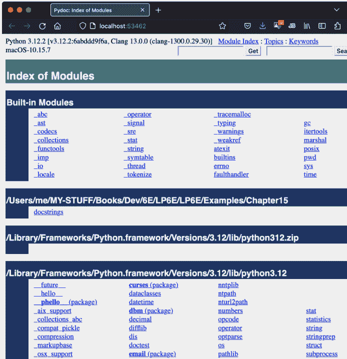

图15-1. Pydoc浏览器界面的顶级索引起始页

当你在Pydoc的模块索引页上点击或轻触一个模块条目（或在Get中输入其名称）时，你会获得该模块的单独文档页面——这本质上与`help`在交互式REPL中提供的信息相同，但格式化为在浏览器中显示。例如，图15-2显示了我们为之前在示例15-1中编写的`docstrings`模块获得的页面。它是为`help(docstrings)`创建的相同报告，采用简单的HTML布局。


图15-2. Pydoc浏览器界面显示用户定义模块的文档

自行尝试Pydoc以获得更多见解。它是一个可选工具，但为Python提供的内置工具以及你自己编写的充满文档字符串的代码文件提供了额外的文档。

## 自定义Pydoc

如果你实际运行，你的Pydoc可能看起来与书中的截图不同，因为用于截图的机器上自定义了颜色。虽然这完全是可选的，并且需要一些Web开发知识，但你也可以通过编辑Pydoc用于渲染页面的简单CSS文件来自定义其外观。要修改颜色，请编辑存储在Pydoc模块旁边的`pydoc_data`文件夹中的`_pydoc.css`文件——你可以在任何平台上通过导入Pydoc模块并检查其`__file__`属性来定位它：

```
$ python3 -c "import pydoc; print(pydoc.__file__)"
...文件夹路径.../pydoc.py

$ ls ...文件夹路径.../pydoc_data    # Pydoc的CSS自定义文件在这里
__init__.py    topics.py
__pycache__    _pydoc.css
```

在 Windows 系统上，请使用 `py` 和 `dir` 代替 `python3` 和 `ls`。这里使用了 Python 的 `-c` 命令行参数，将代码作为字符串提交运行，这对于像这样简短的一次性代码片段非常方便；此处，用分号分隔的两条语句，其运行效果与在 `REPLs >>>` 提示符下逐行输入完全相同。

你也可以通过运行 `help('pydoc')` 来找到 Pydoc 的路径：其路径会显示在输出的底部。一旦定位到 CSS 文件，你可以根据喜好编辑它进行自定义（但请先保存原始文件作为备份）。例如，本书的截图就使用了 RGB 颜色字符串 `#173166` 作为 `index-decor` 的颜色。所有这些都假设你具备超出本书范围的 CSS 技能（外加一个未来可能变化或消失的未文档化配置文件！），但如果你想尝试一下，这大概足以让你入门。

## 更多 Pydoc 技巧

Pydoc 通过*导入*选定的文件来提取其文档。这带来了两个使用上的影响。首先，Pydoc 只能访问位于导入所使用的模块*搜索路径*文件夹中的文件。此路径自动包含 Python 的标准库，因此你可以查看所有内置模块的文档。它也包含当前工作目录——即启动 Pydoc 的文件夹——但从 Windows 开始菜单启动时，这可能没有意义。根据[附录 A](#)，根据需要更改你的 `PYTHONPATH` 设置以包含其他代码文件夹。

其次，尽管 Pydoc 可以为可访问文件夹中的可导入*模块*和可运行*脚本*渲染文档，但脚本文档有一个注意事项：当选择一个文件以获取帮助时，Pydoc 必须导入它以收集其文档，正如我们在[第 3 章](#)所学，导入会*运行*文件的顶层代码。因此，查看脚本文档意味着运行该脚本。

导入的模块在运行时通常只定义工具，因此这通常无关紧要。但是，如果你请求一个顶层脚本文件的文档，该脚本将会运行，并且你启动 Pydoc 的控制台窗口将作为脚本与任何用户交互的标准输入和输出。这在某些脚本和模式下可能比其他情况工作得更好；在控制台模式下，脚本的 IO 可能出现在帮助信息显示之前或之后；在像 IDLE 这样的 GUI 中，可能出现在帮助信息滚动之前；或者在浏览器模式下，与 Pydoc 自身的服务器命令提示符奇怪地交错出现。

在本书后面，你将学习如何编写仅在文件运行时（而非导入时）启动的顶层逻辑（例如，将其嵌套在对变量 `__name__` 是否为 `'__main__'` 的测试之下）。如果脚本使用这些协议，它们在 Pydoc 中查看是安全的，因为查看文档不会无意中运行任何顶层代码作为副作用。

最后，Pydoc 还有一些我们因篇幅所限将跳过的额外工具，包括一个 `-w` 开关，用于将 HTML 文档保存到文件以供后续查看，以及一个*纯文本*模式，该模式通过命令行运行，只需提供主题名称，其工作方式与 REPL 中的 `help` 相同。同样，运行不带任何命令行参数的 Pydoc 可查看其完整的选项集。

> *昔日重现*：Pydoc 曾有一个简单的 GUI 模式，通过标志 `-g` 调用，它启动一个 tkinter GUI 客户端与服务器通信。此功能一直可用到 Python 3.2，当时认为当前的仅浏览器模式已足够，因此完全放弃了长期存在的 GUI 模式。当然，浏览器也是 GUI，而伴随浏览器模式出现的 Pydoc CSS 配置方案假设了许多 Python 用户不具备的额外 Web 开发知识。在开源领域，那些有时间和意愿改变事物的人为每个人定义了未来。


## 超越文档字符串：Sphinx

如果你正在寻找一种更复杂的方式来记录你的 Python 程序，你可能希望了解一下 *Sphinx*——一个文档生成器系统，用于创建下一节描述的 Python 标准手册，以及许多其他软件项目的文档。它使用简单的 *reStructuredText* 作为其标记语言，并继承了 *Docutils* 解析和翻译工具套件的许多特性。

除其他功能外，Sphinx 支持多种输出格式、自动交叉引用和索引，以及使用 *Pygments*（其本身就是一个值得注意的 Python 工具）进行自动代码高亮（着色）。对于较小的程序，文档字符串和帮助可能就足够了，这可能有些大材小用，但对于较大的项目，它可以生成更高级的文档。有关 Sphinx、其相关工具以及文档领域的其他选项的更多详细信息，请参阅网络。

## 标准手册

正如你现在所知，本书是一本通过示例教学的*教程*。虽然其索引和目录可以在事后用于查找随机主题，但它主要是设计用来阅读的，而不是作为参考资源。考虑到这一点，一旦你开始从事实际项目，你可能希望用参考工具来补充本书。

其中，Python 的*标准手册*可能提供了关于该语言及其工具集最完整、最新的参考。你可以通过 Python [网站](https://www.python.org)上的文档链接轻松在线查看这些手册。也可以通过 Windows 开始菜单中 Python 条目下的“手册”项查看，或者从 IDLE 编码 GUI 的帮助菜单中的“Python 文档”打开。请查看你的工具集以了解其他访问选项。

首次打开时，手册会显示一个带有搜索框的根页面，如图 15-3 所示。这里最重要的两个条目很可能是“库参考”（记录内置类型、函数、异常和标准库模块）和“语言参考”（提供语言级别细节的正式描述）。一旦你开始认真编写 Python 代码，这两者都可能成为你常用的伴侣。

同样值得注意的是，这套标准手册中的“新增功能”文档记录了从 Python 2.0（于 2000 年底发布）开始每个版本所做的 Python 变更——对于那些移植旧版 Python 代码或使用旧版 Python 技能的人很有用。这些文档也有助于揭示 Python 2.X 和 3.X 语言系列之间的差异细节，以及本书涵盖的近期 Python 3.X 变更。

无论好坏，自 0.X 版本以来，变化一直是 Python 的常态。虽然未来无法预测，但标准手册的“新增功能”文档也将涵盖本书发布后几乎肯定会发生的 Python 修改。对于任何在不断变化的沙盒下游工作的人来说，这几乎是必读材料。

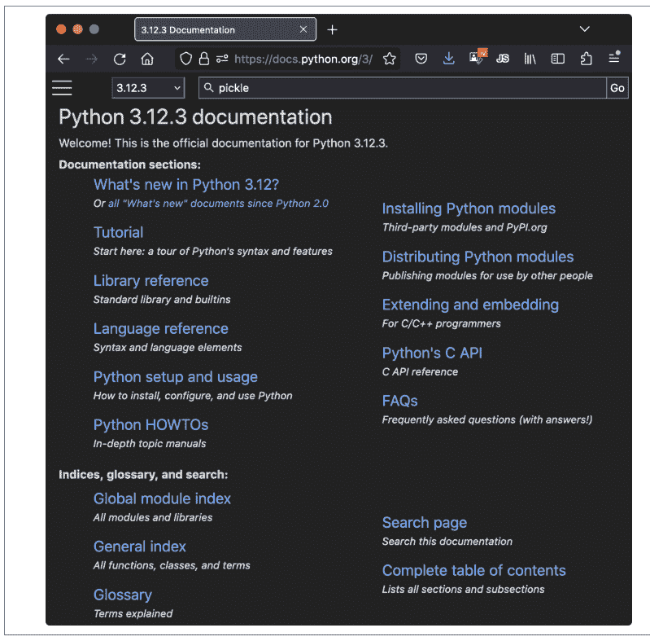

图 15-3. Python 的标准手册，可在网上及其他地方获取

## 网络资源

最后，除了标准手册，Python 网站还托管了额外的资源，其中一些涵盖特定主题或领域，包括非英语的 Python 资源以及针对不同目标受众的入门介绍。

如今，你还会在网上找到大量的 Python 博客、网站、维基和其他资源。鉴于近几十年来网络的爆炸式发展，一些在线资源自然比其他资源更权威、更可靠，而有些则不幸地更倾向于盈利而非教育。这个警告也适用于 AI 聊天机器人，它们只能做到与它们被喂养和转述的数据一样好，并不能替代在软件领域工作所需的深度学习。

话虽如此，对于那些愿意运用当今网络所要求的谨慎和怀疑精神的人来说，有大量的 Python 材料可供获取。

## 常见编码陷阱

在本书本部分的编程练习之前，让我们来梳理一下初学者在编写 Python 语句和程序时最常犯的一些错误。其中许多是本部分前面发出的警告，这里收集起来以便参考。一旦你获得了一些 Python 编码经验，你将学会避免这些陷阱，但现在说几句可能有助于你最初避免陷入其中一些陷阱：

- **不要忘记冒号。** 始终记住在复合语句头部——if、match、while、for 等的第一行——末尾输入一个 :。你一开始可能会忘记（多年来成千上万的 Python 学生都曾忘记过），但你可以稍感安慰的是，它很快就会成为一种无意识的习惯。
- **从第 1 列开始。** 确保顶层（未嵌套的）代码从第 1 列开始。这包括输入到模块文件中的未嵌套代码，以及在交互式提示符（即 REPL）下输入的未嵌套代码。在 Python 中，缩进意味着嵌套，因此它在顶层不起作用。
- **空行在交互式提示符下很重要。** 复合语句中的空行在模块文件中总是无关紧要且被忽略的，但当你在交互式提示符下输入代码时，空行会结束该语句。换句话说，空行告诉交互式 REPL 你已经完成了一个复合语句；如果你想继续，在 ... 提示符（如果显示）下，除非你真的完成了，否则不要按 Enter 键。这也意味着你不能在此提示符下粘贴多行代码；它必须一次运行一个完整的语句，根据需要使用空行。
- **保持缩进一致。** 避免在嵌套块的缩进中混合使用制表符和空格。否则，你在编辑器中看到的可能不是 Python 在将制表符计为一定数量空格时所看到的。这在任何块结构语言中都是如此，而不仅仅是 Python——如果下一个程序员的制表符设置不同，将很难或无法理解你的代码结构。对每个块使用全制表符或全空格更安全。
- **不要在 Python 中编写 C 代码。** 提醒 C/C++ 程序员：你不需要在 if 和 while 头部的测试周围输入括号（例如 if (X==1)）。你可以这样做（任何表达式都可以用括号括起来），但在此上下文中它们完全是多余的。另外，不要用分号结束所有语句；在 Python 中这样做在技术上是合法的，但除非你将多条语句放在一行上（行尾通常结束一条语句），否则它完全没用。并且记住，不要用 {} 包围块（而是保持一致地缩进你的嵌套代码块），并避免在 while 循环测试中嵌入赋值语句，除非它们很简单（即使 Python 现在通过 := 允许这样做）。
- **使用简单的 for 循环，而不是 while 或 range。** 另一个提醒：简单的 for 循环（例如 for x in y）几乎总是比基于 while 或 range 的计数器循环更易于编写，并且通常运行更快。避免在 Python 中计数的诱惑；虽然偶尔需要，但通常不是最佳选择。
- **注意赋值中的可变对象。** 正如之前警告的那样，小心在多重目标赋值（a = b = []）和增强赋值（a += [1, 2]）中使用可变对象。在这两种情况下，就地更改可能会影响其他变量。如果你忘记了为什么这是真的，请参阅第 11 章了解详情。
- **不要期望从就地修改对象的函数中获得返回值。** 我们之前也遇到过这个烦人的问题：像第 8 章介绍的 list.append 和 list.sort 方法这样的就地更改操作不返回值（除了 None），因此你应该在不赋值结果的情况下调用它们。初学者说类似 mylist = mylist.append(X) 这样的话来尝试

## 章节总结

本章我们探讨了文档——既包括我们自己在程序中编写的文档，也包括我们使用的工具所提供的文档。我们了解了文档字符串，探索了Python的参考资源，并学习了Pydoc的`help`函数和基于浏览器的界面如何提供额外的文档来源。由于这是本书本部分的最后一章，我们还回顾了常见的编码错误，以帮助你避免它们。

在本书的下一部分，我们将开始将已学知识应用于更大的程序结构。具体来说，下一部分将讨论*函数*——一种用于将语句分组以供重用的工具。不过，在继续之前，请务必完成本章末尾的本部分实验练习。甚至在此之前，让我们先快速回顾一下本章的测验。

## 测试你的知识：测验

1.  何时应该使用文档字符串而不是井号注释？
2.  列出三种查看文档字符串的方法。
3.  如何获取对象中可用属性的列表？
4.  如何获取计算机上所有可导入模块的列表？

## 测试你的知识：答案

1.  文档字符串（docstrings）被认为最适合用于较大规模的功能性文档，用于描述代码中模块、函数、类和方法的使用。井号注释最好仅限于代码中关键位置关于晦涩表达式或语句的小规模文档。这部分是因为文档字符串在源文件中更容易找到（它们有特定的位置），但也因为它们可以被Pydoc系统提取和显示。
2.  你可以通过打印对象的`__doc__`属性、将其传递给Pydoc的`help`函数，以及在Pydoc基于HTML的浏览器界面中选择模块来查看文档字符串。后者通过`-b`命令行开关启动，运行一个客户端/服务器系统，在弹出的Web浏览器中显示文档。Pydoc也可以运行以将模块的文档保存到HTML文件中，供以后查看或打印。
3.  内置的`dir(X)`函数返回附加到任何对象的所有属性的列表。像`[a for a in dir(X) if not a.startswith('__')]`这样的列表推导式可用于过滤掉以下划线开头的内部名称（你将在本书下一部分学习如何将其包装在函数中以使其可重用）。
4.  因为为Pydoc基于浏览器的`-b`模式打开的索引页面会显示导入搜索路径上的每个模块，所以这显示了程序中所有可用于导入的模块。这依赖于可配置的搜索路径设置，我们将在本书后面更全面地介绍，但它默认包含当前目录和Python的标准库。你也可以编写自己的代码，使用与Pydoc相同的工具来实现这一点（毕竟它只是Python代码），但这是一项重要的手动任务。

## 测试你的知识：第三部分练习

既然你知道了如何编写基本的程序逻辑，以下练习将要求你使用语句来实现一些简单的任务。大部分工作在练习4中，它让你探索编码的替代方案。安排语句的方式总是有很多种，学习Python的一部分就是学习哪些安排比其他安排更好。你最终会自然而然地倾向于经验丰富的Python程序员所说的“最佳实践”，但最佳实践需要练习。

有关以下练习的解决方案，请参见附录B第1165页的“第三部分，语句和语法”：

1.  *编写基本循环*：本练习要求你尝试使用`for`循环。
    a. 编写一个`for`循环，打印名为`S`的字符串中每个字符的ASCII码点。使用内置函数`ord(character)`将每个字符转换为其整数码点。该函数技术上返回一个Unicode码点，可能不在ASCII范围内，但如果你将其内容限制为ASCII字符，你将得到ASCII码。（如果需要，可以交互式测试它以了解其工作原理。）
    b. 接下来，修改你的循环以计算字符串中所有字符的ASCII码点之和。
    c. 最后，再次修改你的循环，返回一个包含字符串中每个字符ASCII码点的新列表。表达式`map(ord, S)`是否有类似的效果？`[ord(c) for c in S]`呢？为什么？（提示：参见第14章。）
2.  *编写基本选择*：编写Python `if`和`match`语句，根据给定的相对数字打印一年的前三个月名称。例如，给定1，输出应为一月；给定3，输出应为三月（或你所在地区的任何月份名称）。然后，使用字典键索引和列表偏移索引来编码选择，做同样的事情。你将如何处理超出范围的月份编号？
3.  *反斜杠字符*：当你在机器上交互式输入以下代码时会发生什么？

```python
for i in range(50):
    print(f'hello {i}\a')
```

请注意，如果在IDLE等某些界面之外运行，此示例可能会发出哔哔声，因此你可能不想在拥挤的房间里运行它！IDLE会忽略奇怪的字符而不是发出哔哔声——这破坏了大部分乐趣（参见表7-2中的反斜杠转义字符）。
4.  *对字典排序*：在第8章中，我们看到字典是仅按插入顺序存储键的集合。编写一个`for`循环，按排序（升序）的*键/值*顺序打印字典的项。（提示：以无序方式存储键，并使用字典键和列表排序方法，或`sorted`内置函数。）
5.  *程序逻辑替代方案*：考虑以下代码，它使用`while`循环和`found`标志在2的幂列表中搜索2的五次方（32）的值。它存储在一个名为*power.py*的模块文件中：

```python
L = [1, 2, 4, 8, 16, 32, 64]
X = 5

found = False
i = 0
while not found and i < len(L):
    if 2 ** X == L[i]:
        found = True
    else:
        i = i+1

if found:
    print('at index', i)
else:
    print(X, 'not found')
```

目前，这个例子没有遵循正常的Python编码技术。按照此处概述的步骤来改进它（对于所有转换，你可以交互式输入代码，也可以将其存储在脚本文件中，从系统命令行或其他接口运行——使用文件会使此练习容易得多）：

a. 首先，使用`while`循环的`else`子句重写此代码，以消除`found`标志和最后的`if`语句。
b. 接下来，重写示例以使用带有`else`子句的`for`循环，以消除显式的列表索引逻辑。（提示：要获取项目的索引，请使用列表的`index`方法——`L.index(X)`返回列表`L`中第一个`X`的偏移量。）

---

要获得追加的结果，但这会将`mylist`赋值为None，而不是修改后的列表（事实上，你会完全失去对列表的引用）。

- **始终使用括号调用函数。** 你必须在函数名后添加括号来调用它，无论它是否接受参数（例如，使用`function()`，而不是`function`）。在本书的下一部分，你将了解到函数只是具有特殊操作的对象——你通过括号触发调用——但它们可以像任何其他对象一样被引用，而不会触发调用。这经常出现在文件操作中；初学者经常输入`file.close`来关闭文件，而不是`file.close()`。因为引用函数而不调用它是合法的，所以第一个版本会静默成功，但它不会关闭文件。
- **不要在导入和重载中使用扩展名或路径。** 在import语句中省略目录路径和文件扩展名——例如，使用`import mod`，而不是`import mod.py`。我们在第3章讨论了模块基础，并将在第五部分继续学习模块。因为模块可能有除`.py`之外的其他扩展名（例如，用于字节码的`.pyc`），硬编码特定扩展名不仅是无效的语法；而且没有意义。Python会自动选择扩展名，任何特定于平台的目录路径语法都来自模块搜索路径设置，而不是`import`语句。在我们更深入地探讨这一点之前，在导入中只使用简单的名称。
- **以及其他部分的陷阱。** 还要务必参见第二部分末尾的内置类型警告，因为它们也可能属于编码问题。Python编码中经常出现一些额外的“陷阱”——通过重新赋值名称来丢失内置函数、通过使用自己的名称来隐藏库模块、更改可变参数默认值等等——但我们目前还没有足够的背景知识来涵盖它们。要了解更多关于在Python中应该做什么和不应该做什么，你必须继续阅读；后面的部分扩展了我们在此列举的“陷阱”和修复方法。

# 第四部分

## 函数与生成器

# 第16章
函数基础

在第三部分中，我们学习了Python中的基本过程语句。现在，我们将继续探索一组额外的语句和表达式，它们可用于创建我们自己的函数。

简而言之，*函数*是一个按名称调用的代码包。它标记并组合了一组语句，使得这些语句可以在程序中多次运行。函数还可以计算结果值，并允许我们指定作为输入的参数，这些参数在每次运行函数代码时可能有所不同。将操作包装在函数中，使其成为一个通用工具，我们可以在各种场景中应用它。

从更实际的角度来看，函数是*复制粘贴*编程的替代方案——我们不必拥有多份操作代码的冗余副本，而是可以将其提取为一个单独的函数。这样做，我们极大地减少了未来的工作量：如果以后必须更改该操作，我们只需在函数中更新一份副本，而不是分散在程序中的多份副本。

函数也是Python提供的最基本程序结构，用于最大化代码*复用*，并引导我们走向更宏大的程序*设计*概念。正如你将看到的，函数让我们能够将复杂系统分解为可管理的部分。通过将每个部分实现为一个函数，我们使其既可复用又更易于编码。

表16-1抽象地预览了本部分我们将学习的函数相关工具——包括调用表达式、两种创建函数的方式（def和lambda）、两种管理作用域可见性的方式（global和nonlocal）、两种将结果返回给调用者的方式（return和yield），以及用于暂停等待结果的工具（async和await）。虽然这是一个功能丰富的主题，但你会发现其常用核心是直接明了的。

表16-1. 函数相关的语句和表达式

| 语句或表达式 | 示例 |
|---|---|
| 调用表达式 | myfunc('hack', tool=python, *versions) |
| def | def printer(message):<br>    print('Hello', message) |
| return | def adder(a, b=1, *c):<br>    return a + b + c[0] |
| lambda | funcs = [lambda x: x**2, lambda x: x**3] |
| global | x = 'old'<br>def changer():<br>    global x; x = 'new' |
| nonlocal | def outer():<br>    x = 'old'<br>    def changer():<br>        nonlocal x; x = 'new' |
| yield | def squares(x):<br>    for i in range(x): yield i ** 2 |
| 生成器表达式 | (i ** 2 for i in range(x)) |
| async/await | async def consumer(a, b):<br>    await producer(b) |
| 装饰器和注解 | @tracer<br>def func(a: 'hack' = None) -> None |

## 为什么使用函数？

在深入细节之前，让我们先更清晰地了解函数的本质。函数是一种几乎通用的程序结构化工具。你可能在其他语言中遇到过它们，在那里它们可能被称为*子程序*或*过程*。简要介绍来说，函数服务于两个主要的开发角色，并且是其他工具的基础：

*最大化复用，最小化冗余*
    与大多数编程语言一样，Python函数是将你希望在多处、多次使用的逻辑打包的最简单方式。到目前为止，我们编写的几乎所有代码都是立即运行的。函数允许我们延迟并泛化代码，以便在以后任意多次使用。因为它们允许我们在一个地方编码一个操作并在许多其他地方使用，所以函数也是一种*提取*工具：它们使我们能够减少程序中的代码冗余，从而减少维护工作量。

*分而治之*
    函数还提供了一种将系统分割成具有明确定义角色和*可管理*作用域的片段的工具。例如，要从头开始制作披萨，你会从混合面团、擀开、添加配料、烘烤等步骤开始。如果你在编程一个制作披萨的机器人，函数将帮助你将整个“制作披萨”任务分解为更小的部分——每个过程子任务对应一个函数。因为单独实现较小的任务比一次性实现整个过程更容易，这使得更大的任务变得更加可行。

*实现对象方法*
    通常，函数关乎*过程*——如何做某事，而不是你正在对什么做。然而，当与一个隐含的主体配对时，它们也可以用于编码特定于对象的行为，称为方法。你将在第六部分开始使用类创建新对象时，看到为什么这个区别很重要。正如你将发现的，类很大程度上只是你将在这里学习编码的函数的集合。

在本部分中，我们将探索用于在Python中编码函数的工具：函数基础、作用域规则和参数传递，以及一些相关概念，如生成器、协程和函数式工具。因为其重要性在这个编码层面开始变得更加明显，我们还将重新审视多态性的概念，该概念在本书前面已经介绍过。正如你将看到的，函数并没有引入太多新语法，但它们确实引导我们走向一些更大的编程思想。

## 函数编码概述

尽管没有非常正式地说明，但我们在前面的章节中已经*使用*了函数。例如，我们调用内置的open函数来创建文件对象，调用len内置函数来询问集合对象中的项目数量，并使用zip和range等工具进行迭代任务。

在本章中，我们将开始探索如何在Python中编写*新*函数。我们编写的函数与我们已经见过的内置函数行为相同：它们在表达式中被调用，传递值，并返回结果。但编写新函数需要应用一些尚未介绍的额外工具和概念。此外，函数在Python中的行为与在C等编译语言中非常不同。

## 基本函数工具

作为本部分我们将学习内容的路线图和简要概述，以下是Python函数工具箱中的基本组件和概念：

- **def创建一个函数并将其赋值给一个名称。** Python函数使用def语句编写。当Python遇到并运行def时，它会生成一个新的函数对象并将其赋值给函数的名称。与所有赋值一样，函数名成为对函数对象的引用。函数的名称没有什么神奇之处——正如你将看到的，函数对象可以被赋值给其他名称、存储在列表中等等。函数对象还可以附加任意的用户定义*属性*来记录数据。
- **def是可执行代码。** 与编译语言中的函数不同，def是一个可执行语句——在Python运行其def之前，你的函数并不存在。事实上，将def语句嵌套在if语句、for循环甚至其他def内部是合法的（甚至偶尔有用）。在典型用法中，def语句在模块文件的顶层编写，并在模块导入时自动运行以创建函数。
- **return将结果对象发送回调用者。** 当调用一个函数时，调用者通常会停止，直到函数完成其工作并将控制权返回给调用者。计算值的函数使用return语句将其发送回调用者，返回的值成为函数调用的结果。没有值的return只是返回到调用者（并发送回None，即默认结果）。
- **lambda创建一个函数但将其作为结果返回。** 函数对象也可以使用lambda表达式创建，该特性允许我们在def语句在语法上不可行的地方编码*内联*函数定义。与def一样，这种方式创建的函数在lambda被遇到并运行时创建。然而，由于lambda通常不在模块的顶层编写，因此这些函数是在程序运行期间创建的，而不是在导入时。lambda是一个可选的便利功能，最好视为def语句的补充。

## 高级函数工具

此外，Python 函数可以利用更高级的工具，如下所示，我们将在介绍基础知识后进行探讨：

- **`global` 声明要赋值的模块级变量。** 默认情况下，函数中赋值的所有名称都是该函数的局部变量，仅在函数运行期间存在。要在封闭模块中赋值，函数需要在 `global` 语句中列出该名称。更一般地说，名称总是在作用域（存储变量的位置）中查找，并且名称根据代码中赋值的位置绑定到作用域。
- **`nonlocal` 声明要赋值的封闭函数变量。** 与 `global` 属于同一类别，`nonlocal` 语句允许函数赋值一个存在于语法上封闭的 `def` 语句作用域中的名称。这允许封闭函数充当保留状态（在函数调用之间记住的信息）的位置，而无需使用共享的全局名称。
- **`yield` 将结果对象发送回调用者，但记住它停止的位置。** 称为生成器的函数也可以使用 `yield` 语句发回一个值并挂起其状态，以便稍后恢复，从而随时间产生一系列结果。与其生成器表达式同族一样，此类函数节省空间并避免延迟，就像我们在本书前面部分遇到的内置可迭代对象一样。
- **`await`/`async` 暂停等待函数，以便其他任务可以运行。** 称为协程的函数可以挂起其执行，直到所需结果可用。这是一个高级应用层面的主题，但允许代码在等待阻塞事件（如慢速 IO）时使用语言工具来完成其他工作。

## 通用函数概念

最后，在此过程中，我们将探讨一些跨越所有类型函数的核心概念：

- **参数通过赋值（对象引用）传递。** 在 Python 中，参数通过赋值传递给函数——正如我们所学，这意味着通过对象引用。正如你将看到的，在 Python 的模型中，调用者和函数通过引用共享对象，但没有名称别名。在函数内更改参数名称不会同时更改调用者中的相应名称，但就地更改传入的可变对象可以更改调用者共享的对象，并作为函数结果。
- **参数按位置传递，除非你另有说明。** 你在函数调用中传递的值默认从左到右匹配函数定义中的参数名称。为了灵活性，函数调用也可以使用 `name=value` 关键字语法按名称传递参数，并使用 `*args` 和 `**args` 星号值表示法解包任意数量的参数进行发送。函数定义使用相同的语法形式来指定参数默认值和收集接收到的任意数量的参数。
- **参数、返回值和变量未声明。** 与 Python 中的所有内容一样，函数没有类型约束。事实上，函数的任何内容都不需要提前声明：你可以传递任何类型的参数，返回任何类型的对象，等等。因此，单个函数通常可以应用于各种对象类型——任何具有兼容接口（支持预期方法和表达式）的对象都可以，无论其具体类型如何。这使得代码在设计上具有灵活性。
- **属性、注解和装饰器支持高级角色。** 函数可以选择性地通过用户定义的属性和其他扩展其角色的工具进行增强。例如，参数和结果的注解可以服务于多种目标。其中，类型提示（在第 6 章中提到）给出了建议的对象类型，但 Python 本身不使用它，它仅仅作为一种重要的文档形式，我们将在本书中不再进一步介绍。更有用的是，函数也可以用 `@` 装饰器作为前缀，这些装饰器添加额外的逻辑层，但其使用方式在很大程度上值得推迟到第 VI 部分，当我们也学习了类之后。

如果前面的一些内容没有完全理解，不用担心——我们将在本书的这一部分中用实际代码探讨其中的大部分概念。让我们通过编写一些抽象示例来扩展一些基础知识，开始吧。

## `def` 语句

`def` 语句创建一个函数对象并将其赋值给一个名称。其一般格式和用法如下：

```
def name(arg1, arg2,... argN):    # 定义一个函数
    statements                    # 函数体

name(val1, val2,... valN)         # 稍后在表达式中调用它
```

与所有复合语句一样，`def` 由一个头部行后跟一个其他语句块组成，通常缩进（尽管冒号后的简单语句照常工作）。语句块成为函数的主体——即 Python 在稍后每次调用函数时执行的代码。

`def` 头部行指定一个函数名称，该名称被赋值给新的函数对象，以及一个包含在括号中的零个或多个参数（有时称为形参）列表（即使对于零个参数也是如此）。头部中的参数名称在代码中其他位置的调用点被赋值为括号中传递的对象。

要在程序中稍后调用函数并运行其主体，你可以使用 `def` 赋值的函数名称，传递零个或多个值（对象）以匹配 `def` 头部中列出的参数。调用表达式也可以使用其他类型的对象引用来表示该函数；它不一定必须是 `def` 头部中编码的名称。

## `return` 语句

函数主体通常包含一个或多个 `return` 语句，这些语句仅在 `def` 内部有意义：

```
def name(arg1, arg2,... argN):
    ...
    return result                # 调用表达式的结果
```

Python 的 `return` 语句可以出现在函数主体中的任何位置。当到达时，它结束函数调用并将结果发送回调用者，作为调用表达式的结果。`return` 语句由一个可选的对象值表达式组成，该表达式给出结果。如果省略该值，`return` 默认发送回 `None`。

`return` 语句本身也是可选的；如果不存在，当控制流到达函数主体末尾时，函数退出。从技术上讲，没有 `return` 语句的函数也会自动返回 `None` 对象，但此返回值通常在调用时被忽略，通过使用第 11 章的调用表达式语句。

函数还可能包含 `yield` 语句，用于随时间产生一系列值，以及 `await` 和 `async for`/`with` 语句，用于挂起函数的执行，但我们将推迟讨论这些更高级的工具，直到我们在第 20 章探讨生成器和协程主题。

## `def` 在运行时执行

Python 的 `def` 是一个真正的可执行语句：当它运行时，它创建一个新的函数对象并将其赋值给一个名称。（记住，在标准 Python 中我们拥有的只是运行时；没有单独的编译时间。）因为它是一个语句，`def` 可以出现在任何语句可以出现的地方——甚至嵌套在其他语句中。例如，尽管 `def` 通常是模块导入时运行的顶级代码，但将函数 `def` 嵌套在 `if` 语句中以在替代定义之间进行选择也是完全合法的：

```
if test:
    def func():        # 以这种方式定义 func
        ...
else:
    def func():        # 或者以这种方式
        ...
...
func()                 # 调用选定并构建的版本
```

理解此代码的一种方式是认识到 `def` 很像 `=` 语句：它只是在运行时赋值一个名称（如这里的 `func`）。与 C 等编译语言不同，Python 函数不需要在程序运行前完全定义。更一般地说，`def` 在到达之前不会运行，并且 `def` 内部的代码在函数稍后被调用之前不会运行。

因为函数定义发生在运行时，所以函数名称没有什么特别的。重要的是它所引用的对象。例如：

```
othername = func       # 赋值函数对象
othername()            # 再次调用 func
```

在这里，函数被赋值给一个不同的名称，并通过新名称调用。与 Python 中的其他所有内容一样，函数只是对象；它们在程序执行时被显式记录在内存中。事实上，除了调用之外，函数还允许附加任意属性以记录信息供以后使用：

```
def func(): ...        # 创建 + 赋值函数对象
func()                 # 通过其名称调用对象
func.attr = value      # 附加属性
```

换句话说，函数是一等对象，借用第 9 章引入的术语。虽然它们不支持其他对象支持的一些操作，但函数与每个对象属于同一类别。正如你将看到的，将它们传递并存储在其他对象中在语法上是合法的，并且非常有用。

## `lambda` 创建匿名函数

除了 `def`，你还可以使用 `lambda` 表达式创建一个新函数。它的编码和可能的使用方式如下：

```
name = lambda arg1, arg2,... argN: expression

name(val1, val2,... valN)
```

与 `def` 类似，`lambda` 也会创建一个新的函数对象供后续调用。它以关键字 `lambda` 开头，后跟一个参数列表头，其工作方式与 `def` 中的相同，但编写时无需括号。与 `def` 不同的是，`lambda` 中 `:` 之后的代码是一个单独的表达式——它不能包含语句，并且是 `lambda` 所创建函数的隐式主体和返回值。我们不需要在 `lambda` 中使用 `return`（实际上也不能）。

同样与 `def` 不同的是，`lambda` 本身不会将新函数赋值给一个名称，而只是将其作为整个 `lambda` 表达式的结果返回。这段代码片段手动将函数赋值给一个名称，然后通过该名称调用它，但这是可选的：结果也可以保存在另一个对象中或传递到其他地方使用。因此，`lambda` 通常被称为“匿名”函数——即没有名称的函数。

你将在后续学习中更深入地了解 `lambda` 并看到它的实际应用。但你的第一个问题可能是，为什么需要一个代码仅限于单个表达式的 `def` 版本？简而言之，`lambda` 可以用在 `def` 无法使用的地方，包括在调用和对象字面量中，我们希望嵌入少量延迟执行和可运行的代码。虽然 `def` 处理较大的任务，并且也支持按名称嵌入函数，但 `lambda` 是在更简单角色中的一个可选便利工具。

如果你一直在留意，我们现在已经看到了四种用于更通用语句的表达式等价物——`lambda` 对应 `def`，`:=` 命名赋值对应 `=`，`if/else` 三元表达式对应 `if`，以及推导式对应 `for`。尽管 `lambda` 仅限于表达式，但它们可以使用所有这些表达式等价物来编写赋值、逻辑和循环。所有这些表达式形式都是随着时间积累而来的，但在实际代码中是方便的替代方案。

## 第一个示例：定义与调用

除了它们的运行时特性（对于具有编译语言背景的程序员来说，这往往显得最新颖）之外，Python 函数使用起来非常直接。让我们编写第一个实际示例来演示基础知识，涵盖函数等式的两个方面：定义（创建函数的 `def` 或 `lambda`）和调用（告诉 Python 运行函数主体的表达式）。

### 定义

这是一个交互式输入的定义，它定义了一个名为 `times` 的函数，该函数返回其两个参数的乘积（功能虽简单，但演示了基本要点）。通常，此处省略了“...”提示符以便于复制粘贴：

```
>>> def times(x, y):    # 创建并赋值函数
    return x * y    # 调用时执行的主体
```

当 Python 遇到并运行这个 `def` 时，它会创建一个新的函数对象，该对象封装了函数的代码，并将此对象赋值给名称 `times`。通常，这样的语句编写在模块文件中，并在导入包含该文件的模块时运行；不过，对于如此小的代码，交互式 REPL 就足够了。

顺便提一下，如果我们将其结果赋值给一个名称，`lambda` 也可以达到相同的效果，尽管它通常用于比这更专注的角色，并且通常不作为顶层代码。如果你正在同步练习，可以尝试 `def`、`lambda` 或两者都试——它们创建的函数对象工作方式相同：

```
>>> times = lambda x, y: x * y
```

## 调用

`def` 和 `lambda` 都创建函数，但不会调用它。在任一方式运行之后，你可以通过在函数名称后添加括号来*调用*（即运行）程序中的函数。括号内可以可选地包含一个或多个对象参数，这些参数将被传递（即赋值）给函数头中的名称：

```
>>> times(2, 4)           # 括号中的参数
8
```

此表达式将两个参数传递给 `times`。如前所述，参数是通过赋值传递的，因此在这种情况下，函数头中的名称 `x` 被赋值为对象 `2`，`y` 被赋值为 `4`，然后函数的主体被执行。

对于这个函数，主体只是 `def` 的 `return` 语句或 `lambda` 的表达式，它将结果作为调用表达式的值返回。返回的对象在此处交互式地打印出来（与大多数语言一样，在 Python 中 `2 * 4` 是 `8`），但如果我们需要稍后使用它，可以将其赋值给一个变量。例如：

```
>>> x = times(3.14, 4)    # 保存结果对象
>>> x
12.56
```

现在，观察当函数第三次被调用时会发生什么，传入了非常不同类型的对象：

```
>>> times('Py', 4)        # 函数是“无类型”的
'PyPyPyPy'
```

这一次，我们的函数意味着完全不同的东西。在这第三次调用中，一个字符串和一个整数被传递给 `x` 和 `y`，而不是两个数字。回想一下，`*` 既适用于数字也适用于序列；因为我们在 Python 中不约束变量、参数或返回值的类型，所以我们可以使用 `times` 来*乘以*数字或*重复*序列。

换句话说，我们的 `times` 函数的含义和作用取决于我们传入的内容。这是 Python 中的一个核心思想（也许是熟练使用该语言的关键），值得在此单独强调。

### Python 中的多态

正如我们刚才看到的，我们简单的 `times` 函数中表达式 `x * y` 的确切含义完全取决于 `x` 和 `y` 是什么类型的对象——因此，同一个函数可以在一种情况下执行乘法，在另一种情况下执行重复。Python 让*对象*自己为该语法做合理的事情。实际上，`*` 只是一个分派机制，将控制权路由到被处理的对象。

这种依赖于类型的行为被称为*多态*，这个术语我们在第 4 章首次遇到，其基本含义是操作的意义取决于被操作的对象。由于 Python 是动态类型语言，多态在 Python 中无处不在。事实上，在 Python 中，*每个*操作都是多态操作：打印、索引、`*` 运算符等等。

这是有意为之的，它解释了该语言的简洁性和灵活性。例如，一个函数通常可以自动应用于一整类对象类型。只要这些对象支持预期的*接口*（又名*协议*），函数就可以处理它们。也就是说，如果传入函数的对象具有预期的方法和表达式运算符，它们就可以即插即用地与函数的逻辑兼容。

即使在我们简单的 `times` 函数中，这也意味着*任何*支持 `*` 的两个对象都可以工作，无论它们是什么，也无论它们何时被编写。这个函数可以处理两个数字（执行乘法），或一个字符串和一个数字（执行重复），或任何其他支持预期接口的对象组合——甚至包括我们尚未想象到的基于类的对象。

此外，如果传入的对象*不*支持这个预期的接口，Python 将在运行 `*` 表达式时检测到错误并自动引发异常。因此，在这样的代码中自己编写错误检查通常是毫无意义的。事实上，这样做会限制我们函数的实用性，因为它将被限制为仅对我们在编写时测试过类型的对象工作：

```
>>> times('not', 'quite')
TypeError: can't multiply sequence by non-int of type 'str'
```

这被证明是 Python 与像 C++ 和 Java 这样的静态类型语言之间一个关键的哲学差异：在 Python 中，你的代码*不应该关心*具体的数据类型。如果它关心，它将被限制为仅在你编写代码时预期的类型上工作，并且它将不支持现在或将来编写的其他兼容对象类型。虽然可以使用像 `type` 内置函数这样的工具来测试类型，但这样做会破坏代码的灵活性。总的来说，在 Python 中，我们是针对对象*接口*编程，而不是数据类型。

当然，一些程序有独特的需求，这种多态编程模型意味着我们必须*测试*我们的代码以检测一些静态类型编译语言可能能够更早检测到的错误。然而，作为最初一点额外测试的交换，我们极大地减少了必须编写的代码量，并极大地增加了代码的灵活性。随着时间的推移，你会发现这在实践中是一个巨大的净收益。

## 第二个示例：序列交集

接下来，让我们探索第二个函数示例，它做一些比乘以参数更有用的事情，并进一步说明函数基础。

在第 13 章中，我们编写了一个 `for` 循环来收集两个字符串中共同持有的项目（并称之为近乎交集，除了重复项）。我们当时指出，该代码不如它本可以做到的那样有用，因为它被设置为仅对特定变量工作，并且无法稍后重新运行。当然，我们可以复制代码并将其粘贴到每个需要运行的地方，但这个解决方案既不好也不通用——我们仍然必须编辑每个副本以支持不同的序列名称，并且更改算法将需要更改多个副本。

### 定义

到现在，你可能已经猜到这个困境的解决方案是将 `for` 循环封装在一个函数中。这样做提供了许多优势：

- 将代码放在函数中使其成为一个工具，你可以根据需要运行任意多次。
- 因为调用者可以传递任意参数，所以函数足够通用，可以处理你希望求交集的任何两个序列（或其他可迭代对象）。

## 调用

在调用函数之前，必须先创建它。为此，需要运行其 `def` 语句，可以通过交互式输入，也可以在模块文件中编写代码并导入该文件。你可以将整个函数粘贴到 REPL 中，但这里我们将从文件导入（根据第 3 章，确保你能在 REPL 中看到它，必要时在文件所在文件夹中操作）。一旦通过这种方式运行了 `def`，你就可以通过在括号中传递任意两个序列对象来调用该函数：

```
>>> from inter1 import intersect
>>> s1 = 'HACK'
>>> s2 = 'CHOK'
>>> intersect(s1, s2)
['H', 'C', 'K']
```

这里，我们传入了两个字符串，返回了一个包含共同字符的列表。该函数使用的算法很简单：“对于第一个参数中的每个项目，如果该项目也在第二个参数中，则将其附加到结果中。”用 Python 表达比用英语更简洁，但效果相同。

公平地说，我们的 `intersect` 函数可能可以更快（它执行的是简单的嵌套循环），并非真正的数学交集（结果中可能有重复项），而且根本不是必需的（正如我们所见，Python 的集合对象提供了内置的交集操作，通过 `&` 启动）。实际上，该函数可以用单个列表推导式代码模式替代，因为它展示了经典的收集器循环代码模式：

```
>>> [x for x in s1 if x in s2]
['H', 'C', 'K']
```

这也可以作为 lambda 主体表达式中的循环——尽管在 `def` 中是五行。这足以作为演示，但在这样简单的角色中意义不大（再次说明，我们将在后面更好地使用 lambda）：

```
>>> intersect = lambda seq1, seq2: [x for x in seq1 if x in seq2]
>>> intersect(s1, s2)
['H', 'C', 'K']
```

然而，无论编码如何，这个函数都能完成任务：它的单段代码可以应用于一系列对象类型，如下一节所述。事实上，我们将在第 18 章中改进并扩展它以支持任意多个操作数，在我们揭示更多关于参数传递模式的内容之后。

## 多态性再探

像 Python 中所有好的函数一样，`intersect` 是多态的。也就是说，它适用于任意类型，只要它们支持预期的对象接口：

```
>>> x = intersect([1, 2, 3], (1, 4))    # 传递混合类型
>>> x                                    # 保存的结果对象
[1]
```

这次，我们向函数传递了不同类型的对象——一个列表和一个元组（混合类型）——它仍然挑选出了共同的项目。因为你不必提前指定参数的类型，`intersect` 函数会愉快地遍历你发送的任何类型的对象，只要它们支持预期的接口。

对于 `intersect`，这意味着第一个参数必须支持 `for` 循环，第二个参数必须支持 `in` 成员测试，在 `def` 和 lambda 形式中都是如此。任何两个这样的对象都可以工作，无论它们的具体类型——这包括物理存储的序列，如字符串和列表；我们在第 14 章中遇到的所有可迭代对象，包括文件和字典；甚至我们编写的任何基于类的对象，这些对象应用了我们将在本书后面讨论的运算符重载技术。¹

同样，如果我们传递不支持这些接口的对象（例如数字），Python 会自动检测不匹配并为我们引发异常——这正是我们想要的，也是我们自己编写显式类型测试时能做到的最好情况：

```
>>> intersect([1, 2, 3], 1)
TypeError: argument of type 'int' is not iterable
```

通过不编写类型测试并允许 Python 为我们检测不匹配，我们既减少了需要编写的代码量，又避免了人为限制代码的范围。

## 过渡：局部变量

然而，这个例子中最有趣的部分可能是它的名称。事实证明，`intersect` 的 `def` 版本中的变量 `res` 在 Python 中被称为局部变量——一个仅对函数 `def` 内部代码可见的名称，并且仅在函数调用运行期间存在。事实上，由于函数内部以任何方式分配的所有名称默认都被归类为局部变量，`def` 中的几乎所有名称都符合：

> ¹ 如果我们使用 `file.readlines()` 获取文件内容进行交集，这段代码总是有效的。不过，直接对打开的输入文件中的行进行交集可能不起作用，这取决于文件对象对 `in` 运算符或一般迭代的实现。文件通常在读取到文件末尾后必须重置（例如，使用 `file.seek(0)` 或重新打开），因此是单次传递的迭代器。正如你将在第 30 章学习运算符重载时看到的，对象通过提供特定的 `__contains__` 方法或通过支持 `__iter__` 或较旧的 `__getitem__` 方法的一般迭代协议来实现 `in` 运算符；类可以任意编写这些方法来定义其数据的迭代含义。

- `res` 显然被赋值，所以它是局部变量。
- 参数通过赋值传递，所以 `seq1` 和 `seq2` 也是。
- `for` 循环将项目赋值给变量，所以名称 `x` 也是局部的。

所有这些局部变量在函数被调用时出现，在函数退出时消失——`intersect` 末尾的 `return` 语句返回结果对象，但名称 `res` 消失了。lambda 中的参数名称也是如此，尽管其压缩隐藏了其循环变量（除非使用嵌套的 `:=` 导出它）。

因此，函数的变量不会与其他地方的名称冲突，但也不会在调用之间记住值。虽然函数返回的对象会继续存在，但保留其他状态信息需要其他技术。然而，要全面探索局部变量和状态的概念，我们需要继续下一章的范围覆盖。

## 章节总结

本章介绍了函数定义背后的核心思想——`def` 和 `return` 语句以及 lambda 表达式的语法和操作，函数调用表达式的行为，以及 Python 函数中多态性的概念和好处。正如我们所见，`def` 和 lambda 是在运行时创建函数对象的可执行代码；当函数稍后被调用时，对象通过赋值（在 Python 中意味着对象引用）传递给它，计算值通过 `def` 中的 `return` 和 lambda 中的隐式返回发送回来。我们还开始探索局部变量和范围的概念，但将细节留到第 17 章。不过，首先，快速测验。

## 测试你的知识：测验

1. 编写函数的意义是什么？
2. Python 在什么时候创建函数？
3. 如果 `def` 函数中没有 `return` 语句，它返回什么？
4. 嵌套在函数定义中的代码何时运行？
5. 检查传入函数的对象类型有什么问题？

## 测试你的知识：答案

1. 函数是 Python 中避免代码冗余的最基本方式——将代码分解为函数意味着我们将来只需更新操作代码的一个副本。函数也是 Python 中代码重用的基本单元——将代码包装在函数中使其成为可重用的工具，可在各种程序中调用。最后，函数允许我们将复杂系统划分为可管理的部分，每个部分可以单独开发。函数也用于对象方法，但我们推迟到学习类时再讨论这个角色。

# 第17章
作用域

上一章介绍了基本的函数定义和调用。正如我们所见，Python的核心函数模型易于使用，但即使是简单的函数示例也会迅速引发关于代码中变量含义的问题。本章将继续介绍Python *作用域*背后的细节——即变量定义和查找的位置。与模块文件类似，作用域有助于防止程序代码中同名冲突：在一个程序单元中定义的名称不会干扰另一个单元中的名称。

正如你将在这里学到的，名称在代码中被赋值的位置对于确定该名称的含义至关重要。你还会发现，作用域的使用会对程序维护工作量产生重大影响；例如，过度使用*全局变量*通常是个坏主意。另一方面，你也将了解到作用域可以提供一种在函数调用之间保留*状态信息*的方法，并且在某些角色中，它们提供了类的替代方案。

## Python作用域基础

既然我们开始编写自己的函数，就需要更正式地了解Python中名称的含义。当我们在程序中使用一个名称时，Python会在所谓的*命名空间*中创建、更改或查找该名称——名称存在的地方。当我们谈论与代码相关的名称时，命名空间对应于*作用域*：名称在源代码中的赋值位置决定了该名称在程序中的可见范围。

几乎所有与名称相关的事情，包括作用域分类，都发生在Python的赋值时。正如我们所看到的，Python中的名称在首次赋值时产生，并且在使用前必须赋值。由于名称不是预先声明的，Python使用名称的赋值位置将其与特定的命名空间和作用域关联（即*绑定到*）。换句话说，你在源代码中为名称赋值的位置决定了它将存在的命名空间，从而决定了其可见范围。

除了将代码打包以供重用外，函数还为程序添加了一个额外的命名空间层，以最小化同名变量之间冲突的可能性——默认情况下，函数内部*赋值*的所有名称都与该函数的命名空间关联，而不与其他任何命名空间关联。此规则意味着：

- 在def内部赋值的名称只能被该def*内部*的代码看到。你甚至不能从函数外部引用这些名称。
- 在def内部赋值的名称不会与def外部的变量冲突，即使在其他地方使用了相同的名称。在给定def*外部*赋值的名称X（即在不同的def中或在模块文件的顶层）与在该def*内部*赋值的名称X是完全不同的变量。
- 在lambda中赋值的名称工作方式相同，尽管在其表达式中赋值只能用于参数和:=命名赋值，并且比在def中少见得多。

在所有情况下，变量的作用域（它可以使用的位置）完全由其在源代码中的赋值位置决定，与哪个函数调用哪个函数无关。事实上，正如你将在本章中学到的，变量可以在三个不同的地方赋值，对应三个不同的作用域：

- 如果变量在def或lambda内部赋值，则它对该函数是*局部*的。
- 如果变量在封闭的def或lambda中赋值，则它对嵌套函数是*非局部*的。
- 如果变量在所有def和lambda外部赋值，则它对整个文件是*全局*的。

我们称之为*词法作用域*，因为变量作用域完全由变量在程序源代码中的位置决定，而不是由函数调用决定。因此，简单的目视检查就足以做出判断。

例如，在以下模块文件中，`X = 99`赋值创建了一个名为X的*全局*变量（在此文件中任何地方都可见），但`X = 88`赋值创建了一个*局部*变量X（仅在def语句内可见）。如果我们在函数内部引用X，我们将得到函数的X，而不是全局的X：

```
X = 99                # 全局（模块）作用域 X

def func():
    X = 88            # 局部（函数）作用域 X：一个不同的变量
```

即使两个变量都命名为X，它们的作用域使它们不同。最终效果是，函数作用域有助于避免程序中的名称冲突，并有助于使函数成为更自包含的程序单元——它们的代码无需关心其他地方使用的名称。

## 作用域概述

在我们开始编写函数之前，我们编写的代码都没有嵌套在def中，因此我们使用的名称要么存在于模块中，要么是Python预定义的内置名称，如`open`和`zip`。这包括在REPL中输入的代码：交互式提示符在技术上是一个名为`__main__`的模块，它打印结果但不对应于真实的文件；但在所有其他方面，它就像模块文件的顶层。

然而，函数提供了嵌套的命名空间（作用域），使其使用的名称局部化，这样函数内部的名称就不会与外部（在模块或另一个函数中）的名称冲突。具体来说，函数定义了一个*局部作用域*，模块定义了一个*全局作用域*，具有以下属性：

- **封闭模块是全局作用域。** 每个模块都是一个全局作用域——即一个命名空间，其中在模块文件顶层通过赋值创建的变量存在。全局变量在导入后成为模块对象对外部世界的属性，但也可以在模块文件本身内用作简单变量。
- **全局作用域仅跨越单个文件。** 不要被这里的“全局”一词所迷惑——文件顶层的名称仅对该文件内的代码是全局的。在Python中，没有对应于用户代码的包罗万象的全局作用域的概念（内置名称是真正的全局，但不是用户定义的）。相反，名称被划分到模块中，如果你想使用其文件定义的名称，必须始终显式导入模块。当在Python中听到“全局”时，请想到“模块”。
- **赋值的名称是局部的，除非声明为全局或非局部。** 默认情况下，函数定义内赋值的所有名称都放入其局部作用域——与函数本身关联的命名空间。要赋值一个存在于封闭函数模块顶层的名称，请在函数内的`global`语句中声明它。要赋值一个存在于封闭`def`中的名称，请在`nonlocal`语句中声明它。因为`lambda`体仅限于表达式，所以这两个语句仅用于`def`。
- **所有其他名称是封闭函数的局部变量、全局变量或内置变量。** 在函数定义中*未*赋值的名称被假定为在物理*封闭*函数中定义的局部变量、存在于封闭模块命名空间中的*全局变量*，或Python提供的预定义内置模块中的*内置变量*。封闭作用域可以由任何`def`和`lambda`组合产生，尽管`def`不能在`lambda`中编码。
- **每次调用函数都会创建一个新的局部作用域。** 每次调用函数时，你都会创建一个*新的*局部作用域——即一个命名空间，其中在该函数内部创建的名称将存在，除非有`global`或`nonlocal`语句。你可以将每个`def`语句和`lambda`表达式视为定义一个新的局部作用域，但局部作用域实际上对应于函数*调用*，原因如下一点所述。
- **每次调用的作用域在递归和闭包中很重要。** 在使用*递归*（一种允许函数通过调用自身进行循环的高级技术，在第9章中简要提及用于比较）时，每个活动调用接收其函数局部变量的副本至关重要。递归在我们编写的函数中也很有用，用于处理形状无法提前预测的结构；我们将在第19章中更全面地探讨它。这里介绍的*闭包*函数也需要每次调用的作用域：每次调用都获得函数局部变量的新包，可以记住稍后使用的状态信息对象。

除了这些基础知识之外，还有三个值得强调的细微差别。首先，如前所述，在Python*交互式提示符*处输入的代码也存在于模块中，并遵循正常的作用域规则：在那里赋值的名称是全局变量，可在整个交互式会话中访问。你将在本书的下一部分中了解更多关于模块的信息。

其次，还要记住，*任何类型的赋值*都会根据赋值出现的位置将名称分类为局部或全局。这包括`=`语句和`:=`表达式；`import`中的模块名称；`def`中的函数和参数名称；后面介绍的类中的名称；等等。如果你在函数内以任何方式赋值一个名称，它默认将是该函数的局部变量。这包括在其头部列出的参数，也包括其主体代码中的名称。

第三，对对象的*就地更改*不会将名称分类为局部变量；只有实际的*名称*赋值才会。例如，如果名称`L`在模块顶层被赋值给一个列表，函数内的语句`L = X`会将`L`分类为局部变量，但`L.append(X)`不会。在后一种情况下，我们更改的是`L`引用的列表对象，而不是`L`本身——因此，`L`照常在全局作用域中找到，Python愉快地修改它而不需要`global`声明。与往常一样，保持名称和对象之间的区别清晰很有帮助：更改对象不是对名称的赋值。

2. 当Python到达并运行def语句时，会创建一个函数对象并将其赋值给函数的名称。这通常发生在封闭模块文件被另一个模块导入时（回想一下，导入从上到下运行文件中的代码，包括任何defs），但也可以在交互式输入def或将其嵌套在其他语句（如ifs）中时发生。当lambda被到达并运行时也会创建函数，尽管这通常不会在导入操作期间发生。

3. 如果控制流在函数体末尾结束而没有遇到return语句，则def函数默认返回None对象。这样的函数通常用表达式语句调用，因为将其None结果赋值给变量通常没有意义。没有表达式的return语句也返回None。lambda隐式返回其表达式的结果，因此没有默认值。

4. 当函数稍后通过调用表达式被调用时，函数*体*（嵌套在函数def语句内或在lambda冒号后的代码）将运行。每次调用函数时，函数体都会重新运行。

5. 检查传入函数的对象类型实际上破坏了函数的*灵活性*，将函数限制为仅处理特定类型。没有这样的检查，函数可能能够处理整个对象类型数组——任何支持函数预期接口的对象都可以工作。（术语*接口*指函数代码运行的方法和表达式运算符的集合。）

## 名称解析：LEGB 规则

如果上一节听起来很复杂，它其实可以归结为三条简单的规则。在 `def` 语句内部：

- 名称*赋值*默认创建或更改局部名称。
- 名称*引用*最多搜索四个作用域：局部，然后是外层函数（如果有），然后是全局，最后是内置。
- 在 `global` 和 `nonlocal` 语句中声明的名称将赋值的名称分别映射到外层模块和函数作用域。

`lambda` 也是如此，只是最后一点不同：它不支持语句。换句话说，在函数 `def` 语句或 `lambda` 表达式内部赋值的所有名称默认都是局部的。函数可以自由使用在语法上外层函数和全局作用域中赋值的名称，但必须声明这些非局部和全局变量才能更改它们。

Python 的名称解析方案通常被称为 *LEGB* 规则，以其搜索的作用域名称命名：

- 当你在函数内部使用一个*非限定*名称（不是在 "." 之后）时，Python 会搜索最多四个作用域——函数本身的局部（*L*）作用域，然后是任何外层（*E*）`def` 和 `lambda` 的局部作用域，然后是周围模块的全局（*G*）作用域，最后是内置（*B*）作用域——并在找到名称的第一个位置停止。如果在此搜索期间未找到该名称，Python 会报告错误。
- 当你在函数*内部*赋值一个名称（而不仅仅是在表达式中引用它）时，Python 总是在赋值者的局部作用域中创建或更改该名称，除非它在那里被声明为全局或非局部。
- 当你在任何函数*外部*赋值一个名称（即在模块文件的顶层，或在交互式提示符下），局部和全局作用域是同一个——模块的命名空间。

因为名称必须在使用前赋值（正如我们在第 6 章所看到的），所以这个模型中没有自动组件：赋值总是明确地确定名称作用域。图 17-1 说明了 Python 的四个作用域和 LEGB 规则。请注意，第二个作用域查找层，*E*——外层 `def` 或 `lambda` 的作用域——技术上可以对应多个查找级别。这一层只在你出于后面将遇到的原因将函数嵌套在函数内部时才起作用，并由 `nonlocal` 语句增强。¹

> ¹ 作用域查找规则在本书第一版中被称为 "LGB 规则"。外层 "E" 层是后来在 Python 中添加的，以避免使用默认参数显式传递外层作用域名称的任务——这是一个高级主题，我们将在本章后面介绍。由于这个作用域现在由 `nonlocal` 语句处理，查找规则可能最好命名为 "LNGB"，但向后兼容性在书中也很重要。这个缩写词的当前形式也没有考虑推导式和异常处理程序的较新模糊作用域，但超过四个字母的缩写词往往达不到其目的！

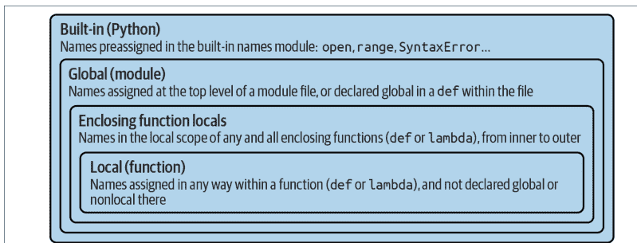

还要记住，这些规则仅适用于简单的*变量*名称（例如，*name*）。在第 *V* 和 *VI* 部分，你将看到限定的*属性*名称（例如，*object.name*）存在于特定对象中，并遵循与这里介绍的完全不同的查找规则。对句点（.）之后的属性名称的引用搜索一个或多个*对象*，而不是作用域，实际上可能调用 Python 的 OOP 模型中称为*继承*的东西；更多内容请参见第 *VI* 部分。

## 预览：其他 Python 作用域

尽管在本书的这个阶段还不明显，但技术上 Python 中还有三个额外的作用域——推导式中的临时循环变量、try 处理程序中的异常引用变量，以及类语句中的局部作用域。前两个是很少影响实际代码的特殊情况，第三个属于 LEGB 伞形规则之下。

重要的是，大多数语句块和其他构造不会将其中使用的名称局部化。这包括 *for* 循环语句中的循环变量，以及 `:=` 命名赋值的目标，它们在作用域方面与其他所有变量的工作方式相同。然而，有一些边界情况，其变量对周围代码不可用（并且不会与之冲突），并且涉及本书其他地方完整介绍的主题：

- *推导式循环变量*：在 [*X* for *X* in *I*] 中用于指代推导式表达式中当前迭代项的变量（或变量）*X*。因为它们可能与其他名称冲突并反映生成器中的内部状态，所以这些名称在所有推导式形式（列表、字典、集合和生成器）中都是表达式本身的局部变量。相比之下，*for* 循环*语句*从不将其循环变量（例如，`for X in I:` 中的 *X*）局部化到语句块，如前所述，尽管有相似之处。此外，在推导式中通过 `:=` 赋值的名称*确实*会泄漏到外层作用域，根据第 *20* 章中的信息和演示。
- *异常变量*：在 `except E as X` 中用于在 try 语句处理程序中引用引发的异常的变量 *X*。因为这可能会延迟垃圾回收的内存回收，所以这些变量是该 except 块的局部变量，并且实际上在退出块时会从包含作用域中*移除*（即使你之前在代码中使用过它们！）。你将在第 *34* 章中全面了解 *try* 语句。
- *`λ` 中的命名赋值*：在赋值表达式中使用的变量 *X* *X* `:=` *Y*。在作用域方面，`:=` 通常与非嵌套的 `=` 赋值语句的工作方式相同。不过，请记住，`λ` 函数表达式就像 `def` 语句一样创建一个新的局部函数作用域。因此，任何通过嵌套在 `λ` 中的 `:=` 赋值的名称都是局部变量，可以在 `λ` 本身的主体内使用，但对外部 `λ` 表达式的代码不可用。也就是说，这在大多数代码中可能是一种罕见的编码模式（并且将复杂性推向了极限）。有关 `:=` 的复习，请参见第 11 章。

这些上下文中的大多数*增强*了 LEGB 规则，而不是修改它。例如，在推导式中赋值的循环变量只是绑定到一个进一步嵌套和特殊情况下局部作用域；在这些表达式中引用的所有其他名称都遵循通常的 LEGB 查找规则。

还值得注意的是，你将在第 VI 部分遇到的类语句也会创建一个新的*局部*作用域，用于在其块顶层赋值的名称。至于 `def`，在类内部赋值的名称不会与其他地方的名称冲突，并遵循 LEGB 查找规则，其中类块是 *L* 级别。至于导入的模块，这些类局部名称在类语句结束后也会变成类对象属性。出于所有实际目的，类是一个局部作用域（尽管有一些罕见的边界情况可能属于故障，可以安全地在此省略）。

然而，与函数不同，类名称不是按*调用*创建的：类对象调用生成*实例*，这些实例继承在类中赋值的名称，并根据自己的实例属性记录每个对象的状态。正如你将在第 29 章中了解到的，尽管 LEGB 规则用于解析在类本身顶层以及嵌套在其中的方法函数顶层中使用的名称，但类本身在作用域查找中被*跳过*——它们的名称必须作为对象属性获取。因此，因为 Python 搜索外层函数以获取引用的名称，但不搜索外层类，所以图 17-1 中概述的 LEGB 规则仍然适用于 OOP 代码。

## 作用域示例

但理论说够了！让我们通过一个演示作用域概念的实际示例来逐步讲解。假设我们编写了示例 17-1 中的代码，并将其保存在名为 *scopes101.py* 的模块文件中。

**示例 17-1. scopes101.py**

```python
# Global scope
X = 99                    # X and func assigned in module: global

def func(Y):              # Y and Z assigned in function: locals
    # Local scope
    Z = X + Y             # X is a global when referenced here
    return Z

func(1)                   # func in module: result=100 (not printed)
```

要查看此示例的结果，请导入并调用其函数；文件的全局 `func` 对导入者来说是一个模块属性（如果这对你的 REPL 中的导入很重要，请确保在与文件相同的文件夹中运行此文件，如第 3 章介绍）：

```python
>>> import scopes101
>>> scopes101.func(1)
100
```

本模块及其包含的函数使用多个名称来完成其功能。根据Python的作用域规则，我们可以将这些名称分类如下：

*全局名称：X，func*
X是全局的，因为它在模块文件的顶层被赋值；在函数内部，它可以作为简单的非限定变量被引用，无需声明为全局变量。*func*同样是全局的，原因相同；`def`语句创建一个函数对象，并在模块顶层将其赋值给名称func。

*局部名称：Y，Z*
Y和Z对于函数来说是局部的（仅在函数运行时存在），因为它们都在函数定义中被赋值：Z通过`=`语句赋值，Y则因为参数总是通过赋值传递。因此，两者都在函数调用期间被赋值，且都是局部变量。

这种名称隔离方案的基本原理是，局部变量仅作为函数运行时所需的*临时*名称。例如，在前面的例子中，参数Y和加法结果Z仅存在于函数内部；这些名称不会干扰外围模块的命名空间——也不会干扰任何其他函数。事实上，当函数调用退出时，局部变量会从内存中移除，它们引用的对象如果在其他地方没有被引用，可能会被*垃圾回收*。这是一个自动的内部步骤，但它有助于最小化内存需求。

局部/全局的区分也使函数更易于理解，因为函数使用的大多数名称出现在函数本身中，而不是模块文件中任意遥远的地方。此外，由于你可以确信局部名称不会被程序中某个遥远的函数更改，它们往往使程序更易于调试和修改。例如，在以下类型的代码中，每个函数的变量都无法在其他地方被更改——甚至无法被看到：

```
def func1():
    X = 'hack'        # 这个X...

def func2():
    X = 'code'        # ...与这个X不同
```

最终效果有助于使函数成为自包含的软件单元，这是设计上的考虑。

## 内置作用域

我们一直在抽象地讨论内置作用域，但它可能比你想象的要简单一些。实际上，内置作用域只是一个名为`builtins`的内置模块，但你必须导入`builtins`才能查询内置名称，因为名称`builtins`本身并不是内置的……

是的，说真的！内置作用域是作为名为`builtins`的标准库模块实现的，但该名称本身并未放置在内置作用域中，因此你必须导入它才能检查它。一旦导入，你就可以运行`dir`调用来查看哪些名称是预定义的（在你自己的环境中运行以获得完整保真度：它可能因Python版本而异）：

```
>>> import builtins
>>> dir(builtins)
['ArithmeticError', 'AssertionError', 'AttributeError', 'BaseException',
'BaseExceptionGroup', 'BlockingIOError', 'BrokenPipeError', 'BufferError',
...省略了许多名称：在3.12中共有158个...
'ord', 'pow', 'print', 'property', 'quit', 'range', 'repr', 'reversed',
'round', 'set', 'setattr', 'slice', 'sorted', 'staticmethod', 'str', 'sum',
'super', 'tuple', 'type', 'vars', 'zip']
```

此列表中的名称构成了Python中的内置作用域。大致上，前半部分是内置异常，后半部分是内置函数。此列表中还包括我们之前遇到的特殊名称`None`、`True`、`False`和`Ellipsis`。由于Python在LEGB查找中最后自动搜索此模块（它是B），因此你可以“免费”获得此列表中的所有名称。也就是说，你可以使用它们而无需导入任何模块。因此，引用内置函数实际上有两种方式——利用LEGB规则，或手动导入`builtins`模块：

```
>>> zip                                # 正常方式，根据LEGB的B
<class 'zip'>

>>> import builtins                     # 困难方式：用于自定义
>>> builtins.zip
<class 'zip'>

>>> zip is builtins.zip                  # 相同对象，不同的查找路径
True
```

第二种方法虽然需要输入更多内容，但在你将在第421页的侧边栏“为什么你会关心：自定义open”中遇到的高级角色中可能很有用。

## 重新定义内置名称：无论好坏

细心的读者可能会注意到，由于LEGB查找过程取其找到的名称的*第一次*出现，局部作用域中的名称可能会覆盖全局和内置作用域中同名的变量，而全局名称可能会覆盖内置名称。例如，一个函数可以通过赋值创建一个名为`open`的局部变量：

```
def hider():
    open = 'text'                       # 局部变量，在此隐藏内置名称（L在B之前）
    ...
    open('data.txt')                     # 错误：在此作用域中不再打开文件！
```

然而，这将*隐藏*位于内置（外部）作用域中的名为`open`的内置函数，使得名称`open`在函数内不再用于打开文件——它现在是一个字符串，而不是打开器函数。这有时被称为“遮蔽”内置函数。如果你不需要在此函数中打开文件，这不是问题，但如果你尝试在此作用域中通过此名称打开文件，则会触发错误；你的`open`不再是内置的`open`。

这甚至可以更简单地在交互式提示符中发生，它作为全局的、隐式模块作用域工作：

```
>>> open = 99                           # 在全局作用域中赋值，也在此隐藏内置名称
```

话虽如此，将内置名称用于你自己的变量本身并没有什么*错*，只要你不需要原始的内置版本。毕竟，如果这些真的被禁止，我们将需要记住整个内置名称列表，并将其所有名称视为保留字。在Python 3.12中，此模块中大约有150个可用名称，那将过于限制性和令人生畏：

```
>>> len(dir(builtins)), len([x for x in dir(builtins) if not x.startswith('__')])
(158, 150)
```

事实上，在高级编程中，有时你可能真的*想要*通过重新定义来替换内置名称——例如，定义一个自定义的`open`来增强访问尝试（同样，更多内容在本章末尾的侧边栏中）。例外：内置作用域中的特殊名称`None`、`True`和`False`现在也被视为保留字，因此它们不能再被重新赋值（尽管这曾经很有趣！）。然而，所有其他内置名称都是可以使用的。

尽管如此，重新定义内置名称通常是一个错误，而且是一个讨厌的错误，因为Python不会对此发出警告消息。你可能会在网上找到可以警告你此类错误的工具，但知识可能是你在这方面的最佳防御：不要重新定义你需要的内置名称。如果你在交互式提示符中*意外*地以这种方式重新赋值了一个内置名称，你可以重启会话或运行`del name`语句来从你的作用域中删除重新定义，从而根据LEGB恢复内置作用域中的原始名称。

请注意，函数同样可以用局部变量隐藏同名的*全局*变量，但这更有用，而且实际上是局部作用域的大部分意义——因为它们最小化了名称冲突的可能性，你的函数是自包含的命名空间：

```
X = 88                    # 全局X

def func():
    X = 99                # 局部X：隐藏全局，但我们在这里需要这个

func()
print(X)                  # 打印88：未更改
```

这里，函数内的赋值创建了一个局部X，它与函数外部模块中的全局X是完全不同的变量。然而，结果是，没有方法在函数外部*更改*名称，除非在`def`中添加`global`或`nonlocal`声明；下一节将讨论前者。

*更多内置绕口令*：从技术上讲，名称`__builtins__`在大多数全局作用域中（包括交互式会话）被预设为引用名为`builtins`的模块，因此你通常可以使用`__builtins__`而无需导入，但不能对名称`__builtins__`本身运行导入——它是一个预设变量，而不是模块的名称。因此，在你导入`builtins`之后，`builtins is __builtins__`为`True`。结果是，我们通常可以通过简单地运行`dir(__builtins__)`而无需导入来检查内置作用域，但建议在实际工作和自定义中使用`builtins`。谁说记录这些东西很容易？


## global语句

`global`语句及其`nonlocal`表亲是Python中实际被Python使用的唯一声明语句（作为对比，请参见第6章关于未使用的类型提示的讨论）。然而，它们不是类型或大小声明；它们是*命名空间声明*。例如，`global`语句告诉Python，一个函数计划更改一个或多个全局名称——即存在于外围模块作用域（命名空间）中的名称。

我们已经顺带讨论过`global`。以下是总结：

- 全局名称是在外围模块文件顶层赋值的变量。
- 全局名称仅在函数内被赋值时才需要声明。
- 根据LEGB规则，全局名称可以在函数内被引用而无需声明。

换句话说，`global`允许我们*更改*位于模块文件顶层`def`之外的名称。正如你稍后将看到的，`nonlocal`语句几乎完全相同，但适用于外层`def`的局部作用域中的名称，而不是外层模块中的名称。

`global`语句可在`def`中使用，但不能在`lambda`中使用，它仅由保留字`global`后跟一个或多个用逗号分隔的名称组成。所有列出的名称在函数体内被赋值或引用时，都将映射到外层模块的作用域。例如，以下是对前面示例的延伸：

```
X = 88                # Global X

def func():
    global X
    X = 99            # Global X: outside def

func()
print(X)              # Prints 99
```

我们在此示例中添加了`global`声明，使得`def`内部的`X`现在指向`def`外部的`X`；它们现在是同一个变量，因此在函数内部更改`X`会改变外部的`X`。这是一个`global`实际应用的稍复杂示例：

```
y, z = 1, 2           # Global variables in module
def all_global():
    global x          # Declare globals assigned
    x = y + z         # No need to declare y or z: LEGB rule
```

这里，`x`、`y`和`z`在函数`all_global`内部都是全局变量。名称`y`和`z`是全局的，因为它们在函数中没有被赋值，而`x`是全局的，因为它被列在`global`语句中以显式映射到模块的作用域。如果没有这里的`global`，`x`将因赋值而被视为局部变量。

请注意，`y`和`z`没有被声明为全局变量；Python的LEGB查找规则会自动在模块（G）中找到它们。还要注意，在函数运行之前，`x`甚至在外层模块中不存在；在这种情况下，函数中的第一次赋值会在模块中创建`x`。所有这些在需要时都能工作，但你确实应该尽可能避免像这样使用全局变量——正如下一节将解释的那样。

## 程序设计：最小化全局变量

函数，尤其是全局变量，会引发一些更大的设计问题。例如，函数之间应该如何通信？尽管当你开始编写自己的较大函数时，一些答案会变得更加明显，但提前提供一些指导原则可能会让你免于日后的问题。一般来说，函数应该依赖*参数*和*返回值*，而不是全局变量，但这对编程新手来说可能并不明显。

默认情况下，在函数中赋值的名称是局部的，因此如果你想更改函数外部的名称，你必须编写*额外*的代码（例如，`global`语句）。这是有意为之的——你必须多说一些来做潜在“错误”的事情。尽管有时全局变量很有用（甚至必需），但在`def`中赋值的变量默认是局部的，因为这通常是最好的策略。更改全局变量可能导致众所周知的软件工程问题：因为变量的值取决于对任意遥远函数的调用*顺序*，程序可能变得难以调试，甚至难以理解。

考虑这个模块文件，它可能在其他地方被导入和使用：

```
X = 99

def func1():
    global X          # Change global X when called
    X = 88

def func2():
    global X          # But so does this, and when?
    X = 77
```

现在，想象一下你的工作是修改或重用这段代码。这里的X值是多少？实际上，这个问题没有意义，除非它以*时间*上的某个参考点为限定——X的值是时间相关的，因为它取决于哪个函数最后被调用（仅从这个文件中我们无法判断）。

最终效果是，要理解这段代码，你必须跟踪*整个程序*的控制流。因此，如果你需要重用或修改代码，你必须将整个程序同时记在脑中。事实上，你无法真正使用其中一个函数而不带上另一个。它们依赖于——即*耦合*于——全局变量。这就是全局变量的问题：它们通常使代码比由依赖局部变量的自包含函数组成的代码更难理解和重用。

另一方面，除非使用诸如前面介绍的嵌套作用域闭包或后面介绍的面向对象编程（OOP）类等工具，否则全局变量是保留共享*状态信息*的最基本方式——即函数需要记住以供下次调用时使用的信息。局部变量在函数返回时消失，但全局变量不会。正如你稍后将看到的，其他技术也可以实现这一点，并允许保留信息的多个副本；但在适用于此的简单情况下，它们比将值推送到全局作用域进行保留更复杂。

此外，一些程序指定单个模块来收集共享的全局变量；只要这是预期的，它就没有那么有害。使用多线程进行并行处理的程序也通常依赖于全局变量——它们成为并行线程中运行的函数之间的共享内存，因此充当通信设备。²

不过，目前，特别是如果你是编程新手，尽量避免使用全局变量的诱惑——它们往往使程序难以理解和重用，并且在保存数据的一份副本不够的情况下无法工作。这就是为什么它们在Python中不是默认选项。尝试通过传入的参数和返回值进行通信。六个月后，你和你的同事可能会为此感到高兴。

² *多线程*将函数调用与程序的其余部分并行运行，并由Python的标准库模块`_thread`、`threading`和`queue`支持。因为所有线程函数都在同一进程中运行，全局作用域通常作为它们之间的一种共享内存形式（线程可以共享全局作用域中的名称，以及进程内存空间中的对象）。线程通常用于GUI中的长时间运行任务，以实现非阻塞IO，并利用CPU容量。线程也远远超出了这本语言书的范围（它与异步函数共享这一属性，尽管异步函数如今是Python语法的一部分，正如你将在第20章学到的）。更多详情请参阅Python的库手册。

## 程序设计：最小化跨文件更改

既然我们谈到了全局变量，这里还有另一个相关的设计说明：虽然我们*可以*直接更改另一个文件中的全局变量，但我们通常*不应该*这样做。模块文件在第3章中介绍，并在本书的下一部分深入讲解，但它们的基础很简单。为了演示它们与作用域的关系，考虑这两个模块文件：

```
# first.py
X = 99

# second.py
import first
print(first.X)    # OK: references a name in another file
first.X = 88      # But changing it can be too subtle and implicit
```

第一个定义了一个变量X，第二个打印它，然后通过赋值更改它。请注意，我们必须将第一个模块导入第二个模块才能访问其变量——正如我们所学，每个模块都是一个自包含的命名空间（变量包），我们必须导入一个模块才能从另一个模块看到其内部。这就是模块的主要目的：通过按文件隔离变量，它们避免了跨文件的名称冲突，这与局部变量避免跨函数的名称冲突的方式非常相似。

然而，就本章主题而言，模块文件的全局*作用域*一旦被导入，就变成了模块对象的属性*命名空间*——导入者自动可以访问文件的所有全局变量，因为文件的全局作用域在导入时会转变为对象的属性命名空间。

导入第一个模块后，第二个模块打印其变量，然后为其赋一个新值。引用模块的变量来打印它是没问题的——这就是模块通常如何链接成一个更大的系统。然而，对`first.X`的赋值问题在于它过于隐式：负责维护或重用第一个模块的人可能完全不知道导入链上某个任意遥远的模块可以在运行时更改X。事实上，第二个模块可能在不同的文件夹中，因此很难被注意到。

尽管这种跨文件变量更改在Python中总是可能的，但它们通常比你想要的要微妙得多。同样，这在两个组件之间建立了太强的*耦合*——因为这两个文件都依赖于变量X的值，所以很难在没有另一个文件的情况下理解或重用一个文件。这种隐式的跨文件依赖关系最多会导致代码不灵活，最坏则会导致令人惊讶的bug。

这里再次强调，一般来说，不要这样做——跨文件边界通信的更好方式是调用函数，传入参数并获取返回值。在这个特定情况下，我们可能最好编写一个*访问器函数*来管理更改：

```
# first.py
X = 99

def setX(new):          # Accessors make external changes explicit
    global X            # And can manage access in a single place
    X = new

# second.py
import first
first.setX(88)          # Call the function instead of changing directly
```

这需要更多代码，可能看起来是个微不足道的改动，但在可读性和可维护性方面却能带来巨大差异——当一个人单独阅读第一个模块时看到一个函数，他会知道这是一个*接口*点，并会预期对 X 的更改。换句话说，它消除了软件项目中很少是好事的意外元素。虽然我们无法阻止跨文件更改的发生（除非使用我们在此省略的晦涩技巧），但常识告诉我们，除非在整个程序中广为人知，否则应尽量减少此类更改。

## 访问全局变量的其他方法

有趣的是，因为全局作用域变量会转换为已加载模块对象的属性，我们可以通过导入封闭模块并为其属性赋值来模拟 `global` 语句，如示例 17-2 中的模块文件所示。此文件中的代码首先通过导入来访问其封闭模块，然后通过索引 `sys.modules` 字典（该字典记录所有已加载的模块，并在高级用法中使用——关于此字典的更多信息将在第五部分介绍）。

```
示例 17-2. thismod.py

"三种方式更改全局变量"

var = 99                        # 全局变量 == 模块属性

def local():
    var = 0                     # 更改局部变量

def glob1():
    global var                  # 声明全局变量（常规方式）
    var += 1                    # 更改全局变量

def glob2():
    var = 0                     # 更改局部变量
    import thismod              # 导入自身
    thismod.var += 1            # 更改全局变量

def glob3():
    var = 0                     # 更改局部变量
    import sys                  # 导入系统表
    thismod = sys.modules['thismod']  # 获取模块对象（或使用 __name__）
    thismod.var += 1            # 更改全局变量

def test():
    print(var)
    local(); glob1(); glob2(); glob3()
    print(var)
```

当我们导入并调用此模块的 `test` 函数以调用其其他函数时，这会将全局变量 `var` 增加 3——只有其第一个函数 `local` 不会影响全局变量：

```
>>> import thismod
>>> thismod.test()
99
102
>>> thismod.var
102
```

所有这些全局访问技术都有效，并说明了全局作用域与模块属性的等价性，但它们明显比使用 `global` 语句来明确表达意图要费力得多。

正如我们所见，`global` 允许我们轻松地在函数外部更改模块中的名称。它有一个近亲名为 `nonlocal`，也可用于更改封闭函数中的名称——但要理解其用途，我们首先需要探索函数嵌套的一般概念，这也是我们接下来要讨论的主题。

## 嵌套函数与作用域

到目前为止，本章有意省略了 Python 作用域规则的一部分，因为在实践中遇到它的情况相对较少。然而，现在是时候深入探讨 LEGB 查找规则中的 *E* 层了。这一层是在 Python 2.X 时代添加的。它表现为任何及所有封闭函数的局部作用域的局部作用域。封闭作用域有时也称为*静态嵌套作用域*。实际上，嵌套是*词法*上的——嵌套作用域对应于程序源代码文本中物理和语法上嵌套的代码结构。

## 嵌套作用域概述

随着嵌套函数作用域的添加，变量查找规则变得稍微复杂一些。在函数内部：

-   *名称引用*（X）首先在当前局部作用域（函数）中查找名称 X；然后在源代码中任何词法封闭函数的局部作用域中，从内到外查找；然后在当前全局作用域（模块文件）中查找；最后在内置作用域（我们已经知道这意味着内置模块 `builtins`）中查找。`def` 中的 `global` 声明会使搜索从全局（模块文件）作用域开始。
-   *名称赋值*（例如，`X = value`）默认在当前局部作用域中创建或更改名称 X。如果 X 在函数内声明为 `global`，则赋值会在封闭模块的作用域中创建或更改名称 X。另一方面，如果 X 在 `def` 函数内声明为 `nonlocal`，则赋值会更改最近封闭函数中分配相同名称的局部作用域中的名称 X。

请注意，`global` 声明仍然将变量映射到封闭模块。当存在嵌套函数时，可以引用封闭函数中的变量，但需要 `nonlocal` 声明才能更改它们。另请注意，与 `global` 不同，`nonlocal` 不会在封闭 `def` 中创建名称（如果该名称未在那里赋值）；`nonlocal` 仅在其命名的变量也由封闭 `def` 赋值时才有意义——否则使用是错误的。

本节主要关注前面列表中的第一点：嵌套作用域*引用*。我们稍后将探讨嵌套*赋值*和 `nonlocal`，但首先我们需要理解函数嵌套的一般概念。

## 嵌套作用域示例

让我们转向代码来说明前面的一些要点。这是一个封闭函数作用域的示例（将其键入脚本文件或在交互式提示符下运行以实时查看）：

```
X = 99                     # 全局作用域名称：未使用

def f1():
    X = 88                 # 封闭 def 的局部变量
    def f2():
        print(X + 1)       # 在嵌套 def 中进行引用
    f2()

f1()                       # 打印 89：封闭 def 的局部变量 + 1
```

首先，这是合法的 Python 代码：def 只是一个可执行语句，可以出现在任何其他语句可以出现的地方——包括嵌套在另一个 def 中。这里，嵌套的 def 在调用函数 f1 时运行；它创建一个函数并将其分配给名称 f2，这是 f1 局部作用域内的一个局部变量。从某种意义上说，f2 是一个临时函数，仅在封闭 f1 的执行期间存在（并且仅对 f1 中的代码可见）。因此，它的名称不会与程序的任何其他部分冲突——这是以这种方式嵌套的原因之一。

但请注意 f2 内部发生的情况：当它使用变量 X 时，它引用的是存在于*封闭* f1 函数局部作用域中的 X。因为函数可以访问所有物理封闭函数中的名称，所以 f2 中的 X 通过 LEGB 查找规则的 *E* 层自动映射到 f1 中的 X。

事实上，即使封闭函数的调用已经*结束*，这种封闭作用域查找仍然有效。例如，以下代码定义了一个函数，该函数创建并*返回*另一个函数，并引入了一种常见的嵌套用法：

```
def f1():
    X = 88
    def f2():
        print(X + 1)     # 记住封闭 def 作用域中的 X
    return f2            # 返回 f2 但不调用它

action = f1()            # 创建、返回函数
action()                 # 现在调用它：打印 89
```

在此代码中，对 action 的调用实际上运行的是我们在 f1 运行时命名为 f2 的函数。这自然有效，因为在 Python 中，函数像其他所有东西一样是对象，可以作为返回值从其他函数传回。更微妙的是，f2 “记住”了 f1 中封闭作用域的 X——即使在 f2 运行时 f1 不再活跃。虽然这里很抽象，但这种记忆行为最终成为嵌套函数的主要原因之一，并值得在下一节中仔细研究。

## 闭包与工厂函数

根据你询问的对象，前面示例的行为有时被称为*闭包*或*工厂函数*——前者描述一种*函数式编程*技术，后者表示一种*设计模式*。在代码中，工厂函数创建并返回一个具有有状态闭包的函数，但这两个术语是交织在一起的。

无论标签如何，所讨论的函数对象都会记住封闭作用域中的值，无论这些作用域对于调用是否仍然活跃。实际上，它附加了内存包（又名*状态保留*），这些内存包为创建的每个嵌套函数副本重新创建，并且通常在此角色中提供类的简单替代方案。

闭包（又名工厂函数）有时被需要根据运行时条件动态生成事件处理程序的程序使用。例如，想象一个 GUI，它必须根据用户输入定义操作，而这些输入在构建 GUI 时无法预料，并且每个操作都不同。在这种情况下，我们需要一个函数，它能创建并返回另一个函数，且每个生成的函数都带有不同的信息（即状态）。

为了用简化的方式现场演示这一点，请考虑以下函数，在交互式提示符下输入：

```python
>>> def maker(N):
        def action(X):        # 创建并返回 action
            return X ** N     # action 保留了来自外层作用域的 N
        return action
```

这定义了一个外层函数，它只是创建并返回一个嵌套函数，而不调用它——maker 创建了 action，但只是返回 action 而不运行它。如果我们接着调用外层函数：

```python
>>> f = maker(2)        # 将 2 传递给参数 N
>>> f
<function maker.<locals>.action at 0x101ae7ba0>
```

我们得到的是对所构建的嵌套函数的引用——即在嵌套的 `def` 运行时创建并赋值给 `action` 的那个函数。如果我们现在调用从外层函数返回的内容：

```python
>>> f(3)        # 将 3 传递给 action 的 X
9               # 而 maker 的 N 记住了 2：3 ** 2
>>> f(4)        # 将 4 传递给 X，N 仍然是 2：4 ** 2
16
```

我们调用了嵌套函数——即 maker 内部名为 `action` 的那个函数。换句话说，我们调用的是 maker 创建并传回的嵌套函数。

不过，这也许最不寻常的部分在于，即使 maker 在我们调用 `action` 时已经返回并退出，嵌套函数仍然记住了整数 2，即 maker 中变量 `N` 的值。实际上，来自外层局部作用域的 `N` 被保留为附加在生成的 `action` 上的状态信息，这就是为什么我们稍后调用它时，总是得到其参数的平方。

同样重要的是，如果我们现在再次调用外层函数，我们会得到一个新的嵌套函数，其附加的状态信息不同。在下面的例子中，我们调用新函数时计算的是参数的立方而不是平方，但原始函数仍然像以前一样计算平方：

```python
>>> g = maker(3)        # g 记住了 3，f 记住了 2
>>> g(4)                # 4 ** 3
64
>>> f(4)                # 4 ** 2
16
```

这之所以有效，是因为每次调用像这样的闭包/工厂函数，都会获得自己的一组状态信息。在我们的演示中，我们赋值给名称 `g` 的函数记住了 3，而 `f` 记住了 2，因为每个函数都有自己由 maker 中变量 `N` 保留的状态信息。在图形用户界面（GUI）中，`N` 可能是用户名、电子邮件地址或其他每个函数独有的状态。

这在 Python 中是字面意义上的实现。嵌套函数有一个附加的闭包存储区域，用于存放它们使用的外层作用域名称。它作为此类函数的 `__closure__` 属性可用（并且在此元组索引后获取 `cell_contents` 会得到一个状态项），但我们不需要理解 Python 内部机制就能在代码中使用闭包。

这也是一种有些高级的技术，在大多数代码中可能不常见，在具有函数式编程语言背景的程序员中可能更受欢迎。另一方面，外层作用域经常被上一章介绍的 lambda 函数创建表达式所使用——因为 lambda 是一个表达式，它几乎总是嵌套在 `def` 中。例如，在我们的演示中，lambda 可以代替 `def` 使用，并且也依赖外层作用域引用来保留状态——就像下面这个变体中的 `N`：

```python
>>> def maker(N):
        return lambda X: X * N    # lambda 函数也保留状态

>>> h, i = maker(2), maker(3)    # 创建两个闭包函数

>>> h('Py'), i('Py')             # 运行 lambda：('Py' * 2) 和 ('Py' * 3)
('PyPy', 'PyPyPy')
```

关于闭包工作的一个更具体的例子，请参见第 421 页的侧边栏“为什么你会关心：自定义 open”。它使用了类似的技术来存储信息以供外层作用域稍后使用。正如你将在下一节的深入探讨后看到的，当闭包的状态可以通过 `nonlocal` 变得可变时，它们会变得更加有用。

## 任意作用域嵌套

最后，如果这次嵌套函数作用域之旅没有指出作用域可以任意嵌套，那将是不完整的，尽管在引用名称时只搜索外层函数（而不是第六部分描述的类）：

```python
>>> def f1():
        x = 99
        def f2():
            def f3():
                print(x)    # 在 f1 的局部作用域中找到！
            f3()
        f2()

>>> f1()
99
```

这确实有效：Python 会从内到外搜索所有外层 `def` 的局部作用域，在引用函数自身的局部作用域之后，以及在模块的全局作用域或内置作用域之前。然而，这种代码在实践中出现的可能性更小。根据编码格言，“扁平优于嵌套”，即使工具箱中有嵌套作用域闭包，这通常仍然成立。除非在有限的上下文中，如果你最小化函数定义中的嵌套，你的生活（以及软件领域同行们的生活）通常会更好。

## nonlocal 语句

在上一节中，我们看到了嵌套函数如何可以引用外层函数作用域中的变量，即使该函数已经返回。正如前面所建议的，我们也可以更改这些外层作用域变量，只要我们在 `nonlocal` 语句中声明它们。通过这个语句，嵌套函数获得了对外层函数中名称的读写访问权限。这使得嵌套作用域闭包更有用，因为它使状态变得可变。

`nonlocal` 语句可在 `def` 中使用，但不能在 `lambda` 中使用，其形式和作用与前面介绍的 `global` 类似。像 `global` 一样，`nonlocal` 声明一个（或多个）名称将在外层作用域中被更改。然而，与 `global` 不同的是，`nonlocal` 适用于外层函数作用域中的名称，而不是所有函数之外的全局模块作用域。同样与 `global` 不同的是，`nonlocal` 名称必须存在于外层函数的作用域中——它们只映射到外层函数，不能通过在使用 `nonlocal` 的嵌套 `def` 中的首次赋值来创建。

换句话说，`nonlocal` 既*允许*对外层函数作用域中的名称进行赋值，又*限制*这些名称的作用域查找仅限于外层函数。最终效果是，对于那些不希望或不需要使用类或其他有状态工具的上下文，提供了一种直接且可靠的可变状态信息实现方式。

### nonlocal 基础

`nonlocal` 语句仅在函数内部有意义，在其他地方使用是错误的。更具体地说，它仅在 `def` 嵌套在另一个 `def` 中时适用且可用：因为 `lambda` 的主体只允许一个*表达式*，它既不支持 `nonlocal` 也不支持嵌套的 `def` 语句。

当在 `def` 内使用时，`nonlocal` 语句决定了引用的命运——就像 `global` 语句一样，`nonlocal` 导致对语句中列出的名称的搜索从外层 `def` 的作用域开始，而不是在声明函数的局部作用域中。也就是说，`nonlocal` 也意味着“完全跳过我的局部作用域”。事实上，`nonlocal` 中列出的名称*必须*在外层 `def` 中被赋值，且绝不引用全局或内置作用域中的名称。

重要的是，添加 `nonlocal` 并不会改变一般的名称引用作用域规则；它们仍然像以前一样工作，遵循前面描述的 LEGB 规则。`nonlocal` 语句只是允许外层作用域中的名称被更改，而不仅仅是被引用。然而，`global` 和 `nonlocal` 语句收紧甚至限制了函数内对其列出的名称的查找规则：

- `global` 使作用域查找从外层模块的作用域开始，并允许在那里对名称进行赋值。如果名称在模块中不存在，作用域查找会继续到内置作用域，但对全局名称的赋值总是在模块的作用域中创建或更改它们。
- `nonlocal` 将作用域查找限制为仅外层 `def`，要求名称必须存在于那里，并允许重新赋值。作用域查找不会继续到全局或内置作用域。

### nonlocal 实战

让我们通过示例来使这一点更具体。对 `def` 外层作用域的简单*引用*工作方式如我们所见——在下面的例子中，`outer` 构建并返回函数 `inner` 以供稍后调用，而 `inner` 中的状态引用使用正常的 LEGB 作用域查找规则映射 `outer` 的局部作用域：

```python
>>> def outer(start):
        state = start          # 引用 nonlocal 正常工作
        def inner(label):
            print(label, state)  # 记住外层作用域中的 state
        return inner

>>> F = outer(0)
>>> F('code')              # 每次 inner 运行时状态相同
code 0
>>> F('hack')
hack 0
```

然而，默认情况下不允许更改 `def` 外层作用域中的名称：

```python
>>> def outer(start):
        state = start
        def inner(label):
            state += 1          # 默认情况下无法更改
```

## nonlocal 边界情况

尽管 `nonlocal` 很有用，但使用时需要注意一些微妙之处。首先，与 `global` 语句不同，`nonlocal` 声明的名称必须在某个外层 `def` 的作用域内被赋值——你不能通过在嵌套函数中重新赋值来动态创建它们。外层函数的赋值可以出现在嵌套函数之前或之后，但如果缺失则会报错。实际上，`nonlocal` 变量在函数定义时就会检查是否存在外层函数的赋值，而不是等到外层或嵌套函数被调用时：

```python
>>> def outer(start):
    def inner(label):
        nonlocal state     # Nonlocals must exist in an enclosing def
        state = 0
        print(label, state)
    return inner
```

```
SyntaxError: no binding for nonlocal 'state' found
```

```python
>>> def outer(start):
        def inner(label):
            global state          # But globals don't have to exist when declared
            state = 0
            print(label, state)
        return inner

>>> F = outer(0)
>>> F('glob')
glob 0
>>> state                       # Created by the assignment in nested inner
0
```

其次，`nonlocal` 将作用域查找限制在*仅*外层的 `def` 中；即使 `nonlocal` 变量已经存在于外层模块的全局作用域或所有 `def` 之外的内置作用域中，也不会在这些作用域中查找：

```python
>>> state = 0
>>> def outer():
        def inner():
            nonlocal state       # Must be located in a def, not the module
            state += 1           # Use global for globals, not nonlocal
        return inner
```

```
SyntaxError: no binding for nonlocal 'state' found
```

```python
>>> def outer():
        def inner():
            nonlocal ord         # Ditto for built-ins (and immediate calls)
            print(ord)
        inner()
```

```
SyntaxError: no binding for nonlocal 'ord' found
```

一旦你意识到，如果没有这些限制，Python 通常无法确定应该在哪个外层作用域中创建一个全新的名称，那么这些限制就说得通了。在前面的代码中，`state` 应该被赋值在 `outer` 中，还是外部的模块中？由于这种模糊性，Python 必须在函数*创建*时而非函数*调用*时解析 `nonlocal` 变量。

最后，本章一直谨慎地指出，`nonlocal` 声明的名称必须在*某个*外层函数中被赋值，而不是*特定的*外层函数。当函数嵌套层次很深时，这一点可能很重要：`nonlocal` 中列出的名称在技术上可以出现在外层函数层次结构中的*任何位置*——而不仅仅是上一级——并且会使用最近的那个。即便如此，由于这样的代码在实践中不太可能出现（并且可能构成残酷且不寻常的惩罚），我们在此不进行正式演示，但可以在第 409 页的“任意作用域嵌入”中了解大部分复杂情况。

## 状态保留选项

考虑到嵌套函数的额外复杂性，你可能会想它们是否值得如此大费周章。虽然在我们的小例子中难以看出，但状态信息在许多程序中变得至关重要。虽然函数可以返回结果，但它们的局部变量通常不会保留那些必须在多次调用之间持续存在的其他值。此外，许多应用程序要求这些值在不同的使用上下文中有所不同。

广义上讲，Python 函数有多种方式在调用之间保留状态。这些方式包括我们已经遇到过的全局变量和外层作用域引用，还包括类实例属性和函数属性。为了结束本章，让我们回顾一下这些选项，看看它们各自的特点。

## Nonlocals：可变、按调用、LEGB

首先，以下代码是上一节的回顾，此处重复以供比较和对比。正如我们所看到的，它的 `nonlocal` 允许保存和修改外层作用域中的状态。每次调用 `outer` 都会创建一个独立的*可变信息包*，其名称和对象不会与程序的任何其他部分冲突：

```python
>>> def outer(start):
    state = start                # Each call gets its own state
    def inner(label):
        nonlocal state           # Remembers state in enclosing scope
        state += 1               # Allowed to change it if nonlocal
        print(label, state)
    return inner

>>> F = outer(0)                 # State to be saved in enclosing scope
>>> F('nonlocal1')              # State visible within closure only
nonlocal1 1
>>> F('nonlocal2')
nonlocal2 2

>>> F.state
AttributeError: 'function' object has no attribute 'state'
```

我们只需要将必须被修改的变量声明为 `nonlocal`（其他外层作用域的名称引用会按照 LEGB 规则自动保留），并且 `nonlocal` 声明的名称在外层函数之外是不可见的。

虽然这种方案效果很好，但接下来的三节将介绍一些替代方案。这些章节中的一些代码使用了我们尚未介绍的工具，部分目的是作为预览，但我们会保持示例简单，以便你可以边看边比较和对比。

## Globals：可变但共享

一种常见的实现状态保留而不使用 `nonlocal` 的建议是简单地将保存的信息移到*全局作用域*（即外层模块）：

```python
>>> def outer(start):
    global state                 # Move it out to the module to change it
    state = start                # global allows changes in module scope
    def inner(label):
        global state
        state += 1
        print(label, state)
    return inner

>>> F = outer(0)
>>> F('global1')                 # Each call increments shared global state
global1 1
>>> F('global2')
global2 2
>>> state                        # State accessible as global outside defs
2
```

这在当前情况下有效，但它需要在两个函数中都进行 `global` 声明，并且容易在全局作用域中发生名称冲突（如果“state”已经被用于其他用途怎么办？）。一个更微妙的问题是，它只允许在模块作用域中存在状态信息的*单一共享副本*——如果我们再次调用 `outer`，最终会重置模块的状态变量，导致之前的调用看到的状态被覆盖：

```python
>>> G = outer(24)          # Resets state's single copy in global scope
>>> G('global3')
global3 25

>>> F('global4')           # But F's counter has been overwritten!
global4 26
```

如前所述，当你使用 `nonlocal` 和嵌套函数闭包而不是 `global` 时，每次调用 `outer` 都会记住其自己独特的状态对象副本。对于按调用的角色，全局变量并不合适。

## 函数属性：可变、按调用、显式

作为另一种状态保留选项，我们通常可以使用*函数属性*——显式附加到函数上的用户定义名称——来实现与 `nonlocal` 相同的效果。当你将用户定义的属性附加到工厂函数生成的嵌套函数时，它们也可以作为按调用、多副本和可写状态，就像 `nonlocal` 作用域闭包一样。这样的用户定义属性名称不会与 Python 自身创建的名称冲突，并且与 `nonlocal` 一样，只需要用于必须被*修改*的状态变量；其他作用域引用会被保留并正常工作。

因为工厂函数无论如何都会在每次调用时创建一个新函数，所以这不需要额外的对象——新函数的属性以与 `nonlocal` 非常相似的方式成为按调用状态，并且同样与内存中的新函数相关联。相比之下，函数属性可能不如作用域那么*神奇*，并且允许在嵌套函数*外部*访问状态变量。使用 `nonlocal` 时，状态变量只能在嵌套 `def` 内部直接看到；而使用属性时，状态访问只是一个简单的函数属性获取。

这里有一个基于此技术的示例变体——它用附加到嵌套函数的属性替换了 `nonlocal`。这种方案乍一看可能对某些人来说不那么直观；你必须通过函数的名称显式访问状态，而不是作为简单变量，并且必须在嵌套 `def` *之后*初始化。尽管如此，它允许外部访问状态，通过消除 `nonlocal` 声明节省了一行代码，并使状态使用更加明确：

```python
>>> def outer(start):
        def inner(label):
            inner.state += 1          # Change object attr, not inner itself
            print(label, inner.state) # inner is in the enclosing scope
        inner.state = start           # Initialize state after inner defined
        return inner

>>> F = outer(0)
>>> F('attr1')                       # F is an inner with state attached
attr1 1
>>> F('attr2')
attr2 2

>>> F.state                          # Can access state outside defs too
2
```

由于每次调用外部函数都会产生一个新的嵌套函数对象，这种方案支持多副本、*按调用*可变的数据，就像非局部闭包一样——这是全局变量无法提供的使用模式：

```
>>> G = outer(24)          # G 拥有自己的状态，不会覆盖 F 的
>>> G('attr3')
attr3 25
>>> F('attr4')             # F 的状态会变化
attr4 3

>>> F.state                # 状态是可访问的，且按调用变化
3
>>> G.state
25
>>> F is G                 # 不同的函数对象
False
```

细节说明：这段代码依赖于函数名 `inner` 是在包含 `inner` 的外部作用域中的局部变量这一事实；因此，根据 LEGB 的 *E* 规则，它可以在 `inner` 内部自由引用。这段代码还依赖于就地修改对象并非对名称进行赋值这一事实；当它递增 `inner.state` 时，它修改的是 `inner` 引用的*对象*的一部分，而不是 `inner` 名称本身（很像我们之前看到的 `L.append` 调用）。因为我们实际上并没有在外部作用域中对*名称*进行赋值，所以不需要 `nonlocal` 声明。

我们将在第 19 章进一步探讨函数属性。重要的是，你将在那里看到 Python 使用命名约定，确保你作为函数属性分配的任意名称不会与内部实现相关的名称冲突，从而使命名空间等同于用户作用域。归根结底，函数属性既早于 `nonlocal` 出现，又提供了类似的效用，使得后者在某些角色中技术上显得多余。

*使用外部作用域可变对象的状态*：相关地，也可以在不声明其名称为 `nonlocal` 的情况下，修改外部作用域中的可变对象，如 `list`。例如，以下代码实现了可变的按调用状态信息，并且在很大程度上与前面的版本工作方式相同（尽管它不支持从函数外部访问状态信息）：

```
def outer(start):
    def inner(label):
        state[0] += 1          # 巧妙的技巧还是黑魔法？
        print(label, state[0]) # 利用就地可变修改
    state = [start]
    return inner
```

这利用了列表的可变性，并且像函数属性一样，依赖于就地对象修改不会将名称归类为局部变量这一事实。不过，这可能比函数属性或 `nonlocal` 更晦涩——这是一种早于其他技术出现的技巧，如今似乎处于从神秘技巧到过时变通方法的光谱上的某个位置。你可能最好使用命名的函数属性，而不是以这种方式使用列表和数字偏移量（但你无法控制他人的代码）。

## 类：可变、按调用、面向对象

Python 中另一种用于可变状态信息的标准方案是使用*带属性的类*。与函数属性类似，这种方案使状态信息的访问比作用域查找规则的隐式魔法更加明确。此外，类的每个实例都会获得状态信息的一个新副本，这是 Python 对象模型的自然副产品。类还支持继承、多种行为以及其他超出函数范围的面向对象工具。

作为一个抽象且部分的示例，以下定义了一个类的两个有状态实例：

```
class Book:
    ...定义管理状态和使用状态的方法函数的代码...

lp6e = Book()           # 创建该类的一个实例
lp6e.year = 2024        # 通过属性访问实例状态
lp6e.python = 3.12

lp5e = Book()           # 创建该类的另一个实例
lp5e.year = 2013        # 每个实例都有自己的属性/状态
lp5e.python = 3.3
```

由于类支持更广泛的工具集，它们往往比闭包函数需要更多的代码，但在要求更高的角色中可能更合适。不过，我们尚未详细探讨类，因此必须在此处结束本节。请在[第六部分](#)中关注类及其显式的多副本状态信息风格。

## 胜出者是……

作为总结，全局变量、非局部变量、函数属性和类都提供了可变的状态保留选项。全局变量仅支持单副本共享数据，而非局部变量、函数属性和类都支持多副本可变状态。在后者中，非局部变量依赖于隐式的 LEGB 查找，函数属性是手动的但显式，并允许在函数外部访问状态，而类是一个更大的解决方案，伴随着面向对象的复杂性。

通常，你程序的最佳工具取决于你程序的目标。我们已经看到，`nonlocal` 通过一个专用语句为嵌套函数提供了可变状态，特别适用于全局变量不适用且可能不需要类的更简单的状态保留需求。话虽如此，函数属性通常可以扮演与 `nonlocal` 相同的角色，且可以说具有更少的隐式行为。

我们将在[第 39 章](#)重新审视此处介绍的状态保留选项，以一个更现实的用例——装饰器为例，这是一种本质上涉及多层状态保留的工具。状态选项还有额外的选择因素（例如性能），由于篇幅限制，我们在此无法探讨（你将在[第 21 章](#)学习如何计时代码速度）。现在，是时候探讨另一种技术了，它既挑战了 LEGB 规则，又自然过渡到下一章。

## 作用域与参数默认值

在 Python 的早期版本中，本章中使用的外部作用域引用会失败，因为嵌套函数对作用域没有任何处理——对外部函数变量的引用只会搜索局部、全局和内置作用域。因为它跳过了外部函数的作用域，所以会导致错误。为了绕过这个问题，程序员通常使用*默认参数值*来传入并记住外部作用域中的对象。

虽然这是对下一章参数内容的预览，但也与作用域有关。在以下示例中，这是对前面示例的改编，外部函数作用域中的值通过一个未使用参数的默认值传递给嵌套函数：

```
def f1():
    X = 88
    def f2(X=X):        # 使用默认值记住外部作用域的 X
        print(X + 1)
    f2()

f1()                    # 打印 89
```

这种语法也适用于 lambda，正如我们所学的，lambda 自然且通常会创建嵌套函数作用域：

```
def f1():
    X = 88
    f2 = lambda X=X: print(X + 1)
    f2()
```

这两个示例在所有 Python 版本中仍然有效，并且依赖于参数默认值。简而言之，函数头中的语法 `arg=val` 意味着，如果在调用中没有向 `arg` 传递真实值，则参数 `arg` 将默认为值 `val`。在前面的代码中，这被用于显式分配要保留的外部作用域状态。

具体来说，在这里修改后的 f2 中，`X=X` 意味着左侧的参数 X 将默认为外部作用域中 X 的值——因为右侧的 X 在 Python 进入嵌套函数*之前*就被求值，它仍然引用 f1 中的 X。实际上，每个 f2 的默认参数 X 都记住了外部 f1 中 X 的值：对象 88。

这相当微妙，它完全取决于默认值求值的*时机*。它也是一个*附带*的——如果不是意外的——特性：这只有在从未向参数 X 传递真实值以覆盖默认值时才有效。事实上，嵌套作用域查找规则被添加到 Python 中，部分原因就是为了让默认值在这种角色中变得不必要：如今，Python *自动*记住从外部作用域中为嵌套 def 和 lambda 所需的任何值。正如我们所看到的，这个示例今天在没有默认值的情况下也能同样工作：

```
def f1():
    X = 88
    def f2():        # 根据 LEGB 规则记住外部作用域的 X
        print(X + 1) # lambda 同理
    f2()
```

话虽如此，扁平通常优于嵌套，某些此类代码中的函数嵌套会使程序比必要的更复杂。例如，以下代码是前面示例的等效版本，完全避免了嵌套。注意这段代码中 f1 内部对 f2 的前向引用——调用在调用它的函数*之后*定义的函数是可以的，只要第二个 def 在第一个函数实际被*调用*之前运行。函数体内的代码在函数稍后被调用之前永远不会被求值：

```
def f1():
    X = 88        # 传递 x 而不是嵌套
    f2(X)         # 前向引用没问题

def f2(X):
    print(X + 1)  # 扁平通常仍然优于嵌套
```

如果你避免以这种方式嵌套，几乎可以忘记Python中的嵌套作用域概念。另一方面，嵌套函数可以通过将其他地方未使用的函数名局部化来避免*名称冲突*，而嵌套是*闭包函数*的基础，这些函数支持有状态的可调用对象，在各种角色中都很有用。当函数因这些原因而嵌套时，LEGB规则几乎使得默认值对于保存外部函数作用域中的状态变得不必要——*除了*以下情况。

## 循环需要默认值，而非作用域

那么，为什么要费心学习一个过时的作用域引用方案呢？因为在一种常见情况下它仍然是*必需的*：如果一个*lambda*或*def*嵌套在*循环*中，并且嵌套函数引用了一个被该循环更改的外部作用域变量，那么循环中生成的所有函数都将具有相同的值——即被引用变量在*最后一次*循环迭代时的值。在这种情况下，你仍然必须使用默认值来保存变量的*当前*值。

这可能看起来很晦涩，但在实践中出现的频率可能比你想象的要高，尤其是在为GUI中的多个小部件生成事件处理函数的代码中——例如，面板中所有按钮的按钮点击处理程序。如果这些是在循环中创建的（它们通常会是），你需要小心使用默认值来保存状态，否则你所有按钮的回调最终可能做同样的事情。

以下是这一现象简化为简单代码的示例：以下代码试图构建一个函数列表，每个函数都记住外部作用域中的当前变量*i*：

```
>>> def makeActions():
        acts = []
        for i in range(5):              # Try to remember each i in 0..4
            acts.append(lambda x: i ** x) # But all remember same last i!
        return acts

>>> acts = makeActions()
>>> acts[0]
<function makeActions.<locals>.<lambda> at 0x101ae7ec0>
```

有趣的是，这也可以用列表推导式来编写，其中*lambda*可以用作集合结果，而列表推导式为其循环变量提供了一个局部作用域：

```
>>> acts = [(lambda x: i ** x) for i in range(5)]
>>> acts[0]
<function <lambda> at 0x10de6bce0>
```

然而，无论哪种方式，这都不太有效——因为外部作用域变量*i*是在嵌套函数稍后被*调用*时查找的，它们实际上都记住相同的值：循环变量在*最后一次*循环迭代时的值。也就是说，当我们在以下每个调用中向*x*传递一个幂参数2时，我们从列表中的每个函数都得到4的2次方，因为*i*在所有函数中都是相同的——4：

```
>>> acts[0](2)                    # All are 4 ** 2, 4=last i
16
>>> acts[1](2)                    # This should be 1 ** 2 (1)
16
>>> acts[2](2)                    # This should be 2 ** 2 (4)
16
>>> acts[4](2)                    # Only this should be 4 ** 2 (16)
16
```

在这种情况下，我们仍然必须使用默认参数显式地保留外部作用域的值，而不是外部作用域引用。也就是说，要使这种代码工作，我们必须通过默认值传入外部作用域变量的*当前*值。以下是def和推导式版本所需的修改：

```
>>> def makeActions():
    acts = []
    for i in range(5):          # Use defaults instead
        acts.append(lambda x, i=i: i ** x)  # Remember _current_ i
    return acts

>>> acts = [(lambda x, i=i: i ** x) for i in range(5)]
```

在任何一种编码中，因为默认值是在嵌套函数*创建*时求值的（而不是在稍后*调用*时），每个函数都记住自己的i值：

```
>>> acts = makeActions()
>>> acts[0](2)                  # 0 ** 2
0
>>> acts[1](2)                  # 1 ** 2
1
>>> acts[2](2)                  # 2 ** 2
4
>>> acts[4](2)                  # 4 ** 2
16
```

函数属性在这里也不是解决方法：因为函数自身的*名称*也是一个在循环中变化的外部作用域变量，在每个函数中它可能引用*最后一次*循环迭代*创建的*最后一个函数。我们将省略这里的详细细节，但请记住，*任何*被循环更改的外部作用域引用都可能需要默认值。

这可能看起来是一个奇怪的特例，但它反映了Python对变量作用域的实现，并且随着你开始编写更大的程序，它更有可能出现。这种情况也植根于作用域和参数默认值，为了完全理解后者，我们必须继续下一章。


*使用参数默认可变对象的状态*：另外，相关的一点是，也可以使用可变参数默认值（如列表和字典）来保留状态（例如，`def f(a=[])`）。因为默认值是在函数*创建*时作为附加到函数的对象实现的，可变默认值在调用之间保留状态，而不是在每次调用时重新初始化。默认值也可以从外部函数的作用域保留可变对象，从而实现可更改的每次调用状态信息。

取决于你问谁——以及你何时问他们——这要么是一个支持状态保留的特性，要么是语言中一个危险且黑暗的角落，应该避免。通常，程序员期望用字面量（如`[]`）初始化的默认值在每次调用时重新创建，当它们保留先前调用的值时会感到惊讶。更多内容请参见第549页的“函数陷阱”。

## 章节总结

在本章中，我们研究了与函数相关的两个关键概念之一：*作用域*，它决定了使用变量时如何查找变量。正如我们所了解的，变量被认为是在其被赋值的函数定义中局部的，除非它们被特别声明为全局或非局部。我们还在这里探讨了一些更高级的作用域概念，包括嵌套函数作用域和函数属性。最后，我们看了一些通用的设计思想，例如需要最小化全局变量和跨文件更改。

在下一章中，我们将继续函数之旅，介绍第二个与函数相关的关键概念：参数传递。正如你将发现的，参数是通过赋值传递给函数的，但Python也提供了工具，允许函数在传递项目的方式上具有灵活性，包括我们在这里预览的默认值。在继续之前，让我们完成本章的测验，以回顾我们在这里涵盖的作用域概念。

## 测试你的知识：测验

1. 以下代码的输出是什么，为什么？

```
>>> X = 'Hack'
>>> def func():
        print(X)

>>> func()
```

2. 这段代码的输出是什么，为什么？

```
>>> X = 'Hack'
>>> def func():
        X = 'Py!'

>>> func()
>>> print(X)
```

3. 这段代码打印什么，为什么？

```
>>> X = 'Hack'
>>> def func():
        X = 'Py!'
        print(X)

>>> func()
>>> print(X)
```

4. 这段代码产生什么输出？为什么？

```
>>> X = 'Hack'
>>> def func():
        global X
        X = 'Py!'

>>> func()
>>> print(X)
```

5. 这段代码呢——输出是什么，为什么？

```
>>> X = 'Hack'
>>> def func():
        X = 'Py!'
        def nested():
            print(X)
        nested()

>>> func()
>>> print(X)
```

6. 这个例子呢：它的输出是什么，为什么？

```
>>> def func():
    X = 'Py!'
    def nested():
        nonlocal X
        X = 'Hack'
    nested()
    print(X)

>>> func()
```

7. 列出三种或更多种在Python函数中跨调用保留状态信息的方法。

## 测试你的知识：答案

1. 这里的输出是Hack，因为函数引用了外部模块中的全局变量（因为它在函数中没有被赋值，所以被认为是全局的）。

2. 这里的输出再次是Hack，因为在函数内部赋值变量使其成为局部变量，并有效地隐藏了同名的全局变量。print语句在全局（模块）作用域中找到未更改的变量。

3. 它在一行打印Py!，在另一行打印Hack，因为函数内部对变量的引用找到了已赋值的局部变量，而print语句中的引用找到了全局变量。

4. 这次它只打印Py!，因为global声明强制在函数内部赋值的变量引用外部全局作用域中的变量，即使变量是在函数内部赋值的。

5. 这种情况下的输出再次是一行Py!和一行Hack，因为嵌套函数中的print语句在外部函数的局部作用域中找到该名称，而最后的显示在全局作用域中找到该变量。

6. 这个例子打印Hack，因为nonlocal语句意味着在嵌套函数内部对X的赋值更改了外部函数局部作用域中的X。没有这个语句，这个赋值会将X分类为嵌套函数的局部变量，使其成为一个不同的变量；然后代码将打印Py!而不是Hack。

7. 尽管局部变量的值在函数返回时会消失，但你可以通过使用共享的全局变量、嵌套函数中的非局部外部作用域引用或使用默认参数值来使Python函数保留状态信息。函数属性也允许状态附加到函数本身，而不是在作用域中查找。另一种选择是使用类和面向对象编程，有时比任何基于作用域的技术更好地支持状态保留，因为它通过属性赋值使其变得明确；我们将在第六部分探讨这个选项。在作用域和默认值中更改可变对象也可以，但在某些地区可能不合法。

> 为什么你会关心：自定义open
关于闭包工作的另一个例子，考虑将内置的open调用更改为本章前面建议的自定义版本。如果自定义版本需要调用原始版本，它必须在更改之前保存它，并保留它以供以后使用——这是一个经典的状态保留场景。此外，如果我们

# 第18章
参数

前一章探讨了Python的*作用域*——即变量定义和查找的位置。正如我们所见，代码中名称的定义位置很大程度上决定了其含义。本章将继续函数的话题，研究Python*参数传递*的概念——即对象作为输入发送给函数的方式。正如你将看到的，参数（也称为形参）被赋值给函数中的名称，但它们更多地与对象引用相关，而非变量作用域。你还会发现Python提供了额外的工具，如关键字、默认值、参数收集器和提取器，允许灵活地将参数传递给函数。

## 参数传递基础

在本书的前面部分，我们了解到`def`和`lambda`是函数*定义*，两者都包含参数列表*头部*，其中命名了接收*调用*传递值的变量。这些参数在函数体中使用，并且可以通过位置、名称以及本章稍后将探讨的其他方式在调用和头部之间进行匹配。

然而，更根本的是，我们还注意到所有Python参数都是通过*赋值*传递的——这意味着*对象引用*。这对新手来说有一些微妙的影响，有时并不明显。让我们通过探索其工作原理来开始我们的参数之旅。以下是该模型的关键点概述：

- **参数通过自动将对象赋值给局部变量名来传递。** 函数参数只是Python赋值工作的另一个实例：它们是发送给调用者并可能与其共享的对象的*引用*。由于引用是作为指针实现的，所有参数都是通过不透明指针传递的。与所有赋值一样，作为参数传递的对象永远不会被自动复制。
- **在函数内部对参数名称赋值不会影响调用者。** 根据赋值规范，当函数通过调用运行时，函数头部中的参数名称只是成为函数*局部*作用域中的新名称。函数参数名称与调用者作用域中的变量名称之间没有别名关系。
- **在函数中更改可变对象参数可能会影响调用者。** 另一方面，由于参数只是传入对象的引用，函数可以就地更改传入的可变对象，其结果可能会影响调用者。因此，*可变*参数既可以是函数的输入，也可以是输出。

有关*引用*的更多细节，请参见第6章；我们在那里研究的所有内容也适用于函数参数，尽管对参数名称的赋值是自动和隐式的。

Python的按赋值传递方案与C++的引用参数选项并不完全相同，但事实证明，在实践中它与C语言（及其他语言）的参数传递模型相似。当然，你不需要了解这些语言就能使用Python，但这种比较可能对那些有其他工具背景的人有所帮助：

- **不可变参数具有与“按值传递”相同的效果。** 像整数和字符串这样的对象是通过对象引用传递的，而不是通过复制，但由于你无论如何都无法*就地*更改不可变对象，最终结果与其他语言中的复制非常相似：调用者的值永远不会改变。
- **可变参数具有与“按指针传递”相同的效果。** 像列表和字典这样的对象也是通过对象引用传递的，这与在C中将数组作为指针传递具有相似的后果：可变对象可以在函数内*就地*更改，其副作用类似于C数组的情况。

如果你从未使用过C，Python的参数传递模式看起来会更简单——它只涉及将对象引用赋值给名称，并且无论对象是否可变，其工作方式都相同。

## 参数与共享引用

为了演示参数传递特性的实际应用，请考虑以下代码：

```
>>> def f(a):
        # a 被赋值为传入对象的引用
        a = 99          # 仅更改局部变量 a

>>> b = 88
>>> f(b)              # a 和 b 最初都引用同一个 88
>>> b                 # 但 b 没有因为 f 中对 a 的赋值而改变
88
```

在这个例子中，当函数被调用为`f(b)`时，变量`a`被赋值为对象`88`，但`a`只存在于被调用函数的局部作用域内。在函数内部更改`a`对函数被调用的地方没有影响；它只是将局部变量`a`重置为一个完全不同的对象`99`。

这就是名称*别名*缺失的含义——在函数内部对参数名称赋值（例如`a=99`）不会神奇地改变函数调用作用域中的变量`b`。参数名称最初可能共享传递的*对象*（它们本质上是这些对象的指针），但只是暂时的，在函数首次调用时。一旦参数名称被重新赋值，这种关系就结束了。

至少，对于参数*名称*本身的赋值是这种情况。当参数传递*可变*对象（如列表和字典）时，我们还需要意识到，对此类*对象*的就地更改可能在函数退出后仍然存在，从而影响调用者。以下是一个演示此行为的示例：

```
>>> def changer(a, b):        # 参数被赋值为对象的引用
        a = 2              # 仅更改局部名称的值
        b[0] = 'mod'       # 就地更改共享对象：在调用后仍然存在

>>> X = 1
>>> L = [1, 2]                # 调用者：
>>> changer(X, L)             # 传递不可变和可变对象
>>> X, L                      # X 未改变，但 L 不同了！
(1, ['mod', 2])
```

在这段代码中，`changer`函数为参数`a`本身赋值，以及为参数`b`引用的*对象*的一个组件赋值。函数内的这两个赋值在语法上只有细微差别，但结果却截然不同：

- 因为`a`是函数作用域中的局部变量名，第一个赋值对调用者没有影响——它只是将局部变量`a`更改为引用一个完全不同的对象，而不会改变调用者作用域中名称`X`的值。这与前面的例子相同。
- 参数`b`也是一个局部变量名，但它被传递了一个可变对象——即调用者作用域中`L`也引用的列表。因为函数中对`b[0]`的赋值是对共享对象的就地更改，其结果在函数返回后影响了`L`的值。

实际上，`changer`中的第二个赋值语句并没有改变`b`——它改变了`b`当前引用的对象的一部分。这种就地更改之所以影响调用者，仅仅是因为被更改的对象在函数调用后仍然存在。名称`L`也没有改变——它仍然引用同一个、已更改的对象——但调用后`L`似乎不同了，因为它引用的值在函数内被修改了。实际上，列表名称`L`既作为函数的*输入*，也作为*输出*。

图18-1说明了在函数被调用后、其代码运行前立即存在的名称/对象绑定。当调用开始时，两个对象在四个名称之间共享。

如果这个例子仍然令人困惑，注意到传入参数的自动赋值效果与运行一系列简单赋值语句相同可能会有所帮助。就*第一个*参数而言，赋值对调用者没有影响：

```
>>> X = 1
>>> a = X              # 它们共享同一个对象
>>> a = 2              # 名称更改仅重置 'a'，'X' 仍然是 1
>>> X
1
```

希望支持对同一函数的多个自定义，全局变量是不够的：我们需要每个自定义器的状态。

以下代码在文件*makeopen.py*中，是实现这一点的一种方式。它使用嵌套作用域闭包来记住一个值以供后续使用，而不依赖于全局变量——全局变量可能冲突且只允许一个值，也不使用类——这可能需要比此处所需的更多代码：

```
import builtins

def makeopen(id):
    original = builtins.open
    def custom(*pargs, **kargs):
        print(f'Custom open call {id}' , pargs, kargs)
        return original(*pargs, **kargs)
    builtins.open = custom
```

要更改进程中每个模块的`open`，此代码在内置作用域中将其重新赋值为一个使用嵌套`def`编码的自定义版本，同时将原始版本保存在封闭作用域中，以便自定义版本稍后可以调用它。这段代码部分是一个预览，因为它依赖于*星号参数*形式来收集和稍后解包传递给`open`的任意位置和关键字参数——这是下一章将要讨论的主题。然而，这里的大部分魔力在于作用域闭包：通过LEGB规则找到的自定义`open`保留了原始版本：

```
>>> file = '../Chapter14/data.txt'
>>> F = open(file)                # 在 builtins 中调用内置 open
>>> F.read()
'Testing file IO\nLearning Python, 6E\nPython 3.12\n'

>>> from makeopen import makeopen  # 导入 open 重置函数
>>> makeopen('MOD1')              # 自定义 open 调用内置 open

>>> F = open(file)                # 在 builtins 中调用自定义 open
Custom open call MOD1 ('../Chapter14/data.txt',) {}
>>> F.read()
'Testing file IO\nLearning Python, 6E\nPython 3.12\n'
```

因为每个自定义都在其自己的封闭作用域中记住了以前的内置作用域版本，所以它们甚至可以以全局变量无法支持的方式自然地*嵌套*——每次调用`makeopen`闭包函数都会记住自己的`id`和`original`版本，因此可以运行多个自定义：

```
>>> makeopen('MOD2')              # 嵌套自定义器也可以工作
>>> F = open(file)                # 因为每个都保留了自己的状态
Custom open call MOD2 ('../Chapter14/data.txt',) {}
Custom open call MOD1 ('../Chapter14/data.txt',) {}
>>> F.read()
'Testing file IO\nLearning Python, 6E\nPython 3.12\n'
```

目前，我们的函数只是向内置函数添加了可能嵌套的调用跟踪，但这种通用技术可能有其他应用。基于类的等效实现可能需要更多代码，因为它需要在对象属性中显式保存`id`和`original`值——但这需要比我们目前拥有的更多背景知识；请继续关注本书第六部分中类的状态保留。

## 避免可变参数的变更

这种对可变参数进行原地修改的行为并非缺陷——它仅仅是Python中参数传递的工作方式，并且在实践中被证明非常有用。参数通常通过引用传递给函数，因为这正是我们通常想要的。这意味着我们可以在程序中传递大型对象而无需沿途创建多个副本，并且可以轻松地在过程中更新这些对象。事实上，正如你将在第六部分看到的，Python的类和面向对象模型*依赖*于原地修改传入的“self”参数来更新可变对象的状态。

然而，如果我们不希望函数内部的原地修改影响我们传递给它们的对象，我们可以简单地创建可变对象的显式副本，正如我们在第6章所看到的。对于函数参数，我们总可以在*调用*时使用`list`、`list.copy`或空切片等工具复制列表（字典有类似的复制工具）：

```
L = [1, 2]
changer(X, L[:])    # 传递副本，这样我们的'L'就不会改变
```

我们也可以在*函数*内部进行复制，如果我们永远不想改变传入的对象，无论函数是如何被调用的：

```
def changer(a, b):
    b = b.copy()    # 复制输入列表，这样我们就不会影响调用者
    a = 2
    b[0] = 'mod'    # 只改变我们的列表副本
```

这两种复制方案都不能阻止函数改变对象——它们只是防止这些改变影响调用者。要真正防止改变，我们总是可以转换为*不可变*对象来强制执行。例如，元组在尝试修改时会引发异常：

```
L = [1, 2]
changer(X, tuple(L))  # 传递元组，这样修改就会出错
TypeError: 'tuple' object does not support item assignment
```

这个方案使用了内置的`tuple`函数，它从序列（实际上是任何可迭代对象）中的所有项构建一个新的元组。这也有点极端——因为它强制函数被编写为永远不改变传入的参数，这个解决方案可能对函数施加了比应有的更多限制，因此通常应该避免（你永远不知道将来其他调用何时可能需要修改参数）。使用这种技术也会使函数失去在参数上调用任何特定于列表的方法的能力，包括那些不原地改变对象的方法（例如`copy`，尽管元组已经采用了列表的`count`和`index`）。

这里要记住的主要一点是，函数可能会更新传入的可变对象，如列表和字典。如果这是预期的，这不一定是问题，并且通常服务于有用的目的。此外，原地改变传入可变对象的函数很可能是被设计并*意图*这样做的——这种改变可能是定义良好的API的一部分，你不应该通过制作副本来违反它。

然而，你确实必须意识到这个特性——如果对象出乎意料地在你不知情的情况下发生了变化，请检查被调用的函数是否可能对此负责，并在需要时在传递对象时制作副本。

## 模拟输出参数和多个结果

这是来自作业部门的另一个函数主题。我们已经讨论过`return`语句并在示例中使用了它。我们尚未看到的是它启用的一种常见但不寻常的编码技术：因为`return`可以发送回任何类型的对象，它可以通过将它们打包在元组或其他集合类型中来返回*多个值*。事实上，尽管Python不支持某些语言所称的“按引用调用”参数传递，但我们可以通过返回元组并将结果赋值回调用者中的原始参数名称来模拟它：

```
>>> def multiple(x, y):
        x = 2              # 只改变局部名称
        y = [3, 4]
        return x, y        # 在元组中返回多个新值

>>> X = 1
>>> L = [1, 2]
>>> X, L = multiple(X, L)  # 将结果赋值给调用者的名称
>>> X, L
(2, [3, 4])
```

看起来代码在这里返回了两个值，但实际上只是一个——一个包含两个项目的*元组*，省略了可选的周围括号。调用返回后，我们可以使用元组（又名序列）赋值来解包返回元组的各个部分。（如果你忘记了为什么这有效，请翻回第4章和第9章的“元组”，以及第11章的“赋值”。）这种编码模式的最终效果是既返回多个结果，又通过显式赋值模拟其他语言的*输出参数*。这里，X和L在调用后发生了变化——但只是因为代码是这样写的。列表也可以工作，但不带`()`的元组输入更少，因此很常见。

## 特殊的参数匹配模式

正如我们刚刚看到的，在Python中，参数总是通过*赋值*传递的；*def*或*lambda*定义头部中的名称被赋值为传入对象的引用。然而，在这个模型之上，Python提供了额外的工具，这些工具在赋值之前改变了调用中的参数对象与定义中的参数名称*匹配*的方式。这些工具都是可选的，但允许我们编写支持更灵活调用模式的函数，并且通常被你可能遇到的库所使用。

默认情况下，参数在调用和定义之间通过*位置*从左到右进行匹配，你必须传递与函数定义中参数名称数量完全相同的参数。但是，你也可以指定按名称匹配、提供默认值、解包和收集任意数量的参数，甚至指定传递模式要求。本节将通过快速概述和示例介绍所有这些额外工具，并在最后正式探讨它们如何交互，在我们有机会了解基础知识之后。

## 参数匹配概述

在我们深入语法细节之前，重要的是要强调这些特殊模式是可选的，并且仅处理将对象与名称匹配；匹配发生后，底层的传递机制仍然是赋值。事实上，其中一些工具更多是为编写库的人设计的，而不是为应用程序开发人员。话虽如此，即使你自己不编写这些模式，你也可能偶然遇到它们，因此以下总结了所有选项：

- **位置参数：从左到右匹配**
  我们到目前为止主要使用的正常情况是通过位置从左到右将参数值（在调用中传递）与参数名称（在函数定义中列出）进行匹配。

- **关键字参数：按参数名称匹配**
  或者，调用者可以通过使用*name=value*语法给出参数的定义名称来显式指定函数中哪个参数接收值。

- **默认值：为未传递的可选参数指定值**
  函数本身可以使用*name=value*语法为参数指定默认值，以便在调用传递的值太少时接收。

- **星号收集器：收集任意数量的位置或关键字参数**
  函数定义可以使用一个或两个*字符开头的特殊参数来收集其他匹配之后的任意数量的参数。此功能有时被称为*varargs*，源自C语言中的可变长度参数列表工具；在Python中，参数被收集在一个普通对象中。

- **星号解包器：传递任意数量的位置或关键字参数**
  函数调用也可以使用一个或两个*语法将参数集合解包为单独的参数。这是函数定义中*的逆操作——在定义中它意味着收集任意数量的参数，而在调用中它意味着解包任意数量的参数，并将它们作为离散值单独传递。

- **仅关键字参数：必须按名称传递的参数**
  函数定义也可以在其头部使用*来指定必须作为关键字参数按名称传递的参数，而不是按位置。这通常用于增强主要参数的配置选项。

## 仅限位置参数

必须按位置传递的参数。自 Python 3.8 起，函数定义可以在其参数列表的头部使用 `/` 来指定其前面的所有参数必须按位置传递，而非通过关键字参数名称传递。

## 参数匹配语法

作为参考和预览，表 18-1 总结了调用参数匹配模式的语法。

表 18-1. 函数参数匹配形式

| 语法 | 位置 | 解释 |
| :--- | :--- | :--- |
| `func(value)` | 调用者 | 普通参数：按位置匹配 |
| `func(name=value)` | 调用者 | 关键字参数：按名称匹配 |
| `func(*iterable)` | 调用者 | 将 *iterable* 中的所有对象作为单独的位置参数传递 |
| `func(**dict)` | 调用者 | 将 *dict* 中的所有键/值对作为单独的关键字参数传递 |
| `def func(name)` | 函数 | 普通参数：按位置或名称匹配任何传递的值 |
| `def func(name=value)` | 函数 | 默认参数值，如果在调用中未传递 |
| `def func(*name)` | 函数 | 匹配并将剩余的位置参数收集到一个元组中 |
| `def func(**name)` | 函数 | 匹配并将剩余的关键字参数收集到一个字典中 |
| `def func(*name, name)` | 函数 | 在调用中必须仅通过关键字传递的参数 |
| `def func(*, name)` | 函数 | 在调用中必须仅通过关键字传递的参数 |
| `def func(name, /)` | 函数 | 在调用中必须仅通过位置传递的参数 |

此表中列出的参数匹配模式在函数*调用*和*定义*之间分解如下：

*在函数调用中（表的前四行）*
简单值通过位置与定义参数匹配，但使用 *name=value* 形式会告诉 Python 改为按名称匹配参数；这些被称为*关键字参数*。在调用中可以使用任意数量的 *\*iterable* 或 *\*\*dict* 形式，允许我们将许多位置或关键字对象分别打包到可迭代对象和映射中，并在传递给函数时将它们解包为单独的、独立的参数。

*在函数定义中（表的其余部分）*
简单的 *name* 根据调用者传递的方式按位置或名称匹配，但 *name=value* 形式指定了*默认值*。*\*name* 形式将任何额外的未匹配位置参数收集到一个元组中，而 *\*\*name* 将未匹配的关键字参数收集到一个字典中。此外，任何跟在 *\*name* 或裸 * 之后的普通或默认参数名称都是*仅关键字*参数，在调用中必须通过关键字传递，而跟在 / 之前的参数是*仅限位置*参数，*不能*通过关键字名称传递。

其中，关键字参数和默认值可能是 Python 代码中最常用的。我们之前在本书中已经非正式地使用过这两者：

- 我们已经使用*关键字*来为 `print` 函数指定选项，但它们更通用——关键字允许我们用名称标记任何参数，使调用更明确和信息丰富。
- 我们之前也遇到过*默认值*，作为从外层函数作用域传入值的一种方式，但它们也更通用——它们允许我们将任何参数设为可选，在函数定义中提供其默认值。

正如你将在后面看到的，函数定义中的默认值与调用中的关键字的结合，进一步允许我们每次调用时选择要覆盖哪些默认值。

简而言之，特殊的参数匹配模式让你在必须传递多少参数给函数方面相当灵活。如果一个函数指定了默认值，当你传递*太少*参数时，它们就会被使用。如果一个函数使用了 * 参数收集形式，你似乎可以传递*太多*参数；* 名称会将额外的参数收集到数据结构中，以便在函数内部处理。

## 参数传递细节

如果你选择使用并组合特殊的参数匹配模式，Python 会要求你遵循这些模式可选组件之间的一些排序规则。我们将在有机会观察这些模式的实际运作后再进行完整和正式的介绍，但作为一些初步提示：

- 在函数*调用*中，可以使用任意数量的位置参数、关键字参数和星号解包，但位置参数必须位于关键字参数和 **dict 解包之前，并且 *iterable 解包必须位于 **dict 解包之前。
- 在函数*定义*中，参数必须按以下顺序出现：任何仅限位置的参数；后跟任何位置或关键字参数；后跟可选的 *name 位置收集器或 * 和任何仅关键字参数；后跟可选的 **name 关键字收集器。参数可以有可选的默认值（name=value），但一旦使用了默认值，所有参数都必须使用默认值，直到 *，之后仅关键字参数允许默认值和非默认值自由混合。

如果你以任何其他顺序混合参数，你将得到语法错误，因为组合可能是模糊的。Python 在赋值之前内部执行匹配参数的步骤可以大致描述如下：

1. 将调用中的所有 *args 解包为非关键字参数。
2. 将调用中的所有 **args 解包为关键字参数。
3. 按位置分配非关键字参数。
4. 通过匹配名称分配关键字参数。
5. 将额外的非关键字参数收集到 *name 元组中。
6. 将额外的关键字参数收集到 **name 字典中。
7. 为未分配的参数分配默认值。

在调用和定义中的参数匹配后，Python 会检查确保每个参数只传递一个值（否则会引发错误），然后将参数名称分配给传递给它们的对象，并运行函数体。

Python 使用的实际匹配算法稍微复杂一些，因此我们将参考 Python 的标准语言手册以获得更精确的描述。这不是必读内容，但跟踪 Python 的匹配算法可能有助于你理解一些复杂的情况，特别是当模式混合时。

我们将在有机会认识所有参与者之后，以更高的保真度回到函数调用和定义中的排序规则。让我们在下一节开始介绍其中最常见的。

*但注解无关紧要：* `def` 语句（仅）中的参数名称也可以有*注解*值，指定为 `name: annot`，或当存在默认值时为 `name: annot=default`。这只是参数的附加语法，不会增强或改变参数排序规则。函数本身也可以有一个注解值，指定为 `def f(...)->annot`，Python 会将所有注解值附加到函数对象上。有关更多详细信息，请参阅第 19 章中关于函数注解的讨论，以及第 6 章中关于它们在未使用类型提示中作用的部分。

## 关键字和默认值示例

代码中的参数传递比前面的描述可能暗示的要简单。首先，如果你不使用任何特殊的匹配语法，Python 会从左到右按*位置*匹配名称。例如，如果你定义一个需要三个参数的函数，你必须用三个参数来调用它：

```
>>> def f(a, b, c): print(a, b, c)

>>> f(1, 2, 3)
1 2 3
```

这里，我们按位置传递——a 与 1 匹配，b 与 2 匹配，依此类推。这在大多数其他编程语言中都是这样工作的。

## 关键字

然而，在 Python 中，当你调用函数时，你可以更具体地指定什么放在哪里。关键字参数允许我们按*名称*匹配，而不是按位置。使用相同的函数定义但不同的调用：

```
>>> f(c=3, b=2, a=1)
1 2 3
```

例如，此调用中的 `c=3` 意味着将 3 发送到名为 c 的参数。更正式地说，Python 将调用中的名称 c 与函数定义中名为 c 的参数匹配，然后将值 3 分配给该参数。此调用的最终效果与之前的调用相同，但请注意，当使用关键字时，参数的从左到右顺序不再重要，因为参数是按名称匹配的，而不是按位置。

甚至可以在单个调用中组合位置和关键字参数。在这种情况下，所有位置参数首先在定义中从左到右匹配，然后关键字参数按名称匹配：

```
>>> f(1, c=3, b=2)          # a 通过位置获得 1，b 和 c 通过名称传递
1 2 3
```

当大多数人第一次看到这个时，他们会想知道为什么有人会使用这样的工具。关键字在 Python 中通常有两个作用。首先，它们使你的调用更具自我文档性（假设你使用比 a、b 和 c 更好的参数名称！）。例如，这种形式的调用：

```
func(title='Learning Python', edition=6, year=2024, python=3.12)
```

比用逗号分隔的三个裸值的调用更有意义，尤其是在较大的程序中——关键字充当调用中数据的标签：func(title='Learning Python', 6, 2024, 3.12)

关键字的第二个主要用途是与默认值结合使用，接下来我们将讨论这一点。

## 默认值

我们之前在讨论嵌套函数作用域时简要提到过默认值。简而言之，默认值允许我们将选定的函数参数设为*可选*；如果未传递值，则在函数运行前该参数会被赋予其默认值。例如，下面是一个需要一个参数并为另外两个参数设置默认值的函数：

```
>>> def f(a, b=2, c=3): print(a, b, c)    # a是必需的，b和c是可选的
```

如前所述，在函数头中，默认值必须出现在非默认值之后（它们可以在*之后混合使用，正如你将看到的）。当我们调用此函数时，必须通过位置或关键字为a提供一个值；然而，为b和c提供值是可选的。如果我们不向b和c传递值，它们将分别默认为2和3：

```
>>> f(1)    # 使用默认值
1 2 3
>>> f(a=1)
1 2 3
```

如果我们传递两个值，则只有c使用其默认值；当传递三个值时，则不使用任何默认值：

```
>>> f(1, 4)    # 覆盖默认值
1 4 3
>>> f(1, 4, 5)
1 4 5
```

最后，这里是关键字和默认值特性如何交互的示例。因为它们颠覆了正常的从左到右的位置映射，关键字允许我们本质上跳过具有默认值的参数：

```
>>> f(1, c=6)    # 选择默认值：b在中间
1 2 6
```

这里，a通过位置获得1，c通过关键字获得6，而中间的b默认为2。

请注意不要混淆函数定义和函数调用中的特殊*name=value*语法；在*调用*中，它表示按名称匹配的关键字参数，而在*定义*中，它为可选参数指定默认值。在这两种情况下，这都不是赋值语句（尽管它看起来像）；它是用于这两种上下文的特殊语法，它修改了默认的参数匹配机制。

## 结合关键字和默认值

下面是一个稍大的示例，展示了关键字和默认值的实际应用。在以下示例中，调用者必须始终传递至少两个参数（以匹配code和hack），但其他两个是可选的。如果省略它们，Python会将script和app赋值为定义中指定的默认值：

```
def func(code, hack, script=0, app=0):    # 前两个是必需的
    print((code, hack, script, app))

func(1, 2)                                # 输出：(1, 2, 0, 0)
func(1, app=1, hack=0)                    # 输出：(1, 0, 0, 1)
func(code=1, hack=0)                      # 输出：(1, 0, 0, 0)
func(script=1, hack=2, code=3)            # 输出：(3, 2, 1, 0)
func(1, 2, 3, 4)                          # 输出：(1, 2, 3, 4)
```

再次注意，当在调用中使用关键字参数时，参数列出的顺序无关紧要；Python按名称匹配，而不是按位置。调用者必须为code和hack提供值，但可以通过位置或名称给出。

还要记住，我们在本章中探讨的所有特殊定义端参数匹配语法在def和lambda中工作方式相同，尽管大多数示例使用前者，而后者隐式返回结果：

```
>>> func = lambda code, hack, script=0, app=0: (code, hack, script, app)
>>> func(1, 2)
(1, 2, 0, 0)
>>> func(script=1, hack=2, code=3)
(3, 2, 1, 0)
```


> 警惕可变默认值：如前一章所述，如果你将默认值编码为可变对象（例如，def f(a=[]），那么每次后续调用函数时，都会重用同一个、单个的可变对象——即使它在函数内部被就地更改。最终效果是，参数的默认值保留了上次调用的值，而不是重置为函数头中编码的原始值。要在每次调用时重新重置，请将赋值移入函数体。可变默认值允许状态保留，但这通常是一个令人不快的意外。由于这是一个非常常见的陷阱，我们将推迟进一步的探讨，直到本部分第21章末尾的“陷阱”列表。

## 任意参数示例

最后两个参数匹配扩展，*和**，旨在支持任意数量的参数。两者都可以出现在函数定义或函数调用中，并且在两个位置具有相关的目的。

### 定义：收集参数

第一个用途，在函数定义中，将未匹配的位置参数收集到一个元组中：

```
>>> def f(*args): print(args)
```

当调用此函数时，Python将所有位置参数收集到一个新的元组中，并将变量args赋值给该元组。因为它是一个普通的元组对象，所以可以对其进行索引、使用for循环遍历等：

```
>>> f()
()
>>> f(1)
(1,)
>>> f(1, 2, 3, 4)
(1, 2, 3, 4)
```

**特性类似，但它只适用于关键字参数——它将它们收集到一个新的字典中，然后可以使用普通的字典工具进行处理。在某种意义上，**形式允许你从关键字转换为字典，然后你可以使用keys调用、字典迭代器等遍历它（这大致是dict调用在传递关键字时所做的，但它返回新的字典）：

```
>>> def f(**args): print(args)

>>> f()
{}
>>> f(a=1, b=2)
{'a': 1, 'b': 2}
```

最后，函数定义可以组合普通参数、*和**来实现极其灵活的调用签名。例如，在下面的示例中，1通过位置传递给a，2和3被收集到pargs位置元组中，x和y最终进入kargs关键字字典：

```
>>> def f(a, *pargs, **kargs): print(a, pargs, kargs)

>>> f(1, 2, 3, x=1, y=2)
1 (2, 3) {'x': 1, 'y': 2}
```

注意，这里的字典键是有序的：从Python 3.6开始，**收集器的键保留了传递给函数的关键字参数的顺序。这依赖于字典中键的插入顺序（如果你忘记了这意味着什么，请参阅第8章进行复习）。

同时具有*和**的函数可能很少见，但它们出现在需要支持多种调用模式的函数中（例如，为了向后兼容）。事实上，这些特性可以以更复杂的方式组合，乍一看可能显得模糊——我们将在本章后面锁定排序规则时重新审视这个想法。不过，首先让我们看看当*和**在函数调用中而不是定义中编码时会发生什么。

### 调用：解包参数

事实证明，我们在调用函数时也可以使用*语法。在这种情况下，它的含义与在函数定义中的含义相反——它解包一组参数，而不是构建一组参数。例如，我们可以将四个参数以元组或其他可迭代对象的形式传递给函数，并让Python将它们解包为单个位置参数：

```
>>> def func(a, b, c, d): print(a, b, c, d)

>>> args = (1, 2)
>>> args += (3, 4)
>>> func(*args)                    # 等同于 func(1, 2, 3, 4)
1 2 3 4
```

类似地，函数调用中的**语法将字典或其他键/值对的映射解包为单独的关键字参数：

```
>>> args = {'a': 1, 'b': 2, 'c': 3}
>>> args['d'] = 4
>>> func(**args)                   # 等同于 func(a=1, b=2, c=3, d=4)
1 2 3 4
```

此外，我们可以使用其他可迭代对象（如列表）和其他字典语法（如dict），并且我们可以在调用中以非常灵活的方式组合星号、位置和关键字参数：

```
>>> func(*(1, 2), **{'d': 4, 'c': 3})    # 等同于 func(1, 2, d=4, c=3)
1 2 3 4
>>> func(1, *[2, 3], **dict(d=4))          # 等同于 func(1, 2, 3, d=4)
1 2 3 4
>>> func(1, c=3, *[2], **{'d': 4})         # 等同于 func(1, 2, c=3, d=4)
1 2 3 4
>>> func(1, *(2, 3), d=4)                  # 等同于 func(1, 2, 3, d=4)
1 2 3 4
>>> func(1, *[2], c=3, **dict(d=4))       # 等同于 func(1, 2, c=3, d=4)
1 2 3 4
```

虽然前面的示例展示了可能性，但当参数已知时，使用星号和字面量有些过度；更典型的代码会在调用前构建参数集合，并按名称解包：

```
>>> pargs, kargs = (1, 2), dict(d=4, c=3)
>>> func(*pargs, **kargs)
1 2 3 4
```

当你在编写脚本时无法预测将传递给函数的参数数量时，星号解包非常方便；你可以在运行时构建参数集合，并以这种方式通用地调用函数。不过，这里再次强调，不要混淆函数定义和函数调用中的*/**星号参数语法——在*定义*中，它收集任意数量的参数，而在*调用*中，它解包任意数量的参数。在两者中，一个星号表示位置参数，两个星号适用于关键字参数。

最后，从Python 3.5开始，如第11章侧边栏“Python的众多星号”（第270页）所述，我们甚至可以在调用中使用*多个*星号*和**项来分别解包多个可迭代对象和映射。*解包为位置参数，**解包为关键字参数，尽管根据即将到来的正式规则，单星号必须在双星号之前。同样，以下使用字面量进行演示，但这些通常是分配给预构建值的名称：

```
>>> def func(a, b, c, d): print(a, b, c, d)

>>> func(*[1], *(2,), **dict(c=3), **{'d': 4})       # *位置参数 + **关键字参数
1 2 3 4
>>> func(*[1], *(2,), *[3, 4])                        # 全是*位置参数
1 2 3 4
>>> func(**dict(a=1, b=2), **dict(c=3), **{'d': 4})   # 全是**关键字参数
1 2 3 4
>>> func(*[1], 2, **dict(c=3), d=4)                   # 同时使用所有调用模式！
1 2 3 4

>>> func(*[1], **dict(b=2, c=3), *[4])
SyntaxError: iterable argument unpacking follows keyword argument unpacking
```


*解包的通用性——以及不一致性*：如第14章预览的那样，调用中的*形式是一个*迭代工具*，因此它接受任何可迭代对象，而不仅仅是示例中使用的元组或其他序列。例如，像*zip*和*range*这样的可迭代对象在*之后也能工作，并解包为单个参数，文件对象会自动读取并解包其行：

```
func(*range(4))              # 等同于 func(0, 1, 2, 3)
func(*open('filename'))      # 读取+将行作为参数传递
```

在我们学习生成器之后，将在第20章中看到更多关于此实用程序的示例。

不利的一面是，星号也带来了*不一致性*。首先，这种通用性仅对*调用*成立——调用中的*解包允许任何可迭代对象，但函数*定义*中的*总是将额外的参数收集到一个*元组*中。此外，定义中的这种收集行为在精神和语法上类似于我们在第11章遇到的扩展解包*赋值*形式中的*（例如，x, *y = z），但那种星号用法总是创建*列表*，而不是元组。再次强调：这些是不同工具的不同规则——尽管语法相同。

## 为何需要任意参数？

上一节的示例可能看起来有些学术化（甚至有些晦涩），但它们的使用频率可能超出你的想象。有些程序需要以通用方式调用任意函数，而无需提前硬编码函数名或参数。实际上，特殊的星号解包调用语法的真正威力在于，你无需在编写脚本前就知道函数调用需要多少参数。例如，你可以使用 `if` 逻辑从一组函数和参数列表中进行选择，并以通用方式调用其中任何一个（此处的函数是假设的）：

```
if sometest:
    action, args = func1, (1,)           # 此情况下使用一个参数调用 func1
else:
    action, args = func2, (1, 2, 3)      # 改为使用三个参数调用 func2
...
action(*args)                            # 通用分派
```

这既利用了 `*` 形式，也利用了函数是对象这一事实——函数可以通过任何变量被引用和调用。更一般地说，这种解包调用语法在任何无法预测参数列表的情况下都很有用。例如，如果用户通过用户界面选择了一个任意函数，你在编写脚本时可能无法硬编码函数调用。为了解决这个问题，只需使用序列操作构建参数列表，然后使用星号参数语法进行调用以解包参数：

```
args = (2,3)
args += (4,)
...
func3(*args)
```

因为参数列表在这里是以元组形式传入的，所以程序可以在运行时构建它。这种技术对于测试或计时其他函数的函数也很有用。例如，示例 18-1 中的代码通过传递传入的任何参数来支持任何具有任何参数的函数（参见示例包中的 `tracer0.py`）。

示例 18-1. tracer0.py

```
def tracer(func, *pargs, **kargs):      # 接受任意参数
    print('calling:', func.__name__)
    return func(*pargs, **kargs)         # 传递任意参数

def func(a, b, c, d):
    return a + b + c + d

print(tracer(func, 1, 2, c=3, d=4))
```

此代码使用了附加到每个函数的内置 `__name__` 属性（正如你可能预料的，它是函数的名称字符串），并使用星号来收集然后解包用于被跟踪函数的参数。换句话说，当此代码运行时，参数被 `tracer` 拦截，然后通过解包调用语法进行传播：

```
$ python3 tracer0.py
calling: func
10
```

有关此技术的另一个示例，请参阅前一章末尾的预览，其中它被用于重置内置的 `open` 函数（尽管现在对你来说可能更有意义）。我们将在本书后面编写更多此类角色的示例；特别参见第 21 章中的序列计时示例以及我们将在第 39 章中编写的各种 *装饰器* 工具（在下一章预览之后）。这在通用工具中是一种常见技术。

## 仅关键字参数

除了通常接受关键字（即按名称传递）参数外，函数*定义*还可以指定某些参数必须始终仅通过关键字传递，而永远不会由位置参数填充。这种扩展称为*仅关键字参数*，如果我们希望一个函数既能处理任意数量的参数，又能接受可能的可选配置选项，它会很有用。

在语法上，仅关键字参数被编码为命名参数，可以出现在参数列表中 `*name` 之后。所有这些参数在调用中必须使用关键字语法传递。例如，在以下代码中，`a` 可以通过名称或位置传递，`b` 收集任何额外的位置参数，而 `c` 必须仅通过关键字传递：

```
>>> def kwonly(a, *b, c): print(a, b, c)

>>> kwonly(1, 2, c=3)
1 (2,) 3
>>> kwonly(a=1, c=3)
1 () 3
>>> kwonly(1, 2, 3)
TypeError: kwonly() missing 1 required keyword-only argument: 'c'
```

如果我们不需要收集任意位置参数，也可以在参数列表中单独使用裸 `*` 字符来引入仅关键字参数。这表示函数不接受可变长度参数列表，但仍期望 `*` 之后的所有参数都作为关键字传递。在下一个函数中，`a` 可以再次通过位置或名称传递，但 `b` 和 `c` 必须是关键字，并且不允许额外的位置参数：

```
>>> def kwonly(a, *, b, c): print(a, b, c)

>>> kwonly(1, c=3, b=2)
1 2 3
>>> kwonly(c=3, b=2, a=1)
1 2 3
>>> kwonly(1, 2, 3)
TypeError: kwonly() takes 1 positional argument but 3 were given
>>> kwonly(1)
TypeError: kwonly() missing 2 required keyword-only arguments: 'b' and 'c'
```

你仍然可以为仅关键字参数使用默认值，即使它们出现在函数中的 `*` 之后。在以下代码中，`a` 可以通过名称或位置传递，而 `b` 和 `c` 是可选的，但如果使用则必须通过关键字传递：

```
>>> def kwonly(a, *, b='code', c='app'): print(a, b, c)

>>> kwonly(1)
1 code app
>>> kwonly(1, c='hack')
1 code hack
>>> kwonly(a='py')
py code app
>>> kwonly(c=3, b=2, a=1)
1 2 3
>>> kwonly(1, 2)
TypeError: kwonly() takes 1 positional argument but 2 were given
```

实际上，带有默认值的仅关键字参数是可选的，但没有默认值的那些实际上成为函数的*必需关键字*——就像下面的 `b`：

```
>>> def kwonly(a, *, b, c='hack'): print(a, b, c)

>>> kwonly(1, b='code')
1 code hack
>>> kwonly(1, c='code')
TypeError: kwonly() missing 1 required keyword-only argument: 'b'
>>> kwonly(1, 2)
TypeError: kwonly() takes 1 positional argument but 2 were given
```

如前所述，仅关键字参数还允许默认值和非默认值*混合*，这与它们在可选 `*` 之前编码的、通常更灵活的同类参数不同——这是一个明显的不一致，我们稍后会回到这一点：

```
>>> def kwonly(a, *, b=2, c, d=4): print(a, b, c, d)

>>> kwonly(1, c=3)
1 2 3 4
>>> kwonly(1, c=5, b=6)
1 6 5 4
>>> kwonly(1)
TypeError: kwonly() missing 1 required keyword-only argument: 'c'
>>> kwonly(1, 2, 3)
TypeError: kwonly() takes 1 positional argument but 3 were given

>>> def badmix(b=2, c, d=5): ...
SyntaxError: parameter without a default follows parameter with a default
```

最后，请注意，仅关键字参数必须在单个星号之后指定，而不是两个——`**args` 任意关键字形式之后不能出现任何内容，并且与 `*` 不同，`**` 不能单独出现在参数列表中。更一般地说，仅关键字参数必须在 `*` 和可选的 `**` *之间*编码，而出现在 `*` 之前的参数是可以通过位置或关键字传递的可能带默认值的参数，而不是仅关键字参数：

```
>>> def kwonly(a, **kargs, b, c):
SyntaxError: arguments cannot follow var-keyword argument
>>> def kwonly(a, **, b, c):
SyntaxError: invalid syntax
>>> def mixed(a, *b, **d, c=6):
SyntaxError: arguments cannot follow var-keyword argument
```

这些错误在我们本章后面正式介绍参数排序规则后会更有意义。它们在这些人为示例中可能看起来是最坏的情况，但在实际实践中也可能出现，特别是对于为其他 Python 程序员编写库的人——这引出了下一点。

## 为何需要仅关键字参数？

那么，为什么要关心仅关键字参数呢？简而言之，它们使得函数更容易同时接受任意数量的位置参数进行处理，以及作为关键字传递的配置选项。虽然它们的使用是可选的，但如果没有仅关键字参数，可能需要额外的工作来为这些选项提供默认值，并验证没有传递多余的关键字。

想象一个处理一组传入对象并允许传递跟踪标志的函数：

```
process(X, Y, Z)              # 使用标志的默认值
process(X, Y, notify=True)    # 覆盖标志默认值
```

没有仅关键字参数，我们必须同时使用 `*args` 和 `**args` 并手动检查关键字，但有了仅关键字参数，所需的代码更少。以下代码保证不会将任何位置参数错误地与 `notify` 匹配，并要求如果传递它，则必须是关键字：

```
def process(*args, notify=False): ...
```

由于我们将在本章后面更详细地探讨一个更现实的示例（在第 448 页的“示例：编写自己的 Print”中），我们将把其余部分推迟到那时。有关仅关键字参数实际应用的另一个示例，请参阅第 531 页“计时器模块：第二版”中即将出现的迭代选项计时案例研究。

## 仅位置参数

从 Python 3.8 开始，函数*定义*也可以在参数列表中包含一个 `/`，以指定其前面（即左侧）的所有参数必须通过*位置*传递，而不是通过关键字参数名称。尽管初看在参数列表中显得有些临时，但这种表示法已在不接受关键字的内置函数的文档中使用；将其作为 Python 语法的一部分提供给函数编码者，被认为是库开发者的逻辑扩展，他们可能不想向客户端暴露参数名称以用作关键字。

为了演示，以下函数指定 `a` 和 `b` 必须通过位置传递，而 `c` 更灵活：

```
>>> def mostlypos(a, b, /, c): print(a, b, c)

>>> mostlypos(1, 2, 3)
1 2 3
>>> mostlypos(1, 2, c=3)
1 2 3
```

但是，通过关键字传递前两个参数中的任何一个都会失败：

```
>>> mostlypos(1, b=2, c=3)
TypeError: mostlypos() got some positional-only arguments passed as keyword arguments: 'b'

>>> mostlypos(c=3, b=2, a=1)
TypeError: mostlypos() got some positional-only arguments passed as keyword arguments: 'a, b'
```

要定义一个只允许*位置*参数的函数，只需在末尾编码斜杠：

```
>>> def allpos(a, b, c, /): print(a, b, c)

>>> allpos(1, 2, 3)
1 2 3
>>> allpos(1, 2, c=3)
TypeError: mostlypos() got some positional-only arguments passed as keyword ...
```

正如你所料，斜杠在 lambda 参数列表中的工作方式相同：

```
>>> f = lambda a, b, /, c: print(a, b, c)

>>> f(1, 2, c=3)
1 2 3
>>> f(1, b=2, c=3)
TypeError: <lambda>() got some positional-only arguments passed as keyword ...
```

函数可以*结合*位置参数和仅关键字参数，以达到所需的严格程度：

```
>>> def combo(a, b, /, *, c, d): print(a, b, c, d)

>>> combo(1, 2, c=3, d=4)
1 2 3 4
>>> combo(1, 2, 3, 4)
TypeError: combo() takes 2 positional arguments but 4 were given
>>> combo(a=1, b=2, c=3, d=4)
TypeError: combo() got some positional-only arguments passed as keyword ...
```

至于这种语法的使用场景是否值得在下一节中引入的函数定义复杂性，这取决于你自己的考量。不过，考虑到Python用户在没有它的情况下也用了三十多年，这似乎很难说服人。关于仅位置参数斜杠的原理和用法，请参阅Python的标准手册。同时，请留意[第21章](Chapter 21)中的一个示例，它使用了这个特性来避免命名冲突——这个例子可能令人信服，也可能不是。

## 参数排序：具体细节

到目前为止，我们对参数匹配工具的规则一直比较宽松，因为在典型代码的简单使用模式中，它们并不经常出现。然而，在更复杂的场景中，你需要验证你的代码是否符合Python的预期。既然我们已经了解了所有相关主题，函数参数的排序规则终于可以完整地总结了。虽然函数*定义*和*调用*共享一些相似的语法，但由于它们的角色不同，其规则也完全不同。让我们更正式地审视这两者。

## 定义排序

在函数*定义*中，参数列表在`def`语句中用括号括起来，在`lambda`表达式中则在冒号之前编写，但两者遵循相同的格式。简而言之，它们由四个可选部分组成，必须按以下顺序出现，其中*位置*指调用中的简单值，*关键字*指*名称=值*对：

1.  一个或多个必须仅通过*位置*传递的参数，后跟一个单独的`/`
2.  任意数量的可以通过*位置*或*关键字*传递的参数
3.  一个单独的`*`或一个单独的`*name`位置参数*收集器*，其后可选地跟任意数量的必须仅通过*关键字*传递的参数
4.  一个单独的`**name`关键字参数*收集器*

在所有情况下，各个参数（包括裸露的`/`或`*`）都用逗号分隔。此外，任何非星号参数名都可以有一个*名称=表达式*默认值，但所有名称在第一个出现默认值的名称之后，直到`*`之前，都必须有默认值（星号后的仅关键字参数序列可以自由混合有默认值和无默认值的名称）。

这种排序固有的规则是：仅位置参数必须首先出现，`*name`结束位置参数序列并收集未匹配的位置参数，`**name`结束整个参数列表并收集未匹配的关键字参数。如前所述，`**name`收集器的键保留了传递给函数的关键字参数的顺序。

### 形式化定义

更简洁地说，函数定义中的参数排序可以定义如下，其中-or-表示选择，[]括起来的是可选部分（两者都不是你输入的实际代码的一部分）：

```
def name(arguments-list): statements
lambda arguments-list: expression

arguments-list =
    [positional-only-arguments, /]
    [positional-or-keyword-arguments]
    [* -or- *positional-collector, [keyword-only-arguments]]
    [**keyword-collector]
```

作为一个实际示例，以下定义了一个使用了所有这些部分的函数：

```
>>> def f(a, /, b, c=3, *ps, e=4, **ks):
        print(f'{a=}, {b=}, {c=}, {ps=}, {e=}, {ks=}')

>>> f(0, 1, 2, 3, 4, e=5, f=6, g=7)
a=0, b=1, c=2, ps=(3, 4), e=5, ks={'f': 6, 'g': 7}
```

### 边界情况

作为函数定义中排序的结果，`/`必须在星号之前，双星号关键字收集器必须最后编写：

```
>>> def f(a, *ps, /, b): pass
SyntaxError: / must be ahead of *

>>> def f(a, **ks, b): pass
SyntaxError: arguments cannot follow var-keyword argument
```

尽管与基本参数排序规则分开执行，但一旦在定义中使用了默认值，所有后续参数也必须有默认值——包括那些在仅位置参数`/`分隔符之后的参数：

```
>>> def f(a, b, c=3, d, e): pass
SyntaxError: parameter without a default follows parameter with a default

>>> def f(a, b=2, /, c): pass
SyntaxError: parameter without a default follows parameter with a default
```

然而，此约束仅适用于`*`或`*name`之前的参数——默认值和非默认值可以在仅关键字参数中自由混合，这似乎不一致，但可以认为这是合理的，因为仅关键字参数永远不会通过位置匹配，这减少了默认值的歧义：

```
>>> def f(a, *, x=1, y): ...    # OK: x and y must be keywords

>>> def f(a=1, b, *, x=1): ...  # Not OK: a and b may be positional
SyntaxError: parameter without a default follows parameter with a default
```

此处未显示，`def`也可以被装饰器（例如`@value`）前置，并且如前所述，其任何参数都可以后跟注解（例如`:value`）——这些扩展我们将在下一章和本书后面探讨。这两者都不影响参数排序或匹配，并且由于`lambda`的语法限制，它们在`lambda`中也不起作用。

## 调用排序

另一方面，语法相似但规则不同。在函数*调用*中，所有位置参数必须在所有关键字参数之前，并且任意数量的星号*解包*可以与单个值混合：一个星号解包为多个位置参数，两个星号解包为关键字参数，并且所有位置参数和单星号解包必须在所有双星号解包之前。

更详细地说，函数（以及扩展方法）调用由三个可选部分组成，顺序如下：

1.  一个或多个*表达式*位置参数，以及*表达式*可迭代解包转换为位置参数的任意组合
2.  一个或多个*名称=表达式*关键字参数，以及*表达式*可迭代解包转换为位置参数的任意组合
3.  一个或多个*名称=表达式*关键字参数，以及**表达式映射解包转换为关键字参数的任意组合

在所有情况下，所有参数（无论是否带星号）都用逗号分隔。

### 形式化定义

再次更简洁地说，函数调用中的参数排序可以定义如下，其中*function*是求值为可调用对象的表达式，*-or-*和[]再次分别表示选择和可选部分（它们不是你输入的代码的一部分）：

```
function([positional-values -or- *iterable-positional-unpackings]
         [keyword-arguments -or- *iterable-positional-unpackings]
         [keyword-arguments -or- **mapping-keyword-unpackings])
```

作为一个具体示例，以下传递了各种位置、关键字和解包参数（此代码在此作为演示，但并非你在实践中应该努力编写的那种代码！）：

```
>>> def f(a, b, c, d, e, f, g, h, i):
        print(a, b, c, d, e, f, g, h, i)

>>> f(*[1], 2, *[3], 4, f=6, *[5], **dict(g=7), h=8, **{'i': 9})
1 2 3 4 5 6 7 8 9
```

### 边界情况

作为调用中参数排序的一个结果，一旦你使用了*关键字*参数，就不能再使用任何不带星号的位置参数——所有后续参数也必须是关键字参数，或者单星号或双星号：

```
>>> f(1, 2, c=3, 4)
SyntaxError: positional argument follows keyword argument unpacking
```

这类似于定义中的默认值——但又不完全一样。再次强调，不要混淆函数定义和调用。尽管它们重用了相似的语法，但在这些工具中，它具有非常不同的角色和规则。例如，`*`和`=`在调用中用于解包和关键字，但在定义中表示收集和默认值。

一旦你编写了*双星号*，位置参数和单星号也出局了，尽管这似乎也不一致——单星号可以与关键字参数自由混合（这正是

## 视角

如果这开始让你感到头晕，那可能是应该的。Python的参数匹配规则是随着时间的推移逐渐积累形成的，以纳入新的复杂性，它们很复杂，甚至可能有些笨拙。编程的第一条规则适用于函数定义和调用，就像适用于其他所有地方一样：保持简单，除非它必须复杂。如果你需要为理解代码而纠结于参数排序规则，那么可能是时候重新评估优先级了。

## 示例：min 唤醒电话

好了——是时候来点更实际的内容了。为了让这里的概念更具体，本章的剩余部分将通过一系列示例来演示参数匹配工具的实际应用。首先是一个从现场课程中借用的练习，用于唤醒像你这样开始陷入参数规则复杂性的学习者。

问题陈述如下：假设你需要编写一个函数，该函数能够计算任意一组参数中的*最小值*，这些参数可以是任意类型的对象。也就是说，该函数应该接受*零个或多个*参数——你想传多少就传多少。此外，该函数应该适用于所有类型的Python对象*类型*：数字、字符串、列表、列表的列表、文件，甚至None。为了保持公平，你不需要支持*字典*或*混合的*非数字类型，因为根据第8章和第9章，它们都不支持直接比较。

第一个要求自然地展示了如何有效利用`*`特性——我们可以通过将任意参数收集到一个元组中，并使用简单的`for`循环遍历每个参数来处理它们。问题定义的第二部分在Python中很容易：因为几乎每种对象类型都支持比较，我们不必为每种类型*专门化*该函数（这是*多态性*的一个应用）；我们可以简单地盲目比较对象，让Python根据被比较的对象来决定执行何种比较。

## 满分

下面的脚本文件，示例18-2中的*mins.py*，展示了四种编写此操作的方法（其中一些是由学生在小组练习中提出的，旨在防止午餐后打瞌睡）：

- 第一个函数从其`args`元组中获取第一个参数，并通过切掉第一个参数来遍历其余参数（没有必要将第一个对象与自身比较，特别是如果它可能是一个大型结构）。
- 第二个版本让Python自动选取第一个和其余参数，从而避免了索引和切片；代码更简单，可能更快（尽管需要多次调用才能体现差异）。
- 第三个使用内置的`list`调用从元组转换为列表，并使用列表的`sort`方法：升序排序后，第一个项目具有最低值。
- 第四个也进行排序，但通过使用`sorted`内置函数跳过了列表转换（以及两行代码）。

Python的排序工具是用C编写的，因此有时可能比其他方法更快，但前两种技术的线性扫描可能经常使它们更快。¹

### 示例 18-2. mins.py

```python
"Find minimum value among all passed arguments of comparable types"

def min1(*args):
    res = args[0]
    for arg in args[1:]:
        if arg < res:
            res = arg
    return res

def min2(first, *rest):
    for arg in rest:
        if arg < first:
            first = arg
    return first

def min3(*args):
    tmp = list(args)
    tmp.sort()
    return tmp[0]

def min4(*args):
    return sorted(args)[0]

for func in (min1, min2, min3, min4):    # Test all 4 functions
    print(func.__name__ + '...')
    print(func(3, 4.0, 1, 2))            # Mixed numerics
    print(func('bb', 'aa'))              # Strings: code points
    print(func([2, 2], [1, 1], [3, 3]))  # Lists: recursive
    print(func(*'hack'))                 # Unpacked characters
```

此脚本的测试代码使用了我们之前遇到的`__name__`属性，以及一个`for`循环来一次运行一个函数（记住，函数也是对象，可以在元组中工作）。当文件运行时，所有四个解决方案产生相同的结果，因此我们这里只列出第一个的输出。实时运行此文件，或将其作为模块导入并交互式地键入几个对其函数的调用，以自行实验（有关这两种模式的提示，请参见第3章）：

```
$ python3 mins.py
min1...
1
aa
[1, 1]
a
...and the same for others...
```

请注意，这四个变体都没有测试*没有*传递参数的情况。它们可以，但在这里可能没有必要——在所有四个解决方案中，如果没有传递参数，Python将自动引发异常以指示错误。第一个变体在我们尝试获取参数0时引发异常，第二个在Python检测到参数列表不匹配时引发，第三个和第四个在我们尝试在排序后返回项目0时引发。

这正是我们想要发生的情况——因为这些函数支持任何对象（包括None），我们无法传递回任何值来指定错误，所以我们不妨让异常被引发。这个异常规则也有例外（例如，如果你宁愿避免在触发错误的代码之前运行的操作，你可能会自己测试错误）。但一般来说——尤其是当错误不常见时——最好假设参数将在你的函数代码中正常工作，并在它们不正常时让Python为你引发错误。

## 附加分

你可以在这里获得附加分，将这些函数改为计算参数的*最大值*，而不是最小值。这很简单：前两个版本只需要将`<`改为`>`，后两个只需要返回项目`[-1]`而不是`[0]`。为了额外加分，确保也将函数名修改为"max"（尽管这部分严格来说是可选的）。

真正的难题解决者可能还会注意到，可以通过使用像`eval`内置函数（在Python库手册中有描述，并在本书中多次出现，特别是在第10章的注释中）这样的工具来评估比较表达式字符串，或者通过传入一个任意的比较函数，将*单个*函数泛化为计算最小值*或*最大值。示例18-3展示了如何为其中一种编码选项实现后一种方案。

### 示例 18-3. minmax.py

```python
"Find minimum -or- maximum value of arguments"

def minmax(test, *args):
    res = args[0]
    for arg in args[1:]:
        if test(arg, res):
            res = arg
    return res

def lessthan(x, y): return x < y          # See also: lambda, eval
def grtrthan(x, y): return x > y

print(minmax(lessthan, 4, 2, 1, 5, 6, 3))  # Self-test code
print(minmax(grtrthan, 4, 2, 1, 5, 6, 3))
```

---

¹ 实际上，情况很复杂。CPython的排序（由`list.sort`和`sorted`使用）是用C编写的，并使用了一种高度优化的算法，试图利用待排序项目中的部分排序。尽管如此，排序本质上是一个繁忙的操作（它必须多次切割序列并重新组合），而其他版本只是执行一次从左到右的线性扫描。这表明，如果参数是部分有序的，排序可能更快，否则可能更慢。即便如此，Python的性能会定期变化；排序是用C语言实现的事实可能大有帮助；速度差异在许多程序中可能并不重要。要进行精确分析，你应该使用`time`或`timeit`模块对替代方案进行计时——你很快就会在第21章看到如何操作，但如果你等不及，示例包中的文件mins-timings.txt演示了这个想法。要点是：在CPython中，对于随机参数，非排序的mins更快，但对于有序参数则更慢——这是今天的情况！

运行此脚本会打印出最小值和最大值，这由其末尾的自测代码实现：

```
$ python3 minmax.py
1
6
```

同样，函数只是另一种对象，这使得它们可以像这里一样被传递给其他函数。例如，要使其成为最大值（或其他）函数，我们只需将正确的测试函数传递给 minmax。这看起来像是额外的工作，但以这种方式泛化函数——而不是通过复制粘贴来更改单个字符——的主要优点是，将来我们只需要修改一个版本，而不是两个。

## 关键点

当然，所有这些都只是一个编码练习。实际上没有理由编写 min 或 max 函数，因为两者都是 Python 的内置函数！我们在第 5 章结合数值工具时简要介绍过它们，又在第 14 章探索迭代上下文时再次遇到。内置版本的工作方式与我们的几乎完全相同，但它们是用 C 语言编码的以获得最佳速度，并且接受单个可迭代对象或多个参数。不过，尽管在此上下文中是多余的，我们在此使用的通用编码模式在其他场景中可能很有用。

## 示例：泛化的集合函数

我们的下一个示例也演示了特殊参数匹配模式的应用。在第 16 章末尾，我们编写了一个返回两个序列交集（实际上是挑选出同时出现在两者中的项）的函数。示例 18-4 编码了一个增强版本，它使用参数匹配形式 `*args` 来收集所有传入的参数，从而计算任意数量（一个或多个）序列的交集。因为参数以元组形式传入，所以我们可以在一个简单的 for 循环中处理它们。为了好玩，我们还将编码一个并集函数，它也接受任意数量的参数来收集出现在任何操作数中的项。

示例 18-4. inter2.py

```
"""
为一个或多个参数实现交集和并集。
输入可以是任何支持多次 `in` 测试的可迭代类型，
结果始终是列表。此 intersect 通过 `in` 测试避免结果中的重复项，
但可能较慢：请改进我。
"""

def intersect(*args):
    res = []
    for x in args[0]:                  # 扫描第一个序列
        if x in res: continue          # 跳过 [0] 中的重复项
        for other in args[1:]:         # 对于所有其他参数
            if x not in other: break   # 项在每个参数中吗？
        else:                          # 否：跳出循环
            res.append(x)              # 是：将项添加到末尾
    return res

def union(*args):
    res = []
    for seq in args:                   # 对于所有参数
        for x in seq:                  # 对于此参数中的所有项
            if not x in res:
                res.append(x)        # 将新项添加到结果
    return res
```

因为这些工具可能值得重用（并且太大而无法在交互式环境中重新输入），我们将把这些函数存储在一个名为 `inter2.py` 的*模块*文件中。同样，如果你不确定模块和导入的工作原理，请参阅第 3 章的介绍，或继续关注第五部分的深入讲解。本章的模块用法很简单，但根据第 3 章，请确保在与文件相同的*文件夹*中启动你的 REPL，以便导入可以找到它。

与第 16 章的原始 intersect 一样，此模块中的两个函数都适用于任何类型的序列。以下是它们在 REPL 中的实时演示，处理字符串、混合类型以及超过两个序列的情况：

```
$ python3
>>> from inter2 import intersect, union
>>> s1, s2, s3 = 'HACKK', 'CODE', 'CASH'

>>> intersect(s1, s2), union(s1, s3)        # 两个操作数
(['C'], ['H', 'A', 'C', 'K', 'S'])

>>> intersect([1, 2, 3, 4], (1, 4))        # 混合类型
[1, 4]

>>> intersect(s1, s2, s3)                   # 三个操作数
['C']

>>> union(s1, s2, s3)
['H', 'A', 'C', 'K', 'O', 'D', 'E', 'S']
```

## 测试代码

为了更彻底地测试，以下内容继续我们的 REPL 会话，编写一个函数，该函数使用我们在第 13 章见过的简单*洗牌*技术，以不同的顺序将这两个工具应用于参数——它通过切片将第一个元素移到末尾，使用 `*` 解包参数，并进行排序以便结果可比较。请注意，函数的参数作为序列（而不是离散项）发送，并且这里的 trace 配置选项是仅限关键字的：

```
>>> def tester(func, items, *, trace=True):
        for i in range(len(items)):
            items = items[1:] + items[:1]        # 将前面的项移到后面
            if trace: print(items)
            print(sorted(func(*items)))          # 使用重新排序的项进行测试

>>> tester(intersect, (s1, s2, s3))            # 使用前面列表中的字符串
('CODE', 'CASH', 'HACKK')
['C']
('CASH', 'HACKK', 'CODE')
['C']
('HACKK', 'CODE', 'CASH')
['C']

>>> tester(union, (s1, s2, s3), trace=False)
['A', 'C', 'D', 'E', 'H', 'K', 'O', 'S']
['A', 'C', 'D', 'E', 'H', 'K', 'O', 'S']
['A', 'C', 'D', 'E', 'H', 'K', 'O', 'S']

>>> tester(intersect, (s1, s2, s3), trace=False)
['C']
['C']
['C']
```

这里有两点背景说明：首先，因为*重复项*不会出现在这些交集和并集函数中，所以它们在数学上符合集合运算，但在速度方面可能不是最优的。不过，改进此演示代码的意义不大——交集和并集，就像 `min` 和 `max` 一样，如今是内置操作：我们在第 5 章探索的 `set` 对象使用 `&` 和 `|` 进行交集和并集，并且有接受多个操作数的方法。因此，优化此代码留作建议练习，但请参阅示例包中的 `inter3.py` 获取指引。

其次，这里的 tester 中的参数打乱并没有生成所有可能的参数顺序（那需要完整的排列，对于 3 个参数有 6 种顺序），但足以检查参数顺序是否影响结果。不过，作为预览，如果 tester 将打乱操作委托给一个可重用的*函数*，它会更简单、更灵活。请在第 20 章关注此修订，届时我们将探索如何编码用户定义的*生成器*。我们还将在第 32 章和第六部分练习的解决方案中最后一次重新编码集合工具，作为将它们作为方法添加到列表对象的类。

## 示例：自制 Print

为了结束本章，让我们看一个参数匹配实际应用的最后一个例子：本节在前面使用了 `*` 和 `**` 任意参数收集器，后面使用了仅限关键字参数，以模拟 Python `print` 函数的大部分功能。与前面的示例一样，没有迫切的理由去编码 Python 已提供的工具。同样，尽管如此，这既具有启发性，也可能成为内置工具自定义变体的基础。

出于这两个目的，示例 18-5 中的模块文件通过根据配置参数构建和路由打印字符串，以少量可重用和可修改的代码完成了与 `print` 大致相同的工作。

示例 18-5. print3.py

```
r"""
将 Python 3.X 的大部分 print 函数模拟为可自定义的代码。
调用签名：print3(*args, sep=' ', end='\n', file=sys.stdout)。
"""
import sys

def print3(*args, **kargs):
    sep  = kargs.get('sep', ' ')           # 关键字参数默认值
    end  = kargs.get('end', '\n')
    file = kargs.get('file', sys.stdout)
    output = ''                            # 构建并打印一个字符串
    first  = True
    for arg in args:
        output += ('' if first else sep) + str(arg)
        first  = False
    file.write(output + end)
```

请注意，此模块的文档字符串使用*原始字符串*来保留其反斜杠以供帮助（根据第 15 章）。另请注意，此模块的函数不必命名为 "print3"，因为 "print" 是内置函数但不是保留字，但使用不同的名称可以避免无意中隐藏内置函数。要测试它，请将其导入到另一个文件或交互式提示符中，并像使用 `print` 内置函数一样使用它。示例 18-6 编写了一个测试脚本，导入我们的打印机作为演示。

示例 18-6. test-print3.py

```
from print3 import print3
print3(1, 2, 3)                          # 默认值
print3(1, 2, 3, sep='')                   # 抑制分隔符
print3(1, 2, 3, sep='...')                # 自定义分隔符
print3(1, [2], (3,), sep='...')           # 各种对象类型

print3(4, 5, 6, sep='', end='')           # 抑制换行符
print3(7, 8, 9)                           # 完成行
print3()                                  # 空行

import sys
print3(1, 2, 3, sep='?', end='.\n', file=sys.stderr)    # 重定向到流

print3('LP6E was here', file=open('log.txt', 'w'))       # 重定向到文件
print3(open('log.txt').read())
```

运行此脚本时，我们的 `print3` 产生的结果与 `print` 内置函数相同。这里的细节：`stderr` 默认输出到你的控制台，并且在此脚本名称中使用连字符是可以的，因为它是运行的，而不是导入的（同样，我们将在本书的下一部分重点关注此类模块细节）：

```
$ python3 test-print3.py
1 2 3
123
1...2...3
1...[2]...(3,)
4567 8 9

1?2?3.
LP6E was here
```

像往常一样，其工具集的通用性允许我们使用 Python 语言本身来原型化或开发概念。在这种情况下，参数匹配工具在 Python 代码中与其在 Python 内部实现中一样灵活。

## 使用仅限关键字参数

我们的 print 模拟器可以工作，但有一个小缺陷：它假设所有位置参数都是要打印的，所有关键字参数都是用于选项的。任何额外的关键字参数都会被静默忽略，既不打印也不报告。例如，像下面这样的调用将忽略额外的——可能是错误的——`sap` 参数：

```
$ python3
>>> from print3 import print3
>>> print3(3.12, 'py', sap='@')
3.12 py
```

打印多余的参数可能没有意义，但我们可以通过使用 `dict.pop()` 删除已获取的关键字，并在完成时检查字典是否不为空来手动检测它们。示例 18-7 中的版本做到了这一点——它等同于原始版本，但当调用发送意外的关键字参数时，会使用 `raise` 语句触发内置异常（这部分是预览：我们将在第七部分深入研究异常和 `raise`）。

## 示例 18-7. print3_pops.py

```python
"使用带删除和默认值的关键字收集器参数"
import sys

def print3(*args, **kargs):
    sep  = kargs.pop('sep', ' ')
    end  = kargs.pop('end', '\n')
    file = kargs.pop('file', sys.stdout)
    if kargs: raise TypeError(f'extra keywords: {kargs}')
    output = ''
    first  = True
    for arg in args:
        output += ('' if first else sep) + str(arg)
        first = False
    file.write(output + end)
```

请注意，此文件的名称使用下划线而非连字符：因为它将被导入，其名称必须遵循第11章变量的规则。此版本的工作方式与之前相同，但现在它能捕获多余的关键字参数：

```python
>>> from print3_pops import print3
>>> print3(3.12, 'py', sep='@')
3.12@py
>>> print3(3.12, 'py', sap='@')
TypeError: extra keywords: {'sap': '@'}
```

在此处从不同文件重新导入相同的 `print3` 名称是可以的：这就像重新赋值任何其他变量一样，只是简单地替换了之前的版本（本书后面会详细讨论）。既然如此，此示例也可以使用仅限关键字参数来自动验证配置参数，如示例18-8中的最终变体所示。

## 示例 18-8. print3_kwonly.py

```python
"使用仅限关键字参数模拟 print"
import sys

def print3(*args, sep=' ', end='\n', file=sys.stdout):
    output = ''
    first  = True
    for arg in args:
        output += ('' if first else sep) + str(arg)
        first = False
    file.write(output + end)
```

此版本对于有效调用的工作方式相同，但使用仅限关键字参数而非手动代码来捕获无效关键字，这是仅限关键字参数如何满足编码需求的一个典型示例：

```python
>>> from print3_kwonly import print3
>>> print3(3.12, 'py', sep='@')
3.12@py
>>> print3(3.12, 'py', sap='@')
TypeError: print3() got an unexpected keyword argument 'sap'
```

鉴于此版本的函数比其前身少四行代码，仅限关键字参数可以简化同时接受参数和选项的特定类别函数。对于仅限位置参数与手动代码的类似论证也是成立的，但它更为晦涩，且本章篇幅已尽。有关仅限关键字参数实际应用的另一个示例，请关注第21章的迭代计时案例研究。

更多灵感，请参见第421页的侧边栏“你为何会在意：自定义 open”。正如我们在那里所做的那样，我们的打印模拟器可以被赋值给 `builtins.print`，以在程序中任何地方用我们的自定义版本替换内置函数。当然，对于功能相同的版本没有理由这样做，但此技术可用于安装一个修改或扩展内置功能的替代打印器（例如，添加日志记录）。

## 章节总结

在本章中，我们研究了与函数相关的两个关键概念中的第二个：用于将对象发送给函数的参数。正如我们所看到的，参数通过赋值传递给函数，这意味着通过对象引用（实际上是指针），并且对于共享的可变对象，无论是否期望，都存在通常的副作用。我们还研究了一些泛化参数匹配的高级扩展，包括默认参数和关键字参数、用于收集和解包任意数量参数的工具，以及仅限关键字和仅限位置参数。最后，我们探索了几个使用参数工具的较大示例，并预览了本书下一部分的模块主题。

下一章将继续探讨函数，内容涉及一系列更高级的函数相关概念：函数注解、递归，以及关于 lambda 和函数式工具（如 map 和 filter）的更多内容。这些概念中的许多源于函数在 Python 中是普通对象这一事实，因此支持灵活的处理工具和模式。然而，在深入探讨这些主题之前，请完成本章的测验，以回顾我们在此处研究的参数概念。

## 测试你的知识：测验

本测验要求你追踪函数定义和调用的示例，以预测其输出。在求助于在 REPL 中复制粘贴之前，请尝试自己找出答案：

1.  以下代码的输出是什么，为什么？

    ```python
    >>> def func(a, b=4, c=5):
            print(a, b, c)
    >>> func(1, 2)
    ```

2.  此代码的输出是什么，为什么？

    ```python
    >>> def func(a, b, c=5):
            print(a, b, c)
    >>> func(1, c=3, b=2)
    ```

3.  这段代码呢：它的输出是什么，为什么？

    ```python
    >>> def func(a, *pargs):
            print(a, pargs)
    >>> func(1, 2, 3)
    ```

4.  此代码打印什么，为什么？

    ```python
    >>> def func(a, **kargs):
            print(a, kargs)
    >>> func(a=1, c=3, b=2)
    ```

5.  此代码打印什么，为什么？

    ```python
    >>> def func(a, b, c=3, d=4): print(a, b, c, d)
    >>> func(1, *(5, 6))
    ```

6.  最后一次：此代码的输出是什么，为什么？

    ```python
    >>> def func(a, b, c):
            a = 2; b[0] = 'x'; c['a'] = 'y'
    >>> L=1; M=[1]; N={'a': 0}
    >>> func(L, M, N)
    >>> L, M, N
    ```

## 测试你的知识：答案

1.  此处的输出是 1 2 5，因为 1 和 2 通过位置传递给 `a` 和 `b`，而 `c` 在调用中被省略，因此默认为 5。

2.  这次的输出是 1 2 3：1 通过位置传递给 `a`，而 `b` 和 `c` 通过名称传递 2 和 3（当像这样使用关键字参数时，从左到右的顺序无关紧要）。

3.  此代码打印 1 (2, 3)，因为 1 传递给 `a`，而 `*pargs` 将剩余的位置参数收集到一个新的元组对象中。我们可以使用任何迭代工具（例如 `for arg in pargs: ...`）来遍历额外的位置参数元组。

4.  这次代码打印 1 {'c': 3, 'b': 2}，因为 1 通过名称传递给 `a`，而 `**kargs` 将剩余的关键字参数收集到一个字典中。我们可以使用任何迭代工具（例如 `for key in kargs: ...`）按关键字遍历额外的关键字参数字典。请注意，在最近的 Python 版本中，字典键的顺序反映了关键字参数传递的顺序。

5.  此处的输出是 1 5 6 4：1 通过位置匹配 `a`，5 和 6 通过 `*` 位置解包匹配 `b` 和 `c`（6 覆盖了 `c` 的默认值），而 `d` 默认为 4，因为它没有被传递值。

6.  这显示 (1, ['x'], {'a': 'y'})——函数中的第一个赋值不影响调用者，但后两个赋值会影响，因为它们就地改变了传入的可变对象。

> 你为何会在意：关键字参数

正如你可能看出的，某些参数匹配模式组合可能很复杂。它们在你的代码中也基本上是可选的；事实上，你可以只使用简单的位置匹配，当你刚开始时，这可能是个好主意。然而，因为许多 Python 工具很好地利用了它们，所以对这些模式有一些通用知识是重要的。

例如，关键字参数在 tkinter 中扮演着关键角色，tkinter 是 Python 事实上的标准 GUI API。我们在本书中只是在各个地方简要地提到了 tkinter，但就其调用模式而言，关键字参数在构建 GUI 组件时设置配置选项。例如，形式如下的调用：

```python
from tkinter import Button
widget = Button(text='Press me', command=someFunction)
```

创建一个新按钮，并使用 `text` 和 `command` 关键字参数指定其在 GUI 中显示的文本和按下时运行的回调函数。由于小部件的配置选项数量可能很多，关键字参数让你可以选择应用哪些选项。没有它们，你可能不得不按位置列出所有可能的选项，或者寄希望于一个明智的位置参数默认值协议来处理每种可能的选项排列。

Python 中的许多内置函数也期望我们使用关键字来指定使用模式选项，这些选项可能有也可能没有默认值。正如我们在第8章学到的，例如，`sorted` 内置函数：

```python
sorted(iterable, key=None, reverse=False)
```

期望我们传递一个要排序的可迭代对象，但也允许我们传递可选的关键字参数来指定一个值转换函数和一个反转标志，它们分别默认为 `None` 和 `False`。由于我们通常不使用这些选项，可以省略它们以应用默认值。

正如我们也看到的，`dict`、`str.format` 和 `print` 调用也接受关键字——这些用法我们不得不在前面的章节中介绍，因为它们向前依赖于我们最终在此处研究的参数传递模式（唉，那些修改 Python 的人已经了解 Python 了！）。

# 第19章
函数杂项

本章将介绍一系列与函数相关的主题：递归函数；函数属性、注解和装饰器；以及关于lambda表达式和函数式编程工具（如map和filter）的更多内容。这些都是相对高级的工具，根据你的工作性质，可能不会经常遇到。但由于它们在某些领域的作用，具备基本的理解会很有用。例如，lambda在图形用户界面（GUI）中经常出现，而函数式编程技术在Python代码中也日益普遍。

使用函数的艺术部分在于它们之间的接口，因此我们也将在此探讨一些通用的函数设计原则。下一章将继续这里的高级主题，探索生成器函数和表达式，并在我们将要学习的函数式工具背景下，重新审视列表推导式。

## 函数设计概念

既然我们已经学习了Python中函数的基础知识，让我们以一些视角来开启本章。当你开始认真使用函数时，你会面临如何将组件粘合在一起的选择——例如，如何将任务分解为有目的的函数（称为内聚性），以及你的函数应如何通信（称为耦合）。你还需要注意函数的大小，因为它直接影响代码的可用性。其中一些属于结构化分析和设计的范畴，但它适用于Python代码，也适用于任何其他代码。

我们在第17章学习作用域时，探讨了一些与函数和模块耦合相关的概念，但这里为函数设计原则的新手读者回顾一些通用准则：

- **耦合：使用参数作为输入，使用返回值作为输出。** 通常，你应该努力使函数独立于其外部世界。参数和返回语句通常是隔离外部依赖到代码中少数几个已知位置的最佳方式。
- **耦合：仅在真正必要时使用全局变量。** 正如我们所见，全局变量（即封闭模块中的名称）通常是函数间通信的糟糕方式。它们可能创建依赖和时序问题，使程序难以调试、修改和重用。
- **耦合：除非调用者期望，否则不要更改可变参数。** 正如我们也看到的，函数可以更改传入的可变对象的部分内容，但与全局变量一样，这会在调用者和被调用者之间创建紧密耦合，可能使函数过于特定和脆弱。
- **内聚性：每个函数应具有单一、统一的目的。** 设计良好的情况下，你的每个函数都应该做一件事——你可以用一个简单的陈述句来概括。如果这个句子非常宽泛（例如，“这个函数实现了我的整个程序”）或包含许多连词（例如，“这个函数给员工加薪*并且*提交披萨订单”），你可能需要考虑将其拆分为独立且更简单的函数。否则，就无法重用嵌入在函数中的各个步骤的代码。
- **大小：每个函数应相对较小。** 这自然源于前面的目标，但如果你的函数开始跨越显示屏上的多页，可能就是拆分它们的时候了。特别是考虑到Python代码本身就很简洁，一个长或深度嵌套的函数通常是设计问题的症状。保持简单，保持简短。
- **耦合：避免直接更改另一个模块文件中的变量。** 我们在第17章也介绍了这个概念，并将在本书的下一部分关注模块时重新审视它。不过，作为参考，请记住跨文件边界更改变量会在模块之间建立耦合，类似于全局变量耦合函数的方式——模块变得难以理解和单独重用。尽可能使用访问器函数，而不是直接赋值语句。

图19-1总结了函数与外部世界通信的方式；输入可能来自左侧的项目，结果可以以右侧任何形式发送出去。非局部变量也可能属于这个框架，但它们主要是与其他局部变量同类的状态保留工具。尽管有这么多选项，良好的函数设计倾向于尽可能只使用参数作为输入，使用返回语句作为输出。

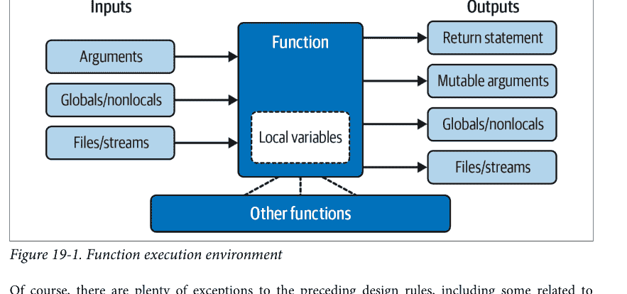

当然，前面的设计规则有很多例外，包括一些与Python的面向对象支持相关的例外。正如你将在第六部分看到的，Python类*依赖*于更改传入的可变对象——类函数设置一个名为`self`的自动传入参数的属性，以更改每个对象的状态信息（例如，`self.edition=6`）。此外，如果不使用类，全局变量是模块中函数在调用之间保留单份状态的直接方式。副作用通常只有在意外时才是危险的。

但总的来说，你应该努力最小化函数和其他程序组件中的外部依赖。一个函数越*自包含*，就越容易理解、重用和修改。当函数通过递归进入多层时，使代码尽可能独立尤其重要，如下一节所述。

## 递归函数

我们在第9章讨论核心类型的比较时提到了递归。在第17章开头讨论作用域规则时，我们也简要提到Python支持*递归函数*——直接或间接调用自身以实现循环的函数。在本节中，我们将探讨这在函数代码中是什么样子。

递归是一个相对高级的主题，在Python中相对少见，部分原因是Python的过程式工具箱包括更简单的循环工具。尽管如此，它是一项有用的技术，因为它允许程序遍历具有任意和不可预测形状及深度的结构——例如规划旅行路线、分析语言和爬取网络链接。递归甚至可以作为简单循环和迭代的替代方案，尽管不一定是最简单或最高效的。

## 使用递归求和

让我们转向一些例子。要对一个数字列表（或其他序列）求和，我们可以使用内置的sum函数，或者编写一个更自定义的版本。示例19-1展示了使用递归编码时，自定义求和函数可能的样子。

```
示例 19-1. mysum.py

def mysum(L):
    if not L:
        return 0
    else:
        return L[0] + mysum(L[1:])    # 递归调用自身
```

要使用，要么在此文件底部添加自测试代码并作为脚本运行，要么将其作为模块导入并在REPL中测试（同样，根据第3章，无论哪种方式，文件可能需要放在你工作的文件夹中）。使用后者：

```
>>> from mysum import mysum          # 在REPL中将文件作为模块导入
>>> mysum([1, 2, 3, 4, 5])           # 对任何序列中的所有数字求和
15
```

在每一层，这个函数递归调用自身来计算列表*其余部分*的和，然后将其加到*前面*的项上。当列表变空时，这个递归循环结束并返回零。像这样使用递归时，函数的每个打开调用层在运行时调用栈上都有自己函数的局部作用域副本。在这里，这意味着L在每一层都不同，因此每一层都记住自己的列表段。

如果这很难理解（对于新程序员来说通常如此），尝试在函数中添加一个L的打印并再次运行，以跟踪每个调用层的当前列表；这里是在REPL中粘贴所需的修改，以增加多样性：```python
def mysum(L):
    print(L)                    # 跟踪递归层级
    if not L:                   # L在每一层都变短
        return 0
    else:
        return L[0] + mysum(L[1:])

>>> mysum([1, 2, 3, 4, 5])
[1, 2, 3, 4, 5]
[2, 3, 4, 5]
[3, 4, 5]
[4, 5]
[5]
[]
15
```

如你所见，待求和的列表在每个递归层级都会变小，直到变为空列表——这便是递归循环的终止条件。然后，在递归调用返回的过程中，计算出总和。

## 编码替代方案

有趣的是，我们可以使用 Python 的 if/else 三元表达式（在第 12 章中描述）来节省一些代码空间。我们还可以将其泛化为任何可求和的类型（如果我们假设输入至少包含一个元素，这会更容易），并使用扩展解包赋值来简化首部/剩余部分的解包（如第 11 章所述）。示例 19-2 汇集了这三种修改，可以直接在文件中运行或粘贴到 REPL 中。

示例 19-2. mysum_alts.py

```python
def mysum(L):
    return 0 if not L else L[0] + mysum(L[1:])    # 使用三元表达式

def mysum(L):
    return L[0] if len(L) == 1 else L[0] + mysum(L[1:])  # 任何类型，假设至少有一个元素

def mysum(L):
    first, *rest = L
    return first if not rest else first + mysum(rest)    # 使用扩展解包
```

单独测试时，这三种替代方案处理数字求和的方式与原始版本相同：

```python
>>> mysum([1, 2, 3, 4, 5])
15
```

独特的是，后两种方案在处理空列表（例如 `mysum([])`）时会失败，但它们能处理任何支持 `+` 运算符的对象类型的序列，而不仅仅是数字（对于字符串，效果类似于 `''.join(L)`）：

```python
>>> mysum(('h', 'a', 'c', 'k'))    # 后两种方案在 mysum([]) 时失败
'hack'
>>> mysum(['hack', 'app', 'code'])  # 但它们支持非数字类型
'hackappcode'
```

你可以自己运行一些测试以获得更深入的理解。如果你研究这三种变体，你还会发现：

- 后两种方案可以处理单个字符串参数（例如 `mysum('hack')`），因为字符串是由单字符字符串组成的序列（尽管这个用例不太有用：你会得到相同的字符串）。
- 第三种变体还可以处理任意的*可迭代对象*，包括打开的输入文件（`mysum(open(name))`），但其他方案的索引通常在非序列上会失败（关于扩展解包的演示，请参见第 14 章）。

你可能还会注意到，第三种变体的解包赋值类似于函数头中的 `*` 收集器，因此很自然地想将其重写为那种形式。不过，这不太行得通，因为它期望的是*单独的*参数，而不是单个可迭代对象——除非我们*同时*对顶层输入和递归调用使用星号。以下是最终结果，尽管它通过对离散参数求和，解决了与之前版本和内置 `sum` 不同的问题：

```python
>>> def mysum(first, *rest):
...     return first if not rest else first + mysum(*rest)

>>> mysum(*[1, 2, 3, 4, 5])
15
>>> mysum(*'hack')
'hack'
```

最后，请记住，递归可以是*直接*的，如到目前为止的示例，也可以是*间接*的，如下所示——一个函数调用另一个函数，而后者又回调到其调用者。最终效果是相同的，尽管在每个层级上有两个函数调用而不是一个：

```python
>>> def mysum(L):
...     if not L: return 0
...     return nonempty(L)          # 调用一个调用我的函数

>>> def nonempty(L):
...     return L[0] + mysum(L[1:])  # 间接递归

>>> mysum([1.1, 2.2, 3.3, 4.4])
11.0
```

## 循环语句与递归

尽管递归在前面章节的示例中可以用于求和，但在这种情况下可能有些大材小用。事实上，Python 中递归的使用远不如在 Prolog 或 Lisp 等更晦涩的语言中频繁，因为 Python 强调更简单的过程式语句，如循环，这通常更自然。例如，`while` 循环通常使事情更具体，并且它不需要定义一个函数来允许递归调用：

```python
>>> L = [1, 2, 3, 4, 5]
>>> tot = 0
>>> while L:
...     tot += L[0]
...     L = L[1:]

>>> tot
15
```

更好的是，`for` 循环为我们自动迭代，这使得递归在许多情况下基本上是多余的（而且很可能在内存空间和执行时间方面效率更低）：

```python
>>> L = [1, 2, 3, 4, 5]
>>> tot = 0
>>> for x in L: tot += x

>>> tot
15
```

使用循环语句，我们不需要在调用栈上为每次迭代创建一个新的局部作用域副本，并且我们避免了与函数调用相关的速度成本。（请继续关注第 21 章的计时器案例研究，了解如何比较这些替代方案的执行时间。）

## 处理任意结构

另一方面，递归——或者我们即将探讨的等效的、显式的基于栈的算法——可能是*必需*的，用于遍历任意形状的结构。作为递归在此上下文中作用的一个简单示例，考虑计算嵌套子列表结构中所有数字之和的任务，如下所示：

```python
[1, [2, [3, 4], 5], 6, [7, 8]]          # 任意嵌套的子列表
```

我们之前的求和器和简单的循环语句在这里都不起作用，因为这不是线性迭代。嵌套循环语句也不够——因为子列表可能嵌套到任意*深度*和任意*形状*，无法知道要编写多少个嵌套循环来处理所有情况。相反，示例 19-3 中的函数通过使用递归在过程中访问子列表来适应这种通用嵌套。

示例 19-3. sumtree.py

```python
def sumtree(L, trace=False):
    tot = 0
    for x in L:                          # 对于这一层级的每个项目
        if not isinstance(x, list):
            tot += x                     # 直接添加数字
            if trace: print(x, end=', ')
        else:
            tot += sumtree(x, trace)     # 对子列表进行递归
    return tot
```

在这个文件的函数中，每个递归层级运行一个 `for` 循环来添加数字，或者递归进入子列表以打开新的层级。回顾第 9 章，`isinstance` 比较对象类型；这里用它来检测嵌套的子列表。

这段代码还被设置为跟踪添加到总和中的项目：如果 `trace` 传递一个真值，你可以看到对象是如何从左到右被扫描的。然而，由于它还通过递归逐步深入子列表，因此遍历实际上是水平和垂直的：

```python
>>> from sumtree import sumtree
>>> sumtree([1, [2, [3, 4], 5], 6, [7, 8]])
36
>>> sumtree([1, [2, [3, 4], 5], 6, [7, 8]], trace=True)
1, 2, 3, 4, 5, 6, 7, 8, 36
```

## 使用单独的脚本进行测试

此时，我们可以通过交互式输入或在文件底部添加代码来测试其他情况，但你可能开始觉得这有点局限。相反，示例 19-4 中的脚本使这个过程自动化且易于重复。作为额外好处，它也可以用于我们稍后将编写的其他求和器。

示例 19-4. sumtree_tester.py

```python
tests = (
    [1, [2, [3, 4], 5], 6, [7, 8]],       # 混合嵌套 => 36
    [1, [2, [3, [4, [5]]]]],               # 右重嵌套 => 15
    [[[[[1], 2], 3], 4], 5])               # 左重嵌套 => 15

def tester(sumtree, trace=True):
    for test in tests:
        print(sumtree(test, trace))
```

要使用这个测试器，只需导入求和器和测试器，并将前者传递给后者。运行时，我们的求和器会打印添加的数字，并在最后显示三个预设测试的最终总和：

```python
>>> from sumtree import sumtree          # 获取求和器
>>> from sumtree_tester import tester      # 获取测试器
>>> tester(sumtree)                        # 在求和器上运行测试器
1, 2, 3, 4, 5, 6, 7, 8, 36
1, 2, 3, 4, 5, 15
1, 2, 3, 4, 5, 15
```

在 `tester` 内部，`sumtree` 指的是传递给它的求和器函数。再次强调，由于函数是对象，以这种方式传递它们是自然的，并且使代码灵活。

## 递归与队列和栈

有时，帮助递归新手理解的是，在内部，Python 通过在每次递归调用时将信息推送到*调用栈*上来实现递归，因此它记得必须返回并稍后继续的位置。事实上，通常可以通过使用你自己的显式栈或队列来跟踪剩余步骤，从而*无需*递归调用即可实现递归风格的过程。

例如，示例 19-5 计算与前面示例相同的总和，但使用一个显式的列表来安排何时访问主题中的项目，而不是发出递归调用。列表前端的项目始终是下一个要处理和求和的项目。

示例 19-5. sumtree_queue.py

```python
def sumtree(L, trace=False):              # 广度优先，显式队列
    tot = 0
    items = list(L)                        # 从顶层的副本开始
    while items:
        front = items.pop(0)               # 获取/删除前端项目
        if not isinstance(front, list):
            tot += front                   # 直接添加数字
            if trace: print(front, end=', ')
        else:
            items.extend(front)            # <== 将嵌套列表中的所有内容追加到末尾
    return tot
```

从技术上讲，这段代码以*广度优先*的方式（先横向后纵向）遍历列表，因为它将嵌套列表的内容添加到列表的*末尾*——形成一个 FIFO（先进先出）*队列*。最终效果是按水平层级求和。要测试，我们可以直接导入并使用新的求和器，或者将其路由到示例 19-4 的测试器，以便自动进行带跟踪的测试：

## 循环、路径与栈限制

目前这些程序作为演示已经足够，但更大型的递归应用有时可能需要比这里展示的更多基础设施：它们可能需要避免循环或重复、记录已走路径以供后续使用，并在使用递归调用而非显式队列或栈时扩展栈空间。

例如，本节中的递归调用示例和显式队列/栈示例都没有处理避免*循环*——即访问已访问过的位置。这里不需要这样做，因为我们遍历的是严格的列表对象层次树。但如果数据可能是循环图，这两种方案都会失败：递归调用方案会陷入无限递归循环（并可能耗尽调用栈空间），而其他方案则会陷入简单的无限循环，不断将相同项目重新添加到列表中（并且可能耗尽也可能不耗尽通用内存）。事实上，使用我们在第3章末尾练习中遇到的奇怪代码创建一个循环对象，很容易演示其危害：

```python
>>> L = [1, 2]
>>> L.append(L)    # 创建一个循环对象：L引用自身
>>> L
[1, 2, [...]]

>>> from sumtree import sumtree
>>> sumtree(L)
RecursionError: maximum recursion depth exceeded

>>> from sumtree_queue import sumtree
>>> sumtree(L)
...挂起或崩溃，栈方案同理...
```

有些程序还需要避免对已到达多次的状态进行重复处理，即使这不会导致循环。为了做得更好，递归调用遍历可能会创建并传递一个可变的集合、字典或已访问状态列表，并在过程中检查重复。我们将在本书后续的递归示例中使用这种方案：

```python
if state not in visited:
    visited.add(state)    # x.add(state), x[state]=True, 或 x.append(state)
    ...继续处理...
```

非递归替代方案可能类似地使用如下代码避免添加已访问的状态。微妙的是，对象循环可能需要使用 `is`（而非 `in`），并且仅检查项目列表上已有的重复项可以避免调度同一状态两次，但无法防止重新访问之前已访问过并因此从该列表中移除的状态：

```python
visited.add(front)
...继续处理...
items.extend([x for x in front if x not in visited])
```

这个模型并不完全适用于本节中简单地对列表中的数字求和的用例，但其他应用通常能够识别重复状态——例如，之前访问过的网页的URL。事实上，我们将在下一节列出的后续示例中使用此类技术来避免循环和重复。

有些程序可能还需要记录每个已跟踪状态的完整*路径*，以便在完成时报告解决方案。在这种情况下，非递归方案的栈或队列中的每个项目可能是一个完整的路径列表，该列表足以作为已访问状态的记录，并在任一端包含下一个要探索的项目。

另请注意，标准Python限制其运行时调用栈的*深度*——这对递归调用程序至关重要——以捕获无限递归错误。要为更深入的遍历扩展它，请使用sys模块：

```python
>>> sys.getrecursionlimit()       # 默认1000层调用深度
1000
>>> sys.setrecursionlimit(10000)  # 允许更深的嵌套
>>> help(sys.setrecursionlimit)   # 阅读更多相关信息
```

允许的最大设置可能因平台而异。对于使用栈或队列以避免递归调用并获得对遍历过程更多控制的程序，不需要这样做（尽管它们也不会捕获无限循环）。

## 更多递归示例

尽管本节的示例是人为的，但它代表了一大类程序；例如，继承树和模块导入链可能表现出类似的通用结构，而计算工具如排列可能需要任意多的嵌套循环。事实上，我们将在本书后续的此类角色中再次使用递归：

- 在第20章的 *permute.py* 中，用于打乱任意序列
- 在第25章的 *reloadall.py* 中，用于遍历导入链
- 在第29章的 *classtree.py* 中，用于遍历类继承树
- 在第31章的 *lister.py* 中，再次用于遍历类继承树
- 在附录B“本部分练习解答”中：倒计时和阶乘

其中第二和第三个示例还将检测已访问的状态以避免循环和重复。尽管基于简单性和效率，线性迭代通常应优先使用简单循环而非递归，但你会发现递归在诸如这些后续示例中的场景中至关重要。

此外，你有时需要意识到程序中*意外*递归的可能性。正如你将在本书后面看到的，类中的一些运算符重载方法，如 `__setattr__`、`__getattribute__` 甚至 `__repr__`，如果使用不当，都有可能递归循环。递归是一个强大的工具，但最好是在理解并预期的情况下使用！

## 函数工具：属性、注解等

让我们继续讨论一类对某些地球人来说可能不如递归那么虚无缥缈的工具。正如我们在本书这部分所看到的，Python中的函数远不止是编译器的代码生成规范——它们是完整的*对象*，存储在它们自己的内存片段中。因此，它们可以自由地在程序中传递并被间接调用。它们还支持与调用几乎无关的操作，包括属性和注解。我们之前已经介绍过其中一些主题，但本节提供了扩展内容。

## 一等对象模型

由于 Python 函数是对象，你可以编写通用程序来处理它们。函数对象可以被重新赋值给其他名称、传递给其他函数、嵌入数据结构、从一个函数返回到另一个函数等等，就像处理简单的数字或字符串一样。函数对象恰好支持一种特殊操作——可以通过在括号中列出参数来*调用*它们——但它们与其他对象属于同一通用类别。

正如我们所见，这通常被称为*一等对象模型*；它在 Python 中无处不在，也是*函数式编程*的必要组成部分。我们将在本章和下一章更全面地探讨这种编程模式；因为其主题基于应用函数的概念，它将函数视为一种数据。

我们在前面的示例中已经探讨了函数的一些通用用例，但快速回顾有助于强调该模型。例如，`def` 语句中使用的名称并没有什么特别之处：它只是在当前作用域中分配的一个变量，就像它出现在 `=` 号的左侧一样。因为函数名在 `def` 运行后只是对对象的引用，所以你可以自由地将该对象*重新赋值*给其他名称，并通过任何引用来调用它：

```
>>> def exclaim(message):
        print(message + '!')

>>> exclaim('Direct call')
Direct call!

>>> x = exclaim
>>> x('Indirect call')
Indirect call!
```

并且由于参数是通过赋值对象来传递的，将函数作为参数*传递*给其他函数也同样容易。被调用者随后只需在括号中添加参数即可调用传入的函数（有关此模式的另一个示例，请参见前面的示例 19-4 中的求和测试器）：

```
>>> def generic(func, arg):
        func(arg)

>>> generic(exclaim, 'Argument call')
Argument call!
```

你甚至可以将函数对象塞入数据结构中，就像它们是整数或字符串一样。例如，下面的代码将函数*嵌入*到元组列表中两次，作为一种动作表。因为像这样的 Python 复合类型可以包含任何类型的对象，所以这里也没有特殊情况（示例 18-2 使用了类似的代码）：

```
>>> schedule = [ (exclaim, 'Hack'), (exclaim, 'Code') ]
>>> for (func, arg) in schedule:
        func(arg)

Hack!
Code!
```

这段代码只是遍历 *schedule* 列表，每次循环时使用一个参数调用 *exclaim* 函数。正如我们在第 17 章的示例中所看到的，函数也可以被创建并*返回*以供其他地方使用——在此模式下创建的*闭包*也会保留来自外围作用域的状态：

```
>>> def implore(verb):          # 创建一个函数但不调用它
        def exclaim(noun):
            print(f'{verb} {noun}!')
        return exclaim

>>> I = implore('Hack')          # 外围作用域中的标签被保留
>>> I('Code')                    # 调用该函数并返回
Hack Code!
>>> I('App')
Hack App!
```

Python 的一等对象模型和缺乏类型约束使其成为一种非常灵活的编程语言。

## 函数内省

事实上，函数比你想象的更灵活。因为它们是对象，我们也可以使用普通的对象工具来处理函数。例如，到目前为止我们知道，一旦我们创建了一个函数，我们就可以像往常一样调用它：

```
>>> def func(a):
        b = 'Hack'
        return b * a

>>> func(8)
'HackHackHackHackHackHackHackHack'
```

但调用表达式只是为函数对象定义的一组操作之一。例如，我们也可以通用地检查它们的属性：

```
>>> func.__name__
'func'
>>> dir(func)
['__annotations__', '__builtins__', '__call__', '__class__', '__closure__',
...更多省略：共 38 个...
'__setattr__', '__sizeof__', '__str__', '__subclasshook__', '__type_params__']
```

内省——内部访问——像这样的工具允许我们探索实现细节。例如，函数附有*代码对象*，这些对象提供了诸如函数的局部变量和参数等方面的详细信息：

```
>>> func.__code__
<code object func at 0x103ef3910, file "<stdin>", line 1>

>>> dir(func.__code__)
['__class__', '__delattr__', '__dir__', '__doc__', '__eq__', '__format__', '__ge__',
...更多省略：共 48 个...
'co_posonlyargcount', 'co_qualname', 'co_stacksize', 'co_varnames', 'replace']

>>> func.__code__.co_varnames
('a', 'b')
>>> func.__code__.co_argcount
1
```

工具编写者可以利用这些信息来管理函数——事实上，我们将在第 39 章中这样做，以使用前面介绍的装饰器来实现函数参数的验证。无论你是编写还是使用此类工具，对象内省都能增强函数的实用性。

## 函数属性

函数对象也不限于上一节中系统定义的属性：也可以将任意*用户定义*的属性附加到它们上面。这个主题在第 17 章中已经介绍过，但本节将通过额外的上下文和示例对其进行扩展。像往常一样，在 Python 中，函数属性是通过简单赋值创建的：

```
>>> def func(): pass
>>> func
<function func at 0x1043771a0>
>>> func.count = 0
>>> func.count += 1
>>> func.count
1
>>> func.handles = 'Button-Press'
>>> func.handles
'Button-Press'
>>> dir(func)
...大多数双下划线名称已省略...
['__str__', '__subclasshook__', '__type_params__', 'count', 'handles']
```

Python 自身存储在函数上的实现相关数据遵循命名约定，以防止它们与你可能自己分配的更任意的属性名称冲突。具体来说，所有函数内部的名称都有前导和尾随双下划线（"__X__"）：

```
>>> len(dir(func))
40
>>> [x for x in dir(func) if not x.startswith('__')]
['count', 'handles']
```

如果你小心不要以与 Python 相同的方式命名属性，你就可以安全地使用函数的命名空间，就像它是你自己的命名空间或作用域一样。当然，所有这些对于用 `lambda` 创建的函数也同样适用：

```
>>> F = lambda: None
>>> len(dir(F))
38
>>> F.book = 'LP6E'
>>> F.book
'LP6E'
```

如第 17 章所述，此类属性可用于直接将*状态信息*附加到函数对象上，而不是使用其他技术，如全局变量、非局部变量和类。与非局部变量不同，即使在函数代码外部，只要函数本身在的地方，这些属性都可以访问。

从某种意义上说，这也是一种模拟其他语言中“静态局部变量”的方式——变量名是函数局部的，但其值在函数退出后仍然保留。属性与对象相关联，而不是与作用域相关联（并且必须在其代码中通过函数名引用），但最终效果是相似的。

此外，正如第 17 章所探讨的，当属性附加到由其他*工厂*函数生成的函数时，它们还支持多个副本、可写和*每次调用*的状态保留，作为闭包和类实例属性的替代方案。这使得函数属性成为一个广泛有用的工具——就像下一节的主题一样。

## 函数注解和装饰

对于工具角色，函数还支持附加的*注解*——关于函数参数和结果的任意用户定义信息，用于增强函数。Python 提供了编写注解的语法，但它本身并不对注解做任何处理——注解是完全可选的，不会以任何方式影响函数行为，当存在时，它们只是附加到函数对象的 `__annotations__` 属性上，供其他工具使用。

虽然大多数应用程序程序员对此并不普遍感兴趣，但第三方工具和库可能会在增强错误检查或 API 指令的上下文中使用注解。第 6 章讨论的类型提示也基于注解，但它是可选的且未被使用，并且不排除注解在当今的其他角色（更多内容将在后面介绍）。

我们在前一章研究了函数定义中参数的正式规则。注解不会修改这些规则，而只是扩展其语法，允许将额外的表达式与命名参数和函数结果相关联。考虑以下未注解的函数，它使用三个参数和一个返回结果编写：

```
>>> def func(a, b, c):
        return a + b + c

>>> func(1, 2, 3)
6
```

从语法上讲，函数注解仅在 `def` 头行中编码，作为与参数和返回值相关联的任意表达式。对于参数，它们出现在参数名称后紧跟的冒号之后；对于返回值，它们写在参数列表右括号后的 `->` 之后。例如，以下代码注解了前面函数的所有三个参数及其返回值：

```
>>> def func(a: 'hack', b: (1, 10), c: float) -> int:
        return a + b + c

>>> func(1, 2, 3)
6
```

对注解函数的调用照常进行，但当存在注解时，Python 会将它们收集到一个*字典*中，并将其作为 `__annotations__` 附加到函数对象本身。其中，参数名称成为键；如果编码了返回值注解，则存储在键 `return` 下（这足够了，因为此保留字不能用作参数名称）；并且注解键的值被分配给注解表达式的结果：

```
>>> func.__annotations__
{'a': 'hack', 'b': (1, 10), 'c': <class 'float'>, 'return': <class 'int'>}
```

因为它们只是附加到 Python 对象上的 Python 对象，所以注解很容易处理。以下仅注解了三个参数中的两个，并通用地遍历附加的注解：

```
>>> def func(a: 'python', b, c: 3.12):
        return a + b + c

>>> func(1, 2, 3)
6
>>> func.__annotations__
{'a': 'python', 'c': 3.12}

>>> for arg in func.__annotations__:
```

print(arg, '=>', func.__annotations__[arg])

```
a => python
c => 3.12
```

这里有两点需要注意。首先，即使你编写了注解，仍然可以为参数使用*默认值*——注解（及其 `:` 字符）出现在默认值（及其 `=` 字符）*之前*。例如，下面的 `a: 'hack' = 4` 表示参数 `a` 的默认值为 4，并带有字符串 'hack' 的注解：

```python
>>> def func(a: 'hack' = 4, b: (1, 10) = 5, c: float = 6) -> int:
    return a + b + c

>>> func(1, 2, 3)            # 未使用默认值
6
>>> func()                   # a=4 + b=5 + c=6 (全部使用默认值)
15
>>> func(1, c=10)            # 1 + b=5 + 10 (关键字参数正常工作)
16
>>> func.__annotations__
{'a': 'hack', 'b': (1, 10), 'c': <class 'float'>, 'return': <class 'int'>}
```

其次，请注意上例中的*空格*都是可选的——你可以在函数头中的各部分之间使用空格，也可以不使用，但省略它们可能会降低代码对某些观察者的可读性（也可能对另一些人来说提高了可读性）：

```python
>>> def func(a:'hack'=4, b:(1,10)=5, c:float=6)->int:
    return a + b + c

>>> func(1, 2)               # 1 + 2 + c=6
9
>>> func.__annotations__
{'a': 'hack', 'b': (1, 10), 'c': <class 'float'>, 'return': <class 'int'>}
```

虽然注解是可选的且不常见，但它们可用于指定类型或值的约束，而更大的 API 可能会使用此功能来注册函数接口信息。事实上，你将在第 39 章看到一个潜在的应用，届时我们将把注解编码为*函数装饰器参数*的替代方案——这是一个更通用的概念，其中增强信息编码在函数头*之外*，因此不限于单一角色。

## 函数装饰器替代方案：预览

由于我们将用一整章来讨论装饰器，这里将省略大部分内容。但作为非常简短的预览，装饰器只是用于增强其他函数的函数。它们通过 `@` 前缀应用于另一个函数的 `def`，该前缀将另一个函数的名称重新绑定到将其传递给装饰器的结果。此语法：

```python
@decorator
def func(args): ...        # 被装饰的函数定义
```

会自动转换为以下等效形式，其中 `decorator` 是一个单参数可调用对象（或返回一个的表达式），它返回一个可调用对象，其参数与 `func` 兼容（或就是 `func` 本身）：

```python
def func(args): ...
func = decorator(func)     # 将 func 重新绑定到装饰器的结果
```

装饰器可以利用这个钩子将另一个函数包装在额外的代码层中，以实现几乎任意的目的，如下面的代码在调用被装饰函数时添加一条消息：

```python
def echo(F):
    def proxy(*args):
        print('calling', F.__name__)  # 在此处添加操作
        return F(*args)               # 运行被装饰函数
    return proxy

@echo
def func(x, y):                       # 重新绑定 func = echo(func)
    print('I am running...', x, y)    # func 由代理闭包运行

>>> func(1, 2)                        # 运行代理，代理运行 func
calling func
I am running... 1 2
```

正如你稍后将了解到的，装饰器也可以接受*参数*（例如 `@echo(args)`），其用途可能与注解重叠——参数信息可以发送给装饰器，而不是作为注解嵌入在函数头中。由于这是一个高级工具，也可以应用于类，我们将暂停此线索，直到第 32 章和第 39 章。

然而，与注解相比，装饰器不会用额外的语法使函数头本身复杂化，并且更自然地支持多个角色。注解可能使函数难以阅读，并且通常只能有一个角色——在选择使用它的程序中，这个角色会被第 6 章的可选*类型提示*所劫持。

事实上，类型提示的倡导者曾试图弃用注解的所有其他角色。虽然这些分裂性（甚至可能粗鲁的）努力迄今幸运地失败了，但装饰器没有面临这样的挑战，并且在未来可能是一个更安全的选择。然而，今天，注解和装饰器都是工具，其角色仅受你的想象力限制。

最后，请注意注解和装饰器在 `def` 语句中有效——但在 `lambda` 表达式中无效，其语法设计限制了它们可以定义的函数。巧合的是，这把我们带到了这个杂烩的下一个主题。

## 匿名函数：lambda

我们早在第 16 章就首次遇到了 `lambda` 表达式，并且从那时起在一些示例中使用了它。本节回顾基础知识并进行更深入的第二次审视，以巩固和扩展这个主题。

正如我们所看到的，除了 `def` 语句，Python 还提供了一个创建函数对象的表达式。由于它类似于其他语言中的一个工具，因此被称为 `lambda`。与 `def` 一样，此表达式创建一个稍后调用的函数，但它返回函数而不是将其分配给一个名称。这就是为什么 lambda 有时被称为*匿名*函数。在实践中，它们用于*内联*函数定义，或*延迟*代码执行。

> **名字里有什么？**：`lambda` 往往会吓到人们，这主要是由于“lambda”这个名字本身——这个名字来自 Lisp 语言，而 Lisp 又从 lambda 演算中获得了它，lambda 演算是符号逻辑的一种形式。尽管有晦涩的数学渊源，但 Python 中的 `lambda` 实际上只是一个在语法上引入表达式的词，其表达式只是编写函数的另一种方式——尽管没有语句、装饰器或注解。


## lambda 基础

作为复习，`lambda` 的一般形式是关键字 `lambda`，后跟零个或多个参数（就像你在 `def` 头中用括号括起来的参数一样，没有注解），后跟冒号后的一个表达式：

```
lambda argument1, argument2,... argumentN : expression-using-arguments
```

`lambda` 参数周围不允许使用括号，整个 `lambda` 周围的括号通常是可选的，尽管在某些上下文中是必需的，并且在其他上下文中可能提高清晰度。`lambda` 返回的函数与 `def` 分配的函数工作方式相同，但 `lambda` 的不同之处使其在特定角色中很有用：

- **`lambda` 是一个表达式，而不是一个语句。** 因此，`lambda` 可以出现在 Python 语法不允许 `def` 出现的地方——例如，在列表字面量或函数调用的参数中。使用 `def`，函数可以在这些位置通过名称引用，但必须在其他地方创建。作为一个表达式，`lambda` 返回一个值（一个新函数），该值可以分配给一个名称，或在 `lambda` 出现的地方使用。
- **`lambda` 的主体是一个表达式，而不是一个语句块。** `lambda` 的主体类似于你会放在 `def` 主体的 `return` 语句中的内容；你只需将结果作为裸表达式输入，而不是显式返回它。由于它仅限于一个表达式，因此 `lambda` 不如 `def` 通用——你只能在 `lambda` 主体中挤入有限的逻辑，而没有完整的语句。这是设计上的，以限制程序嵌套：`lambda` 旨在编码简单函数，而 `def` 处理更大的任务。

除了这些区别，`def` 和 `lambda` 做的是同一种工作。例如，到目前为止，我们应该已经精通使用 `def` 语句创建函数：

```python
>>> def func(x, y, z): return x + y + z
>>> func(2, 3, 4)
9
```

但我们可以通过将 `lambda` 表达式的结果显式分配给一个名称来实现相同的效果，通过该名称你稍后可以调用这个原本匿名的函数：

```python
>>> func = lambda x, y, z: x + y + z
>>> func(2, 3, 4)
9
```

在这里，`func` 被手动分配给 `lambda` 表达式创建的函数对象；`def` 也是这样工作的，但它的分配是自动的。默认值和其他参数匹配语法在 `lambda` 中也有效，就像在 `def` 中一样：

```python
>>> x = (lambda a='hack', b='python', c='code': a + b + c)
>>> x('write')
'writepythoncode'
```

`lambda` 主体中的代码也遵循与 `def` 内部代码相同的作用域查找规则。`lambda` 表达式引入一个新的局部作用域，非常类似于嵌套的 `def`，它自动看到封闭函数、模块和内置作用域中的名称——通过我们在第 17 章学习的 LEGB 规则：

## 为何使用 lambda？

一般来说，lambda 是一种函数*简写*形式，允许你将函数定义嵌入到使用它的代码中。这完全是可选的——你始终可以使用 def 来代替，并且*应该*在你的函数需要 lambda 表达式无法提供的完整语句功能时使用 def。但在你只需要在稍后使用的地方内联嵌入一小段可执行代码的场景中，lambda 可能更容易使用。

例如，你稍后会看到，回调处理程序经常被编码为内联 lambda 表达式，直接嵌入在注册调用的参数列表中，而不是在文件的其他地方用 def 定义并通过名称引用（参见侧边栏“为何你会关心：lambda 回调”第 480 页的示例）。

lambda 也常用于编码*跳转表*，即按需执行的操作列表或字典。例如：

```python
L = [lambda x: x * 2,              # Inline function definition
    lambda x: x ** 2,
    lambda x: x // 2]              # A list of three callable functions

for f in L:
    print(f(5))                     # Prints 10, 25, and 2

print(L[1](5))                     # Prints 25
```

当你需要将小段可执行代码塞入像 def 这样的语句不允许的地方时，lambda 表达式非常适用。例如，前面的代码片段通过将 lambda 表达式嵌入列表字面量中，构建了一个包含三个函数的列表；def 无法在这样的字面量中使用，因为它是一个语句，而不是表达式。等效的 def 编码需要临时函数名（可能与其他名称冲突）以及在预期使用上下文之外的函数定义（可能相隔数百行）：

```python
def f1(x): return x * 2
def f2(x): return x ** 2          # Define named functions
def f3(x): return x // 4          # Separate from their place of use

L = [f1, f2, f3]                   # Reference by name

for f in L:
    print(f(2))                    # Also prints 10, 25, and 2
```

## 多路分支：最终章

事实上，你可以使用 Python 中的字典和其他数据结构做类似的事情，以构建更通用的操作表。这里有一个在交互式提示符下说明的另一个示例：

```python
>>> key = 'loop'
>>> {'hack': lambda s: s.upper(),
    'code': lambda s: s.lower(),
    'loop': lambda s: f'{s * 4}!'}[key]('Py')
'PyPyPyPy!'
```

这里，当 Python 创建临时字典时，每个嵌套的 lambda 都会生成并留下一个稍后调用的函数。通过键索引获取其中一个函数，括号强制调用获取的函数。以这种方式编码时，字典成为比本书在第 12 章关于 if 语句的介绍中所能完全揭示的更通用的多路分支工具。

要不使用 lambda 实现这一点，你需要在文件中的其他地方（在函数要使用的字典之外）编写三个 def 语句，并通过名称引用这些函数：

```python
>>> def f1(s): return s.upper()
>>> def f2(s): return s.lower()
>>> def f3(s): return f'{s * 4}!'

>>> key = 'loop'
>>> {'hack': f1, 'code': f2, 'loop': f3}[key]('Py')
'PyPyPyPy!'
```

这也可以工作，但你的 def 可能位于文件中任意远的地方，即使它们只是小段代码。lambda 提供的代码邻近性对于只会在单个上下文中使用的函数特别有用——如果这里的三个函数在其他地方没有用处，那么将它们的定义作为 lambda 嵌入字典中是有意义的。此外，def 形式要求你为这些小函数起名，这同样可能与文件中的其他名称冲突（虽然不太可能，但总是有可能）。

你今天可以使用 match 语句获得类似的结果，但它可能需要比 def 方案更多的代码，特别是因为你必须将其嵌套在 def 中以支持像 s 这样的参数；更多信息请参见第 12 章。lambda 在函数调用参数列表中也很方便，可以作为内联临时函数定义的方式，这些定义在程序的其他地方不会使用；你将在本章后面学习 map 时看到此类其他用法的示例。

> eval 的诱惑：原则上，如果函数名称与其字符串查找键相同，你可以跳过前面代码中的分派表——一个 eval(key)(arg) 将启动调用。虽然在这种情况下确实如此并且有时有用，正如我们之前看到的（例如，第 10 章），eval 相对较慢（它必须编译和运行代码）且不安全（你必须信任字符串的来源）。更根本的是，跳转表通常被 Python 中的多态方法分派所涵盖：调用方法会根据调用主体的对象类型执行“正确”的操作，无需切换逻辑。要了解原因，请继续关注第 VI 部分。

## 如何（不）混淆你的 Python 代码

lambda 的主体必须是单个表达式（而不是一系列语句）这一事实，似乎对你可以塞入 lambda 的逻辑量施加了严重限制。然而，如果你知道自己在做什么，你可以将大多数 Python 语句编码为基于表达式的等效形式。

例如，如果你想从 *lambda* 函数的主体中*打印*，只需使用 `print` 或 `sys.stdout.write`（回想第 11 章，这就是 `print` 真正做的事情）。要执行*多个*操作，请编码一个序列，如元组，以从左到右求值嵌套的多个表达式（在此上下文中元组需要括号）：

```python
>>> series = lambda a, b: (print(a.upper()), print(b.lower()))    # > 1 actions
>>> ignore = series('Hack', 'Code')
HACK
code
```

类似地，要在 *lambda* 中嵌套逻辑，你可以使用第 12 章介绍的 if/else 三元表达式，或在那里描述的等效但更棘手的 and/or 组合。正如你之前学到的，以下语句：

```python
if a:
    b
else:
    c
```

可以通过以下任一等效表达式来模拟（第二个只是大致相同，但足够接近）：

```python
b if a else c
((a and b) or c)
```

因为像这样的表达式可以放在 *lambda* 内部，所以它们可用于在 *lambda* 函数中实现*选择*逻辑（这里的 *lambda* 加括号只是为了变化和主观清晰度）：

```python
>>> lower = (lambda x, y: x if x < y else y)    # Ifs in lambda: ternary
>>> lower('bb', 'aa')
'aa'
>>> lower('aa', 'bb')
'aa'
```

此外，如果你需要在 *lambda* 中执行*循环*，你也可以嵌入列表推导表达式和 map 调用等——这些是我们之前章节中遇到的工具，将在本章和下一章中重新讨论：

```python
>>> showall = lambda x: [print(y) for y in x]    # Loops in lambda: list comp
>>> t = showall(['lp5e', 'lp6e'])
lp5e
lp6e
>>> showall = lambda x: list(map(print, x))    # Loops in lambda: maps
>>> t = showall(('py3.3', 'py3.12'))
py3.3
py3.12
>>> showall = lambda x: print(*x, sep='', end='')    # Another option: *unpacking
```

虽然它受限于 *lambda* 创建的函数的局部作用域，但*赋值*在使用 `:=` 命名赋值表达式的 *lambda* 表达式中是有效（双关语）的：

```python
>>> namer = lambda x: (res := x + 1) + res    # Assignment in lambda: :=
>>> namer(2)
6
>>> res    # But it doesn't persist
NameError: name 'res' is not defined
```

用表达式模拟语句是有限制的：例如，你不能赋值非局部变量，尽管像 `setattr` 内置函数、命名空间的 `__dict__` 以及改变可变对象的方法等工具可以提供帮助。

就位的对象有时可以充当替代品——并能迅速将你带入表达式-卷积的黑暗核心。

但既然本书已向你展示了这些技巧，它也必须谦卑地恳求你仅在万不得已时才使用它们。若不加谨慎，它们可能产生难以阅读（即*混淆的*）Python代码，尽管该语言本身有着良好的设计意图。一般来说，简单优于复杂，明确优于隐晦，完整的语句优于晦涩的表达式。这就是为什么`lambda`被限制为只能包含表达式。如果你有更大的逻辑需要编码，请使用`def`；`lambda`适用于小段的内联代码。另一方面，你可能会发现这些技巧在适度使用时很有用。

## 作用域：lambda 也可以嵌套

关于`lambda`的最后一点说明：正如我们在第17章所见，`lambda`也是封闭函数作用域查找的主要受益者——即LEGB作用域规则中的*E*。回顾一下，在下面的例子中，`lambda`出现在一个`def`内部，这是其典型的编码方式，因此可以访问在封闭函数作用域中调用时名称`x`所具有的值：

```
>>> def action(x):
        return (lambda y: x + y)    # 创建函数，记住 x

>>> act = action(99)
>>> act(2)                          # 调用 action 返回的内容
101
```

在之前关于嵌套函数作用域的讨论中未说明的是，`lambda`也可以访问任何封闭`lambda`中的名称。这种情况有些晦涩，但想象一下如果我们用`lambda`重新编写之前的`def`：

```
>>> action = (lambda x: (lambda y: x + y))    # lambda 作用域也可以嵌套
>>> act = action(99)
>>> act(3)
102
>>> ((lambda x: (lambda y: x + y))(99))(4)    # 即使你不保存它们
103
```

这里，嵌套的`lambda`结构创建了一个在调用时创建函数的函数。在这两种情况下，嵌套`lambda`的代码都可以访问封闭`lambda`中的变量`x`。这可以工作，但代码看起来相当复杂；为了可读性，最好避免使用嵌套`lambda`。也许好消息是，`def`不能嵌套在`lambda`中：因为`lambda`的主体是一个表达式，像`def`这样的语句将无法工作——谢天谢地！

## 函数式编程工具

本章最后要介绍的是我们之前在本书中遇到的一类工具的回顾，并附上一些新技巧以完善这个主题。根据大多数定义，当今的Python融合了对多种编程范式的支持：*过程式*（使用其基本语句）、*面向对象*（使用其类）和*函数式*。

后一类别的标准有些宽松，但根据大多数衡量标准，Python的函数式编程工具箱包括我们之前遇到的*一等对象*模型、嵌套作用域*闭包*和匿名函数*lambda*；我们将在下一章详细展开的*生成器*和*推导式*；以及可能在此处预览但在本书最后部分详细阐述的函数和类*装饰器*。

这个工具箱还包括自动将其他函数应用于可迭代对象的内置函数——包括在可迭代对象的每个元素上调用其他函数的函数（map）；根据测试函数选择元素的函数（filter）；以及将函数应用于元素对和运行结果的函数（reduce）。让我们通过快速概览这三者来结束本章。

## 将函数映射到可迭代对象：map

程序对列表和其他序列最常做的事情之一是对每个元素应用一个操作并收集结果——例如在数据库表中选择列、增加公司员工的工资字段、解析电子邮件附件等。Python有多种工具使得这种集合范围的操作易于编码。例如，我们已经看到，使用for循环可以轻松更新列表中的所有计数器：

```
>>> counters = [1, 2, 3, 4]

>>> updated = []
>>> for x in counters:
        updated.append(x + 10)            # 每个元素加 10

>>> updated, counters
([11, 12, 13, 14], [1, 2, 3, 4])
```

但因为这是一个非常常见的操作，Python也提供了内置函数来为你完成大部分工作。其中，map函数将传入的函数应用于可迭代对象中的每个元素，并返回一个包含所有函数调用结果的列表。例如，假设counters保持不变：

```
>>> def inc(x): return x + 10        # 要运行的函数

>>> list(map(inc, counters))          # 收集调用结果
[11, 12, 13, 14]
```

我们在第13章和第14章简要遇到过map，作为一种将内置函数应用于可迭代对象中元素的方式。在这里，我们通过传入一个用户定义的函数来更一般地使用它，该函数将应用于列表中的每个元素——map在每个列表元素上调用我们的inc，并将所有返回值收集到一个新列表中。记住，map是一个非序列可迭代对象，因此需要使用list调用来强制它产生所有结果以供显示（根据第14章的内容）。

因为map期望传入并应用一个函数，它也恰好是lambda常见的出现位置之一：

```
>>> list(map((lambda x: x + 3), counters))    # 函数表达式
[4, 5, 6, 7]
```

这里，函数将counters列表中的每个元素加3；由于这个小函数在其他地方不需要，所以它被内联写成一个lambda。因为map的这种用法等同于for循环，只需一点额外的代码，你总是可以自己编写一个通用的映射工具：

```
>>> def mymap(func, iter):
        res = []
        for x in iter: res.append(func(x))
        return res
```

假设函数inc仍然如之前所示，我们可以使用内置函数或我们的等效函数将其映射到一个序列（或其他可迭代对象）上：

```
>>> list(map(inc, [1, 2, 3]))
[11, 12, 13]
>>> mymap(inc, [1, 2, 3])
[11, 12, 13]
```

然而，由于map是一个内置函数，它总是可用的，总是以相同的方式工作，并且可能具有性能优势（正如我们将在第21章证明的，在某些使用模式下，它比手动编码的for循环更快）。此外，map可以比这里展示的方式更高级地使用。例如，给定多个序列参数，它会将从序列中并行取出的元素作为不同的参数发送给函数：

```
>>> pow(3, 4)
81
>>> list(map(pow, [1, 2, 3], [2, 3, 4]))
[1, 8, 81]
```

对于多个序列，map期望一个N参数函数用于N个序列。这里，pow函数在每次调用时接受两个参数——一个来自传递给map的每个序列。在代码中模拟这种多序列通用性也不需要太多额外工作，但我们将推迟到下一章稍后，在探索了一些额外的迭代工具之后（提示：最好按需生成元素，就像内置函数那样）。

map调用也类似于我们在第14章学习并在下一章从函数式角度重新审视的列表推导式：

```
>>> list(map(inc, [1, 2, 3, 4]))
[11, 12, 13, 14]
>>> [inc(x) for x in [1, 2, 3, 4]]
[11, 12, 13, 14]
```

在某些情况下，map可能比列表推导式运行得更快，并且可能需要更少的代码。另一方面，因为map对每个元素应用的是函数调用而不是任意表达式，所以它是一个稍微不那么通用的工具，通常需要额外的辅助函数或lambda。此外，将推导式包装在圆括号而不是方括号中会创建一个按需生成值以节省内存并提高响应性的对象，这与map类似——我们将在下一章讨论这个主题。

## 在可迭代对象中选择元素：filter

map函数是Python函数式编程工具集的一个主要且相对直接的代表。它的近亲filter和reduce分别根据测试函数选择可迭代对象的元素，并将函数应用于元素对。

因为filter也返回一个可迭代对象，所以它（像range一样）需要一个list调用来在REPL中显示所有结果。例如，以下filter调用挑选出序列中大于零的元素：

```
>>> list(range(-5, 5))
[-5, -4, -3, -2, -1, 0, 1, 2, 3, 4]
>>> list(filter((lambda x: x > 0), range(-5, 5)))
[1, 2, 3, 4]
```

我们之前在第308页的侧边栏“为什么你会关心：布尔值”以及在第14章探索可迭代对象时简要遇到过filter。序列或可迭代对象中函数返回真值结果的元素会被添加到结果列表中。与map类似，这个函数大致等同于一个for循环，但它是内置的、简洁的，并且通常很快：

## 在可迭代对象中组合元素：reduce

函数式 `reduce` 调用——曾经是内置函数，现在是 `functools` 标准库模块的成员——更为复杂。它接受一个可迭代对象进行处理，但其本身并非可迭代对象：它返回一个聚合可迭代对象各项的单一结果。为演示，这里有两个 `reduce` 调用，分别计算列表中各项的和与积：

```
>>> from functools import reduce
>>> reduce((lambda x, y: x + y), [1, 2, 3, 4])
10
>>> reduce((lambda x, y: x * y), [1, 2, 3, 4])
24
```

在每一步中，`reduce` 将当前的和或积，连同列表中的下一个项，传递给传入的 lambda 函数。默认情况下，序列中的第一项用于初始化起始值。为更具体地说明，以下是与第一个调用等价的 for 循环，其中加法操作被硬编码在循环内：

```
>>> L = [1, 2, 3, 4]
>>> res = L[0]
>>> for x in L[1:]:
        res += x

>>> res
10
```

事实上，编写自己的可重用且可定制的 `reduce` 版本也相当直接。以下函数模拟了内置函数的大部分行为，并有助于揭示其一般操作原理：

```
>>> def myreduce(function, sequence):
        tally = sequence[0]
        for next in sequence[1:]:
            tally = function(tally, next)
        return tally

>>> myreduce((lambda x, y: x + y), [1, 2, 3, 4])
10
>>> myreduce((lambda x, y: x * y), [1, 2, 3, 4])
24
```

如果这种编码技术激发了你的兴趣，你可能也会对标准库的 `operator` 模块感兴趣，该模块提供了与内置表达式对应的函数，因此在函数式工具的某些用法中非常方便（有关此模块的更多详细信息，请在 REPL 或 Python 库手册中查阅帮助）：

```
>>> import operator, functools
>>> functools.reduce(operator.add, [2, 4, 6])    # 基于函数的 +
12
>>> functools.reduce((lambda x, y: x + y), [2, 4, 6])
12
```

总而言之，`map`、`filter` 和 `reduce` 支持强大的函数式编程技术。如前所述，许多观察者还会将 Python 的函数式编程工具集扩展到包括我们已探讨过的嵌套函数闭包和匿名函数 lambda，以及我们沿途零散遇到的生成器和推导式。然而，要完全理解后两者，我们必须进入下一章。

## 章节总结

本章的拼贴画带领我们游览了与函数相关的主题：函数设计指南；递归函数；函数属性、注解和装饰器；lambda 表达式；以及 `map`、`filter` 和 `reduce` 内置函数。其中一些是高级主题，但大多数在 Python 编程中很常见。下一章将继续高级主题的基调，重新审视推导式并揭示生成器——这些工具与函数式编程和循环语句都密切相关。不过，在继续之前，请务必通过完成本章的测验来掌握此处涵盖的概念。

## 测试你的知识：测验

- 1. lambda 表达式和 def 语句有什么关系？
- 2. 使用 lambda 的意义是什么？
- 3. 比较并对比 `map`、`filter` 和 `reduce`。
- 4. 什么是函数注解，它们如何使用？
- 5. 什么是递归函数，它们如何使用？
- 6. 编写函数有哪些通用设计指南？
- 7. 列举三种或更多函数向调用者传递结果的方式。

## 测试你的知识：答案

1.  lambda 和 def 都创建可供后续调用的函数对象。然而，由于 lambda 是一个表达式，它返回一个函数对象而不是将其赋值给一个名称，并且它可以用于在 def 在语法上无法工作的位置嵌套函数定义。不过，lambda 只允许一个隐式的返回值表达式；由于它不支持语句块，因此不适合较大的函数。

2.  lambda 允许我们“内联”小的可执行代码单元，延迟其执行，并通过默认参数和闭包作用域变量的形式为其提供状态。使用 lambda 从来不是必需的；你总是可以编写一个 def 并通过名称引用该函数。然而，lambda 在嵌入不太可能在程序其他地方使用的小段延迟代码时很方便。它通常出现在基于回调的程序（如 GUI）中，并且与期望处理函数的函数式工具（如 `map` 和 `filter`）有天然的亲和力。

3.  这三个内置函数都将另一个函数应用于序列（或其他可迭代）对象中的项并收集结果。`map` 将每个项传递给函数并收集调用结果，`filter` 收集函数返回真值的项，而 `reduce` 通过将函数应用于累加器和连续的项来计算单个值。与其他两个不同，`reduce` 在 `functools` 模块中可用，而不是在内置作用域中（至少在现代 Python 历史中是这样）。

4.  函数注解是函数参数和结果的语法修饰，它们被收集到一个分配给函数 `__annotations__` 属性的字典中。Python 不对这些注解赋予语义含义，只是将它们打包以供其他工具潜在使用。

5.  递归函数直接或间接地调用自身以进行循环（即重复）。它们可用于遍历任意形状的结构，但也可用于一般迭代（尽管后一种角色通常用循环语句编码更简单、更高效）。递归通常可以通过使用显式栈或队列以更好地控制遍历的代码来模拟或替代。

6.  函数通常应该小且尽可能自包含，具有单一统一的目的，并通过输入参数和返回值与其他组件通信。如果预期有更改，它们也可以使用可变参数来通信结果，并且某些类型的程序暗示其他通信机制。

7.  函数可以通过 return 语句、更改传入的可变参数以及设置全局变量来发回结果。全局变量通常不受欢迎（除非是非常特殊的情况，如多线程程序），因为它们会使代码更难理解和使用。return 语句通常是最佳选择，但如果预期，更改可变对象也是可以的（甚至是有用的）。函数也可以通过系统设备（如文件和套接字）与结果通信，但这超出了我们这里的范围。

## 你为何会关心：lambda 回调

lambda 的另一个常见角色是为 Python 的 tkinter GUI API 定义内联回调函数。例如，以下代码创建一个按钮，按下时在控制台打印一条消息，假设你的 Python 中存在 tkinter（在大多数 PC 上是默认的，至少在一个 Android 应用程序中也是）：

```
from tkinter import Button, mainloop
x = Button(
    text='Press me',
    command=lambda: print('Tapped!'))
x.pack()
mainloop() # 在某些 REPL 中这可能是可选的
```

在这里，我们通过将 lambda 生成的函数传递给 `command` 关键字参数来注册回调处理程序。lambda 相对于 def 在此的优势在于，处理按钮按下的代码就在这里，嵌入在按钮创建调用中。

实际上，lambda *延迟*了处理程序的执行，直到事件发生：print 调用发生在按钮按下时，而不是在按钮创建时，并且在事件发生时有效地“知道”它应该写入的字符串。当然，真正的 GUI 很少打印到控制台，但这演示了编码模式。

由于嵌套函数作用域规则适用于 lambda，它们会自动看到其编写所在函数中的名称，因此在大多数情况下不需要传入的默认值（循环变量除外，参见第 17 章）。这对于访问作为封闭类方法函数中局部变量的特殊 `self` 实例参数特别有用（我们将在第 VI 部分学习，因此仅作为预览）：

```
class MyGui:
    def makewidgets(self):
        Button(command=lambda: self.onPress('Tapped!'))
    def onPress(self, message):
        ...使用 message...
```

正如你稍后将看到的，具有 `__call__` 的类对象和*绑定方法*也经常在回调角色中发挥作用——请留意第 30 章和第 31 章中对这些内容的介绍。

所有这些都适用于为 Python 中其他常用且可移植的 GUI 工具包编写事件回调——包括 *Kivy*、*Toga*（在 *BeeWare* 中）、*PyQT* 和 *wxPython*。tkinter 在这里获得更多关注只是因为它随 Python 标准库一起提供。至于所有工具，你应该自己评估 GUI。

# 第20章

## 推导式与生成器

本章探讨一系列与函数相关的高级工具和主题。其主要研究对象是*生成器函数*及其相关的*生成器表达式*——用户自定义的按需产生结果的方式，与许多内置函数的工作方式相同。由于生成器应用了*迭代*协议，而生成器表达式复用了*推导式*语法，因此本章在某种程度上也是第14章的延续（这也是其标题的由来）。我们将在此处完整地扩展这些主题，并通过更大的示例将各个概念串联起来进行演示。

最后，本章将提供足够的入门介绍，让你开始接触*异步协程*——这些工具建立在生成器之上，但需要并行编程的知识，而这超出了本书的范围和大多数Python学习者的需求。你不会在这里成为异步编程大师，但你会为后续的探索打下基础。

Python中的迭代和生成也涵盖了用户自定义的*类*，但我们将把这个故事的最后部分推迟到第六部分，届时我们将研究运算符重载。下一章将通过计时本章一些工具的相对性能，作为一个更大的案例研究，来延续这里展开的线索。不过，在此之前，让我们从上次中断的地方继续推导式和迭代的故事，并将其扩展到包含值生成器。

## 推导式：最终章

正如本书早期所提到的，Python支持过程式、面向对象和函数式编程范式。在这些范式中，Python拥有大量观察者会认为是*函数式*性质的工具，我们在前一章中已经列举过——闭包、生成器、lambda、推导式、map、装饰器、函数对象等等。这些工具允许我们以强大的方式应用和组合函数，并且通常提供状态保持和编码解决方案，作为类和面向对象编程的替代方案。

例如，前一章探讨了诸如`map`和`filter`之类的工具——它们是受Lisp语言启发的Python早期函数式编程工具集的关键成员——用于在可迭代对象上映射操作并收集结果。由于这是编码中如此常见的任务，Python最终催生了一种新的表达式——*列表推导式*——一种受Haskell等语言启发的工具，它比原始的函数式工具集更加灵活。

正如我们所看到的，列表推导式将任意*表达式*应用于可迭代对象中的项，而不是应用一个函数。因此，它们可以是更通用的工具。在后来的Python版本中，列表推导式被扩展到其他角色——集合、字典，甚至是我们将在本章中探讨的值生成器表达式。因此，它不再仅仅用于列表，当我们统称其所有形式时，我们将简单地称之为*推导式*。

我们第一次在**第4章**的预览中遇到推导式，在**第二部分**关于集合、列表和字典的介绍中引入了它们，并在**第14章**中结合循环语句对其进行了进一步研究。然而，由于它们也与`map`和`filter`调用等函数式编程工具相关，并且被生成器表达式重新利用，因此让我们在这里重新审视这个主题，做最后一次探讨。

## 列表推导式回顾

这里有一个简短的例子，可以刷新一下记忆。正如我们在**第7章**中学到的，Python的内置`ord`函数返回单个字符的整数码点。如果我们希望收集*整个*字符串中*所有*字符的码点，一种直接的方法是使用一个简单的`for`循环，并将结果附加到一个列表中。在REPL中：

```
>>> res = []
>>> for x in 'text':
        res.append(ord(x))        # 手动收集结果

>>> res
[116, 101, 120, 116]
```

然而，既然我们知道了`map`，我们可以通过一次函数调用实现类似的结果，而无需在代码中管理列表构造：

```
>>> res = list(map(ord, 'text'))    # 将函数应用于可迭代对象
>>> res
[116, 101, 120, 116]
```

但是，我们也可以从列表推导式表达式中获得相同的结果——`map`将一个*函数*映射到可迭代对象上，而列表推导式映射一个*表达式*：

```
>>> res = [ord(x) for x in 'text']    # 将表达式应用于可迭代对象
>>> res
[116, 101, 120, 116]
```

列表推导式收集将表达式应用于值的可迭代对象的结果，并将它们返回在一个新的列表中。在语法上，列表推导式用方括号括起来——以提醒你它们构造的是列表。在其基本形式中，在方括号内，你编写一个命名变量的表达式，后面跟着一个看起来像`for`循环头的结构，该结构也命名同一个变量。你将获得隐式循环每次迭代的表达式结果。

前面示例的效果类似于手动`for`循环和`map`调用。然而，当我们希望应用任意表达式而不是函数时，列表推导式变得更加方便：

```
>>> [x ** 2 for x in range(10)]    # 0到9的平方
[0, 1, 4, 9, 16, 25, 36, 49, 64, 81]
```

这完成了相同的工作，并且只比等效的列表推导式多敲几个键。它也只稍微复杂一点（至少，一旦你理解了lambda）。然而，对于更高级的角色，列表推导式通常需要少得多的输入。

例如，正如我们在第14章中学到的，你可以在推导式的for之后编写一个if子句来添加选择逻辑。带有if子句的列表推导式可以被认为类似于前一章中的filter内置函数——它们跳过if子句不为真的可迭代对象项。作为演示，以下是两种方案，以及等效的for循环，用于从0到9中挑选偶数（x % 2仅对偶数为零）：

```
>>> [x for x in range(10) if x % 2 == 0]
[0, 2, 4, 6, 8]

>>> list(filter((lambda x: x % 2 == 0), range(10)))
[0, 2, 4, 6, 8]

>>> res = []
>>> for x in range(10):
...     if x % 2 == 0:
...         res.append(x)

>>> res
[0, 2, 4, 6, 8]
```

尽管filter调用因为需要编写一个要应用的函数而受到惩罚，但它仍然不比列表推导式长多少。然而，列表推导式可以组合一个if子句和一个任意表达式，从而在单个表达式中实现filter和map的效果：

```
>>> [x ** 2 for x in range(10) if x % 2 == 0]
[0, 4, 16, 36, 64]
```

这一次，我们收集0到9中偶数的平方：for循环跳过右侧附加的if子句为假的数字，而左侧的表达式计算平方。等效的map调用将需要我们做更多的工作——我们必须将filter选择与map迭代结合起来，形成一个明显更复杂的表达式：

```
>>> list( map((lambda x: x**2), filter((lambda x: x % 2 == 0), range(10))) )
[0, 4, 16, 36, 64]
```

## 正式推导式语法

事实上，列表推导式更加通用。在其最简单的形式中，你必须始终编写一个累积表达式和一个for子句：

```
[ expression for target in iterable ]
```

尽管所有其他部分都是可选的，但它们允许表达更丰富的迭代——你可以在列表推导式中编写任意数量的嵌套for循环，每个循环都可以有一个可选的关联if测试作为过滤器。列表推导式的一般结构如下所示：

```
[ expression for target1 in iterable1 if condition1
            for target2 in iterable2 if condition2 ...
            for targetN in iterableN if conditionN ]
```

我们在上一节中试验了if过滤子句。当for子句在列表推导式中*嵌套*时，它们的工作方式类似于等效的嵌套for循环语句。例如：

```
>>> res = [x + y for x in [0, 1, 2] for y in [100, 200, 300]]
>>> res
[100, 200, 300, 101, 201, 301, 102, 202, 302]
```

这与下面这个冗长得多的等效代码具有相同的效果：

```
>>> res = []
>>> for x in [0, 1, 2]:
        for y in [100, 200, 300]:
            res.append(x + y)

>>> res
[100, 200, 300, 101, 201, 301, 102, 202, 302]
```

尽管列表推导式构造列表结果，但请记住它们可以遍历任何可迭代对象。这里有一段类似的代码，它遍历字符串而不是数字列表，因此收集连接结果：

```
>>> [x + y for x in 'orm' for y in 'ORM']    # 3 * 3 个结果
['oO', 'oR', 'oM', 'rO', 'rR', 'rM', 'mO', 'mR', 'mM']
```

每个for子句都可以有一个关联的if过滤器，无论循环嵌套多深——尽管除了前面提到的多维数组之外，以下这类代码的用例在这个层面上开始变得越来越难以想象：

```
>>> [x + y for x in 'orm' if x in 'ro' for y in 'ORM' if y > 'M']
['oO', 'oR', 'rO', 'rR']

>>> [x + y + z for x in 'hack' if x > 'c'
                for y in 'CODE' if y in 'OD'
                for z in '123' if z > '1']
['h02', 'h03', 'hD2', 'hD3', 'k02', 'k03', 'kD2', 'kD3']
```

最后，这是一个类似的列表推导式，它说明了应用于数字对象（而不是字符串）的嵌套for子句上附加的if选择的效果：

```
>>> [(x, y) for x in range(5) if x % 2 == 0
                for y in range(5) if y % 2 == 1]
[(0, 1), (0, 3), (2, 1), (2, 3), (4, 1), (4, 3)]
```

这个表达式将0到4之间的*偶数*与0到4之间的*奇数*组合起来。if子句在每次迭代中过滤掉项目。以下是等效的基于语句的代码：

```
>>> res = []
>>> for x in range(5):
        if x % 2 == 0:
            for y in range(5):
                if y % 2 == 1:
                    res.append((x, y))

>>> res
[(0, 1), (0, 3), (2, 1), (2, 3), (4, 1), (4, 3)]
```

回想一下，如果你对复杂列表推导式的作用感到困惑，你总是可以将列表推导式的for和if子句像这样相互嵌套——将每个子句依次向右缩进更多——来推导出等效的语句。结果更长，但也许对某些人类读者来说，第一眼看起来意图更清晰，特别是那些更熟悉基本语句的人。

上一个示例的 `map` 和 `filter` 等效写法将会极其复杂且深度嵌套，因此本书将其编码留作禅宗大师、前 Lisp 程序员以及那些拥有过多空闲时间的人的练习。

## 示例：列表推导式与矩阵

当然，并非所有列表推导式都如此刻意。让我们再看一个应用，以锻炼我们的理解能力。正如我们在第 4 章和第 8 章所见，在 Python 中编码矩阵（又称多维数组）的一种基本方式是使用嵌套列表结构。例如，以下代码将两个 3 × 3 矩阵定义为嵌套列表的列表：

```
>>> M = [[1, 2, 3],
        [4, 5, 6],
        [7, 8, 9]]

>>> N = [[2, 2, 2],
        [3, 3, 3],
        [4, 4, 4]]
```

给定此结构，我们始终可以使用常规索引操作来索引行，以及行内的列：

```
>>> M[1]          # 第 2 行
[4, 5, 6]

>>> M[1][2]       # 第 2 行，第 3 项
6
```

列表推导式是处理此类结构的强大工具，因为它们会自动扫描行和列。例如，尽管此代码按行存储矩阵，但要收集第二列，我们只需遍历各行并提取所需列，或者遍历行中的位置并进行索引：

```
>>> [row[1] for row in M]          # 第 2 列
[2, 5, 8]

>>> [M[row][1] for row in (0, 1, 2)]  # 使用偏移量
[2, 5, 8]
```

给定位置，我们也可以轻松执行诸如提取对角线之类的任务。以下第一个表达式使用 `range` 生成偏移量列表，然后使用相同的行和列进行索引，依次选取 M[0][0]、M[1][1] 等。第二个表达式缩放列索引以获取 M[0][2]、M[1][1] 等（我们假设矩阵具有相同的行数和列数）：

```
>>> [M[i][i] for i in range(len(M))]          # 对角线
[1, 5, 9]

>>> [M[i][len(M)-1-i] for i in range(len(M))]
[3, 5, 7]
```

就地更改此类矩阵需要对偏移量进行赋值（如果形状不同，则使用两次 `range`）：

```
>>> L = [[1, 2, 3], [4, 5, 6]]
>>> for i in range(len(L)):
        for j in range(len(L[i])):  # 就地更新
            L[i][j] += 10

>>> L
[[11, 12, 13], [14, 15, 16]]
```

我们无法真正用列表推导式做同样的事情，因为它们会创建*新列表*，但我们总是可以将它们的结果赋值给原始名称以获得类似的效果。例如，我们可以对矩阵中的每个项应用一个操作，产生一个简单向量或相同形状的矩阵中的结果：

```
>>> [col + 10 for row in M for col in row]
[11, 12, 13, 14, 15, 16, 17, 18, 19]

>>> [[col + 10 for col in row] for row in M]
[[11, 12, 13], [14, 15, 16], [17, 18, 19]]
```

要理解这些，请将它们转换为以下简单的语句形式等效物——缩进表达式中更靠右的部分（如以下第一个循环），并在左侧嵌套推导式时创建一个新列表（如以下第二个循环）。正如其语句等效物更清楚地表明的那样，前面的第二个表达式之所以有效，是因为行迭代是一个外层循环：对于每一行，它运行嵌套的列迭代来构建结果矩阵的一行：

```
>>> res = []
>>> for row in M:
        for col in row:
            res.append(col + 10)

>>> res
[11, 12, 13, 14, 15, 16, 17, 18, 19]

>>> res = []
>>> for row in M:
        tmp = []
        for col in row:
            tmp.append(col + 10)
        res.append(tmp)

>>> res
[[11, 12, 13], [14, 15, 16], [17, 18, 19]]
```

最后，稍加创意，我们也可以使用列表推导式来组合*多个矩阵*的值。以下首先构建一个扁平列表，其中包含矩阵逐对相乘的结果，然后通过再次嵌套列表推导式构建具有相同值的嵌套列表结构：

```
>>> M
[[1, 2, 3], [4, 5, 6], [7, 8, 9]]
>>> N
[[2, 2, 2], [3, 3, 3], [4, 4, 4]]

>>> [M[row][col] * N[row][col] for row in range(3) for col in range(3)]
[2, 4, 6, 12, 15, 18, 28, 32, 36]

>>> [[M[row][col] * N[row][col] for col in range(3)] for row in range(3)]
[[2, 4, 6], [12, 15, 18], [28, 32, 36]]
```

最后一个表达式之所以有效，是因为行迭代再次是一个外层循环；它等效于以下基于语句的代码：

```
res = []
for row in range(3):
    tmp = []
    for col in range(3):
        tmp.append(M[row][col] * N[row][col])
    res.append(tmp)
```

为了更有趣，我们可以使用 `zip` 来配对要相乘的项——以下推导式和循环语句都产生与上一个示例相同的列表对列表逐对相乘的结果（并且因为 `zip` 是一个值生成器，这并不像看起来那么低效）：

```
[[col1 * col2 for (col1, col2) in zip(row1, row2)] for (row1, row2) in zip(M, N)]
```

```
res = []
for (row1, row2) in zip(M, N):
    tmp = []
    for (col1, col2) in zip(row1, row2):
        tmp.append(col1 * col2)
    res.append(tmp)
```

与它们的语句等效物相比，这里的列表推导式版本只需要一行代码，对于大型矩阵可能运行得快得多，而且可能会让你的脑袋爆炸。这引出了下一节。

## 何时不使用列表推导式：代码混淆

具有如此通用性，列表推导式很快就会变得，嗯，难以理解，尤其是嵌套时。一些编程任务本质上就很复杂，我们无法通过粉饰使其比实际更简单（参见即将讨论的排列作为主要例子）。像推导式这样的工具在明智使用时是强大的解决方案，在脚本中使用它们本身并没有错。

与此同时，上一节末尾的代码可能会引入比应有的更多复杂性——而且，坦率地说，往往会不成比例地激发那些持有更黑暗且错误假设的人的兴趣，即代码混淆在某种程度上暗示了才华。为了软件公民的利益，这里似乎需要一些视角。

本书演示高级推导式是为了教学，但在现实世界中，编程不是关于*聪明和晦涩*——而是关于你的程序如何清晰地传达其目的。编写复杂的推导式可能是一种有趣的学术消遣，但在其他人将来需要理解的程序中，它并不适用。

换句话说，古老的缩写 *KISS* 在这里一如既往地适用：保持简单——传统上后面跟着一个现在过于性别歧视的词，或者另一个对于像这样 G 级书籍来说过于花哨的词。如果你必须将代码翻译成更简单的语句才能理解它，那么它一开始就应该更简单。

## 何时使用列表推导式：速度、简洁性等

尽管如此，在这种情况下，额外的复杂性目前具有*性能*优势：根据今天在 Python 下运行的测试，`map` 调用和列表推导式可能比等效的 `for` 循环快得多。这种速度差异可能因用法和 Python 版本而异，但这是由于 `map` 和列表推导式在解释器内以编译语言的速度运行，这通常比在 PVM 内运行 `for` 循环字节码更快。

同样在优势方面，列表推导式提供了代码*简洁性*，当这种简化不会同时意味着对下一个程序员的意义减少时，它是引人注目甚至合理的；许多人发现推导式的*表现力*是一个强大的盟友；并且因为 `map` 和列表推导式都是表达式，它们也可以在语法上出现在 `for` 循环语句无法出现的地方，例如在 `lambda` 和对象字面量中。

由于所有这些，列表推导式和 `map` 调用值得了解和用于简单的迭代类型，特别是如果你的应用程序的速度是一个重要考虑因素。例如，很难反驳以下任一代码的简便性和强大功能：

```
[line.rstrip() for line in open('myfile')]
map((lambda line: line.rstrip()), open('myfile'))
```

然而，要实现与 `map` 相同的内存经济性和执行时间分配，列表推导式必须编码为*生成器表达式*——这就是为什么我们首先进行此回顾，也是本章接下来转向的主要主题之一。

## 生成器函数和表达式

今天的 Python 比过去更支持拖延——它提供仅在需要时产生结果的工具，而不是一次性全部产生。我们已经在内置工具中看到了这一点：按需读取行的文件，以及像 `map` 和 `zip` 这样按需产生项的函数。然而，这种惰性并不局限于 Python 本身。特别是，两种语言构造在用户定义的操作中尽可能延迟结果创建：

- *生成器函数*编码为普通的 `def` 语句，但使用 `yield` 语句一次返回一个结果，在每次返回之间挂起和恢复其状态。
- *生成器表达式*类似于上一节的列表推导式，但它们返回一个按需产生结果的对象，而不是构建结果列表。

因为这两种构造都不会一次性构建结果列表，所以它们都节省内存空间，并允许计算跨请求分割以避免暂停并启用大型（甚至“无限”）结果。正如你将看到的，这两种最终都通过实现我们在第 14 章研究的*迭代协议*来执行其延迟结果的魔法。

这些特性至少可以追溯到 Python 2.2（甚至更早的语言如 Icon 中也有探索），并且在今天的 Python 代码中很常见。尽管如果你习惯于更简单的模型，它们最初可能看起来不寻常，但你可能会发现生成器是一个强大的工具。此外，因为它们是我们已经探索过的函数、推导式和迭代主题的自然延伸，你已经比预期的更了解如何编码生成器。

## 生成器函数：yield 与 return

在本书的这一部分，我们学习了编码接收输入参数并立即发回单个结果的普通函数。然而，也有可能编写可以发送回一个值并稍后恢复的函数，从它们离开的地方继续。这样的函数被称为*生成器函数*，因为它们随时间生成一系列值，而不是在仅仅一个之后就停止。

生成器函数在大多数方面类似于普通函数，事实上是用普通的 `def` 语句编码的。然而，当创建时，它们被特殊编译成一个支持迭代协议的对象。当被调用时，它们不返回一个结果：它们返回一个结果生成器，该生成器可以出现在任何迭代上下文中。我们在第 14 章研究了可迭代对象，图 14-1 给出了它们操作的正式和图形总结。在这里，我们将重新审视这个主题，看看它如何应用于生成器。

## 状态挂起

与返回值并退出的普通函数不同，生成器函数会自动挂起和恢复其在值生成点周围的执行和状态。因此，它们通常是一个

## 迭代协议集成

要真正理解生成器函数，你需要知道它们与 Python 中的迭代协议概念紧密相连。正如我们所见，迭代器对象定义了一个 `__next__` 方法，该方法要么返回迭代中的下一个项，要么引发 StopIteration 异常以结束迭代。可迭代对象的迭代器最初通过 `__iter__` 方法获取，尽管对于自身就是迭代器的对象来说，这一步是空操作。

Python 的 for 循环以及所有其他迭代工具，都使用此迭代协议来逐步处理序列或值生成器（如果协议受支持；如果不支持，迭代会回退到重复索引序列）。任何支持此接口的对象都可在所有迭代工具中使用，而 `iter` 和 `next` 内置函数通过调用相应的双下划线方法（或其内部等效方法）简化了手动迭代。

为了支持此协议，包含 `yield` 语句的函数会被特殊编译为*生成器*——它们不是普通函数，而是被构建为返回一个具有预期迭代协议方法的对象。当稍后被调用时，此类函数返回一个支持迭代协议的可迭代对象，该对象具有一个自动创建的名为 `__next__` 的方法，用于启动或恢复执行。

除了 `yield`，生成器函数还可以使用 `return` 语句，该语句与执行流到达 `def` 块末尾一样，通过自动引发 `StopIteration` 异常来终止值的生成。生成器的 `return` 也可以提供一个对象，该对象成为 `StopIteration` 异常的 `value` 属性，但它会被迭代工具忽略，并且不常见。从调用者的角度来看，生成器的 `__next__` 方法只是启动或恢复函数，并运行直到返回下一个 `yield` 结果，或引发 `StopIteration`。

最终效果是，作为包含 `yield` 语句的 `def` 语句编写的生成器函数，会自动支持迭代方法协议，因此可以在任何迭代工具中使用，以按需随时间产生结果。`def` 中存在 `yield` 就足以使这一切发生，而这些都不适用于 `lambda`，因为它不允许像 `yield` 这样的语句（这是更倾向于使用 `def` 的又一个原因）。

## 生成器函数实战

通常，用代码演示比叙述更简单。以下定义了一个生成器函数，可用于随时间产生一系列数字的平方：

```
>>> def gensquares(n):
        for i in range(n):
            yield i ** 2    # 稍后在此处恢复
```

此函数每次循环都会产生一个值，然后返回给其调用者。当它被恢复时，其先前状态会被恢复，包括其变量 `i` 和 `n` 的最后值，控制权立即在 `yield` 语句之后重新获取。例如，当它在 for 循环的主体中使用时，第一次迭代启动函数并获取其第一个结果；此后，每次循环后控制权都会在 `yield` 语句之后返回给函数：

```
>>> for i in gensquares(5):    # 恢复函数
        print(i, end=' ')    # 打印最后产生的值

0 1 4 9 16
```

要结束值的生成，函数要么使用 `return` 语句，要么简单地让控制权掉出函数体的末尾。如前所述，`return` 可以提供一个附加到退出异常的值，但通常不会。

对大多数人来说，这个过程初次接触时似乎有点隐式（如果不是神奇的话）。但实际上，它是相当具体的。如果你真的想看看 for 循环内部发生了什么，可以直接调用生成器函数：

```
>>> x = gensquares(3)    # 0..2 的平方生成器
>>> x
<generator object gensquares at 0x10dc6d700>
```

你会得到一个支持迭代协议的生成器对象——生成器函数被编译为自动返回此对象。返回的生成器对象又有一个 `__next__` 方法，该方法启动函数或从上次产生值的地方恢复它，并在值序列结束且函数返回时引发 `StopIteration` 异常。如前所述，这里的 `next(X)` 为了方便调用 `X.__next__()`：

```
>>> next(x)    # 运行到第一个 yield
0
>>> next(x)    # 在 yield 之后恢复，运行到下一个 yield
1
>>> next(x)    # 在 yield 之后恢复，运行到下一个 yield
4
>>> next(x)    # 在 yield 之后恢复，返回时引发异常
StopIteration
```

根据第 14 章，for 循环和其他迭代工具以相同的方式处理生成器——通过重复调用 `__next__` 方法，直到捕获退出异常。对于生成器，结果随时间产生 `yield` 的值。

注意，这里不需要迭代协议的顶层 `iter` 调用，因为生成器是它们自己的迭代器，只支持一个活动的迭代扫描。换句话说，生成器为 `iter` 返回自身，并直接支持 `next`。这在本章稍后你将遇到的生成器表达式中也成立：

```
>>> y = gensquares(5)    # 返回一个生成器，它自身就是迭代器
>>> iter(y) is y    # 不需要 iter()：这里是空操作
True
>>> next(y)    # 可以立即运行 next()
0
```

## 为什么使用生成器函数？

鉴于我们用来说明基础的简单示例，你可能想知道为什么还要关心编写生成器。例如，在目前的代码中，我们可以简单地一次性构建结果值列表：

```
>>> def buildsquares(n):
        res = []
        for i in range(n): res.append(i ** 2)
        return res

>>> for x in buildsquares(5): print(x, end=' ')

0 1 4 9 16
```

就此而言，我们可以使用我们已经掌握的任何 for 循环、`map` 或列表推导技术：

```
>>> for x in [n ** 2 for n in range(5)]:
        print(x, end=' ')

0 1 4 9 16

>>> for x in map((lambda n: n ** 2), range(5)):
        print(x, end=' ')

0 1 4 9 16
```

然而，在较大的程序中，生成器在内存使用和性能方面可能更好。它们允许函数避免预先完成所有工作，这在结果列表很大或产生每个值需要大量计算时尤其有用。生成器将产生值序列所需的时间分配到循环迭代中，甚至可以产生根本没有尽头的值序列（一个“无限”结果）。

此外，对于更高级的用途，生成器可以提供一种更简单的替代方案，以替代在类对象中手动保存迭代之间的状态——使用生成器，函数作用域中可访问的变量会自动保存和恢复。在第六部分我们更详细地讨论基于类的可迭代对象后，你将能够判断这种对比。

生成器函数也比目前暗示的更广泛。它们可以操作和返回任何类型的对象，并且作为可迭代对象，可以出现在第 14 章的任何迭代工具中，包括元组调用、枚举和字典推导：

```
>>> def ups(line):
        for sub in line.split(','):    # 子字符串生成器
            yield sub.upper()

>>> tuple(ups('aaa,bbb,ccc'))          # 所有迭代上下文
('AAA', 'BBB', 'CCC')

>>> {i: s for (i, s) in enumerate(ups('aaa,bbb,ccc'))}
{0: 'AAA', 1: 'BBB', 2: 'CCC'}
```

稍后你将观察到生成器表达式的相同优点——这是一种用函数灵活性换取推导简洁性的工具。在本章后面，你还将看到生成器有时可以启用原本不切实际的任务，通过产生结果集的组成部分，而这些结果集如果一次性创建会太大。不过，首先让我们探索一些高级生成器函数特性。

## 扩展生成器函数协议：send 与 next

在生成器的演进历程中（Python 2.5 版本），生成器函数协议新增了一个 `send` 方法。该方法与 `__next__` 类似，用于推进到结果序列中的下一个项目，但同时也为调用者提供了一种与生成器通信的方式，从而能够影响其运行。

从技术上讲，`yield` 是一个*表达式*形式，它返回传递给 `send` 的项目，而非一条语句。它既可以写成表达式形式（通常作为语句使用），但当用作表达式时，除非它是赋值语句右侧的唯一项，否则必须用括号括起来。例如，`X = yield Y` 是合法的，`X = (yield Y) + Z` 也是合法的。

当使用此额外协议时，通过调用 `G.send(value)` 将值发送到生成器 `G` 中。随后生成器的代码恢复执行，生成器内部的 `yield` 表达式返回调用者通过 `send` 传递的值。如果调用常规的 `G.__next__()` 方法（或其等效的 `next(G)`）来推进，则 `yield` 仅返回 `None`。例如：

```python
>>> def gen():
        for i in range(10):
            X = yield i
            print('=>', X)

>>> G = gen()
>>> next(G)            # 必须先调用 next() 来启动生成器
0
>>> G.send(77)         # 推进，并将值发送给 yield 表达式
=> 77
1
>>> G.send(88)
=> 88
2
>>> next(G)            # next() 和 X.__next__() 发送 None
=> None
3
```

例如，`send` 方法可用于编写一个生成器，调用者可以通过发送终止码来终止它，或者通过传递生成器内部正在处理的数据的新位置来重定向它。

此外，生成器还支持 `throw(type)` 方法，用于在最近的 `yield` 处引发异常，以及 `close` 方法，该方法在生成器内部引发一个特殊的 `GeneratorExit` 异常以完全终止迭代。与 `send` 一起，这些是添加的高级特性，旨在使生成器更像一种称为协程的工具，这一角色最终部分被即将到来的 `async` 所取代。因此，我们在此不再深入探讨；更多信息请参阅 Python 的标准手册，并关注第七部分中关于异常的内容。

但请注意，虽然 Python 提供了一个便捷的内置函数 `next(X)` 来调用对象的 `X.__next__()` 方法，但其他生成器方法，如 `send`，必须直接作为生成器对象的方法来调用（例如 `G.send(X)`）。如果你意识到这些额外的方法仅在内置生成器对象上实现，而 `__next__` 方法适用于所有可迭代对象——包括内置类型和用户定义的类，那么这就说得通了。

## yield from 扩展

更晚些时候，Python 3.3 为 `yield` 语句引入了扩展语法，增加了 `from *generator*` 子句，允许生成器委托给嵌套的生成器（称为*子生成器*）。在简单情况下，它等价于一个 `yield` 的 `for` 循环。作为演示，以下代码中的 `list` 调用强制生成器从两个来源产生值：

```python
>>> def both(N):
        for i in range(N): yield i
        for i in map(lambda x: x ** 2, range(N)): yield i

>>> list(both(5))
[0, 1, 2, 3, 4, 0, 1, 4, 9, 16]
```

`yield from` 语法使这更简洁、更明确，并支持所有常见的生成器使用上下文。在下面的例子中，`both` 被称为*委托生成器*，而内置的 `range` 和 `map` 充当子生成器（`join` 在这里也使用了一个生成器表达式：见下一节）：

```python
>>> def both(N):
        yield from range(N)
        yield from map(lambda x: x ** 2, range(N))

>>> list(both(5))
[0, 1, 2, 3, 4, 0, 1, 4, 9, 16]

>>> ' : '.join(str(i) for i in both(5))
'0 : 1 : 2 : 3 : 4 : 0 : 1 : 4 : 9 : 16'
```

`yield from` 还支持任意的生成器*链*。例如，在下面的例子中，两个生成器 `yield from` 其他生成器，最后一个最终使用 `yield` 将结果沿链向上发送：

```python
>>> def c(n):
        yield n * 8              # “链”的底部
        yield n ** 2

>>> def b(n):
        yield from c(n)          # 委托给子生成器

>>> def a(n):
        yield from b(n)          # 委托给子生成器

>>> g = a(4)                    # 创建顶层生成器，获取结果
>>> g
<generator object a at 0x10bd17940>
>>> next(g)
32

>>> for i in a(4): print(i)     # 强制产生结果
32
16
```

然而，在更高级的角色中，此扩展允许子生成器直接从委托生成器的调用者那里接收*发送*和*抛出*的值，并将最终值作为 `yield from` 表达式的结果返回给委托生成器。最终效果是允许生成器被拆分成多个子生成器，就像单个函数可以被拆分成多个子函数一样，但仍然表现得好像它们的代码出现在 `yield from` 所在的位置一样。

由于这既不常见也超出了本章的范围，我们将再次参考 Python 的标准手册以获取更多细节。关于 `yield from` 的另一个示例，请参见第 554 页“测试你的知识：第四部分练习”中练习 11 的解答，并请继续关注即将到来的 `async def` 协程——其 `await` 类似于生成器的 `yield from`，但委托给事件循环以允许在暂停期间运行其他任务。现在，让我们转向一个与 `yield` 足够接近、可称为孪生兄弟的工具。

## 生成器表达式：可迭代对象与推导式的结合

由于生成器函数的延迟求值非常有用，后来的 Python 最终将可迭代对象和推导式的概念结合在一个新工具中：*生成器表达式*。在语法上，生成器表达式就像普通的列表推导式，并支持其所有语法——包括 `if` 过滤器和 `for` 循环嵌套——但它们用圆括号而不是方括号括起来（像元组一样，其外层的圆括号通常是可选的）：

```python
>>> [x ** 2 for x in range(5)]          # 列表推导式：构建一个列表
[0, 1, 4, 9, 16]

>>> (x ** 2 for x in range(5))          # 生成器表达式：创建一个可迭代对象
<generator object <genexpr> at 0x109607ac0>
```

事实上，至少在功能上，编写一个列表推导式本质上等同于将一个生成器表达式包装在 `list` 内置调用中，以强制其立即将所有结果生成到一个列表中：

```python
>>> list(x ** 2 for x in range(5))      # 列表推导式的等价形式
[0, 1, 4, 9, 16]
```

然而，在操作上，生成器表达式非常不同：它们不是在内存中构建结果列表，而是返回一个*生成器对象*——一个自动创建的可迭代对象。这个可迭代对象反过来支持*迭代协议*，在任何迭代工具中一次产生结果列表的一部分。该可迭代对象在活动时还保留生成器状态——前面表达式中的变量 `x`，以及生成器的代码位置。

最终效果与生成器函数非常相似，但在推导式*表达式*的上下文中：我们得到一个对象，它在每次返回其结果的一部分后，都记住它上次停止的位置。同样像生成器函数一样，查看这些对象自动支持的协议底层可以帮助揭开它们的神秘面纱；这里的顶层 `iter` 调用再次不是必需的，原因我们将在后面展开：

```python
>>> G = (x ** 2 for x in range(3))
>>> iter(G) is G                          # iter(G) 可选：__iter__ 返回自身
True
>>> next(G)                               # 生成器对象：自动方法
0
>>> next(G)
1
>>> next(G)
4
>>> next(G)
StopIteration

>>> G
<generator object <genexpr> at 0x109607920>
```

同样，我们通常看不到生成器表达式底层的 next 迭代器机制，因为 `for` 循环和类似工具会自动为我们触发它：

```python
>>> for num in (x ** 2 for x in range(3)):
        print(num, num / 2.0, sep=', ')    # 自动调用 next()

0, 0.0
1, 0.5
4, 2.0
```

正如我们已经看到的，每个迭代工具都执行此操作——包括 `for` 循环；我们之前使用的 `list` 调用；各种推导式；`map` 和 `filter` 函数式工具；以及我们在第14章探讨的其他迭代工具，包括 `sum`、`sorted`、`any` 和 `all` 内置函数。作为可迭代对象，生成器表达式可以用于所有这些迭代工具中，就像物理序列和生成器函数调用的结果一样。

例如，以下示例在字符串 `join` 方法调用和元组赋值中部署了生成器表达式，这两者都是迭代工具。回想一下，使用空字符串分隔符的 `join` 会连接其可迭代对象产生的值：

```
>>> ''.join(x.upper() for x in 'aaa,bbb,ccc'.split(','))
'AAABBBCCC'

>>> a, b, c = (x + '\n' for x in 'aaa,bbb,ccc'.split(','))
>>> a, c
('aaa\n', 'ccc\n')
```

请注意，前面的 `join` 调用如何不需要在生成器周围添加*额外*的括号。从语法上讲，当生成器表达式是已包含在用于其他目的的括号（如函数调用的括号）中的唯一项时，*不需要*在其周围添加括号。然而，在所有其他情况下都需要括号，即使它们看起来是多余的，就像下面第二个对 `sorted` 的调用：

```
>>> sum(x ** 2 for x in range(3))          # 括号可选
5
>>> sorted(x ** 2 for x in range(3))       # 括号可选
[0, 1, 4]
>>> sorted((x ** 2 for x in range(3)), reverse=True)  # 括号必需！
[4, 1, 0]
```

就像元组中经常可选的括号一样，关于这一点没有广泛接受的规则，尽管生成器表达式不像元组那样具有作为其他对象固定集合的清晰角色，这使得额外的括号在这里可能显得更加多余。

## 为什么使用生成器表达式？

就像生成器函数一样，生成器表达式是一种*内存空间*优化——它们不需要像方括号列表推导式那样一次性构建整个结果列表。同样像生成器函数一样，它们将结果生产的工作分成更小的*时间片*——它们以零散的方式产生结果，而不是让调用者等待在单次调用中创建完整的结果集。

另一方面，因为生成器表达式在今天通常比列表推导式运行得*更慢*，所以它们最好保留给结果集非常大，或者程序无法等待完整结果生成的情况。然而，关于性能的更权威陈述将不得不等待我们在下一章编写的计时脚本。

在主观优势方面，生成器表达式还提供了显著的*编码*优势——正如接下来的几节所示。

## 生成器表达式与 map

了解生成器表达式编码优势的一种方法是将它们与其他函数式工具进行比较，就像我们对列表推导式所做的那样。例如，生成器表达式通常等同于 `map` 调用，因为两者都按需生成结果项。不过，与列表推导式一样，当应用的操作不是函数调用时，生成器表达式可能更易于编码：

```
>>> list(map(abs, (-1, -2, 3, 4)))
[1, 2, 3, 4]
>>> list(abs(x) for x in (-1, -2, 3, 4))
[1, 2, 3, 4]

>>> list(map(lambda x: x * 2, (1, 2, 3, 4)))
[2, 4, 6, 8]
>>> list(x * 2 for x in (1, 2, 3, 4))
[2, 4, 6, 8]
```

对于像我们之前看到的 `join` 调用这样的文本处理用例也是如此——列表推导式会创建一个额外的临时结果列表，在这种情况下这完全是*无意义的*，因为该列表不会被保留，并且当应用的操作不是调用时，`map` 在简洁性上不如生成器表达式语法：

```
>>> line = 'aaa,bbb,ccc'
>>> ''.join([x.upper() for x in line.split(',')])
'AAABBBCCC'
>>> ''.join(x.upper() for x in line.split(','))
'AAABBBCCC'
>>> ''.join(map(str.upper, line.split(',')))
'AAABBBCCC'
>>> ''.join(x * 2 for x in line.split(','))
'aaaaaabbbbbbcccccc'
>>> ''.join(map(lambda x: x * 2, line.split(',')))
'aaaaaabbbbbbcccccc'
```

`map` 和生成器表达式也可以任意*嵌套*；以这种方式编码时，`list` 调用或其他迭代工具会启动产生结果的整个过程。例如，下面的列表推导式产生的结果与随后的 `map` 和生成器等效形式相同，但创建了两个物理列表。其他形式使用嵌套生成器一次只生成一个整数，而生成器表达式形式可能更清晰地反映其意图：

```
>>> [x * 2 for x in [abs(x) for x in (-1, -2, 3, 4)]]
[2, 4, 6, 8]
>>> list(map(lambda x: x * 2, map(abs, (-1, -2, 3, 4))))
[2, 4, 6, 8]
>>> list(x * 2 for x in (abs(x) for x in (-1, -2, 3, 4)))
[2, 4, 6, 8]
```

尽管这三者的效果都是组合操作，但生成器这样做而无需创建多个临时列表。事实上，下一个示例既嵌套*又*组合了生成器——嵌套的生成器表达式由 `map` 激活，而 `map` 又仅由 `list` 激活：

```
>>> import math
>>> list(map(math.sqrt, (x ** 2 for x in range(4))))
[0.0, 1.0, 2.0, 3.0]
```

从技术上讲，前面右侧的 `range` 也是一个值生成器，由生成器表达式本身激活——形成*三个级别*的值生成，它们仅按需从内到外产生单个值，并且由于 Python 的迭代工具和协议而“正常工作”。事实上，生成器嵌套可以任意混合和深入，尽管有些可能比其他更有效：

```
>>> list(map(abs, map(abs, map(abs, (-1, 0, 1)))))
[1, 0, 1]
>>> list(abs(x) for x in (abs(x) for x in (abs(x) for x in (-1, 0, 1))))
[1, 0, 1]
```

最后这些示例说明了生成器可以多么通用，但也是以故意复杂的形式编码的，以强调生成器表达式与前面讨论的列表推导式一样有被滥用的潜力——像往常一样，除非必须复杂，否则应保持它们简单。

然而，如果使用得当，生成器表达式结合了列表推导式的表达力和其它可迭代对象的空间和时间优势。例如，以下*非嵌套*替代方案为前面三个列表的嵌套编码提供了更简单的解决方案，但仍然利用了生成器的优势：

```
>>> list(abs(x) * 2 for x in (-1, -2, 3, 4))
[2, 4, 6, 8]
>>> list(math.sqrt(x ** 2) for x in range(4))
[0.0, 1.0, 2.0, 3.0]
>>> list(abs(x) for x in (-1, 0, 1))
[1, 0, 1]
```

## 生成器表达式与 filter

生成器表达式也支持所有常见的列表推导式语法——包括 `if` 子句，其工作方式类似于我们之前遇到的 `filter` 调用。因为 `filter` 是一个按需生成结果的可迭代对象，所以带有 `if` 子句的生成器表达式在操作上是等效的。同样，下面的 `join` 是一个迭代工具，足以强制所有形式产生其结果：

```
>>> line = 'aa bbb c'
>>> ''.join(x for x in line.split() if len(x) > 1)
'aabbb'
>>> ''.join(filter(lambda x: len(x) > 1, line.split()))
'aabbb'
```

生成器在这里似乎比 `filter` 稍微简单一点。然而，对于列表推导式，向 `filter` 结果添加处理步骤也需要一个 `map`，这使得 `filter` 明显更复杂：

```
>>> ''.join(x.upper() for x in line.split() if len(x) > 1)
'AABBB'
>>> ''.join(map(str.upper, filter(lambda x: len(x) > 1, line.split())))
'AABBB'
```

实际上，生成器表达式提供了更通用的编码结构，不依赖于函数，但仍然延迟结果生产。同样像列表推导式一样，生成器表达式总是有一个基于语句的等效形式，尽管它有时会渲染出更多的代码：

```
>>> res = ''
>>> for x in line.split():
...     if len(x) > 1:
...         res += x.upper()
>>> res
'AABBB'
```

然而，在这种情况下，语句形式并不完全相同——它不能一次产生一个项目，并且它还在模拟强制结果一次性产生的 `join` 的效果。生成器表达式的真正等效形式是一个带有 `yield` 的生成器函数，正如下一节将展示的。

## 生成器函数与生成器表达式

让我们回顾一下本节到目前为止涵盖的内容：

*生成器函数*
包含 `yield` 语句的函数 `def` 语句会变成一个生成器函数。调用时，它返回一个新的*生成器对象*，自动保留局部作用域和代码位置；一个自动创建的 `__iter__` 方法，该方法简单地返回自身；以及一个自动创建的 `__next__` 方法，该方法启动函数或从上次离开的地方恢复它，并在完成结果生产时引发 `StopIteration`。

*生成器表达式*
括号内的推导式表达式称为生成器表达式。运行时，它返回一个新的*生成器对象*，具有与生成器函数调用结果相同的自动创建的方法接口和状态保留——具有一个简单地返回自身的 `__iter__` 方法；以及一个 `__next__` 方法，该方法启动隐式循环或从上次离开的地方恢复它，并在完成结果生产时引发 `StopIteration`。

最终效果是在所有使用其中任何一种的迭代工具中自动按需产生结果。

如前面内容所暗示的，相同的迭代通常可以用生成器*函数*或生成器*表达式*来编码。例如，以下生成器*表达式*将字符串中的每个字符重复四次：

```
>>> G = (c * 4 for c in 'hack')
>>> list(G)
['hhhh', 'aaaa', 'cccc', 'kkkk']
```

等效的生成器*函数*需要稍多的代码，但其多语句块将能够编码更多逻辑，并在需要时使用更多状态信息。事实上，这本质上与上一章中 `lambda` 和 `def` 之间的权衡相同——表达式的简洁性与语句的威力：

```
>>> def timesfour(S):
        for c in S:
            yield c * 4

>>> G = timesfour('hack')
>>> list(G)
['hhhh', 'aaaa', 'cccc', 'kkkk']
```

对于它们的客户端来说，两者相似之处多于不同之处。例如，表达式和函数都支持自动和手动迭代——前面的 `list` 调用是自动迭代的，而下面的是手动迭代的：

```
>>> G = (c * 4 for c in 'hack')
>>> I = iter(G)
>>> next(I)
'hhhh'
>>> next(I)
'aaaa'
```

```python
>>> G = timesfour('hack')
>>> I = iter(G)                    # 手动迭代（函数）
>>> next(I)
'hhhh'
>>> next(I)
'aaaa'
```

无论哪种情况，Python 都会自动创建一个生成器对象，该对象既包含迭代协议所需的方法，又能保留生成器代码中变量的状态及其当前代码位置。注意我们如何在这里创建新的生成器来再次迭代——正如下一节将解释的，生成器是单次遍历的迭代器。

不过，首先，这是上一节末尾表达式的基于真实语句的等价形式：一个产生值的函数——尽管如果使用它的代码通过 `join` 这样的工具产生所有结果，这种差异是无关紧要的：

```
>>> line = 'aa bbb c'
>>> ''.join(x.upper() for x in line.split() if len(x) > 1)    # 表达式
'AABBB'
>>> def gensub(line):                                        # 函数
        for x in line.split():
            if len(x) > 1:
                yield x.upper()
>>> ''.join(gensub(line))                                    # 但为什么要生成？
'AABBB'
```

虽然生成器有其有效的作用，但在像这样的情况下，使用生成器而非前面展示的简单语句等价形式可能很难证明其合理性，除非基于风格理由：如果你只是打算立即用 `join` 之类的工具连接生成的结果，你完全可以跳过生成器，使用简单的循环。另一方面，用生成器表达式的一行代码替换四行代码，对许多人来说可能是一个相当令人信服的风格理由！

## 生成器杂项

本节将通过快速介绍相关但次要的主题来总结生成器。之后，我们将转向更大的示例，但在继续之前，请确保你已掌握这些较小的部分。

## 生成器是单次遍历的可迭代对象

首先，一个微妙但重要的点：生成器函数和生成器表达式都是它们自己的迭代器，因此只支持*一次活跃迭代*——与某些内置类型不同，你无法让生成器的多个迭代器位于结果流中的不同位置。因此，生成器的迭代器就是生成器本身；事实上，正如前面所暗示的，对生成器表达式或函数调用 `iter` 是一个可选的空操作：

```
>>> G = (c * 4 for c in 'hack')
>>> iter(G) is G                    # 我的迭代器就是我自己：G 有 __next__
True
```

如果你确实使用多个迭代器手动迭代结果流，它们都将指向相同的位置：

```
>>> G = (c * 4 for c in 'hack')          # 创建一个新的生成器
>>> I1 = iter(G)                          # 手动迭代
>>> next(I1)
'hhhh'
>>> next(I1)
'aaaa'
>>> I2 = iter(G)                          # 第二个迭代器位于相同位置！
>>> next(I2)
'cccc'
```

此外，一旦任何迭代运行完成，所有迭代器都会耗尽——我们必须创建一个新的生成器才能重新开始：

```
>>> list(I1)                              # 收集 I1 的剩余项
['kkkk']
>>> next(I2)                              # 其他迭代器也耗尽了
StopIteration

>>> I3 = iter(G)                          # 新迭代器也是如此
>>> next(I3)
StopIteration

>>> I3 = iter(c * 4 for c in 'hack')      # 创建新生成器以重新开始
>>> next(I3)
'hhhh'
```

生成器函数也是如此——以下基于 `def` 语句的等价形式只支持一次活跃迭代，并在一次遍历后耗尽：

```
>>> def timesfour(S):
        for c in S:
            yield c * 4

>>> G = timesfour('hack')                 # 生成器函数的工作方式相同
>>> iter(G) is G                          # 每个生成器（调用）只扫描一次
True
>>> I1, I2 = iter(G), iter(G)
>>> next(I1)
'hhhh'
>>> next(I1)
'aaaa'
>>> next(I2)                              # I2 与 I1 位于相同位置
'cccc'
```

这与某些内置对象（如列表）的行为不同，它们支持多个迭代器和多次遍历，甚至在活跃迭代器中反映其就地更改：

```
>>> L = [1, 2, 3, 4]
>>> I1, I2 = iter(L), iter(L)
>>> next(I1)
1
>>> next(I1)
2
>>> next(I2)                              # 列表支持多个迭代器
1
>>> del L[2:]                             # 更改反映在迭代器中
>>> next(I1)
StopIteration
```

尽管在这些简单示例中并不明显，但这在你的代码中可能很重要：如果你希望多次扫描生成器的值，你必须为每次扫描创建一个*新的*生成器，或者将其值构建成一个可重新扫描的*列表*——单个生成器的值将在一次遍历后被消耗和耗尽。有关受此影响的代码类型的首要示例，请参见本章侧边栏“**为什么你会关心：迭代与 Python 变形**”（第 526 页）。

当我们开始在*第六部分*中编写*基于类的*可迭代对象时，你还会看到，由我们决定为我们的对象支持多少次迭代（如果有的话）。通常，希望支持多次扫描的对象将返回补充类对象而不是它们自身用于 `iter`。下一节将预览更多这种模型。

## 内置类型和类中的生成

尽管本节我们专注于自己编写值生成器，但不要忘记许多内置类型的行为方式相同。正如我们在*第 14 章*中看到的，例如，*字典*和*文件*也会生成结果：

```
for key in dictionary: ...
for line in file: ...
```

虽然超出了本书的范围，但许多 Python 标准库工具也会生成值，包括其*目录遍历器*——它在文件夹树的每一级都会产生一个包含当前目录、其子目录及其文件的元组：

```
>>> import os
>>> for (root, subs, files) in os.walk('..'):
        for name in files:
            if name.endswith('.py'):
                print(root, name)
```

```
../Chapter02 script0.py
../Chapter03 myfile.py
../Chapter03 script1.py
...等等...
```

因为 *os.walk* 的当前 Python 实现使用 *yield* 返回结果，所以它是一个普通的生成器函数，因此是一个可迭代对象，在每次迭代时生成一个包含三个项目的元组：

```
>>> G = os.walk('..')
>>> next(G)
('..', ['Chapter02', 'Chapter03', 'Chapter04', ...等等... 'Chapter37'], [])
>>> next(G)
('../Chapter02', ['__pycache__'], ['script0.py'])
```

通过在运行时产生结果，遍历器不需要其客户端等待整个树被扫描。有关此工具的更多信息，请参阅 Python 手册。对于系统工具爱好者，另请参阅下一章中使用 *os.popen* 的示例——这是一个相关的可迭代对象，用于运行 shell 命令并读取其输出。有关内置值生成器及其使用的迭代工具的更多示例，请回顾*第 14 章*。

最后，尽管超出了本章的范围，也可以使用符合迭代协议的*类*来实现任意用户定义的生成器对象。此类显式定义 `__iter__` 和 `__next__` 方法以支持该协议：

```
class SomeIterable:
    def __iter__(...): ...
    def __next__(...): ...
```

正如上一节所暗示的，这些类通常直接返回其对象以实现单次迭代行为，或者返回一个具有扫描特定状态的补充对象以支持多次扫描。

或者，用户定义的可迭代类的 `__iter__` 可以使用 `yield` 将其自身转换为生成器，而 `__getitem__` 索引方法也可作为迭代的后备选项，其权衡我们将在后面探讨。无论其编码方式如何，迭代器和生成器的故事在我们也看到它如何映射到类之前，都不会真正完整。目前，我们不得不满足于将其结论及其最终续集推迟到第 30 章。

## 推导式与类型调用和生成器

本章我们还一直专注于列表推导式和生成器，但请记住还有另外两种推导式表达式形式：我们在第 14 章和第二部分中遇到的集合和字典推导式。作为参考和总结，以下是 Python 中所有推导式形式的总结：

```
>>> [x * x for x in range(10)]
[0, 1, 4, 9, 16, 25, 36, 49, 64, 81]

>>> (x * x for x in range(10))
<generator object <genexpr> at 0x100a1f920>

>>> {x * x for x in range(10)}
{0, 1, 64, 4, 36, 9, 16, 49, 81, 25}

>>> {x: x * x for x in range(10)}
{0: 0, 1: 1, 2: 4, 3: 9, 4: 16, 5: 25, 6: 36, 7: 49, 8: 64, 9: 81}
```

所有这些形式都使用我们之前遇到的相同形式推导式语法，但它们的包围分隔符（以及字典的键）表示它们不同的角色。从某种意义上说，列表、集合和字典推导式是将生成器表达式传递给类型名称的语法糖。因为所有类型都接受任何可迭代对象，所以生成器在这里也适用：

```
>>> list(x ** 2 for x in range(10))
[0, 1, 4, 9, 16, 25, 36, 49, 64, 81]

>>> set(x * x for x in range(10))
{0, 1, 64, 4, 36, 9, 16, 49, 81, 25}

>>> dict((x, x * x) for x in range(10))
{0: 0, 1: 1, 2: 4, 3: 9, 4: 16, 5: 25, 6: 36, 7: 49, 8: 64, 9: 81}
```

但不要过度解读这种等价性。因为实现可能任意变化，所以在采用替代方案之前，你通常应该收集性能数据。在这种情况下，生成器实际上比等效的列表推导式慢，正如我们将在下一章证明的那样。运行大量生成器的程序可能需要关心这一点。

## 作用域和推导式变量

既然我们已经看到了所有推导式形式，第 17 章关于这些表达式中循环变量局部化的概述可能更有意义。在所有形式中，`for` 之后的循环变量（或变量）对于表达式是局部的——它不会与外部名称冲突，但在外部也不可用，这与 `for` 语句不同：
```

## 生成“无限”（好吧，是无限期）的结果

最后，前文曾顺带提及，生成器甚至可以产生列表推导式等工具无法产生的“无限”结果。这听起来可能比实际更令人印象深刻；实际上，这仅仅意味着生成器可以无限期地从其保留状态的局部变量中持续产出结果——直到其调用者厌倦为止：

```python
>>> def squares(n):
        while True:          # “永远”生成结果
            yield n ** 2     # 或者直到不再有 next 调用...
            n += 1

>>> G = squares(2)
>>> next(G)
4
>>> next(G)
9
>>> for i in range(10): print(next(G), end=' ')

16 25 36 49 64 81 100 121 144 169
```

这种模式在有限的场景下可能很有用，例如测试参数生成，而其他工具在此方面无法与之竞争；例如，列表推导式必须一次性收集所有结果。然而，归根结底，这是一个狭窄的角色，生成器是有限的，我们也是如此——因此，让我们在下一节转向一些更具体的代码。

## 示例：打乱序列

为了展示迭代和生成工具在实际中的强大功能，让我们来看一些更完整的示例。在第18章中，我们编写了一个测试函数（基于第13章的早期代码），该函数打乱了用于验证广义交集和并集函数的参数顺序。当时指出，这或许更适合编码为一个值生成器。既然我们已经学会了如何编写生成器，这便是一个实际应用的例证。

首先需要说明一点：由于它们对对象进行切片和拼接，本节中的所有示例（包括最后的排列）仅适用于字符串和列表等序列，而不适用于文件、映射和其他生成器等任意可迭代对象。也就是说，其中一些示例本身将是生成器，按需产生值，但它们无法处理生成器作为输入。更广泛类别的泛化留作一个待解决的问题，不过，如果你在将非序列生成器传入之前用 `list` 调用包装它们，这里的代码无需更改即可使用。

### 打乱序列

首先，让我们回顾一下。如第18章所编码，我们可以通过切片和拼接来重新排列序列，在每次循环中将前端项移到末尾；使用切片而非索引项允许 `+` 适用于任意序列类型：

```python
>>> L, S = [1, 2, 3], 'code'

>>> for i in range(len(S)):      # 编码 1：for 重复计数 0..3
        S = S[1:] + S[:1]       # 将前端项移到末尾
        print(S, end=' ')

odec deco ecod code

>>> for i in range(len(L)):
        L = L[1:] + L[:1]       # 切片使任何序列类型都适用
        print(L, end=' ')

[2, 3, 1] [3, 1, 2] [1, 2, 3]
```

或者，正如我们在第13章中也看到的，通过将整个前端部分移到末尾，我们可以得到相同的结果，尽管结果的顺序略有不同：

```python
>>> for i in range(len(S)):
        X = S[i:] + S[:i]
        print(X, end=' ')

# 编码 2：位置 0..3
# 后半部分 + 前半部分（相同效果）

code odec deco ecod
```

跟踪这段代码以了解其工作原理；每个版本为传入的 *N* 项序列产生 *N* 个结果。

### 简单函数

目前，这段代码仅适用于特定的命名变量，并且只是打印其结果。正如我们所见，通过将其转换为一个普通的 *函数*，可以轻松地将其泛化，该函数既可以处理传递给其参数的任何对象，也可以返回其结果以供任意使用。以下代码对第二种编码替代方案进行了此操作；由于其初版展示了经典的列表推导式模式，我们也可以通过将其编码为列表推导式来节省一些工作：

```python
>>> def scramble(seq):
        res = []
        for i in range(len(seq)):
            res.append(seq[i:] + seq[:i])
        return res

>>> scramble('code')
['code', 'odec', 'deco', 'ecod']

>>> def scramble(seq):
        return [seq[i:] + seq[:i] for i in range(len(seq))]

>>> scramble('code')
['code', 'odec', 'deco', 'ecod']

>>> for x in scramble((1, 2, 3)):
        print(x, end=' ')

(1, 2, 3) (2, 3, 1) (3, 1, 2)
```

我们也可以在这里使用递归，但在这种固定且线性的上下文中，这可能有些大材小用。

### 生成器函数

上一节的简单方法有效，但必须一次性在内存中构建整个结果列表（如果数据量巨大，内存使用情况不佳），并且要求调用者等待整个列表完成（如果这需要大量时间，则不太理想）。你现在应该知道，通过将其转换为 *生成器函数*，每次产出一个结果，我们可以在这两方面做得更好，使用任一编码方案：

```python
>>> def scramble(seq):
        for i in range(len(seq)):
            seq = seq[1:] + seq[:1]        # 生成器函数，编码 1
            yield seq                       # 赋值在此处有效

>>> def scramble(seq):
        for i in range(len(seq)):           # 生成器函数，编码 2
            yield seq[i:] + seq[:i]         # 每次迭代产出一个项
```

当被 `list` 或 `for` 等迭代工具使用时，这两种替代方案都会产生值，尽管第二个版本的结果顺序（此处所示）再次略有不同，这可能对未来的调用者无关紧要：

```python
>>> list(scramble('code'))
['code', 'odec', 'deco', 'ecod']

>>> list(scramble((1, 2, 3)))
[(1, 2, 3), (2, 3, 1), (3, 1, 2)]

>>> for x in scramble((1, 2, 3)):
        print(x, end=' ')

(1, 2, 3) (2, 3, 1) (3, 1, 2)
```

这两个生成器函数在活动时都保留其局部作用域状态（`seq` 和 `i`），最小化内存空间需求，并将工作划分为更短的时间片。作为完整的函数，它们也非常通用。此外，由于迭代工具在遍历真实列表或值生成器时工作方式相同，该函数可以在两种编码之间自由选择，甚至在未来更改策略而不影响调用者。

### 生成器表达式

正如我们也看到的，*生成器表达式*——用圆括号代替方括号的推导式——也按需生成值并保留其局部状态。作为表达式，它们不如完整函数灵活，但由于它们自动产出值，生成器表达式在此类特定用例中通常可以更简洁：

```python
>>> S = 'code'
>>> G = (S[i:] + S[:i] for i in range(len(S)))
>>> list(G)
['code', 'odec', 'deco', 'ecod']
```

生成器表达式不能使用第一个生成器函数编码中的 `seq` 赋值语句，但它 *可以* 通过嵌套第11章介绍的 `:=` *命名赋值* 表达式来实现相同的效果，因为 `:=` 既更改包含作用域中的赋值名称，又返回赋值的值，使其出现在结果流中：

```python
>>> S = 'code'
>>> G = (S := (S[1:] + S[:1]) for i in range(len(S)))
>>> list(G)
['odec', 'deco', 'ecod', 'code']
```

无论哪种方式，我们仍然在这里操作一个特定的变量 `S`。要将生成器表达式泛化用于任意主体，请将其包装在一个简单的 *lambda* 函数中，该函数接受一个参数并返回一个使用它的生成器（微妙之处：注意第二个中的 `seq` 不是生成器的局部变量，而是包含它的 lambda 的局部变量）：

```python
>>> F = lambda seq: (seq[i:] + seq[:i] for i in range(len(seq)))
>>> list(F(S))
['code', 'odec', 'deco', 'ecod']

>>> F = lambda seq: (seq := (seq[1:] + seq[:1]) for i in range(len(seq)))
>>> list(F(S))
['odec', 'deco', 'ecod', 'code']

>>> list(F([1, 2, 3]))
[[2, 3, 1], [3, 1, 2], [1, 2, 3]]

>>> F(S)
<generator object <lambda>.<locals>.<genexpr> at 0x100b23300>
```

## 测试客户端

最后，我们可以在第18章的测试器中使用生成器函数或其等效表达式来生成打乱的参数。如示例20-1所示，将这些序列打乱器封装成模块后，它们就变成了可复用的工具。

示例20-1. scramble.py

```python
"Generate shuffles of a sequence, by function or expression"

def scramble1(seq):
    for i in range(len(seq)):
        yield seq[i:] + seq[:i]    # Yield one shuffle per iteration

scramble2 = lambda seq: (seq[i:] + seq[:i] for i in range(len(seq)))
```

虽然需要翻阅一些页面才能理解，但将值的生成移到像这样的外部工具中，也使得测试函数明显简化了：

```python
>>> from scramble import scramble1    # Choose your scrambler
>>> from inter2 import intersect, union    # Functions to be tested

>>> def tester(func, items, trace=True):
        for args in scramble1(items):    # Use either generator
            if trace: print(args)
            print(sorted(func(*args)))    # Test for this scramble

>>> tester(intersect, ('aab', 'abcde', 'ababab'), False)
['a', 'b']
['a', 'b']
['a', 'b']
```

要自己运行此代码，请确保所有导入的文件都在当前目录中：要么将第18章文件夹中的 `inter2.py` 复制到第20章，要么将示例20-1的 `scramble.py` 复制到第18章文件夹并在那里工作（示例包已经完成了前者）。或者，你可以修改模块导入搜索路径的 `PYTHONPATH` 设置以包含任何文件夹——正如我们将在下一章之后全面介绍模块时所学到的。

## 序列排列

生成器还有许多其他实际应用——例如解析电子邮件中的附件或计算要在图形用户界面中绘制的点。此外，其他类型的序列打乱在其他应用中也扮演着核心角色，从搜索到数学。就目前而言，我们上一节的序列打乱器只是一个简单的重排序，但有些程序需要更详尽的所有可能排序集合，即排列——通过示例20-2中的模块文件，使用列表构建器和生成器形式的递归函数来生成。

示例20-2. permute.py

```python
"Permute sequences: as a list or generator of values"

def permute1(seq):
    if not seq:                    # Shuffle any sequence: list
        return [seq]               # Empty sequence
    else:
        res = []
        for i in range(len(seq)):
            rest = seq[:i] + seq[i+1:]  # Delete current node
            for x in permute1(rest):    # Permute the others
                res.append(seq[i:i+1] + x)  # Add node at front
        return res
```

```python
def permute2(seq):
    if not seq:                    # Shuffle any sequence: generator
        yield seq                  # Empty sequence
    else:
        for i in range(len(seq)):
            rest = seq[:i] + seq[i+1:]  # Delete current node
            for x in permute2(rest):    # Permute the others
                yield seq[i:i+1] + x    # Add node at front
```

这两个函数产生相同的结果，尽管第二个函数将其大部分工作延迟到被要求提供结果时才执行。这段代码有点高级，尤其是第二个函数（对一些Python新手来说，甚至可能被归类为残酷和不寻常的惩罚！）。不过，正如你稍后将了解到的，在某些情况下，生成器方法可能非常有用——甚至是必不可少的。

研究并测试此代码以获得更多见解，如果有助于理解，可以添加打印语句进行跟踪。如果仍然难以理解，先尝试理解第一个版本；记住生成器函数只是返回带有处理 `next` 操作方法的对象，这些操作由每一层的 `for` 循环运行，并且在迭代之前不会产生任何结果；并跟踪以下一些示例，看看它们是如何被此代码处理的。

排列产生的排序比原始打乱器更多——对于 *N* 个项目，我们得到 *N*!（阶乘，不足为奇）个结果，而不仅仅是 *N* 个（对于4个项目是24：4 * 3 * 2 * 1）。事实上，这就是为什么我们需要 *递归*：嵌套循环的数量是任意的，取决于被排列序列的长度。以下是两个打乱器工作的演示：

```python
>>> from scramble import scramble1
>>> from permute import permute1, permute2

>>> list(scramble1('abc'))           # Simple scrambles: N = 3
['abc', 'bca', 'cab']

>>> permute1('abc')                  # Permutations larger: N! = 6
['abc', 'acb', 'bac', 'bca', 'cab', 'cba']
>>> list(permute2('abc'))            # Generate all ordered combos
['abc', 'acb', 'bac', 'bca', 'cab', 'cba']

>>> G = permute2('abc')              # Iterate: iter() not needed
>>> next(G)
'abc'
>>> next(G)
'acb'
>>> for x in permute2('abc'): print(x)  # Automatic iteration
...prints six lines...
```

列表版本和生成器版本的结果相同，尽管生成器最小化了空间使用和结果延迟。对于较大的项目，两者产生的所有排列集合比更简单的打乱器大得多：

```python
>>> permute1('hack') == list(permute2('hack'))
True
>>> len(list(permute2('hack'))), len(list(scramble1('hack')))
(24, 4)

>>> list(scramble1('hack'))
['hack', 'ackh', 'ckha', 'khac']
>>> list(permute2('hack'))
['hack', 'hakc', 'hcak', 'hcka', 'hkac', 'hkca', 'ahck', 'ahkc', 'achk', 'ackh',
 'akhc', 'akch', 'chak', 'chka', 'cahk', 'cakh', 'ckha', 'ckah', 'khac', 'khca',
 'kahc', 'kach', 'kcha', 'kcah']
```

根据第19章，这里也有非递归的替代方案，使用显式的栈或队列，其他序列排序也很常见（例如，固定大小的子集和过滤掉不同顺序重复项的组合），但这些需要我们在此省略的编码扩展。请自行进一步实验以获得更多见解。

## 为什么在这里使用生成器：空间、时间等

生成器是一种相当高级的工具，或许最好将其视为可选主题，但事实上它们如今已渗透到Python语言中。正如我们所看到的，基本的内置工具如 `range`、`map`、字典键，甚至文件现在都是生成器，因此即使你不编写自己的新生成器，你也必须熟悉这个概念。此外，用户定义的生成器在你今天可能遇到的Python代码中越来越常见——例如在Python标准库中。

虽然代码由你编写，但适用于列表推导式的相同指南也适用于此：如果用户定义的生成器没有必要，不要用它们来使你的代码复杂化。特别是对于较小的程序和数据集，此类工具可能没有意义。简单的结果列表可能就足够了，可能更容易理解，将被自动垃圾回收，并且可能更快地生成（而且现在确实如此：见下一章）。像生成器这样依赖隐式“魔法”的高级工具可能很有趣，但当可选时可能不是最佳选择。

话虽如此，生成器可以很好地解决特定的用例。它们可以减少某些程序的内存占用，减少其他程序的延迟，有时甚至可以使不可能变为可能。例如，考虑一个必须生成非平凡序列所有可能排列的程序。由于组合数是呈指数级增长的阶乘，前面的 `permute1` 递归列表构建器函数要么会引入明显的、可能无休止的暂停，要么会因内存需求而完全失败。

相比之下，`permute2` 递归生成器可以快速返回每个单独的结果，并且可以处理非常大的结果集。例如，即使只有10个项目，差异也开始变得明显（根据Python的 `math` 模块）：

```python
>>> import math
>>> f'{math.factorial(10):,}'    # 10 * 9 * 8 * 7 * 6 * 5 * 4 * 3 * 2 * 1
'3,628,800'

>>> from permute import permute1, permute2
>>> seq = list(range(10))

>>> p1 = permute1(seq)            # ~17 seconds on a 2.3GHz i9 macOS host
```

## 示例：模拟 zip 和 map

让我们快速再看一个生成器实际应用的例子，以展示它们的表达能力有多强。一旦你了解了推导式、生成器以及其他迭代工具，你会发现模拟 Python 的许多内置函数式工具既简单又有启发性，并且在自定义场景中非常有用。

例如，我们已经看到内置的 `zip` 和 `map` 函数如何分别组合可迭代对象和对它们应用函数。当有多个可迭代参数时，`map` 以与 `zip` 组合它们非常相似的方式，将函数应用于从每个可迭代对象中取出的元素，并且两个函数都会在最短的可迭代对象长度处截断：

```python
>>> list(zip('abc', 'xyz123'))          # zip combines items from iterables
[('a', 'x'), ('b', 'y'), ('c', 'z')]
>>> list(zip([1, 2, 3], [2, 3, 4, 5]))  # N M-ary iterables: M N-ary tuples
[(1, 2), (2, 3), (3, 4)]
>>> list(zip([-2, -1, 0, 1, 2]))        # 1 5-ary iterable: 5 1-ary tuples
[(-2,), (-1,), (0,), (1,), (2,)]

>>> list(map(abs, [-2, -1, 0, 1, 2]))   # Single iterable: 1-ary function
[2, 1, 0, 1, 2]
>>> list(map(pow, [1, 2, 3], [2, 3, 4, 5]))  # N iterables: N-ary function
[1, 8, 81]
```

如前所述，两者也适用于任何类型的可迭代对象，包括自动读取行的文件。尽管它们最终用途不同，但如果你研究这些例子足够久，你可能会注意到 `zip` 的结果和 `map` 的函数参数之间存在某种关系，我们的下一个例子将利用这一点。

## 编写你自己的 map

虽然 map 和 zip 内置函数快速且方便，但它们很容易在我们自己的可定制代码中实现。例如，在前面的章节中，我们编写了一个函数来模拟用于*单个*可迭代参数的 map 内置函数。根据示例 20-3，要像内置函数那样支持*多个*可迭代对象，并不需要太多额外的工作。

*示例 20-3. mymap-lists.py*

```python
"Emulate map: support multiple arguments, build a list result"

def mymap(func, *seqs):
    res = []
    for args in zip(*seqs):
        res.append(func(*args))
    return res

print(mymap(abs, [-2, -1, 0, 1, 2]))
print(mymap(pow, [1, 2, 3], [2, 3, 4, 5]))
```

这个版本依赖于 `*` 参数语法——它*收集*多个序列（实际上是可迭代对象）参数；将它们*解包*作为 zip 参数进行组合；然后将组合后的 zip 结果*解包*作为参数传递给传入的函数。也就是说，我们利用了这样一个事实：在映射中，组合操作本质上是一个嵌套操作。底部的测试代码将其应用于一个和两个序列进行测试——生成的结果与内置 map 相同：

```
$ python3 mymap-list.py
[2, 1, 0, 1, 2]
[1, 8, 81]
```

然而，实际上，前面的代码展示了经典的*列表推导模式*，在 for 循环中构建操作结果的列表。我们可以将我们的映射器更简洁地重写为等效的单行列表推导式：

```python
def mymap(func, *seqs):
    return [func(*args) for args in zip(*seqs)]
```

运行此代码时，结果与之前相同，但代码更简洁，并且可能运行得更快（关于性能的更多内容在第 21 章）。然而，前面的两个 mymap 版本都一次性构建结果列表，对于较大的列表，这可能会浪费内存。既然我们了解了*生成器*函数和表达式，根据示例 20-4，将这两种替代方案重新编码为按需生成结果就很简单了。

*示例 20-4. mymap-generate.py*

```python
"Emulate map: support multiple arguments, generate results on request"

def mymap_func(func, *seqs):
    for args in zip(*seqs):
        yield func(*args)

def mymap_expr(func, *seqs):
    return (func(*args) for args in zip(*seqs))

for mymap in (mymap_func, mymap_expr):
```

在这种情况下，permute1 列表构建器会暂停 17 秒来构建一个包含 360 万个项目的列表，但生成器可以立即开始返回单个结果——permute2 和后续的任何 next 调用都不会暂停：

```python
>>> p2 = permute2(seq)         # Returns generator immediately
>>> next(p2)                   # Returns each result quickly on demand
[0, 1, 2, 3, 4, 5, 6, 7, 8, 9]
>>> next(p2)
[0, 1, 2, 3, 4, 5, 6, 7, 9, 8]
```

虽然从生成器收集所有结果仍然很慢，但它比列表构建器快，并且这不是预期的用法：

```python
>>> p2 = list(permute2(seq))   # About 10 seconds, though still impractical
>>> p1 == p2                   # Same set of results generated
True
```

当然，我们也许可以优化列表构建器的代码使其运行得更快（例如，使用显式栈而不是递归可能会改变其性能），但对于较大的序列，这根本不是一个选项——仅仅 50 个项目，排列的数量就完全排除了构建结果列表的可能性，并且无论如何都会花费太长时间，对于我们这样的普通人来说（更大的值会超出预设的递归栈深度限制：参见前一章）。然而，生成器仍然是可行的——尽管问题的规模是阶乘级的，但它能够立即产生单个结果：

```python
>>> math.factorial(50)
30414093201713378043612608166064768844377641568960512000000000000

>>> p3 = permute2(list(range(50)))  # permute1 is not an option here!
>>> next(p3)
[0, 1, 2, 3, 4, 5, 6, 7, 8, 9, 10, 11, 12, 13, 14, 15, 16, 17, 18, 19, 20, 21, 22,
23, 24, 25, 26, 27, 28, 29, 30, 31, 32, 33, 34, 35, 36, 37, 38, 39, 40, 41, 42, 43,
44, 45, 46, 47, 48, 49]
```

为了更有趣——并且为了产生更可变且不那么明显确定性的结果——我们可以使用第 5 章的 Python random 模块，在排列器开始工作之前随机打乱要排列的序列。例如，在下面的例子中，每个 permute2 和 next 调用都像以前一样立即返回，并排列一个随机序列，但 permute1 会挂起（并且如果允许运行足够长的时间，大概会因内存不足而消亡）：

```python
>>> seq = list(range(20))
>>> print(f'{math.factorial(20):,}')  # permute1 is not an option here
2,432,902,008,176,640,000

>>> import random
>>> random.shuffle(seq)              # Shuffle sequence randomly first
>>> p = permute2(seq)
>>> next(p)
[10, 19, 5, 6, 2, 13, 1, 8, 11, 7, 14, 16, 4, 3, 0, 18, 9, 12, 17, 15]
>>> next(p)
[10, 19, 5, 6, 2, 13, 1, 8, 11, 7, 14, 16, 4, 3, 0, 18, 9, 12, 15, 17]

>>> random.shuffle(seq)
>>> p = permute2(seq)
>>> next(p)
[17, 15, 14, 7, 10, 8, 2, 6, 18, 19, 13, 4, 1, 12, 5, 0, 3, 9, 16, 11]
>>> next(p)
[17, 15, 14, 7, 10, 8, 2, 6, 18, 19, 13, 4, 1, 12, 5, 0, 3, 9, 11, 16]
```

事实上，在某些场景中，我们也许可以使用随机打乱器而不是手动打乱，只要我们能够假设在我们使用它们期间它不会重复打乱，或者将其结果与之前的打乱进行比较以避免重复——并且希望我们不是生活在一个随机序列会无限次重复相同结果的奇怪宇宙中！当需要完全覆盖时，手动打乱提供了更好的控制。

这里的主要观点是，生成器有时可以在列表构建器无法做到的情况下，从大型解决方案集中产生结果。话又说回来，尚不清楚这种用例在现实世界中有多常见，这并不一定证明生成器函数和表达式所带来的*隐式*值生成风格是合理的。正如你将在第六部分看到的，值生成也可以使用*类*编码为可迭代对象。基于类的可迭代对象也可以按需产生项目，并且比为生成器函数和表达式产生的魔法对象和方法更*显式*。

编程的一部分是在这些权衡之间找到平衡，这里没有绝对的规则。虽然生成器的好处有时可能证明其使用的合理性，但可维护性也很重要。与推导式一样，生成器也提供了*表达力*和*代码经济性*，如果你理解它们的工作原理，这很难抗拒——但你需要权衡这一点与可能不理解它们的同事的挫败感。

print(list(mymap(abs, [-2, -1, 0, 1, 2])))
print(list(mymap(pow, [1, 2, 3], [2, 3, 4, 5])))

这两个新版本产生相同的结果，但返回的是为支持迭代协议而设计的生成器——第一个显式地一次产生一个结果，第二个则隐式地返回生成器表达式的结果来实现相同功能。作为生成器，我们必须用 `list` 调用将它们包装起来，以强制它们一次性产生所有值：

```
$ python3 mymap-generate.py
[2, 1, 0, 1, 2]
[1, 8, 81]
[2, 1, 0, 1, 2]
[1, 8, 81]
```

在 `list` 调用强制生成器通过激活迭代协议来运行之前，这里并没有进行任何实际工作。`list` 调用允许在测试中进行显示，但这在其他上下文中通常并不理想。这些函数返回的生成器本身，以及它们使用的 `zip` 内置函数返回的生成器，都只按需产生结果——这正是生成器的全部意义所在：延迟结果可以节省内存空间，并避免让调用者等待完整结果。

## 编写你自己的 zip 和 2.X 版 map

当然，到目前为止展示的示例成功的很大一部分秘诀在于它们使用了 `zip` 内置函数来组合来自多个可迭代对象的参数。使用迭代工具，我们也可以编写模拟当今截断式 `zip` 以及 Python 2.X 版 `map` 在传入 `None` 作为其函数时填充行为的替代品——尽管它在 3.X 中已消失，但仍然是一个潜在有用的工具，也是自定义代码可以提供的那种东西。根据示例 20-5，`zip` 和这种填充式 `map` 在功能上相关，在代码上几乎相同。

### 示例 20-5. myftools-list.py

```
# 模拟 zip 和填充式 map：构建列表

def myzip(*seqs):
    seqs = [list(S) for S in seqs]
    res  = []
    while all(seqs):
        res.append(tuple(S.pop(0) for S in seqs))
    return res

def mymapPad(*seqs, pad=None):
    seqs = [list(S) for S in seqs]
    res  = []
    while any(seqs):
        res.append(tuple((S.pop(0) if S else pad) for S in seqs))
    return res

S1, S2 = 'abc', 'xyz123'
print(myzip(S1, S2))
print(mymapPad(S1, S2))
print(mymapPad(S1, S2, pad=99))
```

这两个函数适用于任何类型的可迭代对象，因为它们通过 `list` 内置函数运行其参数以强制生成结果（例如，除了字符串等序列外，文件也可以作为参数）。注意这里使用了 `all` 和 `any` 内置函数——正如我们在第 14 章中简要看到的，它们分别在可迭代对象中的所有或任何项为真（或等价地，非空）时返回 `True`。这些内置函数用于在列表化后的参数在删除后任何或全部变为空时停止循环。

还要注意 *仅关键字* 参数 `pad` 的使用；与 2.X 版 `map` 不同，我们的版本允许指定任何 `pad` 对象。当这些函数运行时，会打印以下结果——一个 `zip` 和两个填充式 `map`：

```
$ python3 myfptools-list.py
[('a', 'x'), ('b', 'y'), ('c', 'z')]
[('a', 'x'), ('b', 'y'), ('c', 'z'), (None, '1'), (None, '2'), (None, '3')]
[('a', 'x'), ('b', 'y'), ('c', 'z'), (99, '1'), (99, '2'), (99, '3')]
```

这些函数不适合用列表推导式翻译，因为它们的循环过于特定。不过，和之前一样，虽然我们的 `zip` 和 `map` 替代品目前构建并返回结果列表，但用 `yield` 将它们转换为 *生成器* 同样容易，这样它们每次只返回结果集的一部分。示例 20-6 展示了如何做。

### 示例 20-6. myfptools_generate.py

```
# 模拟 zip 和填充式 map：生成结果

def myzip(*seqs):
    seqs = [list(S) for S in seqs]
    while all(seqs):
        yield tuple(S.pop(0) for S in seqs)

def mymapPad(*seqs, pad=None):
    seqs = [list(S) for S in seqs]
    while any(seqs):
        yield tuple((S.pop(0) if S else pad) for S in seqs)
```

结果与之前相同，但此文件假定它将在其他地方使用或测试（它没有自测代码），我们需要再次使用 `list` 来强制生成器在 REPL 中显示其值：

```
$ python3
>>> from myfptools_generate import myzip, mymapPad
>>> list(myzip('abc', 'xyz123'))
[('a', 'x'), ('b', 'y'), ('c', 'z')]
>>> list(mymapPad('abc', 'xyz123', pad=99))
[('a', 'x'), ('b', 'y'), ('c', 'z'), (99, '1'), (99, '2'), (99, '3')]
```

最后，这是我们 `zip` 和 `map` 模拟器的另一种实现——以下版本不是通过 `pop` 方法从列表中删除参数，而是通过计算最小和最大 *参数长度* 来完成工作。有了这些长度，就可以轻松编写嵌套列表推导式来遍历参数索引范围：

```
def myzip(*seqs):
    minlen = min(len(S) for S in seqs)
    return [tuple(S[i] for S in seqs) for i in range(minlen)]

def mymapPad(*seqs, pad=None):
    maxlen = max(len(S) for S in seqs)
    index  = range(maxlen)
    return [tuple((S[i] if len(S) > i else pad) for S in seqs) for i in index]
```

因为这些使用了 `len` 和索引，所以它们假定参数是 *序列* 或类似的东西，而不是任意可迭代对象，这与我们之前的序列打乱器和排列器类似。这里的外部推导式遍历参数索引范围，内部推导式（传递给 `tuple`）遍历传入的序列以并行提取参数（尽管不是同时进行：见下一节！）。当它们运行时，结果与之前相同。

最引人注目的是，生成器和迭代器似乎在这个示例中泛滥。传递给 `min` 和 `max` 的参数是生成器表达式，它们在嵌套推导式开始迭代之前就已运行完成。此外，嵌套列表推导式采用了两级延迟求值——`range` 内置函数是一个可迭代对象，传递给 `tuple` 的生成器表达式参数也是。

事实上，在列表推导式的方括号请求值放入结果列表之前，这里 *没有* 产生任何结果——这迫使所有推导式和生成器运行。要将这些函数 *本身* 转换为生成器而不是列表构建器，只需再次使用圆括号代替方括号。这是我们 `zip` 的情况：

```
def myzip(*seqs):
    minlen = min(len(S) for S in seqs)
    return (tuple(S[i] for S in seqs) for i in range(minlen))

S1, S2 = 'abc', 'xyz123'
print(list(myzip(S1, S2)))    # 开始！... [('a', 'x'), ('b', 'y'), ('c', 'z')]
```

在这种情况下，需要一个 `list` 调用来激活生成器和其他可迭代对象以产生结果。你可以自己尝试这些以获取更多细节。开发进一步的编码替代方案留作建议的练习（但请参见第 526 页的侧边栏“为什么你会关心：迭代与 Python 变形”以探索其中一种选项）。在这里，我们只来得及讲述生成器传奇中的另一个相关故事。

## 异步函数：简短的故事

既然你已经经历了 Python 中函数故事的所有前述曲折，还有一个最后的主题。Python 3.5 首次引入了一个名为 *异步*（通常缩写为 *async*）函数的扩展，这些函数能够在等待结果时手动暂停其执行，以便允许其他此类函数运行。

此类工具在其他语言（例如 JavaScript）中可用，这为它们在 Python 中的出现提供了一些灵感和蓝图。确实，`match`、`:=`、f-strings、类型提示以及许多其他 Python 工具的存在都归功于这场相同的编程语言军备竞赛，其逻辑结果将使所有语言变得相同。

撇开起源不谈，异步扩展的典型用例是输入/输出（IO）操作：一个函数可以暂停自身直到 IO 传输完成，以便程序的其他部分可以在等待期间运行。虽然像多线程这样的其他工具也可以并且仍然可以解决这个需求，但有些人可能会认为异步函数是一个更轻量级的选择。

话虽如此，这个主题也有缺点。首先，自 Python 3.4 中首次出现以来，它几乎一直在不断变化，这使得在比网页和博客寿命长得多的书籍中记录它变得困难。其次，它在某种程度上是一个全有或全无的命题，因为异步代码需要其他异步代码。

更根本地说，异步函数属于*并行编程*的应用层领域——这一类别还包括多进程和多线程。因此，它们是一个重量级主题，仅对Python用户群体中的一部分人感兴趣，对Python或编程新手来说要求过高。考虑到Python本身已经飙升的复杂性，这最好作为一个可选的附加主题，不在本文讨论范围之内。

尽管如此，异步函数在Python中并非真正可选：它们通过`async`和`await`保留字作为新语法被深度集成到语言中，现在可能出现在你必须重用的代码中（以及你可能不得不忍受的求职面试测试中）。基于所有这些原因，本节仅提供足够的概述以激发你的兴趣，但当你准备攻克这个高级主题时，将更多细节留给Python的在线资源。

## 异步基础

简而言之，异步函数实现了一种*协作式*、非抢占式的多任务模型，其编码权衡类似于异步网络服务器所施加的权衡。例如，任务通常必须是短命的，以避免独占主机设备的处理器。尽管开始得更早，但Python 3.5通过`async def`语句和`await`表达式，以及`async for`迭代器和`async with`上下文管理器，使这部分成为语言的一部分。

异步工具和语法只能在使用`async def`定义的函数中使用。就像该模型扩展的`yield`和`yield from`一样，`async def`会导致函数被特殊编译：当被调用时，这样的函数不会运行其主体，而是返回一个支持基于预期方法的协议的*可等待*对象。

要调用此对象，函数显式地`await`结果，或使用隐式执行此操作的`async for`或`async with`。此外，必须启动一个*事件循环*来运行整个流程。尽管事件循环一次只运行一个任务（它们并非真正并行），但当一个任务运行`await`等待挂起的结果时，它可以切换到其他任务。

## 使用普通阻塞调用运行串行任务

通常，这可能比叙述更容易在代码中理解，因此让我们转向一些示例来演示要点。本节的所有示例代码片段都位于示例包中的`all_async_demos.py`文件中，如示例20-7所示。要一起操作，可以从该文件剪切粘贴或编辑它，或者运行整个示例文件，或使用三引号注释掉部分内容。此处的所有示例都假设示例20-7顶部的序言已经运行。

*示例20-7. all_async_demos.py（序言）*

```
import time, asyncio
def now():
    return time.strftime('[%H:%M:%S]')    # 本地时间，格式为时:分:秒

...此处所有示例...
```

我们需要一些标准库工具：`asyncio`标准库模块中的一些是必需的，我们将使用`time.strftime`显示时间，并使用`time`和`asyncio`中的sleep调用来暂停以模拟长时间运行的任务。有关这些工具的详细信息，请参阅Python的库手册，此处因篇幅和范围限制将跳过。

首先，考虑以下*非异步*代码，其中`main`函数调用另一个函数`producer`，该函数只是使用`time.sleep`调用暂停两秒，然后返回结果。sleep代表一个真正的阻塞操作——比如IO调用、网络传输或用户交互。与普通函数一样，main只需等待每个producer调用运行完成并返回结果，然后再进行下一步：

```
def producer(label):
    time.sleep(2)                    # 暂停两秒：阻塞
    return f'All done, {label}, {now()}'  # 然后返回结果

def main():
    print('Start =>', now())
    print(producer(f'serial task 1'))    # 按顺序运行三个步骤
    print(producer(f'serial task 2'))    # 等待每个步骤完成
    print(producer(f'serial task 3'))    # 然后再做其他事情
    print('Stop  =>', now())

main()
```

运行时，此代码产生以下普通结果。如你所见，每个producer调用在另一个开始之前运行两秒的sleep，因此所需的总时间是六秒——main串行运行的每个调用两秒：

```
Start => [19:00:28]
All done, serial task 1, [19:00:30]
All done, serial task 2, [19:00:32]
All done, serial task 3, [19:00:34]
Stop  => [19:00:34]
```

## 使用“await”和“async def”运行并发任务

现在，让我们用异步函数完成相同的工作。在下一个代码清单中，producer被编码为一个async def函数，这使得Python特殊编译它：它现在是一个协程——一个被调用时不产生其结果，而是返回一个自动创建的、支持协程方法协议的对象。该协议通常包括一个名为`__await__`的方法，该方法返回一个迭代器，在`__next__`上产生协程结果，但可能对生成器使用`__anext__`。我们可以安全地忽略所有这些。

对于使用await以及前面演示的async for和async with的函数，始终需要async def语法。因为async def是使用和定义可等待协程所必需的，所以它倾向于像病毒一样在代码中传播（事实上，一些工具现在提供两种独立形式的库，异步和非异步）。

同样在下面，producer使用await挂起自身，直到sleep到期。await类似于yield from，但如果等待的结果尚未准备好，事件循环可以自由地暂停运行await的协程并恢复另一个协程。注意，await在producer中用作语句；它也是一个返回等待结果的表达式，如在main中，它返回等待对象的结果：

```
async def producer(label):              # await需要async
    await asyncio.sleep(2)              # 调用非阻塞/可等待的sleep
    return f'All done, {label}, {now()}'  # await表达式的结果

async def main():
    print('Start =>', now())
    task1 = asyncio.create_task(producer(f'async task 1'))
    task2 = asyncio.create_task(producer(f'async task 2'))
    task3 = asyncio.create_task(producer(f'async task 3'))
    print(await task1)
    print(await task2)
    print(await task3) # 等待任务完成
    print('Stop =>', now())

asyncio.run(main()) # 启动事件循环调度
```

至关重要的是，等待的asyncio.sleep调用类似于time.sleep，但它是非阻塞的——它使用事件循环的API确保调用者不会为完成而暂停——并且是可等待的——它使用async def允许自身被暂停，直到超时到期。await链末端的操作通常必须遵循此模型。

同样至关重要的是，main使用asyncio.create_task将每个producer对象包装在一个任务中——一个由事件循环运行的对象，当协程等待未来完成时，它会暂停其包装的协程的执行，并在自身被等待时返回其包装协程的结果。Future对象以过于底层的方式表示进度；在此概述中，只需知道每个任务在其协程休眠时会挂起自身。

因此，任务可以在时间上重叠，以并发运行。在我们的代码中，所有三个任务——以及它们管理的producer协程——同时完成，程序总时间仅为两秒，而不是六秒：

```
Start => [19:00:34]
All done, async task 1, [19:00:36]
All done, async task 2, [19:00:36]
All done, async task 3, [19:00:36]
Stop  => [19:00:36]
```

当然，我们可以在这里使用循环使步骤更加自动化。以下运行与前一版本相同——总时间两秒，每个重叠任务两秒：

```
async def producer(label):
    await asyncio.sleep(2)
    return f'All done, {label}, {now()}'

async def main():
    print('Start =>', now())
    tasks = []
    for i in range(3):
        tasks.append(asyncio.create_task(producer(f'async task {i+1}')))
    for task in tasks:
        print(await task)
    print('Stop  at', now())

asyncio.run(main())
```

在producer和main中，await，非常类似于yield from，会挂起运行它的协程的执行，直到等待对象返回其结果。与事件循环和任务一起，净效果是交错代码。

## 如何不使用异步函数

要理解前面的示例，看看其他不起作用的编码方式可能会有所帮助。在此示例中，await、任务和事件循环都是必不可少的：没有它们，代码将无法工作。首先，直接调用main而不将其路由到事件循环会立即失败并发出警告。调用main只是创建一个可等待对象，但没有对其做任何操作（为简洁起见，本节中的代码片段仅显示不同的代码，然后是其结果）：async def main():
    print(producer('xxx'))

main()

# 结果...
.../all_async_blunders.py:12: RuntimeWarning: coroutine 'main' was never awaited

另一方面，直接调用 `producer` 而不是 `await` 它也会失败，原因相同。与生成器非常相似，调用协程会返回可等待对象，但不会运行它；我们必须 `await` 这个可等待对象才能让它运行，就像我们必须调用 `next` 才能从生成器获取结果一样：

async def main():
    print(producer('xxx'))

asyncio.run(main())

# 结果...
<coroutine object producer at 0x10142e740>
.../all_async_blunders.py:22: RuntimeWarning: coroutine 'producer' was never awaited

更重要的是，任务是实现*并发*的关键。如果示例中的 `main` 函数只是直接运行一个 `await producer`，它也会为 `sleep` 而暂停。在以下错误编码中，两个协程都等待 `sleep` 结束，两个 `producer` 串行运行——导致整个程序总共耗时四秒，而不是两秒：

async def main():
    print('Start =>', now())
    print(await producer('xxx'))
    print(await producer('yyy'))
    print('Stop  =>', now())

asyncio.run(main())

# 结果...
Start => [18:41:56]
All done, xxx, [18:41:58]
All done, yyy, [18:42:00]
Stop  => [18:42:00]

如果我们通过赋值来延迟 `await`，情况也是如此——`main` 在创建 `producer` 协程可等待对象后继续运行，但在每个后续 `await`（运行协程代码）时仍然会挂起，找不到任何并发：

async def main():
    print('Start =>', now())
    p1 = producer('xxx')
    p2 = producer('yyy')
    print('Await =>', now())
    print(await p1)
    print(await p2)
    print('Stop  =>', now())

asyncio.run(main())

# 结果...
Start => [18:42:00]
Await => [18:42:00]
All done, xxx, [18:42:02]
All done, yyy, [18:42:04]
Stop  => [18:42:04]

这就是为什么在前面的例子中需要任务：它们使协程能够被事件循环暂停和运行，从而重叠它们的执行。也就是说，它们实现了*并发*——连同下一节中的替代方案。

## 使用 "as_completed" 和 "gather" 运行并发任务

常见的错误就讲到这里：让我们回到正确编写并发协程的方式。除了创建任务，我们还可以使用 `gather` 方法自动等待所有协程，或者使用 `as_completed` 在它们完成时等待结果。后者可以在普通的 `for` 循环中用于监视完成情况：

async def producer(label):
    await asyncio.sleep(2)
    return f'All done, {label}, {now()}'

async def main():
    print('Start =>', now())
    coros = [producer(f'async task {i+1}') for i in range(3)]
    for nextdone in asyncio.as_completed(coros):
        print(await nextdone)
    print('Stop  at', now())

asyncio.run(main())

这也总共耗时两秒，尽管协程结果可能以任何顺序返回（`as_completed` 也可以与下一节的 `async for` 一起使用，具体方式见 Python 手册）：

Start => [19:00:38]
All done, async task 2, [19:00:40]
All done, async task 3, [19:00:40]
All done, async task 1, [19:00:40]
Stop  at [19:00:40]

或者，`gather` 调用会为协程调度任务，等待其所有参数，并在所有任务完成后，按与参数相同的顺序返回任务返回值的列表：

async def producer(label):
    await asyncio.sleep(2)
    return f'All done, {label}, {now()}'

async def main():
    print('Start =>', now())
    coro1 = producer(f'async task 1')
    coro2 = producer(f'async task 2')
    coro3 = producer(f'async task 3')
    results = await asyncio.gather(coro1, coro2, coro3)
    print(results)
    print('Stop  at', now())

asyncio.run(main())

结果有所不同，因为它们在一个列表中（此处为显示而格式化），但整个过程仍然只用了两秒：

Start => [19:00:40]
['All done, async task 1, [19:00:42]',
'All done, async task 2, [19:00:42]',
'All done, async task 3, [19:00:42]']
Stop  at [19:00:42]

对于在场的任何行计数器，可以使用带星号的列表推导式更简洁地为 `gather` 创建可等待对象，并产生与前面版本相同的两秒结果：

async def producer(label):
    await asyncio.sleep(2)
    return f'All done, {label}, {now()}'

async def main():
    print('Start =>', now())
    print(await asyncio.gather(*[producer(f'async task {i+1}') for i in range(3)]))
    print('Stop  at', now())

asyncio.run(main())

虽然这段代码可以工作，但 Python 的手册目前包含一条注释，建议使用 `TaskGroup` 而不是 `gather`，理由是异常处理更好。如果你愿意遵循这个建议，你需要继续阅读下一节。

## 使用 "async with" 和 "async for" 运行并发任务

作为另一种并发选项，`async with` 语句和管理器对象的组合可以自动处理两种协议和异常，并等待任务完成。作为这对组合的一半，`async with` 内部会等待其主体的 `__aenter__` 和 `__aexit__` 方法返回的可等待对象，这与普通的 `with` 语句调用上下文管理器协议的 `__enter__` 和 `__exit__` 方法方式相同。

话虽如此，不幸的是，我们直到第七部分才会研究普通的 `with` 或其方法协议，因为它们需要类和面向对象编程的知识（再次说明，Python 的工具集假设你必须已经了解 Python 才能使用 Python！），所以你现在只能姑且相信这一点。不过，在下面的代码中，只需知道在 `async with` 语句中使用 `TaskGroup` 异步上下文管理器，将自动在语句退出前等待其所有任务的结果，并处理一些涉及异常的棘手问题：

async def producer(label):
    await asyncio.sleep(2)
    return f'All done, {label}, {now()}'

async def main():
    print('Start =>', now())
    async with asyncio.TaskGroup() as tg:
        tasks = [tg.create_task(producer(f'async task {i+1}')) for i in range(3)]
    for task in tasks:
        print(task.result())
    print('Stop  at', now())

asyncio.run(main())

最终效果与之前一样，在两秒内并发运行所有三个 `producer` 调用：

Start => [19:00:44]
All done, async task 1, [19:00:46]
All done, async task 2, [19:00:46]
All done, async task 3, [19:00:46]
Stop  at [19:00:46]

最后，当一个函数使用 `async def` 编码并且也使用 `yield` 时，它被认为是一个*异步生成器*。调用时，它返回一个异步可迭代对象，该对象使用前面提到的 `__anext__` 方法，并且可以在 `async for` 语句中使用，以执行函数体。（而且，不，没有其他语句如 `while` 或 `if` 的 `async` 变体；`with` 和 `for` 是唯一被认为值得进行 `async` 改造的目标——到目前为止。）

在内部，`async for` 使用 `__aiter__` 和 `__anext__` 方法，这与我们在第 14 章学习的普通迭代协议的 `__iter__` 和 `__next__` 非常相似。`__anext__` 方法返回一个产生下一个值的可等待对象，并引发 `StopAsyncIteration` 来表示值的结束，而不是 `StopIteration`。`async for` 只需通过 `await` 对 `__anext__` 的调用来获取下一个值，并为每个以这种方式获得的值运行循环的代码块。这再次涉及类和面向对象编程，但语句用户可以忽略细节。

为避免混淆，请记住 `async for` 等待的是它扫描的可迭代对象中的*下一个*项目——这与在普通 `for` 的循环体中等待其他东西不同，就像这里的前面示例一样。此外，`async for` 不会自动*并行化*任何东西——它实际上就像一个普通的 `for`，但为从其可迭代对象获得的每个下一个项目添加了一个 `await`，而不是发出一个可能阻塞的调用。`async for` 循环之间的隐式等待允许它与其他准备运行的任务交错，但除此之外没有太多帮助：

async def producer(label):
    for i in range(3):
        await asyncio.sleep(2)
        yield f'All done, {label} {i+1}, {now()}'

async def main():
    print('Start =>', now())
    async for reply in producer('async task'):
        print(reply)
    print('Stop  at', now())

asyncio.run(main())

如这里所编码，结果与原始串行版本相同的六秒显示，因为在这个简单的演示中，睡眠期间没有其他东西可以运行：

Start => [19:00:46]
All done, async task 1, [19:00:48]
All done, async task 2, [19:00:50]
All done, async task 3, [19:00:52]
Stop  at [19:00:52]

最后，如果本节还没有让你在深夜尖叫着逃走，那么在 `async def` 中编码的*推导式*中使用 `await` 和 `async for` 也是可能的——但这必须留待他日再谈：

async def hmm():
    result = [i async for i in asynciter() if i > 0]    # 此代码非真实
    result = [await func() for func in coroutines]     # 这也是虚构的...

## 异步总结

关于这个主题，我们的时间和篇幅就到这里了（也许，这是仁慈的）。Python 的异步函数可能比类型提示更有用（正如我们在第 6 章看到的，类型提示完全未被使用，并且与 Python 的核心理念相悖），但对这两个主题的全面调查都可以填满章节或书籍，并且只会引起一部分 Python 用户的兴趣。

此外，本文完全没有涉及Python的多线程或多进程工具，尽管它们在并行化任务方面至少与异步函数同样有效。异步功能在语言中获得了专属语法，这不仅主观上偏向了该领域中的一个选项，也提高了Python新手的入门门槛。

话虽如此，您的目标和观点可能有所不同，因此如果您希望更深入地探索异步编程的海洋，请参阅Python的标准手册以获取完整信息。在这里，我们必须从那些可选且极其复杂的扩展的悬崖边退后一步，回归到几乎所有Python程序和程序员都在使用的基础内容。

## 章节总结

本章总结了我们对内置推导式和迭代工具的讲解。它在函数式工具的背景下探讨了列表推导式，并将生成器函数和表达式作为额外的迭代协议工具进行了介绍。作为结尾，我们还通过一些较大的实例展示了迭代、推导式和生成器的实际应用，并简要介绍了异步函数扩展以激发进一步的学习兴趣。虽然我们现在已经看到了所有内置的迭代工具，但这个主题将在我们第30章探讨用户定义的可迭代类时再次出现。

下一章在某种程度上是本章主题的延续——它通过一个案例研究为本书的这一部分画上句号，该案例研究对本章所学工具的性能进行了计时，并作为本书中点（是的，您已经完成一半了！）一个更贴近实际的例子。不过，在我们继续深入探讨推导式和生成器的性能基准测试之前，本章的测验为您提供了一个机会，回顾您在这里学到的关于它们的知识。

## 测试您的知识：测验

- 1. 将列表推导式放在方括号和圆括号中有什么区别？
- 2. 生成器和迭代器之间有什么关系？
- 3. 如何判断一个函数是否是生成器函数？
- 4. `yield`语句的作用是什么？
- 5. `map`调用和列表推导式之间有什么关系？比较并对比两者。
- 6. 在Python脚本中，`async def`和`await`是什么意思？

## 测试您的知识：答案

- 1. 放在方括号中的列表推导式会一次性在内存中生成结果列表。当它们被放在圆括号中时，它们实际上是生成器表达式——它们具有相同的内部语法和相似的含义，但不会一次性生成结果列表。相反，生成器表达式返回一个生成器对象，当在迭代工具中使用或使用`next`手动迭代时，该对象会一次生成结果中的一个项目。
- 2. 生成器是自动支持迭代协议的可迭代对象——它们有一个带有`__next__`方法（由`next`运行）的迭代器，该方法会重复前进到一系列结果中的下一个项目，并在系列结束时引发异常。在Python中，我们可以使用`def`和`yield`编写生成器函数，使用带圆括号的推导式编写生成器表达式，并使用定义了名为`__iter__`的特殊方法的类（本书稍后讨论）来创建生成器对象。
- 3. 生成器函数在其代码中的某处有一个`yield`语句（带或不带其`from`扩展）。生成器函数在语法上与普通函数完全相同，但它们被特殊编译，以便在调用时返回一个可迭代的生成器对象。该对象在值之间保留状态和代码位置。（这意味着删除`yield`会使函数变为普通函数，但代码删除可能会导致各种问题。）
- 4. 当存在时，此语句使Python将函数特殊编译为生成器；调用时，该函数返回一个支持迭代协议的生成器对象。当`yield`语句运行时，它会将结果发送回调用者并暂停函数的状态；然后，函数可以在最后一个`yield`语句之后恢复，以响应调用者发出的`next`内置函数或`__next__`方法调用。在更高级的用法中，生成器的`send`方法同样可以恢复生成器，但也可以传递一个值，该值作为`yield`表达式的值出现。生成器函数也可以有一个`return`语句，该语句会终止生成器（并将一个可选值附加到自动的`StopIteration`异常）。
- 5. `map`调用类似于列表推导式——两者都通过收集对序列或其他可迭代对象中的每个项目应用操作的结果来产生一系列值，一次一个项目。主要区别在于`map`对每个项目应用一个函数调用，而列表推导式应用任意表达式。因此，列表推导式更通用；它们可以像`map`一样应用函数调用表达式，但`map`需要一个函数来应用其他类型的表达式。列表推导式还支持扩展语法——嵌套的`for`循环和包含`filter`内置函数的`if`子句。`map`的不同之处还在于它产生一个值的生成器；列表推导式会一次性在内存中具体化结果列表，这对于大型列表可能很重要。
- 6. `async def`用于定义异步函数（通常称为协程），而`await`等待另一个异步对象产生其值，可能将控制权交还给事件循环，以便在等待期间允许其他代码运行。使用`await`、`async for`和`async with`需要`async def`，并且通常需要事件循环和`asyncio`模块中的调度调用才能在此模型中实现并发。异步的故事远不止于此；有关此主题的后续步骤，请参阅Python手册，以及Python标准库中的多线程和多进程替代方案。

## 为什么您会关心：迭代与Python形态变化

在第14章中，我们注意到一些内置函数（如`map`）仅支持单次遍历，遍历后即为空，本书承诺向您展示一个例子，说明为什么这在实践中可能很重要。既然我们已经全面研究了迭代主题，现在可以兑现这个承诺——同时演示Python更改对代码的负面影响。

在本书的早期版本中，以下巧妙的`zip`模拟代码（改编自当时Python文档中的一个版本）之所以有效，是因为`map`返回的是一个物理列表而不是一个值的生成器：

```python
def myzip(*args):                    # Before 3.0...
    iters = map(iter, args)
    while iters:                      # Guarantee >=1, force looping
        res = [next(i) for i in iters] # Any empty? StopIteration=return
        yield tuple(res)              # Else return res, suspend state
                                      # Exit=return=StopIteration

>>> list(myzip('ab', 'lmn'))
KeyboardInterrupt
```

但这在Python 3.0中失效了。这段代码依赖于`map`的结果支持多次扫描的事实。当它在3.0中演变为单次扫描的生成器时，一旦列表推导式遍历`iters`一次，生成器就被耗尽但仍然是`True`；后续的列表推导式返回`[]`；这段代码会一直循环直到被Ctrl+C终止。为了修复，前一版本在`map`周围添加了一个列表，使其可重新迭代：

```python
def myzip(*args):                    # Before 3.7...
    iters = list(map(iter, args))    # <== Make iters reiterable, 3.0+
    while iters:                     # map() is a one-scan generator
        res = [next(i) for i in iters]
        yield tuple(res)

>>> list(myzip('ab', 'lmn'))
RuntimeError: generator raised StopIteration
```

但这在Python 3.7中又失效了。这段代码依赖于这样一个事实：`iters`中任何可迭代对象引发的未捕获的`StopIteration`会通过此函数传播，并足以终止其值的生成。Python 3.7更改了行为，抑制了`StopIteration`通过生成器的这种“冒泡”传播，并引发`RuntimeError`作为响应。解决方法是显式捕获`StopIteration`并`return`——即使`return`只是引发`StopIteration`：

```python
def myzip(*args):                    # After 3.7, and before ?...
    iters = list(map(iter, args))
    while iters:
        try:
            res = [next(i) for i in iters]  # <== Catch StopIteration, 3.7+
        except StopIteration:               # StopIteration won't propagate
            return                          # How generators should exit
        yield tuple(res)                    # But exit=return=StopIteration!

>>> list(myzip('ab', 'lmn'))
[('a', 'l'), ('b', 'm')]
```

您将不得不等到第七部分才能了解更多关于`try`语句的内容，并且在依赖于先前冒泡行为的罕见生成器中，可能需要以类似的方式将异常转换为返回。虽然这个最终版本在今天有效，但我们不对未来做任何保证。

这里的要点是：将`map`调用包装在`list`调用中不仅仅是为了显示；生成器不再传播它们运行的代码引发的退出异常；Python的修改能够并且确实会破坏代码——无论是微妙地还是反复地！

# 第21章

## 基准测试插曲

既然我们已经深入探讨了函数编码和迭代工具，现在我们将进行一次简短的旁支探索，将两者结合起来应用。本章将以一个更大的案例研究来结束本书的函数部分，该案例研究将计时我们目前遇到的迭代工具在标准Python及其一种替代实现中的相对性能。

在此过程中，这个案例研究将概览Python的代码计时工具，讨论一般的基准测试技术，并开发出比我们迄今为止看到的大多数代码更真实、更有用的代码。我们还将测量我们使用过的代码的速度——这些数据点可能重要也可能不重要，具体取决于你的程序目标。

最后，由于这是本书这一部分的最后一章，我们将以通常的“陷阱”和练习集结束，以帮助你开始编写你所读到的想法。不过，首先，让我们用具体的Python代码来点乐趣。

## 使用自制工具进行基准测试

我们在本书中已经遇到了相当多的迭代替代方案。就像编程中的许多东西一样，它们代表了权衡——既涉及表达能力等主观因素，也涉及性能等更客观的标准。作为程序员和工程师，你的部分工作就是根据这些因素来选择工具。

就性能而言，本书已经多次提到列表推导式和`map`调用有时比`for`循环语句具有速度优势。它还指出排序速度随排序方式而变化，而上一章的生成器函数和表达式往往比所有其他方式都慢，尽管它们最小化了内存空间需求，并且在需要生成大量结果时不会延迟调用者获取结果。

所有这些在当今的常见用法中通常都是正确的。话虽如此，基准测试带有一些重要的注意事项：代码结构和主机架构都可能任意影响速度；Python的性能可能随时间变化，因为其内部结构不断被更改和优化；而替代Python实现的速度可能差异很大。例如，正如*第2章*中指出的，标准*CPython*未来可能采用标准JIT，这可能会改变其在某些上下文中的速度，而像*PyPy*这样的优化Python则具有非常不同的性能特征。

简而言之，如果你想亲自验证速度，你需要在你自己的设备上，使用你计划使用的Python或Python实现，在当下对你的代码进行计时。这有很多限定条件，但基准测试是一项经验性任务。

## 计时器模块：第一版

幸运的是，Python使得使用自定义工具计时代码变得容易——尽管可能容易得具有欺骗性。例如，要获取使用任意位置参数多次调用一个函数所需的总时间，示例21-1中在模块文件中编码的函数可能足以作为初步尝试。

示例21-1. timer0.py

```
"Simplistic timing function"

import time
def timer(func, *args):           # Any positional arguments (only)
    start = time.perf_counter()
    for i in range(100_000):      # Hardcoded reps, range() timed
        func(*args)
    return time.perf_counter() - start  # Total elapsed time in seconds
```

此函数从Python的标准库time模块获取时间值，并在使用传入的参数运行传入函数100,000次调用后，从停止时间中减去系统开始时间。

时间来自`time.perf_counter`，它被定义为一个具有最佳分辨率的便携式时钟，用于测量短时间间隔。两次调用之间的差值通常用于性能测量，但包括睡眠时间，并且是系统范围的时间。替代方案`time.process_time`是每进程CPU时间，在某些角色中也可能有用。有关更多详细信息，请参阅Python手册；这些调用取代了以前且不太便携的`time.clock`，该函数在本书上一版之后已被弃用并移除（破坏了此处的大多数示例！）。

除了其时间调用外，示例21-1中的代码很简单，并使用了我们已经见过的工具。当在使用macOS和CPython 3.12的本书主要开发计算机上使用时，其在REPL中的结果如下：

```
>>> from timer0 import timer
>>> timer(pow, 2, 1000)           # Time to call pow(2, 1000) 100k times
0.08591239107772708
>>> timer(str.upper, 'hack' * 100) # Time to call 'hack...'.upper() 100k times
0.04990812297910452
```

尽管功能正常且简单，但前面的计时器也相当有限，并且故意在函数设计和基准测试方面展示了一些经典错误。其中包括：

- 将*重复次数*硬编码为100k
- 将`range`的成本计入被测函数的时间
- 不支持被测函数中的*关键字*参数
- 不给调用者提供*验证*被测函数是否实际工作的方法
- 只给出*总*时间，在某些繁忙的主机上可能会波动

换句话说，计时代码比你想象的要复杂！

## 计时器模块：第二版

为了更通用和准确，让我们重写上一节的代码，定义仍然简单但更有用的计时器实用函数，我们既可以用来查看迭代替代选项现在的表现，也可以应用于未来的其他计时需求。这些函数在示例21-2中再次在模块文件中编码，以便可以在各种程序中使用，并且具有提供一些基本使用细节的文档字符串，这些细节有助于理解和PyDoc显示；有关查看本章计时模块代码内文档的提示，请参见第15章。

示例21-2. timer.py

```
"""
Homegrown timing tools for arbitrary function calls.
Times one call, total of N, best of N, and best of totals of N.
Pass any number of positional and keyword arguments for each func.
"""

import time
timer = time.perf_counter                 # See also time.process_time()

def once(func, *pargs, **kargs):           # Collect arguments for func
    """
    Time to run func(...) one time.
    Returns (time, result).
    """
    start   = timer()
    result  = func(*pargs, **kargs)        # Unpack arguments for func
    elapsed = timer() - start
    return (elapsed, result)               # Return result to verify

def total(reps, func, *pargs, **kargs):    # Collect arguments for func
    """
    Total time to run func(...) reps times.
    Returns (total-time, last-result).
    """
    total = 0                              # Don't charge range() time
    for i in range(reps):
        time, result = once(func, *pargs, **kargs)
        total += time
    return (total, result)                 # Return last result to verify

def bestof(reps, func, *pargs, **kargs):
    """
    Best time among reps runs of func(...).
    Returns (best-time, best-time-result).
    """
    return min(once(func, *pargs, **kargs) for i in range(reps))

def bestoftotal(reps1, reps2, func, *pargs, **kargs):
    """
    Best total time among reps1 runs of [reps2 runs of func(...)].
    Returns (best-total-time, best-total-time-last-result).
    """
    return min(total(reps2, func, *pargs, **kargs) for i in range(reps1))
```

在操作上，此模块实现了*总*时间和*最佳*时间，以及结合了其他两者的*最佳总时间*。在每种模式下，它通过获取开始时间、使用任意参数调用函数以及从停止时间中减去开始时间，来计时对任何接受任意位置和关键字参数的主体函数的调用。以下是关于此版本如何解决其前身缺点的要点：

- *重复次数*不再硬编码，而是作为必需参数（或参数）在测试函数及其自身参数之前传入，以允许每次调用的重复次数不同。
- `range`调用的构建和迭代成本不再计入被测函数的时间，因为计时已被分离到单独的`once`函数中，该函数仅计时主体函数。
- 被测函数的任意数量的位置和*关键字*参数现在使用星号参数语法收集和解包。它们必须单独发送，而不是在序列或字典中，尽管调用者可以在顶级调用中使用星号将参数集合解包为单个参数。
- 此模块中的所有函数都返回被测函数的*返回值*之一，以便调用者可以验证函数是否工作。返回值在一个包含两个项目的元组中提供，连同请求的时间结果。
- 新的“最佳”模式返回*最小*时间，以解决主机设备上的波动，如下一段所述。

此版本的函数还支持多种用例：`once`为简单情况计时单次调用；`total`运行多次调用，以允许短生命周期函数的时间累积；`bestof`返回所有单次调用中的最小时间，以过滤主机上其他活动的影响；而`bestoftotal`选择嵌套总时间测试的最小值，以既应用“最佳”过滤器，又为运行太快而无法产生有意义时间的函数运行多次调用。

重要的是，“最佳”变体中的`min`调用用于选择最佳和最低时间，因为Python如我们所学的那样递归地（从左到右）比较集合，并且结果元组以*时间*开头：因为时间在这些（*时间*，*结果*）元组中排在第一位，时间占主导地位并决定了`min`调用的结果：

```
>>> min(tup for tup in [(2.0, 3), (3.0, 3), (1.0, 3), (0.0, 3), (4.0, 3)])
(0.0, 3)
```

从更大的角度来看，由于这些函数在模块文件中编码，它们在我们希望导入它们的任何地方都成为通用工具。模块和导入在第3章中介绍，你将在本书的下一部分中了解更多关于它们的信息；现在，只需导入模块并调用其函数即可使用此文件中的计时器之一。它在同一主机和REPL中的结果与其前身timer0.py类似，但更健壮：

```
>>> import timer
>>> help(timer)
>>> reps, text = 100_000, 'hack' * 100

>>> timer.once(pow, 2, 1000)[0]
6.182119250297546e-06
>>> timer.once(str.upper, text)
(3.363005816936493e-06, 'HACKHACKHACK...etc...')

>>> timer.total(reps, pow, 2, 1000)[0]
0.08979405369609594
>>> timer.total(reps, str.upper, text)[0]
0.050884191412478685

>>> timer.bestof(50, pow, 2, 1000)[0]
1.6265548765659332e-06
```

## 计时运行器与脚本

现在，为了测量迭代工具的速度（我们的原始目标），我们将编写一个脚本，该脚本定义测试函数并将其提交给计时模块。为了便于编写各种测试，我们首先定义一个工具模块来承担繁重的工作，作为一个可重用的中间层。示例 21-3 定义了一个名为 `runner` 的函数，它接受任意数量的测试函数作为参数，并将它们传递给从示例 21-2 导入的 `bestoftotal` 函数进行计时。

示例 21-3. timer_runner.py

```
"使用 timer.py 模块运行传入的测试函数"

import timer, sys

def runner(*tests):
    results = []
    print('Python', sys.version.split()[0], 'on', sys.platform)

    # 计时
    for test in tests:
        besttime, result = timer.bestoftotal(10, 1000, test)
        results.append(result)
        print(f'{test.__name__:<9}: '
              f'{besttime:.5f} => [{result[0]}...{result[-1]}]')

    # 验证
    print('Results differ!'
          if any(result != results[0] for result in results[1:])
          else 'All results same.')
```

这里的要点是：该模块的 `runner` 函数使用 Python 手册中记录的 `sys` 工具显示上下文信息，并遍历所有传入的函数，打印每个函数的 `__name__`（如我们所见，这是一个内置属性，用于获取函数的名称）。测试运行器代码还将结果保存到一个三元表达式中，以在过程的最后验证它们是否全部相同，确保我们是在进行公平的比较。

最后但同样重要的是，示例 21-4 中的脚本定义了实际要计时的测试，并将它们传递给从示例 21-3 导入的 `runner`，后者再将它们交给从示例 21-2 导入的 `timer`。我们将把示例 21-4 中的文件作为顶层脚本运行，以测量本书迄今为止所研究的各种迭代编码的相对速度。

## 示例 21-4. timer_tests.py

```
"测试迭代编码替代方案的相对速度。"

from timer_runner import runner
repslist = list(range(10_000))

def forLoop():
    res = []
    for x in repslist:
        res.append(abs(x))
    return res

def listComp():
    return [abs(x) for x in repslist]

def mapCall():
    return list(map(abs, repslist))           # 使用 list() 强制生成结果

def genExpr():
    return list(abs(x) for x in repslist)     # 使用 list() 强制生成结果

def genFunc():
    def gen():
        for x in repslist:
            yield abs(x)
    return list(gen())                        # 使用 list() 强制生成结果

runner(forLoop, listComp, mapCall, genExpr, genFunc)
```

这个脚本测试了构建结果列表的五种替代方法。结合测试运行器，其报告的时间反映了每个测试函数大约 1 亿步——每个函数构建一个包含 10,000 个项目的列表 1,000 次，此过程重复 10 次以获得最佳时间。对 5 个测试函数中的每一个都应用此操作，整个脚本总共产生了惊人的 5 亿步（在当今大多数机器上，这令人印象深刻但合理）。

请注意，我们必须将生成器表达式和函数的结果通过内置的 `list` 调用，以强制它们产生所有值；如果不这样做，我们将只生成永远不会执行任何实际工作的生成器。对于 `map` 的结果，我们也必须这样做，因为它同样是一个可迭代的、按需生成的对象。

出于类似的原因，内层循环的 `range` 结果被提升到模块顶部，以将其构建成本从总时间中移除，并用 `list` 调用包装，使其遍历成本不会因作为生成器而产生偏差。这可能会被内层迭代循环的成本所掩盖，但最好尽可能消除变量。例如，尽管 `range` 支持多次扫描，但如果移除其 `list` 包装器，测试时间会膨胀约 25%。

## 迭代结果

当上一节的顶层脚本在同一台 macOS 主机上使用标准 CPython 3.12 运行时，它会打印以下内容，总时间以秒为单位——在敲响鼓点之后，即：

```
$ python3 timer_tests.py
Python 3.12.2 on darwin
forLoop  : 0.26035 => [0...9999]
listComp : 0.20781 => [0...9999]
mapCall  : 0.14399 => [0...9999]
genExpr  : 0.41133 => [0...9999]
genFunc  : 0.41203 => [0...9999]
All results same.
```

简而言之，`map` 调用比列表推导式快，列表推导式比 `for` 循环快，而生成器表达式和函数则排在最后，速度大致相当。也许令人惊讶的是，生成器表达式在今天运行得比等效的列表推导式慢得多。正如上一章所警告的，尽管将生成器表达式包装在 `list` 调用中使其在功能上等同于列表推导式，但两种表达式的内部实现似乎有所不同：

```
return [abs(x) for x in repslist]          # 0.20 秒
return list(abs(x) for x in repslist)      # 0.41 秒：内部实现不同
```

我们实际上也在为生成器测试计时 `list` 调用，但鉴于这似乎并不妨碍 `map`，这可能无关紧要。虽然差异的确切原因需要更深入的分析（可能还需要深入研究源代码），但考虑到生成器表达式在值生成过程中必须执行额外的工作来保存和恢复其状态，而列表推导式则不需要，并且在此处和后续其他测试中运行得更快，这似乎是合理的。

## 其他 Python 实现的结果

作为比较，以下是使用当前 PyPy（第 2 章讨论的优化 Python 实现，其当前 7.3 版本实现了 Python 3.10 语言）在同一主机上进行相同测试的速度结果。PyPy 在这里比 CPython 快大约 5 倍（最高可达 10 倍），尽管如果其 JIT 尚未完全编译代码，其计时结果可能会有很大差异（而未来可能存在的 CPython JIT 可能会也可能不会缩小差距）：

```
$ pypy3 timer_tests.py
Python 3.10.14 on darwin
forLoop  : 0.04329 => [0...9999]
listComp : 0.01876 => [0...9999]
mapCall  : 0.04132 => [0...9999]
genExpr  : 0.08744 => [0...9999]
genFunc  : 0.08726 => [0...9999]
All results same.
```

仅在 PyPy 上，列表推导式在今天的这项测试中赢得了冠军，但生成器仍然惨败，而 PyPy 的所有结果今天都快得多这一事实似乎是这里更重要的点。在 CPython 上，`map` 目前仍然是最快的。

有趣的是，这些结果与本书上一版在 Windows 上使用 CPython 3.3 时的结果非常不同——当时生成器位于列表推导式和 `map` 之间的中间位置

至于 `for` 循环，它们在当时的表现远不如今天，而且由于历史原因，脚本的名称也有所不同：

```
C:\code> c:\python33\python timeseqs.py
3.3.0 (v3.3.0:bd8afb90ebf2, Sep 29 2012, 10:57:17) [MSC v.1600 64 bit (AMD64)]
forLoop  : 1.33290 => [0...9999]
listComp : 0.69658 => [0...9999]
mapCall  : 0.56483 => [0...9999]
genExpr  : 1.08457 => [0...9999]
genFunc  : 1.07623 => [0...9999]
```

虽然这些绝对时间自然反映了更旧、更慢的测试主机，但这些工具的*相对*性能在过去12年里显然发生了变化——并且可以预期在未来的十几年里会再次变化！

## 更多有趣的测试：函数调用与 map

以上所有内容都如所述那样成立，但请看当示例 21-5 在每次迭代中执行一个*内联*操作（例如 `+` 表达式）而不是调用像 `abs` 这样的内置函数时会发生什么。这里只需要修改测试函数的操作（加粗部分），而导入和复用的运行器则通用地处理测试。

示例 21-5. timer_tests2.py

```
from timer_runner import runner
repslist = list(range(10_000))

def forLoop():
    res = []
    for x in repslist:
        res.append(x + 10)
    return res

def listComp():
    return [x + 10 for x in repslist]

def mapCall():
    return list(map((lambda x: x + 10), repslist))

def genExpr():
    return list(x + 10 for x in repslist)

def genFunc():
    def gen():
        for x in repslist:
            yield x + 10
    return list(gen())

runner(forLoop, listComp, mapCall, genExpr, genFunc)
```

现在，`map` 比 `for` 循环语句*更慢*，尽管循环语句版本在代码量上更大。这可能意味着需要*调用*用户定义函数使得 `map` 变慢——或者等价地说，*缺少*函数调用使得其他方法更快。在 CPython 3.12 和与之前相同的主机上：

```
$ python3 timer_tests2.py
Python 3.12.2 on darwin
forLoop  : 0.28682 => [10...10009]
listComp : 0.24389 => [10...10009]
mapCall  : 0.49622 => [10...10009]
genExpr  : 0.44047 => [10...10009]
genFunc  : 0.44476 => [10...10009]
All results same.
```

这些结果在 CPython 中也保持一致：前一版在较慢机器上的 Python 3.3 结果在忽略测试机器差异后也相对相似。由于解释器在内部进行了大量优化，对像这样的 Python 代码进行性能分析是一件非常棘手的事情。没有数据，几乎不可能猜测哪种方法性能最好；同样，你能做的最好的事情就是用你的测试参数来计时你的代码。

在这种情况下，我们可以说的是，在这个 Python 版本中，在 `map` 调用中使用用户定义的 `lambda` 函数似乎不成比例地减慢了其性能（尽管 `+` 在所有情况下也比简单的 `abs` 慢），并且列表推导式在这种情况下运行最快（尽管在某些其他情况下比 `map` 慢）。列表推导式似乎始终比 `for` 循环快，但即使这一点也必须加以限定——列表推导式的相对速度可能会受到其额外语法（例如 `if` 过滤器）、Python 变化以及我们未在此计时的使用模式的影响。

为了更深入的真相，示例 21-6 编写了我们测试的最后一个变体，在*所有五种*计时的迭代中应用一个简单的用户定义函数。同样，我们只需要修改测试函数本身的相关（加粗）部分。

## 示例 21-6. timer_tests3.py

```
from timer_runner import runner
repslist = list(range(10_000))

def F(x): return x

def forLoop():
    res = []
    for x in repslist:
        res.append(F(x))
    return res

def listComp():
    return [F(x) for x in repslist]

def mapCall():
    return list(map(F, repslist))

def genExpr():
    return list(F(x) for x in repslist)

def genFunc():
    def gen():
        for x in repslist:
            yield F(x)
    return list(gen())

runner(forLoop, listComp, mapCall, genExpr, genFunc)
```

当以这种方式编码并在同一主机上的 CPython 3.12 中再次运行时，`map` 改善了其相对时间，并在列表推导式和 `for` 循环之间排名第二——而不是像在 `+` 测试中那样比所有其他方法都慢：

```
$ python3 timer_tests3.py
Python 3.12.2 on darwin
forLoop  : 0.36206 => [0...9999]
listComp : 0.31181 => [0...9999]
mapCall  : 0.35479 => [0...9999]
genExpr  : 0.50531 => [0...9999]
genFunc  : 0.50290 => [0...9999]
All results same.
```

也就是说，`map` 可能更慢仅仅*因为它需要函数调用*，而函数调用通常相对较慢。由于 `map` 无法避免调用函数，它可能会因此而吃亏，而其他迭代工具在可以使用表达式时可能会获胜。另一方面，仅凭这个假设无法解释在第一个 `timer_tests.py` 的 `abs` 结果中 `map` 表现更好的情况：在 CPython 中，调用*内置*函数可能是 `map` 的一个特殊且快速的情况（这一理论得到了第548页“结论：比较工具”以及本章基准测试之旅末尾 `ord` 的支持）。

话虽如此，性能不应该是你编写 Python 代码时的首要考虑——优化 Python 代码的第一件事就是*不要优化 Python 代码*！首先为可读性和简洁性而编写，然后在且仅在需要时进行优化。很可能我们计时的五种迭代替代方案中的任何一种对于你的程序需要处理的数据集来说都足够快；如果是这样，程序清晰度应该是主要目标。

## 更多模块修改

我们的 *timer.py* 模块按设计工作，但它可以更用户友好一些。最明显的是，它的函数要求将重复次数作为第一个参数传入，并且没有为它们提供默认值——这也许是一个小问题，但在通用工具中并不理想。为了做得更好，它可以允许重复次数作为带有*默认值*的*关键字*参数传入，这与我们在*第18章*中为打印模拟器所做的非常相似。

不过在这里，这些参数的名称必须是唯一的，以避免与被计时函数的参数名称冲突（例如 `_reps` 而不是 `reps`）。同时，函数对象也可以是一个*仅限位置*参数，以防止名称 `func` 与被计时主体中的同名关键字参数冲突。*示例 21-7* 编写了所需的修改（为节省空间，省略了文档）。回顾*第18章*的参数顺序内容以获取更多见解。

*示例 21-7. timer2.py*

```
"Use keyword-only arguments with defaults for reps, and positional-only for func."

import time
timer = time.perf_counter

def once(func, /, *pargs, **kargs):
    start   = timer()
    result  = func(*pargs, **kargs)
    elapsed = timer() - start
    return (elapsed, result)

def total(func, /, *pargs, _reps=100_000, **kargs):
    total = 0
    for i in range(_reps):
        time, result = once(func, *pargs, **kargs)
        total += time
    return (total, result)

def bestof(func, /, *pargs, _reps=5, **kargs):
    return min(once(func, *pargs, **kargs) for i in range(_reps))

def bestoftotal(func, /, *pargs, _reps1=50, **kargs):
    return min(total(func, *pargs, **kargs) for i in range(_reps1))    # _reps => **
```

此版本不向后兼容：它使用不同的名称和模式来处理重复参数，这意味着我们之前编写的 *timer_runner.py* 需要进行微小的编辑才能使用它（参见示例包中的 *timer2_*.py*）。否则，它的功能相同——将其输出与*示例 21-2* 中列出的 *timer.py* 结果在同一主机上进行比较：

```
$ python3
>>> import timer2
>>> timer2.total(pow, 2, 1000, _reps=100_000)[0]
0.0865794476121664
>>> timer2.total(str.upper, 'hack' * 100, _reps=100_000)[0]
0.04620114527642727

>>> timer2.bestoftotal(pow, 2, 1000, _reps1=50, _reps=100_000)[0]
0.07179990829899907
>>> timer2.bestoftotal(str.upper, 'hack' * 100, _reps1=50, _reps=100_000)[0]
0.0393348871730268
```

不过这一次，我们可以选择是否应用函数的重复默认值：

```
>>> timer2.total(str.upper, 'hack' * 100)[0]
0.047992002684623
>>> timer2.bestoftotal(str.upper, 'hack' * 100)[0]
0.03935634717345238
>>> timer2.bestoftotal(str.upper, 'hack' * 100, _reps=10_000)[0]
0.00393257150426507
```

注意在 `bestoftotal` 调用中，`total` 的 `_reps` 参数（如果传递了）是如何通过 **kargs 传播的，因为它没有被其他方式匹配。为了进一步验证这一点，请使用具有更丰富参数头的用户定义函数进行计时，如下所示。根据前四次计时，向被计时函数传递关键字参数会增加一小部分解包时间成本——这是原始 *timer.py* 也存在的不可避免的开销，但在收集相对时间时无关紧要：

```
>>> def f(a, b, c=88, d=99): return(a, b, c, d)

>>> f(1, 2)
(1, 2, 88, 99)
>>> timer2.bestoftotal(f, 1, 2, _reps1=50, _reps=100_000)
(0.014080120716243982, (1, 2, 88, 99))
>>> timer2.bestoftotal(f, 1, 2, c=66, d=77, _reps1=50, _reps=100_000)
(0.021575820166617632, (1, 2, 66, 77))

>>> timer2.bestoftotal(f, 1, 2, c=66, d=77, _reps1=50)
(0.021694606635719538, (1, 2, 66, 77))
>>> timer2.bestoftotal(f, 1, 2, c=66, d=77, _reps=100_000)
(0.021556788589805365, (1, 2, 66, 77))

>>> def f(a, *b, c=88, **d): return(a, b, c, d)

>>> f(1, 2, 3, c=66, d=77, e=88)
```

(1, (2, 3), 66, {'d': 77, 'e': 88})
>>> timer2.bestoftotal(f, 1, 2, 3, c=66, d=77, e=88)
(0.030859854072332382, (1, (2, 3), 66, {'d': 77, 'e': 88}))

>>> timer2.bestoftotal(f, 1, 2, 3, c=66, d=77, e=88, _reps1=10)
(0.030802161898463964, (1, (2, 3), 66, {'d': 77, 'e': 88}))
>>> timer2.bestoftotal(f, 1, 2, 3, c=66, d=77, e=88, _reps1=10_000)
(0.0030745575204491615, (1, (2, 3), 66, {'d': 77, 'e': 88}))

除此之外，自定义基准测试代码虽然有趣，但开放性很强，本节因篇幅所限必须在此结束。作为后续步骤，你可以修改计时脚本，以测量*集合*和*字典*推导式及其`for`等效语句的速度（这些开放性问题我们将在后面讨论）；探索Python的*profile*和*cProfile*模块（这些工具创建的是完整程序的性能分析，而非聚焦的基准测试）；或者探索Python的*timeit*模块，它的工作方式与本章中一些自制代码非常相似，并提供了额外的选项——正如你将在下一节中了解到的那样。


*装饰器计时器预览*：注意这里我们必须手动将函数传递给计时器。在*第39章*中，我们将编写基于*装饰器*的计时器替代方案，使用这些方案时，被计时的函数可以正常调用，但在定义时需要额外的`@`前导语法。当函数已经在更大的系统中使用时，装饰器可能更有用，可以为函数添加计时逻辑，但它们不像这里假设的特定测试调用模式那样容易支持——一旦被装饰，函数的*每一次*调用都会运行计时逻辑，这根据你的目标可能是优点也可能是缺点。

## 使用Python的timeit进行基准测试

上一节使用了自定义计时函数来比较代码速度。正如那里所预告的，Python标准库也提供了一个名为*timeit*的模块，可以用类似的方式使用，但提供了更大的灵活性，除了函数外，还支持对代码字符串进行计时，并且提供了命令行模式。

与Python中的通常情况一样，理解基本原则很重要，比如上一节所阐述的那些。Python的“自带电池”方法意味着你通常会为大多数目标找到预编码的选项，尽管你仍然需要了解其背后的理念才能正确地选择和使用它们。事实上，*timeit*模块就是这方面的一个典型例子——它有着被新手误用的历史，因为他们尚未理解它所体现的概念。不过，既然我们已经学习了基础知识，现在让我们继续前进到一个可以自动化我们大部分工作的工具。

## 基本的timeit用法

让我们先从这个模块的基础知识开始，然后再在更大的脚本中利用它们。使用*timeit*，测试可以通过*可调用对象*或*语句字符串*来指定；后者可以包含多个语句，如果它们使用`;`分隔符或`\n`字符进行换行，并使用空格或制表符来缩进嵌套块中的语句（例如，`\n\t`）。测试还可以提供设置操作，并且可以从*命令行*和*API调用*启动，也可以从脚本和REPL启动。

### API调用模式

例如，*timeit*模块的*repeat*调用返回一个列表，给出运行一个测试多次所花费的总时间，对于*repeat*次运行中的每一次——这个列表的*最小值*给出了所有运行中的最佳时间，有助于过滤掉系统负载波动，否则这些波动可能会人为地使计时结果偏高（就像我们之前的`bestoftotal`）。要计时的代码通过`stmt`关键字（或第一个位置）参数传递，可以是一个字符串或无参数函数。

以下展示了此调用在macOS上的REPL中的实际应用，在*CPython 3.12*和*第2章*中描述的优化过的*PyPy* Python实现上对列表推导式进行计时（与之前一样，其测试的7.3版本实现了Python 3.10语言）。这里的结果给出了5次运行中的最佳总时间（秒），每次运行执行代码字符串1,000次；代码字符串本身每次循环构建一个包含1,000个整数的列表（`timeit`对重复次数也有合理的默认值，但明确指定可确保可比性）：

```
$ python3
>>> import timeit
>>> min(timeit.repeat(stmt='[x ** 2 for x in range(1000)]', number=1000, repeat=5))
0.05187674192711711

$ pypy3
>>>> import timeit
>>>> min(timeit.repeat(stmt='[x ** 2 for x in range(1000)]', number=1000, repeat=5))
0.00252467580139637
```

你会注意到PyPy比CPython 3.12快了*20倍*。当然，这是一个小型的人工基准测试，但仍然令人震惊，并反映了本书中运行的其他测试通常支持的相对速度排名（尽管CPython在某些类型的代码上仍会胜过PyPy，而且，未来通过JIT可能会有所改进）。公平地说，这个特定测试测量的是列表推导式和整数数学运算的速度，但整数数学在Python代码中无处不在，而PyPy在非整数测试上的优势更大（你可以自己尝试对浮点数求平方来验证）。

这些结果也与上一节中不同版本的相对速度不同，那里PyPy在列表推导式上快了大约*10倍*。除了这里计时的代码类型不同之外，`timeit`内部不同的编码结构也可能产生影响——对于像这里测试的代码字符串，`timeit`会构建、编译并执行一个嵌入了测试字符串的函数`def`语句字符串，从而避免了每个内层循环的函数调用。不过，从相对速度的角度来看，这无关紧要：来自同一给定工具的时间是可比的。

你还会注意到，这里要计时的代码是一个*字符串*。正如你将在前面看到的，这在某些使用模式下需要手动编码换行和缩进，并且所有以这种方式计时的代码都必须符合Python对字符串字面量、引号和转义的规则。例如，代码字符串不能嵌入用于包围它的相同引号，除非同时转义它们。你可以通过计时可调用来避免这个潜在的缺点，尽管它们仅限于零参数。

### 命令行模式

`timeit`模块也可以作为脚本从命令行运行——可以通过显式路径名，或者更可移植地，通过Python的`-m`开关自动定位在模块搜索路径上（我们之前在*第15章*中启动PyDoc和在*第3章*中启动IDLE时使用过这个）。在这种模式下，你需要根据控制台shell的规则在命令行中*引用或转义*Python代码；双引号通常是可移植的，但这也构成了一个潜在的缺点。

同样在这种模式下，`timeit`报告的是*单个*`-n`循环的平均时间，单位可以是“usec”微秒（百万分之一）、“msec”毫秒（千分之一）、“sec”秒或“nsec”纳秒；要将这里的结果与API调用报告的总时间值进行比较，请乘以运行的循环次数——这里的51微秒 * 1,000循环 = 51,000微秒，即51毫秒，总时间为0.051秒。对于macOS上的CPython 3.12：

```
$ python3 -m timeit -n 1000 "[x ** 2 for x in range(1000)]"
1000 loops, best of 5: 51.9 usec per loop

$ python3 -m timeit -n 1000 -r 50 "[x ** 2 for x in range(1000)]"
1000 loops, best of 50: 51.8 usec per loop
```

作为另一个例子，我们可以使用命令行来验证计时器调用的选择不会影响本章到目前为止运行的速度比较。timeit默认使用`time.perf_counter`，但其`-p`标志指示它改用`time.process_time`，两者都在前面讨论过（剧透：经测试，没有明显区别）：

```
$ python3 -m timeit -p -n 1000 -r 50 "[x ** 2 for x in range(1000)]"
1000 loops, best of 50: 51.8 usec per loop
```

我们也可以使用timeit来看看PyPy的表现如何——但我们可能会有点意外：

```
$ pypy3 -m timeit -n 1000 -r 50 "[x ** 2 for x in range(1000)]"
WARNING: timeit is a very unreliable tool. use pyperf or something
else for real measurements
pypy3 -m pip install pyperf
pypy3 -m pyperf timeit -n '1000' -r '50' '[x ** 2 for x in range(1000)]'
--------------------------------------------------------------------
1000 loops, average of 50: 1.54 +- 0.568 usec per loop (using standard deviation)
```

如你所见，PyPy在其timeit版本中自定义了命令行模式，既发出主观性的重定向到替代计时器，又修改了结果显示以显示平均值而非最小值。这些都是自本书上一版以来所做的主观修改，尽管对于一个如此专注于（且敏感于）基准测试结果的工具来说，或许可以理解。有关建议的pyperf的更多信息，请参阅网络；它不是Python标准库的一部分，需要单独安装，但可能提供更高级的计时选项，这些选项可能适用也可能不适用于你的目标。

### 处理多行语句

值得高兴的是，timeit的API模式至今仍然是无偏见的。要在API调用模式下计时更大的代码块，可以从文件加载代码，使用三引号块字符串，或者使用换行符和制表符或空格来满足Python的语法。因为在这种模式下你将Python字符串对象传递给Python函数，所以没有shell方面的考虑，但要注意使用转义或混合引号来处理嵌套引号（如果需要）。例如，以下代码在CPython 3.12中计时第13章的循环替代方案；你可以使用相同的模式来计时第14章中的文件行读取器替代方案：

```
$ python3
>>> import timeit
>>> min(timeit.repeat(number=100_000, repeat=5,
        stmt='L = [1, 2, 3, 4, 5]\nfor i in range(len(L)): L[i] += 1'))
0.028153221122920513

>>> min(timeit.repeat(number=100_000, repeat=5,
        stmt='L = [1, 2, 3, 4, 5]\ni=0\nwhile i < len(L):\n\tL[i] += 1\n\ti += 1'))
0.03337613819167018

>>> min(timeit.repeat(number=100_000, repeat=5,
        stmt='L = [1, 2, 3, 4, 5]\nM = [x + 1 for x in L]'))
0.021507765166461468
```

要在命令行模式下运行这样的多行语句，请通过将每个语句行作为单独的参数传递来满足你的shell，使用空格进行缩进——timeit会将所有行连接在一起，中间用换行符分隔，然后为了其自身的语句嵌套目的重新缩进。由于shell的可变性，在这种模式下，前导空格可能比制表符更适合缩进。并且如果需要，请确保用引号括起代码参数（以下第一个示例因排版而分行，但在某些 shell 中必须在单行内输入）：

```
$ python3 -m timeit -n 100000 -r 5 "L = [1,2,3,4,5]" "i=0" "while i < len(L):"
"    L[i] += 1" "    i += 1"
100000 loops, best of 5: 332 nsec per loop

$ python3 -m timeit -n 100000 -r 5 "L = [1,2,3,4,5]" "M = [x + 1 for x in L]"
100000 loops, best of 5: 218 nsec per loop
```

## 其他 timeit 使用模式

`timeit` 模块还允许你提供在主语句作用域中运行的设置代码，但其运行时间不计入主语句的总时间——这对于你希望从总时间中排除的初始化代码（例如导入所需模块和构建测试数据）很有用。因为它们在相同的作用域中运行，设置代码创建的任何名称都可用于主测试语句；而在交互式 shell 中定义的名称通常不可用。

要指定设置代码，请在命令行模式下使用 `-s`（对于多行设置可以使用多个 `-s`），或在 API 调用模式下使用 `setup` 参数字符串。这可以更精确地聚焦测试，如下所示，其中第二个命令将列表初始化分离到设置语句中，以便在命令行模式下仅计时迭代。然而，作为一般经验法则，测试语句中包含的代码越多，其结果通常越适用于实际代码：

```
$ python3 -m timeit -n 100000 -r 5 "L = [1,2,3,4,5]" "M = [x + 1 for x in L]"
100000 loops, best of 5: 211 nsec per loop

$ python3 -m timeit -n 100000 -r 5 -s "L = [1,2,3,4,5]" "M = [x + 1 for x in L]"
100000 loops, best of 5: 175 nsec per loop
```

## 计时排序速度

为了演示 API 调用模式下的设置代码，以下交互对第 18 章最小值示例中的基于排序的选项进行计时。为避免翻页，这里给出它计时的函数，位于模块 `mins.py`（示例 18-2）中：

```
def min4(*args):
    return sorted(args)[0]
```

以下是结果——间接证明了有序序列的排序速度远快于随机顺序内容（要亲自验证，请在第 18 章的代码文件夹中运行此代码）：

```
>>> from timeit import repeat                    # 标准库模块

>>> min(repeat(number=1000, repeat=5,             # 在 min4 中对有序列表排序
        setup='from mins import min4\n'           # 相邻字符串被连接
              'vals=list(range(1000))',            # () 中的代码跨行
        stmt= 'min4(*vals)'))                     # 第一个 import 打印输出
0.011066518723964691

>>> min(repeat(number=1000, repeat=5,             # 对随机顺序列表排序
        setup='from mins import min4\n'
              'import random\n'
              'vals=[random.random() for i in range(1000)]',
        stmt= 'min4(*vals)'))
0.068130933213979
```

有关此处及前面章节中使用的 `random` 模块以及更多关于 `timeit` 的信息，请参阅 Python 手册。此处未展示的是，`timeit` 还允许你仅请求总时间、对可调用对象而非字符串计时、使用基于类的 API，以及利用我们没有篇幅介绍的其他命令行开关和 API 调用参数。相反，下一节将编写一个超越手动命令行和 REPL 调用的 `timeit` 实用程序。

## 自动化 timeit 基准测试

与其深入探讨更多 `timeit` 细节，不如研究一个程序，它利用 `timeit` 对编码替代方案和 Python 版本进行计时。这将使我们能够轻松定义一组测试并在单独的文件中计时，并允许我们从多个 Python 中收集数据，无论是单独还是分组（尽管分组模式目前有限制，你将会看到）。

## 基准测试模块

首先，示例 21-8 中的模块文件 `pybench.py` 被设置为对导入并使用它的脚本中编码的一系列语句进行计时，可以使用运行其代码的 Python，也可以使用列表中指定的所有 Python 版本。它使用了一些前面描述的应用级工具。然而，由于它主要应用了我们已经探讨过的思想，并且文档充分，因此它被列为主要是自学材料，以及阅读 Python 代码的练习。

示例 21-8. pybench.py

```
"""
使用 timeit 对一个或多个 Python 在多个代码字符串基准测试上计时速度。
这是一个函数，允许计时测试有所变化。它对传递列表中的所有代码字符串计时，方式为：

1) 运行此脚本的 Python，通过 timeit API 调用
2) 路径在列表中传递的多个 Python，通过读取由 os.popen 运行的 timeit 命令行的输出，
   这些命令行使用 Python 的 -m 开关在模块搜索路径上查找 timeit

在命令行模式 (2) 下，这会将计时代码中的所有 " 替换为 '，以避免与参数引号冲突；
将多行语句拆分为每行一个带引号的参数，以便全部运行；
并将缩进中的所有 \t 替换为 4 个空格以保持统一。

注意事项：
- 命令行模式（仅）使用简单引号，如果代码嵌入并需要双引号；引用的代码与主机 shell 不兼容；
  或命令长度超过 shell 限制，则可能失败。
- PyPy 在命令行模式 (2) 下目前基本不可用，因为其在此模式下修改的 timeit 输出在报告中显得突兀。
- 这（目前？）不支持任何模式下的设置语句：测试语句中所有代码的时间都计入其总时间。

作为失败时的回退，请使用此模块的 API 调用模式一次测试一个 Python，或使用自制的 timer.py 模块。
"""

import sys, os, time, timeit
defnum, defrep= 1000, 5    # 可能因语句而异

def show_context():
    """
    使用一个可以说多余的 f-string 显示运行上下文，
    在 3.10 PyPy 上，如果嵌套 ' 引号没有 "..."，则会失败。
    """
    print(f"Python {'.'.join(str(x) for x in sys.version_info[:3])}"
          f' on {sys.platform}'
          f" at {time.strftime('%b-%d-%Y, %H:%M:%S')}")

def runner(stmts, pythons=None, tracecmd=False):
    """
    主逻辑：根据输入列表运行测试，这些列表决定使用模式。
    stmts:   [(number?, repeat?, stmt-string)]
    pythons: None=仅主机 python，或 [python-executable-paths]
    """
    show_context()
    for (number, repeat, stmt) in stmts:
        number = number or defnum
        repeat = repeat or defrep   # 0=默认

        if not pythons:
            # 在此 python 上运行语句：API 调用
            # 此处无需拆分行或引号
            best = min(timeit.repeat(stmt=stmt, number=number, repeat=repeat))
            print(f'{best:.4f}  {stmt[:70]!r}')

        else:
            # 在所有 python 上运行语句：命令行
            # 将行拆分为带引号的参数
            print('-' * 80)
            print(repr(stmt))                          # 显示引号
            for python in pythons:
                stmt  = stmt.replace('"', "'")         # 所有 " => '
                stmt  = stmt.replace('\t', ' ' * 4)   # 制表符 => ____
                lines = stmt.split('\n')               # 行 => 参数
                args  = ' '.join(f'"{line}"' for line in lines)  # 参数 => "参数"

                oscmd = f'{python} -m timeit -n {number} -r {repeat} {args}'
                print(oscmd if tracecmd else python)
                print('\t' + os.popen(oscmd).read().rstrip())
```

## 基准测试脚本

前面的文件实际上只是全貌的一半。测试脚本使用此模块的函数，传递具体但可变的语句和 Python 列表进行测试，这取决于所需的使用模式。例如，示例 21-9 中的脚本 `pybench_tests.py` 通过导入和使用示例 21-8 来测试少量语句和 Python，并允许命令行参数决定其部分操作：`-a` 测试所有列出的 Python，而不仅仅是单个，并且添加的 `-t` 会完整跟踪构造的命令行，以便你可以看到如何根据前面显示的 timeit 命令行格式处理引号、多行语句和制表符（更多详细信息请参见两个文件的文档字符串）。

### 示例 21-9. pybench_tests.py

```
"""
运行 pybench.py 以对一个或多个 Python 在多个代码字符串上计时。
使用命令行参数（出现在 sys.argv 中）选择模式：

<python> pybench_tests.py
    仅对下面 stmts 中列出的所有代码对托管 Python 计时
python3 pybench_tests.py -a
```

## 计时单个 Python

以下是运行前一个脚本以测试*特定 Python*（即运行脚本的那个 Python）时的输出。此模式使用直接的 timeit API 调用，而非命令行，总时间列在左侧，被测试的语句引用在右侧，顶部的上下文行由 Python 的 sys 和 time 模块提供（更多信息请参阅其手册）。这两次运行分别使用 CPython 3.12 和 PyPy 7.3（即 3.10），在同一台主机上：

```
$ python3 pybench_tests.py
Python 3.12.2 on darwin at Jun-27-2024, 15:21:02
0.0533 '[x ** 2 for x in range(1000)]'
0.0605 'res=[]\nfor x in range(1000): res.append(x ** 2)'
0.0804 'list(map(lambda x: x ** 2, range(1000)))'
0.0759 'list(x ** 2 for x in range(1000))'
0.4042 "s = 'hack' * 2500\nx = [s[i] for i in range(10_000)]"
0.8061 "s = '?'\nfor i in range(10_000): s += '?'"

$ pypy3 pybench_tests.py
Python 3.10.14 on darwin at Jun-27-2024, 15:22:14
0.0020 '[x ** 2 for x in range(1000)]'
0.0040 'res=[]\nfor x in range(1000): res.append(x ** 2)'
0.0030 'list(map(lambda x: x ** 2, range(1000)))'
0.0077 'list(x ** 2 for x in range(1000))'
0.0529 "s = 'hack' * 2500\nx = [s[i] for i in range(10_000)]"
1.2942 "s = '?'\nfor i in range(10_000): s += '?'"
```

从中得出结论留作建议的练习，但请注意，PyPy 在最后一次测试运行中实际上*输给了* CPython。同样，性能可能因代码而异，基准测试中的绝对值充其量也是危险的。

## 计时多个 Python

如前所述，此脚本也可以通过在命令行中添加 `-a` 来测试多个 Python 对每个语句字符串的性能。在此模式下，脚本本身由 CPython 3.12 运行，它启动 shell 命令行来启动其他 Python，以在语句字符串上运行 timeit 模块。为了实现这一点，此模式必须根据 timeit 的期望和 shell 的要求，拆分、格式化和引用多行语句，以便在命令行中使用。

此模式还依赖于 `-m` Python 命令行标志来在模块搜索路径上定位 timeit 并将其作为脚本运行，以及 `os.popen` 和 `sys.argv` 标准库工具分别用于运行 shell 命令和检查命令行参数。添加 `-t` 可以跟踪运行的命令，有关这些工具的更多信息，请参阅 Python 手册和其他资源；`os.popen` 在第 3、9 和 13 章中也有简要提及。以下是此模式的结果：

```
$ python3 pybench_tests.py -a
Python 3.12.2 on darwin at Jun-27-2024, 16:12:39
--------------------------------------------------------------------------------
'[x ** 2 for x in range(1000)]'
/Library/Frameworks/Python.framework/Versions/3.12/bin/python3
    1000 loops, best of 5: 52.7 usec per loop
/Users/me/Downloads/pypy3.10-v7.3.16-macos_x86_64/bin/pypy3
    WARNING: timeit is a very unreliable tool. use pyperf or something
    else for real measurements
pypy3 -m pip install pyperf
pypy3 -m pyperf timeit -n '1000' -r '5' '[x ** 2 for x in range(1000)]'
--------------------------------------------------------------------------------
1000 loops, average of 5: 2.66 +- 1.55 usec per loop (using standard deviation)
...more output clipped...
```

遗憾的是，这种全 Python 模式在今天几乎无法使用：PyPy 对 timeit 进行的固执己见的插入和修改使其命令行输出与常规输出大相径庭，非常难以阅读或在此列出。此外，没有办法禁用这些（除非将 CPython 的 timeit.py 放入 PyPy 的库文件夹，这对于这个演示来说似乎要求过高）。因此，虽然此脚本的 `-a` 模式在此版本中仍然有效，但最好用于计时一组不会主观修改像 timeit 这样广泛使用的标准库模块行为的 Python。

## 计时集合和字典迭代

好消息是，*单 Python* 模式仍然允许我们轻松地编写一组基准测试脚本——即使在 PyPy 上也是如此。例如，示例 21-10 中的脚本使用示例 21-8 中的驱动模块来查看集合和字典的表现。

### 示例 21-10. pybench_tests2.py

```python
import pybench

stmts = [
    # Sets
    (0, 0, '{x ** 2 for x in range(1000)}'),
    (0, 0, 'set(x ** 2 for x in range(1000))'),
    (0, 0, 's=set()\nfor x in range(1000): s.add(x ** 2)'),
    # Dicts
    (0, 0, '{x: x ** 2 for x in range(1000)}'),
    (0, 0, 'dict((x, x ** 2) for x in range(1000))'),
    (0, 0, 'd={}\nfor x in range(1000): d[x] = x ** 2'),
]

pybench.runner(stmts, None, False)    # No -a mode in this script
```

正如前一章所建议的，将生成器传递给类型名称确实比其他构造方案慢得多——正如此脚本在 CPython 3.12 和 PyPy 7.3 (3.10) 上的输出最终证明的那样：

```
$ python3 pybench_tests2.py
Python 3.12.2 on darwin at Jun-27-2024, 16:20:19
0.0746 '{x ** 2 for x in range(1000)}'
0.0947 'set(x ** 2 for x in range(1000))'
0.0834 's=set()\nfor x in range(1000): s.add(x ** 2)'
0.0745 '{x: x ** 2 for x in range(1000)}'
0.1174 'dict((x, x ** 2) for x in range(1000))'
0.0754 'd={}\nfor x in range(1000): d[x] = x ** 2'

$ pypy3 pybench_tests2.py
Python 3.10.14 on darwin at Jun-27-2024, 16:22:18
0.0191 '{x ** 2 for x in range(1000)}'
0.0222 'set(x ** 2 for x in range(1000))'
0.0186 's=set()\nfor x in range(1000): s.add(x ** 2)'
0.0188 '{x: x ** 2 for x in range(1000)}'
0.0398 'dict((x, x ** 2) for x in range(1000))'
0.0185 'd={}\nfor x in range(1000): d[x] = x ** 2'
```

## 结论：比较工具

如果你有时间，请查看书籍示例包中的 `pybench_tests3.py`（此处因篇幅省略），这是另一个测试，用于验证本节的 `timeit` 工具得出的结果与早期的 `timer.py` 自制工具相似。其发现通常与第 535 页“迭代结果”中的结果一致，尽管它们是通过非常不同的方法得出的：

```
$ python3 pybench_tests3.py
Python 3.12.2 on darwin at Jun-27-2024, 16:26:44
0.2766 "res=[]\nfor x in 'hack' * 2500: res.append(ord(x))"
0.2173 "[ord(x) for x in 'hack' * 2500]"
0.1430 "list(map(ord, 'hack' * 2500))"
0.4172 "list(ord(x) for x in 'hack' * 2500)"
```

为了更高的保真度，请研究本章的代码并自行运行更多测试。基准测试可以是一项很棒的运动，但我们必须将进一步的探索留作建议的练习。现在，是时候结束本章和本部分了，这样我们就可以继续学习更多关于自第 16 章以来一直非正式使用的模块。


跨平台结果：作为额外收获，书籍示例包中的文件夹 `_benchmark-platform-results` 收集了 CPython 在多个平台（macOS、Windows、Android 和 Linux）上进行本章 *timer* 和 *pybench* 测试的结果。由于 Python 和主机的差异，并非所有结果都具有直接可比性，但它们相对相似。令人惊讶的是，一款 Android 折叠手机击败了所有 PC，尽管这些测试是 CPU 密集型的，而文件访问等操作可能表现不同。注意：这些结果*会*变化；请使用你的 Python 和设备重新测试以获取当前数据。

## 函数陷阱

既然我们已经讲完了函数的故事，让我们回顾一些常见的陷阱。函数有一些你可能意想不到的棱角。它们都相对晦涩，其中一些在最近的版本中已经开始完全从语言中消失，但大多数已知会让新用户绊倒。

## 局部名称是静态检测的

正如你所学到的，Python 默认将函数中分配的名称归类为*局部*名称；它们存在于函数的范围内，并且仅在函数运行时存在。你可能没有意识到的是，Python 在编译 def 的代码时静态检测局部变量，而不是在运行时注意到赋值。这导致了 Python 新闻组上初学者最常发布的一个奇怪现象。

通常，函数中未分配的名称会在封闭模块中查找：

```python
>>> X = 99

>>> def selector():
        # X used but not assigned
        print(X)        # X found in global scope

>>> selector()
99
```

这里，函数中的 X 解析为模块中的 X。但请注意，如果你在引用之后添加对 X 的赋值会发生什么：

```python
>>> def selector():
        print(X)        # Does not yet exist!
        X = 88          # X classified as a local name (everywhere)
                        # Can also happen for "import X", "def X"...

>>> selector()
UnboundLocalError: cannot access local variable 'X' where it is not associated with a value
```

你会得到这里显示的名称使用错误，但原因很微妙。Python 在交互式输入或从模块导入时读取并编译此代码。在编译期间，Python 看到对 X 的赋值，并决定 X 将在函数中的任何地方都是局部名称。但当函数实际运行时，由于在 print 执行时尚未发生赋值，Python 说你正在使用一个未定义的名称。根据其名称规则，它应该这样说；局部 X 在赋值之前就被使用了。事实上，函数体中的任何赋值都会使名称成为局部名称。导入、=、嵌套 def、嵌套类等都容易受到此行为的影响。

问题发生的原因是，分配的名称在函数中的任何地方都被视为局部变量，而不仅仅是在它们被赋值的语句之后。实际上，前面的例子是模棱两可的：是

## 默认值与可变对象

正如第17章和第18章简要提到的，可变对象作为默认参数值时，可以在函数调用之间保留状态，但这通常出乎意料。一般来说，默认参数值在`def`语句执行时求值并保存一次，而不是在后续每次调用生成的函数时都重新求值。在内部，Python为每个默认参数保存一个对象，并将其附加到函数本身。

这通常正是你想要的——因为默认值在`def`时求值，它们允许你在需要时保存外层作用域的值（在循环中通过工厂函数定义的函数甚至可能依赖于这种行为——后文会提到）。但由于默认值在调用之间保留了一个对象，你必须小心修改可变的默认值。例如，以下函数使用一个空列表作为默认值，然后在每次调用函数时就地修改它：

```
>>> def saver(x=[]):
    x.append(1)        # 保存一个列表对象
    print(x)           # 每次修改同一个对象！

>>> saver([2])         # 未使用默认值
[2, 1]
>>> saver()            # 使用了默认值
[1]
>>> saver()          # 每次调用都增长！
[1, 1]
>>> saver()
[1, 1, 1]
```

有些人将这种行为视为一个特性——因为可变的默认参数在函数调用之间保留了它们的状态，它们可以起到与C语言中“静态”局部函数变量类似的作用。从某种意义上说，它们的工作方式很像全局变量，但它们的名称是函数局部的，因此不会与程序中其他地方的名称冲突。

然而，对其他观察者来说，这似乎是一个陷阱——尤其是他们第一次遇到它时。在Python中，有更好的方法在调用之间保留状态（例如，使用我们在本部分遇到的嵌套作用域闭包和函数属性，以及我们将在第六部分学习的类）。

此外，可变的默认值可以被实际值覆盖，并且难以记忆（也难以理解）。它们依赖于默认对象构造的时机。在前面的例子中，只有一个列表对象作为默认值——即在执行`def`时创建的那个。你不会在每次调用函数时都得到一个新的列表，因此列表会随着每次新的`append`而增长；它不会每次都重置为空。

如果这不是你想要的行为，只需在函数体开始时复制默认值，或者将默认值表达式移入函数体。只要该值位于每次调用函数时实际执行的代码中，你每次都会得到一个新的对象：

```
>>> def saver(x=None):
        if x is None:          # 没有传递参数？
            x = []             # 每次运行代码以创建一个新列表
        x.append(1)            # 修改新的列表对象
        print(x)

>>> saver([2])
[2, 1]
>>> saver()                   # 这里不会增长
[1]
>>> saver()
[1]
```

顺便说一句，这个例子中的`if`语句几乎可以被赋值语句`x = x or []`替代，这利用了Python的`or`运算符返回其操作数对象之一的事实：如果没有传递参数，`x`将默认为`None`，因此`or`将返回右侧的新空列表。

然而，这并不完全相同。如果传入一个空列表，`or`表达式将导致函数扩展并返回一个新创建的列表，而不是像`if`版本那样扩展并返回传入的列表。（该表达式变为`[] or []`，其求值结果为右侧的新空列表；如果你不记得原因，请参阅第12章的“重访真值”。）实际的程序需求可能需要这两种行为中的任何一种。

如今，另一种以可能更少混淆的方式实现可变默认值保留值效果的方法是使用我们在第19章讨论的函数属性：

```
>>> def saver():
        saver.x.append(1)
        print(saver.x)

>>> saver.x = []
>>> saver()
[1]
>>> saver()
[1, 1]
>>> saver()
[1, 1, 1]
```

函数名对于函数本身是全局的，但不需要声明，因为它在函数内部没有被直接修改。这并非以完全相同的方式使用，但当这样编码时，对象附加到函数的方式更加明确（并且可以说更少“魔法”）。

## 没有返回值的函数

在Python函数中，`return`（和`yield`）语句是可选的。当函数没有显式返回值时，当控制流到达函数体末尾时函数退出。从技术上讲，所有函数都返回一个值；如果你没有提供`return`语句，你的函数会自动返回`None`对象：

```
>>> def proc(x):
        print(x)            # 没有return就是返回None

>>> x = proc('testing 123...')
testing 123...
>>> print(x)
None
```

像这样没有`return`的函数是Python中等同于某些语言中称为“过程”的东西。它们通常作为语句调用，`None`结果被忽略，因为它们执行操作而不计算有用的结果。

这值得记住，因为Python不会告诉你，如果你尝试使用一个不返回值的函数的结果。例如，正如我们在第11章指出的，将列表`append`方法的结果赋值不会引发错误，但你会得到`None`，而不是修改后的列表：

```
>>> list = [1, 2, 3]
>>> list = list.append(4)    # append是一个“过程”
>>> print(list)              # append就地修改列表
None
```

第372页的“常见编码陷阱”更广泛地讨论了这一点。一般来说，任何作为副作用执行操作的函数通常被设计为作为语句运行，而不是表达式。

## 其他函数陷阱

以下是两个额外的函数相关陷阱——主要是复习，但足够常见，值得重申。

### 外层作用域与循环变量

我们在第17章关于外层函数作用域的讨论中遇到了这个陷阱，但作为提醒：当编写工厂函数（又名闭包）时，要小心依赖外层函数作用域查找被外层循环修改的变量。当生成的函数稍后被调用时，所有这些引用都将记住外层函数作用域中最后一次循环迭代的值。在这种情况下，你必须使用默认值来保存循环变量的值，而不是依赖外层作用域中的自动查找。有关此主题的更多详细信息，请参阅第17章第418页的“循环需要默认值，而非作用域”。

## 通过赋值隐藏内置名称

同样在第17章中，我们看到了如何在更近的局部或全局作用域中重新赋值内置名称；这种重新赋值实际上会“遮蔽”并替换该内置名称在赋值发生的作用域剩余部分中的含义。这意味着你将无法使用该名称的原始内置值。只要你不需要所赋值名称的内置值，这就不是问题——许多名称是内置的，可以自由重用。但是，如果你重新赋值了一个你的代码所依赖的内置名称，你可能会遇到问题。所以不要这样做，除非你确实有意为之。好消息是，你常用的内置名称很快就会成为第二天性，而且如果你的内置名称不是你所想的那样，Python的错误捕获机制会在测试早期提醒你。

## 章节总结

本章通过一个较大的案例研究，完善了我们对函数和内置迭代工具的探讨，该案例研究测量了迭代替代方案以及我们沿途遇到的其他工具的性能，还涉及了一种替代的Python实现。我们使用了自定义计时器代码以及Python的`timeit`模块和一个辅助工具，以多种模式对代码进行计时。我们还回顾了常见的函数相关错误，以帮助你避免陷阱。

至此，本书关于函数的部分就结束了。下一部分将扩展我们对模块的已有知识——模块是工具文件，构成了Python程序中最顶层的组织单元，也是函数所驻留的结构。之后，我们将探索类，类本质上是带有特殊第一个参数的函数包。正如你将看到的，类可以实现利用迭代协议的对象，就像我们在这里使用的生成器和可迭代对象一样。事实上，本书这部分所学的一切，当函数以类方法的形式出现时都将适用。

不过，在进入模块之前，请务必完成本章的测验以及本书这部分的练习，以实践你在这里学到的关于函数的知识。

## 测试你的知识：测验

- 1. 从本章中，关于Python迭代工具的相对速度，你能得出什么结论？
- 2. 从本章中，关于所计时的Python实现的相对速度，你能得出什么结论？

## 测试你的知识：答案

1.  在当今的CPython中，列表推导式通常是其中最快的；当所有工具都必须调用内置函数时，`map`在Python中比列表推导式更快；`for`循环往往比推导式慢；生成器函数和表达式比所有其他选项都慢。在PyPy下，其中一些发现有所不同；例如，`map`通常表现出不同的相对性能，而列表推导式似乎总是最快的，这可能是由于函数级别的优化。

    至少在今天测试的Python版本、使用的测试机器以及计时的代码类型上是这种情况——如果这三个变量中的任何一个不同，这些结果可能会有所变化。使用自制的计时器或标准库`timeit`来测试你的用例，以获得更相关的结果。还要记住，迭代只是程序时间的一个组成部分：更多的代码能提供更完整的图景。

2.  总的来说，PyPy 7.3（实现Python 3.10）比CPython 3.12快得多。在某些计时的情况下，PyPy比CPython快5到20倍，尽管在个别情况下（例如，某些字符串操作），PyPy比CPython慢，并且PyPy使用JIT可能会影响基准测试结果。

    至少在今天测试的Python版本、使用的测试机器以及计时的代码类型上是这种情况——如果这三个变量中的任何一个不同，这些结果可能会有所变化。使用自制的`timer`或标准库`timeit`来测试你的用例，以获得更相关的结果。在计时Python实现时尤其如此，因为每个新版本都可能进行任意优化——事实上，CPython可能很快会采用像PyPy那样的JIT，这可能会使这里的结果失效。我们也没有测试许多其他的Python实现；有关其他选项，请参阅第2章以自行计时。

## 测试你的知识：第四部分练习

在这些练习中，你将开始编写更复杂的程序。请务必查看附录B第1167页“第四部分，函数和生成器”中的解答，并确保开始将代码写在模块文件中。如果你犯了错误，你不会想在REPL中重新输入这些练习。

- 1.  *基础*：在Python交互式提示符下，编写一个名为`echo`的函数，将其单个参数打印到屏幕上，并以交互方式调用它，传递各种对象类型：字符串、整数、列表、字典。然后，尝试在不传递任何参数的情况下调用它。会发生什么？当你传递两个参数时会发生什么？
- 2.  *参数*：在一个名为`adder1.py`的Python模块文件中编写一个名为`adder`的函数。该函数应接受两个参数并返回它们的和（或连接）。然后，在文件底部添加代码，使用各种对象类型（两个字符串、两个列表、两个浮点数）调用`adder`函数，并从系统命令行将此文件作为脚本运行。你必须打印调用语句的结果才能在屏幕上看到结果吗？
- 3.  *任意参数*：将你在上一个练习中编写的文件复制到`adder2.py`，将其`adder`函数泛化为计算任意数量参数的和，并更改调用以传递多于或少于两个参数。返回的和是什么类型？（提示：像`S[:0]`这样的切片返回与`S`相同类型的空序列，内置函数`type`可以测试类型；但请参阅第18章中手动编码的`min`示例以了解更简单的方法。）如果你传递不同类型的参数会发生什么？传递字典呢？
- 4.  *关键字*：在`adder3.py`中，将练习2中的`adder`函数更改为接受并求和/连接三个参数：`def adder(red, green, blue)`。现在，为每个参数提供*默认*值，并尝试以交互方式调用函数或在文件中编写测试。尝试传递一个、两个、三个和四个参数。然后，尝试传递*关键字*参数。调用`adder(blue=1, red=2)`有效吗？为什么？最后，将新的`adder`复制并泛化到`adder4.py`中，以接受并求和/连接*任意*数量的关键字参数。这类似于你在练习3中所做的，但你需要迭代字典，而不是元组。（提示：`dict.keys`方法返回一个可迭代对象，你可以用`for`或`while`遍历，但请务必将其包装在`list`调用中以进行索引；`dict.values`在这里也可能有帮助。）
- 5.  *字典工具*：编写一个名为`copyDict(dict)`的函数，该函数复制其字典参数。它应返回一个包含其参数中所有项目的新字典。使用字典的`keys`方法进行迭代（或在不调用`keys`的情况下遍历字典的键）。复制序列很容易（`X[:]`进行顶层复制）；这对字典也有效吗？如本练习的解决方案中所述，由于字典附带了类似的工具，这个和下一个练习只是编码练习，但仍可作为代表性函数。
- 6.  *字典工具*：编写一个名为`addDict(dict1, dict2)`的函数，计算两个字典的并集（即合并）。它应返回一个包含其两个参数（假定为字典）中所有项目的新字典。如果相同的键出现在两个参数中，请随意选择任一值。通过将函数写入文件并将文件作为脚本运行来测试你的函数。如果你传递列表而不是字典会发生什么？你如何将你的函数泛化以处理这种情况？（提示：参见前面使用的内置函数`type`。）传递参数的顺序重要吗？字典合并今天也是一个内置功能（实际上有好几个），但你正在尝试通过手动编码来挑战自己。
- 7.  *更多参数匹配示例*：首先，定义以下六个函数（以交互方式或在可导入的模块文件中）：

```python
def f1(a, b): print(a, b)            # Normal args

def f2(a, *b): print(a, b)           # Positional collectors

def f3(a, **b): print(a, b)          # Keyword collectors

def f4(a, *b, **c): print(a, b, c)   # Mixed modes

def f5(a, b=2, c=3): print(a, b, c)  # Defaults

def f6(a, b=2, *c): print(a, b, c)   # Defaults and positional collectors
```

现在，以交互方式测试以下调用，并尝试解释每个结果；在某些情况下，你可能需要回顾第18章中介绍的匹配规则。你认为混合匹配模式通常是个好主意吗？你能想到它有用的情况吗？

```python
>>> f1(1, 2)
>>> f1(b=2, a=1)

>>> f2(1, 2, 3)
>>> f3(1, x=2, y=3)
>>> f4(1, 2, 3, **dict(x=2, y=3))

>>> f5(1)
>>> f5(1, 4)
>>> f5(1, c=4)

>>> f6(1)
>>> f6(1, *[3, 4])
```

- 8.  *素数再探*：回顾第13章中的以下代码片段，它简单地确定一个正整数是否为素数：

```python
x = num // 2                    # For some num > 1, start at half
while x > 1:
    if num % x == 0:            # Remainder 0? Factor found
        print(num, 'has factor', x)
        break                   # Exit now and skip else
    x -= 1
else:                           # Normal exit, when x reaches 1
    print(num, 'is prime')
```

将此代码打包为模块文件中的可重用函数（`num`应作为传入参数），并在文件底部添加一些对该函数的调用以进行测试。同时，尝试将第一行的`//`运算符替换为`/`，看看*真*除法如何破坏此代码（如果需要复习，请参考第5章）。对于负数以及值0和1，你能做什么？如何加快速度？你的输出应如下所示：

# 第五部分

## 模块与包

# 第22章
模块：全景概览

本章开启了我们对Python *模块*的深入探讨——这是最高级别的程序组织单元，它将程序代码和数据打包以便重用，并提供独立的命名空间，以最大限度地减少程序间变量名的冲突。模块在第3章中已介绍，自第16章以来我们一直在越来越多地使用它们，但本书的这一部分将专门、详细地探讨这个Python工具。

第五部分的这一章回顾了模块的基础知识，并概览了模块在程序整体结构中的作用。在接下来的章节中，我们将深入探讨该理论背后的编码细节。在此过程中，我们还将补充迄今为止省略的模块细节——你将了解重载、`__name__`和`__all__`属性、包导入、相对导入语法、命名空间包、`__getattr__`钩子、`__main__.py`文件等等。因为模块和类本质上只是被美化的*命名空间*，所以这一部分也正式阐述了命名空间的概念。

## 模块基础

简单具体地说，模块通常对应于Python源代码*文件*。每个代码文件自动成为一个模块，模块通过导入其他模块来使用它们定义的名称。模块也可能对应于用外部*语言*（如C、Java或C#）编写的扩展，甚至在包导入中对应于整个*目录*，这扩展了嵌套文件的模型。无论以何种形式存在，模块都通过两条语句和一个工具来处理：

- `import`
  允许客户端（导入者）整体获取一个模块
- `from`
  允许客户端从模块中获取特定的名称
- `importlib.reload`
  提供了一种在不终止Python的情况下重新加载模块代码的方法

我们在之前的示例中使用过导入，既加载了Python标准库模块，也加载了位于当前目录（即启动REPL或脚本文件时所在的目录）中的代码文件。虽然表面上看起来很简单，但这些工具暗示了一个比你想象的更丰富的底层模型。不过，在深入探讨其细节之前，让我们先来理解模块在Python程序中的目的。

## 为什么使用模块？

简而言之，模块提供了一种将组件组织成系统的简便方法，它们作为被称为*命名空间*的独立变量包。模块文件顶层定义的所有名称都成为导入模块对象的属性，但文件的名称在没有导入的情况下是不可见的，并且不会与其他文件中的名称冲突。

这个模型与我们在本书上一部分学习的范围相关。正如我们在第17章所学，导入允许访问模块*全局作用域*中的名称。函数周围的文件始终是该函数自身的全局作用域，但导入允许一个文件将另一个文件的全局名称视为属性。也就是说，当模块文件被导入时，其全局作用域*转变*为模块对象的属性命名空间。

最终，这允许我们将单个文件链接到一个更大的程序系统中，带来三个主要好处：

*代码重用*
    模块使代码得以持久化。因为模块的代码保存在文件中，你可以多次运行它，也可以在多个程序中使用它。正如你所学，在Python REPL中输入的代码在退出Python时会消失，但模块文件中的代码可以*重新运行*任意多次。此外，你在模块中定义的工具可以被任意数量的外部客户端*重用*，无论是在现在编写的程序还是未来编写的程序中。

*最小化冗余*
    模块重用自然支持共享常用代码的副本。如果多个文件使用相同或相似的代码，你可以将其编写在一个模块中，然后由许多客户端导入。例如，在上一章的基准测试示例中，测试脚本导入了通用的计时器和测试运行器函数，而不是重复它们。换句话说，模块——就像函数一样——帮助我们分解代码，以避免因复制粘贴编程而导致的*冗余*。至于函数，当必须更改常用代码时，这可以最大限度地减少工作量。

*命名空间分区*
    模块也是Python程序中最高级别的命名空间结构。尽管它们本质上只是名称的包，但这些包也是*独立的*——除非你显式导入该文件，否则你永远无法看到另一个文件中的名称。这很像函数的局部作用域，有助于避免程序间的名称冲突。事实上，你无法避免这个特性——一切都“生活”在模块中。因为你运行的代码和创建的对象总是隐式地包含在模块中，所以模块本质上就是对组件进行分组。

至少抽象的故事是这样的。要真正理解模块在Python系统中的作用，我们需要暂时离题，探索Python程序的一般结构。

## Python程序架构

到目前为止，本书中的许多示例都美化了Python程序的复杂性。在实践中，程序通常涉及不止一个文件。对于除最简单的脚本之外的所有程序，你的程序将采用*多文件*系统的形式——正如前一章的代码基准测试程序所说明的那样。即使你自己可以只用一个文件来完成编码，你最终几乎肯定会使用别人已经编写的外部文件。

本节回顾了Python程序的一般*架构*——你将程序划分为一系列源代码文件（又名模块）并将各部分链接成一个整体的方式。正如你将看到的，Python以几乎自动的方式促进了一种*模块化*的程序结构，将功能分组为连贯且可重用的单元。在此过程中，本节还探讨了Python模块、导入和对象属性的核心概念。

## 如何构建程序

在基本层面上，一个Python程序由包含Python*语句*的文本文件组成，有一个主要的*顶层*文件，以及零个或多个称为*模块*的补充文件。

以下是其工作原理。顶层（又名*脚本*）文件包含程序的主要控制流程——这是你运行以启动应用程序的文件。模块文件是工具库，用于分组顶层文件（可能还有其他地方）使用的组件。顶层文件使用模块文件中定义的工具，而模块使用其他模块中定义的工具。

尽管模块文件也是代码文件，但它们通常在直接运行时不会执行任何操作；相反，它们定义了旨在其他文件中使用的工具。一个文件*导入*一个模块以获取对其定义的工具的访问权限，这些工具被称为其*属性*——附加到对象（如函数）上的变量名。最终，我们导入模块并访问其属性以使用它们的工具。

## 导入与属性

为了让这一点更具体一些，图22-1勾勒了一个由三个文件组成的Python程序的结构：*a.py*、*b.py*和*c.py*。文件*a.py*被选为*顶层*脚本文件；它将是一个简单的语句文本文件，启动时从上到下执行。文件*b.py*和*c.py*是*模块*；它们也是简单的语句文本文件，但通常不会直接启动。相反，如前所述，模块通常由希望使用模块定义的工具的其他文件导入。

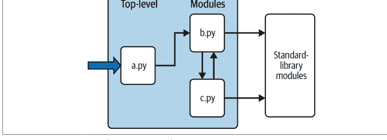

例如，假设图22-1中的文件*b.py*定义了一个名为job的函数供外部使用，如示例22-1所示（暂时忽略*c.py*）。正如你在第四部分学习函数时所了解的，b.py 将包含一个 Python def 语句来生成该函数，之后你可以通过在函数名后的括号中传入值来运行它。

## 示例 22-1. b.py（模块）

```python
def job(tool):
    print(tool, 'coder')
```

在本书的这个阶段，这个函数可能看起来微不足道，但我们保持简单是为了专注于模块基础。现在，假设 a.py 想要使用 job。为此，它可能包含类似示例 22-2 中的 Python 语句。

## 示例 22-2. a.py（脚本）

```python
import b
b.job('Python')
```

其中第一条语句，一个 Python import 语句，使文件 a.py 能够访问文件 b.py 中由顶层代码（即未嵌套在函数或类中的代码）定义的所有内容。代码 `import b` 大致意味着：

> 加载文件 b.py（除非它已经加载），并通过名称 b 让我访问其所有属性。

为了满足这样的目标，import（以及你稍后将看到的 from）语句会按需执行并加载其他文件。更正式地说，在 Python 中，跨文件的模块链接直到运行时执行此类 import 语句时才会解析；它们的净效果是将模块名称（如 b 这样的简单变量）分配给已加载的模块对象。事实上，import 语句中使用的模块名称有两个用途：它标识要加载的外部文件（此处通过基本名称 b），但它也成为一个分配给已加载模块的变量。

类似地，由模块代码定义的对象也是在运行时创建的，同时 import 正在执行：import 字面意义上逐条运行目标文件中的语句来创建其内容。在此过程中，文件顶层分配的每个名称都成为模块的一个属性，可被导入者访问。例如，a.py 中的第二条语句使用对象属性表示法调用模块 b 中定义的函数 job——该函数是在导入期间通过运行其 def 语句创建的。代码 `b.job` 意味着：

> 获取存在于对象 b 中的名称 job 的值。

在我们的示例中，这恰好是一个可调用的函数，因此我们在括号中传递一个字符串（'Python'）。如果你运行 a.py，将打印出 "Python coder"——如果你读过前面的章节，这几乎不会令人惊讶，但它具有说明性。

正如我们所看到的，对象.属性表示法在 Python 代码中是通用且普遍存在的，因为大多数对象都有有用的属性，可以通过 "." 运算符获取。一些属性引用可调用对象，如执行操作的函数（例如，薪资计算器），而其他属性则是表示数据的简单值（例如，一个人的名字）。

导入同样是通用的，因为任何文件都可以从任何其他文件导入工具。例如，图 22-1 中的文件 *a.py* 可能导入 *b.py* 来调用其函数，但 *b.py* 也可能导入 *c.py* 来利用那里定义的不同工具。事实上，导入链可以按你喜欢的深度延伸：在这个例子中，模块 a 可以导入 b，b 可以导入 c，c 可以再次导入 b，依此类推。更现实地说，在上一章的基准测试代码中，测试脚本导入了运行器模块，运行器模块又导入了计时器模块。

这一切背后的主要观点是，模块（以及第 24 章描述的模块包）是 Python 中*代码重用*的最高级别。在模块文件中编码的组件既可以在你的原始程序中使用，也可以在你以后可能编写的任何其他程序中使用。例如，如果我们后来发现示例 22-1 中的函数 b.job 非常有用，我们可以在完全不同的程序中部署它；我们所要做的就是从其他程序再次导入 b。虽然在这个简单的演示中不太可能，但模块本质上创建了可重用工具的包。

## 标准库模块

注意图 22-1 的最右侧部分。正如我们一路所见，你的程序将导入的一些模块是由 Python 本身提供的，而不是你将编写的文件。

Python 自动附带一个大型的实用模块集合，称为*标准库*。这个集合，上次统计时有数百个模块，包含对常见编程任务的平台无关支持：操作系统接口、对象持久化、文本模式匹配、网络和互联网脚本、GUI 构建、多线程等等。

这些工具都不是 Python *语言*本身的一部分，但你可以通过在任何标准 Python 安装上导入相应的模块来使用它们。因为它们是标准库模块，你也可以相当确定它们将是可用的，并且可以在你运行 Python 代码的大多数平台上可移植地工作。

本书的示例使用了标准库中的一些模块——例如，上一章代码中的 *time*、*timeit*、*sys* 和 *os*——但我们在这里真的只是触及了库内容的皮毛。要全面了解，请浏览 Python 标准库参考手册，该手册可在 *python.org* 及其他地方在线获取。有关这些手册的更多信息，请参见第 15 章；那里讨论的 *PyDoc* 工具也提供库模块信息，并列出每个可导入的模块，包括标准库。

因为有这么多标准库模块，浏览是了解可用工具的最佳方式。你也可以在涵盖应用程序级编程的书籍中找到关于 Python 库工具的教程，但标准手册是免费的，可以在任何网络浏览器中查看，并且每次 Python 重新发布时都会更新。截至 Python 3.10，*sys.stdlib_module_names* 也提供了一个所有标准库模块的简单列表——无论是否可导入：

```python
$ python3
>>> len(sys.stdlib_module_names)    # That's a lot of modules
300
```

## 导入如何工作

上一节讨论了导入模块，但没有完全解释当你这样做时会发生什么。因为导入是 Python 程序结构的核心，本节将更正式地详细介绍导入操作，以使这个过程不那么抽象。

一些 C 程序员喜欢将 Python 模块导入操作与 C 的 `#include` 进行比较，但他们真的不应该——在 Python 中，导入不是将一个文件文本插入到另一个文件中。它们实际上是*运行时*操作，在程序第一次导入给定文件时执行三个不同的步骤：

1. *查找*模块文件。
2. *编译*它为字节码（如果需要）。
3. *运行*模块的代码以构建它定义的对象。

为了帮助你更好地理解模块导入，以下各节将依次探讨这些步骤中的每一步。

不过，首先请记住，所有这三个步骤仅在程序执行期间*第一次*导入模块时执行。在程序运行期间对同一模块的后续导入将绕过所有这三个步骤，只需获取内存中已加载的模块即可。

Python 通过将已加载的模块存储在一个名为 `sys.modules` 的普通字典中来实现这一点，并在导入操作开始时检查该字典中是否存在模块名称。事实上，`sys.modules['name']` 与 `import name` 之后的 `name` 含义相同，而 `sys.modules` 的键迭代器或 keys 方法列出了所有已导入的模块：

```python
>>> import sys, os
>>> sys.modules['os'] is os          # Name string => module
True
>>> sorted(sys.modules)              # Or sys.modules.keys()
...names of all loaded modules...
```

我们将在接下来的章节中探讨 `sys.modules` 的其他作用。不过，在导入时，如果请求的模块尚未存在于 `sys.modules` 中，则开始一个三步过程。

### 步骤 1：查找它

首先，Python 必须定位 `import` 语句引用的模块文件。注意，上一节示例中的 `import` 语句命名文件时没有 `.py` 扩展名，也没有其目录路径：它只是说 `import b`，而不是类似 `import c:\dir\b.py` 或 Unix 上的类似内容。路径和扩展名细节在导入中被有意省略；相反，Python 使用标准的*模块搜索路径*以及已知的文件类型来定位与 `import` 语句对应的模块文件。

因为这是程序员必须了解的导入操作的主要部分，我们稍后将单独回到这个主题。

### 步骤 2：编译它（可能）

在通过遍历模块搜索路径找到与 `import` 语句匹配的源代码文件后，Python 接下来会将其编译为一种称为*字节码*的更低级形式（如果需要）。我们在第 2 章讨论过字节码，但它比那里解释的要丰富一些。

当你第一次导入模块时，Python 会将模块的 `.py` 源代码文件编译为字节码，并尽可能将字节码保存在扩展名为 `.pyc` 的文件中。在以后的程序运行中，只要字节码文件使用兼容的格式并且是由导入它的 Python 创建的，并且自字节码文件创建以来你没有编辑并保存源代码文件，Python 将从其 `.pyc` 文件加载字节码并跳过编译步骤。

重要的是，如果你修改了一个模块的源代码，那么下次运行导入该模块的程序时，其字节码文件将被重新创建。这确保了模块的字节码始终与其源代码同步，并且你的Python。

所有这些都是自动完成的，大多数Python用户通常可以放心地接受这一点，但简要了解一下完整的过程有助于让这个过程不再那么神秘。更详细地说，字节码文件可以以两种风格创建，第一种是默认使用的，第二种是在Python 3.7中引入的：

- *基于时间戳*的字节码文件是通过简单地导入模块创建的，这是默认的、原始的、也是最常见的选项。如果你希望导入速度快，并且没有特殊需求，那么这就是要使用的风格。
- *基于哈希*的字节码文件是通过使用`compileall`或`py_compile`库模块创建的。一旦创建，可以使用Python命令行开关`--check-hash-based-pycs`来配置其操作（有关此标志的三个选项，请参阅Python手册）。

在这两种模型中，Python都会自动保存足够的信息，以确定何时必须重新创建字节码文件。具体来说，字节码文件嵌入了一个标识字节码格式的“魔术”数字，以及源代码文件的最后修改*时间戳*和*大小*，或者从源代码文件内容派生的*哈希*值。字节码文件名还包括创建它们的*Python*的实现名称和版本。

当导入一个模块时，Python首先检查该模块是否已被程序导入过，如果是，则使用已加载的模块。否则，它会通过将字节码文件中保存的信息与当前运行的Python和源代码文件的规格进行比较，来查找与模块源代码文件对应的可用字节码文件。如果`.pyc`字节码文件与源代码文件具有相同的基本名称，并且：

- 使用*兼容*的格式——通过检查“魔术”数字
- 与源代码文件*保持最新*——通过比较保存的时间戳和大小，或哈希值
- 由正在运行的*Python*创建——通过检查文件名中的实现和版本标签

如果存在一个通过所有这些检查的字节码文件，它将被加载，并且编译步骤将被跳过。如果没有，则源代码将被编译为字节码，并保存或重新保存到包含所有上述信息的字节码文件中。

如果无法保存字节码文件，程序仍然可以运行（编译后的代码将简单地在内存中创建并在退出时丢弃），并且`-B` Python命令行开关可以关闭字节码保存，尽管很少需要这样做。当保存时，字节码文件被写入并从名为`__pycache__`的子目录加载，该子目录位于其对应的源代码文件旁边。

`__pycache__`子目录避免了源代码文件夹中的混乱，以及在安装多个Python时的冲突和重新编译。例如，当本章示例文件夹中的同一个模块文件被三个不同的Python（两个CPython和我们在上一章使用的PyPy）导入时，会发生以下情况（在Windows上，使用`dir`和`py`代替`ls`和Python命令）：

```
$ ls
codefile.py

$ python3.12
>>> import codefile

$ python3.8
>>> import codefile

$ pypy3
>>>> import codefile

$ ls
__pycache__  codefile.py
$ ls __pycache__
codefile.cpython-312.pyc  codefile.cpython-38.pyc  codefile.pypy310.pyc
```

从技术上讲，`__pycache__`子目录是在Python 3.2中引入的，早期版本中不可用，但本书仅关注Python 3.X，而且你今天不太可能遇到3.1或3.0。

另外，请记住，字节码编译发生在文件被*导入*时。因此，你通常不会看到程序*顶层*文件的`.pyc`字节码文件，除非它也在其他地方被导入——只有被导入的文件才会在你的机器上留下`.pyc`文件。顶层文件的字节码在内部使用并被丢弃；被导入文件的字节码保存在文件中以加快未来的导入速度。

顶层文件通常设计为直接执行，而不是被导入。然而，稍后你会看到，可以设计一个文件，使其既作为程序的顶层代码，又作为可导入的工具模块。这样的文件可以被导入，在后一种角色中会生成`.pyc`。要了解这是如何工作的，请注意[第25章](#)中关于特殊`__name__`属性和`__main__`的讨论。

> *仅从字节码运行*：作为一个现在的特殊情况，如果Python只找到*字节码文件*而没有源代码文件，程序也会运行，但这不仅仅是删除你的`.py`文件那么简单。从Python 3.2开始，通常要求`m.pyc`文件位于`m.py`文件通常所在的位置——可以通过从`__pycache__`移动和重命名，或者使用Python的`compileall`的*传统*选项（在其命令行模式下使用`-b`）生成。例如，以下命令从当前目录中的所有`.py`文件生成`.pyc`文件，而无需移动和重命名：

```
$ python3 -m compileall -b -l .
```

仅从字节码运行需要兼容的Python版本，并且不能完全隐藏你的代码，但一些工具在可以包含或确保托管Python版本的情况下，使用它来以独立形式分发程序。更多信息请参阅Python文档，以及附录B第1157页“第一部分，入门”中的相关解决方案。


## 步骤3：运行它

在编译或加载模块的字节码之后，导入操作的最后一步是执行字节码。这实际上是从上到下依次运行模块文件中的所有语句，在此步骤中对名称进行的任何赋值都会生成最终模块对象的属性。这就是模块代码定义的工具被创建的方式。例如，文件中的`def`语句在导入时运行，以创建函数并将模块中的属性分配给这些函数。然后，这些函数可以在程序中稍后被文件的导入者调用。

因为这最后一步导入实际上运行了文件的代码，所以如果模块文件中的任何顶层代码执行了实际工作，你将在导入时看到其结果。例如，模块中的顶层`print`语句在文件被导入时显示输出。函数`def`语句（以及本书后面将介绍的类语句）只是为以后的使用定义对象。

如你所见，导入操作涉及相当多的工作——它们搜索文件，可能运行编译器，并运行Python代码。因此，默认情况下，任何给定的模块在每个进程中只被导入*一次*。未来的导入会跳过所有三个导入步骤，并根据前面提到的`sys.modules`检查重用内存中已加载的模块。如果你需要在文件已经加载后再次导入它（例如，支持动态自定义），你可以通过`importlib.reload`调用来强制执行——我们将在下一章学习这个工具。

请记住，这个过程是完全*自动*的——它是运行程序的副作用——大多数程序员可能不会关心甚至不会注意到其机制，除了由于跳过编译步骤而带来的更快的启动速度。然而，这个过程的一部分可能会引起你的注意，如下一节的详细阐述。

## 模块搜索路径

如前所述，导入过程中大多数程序员*会*需要关心的部分通常是第一个“找到它”的部分——定位要导入的文件。因为你可能需要告诉Python在哪里查找要导入的文件，所以你需要知道如何利用其*模块搜索路径*（搜索的目录集）来扩展它。本节介绍构成搜索路径的组件，并描述如何为你自己的文件夹修改它。

特殊情况：*内置*模块（如`sys`，用C编码并静态链接到Python）以及*冻结*模块（如`os`，从Python 3.11开始优化以加快启动速度），在扫描模块搜索路径之前总是首先被检查，因此具有优先权。鉴于这些类别中只有少数标准库模块，我们可以在这里安全地忽略它们，而专注于用于你将导入的绝大多数模块（包括你自己的）的搜索。如果你好奇，`sys.builtin_module_names`列出了第一个额外搜索类别中的项目：

```
>>> sum(1 for m in sys.builtin_module_names if m[0] != '_')  # Count non _X
11
```

### 搜索路径组件

在许多情况下，你可以依赖模块搜索路径的自动性质，而完全不需要配置此路径。但是，如果你想能够跨目录边界导入用户定义的文件，你将需要自定义此路径。大致来说，Python的模块搜索路径由以下组件的串联组成，其中一些是为你预设的，一些你可以调整以告诉Python去哪里查找：

## 模块搜索路径

程序的主目录
- `PYTHONPATH` 环境变量中列出的目录（如果已设置）
- 标准库目录和文件
- 第三方扩展的 *site-packages* 目录
- 任何 *.pth* 文件中列出的目录（如果存在）

最终，这五个部分的连接初始化了内置的 `sys.path`——一个可修改的目录名字符串列表，Python 会按从先到后的顺序搜索该列表以查找导入的文件（我们将在本节稍后重新讨论这一点）。搜索路径的第一、第三和第四个部分是自动定义的。然而，*第二*和*第五*个部分可用于扩展路径以包含你自己的源代码目录。以下是所有五个部分的概述：

### 主目录（自动）

Python 首先在代码的“主”目录中查找导入的文件。此条目的含义取决于你运行代码的方式。当你运行一个*程序*时，此条目是包含程序顶层脚本文件的目录。当你在 REPL 中*交互式*工作时，此条目则是你当前工作的目录（这就是为什么我们到目前为止一直使用此目录来存放导入的文件）。使用前面章节中介绍的 Python `-c` 和 `-m` 开关运行的代码也使用当前工作目录作为主目录组件。

因为此目录总是首先被搜索，所以如果一个程序完全位于*单个*目录中，其所有导入都将自动工作，无需进行任何路径配置。另一方面，由于此目录首先被搜索，其文件也会*覆盖*路径上其他目录中同名的模块；如果你的程序需要标准库模块，请小心不要意外地以这种方式隐藏它们，或者使用你稍后将遇到的*包*工具，这些工具可以通过嵌套文件夹部分地规避此问题。

还要记住，此主目录仅适用于解析*导入*的搜索路径，不影响脚本中用于相对*文件名*的当前工作目录。脚本创建的无路径文件仍将出现在你启动脚本时所在的位置（具体来说，在 `os.getcwd` 返回的文件夹中），而不是位于模块搜索路径前端的脚本主文件夹中。模块导入和文件访问是两个独立的概念。

### 任何 PYTHONPATH 目录（可配置）

接下来，Python 会从左到右搜索 `PYTHONPATH` 环境变量设置中列出的所有目录（假设你已设置此变量：通常它不会为你预设）。简而言之，`PYTHONPATH` 只是一个用户定义的、特定于平台的目录名列表，这些目录包含 Python 源代码或字节码文件。你可以添加所有希望从中导入的目录，Python 将扩展模块搜索路径以包含 `PYTHONPATH` 列出的所有目录。有关设置此变量的提示，请参见附录 A。

因为 Python 首先搜索主目录，所以此设置仅在*跨*目录边界导入文件时才重要——也就是说，如果你需要导入一个存储在与导入它的文件*不同*目录中的文件。一旦你开始编写大型程序和工具，你可能需要设置 `PYTHONPATH` 变量，但当你刚开始时，只要将所有模块文件保存在你工作的目录中（即主目录），你的导入无需进行此设置即可工作。

### 标准库目录（自动）

接下来，Python 会自动搜索你的机器上安装标准库模块的目录。这些包括用 Python 编写的模块，以及其他用 C 编写的模块。因为这些目录总是被搜索，所以通常不需要将它们添加到你的 PYTHONPATH 中（或包含在前面的路径文件中）。

### 第三方扩展的标准库 site-packages 目录（自动）

接下来，Python 会自动将其标准库的 site-packages 子目录添加到模块搜索路径中。按照惯例，这是大多数第三方扩展安装的位置，通常由 Python 的 `pip install` 工具自动安装。因为此类扩展的 site-packages 安装目录始终是模块搜索路径的一部分，客户端可以导入这些扩展的模块而无需任何路径设置。

### 任何 .pth 路径文件目录（可配置）

最后，Python 有一个较少使用的功能，允许用户通过简单地将目录列在以 `.pth` 后缀（代表“路径”）结尾的文本文件中（每行一个）来将目录添加到模块搜索路径。这些路径配置文件是一个相对高级的安装相关功能；我们不会在这里完全介绍它们，但它们提供了 PYTHONPATH 设置的替代方案。

简而言之，放在适当目录中的目录名文本文件可以大致起到与 PYTHONPATH 环境变量设置相同的作用。例如，一个具有 `.pth` 扩展名和任何名称的文件可以放置在已安装 Python 标准库的 site-packages 子目录中，以扩展模块搜索路径。要定位此子目录，请检查 `sys.path` 中以 `site-packages` 结尾的路径，如前所述。

当存在这样的文件时，Python 会将文件中每一行列出的目录从先到后添加到模块搜索路径列表的末尾附近——目前是在此处描述的 `site-packages` 目录之后。实际上，Python 会收集它在所有 `.pth` 路径文件中找到的目录名，并过滤掉任何重复项和不存在的条目。因为它们是文件而不是 shell 设置，路径文件可以应用于给定 Python 的所有用户，而不仅仅是一个用户或 shell，并且在某些情况下可能比环境变量更容易设置。

有关此功能的更多详细信息，请查阅 Python 的库手册，特别是其标准库模块 `site` 的文档——此模块配置 Python 库和路径文件的位置，其文档描述了路径文件的一般预期位置。不过，在开始时，设置 `PYTHONPATH` 可能更适合你，只有在必须跨目录导入时才需要。路径文件更常用于安装在 Python 的 `site-packages` 中的第三方库。

尽管如此，Python 的导入机制是高度可扩展的，甚至比这里描述的更为复杂。例如，`PYTHONPATH` 条目也可以命名被视为只读文件夹的 ZIP 文件；`PYTHONHOME` 可以设置标准库位置；一个以 `._pth` 为后缀的文件可以完全覆盖 `sys.path` 规范；使用 `venv` 模块创建的“虚拟环境”通过将搜索路径本地化到安装文件夹来避免包版本冲突；第 24 章的相对导入“.”语法限制了包中的模块搜索；所有这些都经常变化，并且可能再次变化。

虽然本书涵盖了常见用法，但出于篇幅、持久性和受众考虑，其描述是有意为之的。如果出现独特需求，你应该查阅 Python 的手册以获取更多关于导入机制的信息。

## 配置搜索路径

上述所有内容的最终效果是，搜索路径的 `PYTHONPATH` 和路径文件组件都允许你定制导入查找文件的位置。设置环境变量和存储路径文件的方式因平台而异。例如，在 macOS 和 Windows 上，你可能分别将 `PYTHONPATH` 设置为用冒号和分号分隔的目录列表，如下所示：

```
/Users/me/pycode/utilities:/Volumes/ssd/pycode/package1       # Unix paths list
C:\Users\me\pycode\utilities;d:\pycode\package1       # Windows paths list
```

在 Unix 系统（例如 macOS、Linux 和 Android）上，`export` shell 命令为 shell 及其运行的任何程序设置环境变量，并且可以编码在启动文件（如 `~/.bash_profile`）中以实现永久性。以下在 macOS 上设置路径以启用从第 21 章和第 20 章的代码文件夹导入模块（“...”是省略的文本）：

```
$ pwd
/Users/me/.../LP6E/Chapter22
$ export PYTHONPATH=/Users/me/.../LP6E/Chapter21:/Users/me/.../LP6E/Chapter20

$ python3
>>> import pybench, permute
>>> pybench
<module 'pybench' from '/Users/me/.../LP6E/Chapter21/pybench.py'>
>>> permute
<module 'permute' from '/Users/me/.../LP6E/Chapter20/permute.py'>

>>> permute.permute1([1, 2, 3, 4])
>>> pybench.runner([(100, 5, '[x ** 2 for x in range(2 ** 16)]')])
```

像“..”这样的路径语法（用于父文件夹）也适用于 `PYTHONPATH`，并且相对于当前工作目录进行解释——如果启动程序的顶层脚本位于其他地方，则当前工作目录不一定是程序的主目录。Windows 控制台使用类似的命令（例如，将 `export` 替换为 `set`，或使用 `setx` 实现永久性），但 Windows 用户通常在“设置”中设置环境变量；在那里搜索环境变量 GUI。

除了 `PYTHONPATH` 之外，或者除此之外，你可以在 Python 安装的 `site-packages` 文件夹中创建一个以 `.pth` 扩展名命名的文本文件（例如 `mypath.pth`），它在 macOS 上看起来像这样：

```
/Users/me/pycode/utilities           # Unix .pth paths file
/Volumes/ssd/pycode/package1         # One path per line
```

这些设置在所有平台上都是类似的，但细节差异太大，无法在此处完全涵盖。有关在各种平台上使用 `PYTHONPATH` 扩展模块搜索路径的提示，请参见附录 A。

要查看你的 Python 如何在你的平台上配置模块搜索路径，并找到其 `site-packages` 文件夹的位置（该文件夹可以托管路径文件），你总是可以检查 `sys.path`——这是下一节的主题。

## sys.path 列表

如果你想查看模块搜索路径在你的机器上是如何真正配置的，请打印内置的 `sys.path` 列表。这个目录名字符串列表是 Python 中实际的模块搜索路径；在导入时，Python 会从左到右搜索此列表中的每个目录，并使用它找到的第一个匹配文件。

## 检查模块搜索路径

Python 在程序启动时配置 `sys.path`，合并我们之前遇到的路径组件。结果是一个目录列表，在每次导入新文件时都会被搜索。Python 公开这个列表有多种原因。一方面，它提供了一种*验证*你已进行的搜索路径设置的方法——如果重启 Python 后，你没有在这个列表的某处看到你的设置，就需要重新检查你的工作。例如，在 macOS 上，使用这些自定义设置：

- PYTHONPATH 设置为 `/Users/me/pycode1:/Users/me/pycode2`
- 在 Python 安装目录的 `site-packages` 中有一个 `mypath.pth` 路径文件，其中列出了 `/Users/me/pycode3`

在 REPL 中检查或从脚本打印时，搜索路径如下所示：

```
>>> import sys
>>> sys.path
['', '/Users/me/pycode1', '/Users/me/pycode2',
'/Library/Frameworks/Python.framework/Versions/3.12/lib/python312.zip',
'/Library/Frameworks/Python.framework/Versions/3.12/lib/python3.12',
'/Library/Frameworks/Python.framework/Versions/3.12/lib/python3.12/lib-dynload',
'/Library/Frameworks/Python.framework/Versions/3.12/lib/python3.12/site-packages',
'/Users/me/pycode3']
```

开头的空字符串表示当前目录，两个自定义设置按照前面给出的顺序合并进来。其余的是标准库文件夹和文件，以及第三方扩展的 `site-packages` 主目录。

## 更改模块搜索路径

`sys.path` 列表还为脚本提供了一种在运行时*手动*定制其搜索路径的方法。通过修改程序范围的 `sys.path` 列表，你修改了程序运行期间任何地方进行的所有未来导入的搜索路径。然而，此类更改仅在单次运行期间持续有效；`PYTHONPATH` 和 `.pth` 文件提供了更持久的修改路径的方式——前者按用户设置，后者按安装的 Python 设置。

另一方面，有些程序确实*需要*更改 `sys.path`。例如，在 Web 服务器上运行的脚本通常以用户“nobody”身份运行以限制机器访问。因为这样的脚本通常不能依赖“nobody”以任何特定方式设置 `PYTHONPATH`（语法上不正确但确实如此），它们有时会在运行导入语句之前手动设置 `sys.path` 以包含所需的源目录。`sys.path.append`、`sys.path.insert` 或其他列表操作通常就足够了，尽管只会持续单次程序运行：

```
>>> sys.path.append('/Users/me/pycode4')    # 为本次运行扩展搜索路径
>>> import module                            # 所有导入最后搜索新目录
```

你可以在代码中任意修改 `sys.path` 以影响未来的导入，这在 REPL 中也有效。不过请记住，删除文件夹可能会移除对重要工具的访问，并且你的更改将在程序或 REPL 结束时被丢弃。要使路径更改跨脚本和会话生效，请改用其他技术。

## 模块文件选择

除了文件夹，文件*类型*也影响导入。如前所述，文件扩展名（例如 `.py`）在导入语句中被省略是设计使然：Python 会选择在搜索路径上找到的第一个与导入名称匹配的文件。然而，这不必是 .py 源代码文件或 .pyc 字节码文件，如下一节所述。

## 模块来源

实际上，导入是与众多*外部*组件的接口点——源代码、字节码、编译扩展、ZIP 文件、Java 类等等。Python 会自动选择与模块名称匹配的任何类型。例如，形式为 `import b` 的 `import` 语句今天可能会加载或解析为以下任何一种：

- 一个名为 `b.py` 的*源代码*文件
- `__pycache__` 中名为 `b.cpython-312.pyc` 或类似的*字节码*文件
- 如果未找到 `b.py` 源代码文件，则为一个名为 `b.pyc` 的*字节码*文件
- 一个名为 `b` 的*目录*，用于[第 24 章](#)中描述的包导入
- 一个编译的*内置*模块，用 C 编码并在构建时静态链接到 Python
- 一个编译的*扩展*模块（例如 `b.so` 或 `b.pyd`），用 C 编码并在导入时动态链接
- 嵌入在 *ZIP 文件*中的源代码或字节码文件，导入时自动提取
- *内存中*映像的模块，用于冻结（独立）可执行文件
- *Java* 类，在 Jython 版本的 Python 中
- *.NET* 组件，在 IronPython 版本的 Python 中

此列表中的大多数项目将导入扩展到了简单文件之外。然而，对于导入者来说，加载文件类型的差异在导入时和获取模块属性时都是完全无关紧要的。说 `import b` 会根据你的模块搜索路径获取模块 `b`，而 `b.attr` 会获取模块中的一个项目，无论它是 Python 变量还是链接的 C 函数。例如，本书中使用的一些标准库模块实际上是用 C 编码的，而不是 Python；因为它们看起来就像 Python 编码的模块文件，所以它们的客户端不必关心。

## 选择优先级

鉴于上一节列出的所有选项，存在潜在的冲突。Python 总是会加载在模块搜索路径的第一个（最左边）目录中找到的匹配名称的项目，在从左到右扫描 `sys.path` 时。但如果它在*同一个*目录中找到多个匹配项会怎样？在这种情况下，Python 遵循标准的选取顺序，尽管此顺序不能保证随时间或跨实现保持不变。

通常，你不应该依赖 Python 在给定目录中会选择哪种类型的文件——让你的模块名称独特，或者配置你的模块搜索路径以使你的模块选择偏好明确。

## 路径异常：独立程序和包

最后，虽然所有上述内容反映了正常的模块使用，但有些工具足够灵活，值得在结尾提一句。例如，当你运行[第 2 章](#)中讨论的*独立可执行文件*时，模块搜索路径不相关，这些可执行文件通常将字节码嵌入其可运行文件中，并且在没有路径设置的情况下运行。这是本书范围之外的一种交付选项，但有关此领域选项的另一个概述，请参见[附录 A](#)。

此外，虽然在标准导入中包含路径和扩展名细节在语法上是非法的，但[第 24 章](#)涵盖的*包导入*允许导入语句包含通向文件的目录路径的*部分*，作为一组点分隔的名称。即便如此，包导入仍然依赖于正常的模块搜索路径来定位包路径中的*最左边*目录（它们相对于搜索路径中的一个目录），并且不能在导入语句中使用任何特定于平台的*路径语法*（此类语法仅在搜索路径上有效）。如前所述，包也可以使用“.”语法来限制导入搜索——但我们将把这个故事留到第 24 章。

## 章节总结

在本章中，我们介绍了模块的基础知识，并探讨了导入语句的操作。我们了解到导入会在模块搜索路径上找到指定的文件，将其编译为字节码，并执行其所有语句以生成其内容。我们还了解到如何配置搜索路径，以便能够从主目录和标准库目录以外的目录导入，主要通过 PYTHONPATH 设置。

正如本章所讨论的，导入操作和模块是 Python 程序架构的核心。较大的程序被分成多个文件，这些文件在运行时通过导入链接在一起。导入反过来使用模块搜索路径来定位文件，模块定义属性供外部使用。最终效果将程序的逻辑划分为可重用且自包含的软件组件。

在下一章中，你将看到所有这些在实际语句和代码方面的含义。不过，在我们继续之前，让我们先进行通常的章节测验。

## 测试你的知识：测验

1. 模块源代码文件如何成为模块对象？
2. 为什么你可能需要设置你的 PYTHONPATH 环境变量？
3. 列出模块搜索路径的五个主要组成部分。
4. 列出 Python 可能响应导入操作加载的四种文件类型。
5. 什么是模块命名空间，模块的命名空间包含什么？

## 测试你的知识：答案

1. 当模块被导入时，其源代码文件会自动成为模块对象。从技术上讲，模块的源代码在导入期间运行，一次一条语句，过程中分配的所有名称都成为生成的模块对象的属性。
2. 你只需要设置 PYTHONPATH 才能从 Python 标准库和“主”目录（交互式工作时的当前目录，或包含程序顶级文件的目录）以外的目录导入。实际上，对于使用工具库的非平凡程序，这可能是必需的。
3. 模块搜索路径的五个主要组成部分是顶级脚本的主目录（包含它的目录）、PYTHONPATH 环境变量中列出的所有目录、标准库目录、用于第三方扩展安装的 *site-packages* 根目录，以及

# 第23章
模块编码基础

既然我们已经学习了模块背后的宏观概念，现在让我们转向一些模块实际应用的例子。尽管本章的一些早期主题对于已经应用过它们的线性读者来说是复习，但即使是简单的模块也能迅速引导我们进入尚未完全遇到的更多细节，例如嵌套、重载、作用域等，我们将在本章中探讨这些内容。

总的来说，Python模块很容易*创建*；它们只是用文本编辑器创建的Python程序代码文件，不需要特殊语法。由于Python负责查找和加载模块的所有工作，它们也很容易*使用*；只需导入一个模块或其名称，并使用它们引用的对象。让我们探索这面的两面。

## 创建模块

要定义一个模块，只需使用文本编辑器将Python代码输入到一个文本文件中，并将其保存为*.py*扩展名；任何这样的文件都会自动被视为Python模块。正如我们所看到的，在模块顶层分配的所有名称都成为其*属性*（与模块对象关联的名称），并导出供客户端使用——它们自动从变量转变为模块对象属性。

例如，如果你将示例23-1中的代码输入到名为*module1.py*的文件中并导入它，你将创建一个具有一个属性的模块对象——名称`printer`，它恰好是对函数对象的引用。

```
示例 23-1. module1.py

def printer(x):        # 模块属性
    print(x)
```

再次强调，如果你阅读了本书中本章之前的内容，这段代码可能看起来很简单，但我们的目标是剥离无关部分，以便我们可以单独研究模块。

## 模块文件名

在继续之前，让我们更正式地讨论模块文件名。你可以随意命名模块，但如果你计划将它们作为模块导入，模块文件名应以*.py*后缀结尾。

对于将要运行但不导入的顶级文件（即*脚本*），.py在技术上是可选的，但在所有情况下添加它可以使文件类型更明显，可能在某些文本编辑器和文件资源管理器中启用Python特定功能，并允许你将来导入任何文件（回想一下这是运行文件的一种方式）。

因为模块名称在Python程序中成为变量名（没有.py），它们也应该遵循第11章中概述的正常变量名规则。例如，你可以创建一个名为*if.py*的模块文件，但你不能导入它，因为*if*是保留字——当你尝试运行`import if`时，你会得到语法错误。事实上，模块*文件*的名称和包导入中使用的*目录*名称（在下一章讨论）都必须符合第11章中介绍的变量名规则；例如，它们只能包含字母、数字和下划线。包目录也不能包含特定于平台的语法，例如名称中的空格。

当模块被导入时，Python通过在模块搜索路径的前面添加目录路径，并在末尾添加.py或其他扩展名，将模块名称映射到外部文件名。例如，名为*M*的模块最终映射到包含模块代码的外部文件*directory/M.extension*。

## 其他类型的模块

如前一章所述，也可以通过用外部语言（如C、C++等）编写代码来创建Python模块（例如，在Jython实现中的Java）。这样的模块称为*扩展模块*，它们通常用于包装外部库以在Python脚本中使用或优化程序的某些部分。当被Python代码导入时，扩展模块看起来和感觉与用Python源代码文件编码的模块相同——它们通过import语句访问，并提供函数和对象作为模块属性。它们也超出了本书的范围；有关更多详细信息，请参阅Python的标准手册。

## 使用模块

在另一面，客户端可以通过运行`import`或`from`语句来*使用*我们刚刚编写的简单模块文件。这两个语句在第3章中介绍，并在前面的示例中使用过。如果模块文件尚未加载，它们都会根据前一章涵盖的过程查找、编译并运行模块文件的代码。主要区别在于`import`将模块作为*整体*获取，因此你必须限定以获取其名称，而`from`从模块中获取（实际上是复制）特定的*名称*。

让我们看看这在代码中意味着什么。所有以下示例最终都调用示例23-1中模块文件*module1.py*中定义的*printer*函数，但方式不同。

## import语句

在下面的第一个示例中，名称`module1`有两个不同的用途——它标识要加载的外部文件，并成为脚本中的一个变量，在导入后引用模块对象。在REPL中：

```
>>> import module1                    # 将模块作为整体获取（一个或多个）
>>> module1.printer('Hello world!')    # 限定以获取名称
Hello world!
```

`import`语句只是列出要加载的一个或多个模块名称，用逗号分隔。因为它给出了一个引用*整个模块*对象的名称，所以我们必须通过模块名称来获取其属性（例如，`module1.printer`）。

## from语句

相比之下，因为`from`将*特定名称*从一个文件复制到另一个作用域，它允许我们在脚本中直接使用复制的名称，而无需通过模块（例如，`printer`）：

```
>>> from module1 import printer          # 复制出一个变量（一个或多个）
>>> printer('Hello world!')              # 无需限定名称（也不能！）
Hello world!
```

这种形式的`from`允许我们列出要复制的一个或多个名称，用逗号分隔。在这里，它与前面的示例效果相同，但由于导入的名称被复制到`from`语句出现的作用域中，在脚本中使用该名称需要更少的输入——我们可以直接使用它，而不是命名包含它的模块。事实上，我们必须这样做；`from`不分配模块本身的名称，因此`module1`是未定义的。

正如你稍后将更详细地看到的，`from`语句实际上只是`import`语句的一个小扩展——它像往常一样导入模块文件（运行前一章的完整三步过程），但添加了一个额外的步骤，从文件中复制一个或多个*名称*（不是对象）。整个文件被加载，但你获得了更直接访问其部分的名称。

## from *语句

最后，下一个示例使用了`from`的一种特殊形式：当我们使用`*`而不是特定名称时，我们获得引用模块顶层分配的*所有名称*的副本。在这里，我们也可以在脚本中使用复制的名称`printer`，而无需通过模块名称：

```
>>> from module1 import *                 # 复制出_所有_变量
>>> printer('Hello world!')              # 未限定地使用名称
Hello world!
```

从技术上讲，`import`和`from`语句都调用相同的导入操作；`from *`形式只是添加了一个额外的步骤，将模块中的所有名称复制到导入作用域中。它本质上*合并*一个模块的命名空间到另一个模块中，这再次意味着我们更少的输入，尽管是以名称隔离为代价。

请注意，在此上下文中只使用单个`*`；你不能使用任意模式匹配来选择名称子集（原则上你可以通过遍历模块的`__dict__`来实现，但这要困难得多）。另外，请注意，如果模块使用特殊技巧（如`_X`命名或`__all__`列表）来隐藏其部分名称，则`from *`可能不会真正获取模块中的“所有”名称，但我们将在第25章中推迟讨论此类工具。

就是这样——除了前一章的搜索路径配置外，模块确实很容易使用。然而，为了让你更好地理解定义和使用模块时实际发生的情况，让我们继续更详细地查看它们的一些属性。

---

所有列在标准位置的.pth路径文件中的目录。其中，程序员可以自定义PYTHONPATH和.pth文件。

- 4. Python可能加载源代码（.py）文件、字节码（.pyc）文件、C扩展模块或同名目录用于包导入。导入也可能加载更特殊的东西，例如ZIP文件组件、Jython版本Python下的Java类、IronPython下的.NET组件，以及根本没有文件存在的静态链接C模块。事实上，通过导入扩展，导入可以加载几乎任意的项目。

- 5. 模块命名空间是一个自包含的变量包，这些变量称为模块对象的*属性*。模块的命名空间包含模块文件顶层代码分配的所有名称（即，未嵌套在def或class语句中）。模块的全局作用域*转变*为模块对象的属性命名空间。模块的命名空间也可能被从其他文件导入它的赋值所改变，尽管这通常不被赞成（有关跨文件更改的缺点，请参见第17章）。

好的，这里有一个特殊情况：此处描述的 `from` 语句的 `*` 形式只能在模块文件的顶层使用，不能在函数内部使用（否则会产生语法错误），因为这会使 Python 在函数运行前无法检测局部变量。无论如何，在函数内部看到 `import` 或 `from` 都是罕见的，最佳实践建议将所有导入语句列在模块文件的顶部；虽然这不是强制要求，但这样更容易发现它们，并且避免了每次调用函数时重新导入模块带来的速度损失。`from *` 还有其他将在后面列举的问题，最好限制每个文件或交互式 REPL 中只使用一次。

## 导入只发生一次

人们开始使用模块时最常问的问题之一是：“为什么我的导入不再起作用了？”他们通常报告说第一次导入工作正常，但在交互式会话（或程序运行）期间的后续导入似乎没有效果。事实上，这是设计如此——模块在第一次 `import` 或 `from` 时加载并运行，并且只运行一次。因为导入是一个昂贵的操作，默认情况下 Python 对每个文件、每个进程只执行一次。后续的导入操作只是获取已经加载的模块对象。

## 初始化代码

作为结果之一，因为模块文件中的顶层代码通常只执行一次，你可以用它来初始化名称一次，但允许它们的状态改变。作为演示，请看示例 23-2 中的文件 `init.py`。

示例 23-2. init.py

```
print('hello')
flag = 1                # Initialize variable - just once!
```

在这个例子中，`print` 和 `=` 语句在模块第一次被导入时运行，变量 `flag` 在导入时初始化（回想第 17 章，REPL 在这里就像另一个模块文件）：

```
$ python3
>>> import init        # First import: loads and runs file's code
hello
>>> init.flag          # Assignment makes an attribute
1
```

第二次及以后的导入不会重新运行模块的代码；它们只是从 Python 的内部模块表中获取已经创建的模块对象。因此，变量 `flag` 不会被重新初始化：

```
>>> init.flag = 2      # Change attribute in module
>>> import init        # Just fetches already loaded module
>>> init.flag          # Code wasn't rerun: attribute unchanged
2
```

当然，有时你确实希望模块的代码在后续导入时重新运行。你将在本章后面看到如何使用 Python 的 `reload` 函数来做到这一点。

## 导入是运行时赋值

就像 `def` 一样，`import` 和 `from` 是可执行语句，而不是编译时声明。它们可以嵌套在 `if` 测试中，以在模块选项之间进行选择；出现在函数定义中，以便仅在调用时加载（受前面注意事项的约束）；用于 `try` 语句中，以便在出错时提供默认值；等等。作为一个抽象的例子：

```
if sometest:
    from moduleA import name
else:
    from moduleB import name
```

无论它们出现在哪里，导入在 Python 执行你的程序到达它们之前都不会被解析或运行。因此，导入的模块和名称在它们相关的 `import` 或 `from` 语句运行之前是不可用的。

## 更改模块中的可变对象

同样像 `def` 一样，`import` 和 `from` 是隐式赋值：

- `import` 将整个模块对象赋值给一个名称。
- `from` 将一个或多个名称赋值给另一个模块中同名的对象。

因此，你已经学过的关于赋值的一切也适用于模块访问。例如，通过 `from` 复制的名称成为对共享对象的引用；就像函数参数一样，重新赋值一个复制的名称不会影响它被复制的模块，但通过复制的名称更改一个共享的可变对象也会更改它被导入的模块中的对象。考虑示例 23-3 中的文件 `share.py`。

示例 23-3. share.py

```
x = 1
y = [1, 2]
```

当使用 `from` 导入时，我们将名称复制到导入者的范围中，这些名称最初共享模块名称引用的对象（同样，REPL 在这里充当导入模块）：

```
$ python3
>>> from share import x, y    # Copy two names out
>>> x = 'hack'                # Changes local x only
>>> y[0] = 'hack'             # Changes shared mutable in place
>>> x, y                      # This module's x and y
('hack', ['hack', 2])
```

这里，`x` 不是一个共享的可变对象，但 `y` 是。导入者和被导入模块中的名称 `y` 都引用同一个列表对象，因此从一个地方更改它也会在另一个地方更改它；继续 REPL 会话：

```
>>> import share              # Get module name (from doesn't)
>>> share.x                   # share's x is not my x
1
>>> share.y                   # But we share a changed mutable
['hack', 2]
```

有关更多背景信息，请参见第 6 章。关于 `from` 赋值如何处理引用的图形化说明，请翻回图 18-1（函数参数传递），并在脑海中将“调用者”和“函数”替换为“被导入者”和“导入者”。效果是相同的，只是这里我们处理的是模块中的名称，而不是函数。赋值在 Python 中的任何地方都以相同的方式工作。

## 跨文件名称更改

在前面的例子中，交互式会话中对 `x` 的赋值只更改了该范围内的名称 `x`，而不是文件中的 `x`——通过 `from` 复制的名称与其来源文件之间没有链接。要真正更改另一个文件中的全局名称，你必须使用 `import`：

```
$ python3
>>> from share import x, y    # Copy two names out
>>> x = 23                    # Changes my x only

>>> import share              # Get module name
>>> share.x = 23              # Changes x in other module
```

这个现象在第 17 章中介绍过。因为像这样在其他模块中更改变量是一个常见的困惑来源（并且通常是一个次优的设计选择），我们将在本书的这一部分后面再次回顾这个技术。微妙的是，前一个会话中对 `y[0]` 的更改是不同的；它更改的是一个对象，而不是一个名称，并且两个模块中的名称都引用同一个、已更改的对象。除非所有模块客户端都期望它，否则这同样可能是次优的。

## import 和 from 的等价性

注意在前面的例子中，我们必须在 `from` 之后执行一个 `import` 语句才能访问 `share` 模块名称。`from` 只是从一个模块复制名称到另一个模块；它不赋值模块名称本身。记住这一点可能有帮助，至少在概念上，像这样的 `from` 语句：

```
from module import name1, name2    # Copy these two names out (only)
```

等价于以下语句序列：

```
import module                    # Fetch the module object
name1 = module.name1             # Copy names out by assignment
name2 = module.name2
del module                       # Get rid of the module name - here only
```

像所有赋值一样，`from` 语句在导入者中创建新变量，这些变量最初引用被导入文件中同名的对象。但是，只有名称被复制出来，而不是它们引用的对象，也不是模块本身的名称。当我们使用 `from` 语句的 `*` 形式（`from module import *`）时，等价性是相同的，但模块中的所有顶层名称都以这种方式复制到导入范围中。

重要的是，`from` 的第一步运行一个正常的导入操作，具有前一章概述的所有语义。因此，如果模块尚未导入，`from` 总是会将整个模块导入内存，无论它从文件中复制出多少名称。没有办法只加载模块文件的一部分（例如，只是一个函数），但因为在标准 Python 中模块是字节码而不是机器代码，性能影响通常可以忽略不计。

## from 语句的潜在陷阱

`from` 语句的一个缺点是它使变量的含义更加模糊：`name` 对读者来说不如 `module.name` 有用，并且可能需要搜索加载它的 `from`。

因此，一些 Python 用户建议大多数情况下应该使用 `import` 而不是 `from`。不过，和大多数建议一样，这并非总是合理的。`from` 语句被广泛使用，并未造成严重后果。此外，无需每次都输入模块名称就能使用其工具，这非常方便，尤其是在 REPL 环境中工作时。

确实，`from` 语句有可能污染命名空间，至少在理论上是这样——如果你用它导入的变量恰好与当前作用域中的现有变量同名，你的变量会被静默覆盖。`import` 语句则不会出现这个问题，因为你必须通过模块名来访问其内容：`module.attr` 不会与作用域中名为 `attr` 的变量冲突。不过，只要你理解使用 `from` 时可能发生这种情况，实际上这并不构成问题：使用 `from` 赋值与代码中的任何其他赋值效果相同。

另一方面，`from` 语句与 `reload` 调用结合使用时确实存在问题，因为导入的名称可能引用对象的先前版本。此外，`from *` 形式确实*可能*破坏命名空间并使代码难以理解，尤其是当应用于多个文件时——在这种情况下，除了搜索外部文件，无法判断一个名称来自哪个模块。实际上，`from *` 形式将一个命名空间折叠到另一个命名空间中，从而破坏了模块的命名空间隔离目的。我们将在本书本部分末尾的第 638 页“模块陷阱”中演示这些问题，并在第 25 章介绍可以通过数据隐藏来最小化 `from *` 损害的工具。

这里最实用的建议可能是：对于简单模块，通常优先使用 `import` 而非 `from`；在大多数 `from` 语句中明确列出你想要的变量；并将 `from *` 形式限制为每个文件仅使用一次，或仅用于 REPL 的临时代码。这样，任何未通过属性限定或 `from` 列表调用的名称，都可以假定存在于 `from *` 导入的唯一模块中。使用 `from` 语句时需要稍加注意，但掌握一些知识后，大多数程序员会发现它是访问模块的便捷方式。

## 何时必须使用 import

唯一真正*必须*使用 `import` 而非 `from` 的情况是，当你必须使用两个不同模块中定义的同名内容时。例如，假设两个文件以不同方式定义了相同的名称，如以下抽象代码片段所示：

```
# M.py
def func():
    ...do something...

# N.py
def func():
    ...do something else...
```

如果你必须在程序中使用*两个*版本的此名称，`from` 语句将失败——你的作用域中只能有一个对该名称的赋值：

```
# O.py
from M import func
from N import func          # 这会覆盖我们从 M 获取的版本
func()                      # 只调用 N.func！
```

不过，`import` 在这里可以工作，因为包含封闭模块的名称使两个名称变得唯一：

```
# O.py
import M, N
M.func()
N.func()
```

这种情况非常罕见，你在实践中不太可能经常遇到。但如果遇到，`import` 允许你避免名称冲突。解决此困境的另一种方法是使用 `as` 扩展，这是一个重命名工具，我们将在第 25 章详细介绍，但这里简单介绍：

```
# O.py
from M import func as mfunc
from N import func as nfunc
mfunc(); nfunc()
```

`as` 扩展在 `import` 和 `from` 中都作为简单的重命名工具工作（它也可用于在 `import` 中为长模块名提供较短的同义词）；关于这种形式的更多信息将在第 24 和 25 章介绍。

## 模块命名空间

模块最好理解为名称的集合——即定义你希望对系统其他部分可见的名称的地方。从技术上讲，模块通常对应于文件，Python 会创建一个模块对象来包含模块文件中分配的所有名称。但简单来说，模块只是命名空间（创建名称的地方），模块中存在的名称就是其属性。本节将详细阐述此模型背后的细节。

### 文件如何生成命名空间

我们已经看到文件*变形*为命名空间，但这实际上是如何发生的？简短的答案是，在模块文件顶层（即未嵌套在函数或类主体中）分配值的每个名称都成为该模块的属性。

例如，在模块文件 *M.py* 的顶层有一个赋值语句 `X = 1`，名称 `X` 就成为 `M` 的属性，我们可以从模块外部通过 `M.X` 引用它。名称 `X` 也成为 *M.py* 内其他代码的全局变量，但我们需要明确模块加载和作用域的关系才能理解原因：

- **模块语句在首次导入时运行。** 当模块首次在系统中的任何地方被导入时，Python 会创建一个空的模块对象，并从文件顶部到底部依次执行模块文件中的语句。
- **顶层赋值创建模块属性。** 在导入过程中，文件顶层未嵌套在 `def` 或 `class` 中的赋值语句（例如 `=`、`def`）会创建模块对象的属性。这些语句分配的名称存储在模块的命名空间中。
- **模块命名空间是字典。** 通过导入创建的模块命名空间可以通过模块对象的内置 `__dict__` 字典属性访问，并可以使用 `dir` 函数检查。对于模块，`dir` 与 `__dict__` 的排序键相同，但对于类则包含继承的名称。
- **模块是一个单一作用域（局部即全局）。** 正如我们在第 17 章看到的，模块顶层的名称遵循与函数中名称相同的作用域规则，但局部和全局作用域是相同的——或者更正式地说，它们遵循第 17 章介绍的 `LEGB` 作用域规则，但没有 `L` 和 `E` 查找层。
- **模块作用域在导入后仍然存在。** 模块的全局作用域在模块加载后成为模块对象的属性字典。与函数作用域不同（函数作用域仅在函数调用运行期间存在），模块文件的作用域在导入后仍然存在，为导入者提供工具来源。

以下是这些概念的演示。假设我们使用文本编辑器创建示例 23-4 中的模块文件，并将其命名为 *spaces.py*。

*示例 23-4. spaces.py*

```
print('starting to load...')
import sys
var = 23

def func(): pass

class klass: pass

print('done loading.')
```

首次导入此模块（或作为程序运行）时，Python 从上到下执行其语句。一些语句作为副作用在模块的命名空间中创建名称，而其他语句在导入过程中执行实际工作。例如，此文件中的两个 `print` 语句在导入时执行：

```
>>> import spaces
starting to load...
done loading.
```

模块加载后，其作用域成为我们通过 `import` 获得的模块对象中的属性命名空间。然后我们可以通过用封闭模块的名称限定来访问此命名空间中的属性：

```
>>> spaces.sys
<module 'sys' (built-in)>
>>> spaces.var
23
>>> spaces.func
<function func at 0x101ce7b00>
>>> spaces.klass
<class 'spaces.klass'>
```

这里，`sys`、`var`、`func` 和 `klass` 都是在模块语句运行时分配的，因此它们在导入后成为属性。我们将在第六部分学习类，但注意 `sys` 属性——`import` 语句将模块对象*分配*给名称，文件顶层对名称的任何类型赋值都会生成模块属性。

### 命名字典：__dict__

实际上，在内部，模块命名空间存储为*字典*对象。这些只是具有所有常用方法的普通字典。需要时，我们可以通过模块的 `__dict__` 属性访问模块的命名空间字典——例如，编写通用列出模块内容的工具，我们将在第 25 章中介绍。继续上一节的示例：

## 属性名称限定

谈到属性获取，既然你对模块越来越熟悉，我们也应该更正式地巩固名称限定的概念。在 Python 中，你可以使用限定（也称为属性获取）语法 `object.attribute` 来访问任何具有属性的对象的属性。

限定实际上是一个表达式，它返回与对象关联的属性名称所赋的值。例如，前一个示例中的表达式 `spaces.sys` 获取了 `spaces` 中赋给 `sys` 的值。同样，如果我们有一个内置列表对象 `L`，`L.append` 返回与该列表关联的 `append` 方法对象。

重要的是要记住，属性限定与我们在第 17 章学习的范围规则无关；它是一个独立的概念。当你使用限定来访问名称时，你为 Python 提供了一个明确的对象，从中获取指定的名称。LEGB 范围规则仅适用于裸露的、未限定的名称；它可能用于限定路径中最左边的名称，但点号之后的名称则搜索特定对象，而不是范围。

这种区别可能因为模块范围在导入结束时转变为属性这一事实而显得模糊，但此后，名称成为模块*对象*的一部分。作为参考，以下是 Python 中名称解析的完整规则：

*简单变量*
`X` 表示在当前范围（遵循第 17 章的 LEGB 规则）中搜索名称 `X`。

*限定*
`X.Y` 表示在当前范围中找到 `X`，然后在对象 `X` 中搜索属性 `Y`（而不是在范围中）。

*限定路径*
`X.Y.Z` 表示在对象 `X` 中查找名称 `Y`，然后在对象 `X.Y` 中查找 `Z`。

*通用性*
限定适用于所有具有属性的对象：模块、类、C 扩展类型等。

如前所述，在第六部分中，你将看到属性限定对于类意味着更多——它也是继承发生的地方。但总的来说，这里概述的规则适用于 Python 中的所有名称。

## 导入与范围

正如我们所看到的，如果不先导入另一个模块文件，就永远无法访问其中定义的名称。也就是说，无论你的程序中导入或函数调用的结构如何，你永远不会自动看到另一个文件中的名称。变量的含义总是由*源代码*中的赋值位置决定，而属性总是显式地从对象请求。

例如，考虑以下两个简单模块。第一个，示例 23-5 中的 *lex1.py*，定义了一个仅对其文件内代码全局的变量 `X`，以及一个更改此文件中全局 `X` 的函数。

```
示例 23-5. lex1.py

X = 88                   # 我的 X：仅对此文件全局

def f():
    global X
    X = 99               # 更改此文件的 X
                         # 无法看到其他模块中的名称
```

第二个模块，示例 23-6 中的 *lex2.py*，定义了自己的全局变量 `X`，并导入并调用第一个模块中的函数。

```
示例 23-6. lex2.py

X = 11                   # 我的 X：仅对此文件全局

import lex1              # 获取对 lex1 中名称的访问
lex1.f()                 # 设置 lex1.X，而不是此文件的 X
print(X, lex1.X)
```

运行时，`lex1.f` 更改的是 `lex1` 中的 `X`，而不是 `lex2` 中的 `X`。`lex1.f` 的全局范围始终是*包含*它的文件，无论它最终从哪个模块调用：

```
$ python3 lex2.py
11 99
```

换句话说，导入操作永远不会给被导入文件中的代码提供向上的可见性——被导入的文件无法看到*导入*文件中的名称。更正式地说：

- 函数永远无法看到其他函数中的名称，除非它们在物理上是嵌套的。
- 模块代码永远无法看到其他模块中的名称，除非它们被显式导入。

这种行为是*词法作用域*概念的一部分——在 Python 中，围绕一段代码的范围完全由代码在文件中的物理位置决定。范围从不受函数调用或模块导入的影响。一些语言的行为不同，并提供*动态作用域*，其中范围确实可能依赖于运行时调用。但这往往会使代码更棘手，因为变量的含义可能随时间而变化。在 Python 中，范围更简单地对应于程序的文本。

## 命名空间嵌套

最后，虽然导入不会向上嵌套命名空间，但它们在某种意义上确实向下嵌套。也就是说，虽然被导入的模块永远无法直接访问导入它的文件中的名称，但使用属性限定路径，可以下降到任意嵌套的模块并访问它们的属性。例如，考虑接下来的三个文件。首先，示例 23-7 中的 *nest3.py* 通过赋值定义了一个全局名称和属性。

*示例 23-7. nest3.py*

```
X = 3
```

接下来，示例 23-8 中的 *nest2.py* 定义了自己的 `X`，然后导入 `nest3` 并使用名称限定来访问被导入模块的属性。

*示例 23-8. nest2.py*

```
X = 2
import nest3

print(X, end=' ')           # 我的全局 X
print(nest3.X)              # nest3 的 X
```

在顶层，示例 23-9 中的 *nest1.py* 也定义了自己的 `X`，然后导入 `nest2`，并获取第一个和第二个文件中的属性。

*示例 23-9. nest1.py*

```
X = 1
import nest2

print(X, end=' ')           # 我的全局 X
print(nest2.X, end=' ')     # nest2 的 X
print(nest2.nest3.X)        # 嵌套的 nest3 的 X
```

实际上，当 `nest1` 在这里导入 `nest2` 时，它建立了一个两级的命名空间嵌套。通过使用名称路径 `nest2.nest3.X`，它可以下降到 `nest3`，而 `nest3` 嵌套在被导入的 `nest2` 中。最终效果是 `nest1` 可以看到所有三个文件中的 `X`，因此可以访问所有三个全局范围：

```
$ python3 nest1.py
2 3
1 2 3
```

然而，反过来并不成立：`nest3` 无法看到 `nest2` 中的名称，`nest2` 也无法看到 `nest1` 中的名称。如果你不从命名空间和范围的角度思考，而是专注于所涉及的对象，这个例子可能更容易理解。在 `nest1` 内部，`nest2` 只是一个引用具有属性的对象的名称，其中一些属性可能引用其他具有属性的对象（导入是一种赋值）。对于像 `nest2.nest3.X` 这样的路径，Python 只是从左到右求值，沿途从对象获取属性。

请注意，`nest1` 可以说 `import nest2`，然后 `nest2.nest3.X`，但它不能说 `import nest2.nest3`——这种语法调用的是所谓的包（目录）导入，这是我们将在下一章学习重载后讨论的主题。包导入也会创建模块命名空间嵌套，但它们的导入语句被理解为反映目录树，而不是简单的文件导入链。

## 重新加载模块

正如我们所看到的，默认情况下，模块的代码在每个进程中只运行一次。要强制模块的代码被重新加载并重新运行，你需要显式地要求 Python 这样做，通过调用在第 3 章简要介绍的 `reload` 内置函数。在本节中，我们将探讨如何使用重载使你的系统更加动态。简而言之：

- 导入——通过 `import` 和 `from` 语句——仅在模块在进程中第一次被导入时加载并运行模块的代码。
- 后续的导入使用已加载的模块对象，而不会重新加载或重新运行文件的代码。即使你在程序运行期间重新保存了模块的源代码文件，也是如此。
- `reload` 函数强制已加载模块的代码被重新加载并重新运行。文件新代码中的赋值会就地更改现有的模块对象。

那么为什么要关心重新加载模块呢？简而言之，REPL 测试和定制。在交互式测试代码时，重新加载你在另一个窗口中更改的模块可能比重启 REPL 更容易。

更宏大的理由是动态定制：`reload` 函数允许程序的某些部分在不停止整个程序的情况下进行更改。通过 `reload`，组件更改的效果可以立即观察到。重载并非在所有情况下都有帮助，但在有帮助的情况下，它大大缩短了开发周期。例如，想象一个必须在启动时连接到服务器的数据库程序；因为程序更改或定制可以在重载后立即测试，所以在调试时你只需要连接一次。长时间运行的服务器也可以通过这种方式进行更新。

因为 Python 是解释型的（或多或少），它已经消除了运行 C 程序所需的编译/链接步骤：模块在被运行程序导入时动态加载。重载提供了进一步的性能优势，因为它允许你在不停止的情况下更改运行程序的部分内容。

这里需要注意一点：我们在本书中对 `reload` 的使用仅限于用 Python 编写的模块。用 C 等语言编写的编译扩展模块也可以在运行时通过导入动态加载，但它们超出了本书的范围（尽管大多数用户可能更喜欢用 Python 编写定制代码！）。

## reload 基础

与 `import` 和 `from` 不同：

- `reload` 是 Python 中的一个函数，而非语句。
- `reload` 接收一个已存在的模块对象，而非字符串名称。
- `reload` 位于标准库模块中，必须单独导入。

由于 `reload` 期望接收一个对象，因此在重新加载模块之前，该模块必须已被成功导入（如果因语法或其他错误导致导入失败，你可能需要在重新加载模块前再次尝试导入）。此外，`import` 语句和 `reload` 调用的语法也不同：作为函数，`reload` 需要括号，而 `import` 语句则不需要。抽象来看，重新加载的过程如下：

```
import module                # 初始导入模块
...使用模块属性...
...修改模块文件...

from importlib import reload  # 获取 reload 函数本身
reload(module)               # 获取更新后的模块
...使用模块属性...
```

典型的使用模式是：你导入一个模块，然后在文本编辑器中修改其源代码，接着重新加载它。这可能发生在交互式编程时，也出现在需要定期重新加载的大型程序中。

当你调用 `reload` 时，Python 会重新读取模块的代码并重新执行其顶层语句。关于 `reload`，最重要的一点是它*就地*修改模块对象；它不会删除并重新创建模块对象。因此，程序中任何对整个模块*对象*的引用都会自动受到重新加载的影响。具体细节如下：

- **`reload` 在模块的当前命名空间中运行模块文件的新代码。** 重新执行模块文件的代码会覆盖其现有命名空间，而不是删除并重新创建它。
- **文件中的顶层赋值会用新值替换名称。** 例如，重新执行 `def` 语句会通过重新赋值函数名来替换模块命名空间中该函数的先前版本。
- **重新加载会影响所有使用 `import` 获取模块的客户端。** 因为使用 `import` 的客户端有资格获取属性，所以在重新加载后，它们会在模块对象中找到新值。
- **重新加载仅影响未来的 `from` 客户端。** 过去使用 `from` 获取属性的客户端不会受到重新加载的影响；它们仍然持有在重新加载前获取的旧对象的引用。
- **重新加载仅适用于单个模块。** 除非你使用能传递性地应用重新加载的代码或工具，否则你必须对每个希望更新的模块分别执行重新加载。

## reload 示例

为了演示，这里有一个更具体的 `reload` 实际应用示例。在下面的例子中，我们将在不中断交互式 Python 会话的情况下修改并重新加载一个模块文件。重新加载在其他场景中也很有用，但为了说明简单，我们在此保持示例的简洁性。首先，在你选择的文本编辑器中，创建一个名为 `changer.py` 的模块文件，其内容如示例 23-10 所示。

### 示例 23-10. changer.py（初始版本）

```
message = 'First version'
def printer():
    print(message)
```

该模块创建并导出了两个名称——一个绑定到字符串，另一个绑定到函数。现在，启动 Python 解释器（即你的本地 REPL），导入该模块，并调用其导出的函数。正如你可能预期的那样，该函数将打印全局变量 message 的值：

```
$ python3
>>> import changer
>>> changer.printer()
First version
```

保持解释器活动状态，现在在另一个窗口中编辑并保存模块文件。修改全局变量 message 以及 printer 函数体：

```
message = 'After editing'
def printer():
    print('reloaded:', message)
```

然后，返回 Python 窗口并重新加载模块以获取新代码。注意在下面的交互中，再次导入模块没有效果；即使文件已被修改，我们得到的仍是原始消息。我们必须调用 `reload` 才能获取新版本：

```
>>> import changer
>>> changer.printer()           # 无效果：使用已加载的模块
First version

>>> from importlib import reload
>>> reload(changer)             # 强制加载/运行新代码
<module 'changer' from '/.../LP6E/Chapter23/changer.py'>

>>> changer.printer()           # 现在运行新版本
reloaded: After editing
```

请注意，`reload` 实际上*返回*了模块对象——其结果通常被忽略，但由于在交互式提示符下会打印表达式结果，Python 显示了默认的 `<module ...>` 表示。

如果你没有通过 `import` 将模块赋值给变量，也可以使用上一章演示的 `sys.modules` 字典通过字符串名称重新加载模块：

```
>>> import sys
>>> reload(sys.modules['changer'])
```

在这种情况下，运行 `import changer` 来获取模块的句柄可能更容易，但 `sys.modules` 方案在需要更通用地重新加载模块的程序中可能很有用。也可以从 `sys.modules` 中*删除*模块以强制重新加载，但通常不建议这样做，原因我们在此略过；请使用 `reload`。

## reload 杂项

最后，简要总结四点关于模块重新加载的说明：

- 如果你使用 `reload`，你可能希望将其与 `import` 而非 `from` 配对使用，因为通过后者获取的名称不会被重新加载操作更新——这会使你的名称处于一种奇怪的状态，值得推迟到本部分第 25 章末尾的“陷阱”中详细阐述。
- 本身而言，`reload` 仅更新*单个*模块，但编写一个函数将其传递性地应用于相关模块也很简单——我们将在第 25 章末尾的案例研究中讨论这个扩展。
- 一些开发工具（例如 Jupyter notebooks）的 REPL 提供了*自动重新加载*模式，这可能免去手动调用 `reload` 的需要。但这仅在特定工具中有效，并且不涉及自定义角色。
- 最后，`reload` 有着漫长而曲折的历史——从内置函数，到本书前一版中的 `imp` 模块属性，再到其当前的 `importlib` 宿主。虽然这可能是 Python 不断变化的一个症状，很可能再次重新定位 `reload`，但必须问：这个函数是否难以与他人合作？！

## 章节总结

本章深入探讨了模块编码工具的核心——`import` 和 `from` 语句，以及 `reload` 调用。它展示了 `from` 语句如何简单地增加一个额外步骤，在模块导入后从文件中复制名称，以及 `reload` 如何在不中断和重启 Python 的情况下强制重新导入文件。本章还详细说明了嵌套导入时发生的情况，探讨了文件如何成为模块命名空间，并涵盖了 `from` 语句的一些潜在陷阱。

尽管你已经学到了足够的知识来处理大多数程序中的模块文件，但下一章将通过介绍*包导入*来扩展导入模型的覆盖范围——这是一种让 `import` 语句指定通往所需模块的部分目录路径的方法。正如你将发现的，包导入为我们提供了一个在大型系统中有用的层次结构，并允许我们解决同名模块之间的冲突。不过，在我们继续之前，这里有一个关于此处呈现概念的快速测验。

## 检验你的知识：测验

1.  如何创建一个模块？
2.  `from` 语句与 `import` 语句有何关联？
3.  `reload` 函数与导入有何关联？
4.  何时必须使用 `import` 而非 `from`？
5.  列举 `from` 语句的三个潜在陷阱。

## 检验你的知识：答案

1.  要创建一个模块，你只需编写一个包含 Python 语句的文本文件；每个源代码文件自动成为一个模块，没有声明模块的语法。导入操作将模块文件加载到内存中的模块对象。你也可以通过用 C 或 Java 等外部语言编写代码来创建模块，但此类扩展模块超出了本书（及其大多数读者）的范围。
2.  `from` 语句像 `import` 语句一样导入整个模块，但作为额外步骤，它还将一个或多个变量从导入的模块复制到 `from` 所在的范围。这使你可以直接使用导入的名称（`name`），而不必通过模块（`module.name`）。
3.  默认情况下，每个进程只导入一次模块。`reload` 函数强制模块再次导入。它主要用于在开发期间获取模块源代码的新版本，以及在用户更改系统部分而无需重启的动态自定义场景中。
4.  只有当你需要在两个不同模块中访问同名名称时，才必须使用 `import` 而非 `from`。为了使两个名称唯一，使用通过 `import` 获取的其封闭模块的名称进行限定。`as` 扩展也可以通过唯一重命名导入，使 `from` 在此上下文中可用。
5.  `from` 语句可能模糊变量的含义（它定义在哪个模块中），可能与 `reload` 调用出现问题（名称可能引用对象的先前版本），并且可能破坏命名空间（它可能静默覆盖你正在使用的范围中的名称）。`from *` 形式在大多数方面更糟——它可以任意破坏命名空间并模糊变量的含义，因此最好谨慎使用。

# 第24章
模块包

到目前为止，当我们导入模块时，我们一直在加载*文件*。这代表了典型的模块用法，也是你可能在大多数导入中会使用的技术，尤其是在你Python生涯的早期。然而，模块导入的故事比目前所暗示的要丰富得多。本章将其扩展，介绍模块*包*——通常对应于你设备上*文件夹*（又称*目录*）的模块文件集合。本章涵盖四个主题：

-   包导入，它提供指向文件的部分文件夹路径
-   包本身，它将模块组织成文件夹束
-   包相对导入，它在包内使用点来限制搜索范围
-   命名空间包，它构建一个可能跨越多个文件夹的包

正如你将发现的，包导入将你计算机上的一个文件夹转换为另一个Python命名空间，其属性对应于该文件夹包含的模块文件和子文件夹。正如你也将了解到的，当设备上安装了多个同名的程序文件时，有时需要包导入来解决歧义。

包是一个有些高级的主题，许多读者可以推迟到他们获得基于文件的模块经验后再学习。话虽如此，包提供了一种组织代码文件的简便方法，可以避免同名冲突，并且被你将使用的许多标准库和第三方工具所采用。虽然包和Python中的许多东西一样，随着时间的推移变得复杂，但掌握其基本用法对大多数Python学习者来说是有益的。

## 使用包

要加载包文件夹中的项目，你将使用我们已经遇到的普通`import`语句和工具，但需要提供一个反映嵌套文件夹路径的名称路径。让我们从包故事的用户指南方面开始。

## 包导入

编写包导入很简单。在你之前导入操作中命名简单*文件*的所有地方，你可以改为列出一个由点分隔的*路径*名称。例如，这在`import`语句中有效：

```
import dir1.dir2.mod
```

`from`语句也是如此：

```
from dir1.dir2.mod import var
```

这也适用于`reload`调用中已导入的项目：

```
from importlib import reload
reload(dir1.dir2.mod)
```

在这些上下文中的“点路径”被假定对应于你设备上*文件夹层次结构*中的路径，指向模块文件*mod.py*，或其他基名为*mod*的组件（正如我们所见，它也可能是字节码文件、C扩展模块或其他）。最重要的是，前面的路径表明在你的设备上有一个目录*dir1*，它有一个子目录*dir2*，其中包含一个模块文件*mod.py*（或类似文件）。

此外，这些路径暗示*dir1*位于某个*容器*目录*dir0*中，该目录是正常模块搜索路径的一部分。换句话说，这些导入和重载暗示了一个在Unix和Windows上分别如下所示的目录结构：

```
dir0/dir1/dir2/mod.py          # 或 mod.pyc, mod.so 等
dir0\dir1\dir2\mod.py          # 同上，在Windows上
```

容器目录*dir0*需要添加到你的模块搜索路径中，除非它是该路径的自动部分，就像*dir1*是一个简单的模块文件一样。

更正式地说，包导入路径中最左边的组件是*相对于*（位于）我们**第22章**中探讨的`sys.path`模块搜索路径列表中包含的一个目录。然而，从那里向下，你脚本中的导入语句明确给出了指向包中模块的目录路径。

包的点路径语法是平台中立的，但也反映了导入语句中的文件夹路径会变成嵌套对象的事实：*dir1.dir2.mod*在导入后遍历三个模块*对象*。这种语法也解释了为什么如果你在导入语句中忘记省略.py扩展名，Python会抱怨文件不是包：它被理解为包导入！

## 包与模块搜索路径

如果你使用此功能，请记住，导入语句中的目录路径只能是用点分隔的*变量*。你不能在导入语句中使用任何特定于平台的路径语法，例如C:\dir1、/Users/me/dir1或../dir1——这些在语法上不起作用。相反，请在你的模块搜索路径设置中使用任何此类特定于平台的语法来命名*包含*包的目录。

例如，在前面的例子中，*dir0*——你添加到模块搜索路径的目录名称——可以是任意长且特定于平台的目录路径，指向*dir1*。你不能使用像这样的无效语句：

```
import C:\Users\me\mycode\dir1\dir2\mod    # 错误：非法语法（Windows）
import /Users/me/mycode/dir1/dir2/mod    # 同上，在Unix上
```

但你可以将像`C:\Users\me\mycode`或`Users/me/mycode`这样的路径添加到你的`PYTHONPATH`环境变量、一个策略性放置的`.pth`文件，或手动代码中的`sys.path`本身，然后在你的脚本中这样说：

```
import dir1.dir2.mod                # 可以：变量和点
```

实际上，模块搜索路径上的条目提供了特定于平台的目录*前缀*，这些前缀指向`import`和`from`语句中包路径的最左边名称。这些导入语句本身以平台中立的方式提供目录路径的其余部分。

至于简单的文件导入，如果容器目录已经在模块搜索路径中，你不需要添加它。根据第22章，搜索路径自动包含“主”目录（你在REPL中工作的目录，或启动程序的顶级文件的容器），以及标准库的容器和`site-packages`第三方安装根目录。虽然这些组件都不需要搜索路径修改，但你的模块搜索路径必须包含代码包导入语句中所有包含*最左边*组件的目录。

## 创建包

要创建自己的包，你将把模块文件和嵌套文件夹打包到一个包文件夹中。包文件夹还可以选择包含一个`__init__.py`文件（在首次导入时运行）和一个`__main__.py`文件（当整个包文件夹作为束运行时运行）。以下部分将逐步演示代码中的样子。

## 基本包结构

在最简单的形式中，包只是包含普通模块文件的文件夹，可能还有相同的嵌套子文件夹。让我们设置一个作为演示。以下使用缩进表示我们将在本节和后续节中使用的文件夹嵌套：

```
dir0/                    # 列在模块搜索路径上的容器
    dir1/                # 包根文件夹 dir1
        mod.py           # 包中的模块文件 dir1.mod
        dir2/            # 嵌套包文件夹 dir1.dir2
            mod.py       # 包中的模块 dir1.dir2.mod
```

这些嵌套文件夹可以在文件资源管理器中创建，或在大多数平台上使用以下命令；在Windows上使用反斜杠，或直接使用示例包中本章的文件夹，该文件夹已预构建了结构：

```
$ mkdir dir1
$ mkdir dir1/dir2                # 在Windows上使用反斜杠
```

管理员注意：包文件夹的名称，就像简单模块文件的名称一样，必须遵循*变量*名称的规则，因为它们在导入时会变成变量。有关约束的复习，请参见第11章，但简而言之，使用字母、数字和下划线，并避免保留字。

现在，添加示例24-1和24-2中列出的嵌套模块文件。它们的顶级代码在首次导入时运行，并像往常一样创建属性，它们的标题给出了它们的路径（为简洁起见，仅使用Unix正斜杠分隔符）。

示例24-1. dir1/mod.py

```
var = 'hack'
print('Loading dir1.mod')
```

示例24-2. dir1/dir2/mod.py

```
var = 'code'
print('Loading dir1.dir2.mod')
```

## 使用基本包

要使用我们的模块包，只需像使用简单的.py文件一样，从REPL或另一个文件导入其模块，但使用点来指定搜索路径中dir0文件夹下的路径——在REPL中是当前目录：

```
$ python3
>>> import dir1.mod                # 导入中的包路径
Loading dir1.mod
>>> dir1.mod.var                    # 导入时运行的模块代码
'hack'

>>> import dir1.dir2.mod           # 更深的嵌套路径
Loading dir1.dir2.mod
>>> dir1.dir2.mod.var               # 重复路径以获取末尾的项目
'code'
```

至于简单的顶级模块，包中嵌套模块的代码仅在首次导入时运行：

```
>>> import dir1.mod                # 如果已导入则无操作
>>> import dir1.dir2.mod
```

通常，你必须导入嵌套模块才能使用其属性——因为对应于文件夹的模块不会在属性获取时返回文件系统，仅导入根文件夹是不够的：

```
$ python3
>>> import dir1                     # 获取 dir1，不包含其下的内容
>>> dir1.dir2.mod.var
AttributeError: module 'dir1' has no attribute 'dir2'

$ python3
>>> import dir1.dir2
>>> dir1.dir2.mod.var
AttributeError: module 'dir1.dir2' has no attribute 'mod'

$ python3
>>> import dir1.dir2.mod            # 列出完整路径以定位目标
Loading dir1.dir2.mod
>>> dir1.dir2.mod.var
'code'
```

所有这些在`from`语句中工作方式相同——正如我们所见，它实际上只是带有额外名称副本的导入。然而，我们仍然必须在导入语句中列出文件夹的路径才能访问其内容，并且导入中列出的路径是按字面意思获取的，而不是从变量中获取：

```python
>>> from dir1.mod import var
Loading dir1.mod
>>> var
'hack'

>>> from dir1.dir2.mod import var
Loading dir1.dir2.mod
>>> var
'code'

>>> from dir1 import dir2
>>> from dir2 import mod
ModuleNotFoundError: No module named 'dir2'
```

使用`from`的一个潜在优势是，它避免了每次使用包中项目时重复包路径。使用`import`时，通常每次都需要重复完整路径，但`from`允许你只编写一次路径，然后在任何地方使用从中获取的简单名称；如果包的目录结构后来发生变化（软件往往如此），这尤其有用：

```python
>>> import dir1.dir2.mod
>>> dir1.dir2.mod.var
'code'

>>> from dir1.dir2.mod import var
>>> var
'code'
>>> from dir1.dir2 import mod
>>> mod.var
'code'

>>> import dir1.dir2.mod as mod
>>> mod.var
'code'
```

然而，正如最后一个例子所示，上一章介绍的`as`扩展可以像`from`一样缩短路径——简单的手动重新赋值也可以，而`as`只是让这个操作更简洁（关于`as`的更多内容将在下一章介绍）。

## 包的 `__init__.py` 文件

如果你需要在导入包文件夹时运行设置代码，请将其放在名为`__init__.py`的文件中，并存储在包的文件夹中。Python会在程序运行（或REPL会话）期间首次导入包时自动运行此文件的代码。以下是它如何增强我们包的结构：

```
dir0/
    dir1/
        __init__.py    # 首次导入dir1时运行
        mod__.py
        dir2/
            __init__.py    # 首次导入dir1.dir2时运行
            mod.py
```

新的`__init__.py`文件列在示例24-3和24-4中。

示例24-3. `dir1/__init__.py`

```python
var = 'Python'
print('Running dir1.__init__.py')
```

示例24-4. `dir1/dir2/__init__.py`

```python
var = 3.12
print('Running dir1.dir2.__init__.py')
```

### 使用更新后的包

这些特殊的`__init__.py`文件在包的每个文件夹中都是可选的。然而，由于它们在首次导入或通过某个文件夹级别时运行，因此它们为启动包特定的初始化提供了一个自然的钩子（因此得名）。实际上，它们的赋值用于初始化与设备上文件夹对应的命名空间——对于文件，它们创建包模块对象的属性：

```python
$ python3
>>> import dir1.dir2.mod            # 运行所有__init__.py文件
Running dir1.__init__.py
Running dir1.dir2.__init__.py
Loading dir1.dir2.mod
>>> dir1.var                        # __init__.py命名空间中的名称
'Python'
>>> dir1.dir2.var
3.12
>>> dir1.dir2.mod.var               # 嵌套mod.py命名空间中的名称
'code'
```

从技术上讲，带有`__init__.py`文件的包被称为“常规”包，而没有它们的包被称为“命名空间”包，在添加`__init__.py`使其成为“常规”包之前，演示的是一个单文件夹的“命名空间”包。我们将在后面详细讨论这种区别的细节，但除了“常规”包在模块搜索期间具有优先权之外，这种差异在今天大多是一个历史遗留问题，在大多数情况下并不重要。当然，`__init__.py`文件可以做的不仅仅是打印信标；我们还将在本章后面探讨它们的作用。

如前所述，如果你已经导入了相关路径，`reload`也适用于包路径。继续之前的REPL会话：

```python
>>> from importlib import reload
>>> reload(dir1)
Running dir1.__init__.py
<module 'dir1' from '/.../LP6E/Chapter24/dir1/__init__.py'>

>>> reload(dir1.dir2)
Running dir1.dir2.__init__.py
<module 'dir1.dir2' from '/.../LP6E/Chapter24/dir1/dir2/__init__.py'>

>>> reload(dir1.dir2.mod)
Loading dir1.dir2.mod
<module 'dir1.dir2.mod' from '/.../LP6E/Chapter24/dir1/dir2/mod.py'>
```

从初始化打印中注意，此调用仅重新加载路径右端的单个模块。为了做得更好，我们将在下一章编写一个重新加载工具，给定一个包根目录，它可以像这样一次一个地加载包路径上的所有项目；参见第630页的“示例：传递性模块重新加载”。

## 包的 `__main__.py` 文件

最后，如果你希望包的用户能够像运行程序或脚本一样运行包，请在你希望支持此模式的每个文件夹中添加`__main__.py`文件；Python会在每次像程序一样启动其包含文件夹时自动运行这些文件。以下是这最后一部分如何增强我们包的结构：

```
dir0/
    dir1/
        __main__.py        # 每当运行dir1包时运行
        __init__.py
        mod__.py
        dir2/
            __main__.py    # 每当运行dir1.dir2包时运行
            __init__.py
            mod.py
```

添加的`__main__.py`文件列在示例24-5和24-6中；它们很简单，这样我们就可以专注于包。

示例24-5. `dir1/__main__.py`

```python
print('Executing dir1.__main__.py')
```

示例24-6. `dir1/dir2/__main__.py`

```python
print('Executing dir1.dir2.__main__.py')
```

### 使用更新后的包

当存在时，`__main__.py`文件会为各种启动选项自动运行，包括指定包含包文件夹的直接控制台命令行——在此模式下，该文件夹无需位于模块搜索路径上：

```bash
$ python3 dir1                    # 运行__main__.py（不是__init__.py）
Executing dir1.__main__.py
$ python3 dir1/dir2
Executing dir1.dir2.__main__.py
$ python3 dir1/dir2/mod.py        # 运行嵌套的mod.py
Loading dir1.dir2.mod
```

包的`__main__.py`文件也会为Python的`-m`模式运行，正如我们所看到的，该模式在模块搜索路径上定位一个项目并将其作为顶级脚本运行。与直接控制台命令行不同，此模式会启动完整的包导入机制并运行路径上的任何`__init__.py`文件，但要求包位于搜索路径上：

```bash
$ python3 -m dir1                 # 同时运行__init__.py和__main__.py
Running dir1.__init__.py
Executing dir1.__main__.py
$ python3 -m dir1.dir2             # 并且包必须在搜索路径上
Running dir1.__init__.py
Running dir1.dir2.__init__.py
Executing dir1.dir2.__main__.py
$ python3 -m dir1.dir2.mod         # 运行mod.py，以及父级的__init__.py
Running dir1.__init__.py
Running dir1.dir2.__init__.py
Loading dir1.dir2.mod
```

这在精神上类似于macOS和智能手机上的应用程序“包”，它们实际上是文件夹，但可以作为可执行项目运行。`__main__.py`文件的作用很多，但它们通常用于为工具包提供命令行界面。这样，你可以导入包以在另一个程序中使用其工具，也可以将其作为整体启动以在独立程序中使用这些工具。此文件也可用于托管包的测试代码。

如果位于搜索路径上的*ZIP文件*中，也会运行`__main__.py`文件。如前所述，如果在模块搜索期间遇到ZIP文件，它们会被视为普通文件夹，但有关此选项的更多信息，请参阅Python文档。

这里有一个微妙之处：`__main__.py`中的包内（同包）导入在仅由`-m`参数运行时可能需要使用我们将在前面学习的包相对`from .`语法。此语法在从直接命令行启动时失败，因此当`__main__.py`需要同包导入时，你可能需要选择一种启动模式来支持。正如你将发现的，想要同时支持包和程序使用方式的代码可能会通过全路径导入来解决这个困境。

## 为什么需要包？

既然你已经了解了如何使用和创建包，你可能想知道为什么有人会费这么大的劲。这是一个合理的问题。事实上，尽管你可能听说过，但包是完全可选的：在你编码之旅的早期，它们可能有些多余，即使在后期，你也可以在没有它们的情况下编写出色的程序。

然而，一般来说，了解包是有用的，因为它们有助于在更大的程序和为他人使用的发布库中使名称唯一。通过将代码组织为包文件夹，你可以相当确定其文件的名称不会与托管设备上的其他软件的名称冲突。这是基于文件的模块和函数中的局部作用域所扮演的相同命名空间隔离角色，但扩展到了文件系统：因为对包的引用由包文件夹的名称限定，所以同名冲突的风险较小。

此外，包可以使导入更具描述性，简化在代码文件中跟踪变量位置的任务，并简化你的模块搜索路径设置。然而，唯一真正*需要*包导入的情况是解决当同一台机器上安装了多个具有同名文件的程序时可能出现的歧义。这在某种程度上是一个安装问题，但在一般实践中也可能成为一个问题——特别是考虑到开发人员倾向于为模块文件使用简单且相似的名称。

为了帮助你更好地理解为什么所有这些好处都很重要，让我们简要地进入抽象领域。

## 两个系统的故事

为了说明包的作用，假设一个程序员开发了一个Python程序，其中包含一个名为`utilities.py`的文件用于通用工具代码，以及一个名为`main.py`的顶级文件，用户启动它来开始程序。在整个程序中，其文件都写着`import utilities`来加载和使用通用代码。当程序安装时，它会将其所有文件解压到目标机器上名为`system1`的单个目录中，如下所示：
```

system1/
    utilities.py    # 通用工具函数、类
    main.py         # 启动此文件以运行程序
    other.py        # 导入 utilities 以加载我的工具

现在，假设第二个程序员开发了一个不同的程序，其文件也名为 *utilities.py* 和 *main.py*，并且同样在整个程序中使用 `import utilities` 来加载其自身的通用代码文件。当这个第二个系统被获取并安装在与第一个系统相同的计算机上时，其文件将解压到主机上一个名为 *system2* 的新目录中——确保它们不会覆盖第一个系统中同名的文件：

system2/
    utilities.py    # 通用工具
    main.py         # 启动此文件以运行
    other.py        # 导入 utilities

到目前为止，没有问题：两个系统可以在同一台计算机上共存并运行。事实上，你甚至不需要配置模块搜索路径就能在你的计算机上使用这些程序——因为 Python 总是首先搜索主目录（即包含顶级文件的目录），因此任一系统文件中的导入都会自动看到该系统自身目录中的所有文件。例如，如果你运行 *system1/main.py*，所有导入都会首先搜索 *system1*。类似地，如果你启动 *system2/main.py*，则会首先搜索 *system2*。请记住，只有在跨目录边界导入时才需要设置模块搜索路径。

然而，假设在你将这两个程序安装到你的机器上之后，你决定想在你自己的系统中使用 *utilities.py* 文件中的一些代码。毕竟，这是通用的工具代码，而 Python 代码本质上“希望”被重用。在这种情况下，你希望能够从你在第三个目录中编写的代码中执行以下操作来加载这两个文件之一：

import utilities
utilities.func('hack')

现在问题开始显现。要使这完全可行，你必须将模块搜索路径设置为包含 *utilities.py* 文件所在的目录。但是，你应该将哪个目录放在路径的前面——*system1* 还是 *system2*？

这里的问题在于 `sys.path` 搜索路径的*线性*特性。它总是从左到右扫描，所以无论你对这个困境思考多久，你总是只能得到一个 *utilities.py*——来自搜索路径上*第一个*（最左边）列出的目录。就目前而言，你根本无法从另一个目录导入这个文件。

你可以尝试在每次导入操作之前在脚本中更改 `sys.path`，但这既是额外的工作又容易出错。而在每次运行 Python 程序之前更改 `PYTHONPATH` 太过繁琐，并且最终也无法让你在单个文件中使用*两个*版本。默认情况下，你陷入了困境。

这正是包（package）实际解决的问题。你不必将程序直接且单独地安装在模块搜索路径上列出的独立目录中，而是可以将它们打包并安装为公共根目录下的*子目录*。例如，你可以将此示例中的所有代码组织成如下所示的安装层级结构：

root/
    system1/
        utilities.py
        main.py
        other.py
    system2/
        utilities.py
        main.py
        other.py
    mycode/                # 此处或其他地方
        myfile.py          # 你的新代码放在这里

现在，只需将公共的 *root* 目录添加到你的搜索路径中。如果你的代码的导入都是相对于这个公共根目录的，你就可以通过包导入来导入*任一*系统的工具文件——外层目录名称使得路径（因此，模块引用）是唯一的。事实上，你可以在同一个模块中导入*两个*工具文件，如果你使用 import 语句并在每次引用工具模块时重复完整路径：

import system1.utilities          # 从一个包导入
import system2.utilities          # 从另一个包导入

system1.utilities.function('hack')    # 并使用任一包中的名称
system2.utilities.function('code')    # 或两者都用！

简而言之，这里的外层目录名称使得模块引用是唯一的。

请注意，只有当你需要在两个或多个路径中访问*相同*的属性名称时，才必须对包使用 *import* 而不是 *from*。如果这里调用的函数名称在每个路径中都不同，你可以使用 *from* 语句来避免在每次调用其中一个函数时重复完整的包路径，如前所述；同样，如前所述，*import* 和 *from* 中的 *as* 扩展也可用于提供唯一的同义词。

从技术上讲，在这种情况下，*mycode* 文件夹不必位于 *root* 下——只需你将从中导入的代码包位于其下即可。不过，因为你永远不知道你自己的模块何时可能在其他程序中有用，所以将它们也放在公共根目录下，可以避免未来出现类似的名称冲突问题。

重要的是，如果你小心地将所有 Python 系统解压到像这样的公共根目录下，*路径配置*也会变得简单；你只需添加一次公共根目录。此外，两个原始系统的导入都将保持不变地工作。因为它们的*主*目录首先被搜索，所以在搜索路径上添加公共根目录与 *system1* 和 *system2* 中的代码无关；它们可以继续只说 *import utilities*，并在作为程序运行时期望找到它们自己的文件。不过，正如你将在后面看到的，如果它们*也*被用作包，它们可能需要使用 *from* . 包相对导入（并且 *main.py* 可能是 *__main__.py*）。

最后，请记住，即使你从不创建自己的包，你也可能会使用标准库和第三方工具，它们确实创建了包。作为标准库包的随机示例：

from email.message import Message              # 电子邮件解析/构建
from tkinter.filedialog import askopenfilename  # 可移植的 GUI 工具包
from http.server import CGIHTTPRequestHandler   # Web 服务器工具（直到 Python 3.15？）

通过将它们的代码打包，这些工具变得更加自包含，并避免了名称冲突。你是否选择对自己的代码做同样的事情取决于你自己，但接下来的几节将深入探讨如果你选择这样做以及何时这样做的细节。

## __init__.py 文件的作用

既然我们已经了解了基础知识并探讨了包存在的原因，让我们来探索其使用背后的一些细节。我们开头演示中的 __init__.py 文件很简单，但这些文件可以包含任意的 Python 代码，就像普通的模块文件一样。它们的名称很特殊，因为当 Python 程序第一次导入一个目录时，它们的代码会自动运行，因此主要作为执行包所需初始化步骤的钩子。不过，这些文件也可以完全为空，并且有时具有额外的作用。

具体来说，__init__.py 文件作为包初始化时操作的钩子，为目录生成模块命名空间，将目录声明为“普通” Python 包，并在包导入中用于文件夹时实现 from * 语句的行为：

### 包初始化
当 Python 程序第一次通过目录导入时，它会自动运行该目录的 __init__.py 文件中的所有代码。因此，这些文件是放置初始化包中文件所需状态的代码的自然位置。例如，一个包可能使用其初始化文件来创建所需的数据文件、打开数据库连接等。通常，__init__.py 文件如果直接执行则没有用处（那是 __main__.py 的用途）；相反，它们在包首次被导入以在其他地方使用时自动运行。

### 模块命名空间初始化
如前所述，在包导入模型中，你脚本中的目录路径在导入后成为真实的嵌套对象路径。例如，在前面的演示中导入后，表达式 dir1.dir2 有效并返回一个模块对象，其命名空间包含 dir2 的 __init__.py 初始化文件分配的所有名称。此类文件中的变量赋值为为文件夹创建的模块对象提供属性命名空间，这些文件夹没有真实的关联模块文件，否则将没有地方定义名称。

### 搜索的包指示器
包 __init__.py 文件的部分存在也是为了声明一个目录是一个 Python 包。在这个角色中，这些文件用于防止具有常见名称的目录无意中隐藏了出现在模块搜索路径后面的真正模块。如果没有这个保护措施，Python 可能会选择一个与你的代码无关的目录，仅仅因为它嵌套在搜索路径上较早的目录中。正如你稍后将看到的，为命名空间包添加的泛化通过在确定简单文件夹之前扫描搜索路径以查找后续项目，在算法上取代了这一部分角色。不过，包 __init__.py 文件仍然使包比搜索路径上其他地方的同名文件夹具有更高的优先级。

### from * 语句行为
作为一个高级功能，__init__.py 文件顶层的一个名为 __all__ 的名称字符串列表定义了 for from * 语句形式导出的内容。具体来说，__init__.py 文件中的 __all__ 列表被视为当 from * 用于包目录本身时应自动导入的嵌套子模块的名称。如果未设置 __all__，from * 不会自动加载嵌套在包目录中的子模块；相反，它只加载由目录的 __init__.py 文件中的赋值定义的名称，包括此文件中代码显式导入的任何子模块。例如，目录的 __init__.py 中的 from submodule import X 使得名称 X 在该目录的命名空间中可用，而无需 __all__。

你稍后会看到 __all__ 列表的示例，并在第 25 章中找到更多关于它的内容，你会发现它也用于声明简单基于文件的模块的 from * 导出，而不仅仅是包，并且是是*数据隐藏*这一更大主题的一部分。你也可以简单地将`__init__.py`文件留空，以便在导入搜索期间让你的包优先于*命名空间*包，但要理解为什么这很重要，我们需要继续前进。

> 

*类名混淆警告：* 作为预览，包的`__init__.py`文件与你将在本书下一部分遇到的类`__init__`构造函数方法并不相同。前者是在程序运行时，导入首次进入包文件夹时运行的代码文件，而后者是在创建实例时调用的函数。两者都具有初始化作用且是可选的，但除此之外它们非常不同——尽管名字相似。

## 包相对导入

到目前为止，关于包导入的讨论主要集中在从包*外部*导入包文件。在包内部，导入同一包的文件可以使用与从包外部导入相同的完整路径语法——正如你将看到的，有时也应该如此。然而，包内的文件也可以使用*包内*语法，使导入相对于包本身，并可以确保包中的导入加载包自身的文件。

## 相对导入与绝对导入

这背后的代码很简单。作为包一部分使用的文件运行的导入可以使用如下特殊语法，这种语法仅在用作包组件的文件中有效，并且仅在`from`语句中有效，而非`import`语句：

```python
from . import module           # 仅导入此包中的一个模块
from .module import name       # 从包中的一个模块导入一个名称
from .. import module          # 导入父文件夹同级的一个模块
from ..module import name      # 从父级同级模块导入一个名称
```

这种语法在`import`语句中没有意义，因为该语句将模块赋值给简单名称，而不是路径。然而，在`from`语句中，当导入的源以点（或仅是点）开头时，该导入被称为*相对*导入——它相对于包含包本身的文件夹来标识一个项。

这个名称来源于与相对*文件名*路径的相似性，后者根据当前工作目录（CWD）引用文件，如第9章所述。就像在文件名中一样，"."表示紧邻的包文件夹，".."表示其上一级的父文件夹（每个额外的点表示更高一级，尽管很少使用）。但在这里，效果是相对于导入者的包来命名一个项，而不是相对于CWD的内容文件。

重要的是，包内的相对导入*仅*搜索引用的包：它们永远不会像普通导入那样检查`sys.path`中列出的文件夹（并且跳过内置和冻结模块的预检查）。此外，相对导入语法*仅*在文件被用作包的一部分时才能使用，否则会失败。这既有好的后果，也有坏的后果，我们稍后将探讨。

作为包一部分使用的文件中的导入仍然可以像往常一样在`import`和`from`语句中不带点编写：

```python
import module                  # 从sys.path中的一个文件夹导入一个模块
from module import name        # 从同一个模块导入一个名称
```

像这样没有前导句点的导入被称为*绝对*导入——它标识位于`sys.path`中列出的文件夹中的一个项。这是Python中导入的正常行为，根据文件名类比，它实际上并没有什么“绝对”的含义（绝对文件名路径给出完整的文件系统路径）。事实上，这些“绝对”导入实际上是相对于模块搜索路径中的一个条目，但我们今天只能沿用这个术语。

同样重要的是，包内的绝对导入*不会*自动检查包本身：它们跳过包，直接搜索`sys.path`上的文件夹。正如我们所看到的，`sys.path`可能由于REPL的CWD或顶级脚本的主文件夹，以及PYTHONPATH或其他设置而包含包的文件夹。但就其本身而言，绝对导入不会检查包中运行的导入。

## 相对导入的理由与权衡

那么为什么要用点呢？简而言之，相对导入允许一个包确保其导入将加载其*自己的*模块。因为相对导入*仅*搜索包本身，它们不会无意中加载主机上其他地方恰好可通过`sys.path`访问的同名但无关的模块。这反过来使包更加自包含：没有相对导入，这样一个无关的模块可能会破坏包的代码；有了它们，包对无法预测或控制的客户端搜索路径设置的依赖性就降低了。

缺点是这种模型是一个*全有或全无*的命题。你本质上必须为你的文件选择一种模式——包或程序。相对导入赋予对包本身的可见性，但不能在非包模式下使用；绝对导入可以在非包模式下使用，但不赋予对包本身的可见性。这种组合似乎是一个限制你代码实用性的第22条军规。

话虽如此，如果你正在编写一个工具库，这可能不是问题：你可以在整个包中采用相对导入，并提供一个`__main__.py`文件，以便使用`-m`开关将包作为程序运行。但是，如果你正在编写一个更传统的代码文件夹，并希望任意使用它，那么你的选择似乎有限。

解决这个困境的一个简单方法是完全*避免*相对导入，并在代码中到处使用完整、显式和“绝对”的包导入路径。也就是说，使用从包根文件夹本身开始并包括该文件夹的路径来列出所需项的导入：

```python
import package.module            # 导入此包中的一个模块
from package import module        # 等同于：from . import module
from package.module import name   # 等同于：from .module import name
```

为此，包的根文件夹必须位于`sys.path`上列出的文件夹中，但这将是*正常*情况——否则客户端无法导入包的代码。这也不直接支持像“..”父级同级这样的特殊导入，但这些似乎很少见（例如，目前只有一个标准库工具使用它们）。

通过这种非相对等效方式，代码文件夹可以更灵活地使用，并且直接命令行和`-m`模块模式开关都可以用于将包中的文件作为程序启动。下一节将展示如何操作。

## 包相对导入实战

为了演示所有上述要点，让我们回到本章开头我们编写的简单包。如你所回忆的，当文件夹作为包运行时，其`__main__.py`文件会自动运行，但它也会扮演文件夹中作为脚本启动的任何顶级文件的角色。我们上次遇到这个文件时，它只包含一个打印语句；以下是我们将在此处使用的文件的最后已知状态的刷新，这样你就不必翻回去：

```python
# 先前的 dir1/mod.py
var = 'hack'
print('Loading dir1.mod')

# 先前的 dir1/__main__.py
print('Executing dir1.__main__.py')
```

### 普通导入热身

这个`__main__.py`按预期工作，但如果作为顶级脚本运行的文件试图导入其自身包文件夹中的另一个模块——就像示例24-7的重写版那样——事情会变得更复杂。

示例24-7. dir1/__main__.py（修改后）

```python
import mod
print('Executing dir1.__main__.py:', mod.var.upper())
```

以这种方式编码，该文件可以通过直接命令行运行（既可以作为文件夹，也可以作为脚本），但*不能*使用Python的`-m`模块模式开关运行，后者会启用包机制（注意此模式下的`__init__.py`输出）：

```
$ python3 dir1                          # 使用直接命令行启动
Loading dir1.mod
Executing dir1.__main__.py: HACK
$ python3 dir1/__main__.py              # 作为文件夹包或显式文件
Loading dir1.mod
Executing dir1.__main__.py: HACK

$ python3 -m dir1                       # 使用Python -m模块开关启动
Running dir1/__init__.py
ModuleNotFoundError: No module named 'mod'
$ python3 -m dir1.__main__              # 作为包根或显式模块
Running dir1/__init__.py
ModuleNotFoundError: No module named 'mod'
```

前两个命令之所以有效，是因为`__main__.py`作为普通的、非包程序运行，并根据`sys.path`上的“主”条目（即顶级文件自身的文件夹）找到其导入的同级模块。后两个命令的问题在于它们将文件用作包的一部分：`__main__.py`中的`import mod`随后被解释为*绝对*导入——这跳过了包含的包。因此失败了。

### 相对导入冒险

我们的第一反应可能是添加*相对*导入以安抚包系统——如示例24-8所示。

示例24-8. dir1/__main__.py（修改后）

```python
from . import mod
print('Executing dir1.__main__.py:', mod.var.upper())
```

以这种方式编码，我们修复了`-m`的使用，但*破坏了*直接命令行：

## 绝对导入解决方案

不过，如前所述，摆脱此限制的一个简便方法是使用常规包导入，明确写出从包根目录开始的绝对导入路径（同样，这些路径实际上是相对于 `sys.path` 的），如示例 24-9 所示。

示例 24-9. `dir1/__main__.py`（修改后）

```python
import dir1.mod
print('Executing dir1.__main__.py:', dir1.mod.var.upper())
```

同样需要指出的是，包根目录 `dir1` 通常会在 `sys.path` 中，因为这是从包外部使用其代码的唯一方式（客户端也必须使用以 `dir1` 包根目录开头的路径进行导入）。

为了在此演示，我们将使用一个相对于*文件系统*的路径 `"."`（代表当前目录）来显式添加包根目录（在典型用法中，这可能是一个绝对路径，或者是 Python 自动的已安装包的 *site-packages* 根目录）。我们必须在此设置，因为在直接命令模式下，顶层文件在搜索路径上的“主目录”位于包根目录的*下一级*，并且直接命令模式和 `-m` 模式通常都需要访问包根目录：

```bash
$ export PYTHONPATH=.              # Or similar outside Unix: see Chapter 22
$ python3 dir1
Running dir1.__init__.py
Loading dir1.mod
Executing dir1.__main__.py: HACK
$ python3 dir1/__main__.py
Running dir1.__init__.py
Loading dir1.mod
Executing dir1.__main__.py: HACK

$ python3 -m dir1                   # Both usage modes work, sans "." imports
Running dir1.__init__.py
Loading dir1.mod
Executing dir1.__main__.py: HACK
$ python3 -m dir1.__main__
Running dir1.__init__.py
Loading dir1.mod
Executing dir1.__main__.py: HACK
```

现在，*无论是*直接命令行*还是* `-m` 开关启动都能正常工作，因为我们没有使用将代码的实用性限制为仅一种模式的工具。最终结果是*双模式*代码——它既可以作为程序使用，也可以作为包使用。

如果你不想在每个项目引用处重复导入路径，只要我们以以下任何一种方式编写 `__main__.py`，两种启动模式也都能工作（请自行测试验证；这只是导入规范在起作用）：

```python
import dir1.mod as mod
print('Executing dir1.__main__.py:', mod.var.upper())

from dir1 import mod
print('Executing dir1.__main__.py:', mod.var.upper())

from dir1.mod import var
print('Executing dir1.__main__.py:', var.upper())
```

更有趣的是，你也可以在此方案中使用 `from *`，前提是你在包根目录的初始化文件中添加了 `__all__`（需遵守第 23 章概述的关于 `from *` 弊端的所有标准免责声明）：

```python
# dir1/__init__.py
__all__ = ['mod']

# dir1/__main__.py
from dir1 import *
print('Executing dir1.__main__.py:', mod.var.upper())
```

同样，如果你确定你的代码只会作为包的一部分使用，你可以在其所有文件中使用相对导入来访问同包模块。此外，此处得出的绝对路径解决方案*仅*适用于旨在作为顶层*脚本*启动的文件；其他仅被导入的文件可以使用包相对导入。

在这两种情况下，相对导入都有一个优势，即 `sys.path` 上同名的模块不会意外覆盖包中的关键模块。但它们也将文件限制为仅包角色；如果你希望包文件同时支持*启动和导入*，相对导入不是最佳选择。

还应注意，由于篇幅原因，我们在此跳过了一些细节。其一，`-m` 模式通常也会检查当前工作目录（CWD）以进行绝对导入，这使得演示中的 `PYTHONPATH` 设置仅在此模式和此演示中是可选的。其二，一些其他资源表明，脚本中的相对导入失败源于其名称 `'__main__'`，但使用 `-m` 运行的文件具有相同的名称，并采用其他过于晦涩而无法在此涵盖的协议。

由于包相对导入既容易发生变化，又主要面向为他人构建大型代码库的程序员，本 Python 学习文本将把更多细节推迟到 Python 的官方文档中。模块是功能丰富的工具，至少可以说，好消息是命名空间包——本章最后一节的主题——没有添加任何新语法，只是允许一个模块跨越多个文件夹。要了解如何做到这一点，让我们继续。

## 命名空间包

既然你已经了解了关于包和包相对导入的所有内容，还有一个与包相关的最后主题需要介绍。Python 中模块的演进路径最终导致了所谓的*命名空间包*——这些包可以由位于模块搜索路径不同部分的一个或多个文件夹组成。

虽然跨文件夹分割的包在实际应用中可能并不典型，但为支持命名空间包而在导入搜索*算法*（过程）中添加的泛化也普遍允许没有 `__init__.py` 文件的包。由于这个修订后的算法现在就是*唯一的*导入搜索，命名空间包在某种程度上成了一个附带的话题。

然而，要理解命名空间包在更广泛的模块图景中的地位，以及它们带来的变化，我们需要一个简短的历史回顾。

## Python 导入模型

总的来说，Python 有四种不同的导入方案。以下按从原始到最新的顺序列举它们，并附上具有代表性但不完整的示例（如我们所见，`from` 也允许使用 `*` 通配符，`reload` 会重新加载传递给它的任何模块，但这些只是附加主题）：

*基本模块*
原始模型，用于相对于 `sys.path` 模块搜索路径导入文件及其内容：

```python
import module
from module import name
```

*基本包*
原始包模型，用于从相对于 `sys.path` 搜索路径的文件夹路径导入，其中每个包包含在一个具有 `__init__.py` 文件的单个目录中：

```python
import folder.folder.module
from folder.module import name
```

*包相对导入*
上一节中用于包内（同包）导入的模型，其相对和绝对查找规则分别用于带前导点和不带前导点的导入：

```python
from . import module
from .module import name
```

*命名空间包*
最新的包模型，仍然相对于 `sys.path`，但允许包跨越多个目录，并移除了包必须定义 `__init__.py` 文件的要求：

```python
import anyfolder.anyfolder.module
from anyfolder import name
```

前两种模型是自包含的，但第三种模型收紧了搜索顺序并扩展了同包导入的语法，而第四种模型颠覆了先前包模型的一些概念和要求。事实上，Python 现在正式定义了两种包：

- 原始模型，现在称为*常规包*
- 替代模型，称为*命名空间包*

原始和替代包模型并非互斥，可以在同一程序中同时使用。事实上，命名空间包模型在某种程度上充当*后备选项*，仅当模块搜索路径上不存在同名的基本模块和常规包时才会被识别。尽管名称响亮，命名空间包实际上只是导入搜索的一种变体，如下文所述。

## 命名空间包的基本原理

首先，重要的是要知道命名空间包与常规包没有根本区别：它只是创建包的一种不同方式。此外，它们在顶层仍然相对于 `sys.path`：点分命名空间包路径的最左侧组件仍必须位于正常模块搜索路径的一个条目中。

然而，就物理结构而言，常规包和命名空间包有显著差异。常规包有一个会自动运行的 `__init__.py` 文件，并且它们驻留在单个目录中。相比之下，命名空间包不能包含 `__init__.py`，并且可能跨越也可能不跨越在导入时收集的多个目录。由于 `__init__.py` 的存在区分了包类型，构成命名空间包的目录*都不能*有此文件，但嵌套在每个目录中的内容被视为一个单一的复合包。

命名空间包的*基本原理*植根于包*安装*目标，除非你负责此类任务，否则这些目标可能显得晦涩。简而言之，它们通过完全移除 `__init__.py` 文件，解决了当包部件合并时多个 `__init__.py` 文件可能发生的潜在冲突。此外，通过为可以分割到多个目录并位于多个 `sys.path` 条目中的包提供标准支持，命名空间包既增强了安装灵活性，又取代了为解决此目标而出现的多个不兼容解决方案。

尽管分割文件夹的包有一些狭窄的用途，但普通 Python 用户可能会发现命名空间包的最大好处是它们移除了对包 `__init__.py` 初始化文件的要求，从而允许任何代码目录用作可导入的包。要了解如何做到这一点，让我们继续深入探讨导入搜索的细节。

## 模块搜索算法

要理解命名空间包如何改变和扩展导入搜索，我们必须深入探究导入操作的工作原理。

如我们所见，Python 通过在一组候选文件夹中搜索名称来完成导入。对于导入的*最左侧*组件，候选集是 `sys.path` 模块搜索路径上列出的所有目录。对于嵌套在*包*导入中或在*相对*导入中命名的包组件，候选集只是包本身。虽然包文件夹中给定名称只有一个实例，但搜索路径上可能有多个。

导入搜索从这些候选者中选择项目的方式比目前暗示的更为微妙。对于导入搜索候选集中的每个*目录*，Python 按以下顺序测试导入*名称*的各种匹配（使用 Unix `/` 作为文件夹分隔符，`{...}` 表示选择）：

1. 如果找到 `directory/name/__init__.py`，则导入并返回一个常规包。
2. 如果找到 `directory/name.{py, pyc, 或其他模块扩展名}`，则导入并返回一个简单模块。

3. 如果找到*目录/名称*且它是一个目录，则记录该目录，并继续扫描搜索候选集中的下一个目录。
4. 如果以上均未找到，则继续扫描搜索候选集中的下一个目录。

如果此搜索的候选扫描完成时，步骤1或2均未返回常规包或模块，且步骤3至少记录了一个目录，则会创建并返回一个*命名空间包*。否则，将报告错误。

命名空间包的创建会立即发生，不会延迟到更低级别的导入发生时。新的命名空间包是一个模块对象，它没有`__file__`属性，但有一个`__path__`属性，其值为在步骤3的候选扫描期间找到并记录的目录路径字符串的可迭代对象。

然后，此`__path__`属性被用作后续更深层访问的候选集，以搜索命名空间包的一个或多个组件文件夹。也就是说，每当请求更深层嵌套的项目时，都会搜索命名空间包的`__path__`上记录的每个条目，而不是像常规包那样只搜索其唯一目录。

换一种方式看，命名空间包的`__path__`属性对于更低级别的组件所起的作用，与`sys.path`在顶层对包导入路径最左侧组件所起的作用相同；它成为使用刚才概述的相同四步过程访问更低级别项目的“父级”搜索路径。

最终结果是，命名空间包是一种位于一个或多个搜索候选目录上的*虚拟连接*。然而，一旦创建了命名空间包，它与常规包之间就没有功能差异；它支持我们为常规包所学的一切，包括包相对导入语法。

重要的是，由于算法步骤3将*单个目录*（缺少`__init__.py`但嵌套在搜索候选文件夹中）归类为命名空间包，因此任何此类目录都符合包的条件。这种单个文件夹与常规包文件夹之间唯一的操作差异是，前者的*搜索优先级*较低：步骤1和2会优先选择同名的带有`__init__.py`的文件夹以及搜索路径中任何位置的简单模块。

换句话说，尽管为支持命名空间包所做的修改使得`__init__.py`文件在包文件夹中成为可选的，但添加一个（即使是空的）可以确保该包会被选中，而不是稍后在搜索路径上同名的文件夹（它也可能通过在步骤1结束搜索路径扫描来提高导入速度，但这是一次性事件）。这是否值得，或者我们之前遇到的`__init__.py`的其他作用是否值得包含此文件，自然取决于你的目标。

## 命名空间包实战

从技术上讲，我们已经看到命名空间包在工作：本章开头演示的初始步骤创建了*单文件夹*命名空间包，因为其文件夹当时还没有`__init__.py`文件。同样，任何嵌套在`sys.path`搜索路径文件夹中的文件夹，只要它没有被路径其他地方同名的带有`__init__.py`的“常规”包或简单模块所隐藏，就符合包的条件。

为了看看“虚拟”命名空间包更宏大的文件夹连接效果，让我们快速演示一下。首先，在一个嵌套目录结构中创建两个模块，该结构在不同父目录`part1`和`part2`中包含名为`sub`的子目录——如下所示的缩进表示法旨在表示嵌套：

```
ns/
    part1/
        sub/
            mod1.py
    part2/
        sub/
            mod2.py
```

请注意，这里没有`__init__.py`文件——如前所述，这些文件不能在命名空间包中使用，因为这是它们与常规单文件夹包的主要区别。我们可以使用以下控制台命令创建此演示的文件夹：在Windows上将`/`转换为`\`并省略`-p`，或者如果你愿意，可以使用文件资源管理器或示例包中的预构建文件夹：

```
$ mkdir -p ns/part1/sub    # 两个同名子目录在不同目录中
$ mkdir -p ns/part2/sub    # Windows上类似
```

这些路径末尾的模块在示例24-10和24-11中编码为在导入时简单打印以作为跟踪。

### 示例 24-10. ns/part1/sub/mod1.py

```
print('Loading ns/part1/sub/mod1')
```

### 示例 24-11. ns/part2/sub/mod2.py

```
print('Loading ns/part2/sub/mod2')
```

现在，如果我们*同时*将`part1`和`part2`添加到模块搜索路径中，`sub`就变成了一个跨越两个文件夹的命名空间包，即使这两个模块文件位于不同的物理目录中，也可以通过该名称访问它们。以下是Unix上的路径设置命令（对于Windows，使用`set`和`;`，更多提示请参见第22章）；这里使用相对于当前工作目录的路径，但实际上更可能列出两个完整的绝对路径：

```
$ export PYTHONPATH=ns/part1:ns/part2
```

当直接导入时，命名空间包是其各个目录组件的*虚拟连接*，并允许通过其单一的组合名称使用正常导入访问进一步嵌套的部分（与往常一样，这里的路径已用“...”缩短，并添加了换行符以适应）：

```
$ python3
>>> import sub
>>> sub
# 命名空间包：嵌套搜索路径
<module 'sub' (namespace) from
['/../LP6E/Chapter24/ns/part1/sub', '/../LP6E/Chapter24/ns/part2/sub']>

>>> from sub import mod1
Loading ns/part1/sub/mod1
>>> import sub.mod2
# 来自两个不同目录的内容
Loading ns/part2/sub/mod2

>>> mod1
<module 'sub.mod1' from '/.../LP6E/Chapter24/ns/part1/sub/mod1.py'>
>>> sub.mod2
<module 'sub.mod2' from '/.../LP6E/Chapter24/ns/part2/sub/mod2.py'>
```

如果我们*立即*通过命名空间包名称导入，这个拆分文件夹包也有效——因为命名空间包是在首次到达时创建的，路径扩展的时间无关紧要：

```
$ python3
>>> import sub.mod1
Loading ns/part1/sub/mod1
>>> import sub.mod2                # 一个包跨越两个目录
Loading ns/part2/sub/mod2

>>> sub.mod1
<module 'sub.mod1' from '/.../LP6E/Chapter24/ns/part1/sub/mod1.py'>
>>> sub.mod2
<module 'sub.mod2' from '/.../LP6E/Chapter24/ns/part2/sub/mod2.py'>

>>> sub
<module 'sub' (namespace) from
['/.../LP6E/Chapter24/ns/part1/sub', '/.../LP6E/Chapter24/ns/part2/sub']>
>>> sub.__path__
_NamespacePath(
['/.../LP6E/Chapter24/ns/part1/sub', '/.../LP6E/Chapter24/ns/part2/sub'])
```

有趣的是，*相对导入*在命名空间包中也有效，如果我们像[示例 24-12](#)那样添加一个。

### 示例 24-12. ns/part1/sub/mod1.py (修改后)

```
from . import mod2
print('Loading ns/part1/sub/mod1')
```

添加的包相对导入语句引用了包中的一个文件——即使被引用的文件位于*不同的目录*中：

```
$ python3
>>> import sub.mod1                # 相对导入另一个目录中的mod2
Loading ns/part2/sub/mod2
Loading ns/part1/sub/mod1
>>> import sub.mod2                # 已被mod1.py导入：不会重新运行
>>> sub.mod2
<module 'sub.mod2' from '/.../LP6E/Chapter24/ns/part2/sub/mod2.py'>
```

如你所见，命名空间包在各方面都像普通的单目录包，只是物理存储是拆分的。由此推论，这就是为什么没有`__init__.py`文件的代码文件夹与常规包完全一样，但没有要运行的初始化逻辑；它们只是具有单个目录的命名空间包实例。

与包相对导入一样，本书也将把更多关于此主题的细节推迟到Python手册。命名空间包是一个潜在有用的工具，但大多数Python学习者可能最好先掌握映射到真实文件夹的包，然后再处理那些虚拟分布在主机目录中的包。

## 章节总结

本章介绍了Python的*包导入*模型——一种可选但有用的方式，用于显式列出通向模块的部分目录路径。包导入仍然相对于模块搜索路径上的一个目录，但你的脚本显式给出了通往模块的其余路径。包可以用一个简单的文件夹构建，并且可以使导入更有意义、简化导入搜索路径设置，并在存在多个同名模块时解决歧义——包含目录的名称使它们唯一。

由于它仅与包中的代码相关，我们还探讨了*相对导入*：一种在包文件中通过在`from`语句中使用前导点来显式选择同一包中模块的方法，而不是依赖于宿主环境中的搜索。最后，我们介绍了*命名空间包*：一种允许包跨越多个目录作为导入搜索的后备选项的工具，并使单文件夹包中的初始化文件成为可选。

下一章将介绍一些常见和高级的模块相关主题，例如`__name__`使用模式变量、`__getattr__`属性钩子和名称字符串导入，并在此过程中编写有用的模块工具。不过，像往常一样，让我们先通过一个简短的测验来结束本章，回顾一下你在这里学到的内容。

## 测试你的知识：测验

1.  模块包目录中`__init__.py`文件的目的是什么？
2.  如何避免每次引用包内容时都重复完整的包路径？
3.  哪些目录需要`__init__.py`文件？
4.  何时必须对包使用`import`而不是`from`？
5.  `from pkg import name`和`from . import name`有什么区别？
6.  什么是命名空间包？

## 测试你的知识：答案

1.  `__init__.py`文件用于声明和初始化一个常规模块包；Python在第一次通过目录导入时会自动运行其代码。它分配的变量成为内存中为该目录创建的模块对象的属性。对于包文件夹来说它是可选的，但会给予该文件夹相对于其他没有此文件的同名文件夹的导入搜索优先级。
2.  使用`from`语句配合包，可以直接从包中复制名称，或者使用`import`语句配合`as`扩展将路径重命名为更短的同义词。在这两种情况下，路径都只在`from`或`import`语句中列出一次。
3.  这是个陷阱题！这些文件在早期的Python版本中是包所必需的，但随着模块搜索算法中对命名空间包的支持，它们变得可选了。不过，如答案1所述，这些文件夹仍然具有有效（尽管可选）的作用，包括提高文件夹的导入搜索优先级。
4.  只有当你需要访问在多个路径中定义的*同名*内容时，才必须对包使用`import`而不是`from`。使用`import`时，路径使引用变得唯一，但`from`只允许任何给定名称的一个版本（除非你也使用`as`扩展来唯一重命名）。
5.  `from pkg import name`是*绝对导入*——对`pkg`的搜索会跳过外层包，然后尝试`sys.path`中的“绝对”目录。而`from . import name`语句是*相对导入*——`name`仅相对于包含此语句的包进行查找。
6.  *命名空间包*是导入模型的一个扩展，对应于一个或多个没有`__init__.py`文件的目录。当Python在导入搜索中找到这些目录，并且没有先找到简单模块或常规包时，它会创建一个命名空间包，该包是所有找到的具有所需模块名称的目录的虚拟连接。进一步的嵌套组件将在命名空间包的所有目录中查找。其效果类似于常规包，但内容可能分布在多个目录中。

# 第25章
模块杂项

本章以一系列模块相关主题——数据隐藏、`__future__`模块、`__name__`变量、名称字符串导入、`__getattr__`钩子、传递性重载等——以及与本部分涵盖内容相关的常见陷阱和练习，结束了本书的这一部分。在此过程中，我们将构建一些结合函数和模块的有用工具。与函数一样，当模块的接口定义良好时，它们会更有效，因此本章也简要回顾了模块设计概念。

尽管这里的一些内容可能属于高级和可选范畴，但这主要是关于额外模块主题的杂谈。由于这里讨论的一些主题被广泛使用——尤其是`__name__`双模式技巧——在进入本书下一部分的类之前，请务必浏览此处。

## 模块设计概念

首先，一些视角。与函数一样，模块也存在设计权衡：你必须考虑哪些函数放在哪个模块中，模块通信机制等等。当你开始编写更大的Python系统时，所有这些都会变得更加清晰，但这里有一些通用的想法需要记住：

- **在Python中，你始终处于一个模块中。** 没有办法编写不位于某个模块中的代码。正如第17章和第21章简要提到的，即使在交互式提示符（又称REPL）中输入的代码，实际上也位于一个名为`__main__`的内置模块中；交互式提示符的唯一独特之处在于代码会立即运行并丢弃，并且表达式结果会自动打印。
- **最小化模块耦合：全局变量。** 与函数一样，模块在编写为基本封闭的盒子时效果最佳。作为经验法则，它们应该尽可能独立于其他模块中使用的全局变量，除了从它们导入的函数和类。模块应该与外界共享的唯一东西是它使用的工具和它定义的工具。
- **最大化模块内聚性：统一目的。** 同样像函数一样，你可以通过最大化模块的内聚性来最小化其耦合。如果模块的所有组件共享一个通用目的，它们就不太可能依赖于外部名称。
- **模块应很少更改其他模块的变量。** 我们在第17章用代码说明了这一点，但这里值得重复：使用在另一个模块中定义的全局变量是完全可以的（毕竟这是客户端导入服务的方式），但*更改*另一个模块中的全局变量通常是设计问题的症状。当然也有例外，但你应该尝试通过函数参数和返回值等机制来传递结果，而不是跨模块更改。否则，你的全局变量的值将依赖于其他文件中任意远程赋值的顺序，你的模块将变得更难理解和重用。

作为总结，图25-1勾勒了模块运行的环境。模块包含变量、函数和类，并导入其他模块以获取它们定义的工具。函数有自己的局部变量，类也是如此——它们是存在于模块中的对象，我们将在下一章开始研究它们。正如我们在第四部分所看到的，函数也可以嵌套，但所有函数最终都包含在顶层的模块中。

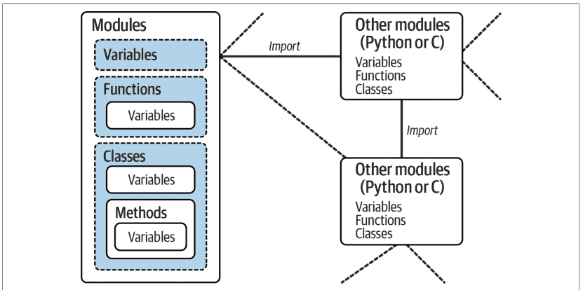

## 模块中的数据隐藏

接下来，我们转向私有事项。正如我们所看到的，Python模块导出在其文件顶层分配的所有名称。没有语法来声明哪些名称应该或不应该在模块外部可见。事实上，如果客户端愿意，没有办法阻止它更改模块内部的名称。

在Python中，模块中的数据隐藏是一种*约定*，而不是语法约束。如果你想通过破坏其名称来破坏一个模块，你可以这样做，但大多数程序员并不把这当作人生目标。一些纯粹主义者反对这种对数据隐藏的自由态度，声称这意味着Python无法实现封装。然而，Python中的封装更多是关于打包而不是限制。我们将在下一部分中结合类来扩展这个想法，类也没有隐私语法，但通常可以在代码中模拟其效果。

## 最小化 from * 的损害：_X 和 __all__

话虽如此，作为一个有限的特殊情况，你可以用单下划线（例如，_X）作为名称的前缀，以防止在客户端使用from *语句导入模块名称时被复制出来。这实际上只是为了最小化命名空间污染；因为from *复制所有名称，导入者可能会得到超出其预期的内容（包括覆盖导入者中名称的名称）。但下划线不是“私有”声明：你仍然可以通过其他导入形式查看和更改这些名称。示例25-1演示了这个想法。

示例25-1. unders.py

```
a, b, _c, _d = 1, 2, 3, 4  # 控制 from * 导出，版本1
```

当名称同时带有和不带下划线以这种方式分配时，from *看不到前者，但import和普通的from可以：

```
$ python3
>>> from unders import *  # 在 from * 上仅加载非 _X 名称
>>> a, b
(1, 2)
>>> _c
NameError: name '_c' is not defined. Did you mean: '_'?

>>> from unders import _c  # 但其他导入者获取每个名称
>>> _c
3
>>> import unders
>>> unders._d
4
```

或者，你可以通过在模块顶层将变量名字符串列表分配给变量`__all__`来实现类似于_X命名约定的隐藏效果。使用此功能时，from *语句将仅复制`__all__`列表中列出的名称，而其他导入则照常工作。

实际上，这是_X约定的反面：`__all__`标识要复制的名称，而_X标识不复制的名称。Python首先在模块中查找`__all__`列表，并复制其名称，无论是否有任何下划线；如果未找到`__all__`，from *将复制所有没有单个前导下划线的名称。为了演示，示例25-2使用了两种名称隐藏工具。

示例25-2. alls.py

```
__all__ = ['a', '_c']  # 控制 from * 导出，版本2
a, b, _c, _d = 1, 2, 3, 4  # __all__ 优先于 _X
```

关于导入，`from *` 会获取 `__all__` 中的所有内容，但不包括其他内容；而其他导入方式则会获取所有内容：

```
$ python3
>>> from alls import *              # 仅加载 __all__ 中的名称
>>> a, _c                           # 即使它们带有下划线
(1, 3)
>>> b
NameError: name 'b' is not defined

>>> from alls import a, b, _c, _d    # 但其他导入方式会获取所有名称
>>> a, b, _c, _d
(1, 2, 3, 4)

>>> import alls
>>> alls.a, alls.b, alls._c, alls._d
(1, 2, 3, 4)
```

与 `_X` 约定类似，`__all__` 列表仅对 `from *` 语句形式有意义，并不构成隐私声明：其他导入语句仍然可以访问所有名称，正如最后两个测试所示。尽管如此，模块编写者可以使用这两种技术来实现与 `from *` 配合使用时行为良好的模块。

另请参阅第 24 章中关于包 `__init__.py` 文件中 `__all__` 列表的讨论。在这种情况下，这些列表声明了嵌套子模块，以便在对其容器执行 `from *` 时自动加载。其效果类似于模块文件中的名称隐藏，尽管包将其扩展到应用于文件系统中包文件夹的内容。

## 管理属性访问：`__getattr__` 和 `__dir__`

关于模块中的数据隐藏，Python 3.7 增加了对模块顶层特殊函数的支持，这些函数可用于管理对模块属性的访问。如果定义了模块的 `__getattr__` 函数，当找不到模块属性时，该函数会自动运行；而其 `__dir__` 则会覆盖为 `dir` 内置函数运行的正常属性列表获取。这些函数可用于实现基本的访问约束和任意动态接口。

这些函数也会遮蔽 `classes` 中同名的工具，部分目的是为了消除一个长期存在且晦涩的技巧，该技巧将 `sys.modules` 表中模块的对象重置为具有相同方法的 `class` 实例。当然，这意味着在我们学习第六部分的类之后，这些函数可能更有意义，但示例 25-3 中的示例模块演示了基础知识。

### 示例 25-3. gamod.py

```
var = 2                                    # 真实属性直接返回

def __getattr__(name):                      # 未定义的属性获取路由到此处
    print(f'(virtual {name})', end=' ')
    match name:
        case 'test':
            return name * var
        case 'hack' | 'code':
            return name.upper()
        case _:
            raise AttributeError(f'{name} is undefined')

def __dir__():
    return ['var', 'test', 'hack', 'code']
```

导入后，对模块中定义的真实属性的获取正常工作（受前一节中 `from *` 的 `_X` 和 `__all__` 约束），但缺失的名称会路由到 `__getattr__`，由其管理请求。它也可以使用 raise 语句用 *异常* 标记无效请求——这是本书后面将详细研究的主题，因为它目前也依赖于类：

```
>>> import gamod
>>> gamod.var                # 真实属性：不调用 __getattr__
2
>>> gamod.test               # 虚拟属性：获取时计算
(virtual test) 'testtest'
>>> gamod.hack
(virtual hack) 'HACK'
>>> gamod.nonesuch
AttributeError: nonesuch is undefined

>>> dir(gamod)
['code', 'hack', 'test', 'var']
```

`from` 语句也会调用 `__getattr__`，尽管 `from *` 要求名称列在 `__all__` 上（你可以大致忽略这里虚假的 `__path__` 获取，尽管 `__getattr__` 必须适应它）：

```
>>> from gamod import code
(virtual __path__) (virtual code)
>>> code
'CODE'
>>> from gamod import *
(virtual __path__) (virtual __all__)
>>> var
2
>>> hack
NameError: name 'hack' is not defined
```

重要的是，`__getattr__` *不会* 在模块自身的全局作用域查找中运行，因此文件内未定义的名称仍然未定义。它实际上只用于从*其他*模块进行的属性获取，并且不会捕获任何地方的*赋值*。例如，在示例 25-3 底部添加的第一行会失败，而在 REPL 中运行的第二行会在模块中创建一个新属性，此后绕过 `__getattr__`：

```
print(test)                # 文件：不调用 __getattr__（引发 NameError）
gamod.hack = 'real'        # REPL：不调用 __getattr__（创建属性）
```

尽管这一切都按预期工作，但它是一个工具构建者的钩子，你必须发掘合理的用例。它在狭窄的角色中可能有用，但它也*混淆*了模块和类，并且忽略了模块学习者尚未理解这些函数起源于类的事实。这是 Python 中一个令人遗憾的常见主题：添加通常伴随着前向依赖，似乎期望用户已经了解 Python 才能使用 Python。Python 不仅仅是为 Python 专家准备的，但这是许多模块中固有的信息。

这里的好消息可能是，后来一个为模块属性赋值添加类 `__setattr__` 的提案被 Python 指导委员会拒绝了——尽管是在允许 `__getattr__` 和 `__dir__` 悄然进入之后。像往常一样，你应该权衡这个扩展的复杂性与其实际应用。

## 启用语言更改：__future__

说到更改，可能破坏现有代码的 Python 模块通常是逐步引入的。这并不总是像它可能的那样“渐进”，版本 3.0 就是一个明显的例外（尽管 3.X 发布后 2.X 又被支持了 12 年）。然而，有时更改最初表现为可选扩展，默认情况下是禁用的。要在其正式到来之前的 Python 中启用此类扩展，请使用以下形式的特殊导入语句：

```
from __future__ import featurename
```

在脚本中编写时，此语句必须作为文件中的第一条可执行语句出现（可能在文档字符串或注释之后），因为它启用基于模块的代码特殊编译。也可以在交互式提示符下提交此语句以试验即将到来的语言更改；然后该功能将在交互式会话的剩余时间内可用。

例如，本书的前一版本在 Python 2.X 中使用此语句来激活第 5 章的 3.X 真除法、第 11 章的 3.X print 调用以及第 24 章的 3.X 包绝对导入。更早的版本使用此语句形式来演示生成器函数，这些函数需要一个尚未默认启用的 yield。

本版大胆地向前迈进，使用当前版本，但 __future__ 可以在旧版 Python 中用于启用第 20 章末尾描述的 Python 3.7 的 StopIteration “冒泡”行为：

```
from __future__ import generator_stop
```

有关你可以通过这种方式导入和开启的未来特性的列表，请参阅 Python 库手册中 __future__ 的条目。根据其文档，其特性名称永远不会被删除，因此即使在通常启用该特性的 Python 版本运行的代码中，保留 __future__ 导入也是安全的。未来不会抹去过去。

## 双重使用模式：__name__ 和 __main__

我们下一个与模块相关的技巧让你既可以将文件作为模块导入，也可以将其作为独立脚本运行，这是一个在 Python 文件中广泛使用的钩子。它实际上非常简单，以至于一些学习者一开始会错过要点。每个模块都有一个名为 __name__ 的内置属性，Python 会自动创建并按如下方式分配：

- 如果文件作为顶级脚本文件运行，启动时 __name__ 被设置为字符串 '__main__'。
- 如果文件被导入，__name__ 被设置为其客户端所知的模块名称。

结果是，模块可以测试自己的 __name__ 以确定它是被运行还是被导入。例如，假设我们创建示例 25-4 中名为 dualmode.py 的代码文件，其中包含一个名为 title 的函数。

### 示例 25-4. dualmode.py

```
def title():
    print('Learning Python, 6E')

if __name__ == '__main__':
    title()
```

此模块定义了一个函数供客户端导入和正常使用：

```
$ python3
>>> import dualmode
>>> dualmode.title()
Learning Python, 6E
```

但该模块还包含底部的代码，设置为在文件作为程序运行时自动调用该函数：

```
$ python3 dualmode.py
Learning Python, 6E
```

实际上，模块的 `__name__` 变量充当*使用模式标志*，允许其代码*既*作为可导入库*又*作为顶级脚本使用。虽然简单，但你会看到这个钩子在许多你可能遇到的 Python 程序文件中使用——既用于测试也用于双重用途。

例如，你会看到 `__name__` 测试最常应用于*自测*代码。简而言之，你可以通过将测试模块导出的代码包装在文件底部的 `__name__` 测试中，将其打包在模块本身中。这样，你可以通过*导入*文件在客户端中使用它，也可以通过从系统 shell 或其他启动方案*运行*它来测试其逻辑。

在文件底部的 `__name__` 测试下编写自测代码可能是 Python 中最常见和最简单的单元测试协议。它比在交互式提示符下重新输入所有测试方便得多。（预览：第 36 章将讨论其他常用的 Python 代码测试选项——如你所见，`unittest` 和 `doctest` 标准库模块提供了更高级的测试工具。）

此外，当你编写既可以作为命令行实用程序又可以作为工具库的文件时，`__name__` 技巧也很常用。例如，假设你用 Python 编写一个文件查找器脚本。如果你将其打包在函数中，并在文件中添加 `__name__` 测试以在文件独立运行时自动调用这些函数，你可以从代码中获得更多收益。这样，脚本的代码就可以在其他程序中重用。

> `__name__` 中有什么？：不要将这里的 `__main__` 钩子与上一章讨论的 `__main__.py` 文件混淆。该文件在将整个包*文件夹*作为程序运行时充当脚本，但测试 `__name__` 是否为 `'__main__'` 用于赋予单个*文件*两种角色。Python 经常为相似但不同的目的混淆相同的名称——参见 `__getattr__`！

### 示例：使用 `__name__` 进行单元测试

事实上，我们在本书中已经看到许多 `__name__` 检查可能有用的情况。例如，我们在第 18 章中编写了一个脚本，计算发送的参数集中的最小值——示例 18-3，其代码在此重复以便参考：

def minmax(test, *args):
    res = args[0]
    for arg in args[1:]:
        if test(arg, res):
            res = arg
    return res

def lessthan(x, y): return x < y
def grtrthan(x, y): return x > y

print(minmax(lessthan, 4, 2, 1, 5, 6, 3))    # 自测代码
print(minmax(grtrthan, 4, 2, 1, 5, 6, 3))

此脚本在底部包含了自测代码，因此我们无需在每次运行时都在交互式解释器中重新输入测试代码。然而，当前编码方式的问题在于，当此文件被其他文件导入作为工具使用时，自测调用的输出也会出现——这可不是一个对用户友好的特性！为了做得更好，我们可以将自测调用包装在一个 `__name__` 检查中，这样它将*仅*在文件作为顶级脚本运行时启动，而不是在导入时启动。示例 25-5 列出了这个经过改进的模块新版本。

## 示例 25-5. minmax.py

```
print('I am:', __name__)

def minmax(test, *args):
    res = args[0]
    for arg in args[1:]:
        if test(arg, res):
            res = arg
    return res

def lessthan(x, y): return x < y
def grtrthan(x, y): return x > y

if __name__ == '__main__':
    print(minmax(lessthan, 4, 2, 1, 5, 6, 3))    # 自测代码
    print(minmax(grtrthan, 4, 2, 1, 5, 6, 3))
```

我们在这里还在顶部打印了 `__name__` 的值以跟踪其值（在真正的库模块中你不会这样做）。Python 在开始加载文件时就会创建并分配这个使用模式变量。当我们作为顶级脚本运行此文件时，其名称被设置为 `__main__`，因此其自测代码会自动启动：

```
$ python3 minmax.py
I am: __main__
1
6
```

然而，如果我们导入该文件，其名称不是 `__main__`，因此我们必须显式调用该函数才能使其运行：

```
$ python3
>>> import minmax
I am: minmax
>>> minmax.minmax(minmax.lessthan, *'hack')
'a'
```

同样，无论这是否用于测试，最终效果是我们的代码可以扮演*两种不同的角色*——作为工具库模块，或作为可执行程序。这是一举两得的代码。你还会看到一些程序将程序模式的运行路由到一个名为 `main` 的模块中：

```
def main():
    ...

if __name__ == '__main__':
    main()
```

这行得通，但这是额外的代码，并且在 Python 中名为 `main` 的函数并没有什么特殊之处——不像其他一些语言，这可能是这种间接方式出现在 Python 代码中的灵感来源之一。


*钓鱼教程回顾*：关于 `__name__ == '__main__'` 测试的另一个应用示例，请参阅本书示例包中的双模式脚本/模块 `formats.py`。它使用逗号和货币惯例格式化数字，并演示了如何编写自己的灵活工具，而不是依赖内置函数。它在本版中因篇幅原因被删减，但提供了可选的自学代码——并强调了学会钓鱼通常比直接得到一条鱼要好。

## import 和 from 的 as 扩展

接下来是第 23 章名称冲突部分介绍的一个主题的后续内容。作为一个虽小但有用的便利功能，`import` 和 `from` 语句都支持一个可选的 `as` 子句，它简单地*重命名*你的脚本导入的名称。例如，以下使用 `as` 扩展的 `import` 语句：

```
import modulename as name          # 使用 name，而不是 modulename
```

等同于以下三条语句，它仅在导入者的作用域中重命名模块（对于其他文件，它仍然以其原始名称被知晓），并在导入者的作用域中完全丢弃原始名称：

```
import modulename                  # 执行常规导入
name = modulename                  # 在此处重命名模块
del modulename                     # 在此处丢弃原始名称
```

使用 `as` 进行 `import` 后，你可以——并且实际上必须——使用 `as` 后列出的名称来引用该模块。更长的等效形式之所以有效，是因为模块是*一等对象*，就像函数一样，可以自由传递。

`as` 扩展也适用于 `from` 语句，用于将从文件导入的名称分配给导入者作用域中的不同名称。与之前一样，你只能得到你提供的新名称，而不是其原始名称：

```
from modulename import attrname as name    # 使用 name，而不是 attrname
```

这反过来与以下语句的工作方式相同：

```
from modulename import attrname
name = attrname
del attrname
```

如第 23 章所述，此扩展通常用于为较长的名称提供*更短的同义词*，以及在你已经在脚本中使用某个名称（否则会被常规导入覆盖）时避免*名称冲突*：

```
import reallylongmodulename as name    # 使用更短的别名
name.func()                             # 重命名以使其更短

from module1 import utility as util1     # 只能有一个 "utility"
from module2 import utility as util2     # 重命名以使其唯一
util1(); util2()
```

作为回顾，`as` 子句在为整个目录路径提供简短、简单的名称以及在使用第 24 章描述的包导入功能时避免名称冲突方面也很有用：

```
import dir1.dir2.mod as mod             # 只需列出一次完整路径
mod.func()                               # 如果路径更改，只需更改一处

from dir1.dir2.mod import func as modfunc # 如果需要，重命名以使其唯一
modfunc()                                # 允许 func 是其他东西
```

最后，`as` 子句在某种程度上也是对名称更改的一种防范：如果库的新版本重命名了你的代码广泛使用的模块或工具，或者提供了一个你更愿意使用的新替代品，你可以在导入时简单地将其重命名为之前的名称，以避免破坏你的代码：

```
import newname as oldname
from library import newname as oldname
...然后继续愉快地使用 oldname，直到你有时间更新所有代码...
```

话虽如此，如果所有的软件更改都只是名称更改，我们就会有少得多的事情来填满我们的时间！

## 模块内省

接下来是模块内部机制。因为模块将其大多数有趣的属性作为内置属性公开，所以编写管理其他程序的程序很容易——我们通常称这些工具为元程序，因为它们的主题是其他程序。这个领域也被称为内省，因为程序可以查看和处理对象内部。内省是一个有些高级的特性，但它对于构建编程工具很有用。

例如，要获取模块属性的值，我们可以使用属性限定或索引模块的属性字典，该字典在我们在第 23 章探讨的内置 `__dict__` 属性中公开。正如我们所见，Python 的 `vars` 内置函数是访问 `__dict__` 的另一种方式，其 `sys.modules` 字典通过导入名称字符串记录所有已加载的模块。此外，其 `getattr` 内置函数允许我们通过字符串名称获取属性——这就像说 `object.attr`，但 `attr` 是一个在运行时产生字符串的表达式。

因此，在导入 `M` 和 `sys` 后，所有以下表达式都访问名为 `name` 的同一属性和对象：

```
M.name                                  # 通过属性限定对象
M.__dict__['name']                      # 手动索引命名空间字典
vars(M)['name']                         # 命名空间字典替代方式
sys.modules['M'].name                   # 手动索引已加载模块表
getattr(M, 'name')                      # 调用内置获取函数
sys.modules['M'].__dict__['name']       # 模块和属性名称字符串
```

使用示例 25-5（以及隐含 `and` 和右侧重复的链式比较）进行演示：

```
>>> import minmax, sys
>>> (minmax.lessthan
    is minmax.__dict__['lessthan']    is vars(minmax)['lessthan']
    is sys.modules['minmax'].lessthan is getattr(minmax, 'lessthan')
    is sys.modules['minmax'].__dict__['lessthan'])
True
```

当然，第一种方式在视觉上（和键盘上）要容易得多，但其他方式支持更通用的访问。

## 示例：使用 __dict__ 列出模块

通过像这样公开模块内部，Python 帮助你构建关于程序的程序。作为演示，示例 25-6 中名为 `mydir.py` 的模块将这些想法付诸实践，实现了一个定制且扩展版本的内置 `dir` 函数。它定义并导出一个名为 `listing` 的函数，该函数接受一个模块对象作为参数，并打印按属性名称排序的模块命名空间的格式化显示。

### 示例 25-6. mydir.py

```
"""
mydir.py: 一个列出其他模块命名空间的模块。
导入此模块的 listing 并传递一个已导入的模块，或
将此文件作为脚本运行以执行其自测代码。
"""

sepchr = '-'
seplen = 60

def listing(module, verbose=True, unders=True):
    """
    列出模块：如果 verbose=False，则只列出属性，
    如果 unders=False，则隐藏内置的 __X__ 属性。
    """
    sepline = sepchr * seplen
    if verbose:
        print(sepline)
        print(f'name: {module.__name__}\nfile: {module.__file__}')
        print(sepline)

    # 扫描命名空间键
    for (count, attr) in enumerate(sorted(module.__dict__)):
        prefix = f'{count + 1:02d}) {attr}'
        if attr.startswith('__'):
            if unders:
                print(prefix, '<built-in name>')    # 跳过 __file__ 等
        else:
            print(prefix, getattr(module, attr))    # 或 module.__dict__[attr]

    if verbose:
        print(sepline)
        print(f'{module.__name__} has {count + 1} names')
        print(sepline)

if __name__ == '__main__':
    import mydir
    listing(mydir)                                  # 自测代码：列出自身
```

请注意此模块中的*文档字符串*；因为我们可能希望将其用作通用工具，这些文档字符串提供了可通过帮助和 PyDoc 的浏览器模式访问的功能信息——这些工具使用类似的内省工具来完成其工作（用法信息请参见第 15 章）。模块底部还提供了一个*自测试*，它自恋地导入并列出自身；以下是产生的输出类型（为节省空间进行了路径编辑）：

```
$ python3 mydir.py
--------------------------------------------------
name: mydir
file: /Users/me/.../LP6E/Chapter25/mydir.py
--------------------------------------------------
01) __builtins__ <built-in name>
02) __cached__ <built-in name>
03) __doc__ <built-in name>
04) __file__ <built-in name>
05) __loader__ <built-in name>
06) __name__ <built-in name>
07) __package__ <built-in name>
08) __spec__ <built-in name>
09) listing <function listing at 0x1077758a0>
10) sepchr -
11) seplen 60
--------------------------------------------------
mydir has 11 names
--------------------------------------------------
```

要将此工具用于列出其他模块，只需将模块作为对象传递给此文件的函数。这里它手动列出了自身，以及 Python 标准库中 tkinter GUI 模块的属性；从技术上讲，它适用于任何具有 `__name__`、`__file__` 和 `__dict__` 属性的对象：

```
>>> from mydir import listing
>>> import mydir, tkinter

>>> listing(mydir, unders=False, verbose=False)
09) listing <function listing at 0x10800fba0>
10) sepchr -
11) seplen 60

>>> listing(tkinter, unders=False)
--------------------------------------------------
name: tkinter
file: /.../lib/python3.12/tkinter/__init__.py
--------------------------------------------------
01) ACTIVE active
02) ALL all
03) ANCHOR anchor
04) ARC arc
...more names omitted...
166) re <module 're' from '/.../lib/python3.12/re/__init__.py'>
167) sys <module 'sys' (built-in)>
168) types <module 'types' from '/.../lib/python3.12/types.py'>
169) wantobjects 1
--------------------------------------------------
tkinter has 169 names
--------------------------------------------------
```

你稍后会再次遇到 `getattr` 及其相关函数。这里需要注意的是，`mydir` 是一个让你浏览其他程序的程序。因为 Python 暴露了其内部结构，所以你可以通用地处理对象。


> REPL 启动提示：你可以通过在名为 PYTHONSTARTUP 环境变量的文件中导入工具（如 `mydir.listing` 和我们稍后将编写的重载器）来预加载它们到交互式 REPL 中。因为启动文件中的代码在交互式命名空间中运行，在此文件中导入常用工具可以节省一些输入。更多信息请参见附录 A。

## 按名称字符串导入模块

最后，是时候介绍一些更动态的内容了。到现在，你可能已经注意到 `import` 或 `from` 语句中的模块名是一个硬编码的变量名。然而，有时你的程序会在运行时以字符串形式获取要导入的模块名称——例如，来自 GUI 中的用户选择或 XML 文档的解析。不幸的是，你不能直接使用 import 语句来加载给定名称字符串的模块——Python 期望一个按字面意思取值而非求值的变量名，而不是字符串或表达式。例如：

```
>>> import 'string'
SyntaxError: invalid syntax
```

简单地将字符串赋值给变量名也不起作用：

```
>>> x = 'string'
>>> import x
ModuleNotFoundError: No module named 'x'
```

这里，Python 将尝试导入文件 `x.py`，而不是 `string` 模块——`import` 语句中的名称既成为分配给已加载模块的变量，又按字面意思标识外部文件。

## 运行代码字符串

为了解决这个问题，你需要使用特殊工具从运行时生成的字符串动态加载模块。最通用的方法是将 `import` 语句构造为 Python 代码字符串，并将其传递给内置函数 `exec` 来运行：

```
>>> modname = 'string'
>>> exec('import ' + modname)    # Run a string of code
>>> string                        # Imported in this namespace
<module 'string' from '../lib/python3.12/string.py'>
```

我们之前在第 3、5、9 和 10 章中遇到过 `exec` 函数——以及用于表达式的表亲 `eval`。`exec` 编译一段代码字符串并将其传递给 Python 解释器执行。在 Python 中，字节码编译器在运行时可用，因此你可以编写像这样构造和运行其他程序的程序。默认情况下，`exec` 在当前作用域中运行代码（就像粘贴在那里一样），但你可以通过传递可选的命名空间字典来更具体地指定。它也有前面书中提到的安全问题，这在你自己构建的代码字符串中可能无关紧要。

## 直接调用：两种选择

这里 `exec` 唯一真正的缺点是它每次运行都必须编译 import 语句，而编译可能很慢。对于多次运行的代码字符串，使用内置的 `compile` 预编译为字节码可能会有所帮助，但在大多数情况下，使用内置的 `__import__` 函数从名称字符串导入可能更简单且运行更快。效果类似，但 `__import__` 返回模块对象——将其分配给一个名称以保留它：

```
>>> modname = 'string'
>>> string = __import__(modname)
>>> string
<module 'string' from '/.../lib/python3.12/string.py'>
```

因为导入是通过调用 `__import__` 实现的，所以它正常加载命名的模块。较新的标准库调用 `importlib.import_module` 执行相同的工作；Python 的文档将其描述为 `__import__` 的简化包装器，用于“日常”使用（尽管随着我们的工具越来越新，我们的代码也越来越长）：

```
>>> import importlib
>>> modname = 'string'
>>> string = importlib.import_module(modname)
>>> string
<module 'string' from '/.../lib/python3.12/string.py'>
```

此调用在基本功能上与 `__import__` 相同，但有关两个调用的高级用法和参数的更多详细信息，请参阅 Python 手册。Python 的文档似乎也更倾向于使用较新的 `importlib` 调用按名称字符串导入，尽管这似乎是主观的，两种调用都有效，而且导入系统一直是一个频繁变化者：

这里要指出的是：两种调用也适用于上一章的包导入，但第一个返回包路径中最左边的组件，而第二个返回最后一个——事实上，这是它们最显著的区别：

```
>>> import importlib
>>> __import__('email.message')
<module 'email' from '/.../lib/python3.12/email/__init__.py'>
>>> importlib.import_module('email.message')
<module 'email.message' from '/.../lib/python3.12/email/message.py'>
```

`importlib` 调用也适用于包相对导入字符串（带前导点），如果同时传递要从中解析导入的包路径的字符串名称。有关包导入的故事，请参见第 24 章。

## 示例：传递性模块重载

为了整合并应用我们研究过的一些主题，本节开发了一个模块工具，作为更大的案例研究来结束本章和本部分。我们在第 23 章中探讨了模块重载，作为一种在不停止和重启程序或 REPL 的情况下获取代码更改的方法。然而，在重载模块时，Python 只重载该特定模块的文件；它不会自动重载被重载文件恰好导入的模块。

例如，如果你重载某个模块 A，而 A 导入了模块 B 和 C，则重载仅适用于 A——而不适用于 B 和 C。A 中导入 B 和 C 的语句在重载期间会重新运行，但它们只是获取已加载的 B 和 C 模块对象（假设它们之前已被导入）。在抽象代码中，这是文件 A.py：

```
# A.py
import B                # Not reloaded when A is!
import C                # Just imports of already loaded modules: no-ops

$ python3
>>> ...import and use A...
>>> from importlib import reload
>>> reload(A)
```

默认情况下，这意味着你不能依赖重载来传递性地获取程序中所有模块的更改。相反，你必须使用多个重载调用来独立更新子组件。对于你正在交互式测试的大型系统，这可能需要大量的工作。你可以通过在像 A 这样的父模块中添加重载调用来设计你的系统以自动重载其子组件，但这会使代码复杂化。

## 递归重载器

更好的方法是编写一个通用工具来自动执行传递性重载，通过扫描模块的 `__dict__` 属性字典并检查每个属性值的类型来查找要重载的嵌套模块。这样的实用函数可以递归调用自身，以导航任意形状和深度的导入依赖链。模块 `__dict__` 在第 23 章中介绍，并在前面的 mydir.py 中使用，递归在第 19 章中探讨，而 `type` 调用在第 9 章中介绍；我们只需要将这些工具组合用于这个新角色。

为此，示例 25-7 中列出的模块 reloadall.py 定义了一个 `reload_all` 函数，该函数自动重载一个模块、该模块导入的每个模块，依此类推，直到每个导入链的底部。它使用一个字典来跟踪已重载的模块，使用递归来遍历导入链，并使用标准库的 `types` 模块，该模块只是为内置类型（如模块）预定义了类型结果。它的 `visited` 字典避免了当导入是递归或冗余时的重复（模块对象是不可变的，因此可以作为字典键）；正如我们在第 5 章和第 8 章中看到的，集合可以类似地工作（并且在未来的重写中将会使用）。

### 示例 25-7. reloadall.py

```
"""
reloadall.py: transitively reload nested modules.
Call reload_all with one or more imported modules as arguments.
These modules, and all the modules they import, are reloaded.
"""

import types
from importlib import reload

def status(module):
    print('reloading', module.__name__)

def tryreload(module):
    try:
        reload(module)                # Imports might fail
    except:
        print('FAILED:', module)

def transitive_reload(module, visited):
    if not module in visited:        # Trap cycles, duplicates
        status(module)               # Reload this module
        tryreload(module)            # And visit children
        visited[module] = True
```

for attrobj in module.__dict__.values():
    if type(attrobj) == types.ModuleType:
        transitive_reload(attrobj, visited)

def reload_all(*args):
    visited = {}
    for arg in args:
        if type(arg) == types.ModuleType:
            transitive_reload(arg, visited)

def tester(reloader, modname):
    import importlib, sys
    if len(sys.argv) > 1:
        modname = sys.argv[1]
    module = importlib.import_module(modname)
    reloader(module)

if __name__ == '__main__':
    tester(reload_all, 'reloadall')

除了命名空间字典，这个脚本还使用了我们之前学过的其他工具：它包含一个`__name__`测试，以便仅在作为顶级脚本运行时启动自测代码；其测试函数使用`sys.argv`来检查命令行参数，并使用`importlib`通过作为函数或命令行参数传入的名称字符串来导入模块。如需更多信息，请回顾前面的内容。

一个值得注意的细节：注意这段代码中的`tryreload`如何将基本的重载调用包装在try语句中以捕获异常。重载可能因多种原因失败，使用系统接口时最好采取防御性措施。正如你稍后将看到的，例如，在Python 3.12中添加到sys的一个不可重载的监控模块，否则会使重载器崩溃。try语句在第10章中已预览，并将在第七部分中全面介绍。

## 测试递归重载

要正常使用此模块，请导入其`reload_all`函数，并传递一个已加载的模块对象——就像使用内置的reload函数一样。与reload类似，其模块参数通常通过顶级导入获取；正如我们所见，`sys.modules`获取也有效，但仅通过`from`访问的模块不适用。

首先，可以独立运行该模块进行测试。其测试函数对通过名称字符串导入的模块运行传入的重载器——如果存在命令行参数，则从该参数获取，否则使用传入的名称。在此模式下，模块的自测代码默认调用tester来对自身导入的模块运行`reload_all`（如果没有使用命令行参数，其自身名称在文件中未定义，除非导入）：

```
$ python3 reloadall.py
reloading reloadall
reloading types
```

使用命令行参数时，测试器改为通过名称字符串重载列出的模块——在以下示例中，是我们在示例21-8中编写的第21章文件夹的基准模块。要实际运行此操作，你需要此处的重载器模块以及它要重载的模块。一种处理方法是按照第22章，将第21章的代码文件夹添加到你的PYTHONPATH设置中。双向复制文件是次优的，而简单地在Chapter21文件夹中运行将不起作用，因为重载器脚本的Chapter25文件夹是“主目录”。注意，在此模式下我们提供的是模块名称，而不是文件名；因为脚本使用搜索路径导入模块，就像import一样，所以省略了.py扩展名：

```
$ pwd
/Users/me/.../LP6E/Chapter25
$ export PYTHONPATH=../Chapter21
$ python3 reloadall.py pybench
reloading pybench
reloading sys
reloading sys.monitoring
FAILED: <module 'sys.monitoring'>
reloading os
reloading abc
reloading stat
reloading posixpath
reloading genericpath
reloading time
reloading timeit
reloading gc
reloading itertools
```

更有用的是，我们也可以在*交互式*提示符下部署此模块。这类似于内置的reload，但为传递的模块或模块添加了递归重载——此处针对标准库模块：

```
$ python3
>>> from reloadall import reload_all
>>> import os, tkinter
>>> reload_all(os)
reloading os
reloading abc
reloading sys
reloading sys.monitoring
FAILED: <module 'sys.monitoring'>
reloading stat
reloading posixpath
reloading genericpath

>>> reload_all(tkinter)
reloading tkinter
reloading collections
reloading collections.abc
...etc...
reloading _sre
reloading functools
reloading copyreg
```

在任一模式下，重载器也适用于模块*包*——此处针对标准库的email包：

```
$ python3 reloadall.py email.message
reloading email.message
reloading binascii
reloading re
...etc...

$ python3
>>> from reloadall import reload_all
>>> import email.message
>>> reload_all(email.message)
reloading email.message
reloading binascii
reloading re
...etc...
```

以下是在第595页“基本包结构”中编写的dir1.dir2.mod路径上运行重载器。路径中的所有项都从包根目录重载，REPL中的sys.path mod提供了对另一个章节代码文件夹的导入访问——类似于之前使用的PYTHONPATH设置（同样，参见第22章）：

```
>>> import sys
>>> sys.path.append('../Chapter24')    # 手动扩展搜索路径
>>> import dir1.dir2.mod              # 第24章文件夹中的一个包
Running dir1.__init__.py
Running dir1.dir2.__init__.py
Loading dir1.dir2.mod

>>> reload_all(dir1)                   # 重载路径上的所有项：模块中的模块
reloading dir1
Running dir1.__init__.py
reloading dir1.dir2
Running dir1.dir2.__init__.py
reloading dir1.dir2.mod
Loading dir1.dir2.mod
```

最后，这是一个简单的会话，演示了普通重载与*传递性*重载的效果——除非使用我们的传递性工具，否则对两个嵌套文件所做的更改不会被重载捕获（为简洁起见，文件在此内联列出）：

```
# 文件 ra.py
import rb
X = 1

# 文件 rb.py
import rc
Y = 2

# 文件 rc.py
Z = 3

$ python3
>>> import ra
>>> ra.X, ra.rb.Y, ra.rb.rc.Z        # 三级导入链
(1, 2, 3)
```

现在，不停止Python，更改所有三个文件的赋值值，保存文件，并在REPL中重新加载：

```
>>> from importlib import reload
>>> reload(ra)                         # 内置reload仅限顶级
<module 'ra' from '/_/LP6E/Chapter25/ra.py'>
>>> ra.X, ra.rb.Y, ra.rb.rc.Z
(111, 2, 3)

>>> from reloadall import reload_all
>>> reload_all(ra)                     # 正常用法模式
reloading ra
reloading rb
reloading rc
>>> ra.X, ra.rb.Y, ra.rb.rc.Z         # 也重载所有嵌套模块
(111, 222, 333)
```

这与前面的包路径重载类似，但这里的导入是显式的；包中的模块嵌套是隐式的。研究重载器的代码和结果以了解更多关于其操作的信息。下一节将进一步练习其工具。

## 替代编码

对于所有递归爱好者（我们知道是谁），示例25-8列出了示例25-7中原始函数的替代*递归*编码。这个新版本使用*集合*而不是字典来检测重复和循环，由于消除了顶级循环，它稍微更*直接*，并用于说明一般的递归编码。与原始版本比较以查看其不同之处。

此版本也从原始版本中免费获得了一些工作；实际上，此模块本质上*扩展*了原始版本，仅替换了变化的部分。注意它如何调用原始版本的测试器，传入此处定义的`reload_all`——这确保了当此脚本以独立模式启动时，运行的是此模块的重载器。

```
示例 25-8. reloadall2.py
"""
reloadall2.py: 传递性地重载嵌套模块。
替代编码：递归，重构。
"""

import types
from reloadall import status, tryreload, tester

def transitive_reload(objects, visited):
    for obj in objects:
        if type(obj) == types.ModuleType and obj not in visited:
            status(obj)
            tryreload(obj)              # 重载此项，递归到属性
            visited.add(obj)
            transitive_reload(obj.__dict__.values(), visited)

def reload_all(*args):
    transitive_reload(args, set())

if __name__ == '__main__':
    tester(reload_all, 'reloadall2')    # 测试：重载自身或参数
```

正如我们在第19章中看到的，递归函数通常有一个等效的*显式栈*或*队列*，在某些情况下可能更可取。示例25-9列出了一个这样的传递性重载器——它使用栈而不是递归，并使用*集合*来跳过重复和循环。在每次循环中，新模块的所有属性值都被添加到对象栈的末尾，并在稍后进行过滤，此过程重复进行，直到候选对象列表为空。生成器表达式可以在extend调用中过滤掉非模块，以避免一些弹出操作，但这会更复杂。

由于它在列表的*末尾*既弹出又添加项，此版本是基于栈的，尽管推入和字典值的顺序影响了它到达和重载模块的顺序——它从*右到左*访问命名空间字典中的子模块，与递归版本的从左到右顺序不同（跟踪代码以查看如何实现）。我们可以通过反转值来改变这一点以匹配，但重载顺序并不重要。

## 示例 25-9. reloadall3.py

```python
"""
reloadall3.py: 传递性地重新加载嵌套模块。
替代编码方式：非递归，显式栈。
"""

import types
from reloadall import status, tryreload, tester

def transitive_reload(objects, visited):
    while objects:
        next = objects.pop()                    # 从末尾删除下一个项目
        if (type(next) == types.ModuleType      # 它是模块对象吗？
            and next not in visited):           # 尚未重新加载？
            status(next)                        # 重新加载此模块，压入其属性
            tryreload(next)
            visited.add(next)
            objects.extend(next.__dict__.values())

def reload_all(*args):
    transitive_reload(list(args), set())

if __name__ == '__main__':
    tester(reload_all, 'reloadall3')            # 测试：重新加载自身或参数
```

如果这些示例中使用的递归和非递归让你感到困惑，请参阅第19章中关于递归函数的讨论，以获取更多背景知识。

## 测试重载变体

为了证明这两种替代重载器与原始版本工作方式相同，让我们测试所有三种重载器变体。得益于它们共用的测试函数，我们可以从命令行运行所有三种变体，既可以不带参数来测试模块重载自身，也可以在命令行（在 `sys.argv` 中）列出要重载的模块名称：

```
$ python3 reloadall.py
reloading reloadall
reloading types

$ python3 reloadall2.py
reloading reloadall2
reloading types

$ python3 reloadall3.py
reloading reloadall3
reloading types
```

虽然这里不太明显，但我们确实在测试各个重载器变体——每个测试都共享一个通用的测试函数，但传入的是各自文件中的 `reload_all`。以下是这些变体重载 tkinter GUI 模块及其所有导入模块的情况；同样，第三个的重载顺序有所不同：

```
$ python3 reloadall.py tkinter
reloading tkinter
reloading collections
reloading collections.abc
...等等...
$ python3 reloadall2.py tkinter
reloading tkinter
reloading collections
reloading collections.abc
...等等...
$ python3 reloadall3.py tkinter
reloading tkinter
reloading re
reloading copyreg
...等等...
```

通常，我们也可以通过交互方式进行测试，导入并调用模块的主重载入口点（传入模块对象），或者调用测试函数（传入重载器函数和模块名称字符串）：

```
$ python3
>>> import reloadall, reloadall2, reloadall3
>>> import tkinter
>>> reloadall.reload_all(tkinter)                    # 常规用例
reloading tkinter
reloading collections
reloading collections.abc
...等等...
>>> reloadall.tester(reloadall2.reload_all, 'tkinter')    # 测试工具
reloading tkinter
reloading collections
reloading collections.abc
...等等...
>>> reloadall.tester(reloadall3.reload_all, 'reloadall3')  # 模拟自测试代码
reloading reloadall3
reloading types
```

最后，如前所述，第三个重载器的结果通常会因*顺序*而异；所有重载器中的重载顺序都取决于命名空间字典的排序（正如我们所知，如今它按键插入时间确定性排序），但最后一个还依赖于项目添加到其栈中的顺序。为了确保所有三个重载器加载的是相同的模块，无论其执行顺序如何，我们可以使用*集合*或*排序*来测试其打印消息的顺序无关相等性——这里通过运行第21章中使用的 `os.popen` 工具执行 shell 命令来获取：

```
>>> import os
>>> res1 = os.popen('python3 reloadall.py tkinter').readlines()
>>> res2 = os.popen('python3 reloadall2.py tkinter').readlines()
>>> res3 = os.popen('python3 reloadall3.py tkinter').readlines()

>>> res1[:3]
['reloading tkinter\n', 'reloading collections\n', 'reloading collections.abc\n']
>>> res3[:3]
['reloading tkinter\n', 'reloading re\n', 'reloading copyreg\n']

>>> res1 == res2, res2 == res3
(True, False)
>>> set(res2) == set(res3)                    # 顺序无关相等性
True
>>> sorted(res2) == sorted(res3)              # 同上
True
```

运行这些脚本，研究它们的代码，并自行实验以获得更深入的理解；这些是你可能想要添加到自己源代码库中的可导入工具。在第31章介绍类树列表器时，请留意类似的测试技术，届时我们将把它应用于传递的*类*对象并进一步扩展。

注意事项：请记住，所有传递性重载器，就像它们使用的内置 `reload` 函数一样，都依赖于模块重载会*就地*更新模块对象这一事实，因此任何命名空间中对这些模块的所有引用都会自动看到更新后的版本。因为 `from` 导入会复制名称出来，所以它们不会被重载更新，无论是传递性的还是非传递性的。更糟糕的是，仅通过 `from` 导入的模块不会被重载，因为它们不存在于任何被扫描的导入器的命名空间中。要做得更好可能需要源代码分析或导入定制。

像这样的工具影响可能是更倾向于使用 `import` 而非 `from` 的另一个原因——这标志着本章和本部分的结束，以及本部分主题的一系列标准警告。

## 模块陷阱

在本节中，我们将探讨通常会让 Python 初学者感到有趣的边界情况集合。有些是这里的复习内容，有些则非常晦涩，以至于找到有代表性的例子都是一个挑战，但大多数都说明了语言的一些重要方面。

## 模块名冲突：包和包相对导入

如果你有两个同名的模块，你可能只能导入其中一个——默认情况下，目录在 `sys.path` 模块搜索路径中最靠左的那个将始终被选中。如果你偏好的模块位于顶级脚本的目录中，这就不是问题；因为该目录始终在模块路径的第一位，其内容将自动首先被定位。然而，对于跨目录导入，模块搜索路径的线性特性意味着同名文件可能会冲突。

*要解决这个问题*，要么避免使用同名文件，要么使用第24章的包导入功能。如果你确实需要访问两个同名文件，后者是解决方案：将你的源文件组织在子目录中，使得包导入目录名使模块引用变得唯一。只要外层包目录名是唯一的，你就能访问同名模块中的任何一个或两个。

如果你不小心为自己的模块使用了一个恰好与你需要的标准库模块同名的名称，这个问题也可能出现——你位于程序主目录（或模块路径中较早的另一个目录）的本地模块可能会隐藏并替换库模块。

*要解决这个问题*，要么避免使用与另一个你需要的模块相同的名称，要么将你的模块存储在包目录中，并使用第24章的包相对导入模型。在这个模型中，普通导入会跳过包目录以访问库的版本，但特殊的点号导入语句仍然可以选择模块的本地版本。

## 顶级代码中的语句顺序很重要

正如我们所看到的，当一个模块首次被导入（或稍后重新加载）时，Python 会从文件顶部到底部逐条执行其语句。这在*前向引用*方面有一些微妙的含义，值得在此强调：

- 模块文件*顶级*（未嵌套在函数中）的代码在 Python 导入过程中到达它时立即运行；因此，它不能引用文件中*下方*分配的名称。
- *函数*体内的代码在函数被调用时才运行；因为函数中的名称在函数实际运行之前不会被解析，所以它们通常可以引用文件中*任何位置*的名称。

换句话说，前向引用通常只在立即执行的顶级模块代码中才是问题；函数可以任意引用名称。以下文件说明了前向引用的正确和错误用法：

```python
func1()                     # 错误：func1 尚未赋值

def func1():
    print(func2())          # 正确：func2 稍后查找

func1()                     # 错误：func2 尚未赋值

def func2():
    return "Hello"

func1()                     # 正确：func1 和 func2 已赋值
```

当此文件被导入（或作为独立程序运行）时，Python 从上到下执行其语句。第一次调用 `func1` 失败，因为 `func1` 的定义尚未运行。只要在调用 `func1` 时 `func2` 的定义已被执行，`func1` 内部对 `func2` 的调用就能工作——但在第二个顶级 `func1` 调用运行时，它还没有。文件底部对 `func1` 的最后一次调用成功，因为 `func1` 和 `func2` 都已被赋值。

将定义与顶级代码混合不仅难以阅读，而且依赖于语句顺序。作为经验法则，如果你需要将立即执行的代码与定义混合，请将定义放在文件顶部，将顶级代码放在文件底部。这样，当 Python 运行使用这些函数的代码时，你的函数保证已被定义和赋值。

## from 复制名称但不链接

尽管常用，但 `from` 语句是 Python 中各种潜在陷阱的来源。正如我们所看到的，`from` 语句实际上是向导入器作用域中的名称赋值——一个*名称复制*操作，而不是名称别名。其含义与 Python 中所有赋值相同，但对于存在于不同文件中的名称，它们尤其微妙。作为复习，假设我们在示例 25-10 中定义了简单的模块 `nested.py`。

示例 25-10. nested.py

```python
X = 99
def printer(): print(X)
```

如果我们在另一个模块（或 REPL，它代表一个模块）中使用 `from` 导入它的两个名称，我们得到的是这些名称的副本，而不是它们的链接。在导入器中更改一个名称只会重置该名称本地版本的绑定，而不会更改 `nested.py` 中的名称：

```python
>>> from nested import X, printer    # 复制名称出来
>>> X = 88                            # 只更改了我的 X！
>>> printer()                         # nested 的 X 仍然是 99
99
```

如果我们改用 `import` 获取整个模块并赋值给一个限定名，我们更改的是 `nested` 中的名称（模块的已加载映像，而不是其源代码）。属性限定引导 Python 到模块对象中的一个名称，而不是导入器中的名称：

```python
>>> import nested                # 获取整个模块
>>> nested.X = 88                # 修改 nested1 的 X
>>> nested.printer()
88
```

要点：通过 `from` 获取的名称的更改不会影响任何其他模块。如第 23 章所述，对通过 `from` 复制的名称所共享的可变对象的更改会影响其他模块，但名称本身的更改不会。

## `from *` 可能会模糊变量的含义

这一点之前提到过，但其演示示例留到了这里。因为在使用 `from *` 语句形式时，你不会列出想要的变量，所以它可能会意外覆盖你当前作用域中已使用的名称。更糟糕的是，它可能使你难以确定一个变量的来源。如果对多个导入的文件使用了 `from *` 形式，这一点尤其明显。

例如，如果你在以下代码中对三个模块使用了 `from *`，那么除了搜索所有三个外部模块文件（它们可能都在其他目录中）之外，你将无法知道一个裸函数调用的真实含义：

```
>>> from module1 import *        # 可能会静默覆盖名称
>>> from module2 import *        # 无法判断我们得到了什么
>>> from module3 import *        # 无法查看名称来源

>>> func()                       # 这是什么？
```

解决方案很简单：不要这样做。在大多数 `from` 语句中列出你想要的属性，并且每个文件最多使用一个 `from *`。这样，任何未定义的名称都可以通过推断确定在单个 `from *` 所命名的模块中。如果你总是使用 `import` 而不是 `from`，你完全可以避免这个问题，但这个建议过于严苛；就像编程中的许多其他事情一样，`from` 如果使用得当，是一个方便的工具。即使是这个例子也不是绝对的坏事——只要众所周知，程序使用这种技术将名称收集到单个模块中以方便使用是可以的。

## `reload` 可能不会影响 `from` 导入

这是另一个与 `from` 相关的陷阱：如前所述，因为 `from` 在运行时会复制（赋值）名称，所以它与名称来源的模块之间没有链接。通过 `from` 导入的名称只是变成了对对象的引用，这些对象恰好在 `from` 运行时被导入模块中的同名名称所引用。

由于这种行为，重新加载源模块对使用 `from` 导入其名称的客户端没有影响。也就是说，客户端的名称仍将引用通过 `from` 获取的原始对象，即使原始模块中的名称后来被重置。以下是抽象代码中的情况：

```
from module import X             # X 可能不会反映任何模块重新加载
...
from importlib import reload
reload(module)                   # 更改了模块，但没有更改我的名称
X                                # 仍然引用旧对象！
```

为了使重新加载更有效，请使用 `import` 和名称限定，而不是 `from`。因为限定总是回到模块，它们会在重新加载就地更新模块内容后找到模块名称的新绑定：

```
import module
...
from importlib import reload
reload(module)
module.X
```

这就是为什么我们本章前面的传递性重新加载器不适用于通过 `from` 获取的名称，只适用于 `import`；再次强调，如果你打算使用重新加载，最好使用 `import`。

## `reload`、`from` 和交互式测试

事实上，前面的陷阱比它看起来的更加微妙。第 3 章警告说，通常最好不要通过导入和重新加载来启动程序，因为涉及的复杂性。当 `from` 被引入时，情况会变得更糟。Python 初学者最常在类似这样的场景中遇到问题——想象一下，在文本编辑窗口中打开一个模块文件后，你启动一个交互式会话来使用 `from` 加载和测试你的模块：

```
from module import function
function(1, 2, 3)
```

发现一个错误后，你跳回编辑窗口，进行更改，然后尝试这样重新加载模块：

```
from importlib import reload
reload(module)
```

这行不通，因为 `from` 语句只赋值了名称 `function`，而不是 `module`。要在重新加载中引用该模块，你必须首先使用 `import` 语句至少绑定一次其名称：

```
from importlib import reload
import module
reload(module)
function(1, 2, 3)
```

但这也不完全有效——重新加载会就地更新模块对象，但如前一节所述，像 `function` 这样过去从模块中复制出来的名称仍然引用*旧对象*；在这个例子中，`function` 仍然是函数的原始版本。要真正获得新函数，你必须在重新加载后将其引用为 `module.function`，或者重新运行 `from`：

```
from importlib import reload
import module
reload(module)
from module import function
function(1, 2, 3)
```

现在，新版本的函数终于可以运行了，但要达到这个目的似乎需要做大量的工作。

如你所见，使用 `reload` 和 `from` 存在固有的问题：你不仅必须记住在导入后重新加载，还必须记住在重新加载后重新运行你的 `from` 语句。这足够复杂，即使专家偶尔也会出错。事实上，随着 Python 3.X 的出现，情况变得更加糟糕，因为你必须记住还要导入 `reload` 本身！

简而言之，你不应该期望 `reload` 和 `from` 能很好地协同工作。再次强调，最好的策略是根本不将它们组合在一起——将 `reload` 与 `import` 一起使用，或者按照第 3 章的建议，以其他方式启动你的程序：使用 IDLE 中的菜单选项、文件图标点击、系统命令行、`exec` 内置函数或其他方式。

## 递归 `from` 导入可能无法工作

最奇怪（并且，谢天谢地，很罕见）的陷阱留到了最后。因为导入是从上到下执行文件的语句，所以在使用相互导入的模块时需要小心。这通常被称为*递归*导入，但递归实际上并没有发生（事实上，*循环*可能是一个更好的术语）——这样的导入不会陷入无限导入循环。然而，由于模块中的语句在导入另一个模块时可能尚未全部运行，因此其某些名称可能尚不存在。

如果你使用 `import` 来获取整个模块，这可能无关紧要；模块的名称在你稍后使用限定来获取其值之前不会被访问，而到那时模块可能已经完成。但如果你使用 `from` 来获取特定名称，你必须记住，在递归导入启动时，你只能访问该模块中已经赋值的名称。

作为此现象的演示，请考虑模块 `recur1` 和 `recur2`，见示例 25-11 和 25-12。

```
示例 25-11. recur1.py

X = 1
import recur2           # 如果 recur2 不存在，则现在运行它
Y = 2
```

```
示例 25-12. recur2.py

from recur1 import X    # 正确：X 已赋值
from recur1 import Y    # 错误：Y 尚未赋值
```

模块 `recur1` 赋值名称 `X`，然后在赋值名称 `Y` 之前导入 `recur2`。此时，`recur2` 可以使用 `import` 将 `recur1` 作为整体获取——它已经存在于 Python 的内部模块表中，这使其可导入，并防止导入循环。但如果 `recur2` 使用 `from`，它将只能看到名称 `X`；名称 `Y` 在 `recur1` 中的 `import` 语句下方赋值，因此尚不存在，所以你会得到一个错误：

```
$ python3
>>> import recur1
ImportError: cannot import name 'Y' from partially initialized module 'recur1'
(most likely due to a circular import) (/_/LP6E/Chapter25/recur1.py)
```

Python 避免在从 `recur2` 递归导入时重新运行 `recur1` 的语句（否则导入会使脚本陷入无限循环，可能需要 Ctrl+C 解决或更糟），但当 `recur1` 被 `recur2` 导入时，其命名空间是不完整的。

解决方案？不要在递归导入中使用 `from`（不，真的！）。如果你这样做，Python 不会陷入循环，但你的程序将再次依赖于模块中语句的顺序。事实上，有两种方法可以摆脱这个陷阱：

- 你通常可以通过仔细设计来消除这样的导入循环——最大化内聚性和最小化耦合是本章开头的良好第一步。

如果你无法完全打破循环依赖，可以通过使用 `import` 和属性限定（而非 `from` 和直接名称）来延迟模块名称的访问，或者将 `from` 语句放在函数内部（而非模块顶层）或文件底部附近以推迟其执行。

本章末尾的练习中提供了关于此问题的更多视角——我们现在已经正式到达本章结尾。

## 章节总结

本章探讨了模块主题，其中部分内容属于高级范畴。我们研究了数据隐藏技术、使用 `__future__` 模块启用新语言特性、`__name__` 使用模式变量、传递性重载、按名称字符串导入等。我们还探讨了模块设计问题，编写了一些实质性程序，并查看了与模块相关的常见错误，以帮助你在代码中避免它们。

下一章将开始探索 Python 的*类*——其面向对象编程工具。我们前几章涵盖的大部分内容也将适用于此：类存在于模块中，也是命名空间，但它们为属性查找增加了一个称为*继承搜索*的额外组件。然而，由于这是本书本部分的最后一章，在深入探讨类之前，请务必完成本部分的实验练习。在此之前，这里是本章的测验，以回顾此处涵盖的主题。

## 测试你的知识：测验

1.  模块顶层名称以单下划线开头的变量有什么特殊意义？
2.  当模块的 `__name__` 变量是字符串 `'__main__'` 时，这意味着什么？
3.  你如何通过循环遍历模块中的所有属性？
4.  如果用户交互式输入要测试的模块名称，你的代码如何导入它？
5.  如果 `__future__` 模块允许我们从未来导入，我们也能从过去导入吗？

## 测试你的知识：答案

1.  当使用 `from *` 语句形式时，模块顶层名称以单下划线开头的变量*不会*被复制到导入作用域。不过，它们仍然可以通过 `import` 或普通的 `from` 语句形式访问。`__all__` 列表类似，但逻辑相反；其内容是*会*为 `from *` 复制出来的唯一名称。
2.  如果模块的 `__name__` 变量是字符串 `'__main__'`，这意味着该文件正作为顶层脚本执行，而不是从程序中的另一个文件导入。也就是说，该文件被用作程序，而不是库。这种使用模式变量支持双模式代码和测试。
3.  通过使用模块的内置 `__dict__` 属性。这是一个普通字典，包含模块的所有属性，因此代码可以迭代其键、值或键/值对。需要时，也可以通过索引 `__dict__` 或调用 `getattr` 内置函数来获取字符串名称的属性值。
4.  用户输入通常作为字符串进入脚本；要根据给定的字符串名称导入引用的模块，你可以使用 `exec` 构建并运行 `import` 语句，或者将字符串名称传递给 `__import__` 或 `importlib.import_module` 函数的调用。
5.  不，我们不能在 Python 中从过去导入。我们可以安装（或固执地使用）旧版本的语言，但最新的 Python 通常是最好的 Python（向在场的 2.X 粉丝致歉）。

## 测试你的知识：第五部分练习

参见附录 B 第 1177 页的“第五部分，模块和包”获取解答。

1.  *导入基础*：编写一个程序来计算文件中的行数和字符数（精神上类似于 Unix 上 `wc` 的部分功能）。使用你的文本编辑器，编写一个名为 `mymod.py` 的 Python 模块，导出三个顶层名称：
    -   一个 `countLines(name)` 函数，读取由字符串 `name` 指定的输入文件，并计算其中的行数（提示：`file.readlines` 完成了大部分工作，`len` 完成其余部分，尽管你也可以使用 `for` 和文件迭代器来支持大文件）。
    -   一个 `countChars(name)` 函数，读取输入文件并计算其中的字符数（提示：`file.read` 返回一个单一字符串，可以类似方式使用）。
    -   一个 `test(name)` 函数，使用给定的输入文件名调用两个计数函数。这样的文件名通常可能是传入的、硬编码的、像你一样使用 `input` 内置函数从用户输入的，或者通过本章 `reloadall.py` 示例中演示的 `sys.argv` 列表从命令行获取；目前，你可以假设它是一个传入的函数参数。

    所有三个 `mymod` 函数都应该期望传入一个文件名字符串。如果你每个函数输入超过两三行，你就太费力了——使用给出的提示！

    接下来，交互式测试你的模块，使用 `import` 和属性引用来获取你的导出。你的 `PYTHONPATH` 是否需要包含你创建 `mymod.py` 的目录？尝试在模块自身上运行它：例如，`test('mymod.py')`。注意 `test` 打开了文件两次；如果你有雄心壮志，你可以通过将打开的文件对象传递给两个计数函数来改进这一点（提示：`file.seek(0)` 是文件倒带）。

2.  *from/from \**：通过使用 `from` 直接加载导出，首先按名称，然后使用 `from *` 变体获取所有内容，交互式测试你在练习 1 中的 `mymod` 模块。

3.  `__main__`：在你的 `mymod` 模块中添加一行，仅在模块作为脚本运行时（而非导入时）自动调用 `test` 函数。你添加的行可能会检查 `__name__` 的值是否为字符串 `'__main__'`，如本章所示。尝试从系统命令行或其他程序启动方案运行你的模块；然后，导入模块并交互式测试其函数。它在两种模式下仍然有效吗？

4.  *嵌套导入*：编写第二个模块 `myclient.py`，导入 `mymod` 并测试其函数；然后从系统命令行或其他方案运行 `myclient`。如果 `myclient` 使用 `from` 从 `mymod` 获取，`mymod` 的函数是否可以从 `myclient` 的顶层访问？如果它使用 `import` 代替呢？尝试在 `myclient` 中编码两种变体，并通过导入 `myclient` 并检查其 `__dict__` 属性来交互式测试。

5.  *包导入*：从一个包中导入你的 *mymod.py* 文件。在你的模块导入搜索路径中的一个目录中创建一个名为 *mypkg* 的子目录，将你在练习 1 或 3 中创建的 *mymod.py* 模块文件复制或移动到新目录，并尝试使用 `import mypkg.mymod` 形式的包导入来导入它并调用其函数。也尝试使用 `from` 获取你的计数函数。

    这在所有 Python 平台上都有效（这是 Python 使用 "." 作为路径分隔符的部分原因）。你创建的包目录可以只是你工作目录的子目录；如果是这样，它将通过搜索路径的主目录组件找到，你不必配置路径。

    你也不需要在你的模块被移入的包目录中放置 `__init__.py` 文件来使其工作，但创建一个包含一些基本打印的文件，并查看它们是否在每次导入或重新加载包文件夹时运行。最后，也将 *mymod.py* 复制到包文件夹的 `__main__.py` 中，并通过运行文件夹本身来调用它；在这里这样做有意义吗？你还能运行嵌套的 *mymod.py* 模块本身吗？

6.  *重载*：尝试模块重载：如果你还没有，请执行 *第 23 章的 changer.py（示例 23-10）* 中的测试，反复更改被调用函数的消息或行为，而不停止 Python REPL。根据你的设备，你可能在另一个窗口中编辑 changer，或者挂起 Python 解释器并在同一窗口中编辑（在 Unix 上，Ctrl+Z 组合键通常会挂起当前进程，稍后的 `fg` 命令会恢复它，尽管单独的文本编辑器窗口也可以同样工作）。

7.  *循环导入*：在关于递归（又名循环）导入陷阱的部分中，导入 *recur1* 引发了错误。但如果你重启 Python 并交互式导入 *recur2*，错误不会发生——测试一下，自己看看。你认为为什么导入 *recur2* 有效，而 *recur1* 无效？（提示：Python 在运行模块代码之前记录新模块，后续导入首先获取模块，无论模块是否“完成”。）

    现在，将 *recur1* 作为顶层脚本文件运行：`python3 recur1.py`。你是否得到与交互式导入 *recur1* 时相同的错误？为什么？（提示：当模块作为程序运行时，它们不是被导入的，因此这种情况与交互式导入 *recur2* 具有相同的效果；*recur2* 是第一个导入的模块。）当你将 *recur2* 作为脚本运行时会发生什么？循环导入在实践中并不常见。另一方面，如果你能理解为什么它们是一个潜在问题，你就对 Python 的导入语义了解很多。

# 第六部分

## 类与面向对象编程

# 第26章

## 面向对象编程：全景概览

到目前为止，本书中我们一直在泛泛地使用“对象”这个术语。实际上，到目前为止编写的代码都是*基于对象*的——我们已经在脚本中传递对象、在表达式中使用它们、调用它们的方法等等。然而，要使我们的代码真正符合*面向对象*（OO）的标准，我们的对象通常还需要参与一种称为*继承层次结构*的机制。

本章开始探索Python的*类*——一种用于在Python中实现支持继承的新型对象的编码结构和工具。类是Python主要的面向对象编程（OOP）工具，因此在本书的这一部分，我们也将学习OOP的基础知识。OOP提供了一种不同的、通常更有效的编程方式。与函数类似，我们可以使用类来分解代码以最小化*冗余*。与函数不同的是，类通过*定制*现有代码而不是就地修改，使得编写新程序变得容易。

在Python中，类是通过一个新的语句创建的：`class`。正如你将看到的，用类定义的对象看起来可能非常像我们之前在书中使用的内置对象类型。事实上，类确实只是应用和扩展了我们已经涵盖的概念；粗略地说，它们是使用和处理内置对象的函数包。然而，类旨在创建和管理新对象，并支持*继承*——一种超越我们目前所见的代码定制和重用机制。

首先需要说明一点：在Python中，OOP完全是可选的，你不需要仅仅为了入门就使用类。你可以使用更简单的结构（如函数，甚至是简单的顶层脚本代码）来完成大量工作。因为要很好地使用类需要一些前期规划，所以它们往往更吸引那些以*战略*模式工作（进行长期产品开发）的人，而不是以*战术*模式工作（时间非常紧张）的人。

尽管如此，正如你将在本书这一部分看到的，类最终成为Python提供的最有用的工具之一。使用得当，类实际上可以大幅缩短开发时间。它们也被广泛应用于流行的Python库中，因此大多数Python程序员通常会发现至少掌握类的基础知识是有帮助的。

## 为什么使用类？

还记得本书在第4章和第10章告诉你的程序“对东西做事情”吗？简单来说，类只是定义新种类*东西*的一种方式，反映了程序领域中的真实对象。例如，假设我们决定实现第16章中作为例子使用的那个假想的披萨制作机器人。如果我们使用类来实现它，我们可以对其现实世界的结构和关系进行更精确的建模。OOP的两个方面在这里可能很有用：

## 继承

披萨制作机器人是机器人的一种，因此它们拥有通常的机器人属性。用OOP术语来说，我们说它们从所有机器人的通用类别中“继承”了属性。这些公共属性只需要为通用情况实现一次，并且可以被我们未来可能构建的所有类型的机器人部分或全部重用。

## 组合

披萨制作机器人实际上是由作为团队协同工作的组件集合。例如，为了让我们的机器人成功，它可能需要手臂来擀面团，需要电机来移动到烤箱等等。用OOP术语来说，我们的机器人是组合的一个例子；它包含其他对象，它激活这些对象来执行它的指令。每个组件都可以编码为一个类，该类定义自己的行为和关系。

虽然你可能永远不会构建披萨制作机器人，但像继承和组合这样的通用OOP思想适用于任何可以分解为一组对象的应用程序。例如，在典型的GUI系统中，接口被编写为小部件的集合——按钮、标签等——当它们的容器被绘制时，它们都会被绘制（组合）。此外，我们可能能够编写自己的自定义小部件——具有独特字体的按钮、具有新配色方案的标签等——这些是更通用接口设备的专门版本（继承）。

从更具体的编程角度来看，类是Python的程序单元，就像函数和模块一样：它们是封装逻辑和数据的另一个隔间。事实上，类也定义了新的命名空间，很像模块。但是，与我们已经见过的其他程序单元相比，类有三个关键区别，使它们在构建新对象时更有用：

## 多个实例

类本质上是生成一个或多个对象的工厂。每次我们调用一个类时，我们都会生成一个具有不同命名空间的新对象。从类生成的每个对象都可以访问类的属性，并获得自己的命名空间来存储每个对象不同的数据。这类似于第17章闭包函数的每次调用状态保留，但在类中这是显式且自然的，并且只是类所做的众多事情之一。类提供了一个更完整的编程解决方案。

## 通过继承进行定制

类还支持OOP的继承概念：我们可以通过在类本身之外，将属性重新定义为编码为子类的新软件组件来扩展类。更一般地说，类可以构建命名空间层次结构，这些层次结构定义了由层次结构中创建的对象使用的名称。这比其他工具更直接地支持多种可定制的行为。

## 运算符重载

通过提供特殊的协议方法，类可以定义能够响应我们在内置类型上看到的操作的对象。例如，用类创建的对象可以被切片、连接、索引等等。Python提供了钩子，类可以使用这些钩子来拦截和实现任何内置类型操作。

从根本上说，Python中的OOP机制主要归结为两点魔法：函数中的特殊第一个参数（用于接收调用的主题）和继承属性搜索（支持通过定制进行编程）。除此之外，该模型主要只是最终处理内置类型的函数。然而，虽然不是全新的，OOP增加了一个额外的结构层，比扁平的过程模型更好地支持编程。与我们之前遇到的函数工具一起，它代表了计算机硬件之上的一个主要抽象步骤，帮助我们构建更复杂的程序。

## 从三万英尺高空看OOP

在我们深入探讨这一切在代码层面意味着什么之前，让我们更好地理解OOP背后的一般思想。如果你以前从未做过任何面向对象的事情，本章中的一些术语在第一次接触时可能看起来有点令人困惑。此外，在有机会研究程序员如何在更大的系统中应用这些术语之前，这些术语的动机可能难以捉摸。OOP既是一种技术，也是一种经验。

## 属性继承搜索

好消息是，OOP在Python中比在C++或Java等其他语言中更容易理解和使用。作为一种动态类型的脚本语言，Python消除了许多在其他工具中使OOP变得模糊的语法混乱和复杂性。事实上，Python中的OOP故事很大程度上可以归结为这个表达式：

```
object.attribute
```

我们一直在本书中使用这个表达式来访问模块属性、调用对象的方法等等。然而，当我们将此表达式用于从类语句派生的对象时，它会在Python中触发一个搜索——它搜索一个链接对象的树，寻找它能找到的第一个出现的属性。当涉及类时，前面的Python表达式在自然语言中有效地转换为以下内容：

> 通过首先在对象中查找，然后在其上方的所有类中从下到上、从左到右查找，找到属性的第一个出现位置。

换句话说，属性获取只是树搜索。术语“继承”被应用于它，因为树中较低的对象继承附加在树中较高对象上的属性。随着搜索从下往上进行，从某种意义上说，链接到树中的对象是它们所有树父级中定义的所有属性的并集，一直向上延伸到树顶。

在Python中，这一切都是非常字面的：我们确实用代码构建了链接对象的树，Python确实在运行时攀爬这棵树，每次我们使用object.attribute表达式时都会搜索属性。为了更具体地说明这一点，图26-1勾勒了其中一个树的示例。

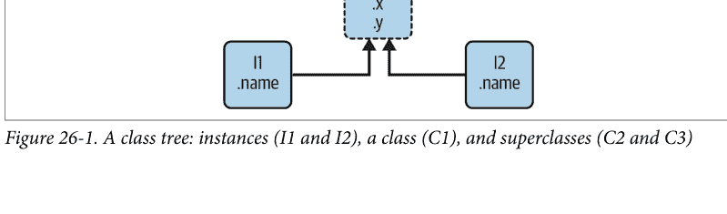

在此图中，有一个包含五个对象的树，这些对象都标有变量名，并且都附带了属性，随时可以进行搜索。更具体地说，这个树将三个*类对象*（椭圆形的 C1、C2 和 C3）和两个*实例对象*（矩形的 I1 和 I2）链接在一起，形成一个继承搜索树。请注意，在 Python 对象模型中，类和从它们生成的实例是两种不同的对象类型：

*类*
充当实例工厂。它们的属性提供了行为——数据和函数——这些行为会被从它们生成的所有实例继承（例如，一个根据工资和工时计算员工薪水的函数）。

*实例*
代表程序领域中的具体项目。它们的属性记录了每个特定对象各不相同的数据（例如，员工的工资率和工作时长）。

就搜索树而言，实例从其类继承属性，而类则从树中位于其上方的所有类继承属性。

在图 26-1 中，我们可以根据椭圆在树中的相对位置进一步对其进行分类。我们通常将树中位置较高的类（如 C2 和 C3）称为*超类*；树中位置较低的类（如 C1）则被称为*子类*。这些术语既指相对的树位置，也指角色。超类提供所有子类共享的行为，但由于搜索是从下往上进行的，子类可以通过在树中较低的位置重新定义超类名称来覆盖其超类中定义的行为。¹

由于最后这几句话实际上是面向对象编程中软件*定制*问题的关键所在，让我们来详细阐述这个概念。假设我们构建了图 26-1 中的树，然后执行以下代码：

```
I2.w
```

这段代码立即触发了继承。因为这是一个*对象.属性*表达式，它会触发对图 26-1 中树的搜索——Python 将通过在 I2 及其上方查找来搜索属性 w。具体来说，它将按以下顺序搜索链接的对象：

```
I2, C1, C2, C3
```

并在找到第一个附带的 w 时停止（如果完全找不到 w 则会引发错误）。在这种情况下，w 在搜索到 C3 时才会被找到，因为它只出现在该对象中。换句话说，I2.w 通过自动搜索解析为 C3.w。在面向对象术语中，I2 从 C3 “继承”了属性 w。

最终，两个实例从它们的类中继承了四个属性：w、x、y 和 z。其他属性引用最终会沿着树中的不同路径进行。例如：

- I1.x 和 I2.x 都在 C1 中找到 x 并停止，因为 C1 比 C2 低。
- I1.y 和 I2.y 都在 C1 中找到 y，因为 y 只出现在那里。
- I1.z 和 I2.z 都在 C2 中找到 z，因为 C2 比 C3 更靠左。
- I2.name 直接在 I2 中找到 name，根本不需要向上遍历树。

在图 26-1 的树中追踪这些搜索过程，以感受 Python 中继承搜索的工作方式。

> ¹ 在其他文献和圈子里，你可能偶尔也会看到*基类*和*派生类*这两个术语分别用来描述超类和子类。大多数 Python 从业者和本书倾向于使用后一种术语。

前面列表中的第一项可能是最需要注意的——因为 C1 在树中较低的位置重新定义了属性 x，它实际上*替换*了其上方 C2 中的版本。正如你稍后将看到的，这种重新定义是面向对象编程中软件定制的核心——通过重新定义和替换属性，C1 有效地定制了它从超类继承的内容。

## 类和实例

尽管在 Python 模型中它们在技术上是两种独立的对象类型，但我们放入这些树中的类和实例几乎是相同的——每种类型的主要目的是作为另一种*命名空间*——一个变量包，以及一个我们可以附加属性的地方。因此，如果类和实例听起来像模块，它们确实应该如此；然而，类树中的对象还具有自动搜索到其他命名空间对象的链接，并且类和实例分别对应于语句和调用，而不是整个文件。

类和实例之间的主要区别在于，类是一种生成实例的*工厂*。例如，在一个实际的应用程序中，我们可能有一个 `Employee` 类，它定义了成为员工意味着什么；从这个类中，我们生成实际的 `Employee` 实例。这是类和模块之间的另一个区别——我们内存中永远只有一个给定模块的实例（这就是为什么我们必须重新加载模块才能获得其新代码），但对于类，我们可以根据需要创建任意多个独特的实例。

在操作上，类通常会有附加到它们的函数（例如 `computeSalary`），而实例则会有类函数使用的更基本的数据项（例如 `hoursWorked`）。事实上，面向对象模型与经典的*程序*加*记录*的数据处理模型没有太大不同——在面向对象编程中，实例就像带有“数据”的记录，而类是处理这些记录的“程序”。不过，在面向对象编程中，我们还有继承层次结构的概念，它比早期的模型更好地支持软件定制。

## 方法调用

在上一节中，我们看到了示例类树中的属性引用 `I2.w` 是如何通过 Python 的继承搜索过程转换为 `C3.w` 的。然而，与属性继承同样重要的是，当我们尝试调用*方法*——作为属性附加到类上的函数——时会发生什么。

如果这个 `I2.w` 引用是一个*函数*调用，它真正的含义是“调用 `C3.w` 函数来处理 `I2`”。也就是说，Python 会自动将调用 `I2.w()` 映射为调用 `C3.w(I2)`，将实例作为第一个参数传递给继承的函数，作为调用的隐含*主体*。

事实上，每当我们以这种方式调用附加到类的函数时，总是隐含着一个类的实例。这个隐含的主体是我们将其称为*面向对象*模型的部分原因——当操作运行时，总有一个主体对象。在一个更实际的例子中，我们可能会调用一个名为 `giveRaise` 的方法，它作为属性附加到 `Employee` 类上；除非指定了应该给予加薪的员工，否则这样的调用没有意义。

正如你稍后将更详细地看到的，Python 将隐含的实例传递给方法的一个特殊第一个参数，按照强约定称为 `self`。方法通过这个参数来处理调用的主体。正如你稍后也将了解到的，方法可以通过实例调用——`pat.giveRaise()`——也可以通过类调用——`Employee.giveRaise(pat)`——这两种形式在我们的脚本中都有用途。事实上，这些调用说明了面向对象编程中的两个关键思想；要运行 `pat.giveRaise()` 方法调用，Python：

1. 首先通过*继承*从 pat 查找 giveRaise。
2. 然后将 pat 传递给找到的 giveRaise 函数，放在特殊的 self 函数*参数*中。

当你运行调用 `Employee.giveRaise(pat)` 时，你只是自己执行了这两个步骤。
这个描述在技术上只是默认情况（Python 还有你稍后会遇到的其他方法类型，称为静态方法和类方法），但它适用于该语言中编写的绝大多数面向对象代码。然而，为了了解方法如何接收其主体，我们需要转向一些代码。

## 编写类树

尽管我们在这里是在抽象地讨论，但所有这些想法背后当然都有具体的代码。我们使用类语句和类调用来构建树及其对象，我们稍后将更详细地探讨。简而言之：

- 每个类语句生成一个新的类对象。
- 每次调用类时，它都会生成一个新的实例对象。
- 实例自动链接到创建它们的类。
- 类根据我们在类头行的括号中列出它们的方式自动链接到它们的超类；那里的从左到右顺序给出了树中的顺序。

例如，要构建图 26-1 中的树，我们将运行示例 26-1 中的那种 Python 代码。与函数定义一样，类通常在模块文件中编写，并在导入时运行（为了简洁，下面类语句的内部细节被省略了，不过 ... 如果实际运行，根据第 13 章，它算作一个空操作语句）。

```
Example 26-1. classtree1.py

class C2: ...                    # 创建类对象（椭圆）
class C3: ...
class C1(C2, C3): ...            # 链接到超类 - 按此顺序

I1 = C1()                        # 创建实例对象（矩形）
I2 = C1()                        # 链接到它们的类
```

在这里，我们通过运行三个类语句来构建三个类对象，并通过两次调用类 C1 来创建两个实例对象——就好像它是一个函数一样（Python 将类和函数一起归类为用括号调用的“可调用”对象，尽管 def 需要头括号而 class 不需要）。实例记住它们是从哪个类创建的，而类 C1 记住它列出的超类。

从技术上讲，这个例子使用了所谓的*多重继承*，这仅仅意味着一个类在类树中有多个超类——当你希望组合多个工具时，这是一个有用的技术。在 Python 中，如果在类语句的括号中列出了多个超类（就像这里的 C1），它们的从左到右顺序决定了这些超类将被继承搜索属性的顺序。默认情况下使用最左边的名称版本，但你总是可以通过从它所在的类请求来选择一个名称（例如 `C3.z`）。搜索也会选择右边的名称而不是更高的重复项，但我们现在可以安全地忽略这一点。

由于继承搜索的进行方式，你附加属性的对象变得至关重要——它决定了名称的*作用域*。附加到实例的属性仅属于那些单个实例，但附加到类的属性则由其所有子类和实例共享。稍后，我们将深入研究将属性挂在这些对象上的代码。正如你将发现的，这完全取决于*赋值*在哪里执行：

-   属性通常通过在`class`语句块的顶层进行赋值来附加到类上，而不是嵌套在其中的函数`def`语句内。
-   属性通常通过赋值给传递给类内编码函数的特殊参数（称为`self`）来附加到实例上。

例如，类通过我们在`class`语句内编码`def`语句创建的函数，为其实例提供行为。因为这种嵌套的`def`语句在类内分配函数名，所以它们最终会将属性附加到类对象上，这些属性将被所有实例和子类继承——如示例26-2所示，其中更改的部分以粗体列出。

*示例 26-2. classtree2.py*

```
class C2: ...                     # 创建超类对象
class C3: ...

class C1(C2, C3):                 # 创建并链接类 C1
    def setname(self, who):       # 赋值名称：C1.setname
        self.name = who           # Self 是 I1 或 I2

I1 = C1()                         # 创建两个实例
I2 = C1()
I1.setname('sue')                 # 将 I1.name 设置为 'sue'
I2.setname('bob')                 # 将 I2.name 设置为 'bob'
print(I1.name)                    # 打印 'sue'
```

在这种上下文中，`def`在语法上没有任何独特之处。然而，在操作上，当`def`像这样出现在`class`内部时，它通常被称为*方法*，并且它自动接收一个特殊的第一参数——按照非常强的惯例称为`self`——该参数提供一个句柄，返回到要处理的实例。你自己传递给方法的任何值都会进入`self`之后的参数（这里，是`who`）。²

因为类是多个实例的工厂，所以当它们需要获取或设置由方法调用处理的特定实例的属性时，其方法通常会通过这个自动传入的`self`参数。在前面的代码中，`self`用于将名称存储在两个实例中的一个。

与简单变量一样，类和实例的*属性*不是预先声明的，而是在第一次赋值时才出现。当方法赋值给`self`属性时，它会在类树的底部（即图26-1中的一个矩形）创建或更改实例中的属性，因为`self`自动引用正在处理的实例——调用的主题。

> ² 如果你曾经使用过C++或Java，你会认识到Python的`self`非常类似于这些语言的`this`指针/引用，但`self`在Python方法的头部和主体中始终是显式的，以使属性访问更清晰：如果一个名称不能神奇地与隐藏对象关联，那么它需要考虑的可能含义就更少。显式通常更好。

事实上，因为类树中的所有对象都只是命名空间对象，我们可以通过适当的名称来获取或设置它们的任何属性。只要名称`C1`和`I1`在你的代码作用域内，说`C1.setname`与说`I1.setname`一样有效。

## 运算符重载

按照目前的编码方式，我们的`C1`类在调用`setname`方法之前不会将`name`属性附加到实例上。实际上，在调用`I1.setname`之前引用`I1.name`会产生未定义名称错误。如果一个类希望保证像`name`这样的属性总是在其实例中设置，它更典型地会在构造时填充该属性，如示例26-3所示。

*示例 26-3. classtree3.py*

```
class C2: ...                     # 创建超类对象
class C3: ...

class C1(C2, C3):
    def __init__(self, who):       # 构造时设置名称
        self.name = who            # Self 是 I1 或 I2

I1 = C1('sue')                    # 将 I1.name 设置为 'sue'
I2 = C1('bob')                    # 将 I2.name 设置为 'bob'
print(I1.name)                    # 打印 'sue'
```

如果它被编码或继承，Python会在每次从类生成实例时自动调用名为`__init__`的方法。新实例像往常一样传递给`__init__`的`self`参数，类调用中括号内列出的任何值都会传递给第二个及之后的参数。这里的效果是在创建实例时初始化它们，而不需要额外的方法调用。

`__init__`方法被称为构造函数，因为它运行的时间。它是称为运算符重载方法的更大类别中最常用的代表，我们将在后面的章节中探讨。这些方法像往常一样在类树中继承，并且它们的名称以双下划线开头和结尾以使其独特。当支持它们的实例出现在相应的操作中时，Python会自动运行它们，它们主要是使用简单方法调用的替代方案。它们也是可选的：如果省略，则不支持这些操作。如果没有`__init__`，类调用将返回一个空实例，而不对其进行初始化。

例如，一个自定义的集合交集可以被编码为一个名为`intersect`的方法显式调用，或者被编码为一个名为`__and__`的方法，由`&`表达式运算符自动调用。因为运算符方案使实例看起来和感觉更像内置类型，它允许一些类提供一致且自然的接口，并与期望内置类型的代码兼容。然而，除了`__init__`构造函数——它出现在大多数现实类中——许多程序可能更适合使用更简单的命名方法，除非它们的对象类似于内置类型。`giveRaise`对于`Employee`可能有意义，但`&`可能没有。

## OOP 是关于代码重用的

以上，连同一些语法细节，就是Python中OOP的大部分内容。当然，它不仅仅是继承。例如，运算符重载比目前描述的要通用得多——类也可以提供自己的操作实现，如索引、获取属性、打印等等。然而，总的来说，OOP是在函数中具有特殊第一参数的树中查找属性。

那么，为什么我们有兴趣构建和搜索对象树呢？虽然需要一些经验才能看到，但当使用得当时，类以其他Python程序组件无法支持的方式支持代码*重用*。事实上，根据大多数人的说法，这是它们的最高目的。使用类，我们通过定制现有软件进行编码，而不是就地更改现有代码或为每个新项目从头开始。这在现实编程中被证明是一种强大的范式。

在基本层面上，类实际上只是函数和其他名称的包，就像模块一样。然而，我们通过类获得的自动属性继承搜索支持对软件进行超出我们使用模块和函数所能做的定制。此外，类为打包和本地化逻辑和名称的代码提供了一个自然的*结构*，因此有助于调试。

公平地说，因为方法只是具有特殊第一参数的函数，我们可以通过手动将主题对象传递给简单函数来模拟它们的一些行为。然而，方法参与类继承，允许我们通过编码具有新方法的子类来自然地扩展和定制软件，而不是修改已经工作的代码。模块和函数确实没有这样的概念。

## 多态性和类

作为一个抽象的例子，假设你被分配了实现员工数据库应用程序的任务。作为Python OOP程序员，你可能会从编码一个通用超类开始，该超类定义了组织中所有类型员工的默认行为（本节中的代码是假设性和部分性的）：

```
class Employee:                    # 通用超类
    def computeSalary(self): ...  # 通用或默认行为
    def giveRaise(self): ...
    def promote(self): ...
    def retire(self): ...
```

一旦你编码了这种通用行为，你就可以为每种特定类型的员工进行专业化，以反映各种类型与规范的不同之处。也就是说，你可以编码子类，仅定制每个员工类型不同的行为部分；员工类型的其余行为将从更通用的类继承。例如，如果工程师有独特的薪资计算规则（也许不是小时乘以费率），你可以在子类中仅替换那一个方法：

```
class Engineer(Employee):          # 专业化的子类
    def computeSalary(self): ...  # 这里有一些定制内容
```

因为这里的`computeSalary`版本出现在类树的较低位置，它将替换（覆盖）`Employee`中的通用版本。然而，所有其他方法都从超类原样继承。然后，你创建真实员工所属的员工类型类的实例，以获得正确的行为：

```
sue = Employee()                   # 默认行为
bob = Employee()                   # 默认行为
pat = Engineer()                   # 定制的薪资计算器
```

请注意，你可以创建树中任何类的实例，而不仅仅是底部的那些——你从中创建实例的类决定了属性搜索开始的级别，因此决定了它将使用哪些版本的方法（双关语非故意）。

最终，这三个实例对象可能最终嵌入到一个更大的容器对象中——例如，一个列表、字典或另一个类的实例——该容器对象代表一个部门或公司，使用本章开头提到的组合概念。当你后来请求这些员工的薪资将根据对象所属的类进行计算，这是由继承搜索的原则决定的：

```python
company = [sue, bob, pat]           # A composite object
for emp in company:
    print(emp.computeSalary())     # Run this emp's version: default or custom
```

这是第4章引入并在第16章扩展的*多态*概念的又一个实例。回想一下，多态意味着操作的含义取决于被操作的对象。也就是说，代码不应该关心一个对象*是什么*，只关心它*做什么*。这里，方法`computeSalary`在调用前，会根据每个对象的类，通过继承搜索来定位。最终效果是，我们自动为被处理的对象运行正确的版本——默认的或自定义的。跟踪代码以了解原因。

在其他应用中，多态也可用于*封装*（即抽象掉）接口差异。例如，一个处理数据流的程序可以被编码为期望具有输入和输出方法的对象，而不关心这些方法实际做什么：

```python
def processor(reader, converter, writer):
    while True:
        data = reader.read()
        if not data: break
        data = converter(data)
        writer.write(data)
```

通过传入为各种数据源特化了所需读写方法接口的子类实例，我们可以将`processor`函数重用于任何我们需要使用的数据源，无论是现在还是将来：

```python
class Reader:
    def other(self): ...           # Default behavior and tools

class FileReader(Reader):
    def read(self): ...            # Read from a local file

class SocketReader(Reader):
    def read(self): ...            # Read from a network socket

...and others...

processor(FileReader(...),  converter,  FileWriter(...))
processor(SocketReader(...), converter, FileWriter(...))
processor(FtpReader(...),   converter,  JsonWriter(...))
```

此外，由于这些读写方法的内部实现已被提取到单一位置，因此可以在不影响使用它们的代码的情况下进行更改。`processor`函数本身甚至可能是一个类，以允许通过继承填充`converter`的转换逻辑，并允许通过组合嵌入读取器和写入器（你将在本书的后续部分看到这是如何工作的）。

## 通过定制进行编程

一旦你习惯了这种编程方式（通过软件定制），你会发现当需要编写一个新程序时，你的大部分工作可能已经完成——你的任务在很大程度上变成了混合使用已经实现了你程序所需行为的现有超类。例如，其他人可能已经为完全不同的程序编写了本节示例中的`Employee`和`Reader`类。如果是这样，你就“免费”获得了那个人的所有代码。

事实上，在许多应用领域，你可以获取或购买称为*框架*的超类集合，这些超类将常见的编程任务实现为类，可以混合到你的应用程序中。这些框架可能提供数据库接口、测试协议、GUI工具包等。使用框架时，你通常只需编写一个子类来填充少数预期的方法；树中更高层的框架类会为你完成大部分工作。在这种面向对象的世界中编程，只是通过编写自己的子类来组合和特化已经调试过的代码。

当然，学习如何利用类来实现这种面向对象的乌托邦需要一段时间。在实践中，面向对象的工作还涉及大量的设计工作，以充分实现类的代码重用优势。为此，程序员将常见的面向对象结构编目，称为*设计模式*，以帮助设计选择。然而，你在Python中进行面向对象编程所编写的实际代码非常简单，它本身不会对你的面向对象探索构成额外的障碍。要了解原因，你需要继续阅读[第27章](Chapter 27)。

## 章节总结

在本章中，我们对类和面向对象编程进行了初步的、抽象的概述，在深入语法细节之前先了解了大局。正如我们所看到的，面向对象编程主要关于一个名为`self`的参数，以及在称为继承的链接对象树中搜索属性。树底部的对象从树中更高层的对象继承属性——这一特性使我们能够通过定制代码而不是修改代码或从头开始来编程。如果使用得当，这种编程模型可以极大地缩短开发时间。

下一章将开始填充这里描绘的图景背后的编码细节。然而，随着我们深入Python类，请记住Python中的面向对象模型非常简单；正如我们在这里看到的，它实际上只是关于在对象树中查找名称和一个特殊的函数参数。在我们继续之前，这里有一个快速测验来回顾我们所涵盖的内容。

## 测试你的知识：测验

1.  Python中面向对象编程的要点是什么？
2.  继承搜索在哪里查找属性？
3.  类对象和实例对象有什么区别？
4.  为什么类方法函数中的第一个参数是特殊的？
5.  `__init__`方法是用于什么的？
6.  如何创建一个类实例？
7.  如何创建一个类？
8.  如何指定一个类的超类？

## 测试你的知识：答案

1.  面向对象编程是关于代码*重用*的——你提取代码以最小化冗余，并通过定制已有的东西而不是就地修改代码或从头开始来编程。
2.  继承搜索首先在实例对象中查找属性，然后在创建该实例的类中查找，接着在所有更高的超类中查找，从对象树的底部到顶部，通常从左到右进行。搜索在找到属性的第一个位置停止。因为沿途找到的最低版本的名称会胜出，所以类层次结构自然支持通过在新子类中扩展来进行定制。
3.  类和实例对象都是命名空间——作为属性出现的变量包。它们之间的主要区别在于，类是一种用于创建多个实例的工厂。类还支持运算符重载方法，实例会继承这些方法，并将类中嵌套的任何函数视为处理实例的方法。
4.  类方法函数中的第一个参数是特殊的，因为它总是接收作为方法调用隐含主体的实例对象。按照惯例，它通常被称为`self`。因为方法函数默认总是有这个隐含的主体——以及对象上下文——我们说它们是“面向对象的”（即设计用于处理或更改对象）。
5.  如果类中编写或继承了`__init__`方法，Python会在每次创建该类的实例时自动调用它。它被称为*构造函数*方法；新实例被隐式传递，以及任何显式传递给类名的参数。它也是最常用的运算符重载方法。如果没有`__init__`方法，实例将作为空命名空间开始其生命周期。
6.  你通过像调用函数一样调用类名来创建一个类实例；传递给类名的任何参数都会作为`__init__`构造函数方法（如果存在）的第二个及后续参数出现。新实例会记住它被创建时所属的类，以便用于继承。
7.  你通过运行`class`语句来创建一个类；与函数定义类似，这些语句通常在包含它们的模块文件被导入时运行（下一章将详细介绍）。
8.  你通过在`class`语句中，在新类名之后的括号内列出它们来指定一个类的超类。括号中列出的类的从左到右的顺序给出了类树中从左到右的继承搜索顺序。

# 第27章
类编码基础

既然我们已经抽象地讨论了面向对象编程（OOP），现在是时候看看这如何转化为实际代码了。本章开始填补Python中类模型背后的语法细节。

如果你过去从未接触过OOP，一次性学习类可能会显得有些复杂。为了让类编码更容易吸收，我们将在本章通过首次观察一些基本类的实际运作，开始对OOP的详细探索。我们将在本书的后续章节中扩展这里介绍的细节，但就其基本形式而言，Python类是易于理解的。

事实上，类只有三个主要区别。在基础层面上，它们大多只是命名空间，就像我们在第五部分学习的模块一样。然而，与模块不同的是，类还支持生成多个对象、命名空间继承和运算符重载。让我们开始类语句之旅，依次探讨这三个区别。

## 类生成多个实例对象

要理解多个对象的概念是如何运作的，你首先必须理解Python的OOP模型中有两种对象：*类*对象和*实例*对象。类对象提供默认行为，并用于创建实例对象。实例对象是你的程序处理的具体对象——每个实例本身就是一个命名空间，但它继承（即自动访问）其创建自的类中的名称。类对象来自语句，实例来自调用；每次调用一个类，你都会得到该类的一个新实例。

这种对象生成概念与我们到目前为止在本书中看到的大多数其他程序构造非常不同。实际上，类本质上是生成多个实例的*工厂*。相比之下，每个模块在单个程序中只会被导入一次。事实上，这就是*reload*按其方式工作的原因，它就地更新单个实例和共享对象。对于类，每个实例可以拥有自己的独立数据，支持类所建模对象的多个版本。

在这种角色中，类实例类似于第17章中*闭包*（又称*工厂*）函数的每次调用状态，但这是类模型的自然组成部分，并且类中的状态是显式属性而不是隐式作用域引用。此外，这只是类功能的一部分——它们还支持通过继承进行定制、运算符重载以及通过方法实现多种行为。因此，类是一种更完整的编程工具，尽管OOP和*函数式编程*并非互斥的范式。我们可以通过在方法中使用函数工具、编写本身是生成器的方法、编写用户定义的迭代器等方式将它们结合起来。

以下是Python OOP基本要素的快速总结，基于其两种对象类型。正如你将看到的，Python类在某些方面类似于def和模块，但它们可能与你习惯的其他语言中的类大不相同。

## 类对象提供默认行为

当我们运行一个类语句时，我们得到一个类对象。以下是Python类主要属性的概述：

- **类语句创建一个类对象并为其分配一个名称。** 就像函数def语句一样，Python类是一个可执行语句。当被执行时，它会生成一个新的类对象并将其赋值给类标题中的第一个名称。同样，与def类似，类语句通常在它们所在的文件首次被导入或作为顶级脚本运行时执行。
- **类语句中的赋值创建类属性。** 就像在模块文件中一样，类语句中的顶级赋值（未嵌套在def中）会在类对象中生成属性。从技术上讲，类语句定义了一个局部作用域，该作用域会转变为类对象的属性命名空间，就像模块的全局作用域一样。运行类语句后，可以通过名称限定访问类属性：`class.name`。
- **类属性提供对象状态和行为。** 类对象的属性记录状态信息和行为，这些信息和行为将由从该类创建的所有实例共享。最显著和常见的是，嵌套在类中的函数def语句生成方法，这些方法处理实例。

## 实例对象是具体项

当我们调用一个类对象时，我们得到一个实例对象。以下是类实例背后关键点的概述：

- **像函数一样调用类对象会创建一个新的实例对象。** 每次调用一个类时，它都会创建并返回一个新的实例对象。实例代表你程序领域中的具体项。
- **每个实例对象继承类属性并获得自己的命名空间。** 从类创建的实例对象是新的命名空间；它们开始时是空的，但继承了生成它们的类对象中存在的属性。
- **在方法中对self属性的赋值会创建每个实例的属性。** 在类的方法函数内部，第一个参数（按惯例称为self）引用正在处理的实例对象；对self属性的赋值会创建或更改实例中的数据，而不是类中的数据。

最终结果是，类定义了共享的数据和行为，并生成实例。实例反映具体的应用程序实体，并记录可能因对象而异的每个实例的数据。

## 第一个例子

让我们转向一个实际的例子，展示这些想法在实践中如何运作。首先，让我们通过在任何REPL中交互式地运行一个Python类语句来定义一个名为FirstClass的类：

```python
>>> class FirstClass:           # Define a class object
    def setdata(self, value):  # Define class's methods
        self.data = value      # self is the instance
    def display(self):
        print(self.data)       # self.data: per instance
```

我们在这里是交互式地工作，但通常，这样的语句会在其所在的模块文件被导入时运行。就像用defs创建的函数一样，这个类在Python到达并运行这个语句之前甚至不存在。

像所有复合语句一样，类以一个标题行开始，列出类名，然后是一个或多个嵌套的（通常是缩进的）语句体。在这里，嵌套语句是defs；它们定义了实现类意图导出的行为的函数。

正如我们在第四部分学到的，def实际上是一个赋值。在这里，它将函数对象赋值给类语句作用域中的名称setdata和display，从而生成附加到类的属性——`FirstClass.setdata`和`FirstClass.display`。实际上，在类的嵌套块的顶级分配的任何名称都会成为类的属性。

类中的函数通常传统上称为*方法*。它们用普通的defs编写，并且支持我们已经学到的关于函数的一切——它们可以有默认值、返回值、按需生成项等等。但在方法函数中，第一个参数在调用时会自动接收一个隐式的实例对象——调用的主题。让我们创建几个类的实例来看看这是如何工作的：

```python
>>> x = FirstClass()           # Make two instances
>>> y = FirstClass()           # Each is a new namespace
```

通过这样*调用*类（注意括号），我们生成实例对象，这些实例对象只是可以访问其类属性的命名空间。严格来说，此时我们有三个对象：两个实例和一个类。实际上，我们有三个链接的命名空间，如图27-1所示。用OOP术语来说，我们说x“是一个”FirstClass，y也是如此——它们都继承了附加到类的名称。

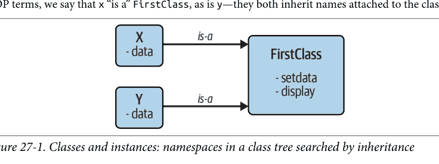

这两个实例开始时是空的，但有链接回到生成它们的类。如果我们用类对象中存在的属性名称来限定一个实例，Python会通过继承搜索从类中获取该名称（除非它也存在于实例中）：

```python
>>> x.setdata('coding')        # Call methods: self is x
>>> y.setdata(3.14159)         # Runs: FirstClass.setdata(y, 3.14159)
```

x和y都没有自己的setdata属性，所以为了找到它，Python会沿着从实例到类的链接。这就是Python中继承的全部内容：它发生在属性限定时，只涉及在链接的对象中查找名称——在这里，是通过遵循图27-1中的is-a链接。

在 FirstClass 内部的 setdata 函数中，传入的值被赋给 self.data。在方法内部，self——按照惯例是给最左侧参数的名称——会自动引用当前正在处理的实例（此时是 x 或 y），因此赋值操作将值存储在实例的命名空间中，而不是类的命名空间中。这就是图 27-1 中数据名称的创建方式。

由于类可以生成多个实例，方法必须通过 self 参数来访问要处理的实例。当我们调用类的 display 方法来打印 self.data 时，会看到它在每个实例中是不同的；另一方面，名称 display 本身在 x 和 y 中是相同的，因为它来自（继承自）该类：

```
>>> x.display()          # 运行：FirstClass.display(x)
coding
>>> y.display()          # self.data 在每个实例中不同
3.14159
```

请注意，我们在每个实例的 data 成员中存储了不同的对象类型——一个字符串和一个浮点数。与 Python 中的其他一切一样，实例属性（有时称为成员）没有预先声明，也没有类型约束；它们在第一次被赋值时才出现，就像简单变量一样。事实上，如果我们在一个实例上调用 display 之前先调用 setdata，就会触发一个未定义名称的错误——名为 data 的属性在内存中根本不存在，直到它在 setdata 方法内被赋值。

作为另一种理解此模型动态性的方式，考虑一下我们可以在类内部通过在方法中赋值给 self，或者在类外部通过赋值给显式实例对象来更改实例属性：

```
>>> x.data = 'hacking'          # 可以获取/设置属性
>>> x.display()                 # 在类外部也可以
hacking
```

虽然不太常见，但我们甚至可以通过在类方法函数外部赋值给其名称，在实例的命名空间中生成一个全新的属性：

```
>>> x.anothername = 'apps'          # 在这里也可以设置新属性！
```

这将附加一个名为 anothername 的新属性到实例对象 x 上，该属性可能被也可能不被类的任何方法使用。类通常通过赋值给 self 参数来创建实例的所有属性，但并非必须如此——程序可以获取、更改或创建对任何具有引用的对象的属性。

通常，添加类无法使用的数据是没有意义的，并且可以通过基于属性访问运算符重载的额外“隐私”代码来防止这种情况，正如我们将在本书其他地方（第 30 章和第 39 章）讨论的那样。尽管如此，自由的属性访问意味着更少的语法，并且在某些情况下甚至是有用的——例如，在编码我们将在本章后面构建的那种数据记录时。

## 类通过继承进行定制

让我们继续讨论类的第二个主要区别。除了作为生成多个实例对象的工厂外，类还允许我们通过引入新组件（称为子类）来进行更改，而不是就地更改现有组件。

正如我们所看到的，从类生成的实例对象继承了类的属性。Python 还允许类从其他类继承，从而为编码类层次结构以专门化行为打开了大门——通过在层次结构中较低的子类中重新定义属性，我们覆盖了树中较高位置的那些属性的更通用定义。实际上，我们在层次结构中走得越深，软件就变得越具体。在这方面，模块也没有类似之处，因为模块的属性存在于一个单一的、扁平的命名空间中，不太适合定制。

在 Python 中，实例从类继承，类从超类继承。以下是属性继承机制背后的关键思想：

- **超类在类头中列在括号中。** 要使一个类从另一个类继承属性，只需在新类语句的头行中将另一个类列在括号中。继承的类通常称为*子类*，被继承的类是其*超类*。
- **类从其超类继承属性。** 就像实例继承其类中定义的属性名称一样，类继承其超类中定义的所有属性名称。如果这些名称在子类中不存在，Python 会在访问时自动找到它们。
- **实例从所有可访问的类继承属性。** 每个实例从其生成的类以及该类的所有超类获取名称。当查找名称时，Python 会检查实例，然后是其类，然后是其类之上的所有超类。
- **每个 object.attribute 引用都会调用一个新的、独立的搜索。** Python 对每个属性获取表达式执行类树的独立搜索。这包括在类语句外部对实例和类的引用（例如 X.attr），以及在类的方法函数中对 self 实例参数属性的引用。也就是说，方法中的每个 self.attr 表达式都会在 self 及其上方调用新的搜索。

最终效果——以及所有这些搜索的主要目的——是类比我们迄今为止看到的任何其他语言工具都更好地支持代码的因子化和定制。一方面，它们允许我们通过将操作因子化到单个共享实现中来最小化代码冗余（从而降低维护成本）；另一方面，它们允许我们通过定制已存在的内容来编程，而不是就地更改它或从头开始。

完整的继承披露：严格来说，当我们考虑“菱形”继承模式和“元类”——我们将在后面研究的高级主题时，Python 的继承比这里描述的更丰富——但我们可以安全地将范围限制在实例及其类，无论是在本书的这个阶段还是在大多数 Python 应用程序代码中。我们将在第 31 章探讨菱形和适应它们的“MRO”继承搜索顺序，但我们的继承定义直到第 40 章才会完全完成，因为它遗憾地需要元类信息，这超出了几乎所有 Python 程序员的兴趣水平和薪资等级（谢天谢地！）。

## 第二个例子

为了说明继承的作用，下一个例子建立在前一个例子的基础上。首先，我们将定义一个新类 SecondClass，它继承了 FirstClass 的所有名称并提供了一个自己的名称：

```
>>> class SecondClass(FirstClass):          # 继承 setdata
        def display(self):              # 更改 display
            print(f'Current value = "{self.data}"')
```

SecondClass 定义了 display 方法以使用不同的格式打印。通过定义一个与 FirstClass 中属性同名的属性，SecondClass 有效地替换了其超类中的 display 属性。

回想一下，继承搜索从实例到子类再到超类向上进行，在找到属性名称的第一次出现时停止。在这种情况下，由于 SecondClass 中的 display 名称会在 FirstClass 中的名称之前被找到，我们说 SecondClass 覆盖了 FirstClass 的 display。有时我们称这种通过在树中较低位置重新定义属性来替换属性的行为为重载。

这里的最终效果是 SecondClass 通过更改 display 方法的行为来专门化 FirstClass。另一方面，SecondClass（以及从中创建的任何实例）仍然逐字继承 FirstClass 中的 setdata 方法。让我们创建一个新实例来演示：

```
>>> z = SecondClass()
>>> z.setdata('LP6e')    # 在 FirstClass 中找到 setdata
>>> z.display()          # 在 SecondClass 中找到被覆盖的方法
Current value = "LP6e"
```

像以前一样，我们通过调用 SecondClass 来创建一个 SecondClass 实例对象。setdata 调用仍然运行 FirstClass 中的版本，但这次 display 属性来自 SecondClass 并打印一条自定义消息。图 27-2 概述了涉及的命名空间。

现在，关于 OOP 有一个关键点需要注意：SecondClass 中引入的专门化完全在 FirstClass 外部。也就是说，它不影响现有或未来的 FirstClass 对象，比如前一个例子中的 x（假设我们继续同一个 REPL 会话）：

```
>>> x.display()    # x 仍然是一个 FirstClass 实例（旧消息）
hacking
```

我们没有更改 FirstClass，而是定制了它。当然，这是一个人为的例子，但作为规则，因为继承允许我们在外部组件（即子类）中进行这样的更改，所以类通常比函数或模块更好地支持扩展和重用。

## 类是模块中的属性

在继续之前，请记住类名称没有什么神奇之处。它只是在类语句运行时分配给对象的一个变量，该对象可以用任何普通表达式引用。例如，如果我们的 FirstClass 是在模块文件中编码的，而不是交互式输入的，我们可以导入它并在类头行中正常使用其名称：

```
from modulename import FirstClass    # 将名称复制到我的作用域
class SecondClass(FirstClass):       # 直接使用类名称
    def display(self): ...
```

或者等价地：

```python
import modulenamemodulenamemodulenamemodulenamemodulenamemodulenamemodulenamemodulenamemodulenamemodulenamemodulenamemodulenamemodulenamemodulenamemodulenamemodulenamemodulenamemodulenamemodulenamemodulenamemodulenamemodulenamemodulenamemodulenamemodulenamemodulenamemodulenamemodulenamemodulenamemodulenamemodulenamemodulenamemodulenamemodulenamemodulenamemodulenamemodulenamemodulenamemodulenamemodulenamemodulenamemodulenamemodulenamemodulenamemodulenamemodulenamemodulenamemodulenamemodulenamemodulenamemodulenamemodulenamemodulenamemodulenamemodulenamemodulenamemodulenamemodulenamemodulenamemodulenamemodulenamemodulenamemodulenamemodulenamemodulenamemodulenamemodulenamemodulenamemodulenamemodulenamemodulenamemodulenamemodulenamemodulenamemodulenamemodulenamemodulenamemodulenamemodulenamemodulenamemodulenamemodulenamemodulenamemodulenamemodulenamemodulenamemodulenamemodulenamemodulenamemodulenamemodulenamemodulenamemodulenamemodulenamemodulenamemodulenamemodulenamemodulenamemodulenamemodulenamemodulenamemodulenamemodulenamemodulenamemodulenamemodulenamemodulenamemodulenamemodulenamemodulenamemodulenamemodulenamemodulenamemodulenamemodulenamemodulenamemodulenamemodulenamemodulenamemodulenamemodulenamemodulenamemodulenamemodulenamemodulenamemodulenamemodulenamemodulenamemodulenamemodulenamemodulenamemodulenamemodulenamemodulenamemodulenamemodulenamemodulenamemodulenamemodulenamemodulenamemodulenamemodulenamemodulenamemodulenamemodulenamemodulenamemodulenamemodulenamemodulenamemodulenamemodulenamemodulenamemodulenamemodulenamemodulenamemodulenamemodulenamemodulenamemodulenamemodulenamemodulenamemodulenamemodulenamemodulenamemodulenamemodulenamemodulenamemodulenamemodulenamemodulenamemodulenamemodulenamemodulenamemodulenamemodulenamemodulenamemodulenamemodulenamemodulenamemodulenamemodulenamemodulenamemodulenamemodulenamemodulenamemodulenamemodulenamemodulenamemodulenamemodulenamemodulenamemodulenamemodulenamemodulenamemodulenamemodulenamemodulenamemodulenamemodulenamemodulenamemodulenamemodulenamemodulenamemodulenamemodulenamemodulenamemodulenamemodulenamemodulenamemodulenamemodulenamemodulenamemodulenamemodulenamemodulenamemodulenamemodulenamemodulenamemodulenamemodulenamemodulenamemodulenamemodulenamemodulenamemodulenamemodulenamemodulenamemodulenamemodulenamemodulenamemodulenamemodulenamemodulenamemodulenamemodulenamemodulenamemodulenamemodulenamemodulenamemodulenamemodulenamemodulenamemodulenamemodulenamemodulenamemodulenamemodulenamemodulenamemodulenamemodulenamemodulenamemodulenamemodulenamemodulenamemodulenamemodulenamemodulenamemodulenamemodulenamemodulenamemodulenamemodulenamemodulenamemodulenamemodulenamemodulenamemodulenamemodulenamemodulenamemodulenamemodulenamemodulenamemodulenamemodulenamemodulenamemodulenamemodulenamemodulenamemodulenamemodulenamemodulenamemodulenamemodulenamemodulenamemodulenamemodulenamemodulenamemodulenamemodulenamemodulenamemodulenamemodulenamemodulenamemodulenamemodulenamemodulenamemodulenamemodulenamemodulenamemodulenamemodulenamemodulenamemodulenamemodulenamemodulenamemodulenamemodulenamemodulenamemodulenamemodulenamemodulenamemodulenamemodulenamemodulenamemodulenamemodulenamemodulenamemodulenamemodulenamemodulenamemodulenamemodulenamemodulenamemodulenamemodulenamemodulenamemodulenamemodulenamemodulenamemodulenamemodulenamemodulenamemodulenamemodulenamemodulenamemodulenamemodulenamemodulenamemodulenamemodulenamemodulenamemodulenamemodulenamemodulenamemodulenamemodulenamemodulenamemodulenamemodulenamemodulenamemodulenamemodulenamemodulenamemodulenamemodulenamemodulenamemodulenamemodulenamemodulenamemodulenamemodulenamemodulenamemodulenamemodulenamemodulenamemodulenamemodulenamemodulenamemodulenamemodulenamemodulenamemodulenamemodulenamemodulenamemodulenamemodulenamemodulenamemodulenamemodulenamemodulenamemodulenamemodulenamemodulenamemodulenamemodulenamemodulenamemodulenamemodulenamemodulenamemodulenamemodulenamemodulenamemodulenamemodulenamemodulenamemodulenamemodulenamemodulenamemodulenamemodulenamemodulenamemodulenamemodulenamemodulenamemodulenamemodulenamemodulenamemodulenamemodulenamemodulenamemodulenamemodulenamemodulenamemodulenamemodulenamemodulenamemodulenamemodulenamemodulenamemodulenamemodulenamemodulenamemodulenamemodulenamemodulenamemodulenamemodulenamemodulenamemodulenamemodulenamemodulenamemodulenamemodulenamemodulenamemodulenamemodulenamemodulenamemodulenamemodulenamemodulenamemodulenamemodulenamemodulenamemodulenamemodulenamemodulenamemodulenamemodulenamemodulenamemodulenamemodulenamemodulenamemodulenamemodulenamemodulenamemodulenamemodulenamemodulenamemodulenamemodulenamemodulenamemodulenamemodulenamemodulenamemodulenamemodulenamemodulenamemodulenamemodulenamemodulenamemodulenamemodulenamemodulenamemodulenamemodulenamemodulenamemodulenamemodulenamemodulenamemodulenamemodulenamemodulenamemodulenamemodulenamemodulenamemodulenamemodulenamemodulenamemodulenamemodulenamemodulenamemodulenamemodulenamemodulenamemodulenamemodulenamemodulenamemodulenamemodulenamemodulenamemodulenamemodulenamemodulenamemodulenamemodulenamemodulenamemodulenamemodulenamemodulenamemodulenamemodulenamemodulenamemodulenamemodulenamemodulenamemodulenamemodulenamemodulenamemodulenamemodulenamemodulenamemodulenamemodulenamemodulenamemodulenamemodulenamemodulenamemodulenamemodulenamemodulenamemodulenamemodulenamemodulenamemodulenamemodulenamemodulenamemodulenamemodulenamemodulenamemodulenamemodulenamemodulenamemodulenamemodulenamemodulenamemodulenamemodulenamemodulenamemodulenamemodulenamemodulenamemodulenamemodulenamemodulenamemodulenamemodulenamemodulenamemodulenamemodulenamemodulenamemodulenamemodulenamemodulenamemodulenamemodulenamemodulenamemodulenamemodulenamemodulenamemodulenamemodulenamemodulenamemodulenamemodulenamemodulenamemodulenamemodulenamemodulenamemodulenamemodulenamemodulenamemodulenamemodulenamemodulenamemodulenamemodulenamemodulenamemodulenamemodulenamemodulenamemodulenamemodulenamemodulenamemodulenamemodulenamemodulenamemodulenamemodulenamemodulenamemodulenamemodulenamemodulenamemodulenamemodulenamemodulenamemodulenamemodulenamemodulenamemodulenamemodulenamemodulenamemodulenamemodulenamemodulenamemodulenamemodulenamemodulenamemodulenamemodulenamemodulenamemodulenamemodulenamemodulenamemodulenamemodulenamemodulenamemodulenamemodulenamemodulenamemodulenamemodulenamemodulenamemodulenamemodulenamemodulenamemodulenamemodulenamemodulenamemodulenamemodulenamemodulenamemodulenamemodulenamemodulenamemodulenamemodulenamemodulenamemodulenamemodulenamemodulenamemodulenamemodulenamemodulenamemodulenamemodulenamemodulenamemodulenamemodulenamemodulenamemodulenamemodulenamemodulenamemodulenamemodulenamemodulenamemodulenamemodulenamemodulenamemodulenamemodulenamemodulenamemodulenamemodulenamemodulenamemodulenamemodulenamemodulenamemodulenamemodulenamemodulenamemodulenamemodulenamemodulenamemodulenamemodulenamemodulenamemodulenamemodulenamemodulenamemodulenamemodulenamemodulenamemodulenamemodulenamemodulenamemodulenamemodulenamemodulenamemodulenamemodulenamemodulenamemodulenamemodulenamemodulenamemodulenamemodulenamemodulenamemodulenamemodulenamemodulenamemodulenamemodulenamemodulenamemodulenamemodulenamemodulenamemodulenamemodulenamemodulenamemodulenamemodulenamemodulenamemodulenamemodulenamemodulenamemodulenamemodulenamemodulenamemodulenamemodulenamemodulenamemodulenamemodulenamemodulenamemodulenamemodulenamemodulenamemodulenamemodulenamemodulenamemodulenamemodulenamemodulenamemodulenamemodulenamemodulenamemodulenamemodulenamemodulenamemodulenamemodulenamemodulenamemodulenamemodulenamemodulenamemodulenamemodulenamemodulenamemodulenamemodulenamemodulenamemodulenamemodulenamemodulenamemodulenamemodulenamemodulenamemodulenamemodulenamemodulenamemodulenamemodulenamemodulenamemodulenamemodulenamemodulenamemodulenamemodulenamemodulenamemodulenamemodulenamemodulenamemodulenamemodulenamemodulenamemodulenamemodulenamemodulenamemodulenamemodulenamemodulenamemodulenamemodulenamemodulenamemodulenamemodulenamemodulenamemodulenamemodulenamemodulenamemodulenamemodulenamemodulenamemodulenamemodulenamemodulenamemodulenamemodulenamemodulenamemodulenamemodulenamemodulenamemodulenamemodulenamemodulenamemodulenamemodulenamemodulenamemodulenamemodulenamemodulenamemodulenamemodulenamemodulenamemodulenamemodulenamemodulenamemodulenamemodulenamemodulenamemodulenamemodulenamemodulenamemodulenamemodulenamemodulenamemodulenamemodulenamemodulenamemodulenamemodulenamemodulenamemodulenamemodulenamemodulenamemodulenamemodulenamemodulenamemodulenamemodulenamemodulenamemodulenamemodulenamemodulenamemodulenamemodulenamemodulenamemodulenamemodulenamemodulenamemodulenamemodulenamemodulenamemodulenamemodulenamemodulenamemodulenamemodulenamemodulenamemodulenamemodulenamemodulenamemodulenamemodulenamemodulenamemodulenamemodulenamemodulenamemodulenamemodulenamemodulenamemodulenamemodulenamemodulenamemodulenamemodulenamemodulenamemodulenamemodulenamemodulenamemodulenamemodulenamemodulenamemodulenamemodulenamemodulenamemodulenamemodulenamemodulenamemodulenamemodulenamemodulenamemodulenamemodulenamemodulenamemodulenamemodulenamemodulenamemodulenamemodulenamemodulenamemodulenamemodulenamemodulenamemodulenamemodulenamemodulenamemodulenamemodulenamemodulenamemodulenamemodulenamemodulenamemodulenamemodulenamemodulenamemodulenamemodulenamemodulenamemodulenamemodulenamemodulenamemodulenamemodulenamemodulenamemodulenamemodulenamemodulenamemodulenamemodulenamemodulenamemodulenamemodulenamemodulenamemodulenamemodulenamemodulenamemodulenamemodulenamemodulenamemodulenamemodulenamemodulenamemodulenamemodulenamemodulenamemodulenamemodulenamemodulenamemodulenamemodulenamemodulenamemodulenamemodulenamemodulenamemodulenamemodulenamemodulenamemodulenamemodulenamemodulenamemodulenamemodulenamemodulenamemodulenamemodulenamemodulenamemodulenamemodulenamemodulenamemodulenamemodulenamemodulenamemodulenamemodulenamemodulenamemodulenamemodulenamemodulenamemodulenamemodulenamemodulenamemodulenamemodulenamemodulenamemodulenamemodulenamemodulenamemodulenamemodulenamemodulenamemodulenamemodulenamemodulenamemodulenamemodulenamemodulenamemodulenamemodulenamemodulenamemodulenamemodulenamemodulenamemodulenamemodulenamemodulenamemodulenamemodulenamemodulenamemodulenamemodulenamemodulenamemodulenamemodulenamemodulenamemodulenamemodulenamemodulenamemodulenamemodulenamemodulenamemodulenamemodulenamemodulenamemodulenamemodulenamemodulenamemodulenamemodulenamemodulenamemodulenamemodulenamemodulenamemodulenamemodulenamemodulenamemodulenamemodulenamemodulenamemodulenamemodulenamemodulenamemodulenamemodulenamemodulenamemodulenamemodulenamemodulenamemodulenamemodulenamemodulenamemodulenamemodulenamemodulenamemodulenamemodulenamemodulenamemodulenamemodulenamemodulenamemodulenamemodulenamemodulenamemodulenamemodulenamemodulenamemodulenamemodulenamemodulenamemodulenamemodulenamemodulenamemodulenamemodulenamemodulenamemodulenamemodulenamemodulenamemodulenamemodulenamemodulenamemodulenamemodulenamemodulenamemodulenamemodulenamemodulenamemodulenamemodulenamemodulenamemodulenamemodulenamemodulenamemodulenamemodulenamemodulenamemodulenamemodulenamemodulenamemodulenamemodulenamemodulenamemodulenamemodulenamemodulenamemodulenamemodulenamemodulenamemodulenamemodulenamemodulenamemodulenamemodulenamemodulenamemodulenamemodulenamemodulenamemodulenamemodulenamemodulenamemodulenamemodulenamemodulenamemodulenamemodulenamemodulenamemodulenamemodulenamemodulenamemodulenamemodulenamemodulenamemodulenamemodulenamemodulenamemodulenamemodulenamemodulenamemodulenamemodulenamemodulenamemodulenamemodulenamemodulenamemodulenamemodulenamemodulenamemodulenamemodulenamemodulenamemodulenamemodulenamemodulenamemodulenamemodulenamemodulenamemodulenamemodulenamemodulenamemodulenamemodulenamemodulenamemodulenamemodulenamemodulenamemodulenamemodulenamemodulenamemodulenamemodulenamemodulenamemodulenamemodulenamemodulenamemodulenamemodulenamemodulenamemodulenamemodulenamemodulenamemodulenamemodulenamemodulenamemodulenamemodulenamemodulenamemodulenamemodulenamemodulenamemodulenamemodulenamemodulenamemodulenamemodulenamemodulenamemodulenamemodulenamemodulenamemodulenamemodulenamemodulenamemodulenamemodulenamemodulenamemodulenamemodulenamemodulenamemodulenamemodulenamemodulenamemodulenamemodulenamemodulenamemodulenamemodulenamemodulenamemodulenamemodulenamemodulenamemodulenamemodulenamemodulenamemodulenamemodulenamemodulenamemodulenamemodulenamemodulenamemodulenamemodulenamemodulenamemodulenamemodulenamemodulenamemodulenamemodulenamemodulenamemodulenamemodulenamemodulenamemodulenamemodulenamemodulenamemodulenamemodulenamemodulenamemodulenamemodulenamemodulenamemodulenamemodulenamemodulenamemodulenamemodulenamemodulenamemodulenamemodulenamemodulenamemodulenamemodulenamemodulenamemodulenamemodulenamemodulenamemodulenamemodulenamemodulenamemodulenamemodulenamemodulenamemodulenamemodulenamemodulenamemodulenamemodulenamemodulenamemodulenamemodulenamemodulenamemodulenamemodulenamemodulenamemodulenamemodulenamemodulenamemodulenamemodulenamemodulenamemodulenamemodulenamemodulenamemodulenamemodulenamemodulenamemodulenamemodulenamemodulenamemodulenamemodulenamemodulenamemodulenamemodulenamemodulenamemodulenamemodulenamemodulenamemodulenamemodulenamemodulenamemodulenamemodulenamemodulenamemodulenamemodulenamemodulenamemodulenamemodulenamemodulenamemodulenamemodulenamemodulenamemodulenamemodulenamemodulenamemodulenamemodulenamemodulenamemodulenamemodulenamemodulenamemodulenamemodulenamemodulenamemodulenamemodulenamemodulenamemodulenamemodulenamemodulenamemodulenamemodulenamemodulenamemodulenamemodulenamemodulenamemodulenamemodulenamemodulenamemodulenamemodulenamemodulenamemodulenamemodulenamemodulenamemodulenamemodulenamemodulenamemodulenamemodulenamemodulenamemodulenamemodulenamemodulenamemodulenamemodulenamemodulenamemodulenamemodulenamemodulenamemodulenamemodulenamemodulenamemodulenamemodulenamemodulenamemodulenamemodulenamemodulenamemodulenamemodulenamemodulenamemodulenamemodulenamemodulenamemodulenamemodulenamemodulenamemodulenamemodulenamemodulenamemodulenamemodulenamemodulenamemodulenamemodulenamemodulenamemodulenamemodulenamemodulenamemodulenamemodulenamemodulenamemodulenamemodulenamemodulenamemodulenamemodulenamemodulenamemodulenamemodulenamemodulenamemodulenamemodulenamemodulenamemodulenamemodulenamemodulenamemodulenamemodulenamemodulenamemodulenamemodulenamemodulenamemodulenamemodulenamemodulenamemodulenamemodulenamemodulenamemodulenamemodulenamemodulenamemodulenamemodulenamemodulenamemodulenamemodulenamemodulenamemodulenamemodulenamemodulenamemodulenamemodulenamemodulenamemodulenamemodulenamemodulenamemodulenamemodulenamemodulenamemodulenamemodulenamemodulenamemodulenamemodulenamemodulenamemodulenamemodulenamemodulenamemodulenamemodulenamemodulenamemodulenamemodulenamemodulenamemodulenamemodulenamemodulenamemodulenamemodulenamemodulenamemodulenamemodulenamemodulenamemodulenamemodulenamemodulenamemodulenamemodulenamemodulenamemodulenamemodulenamemodulenamemodulenamemodulenamemodulenamemodulenamemodulenamemodulenamemodulenamemodulenamemodulenamemodulenamemodulenamemodulenamemodulenamemodulenamemodulenamemodulenamemodulenamemodulenamemodulenamemodulenamemodulenamemodulenamemodulenamemodulenamemodulenamemodulenamemodulenamemodulenamemodulenamemodulenamemodulenamemodulenamemodulenamemodulenamemodulenamemodulenamemodulenamemodulenamemodulenamemodulenamemodulenamemodulenamemodulenamemodulenamemodulenamemodulenamemodulenamemodulenamemodulenamemodulenamemodulenamemodulenamemodulenamemodulenamemodulenamemodulenamemodulenamemodulenamemodulenamemodulenamemodulenamemodulenamemodulenamemodulenamemodulenamemodulenamemodulenamemodulenamemodulenamemodulenamemodulenamemodulenamemodulenamemodulenamemodulenamemodulenamemodulenamemodulenamemodulenamemodulenamemodulenamemodulenamemodulenamemodulenamemodulenamemodulenamemodulenamemodulenamemodulenamemodulenamemodulenamemodulenamemodulenamemodulenamemodulenamemodulenamemodulenamemodulenamemodulenamemodulenamemodulenamemodulenamemodulenamemodulenamemodulenamemodulenamemodulenamemodulenamemodulenamemodulenamemodulenamemodulenamemodulenamemodulenamemodulenamemodulenamemodulenamemodulenamemodulenamemodulenamemodulenamemodulenamemodulenamemodulenamemodulenamemodulenamemodulenamemodulenamemodulenamemodulenamemodulenamemodulenamemodulenamemodulenamemodulenamemodulenamemodulenamemodulenamemodulenamemodulenamemodulenamemodulenamemodulenamemodulenamemodulenamemodulenamemodulenamemodulenamemodulenamemodulenamemodulenamemodulenamemodulenamemodulenamemodulenamemodulenamemodulenamemodulenamemodulenamemodulenamemodulenamemodulenamemodulenamemodulenamemodulenamemodulenamemodulenamemodulenamemodulenamemodulenamemodulenamemodulenamemodulenamemodulenamemodulenamemodulenamemodulenamemodulenamemodulenamemodulenamemodulenamemodulenamemodulenamemodulenamemodulenamemodulenamemodulenamemodulenamemodulenamemodulenamemodulenamemodulenamemodulenamemodulenamemodulenamemodulenamemodulenamemodulenamemodulenamemodulenamemodulenamemodulenamemodulenamemodulenamemodulenamemodulenamemodulenamemodulenamemodulenamemodulenamemodulenamemodulenamemodulenamemodulenamemodulenamemodulenamemodulenamemodulenamemodulenamemodulenamemodulenamemodulenamemodulenamemodulenamemodulenamemodulenamemodulenamemodulenamemodulenamemodulenamemodulenamemodulenamemodulenamemodulenamemodulenamemodulenamemodulenamemodulenamemodulenamemodulenamemodulenamemodulenamemodulenamemodulenamemodulenamemodulenamemodulenamemodulenamemodulenamemodulenamemodulenamemodulenamemodulenamemodulenamemodulenamemodulenamemodulenamemodulenamemodulenamemodulenamemodulenamemodulenamemodulenamemodulenamemodulenamemodulenamemodulenamemodulenamemodulenamemodulenamemodulenamemodulenamemodulenamemodulenamemodulenamemodulenamemodulenamemodulenamemodulenamemodulenamemodulenamemodulenamemodulenamemodulenamemodulenamemodulenamemodulenamemodulenamemodulenamemodulenamemodulenamemodulenamemodulenamemodulenamemodulenamemodulenamemodulenamemodulenamemodulenamemodulenamemodulenamemodulenamemodulenamemodulenamemodulenamemodulenamemodulenamemodulenamemodulenamemodulenamemodulenamemodulenamemodulenamemodulenamemodulenamemodulenamemodulenamemodulenamemodulenamemodulenamemodulenamemodulenamemodulenamemodulenamemodulenamemodulenamemodulenamemodulenamemodulenamemodulenamemodulenamemodulenamemodulenamemodulenamemodulenamemodulenamemodulenamemodulenamemodulenamemodulenamemodulenamemodulenamemodulenamemodulenamemodulenamemodulenamemodulenamemodulenamemodulenamemodulenamemodulenamemodulenamemodulenamemodulenamemodulenamemodulenamemodulenamemodulenamemodulenamemodulenamemodulenamemodulenamemodulenamemodulenamemodulenamemodulenamemodulenamemodulenamemodulenamemodulenamemodulenamemodulenamemodulenamemodulenamemodulenamemodulenamemodulenamemodulenamemodulenamemodulenamemodulenamemodulenamemodulenamemodulenamemodulenamemodulenamemodulenamemodulenamemodulenamemodulenamemodulenamemodulenamemodulenamemodulenamemodulenamemodulenamemodulenamemodulenamemodulenamemodulenamemodulenamemodulenamemodulenamemodulenamemodulenamemodulenamemodulenamemodulenamemodulenamemodulenamemodulenamemodulenamemodulenamemodulenamemodulenamemodulenamemodulenamemodulenamemodulenamemodulenamemodulenamemodulenamemodulenamemodulenamemodulenamemodulenamemodulenamemodulenamemodulenamemodulenamemodulenamemodulenamemodulenamemodulenamemodulenamemodulenamemodulenamemodulenamemodulenamemodulenamemodulenamemodulenamemodulenamemodulenamemodulenamemodulenamemodulenamemodulenamemodulenamemodulenamemodulenamemodulenamemodulenamemodulenamemodulenamemodulenamemodulenamemodulenamemodulenamemodulenamemodulenamemodulenamemodulenamemodulenamemodulenamemodulenamemodulenamemodulenamemodulenamemodulenamemodulenamemodulenamemodulenamemodulenamemodulenamemodulenamemodulenamemodulenamemodulenamemodulenamemodulenamemodulenamemodulenamemodulenamemodulenamemodulenamemodulenamemodulenamemodulenamemodulenamemodulenamemodulenamemodulenamemodulenamemodulenamemodulenamemodulenamemodulenamemodulenamemodulenamemodulenamemodulenamemodulenamemodulenamemodulenamemodulenamemodulenamemodulenamemodulenamemodulenamemodulenamemodulenamemodulenamemodulenamemodulenamemodulenamemodulenamemodulenamemodulenamemodulenamemodulenamemodulenamemodulenamemodulenamemodulenamemodulenamemodulenamemodulenamemodulenamemodulenamemodulenamemodulenamemodulenamemodulenamemodulenamemodulenamemodulenamemodulenamemodulenamemodulenamemodulenamemodulenamemodulenamemodulenamemodulenamemodulenamemodulenamemodulenamemodulenamemodulenamemodulenamemodulenamemodulenamemodulenamemodulenamemodulenamemodulenamemodulenamemodulenamemodulenamemodulenamemodulenamemodulenamemodulenamemodulenamemodulenamemodulenamemodulenamemodulenamemodulenamemodulenamemodulenamemodulenamemodulenamemodulenamemodulenamemodulenamemodulenamemodulenamemodulenamemodulenamemodulenamemodulenamemodulenamemodulenamemodulenamemodulenamemodulenamemodulenamemodulenamemodulenamemodulenamemodulenamemodulenamemodulenamemodulenamemodulenamemodulenamemodulenamemodulenamemodulenamemodulenamemodulenamemodulenamemodulenamemodulenamemodulenamemodulenamemodulenamemodulenamemodulenamemodulenamemodulenamemodulenamemodulenamemodulenamemodulenamemodulenamemodulenamemodulenamemodulenamemodulenamemodulenamemodulenamemodulenamemodulenamemodulenamemodulenamemodulenamemodulenamemodulenamemodulenamemodulenamemodulenamemodulenamemodulenamemodulenamemodulenamemodulenamemodulenamemodulenamemodulenamemodulenamemodulenamemodulenamemodulenamemodulenamemodulenamemodulenamemodulenamemodulenamemodulenamemodulenamemodulenamemodulenamemodulenamemodulenamemodulenamemodulenamemodulenamemodulenamemodulenamemodulenamemodulenamemodulenamemodulenamemodulenamemodulenamemodulenamemodulenamemodulenamemodulenamemodulenamemodulenamemodulenamemodulenamemodulenamemodulenamemodulenamemodulenamemodulenamemodulenamemodulenamemodulenamemodulenamemodulenamemodulenamemodulenamemodulenamemodulenamemodulenamemodulenamemodulenamemodulenamemodulenamemodulenamemodulenamemodulenamemodulenamemodulenamemodulenamemodulenamemodulenamemodulenamemodulenamemodulenamemodulenamemodulenamemodulenamemodulenamemodulenamemodulenamemodulenamemodulenamemodulenamemodulenamemodulenamemodulenamemodulenamemodulenamemodulenamemodulenamemodulenamemodulenamemodulenamemodulenamemodulenamemodulenamemodulenamemodulenamemodulenamemodulenamemodulenamemodulenamemodulenamemodulenamemodulenamemodulenamemodulenamemodulenamemodulenamemodulenamemodulenamemodulenamemodulenamemodulenamemodulenamemodulenamemodulenamemodulenamemodulenamemodulenamemodulenamemodulenamemodulenamemodulenamemodulenamemodulenamemodulenamemodulenamemodulenamemodulenamemodulenamemodulenamemodulenamemodulenamemodulenamemodulenamemodulenamemodulenamemodulenamemodulenamemodulenamemodulenamemodulenamemodulenamemodulenamemodulenamemodulenamemodulenamemodulenamemodulenamemodulenamemodulenamemodulenamemodulenamemodulenamemodulenamemodulenamemodulenamemodulenamemodulenamemodulenamemodulenamemodulenamemodulenamemodulenamemodulenamemodulenamemodulenamemodulenamemodulenamemodulenamemodulenamemodulenamemodulenamemodulenamemodulenamemodulenamemodulenamemodulenamemodulenamemodulenamemodulenamemodulenamemodulenamemodulenamemodulenamemodulenamemodulenamemodulenamemodulenamemodulenamemodulenamemodulenamemodulenamemodulenamemodulenamemodulenamemodulenamemodulenamemodulenamemodulenamemodulenamemodulenamemodulenamemodulenamemodulenamemodulenamemodulenamemodulenamemodulenamemodulenamemodulenamemodulenamemodulenamemodulenamemodulenamemodulenamemodulenamemodulenamemodulenamemodulenamemodulenamemodulenamemodulenamemodulenamemodulenamemodulenamemodulenamemodulenamemodulenamemodulenamemodulenamemodulenamemodulenamemodulenamemodulenamemodulenamemodulenamemodulenamemodulenamemodulenamemodulenamemodulenamemodulenamemodulenamemodulenamemodulenamemodulenamemodulenamemodulenamemodulenamemodulenamemodulenamemodulenamemodulenamemodulenamemodulenamemodulenamemodulenamemodulenamemodulenamemodulenamemodulenamemodulenamemodulenamemodulenamemodulenamemodulenamemodulenamemodulenamemodulenamemodulenamemodulenamemodulenamemodulenamemodulenamemodulenamemodulenamemodulenamemodulenamemodulenamemodulenamemodulenamemodulenamemodulenamemodulenamemodulenamemodulenamemodulenamemodulenamemodulenamemodulenamemodulenamemodulenamemodulenamemodulenamemodulenamemodulenamemodulenamemodulenamemodulenamemodulenamemodulenamemodulenamemodulenamemodulenamemodulenamemodulenamemodulenamemodulenamemodulenamemodulenamemodulenamemodulenamemodulenamemodulenamemodulenamemodulenamemodulenamemodulenamemodulenamemodulenamemodulenamemodulenamemodulenamemodulenamemodulenamemodulenamemodulenamemodulenamemodulenamemodulenamemodulenamemodulenamemodulenamemodulenamemodulenamemodulenamemodulenamemodulenamemodulenamemodulenamemodulenamemodulenamemodulenamemodulenamemodulenamemodulenamemodulenamemodulenamemodulenamemodulenamemodulenamemodulenamemodulenamemodulenamemodulenamemodulenamemodulenamemodulenamemodulenamemodulenamemodulenamemodulenamemodulenamemodulenamemodulenamemodulenamemodulenamemodulenamemodulenamemodulenamemodulenamemodulenamemodulenamemodulenamemodulenamemodulenamemodulenamemodulenamemodulenamemodulenamemodulenamemodulenamemodulenamemodulenamemodulenamemodulenamemodulenamemodulenamemodulenamemodulenamemodulenamemodulenamemodulenamemodulenamemodulenamemodulenamemodulenamemodulenamemodulenamemodulenamemodulenamemodulenamemodulenamemodulenamemodulenamemodulenamemodulenamemodulenamemodulenamemodulenamemodulenamemodulenamemodulenamemodulenamemodulenamemodulenamemodulenamemodulenamemodulenamemodulenamemodulenamemodulenamemodulenamemodulenamemodulenamemodulenamemodulenamemodulenamemodulenamemodulenamemodulenamemodulenamemodulenamemodulenamemodulenamemodulenamemodulenamemodulenamemodulenamemodulenamemodulenamemodulenamemodulenamemodulenamemodulenamemodulenamemodulenamemodulenamemodulenamemodulenamemodulenamemodulenamemodulenamemodulenamemodulenamemodulenamemodulenamemodulenamemodulenamemodulenamemodulenamemodulenamemodulenamemodulenamemodulenamemodulenamemodulenamemodulenamemodulenamemodulenamemodulenamemodulenamemodulenamemodulenamemodulenamemodulenamemodulenamemodulenamemodulenamemodulenamemodulenamemodulenamemodulenamemodulenamemodulenamemodulenamemodulenamemodulenamemodulenamemodulenamemodulenamemodulenamemodulenamemodulenamemodulenamemodulenamemodulenamemodulenamemodulenamemodulenamemodulenamemodulenamemodulenamemodulenamemodulenamemodulenamemodulenamemodulenamemodulenamemodulenamemodulenamemodulenamemodulenamemodulenamemodulenamemodulenamemodulenamemodulenamemodulenamemodulenamemodulenamemodulenamemodulenamemodulenamemodulenamemodulenamemodulenamemodulenamemodulenamemodulenamemodulenamemodulenamemodulenamemodulenamemodulenamemodulenamemodulenamemodulenamemodulenamemodulenamemodulenamemodulenamemodulenamemodulenamemodulenamemodulenamemodulenamemodulenamemodulenamemodulenamemodulenamemodulenamemodulenamemodulenamemodulenamemodulenamemodulenamemodulenamemodulenamemodulenamemodulenamemodulenamemodulenamemodulenamemodulenamemodulenamemodulenamemodulenamemodulenamemodulenamemodulenamemodulenamemodulenamemodulenamemodulenamemodulenamemodulenamemodulenamemodulenamemodulenamemodulenamemodulenamemodulenamemodulenamemodulenamemodulenamemodulenamemodulenamemodulenamemodulenamemodulenamemodulenamemodulenamemodulenamemodulenamemodulenamemodulenamemodulenamemodulenamemodulenamemodulenamemodulenamemodulenamemodulenamemodulenamemodulenamemodulenamemodulenamemodulenamemodulenamemodulenamemodulenamemodulenamemodulenamemodulenamemodulenamemodulenamemodulenamemodulenamemodulenamemodulenamemodulenamemodulenamemodulenamemodulenamemodulenamemodulenamemodulenamemodulenamemodulenamemodulenamemodulenamemodulenamemodulenamemodulenamemodulenamemodulenamemodulenamemodulenamemodulenamemodulenamemodulenamemodulenamemodulenamemodulenamemodulenamemodulenamemodulenamemodulenamemodulenamemodulenamemodulenamemodulenamemodulenamemodulenamemodulenamemodulenamemodulenamemodulenamemodulenamemodulenamemodulenamemodulenamemodulenamemodulenamemodulenamemodulenamemodulenamemodulenamemodulenamemodulenamemodulenamemodulenamemodulenamemodulenamemodulenamemodulenamemodulenamemodulenamemodulenamemodulenamemodulenamemodulenamemodulenamemodulenamemodulenamemodulenamemodulenamemodulenamemodulenamemodulenamemodulenamemodulenamemodulenamemodulenamemodulenamemodulenamemodulenamemodulenamemodulenamemodulenamemodulenamemodulenamemodulenamemodulenamemodulenamemodulenamemodulenamemodulenamemodulenamemodulenamemodulenamemodulenamemodulenamemodulenamemodulenamemodulenamemodulenamemodulenamemodulenamemodulenamemodulenamemodulenamemodulenamemodulenamemodulenamemodulenamemodulenamemodulenamemodulenamemodulenamemodulenamemodulenamemodulenamemodulenamemodulenamemodulenamemodulenamemodulenamemodulenamemodulenamemodulenamemodulenamemodulenamemodulenamemodulenamemodulenamemodulenamemodulenamemodulenamemodulenamemodulenamemodulenamemodulenamemodulenamemodulenamemodulenamemodulenamemodulenamemodulenamemodulenamemodulenamemodulenamemodulenamemodulenamemodulenamemodulenamemodulenamemodulenamemodulenamemodulenamemodulenamemodulenamemodulenamemodulenamemodulenamemodulenamemodulenamemodulenamemodulenamemodulenamemodulenamemodulenamemodulenamemodulenamemodulenamemodulenamemodulenamemodulenamemodulenamemodulenamemodulenamemodulenamemodulenamemodulenamemodulenamemodulenamemodulenamemodulenamemodulenamemodulenamemodulenamemodulenamemodulenamemodulenamemodulenamemodulenamemodulenamemodulenamemodulenamemodulenamemodulenamemodulenamemodulenamemodulenamemodulenamemodulenamemodulenamemodulenamemodulenamemodulenamemodulenamemodulenamemodulenamemodulenamemodulenamemodulenamemodulenamemodulenamemodulenamemodulenamemodulenamemodulenamemodulenamemodulenamemodulenamemodulenamemodulenamemodulenamemodulenamemodulenamemodulenamemodulenamemodulenamemodulenamemodulenamemodulenamemodulenamemodulenamemodulenamemodulenamemodulenamemodulenamemodulenamemodulenamemodulenamemodulenamemodulenamemodulenamemodulenamemodulenamemodulenamemodulenamemodulenamemodulenamemodulenamemodulenamemodulenamemodulenamemodulenamemodulenamemodulenamemodulenamemodulenamemodulenamemodulenamemodulenamemodulenamemodulenamemodulenamemodulenamemodulenamemodulenamemodulenamemodulenamemodulenamemodulenamemodulenamemodulenamemodulenamemodulenamemodulenamemodulenamemodulenamemodulenamemodulenamemodulenamemodulenamemodulenamemodulenamemodulenamemodulenamemodulenamemodulenamemodulenamemodulenamemodulenamemodulenamemodulenamemodulenamemodulenamemodulenamemodulenamemodulenamemodulenamemodulenamemodulenamemodulenamemodulenamemodulenamemodulenamemodulenamemodulenamemodulenamemodulenamemodulenamemodulenamemodulenamemodulenamemodulenamemodulenamemodulenamemodulenamemodulenamemodulenamemodulenamemodulenamemodulenamemodulenamemodulenamemodulenamemodulenamemodulenamemodulenamemodulenamemodulenamemodulenamemodulenamemodulenamemodulenamemodulenamemodulenamemodulenamemodulenamemodulenamemodulenamemodulenamemodulenamemodulenamemodulenamemodulenamemodulenamemodulenamemodulenamemodulenamemodulenamemodulenamemodulenamemodulenamemodulenamemodulenamemodulenamemodulenamemodulenamemodulenamemodulenamemodulenamemodulenamemodulenamemodulenamemodulenamemodulenamemodulenamemodulenamemodulenamemodulenamemodulenamemodulenamemodulenamemodulenamemodulenamemodulenamemodulenamemodulenamemodulenamemodulenamemodulenamemodulenamemodulenamemodulenamemodulenamemodulenamemodulenamemodulenamemodulenamemodulenamemodulenamemodulenamemodulenamemodulenamemodulenamemodulenamemodulenamemodulenamemodulenamemodulenamemodulenamemodulenamemodulenamemodulenamemodulenamemodulenamemodulenamemodulenamemodulenamemodulenamemodulenamemodulenamemodulenamemodulenamemodulenamemodulenamemodulenamemodulenamemodulenamemodulenamemodulenamemodulenamemodulenamemodulenamemodulenamemodulenamemodulenamemodulenamemodulenamemodulenamemodulenamemodulenamemodulenamemodulenamemodulenamemodulenamemodulenamemodulenamemodulenamemodulenamemodulenamemodulenamemodulenamemodulenamemodulenamemodulenamemodulenamemodulenamemodulenamemodulenamemodulenamemodulenamemodulenamemodulenamemodulenamemodulenamemodulenamemodulenamemodulenamemodulenamemodulenamemodulenamemodulenamemodulenamemodulenamemodulenamemodulenamemodulenamemodulenamemodulenamemodulenamemodulenamemodulenamemodulenamemodulenamemodulenamemodulenamemodulenamemodulenamemodulenamemodulenamemodulenamemodulenamemodulenamemodulenamemodulenamemodulenamemodulenamemodulenamemodulenamemodulenamemodulenamemodulenamemodulenamemodulenamemodulenamemodulenamemodulenamemodulenamemodulenamemodulenamemodulenamemodulenamemodulenamemodulenamemodulenamemodulenamemodulenamemodulenamemodulenamemodulenamemodulenamemodulenamemodulenamemodulenamemodulenamemodulenamemodulenamemodulenamemodulenamemodulenamemodulenamemodulenamemodulenamemodulenamemodulenamemodulenamemodulenamemodulenamemodulenamemodulenamemodulenamemodulenamemodulenamemodulenamemodulenamemodulenamemodulenamemodulenamemodulenamemodulenamemodulenamemodulenamemodulenamemodulenamemodulenamemodulenamemodulenamemodulenamemodulenamemodulenamemodulenamemodulenamemodulenamemodulenamemodulenamemodulenamemodulenamemodulenamemodulenamemodulenamemodulenamemodulenamemodulenamemodulenamemodulenamemodulenamemodulenamemodulenamemodulenamemodulenamemodulenamemodulenamemodulenamemodulenamemodulenamemodulenamemodulenamemodulenamemodulenamemodulenamemodulenamemodulenamemodulenamemodulenamemodulenamemodulenamemodulenamemodulenamemodulenamemodulenamemodulenamemodulenamemodulenamemodulenamemodulenamemodulenamemodulenamemodulenamemodulenamemodulenamemodulenamemodulenamemodulenamemodulenamemodulenamemodulenamemodulenamemodulenamemodulenamemodulenamemodulenamemodulenamemodulenamemodulenamemodulenamemodulenamemodulenamemodulenamemodulenamemodulenamemodulenamemodulenamemodulenamemodulenamemodulenamemodulenamemodulenamemodulenamemodulenamemodulenamemodulenamemodulenamemodulenamemodulenamemodulenamemodulenamemodulenamemodulenamemodulenamemodulenamemodulenamemodulenamemodulenamemodulenamemodulenamemodulenamemodulenamemodulenamemodulenamemodulenamemodulenamemodulenamemodulenamemodulenamemodulenamemodulenamemodulenamemodulenamemodulenamemodulenamemodulenamemodulenamemodulenamemodulenamemodulenamemodulenamemodulenamemodulenamemodulenamemodulenamemodulenamemodulenamemodulenamemodulenamemodulenamemodulenamemodulenamemodulenamemodulenamemodulenamemodulenamemodulenamemodulenamemodulenamemodulenamemodulenamemodulenamemodulenamemodulenamemodulenamemodulenamemodulenamemodulenamemodulenamemodulenamemodulenamemodulenamemodulenamemodulenamemodulenamemodulenamemodulenamemodulenamemodulenamemodulenamemodulenamemodulenamemodulenamemodulenamemodulenamemodulenamemodulenamemodulenamemodulenamemodulenamemodulenamemodulenamemodulenamemodulenamemodulenamemodulenamemodulenamemodulenamemodulenamemodulenamemodulenamemodulenamemodulenamemodulenamemodulenamemodulenamemodulenamemodulenamemodulenamemodulenamemodulenamemodulenamemodulenamemodulenamemodulenamemodulenamemodulenamemodulenamemodulenamemodulenamemodulenamemodulenamemodulenamemodulenamemodulenamemodulenamemodulenamemodulenamemodulenamemodulenamemodulenamemodulenamemodulenamemodulenamemodulenamemodulenamemodulenamemodulenamemodulenamemodulenamemodulenamemodulenamemodulenamemodulenamemodulenamemodulenamemodulenamemodulenamemodulenamemodulenamemodulenamemodulenamemodulenamemodulenamemodulenamemodulenamemodulenamemodulenamemodulenamemodulenamemodulenamemodulenamemodulenamemodulenamemodulenamemodulenamemodulenamemodulenamemodulenamemodulenamemodulenamemodulenamemodulenamemodulenamemodulenamemodulenamemodulenamemodulenamemodulenamemodulenamemodulenamemodulenamemodulenamemodulenamemodulenamemodulenamemodulenamemodulenamemodulenamemodulenamemodulenamemodulenamemodulenamemodulenamemodulenamemodulenamemodulenamemodulenamemodulenamemodulenamemodulenamemodulenamemodulenamemodulenamemodulenamemodulenamemodulenamemodulenamemodulenamemodulenamemodulenamemodulenamemodulenamemodulenamemodulenamemodulenamemodulenamemodulenamemodulenamemodulenamemodulenamemodulenamemodulenamemodulenamemodulenamemodulenamemodulenamemodulenamemodulenamemodulenamemodulenamemodulenamemodulenamemodulenamemodulenamemodulenamemodulenamemodulenamemodulenamemodulenamemodulenamemodulenamemodulenamemodulenamemodulenamemodulenamemodulenamemodulenamemodulenamemodulenamemodulenamemodulenamemodulenamemodulenamemodulenamemodulenamemodulenamemodulenamemodulenamemodulenamemodulenamemodulenamemodulenamemodulenamemodulenamemodulenamemodulenamemodulenamemodulenamemodulenamemodulenamemodulenamemodulenamemodulenamemodulenamemodulenamemodulenamemodulenamemodulenamemodulenamemodulenamemodulenamemodulenamemodulenamemodulenamemodulenamemodulenamemodulenamemodulenamemodulenamemodulenamemodulenamemodulenamemodulenamemodulenamemodulenamemodulenamemodulenamemodulenamemodulenamemodulenamemodulenamemodulenamemodulenamemodulenamemodulenamemodulenamemodulenamemodulenamemodulenamemodulenamemodulenamemodulenamemodulenamemodulenamemodulenamemodulenamemodulenamemodulenamemodulenamemodulenamemodulenamemodulenamemodulenamemodulenamemodulenamemodulenamemodulenamemodulenamemodulenamemodulenamemodulenamemodulenamemodulenamemodulenamemodulenamemodulenamemodulenamemodulenamemodulenamemodulenamemodulenamemodulenamemodulenamemodulenamemodulenamemodulenamemodulenamemodulenamemodulenamemodulenamemodulenamemodulenamemodulenamemodulenamemodulenamemodulenamemodulenamemodulenamemodulenamemodulenamemodulenamemodulenamemodulenamemodulenamemodulenamemodulenamemodulenamemodulenamemodulenamemodulenamemodulenamemodulenamemodulenamemodulenamemodulenamemodulenamemodulenamemodulenamemodulenamemodulenamemodulenamemodulenamemodulenamemodulenamemodulenamemodulenamemodulenamemodulenamemodulenamemodulenamemodulenamemodulenamemodulenamemodulenamemodulenamemodulenamemodulenamemodulenamemodulenamemodulenamemodulenamemodulenamemodulenamemodulenamemodulenamemodulenamemodulenamemodulenamemodulenamemodulenamemodulenamemodulenamemodulenamemodulenamemodulenamemodulenamemodulenamemodulenamemodulenamemodulenamemodulenamemodulenamemodulenamemodulenamemodulenamemodulenamemodulenamemodulenamemodulenamemodulenamemodulenamemodulenamemodulenamemodulenamemodulenamemodulenamemodulenamemodulenamemodulenamemodulenamemodulenamemodulenamemodulenamemodulenamemodulenamemodulenamemodulenamemodulenamemodulenamemodulenamemodulenamemodulenamemodulenamemodulenamemodulenamemodulenamemodulenamemodulenamemodulenamemodulenamemodulenamemodulenamemodulenamemodulenamemodulenamemodulenamemodulenamemodulenamemodulenamemodulenamemodulenamemodulenamemodulenamemodulenamemodulenamemodulenamemodulenamemodulenamemodulenamemodulenamemodulenamemodulenamemodulenamemodulenamemodulenamemodulenamemodulenamemodulenamemodulenamemodulenamemodulenamemodulenamemodulenamemodulenamemodulenamemodulenamemodulenamemodulenamemodulenamemodulenamemodulenamemodulenamemodulenamemodulenamemodulenamemodulenamemodulenamemodulenamemodulenamemodulenamemodulenamemodulenamemodulenamemodulenamemodulenamemodulenamemodulenamemodulenamemodulenamemodulenamemodulenamemodulenamemodulenamemodulenamemodulenamemodulenamemodulenamemodulenamemodulenamemodulenamemodulenamemodulenamemodulenamemodulenamemodulenamemodulenamemodulenamemodulenamemodulenamemodulenamemodulenamemodulenamemodulenamemodulenamemodulenamemodulenamemodulenamemodulenamemodulenamemodulenamemodulenamemodulenamemodulenamemodulenamemodulenamemodulenamemodulenamemodulenamemodulenamemodulenamemodulenamemodulenamemodulenamemodulenamemodulenamemodulenamemodulenamemodulenamemodulenamemodulenamemodulenamemodulenamemodulenamemodulenamemodulenamemodulenamemodulenamemodulenamemodulenamemodulenamemodulenamemodulenamemodulenamemodulenamemodulenamemodulenamemodulenamemodulenamemodulenamemodulenamemodulenamemodulenamemodulenamemodulenamemodulenamemodulenamemodulenamemodulenamemodulenamemodulenamemodulenamemodulenamemodulenamemodulenamemodulenamemodulenamemodulenamemodulenamemodulenamemodulenamemodulenamemodulenamemodulenamemodulenamemodulenamemodulenamemodulenamemodulenamemodulenamemodulenamemodulenamemodulenamemodulenamemodulenamemodulenamemodulenamemodulenamemodulenamemodulenamemodulenamemodulenamemodulenamemodulenamemodulenamemodulenamemodulenamemodulenamemodulenamemodulenamemodulenamemodulenamemodulenamemodulenamemodulenamemodulenamemodulenamemodulenamemodulenamemodulenamemodulenamemodulenamemodulenamemodulenamemodulenamemodulenamemodulenamemodulenamemodulenamemodulenamemodulenamemodulenamemodulenamemodulenamemodulenamemodulenamemodulenamemodulenamemodulenamemodulenamemodulenamemodulenamemodulenamemodulenamemodulenamemodulenamemodulenamemodulenamemodulenamemodulenamemodulenamemodulenamemodulenamemodulenamemodulenamemodulenamemodulenamemodulenamemodulenamemodulenamemodulenamemodulenamemodulenamemodulenamemodulenamemodulenamemodulenamemodulenamemodulenamemodulenamemodulenamemodulenamemodulenamemodulenamemodulenamemodulenamemodulenamemodulenamemodulenamemodulenamemodulenamemodulenamemodulenamemodulenamemodulenamemodulenamemodulenamemodulenamemodulenamemodulenamemodulenamemodulenamemodulenamemodulenamemodulenamemodulenamemodulenamemodulenamemodulenamemodulenamemodulenamemodulenamemodulenamemodulenamemodulenamemodulenamemodulenamemodulenamemodulenamemodulenamemodulenamemodulenamemodulenamemodulenamemodulenamemodulenamemodulenamemodulenamemodulenamemodulenamemodulenamemodulenamemodulenamemodulenamemodulenamemodulenamemodulenamemodulenamemodulenamemodulenamemodulenamemodulenamemodulenamemodulenamemodulenamemodulenamemodulenamemodulenamemodulenamemodulenamemodulenamemodulenamemodulenamemodulenamemodulenamemodulenamemodulenamemodulenamemodulenamemodulenamemodulenamemodulenamemodulenamemodulenamemodulenamemodulenamemodulenamemodulenamemodulenamemodulenamemodulenamemodulenamemodulenamemodulenamemodulenamemodulenamemodulenamemodulenamemodulenamemodulenamemodulenamemodulenamemodulenamemodulenamemodulenamemodulenamemodulenamemodulenamemodulenamemodulenamemodulenamemodulenamemodulenamemodulenamemodulenamemodulenamemodulenamemodulenamemodulenamemodulenamemodulenamemodulenamemodulenamemodulenamemodulenamemodulenamemodulenamemodulenamemodulenamemodulenamemodulenamemodulenamemodulenamemodulenamemodulenamemodulenamemodulenamemodulenamemodulenamemodulenamemodulenamemodulenamemodulenamemodulenamemodulenamemodulenamemodulenamemodulenamemodulenamemodulenamemodulenamemodulenamemodulenamemodulenamemodulenamemodulenamemodulenamemodulenamemodulenamemodulenamemodulenamemodulenamemodulenamemodulenamemodulenamemodulenamemodulenamemodulenamemodulenamemodulenamemodulenamemodulenamemodulenamemodulenamemodulenamemodulenamemodulenamemodulenamemodulenamemodulenamemodulenamemodulenamemodulenamemodulenamemodulenamemodulenamemodulenamemodulenamemodulenamemodulenamemodulenamemodulenamemodulenamemodulenamemodulenamemodulenamemodulenamemodulenamemodulenamemodulenamemodulenamemodulenamemodulenamemodulenamemodulenamemodulenamemodulenamemodulenamemodulenamemodulenamemodulenamemodulenamemodulenamemodulenamemodulenamemodulenamemodulenamemodulenamemodulenamemodulenamemodulenamemodulenamemodulenamemodulenamemodulenamemodulenamemodulenamemodulenamemodulenamemodulenamemodulenamemodulenamemodulenamemodulenamemodulenamemodulenamemodulenamemodulenamemodulenamemodulenamemodulenamemodulenamemodulenamemodulenamemodulenamemodulenamemodulenamemodulenamemodulenamemodulenamemodulenamemodulenamemodulenamemodulenamemodulenamemodulenamemodulenamemodulenamemodulenamemodulenamemodulenamemodulenamemodulenamemodulenamemodulenamemodulenamemodulenamemodulenamemodulenamemodulenamemodulenamemodulenamemodulenamemodulenamemodulenamemodulenamemodulenamemodulenamemodulenamemodulenamemodulenamemodulenamemodulenamemodulenamemodulenamemodulenamemodulenamemodulenamemodulenamemodulenamemodulenamemodulenamemodulenamemodulenamemodulenamemodulenamemodulenamemodulenamemodulenamemodulenamemodulenamemodulenamemodulenamemodulenamemodulenamemodulenamemodulenamemodulenamemodulenamemodulenamemodulenamemodulenamemodulenamemodulenamemodulenamemodulenamemodulenamemodulenamemodulenamemodulenamemodulenamemodulenamemodulenamemodulenamemodulenamemodulenamemodulenamemodulenamemodulenamemodulenamemodulenamemodulenamemodulenamemodulenamemodulenamemodulenamemodulenamemodulenamemodulenamemodulenamemodulenamemodulenamemodulenamemodulenamemodulenamemodulenamemodulenamemodulenamemodulenamemodulenamemodulenamemodulenamemodulenamemodulenamemodulenamemodulenamemodulenamemodulenamemodulenamemodulenamemodulenamemodulenamemodulenamemodulenamemodulenamemodulenamemodulenamemodulenamemodulenamemodulenamemodulenamemodulenamemodulenamemodulenamemodulenamemodulenamemodulenamemodulenamemodulenamemodulenamemodulenamemodulenamemodulenamemodulenamemodulenamemodulenamemodulenamemodulenamemodulenamemodulenamemodulenamemodulenamemodulenamemodulenamemodulenamemodulenamemodulenamemodulenamemodulenamemodulenamemodulenamemodulenamemodulenamemodulenamemodulenamemodulenamemodulenamemodulenamemodulenamemodulenamemodulenamemodulenamemodulenamemodulenamemodulenamemodulenamemodulenamemodulenamemodulenamemodulenamemodulenamemodulenamemodulenamemodulenamemodulenamemodulenamemodulenamemodulenamemodulenamemodulenamemodulenamemodulenamemodulenamemodulenamemodulenamemodulenamemodulenamemodulenamemodulenamemodulenamemodulenamemodulenamemodulenamemodulenamemodulenamemodulenamemodulenamemodulenamemodulenamemodulenamemodulenamemodulenamemodulenamemodulenamemodulenamemodulenamemodulenamemodulenamemodulenamemodulenamemodulenamemodulenamemodulenamemodulenamemodulenamemodulenamemodulenamemodulenamemodulenamemodulenamemodulenamemodulenamemodulenamemodulenamemodulenamemodulenamemodulenamemodulenamemodulenamemodulenamemodulenamemodulenamemodulenamemodulenamemodulenamemodulenamemodulenamemodulenamemodulenamemodulenamemodulenamemodulenamemodulenamemodulenamemodulenamemodulenamemodulenamemodulenamemodulenamemodulenamemodulenamemodulenamemodulenamemodulenamemodulenamemodulenamemodulenamemodulenamemodulenamemodulenamemodulenamemodulenamemodulenamemodulenamemodulenamemodulenamemodulenamemodulenamemodulenamemodulenamemodulenamemodulenamemodulenamemodulenamemodulenamemodulenamemodulenamemodulenamemodulenamemodulenamemodulenamemodulenamemodulenamemodulenamemodulenamemodulenamemodulenamemodulenamemodulenamemodulenamemodulenamemodulenamemodulenamemodulenamemodulenamemodulenamemodulenamemodulenamemodulenamemodulenamemodulenamemodulenamemodulenamemodulenamemodulenamemodulenamemodulenamemodulenamemodulenamemodulenamemodulenamemodulenamemodulenamemodulenamemodulenamemodulenamemodulenamemodulenamemodulenamemodulenamemodulenamemodulenamemodulenamemodulenamemodulenamemodulenamemodulenamemodulenamemodulenamemodulenamemodulenamemodulenamemodulenamemodulenamemodulenamemodulenamemodulenamemodulenamemodulenamemodulenamemodulenamemodulenamemodulenamemodulenamemodulenamemodulenamemodulenamemodulenamemodulenamemodulenamemodulenamemodulenamemodulenamemodulenamemodulenamemodulenamemodulenamemodulenamemodulenamemodulenamemodulenamemodulenamemodulenamemodulenamemodulenamemodulenamemodulenamemodulenamemodulenamemodulenamemodulenamemodulenamemodulenamemodulenamemodulenamemodulenamemodulenamemodulenamemodulenamemodulenamemodulenamemodulenamemodulenamemodulenamemodulenamemodulenamemodulenamemodulenamemodulenamemodulenamemodulenamemodulenamemodulenamemodulenamemodulenamemodulenamemodulenamemodulenamemodulenamemodulenamemodulenamemodulenamemodulenamemodulenamemodulenamemodulenamemodulenamemodulenamemodulenamemodulenamemodulenamemodulenamemodulenamemodulenamemodulenamemodulenamemodulenamemodulenamemodulenamemodulenamemodulenamemodulenamemodulenamemodulenamemodulenamemodulenamemodulenamemodulenamemodulenamemodulenamemodulenamemodulenamemodulenamemodulenamemodulenamemodulenamemodulenamemodulenamemodulenamemodulenamemodulenamemodulenamemodulenamemodulenamemodulenamemodulenamemodulenamemodulenamemodulenamemodulenamemodulenamemodulenamemodulenamemodulenamemodulenamemodulenamemodulenamemodulenamemodulenamemodulenamemodulenamemodulenamemodulenamemodulenamemodulenamemodulenamemodulenamemodulenamemodulenamemodulenamemodulenamemodulenamemodulenamemodulenamemodulenamemodulenamemodulenamemodulenamemodulenamemodulenamemodulenamemodulenamemodulenamemodulenamemodulenamemodulenamemodulenamemodulenamemodulenamemodulenamemodulenamemodulenamemodulenamemodulenamemodulenamemodulenamemodulenamemodulenamemodulenamemodulenamemodulenamemodulenamemodulenamemodulenamemodulenamemodulenamemodulenamemodulenamemodulenamemodulenamemodulenamemodulenamemodulenamemodulenamemodulenamemodulenamemodulenamemodulenamemodulenamemodulenamemodulenamemodulenamemodulenamemodulenamemodulenamemodulenamemodulenamemodulenamemodulenamemodulenamemodulenamemodulenamemodulenamemodulenamemodulenamemodulenamemodulenamemodulenamemodulenamemodulenamemodulenamemodulenamemodulenamemodulenamemodulenamemodulenamemodulenamemodulenamemodulenamemodulenamemodulenamemodulenamemodulenamemodulenamemodulenamemodulenamemodulenamemodulenamemodulenamemodulenamemodulenamemodulenamemodulenamemodulenamemodulenamemodulenamemodulenamemodulenamemodulenamemodulenamemodulenamemodulenamemodulenamemodulenamemodulenamemodulenamemodulenamemodulenamemodulenamemodulenamemodulenamemodulenamemodulenamemodulenamemodulenamemodulenamemodulenamemodulenamemodulenamemodulenamemodulenamemodulenamemodulenamemodulenamemodulenamemodulenamemodulenamemodulenamemodulenamemodulenamemodulenamemodulenamemodulenamemodulenamemodulenamemodulenamemodulenamemodulenamemodulenamemodulenamemodulenamemodulenamemodulenamemodulenamemodulenamemodulenamemodulenamemodulenamemodulenamemodulenamemodulenamemodulenamemodulenamemodulenamemodulenamemodulenamemodulenamemodulenamemodulenamemodulenamemodulenamemodulenamemodulenamemodulenamemodulenamemodulenamemodulenamemodulenamemodulenamemodulenamemodulenamemodulenamemodulenamemodulenamemodulenamemodulenamemodulenamemodulenamemodulenamemodulenamemodulenamemodulenamemodulenamemodulenamemodulenamemodulenamemodulenamemodulenamemodulenamemodulenamemodulenamemodulenamemodulenamemodulenamemodulenamemodulenamemodulenamemodulenamemodulenamemodulenamemodulenamemodulenamemodulenamemodulenamemodulenamemodulenamemodulenamemodulenamemodulenamemodulenamemodulenamemodulenamemodulenamemodulenamemodulenamemodulenamemodulenamemodulenamemodulenamemodulenamemodulenamemodulenamemodulenamemodulenamemodulenamemodulenamemodulenamemodulenamemodulenamemodulenamemodulenamemodulenamemodulenamemodulenamemodulenamemodulenamemodulenamemodulenamemodulenamemodulenamemodulenamemodulenamemodulenamemodulenamemodulenamemodulenamemodulenamemodulenamemodulenamemodulenamemodulenamemodulenamemodulenamemodulenamemodulenamemodulenamemodulenamemodulenamemodulenamemodulenamemodulenamemodulenamemodulenamemodulenamemodulenamemodulenamemodulenamemodulenamemodulenamemodulenamemodulenamemodulenamemodulenamemodulenamemodulenamemodulenamemodulenamemodulenamemodulenamemodulenamemodulenamemodulenamemodulenamemodulenamemodulenamemodulenamemodulenamemodulenamemodulenamemodulenamemodulenamemodulenamemodulenamemodulenamemodulenamemodulenamemodulenamemodulenamemodulenamemodulenamemodulenamemodulenamemodulenamemodulenamemodulenamemodulenamemodulenamemodulenamemodulenamemodulenamemodulenamemodulenamemodulenamemodulenamemodulenamemodulenamemodulenamemodulenamemodulenamemodulenamemodulenamemodulenamemodulenamemodulenamemodulenamemodulenamemodulenamemodulenamemodulenamemodulenamemodulenamemodulenamemodulenamemodulenamemodulenamemodulenamemodulenamemodulenamemodulenamemodulenamemodulenamemodulenamemodulenamemodulenamemodulenamemodulenamemodulenamemodulenamemodulenamemodulenamemodulenamemodulenamemodulenamemodulenamemodulenamemodulenamemodulenamemodulenamemodulenamemodulenamemodulenamemodulenamemodulenamemodulenamemodulenamemodulenamemodulenamemodulenamemodulenamemodulenamemodulenamemodulenamemodulenamemodulenamemodulenamemodulenamemodulenamemodulenamemodulenamemodulenamemodulenamemodulenamemodulenamemodulenamemodulenamemodulenamemodulenamemodulenamemodulenamemodulenamemodulenamemodulenamemodulenamemodulenamemodulenamemodulenamemodulenamemodulenamemodulenamemodulenamemodulenamemodulenamemodulenamemodulenamemodulenamemodulenamemodulenamemodulenamemodulenamemodulenamemodulenamemodulenamemodulenamemodulenamemodulenamemodulenamemodulenamemodulenamemodulenamemodulenamemodulenamemodulenamemodulenamemodulenamemodulenamemodulenamemodulenamemodulenamemodulenamemodulenamemodulenamemodulenamemodulenamemodulenamemodulenamemodulenamemodulenamemodulenamemodulenamemodulenamemodulenamemodulenamemodulenamemodulenamemodulenamemodulenamemodulenamemodulenamemodulenamemodulenamemodulenamemodulenamemodulenamemodulenamemodulenamemodulenamemodulenamemodulenamemodulenamemodulenamemodulenamemodulenamemodulenamemodulenamemodulenamemodulenamemodulenamemodulenamemodulenamemodulenamemodulenamemodulenamemodulenamemodulenamemodulenamemodulenamemodulenamemodulenamemodulenamemodulenamemodulenamemodulenamemodulenamemodulenamemodulenamemodulenamemodulenamemodulenamemodulenamemodulenamemodulenamemodulenamemodulenamemodulenamemodulenamemodulenamemodulenamemodulenamemodulenamemodulenamemodulenamemodulenamemodulenamemodulenamemodulenamemodulenamemodulenamemodulenamemodulenamemodulenamemodulenamemodulenamemodulenamemodulenamemodulenamemodulenamemodulenamemodulenamemodulenamemodulenamemodulenamemodulenamemodulenamemodulenamemodulenamemodulenamemodulenamemodulenamemodulenamemodulenamemodulenamemodulenamemodulenamemodulenamemodulenamemodulenamemodulenamemodulenamemodulenamemodulenamemodulenamemodulenamemodulenamemodulenamemodulenamemodulenamemodulenamemodulenamemodulenamemodulenamemodulenamemodulenamemodulenamemodulenamemodulenamemodulenamemodulenamemodulenamemodulenamemodulenamemodulenamemodulenamemodulenamemodulenamemodulenamemodulenamemodulenamemodulenamemodulenamemodulenamemodulenamemodulenamemodulenamemodulenamemodulenamemodulenamemodulenamemodulenamemodulenamemodulenamemodulenamemodulenamemodulenamemodulenamemodulenamemodulenamemodulenamemodulenamemodulenamemodulenamemodulenamemodulenamemodulenamemodulenamemodulenamemodulenamemodulenamemodulenamemodulenamemodulenamemodulenamemodulenamemodulenamemodulenamemodulenamemodulenamemodulenamemodulenamemodulenamemodulenamemodulenamemodulenamemodulenamemodulenamemodulenamemodulenamemodulenamemodulenamemodulenamemodulenamemodulenamemodulenamemodulenamemodulenamemodulenamemodulenamemodulenamemodulenamemodulenamemodulenamemodulenamemodulenamemodulenamemodulenamemodulenamemodulenamemodulenamemodulenamemodulenamemodulenamemodulenamemodulenamemodulenamemodulenamemodulenamemodulenamemodulenamemodulenamemodulenamemodulenamemodulenamemodulenamemodulenamemodulenamemodulenamemodulenamemodulenamemodulenamemodulenamemodulenamemodulenamemodulenamemodulenamemodulenamemodulenamemodulenamemodulenamemodulenamemodulenamemodulenamemodulenamemodulenamemodulenamemodulenamemodulenamemodulenamemodulenamemodulenamemodulenamemodulenamemodulenamemodulenamemodulenamemodulenamemodulenamemodulenamemodulenamemodulenamemodulenamemodulenamemodulenamemodulenamemodulenamemodulenamemodulenamemodulenamemodulenamemodulenamemodulenamemodulenamemodulenamemodulenamemodulenamemodulenamemodulenamemodulenamemodulenamemodulenamemodulenamemodulenamemodulenamemodulenamemodulenamemodulenamemodulenamemodulenamemodulenamemodulenamemodulenamemodulenamemodulenamemodulenamemodulenamemodulenamemodulenamemodulenamemodulenamemodulenamemodulenamemodulenamemodulenamemodulenamemodulenamemodulenamemodulenamemodulenamemodulenamemodulenamemodulenamemodulenamemodulenamemodulenamemodulenamemodulenamemodulenamemodulenamemodulenamemodulenamemodulenamemodulenamemodulenamemodulenamemodulenamemodulenamemodulenamemodulenamemodulenamemodulenamemodulenamemodulenamemodulenamemodulenamemodulenamemodulenamemodulenamemodulenamemodulenamemodulenamemodulenamemodulenamemodulenamemodulenamemodulenamemodulenamemodulenamemodulenamemodulenamemodulenamemodulenamemodulenamemodulenamemodulenamemodulenamemodulenamemodulenamemodulenamemodulenamemodulenamemodulenamemodulenamemodulenamemodulenamemodulenamemodulenamemodulenamemodulenamemodulenamemodulenamemodulenamemodulenamemodulenamemodulenamemodulenamemodulenamemodulenamemodulenamemodulenamemodulenamemodulenamemodulenamemodulenamemodulenamemodulenamemodulenamemodulenamemodulenamemodulenamemodulenamemodulenamemodulenamemodulenamemodulenamemodulenamemodulenamemodulenamemodulenamemodulenamemodulenamemodulenamemodulenamemodulenamemodulenamemodulenamemodulenamemodulenamemodulenamemodulenamemodulenamemodulenamemodulenamemodulenamemodulenamemodulenamemodulenamemodulenamemodulenamemodulenamemodulenamemodulenamemodulenamemodulenamemodulenamemodulenamemodulenamemodulenamemodulenamemodulenamemodulenamemodulenamemodulenamemodulenamemodulenamemodulenamemodulenamemodulenamemodulenamemodulenamemodulenamemodulenamemodulenamemodulenamemodulenamemodulenamemodulenamemodulenamemodulenamemodulenamemodulenamemodulenamemodulenamemodulenamemodulenamemodulenamemodulenamemodulenamemodulenamemodulenamemodulenamemodulenamemodulenamemodulenamemodulenamemodulenamemodulenamemodulenamemodulenamemodulenamemodulenamemodulenamemodulenamemodulenamemodulenamemodulenamemodulenamemodulenamemodulenamemodulenamemodulenamemodulenamemodulenamemodulenamemodulenamemodulenamemodulenamemodulenamemodulenamemodulenamemodulenamemodulenamemodulenamemodulenamemodulenamemodulenamemodulenamemodulenamemodulenamemodulenamemodulenamemodulenamemodulenamemodulenamemodulenamemodulenamemodulenamemodulenamemodulenamemodulenamemodulenamemodulenamemodulenamemodulenamemodulenamemodulenamemodulenamemodulenamemodulenamemodulenamemodulenamemodulenamemodulenamemodulenamemodulenamemodulenamemodulenamemodulenamemodulenamemodulenamemodulenamemodulenamemodulenamemodulenamemodulenamemodulenamemodulenamemodulenamemodulenamemodulenamemodulenamemodulenamemodulenamemodulenamemodulenamemodulenamemodulenamemodulenamemodulenamemodulenamemodulenamemodulenamemodulenamemodulenamemodulenamemodulenamemodulenamemodulenamemodulenamemodulenamemodulenamemodulenamemodulenamemodulenamemodulenamemodulenamemodulenamemodulenamemodulenamemodulenamemodulenamemodulenamemodulenamemodulenamemodulenamemodulenamemodulenamemodulenamemodulenamemodulenamemodulenamemodulenamemodulenamemodulenamemodulenamemodulenamemodulenamemodulenamemodulenamemodulenamemodulenamemodulenamemodulenamemodulenamemodulenamemodulenamemodulenamemodulenamemodulenamemodulenamemodulenamemodulenamemodulenamemodulenamemodulenamemodulenamemodulenamemodulenamemodulenamemodulenamemodulenamemodulenamemodulenamemodulenamemodulenamemodulenamemodulenamemodulenamemodulenamemodulenamemodulenamemodulenamemodulenamemodulenamemodulenamemodulenamemodulenamemodulenamemodulenamemodulenamemodulenamemodulenamemodulenamemodulenamemodulenamemodulenamemodulenamemodulenamemodulenamemodulenamemodulenamemodulenamemodulenamemodulenamemodulenamemodulenamemodulenamemodulenamemodulenamemodulenamemodulenamemodulenamemodulenamemodulenamemodulenamemodulenamemodulenamemodulenamemodulenamemodulenamemodulenamemodulenamemodulenamemodulenamemodulenamemodulenamemodulenamemodulenamemodulenamemodulenamemodulenamemodulenamemodulenamemodulenamemodulenamemodulenamemodulenamemodulenamemodulenamemodulenamemodulenamemodulenamemodulenamemodulenamemodulenamemodulenamemodulenamemodulenamemodulenamemodulenamemodulenamemodulenamemodulenamemodulenamemodulenamemodulenamemodulenamemodulenamemodulenamemodulenamemodulenamemodulenamemodulenamemodulenamemodulenamemodulenamemodulenamemodulenamemodulenamemodulenamemodulenamemodulenamemodulenamemodulenamemodulenamemodulenamemodulenamemodulenamemodulenamemodulenamemodulenamemodulenamemodulenamemodulenamemodulenamemodulenamemodulenamemodulenamemodulenamemodulenamemodulenamemodulenamemodulenamemodulenamemodulenamemodulenamemodulenamemodulenamemodulenamemodulenamemodulenamemodulenamemodulenamemodulenamemodulenamemodulenamemodulenamemodulenamemodulenamemodulenamemodulenamemodulenamemodulenamemodulenamemodulenamemodulenamemodulenamemodulenamemodulenamemodulenamemodulenamemodulenamemodulenamemodulenamemodulenamemodulenamemodulenamemodulenamemodulenamemodulenamemodulenamemodulenamemodulenamemodulenamemodulenamemodulenamemodulenamemodulenamemodulenamemodulenamemodulenamemodulenamemodulenamemodulenamemodulenamemodulenamemodulenamemodulenamemodulenamemodulenamemodulenamemodulenamemodulenamemodulenamemodulenamemodulenamemodulenamemodulenamemodulenamemodulenamemodulenamemodulenamemodulenamemodulenamemodulenamemodulenamemodulenamemodulenamemodulenamemodulenamemodulenamemodulenamemodulenamemodulenamemodulenamemodulenamemodulenamemodulenamemodulenamemodulenamemodulenamemodulenamemodulenamemodulenamemodulenamemodulenamemodulenamemodulenamemodulenamemodulenamemodulenamemodulenamemodulenamemodulenamemodulenamemodulenamemodulenamemodulenamemodulenamemodulenamemodulenamemodulenamemodulenamemodulenamemodulenamemodulenamemodulenamemodulenamemodulenamemodulenamemodulenamemodulenamemodulenamemodulenamemodulenamemodulenamemodulenamemodulenamemodulenamemodulenamemodulenamemodulenamemodulenamemodulenamemodulenamemodulenamemodulenamemodulenamemodulenamemodulenamemodulenamemodulenamemodulenamemodulenamemodulenamemodulenamemodulenamemodulenamemodulenamemodulenamemodulenamemodulenamemodulenamemodulenamemodulenamemodulenamemodulenamemodulenamemodulenamemodulenamemodulenamemodulenamemodulenamemodulenamemodulenamemodulenamemodulenamemodulenamemodulenamemodulenamemodulenamemodulenamemodulenamemodulenamemodulenamemodulenamemodulenamemodulenamemodulenamemodulenamemodulenamemodulenamemodulenamemodulenamemodulenamemodulenamemodulenamemodulenamemodulenamemodulenamemodulenamemodulenamemodulenamemodulenamemodulenamemodulenamemodulenamemodulenamemodulenamemodulenamemodulenamemodulenamemodulenamemodulenamemodulenamemodulenamemodulenamemodulenamemodulenamemodulenamemodulenamemodulenamemodulenamemodulenamemodulenamemodulenamemodulenamemodulenamemodulenamemodulenamemodulenamemodulenamemodulenamemodulenamemodulenamemodulenamemodulenamemodulenamemodulenamemodulenamemodulenamemodulenamemodulenamemodulenamemodulenamemodulenamemodulenamemodulenamemodulenamemodulenamemodulenamemodulenamemodulenamemodulenamemodulenamemodulenamemodulenamemodulenamemodulenamemodulenamemodulenamemodulenamemodulenamemodulenamemodulenamemodulenamemodulenamemodulenamemodulenamemodulenamemodulenamemodulenamemodulenamemodulenamemodulenamemodulenamemodulenamemodulenamemodulenamemodulenamemodulenamemodulenamemodulenamemodulenamemodulenamemodulenamemodulenamemodulenamemodulenamemodulenamemodulenamemodulenamemodulenamemodulenamemodulenamemodulenamemodulenamemodulenamemodulenamemodulenamemodulenamemodulenamemodulenamemodulenamemodulenamemodulenamemodulenamemodulenamemodulenamemodulenamemodulenamemodulenamemodulenamemodulenamemodulenamemodulenamemodulenamemodulenamemodulenamemodulenamemodulenamemodulenamemodulenamemodulenamemodulenamemodulenamemodulenamemodulenamemodulenamemodulenamemodulenamemodulenamemodulenamemodulenamemodulenamemodulenamemodulenamemodulenamemodulenamemodulenamemodulenamemodulenamemodulenamemodulenamemodulenamemodulenamemodulenamemodulenamemodulenamemodulenamemodulenamemodulenamemodulenamemodulenamemodulenamemodulenamemodulenamemodulenamemodulenamemodulenamemodulenamemodulenamemodulenamemodulenamemodulenamemodulenamemodulenamemodulenamemodulenamemodulenamemodulenamemodulenamemodulenamemodulenamemodulenamemodulenamemodulenamemodulenamemodulenamemodulenamemodulenamemodulenamemodulenamemodulenamemodulenamemodulenamemodulenamemodulenamemodulenamemodulenamemodulenamemodulenamemodulenamemodulenamemodulenamemodulenamemodulenamemodulenamemodulenamemodulenamemodulenamemodulenamemodulenamemodulenamemodulenamemodulenamemodulenamemodulenamemodulenamemodulenamemodulenamemodulenamemodulenamemodulenamemodulenamemodulenamemodulenamemodulenamemodulenamemodulenamemodulenamemodulenamemodulenamemodulenamemodulenamemodulenamemodulenamemodulenamemodulenamemodulenamemodulenamemodulenamemodulenamemodulenamemodulenamemodulenamemodulenamemodulenamemodulenamemodulenamemodulenamemodulenamemodulenamemodulenamemodulenamemodulenamemodulenamemodulenamemodulenamemodulenamemodulenamemodulenamemodulenamemodulenamemodulenamemodulenamemodulenamemodulenamemodulenamemodulenamemodulenamemodulenamemodulenamemodulenamemodulenamemodulenamemodulenamemodulenamemodulenamemodulenamemodulenamemodulenamemodulenamemodulenamemodulenamemodulenamemodulenamemodulenamemodulenamemodulenamemodulenamemodulenamemodulenamemodulenamemodulenamemodulenamemodulenamemodulenamemodulenamemodulenamemodulenamemodulenamemodulenamemodulenamemodulenamemodulenamemodulenamemodulenamemodulenamemodulenamemodulenamemodulenamemodulenamemodulenamemodulenamemodulenamemodulenamemodulenamemodulenamemodulenamemodulenamemodulenamemodulenamemodulenamemodulenamemodulenamemodulenamemodulenamemodulenamemodulenamemodulenamemodulenamemodulenamemodulenamemodulenamemodulenamemodulenamemodulenamemodulenamemodulenamemodulenamemodulenamemodulenamemodulenamemodulenamemodulenamemodulenamemodulenamemodulenamemodulenamemodulenamemodulenamemodulenamemodulenamemodulenamemodulenamemodulenamemodulenamemodulenamemodulenamemodulenamemodulenamemodulenamemodulenamemodulenamemodulenamemodulenamemodulenamemodulenamemodulenamemodulenamemodulenamemodulenamemodulenamemodulenamemodulenamemodulenamemodulenamemodulenamemodulenamemodulenamemodulenamemodulenamemodulenamemodulenamemodulenamemodulenamemodulenamemodulenamemodulenamemodulenamemodulenamemodulenamemodulenamemodulenamemodulenamemodulenamemodulenamemodulenamemodulenamemodulenamemodulenamemodulenamemodulenamemodulenamemodulenamemodulenamemodulenamemodulenamemodulenamemodulenamemodulenamemodulenamemodulenamemodulenamemodulenamemodulenamemodulenamemodulenamemodulenamemodulenamemodulenamemodulenamemodulenamemodulenamemodulenamemodulenamemodulenamemodulenamemodulenamemodulenamemodulenamemodulenamemodulenamemodulenamemodulenamemodulenamemodulenamemodulenamemodulenamemodulenamemodulenamemodulenamemodulenamemodulenamemodulenamemodulenamemodulenamemodulenamemodulenamemodulenamemodulenamemodulenamemodulenamemodulenamemodulenamemodulenamemodulenamemodulenamemodulenamemodulenamemodulenamemodulenamemodulenamemodulenamemodulenamemodulenamemodulenamemodulenamemodulenamemodulenamemodulenamemodulenamemodulenamemodulenamemodulenamemodulenamemodulenamemodulenamemodulenamemodulenamemodulenamemodulenamemodulenamemodulenamemodulenamemodulenamemodulenamemodulenamemodulenamemodulenamemodulenamemodulenamemodulenamemodulenamemodulenamemodulenamemodulenamemodulenamemodulenamemodulenamemodulenamemodulenamemodulenamemodulenamemodulenamemodulenamemodulenamemodulenamemodulenamemodulenamemodulenamemodulenamemodulenamemodulenamemodulenamemodulenamemodulenamemodulenamemodulenamemodulenamemodulenamemodulenamemodulenamemodulenamemodulenamemodulenamemodulenamemodulenamemodulenamemodulenamemodulenamemodulenamemodulenamemodulenamemodulenamemodulenamemodulenamemodulenamemodulenamemodulenamemodulenamemodulenamemodulenamemodulenamemodulenamemodulenamemodulenamemodulenamemodulenamemodulenamemodulenamemodulenamemodulenamemodulenamemodulenamemodulenamemodulenamemodulenamemodulenamemodulenamemodulenamemodulenamemodulenamemodulenamemodulenamemodulenamemodulenamemodulenamemodulenamemodulenamemodulenamemodulenamemodulenamemodulenamemodulenamemodulenamemodulenamemodulenamemodulenamemodulenamemodulenamemodulenamemodulenamemodulenamemodulenamemodulenamemodulenamemodulenamemodulenamemodulenamemodulenamemodulenamemodulenamemodulenamemodulenamemodulenamemodulenamemodulenamemodulenamemodulenamemodulenamemodulenamemodulenamemodulenamemodulenamemodulenamemodulenamemodulenamemodulenamemodulenamemodulenamemodulenamemodulenamemodulenamemodulenamemodulenamemodulenamemodulenamemodulenamemodulenamemodulenamemodulenamemodulenamemodulenamemodulenamemodulenamemodulenamemodulenamemodulenamemodulenamemodulenamemodulenamemodulenamemodulenamemodulenamemodulenamemodulenamemodulenamemodulenamemodulenamemodulenamemodulenamemodulenamemodulenamemodulenamemodulenamemodulenamemodulenamemodulenamemodulenamemodulenamemodulenamemodulenamemodulenamemodulenamemodulenamemodulenamemodulenamemodulenamemodulenamemodulenamemodulenamemodulenamemodulenamemodulenamemodulenamemodulenamemodulenamemodulenamemodulenamemodulenamemodulenamemodulenamemodulenamemodulenamemodulenamemodulenamemodulenamemodulenamemodulenamemodulenamemodulenamemodulenamemodulenamemodulenamemodulenamemodulenamemodulenamemodulenamemodulenamemodulenamemodulenamemodulenamemodulenamemodulenamemodulenamemodulenamemodulenamemodulenamemodulenamemodulenamemodulenamemodulenamemodulenamemodulenamemodulenamemodulenamemodulenamemodulenamemodulenamemodulenamemodulenamemodulenamemodulenamemodulenamemodulenamemodulenamemodulenamemodulenamemodulenamemodulenamemodulenamemodulenamemodulenamemodulenamemodulenamemodulenamemodulenamemodulenamemodulenamemodulenamemodulenamemodulenamemodulenamemodulenamemodulenamemodulenamemodulenamemodulenamemodulenamemodulenamemodulenamemodulenamemodulenamemodulenamemodulenamemodulenamemodulenamemodulenamemodulenamemodulenamemodulenamemodulenamemodulenamemodulenamemodulenamemodulenamemodulenamemodulenamemodulenamemodulenamemodulenamemodulenamemodulenamemodulenamemodulenamemodulenamemodulenamemodulenamemodulenamemodulenamemodulenamemodulenamemodulenamemodulenamemodulenamemodulenamemodulenamemodulenamemodulenamemodulenamemodulenamemodulenamemodulenamemodulenamemodulenamemodulenamemodulenamemodulenamemodulenamemodulenamemodulenamemodulenamemodulenamemodulenamemodulenamemodulenamemodulenamemodulenamemodulenamemodulenamemodulenamemodulenamemodulenamemodulenamemodulenamemodulenamemodulenamemodulenamemodulenamemodulenamemodulenamemodulenamemodulenamemodulenamemodulenamemodulenamemodulenamemodulenamemodulenamemodulenamemodulenamemodulenamemodulenamemodulenamemodulenamemodulenamemodulenamemodulenamemodulenamemodulenamemodulenamemodulenamemodulenamemodulenamemodulenamemodulenamemodulenamemodulenamemodulenamemodulenamemodulenamemodulenamemodulenamemodulenamemodulenamemodulenamemodulenamemodulenamemodulenamemodulenamemodulenamemodulenamemodulenamemodulenamemodulenamemodulenamemodulenamemodulenamemodulenamemodulenamemodulenamemodulenamemodulenamemodulenamemodulenamemodulenamemodulenamemodulenamemodulenamemodulenamemodulenamemodulenamemodulenamemodulenamemodulenamemodulenamemodulenamemodulenamemodulenamemodulenamemodulenamemodulenamemodulenamemodulenamemodulenamemodulenamemodulenamemodulenamemodulenamemodulenamemodulenamemodulenamemodulenamemodulenamemodulenamemodulenamemodulenamemodulenamemodulenamemodulenamemodulenamemodulenamemodulenamemodulenamemodulenamemodulenamemodulenamemodulenamemodulenamemodulenamemodulenamemodulenamemodulenamemodulenamemodulenamemodulenamemodulenamemodulenamemodulenamemodulenamemodulenamemodulenamemodulenamemodulenamemodulenamemodulenamemodulenamemodulenamemodulenamemodulenamemodulenamemodulenamemodulenamemodulenamemodulenamemodulenamemodulenamemodulenamemodulenamemodulenamemodulenamemodulenamemodulenamemodulenamemodulenamemodulenamemodulenamemodulenamemodulenamemodulenamemodulenamemodulenamemodulenamemodulenamemodulenamemodulenamemodulenamemodulenamemodulenamemodulenamemodulenamemodulenamemodulenamemodulenamemodulenamemodulenamemodulenamemodulenamemodulenamemodulenamemodulenamemodulenamemodulenamemodulenamemodulenamemodulenamemodulenamemodulenamemodulenamemodulenamemodulenamemodulenamemodulenamemodulenamemodulenamemodulenamemodulenamemodulenamemodulenamemodulenamemodulenamemodulenamemodulenamemodulenamemodulenamemodulenamemodulenamemodulenamemodulenamemodulenamemodulenamemodulenamemodulenamemodulenamemodulenamemodulenamemodulenamemodulenamemodulenamemodulenamemodulenamemodulenamemodulenamemodulenamemodulenamemodulenamemodulenamemodulenamemodulenamemodulenamemodulenamemodulenamemodulenamemodulenamemodulenamemodulenamemodulenamemodulenamemodulenamemodulenamemodulenamemodulenamemodulenamemodulenamemodulenamemodulenamemodulenamemodulenamemodulenamemodulenamemodulenamemodulenamemodulenamemodulenamemodulenamemodulenamemodulenamemodulenamemodulenamemodulenamemodulenamemodulenamemodulenamemodulenamemodulenamemodulenamemodulenamemodulenamemodulenamemodulenamemodulenamemodulenamemodulenamemodulenamemodulenamemodulenamemodulenamemodulenamemodulenamemodulenamemodulenamemodulenamemodulenamemodulenamemodulenamemodulenamemodulenamemodulenamemodulenamemodulenamemodulenamemodulenamemodulenamemodulenamemodulenamemodulenamemodulenamemodulenamemodulenamemodulenamemodulenamemodulenamemodulenamemodulenamemodulenamemodulenamemodulenamemodulenamemodulenamemodulenamemodulenamemodulenamemodulenamemodulenamemodulenamemodulenamemodulenamemodulenamemodulenamemodulenamemodulenamemodulenamemodulenamemodulenamemodulenamemodulenamemodulenamemodulenamemodulenamemodulenamemodulenamemodulenamemodulenamemodulenamemodulenamemodulenamemodulenamemodulenamemodulenamemodulenamemodulenamemodulenamemodulenamemodulenamemodulenamemodulenamemodulenamemodulenamemodulenamemodulenamemodulenamemodulenamemodulenamemodulenamemodulenamemodulenamemodulenamemodulenamemodulenamemodulenamemodulenamemodulenamemodulenamemodulenamemodulenamemodulenamemodulenamemodulenamemodulenamemodulenamemodulenamemodulenamemodulenamemodulenamemodulenamemodulenamemodulenamemodulenamemodulenamemodulenamemodulenamemodulenamemodulenamemodulenamemodulenamemodulenamemodulenamemodulenamemodulenamemodulenamemodulenamemodulenamemodulenamemodulenamemodulenamemodulenamemodulenamemodulenamemodulenamemodulenamemodulenamemodulenamemodulenamemodulenamemodulenamemodulenamemodulenamemodulenamemodulenamemodulenamemodulenamemodulenamemodulenamemodulenamemodulenamemodulenamemodulenamemodulenamemodulenamemodulenamemodulenamemodulenamemodulenamemodulenamemodulenamemodulenamemodulenamemodulenamemodulenamemodulenamemodulenamemodulenamemodulenamemodulenamemodulenamemodulenamemodulenamemodulenamemodulenamemodulenamemodulenamemodulenamemodulenamemodulenamemodulenamemodulenamemodulenamemodulenamemodulenamemodulenamemodulenamemodulenamemodulenamemodulenamemodulenamemodulenamemodulenamemodulenamemodulenamemodulenamemodulenamemodulenamemodulenamemodulenamemodulenamemodulenamemodulenamemodulenamemodulenamemodulenamemodulenamemodulenamemodulenamemodulenamemodulenamemodulenamemodulenamemodulenamemodulenamemodulenamemodulenamemodulenamemodulenamemodulenamemodulenamemodulenamemodulenamemodulenamemodulenamemodulenamemodulenamemodulenamemodulenamemodulenamemodulenamemodulenamemodulenamemodulenamemodulenamemodulenamemodulenamemodulenamemodulenamemodulenamemodulenamemodulenamemodulenamemodulenamemodulenamemodulenamemodulenamemodulenamemodulenamemodulenamemodulenamemodulenamemodulenamemodulenamemodulenamemodulenamemodulenamemodulenamemodulenamemodulenamemodulenamemodulenamemodulenamemodulenamemodulenamemodulenamemodulenamemodulenamemodulenamemodulenamemodulenamemodulenamemodulenamemodulenamemodulenamemodulenamemodulenamemodulenamemodulenamemodulenamemodulenamemodulenamemodulenamemodulenamemodulenamemodulenamemodulenamemodulenamemodulenamemodulenamemodulenamemodulenamemodulenamemodulenamemodulenamemodulenamemodulenamemodulenamemodulenamemodulenamemodulenamemodulenamemodulenamemodulenamemodulenamemodulenamemodulenamemodulenamemodulenamemodulenamemodulenamemodulenamemodulenamemodulenamemodulenamemodulenamemodulenamemodulenamemodulenamemodulenamemodulenamemodulenamemodulenamemodulenamemodulenamemodulenamemodulenamemodulenamemodulenamemodulenamemodulenamemodulenamemodulenamemodulenamemodulenamemodulenamemodulenamemodulenamemodulenamemodulenamemodulenamemodulenamemodulenamemodulenamemodulenamemodulenamemodulenamemodulenamemodulenamemodulenamemodulenamemodulenamemodulenamemodulenamemodulenamemodulenamemodulenamemodulenamemodulenamemodulenamemodulenamemodulenamemodulenamemodulenamemodulenamemodulenamemodulenamemodulenamemodulenamemodulenamemodulenamemodulenamemodulenamemodulenamemodulenamemodulenamemodulenamemodulenamemodulenamemodulenamemodulenamemodulenamemodulenamemodulenamemodulenamemodulenamemodulenamemodulenamemodulenamemodulenamemodulenamemodulenamemodulenamemodulenamemodulenamemodulenamemodulenamemodulenamemodulenamemodulenamemodulenamemodulenamemodulenamemodulenamemodulenamemodulenamemodulenamemodulenamemodulenamemodulenamemodulenamemodulenamemodulenamemodulenamemodulenamemodulenamemodulenamemodulenamemodulenamemodulenamemodulenamemodulenamemodulenamemodulenamemodulenamemodulenamemodulenamemodulenamemodulenamemodulenamemodulenamemodulenamemodulenamemodulenamemodulenamemodulenamemodulenamemodulenamemodulenamemodulenamemodulenamemodulenamemodulenamemodulenamemodulenamemodulenamemodulenamemodulenamemodulenamemodulenamemodulenamemodulenamemodulenamemodulenamemodulenamemodulenamemodulenamemodulenamemodulenamemodulenamemodulenamemodulenamemodulenamemodulenamemodulenamemodulenamemodulenamemodulenamemodulenamemodulenamemodulenamemodulenamemodulenamemodulenamemodulenamemodulenamemodulenamemodulenamemodulenamemodulenamemodulenamemodulenamemodulenamemodulenamemodulenamemodulenamemodulenamemodulenamemodulenamemodulenamemodulenamemodulenamemodulenamemodulenamemodulenamemodulenamemodulenamemodulenamemodulenamemodulenamemodulenamemodulenamemodulenamemodulenamemodulenamemodulenamemodulenamemodulenamemodulenamemodulenamemodulenamemodulenamemodulenamemodulenamemodulenamemodulenamemodulenamemodulenamemodulenamemodulenamemodulenamemodulenamemodulenamemodulenamemodulenamemodulenamemodulenamemodulenamemodulenamemodulenamemodulenamemodulenamemodulenamemodulenamemodulenamemodulenamemodulenamemodulenamemodulenamemodulenamemodulenamemodulenamemodulenamemodulenamemodulenamemodulenamemodulenamemodulenamemodulenamemodulenamemodulenamemodulenamemodulenamemodulenamemodulenamemodulenamemodulenamemodulenamemodulenamemodulenamemodulenamemodulenamemodulenamemodulenamemodulenamemodulenamemodulenamemodulenamemodulenamemodulenamemodulenamemodulenamemodulenamemodulenamemodulenamemodulenamemodulenamemodulenamemodulenamemodulenamemodulenamemodulenamemodulenamemodulenamemodulenamemodulenamemodulenamemodulenamemodulenamemodulenamemodulenamemodulenamemodulenamemodulenamemodulenamemodulenamemodulenamemodulenamemodulenamemodulenamemodulenamemodulenamemodulenamemodulenamemodulenamemodulenamemodulenamemodulenamemodulenamemodulenamemodulenamemodulenamemodulenamemodulenamemodulenamemodulenamemodulenamemodulenamemodulenamemodulenamemodulenamemodulenamemodulenamemodulenamemodulenamemodulenamemodulenamemodulenamemodulenamemodulenamemodulenamemodulenamemodulenamemodulenamemodulenamemodulenamemodulenamemodulenamemodulenamemodulenamemodulenamemodulenamemodulenamemodulenamemodulenamemodulenamemodulenamemodulenamemodulenamemodulenamemodulenamemodulenamemodulenamemodulenamemodulenamemodulenamemodulenamemodulenamemodulenamemodulenamemodulenamemodulenamemodulenamemodulenamemodulenamemodulenamemodulenamemodulenamemodulenamemodulenamemodulenamemodulenamemodulenamemodulenamemodulenamemodulenamemodulenamemodulenamemodulenamemodulenamemodulenamemodulenamemodulenamemodulenamemodulenamemodulenamemodulenamemodulenamemodulenamemodulenamemodulenamemodulenamemodulenamemodulenamemodulenamemodulenamemodulenamemodulenamemodulenamemodulenamemodulenamemodulenamemodulenamemodulenamemodulenamemodulenamemodulenamemodulenamemodulenamemodulenamemodulenamemodulenamemodulenamemodulenamemodulenamemodulenamemodulenamemodulenamemodulenamemodulenamemodulenamemodulenamemodulenamemodulenamemodulenamemodulenamemodulenamemodulenamemodulenamemodulenamemodulenamemodulenamemodulenamemodulenamemodulenamemodulenamemodulenamemodulenamemodulenamemodulenamemodulenamemodulenamemodulenamemodulenamemodulenamemodulenamemodulenamemodulenamemodulenamemodulenamemodulenamemodulenamemodulenamemodulenamemodulenamemodulenamemodulenamemodulenamemodulenamemodulenamemodulenamemodulenamemodulenamemodulenamemodulenamemodulenamemodulenamemodulenamemodulenamemodulenamemodulenamemodulenamemodulenamemodulenamemodulenamemodulenamemodulenamemodulenamemodulenamemodulenamemodulenamemodulenamemodulenamemodulenamemodulenamemodulenamemodulenamemodulenamemodulenamemodulenamemodulenamemodulenamemodulenamemodulenamemodulenamemodulenamemodulenamemodulenamemodulenamemodulenamemodulenamemodulenamemodulenamemodulenamemodulenamemodulenamemodulenamemodulenamemodulenamemodulenamemodulenamemodulenamemodulenamemodulenamemodulenamemodulenamemodulenamemodulenamemodulenamemodulenamemodulenamemodulenamemodulenamemodulenamemodulenamemodulenamemodulenamemodulenamemodulenamemodulenamemodulenamemodulenamemodulenamemodulenamemodulenamemodulenamemodulenamemodulenamemodulenamemodulenamemodulenamemodulenamemodulenamemodulenamemodulenamemodulenamemodulenamemodulenamemodulenamemodulenamemodulenamemodulenamemodulenamemodulenamemodulenamemodulenamemodulenamemodulenamemodulenamemodulenamemodulenamemodulenamemodulenamemodulenamemodulenamemodulenamemodulenamemodulenamemodulenamemodulenamemodulenamemodulenamemodulenamemodulenamemodulenamemodulenamemodulenamemodulenamemodulenamemodulenamemodulenamemodulenamemodulenamemodulenamemodulenamemodulenamemodulenamemodulenamemodulenamemodulenamemodulenamemodulenamemodulenamemodulenamemodulenamemodulenamemodulenamemodulenamemodulenamemodulenamemodulenamemodulenamemodulenamemodulenamemodulenamemodulenamemodulenamemodulenamemodulenamemodulenamemodulenamemodulenamemodulenamemodulenamemodulenamemodulenamemodulenamemodulenamemodulenamemodulenamemodulenamemodulenamemodulenamemodulenamemodulenamemodulenamemodulenamemodulenamemodulenamemodulenamemodulenamemodulenamemodulenamemodulenamemodulenamemodulenamemodulenamemodulenamemodulenamemodulenamemodulenamemodulenamemodulenamemodulenamemodulenamemodulenamemodulenamemodulenamemodulenamemodulenamemodulenamemodulenamemodulenamemodulenamemodulenamemodulenamemodulenamemodulenamemodulenamemodulenamemodulenamemodulenamemodulenamemodulenamemodulenamemodulenamemodulenamemodulenamemodulenamemodulenamemodulenamemodulenamemodulenamemodulenamemodulenamemodulenamemodulenamemodulenamemodulenamemodulenamemodulenamemodulenamemodulenamemodulenamemodulenamemodulenamemodulenamemodulenamemodulenamemodulenamemodulenamemodulenamemodulenamemodulenamemodulenamemodulenamemodulenamemodulenamemodulenamemodulenamemodulenamemodulenamemodulenamemodulenamemodulenamemodulenamemodulenamemodulenamemodulenamemodulenamemodulenamemodulenamemodulenamemodulenamemodulenamemodulenamemodulenamemodulenamemodulenamemodulenamemodulenamemodulenamemodulenamemodulenamemodulenamemodulenamemodulenamemodulenamemodulenamemodulenamemodulenamemodulenamemodulenamemodulenamemodulenamemodulenamemodulenamemodulenamemodulenamemodulenamemodulenamemodulenamemodulenamemodulenamemodulenamemodulenamemodulenamemodulenamemodulenamemodulenamemodulenamemodulenamemodulenamemodulenamemodulenamemodulenamemodulenamemodulenamemodulenamemodulenamemodulenamemodulenamemodulenamemodulenamemodulenamemodulenamemodulenamemodulenamemodulenamemodulenamemodulenamemodulenamemodulenamemodulenamemodulenamemodulenamemodulenamemodulenamemodulenamemodulenamemodulenamemodulenamemodulenamemodulenamemodulenamemodulenamemodulenamemodulenamemodulenamemodulenamemodulenamemodulenamemodulenamemodulenamemodulenamemodulenamemodulenamemodulenamemodulenamemodulenamemodulenamemodulenamemodulenamemodulenamemodulenamemodulenamemodulenamemodulenamemodulenamemodulenamemodulenamemodulenamemodulenamemodulenamemodulenamemodulenamemodulenamemodulenamemodulenamemodulenamemodulenamemodulenamemodulenamemodulenamemodulenamemodulenamemodulenamemodulenamemodulenamemodulenamemodulenamemodulenamemodulenamemodulenamemodulenamemodulenamemodulenamemodulenamemodulenamemodulenamemodulenamemodulenamemodulenamemodulenamemodulenamemodulenamemodulenamemodulenamemodulenamemodulenamemodulenamemodulenamemodulenamemodulenamemodulenamemodulenamemodulenamemodulenamemodulenamemodulenamemodulenamemodulenamemodulenamemodulenamemodulenamemodulenamemodulenamemodulenamemodulenamemodulenamemodulenamemodulenamemodulenamemodulenamemodulenamemodulenamemodulenamemodulenamemodulenamemodulenamemodulenamemodulenamemodulenamemodulenamemodulenamemodulenamemodulenamemodulenamemodulenamemodulenamemodulenamemodulenamemodulenamemodulenamemodulenamemodulenamemodulenamemodulenamemodulenamemodulenamemodulenamemodulenamemodulenamemodulenamemodulenamemodulenamemodulenamemodulenamemodulenamemodulenamemodulenamemodulenamemodulenamemodulenamemodulenamemodulenamemodulenamemodulenamemodulenamemodulenamemodulenamemodulenamemodulenamemodulenamemodulenamemodulenamemodulenamemodulenamemodulenamemodulenamemodulenamemodulenamemodulenamemodulenamemodulenamemodulenamemodulenamemodulenamemodulenamemodulenamemodulenamemodulenamemodulenamemodulenamemodulenamemodulenamemodulenamemodulenamemodulenamemodulenamemodulenamemodulenamemodulenamemodulenamemodulenamemodulenamemodulenamemodulenamemodulenamemodulenamemodulenamemodulenamemodulenamemodulenamemodulenamemodulenamemodulenamemodulenamemodulenamemodulenamemodulenamemodulenamemodulenamemodulenamemodulenamemodulenamemodulenamemodulenamemodulenamemodulenamemodulenamemodulenamemodulenamemodulenamemodulenamemodulenamemodulenamemodulenamemodulenamemodulenamemodulenamemodulenamemodulenamemodulenamemodulenamemodulenamemodulenamemodulenamemodulenamemodulenamemodulenamemodulenamemodulenamemodulenamemodulenamemodulenamemodulenamemodulenamemodulenamemodulenamemodulenamemodulenamemodulenamemodulenamemodulenamemodulenamemodulenamemodulenamemodulenamemodulenamemodulenamemodulenamemodulenamemodulenamemodulenamemodulenamemodulenamemodulenamemodulenamemodulenamemodulenamemodulenamemodulenamemodulenamemodulenamemodulenamemodulenamemodulenamemodulenamemodulenamemodulenamemodulenamemodulenamemodulenamemodulenamemodulenamemodulenamemodulenamemodulenamemodulenamemodulenamemodulenamemodulenamemodulenamemodulenamemodulenamemodulenamemodulenamemodulenamemodulenamemodulenamemodulenamemodulenamemodulenamemodulenamemodulenamemodulenamemodulenamemodulenamemodulenamemodulenamemodulenamemodulenamemodulenamemodulenamemodulenamemodulenamemodulenamemodulenamemodulenamemodulenamemodulenamemodulenamemodulenamemodulenamemodulenamemodulenamemodulenamemodulenamemodulenamemodulenamemodulenamemodulenamemodulenamemodulenamemodulenamemodulenamemodulenamemodulenamemodulenamemodulenamemodulenamemodulenamemodulenamemodulenamemodulenamemodulenamemodulenamemodulenamemodulenamemodulenamemodulenamemodulenamemodulenamemodulenamemodulenamemodulenamemodulenamemodulenamemodulenamemodulenamemodulenamemodulenamemodulenamemodulenamemodulenamemodulenamemodulenamemodulenamemodulenamemodulenamemodulenamemodulenamemodulenamemodulenamemodulenamemodulenamemodulenamemodulenamemodulenamemodulenamemodulenamemodulenamemodulenamemodulenamemodulenamemodulenamemodulenamemodulenamemodulenamemodulenamemodulenamemodulenamemodulenamemodulenamemodulenamemodulenamemodulenamemodulenamemodulenamemodulenamemodulenamemodulenamemodulenamemodulenamemodulenamemodulenamemodulenamemodulenamemodulenamemodulenamemodulenamemodulenamemodulenamemodulenamemodulenamemodulenamemodulenamemodulenamemodulenamemodulenamemodulenamemodulenamemodulenamemodulenamemodulenamemodulenamemodulenamemodulenamemodulenamemodulenamemodulenamemodulenamemodulenamemodulenamemodulenamemodulenamemodulenamemodulenamemodulenamemodulenamemodulenamemodulenamemodulenamemodulenamemodulenamemodulenamemodulenamemodulenamemodulenamemodulenamemodulenamemodulenamemodulenamemodulenamemodulenamemodulenamemodulenamemodulenamemodulenamemodulenamemodulenamemodulenamemodulenamemodulenamemodulenamemodulenamemodulenamemodulenamemodulenamemodulenamemodulenamemodulenamemodulenamemodulenamemodulenamemodulenamemodulenamemodulenamemodulenamemodulenamemodulenamemodulenamemodulenamemodulenamemodulenamemodulenamemodulenamemodulenamemodulenamemodulenamemodulenamemodulenamemodulenamemodulenamemodulenamemodulenamemodulenamemodulenamemodulenamemodulenamemodulenamemodulenamemodulenamemodulenamem

模块`__getattr__`和`__dir__`函数在第25章中有所涉及，并在该章中被批评为与类混淆不清——原因你即将亲眼看到）。

虽然我们可以将所有类行为实现为普通命名的方法，但运算符重载能让对象与Python的对象模型更紧密地集成。此外，由于运算符重载使我们自己的对象表现得像内置对象，它往往能促进更一致、更易于学习的对象接口，并允许基于类的对象被编写为期望内置对象接口的代码处理。以下是运算符重载背后主要思想的快速概述：

- **以双下划线（`__X__`）命名的方法是特殊的钩子。** 在Python类中，我们通过提供特殊命名的方法来拦截操作，从而实现运算符重载。Python语言为每个此类操作到特殊命名方法定义了固定且不可更改的映射。
- **当实例出现在内置操作中时，这些方法会被自动调用。** 例如，如果一个实例对象继承了`__add__`方法，那么每当该对象出现在+表达式中时，该方法就会被调用。该方法的返回值成为相应表达式的结果。
- **类可以覆盖大多数内置类型操作。** 有几十个特殊的运算符重载方法名，用于拦截和实现几乎每个内置对象类型可用的操作。这包括表达式，但也包括打印和对象创建等基本操作。
- **大多数运算符重载方法没有默认值，且都不是必需的。** 如果一个类没有定义或继承运算符重载方法，这仅仅意味着该类的实例不支持相应的操作。例如，如果没有`__add__`，+表达式就会引发异常。正如你稍后将了解到的，一个名为`object`的根类是每个类的隐式超类，它确实为一些`__X__`方法提供了默认值，但并非全部（例如，`object`为打印字符串提供了默认值，但没有为+提供）。

重要的是，运算符重载是一个可选功能；它主要由为其他Python程序员开发工具的人使用，而不是应用程序开发者。而且，坦率地说，你可能*不应该*仅仅因为它看起来很聪明就使用它。除非一个类需要模拟内置对象接口，否则它通常应该坚持使用调用更明确的非运算符方法名。例如，像`*`和`+`这样的表达式对于像矩阵这样的数值对象可能有意义，但其他代码通常使用助记方法名能更好地服务于其客户端。

因此，我们不会在这本学习者书籍中详细介绍Python中每个可用的运算符重载方法。不过，正如前一章所预览的，有一个运算符重载方法你几乎会在每个Python类中看到：`__init__`方法，它被称为*构造函数*方法，用于初始化实例对象的状态。请特别注意这个方法，因为`__init__`连同`self`参数和继承搜索，最终成为阅读和理解Python中大多数面向对象代码的核心要求。

## 第三个例子

接下来看另一个例子。这次，我们将定义前一节SecondClass的一个子类，它实现了三个特殊命名的属性，Python将自动调用它们：

- `__init__`在创建新实例对象时运行：`self`是新的ThirdClass对象。¹
- `__add__`在ThirdClass实例出现在`+`表达式中时运行。
- `__str__`在打印对象时运行（技术上讲，当它通过`str`内置函数或其Python内部等效物转换为打印字符串时）。

我们的新子类还定义了一个名为`mul`的普通命名方法，它就地更改实例对象。以下是新的子类（复制粘贴者：在REPL中，你可能需要省略为清晰起见而添加的空行）：

```
>>> class ThirdClass(SecondClass):          # Inherit from SecondClass
        def __init__(self, value):          # On "ThirdClass(value)"
            self.data = value

        def __add__(self, other):           # On "self + other"
            return ThirdClass(self.data + other)

        def __str__(self):                  # On "print(self)", "str()"
            return f'[ThirdClass: {self.data}]'

        def mul(self, other):               # In-place change: named
            self.data *= other
```

ThirdClass“是”SecondClass，因此它的实例继承了前一节SecondClass的自定义显示方法。然而，这次ThirdClass的创建调用将一个对象传递给`__init__`构造函数中的value参数，在那里它被赋值给`self.data`。最终效果是ThirdClass安排在构造时自动设置data属性，而不是要求后续的`setdata`调用：

```
>>> a = ThirdClass(3)                     # __init__ called
>>> a.display()                           # Inherited method called
Current value = "3"
```

ThirdClass对象现在也可以出现在`+`表达式和打印调用中。对于`+`，Python将左侧的实例对象传递给`__add__`中的`self`参数，将右侧的值传递给`other`，如图27-3所示；`__add__`返回的任何内容都成为`+`表达式的结果（稍后会更多关于其结果）：

```
>>> b = a + 3                             # __add__: makes a new instance
>>> b.display()                           # b has all ThirdClass methods
Current value = "6"
```

对于`print`，Python将被打印的对象传递给`__str__`中的`self`；该方法返回的任何字符串都被视为对象的打印字符串。通过`__str__`（或其更广泛的孪生`__repr__`，我们将在下一章中利用），我们可以使用普通的`print`来显示此类的对象，而不是调用display方法。作为对比，添加的`mul`方法也通过命名调用就地更改实例：

```
>>> print(b)
[ThirdClass: 6]
>>> a.mul(3)
>>> print(a)
[ThirdClass: 9]
```

```
# __str__: returns display string
# mul: changes instance in place
# Print this instance's data
```


图27-3. 运算符重载：类方法为运算符和操作运行

像`__init__`、`__add__`和`__str__`这样的特殊命名方法会被子类和实例继承，就像类中分配的任何其他名称一样。如果它们没有在类中编码，Python会像往常一样在其所有超类中查找这些名称。对于所有属性，使用最低（最具体）的版本。

运算符重载方法名也不是内置或保留字；它们只是Python在对象出现在各种上下文中时查找的属性。Python通常会自动调用它们，但偶尔也可能被你的代码调用。例如，`__init__`方法经常被手动调用以触发超类构造函数中所需的初始化步骤，正如你将在下一章中看到的。

## 返回结果——或不返回

一些运算符重载方法如`__str__`需要结果，但其他方法更灵活。例如，注意`__add__`方法如何通过调用`ThirdClass`并传入结果值来创建并返回其类的一个*新*实例对象——这反过来触发`__init__`来初始化结果。这是一个常见的约定，并解释了为什么列表中的`b`有一个`display`方法；它也是一个`ThirdClass`对象，因为那是`+`为该类对象返回的内容。这本质上传播了对象类型。

相比之下，`mul`通过重新分配`self`属性*就地更改*当前实例对象。我们可以用`__mul__`重载`*`表达式来做同样的事情，但这将与内置类型（如数字和字符串）的`*`行为大相径庭，对于这些类型，它总是创建新对象。按照惯例，重载运算符应该与内置操作的工作方式相同。然而，由于运算符重载实际上只是一种表达式到方法的分派机制，你可以在自己的类中以任何你喜欢的方式解释运算符。另外，请继续关注[第30章](#)中关于就地运算符方法的相关内容（预览：`__imul__`处理`*=`）。

## 其他运算符重载方法

虽然我们不会在本书中涵盖每个运算符重载方法，但我们将在[第30章](#)中概述其他常见的运算符重载技术。同样，虽然这是一个不适用于大多数应用程序的可选工具，但`__str__`并不少见，而`__init__`构造函数方法是你将遇到的大多数Python类中存在的规范。事实上，即使实例属性在Python中无需预先声明，通常可以通过检查实例所属类的`__init__`方法来了解该实例将拥有哪些属性。

## 世界上最简单的Python类

尽管本章已开始揭示`class`语句的诸多细节，但请记住类背后的基本继承模型其实非常简单——它本质上就是在链接的对象树中搜索属性。事实上，我们可以创建一个完全空的类。以下语句创建了一个没有任何附加属性的类，即一个空的命名空间对象：

```
>>> class rec: pass
```

此处需要无操作的`pass`占位语句（第13章将讨论），因为我们没有任何方法需要编写。通过交互式运行此语句创建类后，我们可以通过在原始`class`语句之外为类赋值名称来附加属性：

```
>>> rec.name = 'Pat'
>>> rec.age  = 40
```

通过赋值创建这些属性后，我们可以使用常规语法获取它们。以这种方式使用时，类大致类似于C语言中的"结构体"或Pascal语言中的"记录"。它本质上是一个附加了字段名称的对象，可能比字典等替代方案更易于编码：

```
>>> print(rec.name)
Pat
```

请注意，即使类*尚无实例*，此操作仍然有效；类本身就是对象，即使没有实例也是如此。实际上，它们只是自包含的命名空间；只要我们持有对类的引用，就可以随时设置或更改其属性。但请注意当我们创建两个实例时会发生什么：

```
>>> x = rec()
>>> y = rec()
```

这些实例最初是完全空的命名空间对象。但由于它们记住了创建它们的类，因此会通过继承获取我们附加到类的属性：

```
>>> x.name, y.name
('Pat', 'Pat')
```

实际上，这些实例本身没有属性；它们只是从存储该属性的类对象中获取`name`属性。但如果我们为实例分配属性，则会在该对象中创建（或更改）该属性，而不会影响其他对象——关键在于，属性*引用*会触发继承搜索，而属性*赋值*仅影响进行赋值的对象。此处意味着`x`获得了自己的`name`，但`y`仍然继承其上方类中附加的name：

```
>>> x.name = 'Sue'
>>> rec.name, x.name, y.name
('Pat', 'Sue', 'Pat')
```

## 类：底层机制

事实上，正如我们将在第29章更详细探讨的，命名空间对象的属性通常实现为*字典*，而类继承树通常只是链接到其他字典的字典。如果知道在哪里查看，可以明确看到这一点。

例如，`__dict__`属性是大多数基于类对象的命名空间字典，类似于模块。某些类可能还——或替代地——在`__slots__`中定义属性，这是一个称为*槽*的高级且少用特性，其影响我们将在后续说明，但完整内容将主要推迟到第32章。不过通常情况下，`__dict__`就是实例或类的属性命名空间。

为说明这一点，以下代码检查了上一节REPL会话中对象的命名空间，使用生成器表达式过滤掉类中的内置属性（如前所述），仅保留我们分配的名称：

```
>>> list(key for key in rec.__dict__ if not key.startswith('__'))
['name', 'age']

>>> list(x.__dict__)
['name']
>>> list(y.__dict__)
[]
```

此处，类的命名空间字典显示了我们分配的name和age属性，x有自己的name，而y仍然为空。由于这种模型，属性通常可以通过*字典索引*或*属性表示法*获取，但仅当该属性存在于相关对象上时——属性表示法会触发继承搜索，而索引仅在单个对象中查找。如后文所述，两者都有其有效作用，而`dir`内置函数会收集继承的名称：

```
>>> x.name, x.__dict__['name']    # 此处存在的属性是字典键
('Sue', 'Sue')

>>> x.age                          # 但属性获取也会检查类
40
>>> x.__dict__['age']              # 字典索引不进行继承
KeyError: 'age'

>>> x.__dict__                     # 对象命名空间与继承
{'name': 'Sue'}
>>> [attr for attr in dir(x) if attr[:2] != '__']
['age', 'name']
```

此外，为便于属性获取时的继承搜索，每个实例都有一个指向其类的链接——Python为我们创建了它——如果你想检查，它叫做`__class__`：

```
>>> x.__class__                    # 实例到类的链接
<class '__main__.rec'>
```

类还有一个`__bases__`属性，它是一个指向类超类对象的引用元组——在此示例中只是我们稍后将探讨的隐式自动object根类：

```
>>> rec.__bases__                  # 类到超类的链接
(<class 'object'>,)
```

这两个属性就是Python在内存中实际表示类树的方式。这些内部细节并非必需知识——类树由运行的代码隐含，其搜索通常是自动的——但它们通常有助于揭示模型的本质。

这里的主要观点是Python的类模型极其动态。类和实例只是链接的命名空间对象，属性通过赋值动态创建。这些赋值通常发生在你编写的类语句中，但也可以在你持有树中任何对象引用的任何地方发生。

事实上，即使是*方法*——通常由类中嵌套的def创建——也可以完全独立于任何类对象创建。例如，以下代码在任何类之外定义了一个接受一个参数的简单函数：

```
>>> def uppername(obj):
        return obj.name.upper()    # 仍然需要self参数（obj）
```

这里还没有任何类相关内容——它是一个简单函数，此时可以作为函数调用，前提是我们传入一个具有name属性的对象obj，而该属性的值又具有upper方法——我们的类和实例恰好符合预期接口并触发字符串大写转换：

```
>>> uppername(rec), uppername(x), uppername(y)
('PAT', 'SUE', 'PAT')
```

但如果我们把这个简单函数赋值给类的属性，它就变成了*方法*，可以通过任何实例调用，也可以通过类名本身调用（只要手动传入实例）——我们将在下一章进一步利用这一技术：²

```
>>> rec.method = uppername    # 现在它是类的方法了！

>>> x.method()               # 运行方法处理x
'SUE'
>>> y.method()               # 相同，但将y传给self
'PAT'
>>> rec.method(x)            # 可以通过实例或类调用
'SUE'
```

通常，类通过类语句填充，实例属性通过在方法函数中对self属性赋值创建。但关键在于，它们并非必须如此；Python中的OOP主要是在链接的命名空间对象中查找属性。

## 记录再探：类与字典

尽管上一节的简单类旨在说明类模型基础，但它们采用的技术也可用于实际工作。例如，第8章和第9章展示了如何使用字典、元组和列表来记录程序中实体的属性，统称为*记录*。事实证明，类在此角色中通常表现更好——它们像字典一样打包信息，但也可以将处理逻辑以方法形式捆绑。作为参考，以下是本书前面使用过的基于元组和字典的记录示例（使用众多字典编码技术之一）：

```
>>> rec = ('Pat', 40.5, ['dev', 'mgr'])    # 基于元组的记录
>>> print(rec[0])
Pat

>>> rec = {}
>>> rec['name'] = 'Pat'                    # 基于字典的记录
>>> rec['age']  = 40.5                     # 或 {...}, dict(n=v) 等
>>> rec['jobs'] = ['dev', 'mgr']
```

> 2 事实上，这是Python方法中self参数*必须*始终显式的原因之一——因为方法可以作为独立于类的简单函数创建，它们需要显式包含隐式实例参数。它们可以作为函数或方法调用，而Python既不能猜测也不能假设一个简单函数最终可能成为类的方法。但显式self参数的主要原因是使名称的含义更清晰：未通过self引用的名称是映射到作用域的简单变量，而通过self以属性表示法引用的名称显然是实例属性。

## 章节总结

本章介绍了Python中编码类的基础知识。我们学习了*class*语句的语法，并了解了如何使用它来构建类继承树。我们还研究了Python如何自动填充方法函数中的第一个参数，属性如何通过简单赋值附加到类树中的对象上，以及特殊命名的运算符重载方法如何拦截并为我们的实例实现内置操作（例如表达式和打印）。

既然我们已经探索了Python中类的机制，下一章将转向一个更大、更现实的例子，该例子将把我们目前学到的关于面向对象编程的大部分内容结合起来，并引入一些新主题。之后，我们将继续探讨类编码，再次审视该模型，以填补此处为保持简单而省略的一些细节。不过，首先让我们通过一个测验来复习一下我们目前涵盖的基础知识。

## 测试你的知识：测验

- 1. 类与模块之间有什么关系？
- 2. 实例和类是如何创建的？
- 3. 类属性是在哪里以及如何创建的？
- 4. 实例属性是在哪里以及如何创建的？
- 5. Python类中的`self`是什么意思？
- 6. Python类中的运算符重载是如何编码的？
- 7. 什么时候你可能希望在你的类中支持运算符重载？
- 8. 哪个运算符重载方法最常用？
- 9. 理解Python面向对象代码需要哪三个关键概念？

## 测试你的知识：答案

- 1. 类总是嵌套在模块内部；它们是模块对象的属性。类和模块都是命名空间，但类对应于语句（而不是整个文件），并支持面向对象编程的多实例、继承和运算符重载概念（模块大多不支持）。从某种意义上说，模块就像一个没有继承的单实例类，对应于整个代码文件。
- 2. 类通过运行class语句来创建；实例通过像调用函数一样调用类来创建。
- 3. 类属性通过向类对象赋值属性来创建。它们通常由嵌套在`class`语句中的顶层赋值生成——在`class`语句块中分配的每个名称都成为类对象的属性（从技术上讲，`class`语句的局部作用域会转变为类对象的属性命名空间，很像一个模块）。不过，类属性也可以通过在任何存在对类对象引用的地方向类赋值属性来创建——甚至在`class`语句之外。
- 4. 实例属性通过向实例对象赋值属性来创建。它们通常在`class`语句中编码的类方法函数内创建，通过向`self`参数（它始终是隐式实例）赋值属性。同样，它们也可以通过在任何存在对实例引用的地方赋值来创建，甚至在`class`语句之外。通常，所有实例属性都在`__init__`构造函数方法中初始化；这样，后续的方法调用就可以假设属性已经存在。
- 5. `self`是类方法函数中第一个（最左边）参数的常用名称；Python会自动用作为方法调用隐式主体的实例对象来填充它。这个参数不必叫`self`（尽管这是一个非常强的约定）；它的位置才是重要的。（前C++或Java程序员可能更喜欢这样称呼它，因为在那些语言中，这个名称反映了相同的概念；然而在Python中，这个参数在方法头和代码中必须始终是显式的。）
- 6. 运算符重载在Python类中通过特殊命名的方法来编码；它们都以双下划线开头和结尾以使其唯一。这些不是内置或保留名称；Python只是在实例出现在相应操作中时自动运行它们。Python本身定义了从操作到特殊方法名称的映射。
- 7. 运算符重载对于实现类似于内置类型（例如序列或数字对象，如矩阵）的对象很有用，并且可以模拟一段代码所期望的内置类型接口。模拟内置类型接口使你能够传入也具有状态信息（即记住操作调用之间数据的属性）的类实例。不过，当一个简单的命名方法就足够时，你通常不应该使用运算符重载。

```python
>>> print(rec['name'])
Pat
```

不过，正如我们刚才看到的，对于类也有多种方式可以实现相同的功能。也许最简单的是这个——用属性代替键：

```python
>>> class rec: pass

>>> rec.name = 'Pat'            # 基于类的记录
>>> rec.age  = 40.5
>>> rec.jobs = ['dev', 'mgr']
>>>
>>> print(rec.name)
Pat
```

这段代码的语法比字典等效代码少得多。它使用一个空的class语句来生成一个空的命名空间对象，然后我们像之前一样通过分配类属性来填充它。这可以工作，但每个我们需要的不同记录都需要一个新的class语句。也许更典型的是，我们可以改为生成空类的*实例*来表示每个不同的实体：

```python
>>> class rec: pass

>>> pers1 = rec()            # 基于实例的记录
>>> pers1.name = 'Bob'
>>> pers1.jobs = ['dev', 'mgr']
>>> pers1.age  = 40.5
>>>
>>> pers2 = rec()
>>> pers2.name = 'Sue'
>>> pers2.jobs = ['dev', 'cto']
>>>
>>> pers1.name, pers2.name
('Bob', 'Sue')
```

在这里，我们从同一个类创建了两个记录。实例开始时是空的，就像类一样。然后我们通过向属性赋值来填充记录。不过这一次，有两个独立的对象，因此有两个独立的name属性。事实上，同一个类的实例甚至不必具有相同的属性名称集合；在这个例子中，一个具有唯一的age名称。实例确实是不同的命名空间，因此每个实例都有一个不同的属性字典。尽管它们通常由类的方法一致地填充，但它们比你可能预期的更灵活。

最后，我们可能改为编码一个更完整的类来实现记录*及其*处理——这是面向数据的字典不直接支持的：

```python
>>> class Person:
        def __init__(self, name, jobs, age=None):    # 类 = 数据 + 逻辑
            self.name = name
            self.jobs = jobs
            self.age  = age
        def info(self):
            return (self.name, self.jobs)

>>> rec1 = Person('Bob', ['dev', 'mgr'], 40.5)    # 构造调用
>>> rec2 = Person('Sue', ['dev', 'cto'])
>>>
>>> rec1.jobs, rec2.info()                        # 属性 + 方法
(['dev', 'mgr'], ('Sue', ['dev', 'cto']))
```

这个方案也创建了多个实例，但这次类不是空的：我们添加了*逻辑*（方法）来在构造时初始化实例，并根据需要将属性收集到一个元组中。构造函数在这里对实例施加了一些一致性，总是设置*name*、*job*和*age*属性，即使在创建对象时可以省略后者。类的方法和实例属性共同创建了一个包，它结合了*数据*和*逻辑*。

我们可以通过添加计算工资、解析姓名等逻辑来进一步扩展这段代码。最终，我们可能会将这个类链接到一个更大的层次结构中，通过类的自动属性搜索来继承和定制一组现有的方法，或者甚至使用Python对象序列化将类的实例存储在文件中以使其持久化。事实上，我们*会*——在下一章中，我们将通过一个更现实的运行示例来扩展类和记录之间的类比，该示例将演示类基础的实际应用。

公平地说，对于其他工具，以这种形式，前面的两个类构造调用更类似于一次性创建的*字典*，但仍然看起来不那么杂乱，并提供了额外的处理方法。事实上，类的构造调用更类似于*第9章的命名元组*——这是有道理的，因为命名元组实际上*是*具有额外逻辑的类，用于将属性映射到元组偏移量：

```python
>>> rec = dict(name='Pat', jobs=['dev', 'mgr'], age=40.5)       # 字典

>>> rec = {'name': 'Pat', 'jobs': ['dev', 'mgr'], 'age': 40.5}  # 同上

>>> ...设置代码...
>>> rec = Rec('Pat', ['dev', 'mgr'], 40.5)                      # 命名元组
```

最终，尽管像字典和元组这样的类型很灵活，但类允许我们以内置类型和简单函数不直接支持的方式向对象添加*行为*。虽然我们也可以将函数存储在字典中（例如，在键*info*下以模拟类的方法），但使用它们来处理隐式实例远不如在类中那样自然和结构化，并且键查找没有继承的概念来支持定制。

但要亲自验证类的所谓好处，你必须继续阅读下一章。

# 第28章

## 一个更实际的例子

我们将在下一章深入探讨更多类语法细节。不过在此之前，让我们先稍作迂回，探索一个比我们目前所见更实际的类应用实例。在本章中，我们将构建一组执行具体任务的类——记录和处理人员信息。正如你将看到的，Python编程中我们称之为*实例*和*类*的概念，在更传统的术语中往往扮演着*记录*和*程序*的角色。这里的主要区别在于继承将带来的定制化能力。

具体来说，本章我们将编写两个类：

- Person——一个创建和处理人员信息的类
- Manager——一个修改继承行为的Person定制类

在此过程中，我们将创建这两个类的实例并测试其功能。完成后，本章还将向你展示一个类的优秀用例——我们将实例存储在一个简单的面向对象数据库中，使其持久化。这样，你就可以将此代码作为模板，用纯Python编写一个完整的个人数据库。

除了实际效用，我们的目标还在于*教育性*：本章提供了Python面向对象编程的教程。通常，人们能抽象地理解上一章的类语法，但在从头开始编写新类时却不知如何入手。为此，我们将循序渐进，帮助你学习基础知识；我们将逐步构建类，以便你看到它们的特性如何在完整程序中融合。

最终，我们的类在代码量上仍然相对较小，但它们将展示Python OOP模型的*所有*主要思想。尽管有其语法细节，Python的类系统本质上主要是在对象树中搜索属性，以及为函数提供一个特殊的第一个参数。

## 第一步：创建实例

好了，设计阶段到此为止——让我们开始实现。我们的首要任务是开始编写主类Person。在你喜欢的文本编辑器中，为我们即将编写的代码打开一个新文件。

如前一章所述，Python中有一个相当强的惯例：模块名以小写字母开头，类名以大写字母开头。就像方法中`self`参数的名称一样，这不是语言要求的，但它非常普遍，偏离可能会让后来阅读你代码的人感到困惑。为了符合惯例，我们将新模块文件命名为*person.py*，其中的类命名为Person，如示例28-1所示。

*示例 28-1. person_1.py（开始）*

```
class Person:                    # Start a class
```

我们将随着进展修改此文件。为了帮助你跟踪其变化，我们将在标题中为文件名附加一个*示例编号*，并在示例包以及此处的启动和导入中使用该编号。每次修订的更改也将以粗体显示。目的是展示对单个文件的修改，但书籍是线性的。

如前一章所述，我们可以在单个Python模块文件中编写任意数量的函数和类，如果我们稍后向其中添加不相关的组件，这个*person.py*文件名可能就不太合适了。目前，我们将假设其中的所有内容都与Person相关。无论如何它可能应该如此——正如我们所学，模块在具有单一、*内聚*目的时往往效果最佳。

## 编写构造函数

现在，我们对Person类要做的第一件事是记录人员的基本信息——可以说是填写记录字段。当然，在Python术语中，这些被称为实例对象*属性*，它们通常通过在类的方法函数中对`self`属性赋值来创建。为实例属性赋予初始值的常规方式是在`__init__`*构造函数方法*中将它们赋值给`self`，该方法包含Python在每次创建实例时自动运行的代码。让我们在示例28-2中为我们的类添加一个。

*示例 28-2. person_2.py（添加属性初始化）*

```
class Person:
    def __init__(self, name, job, pay):    # Constructor takes three arguments
        self.name = name                   # Fill out fields when created
        self.job  = job                    # self is the new instance object
        self.pay  = pay
```

这是一个非常常见的编码模式：我们将要附加到实例的数据作为参数传递给构造函数方法，并将它们赋值给`self`以永久保留。用面向对象的术语来说，`self`是新创建的实例对象，而`name`、`job`和`pay`成为*状态信息*——保存在对象上供以后使用的描述性数据。虽然其他技术（例如闭包引用）也可以保存细节，但实例属性使这一点非常明确且易于理解。

注意参数名在这里出现了*两次*。这段代码起初可能看起来有点冗余，但事实并非如此。例如，`job`参数是`__init__`函数作用域内的局部变量，但`self.job`是作为方法调用隐含主体的实例的属性。它们是两个不同的变量，只是恰好同名。通过将局部变量job赋值给`self.job`属性（`self.job=job`），我们将传入的job保存在实例上以供将来使用。与Python中通常一样，名称被赋值给什么，或者被赋值给哪个对象，决定了它的含义。

说到参数，`__init__`其实没什么神奇的，除了它在创建实例时被自动调用，并且有一个特殊的第一个参数。尽管名字奇怪，它是一个普通函数，支持我们已经介绍过的所有函数特性。例如，我们可以为它的某些参数提供*默认值*，这样在它们的值不可用或不需要时就不必提供。

为了演示，让我们将*job*参数设为可选——它将默认为None，意味着被创建的人（目前？）没有工作。如果*job*默认为None，我们可能也希望将*pay*默认为0，以保持一致性（除非你认识的一些人设法在没有工作的情况下获得报酬）。事实上，我们必须为*pay*指定默认值，因为根据Python的语法规则和第18章，函数头部中第一个默认参数之后的任何参数都必须也有默认值。示例28-3编写了此修改。

*示例 28-3. person_3.py（添加构造函数默认值）*

```
class Person:
    def __init__(self, name, job=None, pay=0):    # Normal function args
        self.name = name
        self.job  = job
        self.pay  = pay
```

这段代码的意思是，创建Person时我们需要传入一个名字，但*job*和*pay*现在是可选的；如果省略，它们将默认为None和0。*self*参数像往常一样，由Python自动填充以引用实例对象——将值赋给*self*的属性会将它们附加到新实例上。

## 边做边测试

这个类目前功能不多——它本质上只是填写新记录的字段——但它是一个真正可工作的类。此时，我们可以为它添加更多代码以实现更多功能，但我们暂时不会这样做。正如你可能已经开始体会到的，Python编程实际上是一个*增量原型设计*的过程——你编写一些代码，测试它，编写更多代码，再次测试，如此往复。因为Python提供了交互式会话和代码更改后几乎立即的反馈，所以边做边测试比一次性编写大量代码进行测试更自然。

那么，在添加更多功能之前，让我们通过创建类的几个实例并显示构造函数创建的属性来测试我们目前的成果。我们可以交互式地进行，但正如你现在可能也推测到的，交互式测试有其局限性——每次开始新的测试会话时都必须重新导入模块和重新输入测试用例，这会变得乏味。更常见的是，Python程序员使用交互式提示符进行简单的一次性测试，但通过编写包含待测试对象的文件底部的代码来进行更实质性的测试，如示例28-4所示。

*示例 28-4. person_4.py（添加增量自测试代码）*

```
class Person:
    def __init__(self, name, job=None, pay=0):
        self.name = name
        self.job  = job
        self.pay  = pay

bob = Person('Bob Smith')                    # Test the class
sue = Person('Sue Jones', job='dev', pay=100000) # Runs __init__ automatically
print(bob.name, bob.pay)                     # Fetch attached attributes
print(sue.name, sue.pay)                     # sue's and bob's attrs differ
```

8. `__init__`构造函数方法是最常用的；几乎每个类都使用此方法来设置实例属性的初始值并执行其他启动任务。`__str__`方法（及其`__repr__`兄弟）并不罕见，但不如`__init__`那样普遍。

9. 方法函数中的特殊`self`参数、属性的继承搜索以及`__init__`构造函数方法是Python中OOP代码的基石。如果你理解了这些，你应该能够阅读大多数OOP Python代码的文本——除此之外，它基本上只是函数的集合。在类中，`self`代表自动对象参数，而`__init__`通常用于初始化实例。

请注意，这里的 `bob` 对象接受了 `job` 和 `pay` 的默认值，而 `sue` 则显式地提供了值。同时，请注意我们在创建 `sue` 时使用了*关键字参数*；我们也可以按位置传递参数，但关键字参数可能有助于我们日后理解数据的含义，并且允许我们以任意从左到右的顺序传递参数。同样，尽管名字不寻常，`__init__` 是一个普通函数，支持你已知的所有函数特性——包括默认值和按名称传递的关键字参数。

当此文件作为脚本运行时，底部的测试代码会创建我们类的两个实例，并打印每个实例的两个属性——`name` 和 `pay`：

```
$ python3 person_4.py
Bob Smith 0
Sue Jones 100000
```

你也可以在 Python 的交互式提示符下输入此文件的测试代码（假设你已在那里导入了 `Person` 类），但像这样将测试代码内置在模块文件中，可以更方便地在未来重新运行它们。

尽管这是相当简单的代码，但它已经展示了一些重要的东西。请注意，`bob` 的名字不是 `sue` 的，`sue` 的薪水也不是 `bob` 的。每个都是独立的信息记录。从技术上讲，`bob` 和 `sue` 都是*命名空间对象*——就像所有类实例一样，它们各自拥有由类创建的状态信息的独立副本。因为类的每个实例都有自己的一组 `self` 属性，所以类是记录多个对象信息的自然方式；就像内置类型（如列表和字典）一样，类充当一种*对象工厂*。

其他 Python 程序结构，如函数和模块，则没有这样的概念。第 17 章的闭包函数在每次调用的状态方面接近，但没有我们从类中获得的多重方法、继承和更大的结构。

## 以两种方式使用代码

目前，文件底部的测试代码可以工作，但有一个大问题——它的顶层 `print` 语句在文件作为脚本运行时和作为模块导入时都会执行。这意味着，如果我们决定导入此文件中的类以便在其他地方使用它（我们很快就会在本章中这样做），每次导入文件时都会看到其测试代码的输出。这并不是很好的软件公民行为：客户端程序可能不关心我们的内部测试，也不希望看到我们的输出与它们自己的输出混在一起。

虽然我们可以将测试代码拆分到一个单独的文件中，但通常将测试代码与被测试项编码在同一个文件中会更方便。更好的安排是，*仅*在文件用于测试时运行底部的测试语句，而不是在文件被导入时运行。正如本书的线性读者已经了解到的，这正是模块 `__name__` 检查的设计目的。示例 28-5 展示了这种添加的样子——只需添加所需的测试并缩进你的自测试代码。

*示例 28-5. person_5.py（同时支持导入和运行/测试）*

```
class Person:
    def __init__(self, name, job=None, pay=0):
        self.name = name
        self.job  = job
        self.pay  = pay

if __name__ == '__main__':          # 仅在用于测试时运行
    bob = Person('Bob Smith')
    sue = Person('Sue Jones', job='dev', pay=100000)
    print(bob.name, bob.pay)
    print(sue.name, sue.pay)
```

现在，我们得到了我们想要的行为——将文件作为顶层脚本运行会测试它，因为它的 `__name__` 是 `__main__`，但稍后将其作为类库导入则不会：

```
$ python3 person_5.py
Bob Smith 0
Sue Jones 100000

$ python3
>>> import person_5
>>>
```

导入时，该文件现在定义了类但不使用它。直接运行时，此文件像以前一样创建我们类的两个实例，并打印每个实例的两个属性；同样，因为每个实例都是独立的命名空间对象，它们的属性值不同。

## 第 2 步：添加行为方法

到目前为止一切看起来都很好——此时，我们的类本质上是一个记录*工厂*；它创建并填写记录的字段（用 Python 的术语来说，就是实例的属性）。尽管它功能有限，我们仍然可以对其对象运行一些操作。虽然类增加了一层额外的结构，但它们最终通过嵌入和处理*核心对象类型*（如列表和字符串）来完成大部分工作。换句话说，如果你已经知道如何使用 Python 的简单核心对象，你就已经了解了 Python 类的大部分内容；类实际上只是一种轻微的结构扩展。

例如，我们对象的 `name` 字段是一个简单的字符串，因此我们可以通过按空格分割和索引从对象中提取姓氏。这些都是核心对象操作，无论其主体是否嵌入在类实例中，它们都有效：

```
>>> name = 'Bob Smith'    # 类外的简单字符串
>>> name.split()          # 提取姓氏
['Bob', 'Smith']
>>> name.split()[-1]      # 或者 [1]，如果总是只有两部分
'Smith'
```

同样，我们可以通过更新对象的 `pay` 字段来给对象加薪——也就是说，通过赋值就地更改其状态信息。此任务也涉及基本操作，这些操作适用于 Python 的核心对象，无论它们是独立的还是嵌入在类结构中的（这里的格式化掩盖了任何多余的数字）：

```
>>> pay = 100000         # 类外的简单变量
>>> pay *= 1.10           # 加薪 10%
>>> print(f'{pay:,.2f}')  # 或者：pay = pay * 1.10，如果你喜欢打字
110,000.00                # 或者：pay = pay + (pay * .10)，如果你真的想这样
```

要将这些操作应用于我们脚本创建的 `Person` 对象，只需对 `bob.name` 和 `sue.pay` 执行我们刚才对 `name` 和 `pay` 所做的操作，如示例 28-6 所列。操作是相同的，但主体是作为属性附加到由我们类创建的对象上的。

## 示例 28-6. person_6.py（处理嵌入的内置对象）

```
class Person:
    def __init__(self, name, job=None, pay=0):
        self.name = name
        self.job  = job
        self.pay  = pay

if __name__ == '__main__':
    bob = Person('Bob Smith')
    sue = Person('Sue Jones', job='dev', pay=100000)
    print(bob.name, bob.pay)
    print(sue.name, sue.pay)
    print(bob.name.split()[-1])       # 提取对象的姓氏
    sue.pay *= 1.10                   # 给这个对象加薪
    print(f'{sue.pay:,.2f}')
```

我们在这里添加了最后三行；当它们运行时，我们通过对 `bob` 的 `name` 字段使用基本的字符串和列表操作来提取他的姓氏，并通过使用基本的数字操作就地修改 `sue` 的 `pay` 属性来给她加薪。从某种意义上说，`sue` 也是一个*可变*对象——她的状态会就地更改，就像列表在 `append` 调用之后一样。以下是作为顶层脚本运行时新版本的输出：

```
$ python3 person_6.py
Bob Smith 0
Sue Jones 100000
Smith
110,000.00
```

前面的代码按计划工作，但如果你把它展示给一位经验丰富的软件开发者，他或她可能会告诉你，在实践中，这种通用方法并不是一个好主意。像这样在类*外部*硬编码操作可能会导致未来的维护问题。

例如，如果你在程序的许多不同地方硬编码了姓氏提取公式怎么办？如果你需要更改其工作方式（例如，支持新的姓名结构），你将需要找到并更新*每一个*出现的地方。同样，如果加薪代码发生变化（例如，需要批准或数据库更新），你可能需要修改多个副本。仅仅找到所有此类代码的出现可能在较大的程序中就有问题——它们可能分散在许多文件和文件夹中，被拆分成单独的步骤，等等。在像这样的原型中，频繁的更改几乎是必然的。

## 编码方法

我们真正想做的是采用一种称为*封装*的软件设计概念——将操作逻辑包装在接口后面，使得每个操作在我们的程序中只编码一次。这样，如果我们的需求在未来发生变化，只需要更新一个副本。此外，我们可以几乎任意地更改单个副本的内部结构，而不会破坏使用它的代码。

用 Python 的术语来说，我们希望在类的*方法*中对对象进行操作，而不是将它们散落在整个程序中。事实上，这是类非常擅长的事情之一——*分解*代码以消除*冗余*，从而优化可维护性。作为额外的好处，将操作转换为方法使它们能够应用于类的任何实例，而不仅仅是那些被硬编码来处理的实例。

在代码中，这一切比理论上听起来要简单。示例 28-7 通过将两个操作从类外部的代码移动到类内部的方法中来实现封装。同时，让我们改变我们底部的自测代码将使用我们正在创建的新方法，而不是硬编码操作。

## 示例 28-7. person_7.py（添加方法来封装操作）

```python
class Person:
    def __init__(self, name, job=None, pay=0):
        self.name = name
        self.job  = job
        self.pay  = pay
    def lastName(self):                    # 行为方法
        return self.name.split()[-1]       # self 是隐含的主体
    def giveRaise(self, percent):
        self.pay = int(self.pay * (1 + percent))  # 必须只在此处修改

if __name__ == '__main__':
    bob = Person('Bob Smith')
    sue = Person('Sue Jones', job='dev', pay=100000)
    print(bob.name, bob.pay)
    print(sue.name, sue.pay)
    print(bob.lastName(), sue.lastName())  # 使用新方法
    sue.giveRaise(.10)                     # 而不是硬编码
    print(sue.pay)
```

正如我们所学，*方法*只是附加到类上并旨在处理这些类实例的普通函数。实例是方法调用的主体，并自动传递给方法的 `self` 参数。

在这个版本中向方法的转换是直接的。例如，新的 `lastName` 方法只是为 `self` 执行了先前版本为 bob 硬编码的操作，因为当方法被调用时，`self` 是隐含的主体。`lastName` 也返回结果，因为这个操作现在是一个被调用的函数；它计算一个值供其调用者任意使用，即使只是为了打印。同样，新的 `giveRaise` 方法只是为 `self` 执行了我们之前为 sue 所做的操作。

现在运行时，我们文件的输出与之前类似——我们主要只是*重构*了代码，以便将来更容易更改（从这里开始，出于篇幅考虑，通常省略运行最新模块的命令行）：

```
Bob Smith 0
Sue Jones 100000
Smith Jones
110000
```

这里有几个编码细节值得指出。首先，注意 sue 的薪水在加薪后仍然是一个*整数*——我们通过在方法内调用内置函数 `int` 将数学结果转换回整数。对于这个演示来说，将值更改为 `int` 或 `float` 可能不是一个重大问题：整数和浮点对象具有相同的接口，可以在表达式中混合使用。尽管如此，在实际系统中，我们可能需要处理截断和四舍五入问题——对 Person 来说，金钱可能很重要！

如第 5 章所述，我们可以通过使用内置函数 `round(N, 2)` 进行四舍五入并保留分币，使用 `decimal` 类型来固定精度，或者将货币值存储为完整的浮点数，并使用格式化字符串显示它们以显示分币（就像我们之前所做的那样）来处理这个问题。目前，我们将简单地使用 `int` 截断任何分币。

其次，注意我们这次也打印了 sue 的姓氏——因为姓氏逻辑已被封装在一个方法中，我们可以在类的*任何实例*上使用它。正如我们所看到的，Python 通过自动将实例传递给第一个参数（通常称为 `self`）来告诉方法处理哪个实例。具体来说：

- 在第一次调用 `bob.lastName()` 中，bob 是传递给 `self` 的隐含主体。
- 在第二次调用 `sue.lastName()` 中，sue 传递给了 `self`。

跟踪这些调用，看看实例是如何最终进入 `self` 的——这是一个关键概念。最终效果是该方法每次获取隐含主体的名称。`giveRaise` 也是如此。例如，我们也可以通过为两个实例调用 `giveRaise` 来给 bob 加薪。然而，对 bob 来说不幸的是，他零起薪将阻止他获得加薪，因为程序目前的编码方式——任何数乘以零都是零，这可能是我们希望在未来的 2.0 版本软件中解决的问题。

最后，请注意 `giveRaise` 方法假设 `percent` 是作为 0 到 1 之间的浮点数传递的。在现实世界中，这可能是一个过于激进的假设（1000% 的加薪对我们大多数人来说可能是个错误！）；在这个原型中我们让它通过，但我们可能希望在未来的代码迭代中测试或至少记录这一点。请关注后续章节中对这个想法的重新探讨，我们将探索*函数装饰器*和 Python 的 `assert` 语句作为替代方案，它们可以在开发过程中自动为我们进行有效性测试。例如，在第 39 章中，我们将编写一个工具，让我们可以使用如下奇怪的咒语进行验证：

```python
@rangetest(percent=(0.0, 1.0))
def giveRaise(self, percent):
    self.pay = int(self.pay * (1 + percent))
```

## 步骤 3：运算符重载

至此，我们有了一个功能相当齐全的类，可以生成和初始化实例，以及两个用于处理实例的新行为形式——方法。到目前为止，一切顺利。

然而，就目前而言，测试仍然比需要的稍微不便一些——要跟踪我们的对象，我们必须手动获取并打印*单个属性*（例如，`bob.name`，`sue.pay`）。如果一次性显示实例能给我们一些有用的信息就好了。不幸的是，实例对象的默认显示格式不太好——它显示对象的类名及其在内存中的地址（在 Python 中这基本上没用，除了作为唯一标识符）。

要看到这一点，请将我们脚本最新版本中的最后一行更改为 `print(sue)`，以便它显示整个对象。以下是您将得到的——如代码所示，输出说 sue 是一个对象，但没有更多信息：

```
Bob Smith 0
Sue Jones 100000
Smith Jones
<__main__.Person object at 0x104972630>
```

## 提供打印显示

幸运的是，通过使用*运算符重载*——在类中编码方法，当在类的实例上运行时拦截和处理内置操作——可以轻松做得更好。具体来说，我们可以利用 Python 中可能仅次于 `__init__` 的第二常用运算符重载方法：我们将在此处部署的 `__repr__` 方法，以及其在前一章介绍的孪生方法 `__str__`。

这些方法在每次实例转换为其打印字符串时自动运行。因为 print 通常就是这样做的，所以最终的传递效应是，打印一个对象会显示该对象的 `__str__` 或 `__repr__` 方法返回的任何内容，前提是该对象自己定义了一个或从超类继承了一个。双下划线名称的继承方式与其他任何名称相同。

从技术上讲，`__str__` 被 print 和 str 优先使用，而 `__repr__` 既用作这些的后备，也用于交互式回显和嵌套出现。虽然两者可用于在不同上下文中实现不同的显示（例如，面向用户或面向开发人员），但仅编码 `__repr__` 就足以在所有情况下提供单一显示。这允许客户端使用 `__str__` 提供替代显示，尽管对于这个演示来说这是无关紧要的。

我们已经编码的 `__init__` 构造函数方法，严格来说也是运算符重载——它在构造时自动运行以初始化新创建的实例。然而，构造函数非常常见，以至于它们几乎看起来像一个特例。像 `__repr__` 这样更专注的方法允许我们利用特定操作，并在我们的对象在这些上下文中使用时提供*专门的行为*。

让我们将其转化为代码。示例 28-8 扩展了我们的类，为我们的类实例在整体显示时提供自定义显示，列出属性，而不是依赖于不太有用的默认显示。

### 示例 28-8. person_8.py（添加 __repr__ 重载方法用于显示）

```python
class Person:
    def __init__(self, name, job=None, pay=0):
        self.name = name
        self.job  = job
        self.pay  = pay
    def lastName(self):
        return self.name.split()[-1]
    def giveRaise(self, percent):
        self.pay = int(self.pay * (1 + percent))
    def __repr__(self):                       # 添加的方法
        return f'[Person: {self.name} ${self.pay:,}]'  # 要打印的字符串

if __name__ == '__main__':
    bob = Person('Bob Smith')
    sue = Person('Sue Jones', job='dev', pay=100000)
    print(bob)
    print(sue)
    print(bob.lastName(), sue.lastName())
    sue.giveRaise(.10)
    print(sue)
```

注意，我们在这里使用 f-string 格式化在 `__repr__` 中构建显示字符串，薪水使用逗号分隔符；在底部，类使用这些内置操作来完成它们的工作。同样，你已经学到的关于内置对象和用户定义函数的所有内容都适用于基于类的代码。类主要只是增加了一层额外的*结构*，将函数和数据打包在一起并支持扩展。

我们还更改了自测代码以直接打印对象，而不是打印单个属性。运行时，输出现在更加统一；"[...]" 行由 `__repr__` 返回，由 print 操作自动运行：

[人物：鲍勃·史密斯 $0]
[人物：苏·琼斯 $100,000]
史密斯 琼斯
[人物：苏·琼斯 $110,000]

## 步骤 4：通过子类化自定义行为

至此，我们的类已经捕获了 Python 中面向对象编程（OOP）的大部分机制：它创建实例，在方法中提供行为，甚至现在还做了一点运算符重载，以便在 `__repr__` 中拦截打印操作。它有效地将我们的数据和逻辑打包成一个独立的*软件组件*，使得代码易于定位，未来修改也变得直接明了。通过允许我们封装行为，它也让我们能够重构代码以避免冗余及其相关的维护难题。

它尚未捕获的主要 OOP 概念是*通过继承进行自定义*。从某种意义上说，我们已经在做继承了，因为实例从它们的类中继承方法。然而，为了展示 OOP 的真正威力，我们需要定义一个超类/子类关系，允许我们扩展软件并替换部分继承的行为。毕竟，这是 OOP 的核心思想；通过促进一种基于对已完成工作进行自定义的编码模型，如果使用得当，它可以显著缩短开发时间。

## 编写子类

那么，作为下一步，让我们运用 OOP 的方法论，通过扩展我们的软件层次结构来自定义我们的 `Person` 类。在本教程中，我们将定义一个名为 `Manager` 的 `Person` 子类，它用一个更专门的版本替换继承的 `giveRaise` 方法。我们的新类开始如下：

```
class Manager(Person):          # 定义 Person 的子类
```

这段代码意味着我们正在定义一个名为 `Manager` 的新类，它继承自超类 `Person`，并可能添加自定义内容。简单来说，`Manager` 几乎就像一个 `Person`……（诚然，这是一个非常长的铺垫只为一个小笑话），但 `Manager` 有一种自定义的加薪方式。¹

为了论证，让我们假设当一个 `Manager` 获得加薪时，它像往常一样接收传入的百分比，但还会获得一个默认为 10% 的额外奖金。例如，如果一个 `Manager` 的加薪被指定为 10%，它实际上会得到 20%。（与任何在世或已故的人物的任何关系，当然纯属巧合。）我们的新方法开始如下；因为这个 `giveRaise` 的重新定义在类树中比 `Person` 中的原始版本更接近 `Manager` 实例，所以它有效地替换并从而自定义了该操作。回想一下，根据继承搜索规则，*最低*版本的名称会胜出（我们稍后会将此代码添加到文件中）：

```
class Manager(Person):          # 继承 Person 属性
    def giveRaise(self, percent, bonus=.10):  # 重新定义以进行自定义
```

> ¹ 当然，对观众中的任何经理都没有冒犯。这个笑话曾在新泽西州的一个 Python 课程上讲过，但没人笑。组织者后来透露，与会者都是正在评估 Python 的经理们。因此才一片寂静。

## 增强方法：错误的方式

现在，我们有两种方式来编写这个 Manager 自定义：一种好的方式和一种错误的方式。让我们从*错误的方式*开始，因为它可能更容易理解。错误的方式是剪切并粘贴 Person 中 giveRaise 的代码，然后为 Manager 修改它，像这样：

```
class Manager(Person):
    def giveRaise(self, percent, bonus=.10):
        self.pay = int(self.pay * (1 + percent + bonus))  # 错误：剪切粘贴
```

这会按预期工作——当我们稍后调用 Manager 实例的 giveRaise 方法时，它将运行这个自定义版本，该版本会附加额外的奖金。那么，一个运行正确的东西有什么问题呢？

这里的问题是一个非常普遍的问题：任何时候你通过剪切和粘贴复制代码，你本质上是在*加倍*未来的维护工作。想想看：因为我们复制了原始版本，如果我们必须更改加薪的方式（我们很可能会），我们将不得不在*两个*地方更改代码，而不是一个。虽然这是一个小而人为的例子，但它也代表了一个普遍的问题——任何时候你被诱惑以这种方式通过复制代码进行编程，你可能都想寻找一种更好的方法。

## 增强方法：好的方式

我们真正想做的是以某种方式*增强*原始的 giveRaise，而不是完全替换它。在 Python 中做到这一点的*好方法*是直接调用原始版本，并使用增强的参数，像这样：

```
class Manager(Person):
    def giveRaise(self, percent, bonus=.10):
        Person.giveRaise(self, percent + bonus)  # 好：增强原始版本
```

这段代码利用了这样一个事实：一个类的方法总是可以通过*实例*（通常的方式，Python 自动将实例发送给 self 参数）或通过*类*（不太常见的方案，你必须手动传递实例）来调用。用更符号化的术语来说，这种形式的正常方法调用：

```
instance.method(args...)
```

会被 Python 自动转换为这种等效形式：

```
class.method(instance, args...)
```

其中包含要运行的方法的类由应用于方法名称的继承搜索规则确定。你可以在脚本中编写*任一*形式，但两者之间存在轻微的不对称性——如果你直接通过类调用，你必须记住手动传递实例。

方法总是需要一个主体实例，无论以何种方式，而 Python 仅在通过实例进行调用时自动提供它。对于通过类名进行的调用，你需要自己将实例发送给 self；而对于像 giveRaise 这样的方法内部的代码，self 已经*是*调用的主体，因此是要传递的实例。

直接通过类调用有效地颠覆了继承，并将调用推到类树的更高层以运行特定版本。在我们的例子中，我们可以使用这种技术来调用 Person 中的默认 giveRaise，即使它已经在 Manager 层级被重新定义了。事实上，我们*必须*通过 Person 这样调用，因为在 Manager 的 giveRaise 代码内部使用 self.giveRaise() 会循环——因为 self 已经是一个 Manager，self.giveRaise() 会再次解析为 Manager 的 giveRaise，如此递归，直到可用内存耗尽。

抛开调用语法不谈，这个“好”版本在代码上可能看起来只是一个小差异，但它对未来代码维护可能产生巨大影响——因为 giveRaise 逻辑现在只存在于一个地方（Person 的方法），我们未来只需要更改一个版本以适应需求的变化。而且，实际上，这种形式更直接地捕捉了我们的意图——我们想要执行标准的 giveRaise 操作，但只是附加一个额外的奖金。示例 28-9 列出了应用此步骤后的整个模块文件。

## 示例 28-9. person_9.py（在子类中添加方法自定义）

```
class Person:
    def __init__(self, name, job=None, pay=0):
        self.name = name
        self.job  = job
        self.pay  = pay
    def lastName(self):
        return self.name.split()[-1]
    def giveRaise(self, percent):
        self.pay = int(self.pay * (1 + percent))
    def __repr__(self):
        return f'[Person: {self.name} ${self.pay:,}]'

class Manager(Person):
    def giveRaise(self, percent, bonus=.10):       # 在此层级重新定义
        Person.giveRaise(self, percent + bonus)    # 调用 Person 的版本

if __name__ == '__main__':
    bob = Person('Bob Smith')
    sue = Person('Sue Jones', job='dev', pay=100000)
    print(bob)
    print(sue)
    print(bob.lastName(), sue.lastName())
    sue.giveRaise(.10)
    print(sue)
    pat = Manager('Pat Jones', 'mgr', 50000)      # 创建一个 Manager：__init__
    pat.giveRaise(.10)                            # 运行自定义版本
    print(pat.lastName())                         # 运行继承的方法
    print(pat)                                    # 运行继承的 __repr__
```

为了测试我们的 Manager 子类自定义，我们还添加了自测试代码，该代码创建一个 Manager，调用其方法并打印它。当我们创建一个 Manager 时，我们传入一个名称，以及可选的工作和薪水，就像以前一样——因为 Manager 没有 __init__ 构造函数，它从 Person 继承了该方法。以下是新版本的输出：

```
[Person: Bob Smith $0]
[Person: Sue Jones $100,000]
Smith Jones
[Person: Sue Jones $110,000]
Jones
[Person: Pat Jones $60,000]
```

这里一切看起来都很好：bob 和 sue 和以前一样，当经理 pat 获得 10% 的加薪时，他或她实际上得到了 20%（薪水从 $50K 增加到 $60K），因为只有这个人才运行了 Manager 中自定义的 giveRaise。还要注意，在测试代码末尾打印 pat 整体时，显示了 Person 的 __repr__ 中定义的良好格式：Manager 对象通过继承“免费”获得了这个、lastName 以及 __init__ 构造函数方法的代码。

## 超级替代方案

要扩展继承的方法，本章中的示例只是通过超类名称调用原始方法：`Person.giveRaise(...)`。这是Python中显式的、传统的、最简单的方案，也是本书大部分内容所采用的方案。它也遵循我们将要编写的访问*类属性*的相同模式：附加到类并由所有实例共享的名称，将在后面介绍。方法只是可调用的类属性。

Java程序员可能特别有兴趣知道，Python也有一个`super`内置函数，允许更通用地回调超类的方法。在示例28-9的Manager类的自定义`giveRaise`中，以下两种方式的效果相同：

```
Person.giveRaise(self, percent + bonus)    # 显式，通用用法
super().giveRaise(percent + bonus)          # 隐式，特殊情况
```

然而，`super`内置函数依赖于不寻常的语义；与Python的运算符重载配合不一致；并且并不总是与多重继承很好地结合，因为单个方法调用可能不够。它是一个具有单一角色的特殊工具，与通用的类名引用是冗余的。

为它辩护一下，`super`调用也有一个有效的角色——在多重继承树中进行协作的同名方法分派——但这依赖于第31章的"MRO"类排序，许多人认为这很人为；需要普遍部署才能可靠使用；不完全支持方法替换和可变参数列表；并且对许多观察者来说，它似乎是一个针对在真实Python代码中罕见角色的深奥解决方案。

由于这些缺点，本书更喜欢通过显式名称调用超类而不是`super`，建议新手采用相同的策略，并将`super`的介绍推迟到第32章。你当然可以自由得出自己的结论，但`super`通常最好在你学习了在Python中实现相同目标的更简单、更明确的方法之后再使用，特别是如果你是面向对象编程的新手。像协作多重继承分派这样的主题对初学者和专家来说都很难消化。

对于在场的任何Java程序员：在有机会研究其微妙含义之前，请抵制使用Python的`super`的诱惑。这种调用在你习惯的单继承中是良性的，但一旦你进入Python的多重继承，`super`就不是你想象的那样，而且可能比你预期的更多。它选择的类可能因上下文而异，甚至可能根本不是超类！

## 多态实战

为了使这种继承行为的获取更加引人注目，请在我们的文件末尾临时添加以下代码（这是示例包中的文件*person_9_plus.py*，但这里不需要完整列出或添加标题）：

```
if __name__ == '__main__':
    ...
    print('--All three--')
    for obj in (bob, sue, pat):
        obj.giveRaise(.10)    # 运行此对象的giveRaise
        print(obj)            # 运行通用的__repr__
```

以下是生成的输出，仅显示其新部分（以及每人两次加薪的累积效果）：

```
...
--All three--
[Person: Bob Smith $0]
[Person: Sue Jones $121,000]
[Person: Pat Jones $72,000]
```

在添加的代码中，对象*要么*是Person，*要么*是Manager，Python会自动运行适当的giveRaise——对于bob和sue，是我们Person中的原始版本；对于pat，是我们Manager中的自定义版本。自己跟踪方法调用，看看Python如何为每个对象选择正确的giveRaise方法。

这只是Python的*多态*概念在起作用，我们之前在书中遇到过——giveRaise做什么取决于你对什么做。在这里，当它从我们在类中编写的代码中选择时，这一点变得更加明显。这段代码的实际效果是sue再获得10%，而pat再获得20%，因为giveRaise是根据对象的类型分派的。正如我们所看到的，多态是Python灵活性的核心。例如，将我们的三个对象中的任何一个传递给调用giveRaise方法的函数，都会有相同的效果：根据传递的对象类型，会自动运行适当的版本。

另一方面，打印对所有三个对象运行*相同*的`__repr__`，因为它只在Person中编码了一次。Manager既特化又应用了我们最初在Person中编写的代码。虽然这个例子很小，但它已经利用了OOP在代码定制和重用方面的才能；有了类，这有时几乎是自动的。

## 继承、定制和扩展

事实上，类可以比我们的示例所暗示的更灵活。通常，类可以*继承*、*定制*或*扩展*超类中的现有代码。例如，尽管我们这里专注于定制，但如果Manager需要不同的东西，我们也可以向Manager添加Person中没有的独特方法。以下抽象片段说明了这一点。这里，giveRaise重新定义了超类的方法以进行定制，但someThingElse定义了一些新的东西以进行扩展：

```
class Person:
    def lastName(self): ...
    def giveRaise(self): ...
    def __repr__(self): ...

class Manager(Person):          # 继承
    def giveRaise(self, ...): ...  # 定制
    def someThingElse(self, ...): ...  # 扩展

pat = Manager()
pat.lastName()          # 原样继承
pat.giveRaise()         # 定制版本
pat.someThingElse()     # 这里是扩展
print(pat)              # 继承的重载方法
```

像这段代码中的someThingElse这样的额外方法增强了现有软件，并且仅在Manager对象上可用，而不在Person上。然而，出于本教程的目的，我们将范围限制在通过重新定义来定制Person的一些行为，而不是添加。

## OOP：大创意

就目前而言，我们的代码可能很小，但它功能相当齐全。而且实际上，它已经说明了OOP背后的主要观点：在OOP中，我们通过*定制*已经完成的工作来编程，而不是复制或更改现有代码。对于新手来说，这乍一看并不总是明显的胜利，特别是考虑到类的额外编码要求。但总的来说，类所暗示的编程风格与其他方法相比，可以极大地缩短开发时间。

例如，在我们的示例中，理论上我们可以在不使用子类的情况下实现一个自定义的`giveRaise`操作，但没有其他选项能产生像我们这样最优的代码：

- 尽管我们可以*从头开始*将`Manager`作为新的独立代码进行编码，但我们必须重新实现`Person`中所有对`Manager`来说相同的行为。
- 尽管我们可以简单地*更改*现有的`Person`类以满足`Manager`的`giveRaise`要求，但这样做会破坏仍然需要原始`Person`行为的代码。
- 尽管我们可以简单地*复制*整个`Person`类，将副本重命名为`Manager`，并更改其`giveRaise`，但这样做会引入代码冗余，这将在未来使我们的工作量加倍——将来对`Person`所做的更改不会自动被获取，而是必须手动传播到`Manager`的代码中。像往常一样，复制粘贴的方法现在看起来很快，但它会使你未来的工作量加倍。

我们可以用类构建的*可定制层次结构*为将随时间演化的软件提供了更好的解决方案。Python中没有其他工具支持这种开发模式。因为我们可以通过编码新的子类来定制和扩展我们之前的工作，所以我们可以利用我们已经完成的工作，而不是每次都从头开始，破坏已经有效的东西，或者引入多个冗余副本。如果做得正确，OOP是一个强大的盟友。

## 步骤5：也定制构造函数

我们的代码可以正常工作，但如果你仔细研究当前版本，你可能会注意到一些奇怪的事情——在创建`Manager`对象时，必须为它们提供`mgr`工作名称似乎毫无意义：这已经由类本身暗示了。如果我们能在创建`Manager`时自动填写这个值，那就更好了。

我们需要改进这一点的技巧与我们在上一节中使用的技巧*相同*：我们希望以一种自动提供工作名称的方式定制`Manager`的构造函数逻辑。在代码方面，我们希望在`Manager`中重新定义一个`__init__`方法，为我们提供`mgr`字符串。并且像`giveRaise`定制一样，我们也希望通过类名调用`Person`中的原始`__init__`，以便它仍然初始化我们对象的状态信息属性。

示例28-10中的修改将完成这项工作——我们已经编码了新的`Manager`构造函数，并更改了创建`pat`的调用，使其不传入`mgr`工作名称。

*示例28-10. person_10.py（在子类中添加构造函数定制）*

```
class Person:
    def __init__(self, name, job=None, pay=0):
        self.name = name
        self.job  = job
        self.pay  = pay
    def lastName(self):
```

return self.name.split()[-1]
def giveRaise(self, percent):
    self.pay = int(self.pay * (1 + percent))
def __repr__(self):
    return f'[Person: {self.name} ${self.pay:,}]'

class Manager(Person):
    def __init__(self, name, pay):              # 重新定义构造函数
        Person.__init__(self, name, 'mgr', pay) # 使用'mgr'运行原始构造函数
    def giveRaise(self, percent, bonus=.10):
        Person.giveRaise(self, percent + bonus)

if __name__ == '__main__':
    bob = Person('Bob Smith')
    sue = Person('Sue Jones', job='dev', pay=100000)
    print(bob)
    print(sue)
    print(bob.lastName(), sue.lastName())
    sue.giveRaise(.10)
    print(sue)
    pat = Manager('Pat Jones', 50000)           # 职位名称由类设置
    pat.giveRaise(.10)
    print(pat.lastName())
    print(pat)

同样，我们在这里使用了与之前`giveRaise`相同的技术来增强`__init__`构造函数——通过直接调用类名并显式传递`self`实例来运行超类版本。尽管构造函数有一个奇怪的名字，但效果是相同的。因为我们需要`Person`的构造逻辑也运行（以初始化实例属性），所以我们确实必须以这种方式调用它；否则，实例将不会附加任何属性。

从重定义中以这种方式调用超类构造函数，结果证明是Python中一种非常常见的编码模式。Python本身在构造时使用继承来查找并调用*一个*`__init__`方法——类树中*最低*的那个。如果你需要在构造时运行更高的`__init__`方法（通常需要），你必须手动调用它们，通常通过超类的名称。这样做的好处是，你可以明确地指定传递给超类构造函数的参数，并且可以选择*不*调用它：不调用超类构造函数允许你完全替换其逻辑，而不是增强它。

此文件的自测代码输出与之前相同——我们没有改变这个示例的功能，我们只是重构它以消除一些逻辑冗余：

```
$ python3 person_10.py
[Person: Bob Smith $0]
[Person: Sue Jones $100,000]
Smith Jones
[Person: Sue Jones $110,000]
Jones
[Person: Pat Jones $60,000]
```

根据第691页的侧边栏“super替代方案”，一个隐式的`super().__init__(...)`（不带`self`）也会运行超类构造函数，这是这个内置函数在单继承类树中的常见作用。然而，出于前面提到的所有原因，让我们现在坚持使用显式和通用的方式。

## 面向对象编程比你想象的更简单

在这种完整的形式中，尽管它们的规模相对较小，但我们的类几乎捕捉了Python面向对象机制中所有重要的概念：

- 实例创建——填充实例属性
- 行为方法——将逻辑封装在类的方法中
- 运算符重载——为内置操作（如打印）提供行为
- 自定义行为——在子类中重新定义方法以专门化它们
- 自定义构造函数——向超类步骤添加初始化逻辑

这些概念大多基于三个简单的想法：对象树中属性的继承搜索、方法中的特殊`self`参数，以及运算符重载到方法的自动分派。

在此过程中，我们还通过利用类分解代码以减少*冗余*的倾向，使我们的代码易于在未来更改。例如，我们将逻辑包装在方法中，并从扩展中回调超类方法，以避免同一代码的多个副本。这些步骤大多是类结构化能力的自然结果。

总的来说，这就是Python中面向对象编程的全部内容。类当然可以变得比这更大，并且还有一些更高级的类概念，如装饰器和元类，我们将在后面的章节中探讨。然而，就基础知识而言，我们的类已经做到了一切。事实上，如果你已经掌握了我们编写的类的工作原理，那么大多数面向对象的Python代码现在都应该在你的能力范围内。

## 组合类的其他方式：组合

话虽如此，应该指出的是，尽管Python中面向对象的基本机制很简单，但在较大的程序中，一些艺术在于类的组合方式。在本教程中，我们专注于*继承*，因为这是Python语言提供的机制，但程序员有时也以其他方式组合类。

例如，一种常见的编码模式涉及将对象相互嵌套以构建*组合*。我们将在第31章更详细地探讨这种模式，该章实际上更多是关于设计而不是Python。不过，作为一个快速示例，我们可以使用这种组合思想，通过*嵌入*一个`Person`而不是继承它来编码我们的Manager扩展。

示例28-11中的替代`Manager`部分通过使用`__getattr__`运算符重载方法来拦截未定义的属性获取，并使用`getattr`内置函数将它们*委托*给嵌入对象：

- `__getattr__`方法直到第30章才会完全介绍，但它的用法足够简单，可以在这里使用——它会自动为所有未定义属性的获取（那些在实例中通过正常继承搜索未找到的属性）运行。是的，这与第25章中用于非类模块属性钩子的名称相同。
- `getattr`调用在第25章中介绍——它与`X.Y`属性获取表示法相同，因此执行继承，但属性名`Y`被求值为一个字符串，而不是一个字面解释的名称。

更具体地说，构造函数使用职位名称创建嵌入对象；`giveRaise`通过更改传递给嵌入对象的参数来自定义；而`lastName`触发`__getattr__`以重定向到嵌入对象。实际上，`Manager`变成了一个控制层，将调用向下传递给嵌入对象，而不是向上传递给超类方法。

### 示例28-11. person-composite.py（基于嵌入的Manager替代方案）

```python
from person_10 import Person                     # 示例28-10的Person

class Manager:
    def __init__(self, name, pay):
        self.person = Person(name, 'mgr', pay)    # 嵌入一个Person对象

    def giveRaise(self, percent, bonus=.10):
        self.person.giveRaise(percent + bonus)    # 拦截并委托

    def __getattr__(self, attr):
        return getattr(self.person, attr)         # 委托所有其他属性

    def __repr__(self):
        return str(self.person)                   # 必须根据前面的内容再次重载

if __name__ == '__main__':
    pat = Manager('Pat Jones', 50000)             # 嵌入一个Person
    pat.giveRaise(.10)                            # 运行Manager.giveRaise
    print(pat.lastName())                         # 委托给嵌入对象
    print(pat)                                    # 运行Manager.__repr__
```

此版本的输出仅测试其`Manager`类（导入的示例28-10测试其自己的代码）。与之前一样，10%的加薪在这里被自定义的`giveRaise`修改为20%，但其他调用由嵌入的`Person`处理，通过直接调用或通用属性重定向：

```
$ python3 person-composite.py
Jones
[Person: Pat Jones $60,000]
```

这里更重要的一点是，这个`Manager`替代方案代表了一种通常称为委托的通用编码模式——一种基于组合的结构，管理一个包装对象并将方法调用传播给它。

这种模式在我们的示例中有效，但它需要大约两倍的代码，并且不如继承适合我们想要表达的直接自定义。事实上，合理的Python程序员在实践中几乎肯定不会以这种方式编写这个示例。`Manager`在这里并不是真正的`Person`，所以我们需要额外的代码来手动将方法调用分派到嵌入对象；像`__repr__`这样的运算符重载方法必须重新定义，原因在第698页的侧边栏“委托内置函数——或不委托”中解释；并且添加新的`Manager`行为不那么直接，因为状态信息隔了一层。

尽管如此，对象嵌入以及基于它的设计模式，当嵌入对象需要与容器的交互比直接自定义所暗示的更有限时，可能是一个很好的选择。例如，像这个替代`Manager`这样的控制层或代理，如果我们想将一个类适配到它不支持的预期接口，或者跟踪或验证对另一个对象方法的调用（确实，我们将在本书后面研究类装饰器时使用几乎相同的编码模式），可能会派上用场。

此外，像示例28-12中的Department类原型可以*聚合*其他对象，以便将它们作为一个集合来处理。

## 示例28-12. person-department.py（将嵌入对象聚合到一个复合体中）

```python
from person_10 import Person, Manager          # Example 28-10's classes

class Department:
    def __init__(self, *args):
        self.members = list(args)              # Manage an objects list

    def addMember(self, person):
        self.members.append(person)

    def giveRaises(self, percent):             # Apply methods to all objects
        for person in self.members:
            person.giveRaise(percent)

    def showAll(self):                         # Display all nested objects
        for person in self.members:
            print(person)

if __name__ == '__main__':
    bob = Person('Bob Smith')
    sue = Person('Sue Jones', job='dev', pay=100000)
    pat = Manager('Pat Jones', 50000)

    development = Department(bob, sue)         # Embed objects in a composite
    development.addMember(pat)
    development.giveRaises(.10)                # Runs embedded objects' giveRaise
    development.showAll()                      # Runs embedded objects' __repr__
```

运行时，部门的showAll方法在通过giveRaises以真正的多态方式更新其包含对象的状态后，会列出所有这些对象：

```
$ python3 person-department.py
[Person: Bob Smith $0]
[Person: Sue Jones $110,000]
[Person: Pat Jones $60,000]
```

有趣的是，这段代码同时使用了继承*和*组合——Department是一个复合体，它嵌入并控制其他对象以进行聚合，但嵌入的Person和Manager对象本身则使用继承来进行定制。再举一个例子，图形用户界面（GUI）可能同样使用*继承*来定制标签和按钮的行为或外观，但也使用*组合*来构建更大的嵌入式部件包，例如输入表单、计算器和文本编辑器。使用哪种类型的类结构取决于你试图建模的对象——事实上，能够以这种方式对现实世界的实体进行建模是面向对象编程（OOP）的优势之一。

像组合这样的设计问题将在第31章中探讨，因此我们将暂时推迟进一步的研究。但再次强调，就Python中OOP的基本机制而言，我们的Person和Manager类已经讲述了全部内容。不过，既然你已经掌握了OOP的基础知识，开发通用工具以便在脚本中更轻松地应用它，通常是一个自然的下一步——这也是下一节的主题。

## 委托内置方法——或不委托

注意示例28-11中基于委托的Manager类如何重新定义了由print运行的`__repr__`，而不是像其他属性那样允许它被`__getattr__`捕获。通常，类无法在不重新定义的情况下拦截和委托用于内置操作的运算符重载方法属性。尽管我们知道在我们的特定示例中`__repr__`是唯一使用的此类名称，但对于基于委托的类来说，这是一个更广泛的问题。

回想一下，像打印和加法这样的内置操作会隐式调用运算符重载方法，如`__repr__`和`__add__`。然而，像这样的内置操作不会通过通用属性管理器路由其隐式属性获取：既不会调用`__getattr__`（为未定义属性运行，此处使用），也不会调用`__getattribute__`（为所有属性运行，稍后介绍）。此外，所有类树顶部的隐式对象超类定义了默认值，这些默认值也可能阻止`__getattr__`的运行。

因此，Manager必须冗余地重新定义`__repr__`，以便将打印路由到嵌入的Person对象。注释掉此类的`__repr__`方法以查看实际效果——Manager实例随后将使用默认值打印，而不是我们的自定义显示，因为打印时永远不会运行`__getattr__`：

```
$ python3 person-composite.py
Jones
<__main__.Manager object at 0x10a292c30>
```

从技术上讲，内置操作从类开始其对方法名称的隐式搜索，完全跳过实例。相比之下，显式的按名称属性获取总是首先路由到实例。类还从其自动对象超类继承一个默认的`__repr__`，这也会阻止`__getattr__`运行，但更绝对的`__getattribute__`也不会拦截该名称，而其他不在object中的方法也不会被`__getattr__`捕获，例如用于+的`__add__`。

这是Python 3.X中的一个修改，但并非致命问题：基于委托的类仍然可以重新定义运算符重载方法，将其委托给包装的对象，无论是手动还是通过工具或超类。这在本教程中也过于高级，无法进一步探讨，但请注意它会在第38章出现，在第39章解决，并在第40章的正式继承定义中作为特殊情况客串出场。

## 步骤6：使用内省工具

在将我们的对象放入数据库之前，让我们做最后一次调整。就目前而言，我们的类是完整的，并展示了Python中OOP的大部分基础知识。但在我们正式使用它们之前，可能还有两个遗留问题需要解决：

- 首先，如果你查看对象当前的显示方式，你会注意到当你打印Manager类型的pat时，显示将其标记为Person。这在技术上并不错误，因为Manager是一种定制和专门化的Person。然而，更准确的做法是用最具体（即最低）的类来显示对象：即对象实际由其创建的那个类。
- 其次，也许更重要的是，当前的显示格式仅显示我们在`__repr__`中包含的属性，这可能无法满足未来的目标。例如，我们目前还无法验证pat的工作名称是否已由Manager的构造函数正确设置为mgr，因为我们为Person编写的`__repr__`没有打印这个字段。更糟糕的是，如果我们扩展或以其他方式更改在`__init__`中分配给对象的属性集，我们将必须记住也要更新`__repr__`以显示新名称，否则它将随着时间的推移而不同步。

最后一点意味着，我们再次通过在代码中引入*冗余*，为自己创造了未来潜在的额外工作。因为`__repr__`中的任何差异都会反映在程序的输出中，这种冗余可能比我们之前讨论的其他形式更明显；尽管如此，避免未来的额外工作通常是一件好事。

## 特殊类属性

我们可以使用Python的*内省*工具来解决这两个问题——这些是特殊的属性和函数，使我们能够访问对象实现的一些内部细节。这些工具有些高级，通常更多地被为其他程序员编写工具的人使用，而不是开发应用程序的程序员。即便如此，对这些工具的基本了解是有用的，因为它们允许我们以通用的方式编写处理类的代码。例如，在我们的代码中，有两个钩子可以帮助我们，这两个钩子都在前一章的末尾引入，并在前面的示例中使用过：

- 内置的*instance*.__class__属性提供了从实例到其创建类的链接。类反过来有一个`__name__`，就像模块一样，还有一个`__bases__`序列，提供对超类的访问。我们可以在这里使用它们来打印实例实际由其创建的类的名称，而不是我们硬编码的名称。
- 内置的*object*.__dict__属性提供了一个字典，其中包含附加到命名空间对象（包括模块、类和实例）的每个属性的键/值对。因为它是一个字典，我们可以获取其键列表、按键索引、遍历其键等等，以通用方式处理所有属性。我们可以在这里使用它来打印任何实例中的每个属性，而不仅仅是我们硬编码在自定义显示中的属性，就像我们在第25章的模块工具中所做的那样。

我们在前一章遇到了第一类工具，但这里在Python交互式提示符下使用我们最新的*person.py*类（示例28-10）进行快速回顾。注意我们如何在这里使用from语句在交互式提示符下加载Person——类名存在于模块中并从模块导入，就像函数名和其他变量一样：

```python
>>> from person import Person
>>> pat = Person('Pat Jones')
>>> pat
[Person: Pat Jones $0]
>>> pat.__class__
<class 'person.Person'>
>>> pat.__class__.__name__
'Person'
>>> list(pat.__dict__.keys())
['name', 'job', 'pay']
>>> for key in pat.__dict__:
        print(key, '=>', pat.__dict__[key])
name => Pat Jones
job => None
pay => 0
```

## 一个通用显示工具

我们可以将这些接口应用到一个超类中，该超类能够显示准确的类名并格式化任何类实例的所有属性。这个超类在示例28-13中编码——它是一个新的独立模块，名为`classtools.py`。因为它的`__repr__`显示重载使用了通用的内省工具，所以它适用于任何实例，无论该实例的属性集如何。又因为这是一个类，它自动成为一个通用的格式化工具：得益于继承，它可以混入任何希望使用其显示格式的类中。

作为额外的好处，如果我们想改变实例的显示方式，只需更改这个类——每个继承其`__repr__`的类在下次被程序使用时都会自动采用新格式。

示例28-13. classtools.py (新)

```
"Assorted class utilities and tools"

class AttrDisplay:
    """
    Provides an inheritable display overload method that shows
    instances with their class names and a name=value pair for
    each attribute stored on the instance itself (but not attrs
    inherited from its classes). Can be mixed into any class,
    and will work on any instance.
    """
    def gatherAttrs(self):
        attrs = []
        for key in sorted(self.__dict__):
            attrs.append(f'{key}={getattr(self, key)}')
        return ', '.join(attrs)

    def __repr__(self):
        return f'[{self.__class__.__name__}: {self.gatherAttrs()}]'

if __name__ == '__main__':
    class TopTest(AttrDisplay):
        count = 0
        def __init__(self):
            self.attr1 = TopTest.count
            self.attr2 = TopTest.count+1
            TopTest.count += 2

    class SubTest(TopTest):
        pass

    X, Y = TopTest(), SubTest()    # Make two instances
    print(X)                        # Show all instance attrs
    print(Y)                        # Show lowest class name
```

注意这里的文档字符串——因为这是一个通用工具，我们希望为潜在用户添加一些功能文档。正如我们在第15章看到的，文档字符串可以放在简单函数和模块的顶部，也可以放在类及其任何方法的开头；`help`函数和PyDoc工具会自动提取并显示这些内容。我们将在第29章重新讨论类的文档字符串。

当直接运行时，该模块的自测试会创建两个实例并打印它们；这里定义的`__repr__`按属性名排序顺序显示实例的类及其所有属性的名称和值：

```
$ python3 classtools.py
[TopTest: attr1=0, attr2=1]
[SubTest: attr1=2, attr2=3]
```

这里还有一个设计说明：因为这个类使用`__repr__`而不是`__str__`，所以它的显示在所有上下文中都会被使用，但它的客户端也无法选择提供替代的低级显示——它们仍然可以添加`__str__`，但这仅适用于`print`和`str`。在更通用的工具中，使用`__str__`会限制显示的范围，但留给客户端添加`__repr__`以在交互式提示和嵌套出现时进行二次显示的选项。我们将在第31章编写该类的扩展版本时遵循这种替代策略；对于这个演示，我们将坚持使用包含一切的`__repr__`。

## 实例属性与类属性

如果你仔细研究classtools模块的自测试代码，你会注意到它的类只显示*实例属性*，这些属性附加在继承树底部的`self`对象上；这就是`self`的`__dict__`所包含的内容。作为一个预期的结果，我们看不到实例从树中更高层的类继承的属性。

例如，在此文件的自测试代码中用作实例计数器的属性`TopTest.count`是一个*类属性*，它只存在于类上：它在类块中像方法一样被赋值，并在方法中通过显式类名引用——很像对自定义类方法的显式调用。它也被实例继承，但继承的类属性只附加到类上，不会复制到实例上。关于这种非方法类属性的更多内容将在下一章介绍；这里的主要观点是`count`不会被`AttrDisplay`显示。

如果你确实希望包含继承的属性，你可以沿着`__class__`链接爬升到实例的类，使用那里的`__dict__`获取类属性，然后遍历类的`__bases__`属性爬升到更高的超类，根据需要重复此过程。如果你喜欢简单的代码，对实例运行内置的`dir`调用而不是使用`__dict__`和爬升，效果会非常相似，因为`dir`结果在排序的结果列表中包含继承的名称（以及通常容易过滤掉的内置`__X__`方法）：

```
$ python3
>>> from person_10 import Person
>>> pat = Person('Pat Jones')

>>> list(pat.__dict__)
['name', 'job', 'pay']

>>> [a for a in dir(pat) if not a.startswith('__')]
['giveRaise', 'job', 'lastName', 'name', 'pay']
```

为了节省篇幅，我们现在将可选的继承类属性显示（通过树爬升或`dir`）留作建议的实验。不过，关于这方面的更多提示，请关注我们将在第29章编写的classtree.py继承树爬升器，以及我们将在第31章编写的lister.py属性列表器和爬升器。

## 工具类中的名称考虑

最后一个微妙之处：因为我们在classtools模块中的`AttrDisplay`类是一个设计用于混入其他任意类的通用工具，我们必须注意与客户端类发生意外名称冲突的可能性。目前，代码假设客户端子类可能希望同时使用其`__repr__`和`gatherAttrs`，但后者可能超出子类的预期——如果一个子类无意中定义了自己的`gatherAttrs`名称，它很可能会破坏我们的类，因为子类中的较低版本将被使用，而不是我们的。

要亲自验证这一点，请在文件的自测试代码中为`TopTest`添加一个`gatherAttrs`；除非新方法与原始方法相同，或者有意自定义原始方法，否则我们的工具类将不再按计划工作——`AttrDisplay`中的`self.gatherAttrs`会从`TopTest`实例重新搜索：

```
class TopTest(AttrDisplay):
    ...
    def gatherAttrs(self):      # Replaces method in AttrDisplay!
        return 'Oops'
```

这不一定是坏事——有时我们希望其他方法对子类可用，无论是直接调用还是以这种方式自定义。不过，如果我们真的只想提供一个`__repr__`，这就不够理想了。

为了最大限度地减少此类名称冲突的可能性，Python程序员通常将不打算供外部使用的方法以单下划线为前缀：在我们的例子中是`_gatherAttrs`。这并非万无一失（如果另一个类也定义了自己的“私有”`_gatherAttrs`怎么办？），但它通常足够了，并且是Python中类内部方法的常见命名约定。

一个更好的解决方案是仅在方法名称前使用两个下划线：对我们来说是`__gatherAttrs`。Python会自动扩展这些名称以包含封闭类的名称，这使得它们在继承搜索查找时真正唯一。这个特性通常被称为伪私有类属性，我们将在第31章展开讨论并在该章的扩展版本中部署。目前，我们将使我们的两个方法都可用。

## 我们类的最终形式

现在，要在我们的类中使用上一节的通用显示工具，我们只需要从其模块导入它，通过继承将其混入我们的顶层类，并删除我们之前编写的更具体的`__repr__`。新的显示重载方法将被`Person`以及`Manager`的实例继承；`Manager`从`Person`获得`__repr__`，而`Person`现在从在

## 示例 28-14. person_14.py (最终版)

```python
"""
记录和处理人员信息。
直接运行此文件以测试其类。
"""
from classtools import AttrDisplay                    # 使用通用显示工具

class Person(AttrDisplay):                            # 在此层级混入一个 repr
    """
    创建和处理人员记录
    """
    def __init__(self, name, job=None, pay=0):
        self.name = name
        self.job  = job
        self.pay  = pay

    def lastName(self):                                # 假设姓氏在最后
        return self.name.split()[-1]

    def giveRaise(self, percent):                      # 百分比必须是 0..1
        self.pay = int(self.pay * (1 + percent))

class Manager(Person):
    """
    具有特殊要求的定制化 Person
    """
    def __init__(self, name, pay):
        Person.__init__(self, name, 'mgr', pay)        # 职位名称是隐含的

    def giveRaise(self, percent, bonus=.10):
        Person.giveRaise(self, percent + bonus)

if __name__ == '__main__':
    bob = Person('Bob Smith')
    sue = Person('Sue Jones', job='dev', pay=100000)
    print(bob)
    print(sue)
    print(bob.lastName(), sue.lastName())
    sue.giveRaise(.10)
    print(sue)
    pat = Manager('Pat Jones', 50000)
    pat.giveRaise(.10)
    print(pat.lastName())
    print(pat)
```

由于这是最终修订版，我们在此添加了一些*注释*来记录我们的工作——按照最佳实践惯例，使用文档字符串进行功能描述，使用 # 进行较小的注释，以及在方法之间使用*空行*以提高可读性——当类或方法变得庞大时，这通常是一个好的风格选择，尽管之前为了节省空间并使代码更紧凑，我们对这些小类没有这样做。

现在当我们运行这段代码时，我们看到了对象的所有属性，而不仅仅是我们在原始 `__repr__` 中硬编码的那些。我们的最终问题也得到了解决：因为 `AttrDisplay` 直接从 `self` 实例获取类名，所以每个对象都以其最近（最低）的类名显示——`pat` 现在显示为 `Manager`，而不是 `Person`，我们终于可以验证职位名称是否由 `Manager` 构造函数正确填充：

```
$ python3 person_14.py
[Person: job=None, name=Bob Smith, pay=0]
[Person: job=dev, name=Sue Jones, pay=100000]
Smith Jones
[Person: job=dev, name=Sue Jones, pay=110000]
Jones
[Manager: job=mgr, name=Pat Jones, pay=60000]
```

这是我们想要的更有用的显示。然而，从更宏观的角度来看，我们的属性显示类已经成为一个*通用工具*，我们可以通过继承将其混入任何类，以利用它定义的显示格式。此外，它的所有客户端都将自动获取我们工具未来的更改。在本书后面，我们将探索更强大的类工具概念，例如装饰器和元类；结合 Python 的许多内省工具，它们允许我们以结构化和可维护的方式编写代码来增强和管理类。

## 第 7 步（最终）：将对象存储在数据库中

至此，我们的工作已接近完成。我们现在拥有一个*双模块系统*，它不仅实现了我们最初表示人员的设计目标，还提供了一个通用的属性显示工具，我们可以在未来的其他程序中使用。通过在模块文件中编码函数和类，我们确保了它们自然支持重用。通过将我们的软件编码为类，我们确保了它自然支持扩展。

然而，尽管我们的类按计划工作，但它们创建的对象并不是真正的数据库记录。也就是说，如果我们终止 Python 或我们的程序，我们的实例将会消失——它们是内存中的瞬态对象，没有存储在更持久的介质（如文件）中，因此它们在未来的程序运行中将不可用。事实证明，使用 Python 的一个称为*对象持久性*的特性，可以使实例对象更持久——让对象在创建它们的程序退出后继续存在。作为本教程的最后一步，让我们使我们的对象持久化。

## Pickles 和 Shelves

对象持久性由三个标准库模块实现，它们随 Python 一起安装：

- **pickle**：将任意 Python 对象序列化为字节字符串，以及从字节字符串反序列化。
- **dbm**：实现一个按键访问的文件系统，用于存储字符串。
- **shelve**：使用另外两个模块，通过键将 Python 对象存储在文件中。

我们在第 9 章学习文件基础时使用过 `pickle`，并简要提到过 `shelve`。它们提供了简单但有用的数据存储选项。尽管我们无法在本教程或本书中对它们进行完整的介绍，但它们足够简单，一个简短的介绍应该足以让你入门。

## pickle 模块

`pickle` 模块是一个通用的格式化和反格式化工具：给定内存中一个几乎任意的 Python *对象*，它将该对象转换为字节字符串，以后可以使用该字符串在内存中重建原始对象。`pickle` 模块可以处理大多数 Python 对象——包括列表、字典、它们的嵌套组合以及类实例。后者是特别有用的 pickle 对象，因为它们同时提供数据（属性）和行为（方法）；这种组合大致相当于“记录”和“程序”。

因为 `pickle` 如此通用，它可以替代你可能编写的额外代码，这些代码原本用于为你的对象创建和解析自定义的文本文件表示。通过将对象的 pickle 字符串存储在文件中，你有效地使其持久化：只需稍后加载并反 pickle 它即可重新创建原始对象。

## shelve 模块

虽然单独使用 `pickle` 将对象存储在简单的平面文件中并稍后从中加载它们很容易，但 `shelve` 模块提供了一个额外的结构层，允许你按键存储 pickle 对象。`shelve` 使用 `pickle` 将对象转换为其 pickle 字符串，并将该字符串存储在 `dbm` 文件中的一个键下；当稍后加载时，`shelve` 通过键获取 pickle 字符串，并使用 `pickle` 在内存中重新创建原始对象。对于你的脚本来说，一个 pickle 对象的 shelf 看起来就像一个字典——你通过键索引来获取，通过赋值给键来存储，并使用字典工具如 `len`、`in` 和 `dict.keys` 来获取信息。Shelves 自动将大多数字典操作映射到存储在文件中的 pickle 对象。²

事实上，对于你的脚本来说，shelves 和普通字典之间的主要编码区别在于，你必须最初打开 shelves，并且在进行更改后必须关闭它们。最终效果是，`shelve` 提供了一个简单的数据库，用于按键存储和获取原生 Python 对象，从而使它们在程序运行之间持久化。它不支持像 SQL 这样的查询工具（但 Python 的 `sqlite3` 标准库模块支持），并且没有企业级数据库中的一些高级功能，如真正的事务处理（但其他 Python 数据库工具有）。然而，它确实存储了原生 Python 对象，一旦通过键取回，就可以使用 Python 语言的全部功能进行处理。

## 在 shelve 数据库上存储对象

Pickles 和 shelves 是一些高级主题，我们不会在这里详细介绍所有细节；你可以在标准库手册中阅读更多关于它们的内容。不过，代码比叙述更简单，所以让我们直接开始。

首先是一个新脚本，用于将我们类的对象存储在 shelf 上。由于这是一个新文件，我们需要导入我们的类以创建要存储的实例。我们之前使用 `from` 加载了一个类，但如前一章所述，有两种方法可以从文件中获取类（类名像任何其他变量一样是变量，在此上下文中完全不神奇）。作为一个抽象的复习：

```python
import person
bob = person.Person(...)  # 使用 import 加载类
                        # 通过模块名访问

from person import Person
bob = Person(...)        # 使用 from 加载类
                        # 直接使用名称
```

我们将在脚本中使用 `from` 加载，只是因为它输入更少。为了保持简单，我们将复制 `person.py` 中的一些自测试行，这些行创建我们类的实例，这样我们就有东西可以存储（在这个简单的演示中，我们不会担心测试代码的冗余）。一旦我们有了一些实例，

---
² 术语说明：本书现在使用名词“shelf”表示由模块 `shelve` 管理的对象存储，其复数形式“shelves”表示由 `shelve` 管理的多个“shelf”。过去，该模块的动词名称“shelve”也曾被混淆地用作名词——多年来，无论是电子编辑还是人工编辑，都对此感到懊恼。

将它们存储在架子上几乎是轻而易举的。我们只需导入`shelve`模块，用一个外部文件名打开一个新的架子，将对象分配给架子中的键，然后在完成修改后关闭架子——所有这些都如示例28-15所示。

示例28-15. makedb.py（将Person对象存储在shelve数据库中）

```
from person_14 import Person, Manager  # 加载我们的类
bob = Person('Bob Smith')  # 重新创建要存储的对象
sue = Person('Sue Jones', job='dev', pay=100000)
pat = Manager('Pat Jones', 50000)

import shelve
db = shelve.open('persondb')  # 存储对象的文件名
for obj in (bob, sue, pat):  # 使用对象的name属性作为键
    db[obj.name] = obj  # 通过键将对象存储在架子中
db.close()  # 修改后关闭
```

注意我们如何使用对象自己的名称作为键将它们分配给架子。这仅仅是为了方便；在架子中，键可以是任何字符串，包括我们可能使用诸如进程ID和时间戳（在`os`和`time`标准库模块中可用）等工具创建的唯一字符串。唯一的规则是键必须是字符串，并且应该是唯一的，因为每个键只能存储一个对象——尽管该对象可以是一个列表、字典或其他包含许多对象本身的对象。

事实上，我们存储在键下的值可以是几乎任何类型的Python对象：内置类型如字符串、列表、元组和字典，以及用户定义的类实例，以及所有这些及更多内容的嵌套组合。例如，我们对象的`name`和`job`属性可以是嵌套的字典和列表，就像本书早期版本中的那样（尽管这需要对当前代码进行一些重新设计）。

就这么简单——如果这个脚本运行时没有输出，那意味着它可能已经成功了；我们没有打印任何东西，只是在基于文件的数据库中创建和存储对象：

```
$ python3 makedb.py
```

## 交互式探索架子

此时，当前目录中有一个或多个以`persondb`开头的文件。实际创建的文件可能有所不同，就像内置的`open`函数一样，`shelve.open()`中的文件名是相对于当前工作目录（CWD）的，除非它包含目录路径。无论存储在哪里，这些文件都实现了一个键控访问文件，其中包含我们三个Python对象的pickle表示。不要删除这些文件——它们是你的数据库，是你在备份或移动存储时需要复制或传输的内容。

你可以从文件资源管理器、控制台shell或Python REPL中检查架子的文件，但它们是二进制哈希文件，其大部分内容在`shelve`模块的上下文之外几乎毫无意义。例如，Python的标准库`glob`模块允许我们获取目录列表以验证架子（在macOS上它只是一个文件，`persondb.db`），我们可以以二进制模式打开它来探索存储的字节：

```
>>> import glob
>>> glob.glob('persondb*')
['persondb.db']
>>> print(open('persondb.db', 'rb').read())
b'\x00\x06\x15a\x00\x00\x00\x02\x00\x00\x04\xd2\x00\x00...much more omitted...'
```

这个内容可能有所不同，但在这里几乎不可能破译，而且并不完全符合用户友好的数据库接口。为了更好地验证，我们可以编写另一个脚本，或者在交互式提示符下探索我们的架子。因为架子是包含Python对象的Python对象，我们可以用普通的Python语法和开发模式来处理它们。在这里，REPL有效地变成了一个*数据库客户端*：

```
$ python3
>>> import shelve
>>> db = shelve.open('persondb')          # 重新打开架子
>>> len(db)                               # 存储了三个对象
3
>>> list(db.keys())                       # keys是索引
['Bob Smith', 'Sue Jones', 'Pat Jones']

>>> pat = db['Pat Jones']                 # 通过键获取对象
>>> pat.lastName()                        # 运行Person中的lastName
'Jones'
>>> pat                                   # 运行AttrDisplay中的__repr__
[Manager: job=mgr, name=Pat Jones, pay=50000]

>>> for key in sorted(db):                # 迭代、排序、获取、打印
        print(key, '=>', db[key])
```

Bob Smith => [Person: job=None, name=Bob Smith, pay=0]
Pat Jones => [Manager: job=mgr, name=Pat Jones, pay=50000]
Sue Jones => [Person: job=dev, name=Sue Jones, pay=100000]

注意，我们不必在这里导入我们的`Person`或`Manager`类来加载或使用我们存储的对象。例如，我们可以自由地调用`pat`的`lastName`方法，并自动获得其自定义打印显示格式，即使我们这里没有`Person`类在作用域内。这之所以有效，是因为当Python pickle一个类实例时，它记录了实例的`self`属性，以及它所创建的类的名称和该类所在的模块。当实例稍后从架子中取出并unpickle时，Python会自动按名称重新导入该类，并创建一个具有先前存储的实例属性的新实例。

这种方案的结果是，类实例在未来加载时会自动获得其所有类行为。我们只需要导入我们的类来创建*新*实例，而不是处理现有实例。虽然这是一个有意为之的特性，但这种方案有一些混合的后果：

- *缺点*是类及其模块文件在实例稍后加载时必须是*可导入的*。也就是说，可pickle的类必须在模块文件的顶层编码，该模块文件可以从`sys.path`模块搜索路径上列出的目录访问（并且不应该位于最顶层脚本文件的模块`__main__`中，除非它们在使用时总是在该模块中）。由于这种外部文件要求，一些程序会pickle更简单的对象，如字典或列表，特别是如果它们需要通过网络传输。
- *优点*是，当类的实例再次加载时，类源代码文件中的更改会自动被获取。通常不需要更新存储的对象本身，因为更新其类的代码会改变其行为。

架子有其他众所周知的限制，这些在Python的库手册中有介绍。然而，对于简单的对象存储，架子和pickle是用于个人数据库、程序配置等的易于使用的工具。

## 更新架子上的对象

最后一个脚本：让我们编写一个程序，每次运行时更新一个实例（记录），以展示我们的对象确实是*持久的*——它们的当前值在每次Python程序运行时都是可用的。示例28-16中的代码在每次运行时打印数据库并为我们存储的一个对象加薪。如果你跟踪这里发生的事情，你会注意到我们“免费”获得了大量实用性——打印我们的对象自动使用了通用的`__repr__`重载方法，我们通过调用我们之前编写的`giveRaise`方法来加薪。这一切都适用于基于OOP继承模型的对象，即使它们存在于文件中。

示例28-16. updatedb.py（在shelve数据库中修改Person对象）

```
import shelve
db = shelve.open('persondb')           # 用相同的文件名重新打开架子

for key in sorted(db):                  # 迭代以显示数据库对象
    print(key, '\t=>', db[key])         # 使用自定义格式打印

sue = db['Sue Jones']                   # 通过键索引获取
sue.giveRaise(.10)                      # 在内存中使用类的方法更新
db['Sue Jones'] = sue                   # 分配给键以在架子中更新
db.close()                              # 修改后关闭
```

因为这个脚本在启动时打印数据库，所以我们必须至少运行两次才能看到我们的对象发生变化。以下是它的实际运行情况，显示所有记录并在每次运行时增加sue的薪水（这是一个对sue相当不错的脚本；也许可以安排作为cron作业定期运行？）：

```
$ python3 updatedb.py
Bob Smith    => [Person: job=None, name=Bob Smith, pay=0]
Pat Jones    => [Manager: job=mgr, name=Pat Jones, pay=50000]
Sue Jones    => [Person: job=dev, name=Sue Jones, pay=100000]

$ python3 updatedb.py
Bob Smith    => [Person: job=None, name=Bob Smith, pay=0]
Pat Jones    => [Manager: job=mgr, name=Pat Jones, pay=50000]
Sue Jones    => [Person: job=dev, name=Sue Jones, pay=110000]

$ python3 updatedb.py
Bob Smith    => [Person: job=None, name=Bob Smith, pay=0]
Pat Jones    => [Manager: job=mgr, name=Pat Jones, pay=50000]
Sue Jones    => [Person: job=dev, name=Sue Jones, pay=121000]
```

再次，我们在这里看到的是Python提供的`shelve`和`pickle`工具的产物，以及我们自己在类中编码的行为。再一次，我们可以在交互式提示符下验证我们脚本的工作——架子的等效数据库客户端：

```
$ python3
>>> import shelve
>>> db = shelve.open('persondb')        # 重新打开数据库
>>> rec = db['Sue Jones']               # 通过键获取对象
>>> rec
[Person: job=dev, name=Sue Jones, pay=133100]
>>> rec.lastName(), rec.pay
('Jones', 133100)
```

关于本书中对象持久化的另一个示例，请留意第786页的侧边栏“为什么你会关心：类与持久化”。它使用pickle而非shelve将一个稍大的复合对象存储在平面文件中，但效果类似。更多关于pickle的细节和示例，请参阅第9章（文件基础）和第37章（字符串工具与Unicode），以及Python的手册。

## 未来方向

本章的教程到此结束。至此，你已经看到了Python面向对象机制的所有基础实际运作，也学会了如何在代码中避免冗余及其相关的维护问题。你构建了功能齐全、能完成实际工作的类。作为额外收获，你通过将它们存储在Python shelf中，使它们成为真正的数据库记录，从而让它们的信息得以持久保存。

当然，我们在这里还有很多可以探索的内容。例如，我们可以扩展我们的类使其更逼真，为其添加新的行为类型等等。例如，加薪在实践中应该验证加薪率是否在零到一之间——这个扩展我们将在本书后面介绍装饰器时添加。你也可以通过改变存储在对象上的状态信息以及用于处理它的类方法，将这个示例改造成一个个人通讯录数据库。我们将此作为一个开放的练习，留待你发挥想象力。

我们也可以扩大范围，使用Python自带或在开源世界中免费可用的工具。例如，图形用户界面、网站或应用程序将使我们的数据库更易于非程序员使用，而其他数据库接口（如sqlite3）和内容表示方案（如JSON）则提供了额外的可能性。

虽然本章希望能激发你未来探索的兴趣，但这些主题当然超出了本教程乃至本书的范围。如果你想自行探索其中任何一项，请参阅网络、Python标准库手册以及后续的应用书籍。不过，首先让我们回到类的基础知识，完成Python核心语言故事的其余部分。

## 章节总结

在本章中，我们通过一个简单但真实的示例，循序渐进地探讨了Python类和面向对象编程的所有基础。我们添加了构造函数、方法、运算符重载、通过子类进行自定义以及基于内省的工具，并在此过程中遇到了组合、委托和多态等概念。

最后，我们获取了由我们的类创建的对象，并通过将它们存储在shelve对象数据库上使其持久化——这是一个通过键保存和检索原生Python对象的简单系统。在探索类基础的同时，我们也遇到了多种重构代码的方法，以减少冗余并最小化未来的维护成本。

在本书本部分的后续章节中，我们将继续研究Python类模型背后的细节，并探讨其在大型程序中组合类的一些设计概念中的应用。不过，在我们继续之前，让我们完成本章的测验，以回顾我们在此涵盖的内容。由于我们在本章已经做了大量的实践操作，我们将以一组主要面向理论的问题来结束，这些问题旨在让你追踪一些代码并思考其背后的一些更宏大的思想。

## 测试你的知识：测验

1. 当我们从shelf中获取一个Manager对象并打印它时，显示格式逻辑来自哪里？
2. 当我们从shelf中获取一个Person对象而没有导入其模块时，对象如何知道它有一个我们可以调用的giveRaise方法？
3. 为什么将处理逻辑移入方法中，而不是在类外部硬编码，如此重要？
4. 为什么通过子类进行自定义比复制原始类并修改更好？
5. 为什么通过调用超类方法来运行默认操作，比在子类中复制并修改其代码更好？
6. 为什么使用像`__dict__`这样允许通用处理对象的工具，比为每种类型的类编写更多自定义代码更好？
7. 一般而言，在什么情况下你会选择使用对象嵌入和组合而不是继承？
8. 如果本章中编码的对象使用字典存储姓名、列表存储工作（如本书前面的类似示例），你需要改变什么？
9. 你如何修改本章中的类，以在Python中实现一个个人通讯录数据库？

## 测试你的知识：答案

1. 在我们类的最终版本中，Manager最终从单独的classtools模块中的AttrDisplay继承了其`__repr__`打印方法，这在类树中向上两级。Manager本身没有这个方法，因此继承搜索会攀升到其Person超类；因为那里也没有`__repr__`，搜索会继续向上攀升并在AttrDisplay中找到它。类语句头部行中括号内列出的类名提供了通向更高超类的链接。
2. Shelves（实际上是它们使用的pickle模块）在实例稍后加载回内存时，会自动将该实例重新链接到创建它的类。Python在内部从其模块重新导入该类，并使用先前存储的属性创建一个新实例。这样，加载的实例会自动获得其所有原始方法（如lastName、giveRaise和`__repr__`），即使我们没有将实例的类导入加载作用域。
3. 将处理逻辑移入方法很重要，这样未来只需更改一处，并且方法可以在任何实例上运行。这就是Python的封装概念——将逻辑包装在接口后面，以更好地支持未来的代码维护。如果你不这样做，就会产生代码冗余，随着代码在未来的发展，这可能会成倍增加你的工作量。
4. 使用子类进行自定义可以减少开发工作量。在面向对象编程中，我们通过自定义已完成的工作来编码，而不是复制或更改现有代码。这是面向对象编程真正的“大创意”——因为我们可以通过编码新的子类轻松扩展先前的工作，从而利用我们已经完成的工作。这比每次从头开始，或者引入多个可能都需要更新的冗余代码副本要好得多。
5. 复制和修改代码会*加倍*你未来潜在的工作量，无论上下文如何。如果子类方法需要执行在超类方法中编码的默认操作，通过超类名称（或super内置函数）回调到原始方法比复制其代码要好得多。这对于超类构造函数也同样适用。再次强调，复制代码会产生冗余，这是代码发展过程中的一个主要问题。
6. 通用工具可以避免必须随着类随时间发展而保持同步的硬编码解决方案。例如，通用的`__repr__`打印方法无需在每次向`__init__`构造函数中的实例添加新属性时进行更新。此外，所有类继承的通用打印方法只需在一个地方出现和修改——通用版本的更改会被所有继承自通用类的类获取。再次强调，消除代码*冗余*可以减少未来的开发工作量；这是类带来的主要优势之一。
7. 继承最适合基于直接自定义的编码扩展（如我们对Person的Manager特化）。组合非常适合将多个对象聚合成一个整体并由控制器层类指导的场景。继承将调用*向上*传递以重用，而组合将调用*向下*传递以委托。继承和组合并非互斥；通常，嵌入在控制器中的对象本身就是基于继承的自定义。
8. 改动不大，因为这实际上是一个初步原型，但LastName方法需要为新的姓名格式进行更新；Person构造函数需要将工作默认值改为空列表；Manager类可能需要在其构造函数中传递一个工作列表而不是单个字符串（当然，自测代码也会改变）。好消息是，这些更改只需在一个地方进行——在我们的类中，这些细节被封装起来。除了它们的对象构造调用之外，数据库脚本应该可以照常工作，因为shelves支持任意嵌套的数据。
9. 本章中的类可以用作实现各种类型数据库的样板“模板”代码。本质上，你可以通过修改构造函数以记录不同的属性，并提供适合目标应用程序的任何方法来重新利用它们。例如，对于通讯录数据库，你可能会使用姓名、地址、生日、电话、电子邮件等属性，以及适合此目的的方法。一个名为sendmail的方法可能会在运行时使用Python标准库的smtplib模块自动向其中一个联系人发送电子邮件（有关此类工具的更多详细信息，请参阅Python手册或应用级书籍）。我们在这里编写的AttrDisplay工具可以直接用于打印你的对象，因为它被设计为通用的。这里的大部分shelve数据库代码也可以稍作修改用于存储你的对象。

# 第29章
类编码细节

如果你还没有完全掌握Python面向对象编程的所有内容，别担心——既然我们已经进行了初步学习，现在我们将深入探讨并更详细地研究之前介绍的概念。在本章和接下来的章节中，我们将再次审视类机制。在这里，我们将学习类、方法和继承，对第27章引入并在第28章演示的一些编码思想进行形式化和扩展。因为类是我们最后的命名空间工具，我们还将总结Python的命名空间和作用域概念。

如果你一直在按顺序阅读，本章部分内容将是对前一章案例研究中引入主题的部分复习和总结，这里通过语言主题和自包含的示例重新审视，可能有助于面向对象编程的新手读者。虽然你可能想跳过这里的一些材料，但它包含了值得浏览的额外细节，并在此过程中揭示了Python类模型中更多的微妙之处。

下一章将继续对类机制进行深入的第二遍学习，涵盖一个特定方面：运算符重载。不过，首先让我们更全面地了解Python面向对象编程的图景。

## class语句

尽管Python的class语句表面上可能与其他面向对象语言中的工具相似，但仔细观察，它与一些程序员可能习惯的用法大不相同。

例如，与C++一样，class语句是Python的主要面向对象工具，但与C++不同，Python的类不是声明。像def一样，class语句是一个对象构建器和一个隐式赋值——当运行时，它生成一个类对象，并将对该对象的引用存储在标题中使用的名称中。同样像def一样，class语句是真正的可执行代码——你的类在Python到达并运行定义它的class语句之前是不存在的。这通常发生在导入其编码所在的模块时，但不会更早。

## 通用语法和用法

正如我们所看到的，class是一个复合语句，其主体通常缩进在标题之下。在标题中，超类列在类名后的括号中，用逗号分隔。列出多个超类会导致多重继承，我们将在第31章更正式地讨论（简而言之，括号中超类的从左到右顺序给出了搜索顺序）。以下是该语句的通用形式和用法：

```
class name(superclass,...):    # 赋值给name
    attr = value            # 共享的类数据
    def method(self,...):   # 方法
        self.attr = value   # 每个实例的数据

x = name(...)               # 创建一个实例
x.method(...)               # 调用一个方法
```

在class语句内部，任何*赋值*都会生成类属性（包括数据项和称为*方法*的可调用函数）；特殊命名的方法实现内置*操作*（例如，如果定义了名为`__init__`的函数，它将在实例对象构造时运行）；在类运行后调用该类会创建它的*实例*。

## 示例：类属性

正如我们也看到的，类主要只是*命名空间*——用于定义名称（即属性）的工具，这些名称向客户端导出数据和逻辑。就像在模块文件中一样，嵌套在*class*语句主体中的语句创建其命名空间和属性。当Python到达并运行一个class语句时，它会从上到下运行其主体中嵌套的所有语句。在此过程中发生的赋值在类的局部作用域中创建名称，这些名称成为关联类对象中的属性。因此，类既类似于*模块*又类似于*函数*：

- 像函数一样，class语句是局部作用域，其中通过嵌套赋值创建的名称存在。
- 像模块一样，在class语句中赋值的名称成为类对象中的属性。

类的主要区别在于，它们的命名空间也是Python中*继承*的基础：在类或实例对象中未找到的引用属性可以从其他类中获取。

因为*class*是复合语句，所以任何类型的语句都可以嵌套在其主体中——print、赋值、if、def等等。class语句本身运行时，其内部的所有语句都会运行（而不是在类稍后被*调用*以创建实例时）。通常，class语句内部的赋值语句创建数据属性，嵌套的def创建方法属性。但一般来说，在class语句顶层进行的任何类型的名称赋值都会在生成的类对象中创建同名属性。

例如，将简单的非函数对象赋值给类属性会产生所有实例共享的*数据属性*。在你选择的REPL中：

```
>>> class SharedData:
        attr = 16        # 生成一个类数据属性

>>> x = SharedData()    # 创建两个实例
>>> y = SharedData()
>>> x.attr, y.attr      # 它们继承并共享'attr'（即SharedData.attr）
(16, 16)
```

这里，因为名称attr是在class语句的顶层赋值的，所以它被附加到类上——这意味着它将通过从实例到类的常规继承搜索由所有实例共享。我们可以通过类名来更改它，并且可以通过实例或类来引用它：

```
>>> SharedData.attr = 32
>>> x.attr, y.attr, SharedData.attr
(32, 32, 32)
```

这样的类属性可用于管理跨越所有实例的信息——例如，生成的实例数量的计数器（我们将在第32章通过示例扩展这个想法）。现在，观察如果我们通过实例而不是类来赋值名称attr会发生什么：

```
>>> x.attr = 64
>>> x.attr, y.attr, SharedData.attr
(64, 32, 32)
```

对实例属性的赋值会创建或更改实例中的名称，而不是共享的类。更一般地说，继承搜索仅在属性引用时发生，而不是在属性赋值时：对对象属性的赋值总是更改该对象，而不更改其他对象（受前面的说明约束）。例如，y.attr仍然通过继承在类中查找，但对x.attr的赋值将一个名称附加到x本身，因此替换了类中的版本。

以前做过面向对象编程的读者可能会认识到像SharedData.attr这样的类属性类似于其他语言的“静态”数据成员——存储在类中、独立于实例的值。在Python中，这没什么特别的：所有类属性都只是在class语句中赋值的名称，无论它们恰好引用函数还是其他东西。当它们是函数（即方法）时，当通过实例调用时，它们只是接收一个实例。

这是一个更全面的行为示例，它将相同的名称存储在两个地方。假设我们在REPL中运行以下类：

```
>>> class MixedNames:                    # 定义类
        data = 'text'                    # 赋值类属性
        def __init__(self, value):        # 赋值方法名
            self.data = value            # 赋值实例属性
        def display(self):
            print(self.data, MixedNames.data)  # 实例属性，类属性
```

这个类包含两个def，它们将类属性赋值给方法函数。它还包含一个顶层的=赋值语句；因为这个赋值在类内部赋值了名称data，所以它存在于类的局部作用域中，并成为类对象的一个属性。像所有类属性一样，这个data被类的所有没有自己data属性的实例继承和共享。

然而，当我们创建这个类的实例时，名称data也通过在实例构造时自动运行的__init__方法中的self.data赋值附加到这些实例上：

```
>>> x = MixedNames(1)        # 创建两个实例对象
>>> y = MixedNames(2)        # 每个都有自己的data
>>> x.display(); y.display()  # self.data不同，MixedNames.data相同
1 text
2 text
```

最终结果是data存在于两个地方：在实例对象中（由__init__中的self.data赋值创建）和在它们继承名称的类中（由类中的data赋值创建）。类的display方法通过首先限定self实例，然后限定类来打印两个版本。

通过使用这些技术将属性存储在不同的对象中，我们确定了它们的可见性范围。当附加到类时，名称是共享的。当附加到实例时，名称记录每个实例的数据，而不是共享的行为或数据。虽然继承搜索为我们查找名称，但我们总是可以通过直接访问所需的对象来获取树中任何地方的属性。请求属性的对象集中并限制了搜索。

例如，在前面的例子中，指定x.data或self.data将返回一个实例名称，这通常隐藏了类中的同名名称。然而，MixedNames.data获取类的版本

明确地提及该名称。下一节将描述此类跨类编码模式的另一个常见用途，并进一步解释我们在上一章中部署类级别获取的方式。

*赋值规则例外情况：* 对对象属性的赋值通常只更改该对象本身——*除非*该对象继承自一个类，该类通过重定义属性赋值来使用 `__setattr__` 运算符重载方法（在第30章讨论）执行某些独特操作，或使用了高级属性管理工具，如 *properties* 和 *descriptors*（在第32章和第38章讨论）。本章大部分内容介绍的是正常情况，这在本书的当前阶段以及大多数Python代码中已经足够。然而，正如你稍后将看到的，Python类确实提供了丰富的钩子，允许程序偏离常规——从而使简单的规则变得复杂。

## 方法

由于你已经了解了函数，你也了解了类中的方法。正如你所学到的，方法只是在 `class` 语句体中嵌套的 `def` 语句创建的函数对象。从抽象的角度来看，方法为实例对象提供了可继承的行为。从编程的角度来看，方法的工作方式与简单函数完全相同，但有一个关键区别：方法的第一个参数接收的是作为方法调用隐式主体的实例对象。

回顾上一章的内容，通过实例进行的方法调用，如：

```
instance.method(args...)
```

会自动转换为对类中方法函数的调用，如下所示：

```
class.method(instance, args...)
```

其中Python通过使用继承搜索过程定位方法名来确定要使用的类。事实上，两种调用形式在Python中都是有效的：在第二种形式中，类名缩小了方法搜索范围，并且实例被显式提供，但对于相同的方法，最终结果是相同的。

除了方法名的继承之外，特殊的第一个参数是方法调用背后唯一的真正魔法。在类的方法中，第一个参数通常按惯例称为 `self`（从技术上讲，只有它的位置是重要的，而不是它的名称）。这个参数为方法提供了一个钩子，可以回溯到作为调用主体的实例——因为类会生成许多实例对象，它们使用 `self` 来管理每个实例的数据。

在Python中，`self` 在你的代码中总是显式的：方法必须始终列出并使用 `self` 来获取或更改当前方法调用正在处理的实例的属性。这是设计使然——这个名称的存在使得你在脚本中使用的是实例属性名称，而不是局部或全局作用域中的名称，这一点显而易见。

## 方法示例

为了巩固这些概念，让我们看一个示例。通过在REPL中运行其代码来定义以下类：

```
>>> class NextClass:              # 定义类
        def printer(self, text):    # 定义方法
            self.message = text     # 更改实例
            print(self.message)     # 访问实例
```

名称 `printer` 引用一个普通的函数对象；因为它在 `class` 语句的作用域中被赋值，所以它成为类对象属性，并被从该类创建的每个实例继承——并获得了 *方法* 的称号。通常，由于像 `printer` 这样的方法旨在处理实例，我们通过实例来调用它们：

```
>>> x = NextClass()              # 创建实例
>>> x.printer('instance call')   # 调用其方法
instance call
>>> x.message                    # 实例已更改
'instance call'
```

当我们通过限定实例来调用方法时，如上所示，`printer` 首先通过继承被定位，然后它的 `self` 参数被自动分配给实例对象（`x`）；`text` 参数获取调用中传递的字符串（`'instance call'`）。请注意，由于Python自动将第一个参数传递给 `self`，我们可以（并且必须）只传递一个参数。在 `printer` 内部，名称 `self` 用于访问或设置每个实例的数据，因为它指向当前正在处理的实例。

正如我们所看到的，方法可以通过两种方式之一调用——通过 *实例* 或通过 *类* 本身。例如，我们也可以通过类名来调用 `printer`，前提是我们在 `self` 参数中显式传递一个实例：

```
>>> NextClass.printer(x, 'class call')   # 直接类调用
class call
>>> x.message                             # 实例再次更改
'class call'
```

通过实例和通过类进行的调用具有完全相同的效果——只要我们在类形式中自己传递相同的实例对象。事实上，如果你尝试在没有任何实例的情况下调用我们的方法，你会得到一条错误消息：

```
>>> NextClass.printer('bad call')
TypeError: NextClass.printer() missing 1 required positional argument: 'text'
```

实际上，类方法只是分配给类属性的 *函数*，其中一些恰好期望一个实例，而Python *仅* 在通过实例调用方法时自动提供该实例。此外，通过类调用方法这种方式使用了我们之前编码的用于获取 *非函数* 类属性的相同模式。这个相同的表达式 `class.attribute`，无论结果是否为可调用对象，其工作方式都相同。它是一个通用工具。

## 其他方法调用可能性

这种通过类调用方法的模式是 *扩展*（而不是完全替换）继承方法行为的一般基础。它需要显式传递一个实例，因为所有方法默认都这样做。从技术上讲，这是因为通过实例调用的方法在没有任何特殊代码的情况下是 *实例方法*。

在第32章中，我们还将研究一个不太常见的选项，*静态方法*，它允许我们编写在第一个参数中不期望实例对象的方法，即使通过实例调用也是如此。此类方法可以充当简单的无实例函数，其名称在它们被编码的类中是局部的，并且可用于管理类数据。我们将在同一章中探讨的一个相关概念是 *类方法*，它们在调用时接收一个类而不是一个实例，可用于管理每个类的数据，并且在元类中隐含——这是我们将稍后讨论的另一个主题。

然而，这些都是高级的、可选的和非典型的扩展。通常，必须始终将实例传递给方法——无论是通过实例调用时自动传递，还是通过类调用时手动传递。

## 继承

当然，类语句创建的命名空间的全部意义在于支持名称继承。本节将扩展Python中属性继承的一些机制和作用。

正如我们所看到的，在Python中，当对象被限定时会发生继承，它涉及搜索属性定义树——一个或多个命名空间。每次你使用形式为 *object.attr* 的表达式，其中 *object* 是实例或类对象时，Python都会从底向上搜索命名空间树，从 *object* 开始，查找它能找到的第一个 *attr*。这同样适用于方法中对 *self* 属性的引用。因为树中较低的定义会覆盖较高的定义，所以继承构成了特化的基础。

## 属性树构建

图29-1总结了命名空间树的构建和填充名称的方式。通常：

- 实例属性是通过在方法中对 *self* 属性赋值生成的。
- 类属性是通过嵌套在 *class* 语句中的语句（赋值）创建的。
- 超类链接是通过在 *class* 语句头中括号内列出类来建立的。

最终结果是一个属性命名空间树，它从一个实例指向生成它的类，再到类头中列出的所有超类。每次你从实例对象获取属性名称时，Python都会在此树中向上搜索——从实例到超类，并从左到右穿过多个超类。

## 继承的细节

从技术上讲，前面的描述并不完整，因为我们也可以通过将属性赋值给类语句之外的对象来创建实例属性和类属性。在Python中，所有属性默认都是可访问的，而*隐私*是一个附加功能（我们将在第30章讨论`__setattr__`时、在第31章介绍`__X`命名时，以及在第39章使用类装饰器实现它时，讨论属性隐私）。即便如此，在类外部进行修改并不常见且容易出错：当类管理其自身的实例时，它们工作得最好。

同样从技术上讲，正如第27章所暗示的，当我们加入尚未遇到的高级主题时，完整的继承故事会变得更加复杂。例如，*元类*、菱形模式的*方法解析顺序（MROs）*和*描述符*都可能在某些程序中发挥作用。因此，我们将在第31章开始正式化继承算法，但直到第40章才会完成。然而，在绝大多数Python代码中，继承是重新定义（从而定制）类中编码行为的一种简单方法——正如下一节所演示的。

## 特化继承的方法

刚刚描述的树搜索继承模型被证明是特化系统的绝佳方式。因为继承在检查超类之前先在子类中查找名称，所以子类可以通过重新定义其超类的属性来替换默认行为。实际上，你可以将整个系统构建为类的层次结构，通过添加新的外部子类来扩展它，而不是复制现有逻辑或就地修改它。

重新定义继承名称的想法引出了各种特化技术。例如，子类可以*完全替换*继承的属性，*提供*超类期望找到的属性，以及通过从重写的方法回调超类来*扩展*超类方法。我们已经看到其中一些模式在实际中应用；这里有一个自包含的扩展示例：

```
>>> class Super:
        def method(self):
            print('in Super.method')

>>> class Sub(Super):
        def method(self):            # Override method
            print('starting Sub.method')  # Add actions here
            Super.method(self)            # Run default action
            print('ending Sub.method')
```

直接调用超类方法是这里的关键。Sub类用自己的特化版本替换了Super的`method`函数，但在替换内部，Sub回调到Super导出的版本以执行默认行为。换句话说，Sub.method只是扩展了Super.method的行为，而不是完全替换它：

```
>>> x = Super()              # Make a Super instance
>>> x.method()               # Runs Super.method
in Super.method

>>> x = Sub()                # Make a Sub instance
>>> x.method()               # Runs Sub.method, calls Super.method
starting Sub.method
in Super.method
ending Sub.method
```

也许超类方法调用最常见的地方是在构造函数中。`__init__`方法像所有属性一样，是通过继承查找的。这意味着在构造时，Python只定位并调用*一个*`__init__`，而不是每个超类中的一个。如果子类构造函数需要确保超类的构造时逻辑也运行，它们必须显式调用超类的`__init__`方法。通过*类名*调用它利用了我们一直在多种角色中使用的相同通用编码模式：

```
>>> class Super:
        def __init__(self, x):
            print('default code')

>>> class Sub(Super):
        def __init__(self, x, y):
            Super.__init__(self, x)    # Run superclass __init__
            print('custom code')       # Do my extra init actions

>>> I = Sub(1, 2)
default code
custom code
```

这是你的代码可能直接调用运算符重载方法的少数情况之一。自然地，只有当你真的*希望*它运行时，才应该以这种方式调用超类构造函数——如果不调用，子类会完全替换它。关于此技术在实际中应用的更现实示例，请参阅上一章教程中的*Manager*类示例。

相关地，具有先前OOP经验的读者可能也有兴趣知道，在*同一个*类中用不同的参数列表重新定义构造函数意味着只有*最后一个*被使用——后面的定义只是在Python中重新分配方法名。星号参数可以在此角色中使用，但很少使用。我们将在[第31章](https://example.com)关于多态性的内容中更全面地探讨这一现象（简而言之：它关乎接口，而非调用签名）。


> *super提醒：* 根据第691页的侧边栏“super替代方案”，Python还有一个super内置函数，允许更通用地回调超类的方法，但由于其缺点和复杂性，我们将其内容推迟到[第32章](https://example.com)。不过，作为预览，上一节的第一个示例也可以编码为第二个——这本质上通过超出我们此处范围的深层魔法自动化了self参数（注意其小写）：

```
Super.method(self)      # Explicit, general tool
super().method()        # Implicit, special case
```

同样，本节的构造函数调用也具有相同的等价性：

```
Super.__init__(self, x) # Explicit fundamental
super().__init__(x)     # Implicit alternative
```

然而，根据上述侧边栏，super在基本用法中有众所周知的权衡，以及一个深奥的高级用例，需要普遍部署才能最有效。由于这些问题，本书倾向于通过显式名称而非super来调用超类。如果你是Python新手，考虑遵循相同的策略，尤其是在你第一次接触OOP时。现在学习简单通用的方法，以便以后权衡复杂和狭窄的方法。

## 类接口技术

广义上讲，上一节的*扩展*只是与超类接口的一种方式。示例29-1中列出的文件*specialize.py*定义了多个类，说明了各种常见技术：

- **Super**
    定义了一个方法函数和一个委托，期望在子类中有一个动作
- **Inheritor**
    没有提供任何新名称，因此它获得了Super中定义的所有内容
- **Replacer**
    用自己的版本覆盖了Super的方法
- **Extender**
    通过覆盖并回调运行默认值来定制Super的方法
- **Provider**
    实现了Super的委托方法所期望的动作方法

研究这些子类中的每一个，以感受它们定制其公共超类的各种方式。

*示例29-1. specialize.py*

```
class Super:
    def method(self):
        print('in Super.method')           # Default behavior
    def delegate(self):
        self.action()                      # Expected to be defined

class Inheritor(Super):                   # Inherit method verbatim
    pass

class Replacer(Super):                    # Replace method completely
    def method(self):
        print('in Replacer.method')

class Extender(Super):                    # Extend method behavior
    def method(self):
        print('starting Extender.method')
        Super.method(self)                 # Or: super().method()
        print('ending Extender.method')

class Provider(Super):                    # Fill in a required method
    def action(self):
        print('in Provider.action')

if __name__ == '__main__':
    for klass in (Inheritor, Replacer, Extender):
        print('\n' + klass.__name__ + '...')
        klass().method()

    print('\nProvider...')
    x = Provider()
    x.delegate()
```

这里有两点值得指出。首先，注意此示例末尾的自测试代码如何在for循环中创建三个不同类的实例。因为类像函数一样是*一等对象*，你可以将它们存储在元组中，并使用通用语法创建实例，无需额外语法。其次，类也有一个内置的`__name__`属性，就像模块一样；它预设为包含类头中名称的字符串。当我们运行文件时，会发生以下情况：

```
$ python3 specialize.py

Inheritor...
  in Super.method

Replacer...
  in Replacer.method

Extender...
  starting Extender.method
  in Super.method
  ending Extender.method

Provider...
  in Provider.action
```

跟踪代码以查看每个输出是如何产生的。

## 抽象超类

在前面的示例类中，`Provider`可能是需要理解的最关键的一个。当我们通过`Provider`实例调用`delegate`方法时，会发生*两个*独立的继承搜索：

1. 在初始的`x.delegate`调用中，Python通过搜索`Provider`实例及其以上，在`Super`中找到`delegate`方法。实例`x`像往常一样传递给方法的`self`参数。
2. 在`Super.delegate`方法内部，`self.action`调用了一个新的、独立的继承搜索，搜索`self`及其以上。因为`self`引用一个`Provider`实例，所以`action`方法在`Provider`子类中被定位。

这种“填空”式的编码结构是OOP框架的典型特征。在更现实的上下文中，以这种方式填充的方法可能处理GUI中的事件、提供要作为网页一部分渲染的数据、处理XML文件中的标签文本等等——你的子类提供特定的动作，但框架处理其余的整体工作，并在需要时运行你的动作。

至少就`delegate`方法而言，此示例中的超类有时被称为*抽象超类*——一个期望其部分行为由其子类提供的类。如果在子类中未定义预期的方法，当继承搜索失败时，Python会引发未定义名称异常。

类编码器有时通过`assert`语句或使用`raise`语句引发内置的`NotImplementedError`异常，使此类子类要求更加明显。我们将在本书的下一部分深入研究可能触发异常的语句；作为快速预览，以下是`assert`方案在实际中的应用：

## 预览：使用库工具实现抽象超类

前面介绍的抽象超类（也称为“抽象基类”）需要子类填充方法，也可以通过特殊的类语法和库模块来实现。这通过类头部的关键字参数以及特殊的 @ 装饰器语法来编码，我们将在本书后面学习这两者。虽然这必然是部分预览，但以下是前面示例的特殊语法等效形式：

```python
>>> from abc import ABCMeta, abstractmethod

>>> class Super(metaclass=ABCMeta):
        def delegate(self):
            self.action()
        @abstractmethod
        def action(self):
            pass
```

其最终效果更严格地防止了实例的*创建*，除非该方法在类树的下层被定义：

```python
>>> X = Super()
TypeError: Can't instantiate abstract class Super without an implementation
for abstract method 'action'

>>> class Sub(Super): pass
>>> X = Sub()
TypeError: Can't instantiate abstract class Sub without an implementation
for abstract method 'action'

>>> class Sub(Super):
        def action(self): print('okay')

>>> X = Sub()
>>> X.delegate()
okay
```

以这种方式编码，一个包含抽象方法的类无法被实例化（即，我们无法通过调用它来创建实例），除非其所有抽象方法都已在子类中定义。尽管这需要更多代码和额外知识，但这种方法的潜在优势在于，当尝试*创建*类的实例时，就会发出缺少方法的错误，而不是在稍后尝试*调用*缺少的方法时才报错。此方案也可用于定义预期的接口，并在客户端类中自动验证。

不幸的是，此方案还依赖于我们尚未掌握的两个高级语言工具——*函数装饰器*（在第32章介绍，并在第39章深入讲解）以及*元类声明*（在第32章提及，并在第40章讲解）——因此我们将在此推迟讨论此选项的其他方面。有关此内容的更多信息，请参阅Python的标准手册，以及Python提供的预编码抽象超类。

## 命名空间：总结

既然我们已经探讨了类和实例对象，Python命名空间的故事就完整了。作为参考，本节总结了用于解析名称的所有规则，并将其扩展到类。你需要记住的首要事项是，限定名和非限定名的处理方式不同，并且某些作用域用于初始化对象命名空间：

- 非限定名（例如，X）处理作用域。
- 限定属性名（例如，*object*.X）使用对象命名空间。
- 某些作用域初始化对象命名空间（用于模块和类）。

这些概念有时会相互作用——例如，在 *object*.X 中，*object* 首先根据作用域查找，然后在定位到的对象中查找 X。由于作用域和命名空间对于理解Python代码至关重要，让我们更详细地阐述这些规则。

### 简单名称：除非赋值，否则为全局

正如我们所见，非限定的简单名称遵循我们在第17章探讨函数时概述的 *LEGB* 词法作用域规则：

*赋值（X = value）*
默认使名称成为局部变量：在当前*局部*作用域中创建或更改名称 X，除非在该作用域中声明为 *global* 或 *nonlocal*。这些声明在 *def*（用于函数）和 *class*（用于类）中都有效。

*引用（X）*
在当前局部作用域（*L*）中查找名称 X，然后在所有从内到外的封闭*函数*（*E*）中查找，接着在当前全局作用域*模块*（*G*）中查找，最后在*内置*模块（*B*）中查找——根据 LEGB 规则。值得注意的是，这里没有搜索封闭的*类*；类名作为对象属性被引用。

同样根据第17章，一些特殊构造会进一步局部化名称（例如，某些推导式和某些 *try* 语句子句中的变量），而嵌套类作用域目前存在一些特殊性，这些特殊性反映了长期存在的错误报告，并且过于晦涩，不值得在此讨论。然而，绝大多数名称都遵循 LEGB 规则。

这里的新内容是，*class* 语句允许 *global* 和 *nonlocal* 以与 *def* 相同的方式修改赋值规则，尽管我们必须*嵌套*它才能看到后者如何生效：

```python
>>> gvar = 111
>>> class C:
        global gvar        # 更改封闭模块中的名称 gvar
        gvar = 222        # 否则它将成为类属性 C.gvar

>>> gvar
222

>>> def outer():
        nvar = 111
        class C:
            nonlocal nvar    # 更改封闭函数中的名称 nvar
            nvar = 222    # 否则它将成为类属性 C.nvar
        print(nvar)

>>> outer()
222
```

虽然罕见，但类中的命名空间声明将赋值映射到外部作用域，而不是创建类属性——就像它们防止赋值在函数中创建局部变量一样。本节后面将有更多关于嵌套类在默认情况下如何与作用域交互的内容。

### 属性名：对象命名空间

我们还看到，限定属性名引用特定对象的属性，并遵守模块和类的规则。对于类和实例对象，引用规则被扩展以包含继承搜索过程：

*赋值（object.X = value）*
在被限定的*对象*的命名空间中创建或更改属性名 X，而不是其他任何地方。继承树攀升仅在属性引用时发生，不在属性赋值时发生。

*引用（object.X）*
对于基于类的对象，在对象中搜索属性名 X，然后在其上方所有可访问的类中搜索，使用继承搜索过程。对于非类对象（如模块），直接从对象中获取 X。

如前所述，上述内容涵盖了典型代码的正常情况，但这些属性规则在利用你稍后将遇到的更高级工具的类中可能会有所不同。例如，当部署元类时，引用继承可能比此处暗示的更丰富，并且利用属性管理工具（如属性、描述符和 __setattr__）的类可以任意拦截和路由属性赋值。

事实上，一些继承也在赋值时运行，以定位具有 __set__ 方法的描述符；此类工具覆盖了引用和赋值的正常规则。我们将在第38章深入探讨属性管理工具，并在第40章形式化继承及其对描述符的使用。目前，大多数读者应关注此处给出的正常规则，这些规则涵盖了你可能阅读、编写或运行的大多数Python应用程序代码。

### 命名空间的“禅”：赋值对名称进行分类

由于限定名和非限定名有不同的搜索过程，并且两者都有多个查找层，有时很难判断一个名称最终会出现在哪里。在Python中，你赋值名称的位置至关重要——它完全决定了名称将驻留的作用域或对象。示例29-2中的文件 manynames.py 说明了这一原则如何转化为代码，并总结了我们在本书中见过的命名空间概念（不包括像推导式这样晦涩的特殊作用域）：

示例29-2. manynames.py（前半部分）

```python
X = 11                     # 全局（模块）X（导入后为 manynames.X）

def f():
    print(X)               # 根据 LEGB 查找访问全局 X

def g():
    X = 22                 # 局部（函数）X（隐藏模块 X）
    print(X)

class C:
    X = 33                 # 类属性 C.X（在 self.m() 之前为 self.X）
    def m(self):
        X = 44             # 方法中的局部（函数）X（此处未使用）
        self.X = 55        # 实例属性 self.X（隐藏类 X）
```

此文件将相同的名称 X 赋值了五次——具有说明性，但并非最佳实践！然而，由于此名称在五个不同的位置被赋值，因此此程序中的所有五个 X 都是完全不同的变量。从上到下，此处对 X 的赋值生成了一个模块属性（11）、一个函数中的局部变量（22）、一个类属性（33）、一个方法中的局部变量（44）和一个实例属性（55）。尽管所有五个都命名为 X，但它们都在源代码的不同位置被赋值或赋值给不同的对象，这一事实使得所有这些都是唯一的变量。

你应该仔细研究这个示例，因为它汇集了我们在本书最后几部分中一直在探讨的概念。当它对你有意义时，你就达到了Python命名空间的开悟境界。或者你可以运行代码看看会发生什么——示例29-3列出了剩余部分示例29-2中的源文件，包含一个自测代码，该代码创建一个实例并打印其能获取的所有X。

## 示例29-3. manynames.py（后半部分）

```python
if __name__ == '__main__':
    print(X)                    # 11: 模块（即文件外的 manynames.X）
    f()                         # 11: 全局
    g()                         # 22: 局部
    print(X)                    # 11: 模块名未改变

    I = C()                     # 创建实例
    print(I.X)                  # 33: 实例继承的类名
    I.m()                       # 现在将属性名 X 附加到实例上
    print(I.X)                  # 55: 实例
    print(C.X)                  # 33: 类（即 I.X，如果 I 中没有 X）

    #print(C.m.X)               # 失败：仅在方法内可见
    #print(g.X)                 # 失败：仅在函数内可见
```

文件运行时打印的输出在代码注释中已注明；请逐步跟踪它们，以查看每次访问的是哪个名为 X 的变量。特别要注意，我们可以通过类来获取其属性（C.X），但永远无法从函数或方法的 `def` 语句外部获取其局部变量。局部变量仅对 `def` 内的其他代码可见，并且实际上只在函数或方法调用执行期间存在于内存中。

此文件定义的一些名称在文件外对其他模块也是可见的，但请记住，我们必须始终先导入才能访问另一个文件中的名称——毕竟，名称隔离是模块的主要目的。示例29-4展示了示例29-3中的名称如何在模块外出现，注释中同样给出了预期输出：

## 示例29-4. manynames-client.py

```python
import manynames

X = 66
print(X)                    # 66: 这里的全局变量
print(manynames.X)          # 11: 导入后全局变量成为属性

manyNames.f()               # 11: manynames 的 X，不是这里的！
manyNames.g()               # 22: 其他文件函数中的局部变量

print(manyNames.C.X)        # 33: 其他模块中类的属性
I = manyNames.C()
print(I.X)                  # 33: 仍然来自这里的类
I.m()
print(I.X)                  # 55: 现在来自实例！
```

注意这里 `manynames.f()` 打印的是 `manynames` 中的 X，而不是此文件中赋值的 X——作用域始终由源代码中赋值的位置（即词法上）决定，绝不会受谁导入谁或导入了什么的影响。另外，请注意实例自身的 X 直到调用 `I.m()` 时才被创建——属性与所有变量一样，在赋值时才产生，而非之前。通常，我们通过在类的 `__init__` 构造方法中赋值来创建实例属性，但这并非唯一选择。

最后，如第17章所述，函数也可以使用 `global` 和 `nonlocal` 语句来*更改*其外部的名称——这些语句提供写访问权限，但也修改了赋值的命名空间绑定规则。示例29-5对这些要点进行了复习。

## 示例29-5. funcscope.py

```python
X = 11                     # 模块中的全局变量

def g1():
    print(X)               # 引用模块中的全局变量 (11)

def g2():
    global X
    X = 22                 # 更改模块中的全局变量

def h1():
    X = 33                 # 函数中的局部变量
    def nested():
        print(X)           # 引用外层作用域中的局部变量 (33)

def h2():
    X = 33                 # 函数中的局部变量
    def nested():
        nonlocal X
        X = 44             # 更改外层作用域中的局部变量
```

当然，通常你不应该在脚本中为每个变量使用相同的名称——但正如本例所示，即使你这样做了，Python 的命名空间也会确保在一个上下文中使用的名称不会与在另一个上下文中使用的名称意外冲突。

## 嵌套类：LEGB 作用域规则再探

前面的例子总结了嵌套函数对作用域的影响，我们在第17章中研究过。正如本节开头简要提到的，类也可以嵌套——这是某些类型程序中有用的编码模式。这具有自然的、源于你已知知识的作用域含义，但在初次接触时可能并不明显。本节通过示例说明这一概念。

虽然类通常在模块的顶层编写，但它们也出现在生成它们的函数中——这是第17章“工厂函数”（又称*闭包*）主题的一个变体，具有类似的状态保留作用。在那里，我们注意到 `class` 语句引入了新的局部作用域，就像函数 `def` 语句一样，它们遵循与函数定义相同的 LEGB 作用域查找规则。

此规则既适用于类本身的顶层，也适用于嵌套在其中的方法函数的顶层。两者都构成此规则中的 *L* 层——它们是局部作用域，可以访问其名称、任何外层函数中的名称、外层模块中的全局变量和内置名称。与模块类似，类的局部作用域在 `class` 语句运行后*转变*为属性命名空间，但在 `class` 运行期间，其顶层代码是一个局部作用域。

重要的是，尽管类可以访问外层函数的作用域，但它们本身并不作为嵌套在类中的代码的外层作用域——Python 会搜索外层函数以查找引用的名称，但*从不*搜索任何外层类。也就是说，类*是*一个局部作用域，并且可以*访问*外层局部作用域，但它并不*充当*进一步嵌套代码的外层局部作用域。由于在方法函数中查找名称时会跳过外层类，因此类属性必须作为对象属性通过继承来获取。

例如，在示例29-6的 `nester` 函数中，除了最后一个，所有对 X 的引用都路由到全局作用域，最后一个引用获取了 `method2` 中的局部作用域重定义（本节每个示例的输出在其最后两个注释中描述）。

## 示例29-6. classscope1.py

```python
X = 1

def nester():
    print(X)                # 全局: 1
    class C:
        print(X)            # 全局: 1
        def method1(self):
            print(X)        # 全局: 1
        def method2(self):
            X = 3            # 隐藏全局变量
            print(X)        # 局部: 3
    I = C()
    I.method1()
    I.method2()

print(X)                    # 全局: 1
nester()                    # 其余: 1, 1, 1, 3
```

然而，当我们在示例29-7中在嵌套函数层中重新赋值同名变量时，请观察发生了什么：X 的重定义创建了隐藏外层作用域中变量的局部变量，就像简单的嵌套函数一样；外层类层不会改变此规则，实际上与此无关。

## 示例29-7. classscope2.py

```python
X = 1

def nester():
    X = 2                    # 隐藏全局变量
    print(X)                # 局部: 2
    class C:
        print(X)            # 在外层 def (nester) 中: 2
        def method1(self):
            print(X)        # 在外层 def (nester) 中: 2
        def method2(self):
            X = 3            # 隐藏外层 (nester)
            print(X)        # 局部: 3
    I = C()
    I.method1()
    I.method2()

print(X)                    # 全局: 1
nester()                    # 其余: 2, 2, 2, 3
```

最后，示例29-8展示了当我们在沿途多个位置重新赋值同名变量时会发生什么：函数和类的局部作用域中的赋值会隐藏同名的全局变量或外层函数局部变量，无论涉及何种嵌套。

## 示例29-8. classscope3.py

```python
X = 1

def nester():
    X = 2                # 隐藏全局变量
    print(X)             # 局部: 2
    class C:
        X = 3            # 类局部隐藏 nester 的: C.X 或 I.X（无作用域）
        print(X)         # 局部: 3
        def method1(self):
            print(X)     # 在外层 def 中（不是类中的 3!）: 2
            print(self.X) # 继承的类局部变量: 3
        def method2(self):
            X = 4        # 隐藏外层 (nester，不是类)
            print(X)     # 局部: 4
            self.X = 5   # 隐藏类的
            print(self.X) # 位于实例中: 5
I = C()
I.method1()
I.method2()

print(X)                 # 全局: 1
nester()                 # 其余: 2, 3, 2, 3, 4, 5
```

最重要的是，像 X 这样的简单名称的查找规则从不搜索外层类语句——只搜索 def、模块和内置名称（这是 LEGB 规则，而不是 LCEGB！）。例如，在 `method1` 中，X 是在外层类之外的一个 def 中找到的，该 def 在其局部作用域中有同名变量。要获取在类中赋值的名称（例如方法），我们必须通过 `self.X` 将它们作为类或实例对象属性来获取。

信不信由你，你将在本书后面看到这种嵌套类编码模式的有效用途，尤其是在第39章的装饰器中。在这种用途中，外层函数通常既充当类或实例工厂，又为封闭类或其方法中的后续使用提供保留状态。

## 命名字典：回顾

在第23章中，我们看到模块命名空间作为字典有具体的实现，通过内置的 `__dict__` 属性暴露。在第27和28章中，我们看到类和实例对象也是如此——属性限定在内部主要是字典索引操作，属性继承主要是搜索链接字典的问题。事实上，在 Python 内部，实例和类对象主要只是带有相互链接的字典。Python 暴露这些字典及其链接，以用于高级用途。

我们在上一章中使用了其中一些工具，但为了总结并帮助你更好地理解属性在内部如何工作，让我们通过一个交互式会话来跟踪涉及类时命名空间字典的增长方式。既然我们对方法和超类有了更多了解，我们也可以在此处进行更详细的阐述。首先，让我们定义一个超类和一个子类，它们的方法将在其实例中存储数据：

```python
>>> class Super:
        def hello(self):
            self.data1 = 'hack'

>>> class Sub(Super):
        def hola(self):
            self.data2 = 'code'
```

当我们创建子类的实例时，该实例最初拥有一个空的命名空间字典，但它具有指向类的链接，以便继承搜索能够进行。实际上，继承树在特殊属性中是显式可用的，你可以检查它们。实例有一个`__class__`属性，该属性链接到它们的类，而类有一个`__bases__`属性，这是一个包含指向更高超类链接的元组：

```
>>> X = Sub()
>>> X.__dict__
{}
>>> X.__class__
<class '__main__.Sub'>
>>> Sub.__bases__
(<class '__main__.Super'>,)
>>> Super.__bases__
(<class 'object'>,)
```

当类向`self`属性赋值时，它们会填充实例对象——也就是说，属性最终会出现在实例的属性命名空间字典中，而不是类的字典中。实例对象的命名空间记录了可以因实例而异的数据，而`self`是进入该命名空间的一个钩子：

```
>>> Y = Sub()
>>> X.hello()
>>> X.__dict__
{'data1': 'hack'}
>>> X.hola()
>>> X.__dict__
{'data1': 'hack', 'data2': 'code'}
>>> list(Sub.__dict__.keys())
['__module__', 'hola', '__doc__']
>>> list(Super.__dict__.keys())
['__module__', 'hello', '__dict__', '__weakref__', '__doc__']
>>> Y.__dict__
{}
```

注意类字典中额外的下划线名称；Python会自动设置这些，我们可以使用第27章和第28章中编写的生成器表达式（此处因篇幅省略）来过滤它们。大多数在典型程序中并不使用，但可能被工具使用（例如，`__doc__`保存了第15章讨论的文档字符串）。

另外，请注意`Y`，即本系列开始时创建的第二个实例，在结束时仍然有一个空的命名空间字典，即使`X`的字典已经被方法中的赋值填充。同样，每个实例都有一个独立的命名空间字典，它最初是空的，并且可以记录与同一类的其他实例的命名空间字典所记录的完全不同的属性。

因为实例属性实际上是Python中的字典键，所以获取和赋值它们的值实际上有两种方式——通过限定名或通过键索引：

```
>>> X.data1, X.__dict__['data1']
('hack', 'hack')
>>> X.data3 = 'docs'
>>> X.__dict__
{'data1': 'hack', 'data2': 'code', 'data3': 'docs'}
>>> X.__dict__['data3'] = 'apps'
>>> X.data3
'apps'
```

然而，这种等价性仅适用于实际附加到*实例*的属性。因为属性获取限定名也会执行继承搜索，所以它可以访问命名空间字典索引无法访问的*继承*属性。例如，继承的属性`X.hello`无法通过`X.__dict__['hello']`访问。

自己尝试这些特殊属性，以更好地了解命名空间如何实际处理其属性业务。另外，尝试使用我们在前两章中遇到的`dir`函数来运行这些对象——`dir(X)`类似于`X.__dict__.keys()`，但`dir`对其列表进行排序并包含继承的属性。即使你永远不会在编写的程序中使用这些，看到属性的存储方式也有助于巩固对命名空间的整体理解。


*slots例外：* 在第32章中，你将学习*slots*，这是一种高级类工具，它在实例中存储属性，而不是在它们的命名空间字典中。很容易将这些视为类属性，确实，它们出现在*类*命名空间中，管理每个实例的值。然而，正如你将发现的，slots可能会阻止在实例中创建`__dict__`——通用工具有时必须通过使用存储中立的内置函数（如`dir`来列出和`getattr`来获取）来考虑这种可能性。好消息是，slots很少使用——正如它们应该的那样！

## 命名空间链接：树的攀登者

上一节演示了特殊的`__class__`和`__bases__`实例和类属性，但没有真正解释为什么你可能关心它们。简而言之，这些属性允许你在自己的代码中检查继承层次结构。例如，它们可以用来显示类树，如示例29-9中的模块所示。

*示例29-9. classtree.py*

```
"""
classtree.py: 使用命名空间链接攀登继承树，
用缩进表示高度来显示更高的超类
"""

def classtree(cls, indent):
    print('.' * indent + cls.__name__)    # 在这里打印类名
    for supercls in cls.__bases__:        # 递归到所有超类
        classtree(supercls, indent+3)      # 可能多次访问超类

def instancetree(inst):
    print('Tree of', inst)                # 显示实例
    classtree(inst.__class__, 3)          # 攀登到它的类

def selftest():
    class A:      pass
    class B(A):   pass
    class C(A):   pass
    class D(B,C): pass
    class E:      pass
    class F(D,E): pass

    instancetree(B())
    instancetree(F())

if __name__ == '__main__': selftest()
```

此脚本中的`classtree`函数是*递归的*——它使用`__name__`打印类的名称，然后通过调用自身攀登到超类。这允许函数遍历任意形状的类树；递归攀登到顶部，并在具有空`__bases__`属性的根超类处停止。正如第19章所探讨的，当使用递归时，函数的每个活动级别都有自己的局部作用域副本。在这里，这意味着在每个`classtree`级别，`cls`和`indent`都是不同的。

此文件的大部分是自测试代码。当独立运行时，它构建一个空的类树，从中创建两个实例，并打印它们的类树结构。这些树包括隐式添加在独立根（即最顶层）类之上的`object`超类；关于`object`的更多信息在第32章：

```
$ python3 classtree.py
Tree of <__main__.selftest.<locals>.B object at 0x10733a000>
...B
......A
...........object
Tree of <__main__.selftest.<locals>.F object at 0x10733a000>
...F
......D
...........B
..............A
...................object
...........C
..............A
...................object
......E
.........object
```

这里，用句点标记的缩进用于表示类树的高度。当然，我们可以改进这种输出格式，甚至可能在GUI显示中绘制它。即使如此，我们也可以在任何需要快速显示物理类树的地方导入这些函数：

```
$ python3
>>> class Employee: pass
>>> class Person(Employee): pass
>>> pat = Person()

>>> import classtree
>>> classtree.instancetree(pat)
Tree of <__main__.Person object at 0x1072a1b80>
...Person
......Employee
.........object
```

无论你是否会编写或使用此类工具，此示例都演示了你可以利用暴露解释器内部的特殊属性的多种方式之一。当我们将在第796页的“多重继承和MRO”中编写通用类显示工具时，你会看到其他方式——在那里，我们将扩展此技术以显示类树中每个对象的属性，并作为一个可重用的超类。

在本书的最后一部分，我们将在Python工具构建的背景下重新审视此类工具，以编写实现属性隐私、参数验证等的工具。虽然不在每个Python程序员的工作描述中，但访问内部结构可以实现强大的开发工具。

## 文档字符串回顾

上一节的示例为其模块包含了一个文档字符串，但请记住，文档字符串也可以用于类组件。文档字符串，我们在第15章中详细讨论过，是出现在各种结构顶部的字符串字面量，Python会自动将它们保存在相应对象的`__doc__`属性中。这适用于模块文件、函数定义以及类和方法。

既然我们已经了解了更多关于类和方法的知识，示例29-10，又名`docstr.py`，提供了一个快速但全面的示例，总结了文档字符串在代码中可能出现的位置。所有这些都可以是三引号块或像这里这样的更简单的单行字面量。

*示例29-10. docstr.py*

```
"I am: docstr.__doc__"

def func(args):
    "I am: docstr.func.__doc__"
    pass

class Klass:
    "I am: Klass.__doc__ or docstr.Klass.__doc__ or self.__doc__"
    def method(self):
        "I am: Klass.method.__doc__ or self.method.__doc__"
        print(self.__doc__)
        print(self.method.__doc__)
```

文档字符串的主要优点是它们在运行时仍然存在。因此，如果它被编码为文档字符串，你可以通过其`__doc__`属性限定对象来获取其文档（对结果调用`print`会解释换行符，如果它是多行字符串）：

```
$ python3
>>> import docstr

>>> docstr.__doc__
'I am: docstr.__doc__'
>>> docstr.func.__doc__
'I am: docstr.func.__doc__'
>>> docstr.Klass.__doc__
'I am: Klass.__doc__ or docstr.Klass.__doc__ or self.__doc__'
>>> docstr.Klass.method.__doc__
'I am: Klass.method.__doc__ or self.method.__doc__'

>>> x = docstr.Klass()
>>> x.method()
I am: Klass.__doc__ or docstr.Klass.__doc__ or self.__doc__
I am: Klass.method.__doc__ or self.method.__doc__
```

关于PyDoc工具的讨论，它知道如何在报告和网页中格式化所有这些字符串，出现在第15章。这是它在我们的代码上运行其`help`函数：

```
>>> help(docstr)
Help on module docstr:

NAME
    docstr - I am: docstr.__doc__

CLASSES
```

## 类与模块

最后，让我们通过简要比较本书最后两个部分的主题——模块和类——来结束本章。因为它们都涉及命名空间，所以这种区分可能会令人困惑。简而言之：

- 模块
    - 实现数据+逻辑包
    - 通过 Python 文件或其他语言扩展创建
    - 通过导入来使用
    - 构成 Python 程序结构的顶层

- 类
    - 实现功能齐全的新对象
    - 通过 class 语句创建
    - 通过调用来使用
    - 始终存在于模块内部

类还支持模块所不具备的额外功能，例如运算符重载、多实例生成和继承。尽管类和模块都是命名空间，但你现在应该能够看出它们是非常不同的东西。我们需要继续前进，看看类究竟能有多么独特。

## 章节总结

本章带领我们对 Python 语言的面向对象机制进行了第二次更深入的探索。我们学习了更多关于类、方法和继承的知识，并通过将其扩展到类的应用，完成了 Python 中命名空间和作用域的叙述。在此过程中，我们遇到了核心的面向对象概念，例如抽象超类、类数据属性、命名空间链接，以及对超类方法和构造函数的手动调用。

既然我们已经探索了 Python 中编码类的所有基本机制，下一章将转向这些机制的一个特定方面：*运算符重载*。之后，我们将探索常见的设计模式，看看类通常如何使用和组合以优化代码重用。不过，在继续阅读之前，请务必完成常规的章节测验，以复习我们在此涵盖的内容。

## 测试你的知识：测验

1.  什么是抽象超类？
2.  当一个简单的赋值语句出现在 `class` 语句的顶层时会发生什么？
3.  为什么一个类可能需要手动调用超类中的 `__init__` 方法？
4.  如何增强（而不是完全替换）一个继承的方法？
5.  类的局部作用域与函数的局部作用域有何不同？

## 测试你的知识：答案

1.  抽象超类是一个调用方法但不继承或定义该方法的类——它期望该方法由子类来填充。这通常用作一种泛化类的方式，当行为在编码更具体的子类之前无法预测时使用。面向对象框架也使用这种方式来分派到客户端定义的、可定制的操作。
2.  当一个简单的赋值语句（`X = Y`）出现在 `class` 语句的顶层时，它会将一个数据属性附加到类上（`Class.X`）。像所有类属性一样，这将被所有没有相同属性的实例共享。方法通常通过嵌套在 `class` 中的 `def` 语句来创建。
3.  如果一个类定义了自己的 `__init__` 构造函数，并且仍然希望运行超类的构造代码（通常确实如此），那么它必须手动调用超类中的 `__init__` 方法。Python 本身只自动运行*一个*构造函数——继承树中最底层的那个。超类构造函数通常通过类名调用，手动传入 `self` 实例：`Superclass.__init__(self, ...)`；它们也可以通过 `super().__init__(...)` 调用，尽管我们尚未完整研究这种形式。
4.  要增强而不是完全替换一个继承的方法，请在子类中重新定义它，但要从子类中的新版本方法手动回调到超类版本的方法。也就是说，手动将 `self` 实例传递给超类版本的方法：`Superclass.method(self, ...);` 或者使用 `super().method(...)` 隐式地这样做。前一个答案实际上只是这个答案的一个特例。
5.  类是一个局部作用域，可以访问封闭的局部作用域，但它本身并不作为进一步嵌套代码的封闭局部作用域。与模块类似，类局部作用域在类语句运行后会转变为属性命名空间。

# 第 30 章
## 运算符重载

本章通过关注运算符重载，继续我们对类机制的深入考察。我们在之前的章节中简要介绍了运算符重载。在这里，我们将补充更多细节，并探讨一些常用的重载方法，其中大多数我们尚未遇到。尽管我们没有篇幅来演示所有可用的运算符重载方法，但我们将在这里编写的代码是一个具有代表性的样本，足以揭示这个 Python 类特性的可能性。

## 基础知识

真正的“运算符重载”仅仅意味着在类的方法中*拦截*内置操作——当类的实例出现在内置操作中时，Python 会自动调用你的方法，而你的方法的返回值成为相应操作的结果。以下是重载背后关键思想的回顾：

- 运算符重载允许类拦截正常的 Python 操作。
- 类可以重载所有 Python 内置表达式运算符。
- 类还可以重载其他内置操作，例如打印、函数调用和属性访问。
- 重载是通过在类中提供特殊命名的方法来实现的。
- Python 预定义了与内置操作对应的特殊方法名。

换句话说，当类中提供了预定义的特殊名称的方法时，当类的实例出现在其关联的内置操作或表达式中时，Python 会自动调用它们。你的类为从它创建的实例对象提供相应操作的行为。

正如你所学到的，运算符重载方法从来不是必需的，并且通常没有默认值（除了所有类从隐式 object 根类继承的少数几个）。如果你没有编码或继承重载方法，这仅仅意味着你的类不支持相应的操作。然而，当使用时，这些方法允许类模拟内置对象的接口，这使得它们保持一致，并与更多代码兼容。

## 构造函数与表达式：__init__ 和 __sub__

作为热身，考虑示例 30-1 中的简单类：它的 Number 类，在模块文件 number.py 中编码，提供了一个拦截实例构造（__init__）的方法，以及一个用于捕获减法表达式（__sub__）的方法。像这样的特殊方法是让你与内置操作挂钩的钩子。

示例 30-1. number.py

```python
class Number:
    def __init__(self, start):          # On Number(start)
        self.data = start
    def __sub__(self, other):           # On instance - other
        return Number(self.data - other) # Result is a new instance
```

正如我们已经学到的，这段代码中看到的 __init__ 构造函数方法是 Python 中最常用的运算符重载方法；它存在于大多数类中，用于使用传递给类名的任何参数初始化新创建的实例对象。__sub__ 方法扮演了二元运算符的角色，就像第 27 章介绍中的 __add__ 一样，拦截减法表达式并返回类的新实例作为结果（并在此过程中运行 __init__）：

```python
>>> from number import Number          # Fetch class from module
>>> X = Number(5)                      # Number.__init__(X, 5)
>>> Y = X - 2                          # Number.__sub__(X, 2)
>>> Y.data                             # Y is new Number instance
3
```

我们已经深入研究了 __init__ 和像 __sub__ 这样的基本二元运算符，因此我们不会在这里进一步重复它们的用法。在本章中，我们将探索该领域中可用的其他一些工具，并查看在常见用例中应用它们的示例代码。

> 构造函数的复杂性：从技术上讲，实例创建首先触发 __new__ 方法，该方法创建并返回新的实例对象，然后将其传递给 __init__ 进行初始化。由于 __new__ 具有内置实现，并且仅在非常有限的角色中被重新定义，因此几乎所有 Python 类都通过定义 __init__ 方法来初始化。我们将在第 40 章研究元类时探讨 __new__ 的一个用例；虽然罕见，但它有时也用于自定义不可变类型的实例创建。

## 常见的运算符重载方法

几乎你可以对内置对象（如整数和列表）执行的所有操作，都有一个对应的特殊命名方法用于在类中重载。表 30-1 列出了其中一些最常见的；实际上还有更多。事实上，许多重载方法有多个版本（例如，用于加法的 __add__、__radd__ 和 __iadd__），这是它们数量如此之多的原因之一。有关可用特殊方法名的详尽列表，请参阅 Python 语言参考手册。

## 表 30-1. 常用运算符重载方法

| 方法 | 实现 | 调用场景 |
| :--- | :--- | :--- |
| `__init__` | 构造函数 | 对象创建：`X = Class(args)` |
| `__del__` | 析构函数 | `X` 的对象回收 |
| `__add__` | 运算符 +（及其他） | `X + Y`，若无 `__iadd__` 则 `X += Y` |
| `__or__` | 运算符（按位或） | `X \| Y`，若无 `__ior__` 则 `X \|= Y` |
| `__repr__`, `__str__` | 打印、转换 | `print(X)`，`X`，`repr(X)`，`str(X)`，`f'{X!r}'` |
| `__call__` | 函数调用 | `X(*pargs, **kargs)` |
| `__getattr__` | 属性获取 | `X.undefined` |
| `__setattr__` | 属性赋值 | `X.any = value` |
| `__delattr__` | 属性删除 | `del X.any` |
| `__getattribute__` | 属性获取 | `X.any` |
| `__getitem__` | 索引、切片、迭代 | `X[i]`，`X[i:j]`，若无 `__iter__` 则用于 for 及其他迭代 |
| `__setitem__` | 索引和切片赋值 | `X[i] = value`，`X[i:j] = iterable` |
| `__delitem__` | 索引和切片删除 | `del X[i]`，`del X[i:j]` |
| `__len__` | 长度 | `len(X)`，若无 `__bool__` 则用于真值测试 |
| `__bool__` | 布尔测试 | `bool(X)`，真值测试 |
| `__lt__`, `__gt__`, `__le__`, `__ge__`, `__eq__`, `__ne__` | 比较 | `X < Y`，`X > Y`，`X <= Y`，`X >= Y`，`X == Y`，`X != Y` |
| `__radd__` | 右侧运算符 | `other + X` |
| `__iadd__` | 就地增强运算符 | `X += Y`（否则调用 `__add__`） |
| `__iter__`, `__next__` | 迭代工具 | `I=iter(X)`，`next(I)`，用于 for 及其他迭代，若无 `__contains__` 则用于 in |
| `__contains__` | 成员测试 | `item in X` |
| `__index__` | 整数值 | `hex(X)`，`bin(X)`，`oct(X)`，`O[X]`，`O[X:]` |
| `__enter__`, `__exit__` | 上下文管理器（第 34 章） | `with obj as var:` |
| `__get__`, `__set__`, `__delete__` | 描述符属性（第 38 章） | `X.attr`，`X.attr = value`，`del X.attr` |
| `__new__` | 创建（第 40 章） | 对象创建，在 `__init__` 之前 |

所有重载方法的名称都以两个下划线开头和结尾，以使其与你在类中定义的其他名称区分开来。特殊方法名称到表达式或操作的映射由 Python 语言预定义，并在其标准语言手册中有完整文档。例如，根据 Python 语言定义，名称 `__add__` 始终映射到 + 表达式，无论 `__add__` 方法的代码实际做什么；它主要只是一个分派机制。

运算符重载方法可以从超类继承，就像任何其他方法一样，如果未定义的话。运算符重载方法也都是可选的——如果你没有编写或继承一个，那么你的类就不支持该操作，尝试它将引发异常。一些内置操作，如打印，具有从隐式对象根类继承的默认值，但大多数内置操作在类实例上如果没有相应的运算符重载方法则会失败。

在我们继续学习时，请记住，大多数重载方法仅在需要对象表现得像内置对象的高级程序中使用，尽管我们已经遇到的 `__init__` 构造函数往往出现在大多数类中。有了这个限定，让我们通过示例来探索表 30-1 中的一些附加方法。


> 三思而后行：虽然表达式会触发运算符方法，但要小心不要假设直接调用运算符方法（绕过中间环节）会有速度优势。事实上，直接调用运算符方法可能慢两倍，这大概是因为函数调用的开销，而 Python 在内置情况下会避免或优化这种开销。

以下是使用第 21 章的计时技术在 Python 3.12 和 macOS 上关于 `len` 和 `__len__` 的情况。直接调用 `__len__` 耗时是两倍（从 Python 2.X 以来一直如此）：

```
$ python3 -m timeit -n 10000 -r 10 \
    -s "L = list(range(100))" "x = L.__len__()"
10000 loops, best of 10: 53.4 nsec per loop

$ python3 -m timeit -n 10000 -r 10 \
    -s "L = list(range(100))" "x = len(L)"
10000 loops, best of 10: 25.3 nsec per loop
```

这并不像看起来那么牵强——以速度为名推荐使用较慢替代方案的建议，已知会在某些不便具名的场合出现。

## 索引和切片：`__getitem__` 和 `__setitem__`

我们的第一组新方法允许你的类模拟序列和映射的一些行为。如果在类中定义（或由其继承），`__getitem__` 方法会在实例索引操作时自动调用。当实例 `X` 出现在像 `X[i]` 这样的索引表达式中时，Python 会调用该实例继承的 `__getitem__` 方法，将 `X` 传递给第一个参数，将括号中的索引 `i` 传递给第二个参数。

例如，以下类返回索引值的平方——这可能不典型，但说明了该机制的一般原理：

```
>>> class Indexer:
        def __getitem__(self, index):
            return index ** 2

>>> X = Indexer()
>>> X[2]                    # X[i] 调用 X.__getitem__(i)
4

>>> for i in range(5):
        print(X[i], end=' ') # 每次运行 __getitem__(X, i)

0 1 4 9 16
```

这个表达式的含义由你的类来定义，尽管它通常应该模仿序列索引或映射键获取；像这里这样返回索引的平方是可行的，但可能不符合“最佳实践”。

## 拦截切片

令人惊讶的是，除了索引之外，`__getitem__` 也会为*切片表达式*调用。正式地说，内置对象类型以相同的方式处理切片。例如，以下演示了切片在内置列表上的工作，使用了上界和下界、省略部分和步长（如果需要复习切片，请参见第 7 章）：

```
>>> L = [5, 6, 7, 8, 9]
>>> L[2:4]                    # 使用切片语法的切片：2..(4-1)
[7, 8]
>>> L[1:]
[6, 7, 8, 9]
>>> L[:-1]
[5, 6, 7, 8]
>>> L[::2]
[5, 7, 9]
```

实际上，切片边界被打包成一个*切片对象*并传递给列表的索引实现。事实上，你总是可以手动传递一个切片对象——切片语法主要是使用切片对象进行索引的语法糖：

```
>>> L[slice(2, 4)]            # 使用切片对象的切片
[7, 8]
>>> L[slice(1, None)]
[6, 7, 8, 9]
>>> L[slice(None, -1)]
[5, 6, 7, 8]
>>> L[slice(None, None, 2)]
[5, 7, 9]
```

这在具有 `__getitem__` 方法的类中很重要——该方法将*同时*为基本索引（使用索引或键）和切片（使用切片对象）调用。我们之前的类不会处理切片，因为它的数学运算假设传递的是整数索引，但下面的类会。当为索引调用时，参数像以前一样是整数：

```
>>> class Indexer:
        def __init__(self, data):
            self.data = data
        def __getitem__(self, index):    # 为索引或切片调用
            print('getitem:', index)
            return self.data[index]      # 执行索引或切片

>>> X = Indexer([5, 6, 7, 8, 9])
>>> X[0]                               # 索引向 __getitem__ 发送一个整数
getitem: 0
5
>>> X[1]
getitem: 1
6
>>> X[-1]
getitem: -1
9
```

然而，当为*切片*调用时，该方法接收一个切片对象，该对象只是通过新的索引表达式传递给嵌入的列表索引器：

```
>>> X[2:4]                     # 切片向 __getitem__ 发送一个切片对象
getitem: slice(2, 4, None)
[7, 8]
>>> X[1:]
getitem: slice(1, None, None)
[6, 7, 8, 9]
>>> X[:-1]
getitem: slice(None, -1, None)
[5, 6, 7, 8]
>>> X[::2]
getitem: slice(None, None, 2)
[5, 7, 9]
```

在需要时，`__getitem__` 可以测试其参数的类型，并提取切片对象边界——切片对象具有属性 `start`、`stop` 和 `step`，如果省略，其中任何一个都可以是 `None`：

```
>>> class Indexer:
        def __getitem__(self, index):
            if isinstance(index, int):        # 测试使用模式
                print('indexing', index)
            else:
                print('slicing', index.start, index.stop, index.step)

>>> X = Indexer()
>>> X[99]
indexing 99
>>> X[1:99:2]
slicing 1 99 2
>>> X[1:]
slicing 1 None None
```

在 REPL 中运行 `help(slice)` 以获取有关这个非常特殊的内置对象类型的更多信息，并参见“成员关系：`__contains__`、`__iter__` 和 `__getitem__`”部分以获取另一个切片拦截工作的示例。

## 拦截项赋值

如果使用，`__setitem__` 索引赋值方法同样拦截索引和切片赋值——对于后者，它接收一个切片对象，该对象可以在另一个索引赋值中传递，或以相同方式直接使用：

```
>>> class IndexSetter:
        def __init__(self, data):
            self.data = data
        def __setitem__(self, index, value):    # 捕获索引或切片赋值
            print('setitem:', index)
            self.data[index] = value            # 赋值索引或切片

>>> X = IndexSetter([5, 6, 7, 8, 9])
>>> X[0] = 555
setitem: 0
>>> X[-2:] = [888, 999, 111]
setitem: slice(-2, None, None)

>>> X.data
[555, 6, 7, 888, 999, 111]
```

事实上，`__getitem__` 可能在比索引和切片更多的场景中被自动调用——它也是一个*迭代*回退选项，稍后你就会看到。不过，首先让我们澄清这个类别中一个可能令人困惑的点。

## 但 `__index__` 意味着“作为整数”

不要将（或许不幸命名的）`__index__` 方法与 `__getitem__` 的索引拦截功能混淆。`__index__` 方法在需要时为实例返回一个*整数*值——事后看来，或许命名为 `__asindex__` 会更好。例如，它被用于转换为数字字符串的内置函数：

```
>>> class C:
        def __index__(self):
            return 255

>>> X = C()
>>> hex(X)            # 整数值
'0xff'
>>> bin(X)
'0b11111111'
>>> oct(X)
'0o377'
```

尽管此方法不像 `__getitem__` 那样拦截实例索引，但它也用于需要整数的场景——包括索引和切片：

```
>>> eds = [f'LP{i}e' for i in range(256)]
>>> eds[255]
'LP255e'
>>> X = C()
>>> eds[X]            # 作为索引（不是 X[i]！）
'LP255e'
>>> eds[X:]           # 作为索引（不是 X[i:]！）
['LP255e']
```

尽管可以说命名不当，但 `__index__` 所涵盖的先前方法有着丰富的历史，我们在此将仁慈地省略。`__getitem__` 方法也涵盖先前的工具，但保留了回退角色，接下来将介绍。

## 索引迭代：`__getitem__`

我们的下一个钩子对初学者来说并不总是显而易见，但结果却出奇地有用。在缺少我们将在下一节介绍的更具体的迭代方法的情况下，`for` 语句通过从零到更高的索引反复索引对象来工作，直到检测到越界的 `IndexError` 异常。因此，`__getitem__` 也成为了在 Python 中重载*迭代*的一种方式——如果只定义了这个方法，`for` 循环每次都会调用该类的 `__getitem__`，使用连续更高的偏移量。

这是一种“编写一次，免费获得”的情况——任何响应索引的内置或用户定义对象也响应 `for` 循环迭代：

```
>>> class StepperIndex:
        def __getitem__(self, i):
            return self.data[i]

>>> X = StepperIndex()    # X 是一个 StepperIndex 对象
>>> X.data = 'hack'
>>>
>>> X[1]                    # 索引调用 __getitem__
'a'
>>> for item in X:          # for 循环调用 __getitem__
        print(item, end=' ') # for 索引项目 0..N

h a c k
```

事实上，这真的是“编写一次，免费获得一大堆”的情况。任何支持 `for` 循环的类都自动支持 Python 中的所有*迭代工具*，其中许多我们已经在前面的章节中探讨过（例如，迭代工具在第 14 章中介绍）。例如，*in* 成员测试、列表推导式、*map* 内置函数、列表和元组赋值以及一些类型构造函数，如果定义了 `__getitem__`，也会自动调用它来进行迭代：

```
>>> 'k' in X                # 所有这些也都调用 __getitem__
True

>>> [c for c in X]          # 推导式
['h', 'a', 'c', 'k']

>>> list(map(str.upper, X)) # map 调用
['H', 'A', 'C', 'K']

>>> (a, b, c, d) = X        # 序列赋值
>>> a, d
('h', 'k')

>>> list(X), tuple(X), ''.join(X) # 等等...
(['h', 'a', 'c', 'k'], ('h', 'a', 'c', 'k'), 'hack')

>>> X
<__main__.StepperIndex object at 0x10c4bcc20>
```

在实践中，此技术可用于创建提供序列接口的对象，并为内置序列类型操作添加逻辑；我们将在第 32 章扩展内置类型时重新审视这个想法。

## 可迭代对象：`__iter__` 和 `__next__`

尽管上一节的 `__getitem__` 技术有效，但它实际上只是迭代的遗留回退方案。如今，Python 中的所有迭代工具都会先尝试 `__iter__` 方法，然后再尝试 `__getitem__`。也就是说，它们更倾向于我们在第 14 章学到的*迭代协议*，而不是反复索引对象；只有当对象不支持迭代协议时，才会尝试索引。一般来说，你也应该更倾向于使用 `__iter__`——它比 `__getitem__` 更好地支持通用迭代工具。

要回顾此模型的要点，请参见第 14 章的图 14-1。简而言之，迭代工具通过运行*可迭代*对象的 `__iter__` 方法来获取*迭代器*对象。如果这按计划工作，Python 然后会反复调用此迭代器对象的 `__next__` 方法来产生项目，直到引发 StopIteration 异常。内置函数 *iter* 和 *next* 也可作为手动迭代的便利工具——*iter(X)* 等同于 X.`__iter__()`，*next(I)* 等同于 I.`__next__()`，Python 内部实现可能有所不同。

此可迭代对象接口被优先尝试。只有在找不到这样的 `__iter__` 方法时，Python 才会回退到 `__getitem__` 方案，并像以前一样通过偏移量反复索引，直到引发 IndexError 异常。

## 用户定义的可迭代对象

在 `__iter__` 方案中，类通过简单地实现第 14 章介绍并在第 20 章详细阐述的迭代协议来实现用户定义的可迭代对象。例如，示例 30-2 中的代码使用一个类来定义一个用户定义的可迭代对象，该对象按需生成平方数，而不是一次性全部生成。

示例 30-2. squares.py

```
class Squares:
    def __init__(self, start, stop):   # 创建时保存状态
        self.value = start - 1
        self.stop  = stop

    def __iter__(self):                 # 返回迭代器对象
        return self                     # 也被 iter() 内置函数调用

    def __next__(self):                 # 每次迭代返回一个平方数
        if self.value == self.stop:     # 也被 next() 内置函数调用
            raise StopIteration
        self.value += 1
        return self.value ** 2
```

导入后，它的实例可以像内置对象一样出现在迭代工具中：

```
$ python3
>>> from squares import Squares
>>> for i in Squares(1, 5):            # for 调用 __iter__
        print(i, end=' ')              # 每次迭代调用 __next__

1 4 9 16 25
```

这里，`__iter__` 返回的迭代器对象就是实例 self，因为 `__next__` 方法是此类本身的一部分。在更复杂的场景中，迭代器对象可以定义为一个单独的类和对象，具有自己的状态信息，以支持对同一实例数据的多个活动迭代（我们稍后将编写一个这样的示例）。

迭代的结束通过 Python 的 raise 语句发出信号——在第 29 章引入并在本书下一部分全面介绍，但它只是引发一个异常，就像 Python 自己引发的一样。因此，手动迭代在用户定义的可迭代对象上与在内置对象上工作方式相同：

```
>>> X = Squares(1, 5)                  # 手动迭代：循环所做的
>>> I = iter(X)                        # iter 调用 __iter__
>>> next(I)                            # next 调用 __next__
1
>>> next(I)
4
...更多省略...
>>> next(I)
25
>>> next(I)                            # 可以在 try 语句中捕获这个
StopIteration
```

使用 `__getitem__` 对此可迭代对象进行等效编码可能不那么自然，因为 for 将遍历所有从零开始的偏移量；传入的偏移量仅与产生的值范围（0..N 需要映射到 start..stop）间接相关。因为 `__iter__` 对象在 next 调用之间保留显式管理的状态，所以它们可以比 `__getitem__` 更通用。

另一方面，基于 `__iter__` 的可迭代对象有时可能比基于 `__getitem__` 的更复杂且功能更少。它们实际上是为迭代而设计的，而不是随机索引——事实上，它们根本不重载索引表达式，尽管你可以将它们的项目收集到一个序列（如列表）中以启用其他操作：

```
>>> X = Squares(1, 5)
>>> X[1]
TypeError: 'Squares' object is not subscriptable
>>> list(X)[1]
4
```

## 单次扫描与多次扫描

`__iter__` 方案也是我们之前看到 `__getitem__` 方法起作用的所有其他迭代工具的实现——成员测试、类型构造函数、序列赋值等。不过，与我们之前的 `__getitem__` 示例不同，我们还需要意识到一个类的 `__iter__` 可能被设计为仅*单次遍历*，而不是多次。类可以在其代码中明确选择任一行为。

例如，因为当前 Squares 类的 `__iter__` 总是返回只有一个迭代状态副本的 self，所以它是*单次扫描*迭代；一旦你迭代了该类的一个实例，它就空了。在同一实例上再次调用 `__iter__` 会再次返回 self——无论它处于什么状态。如代码所示，通常需要为每次新迭代创建一个新的可迭代实例对象：

```
>>> X = Squares(1, 5)              # 创建一个有状态的可迭代对象
>>> [n for n in X]                 # 耗尽项目：__iter__ 返回 self
[1, 4, 9, 16, 25]
>>> [n for n in X]                 # 现在它空了：__iter__ 返回同一个 self
[]

>>> [n for n in Squares(1, 5)]     # 创建一个新的可迭代对象
[1, 4, 9, 16, 25]
>>> list(Squares(1, 3))            # 每次新的 __iter__ 调用创建一个新对象
[1, 4, 9]
```

为了更直接地支持多次迭代，我们也可以用一个额外的类或其他技术重新编码此示例，我们稍后就会这样做。不过，目前，通过为每次迭代创建一个*新实例*，你可以获得迭代状态的新鲜副本：

```
>>> 36 in Squares(1, 10)           # 其他迭代工具
True
>>> a, b, c = Squares(1, 3)        # 每个都调用 __iter__ 然后 __next__
>>> a, b, c
(1, 4, 9)
>>> ':'.join(map(str, Squares(1, 5)))
'1:4:9:16:25'
```

就像单次扫描的内置函数（如 map）一样，转换为*列表*也支持多次扫描，但增加了时间和空间性能成本，这对给定程序来说可能重要也可能不重要：

## 类与生成器

请注意，到目前为止我们一直在使用的示例 30-2 中的 `Squares` 可迭代对象，如果使用生成器函数或表达式来编码可能会更简单——这些工具在第 20 章中介绍，它们能自动产生可迭代对象，并在迭代之间保留局部变量状态：

```
>>> def gsquares(start, stop):        # 生成器函数
        for i in range(start, stop + 1):
            yield i ** 2

>>> for i in gsquares(1, 5):
        print(i, end=' ')

1 4 9 16 25

>>> for i in (x ** 2 for x in range(1, 6)):    # 生成器表达式
        print(i, end=' ')

1 4 9 16 25
```

与类不同，生成器函数和表达式隐式地保存其状态，并创建符合迭代协议所需的方法——对于像这样更简单的例子，在代码简洁性方面具有明显优势。也就是说，生成器的自动且隐式的 `__iter__` 和 `__next__` 在这里就足够了。

另一方面，类更显式的属性和方法、额外的结构、继承层次结构以及对多种行为的支持，可能更适合更丰富的用例。

当然，对于这个人为的例子，你实际上可以跳过这两种技术，简单地使用 `for` 循环、`map` 或列表推导式来一次性构建列表。除非有性能数据表明相反，否则在 Python 中完成一项任务最好且最快的方法通常也是最简单的：

```
>>> [x ** 2 for x in range(1, 6)]
[1, 4, 9, 16, 25]
```

话虽如此，类更擅长建模更复杂的迭代，特别是当它们能够受益于类的一般特性时。例如，一个从复杂数据库或 Web 服务结果中产生项目的可迭代对象，可能能够更充分地利用类的优势——并利用更灵活的编码结构，如下一节所述。

## 一个对象上的多个迭代器

早些时候，曾顺便提到，由可迭代对象产生的迭代器对象（具有 `__next__`）可以被定义为一个独立的类，拥有自己的状态信息，以更直接地支持对相同数据的多个活动迭代。为了更好地理解这一点，考虑一下当我们遍历像字符串这样的内置类型时会发生什么：

```
>>> S = 'ace'
>>> for x in S:
        for y in S:
            print(x + y, end=' ')

aa ac ae ca cc ce ea ec ee
```

这里，外层循环通过调用 `iter` 从字符串获取一个迭代器，每个嵌套循环也做同样的事情以获得一个独立的迭代器。因为每个活动迭代器都有自己的状态信息，所以每个循环都可以在字符串中维护自己的位置，而不管任何其他活动循环。此外，我们不需要每次都创建一个新字符串或转换为列表；单个字符串对象本身就支持多次扫描。

我们之前在第 14 章和第 20 章中看到过相关的例子。例如，生成器函数和表达式，以及像 `map` 和 `zip` 这样的内置函数，被证明是单迭代器对象，因此只支持单个活动扫描。相比之下，`range` 内置函数和其他内置类型（如列表）支持具有独立位置的多个活动迭代器。

当我们用类编码用户定义的可迭代对象时，由我们决定是支持单个活动迭代还是多个。为了实现多迭代器效果，`__iter__` 只需为迭代器定义一个新的有状态对象，而不是为每个迭代器请求返回 `self`。

例如，示例 30-3 中的类 `SkipObject` 定义了一个可迭代对象，它在迭代时跳过每隔一个项目。因为它的迭代器对象是为每次迭代从一个补充类中重新创建的，所以它直接支持多个活动循环。

### 示例 30-3. skipper.py

```
class SkipObject:
    def __init__(self, wrapped):          # 保存要使用的项目
        self.wrapped = wrapped

    def __iter__(self):
        return SkipIterator(self.wrapped) # 每次创建新的迭代器

class SkipIterator:
    def __init__(self, wrapped):
        self.wrapped = wrapped            # 迭代器状态信息
        self.offset  = 0

    def __next__(self):
        if self.offset >= len(self.wrapped):  # 终止迭代
            raise StopIteration
        else:
            item = self.wrapped[self.offset]  # 否则返回并跳过
            self.offset += 2
            return item

if __name__ == '__main__':
    alpha = 'abcdef'
    skipper = SkipObject(alpha)           # 创建容器对象
    I = iter(skipper)                     # 在其上创建一个迭代器
    print(next(I), next(I), next(I))      # 访问偏移量 0, 2, 4

    for x in skipper:                     # for 自动调用 __iter__
        for y in skipper:                 # 嵌套的 for 每次都再次调用 __iter__
            print(x + y, end=' ')         # 每个迭代器都有自己的状态，偏移量
```

运行时，此示例的工作方式类似于之前使用内置字符串的嵌套循环。每个活动循环在字符串中都有自己的位置，因为每个循环都获得一个独立的迭代器对象，该对象记录自己的状态信息：

```
$ python3 skipper.py
a c e
aa ac ae ca cc ce ea ec ee
```

相比之下，我们之前示例 30-2 中的 `Squares` 类只支持一个活动迭代，除非我们在嵌套循环中再次调用 `Squares` 以获取新对象（否则外层 `for` 循环只会运行一次）。这里，只有一个 `SkipObject` 可迭代对象，从中创建了多个迭代器对象。

## 类与切片

和以前一样，我们可以使用内置工具实现类似的结果——例如，使用带有第三个界限的切片来跳过项目：

```
>>> S = 'abcdef'
>>> for x in S[::2]:
        for y in S[::2]:            # 每次迭代都创建新对象
            print(x + y, end=' ')

aa ac ae ca cc ce ea ec ee
```

不过，这并不完全相同，原因有二。首先，这里的每个切片表达式都会*物理地*将结果列表一次性存储在内存中；而可迭代对象一次只产生一个值，这对于大型结果列表可以节省大量空间和启动时间。

其次，切片产生*新对象*，所以我们实际上并不是在多个地方迭代同一个对象。为了更接近类，我们需要通过提前切片来创建一个要遍历的单个对象：

```
>>> S = 'abcdef'
>>> S = S[::2]
>>> S
'ace'
>>> for x in S:
        for y in S:            # 同一个对象，新的迭代器
            print(x + y, end=' ')

aa ac ae ca cc ce ea ec ee
```

这更类似于我们基于类的解决方案，但它仍然将切片结果一次性存储在内存中（目前没有内置切片的生成器形式），并且它只在跳过每隔一个项目的这个特定情况下是等效的。

因为用类编码的用户定义可迭代对象可以做任何类能做的事情，所以它们比这个例子可能暗示的要通用得多。虽然并非所有应用都需要这种通用性，但用户定义的可迭代对象是一个强大的工具——它们允许我们使任意对象看起来和感觉起来像我们在本书中遇到的其他序列和可迭代对象。例如，我们可以将此技术用于数据库对象，以支持对大型数据库获取的迭代，并使用多个游标指向同一查询结果。

## 编码替代方案：`__iter__` 加 `yield`

现在来看一些更隐式的东西——但可能仍然有用。在某些应用中，可以通过*结合*我们正在探索的 `__iter__` 方法和我们在第 20 章学习的 `yield` 生成器函数语句，来最小化用户定义可迭代对象的编码要求。因为生成器函数*自动*保存局部变量状态并创建所需的迭代器方法，所以它们非常适合这个角色，并补充了我们从类中获得的状态保留和其他实用功能。

快速回顾一下，回想一下任何包含 `yield` 语句的函数都会变成生成器函数。调用时，它返回一个新的*生成器*对象，该对象自动保留局部作用域和代码位置；一个自动创建的 `__iter__` 方法，该方法简单地返回自身；以及一个自动创建的 `__next__` 方法，该方法启动函数或从上次离开的地方恢复：

```
>>> def gen(x):
        for i in range(x): yield i ** 2

>>> G = gen(5)                # 创建一个具有 __iter__ 和 __next__ 的生成器
>>> G.__iter__() is G         # 两个方法存在于同一个对象上
True
>>> I = iter(G)               # 运行 __iter__：生成器返回自身
>>> next(I), next(I)          # 运行 __next__
(0, 1)
>>> list(gen(5))              # 迭代工具自动运行 iter 和 next
[0, 1, 4, 9, 16]
```

即使带有 `yield` 的生成器函数恰好是一个名为 `__iter__` 的*方法*，这一点仍然成立。每当被迭代工具调用时，这样的方法将返回一个新的*生成器*对象，该对象具有所需的 `__next__`。作为额外的好处，在类中编码为方法的生成器函数可以访问*实例属性*和*局部作用域变量*中保存的状态。

例如，示例 30-4 中的类等同于我们之前在示例 30-2 中编码的初始 `Squares` 用户定义可迭代对象，但明显更短（对于计数的人来说，只有 4 行）。

### 示例 30-4. squares_yield.py

```
class Squares:                          # __iter__ + yield 生成器
    def __init__(self, start, stop):    # __next__ 是自动/隐式的
        self.start = start
        self.stop  = stop

    def __iter__(self):
        for value in range(self.start, self.stop + 1):
            yield value ** 2
```

和以前一样，`for` 循环和其他迭代工具会自动迭代此类的实例：

```
$ python3
>>> from squares_yield import Squares
>>> for i in Squares(1, 5): print(i, end=' ')    # 运行 __iter__，然后 __next__

1 4 9 16 25
```

一如既往，我们也可以深入研究，看看这在 `for` 等迭代工具中实际是如何工作的。通过 `iter` 运行我们的类实例，会像往常一样获得调用 `__iter__` 的结果。不过，在这种情况下，结果是一个生成器对象，它具有一个自动创建的 `__next__`，与我们调用包含 `yield` 的生成器函数时总是得到的类型相同。这里唯一的区别是，生成器函数在 `__iter__` 上被自动调用。调用结果对象的 `next` 接口会按需产生结果：

```
>>> S = Squares(1, 5)          # 运行 __init__：类保存实例状态
>>> S
<squares_yield.Squares object at 0x109e30b90>

>>> I = iter(S)                # 运行 __iter__：返回一个生成器
>>> I
<generator object Squares.__iter__ at 0x109ecb3e0>
>>> next(I)
1
>>> next(I)                    # 运行生成器的 __next__
4
...等等...
>>> next(I)                    # 生成器同时拥有实例作用域和局部作用域状态
StopIteration
```

同样值得注意的是，我们可以将生成器方法命名为 `__iter__` 以外的名称，并手动调用以进行迭代——例如 `Squares(...).gen()`。使用 `__iter__` 这个名称，迭代工具会自动调用它，从而省去了手动获取属性和调用的步骤。示例 30-5 演示了这个想法。

## 示例 30-5. squares_yield_manual.py

```
import squares_yield              # 复用前面示例的 __init__

class Squares(squares_yield.Squares):  # 非 __iter__ 等效实现
    def gen(self):
        for value in range(self.start, self.stop + 1):
            yield value ** 2
```

该示例还导入了示例 30-4 以继承其构造函数。运行时，其结果相同，但我们必须显式调用 `gen` 方法来获取一个可迭代对象——这是 `__iter__` 自动化并省略的步骤：

```
$ python3
>>> from squares_yield_manual import Squares
>>> for i in Squares(1, 5).gen(): print(i, end=' ')
...相同的结果...

>>> S = Squares(1, 5)
>>> I = iter(S.gen())           # 手动调用生成器以获取可迭代对象/迭代器
>>> next(I)
...相同的结果...
```

将生成器编码为 `__iter__` 而不是其他名称，可以省去代码中的中间环节，尽管两种方案最终都会为每次迭代创建一个新的生成器对象：

- 使用 `__iter__` 时，迭代会触发 `__iter__`，后者返回一个带有 `__next__` 的新生成器。
- 不使用 `__iter__` 时，你的代码需要调用以创建一个生成器，该生成器返回自身作为 `__iter__`。

如果这令人困惑，请参阅第 20 章了解更多关于 `yield` 和生成器的内容，并与前面示例 30-2 中更显式的 `__next__` 版本进行比较。如果你这样做，你会注意到 *squares_yield.py* 版本少了 4 行代码（7 行对 11 行，不计空行）。从某种意义上说，这种方案减少了类的编码要求，就像第 17 章的闭包函数一样，但在这种情况下，它是通过函数式和面向对象技术的结合来实现的，而不是作为类的替代方案。例如，生成器方法仍然利用了 `self` 属性。

对某些观察者来说，这可能也像是多了一层魔法——它依赖于迭代协议和生成器的对象创建，这两者都是高度隐式的（与 Python 长期以来的目标相悖）。抛开观点不谈，理解非 `yield` 风格的类可迭代对象也很重要，因为它更显式、通用，有时适用范围更广。

尽管如此，`__iter__`/yield 技术在适用的情况下可能被证明是有效的。它还有一个重要的优势——正如下一节所解释的。

## 使用 yield 实现多个迭代器

除了代码简洁性之外，上一节中基于 `__iter__`/yield 组合的用户定义类可迭代对象还有一个重要的额外好处——它还自动支持多个活动迭代器。这自然源于每次调用 `__iter__` 都是对生成器函数的新调用，该函数返回一个新的生成器，该生成器拥有自己的局部作用域副本以保留状态。再次使用示例 30-4：

```
$ python3
>>> from squares_yield import Squares   # 使用 __iter__/yield 版本的 Squares
>>> S = Squares(1, 5)
>>> I = iter(S)
>>> next(I); next(I)
1
4
>>> K = iter(S)                          # 使用 yield，多个迭代器自动支持
>>> next(K)
1
>>> next(I)                              # I 独立于 K：拥有自己的局部状态
9
```

尽管生成器函数本质上是单次扫描的可迭代对象，但迭代工具中对 `__iter__` 的隐式调用会创建新的生成器，以支持新的独立扫描：

```
>>> S = Squares(1, 3)
>>> for i in S:                          # 每个 "for" 都调用 __iter__
        for j in S:
            print(f'{i}:{j}', end=' ')

1:1 1:4 1:9 4:1 4:4 4:9 9:1 9:4 9:9
```

要在不使用 yield 的情况下实现相同的功能，需要一个额外的类来显式且手动地存储迭代器状态，使用前面章节的技术。根据示例 30-6，这会增长到 15 行：比使用 yield 多 8 行。

## 示例 30-6. squares_nonyield.py

```
class Squares:
    def __init__(self, start, stop):       # 非 yield 生成器
        self.start = start                 # 多次扫描：额外的对象
        self.stop  = stop

    def __iter__(self):
        return SquaresIter(self.start, self.stop)

class SquaresIter:
    def __init__(self, start, stop):
        self.value = start - 1
        self.stop  = stop

    def __next__(self):
        if self.value == self.stop:
            raise StopIteration
        self.value += 1
        return self.value ** 2
```

这与 yield 多次扫描版本的工作方式相同，但代码更多——也更显式：

```
$ python3
>>> from squares_nonyield import Squares
>>> for i in Squares(1, 5): print(i, end=' ')

1 4 9 16 25

>>> S = Squares(1, 5)
>>> I = iter(S)
>>> next(I); next(I)
1
4
>>> K = iter(S)                    # 不使用 yield 的多个迭代器
>>> next(K)
1
>>> next(I)
9

>>> S = Squares(1, 3)
>>> for i in S:                    # 每个 "for" 都调用 __iter__
        for j in S:
            print(f'{i}:{j}', end=' ')

1:1 1:4 1:9 4:1 4:4 4:9 9:1 9:4 9:9
```

最后，基于生成器的方法同样可以消除前面示例 30-3 中 skipper.py 项跳过器示例中对额外迭代器类的需求，这得益于其自动的方法和局部变量状态保留。示例 30-7 编码了该模块，其代码量为 9 行，而原始版本为 16 行，且不包括原始版本的自测试。

## 示例 30-7. skipper_yield.py

```
class SkipObject:                    # 另一个 __iter__ + yield 生成器
    def __init__(self, wrapped):     # 实例作用域正常保留
        self.wrapped = wrapped       # 局部作用域状态自动保存

    def __iter__(self):
        offset = 0
        while offset < len(self.wrapped):
            item = self.wrapped[offset]
            offset += 2
            yield item
```

这与非 yield 多次扫描版本的工作方式相同，但代码更少——也更不显式：

```
$ python3
>>> from skipper_yield import SkipObject
>>> skipper = SkipObject('abcdef')
>>> I = iter(skipper)
>>> next(I); next(I); next(I)
'a'
'c'
'e'
>>> for x in skipper:           # 每个 "for" 都调用 __iter__：新的自动生成器
        for y in skipper:
            print(x + y, end=' ')

aa ac ae ca cc ce ea ec ee
```

当然，这些都是可以被更简单的工具（如列表推导式）替代的人工示例，它们的代码可能适合也可能不适合扩展到更现实的任务。研究这些替代方案，看看它们如何比较。正如编程中经常发生的那样，最适合这项工作的工具很可能就是最适合你工作的工具。

## 成员关系：`__contains__`、`__iter__` 和 `__getitem__`

迭代的故事比迄今为止所讲述的更为丰富。运算符重载通常是*分层*的：类可以提供特定的方法或更通用的替代方案作为后备选项。我们已经看到了通用迭代（`__iter__` 或 `__getitem__`）的这种情况，并且在接下来遇到布尔值时会遇到另一个例子。

同样在迭代领域，类可以通过使用 `__iter__` 或 `__getitem__` 方法将 *in* 成员运算符实现为迭代。然而，为了支持更具体的成员关系，类可以编码一个 `__contains__` 方法——当存在时，该方法优先于 `__iter__`，而 `__iter__` 又优先于 `__getitem__`。`__contains__` 方法应将成员关系定义为适用于*映射*的键（并且可以使用快速查找），以及作为*序列*的搜索。

考虑示例 30-8 中的类 Iters。它编码了所有三种方法，并测试了应用于实例的成员关系和各种迭代工具。为了演示，其方法在被调用时打印跟踪消息，其自测试代码循环遍历使用 match 编码的测试以调用它们，并且其方法的跟踪信息显示在其测试的跟踪信息之前。

## 示例 30-8. contains.py

```
def trace(msg, end=''):
    print(f'{msg} ', end=end)           # 打印不带换行符

class Iters:
    def __init__(self, value):
        self.data = value

    def __getitem__(self, i):           # 迭代的后备方案
        trace(f'@get[{i}]')             # 也用于索引、切片
        return self.data[i]

    def __iter__(self):                 # 迭代的首选方案
        trace('@iter')                  # 只允许一个活动迭代器
        self.ix = 0
        return self

    def __next__(self):
        trace('@next')
        if self.ix == len(self.data): raise StopIteration
        item = self.data[self.ix]
        self.ix += 1
        return item
```

def __contains__(self, x):  # 推荐用于 `in` 成员测试
    trace('@contains')
    return x in self.data

def self_test(Iters):
    X = Iters([1, 2, 3, 4])  # 创建一个实例
    tests = ['In', 'For', 'Comp', 'Map', 'Manual']
    for test in tests:
        trace(test.ljust(max(map(len, tests)) + 1))
        match test:
            case 'In':
                trace(3 in X)  # 成员测试
            case 'For':
                for i in X:  # for 循环迭代
                    trace(i, end='| ')
            case 'Comp':
                trace([i ** 2 for i in X])  # 其他迭代工具
            case 'Map':
                trace(list(map(bin, X)))
            case 'Manual':
                I = iter(X)  # 手动迭代
                while True:
                    try:
                        trace(next(I), end='| ')
                    except StopIteration:
                        break
    print()

if __name__ == '__main__': self_test(Iters)  # 在此测试 Iters

目前，本文件中的类有一个 `__iter__`，它在任何时间点只支持单个活动扫描（例如，嵌套循环将无法工作），因为每次迭代尝试都会将扫描光标重置到开头。既然你已经了解了迭代方法中的 `yield`，你应该能够判断出示例 30-9 是等效的，但允许多个活动扫描——并自行判断其更隐式的特性是否值得支持嵌套扫描（以及节省的 5 行代码）。

## 示例 30-9. contains-yield.py

from contains import *

class ItersYield(Iters):
    def __iter__(self):  # 推荐用于迭代
        trace('@iter @next')  # 允许多个活动迭代器
        for x in self.data:  # 隐式生成器替代方案
            yield x
            trace('@next')

if __name__ == '__main__': self_test(ItersYield)  # 在此测试 ItersYield

当此文件的任一版本运行时，其输出如下——特定的 `__contains__` 拦截成员测试，通用的 `__iter__` 捕获其他迭代工具，使得 `__next__`（无论是显式编码还是由 `yield` 隐式产生）被反复调用，而 `__getitem__` 从未被调用：

```
$ python3 contains.py
In     @contains True
For    @iter @next 1 | @next 2 | @next 3 | @next 4 | @next
Comp   @iter @next @next @next @next @next [1, 4, 9, 16]
Map     @iter @next @next @next @next @next ['0b1', '0b10', '0b11', '0b100']
Manual  @iter @next 1 | @next 2 | @next 3 | @next 4 | @next
```

但是，请注意，如果我们注释掉其 `__contains__` 方法，此代码的输出会发生什么变化——成员测试现在被路由到通用的 `__iter__`（在方法上方和下方添加三引号以进行实时测试）：

```
$ python3 contains.py
In      @iter @next @next @next True
For     @iter @next 1 | @next 2 | @next 3 | @next 4 | @next
Comp    @iter @next @next @next @next [1, 4, 9, 16]
Map     @iter @next @next @next @next ['0b1', '0b10', '0b11', '0b100']
Manual  @iter @next 1 | @next 2 | @next 3 | @next 4 | @next
```

最后，如果 `__contains__` 和 `__iter__` 都被注释掉，输出如下——索引 `__getitem__` 回退机制被调用，使用递增的索引，直到引发 `IndexError`，用于成员测试和其他迭代工具：

```
$ python3 contains.py
In      @get[0] @get[1] @get[2] True
For     @get[0] 1 | @get[1] 2 | @get[2] 3 | @get[3] 4 | @get[4]
Comp    @get[0] @get[1] @get[2] @get[3] @get[4] [1, 4, 9, 16]
Map     @get[0] @get[1] @get[2] @get[3] @get[4] ['0b1', '0b10', '0b11', '0b100']
Manual  @get[0] 1 | @get[1] 2 | @get[2] 3 | @get[3] 4 | @get[4]
```

正如我们所看到的，`__getitem__` 方法也做其他工作：除了迭代，它还拦截显式索引和切片。切片表达式会触发 `__getitem__`，传入一个包含边界的切片对象，无论是内置类型还是用户定义类都是如此，因此切片在我们的类中是自动的。无论 `__iter__` 是否启用：

```
$ python3
>>> from contains import Iters
>>> X = Iters('hack')
>>> X[0]                          # 索引：__getitem__(0)
@get[0] 'h'

>>> X[1:]                         # 切片：__getitem__(slice(...))
@get[slice(1, None, None)] 'ack'
>>> X[:-1]
@get[slice(None, -1, None)] 'hac'
```

然而，迭代更具选择性——如果 `__iter__` 仍然被注释掉，我们得到以下第一种结果；如果没有被注释掉，则得到第二种结果（修改文件后务必重启或重新加载）：

```
>>> list(X)
@get[0] @get[1] @get[2] @get[3] @get[4] ['h', 'a', 'c', 'k']

>>> list(X)
@iter @next @next @next @next @next ['h', 'a', 'c', 'k']
```

然而，在更现实的、非序列导向的迭代用例中，`__iter__` 方法可能更容易编写，因为它不必管理整数索引，而 `__contains__` 作为特例允许成员测试优化。虽然迭代是一个丰富的话题，但现在是时候继续我们重载之旅的下一站了。

## 属性访问：__getattr__ 和 __setattr__

在 Python 中，类也可以在需要或有用时拦截基本的*属性*访问（也称为限定）。具体来说，对于从类创建的*对象*，点运算符表达式 *object.attribute* 也可以由你的代码实现，用于引用、赋值和删除上下文。我们在[第 28 章](#)的教程中探讨了此类别的一个有限示例，该示例重定向了属性获取，但我们将在此处回顾并扩展该主题。

### 属性引用

`__getattr__` 方法拦截属性引用。当你尝试用*未定义*（不存在）的属性名限定实例时，它会以属性名作为字符串被调用。如果 Python 可以使用其继承树搜索过程找到该属性，则*不会*调用它。

由于其行为，`__getattr__` 作为以通用方式响应属性请求的钩子非常有用。它通常用于从代理控制器对象将调用委托给嵌入（或“包装”）的对象——类似于[第 28 章](#)介绍*委托*时引入的那种。此方法也可用于使类适应接口或事后为数据属性添加*访问器*——方法中的逻辑在属性已经通过简单点表示法使用后（可能在原始重命名后）进行验证或计算。

这些目标背后的基本机制很简单——以下类捕获属性引用，动态计算一个属性的值，并对其他不支持的属性使用本章前面为迭代器描述的 `raise` 语句触发错误（同样，在[第 VII 部分](#)中有完整介绍）：

```
>>> class Empty:
        def __getattr__(self, attrname):        # 当 self.undefined 时
            if attrname == 'age':
                return 40
            else:
                raise AttributeError(attrname)

>>> X = Empty()
>>> X.age                # 变成 X.__getattr__('age')
40
>>> X.name               # 不支持的属性
...错误文本已省略...
AttributeError: name
```

这里，`Empty` 类及其实例 `X` 没有自己的真实属性，因此对 `X.age` 的访问被路由到 `__getattr__` 方法；`self` 被赋值为实例（`X`），`attrname` 被赋值为未定义的属性名字符串（`'age'`）。该类通过返回一个真实值作为 `X.age` 限定表达式的结果（`40`），使 `age` 看起来像一个真实属性。实际上，`age` 变成了一个*动态计算*的属性——其值是通过运行代码形成的，而不是获取对象。

对于类不知道如何处理的属性，`__getattr__` 引发内置的 `AttributeError` 异常，告诉 Python 这些是真正的未定义名称；请求 `X.name` 会触发错误。我们将在接下来的两章中探讨委托和属性时再次看到 `__getattr__`；让我们在此处继续介绍相关工具。

### 属性赋值和删除

在同一部门，`__setattr__` 拦截*所有*属性赋值。如果定义或继承了此方法，`self.attr = value` 就变成了 `self.__setattr__('attr', value)`。与 `__getattr__` 类似，这允许你的类捕获属性更改并根据需要进行验证或转换。

然而，此方法使用起来有点棘手，因为在 `__setattr__` 内部对任何 `self` 属性赋值会再次调用 `__setattr__`，可能导致无限*递归*循环（以及相当快的栈溢出异常！）。事实上，这适用于类中任何地方的*所有* `self` 属性赋值——所有赋值都被路由到 `__setattr__`，即使是其他方法中的赋值，以及那些可能最初触发 `__setattr__` 的名称之外的名称。所以请注意：这会捕获*所有*属性赋值。

如果你想使用此方法，可以通过将实例属性赋值编码为对属性字典键的赋值来避免循环。也就是说，使用 `self.__dict__['name'] = x`，而不是 `self.name = x`；因为你不是对 `__dict__` 本身赋值，所以这避免了循环：

```
>>> class Accesscontrol:
        def __setattr__(self, attr, value):
            if attr == 'age':
                self.__dict__[attr] = value + 10    # 不是 self.name=val 或 setattr
            else:
                raise AttributeError(attr + ' not allowed')

>>> X = Accesscontrol()
>>> X.age = 40                # 变成 X.__setattr__('age', 40)
>>> X.age                    # 像往常一样在 __dict__ 中找到
50
>>> X.name = 'Pat'           # 不支持的属性
...文本已省略...
AttributeError: name not allowed
```

如果你将此类中的 `__dict__` 赋值更改为以下任一形式，它会触发无限递归循环和异常——当 `age` 在类外部赋值时，点表示法及其内置函数等效项 `setattr`（`getattr` 的赋值类似物）都会失败：

```
self.age = value + 10                # 循环！
setattr(self, attr, value + 10)      # 循环！（attr 是 'age'）
```

在类中对任何其他 `self` 属性赋值也会触发递归的 `__setattr__` 调用，尽管在此类中以手动 `AttributeError` 异常结束，不那么戏剧性：

```
self.other = 99                    # 递归并失败，但不会循环
```

也可以通过*重定向*任何属性赋值到更高的超类（通过调用，而不是在 `__dict__` 中赋值键）来避免使用 `__setattr__` 的类中的递归循环：

```
object.__setattr__(self, attr, value + 10)    # 可以：不会循环（预览）
```

这使用了对所有顶层类之上的隐式 `object` 超类的显式类调用（并且有一个 `super().__setattr__(...)` 等效项，无需 `self`，参见第 691 页的侧边栏“super 替代方案”）。事实上，根据即将发布的说明，此替代方案在某些类中可能是*必需的*，尽管在实践中很少见。

第三个属性管理方法 `__delattr__` 接收属性名字符串，并在所有属性删除时被调用（即 `del object.attr`）。与 `__setattr__` 类似，它必须通过在类内使用 `__dict__` 运行属性删除，或将其重定向到超类来避免递归循环。

**属性异常情况**：前面章节提到，使用*插槽*和*属性*等高级类工具编码的属性，并不会物理存储在实例的`__dict__`命名空间字典中——而*插槽*甚至可能完全排除`__dict__`。如前所述，对于使用这些工具的类，可能需要`dir`和`getattr`来列出和获取属性，但赋值操作同样会受到影响：为了支持这种“虚拟”属性，`__setattr__`可能需要使用此处所示的`object.__setattr__`方案，而不是`self.__dict__`索引。你将在后续章节中更深入地了解这些属性工具。

## 其他属性管理工具

我们目前遇到的三种属性访问重载方法，允许你控制或特化对象中属性的访问。它们往往扮演高度专业化的角色，其中一些我们将在本书后面探讨。关于`__getattr__`的另一个应用示例，请参阅[第28章的person-composite.py（示例28-11）](link_placeholder)。

为了将来参考，请记住在Python中管理属性访问还有其他方式：

- `__getattribute__`方法拦截*所有*属性获取，而不仅仅是未定义的属性；与`__setattr__`类似，它必须避免在类中进行其他属性获取时产生循环，通常通过对象重定向来实现。
- `property`内置函数允许我们将方法与对*特定*类属性的获取和设置操作关联起来；它不能通用地捕获访问，但可以定义某些操作的行为。
- *描述符*提供了一种协议，用于将类的`__get__`和`__set__`方法与对*特定*实例或类属性的访问关联起来；它们与`property`一样专注，实际上，`property`就是用描述符实现的。
- *插槽*属性在类中声明，但在每个实例中创建隐式存储；如果存在，通用工具可能需要使用前面注意事项中描述的方案来列出、获取和赋值。

由于这些都是并非每位Python程序员都感兴趣的高级工具，我们将把其他属性管理技术的细节推迟到[第32章](link_placeholder)，并等待在[第38章](link_placeholder)中进行专门讲解。

## 模拟实例属性的隐私性：第一部分

作为属性工具的另一个用例，[示例30-10——文件*private0.py*](link_placeholder)中的代码——概括了前面的示例，允许每个子类拥有自己的私有名称列表，这些名称不能被*赋值*给其实例（并使用`raise`引发内置异常，你必须相信这一点，直到[第七部分](link_placeholder)）。

```
示例 30-10. private0.py

class Privacy:
    def __setattr__(self, attr, value):          # 当执行 self.attr = value 时
        if attr in self.privates:
            raise NameError(f'{attr!r} for {self}')
        else:
            self.__dict__[attr] = value           # 通过使用字典键来避免循环

class Test1(Privacy):
    privates = ['age']

class Test2(Privacy):
    privates = ['name', 'pay']
    def __init__(self):
        self.__dict__['name'] = 'Pat'            # 要做得更好，请参阅第39章

if __name__ == '__main__':
    x = Test1()
    x.name = 'Sue'       # 可行
    print(x.name)
    #x.age = 40           # 失败

    y = Test2()
    y.age = 30            # 可行
    print(y.age)
    #y.name = 'Bob'       # 失败
```

这是在Python中实现*属性隐私*的一个初步解决方案——禁止在类外部更改属性名称。尽管Python本身不支持私有声明，但像这样的技术可以模拟其大部分目的。

然而，这个特定的尝试是一个部分——甚至笨拙的——解决方案。为了使其更有效，我们必须增强它，允许类更自然地设置其私有属性，而不必每次都通过`__dict__`，就像构造函数在这里必须做的那样，以避免触发`__setattr__`和异常。一个更好、更完整的解决方案可能需要一个包装器（“代理”）类来仅检查在类外部进行的私有属性访问，以及一个`__getattr__`来验证属性获取。

我们将把更完整的属性隐私解决方案推迟到第39章，届时我们将使用*类装饰器*来更通用地拦截和验证属性。尽管隐私可以这样模拟，但在实践中几乎从未这样做过。Python程序员能够编写大型OOP框架和应用程序，而无需私有声明——这是关于访问控制的一个有趣发现，超出了我们此处的目的范围。

尽管如此，捕获属性引用和赋值通常是一种有用的技术；它支持*委托*，这是一种设计技术，允许控制器对象包装嵌入的对象，添加新行为，并将其他操作路由回被包装的对象。由于它们涉及设计主题，我们将在下一章重新讨论委托和包装器类。现在，是时候在运算符重载领域继续前进了。

## 字符串表示：`__repr__` 和 `__str__`

我们的下一个方法处理显示格式——这是一个我们已经在前面章节中探讨过的话题，但这里将进行总结和形式化。作为实验对象，以下代码定义了`__init__`构造函数和`__add__`重载方法，我们已经见过（+在这里是一个就地操作，只是为了展示它可以这样做；根据第27章，这可能最好编码为命名方法，或者使用前面将介绍的就地`__iadd__`）。正如我们所知，对于这样的类，实例对象的默认显示既不通用也不美观：

```
>>> class adder:
        def __init__(self, value=0):
            self.data = value               # 初始化数据
        def __add__(self, other):
            self.data += other              # 就地添加其他值

>>> x = adder()
>>> print(x)
<__main__.adder object at 0x106110c80>
>>> x
<__main__.adder object at 0x106110c80>
```

但是，编码或继承字符串表示方法允许我们自定义显示——如下所示，它在子类中定义了一个`__repr__`方法，该方法返回其实例的字符串表示：

```
>>> class addrepr(adder):
        def __repr__(self):
            return f'addrepr({self.data})'

>>> x = addrepr(2)
>>> x + 1
addrepr(3)
>>> print(x)
addrepr(3)
>>> str(x), repr(x)
('addrepr(3)', 'addrepr(3)')
```

如果定义了`__repr__`（或其近亲`__str__`），当类实例被打印或转换为字符串时，会自动调用这些方法。这些方法允许你为对象定义比默认实例显示更好的显示格式。这里，`__repr__`使用基本字符串格式将受管理的`self.data`对象转换为更人性化的字符串进行显示。

## 为什么有两种显示方法？

到目前为止，本节大部分是复习。但是，虽然这些方法通常易于使用，但它们的角色和行为对设计和编码有一些微妙的影响。特别是，Python提供其两种显示方法以支持针对不同受众的替代显示：

- `__str__`首先用于`print`操作和`str`内置函数（`print`运行的内部等效函数）。它通常应返回*用户友好*的显示。
- `__repr__`用于所有其他上下文：交互式回显、`repr`函数和嵌套出现，以及在`__str__`不存在时由`print`和`str`使用。它通常应返回一个*代码形式*的字符串，可用于重新创建对象，或为开发者提供*详细*显示。

也就是说，`__repr__`在所有地方都使用，除了当定义了`__str__`时，`print`和`str`会使用`__str__`。这意味着你可以编码一个`__repr__`来定义一个在所有地方使用的单一显示格式，并且可以编码一个`__str__`来专门支持`print`和`str`，或者为它们提供替代显示。

通用工具也可能倾向于使用`__str__`，以便为其他类提供添加替代`__repr__`显示的选项，用于其他上下文，只要`print`和`str`显示对工具来说足够。相反，编码了`__repr__`的通用工具仍然为客户端提供了使用`__str__`为`print`和`str`添加替代显示的选项。换句话说，如果你编码了其中一个，另一个可用于额外的显示。在选择不明确的情况下，使用`__str__`进行更高级别的显示，使用`__repr__`进行更低级别的显示和所有包含的角色。

让我们编写一些代码，以更具体的方式说明这两种方法的区别。本节前面的示例展示了`__repr__`如何在许多上下文中用作后备选项。然而，虽然当未定义 `__str__` 时，打印操作会回退到 `__repr__`，但反过来并不成立——其他上下文（如交互式回显）仅使用 `__repr__`，而完全不会尝试 `__str__`：

```
>>> class addstr(adder):
        def __str__(self):                    # 定义了 __str__ 但未定义 __repr__
            return f'[Value: {self.data}]'    # 转换为友好的字符串

>>> x = addstr(3)
>>> x + 1
>>> x                                        # 使用默认的 __repr__（来自 object）
<__main__.addstr object at 0x106111b20>
>>> print(x)                                 # 运行 __str__（来自 addstr）
[Value: 4]
>>> str(x), repr(x)
('[Value: 4]', '<__main__.addstr object at 0x106111b20>')
```

因此，如果你希望在所有上下文中都使用*单一*的显示方式，`__repr__` 可能是最佳选择。然而，通过定义*两个*方法，你可以支持在不同上下文中使用不同的显示——例如，用 `__str__` 作为类的最终用户显示，用 `__repr__` 作为类的开发者显示。实际上，`__str__` 只是在更用户友好的显示上下文中覆盖了 `__repr__`：

```
>>> class addboth(adder):
        def __str__(self):                    # 用户友好的字符串
            return f'[Value: {self.data}]'
        def __repr__(self):                   # 代码形式的字符串
            return f'addboth({self.data})'

>>> x = addboth(4)
>>> x + 1
>>> x                                        # 运行 __repr__
addboth(5)
>>> print(x)                                 # 运行 __str__
[Value: 5]
>>> str(x), repr(x)
('[Value: 5]', 'addboth(5)')
```

*额外说明*：你的类的 `__str__` 和 `__repr__` 也会被第 7 章的所有三种*字符串格式化*工具自动调用。考虑到这些工具在此角色中被定义为像 `str` 和 `repr` 一样工作，这可能并不令人惊讶，但显示重载并不仅限于 REPL 回显和 `print`：

```
>>> f'{!s} {!r}',  '{!s} {!r}'.format(x, x),  '%s %r' % (x, x)
('[Value: 5] addboth(5)', '[Value: 5] addboth(5)', '[Value: 5] addboth(5)')
```

## 显示方法使用注意事项

尽管这些显示方法通常易于使用，但有三点值得在此指出。首先，请记住 `__str__` 和 `__repr__` 都必须返回*字符串*；其他结果类型不会被转换，而是会引发错误，因此如果需要，请确保通过字符串转换器（例如 `str` 或 `f'...'`）运行它们。

其次，根据容器的字符串转换逻辑，`__str__` 的用户友好显示可能仅在对象出现在打印操作的顶层时适用；*嵌套*在较大对象中的对象可能仍然使用其 `__repr__` 或其默认值进行打印。以下示例说明了这两点：

```
>>> class Printer:
        def __init__(self, val):
            self.val = val
        def __str__(self):            # 用于实例本身
            return str(self.val)      # 转换为字符串结果

>>> objs = [Printer(2), Printer(3)]
>>> for x in objs: print(x)          # 当实例被打印时运行 __str__
                                     # 但当实例在列表中时则不会！
2
3
>>> print(objs)
[<__main__.Printer object at 0x106110c80>, <__main__.Printer object at 0x1060d2570>]
>>> objs
[<__main__.Printer object at 0x106110c80>, <__main__.Printer object at 0x1060d2570>]
```

为了确保自定义显示在所有上下文中运行，无论容器如何，请编写 `__repr__`，而不是 `__str__`；如果后者不适用，前者将在所有情况下运行，包括嵌套出现的情况：

```
>>> class Printer:
        def __init__(self, val):
            self.val = val
        def __repr__(self):           # 如果没有 __str__，则由 print 使用 __repr__
            return str(self.val)      # 如果回显或嵌套，则使用 __repr__

>>> objs = [Printer(2), Printer(3)]
>>> for x in objs: print(x)          # 没有 __str__：运行 __repr__
2
3
>>> print(objs)                       # 运行 __repr__，而不是 __str__
[2, 3]
>>> objs
[2, 3]
```

第三点，也许是最微妙的一点，这些显示方法在极少数情况下也可能触发无限*递归循环*——因为某些对象的显示包含其他对象的显示，因此显示可能触发正在显示的对象的显示，从而形成循环。这种情况足够罕见和晦涩，此处略过，但请注意在下一章末尾关于其 `listinherited.py` 类（示例 31-12）的注释中，`__repr__` 可能出现循环的示例。

实际上，`__str__` 及其更包容的相对方法 `__repr__`，似乎是 Python 脚本中仅次于 `__init__` 的第二常用运算符重载方法。任何时候你打印一个对象并看到自定义显示时，这两个工具之一可能正在使用中。有关这些工具的更多示例及其隐含的设计权衡，请参阅第 28 章的案例研究和第 31 章的类列表器混入，以及它们在第 35 章异常类中的作用，其中 `__str__` 比 `__repr__` 更受青睐。

## 右侧和就地操作：`__radd__` 和 `__iadd__`

我们下一组重载方法扩展了二元运算符方法（如 `__add__` 和 `__sub__`，用于 + 和 -）的功能，我们已经见过这些。如前所述，运算符重载方法如此之多的部分原因是它们有多种变体——对于每个二元表达式，我们可以实现*左侧*、*右侧*和*就地*变体。虽然如果你不编写所有三个变体，也会应用默认值，但你的对象的角色决定了你需要编写多少个变体。

### 右侧加法

例如，到目前为止编写的 `__add__` 方法在技术上不支持在 + 运算符的*右侧*使用实例对象：

```
>>> class Adder:
        def __init__(self, value=0):
            self.data = value
        def __add__(self, other):
            return self.data + other

>>> x = Adder(5)
>>> x + 2
7
>>> 2 + x
TypeError: unsupported operand type(s) for +: 'int' and 'Adder'
```

为了实现更通用的表达式，从而支持*交换律*风格的运算符，还需要编写 `__radd__` 方法。Python 仅在 + 右侧的对象是你的类实例，而左侧的对象不是你的类的实例时才调用 `__radd__`。在所有其他情况下，将调用左侧对象的 `__add__` 方法。作为演示，请考虑示例 30-11 中的类（我们稍后将添加内容）。

示例 30-11. commuter.py（开始）

```
class Commuter1:
    def __init__(self, val):
        self.val = val

    def __add__(self, other):
        print('add', self.val, other)
        return self.val + other

    def __radd__(self, other):
        print('radd', self.val, other)
        return other + self.val
```

因为这定义了 + 的左侧和右侧重载，所以实例可以出现在任一侧，或两侧：

```
>>> from commuter import Commuter1
>>> x = Commuter1(88)
>>> y = Commuter1(99)

>>> x + 1                    # __add__：实例 + 非实例
add 88 1
89
>>> 1 + y                    # __radd__：非实例 + 实例
radd 99 1
100
>>> x + y                    # __add__：实例 + 实例 => 触发 __radd__
add 88 <Commuter.Commuter1 object at 0x1011b63f0>
radd 99 88
187
```

注意在 `__radd__` 中顺序是如何反转的：self 实际上在 + 的右侧，而 other 在左侧。还要注意 x 和 y 在这里是同一个类的实例；当不同类的实例混合出现在表达式中时，Python 优先选择左侧的类。当我们把两个此类实例相加时，Python 运行 __add__，这反过来通过简化左操作数并重新相加来触发 __radd__。

### 在 __radd__ 中重用 __add__

对于真正可交换的操作，不需要按位置进行特殊处理，有时也足以通过直接调用 __add__；通过交换顺序并重新相加以间接触发 __add__；或者简单地在类语句的顶层（即在类的作用域中）将 __radd__ 赋值为 __add__ 的别名，来重用 __add__ 作为 __radd__。示例 30-12 中的替代方案实现了所有这三种方案，并返回与原始版本相同的结果——尽管最后一种节省了一次额外的调用或分发，因此可能更快（总之，当 self 在 + 的右侧时运行 __radd__）。

示例 30-12. commuter.py（续）

```
class Commuter2:
    def __init__(self, val):
        self.val = val

    def __add__(self, other):
        print('add', self.val, other)
        return self.val + other

    def __radd__(self, other):
        return self.__add__(other)            # 显式调用 __add__

class Commuter3:
    def __init__(self, val):
        self.val = val

    def __add__(self, other):
        print('add', self.val, other)
        return self.val + other

    def __radd__(self, other):
        return self + other                   # 交换顺序并重新相加

class Commuter4:
    def __init__(self, val):
        self.val = val

    def __add__(self, other):
        print('add', self.val, other)
        return self.val + other

    __radd__ = __add__                        # 别名：省去中间人
```

在所有这些中，右侧实例出现触发了单个共享的 __add__ 方法，将右操作数传递给 self，使其与左侧出现的处理方式相同。自行运行这些以获得更深入的理解；它们的名称不同，但用法和返回值与示例 30-11 中的原始 Commuter1 相同。

### 传播类类型

在更现实的类中，类类型可能需要在结果中传播，事情可能变得更加棘手：可能需要类型测试来判断是否可以安全转换，从而避免嵌套。对于例如，如果没有示例30-13中内置的`isinstance`测试，当两个实例相加且`__add__`触发`__radd__`时，我们可能会得到一个`val`值为另一个`Commuter5`实例的`Commuter5`对象。

## 示例30-13. commuter.py（续）

```python
class Commuter5:                     # 在结果中传播类类型
    def __init__(self, val):
        self.val = val

    def __add__(self, other):
        if isinstance(other, Commuter5):  # 类型测试以避免对象嵌套
            other = other.val
        return Commuter5(self.val + other) # 否则 + 的结果是另一个Commuter

    def __radd__(self, other):
        return Commuter5(other + self.val)

    def __repr__(self):
        return f'Commuter5({self.val})'
```

运行此版本时，`+`运算的结果会保留`Commuter5`类型，以便后续操作：

```python
>>> from commuter import Commuter5
>>> x = Commuter5(88)
>>> y = Commuter5(99)

>>> x
Commuter5(88)
>>> x + 1              # 结果是另一个Commuter实例
Commuter5(89)
>>> 1 + y
Commuter5(100)

>>> z = x + y          # 未嵌套：不会递归调用__radd__
>>> z
Commuter5(187)
>>> z + 10
Commuter5(197)
>>> z + z
Commuter5(374)
>>> z + z + 1
Commuter5(375)
```

这里需要`isinstance`类型测试的原因非常微妙——取消注释、运行并跟踪以查看其必要性。如果你这样做，你会看到前面测试的最后一部分最终会产生差异并嵌套对象——这些对象仍然能正确执行数学运算，但会触发无意义的递归调用来简化其值，以及额外的构造函数调用来构建结果：

```python
>>> z = x + y          # isinstance测试+操作被注释掉
>>> z
Commuter5(Commuter5(187))
>>> z + 10
Commuter5(Commuter5(197))
>>> z + z
Commuter5(Commuter5(Commuter5(Commuter5(374))))
>>> z + z + 1
Commuter5(Commuter5(Commuter5(Commuter5(375))))
```

解决此困境的另一种方法是如示例30-14所示，在构造函数中进行测试和简化。

## 示例30-14. commuter.py（续）

```python
class Commuter6:
    def __init__(self, val):
        if isinstance(val, Commuter6):
            self.val = val.val
        else:
            self.val = val

    def __add__(self, other):
        return Commuter6(self.val + other)

    def __radd__(self, other):
        return Commuter6(other + self.val)

    def __repr__(self):
        return f'Commuter6({self.val})'
```

这最后一个版本的工作方式与非嵌套的`Commuter5`相同。为了测试本节的所有类，示例30-15中`commuter.py`的其余部分如下所示并运行——与函数一样，类也可以自然地在元组中使用，因为它们是一等对象。

## 示例30-15. commuter.py（结论）

```python
if __name__ == '__main__':
    for klass in (Commuter1, Commuter2, Commuter3, Commuter4, Commuter5, Commuter6):
        print('-' * 50)
        x = klass(88)
        y = klass(99)
        print(x + 1)
        print(1 + y)
        print(x + y)
```

```
$ python3 commuter.py
--------------------------------------------------
add 88 1
89
radd 99 1
100
add 88 <__main__.Commuter1 object at 0x101edc2f0>
radd 99 88
187
--------------------------------------------------
...等等...
--------------------------------------------------
Commuter6(89)
Commuter6(100)
Commuter6(187)
```

自行尝试这些类以获得更多见解。例如，在`Commuter5`和`Commuter6`中将`__radd__`别名为`__add__`是可行的，并且可以节省一行代码，但如果没有这些类的`isinstance`测试，则无法防止对象嵌套。另请参阅Python手册以了解此领域的其他选项讨论；例如，类也可以为不支持的操作数返回特殊的`NotImplemented`对象，以影响方法选择（这被视为该方法未定义——与前一章的`NotImplementedError`不同）。

## 就地加法

要同时实现`+=`就地增强加法，可以编写`__iadd__`或`__add__`。如果前者不存在，则使用后者。事实上，上一节的`Commuter`类已经支持`+=`，原因就在于此——Python运行`__add__`并手动分配结果。然而，`__iadd__`方法允许在适用的情况下编写更高效的就地更改；其返回值被分配给`+=`左侧的目标：

```python
>>> class Number:
        def __init__(self, val):
            self.val = val
        def __iadd__(self, other):      # __iadd__显式：x += y
            self.val += other           # 通常返回self
            return self                 # 否则返回None并被赋值

>>> x = Number(5)
>>> x += 1
>>> x += 1
>>> x.val
7
```

对于可变对象，此方法通常可以专门化以实现更快的就地更改：

```python
>>> y = Number([1])                  # 就地更改比+更快
>>> y += [2]
>>> y += [3]
>>> y.val
[1, 2, 3]
```

正常的`__add__`方法作为后备运行，但可能无法优化就地情况：

```python
>>> class Number:
        def __init__(self, val):
            self.val = val
        def __add__(self, other):       # __add__后备：x = (x + y)
            return Number(self.val + other)  # 传播类类型

>>> x = Number(5)
>>> x += 1
>>> x += 1                          # 这里+=执行连接
>>> x.val
7
```

尽管我们这里专注于`+`，但请记住，每个二元运算符都有类似的右侧和就地重载方法，其工作方式相同（例如，`__mul__`、`__rmul__`和`__imul__`）。不过，这些方法在实践中并不常见；你只为双侧角色编写右侧方法，为代码经济性或速度编写就地方法——并且仅在你需要支持此类运算符时才这样做。例如，`Vector`类可能使用这些工具，但`Button`类可能不会。然而，按钮按下可能会运行下一节的方法。

## 调用表达式：__call__

接下来是我们的下一个重载方法：当你的实例被调用时，会调用`__call__`方法。不，这不是循环定义——如果定义了，Python会为应用于你的实例的函数调用表达式运行`__call__`方法，并传递发送的任何位置参数或关键字参数。这允许实例符合基于函数的API：

```python
>>> class Callee:
        def __call__(self, *pargs, **kargs):    # 拦截实例调用
            print(f'Called: {pargs=} {kargs=}')  # 接受任意参数

>>> C = Callee()
>>> C(1, 2, 3)                                # C是一个“可调用”对象
Called: pargs=(1, 2, 3) kargs={}
>>> C(1, 2, 3, x=4, y=5)
Called: pargs=(1, 2, 3) kargs={'x': 4, 'y': 5}
```

更正式地说，我们在第18章中探讨的所有参数传递模式都由`__call__`方法支持——传递给实例的任何内容都会传递给此方法，以及通常隐含的实例参数`self`。例如，方法定义：

```python
class C:
    def __call__(self, a, b, c=5, d=6): ...    # 普通参数和默认值

class C:
    def __call__(self, *pargs, **kargs): ...    # 收集任意参数

class C:
    def __call__(self, *pargs, d=6, **kargs): ...  # 3.X仅关键字参数
```

在将`X`赋值给`C()`后，都匹配以下所有实例调用：

```python
X(1, 2)                                    # 省略默认值
X(1, 2, 3, 4)                              # 位置参数
X(a=1, b=2, d=4)                           # 关键字参数
X(*[1, 2], **dict(c=3, d=4))               # 解包任意参数
X(1, *(2,), c=3, **dict(d=4))              # 混合模式
```

有关函数参数的复习，请参阅第18章。最终效果是，具有`__call__`的类和实例支持与普通函数和方法完全相同的参数语法和语义。

像这样拦截调用表达式允许类实例模拟函数等事物的外观和感觉，同时保留状态信息以供调用期间使用。例如，以下定义了具有通过显式属性赋值指定的每次调用信息的可调用对象：

```python
>>> class Prod:
        def __init__(self, value):              # 只接受一个参数
            self.value = value
        def __call__(self, other):
            return self.value * other

>>> x = Prod(2)                               # 在状态中“记住”2
>>> x(3)                                      # 3（传递）* 2（状态）
6
>>> x(4)
8
```

在这个例子中，`__call__`乍一看可能有点多余。一个简单的方法可以提供类似的实用程序：

```python
>>> class Prod:
        def __init__(self, value):
            self.value = value
        def comp(self, other):
            return self.value * other

>>> x = Prod(3)
```

## 函数接口与基于回调的代码

以Python的tkinter GUI模块为例，它允许你将函数注册为事件处理器（也称为回调函数）——当事件发生时，tkinter会调用已注册的对象。如果你希望事件处理器在事件之间保持状态，可以注册一个符合预期接口并实现了`__call__`的类实例。第17章的闭包函数可以实现类似效果，但对多操作或自定义的支持不如类实例丰富。

为了演示这个概念，这里有一个假设的`__call__`应用于GUI领域的示例。以下类定义了一个支持函数调用接口的对象，同时具有状态信息，能记住按钮后续被按下时应改变的颜色：

```python
class Callback:
    def __init__(self, color):          # 函数 + 状态信息
        self.color = color
    def __call__(self):                 # 支持无参数调用
        print('turn', self.color)
```

在GUI上下文中，我们可以将此类的实例注册为按钮的事件处理器，即使GUI期望能以无参数的简单函数形式调用事件处理器：

```python
cb1 = Callback('blue')                 # 记住蓝色
cb2 = Callback('green')                # 记住绿色

B1 = Button(command=cb1)               # 注册处理器
B2 = Button(command=cb2)
```

当按钮后续被按下时，实例对象会像无参数的简单函数一样被调用，就像下面的调用一样。但由于它通过实例属性保留了状态，因此它记得要做什么——它变成了一个有状态的函数对象：

```python
cb1()                                # 事件触发时：打印 'turn blue'
cb2()                                # 事件触发时：打印 'turn green'
```

事实上，有些人认为这类类是在Python中保留状态信息的最佳方式。通过面向对象编程，记住的状态通过属性赋值变得显式。这与其他状态保留技术（例如全局变量、外层函数作用域引用和默认可变参数）不同，后者依赖于更有限或隐式的行为。此外，类中增加的结构和自定义功能超越了状态保留本身。

另一方面，闭包函数等工具在基本状态保留角色中也很有用，而`nonlocal`语句使得外层作用域在更多程序中成为可行的替代方案。我们将在第39章开始编写实质性装饰器时重新审视这些权衡，但这里有一个快速的闭包等效示例：

```python
def callback(color):
    def oncall():
        print('turn', color)
    return oncall

cb3 = callback('yellow')
cb3()
```

在继续之前，Python程序员有时还有另外两种方式将信息绑定到这样的回调函数。一种选择是在lambda函数中使用默认参数：

```python
cb4 = (lambda color='red':
        print('turn', color))
cb4()
```

另一种是使用类的绑定方法——这将在下一章介绍，但在这里简单预览一下。绑定方法对象是为引用但未调用的实例方法创建的，它同时记住实例和引用的函数。因此，这个对象可以在没有实例的情况下稍后作为简单函数调用：

```python
class Callback:
    def __init__(self, color):
        self.color = color
    def changeColor(self):
        print('turn', self.color)

cb1 = Callback('blue')
cb2 = Callback('yellow')

B1 = Button(command=cb1.changeColor)
B2 = Button(command=cb2.changeColor)
```

在这种情况下，当按钮后续被按下时，就好像GUI执行了以下操作，它调用实例的`changeColor`方法来处理`cb1`对象的状态信息，而不是调用实例本身：

```python
cb1 = Callback('blue')
cmd = cb1.changeColor
cmd()
```

请注意，除非必须传递额外参数，否则这里不需要lambda，因为绑定方法引用本身已经将调用延迟到以后。这种技术不需要用`__call__`重载调用，但任何一种方案都可能更适合给定的程序。同样，请在下一章中关注更多关于绑定方法的内容。

你还会在第32章看到另一个`__call__`示例，我们将用它来实现一个函数装饰器——一个可调用对象，通常用于在嵌入函数之上添加一层逻辑。因为`__call__`允许我们将状态信息附加到可调用对象上，所以它是实现一个必须在自身被调用时记住调用另一个函数的函数的自然技术。更多`__call__`示例，也请关注第39章和第40章中更高级的装饰器和元类。

## 比较：`__lt__`、`__gt__`及其他

我们下一批重载方法支持对象比较。如表30-1所示，类可以定义方法来捕获所有六个比较运算符：`<`、`>`、`<=`、`>=`、`==`和`!=`。这些方法通常使用起来很直接，但请记住以下注意事项：

- 与之前讨论的`__add__`/`__radd__`配对不同，比较方法没有*右侧*变体。相反，当只有一个操作数支持比较时，使用反射方法（例如，`__lt__`和`__gt__`互为反射）。
- 比较运算符之间没有隐式的*关系*。例如，`==`为真并不意味着`!=`为假，因此应同时定义`__eq__`和`__ne__`以确保两个运算符都能正确运行。

我们没有篇幅深入探讨比较方法，但作为快速介绍，请考虑以下类和测试：

```python
>>> class Vetter:
        data = 'hack'
        def __gt__(self, other):
            print(f'gt: {self=} {other=}')
            return self.data > other
        def __lt__(self, other):
            print(f'lt: {self=} {other=}')
            return self.data < other

>>> X = Vetter()
>>> X > 'code', X < 'code'
gt: self=<__main__.Vetter object at 0x10898f650> other='code'
lt: self=<__main__.Vetter object at 0x10898f650> other='code'
(True, False)

>>> 'code' < X, 'code' > X
gt: self=<__main__.Vetter object at 0x10898f650> other='code'
lt: self=<__main__.Vetter object at 0x10898f650> other='code'
(True, False)

>>> X < X
lt: self=<__main__.Vetter object at 0x10898f650> other=<__main__.Vetter ..etc.>
gt: self=<__main__.Vetter object at 0x10898f650> other='hack'
False
```

运行时，类的方法会拦截并实现比较表达式，如其跟踪输出所示。重要的是，`__lt__`也用于排序——包括列表方法和内置函数：

```python
>>> class Order:
        def __init__(self, data):
            self.data = data
        def __lt__(self, other):
            return self.data < other.data
        def __repr__(self):
            return f'Order({self.data})'

>>> sorted(Order(i) for i in [3, 1, 4, 2])
[Order(1), Order(2), Order(3), Order(4)]
```

有关此类别的更多详细信息，请查阅Python手册。正如你将在那里发现的，用于值相等性的`__eq__`方法与用于作为键和集合对象角色的`__hash__`方法相关联（其方式可能会让大多数读者惊恐万分）；并且比较方法也可以为不支持的参数返回`NotImplemented`（但同样，不是`NotImplementedError`，这是一个名称相似但角色非常不同的异常）。

## 布尔测试：`__bool__`和`__len__`

下一组方法确实有用（双关语）。正如你所学，在Python中每个对象本质上都是真或假的。当你编写类时，你可以通过编写方法来定义这对你的对象意味着什么，这些方法在请求时给出实例的True或False值。

在布尔上下文中，Python首先尝试`__bool__`以获取直接的布尔值；如果该方法缺失，Python会尝试`__len__`从对象的长度推断真值——长度为零表示空，这总是假的。前者通常使用对象状态或其他信息来产生布尔结果：

```python
>>> class Truth:
        def __bool__(self): return True

>>> X = Truth()
>>> if X: print('yes!')

yes!

>>> class Truth:
        def __bool__(self): return False

>>> X = Truth()
>>> bool(X)
False
```

如果此方法缺失，Python会回退到长度，因为空对象被认为是假的。也就是说，非零长度被认为对象为真，零长度意味着它为假——就像内置对象一样：

```python
>>> class Truth:
        def __len__(self): return 0        # 空也意味着假

>>> X = Truth()
>>> if not X: print('no!')

no!
```

如果*两个*方法都存在，Python更倾向于`__bool__`而不是`__len__`，因为它更具体：

```python
>>> class Truth:
        def __bool__(self): return True    # 优先于长度
        def __len__(self): return 0        # 对象长度：后备

>>> if Truth(): print('yes!')

yes!
```

如果*两个*真值方法都未定义，对象会被空洞地认为是真（尽管这方面的任何存在性含义严格来说不在本讨论范围内）：

```python
>>> class Truth:
        pass

>>> X = Truth()
>>> bool(X)
True
```

但既然我们已经设法跨越到了哲学领域，让我们继续看看最后一个重载上下文：*对象消亡*。

## 对象销毁：`__del__`

是时候结束本章了——并学习如何对我们的类对象做同样的事情。你已经看到，每当生成一个实例时，`__init__`构造函数就会被调用（并且注意到`__new__`首先运行以创建对象）。它的对应方法，析构函数（较少被称为终结器）`__del__`，在实例的空间被回收时（即在垃圾回收时）自动运行：

```python
>>> class Life:
        def __init__(self, name):
            print('Hello', name)
            self.name = name
        def live(self):
            print(self.name + '...')
        def __del__(self):
            print('Goodbye', self.name)

>>> pat = Life('Pat')
Hello Pat
>>> pat.live()
Pat...
>>> pat = 'end'
Goodbye Pat
```

这里，当`pat`在最后被赋值为一个字符串时，我们失去了对`Life`实例的最后一个引用，从而触发了它的析构函数方法。这可以工作，并且对于实现一些清理活动（如终止服务器连接）可能很有用。然而，析构函数在Python中不像在某些面向对象编程语言中那样常用，原因有很多，下一节将进行描述。

## 析构函数使用注意事项

析构函数方法按文档所述工作，但它有一些众所周知的注意事项和一些完全的暗角，这使得它在Python代码中很少见：

*必要性*
一方面，析构函数在Python中可能不像在其他一些面向对象编程语言中那样有用。因为Python在实例被回收时会自动回收实例占用的所有内存空间，所以析构函数对于空间管理不是必需的。在当前的CPython Python实现中，你也不需要在析构函数中关闭实例持有的文件对象，因为它们在回收时会自动关闭。不过，正如第9章所述，有时最好还是运行文件关闭方法，因为这种自动关闭行为在其他Python实现中可能有所不同。

*可预测性*
另一方面，你并不总是能轻易预测实例何时会被回收。在某些情况下，系统表中可能存在对你的对象的残留引用，这会阻止析构函数在你的程序期望触发时运行。Python也不保证在解释器退出时，对于仍然存在的对象会调用析构函数方法。

*异常*
事实上，`__del__`的使用可能因为更微妙的原因而变得棘手。例如，在其中引发的异常只是向`sys.stderr`（标准错误流）打印一条警告消息，而不是触发异常事件，这是由于垃圾回收器运行它的上下文不可预测——并不总是知道这样的异常应该被传递到哪里。

*循环引用*
此外，对象之间的循环（也称为循环）引用可能会阻止垃圾回收在你期望的时候发生。一个可选的循环检测器（默认启用）最终可以自动收集此类对象（从Python 3.4开始，包括具有`__del__`方法的对象）。由于这相对晦涩，我们将在此忽略更多细节；有关`__del__`和`gc`垃圾回收器模块的更多信息，请参阅Python标准手册的相关内容。

由于这些缺点，通常最好在显式调用的方法（例如`shutdown`）中编写终止活动。正如本书下一部分所述，`try/finally`语句也支持终止操作，对于支持其上下文管理器模型的对象，`with`语句也是如此。

## 章节总结

这就是我们这里篇幅所能容纳的所有重载示例。大多数其他运算符重载方法的工作方式与我们已经探讨过的类似，它们都只是拦截内置类型操作的钩子。例如，一些重载方法具有独特的参数列表或返回值，但一般的使用模式是相同的。你将在本书后面的章节中看到其他一些方法的实际应用：

- 第34章在`with`语句上下文管理器中使用`__enter__`和`__exit__`。
- 第38章使用`__get__`和`__set__`类描述符获取/设置方法。
- 第40章在元类的上下文中使用`__new__`对象创建方法。

此外，我们在这里研究的一些方法，如`__call__`和`__str__`，将在本书后面的示例中使用。然而，为了完整覆盖，它必须参考其他文档来源——有关其他重载方法的详细信息，请参阅Python的语言手册或其他参考资源。

在下一章中，我们将离开类机制的领域，探索*设计*——类通常如何使用和组合以优化代码重用。之后，我们将概览一系列高级类主题，并转向异常，这是本书最后一个核心主题。不过，在继续阅读之前，请花点时间完成下面的章节测验，以回顾我们在这里涵盖的概念。

## 测试你的知识：测验

1. 你可以使用哪两个运算符重载方法来支持类中的迭代？
2. 哪两个运算符重载方法处理打印，以及在什么上下文中？
3. 如何在类中拦截切片操作？
4. 如何在类中捕获原地加法？
5. 何时应该提供运算符重载？

## 测试你的知识：答案

1. 类可以通过定义（或继承）`__getitem__`或`__iter__`来支持迭代。在所有迭代工具中，Python首先尝试使用`__iter__`，它返回一个支持迭代协议并具有`__next__`方法的对象：如果通过继承搜索没有找到`__iter__`，Python会回退到`__getitem__`索引方法，该方法被重复调用，使用连续递增的索引。如果使用，`yield`语句可以自动创建`__next__`方法。
2. `__str__`和`__repr__`方法实现对象打印显示。前者由`print`和`str`内置函数调用；后者在没有`__str__`时由`print`和`str`调用，并且总是由`repr`内置函数、交互式回显和嵌套出现调用。也就是说，`__repr__`在所有地方都使用，除了当定义了`__str__`时，`print`和`str`会使用`__str__`。`__str__`通常用于用户友好的显示；`__repr__`提供额外的细节或对象的代码形式。字符串格式化也会运行这些方法。
3. 切片通过`__getitem__`索引方法捕获：它被调用时传递一个切片对象而不是简单的整数索引，并且切片对象可以根据需要被传递或检查。
4. 原地加法首先尝试`__iadd__`，其次尝试`__add__`并赋值。同样的策略适用于所有二元运算符。`__radd__`方法也可用于右侧加法。
5. 当一个类自然匹配或需要模拟内置类型的接口时。例如，集合可能模仿序列或映射接口，可调用对象可能被编码用于期望函数的API。通常，如果表达式运算符不能自然且逻辑地映射到你的对象，你不应该实现它们——而是使用通常命名的方法。

# 第31章
## 使用类进行设计

到目前为止，在本书的这一部分，我们专注于使用Python的面向对象编程工具——*类*。但面向对象编程也关乎*设计*——即如何使用类来建模有用的对象。为此，本章在Python中编码常见的面向对象设计模式，如继承、组合、委托和工厂。在此过程中，我们还将研究一些以设计为中心的类概念，如伪私有属性、多重继承和绑定方法。因为多重继承依赖于MRO搜索顺序，我们最终也将在此探讨。

首先请注意：这里提到的一些设计术语需要比本书所能提供的更多覆盖。如果这些材料激发了你的好奇力，你可能需要考虑探索面向对象设计或设计模式的文本作为下一步。正如你将看到的，好消息是Python使许多传统设计模式变得几乎微不足道。

## Python与面向对象编程

让我们从一个回顾开始——Python的面向对象编程实现可以概括为三个思想：

- *继承*
    继承基于Python中的属性查找（在`X.name`表达式中）。
- *多态*
    在`X.method`中，`method`的含义取决于主体对象X的类型（类）。
- *封装*
    方法和运算符实现行为，尽管数据隐藏在默认情况下是一种约定。

到现在，你应该对Python中基本的*继承*有了很好的理解，所以我们这里将其视为既定事实。正如你所学到的，它是灵活代码定制背后的机制。

我们已经多次讨论过Python的*多态*。它源于Python缺乏类型声明（根据第6章，可选的、未使用的且矛盾的“类型提示”不符合条件）。因为属性总是在运行时解析，所以实现相同接口的对象可以自动互换；客户端不需要知道实现它们调用的方法的对象是什么类型。

这里的新内容是，Python中的*封装*意味着*打包*——即将实现细节隐藏在对象的接口后面。它并不意味着强制的隐私，尽管这可以通过

## 多态意味着接口，而非调用签名

一些面向对象语言还将多态定义为根据函数*参数*的类型签名（传递的参数数量和/或类型）来重载函数。由于 Python 中没有真正的类型声明，这个概念并不适用；正如我们所见，Python 中的多态基于对象*接口*，而非类型。

如果你怀念 C++ 的日子，可以尝试通过参数列表来重载方法，像这样：

```python
class C:
    def meth(self, x):
        ...
    def meth(self, x, y, z):
        ...
```

这样的代码可以运行而不会出错，但由于 `def` 只是将一个对象赋值给类作用域中的一个名称，方法函数的*最后一个*定义将是唯一被保留的。换句话说，这就像你先说 `X = 1` 然后说 `X = 2`；最终，`X` 的值将是 2。因此，一个方法名称只能有一个定义。根据第 29 章，这包括 `__init__` 构造函数，它们之所以特殊仅仅是因为它们运行的时机。

如果确实需要基于调用签名的分派，你总是可以使用我们在第 4 章和第 9 章介绍的类型测试思想，或者第 18 章介绍的参数列表工具来编写基于类型的选择：

```python
class C:
    def meth(self, *args):
        if len(args) == 1:       # 根据参数数量分支
            ...
        elif type(arg[0]) == int: # 根据参数类型分支（或使用 isinstance()）
            ...
```

不过，你通常不应该这样做——这不是“Python 的方式”。正如第 16 章所解释的，你应该编写代码，使其只期望一个对象*接口*，而不是一个特定的对象*类型*。这样，无论现在还是将来，它都能适用于更广泛的类型和应用程序：

```python
class C:
    def meth(self, x):
        x.operation()            # 假设 x 会做正确的事情
```

通常也认为，对于不同的操作，使用不同的方法*名称*比依赖调用签名更好（无论你使用哪种语言编程）。

但复习到此为止。虽然 Python 的对象模型很直接，但面向对象编程的许多艺术在于我们如何组合类来实现程序的目标。下一节将开始介绍一些大型程序如何利用类来发挥优势的方法。

## 面向对象编程与继承：“是一个”关系

我们已经深入探讨了继承的机制；现在让我们转向一个如何用它来建模现实世界关系的例子。从*程序员*的角度来看，继承由属性限定触发，它会在实例、它们的类以及任何超类中搜索名称。从*设计者*的角度来看，继承是指定集合成员关系的一种方式：一个类定义了一组属性，这些属性可以被更具体的集合（即子类）继承和定制。

为了说明，让我们把本书这部分开头谈到的那个披萨制作机器人投入使用。假设我们决定探索其他职业道路，开一家披萨店（就职业道路而言，这还不错）。我们需要做的第一件事就是雇佣员工来服务顾客、准备食物等等。作为骨子里的工程师，我们决定制造一个机器人来做披萨，但出于政治和控制论正确的考虑，我们也决定让我们的机器人成为一个有薪水的正式员工。

我们的披萨店团队可以通过示例 31-1 中的四个类 `employees.py` 来模拟。最通用的类 `Employee` 是对第 28 章示例的改进。它提供了通用行为，如提高薪水（`giveRaise`）和打印（`__repr__`）。有两种类型的员工，因此有两个 `Employee` 的子类——`Chef` 和 `Server`。两者都重写了继承的 `work` 方法以打印更具体的消息。最后，我们的披萨机器人由一个更具体的类建模——`PizzaRobot` 是一种 `Chef`，而 `Chef` 是一种 `Employee`。用面向对象的术语来说，我们称这些关系为“是一个”链接：机器人是一个厨师，厨师是一个员工。

### 示例 31-1. employees.py

```python
class Employee:
    def __init__(self, name, salary=0):
        self.name   = name
        self.salary = salary
    def giveRaise(self, percent):
        self.salary += self.salary * percent
    def work(self):
        print(self.name, 'does stuff')
    def __repr__(self):
        return f'<{self.__class__.__name__}: '
               f'name="{self.name}", salary={self.salary:,.2f}>'
```

```python
class Chef(Employee):
    def __init__(self, name):
        Employee.__init__(self, name, 50000)
    def work(self):
        print(self.name, 'makes food')
```

```python
class Server(Employee):
    def __init__(self, name):
        Employee.__init__(self, name, 40000)
    def work(self):
        print(self.name, 'interfaces with customer')
```

```python
class PizzaRobot(Chef):
    def __init__(self, name):
        Chef.__init__(self, name)
    def work(self):
        print(self.name, 'makes pizza')
```

```python
if __name__ == '__main__':
    pat = PizzaRobot('pat')      # 创建一个名为 pat 的机器人
    print(pat)                   # 运行继承的 __repr__
    pat.work()                   # 运行特定类型的操作
    pat.giveRaise(0.20)          # 给 pat 加薪 20%
    print(pat); print()

    for klass in Employee, Chef, Server, PizzaRobot:
        object = klass(klass.__name__)
        object.work()
```

当我们运行此模块中包含的自测代码时，我们创建了一个名为 `pat` 的披萨制作机器人，它从三个类继承名称：`PizzaRobot`、`Chef` 和 `Employee`。例如，打印 `pat` 和给 `pat` 加薪分别运行了 `Employee` 类的 `__repr__` 和 `giveRaise` 方法（向上两级），仅仅因为继承搜索在这些位置找到了这些方法：

```
$ python3 employees.py
<PizzaRobot: name="pat", salary=50,000.00>
pat makes pizza
<PizzaRobot: name="pat", salary=60,000.00>

Employee does stuff
Chef makes food
Server interfaces with customer
PizzaRobot makes pizza
```

在这样的类层次结构中，你通常可以创建任何类的实例，而不仅仅是底部的那些。例如，此模块自测代码中的 `for` 循环创建了所有四个类的实例；每个实例在被要求工作时响应不同，因为 `work` 方法在每个类中都不同。例如，机器人 `pat` 从最具体（即最低层）的 `PizzaRobot` 类获取 `work` 方法。

当然，这些类只是模拟现实世界的对象；`work` 目前只是打印一条消息，但以后可以扩展以执行实际工作（如果你对这部分内容理解得过于字面化，请参阅 Python 与串行端口、Arduino 板和 Raspberry Pi 等设备的接口）！

> 超类重提醒：注意示例 31-1 如何使用显式类调用来运行超类构造函数；这就是设置 `PizzaRobot` 薪水的方式。根据第 691 页的侧边栏“super 替代方案”，这些也可以使用下一章探讨的 `super().__init__(...)` 形式。你会发现，这种调用避免了在像这里这样的单继承树中传递 `self`，但在你将遇到的多重继承上下文中，它要复杂得多。如果你现在就想看看这是什么样子，请参阅示例包中的替代文件 `employees-super.py`。

## 面向对象编程与组合：“拥有一个”关系

组合的概念在第 26 章和第 28 章中已经介绍过。从程序员的角度来看，组合涉及将其他对象嵌入到容器对象中，并激活它们以实现容器方法。对设计者来说，组合是表示问题域中关系的另一种方式。但是，与集合成员关系不同，组合与组件有关——整体的部分。

组合也反映了部分之间的关系，称为“拥有一个”关系。一些面向对象设计文本将组合称为聚合，或者通过使用聚合来描述容器和被包含对象之间较弱的依赖关系来区分这两个术语。在本文中，“组合”仅指嵌入对象的集合。组合类通常提供自己的接口，并通过指导嵌入对象来实现它。

既然我们已经实现了我们的员工，让我们把他们放进披萨店，让他们忙起来。我们的披萨店是一个组合对象：它有一个烤箱，还有像服务员和厨师这样的员工。当顾客进来点餐时，店里的组件就行动起来——服务员接单，厨师做披萨，等等。示例 31-2——文件 `pizzashop.py`——模拟了这个场景中的所有对象和关系。

## 示例 31-2. pizzashop.py

```python
from employees import PizzaRobot, Server    # 来自示例 31-1

class Customer:
    def __init__(self, name):
        self.name = name
    def order(self, server):
        print(self.name, 'orders from', server)
    def pay(self, server):
        print(self.name, 'pays for item to', server)

class Oven:
    def bake(self):
        print('oven bakes')

class PizzaShop:
    def __init__(self):
        self.server = Server('Jan')        # 嵌入其他对象
        self.chef   = PizzaRobot('Pat')    # 一个名为 Pat 的机器人
        self.oven   = Oven()

    def order(self, name):
        customer = Customer(name)          # 激活其他对象
        customer.order(self.server)        # 顾客向服务员点单
        self.chef.work()
        self.oven.bake()
        customer.pay(self.server)

if __name__ == '__main__':
    scene = PizzaShop()                    # 创建组合体
    scene.order('Sue')                     # 模拟 Sue 的订单
    print('...')
    scene.order('Bob')                     # 模拟 Bob 的订单
```

`PizzaShop` 类是一个容器和控制器；它的构造函数创建并嵌入了我们在上一节编写的员工类实例，以及此处定义的 `Oven` 类。当此模块的自测代码调用 `PizzaShop` 的 `order` 方法时，嵌入的对象会被要求依次执行它们的操作。

请注意，我们为每个订单创建一个新的 `Customer` 对象，并将嵌入的 `Server` 对象传递给 `Customer` 方法；顾客来来去去，但服务员是披萨店组合体的一部分。还要注意，员工仍然涉及继承关系；组合和继承是互补的工具。

当我们运行此模块时，我们的披萨店处理了两个订单——一个来自 Sue，然后一个来自 Bob（与第 20 章的异步协程重叠的订单在此明确超出范围）：

```
$ python3 pizzashop.py
Sue orders from <Server: name="Jan", salary=40,000.00>
Pat makes pizza
oven bakes
Sue pays for item to <Server: name="Jan", salary=40,000.00>
...
Bob orders from <Server: name="Jan", salary=40,000.00>
Pat makes pizza
oven bakes
Bob pays for item to <Server: name="Jan", salary=40,000.00>
```

同样，这主要只是一个玩具模拟，但对象和交互代表了组合体的工作方式。根据经验法则，类几乎可以表示你能在一句话中表达的任何对象和关系；只需将*名词*替换为类（例如，*Oven*），将*动词*替换为方法（例如，*bake*），你就能得到一个初步的设计。

## 重新审视流处理器

对于一个可能比制作披萨的机器人更具体一些的组合示例，回想一下我们在第 26 章面向对象编程介绍中部分编码的通用数据流处理函数，为方便起见在此重复：

```python
def processor(reader, converter, writer):
    while True:
        data = reader.read()
        if not data: break
        data = converter(data)
        writer.write(data)
```

与其在这里使用一个简单的函数，我们不如将其编码为一个类，使用组合来完成其工作，以提供更多的结构并支持继承。示例 31-3，文件 *streams.py*，演示了编码该类的一种方式（它还修改了一个方法名 *readline*，因为我们实际上要在这里运行这段代码）。

### 示例 31-3. streams.py

```python
class Processor:
    def __init__(self, reader, writer):
        self.reader = reader
        self.writer = writer

    def process(self):
        while True:
            data = self.reader.readline()
            if not data: break
            data = self.converter(data)
            self.writer.write(data)

    def converter(self, data):
        assert False, 'converter must be defined'  # 或者引发异常
```

这个类定义了一个 *converter* 方法，它期望子类来填充；这是我们在第 29 章概述的*抽象超类*模型的一个例子（同样，关于 *assert* 的更多内容在第七部分——如果其测试为假，它只是引发一个异常）。以这种方式编码，*reader* 和 *writer* 对象被嵌入在类实例中（*组合*），我们在子类中提供转换逻辑，而不是传入一个转换函数（*继承*）。示例 31-4 中的文件 *converters.py* 展示了如何做。

### 示例 31-4. converters.py

```python
from streams import Processor

class Uppercase(Processor):
    def converter(self, data):
        return data.upper()

if __name__ == '__main__':
    import sys
    obj = Uppercase(open('trihack.txt'), sys.stdout)
    obj.process()
```

在这里，`Uppercase` 类继承了 `process` 的流处理循环逻辑（以及可能在其超类中编码的任何其他内容）。它只需要定义其独特之处——数据转换逻辑。当运行此文件时，它创建并运行一个实例，该实例从当前目录中的文件 *trihack.txt* 读取，并将该文件的大写等效内容写入标准输出流（通常意味着你正在工作的窗口）：

```
$ cat trihack.txt          # 在 Windows 上使用 "type"
hack
Hack
HACK!

$ python3 converters.py
HACK
HACK
HACK!
```

要处理不同类型的流，请向类构造调用传入不同类型的对象。在这里，我们使用一个输出文件而不是流：

```
$ python3
>>> import converters
>>> scan = converters.Uppercase(open('trihack.txt'), open('trihackup.txt', 'w'))
>>> scan.process()

$ cat trihackup.txt
HACK
HACK
HACK!
```

但是，正如前面所建议的，我们也可以传入任意对象，这些对象被编码为定义所需输入和输出方法接口的类。这是一个简单的例子，传入一个将文本包装在 HTML 标签中的 writer 类——从文件中读取行，经过大写转换，然后用 HTML 标签打印：

```
$ python3
>>> from converters import Uppercase
>>> class HTMLize:
        def write(self, line):
            print(f'<PRE>{line.rstrip()}</PRE>')

>>> Uppercase(open('trihack.txt'), HTMLize()).process()
<PRE>HACK</PRE>
<PRE>HACK</PRE>
<PRE>HACK!</PRE>
```

如果你跟踪这个例子的控制流，你会看到我们*同时*获得了大写转换（通过继承）和 HTML 格式化（通过组合），即使原始 `Processor` 超类中的核心处理逻辑对这两个步骤都一无所知。处理代码只关心 writer 有一个 `write` 方法，并且定义了一个名为 `converter` 的方法；它不关心这些方法被调用时做什么。这种多态性和逻辑封装是 Python 中类强大功能的许多方面背后的原因。

就目前而言，`Processor` 超类只提供了一个文件扫描循环。在更实际的工作中，我们可能会扩展它以支持其子类的额外编程工具，并在此过程中将其转变为一个成熟的应用程序*框架*。在超类中编码这样一个工具一次，就可以在你所有的程序中重用它。即使在这个简单的例子中，因为有太多东西被封装和继承在类中，我们只需要编码 HTML 格式化步骤；其余部分是免费的。

关于组合工作的另一个例子，请参见第 866 页“测试你的知识：第六部分练习”中的练习 9 及其在附录 B 中的解决方案；它与披萨店的例子类似。我们在本书中重点关注继承，因为那是 Python 语言本身为面向对象编程提供的主要工具。但是，在实践中，组合可能与继承一样多地被用作构建类的方式，尤其是在较大的系统中。正如我们所看到的，继承和组合通常是互补的（有时是替代的）技术。然而，由于组合是 Python 语言和本书范围之外的设计问题，我们将推迟到其他资源来获取更多关于此主题的信息。

## 你为何会关心：类与持久化

我们在本书的这一部分早些时候探讨了 Python 的 `pickle` 和 `shelve` 对象持久化，因为它与类实例配合得特别好。事实上，这些工具通常足够引人注目，足以激发对类的普遍使用——通过 pickle 或 shelve 一个类实例，我们同时存储了数据和逻辑。

例如，除了允许我们模拟现实世界的交互外，本章开发的披萨店类也可以用作餐厅数据库的基础。将此类的实例 pickle 到文件中，使它们在 Python 程序执行之间持久化：

```python
>>> from pizzashop import PizzaShop
>>> shop = PizzaShop()
>>> shop.chef
<PizzaRobot: name="Pat", salary=50,000.00>
>>> import pickle
>>> pickle.dump(shop, open('shopfile.pkl', 'wb'))
```

这会将整个组合的商店对象一次性存储在文件中。要在另一个会话或程序中稍后恢复它，同样只需一步。以这种方式恢复的对象保留了状态和行为：

```python
>>> import pickle
>>> shop = pickle.load(open('shopfile.pkl', 'rb'))
>>> shop.chef
<PizzaRobot: name="Pat", salary=50,000.00>
>>> shop.order('sue')
sue orders from <Server: name="Jan", salary=40,000.00>
Pat makes pizza
oven bakes
sue pays for item to <Server: name="Jan", salary=40,000.00>
```

这目前只是一个原型，但我们可以扩展商店以跟踪库存、收入等——在更改后将其保存到文件中将保留其更新状态。有关 pickle 和 shelve 的更多信息，请参阅标准库手册以及第 9、28 和 37 章的相关内容。

## 面向对象编程与委托：“像-一个”关系

除了继承和组合，面向对象程序员经常谈论*委托*，这通常意味着控制器对象嵌入其他对象，并将操作请求传递给它们。控制器可以处理管理活动，例如记录日志或验证访问、向接口组件添加额外步骤，或监控活动实例。

从某种意义上说，委托是组合的一种特殊形式，它由一个嵌入对象和一个*代理*（有时称为*包装器*）类管理，该类保留了嵌入对象的大部分或全部接口。代理的概念有时也适用于其他机制，例如函数调用；在委托中，我们关注的是代理对象*所有*行为，包括方法调用和其他操作。

这个概念在第28章中通过示例引入，在Python中通常通过我们在第30章学习的`__getattr__`方法钩子来实现。因为这个运算符重载方法会拦截对不存在属性的访问，所以包装器类可以使用`__getattr__`将任意访问路由到被包装的对象。由于此方法允许属性请求被通用地路由，包装器类保留了被包装对象的接口，并可能添加自己的额外操作。

作为回顾，请看示例31-5中的文件*trace.py*。

## 示例31-5. trace.py

```
class Wrapper:
    def __init__(self, object):
        self.wrapped = object                    # Save object
    def __getattr__(self, attrname):
        print('Trace: ' + attrname)              # Trace fetch
        return getattr(self.wrapped, attrname)   # Delegate fetch
```

回顾第30章，`__getattr__`接收属性名作为字符串。此代码利用`getattr`内置函数通过名称字符串从被包装的对象获取属性——`getattr(X,N)`类似于`X.N`，但*N*是一个在运行时求值为字符串的*表达式*，而不是变量。实际上，`getattr(X,N)`类似于`X.__dict__[N]`，但前者也执行继承搜索，就像`X.N`一样，而后者不会（有关`__dict__`属性的更多信息，请参见第23章和第29章）。

你可以使用此模块包装器类的方法来管理对任何具有属性的对象的访问——列表、字典，甚至类和实例。这里，Wrapper类只是在每次属性访问时打印一条跟踪消息，并将属性请求委托给嵌入的被包装对象：

```
>>> from trace import Wrapper
>>> x = Wrapper([1, 2, 3])              # Wrap a list
>>> x.append(4)                        # Delegate to list method
Trace: append
>>> x.wrapped                          # Print my member
[1, 2, 3, 4]

>>> x = Wrapper({'a': 1, 'b': 2})      # Wrap a dictionary
>>> list(x.keys())                     # Delegate to dictionary method
Trace: keys
['a', 'b']
```

最终效果是使用Wrapper类中的额外代码来增强被包装对象的整个接口。我们可以用它来记录方法调用、将方法调用路由到额外或自定义逻辑、使类适应新接口等等。

在下一章中，我们将重新引入被包装对象和委托操作的概念，作为扩展内置类型的一种方式。如果你对委托设计模式感兴趣，也请关注第32章和第39章中关于*函数装饰器*的讨论，这是一个密切相关的概念，旨在增强特定函数或方法调用，而不是对象的整个接口，以及*类装饰器*，它作为自动将此类基于委托的包装器添加到类的所有实例的一种方式。

委托提醒：如第698页侧边栏“委托内置操作——或不委托”所述，像这里的Wrapper示例这样的通用代理无法直接拦截和委托由*内置*操作运行的运算符重载方法调用。例如，列表的`__add__`没有被捕获并失败：

```
>>> [1, 2, 3] + [4, 5]
[1, 2, 3, 4, 5]
>>> [1, 2, 3].__add__([4, 5])
[1, 2, 3, 4, 5]
>>> Wrapper([1, 2, 3]) + [4, 5]
TypeError: unsupported operand type(s) for +: 'Wrapper' and 'list'
```

显式名称属性获取被路由到`__getattr__`，但内置操作在某些方面有所不同，这会影响一些基于委托的工具。我们将在第38章和第39章中，在托管属性和装饰器的背景下，回到这个问题并实际看到它。目前，请记住，如果嵌入对象使用了运算符重载方法并且应该将它们路由到这些方法，委托代理可能需要通过代码、工具或超类重新定义这些方法。

## 伪私有类属性

除了更大的结构化目标外，类设计通常还必须处理名称使用问题。例如，在第28章的案例研究中，我们注意到在通用工具类中定义的方法如果暴露出来，可能会被子类修改，并指出了这种策略的利弊——虽然它支持方法定制和直接调用，但也容易发生意外替换。

在第五部分中，我们了解到在模块文件顶层分配的每个名称都会被导出。默认情况下，类也是如此——*数据隐藏*只是一种约定，客户端可以获取或更改其具有引用的任何类或实例中的属性。用C++的术语来说，所有属性都是“公共的”和“虚拟的”：它们可以在任何地方访问，并在运行时动态查找。事实上，甚至可以在运行时更改或删除类的方法，尽管在实际程序中很少这样做。作为脚本语言，Python旨在赋能，而非限制。

话虽如此，Python今天确实支持名称“修饰”（即扩展）的概念，以将某些名称与其类关联起来。修饰后的名称有时被误导性地称为“私有属性”，但这实际上只是一种将名称*本地化*到创建它的类的方法——名称修饰并不能阻止类外部的代码访问。此功能主要是为了避免实例中的命名空间*冲突*，而不是限制对名称的普遍访问；因此，修饰后的名称最好称为“伪私有”而不是“私有”。

伪私有名称是一个高级且完全可选的功能，你可能不会觉得它们非常有用，直到你开始编写通用工具或用于多程序员项目的大型类层次结构。事实上，即使在可能*应该*使用它们的情况下，它们也并不总是被使用——更常见的是，Python程序员使用单下划线（例如`_X`）编写内部名称，这只是一种非正式约定，让你知道该名称通常不应更改，但这对Python本身没有任何意义。

因为你在其他人的代码中可能会看到这个特性，所以你需要对它有所了解，即使你自己不使用它。一旦你了解了它的优点和使用场景，你可能会发现这个特性在你自己的代码中比一些程序员意识到的更有用。

## 名称修饰概述

以下是名称修饰的工作方式：仅在类语句内部，任何*以*两个下划线*开头*但不*以*两个下划线*结尾*的名称都会自动扩展，在其前面包含封闭类的名称。例如，在名为`Hack`的类中，像`__X`这样的名称会自动更改为`_Hack__X`：原始名称前缀为一个下划线和封闭类的名称。因为修改后的名称包含封闭类的名称，所以它通常是唯一的；它不会与层次结构中其他类创建的类似名称冲突。

名称修饰仅适用于出现在类语句代码中的名称，并且仅适用于以两个前导下划线开头的名称。它适用于*每个*以双下划线开头的名称——包括类属性（包括方法名称）和分配给`self`的实例属性名称。例如，在名为`Hack`的类中，名为`__meth`的方法被修饰为`_Hack__meth`，实例属性引用`self.__X`被转换为`self._Hack__X`。

尽管进行了修饰，只要类在引用该名称的任何地方都使用双下划线版本，它的所有引用仍然会工作。但是，由于可能有多个类向实例添加属性，因此这种修饰有助于避免冲突——但我们需要继续看一个例子来了解如何实现。

## 为什么使用伪私有属性？

伪私有属性功能旨在缓解的主要问题之一与实例属性的存储方式有关。在Python中，实例属性通常最终位于类树底部的*单个*实例对象中，并由传递给实例的类级方法函数共享。这与C++模型不同，在C++模型中，每个类都有自己定义的数据成员的空间。

在Python的类方法中，每当方法分配给`self`属性（例如`self.attr = value`）时，它都会在实例中更改或创建一个属性（回想一下，继承搜索仅在引用时发生，而不是在赋值时）。即使层次结构中的多个类分配给同一属性，情况也是如此，因此可能发生冲突。

例如，假设当程序员编写一个类时，假定该类拥有实例中的属性名`X`。在此类的方法中，该名称被设置，然后获取：

```
class C1:
    def meth1(self): self.X = 88        # I assume X is mine
    def meth2(self): print(self.X)
```

再假设另一个程序员在隔离状态下工作，在另一个类中做出相同的假设：

```
class C2:
    def metha(self): self.X = 99        # Me too
    def methb(self): print(self.X)
```

这两个类本身都可以工作。如果这两个类在同一个类树中混合使用，使用我们将在前面展开的多重继承，就会出现问题：

```
class C3(C1, C2): ...
I = C3()                            # But only 1 X in I!
```

现在，每个类在说`self.X`时得到的值将取决于哪个类*最后*分配了它。因为所有对`self.X`的赋值都引用同一个单一实例，所以无论有多少个类使用该属性名，都只有一个`X`属性——I.X。

如果这是预期的行为，那么这就不成问题。实际上，这正是类通常*通信*的方式——实例就是共享内存。然而，为了确保某个属性属于使用它的类，需要在类中所有使用该属性的地方，用双下划线作为前缀，如示例31-6 *pseudoprivate.py*所示。

## 示例31-6. pseudoprivate.py

```python
class C1:
    def meth1(self): self.__X = 88    # Now X is mine
    def meth2(self): print(self.__X)  # Becomes _C1__X in I
class C2:
    def metha(self): self.__X = 99    # Me too
    def methb(self): print(self.__X)  # Becomes _C2__X in I

class C3(C1, C2): pass
I = C3()                              # Two X names in I

I.meth1(); I.metha()                  # Set names
print(I.__dict__)                     # Actual storage
I.meth2(); I.methb()                  # Fetch names
```

当使用这样的前缀时，X属性在添加到实例之前，会被扩展以包含其类的名称。如果你在属性被赋值后，对I运行`dir`调用或检查其命名空间字典，你会看到扩展后的名称`_C1__X`和`_C2__X`，但看不到`X`。因为这种扩展使得名称在实例内更加唯一，所以类的编码者可以相当安全地假设，任何他们用双下划线作为前缀的名称都真正属于他们：

```
$ python3 pseudoprivate.py
{'_C1__X': 88, '_C2__X': 99}
88
99
```

这个技巧可以避免实例中潜在的名称冲突，但请注意，这并不等同于真正的私有。如果你知道外层类的名称，你仍然可以在任何有实例引用的地方，通过使用完全扩展的名称（例如，`I._C1__X = 77`）来访问这些属性。此外，如果不知情的程序员显式地使用了扩展的命名模式（虽然不太可能，但并非不可能），名称仍然可能冲突。另一方面，这个特性大大降低了你*意外*覆盖类名称的可能性。

伪私有属性在较大的框架或工具中也很有用，既可以避免引入可能意外隐藏类树中其他地方定义的新方法名称，也可以减少内部方法被树中更低层定义的名称替换的机会。如果一个方法仅打算在可能混入其他类的类中使用，双下划线前缀几乎可以确保该方法不会干扰树中的其他名称，尤其是在多重继承场景中：

```python
class Super:
    def method(self): ...              # A real application method

class Tool:
    def __method(self): ...             # Becomes _Tool__method
    def other(self): self.__method()    # Use my internal method

class Sub1(Tool, Super): ...
    def actions(self): self.method()    # Runs Super.method as expected

class Sub2(Tool):
    def __init__(self): self.method = 99  # Doesn't break Tool.__method
    def method(self): ...               # Ditto
```

我们在第26章简要介绍了多重继承，并将在本章后面更详细地探讨它。回想一下，超类是根据它们在类头行中的从左到右顺序进行搜索的。在这里，这意味着`Sub1`更倾向于`Tool`的属性，而不是`Super`中的属性。尽管在这个例子中，我们可以通过切换`Sub1`类头中列出的超类顺序来强制Python首先选择应用类的方法，但伪私有属性彻底解决了这个问题。伪私有名称还可以防止子类意外地重新定义内部方法的名称，如`Sub2`所示。

同样，这个特性主要适用于较大的多程序员项目，并且仅用于选定的名称。不要试图不必要地使你的代码混乱；只对真正需要由单个类控制的名称使用此特性。尽管在一些通用的基于类的工具中有用，但对于更简单的程序来说，这可能是小题大做。

更多使用`__X`命名特性的示例，请参阅本章多重继承部分后面介绍的`lister.py`混合类，以及后面注释中提到的类装饰器。

> 私有事务：如果你对更严格的绑定形式的私有性感兴趣，你可能想回顾第30章第759页“属性访问：__getattr__和__setattr__”中编码的私有实例属性模拟，并关注我们将在第39章用委托构建的更广泛的`Private`类装饰器。尽管在Python类中添加名称访问控制是可能的，但在实践中很少这样做——即使是解决现实世界问题的大型系统也是如此。想想看？

## 方法对象：绑定与否

通常的方法，特别是绑定方法，简化了Python中许多设计目标的实现。我们在第30章学习`__call__`时简要接触过绑定方法。完整的故事，我们将在这里详细阐述，结果比你可能预期的更通用和灵活。

在第19章，我们学习了函数如何作为普通对象被处理。方法也是一种对象，可以像其他对象一样以通用的方式使用——它们可以被赋值给名称、传递给函数、存储在数据结构中等等——并且像简单的函数、模块和类一样，有资格成为一等对象。因为一个类的方法可以从实例或类访问，所以它们有两种形式：

- 绑定方法：当通过实例引用方法时
  通过限定实例来访问类的函数属性，会返回一个绑定方法对象。这个对象自动将实例与函数打包成一对。当稍后调用绑定方法时，实例会自动传递给函数的`self`参数。

- 普通函数：当通过类引用方法时
  通过限定类来访问类的函数属性，会返回一个普通函数对象。要稍后调用此函数，你必须显式地为`self`参数提供一个实例对象——如果函数需要的话。

这两种方法都是功能齐全的对象；它们可以像字符串和数字一样在程序中随意传递。绑定方法只是记住一个实例，但普通函数不会。这就是为什么在之前的例子中（包括本章的示例31-1 *employees.py*），当我们从子类方法调用超类方法时，必须显式地传入一个实例——从技术上讲，这样的调用会产生普通函数。

然而，当调用一个*绑定*方法对象时，Python会为我们提供实例参数——即用于创建绑定方法对象的那个实例。这意味着绑定方法对象通常可以与简单函数对象互换使用，这使得它们对于最初为函数编写的接口特别有用。

> *过去的回忆*：Python曾经要求类中的所有方法都有一个实例参数，并将直接从类获取的方法称为*非绑定方法*——暗示它们在稍后调用时需要一个实例参数。如今，类中的方法函数实际上只是普通函数；它们唯一的特殊之处在于，当通过实例获取时，它们会绑定到一个实例。然而，非绑定方法已经消亡；普通函数万岁！

## 绑定方法实战

为了简单说明，假设我们在选择的REPL中定义以下类：

```python
>>> class Hack:
...     def doit(self, message):
...         print(message)
```

现在，在正常操作中，我们创建一个实例并调用其方法来打印传入的参数：

```python
>>> inst = Hack()
>>> inst.doit('hello')    # Typical method calls
hello
```

实际上，在这个过程中生成了一个*绑定*方法对象——就在方法调用的括号之前。事实上，我们可以在不实际调用它的情况下获取一个绑定方法。一个*对象.名称*表达式会像所有表达式一样求值为一个对象。在下面的例子中，它返回一个绑定方法对象，该对象将实例（`inst`）与方法函数（`Hack.doit`）打包在一起。最终效果是，我们可以将这个绑定方法对赋值给另一个名称，然后像调用一个简单的无`self`函数一样调用它：

```python
>>> inst = Hack()
>>> meth = inst.doit     # Bound method object: instance+function
>>> meth('hola')         # Same effect as inst.doit('...')
hola
```

事实上，如果你知道在哪里查看，你可以看到绑定方法打包的实例/函数对：

```python
>>> meth
<bound method Hack.doit of <__main__.Hack object at 0x108f2e8a0>>
>>> meth.__self__
<__main__.Hack object at 0x108f2e8a0>
>>> meth.__func__
<function Hack.doit at 0x108f37ce0>
```

另一方面，如果我们限定*类*来获取`doit`，我们会得到一个没有关联实例的普通函数对象。要调用这种类型的方法，我们通常必须传入一个实例作为最左边的参数——否则表达式中没有实例，而这个演示中的方法需要它：

## 类即对象：通用对象工厂

有时，基于类的设计需要根据程序编写时无法预测的条件来创建对象。工厂设计模式允许这种延迟处理的方式。这在很大程度上得益于 Python 的灵活性，工厂可以采取多种形式，其中一些形式看起来并不特别。

因为类也是一等对象（第 19 章意义上的），所以很容易在程序中传递它们，将它们存储在数据结构中，等等。你也可以将类传递给生成任意类型对象的函数；这类函数在面向对象设计圈中有时被称为*工厂*。在像 C++ 这样的静态类型语言中，工厂可能是一项主要任务，但在 Python 中实现起来几乎微不足道。

例如，我们在第 18 章学习的调用语法可以一步调用任何类，传入任意数量的位置参数或关键字构造函数参数，以生成任何类型的实例。示例 31-7 演示了底层代码。

```
示例 31-7. factory.py

def factory(aclass, *pargs, **kargs):    # 可变参数元组，字典
    return aClass(*pargs, **kargs)        # 调用 aClass

class Hack:
    def doit(self, message):
        print(message)

class Person:
    def __init__(self, name, job=None):
        self.name = name
        self.job  = job

object1 = factory(Hack)                  # 创建一个 Hack 对象
object2 = factory(Person, 'Sue', 'dev')  # 创建一个 Person 对象
object3 = factory(Person, name='Bob')    # 同上，使用关键字参数和默认值
```

这段代码中的工厂接收一个类对象，以及零个或多个用于类构造函数的参数。调用时，它使用星号语法收集和解包参数，并调用该类以返回一个实例。实际上，`factory` 可以调用任何可调用对象，包括函数、类和方法，但这里我们将其用于类。

示例的其余部分只是定义了两个类，并通过将它们传递给工厂函数来生成两者的实例。这可能是你在 Python 中唯一需要编写的工厂函数；它适用于任何类和任何构造函数参数。如果你实际运行这个示例，你的对象将如下所示：

```
>>> from factory import *
>>> object1.doit(99)
99
>>> object2.name, object2.job
('Sue', 'dev')
>>> object3.name, object3.job
('Bob', None)
```

到现在，你应该知道在 Python 中一切都是一等对象——包括类，而在像 C++ 这样的语言中，类通常只是编译器的输入。以这种方式传递它们是很自然的。不过，正如本书这部分开头所提到的，只有*派生*自类的对象才能在 Python 中进行完整的面向对象编程。

## 为什么需要工厂？

那么，`factory` 函数有什么用呢（除了为本书阐述一等类对象提供借口）？不幸的是，如果不列出比我们这里篇幅允许的更多代码，很难展示这种设计模式的应用。不过，一般来说，这样的工厂可能允许代码与动态配置对象构造的细节隔离开来。

例如，回想一下前面示例 31-3 中作为组合示例展示的 `Processor` 类。它接受读取器和写入器对象来处理任意数据流。第 26 章中该示例的原始抽象版本手动传入像 `FileWriter` 和 `SocketReader` 这样的特化类的实例来定制正在处理的数据流；后来，我们传入了硬编码的文件、流和格式化器对象。在更动态的场景中，外部设备（如配置文件或图形用户界面）可能被用来配置流。

在这样一个动态的世界中，我们可能无法在脚本中硬编码流接口对象的创建，而是可能在运行时根据配置文件的内容创建它们。

这样的文件可能只是给出要从模块导入的流类的字符串名称，加上一个可选的构造函数调用参数。工厂风格的函数或代码在这里可能派上用场，因为它们允许我们获取并传入那些没有在我们的程序中提前硬编码的类。实际上，当我们编写代码时，这些类甚至可能根本不存在。假设：

```
classname = ...从配置文件解析...
classarg  = ...从配置文件解析...

import streamtypes                    # 可定制的代码
aclass = getattr(streamtypes, classname)  # 从模块获取
reader = factory(aclass, classarg)     # 或 aclass(classarg)
processor(reader, ...)
```

这里，`getattr` 内置函数再次被用于根据字符串名称获取模块属性（它类似于 `obj.attr`，但 `attr` 是一个字符串）。这段代码片段严格来说并不需要 `factory`——它可以直接用 `aclass(classarg)` 创建一个实例。然而，当需要在实例创建时执行额外工作（例如缓存对象以供重用）时，一个单独的函数可能被证明更有用。无论它们如何编码，工厂在 Python 的动态类型和通用一等对象模型下几乎是微不足道的。

## 多重继承与 MRO

我们最后一个设计模式是最有用的模式之一，并将作为更实际示例的主题来结束本章。作为额外收获，我们这里编写的代码可能是有用的工具。

到目前为止，我们的大多数示例都使用了*单继承*——每个类只有一个超类的类树。这对于简单的层次结构来说已经足够，并且支持定制。例如，在我们的示例 31-1 的披萨店演示中，每个员工只属于一个类别，并且只从类树的一个分支继承名称。抽象地：

```
class B: ...
class A(B): ...
I = A()                    # 使用 I、A 和 B 的属性 - 按此顺序
```

```python
>>> inst = Hack()
>>> meth = Hack.doit        # 普通函数：需要 self
>>> meth(inst, 'ciao')      # 传入实例（如果方法需要的话）
ciao
```

然而，这次方法要平凡得多，因为它是一个普通函数：

```
>>> meth
<function Hack.doit at 0x108f37ce0>
```

以此类推，同样的规则也适用于类内部的方法，如果我们引用的 self 属性在类中命名了函数。`self.method` 表达式是一个绑定方法对象，因为 `self` 是一个实例对象，而 `class.method` 是一个简单的函数，在运行时可能需要一个 `self`：

```
>>> class Hack2(Hack):
    def doit2(self):
        meth = self.doit        # 绑定方法对象：实例+函数
        meth('bonjour')         # 看起来像一个简单的函数
        meth = Hack.doit
        meth(self, 'privit')    # 普通函数：需要 self

>>> Hack2().doit2()
bonjour
privit
```

大多数时候，你在通过属性限定获取方法后立即调用它们，所以你不会注意到沿途生成的方法对象。但如果你开始编写通用调用对象的代码，你需要小心地特殊处理非绑定方法——它们通常需要传入一个显式的实例对象。

这个模型隐含地表明，类也可以编写不需要 `self` 实例的方法，并且在从类中获取时正常调用；除了继承之外，这类似于模块文件中的函数：

```
>>> class Hack3:
    def doit3(message):        # 一个无 self 的方法（函数）
        print(message)

>>> Hack3.doit3('guten tag')   # 没有传递 "self"
guten tag
```

然而，如果我们尝试通过实例调用这样一个无 self 的方法函数，这就会失败：因为沿途创建的绑定方法会打包并传递一个实例，所以调用会传递一个多余的参数：

```
>>> x = Hack3()
>>> x.doit3('namaste')
TypeError: Hack3.doit3() takes 1 positional argument but 2 were given
```

换句话说，你可以在类中编写无 self 的函数，并且可以通过类正常调用它们，而无需实例。但要通过实例调用它们，你将不得不等待下一章关于静态方法和类方法的介绍——这些方法被特殊标记以在所有上下文中抑制自动的实例参数。在下一章中，你还将看到 `super` 内置函数也将实例与方法绑定，但它比我们这里遇到的绑定方法对要复杂得多。

最后，为了演示绑定方法可以有多灵活，下面将四个绑定方法存储在一个列表中，并使用普通的调用表达式通用地调用它们：

```
>>> class Number:
        def __init__(self, base):
            self.base = base
        def double(self):
            return self.base * 2
        def triple(self):
            return self.base * 3

>>> x, y, z = Number(2), Number(3), Number(4)    # 类实例对象
>>> x.double()                                    # 正常的即时调用
4
>>> acts = [x.double, y.double, z.double, z.triple] # 绑定方法列表
>>> for act in acts:                               # 调用被延迟
        print(act(), end=' ')                      # 像函数一样调用
4 6 8 12
```

最终，对 `act` 的调用运行类中的方法来处理实例——这些实例之前都保存在绑定方法中。

## 为什么你会关心：绑定方法回调

因为绑定方法自动将实例与类的方法函数配对，所以你可以在任何期望简单函数的地方使用它们。你会看到这个想法应用的最常见地方之一是在注册方法以处理图形用户界面（如 Python 的 tkinter 标准库模块）运行的事件回调的代码中。作为复习，这是一个简单的例子：

```
def handler():
    ...使用全局变量或闭包作用域来保存状态...
...
widget = Button(text='Tap', command=handler)
```

使用 tkinter，要为按钮点击事件注册一个处理程序，我们通常传递一个不带参数的可调用对象给 `command` 关键字参数。函数名（和 lambda）在这里有效，类级别的方法也有效——尽管如果它们在调用时期望一个实例，它们必须是绑定方法：

```
class MyGui:
    def handler(self):
        ...使用 self.attr 来保存状态...
    def makewidgets(self):
        b = Button(text='Tap', command=self.handler)
```

这里，事件处理程序是 `self.handler`——一个绑定方法对象，它同时记住了 `self` 和 `MyGui.handler`。因为当 `handler` 后来在事件中被调用时，`self` 将引用原始实例，所以该方法将能够访问实例属性，这些属性可以在事件之间保留状态，以及类级别的方法。使用简单函数时，状态通常必须保存在全局变量或封闭函数作用域（又名闭包）中。

另请参阅第 30 章中关于 `__call__` 运算符重载的讨论，了解使类与基于函数的 API 兼容的另一种方式，以及第 19 章中的 lambda，这是另一种常用于回调角色的工具。如前一章所述，除非必须向调用添加额外参数，否则你不需要将绑定方法包装在 lambda 中；因为前面示例中的绑定方法已经延迟了调用（没有括号来触发调用！），在这里添加 lambda 将是毫无意义的。

通过这种方式，你可以利用*多重继承*——该类及其所有实例都会从*所有*列出的超类中继承名称：

```
class C: ...
class B: ...
class A(B, C): ...
I = A()                # Use attributes from I, A, B, and C - in that order
```

通常，多重继承适用于对属于多个集合的对象进行建模。例如，一个人可能同时是工程师、作家、音乐家等等，并从所有这些集合中继承属性。通过多重继承，对象可以获得其所有超类行为的*并集*。正如你将在后文看到的，多重继承还允许类作为可混合属性的通用包，即所谓的*mix-in*类。

尽管这是一个有用的工具，但多重继承为属性继承增加了另一个维度：

- *单*继承仅进行*深度优先*搜索——从实例到类，再到每个超类，从最低到最高。此顺序由实例所属的类以及每个类语句头部括号中列出的超类（这反映在类对象的`__bases__`属性中）决定。
- *多*继承还会进行*从左到右*的搜索——根据类头部括号中列出的类的顺序。这是一个嵌套组件，只有在更左侧的分支到达树顶并耗尽其自身的右侧候选者后才会进行。

我们将这两种方式的组合称为*DFLR*，即深度优先，然后从左到右。当属性名称仅出现在类树的一个分支中时，这种搜索就足够了，这是典型情况。然而，当相同的名称出现在多个分支中时，仅靠DFLR就不够了：右侧的较低（因此更特化的）子类无法重新定义通过左侧分支到达的较高（因此更通用的）超类中的名称。

因此，多重继承需要一个略有不同的搜索顺序，称为*MRO*，即方法解析顺序（尽管它用于所有属性，而不仅仅是方法）。简而言之，在典型树中，MRO顺序与DFLR相同，但当树中的多个类共享一个公共超类（形成所谓的*菱形*模式——因其树形像旋转了45度的正方形而得名）时，它会先*横向*按树层级进行，然后再以更广度优先的方式向上移动。

这种MRO搜索顺序适用于所有类树，但当存在多重继承菱形时，它与DFLR不同。它的设计目的是仅*一次*访问公共超类，并且是在其所有子类*之后*。虽然用户定义的类在Python中不常形成菱形，但自动添加到所有*根*（最顶层）类之上的内置object类使得每个多重继承树都成为一个菱形；如果没有MRO，object的默认值可能会隐藏用户定义的版本。

为了说明菱形是什么以及MRO搜索在这个有些非典型的情况下如何先横向再向上，让我们看一些代码。

## 多重继承如何工作

我们将在下一节更正式地讨论MRO，但很容易现场演示。让我们从简单且典型的情况开始。在下面的例子中，类A通过多重继承同时继承自B和C，而B和C是定义了唯一属性的根（最顶层）类。当我们创建A的实例I并请求其属性时，继承搜索会依次查找I、A、B和C。因此，`attr1`在B中找到，`attr2`在C中找到（如果你在REPL中操作，请在每个类后输入一个空行，此处为简洁起见省略）：

```
>>> class C:       attr2 = 'C2'
>>> class B:       attr1 = 'B1'
>>> class A(B, C): pass

>>> I = A()
>>> I.attr1, I.attr2
('B1', 'C2')
```

正如你可能已经预料到的，如果B和C有*相同*的名称，由于搜索的从左到右分量，B会胜出，而像A这样的较低类仍然像以前一样胜过其超类：

```
>>> class C:       attr2 = 'C2'
>>> class B:       attr2 = 'B2'; attr1 = 'B1'
>>> class A(B, C): attr1 = 'A1'

>>> I = A()
>>> I.attr1, I.attr2
('A1', 'B2')
```

接下来，让我们在B上方添加一个更高的超类：在下面的例子中，A仍然像以前一样继承自B和C，但B也继承自D，而C是一个没有超类的根类。根据DFLR顺序（深度优先，然后从左到右），attr2在D中找到，因为搜索了I、A、B和D——甚至在检查C之前：

```
>>> class D:       attr2 = 'D2'
>>> class C:       attr2 = 'C2'
>>> class B(D):    attr1 = 'B1'
>>> class A(B, C): pass

>>> I = A()
>>> I.attr1, I.attr2
('B1', 'D2')
```

但是，如果B和C*都*继承自D，并且C具有与D相同的属性，会发生什么——根据MRO，较低的C类的属性会胜出，并有效地替换D中的该属性：

```
>>> class D:       attr2 = 'D2'
>>> class C(D):    attr2 = 'C2'
>>> class B(D):    attr1 = 'B1'
>>> class A(B, C): pass

>>> I = A()
>>> I.attr1, I.attr2
('B1', 'C2')
```

最后一种情况就是所谓的*菱形*继承模式：多个类，B和C，都继承自同一个超类。当这种情况发生时，较低类的属性版本会被使用，而不是超类中同名的版本——即使仅通过深度优先搜索可以先到达该超类。

重要的是，这仅在菱形中有所不同：*非菱形*仍然会选择较高的超类，而不是具有相同属性名称的较低类，就像本节中的第三个示例一样。MRO允许一个类覆盖其继承的较高类中的属性；在最后一个示例中，即使根据DFLR D是第一个，C也可以替换D中的名称。

总结一下：在*非菱形*中，搜索一直进行到顶部，然后回溯并开始向右搜索（DFLR）；在*菱形*中，搜索在向上爬到公共超类之前，会先检查右侧的类（MRO）。

严格来说，本节中的所有四个示例都是*隐式*菱形，因为根类自动继承自内置的object类。我们已经看到这个类为某些方法提供了默认值，例如打印显示。由于MRO，object内置的默认值永远不会隐藏类树中其下方的用户定义类中的方法。为了了解object是如何被排除在外的，让我们更精确地说明MRO的顺序。

## MRO如何工作

正式地说，MRO继承搜索顺序的工作方式就像所有类都按照DFLR列出，然后移除每个类的最右边重复项之外的所有项。更详细地说，它的计算如下：

1. 使用DFLR查找顺序列出实例继承的所有类，如果一个类被访问多次，则包含多次。
2. 扫描生成的列表以查找重复的类，移除列表中除最后一个（最右边）出现之外的所有重复项。

给定类的最终MRO序列包括该类、其超类以及所有更高的超类，直到并包括树顶上方的隐式或显式object根类。它的排序使得每个类出现在其父类之前，并且多个父类保留它们在类头部中出现的顺序。

因为菱形中的公共父类仅出现在其*最后*访问的位置，所以当属性继承稍后使用MRO列表时，较低的类会先被搜索（这使得它在菱形中比深度优先更偏向广度优先），并且无论有多少类导致它，每个类都只被包含并因此访问一次。

考虑示例31-8的*非菱形*类树，其形状在其注释中以“ASCII艺术”勾勒出来。

```
Example 31-8. mro_nondiamond.py

class E:       attr = 'E'    #   D     E
class D:       attr = 'D'    #   |     |
class C(E):    attr = 'C'    #   B     C
class B(D):    pass          #    \   /
class A(B, C): pass          #     A
                              #     |
X = A()                       #     X
print(X.attr)  # D
```

为了计算通过此树的MRO继承搜索顺序，Python首先枚举所有可通过DFLR访问的类，然后移除重复项（记住内置object隐式地位于所有根类之上）：

```
DFLR => [X, A, B, D, object, C, E, object]
MRO  => [X, A, B, D, C, E, object]
```

在这个树中，DFLR和MRO排序的最终结果是相同的：通过从左上角的类D获取attr，输出为“D”。从技术上讲，MRO有所不同，因为内置object在移除其重复项后仅在末尾出现一次；这与我们的类无关，因为它们没有重新定义object的默认值（如打印字符串）。然而，当在示例31-9中编码用户定义的*菱形*时，MRO的差异更为显著。

## 示例 31-9. mro_diamond.py

```python
class D:       attr = 'D'    #     D
class C(D):    attr = 'C'    #    / \
class B(D):    pass          #   B   C
class A(B, C): pass          #    \ /
                              #     A
X = A()                       #     |
print(X.attr)  # C            #     X
```

对于这个类树，用户定义的公共类 D 被 DFLR *两次*访问。由于 MRO 只保留最后一个（最右边的）D，因此较低的 C 对 attr 的定义现在胜过了 D 的定义。因此，输出现在是“C”而不是“D”：

```
DFLR => [X, A, B, D, object, C, D, object]
MRO  => [X, A, B, C, D, object]
```

实际上，你可以通过任何类的内置 `__mro__` 属性来查看其 MRO。这个元组给出了该类实例（在实例本身之后）遵循的继承搜索顺序。它在类创建时被设置为 `mro` 类方法的结果（从技术上讲，对于过于晦涩的角色也可以自定义）。除非我们像下面这样选择类名，否则查看起来会很繁琐，下面的代码检查了示例 31-8 中*非菱形*树中的类：

```python
>>> from mro_nondiamond import *
>>> [c.__name__ for c in A.__mro__]
['A', 'B', 'D', 'C', 'E', 'object']
>>> [c.__name__ for c in C.__mro__]
['C', 'E', 'object']
```

以下是示例 31-9 中*菱形*类树的情况：

```python
>>> from mro_diamond import *
>>> [c.__name__ for c in A.__mro__]
['A', 'B', 'C', 'D', 'object']
>>> [c.__name__ for c in C.__mro__]
['C', 'D', 'object']
```

完整的 `__mro__` 是给定类在继承中使用的类，而 `__bases__` 只是其中的超类：

```python
>>> A.__mro__
(<class 'mro_diamond.A'>, <class 'mro_diamond.B'>, <class 'mro_diamond.C'>,
 <class 'mro_diamond.D'>, <class 'object'>)

>>> X.__class__.__mro__
(<class 'mro_diamond.A'>, <class 'mro_diamond.B'>, <class 'mro_diamond.C'>,
 <class 'mro_diamond.D'>, <class 'object'>)

>>> A.__bases__
(<class 'mro_diamond.B'>, <class 'mro_diamond.C'>)

>>> D.__bases__
(<class 'object'>,)
```

你可以自己尝试 `__mro__` 以获得更高的保真度。特别是如果你不确定 MRO 如何处理给定的类树时，可以查阅此属性以了解继承将如何真正进行搜索。

## 属性冲突解决

尽管是一个有用的模式，但多重继承的主要缺点是，当同一个方法（或其他属性）名称在类树的多个分支中定义时，它可能会引发*冲突*。当这种情况发生时，冲突要么由继承搜索顺序自动解决，要么在你的代码中手动解决：

- **默认**：默认情况下，当正常引用属性时（例如，通过 `self.attr`），继承会选择它找到的属性的*第一次*出现。在此模式下，Python 选择在从左到右扫描实例类的 MRO 时找到的第一个出现位置。
- **显式**：在某些类模型中，你可能需要通过其类名引用属性来*显式选择*属性（例如，通过 `superclass.attr`）。你的代码以这种方式解决冲突，并覆盖搜索的默认值，以选择继承搜索默认值以外的选项。

默认情况下，多重继承假设类树*左侧*的名称应覆盖右侧的相同名称，而 MRO 进一步假设*较低*的类应覆盖菱形公共超类中的同名属性。当然，假设的问题在于它们假设了事情。在示例 31-9 中，如果你需要来自 B 的一些同名属性，但*也*需要来自 C 的其他属性怎么办？

幸运的是，有一个继承逃生舱口。如果默认搜索顺序不起作用，或者你只是想对搜索过程有更多控制，你总是可以通过在混合类的地方分配或以其他方式命名你想要的属性，来强制从树中的任何位置选择属性。

例如，在示例 31-9 中，以下任何选择都是允许的，但后两者使选择变得显式，而不是依赖于 MRO 继承的隐式和微妙的“魔法”：

```python
class A(B, C): pass            # 使用默认的 MRO 选择 (C)
class A(B, C): attr = B.attr  # 从左侧分支选择 attr (D)
class A(B, C): attr = C.attr  # 从右侧分支选择 attr (C)
```

当然，以这种方式选择的属性也可以是方法——它们是正常的、可赋值的属性，恰好引用可调用的函数对象。此外，选择可以在调用中进行：

```python
class A(B, C):
    def ...:
        self.method(...)        # 使用默认的 MRO 选择

class A(B, C):
    def ...:
        B.method(self, ...)    # 从左侧分支选择方法

class A(B, C):
    def ...:
        C.method(self, ...)    # 从右侧分支选择方法
```

这样的调用可用于覆盖 MRO，也可用于在必须跳过类自身的版本时将调用沿树向上推送。正如你将在下一章中看到的，这样的调用也可能使用 `super().method()`，它选择 self 的 MRO 上调用宿主之后的类；虽然在单继承中很简单，但在多重继承中这可能是极其隐式的，并且不像显式类名那样提供那么多控制。

无论它们如何编码，这种手动覆盖仅在*同名*出现在多个超类中，并且你不希望使用第一个继承的超类时才需要。例如，手动覆盖允许你在*左右*分支中的一组同名中明确选择，而继承只会选择左侧的名称。它们也可以用于在一般情况下使选择变得显式，即使在非菱形中也是如此。

因为这在典型的 Python 代码中并不像听起来那么常见，我们将把这个主题的细节推迟到我们在下一章研究 `super` 内置函数时，并在该章末尾将其作为一个“陷阱”重新审视。不过，首先，下一节将演示多重继承设计模式的一个实际用例。

> 继承终章：尽管 MRO 很复杂，但仍有一些继承障碍需要克服。它的完整算法比这里概述的模型更复杂，包含了元类、描述符和内置类型的特殊情况。在第 32 章中，我们将扩展元类树的继承并在 `super` 内置函数中应用其 MRO，在第 38 章中，我们将研究其内置操作的特殊情况，但在我们更深入地研究所有这些工具之前，我们无法在第 40 章中完全形式化继承。好消息是，剩下的障碍几乎永远不会绊倒应用程序；对于大多数编码者来说，“终章”是完全可选的阅读。

## 示例：“混入”属性列表器

多重继承最常用的用途可能是从超类“混入”通用方法。这样的超类通常被称为*混入类*——它们提供你通过继承添加到应用程序类的方法。从某种意义上说，混入类类似于模块：它们为客户端子类提供方法包。然而，与模块中的简单函数不同，混入类中的方法也可以参与继承层次结构，并可以访问 `self` 实例以使用其树中的状态信息和其他方法。

例如，我们已经看到 Python 打印类实例对象的默认方式并不是非常有用：

```python
>>> class Hack:
        def __init__(self, what):    # 没有 __repr__ 或 __str__
            self.data1 = what

>>> X = Hack('code')
>>> print(X)                       # 默认：类名 + 地址 (id)
<__main__.Hack object at 0x10ba464e0>
```

正如你在第 28 章的案例研究和第 30 章的运算符重载内容中所学到的，类可以提供 `__str__` 或 `__repr__` 方法来实现自定义显示。但是，与其在你希望打印的每个类中编写其中一个，为什么不编写一次通用工具类并在所有其他类中继承它呢？

这就是混入的用途。在混入超类中定义一次显示方法，使我们可以在任何想要看到自定义显示格式的地方重用它——甚至在可能已经有另一个超类的类中。我们已经探索过执行相关工作的工具：

## 使用 `__dict__` 列出实例属性

让我们从一个简单的情况开始——列出附加到实例的属性。示例 31-10 中的代码（位于文件 `listinstance.py`）定义了一个名为 `ListInstance` 的混入类，它为所有在类头部行中包含它的类重载了 `__str__` 方法。由于它是以类的形式编写的，`ListInstance` 是一个通用工具，其格式化逻辑可用于任何子类客户端的实例。

示例 31-10. listinstance.py

```
class ListInstance:
    """
    Mix-in class that provides a formatted print() or str() of instances via
    inheritance of __str__ coded here. Displays instance attrs only; self is
    instance of lowest class; _X naming avoids clashing with client's attrs.
    Works for classes with slots: a __dict__ is ensured by lack of slots here.
    """
    def __attrnames(self):
        result = '\n'
        for attr in sorted(self.__dict__):  # Slots okay
            result += f'\t{attr}={self.__dict__[attr]!r}\n'  # Repr for quotes
        return result

    def __str__(self):
        return (f'<Instance of {self.__class__.__name__}, '  # My class's name
                f'address {id(self):#x}:'  # My address (hex)
                f'{self.__attrnames()}>')  # name=value list

if __name__ == '__main__':
    import testmixin
    testmixin.tester(ListInstance)  # Test class in this module
```

这里的 `__attrnames` 方法展示了一个经典的推导模式，你或许可以通过使用由 `' '.join()` 调用触发的生成器表达式来更简洁地实现它，从而节省一些程序空间；我们将此作为建议练习。如代码所示，`ListInstance` 使用了一些先前探讨过的技术来提取实例的类名和属性：

- 它使用 `self.__class__.__name__` 表达式来获取实例类的名称。回想一下，每个实例都有一个内置的 `__class__` 属性，该属性引用创建它的类，每个类都有一个 `__name__` 属性，该属性引用其头部行中给出的类名。
- 它主要通过简单地扫描实例的属性字典（记住，它在 `__dict__` 中可用）来完成大部分工作，以构建一个显示所有实例属性名称和值的字符串。字典的键按名称排序以使其对人类友好，而不是依赖字典的插入顺序。

在这些方面，`ListInstance` 类似于第 28 章的属性显示；事实上，它基本上只是同一主题的一个变体。然而，我们这里的类使用了两种额外的技术：

- 它通过调用内置函数 `id` 来显示实例的内存地址，该函数返回任何对象的地址。根据定义，这是一个唯一的对象标识符，这在代码的后续变体中将很有用。
- 它对其工作方法使用了*伪私有*命名模式：`__attrnames`。正如我们在本章前面所看到的，Python 通过将属性名扩展为包含类名来自动将任何此类名称本地化到其封闭类；在本例中，它变成了 `_ListInstance__attrnames`。这对于类属性（如方法）和附加到 `self` 的实例属性都适用。正如第 28 章首次指出的，这有助于像这样的通用工具，因为它确保其名称不会与其客户端子类中使用的任何名称冲突。

因为 `ListInstance` 定义了一个 `__str__` 运算符重载方法，所以从这个类派生的实例在打印时会自动显示其属性，提供比简单地址更多的信息。以下是此工具类在单继承模式下的实际应用，混入到上一节的类中：

```
>>> from listinstance import ListInstance
>>> class Hack(ListInstance):          # Inherit a __str__ method
        def __init__(self, what):
            self.data1 = what

>>> X = Hack('code')
>>> print(X)                          # print() and str() run __str__
<Instance of Hack, address 0x10c890b90:
        data1='code'
>
```

你也可以使用 `str` 获取列表显示作为字符串而不打印它（稍后使用 `print` 应用转义），交互式回显和嵌套仍然使用默认格式（我们将 `__repr__` 留作客户端的选项）：

```
>>> str(X)
'"<Instance of Hack, address 0x10c890b90:\n\tdata1='code'\n>"'
>>> X
<__main__.Hack object at 0x10c890b90>
```

`ListInstance` 类对你编写的任何类都很有用——甚至包括已经有一个或多个超类的类。这就是*多重继承*派上用场的地方：通过将 `ListInstance` 添加到类头部的超类列表中（即混入它），你可以“免费”获得它的 `__str__`，同时仍然从现有的超类继承。示例 31-11 中的文件 `testmixin.py` 编写了测试类来证明这一点。

示例 31-11. testmixin.py

```
"""
Generic lister-mixin tester: similar to transitive reloader in
Chapter 25, but passes a class object to tester (not function),
and testByNames adds loading of both module and class by name
strings here, in keeping with Chapter 31's factories pattern.
"""
import importlib

def tester(listerclass, sept=False):
    "Pass any lister class to listerclass"

    class Super:
        def __init__(self):                         # Superclass __init__
            self.data1 = 'code'                     # Create instance attrs
        def method1(self):
            pass

    class Sub(Super, listerclass):                  # Mix in method1 and a __str__
        def __init__(self):                         # Listers have access to self
            Super.__init__(self)                    # Or super().__init__()
            self.data2 = 'Python'                   # More instance attrs
            self.data3 = 3.12
        def method2(self):                          # Define another method here
            pass

    instance = Sub()                                # Build instance with lister's __str__
    print(instance)                                 # Run mixed-in __str__ (or via str(x))
    if sept: print(f'\n{"-" * 80}\n')              # Python 3.12+ f-string

def testByNames(modname, classname, sept=False):
    modobject  = importlib.import_module(modname)   # Import mod by namestring
    listerclass = getattr(modobject, classname)     # Fetch attr by namestring
    tester(listerclass, sept)

if __name__ == '__main__':
    testByNames('listinstance', 'ListInstance', True)     # Test all three here
    testByNames('listinherited', 'ListInherited', True)   # See others ahead...
    testByNames('listtree',      'ListTree',      False)
```

这个文件经过配置，允许我们测试各种列表器。为此，它接收一个列表器类 `listerclass`，该类与嵌套在函数中的测试类混合。同样，类是可传递的一等对象，我们需要将列表器类作为参数，以便它可以在每次测试中变化。这个文件还有通过名称字符串获取类的工具，我们暂时搁置一下。

这里更重要的是示例 31-10 中的自测试代码：它导入了示例 31-11 中的 `tester` 函数，并传入 `ListInstance` 在此进行测试。因此，这里的 `Sub` 从 `Super` 和 `ListInstance` 继承名称；它是其自身名称和两个超类中名称的组合。当你创建一个 `Sub` 实例并打印它时，你会自动获得从 `ListInstance` 混入的自定义表示：

```
$ python3 listinstance.py
<Instance of Sub, address 0x10caae300:
        data1='code'
        data2='Python'
        data3=3.12
>
```

负责此显示的 `ListInstance` 类在其混入的任何类中都能工作，因为 `self` 指的是引入该类的子类的实例，无论该子类是什么。同样，从某种意义上说，混入类是模块的类等价物——是在各种客户端中有用的方法包。

除了它们提供的实用性之外，混入类还能优化代码维护，就像所有类一样。例如，如果你后来决定扩展 `ListInstance` 的 `__str__` 以打印实例继承的所有类属性，你就能如愿以偿；因为这是一个继承的方法，更改 `__str__` 会自动更新每个导入该类并将其混入的子类的显示。既然现在正式是“后来”了，让我们继续下一节，看看这样的扩展会是什么样子。

## 使用 dir 列出继承的属性

目前，我们的 `ListInstance` 混入仅显示实例属性——附加到实例对象本身的名称。然而，扩展该类以显示从实例可访问的所有属性——包括其自身的属性和从其类继承的属性——几乎是微不足道的。诀窍是使用 `dir` 内置函数，而不是扫描实例的 `__dict__` 字典；后者仅保存实例属性，但前者还收集所有继承的属性。

示例 31-12 `listinherited.py` 中的变体实现了此方案。它位于自己的模块中以方便测试，但如果现有客户端使用此版本，它们将自动获得新的显示（并从第 25 章回忆起，`from` 导入的 `as` 子句可以将新版本重命名为之前使用的名称）。

### 示例 31-12. listinherited.py

```python
class ListInherited:
    """
    Use dir() to collect both instance attrs and names inherited from
    its classes.  This includes default names inherited from the implied
    'object' superclass above topmost classes.  getattr() can fetch
    inherited names not in self.__dict__.

    Caution: use __str__, not __repr__, or else this loops when printing
    bound methods that may be returned for some attributes by getattr().
    This will normally fail for class "slots" attributes not yet assigned.
    """

    def __attrnames(self, unders=False):
        result = '\n'
        for attr in dir(self):                              # Instance dir()
            if attr[:2] == '__' and attr[-2:] == '__':      # Built-in names
                result += f'\t{attr}\n' if unders else ''   # Skip built-ins?
            else:
                result += f'\t{attr}={getattr(self, attr)!r}\n'
        return result

    def __str__(self):
        return (f'<Instance of {self.__class__.__name__}, '    # My class's name
                f'address {id(self):#x}:'                     # My address (hex)
                f'{self.__attrnames()}>')                     # name=value list

if __name__ == '__main__':
    import testmixin
    testmixin.tester(ListInherited)    # Test class in this module
```

请注意，此代码默认跳过所有 `__X__` 名称以保持简洁。在测试用例中有 27 个这样的名称，其中大多数是我们通常不关心的内部名称。有些是用户定义的运算符重载方法，如我们的 `__str__`，尽管大多数反映了隐式 `object` 根类中的默认值，并且这里没有简单的方法来确定属性的来源类（但请继续关注）。

因为 `dir` 结果可能包含类树中任何位置的名称，所以此版本还必须使用 `getattr` 内置函数按名称字符串获取属性，而不是索引实例的 `__dict__` 属性字典。`getattr` 运行继承搜索，我们在此列出的一些名称并未存储在实例本身上。

要测试新版本，直接运行其文件——它将定义的 `ListInherited` 类传递给示例 31-11 中 `test-mixin.py` 文件的测试函数，以便在函数中与子类混入。以下是此测试和列表类的输出；请注意从类继承的额外名称以及列表器方法名称中起作用的名称修饰：

```
$ python3 listinherited.py
<Instance of Sub, address 0x101d76600:
    _ListInherited__attrnames=<bound method ListInherited.__attrnames of <...>>
    data1='code'
    data2='Python'
    data3=3.12
    method1=<bound method tester.<locals>.Super.method1 of <testmixin.tester_...>>
    method2=<bound method tester.<locals>.Sub.method2 of <testmixin.tester_...>>
>
```

此输出中绑定方法的显示被截断以适应此页面；以下是前两个方法添加换行后的样子（通常，请自行运行以获取完整和最新的信息）：

```
_ListInherited__attrnames=<bound method ListInherited.__attrnames of
    <testmixin.tester.<locals>.Sub object at 0x101d76600>>

method1=<bound method tester.<locals>.Super.method1 of
    <testmixin.tester.<locals>.Sub object at 0x101d76600>>
```

显示格式是一项开放式的任务（例如，Python 的标准 `pprint` “漂亮打印”模块也可能提供选项），因此我们将进一步的润色留作建议的练习。下一节的树列表器可能更有用，所以让我们继续。

> 在 `__repr__` 中循环：既然我们现在也显示继承的方法，我们必须使用 `__str__` 而不是 `__repr__` 来重载打印。使用 `__repr__`，此代码（及类似代码）将陷入*递归循环*——其 `getattr` 返回一个绑定方法；其显示包括实例；这会再次触发 `__repr__` 来显示实例；如此循环，很快就会触发堆栈溢出异常。微妙，但确实如此！将 `__str__` 更改为 `__repr__` 以实时查看此现象。避免此类 `__repr__` 循环的一种方法是跳过 `isinstance` 与标准库的 `types.MethodType` 比较为真的 `getattr` 结果。使用 `__str__` 更简单。


## 在类树中按对象列出属性

让我们编写最后一个扩展。目前，我们最新的列表器包含继承的名称，但没有给出任何关于获取这些名称的类的指定。然而，正如我们在第 29 章末尾的 `classtree.py` 示例中看到的，在代码中爬升类继承树是直接了当的。

示例 31-13 中的混入类（在文件 *listtree.py* 中编码）利用相同的技术来显示按其所在类分组的属性——它勾勒出完整的*物理类树*，并沿途显示附加到每个对象的属性。读者仍然必须推断属性继承（我们将在下一节的最终演示中解决这个问题），但此版本比简单的属性平面列表（无论是否继承）提供了更详细的信息。

### 示例 31-13. listtree.py

```python
class ListTree:
    """
    Mix-in that returns a __str__ trace of the entire class tree and all
    its objects' attrs at and above the self instance.  The display is
    run by print() automatically; use str() to fetch as a string.  This:

    -Uses __X pseudoprivate attr names to avoid conflicts with clients
    -Recurses to superclasses explicitly in DLFR (though not MRO) order
    -Uses __dict__ instead of dir() because attrs are listed per object
    -Supports classes with slots: lack of slots here ensures a __dict__
    """

    def __attrnames(self, obj, indent, unders=True):
        spaces = ' ' * (indent + 1)
        result = ''
        for attr in sorted(obj.__dict__):
            if attr.startswith('__') and attr.endswith('__'):
                if unders: result += f'{spaces}{attr}\n'
            else:
                result += f'{spaces}{attr}={getattr(obj, attr)!r}\n'
        return result

    def __listclass(self, aClass, indent):
        dots = '.' * indent
        preamble = (f'\n{dots}'
                    f'<Class {aClass.__name__}'
                    f', address {id(aClass):#x}')

        if aClass in self.__visited:
            return preamble + ': (see above)>\n'          # Already listed
        elif aClass is object:
            self.__visited[aClass] = True
            return preamble + ': (see dir(object))>\n'   # Skip object's 24
        else:
            self.__visited[aClass] = True
            here  = self.__attrnames(aClass, indent)     # My attrs + supers
            above = ''
            for Super in aClass.__bases__:
                above += self.__listclass(Super, indent + 4)
            return preamble + f':\n{here}{above}{dots}>\n'

    def __str__(self):
        self.__visited = {}
        here  = self.__attrnames(self, 0)                # My attrs
        above = self.__listclass(self.__class__, 4)      # My supers tree
        return (f'<Instance of {self.__class__.__name__}' # My class's name
                f', address {id(self):#x}'                # My address (hex)
                f':\n{here}{above}>')                     # attrs + supers

if __name__ == '__main__':
```

import testmixin
testmixin.tester(ListTree)    # 测试本模块中的类

该类通过遍历继承树来实现其目标——从实例的 `__class__` 到其类，然后从类的 `__bases__` 递归地到所有超类，沿途扫描每个对象的属性 `__dict__` 以枚举属性。最终，在递归回溯时，它将每个树部分的字符串连接起来。

理解像这样的递归程序可能需要一些时间，但考虑到类树的任意形状和深度，我们在这里确实别无选择（除了我们在第19章和第25章中遇到的显式栈等效方法，这些方法往往并不更简单，并且为了节省篇幅和时间，我们将在此省略）。不过，这个类的编码旨在使其业务尽可能明确，以最大化清晰度。

要测试，像以前一样运行这个类的模块文件；它再次将 `ListTree` 类传递给示例31-11的 `testmixin.py`，以便在测试函数中与子类混合。该文件的树状草图输出如下：

```
$ python3 listtree.py
<Instance of Sub, address 0x10a45f980:
    _ListTree__visited={}
    data1='code'
    data2='Python'
    data3=3.12

    ....<Class Sub, address 0x7fb26a448530:
        __doc__
        __init__
        __module__
        method2=<function tester.<locals>.Sub.method2 at 0x10a482ac0>

    .......<Class Super, address 0x7fb26a445c00:
        __dict__
        __doc__
        __init__
        __module__
        __weakref__
        method1=<function tester.<locals>.Super.method1 at 0x10a4823e0>

    ............<Class object, address 0x10a01b100: (see dir(object))>
    .......>

    .........<Class ListTree, address 0x7fb26a443d20:
        _ListTree__attrnames=<function ListTree.__attrnames at 0x10a480f40>
        _ListTree__listclass=<function ListTree.__listclass at 0x10a480fe0>
        __dict__
        __doc__
        __module__
        __str__
        __weakref__

    ............<Class object, address 0x10a01b100: (see above)>
    .......>
    ....>
    >
```

关于此示例，需要注意以下几点：

- `__visited` 表的名称在实例的属性字典中被修饰以实现*伪私有性*；除非我们非常不走运，否则这不会与那里的其他数据冲突。列表器类的一些方法也被修饰了。
- 为了最小化显示，`__X__` 属性仅按*名称*列出，跳过其值。上面所有顶级类隐含的内置 `object` 类也被单独指出，简单地引导读者参考其 `dir` 结果；`object` 目前有24个属性，在每个显示中重复列出并无用处。
- 在先前版本中是绑定方法的属性现在是普通的*函数*。这反映了一个事实，即此版本从*类*而不是实例获取方法——这里的 `getattr` 是在当前正在扫描其 `__dict__` 的树对象上运行的（在此上下文中，`getattr` 和 `__dict__` 索引是等效的）。同样，类方法只是函数，只有在从实例获取时才会被绑定。
- 为了避免多次列出同一个类对象，一个表记录了迄今为止*已访问*的类。字典可以胜任此角色，因为类对象是可哈希的，因此可以作为字典键；集合也可以类似地工作。

关于最后一点，*循环*在类继承树中通常是不可能的——一个类必须已经被定义才能被命名为超类，如果你试图通过 `__bases__` 更改来创建循环，Python 会引发异常。不过，这里的访问机制仍然是必要的，以避免重复列出同一个类：

```
>>> class C: pass
>>> class B(C): pass
>>> C.__bases__ = (B,)       # 黑魔法
TypeError: a __bases__ item causes an inheritance cycle
```

为了更有趣，尝试将这个类混入更实质的东西中，比如 Python 的 tkinter GUI 工具包模块的 Button 类。通常，你会希望在类头中首先（*最左边*）命名 ListTree，这样它的 `__str__` 就会被选中；Button 也有一个，在多重继承的默认情况下，最左边的超类首先被搜索：

```
>>> from tkinter import Button
>>> from listtree import ListTree

>>> class ButtonPlus(ListTree, Button): pass    # 使用 ListTree 的 str，而不是 Button 的
>>> print(ButtonPlus())
...我们类的显示...

>>> class ButtonPlus(Button, ListTree): pass    # 混入顺序可能很重要！
>>> print(ButtonPlus())
.!buttonplus2
```

在多重继承中，顺序很重要，尽管我们之前探讨的手动覆盖可以强制执行：

```
>>> class ButtonPlus(Button, ListTree): __str__ = ListTree.__str__
...我们类的显示...
```

你也可以尝试直接运行示例31-11的 `testmixin.py`；我们之前搁置的自测试代码会依次运行我们的三个列表器类，使用它们的模块和类名字符串——这是一个正在运行的简单类工厂：

```
$ python3 testmixin.py
...所有三个列表器的结果...
```

虽然我们的树列表器按计划工作，但它并没有真正遵循 Python 的 MRO 顺序来遍历带有菱形的类树。事实上，它只是勾勒出 DFLR 顺序，并让读者确定给定属性是从哪个类继承的。为了做得更好，让我们继续最后一个示例来结束本章。

## 示例：将属性映射到继承源

本节以一个示例结束，该示例演示了 MRO 在编程工具中的应用。如前所述，上一节的树列表器给出了属性在类树中的*物理*位置。然而，通过将 `dir` 结果中继承的属性列表映射到线性的 MRO 序列，此类工具可以更直接地将属性与它们实际*继承*自的类关联起来——这对程序员来说也是一个有用的关系。

我们不会在这里完整地重新编码我们的树列表器，但作为第一个主要步骤，示例31-14，文件 `mapattrs.py`，实现了可用于将属性与其继承源关联的工具。作为额外的好处，它的 `mapattrs` 函数演示了继承实际上如何在类树对象中搜索属性——尽管 MRO 在很大程度上对我们是自动化的，使用我们之前遇到的内置 `__mro__` 类属性。

### 示例31-14. mapattrs.py

```
"""
主要工具：mapattrs() 将实例上或继承的所有属性映射到它们继承自的实例或类。
这里还有：使用字典推导式的各种字典工具。

假设 dir() 给出实例的所有属性。为了模拟继承，这使用类的 __mro__ 元组，
它给出了 Python 3.X 中类的 MRO 搜索顺序。包含了一个用于类 DFLR 顺序的递归树遍历，
但未使用。
"""

import pprint
def trace(label, X, end='\n'):
    print(f'{label}\n{pprint.pformat(X)}{end}')  # 美化打印

def filterdictvals(D, V):
    """
    移除值为 V 的条目的字典 D。
    filterdictvals(dict(a=1, b=2, c=1), 1) => {'b': 2}
    """
    return {K: V2 for (K, V2) in D.items() if V2 != V}

def invertdict(D):
    """
    将值改为键（按值分组）的字典 D。
    值必须都是可哈希的，才能用作字典/集合键。
    invertdict(dict(a=1, b=2, c=1)) => {1: ['a', 'c'], 2: ['b']}
    """
    def keysof(V):
        return sorted(K for K in D.keys() if D[K] == V)
    return {V: keysof(V) for V in set(D.values())}

def dflr(cls):
    """
    类树在 cls 处的深度优先从左到右顺序。
    循环不可能：Python 禁止 __bases__ 更改。
    """
    here = [cls]
    for sup in cls.__bases__:
        here += dflr(sup)
    return here

def inheritance(instance):
    """
    继承顺序序列：MRO 或 DFLR。
    在 Python 3.X 中不再单独使用 DFLR。
    """
    if hasattr(instance.__class__, '__mro__'):
        return (instance,) + instance.__class__.__mro__
    else:
        return [instance] + dflr(instance.__class__)

def mapattrs(instance, withobject=False, bysource=False):
    """
    字典，键给出实例的所有继承属性，值给出每个属性继承自的对象。
    withobject: False=移除 object 内置类属性。
    bysource:   True=按对象而不是属性分组结果。
    支持具有 slots 的类，这些类在实例中排除 __dict__。
    """
    attr2obj = {}
    inherits = inheritance(instance)
    for attr in dir(instance):
        for obj in inherits:
            if hasattr(obj, '__dict__') and attr in obj.__dict__:  # Slots 没问题
                attr2obj[attr] = obj
                break

    if not withobject:
        attr2obj = filterdictvals(attr2obj, object)
    return attr2obj if not bysource else invertdict(attr2obj)

if __name__ == '__main__':

    class D:        attr2 = 'D'
    class C(D):     attr2 = 'C'
    class B(D):     attr1 = 'B'
    class A(B, C):  pass
    I = A()
    I.attr0 = 'I'

    print(f'Py=>{I.attr0=}, {I.attr1=}, {I.attr2=}\n')  # Python 的搜索
    trace('INHERITANCE', inheritance(I))                  # [继承顺序]
    trace('ATTRIBUTES', mapattrs(I))                      # {属性 => 来源}
    trace('SOURCES',    mapattrs(I, bysource=True))       # {来源 => [属性]}
```

该模块的主要 mapattrs 函数使用 dir 来收集实例继承的所有属性。对于每个属性，它通过扫描实例类的 __mro__ 中可用的 MRO 顺序，沿途搜索每个对象的命名空间 __dict__，将属性映射到其源。最终效果复制了 Python 对传入实例可访问的每个属性的真实继承搜索。

该文件的自测试代码将其工具应用于类似于我们之前研究过的菱形多重继承树。它使用 Python 的 pprint 标准库模块来漂亮地显示列表和字典——pprint.pprint 是其基本调用，其 pformat 返回一个打印字符串。值得注意的是，attr2，其值为在第一行给出且其名称出现在后续函数结果中的属性，是根据我们研究过的MRO顺序从类C继承而来的：

```
$ python3 mapattrs.py
Py=>I.attr0='I', I.attr1='B', I.attr2='C'

INHERITANCE
(<__main__.A object at 0x10cc33e00>,
 <class '__main__.A'>,
 <class '__main__.B'>,
 <class '__main__.C'>,
 <class '__main__.D'>,
 <class 'object'>)

ATTRIBUTES
{'__dict__': <class '__main__.D'>,
 '__doc__': <class '__main__.A'>,
 '__module__': <class '__main__.A'>,
 '__weakref__': <class '__main__.D'>,
 'attr0': <__main__.A object at 0x10cc33e00>,
 'attr1': <class '__main__.B'>,
 'attr2': <class '__main__.C'>}

SOURCES
{<__main__.A object at 0x10cc33e00>: ['attr0'],
 <class '__main__.D'>: ['__dict__', '__weakref__'],
 <class '__main__.C'>: ['attr2'],
 <class '__main__.B'>: ['attr1'],
 <class '__main__.A'>: ['__doc__', '__module__']}
```

尽管此模块本身并非设计为混入类，但列表器可以索引其`mapattrs`函数的字典结果，以获取属性的来源或来源的属性。此外，通过将结果包装在`__str__`中，可以轻松地将此模块的结果适配为混入。以下是列出上一节**示例31-11**中测试类属性来源的示例：

```
$ python3
>>> import pprint
>>> from mapattrs import mapattrs
>>> class ListAttr2Source:
        def __str__(self):
            return pprint.pformat(mapattrs(self))

>>> from testmixin import tester
>>> tester(ListAttr2Source)
{'__dict__': <class 'testmixin.tester.<locals>.Super'>,
 '__doc__': <class 'testmixin.tester.<locals>.Sub'>,
 '__init__': <class 'testmixin.tester.<locals>.Sub'>,
 '__module__': <class 'testmixin.tester.<locals>.Sub'>,
 '__str__': <class '__main__.ListAttr2Source'>,
 '__weakref__': <class 'testmixin.tester.<locals>.Super'>,
 'data1': <testmixin.tester.<locals>.Sub object at 0x102a8fa40>,
 'data2': <testmixin.tester.<locals>.Sub object at 0x102a8fa40>,
 'data3': <testmixin.tester.<locals>.Sub object at 0x102a8fa40>,
 'method1': <class 'testmixin.tester.<locals>.Super'>,
 'method2': <class 'testmixin.tester.<locals>.Sub'>}
```

列出来源的属性同样简单（另请参阅Python文档了解`pprint`的`compact`和`width`等选项）：

```
>>> class ListSource2Attr:
        def __str__(self):
            return pprint.pformat(mapattrs(self, bysource=True))

>>> tester(ListSource2Attr)
{<testmixin.tester.<locals>.Sub object at 0x102ad12e0>: ['data1',
                                                    'data2',
                                                    'data3'],
 <class 'testmixin.tester.<locals>.Super'>: ['__dict__',
                                            '__weakref__',
                                            'method1'],
 <class 'testmixin.tester.<locals>.Sub'>: ['__doc__',
                                          '__init__',
                                          '__module__',
                                          'method2'],
 <class '__main__.ListSource2Attr'>: ['__str__']}
```

研究此示例的代码以获得更多见解。作为要点，请注意它如何在尝试索引之前使用`hasattr`检查对象是否具有`__dict__`属性字典。虽然罕见，但如果某些实例使用了前面提到的称为slots的类扩展，它们可能没有`__dict__`。上一节的slot故事是多样的：作为混入，`ListTree`和`ListInstance`对于具有slots的类可以正常工作，因为它们没有slots确保了实例`__dict__`，但`ListInherited`对于尚未分配的slots可能会失败——这些发现将在下一章中阐明。

此外，slots和其他“虚拟”实例属性（如属性和描述符）都存在于类而非实例中，因此可能需要通用处理——`dir`枚举，以及`getattr`获取、树遍历或MRO扫描。此示例和上一节的列表器都考虑了这一点，但程度不一：其中一些名称将与其所在实现类相关联，而不是通过它们被访问的实例。

此外，没有列表器能完全显示由`__getattr__`等方法动态计算的属性名称，因为这些名称没有物理基础。实现此类动态名称的类也可以定义`__dir__`方法，为`dir`调用提供属性结果列表，但像我们的列表器和映射器这样的通用工具不能依赖这种可选且相对不常见的接口存在。

最后，本章中的所有属性列表器和映射器对普通实例完全有效，但不支持类。对于后者，打印运行默认显示，而不是三个列表器中的任何一个，而`mapattrs`奇怪地将大多数名称归因于一个名为“type”的神秘类。列表器跳过源于像`print`这样的内置函数跳过“实例”的事实，正如我们之前指出的。`mapattrs`的怪异之处反映了类从其自身的超类树（和MRO）以及由我们尚未遇到的“元类”形成的二级树（和MRO）中获取名称的事实。

但要理解元类的继承分叉，以及像slots、属性和描述符这样的虚幻属性，我们需要继续下一章。

## 其他设计相关主题

在本章中，我们研究了用于在Python程序中组合类的各种设计模式，以及其中一些模式背后的机制。然而，我们在这里只是触及了设计模式领域的皮毛。在本书的其他地方，你会发现其他设计相关主题的介绍，例如：

- *抽象超类*（第29章）
- *装饰器*（第32章和第39章）
- *类型子类*（第32章）
- *静态和类方法*（第32章）
- *托管属性*（第32章和第38章）
- *元类*（第32章和第40章）

关于设计模式的更多细节，本书必须委托给其他关于面向对象编程的资源。尽管模式在面向对象编程工作中很重要，并且在Python中通常比在其他语言中更自然，但它们并非Python本身所特有，并且通常是最好通过经验来掌握的主题。

## 章节总结

在本章中，我们研究了使用和组合类以优化其可重用性和分解益处的常见方法——这些通常被认为是设计问题，通常独立于任何特定的编程语言（尽管Python可以使它们更容易实现）。我们研究了*继承*（从其他类获取行为）、*组合*（控制嵌入对象）和*委托*（将对象包装在代理类中），以及伪私有属性、绑定方法、工厂、多重继承和MRO等相关主题。

下一章通过研究比我们已经看到的大多数内容更深奥的类相关主题，结束了我们对类和面向对象编程的探讨。其中一些材料可能对工具编写者比对应用程序程序员更有兴趣，但它仍然值得大多数将在Python中进行面向对象编程的人复习——如果不是为了你的代码，那么为了你可能需要理解和重用的他人的代码。不过，首先，这里有一个快速的章节测验来复习。

## 测试你的知识：测验

1.  什么是多重继承？
2.  什么是组合？
3.  什么是委托？
4.  什么是绑定方法？
5.  伪私有属性用于什么？
6.  MRO继承搜索顺序与DFLR有何不同？

## 测试你的知识：答案

1.  *多重继承*发生在类从多个超类继承时；它对于混合多个基于类的代码包很有用。类语句头中的从左到右顺序决定了属性搜索的一般顺序，而MRO针对具有公共超类的菱形结构专门化了搜索。
2.  *组合*是一种技术，其中一个控制类嵌入并指导多个对象，并提供自己的接口；它是使用类构建更大结构的一种方式。
3.  *委托*涉及将对象包装在代理类中，代理类添加额外的行为并将其他操作传递给被包装的对象。代理通常保留被包装对象的接口。
4.  *绑定方法*将实例和方法函数结合在一起；你可以调用它们而无需显式传入实例对象，因为原始实例在实例+函数对中仍然可用。
5.  *伪私有属性*的名称以两个前导下划线开头但不以它们结尾（例如，`__x`），用于将名称本地化到封闭类。这包括类属性（如在类语句内定义的方法）和在类方法内分配的`self`实例属性。此类名称被扩展以包含类名，这使得它们在继承树中的所有类中通常是唯一的。
6.  在多重继承“菱形”树中，MRO选择*较低*子类中的同名属性，而不是较高公共超类中的属性——在这种特定情况下，实际上是先横向搜索再向上搜索。DFLR在其他方面是相同的；事实上，MRO是通过*从*DFLR顺序*开始*，然后*移除*所有但最后一次（最右边）出现的被多次访问的类来定义的。这仅在存在重复项时与DFLR不同，而重复项仅出现在具有公共超类的菱形结构中。也就是说，内置的`object`使每个多重继承树都成为一个菱形，因此这是一个常见的（即使是隐式的）情况。

# 第32章
类杂项

本章通过介绍一系列更高级的类主题，来结束我们对Python面向对象编程的探讨。我们将概览自定义内置类型、类与类型的关系、`slots`和`properties`等属性工具、特殊的静态方法和类方法、装饰器与元类，以及`super`调用的完整故事。其中一些主题在此引入，但将在本书第八部分“高级主题”的专门章节中深入探讨。

正如我们所见，Python的OOP模型核心相对简单，本章介绍的一些主题非常高级且可选，你可能在Python应用编程生涯中不常遇到。不过，为了完整性——也因为你永远不知道“高级”主题何时会出现在你使用的代码中——我们将通过简要介绍这些OOP高级工具来完善对类的讨论。

与往常一样，由于这是本书本部分的最后一章，它以一个关于类相关“陷阱”的章节和一组本部分的实验练习结束，以帮助巩固我们在此学习的概念。除了这些练习，强烈建议通过研究更大的OOP Python项目或开始你自己的项目来补充本书的学习。正如生活和计算中的许多事情一样，OOP的益处往往随着实践而变得更加明显。

> 回顾过去：Python 3.X发布时强制采用“新式”类模型，该模型在2.X中可作为选项启用；2.X自身的模型被称为“经典”。至少在OOP支持方面，新式类将Python转变为一种完全不同的语言——它借鉴了更多其他语言在该领域的特性，且常常同样复杂。上一章的MRO和本章的大多数主题都是这个包的一部分。由于本书现在仅关注3.X，“新式”这个术语在此已无意义且未使用——所有类都符合新式标准。

## 扩展内置对象类型

除了实现新类型的对象，类有时也用于扩展Python内置对象类型的功能，以支持更特殊的数据结构。例如，要向列表添加队列插入和删除方法，你可以编写包装（嵌入）列表对象的类，并使用我们在第31章学习的委托技术，添加特殊处理列表的插入和删除方法来增强它。你也可以使用简单的继承来为这种自定义角色定制内置类型。接下来的两节将展示这两种技术的实际应用。

## 通过嵌入扩展类型

你还记得我们在第16章和第18章编写的那些集合函数吗？下面是以Python类形式复活的样子。示例32-1（文件`setwrapper.py`）通过将集合函数移至方法并添加一些基本的运算符重载，实现了一个新的集合对象类型。在很大程度上，这个类只是用额外的集合操作包装了一个Python列表。但因为它是一个类，所以它也支持多个实例和通过子类继承进行定制。与我们之前的函数不同，使用类允许我们创建多个具有预设数据和行为的自包含集合对象，而不是手动将列表传递给函数。

示例32-1. `setwrapper.py`

```
class Set:
    def __init__(self, value = []):    # 构造函数
        self.data = []                 # 管理一个列表
        self.concat(value)             # 移除重复项

    def intersect(self, other):        # other 是任何可迭代对象
        res = []                       # self 是主体
        for x in self.data:
            if x in other:             # 选取共同项
                res.append(x)
        return Set(res)                # 返回一个新的 Set

    def union(self, other):            # other 是任何可迭代对象
        res = self.data[:]             # 我的列表的副本
        for x in other:                # 添加 other 中的项
            if not x in res:
                res.append(x)
        return Set(res)

    def concat(self, value):           # value: list, Set...
        for x in value:                # 移除重复项
            if not x in self.data:
                self.data.append(x)

    def __len__(self):                 return len(self.data)       # len(self), 如果 self
    def __getitem__(self, key):        return self.data[key]       # self[i], self[i:j]
    def __and__(self, other):          return self.intersect(other) # self & other
    def __or__(self, other):           return self.union(other)     # self | other
    def __repr__(self):                return f'Set({self.data!r})' # print(self),...
    def __iter__(self):                return iter(self.data)       # for x in self,...
```

要使用这个类，我们照常创建实例、调用方法并运行定义的运算符：

```
$ python3
>>> from setwrapper import Set
>>> x = Set([1, 3, 5, 7, 3])
>>> x.union(Set([1, 4, 7]))
Set([1, 3, 5, 7, 4])
>>> x | Set([1, 4, 6, 4])
Set([1, 3, 5, 7, 4, 6])
```

重载索引和迭代等操作也使得我们的`Set`类的实例常常可以伪装成真正的列表。由于你将在本章末尾的练习中与这个类交互并扩展它，我们将把这段代码搁置一旁，直到附录B中的解决方案。

## 通过子类化扩展类型

虽然上一节的嵌入方法有效，但Python的内置类型也可以直接子类化。事实上，像`list`、`str`、`dict`和`tuple`这样的类型转换函数实际上是内置类型名称；尽管对你的脚本是透明的，但类型转换调用（例如`list('text')`）实际上是调用类型的构造函数。

这允许你使用用户定义的类语句来定制或扩展内置类型的行为：只需子类化类型名称即可定制它们。你的类型子类的实例通常可以在任何可以使用原始内置类型的地方使用。例如，假设你难以习惯Python列表偏移量从0开始而不是从1开始。别担心——你总是可以编写自己的子类来定制列表的这个核心行为，示例32-2展示了如何做。

示例32-2. `typesubclass.py`

```
"""
子类化内置 list 类型/类。
将 1..N 映射到 0..N-1，回调到内置版本。
"""

class MyList(list):
    def __getitem__(self, offset):
        print(f'<indexing {self} at {offset}>')
        return list.__getitem__(self, offset - 1)

if __name__ == '__main__':
    print(list('abc'))
    x = MyList('abc')           # __init__ 从 list 继承
    print(x)                    # __str__/__repr__ 从 list 继承

    print(x[1])                 # MyList.__getitem__
    print(x[3])                 # 定制 list 超类方法

    x.append('hack!'); print(x) # 来自 list 超类的属性
    x.reverse();      print(x)
```

在这个文件中，`MyList`子类仅扩展了内置`list`的`__getitem__`索引方法，将索引1到N映射回所需的0到N-1。实际上，它所做的只是将提交的索引减一并回调到超类的索引版本，但这足以达到效果：

```
$ python3 typesubclass.py
['a', 'b', 'c']
['a', 'b', 'c']
<indexing ['a', 'b', 'c'] at 1>
a
<indexing ['a', 'b', 'c'] at 3>
c
['a', 'b', 'c', 'hack!']
['hack!', 'c', 'b', 'a']
```

此输出还包括类在索引时打印的跟踪文本。当然，通常来说，以这种方式更改索引是否是个好主意是另一个问题——你的`MyList`类的用户很可能会对这种偏离Python序列行为核心的方式感到困惑。不过，以这种方式定制内置类型的能力可能是一个强大的资产。

例如，这种编码模式产生了一种替代的集合编码方式——作为内置`list`类型的子类，而不是如上一节所示的管理嵌入列表对象的独立类。正如第5章所讨论的，Python现在附带了一个强大的内置集合对象，以及用于创建新集合的字面量和推导式语法。然而，自己编写一个仍然是学习类型子类化的好方法。

示例32-3中的代码，文件`setsubclass.py`，定制了列表，仅添加与集合处理相关的方法和运算符。因为所有其他行为都从内置`list`超类继承，这使得它成为一个更短更简单的替代方案——此处未定义的所有内容都直接路由到`list`。

示例32-3. `setsubclass.py`

```
class Set(list):
    def __init__(self, value = []):     # 构造函数
        list.__init__(self)             # 定制 list
        self.concat(value)              # 复制可变默认值

    def intersect(self, other):         # other 是任何可迭代对象
        res = []                        # self 是主体
        for x in self:
            if x in other:              # 选取共同项
                res.append(x)
        return Set(res)                 # 返回一个新的 Set

    def union(self, other):             # other 是任何可迭代对象
        res = Set(self)                 # 复制我和我的列表
        res.concat(other)
        return res

    def concat(self, value):            # value: list, Set, 等等
        for x in value:                 # 移除重复项
            if not x in self:
                self.append(x)

    def __and__(self, other): return self.intersect(other)
    def __or__(self, other): return self.union(other)
    def __repr__(self):     return f'Set({list.__repr__(self)})'

if __name__ == '__main__':
    x = Set([1, 3, 5, 7])
    y = Set([2, 1, 4, 5, 6])
    print(x, y, len(x))
    print(x.intersect(y), y.union(x))
    print(x & y, x | y)
    x.reverse(); print(x)
```

以下是此文件末尾自测代码的输出。由于子类化核心类型是一个相对高级且受众有限的功能，我们将在此结束这个主题，但欢迎你通过代码跟踪这些结果以研究其行为：

```
$ python3 setsubclass.py
Set([1, 3, 5, 7]) Set([2, 1, 4, 5, 6]) 4
Set([1, 5]) Set([2, 1, 4, 5, 6, 3, 7])
Set([1, 5]) Set([1, 3, 5, 7, 2, 4, 6])
Set([7, 5, 3, 1])
```

细微之处：某些继承的列表操作可能会向我们的集合中引入重复项，而在Python中使用字典实现集合有更高效的方法，它们用更直接的字典索引操作（哈希）替代了此处所示集合实现中的嵌套线性搜索扫描，因此运行速度快得多。如果你对集合感兴趣，也请再看看我们在第5章探讨的集合对象类型；该类型提供了广泛的集合操作作为内置工具。集合实现很有趣，可以尝试，但在当今的Python中并非严格必需。

这里更重要的是，我们究竟为什么能够继承像`list`这样的内置类型。下一节将解开这个谜团——至少是本章所能揭示的程度。

## Python对象模型

我们在上一节能够继承内置类型的原因是，类型和类在很大程度上是同一回事——这种统一性伴随着本章开头提到的“新式”模型而来。对于内置类型，某些实例可以用字面量语法（如`[]`、`'lp6e'`和`3.12`）唯一地编码，而不是像`list()`、`str()`和`float()`这样的类调用，但它们仍然是类的实例。

事实上，内置类型和用户定义的类都是类，并且它们本身都是内置类型`class`的实例。类型对象将其类作为其实例生成，类生成它们自身的实例，而类实际上只是用户定义的类型。除此之外，内置的`object`类为每个对象提供了默认值。

## 类即类型即类

虽然你可能不应该在操作重型机械之前思考前面的定义，但很容易在代码中看到这一切。内置函数`type`接受一个参数，返回任何对象的类型，这通常与对象的`__class__`相同，而`isinstance`检查一个对象是否继承自另一个。以下是用户定义类（又名类型）的情况：

```
>>> class Hack: pass
>>> I = Hack()
>>> type(I)
<class '__main__.Hack'>
>>> type(Hack)
<class 'type'>
>>> I.__class__, Hack.__class__
(<class '__main__.Hack'>, <class 'type'>)
>>> isinstance(I, object), isinstance(Hack, object)
(True, True)
```

这对于内置类型（又名类）同样适用，但也有用于生成实例的字面量语法：

```
>>> I = 'hack'
>>> type(I)
<class 'str'>
>>> type(str)
<class 'type'>
>>> I.__class__, str.__class__
(<class 'str'>, <class 'type'>)
>>> isinstance(I, object), isinstance(str, object)
(True, True)
```

事实上，`type`本身报告为一个类，尽管它没有类型，只有它自己——循环地终结了链条：

```
>>> type(type)                    # The type class ends the chain
<class 'type'>
>>> type(type(type))              # Hmm...the top of the chain
<class 'type'>
```

这个模型可能看起来有些学术化（在某种程度上确实是），但它允许我们用普通的用户定义类来特化内置类型，并且与类型测试代码相关：你必须知道一个类型是什么才能准确地测试它。

## 某些实例比其他实例更平等

很容易从前面的内容中简单地得出结论，认为类和类型是相同的，但这个故事比那可能暗示的更丰富：我们从这些对象创建的实例在功能和继承上都有所不同。

要真正理解如何不同，我们必须简要考虑*元类*——生成其他类的类。内置函数`type`本身*就是*一个元类，并且可以*用*用户定义的子类进行定制。这些子类用普通的类语句编写，在类头中用特殊语法选择，并旨在扮演元类角色，但它们直到第40章才会被完整介绍。

简而言之，实例、类和类型之间的完整关系如下：

- *实例*由类创建——包括内置类和用户定义类。
- *类*本身由内置的`type`类或其子类之一创建。
- 内置的`object`类是每个对象的超类——无论是实例、类，还是两者兼有。

尽管在Python中一切最终都是“实例”，但存在两种根本不同的*实例*，混淆它们只会掩盖模型的真实复杂性。将它们区分为*用户定义*类的实例与否并无帮助：元类也可能是用户定义的类。这也不是关于是否是类型的*子类*：这个模型中真正的分叉在于类是*从*一个类型类*特别创建*的。

正如你稍后将完整了解到的，类使用可选的`metaclass`语法定义其类型，如果省略则默认为`type`，但其他实例通过我们目前使用的类调用或字面量语法定义其类型：

```
class C(metaclass=Meta): ...    # Class creation: metaclass defaults to "type"

I = C(...)                     # Instance creation: user-defined classes
X = [1, 2]                     # Instance creation: built-in classes
```

虽然两者在某种意义上都产生实例，但这些不同的语法创建了非常不同种类的实例——*类*和*非类*——具有根本不同的行为：

*非类实例不创建实例*
类从`type`（或另一个元类）创建，类似于实例从类创建的方式。然而，一旦创建，这种类比就失效了：*类*创建它们自己的实例，但*非类*实例则不会。

类有一个额外的继承搜索
在Python中实际上有*两棵*继承树和搜索，它们是不同的但并非完全不相交。第二棵树由`type`及其子类形成，仅对*类*进行搜索，而不是对*非类*实例。

换句话说，非类实例封闭了实例化链，而非类实例和类本身的继承也不同——即使后者也是`type`的实例。所有这些都归结为不同的创建语法，这些语法创建了不同种类的对象，这些对象常常被混淆地归为“实例”：

```
>>> class C: pass
>>> I = C()
>>> isinstance(I, type), isinstance(C, type)
(False, True)
```

虽然类型和类可能是同义词，但我们从它们创建的实例因创建代码而异。

## 继承分叉

尽管我们无法在此深入细节，但用于*类*（又名类型）的继承搜索与我们目前所见的不同，这可能是它们最深刻的区分。简而言之，继承总是基于我们在第796页“多重继承与MRO”中研究的*MRO*（方法解析顺序），但变化如下：

非类继承
正如我们所见，在*非类*实例上运行的继承搜索实例、类和超类的`__dict__`属性，按照我们在前一章研究的MRO顺序。这通过首先检查实例，然后沿着实例的`__class__`到其类，最后沿着每个类的`__bases__`到超类来工作。从技术上讲，`__bases__`用于在`__class__`处创建一个`__mro__`，继承扫描该`__mro__`。

类继承
然而，在*类*上直接运行的继承，首先像往常一样搜索该类及其所有从`__bases__`可用的超类的`__dict__`，但然后*也*搜索由`type`类及其*元类*子类形成的单独类树。第二部分通过沿着类自身的`__class__`到其类型类树，并在那里也使用`__bases__`和MRO来工作——但仅作为最后手段，并且仅对在类上运行的继承。

事实上，如果你知道在哪里查看，你可以检查前一个示例中非类实例（如I）和类（如C）不同的继承来源——尽管下划线和显示并不美观：

```
>>> isinstance(I, C), type(I)
(True, <class '__main__.C'>)
>>> I, I.__class__, I.__class__.__bases__
(<__main__.C object at 0x101265d60>, <class '__main__.C'>, (<class 'object'>,))
>>> C, C.__bases__, C.__class__, C.__class__.__bases__
(<class '__main__.C'>, (<class 'object'>,), <class 'type'>, (<class 'object'>,))
```

但由于MRO是从`__bases__`计算并扫描的方式，更准确地思考继承对非类实例和类的不同搜索顺序如下——其中每个`__mro__`是一个*扁平化*的树：

## 元类/类二分法

那么，这个关于类型/类统一的奇特故事最终将我们引向何方？类型确实表现得像类，这使得我们能够在主类树和元类树中都使用常规的类语法来扩展它们。但这也带来了明显的*接缝*，包括用于类实例化的特殊语法、仅针对类的额外类型树搜索、两种截然不同的实例类型，以及用于自定义类型（即类）的元类所具有的独特语义——我们将在后文揭示这些。

事实上，一个合理的论点是，早期Python中的*类型/类*二分法可能已经演变成了*元类/类*二分法——这用前面列举的所有接缝取代了简单的区分，并且为了支持最终非常罕见的用例，它混淆了继承以及Python中*名称*的基本含义。一如既往，这种演变的净收益需要您自己权衡。

公平地说，这种模型引发的广泛困惑可能部分源于`type`本身：它被重载，既可以*返回*单个参数的类型，也可以为多个参数*生成*自身的新实例——就像其他构造函数一样，等同于类语句创建类对象所做的事情：

```python
type(object) # 获取对象类型
type(classname, superclasses, attributedict) # 创建一个类/类型
```

第一个角色或许更适合命名为“typeof”，但第二个角色将不得不等待本章后面的元类预览以及第40章的扩展内容。

## 一个“对象”统治一切

为了完整地讨论这个主题，请记住，由于最顶层的类都继承自内置的`object`类，因此每个对象都*派生*（即继承）自它，无论是直接继承还是通过超类继承——无论你是否显式编写`object`：

```python
>>> class C: pass
>>> class D(object): pass

>>> dir(C) == dir(D)
True
>>> C.__bases__, D.__bases__
((<class 'object'>,), (<class 'object'>,))
```

事实上，`type`类继承自`object`类，而`object`也继承自`type`，尽管它们是不同的对象——这种循环关系构成了对象模型的顶点，可能会让你的脑袋冒烟（为避免“燃烧”，请记住`isinstance`对于*子类关系*或*创建来源*都是`True`，尽管对于类来说，这是基于通过次要的类型-类树的继承）：

```python
>>> type is object
False
>>> type(type), type(object)
(<class 'type'>, <class 'type'>)
>>> isinstance(type, object), isinstance(object, type)
(True, True)
>>> type.__bases__, object.__bases__
((<class 'object'>,), ())
```

尽管这看起来很奇怪，但它带来了一些实际的后果。首先，这意味着我们有时必须意识到隐式（或显式）`object`根类附带的方法默认值。正如我们在前面章节中提到的，例如，`object`类带有一个用于显示的`__repr__`：

```python
>>> class C: pass # 所有类都继承object的默认值
>>> X = C()
>>> X.__repr__
<method-wrapper '__repr__' of C object at 0x1091a7920>
```

其次，这也允许我们编写可以安全地假设并使用`object`超类的代码。例如，在接下来描述的一些`super`内置角色中，我们可以依赖它作为调用链的“锚点”，并且可以从属性拦截方法将方法调用重定向到它，以调用更高层的默认行为。根据第30章：

```python
object.__setattr__(self, attr, value)
```

我们将在本书后面编写此类重定向的示例；现在，让我们继续讨论一些更具体的内容，以及我们这场OOP盛会的下一个主题。

## 高级属性工具

除了我们目前使用的常规类和实例属性外，Python的OOP支持还包括作用域更窄的属性工具——*插槽*、*属性*、*描述符*等。例如，插槽是一种优化选项，而属性和描述符允许类增强访问控制。这些工具都不是必需的，但就像本章的大多数主题一样，它们都可能在你将来使用的Python代码中发挥作用。这些工具中的大多数将在[第38章](#)中扩展介绍，但插槽将在这里全面介绍，其他工具则以简略形式呈现。

## 插槽：属性声明

首先，我们在本书的这一部分已经多次提到*插槽*的含义。简而言之，通过将一个可迭代的属性名字符串赋值给特殊的`__slots__`类属性，我们可以使一个类既能限制其实例将拥有的合法属性集，又能优化内存使用并可能提高程序速度。不过，正如你将发现的，插槽应该只在明确需要增加复杂性的应用程序中使用。它们会使你的代码复杂化，可能使你使用的代码复杂化或中断，并且需要严格地全面部署才能有效。

### 插槽基础

要声明插槽，请在类语句的顶层将一个可迭代对象（例如列表）的字符串名称赋值给特殊的`__slots__`变量和属性：只有`__slots__`中的名称才能被赋值为实例属性。不过，这并不会改变这些属性的一般工作方式；与Python中的所有名称一样，实例属性名称必须在引用之前被赋值，即使它们被列在`__slots__`中。以下是基础知识：

```python
>>> class Limiter(object):
        __slots__ = ['age', 'name', 'job']       # 插槽“声明”

>>> I = Limiter()
>>> I.age                                        # 使用前必须赋值
AttributeError: 'Limiter' object has no attribute 'age'

>>> I.age = 40                                   # 看起来像实例数据
>>> I.age
40
>>> I.ape = 1000                                 # 失败：不在__slots__中
AttributeError: 'Limiter' object has no attribute 'ape'
```

这个功能被宣传为一种捕获此类拼写错误（对不在`__slots__`中的非法属性名的赋值会被检测到，而不是被静默赋值）的方法，同时也是一种节省内存的优化机制。

如果创建许多实例而只需要少量属性，为每个实例对象分配一个命名空间字典在*内存*方面可能代价高昂。为了节省空间，Python不是为每个实例分配一个字典，而是在每个*实例*中只保留足够的空间来保存每个插槽属性的值，以及在公共*类*中管理插槽访问的继承属性。这可能还会*加快*执行速度，尽管这种好处可能因程序、平台和Python版本而异（剧透：如今加速微乎其微，我们将在后文证明）。

## 通常不应使用 slots

Slots 是对 Python 核心动态特性的一次重大突破，而 Python 的核心动态特性规定任何名称都可以通过赋值来创建（坦率地说，它更吸引那些有严格语言背景的人）。事实上，slots 部分模仿了 C++ 以牺牲灵活性为代价来换取效率，甚至有可能*破坏*某些程序。

正如你将看到的，slots 还伴随着大量特殊用例的*规则*。根据 Python 自身的手册，除非在明确合理的情况下，否则不应使用它们——它们难以正确部署，会严重使你的代码复杂化，最好仅限于那些产生大量实例的、对内存要求极高的程序。

换句话说，这又是一个只有在明确合理的情况下才应使用的特性。不幸的是，slots 似乎在 Python 代码中出现的频率远高于其应有的水平；它们的晦涩性本身似乎就是一种吸引力。与*类型提示*（type hinting）不同，slots 实际上被 Python 使用，后者是第 6 章介绍的声明式表亲，但它们同样具有矛盾性和限制性。一如既往，知识是你应对此类事物的最佳盟友，因此让我们在此深入探讨。

## Slots 与命名空间字典

撇开潜在的益处不谈，slots 可能会显著地使类模型——以及依赖于它的代码——变得复杂。事实上，某些使用了 slots 的实例可能根本没有 `__dict__` 属性命名空间字典，而另一些实例的数据属性则可能不包含在此字典中。需要明确的是，这与传统类模型存在*重大不兼容性*——这种不兼容性可能会影响任何通用访问属性的代码，甚至可能导致某些代码完全失败。

例如，如果可能使用 slots，那么通过名称字符串列出或访问实例属性的程序可能需要使用比 `__dict__` 更存储中立的接口。因为实例的数据可能包括类级别的名称，例如 slots——*除了*或*代替*命名空间字典存储之外——为了完整性，可能需要查询这两个属性来源，而某些角色可能变得无法实现。

让我们看看这在代码层面意味着什么，并在此过程中进一步探索 slots。首先，当使用 slots 时，实例通常没有属性字典——相反，Python 使用前面介绍的类*描述符*特性来分配和管理为实例中的 slot 属性保留的空间：

```
>>> class C:
...     __slots__ = ['a', 'b']           # __slots__ 意味着默认没有 __dict__
...
>>> I = C()
>>> I.a = 1
>>> I.a
1
>>> I.__dict__
AttributeError: 'C' object has no attribute '__dict__'. Did you mean: '__dir__'?
```

然而，我们仍然可以使用存储中立的工具（如 `getattr` 和 `setattr`）通过名称字符串获取和设置基于 slot 的属性（这些工具会查看实例 `__dict__` 之外的内容，因此包括像 slots 这样的类级别名称），并使用 `dir` 列出它们（`dir` 会收集类树中所有继承的任何类型的名称）：

```
>>> getattr(I, 'a')
1
>>> setattr(I, 'b', 2)           # 但 getattr() 和 setattr() 仍然有效
>>> I.b
2
>>> 'a' in dir(I)                    # dir() 也能找到 slot 属性
True
>>> 'b' in dir(I)                    # 尽管 __dict__ 访问会失败
True
>>> I.__dict__
AttributeError: 'C' object has no attribute '__dict__'. Did you mean: '__dir__'?
```

还要记住，如果没有属性命名空间字典，就无法将*新*名称分配给不在 slots 列表中的实例：

```
>>> class D:
        __slots__ = ['a', 'b']
        def __init__(self):
            self.d = 4            # 如果没有 __dict__，则无法添加新名称

>>> I = D()
AttributeError: 'D' object has no attribute 'd'
```

不过，我们仍然可以通过在 `__slots__` 中显式包含 `__dict__` 来容纳额外的属性，以便在 slots *之外*创建一个属性命名空间字典：

```
>>> class D:
        __slots__ = ['a', 'b', '__dict__']  # 名称 __dict__ 以包含一个
        c = 3                                # 类属性正常工作
        def __init__(self):
            self.d = 4                        # d 存储在 __dict__ 中，a 是一个 slot

>>> I = D()
>>> I.d
4
>>> I.c
3
>>> I.a                                # 所有实例属性在赋值前都是未定义的
AttributeError: 'D' object has no attribute 'a'
>>> I.a = 1
>>> I.b = 2
```

在这种情况下，*两种*存储机制都被使用了。这使得 `__dict__` 对于希望将 slots 视为实例数据的代码来说过于局限，但像 `getattr` 这样的通用工具仍然允许我们将两种存储形式作为一组属性来处理：

```
>>> I.__dict__                        # 某些对象同时拥有 __dict__ 和 slot 名称
{'d': 4}                              # getattr() 可以获取任一类型的属性
>>> I.__slots__
['a', 'b', '__dict__']
>>> getattr(I, 'a'), getattr(I, 'c'), getattr(I, 'd')  # 获取所有 3 种形式
(1, 3, 4)
```

然而，由于 `dir` 也返回所有*继承的*属性，在某些上下文中它可能过于宽泛；它还包括类级别的方法，甚至所有对象默认值。希望*仅*列出实例属性的代码，原则上可能仍然需要显式地考虑两种存储形式。我们最初可能会天真地这样编码：

```
>>> for attr in list(I.__dict__) + I.__slots__:  # 错误...
        print(attr, '=>', getattr(I, attr))
```

由于任一形式都可能被省略，我们可能更正确地这样编码，使用 `getattr` 来允许默认值——这是一种高尚但不准确的方法，正如下一节将解释的：

```
>>> for attr in list(getattr(I, '__dict__', [])) + getattr(I, '__slots__', []):
        print(attr, '=>', getattr(I, attr))

d => 4
a => 1
b => 2
__dict__ => {'d': 4}
```

## 超类中的多个 `__slots__` 列表

前面的代码在这个特定情况下有效，但通常来说，它并不完全准确。具体来说，这段代码只处理了实例继承的*最低层* `__slots__` 属性中的 slot 名称，但 slot 列表可能在类树中出现多次。也就是说，一个名称在最低层 `__slots__` 列表中的缺失并不排除它存在于更高层的 `__slots__` 中。因为 slot 名称成为类级别的属性，实例通过正常的继承规则获得了树中任何位置所有 slot 名称的*并集*：

```
>>> class E:
        __slots__ = ['c', 'd']            # 超类有 slots

>>> class D(E):
        __slots__ = ['a', '__dict__']     # 但其子类也有

>>> I = D()                              # 实例获得每个的并集
>>> dir(I)
[...names omitted.., 'a', 'c', 'd']
>>> I.a = 1; I.b = 2; I.c = 3            # slots: a, c, __dict__: b
>>> I.a, I.c
(1, 3)
```

但仅检查继承的 slots 列表不会捕获在类树*更高层*定义的 slots：

```
>>> E.__slots__                         # 但 __slots__ 没有被连接
['c', 'd']
>>> D.__slots__
['a', '__dict__']
>>> I.__slots__                         # 实例继承*最低层*的 __slots__
['a', '__dict__']
>>> I.__dict__                          # 并拥有自己的属性字典
{'b': 2}

>>> for attr in list(getattr(I, '__dict__', [])) + getattr(I, '__slots__', []):
        print(attr, '=>', getattr(I, attr))

b => 2                                  # 遗漏了其他超类的 slots！
a => 1
__dict__ => {'b': 2}

>>> dir(I)                              # 但 dir() 包含所有 slot 名称
[...names omitted.., 'a', 'b', 'c', 'd']
```

换句话说，在通用列出实例属性方面，一个 `__slots__` 并不总是足够的——它们可能受到完整继承搜索过程的影响。如果类树中的多个类可能拥有自己的 `__slots__` 属性，工具必须制定其他策略来列出属性——正如下一节所解释的。

## 通用处理 slots 和其他“虚拟”属性

上一章以对其属性列表工具的 slots 策略的简要总结结束——这是通用程序可能需要关心 slots 的一个主要例子。这些试图通用列出实例数据属性的工具必须考虑 slots，也许还有其他类似的“虚拟”实例属性，如前面介绍的*属性*（properties）和*描述符*（descriptors）——这些名称同样驻留在类中，但可以根据请求为实例提供属性值。Slots 是这些属性中最以数据为中心的，但它们代表了一个更大的类别。

此类属性需要包容性的方法、特殊处理或完全避免——后者一旦任何程序员在主题代码中使用 slots 就变得不令人满意。实际上，像 slots 这样的类级别实例属性可能需要重新定义*实例数据*这个术语——作为本地存储的属性、所有继承属性的并集，或其某个子集。

例如，某些程序可能会将 slot 名称归类为*类*的属性而不是实例的属性；毕竟，这些属性不存在于实例命名空间字典中。或者，如前所示，程序可以通过依赖 `dir` 来获取所有继承的属性名称，并使用 `getattr` 来获取它们对应的值——而不考虑它们的物理位置或实现——从而更具包容性。如果你必须支持 slots 作为实例数据，这可能是最稳健的方法：

```
>>> class Slotful:
        __slots__ = ['a', 'b', '__dict__']
        def __init__(self, data):
            self.c = data

>>> I = Slotful(3)
>>> I.a, I.b = 1, 2
>>> I.a, I.b, I.c
(1, 2, 3)
>>> I.__dict__
{'c': 3}
>>> [x for x in dir(I) if not x.startswith('__')]
['a', 'b', 'c']
>>> I.__dict__['c']
3
>>> getattr(I, 'c'), getattr(I, 'a')
(3, 1)
>>> for a in (x for x in dir(I) if not x.startswith('__')):
        print(a, '=>', getattr(I, a))

a 1
b 2
c 3
```

在这种 `dir`/`getattr` 模型下，你仍然可以将属性映射到它们的继承源，并且如果需要，可以通过扫描 MRO（方法解析顺序）按来源或类型更选择性地过滤它们——正如我们在上一章的 *mapattrs.py*（示例 31-14）中所做的那样。作为额外的好处，处理 slots 的此类工具和策略也可能自动应用于属性和描述符，尽管这些属性是更明确的计算值，且不如 slots 那样明显是与实例相关的数据。

还要记住，这不仅仅是一个工具问题。像 slots 这样的基于类的实例属性也会影响我们在第 30 章介绍的 `__setattr__` 运算符重载方法的传统编码。因为 slots 和某些其他属性不存储在实例 `__dict__` 中，甚至可能暗示其*缺失*，所以类通常必须通过将属性赋值重定向到 `object` 超类来运行。

## 插槽使用规则

插槽声明可以出现在类树中的多个类中，但当它们出现时，会受到一些约束，这些约束在理解插槽作为每个插槽名称的类级*描述符*（由保留托管空间的实例继承）的实现之前，可能有些难以理解（同样，你稍后会简要了解描述符）。以下是插槽施加的主要约束：

- **当超类中不存在时，子类中的插槽毫无意义。** 如果子类继承自没有 `__slots__` 的超类，则为超类创建的实例 `__dict__` 属性将始终可访问，这使得子类中的 `__slots__` 在很大程度上毫无意义。子类仍然管理其插槽，但不会以任何方式计算它们的值，也不会避免字典——这是使用插槽的主要原因。
- **当子类中不存在时，超类中的插槽毫无意义。** 类似地，由于 `__slots__` 声明的含义仅限于其出现的类，如果子类未定义 `__slots__`，它们将生成实例 `__dict__`，这使得超类中的 `__slots__` 在很大程度上毫无意义。
- **重新定义会使超类插槽变得毫无意义。** 如果一个类定义了与超类相同的插槽名称，则其重新定义会按照正常继承隐藏超类中的插槽。你只能通过直接从超类获取其描述符来访问超类插槽定义的名称版本。
- **插槽阻止类级默认值。** 由于插槽被实现为类级描述符（以及每个实例的空间），你不能像使用普通实例属性那样使用同名的类属性来提供默认值：在类中分配相同的名称会覆盖插槽描述符。
- **插槽不能在多重继承中组合。** 如果混合在一起的多个类中有一个以上的类具有非空插槽列表，则不能使用多重继承——即使它们的插槽定义了相同的名称。在运行进行混合的类时，你会得到一个错误。空插槽列表允许混合器根据需要定义插槽或不定义。
- **插槽可能会影响 `__dict__`。** 如前所述，`__slots__` 排除了实例 `__dict__` 和分配未列出的名称，除非也明确列出了 `__dict__`。插槽同样排除了用于支持实例“弱引用”的 `__weakref__` 属性（在第6章中简要介绍），但这些在这里很少见，因此轻描淡写。

我们已经看到了最后一个的实际作用。很容易演示这里的这些新规则如何转化为实际代码——最关键的是，当类树中的任何类省略插槽时，会创建一个命名空间字典，从而抵消内存优化的好处，但也支持在与其他类混合时需要 `__dict__` 的类：

```
>>> class C: pass
>>> class D(C): __slots__ = ['a']
>>> I = D()
>>> I.a = 1; I.b = 2
>>> I.__dict__
{'b': 2}
>>> D.__dict__.keys()
dict_keys([... '__slots__', 'a', ...])

>>> class C: __slots__ = ['a']
>>> class D(C): pass
>>> I = D()
>>> I.a = 1; I.b = 2
>>> I.__dict__
{'b': 2}
>>> C.__dict__.keys()
dict_keys([... '__slots__', 'a', ...])

>>> class C: __slots__ = ['a']            # 要点3：只有最低级别的插槽可访问
>>> class D(C): __slots__ = ['a']         # 超类插槽 'a' 毫无意义

>>> class C: __slots__ = ['a']; a = 99    # 要点4：没有类级默认值
ValueError: 'a' in __slots__ conflicts with class variable

>>> class C: __slots__ = ['a']            # 要点5：混合中只有一个非空
>>> class D: __slots__ = ['a']            # 使用空插槽或在除一个之外的所有类中省略
>>> class E(C, D): pass
TypeError: multiple bases have instance lay-out conflict
```

换句话说，除了它们可能破坏程序之外，插槽本质上需要*普遍*和*谨慎*的部署才能有效——因为插槽不像属性（下一节将介绍）那样动态计算值，除非类树中的每个类都使用它们，并且谨慎地只定义其他类未定义的新插槽名称，否则它们在很大程度上毫无意义。这是一个*全有或全无*的特性——与前面讨论的 super 调用共享的一个不幸属性：

```
>>> class C: __slots__ = ['a']            # 假设普遍使用，不同的名称
>>> class D(C): __slots__ = ['b']
>>> I = D()                                # 并且可能破坏你使用的代码和工具
>>> I.a = 1; I.b = 2
>>> I.__dict__
AttributeError: 'D' object has no attribute '__dict__'. Did you mean: '__dir__'?
>>> C.__dict__.keys(), D.__dict__.keys()
(dict_keys([... '__slots__', 'a', ...]), dict_keys([... '__slots__', 'b', ...]))
```

这些规则——以及此处因篇幅省略的其他规则——是插槽未被广泛使用且通常不被推荐的原因之一，除非在空间减少显著的病态情况下。即便如此，它们可能使代码复杂化或破坏代码的潜力，应足以成为仔细权衡的理由。它们不仅必须几乎*神经质地*在整个框架中传播，而且还可能破坏你依赖的工具。

## 插槽的影响示例：ListTree 和 mapattrs

作为插槽影响的一个更现实的例子，由于上一节中的第一个要点，第31章的 ListTree 类（示例31-13）在混合到定义 `__slots__` 的类中时*不会失败*，即使它扫描实例命名空间字典而未验证其存在。这个列表器类自身没有插槽，足以确保实例仍然具有 `__dict__`，因此在获取或索引时不会触发异常。

例如，以下两个*单继承*树都显示没有错误——第二个还允许将不在插槽列表中的名称分配为实例属性，包括超类所需的任何属性：

```
class C(ListTree): pass
I = C()
print(I)                                    # 正常：未使用 __slots__

class C(ListTree): __slots__ = ['a', 'b']  # 正常：超类生成 __dict__
I = C()
I.c = 3
print(I)                                    # 在 I 处显示 c，在 C 处显示 a 和 b
```

以下*多重继承*类也正确显示——*任何*非插槽类（如 `ListTree`）都会生成实例 `__dict__`，因此可以安全地假设其存在。虽然这使得子类插槽变得毫无意义，但对于像 `ListTree` 及其第28章前身这样的工具类来说，这是一个积极的副作用：

```
class A: __slots__ = ['a']
class B(A, ListTree): pass
print(B())
```

```
class A: __slots__ = ['a']
class B(A, ListTree): __slots__ = ['b']
print(B())
```

然而，通常情况下，工具可能需要在 `__dict__` 不存在时捕获异常，或者使用 `hasattr` 或 `getattr` 来测试或提供默认值（如果插槽使用可能排除实例命名空间字典）。例如，第31章的 `mapattrs.py` 模块（示例31-14）必须显式检查 `__dict__` 的存在，因为它不是混合到其他类中的类，因此不能假设此属性。与 `ListTree` 一样，此示例也将插槽与其类关联起来。

自行运行这些示例以获取更多信息。插槽的影响可能很繁重，但知识是你最好的防御。

## 那么插槽的速度呢？

最后，虽然插槽主要优化内存使用，但它们的速度影响不太明确。示例32-4使用我们在第21章学习的 `timeit` 技术编写了一个简单的测试脚本。对于插槽和非插槽（实例字典）存储模型，它创建1,000个实例，在每个实例上分配和获取4个属性，并重复1,000次——对于两种模型，都取5次运行的最佳值，每次运行总共执行8M次属性操作。

## 示例32-4. slots-test.py

```
import timeit
base = """
ls = []
for i in range(1000):
    I = C()
    I.a = 1; I.b = 2; I.c = 3; I.d = 4
    t = I.a + I.b + I.c + I.d
    ls.append(I)
"""

stmt = """
class C:
    __slots__ = ['a', 'b', 'c', 'd']
""" + base
print('Slots   =>', end=' ')
print(min(timeit.repeat(stmt, number=1000, repeat=5)))

stmt = """
class C:
    pass
""" + base
print('Nonslots=>', end=' ')
print(min(timeit.repeat(stmt, number=1000, repeat=5)))
```

至少对于这段代码，在macOS测试主机上，使用CPython 3.12时，最佳时间表明slots只快了一点点，尽管这对内存空间说明甚少，并且未来可能任意改变（PyPy 7.3在这个测试中表现不佳，时间比CPython慢10倍，可能是由于动态类创建，但相对相似）：

```
$ python3 slots-test.py
Slots   => 0.17895982996560633
Nonslots=> 0.18887511501088738
```

关于slots的更多信息，请参阅Python标准手册集。另外，请关注第39章的Private装饰器案例研究——这个例子自然地允许基于`__slots__`和`__dict__`存储的属性，通过使用委托和存储中立的访问器工具如`getattr`。

## 属性：属性访问器

我们下一个与属性相关的主题是*属性*——一种机制，为类提供了另一种定义方法的方式，这些方法在访问或赋值给实例属性时自动调用。这个特性类似于Java和C#等语言中的“getter”和“setter”，但在Python中，通常最好谨慎使用，作为一种在需求发展和需要时*事后*向属性添加访问器的方式。然而，在需要时，属性允许动态计算属性值，而无需在访问点进行方法调用。

尽管属性不能支持通用的属性路由目标，但至少对于特定属性，它们是我们第30章首次研究的`__getattr__`和`__setattr__`重载方法的一些传统用法的替代方案。属性可以产生与这两个方法类似的效果，但相比之下，只有在访问需要动态计算的名称时才会产生额外的方法调用——其他非属性名称正常访问，没有额外调用。虽然`__getattr__`仅对*未定义*的名称调用，但`__setattr__`方法则对*每个*属性的赋值调用。

属性和slots也是相关的，但服务于不同的目标。两者都实现了不在实例命名空间字典中物理存储的实例属性——一种“虚拟”属性——并且都基于类级属性*描述符*的概念。相比之下，slots管理实例存储，而属性拦截访问并任意计算值。因为它们的底层描述符实现工具太高级，我们无法在此涵盖，属性和描述符都将在第38章中全面介绍。

### 属性基础

简要介绍一下，属性是一种分配给类属性名称的对象类型。你可以通过调用`property`内置函数来生成属性，传入最多三个访问器方法——用于get、set和delete操作的处理器——以及一个可选的属性文档字符串。如果任何参数作为None传递或省略，则该操作不受支持。

生成的属性对象通常作为类属性分配给`class`语句顶层的名称（例如，`name=property(...)`），并且你稍后会遇到的特殊`@`装饰器语法可用于自动化此步骤。当这样分配时，稍后对类属性名称本身作为对象属性的访问（例如，`obj.name`）会自动路由到传入`property`调用的访问器方法之一。

例如，我们已经看到`__getattr__`运算符重载方法如何允许类拦截*未定义*的属性引用：

```
>>> class WithOperators:
    def __getattr__(self, name):  # On undefined attr
        if name == 'age':
            return 40
        else:
            raise AttributeError(name)

>>> x = WithOperators()
>>> x.age                     # Runs __getattr__
40
>>> x.name                    # Runs __getattr__
AttributeError: name
```

这是相同的例子，用*属性*编码：

```
>>> class WithProperties:
    def getage(self):
        return 40
    age = property(getage)  # (get?, set?, del?, docs?), or @

>>> x = WithProperties()
>>> x.age                     # Runs getage
40
>>> x.name                    # Normal fetch
AttributeError: 'WithProperties' object has no attribute 'name'
```

对于一些编码任务，属性可能比传统技术更简单且运行更快。例如，当我们添加属性*赋值*支持时，属性变得更有吸引力——需要输入的代码更少，并且对于不希望管理或动态计算的属性赋值，不会产生额外的方法调用：

```
>>> class WithProperties:
    def getage(self):
        print('get age')
        return 40
    def setage(self, value):
        print('set age:', value)
        self._age = value
    age = property(getage, setage)

>>> x = WithProperties()
>>> x.age                     # Runs getage
get age
40
>>> x.age = 42                # Runs setage
set age: 42
>>> x._age                    # Normal fetch: no getage call
42
>>> x.job = 'hacker'          # Normal assign: no setage call
>>> x.job                     # Normal fetch: no getage call
'hacker'
```

基于运算符重载的等效类对于未管理的属性赋值会产生额外的方法调用，并且需要通过属性字典路由属性赋值以避免循环（或路由到对象超类的`__setattr__`以更好地支持其他类中编码的slots和属性等“虚拟”属性）：

```
>>> class WithOperators:
        def __getattr__(self, name):           # On undefined attr
            if name == 'age':
                print('get age')
                return 40
            else:
                raise AttributeError(name)
        def __setattr__(self, name, value):     # On all assignments
            print('set:', name, value)
            if name == 'age':
                self.__dict__['_age'] = value   # Or object.__setattr__(self, ...)
            else:
                self.__dict__[name] = value

>>> x = WithOperators()
>>> x.age                                      # Runs __getattr__
get age
40
>>> x.age = 41                                 # Runs __setattr__
set: age 41
>>> x._age                                     # Defined: no __getattr__ call
41
>>> x.job = 'coder'                            # Runs __setattr__ again
set: job coder
>>> x.job                                      # Defined: no __getattr__ call
'coder'
```

对于这个简单示例，属性似乎是一个胜利。然而，`__getattr__`和`__setattr__`的一些应用仍然需要比属性直接提供的更动态或通用的接口。

例如，要管理的属性集在类编码时可能是未知的，甚至可能不存在于有形形式中（例如，当*委托*任意属性引用给包装和嵌入的对象时）。在这种情况下，像`__getattr__`这样带有传入属性名称的通用属性处理器可能更可取。因为这样的通用处理器也可以支持更简单的情况，属性可能是一个冗余的扩展——尽管它可能避免赋值时的额外调用，并且一些程序员在适用时可能更喜欢它。

有关这两个选项的更多详细信息，请关注第38章。正如你将在那里看到的，也可以使用`@`符号*函数装饰器*语法来编码属性——本章稍后简要介绍的一个主题，是类作用域中手动赋值的等效和自动替代方案：

```
class WithProperties:
    @property                                # Coding properties with decorators: ahead
    def age(self):                           # On instance.age
        ...
    @age.setter
    def age(self, value):                    # On instance.age = value
        ...
```

然而，要理解这个装饰器语法，我们必须继续前进。

## `__getattribute__`和描述符：属性实现

为了完成我们的属性工具集，`__getattribute__`运算符重载方法拦截*所有*属性引用，而不仅仅是未定义的引用。这使得它比我们在上一节中使用的`__getattr__`表亲更强大，但也更棘手——它很容易像`__setattr__`一样循环，但方式不同。

对于更专业的属性拦截目标，除了属性和运算符重载方法外，Python还提供了属性*描述符*——即包含`__get__`和`__set__`方法的类，它们被赋值给类属性并由实例继承，用于拦截对特定属性的读写访问。作为预览，这里展示一个你可能会遇到的最简单的描述符示例：

```python
>>> class AgeDesc:
        def __get__(self, instance, owner): return 40
        def __set__(self, instance, value): instance._age = value

>>> class WithDescriptors:
        age = AgeDesc()           # Assign descriptor instance

>>> x = WithDescriptors()
>>> x.age                       # Runs AgeDesc.__get__
40
>>> x.age = 42                  # Runs AgeDesc.__set__
>>> x._age                      # Normal fetch: no AgeDesc call
42
```

描述符可以访问自身实例以及其客户端类中的状态信息属性，在某种意义上，它们是属性的更通用形式。事实上，*属性*是定义特定类型描述符的一种简化方式——即在访问时运行函数的描述符。描述符还用于实现我们之前遇到的*插槽*特性以及其他Python工具，并且在本章前面提到的属性*继承*中被赋予了特殊处理。

由于`__getattribute__`和描述符的内容过于庞大，无法在此详述，我们将把剩余部分以及更多关于属性的内容推迟到第38章。我们还将在第39章的示例中使用它们，并在第40章研究它们如何影响继承。现在，主题之旅将继续前进。

## 静态方法和类方法

除了我们目前使用的常规方法外，类还可以定义两种无需实例即可调用的方法：*静态方法*大致类似于类内部的简单无实例函数，无论它们如何被调用；*类方法*则传递一个类而非实例。两者都类似于其他语言中的工具（例如C++的静态方法）。上一章关于绑定方法的介绍中曾简要提及这些，但我们将在此完成相关说明。

要启用这些特殊方法模式，你需要在类内部调用名为`staticmethod`和`classmethod`的内置函数，或者使用本章稍后将介绍的特殊`@name`装饰语法来调用它们。`classmethod`调用是启用其模式所必需的；对于仅通过类名调用的无实例方法，`staticmethod`不是必需的，但如果此类方法通过实例调用，则需要它。

## 为什么需要这些特殊方法？

正如我们所见，类的方法通常在其第一个参数中传递一个实例对象，作为方法调用的隐式主体——这就是“面向对象编程”中的“对象”。虽然不那么常见，但有两种正式方式可以调整这种模型。在讨论语法之前，让我们先澄清为什么这可能对你很重要。

有时，程序需要处理与*类*而非实例相关的数据。例如，跟踪从某个类创建的实例数量，或维护当前正在使用的所有该类实例的列表。这类信息及其处理与类本身相关，而非其实例。也就是说，信息通常存储在类本身上，并在任何实例之外进行处理。

对于此类任务，在类外部编写的简单函数可能就足够了——因为它们可以通过类名访问类属性，从而访问类数据，并且永远不需要访问实例。然而，为了更好地将此类代码与类关联，并允许此类处理像往常一样通过继承进行定制，最好将这些类型的函数编码在类*内部*。为了实现这一点，我们需要类中的方法不传递也不期望`self`实例参数。

根据上一章的内容，通过类访问的方法是*普通函数*，它们满足部分需求，但如果通过实例访问则会失败：生成的*绑定方法*在调用中传递一个实例，即使普通函数并不期望接收实例。为了解决这个问题，Python提供了*静态方法*——嵌套在类中的普通函数，无论它们如何被调用，都从不期望也不接收自动的`self`参数。对于仅通过类访问的方法，它们是可选的，但对于通过实例访问则是必需的。

尽管使用较少，Python还支持*类方法*——类的方法，其第一个参数传递的是类对象而非实例，无论它们是通过实例还是类调用。此类方法可以通过其类参数（即我们目前称为`self`的参数）访问类数据，即使通过实例调用也是如此。普通方法，有时称为*实例方法*，在调用时仍然接收一个主体实例；而静态方法和类方法则不会。

## 普通函数方法

为了演示上述概念，假设我们想使用类属性来统计从某个类生成了多少个实例。示例32-5，*hack1.py*，进行了首次尝试——其类有一个存储为类属性的计数器，一个在每次创建新实例时将计数器加一的构造函数，以及一个显示计数器值的方法。请记住，类属性只在类上存储一次，并由所有实例共享；以这种方式存储计数器确保它有效地跨越所有实例。

*示例32-5. hack1.py*

```python
class Hack:
    numInstances = 0
    def __init__(self):
        Hack.numInstances += 1
    def printNumInstances():
        print('Number of instances created:', Hack.numInstances)
```

`printNumInstances`方法旨在处理类数据，而非实例数据——它关注的是*所有*实例，而非任何一个特定实例。因此，我们希望能够调用它而无需传递实例。实际上，我们不想*创建*一个实例来获取实例数量，因为这会*改变*我们试图获取的实例数量！换句话说，我们想要一个无`self`的“静态”方法。

然而，这段代码中的`printNumInstances`是否有效，取决于你调用该方法的方式——通过类还是通过实例。通过类调用无`self`的方法是可行的，因为它们产生普通函数，但通过实例调用则会产生绑定方法并失败：

```
$ python3
>>> from hack1 import Hack
>>> a, b, c = Hack(), Hack(), Hack()    # Make three instances

>>> Hack.printNumInstances()            # Okay to call from instance - only!
Number of instances created: 3
>>> a.printNumInstances()
TypeError: Hack.printNumInstances() takes 0 positional arguments but 1 was given
```

通过*类*调用像printNumInstances这样的无实例方法是可行的，但通过*实例*调用则会失败，因为实例会自动传递给一个没有参数来接收它的方法。如果你能够坚持只通过类调用无`self`的方法，那么你已经拥有了一个静态方法。然而，为了允许无`self`的方法通过实例调用，你需要采用其他设计或将此类方法标记为特殊。让我们依次看看这两种选择。

## 静态方法的替代方案

在不将无`self`的方法标记为特殊的情况下，你有时可以通过不同的编码结构实现类似的结果。例如，如果你只想调用访问类成员而无需实例的函数，也许最简单的想法是使用类外部的普通函数，而不是类方法。这样，调用中就不需要实例。示例32-6中的变体说明了这一点。

*示例32-6. hack2.py*

```python
def printNumInstances():
    print('Number of instances created:', Hack.numInstances)

class Hack:
    numInstances = 0
    def __init__(self):
        Hack.numInstances += 1
```

因为类名作为全局变量对简单函数是可访问的，所以这工作得很好。另外，请注意函数的名称变成了全局变量，但仅限于这个单一模块；它不会与其他文件中的名称冲突：

```
>>> import hack2 as hack
>>> a = hack.Hack()
>>> b = hack.Hack()
>>> c = hack.Hack()
>>> hack.printNumInstances()            # But function may be too far removed
Number of instances created: 3          # And cannot be changed via inheritance
>>> hack.Hack.numInstances
3
```

在Python引入静态方法之前，这种结构是通用的解决方案。因为Python已经提供了模块作为命名空间分区工具，有人可能会认为通常没有必要将函数打包到类中，除非它们实现了对象行为。像这里这样的模块内的简单函数可以完成许多无实例类方法所能做的事情，并且由于它们位于同一模块中，已经与类相关联。

然而，这种方法可能并不理想。首先，它为这个文件的作用域添加了一个仅用于处理单个类的额外名称。其次，该函数在结构上并未直接与类关联；事实上，它的def可能在数百行之外。更糟的是，像这样的简单函数无法通过继承进行定制，因为它们位于类的命名空间之外：子类无法通过重新定义来直接替换或扩展这样的函数。

我们或许也可以尝试通过使用普通方法并像往常一样总是通过实例来调用它，从而使这个示例生效。不幸的是，如果我们没有可用的实例，这种方法就完全行不通，而且如前所述，创建一个实例会改变类数据。一个更好的解决方案是，以某种方式将类中的一个方法标记为永远不需要实例。下一节将展示如何做到这一点。

## 使用静态方法和类方法

为了指定一个可以通过*类或其实例*调用的无实例方法，类只需调用内置函数`staticmethod`和`classmethod`。两者都将一个函数对象标记为特殊——前者不需要实例，后者需要一个类参数。示例32-7展示了具体做法。

```
示例 32-7. allmethods.py

class Methods:
    def imeth(self, x):        # 实例方法：传递一个self
        print([self, x])       # 总是期望一个self实例

    def smeth(x):              # 静态方法：不传递实例
        print([x])             # 也是类中的一个普通函数

    def cmeth(cls, x):         # 类方法：获取类，而非实例
        print([cls, x])        # 总是期望一个类，而非实例

smeth = staticmethod(smeth)    # 将smeth设为静态方法（或使用@:前缀）
cmeth = classmethod(cmeth)     # 将cmeth设为类方法（或使用@:前缀）
```

注意这段代码中最后两个赋值语句只是*重新赋值*（也称为重新绑定）了方法名`smeth`和`cmeth`。在类语句中，任何赋值都会创建和更改属性，因此这些最终的赋值只是覆盖了之前由`def`语句所做的赋值。正如你稍后将看到的，特殊的`@`装饰器语法在这里可以作为这种赋值形式的替代方案，就像它用于属性一样——但除非你首先理解它所自动化的这种赋值形式，否则它没有太大意义。

从技术上讲，Python支持三种具有不同参数协议的类相关方法：

- *实例方法*，传递一个`self`实例对象（默认情况）
- *静态方法*，不传递额外的实例对象（通过`staticmethod`）
- *类方法*，传递一个类对象（通过`classmethod`，并且在元类中固有存在）

此外，类中的简单函数在仅通过类对象调用时，也充当静态方法的角色，无需任何额外的协议。`allmethods.py`模块说明了所有三种方法类型，因此让我们依次展开讨论。

*实例方法*是我们在本书中迄今为止使用的正常和默认情况。实例方法必须始终使用实例对象调用。当你通过*实例*调用它时，Python会自动将实例传递给第一个（最左边的）参数；当你通过*类*调用它时，你必须手动传递实例：

```
>>> from allmethods import Methods    # 普通实例方法
>>> obj = Methods()                   # 可通过实例或类调用
>>> obj.imeth(1)                      # 变为 imeth(obj, 1)
[<allmethods.Methods object at 0x1015a79b0>, 1]
>>> Methods.imeth(obj, 2)
[<allmethods.Methods object at 0x1015a79b0>, 2]
```

相比之下，静态方法在调用时不传递实例参数。与类外部的简单函数不同，它们的名称在定义它们的类的作用域内是局部的，并且可以通过继承进行查找。无实例函数通常可以通过类调用，但使用`staticmethod`内置函数允许此类方法也可以通过实例调用。也就是说，以下第一个示例在没有类中的`staticmethod`时也能工作，但第二个不行：

```
>>> Methods.smeth(3)            # 静态方法：通过类调用
[3]                              # 未传递或期望实例
>>> obj.smeth(4)                 # 静态方法：通过实例调用
[4]                              # 未传递实例 - 需要staticmethod
```

类方法类似，但无论通过类还是实例调用，Python都会自动将类（而非实例）传递给类方法的第一个（最左边的）参数：

```
>>> Methods.cmeth(5)            # 类方法：通过类调用
[<class 'allmethods.Methods'>, 5]  # 变为 cmeth(Methods, 5)
>>> obj.cmeth(6)                 # 类方法：通过实例调用
[<class 'allmethods.Methods'>, 6]  # 变为 cmeth(Methods, 6)
```

在第40章中，你还会发现元类方法——一种在类型二级类树中使用的高级且技术上不同的方法类型——其行为与我们正在探讨的显式声明的类方法相似。

## 使用静态方法计算实例数量

现在，有了这些内置函数，示例32-8编写了本节实例计数示例的静态方法等效代码——它将方法标记为特殊，因此永远不会自动传递实例。

示例 32-8. hack_static.py

```
class Hack:
    numInstances = 0                 # 使用静态方法处理类数据
    def __init__(self):
        Hack.numInstances += 1
    def printNumInstances():
        print('Number of instances:', Hack.numInstances)
    printNumInstances = staticmethod(printNumInstances)
```

使用`staticmethod`内置函数，我们的代码现在允许无实例方法通过类或其任何实例调用：

```
>>> from hack_static import Hack
>>> a, b, c = Hack(), Hack(), Hack()
>>> Hack.printNumInstances()       # 作为简单函数调用
Number of instances: 3
>>> a.printNumInstances()           # 未传递实例参数
Number of instances: 3
```

与之前规定的简单地将`printNumInstances`移到类外部相比，这个版本需要额外的`staticmethod`调用（或你稍后会遇到的`@`行）。然而，它也将函数名本地化在类作用域中（因此不会与模块中的其他名称冲突）；将函数代码移近其使用位置（在类语句内部）；并允许子类通过继承来定制静态方法——这比从定义超类的文件中导入函数更方便、更强大。以下子类进行了说明（这延续了之前的会话，因此计数在开始时已经是3）：

```
>>> class Sub(Hack):
        def printNumInstances():       # 覆盖静态方法
            print('Extra stuff...')    # 但回调到原始方法
            Hack.printNumInstances()
    printNumInstances = staticmethod(printNumInstances)

>>> a, b = Sub(), Sub()
>>> a.printNumInstances()             # 从子类实例调用
Extra stuff...
Number of instances: 5
>>> Sub.printNumInstances()           # 从子类本身调用
Extra stuff...
Number of instances: 5
>>> Hack.printNumInstances()          # 调用原始版本
Number of instances: 5
```

此外，类可以继承静态方法而无需重新定义它——无论它在类树中的哪个位置定义，它都在没有实例的情况下运行：

```
>>> class Other(Hack): pass          # 逐字继承静态方法

>>> c = Other()
>>> c.printNumInstances()
Number of instances: 6
```

注意这也会增加*超类*的实例计数器，因为其构造函数被继承并运行——这种行为开始涉及下一节的主题。

## 使用类方法计算实例数量

有趣的是，*类方法*在这里可以完成类似的工作——示例32-9与前面列出的静态方法版本具有相同的行为，但它使用了一个类方法，该方法在其第一个参数中接收实例的类。类方法不是硬编码类名，而是泛型地使用自动传递的类对象。

*示例 32-9. hack_class.py*

```
class Hack:
    numInstances = 0                   # 使用类方法代替静态方法
    def __init__(self):
        Hack.numInstances += 1
    def printNumInstances(cls):
        print('Number of instances:', cls.numInstances)
    printNumInstances = classmethod(printNumInstances)
```

这个类的使用方式与之前的版本相同，但当从类或实例调用时，其`printNumInstances`方法接收的是Hack类，而不是实例：

```
>>> from hack_class import Hack
>>> a, b = Hack(), Hack()
>>> a.printNumInstances()             # 将类传递给第一个参数
Number of instances: 2
>>> Hack.printNumInstances()          # 同样将类传递给第一个参数
Number of instances: 2
```

不过，在使用类方法时，请记住它们接收的是调用主体最具体（即*最低*）的类。当试图通过传入的类来更新类数据时，这会有一些微妙的影响。为了演示，示例 32-10 以与上一节中静态方法相同的方式创建子类进行自定义，并增强了 `Hack.printNumInstances` 以同时跟踪其 `cls` 参数。

## 示例 32-10. hack_class2.py

```python
class Hack:
    numInstances = 0
    def __init__(self):
        Hack.numInstances += 1
    def printNumInstances(cls):
        print('Number of instances:', cls.numInstances, cls)
    printNumInstances = classmethod(printNumInstances)

class Sub(Hack):
    def printNumInstances(cls):          # Override a class method
        print('Extra stuff...', cls)     # But call back to original
        Hack.printNumInstances()
    printNumInstances = classmethod(printNumInstances)

class Other(Hack): pass                # Inherit class method verbatim
```

在 REPL 中运行此代码会发现，每当类方法运行时，都会传入最低的类——即使是那些没有自己类方法的子类也是如此：

```python
>>> from hack_class2 import Hack, Sub, Other
>>> x = Sub()
>>> y = Hack()

>>> x.printNumInstances()               # Call from subclass instance
Extra stuff... <class 'hack_class2.Sub'>
Number of instances: 2 <class 'hack_class2.Hack'>

>>> Sub.printNumInstances()              # Call from subclass itself
Extra stuff... <class 'hack_class2.Sub'>
Number of instances: 2 <class 'hack_class2.Hack'>

>>> y.printNumInstances()                # Call from superclass instance
Number of instances: 2 <class 'hack_class2.Hack'>
```

在第一次调用中，通过 `Sub` 子类的实例进行类方法调用，Python 将最低的类 `Sub` 传递给类方法。在这种情况下一切正常——因为 `Sub` 对方法的重定义显式调用了 `Hack` 父类的版本，所以 `Hack` 中的父类方法在其第一个参数中接收到了它自己的类。但是，对于一个原样继承类方法的对象，看看会发生什么：

```python
>>> z = Other()                         # Call from lower sub's instance
>>> z.printNumInstances()
Number of instances: 3 <class 'hack_class2.Other'>
```

这里的最后一次调用将 `Other` 传递给了 `Hack` 的类方法。在这个例子中这之所以有效，是因为*获取*计数器时是通过类继承在 `Hack` 中找到的。但是，如果这个方法试图*赋值*给传入类的数据，它将更新 `Other`，而不是 `Hack`！在这个特定情况下，如果 `Hack` 也打算计算其所有子类的实例，那么硬编码其自身的类名来更新数据可能比依赖传入的类参数更好。

## 使用类方法计算每个类的实例数

事实上，因为类方法总是接收实例树中*最低*的类：

- *静态*方法和显式类名可能是处理类本地数据的更好解决方案。
- *类*方法可能更适合处理在层次结构中每个类可能不同的数据。

例如，需要管理*每个类*实例计数器的代码，最好利用类方法。为了说明，示例 32-11 中的顶级父类使用类方法来管理在树中每个类上变化并存储的状态信息——其精神类似于实例方法管理每个类实例变化的状态信息的方式。

### 示例 32-11. hack_class3.py

```python
class Hack:
    numInstances = 0
    def count(cls):                    # Per-class instance counters
        cls.numInstances += 1          # cls is lowest class above instance
    def __init__(self):
        self.count()                   # Passes self.__class__ to count
    count = classmethod(count)

class Sub(Hack):
    numInstances = 0
    def __init__(self):                # Redefines __init__ (to demo)
        Hack.__init__(self)

class Other(Hack):                    # Inherits __init__
    numInstances = 0
```

运行时，*Hack* 类使用每个子类上的计数器来跟踪其每个子类的实例：

```python
>>> from hack_class3 import Hack, Sub, Other
>>> x = Hack()
>>> y1, y2 = Sub(), Sub()
>>> z1, z2, z3 = Other(), Other(), Other()
>>> x.numInstances, y1.numInstances, z1.numInstances  # Per-class data!
(1, 2, 3)
>>> Hack.numInstances, Sub.numInstances, Other.numInstances
(1, 2, 3)
```

静态和类方法还有其他高级角色，我们将在此跳过；更多用例请参阅其他资源。不过，在后来的 Python 版本中，随着*函数装饰*语法的出现，静态和类方法的指定变得更加简单——这是一种将一个函数应用于另一个函数的方式，其作用远不止于作为其最初动机之一的静态方法用例。这种语法还允许我们增强*类*——例如，初始化像上一个示例中的 *numInstances* 计数器这样的数据。下一节将解释如何做到这一点。


> *方法终曲*：关于 Python 方法类型的后记，请务必关注第 40 章中关于元类方法的介绍——因为这些方法旨在处理作为元类实例的*类*，它们最终与这里定义的类方法非常相似，但不需要 *classmethod* 声明，并且仅适用于下一节预览的隐秘元类领域。

## 装饰器和元类

由于上一节描述的 `staticmethod` 和 `classmethod` 调用技术最初对一些观察者来说似乎晦涩难懂，最终添加了一种装置来使操作更简单。Python *装饰器*——类似于 Java 中注解的概念和语法——既满足了这一特定需求，又提供了一个通用工具，用于添加管理函数和类或后续调用它们的逻辑。

这被称为“装饰”，但更具体地说，它实际上只是一种在函数和类定义时使用显式语法运行额外处理步骤的方式。它有两种形式：

- *函数装饰器*：最初的条目，在 `def` 语句处增强函数定义。它们通过将函数包装在作为另一个函数实现的额外逻辑层中，为简单函数和类的方法指定操作模式。该函数通常被称为*元函数*，尽管这只是术语。
- *类装饰器*：后来的扩展，在 `class` 语句处增强类定义。它们以类似的方式包装类，添加对整个对象及其接口的管理支持，而不是单个函数。

我们在第 19 章中非常简要地遇到过装饰器，涉及简单函数，但它们比之前暗示的更通用：它们也可以用于类方法和类，并且可以向函数和类添加几乎任意的逻辑，远远超出了作为此处过渡的静态和类方法角色。

例如，*函数装饰器*可用于用代码增强函数，这些代码记录对它们的调用、在调试期间检查参数类型、计时调用等，并且可用于管理函数本身或后续对它们的调用。在后一种模式下，函数装饰器类似于我们在第 31 章中探讨的*委托*设计模式，但它们旨在增强特定的函数或方法调用，而不是整个对象接口。

Python 提供了一些内置的函数装饰器用于操作，例如标记静态和类方法以及定义属性（如前所述，`property` 内置函数自动作为装饰器工作），但程序员也可以编写自己的任意装饰器。虽然它们与类没有严格绑定，但用户定义的函数装饰器通常被编写为类，以保存原始函数供后续分派，以及其他数据作为状态信息。

这被证明是一个非常有用的钩子，最终被扩展——*类装饰器*也将增强功能带给了类，并且与类模型更直接相关。与它们的函数伙伴一样，类装饰器可以管理类本身或后续的实例创建调用，并且在后一种模式下通常采用整个接口的*委托*。正如你将发现的，它们的角色也经常与*元类*重叠，但它们是实现某些目标的一种更轻量级的方式。

### 函数装饰器基础

从语法上讲，函数装饰器是一种关于其后函数的运行时声明。函数装饰器在定义函数或方法的 `def` 语句之前的单独一行上编码。它由 `@` 符号组成，后跟一个*元函数*——一个接受一个参数的普通函数（或其他可调用对象），该参数被传递并管理另一个函数。`@` 之后的代码通常是带有可选参数列表的元函数的名称，但从 Python 3.9 开始，它可以是任何返回单参数函数的表达式。在连续的行上列出多个装饰器允许它们嵌套，正如你将在本书后面看到的那样。

例如，前一节的方法可以使用装饰器语法这样编码：

```python
class C:
    @staticmethod            # 函数装饰语法
    def meth():
        ...
```

在内部，这种语法与以下操作效果相同——将函数传递给装饰器，并将结果重新赋值给原始名称：

```python
class C:
    def meth():
        ...
        meth = staticmethod(meth)    # 等效的名称重绑定
```

装饰*重新绑定*方法名称到装饰器的结果。最终效果是，稍后调用该方法函数名时，实际上会先触发其`staticmethod`装饰器的结果。因为装饰器可以返回任何类型的对象，这允许装饰器插入一层逻辑，在每次后续调用时运行。装饰器函数可以自由返回原始函数本身，或者一个新的*代理*对象，该对象保存传递给装饰器的原始函数，以便在额外的逻辑层运行后间接调用。

有了这个补充，示例32-12是编码我们示例32-8中静态方法代码的更好方式。

## 示例 32-12. hack_static_deco.py

```python
class Hack:
    numInstances = 0
    def __init__(self):
        Hack.numInstances += 1

    @staticmethod
    def printNumInstances():
        print('Number of instances:', Hack.numInstances)
```

以下是此示例的实际运行情况，与之前一样：

```python
>>> from hack_static_deco import Hack
>>> a, b, c = Hack(), Hack(), Hack()
>>> Hack.printNumInstances()        # 从类和实例调用都有效
Number of instances: 3
>>> a.printNumInstances()
Number of instances: 3
```

因为`classmethod`和`property`内置函数也接受并返回函数，所以它们可以以相同的方式用作装饰器——如示例32-13所示，该示例演示了前面预览的所有三个内置装饰器。

## 示例 32-13. alldecorators.py

```python
class Methods:
    def imeth(self, x):        # 普通实例方法：传递self
        print([self, x])

    @staticmethod
    def smeth(x):              # 静态方法：不传递实例
        print([x])

    @classmethod
    def cmeth(cls, x):          # 类方法：获取类，而非实例
        print([cls, x])

    @property                   # 属性：在获取时计算
    def name(self):
        return 'Pat ' + self.__class__.__name__
```

在REPL中实时运行此示例可以证明这一点：

```python
>>> from alldecorators import Methods
>>> obj = Methods()
>>> obj.imeth(1)
[<alldecorators.Methods object at 0x10d2839b0>, 1]
>>> obj.smeth(2)
[2]
>>> obj.cmeth(3)
[<class 'alldecorators.Methods'>, 3]
>>> obj.name
'Pat Methods'
```

请记住，`staticmethod`及其同类在这里仍然是内置函数；它们之所以可以用于装饰语法，仅仅是因为它们接受一个函数作为参数，并返回一个可调用对象，原始函数名可以重新绑定到该对象。事实上，任何这样的函数都可以以这种方式使用——甚至包括我们自己编写的用户定义函数，正如下一节将解释的那样。

## 初识用户定义函数装饰器

虽然Python提供了一些可以用作装饰器的内置函数，但我们也可以编写自己的自定义装饰器。由于它们广泛的实用性，我们将在本书的最后一部分专门用一整章来讲解装饰器的编码。不过，作为一个快速示例，让我们来看一个简单的用户定义装饰器的实际应用。

回顾第30章，`__call__`运算符重载方法为类实例实现了函数调用接口。示例32-14使用此方法来编码一个调用代理类，该类将装饰的函数保存在实例中，并捕获对原始名称的调用。因为这是一个类，它还具有状态信息——一个调用计数器。

### 示例 32-14. tracer1.py

```python
class tracer:
    def __init__(self, func):          # 记住原始函数，初始化计数器
        self.calls = 0
        self.func  = func
    def __call__(self, *args):         # 在后续调用时：添加逻辑，运行原始函数
        self.calls += 1
        print(f'call {self.calls} to {self.func.__name__}')
        return self.func(*args)

@tracer                                # 等同于 hack = tracer(hack)
def hack(a, b, c):                     # 将hack包装在装饰器对象中
    return a + b + c

if __name__ == '__main__':
    print(hack(1, 2, 3))               # 实际调用tracer包装器对象
    print(hack('a', 'b', 'c'))         # 调用类中的__call__
```

因为`hack`函数是通过`tracer`装饰器运行的，所以当调用原始的`hack`名称时，它实际上会触发类中的`__call__`方法。此方法计数并记录调用，然后将其分派给原始的包装函数。注意`*args`参数语法是如何用于打包和解包传入的参数的；因此，这个装饰器可以用于包装任何具有任意数量位置参数的函数。

最终效果同样是向原始的`hack`函数添加一层逻辑。运行时，第一行输出来自`tracer`类，第二行给出`hack`函数本身的返回值：

```
$ python3 tracer1.py
call 1 to hack
6
call 2 to hack
abc
```

跟踪此示例的代码以获得更深入的理解。目前，这个装饰器适用于任何接受位置参数的函数，但它不处理关键字参数，也不能装饰类级别的方法函数（简而言之，对于方法，它的`__call__`只会传递一个`tracer`实例）。正如你将在第八部分学到的，有多种方式可以编码函数装饰器，包括嵌套的`def`语句，其中一些替代方案比这里展示的版本更适合方法。

例如，通过使用具有封闭作用域的嵌套函数来存储状态，而不是使用具有属性的可调用类实例，函数装饰器通常也能更广泛地应用于类级别的方法。我们将推迟对此的详细说明，但示例32-15简要介绍了这种基于闭包的编码模型；它使用函数属性来存储计数器状态以实现可移植性，但也可以利用变量和`nonlocal`来实现。

### 示例 32-15. tracer2.py

```python
def tracer(func):                    # 记住原始函数
    def oncall(*args):               # 在后续调用时
        oncall.calls += 1
        print(f'call {oncall.calls} to {func.__name__}')
        return func(*args)
    oncall.calls = 0
    return oncall

class C:
    @tracer
    def hack(self, a, b, c): return a + b + c

if __name__ == '__main__':
    x = C()
    print(x.hack(1, 2, 3))
    print(x.hack('a', 'b', 'c'))
```

该示例的输出与其前身相同，但反映了一个被装饰的类方法；更多内容稍后介绍。

## 初识类装饰器和元类

Python后来推广了装饰器，允许它们应用于类以及函数。简而言之，类装饰器类似于函数装饰器，但它们在类语句结束时运行，将类名重新绑定到一个可调用对象。因此，它们可用于在类创建后立即管理类，或插入一层包装逻辑以在稍后创建实例时管理实例。符号上，代码结构：

```python
def decorator(aClass): ...

@decorator
class C: ...
```

被映射到以下等效形式：

```python
def decorator(aClass): ...

class C: ...
C = decorator(C)
```

类装饰器可以自由地增强类本身，或者返回一个*代理*对象来拦截后续的实例构造调用。例如，在第844页“使用类方法统计每个类的实例数”的代码中，我们可以使用此钩子自动为类添加实例计数器以及所需的任何其他数据：

```python
def count(aClass):
    aClass.numInstances = 0
    return aClass

@count
class Hack: ...

@count
class Sub(Hack): ...
```

事实上，如代码所示，这个装饰器可以应用于类或函数——它在初始化对象的属性后，愉快地返回在任一上下文中定义的对象：

```python
@count
def hack(): pass

@count
class Hack: pass

hack.numInstances
Hack.numInstances
```

虽然这个装饰器管理的是函数或类本身，但正如本书后面详细说明的，类装饰器也可以通过拦截构造调用并将新实例对象包装在一个*代理*中来管理对象的整个*接口*，该代理部署属性访问器工具来拦截后续请求——这是一种多级编码技术，我们将在第39章中用于实现类属性隐私。以下是该模型的预览：

```python
def decorator(cls):
    class Proxy:
        def __init__(self, *args):
            self.wrapped = cls(*args)
        def __getattr__(self, name):
            return getattr(self.wrapped, name)
    return Proxy

@decorator
class C: ...
X = C()
```

最后，本章前面简要提及的*元类*，是一种类似的高级基于类的工具，其作用常与类装饰器相交。它们提供了一种替代模型，在类语句结束时，将类对象的创建路由到顶层类型类（通常）的子类：

```python
class Meta(type):
    def __new__(meta, classname, supers, classdict):
        ...extra logic + class creation via type call...

class C(metaclass=Meta):
    ...my creation routed to Meta...    # Like C = Meta('C', (), {...})
```

Python 调用类的元类来创建新的类对象，传入在类语句运行期间定义的数据；如果省略，`metaclass` 会简单地默认为我们之前探讨过的类型类。抽象地说，在具有显式元类（如前面所示）的类语句结束时，会发生以下情况：

```python
classname = Meta(classname, superclasses, attributedict)
```

为了管理新类对象的创建或初始化，元类通常会重新定义默认拦截此调用的类型类的 `__new__` 或 `__init__` 方法。最终效果与类装饰器一样，是定义在类创建时自动运行的代码。在这里，它将类名绑定到对用户定义元类调用的结果。事实上，元类根本不需要是一个类——这种可能性我们稍后会探讨，它模糊了此工具与装饰器之间的一些区别，甚至在某些角色中使两者在功能上等效。

类装饰器和元类这两种方案都可以自由地增强一个类或返回一个任意对象来替换它——这是一个具有几乎无限基于类的自定义可能性的钩子。正如你稍后将了解到的，元类还可以定义处理其实例类（而非其普通实例）的*方法*——这种技术类似于（即使不是冗余的）类方法，并且可以通过类装饰器代理中的方法和数据，甚至返回元类实例的类装饰器来模拟。

然而，这些令人费解的概念需要[第 40 章](#)的概念基础（很可能还需要镇静剂）。

## 更多细节

自然，装饰器和元类的故事远不止此处所示。尽管它们是一种通用机制，某些包可能要求使用它们，但编写*新的*用户定义装饰器和元类是一个高级主题，主要对工具编写者而非应用程序程序员感兴趣。因此，本书将额外内容推迟到其最后和可选部分：

- [第 38 章](#)更深入地展示了如何使用函数装饰器语法编写属性。
- [第 39 章](#)专注于装饰器，并包含更全面的示例。
- [第 40 章](#)涵盖元类，以及更多关于类和实例管理的内容。

尽管这些章节涵盖了高级主题，但它们也将为我们提供在实质性示例中观察 Python 工作的机会。现在，让我们继续讨论最后一个与类相关的主题。

## super 函数

为了结束本章，我们转向 super：一个内置函数，可用于隐式引用超类属性（无需显式命名超类），并在多重继承树中连贯地路由方法调用。

到目前为止，super 已在第 691 页的侧边栏“super 替代方案”以及沿途的多个注释中被提及，但尚未出现在代码中。这是有意为之：super 带有相当大的复杂性和缺点，使其难以推荐给学习者。简而言之，它是一个全有或全无的工具，具有几个艰巨的编码要求，并依赖于特殊情况和极其隐式的语义，这与 Python 规范相悖。

super 调用也常常被滥用，导致 Python 代码的“Java 化”。具有 Java 背景的新手常常急于使用 Python 的 super，仅仅因为它与 Java 工具相似，但没有意识到它在 Python 多重继承中更为微妙的含义——直到添加超类破坏了他们的程序。

尽管如此，这个调用在 Python 代码中已变得普遍，值得进一步阐述，特别是对于那些选择天真地使用它的人。因此，本节既涵盖 super 的用法，也指出了其陷阱。然而，最终，这个调用的价值，就像本章和本书中呈现的其他所有内容一样，最终由你来决定。

## super 基础

首先，让我们回顾一下更符合 Python 自身习惯的显式替代方案。正如我们在本书中迄今为止所看到的，通过显式命名所需源类，总是可以引用超类的属性——无论是方法还是数据：

```python
>>> class C:
        def act(self):
            print('hack')

>>> class D(C):
        def act(self):
            C.act(self)    # Name superclass explicitly, pass self
            print('code')

>>> I = D()
>>> I.act()
hack
code
```

在像这样的*单继承*树中，super 替代方案乍看之下似乎相对简单：其最常见的形式在下面，当稍后获取属性时，它会自动、隐式地选择调用类的超类。例如，像 *class.method(self)* 这样的显式调用变成了隐式的 *super().method()*，如我们的示例所示：

```python
>>> class C:
        def act(self):
            print('hack')

>>> class D(C):
        def act(self):
            super().act()    # Reference superclass implicitly, omit self
            print('code')

>>> I = D()
>>> I.act()
hack
code
```

这如预期般工作，并且可以最小化工作量——你不需要在调用中列出 `self`，如果 D 的超类将来发生变化，你不需要更新调用，也不需要编写长的超类名称或包导入路径。

## super 细节

然而，如果你仔细研究前面的代码，你会意识到这里有些奇怪。super 调用不知何故知道类、其超类和 `self` 实例，尽管这些都没有出现在其调用中。其背景涉及 MRO、一个代理和一个算法，这是所有 super 追求者的必读内容。

### 一个“神奇”的代理

要理解 super 的工作原理，你首先需要精通第 796 页“多重继承和 MRO”中涵盖的 *MRO 算法*——如果你之前跳过了，现在应该复习一下。MRO 既是 super 的坚实前提，也是其嵌套组件。鉴于 MRO 的复杂性和人为性质，有些人可能会认为这是对 super 的第一个打击。

一旦你掌握了 MRO，对 super 最简单的描述是：当在类方法中使用时，super 返回一个*代理*对象，该对象将在 `self` 实例的类的 MRO 中，*紧随*包含类之后的类中查找属性。最终效果是在包含调用的类的超类或其他相对类中找到属性。

这在单继承树中按预期工作，因为超类自然地在 self 的 MRO 上紧随包含类之后。然而，这实际上依赖于深层魔法。除了 MRO 本身，super 通过检查以下内容工作：

- 调用方法参数的运行时*调用栈*信息
- 内部添加到调用 super 的方法的 `__closure__` 中的 `__class__` 变量

这种组合自动定位 `self` 参数和包含 super 调用的类，然后将两者配对在一个特殊的*代理*对象中，该对象将后续的属性获取路由到名称的超类版本。

事实上，常见的无参数 super 形式等效于手动传入包含 super 调用的类以及 `self` 实例。也就是说，在类的方法函数中，以下形式效果相同，尽管第二种也可以在方法外使用，并且其第一个参数在方法内可以是 `__class__`：

```python
super()
super(class-containing-the-super-call, method-self-argument)
```

两种形式都可以在你的代码中使用，手动参数在某些角色中可能很方便。然而，由于第二种可能比显式类名引用更难编码和维护，Python 在幕后为你提取了类和实例。以下是我们在示例中的等效手动版本：

```python
class D(C):
    def act(self):
        super(D, self).act()    # Works the same as super().act()
        print('code')           # And D is available as __class__
```

如果这一切听起来复杂而奇怪，那是因为它确实如此。由于其不寻常的语义，无参数 super 调用形式在类方法的上下文之外根本无法工作：

```python
>>> super()                    # A "magic" proxy object that routes later calls
<class 'super'>
>>> super()                    # This form has no meaning outside a method
RuntimeError: super(): no arguments
```

而在它确实工作的地方，其类和实例的隐式配对在你的代码中无处可寻：

```python
>>> class E(C):
        def method(self):
            proxy = super()    # self is implicit in super - only!
            return proxy

>>> prx = E().method()        # The normally hidden proxy object
>>> prx
<super: <class 'E'>, <E object>>

>>> prx.act()    # Find act on MRO past hidden E, bind with hidden self, call (!)
Hack
```

可以肯定的是，这个调用的语义与 Python 中的其他任何东西都不像——它既不是绑定方法也不是非绑定方法，即使你在调用中省略了两者，它也会填入一个类和 self。这偏离了 Python 的显式 self 策略，该策略在其他所有地方都成立。正如我们所看到的，类方法显式地列出和使用 self 以使实例引用显而易见。运算符重载，包括构造函数，隐含了一个 self，但相比之下这是微不足道的。

通过隐藏实例，super 在一个角色上违反了这个基本的 Python 习惯用法。虽然这对那些习惯于其他面向对象语言的人来说可能很舒服，但对其他人来说，这可能构成第二个打击。

### 属性获取算法

在像前面示例这样的单继承树中，super 是直接的，因为在 MRO 上只有一个明显的跟随者——包含 super 调用的类的超类。事实上，在这种简单的情况下，可以直接从实例的 __class__.__bases__ 获得直接超类，而无需应用 MRO：

```python
>>> E.__mro__
(<class '__main__.E'>, <class '__main__.C'>, <class 'object'>)
>>> E().__class__.__bases__[0]
<class '__main__.C'>
```

然而，在多重继承的更复杂的类树中，你必须理解 super 的完整算法，才能知道它在给定树中会选择什么。

以下是其工作原理。`super`返回的代理对象——如前一节所述，由运行时信息“神奇地”创建——使用其保存的实例和包含调用的类来解析属性引用，过程如下：

1.  获取保存的`self`实例的类的MRO（方法解析顺序），可通过`self.__class__.__mro__`获取。
2.  从左到右扫描此MRO，找到保存的包含类，并跳过它。
3.  从左到右搜索MRO中每个剩余类的命名空间字典，直到找到请求的属性。
4.  如果找到的属性是一个方法，则将其与保存的`self`实例绑定。

此过程在每次属性获取时运行，完全基于MRO顺序。它必须从`self`的MRO开始，因为如果包含类与其他类混合，其自身的MRO将不适用；对于从较低类创建的实例，类树形状以及MRO可能是任意的（在极少数情况下甚至可能动态变化）。

除了在非常简单的类树中，你无法忽略这些底层机制。与Java不同，Python中混入类的实用性使得从不相交和独立的超类进行多重继承在实际代码中很常见。而一旦你添加了多个超类，你就将`super`提升到了一个全新的层次。

## 全局部署

让我们用代码来说明。假设你编写了以下类，它们愉快地在简单的单继承模式下使用`super`来隐式调用C上一级的方法：

```python
>>> class A:
        def act(self): print('A')

>>> class B:
        def act(self): print('B')

>>> class C(B):
        def act(self):
            super().act()        # super应用于单继承树

>>> C().act()                    # 创建一个实例并调用其方法
B
```

然而，如果这样的类后来发展到使用多个超类，`super`的效果可能会令人惊讶——当同一个名字出现在多重继承树的多个超类中时，它不会引发异常，而是会天真地只选择最左边的拥有被运行方法的超类（实际上是根据类树扁平化MRO的第一个）。这可能不是你想要的类，如果你想要两者都运行，那就完全错了：

```python
>>> class C(B, A):              # 添加一个具有相同方法的A混入类
        def act(self):
            super().act()        # 不会因冲突而失败 - 只选择一个

>>> C().act()
B

>>> class C(A, B):
        def act(self):
            super().act()        # 如果A列在前面，B.act()将不再运行

>>> C().act()
A
```

这会无声地掩盖一个面向对象编程错误的来源，这种错误非常常见，以至于它会在本部分后面的“陷阱”中再次出现。*显式*调用是解决这个困境的一种方法。使用显式类名，你可以选择左边的类、右边的类，或者两者，并且戏剧性大大减少。如果你可能需要在以后显式调用，为什么不早点也使用这种形式呢？

```python
>>> class C(A, B):          # 显式形式
        def act(self):      # 你可能想在这里更明确一些
            A.act(self)     # 这处理单继承和多重继承
            B.act(self)     # 那么为什么还要使用super特例呢？

>>> C().act()
A
B
```

从技术上讲，这个例子的显式*类继承*也会搜索元类类型树中未在超类中定义的名称，如第823页的“继承分叉”所述。这个二级树搜索与`super`不同，后者总是只搜索*实例*MRO的尾部（因此只搜索超类树），但对于已定义的名称这完全无关紧要，对于未定义的名称也不太可能重要。

然而，这里`super`真正潜在的问题是，它要求在*每个*类的方法中调用自身，以传播调用链。没有这种*全局部署*，调用会在第一个不调用`super`的类中终止——就像我们的A和B。虽然我们也可以在这些类中添加`super`，但这是少数几个艰巨的`super`编码要求中的第一个，并且很快会导致另一个问题，如下一节所述。

## 调用链锚点

由于上一节示例中的A和B都在C的MRO上的某个位置，我们可能会试图通过在两个类中都添加`super`调用来传播调用，从而使两个类的方法都运行。

这种方案称为*协作方法分派*：树中的每个类运行`super`将调用传递给MRO中下一个关心它的类。这会自动将调用路由通过每个调用类一次，并避免在菱形继承的公共超类中多次运行方法（它在MRO中只出现一次）。它假设MRO的顺序对你的方法调用有意义，但如果不是，显式类名调用是一个后备方案。

掌握了这些信息，让我们修改示例：

```python
>>> class A:
        def act(self):
            print('A')
            super().act()       # 这里也添加一个super

>>> class B:
        def act(self):
            print('B')
            super().act()       # 这里也添加一个super

>>> class C(B, A):
        def act(self):
            super().act()       # 希望这最终能运行所有方法

>>> C().act()
B
A
AttributeError: 'super' object has no attribute 'act'
```

然而，我们立即遇到了麻烦，原因需要检查实例类的MRO：

```python
>>> I = C()
>>> I.__class__.__mro__
(<class '__main__.C'>, <class '__main__.B'>, <class '__main__.A'>, <class 'object'>)
```

这是一个微妙的问题。C中的`super`会选择B中的`act`，即此MRO上的下一个；B中的`super`然后会选择A中的`act`，即`self`MRO上的下一个跟随者；但之后就没有更多的`act`定义了：A中的`super`在`object`及更远的地方寻找`act`，当然会失败。我们说没有*调用链锚点*——没有调用传播的终点。因此，A中的最后一个`super`调用会因异常而终止。

事实上，你刚刚遇到了这个调用的可能第三次失败。虽然如果你省略A中的`super`，这段代码可以工作，但这种策略通常没有帮助：像A和B这样的类可能也被设计为混入其他类，专门为C类的用例特化它们的代码没有意义。为了传播`super`方法调用，*所有*类也必须定义`super`，并且必须有一个锚点在某处捕获并结束链。

虽然我们可以在一个无意义的超类中添加一个锚点，该类定义方法但不再调用`super`，但这是另一个艰巨的编码要求——并且比简单地运行前面显示的显式类名调用替代方案要费力得多：

```python
>>> class X:                    # 编写一个虚假类，只是为了安抚super
        def act(self):
            print('anchor')

>>> class A: ...相同...

>>> class B: ...相同...

>>> class C(B, A, X):            # 添加一个最终锚点，只是为了安抚super
        def act(self):
            super().act()

>>> C().act()
B
A
anchor

>>> [c.__name__ for c in C().__class__.__mro__]
['C', 'B', 'A', 'X', 'object']
```

这可以工作，因为如图所示，X在MRO中位于`object`之前，因此停止了`act`调用链。在菱形继承中，将锚点类X作为A和B的公共超类添加也可以工作，因为生成的MRO是相同的（记住，MRO从DFLR顺序中移除除了最后一个[最右边]出现的类之外的所有类）：

```python
>>> class X: ...相同...

>>> class A(X): ...相同...

>>> class B(X): ...相同...

>>> class C(B, A): ...相同...

>>> C().act()
>>> [c.__name__ for c in C().__class__.__mro__]
['C', 'B', 'A', 'X', 'object']
```

然而，再次强调，如果你必须编写一个特殊的类来安抚`super`，为什么不直接使用显式类名呢？与其他语言的相似性不是一个很好的理由，尤其是在其他语言不支持的上下文中。

另外，请记住，`super`为属性引用选择的类可能根本不是超类，并且可能因类混入的树而异。例如，我们示例中B的`super`分派到A——MRO上的下一个，但这是一个*兄弟类*，而不是超类。这在大多数程序中可能无关紧要，但如果你必须确保运行直接超类的方法，你又必须使用显式类名而不是`super`。

## 相同的参数列表

虽然`super`总是需要一个调用链锚点，但你有时可能会免费获得一个。作为一个特例，`object`定义了一个*构造函数*，可以依赖它来锚定一些链（回想一下`__init__`构造函数方法就像任何其他类属性一样，尽管它有奇怪的名字和自动调用）：

```python
>>> class A:
        def __init__(self):
            print('A')
            super().__init__()    # 传播构造函数调用

>>> class B:
        def __init__(self):
            print('B')
            super().__init__()    # 传播构造函数调用

>>> class C(B, A):
        def __init__(self):
            super().__init__()    # 假设object锚定构造函数链

>>> I = C()
B
A
```

这通过协作方法分派，按照I实例的MRO，将构造函数调用通过C、B、A和`object`传播。然而，对于接受任何参数的构造函数，这也会失败，因为`object`的构造函数除了`self`外不接受任何参数：

```python
>>> class A:
        def __init__(self, name):    # 向方法添加一个参数
            print('A')
            super().__init__(name)

>>> class B:
        def __init__(self, name):
            print('B')
            super().__init__(name)

>>> class C(B, A):
        def __init__(self, name):
            super().__init__(name)    # 但object的参数列表不同
```

## 非调用与运算符重载

最后，再介绍两个超级怪异之处。首先请记住，`super` 与 MRO 一样，尽管其术语中频繁出现方法，但它并不仅限于方法。它还能获取我们在第 29 章遇到的类*数据属性*，以及第 31 章遇到的*绑定方法*：

```python
>>> class C:
        attr1 = 'hack'        # super 也能获取数据属性
        def attr2(self):       # 并返回未调用的绑定方法
            return 'code'

>>> class D(C):
        def act(self):
            return super().attr1, super().attr2

>>> I = D()
>>> I.act()
('hack', <bound method C.attr2 of <__main__.D object at 0x103993200>>)
>>> I.act()[1]()
'code'
```

当你通过 `super` 代理访问像 `attr2` 这样的方法时，代理会将其与保存的实例绑定以生成绑定方法。然而，要将方法作为*普通函数*获取，可能需要显式的类名，例如 `C.attr2`。这会引出一个在此无法深入探讨的复杂问题，但这是 `super` 与常规语义冲突的又一例证。

其次，`super` 在存在 `__X__` 运算符重载方法时也无法完全正常工作。如果你研究以下代码，会发现显式命名调用超类中的重载方法可以正常工作，但在表达式中使用 `super` 结果却无法分派到超类的方法：

```python
>>> class C:
        def __getitem__(self, ix):    # 索引重载方法
            print('C index')

>>> class D(C):
        def __getitem__(self, ix):    # 重定义以扩展
            print('D index')
            C.__getitem__(self, ix)   # 显式调用形式有效
            super().__getitem__(ix)   # 直接名称调用也有效
            super()[ix]               # 但运算符无效！(__getattribute__)

>>> I = C()
>>> I[99]
C index
>>> I = D()
>>> I[99]
D index
C index
C index
TypeError: 'super' object is not subscriptable
```

这种行为源于第 698 页侧边栏“委托内置方法——或不委托”中描述的相同限制——因为 `super` 返回的代理对象使用我们之前遇到的 `__getattr__` 方法来捕获和分派后续的属性请求，它无法拦截由内置操作（包括表达式）运行的自动 `__X__` 方法调用，因为这些调用从类而非实例开始搜索。

这似乎不如我们遇到的其他限制严重，但运算符通常应与等效的方法调用行为一致，尤其是对于像这样的内置操作。不支持这一点为 `super` 用户增加了另一个需要面对和记住的例外情况。其他语言的情况可能不同，但在 Python 中，`self` 是显式的，多重继承混入和运算符重载很常见，而超类名称更改则很少见，足以被视为误导。

## super 总结

以上就是关于 `super` 内置函数的简要教程，你可以在所有标准资源中找到大量补充材料，其中一些似乎更侧重于为 `super` 辩护而非记录它。希望这里的介绍在介绍其基础知识的同时，也让你对这个工具的权衡有了平衡的看法。

正如我们刚刚看到的，在单继承类树中，`super` 调用可用于泛指父超类，而无需显式命名它们。在多重继承树中，此调用也可用于实现协作方法分派，将调用在树中传播。后者角色在菱形继承中可能特别有用，因为符合规范的方法调用链只会访问每个超类一次。

虽然这些在某些情况下是明显的优势，但重要的是要知道 `super` 也可能产生高度隐式的行为，对于某些程序，这可能无法按预期或要求调用超类。

总结来说，`super` 方法分派技术通常施加三个主要的编码要求：

- *锚点*：`super` 调用的方法必须存在——如果没有调用链锚点，则需要额外的代码和调用，且混入类无法针对单个树的上下文进行特化。
- *参数*：`super` 调用的方法在整个类树中必须具有相同的参数签名——这可能会损害灵活性，尤其是对于像构造函数这样的实现级方法。
- *部署*：除最后一次出现外，`super` 调用的每次出现都必须使用 `super` 本身——这可能使得使用现有代码、更改调用顺序、重写方法和编写自包含类变得困难。

此外，`super` 建立在已经复杂的 MRO 之上，当单继承树变为多重继承树时可能掩盖问题，在多重继承树中可能选择超类以外的类，并且构成了属性继承的又一个特例，我们将在第 40 章重新讨论。

最终，`super` 在单继承角色中易于使用且相对无害，但其不寻常的语义、严格的要求和可疑的净收益使其成为一个优劣参半的工具。Python 程序员，尤其是那些新学习 Python 的人，可能更适合使用更通用和透明的显式类名引用编码范式。

但你应该在附近的 OOP Python 程序中自行判断这一切。

## 类陷阱

我们已经完成了本书中 OOP 的主要内容。接下来是异常处理，之后我们将在本书的最后一部分探索更多与类相关的示例和主题，但那部分主要只是对这里介绍的概念进行扩展。像往常一样，让我们以关于需要避免的陷阱的标准警告来结束这一部分。

大多数类问题可以归结为命名空间问题——考虑到类基本上只是带有一些额外技巧的命名空间，这是有道理的。本节中的一些项目更像是类使用提示而非问题，但即使是经验丰富的类编码者也曾在一些问题上绊倒。

## 更改类属性可能产生副作用

理论上，类（和类实例）是*可变*对象。与内置列表和字典一样，你可以通过赋值给它们的属性来就地更改它们——与列表和字典一样，这意味着更改类或实例对象可能会影响对它的多个引用。

这通常是我们想要的，也是对象改变其状态的一般方式，但在更改*类*属性时，意识到这一点变得尤为重要。因为从一个类生成的所有实例共享该类的命名空间，除非它们有自己的已更改类属性的版本，否则类级别的任何更改都会反映在所有实例中。

在 Python 中，我们通常可以更改我们拥有引用的任何对象的任何属性。考虑以下类。在类体内部，对名称 `a` 的赋值生成属性 `X.a`，它在运行时存在于类对象中，并将被 `X` 的所有实例继承：

```python
>>> class X:
...     a = 1          # 类属性
...
>>> I = X()
>>> I.a              # 被实例继承
1
>>> X.a              # 通过类可访问
1
```

到目前为止，一切正常——这是正常情况。但请注意，当我们在类语句*外部*动态更改类属性时会发生什么：它也会更改从该类继承的每个对象中的属性。此外，在此会话或程序运行期间从该类创建的新实例也会获得动态设置的值，无论类的源代码说什么：

```python
>>> X.a = 2          # 可能更改的不止 X
>>> I.a              # I 也更改
2
>>> J = X()          # J 从 X 的运行时值继承
>>> J.a              # （但赋值给 J.a 会更改 J 中的 a，而不是 X 或 I）
2
```

这是一个有用的功能还是一个危险的陷阱？由你来判断。正如第27章所讨论的，你实际上可以通过更改类属性来完成工作，而无需创建任何实例——这种技术可以模拟其他语言中“记录”或“结构体”的使用。作为复习，请考虑以下不寻常但合法的Python程序：

```python
class X: pass
class Y: pass

X.a = 1
X.b = 2
X.c = 3
Y.a = X.a + X.b + X.c

for X.i in range(Y.a): print(X.i)
```

在这里，类X和Y就像“无文件”模块一样工作——是存储我们不想冲突的变量的命名空间。这是一个完全合法的Python编程技巧，但当应用于他人编写的类时，就不太合适了；你无法总是确定你更改的类属性是否对类的内部行为至关重要。如果你试图模拟C结构体，更改实例可能比更改类更好，因为这样只有一个对象受到影响：

```python
class Record: pass
X = Record()
X.name = 'pat'
X.job = 'Pizza maker'
```

## 更改可变类属性也可能产生副作用

这个陷阱实际上是前一个的延伸。因为类属性被所有实例共享，如果一个类属性引用了一个*可变*对象，那么从任何实例中就地更改该对象都会立即影响所有实例：

```python
>>> class C:
        shared = []
        def __init__(self):
            self.perobj = []

>>> x, y = C(), C()
>>> y.shared, y.perobj
([], [])

>>> x.shared.append('hack')
>>> x.perobj.append('code')
>>> x.shared, x.perobj
(['hack'], ['code'])

>>> y.shared, y.perobj
(['hack'], [])
>>> C.shared
['hack']
```

这种效果与我们在这本书中已经看到的许多效果并无不同：可变对象被简单变量共享，全局变量被函数共享，模块级对象被多个导入者共享，可变函数参数被调用者和被调用者共享。所有这些都是通用行为的情况——对可变对象的多个引用——并且如果共享对象从任何引用中被就地更改，所有这些都会受到影响。

在这里，这发生在通过继承被所有实例共享的类属性中，但这是相同的现象在起作用。由于对实例属性本身的赋值具有不同的行为，它可能变得更加微妙：

```python
x.shared.append('hack')    # 更改附加到类的共享对象 - 就地修改
x.shared = 'hack'          # 更改或创建附加到x的实例属性
```

但同样，这不是一个问题，只是需要注意；共享的可变类属性在Python程序中可以有许多有效的用途。

## 多重继承：顺序很重要

这一点现在可能已经很明显了，但值得最后强调一次：如果你使用多重继承，类语句头中列出超类的顺序可能至关重要。Python总是根据超类在头行中的顺序从左到右搜索超类。

例如，在我们第31章研究的多重继承示例中，假设Super类也实现了一个`__str__`方法：

```python
class ListTree:
    def __str__(self): ...

class Super:
    def __str__(self): ...

class Sub(ListTree, Super):    # 通过首先列出ListTree来获取其__str__
    ...

x = Sub()                      # 继承搜索在ListTree之前搜索Super
```

我们会从哪个类继承它——ListTree还是Super？由于继承搜索通常从左到右进行，我们将从Sub类头中首先列出（最左边）的类获得该方法。大概，我们会首先列出ListTree，因为它的全部目的就是其自定义的`__str__`。实际上，我们在第31章中将这个类与具有自己`__str__`的tkinter.Button混合时就必须这样做。

但现在，假设Super和ListTree也有其他同名属性的各自版本。如果我们想从Super获取一个名称，从ListTree获取另一个名称，那么在类头中列出它们的顺序将无济于事——我们将不得不通过在Sub类中手动赋值给属性名来覆盖继承：

```python
class ListTree:
    def __str__(self): ...
    def other(self): ...

class Super:
    def __str__(self): ...
    def other(self): ...

class Sub(ListTree, Super):    # 通过首先列出ListTree来获取其__str__
    other = Super.other         # 但显式选择Super的other版本
    def __init__(self):
        ...

x = Sub()                      # 继承搜索在ListTree/Super之前搜索Sub
```

在这里，在Sub类中对other的赋值创建了Sub.other——一个指向Super.other对象的引用。因为它在树中位置更低，Sub.other有效地隐藏了ListTree.other，即继承搜索通常会找到的属性。类似地，如果我们在类头中首先列出Super以获取其other，我们将需要显式选择ListTree的方法：

```python
class Sub(Super, ListTree):          # 通过顺序获取Super的other
    __str__ = ListTree.__str__       # 显式选择ListTree.__str__
```

有关此技术实际应用的另一个示例，请参阅第801页“属性冲突解决”中关于显式冲突解决的讨论。最终，多重继承是一个高级工具。即使你理解了上一段，谨慎和小心地使用它仍然是一个好主意。否则，一个名称的含义可能取决于类在任意遥远的子类中混合的顺序。

根据经验，当你的混入类尽可能自包含时，多重继承效果最佳——因为它们可能在各种上下文中使用，它们不应该对树中与其他类相关的名称做出假设。我们在第31章研究的伪私有`__X`属性特性可以通过本地化类依赖于拥有的名称并限制混入类添加到混合中的名称来提供帮助。例如，在这个例子中，如果ListTree只打算导出其自定义的`__str__`，它可以将其other方法命名为`__other`，以避免与树中同名的类冲突。

## 方法和类中的作用域

在确定基于代码的类中名称的含义时，记住类会引入局部作用域，就像函数一样，而方法只是进一步嵌套的函数，这很有帮助。在下面的示例中，generate函数返回嵌套的Hack类的一个实例。在其代码中，类名Hack在generate函数的局部作用域中被赋值，因此对任何进一步的嵌套函数都是可见的，包括方法内部的代码；它在LEGB作用域查找规则的E（enclosing-function）层中：

```python
def generate():
    class Hack:                    # Hack是generate局部作用域中的一个名称
        count = 1
        def method(self):
            print(Hack.count)      # 根据LEGB规则（E），在generate的作用域中可见
    return Hack()

generate().method()
```

这个例子之所以有效，是因为所有封闭函数def的局部作用域对嵌套def自动可见——包括嵌套方法def，如本例所示。

即便如此，请记住方法def无法看到封闭类的局部作用域；它们只能看到封闭def的局部作用域。这就是为什么方法必须通过self实例或类名来引用在封闭类语句中定义的方法和其他属性。例如，方法中的代码必须使用`self.count`或`Hack.count`，而不仅仅是`count`。

为了避免嵌套，我们可以重构此代码，使类Hack在模块的顶层定义：嵌套的方法函数和顶层的generate都将在其全局作用域中找到Hack；它没有被本地化到函数的作用域，但仍然局限于单个模块：

```python
def generate():
    return Hack()

class Hack:                    # 在模块顶层定义
    count = 1
    def method(self):
        print(Hack.count)      # 在全局作用域（封闭模块）中找到

generate().method()
```

如果你避免嵌套类和函数，代码往往会更简单。另一方面，类嵌套在*闭包*上下文中很有用，其中封闭函数的作用域保留了类或其方法使用的*状态*。在下面的例子中，嵌套的*方法*可以访问其自身的作用域、封闭函数的作用域（用于*label*）、封闭模块的全局作用域、类保存在*self*实例中的任何内容，以及通过其非局部名称访问的类本身：

```python
>>> def generate(label):        # 返回一个类而不是一个实例
        class Hack:
            count = 1
            def method(self):
                print(f'{label}={Hack.count}')
        return Hack

>>> aclass = generate('Gotchas')
>>> I = aclass()
>>> I.method()
Gotchas=1
```

## 其他类陷阱

这里有一些额外的与类相关的警告，主要作为复习：

- **明智地选择实例级或类级存储。** 类似地，当你决定一个属性应该存储在类上还是其实例上时要小心：前者被所有实例共享，而后者将因实例而异。例如，在GUI程序中，如果你希望信息被应用程序将创建的所有窗口类对象共享（例如，用于“保存”操作的最后使用的目录或已输入的密码），最好将其存储为类级数据；如果将其作为*self*属性存储在实例中，它将因窗口而异，或者在通过继承查找时完全缺失。
- **你通常需要调用超类构造函数。** 请记住，当创建实例时，Python只运行一个`__init__`构造函数方法——它通过继承找到的第一个。它不会自动运行所有更高层超类的构造函数。因为构造函数通常执行必要的启动工作，你通常需要从子类构造函数运行超类构造函数——通过超类名称或*super*进行显式调用，传递所需的任何参数——除非你打算完全替换超类的构造函数，或者超类根本没有或没有继承构造函数。
- **请继续关注`__getattr__`和内置函数的修复。** 另一个提醒：如第28章和其他地方所述，使用`__getattr__`运算符重载方法将属性获取委托给包装对象的类可能会失败，除非在包装类中重新定义了运算符重载方法。内置操作隐式获取的运算符重载方法的名称不会通过通用属性拦截方法路由。要解决此问题，你必须在包装类中重新定义此类方法，可以手动完成，使用工具，或在超类中定义；你将在第39章学习如何操作。

## “过度封装症”

最后，当使用得当时，面向对象编程（OOP）的代码复用特性使其在缩短开发时间方面表现出色。然而，有时OOP的抽象潜力可能被滥用，导致代码难以理解。如果类的层次结构过深，代码可能会变得晦涩难懂；你可能需要在许多类中搜寻才能弄清楚一个操作具体做了什么。

例如，想象一个拥有数百个类和十几层继承关系的框架（这是一个真实的故事，但为保护当事人，细节已省略）。在这样一个复杂的系统中解读方法调用可能是一项艰巨的任务：即使是最基本的操作，也可能需要查阅多个类。事实上，这样一个系统的逻辑可能被层层包裹，以至于在某些情况下，理解一段代码可能需要花费数天时间在相关文件中跋涉。这显然不利于程序员的生产力。

Python编程中最通用的经验法则在这里同样适用：*除非绝对必要，否则不要把事情搞复杂*。将你的代码包裹在多层类中以至于无法理解，这永远是个坏主意。抽象是多态和封装的基础，如果使用得当，它可以是一个非常有效的工具。然而，如果你使类接口直观，避免代码过度抽象，并且除非有充分理由，否则保持类层次结构简短精简，你将简化调试并提高可维护性。记住：你编写的代码通常也是其他人必须阅读的代码。

## 章节总结

本章介绍了一系列与类相关的主题，包括对内置类型进行子类化、类型与类的关系、插槽、属性、静态方法、装饰器和super。这些大多是Python OOP工具箱的可选扩展，但随着你开始编写更大的面向对象程序，它们可能会变得更加有用，并且如果它们出现在你必须理解的代码中，也都是需要掌握的。如前所述，其中一些主题将在本书的最后一部分继续讨论；请务必提前查阅以获取更多关于属性、描述符、装饰器和元类的信息。

这是本书关于类的部分的结束，因此你会在章节末尾找到常规的实验练习：务必完成它们，以获得一些编写真实类的实践。在下一章，我们将开始探讨最后一个核心语言主题，*异常*——Python用于向你的代码传达错误和其他条件的机制。这是一个相对轻量级的主题，但之所以留到最后，是因为新的异常必须编码为类。不过，在我们处理这个最终核心主题之前，请先看看本章的测验和实验练习。

## 测试你的知识：测验

1.  列举两种扩展内置对象类型的方法。
2.  函数装饰器和类装饰器分别用于什么？
3.  普通方法和静态方法有什么区别？
4.  像`__slots__`和`super`这样的工具在你的代码中使用是否有效？

## 测试你的知识：答案

1.  你可以将内置对象嵌入到一个包装类中，或者直接对内置类型进行子类化。后一种方法通常更简单，因为大多数原始行为会自动继承。这之所以可行，是因为类型就是类，尽管你从类型/类创建实例的方式决定了其功能。

2.  函数装饰器通常用于管理函数或方法，或者在每次函数或方法被调用时为其添加一层逻辑。它们可用于记录或计数函数调用、检查其参数类型等。它们也用于“声明”静态方法（类中不传递实例的简单函数，无论它们如何被调用），以及类方法和属性。类装饰器类似，但管理的是整个对象及其接口，而不是函数调用。

3.  普通（实例）方法接收一个self参数（隐含的实例），但静态方法不接收。静态方法是嵌套在类对象中的简单函数。要使一个方法成为静态方法，它必须通过一个特殊的内置函数运行，或者使用装饰器语法进行装饰。Python也允许通过类调用类中的简单函数而无需此步骤，但通过实例调用仍然需要静态方法声明。

4.  当然可以，但你不应该在没有仔细考虑其影响的情况下自动使用高级工具。例如，插槽可能会破坏代码；super在用于单继承时可能掩盖后续问题，在多重继承中则会带来相当大的复杂性，仅适用于孤立的用例；并且两者都需要普遍部署才能发挥最大效用。评估新的或高级工具是任何工程师的首要任务，这就是为什么我们在本章探讨了权衡取舍。本书的目标不是告诉你使用哪些工具，而是强调客观分析它们的重要性——这项任务在软件领域常常被赋予过低的优先级。在工程中，如同在生活中一样，我们不应该让别人为我们做选择。

## 测试你的知识：第六部分练习

这些练习要求你编写一些类并尝试使用一些现有代码。当然，现有代码的问题在于它必须是现有的。要完成练习5中的集合类，你可以从电子媒体中复制/粘贴示例32-1，在本书的示例包中找到它（参见前言获取指引），或者手动输入（有点繁琐，但这是让语法更具体的好方法）。这些程序正变得越来越复杂，因此务必查看书末的解答以获取指引。你会在附录B中找到它们，位于“第六部分，类与OOP”下的第1181页。

1.  **继承**：编写一个名为`Adder`的类，它导出一个方法`add(self, x, y)`，该方法打印“Not Implemented”消息。然后，定义`Adder`的两个子类来实现`add`方法：
    - `ListAdder`：其`add`方法返回其两个列表参数的连接。
    - `DictAdder`：其`add`方法返回一个新字典，包含其两个字典参数中的所有项（任何字典加法的定义都可以；有关提示，请参见第8章中的字典合并）。

    通过交互式地创建所有三个类的实例并调用它们的`add`方法来进行实验。

    现在，扩展你的`Adder`超类，使用构造函数在实例中保存一个对象（例如，将`self.data`赋值为一个列表或字典），并使用`__add__`方法重载`+`运算符，以自动分派到你的`add`方法（例如，`X + Y`触发`X.add(X.data, Y)`）。构造函数和运算符重载方法（即，在哪些类中）的最佳放置位置在哪里？你可以将哪些类型的对象添加到你的类实例中？

    在实践中，你可能会发现将`add`方法编码为只接受一个实际参数（例如，`add(self, y)`）并将该参数添加到实例的当前数据（例如，`self.data + y`）会更容易。这比向`add`传递两个参数更有意义吗？你会说这使你的类更“面向对象”了吗？

2.  **运算符重载**：编写一个名为`MyList`的类，它“包装”一个Python列表：它应该重载大多数列表运算符和操作，包括`+`、索引、迭代、切片以及像`append`和`sort`这样的列表方法。有关所有可能支持的方法列表，请参阅Python参考手册或其他文档。同时，为你的类提供一个构造函数，该函数接受一个现有列表（或一个`MyList`实例）并将其组件复制到实例属性中。交互式地尝试你的类。需要探索的内容：
    - 为什么在这里复制初始值很重要？
    - 如果初始值是一个`MyList`实例，你能使用空切片（例如，`start[:]`）来复制它吗？
    - 是否有通用的方法将列表方法调用路由到被包装的列表？
    - 你能将一个`MyList`和一个普通列表相加吗？一个列表和一个`MyList`实例呢？
    - 像`+`和切片这样的操作应该返回什么类型的对象？索引操作呢？
    - 你可以通过将真实列表嵌入到独立类中，或者通过子类化内置列表类型来实现这种包装类。哪种方式更容易，为什么？

3.  **子类化**：创建一个`MyList`（来自练习2）的子类，名为`MyListSub`，它扩展了`MyList`，以便在每次调用`+`重载操作之前向`stdout`打印一条消息，并计算此类调用的次数。`MyListSub`应该从`MyList`继承基本的方法行为。将一个序列添加到`MyListSub`应该打印一条消息，增加`+`调用的计数器，并执行超类的方法。同时，引入一个新方法，将操作计数器打印到`stdout`（即你的控制台窗口），并交互式地尝试你的类。你的计数器是计算每个实例的调用次数，还是计算每个类（该类的所有实例）的调用次数？你将如何编程实现另一种选项？（提示：这取决于计数成员被分配给哪个对象：类成员由实例共享，但`self`成员是每个实例的数据。）

4.  **属性方法**：编写一个名为`Attrs`的类，其方法拦截每个属性限定（包括获取和赋值），并打印消息列出它们的参数到`stdout`。创建一个`Attrs`实例并交互式地尝试限定它。当你尝试在表达式中使用该实例时会发生什么？尝试对你的类实例进行加法、索引和切片。（注意：基于`__getattr__`的完全通用方法需要第39章的解决方法，原因在第28章及以后有说明，并在本练习的解答中进行了总结。）

5. *集合对象*：尝试使用示例32-1中的集合类，该类在第818页的“通过嵌入扩展类型”中有所描述。运行命令执行以下操作：

- 创建两个整数集合，并使用`&`和`|`运算符表达式计算它们的交集和并集。
- 从一个字符串创建一个集合，并尝试对你的集合进行索引。类中的哪些方法被调用了？
- 尝试使用`for`循环遍历字符串集合中的元素。这次运行了哪些方法？
- 尝试计算你的字符串集合与一个简单Python字符串的交集和并集。这能行吗？
- 现在，通过子类化来扩展你的集合，以使用`*args`参数形式处理任意多个操作数。（提示：参见第18章中这些算法的函数版本。）使用你的集合子类计算多个操作数的交集和并集。鉴于`&`只有两边，你如何计算三个或更多集合的交集？
- 你将如何在集合类中模拟其他列表操作？（提示：`__add__`可以捕获连接，`__getattr__`可以将大多数命名的列表方法调用（如`append`）传递给被包装的列表。）

6. *类树链接*：在第724页的“命名空间：结论”和第796页的“多重继承与MRO”中，我们了解到类有一个`__bases__`属性，它返回其超类对象的元组（即在类头括号中列出的那些）。使用`__bases__`来扩展我们在第31章编写的任何或所有三个列表混入类，以便它们打印实例类的直接超类的名称。首先修改示例31-10可能最容易。完成后，字符串表示的第一行应如下所示（你的十六进制地址几乎肯定会不同）：

```
<Instance of Sub(Super, Lister), address 0x...:
```

7. *组合*：通过定义四个类来模拟快餐点餐场景：

Lunch
    一个容器和控制器类

Customer
    购买食物的参与者

Employee
    顾客向其点餐的参与者

Food
    顾客购买的东西

为了帮助你入门，以下是你将要定义的类和方法：

```
class Lunch:
    def __init__(self)              # 创建/嵌入Customer和Employee
    def order(self, foodName)       # 开始一个Customer点餐模拟
    def result(self)                # 询问Customer它有什么Food

class Customer:
    def __init__(self)              # 将我的食物初始化为None
    def placeOrder(self, foodName, employee)  # 向Employee下订单
    def printFood(self)             # 打印我的食物名称

class Employee:
    def takeOrder(self, foodName)    # 返回一个Food，带有请求的名称

class Food:
    def __init__(self, name)         # 存储食物名称
```

点餐模拟应如下工作：

- Lunch类的构造函数应创建并嵌入一个Customer实例和一个Employee实例，并导出一个名为`order`的方法。当调用时，此`order`方法应通过调用Customer的`placeOrder`方法来要求Customer下订单。Customer的`placeOrder`方法应依次通过调用Employee的`takeOrder`方法向Employee对象请求一个新的Food对象。
- Food对象应存储一个食物名称字符串（例如，“burritos”），该字符串从`Lunch.order`传递到`Customer.placeOrder`，再到`Employee.takeOrder`，最后传递到Food的构造函数。顶层Lunch类还应导出一个名为`result`的方法，该方法要求顾客打印它通过订单从Employee那里收到的食物名称（这可用于测试你的模拟）。

请注意，Lunch需要将Employee或其自身传递给Customer，以允许Customer调用Employee方法。

通过导入Lunch类、调用其`order`方法运行交互，然后调用其`result`方法验证Customer得到了它所订购的东西，来交互式地测试你的类。如果你愿意，你也可以简单地在定义类的文件中将测试用例编码为自测试代码，使用第25章的模块`__name__`技巧。在这个模拟中，Customer是主动代理；如果Employee是发起客户/员工交互的对象，你的类会如何改变？

8. 动物园动物层次结构：考虑图32-1所示的类树。

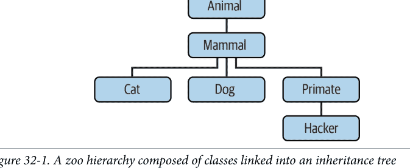

编写一组六个类语句，用Python继承来建模这个分类。然后，为每个类添加一个`speak`方法，打印一条独特的消息，并在顶层Animal超类中添加一个`reply`方法，该方法简单地调用`self.speak`来调用下面子类中的特定类别消息打印器（这将从self启动一个独立的继承搜索）。最后，从你的Hacker类中移除`speak`方法，以便它获取上面的默认方法。完成后，你的类应如下工作：

```
$ python3
>>> from zoo import Cat, Hacker
>>> spot = Cat()
>>> spot.reply()          # Animal.reply: 调用 Cat.speak
meow
>>> data = Hacker()       # Animal.reply: 调用 Primate.speak
>>> data.reply()
Hello world!
```

## 为什么你会关心：大师的OOP

几乎无一例外，在教授现场Python课程时，大约在OOP部分进行到一半时，过去使用过OOP的人会全神贯注地跟随，而没有使用过OOP的人则开始眼神呆滞（或完全打瞌睡）。这项技术背后的意义并不明显。

像这样的书有奢侈慢慢呈现材料，比如第26章的概述和第28章的渐进式教程——事实上，如果你开始觉得OOP只是某种计算机科学的胡言乱语，你可能应该再次复习那些部分。虽然OOP比我们之前遇到的生成器增加了更多的结构，但它同样依赖于一些魔法（继承搜索和一个特殊的第一个参数），初学者可以理解地发现很难合理化。

然而，在真实的课堂上，为了帮助新手入门（并保持他们清醒），停下来询问在场的专家他们为什么使用OOP通常很有帮助。他们给出的答案可能有助于阐明OOP的目的，如果你是这个主题的新手。

那么，这里，只稍加修饰，是学生多年来引用的使用OOP的最常见原因：

- **代码重用**
这个很简单，是使用OOP的主要原因。通过支持继承，类使得通过定制而不是从头开始每个项目来编程变得自然。

- **封装**
将实现细节包装在对象接口后面，使类的用户免受代码更改的影响。

- **结构**
类提供了新的局部作用域，这最大限度地减少了名称冲突。它们还提供了一个自然的地方来编写和查找实现代码以及管理对象状态。

- **维护**
类自然地促进代码分解，这使我们能够最大限度地减少冗余。由于类的结构和代码重用支持，通常只需要更改代码的一个副本。

- **一致性**
类和继承允许你实现公共接口，从而在代码中创建一致的外观和感觉；这简化了调试、理解和维护。

- **多态**
这更多是OOP的一个属性而不是使用它的原因，但通过支持代码通用性，多态使代码更灵活、更广泛适用，因此更具可重用性。

## 其他

当然，学生给出的使用OOP的首要原因是：它在简历上看起来不错！（好吧，这个是作为玩笑添加的，但如果你计划今天在软件领域工作，熟悉OOP是很重要的。）

最后，请记住本书这部分多次给出的指导：在你使用OOP一段时间之前，你不会完全理解它。选择一个项目，研究更大的例子，完成练习。尽一切努力让你接触OOP代码。它是可选的东西，在某些情况下可能甚至有些过头，但通常值得付出努力。

# 第七部分

## 异常

# 第33章
异常基础

本书的这一部分探讨*异常*——用于指示程序状态并修改程序控制流的事件。在Python中，异常会在错误发生时自动触发，也可以由你的代码触发和捕获。它们通过我们将要学习的四种语句来处理，其中第一种语句有多种形式，从某些角度看可视为不同的语句类型：

- **try/except/else/finally**：捕获并恢复由Python或你引发的异常
- **raise**：在代码中手动触发异常
- **assert**：在代码中根据条件触发异常
- **with**：使用自动化异常处理的上下文管理器

我们之前已简要接触过其中一些语句，但本主题的完整讲解被安排在本书主体部分的末尾，因为你需要了解*类*才能编写自己的异常。不过，除了一些例外（双关语），你会发现Python中的异常处理很简单，因为它作为另一种高级工具被集成到了语言本身中。但在深入探讨“如何做”之前，让我们先明确“为什么”。

## 为什么使用异常？

简而言之，异常让我们能够跳出程序中任意大的代码块。回想一下本书前面讨论过的假想披萨制作机器人。假设我们认真对待这个想法并真的建造了这样一台机器。为了制作披萨，我们的烹饪机器人需要执行一个计划，我们将用Python程序来实现：接收订单、准备面团、添加配料、烘烤披萨等等。

现在，假设在“烘烤披萨”步骤中出现了严重问题。也许是烤箱坏了，或者我们的机器人计算失误导致自燃。显然，我们希望能够快速跳转到处理这种异常状态的代码。由于在这种异常情况下我们无法完成披萨制作任务，不如放弃整个计划。

这正是异常允许你的程序做的事情：它们可以一步跳转到异常处理程序，放弃自进入异常处理程序以来开始的所有活动。异常处理程序中的代码随后可以适当地响应引发的异常（例如，呼叫消防队！）。

可以将异常视为一种结构化的“跳转”。*异常处理程序*（try语句）留下一个标记并执行一些代码。在程序稍后的位置，引发的异常会使Python跳回该标记处，放弃标记之后开始的所有代码和调用的函数。最终效果是将程序的控制流回退到标记处并从那里继续执行。

这种协议提供了一种连贯的方式来响应异常事件。此外，由于Python会立即跳转到处理语句，你的代码更简单——通常无需在每个可能失败的操作和函数调用后检查状态码。相反，我们只在需要从错误中恢复的地方捕获错误。

## 异常的作用

在不那么假想的程序中，异常有多种用途。以下是它们最常见的作用：

*错误处理*
Python在运行时检测到程序错误时会引发异常。你可以在代码中捕获并响应这些错误，或者忽略引发的异常。如果错误被忽略，Python的默认异常处理行为会启动：它会停止程序并打印错误消息。如果你不想要这种默认行为，可以编写try语句来捕获并从异常中恢复——当在语句代码中检测到错误时，Python会跳转到你的try处理程序，程序将在try之后恢复执行。

*事件通知*
异常也可用于指示有效状态，而无需在程序中传递结果标志或显式测试它们。例如，搜索例程可能在失败时引发异常，而不是返回一个整数结果代码——并希望该代码永远不会是有效结果。

*特殊情况处理*
有时某个条件可能很少发生，以至于在多个地方处理它会使代码复杂化。你通常可以通过在程序的更高层级中使用异常处理程序来处理异常情况，从而消除特殊情况代码。assert也可用于在开发期间检查条件是否符合预期。

*终止操作*
正如你将看到的，try语句中的finally选项允许你保证执行必要的关闭操作，无论程序中是否存在异常。with语句为支持其预期方法调用协议的对象提供了另一种选择。

*非常规控制流*
最后，由于异常是一种高级的结构化“跳转”，你可以将它们用作实现特殊控制流的基础。例如，尽管语言不显式支持回溯，但你可以通过使用异常和逻辑来撤销赋值，在Python中实现它。¹ Python中没有“goto”语句（谢天谢地），也没有内置的回溯（目前），但异常有时可以扮演类似的角色；例如，`raise`可以用于跳出多个循环，这是break无法做到的。

我们之前已简要见过其中一些作用，并将在本书后续部分学习典型的异常用例。现在，让我们开始了解Python的异常处理工具。

## 异常：简要介绍

与本书中探讨的其他一些核心语言主题相比，异常在Python中是一个相当轻量级的工具。由于它们如此简单，让我们直接看一些代码。

## 默认异常处理程序

假设我们在选择的交互式REPL中编写以下函数：

```
>>> def fetcher(obj, index):
        return obj[index]
```

这个函数很简单——它只是根据传入的索引对对象进行索引。在正常操作中，它返回合法索引的结果：

```
>>> food = 'pizza'
>>> fetcher(food, 4)          # 类似x[4]，最后一个元素
'a'
```

然而，如果我们要求这个函数索引字符串末尾之后的位置，当函数尝试运行`obj[index]`时将触发异常。Python检测到序列的越界索引，并通过*引发*（触发）内置的`IndexError`异常来报告：

```
>>> fetcher(food, 5)          # 默认处理程序 - 控制台界面
Traceback (most recent call last):
  File "<stdin>", line 1, in <module>
  File "<stdin>", line 2, in fetcher
IndexError: string index out of range
```

由于我们的代码没有显式捕获此异常，它会过滤回程序的顶层并调用*默认异常处理程序*，该程序只是打印此处显示的标准错误消息。

到本书的这个阶段，你可能已经见过不少标准错误消息。它们包括引发的异常，以及*堆栈跟踪*——异常发生时所有活动行和函数的列表，本书中因篇幅和简洁性已大部分省略。

此处的错误消息文本由Python 3.12在控制台中打印。它可能因版本甚至交互式REPL而略有不同，因此你不应依赖其确切形式——无论是在本书中还是在你的代码中。当你在控制台界面中交互式编码时，文件名可能只是“<stdin>”，表示标准输入流。

> ¹ 对于在场的计算机科学家来说，真正的回溯不是Python语言的一部分。回溯在跳回之前会撤销计算，但Python异常不会：try运行的打开函数调用中的局部变量只是被丢弃，但对全局变量和对象所做的更改会保留（参见前面的演示）。即使是我们在第20章遇到的生成器函数和表达式也不做完全的回溯——它们只是通过恢复保存的状态并继续来响应next(G)请求。有关回溯的更多信息，请尝试阅读关于AI或Prolog或Icon编程语言的书籍。

不过，今天在IDLE图形界面的交互式shell中工作时，文件名是“<pyshell...>”，并且源代码行也会显示。无论哪种方式，当没有实际文件时，文件行号意义不大（你将在本书后续部分看到更有趣的错误消息）：

```
>>> fetcher(food, 5)                    # 默认处理器 - IDLE图形界面
Traceback (most recent call last):
  File "<pyshell#3>", line 1, in <module>
    fetcher(food, 5)
  File "<pyshell#0>", line 2, in fetcher
    return obj[index]
IndexError: string index out of range
```

在交互式REPL之外启动的更真实的程序中，打印错误消息后，顶层的默认处理器也会立即*终止*程序。对于简单脚本来说，这种操作方式是合理的；错误通常应该是致命的，当它们发生时，你能做的最好的事情就是检查标准错误消息。

## 捕获异常

然而，有时程序因异常而终止并不是你想要的。例如，服务器程序通常需要在内部错误后保持活动状态。如果你不想要默认的异常行为，请将调用包装在try语句中以自行捕获异常（复制/粘贴者：请根据前面的说明省略此处的“...”）：

```
>>> try:
...     fetcher(food, 5)
... except IndexError:                    # 捕获并恢复
...     print('got exception')
...
got exception
>>>
```

现在，当try块运行期间触发异常时，Python会自动跳转到你的*处理器*——即except子块下命名所引发异常的代码块。最终效果是将一个嵌套的代码块包装在一个错误处理器中，该处理器拦截该块的异常。

像这样交互式工作时，except子句运行后，我们最终会回到Python提示符。在更真实的程序中，try语句不仅捕获异常，而且还能从中*恢复*：

```
>>> def catcher():
...     try:
...         fetcher(food, 5)
...     except IndexError:
...         print('got exception')        # 捕获并进一步恢复
...     print('continuing')
...
>>> catcher()
got exception
continuing
>>>
```

这一次，在异常被捕获并处理后，程序在捕获它的整个try语句之后恢复执行——这就是为什么我们在这里得到“continuing”消息。我们没有看到标准错误消息，程序继续正常运行。

不过请注意，在Python中没有办法*返回*到触发异常的代码（当然，除非重新运行到达该点的代码）。一旦你捕获了异常，控制流会在捕获异常的整个try语句之后继续，而不是在引发异常的语句之后。事实上，Python会清除因异常而退出的任何函数的内存，比如我们示例中的fetcher；它们的变量被丢弃，并且无法恢复。try既捕获异常，也是程序恢复的地方。

然而，Python不会*撤销*try块在异常发生之前所做的任何工作——对引用的可变对象和可访问的全局名称所做的任何更改都会保留。如果这是已知的，这就不是问题：

```
>>> L, S = [], 'text'
>>> def modder():
        L.append('added')           # 更改可变对象
        global S; S = 'changed'     # 更改全局变量
        fetcher(food, 5)            # 触发异常

>>> try:
...     modder()
... except IndexError:
...     print('got exception')
...
got exception
>>> L, S                            # 更改被保留
(['added'], 'changed')
```

正如你将在本书后续部分看到的，try也可以使用*except\**子句来处理*多个*异常，但这是一个范围狭窄且与其他部分配合不佳的复杂扩展，你可以安全地推迟学习，直到掌握基础知识。

*演示说明：* 交互式REPL的“...”续行提示符在本部分的一些顶层try语句中重新出现，因为如果复制粘贴，它们的代码将无法工作，除非嵌套在函数或类中（except和其他行必须与try对齐，并且不能有此处用于说明其缩进结构所需的额外前导空格）。要运行，只需逐行输入或粘贴带有“...”提示符的语句，并省略其前导的“...”提示符。

## 引发异常

到目前为止，我们一直通过犯错（这次是有意的！）让Python为我们引发异常，但我们的脚本也可以引发异常——也就是说，异常可以由Python或你的程序引发，并且可以被捕获或不被捕获。要手动触发异常，只需运行一个*raise*语句。用户触发的异常与Python引发的异常以相同的方式被捕获。以下可能不是有史以来最有用的Python代码，但它说明了要点——引发内置的IndexError异常：

```
>>> try:
...     raise IndexError          # 手动触发异常
... except IndexError:
...     print('got exception')
...
got exception
```

通常，如果未被捕获，用户触发的异常会传播到顶层默认异常处理器，并以标准错误消息终止程序：

```
>>> raise IndexError
Traceback (most recent call last):
  File "<stdin>", line 1, in <module>
IndexError
```

正如你将在下一章看到的，assert语句也可以用来触发异常——它是一个基于测试的条件引发，主要用于调试和开发过程中的健全性检查：

```
>>> assert 1 < 0, 'Not in this universe!'
Traceback (most recent call last):
  File "<stdin>", line 1, in <module>
AssertionError: Not in this universe!
```

同样在下一章，你将了解到raise可以使用from子句来“链接”异常；一般来说，这并不常见，但可以在需要时提供更多上下文。

## 用户定义的异常

上一节中的raise语句演示引发了IndexError，这是在Python内置作用域中定义的内置异常。正如你将在本书后续部分学到的，你也可以定义自己的、特定于你程序的新异常。用户定义的异常使用类来编码，这些类继承自内置异常类——通常是名为Exception的类：

```
>>> class Combust(Exception): pass    # 用户定义的异常

>>> def makePizza():
        raise Combust()                # 引发一个实例

>>> try:
...     makePizza()
... except Combust:                    # 捕获类名
...     print('got exception')
...
got exception
>>>
```

正如你将在接下来的章节中看到的，异常类允许脚本构建异常类别，这些类别可以继承行为，并具有附加的状态信息和方法，而except上的as子句可以访问异常对象本身。异常类还可以自定义未被捕获时显示的消息文本：

```
>>> class Combust(Exception):
        def __str__(self):
            return 'Call the fire department!...'

>>> raise Combust()
Traceback (most recent call last):
  File "<stdin>", line 1, in <module>
Combust: Call the fire department!...
>>>
```

## 终止操作

最后，try语句可以包含“finally”——也就是说，它们可以包含finally块。这些看起来像用于异常的except处理器，但try/finally组合指定了无论try块中是否发生异常，都始终在“退出时”执行的终止操作。继续我们的REPL会话：

```
>>> try:
...     fetcher(food, 4)
... finally:
...     print('after fetch')
...
'a'
after fetch
>>>
```

这里，如果try块*没有*异常地完成，finally块将运行，程序将在整个try之后恢复。在这种情况下，这条语句似乎有点傻——我们不如直接在函数调用后输入print，完全跳过try：

```
fetcher(food, 4)
print('after fetch')
```

然而，这样编码有一个问题：如果函数调用引发异常，print将永远不会被执行到。try/finally组合避免了这个陷阱——当try块中*确实*发生异常时，finally块会在程序展开时执行：

```
>>> def after():
...     try:
...         fetcher(food, 5)
...     finally:
...         print('after fetch')    # 始终运行
...     print('after try?')        # 仅在无异常时运行
...
>>> after()
after fetch
Traceback (most recent call last):
  File "<stdin>", line 1, in <module>
  File "<stdin>", line 3, in after
  File "<stdin>", line 2, in fetcher
IndexError: string index out of range
>>>
```

这里，我们没有得到“after try?”消息，因为当异常发生时，控制流不会在try语句之后恢复。相反，Python跳回运行finally操作，然后将异常*传播*到先前的处理器（在这种情况下，是顶层的默认处理器）。如果我们更改此函数内的调用以不触发异常，finally代码仍然运行，但程序在try之后继续：

```
>>> def after():
...     try:
...         fetcher(food, 4)
...     finally:
...         print('after fetch')    # 如果无异常，两者都运行
...     print('after try?')
...
>>> after()
after fetch
```

尝试之后呢？
>>>

实际上，`try`语句中的`except`子句用于捕获和恢复异常，而`finally`子句则方便地确保终止操作无论`try`块代码中发生何种异常都会执行。例如，你可能会使用`try/except`组合来捕获从第三方库导入的代码引发的错误，使用`try/finally`组合来确保关闭文件或终止服务器连接的调用始终运行。我们将在本书的这一部分稍后编写一些这样的实际示例。

尽管它们在概念上服务于不同的目的，但你也可以在同一个`try`语句中混合使用`except`和`finally`子句——`finally`在退出时运行，无论是否引发异常，也无论异常是否被`except`子句捕获。这种组合有其规则，你将在下一章中遇到。

正如你将在下一章学到的，当使用某些类型的内置和用户定义对象时，Python为`try/finally`组合提供了一个替代方案。`with`语句运行上下文管理器对象的方法，以确保终止操作发生，无论其嵌套块中是否有任何异常：

```
>>> with open('pizzarobot.txt', 'w') as file:    # Always close file on exit
        file.write('Catch fire!\n')
```

尽管此选项需要更少的代码行，但它仅适用于处理某些对象类型，因此`try/finally`是一种更通用的终止结构，并且在`with`尚未支持的情况下，通常比编写一个类更简单。另一方面，`with`也可能运行启动操作，并支持使用Python完整OOP工具集的用户定义上下文管理代码。要了解如何做到这一点，让我们继续下一章。

## 章节总结

这就是异常的大部分内容；异常确实是一个简单的工具。

总结一下，Python异常是一种控制流设备。它们可以由Python引发，也可以由你自己的程序引发。在这两种情况下，它们都可以被忽略（以触发默认错误处理程序），或者被`try`语句捕获（由你的代码处理）。`try`语句有逻辑上不同的形式，可以组合使用——一种处理异常，另一种无论是否发生异常都运行终结代码。Python的`raise`和`assert`语句按需触发异常——包括内置异常和我们用类定义的新异常——而`with`语句是确保为支持它的对象执行终止操作的另一种方式。

在本书这一部分的其余内容中，我们将补充一些关于所涉及语句的细节，研究可以在`try`下出现的其他类型的子句（剧透：它还允许在无异常情况下使用`else`），并讨论基于类的异常对象。下一章将通过更仔细地审视我们在此介绍的语句来开始我们的探索。不过，在你翻页之前，这里有一些测验问题来复习一下。

## 测试你的知识：测验

- 1. 列举异常处理擅长的三件事。
- 2. 如果你不做任何特殊处理，异常会发生什么？
- 3. 你的脚本如何从异常中恢复？
- 4. 列举在脚本中触发异常的两种方式。
- 5. 列举两种指定在终止时运行操作的方式，无论是否发生异常。

## 测试你的知识：答案

- 1. 异常处理对于错误处理、终止操作和事件通知很有用。它还可以简化特殊情况的处理，并可用于实现替代控制流，作为一种结构化的“跳转”操作。总的来说，异常处理还减少了你的程序可能需要的错误检查代码量——因为所有错误都过滤到处理程序，你可能不需要测试每个操作的结果（参见本章侧边栏“为什么你会关心：错误检查”第884页的示例）。
- 2. 任何未捕获的异常最终都会过滤到Python在程序顶部提供的默认异常处理程序。此处理程序会打印熟悉的错误消息并关闭你的程序。
- 3. 如果你不想要默认消息和关闭，你可以编写带有`except`子句的`try`语句，以捕获并从其嵌套代码块中引发的异常中恢复。一旦异常被捕获，异常就终止了，你的程序在`try`之后继续执行。
- 4. `raise`和`assert`语句可用于触发异常，就像它是由Python本身引发的一样。原则上，你也可以通过编程错误来引发异常，但这通常不是明确的目标！
- 5. 带有`finally`子句的`try`语句可用于确保在代码块退出后运行操作，无论该块是否引发异常。`with`语句也可用于确保运行终止操作，但仅适用于处理支持它的对象类型。

## 为什么你会关心：错误检查

了解异常有用性的一种方法是比较Python和没有异常的语言中的编码风格。例如，如果你想用C语言编写健壮的程序，通常必须在每个可能出错的操作后测试返回值或状态码，并在程序运行时传播测试结果：

```
doStuff()
{
    if (doFirstThing() == ERROR)    # Detect errors everywhere
        return ERROR;               # even if not handled here
    if (doNextThing() == ERROR)
        return ERROR;
    ...
    return doLastThing();
}

main()
{
    if (doStuff() == ERROR)
        badEnding();
    else
        goodEnding();
}
```

事实上，现实的C程序通常有与实际工作一样多的代码用于错误检测。但在Python中，你不必如此有条理（和神经质！）。相反，你可以将程序中任意大的部分包装在异常处理程序中，只需编写实际工作的部分，并假设一切正常：

```
def doStuff():          # Python code
    doFirstThing()      # We don't care about exceptions here,
    doNextThing()       # so we don't need to detect them
    ...
    doLastThing()

if __name__ == '__main__':
    try:
        doStuff()        # This is where we care about results,
    except:             # so it's the only place we must check
        badEnding()
    else:               # See the next chapter for else
        goodEnding()
```

因为当异常发生时，控制会立即跳转到处理程序，所以无需对所有代码进行错误防护，也没有运行所有测试的额外性能开销。此外，由于Python自动检测错误，你的代码通常根本不需要检查错误。结果是，异常让你在很大程度上忽略不寻常的情况，并避免可能分散程序目的的错误检查代码。

# 第34章

## 异常编码细节

上一章快速介绍了异常相关语句的实际应用。在这里，我们将更深入地探讨——本章更全面地介绍Python中的异常处理语法。具体来说，我们将探索`try`、`raise`、`assert`和`with`语句背后的细节。尽管这些语句大多很直接，但你会发现它们为处理Python代码中的异常情况提供了强大的工具。

## try语句

首先，`try`语句是你的代码捕获异常的方式。简而言之，如果在运行此语句的主块时发生异常，程序会跳回运行该语句的*处理程序*之一，并从那里继续。其处理程序可以由嵌套在`try`中的`except`、`else`、`finally`和`except*`子句指定，并且这些子句的语法及其有效组合有单独的规则。

这表面上是一个简单的模型，但`try`语句的处理程序子句具有不同的目的，其有效组合的规则意味着它有不同的形式。因此，我们将首先单独探讨`try`的常见角色，稍后再将它们组合成一个组合语句。这与`try`在Python早期历史中确实是独立语句的事实相呼应，但我们在此的重点是其统一的现在。

尽管技术上属于`try`的一部分，我们也将把`except*`子句推迟到下一章，部分原因是它涉及该章的异常对象主题，但主要是因为这是一个工具，它使`try`的故事变得复杂，而这个扩展在实践中很少有用。我们的首要任务是学习基础知识。

## try语句子句

当你编写`try`语句时，各种子句可以出现在`try`头部之后和下方。表34-1总结了所有可能的形式，既作为参考也作为预览。我们已经看到`except`子句捕获异常，`finally`子句在退出时运行。这里的新内容是，`else`子句在没有遇到异常时运行，而`except*`子句处理异常组并支持除空形式之外的所有`except`形式。

形式上，一个 `try` 语句必须至少使用表 34-1 中的一个子句。`except` 子句可以有任意多个，但只有在至少有一个 `except` 子句的情况下才能编写 `else`，并且只能有一个 `else` 和一个 `finally`。`finally` 可以与 `except` 和 `else` 出现在同一个语句中，其排序规则将在本章后面给出。

表 34-1. try 语句子句和形式

| 子句形式 | 解释 |
| :--- | :--- |
| except: | 捕获所有（或所有其他）异常类型 |
| except name: | 仅捕获特定异常 |
| except name as var: | 捕获列出的异常并将其实例赋值给变量 |
| except (name1, name2): | 捕获元组中列出的任何异常 |
| except (name1, name2) as var: | 捕获任何列出的异常并将其实例赋值给变量 |
| else: | 如果在 `try` 块中没有引发异常，则运行此块 |
| finally: | 退出时始终执行此块，无论是否有异常 |
| except* ...非空 except 形式...: | 在组中捕获多个异常（第 35 章） |

我们将在本章后面遇到 `raise` 语句时，更详细地探讨表 34-1 中某些子句可用的 `as var` 部分，因为它提供了通过 `var` 访问作为异常引发的对象。在此之前，让我们首先更仔细地研究表 34-1 中更常见的子句。

## except 和 else 子句

从语法上讲，`try` 是一个复合的多部分语句。它以 `try` 头行开始，后跟一个（通常是）缩进的语句块，然后是各个子句，每个子句标识要处理的条件并给出处理该条件的语句块。在其最常见的形式中，`try` 编写时带有一个或多个 `except` 子句和一个可选的 `else` 子句在末尾。你通过将 `try`、`except` 和 `else` 缩进到同一级别（即垂直对齐）来关联它们，如下所示：

```
try:
    statements                # 首先运行此主要操作
except name1:
    statements                # 如果在 try 块期间引发 name1，则运行
except (name2, name3):
    statements                # 如果在 try 块中发生 name2 或 name3，则运行
except name4 as var:
    statements                # 如果引发 name4，则运行，并将其赋值给 var
except:
    statements                # 对于引发的所有其他异常运行
else:
    statements                # 如果在 try 块中没有引发异常，则运行
```

从语义上讲，此语句中 `try` 头下的块代表语句的主要操作——你试图运行并包装在异常处理程序中的代码。语句的其余部分定义了处理程序本身：`except` 子句为在 `try` 块期间引发的异常提供处理程序，可选的 `else` 子句提供在 `try` 块中没有发生异常时运行的处理程序。

在 `try` 内部，每个 `except` 命名要捕获的异常：单个异常仅捕获该异常，元组捕获元组中的任何异常，而省略异常的 `except` 匹配所有（或所有其他）异常。每个非空的 `except` 也可以在 `as` 后给出一个变量名，该变量名将被赋值为由 Python 或 `raise` 语句引发的异常对象；同样，我们将在前面探讨此选项。

## try 语句如何工作

在操作上，`try` 语句的运行方式如下。当进入 `try` 语句时，Python 记录当前程序上下文，以便在发生异常时可以返回到该上下文。首先运行嵌套在 `try` 头下的语句。接下来发生什么取决于在 `try` 块的语句运行时是否引发异常，以及引发的异常是否与 `try` 正在监视的任何异常匹配：

*异常且匹配*
如果在 `try` 块的语句运行时发生异常，并且该异常与语句命名的异常*匹配*，Python 将跳回 `try` 并运行其最顶层匹配引发异常的 `except` 子句下的语句，然后将引发的异常对象赋值给子句中 `as` 指定的变量（如果存在）。在 `except` 块运行后，控制权恢复到整个 `try` 语句下方。如果 `except` 块本身引发另一个异常，则从代码中的此点重新开始传播过程。

*异常但不匹配*
如果在 `try` 块的语句运行时发生异常，但该异常与语句命名的异常*不匹配*，则异常将传播到最近进入的、匹配该异常的下一个 `try` 语句；如果找不到这样的匹配 `try` 语句并且搜索到达程序的顶层，Python 将打印默认错误消息并终止程序（除非是 REPL）。

*无异常*
如果在 `try` 块的语句运行时*没有*发生异常，Python 将运行 `else` 子句下的语句（如果存在），然后控制权恢复到整个 `try` 语句下方。如果 `else` 块本身引发另一个异常，它将再次启动传播过程。

总之，`except` 子句捕获在 `try` 块运行时发生的任何匹配异常，而 `else` 子句仅在 `try` 块运行时没有发生异常时运行。引发的异常通过*类*关系与 `except` 子句中命名的异常*匹配*，我们将在前面和下一章中探讨（简要：子类匹配其超类），而没有异常名称的*空* `except` 子句匹配任何异常。

实际上，`except` 子句是*专注的*异常处理程序——它们仅捕获在关联的 `try` 块内的语句中发生的异常。然而，由于 `try` 块的语句可以调用在程序其他地方编写的函数，异常的来源很可能在 `try` 语句本身的代码之外。

事实上，一个 `try` 块可能调用任意大量的程序代码——包括可能有自己的 `try` 语句的代码，当异常发生时将首先搜索这些语句。换句话说，因为 `try` 语句可以在运行时嵌套，异常的去向取决于在它之前运行的代码，我们将在第 36 章中探讨这一现象。

如果向 `try` 添加 `finally` 子句，其代码块将针对前面列出的所有三种情况运行，正如你将在前面看到的。不过，首先让我们看看一些常见的异常捕获子句变体。

## 使用元组捕获多个异常

根据表 34-1 中的第四和第五项，在括号元组中列出*多个*异常的 `except` 子句捕获列出的*任何*异常。因为 Python 通过从*上到下*检查 `except` 子句来在给定的 `try` 中查找匹配项，所以元组版本与在各自的 `except` 子句中列出每个异常具有相同的效果，但你只需为每个异常编写一次相关的公共语句体。

以下是多个 `except` 子句工作的部分示例，演示了你的处理程序可以多么具体：

```
try:
    ...
except NameError:
    ...
except IndexError:
    ...
except (AttributeError, TypeError, SyntaxError):
    ...
```

如果在此 `try` 块运行时引发异常，Python 将返回到 `try` 并搜索第一个命名引发异常的 `except`。它从上到下检查子句——并沿途从左到右——并运行第一个匹配子句下的语句。如果没有匹配，异常将传播过此 `try`。

请注意，在“任何”形式中，元组周围需要*括号*，并且在此形式中使用 `as` 允许你在列出多个异常时检查发生了哪个异常：

```
try:
    ...
except (AttributeError, TypeError, SyntaxError) as What:
    ...并检查 What...
```

要了解更多关于 `as` 的信息，以及当没有 `except` 匹配时会发生什么，我们必须继续。

## 使用空子句和 Exception 捕获所有异常

根据表 34-1 中的第一项，列出*无*异常名称的 `except` 子句捕获 `try` 语句中未先前列出的*所有*异常。也就是说，如果你想编写一个通用的“捕获所有”处理程序，以便在没有其他 `except` 子句匹配引发的异常时运行，空的 `except` 就能完成这项工作：

```
try:
    ...
except NameError:
    ...                    # 处理 NameError
except IndexError:
    ...                    # 处理 IndexError
except:
    ...                    # 处理所有其他异常
else:
    ...                    # 处理无异常情况（预览）
```

空的 `except` 子句是一种*通配符*功能——因为它捕获所有内容，将其添加到混合中允许你的处理程序尽可能通用或具体。在某些情况下，这种形式可能比在 `try` 中列出所有可能的异常更方便——尤其是在 REPL 中交互式工作时，或者编写必须无论发生什么都能恢复的代码时。例如，以下通过不列出任何内容来捕获*所有内容*：

```
try:
    ...
except:
    ...                    # 捕获所有可能的异常
```

如上所示，空的`except`也可能引发问题。它可能捕获*意外*的异常，拦截与你的代码无关、且被其他处理程序*需要*的事件。例如，即使在Python中，*系统退出*调用和Ctrl+C组合键中断也是通过触发异常来实现的，而你通常希望这些异常能够正常传递。

或许更糟糕的是，空的**except**也可能捕获真正的*编程错误*，而你可能希望看到这些错误的错误消息。否则，你可能直到为时已晚、无法避免用户报告时，才知道存在一个bug。我们将在本书本部分的末尾将其作为一个陷阱重新讨论。目前，标准的“谨慎使用”原则适用。

Python提供了一种替代方案，至少解决了其中一个问题——捕获内置的`Exception`与空的**except**效果几乎相同，但不会捕获与系统退出和Ctrl+C相关的异常：

```
try:
    ...
except Exception:
    ...                # 捕获所有可能的异常 - 除了退出
```

我们将在下一章研究异常类时，正式探讨这种形式是如何实现其魔力的。简而言之，它之所以有效，是因为如果异常是`except`子句中命名的类的*子类*，那么异常就会匹配，而`Exception`是你通常应该以这种方式捕获的所有异常的超类。这种形式具有空`except`的大部分便利性，而没有捕获退出事件的风险，并且还允许你通过`as`检查引发的异常。然而，尽管更好，它也有一些相同的风险——它可能仍然会掩盖并静默忽略编程错误。

本节开头的代码片段特意列出了一个**else**子句，以强调它*不是*像空`except`那样的万能捕获器——这对`try`的新手来说是一个容易理解的困惑来源。下一节将剖析其区别。

## 使用else捕获无异常情况

总而言之，**else**可以在Python的*三个*地方使用：在**if**选择语句、**for**和**while**循环，以及**try**异常处理程序中。在后者中，**else**在*没有*异常发生时运行——而不是针对*不匹配*的异常（那是上一节空`except`的用途）。这个**else**的角色可能看起来与**if**和循环中的不同，但上下文不同。

对于Python初学者来说，**try**中需要**else**子句并不总是显而易见的。然而，如果没有它，就没有直接的方法来判断控制流是否因为没有异常发生而继续执行过了**try**语句，还是因为发生了异常并被处理了。无论哪种情况，我们最终都在**try**之后：

```
try:
    ...运行代码...
except IndexError:
    ...处理异常...
# 我们到达这里是因为try失败了还是没有？
```

当然，我们可以初始化、设置并检查一个布尔标志来知道发生了什么，这增加了管理代码的行数。就像循环中的**else**子句使退出原因更明显（对于没有break的退出）一样，**else**子句在**try**中提供了语法，以最少的额外代码使结果明确无误：

```
try:
    ...运行代码...
except IndexError:
    ...处理异常...
else:
    ...没有异常发生...
```

你*几乎*可以通过将其代码移入`try`块来模拟`else`子句：

```
try:
    ...运行代码...
    ...没有异常发生...
except IndexError:
    ...处理异常...
```

然而，这可能导致错误的异常分类。如果“没有异常发生”的操作本身引发了`IndexError`，它将被记录为`try`块的失败，并错误地触发`try`下面的异常处理程序（这很可能，但确实如此）。通过使用显式的`else`子句，你使逻辑更清晰，并保证`except`处理程序仅对你包装在`try`中的代码的真实失败运行，而不是对`else`无异常情况的操作失败运行。

## 示例：默认行为

因为程序中的控制流可能比用英语更容易在Python中捕获，所以让我们运行一些简单的示例，用文件中的实际代码进一步说明异常基础知识。

如前所述，未被`try`语句捕获的异常会渗透到Python进程的顶层，并运行Python的默认异常处理逻辑（即，Python终止运行的程序并打印标准错误消息）。为了说明，示例34-1中的模块文件*crashware.py*生成了一个除以零异常——这是设计好的。

### 示例34-1. crashware.py

```
def gobad(x, y):
    return x / y

def gosouth(x):
    print(gobad(x, 0))

if __name__ == '__main__': gosouth(1)
```

因为程序忽略了它触发的异常，Python会终止程序并打印一条消息（此处已编辑以压缩路径并删除一些接口的代码指针行以节省空间）：

```
$ python3 crashware.py
Traceback (most recent call last):
  File "/../LP6E/Chapter34/crashware.py", line 7, in <module>
    if __name__ == '__main__': gosouth(1)
  File "/../LP6E/Chapter34/crashware.py", line 5, in gosouth
    print(gobad(x, 0))
  File "/../LP6E/Chapter34/crashware.py", line 2, in gobad
    return x / y
ZeroDivisionError: division by zero
```

此消息由堆栈跟踪（“Traceback”）和引发的异常的名称及详细信息组成。堆栈跟踪列出了异常发生时所有活动的行，从最旧到最新。请注意，因为此代码是在文件中而不是在REPL中编写的，所以文件和行号信息在这里更有用。例如，我们可以看到错误的除法发生在跟踪中的最后一个条目——文件*crashware.py*的第2行，一个`return`语句。

因为Python通过像这样引发异常来检测和报告所有运行时错误，所以异常与*错误处理*和*调试*的一般概念密切相关。如果你已经完成了本书的示例，你无疑在此过程中见过一两个异常——甚至拼写错误通常在文件导入或执行时也会生成`SyntaxError`或其他异常（那时运行代码编译器）。

默认情况下，编程错误会生成像刚才显示的那样有用的错误显示，这有助于你追踪问题。在某些接口中，此消息现在甚至带有指向错误表达式的指针，以及推测性但强制性的“你是否？”提示（其价值你可能希望在Python生涯的后期重新权衡）：

```
$ python3
>>> import crashware
>>> crashware.gobad(1, 0)
Traceback (most recent call last):
  File "<stdin>", line 1, in <module>
  File "/.../LP6E/Chapter34/crashware.py", line 2, in gobad
    return x / y
            ~~~~
ZeroDivisionError: division by zero
```

通常，这个标准错误消息就是你解决代码中问题所需的全部。对于更繁重的调试任务，你可以用`try`语句捕获异常，或使用第3章介绍的调试工具，例如`pdb`标准库模块。更多相关提示，请参见第49页的“调试Python代码”。

## 示例：捕获内置异常

Python的错误检查和默认异常处理通常正是你想要的：特别是对于顶层脚本文件中的代码，错误通常*应该*立即终止你的程序。对于许多程序，没有必要对代码中的错误进行更具体的说明。

然而，有时你会想要捕获错误并从中恢复。如果你不想在Python引发异常时终止程序，只需通过将程序逻辑包装在`try`中来捕获它。这对于像网络服务器这样的程序来说是一个重要的能力，它们必须持续运行。例如，示例34-2中的代码，文件*kaboom.py*，捕获并从TypeError中恢复，当你尝试连接列表和字符串时，Python会立即引发TypeError（记住，`+`运算符期望两侧是相同的序列类型）。

### 示例34-2. kaboom.py

```
def kaboom(x, y):
    print(x + y)                    # 触发TypeError

def serve(n=2):                     # 模拟长时间运行的任务
    for i in range(n):
        try:
            kaboom([1, 2], 'hack')
        except TypeError:            # 在这里捕获并恢复
            print('Hello world!')
        print('Resuming here...')    # 无论是否异常，都继续执行这里

if __name__ == '__main__': serve()
```

当函数 `kaboom` 中发生异常时，控制流会跳转到 `try` 语句的 `except` 子句，该子句会打印一条消息。由于异常在被捕获后即被视为“已处理”，程序会继续执行 `try` 语句之后的代码，而不是被 Python 终止。实际上，这段代码处理并清除了错误，你的脚本得以恢复：

```
$ python3 kaboom.py
Hello world!
Resuming here...
Hello world!
Resuming here...
```

请记住，一旦捕获了错误，控制流会从捕获点（即 `try` 语句之后）恢复；没有直接的方法可以返回到异常发生的位置（此处是在函数 `kaboom` 中）。这使得异常更像是简单的*跳转*，而非函数调用——无法“返回”到“犯罪现场”。

## finally 子句

`try` 语句的另一种主要形式用于编写*终结*（也称为终止）操作，它实际上只是附带地与异常相关。如果在 `try` 中包含 *finally* 子句，Python 将始终在退出 `try` 语句时运行其语句块——无论 `try` 块运行期间是否发生异常。也就是说，这个子句并不*捕获*异常，而是绕过它们。

当单独使用时，这种形式的通用结构如下：

```
try:
    statements           # 首先运行此操作
finally:
    statements           # 退出时始终运行此代码
```

当 *finally* 出现在 `try` 中时，Python 首先像往常一样运行与 `try` 头部行关联的语句块。接下来发生什么取决于 `try` 块运行期间是否发生异常，以及存在哪些其他子句：

*异常且匹配*
如果在 `try` 块运行期间发生异常，并且与某个 `except` 子句匹配，Python 首先运行匹配的 `except` 块，然后运行 *finally* 块。两者都完成后，程序继续执行整个 `try` 语句之后的代码。如果 *except* 引发了新异常，*finally* 也会运行。

*异常但不匹配*
如果在 `try` 块运行期间发生异常，但*未*被 `except` 捕获，Python 仍然会返回并运行 *finally* 块，然后将异常传播到之前进入的 `try` 或顶层默认处理程序。也就是说，即使异常被引发且未被捕获，*finally* 也会运行，但与 `except` 不同，*finally* 不会终止异常——它在 *finally* 块运行后继续被引发。

*无异常*
如果在 `try` 块运行期间*未*发生异常，Python 首先运行 `else` 块（如果存在），然后运行 *finally* 块。两者都完成后，程序继续执行整个 `try` 语句之后的代码。如果 *else* 引发了新异常，*finally* 也会运行。

`try/finally` 形式在你希望确保某些代码运行后某个操作一定会发生时非常有用，无论该代码的异常行为如何。在实践中，它允许你指定必须始终发生的清理操作，例如文件关闭和服务器断开连接（在需要时）。

从技术上讲，`finally` 可以与 `except` 和 `else` 出现在同一语句中，因此实际上是一个包含许多可选子句的单一 `try` 语句。然而，由于其独特的作用以及我们稍后将遇到的排序规则，`finally` 子句最好被视为一个独立的工具。无论是否混合使用，`finally` 都服务于相同的目的——指定必须始终运行的清理操作，无论发生任何异常。

正如你稍后将在本章中看到的，`with` 语句及其上下文管理器提供了一种基于对象的方式来执行类似的退出操作。与 `finally` 不同，此语句还支持进入操作，但其范围仅限于实现它所采用的上下文管理器协议的对象。

## 示例：使用 try/finally 编写终结操作

我们在前一章中编写了一些简单的 `try/finally` 示例。示例 34-3 列出了一个更具体的例子，说明了该语句的典型作用。

示例 34-3. closer.py

```
class MyError(Exception): pass

def stuff(file):
    file.write('Hello?')           # 可能延迟在文件缓冲区中
    raise MyError()                # <= 用 # 启用或禁用我

if __name__ == '__main__':
    file = open('temp.txt', 'w')   # 打开一个输出文件（这也可能失败）
    try:
        stuff(file)                # 引发异常
    finally:
        file.close()               # 始终关闭文件以刷新输出缓冲区
    print('Am I reached?')         # 仅在无异常时继续执行此处
```

当此代码中的函数引发其异常时，控制流会跳回并运行 `finally` 块以关闭文件。然后异常被传播到另一个 `try` 或默认的顶层处理程序，该处理程序会打印标准错误消息并关闭程序。因此，此 `try` 之后的语句永远不会被执行：

```
$ python3 closer.py
Traceback (most recent call last):
  File "/../LP6E/Chapter34/closer.py", line 10, in <module>
    stuff(file)                   # 引发异常
  File "/../LP6E/Chapter34/closer.py", line 5, in stuff
    raise MyError()               # <= 用 # 启用或禁用我
MyError
```

如果此处的函数没有引发异常（例如，通过添加 `#` 禁用其 `raise` 行），程序仍会执行 `finally` 块以关闭文件，但随后会继续执行整个 `try` 语句之后的代码：

```
$ python3 closer.py
Am I reached?
```

在这个特定案例中，我们将对文件处理函数的调用包装在带有 `finally` 子句的 `try` 中，以确保无论函数是否触发异常，文件始终被关闭，从而完成终结。这样，后续代码可以确信文件输出缓冲区的内容已从内存刷新到磁盘。类似的代码结构可以保证服务器连接关闭、GUI 窗口关闭等。

正如我们在第 9 章所学，在标准 Python (CPython) 中，文件对象在垃圾回收时会自动关闭；这对于未分配给变量的临时文件尤其有用。然而，预测垃圾回收何时发生并不总是容易，尤其是在较大的程序或具有不同垃圾回收策略的替代 Python 实现中。`try` 语句使文件关闭更加明确和可预测：它确保文件在块退出时关闭，无论是否发生异常。

这个特定示例的函数并非特别有用（它总是引发异常！），但将调用包装在 `try/finally` 语句中是确保你的关闭时终结活动始终运行的好方法。当然，如果 Python 本身完全崩溃，所有保证都将失效，但这极其罕见；因为它在程序运行时检测错误，硬崩溃通常是由链接的 C 扩展代码引起的，超出了 Python 的范围。

作为预览，请注意示例 34-3 中的用户定义异常是如何用类定义的；正如你将在下一章更正式地学到的，异常必须都是类实例，这是有相当充分的理由的。

## 组合 try 子句

在 Python 存在的前 15 年左右，`try` 语句有两种形式，并且是两个独立的语句——我们可以使用 `finally` 来确保清理代码始终运行，或者编写 `except` 块来捕获和恢复特定异常，并可选地指定一个 `else` 子句用于异常发生时。

也就是说，`finally` 子句不能与 `except` 和 `else` 混合使用。这部分是由于实现问题，部分是因为混合两者的含义似乎晦涩难懂——捕获和恢复异常似乎与执行清理操作是不相关的概念。

无论好坏，这两个语句最终合并了。今天，我们可以在同一语句中混合 `finally`、`except` 和 `else` 子句——部分原因是 Java 语言中的类似实用性（唉，许多编程语言的改进都归功于模仿）。也就是说，`try` 语句最完整的形式如下所示：

```
try:
    main-action
except Exception1:
    handler1
except Exception2:
    handler2
except:
    handler3
else:
    handler4
finally:
    finally-block
```

此语句中的 `main-action` 块中的代码首先执行，如常。如果该代码引发异常，则所有 `except` 块将依次测试是否与引发的异常匹配：`handler1` 将针对*Exception1*运行*handler1*，针对*Exception2*运行*handler2*，针对其他所有异常运行*handler3*。如果没有异常被引发，则运行*handler4*。

无论之前发生了什么，*finally块*都会在主操作块退出且任何处理程序块运行完毕后执行一次。事实上，即使`except`或`else`块中的错误或`raise`语句引发了新的异常，*finally块*中的代码也会被执行。

如前所述，即使在这种混合使用中，`finally`子句也不会终止异常——如果在执行*finally块*时异常仍然活跃，它将在*finally块*运行后继续传播，控制权将跳转到程序中的其他地方（跳转到更早的`try`，或跳转到默认的顶层处理程序）。如果在`finally`运行时没有活跃的异常，控制权将在整个`try`语句之后恢复。

最终效果是，无论发生以下哪种情况，`finally`总会被执行：

- 主操作中发生了异常并被处理。
- 主操作中发生了异常但未被处理。
- 主操作中没有发生异常。
- 在某个处理程序中触发了新的异常。

再次强调，`finally`用于指定在退出`try`时必须始终执行的清理操作，无论引发了哪些异常或处理了哪些异常。

## 组合子句的语法规则

当像这样组合时，`try`语句必须包含`except`或`finally`，并且其各部分的顺序必须如下（其中“->”表示“后跟”）：

```
try -> except -> else -> finally
```

其中，`else`和`finally`是可选的，`except`可以有零个或多个，但如果出现`else`，则必须至少有一个`except`。实际上，`try`语句由两部分组成：带可选`else`的`except`，和/或`finally`。

事实上，更准确地描述组合`try`语句的语法是通过以下两种替代格式（其中方括号表示可选，星号表示前面的项目可以出现任意次数）：

```
try:                    # 格式 1
    statements
except [type [as value]]:
    statements
[except [type [as value]]:
    statements]*
[else:
    statements]
[finally:
    statements]

try:                    # 格式 2
    statements
finally:
    statements
```

由于这些规则，`else`只能在至少有一个`except`时出现，并且无论是否出现`else`，都可以混合使用`except`和`finally`。也可以混合使用`finally`和`else`，但前提是必须出现`except`（尽管`except`可以省略异常名称以捕获所有异常，并运行后面描述的`raise`语句来重新引发当前异常）。如果你违反了这些（可以说是复杂的！）顺序规则，Python将在你的代码运行之前引发语法错误异常。

## 通过嵌套组合finally和except

认识到也可以通过在`try/finally`语句的`try`块中语法上嵌套一个`try/except`来组合`finally`和`except`子句，这可能会有所帮助。我们将在第36章更全面地探讨这种技术，但以下代码与本节开头显示的组合形式具有相同的效果：

```
try:                    # 嵌套等效于组合形式
    try:
        main-action
    except Exception1:
        handler1
    except Exception2:
        handler2
    except:
        handler3
    else:
        handler4
finally:
    finally-block
```

同样，无论主操作中发生了什么，也无论嵌套的`try`中运行了任何异常处理程序，`finally`块总是在退出时运行（追溯前面列出的四种情况，看看这是如何以相同方式工作的）。由于`else`总是需要`except`，这种嵌套形式甚至具有与前面章节中概述的组合形式相同的混合约束。

然而，这种嵌套等效形式对某些人来说似乎更晦涩，并且比新的合并形式需要更多的代码——尽管只多了一行四个字符的代码加上额外的缩进。将`finally`混合到同一个语句中可能会使你的代码更容易编写和阅读，尽管这也可能取决于你问谁。

## 组合子句示例

为了演示将`finally`与其他`try`子句混合的效果，示例34-4中列出的脚本`trycombos.py`编码了四种常见场景，并使用`print`语句描述了每个场景的含义。

示例 34-4. trycombos.py

```
sep = '-' * 45 + '\n'

print(sep + 'EXCEPTION RAISED AND CAUGHT')
try:
    x = 'hack'[99]
except IndexError:
    print('except run')
finally:
    print('finally run')
print('after run')
```

```
print(sep + 'EXCEPTION NOT RAISED')
try:
    x = 'hack'[3]
except IndexError:
    print('except run')
finally:
    print('finally run')
print('after run')
```

```
print(sep + 'EXCEPTION NOT RAISED, WITH ELSE')
try:
    x = 'hack'[3]
except IndexError:
    print('except run')
else:
    print('else run')
finally:
    print('finally run')
print('after run')
```

```
print(sep + 'EXCEPTION RAISED BUT NOT CAUGHT')
try:
    x = 1 / 0
except IndexError:
    print('except run')
finally:
    print('finally run')
print('after run')
```

运行此代码时，将产生以下输出。追溯代码，看看异常处理如何产生这四个测试中的每一个的输出：

```
$ python3 trycombos.py
----------------------------------------
EXCEPTION RAISED AND CAUGHT
except run
finally run
after run
----------------------------------------
EXCEPTION NOT RAISED
finally run
after run
----------------------------------------
EXCEPTION NOT RAISED, WITH ELSE
else run
finally run
after run
----------------------------------------
EXCEPTION RAISED BUT NOT CAUGHT
finally run
Traceback (most recent call last):
  File "/.../LP6E/Chapter34/trycombos.py", line 38, in <module>
    x = 1 / 0
ZeroDivisionError: division by zero
```

此示例在主操作中使用内置操作来触发异常（或不触发），它依赖于Python在代码运行时总是检查错误这一事实。下一节将展示如何手动引发异常。

## raise语句

要显式触发异常，请编写`raise`语句。它们的一般形式很简单——一个`raise`语句由单词`raise`组成，后面可选地跟要引发的类，或该类的一个实例：

```
raise instance          # 引发一个类的实例
raise class             # 创建并引发一个类的实例
raise                   # 重新引发最近的异常
```

如前所述，如今异常总是*类*的实例。因此，这里第一种`raise`形式最常见——我们直接提供一个*实例*，该实例可以在`raise`之前创建，也可以在`raise`语句本身中创建。如果我们传递一个*类*，Python将使用*无*构造函数参数调用该类，以创建要引发的实例；这种形式等效于在类引用后添加括号。最后一种形式重新引发最近引发的异常；它通常在异常处理程序中用于传播已捕获的异常。

*过去的回忆*：很久以前（嗯，在Python 2.6之前），异常可以被识别为简单的*字符串*对象，在`raise`中带有可选的关联数据项。这被*类*取代，以支持附加功能和类别，正如你将在下一章中看到的。尽管如此，字符串对于更简单的角色来说是一个更简单的模型，不需要新手在学习异常之前先学习类和OOP，也不强迫一些Python书籍将异常推迟到[第VII部分](https://example.com)！

## 引发异常

为了使`raise`更具体，让我们看一些例子。对于内置异常，以下两种形式是等效的——都引发名为的异常类的实例，但第一种隐式创建实例：

```
raise IndexError         # 类（实例已创建）
raise IndexError()       # 实例（在语句中创建）
```

我们也可以提前创建实例——因为`raise`语句接受任何类型的对象引用，以下两个示例与前面两个一样引发`IndexError`：

```
exc = IndexError()       # 提前创建实例
raise exc

excs = [IndexError, TypeError]
raise excs[0]
```

事实上，提供给`raise`的实例也可以在捕获它的`try`中获得，如下一节所述。

## except作为钩子

当异常被引发时，Python会将引发的实例与异常一起发送。如果`try`包含一个带有`as`子句的`except`，如[表34-1](https://example.com)所示，它给出的变量将被赋值为由`raise`或Python引发的实例：

```
try:
    ...
except IndexError as X:    # X被赋值为引发的实例对象
    ...
```

在`try`处理程序中，`as`是可选的（如果省略，实例只是不会被赋值给一个名称），但包含它允许处理程序访问实例中的数据以及异常类中的方法。
这个模型对于用户使用类定义的异常同样适用——例如，下面的代码向异常类构造函数传递参数，这些参数通过赋值的实例在处理程序中可用：

```python
class MyExc(Exception): pass

try:
    raise MyExc('oops')       # 带有构造函数参数的异常类
except MyExc as X:            # 实例属性在处理程序中可用
    print(X.args)             # 打印 ('oops',)
```

不过，由于这涉及下一章的主题，我们将把更多细节推迟到那时再讨论。
无论来源如何，异常总是由类实例对象标识，并且在任何给定时间最多只有一个处于活动状态（除了第35章的`except*`组）。一旦被程序中任何地方的`except`子句捕获，异常就会结束，不会传播到另一个`try`，除非它被另一个`raise`语句或错误重新引发。

## 作用域与 except as

我们将在下一章更详细地研究异常对象。既然我们已经看到`as`变量的实际作用，我们终于可以澄清第17章总结的相关作用域问题。正如该章所述，在`except`子句的`as`子句中用于访问异常的变量被局部化到`except`块——该变量在块退出后不可用，就像推导式表达式中的临时循环变量一样：

```python
$ python3
>>> try:
...     1 / 0
... except Exception as X:        # "as" 将名称局部化到 except 块
...     print(X)
...
division by zero
>>> X
NameError: name 'X' is not defined
```

然而，与推导式循环变量不同，这个变量在`except`块退出后会被移除。这样做是因为该变量否则会保留对运行时调用栈的引用，这将延迟垃圾回收，从而保留多余的内存空间。即使你在周围作用域中将该名称用于其他目的，这种移除也会发生，并且比推导式使用的策略更为极端：

```python
>>> X = 99
>>> {X for X in 'hack'}        # 推导式局部化但不移除
{'a', 'c', 'k', 'h'}
>>> X
99

>>> X = 99
>>> try:
...     1 / 0
... except Exception as X:        # 但 "as" 局部化 _并且_ 在退出时移除！
...     print(X)
...
division by zero
>>> X
NameError: name 'X' is not defined
```

## 我的 X 去哪了？- 一个奇怪的边界情况

因此，通常应在`try`语句的`except`子句中使用唯一的变量名，即使它们被作用域局部化。如果你确实需要在`try`语句之后引用异常实例，只需将其赋值给另一个不会被自动移除的名称：

```python
>>> try:
...     1 / 0
... except Exception as X:     # Python 移除此引用
...     print(X)
...     saveit = X             # 赋值异常以在需要时保留异常
...
division by zero
>>> X
NameError: name 'X' is not defined
>>> saveit
ZeroDivisionError('division by zero',)
```

## 使用 raise 传播异常

`raise`语句比我们目前看到的更具功能性。例如，一个未列出要引发的异常的`raise`只是重新引发当前活动的异常。这种形式通常用于你需要捕获并处理异常，但不希望异常在你的处理程序中消亡的情况：

```python
>>> try:
...     raise IndexError('code')     # 异常记住参数
... except IndexError:
...     print('propagating')
...     raise                         # 重新引发最近的异常
...
propagating
Traceback (most recent call last):
  File "<stdin>", line 2, in <module>
IndexError: code
```

以这种方式运行`raise`会重新引发异常并将其传播到更高的处理程序（或顶部的默认处理程序，该程序使用标准错误消息停止程序）。注意我们传递给异常类的参数如何出现在错误消息中；你将在下一章了解为什么会发生这种情况。

## 异常链：raise from

异常有时可能由其他异常触发——无论是故意的还是由新的程序错误引起的。为了支持此类情况下的完整披露，Python还允许`raise`语句有一个可选的`from`子句：

```
raise newexception from otherexception
```

当在显式`raise`请求中使用`from`时，`from`后面的表达式指定另一个异常类或实例，附加到正在引发的新异常的`__cause__`属性。如果引发的异常未被捕获，Python会将两个异常作为标准错误消息的一部分打印出来：

```
Traceback (most recent call last):
  File "<stdin>", line 2, in <module>
ZeroDivisionError: division by zero

The above exception was the direct cause of the following exception:

Traceback (most recent call last):
  File "<stdin>", line 4, in <module>
TypeError: Bad
```

当异常由异常处理程序内的程序错误*隐式*引发时，会自动遵循类似的程序：先前的异常附加到新异常的`__context__`属性，并且如果异常未被捕获，再次显示在标准错误消息中：

```python
>>> try:
...     1 / 0
... except:
...     badname                    # 隐式链接的异常
...
Traceback (most recent call last):
  File "<stdin>", line 2, in <module>
ZeroDivisionError: division by zero

During handling of the above exception, another exception occurred:

Traceback (most recent call last):
  File "<stdin>", line 4, in <module>
NameError: name 'badname' is not defined
```

在这两种情况下，由于附加到新异常对象的原始异常对象*本身*可能附加了原因，因此因果链可以*任意长*，并在错误消息中完整显示。也就是说，错误消息可能给出两个以上的异常。在显式和隐式链接上下文中的净效果是允许程序员知道当一个异常触发另一个异常时涉及的所有异常：

```python
>>> try:
...     try:
...         raise IndexError()
...     except Exception as E:
...         raise TypeError() from E
... except Exception as E:
...     raise SyntaxError() from E
...
Traceback (most recent call last):
  File "<stdin>", line 3, in <module>
IndexError

The above exception was the direct cause of the following exception:

Traceback (most recent call last):
  File "<stdin>", line 5, in <module>
TypeError

The above exception was the direct cause of the following exception:

Traceback (most recent call last):
  File "<stdin>", line 7, in <module>
SyntaxError: None
```

类似下面的代码同样显示三个异常，尽管是由处理程序错误隐式触发的（其分隔线是“During handling of the above exception...”而不是“The above exception was the direct cause..”）：

```python
try:
    try:
        1 / 0
    except:
        badname
except:
    open('nonesuch')
```

异常链影响错误显示，但不影响在`try`语句中命名和捕获异常的方式：链只是记录在异常对象属性中，可以在有用的地方像往常一样检查。

与其他语言（包括Java和C#）中的组合`try`类似，链接的异常具有相似的实用性，尽管不清楚哪些语言是借鉴者。在Python中，在错误消息中看到异常链并不罕见，但使用`raise`显式创建它们并不常见，因此我们将更多细节推迟到Python手册。

不过，作为此主题的脚注，Python还提供了一种*阻止*异常链接的方法：`raise from None`允许在需要时禁用链接异常上下文的显示。这使得在处理异常链时在异常类型之间转换的应用程序中的错误消息更整洁。

## assert 语句

作为调试目的的特殊情况，Python还在其异常工具集中包含`assert`语句。它主要是常见`raise`使用模式的语法简写，`assert`可以被视为*条件*`raise`语句。形式如下的语句：

```
assert test, data          # data 部分是可选的
```

其工作方式类似于以下代码：

```python
if __debug__:
    if not test:
        raise AssertionError(data)
```

换句话说，如果`test`计算为假，Python会引发异常：`data`项（如果提供）用作异常的构造函数参数。与所有异常一样，内置的`AssertionError`异常如果未被`try`捕获，将终止你的程序，并且`data`项作为标准错误消息的一部分显示：

```python
>>> language = 'Java'
>>> assert language.startswith('Py'), "You're using the wrong language!"
AssertionError: You're using the wrong language!
```

作为附加功能，如果使用`-O` Python命令行标志来优化程序，`assert`语句会从编译程序的字节码中移除——因此不会运行。`__debug__`标志是一个内置且不可更改的名称，除非使用`-O`标志，否则自动设置为`True`。当`-O`使`__debug__`为`False`时，任何基于其为`True`的代码都会被移除，包括断言。

因此，要禁用（并省略）断言，可以使用类似 `python -0 file.py` 的命令行运行代码，或者在程序运行前使用 `compileall` 标准库模块或 `compile` 内置函数中的类似选项生成优化后的字节码。有关该模块和函数的详细信息，请参阅 Python 手册。

## 示例：捕获约束（而非错误！）

这是一个关于 `assert` 实际应用的、较少涉及政治敏感性的例子。断言通常用于在开发过程中验证程序条件。当断言被触发时，其错误消息文本会自动包含源代码行信息以及 `assert` 语句中列出的值。请参阅示例 34-5 中的文件 `asserter.py`。

示例 34-5. asserter.py

```
def f(x):
    assert x < 0, 'x must be negative'
    return x ** 2
```

正常运行此代码会为正数触发断言错误，但使用 `-0` 运行则不会：

```
$ python3
>>> import asserter
>>> asserter.f(-3)
9
>>> asserter.f(3)
Traceback (most recent call last):
  File "<stdin>", line 1, in <module>
  File "/../LP6E/Chapter34/asserter.py", line 2, in f
    assert x < 0, 'x must be negative'
AssertionError: x must be negative

$ python3 -0
>>> import asserter
>>> asserter.f(3)
9
```

重要的是要记住，`assert` 主要用于捕获用户定义的约束，而不是用于捕获真正的编程*错误*。因为 Python 本身会捕获编程错误，所以通常没有必要编写 `assert` 来捕获诸如索引越界、类型不匹配和除零之类的情况：

```
def reciprocal(x):
    assert x != 0          # 一个通常无用的断言！
    return 1 / x            # Python 会自动检查零
```

此类 `assert` 用法通常是多余的——因为 Python 会在出错时自动引发异常，你不妨让它为你完成这项工作。通常，你不需要在自己的代码中显式进行错误检查。

当然，大多数规则都有例外。正如本书前面所建议的，如果一个函数在到达将触发异常的位置之前必须执行长时间运行或不可恢复的操作，你可能仍然需要测试错误。即使在这种情况下，也要小心不要使你的测试过于具体或限制性太强，否则会限制你代码的实用性。

有关另一个常见 `assert` 用法的示例，请参阅第 29 章中的抽象超类示例；在那里，我们使用 `assert` 使对未定义方法的调用失败并显示消息。这是一个罕见但有用的工具。

## with 语句和上下文管理器

除了我们目前看到的工具外，Python 还包含另一个将异常相关任务委托给对象的工具。with 语句旨在与支持基于方法的协议的上下文管理器对象一起工作。这种组合在精神上类似于迭代工具（如 for）与迭代协议方法一起工作的方式。

with 语句也类似于 C# 语言中的 “using” 语句。虽然上下文管理器是一个有些可选且面向高级工具的主题（并且曾经是本书下一部分的候选内容），但它们足够轻量级和有用，因此与其余的异常工具集一起放在这里介绍。

简而言之，with 语句旨在作为常见 try/finally 使用惯用法的替代方案：与该语句类似，with 在很大程度上旨在指定终止时或“清理”活动，这些活动必须在代码块执行期间无论是否发生异常都运行。

与 try/finally 不同，with 语句基于方法调用协议来指定要在代码块周围运行的操作。这使得 with 不那么通用，在终止角色中显得多余，并且需要为不支持其协议的对象编写类。另一方面，with 也处理进入操作，在支持的情况下可以减少代码大小，并允许使用完整的面向对象编程来管理代码上下文。

Python 使用上下文管理器增强了一些内置工具，例如自动关闭自身的文件、自动锁定和解锁的线程锁，以及如第 20 章所述自动等待结果的异步函数工具，但程序员也可以使用类编写自己的上下文管理器。让我们简要了解一下该语句及其隐式协议。

## 基本的 with 用法

with 语句的基本格式如下所示，其中方括号内是可选部分：

```
with expression [as variable]:
    with-block
```

嵌套的 with-block 中的语句是要在此处运行的主要操作。假定表达式返回一个支持上下文管理协议的对象（稍后会详细介绍此协议）。如果存在可选的 as 子句，该对象也可能返回一个值，该值将被赋给名称 variable。

请注意，变量不一定被赋值为表达式的结果；表达式的结果是支持上下文协议的对象，而变量可能被赋值为其他旨在在 with-block 内部使用的内容。表达式返回的对象可以在块开始之前运行启动代码，也可以在块完成之后运行终止代码——无论块是否引发异常。

如前所述，一些内置的 Python 对象已被增强以支持上下文管理协议，因此可以与 with 语句一起使用。例如，文件对象（在第 9 章中介绍）具有一个上下文管理器，无论是否引发异常，也无论运行代码的 Python 版本是否自动关闭，它都会在 with 块之后自动关闭文件。在抽象代码中：

```
with open('somefile.txt') as myfile:
    for line in myfile:
        print(line)
```

这里，对 open 的调用返回一个简单的文件对象，该对象被赋给名称 myfile。我们可以使用 myfile 和通常的文件工具——在这个例子中，文件迭代器在 for 循环中逐行读取。

然而，open 的结果也支持 with 语句使用的上下文管理协议。在此 with 语句运行后，上下文管理机制保证 myfile 引用的文件对象会自动关闭，即使 for 循环在处理文件时引发了异常。

尽管文件对象可能在垃圾回收时自动关闭，但并不总是能轻易知道何时会发生这种情况，尤其是在使用替代的 Python 实现时。在此角色中的 with 语句是一种替代方案，它允许我们确信在特定代码块执行后 close 会自动发生。

如前所述，我们可以使用更通用和显式的 try/finally 惯用法实现类似的效果，但在这种情况下，它需要多三行管理代码（四行而不是一行）：

```
myfile = open('somefile.txt')
try:
    for line in myfile:
        print(line)
finally:
    myfile.close()
```

当然，我们可以跳过*两个*语句，但如果在 for 循环期间引发异常，我们的文件可能不会关闭，这在长时间运行的程序中可能很重要（我们将在第 36 章重新讨论此类权衡）。

作为另一个例子，我们不会在本书中介绍 Python 的多线程模块，但它们定义的锁和条件同步对象也可以与 with 语句一起使用，因为它们支持上下文管理协议——在这种情况下，为代码块添加进入和退出操作。导入 threading 后：

```
lock = threading.Lock()
with lock:
    ...访问共享资源...
```

这里，上下文管理机制保证锁在块执行之前自动*获取*，并在块完成后*释放*，无论异常结果如何。

最后，第 5 章介绍的 decimal 模块也使用上下文管理器来简化保存和恢复当前 decimal 上下文，该上下文指定了计算的精度和舍入特性：

```
with decimal.localcontext() as ctx:
    ctx.prec = 2
    x = decimal.Decimal('1.00') / decimal.Decimal('3.00')
```

在此语句运行后，当前线程的上下文管理器状态会自动恢复到语句开始之前的状态。要使用 try/finally 实现相同的效果，我们需要在嵌套块之前保存上下文，并在之后手动恢复它。

## 上下文管理协议

尽管一些内置类型附带了上下文管理器，但我们也可以编写自己的新上下文管理器。为了实现上下文管理器，类使用属于运算符重载类别的特殊方法来接入 with 语句。在 with 语句中使用的对象所期望的接口有些复杂，大多数程序员只需要知道如何使用现有的上下文管理器。对于## with 语句

对于可能希望编写新的特定于应用程序上下文管理器的工具构建者，让我们快速了解一下其中涉及的内容。

以下是 with 语句的实际工作方式：

1.  对表达式求值，得到一个称为*上下文管理器*的对象，该对象必须具有 `__enter__` 和 `__exit__` 方法。
2.  调用上下文管理器的 `__enter__` 方法。它返回的值被赋给 as 子句中的变量（如果存在），否则直接丢弃。
3.  执行嵌套的 with 块中的代码。
4.  如果 with 块引发异常，则使用异常详情调用上下文管理器的 `__exit__(type, value, traceback)` 方法。这些与 `sys.exc_info` 返回的三个值相同，在 Python 手册和本书后续部分中有描述。如果此方法返回假值，则重新引发异常；否则，异常被终止。通常应该重新引发异常，以便在 `__exit__` 返回后将其传播到 with 语句外部。
5.  如果 with 块*没有*引发异常，`__exit__` 方法仍然会被调用，但其 *type*、*value* 和 *traceback* 参数都作为 None 传入，其返回值被忽略。

让我们快速看一下该协议实际运行的演示。示例 34-6 中的文件 `withas.py` 定义了一个上下文管理器对象，该对象只是跟踪它在任何 with 语句中使用的 with 块的进入和退出。

### 示例 34-6. withas.py

```python
"A context manager that traces entry and exit of any with statement's block"

class TraceBlock:
    def message(self, arg):
        print('running ' + arg)

    def __enter__(self):
        print('[starting with block]')
        return self

    def __exit__(self, exc_type, exc_value, exc_tb):
        if exc_type is None:
            print('[exited normally]\n')
        else:
            print(f'[propagating exception: {exc_type}]')
            return False

if __name__ == '__main__':
    with TraceBlock() as action:
        action.message('test 1')
        print('reached')

    with TraceBlock() as action:
        action.message('test 2')
        raise TypeError
        print('not reached')
```

请注意，这个类的 `__exit__` 方法返回 False 以传播异常；删除 return 语句会有相同的效果，因为函数的默认返回值 None 根据定义是假值，但在编码中显式通常更好。还要注意，`__enter__` 方法返回 self 作为要赋给 as 变量的对象；在其他用例中，它可能返回一个完全不同的对象。

运行时，此模块的自测代码使用其上下文管理器来跟踪两个 with 语句块的进入和退出。净效果是自动调用管理器的 `__enter__` 和 `__exit__` 方法：

```
$ python3 withas.py
[starting with block]
running test 1
reached
[exited normally]

[starting with block]
running test 2
[propagating exception: <class 'TypeError'>]
Traceback (most recent call last):
  File "/../LP6E/Chapter34/withas.py", line 25, in <module>
    raise TypeError
TypeError
```

上下文管理器也可以利用面向对象的状态信息和继承，但它们是面向工具构建者的高级工具，因此我们将在此跳过更多细节。完整内容请参阅 Python 的标准手册——包括其对 contextlib 标准模块的介绍，该模块提供了用于编码上下文管理器的额外工具。

还要记住，try/finally 组合也提供对终止时活动的支持，并且在不需要编写类来支持 with 语句协议的角色中通常是足够的。

## 多个上下文管理器

with 语句还有最后一张牌要翻开：它也可以使用逗号语法指定*多个*（有时称为“嵌套”）上下文管理器。例如，在以下按子字符串选择行的代码片段中，无论异常结果如何，当语句块退出时，两个文件的退出操作都会自动运行以关闭文件：

```python
with open('lines.txt') as input, open('matches.txt', 'w') as output:
    for line in input:
        if 'somekey' in line:
            output.write(line)
```

可以列出任意数量的上下文管理器项，多个项的工作方式与嵌套的 with 语句相同。也就是说，以下假设代码：

```python
with A() as a, B() as b:
    statements
```

等效于（并且可能比以下代码更简单）：

```python
with A() as a:
    with B() as b:
        statements
```

净效果是，在块进入和退出时，每个上下文管理器的进入和退出方法依次运行，并且块中的异常会被自动捕获，并可能根据最外层管理器的退出方法的决定在 with 退出时重新引发。例如，多个*文件*上下文管理器都将在进入时运行以打开文件，并在退出时关闭它们——无论是否有异常。

## 终止处理器对决

你可以在 Python 文档中找到更多关于上下文管理器的信息。与其在此处更详细地介绍，不如让我们通过快速查看此扩展的实际运行和对其角色的评估来结束本章。使用像 with 这样更新且冗余的工具本身并不能证明其智能性，理解这些选项所隐含的权衡很重要。

首先，以下代码对位于本书示例包中的文件进行并行*行扫描*。它使用 with 同时打开两个文件，然后在 for 循环的每次迭代中读取并组合它们的下一行对。得益于文件对象的上下文管理器，无需手动捕获异常或在完成后关闭文件：

```python
>>> with open('lines1.txt') as file1, open('lines2.txt') as file2:
...     for pair in zip(file1, file2):
...         print(pair)

('hack\n', 'HACK\n')
('code\n', 'GOOD\n')
('well\n', 'CODE\n')
```

你也可以使用这种编码结构对两个文本文件进行*行比较*。以下只是将前者的 print 替换为 if 进行比较操作，并添加 enumerate 以自动编号行：

```python
>>> with open('lines1.txt') as file1, open('lines2.txt') as file2:
...     for (linenum, (line1, line2)) in enumerate(zip(file1, file2)):
...         if line1.lower() != line2.lower():
...             print(f'{linenum} => {line1!r} != {line2!r}')

1 => 'code\n' != 'GOOD\n'
2 => 'well\n' != 'CODE\n'
```

话虽如此，在使用 CPython 时，with 在前面的示例中并不是那么有用，因为*输入*文件对象不需要缓冲区刷新，并且如果文件对象在垃圾回收时仍然打开，它们会*自动关闭*。此外，如果未显式捕获，with 块中的*异常*仍然会传播到语句外部。因此，临时文件将立即自动关闭，并且对于像这样的更简单代码，异常行为将是相同的：

```python
for pair in zip(open('lines1.txt'), open('lines2.txt')):  # Same if auto close
    print(pair)                                        # Ditto for != test
```

另一方面，第 2 章中的一些替代*Python*实现可能使用不同的垃圾收集器，需要直接关闭以避免消耗系统资源。此外，*输出*文件可能需要关闭以确保任何缓冲内容传输到磁盘，以便在后续代码中打开时可用。

以下*行过滤*代码解决了这两个问题，通过在语句退出时自动关闭文件，无论是否有异常（它还使用了括号和 with 后的行分割，从 Python 3.10 开始可用，并为简洁起见省略了写入计数）：

```python
>>> with (open('lines1.txt') as input,
        open('uppers.txt', 'w') as output):
    for line in input:
        output.write(line.upper())

>>> print(open('uppers.txt').read())
HACK
CODE
WELL
```

尽管如此，在简单的脚本中，我们通常可以在单独的语句中打开文件，并在需要时在处理后关闭它们。如果捕获异常意味着你的程序无论如何都会停止，那么捕获异常就没有意义，并且只有在文件将被后续代码重新打开时才需要关闭来刷新输出缓冲区——而后续代码在异常后可能永远不会被执行：

```python
input = open('lines1.txt')
output = open('uppers.txt', 'w')
for line in input:
    output.write(line.upper())
```

然而，在必须*既*在异常后继续运行*又*关闭输出文件以供同一程序（或 REPL）运行中后续使用的程序中，`with` 避免了等效的 `try/finally` 组合，这对某些读者来说可能更明显，但也需要明显更多的代码——从数量上讲，是八行而不是四行：

```python
input = open('lines1.txt')
output = open('uppers.txt', 'w')
try:
    for line in input:
        output.write(line.upper())
finally:
    input.close()
    output.close()
```

即便如此，`try/finally` 是一个适用于所有终结情况的单一工具，并使代码显式。`with` 对于上下文管理器用户来说可能更简洁，但仅适用于实现其复杂协议的对象，依赖于掩盖含义的隐式“魔法”，并增加了冗余，使程序员所需的知识库加倍。一如既往，你必须自己权衡这些工具的利弊。

## 章节总结

在本章中，我们通过探索 Python 中与异常相关的语句更详细地了解了异常处理：`try` 用于捕获它们，`raise` 用于触发它们，`assert` 用于有条件地引发它们，以及 `with` 用于将代码块包装在自动化进入和退出操作的上下文管理器中。

到目前为止，异常似乎是一个相当轻量级的工具（除了 `with` 协议）。关于它们最复杂的事情可能是它们如何被识别——下一章将通过展示异常对象是如何制作的来解决这个主题。正如你将在那里看到的，类允许你编码特定于程序的新异常。不过，在我们继续之前，让我们完成以下关于此处涵盖的基础知识的简短测验。

## 测试你的知识：测验

1. try语句的用途是什么？
2. try语句的两种常见变体是什么？
3. raise语句的用途是什么？
4. assert语句的设计目的是什么，它类似于哪个其他语句？
5. with语句的设计目的是什么，它类似于哪个其他语句？

## 测试你的知识：答案

1. try语句用于捕获和恢复异常——它指定一段要运行的代码，以及一个或多个用于处理该代码块执行期间可能引发的异常的处理器。
2. try语句的两种常见变体是try/except/else（用于捕获异常）和try/finally（用于指定无论是否引发异常都必须执行的清理操作）。尽管这些角色在逻辑上是不同的，但except和finally块可以在同一个语句中混合使用，因此这两种形式实际上是单个try语句的一部分。然而，即使与except混合使用，finally仍然会在退出try时运行，无论可能引发或处理了什么异常。实际上，组合形式等价于在try/finally中嵌套一个try/except/else。
3. raise语句用于引发（触发）异常。Python在内部错误时会引发内置异常，但你的脚本也可以使用raise来触发内置或用户定义的异常。
4. assert语句在条件为假时引发AssertionError异常。它类似于一个包装在if语句中的条件raise语句，并且可以通过-O命令行开关禁用。
5. with语句旨在自动化必须围绕代码块发生的启动和终止活动。它大致类似于try/finally组合，因为其退出操作无论是否发生异常都会运行，但它采用基于对象的协议来指定进入和退出操作，并且可以减少上下文管理器用户的代码量。尽管如此，它并不完全通用，因为它仅适用于支持其协议的对象；而带有finally子句的try语句可以处理更多的用例。

# 第35章
异常对象

到目前为止，本书对于异常实际上*是什么*的描述有些模糊。本章通过揭示异常对象（包括内置和用户定义）背后的事实来解开这个谜团。正如前面章节所暗示的，异常是通过*类实例对象*来标识的。这就是被引发并由异常处理传播的东西，也是try语句中与except子句匹配的类的来源。

虽然这意味着你必须使用面向对象编程来在程序中定义新的异常——并且引入了前一章注释中提到的知识依赖——但将异常基于类和OOP提供了许多好处。其中，基于类的异常支持：

- *灵活的异常类别*
异常类允许代码选择特异性并便于未来的更改。例如，添加新的异常子类不需要更改try语句。

- *状态信息和行为*
异常类提供了一个自然的地方来存储上下文，以便在try处理器中使用。例如，引发的实例上可以使用属性和方法。

- *通过继承重用*
异常类可以参与继承层次结构，以获取和自定义公共行为。例如，继承的错误显示可以提供统一的外观和感觉。

由于这些优势，基于类的异常很好地支持程序演进和更大的系统。正如你将在这里了解到的，所有内置异常都是通过类标识的，并且由于上述原因被组织成一个继承树。你也可以对自己的用户定义异常做同样的事情。

事实上，我们将在这里研究的内置异常对于你定义的新异常来说是必不可少的。因为Python在很大程度上要求用户定义的异常继承自内置异常类，这些类为打印和状态提供了有用的默认值，所以编码用户定义异常的任务也涉及理解这些内置类的作用。

## 异常类

无论是内置的还是用户定义的，异常的大部分魔力都来自于*超类关系*：如果一个except子句命名了异常的类或其任何超类，那么引发的异常就会匹配该子句。换句话说，try语句的except既匹配它列出的类，也匹配该类在类树中更低位置的所有子类。

最终效果是，类异常自然地支持构建异常*层次结构*：超类成为*类别*名称，子类成为类别内的*特定*类型的异常。通过命名一个通用的异常超类，except子句可以捕获一整类异常——任何更具体的子类都会匹配。

除了这个类别概念之外，基于类的异常还支持异常状态信息，并允许异常继承公共行为，如前所述。为了看看所有这些优势如何在代码中结合在一起，让我们转向一个示例。

## 编码异常类

在示例35-1列出的文件*categoric.py*中，我们定义了一个名为General的超类和两个名为Specific1和Specific2的子类。这个示例说明了异常类别的概念——General是一个类别名称，它的两个子类是该类别内的特定类型的异常。捕获General的处理器也会捕获它的任何子类，包括Specific1和Specific2。

```
示例 35-1. categoric.py

class General(Exception): pass
class Specific1(General): pass
class Specific2(General): pass

def raiser0():
    X = General()           # 引发超类实例
    raise X

def raiser1():
    X = Specific1()         # 引发子类实例
    raise X

def raiser2():
    X = Specific2()         # 引发不同的子类实例
    raise X

for func in (raiser0, raiser1, raiser2):
    try:
        func()
    except General:         # 匹配General或其任何子类
        import sys
        print('caught:', sys.exc_info()[0])
```

当这个示例运行时，它的try语句捕获并报告所有三个类的实例，因为except子句命名了它们的公共超类：

```
$ python3 categoric.py
caught: <class '__main__.General'>
caught: <class '__main__.Specific1'>
caught: <class '__main__.Specific2'>
```

这段代码大部分是直接的，但这里有一些需要注意的点：

- **异常超类**
用于构建异常类别树的类要求很少——事实上，在这个示例中，它们大多是空的，主体除了pass什么也不做。不过，请注意这里的顶级类是如何继承自内置Exception类的。这是必需的：不继承自内置异常类的类在大多数异常上下文中将无法工作。内置超类通常是Exception，非退出异常的根，但也可以是BaseException，所有异常的根，或其他。虽然我们这里没有使用它，但Exception提供了你稍后会遇到的行为，这使得继承它变得有用，无论是否必需。

- **引发实例**
在这段代码中，我们调用类来为raise语句创建实例（注意括号）。在类异常模型中，我们总是引发和捕获类实例对象。如果我们在raise中列出一个类名而不带括号，Python会通过调用没有构造函数参数的类来为我们创建一个实例。异常实例可以在raise之前创建，如这里所示，也可以在raise语句本身中创建。

- **捕获类别**
这段代码包含引发我们所有三个类的实例作为异常的函数，以及一个顶级try，它调用这些函数并捕获General异常。同一个try也捕获两个特定的异常，因为它们是General的子类——即其类别的成员。

- **异常细节**
这里的异常处理器使用sys.exc_info调用，这是以通用方式获取正在处理的异常的一种方法。正如你将在下一章更详细地看到的，此调用结果元组中的第一项是引发的异常的类，第二项是实际引发的实例。在像这里这样捕获类别中所有类的通用except子句中，可以使用sys.exc_info来确定到底发生了什么。

最后一点值得详细说明。当捕获一个异常时，我们可以确定引发的实例是except中列出的类的实例或其子类之一。因此，引发的特定类型的异常也可以通过实例的type结果或__class__属性获得，无论实例是如何获得的。

为了演示，示例35-2中的变体与前面的示例工作方式相同，但在其except子句中使用as扩展直接将变量分配给引发的实例，从中type可以产生异常的种类。

示例 35-2. categoric2.py

```
class General(Exception): pass
class Specific1(General): pass
class Specific2(General): pass

def raiser0(): raise General()
def raiser1(): raise Specific1()
def raiser2(): raise Specific2()

for func in (raiser0, raiser1, raiser2):
    try:
        func()
```

除了 `General` 作为 `X`：# X 是被引发的实例
    print('caught:', type(X)) # 与 `sys.exc_info()[0]` 相同，`X.__class__`

由于 `except` 的 `as` 可以这样直接访问异常，`sys.exc_info` 对于那些没有其他方式访问实例或其类的*空* `except` 子句更有用。更重要的是，设计良好的程序通常*不必关心*到底引发了哪个具体的异常——调用异常实例的方法应该自动分派到为引发的异常量身定制的行为。

关于这一点以及 `sys.exc_info` 及其相关内容，我们将在下一章详细讨论。另外，如果你忘记了实例中的 `__class__` 是什么意思，可以参阅第 29 章和第六部分；关于此处使用的 `as`，请回顾前一章。

## 为什么需要异常层次结构？

因为前一节的示例中只有三种可能的异常，所以它并不能真正体现类异常的效用。原则上，我们可以通过在 `except` 子句的括号元组中编码异常名称列表来达到相同的效果：

```
try:
    func()
except (General, Specific1, Specific2): # 捕获其中任何一个
    ...
```

这种方法可能适用于较小的、自包含的代码。然而，对于大型或高异常层次结构，使用基于类的类别来捕获异常可能比在单个 `except` 子句中列出类别的每个成员更容易。也许更重要的是，随着软件需求的发展，你可以通过添加新的子类来扩展异常层次结构，而不会破坏现有的处理程序代码。

例如，假设你用 Python 编写了一个数值编程库，供大量人员使用。在编写库的过程中，你识别出代码中数字可能出现的两种问题——除以零和数值溢出。你将它们记录为库可能引发的两个独立异常：

```
# mathlib.py
class Divzero(Exception): pass
class Oflow(Exception): pass

def func():
    ...
    raise Divzero()
...等等...
```

现在，当人们使用你的库时，他们通常会将调用你的函数或类的代码包装在 `try` 语句中，以捕获你的两个异常；毕竟，如果不捕获你的异常，来自你库的异常会终止他们的代码：

```
# client.py
import mathlib

try:
    mathlib.func()
except (mathlib.Divzero, mathlib.Oflow):
    ...处理并恢复...
```

这运行得很好，很多人开始使用你的库。然而，六个月后，你对其进行了修订（程序员经常这样做）。在此过程中，你识别出一个新的问题——下溢，也许——并将其添加为一个新的异常：

```
# mathlib.py
class Divzero(Exception): pass
class Oflow(Exception): pass
class Uflow(Exception): pass
```

不幸的是，当你重新发布代码时，你给用户带来了维护问题。如果他们明确列出了你的异常，他们现在必须回去更改每个调用你的库的地方，以包含新添加的异常名称：

```
# client.py
try:
    mathlib.func()
except (mathlib.Divzero, mathlib.Oflow, mathlib.Uflow):
    ...处理并恢复...
```

这可能不是世界末日。如果你的库仅在内部使用，你可以自己进行更改。你也可以提供一个 Python 脚本，尝试自动修复此类代码（它可能只有几十行，并且至少在某些时候能猜对）。但是，如果很多人每次你更改异常集时都必须更改他们所有的 `try` 语句，这可不是最礼貌的升级策略。

你的用户可能会尝试通过编写空的 `except` 子句来捕获*所有*可能的异常，从而避免这个陷阱：

```
# client.py
try:
    mathlib.func()
except:                          # 在这里捕获所有内容（或捕获 Exception）
    ...处理并恢复...
```

但正如前一章所述，这种变通方法可能会捕获超出他们预期的内容——比如内存耗尽、键盘中断（Ctrl+C）、系统退出，甚至他们自己 `try` 块代码中的拼写错误都会触发异常，而这些事情应该被忽略，而不是被捕获并错误地归类为库错误。捕获 `Exception` 超类可以改进这一点，但仍然会拦截——因此可能掩盖——程序错误。

实际上，在这种情况下，用户只想捕获并从库定义和文档记录的*特定*异常中恢复。如果在库调用期间发生任何其他异常，那很可能是库中的一个真正的错误（并且可能是时候联系供应商了）。作为经验法则，在异常处理程序中，具体通常比通用更好——这个想法我们将在下一章作为“陷阱”重新讨论。

那么，该怎么办呢？原则上，库模块可以提供一个元组对象，包含它可能引发的所有异常。然后，客户端可以导入该元组并在 `except` 子句中命名它，以捕获库的所有异常（回想一下，使用元组可以捕获其任何异常）。这可以工作并支持修改，但你需要保持元组与库异常同步，这既容易出错又乏味。

类异常层次结构更好地解决了这个困境。与其将库的异常定义为一组独立的类，不如将它们组织成一个具有公共超类的类树，以涵盖整个类别：

```
# mathlib.py
class NumErr(Exception): pass
class Divzero(NumErr): pass
class Oflow(NumErr): pass

def func():
    ...
    raise DivZero()
...等等...
```

这样，你的库用户只需列出公共超类（即*类别*）即可捕获你库的所有异常——无论是现在还是将来：

```
# client.py
import mathlib

try:
    mathlib.func()
except mathlib.NumErr:
    ...处理并恢复...
```

当你再次回去修改（更新）代码时，你可以将新异常添加为公共超类的*子类*：

```
# mathlib.py
...
class Uflow(NumErr): pass
```

最终结果是，捕获你库异常的用户代码将继续工作，*无需更改*。事实上，你将来可以随意添加、删除和更改异常——只要客户端命名了超类，并且该超类保持不变，他们就与你的异常集的变化隔离开来。换句话说，类异常比其他解决方案能更好地解决维护问题。

基于类的异常层次结构还支持状态保留和继承，使其成为大型程序的理想选择。然而，要理解这些作用，我们首先需要了解用户定义的异常类与它们继承的内置异常之间的关系。

## 内置异常类

上一节的例子并非凭空捏造。Python 本身可能引发的所有内置异常都是预定义的类对象。此外，它们被组织成一个浅层次结构，具有通用超类类别和特定子类类型，类似于上一节最后的异常类树。

你见过的所有熟悉的异常（例如，*SyntaxError*）实际上只是预定义的类，作为名为 *builtins* 的模块中的内置名称可用。此外，Python 将内置异常组织成一个层次结构，以支持各种捕获模式。例如：

**BaseException**：*最顶层的根，具有打印和构造函数默认值*
异常的顶层根超类。这个类不应该被用户定义的类直接继承（请改用 *Exception*）。它提供了子类继承的默认打印和状态保留行为。如果在该类的实例上调用 *str* 内置函数（例如，通过 *print*），该类将返回创建实例时传递的构造函数参数的显示字符串（如果没有参数，则返回空字符串）。此外，除非子类替换这个类的构造函数，在实例构建时传递给该类的所有参数都会以元组形式存储在其 `args` 属性中。

## 异常：用户自定义异常的根类
应用程序相关异常的顶层根超类。这是 `BaseException` 的直接子类，也是除系统退出事件类（`SystemExit`、`KeyboardInterrupt` 和 `GeneratorExit`）以及我们在此忽略的异常组类之外的所有其他内置异常的超类。几乎所有用户自定义类都应该继承自这个类，而不是 `BaseException`。遵循此约定，在 `try` 语句的处理程序中命名 `Exception` 可确保你的程序将捕获除系统退出事件之外的所有异常，而系统退出事件通常应被允许传播。实际上，`Exception` 在 `try` 语句中充当了捕获所有异常的角色，但比空的 `except` 更精确。

### ArithmeticError：数值错误的根类
`Exception` 的子类，所有数值错误的超类。其子类标识特定的数值错误：`OverflowError`、`ZeroDivisionError` 和 `FloatingPointError`。

### LookupError：索引错误的根类
`Exception` 的子类，是序列和映射索引错误的超类类别：`IndexError` 和 `KeyError`。

### OSError：IO 和其他系统函数错误的根类，包含详细信息
`Exception` 的子类，具有用于错误详细信息的属性（例如 `errno`、`strerror` 和 `filename`），以及用于特定错误的子类：`FileNotFoundError`、`PermissionError`、`TimeoutError` 等。

以此类推——因为内置异常集容易频繁变化，本书并未详尽地记录它。你可以在 Python 库手册中进一步阅读其内容和结构。

## 内置异常类别
内置类树允许你选择处理程序的特定性或通用性。例如，因为内置异常 `ArithmeticError` 是更具体异常（如 `OverflowError` 和 `ZeroDivisionError`）的超类：

- 在 `try` 中列出 `ArithmeticError`，你将捕获引发的*任何*类型的数值错误。
- 列出 `ZeroDivisionError`，你将仅拦截*该*特定类型的错误，而不拦截其他错误。

同样，因为 `Exception` 是所有应用程序级异常的超类，你通常可以将其用作捕获所有异常的工具——如前一章所述，其效果类似于空的 `except`，但它允许系统退出异常像通常那样传播：

```
try:
    ...
except Exception:          # 系统退出异常不会在此被捕获
    ..处理所有应用程序异常..
else:
    ..处理无异常情况..
```

这种技术是可靠的，因为 Python 要求所有类都派生自内置异常。尽管如此，此方案仍存在与前一章描述的空 `except` 大多数相同的潜在陷阱——它可能拦截本应传递到其他地方的异常，并且可能掩盖真正的编程错误。由于这是一个非常常见的问题，我们将在下一章中再次将其作为一个“陷阱”进行探讨。

无论你是否将利用内置类树中的类别，它都是一个很好的示例。通过在你自己的代码中使用类似的类异常技术，你可以提供灵活且易于修改的异常集。

## 默认打印和状态
内置异常还提供默认的打印显示和状态保留，这通常与用户自定义类所需的逻辑一样多。除非你重新定义了类从内置类继承的构造函数，否则你传递给这些类的任何构造函数参数都会自动保存在实例的 `args` 元组属性中，并在打印实例时自动显示。如果未传递构造函数参数，则使用空元组和显示字符串；单个参数显示为自身（而不是元组），并作为消息详细信息。

这解释了为什么传递给*内置*异常类的参数会出现在错误消息中——任何构造函数参数都附加到实例上，并在打印实例时显示：

```
>>> raise IndexError                     # 等同于 IndexError()：无参数
Traceback (most recent call last):
  File "<stdin>", line 1, in <module>
IndexError

>>> raise IndexError('bad')               # 构造函数参数被附加并打印
Traceback (most recent call last):
  File "<stdin>", line 1, in <module>
IndexError: bad

>>> i = IndexError('bad', 'stuff')        # 在对象属性 "args" 中可用
>>> i.args
('bad', 'stuff')
>>> print(i)                              # 手动打印时显示 args
('bad', 'stuff')
>>> i                                     # 使用 repr 进行回显，使用 str 进行打印
IndexError('bad', 'stuff')
```

对于*用户自定义*异常也是如此，因为它们继承了内置超类中存在的构造函数和显示方法：

```
>>> class E(Exception): pass

>>> raise E
Traceback (most recent call last):
  File "<stdin>", line 1, in <module>
E

>>> raise E('bad')
Traceback (most recent call last):
  File "<stdin>", line 1, in <module>
E: bad

>>> i = E('bad', 'stuff')
>>> i.args
('bad', 'stuff')
>>> print(i)
('bad', 'stuff')
>>> i
E('bad', 'stuff')
```

当在 `try` 语句中拦截时，异常实例对象可以访问原始构造函数参数和显示方法：

```
>>> try:
...     raise E('bad')              # 显示并保存构造函数参数
... except E as X:
...     print(f'{X} - {X.args} - {X!r}')
...
bad - ('bad',) - E('bad')

>>> try:
...     raise E('bad', 'stuff')     # 多个参数保存/显示为元组
... except E as X:
...     print(f'{X} - {X.args} - {X!r}')
...
('bad', 'stuff') - ('bad', 'stuff') - E('bad', 'stuff')
```

请注意，异常实例对象本身不是字符串，而是使用我们在第 30 章学习的 `__str__` 和 `__repr__` 运算符重载方法来为打印和其他上下文提供显示字符串。要与真实字符串连接，请执行手动转换：`str(X)`、`'%s' % X`、`f'{X}'` 等。

尽管这种自动状态和显示支持本身很有用，但对于更具体的显示和状态保留需求，你总是可以在异常子类中重新定义继承的方法，如 `__str__` 和 `__init__`——如下一节所示。

## 自定义打印显示
正如我们在上一节所看到的，默认情况下，基于类的异常实例在捕获和打印时显示你传递给类构造函数的任何内容：

```
>>> class MyBad(Exception): pass

>>> try:
...     raise MyBad('Sorry--my mistake!')
... except MyBad as X:
...     print(X)
...
Sorry--my mistake!
```

如果异常未被捕获而作为错误消息的一部分显示时，也会使用此继承的默认显示模型：

```
>>> raise MyBad('Sorry--my mistake!')
Traceback (most recent call last):
  File "<stdin>", line 1, in <module>
MyBad: Sorry--my mistake!
```

对于许多角色来说，这已经足够了。但是，要提供更自定义的显示，你可以在类中定义两个字符串表示重载方法之一（`__repr__` 或 `__str__`）以返回你希望为异常显示的字符串。如果异常被捕获并打印或到达默认处理程序，该方法返回的字符串将被显示：

```
>>> class MyBad(Exception):
...     def __str__(self):
...         return 'Stuff happens...'

>>> try:
...     raise MyBad()
... except MyBad as X:
...     print(X)
...
Stuff happens...

>>> raise MyBad()
Traceback (most recent call last):
  File "<stdin>", line 1, in <module>
MyBad: Stuff happens...
```

无论你的方法返回什么，都会包含在未捕获异常的错误消息中，并在显式打印异常时使用。该方法在此返回一个硬编码字符串以进行说明，但它也可以执行任意文本处理，可能使用附加到实例对象的状态信息。下一节将介绍状态信息选项。

不过，首先有一个细节：你通常必须为异常显示目的重新定义 `__str__`，因为内置异常超类已经有一个 `__str__` 方法，并且在某些上下文中（包括错误消息显示）`__str__` 优先于 `__repr__`。如果你定义了 `__repr__`，打印时将愉快地调用内置超类的 `__str__`：

```
>>> class Oops(Exception):
...     def __repr__(self): return 'Custom display not used'

>>> raise Oops("Nobody's perfect")
...
Oops: Nobody's perfect
```

但如果定义了自定义 `__str__`，则会使用它：

```
>>> class Oops(Exception):
...     def __str__(self): return 'Custom display used'

>>> raise Oops("Nobody's perfect")
...
Oops: Custom display used
```

有关这些特殊运算符重载方法的更多详细信息，请参阅[第 30 章](#)。

## 自定义状态和行为
除了支持灵活的层次结构外，异常类还提供实例*属性*来存储额外的状态信息。如前所述，内置异常超类提供了一个默认构造函数，该构造函数自动将构造函数参数保存在名为 `args` 的实例元组属性中。虽然默认构造函数对于许多情况已经足够，但对于更自定义的需求，我们可以提供自己的构造函数。此外，类可以定义用于处理程序的方法，这些方法提供预编码的异常处理逻辑。

## 提供异常详情

当异常被引发时，它可能跨越任意的文件边界——触发异常的 `raise` 语句和捕获它的 `try` 语句可能位于完全不同的模块文件中。通常，将额外详情存储在全局变量中并不可行，因为 `try` 语句可能不知道这些全局变量位于哪个文件。通过异常本身传递额外的状态信息，可以让 `try` 语句更可靠地访问它。

使用类时，这几乎是自动的。正如我们所见，当异常被引发时，Python 会将类实例对象与异常一起传递。`try` 语句中的代码可以通过在 `except` 处理程序的 `as` 关键字后列出一个额外的变量来访问引发的实例。这为向处理程序提供数据和行为提供了一个自然的钩子。像之前使用的 `sys.exc_info` 这样的通用实例访问工具也提供了相同的接口。

例如，一个解析数据文件的程序可以通过引发一个填充了关于错误的额外详情（这里的输入文件不是真实的，因为这个演示在读取它之前就终止了！）的异常实例来发出格式错误的信号：

```
>>> class FormatError(Exception):
        def __init__(self, line, file):        # 自定义构造函数
            self.line = line
            self.file = file

>>> def parser(file):                         # 首先解析文件
        raise FormatError(62, file=file)       # 当发现错误时

>>> try:
...     parser('code.py')
... except FormatError as X:
...     print(f'Error at: {X.file} #{X.line}') # 自定义状态信息
...
Error at: code.py #62
```

这里的 `except` 子句中，变量 `X` 被赋值为一个引用，指向异常被引发时生成的实例。这允许访问通过自定义构造函数附加到实例的属性。虽然我们可以依赖内置超类的默认状态保留，但这与我们的应用程序关联不大（并且不支持前面示例中使用的关键字参数）：

```
>>> class FormatError(Exception): pass       # 继承的构造函数

>>> def parser(file):                         # 首先解析文件
        raise FormatError(file, 62)            # 不允许使用关键字！

>>> try:
...     parser('code.py')
... except FormatError as X:
...     print(f'Error at: {X.args[0]} #{X.args[1]}') # 通用状态信息
...
Error at: code.py #62
```

## 提供异常方法

除了支持特定于应用程序的状态和显示外，类还支持异常对象的额外行为。也就是说，异常类也可以定义独特的 `方法`，以便在处理程序中调用。例如，示例 35-3 中的文件 `parsely.py` 添加了一个方法，该方法使用异常自定义状态信息自动将错误记录到文件中。

### 示例 35-3. parsely.py

```
from time import asctime

class FormatError(Exception):
    logfile = 'parser-errors.txt'
    def __init__(self, line, file):
        self.line = line
        self.file = file
    def logerror(self):
        with open(self.logfile, 'a') as log:
            print(f'Error at: {self.file} #{self.line} [{asctime()}]', file=log)

def parser(file):
    # 在这里解析文件...
    raise FormatError(line=62, file=file)

if __name__ == '__main__':
    try:
        parser('code.py')
    except FormatError as exc:
        exc.logerror()
```

运行时，此脚本会响应异常处理程序中的方法调用，将其错误消息追加到文件中（在 Windows 上使用 type 而不是 Unix 的 cat，并参阅 Python 手册了解 time.asctime）：

```
$ python3 parsely.py
$ python3 parsely.py
$ cat parser-errors.txt
Error at: code.py #62 [Sat Jul 13 12:22:19 2024]
Error at: code.py #62 [Sat Jul 13 12:22:25 2024]
```

在此类中，方法（如 logerror）也可以从超类继承，而实例属性（如 line 和 file）提供了一个保存状态信息的地方，这些信息为后续方法调用提供了额外的上下文。此外，异常类可以自由地自定义和扩展继承的行为：

```
class CustomFormatError(FormatError):
    def logerror(self):
        ...这里是一些独特的内容...
...
raise CustomFormatError(...)
...
try:
    ...
except FormatError as exc:
    exc.logError()            # 运行引发的类的版本
```

换句话说，因为它们是用类定义的，所以我们在第六部分研究的所有面向对象编程的好处都可以在 Python 的异常中使用。

这里有两点最后的说明：首先，此代码中分配给 exc 的引发实例对象也可以作为 `sys.exc_info()` 调用结果元组的第二项通用访问——该工具返回有关正在处理的异常的信息。如果您在 except 子句中没有列出异常名称，但仍然需要访问发生的异常或其任何附加的状态信息或方法，可以使用此调用。其次，虽然我们类的 logerror 方法将自定义消息追加到日志文件，但它也可以使用 traceback 标准库模块中的工具生成带有堆栈跟踪的 Python 标准错误消息，该模块使用 traceback 对象。

不过，要了解更多关于 `sys.exc_info` 和回溯的信息，我们需要继续到下一章。

## 异常组：又一个明星！

但是等等——就在你以为可以安全地将异常列入胜利名单时，异常的故事最近又萌发了另一个狂野的情节转折，它足够有限和深奥，对于大多数 Python 学习者来说可以作为一个可选的后续主题（并且因此原因被推迟到现在）。不过，以防它出现在那些偏爱无意义而非实际的愚蠢工作面试中，这里快速看一下。

让我们直接看代码。正如我们所见，`try` 语句通常最多运行 *一个* 匹配的处理程序子句，加上退出时可选的 `finally`：

```
>>> try:
...     raise IndexError()
... except IndexError:
...     print('Got IE')
... except (SyntaxError, TypeError):
...     print('Got SE')
...
Got IE
```

然而，Python 3.11 增加了通过将它们包装在 *异常组* 中并使用 `except*` 子句捕获它们，在单个 `try` 语句中触发 *多个* 匹配处理程序的能力：

```
>>> try:
...     raise ExceptionGroup('Many', [IndexError(), SyntaxError()])
... except* IndexError:
...     print('Got IE')
... except* (SyntaxError, TypeError):
...     print('Got SE')
...
Got IE
Got SE
```

简而言之，每个 `except*` 子句可以处理并消费组中的一个异常，或一批异常。这里，第一个子句处理 `IndexError`，第二个处理 `SyntaxError`（元组表示“任何”，与之前一样）。*组* 只是一个通过调用为此角色提供的内置异常类创建的异常对象，传递一个用于显示的消息字符串标签，以及一个由 `try` 中的 `except*` 子句匹配的异常序列。

在语法上，不允许空的 `except*`，并且基本的 `except` 不能与 `except*` 混合——但 `else` 和 `finally` 可以。此外，`except*` 不能包含 `break`、`continue` 或 `return`——但 `except` 可以。就像之前笨拙的 `except/else/finally` 混合规则一样，这些特殊情况可能使 `except*` 成为一种独特的语句形式；将其添加到混合中使得 `try` 成为一个半相关功能的过载混合体。

在语义上，每个 `except*` 子句最多执行一次，并消费组中所有匹配的异常。此外，组中的每个异常最多由一个 `except*` 子句处理——匹配它的最顶层子句；可选的 `as` 变量被赋值为异常组——具有像 `exceptions` 这样的属性来暴露其内容；并且组中任何 *未匹配* 的异常在 `try` 语句处理匹配后会被重新引发——带有一个表示这些未匹配异常的顶层消息：

```
>>> excs = ExceptionGroup('Many', [IndexError(), SyntaxError(), TypeError()])
>>> try:
...     raise excs
... except* IndexError as E:
...     print(f'Got IE: {E} => {E.exceptions}')
... except* SyntaxError as E:
...     print(f'Got SE: {E} => {E.exceptions}')
...
Got IE: Many (1 sub-exception) => (IndexError(),)
Got SE: Many (1 sub-exception) => (SyntaxError(),)
  + Exception Group Traceback (most recent call last):
  |   File "<stdin>", line 2, in <module>
  | ExceptionGroup: Many (1 sub-exception)
  +-+---------------- 1 ----------------
    | TypeError
    +------------------------------------
```

当组中有多个 *相同* 类型的异常时，匹配的 `except*` 会消费它们全部，并且可以在正常的迭代代码中处理它们。如下所示，`*` 周围的 *空格* 是允许的并且被忽略——尽管文档中都是 `except*` 标签，但这更能反映这些子句的通配符性质：

```
>>> try:
...     raise ExceptionGroup('Dups', [IndexError(), TypeError(1), TypeError(2)])
... except *IndexError:
...     print('Got IE')
... except *TypeError as E:
...     print(f'Got TE: {E} => {E.exceptions}')
...
Got IE
Got TE: Dups (2 sub-exceptions) => (TypeError(1), TypeError(2))
```

通常，组的异常匹配一个命名其类或其 *超类* 之一的 `except*`。因此，子句的 *顺序* 既微妙又重要——第一个匹配的获胜并从组中移除异常。例如，在下面的例子中，第一个子句通过其 `LookupError` 超类吞掉了 `IndexError`，以及组中的两个 `TypeError`（但颠倒子句的顺序会单独处理 `IndexError`）：

```
>>> try:
...     raise ExceptionGroup('Dups', [IndexError(), TypeError(1), TypeError(2)])
... except* (TypeError, LookupError) as E:
...     print('Got1:', E)
... except* IndexError as E:
...     print('Got2:', E)
...
Got1: Dups (3 sub-exceptions)
```

`except*` 也可以匹配基本的 *单个* 异常，这些异常会自动包装在一个组中，以满足处理程序中基于组的代码：

```
>>> try:
...     raise IndexError
... except* IndexError as E:
...     print(f'Got IE: {E} => {E.exceptions}')
...
Got IE:  (1 sub-exception) => (IndexError(),)
```

而一个基本的 `except` 可以将一组异常作为*整体*捕获并手动处理，但 `except*` 无法捕获一组异常，因为这会产生歧义（这种分裂通常是临时扩展的标志）：

```
>>> try:
...     raise ExceptionGroup('Lots', [IndexError(), SyntaxError()])
... except Exception as E:
...     print(f'Got group: {E} => {E.exceptions}')
...     for exc in E.exceptions:
...         print('With exc:', type(exc))
...
Got group: Lots (2 sub-exceptions) => (IndexError(), SyntaxError())
With exc: <class 'IndexError'>
With exc: <class 'SyntaxError'>
```

最后，作为对比，以下是两种模型中的*兜底*捕获——尽管没有理由使用 `except*` 来捕获单个异常（除非你偏爱过于复杂的代码）：

```
>>> try:
...     raise ExceptionGroup('Dups', [IndexError()])
... except* Exception as E:
...     print(type(E.exceptions[0]))
...
<class 'IndexError'>

>>> try:
...     raise IndexError()
... except Exception as E:
...     print(type(E))
...
<class 'IndexError'>
```

关于另一个异常组的示例，请参阅下一章的示例 36-2，它演示了运行时嵌套如何消耗组中的项目（简而言之：组会传播直到为空，然后像单个异常一样消亡）。

撇开设计考量不谈，`except*` 的“为什么”比“如何”更难以捉摸。虽然可以想象某些程序可能希望收集一组异常并将其作为*批次*发送到 `try` 语句，但更难理解的是，为什么这些极其罕见的程序不能期望使用普通的异常对象打包并通过普通的迭代代码处理——而不是为所有人使 Python 语言复杂化。

因为异常组是一个用途非常狭窄的晦涩工具，我们将参考 Python 手册以获取更多关于这个深奥的 `try` 扩展的信息，它像许多 Python 修改一样，似乎为了满足一个在 Python 前三十多年里一直未被注意到的所谓需求而极大地增加了复杂性。我们以前是怎么活过来的？

## 章节总结

在本章中，我们探讨了内置异常以及编写自定义异常的方法。正如我们所学，异常被实现为类实例对象。异常类支持异常层次结构的概念，这简化了维护，允许将数据和行为作为实例属性和方法附加到异常，并允许异常像 OOP 中通常那样从超类继承工具。

我们看到，在 `try` 语句中，捕获一个超类会捕获该类以及类树中其下的所有子类——超类成为异常类别名称，子类成为这些类别中更具体的异常类型。我们还看到，我们必须继承的内置异常超类为打印和状态保留提供了可用的默认值，如果需要，我们可以覆盖它们。

最后，凭借我们对异常对象的新知识，我们还窥探了异常组和 `except*` 子句，用于在 `try` 中运行多个处理程序。我们质疑这个扩展对 `try` 语句的复杂化是否因其感知的作用而合理；这对大多数 Python 用户来说要求很高，但这个问题最终由你来回答。

下一章通过探讨异常的一些常见用例和 Python 程序员常用的工具来结束本书的这一部分。但在我们开始之前，这里是本章的测验。

## 测试你的知识：测验

- 1. Python 中用户定义异常的两个主要约束是什么？
- 2. 如何将引发的异常与 `except` 处理程序子句匹配？
- 3. 列出两种可以将上下文信息附加到异常对象的方法。
- 4. 列出两种可以为异常对象指定错误消息文本的方法。
- 5. `except*` 子句在 `try` 语句中做什么？

## 测试你的知识：答案

- 1. 异常必须由*类*定义（即，引发和捕获的是类实例对象）。此外，异常类必须派生自*内置*类 `BaseException` 或其子类之一；大多数程序继承自其 `Exception` 子类，以支持对正常类型异常的兜底处理程序。
- 2. 异常通过超类关系匹配：在异常处理程序中命名一个*超类*将捕获该类的实例，以及类树中其下的任何*子类*的实例。因此，你可以将超类视为通用异常类别，将子类视为这些类别中更具体的异常类型。
- 3. 你可以使用自定义或默认构造函数将上下文信息附加到异常。*自定义*构造函数可以在引发的实例对象中填充程序特定的属性。对于更简单的需求，内置异常超类提供了一个*默认*构造函数，该构造函数自动将其参数作为元组属性 `args` 存储在实例上。处理程序可以列出一个变量来分配给引发的实例，然后通过此名称访问附加的状态信息并调用类中定义的任何方法。
- 4. 异常中的错误消息文本可以通过自定义 `__str__` 运算符重载方法指定。对于更简单的需求，内置异常超类会自动显示你传递给类构造函数的任何内容。像 `print` 和 `str` 这样的操作在显式打印或作为错误消息的一部分打印时，会自动获取异常对象的显示字符串。
- 5. 在 `try` 中，`except*` 用于为作为*组*一部分引发的异常运行可能*多个*处理程序。`except*` 还带有沉重的语义，具有特殊的语法和规则，不与基本的 `except` 结合，并且在大多数 Python 程序中很少有用。尽管如此，它就在那里。

# 第 36 章
异常杂项

本章通过通常的零散主题集合、常见用例示例和设计概念来完善本书的这一部分，然后是本部分的陷阱和练习。因为本章也结束了本书的基础部分，它包括了概念和开发工具的简要概述，以帮助你从 Python 语言初学者过渡到 Python 应用程序开发者。

## 嵌套异常处理程序

到目前为止，我们的大多数示例只使用单个 `try` 来捕获异常，但如果一个 `try` 在物理上嵌套在另一个 `try` 内部会发生什么？同样，如果一个 `try` 调用一个运行另一个 `try` 的函数意味着什么？从技术上讲，`try` 语句可以在语法和代码的运行时控制流方面嵌套。这在前面简要提到过，但值得在这里澄清。

如果你意识到 Python 在运行时*堆叠* `try` 语句，这两种情况都可以理解。当引发异常时，Python 返回到最近进入的具有匹配 `except` 子句的 `try` 语句。因为每个 `try` 语句在 LIFO 堆栈顶部留下一个标记，Python 可以通过检查堆叠的标记跳回到早期的 `try`。这种活动处理程序的嵌套就是我们谈论将异常传播到“更高”处理程序时的意思——这样的处理程序只是在程序执行流程中*更早*进入的 `try` 语句。

图 36-1 说明了当带有 `except` 子句的 `try` 语句在运行时嵌套时会发生什么。进入 `try` 块的代码量可能很大，并且可能包含调用其他监视相同异常的代码的函数调用。当最终引发异常时，Python 跳回到最近进入的命名该异常的 `try` 语句，运行该语句的 `except` 子句，然后在该 `try` 之后恢复执行。

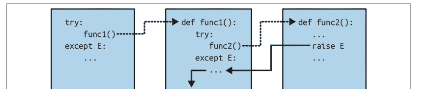

一旦异常被捕获，它的生命就结束了——控制不会跳回到*所有*命名该异常的匹配 `try`；只有第一个（即最近的）才有机会处理它。例如，在图 36-1 中，函数 `func2` 中的 `raise` 语句将控制权发送回 `func1` 中的处理程序，然后程序在 `func1` 内继续执行。

相比之下，当仅包含 *`finally`* 子句的 `try` 语句嵌套时，当异常发生时，*每个* `finally` 块都会依次运行——Python 继续将异常传播到其他 `try`，最终可能传播到顶层默认处理程序（标准错误消息打印器）。如图 36-2 所示，`finally` 子句不会杀死异常——它们只是指定在异常传播过程中退出每个 `try` 时要运行的代码。如果在异常发生时有许多活动的 `try/finally` 组合，它们*都会*被运行，除非某个 `except` 子句在途中捕获了异常。

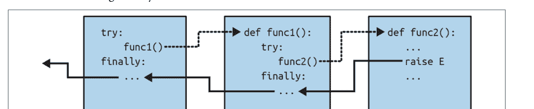

换句话说，当引发异常时程序的去向完全取决于*它曾经去过哪里*——这是脚本运行时控制流的函数，而不仅仅是其语法。异常的传播本质上是向后穿越时间，回到已进入但尚未退出的 `try` 语句。一旦控制回溯到匹配的 `except` 子句，传播就会停止，但在通过 *`finally`* 子句时不会停止。

上一章的 `except*` 子句不会改变这个故事——如果它们消耗了引发组中的每个异常，聚合异常会像往常一样在 `try` 中结束。正如我们所看到的，未匹配的 `except` 在 `except*` 子句有机会后会被重新引发，并传播到其他 `try` 语句或顶层处理程序，但这与未被 `except` 匹配的异常没有根本区别。

## 示例：控制流嵌套

让我们转向示例，使这个嵌套概念更加具体。示例 36-1 中的模块文件定义了三个函数：`action1` 在 `try` 处理程序中包装对 `action2` 的调用，`action2` 同样为

## 示例 36-1. nested_exc_normal.py

```python
def action3():
    print(1 + [])           # 生成 TypeError

def action2():
    try:                    # 最近的匹配 try
        action3()
    except TypeError:
        print('Inner try')  # 匹配终止异常
        raise               # 除非手动重新引发

def action1():
    try:
        action2()
    except TypeError:
        print('Outer try')  # 仅在 action2 重新引发时运行

if __name__ == '__main__': action1()
```

不过请注意，当 `action3` 触发异常时，会有*两个*活动的 try 语句——`action1` 中较早的那个和 `action2` 中较新的那个。Python 会选择并运行最近的、具有匹配 except 的 try——在本例中就是 `action2` 内部的 try。在这个演示中，`action2` 还使用 `raise` 手动重新引发了 `TypeError` 以触发 `action1` 中的 try，但否则异常会在 `action2` 中终止：

```
$ python3 nested_exc_normal.py
Inner try
Outer try
```

对于异常*组*也是如此，只不过异常在整组被匹配之前不会终止。例如，在示例 36-2 中，`action2` 处理 `IndexError`，`action1` 处理 `TypeError`，而 `SyntaxError` 则传播到顶层默认处理器（或者如果之前有运行匹配的 try，则传播到那里）。

## 示例 36-2. nested_exc_group.py

```python
def action3():
    raise ExceptionGroup('Nest*', [IndexError(1), TypeError(2), SyntaxError(3)])

def action2():
    try:
        action3()
    except* IndexError:     # 消耗匹配项，其余传播
        print('Got IE')

def action1():
    try:
        action2()
    except* TypeError:      # 消耗匹配项，其余传播
        print('Got TE')

if __name__ == '__main__': action1()
```

运行时，每个函数的 try 会消耗它匹配的异常，顶层处理器会为组中最后一个未匹配的项打印错误消息：

```
$ python3 nested_exc_group.py
Got IE
Got TE
  + Exception Group Traceback (most recent call last):
  ...etc...
  | ExceptionGroup: Nest* (1 sub-exception)
  ++------------------ 1 -------------------
  | SyntaxError: 3
  +------------------------------------------
```

无论是引发组还是单个异常，异常最终跳转到的位置取决于运行时程序的控制流。因此，要知道你将去往何处，你需要知道你曾身处何地。换句话说，运行时嵌套异常的路由更多是控制流的函数，而非语句语法的函数。话虽如此，我们也可以在语法上嵌套异常处理器——这是一个等效的情况，我们接下来将讨论。

## 示例：语法嵌套

正如我们在第 34 章研究 try 语句的子句组合时所讨论的，也可以通过源代码中的位置在语法上嵌套 try 语句：

```python
>>> from nested_exc_normal import action3

>>> try:
...     try:
...         action3()
...     except TypeError:        # 最近的匹配 try
...         print('Inner try')
...         raise
... except TypeError:            # 这里，仅在嵌套处理器重新引发时
...     print('Outer try')
...
Inner try
Outer try
```

实际上，这段代码只是建立了与示例 36-1 中 try 语句相同的处理器嵌套结构，其行为完全相同。事实上，语法嵌套的工作方式与图 36-1 和 36-2 中概述的情况完全一样。唯一的区别是嵌套的处理器在物理上嵌入在 try 块中，而不是在从 try 块调用的函数中其他地方编码。例如，嵌套的 finally 处理器在异常发生时都会触发，无论它们是语法上嵌套的，还是通过运行时流经代码中物理分离的部分来实现的：

```python
>>> try:
...     try:
...         action3()
...     finally:
...         print('Inner try')
... finally:
...     print('Outer try')
...
Inner try
Outer try
Traceback (most recent call last):
...etc...
TypeError: unsupported operand type(s) for +: 'int' and 'list'
```

有关此代码操作的图形说明，请参见图 36-2；效果相同，但函数逻辑在此处已*内联*为嵌套语句。作为语法嵌套工作的一个更全面的示例，请考虑示例 36-3 中列出的文件。

## 示例 36-3. except-finally.py

```python
def raise1():  raise IndexError
def noraise(): return
def raise2():  raise SyntaxError

for func in (raise1, noraise, raise2):
    print(f'<{func.__name__}>')
    try:
        try:
            func()
        except IndexError:
            print('caught IndexError')
    finally:
        print('finally run')
    print('...')
```

此代码在引发匹配异常时捕获它，并在无论是否发生异常的情况下执行 finally 终止操作。这可能需要一些时间来消化，但其效果与在单个 try 语句中组合 except 和 finally 子句相同：

```
$ python3 except-finally.py
<raise1>
caught IndexError
finally run
...
<noraise>
finally run
...
<raise2>
finally run
Traceback (most recent call last):
  ...
SyntaxError: None
```

正如我们在第 34 章所看到的，except 和 finally 子句可以在同一个 try 语句中混合使用。虽然这一点，连同多个 except 子句，使得本节所示的语法嵌套在很大程度上是学术性的，但等效的运行时嵌套在较大的 Python 程序中很常见。此外，语法嵌套可以使 except 和 finally 的不同角色变得明确，并且可能有助于实现替代的异常处理行为。

## 异常惯用法

我们已经了解了异常背后的机制。现在，让我们来审视它们通常的使用方式。其中一些是对我们在前面章节中探讨过的角色的回顾，此处收集作为可参考集合的一部分。

## 跳出多个嵌套循环：“go to”

正如本书本部分开头所提到的，异常通常可以用来扮演其他语言中“go-to”语句的角色，以实现更任意的控制转移。然而，异常提供了一个更结构化的选项，将跳转定位到特定的嵌套代码块。

在这个角色中，`raise` 就像“go to”，而 except 子句和异常名称则取代了程序标签。你只能以这种方式跳出被 try 包裹的代码，但这是一个关键特性——真正任意的“go-to”语句会使代码变得极其难以理解和维护（在开发者术语中称为“意大利面条式代码”）。

例如，Python 的 `break` 语句只退出最近的单个封闭循环，但我们可以随时使用异常在需要时跳出多个循环层级，如示例 36-4 所示。

## 示例 36-4. breaker.py

```python
class Exitloop(Exception): pass

try:
    while True:
        while True:
            for i in range(10):
                if i > 3: raise Exitloop     # break 只退出一层
                print('loop3: %s' % i)       # raise 可以退出多层
            print('loop2')
        print('loop1')
except Exitloop:
    print('continuing')                       # 或者直接 pass，继续执行

print(f'{i=}')                                # 循环变量未被撤销
```

运行时，`for` 中的 `raise` 会立即跳出三个嵌套循环：

```
$ python3 breaker.py
loop3: 0
loop3: 1
loop3: 2
loop3: 3
continuing
i=4
```

如果你将这里的 `raise` 改为 `break`，你将得到一个无限循环，因为你只会跳出最内层的 `for` 循环，然后进入第二层的 `while` 循环嵌套。代码随后会打印“loop2”并重新开始 `for` 循环。你可以自己修改试试——但准备好按 Ctrl+C 来停止代码！

另外，请注意变量 `i` 在 try 语句退出后仍然是 `for` 循环中的值。如前所述，在 try 中进行的变量赋值通常不会被撤销，不过正如我们所看到的，在 except 子句头中列出的异常实例变量被限定在该子句内，并且由于 `raise` 而退出的任何函数的局部变量都会被丢弃。从技术上讲，活动函数的局部变量会从调用栈中弹出，它们引用的对象可能会因此被垃圾回收，但这是一个自动步骤。

## 异常并非总是错误

在 Python 中，所有错误都是异常，但并非所有异常都是错误。例如，我们在第 9 章看到，文件对象的读取方法在文件末尾返回空字符串。相比之下，内置的 `input` 函数——我们首次在第 3 章遇到，并在第 10 章的交互式循环中使用——在每次调用时从标准输入流 `sys.stdin` 读取一行文本，并在文件末尾引发内置的 `EOFError`。

与文件方法不同，此函数不会返回空字符串——输入中的空字符串意味着空行。不过，尽管名为EOFError，但在此上下文中，该异常只是一个*信号*，而非错误。由于这种行为，除非文件结束应终止脚本，否则`input`通常出现在`try`处理程序中并嵌套在循环中，如下所示：

```
while True:
    try:
        line = input()          # Read line from stdin
    except EOFError:
        break                   # Exit loop at end-of-file
    else:
        ...process next line here...
```

其他几个内置异常同样是信号，而非错误——例如，调用`sys.exit()`和在键盘上按Ctrl+C会分别引发`SystemExit`和`KeyboardInterrupt`。

Python还有一组内置异常表示*警告*而非错误；其中一些用于表示已弃用（即将逐步淘汰）的语言特性的使用。有关更多信息，请参阅标准库手册中关于内置异常的描述，并查阅`warnings`模块的文档以了解作为警告引发的异常。

## 函数可以通过raise发出条件信号

用户定义的异常也可以发出非错误条件的信号。例如，可以编写一个搜索例程，当找到匹配项时引发异常，而不是返回一个供调用者解释的状态标志。在以下抽象代码中，`try/except/else`异常处理程序执行了`if/else`返回值测试器的工作：

```
class Found(Exception): pass

def searcher():
    if ...success...:
        raise Found()           # Raise exceptions instead of returning flags
    else:
        return

try:
    searcher()
except Found:                   # Exception if item was found
    ...success...
else:                           # else returned: not found
    ...failure...
```

更一般地说，这种编码结构也可能对任何无法返回*哨兵值*来指定成功或失败的函数有用。例如，在一个广泛适用的函数中，如果所有对象都是潜在的有效返回值，那么任何返回值都无法发出失败条件的信号。异常提供了一种无需返回值即可发出结果信号的方式：

```
class Failure(Exception): pass

def searcher():
    if ...success...:
        return founditem
    else:
        raise Failure()

try:
    item = searcher()
except Failure:
    ...not found...
else:
    ...use item here...
```

由于Python是动态类型且核心多态的，异常（而非哨兵返回值）是发出此类条件信号的通用首选方式。

## 关闭文件和服务器连接

我们在第34章中遇到过此类示例。作为回顾，异常处理工具也常用于确保系统资源被终结，无论处理过程中是否发生错误。

例如，某些服务器要求关闭连接以终止会话。类似地，输出文件可能需要调用`close`来将缓冲区刷新到磁盘以供等待的消费者使用；输入文件如果不关闭可能会消耗文件描述符；CPython在垃圾回收时会关闭打开的文件，但这并不总是可预测或可靠的。

正如我们在第34章所看到的，保证特定代码块执行终结操作的最通用和明确的方式是`try/finally`组合：

```
myfile = open('somefile', 'w')
try:
    ...process myfile...
finally:
    myfile.close()
```

正如我们还看到的，某些对象通过提供上下文管理器使这变得更容易，当由`with`语句运行时，它们会自动为我们终结或关闭资源：

```
with open('somefile', 'w') as myfile:
    ...process myfile...
```

如果你想知道哪个选项更好，请翻回第908页的“终结处理程序对决”——并得出你自己的结论。

## 使用外部try语句进行调试

你还可以利用异常处理程序来替换Python默认的顶级异常处理行为。通过在顶级代码中将整个程序（或对其的调用）包装在外部`try`中，你可以捕获程序运行时可能发生的任何异常，从而颠覆默认的程序终止。

在下面的代码中，空的`except`子句捕获程序运行时引发的任何未捕获异常。要获取此模式下发生的实际异常，请从内置`sys`模块获取`exc_info`函数调用结果；它返回一个元组，其中前两项包含当前处理的异常类和引发的实例对象（稍后将详细介绍`sys.exc_info`）：

```
try:
    ...run program...
except:                    # All uncaught exceptions come here
    import sys
    print('uncaught!', sys.exc_info()[0], sys.exc_info()[1])
```

这种结构在开发期间常用，以使程序在错误发生后仍保持活动状态。它也在测试其他程序代码时使用，如下一节所述：编码在循环中，这种结构允许你运行额外的测试而无需重新启动。

## 运行进程内测试

我们刚刚看到的一些编码模式可以组合在一个测试驱动程序脚本中，该脚本测试在同一进程（即程序运行）中导入和运行的其他代码。以下部分和抽象代码勾勒了通用模型：

```
import sys
log = open('testlog', 'a')
from testapi import moreTests, runNextTest, testName
def testdriver():
    while moreTests():
        try:
            runNextTest()
        except:
            print('FAILED', testName(), sys.exc_info()[:2], file=log)
        else:
            print('PASSED', testName(), file=log)
testdriver()
```

这里的`testdriver`函数循环执行一系列测试调用。因为其中任何一个未捕获的异常通常会终止此测试驱动程序，所以测试被包装在`try`中，以便在测试失败时继续测试过程。空的`except`捕获测试用例生成的任何未捕获异常，并使用`sys.exc_info`将异常记录到文件中。当没有异常发生时——即测试成功的情况——会运行`else`子句。

这种样板代码是测试导入的函数、模块和类的系统的典型特征。然而，在实践中，测试可以更加复杂。例如，要测试*外部程序*，你可以改为检查由程序启动工具（如*os.system*和*os.popen*）生成的状态码或输出，这些工具在本书前面使用过，并在Python的标准库手册中有介绍。这些工具通常不会为外部程序中的错误引发异常——事实上，测试用例可能与测试驱动程序并行运行。

在本章末尾，我们还将简要探讨Python提供的更完整的测试框架，如`doctest`和`PyUnit`，它们提供了用于比较预期输出与实际结果的工具。

## 关于sys.exc_info的更多信息

最后两节中使用的`sys.exc_info`结果允许异常处理程序通用地访问正在处理的异常。当使用空的`except`子句盲目捕获所有内容时，这尤其有用，因为它允许你确定引发了什么：

```
try:
    ...
except:
    # sys.exc_info()[0:2] are the exception class and instance
```

如果没有正在处理的异常，此调用返回一个包含三个`None`值的元组。否则，返回的值是`(type, value, traceback)`，其中：

- `type`是正在处理的异常的类。
- `value`是引发的类实例。
- `traceback`是一个回溯对象，表示异常最初发生时的调用堆栈，可由`traceback`模块用于生成错误消息。

正如我们在第35章所看到的，`sys.exc_info`在捕获异常类别超类时有时也可用于确定具体的异常类型。然而，正如我们所了解的，因为在这种情况下，你也可以通过获取`as`子句中实例的`__class__`属性或`type`结果来获取异常类型，所以`sys.exc_info`在空的`except`之外很少有用：

```
try:
    ...
except General as instance:
    # instance.__class__ or type(instance) is the exception class
    # but instance.method() does the right thing for this instance
```

正如我们所看到的，在这里使用`Exception`作为`General`异常名称将捕获所有非退出异常；它类似于空的`except`，但不那么极端，并且仍然可以访问异常实例及其类。即便如此，通过调用实例的方法来利用多态性通常比测试异常类型是更好的方法。

## sys.exception替代方案——以及diss

作为另一个选项，Python 3.11中添加的新调用`sys.exception`仅返回引发的异常实例——与`except`子句中`as`后列出的变量分配的对象相同，等同于`sys.exc_info`结果中的第二项（即`sys.exc_info()[1]`）。因此，以下在`try`中工作方式相同：

```
except ...:
    print('uncaught!', sys.exc_info()[0], sys.exc_info()[1])

except ...:
    print('uncaught!', type(sys.exception()), sys.exception())
```

更一般地说，现在有三种方式可以获取关于`try`中捕获的异常的相同信息（以下两种嵌套在元组中以匹配`exc_info`并使用`repr`而非`str`显示）：

```
>>> class E(Exception): pass
...
>>> try:
...     raise E('info')
... except E as X:
...     print((type(X), X))
...     print(sys.exc_info()[:2])
...     print((type(sys.exception()), sys.exception()))
...
(<class '__main__.E'>, E('info'))
(<class '__main__.E'>, E('info'))
(<class '__main__.E'>, E('info'))
```

当使用 `sys.exception` 时，可以通过实例的 `__class__` 或 `type`（如示例所示）来获取异常类，而回溯信息通常存在于异常实例的 `__traceback__` 对象中。虽然这很大程度上是微不足道的，但新的调用方式避免了在只需要实例时进行索引或切片操作。

不那么令人愉快的是，随着 `sys.exception` 的加入，`sys.exc_info` 调用在 Python 文档中也被标记为“旧式”调用，但仅仅为了一个一年多前才添加的冗余调用而这样做，似乎既武断又具有分裂性——如果不是软件领域的年龄歧视的话。当然，欢迎并鼓励你在代码中使用任一种调用方式，但本书通常推荐那些传统的、通用的且具有包容性的工具。

## 显示错误和回溯

最后，上一节中 `sys.exc_info` 数据里可用的异常回溯对象，也被标准库的 `traceback` 模块用于手动生成标准错误消息和堆栈显示。该模块提供了一些支持高度自定义的接口，我们在此无法有效涵盖，但其基础用法很简单。请看示例 36-5 中（带有评判性命名的）文件 `badly.py`。

示例 36-5. badly.py

```
import traceback

def inverse(x):
    return 1 / x

try:
    inverse(0)
except Exception:
    traceback.print_exc(file=open('badly.txt', 'w'))
print('Bye')
```

这段代码使用了 `traceback` 模块中的便捷函数 `print_exc`，它内部使用了 `sys.exc_info` 数据（从技术上讲，它已被更改为使用 `sys.exception` 组件，作为上一节主观清理的一部分）。运行时，该脚本会将标准错误消息打印到文件中——这在需要捕获错误但仍需完整记录它们的程序中很有用（再次说明，`type` 在这里是 Windows 系统中等同于 Unix `cat` 的命令）：

```
$ python3 badly.py
Bye

$ cat badly.txt
Traceback (most recent call last):
  File "/_/LP6E/Chapter36/badly.py", line 7, in <module>
    inverse(0)
  File "/_/LP6E/Chapter36/badly.py", line 4, in inverse
    return 1 / x
    ~~~~^
ZeroDivisionError: division by zero
```

关于回溯对象、使用它们的 `traceback` 模块以及相关主题的更多信息，请查阅你喜爱的 Python 参考资源。

## 异常设计技巧与陷阱

本章将设计技巧和陷阱放在一起讨论，因为事实证明，最常见的异常陷阱源于设计问题。总的来说，异常在 Python 中易于使用。其背后的真正艺术在于决定你的 `except` 子句应该多具体或多通用，以及有多少代码应该被包裹在 `try` 语句中。让我们先讨论后一个选择。

## 应该包裹什么

原则上，你可以将脚本中的每条语句都包裹在自己的 `try` 中，但那将是愚蠢的（`try` 语句本身又需要被包裹在 `try` 语句中！）。包裹什么实际上是一个超越语言本身的设计问题，并且随着使用会变得更加明显。但作为总结，这里有一些经验法则：

-   通常容易失败的操作应该被包裹在 `try` 语句中。例如，与系统状态交互的操作（文件打开、套接字调用等）是 `try` 的主要候选对象。
-   除非它们应该失败——在简单的脚本中，你可能*希望*失败能终止你的程序，而不是被捕获并忽略，尤其是当失败是致命错误时。Python 中的失败通常会产生有用的错误消息而不是硬崩溃，这是某些程序所能期望的最佳结果。
-   无论异常结果如何都必须运行的清理操作，通常应该使用 `try/finally` 组合来运行，除非有上下文管理器作为 `with` 选项可用。
-   将对函数的调用包裹在单个 `try` 语句中，通常比包裹函数内部的操作产生更少的代码。这样，函数中的所有异常都会向上冒泡到调用周围的单个 `try` 中。

你编写的程序类型也可能影响你编写的异常处理代码量。例如，服务器、测试运行器和图形用户界面通常必须捕获并从异常中恢复。然而，更简单的一次性脚本通常会完全忽略异常处理，因为任何步骤的失败都需要关闭程序。

在所有情况下，请记住，Python 中的失败通常会产生有用的错误消息而不是硬崩溃。即使没有 `try`，这通常也是某些程序所能期望的更好结果。

## 捕获过多：避免空的 `except` 和 `Exception`

正如我们所了解的，Python 允许我们选择捕获哪些异常，但重要的是不要过于包容。例如，我们已经看到空的 `except` 子句会捕获每个异常。这很容易编码，有时也是可取的，但它最终可能拦截到其他地方 `try` 语句所期望的错误：

```
def func():
    try:
        ...
    except:
        ...

try:
    func()
    except IndexError:    # 异常应该在这里处理
        ...
```

也许更糟的是，这样的代码也可能捕获无关的关键异常。即使是内存错误、程序拼写错误、迭代停止、键盘中断和系统退出等事件，在 Python 中也会引发异常。除非你正在编写调试器或类似工具，否则此类异常通常不应在你的代码中被拦截。

例如，当控制流到达顶层文件末尾时，脚本通常会退出，但 Python 也提供了一个内置的 `sys.exit(statuscode)` 调用以允许提前终止。这是通过引发内置的 `SystemExit` 异常来结束程序实现的，这样 `try/finally` 处理程序就能在退出时运行，并且工具可以拦截该事件。因此，一个带有空 `except` 的 `try` 可能会在不知情的情况下阻止退出，如示例 36-6 所示。

示例 36-6. exiter.py

```
import sys

def bye():
    sys.exit(62)          # 关键错误：立即中止！

try:
    bye()
except:
    print('Got it')       # 糟糕——我们忽略了退出

print('Continuing...')
```

运行时，该脚本在调用关闭它的命令后愉快地继续执行：

```
$ python3 exiter.py
Got it
Continuing...
```

你可能根本无法预料到操作过程中可能发生的所有类型的异常。根据上一章的内容，使用内置的 `Exception` 超类会有所帮助，因为它不是 `SystemExit` 的超类：

```
try:
    bye()
except Exception:    # 不会捕获退出，但_会_捕获许多其他异常
    ...
```

然而，在某些情况下，这种方案并不比空的 `except` 子句更好——因为 `Exception` 是除系统退出事件之外所有内置异常的超类，它仍然有可能捕获本应由程序其他地方处理的异常。更糟糕的是，使用空的 `except` 或 `Exception` *任一种*也会捕获编程错误，而这些错误通常应该被允许通过。事实上，这两种技术可以有效地*关闭* Python 的错误报告机制，使你难以注意到代码中的错误。例如，考虑这段代码：

```
mydictionary = {...}
...
try:
    x = mydictionary[key]    # 糟糕：拼写错误的名称
except:
    x = None                 # 假设我们这里只得到了 KeyError
...在这里继续使用 x...
```

这里的编码者假设索引字典时唯一可能发生的错误是键缺失错误。但由于名称 `myditctionary` 拼写错误，Python 会为未定义的名称引用引发 `NameError`，而处理程序会静默地捕获并忽略它。因此，事件处理程序将错误地为字典访问填入一个 `None` 默认值，掩盖了程序错误。

此外，在这里捕获 `Exception` 也不会有帮助——它将产生与空 `except` 完全相同的效果，静默地填入默认值并隐藏你可能想知道的错误。如果这发生在远离使用获取值的代码中，可能会成为一个有趣的调试任务！

作为经验法则，你的处理程序应尽可能*具体*——空的 `except` 子句和 `Exception` 捕获器很方便，但可能容易出错。例如，在最后一个例子中，你最好在 `except` 中列出 `KeyError`，以避免拦截无关事件。在更简单的脚本中，问题的可能性可能不足以抵消通用捕获的便利性，但总的来说，通用的处理程序通常会带来麻烦。


*更多关闭方式：* Python 的 `atexit` 标准库模块允许程序处理程序关闭而无需从中恢复，其 `sys.excepthook` 可用于自定义顶层异常处理程序的行为。一个相关的调用 `os._exit`，像 `sys.exit` 一样结束程序，但通过立即终止实现——它跳过清理操作，包括任何通过 `atexit` 注册的操作，并且无法通过 `try/except` 或 `try/finally` 拦截。它通常仅在生成的子进程中使用，这是一个超出本书范围的主题。更多详细信息，请参阅 Python 的库手册。

## 捕获过少：使用基于类的类别

在异常处理程序中过于具体可能与过于通用一样危险。当你在 `try` 中列出特定的异常时，你只能捕获你实际列出的异常。这不一定是坏事，但如果系统在未来演变为引发其他异常，你可能需要回头将它们添加到代码其他地方的异常列表中。

我们在上一章中看到了这种现象的作用。回顾一下，因为下面的处理程序被编写为仅将 `MyExcept1` 和 `MyExcept2` 视为关注的情况，未来的 `MyExcept3` 将不适用：

```
try:
    ...
except (MyExcept1, MyExcept2):    # 如果你以后添加 MyExcept3，这会中断
    ...
```

谨慎使用基于类的异常可以完全消除这种代码维护陷阱。通过捕获一个通用的超类，新的异常不会意味着需要更改 `except` 子句：

```
try:
    ...
except CommonCategoryName:    # 如果你以后添加 MyExcept3 子类，这没问题
    ...
```

换句话说，一点设计就能带来很大帮助。这个故事的寓意是，在异常处理程序中要小心，既不要太通用也不要太具体，并明智地选择 `try` 语句包裹的粒度。特别是在较大的系统中，异常策略应成为整体设计的一部分。

## 核心语言总结

恭喜！至此，你已完成对Python编程语言基础的探索之旅。如果你已读到这里，说明你已成为一名功能完备的Python程序员。稍后将介绍的高级主题部分还有更多可选阅读内容。不过就核心要点而言，Python的故事——以及本书的主要旅程——现已完成。

在此过程中，你已深入了解了语言本身的几乎所有内容，足以应对在Python“野生环境”中可能遇到的大多数代码。你学习了内置类型、语句和异常，以及用于构建函数、模块和类等更大程序单元的工具。

你还探索了重要的软件设计问题、完整的面向对象编程范式、函数式编程工具、程序架构概念、替代工具的权衡取舍等——现在你已具备一套技能，足以胜任开发实际应用程序的任务。

## Python工具集

从现在开始，你未来的Python职业生涯将主要围绕精通应用级Python编程可用的工具集展开。你会发现这是一项持续的任务。例如，标准库包含数百个模块，公共领域还提供更多工具。要精通所有这些工具可能需要数十年时间——尤其是新技术不断涌现，新工具也随之出现。

一般来说，Python提供了一个分层的工具集：

- 内置工具：字符串、列表和字典等内置类型使得快速编写简单程序变得容易。
- Python编码的扩展：对于要求更高的任务，你可以用Python本身编写自己的函数、模块和类。
- 其他语言扩展：虽然本书不涵盖此主题，但Python也可以通过用C、C++或Java等外部语言编写的代码进行扩展。

由于Python的工具集是分层的，你可以根据任何给定任务决定程序需要深入到这个层次结构的哪一层——对于简单脚本可以使用内置工具，对于更大的系统可以添加Python编码的扩展，对于高级工作可以编写其他扩展。本书仅涵盖了前两类，这已足够让你开始进行实质性的Python编程。

除此之外，还有工具、资源和先例，可以在你几乎能想象到的任何计算机领域使用Python。关于下一步该往哪里走，请参阅第1章对Python应用和用户的概述。你可能会发现，使用像Python这样强大的开源语言，常见任务通常比你预期的要容易得多，甚至令人愉快。

## 大型项目的开发工具

本书中的大多数示例都相当小且自包含。这样设计是为了帮助你掌握基础知识。但既然你已经了解了核心语言的所有内容，现在是时候开始学习如何使用Python的内置和第三方接口来完成实际工作了。

实际上，Python程序可以变得比你到目前为止在本书中尝试的示例大得多。即使在Python中，一旦你将系统中所有单独的模块加起来，对于非平凡且有用的程序来说，*数千*行代码并不少见。虽然Python的基本程序结构工具（如模块和类）在管理这种复杂性方面帮助很大，但其他工具有时可以提供额外的支持。

对于开发更大的系统，你会发现Python和公共领域都提供了这样的支持。你已经看到其中一些在实际应用，另一些也已顺带提及。这个类别不断变化，所以我们无法在此过于详细，但为了帮助你下一步行动，以下是该领域工具的快速概览和总结：

### 文档工具

PyDoc的help函数和HTML接口在第15章中已介绍。PyDoc为你的模块和对象提供了一个文档系统，与Python的docstrings语法集成，是Python系统的标准部分。更多文档源提示请参阅第15章和第4章。

### 错误检查工具

由于Python是一种动态语言，一些编程错误直到程序运行时才会被报告（甚至语法错误在文件运行或导入之前也不会被捕获）。这并不是一个大缺点——与大多数语言一样，这只是意味着你必须在发布Python代码之前对其进行测试。使用Python，你实际上是用一个初始测试阶段替代了编译阶段。此外，Python的动态特性、自动错误检查和报告消息以及异常模型，使得查找和修复错误比在其他一些语言中更容易、更快。例如，与C不同，Python在出错时不会完全崩溃。

尽管如此，工具在这里也能提供帮助。作为代表性示例，*PyChecker*、*Pylint*和*Pyflakes*第三方系统提供了在脚本运行前捕获常见错误的支持。它们在C开发中扮演着与*lint*程序类似的角色。一些Python开发人员在测试或交付之前会通过此类工具运行他们的代码，以捕获任何潜在的隐患问题。事实上，在刚开始时尝试这样做并不是个坏主意——其中一些工具的警告可能有助于你学会发现和避免常见的Python错误。

### 测试工具

在第25章中，我们学习了如何通过在文件底部使用`__name__ == '__main__'`技巧向Python文件添加自测代码——这是一个简单的单元测试协议。对于更高级的测试目的，Python附带了两个测试工具。第一个是*PyUnit*（在标准库手册中称为unittest），它提供了一个面向对象的类框架，用于指定和定制测试用例及预期结果。它模仿了Java的JUnit框架，是一个复杂的基于类的单元测试系统。

**doctest**标准库模块提供了第二种更简单的回归测试方法，基于Python的docstrings特性。大致来说，要使用doctest，你需要将交互式测试会话的日志剪切并粘贴到源文件的docstrings中。然后doctest会提取你的docstrings，解析出测试用例和结果，并重新运行测试以验证预期结果。更多关于这两个测试工具的信息，请参阅库手册。

### IDE

我们在第3章中简要讨论了Python的IDE。像*PyCharm*和Python自带的*IDLE*这样的IDE提供了一个图形环境，用于编辑、运行、调试和浏览你的Python程序。第3章中列出的一些高级IDE可能支持额外的开发任务，包括源代码控制集成、代码重构、项目管理工具等。虽然*Jupyter notebooks*的目标角色不是通用软件开发，但它们也可能算是一种IDE。更多关于可用Python IDE的信息，请参阅第3章、python.org上的文本编辑器页面以及你最喜欢的网络搜索引擎。

### 性能分析器

正如我们所看到的，由于Python既是动态的又是流畅的，从其他语言经验中获得的关于性能的直觉通常不适用于Python代码。要真正隔离代码中的性能瓶颈并比较编码替代方案的速度，你需要使用`time`或`timeit`模块中的时钟工具添加计时逻辑，或者在`profile`模块下运行你的代码。我们在第21章比较迭代工具和Python的速度时，看到了计时模块工作的例子。

性能分析通常是你的第一个优化步骤——先为清晰度编写代码，然后进行性能分析以隔离瓶颈，最后对程序中缓慢部分的替代编码进行计时。对于第二步，`profile`及其优化的`cProfile`相关模块是标准库模块，用于实现Python的源代码性能分析。在运行你提供的代码后，它们会打印一份报告，提供过于详细而无法在此涵盖的性能统计信息。更多关于性能分析器以及用于分析结果的`pstats`模块的信息，请参阅Python的库手册。

### 调试器

我们在本部分和第3章中都讨论了调试选项（参见后者第49页的侧边栏“调试Python代码”）。作为回顾，大多数Python开发IDE支持基于GUI的调试，Python标准库也包含一个名为`pdb`的源代码调试器模块。该模块提供了一个命令行界面，其工作方式与常见的C语言调试器（例如`dbx`、`gdb`）非常相似，并在Python的库手册中有详细说明。

由于像IDLE这样的IDE也包含点击式调试接口，`pdb`在没有GUI可用或需要更多控制时更有用。更多关于使用IDLE调试GUI界面的技巧，请参阅第3章。不过，正如第3章也指出的，`pdb`和IDE在实践中似乎都没有被广泛使用：大多数程序员要么直接阅读Python的错误消息，要么插入print语句来添加信标显示并重新运行——这也许不是最高科技的解决方案，但在Python世界中，实用往往胜出。

### 发布选项

在第24页的“独立可执行文件”中，我们概述了打包Python程序的常用工具。各种系统将程序字节码和Python虚拟机打包成独立可执行文件，这些文件不需要主机上安装Python。此外，我们了解到Python程序可以以源代码（`.py`）或字节码（`.pyc`）形式发布，`.zip`文件可以充当包文件夹。当你的代码准备好作为开源工具上线时，也请参阅网络上关于Python的`pip`安装器系统的资源。

### 优化选项

当速度很重要时，有多种方法可以优化你的Python程序，如第2章所列举。例如，第21章演示的PyPy系统如今提供了自动的速度提升，而像*Shed Skin*和*Cython*这样的其他系统则提供了通往更快程序的不同途径。虽然第34章提到的Python的`-O`命令行标志（将在第39章中部署）可以优化字节码，但它带来的性能提升非常有限，除了移除调试代码和断言外，并不常用。

尽管是最后手段，你也可以将程序的部分内容转移到C等编译语言以提升性能；更多关于C扩展的信息，请参阅Python的手册。此外，Python的速度往往会随着时间的推移而提高，因此升级到较新的版本也可能提升速度——一旦你验证它们对你的代码运行更快，这是事实（尽管早已修复，但 Python 3.X 的早期版本在某些方面确实比 2.X 慢得多）。

## 安装管理

如果你需要在机器上安装并隔离多组 Python 扩展，你可能还想使用*虚拟环境*——在[第 22 章](Chapter 22)中简要提及，并由 Python 标准库模块 `venv` 实现。该模块允许你创建多个虚拟环境，每个环境都有自己独立的 Python 包集合，包含在一个目录中，并通过控制台命令激活和停用。当虚拟环境被激活时，`pip` 等工具会将 Python 包安装到该环境中，并且搜索路径会针对该环境的安装进行调整。更多信息请参阅 Python 库手册。

## 大型项目的其他提示

我们在本文中还研究了各种核心语言主题，一旦你开始编写大型项目，这些主题可能会变得更加有用。这些包括模块包（[第 24 章](Chapter 24)）、异常类（[第 34 章](Chapter 34)）、伪私有类属性（[第 31 章](Chapter 31)）、文档字符串（[第 15 章](Chapter 15)）、模块数据隐藏（[第 25 章](Chapter 25)），以及我们一路探索的所有关于对象、语句、函数、模块、类和异常的设计和使用指南。如果你已经读到这里，你已经具备了提升水平的充分准备。

要了解这些以及许多其他大规模 Python 开发工具，请浏览 PyPI 网站、*python.org* 以及整个网络。应用 Python 可能比学习 Python 是一个更大的主题，但这也是我们在这里必须委托给后续资源的内容。

## 章节总结

本章通过对设计概念的概述、常见异常用例的探讨以及常用开发工具的简要总结，结束了本书的异常部分。

本章也结束了本书的核心内容。至此，你已经接触了大多数程序员使用的 Python 的完整子集——可能还远不止于此。事实上，凭借读到这些文字，你应该可以自由地认为自己是一名*正式的 Python 程序员*。下次上网时，一定要买件 T 恤或笔记本电脑贴纸（下次更新简历时，别忘了加上 Python）。

本书的下一部分也是最后一部分，包含处理高级但仍在核心语言类别中的主题的章节。这些章节都是*可选阅读*，或者至少是*可推迟阅读*，因为并非每个 Python 程序员都必须深入研究它们的主题，其他人也可以将这些章节的主题推迟到需要时再学习。事实上，你们中的许多人可以在这里停下来，开始探索 Python 在你们应用领域中的角色。坦率地说，在实践中，应用库往往比高级——对某些人来说是深奥的——语言特性更重要。

另一方面，如果你确实需要关心 Unicode 或二进制数据之类的事情（你很可能需要！）；必须处理诸如描述符、装饰器和元类之类的 API 构建工具；或者只是想更深入地了解一般情况，本书的下一部分将帮助你入门。最后一部分中的较大示例也将让你有机会看到你已经学到的概念以更真实的方式被应用。

不过，由于这是本书核心内容的结束，章节测验就轻松一下——这次只有一个问题。一如既往，请务必完成本部分的结束练习，以巩固你在过去几章中学到的内容；因为下一部分是可选阅读，这是最后的结束部分练习环节。如果你想看看你所学的内容如何在来自常见应用的真实脚本中结合在一起，请务必查看附录 B 中本部分练习 4 的“解答”。

如果这是你将从本书的航程中下船的地方，请务必也查看第 41 章（本书的最后一章）末尾第 1128 页的“返场：打印你自己的完成证书！”（为了继续阅读高级主题部分的读者，本章不会在这里剧透）。

## 测试你的知识：测验

- 1. 这本书封面上的老鼠是怎么回事？

## 测试你的知识：答案

- 1. 好吧，这从未被提及，也几乎不是一个公平的问题，但记录在案：这只老鼠——实际上是一种林鼠，*Neotoma muridae*——在 1990 年代由其出版公司为本书第一版选择，基于这种动物是蟒蛇常见食物的事实。其想法是林鼠必须了解蟒蛇以避免被吃掉。这很聪明，当然，这也与 *Neotoma* 是喜欢闪亮物品的林鼠、强迫性地收集它们遇到的任何东西有着更微妙的联系，这似乎是对 Python 语言特性积累历史的恰当比喻。

所以，享受这些闪亮的物品吧，但别被沿途的蟒蛇吃掉。

## 测试你的知识：第七部分练习

既然我们已经到达了本书这一部分的末尾，是时候进行一些异常练习，让你有机会练习基础知识了。异常确实是简单的工具；如果你能够完成这些练习，你可能已经掌握了异常领域。解答请参见附录 B 第 1188 页的“第七部分，异常”。

- 1. try/except：编写一个名为 `oops` 的函数，当被调用时显式引发 `IndexError` 异常。然后，编写另一个函数，在 `try/except` 语句中调用 `oops` 以捕获错误。如果你将 `oops` 改为引发 `KeyError` 而不是 `IndexError` 会发生什么？名称 `KeyError` 和 `IndexError` 从哪里来？（提示：回想一下所有未限定的名称通常来自四个作用域之一。）

- 2. 异常对象和列表：将你刚编写的 `oops` 函数更改为引发你自己定义的异常，称为 `MyError`。用你自己的类标识你的异常。然后，在 `catcher` 函数中扩展 `try` 语句，以捕获此异常及其实例以及 `IndexError`，并打印你捕获的实例。

- 3. 错误处理：编写一个名为 `safe(func, *pargs, **kargs)` 的函数，它使用 `*` 任意参数头和调用语法运行任何具有任意数量位置参数和/或关键字参数的函数，捕获函数运行时引发的任何异常，并使用 `sys` 模块中的 `exc_info` 调用打印异常。然后使用你的 `safe` 函数运行练习 1 或 2 中的 `oops` 函数。将 `safe` 放在一个名为 `exctools.py` 的模块文件中，并在交互式环境中将 `oops` 函数传递给它。你会得到什么样的错误消息？最后，扩展 `safe`，使其在发生错误时也通过调用标准库 `traceback` 模块中的内置 `print_exc` 函数来打印 Python 堆栈跟踪；请参阅本章前面的内容，并查阅 Python 库参考手册了解使用细节。我们可能可以按照第 19 章和第 32 章的介绍将 `safe` 编码为*函数装饰器*，但我们必须继续本书的下一部分才能完全了解如何操作（预览请参见解答）。

- 4. *自学示例：* 在附录 B 第 1188 页的“第七部分，异常”末尾，本书列出了少量作为现场 Python 课程小组练习开发的示例脚本，供你结合 Python 标准手册集自行研究。这些没有描述，并且它们使用了 Python 标准库中的工具，你需要自己研究。尽管如此，对于许多读者来说，看到我们在这本书中讨论的概念如何在真实程序中结合在一起是有帮助的。如果这些激发了你更多的兴趣，你可以在后续书籍和网络上找到大量更大、更现实的应用级 Python 程序示例：选择你的领域，开始探索吧！

# 第八部分

## 高级主题

# 第37章
Unicode与字节字符串

在第7章中，我们有意简化了Python字符串的讲解，以帮助你掌握基础知识。既然你已经学习了基础内容，本章将扩展这些知识，涵盖Python中完整的Unicode文本和二进制数据字符串的完整故事。

在本书的早期版本中，这一扩展内容更多是可选的，因为在Python 2.X中Unicode只是一个事后考虑。Python 3.X将其提升为必读内容，因为其普通字符串*就是*Unicode。不过，你对这个主题的关注程度在很大程度上取决于你属于以下哪一类：

- 如果你处理非ASCII *Unicode文本*——例如，在互联网内容、国际化应用程序、XML解析器和某些图形用户界面的上下文中——你会发现Python全Unicode的`str`对象以及其支持Unicode的文本文件都对文本编码提供了直接且无缝的支持。
- 如果你处理*二进制数据*——例如，以图像或音频文件、网络传输或与底层工具共享的打包数据形式——你需要理解Python的`bytes`对象以及它在文本与二进制数据和文件之间的明确区分。
- 如果你*不属于*前两类，你或许可以推迟这个主题，并像第7章那样使用字符串：使用通用的`str`对象、文本文件和所有熟悉的字符串操作。你的字符串将使用平台的默认Unicode编码进行编码和解码，但你不会注意到——直到，正如你将看到的，你遇到使用不同默认值的内容或平台！

当然，如果你的软件领域中文本始终是ASCII，你或许可以简单地使用字符串对象和文本文件，并避免接下来的大部分内容。正如你稍后将了解到的，ASCII是一种简单的Unicode，也是其他常见编码的子集，因此如果你的程序只处理ASCII文本并且永远不会偏离这个限制，字符串操作和文件就能“正常工作”。

然而，即使本章的主题在今天看来似乎与你无关，对Python字符串模型的基本理解既能揭示一些底层细节的奥秘，也能为你未来可能遇到的Unicode或二进制数据问题做好准备。考虑到网络在当今大多数软件职业生涯中的重要性，这种影响可能更多是*何时*发生的问题，而非*是否*发生。

## Unicode基础

在深入代码之前，让我们先从Unicode模型及其Python支持的概述开始。要完全理解这两者，我们必须先简要了解字符在计算机中是如何实际表示的。

## 字符表示

大多数程序员将字符串视为一系列字符（实际上是它们的整数代码）用于表示文本数据。在Unicode这个崭新的世界里，这仍然是正确的，但字符在计算机内存和文件中的存储方式可能会有所不同，这取决于记录的字符类型以及程序员选择如何记录它们。

对于美国的许多程序员来说，*ASCII*构成了他们对文本字符串的原始概念。ASCII是一个标准，定义了字符代码0...127（在本章中始终表示包含范围），因此允许每个字符存储在一个8位字节中（使用7位）。例如，ASCII标准将字符a映射到整数值97（十六进制为0x61），这可以在计算机内存和文件中存储为单个字节。

要亲自验证这一点，Python内置的`ord`函数显示给定字符的整数代码；`chr`揭示给定整数代码的字符；`hex`将代码的字节值显示为两个十六进制数字，每个数字适合4位“半字节”。其中第一个`ord`是字符表示代码——以及字节——在ASCII中的值：

```
$ python3          # Or py -3 on Windows
>>> ord('a')       # Character => code
97
>>> chr(97)        # Code => character
'a'
>>> hex(97)        # Byte value: fits 8 bits
'0x61'
>>> 0b0111_1111    # Limit of ASCII's 7-bit range
127
```

ASCII使文本处理变得简单，因为字符直接对应于字节。然而，有时这还不够。例如，重音字符和特殊符号不适合ASCII定义的字符代码范围。为了允许一些这样的额外字符，其他标准允许使用8位字节中的所有可能值0...255作为代码，并将值128...255分配给额外的字符。

其中一个标准被称为*Latin-1*，在西欧广泛使用。在Latin-1中，高于127的字符代码被分配给重音和其他特殊字符。例如，Latin-1分配给代码196（又名字节值0xc4）的字符是一个特殊标记的非ASCII字符Ä。在Python中：

```
>>> chr(196)          # Too big for ASCII
'Ä'
>>> ord('Ä')          # Okay for Latin-1
196
>>> hex(ord('Ä'))     # Byte value in Latin-1
'0xc4'
>>> bin(ord('Ä'))     # Latin-1 uses all 8 bits
'0b11000100'
```

尽管如此，一些字母表定义了如此多的字符，以至于无法将它们表示为每个字符一个字节大小的代码。例如，以下符号和字符的整数代码需要比一个字节更多的空间——所有那些可能在某些工具中无法工作但无论如何都会出现在你的电子邮件和短信中的表情符号也是如此：

```
>>> ord('€')
9758
>>> hex(ord('€'))          # Too big for one byte
'0x261e'

>>> [hex(ord(c)) for c in '真👍']    # Ditto: Unicode required
['0x771f', '0x41b', '0x21e8']

>>> [hex(ord(c)) for c in '😊👍']    # Emojis: > two bytes (16 bits)
['0x1f642', '0x1f64a', '0x1f44d']
```

*Unicode*提供了我们需要的通用性来处理包含非ASCII字符和符号的文本。事实上，它定义并分配了足够的*字符代码*来表示几乎每种正在使用的自然语言，以及大量的符号和表情符号。用Unicode术语来说，这些代表字符的代码采用数字（整数）的形式，通常称为*码点*。Unicode分配给字符a、Å和😊的码点分别是97、196和128578（十六进制为0x61、0xc4和0x1f642）：

```
>>> [f'{c} is {ord(c)} and {hex(ord(c))}' for c in 'aÅ😊']
['a is 97 and 0x61', 'Å is 196 and 0xc4', '😊 is 128578 and 0x1f642']
```

Unicode有时被称为“宽字符”字符串，因为其字符范围如此之广，以至于可能需要多个字节来表示单个字符代码。这种文本很容易存储在计算机内存中，因为每个字符代码可以简单地跨越其码点数字所需的字节数（具体实现方式可能因编程语言而异，对你的Python代码并不重要）。

然而，一旦文本离开你的计算机，其存储就受到更多限制：在驱动器和网络上浪费字节是不好的，跨平台使用的文本必须遵循相同的格式规则。为此，Unicode还定义了标准方式来将字符代码映射到字节以及从字节映射回来，用于存储和传输，这些方式与平台和语言无关——这就是我们将在下一节探讨的*编码*。

这里的要点是，Unicode结合了包罗万象的字符代码及其预定义编码，使其成为一个可移植且灵活的模型，也是程序处理非英语和其他可能拥有超过8位字节所能处理的字符的文本的标准方式。作为额外的好处，像ASCII这样的早期方案也原封不动地属于Unicode的范畴，但我们必须进入下一节才能看到这是如何实现的。

## 字符编码

理解Unicode工作原理的关键之一在于其表示字符的整数字符代码（又名码点）如何映射到其编码形式以进行高效存储或传输。内存中的码点只是任意大小的整数，但存储和传输本质上对时间、空间和互操作性施加了限制，这就需要额外的格式化步骤。

在 Unicode 的世界里，我们说字符是通过一种 *编码* 来与原始字节相互转换的——编码是将 Unicode 文本字符串转换为字节序列，并从字节序列中提取相同字符串的规则。更具体地说，这种字节与字符串之间的来回转换由两个术语定义（第一个术语既是名词又是动词，这有点令人困惑！）：

- *编码* 是将字符串转换为其原始字节形式的过程，使用任何足够广泛以存储字符串字符的所需编码。
- *解码* 是将原始字节字符串转换为其字符字符串形式的过程，使用最初用于创建字节字符串的编码。

正如我们所见，Unicode 定义了字符代码和一组标准编码。对于它定义的一些编码，转换过程很简单——例如，ASCII 和 Latin-1 将每个字符映射到单个字节，因此如果字符在内存中也是相同的字节，则编码和解码所需的工作量很少或没有。

你可以使用所有 Python 文本字符串上可用的 `encode` 方法自行查看，该方法简单地返回用于编码字符串的字节。以下表示 ASCII 字符 `a` 在按 ASCII 编码时仅占用一个字节：

```
>>> len('a'.encode('ASCII'))    # ASCII 'a' encodes in 1 byte per ASCII
1
```

对于其他编码，映射可能更复杂，并且每个字符可能产生多个字节。例如，广泛使用的 *UTF-8* 编码通过采用一种既通用又经济的可变字节数方案，允许表示更多字符。事实上，由于 UTF-8 可以处理任何 Unicode 码点，它已成为文本的事实标准。

在 UTF-8 中，小于 128 的字符代码表示为单个字节；128 到 0x7ff（2047）之间的代码转换为两个字节，其中每个字节的值在 128 到 255 之间；高于 0x7ff 的代码转换为三个或四个字节的序列，其值在 128 到 255 之间。这使得简单的 ASCII 字符串保持紧凑，避免了字节顺序问题，并避免了可能对 C 库和网络造成问题的空（零）字节。在 Python 中：

```
>>> len('a'.encode('UTF-8'))    # ASCII: encodes in 1 byte
1
>>> len('Ä'.encode('UTF-8'))    # Non-ASCII: encodes in 2 bytes
2
>>> len('😀'.encode('UTF-8'))    # Emoji: encodes in 4 bytes
4
```

尽管有这些细节，但重要的是要注意 ASCII 是 Latin-1 和 UTF-8 的 *子集*。这是真的，因为这些编码以与 ASCII 相同的方式将 ASCII 字符编码为字节。这反过来又使这些编码与现有的 ASCII 数据向后兼容：每个按 ASCII 编码的字符字符串根据 Latin-1 和 UTF-8 编码也是有效的，并且每个 ASCII 文件都是有效的 Latin-1 和 UTF-8 文件。

从技术上讲，ASCII 编码是其他两种编码的 7 位子集：它与所有小于 128 的字符代码二进制兼容。Latin-1 和 UTF-8 只是允许额外的字符：Latin-1 用于映射到字节内值 128…255 的字符，UTF-8 用于可能用多个字节表示的字符。然而，反过来并不成立：UTF-8 和 Latin-1 文本与 ASCII 编码不兼容，除非其文本的码点值都小于 128；否则，按 ASCII 编码或解码会失败。

在 Python 中，映射很容易观察到。根据以下内容，ASCII 字符在 ASCII、UTF-8 和 Latin-1 编码中编码为相同的单个字节，但非 ASCII 字符则不是，并且需要比 ASCII 更通用的编码才能编码（这里的 `b'...'` 是 Python 字节对象，它很快将在本章中扮演主要角色）：

```
>>> 'a'.encode('ASCII')
b'a'
>>> 'a'.encode('UTF-8')
b'a'
>>> 'a'.encode('Latin-1')
b'a'

>>> 'Ä'.encode('UTF-8')
b'\xc3\x84'
>>> '😀'.encode('UTF-8')
b'\xf0\x9f\x98\x80'

>>> '😀'.encode('ASCII')
UnicodeEncodeError: 'ascii' codec can't encode character '\U0001f642'...
>>> '😀'.encode('Latin-1')
UnicodeEncodeError: 'latin-1' codec can't encode character '\U0001f642'...
```

其他编码以其他方式支持更丰富的字符集。例如，*UTF-16* 和 *UTF-32* 分别使用固定的、更大的 2 和 4 个字节，前者使用特殊的 *代理对* 协议来处理对于 2 个字节来说太大的代码。这两种编码，连同 UTF-8，也可能允许或要求在编码文本的开头有一个 *BOM*（字节顺序标记）前导码，它可以指定字节顺序和编码类型，可能存在于存储在文件或内存中的编码文本中，并且对于文本模式文件会自动处理。

由于篇幅原因，我们将在此跳过更多细节（请留意本章末尾的 BOM 以及棘手的 Unicode 规范化主题），但请记住，所有这些——ASCII、Latin-1、UTF-8 等——只是替代的 Unicode 编码，当解码时会产生相同的 Unicode 码点文本。最终效果确保了文本在所有使用它的工具中是 *可移植的*，代价是轻微的转换成本：

- 当 *解码* 时，字符码点在内存中可能占用也可能不占用多个字节，这取决于编程语言的实现。例如，一些较新的 Python 版本使用可变长度方案来存储解码后的文本，每个字符使用 1、2 或 4 个字节，具体取决于字符串内容。早期的 Python 则将每个字符存储在固定的 2 或 4 个字节中，具体取决于编译设置。
- 当 *编码* 时，字符码点的格式完全由应用的标准 Unicode 编码决定。无论哪种编程语言创建或处理文本，此格式都是相同的，使其成为存储和传输的理想选择——尤其是在多样化的互联网领域。然而，这种格式通常不太适合程序使用，这就是为什么通常在加载时进行解码。

对于 Python 程序员来说，编码被指定为包含编码名称的字符串。Python 开箱即提供大约 100 种不同的编码；有关列表，请参阅 Python 库参考中的 `codecs` 模块。导入模块 `encodings` 并请求 `help(encodings)` 也会显示许多编码。一些编码在 Python 中实现，一些在 C 中实现，许多有多个名称；例如，`latin-1`、`iso_8859_1` 和 `8859` 都是同一编码 Latin-1 的同义词。我们将在本章后面研究 Unicode 编码技术时重新讨论编码。

有关 Unicode 背景故事的另一种解读，请参阅 python.org 上的 Python 标准手册。它包含一个 Unicode HOWTO 部分，提供了我们在此将跳过的额外细节，以便专注于基础知识。

## 介绍 Python 字符串工具

在更具体的层面上，Python 语言提供了多种字符串数据类型来表示脚本中的内容：包括 *文本数据*——内存中解码后的 Unicode 字符的整数码点值，以及 *二进制数据*——原始字节值，包括处于编码形式的文本。总的来说，Python 有三种字符串对象类型：

- `str`——用于表示 Unicode 文本（解码后的码点）
- `bytes`——用于表示二进制数据（包括编码后的文本）
- `bytearray`——`bytes` 类型的可变形式

所有三种类型都支持类似的操作集，但由于角色非常不同，通常不能混合使用。此外，文件和其他内容工具也反映了文本/二进制的二分法，并在不同的节点中使用特定的字符串类型。下一节将介绍此模型的要点。

## str 对象

首先，基本的 `str` 类型（例如 `'text'`）用于解码后的 Unicode 文本。它被正式定义为 *不可变的字符序列*——这意味着码点不一定是字节。其内容可能包含简单文本（如 ASCII），其编码和解码形式可能每个字符产生一个字节，以及更丰富的 Unicode 文本，其编码和解码形式可能都需要每个字符多个字节。

在内存中，`str` 只是 Unicode 码点整数的有序集合，它们打印为字符的 *字形*——视觉表示可能因主机而异。当与文件来回传输时，`str` 使用主机平台的默认编码或提供的编码名称自动编码和解码为字节序列。然而，`str` 对象本身 *没有编码的概念*；它们只是字符码点。

## bytes 对象

虽然 `str` 非常适合 Unicode 文本，但许多程序需要处理未按任何 Unicode 格式编码的原始二进制内容——以及当文本被编码时用于存储文本的字节。你可能使用 Python 的 `struct` 模块处理的图像文件和打包数据就属于这一类。为了适应这一点，`bytes` 类型支持处理真正的二进制数据。`bytes` 只是原始字节，而不是 Unicode 文本字符，尽管其内容可能包括仍然编码的文本的字节，这些文本始终具有隐含的编码。

`bytes` 类型被正式定义为 *不可变的 8 位整数序列*。其内容表示字节值，并且它支持几乎与 `str` 类型相同的所有操作；这包括字符串方法、序列操作，甚至 `re` 模块模式匹配（格式化现在也适用于 `bytes`，但在 3.X 的演变中是后来添加的）。

一个字节对象实际上是一个小整数序列，每个整数都在0到255的范围内：对字节对象进行索引会返回一个整数，切片会返回另一个字节对象，而对其使用`list`函数则会返回一个整数列表，而非字符列表。然而，当使用假定字符的操作（例如`isalpha`方法）处理时，字节对象的内容会被假定为ASCII编码的字节。此外，值落在ASCII字符码范围内的字节项会被打印为ASCII字符字形，而不是整数或其十六进制转义序列；这样做是为了方便，但也可能混淆文本和二进制数据之间的区别。

## bytearray 对象

虽然不那么常用，Python也提供了`bytearray`，它是`bytes`的一个可变变体，因此支持就地修改。`bytearray`类型提供了`str`和`bytes`通常的字符串操作，但也具有许多与列表相同的就地修改操作（例如`append`和`extend`方法以及对索引的赋值）。假设你的字符串可以被视为原始字节，`bytearray`为字符串数据添加了直接的就地可变性——这是`str`和`bytes`长期以来所禁止的。

## 文本文件与二进制文件

由于文件I/O是编码的主要受益者之一，它也是核心的Unicode工具。正如我们所见，文本在内存中实际上只是解码后的整数字符码；只有当文本在文件等外部接口之间传输时，Unicode编码才会发挥作用。相比之下，真正的二进制数据可能与编码或文本毫无关系。因此，Python通过内置的`open`函数对文本文件和二进制文件进行了明确的、与平台无关的区分：

- 当以文本模式打开文件时，读取其数据会自动解码其内容并将其作为`str`返回，而写入则接受一个`str`并在将其传输到文件之前自动对其进行编码。在这两种情况下，要使用的编码要么是平台默认值，要么是提供给`open`的编码参数。文本模式文件还支持通用换行符（也称为行尾）转换、BOM（字节顺序标记）和其他编码参数。
- 当通过在`open`调用的模式字符串参数中添加`b`来以二进制模式打开文件时，读取其数据不会以任何方式解码，而是直接返回其原始且未更改的内容作为`bytes`对象。写入同样接受一个`bytes`对象并将其原样传输到文件，二进制模式文件也接受`bytearray`对象作为要写入文件的内容。

由于`str`和`bytes`在语言中被如此明确地区分，你必须决定你的数据本质上是文本还是二进制，并分别使用`str`或`bytes`对象来表示其内容。最终，你打开文件的模式将决定你的脚本将使用哪种类型的对象来表示其内容：

- 如果你正在处理图像或音频文件、由其他程序创建的需要提取内容的打包数据，以及某些设备数据流，那么你很可能希望使用`bytes`和二进制模式文件来处理它。你也可以选择`bytearray`来更新数据，而无需在内存中创建副本。
- 相反，如果你正在处理本质上是文本的内容，例如程序输出、HTML或JSON内容，以及CSV或XML文件，你可能希望使用`str`和文本模式文件。

微妙的是，`open`的模式字符串参数（其`mode`关键字和第二个位置参数）变得相当关键——其内容不仅指定了文件处理模式，还隐含了一个Python对象类型。通过在模式字符串中添加`b`（仅小写），你指定了一个二进制模式文件，并且在读取或写入时将接收或通常提供一个`bytes`对象来表示文件的内容。没有`b`，你的文件将以文本模式处理，你将使用`str`对象来表示其内容。例如，模式`rb`、`wb`和`rb+`意味着`bytes`，但`r`、`w+`和`rt`（默认：读取文本）意味着`str`。

如果你急于看到文件的实际应用，请关注后面的示例，尤其是Unicode文本文件的示例。然而，要完全理解文件用法，我们首先需要探索扩展到Unicode和bytes的字符串操作。

## 使用文本字符串

让我们通过几个示例来演示上一节中介绍的字符串类型。在这里，我们的主要重点是将这些类型用于文本（我们稍后将探讨二进制角色）。在此过程中，你将看到字面量、转换和非ASCII文本在Python中是如何编码的。

### 字面量和基本属性

大多数Python字符串对象是在你调用内置函数（如`str`或`bytes`）、处理通过调用`open`创建的文件，或在脚本中编写字面量语法时产生的。对于后者，通常的`'...'`创建一个`str`；一种独特的字面量形式`b'...'`用于创建`bytes`；而`bytearray`对象可以通过调用同名函数并传入各种可能的参数来创建。

更正式地说，我们在第7章中遇到的所有常见字符串字面量形式——`'...'`、`"..."`和三引号块——都生成一个`str`；在它们前面添加`b`或`B`则会创建一个`bytes`。这个`b'...'`（以及等效的`B'...'`）字节字面量在精神上类似于我们也见过的`r'...'`原始字符串，它抑制了反斜杠转义；事实上，这两个前缀可以组合使用，以便在字节中按原样使用反斜杠。考虑以下内容：

```
>>> B = b'code'            # 创建一个bytes对象：8位字节
>>> S = 'hack'             # 创建一个str对象：Unicode字符

>>> type(B), type(S)
(<class 'bytes'>, <class 'str'>)

>>> B                      # 整数序列，打印为ASCII字符
b'code'
>>> S                      # 码点序列，打印为文本字形
'hack'

>>> B2 = b"""              # bytes前缀适用于单引号、双引号、三引号
xxxx
yyyy
"""
>>> B2
b'\nxxxx\nyyyy\n'

>>> b'A\nB\rC', br'A\nB\rC', rb'A\nB\rC'   # 原始字符串组合也有效
(b'A\nB\rC', b'A\nB\rC', b'A\nB\rC')
```

一旦你有了一个字符串，我们之前遇到的所有常见操作都适用，但它们的结果是类型特定的（`bytes`是整数，`str`是字符），并且不可变性仍然适用：

```
>>> B, S
(b'code', 'hack')

>>> B[0], S[0]            # 索引对bytes返回int，对str返回str
(99, 'h')

>>> B[1:], S[1:]          # 切片创建另一个bytes或str
(b'ode', 'ack')

>>> list(B), list(S)
([99, 111, 100, 101], ['h', 'a', 'c', 'k'])  # bytes实际上是整数

>>> B[0] = 'x'            # 两者都是不可变的
TypeError: 'bytes' object does not support item assignment
>>> S[0] = 'x'
TypeError: 'str' object does not support item assignment
```

因为它们适用于不仅仅是文本，并且具有一些独特的行为，我们将把`bytearray`和更多关于`bytes`的内容推迟到本章后面的一个专门部分。


*回顾过去：* Python 3.X也识别Python 2.X的Unicode字符串字面量，以简化2.X代码的迁移：Python 3.X中的2.X `u'...'`字面量只是3.X `'...'` str字面量的同义词。这是有道理的，因为3.X的`str`全是Unicode，并且允许一些3.X代码在2.X上运行，反之亦然。然而，在当今的3.X世界中，没有令人信服的理由再使用`u'...'`字面量（除非你是多余前缀的粉丝），但它可能会出现在你遇到的Python代码中。毕竟，2.X的生命周期非常长。

### 字符串类型转换

除了语法之外，你可能首先注意到Python字符串的是它们*不能*做什么——`str`和`bytes`在表达式中永远不会自动混合，并且在传递给函数时通常也不会自动相互转换。期望参数为`str`的函数可能不接受`bytes`（反之亦然），而运算符是完全严格的：

```
>>> 'hack' + b'code'
TypeError: can only concatenate str (not "bytes") to str
```

如果你记住文本字符串在其编码和解码形式上可能截然不同，并且Python不知道`bytes`的内容是什么，这就更容易理解了：如果`bytes`是编码的文本，其编码是未知的，但它也可能是与文本毫无关系的二进制数据（例如，加载的音频文件）。

由于这种模糊性，Python基本上要求你要么承诺使用一种类型，要么使用以下工具进行手动、显式的转换（其中`?`表示可选）：

`S.encode(encoding?)` *和* `bytes(S, encoding)`
根据*编码*将`str`对象*S*编码为新的`bytes`

`B.decode(encoding?)` *和* `str(B, encoding)`
根据*编码*将`bytes`对象*B*解码为新的`str`

前面提到的`S.encode()`和`B.decode()`方法，以及我们即将探讨的文件打开调用，都使用显式传入的编码名称或默认值。这些方法的默认值始终是UTF-8（相比之下，`open`使用`locale`模块中的值，该模块你很快会遇到，其值可能因平台、设置和运行环境而异，通常应避免使用）：

```
>>> S = 'hack'
>>> S.encode()                    # 字符串转字节：将文本编码为原始字节
b'hack'

>>> bytes(S, encoding='ascii')    # 字符串转字节，另一种方式
b'hack'

>>> B = b'code'
>>> B.decode()                    # 字节转字符串：将原始字节解码为文本
'code'

>>> str(B, encoding='ascii')      # 字节转字符串，另一种方式
'code'
```

将这些结合起来，就能解决我们最初的类型错误，并允许我们将字符串和字节作为编码或解码的文本混合使用：

```
>>> S, B
('hack', b'code')

>>> S.encode('ascii') + B         # 字节 + 字节（已编码）
'hackcode'

>>> S + B.decode('ascii')         # 字符串 + 字符串（码位）
'hackcode'
```

关于默认值，这里有几个注意事项。首先，`bytes`的编码参数*不是可选的*，即使它在`S.encode()`（和`B.decode()`）中是可选的。更微妙的是，尽管`str`不像`bytes`那样需要编码参数，但在`str`调用中省略它并不意味着它有默认值——相反，由于Python的历史原因，不带编码的`str`返回的是字节对象的*打印字符串*，而不是其解码并转换后的`str`形式（这通常不是你想要的！）。

再次假设`B`和`S`与前面的示例相同：

```
>>> bytes(S)
TypeError: string argument without an encoding

>>> str(B)                        # str()可以在没有编码的情况下工作
"b'code'"                        # 但这是打印字符串，不是转换结果！
>>> len(str(B))
7

>>> len(str(B, encoding='ascii'))  # 传入编码以转换为字符串
4
```

同样在默认值方面，你平台的各种默认编码可在`sys`和`locale`模块中找到，但它们可能不如你想象的那么可靠：

```
$ py -3
>>> import sys, locale
>>> sys.platform                # 底层平台：Windows
'win32'
>>> sys.getdefaultencoding()    # 方法默认值（但不适用于str()！）
'utf-8'
>>> locale.getpreferredencoding(False)  # open()默认值：Latin-1的超集
'cp1252'
```

如上所示，`open`函数的默认文件编码位于`locale`模块中。在本章用于Windows示例的PC上，它是cp1252——一个Latin-1的超集，添加了诸如斜引号之类的字符。然而，在其他平台上，默认值可能不同，技术上甚至可能取决于环境变量设置、命令行参数和单个主机机器上的设置。

例如，这是本章macOS主机上的不同情况——像大多数Unix平台一样，其`open`默认使用UTF-8：

```
$ python3
>>> import sys, locale
>>> sys.platform                # 底层平台：macOS
'darwin'
>>> sys.getdefaultencoding()    # 方法的默认值相同
'utf-8'
>>> locale.getpreferredencoding(False)  # 但在Unix上不同：请显式指定！
'utf-8'
```

除了这种程序主机差异外，请记住，你从不同来源收到的文本内容也可能使用任何Unicode编码，这使得你主机的默认值变得无关紧要。因此，如果你的程序现在或将来可能需要考虑可移植性，通常不应依赖`open`的默认值——当互操作性很重要时，始终向`open`传递显式编码。我们将在本章后面探讨Unicode文件时，重新讨论编码默认值，并学习如何向`open`提供显式编码。

话虽如此，同样重要的是要注意，编码和解码远不止是简单的编程语言类型转换；实际上，它们产生的是非常不同的数据类型。编码返回的是根据Unicode方案转换文本字符串后得到的字节，而解码返回的是通过撤销该转换产生的文本字符串。虽然这是一种转换，而且对于像ASCII这样的简单文本，映射似乎微不足道，但如果你避免模糊这种区别，Unicode往往会更有意义——尤其是对于下一节中更丰富的文本类型。

## 在Python中编码Unicode字符串

当你开始处理非ASCII Unicode文本时，编码和解码会变得更有意义。为了编码可能难以在键盘上输入的Unicode字符，Python字符串字面量支持以下两种方式：

- \xNN十六进制转义，其中两个十六进制数字（NN）将字符代码指定为1字节（8位）的数值
- \uNNNN和\UNNNNNNNN Unicode转义，其中第一种小写形式给出4个十六进制数字表示2字节（16位）字符代码，第二种大写形式给出8个十六进制数字表示4字节（32位）代码

重要的是，在str对象中，所有这三种转义都用于给出Unicode字符的码位值——而不是其编码字节。相比之下，bytes对象只允许用于字节值的十六进制转义；对于文本，这给出的是其编码形式——而不是其解码的码位。

让我们看看这一切如何转化为代码。简单的7位ASCII文本在本章开头描述的大多数编码方案下，每个字符格式化为一个字节（再次说明，这就是为什么ASCII可以作为许多其他方案的二进制兼容子集）：

```
>>> ord('X')            # 字符'X'的码位值是88
88
>>> chr(88)            # 码位88代表字符'X'
'X'

>>> S = 'XYZ'          # 字符串：码位显示为它们的字符字形
>>> S
'XYZ'
>>> len(S)             # 3个字符长（不一定是字节）
3

>>> S.encode('ascii')  # 值0..127各占1字节（ASCII显示为字符）
b'XYZ'
>>> S.encode('latin-1') # 值0..255各占1字节
b'XYZ'
>>> S.encode('utf-8')  # 值0..127占1字节，128..2047占2字节，其他占3~4字节
b'XYZ'
```

相比之下，不太常见的UTF-16和UTF-32分别使用2和4字节表示每个字符，即使是像ASCII这样的简单文本。这使得这些编码的数据处理速度快，但可能消耗额外的空间和带宽，这使得它们在某些应用中表现不佳。在下面的示例中，ASCII字节打印为字符，非ASCII打印为\xNN转义，填充字节跟在文本后面，每个结果前面都有一个2或4字节的BOM头，我们在此主要忽略其细节（同样，请继续关注本章末尾关于BOM的更多信息）：

```
>>> S
'XYZ'

>>> S.encode('utf-16')    # 始终每个字符2或4字节，带BOM头
b'\xff\xfeX\x00Y\x00Z\x00'

>>> S.encode('utf-32')
b'\xff\xfe\x00\x00X\x00\x00\x00\x00Y\x00\x00\x00\x00Z\x00\x00\x00\x00'
```

要编码非ASCII字符，你可以在字符串中使用十六进制和Unicode转义。例如，编码为十六进制字面量0xC4和0xE8的数值，是用于表示ASCII 7位范围之外的两个特殊字符的Unicode码位；我们可以将它们嵌入str对象中，因为str完全支持Unicode：

```
>>> chr(0xc4)            # 0xC4和0xE8是ASCII之外的带重音字符
'Ä'
>>> chr(0xe8)
'é'

>>> S = '\xc4\xe8'       # 十六进制转义：码位值，不是编码字节
>>> S
'Äé'

>>> S = '\u00c4\u00e8'    # Unicode转义：16位（2字节）
>>> S
'Äé'
```

```
>>> len(S)          # 2个字符长（不是字节数！）
2
```

现在，如果我们尝试将这样的非ASCII字符串编码为ASCII原始字节，将会出错。编码为Latin-1可以工作，每个字符分配1字节；编码为UTF-8则每个字符分配2字节。如果你将此字符串写入文本模式文件，所示的原始字节就是为给定编码类型实际存储在文件中的内容：

```
>>> S = '\u00c4\u00e8'
>>> S.encode('ascii')
UnicodeEncodeError: 'ascii' codec can't encode characters in position 0-1:
ordinal not in range(128)

>>> S.encode('latin-1')          # 每个字符1字节
b'\xc4\xe8'

>>> S.encode('utf-8')            # 每个字符2字节
b'\xc3\x84\xc3\xa8'

>>> len(S.encode('latin-1'))     # latin-1中2字节，utf-8中4字节
2
>>> len(S.encode('utf-8'))
4
```

你也可以反向操作——从原始字节回到Unicode字符串。你可以从文件中读取原始字节并手动解码，但你给`open`调用的编码模式会导致此解码自动完成（并避免在按字节块读取时可能因读取部分字符序列而产生的问题）：

```
>>> B = b'\xc4\xe8'
>>> B
b'\xc4\xe8'
>>> len(B)                     # 2个原始字节，2个字符
2
>>> B.decode('latin-1')        # 解码为latin-1文本
'Äè'

>>> B = b'\xc3\x84\xc3\xa8'
>>> len(B)                     # 4个原始字节
4
>>> B.decode('utf-8')
'Äè'
>>> len(B.decode('utf-8'))     # 2个Unicode字符
2
```

在需要时，你也可以为str字符串中的字符指定16位和32位Unicode码位值：对前者使用\u...加4个十六进制数字，对后者使用\U...加8个十六进制数字。如下一个示例所示，你也可以使用chr逐个构建这样的字符串，但对于大字符串来说可能会变得繁琐：

```
>>> S = 'A\u00c4B\U000000e8C'
>>> S                          # A、B、C和2个非ASCII字符
'ÄBèC'
>>> len(S)                     # 5个字符长
5

>>> S.encode('latin-1')
b'A\xc4B\xe8C'
>>> len(S.encode('latin-1'))   # latin-1中5字节
5
```

## 源文件编码声明

Unicode 转义序列足以处理字符串字面量中偶尔出现的 Unicode 字符，但如果你需要在字符串中频繁编码非 ASCII 文本，这可能会变得繁琐。对于嵌入在脚本文件中（或粘贴到编码 GUI 中）的字符串字面量和其他文本，Python 默认使用 UTF-8 编码来读取代码文本，但允许你按文件更改为任意编码。通过这种支持，你的代码可以直接嵌入所选编码支持的任何未转义字符。

要实现这一点，只需在文本编辑器中使用 Python 默认的 UTF-8 编码保存源代码文件，或者如果保存时使用的编码不同，则包含一个注释来指定你用于保存的 Unicode 编码。这个特殊的编码声明注释必须出现在脚本的第一行或第二行（例如，`#!` 行可以放在它之前；参见附录 A），通常采用以下形式（其他可接受的形式请参阅 Python 手册）：

```
# -*- coding: latin-1 -*-
```

当存在此声明时，Python 将识别代码中以给定编码原生表示（未转义）的文本。这样，你可以在接受、显示和保存重音字符及其他非 ASCII 字符的文本编辑器中编辑脚本文件，Python 在读取字符串字面量和其他程序文件文本时会正确解码它们。

例如，注意示例 37-1 顶部的编码注释：当此文件以非默认的 Latin-1 编码保存时，它允许 Python 识别嵌入在字符串字面量中的 Latin-1 字符，这些字符将被赋值给源文件文本中的 `myStr1`。此文件还清晰地总结了在 Python 中编码非 ASCII 文本的各种方式。

示例 37-1. source-encoding-latin1.py

```
# -*- coding: Latin-1 -*-

#---------------------------------------------------------------------------------
# 演示在 Python 中编码非 ASCII 文本的所有方式，以及源编码。
#
# 如果此文件保存为 Latin-1 文本，它将按原样工作。但将上面的编码行更改为
# ASCII 或 UTF-8 将会失败，因为 myStr1 值中保存的 Latin-1 0xc4 和 0xe8
# 在这两种编码中都无效。
#
# 如果此文件也保存为 UTF-8 以使其 mystr1 文本匹配，则 UTF-8 行有效。
# 因为 UTF-8 是源代码的默认编码，如果文件保存为 UTF-8 或其文本全部是
# UTF-8 兼容的（例如，ASCII，它是 Latin-1 和 UTF-8 编码的子集），
# 则上面的行是可选的。
#---------------------------------------------------------------------------------

myStr1 = 'ÄÄÈÇ'                    # 原始，按源编码

myStr2 = 'A\xc4B\xe8C'            # 十六进制码点转义

myStr3 = 'A\u00c4B\U000000e8C'    # Unicode 短/长转义

myStr4 = 'A' + chr(0xC4) + 'B' + chr(0xE8) + 'C'    # 连接的码点

import sys, locale
print('Sys hosting platform: ', sys.platform)
print('Sys default encoding: ', sys.getdefaultencoding())
print('Open default encoding:', locale.getpreferredencoding(False))
```

```
for aStr in (myStr1, myStr2, myStr3, myStr4):
    print(f'{aStr}, strlen={len(aStr)}', end=', ')    # 解码后的文本+长度

    bytes1 = aStr.encode()              # 默认 UTF-8：重音字符占 2 字节
    bytes2 = aStr.encode('latin-1')     # 显式 Latin-1：每个字符 1 字节
    #bytes3 = aStr.encode('ascii')      # ASCII 失败：超出 0...127 范围

    print(f'byteslen1={len(bytes1)}, byteslen2={len(bytes2)}')  # 编码后的长度
```

在文本编辑器中以 Latin-1 编码（或在某些 Windows 上为其默认的 cp1252 超集）保存此文件后，将其作为脚本运行会打印其四个字符串、它们的字符码点长度以及它们在两种有效编码中的字节长度——`encode` 方法的默认 UTF-8 和显式 Latin-1（ASCII 太窄，无法使用）。它打印的 Python 默认编码可能因宿主平台而异，但其余输出将不会：

```
$ python3 source-encoding-latin1.py
Sys hosting platform:  darwin
Sys default encoding:  utf-8
Open default encoding: UTF-8
AÅÈç, strlen=5, byteslen1=7, byteslen2=5
AÅÈç, strlen=5, byteslen1=7, byteslen2=5
AÅÈç, strlen=5, byteslen1=7, byteslen2=5
AÅÈç, strlen=5, byteslen1=7, byteslen2=5
```

要将此文件更改为使用 UTF-8，请首先在文本编辑器中以 UTF-8 编码保存它，或者运行如下 Python 代码使其嵌入的字面量匹配（我们将在后面探讨 Unicode 文本文件时学习此代码如何以及为何工作）：

```
>>> text = open('source-encoding-latin1.py', encoding='latin1').read()
>>> open('source-encoding-utf8.py', 'w', encoding='utf8').write(text)
```

然后，要么修改其第一行以指定 UTF-8，要么完全删除第一行（UTF-8 是 Python 源代码的默认编码）。完成后，源文件两个版本之间的唯一区别将是嵌入的 Unicode 字面量在你的平台上呈现的方式；以下是使用其 diff 在以 UTF-8 为中心的 macOS 上得出的结论（在 Windows 上使用 `fc`）：

```
$ diff source-encoding-latin1.py source-encoding-utf8.py
1c1
< # -*- coding: Latin-1 -*-
---
> # -*- coding: UTF-8 -*-
13c13
< myStr1 = 'A?B?C'
---
> myStr1 = 'AÅÈç'

$ python3 source-encoding-utf8.py    # 输出与上面的 Latin-1 版本相同
```

由于大多数程序员可能会回退到 Python 中默认且通用（实际上是通用的）UTF-8 编码，我们将参考 Python 的标准手册集来获取有关此选项的更多详细信息，以及其更高级和晦涩的 Unicode 支持，例如我们在此将跳过的字符串中的属性和字符名称转义。

另一个需要记住的区别：Python 允许在 `str` 字符串字面量中使用十六进制和 Unicode 转义来编码特殊字符的码点，但只允许在 `bytes` 字面量中使用十六进制转义——如果你违反此规则，其较新版本会打印警告。事实上，Unicode 转义序列在 `bytes` 中是按原样获取的，而不是作为转义。

如果你记得 `bytes` 对象保存二进制数据（包括文本和非文本），这就说得通了。当它们包含文本时，它们保存的是字符的编码字节——而不是它们解码后的码点。因此，Unicode 码点转义根本不适用于 `bytes`，其字面量中的十六进制转义产生的是原始字节值，而不是字符。

即使对于某些编码中的某些字符，码点和编码字节值恰好相同（令人困惑！），这也是正确的。因为 `bytes` 不是码点，它们也必须解码为 `str` 才能正确打印其非 ASCII 字符：

```
>>> S = 'A\xC4B\xE8C'  # str 识别十六进制和 Unicode 转义
>>> S
'AÄBèC'

>>> S = 'A\u00C4B\U000000E8C'  # 4 位和 8 位 Unicode 转义（仅限 str）
>>> S
'AÄBèC'

>>> B = b'A\xC4B\xE8C'  # bytes 识别十六进制转义，但不识别 Unicode
>>> B
b'A\xc4B\xe8C'

>>> B = b'A\u00C4B\U000000E8C'  # Unicode 转义序列按原样获取！
<stdin>:1: SyntaxWarning: invalid escape sequence '\u'
>>> B  # bytes 是编码字节，不是码点
b'A\u00C4B\U000000E8C'

>>> B = b'A\xC4B\xE8C'  # 对 latin-1 字节使用十六进制转义
>>> B  # 将非 ASCII 字节打印为十六进制
b'A\xc4B\xe8C'
```

```
>>> print(B)                    # 对于交互式和 print()
b'A\xc4B\xe8C'
>>> B.decode('latin-1')         # 解码为 str 以解释为文本
'ÄBèC'
```

最后，请注意 `bytes` 字面量假定嵌入其中的文本字符是 ASCII，并且对于大于 127 的字节值需要转义。相比之下，像下面这样的代码中的 `str` 字面量允许嵌入宿主文件或 GUI 的源代码编码支持的任何字符（你稍后会了解到，用于代码的编码默认为 UTF-8，除非代码文件中有声明）：

```
>>> S = 'ÄBèC'                  # 如果没有编码声明，则使用 UTF-8 的字符
>>> S                            # 当代码被 Py 读取时解码为 str
'ÄBèC'

>>> B = b'ÄBèC'
SyntaxError: bytes can only contain ASCII literal characters.

>>> B = b'A\xC4B\xE8C'          # 字符必须是 ASCII，或十六进制转义
>>> B                            # 非 ASCII 是 latin-1 编码字节
b'A\xc4B\xe8C'
>>> B.decode('latin-1')
'ÄBèC'

>>> S.encode()                   # 源代码默认按 UTF-8 编码
b'A\xc3\x84B\xc3\xa8C'         # 方法使用 UTF-8 编码，除非传递参数
>>> S.encode('utf-8')
b'A\xc3\x84B\xc3\xa8C'
>>> B.decode()                   # 原始字节不对应 utf-8
UnicodeDecodeError: 'utf-8' codec can't decode byte 0xc4 in position 1:...

>>> S = 'ÄBèC'
>>> S.encode()                   # 方法的默认 utf-8 编码
b'A\xc3\x84B\xc3\xa8C'
>>>
>>> T = S.encode('cp500')        # “转换”为 EBCDIC 字节
>>> T
b'\xc1\xc2T\xc3'
>>>
>>> U = T.decode('cp500')        # 返回 Unicode 码点
>>> U
'ÄBèC'
>>>
>>> U.encode()                   # 默认返回 UTF-8 字节
b'A\xc3\x84B\xc3\xa8C'
```

注意前面代码的最后一部分如何似乎将编码从 UTF-8 “转换”到 cp500 再转回来。实际上，这只是创建了相同 Unicode 码点的不同编码表示，但这种模式可以在需要时用于翻译编码文本。例如，文件中的文本可以通过 `decode`（到 `str`）加 `encode`（到 `bytes`）的组合重新编码，以更改其存储的编码；正如你将在前面看到的，`open` 函数为你完成了大部分这项工作。

另外，请注意前面的代码如何能够使用带有原始 Unicode 字符的 `str` 字面量 `'ÄBèC'` 来表示其非 ASCII 字符。这明显比编码转义更简单，并且只要你的代码文件（和 GUI）支持它，它就能工作，正如下一节将解释的那样。

```
>>> S.encode('utf-8')
b'A\xc3\x84B\xc3\xa8C'
>>> len(S.encode('utf-8'))  # utf-8 中的 7 个字节
7

>>> S.encode('cp500')  # 另外两种西欧编码
b'\xc1c\xc2T\xc3'
>>> S.encode('cp850')  # 每个 5 字节
b'A\x8eB\x8aC'

>>> S = 'code'  # ASCII 文本在大多数编码中相同
>>> S.encode('latin-1')
b'code'
>>> S.encode('utf-8')
b'code'
>>> S.encode('cp500')  # 但在 cp500 中不同：IBM ebcdic
b'\x83\x96\x84\x85'
>>> S.encode('cp850')
b'code'

>>> S = 'A' + chr(0xC4) + 'B' + chr(0xE8) + 'C'  # 用困难的方式构建 str
>>> S
'AÄBèC'
```

**变量名中的 Unicode**：源文件编码声明适用于文件的整体内容，并支持任意类型的文本。然而，文件代码中变量名的规则则更为严格。

正如第 11 章简要提到的，Python 允许在代码中使用部分（但非全部）非 ASCII Unicode 字符作为变量名。大致来说，类似数字和字母的字符可以使用，但符号和表情符号则不允许。例如，`hçk` 是一个有效的变量名，但 `hçk2` 则不是。你可以使用 `str` 的 `isidentifier` 方法来检查特定字符串是否能作为变量名，但其背后的规则很复杂，最好查阅 Python 的语言手册。

另外，请记住，即使变量名有效，其中的非 ASCII 字符也可能使你的代码在某些键盘和给定语言区域之外的设备上难以使用。事实上，出于这个原因，Python 标准库中的所有代码都必须使用仅限 ASCII 的标识符。一如既往，请谨慎使用。

## 使用字节串

我们将在后续学习文件时再次看到字符串的实际应用。不过，首先让我们稍作深入，探讨一下为二进制数据设计的对象——`bytes` 类型及其可变的同类 `bytearray`——所提供的操作集。虽然这些类型也可以用于保存编码文本（如前面章节所述），但它们的适用范围要广泛得多：任何可以存储为字节的东西都适用，而这涵盖了所有数字化内容。

如前所述，Python 的 `bytes` 类型支持序列操作以及 `str` 上可用的大多数相同方法。即便如此，由于你不能在没有显式转换的情况下混合使用 `bytes` 和 `str`，因此你通常会使用 `str` 对象和文本文件处理文本数据，使用 `bytes` 对象和二进制文件处理二进制数据。这使得 `bytes` 在许多场景中成为关键工具，值得在此快速演示一下。

## 方法

如果你真的想看看 `str` 有哪些 `bytes` 没有的属性，你可以随时检查它们的 `dir` 结果（回顾：`set(X)-set(Y)` 是 X 中有而 Y 中没有的项）。这也能告诉你它们支持哪些表达式运算符（例如，`__mod__` 和 `__rmod__` 实现了 `%` 运算符，它们在两者中都存在）：

```
$ python3
Python 3.12.2 (v3.12.2:6abddd9f6a, Feb  6 2024,...

# str 独有的属性

>>> sorted(set(dir('abc')) - set(dir(b'abc')))
['casefold', 'encode', 'format', 'format_map', 'isdecimal', 'isidentifier',
 'isnumeric', 'isprintable']

# bytes 独有的属性

>>> sorted(set(dir(b'abc')) - set(dir('abc')))
['__buffer__', '__bytes__', 'decode', 'fromhex', 'hex']
```

如你所见，`str` 和 `bytes` 的功能几乎相同；它们独有的属性通常是不适用于对方的方法（`format` 是个例外，你很快会遇到）。例如，`decode` 将原始 `bytes` 转换为其 `str` 表示，而 `encode` 将 `str` 转换为其原始 `bytes` 表示。大多数其他方法在两种类型之间是共享的。此外，`bytes` 和 `str` 一样是不可变的：

```
>>> B = b'code'            # b'...' 字节字面量
>>> B.find(b'od')          # 搜索子串偏移量
1

>>> B.replace(b'od', b'XY')    # 带替换的新字节串
b'cXYe'
>>> B
b'code'

>>> B[0] = 'x'
TypeError: 'bytes' object does not support item assignment
```

更多 `bytes` 方法，请参阅第 7 章中关于字符串基础的早期内容；`bytes` 完成了大部分相同的工作，尽管它们的方法通常返回一个新的 `bytes` 而不是 `str`。

## 序列操作

除了方法调用，你从其他序列（如列表）中知道的所有通用序列操作，在 `str` 和 `bytes` 上都能按预期工作。这包括索引、切片、连接等。正如我们所学，`str` 是字符码点的序列，而 `bytes` 是字节大小整数的序列，但它们的序列操作语义是相同的。

不过请注意，索引 `bytes` 返回的是表示字节二进制值的整数；`bytes` 确实是 0...255 范围内的 8 位整数序列，但在显示时，如果其值落在 ASCII 的 0...127 码点范围内，则其组件会打印为 ASCII 字符，否则打印为十六进制转义序列：

```
>>> B = b'code'            # bytes 和 str 都是序列
>>> B                      # 0..127 范围内的字节显示为 ASCII
b'code'

>>> B[0], B[-1]            # 索引：返回字节的整数值
(99, 101)
>>> 'code'[0]              # 但索引 str 返回一个单字符 str
'c'

>>> chr(B[0])              # 字节值的 Unicode 字符（码点）
'c'
>>> list(B)                # 但它实际上是整数字节
[99, 111, 100, 101]

>>> b'A\x42C\xFF\x63'     # 如果值在 0..127 范围内，则恰好显示为 ASCII
b'ABC\xffc'
>>> chr(0x63), hex(B[0])   # 并接受字节值的十六进制转义
('c', '0x63')

>>> B[1:], B[:-1]          # 切片：bytes（将 0..127 显示为 ASCII）
(b'ode', b'cod')
>>> len(B)                 # 长度：字节数（不一定是字符数）
4

>>> B + b'lmn'             # 连接：bytes
b'codelmn'
>>> B * 4                  # 重复：bytes
b'codecodecodecode'
```

## 格式化

字符串相同操作规则的一个显著例外：字符串格式化 `%` 表达式也适用于 `bytes`（自 Python 3.5 起），但 `format` 方法和 `f'...'` f-string 格式化对 `bytes` 不可用——这种奇怪的分化似乎忘记了格式化如今有多种形式：

```
>>> b'a %s string' % b'fine'
b'a fine string'
>>> b'a %s string' % bytes([0xFF, 0xFE])
b'a \xff\xfe string'

>>> 'a {} string'.format('fine')
'a fine string'
>>> b'a {} string'.format(b'fine')
AttributeError: 'bytes' object has no attribute 'format'

>>> kind = 'fine'
>>> f'a {kind} string'
'a fine string'
>>> bf'a {kind} string'
SyntaxError: invalid syntax
```

可以说，格式化不应在 `bytes` 上工作是有充分理由的——毕竟它只是原始字节，恰好接受并打印 ASCII 字符作为其 ASCII 码点值，如果是文本，可能使用任何编码，如果不是文本，则可能不使用任何编码。例如，将 ASCII 文本插入编码的 UTF-16 字符串或加载的图像中是没有意义的。但这些合理的理由仅为了 `%` 表达式而被不一致地违反了。

此外，通过编码进行的后操作转换与 `bytes` 操作不同，如果默认或显式编码不够包容以处理文本，则会失败：

```
>>> kind = 'fine'
>>> f'a {kind} string'.encode()
b'a fine string'

>>> kind = 'ÄÅBêC'
>>> f'a {kind} string'.encode('ascii')
UnicodeEncodeError: 'ascii' codec can't encode character '\xc4' in position 3:...
```

这种不一致性随着时间的推移可能会改变，但今天，格式化领域的丰富性也带来了特殊情况的尴尬。

## 创建字节的其他方式

到目前为止，在本节中，我们一直使用 `b'...'` 字面量语法来创建 `bytes` 对象，但它们也可以通过调用 `bytes` 构造函数并传入一个 `str` 和一个编码名称来创建，通过调用 `bytes` 并传入一个表示字节值的整数可迭代对象来创建，或者通过按照默认（或传入的）编码对 `str` 对象进行编码来创建。我们之前在转换的幌子下遇到过其中一些，但它们比之前所说的更通用。

例如，编码接受一个 `str` 并根据其编码规范返回字符串的原始二进制字节值；解码接受一个原始字节序列并将其编码为其字符串表示——一系列 Unicode 字符：

```
>>> B = b'abc'
>>> B
b'abc'

>>> B = bytes('abc', 'ascii')
>>> B
b'abc'

>>> ord('a')
97
>>> B = bytes([97, 98, 99])
>>> B
b'abc'

>>> B = 'code'.encode()    # 或 bytes()
>>> B
b'code'

>>> S = B.decode()         # 或 str()
>>> S
'code'
```

正如我们之前所见，最后两个操作也可以被视为在 `str` 和 `bytes` 之间转换的工具，这将在下一节中详细阐述。

## 混合字符串类型

当我们之前在示例 `bytes` 方法中使用 `replace` 时，你可能注意到我们必须传入两个 `bytes` 对象作为 `from` 和 `to`——`str` 类型在那里不起作用。更一般地说，Python 在某些上下文中要求特定的字符串类型，如果需要则期望手动转换。以下是函数和方法调用的情况：

```
>>> B = b'code'

>>> B.replace('od', 'XY')
TypeError: a bytes-like object is required, not 'str'

>>> B.replace(b'od', b'XY')
b'cXYe'

>>> B.replace(bytes('od'), bytes('XY'))
TypeError: string argument without an encoding

>>> B.replace(bytes('od', 'ascii'), bytes('XY', 'utf-8'))
b'cXYe'
```

混合类型表达式也是如此：你应该尽量将文本和二进制数据分开，但如果必须混合，通常也必须进行转换：

```
>>> b'ab' + 'cd'
TypeError: can't concat str to bytes

>>> b'ab'.decode() + 'cd'    # bytes 转 str
'abcd'

>>> b'ab' + 'cd'.encode()    # str 转 bytes
b'abcd'

>>> b'ab' + bytes('cd', 'ascii')    # str 转 bytes
b'abcd'
```

## bytearray 对象

到目前为止，本章我们主要关注了 `str` 和 `bytes`，因为它们将是你的主要字符串工具。然而，Python 还有第三种字符串类型——`bytearray`，它本质上是 `bytes` 的可变变体，因此是一个范围在 0...255 之间的整数的可变序列。正因如此，它支持与 `bytes` 相同的字符串方法和序列操作，同时也支持列表上找到的可变就地修改操作。

我们已经见过大多数适用于 `bytearray` 的操作，所以这里我们只快速浏览一下，感受一下它们的特点。首先，你可以像调用函数一样调用 `bytearray`，传入一个 `bytes`（而不是 `str`）来创建一个新的可变的小整数（0...255）序列：

```
>>> B = b'code'            # 字符串 'code' 不行：不是 bytes
>>> C = bytearray(B)
>>> C
bytearray(b'code')
>>> C[0], chr(C[0])        # 'c' 的 ASCII 码点整数
(99, 'c')
```

一旦你有了一个 `bytearray`，你就可以使用与修改列表相同类型的操作来就地修改它，但请记住，你必须只将整数赋值给它的单元格，而不是 `str` 文本字符串，也不是任意对象：

```
>>> C[0] = 'x'
TypeError: 'str' object cannot be interpreted as an integer

>>> C[0] = b'x'
TypeError: 'bytes' object cannot be interpreted as an integer

>>> C[0] = ord('x')
>>> C
bytearray(b'xode')

>>> C[1] = b'Y'[0]
>>> C
bytearray(b'xYde')
```

`bytearray` 的方法集与 `str` 和 `bytes` 都有广泛重叠，因为它是一种字符串序列，但它也拥有列表对象的就地修改方法，因为它也是可变的（以下第二行显示的是 `bytearray` 独有的属性）：

```
>>> sorted(set(dir(b'abc')) - set(dir(bytearray(b'abc'))))
['__bytes__', '__getnewargs__']

>>> sorted(set(dir(bytearray(b'abc'))) - set(dir(b'abc')))
['__alloc__', '__delitem__', '__iadd__', '__imul__', '__release_buffer__',
 '__setitem__', 'append', 'clear', 'copy', 'extend', 'insert', 'pop', 'remove', 'reverse']
```

因此，它有点像一个组合拼盘——你获得了用于就地修改的方法：

```
>>> C
bytearray(b'xYde')

>>> C.append(b'LMN')
TypeError: 'bytes' object cannot be interpreted as an integer

>>> C.append(b'LMN'[0])
>>> C
bytearray(b'xYdeL')

>>> C.append(ord('M'))
>>> C
bytearray(b'xYdeLM')

>>> C.extend(b'NO')
>>> C
bytearray(b'xYdeLMNO')
```

加上所有常见的序列操作和字符串方法：

```
>>> C + b'!#'
bytearray(b'xYdeLMNO!#')

>>> C[0], chr(C[0])
(120, 'x')

>>> C[1:]
bytearray(b'YdeLMNO')

>>> len(C)
8
>>> C
bytearray(b'xYdeLMNO')

>>> C.replace('xY', 'co')
TypeError: a bytes-like object is required, not 'str'

>>> C.replace(b'xY', b'co')
bytearray(b'codeLMNO')

>>> C
bytearray(b'xYamLMNO')

>>> C * 4
bytearray(b'xYdeLMNOxYdeLMNOxYdeLMNOxYdeLMNO')
```

为了完整性，如果本节不指出你也可以通过传入任何类型的整数序列或生成器来创建 `bytes` 或 `bytearray`，而不仅仅是文本字符串，那将是疏忽。这也提供了一种从整数字符码到 `bytes` 的转换方式，但前提是整数在 0...255 范围内，并且它必须嵌入在序列中（否则你会得到一个包含那么多零的 `bytes`——令人惊讶！）。有关我们在此无法涵盖的更晦涩的内容，请参阅 Python 的手册：

```
>>> bytes([1, 2, 3, 4]), bytearray([1, 2, 3, 4])
(b'\x01\x02\x03\x04', bytearray(b'\x01\x02\x03\x04'))

>>> bytes([115])        # int => bytes
b's'

>>> bytes([115])[0]     # bytes => int
115

>>> bytes([999])        # 对于一个字节来说太大了
ValueError: bytes must be in range(0, 256)

>>> bytes(115) # 很多零！
b'\x00\x00\x00\x00\x00\x00\x00\x00\x00\x00\x00\x00\x00\x00\x00\x00\x00\x00\x00...'
>>> bytes(range(97, 104)), bytes(c + 97 for c in range(7)) # 生成器也可以
(b'abcdefg', b'abcdefg')
```

最后，作为总结，以下示例演示了 `bytes` 和 `bytearray` 是整数序列，而 `str` 是字符序列（即解码后的 Unicode 码点）；尽管三者都可以包含文本内容并支持许多相同的操作，但你应该对解码后的文本使用 `str`，对包括编码文本在内的二进制数据使用 `bytes`，对希望就地修改的二进制数据使用 `bytearray`，以避免为每次修改生成副本带来的时间和空间开销：

```
>>> B = b'code' # Bytes
>>> list(B)
[99, 111, 100, 101]
>>> C = bytearray(b'code') # 可变的 bytes
>>> list(C)
[99, 111, 100, 101]
>>> S = 'code' # Unicode 文本
>>> list(S)
['c', 'o', 'd', 'e']
```

## 使用文本和二进制文件

既然我们已经了解了 Python 的所有字符串类型，让我们回到它们在文件中的角色——这是大多数程序员可能遇到 Unicode 和 bytes 的主要场景。

如前所述，在 Python 中，你打开文件的模式至关重要：它决定了文件内容如何被解释，以及你将在脚本中使用什么对象类型来处理该内容。回顾一下，文本模式意味着 `str` 对象，二进制模式意味着 `bytes`，如下所示：

文本模式文件
根据编码解释文件内容——要么是你平台的默认编码，要么是你传入给 `open` 的编码名称。通过传入编码名称，你可以强制转换各种类型的 Unicode 文件。文本模式文件还可能处理某些编码的 BOM 头（推迟到本章末尾），并且可能为你执行或不执行通用换行符转换；默认情况下，无论你在哪个平台上，所有换行符形式都会映射到脚本中的 `\n` 字符。

二进制模式文件
而是将文件内容作为表示字节值的整数序列原始返回给你，没有编码或解码，没有 BOM 处理，也没有换行符转换。

在代码方面，`open` 的第二个位置参数（当通过关键字传递时称为 `mode`）决定了你是想要文本处理还是二进制处理及类型——在模式字符串中添加 `b` 表示二进制模式。默认模式是 `rt`，与 `r` 相同，表示文本输入。此外，`open` 的 `mode` 参数还隐含了文件内容表示的对象类型，无论底层平台如何——文本文件在读取时返回 `str`，在写入时期望 `str`，但二进制文件在读取时返回 `bytes`，在写入时期望 `bytes`（或 `bytearray`）。

## 文本文件基础

为了演示，让我们回顾一下基本的文件 I/O。只要你处理的是符合平台默认编码的简单文本文件，文件的外观和感觉就与本书前面介绍的非常相似（字符串总体上也是如此）。例如，下一个示例将一行文本写入文件并读回：

```
>>> file = open('temp.txt', 'w')    # 使用主机上的默认编码，模式 w=写入
>>> size = file.write('abc\n')      # 返回写入的字符数
>>> file.close()                    # 手动关闭以刷新输出缓冲区

>>> file = open('temp.txt')         # 默认模式是 "r" == "rt"：文本输入
>>> text = file.read()
>>> text
'abc\n'
```

作为复习，`open` 的第一个参数是文件的 *路径名*——主机文件夹层次结构中文件的地址，可以是绝对路径或相对于当前目录的路径。`open` 的第二个参数是 *模式*——其中 `w` 表示写入文本，默认表示读取，而 `write` 方法返回写入的 *项目* 数量——对于文本模式是字符，对于二进制模式是字节。此外，这里的 `close` 调用在某些上下文中是可选的（例如，广泛使用的 *CPython* 在对象被垃圾回收时会自动关闭文件），但通常建议调用它以刷新更改并避免内存增长。¹

从技术上讲，前面的示例写入和读取的是 Unicode 文本，但这几乎难以察觉：ASCII 文本字符串是根据托管平台的编码默认值进行编码和解码的。我们还依赖于平台无关的换行符处理来处理 `\n`，但我们必须继续前进，了解更多关于编码和换行符的内容。

## 文本和二进制模式

接下来，让我们写入一个 *文本文件*，并以文本和二进制两种模式读回它。注意以下内容：文本模式要求我们提供一个 `str` 进行写入，`rb` 区分二进制模式输入，而读取结果根据模式返回 `str` 或 `bytes`（为了简洁，这里的打开和传输操作被串联成单行；再次提醒，在生产代码中，以及可能在某些 IDE 和 CPython 之外，请记得显式调用 `close`）：

```
$ py -3
>>> open('temp.txt', 'w').write('abc\n')    # 文本模式输出，提供一个 str
4

>>> open('temp.txt', 'r').read()            # 文本模式输入，返回一个 str
'abc\n'

>>> open('temp.txt', 'rb').read()           # 二进制模式输入，返回一个 bytes
b'abc\r\n'
```

¹ 文件细节：本章的大多数文件示例使用相对于当前目录的文件名，因此请确保在你拥有 *权限* 创建文件的目录（也称为文件夹）中运行它们；如果需要，在 shell 或 IDE 中 `cd` 到该目录。这在存储空间有限的平台（如 Android）上可能很重要，但在大多数应用中你可能已经处于安全文件夹中。此外，文件 *扩展名*（例如 .txt）对 Python 没有意义，技术上是可选的；一些为调试而保留对象的 IDE 可能也需要手动调用 `close` 来刷新更改；纯粹主义者请注意，`file` 在 Python 中不再是内置名称，可以在这里用作变量名！

观察在使用 `str` 以文本模式进行读写时，*换行符*始终是 \n，而使用 `bytes` 以二进制模式读取时则是 \r\n。这反映了该程序是在 Windows 上运行的事实。尽管这与 Unicode 无关，但文本模式文件会自动将 `str` 中的所有 \n 映射为主机平台的换行符：在 Windows 上是 \r\n，在 Unix 上则只是 \n。然而，以二进制模式读取时，我们得到的是文件中的实际内容——既没有换行符映射，也没有 Unicode 解码。

现在，让我们用一个*二进制文件*做同样的操作。我们提供一个 `bytes` 进行写入，根据输入模式的不同，仍然会得到 `str` 或 `bytes`，不过这次在 Windows 上 \n 并没有被扩展为 \r\n：

```
>>> open('temp.bin', 'wb').write(b'abc\n')    # 二进制模式输出，发送一个 bytes
4

>>> open('temp.bin', 'r').read()              # 文本模式输入，接收一个 str
'abc\n'

>>> open('temp.bin', 'rb').read()              # 二进制模式输入，bytes 无映射
b'abc\n'
```

即使我们写入二进制文件的数据本质上是二进制的，这一点也成立。在下面的例子中，\x00 是一个二进制零字节，不是一个可打印字符，但它可以在 `bytes` 中间使用，并且在默认编码中算作一个文本码点（严格来说，零在 ASCII 及其超集如 UTF-8 中是一个称为 null 或 NUL 的字符）：

```
>>> open('temp.bin', 'wb').write(b'a\x00c')   # 包含二进制数据
3

>>> open('temp.bin', 'r').read()              # 文本模式：包含 NUL 的 str
'a\x00c'

>>> open('temp.bin', 'rb').read()              # 二进制模式：bytes
b'a\x00c'
```

二进制模式文件总是将内容作为 `bytes` 对象返回，但在写入时接受 `bytes` 或 `bytearray` 对象。这很自然，因为 `bytearray` 本质上只是 `bytes` 的一个可变变体。事实上，Python 中大多数接受 `bytes` 的 API 也允许 `bytearray`（这里的 bytes 也是 ASCII 字符，对于本说明来说过于晦涩）：

```
>>> BA = bytearray(b'\x01\x02\x03')
>>> open('temp.bin', 'wb').write(BA)
3

>>> open('temp.bin', 'r').read()
'\x01\x02\x03'

>>> open('temp.bin', 'rb').read()
b'\x01\x02\x03'
```

最后，请注意，在处理文件时，你无法违反 Python 的 `str`/`bytes`（即文本/二进制）区分；在下面的例子中，如果我们尝试将 `bytes` 写入文本文件或将 `str` 写入二进制文件，就会得到错误。请记住，尽管通常可以在这些类型之间进行转换（如本章前面所述），但你通常应该坚持对文本数据使用 `str`，对二进制数据使用 `bytes`：

```
>>> open('temp.txt', 'w').write('abc\n')      # 自动将 str 编码为 bytes
4

>>> open('temp.txt', 'w').write(b'abc\n')     # 但 bytes != 解码后的文本
TypeError: write() argument must be str, not bytes

>>> open('temp.bin', 'wb').write(b'abc\n')    # 写入原始 bytes
4

>>> open('temp.bin', 'wb').write('abc\n')
TypeError: a bytes-like object is required, not 'str'
```

这可能看起来很严格，但 Python 无法猜测你希望如何解释在相反上下文中使用的 bytes 或 str 的内容，并且明智地拒绝隐式转换（毕竟，bytes 可能是一张图片）。此外，由于 str 和 bytes 的操作集在很大程度上是相交的，类型的选择对大多数程序来说不会是一个太大的难题。请留意接下来关于 struct 模块的内容，其中包含另一个二进制文件示例。

## Unicode 文本文件

现在进入我们文件之旅的重头戏：包含非 ASCII 文本的文本文件。除了文本/二进制区分之外，Python 文件还提供了处理 Unicode 文本的额外要求和工具。简而言之，文本文件允许通过 `open` 的 `encoding` 参数传递一个特定的 Unicode 编码方案名称，并用它来自动*解码*和*编码*输入和输出的文本。作为抽象示例，对于一个由*路径名*字符串标识的文件：

```
open(pathname, 'r', encoding='utf8')
    返回一个文件对象，在读取时将文本从 UTF-8 解码

open(pathname, 'w', encoding='latin1')
    返回一个文件对象，在写入时将文本编码为 Latin-1
```

上述第一行代码返回的文件对象假定文件内容是按 UTF-8 编码的，并在程序读取时自动将其解码为 str Unicode 码点。类似地，第二行代码的结果在将 str 码点输出到文件时，会将其编码为 Latin-1 格式。以下是使用通用 *UTF-8* 编码且内容包含三个非 ASCII 字符的文本文件示例：

```
>>> file = open('uni.txt', 'w', encoding='utf8')    # 自动编码为 bytes
>>> file.write('💛 2 hÃck 🦋')
10
>>> file.close()

>>> text = open('uni.txt', 'r', encoding='utf8').read()    # 自动解码为 str
>>> text
'💛 2 hÃck 🦋'

>>> [ord(c) for c in text]    # 字符码点
[128155, 32, 50, 32, 104, 196, 99, 107, 32, 128013]

>>> raw = open('uni.txt', 'rb').read()    # 未应用解码
>>> raw
b'\xf0\x9f\x92\x9b 2 h\xc3\x84ck \xf0\x9f\x90\x8d'
```

当请求的编码不适用时，文件传输会引发异常，因此你传递的编码必须与数据匹配。例如，*ASCII* 的包容性不够，无法处理我们在此写入文本中的增强字符和表情符号，并且在读取和写入时都会失败：

```
>>> open('uni.txt', 'r', encoding='ascii').read()
UnicodeDecodeError: 'ascii' codec can't decode byte 0xf0 in position 0:...

>>> open('ascii.txt', 'w', encoding='ascii').write('💛 2 hÃck 🦋')
UnicodeEncodeError: 'ascii' codec can't encode character '\U0001f49b'...

>>> hex(ord('💛'))    # ASCII 总是会让你失望吗？
'0x1f49b'
```

相比之下，在两端使用更广泛和通用的 *UTF-16* 可以完整处理此文本，尽管其存储在文件中的编码字节自然与 UTF-8 不同：

```
>>> file = open('uni2.txt', 'w', encoding='utf16')    # UTF-16 也可以
>>> file.write('💛 2 häck ₂')
10
>>> file.close()

>>> text = open('uni2.txt', 'r', encoding='utf16').read()  # 文件进行编码+解码
>>> text
'💛 2 häck ₂'

>>> [ord(c) for c in text]                                # 相同的码点
[128155, 32, 50, 32, 104, 196, 99, 107, 32, 128013]

>>> open('uni2.txt', 'rb').read()                         # 不同的编码
b'\xff\xfe\xd8\x9b\xdc \x02\x00 \x00h\x00\xc4\x00c\x00k\x00 \x00=\xd8\r\xdc'
```

然而，即使是像 UTF-8 和 UTF-16 这样更广泛的编码，你也不能*混搭*：使用不兼容的编码仍然无效，因为文件中的编码字节不同。尽管有时你可以通过二进制模式文件、open 错误处理器和其他技术来处理未知编码，但你的编码通常必须与文件的数据匹配：

```
>>> open('uni.txt', 'r', encoding='utf16').read()
UnicodeDecodeError: 'utf-16-le' codec can't decode byte 0x8d in position 16:...

>>> open('uni2.txt', 'r', encoding='utf8').read()
UnicodeDecodeError: 'utf-8' codec can't decode byte 0xff in position 0:...
```

在*没有*编码参数的情况下，文本文件仍然会按照之前讨论过的、特定于主机和平台的默认 *locale* 进行编码和解码。但提醒一下：尽管如果你的默认设置和文件一致，你可能不会注意到这些转换，但你通常不应该依赖默认值；它会使你的程序依赖于其文件创建的上下文，并可能导致可移植性问题（以及噩梦；参见第 982 页即将出现的侧边栏“Unicode 默认值和 UTF-8 模式”）。

例如，在 UTF-8 默认平台（macOS 和 Android 的标准）上运行的程序，在使用 cp1252 默认（某些 Windows 主机上的 ASCII 超集默认）创建的文件时可能会遇到麻烦，反之亦然，并且从其他设备获取的内容可能被任意编码。作为一条规则，请使用显式的 open 编码。如果环境设置不可靠（例如，在服务器端 Web 脚本中作为通用用户运行以确保安全），这也会有所帮助。

话虽如此，你可能会发现文件在实践中比完整细节所暗示的要容易处理。例如，访问网页和图像很快就会变得得心应手且简单。为了多样性，以下示例首先省略了模式（同样，其默认值与 *r* 相同），然后通过显式关键字（而不是位置）传递模式，并且这个示例是抽象的（请用你设备上真实且可访问的文件路径名替换以实时运行）：

```
>>> text = open('Websites/about-lp5e.html', encoding='utf8').read()
>>> text[:79]
'<!DOCTYPE HTML PUBLIC "-//W3C//DTD HTML 4.01 Transitional//EN" "http://www.w3.o'

>>> image = open('Websites/lp5e-large.jpg', mode='rb').read()
>>> image[:20]
b'\xff\xd8\xff\xe0\x00\x10JFIF\x00\x01\x01\x00\x00\x01\x00\x01\x00\x00'
```

一旦你以这种方式加载了内容，我们在本章中看到的所有 *str* 和 *bytes* 操作都可以用来处理文本和二进制数据，保存结果遵循相同的模式——只需对文本使用编码，对 bytes 使用二进制模式：

例如，你可以使用第三方*Pillow*（前身为PIL）Python图像库或类似工具提供的众多功能来修改图像。借助Python的文件和字符串处理能力，内容的可能性几乎是无限的。

为全面起见，Python的`open`函数接受额外参数来修改其行为。其中，`newline`参数改变换行符映射；`errors`参数指定编码和解码错误的处理方式（例如，`'surrogateescape'`会将失败的字节替换为可在输出时恢复它们的序列）；而`buffering`参数则改变——嗯，缓冲行为。由于它们的默认值通常就是你会使用的，我们将把这些及其他高级文件选项的详细说明留给Python标准库手册。


*回顾过去*：Python的`codecs`模块也有一个`open`函数，它返回一个自动解码/编码的文件对象，就像内置的`open`函数一样。这在过去的Python 2X时代用于向后兼容，但在新代码中没有明显的理由依赖它。不过，你可能在遗留代码（以及依赖其任何独特行为的代码）中看到它：

```python
>>> import codecs
>>> f = codecs.open('uni.txt', 'r', encoding='utf8')
>>> f.read()
'🐍 2 häck 🐍'
```

## Unicode、字节串及其他字符串工具

除了内置的字符串和文件，Python标准库中随Python安装的许多流行字符串处理工具也遵循`str`/`bytes`的二分法。在这本核心语言书籍中，我们不会详细介绍任何这些应用导向的主题，但作为示例，这里简要看看其中一些工具如何处理这种划分。如果其中任何工具引起你的兴趣，请参阅Python库参考以获取更多信息。

## `re`模式匹配模块

Python的`re`模式匹配模块已被泛化，可以处理任何字符串类型的对象——`str`、`bytes`和`bytearray`（`(.*)`表示任意序列，保存为一个分组）：

```python
>>> import re
>>> S = '🐍 is the fastest way to 🍕!'
>>> B = b'Python is the fastest way to pizza!'

>>> re.match('(.*) the (.*) way (.*)', S).groups()    # str + str => str
('🐍 is', 'fastest', 'to 🍕!')

>>> re.match(b'(.*) the (.*) way (.*)', B).groups()    # bytes + bytes => bytes
(b'Python is', b'fastest', b'to pizza!')

>>> re.match(b'(.*) the (.*) way (.*)', bytearray(B)).groups()
(b'Python is', b'fastest', b'to pizza!')
```

然而，与许多工具一样，其结果类型取决于你传入的字符串类型，并且你不能在其调用参数中混合`str`和`bytes`类型（当然，除非进行显式转换）；`bytearray`在这里也不能用作模式，因为它是可变的（可变意味着“不可哈希”）：

```python
>>> re.match('(.*) the (.*) way (.*)', B).groups()
TypeError: cannot use a string pattern on a bytes-like object
>>> re.match(b'(.*) the (.*) way (.*)', S).groups()
TypeError: cannot use a bytes pattern on a string-like object

>>> re.match('(.*) the (.*) way (.*)', bytearray(B)).groups()
TypeError: cannot use a string pattern on a bytes-like object
>>> re.match(bytearray(b'(.*) the (.*) way (.*)'), bytearray(B)).groups()
TypeError: unhashable type: 'bytearray'
```

## `struct`二进制数据模块

Python的`struct`模块用于从字符串创建和提取打包的二进制数据，它仅操作`bytes`和`bytearray`，而不操作`str`——考虑到它旨在处理二进制数据而非解码后的文本，这是合理的。该模块使用格式字符串来指定要打包到字节串和从字节串解包的对象的类型和大小，以及字节序（即位字符串的有效位侧）说明符，例如`>`表示大端序：

```python
>>> import struct
>>> B = struct.pack('>i4sh', 7, b'code', 8)    # int, bytes(4s), int(h) => bytes
>>> B
b'\x00\x00\x00\x07code\x00\x08'

>>> vals = struct.unpack('>i4sh', B)            # 打包的数据是bytes，不是str
>>> vals
(7, b'code', 8)

>>> vals = struct.unpack('>i4sh', B.decode())
TypeError: a bytes-like object is required, not 'str'
```

你通常会将其与二进制模式文件结合使用，以使打包的字节在程序运行之间持久化（例如，用于保存和恢复应用程序用户设置）：

```python
>>> F = open('data.bin', 'wb')                    # 打开二进制输出文件
>>> data = struct.pack('>i4sh', 7, b'code', 8)    # 创建打包的二进制数据
>>> data                                          # bytes，不是str
b'\x00\x00\x00\x07code\x00\x08'
>>> F.write(data)
10                                                # 写入文件
>>> F.close()                                     # 刷新更改

>>> F = open('data.bin', 'rb')                    # 打开二进制输入文件
>>> data = F.read()                               # 读取字节
>>> data
b'\x00\x00\x00\x07code\x00\x08'
>>> values = struct.unpack('>i4sh', data)          # 提取打包的二进制数据
>>> values                                        # 回到Python对象
(7, b'code', 8)
```

## `pickle`和`json`序列化模块

Python的`pickle`模块提供了另一种将数据保存到文件中的方式，但允许保存的数据几乎是任意的Python对象，而不是像`struct`中那样强制转换为字节的值。我们在第9、28和31章中简要介绍过这个模块。为完整起见，请记住`pickle`模块总是创建一个`bytes`对象，无论默认或传入的协议（数据格式级别）如何。你可以通过使用模块的`dumps`调用返回对象的pickle字符串来观察这一点：

```python
>>> import pickle
>>> pickle.dumps(['code', 4, '🐍'])
b'\x80\x04\x95\x15\x00\x00\x00\x00 ...etc... \x04\x8c\x04\xf0\x9f\x90\x8d\x94e.'
>>> pickle.dumps(['code', 4, '🐍'], protocol=0)
b'(lp0\nnaI4\nnaV\U0001f40d\nna.'
```

这意味着用于存储pickle对象的文件必须始终以*二进制模式*打开，因为文本文件使用`str`字符串表示数据，而不是`bytes`，而`dump`调用只是尝试将pickle字节字符串写入打开的输出文件：

```python
>>> pickle.dump(['code', 4, '🐍'], open('temp.pkl', 'w'))
TypeError: write() argument must be str, not bytes
>>> pickle.dump(['code', 4, '🐍'], open('temp.pkl', 'w'), protocol=0)
TypeError: write() argument must be str, not bytes
>>> pickle.dump(['code', 4, '🐍'], open('temp.pkl', 'wb'))
>>> open('temp.pkl', 'r').read()
UnicodeDecodeError: 'utf-8' codec can't decode byte 0x80 in position 0:...
```

请注意，最后一个结果在macOS上的文本模式下失败；如果它没有为你失败，那只是因为存储的二进制数据与你的平台默认解码兼容（即，纯属巧合！）。例如，Windows主机会为最后一个结果打印乱码而不是错误消息。因为pickle数据通常不是可解码的Unicode文本，所以输入时也适用相同的规则——正确的用法总是要求使用二进制模式文件来写入和读取pickle数据，无论是否进行反序列化：

```python
>>> pickle.dump(['code', 4, '🐍'], open('temp.pkl', 'wb'))
>>> pickle.load(open('temp.pkl', 'rb'))
['code', 4, '🐍']
>>> open('temp.pkl', 'rb').read()
b'\x80\x04\x95\x15\x00\x00\x00\x00 ...etc... \x04\x8c\x04\xf0\x9f\x90\x8d\x94e.'
```

Python的`json`模块在第9章中介绍过，是一个相关工具：它将嵌套对象树转换为文本字符串，可以保存到文件中以使其持久化。与`pickle`不同，`json`不支持任意对象（只支持基本类型和内置容器），但使用了一种语言中立的方案，使其与其他程序更具互操作性。

同样与`pickle`不同，`json`模块总是产生一个`str`，因此保存和加载的文件通常应使用*文本模式*（JSON文件通常按UTF-8编码以实现可移植性，但只要编码一致且符合预期，任何编码都可以）：

```python
>>> import json
>>> vals = ['code', {'app': ('🐍', None, 1.23, 99)}]
>>> json.dumps(vals)
'["code", {"app": ["\ud83d\ude42", null, 1.23, 99]}]'
>>> text = json.dumps(vals)
>>> anew = json.loads(text)
>>> anew
['code', {'app': ['🐍', None, 1.23, 99]}]
>>> file = open('data.txt', 'w', encoding='utf8')
>>> json.dump(vals, file)
```

## `open` 中的文件名及其他文件名工具

到目前为止，本章我们一直关注文件的*内容*，但文件的*名称*也有其 Unicode 故事。简而言之，在 Python 中，`str` 是文件路径名的规范形式，并且为了可移植性，推荐使用它。如果你的代码（就像目前所有的示例一样）使用 `str` 作为文件名和路径名，它们就能正常工作：Python 的文件工具会自动将它们与主机平台和设备使用的编码进行相互转换。

然而，事实证明，Python 的文件工具也允许你将文件路径名指定为 `bytes`，以便在某些上下文中跳过自动文件系统编码。如果你需要在跨平台代码中对文件名编码进行更多控制，这种 `bytes` 模式可能会派上用场，但在典型程序中很少需要。事实上，根据 Python 的手册，这种模式仅在某些可能存在无法解码文件名的 Unix 系统上才需要使用。

尽管如此，`bytes` 文件名在这些工具中确实有效，如下所示的演示所示，该演示在测试过的 macOS、Windows、Linux 和 Android 设备上运行结果相同。如图所示，`open` 函数愉快地接受文本或 `bytes` 作为文件的非 ASCII 路径名（本节的示例在书籍示例包的子文件夹 `_filenames` 中运行）：

```python
>>> import sys, os, glob
>>> sys.getfilesystemencoding()    # Filesystem default: macOS and Win11
'utf-8'

>>> name1 = 'häck😊1'              # str filenames
>>> name2 = 'häck😊2'
>>> name2.encode('utf8')           # bytes equivalent for name2 str
b'h\xc3\xa4ck\xf0\x9f\x99\x82'

>>> os.listdir()                   # Make files with str and bytes names
[]
>>> open(name1, mode='w', encoding='utf8').write('text1')
5
>>> open(b'h\xc3\xa4ck\xf0\x9f\x99\x82', 'w', encoding='utf8').write('text2')
5
>>> os.listdir()                   # Both show up on the filesystem
['häck😊1', 'häck😊2']

>>> open('häck😊2').read()         # And can be accessed either way
'text2'
>>> open('häck😊2'.encode('utf8')).read()
'text2'
```

对于 `bytes` 文件名，Python 在 macOS 和 Windows（自 3.6 版本起）上使用 UTF-8 编码（并为 Windows API 的 UTF-16 进行额外转换）。Linux，以及延伸的 Android，接受任何类型的 `bytes` 作为文件名，但 Python 在与 `str` 相互转换时会尝试使用 UTF-8（对于编码错误使用代理转义：参见 Python 手册）。

`bytes` 文件名是有用的工具还是巧妙的戏法，取决于你的用例，但请记住，`bytes` 文件名只有在它们的编码符合 Python 或底层文件系统的期望时，才能在 `open` 中工作。为了演示，以下将 Latin-1 `bytes` `b'h\xc4ck'` 传递给 `open`：如图所示，这在 macOS 和 Windows 上都*失败*了（尽管在后者上会引发 `UnicodeDecodeError`，因为它被 Python 捕获了）：

```python
>>> 'h\xe4ck'.encode('latin-1'), 'h\xe4ck'.encode('utf-8')
(b'h\xc4ck', b'h\xc3\x84ck')

>>> b'h\xc4ck'.decode('utf8')
UnicodeDecodeError: 'utf-8' codec can't decode byte 0xc4 in position 1:...

>>> open(b'h\xc4ck', 'w')
OSError: [Errno 92] Illegal byte sequence: b'h\xc4ck'

# open(b'h\xc4ck'.decode('latin1'), 'w')    # Works: convert to str
# open(b'h\xc3\x84ck', 'w')                 # Works: use UTF-8 encoding
```

相比之下，前面代码中的 `open` 在 Linux 和 Android 上可以工作——后者通过 UTF-8 将 Latin-1 名称 `b'h\xc4ck'` 解码为 `str`，即代理转义的 `'h\udcc4ck'`。不过，这仅在使用 Linux 原生文件系统的驱动器上有效。对于其 `bytes` 和转义 `str` 形式，当目标是格式化为 exFAT 的可移动驱动器时，Latin-1 名称在 Linux 和 Android 上的 `open` 中都会失败。因此，在 `open` 中使用任意 `bytes` 的效果因平台和文件系统而异（也就是说，不要这样做！）。

`os` 标准库模块的目录列表 `listdir` 同样接受 `str` 或 `bytes`，并以相同的形式返回文件夹的名称，以便在其他文件工具中使用（根据前面的列表，如果未传递文件夹，它也默认为当前目录）：

```python
>>> os.listdir('.')                    # str gives strs, bytes gives bytes
['h\xe4ck\U0001f6011', 'h\xe4ck\U0001f6012']

>>> os.listdir(b'.')
[b'h\xc3\x84ck\xf0\x9f\x99\x81', b'h\xc3\x84ck\xf0\x9f\x99\x82']

>>> for name in os.listdir('.'):
        print(name, '=>', open(name).read())

h\xe4ck\U0001f6011 => text1
h\xe4ck\U0001f6012 => text2

>>> for name in os.listdir(b'.'):
        print(name, '=>', open(name).read())

b'h\xc3\x84ck\xf0\x9f\x99\x81' => text1
b'h\xc3\x84ck\xf0\x9f\x99\x82' => text2
```

`glob` 模块也以两种方式（作为 `str` 或 `bytes`）进行文件名扩展，而 `os.fsdecode` 根据主机的默认设置自动解码文件名：

```python
>>> glob.glob('h*ck*')                 # str gives str, bytes gives byte
['h\xe4ck\U0001f6011', 'h\xe4ck\U0001f6012']

>>> glob.glob(b'h*ck*')
[b'h\xc3\x84ck\xf0\x9f\x99\x81', b'h\xc3\x84ck\xf0\x9f\x99\x82']

>>> for name in glob.glob(b'h*ck*'):
        print(name.decode(sys.getfilesystemencoding()), os.fsdecode(name))

h\xe4ck\U0001f6011 h\xe4ck\U0001f6011
h\xe4ck\U0001f6012 h\xe4ck\U0001f6012
```

此外，创建和遍历文件夹的工具在名称和路径方面同样灵活（在 Windows 上演示——你的路径分隔符和顺序可能有所不同）：

```python
>>> os.mkdir('sub\U0001F600')
>>> os.mkdir('sub\U0001F600bytes'.encode('utf8'))
>>> os.mkdir('sub\U0001F600bytes/subsub\U0001F44D')

>>> os.listdir()
['h\xe4\x83\x83\xc3\x83\xc2\xa91', 'h\xe4\x83\x83\xc3\x83\xc2\xa92', 'sub\U0001F600', 'sub\U0001F600bytes']
>>> os.listdir('sub\U0001F600bytes')
['subsub\U0001F44D']

>>> for (dirhere, subshere, fileshere) in os.walk('.'):
        print(dirhere, '=>', subshere, fileshere)

. => ['sub\U0001F600', 'sub\U0001F600bytes'] ['h\xe4\x83\x83\xc3\x83\xc2\xa91', 'h\xe4\x83\x83\xc3\x83\xc2\xa92']
.\sub\U0001F600 => [] []
.\sub\U0001F600bytes => ['subsub\U0001F44D'] []
.\sub\U0001F600bytes\subsub\U0001F44D => [] []
>>>
>>> for (dirhere, subshere, fileshere) in os.walk(b'.'):
        print(dirhere, '=>', subshere, fileshere)

b'.' => [b'sub\xf0\x9f\x98\x8a', b'sub\xf0\x9f\x98\x8abytes'] [b'...', b'...']
b'.\sub\xf0\x9f\x98\x8a' => [] []
b'.\sub\xf0\x9f\x98\x8abytes' => [b'subsub\xf0\x9f\x91\x8d'] []
b'.\sub\xf0\x9f\x98\x8abytes\subsub\xf0\x9f\x91\x8d' => [] []
```

虽然 `bytes` 路径名如所示那样有效，并且可能有一些合理的用途，但必须强调的是，你几乎总是最好使用 `str` 字符串来命名文件。这样做可以利用那些已经竭尽全力使路径名正确工作的工具，并且可能至少避免在范围必须跨越平台和设备的应用程序中可能出现的一些可移植性问题。

这就是我们为这次工具调查所拥有的全部时间和空间。实际上，Python 的标准库和第三方领域是庞大且不断发展的工具集，在你完成本书并转向实际编程任务后，它们可能会占据你大部分的注意力。再次强调，请务必经常查阅 Python 库参考以获取更多信息。

## Unicode 默认值和 UTF-8 模式

那么，默认编码是什么？这原来是一个奇怪而复杂的故事，我们之前已经轻描淡写地提到过几次。既然我们已经看到了所有参与者的作用，我们终于可以总结并最终确定这条线索。

简而言之，Python 对于*源代码*和字符串编码/解码*方法*的默认 Unicode 编码在任何地方始终是 UTF-8；对于*文件名*，可以通过 `sys.getfilesystemencoding()` 获得；而对于通过 `open` 访问的*文件内容*，则通过 `locale.getpreferredencoding(False)` 获取。

*方法*的默认值是 `sys.getdefaultencoding()`，但自 Python 3.2 起它已无法更改（并且可能早就不应该更改）。*文件名*的默认值通常是 UTF-8，包括在 Windows 上自 Python 3.6 起，但如果你的名称始终是 `str`（正如我们在前一节中学到的），这就不重要了。

`open` 对于*文件内容*的默认值分歧最大且最糟糕。与 Python 当前的文档相反，它并非在所有平台上都只是 `locale.getencoding()` 的结果。相反，如果启用了 Python 3.7 中引入的 *UTF-8 模式*，则为 UTF-8，否则为 `getencoding()`。这在 Windows 上很重要如今，`getencoding()` 可能返回像 cp1252 这样的代码页编码；由于 Unix 通常使用 UTF-8，`open` 函数的默认编码对于非 ASCII 内容来说并不具备可移植性。

*UTF-8 模式* 解决了这个问题，但目前必须通过设置环境变量 `PYTHONUTF8` 为 1 或使用命令行开关 `-X utf8` 来启用。在 Python 3.11 中添加的 `getencoding()` 的结果，并不像 `open` 和旧版 `locale` 中的 `getpreferredencoding(False)` 那样受 UTF-8 模式的影响。因此，`open` 函数采用了条件默认值。

这两种 locale 编码结果也可能受到平台、环境变量和命令行开关的影响……*除了*在 Android 上，它直接就是 UTF-8，以及在未来 Windows 上，当 *Python 3.15* 默认启用 UTF-8 模式以与其他平台保持一致，用于缺少显式编码的代码时——这是个好主意，尽管来得太晚，难免引起一些波澜。

另外，环境变量 `PYTHONIOENCODING` 可用于指定当 *标准 I/O 流*（例如 `sys.stdout`）在 Windows 和其他系统上被重定向到文件时（例如 `> output.txt`）的编码……*除非*你或未来的 Python 启用了 3.7 版的 UTF-8 模式，该模式也适用于重定向的流……*除非*同时设置了 `PYTHONIOENCODING` 变量。

除此之外，Windows 上未重定向的控制台流的编码命运可以通过 `PYTHONLEGACYWINDOWSSTDIO` 来决定；Windows 上的文件名编码也可能因为 `PYTHONLEGACYWINDOWSFSENCODING` 这个过于宏大的变量而倒退回其代码页根源；Unix 编码可以类似地通过 `PYTHONCOERCECLOCALE` 强制跳过 UTF-8；而 UTF-8 模式则调节了此处因篇幅（和人性）省略的其他文本工具。

好吧。如果你不想记住所有这些——并且希望晚上睡个好觉——那么在 Python 3.15 默认启用之前，现在就在 Windows 上启用 UTF-8 模式；使用 *str* 作为文件名，并向 `open` 传递显式编码，而不是依赖那些错综复杂且不断变化的默认值；至于完整（尽管可能令人恐惧）的故事，请参阅 Python 的手册。

## Unicode 暮光地带

最后，本章将简要介绍来自 Unicode 领域的两个精选主题——BOM 和规范化——它们过于复杂，无法在本书中全面涵盖，而且可能过于深奥，对大多数 Python 新手来说无关紧要。如果这些主题对你的项目变得重要，你会发现 Python 文档和整个网络上有充足的资源来填补此处因篇幅省略的内容。现在，让我们直接进入第一个可以说是爆炸性的话题。

## 在 Python 中丢弃 BOM

正如本章前面简要提到的，一些编码方案在文件开头存储一个特殊的 *字节顺序标记*（BOM）序列，以指定数据字节序（一串比特中哪一端对其值最重要）或通常声明编码类型。Python 的文本模式文件在输入时会跳过此标记，如果编码暗示其存在，则在输出时写入它，但我们有时必须使用特定的编码名称来显式强制 BOM 处理，并且在手动编码时可能需要处理它。

例如，在 UTF-16 和 UTF-32 编码中，BOM 既标识编码又指定大端或小端格式。UTF-8 文本文件也可能包含 BOM，但这并非保证，仅用于声明其通常是 UTF-8。

当使用这些编码方案读写数据时，如果编码名称暗示了 BOM，或者你提供了更具体的编码名称来强制处理，Python 会自动跳过或写入 BOM。更具体地说：

- 在 *UTF-16* 中，对于编码名称 `utf-16`，BOM 总是被处理，而更具体的编码名称 `utf-16-le` 表示小端格式。
- 在 *UTF-8* 中，更具体的编码名称 `utf-8-sig` 强制 Python 在输入和输出时分别跳过和写入 BOM，但通用的 `utf-8` 则不会。

## 在文本编辑器中制作 BOM

让我们创建一些带有 BOM 的文件，看看这在实践中是如何工作的。我们稍后也会在 Python 中这样做，但让我们先从在文本编辑器中创建一个文件开始，以强调你的程序也必须处理来自其他来源的内容。如果你想跟着做，你可以使用任何支持 Unicode 保存的文本编辑器，如今 PC、平板电脑和手机上的大多数编辑器都支持。本演示使用 Windows 记事本，只是因为它很普遍（并且在此记录多个编辑器的用法是不现实的）。

当你在 Windows 记事本中保存文本文件时，可以在下拉列表中指定其编码类型：简单文本、小端或大端 UTF-16，或带或不带 BOM 的 UTF-8。例如，如果你使用记事本将两行 "code" 和 "CODE" 保存到名为 *code.txt* 的文本文件中，编码类型为 *ANSI*，则文件将作为不带 BOM 的简单 ASCII 文本写入。从技术上讲，保存使用的是所用 Windows 主机上的 cp1252 默认编码，但 cp1252 是 ASCII 的超集，并且内容全是 ASCII。

保存后在 Python 中，当以二进制模式读取此文件时，我们可以看到文件中存储的实际字节，包括换行符中的 `\r`。当以文本模式读取时，Python 默认执行换行符转换，我们也可以显式地将其解码为 UTF-8 文本，因为 ASCII 是此编码和 Windows 默认 cp1252 的子集：

```
$ py -3
>>> import locale
>>> locale.getpreferredencoding(False)    # open 默认值：ASCII 和 Latin-1 超集
'cp1252'
>>> open('code.txt', 'rb').read()         # ASCII（以及 cp1252 和 UTF-8）字节
b'code\r\nCODE\r\n'
>>> open('code.txt', 'r').read()          # 文本模式也转换换行符
'code\nCODE\n'
>>> open('code.txt', 'r', encoding='utf-8').read()
'code\nCODE\n'
```

现在，如果此文件在记事本中另存为 *带 BOM 的 UTF-8*（在以前的版本中为 UTF），其文本前面会添加一个三字节的 UTF-8 BOM 序列（在 Python 中打印为非 ASCII 的 `\xNN` 十六进制转义），我们需要提供更具体的编码名称 `utf-8-sig` 来强制 Python 在输入时自动跳过标记（否则它会在 str 中打印为 `\uNNNN` Unicode 码点转义）：

```
>>> open('code.txt', 'rb').read()         # 重新保存后：带 3 字节 BOM 的 UTF-8
b'\xef\xbb\xbfcode\r\nCODE\r\n'
>>> open('code.txt', 'r').read()          # 默认+utf8 保留 BOM，utf-8-sig 丢弃
'\ufeffcode\nCODE\n'
>>> open('code.txt', 'r', encoding='utf-8').read()
'\ufeffcode\nCODE\n'
>>> open('code.txt', 'r', encoding='utf-8-sig').read()
'code\nCODE\n'
```

如果文件在记事本中存储为 *UTF-16 BE*（以前称为 *Unicode 大端*），我们会在文件中得到 UTF-16 大端格式的数据，前面有两个字节（16 位）来记录一个两字节的 BOM 序列。Python 中的编码名称 `utf-16` 会跳过 BOM，因为它是隐含的（因为所有 UTF-16 文件都有 BOM），而 `utf-16-be` 处理大端格式，但不会在输入结果中跳过 BOM：

```
>>> open('code.txt', 'rb').read()
b'\xfe\xff\x00c\x00o\x00d\x00e\x00\r\x00\n\x00C\x00O\x00D\x00E\x00\r\x00\n'

>>> open('code.txt', 'r', encoding='utf-16').read()
'code\nCODE\n'

>>> open('code.txt', 'r', encoding='utf-16-be').read()
'\ufeffcode\nCODE\n'
```

尝试其他保存/打开组合以获得更多见解。例如，上一个示例中的默认编码会打印乱码字符，因为它对文本无效，而 UTF-16 小端会交换 BOM 和每个 2 字节字符的字节顺序。

> *记事本的变化*：记事本最近更改了其保存的编码选项。如今，它提供 ANSI（主机的默认值）、小端和大端的 UTF-16，以及带和不带 BOM 的 UTF-8，并默认为 UTF-8。当本书的上一版撰写时，记事本使用的是带隐含 BOM 的 UTF-8，其“Unicode”指的是 UTF-16——当然，这只是众多 Unicode 编码类型中的一种。此处的叙述已更新以反映新的选择，但这自然只是今天的故事。因为本书坚决拒绝成为记事本文档，所以请根据需要将保存选项翻译为你附近 PC 上的记事本选项。


## 在 Python 中制作 BOM

上一节使用 Python 读取在编辑器中创建的文件，但当 Python 也创建文件时，同样的模式也适用：当我们用代码写入 Unicode 文件时，Python 会自动添加 BOM，但我们需要使用更显式的编码名称来在 UTF-8 模式下强制 BOM——`utf-8` 在输出时不写入 BOM，但 `utf-8-sig` 会写入，输入时跳过 UTF-8 BOM 的情况也是如此。在 Windows 上运行时（Unix 相同，但不会在换行符中添加 `\r`，并且通常默认为 UTF-8）：

```
>>> open('temp.txt', 'w', encoding='utf-8').write('code\nCODE\n')
10
>>> open('temp.txt', 'rb').read()                    # utf-8：无 BOM
b'code\r\nCODE\r\n'

>>> open('temp.txt', 'w', encoding='utf-8-sig').write('code\nCODE\n')
10
>>> open('temp.txt', 'rb').read()                    # utf-8-sig：添加 BOM
b'\xef\xbb\xbfcode\r\nCODE\r\n'

>>> open('temp.txt', 'r').read()                     # 默认：错误的 BOM
'code\nCODE\n'
>>> open('temp.txt', 'r', encoding='utf-8').read()   # utf-8：保留 BOM
'\ufeffcode\nCODE\n'
>>> open('temp.txt', 'r', encoding='utf-8-sig').read() # utf-8-sig：丢弃 BOM
'code\nCODE\n'
```

根据这段代码，尽管 utf-8 在存在 BOM 时不会丢弃它，但*没有* BOM 的数据可以用 utf-8 和 utf-8-sig 两种编码读取——这意味着如果你不确定文件中是否存在 BOM（并且别在机场安检队伍里大声朗读这段话！），可以使用后者进行输入：

```
>>> open('temp.txt', 'w').write('code\nCODE\n')
10
>>> open('temp.txt', 'rb').read()
b'code\r\nCODE\r\n'
>>> open('temp.txt', 'r').read()
'code\nCODE\n'
>>> open('temp.txt', 'r', encoding='utf-8').read()
'code\nCODE\n'
>>> open('temp.txt', 'r', encoding='utf-8-sig').read()
'code\nCODE\n'
```

对于编码名称 utf-16，BOM 会被自动处理：在*输出*时，数据以平台的原生字节序写入，并且总是写入 BOM；在*输入*时，数据根据 BOM 解码，并且总是剥离 BOM。这反映了 BOM 在 UTF-16 编码方案中是标准且必需的这一事实：

```
>>> import sys
>>> sys.byteorder
'little'
>>> open('temp.txt', 'w', encoding='utf-16').write('code\nCODE\n')
10
>>> open('temp.txt', 'rb').read()
b'\xff\xfe\x00o\x00d\x00e\x00\r\x00\n\x00C\x00O\x00D\x00E\x00\r\x00\n\x00'
>>> open('temp.txt', 'r', encoding='utf-16').read()
'code\nCODE\n'
```

更具体的 UTF-16 编码名称可以指定不同的字节序，尽管在某些场景下，如果需要或存在 BOM，你可能需要手动写入和跳过 BOM——请研究以下示例以获取更多关于 BOM 制作的说明（抱歉）：

```
>>> open('temp.txt', 'r', encoding='utf-16-le').read()
'\ufeffcode\nCODE\n'
>>> open('temp.txt', 'w', encoding='utf-16-be').write('\ufeffcode\nCODE\n')
11
>>> open('temp.txt', 'rb').read()
b'\xfe\xff\x00c\x00o\x00d\x00e\x00\r\x00\n\x00C\x00O\x00D\x00E\x00\r\x00\n'
>>> open('temp.txt', 'r', encoding='utf-16').read()
'code\nCODE\n'
>>> open('temp.txt', 'r', encoding='utf-16-be').read()
'\ufeffcode\nCODE\n'
```

更具体的 UTF-16 编码名称本身可以创建并正常处理无 BOM 文件，尽管 utf-16 在输入时需要一个 BOM 来确定字节序：

```
>>> open('temp.txt', 'w', encoding='utf-16-le').write('CODE')
4
>>> open('temp.txt', 'rb').read()
b'C\x00O\x00D\x00E\x00'
>>> open('temp.txt', 'r', encoding='utf-16-le').read()
'CODE'
>>> open('temp.txt', 'r', encoding='utf-16').read()
UnicodeError: UTF-16 stream does not start with BOM
```

你可以自己尝试这些编码，或者查阅 Python 的库手册以获取更多关于 BOM 的详细信息。如果你真的想在 Python 中“投下炸弹”（并把这个小节的玩笑开到极致），Unicode 表情符号就能做到：

```
>>> open('boms.txt', 'w', encoding='utf-8-sig').write('💣' * 10)
10
>>> open('boms.txt', encoding='utf-8-sig').read()
'💣💣💣💣💣💣💣💣💣💣'
```

## Unicode 标准化：标准何在？

最后但同样重要的是，在花了数十页篇幅讨论 Unicode 之后，我们将以解释其至少可以说是不足之处的一种方式来结束。简而言之，这个标准*未能标准化*少数几个字符的码点：它允许同一个字符以多种方式表示，这破坏了相等性测试，并可能给文本处理程序带来互操作性的灾难。尽管这种策略可能有其合理的理由，但它为程序员增加了一个特殊情况，并且无疑破坏了许多工具和应用程序。

例如，字符 ñ（一个带有波浪号的 n，常用于西班牙语）在 Unicode 标准中可以用两种不同的码点序列表示：

- 作为单个字符，码点为 \u00F1——一个增强的 n
- 作为两个码点的序列 \u006E 和 \u0303——一个裸 n 后跟一个组合波浪号

第一种称为*组合*形式，即 NFC，因为它组合了字母和重音。第二种称为*分解*形式，即 NFD，因为它的部分是分开的。尽管它们有明显的差异，但 Unicode 标准规定这两种形式代表相同的字符 ñ，并且程序必须将其视为相同。

在 Python 中很容易观察到这些“分身”：以下使用 \u... Unicode 码点转义来指定 ñ 两种形式的码点（Windows 用户：如果某些字符，特别是 NFD，在命令行界面中由于超出本书范围的设置而渲染不同，请不要惊慌）：

```
>>> L = '\u00F1'          # NFC 形式（'\xF1' 也可以）
>>> M = '\u006E\u0303'    # NFD 形式
>>> L, M                  # 相同的字符
('\xf1', '\xf1')
```

这个字符也并非孤例。其他字符如 Å、è、é 和 Ỹ 也有 NFC 和 NFD 两种表示：

```
>>> '\u00C5', '\u0041\u030A'    # NFD（1 个码点），NFC（2 个码点）
('\xc5', '\xc5')
>>> '\u00E8', '\u0065\u0300'    # 但两者是相同的字符
('\xe8', '\xe8')
>>> '\u00E9', '\u0065\u0301'
('\xe9', '\xe9')
>>> '\u03D4', '\u03D2\u0308'
('\u03d4', '\u03d4')
```

重要的是，这并非关于该字符在字节中的*编码*表示（这自然因不同编码而异）。每个前述字符的两种替代表示在解码后的内存表示（即整数*码点*）上有所不同。编码形式（例如，存储在文件中）也不同，但解码后得到相同的、不同的码点：

```
>>> '\u00F1'.encode('utf8'), '\u006E\u0303'.encode('utf8')
(b'\xc3\xb1', b'n\xcc\x83')

>>> b'\xc3\xb1'.decode('utf8'), b'n\xcc\x83'.decode('utf8')
('\u00f1', '\u00f1')
```

这种多样性的不幸后果是它*破坏了相等性测试*：因为同一个字符可以用多种方式表示，所以无法使用常规工具进行比较。具体到 Python，用于比较字符（实际上是码点）的 == 值相等运算符，在存在 Unicode 分身的情况下将不够用：

```
>>> L = '\u00F1'
>>> M = '\u006E\u0303'

>>> L, M                    # 相同的字符
('\u00f1', '\u00f1')

>>> L == M                  # 但相等性测试说不相等！
False

>>> len(L), len(M)          # 因为它们的码点不同
(1, 2)
```

在一个已经选定一种形式作为事实标准以实现可移植性的理想计算世界中，所有这些可能都不是问题。不幸的是，我们并非生活在这样的世界中。计算机厂商，作为计算机厂商，选择了偏爱不同的形式：广义上讲，macOS 偏好 NFD，Windows 和其他系统偏好 NFC，这也会因文件系统而异，并且对非原生形式的容忍度并不完全。最终效果是，Unicode 标准在试图解决另一个问题时，却制造了一个互操作性问题！

那么，对于一个就是无法标准化的世界该怎么办呢？诀窍是，对于每个跨不同平台处理文件内容或名称的工具，在比较之前必须将文本转换为一种通用形式。幸运的是，Python 使这变得非常容易：

```
>>> from unicodedata import normalize    # Python 标准库工具
>>> L = '\u00F1'
>>> M = '\u006E\u0303'
>>> L, M                                # 相同的字符，不同的码点
('\u00f1', '\u00f1')

>>> L == M                              # 相等性测试失败
False

>>> normalize('NFC', L) == normalize('NFC', M)  # 通用形式的相等性测试有效
True
>>> normalize('NFD', L) == normalize('NFD', M)  # 只要形式相同，任一种都可以
True
```

例如，比较跨平台发送的文件名的程序应该小心地以这种方式进行标准化。否则，那些在用户看来名称相同（并且根据 Unicode 确实*是*相同）的文件将无法通过简单的相等性测试匹配，从而破坏搜索和同步。对于从任意来源（如大多数互联网内容）获得的文本文件也是如此。

这个故事还有更多内容（例如，NFC 和 NFD 标准化形式的*规范等价*仍然不等同于*兼容性*，尽管大多数程序不需要关心）。但因为空间有限，我们就此打住。如果你想深入了解，可以在网上和 Python 的手册集中找到大量的后续内容（参见后者的 [Unicode HOWTO](https://docs.python.org/3/howto/unicode.html) 以及其对相关字符串 casefold 方法的介绍）。

不过，至少现在，当你的文本处理代码被这个奇怪的Unicode标准选择所困扰时，你不应该再感到完全意外了。

## 章节总结

本章探讨了Python中用于处理Unicode文本和二进制数据的高级字符串支持。虽然一些程序员使用ASCII文本，可能仅靠基本字符串类型及其操作就能应付，但Python的字符串模型通过普通的`str`字符串类型完全支持更丰富的Unicode文本，并通过`bytes`和`bytearray`支持面向字节的二进制数据。

此外，我们学习了Python的文件对象如何自动编码和解码Unicode文本，以及如何处理二进制模式文件的字节字符串。最后，我们简要了解了Python库中的一些文本和二进制工具，并通过字符串示例展示了它们的行为，还探讨了BOM和规范化这些较为晦涩的Unicode角落。

在下一章中，我们将把重点转向工具构建者主题，探讨通过插入自动运行的代码来管理对象属性访问的各种方式。不过，在继续之前，这里有一组问题来复习我们所学的内容。本章内容相当充实，因此请务必阅读测验答案，以获得更深入的总结。

## 测试你的知识：测验

- 1. Python中字符串对象类型的名称和作用是什么？
- 2. Python的字符串类型在操作方面有何不同？
- 3. 如何在Python字符串中编码非ASCII Unicode字符？
- 4. Python中文本模式文件和二进制模式文件的主要区别是什么？
- 5. 如何读取一个包含与平台默认编码不同的编码的Unicode文本文件？
- 6. 如何以特定编码格式创建Unicode文本文件？
- 7. 为什么ASCII文本被认为是Unicode文本的一种？
- 8. Unicode中的BOM和规范化是什么意思？
- 9. Python的文本/二进制字符串二分法对你的代码有多大影响？

## 测试你的知识：答案

- 1. Python有三种字符串类型：`str`（用于Unicode文本，包括ASCII）、`bytes`（用于具有绝对字节值的二进制数据）和`bytearray`（一种可变的bytes类型）。`str`类型通常表示存储在文本文件中的内容，而另外两种类型通常表示存储在二进制文件中的内容（包括编码后的文本）。
- 2. Python的字符串类型共享几乎所有相同的操作：方法调用、序列操作，甚至像模式匹配这样的更大工具都以相同的方式工作。另一方面，只有`str`支持字符串格式化的`format`方法和`f'...'` f-strings，而`bytearray`还有一组执行就地更改的额外操作。`str`和`bytes`类型还分别具有用于编码和解码文本的方法。
- 3. 非ASCII Unicode字符可以在`str`字符串中使用十六进制（`\xNN`）和Unicode（`\uNNNN`、`\UNNNNNNNN`）转义进行编码，两者都表示字符码点。它们也可以使用十六进制转义以其编码形式作为字节进行编码，然后解码为文本。在大多数设备上，非ASCII字符（例如带重音的字符和表情符号）也可以直接输入或粘贴到代码中，并根据UTF-8默认值或源代码文件顶部的编码指令注释进行解释。
- 4. 文本模式文件假定其内容是Unicode文本（即使全是ASCII），并在读取时自动解码，在写入时自动编码。对于二进制模式文件，字节在传输到文件和从文件传输时保持不变。文本模式文件的内容通常在脚本中表示为`str`对象，而二进制文件的内容表示为`bytes`（或`bytearray`）对象。文本模式文件还处理某些编码类型的BOM，并在输入和输出时自动将换行符序列转换为单个`\n`字符，除非明确禁用；二进制模式文件不执行这两个步骤中的任何一个。
- 5. 要读取编码与平台默认编码不同的文件，只需将文件的编码名称传递给`open`内置函数；数据在从文件读取时将根据指定的编码进行解码，你将得到一个没有编码的已解码Unicode文本`str`字符串。你也可以以二进制模式读取，并通过提供编码名称手动将字节解码为字符串，但这涉及额外的工作，并且对于多字节字符来说有些容易出错（在按字节或块加载内容时，你可能会意外读取部分字符序列）。
- 6. 要以特定编码格式创建Unicode文本文件，请将所需的编码名称传递给`open`；字符串在写入文件时将根据所需的编码进行编码。你也可以手动将字符串编码为字节并以二进制模式写入，但这通常是额外的工作。
- 7. ASCII文本被认为是Unicode文本的一种，因为其7位（0..127）值范围是许多Unicode编码的子集。例如，有效的ASCII文本也是有效的Latin-1文本（Latin-1只是将8位字节中剩余的可能值分配给额外的字符）和有效的UTF-8文本（UTF-8使用可变字节方案来表示更多字符，但ASCII字符仍然用单个字节中的相同值表示）。这使得Unicode与ASCII向后兼容，只要所使用的编码以相同的方式表示ASCII。
- 8. Unicode BOM（字节顺序标记）是在某些编码中添加到文本字符串或文件开头的一串字节，用于标识编码并给出字符串的字节序。Unicode规范化将字符转换为通用格式，以中和Unicode标准中具有多个码点值的字符所产生的差异，这些字符通过简单的码点（字符）相等性比较会失败。
- 9. Python字符串模型的影响取决于你使用的字符串类型。对于在具有ASCII兼容默认编码的平台上使用简单ASCII文本的脚本，影响可能很小：在这种情况下，不带编码的`str`字符串就足够了。此外，尽管标准库中与字符串相关的工具（如`re`、`struct`、`pickle`和`os`）在技术上可能在不同的上下文中使用不同的类型，但这种影响对大多数程序来说基本上无关紧要，因为Python的`str`和`bytes`支持几乎相同的接口。另一方面，如果你处理非ASCII Unicode文本，你需要使用`str`并将编码传递给`open`；如果你处理二进制数据文件，你需要将内容作为`bytes`对象处理；如果你的代码必须在多个平台上运行或处理来自任意来源的内容，你将需要对文本文件使用显式编码。总的来说，Unicode是当今文本世界的运作方式，对于大多数Python用户来说，它将是一个必须掌握的工具。

# 第38章
## 受管属性

本章扩展了前面介绍的*属性拦截*技术，介绍了另一种技术，并在几个较大的示例中应用了它们。与本书这一部分的所有内容一样，本章被归类为高级主题和可选阅读，因为大多数应用程序程序员不需要关心这里讨论的内容——他们可以获取和设置对象属性，而无需关心属性的实现。

然而，特别是对于工具构建者来说，管理属性访问可能是灵活API的重要组成部分。此外，理解这里涵盖的描述符模型可以使相关工具（如slots和properties）更加具体，如果它出现在你必须使用的代码中，甚至可能是必读内容。

## 为什么要管理属性？

对象属性是大多数Python程序的核心——它们是我们经常存储脚本处理的实体信息的地方。通常，属性只是对象的名称；例如，一个人的名字属性可能是一个简单的字符串，通过基本属性语法获取和设置：

```
person.name            # 获取属性值
person.name = value    # 更改属性值
```

在大多数情况下，属性存在于对象本身或从其派生的类继承而来。这个基本模型足以满足你Python职业生涯中编写的大多数程序。

然而，有时需要更多的灵活性。假设你编写了一个程序直接使用name属性，但后来你的需求发生了变化——例如，你决定在访问时必须使用程序逻辑来验证或修改名称。编写方法来管理对属性值的访问是直接的（这里的*valid*和*transform*是抽象和假设的）：

class Person:
    def getName(self):
        if not valid():
            raise TypeError('cannot fetch name')
        else:
            return self.name.transform()

    def setName(self, value):
        if not valid(value):
            raise TypeError('cannot change name')
        else:
            self.name = transform(value)

person = Person()
person.getName()
person.setName('value')

这样做的问题在于，它也需要更改整个程序中所有使用名称的地方——这可能是一项相当繁重的任务。此外，这种方法要求程序了解值是如何导出的：是作为简单名称还是作为调用的方法。如果你从一开始就采用基于方法的数据接口，客户端就能免受变更影响；如果不这样做，变更可能会变得棘手。

这个问题出现的频率可能比你预期的要高。例如，在类似电子表格的程序中，一个单元格的值可能最初是一个简单的离散值，但后来可能演变成一个任意的计算。由于对象的接口应该足够灵活，以支持这种未来的变更而不破坏现有代码，因此在后期切换到方法并非理想之选。

## 在属性访问时插入代码运行

一个更好的解决方案是允许你在需要时在属性访问时自动运行代码。这正是托管属性的主要作用之一——它们提供了在事后添加*属性访问器*逻辑的方法。更一般地说，它们支持超越简单数据存储的任意属性使用模式。

在本书的各个章节中，我们已经遇到过一些Python工具，它们允许我们的脚本在获取属性值时动态计算它们，并在存储属性值时验证或更改它们。在本章中，我们将更深入地探讨已经介绍过的工具，探索该类别中的其他工具，并研究该领域中一些更大的用例示例。具体来说，本章介绍了*四种*访问器技术：

1.  `property` 内置函数，用于指定处理特定属性访问的方法
2.  `__get__` 和 `__set__` 描述符方法，用于处理对特定属性的访问，是属性和插槽等其他工具的基础
3.  `__getattr__` 和 `__setattr__` 方法，用于处理未定义的属性获取和所有属性赋值
4.  `__getattribute__` 方法，用于处理所有属性获取

我们在第30章和第32章中简要地遇到过这些工具，在某些情况下，几乎没有涉及。正如你将在这里看到的，所有四种技术在某种程度上都有共同的目标，并且通常可以使用其中任何一种来编码给定的问题。

话虽如此，它们在一些重要方面也存在差异。例如，这里列出的最后两种技术适用于*特定*属性，而前两种则足够通用，可用于基于委托的代理类，这些代理类必须将*任意*属性路由到被包装的对象。正如你将发现的，所有四种方案在复杂性和美学上也存在差异，你必须亲眼看到它们的实际运作才能做出判断。

除了研究这四种属性拦截技术背后的细节外，本章还提供了一个机会来探索比我们在本书其他地方看到的更大的程序。例如，最后的 `CardHolder` 案例研究应该作为大型类实际运作的自学示例。我们还将在下一章中使用这里概述的一些技术来编码装饰器，因此在继续之前，请确保你对这些主题至少有一个大致的了解。

## 属性

首先，属性协议允许我们将特定属性的获取、设置和删除操作路由到我们提供的函数或方法，从而使我们能够在属性访问时自动运行代码，拦截属性删除，并在需要时为属性提供文档。

如第32章所述，属性是使用 `property` 内置函数创建的，并被分配给类属性，就像方法函数一样。因此，它们会被子类和实例继承，就像任何其他类属性一样。它们的访问拦截函数接收 `self` 实例参数，该参数允许访问目标实例上的状态信息和类属性。

属性管理单个特定属性；虽然它不能通用地捕获所有属性访问，但它允许我们控制获取和赋值访问，并使我们能够自由地将属性从简单数据更改为计算，而不会破坏现有代码。正如你将看到的，属性与描述符密切相关；事实上，它们本质上是描述符的一种受限形式。

## 基础知识

属性是通过将内置函数的结果分配给类属性来创建的：

```
attribute = property(fget, fset, fdel, doc)
```

此内置函数的参数都不是必需的，如果未传递，所有参数都默认为 `None`。对于前三个参数，这个 `None` 意味着不支持相应的操作，尝试执行该操作将自动引发 `AttributeError` 异常。

当使用这些参数时，我们传递一个函数 `fget` 用于拦截属性获取，一个函数 `fset` 用于赋值，以及一个函数 `fdel` 用于属性删除。从技术上讲，所有这三个参数都接受任何可调用对象，包括类的方法，该方法具有一个接收被限定实例的第一个参数。当稍后调用时，`fget` 函数返回计算出的属性值，`fset` 和 `fdel` 不返回任何内容（实际上是 `None`），并且所有三个都可能引发异常以拒绝访问请求。

`doc` 参数接收属性的文档字符串（如果需要）。如果省略，属性会复制 `fget` 函数的文档字符串，该文档字符串通常默认为 `None`。

这个内置的 `property` 调用返回一个属性对象，我们将其分配给类作用域中要管理的属性的名称，每个实例都将继承该属性。正如你将在后面了解到的，这种分配可以通过 `@` 装饰器语法自动完成，尽管其分布式用法对于设置和删除方法来说可能显得笨拙。无论分配方式如何，后续对属性的访问都会自动调用属性的处理程序。

## 第一个示例

为了演示这如何转化为可工作的代码，示例38-1中的类使用一个属性来跟踪对名为 `name` 的属性的访问；实际存储的数据名为 `_name`，因此它不会与属性冲突。

示例38-1. prop-person.py

```
class Person:
    def __init__(self, name):
        self._name = name

    def getName(self):
        print('fetch...')
        return self._name

    def setName(self, value):
        print('change...')
        self._name = value

    def delName(self):
        print('remove...')
        del self._name

    name = property(getName, setName, delName, 'name property docs')

sue = Person('Sue Jones')           # sue has a managed attribute
print(sue.name)                     # Runs getName
sue.name = 'Susan Jones'            # Runs setName
print(sue.name)                     # Runs getName
del sue.name                        # Runs delName

print('-'*20)
bob = Person('Bob Smith')           # bob inherits property too
print(bob.name)
print(Person.name.__doc__)          # Or help(Person.name)
```

这个特定的属性并没有做太多事情——它只是拦截并跟踪一个属性——但它足以演示该协议。当这段代码运行时，两个实例继承了该属性，就像它们继承附加到其类的任何其他属性一样。然而，对它们 `name` 属性的访问被我们提供的代码捕获并管理：

```
$ python3 prop-person.py
fetch...
Sue Jones
change...
fetch...
Susan Jones
remove...
--------------------
fetch...
Bob Smith
name property docs
```

像所有类属性一样，属性会被实例和较低级别的子类继承。例如，如果我们按如下方式更改我们的示例：

```
class Super:
    ...the original Person class code...
    name = property(getName, setName, delName, 'name property docs')

class Person(Super):
    pass                    # Properties are inherited (class attrs)

sue = Person('Sue Jones')
...rest unchanged...
```

输出是相同的——`Person` 子类从 `Super` 继承了 `name` 属性，而 `sue` 实例从 `Person` 获得了它。在继承方面，属性的工作方式与普通方法相同；因为它们可以访问 `self` 实例参数，所以它们可以访问实例状态信息和方法，无论子类深度如何，下一节将进一步证明这一点。

## 计算属性

上一节中的示例只是跟踪属性访问。然而，通常属性会做更多的事情——例如，在获取时动态计算属性的值，如示例38-2所示。

示例38-2. prop-computed.py

```
class PropSquare:
    def __init__(self, start):
        self.value = start

    def getX(self):            # On attr fetch
        return self.value ** 2

    def setX(self, value):     # On attr assign
        self.value = value

    X = property(getX, setX)   # No delete or docs

P = PropSquare(3)     # Two instances of class with property
Q = PropSquare(32)    # Each has different state information

print(P.X)            # 3 ** 2
P.X = 4
print(P.X)            # 4 ** 2
print(Q.X)            # 32 ** 2 (1024)
```

这个类定义了一个属性 `X`，访问它就像访问简单数据一样，但实际上在获取时运行代码来计算其值。最终效果触发了一个隐式的方法调用。当代码运行时，值作为状态信息存储在实例中，但每次我们通过托管属性获取它时，其值会自动平方：

```
$ python3 prop-computed.py
9
16
1024
```

注意，我们创建了两个不同的实例——因为属性方法自动接收一个 `self` 参数，它们可以访问存储在实例中的状态信息。在我们的例子中，这意味着获取操作计算的是目标实例自身数据的平方。

## 使用装饰器定义属性

尽管我们将在下一章介绍更多细节，但我们在第32章已经介绍了*函数装饰器*的基础知识。回顾一下，函数装饰器语法：

```
@decorator
def func(args): ...
```

会被Python自动转换为等效形式，将函数名*重新绑定*到装饰器可调用对象的结果：

```
def func(args): ...
func = decorator(func)
```

由于这种映射关系，`property`内置函数可以自动充当装饰器，定义一个在获取属性时自动运行的函数：

```
class Person:
    @property
    def name(self): ...    # 重新绑定：name = property(name)
```

运行时，被装饰的方法会自动传递给`property`内置函数的第一个参数。这实际上只是创建属性并手动重新绑定属性名的替代语法，但在这种角色中可能被视为更明确：

```
class Person:
    def name(self): ...
    name = property(name)    # 与@property等效的手动方式
```

## setter和deleter装饰器

上述方法自然适用于属性的getter函数，但其他访问方式呢？详细来说，`property`对象还有`getter`、`setter`和`deleter`方法，用于分配相应的属性访问器方法并返回属性本身的副本。我们也可以通过装饰普通方法来指定属性的各个组成部分，尽管getter组件（以及属性文档）通常在创建属性时自动填充。示例38-3演示了基础知识。

示例38-3. prop-person-deco.py

```
class Person:
    def __init__(self, name):
        self._name = name

    @property
    def name(self):            # name = property(name)
        'name property docs'
        print('fetch...')
        return self._name

    @name.setter
    def name(self, value):     # name = name.setter(name)
        print('change...')
        self._name = value

    @name.deleter
    def name(self):            # name = name.deleter(name)
        print('remove...')
        del self._name
```

```
sue = Person('Sue Jones')          # sue有一个托管属性
print(sue.name)                    # 运行name getter（def name 1）
sue.name = 'Susan Jones'           # 运行name setter（def name 2）
print(sue.name)                    # 运行name getter（def name 1）
del sue.name                       # 运行name deleter（def name 3）

print('-'*20)
bob = Person('Bob Smith')          # bob也继承了属性
print(bob.name)
print(Person.name.__doc__)         # 或 help(Person.name)
```

实际上，这段代码等价于本节的第一个示例——在这种情况下，装饰只是定义属性的另一种方式。运行时，结果相同：

```
$ python3 prop-person-deco.py
fetch...
Sue Jones
change...
fetch...
Susan Jones
remove...
-------------------
fetch...
Bob Smith
name property docs
```

与手动分配属性结果相比，在此示例中使用装饰器定义属性只需额外三行代码——看似微不足道的差异。然而，正如替代工具中常见的情况一样，两种技术之间的选择在很大程度上是主观的。

## 描述符

在第32章中简要预览过，描述符提供了拦截属性访问的另一种方式；它们与前面讨论的属性密切相关。实际上，属性就是一种描述符——从技术上讲，`property`内置函数只是创建特定类型描述符的简化方式，该描述符在属性访问时运行方法函数。事实上，描述符是多种类工具的底层实现机制，包括属性和插槽，并在Python中扮演其他内部角色，我们可以在此安全地跳过。

从功能上讲，描述符协议允许我们将特定属性的get、set和delete操作路由到我们提供的另一个类的实例对象的方法。这允许我们在属性获取和赋值时自动运行代码，拦截属性删除，并在需要时提供属性文档。

描述符作为独立类创建，并像方法函数一样分配给类属性。像任何其他类属性一样，它们会被子类和实例继承。它们的访问拦截方法接收描述符实例本身的`self`，以及引用描述符对象的客户端类的实例。因此，它们可以保留和使用自己的状态信息，以及主题实例的状态信息。例如，描述符可以调用客户端类中可用的方法，以及它定义的描述符特定方法。

像属性一样，描述符管理单个特定属性；虽然它不能通用地捕获所有属性访问，但它提供了对获取和赋值访问的控制，并允许我们自由地将属性名从简单数据更改为计算，而不会破坏现有代码。如果这听起来像属性，那是因为它确实是：正如你将看到的，属性可以直接编码为描述符。

然而，与属性不同，描述符提供了更通用的工具。例如，因为它们被编码为普通类，描述符有自己的状态，可以参与描述符继承层次结构，可以使用组合来聚合对象，并为编码内部方法和属性文档字符串提供了自然的结构。

## 基础知识

如前所述，描述符被编码为独立类，并为它们希望拦截的属性访问操作提供特殊命名的访问器方法——当分配给描述符类实例的属性以相应方式被访问时，描述符类中的get、set和delete方法会自动运行：

```
class Descriptor:
    """docstring goes here"""
    def __get__(self, instance, owner): ...    # 返回属性值
    def __set__(self, instance, value): ...    # 不返回任何内容（None）
    def __delete__(self, instance): ...        # 不返回任何内容（None）
```

包含这些方法中任何一种的类都被视为描述符，并且当它们的实例被分配给另一个类的属性时，它们的方法是特殊的——当属性被访问时，这些方法会自动调用。

如果缺少这些方法中的任何一种，通常意味着不支持相应类型的访问。然而，与属性不同，省略`__set__`允许描述符属性的名称被赋值，从而在实例中重新定义，从而*隐藏*描述符——要使属性*只读*，必须定义`__set__`来捕获赋值并引发异常。

具有`__set__`方法的描述符在继承方面也有一些特殊情况，我们将主要推迟到第40章关于元类和完整继承规范的介绍。简而言之，具有`__set__`的描述符正式称为*数据描述符*，并且优先于通过正常继承规则定位的其他名称。例如，属性`__class__`的继承描述符会覆盖实例命名空间字典中的同名。这也确保了你自己类中编码的数据描述符优先于其他描述符。

## 描述符方法参数

在我们编码任何实际内容之前，让我们简要了解一些基础知识。上一节概述的所有三个描述符方法都接收描述符类实例（self）和描述符实例所附加的客户端类的实例（instance）。

`__get__`访问方法还接收一个`owner`参数，指定描述符实例所附加的类。其实例参数要么是通过其访问属性的实例（对于*instance.attr*），要么是当属性直接通过所有者类访问时（对于*class.attr*）为`None`。前者通常为实例访问计算值，后者通常在支持描述符对象访问时返回*self*。

## 只读描述符

如前所述，与属性不同，仅仅在描述符中省略 `__set__` 方法并不足以使属性变为只读，因为描述符名称仍可在实例中被赋值。在下面的例子中，对 `X.a` 的属性赋值会将 `a` 存储在实例对象 `X` 中，从而隐藏了存储在类 `C` 中的描述符：

```python
>>> class D:
        def __get__(*args): print('get')

>>> class C:
        a = D()                    # 属性 "a" 是一个描述符实例

>>> X = C()
>>> X.a                           # 运行继承的描述符 __get__
get
>>> C.a
get
>>> X.a = 99                      # 存储在 X 上，隐藏了 C.a！
>>> X.a
99
>>> list(X.__dict__.keys())
['a']
>>> Y = C()
>>> Y.a                           # Y 仍然继承描述符
get
>>> C.a
get
```

这是 Python 中所有实例属性赋值的工作方式，它允许类在其实例中选择性地覆盖类级别的默认值。要使基于描述符的属性变为只读，需要在描述符类中捕获赋值操作并引发异常以阻止属性赋值——当对一个描述符属性进行赋值时，Python 实际上会绕过正常的实例级赋值行为，并将操作路由到描述符对象：

```python
>>> class D:
        def __get__(*args): print('get')
        def __set__(*args): raise AttributeError('cannot set')

>>> class C:
        a = D()

>>> X = C()
>>> X.a                    # 路由到 C.a.__get__
get
>>> X.a = 99               # 路由到 C.a.__set__
AttributeError: cannot set
```

> 删除三元组：注意不要将描述符的 `__delete__` 方法与通用的 `__del__` 方法混淆。前者在尝试删除所有者类实例上的托管属性名称时被调用；后者是通用的实例析构函数方法，在任何类的实例即将被垃圾回收时运行。描述符 `__delete__` 与我们将在本章后面学习的通用属性删除方法 `__delattr__` 关系更密切。有关 `__del__` 等运算符重载方法的更多信息，请参见第 30 章。

## 第一个示例

为了看看这一切如何在更真实的代码中结合在一起，让我们从我们为属性编写的同一个第一个示例开始。示例 38-4 定义了一个描述符，它拦截对其客户端中名为 `name` 的属性的访问。其方法使用其实例参数来访问主题实例中的状态信息，其中名称字符串实际存储在那里。

示例 38-4. desc-person.py

```python
class Name:
    'name descriptor docs'

    def __get__(self, instance, owner):
        print('fetch...')
        return instance._name

    def __set__(self, instance, value):
        print('change...')
        instance._name = value

    def __delete__(self, instance):
        print('remove...')
        del instance._name

class Person:
    def __init__(self, name):
        self._name = name

    name = Name()           # 将描述符赋值给属性

sue = Person('Sue Jones')  # sue 有一个托管属性
print(sue.name)                     # 运行 Name.__get__
sue.name = 'Susan Jones'            # 运行 Name.__set__
print(sue.name)
del sue.name                        # 运行 Name.__delete__

print('-'*20)
bob = Person('Bob Smith')           # bob 也继承了描述符
print(bob.name)
print(Name.__doc__)                 # 或者 help(Name)
```

注意在这段代码中，我们如何将描述符类的实例赋值给客户端类中的一个*类属性*；正因如此，它被该类的所有实例继承，就像类的方法一样。实际上，我们*必须*像这样将描述符赋值给类属性——如果赋值给 *self* 实例属性则不会起作用。当描述符的 `__get__` 方法运行时，会传递三个对象来定义其上下文：

- self 是 Name 类的实例。
- instance 是 Person 类的实例。
- owner 是 Person 类。

运行此代码时，描述符的方法会拦截对属性的访问，就像属性版本一样。事实上，输出再次相同：

```
$ python3 desc-person.py
fetch...
Sue Jones
change...
fetch...
Susan Jones
remove...
--------------------
fetch...
Bob Smith
name descriptor docs
```

同样像在属性示例中一样，我们的描述符类实例是一个类属性，因此被客户端类的所有实例以及任何子类*继承*。例如，如果我们像下面这样更改示例中的 Person 类，脚本的输出是相同的：

```python
...
class Super:
    def __init__(self, name):
        self._name = name

    name = Name()

class Person(Super):                # 描述符被继承（类属性）
    pass
...
```

另外，请注意，当描述符类在客户端类之外没有用处时，将其定义嵌入其客户端内部在语法上是完全合理的。如果我们使用*嵌套类*，我们的示例如下所示：

```python
class Person:
    def __init__(self, name):
        self._name = name

    class Name:                    # 使用嵌套类
        'name descriptor docs'

        def __get__(self, instance, owner):
            ...same...

        def __set__(self, instance, value):
            ...same...

        def __delete__(self, instance):
            ...same...

    name = Name()
```

以这种方式编码时，Name 成为 Person 类语句作用域中的局部变量，因此不会与类外部的任何名称冲突。此版本与原始版本工作方式相同——我们只是将描述符类定义移入了客户端类的作用域——但测试代码的最后一行必须更改，以从其新位置获取文档字符串（根据示例包中未列出的文件 *desc-person-nested.py*）：

```python
print(Person.Name.__doc__)    # 不同：不是类外部的 Name.__doc__
```

## 计算属性

与使用属性的情况一样，我们在上一节的第一个描述符示例并没有做太多事情——它只是打印属性访问的跟踪消息作为演示。在实践中，描述符也可用于在每次获取属性值时计算属性值。示例 38-5 说明了这一点——它是对我们为属性编写的同一个示例的重新整理，但使用描述符在每次获取属性值时自动对其值进行平方。

示例 38-5. desc-computed.py

```python
class DescSquare:
    def __init__(self, start):          # 每个描述符有自己的状态
        self.value = start

    def __get__(self, instance, owner): # 在属性获取时
        return self.value ** 2

    def __set__(self, instance, value): # 在属性赋值时
        self.value = value              # 没有删除或文档

class Client1:
    X = DescSquare(3)                   # 将描述符实例赋值给类属性

class Client2:
    X = DescSquare(32)                  # 另一个客户端类中的另一个实例
                                        # 也可以在同一个类中编码两个实例
c1 = Client1()
c2 = Client2()

print(c1.X)                            # 3 ** 2
c1.X = 4
```

print(c1.X)            # 4 ** 2
print(c2.X)            # 32 ** 2 (1024)

运行时，此示例的输出与原始基于属性的版本相同，但这里是一个描述符类对象在拦截属性访问，而不是一个属性：

```
$ python3 desc-computed.py
9
16
1024
```

## 在描述符中使用状态信息

如果你仔细研究我们目前编写的两个描述符示例，你可能会注意到它们从不同的地方获取信息——第一个（名称属性示例）使用存储在客户端实例上的数据，第二个（属性平方示例）使用附加到描述符对象本身（即 self）的数据。事实上，描述符可以使用实例状态和描述符状态，或它们的任何组合：

- 描述符状态用于管理描述符内部工作所需的数据或跨所有实例的数据。它可能因属性出现而异（通常因客户端类而异）。
- 实例状态记录与客户端类相关且可能由其创建的信息。它可能因客户端类实例而异（即，因应用对象而异）。

换句话说，描述符状态是每个描述符的数据，而实例状态是每个客户端实例的数据。如同在面向对象编程中通常的做法，你必须谨慎选择状态。例如，你通常不会使用描述符状态来记录员工姓名，因为每个客户端实例都需要自己的值——如果存储在描述符中，每个客户端类实例实际上将共享同一个副本。另一方面，你通常也不会使用实例状态来记录与描述符实现内部相关的数据——如果存储在每个实例中，将会存在多个不同的副本。

描述符方法可以使用任一状态形式，但描述符状态有时使得无需使用特殊的命名约定来避免在实例中为非实例特定数据发生名称冲突。例如，示例 38-6 中的描述符将信息附加到其自身的实例上，因此它不会与客户端类实例上的信息冲突——但也会在两个客户端实例之间共享该信息。

### 示例 38-6. desc-state-desc.py

```python
class DescState:                    # 使用描述符状态
    def __init__(self, value):
        self.value = value

    def __get__(self, instance, owner):  # 属性获取时
        print('DescState get')
        return self.value * 10

    def __set__(self, instance, value):  # 属性赋值时
        print('DescState set')
        self.value = value

# 客户端类
class CalcAttrs:
    X = DescState(2)              # 描述符类属性
    Y = 3                         # 类属性
    def __init__(self):
        self.Z = 4                    # 实例属性

obj = CalcAttrs()
print(obj.X, obj.Y, obj.Z)       # X 是计算的，其他不是
obj.X = 5                         # X 赋值被拦截
CalcAttrs.Y = 6                   # Y 在类中重新赋值
obj.Z = 7                         # Z 在实例中赋值
print(obj.X, obj.Y, obj.Z)

obj2 = CalcAttrs()                # 但 X 使用共享数据，就像 Y 一样！
print(obj2.X, obj2.Y, obj2.Z)
```

此代码的内部值信息仅存在于*描述符*中，因此如果客户端实例中使用相同的名称，就不会发生冲突。请注意，这里只管理描述符属性——对 X 的 get 和 set 访问被拦截，但对 Y 和 Z 的访问没有（Y 附加到客户端类，Z 附加到实例）。运行此代码时，X 在获取时被计算，但其值对于所有客户端实例也是相同的，因为它使用描述符级别的状态：

```
$ python3 desc-state-desc.py
DescState get
20 3 4
DescState set
DescState get
50 6 7
DescState get
50 6 4
```

描述符存储或使用附加到客户端类*实例*而非自身的属性也是可行的。关键的是，与存储在描述符本身的数据不同，这允许数据因客户端类实例而异。示例 38-7 中的描述符假定实例有一个由客户端类附加的属性 _X，并使用它来计算其表示的属性的值。

### 示例 38-7. desc-state-inst.py

```python
class InstState:                    # 使用实例状态
    def __get__(self, instance, owner):
        print('InstState get')     # 假设由客户端类设置
        return instance._X * 10

    def __set__(self, instance, value):
        print('InstState set')
        instance._X = value

# 客户端类
class CalcAttrs:
    X = InstState()                 # 描述符类属性
    Y = 3                           # 类属性
    def __init__(self):
        self._X = 2                 # 实例属性
        self.Z  = 4                 # 实例属性

obj = CalcAttrs()
print(obj.X, obj.Y, obj.Z)         # X 是计算的，其他不是
obj.X = 5                          # X 赋值被拦截
CalcAttrs.Y = 6                    # Y 在类中重新赋值
obj.Z = 7                          # Z 在实例中赋值
print(obj.X, obj.Y, obj.Z)

obj2 = CalcAttrs()
print(obj2.X, obj2.Y, obj2.Z) # 但 X 现在不同了，就像 Z 一样！
```

这里，X 像以前一样被分配给一个描述符来管理访问。然而，这里的新描述符本身没有信息，但它使用一个假定存在于实例中的属性——该属性名为 _X，以避免与描述符本身的名称冲突。运行此版本时，结果类似，但由于不同的状态策略，描述符属性的值可以因客户端实例而异：

```
$ python3 desc-state-inst.py
InstState get
20 3 4
InstState set
InstState get
50 6 7
InstState get
20 6 4
```

描述符状态和实例状态都有其作用。事实上，这是描述符相对于属性的一个普遍优势——因为它们有自己的状态，它们可以轻松地在内部保留数据，而无需将其添加到客户端实例对象的命名空间中。作为总结，以下示例使用了*两种*状态来源——其 self.data 保留每个属性的信息，而其 instance.data 可以因客户端实例而异：

```python
>>> class DescBoth:
        def __init__(self, data):
            self.data = data
        def __get__(self, instance, owner):
            return f'{self.data}, {instance.data}'
        def __set__(self, instance, value):
            instance.data = value

>>> class Client:
        def __init__(self, data):
            self.data = data
        managed = DescBoth('hack')

>>> I = Client('code')
>>> I.managed                    # 显示两种数据来源
'hack, code'
>>> I.managed = 'HACK'           # 更改实例数据
>>> I.managed
'hack, HACK'
```

我们将在本章后面的案例研究中重新审视这种选择的含义。在继续之前，回顾第 32 章关于 *slots* 的内容，我们可以使用 dir 和 getattr 等工具访问“虚拟”属性，如属性和描述符，即使它们不存在于实例的命名空间字典中。你*应该*以这种方式访问这些属性可能因程序而异——属性和描述符可能运行任意计算，并且可能不如 slots 那样明显是实例“数据”：

```python
>>> I.__dict__
{'data': 'HACK'}
>>> [x for x in dir(I) if not x.startswith('__')]
['data', 'managed']

>>> getattr(I, 'data')
'HACK'
>>> getattr(I, 'managed')
'hack, HACK'

>>> for attr in (x for x in dir(I) if not x.startswith('__')):
        print(f'{attr} => {getattr(I, attr)}')

data => HACK
managed => hack, HACK
```

我们即将探讨的更通用的 `__getattr__` 和 `__getattribute__` 工具并非旨在支持此功能：因为它们没有类级属性，它们的“虚拟”属性名称不会出现在 `dir` 结果中（根据第 31 章，`__dir__` 可以提供 `dir` 结果，但它是可选的且不常见）。作为交换，它们也不限于编码为属性或描述符的特定属性名称——这些工具共享的行为甚至比这更多，如下一节所述。

## 属性和描述符如何关联

如前所述，属性和描述符密切相关——property 内置函数只是创建描述符的一种便捷方式。既然你知道了两者的工作原理，你也应该能够看到，可以用描述符类模拟 property 内置函数，如示例 38-8 所示。

### 示例 38-8. prop-desc-equiv.py

```python
class Property:
    def __init__(self, fget=None, fset=None, fdel=None, doc=None):
        self.fget = fget
        self.fset = fset
        self.fdel = fdel                    # 保存未绑定方法
        self.__doc__ = doc                  # 或其他可调用对象

    def __get__(self, instance, instancetype=None):
        if instance is None:
            return self
        if self.fget is None:
            raise AttributeError("can't get attribute")
        return self.fget(instance)          # 在属性访问器中
                                           # 将实例传递给 self

    def __set__(self, instance, value):
        if self.fset is None:
            raise AttributeError("can't set attribute")
        self.fset(instance, value)

    def __delete__(self, instance):
        if self.fdel is None:
            raise AttributeError("can't delete attribute")
        self.fdel(instance)

class Person:
    def getName(self):
        print('getName...')
    def setName(self, value):
        print('setName...')
    name = Property(getName, setName)      # 像 property() 一样使用

x = Person()
x.name
```

## 描述符、插槽及其他

你现在大概也能想象（至少部分想象）描述符是如何用于实现 Python 的插槽扩展的：通过创建类级别的描述符来拦截对插槽名称的访问，并将这些名称映射到实例中的连续存储空间，从而避免使用实例属性字典。不过，与显式的属性调用不同，插槽背后的许多魔法是在类创建时自动且隐式地编排的，前提是类中存在 `__slots__` 属性。

关于插槽的更多信息——以及为什么除了在特殊情况下不推荐使用它们——请参见第 32 章。描述符也用于其他类工具，但我们将在此省略更多内部细节；更多详情请参阅 Python 的手册及其开源代码。


描述符的悬念：在第 39 章，我们还将利用描述符来实现适用于函数和方法的函数装饰器。正如你将在那里看到的，由于描述符同时接收描述符和主体类实例，它们在这种角色中表现良好，尽管嵌套函数通常是概念上更简单的解决方案。此外，第 39 章将描述符作为一种拦截内置操作方法获取的方式，而第 40 章则在前面提到的完整继承模型中正式化了数据描述符的优先级：带有 `__set__` 的描述符会覆盖其他名称，因此具有相当强的绑定性——它们无法被实例字典中的名称隐藏。

## `__getattr__` 和 `__getattribute__`

到目前为止，我们已经研究了属性和描述符——用于管理特定属性的工具。`__getattr__` 和 `__getattribute__` 运算符重载方法提供了其他拦截类实例属性获取的方式。与属性和描述符一样，它们允许我们在访问属性时自动运行代码。然而，如这里所示，这两个方法也可以以更通用的方式使用。因为它们拦截任意名称，所以可以应用于更广泛的角色，但在某些上下文中可能会导致额外的调用，并且过于动态，以至于在没有帮助的情况下无法在 `dir` 结果中注册。

这种形式的属性获取拦截有两种风格，使用两种不同的方法编码：

- `__getattr__` 用于*未定义*的属性——因为它只对未存储在实例上或未从其类之一继承的属性运行，所以其使用很简单。
- `__getattribute__` 用于*每个*属性——因为它是全包的，所以在使用此方法时必须小心，通过将属性访问传递给超类来避免递归循环。

我们在第 30 章中遇到了第一个。这两个方法是一组属性拦截方法的代表，还包括 `__setattr__` 和 `__delattr__`。然而，由于这些方法具有相似的角色，我们通常在此将它们视为一个主题。

与属性和描述符不同，这些方法通常被认为是 Python *运算符重载*协议的一部分——类的特殊命名方法，由子类继承，并在实例用于相关内置操作（此处为属性获取）时自动运行。像类的所有普通方法一样，它们在被调用时各自接收一个 `self` 参数，从而可以访问实例状态信息及其宿主类的其他方法。

`__getattr__` 和 `__getattribute__` 方法也比属性和描述符更*通用*——它们可用于拦截对任何（甚至所有）实例属性获取的访问，而不仅仅是单个特定名称。因此，这两个方法非常适合通用的*委托*编码模式——它们可以实现包装器（又名*代理*）对象，管理对嵌入对象的所有属性访问。相比之下，我们必须为每个希望拦截的属性定义一个属性或描述符。如后文所述，这种委托角色对于内置操作有些限制，但仍然适用于包装对象接口中的所有命名方法。

最后，这两个方法比我们之前考虑的替代方案更*专注*：它们只拦截属性获取，而不拦截赋值。要通过赋值捕获属性更改，我们必须编写一个 `__setattr__` 方法——一个在每次属性赋值时运行的运算符重载方法，必须注意通过实例命名空间字典或超类方法路由属性赋值以避免递归循环。虽然不太常见，但我们也可以编写一个 `__delattr__` 重载方法（必须以相同方式避免循环）来拦截属性删除。相比之下，属性和描述符在设计上捕获获取、设置和删除操作。

`__getattr__` 和 `__setattr__` 在第 30 章和第 32 章中介绍，`__getattribute__` 在第 32 章中简要提及。在这里，我们将扩展它们的用法，并研究它们在更大上下文中的角色。

## 基础知识

简而言之，如果一个类定义或继承了以下方法，当实例用于右侧注释描述的操作时，它们将自动运行：

```
def __getattr__(self, name):        # 在未定义的属性获取时 [obj.name]
def __getattribute__(self, name):   # 在所有属性获取时 [obj.name]
def __setattr__(self, name, value): # 在所有属性赋值时 [obj.name=value]
def __delattr__(self, name):        # 在所有属性删除时 [del obj.name]
```

在这些方法中，`self` 是通常的主体实例对象，`name` 是正在访问的属性的字符串名称，`value` 是分配给属性的对象。两个 get 方法通常返回属性的值，而另外两个不返回任何内容（None）。所有方法都可以引发异常以指示禁止访问。

例如，要捕获每个属性获取，我们可以使用前面两个方法中的任何一个，要捕获每个属性赋值，我们可以使用第三个。以下使用 `__getattr__` 进行获取：

```
class Catcher:
    def __getattr__(self, name):
        print('Get:', name)
    def __setattr__(self, name, value):
        print('Set:', name, value)

X = Catcher()
X.job                    # 打印 "Get: job"
X.pay                    # 打印 "Get: pay"
X.pay = 'bread'          # 打印 "Set: pay bread"
```

在这个特定案例中，使用 `__getattribute__` 的工作方式完全相同，但具有微妙的循环潜力，我们将在下一节中讨论：

```
class Catcher:                          # 在所有属性获取时
    def __getattribute__(self, name):   # 在这里与 getattr 工作相同
        print('Get:', name)             # 但通常容易循环
    ...其余不变...
```

这种编码结构可用于实现我们在第 31 章中遇到的*委托*设计模式。因为所有属性都通过泛型路由到拦截方法，我们可以验证它们并将它们传递给嵌入的、受管理的对象。作为复习，以下类借自第 31 章，跟踪对传递给包装器（代理）类的另一个对象进行的*每个*属性获取：

```
class Wrapper:
    def __init__(self, object):
        self.wrapped = object            # 保存对象
    def __getattr__(self, attrname):
        print('Trace:', attrname)        # 跟踪获取
        return getattr(self.wrapped, attrname)  # 委托获取

X = Wrapper([1, 2, 3])
X.append(4)                             # 打印 "Trace: append"
print(X.wrapped)                        # 打印 "[1, 2, 3, 4]"
```

对于属性和描述符，没有这样的类似物，除非为*每个*包装对象中的*每个*属性编写访问器。另一方面，当不需要这种通用性时，通用访问器方法在某些上下文中可能会导致赋值的额外调用——这是第 30 章中描述的权衡，并在本章末尾我们将探讨的案例研究示例的上下文中提及。

## 避免属性拦截方法中的循环

这些方法通常易于使用。它们最复杂的方面是*循环*（又名递归）的可能性。因为 `__getattr__` 仅对未定义的属性调用，所以它可以在自己的代码中自由获取其他属性。然而，因为 `__getattribute__` 和 `__setattr__` 对*所有*属性运行，它们的代码在访问其他属性时必须小心，以避免再次调用自身并触发递归循环。

例如，在 `__getattribute__` 方法的代码中运行另一个属性获取，如下所示，将再次触发 `__getattribute__`——并且代码通常会循环直到内存耗尽：

```
def __getattribute__(self, name):
    x = self.other                     # 循环！
```

## 第一个示例

通用属性管理并不像上一节可能暗示的那样复杂。为了了解如何将这些想法付诸实践，示例 38-9 再次展示了我们之前用于属性和描述符的第一个示例，这次是用属性运算符重载方法实现的。因为这些方法非常通用，所以我们在这里测试属性名，以了解何时访问受管理的属性；其他属性则被允许正常通过。

### 示例 38-9. getattr-person.py

```python
class Person:
    def __init__(self, name):          # On [Person()]
        self._name = name              # Triggers __setattr__!

    def __getattr__(self, attr):       # On [obj.undefined]
        print('get: ' + attr)
        if attr == 'name':             # Intercept name: not stored
            return self._name          # Does not loop: real attr
        else:                          # Others are errors
            raise AttributeError(attr)

    def __setattr__(self, attr, value): # On [obj.any = value]
        print('set: ' + attr)
        if attr == 'name':
            attr = '_name'             # Set internal name
        self.__dict__[attr] = value    # Avoid looping here

    def __delattr__(self, attr):        # On [del obj.any]
        print('del: ' + attr)
        if attr == 'name':
            attr = '_name'             # Avoid looping here too
        del self.__dict__[attr]         # but much less common

sue = Person('Sue Jones')              # sue has a managed attribute
print(sue.name)                        # Runs __getattr__
sue.name = 'Susan Jones'               # Runs __setattr__
print(sue.name)
del sue.name                           # Runs __delattr__

print('-'*20)
bob = Person('Bob Smith')              # bob's attrs work like sue's
print(bob.name)
#print(Person.name.__doc__)            # No direct equivalent here!
```

运行此代码时，会产生相同类型的输出，但这次它反映了我们的通用属性拦截方法响应 Python 的正常运算符重载机制：

```
$ python3 getattr-person.py
set: _name
get: name
Sue Jones
set: name
get: name
Susan Jones
del: name
--------------------
set: _name
get: name
Bob Smith
```

请注意，`__init__` 构造函数中的属性赋值如何也会触发 `__setattr__`——此方法捕获*每个*实例属性赋值，包括类本身内部的任何赋值，以及对底层属性（如 `_name`）的赋值。还要注意，与属性和描述符不同，这里没有直接的概念来为我们的属性指定*文档*；受管理的属性存在于我们的拦截方法的代码中，而不是作为独立的对象。

### 使用 `__getattribute__`

为了使用 `__getattribute__` 实现完全相同的结果，请将示例 38-9 中的 `__getattr__` 替换为示例 38-10 中的不同代码。因为它捕获*所有*属性获取，所以此版本必须小心避免循环，通过将新的获取传递给超类，并且通常不能假设未知名称是错误。

### 示例 38-10. getattribute-person.py（不同部分）

```python
# Replace just __getattr__ with this

def __getattribute__(self, attr):          # On [obj.any]
    print('get: ' + attr)
    if attr == 'name':                     # Intercept all names
        attr = '_name'                      # Map to internal name
    return object.__getattribute__(self, attr)  # Avoid looping here
```

使用此更改运行时，输出类似，但我们在 `__setattr__` 中获取 `__dict__` 时会得到一个额外的 `__getattribute__` 调用（第一次源自 `__init__`）：

```
$ python3 getattribute-person.py
set: _name
get: __dict__
get: name
Sue Jones
set: name
get: __dict__
get: name
Susan Jones
del: name
get: __dict__
---------------------
set: _name
get: __dict__
get: name
Bob Smith
```

此示例等效于为属性和描述符编写的示例，但它有点人为，并且没有真正突出这些工具的优点。因为它们是通用的，`__getattr__` 和 `__getattribute__` 可能更常用于基于委托的代码（如前面概述的），其中属性访问被验证并路由到嵌入的对象。当只需要管理*单个*属性时，属性和描述符可能做得同样好或更好，并且避免对未管理属性的额外调用。

## 计算属性

与之前一样，我们之前的示例实际上除了跟踪属性获取外什么也没做；在获取时计算属性的值并不需要太多额外工作。与属性和描述符一样，示例 38-11 创建了一个虚拟属性 `X`，在获取时运行计算。

### 示例 38-11. getattr-computed.py

```python
class AttrSquare:
    def __init__(self, start):
        self.value = start                # Triggers __setattr__!

    def __getattr__(self, attr):          # On undefined attr fetch
        if attr == 'X':
            return self.value ** 2        # value is not undefined
        else:
            raise AttributeError(attr)

    def __setattr__(self, attr, value):   # On all attr assignments
        if attr == 'X':
            attr = 'value'
        self.__dict__[attr] = value

A = AttrSquare(3)        # 2 instances of class with overloading
B = AttrSquare(32)       # Each has different state information

print(A.X)               # 3 ** 2
A.X = 4
print(A.X)               # 4 ** 2
print(B.X)               # 32 ** 2 (1024)
```

运行此代码会产生与我们之前使用属性和描述符时相同的输出，但此脚本的机制基于通用属性拦截方法：

```
$ python3 getattr-computed.py
9
16
1024
```

### 使用 `__getattribute__`

与之前一样，我们可以使用 `__getattribute__` 而不是 `__getattr__` 来实现相同的效果。示例 38-12 将获取方法替换为 `__getattribute__`，并更改 `__setattr__` 赋值方法，通过使用直接对象超类方法调用而不是 `__dict__` 键来避免循环。

### 示例 38-12. getattribute-computed.py

```python
class AttrSquare:
    def __init__(self, start):
        self.value = start                # Triggers __setattr__!

    def __getattribute__(self, attr):     # On all attr fetches
        if attr == 'X':
            return self.value ** 2        # Triggers __getattribute__ again!
        else:
            return object.__getattribute__(self, attr)

    def __setattr__(self, attr, value):   # On all attr assignments
        if attr == 'X':
            attr = 'value'
        object.__setattr__(self, attr, value)

...self-test code same as Example 38-11...
```

当此版本运行时，结果再次相同，因此我们不再在此列出。不过，请注意这个类方法内部发生的隐式且微妙的路由：

-   构造函数中的 `self.value = start` 会触发 `__setattr__`。
-   `__getattribute__` 中的 `self.value` 会再次触发 `__getattribute__`。

事实上，每次我们获取属性 `X` 时，`__getattribute__` 都会运行两次。在 `__getattr__` 版本中不会发生这种情况，因为 `value` 属性不是未定义的（因此跳过了该方法）。如果你关心速度并想避免这种情况，可以将 `__getattribute__` 改为也使用超类来获取 `value`：

```python
def __getattribute__(self, attr):
    if attr == 'X':
        return object.__getattribute__(self, 'value') ** 2
```

当然，这仍然会调用超类方法，但在我们到达那里之前不会进行额外的递归调用。如果这令人困惑，可以在这些方法中添加打印调用以跟踪它们的运行方式和时间。

## `__getattr__` 与 `__getattribute__` 比较

为了总结 `__getattr__` 和 `__getattribute__` 之间的编码差异，示例 38-13 同时使用了两者来实现三个属性——`attr1` 是一个类属性，`attr2` 是一个实例属性，`attr3` 是一个在获取时计算的虚拟托管属性。

示例 38-13. `getattr-v-getattribute.py`

```python
class GetAttr:
    attr1 = 1
    def __init__(self):
        self.attr2 = 2
    def __getattr__(self, attr):          # 仅针对未定义的属性
        print('get:', attr)               # 不针对 attr1：从类继承
        if attr == 'attr3':               # 不针对 attr2：存储在实例上
            return 3
        else:
            raise AttributeError(attr)

X = GetAttr()
print(X.attr1)
print(X.attr2)
print(X.attr3)
print('-'*20)

class GetAttribute:
    attr1 = 1
    def __init__(self):
        self.attr2 = 2
    def __getattribute__(self, attr):     # 针对所有属性获取
        print('get:', attr)               # 使用超类以避免此处循环
        if attr == 'attr3':
            return 3
        else:
            return object.__getattribute__(self, attr)

X = GetAttribute()
print(X.attr1)
print(X.attr2)
print(X.attr3)
```

运行时，`__getattr__` 版本仅拦截 `attr3` 的访问，因为它是未定义的。另一方面，`__getattribute__` 版本拦截所有属性获取，并且必须将那些它不管理的属性路由到超类获取器以避免循环：

```
$ python3 getattr-v-getattribute.py
1
2
get: attr3
3
-------------------
get: attr1
1
get: attr2
2
get: attr3
3
```

尽管 `__getattribute__` 可以比 `__getattr__` 捕获更多的属性获取，但在实践中，它们通常只是同一主题的变体——如果属性没有物理存储，两者具有相同的效果。

## 管理技术比较

为了总结我们刚刚探讨的所有四种属性管理方案的编码差异，让我们快速浏览一个使用每种技术的更全面的计算属性示例。第一个版本，示例 38-14，使用属性来拦截和计算名为 `square` 和 `cube` 的属性。注意它们的基值是如何存储在以下划线开头的名称中，这样就不会与属性本身的名称冲突。

示例 38-14. `all_four_props.py`

```python
"使用属性的两个动态计算属性"

class Powers:
    def __init__(self, square, cube):
        self._square = square          # _square 是基值
        self._cube   = cube            # square 是属性名

    def getSquare(self):
        return self._square ** 2
    def setSquare(self, value):
        self._square = value
    square = property(getSquare, setSquare)    # 或 @property 装饰器

    def getCube(self):
        return self._cube ** 3
    cube = property(getCube)                   # 同样
```

要使用描述符实现相同的功能，示例 38-15 使用完整的类定义属性。请注意，这些描述符将基值存储为实例状态，因此它们必须再次使用前导下划线，以免与描述符的名称冲突；正如本章最后一个示例所指出的，我们可以通过将基值存储为描述符状态来避免这种重命名要求，但这不能像直接处理那样解决必须为每个客户端类实例变化的数据问题。

示例 38-15. `all_four_desc.py`

```python
"相同，但使用描述符（每实例状态）"

class DescSquare:
    def __get__(self, instance, owner):
        return instance._square ** 2
    def __set__(self, instance, value):
        instance._square = value

class DescCube:
    def __get__(self, instance, owner):
        return instance._cube ** 3

class Powers:
    square = DescSquare()
    cube   = DescCube()
    def __init__(self, square, cube):
        self._square = square          # "self.square = square" 也有效，
        self._cube   = cube            # 因为它会触发描述符 __set__！
```

要使用 `__getattr__` 获取拦截实现相同的结果，示例 38-16 再次使用带下划线前缀的名称存储基值，以便对托管名称的访问是未定义的，从而调用其方法；它还需要编写一个 `__setattr__` 来拦截赋值，并注意避免其潜在的循环。

示例 38-16. `all_four_getattr.py`

```python
"相同，但使用通用 __getattr__ 未定义属性拦截"

class Powers:
    def __init__(self, square, cube):
        self._square = square
        self._cube   = cube

    def __getattr__(self, name):
        if name == 'square':
            return self._square ** 2
        elif name == 'cube':
            return self._cube ** 3
        else:
            raise TypeError('unknown attr:' + name)

    def __setattr__(self, name, value):
        if name == 'square':
            self.__dict__['_square'] = value          # 或使用 object
        else:
            self.__dict__[name] = value
```

示例 38-17 中的最后一个选项，使用 `__getattribute__` 编码，与之前的版本类似。然而，因为它现在捕获每个属性，所以它也必须将基值获取路由到超类以避免循环或额外调用——直接获取 `self._square` 也有效，但会运行第二次 `__getattribute__` 调用。

示例 38-17. `all_four_getattribute.py`

```python
"相同，但使用通用 __getattribute__ 所有属性拦截"

class Powers:
    def __init__(self, square, cube):
        self._square = square
        self._cube   = cube

    def __getattribute__(self, name):
        if name == 'square':
            return object.__getattribute__(self, '_square') ** 2
        elif name == 'cube':
            return object.__getattribute__(self, '_cube') ** 3
        else:
            return object.__getattribute__(self, name)

    def __setattr__(self, name, value):
        if name == 'square':
            object.__setattr__(self, '_square', value)  # 或使用 __dict__
        else:
            object.__setattr__(self, name , value)
```

为了测试，以下 REPL 会话循环遍历所有四个模块的名称字符串列表，并在过程中导入和获取类。每种技术在代码中形式不同，但运行时所有四种都产生相同的结果：

```python
>>> from importlib import import_module
>>> mods = [f'all_four_{M}' for M in ('props', 'desc', 'getattr', 'getattribute')]
>>> for modname in mods:
        module = import_module(modname)    # 按名称字符串导入
        X = module.Powers(3, 4)            # 此模块的类（打印以查看）
        print(X.square)                    # 3 ** 2 = 9
        print(X.cube)                      # 4 ** 3 = 64
        X.square = 5
        print(X.square)                    # 5 ** 2 = 25

9
64
25
...重复四次...
```

关于这些替代方案如何比较以及更多编码选项的更多信息，请关注它们在接下来的属性验证示例中的更实际应用。不过，首先，我们需要进行一次简短的旁支研究，探讨与其中两个工具相关的陷阱——通用属性拦截器。

## 拦截内置操作属性

如果你一直在按顺序阅读本书，本节的某些内容是对早期笔记的阐述，特别是第 698 页的旁注“委托内置操作——或不委托”。当 `__getattr__` 和 `__getattribute__` 在此引入时，它们被声明为分别拦截未定义和所有属性获取，这使它们成为基于委托的编码模式的理想选择。

虽然这对*正常命名*和*显式获取*的属性都是正确的，但它们的行为需要一些额外的澄清。具体来说，*内置操作*的隐式方法名获取永远不会自动路由到这两个属性拦截器方法中的任何一个。这意味着运算符重载方法调用不能委托给包装对象，除非包装类以某种方式重新定义这些方法本身。

例如，对于`__str__`、`__add__`和`__getitem__`方法的属性获取，分别由打印、+表达式和索引操作*隐式*执行，这些操作不会被路由到`__getattr__`或`__getattribute__`。相反，这些方法在类中查找，并跳过实例及其属性拦截器。因此，没有直接的方法来通用地捕获和委托像这样的内置操作。

这是Python 3.X的一个分叉，其声称的理由涉及元类和内置操作的优化。无论其基础如何，所有属性——无论是`__X__`还是其他——当通过名称*显式*访问时，仍然通过实例的拦截器方法进行分发，因此这构成了一个明显的不一致：`X.__add__`运行`__getattr__`，但使用`X.__add__`的`X+Y`却不运行。最终效果使基于委托的代码变得复杂。

好消息是，包装类可以通过在包装器本身中重新定义运算符重载方法来绕过此限制，以便捕获和委托调用。这些额外的方法可以手动添加、使用工具添加，或者通过在通用超类中定义和继承来添加。当运算符重载方法是包装对象接口的一部分时，委托类需要做更多工作，但这并非不可逾越的障碍。

作为此问题的演示，请考虑示例38-18中的代码，该代码测试包含`__getattr__`和`__getattribute__`方法的类实例的各种属性类型和内置操作。

## 示例 38-18. getattr-builtins.py

```python
class GetAttr:
    cattr = 88
    def __init__(self):
        self.iattr = 77

    def __len__(self):
        print('__len__: 66')
        return 66

    def __getattr__(self, attr):
        print('getattr:', attr)
        if attr == '__str__':
            return lambda *args: '[Getattr str]'
        else:
            return lambda *args: None

class GetAttribute:
    cattr = 88
    def __init__(self):
        self.iattr = 77

    def __len__(self):
        print('__len__: 66')
        return 66

    def __getattribute__(self, attr):
        print('getattribute:', attr)
        if attr == '__str__':
            return lambda *args: '[GetAttribute str]'
        else:
            return lambda *args: None

for Class in GetAttr, GetAttribute:
    print('\n' + Class.__name__.ljust(50, '='))
    X = Class()

    # Defined attributes trigger getattribute but not getattr
    X.cattr                # Class attr   (defined - skips getattr)
    X.iattr                # Instance attr (defined - skips getattr)
    X.other                # Missing attr
    len(X)                 # __len__ defined explicitly: moot

    # Built-in ops do not invoke either getattr or getattribute
    # No defaults are inherited for these from object superclass
    try:    X[0]           # Tries to invoke __getitem__
    except: print('fail []')
    try:    X + 99         # Ditto, __add__
    except: print('fail +')
    try:    X()            # Ditto, __call__
    except: print('fail ()')

    # But explicit calls invoke both catchers
    X.__getitem__(0)
    X.__add__(99)
    X.__call__()

    # The implied object superclass defines a __str__ that precludes getattr
    # But the absolute getattribute is not called for implicit fetches either
    print(X.__str__())     # __str__: explicit call => only __getattr__ skipped
    print(X)               # __str__: implicit via built-in => both skipped
```

此文件依次对其每个类运行相同的测试集。将其后续输出与其测试和注释匹配，以了解其工作原理。简而言之，对于由内置操作调用的任何运算符重载名称，`__getattr__`和`__getattribute__`都不会运行，因为这些名称仅在类中查找：

```
$ python3 getattr-builtins.py

GetAttr=========================================
getattr: other
__len__: 66
fail []
fail +
fail ()
getattr: __getitem__
getattr: __add__
getattr: __call__
<__main__.GetAttr object at 0x10f76f020>
<__main__.GetAttr object at 0x10f76f020>

GetAttribute====================================
getattribute: cattr
getattribute: iattr
getattribute: other
__len__: 66
fail []
fail +
fail ()
getattribute: __getitem__
getattribute: __add__
getattribute: __call__
getattribute: __str__
[GetAttribute str]
<__main__.GetAttribute object at 0x10f74c440>
```

更一般地说，所有*显式*方法名属性获取总是被路由到两个属性拦截方法，但当其属性由内置操作获取时，没有一个*隐式*运算符重载方法会触发任一属性拦截方法。此演示中值得指出的要点：

- `__str__`访问未能被`__getattr__`捕获两次：一次用于内置打印，一次用于显式获取，因为默认值从上面每个顶级类隐含的内置对象继承而来。
- `__str__`仅被`__getattribute__`捕获一次失败——在内置打印操作期间。显式获取绕过继承的`__str__`并运行`__getattribute__`。
- 对于内置调用表达式，`__call__`在两种方案中都未能被捕获，但当显式获取时，它被两者拦截；与`__str__`不同，对象中没有继承的`__call__`默认值来阻止显式获取中的`__getattr__`。+操作的`__add__`也是如此。
- `__len__`由两个类处理，因为它是类本身中显式定义的方法——尽管如果我们删除类的`__len__`方法，其名称不会被路由到`__getattr__`或`__getattribute__`，因为len内置函数会像往常一样跳过它们。

再次强调，最终效果是，由内置操作隐式运行的运算符重载方法永远不会通过任一属性拦截方法路由。Python从*类*开始搜索此类属性，并完全跳过实例查找机制。通常，命名属性和显式获取从实例开始。

要了解此现象对委托类影响的更现实示例，请关注第39章的Private装饰器——以及其对多个可重用*变通方法*的介绍。

## 重新审视第28章的委托示例

作为尾声，你现在也应该能够理解为什么第28章示例28-11中编码的Manager类必须编码一个`__repr__`来将打印请求路由到其包装对象。就像我们演示中的`__str__`一样，对象提供了一个默认的`__repr__`，这将阻止打印操作调用`__getattr__`。从技术上讲，对象定义了`__str__`和`__repr__`，但其`__str__`只是调用`__repr__`。

也就是说，对象的默认值在很大程度上是无关紧要的：像所有内置操作一样，print绕过了`__getattr__`和`__getattribute__`，就像它在我们的演示中对`__getattribute__`所做的那样。因此，*对象默认值和内置函数的行为都*需要`__repr__`。

同样，委托内置函数的修复方法在第39章（除非我们在此之前用完了下划线！）。

## 示例：属性验证

为了结束本章，让我们转向一个更现实的示例，使用我们所有的四种属性管理方案进行编码。我们将使用的示例定义了一个具有四个属性的CardHolder对象，其中三个是受管理的。受管理的属性在获取或存储时验证或转换值。所有四个版本对相同的测试代码产生相同的结果，但它们以非常不同的方式实现其属性。这些示例主要用于自学；虽然我们不会详细讲解它们的代码，但它们都使用了我们在本章中已经探讨过的概念。

### 使用属性进行验证

我们在示例38-19中的第一个编码使用属性来管理三个属性。通常，我们可以使用简单方法而不是受管理的属性，但如果我们已经在现有代码中使用属性，属性会有所帮助。属性在属性访问时自动运行代码，但专注于特定的属性集；它们不能用于通用地拦截所有属性。

要理解此代码，关键是要注意到`__init__`构造函数方法内的属性赋值也会触发属性设置器方法。例如，当此方法赋值给`self.name`时，它会自动调用`setName`方法，该方法转换值并将其赋值给名为`_name`的实例属性，这样它就不会与属性的名称冲突。

这种重命名，有时称为*名称修饰*，很重要，因为属性使用通用的实例状态，没有自己的状态。数据存储在名为`_name`的属性中，而名为`name`的属性始终是一个属性，而不是数据。正如我们在第31章中看到的，像`_name`这样的名称被称为*伪私有*属性，当存储在实例的命名空间中时，Python会将其更改为包含封闭类的名称；在这里，这有助于保持实现特定的属性与其他属性（包括管理它们的属性）区分开来。

最终，这个类管理名为`name`、`age`和`acct`的属性；允许直接访问属性`addr`；并提供一个名为`remain`的只读属性，该属性完全是虚拟的，并按需计算。为了比较，这个基于属性的编码有39行代码（包括空行）。

## 示例 38-19. validate_properties.py

```python
class CardHolder:
    acctlen = 8                            # Class data
    retireage = 62.5

    def __init__(self, acct, name, age, addr):
        self.acct = acct                    # Instance data
        self.name = name                    # These trigger prop setters too!
        self.age  = age                     # __X mangled to have class name
        self.addr = addr                    # addr is not managed
                                           # remain has no data
    def getName(self):
        return self._name
    def setName(self, value):
        value = value.lower().replace(' ', '_')
        self._name = value
    name = property(getName, setName)       # Or @ decorators for both

    def getAge(self):
        return self._age
    def setAge(self, value):
        if value < 0 or value > 150:
            raise ValueError('invalid age')
        else:
            self._age = value
    age = property(getAge, setAge)

    def getAcct(self):
```

## 测试代码

要测试我们的类，请在控制台中运行示例 38-20 中的脚本，并将类的模块名（不含 ".py"）作为单个命令行参数传入（你也可以在 REPL 中导入该类，但我们这里尽量避免重复代码）。我们将对本示例的所有四个版本使用相同的测试脚本，这样它们的输出就会一致。脚本运行时，会创建两个受管属性类的实例，并获取和修改它们的各种属性。预期会失败的操作被包裹在 try 语句中。

示例 38-20. validate_tester.py

```python
def loadclass():
    import sys, importlib
    modulename = sys.argv[1]              # Module name in command line
    module = importlib.import_module(modulename)  # Import module by name string
    print(f'[Using: {module.CardHolder}]')  # No need for getattr() here
    return module.CardHolder

def printholder(who):
    print(who.acct, who.name, who.age, who.remain, who.addr, sep=' / ')

if __name__ == '__main__':
    CardHolder = loadclass()
    bob = CardHolder('1234-5678', 'Bob Smith', 40, '123 main st')
    printholder(bob)
    bob.name = 'Bob Q. Smith'
    bob.age  = 50
    bob.acct = '23-45-67-89'
    printholder(bob)

    sue = CardHolder('5678-12-34', 'Sue Jones', 35, '124 main st')
    printholder(sue)
    try:
        sue.age = 200
    except: print('Bad age for Sue')

    try:
        sue.remain = 5
    except: print("Can't set sue.remain")

    try:
        sue.acct = '1234567'
    except: print('Bad acct for Sue')
```

以下是我们测试脚本的输出；同样，这与本示例后续其他版本的输出相同，只是被测试的类名不同。请跟踪这段代码，看看类的方法是如何被调用的。账户号码显示时部分数字被隐藏，姓名被转换为标准格式，而剩余退休时间（假设性的）在获取时使用类属性截止值进行计算：

```
$ python3 validate_tester.py validate_properties
[Using: <class 'validate_properties.CardHolder'>]
12345*** / bob_smith / 40 / 22.5 / 123 main st
23456*** / bob_q._smith / 50 / 12.5 / 123 main st
56781*** / sue_jones / 35 / 27.5 / 124 main st
Bad age for Sue
Can't set sue.remain
Bad acct for Sue
```

## 使用描述符进行验证

现在，让我们使用*描述符*而不是属性来重新编写我们的示例。正如我们所看到的，描述符在功能和角色上与属性非常相似；事实上，属性基本上是描述符的一种专注形式。与属性一样，描述符旨在处理特定属性，而不是通用的属性访问。与属性不同的是，描述符还可以拥有自己的状态，因此可能是一种更通用的方案。

## 选项 1：使用共享描述符实例状态进行验证（效果不佳！）

要理解示例 38-21 中的代码，同样重要的是要注意，`__init__` 构造方法内部的属性赋值会触发描述符的 `__set__` 方法。例如，当构造方法给 `self.name` 赋值时，它会自动调用 `Name.__set__()` 方法，该方法转换值并将其赋给一个名为 `name` 的描述符属性。

最终，这个类实现了与前一版本相同的属性：它管理名为 `name`、`age` 和 `acct` 的属性；允许直接访问 `addr` 属性；并提供一个名为 `remain` 的只读属性，该属性完全是虚拟的，按需计算。注意我们必须在其描述符中捕获对 `remain` 名称的赋值并引发异常；正如我们之前了解到的，如果我们不这样做，给实例的这个属性赋值会静默地创建一个实例属性，从而隐藏类属性描述符。

作为比较，这种基于描述符的编码方式需要 45 行代码。

示例 38-21. validate_descriptors1.py

```python
class CardHolder:                     # Using shared descriptor state
    acctlen = 8                        # Class data
    retireage = 62.5

    def __init__(self, acct, name, age, addr):
        self.acct = acct                # Instance data
        self.name = name                # These trigger __set__ calls too!
        self.age  = age                 # __X not needed: in descriptor
        self.addr = addr                # addr is not managed
                                       # remain has no data

    class Name:
        def __get__(self, instance, owner):    # Class names: CardHolder locals
            return self.name
        def __set__(self, instance, value):
            value = value.lower().replace(' ', '_')
            self.name = value
    name = Name()

    class Age:
        def __get__(self, instance, owner):
            return self.age                    # Use descriptor data
        def __set__(self, instance, value):
            if value < 0 or value > 150:
                raise ValueError('invalid age')
            else:
                self.age = value
    age = Age()

    class Acct:
        def __get__(self, instance, owner):
            return self.acct[:-3] + '***'
        def __set__(self, instance, value):
            value = value.replace('-', '')
            if len(value) != instance.acctlen: # Use instance class data
                raise TypeError('invalid acct number')
            else:
                self.acct = value
    acct = Acct()

    class Remain:
        def __get__(self, instance, owner):
            return instance.retireage - instance.age # Triggers Age.__get__
        def __set__(self, instance, value):
            raise TypeError('cannot set remain')     # Else set allowed here
    remain = Remain()
```

当使用之前的测试脚本运行时，本节中的所有示例产生的输出与之前属性示例的输出相同，只是第一行中的类名不同：

```
$ python3 validate_tester.py validate_descriptors1
[Using: <class 'validate_descriptors1.CardHolder'>]
...rest is same output as properties...
```

## 选项 2：使用每个客户端实例的状态进行验证（正确方式）

然而，与之前基于属性的变体不同，在示例 38-21 中，实际的名称值是附加在*描述符*对象上，而不是客户端类实例上。虽然我们可以将此值存储在实例或描述符状态中，但后者避免了需要用下划线来修饰名称以避免冲突的需要。在 CardHolder 客户端类中，名为 name 的属性始终是一个描述符对象，而不是数据。

重要的是，这种方案的缺点是，存储在描述符本身内部的状态是类级别的数据，实际上被所有客户端类实例*共享*，因此无法在它们之间变化。也就是说，将状态存储在*描述符*实例中而不是*所有者*（客户端）类实例中，意味着状态在所有所有者类实例中将是相同的。描述符状态只能按属性出现次数变化。

要看到这一点的实际效果，请尝试在创建第二个实例 sue 之后，使用示例 38-22 中的新测试脚本打印 bob 实例的属性。sue 的受管属性（name、age 和 acct）的值*覆盖*了先前对象 bob 的值，因为它们共享附加在其类上的同一个、唯一的描述符实例。

示例 38-22. validate_tester_plus.py

```python
from validate_tester import loadclass
CardHolder = loadclass()

bob = CardHolder('1234-5678', 'Bob Smith', 40, '123 main st')
print('bob:', bob.name, bob.acct, bob.age, bob.addr)

sue = CardHolder('5678-12-34', 'Sue Jones', 35, '124 main st')
print('sue:', sue.name, sue.acct, sue.age, sue.addr)    # addr differs: client data
print('bob:', bob.name, bob.acct, bob.age, bob.addr)    # name,acct,age overwritten?
```

当使用示例 38-21 的描述符状态 CardHolder 运行此脚本时，结果证实了这一疑虑——就受管属性而言，bob 已经变成了 sue！

```
$ python3 validate_tester_plus.py validate_descriptors1
[Using: <class 'validate_descriptors1.CardHolder'>]
bob: bob_smith 12345*** 40 123 main st
sue: sue_jones 56781*** 35 124 main st
bob: sue_jones 56781*** 35 123 main st
```

对于属性来说，这不是问题，因为它们没有自己的状态，并且描述符状态有其有效的用途。例如，这种状态可用于管理跨所有实例的描述符实现和数据，而本示例特意以这种方式编码以说明该技术。此外，到本书的这个阶段，类属性与实例属性的状态范围影响应该或多或少是已知的。

然而，在这个特定的用例中，CardHolder 对象的属性最好存储为每个实例的数据，而不是描述符实例数据，也许可以使用与基于属性的等效物相同的 `__X` 命名约定，以避免实例中的名称冲突——这次是一个更重要的因素，因为客户端是一个具有自己状态属性的不同类。示例 38-23 包含了所需的更改；它没有改变行数（我们仍然是 45 行）。

示例 38-23. validate_descriptors2.py

```python
class CardHolder:                                    # Using per-client-instance state
    acctlen = 8                                      # Class data
    retireage = 62.5

    def __init__(self, acct, name, age, addr):
        self.acct = acct                              # Client instance data
        self.name = name                              # These trigger __set__ calls too!
        self.age  = age                               # __X needed: in client instance
        self.addr = addr                              # addr is not managed
                                                     # remain managed but has no data

    class Name:
        def __get__(self, instance, owner):           # Class names: CardHolder locals
            return instance.__name
        def __set__(self, instance, value):
            value = value.lower().replace(' ', '_')
            instance.__name = value
    name = Name()                                    # class.name vs mangled attr

    class Age:
        def __get__(self, instance, owner):           # Use *instance* data
            return instance.__age
        def __set__(self, instance, value):
            if value < 0 or value > 150:
```

## 使用 `__getattr__` 进行验证

正如我们所见，`__getattr__` 方法会拦截所有未定义的属性，因此它比使用属性或描述符更具通用性。在我们的示例中，我们只需测试属性名称，就能知道何时获取的是受管理的属性；其他属性则直接存储在实例上，因此永远不会触发 `__getattr__`。尽管这种方法比使用属性或描述符更通用，但可能需要额外的工作来模仿其他工具对特定属性的关注。我们需要在运行时检查名称——这是一个多选场景，非常适合使用 `match` 语句——并且我们必须编写一个 `__setattr__` 方法来拦截和验证属性赋值。

示例 38-24 展示了我们验证代码的 `__getattr__` 版本。最终，这个类与前两个类一样，管理名为 `name`、`age` 和 `acct` 的属性；允许直接访问属性 `addr`；并提供一个名为 `remain` 的只读属性，该属性完全是虚拟的，按需计算。

关于此示例的属性和描述符版本，关键是要注意到 `__init__` 构造方法内部的属性赋值也会触发类的 `__setattr__` 方法。例如，当此方法为 `self.name` 赋值时，它会自动调用 `__setattr__` 方法，该方法转换值并将其赋给名为 `name` 的实例属性。通过将 `name` 存储在实例上，它确保了未来的访问不会触发 `__getattr__`。相比之下，`acct` 存储为 `_acct`，因此后续对 `acct` 的访问确实会调用 `__getattr__`。

为了比较，这个替代方案有 34 行代码——比基于属性的版本少 5 行，比使用描述符的版本少 11 行（尽管这里用 `match` 替换 `if` 增加了两行，以及额外的缩进）。当然，清晰度比代码大小更重要，但额外的代码可能意味着额外的开发和维护工作。可能更重要的是角色：像 `__getattr__` 这样的通用工具更适合通用委托，而属性和描述符则旨在管理特定属性。

还要再次注意，这里的代码在设置非托管属性（例如 `addr`）时会产生额外的调用，尽管在获取非托管属性时不会产生额外的调用，因为它们是已定义的。虽然这对大多数程序来说可能产生的开销可以忽略不计，但更专注于特定属性的属性和描述符仅在访问受管理属性时才会产生额外调用，并且在通用工具需要时也会自动出现在 `dir` 结果中。

示例 38-24. validate_getattr.py

```python
class CardHolder:
    acctlen = 8                                # 类数据
    retireage = 62.5

    def __init__(self, acct, name, age, addr):
        self.acct = acct                       # 实例数据
        self.name = name                       # 这些也会触发 __setattr__
        self.age  = age                        # _acct 未被修饰：测试的是 name
        self.addr = addr                       # addr 不是受管理的
                                             # remain 没有数据

    def __getattr__(self, name):
        match name:
            case 'acct':                       # 在未定义的属性获取时
                return self._acct[:-3] + '***'  # name, age, addr 是已定义的
            case 'remain':
                return self.retireage - self.age  # 不会触发 __getattr__
            case _:
                raise AttributeError(name)

    def __setattr__(self, name, value):
        match name:
            case 'name':
                value = value.lower().replace(' ', '_')  # 在所有属性赋值时
            case 'age':
                if value < 0 or value > 150:  # acct 被修饰为 _acct
                    raise ValueError('invalid age')
            case 'acct':
                name = '_acct'
                value = value.replace('-', '')
                if len(value) != self.acctlen:
                    raise TypeError('invalid acct number')
            case 'remain':
                raise TypeError('cannot set remain')
        self.__dict__[name] = value  # 避免循环（或使用 object）
```

当使用任一测试脚本运行此代码时，它会产生相同的输出（只是类名不同）：

```
$ python3 validate_tester.py validate_getattr
...与属性版本相同的输出，只是类名不同...

$ python3 validate_tester_plus.py validate_getattr
...与实例状态描述符版本相同的输出，只是类名不同...
```

## 使用 `__getattribute__` 进行验证

我们的最后一个变体使用 `__getattribute__` 这个万能方法来拦截属性获取，并根据需要进行管理。这里的每个属性获取都会被捕获，因此我们测试属性名称以检测受管理的属性，并将所有其他属性路由到超类进行正常的获取处理。此版本使用与先前版本相同的 `__setattr__` 来捕获赋值（Python 中没有对应的“__setattribute__”——至少目前没有？）。

示例 38-25 编写了这最后的修改。它的工作方式与 `__getattr__` 版本非常相似，因此我们不会在这里重复完整的描述。但请注意，因为*每个*属性获取都会路由到 `__getattribute__`，我们不需要在这里修饰名称来拦截它们（`acct` 存储为 `acct`）。另一方面，此代码必须小心地将非托管属性的获取路由到超类，以避免循环或额外的调用。

另外，请注意此版本在设置和获取非托管属性（例如 `addr``）时都会产生额外的调用；如果速度至关重要，这个替代方案可能是最慢的。为了比较，这个版本有 34 行代码，与先前版本相同（同样包括 `match` 添加的 2 行）。

示例 38-25. validate_getattribute.py

```python
class CardHolder:
    acctlen = 8  # 类数据
    retireage = 62.5

    def __init__(self, acct, name, age, addr):
        self.acct = acct  # 实例数据
        self.name = name  # 这些也会触发 __setattr__
        self.age = age  # acct 未被修饰：测试的是 name
        self.addr = addr  # addr 不是受管理的
        # remain 没有数据
```

def __getattribute__(self, name):
    superget = object.__getattribute__  # 避免循环：向上查找
    match name:
        case 'acct':  # 在所有属性获取时
            return superget(self, 'acct')[:-3] + '***'
        case 'remain':
            return superget(self, 'retireage') - superget(self, 'age')
        case _:
            return superget(self, name)  # name, age, addr：直接存储

def __setattr__(self, name, value):
    match name:
        case 'name':  # 在所有属性赋值时
            value = value.lower().replace(' ', '_')  # addr 直接存储
        case 'age':
            if value < 0 or value > 150:
                raise ValueError('invalid age')
        case 'acct':
            value = value.replace('-', '')
            if len(value) != self.acctlen:
                raise TypeError('invalid acct number')
        case 'remain':
            raise TypeError('cannot set remain')
    self.__dict__[name] = value  # 避免循环，使用原始名称

`__getattr__` 和 `__getattribute__` 脚本在由两个测试脚本运行时，其行为与属性和每个客户端实例描述符版本相同——这是在 Python 中实现相同目标的四种方式，尽管它们的结构不同，并且在某些其他角色中可能冗余较少：

```
$ python3 validate_tester.py validate_getattribute
...与属性版本输出相同，只是类名不同...

$ python3 validate_tester_plus.py validate_getattribute
...与实例状态描述符版本输出相同，只是类名不同...
```

请务必自行研究并运行本节的代码，以获取更多关于托管属性编码技术的指导。

## 章节总结

本章涵盖了 Python 中管理属性访问的各种技术，包括 `__getattr__` 和 `__getattribute__` 运算符重载方法，以及类属性和描述符。在此过程中，它比较和对比了这些工具，并提供了一些用例来演示它们的行为。

第 39 章将继续我们的工具构建重点，介绍装饰器——在函数和类创建时自动运行的代码，而不是在属性访问时运行。不过，在我们继续之前，让我们通过一组问题来回顾一下我们在这里涵盖的内容。

## 测试你的知识：测验

1.  `__getattr__` 和 `__getattribute__` 有什么区别？
2.  属性和描述符有什么区别？
3.  属性和装饰器有什么关系？
4.  `__getattr__` 和 `__getattribute__` 与属性和描述符在主要功能上有什么区别？

## 测试你的知识：答案

1.  `__getattr__` 方法仅在显式获取*未定义*属性时运行（即，那些在实例上不存在且未从其任何类继承的属性）。相比之下，`__getattribute__` 方法在*每次*显式属性获取时都会被调用，无论属性是否已定义。因此，`__getattr__` 内部的代码可以自由地获取其他已定义的属性，而 `__getattribute__` 必须对所有此类属性获取使用特殊代码以避免循环或额外调用（它必须将获取路由到超类以跳过自身）。对于内置操作的*隐式*获取（除了下一章的特殊处理），这两种方法都不会运行。

2.  属性服务于特定角色，而描述符则更为通用。属性为特定属性定义获取、设置和删除函数；描述符也为类提供了这些操作的方法，但它们提供了额外的灵活性以支持更任意的操作。事实上，属性实际上是创建特定类型描述符的一种简单方式——一种在属性访问时运行函数的描述符。编码方式也不同：属性是用内置函数创建的，而描述符是用类编码的；因此，描述符可以利用类的所有常规面向对象特性，例如继承。此外，除了实例的状态信息外，描述符还有自己的局部状态，这有时可以避免实例中的名称冲突。

3.  属性可以用装饰器语法编码。因为 `property` 内置函数接受单个函数参数并返回一个函数，所以它可以直接用作函数装饰器来定义获取访问属性。由于装饰器的名称重绑定行为，被装饰函数的名称被分配给一个属性，其获取访问器设置为被装饰的原始函数（`name=property(name)`）。属性的 `setter` 和 `deleter` 属性允许我们进一步使用装饰语法添加设置和删除访问器——它们将访问器设置为被装饰的函数并返回增强的属性。有些人可能觉得这有点笨拙，但这是主观的。

4.  `__getattr__` 和 `__getattribute__` 方法更通用：它们可用于捕获任意多个属性。相比之下，每个属性或描述符仅提供对一个*特定*属性的访问拦截——我们无法用单个属性或描述符捕获每个属性获取。另一方面，属性和描述符在设计上处理属性获取和*赋值*：`__getattr__` 和 `__getattribute__` 仅处理获取；要同时拦截赋值，还必须编写 `__setattr__`。实现也不同：`__getattr__` 和 `__getattribute__` 是运算符重载方法，而属性和描述符是手动分配给类属性的对象。与其他方法不同，属性和描述符有时还可以避免对未管理名称的赋值进行额外调用，并自动出现在 `dir` 结果中，但它们的范围也更窄——它们无法处理通用的委托目标。在 Python 的演进中，新特性往往提供替代方案，但通常不会完全取代之前的内容。

# 第 39 章
装饰器

在第 32 章对类杂项内容的概述中，我们遇到了属性、静态方法和类方法，快速了解了 Python 提供的用于声明它们的 @ 装饰器语法，并预览了装饰器编码技术。我们在第 38 章探索 `property` 内置函数时、在第 29 章关于抽象超类的上下文中，以及在第 19 章的简要形式中，也简要地遇到了函数装饰器。

本章将从之前所有装饰器内容结束的地方继续。在这里，我们将更深入地研究装饰器的机制，并学习更多使用参数和嵌套等工具自己编写新装饰器的方法。正如我们将发现的，我们之前研究过的其他概念——尤其是状态保留——会经常出现在装饰器中。

这是一个有些高级的主题，装饰器的构建往往对工具构建者比对应用程序程序员更有吸引力。尽管如此，鉴于装饰器在流行的 Python 框架中变得越来越普遍，基本的理解可以帮助揭开它们角色的神秘面纱，即使你只是一个装饰器用户。

除了涵盖装饰器构建细节外，本章还作为 Python 实际应用的一个更现实的*案例研究*。因为它的示例比我们在本书中看到的许多其他示例更大，所以它们更好地说明了代码如何组合成更完整的系统和工具。作为额外的好处，我们在这里编写的一些代码可能会作为通用工具用于你的日常程序中。

## 什么是装饰器？

简而言之，*装饰*是一种为函数和类指定管理或增强代码的方式。装饰器本身采用可调用对象（例如函数）的形式来处理其他可调用对象。正如本书前面所暗示的，Python 装饰器有两种相关形式：

-   *函数装饰器*，首先添加，在函数定义时进行名称重绑定，提供一层逻辑来管理函数和方法或对它们的后续调用。
-   *类装饰器*，稍后添加，在类定义时进行名称重绑定，提供一层逻辑来管理类或由后续调用创建的实例。

简而言之，装饰器提供了一种在函数和类定义语句结束时插入*自动运行代码*的方式——对于函数装饰器是在 `def` 的末尾，对于类装饰器是在 `class` 的末尾。这样的代码可以扮演多种角色，如下所述。

## 管理调用与实例

在典型用法中，这段自动运行的代码可用于增强对函数和类的调用。它通过安装*包装器*（亦称*代理*）对象来实现这一点，这些对象将在后续被调用：

*调用代理*
函数装饰器安装包装器对象以拦截后续的*函数调用*，并根据需要处理它们，通常将调用传递给原始函数以执行托管操作。

*接口代理*
类装饰器安装包装器对象以拦截后续的*实例创建调用*，并根据需要处理它们，通常将调用传递给原始类以创建托管实例。

装饰器通过在*def*和*class*语句结束时自动将函数和类名重新绑定到其他可调用对象来实现这些效果。当后续调用时，这些可调用对象可以执行诸如跟踪和计时函数调用、管理对类实例属性的访问等任务。

## 管理函数与类

尽管本章的大多数示例涉及使用包装器来拦截后续对函数和类的调用，但这并非装饰器的唯一用途：

*函数管理器*
函数装饰器也可用于管理*函数对象*，而不仅仅是或除了后续对它们的调用——例如，将函数注册到API。不过，我们这里的主要关注点将是它们更常用的调用包装器应用。

*类管理器*
类装饰器也可用于直接管理*类对象*，而不仅仅是或除了实例创建调用——例如，用新方法或数据增强一个类。因为这个角色与*元类*的角色有很强的交集，我们将在下一章探讨额外的装饰器用例。如那里详述的，两种工具都在类创建过程结束时运行，但类装饰器通常提供更轻量级的解决方案。

换句话说，函数装饰器可用于管理函数调用和函数对象，类装饰器可用于管理类实例和类本身。通过返回被装饰对象本身而不是包装器，装饰器成为函数和类的一个简单的创建后步骤。

无论它们扮演什么角色，装饰器都提供了一种方便且明确的方式来编写在程序开发和实际生产系统中都有用的工具。

## 使用与定义装饰器

根据你的工作描述，你可能会作为用户或提供者遇到装饰器。正如我们所见，Python本身带有具有特定角色的内置装饰器——静态和类方法声明、属性创建等等。此外，许多流行的Python工具包包含装饰器来执行诸如管理数据库或用户界面逻辑等任务。在这种情况下，我们无需知道装饰器是如何编码的也能应付。

对于更通用的任务，程序员可以编写自己的任意装饰器。例如，函数装饰器可用于增强函数，添加调用跟踪或日志记录、缓存调用结果、在调试期间执行参数有效性测试、计时对函数的调用以进行优化等等。任何你能想象添加到——实际上是包装在——函数调用周围的行为，都是自定义函数装饰器的候选。

另一方面，函数装饰器旨在仅增强特定的函数或方法调用，而不是整个*对象接口*。类装饰器更好地填补了后一个角色——因为它们可以拦截实例创建调用，所以可用于实现任意的对象接口增强或管理任务。例如，自定义类装饰器可以跟踪、验证或以其他方式增强为对象进行的每个属性引用。它们也可用于实现代理对象、单例类和其他常见的编码模式。事实上，你会发现许多类装饰器是我们在第31章遇到的*委托*编码模式的主要应用。

## 为什么使用装饰器？

像许多高级Python工具一样，装饰器从纯粹的技术角度来看从来不是必需的：我们通常可以使用简单的辅助函数调用或其他技术来实现它们的功能。在基础层面上，我们总是可以手动编码装饰器自动执行的名称重新绑定。

也就是说，装饰器为此类任务提供了一种明确的语法，这使得意图更清晰，可以最小化增强代码的冗余，并可能有助于确保正确的API使用：

- 装饰器具有非常*明确*的语法，这使得它们比可能远离主题函数或类的辅助函数调用更容易被发现。
- 装饰器在主题函数或类定义时应用*一次*；无需在每次调用类或函数时添加额外代码，而这些代码将来可能需要更改。
- 由于以上两点，装饰器使得API用户*忘记*根据API要求增强函数或类的可能性降低。

换句话说，除了它们的技术模型，装饰器在代码维护和一致性方面提供了一些优势。此外，作为结构化工具，装饰器自然地促进了代码的*封装*，这减少了冗余并使未来的更改更容易。

像大多数工具一样，装饰器也有一些潜在的*缺点*——当它们插入包装器逻辑时，它们可以改变被装饰对象的类型，并且在用作调用或接口代理时可能会产生额外的调用。另一方面，同样的考虑也适用于任何向对象添加包装器逻辑的技术。

我们将在本章后面的实际代码中探讨这些权衡。尽管使用装饰器的选择最终是主观的，但它们的优势足够令人信服，以至于在Python世界中已成为常见实践。为了帮助你自己做出决定，让我们转向细节。

## 装饰器与宏

Python的装饰器与一些语言中所谓的*面向切面编程*有相似之处——在函数调用运行之前或之后自动运行的代码插入。它们的语法也非常接近（并且可能借鉴自）Java的*注解*，尽管Python的模型可能被认为更灵活和通用。

有些人也将装饰器比作*宏*，但这并不完全恰当，可能会产生误导。宏，如C的`#define`预处理器指令，与文本替换和扩展相关联，旨在生成代码。相比之下，Python的装饰器是基于名称重新绑定、可调用对象，以及通常是代理的*运行时*操作。虽然两者的用例有时可能重叠，但装饰器和宏在范围、实现和编码模式上根本不同。比较两者似乎类似于比较Python的`import`与C的`#include`，这同样混淆了基于运行时对象的操作与文本插入。

当然，*宏*这个术语也随着时间的推移而淡化了——对某些人来说，它现在也可以指任何预设的步骤系列或过程——其他语言的用户可能会发现与装饰器的类比很有用。但他们也应该记住，装饰器是关于可调用*对象*管理可调用*对象*，而不是文本扩展。Python最好通过Python惯用法来理解和使用。

## 基础知识

让我们从抽象的角度开始，初步了解装饰行为。我们将很快编写真实且更实质性的代码，但由于装饰器的大部分魔法都归结为一个自动的重新绑定操作，因此首先理解这个映射很重要——对于函数和类都是如此。

### 函数装饰器基础

正如本书前面预览的那样，函数装饰器基本上只是语法“糖”，它在`def`语句结束时将一个函数通过另一个函数运行，并将原始函数名重新绑定到结果。

## 用法

函数装饰器是一种关于其后定义的函数的*运行时声明*。装饰器编码在定义函数或方法的`def`语句之前的行上，它由`@`符号后跟对*元函数*的引用组成——一个管理另一个函数的函数（或其他可调用对象）。从Python 3.9开始，`@`之后的代码可以是任何返回元函数的*表达式*，但它通常是一个简单的名称。

在代码方面，函数装饰器自动映射以下语法：

```
@decorator           # 装饰函数
def F(arg):
    ...

F(99)                # 调用函数
```

## 实现

装饰器本身是一个*返回可调用对象的可调用对象*。也就是说，它返回一个对象，当被装饰的函数通过其原始名称被调用时，该对象将被调用——可能是一个包装器对象，用于拦截后续调用，或者是以某种方式增强的原始函数。实际上，装饰器可以*是*任何类型的可调用对象，并且*返回*任何类型的可调用对象：函数和类的任何组合都可以使用，尽管某些组合更适合特定的上下文。

例如，为了利用装饰协议在函数创建后立即管理它，我们可能会编写如下形式的装饰器：

```python
def decorator(F):
    # 在此处理函数 F
    return F

@decorator
def func(): ...    # func = decorator(func)
```

因为原始被装饰的函数被赋值回其名称，所以这仅仅是为函数定义添加了一个创建后的步骤。这种结构可用于将函数注册到 API、初始化函数属性等。

在更典型的用法中，为了插入拦截函数后续调用的逻辑，我们可能会编写一个装饰器，返回一个与原始函数不同的对象——一个用于后续调用的*代理*：

```python
def decorator(F):
    # 保存或使用函数 F
    # 返回一个不同的可调用对象：嵌套的 def、带有 __call__ 的类实例等。

@decorator
def func(): ...          # func = decorator(func)
```

此装饰器在装饰时被调用，它返回的可调用对象在原始函数名称稍后被调用时被调用。装饰器本身接收被装饰的函数；返回的可调用对象接收稍后传递给被装饰函数名称的任何参数。如果编码得当，这对于类级别的*方法*同样有效：隐式的实例对象只是出现在返回的可调用对象的第一个参数中。

从骨架层面来看，这里有一个常见的编码模式，它体现了这个思想——装饰器返回一个包装器，该包装器在闭包作用域中保留原始函数：

```python
def decorator(F):                    # 在 @ 装饰时
    def wrapper(*args):              # 在包装函数调用时
        # 使用 F 和 args
        # F(*args) 调用原始函数
    return wrapper

@decorator                           # func = decorator(func)
def func(x, y):                      # func 被传递给 decorator 的 F
    ...

func(6, 7)                           # 6, 7 被传递给 wrapper 的 *args
```

当名称 func 稍后被调用时，它实际上调用的是装饰器返回的包装器函数；包装器函数随后可以运行原始的 func，因为它仍然在*闭包作用域*中可用。以这种方式编码时，每个被装饰的函数都会产生一个新的作用域来保留状态。

为了使用*类*实现相同的功能，我们可以重载调用操作并使用实例属性代替闭包作用域：

```python
class decorator:
    def __init__(self, func):         # 在 @ 装饰时
        self.func = func
    def __call__(self, *args):        # 在包装函数调用时
        # 使用 self.func 和 args
        # self.func(*args) 调用原始函数

@decorator                           # func = decorator(func)
def func(x, y):                      # func 被传递给 __init__
    ...

func(6, 7)                           # 6, 7 被传递给 __call__ 的 *args
```

现在，当名称 func 稍后被调用时，它实际上调用的是装饰器创建的实例的 `__call__` 运算符重载方法；`__call__` 方法随后可以运行原始的 func，因为它仍然在*实例属性*中可用。以这种方式编码时，每个被装饰的函数都会产生一个新的实例来保留状态。

## 支持方法装饰

关于前面基于类的编码，有一个微妙之处：虽然它适用于拦截简单的*函数*调用，但当应用于类级别的*方法*函数时，它并不完全有效：

```python
class decorator:
    def __init__(self, func):        # func 是没有实例的方法
        self.func = func
    def __call__(self, *args):       # self 是装饰器实例
        # self.func(*args) 失败！    # C 实例不在 args 中！

class C:
    @decorator
    def method(self, x, y):          # method = decorator(method)
        ...                          # 重新绑定到装饰器实例
```

以这种方式编码时，被装饰的方法被重新绑定到装饰器类的一个*实例*，而不是一个简单的函数。

问题在于，当方法稍后运行时，装饰器 `__call__` 中的 self 接收的是装饰器类的实例，而类 C 的实例从未包含在 `*args` 中。这使得无法将调用分派给原始方法——装饰器对象保留了原始方法函数，但它没有实例可以传递给它。

为了同时支持*函数*和*方法*，嵌套函数的替代方案效果更好：

```python
def decorator(F):                   # F 是函数或没有实例的方法
    def wrapper(*args):             # 对于方法，类实例在 args[0] 中
        # F(*args) 运行函数或方法
        return wrapper

@decorator
def func(x, y):                     # func = decorator(func)
    ...

func(6, 7)                          # 实际调用 wrapper(6, 7)

class C:
    @decorator
    def method(self, x, y):          # method = decorator(method)
        ...                          # 重新绑定到简单函数

X = C()
X.method(6, 7)                      # 实际调用 wrapper(X, 6, 7)
```

以这种方式编码时，wrapper 在其第一个参数中接收 C 类的实例，因此它可以分派给原始方法并访问状态信息。

从技术上讲，这种嵌套函数版本之所以有效，是因为 Python 创建了一个*绑定方法*对象，因此只有当方法属性引用一个简单函数时，才会将主题类实例传递给 self 参数；当它引用一个可调用类的实例时，可调用类的实例被传递给 self，以使可调用类能够访问其自身的状态信息。你将在本章后面更实际的示例中看到这种微妙差异的重要性。

还要注意，嵌套函数可能是支持函数和方法装饰的最直接方式，但不一定是唯一的方式。例如，上一章的*描述符*在被调用时会同时接收描述符类和主题类的实例。虽然更复杂，但在本章后面你将看到如何在此上下文中利用此工具。

## 类装饰器基础

函数装饰器被证明非常有用，因此该模型被扩展以允许类装饰。最初，由于与下一章的*元类*存在角色重叠，它们曾遭到抵制；但最终，它们被采纳了，因为它们提供了一种更简单的方式来实现许多相同的目标。

类装饰器与函数装饰器密切相关；事实上，它们使用相同的语法和非常相似的编码模式。然而，类装饰器不是包装单个函数或方法，而是一种管理类或包装实例创建调用的方式，通过额外的逻辑来管理或增强从类创建的实例。在后一种角色中，它们可能管理完整的对象*接口*，而不仅仅是一个可调用对象。

## 用法

在语法上，类装饰器出现在类语句之前，就像函数装饰器出现在 `def` 语句之前一样。用符号表示，对于一个必须是返回可调用对象的单参数可调用对象的装饰器，类装饰器语法：

```
@decorator          # 装饰类
class C:
    ...

x = C(99)           # 创建实例
```

等价于以下内容——类自动传递给装饰器函数，装饰器的结果被赋值回类名：

```
class C:
    ...
C = decorator(C)    # 将类名重新绑定到装饰器结果

x = C(99)           # 本质上调用 decorator(C)(99)
```

最终效果是，稍后调用类名创建实例时，最终会触发装饰器返回的可调用对象，该对象可能会也可能不会调用原始类本身。

## 实现

新的类装饰器使用与函数装饰器相同的许多技术进行编码，尽管有些可能涉及*两个级别*的增强——以管理实例构造调用以及实例接口访问。因为类装饰器也是一个*返回可调用对象的可调用对象*，所以函数和类的大多数组合就足够了。

无论其编码方式如何，装饰器的结果就是稍后创建实例时运行的内容。例如，要简单地在类创建后立即管理它，返回原始类本身：

```
def decorator(C):
    # 在此处处理类 C
    return C

@decorator
class C: ...        # C = decorator(C)
```

或者，要插入一个包装层来拦截稍后的实例创建调用，返回一个不同的可调用对象：

```
def decorator(C):
    # 保存或使用类 C
    # 返回一个不同的可调用对象：嵌套的 def、具有 __call__ 的类实例等。

@decorator
class C: ...                     # C = decorator(C)
```

此类类装饰器返回的可调用对象通常创建并返回原始类的新实例，并以某种方式增强以管理其接口。例如，以下代码插入一个对象来拦截类实例的未定义属性：

```
def decorator(cls):                     # 在 @ 装饰时
    class Wrapper:
        def __init__(self, *args):       # 在实例创建时
            self.wrapped = cls(*args)
        def __getattr__(self, name):     # 在属性获取时
            return getattr(self.wrapped, name)
    return Wrapper

@decorator
class C:                                 # C = decorator(C)
    def __init__(self, x, y):            # 由 Wrapper.__init__ 运行
        self.attr = 'hack'

x = C(6, 7)                             # 实际调用 Wrapper(6, 7)
print(x.attr)                           # 运行 Wrapper.__getattr__，打印 "hack"
```

在此示例中，装饰器将类名重新绑定到另一个类，该类在封闭作用域中保留原始类，并在调用时创建并嵌入原始类的实例。当稍后从实例获取属性时，它会被包装器的 `__getattr__` 拦截并委托给原始类的嵌入实例。此外，每个装饰类都创建一个新的作用域，该作用域记住原始类。我们将在本章稍后将此示例扩展为一些更有用的代码。

与函数装饰器一样，类装饰器通常编码为*闭包*（又名“工厂”）函数，这些函数创建并返回可调用对象，或者使用 `__init__` 或 `__call__` 方法来拦截调用操作的类，或者两者的某种组合。闭包函数通常在封闭作用域引用中保留状态，而类在属性中保留状态。

## 支持多个实例

对于函数装饰器，某些可调用类型组合比其他组合更适合类装饰器。考虑以下与前面示例中的类装饰器相比*无效*的替代方案：

```
class Decorator:
    def __init__(self, C):               # 在 @ 装饰时
        self.C = C
    def __call__(self, *args):           # 在实例创建时
        self.wrapped = self.C(*args)
        return self
    def __getattr__(self, attrname):     # 在属性获取时
        return getattr(self.wrapped, attrname)

@Decorator
class C: ...                             # C = Decorator(C)

x = C()
y = C()                                 # 覆盖 x！
```

此代码处理多个装饰类（每个类创建一个新的 Decorator 实例）并将拦截实例创建调用（每个调用运行 __call__）。然而，与前面的版本不同，此版本无法处理给定类的*多个实例*——每个实例创建调用都会覆盖先前保存的实例。前面的版本确实支持多个实例，因为每个实例创建调用都会创建一个新的独立包装对象。更一般地说，以下任一模式都支持多个包装实例：

```
def decorator(C):                    # 在 @ 装饰时
    class Wrapper:
        def __init__(self, *args):    # 在实例创建时：新的 Wrapper
            self.wrapped = C(*args)  # 将实例嵌入实例中
    return Wrapper

class Wrapper: ...
def decorator(C):                    # 在 @ 装饰时
    def onCall(*args):               # 在实例创建时：新的 Wrapper
        return Wrapper(C(*args))     # 将实例嵌入实例中
    return onCall
```

我们将在本章稍后在更现实的上下文中研究此现象；但在实践中，我们必须小心地正确组合可调用类型以支持我们的意图，并明智地选择状态策略。

## 装饰器嵌套

有时，一个装饰器是不够的。例如，假设你已经编码了*两个*函数装饰器，用于开发期间——一个在函数调用前测试参数类型，另一个在函数调用后测试返回值类型。你可以独立使用其中任何一个，但如果你想在单个函数上同时使用两者，该怎么办？你真正需要的是一种*嵌套*两者的方式，使得一个装饰器的结果是被另一个装饰器装饰的函数。哪个被嵌套并不重要，只要两个步骤都在稍后的调用上运行即可。

为了支持这种多层嵌套的增强步骤，装饰器语法允许你向被装饰的函数或方法添加多层包装逻辑。使用此功能时，每个装饰器必须出现在自己的行上。这种形式的装饰器语法：

```
@A
@B
@C
def f(...):
    ...
```

运行方式与以下相同：

```
def f(...):
    ...
f = A(B(C(f)))
```

在这里，原始函数通过三个不同的装饰器传递，生成的可调用对象被赋值回原始名称。每个装饰器处理前一个的结果，该结果可能是原始函数或插入的包装器。

如果所有装饰器都插入包装器，最终效果是将它们*堆叠*：当调用原始函数名时，将调用三个不同层的包装对象逻辑，以三种不同的方式增强原始函数。列出的最后一个装饰器是第一个应用的，因此在稍后调用原始函数名时嵌套最深。

就像函数一样，多个类装饰器会导致多个嵌套的函数调用，并可能围绕实例创建调用产生多个级别和步骤的包装逻辑。例如，以下代码：

```
@hack
@code
class C:
    ...

X = C()
```

等价于以下内容：

```
class C:
    ...

c = hack(code(C))

X = C()
```

同样，每个装饰器都可以自由返回原始类或插入的包装对象。使用包装器时，当最终请求原始 C 类的实例时，调用被重定向到 hack 和 code 装饰器提供的包装层对象，这些对象可能具有任意不同的角色——例如，它们可能跟踪和验证属性访问，并且两个步骤将在稍后的请求中依次运行。

例如，以下无操作装饰器只是返回被装饰的函数：

```
def d1(F): return F
def d2(F): return F
def d3(F): return F

@d1
@d2
@d3
def func():
    print('hack')

func()
```

相同的语法也适用于类，这些相同的无操作装饰器也适用。

然而，当装饰器插入包装函数对象时，它们可能在调用时增强原始函数——以下代码在装饰器层中连接到其结果，因为它从内到外运行层：

```
def d1(F): return lambda: 'X' + F()
def d2(F): return lambda: 'Y' + F()
def d3(F): return lambda: 'Z' + F()

@d1
@d2
@d3
def func():
    return 'hack'

print(func())
```

我们在这里使用 lambda 函数来实现包装层（每个层在封闭作用域中保留包装函数 F）；在实践中，包装器可以采用函数、可调用类等形式。设计良好时，装饰器嵌套允许我们以多种方式组合增强步骤。

## 装饰器参数

函数和类装饰器似乎也可以接受*参数*。但实际上，这些参数的作用比看起来要简单：装饰器参数被传递给一个*返回*装饰器的可调用对象，而该装饰器又返回一个可调用对象。本质上，这通常会建立多层状态保留。例如：

```python
@decorator(A, B)
def F(arg):
    ...

F(99)
```

会自动映射为以下等效形式，其中 `decorator` 是一个*返回*实际装饰器的可调用对象。返回的装饰器又返回一个可调用对象，该对象在后续调用原始函数名时运行：

```python
def F(arg):
    ...

F = decorator(A, B)(F)    # 将 F 重新绑定到装饰器返回值的结果

F(99)                     # 本质上调用 decorator(A, B)(F)(99)
```

装饰器参数在装饰发生*之前*就被解析，它们通常用于保留状态信息以供后续调用使用。例如，本例中的装饰器函数可能采用如下形式：

```python
def decorator(A, B):
    # 保存或使用 A, B
    def actualDecorator(F):
        # 保存或使用函数 F
        # 返回一个可调用对象：嵌套的 def、带有 __call__ 的类实例等。
        return callable
    return actualDecorator
```

此结构中的外层函数通常将装饰器参数作为状态信息保存起来，供实际装饰器、其返回的可调用对象或两者使用。此代码片段通过闭包函数作用域引用来保留状态信息参数，但使用类属性也可以。

换句话说，装饰器参数通常意味着*三个层级的可调用对象*：一个接受装饰器参数的可调用对象，它返回一个作为装饰器的可调用对象，该装饰器又返回一个处理对原始函数或类调用的可调用对象。这三个层级中的每一个都可以是函数或类，并且可以以作用域或类属性的形式保留状态。

装饰器参数可用于提供属性初始化值、调用跟踪消息标签、要验证的属性名称等等——任何类型的对象或其代理的配置*参数*都是候选对象。我们将在本章后面编写装饰器参数的具体示例。

## 装饰器也管理函数和类

最后，尽管本章其余大部分内容侧重于包装后续对函数和类的调用，但重要的是要记住，装饰器机制比这更通用——它只是一个在函数和类创建后立即将它们传递给任何可调用对象的协议。因此，它也可以用于调用任意的创建后处理：

```python
def decorator(O):
    # 增强函数或类 O
    return O

@decorator
def F(): ...          # F = decorator(F)

@decorator
class C: ...          # C = decorator(C)
```

如果我们以这种方式返回原始装饰对象而不是代理，我们就可以管理函数和类*本身*，而不是后续对它们的调用。此类装饰器可用于将可调用对象注册到 API、在函数或类创建时初始化属性等。装饰器的角色仅受限于你的想象力。

## 编写函数装饰器

开始编码。在本章的剩余部分，我们将研究展示我们刚刚概述的装饰器概念的实际示例。本节以完整形式介绍一些函数装饰器，下一节展示实际的类装饰器。之后，我们将以两个较大的案例研究结束，展示典型的装饰器角色，并完整实现类隐私和参数范围测试。

## 跟踪函数调用

首先，让我们回顾一下我们在[第 32 章](https://example.com)中遇到的调用跟踪器示例。[示例 39-1](https://example.com)定义并应用了一个函数装饰器，该装饰器计算对装饰函数的调用次数，并为每次调用打印一条跟踪消息。

*示例 39-1. decorator1.py*

```python
class tracer:
    def __init__(self, func):      # 在 @ 装饰时：保存原始函数
        self.calls = 0
        self.func = func
    def __call__(self, *args):     # 在后续调用时：运行原始函数
        self.calls += 1
        print(f'call {self.calls} to {self.func.__name__}')
        self.func(*args)

@tracer
def hack(a, b, c):                 # hack = tracer(hack)
    print(a + b + c)               # 将 hack 包装在一个装饰器对象中
```

注意，每个用此类装饰的函数都会创建一个新实例，该实例有自己的保存函数对象和调用计数器。同时，观察 `*args` 参数语法如何用于打包和解包任意数量的传入参数。这种通用性使得此装饰器可用于包装任何具有任意数量位置参数的函数；此版本尚不适用于关键字参数或类级方法，并且不返回结果，但我们将在本节后面修复这些缺点。

现在，如果我们导入此模块的函数并在 REPL 中交互式测试它，我们会得到以下行为——最初每次调用都会生成一条跟踪消息，因为装饰器类拦截了它：

```python
$ python3
>>> from decorator1 import hack

>>> hack(1, 2, 3)            # 实际调用 tracer 包装对象
call 1 to hack
6

>>> hack('a', 'b', 'c')      # 调用类中的 __call__
call 2 to hack
abc

>>> hack.calls               # 包装器状态信息中的调用次数
2
>>> hack
<decorator1.tracer object at 0x10cafc680>
```

运行时，tracer 类保存装饰函数并拦截后续调用，以添加一层逻辑来计算和打印每次调用。注意，总调用次数作为装饰函数的属性出现——装饰后，hack 实际上是 tracer 类的一个实例，这一发现可能对进行类型检查的程序有影响，但通常是良性的。

对于函数调用，`@` 装饰语法比修改每次调用以考虑额外的逻辑层更方便，并且它避免了意外直接调用原始函数。考虑一个*非装饰器*等效形式，如下所示：

```python
>>> calls = 0
>>> def tracer(func, *args):
        global calls
        calls += 1
        print(f'call {calls} to {func.__name__}')
        func(*args)

>>> def hack(a, b, c):        # 未装饰的函数
        print(a, b, c)

>>> hack(1, 2, 3)            # 正常的未跟踪调用：意外？
1 2 3
>>>
>>> tracer(hack, 1, 2, 3)    # 没有装饰器的特殊跟踪调用
call 1 to hack
1 2 3
```

这种替代方法可用于任何函数，无需特殊的 `@` 语法，但与装饰器版本不同，它需要在代码中每次*调用*该函数的地方使用额外的语法。此外，其意图可能不那么明显，并且它不确保在正常调用时会调用额外的层。虽然装饰器从来不是*必需的*（我们总是可以手动重新绑定名称），但它们通常是最方便和统一的增强选项。

## 装饰器状态保留选项

前面的例子提出了一个重要的观点。装饰器有多种选项来保留装饰时提供的状态信息，以供后续调用装饰对象时使用。它们通常需要支持多个装饰对象和多次后续调用，但有几种方法可以实现这些目标：实例属性、全局变量、非局部闭包变量和函数属性都可以用于保留状态。

这个主题与第 17 章中初始状态的介绍相似，但在这里可以用类细节来充实，并且它对于装饰器来说是如此普遍，以至于可以算作一个先决条件。这个主题也适用于函数和类装饰器，但让我们在更窄的函数装饰器领域中探讨它。

### 使用类实例属性保留状态

作为状态保留展示的开场，示例 39-2 编写了前面示例的增强版本，该版本增加了对 `**` 语法关键字参数的支持，并返回包装函数的结果以支持更多用例（对于非线性读者，我们首先在第 18 章学习了关键字参数）。

*示例 39-2. decorator_state_classes.py*

```python
class tracer:                     # 通过实例属性保留状态
    def __init__(self, func):     # 在 @ 装饰时
        self.calls = 0            # 保存函数以供后续调用
        self.func  = func
    def __call__(self, *args, **kwargs):  # 在调用原始函数时
        self.calls += 1
        print(f'call {self.calls} to {self.func.__name__}')
        return self.func(*args, **kwargs)

@tracer
def hack(a, b, c):                 # 等同于：hack = tracer(hack)
    print(a + b + c)              # 触发 tracer.__init__

@tracer
def code(x, y):                    # 等同于：code = tracer(code)
    print(x ** y)                 # 将 code 包装在一个 tracer 对象中

if __name__ == '__main__':
    hack(1, 2, 3)                 # 实际调用 tracer 实例：运行 tracer.__call__
    hack(a=4, b=5, c=6)           # hack 是一个实例属性

    code(4, 2)                    # 实际调用 tracer 实例：self.func 是 code
    code(2, y=16)                 # self.calls 在这里是每次装饰独立的
```

与原始版本一样，这使用类实例属性显式保存状态。包装函数和调用计数器都是每个实例的信息——每次装饰都会获得自己的副本。作为脚本运行时，此版本的输出如下；注意 `hack` 和 `code` 函数各自有自己的调用计数器，因为每次装饰都创建了一个新的类实例：

```python
$ python3 decorator_state_classes.py
call 1 to hack
6
call 2 to hack
15
call 1 to code
16
call 2 to code
65536
```

虽然对于装饰函数很有用，但这种编码方案在应用于方法时仍然存在问题——我们将在后面的修订中解决这个缺点。

## 使用全局变量保存状态

对于不需要按函数保存数据的简单任务，将状态变量移至*全局作用域*（如示例 39-3 所示）可能就足够了。这段代码仍然使用封闭作用域引用来引用原始被装饰函数，但将调用计数器移至了封闭模块中。

*示例 39-3. decorator_state_globals.py*

```
calls = 0
def tracer(func):                    # 通过封闭作用域和全局变量保存状态
    def wrapper(*args, **kwargs):    # 而不是使用类属性
        global calls                 # calls 是全局的，不是按函数的
        calls += 1
        print(f'call {calls} to {func.__name__}')
        return func(*args, **kwargs)
    return wrapper

@tracer
def hack(a, b, c):                   # 等同于: hack = tracer(hack)
    print(a + b + c)

@tracer
def code(x, y):                      # 等同于: code = tracer(code)
    print(x ** y)

if __name__ == '__main__':
    hack(1, 2, 3)                    # 实际调用 wrapper，它被赋值给了 hack
    hack(a=4, b=5, c=6)              # wrapper 调用 hack

    code(4, 2)                       # 实际调用 wrapper，它被赋值给了 code
    code(2, y=16)                    # 全局 calls 在这里不是按装饰器的！
```

不幸的是，将计数器移至公共全局作用域以允许这样修改，也意味着它将被每个被包装的函数*共享*。与类实例属性不同，全局计数器是跨程序的，而不是按函数的——计数器会为*任何*被追踪的函数调用而递增。如果你比较这个版本与之前版本的输出，就能看出区别——单一的、共享的全局调用计数器被每个被装饰函数的调用错误地更新了：

```
$ python3 decorator_state_globals.py
call 1 to hack
6
call 2 to hack
15
call 3 to code
16
call 4 to code
65536
```

## 使用封闭作用域的 nonlocal 保存状态

共享的全局状态在某些情况下可能是我们想要的。但是，如果我们真的想要一个*按函数*的计数器，我们可以像之前那样使用类，或者利用*闭包*函数和第 17 章描述的 `nonlocal` 语句。因为这个语句允许封闭函数作用域的变量被*修改*，所以它们可以作为按装饰器的、可变的数据。示例 39-4 演示了这个方案的基本原理。

### 示例 39-4. decorator_state_nonlocals.py

```
def tracer(func):                     # 通过封闭作用域和 nonlocal 保存状态
    calls = 0                          # 而不是使用类属性或全局变量
    def wrapper(*args, **kwargs):      # calls 是按函数的，不是全局的
        nonlocal calls
        calls += 1
        print(f'call {calls} to {func.__name__}')
        return func(*args, **kwargs)
    return wrapper

@tracer
def hack(a, b, c):                     # 等同于: hack = tracer(hack)
    print(a + b + c)

@tracer
def code(x, y):                        # 等同于: code = tracer(code)
    print(x ** y)

if __name__ == '__main__':
    hack(1, 2, 3)                      # 实际调用 wrapper，它被绑定到 hack
    hack(a=4, b=5, c=6)                # wrapper 调用 hack

    code(4, 2)                         # 实际调用 wrapper，它被绑定到 code
    code(2, y=16)                      # nonlocal calls 在这里确实是按装饰器的
```

现在，因为封闭作用域的变量不是跨程序的全局变量，每个被包装的函数再次获得了自己的计数器，就像使用类和属性一样。以下是新的输出：

```
$ python3 decorator_state_nonlocals.py
call 1 to hack
6
call 2 to hack
15
call 1 to code
16
call 2 to code
65536
```

## 使用函数属性保存状态

最后，你也可以通过使用*函数属性*来保存一些可变状态，从而避免使用全局变量和类，而不是使用 `nonlocal`。正如我们在第 17 章和第 19 章所看到的，我们可以通过赋值 `func.attr=value` 将任意属性附加到函数上。因为工厂函数在每次调用时都会创建一个新函数，所以它的属性就变成了按调用的状态。此外，你只需要对必须*改变*的状态变量使用这种技术；封闭作用域的引用仍然保留并正常工作。

为了演示，示例 39-5 简单地使用 `wrapper.calls` 来保存状态。它的工作方式与前面的 `nonlocal` 版本相同，因为计数器再次是按被装饰函数的。

### 示例 39-5. decorator_state_attributes.py

```
def tracer(func):                     # 通过封闭作用域和函数属性保存状态
    def wrapper(*args, **kwargs):      # calls 是按函数的，不是全局的
        wrapper.calls += 1
        print(f'call {wrapper.calls} to {func.__name__}')
        return func(*args, **kwargs)
    wrapper.calls = 0
    return wrapper

@tracer
def hack(a, b, c):          # 等同于: hack = tracer(hack)
    print(a + b + c)

@tracer
def code(x, y):              # 等同于: code = tracer(code)
    print(x ** y)

if __name__ == '__main__':
    hack(1, 2, 3)            # 实际调用 wrapper，它被赋值给了 hack
    hack(a=4, b=5, c=6)      # wrapper 调用 hack

    code(4, 2)               # 实际调用 wrapper，它被赋值给了 code
    code(2, y=16)            # wrapper.calls 在这里确实是按装饰器的
```

正如我们在第 17 章所学，这之所以有效，仅仅是因为名称 `wrapper` 被保留在封闭的 `tracer` 函数的作用域中。当我们后来递增 `wrapper.calls` 时，我们并没有改变名称 `wrapper` 本身，所以不需要 `nonlocal` 声明：

```
$ python3 decorator_state_attributes.py
...与之前版本的输出相同...
```

这个方案几乎被降级为一个脚注，因为它可能比 `nonlocal` 更晦涩，最好留到其他方案都不起作用的情况。然而，函数属性也有一个显著的优势：像类实例一样，它们允许从装饰器代码外部访问保存的状态；`nonlocal` 只能在嵌套函数内部看到，但函数属性具有更广泛的可见性。

我们将在回答本章末尾的一个问题时再次使用函数属性，那时它们在可调用对象外部的可见性将成为一个优势。然而，作为与使用上下文相关的可变状态，它们等同于封闭作用域的 `nonlocal`。像往常一样，从多个工具中选择是编程任务固有的一部分。

因为装饰器通常意味着多层可调用对象，你可以将具有封闭作用域的函数、具有属性的类和函数属性结合起来，以实现各种编码结构。不过，正如你稍后将看到的，这有时可能比你预期的更微妙——每个被装饰的函数应该有自己的状态，每个被装饰的类可能需要为自身和每个生成的实例都保存状态。

事实上，正如下一节将更详细解释的，如果我们想将函数装饰器也应用于类级别的方法，我们也必须小心 Python 在基于可调用类实例对象的装饰器和基于嵌套函数的装饰器之间所做的区分。

## 类陷阱：装饰方法

当上一节基于类的 `tracer` 函数装饰器（示例 39-2）最初编写时，假设它也可以应用于任何方法——被装饰的方法应该工作方式相同，但自动的 `self` 实例参数只会被包含在 `*args` 的前面。这个假设唯一真正的缺点是它完全错误，尽管失败的原因远非显而易见。

简而言之，当应用于类的方法时，这个版本的 `tracer` 会失败，因为 `self` 是装饰器类的实例，而被装饰主体类的实例根本没有包含在 `*args` 中。以下是相关类的重新列出，以避免翻页：

```
class tracer:
    def __init__(self, func):          # 通过实例属性保存状态
        self.calls = 0                 # 在 @ 装饰器时
        self.func  = func              # 保存 func 以供后续调用
    def __call__(self, *args, **kwargs): # 在调用原始函数时
        self.calls += 1
        print(f'call {self.calls} to {self.func.__name__}')
        return self.func(*args, **kwargs)
```

这个现象在本章前面已经抽象地介绍过，但现在我们可以在工作代码的上下文中看到它。示例 39-2 基于类的装饰器如前所述对普通函数有效（复制/粘贴者：不要复制本章中包含的初始 "..." REPL 提示符，以在装饰器行后保留缩进）：

```
>>> from decorator_state_classes import tracer
>>> @tracer
... def hack(a, b, c):                  # hack = tracer(hack)
        print(a + b + c)               # 触发 tracer.__init__

>>> hack(1, 2, 3)                      # 运行 tracer.__call__
call 1 to hack
6
>>> hack(a=4, b=5, c=6)                # hack 保存在一个实例属性中
call 2 to hack
15
```

然而，类级别的方法装饰失败了（更清晰的顺序读者可能会认出这是对第 28 章面向对象教程中我们 `Person` 类的改编）：

```
>>> class Person:
        def __init__(self, name, pay):
            self.name = name
            self.pay  = pay
        @tracer
        def giveRaise(self, percent):   # giveRaise = tracer(giveRaise)
            self.pay *= (1.0 + percent)

>>> pat = Person('Pat Jones', 50_000)   # tracer 记住了方法函数
>>> pat.giveRaise(.10)                 # 运行 tracer.__call__(???, .10)
call 1 to giveRaise
TypeError: Person.giveRaise() missing 1 required positional argument: 'percent'
```

这里问题的根源在于 `tracer` 类的 `__call__` 方法的 `self` 参数——它是 `tracer` 实例还是 `Person` 实例？根据代码，我们最终需要*两者*：`tracer` 用于装饰器状态，`Person` 用于路由到原始方法。实际上，`self` *必须*是 `tracer` 对象以提供对 `tracer` 状态信息（它的 `calls` 和 `func`）的访问；无论是装饰简单函数还是方法，这都是正确的。

不幸的是，当我们的被装饰方法名称被重新绑定到一个具有 `__call__` 的类实例对象时，Python 只将 `tracer` 实例传递给 `self`；它根本没有在参数列表中传递 `Person` 主体。此外，因为 `tracer` 对我们试图通过方法调用处理的 `Person` 实例一无所知，所以无法创建一个带有实例的绑定方法，因此无法正确分派调用。这不是一个 bug，但极其微妙。

最终，前面的代码清单最终向被装饰的方法传递了太少的参数，并导致错误。在装饰器的 `__call__` 中添加一行以打印其所有参数来验证这一点——如你所见，`self` 是 `tracer` 实例，而 `Person` 实例完全缺失：

## 使用嵌套函数装饰方法

如果你想让函数装饰器*同时*适用于简单函数和类级方法，最直接的解决方案是使用前面描述的其他状态保持方案之一——将你的函数装饰器编写为*嵌套*的def语句，这样你就不会依赖单个self实例参数同时作为包装器类实例和目标类实例。

事实上，我们*已经*做到了——示例39-4和39-5都通过使用嵌套函数以及非局部变量或函数属性，同时适用于函数和类方法：

```
>>> from decorator_state_nonlocals import tracer    # 参见示例39-4

>>> @tracer
... def hack(a, b, c):                                # 适用于函数
...     print(a + b + c)

>>> hack(1, 2, 3)
call 1 to hack
6

>>> class Person:                                    # 也适用于方法
...     def __init__(self, name, pay):
...         self.name = name
...         self.pay  = pay
...     @tracer
...     def giveRaise(self, percent):                 # self包含在参数中
...         self.pay *= (1.0 + percent)               # 计数器在非局部变量中

>>> pat = Person('Pat Jones', 50_000)
>>> pat.giveRaise(.10)
call 1 to giveRaise
>>> pat.giveRaise(.10)
call 2 to giveRaise
>>> f'{pat.pay:,.2f}'
'60,500.00'

>>> from decorator_state_attributes import tracer     # 参见示例39-5
...相同正确的结果...                           # 计数器在属性中
```

因为这里装饰的方法被重新绑定到简单函数而不是实例对象，Python正确地将Person对象作为第一个参数传递，装饰器将其作为*args中的第一个项目传播到真实、装饰方法的self参数。跟踪这些结果和装饰器，确保你掌握了这个模型；下一节提供了一种替代方案，它支持类但也复杂得多。

## 使用描述符装饰方法

虽然上一节说明的嵌套函数解决方案是支持同时应用于函数和类级方法的装饰器的最直接方式，但其他方案也是可能的。例如，我们在上一章探讨的*描述符*特性在这里也能提供帮助。

回顾我们在上一章的讨论，描述符通常是一个类属性，被分配给一个具有`__get__`方法的对象，每当该属性被引用和获取时，该方法会自动运行：

```
class Descriptor:
    def __get__(self, instance, owner): ...

class Subject:
    attr = Descriptor()

X = Subject()
X.attr          # 大致运行 Descriptor.__get__(Subject.attr, X, Subject)
```

描述符也可能有`__set__`和`__del__`访问方法，但我们这里不需要它们。与本章主题更相关的是：因为描述符的`__get__`方法在调用时接收*描述符类实例和目标类实例*，所以当我们需要装饰器的状态和原始类实例来分发调用时，它非常适合装饰方法。考虑示例39-6中的替代跟踪装饰器，当用于类级方法时，它*也*恰好是一个描述符（其"..."与之前的REPL会话相同）。

示例39-6. calltracer_desc_class.py

```
class tracer(object):                    # 一个装饰器+描述符
    def __init__(self, func):            # 在@装饰器时
        self.calls = 0                   # 保存func以便后续调用
        self.func  = func
    def __call__(self, *args, **kwargs):  # 在调用原始函数/方法时
        self.calls += 1
        print(f'call {self.calls} to {self.func.__name__}')
        return self.func(*args, **kwargs)
    def __get__(self, instance, owner):   # 在方法属性获取时
        return wrapper(self, instance)

class wrapper:
    def __init__(self, desc, subj):       # 保存两个实例
        self.desc = desc                 # 将调用路由回装饰器/描述符
        self.subj = subj
    def __call__(self, *args, **kwargs):
        return self.desc(self.subj, *args, **kwargs)  # 运行 tracer.__call__

@tracer
def hack(a, b, c):                        # hack = tracer(hack)
    ...                                  # 仅使用 __call__

class Person:
    ...
    @tracer
    def giveRaise(self, percent):         # giveRaise = tracer(giveRaise)
        ...                              # 使 giveRaise 成为描述符
```

这与前面的嵌套函数编码工作方式相同。其操作因使用上下文而异：

- 装饰的*函数*仅调用其`__call__`，从不调用其`__get__`。
- 装饰的*方法*首先调用其`__get__`来解析方法名称获取（在*I.method*上）；`__get__`返回的对象保留目标类实例，然后被调用以完成调用表达式，从而触发装饰器的`__call__`（在()上）。

例如，给定相同的测试代码，调用：

```
pat.giveRaise(.10) # 运行 __get__ 然后 __call__
```

首先运行`tracer.__get__`，因为`Person`类中的`giveRaise`属性已被方法函数装饰器重新绑定到描述符。然后调用表达式触发返回的包装器对象的`__call__`方法，这又调用`tracer.__call__`。换句话说，装饰的方法调用触发一个*五步*过程：`tracer.__get__`，它调用`wrapper.__init__`，然后是三个调用操作——`wrapper.__call__`、`tracer.__call__`，最后是原始包装的方法。

包装器对象保留描述符和目标实例，因此它可以将控制路由回原始装饰器/描述符类实例。实际上，包装器对象保存了在方法属性获取期间可用的目标类实例，并将其添加到后续调用的参数列表中，该列表传递给装饰器`__call__`。在这种应用中，需要以这种方式将调用路由回描述符类实例，以便所有对包装方法的调用都使用描述符实例对象中相同的调用计数器状态信息。

或者，我们可以使用嵌套函数和封闭作用域引用来实现相同的效果——示例39-7通过用嵌套函数和作用域引用替换包装器类和属性，与前面的示例工作方式相同。它需要明显更少的代码，但在每个装饰的方法调用上遵循类似的多步过程。

### 示例39-7. calltracer_desc_func.py

```
class tracer(object):
    def __init__(self, func):          # 在@装饰器时
        self.calls = 0                 # 保存func以便后续调用
        self.func  = func
    def __call__(self, *args, **kwargs): # 在调用原始函数时
        self.calls += 1
        print(f'call {self.calls} to {self.func.__name__}')
        return self.func(*args, **kwargs)
    def __get__(self, instance, owner): # 在方法获取时
        def wrapper(*args, **kwargs):   # 保留两个实例
            return self(instance, *args, **kwargs) # 运行 __call__
        return wrapper
```

...其余与示例39-6相同...

这两个基于描述符的跟踪器与嵌套函数版本工作方式相同，因此我们将跳过它们的输出。如果有助于理解，可以在它们的方法中添加print语句来跟踪它们的多步获取/调用过程。在任何一种编码中，这种基于描述符的方案也比嵌套函数选项微妙得多，因此在这里可能是次选。更直白地说，如果它的复杂性没有让你在夜晚尖叫，它的性能成本可能应该会！尽管如此，这在其他上下文中可能是一种有用的编码模式。

在继续之前，还值得简要指出，我们本可以像示例39-8那样更简单地编写这个基于描述符的装饰器，但它将只适用于方法，而不适用于简单函数——这是属性描述符的固有局限，恰好与我们试图解决的问题（同时应用于函数和方法）相反。

示例39-8. calltracer_desc_fail.py

```python
class tracer(object):                    # 适用于方法，但不适用于函数！
    def __init__(self, meth):            # 在 @ 装饰器处
        self.calls = 0
        self.meth  = meth
    def __get__(self, instance, owner):  # 在方法获取时
        def wrapper(*args, **kwargs):    # 在方法调用时：通过 self+inst 代理
            self.calls += 1
            print(f'call {self.calls} to {self.meth.__name__}')
            return self.meth(instance, *args, **kwargs)
        return wrapper

@tracer
def hack(a, b, c):                       # 对方法有效，但对函数失败
    ...                                  # hack = tracer(hack)
                                         # 调用时不会发生属性获取！

...其余与示例39-6相同...
```

在本章的剩余部分，我们将随意地使用类或函数来编写函数装饰器，只要它们只应用于函数。有些装饰器可能不需要原始类的实例，如果编码为类，它们仍然可以同时处理函数和方法——例如，Python自身的 `staticmethod` 装饰器就不需要主体类的实例（实际上，它的全部意义就在于从调用中移除实例）。

不过，这个故事更简单的寓意是，如果你希望你的装饰器能同时处理简单函数和方法，你最好使用嵌套函数编码模式，而不是使用带有调用拦截的类。

## 计时函数调用

为了更好地了解函数装饰器的能力，让我们转向一个不同的用例。我们的下一个装饰器用于计时对装饰函数的调用——包括单次调用的时间和所有调用的总时间。如示例39-9所示，该装饰器应用于两个函数，以比较列表推导式和 `map` 内置函数的速度。

示例39-9. timerdeco1.py

```python
"注意：按此编码方式，计时器对方法无效（参见测验解答）"
import time, sys

class timer:
    def __init__(self, func):
        self.func   = func
        self.alltime = 0
    def __call__(self, *args, **kargs):
        start   = time.perf_counter()
        result  = self.func(*args, **kargs)
        elapsed = time.perf_counter() - start
        self.alltime += elapsed
        print(f'{self.func.__name__}: {elapsed:.5f}, {self.alltime:.5f}')
        return result

@timer
def listcomp(N):
    return [x * 2 for x in range(N)]

@timer
def mapcall(N):
    return list(map((lambda x: x * 2), range(N)))

if __name__ == '__main__':
    for func in (listcomp, mapcall):
        result = func(5)                    # 此次调用的时间，结果
        func(50_000)
        func(500_000)
        func(1_000_000)
        print(result)
        print(f'allTime = {func.alltime}\n')  # 所有函数调用的总时间

    print('**map/comp =', round(mapcall.alltime / listcomp.alltime, 3))
```

当在 macOS 主机上由 CPython 3.12 运行时，此文件的自测代码输出如下——为每次函数调用提供函数名、此次调用的时间和迄今为止所有调用的时间，以及第一次调用的返回值、每个函数的累计时间，最后是 map 与推导式的时间比率：

```
$ python3 timerdeco1.py
listcomp: 0.00000, 0.00000
listcomp: 0.00366, 0.00366
listcomp: 0.03134, 0.03500
listcomp: 0.05213, 0.08713
[0, 2, 4, 6, 8]
allTime = 0.08712841104716063

mapcall: 0.00001, 0.00001
mapcall: 0.00396, 0.00397
mapcall: 0.04082, 0.04479
mapcall: 0.07789, 0.12268
[0, 2, 4, 6, 8]
allTime = 0.12268476499593817

**map/comp = 1.408
```

当然，时间会因 Python 版本、测试机器和其他变量而异，这里的累计时间作为类实例属性提供。通常，当列表推导式可以避免函数调用时，`map` 调用比列表推导式慢（或者等价地说，`map` 对函数调用的要求可能使其更慢）。

作为比较，关于计时此类迭代替代方案的非装饰器方法，请参见第21章。回顾一下，我们在那里看到了两种每次调用的计时技术，自制的和库的——这里用于计时装饰器测试代码中的100万列表推导式情况，尽管会带来额外的管理成本，使结果略有偏差（将第21章的文件夹添加到你的 `PYTHONPATH` 或 `sys.path`，或者去那里运行此代码）：

```python
>>> def listcomp(N): [x * 2 for x in range(N)]

>>> import timer
>>> timer.total(1, listcomp, 1_000_000)
(0.08150088600814342, None)
>>> timer.bestoftotal(5, 1, listcomp, 1_000_000)
(0.059792334999656305, None)

>>> import timeit
>>> timeit.timeit(number=1, stmt=lambda: listcomp(1_000_000))
0.08125517799635418
>>> min(timeit.repeat(repeat=5, number=1, stmt=lambda: listcomp(1_000_000)))
0.06156357398140244
```

在这个特定案例中，非装饰器方法允许目标函数在有或没有计时的情况下使用，但它也会在需要计时时使调用签名复杂化——我们需要在每次调用时添加代码，而不是在 `def` 时一次性添加。此外，在非装饰器方案中，无法直接保证程序中所有列表构建器调用都通过计时器逻辑，除非找到并可能更改所有调用。这可能会使收集所有调用的累计数据变得困难。

通常，当函数已经作为更大系统的一部分部署，并且可能不容易在调用时传递给分析函数时，*装饰器* 可能更受青睐。另一方面，因为装饰器会为每次函数调用增加增强逻辑，如果你希望更有选择性地增强调用，*非装饰器* 方法可能更好。一如既往，不同的工具服务于不同的角色。

## 添加装饰器参数

上一节的计时器装饰器可以工作，但如果它更具可配置性就好了——例如，提供一个输出标签并开关跟踪消息，在像这样的通用工具中可能很有用。装饰器 *参数* 在这里就派上用场了：当它们被正确编码时，我们可以用它们来指定可以为每个装饰函数变化的配置选项。例如，可以抽象地添加一个标签，如下所示：

```python
def timer(label=''):
    def decorator(func):
        def onCall(*args):          # 多级状态保留：
            ...                     # 参数传递给函数
            func(*args)             # func 保留在闭包作用域中
            print(label, ...)       # label 保留在闭包作用域中
        return onCall
    return decorator                # 返回实际的装饰器

@timer('==>')                       # 类似于 listcomp = timer('==>')(listcomp)
def listcomp(N): ...                # listcomp 被重新绑定到新的 onCall

listcomp(...)                       # 实际调用的是 onCall
```

此代码添加了一个闭包作用域，以保留一个装饰器参数供后续实际调用使用。当定义 `listcomp` 函数时，Python 实际上调用的是 `decorator`——`timer` 的结果，在装饰实际发生之前运行——标签值在其闭包作用域中可用。也就是说，*timer 返回* 装饰器，它记住装饰器参数和原始函数，并返回可调用的 `onCall`，它最终在后续调用中调用原始函数。因为这种结构创建了新的装饰器和 `onCall` 函数，它们的闭包作用域是每次装饰的状态保留。

我们可以将此结构用于我们的计时器，允许在装饰时传入标签和跟踪控制标志。示例39-10正是这样做的，编码在一个模块文件中，以便可以作为通用工具导入；它使用类作为第二级状态保留，而不是嵌套函数，但最终结果是相似的。

示例39-10. timerdeco2.py

```python
import time

def timer(label='', trace=True):          # 在装饰器参数处：保留参数
    class Timer:
        def __init__(self, func):          # 在 @ 处：保留被装饰的函数
            self.func   = func
            self.alltime = 0
        def __call__(self, *args, **kargs): # 在调用处：调用原始函数
            start   = time.perf_counter()
            result  = self.func(*args, **kargs)
            elapsed = time.perf_counter() - start
            self.alltime += elapsed
            if trace:
                if label: print(label, end=' ')
                print(f'{self.func.__name__}: {elapsed:.5f}, {self.alltime:.5f}')
            return result
    return Timer
```

基本上，我们在这里所做的只是将原始的 `Timer` 类嵌入到一个闭包函数中，以便创建一个作用域，为每次部署保留装饰器参数。外部的 `timer` 函数在装饰发生之前被调用，它只是返回 `Timer` 类作为实际的装饰器。在装饰时，会创建一个 `Timer` 实例，它记住被装饰的函数本身，但也可以访问闭包函数作用域中的装饰器参数。

这次，我们不是将自测代码嵌入此文件，而是在另一个文件中运行装饰器。示例39-11是我们计时器装饰器的一个客户端，再次将其应用于序列迭代替代方案。

示例39-11. testseqs.py

```python
import sys
from timerdeco2 import timer

@timer(label='[CCC]==>')
def listcomp(N):                          # 类似于 listcomp = timer(...)(listcomp)
    return [x * 2 for x in range(N)]     # listcomp(...) 触发 Timer.__call__

@timer(trace=True, label='[MMM]==>')
def mapcall(N):
    return list(map((lambda x: x * 2), range(N)))

for func in (listcomp, mapcall):
    result = func(5)                     # 此次调用的时间，返回值
    func(50_000)
    func(500_000)
    func(1_000_000)
    print(result)
    print(f'alltime = {func.alltime}\n') # 所有调用的总时间

print('**map/comp =', round(mapcall.alltime / listcomp.alltime, 3))
```

运行时，此文件会打印以下内容——每个被装饰的函数现在都有一个由装饰器参数定义的独立标签，这在需要从更大程序的输出中查找跟踪显示时可能更有用：

```
$ python3 testseqs.py
[CCC]==> listcomp: 0.00000, 0.00000
[CCC]==> listcomp: 0.00379, 0.00379
[CCC]==> listcomp: 0.03142, 0.03521
[CCC]==> listcomp: 0.05188, 0.08709
[0, 2, 4, 6, 8]
allTime = 0.08709081003325991

[MMM]==> mapcall: 0.00001, 0.00001
[MMM]==> mapcall: 0.00401, 0.00402
[MMM]==> mapcall: 0.04025, 0.04427
[MMM]==> mapcall: 0.07776, 0.12203
[0, 2, 4, 6, 8]
allTime = 0.12203056103317067

**map/comp = 1.401
```

自行运行额外的测试，看看装饰器的配置参数是如何发挥作用的。目前，这个计时函数装饰器可用于任何函数，无论是在模块中还是在交互式环境中。换句话说，它自动成为我们脚本中用于计时代码的*通用工具*。在我们编写装饰器以实现属性隐私和参数范围检查时，请留意后续关于装饰器参数的更多示例。


*计时方法*：本节的计时器装饰器适用于任何*函数*，但要将其应用于类级别的*方法*，则需要进行少量重写。简而言之，根据第1048页的“类陷阱：装饰方法”，它必须避免使用嵌套类。不过，由于这个最后的变体被留作章末测验题，你将不得不等待其最终代码。

## 编写类装饰器

到目前为止，我们一直在编写函数装饰器来管理函数*调用*，但正如我们所看到的，装饰器也适用于类。如前所述，虽然在概念上与函数装饰器相似，但类装饰器应用于类本身——它们可用于管理*类*本身，或拦截实例创建调用以管理*实例*。与函数装饰器一样，类装饰器实际上只是可选的语法糖，尽管它们可以使程序员的意图更明显，并最大限度地减少错误或遗漏的调用。

## 单例类

让我们从简单的事情开始。通过拦截实例创建调用，类装饰器可用于管理类的所有实例，或增强这些实例的接口。示例39-12列出了第一个类装饰器示例，它实现了前者——管理类的所有实例。此代码实现了经典的*单例*编码模式，其中类最多只存在一个实例。其*singleton*函数定义并返回一个用于管理实例的函数，而@语法自动将目标类包装在此函数中。

### 示例 39-12. singletons1.py

```
instances = {}

def singleton(aClass):                    # On @ decoration
    def onCall(*args, **kwargs):           # On instance creation
        if aClass not in instances:        # One dict entry per class
            instances[aClass] = aClass(*args, **kwargs)
        return instances[aClass]
    return onCall
```

要使用它，请装饰那些你希望强制执行单实例模型的类，如示例39-13所示。

### 示例 39-13. singletons-test.py

```
from singletons1 import singleton

@singleton                              # Person = singleton(Person)
class Person:                           # Rebinds Person to onCall
    def __init__(self, name, hours, rate): # onCall remembers Person
        self.name = name
        self.hours = hours
        self.rate = rate
    def pay(self):
        return self.hours * self.rate

@singleton                              # Hack = singleton(Hack)
class Hack:                             # Rebinds Hack to onCall
    def __init__(self, val):             # onCall remembers Hack
        self.attr = val

sue = Person('Sue', 50, 20)             # Really calls onCall
print(sue.name, sue.pay())

bob = Person('Bob', 40, 10)             # Same, single object
print(bob.name, bob.pay())

X = Hack(val=42)                        # One Person, one Hack
Y = Hack(99)
print(X.attr, Y.attr)
```

现在，当Person或Hack类稍后用于创建实例时，装饰器提供的包装逻辑层将实例创建调用路由到onCall，而onCall又确保每个类只有一个实例，无论进行了多少次构造调用。以下是通过命令行运行此代码时的输出：

```
$ python3 singletons.py
Sue 1000
Sue 1000
42 42
```

### 单例编码替代方案

有趣的是，你可以使用`nonlocal`语句来更改前面描述的封闭作用域名称，从而在此处编写一个更自包含的解决方案。以下替代方案通过为每个类使用一个封闭作用域（而不是每个类一个全局表条目）来实现相同的效果。它的工作原理相同，但它不依赖于装饰器外部全局作用域中的名称（此处的None检查可以使用`is`而不是`==`，但无论哪种方式都是一个微不足道的测试）：

```
def singleton(aClass):                     # On @ decoration
    instance = None
    def onCall(*args, **kwargs):            # On instance creation
        nonlocal instance
        if instance == None:
            instance = aClass(*args, **kwargs)  # One scope per class
        return instance
    return onCall
```

你也可以使用函数属性或类来编写自包含的解决方案。以下第一个代码使用前者，利用每个装饰对应一个`onCall`函数的事实——函数对象的命名空间与封闭作用域扮演相同的角色。第二个代码使用每个装饰对应一个实例，而不是封闭作用域、函数对象或全局表。事实上，第二个选项依赖于我们稍后将标记为常见装饰器类陷阱的相同编码模式——这里我们只需要一个实例，但情况并非总是如此：

```
def singleton(aClass):                     # On @ decoration
    def onCall(*args, **kwargs):            # On instance creation
        if onCall.instance == None:
            onCall.instance = aClass(*args, **kwargs)  # One function per class
        return onCall.instance
    onCall.instance = None
    return onCall
```

```
class singleton:
    def __init__(self, aClass):             # On @ decoration
        self.aClass = aClass
        self.instance = None
    def __call__(self, *args, **kwargs):    # On instance creation
        if self.instance == None:
            self.instance = self.aClass(*args, **kwargs) # One instance per class
        return self.instance
```

要使此单例装饰器成为完全通用的工具，请选择一个版本，将其存储在可导入的模块文件中，并将自测试代码缩进到`__name__`检查下——这些步骤我们将留作建议练习。最终的基于类的版本提供了一个带有额外结构的显式选项，可能更好地支持后续演进，但并非所有场景都需要面向对象编程。

## 追踪对象接口

上一节的单例示例说明了使用类装饰器来管理类的所有实例。类装饰器的另一个常见用例是增强每个生成实例的接口。类装饰器本质上可以在实例之上安装一个包装器或“代理”逻辑层，以管理对其接口的访问。

例如，在第31章中，`__getattr__`运算符重载方法被展示为一种包装嵌入实例的整个对象接口以实现委托编码模式的方法。我们在上一章的托管属性部分看到了类似的例子。回想一下，当获取未定义的属性名称时，`__getattr__`会被运行；我们可以使用这个钩子在控制器类中拦截方法调用，并将其传播到嵌入对象。

### 非装饰器方法

作为参考和回顾，以下是原始的*非装饰器*委托示例：

```
class Wrapper:
    def __init__(self, object):
        self.wrapped = object                    # Save object
    def __getattr__(self, attrname):
        print('Trace:', attrname)                # Trace fetch
        return getattr(self.wrapped, attrname)   # Delegate fetch

x = Wrapper([1,2,3])        # Wrap a list object
x.append(4)                 # Delegate to list method
```

在此代码中，`Wrapper`类拦截对包装对象任何显式命名属性的访问，打印跟踪消息，并使用`getattr`内置函数将请求传递给包装对象。具体来说，它跟踪在包装对象类*外部*进行的属性访问；包装对象方法内部的访问不会被捕获，并按设计正常运行。这种*全接口*模型与函数装饰器的行为不同，后者只包装一个特定的方法。

### 类装饰器方法

类装饰器提供了一种替代且方便的方式来编写此`__getattr__`技术并包装整个接口。例如，前面的代码可以编写为一个类装饰器，该装饰器触发包装实例的创建，而不是将预制实例传递给包装器的构造函数。示例39-14编写了此修改，还支持使用`**kargs`的关键字参数，并计算访问次数以说明可变状态。

### 示例 39-14. interfacetracer.py

```
def Tracer(aClass):                                # On @ decorator
    class Wrapper:
        def __init__(self, *args, **kargs):         # On instance creation
            self.fetches = 0
            self.wrapped = aClass(*args, **kargs)   # Use enclosing-scope name
        def __getattr__(self, attrname):
            print('Trace: ' + attrname)             # Catches all but own attrs
            self.fetches += 1
            return getattr(self.wrapped, attrname)  # Delegate to wrapped obj
    return Wrapper

if __name__ == '__main__':

    @Tracer
    class Hack:                                     # Hack = Tracer(Hack)
        def display(self):                          # Hack is rebound to Wrapper
            print('Hack!' * 3)

    @Tracer
    class Person:                                   # Person = Tracer(Person)
        def __init__(self, name, hours, rate):      # Wrapper remembers Person
            self.name = name
            self.hours = hours
            self.rate = rate
        def pay(self):                              # Accesses outside class traced
            return self.hours * self.rate           # In-method accesses not traced
```

work = Hack()                                    # 触发 Wrapper()
work.display()                                   # 触发 __getattr__
print([work.fetches])

print()
bob = Person('Bob', 40, 50)                      # bob 实际上是一个 Wrapper
print(bob.name)                                  # Wrapper 内嵌了一个 Person
print(bob.pay())

print()
sue = Person('Sue', rate=100, hours=60)          # sue 是另一个不同的 Wrapper
print(sue.name)                                  # 内嵌了不同的 Person
print(sue.pay())

print()
print(bob.name)                                  # bob 的状态 != sue 的状态
print(bob.pay())
print('calls:', [bob.fetches, sue.fetches])       # Wrapper 的属性不会被追踪

需要注意的是，这与我们之前遇到的追踪器装饰器（尽管名字相似！）非常不同。在第1043页的“编写函数装饰器”中，我们研究了能够追踪和计时对给定函数或方法调用的装饰器。相比之下，通过拦截实例创建调用，这里的类装饰器允许我们追踪整个对象接口——即对实例任何属性的访问。

同样需要注意的是，这个装饰器的 `__getattr__` 不会捕获内置操作的隐式属性获取，正如前一章所述，但我们将在后面讨论属性隐私时再详细说明这一点。

以下是此代码产生的输出：对 Hack 和 Person 类实例的属性获取都会调用 Wrapper 类中的 `__getattr__` 逻辑，因为 work、bob 和 sue 实际上都是 Wrapper 的实例，这得益于装饰器对实例创建调用的重定向：

```
$ python3 interfacetracer.py
Trace: display
Hack!Hack!Hack!
[1]

Trace: name
Bob
Trace: pay
2000

Trace: name
Sue
Trace: pay
6000

Trace: name
Bob
Trace: pay
2000
calls: [4, 2]
```

请注意，每个装饰都生成一个具有状态保留的 Wrapper 类，这是由 Tracer 函数中的嵌套类语句生成的，并且每个实例通过生成新的 Wrapper 实例来获得自己的 fetches 计数器。正如你将看到的，协调这一点比你预期的要棘手。

## 将类装饰器应用于内置类型

还要注意，前面的装饰器装饰的是用户定义的类。就像第31章的原始示例一样，我们也可以使用装饰器来包装内置对象类型，例如列表，只要我们通过子类化来允许装饰语法，或者手动执行装饰重绑定——装饰器语法需要一个类语句用于 @ 行。在下面的例子中，由于装饰的间接性，x 实际上又是一个 Wrapper：

```
>>> from interfacetracer import Tracer

>>> @Tracer
... class MyList(list): pass    # MyList = Tracer(MyList)

>>> x = MyList([1, 2, 3])      # 触发 Wrapper()
>>> x.append(4)                # 触发 __getattr__, append
Trace: append
>>> x.wrapped
[1, 2, 3, 4]

>>> MyList = Tracer(list)       # 或者手动执行装饰
>>> x = MyList([4, 5, 6])      # 否则需要子类语句
>>> x.append(7)
Trace: append
>>> x.wrapped
[4, 5, 6, 7]
```

装饰器方法允许我们将实例创建移入装饰器本身，而不是要求传入一个预制的对象。虽然这看起来是一个微小的差异，但它让我们保留了正常的实例创建语法，并将增强语法限制在类定义上。我们不需要要求所有实例创建调用都手动将对象路由通过包装器，只需要用装饰器语法增强类定义：

```
@Tracer                          # 装饰器方法
class Person: ...
bob = Person('Bob', 40, 50)
sue = Person('Sue', rate=100, hours=60)

class Person: ...                # 非装饰器方法
bob = Wrapper(Person('Bob', 40, 50))
sue = Wrapper(Person('Sue', rate=100, hours=60))
```

假设你将创建一个类的多个实例，并希望将增强应用于该类的每个实例，那么装饰器通常在代码大小和代码维护方面都是净收益。

## 类陷阱：保留多个实例

奇怪的是，前面示例中的装饰器函数*几乎*可以编码为一个类，而不是一个具有适当运算符重载协议的函数。示例39-15的替代编码工作方式类似，因为当 @ 装饰器应用于类时，其 `__init__` 被触发，而当创建目标类实例时，其 `__call__` 被触发。我们的对象这次实际上是 Tracer 的实例，我们本质上只是用实例属性替换了封闭作用域引用。

### 示例 39-15. interfacetracer-fail.py (开始)

```
class Tracer:
    def __init__(self, aClass):          # 在 @装饰器时
        self.aClass = aClass             # 使用实例属性
    def __call__(self, *args):           # 在实例创建时
        self.wrapped = self.aClass(*args) # 每个类只有一个（最后的）实例！
        return self
    def __getattr__(self, attrname):
        print('Trace:', attrname)
        return getattr(self.wrapped, attrname)

@Tracer                                  # 触发 __init__
class Hack:                              # 类似于: Hack = Tracer(Hack)
    def display(self):
        print('Hack!' * 3)

work = Hack()                            # 触发 __call__
work.display()                           # 触发 __getattr__
```

然而，正如我们在前面的摘要中看到的，这种仅限类的替代方案可以像以前一样处理多个*类*，但它不能完全处理给定类的多个*实例*：每个实例创建调用都会触发 `__call__`，这会覆盖之前的实例。最终效果是 Tracer 只保存一个实例——最后创建的那个。示例39-16扩展了此文件以演示该问题。

### 示例 39-16. interfacetracer-fail.py (续)

```
@Tracer
class Person:                             # Person = Tracer(Person)
    def __init__(self, name):             # Person 被重绑定到一个 Tracer
        self.name = name

bob = Person('Bob')                       # bob 实际上是一个 Tracer
print(bob.name)                           # Tracer 内嵌了一个 Person
sue = Person('Sue')
print(sue.name)                           # sue 覆盖了 bob
print(bob.name)                           # 糟糕：现在 bob 的名字是 'Sue'！
```

此代码的输出如下——因为这个追踪器只有一个共享实例，第二个覆盖了第一个：

```
$ python3 interfacetracer-fail.py
Trace: display
Hack!Hack!Hack!
Trace: name
Bob
Trace: name
Sue
Trace: name
Sue
```

这里的问题是糟糕的*状态保留*——我们为每个类创建一个装饰器实例，而不是为每个类实例创建一个，因此只保留了最后一个实例。解决方案，就像我们之前装饰方法的类陷阱一样，在于放弃基于类的装饰器。

然而，示例39-14中早期的基于函数的 Tracer 版本*确实*适用于多个实例。因为它返回的是一个*类*而不是该类的*实例*，所以每个实例创建调用都会创建一个新的 Wrapper 实例，而不是覆盖单个共享 Tracer 实例的状态。原始的非装饰器版本出于同样的原因正确处理多个实例。这里的寓意是：装饰器不仅可以说是神奇的，而且可能极其微妙！

## 示例：“私有”和“公共”属性

本章的最后两节介绍了装饰器使用的更大示例，这让我们有机会看到概念如何在更有用的代码中结合在一起。两者都以最少的描述呈现，部分是为了节省空间，但主要是因为你应该已经足够理解装饰器基础，能够自己研究这些内容。

### 实现私有属性

首先，示例39-17中的*类装饰器*实现了私有声明和对类实例属性的访问检查——即存储在实例上的属性，或从其某个类继承的属性。

此装饰器不允许从*外部*装饰类获取和更改此类属性的访问，但仍然允许类本身在其自己的方法内自由访问这些名称。这与 C++ 或 Java 中的“私有”并不完全相同——而且 Python 通常不涉及控制——但这个装饰器演示为 Python 中罕见且非典型的情况提供了类似的访问验证，这在开发期间可能有用。

我们在第30章中看到了一个初始且不完整的实例属性隐私实现，仅针对*更改*。这里的版本将此概念扩展到验证属性*获取*，并且它使用委托而不是继承来实现模型。从某种意义上说，这也只是我们之前遇到的属性追踪类装饰器的扩展。

尽管此示例利用了类装饰器的语法糖来编码属性隐私，但其属性拦截最终仍然基于我们在前面章节中遇到的 `__getattr__` 和 `__setattr__` 运算符重载方法。当检测到私有属性访问时，此版本使用 raise 语句引发异常，并附带错误消息；异常可以在 try 中捕获，或者允许终止访问脚本。

示例39-17列出了装饰器的初步代码，以及文件底部的自测试。如编码所示，它捕获所有显式属性获取，但不捕获内置操作的隐式获取（稍后会详细说明）。

*示例 39-17. access1.py*

```
"""
带有私有属性声明的类装饰器。

从类实例获取的属性的隐私。
用法示例请参见文件末尾的自测试代码。

重绑定为：Doubler = Private('data', 'size')(Doubler)。
Private 返回 onDecorator，onDecorator 返回 onInstance，
每个 onInstance 实例内嵌一个新的 Doubler 实例。
"""

traceMe = False
def trace(*args):
    if traceMe: print(f'[{" ".join(map(str, args))}]')  # Python 3.12+ f-string
```

def Private(*privates):                     # 外部作用域中的私有变量
    def onDecorator(aClass):                # 外部作用域中的类参数
        class onInstance:                    # 封装在实例属性中
            def __init__(self, *args, **kargs):
                self.wrapped = aClass(*args, **kargs)

            def __getattr__(self, attr):     # 我的属性不调用 getattr
                trace('get:', attr)          # 其他属性假定在被包装对象中
                if attr in privates:
                    raise TypeError('private attribute fetch, ' + attr)
                else:
                    return getattr(self.wrapped, attr)

            def __setattr__(self, attr, value):  # 外部访问
                trace('set:', attr, value)        # 其他属性正常运行
                if attr == 'wrapped':             # 允许我的属性
                    self.__dict__[attr] = value   # 避免循环
                elif attr in privates:
                    raise TypeError('private attribute change, ' + attr)
                else:
                    setattr(self.wrapped, attr, value)  # 被包装对象的属性
        return onInstance
    return onDecorator

if __name__ == '__main__':
    traceMe = True

    @Private('data', 'size')                 # Doubler = Private(...)(Doubler)
    class Doubler:
        def __init__(self, label, start):
            self.label = label               # 主体类内部的访问
            self.data  = start               # 未被拦截：正常运行
        def size(self):
            return len(self.data)            # 方法体运行时无检查
        def double(self):                    # 因为隐私性不被继承
            for i in range(self.size()):
                self.data[i] = self.data[i] * 2
        def display(self):
            print(f'{self.label} => {self.data}')

    print('Making instances...')
    X = Doubler('X is', [1, 2, 3])
    Y = Doubler('Y is', [-10, -20, -30])

    # 以下所有操作都成功执行

    print('\nExploring X instance...')
    print(X.label)                          # 主体类外部的访问
    X.display(); X.double(); X.display()    # 被拦截：验证、委托

    print('\nExploring Y instance...')
    print(Y.label)
    Y.display(); Y.double()
    Y.label = 'Hack'
    Y.display()

    # 以下所有操作都失败
    """
    print(X.size())          # 打印 "TypeError: private attribute fetch, size"
    print(X.data)
    X.data = [1, 1, 1]       # 打印 "TypeError: private attribute change, data"
    X.size = lambda S: 0
    print(Y.data)
    print(Y.size())
    """

当 traceMe 为 True 时，模块文件的自测试代码会产生以下输出。注意装饰器如何捕获并验证在被包装类*外部*运行的属性获取和赋值，但不会捕获类*内部*的属性访问：

```
$ python3 access1.py
Making instances...
[set: wrapped <__main__.Doubler object at 0x1059c7d70>]
[set: wrapped <__main__.Doubler object at 0x1059c7da0>]

Exploring X instance...
[get: label]
X is
[get: display]
X is => [1, 2, 3]
[get: double]
[get: display]
X is => [2, 4, 6]

Exploring Y instance...
[get: label]
Y is
[get: display]
Y is => [-10, -20, -30]
[get: double]
[set: label Hack]
[get: display]
Hack => [-20, -40, -60]
```

## 实现细节 I

这段代码并不简单，你最好自己逐步跟踪以了解其工作原理。不过，为了帮助你学习，这里列出一些值得提及的要点。

## 继承与委托

第30章中展示的初始且有限的隐私示例使用*继承*来混入一个 `__setattr__` 来捕获访问。然而，继承使得这变得困难，因为区分来自类内部或外部的访问并不直接（内部访问应允许正常运行，外部访问应被限制）。为了解决这个问题，第30章的示例要求继承类使用 `__dict__` 赋值来设置属性——这充其量只是一个不完整的解决方案。

这里的版本使用*委托*（将一个对象嵌入另一个对象）而不是继承；这种模式更适合我们的任务，因为它使得区分主体类内部和外部的访问变得容易得多。来自主体类外部的属性访问被包装层的重载方法拦截，如果有效则委托给该类。类内部的访问（即通过其方法代码中的 `self`）不会被拦截，并且允许正常运行而无需检查，因为在这个版本中隐私性不被继承。

## 装饰器参数

这里使用的类装饰器接受任意数量的参数来命名私有属性。不过，这仅仅意味着参数被传递给 Private 函数，而 Private 返回要应用于主体类的装饰器函数。也就是说，参数在装饰发生之前就被使用了；Private 返回装饰器，装饰器又“记住”了 privates 列表作为封闭作用域的引用。

## 状态保留与封闭作用域

说到封闭作用域，这段代码中实际上有*三个层次*的状态保留在起作用：

- Private 的参数在装饰发生之前使用，并作为封闭作用域的引用保留，供 onDecorator 和 onInstance 使用。
- onDecorator 的类参数在装饰时使用，并作为封闭作用域的引用保留，供实例创建时使用。
- 被包装的实例对象作为 onInstance 代理对象中的实例属性保留，供后续从类外部访问属性时使用。

考虑到 Python 的作用域和命名空间规则，这一切都相当自然地工作。

## 使用 __dict__ 和 __slots__（以及其他虚拟属性）

这段代码中的 __setattr__ 方法依赖于实例对象的 __dict__ 属性命名空间字典来设置 onInstance 自身的 wrapped 属性。正如我们在前一章所学，该方法不能直接赋值属性而不产生循环。然而，它使用 setattr 内置函数而不是 __dict__ 来设置被包装对象本身的属性。此外，使用 getattr 来获取被包装对象中的属性，因为它们可能存储在对象本身或由其继承。

因此，这段代码适用于大多数类——包括那些基于 slots、属性、描述符甚至 __getattr__ 及其类似物的具有“虚拟”类级别属性的类。通过仅为自身假定一个命名空间字典，并为被包装对象使用存储中立的工具，包装类避免了其他工具施加的限制。

例如，你可能还记得第32章中，具有 __slots__ 的类可能不会在 __dict__ 中存储属性，实际上可能根本没有这个字典。然而，由于我们仅在 onInstance 层级依赖 __dict__，而不是在被包装实例中，因此这个担忧不适用。onInstance 类本身将有一个 __dict__，因为它不使用 slots。此外，由于 setattr 和 getattr 适用于基于 __dict__ 和 __slots__ 的属性，我们的装饰器适用于使用任一存储方案的被包装类。

基于同样的推理，该装饰器也适用于属性和类似工具：委托名称将在被包装实例中重新查找，与装饰器代理对象本身的属性无关。

## 为 Public 声明进行泛化

既然我们有了 Private 属性实现，将代码泛化以允许 Public 声明也很简单——它们本质上是 Private 声明的逆，因此我们只需要否定内部测试。示例 39-18 中列出的示例允许一个类使用装饰器来定义一组 Private 或 Public 实例属性——存储在实例上或从其类继承的任何类型的属性——具有以下语义：

- Private 声明一个类的实例属性，这些属性*不能*被获取或赋值，除非在类方法的代码内部。也就是说，任何声明为 Private 的名称都不能从类外部访问，而任何未声明为 Private 的名称都可以从类外部自由获取或赋值。
- Public 声明一个类的实例属性，这些属性*可以*从类外部和类方法内部获取或赋值。也就是说，任何声明为 Public 的名称可以在任何地方自由访问，而任何未声明为 Public 的名称都不能从类外部访问。

Private 和 Public 声明是互斥的：使用 Private 时，所有未声明的名称被视为 Public；使用 Public 时，所有未声明的名称被视为 Private。它们本质上是相反的，尽管未被类方法创建的未声明名称行为略有不同——在 Private 下，新名称可以在类外部赋值并因此创建（所有未声明的名称都可访问），但在 Public 下则不行（所有未声明的名称都不可访问）。

再次，自行研究这段代码以感受其工作原理。注意，该方案在顶部添加了额外的*第四层状态保留*，超出了前一节描述的范围：lambda 使用的验证函数保存在单独编码的额外封闭作用域中。此版本与其前身一样，对于内置操作的属性存在相同的警告，如文件文档字符串中所述，并在示例后展开说明。

## 示例 39-18. access2.py

```python
"""
带有 Private 和 Public 属性声明的类装饰器。

控制对存储在实例上或从其类继承的属性的外部访问。Private 声明不能在被装饰类外部获取或赋值的属性名称，Public 声明所有可以访问的名称。选择任一装饰器。

警告：目前，这仅适用于显式命名的属性。为内置操作隐式获取的 __X__ 运算符重载方法不会触发 __getattr__ 或 __getattribute__，因此不会委托给定义它们的任何被包装对象。如果需要，添加 __X__ 方法来捕获和委托内置操作（如下所述）。
"""

traceMe = False
def trace(*args):
    if traceMe: print('[' + ' '.join(map(str, args)) + ']')

def accessControl(failIf):
    def onDecorator(aClass):
        class onInstance:
            def __init__(self, *args, **kargs):
                self.__wrapped = aClass(*args, **kargs)

            def __getattr__(self, attr):
                trace('get:', attr)
                if failIf(attr):
                    raise TypeError('private attribute fetch, ' + attr)
                else:
                    return getattr(self.__wrapped, attr)
```

def __setattr__(self, attr, value):
    trace('set:', attr, value)
    if attr == '_onInstance__wrapped':
        self.__dict__[attr] = value
    elif failIf(attr):
        raise TypeError('private attribute change, ' + attr)
    else:
        setattr(self.__wrapped, attr, value)
return onInstance
return onDecorator

def Private(*attributes):
    return accessControl(failIf=(lambda attr: attr in attributes))

def Public(*attributes):
    return accessControl(failIf=(lambda attr: attr not in attributes))

请参阅前一个示例的自测代码以了解用法示例——`Private` 的效果相同。下面是在交互式提示符下快速查看这些类装饰器的实际效果。正如所宣称的，非 `Private` 或 `Public` 的名称可以从外部获取和更改，但 `Private` 或非 `Public` 的名称则不能：

```
>>> from access2 import Private, Public

>>> @Private('age')
... class Person:
...     def __init__(self, name, age):
...         self.name = name
...         self.age  = age

>>> X = Person('Pat', 40)
>>> X.name
'Pat'
>>> X.name = 'Sue'
>>> X.name
'Sue'
>>> X.age
TypeError: private attribute fetch, age
>>> X.age = 'Bob'
TypeError: private attribute change, age

>>> @Public('name')
... class Person:
...     def __init__(self, name, age):
...         self.name = name
...         self.age  = age

>>> X = Person('Pat', 40)
>>> X.name
'Pat'
>>> X.name = 'Sue'
>>> X.name
'Sue'
>>> X.age
TypeError: private attribute fetch, age
>>> X.age = 'Bob'
TypeError: private attribute change, age
```

## 实现细节 II

为了帮助你分析示例 39-18 的代码，以下是关于此版本的最后几点说明。由于这只是前一节版本的推广，那里的实现说明同样适用。

### 使用“__X”伪私有名称

除了推广之外，此版本还利用了 Python 的 `__X` 伪私有名称修饰特性（我们在第 31 章中遇到过），通过自动添加此类名称作为前缀，将包装的属性本地化到代理控制类中。这避免了前一版本中可能与真实包装类使用的包装属性发生冲突的风险，并且在像这样的通用工具中很有用。不过，这并不完全是“隐私”，因为修饰后的名称版本可以在类外自由使用。注意，我们还必须使用完全展开的名称字符串——`'_onInstance__wrapped'`——作为 `__setattr__` 中的管理名称测试值，因为这正是 Python 将其转换成的形式。

### 破坏隐私

尽管此示例确实实现了对实例及其类属性的访问控制，但可以轻易地破坏这些控制——例如，通过显式获取包装属性的展开版本（`bob.pay` 可能不起作用，但完全修饰的 `bob._onInstance__wrapped.pay` 可以！）。不过，如果你需要费这么大劲来破坏它们，这些工具可能足以满足预期用途。当然，在其他语言中，隐私通常也可以被破坏（例如，`#define private public` 在某些 C++ 实现中可能有效）。尽管访问控制可以减少意外修改，但这在很大程度上取决于任何语言中的程序员；只要源代码可能被更改，严密的访问控制将永远是白日梦。更根本的是，Python 是关于赋能，而非控制；隐私是一个最好谨慎使用（如果有的话）的工具。

### 装饰器权衡

我们同样可以通过使用辅助函数或手动编码装饰器的名称重绑定来实现相同的结果；然而，装饰器语法使这在代码中保持一致且显而易见。这种基于包装器的方法以及任何其他基于包装器的方法的主要潜在缺点是，属性访问会带来额外的调用，并且装饰类的实例并非真正原始装饰类的实例——例如，如果你用 `X.__class__` 或 `isinstance(X, C)` 测试它们的类型，你会发现它们是包装器类的实例。不过，除非你计划对对象的类型进行内省，否则类型问题无关紧要，额外的调用可能主要适用于开发时间；正如你稍后将看到的，如果需要，可以通过 `-O` 自动移除装饰。

### 委托内置操作

就目前而言，本节的示例对于通过名称显式获取的方法和其他属性按计划工作。不过，与大多数软件一样，总有改进的空间。最值得注意的是，如果客户端类使用运算符重载方法，此工具在这些方法上的表现参差不齐。

具体来说，代理类无法验证或委托由内置操作隐式获取的运算符重载方法，除非这些方法在代理中被重新定义。不使用运算符重载的客户端完全支持，但其他客户端可能需要额外的代码。尚不清楚运算符重载方法是否应被验证为私有或公共，但它们是对象接口的一部分，至少应该路由到定义它们的包装对象。

我们已经在本书中多次遇到这个问题，但让我们快速看看它对我们在此编写的现实代码的影响，并探讨其解决方法。基本问题很容易演示——正如我们所学，以下是一个重载 `print` 调用和 `+` 表达式的类通常的工作方式：

```
>>> class Tally:
        def __init__(self):
            self.sum = 0
        def __str__(self):
            return f'Tally: {self.sum}'
        def __add__(self, add):
            self.sum += add

>>> X = Tally()
>>> X.sum                # 所有属性均可访问
0
>>> print(X)              # 等同于 X.__str__() {某种程度上}
Tally: 0
>>> X + 5                 # 等同于 X.__add__(5) {类似}
>>> print(X)
Tally: 5
```

不幸的是，像这样实现内置操作的对象在我们的代理类中会失败，因为内置操作会*跳过*像 `__getattr__` 这样的实例级查找协议，而是搜索类的命名空间：

```
>>> from access2 import Private
>>> @Private('sum', '__add__')
... class Tally:
        ...与之前相同...

>>> X = Tally()
>>> X.sum
TypeError: private attribute fetch, sum

>>> X.__add__(5)
TypeError: private attribute fetch, __add__

>>> print(X)
<access2.accessControl.<locals>.onDecorator.<locals>.onInstance object at 0x...etc...>

>>> X + 5
TypeError: unsupported operand type(s) for +: 'onInstance' and 'int'
```

在此会话中，前两个*显式*获取 `sum` 和 `__add__` 的操作被作为私有属性拒绝，这是*应该的*。然而，由于最后两个*隐式*获取 `print` 和 `+` 的操作未被代理捕获，因此它们从未被委托给包装的 Tally 对象。这里的 `print` 之所以能工作，仅仅是因为它运行了一个对象默认值来打印代理本身。根据前一章，这是 Python 中的一个不一致之处；根据以下章节，这也可以完全避免。

### 解决方法：内联编码运算符重载方法

在委托代理中支持内置操作的最直接方法是重新定义可能出现在嵌入对象中的运算符重载名称。这会产生一些代码冗余，但并非不可能繁重；可以通过工具或超类自动化；并且可以选择运行或跳过对声明为 `Private` 或 `Public` 的运算符重载名称的验证，具体取决于重定义的路由。

例如，示例 39-19 的部分列表概述了一种*内联*重定义方法——它通过为包装对象可能定义的每个运算符重载方法向代理本身添加方法定义来捕获和委托内置操作。它只添加了四个操作拦截器来说明，其他类似（在本节中，新代码以粗体显示，所有示例均基于示例 39-18 中 access2.py 的装饰器）。

示例 39-19. access_builtins_inline_direct.py

```
"内联方法，跳过验证"

def accessControl(failIf):
    def onDecorator(aClass):
        class onInstance:
            def __init__(self, *args, **kargs):
                self.__wrapped = aClass(*args, **kargs)

            # 特别拦截和委托内置隐式访问

            def __add__(self, other):
                return self.__wrapped + other           # 或 getattr(), __getattr__()
            def __str__(self):
                return str(self.__wrapped)              # 或 self.__wrapped.__str__()
            def __getitem__(self, index):
                return self.__wrapped[index]
            def __call__(self, *args, **kargs):
                return self.__wrapped(*args, **kargs)
            # 以及任何其他需要的方法

            # 通用拦截和委托显式属性访问

            def __getattr__(self, attr): ...相同...
            def __setattr__(self, attr, value): ...相同...
        return onInstance
    return onDecorator
```

这之所以有效，是因为内置操作在跳过代理实例后，会在代理*类*中找到其所需的方法。如代码所示，新的拦截器方法*直接*触发包装对象的运算符重载方法，因此绕过了 `__getattr__` 的访问控制，这可能是可取的，也可能不是。对于替代编码，让我们继续。

### 解决方法：在超类中编码运算符重载方法

更有用的是，前一节添加的方法可以通过一个通用的*超类*来添加。鉴于有数十种这样的方法，外部类可能更适合这项任务，特别是如果它足够通用，可以用于任何此类接口代理类。

为了演示，示例 39-20 的超类再次*直接*捕获内置操作并重新路由到包装对象。它基本上只是前一节内联方案的重新包装，但作为一个单独的类，它需要一个名为 `_wrapped` 的代理属性，以便访问嵌入对象。装饰器本身必须在自我引用中使用此名称而不是 `__wrapped`，并且在 `__setattr__` 中没有修饰。这可能不是最佳方案，因为它排除了包装对象中相同的名称并创建了子类依赖关系，但它比使用修饰且特定于子类的 `_onInstance__wrapped` 更好，并且不比类似命名的方法差。

## 示例 39-20. access_builtins_mixin_direct.py

“继承方法，跳过验证”

```
class BuiltinsMixin:
    def __add__(self, other):          # 假设存在 _wrapped
        return self._wrapped + other
    def __str__(self):                 # 绕过 __getattr__
        return str(self._wrapped)
    def __getitem__(self, index):
        return self._wrapped[index]
    def __call__(self, *args, **kargs):
        return self._wrapped(*args, **kargs)
    # 以及任何其他需要的方法

def accessControl(failIf):
    def onDecorator(aClass):
        class onInstance(BuiltinsMixin):
            ...其余相同，但使用未修饰的 _wrapped 而非 __wrapped...
```

或者，示例 39-21 中的超类捕获内置操作，并将其向下重定向到子类的 `__getattr__`，以对其操作的方法名应用访问控制。它要求运算符重载名称根据装饰器的参数是非私有或公共的才能运行，但它将内置操作的隐式获取与显式名称获取同等对待，并且子类中不需要 `_wrapped`。

## 示例 39-21. access_builtins_mixin_getattr.py

“继承方法，运行验证”

```
class BuiltinsMixin:
    def __add__(self, other):          # 路由到验证器
        return self.__getattr__('__add__')(other)
    def __str__(self):                 # 完成操作
        return self.__getattr__('__str__')()
    def __getitem__(self, index):
        return self.__getattr__('__getitem__')(index)
    def __call__(self, *args, **kargs):
        return self.__getattr__('__call__')(*args, **kargs)
    # 以及任何其他需要的方法

def accessControl(failIf):
    def onDecorator(aClass):
        class onInstance(BuiltinsMixin):  # 继承方法
            ...其余不变...
```

与内联方法类似，这两个混入类通常也需要在代理任意对象接口的通用工具中为每个内置操作编写一个方法。下一个想法略有改进。

## 解决方法：生成运算符重载描述符

最后，我们目前看到的所有针对内置操作的内联和混入解决方法都显式地编写了每个运算符重载方法，并拦截为该操作发出的实际调用，包括其参数。这使得它们负责完成操作，无论是通过操作语法还是等效调用。

通过另一种编码方式，我们可以仅使用上一章的类级*描述符*来拦截调用前的属性*获取*。此外，因为所有此类描述符的运行方式相同，所以可以从方法名列表自动生成它们。示例 39-22 展示了实现此方案的一种方法。与示例 39-21 类似，它将内置操作逻辑路由到*应用*私有或公共检查。

## 示例 39-22. access_builtins_mixin_desc.py

```
“继承描述符，运行验证”

class BuiltinsMixin:
    class ProxyDesc:
        def __init__(self, attrname):
            self.attrname = attrname
        def __get__(self, instance, owner):
            return instance.__getattr__(self.attrname)  # 运行验证

    builtins = ['add', 'str', 'getitem', 'call']  # 以及任何其他
    for attr in builtins:
        exec(f'__{attr}__ = ProxyDesc("__{attr}__")')  # 创建描述符

def accessControl(failIf):
    def onDecorator(aClass):
        class onInstance(BuiltinsMixin):  # 继承描述符
            ...其余不变...
```

这种编码可能是最简洁的，但也最隐晦和复杂。回想一下，`exec` 内置函数默认将一段代码字符串当作该字符串被粘贴在 `exec` 出现的位置来运行。因此，这个混入类末尾的循环等效于在混入类的本地作用域中运行以下语句：

```
__add__ = ProxyDesc("__add__")
__str__ = ProxyDesc("__str__")
...等等...
```

最终效果是创建了继承的描述符实例，它们通过在 `__get__` 中从包装对象获取来响应初始名称查找，而不是捕获后续的操作调用本身（这发生在该步骤之后）。如果你仍然觉得这段代码令人困惑（你可能确实如此），它等效于这个简化版本，尽管名称获取是在跳过实例协议的内置操作中隐式发生的：

```
>>> class B:
        class D:
            def __get__(s, i, o): return i.meth()
        name = D()

>>> class A(B):
        def meth(self): return 'hack'

>>> I = A()
>>> I.name
'hack'
```

我们也可以在此方案中通过将属性获取直接路由到包装对象来*跳过*装饰器对内置操作的验证——尽管这需要在装饰器中有一个可访问的 `_wrapped`，就像示例 39-20 一样：

```
class ProxyDesc:
    ...
    def __get__(self, instance, owner):
        return getattr(instance._wrapped, self.attrname)    # 假设存在 _wrapped
```

最终，所有这些解决方法都使得重载内置操作的类能够与我们的私有和公共装饰器以及其他基于委托的装饰器正确协作：

```
>>> from access_builtins_mixin_desc import Private

>>> @Private('sum')
... class Tally:
    def __init__(self):
        self.sum = 0
    def __str__(self):
        return f'Tally: {self.sum}'
    def __add__(self, add):
        self.sum += add

>>> X = Tally()
>>> X.sum                                    # 显式验证
TypeError: private attribute fetch, sum
>>> X + 10                                   # 内置委托
>>> print(X)                                 # 内置委托
Tally: 10
```

公共（非私有）内置操作现在被委托并正常工作，但私有内置操作会被验证并取消：

```
>>> @Private('sum', '__add__')
... class Tally:
    ...与之前相同...

>>> X = Tally()
>>> X.sum                                    # 显式验证
TypeError: private attribute fetch, sum
>>> X + 10                                   # 内置取消：私有
TypeError: private attribute fetch, __add__
>>> print(X)                                 # 内置允许：公共
Tally: 0

>>> @Private('__str__')
... class Tally:
    ...与之前相同...

>>> print(Tally())                           # 内置取消：私有
TypeError: private attribute fetch, __str__
```

如果你想进一步实验本节的示例，请参阅书籍示例包获取完整代码，以及其全面的 `access_builtins_TEST.py` 测试脚本和结果。现在，是时候进入本章下一个也是最后一个装饰器案例研究了。

## 示例：验证函数参数

作为装饰器实用性的最后一个示例，本节开发了一个*函数装饰器*，用于自动测试传递给函数或方法的参数是否在有效的数值范围内。它设计用于开发或生产阶段，并且可以作为类似任务（例如，参数类型测试，如果你必须的话）的模板。同样，这个示例主要是自学内容，叙述有限；请阅读代码了解更多细节。

## 目标

在第 28 章的面向对象教程中，我们编写了一个类，根据传入的百分比为表示虚构人物的对象加薪：

```
class Person:
    ...
    def giveRaise(self, percent):
        self.pay = int(self.pay * (1 + percent))
```

在那里，我们注意到，如果我们希望代码健壮，最好检查百分比以确保它不会太大或太小。我们可以在方法本身中使用 `if` 或 `assert` 语句，通过内联测试来实现这样的检查：

```
class Person:
    def giveRaise(self, percent):          # 使用内联代码验证
        if percent < 0.0 or percent > 1.0:
            raise TypeError, 'percent invalid'
        self.pay = int(self.pay * (1 + percent))

class Person:                             # 使用断言验证
    def giveRaise(self, percent):
        assert percent >= 0.0 and percent <= 1.0, 'percent invalid'
        self.pay = int(self.pay * (1 + percent))
```

然而，这种方法用内联测试使方法变得杂乱，这些测试可能仅在开发期间有用。对于更复杂的情况，这可能变得乏味（想象一下尝试内联实现上一节装饰器提供的属性隐私所需的代码）。更糟糕的是，如果验证逻辑需要更改，可能会有任意多的内联副本需要查找和更新。

一个更有用且有趣的替代方案是开发一个通用工具，可以为我们自动执行范围测试，测试我们现在或将来可能编写的任何函数或方法的参数。装饰器方法使这一点变得明确和方便，并且在开发完成后易于禁用：

```
class Person:
    @rangetest(percent=(0.0, 1.0))        # 使用装饰器验证
    def giveRaise(self, percent):
        self.pay = int(self.pay * (1 + percent))
```

将验证逻辑隔离在装饰器中简化了客户端和未来的维护。

请注意，我们这里的目标与上一章最后一个示例中编码的属性验证不同。这里，我们打算在传递时验证函数参数的值，而不是在访问时验证属性值。Python 的装饰器和内省工具允许我们同样轻松地编码这个新任务。

## 用于位置参数的基本范围测试装饰器

让我们从一个基本的范围测试实现开始。为了简单起见，我们将首先编写一个仅适用于位置参数的装饰器，并假设它们在每次调用中总是出现在相同的位置；它们不能通过关键字名称传递，因为这可能会使装饰器中声明的位置失效。示例 39-23 是我们的初步检查器。

## 示例 39-23. rangetest0.py

```python
def rangetest(*argchecks):          # Validate positional arg ranges
    def onDecorator(func):
        if not __debug__:          # True if "python -O main.py args..."
            return func             # No-op: call original directly
        else:                       # Else wrapper while debugging
            def onCall(*args):
                for (ix, low, high) in argchecks:
                    if args[ix] < low or args[ix] > high:
                        errmsg = f'Argument {ix} not in {low}..{high}'
                        raise TypeError(errmsg)
                return func(*args)
            return onCall
    return onDecorator
```

就目前而言，这段代码主要是我们之前探讨过的编码模式的重述：我们使用了装饰器*参数*、用于状态保留的嵌套*作用域*等等。

我们还使用了嵌套的 `def` 语句，正如我们之前所学的，这确保了它既适用于简单函数，也适用于*方法*。当用于类的方法时，`onCall` 在 `*args` 的第一个元素中接收主体类的实例，并将其传递给原始方法函数中的 `self`；在这种情况下，@ 装饰器行中编码的显式传递的参数编号从 1 开始，而不是 0，以适应隐式的 self。

这里的新内容是注意这段代码使用了第 34 章介绍的 `__debug__` 内置变量。简而言之，除非程序使用 -O 优化命令行标志运行（例如 `python -O main.py`），否则 Python 会将此变量设置为 True。如前所述，在代码运行之前使用 `compile` 内置函数和 `compileall` 标准库模块中的选项可以产生类似的效果。

无论哪种方式，当 `__debug__` 为 False 时，装饰器会返回未更改的原始函数，以避免额外的后续调用及其相关的性能损失。换句话说，当使用 -O 或类似选项时，装饰器会自动*移除*其增强逻辑，而无需你手动删除代码中的装饰行。

示例 39-24 演示了如何使用这个第一版解决方案。

## 示例 39-24. rangetest0_test.py

```python
from rangetest0 import rangetest
print(f'{__debug__=}')              # False if "python -O main.py"

@rangetest((1, 0, 120))             # persinfo = rangetest(...)(persinfo)
def persinfo(name, age):             # age must be in 0..120
    print(f'{name} is {age} years old')

@rangetest([0, 1, 12], [1, 1, 31], [2, 0, 2024])
def birthday(M, D, Y):
    print(f'birthday = {M}/{D}/{Y}')

class Person:
    def __init__(self, name, job, pay):
        self.job  = job
        self.pay  = pay

    @rangetest([1, 0.0, 1.0])       # giveRaise = rangetest(...)(giveRaise)
    def giveRaise(self, percent):    # Arg 0 is the self instance here
        self.pay = int(self.pay * (1 + percent))
```

```python
# Comment lines raise TypeError unless "python -O" used on shell command line

persinfo('Bob Smith', 45)            # Really runs onCall(...) with state
#persinfo('Bob Smith', 200)          # Or persinfo if -O cmd line argument

birthday(8, 31, 2024)
#birthday(8, 32, 2024)

sue = Person('Sue Jones', 'dev', 100_000)
sue.giveRaise(.10)                   # Really runs onCall(self, .10)
print(sue.pay)                       # Or giveRaise(self, .10) if -O
#sue.giveRaise(1.10)
```

运行时，此代码中的有效调用会产生以下输出：

```
$ python3 rangetest0_test.py
__debug__=True
Bob Smith is 45 years old
birthday = 8/31/2024
110000
```

取消注释任何无效调用都会导致装饰器引发 TypeError。以下是允许最后一行运行时的结果（通常，此处为节省空间，部分错误消息文本已修剪）：

```
$ python3 rangetest0_test.py
__debug__=True
Bob Smith is 45 years old
birthday = 8/31/2024
110000
TypeError: Argument 1 not in 0.0..1.0
```

在系统命令行使用 -O 标志运行 Python 将禁用范围测试，但也避免了包装层的性能开销——我们最终直接调用原始的未装饰函数。假设这只是一个调试工具，你可以使用此标志来优化你的程序以用于生产环境。以下是最后一行仍然运行并添加了打印以显示 sue 的惊人加薪的效果：

```
$ python3 -O rangetest0_test.py
__debug__=False
Bob Smith is 45 years old
birthday = 8/31/2024
110000
231000
```

## 为关键字参数和默认值进行泛化

前面的版本说明了我们需要采用的基础，但它相当有限——它仅支持验证按位置传递的参数，并且不验证关键字参数（事实上，它假设没有以使参数位置编号错误的方式传递关键字参数）。此外，它对可能在给定调用中被省略的具有默认值的参数没有任何处理。如果你的所有参数都是按位置传递且从不使用默认值，这没问题，但对于通用工具来说，这并不理想。正如我们在第 18 章所学，Python 支持更灵活的参数传递模式，我们尚未涉及。

示例 39-25 中的装饰器升级版做得更好。通过将被包装函数的预期参数与调用中传递的实际参数进行匹配，它支持对按位置或关键字名称传递的参数进行范围验证，并跳过对调用中省略的默认参数的测试。要验证的参数通过装饰器本身的关键字参数指定，该装饰器随后遍历调用的 `*pargs` 位置元组和 `**kargs` 关键字字典以进行验证。

## 示例 39-25. rangetest.py

```python
"""
A function decorator that performs range-test validation for
arguments passed to any function or method.  Usage synopsis:

    @rangetest(percent=(0.0, 1.0), month=(1, 12))
    def func-or-method(..., percent, ..., month=5, ...):
        ...

    func-or-method(..., value, month=8, ...)

Arguments are specified by keyword to the decorator. In the actual
call, arguments may be passed by position or keyword, and defaults
may be omitted.  See rangetest_test.py for example use cases.
"""
trace = True

def rangetest(**argchecks):           # Validate ranges for both+defaults
    def onDecorator(func):            # onCall remembers func and argchecks
        if not __debug__:             # True if "python -O main.py args..."
            return func               # Wrap if debugging; else use original
        else:
            funcname = func.__name__
            funccode = func.__code__
            funcargs = funccode.co_varnames[:funccode.co_argcount]

            def onCall(*pargs, **kargs):
                # All pargs match first N expected args by position
                # The rest must be in kargs or be omitted defaults
                positionals = funcargs[:len(pargs)]
                errormsg   = lambda *args: '%s argument "%s" not in %s..%s' % args

                for (argname, (low, high)) in argchecks.items():
                    # For all args to be checked
                    if argname in kargs:          # Was passed by name
                        if kargs[argname] < low or kargs[argname] > high:
                            raise TypeError(errormsg(funcname, argname, low, high))

                    elif argname in positionals:  # Was passed by position
                        position = positionals.index(argname)
                        if pargs[position] < low or pargs[position] > high:
                            raise TypeError(errormsg(funcname, argname, low, high))

                    else:                         # Assume not passed: default
                        if trace:
                            print(f'-Argument "{argname}" defaulted')

            return func(*pargs, **kargs)    # OK: run original call
        return onCall
    return onDecorator
```

接下来，示例 39-26 中的测试脚本展示了如何使用该装饰器——要验证的参数通过关键字装饰器参数给出，在实际调用时，我们可以按名称或位置传递参数，即使它们原本需要验证，也可以省略具有默认值的参数。

## 示例 39-26. rangetest_test.py

```python
"""
Test the rangetest decorator (usage differs from rangetest0).
Comment lines raise TypeError unless "python -O" or similar in compileall.
"""
from rangetest import rangetest
def announce(what): print(what.center(24, '-'))   # str method

# Test functions, positional and keyword
announce('Functions')

@rangetest(age=(0, 120))                       # persinfo = rangetest(...)(persinfo)
def persinfo(name, age):
    print(f'{name} is {age} years old')

@rangetest(M=(1, 12), D=(1, 31), Y=(0, 2024))
def birthday(M, D, Y):
    print(f'birthday = {M}/{D}/{Y}')

persinfo('Pat', 40)
persinfo(age=40, name='Pat')
birthday(8, D=31, Y=2024)
#persinfo('Pat', 150)
#persinfo(age=150, name='Pat')
#birthday(8, Y=2025, D=40)

# Test methods, positional and keyword
announce('Methods')

class Person:
    def __init__(self, name, job, pay):
        self.job  = job
        self.pay  = pay

    @rangetest(percent=(0.0, 1.0))              # giveRaise = rangetest(...)(giveRaise)
    def giveRaise(self, percent):               # percent passed by name or position
        self.pay = int(self.pay * (1 + percent))

sue = Person('Sue Jones', 'dev', 100_000)
bob = Person('Bob Smith', 'dev', 100_000)
sue.giveRaise(percent=.20)
bob.giveRaise(.10)
print(f'sue=>{sue.pay}, bob=>{bob.pay}')
#sue.giveRaise(1.20)
#bob.giveRaise(percent=1.20)

# Test omitted defaults: skipped
announce('Defaults')

@rangetest(a=(1, 10), b=(1, 10), c=(1, 10), d=(1, 10))
def omitargs(a, b=7, c=8, d=9):
    print(a, b, c, d)

omitargs(1, 2, 3, 4)                           # Positionals
```

omitargs(1, 2, 3)            # 默认参数 d
omitargs(1, 2, 3, d=4)       # 关键字参数 d
omitargs(1, d=4)             # 默认参数 b 和 c
omitargs(d=4, a=1)           # 同上
omitargs(1, b=2, d=4)        # 默认参数 c
omitargs(d=8, c=7, a=1)      # 默认参数 b

#omitargs(1, 2, 3, 11)       # 错误的 d
#omitargs(1, 2, 11)          # 错误的 c
#omitargs(1, 2, 3, d=11)     # 错误的 d
#omitargs(11, d=4)           # 错误的 a
#omitargs(d=4, a=11)         # 错误的 a
#omitargs(1, b=11, d=4)      # 错误的 b
#omitargs(d=8, c=7, a=11)    # 错误的 a

运行此脚本时，超出范围的参数会像以前一样引发异常，但参数可以通过名称或位置传递，而省略的默认值不会被验证。请跟踪其输出并自行进一步测试以进行实验；它的工作方式类似于其更简单的前身，但其适用范围已大大扩展：

```
$ python3 rangetest_test.py
--------Functions--------
Pat is 40 years old
Pat is 40 years old
birthday = 8/31/2024
--------Methods----------
sue=>120000, bob=>110000
--------Defaults---------
1 2 3 4
-Argument "d" defaulted
1 2 3 9
1 2 3 4
-Argument "b" defaulted
-Argument "c" defaulted
1 7 8 4
-Argument "b" defaulted
-Argument "c" defaulted
1 7 8 4
-Argument "c" defaulted
1 2 8 4
-Argument "b" defaulted
1 7 7 8
```

请注意，参数检查是按照它们在装饰器中列出的*顺序*运行的，因为 Python 在字典中保留了插入顺序。在验证错误时，除非向 Python 传递了 `-O` 命令行参数以禁用装饰器的逻辑，否则我们会像以前一样得到异常。以下是取消注释其中一个方法测试行时的场景：

```
$ python3 rangetest_test.py
--------Functions--------
Pat is 40 years old
Pat is 40 years old
birthday = 8/31/2024
--------Methods----------
sue=>120000, bob=>110000
TypeError: giveRaise argument "percent" not in 0.0..1.0

$ python3 -O rangetest_test.py
...no error messages or default traces...
```

## 实现细节

这个范围测试装饰器的代码依赖于内省 API 和参数传递的微妙约束。为了完全通用，我们可以尝试完全模仿 Python 的参数匹配逻辑，以查看哪些名称以哪种模式被传递，但这对于我们的工具来说过于复杂，并且容易随时间变化。如果我们能以某种方式将传递给装饰器的可测试参数的名称与函数实际期望的参数名称进行匹配，以确定在给定调用中前者如何映射到后者，那将更好。

## 函数内省

事实证明，函数对象及其关联代码对象上可用的内省 API 恰好提供了我们需要的工具。这个 API 在第 19 章中简要介绍过，但我们实际上已经在这里使用了它。预期的*参数名称*集合就是附加到函数代码对象的前 *N* 个变量名：

```
>>> def func(a, b, c, e=True, f=None):    # 参数：三个必需，两个默认
        x = 1                              # 加上两个局部变量
        y = 2

>>> code = func.__code__                  # 函数对象的代码对象
>>> code.co_nlocals
7
>>> code.co_varnames                      # 所有局部变量名
('a', 'b', 'c', 'e', 'f', 'x', 'y')
>>> code.co_varnames[:code.co_argcount]   # <== 前 N 个局部变量是预期的参数
('a', 'b', 'c', 'e', 'f')
```

并且像往常一样，调用代理中的*星号参数*名称允许它收集任意数量的参数，以便与从函数的内省 API 获得的预期参数进行匹配：

```
>>> def catcher(*pargs, **kargs): print(f'{pargs}, {kargs}')

>>> catcher(1, 2, 3, 4, 5)
(1, 2, 3, 4, 5), {}
>>> catcher(1, 2, c=3, d=4, e=5)          # 调用时的参数
(1, 2), {'d': 4, 'e': 5, 'c': 3}
```

对函数和代码对象运行 `dir` 调用以获取更多详细信息。

## 参数假设

给定被装饰函数的预期参数名称集合，该解决方案依赖于 Python 施加的两个关于参数传递*顺序*的约束，这些约束在第 18 章中有所介绍：

- 在调用时，所有位置参数出现在所有关键字参数之前。
- 在定义时，所有非默认参数出现在所有默认参数之前。

也就是说，非关键字参数通常不能在*调用*时跟在关键字参数之后，而非默认参数不能在*定义*时跟在默认参数之后。在所有地方，所有 *name=value* 语法必须出现在任何简单 *name* 之后。正如我们所了解的，Python 将按位置传递的参数值从左到右匹配到函数头中的参数名称，因此这些值总是匹配头中的*最左边*名称。关键字按名称匹配，并且给定的参数只能接收一个值。

为了简化我们的工作，我们还可以假设调用通常是*有效*的——也就是说，所有参数要么会接收值（通过名称或位置），要么会被有意省略以获取默认值。这个假设不一定成立，因为在包装器逻辑测试有效性时，函数尚未实际被调用——由于参数传递不正确，调用可能稍后在由包装器层调用时失败。只要这不会导致包装器失败得更糟，我们就可以忽略调用的有效性。这很有帮助，因为在实际调用之前验证调用需要我们完全模拟 Python 的参数匹配算法。

## 匹配算法

现在，给定这些约束和假设，我们可以使用此算法在调用中允许关键字和省略的默认参数。当调用被拦截时，我们可以做出以下假设和推断：

1. 设 *N* 为传递的位置参数的数量，从 *pargs* 元组的长度获得。
2. *pargs* 中的所有 *N* 个位置参数必须匹配从函数代码对象获得的前 *N* 个预期参数。根据前面概述的 Python 调用顺序规则，这是正确的，因为在调用中所有位置参数都在所有关键字参数之前。
3. 为了获得实际按位置传递的参数的名称，我们可以对所有预期参数的列表进行切片，直到传递的位置参数元组 *pargs* 的长度 *N*。
4. 前 *N* 个预期参数之后的任何参数要么是通过关键字传递的，要么是在调用时被省略而默认的。
5. 对于要由装饰器验证的每个参数名称：
   a. 如果名称在 **kwargs 中，它是按名称传递的——索引 **kwargs 给出其传递的值。
   b. 如果名称在前 *N* 个预期参数中，它是按位置传递的——它在预期列表中的相对位置给出了它在 *pargs* 中的相对位置。
   c. 否则，我们可以假设它在调用中被省略并默认，因此不需要检查。

换句话说，我们可以通过假设 *pargs* 中实际传递的前 *N* 个位置参数必须匹配所有预期参数列表中的前 *N* 个参数名称，并且任何其他参数要么是通过关键字传递的（因此在 **kwargs 中），要么是默认的，来跳过对调用中省略的参数的测试。在此方案下，装饰器将简单地跳过任何要检查的参数，这些参数被省略在最右边的位置参数和最左边的关键字参数之间、关键字参数之间，或者通常在最右边的位置参数之后。跟踪装饰器及其测试脚本以查看这在代码中是如何实现的。

## 未解决的问题

尽管我们的范围测试工具按计划工作，但仍有三个注意事项——它不检测无效调用，不处理某些任意参数签名，并且不完全支持嵌套。改进可能需要扩展或完全不同的方法。以下是问题的快速概述。

## 无效调用

首先，如前所述，对原始函数的*无效*调用在我们的最终装饰器中仍然会失败。例如，以下两者都因缺少位置参数 *a* 而触发 `TypeError` 异常：omitargs()
omitargs(d=8, c=7, b=6)

然而，这些情况仅在我们尝试在包装器末尾*调用*原始函数时才会失败。虽然我们可以尝试模仿Python的参数匹配来避免这个问题，但这样做没有太大意义——既然调用在此时无论如何都会失败，我们不如让Python自身的参数匹配逻辑来为我们检测问题。

## 任意参数

其次，虽然我们的最终版本处理了位置参数、关键字参数和省略的默认值，但它仍然没有明确处理装饰函数定义中可能使用的、用于接受*任意多个*参数的*pargs和**kargs星号参数名。不过，这对我们来说可能无关紧要：

- 如果传递了一个额外的*关键字*参数，其名称将出现在**kargs中，如果提及给装饰器，可以正常测试。
- 如果*没有*传递额外的关键字参数，其名称将不会出现在**kargs或切片后的预期位置参数列表中，因此不会被检查——它被视为已提供默认值，即使它实际上是一个可选的额外参数。
- 如果传递了一个额外的*位置*参数，无论如何都无法在装饰器中引用它——其名称不会出现在**kargs或切片后的预期参数列表中，因此它将被简单地跳过。由于此类参数未在函数定义中列出，无法将提供给装饰器的名称映射回预期的相对位置。

换句话说，目前代码支持按名称测试任意关键字参数，但不支持测试未命名且在函数参数签名中没有固定位置的任意位置参数。就函数对象的API而言，这些工具在装饰函数中的效果如下：

```
>>> def func(*pargs, **kargs): pass
>>> code = func.__code__
>>> code.co_nlocals, code.co_varnames
(2, ('pargs', 'kargs'))
>>> code.co_argcount, code.co_varnames[:code.co_argcount]
(0, ())

>>> def func(a, b, *pargs, **kargs): pass
>>> code = func.__code__
>>> code.co_argcount, code.co_varnames[:code.co_argcount]
(2, ('a', 'b'))
```

因为星号参数名显示为局部变量，但*不*作为预期参数，它们不会成为我们匹配算法中的因素——函数头中位于它们之前的名称可以照常验证，但传递的任何额外位置参数则不行。原则上，我们可以扩展装饰器的接口以支持装饰函数中的*pargs，用于少数可能有用的场景（例如，一个特殊的参数名称，用于对预期参数列表长度之外的*pargs中的所有参数应用测试），但我们将在此跳过此类扩展。

另外，请记住，这仅涉及def头中星号*收集器*中的值；鉴于调用中的星号*解包*在到达我们的装饰器之前已被展平，它们与其代码无关。借用第18章的一个极端例子：

```
>>> def f(a, b, c, d, e, f, g, h, i): pass
>>> f.__code__.co_varnames[:f.__code__.co_argcount]
('a', 'b', 'c', 'd', 'e', 'f', 'g', 'h', 'i')

>>> def f(*p, **k): print(p, k)
>>> f(*[1], 2, *[3], 4, f=6, *[5], **dict(g=7), h=8, **{'i': 9})
(1, 2, 3, 4, 5) {'f': 6, 'g': 7, 'h': 8, 'i': 9}
```

这里的调用星号在函数启动*之前*就被解析了。因为我们的装饰器通过索引关键字和将预期位置映射到实际位置来查找传递给参数名称的值，所以它可以完全忽略调用中的星号，并在此示例中正常工作（不过，公平地说，“正常”在这里可能有些夸张）。

## 装饰器嵌套

最后，也许是最微妙的一点，此代码的方法不完全支持使用*装饰器嵌套*来组合步骤。因为它使用函数定义中的名称来分析参数，而嵌套装饰返回的调用代理函数的名称将与原始函数或装饰器参数中的参数名称不对应，因此它不完全支持在嵌套模式下使用。

从技术上讲，当嵌套时，只有最深层嵌套的外观的验证会完整运行；所有其他嵌套级别仅对通过关键字传递的参数运行测试。跟踪代码以了解原因；因为`onCall`代理的调用签名不期望命名的位置参数，任何通过位置传递给它的待验证参数都被视为已省略，因此已提供默认值，从而被跳过。

这可能是此工具方法固有的——代理在其级别更改了参数名称签名，使得无法直接将装饰器参数中的名称映射到传递的参数序列中的位置。当存在代理时，参数*名称*最终仅适用于关键字；相比之下，初步解决方案的参数*位置*可能更好地支持代理，但不完全支持关键字。

作为此嵌套能力的替代，我们将在章末测验解决方案中将此装饰器泛化以支持单个装饰中的*多种*验证类型，这也提供了嵌套限制实际效果的示例。不过，由于我们已经接近此示例的空间分配，如果您关心这些或任何其他进一步改进，您已正式进入建议练习的领域。

## 装饰器参数与函数注解

最后，Python在第19章引入的注解功能也可以为我们示例中用于指定范围测试的装饰器参数提供替代方案。正如我们之前所学，注解允许我们通过在def头行本身编码表达式来将表达式与参数和返回值关联起来；Python将注解收集在一个字典中，并将其附加到被注解的函数上。

我们可以在示例中使用此功能，在头行中编码范围限制，而不是在装饰器参数中。我们仍然需要一个函数装饰器来包装函数以拦截后续调用，但我们本质上是将装饰器参数语法：

```
@rangetest(a=(1, 5), c=(0.0, 1.0))
def func(a, b, c):
    print(a + b + c)    # func = rangetest(...)(func)
```

替换为如下注解语法：

```
@rangetest
def func(a:(1, 5), b, c:(0.0, 1.0)):
    print(a + b + c)
```

也就是说，范围约束将被移入函数本身，而不是在装饰器行中外部编码。示例39-27以不完整的骨架代码简要说明了两种方案下生成的装饰器的结构。装饰器参数代码模式是我们之前展示的完整解决方案；注解替代方案需要少一层嵌套，因为它不需要将装饰器参数保留为状态。

### 示例 39-27. decoargs-vs-annotation.py

```
# 使用装饰器参数

def rangetest(**argchecks):
    def onDecorator(func):
        def onCall(*pargs, **kargs):
            print(argchecks)
            for check in argchecks:
                pass                # 在此添加验证代码
            return func(*pargs, **kargs)
        return onCall
    return onDecorator

@rangetest(a=(1, 5), c=(0.0, 1.0))
def func(a, b, c):                   # func = rangetest(...)(func)
    print(a + b + c)

func(1, 2, c=3)                     # 运行 onCall，argchecks 在作用域中

# 使用函数注解

def rangetest(func):
    def onCall(*pargs, **kargs):
        argchecks = func.__annotations__
        print(argchecks)
        for check in argchecks:
            pass                # 在此添加验证代码
        return func(*pargs, **kargs)
    return onCall

@rangetest
def func(a:(1, 5), b, c:(0.0, 1.0)): # func = rangetest(func)
    print(a + b + c)

func(1, 2, c=3)                     # 运行 onCall，注解在 func 上
```

运行时，两种方案都可以访问相同的验证测试信息，但形式不同——装饰器参数版本的信息保留在封闭作用域的一个参数中，而注解版本的信息保留在函数本身的属性中：

```
$ python3 decoargs-vs-annotation.py
{'a': (1, 5), 'c': (0.0, 1.0)}
6
{'a': (1, 5), 'c': (0.0, 1.0)}
6
```

完善基于注解版本的其余部分留作建议练习；其代码将与我们之前的解决方案几乎相同，因为范围测试信息只是位于函数上

而不是在一个封闭作用域中。实际上，这所有操作带给我们的只是工具的一个不同用户界面——它仍然需要像以前一样，将参数名称与预期的参数名称进行匹配以获取相对位置。

事实上，在这个例子中使用注解而不是装饰器参数实际上*限制了它的实用性*。通过将验证规范移入`def`头部，我们本质上将函数固定为*单一角色*——因为注解直接允许我们为每个参数只编写一个表达式，所以它只能有一个目的。例如，我们不能将范围测试注解用于任何其他角色（包括第6章中可选且未使用的类型提示）。

相比之下，由于装饰器参数是在函数本身之外编码的，它们更容易移除，也*更通用*——函数本身的代码并不意味着单一的装饰目的。关键的是，通过*嵌套*带参数的装饰器，我们通常可以对同一函数应用多个增强步骤；而注解直接只支持一个。使用装饰器参数，函数本身也保留了更简单、更正常的外观。

不过，如果你心中只有一个目的，那么在注解和装饰器参数之间的选择在很大程度上是风格化和主观性的。正如生活中经常如此，一个人的装饰或注解很可能是另一个人的语法杂乱。

## 章节总结

在本章中，我们探讨了装饰器——包括函数和类两种类型。正如我们所学，装饰器是一种在定义函数或类时自动运行代码的方式。当使用装饰器时，Python会将函数或类名重新绑定到装饰器返回的可调用对象。这个钩子允许我们管理函数和类本身或对它们的后续调用。通过添加一层包装逻辑来捕获后续调用，我们可以增强函数调用和实例接口。装饰器提供了一种明确且统一的方式来实现这些目标。

正如我们还学到的，类装饰器可用于管理类本身，而不仅仅是其实例。因为此功能与*元类*重叠——这是下一章也是最后一章技术章节的主题——你将需要继续阅读以了解这个故事以及本书整体的结论。

不过，首先，让我们完成以下测验。因为本章主要关注其示例，测验将要求你修改一些示例代码以复习其概念。示例代码和测验答案都位于本书的*示例包*中（有关访问指针，请参阅前言）。在本章的`_QuizAnswers`子文件夹中查找答案代码。如果你时间紧迫，欢迎直接学习答案；编程通常既涉及编写代码，也涉及阅读代码。

## 测试你的知识：测验

- 1. *方法装饰器*：正如本章某个注释中提到的，我们在第1055页“添加装饰器参数”示例39-10中编写的`timerdeco2.py`模块的调用计时装饰器只能应用于简单的*函数*，因为它使用了一个带有`__call__`运算符重载方法的嵌套类来捕获调用。这种结构不适用于类的*方法*，因为*装饰器*实例被传递给`self`，而不是主题类实例。重写此装饰器，使其可以应用于类中的*简单函数和方法*，并在函数和方法上进行测试。（提示：参见第1048页“类陷阱：装饰方法”获取指导。）请注意，你可能需要使用函数对象*属性*来跟踪总时间，因为你没有用于状态保留的嵌套类，并且无法从装饰器代码外部访问非局部变量。

- 2. *类装饰器*：我们在本章第一个案例研究示例的示例39-18的`access2.py`模块中编写的Public/Private类装饰器将为装饰类中的每个属性获取增加*性能成本*。虽然我们可以通过简单地删除@装饰行来提高速度，但我们也可以增强装饰器本身以检查`__debug__`开关，并在命令行上传递-O Python标志时根本不执行包装——就像我们为参数范围测试装饰器所做的那样。这样，我们可以通过命令行参数（`python -O main.py`）加速程序，而无需更改其源代码。同时，我们还可以使用我们研究过的混入超类技术之一来捕获一些*内置操作*。编写并测试这两个扩展。

- 3. *通用参数验证*：我们在示例39-25的`rangetest.py`中编写的函数和方法装饰器检查传递的参数是否在有效范围内，但相同的代码模式可以应用于类似的目标，例如参数类型测试，可能还有更多。泛化范围测试器，使其单一代码库可用于*多种类型*的参数验证。考虑到这里的编码结构，传入的验证函数可能是最简单的解决方案，尽管提供预期方法的子类通常也可以提供类似的泛化路径。这具有相当大的挑战性，因此请务必查看解决方案以获取提示。

## 测试你的知识：答案

如前所述，本测验的编码解决方案位于本书示例包的本章`_QuizAnswers`子文件夹中。每个问题在该文件夹中都有自己的子文件夹用于存放文件，其中包含一个提供背景信息的`_Notes.txt`纯文本文件。本版选择将这些解决方案移至网上，而不是在此处列出，因为这可以节省大约10页，并且因为这个互联网的东西最终可能会流行起来。

# 第40章

## 元类与继承

在第39章中，我们探讨了装饰器并研究了其使用示例。在本书的这最后一章技术章节中，我们将继续关注工具构建者，深入审查另一个高级主题：*元类*，一种管理类对象而非其实例的协议，在第32章中已简要介绍。

在基本层面上，元类扩展了装饰器的代码插入模型。正如我们在前一章所学，装饰器允许我们通过拦截其创建来增强函数和类。元类同样允许我们拦截和增强*类创建*——它们提供了一个钩子，用于在*类*语句结束时插入要运行的额外逻辑，尽管方式与装饰器不同。

元类还可以为具有位于单独继承树中的*方法*的类提供行为，这些方法对于普通的非类实例是跳过的。虽然这允许元类在创建后处理其实例类，但它也使类语义复杂化，并使*继承*变得复杂——其完整定义最终可以在此处详细阐述。

与本书本部分涵盖的所有主题一样，这是一个*高级主题*，可以根据需要进行研究。元类通常不在大多数应用程序程序员的范围内，但可能对寻求编写灵活工具的其他人感兴趣。然而，无论你属于哪个类别，元类都可以教你更多关于Python类的知识，并且是使用它们的代码以及Python中完整继承故事的先决条件。

作为本书的最后一章技术章节，这也开始总结一些我们经常遇到的关于Python本身的线索，并将在随后的结论中最终确定。读完本书后你将走向何方取决于你自己，但在一个开源项目中，在处理小细节时保持大局观很重要。

## 使用元类还是不使用元类

尽管在前面的开场白中元类被赋予了高级地位，但它们具有多种潜在角色。例如，它们可用于增强类的功能，如跟踪、对象持久化、异常日志记录等。它们还可以用于根据配置文件在运行时构建类的部分，将函数装饰器泛型地应用于类的每个方法，验证是否符合预期接口等等。

在其更宏大的化身中，元类甚至可用于实现替代编码模式，如面向切面编程、数据库的对象/关系映射器（ORM）等。虽然通常有替代方法可以实现这些结果——正如你将看到的，类装饰器和元类的角色经常交叉——但元类提供了一个为这些任务量身定制的形式化模型。当然，我们没有空间在本章中直接探索所有这些应用，但你可以在学习基础知识后在网上找到更多用例。

可能学习元类与本书最相关的原因是，这个主题可以帮助揭开Python类机制的神秘面纱。例如，你会发现它们是语言继承模型的内在组成部分，这里已完整形式化。尽管你可能在工作中编码或重用它们，也可能不这样做，但对元类的粗略理解可以让你对Python整体有更深入的理解。

## “辅助”函数的缺点

在我们进入元类代码之前，让我们更好地理解其原理。与前一章的装饰器一样，元类在原则上是可选的。我们通常可以通过将类对象传递给函数——互换地称为*辅助*或*管理器*函数——来实现相同的效果，就像我们可以通过将函数和类传递给管理器代码来实现装饰器的目标一样。然而，就像装饰器一样，元类：

- 提供更统一和明确的结构
- 帮助确保应用程序程序员不会忘记根据API的要求增强他们的类
- 通过将类自定义逻辑集中到一个位置来避免代码冗余及其相关的维护成本

为了说明，假设我们想自动将一个方法插入到一组类中。当然，如果我们知道主题方法在编写类时，我们可以用简单的*继承*来实现这一点。在这种情况下，我们可以在超类中编写该方法，并让所有相关类继承它：

```
class Extras:
    def extra(self, args):
        ...

class Client1(Extras): ...
class Client2(Extras): ...

X = Client1()
X.extra()
```

有时，在编写类时，我们无法预测这种增强。考虑这种情况：类在运行时根据用户界面中的选择进行增强，或者从可编辑的配置文件中加载。虽然我们也可以在想象中的每个类中*手动*编码来检查这些，但这对客户端来说要求太高了（这里的*required*函数是抽象的——它需要被填充）：

```python
def extra(self, arg): ...

class Client1: ...
if required():
    Client1.extra = extra

class Client2: ...
if required():
    Client2.extra = extra    # 添加额外方法 - 也许

x = Client1()
x.extra()
```

我们可以在类语句之后像这样向类添加方法，因为正如我们所学的，类级别的方法只是一个与类关联的普通函数，并且有一个第一个参数，当通过类调用时接收一个*self*实例。虽然这可行，但对于较大的方法集来说可能变得难以维持，并且将所有增强负担都放在每个客户端类上（并假设它们会记得这样做）。

从维护的角度来看，更好的做法是将决策逻辑隔离在一个地方。我们可以通过将类路由到一个*辅助函数*来封装一些额外的工作——这个函数会根据需要扩展类，并处理运行时测试和配置的所有工作：

```python
def extra(self, arg): ...

def extras(Class):    # 辅助函数：太手动了
    if required():
        Class.extra = extra

class Client1: ...
extras(Client1)

class Client2: ...
extras(Client2)

x = Client1()
x.extra()
```

这段代码在类创建后立即将其通过辅助函数运行。虽然像这样的函数可以实现我们的目标，但它们仍然给类编码者带来了负担，他们必须理解要求并在代码中遵守它们。如果有一种简单的方法可以在目标类中强制执行增强，使它们不需要如此明确地处理增强，并且不太可能完全忘记使用它，那就更好了。换句话说，我们希望能够插入一些代码，在*类*语句结束时*自动*运行以增强类。

这正是*元类*所做的——通过声明一个元类，我们告诉Python将类对象的创建路由到我们提供的另一个类：

```python
def extra(self, arg): ...

class Extras(type):
    def __init__(Class, classname, superclasses, attributedict):
        if required():
            Class.extra = extra

class Client1(metaclass=Extras): ...    # 仅元类声明
class Client2(metaclass=Extras): ...    # 客户端类是元类的实例

X = Client1()                           # X是客户端类的实例
X.extra()
```

因为Python在类语句结束时*创建*新类时自动调用元类，所以它可以按需增强、注册、包装或以其他方式管理类。此外，客户端类的唯一要求是*声明*它们的元类；每个这样做的类都将自动获得元类提供的任何增强，无论是现在还是将来如果元类发生变化。

元类还可以通过继承的*方法*来增强它们的类实例，这些方法类似于普通的类方法，但不会被它们的类实例所继承——这是一种继承扩展和绕口令，其真实本质需要更多信息（很可能需要镇静剂）。然而，通过变更和方法，元类可以广泛地自定义类行为。

当然，这是标准的理由，你需要自己判断——实际上，客户端可能像忘记调用辅助函数一样容易忘记列出元类！尽管如此，元类的显式性质可能使这种情况发生的可能性较小。虽然从这个小而假设的例子中可能很难看出，但元类通常比更手动的方法更好地处理此类任务。

## 元类与类装饰器：第一回合

话虽如此，同样重要的是要注意，前一章描述的*类装饰器*有时与元类重叠——在实用性和益处方面。与元类一样，类装饰器可用于管理类及其后续实例，它们的语法使其使用同样显式，并且可以说比辅助函数调用更明显。

例如，假设我们将上一节的辅助函数重新编码为*返回*增强后的类，而不是简单地就地修改它。这将允许更大程度的灵活性，因为管理器可以自由返回实现类预期接口的任何类型的对象：

```python
def extra(self, arg): ...

def extras(Class):
    if required():
        Class.extra = extra
    return Class                    # 返回增强后的类

class Client1: ...
Client1 = extras(Client1)          # 重新绑定到增强后的类

class Client2: ...
Client2 = extras(Client2)

X = Client1()
X.extra()
```

如果你觉得这开始看起来像类装饰器，你是对的。在前一章中，我们强调了类装饰器在增强*实例*创建调用中的作用。然而，因为它们的工作原理是自动将类名重新绑定到函数的结果，所以我们没有理由不能使用它们来通过在任何实例创建之前更改类来增强类。也就是说，类装饰器可以在类创建时将额外的逻辑应用于*类*，而不仅仅是*实例*：

```python
def extra(self, arg): ...

def extras(Class):          # 从辅助函数到装饰器
    if required():
        Class.extra = extra
    return Class

@extras
class Client1: ...         # Client1 = extras(Client1)

@extras
class Client2: ...         # 重新绑定类，与实例无关

X = Client1()             # 创建增强类的实例
X.extra()                 # X是原始Client1的实例
```

装饰器本质上自动化了前面示例中的手动名称重新绑定。就像元类一样，因为这个装饰器返回原始类，所以实例是从该类创建的，而不是从包装对象创建的。事实上，在这个例子中，实例创建根本没有被拦截。

在这个特定情况下——在创建类时向其添加方法——元类和装饰器之间的选择是任意的。装饰器可用于管理实例和类，并且在第二个角色中与元类的交集最强，但这种区分并非绝对。事实上，每个角色的部分是由它们的机制暗示的。

正如我们将在后面详细说明的，装饰器在技术上对应于用于创建和初始化新类的元类*调用*。然而，元类除了类创建之外还有额外的自定义钩子。例如，它们被类继承的*方法*在类装饰器中没有直接的对应物，除非添加额外的代码。这可能使元类更复杂，但在某些上下文中也更适合增强类。

相反，因为元类旨在管理类，所以将它们应用于仅管理*实例*就不那么理想了。因为它们也负责创建类本身，元类在实例管理角色中会将其作为*额外*步骤，并且可能不如装饰器合适。

我们将在本章后面的一些实际代码中探讨其中的一些差异。然而，为了更好地理解元类如何工作，我们首先需要更清楚地了解它们的底层模型。

## 元类模型

要理解元类，你首先需要更深入地了解Python的对象模型以及类语句结束时发生的事情。正如你将在这里学到的，这两者密切相关。

## 类是type的实例

这些先决条件中的第一个之前在第821页的“Python对象模型”中已经涵盖，而后者又假设了第31章中涵盖的*MRO*（方法解析顺序）的知识。如果你是随机跳到这一章的，现在应该复习一下那些内容，特别是如果你是随机跳到这一章的。我们

## 元类是 type 的子类

为什么我们要关心类是 type 类的实例？事实证明，这正是我们能够编写元类的关键所在。具体来说，我们可以从 type 的*子类*中创建类，这些子类通过常规的面向对象技术和类语法对 type 进行定制。而这些 type 的子类就被称为*元类*。

换句话说，要控制类的创建方式并增强其行为，我们只需指定用户定义的类由用户定义的元类创建，而不是由常规的默认 type 类创建。

在了解具体方法之前，重要的是要记住，这种 *type 实例*关系与常规的*继承*并不完全相同。用户定义的类也可能拥有*超类*，它们及其实例会像往常一样从这些超类继承属性。正如我们所看到的，继承超类在类语句中列在括号内，出现在类的 `__bases__` 元组中，并且在从非类实例获取属性时会被搜索。

然而，一个类由其创建并作为其实例的 type，这是一种不同的关系。继承会搜索实例和类的命名空间字典，但类也可以从其 type 获取行为，而这些行为不会暴露给常规的继承搜索。事实上，元类定义了一个独立的、*次要的*继承树，仅对类可用，并在常规超类搜索失败时作为后备。

为了理解这一区别奠定基础，下一节将描述 Python 用于实现这种 *instance-of* 关系的过程和语法。

## 类语句调用 type

对 type 类进行子类化以定制它，实际上只是元类背景故事的一半。我们仍然需要以某种方式将类的创建路由到元类，而不是默认的 type。要理解这种安排的方式，我们还需要了解类语句是如何工作的。

我们已经知道，当 Python 遇到一个类语句时，它会运行其嵌套的代码块来创建类的属性——所有在嵌套代码块顶层赋值的名称都会在最终的类对象中生成属性。这些名称通常是由嵌套的 def 创建的方法函数，但也可以是任意赋值的属性，用于创建所有实例共享的类数据。

从技术上讲，Python 遵循一个标准协议来实现这一点：在类语句的*末尾*，并且在与类局部作用域对应的命名空间字典中运行所有嵌套代码之后，Python 调用 type 对象来创建新的类对象，如下所示：

```
class = type(classname, superclasses, attributedict)
```

type 对象反过来定义了一个 `__call__` 运算符重载方法，当 type 对象被调用时，该方法会运行另外两个方法：

```
type.__new__(typeclass, classname, superclasses, attributedict)
type.__init__(class, classname, superclasses, attributedict)
```

`__new__` 方法创建并返回新的类对象，之后 `__init__` 方法初始化新创建的对象。正如你稍后将看到的，这些是 type 的元类子类通常用于在创建时执行类定制的钩子。

例如，给定一个如下的 Hack 类定义：

```
class Super: ...                     # Inherited names here

class Hack(Super):                   # Inherits from Super
    data = 1                         # Class data attribute
    def meth(self, arg):             # Class method attribute
        return self.data + arg
```

Python 将在内部运行嵌套代码块来创建类的两个属性（data 和 meth），然后在类语句处理结束时调用 type 对象来生成类对象（像 `__module__` 这样的额外名称会自动从代码上下文中添加）：

```
Hack = type('Hack', (Super,), {'data': 1, 'meth': meth, '__module__': '__main__'})
```

事实上，你可以自己以这种方式调用 type 来*动态*创建一个类——尽管这里使用了一个伪造的方法函数和一个空的超类元组（正如我们在第 32 章学到的，Python 会自动将 object 超类添加到最顶层的类，并且封闭模块的名称再次被隐含）：

```
>>> c = type('Hack', (), {'data': 1, 'meth': (lambda x, y: x.data + y)})
>>> i = c()
>>> c, i
(<class '__main__.Hack'>, <__main__.Hack object at 0x108077c20>)
>>> i.data, i.meth(2)
(1, 3)
```

通过直接 type 调用产生的类与运行类语句得到的类完全相同（再次，如果你忘记了下面的一些内容，请翻回、点击或轻触第 32 章进行复习）：

```
>>> c.__bases__
(<class 'object'>,)
>>> i.__class__.__mro__
(<class '__main__.Hack'>, <class 'object'>)

>>> [a for a in dir(i) if not a.startswith('__')]
['data', 'meth']

>>> [(a, v) for (a, v) in c.__dict__.items() if not a.startswith('__')]
[('data', 1), ('meth', <function <lambda> at 0x1082179c0>)]
```

然而，由于这种 type 调用是在类语句结束时自动进行的，因此它是增强或以其他方式处理类的理想钩子。诀窍在于用一个自定义的子类替换默认的 type，该子类将拦截这个调用。下一节将展示如何操作。

## 类语句可以选择 type

正如我们刚刚看到的，默认情况下类是由 type 类创建的。要告诉 Python 使用自定义的*元类*来创建类，你只需声明一个元类来拦截用户定义类的常规实例创建调用。为此，请在类头中将所需的元类列为关键字参数：

```
class Hack(metaclass=Meta):          # Use Meta instead of type default
```

如果没有这样的声明，根据上一节，要调用的元类默认为内置的 type。但是，当使用时，此声明会覆盖 type 默认值，并将类语句结束时的类创建调用路由到 Meta：

```
class = Meta(classname, superclasses, attributedict)
```

同样重要的是，metaclass 关键字指定了一种 *instance-of* 关系，这仅意味着通过我们将在前面正式化的次要元类树进行继承。常规的*继承*超类也可以列在头中，并通过位于主类树中而占据优先地位。例如，在下面的例子中，新类 Hack 正常地从超类 Super 继承，但同时也是元类 Meta 的实例——并由其创建：

```
class Hack(Super, metaclass=Meta):    # Normal supers OK: listed first
```

在这种形式中，超类必须列在元类之前；实际上，函数调用中用于关键字参数的排序规则在此同样适用。这种顺序对继承也有影响，我们很快会将其形式化，但首先，我们需要学习如何编写利用这种特殊类语法触发的调用的元类。

## 元类方法协议

当按照前面章节的语法声明了特定元类时，在类语句末尾创建类对象的调用会被修改为调用*元类*，而不是默认的类型，正如我们刚刚看到的：

```
class = Meta(classname, superclasses, attributedict)
```

不过，假设元类是 `type` 的子类，如果元类定义了处理这些步骤的自定义版本方法，那么 `type` 类继承的 `__call__` 方法会将新类对象的创建和初始化委托给元类。换句话说，*Meta* 调用最终可能会依次触发这些方法调用：

```
class = Meta.__new__(Meta, classname, superclasses, attributedict)
Meta.__init__(class, classname, superclasses, attributedict)
```

为了演示，这里再次给出前面的类示例，并添加了元类规范：

```
class Hack(Super, metaclass=Meta):    # 继承自 Super，Meta 的实例
    data = 1                           # 类数据属性
    def meth(self, arg):               # 类方法属性
        return self.data + arg
```

在这个类语句的末尾，Python 内部运行以下代码来创建类对象——同样，你也可以手动调用，但这是由 Python 的类机制自动运行的：

```
Hack = Meta('Hack', (Super,), {'data': 1, 'meth': meth, '__module__': '__main__'})
```

如果元类定义了自己的 `__new__` 或 `__init__` 版本，它们将在此调用期间被继承的 `type` 类的 `__call__` 方法调用。最终效果是自动运行元类作为类构造过程一部分提供的方法。下一节将展示我们如何编写元类拼图的这最后一块。

## 编写元类

到目前为止，我们已经了解了如果指定了元类并提供了它，Python 如何将类创建调用路由到元类。然而，我们实际上如何*编写*一个自定义 *type* 的元类呢？

事实证明，你已经了解了大部分内容——元类是用普通的 Python 类语句和语义编写的。根据定义，它们只是继承自 `type` 的类（通常如此）。它们唯一的主要区别是 Python 在类语句末尾*自动*调用它们，并且如果它们子类化 `type`，通常必须遵守 `type` 超类期望的*接口*。

## 一个基本的元类

也许你能编写的最简单的元类就是一个 `type` 的子类，其中包含一个 `__new__` 方法，该方法通过运行 `type` 中的默认方法来创建类对象。这样的元类 `__new__` 是通过继承自 `type` 的 `__call__` 方法运行的，这是由于正常的继承覆盖；此方法通常执行所需的任何增强，并调用 `type` 超类的 `__new__` 方法来创建并返回新的类对象：

```
class Meta(type):
    def __new__(meta, classname, supers, classdict):
        # 由继承的 type.__call__ 运行
        return type.__new__(meta, classname, supers, classdict)
```

这个元类实际上什么也没做（我们还不如让默认的 `type` 来创建类），但它演示了元类如何利用元类钩子进行自定义——因为元类在类语句末尾被调用，并且因为 `type` 对象的 `__call__` 会分派到 `__new__` 和 `__init__` 方法，我们在这些方法中提供的代码可以管理从该元类创建的所有类。

为了演示，示例 40-1 再次展示了我们那个无意义的元类，但以更具体的形式呈现，并在元类和整个文件中添加了打印语句以跟踪过程。

## 示例 40-1. metaclass1.py

```
class MetaOne(type):
    def __new__(meta, classname, supers, classdict):
        print('In MetaOne.new:', meta, classname, supers, classdict, sep='\n...')
        return type.__new__(meta, classname, supers, classdict)

class Super:
    pass

print('Making class')
class Hack(Super, metaclass=MetaOne):  # 继承自 Super，MetaOne 的实例
    data = 1                             # 类数据属性
    def meth(self, arg):                 # 类方法属性
        return self.data + arg

print('Making instance')
X = Hack()
print('Attrs:', X.data, X.meth(2))
```

这里，类 `Hack` 继承自 `Super` 并且是 `MetaOne` 的一个实例，但 `X` 是 `Hack` 的一个实例并继承自 `Hack`。运行时，请注意元类是在类语句的*末尾*被调用的，并且在我们创建新类的任何实例*之前*——元类处理*类*，而类处理*非类*实例：

```
$ python3 metaclass1.py
Making class
In MetaOne.new:
...<class '__main__.MetaOne'>
...Hack
...(<class '__main__.Super'>,)
...{'__module__': '__main__', 'data': 1, 'meth': <function Hack.meth at 0x...>}
Making instance
Attrs: 1 3
```

演示说明：本章的示例通常会截断十六进制地址，并在命名空间字典中省略一些无关的内置 `__X__` 名称，既是为了简洁，也是因为内置属性往往会随时间变化。请在你自己的环境中运行这些示例以获得完整（尽管是临时的）的保真度。

## 自定义构造和初始化

元类也可以利用 `type` 对象的 `__call__` 调用的 `__init__` 协议。通常，`__new__` 创建并返回类对象，而 `__init__` 初始化作为参数传入的已创建类。这些方法在*非 type* 类中也有效，但 `__new__` 在此类类中很少见。元类可以使用其中一个或两个钩子在创建时管理类，如示例 40-2 所示。

### 示例 40-2. metaclass2.py

```
class MetaTwo(type):
    def __new__(meta, classname, supers, classdict):
        print()
        print('In MetaTwo.new:', meta, classname, supers, classdict, sep='\n...')
        return type.__new__(meta, classname, supers, classdict)

    def __init__(Class, classname, supers, classdict):
        print()
        print('In MetaTwo.init:', Class, classname, supers, classdict, sep='\n...')
        print('...init class object:', list(Class.__dict__.keys()))

class Super:
    pass

print('Making class')
class Hack(Super, metaclass=MetaTwo):    # 继承自 Super，MetaTwo 的实例
    data = 1                               # 类数据属性
    def meth(self, arg):                   # 类方法属性
        return self.data + arg

print('\nMaking instance')
X = Hack()
print('Attrs:', X.data, X.meth(2))
```

在这种情况下，类*初始化*方法在类*构造*方法之后运行，但这两个方法都在类语句末尾运行，并且在创建任何非类实例之前。相反，`Hack` 中的 `__init__` 会在稍后的*非类实例*创建时运行，并且不会被元类的 `__init__` 影响或运行：

```
$ python3 metaclass2.py
Making class
In MetaTwo.new:
...<class '__main__.MetaTwo'>
...Hack
...(<class '__main__.Super'>,)
...{'__module__': '__main__', 'data': 1, 'meth': <function Hack.meth at 0x...>}

In MetaTwo.init:
...<class '__main__.Hack'>
...Hack
...(<class '__main__.Super'>,)
...{'__module__': '__main__', 'data': 1, 'meth': <function Hack.meth at 0x...>}
...init class object: ['__module__', 'data', 'meth', '__doc__']

Making instance
Attrs: 1 3
```

## 其他元类编码技术

虽然重新定义 `type` 超类的 `__new__` 和 `__init__` 方法是使用元类钩子将逻辑插入类对象创建过程的最常见方式，但其他方案也是可能的。它们可能无法像我们接下来要研究的元类方法概念那样完美契合，但它们确实支持创建时的任务。

### 使用简单的工厂函数

例如，元类实际上不必是类。正如我们所学的，`class` 语句在处理结束时会发出一个简单的调用来创建一个类。因此，*任何可调用对象*原则上都可以用作元类，只要它接受传递的参数并返回一个与预期类兼容的对象。事实上，一个简单的对象工厂函数可能和 `type` 子类一样好用，如示例 40-3 所示。

### 示例 40-3. metaclass3.py

```
# 一个简单的函数也可以作为元类

def MetaFunc(classname, supers, classdict):
    print('In MetaFunc:', classname, supers, classdict, sep='\n...')
    return type(classname, supers, classdict)

class Super:
    pass

print('Making class')
class Hack(Super, metaclass=MetaFunc):    # 在末尾运行简单函数
    data = 1                                # 函数返回类
    def meth(self, arg):
        return self.data + arg

print('Making instance')
X = Hack()
print('Attrs:', X.data, X.meth(2))
```

运行时，该函数在声明 `class` 语句的末尾被调用，并返回预期的新类对象。该函数只是捕获了 `type` 对象的 `__call__` 通常默认拦截的调用：

```
$ python3 metaclass3.py
Making class
In MetaFunc:
...Hack
...(<class '__main__.Super'>,)
...{'__module__': '__main__', 'data': 1, 'meth': <function Hack.meth at 0x...>}
Making instance
Attrs: 1 3
```

从技术上讲，用作元类的这样一个普通函数可以返回*任何内容*：无论它返回什么，都会被赋值给新类的名称，无论它是否是 `type` 实例。其他类型的结果可能不支持后续的实例创建，但这模糊了元类和类装饰器之间的区别——两者最终都重新绑定了名称。

## 使用普通类重载类创建调用

因为普通（也称为*非类*）实例可以通过运算符重载响应调用操作，所以它们也可以在某些元类角色中发挥作用，就像前面的函数一样。示例 40-4 的输出与之前基于类的版本相似，但它是基于一个简单的类——这个类根本不继承自 `type`，而是为其实例提供了一个 `__call__` 方法，该方法使用普通的运算符重载来捕获元类调用。

所有类都是从元类创建的，即使它是默认的 `type` 元类，但在这里我们使用一个类的*非类实例*作为“元类”。注意，这里的 `__new__` 和 `__init__` 必须使用不同的名称，否则它们会在 `MetaObj` 实例被*创建*时运行，而不是在该实例后来在 `Hack` 的类语句之后扮演元类角色被调用时运行。这里的 `__call__` 模仿了 `type` 方法的部分功能。

*示例 40-4. metaclass4.py*

```
# A normal class instance can serve as a metaclass too

class MetaObj:
    def __call__(self, classname, supers, classdict):
        print('In MetaObj.call:', classname, supers, classdict, sep='\n...')
        Class = self.__New__(classname, supers, classdict)
        self.__Init__(Class, classname, supers, classdict)
        return Class

    def __New__(self, classname, supers, classdict):
        print('In MetaObj.new: ', classname, supers, classdict, sep='\n...')
        return type(classname, supers, classdict)

    def __Init__(self, Class, classname, supers, classdict):
        print('In MetaObj.init:', classname, supers, classdict, sep='\n...')
        print('...init class object:', list(Class.__dict__.keys()))

class Super:
    pass

print('Making class')
class Hack(Super, metaclass=MetaObj()):    # MetaObj() is normal class instance
    data = 1                                # Called at end of statement
    def meth(self, arg):
        return self.data + arg

print('Making instance')
X = Hack()
print('Attrs:', X.data, X.meth(2))
```

运行时，这三个方法通过普通实例从其普通类继承的 `__call__` 进行分发，但不依赖于 `type` 的分发机制或语义。这种路由主要关乎类本身：

```
$ python3 metaclass4.py
Making class
In MetaObj.call:
...Hack
...(<class '__main__.Super'>,)
...{'__module__': '__main__', 'data': 1, 'meth': <function Hack.meth at 0x...>}
In MetaObj.new:
...Hack
...(<class '__main__.Super'>,)
...{'__module__': '__main__', 'data': 1, 'meth': <function Hack.meth at 0x..>}
In MetaObj.init:
...Hack
...(<class '__main__.Super'>,)
...{'__module__': '__main__', 'data': 1, 'meth': <function Hack.meth at 0x..>}
...init class object: ['__module__', 'data', 'meth', '__doc__']
Making instance
Attrs: 1 3
```

事实上，在这种编码模型中，我们可以使用普通的超类继承来获取调用拦截器——示例 40-5 中的超类本质上扮演了与 `type` 相同的角色，至少在元类分发方面是这样。这样的代码可能不典型，但它演示了底层的元类分发模型。

## 示例 40-5. metaclass5.py

```
# Instances inherit from classes and their supers normally

class SuperMetaObj:
    def __call__(self, classname, supers, classdict):
        print('In SuperMetaObj.call:', classname, supers, classdict, sep='\n...')
        Class = self.__New__(classname, supers, classdict)
        self.__Init__(Class, classname, supers, classdict)
        return Class

class SubMetaObj(SuperMetaObj):
    def __New__(self, classname, supers, classdict):
        print('In SubMetaObj.new: ', classname, supers, classdict, sep='\n...')
        return type(classname, supers, classdict)

    def __Init__(self, Class, classname, supers, classdict):
        print('In SubMetaObj.init:', classname, supers, classdict, sep='\n...')
        print('...init class object:', list(Class.__dict__.keys()))

class Super:
    pass

print('Making class')
class Hack(Super, metaclass=SubMetaObj()):  # Invoke Sub instance via Super.__call__
    ...rest of file same as Example 40-4...
```

此示例的输出与前一个示例基本相同，但反映了普通继承在起作用：

```
$ python3 metaclass5.py
Making class
In SuperMetaObj.call:
...as before...
In SubMetaObj.new:
...as before...
In SubMetaObj.init:
...as before...
Making instance
Attrs: 1 3
```

尽管这些替代形式有效，但大多数元类通过重新定义 `type` 超类的 `__new__` 和 `__init__` 来实现其创建时的目标；在实践中，这可能比其他方案更简单。

然而，无论其编码如何，这个元类角色与类装饰器广泛相交——正如下一节将要演示的那样。

## 使用元类和装饰器管理类

既然我们理解了元类用于在类构造时插入要运行的代码的钩子，让我们更好地利用它。通常，这样的代码可以用来任意增强类，并且在许多方面与第 39 章的*类装饰器*相同。这并不意味着这两个工具完全相同——元类还支持继承方法稍后出现的概念——但它们在某些角色上是功能冗余的。

## 向类添加方法

为了演示这种等价性和更实际的用法，示例 40-6 使用元类通过在类创建时*插入*新方法来增强类中可用的方法集——正如前面概述的那样——这不是大多数程序员日常会做的事情，但在工具和库中可能仍然有用。

*示例 40-6. extend_meta.py*

"使用元类扩展类"

```
def triple(obj):
    return obj.value * 3

def concat(obj):
    return obj.value + 'Code!'

class Extender(type):
    def __new__(meta, classname, supers, classdict):
        classdict['triple'] = triple
        classdict['concat'] = concat
        return type.__new__(meta, classname, supers, classdict)

class Client1(metaclass=Extender):
    def __init__(self, value):
        self.value = value
    def double(self):
        return self.value * 2

class Client2(metaclass=Extender):
    value = 'grok'

X = Client1('hack')
print(X.double(), X.triple(), X.concat(), sep='\n')

Y = Client2()
print(Y.triple(), Y.concat(), sep='\n')
```

再次回想一下，类方法只是通常通过它们被调用的实例接收参数的*函数*。这段代码中的元类利用了这一点，在创建其客户端类时，将两个函数插入到每个客户端类中。最终效果为客户端提供了在其类语句中不存在的方法和行为：

```
$ python3 extend_meta.py
hackhack
hackhackhack
hackCode!
grokgrokgrok
grokCode!
```

当然，这里插入的方法可以在*超类*中编码，并像往常一样被客户端继承，但这里的元类可以自由地根据在构建客户端时测试的条件来选择插入的方法。正如后面将介绍的，我们也可以*几乎*用元类*方法*做同样的事情，但这些方法只被类继承，在这个示例中不会起作用；这里插入的方法反而可以被后来的类实例（如 X 和 Y）使用。

虽然这看起来可能很新颖，但使用类装饰器很容易实现相同的结果。正如我们所了解的，这些工具之间确实存在一些惊人的相似之处：

- *类装饰器*通过在类语句结束时将类名重新绑定到可调用对象的结果来工作，此时新类已经创建。
- *元类*通过在类语句结束时将类对象创建路由到可调用对象来工作，以便创建新类。

总和使得这两个工具在功能上等价，至少在类创建分发方面是这样。示例 40-7 通过使用类装饰器而不是元类重新编码相同的增强来说明这种等价性。

## 示例 40-7. extend_deco.py

```
"使用装饰器扩展类"

def triple(obj):
    return obj.value * 3

def concat(obj):
    return obj.value + 'Code!'

def extender(aClass):
    aClass.triple = triple           # Manages class, not instance
    aClass.concat = concat           # Same as metaclass __call__
    return aClass

@extender
class Client1:                      # Client1 = Extender(Client1)
    def __init__(self, value):       # Rebound at end of class stmt
        self.value = value
    def double(self):
        return self.value * 2

@extender
class Client2:
    value = 'grok'

X = Client1('hack')
print(X.double(), X.triple(), X.concat(), sep='\n')

Y = Client2()
print(Y.triple(), Y.concat(), sep='\n')
```

当运行时，这个类装饰器版本的输出与示例40-6中的元类变体完全相同。它之所以能正常工作，是因为装饰器和元类都在类语句的末尾被调用，并返回一个对象，该对象被赋值给类的名称。装饰器可能最接近元类的`__call__`，因为它们被调用以返回一个对象，但与元类的`__init__`类似，类在装饰器运行时已经构建完成。元类的`__call__`运行`__new__`和`__init__`，而元类可以在这三个方法中的任何一个进行增强。

## 自动装饰类方法

或许更有趣的是，元类和装饰器都可以增强类的各个方法。为了演示，我们将使用示例40-8中的实用模块，该模块复活了我们在前一章编写的跟踪器和计时器函数装饰器。这个模块完全是复习内容，因此我们将参考第39章获取更多细节（并承诺这是我们最后一次使用这段代码）。

示例40-8. decorators.py

```python
import time

def tracer(func):                    # Use function, not class with __call__
    calls = 0                        # Else self is decorator instance only
    def onCall(*args, **kwargs):
        nonlocal calls
        calls += 1
        print(f'call {calls} to {func.__name__}')
        return func(*args, **kwargs)
    return onCall

def timer(label='', trace=True):     # On decorator args: retain args
    def onDecorator(func):           # On @: retain decorated func
        def onCall(*args, **kargs):   # On calls: call original
            start  = time.perf_counter()  # State is scopes + func attribute
            result = func(*args, **kargs)
            elapsed = time.perf_counter() - start
            onCall.alltime += elapsed
            if trace:
                funcname, alltime = func.__name__, onCall.alltime
                print(f'{label}{funcname}: {elapsed:.5f}, {alltime:.5f}')
            return result
        onCall.alltime = 0
        return onCall
    return onDecorator
```

正如我们在第39章所学，要手动使用这些装饰器，我们只需从模块中导入它们，并装饰我们希望增强的每个函数。虽然这对于一次性的增强来说已经足够，但它要求我们在希望跟踪或计时的*每个*方法前添加装饰语法，并在不再需要这些扩展时（或使用我们此处将跳过的-O技巧）移除该语法。如果我们想跟踪或计时一个类的*每个*方法，这可能会变得繁琐——并且在更依赖于运行时参数的动态上下文中可能根本无法实现。

为了做得更好，示例40-9使用元类自动为类的*每个*方法添加装饰器。因为元类控制装饰，所以它可以根据运行时检查来决定是否装饰。作为额外好处，它可以用于*任何*装饰：应用于方法的装饰器作为顶级参数传递，因此允许每个类有所不同。

## 示例40-9. decoall_meta.py

"使用元类为类的所有方法应用任何装饰器"

```python
from types import FunctionType
from decorators import tracer, timer

def decorateAll(decorator):
    class MetaDecorate(type):
        def __new__(meta, classname, supers, classdict):
            for attr, attrval in classdict.items():
                if type(attrval) is FunctionType:
                    classdict[attr] = decorator(attrval)
            return type.__new__(meta, classname, supers, classdict)
    return MetaDecorate

class Person(metaclass=decorateAll(tracer)):    # Use a metaclass
    def __init__(self, name, pay):               # Pass any function decorator
        self.name = name
        self.pay  = pay
    def giveRaise(self, percent):
        self.pay *= (1.0 + percent)
    def lastName(self):
        return self.name.split()[-1]

def tester(aPerson):
    sue = aPerson('Sue Jones', 100_000)
    bob = aPerson('Bob Smith', 50_000)
    print(f'{sue.name=}, {bob.name=}')
    sue.giveRaise(.10)
    print(f'{sue.pay=:,.2f}')
    print('Last names:', sue.lastName(), bob.lastName())

if __name__ == '__main__': tester(Person)
```

当此代码按原样运行时，其输出跟踪了客户端类每个方法的调用，因为每个方法都已被元类自动装饰：

```
$ python3 decoall_meta.py
call 1 to __init__
call 2 to __init__
sue.name='Sue Jones', bob.name='Bob Smith'
call 1 to giveRaise
sue.pay=110,000.00
call 1 to lastName
call 2 to lastName
Last names: Jones Smith
```

实际上，这个结果反映了装饰器和元类的*组合*——元类在类创建时自动将函数装饰器应用于每个方法，而函数装饰器自动拦截方法调用，以便打印此输出中的跟踪消息。这种组合“直接有效”，这要归功于两种工具的通用性。

要为方法应用*不同*的装饰器，只需替换类头行中的装饰器名称。例如，要使用前面显示的计时器函数装饰器，只需在以下最后两行头行中为我们的Person类使用其中一行——第一行接受计时器的默认参数，第二行指定标签文本（尽管方法可能运行太快而无法记录运行时间：添加time.sleep(seconds)调用以暂停以获得更好的时间）：

```python
class Person(metaclass=decorateAll(tracer)):          # Apply tracer
class Person(metaclass=decorateAll(timer())):         # Apply timer, defaults
class Person(metaclass=decorateAll(timer(label='**'))): # Decorator arguments
```

正如你现在可能预料的那样，类装饰器也与元类在此相交。示例40-10用类装饰器替换了前面示例中的元类。实际上，它使用了一个类装饰器，该装饰器将函数装饰器应用于被装饰类的每个方法。Python的装饰器自然支持任意嵌套和组合。

## 示例40-10. decoall_deco.py

"使用装饰器为类的所有方法应用任何装饰器"

```python
from types import FunctionType
from decoall_meta import tester
from decorators import tracer, timer
```

```python
def decorateAll(decorator):
    def DecoDecorate(aClass):
        for attr, attrval in aClass.__dict__.items():
            if type(attrval) is FunctionType:
                setattr(aClass, attr, decorator(attrval))    # Not __dict__
        return aClass
    return DecoDecorate
```

```python
@decorateAll(tracer)                              # Use class deco, pass any func deco
class Person:                                     # Applies func decorator to methods
    def __init__(self, name, pay):                 # Person = decorateAll(..)(Person)
        self.name = name                           # Person = DecoDecorate(Person)
        self.pay  = pay
    def giveRaise(self, percent):
        self.pay *= (1.0 + percent)
    def lastName(self):
        return self.name.split()[-1]

if __name__ == '__main__': tester(Person)
```

当此代码运行时，类装饰器将tracer函数装饰器应用于每个方法，这反过来在调用时产生跟踪消息（输出与前面元类版本的示例相同）：

```
$ python3 decoall_deco.py
...same as Example 40-9...
```

与之前一样，我们只需修改@装饰器行即可应用不同的装饰器或为其提供不同的参数。自行测试以下内容以查看效果（并再次根据需要添加sleep调用以增加时间）：

```python
@decorateAll(tracer)                              # Apply tracer
@decorateAll(timer())                             # Apply timer, defaults
@decorateAll(timer(label='**'))                   # Decorator arguments
@decorateAll(timer(label='**', trace=0))          # More decorator arguments
```

请注意，这个类装饰器返回的是增强后的类，而不是代理包装器。至于元类版本，这保留了原始类的类型——Person的实例仍然是Person的实例。当使用类型测试时，这可能很重要。类的方法不是它们原始的函数，因为它们被重新绑定到装饰器，但这在实践中可能不太重要，并且在元类替代方案中也是如此。

到目前为止，我们所了解的元类特性似乎与装饰器在很大程度上是冗余的——但我们尚未看到全部。正如之前所暗示的，元类还可以通过定义*方法*为其实例类提供行为，这些方法在装饰器中没有直接对应物。然而，这些方法带有一个限制其作用范围的转折点。不过，要理解元类的方法及其限制性转折点，我们首先必须将元类纳入Python属性解析（即*继承*）的整体框架中。下一节将带我们走上这条必经之路。

## 继承：终章

由于元类的编码方式与继承超类相似，初看之下它们的作用范围可能会令人困惑。简而言之，Python继承实际上搜索两个类树：一个是由一个类及其超类构成的*主*树，另一个是由一个类的元类及其超类构成的*次*树。次树也被称为“类型”树，因为它源自`type`。更详细地说，以下是其运作方式：

- *元类通常从`type`类继承*
尽管元类具有特殊角色，但它们是用普通的类语句编码的，并遵循Python中通常的面向对象模型。作为`type`的子类，它们可以重新定义`type`对象的方法，以根据需要自定义类。根据上一节，元类通常重新定义`type`类的`__new__`和`__init__`，以拦截类的创建和初始化。元类也可以为其实例类定义方法，这些方法可以是简单的函数或其他返回任意对象的可调用对象。

- *元类属性不会被类实例获取*
元类声明指定了一种*实例*关系，这与超类继承并不完全相同。在元类中定义的行为适用于从中创建的类，但*不*适用于这些类自身的*非类*实例。非类实例的继承仅搜索实例及其类和该类的超类构成的*主*树；次级元类树永远不会包含在此搜索中。因此，非类实例从类和超类获取行为，而不是从元类获取。

- *元类属性作为回退被类获取*
相比之下，类*确实*通过*实例*关系获取其元类的方法。元类定义了一个单独的继承树，这是处理类本身的类行为的来源。仅对于类，继承首先搜索由类及其超类构成的*主*树，然后作为单独的搜索回退到由类的元类及其超类构成的*次*树。当一个名称在元类和超类中都可用时，将使用超类版本。

- *元类声明也会被子类继承*
用户定义类中的`metaclass=M`声明也会被该类的普通子类*继承*，其方式与超类链接被子类继承非常相似。因此，元类将为继承链中继承此规范的每个类的构造运行。

这个模型将类和元类混为一谈，可能使术语具有挑战性，但用代码理解可能比用文字更容易。为了说明前面的要点，请考虑示例40-11中的代码。

### 示例40-11. metainstance.py

```
class Meta(type):
    def __new__(meta, classname, supers, classdict):    # Redefine type method
        print('In Meta.new:', classname)
        return type.__new__(meta, classname, supers, classdict)
    def meth3(self):
        return 'three!'

class Super(metaclass=Meta):    # Metaclass inherited by subs too
    def meth2(self):            # Meta run twice for two classes
        return 'two!'

class Sub(Super):               # Superclass: inheritance versus instance
    def meth1(self):            # Classes inherit from superclasses
        return 'one!'           # But not from metaclasses for instance access
```

当此文件的代码运行（作为脚本或模块）时，元类处理*两个*客户端类的构造。当这些类稍后被使用时，非类*实例*继承类属性，但*不*继承元类属性：

```
>>> from metainstance import *    # Runs class statements: metaclass run twice!
In Meta.new: Super
In Meta.new: Sub

>>> X = Sub()                    # Nonclass instance of user-defined class
>>> X.meth1()                    # Inherited from Sub
'one!'
>>> X.meth2()                    # Inherited from Super
'two!'
>>> X.meth3()
AttributeError: 'Sub' object has no attribute 'meth3'. Did you mean: 'meth1'?
```

相比之下，*类*既从其超类继承名称，也从其元类获取名称——在此示例中，元类的链接*本身*是从超类被Sub继承的：

```
>>> Sub.meth1(X)                 # Own method
'one!'
>>> Sub.meth2(X)                 # Inherited from Super
'two!'
>>> Sub.meth3()                  # Acquired from metaclass
'three!'
>>> Sub.meth3(X)                 # Not a normal instance method!
TypeError: Meta.meth3() takes 1 positional argument but 2 were given
```

请注意，当我们传入一个实例时，前面的最后一个调用如何失败，因为该名称解析为*元类*方法，而不是普通的实例方法。事实上，名称的*来源*和你获取它的*对象*在这里都很重要。从元类获取的方法绑定到主题*类*，而从普通类获取的方法在通过类获取时是普通的*函数*，但在通过实例获取时则绑定到*实例*：

```
>>> Sub.meth3
<bound method Meta.meth3 of <class 'metainstance.Sub'>>
>>> Sub.meth2
<function Super.meth2 at 0x1085f7d80>
>>> X.meth2
<bound method Super.meth2 of <metainstance.Sub object at 0x108456420>>
```

我们之前在第31章的绑定方法部分研究过后两种情况。第一种情况让人想起第32章的类方法，但技术上在这里是新的。我们稍后将更详细地探讨类方法。不过，首先，为了理解为什么元类方法对普通实例不可用，我们需要进一步澄清元类/超类的区别。

## 元类与超类

用更简单的术语来说，观察以下情况：作为M元类类型的*实例*，类C获取了M的属性，但此属性并未通过C自身的实例I提供给继承——元类实例获取名称与用于非类实例的正常继承是*不同*的：

```
>>> class M(type): attr = 1
>>> class C(metaclass=M): pass    # C is meta instance and acquires meta attr
>>> I = C()                        # I inherits from class but not meta!
>>> C.attr
1
>>> I.attr
AttributeError: 'C' object has no attribute 'attr'
>>> 'attr' in C.__dict__, 'attr' in M.__dict__
(False, True)
```

相比之下，如果M从元类变为超类，那么超类S中的名称将通过*继承*对C的后续实例可用——也就是说，通过通常的方式搜索I类的MRO中对象的`__dict__`属性字典，就像我们之前在“示例：将属性映射到继承源”（第811页）中编写的mapattrs示例一样（一个仅用于非类实例的工具）：

```
>>> class S: attr = 1
>>> class C(S): pass              # C is type instance and inherits from supers
>>> I = C()                        # I inherits from class and supers
>>> C.attr
1
>>> I.attr
1
>>> 'attr' in C.__dict__, 'attr' in S.__dict__
(False, True)
```

这就是为什么元类通常通过操作新类的命名空间字典来完成其工作，如果它们希望影响后续实例对象的行为——实例将看到其*类*中的名称，而不是其*元类*中的名称。不过，观察一下，如果同一个名称在*两个*属性源中都可用会发生什么——*主*超类树中的*继承*名称将被使用，而不是*次*元类树中的*实例*获取名称：

```
>>> class M(type): attr = 1
>>> class S: attr = 2
>>> class C(S, metaclass=M): pass  # Supers have precedence over metas
>>> I = C()                        # Classes search supers before metas
>>> C.attr, I.attr                 # Instances search only supers
(2, 2)
>>> 'attr' in C.__dict__, 'attr' in S.__dict__, 'attr' in M.__dict__
(False, True, True)
```

无论继承源和实例源的相对高度如何，这都是正确的——超类继承总是胜过元类获取，因为主树在次树之前被搜索：

```
>>> class M(type): attr = 1
>>> class S2: attr = 2
>>> class S1(S2): pass
>>> class C(S1, metaclass=M): pass  # Super two levels above meta: still wins
>>> I = C()
```

## 元类继承

实际上，类通过其 `__class__` 链接获取元类属性，这与非类实例通过其 `__class__` 从类继承的方式相同——考虑到类本身也是元类的实例，这是合理的。主要区别在于，实例继承不会同时遵循类的 `__class__`，而是将其范围限制在超类树中每个类的 `__dict__` 中，沿途遵循 `__bases__`：

```
>>> I.__class__
<class '__main__.C'>
>>> C.__bases__
(<class '__main__.S1'>,)
>>> C.__class__
<class '__main__.M'>
```

然而，实际上，Python 在回退到对元类执行相同操作之前，会先检查类的*方法解析顺序*（MRO）中每个类的 `__dict__`——并且仅对在类上执行的获取操作运行第二步，而非类实例则不会：

```
>>> [x.__name__ for x in C.__mro__]
['C', 'S1', 'S2', 'object']
>>> [x.__name__ for x in M.__mro__]
['M', 'type', 'object']
```

类和元类的这两个 MRO 只是我们之前称为*主要*和*次要*类树的扁平化版本。非类实例继承仅搜索第一个，但类继承在需要时会搜索两者。事实上，元类的工作方式非常相似，下一节将进行解释。

事实证明，无论“实例”是从类创建的非类实例，还是从从 `type` 派生的元类创建的类，实例继承的工作方式都相似。虽然类横跨主要和次要树，但两棵树都使用相同的机制来查找名称。这产生了一个跨越两棵树的单一属性搜索过程，从而促进了*元类*继承层次结构的平行概念。

以下演示了这种概念上的合并。其中，实例 `I` 从其所有类继承；类 `C` 从超类和元类继承；元类 `M1` 从更高的元类继承：

```
>>> class M2(type): attr4 = 4
>>> class M1(M2): attr3 = 3
>>> class S: attr2 = 2
>>> class C(S, metaclass=M1): attr1 = 1
>>> I = C()
>>> I.attr1, I.attr2
(1, 2)
>>> C.attr1, C.attr2, C.attr3, C.attr4
(1, 2, 3, 4)
>>> M1.attr3, M1.attr4
(3, 4)
>>> I.attr3
AttributeError: 'C' object has no attribute 'attr3'. Did you mean: 'attr1'?
```

此列表末尾的失败至关重要。两条继承路径——类和元类——都使用相同的链接来构建继承扫描的类 MRO。但这并非*传递性*地应用——实例不会继承其类的元类名称，尽管它们可以显式请求：

```
>>> I.__class__
<class '__main__.C'>
>>> C.__bases__
(<class '__main__.S'>,)

>>> C.__class__
<class '__main__.M1'>
>>> M1.__bases__
(<class '__main__.M2'>,)

>>> I.__class__.attr4
4
>>> I.attr4
AttributeError: 'C' object has no attribute 'attr4'. Did you mean: 'attr1'?
```

像往常一样，两棵树都有扁平化的 MRO 和继承实际使用的实例链接：

```
>>> M1.__class__
<class 'type'>
>>> [x.__name__ for x in C.__mro__]
['C', 'S', 'object']
>>> [x.__name__ for x in M1.__mro__]
['M1', 'M2', 'type', 'object']
```

如果你关心元类——或者必须使用涉及元类的代码——请仔细研究这些示例。实际上，非类实例没有 `__bases__` 可以搜索，但会遵循 `__class__` 到 `__bases__` 一次，而类则先遵循 `__bases__`，然后遵循单个 `__class__` 到另一个 `__bases__`。由于这对 Python 中属性名称的含义至关重要，下一节将开始使其更加形式化。

## Python 继承算法：简单版本

既然我们了解了元类获取，我们终于可以形式化它们所增强的继承规则了。继承部署了两个不同但相似的查找例程，两者都基于上一节中根据 [第 32 章](https://example.com) 的 `__bases__` 链接计算出的 MRO。组合产生了以下 Python 属性继承算法的初步定义，用于显式属性获取。

*要查找属性名称：*

1.  从非类*实例* `I` 开始，搜索实例，然后是其类，然后是其所有超类，使用：
    a. 实例 `I` 的 `__dict__`
    b. 在 `I` 的 `__class__` 上找到的 `__mro__` 中所有类的 `__dict__`，从左到右
2.  从*类* `C` 开始，搜索该类，然后是其所有超类，然后是其元类树，使用：
    a. 在 `C` 本身上找到的 `__mro__` 中所有类的 `__dict__`，从左到右
    b. 在 `C` 的 `__class__` 上找到的 `__mro__` 中所有元类的 `__dict__`，从左到右
3.  在规则 1 和 2 中，也允许以下提前涵盖的例外情况：
    - 优先考虑存在于步骤 *b* 源中的*数据描述符*
    - 对于*内置操作*，跳过步骤 *a* 并从步骤 *b* 开始搜索
    - 对于超级对象中的代理对象执行自定义 MRO 搜索

规则 1 和 2 仅适用于正常的、显式的属性获取，并且对于内置函数、描述符和 `super` 有例外，我们稍后会澄清。此外，根据第 38 章，`__getattr__` 或 `__getattribute__` 也可分别用于缺失或所有名称，而属性赋值遵循不同的规则。

然而，这里的前两条规则是基础。它们指定了*两棵*独立树的继承搜索，这在每棵树中工作方式相同，但仅对*类*继承跨越树。第 32 章的 MRO 伪代码更简洁地总结了这一点：

```
[I.__dict__] + [x.__dict__ for x in I.__class__.__mro__]

[x.__dict__ for x in C.__mro__] + [x.__dict__ for x in C.__class__.__mro__]
```

其中，第一行是规则 1 用于从非类实例 `I` 继承时搜索的源——实例本身和*主要*类树的扁平化版本。第二行是规则 2 用于从类 `C` 继承时的源——*主要*类树和*次要*元类树的扁平化版本。

换句话说，非类实例和类都在其 `__class__` 上搜索类树的 MRO 作为第二步，但类首先搜索自己的 MRO 超类树，而不是单个 `__dict__` 命名字典。在代码中，类头行通过列出超类来定义搜索的两棵树，并使用 `metaclass` 关键字指定到次要树的链接。当省略时，超类默认为 `object`，元类默认为 `type`。

大多数程序员只需要了解这些规则中的第一条（1），也许还有第二条的第一步（2a）。元类增加了一个额外的获取步骤（2b），但它本质上与其他步骤相同——这无疑是一种微妙的等价性，但元类获取并不像看起来那么新颖。它只是过程中的一个步骤。

## 描述符偏差

至少，这是*正常*的——并且是美化的——情况。上一节单独列出了其例外情况，因为它们在大多数代码中并不重要，并且会使算法大大复杂化。其中首要的是，继承还与第 38 章的属性描述符有特殊的耦合。简而言之，*数据描述符*——那些定义 `__set__` 方法以拦截赋值的描述符——被赋予优先权，因此它们的名称会覆盖其他继承源。

这个例外表面上服务于一些实际角色。例如，它用于确保特殊的 `__class__` 和 `__dict__` 属性不能被实例自身 `__dict__` 中的同名属性重新定义。在下面的例子中，类中的这些数据描述符名称*覆盖*了在实例属性字典中创建的同名属性：

```
>>> class C: pass
>>> I = C()
>>> I.__class__, I.__dict__
(<class '__main__.C'>, {})

>>> I.__dict__['book'] = 'lp6e'
>>> I.__dict__['__class__'] = 'hack'
>>> I.__dict__['__dict__'] = {}

>>> I.book
'lp6e'
>>> I.__class__, I.__dict__
(<class '__main__.C'>, {'book': 'lp6e', '__class__': 'hack', '__dict__': {}})
```

此数据描述符例外在前面的两个继承规则*之前*作为初步步骤进行测试，对 Python 实现者可能比对 Python 程序员更重要，并且无论如何都可以被大多数应用程序代码合理地忽略——也就是说，除非*你*编写自己的数据描述符，它们遵循相同的继承特殊情况：

```
>>> class D:
        def __get__(self, instance, owner): print('D.__get__')
        def __set__(self, instance, value): print('D.__set__')

>>> class C: d = D()
>>> I = C()
>>> I.d
D.__get__
>>> I.d = 1
D.__set__
>>> I.__dict__['d'] = 'hack'
>>> I.d
D.__get__
```

相反，如果此描述符*没有*定义 `__set__`，那么实例字典中的名称将根据正常继承*隐藏*其类中的名称：

```
>>> class D:
        def __get__(self, instance, owner): print('D.__get__')

>>> class C: d = D()
>>> I = C()
>>> I.d
D.__get__
>>> I.__dict__['d'] = 'hack'
>>> I.d
'hack'
```

在这两种情况下，当通过继承找到描述符时，Python 都会自动运行描述符的 `__get__`，而不是返回描述符对象本身——这是我们在本书前面遇到的隐式属性魔法的一部分。然而，赋予数据描述符的特殊状态也修改了属性*继承*的含义，从而修改了代码中名称的含义。下一节对形式化继承算法的最终尝试考虑了这一点。

## Python 继承算法：更复杂的版本

在将数据描述符特例和通用描述符调用与类及元类树一并考虑后，Python 的正式继承算法可以表述如下——这是一个复杂的流程，它假定你已了解描述符、元类和 MRO，但无论如何，它仍是属性名称的最终仲裁者。

要查找一个属性名称：

1.  从一个非类*实例* I 开始，按如下顺序搜索该实例、其类及其超类：
    a. 搜索在 I 的 `__class__` 中找到的 `__mro__` 上所有类的 `__dict__`
    b. 如果在步骤 *a* 中找到了数据描述符，则调用其 `__get__` 并退出
    c. 否则，返回实例 I 的 `__dict__` 中的一个值
    d. 否则，调用一个非数据描述符或返回在步骤 *a* 中找到的值
2.  从一个*类* C 开始，按如下顺序搜索该类、其超类及其元类树：
    a. 搜索在 C 的 `__class__` 中找到的 `__mro__` 上所有元类的 `__dict__`
    b. 如果在步骤 *a* 中找到了数据描述符，则调用其 `__get__` 并退出
    c. 否则，调用任何描述符或返回 C 自身 `__mro__` 上某个类的 `__dict__` 中的一个值
    d. 否则，调用一个非数据描述符或返回在步骤 *a* 中找到的值
3.  在规则 *1* 和 *2* 中，*内置*操作本质上只使用步骤 *a* 的来源（见下文）
4.  super 内置函数为代理对象执行自定义的 MRO 搜索（见下文）

这里有一些细节：在此过程中，项目按编号顺序依次尝试，并且 Python 在每次名称查找中最多执行*一次*（对于实例）或*两次*（对于类）MRO 搜索——一个名称在给定 MRO 中的首次出现即胜出，无论其类型如何。因为每个 MRO（又名 `__mro__`）是类树的扁平化表示，其中重复项已被移除，所以你也可以将其视为一次或两次*树*搜索。

此外，隐含的 object 超类在每个类和元类树的顶部（即每个 MRO 的末尾）提供了一些默认值。除此之外，如果定义了 `__getattr__` 方法，当属性未找到时可能会运行它；而 `__getattribute__` 方法可能会在每次属性获取时运行，尽管它们是名称查找模型的特例扩展（实际上，后者替换了定义类实例的继承，并且可以通过属性异常触发前者）。关于这些工具以及描述符的更多信息，请参见第 38 章。

另外，请再次注意，此算法的前两个步骤仅适用于*正常*和*显式*的属性*获取*。属性*赋值*的规则有所不同；*内置*操作对方法名称的*隐式*查找并不完全遵循这些规则；而 super 执行的属性*代理*查找则是完全自定义的。接下来的章节将分别介绍这些例外情况。

## 赋值补充条款

上一节从属性*引用*（又名获取或查找）的角度定义了继承，但其中部分内容也适用于属性*赋值*。正如我们所知，赋值通常会更改*主体*对象本身的属性，但在赋值时也会调用继承，以首先测试第 38 章中的一些属性管理工具，包括描述符、属性和 `__setattr__`。当这些工具存在时，它们会拦截属性赋值，并可能任意地实现它。

例如，属性赋值总是会调用 `__setattr__`（如果存在），就像所有引用都会运行 `__getattribute__` 一样。此外，一个带有 `__set__` 方法的*数据描述符*通过继承使用 MRO 从类中获取，并且优先于正常的存储模型。根据上一节的规则：

-   当应用于*实例*时，属性赋值本质上遵循规则 1 的步骤 *a* 到 *c*，搜索实例的超类树，尽管步骤 *b* 调用的是 `__set__` 而不是 `__get__`，并且步骤 *c* 会停止并在实例中存储，而不是尝试获取。
-   当应用于*类*时，属性赋值在类的元类树上运行相同的程序：大致与规则 2 相同，但步骤 *c* 会停止并在类中存储。

因为描述符也是其他高级属性工具（如*属性*和*插槽*）的基础，所以赋值时的这种继承预检查在多种场景中被使用。最终效果是，描述符在*引用*和*赋值*两方面都被视为继承的特例。

## super 补充说明

即使是属性*引用*，也有两种特殊情况可以豁免于继承的正常规则。其一，我们在第 32 章学习的 super 内置函数不使用正常继承。

正如我们所学，对于 super 返回的代理对象，属性是通过特殊上下文感知的扫描来解析的，该扫描仅限于*不同*对象 MRO 的*尾部*部分。此自定义扫描搜索隐式实例类的 MRO，选择在包含 super 调用的类*之后*的类中找到的第一个描述符或值。此扫描*代替*运行完整的继承——仅当此特例扫描失败时，才会对 super 对象本身使用完整继承。

关于 super 的更多内容，请参见第 32 章。虽然这个内置函数在某些简单角色中可能很方便，但在其他情况下它带来了相当大的复杂性，并为继承本身添加了一个令人困惑的脚注。

## 内置函数的分叉

正如我们也了解到的，其他*内置*函数也不遵循继承的正常规则。对于内置操作的*隐式*方法名称获取，实例和类都可能被跳过，这是一个与*显式*名称引用不同的特例。因为这是一个*特定上下文*的差异，用代码演示比将其编织成单一算法更容易。在下面的示例中，`str` 是内置函数，`__str__` 是其显式名称等价物，而*非类*实例仅被内置函数不一致地跳过：

```python
>>> class C:                    # 继承特例...
        attr = 1                # 内置函数跳过一步
        def __str__(self): return('class')

>>> I = C()
>>> I.__str__(), str(I)         # 如果不在实例中，则两者都来自类
('class', 'class')

>>> I.__str__ = lambda: 'instance'
>>> I.__str__(), str(I)         # 显式=>实例，内置=>类！
('instance', 'class')

>>> I.attr                      # 与正常或显式名称不对称
1
>>> I.attr = 2; I.attr
2
```

正如你现在可能预料的那样，对于*类*也是如此——显式名称从类开始，但内置函数从类的类开始——即其*元类*，默认为 type，它提供了对隐式默认值的访问：

```python
>>> class D(type):
        def __str__(self): return('D class')
>>> class C(D):
        pass
>>> C.__str__(C), str(C)            # 显式=>超类，内置=>元类！
('D class', "<class '__main__.C'>")

>>> class C(D):
        def __str__(self): return('C class')
>>> C.__str__(C), str(C)            # 显式=>类，内置=>元类！
('C class', "<class '__main__.C'>")

>>> class C(metaclass=D):
        def __str__(self): return('C class')
>>> C.__str__(C), str(C)            # 内置=>用户定义的元类
('C class', 'D class')
```

事实上，在这个模型中，有时要知道一个名称*来自哪里*可能并不简单，因为两个树中的所有类也都继承自 object——包括默认的 type 元类。在下面的显式调用中，C 从 object 获得默认的 __str__，而不是从元类，这符合类继承的第一个来源（类自身的 MRO，即主树）；相比之下，str 内置函数像以前一样跳转到元类：

```python
>>> class C(metaclass=D):
        pass
>>> C.__str__(C), str(C)            # 显式=>object，内置=>元类
("<class '__main__.C'>", 'D class')

>>> C.__str__
<slot wrapper '__str__' of 'object' objects>

>>> for k in (C, C.__class__, type):
        print([x.__name__ for x in k.__mro__])

['C', 'object']
['D', 'type', 'object']
['type', 'object']
```

这就是为什么我们如此费力地挖掘继承的完整规范。虽然有些代码可能永远不需要关心它所有的曲折情节，但属性继承在 Python 中显然是一个错综复杂的事务，而不确定性通常与工程实践不相容。

## 继承总结

掌握了所有这些细节后，你终于得到了完整的 Python 继承故事——或者至少是我们在本文中所能涵盖的全部内容。这是一个错综复杂的故事，如今它跨越了实例、类、超类、元类、描述符、super、内置函数和 MRO，而这一切都是为了查找一个简单的属性名称。

当然，一些实际需求需要例外情况，但你应该仔细考虑一种面向对象语言以如此*迷宫般*的方式应用继承——其*基础*操作——所带来的影响。至少，这应该强调保持自身代码简单的重要性。

为了避免使其依赖于这些复杂规则的晦涩角落。一如既往，你的代码的用户和维护者会为此感到高兴。

若想更深入地了解这个故事，可以参考 Python 内部实现的继承机制——这是一个底层但完整的历程，如今记录在其文件 *object.c* 和 *typeobject.c* 中，前者用于普通实例，后者用于类。深入内部实现并非使用 Python 的必要条件，但在一个复杂且不断变化的系统中，它往往是最终且有时是唯一的真理来源。对于由累积异常产生的边界情况尤其如此，这些情况提高了学习者和用户的门槛，我们将在下一章也是最后一章中简要回顾这个缺点。

现在，让我们继续探讨元类“魔法”的最后一部分——它的方法，这些方法依赖于其继承的分支。

## 元类方法

既然我们已经掌握了元类修改名称继承的方式，我们终于可以完全清晰地转向它们的方法。简而言之，元类中的*方法*被其*类*实例继承并处理——而不是类所创建的非类实例。

这使得元类方法在形式和功能上类似于我们在第 32 章学习的*类方法*，尽管它们以类为中心的行为是自动的。此外，由于上一节的继承规则，它们仅对类可用——这就是前面提到的限制性“转折”。元类方法在类装饰器中也没有直接的类似物，尽管装饰器返回任意对象的自由度使得几乎任何事情都可以通过想象力实现。

为了演示基础知识，下面的元类定义了一个方法，该方法通过元类获取（即从次要元类树继承）对其类的实例可用：

```
>>> class M(type):
        def z(cls): print('M.z', cls)    # A metaclass: instances=classes
        def y(cls): print('M.y', cls)    # y is overridden by instance C

>>> class C(metaclass=M):
        def y(self): print('C.y', self)  # A simple class: nonclass instances
        def x(self): print('C.x', self)  # Namespace dict holds x and y
```

从类获取的方法通常是普通函数，但从元类获取的方法会自动绑定到获取它们的类，正如我们在前面的示例中看到的：

```
>>> C.x
<function C.x at 0x10eaf4b80>
>>> C.y                              # x and y defined in class itself
<function C.y at 0x10eaf4ae0>
>>> C.z                              # z acquired from metaclass
<bound method M.z of <class '__main__.C'>>
>>> C.z()                            # Metaclass method call: gets class
M.z <class '__main__.C'>
```

正如我们也看到的，通过非类实例获取的方法会绑定到该实例，除非使用了*类方法*或*静态方法*，尽管这样的实例在这里无关紧要，因为它们不继承元类名称：

```
>>> I = C()
>>> I.x()                            # Instance method calls: get inst
C.x <__main__.C object at 0x10e9d1400>
>>> I.y()
C.y <__main__.C object at 0x10e9d1400>
>>> I.z()                            # Instance doesn't see meta names
AttributeError: 'C' object has no attribute 'z'
>>> I.x
<bound method C.x of <__main__.C object at 0x10e9d1400>>
```

元类方法唯一真正的新东西是它们仅被类继承，并且自动绑定到类。后半部分将在下一节中探讨。

## 元类方法与类方法

尽管在继承可见性上有所不同，但元类方法旨在管理类级别的数据，就像我们在第 32 章学习的*类方法*一样。事实上，它们的角色可以重叠——就像元类通常可以与类装饰器重叠一样——但元类方法除了通过类之外不可访问，并且不需要显式的 `classmethod` 类级别声明即可与类绑定。

换句话说，元类方法可以被认为是*隐式*的类方法，具有有限的*可见性*：

```
>>> class M(type):
        def a(cls):
            cls.x = cls.y + cls.z

>>> class C(metaclass=M):
        y, z = 11, 22
        @classmethod
        def b(cls):
            return cls.x

>>> C.a()            # Call metaclass method; visible to class only
>>> C.x              # Creates class data on C, accessible to normal instances
33

>>> I = C()
>>> I.x, I.y, I.z
(33, 11, 22)

>>> I.b()            # Class method: sends class, not instance; visible to instance
33
>>> I.a()            # Metaclass methods: accessible through class only
AttributeError: 'C' object has no attribute 'a'
```

这产生了两种非常不同的创建类方法的方式，其不对称性留作此处建议的思考。


另外还有一点：Python 3.6 添加了一个名为 `__init_subclass__` 的运算符重载方法。每当包含类被*子类化*时，就会调用此方法，它接收一个参数：新的子类对象。它提供了另一种管理类的方法，尽管这个方法远不如类装饰器或元类通用：它仅对类自身的子类运行，并且仅在创建这些子类时运行。类似于元类方法，此方法也会被隐式转换为*类方法*。因为我们就是无法满足于这些隐式钩子！

## 元类方法中的运算符重载

以防你的头脑还没有转晕，元类就像普通类一样，也可以使用运算符重载，使内置操作适用于其实例类。例如，下面元类中的 `__getitem__` 索引方法是一个元类方法，旨在处理*类*本身——即作为元类实例的类，而不是这些类自身的非类实例：

```
>>> class M(type):
        def __getitem__(cls, i):      # Meta method for processing classes:
            return cls.data[i]        # Built-ins skip class, use meta
                                     # Explicit names search class + meta
>>> class C(metaclass=M):            # Data descriptors in meta used first
        data = 'hack'

>>> C[0]                             # Metaclass instance names: visible to class only
'h'
>>> C.__getitem__
<bound method M.__getitem__ of <class '__main__.C'>>

>>> I = C()
>>> I.data, C.data                   # Normal inheritance names: visible to instance and class
('hack', 'hack')
>>> I[0]
TypeError: 'C' object is not subscriptable
```

如果这还不够深奥，当类和元类都重载*相同*的运算符时，前者适用于类，后者适用于非类实例：

```
>>> class C(metaclass=M):
        data = 'hack'
        def __getitem__(self, i):
            return self.data[i]

>>> I = C()
>>> I.data = 'code'
>>> C[0], I[0]                       # C's [] from metaclass, I's [] from class
('h', 'c')
```

所有这些都引导我们进入下一节的最终比较与对比。

## 元类方法与实例方法

这部技术小说不可避免的结论是，元类方法提供了一种独立的——可以说是冗余的——方式来在 Python 中用类编码对象行为。正如我们所学到的，实现对象的通常方式是使用类及其非类实例。这是*正常*的情况——类数据、构造函数、常规方法和运算符重载对实例和子类可用：

```
>>> class Employee:                   # A "normal" class
        rate = 50                     # With shared class data
        def __init__(self, name, hours):  # Plus instance data and methods
            self.name = name
            self.hours = hours
        def pay(self):
            print(f'💰 {self.name} 📧 ${self.rate * self.hours:,.2f}')
        def __iadd__(self, hours):
            self.hours += hours
            return self
```

像往常一样，我们通过使用构造函数参数调用普通类来创建其实例：

```
>>> pat = Employee('Pat', 2_000)          # A "normal" nonclass instance
>>> pat.pay()
Pat $100,000.00
>>> pat += 1_000                          # Updates instance data
>>> pat.pay()
Pat $150,000.00
```

要创建更多实例，我们只需再次调用该类：

```
>>> pat2 = Employee('Pat2', 1_000)        # Another "normal" instance
>>> pat2.pay()
Pat2 $50,000.00
>>> pat2
<__main__.Employee object at 0x10cf5c680>
```

等效的*元类*也可以提供数据、常规方法和运算符重载。但逐实例的构造函数并不完全适用；方法接收并处理一个类，而不是它的实例；并且这种行为仅适用于次要“类型”树中的子类和实例类：

```
>>> class MetaEmployee(type):             # A metaclass class
    rate = 50                             # With metaclass data and methods
    def pay(cls):
        print(f'${cls.name} ${cls.rate * cls.hours:,.2f}')
    def __iadd__(cls, hours):
        cls.hours += hours
        return cls
```

因为元类实例是类，所以我们为每个实例定义一个新的*类*，而不是运行一个调用并将代码实例数据作为类属性，尽管在元类中定义的所有行为都适用于其实例类：

```
>>> class pat(metaclass=MetaEmployee):    # A metaclass instance: class
    name = 'Pat'                          # With class data per instance
    hours = 2_000

>>> pat.pay()                             # Methods inherited from metaclass
Pat $100,000.00
>>> pat += 1_000                          # Updates class data
>>> pat.pay()
Pat $150,000.00
```

我们在这里没有创建任何普通实例——只是一个*类*，但它仍然作为一个信息记录，包含数据和行为方法。除了编码差异之外，元类方法的主要功能分歧在于，从这样的类创建的*非类*实例不会继承在元类中定义的任何行为：

```
>>> pat2 = pat()                          # A "normal" instance of class pat
>>> pat2.pay()                            # Metaclass behavior not available
AttributeError: 'pat' object has no attribute 'pay'
```

要在元类世界中创建额外的实例，我们必须改为编写额外的类：

```
>>> class pat2(metaclass=MetaEmployee):   # Metaclass instances are classes
    name = 'Pat2'
    hours = 1_000

>>> pat2.pay()                            # With all metaclass data+methods
Pat2 $50,000.00
```

## 章节总结

在本章中，我们学习了元类，探索了它们在实际中的应用实例，并形式化了它们所扩展的继承规则。在此过程中，我们还看到了类装饰器和元类的角色如何经常交织：因为两者都在*类*语句结束时运行，所以它们有时可以互换使用。我们还了解到元类方法如何为类定义行为，就像我们之前遇到的类方法一样，但其作用范围仅限于为类搜索的二级继承树。

由于本章涵盖了一个高级主题，我们将只通过几个测验题来复习基础知识（坦率地说，如果你已经读到了关于元类的这一章，你可能已经值得获得额外加分了！）。因为这是本书的最后一部分，我们也将省略章末练习。请务必查看后面的附录，其中包含Python平台指南和前面各部分练习的解答；最后一个附录包含了一些用于自学的简短应用级程序示例。

一旦你完成测验，你就正式到达了本书技术内容的终点。下一章也是最后一章，将提供一些关于Python的简短思考，以总结全书，并以一些有趣的内容结束。在你完成这个最终测验后，我们将在《学习Python》的结语中重新集合。

用*无*参数调用元类根本行不通，因为它创建的是一个*类*，而不是类的实例——尽管用完整的*type*参数调用元类*确实*有效，因为它等同于运行一个*class*语句（是的，元类本身也是类的事实使得本段的逻辑有些循环，但Python就是这样工作的：元类在元类角色方面是特殊处理的）：

```
>>> pat2 = MetaEmployee('pat2', (), dict(name='Pat2', hours=1_000))
>>> pat2.pay()
Pat2 $50,000.00
>>> pat2
<class '__main__.pat2'>
```

总而言之，元类允许我们实现行为与本书中一直使用的非类实例非常相似的类。至于*为什么*要用功能相同但编码不同的另一种实例来替换一种实例，我们不得不参考其他资源来证明这种*冗余性*的合理性。鉴于元类带来的诸多复杂性，很难不将其视为以罕见且狭窄的角色为名而强加给所有人的复杂性。虽然这在Python和本书中都是一个反复出现的主题，但现在是时候总结并进入结论部分了。

## 测试你的知识：测验

- 1. 什么是元类？
- 2. 如何声明一个类的元类？
- 3. 类装饰器和元类在管理类方面如何重叠？

## 测试你的知识：答案

1. 元类是用来创建类的类。类默认是`type`类的实例。元类通常是`type`类的子类，用于定制类。它们可以重新定义类创建协议方法，如`__new__`和`__init__`，以定制在类语句结束时发出的类创建调用。它们还可以定义为其实例类提供行为的数据和方法，但这些只能被类继承，而不是它们的非类实例。元类也可以用其他方式编码——例如，作为简单函数——但它们负责为新类创建并返回一个对象。最后，元类构成了仅用于类的二级继承搜索路径；这允许类模仿正常实例行为，尽管它将类的故事分叉为相对罕见和狭窄的角色。

2. 在类头行中使用关键字参数：`class C(metaclass=M)`。类头行也可以在元类关键字参数之前命名普通超类；在从类运行继承时，这些超类会在元类之前被搜索。

3. 因为两者都在类语句结束时自动触发，所以类装饰器和元类都可以用于管理类。装饰器将类名重新绑定到可调用对象的结果，而元类将类创建路由通过一个可调用对象，但这两个钩子都可以用于类似的目的。为了管理类，装饰器只是增强并返回原始类对象。元类在创建类之后或之前增强类。如前所述，元类还可以以装饰器不直接支持的方法形式为其实例类提供行为，尽管装饰器返回的对象可以执行Python语言支持的任何操作。

# 第41章
一切皆好

欢迎来到本书的结尾！既然你已经读到了这里，本章将在将你释放到软件领域之前，对Python的演变说几句结束语，然后以一点乐趣收尾。

你现在有机会亲自了解整个Python语言——包括一些可能与旨在让非专业人士易于使用的脚本语言相悖的高级功能。尽管许多用户会理所当然地接受这是现状，但在一个开源项目中，至关重要的是也要有人问“为什么”的问题。最终，Python故事的轨迹——以及它真正的结论——至少部分取决于你。

为此，本章首先指出了Python可能最大的缺点之一：它的变化速度。这个话题不可避免地是主观的，你应该根据你带来的任何尺度来衡量这里对它的介绍。

## Python海啸

十二年前，本书警告说Python变得过于复杂和臃肿——然后Python变得更加复杂和臃肿。显然，这个信息没有传达给那些制造复杂和臃肿的人。

即便如此，这些东西仍然很重要。套用前言的话，过去十二年见证了f-string字面量、命名赋值表达式、match语句、类型提示、异步协程、字典联合、星号解包激增、下划线数字分隔符、模块属性钩子、异常组、字典键插入顺序、仅位置函数参数、基于哈希的字节码文件、`sys.executable`的冷落以及其他多余的添加、武断的弃用和我们在沿途遇到的混乱变更。

此外，这股修改海啸只是增加了之前就存在的复杂性和冗余性洪水——包括奇怪的人工MRO、惊人隐式的`super`以及上一章中极其复杂的继承算法，后者将元类和描述符提升为先决条件。这些的总和是一个深奥的泥潭，它模糊了Python中名称的基本含义。

关于这些变化，大多数该说的已经在本书中说过了，但它们的综合分量对于一个自我标榜比其他工具更简单的工具来说，构成了问题。为了说明，

## 表41-1. Python中冗余和工具激增的示例

| 类别 | 成员 |
|---|---|
| 3大范式 | 过程式、函数式、面向对象 |
| 4种字符串格式化工具 | %表达式、str.format、string.Template、f-strings |
| 4种属性访问工具 | properties、描述符、`__getattr__`、`__getattribute__` |
| 2种终结语句 | try/finally、with加上下文管理器 |
| 4种推导式 | 列表、集合、字典、生成器 |
| 3种类增强选项 | 手动重绑定、@装饰器、元类 |
| 4种方法 | 实例、静态、类、元类 |
| 2种属性存储系统 | `__dict__`、`__slots__` |
| 4种导入方式 | 模块、包、包相对导入、命名空间包 |
| 2种超类引用工具 | 显式类名、super加MRO |
| 6种赋值形式 | 基本、序列、多目标、+=增强、*解包、:=命名 |
| 3种函数类型 | 基本、yield生成器、异步协程 |
| 6种函数参数形式 | 基本、name=X、*X、**X、仅关键字、仅位置 |
| 2种类行为来源 | 超类、元类 |
| 3种多选工具 | if/elif、字典索引、match |
| 4种状态保留选项 | 类、闭包、函数属性、可变对象 |
| 2种字节码存储方案 | 时间戳、哈希键 |
| 3种名称字符串导入器 | exec、`__import__`、importlib |
| 2种装饰器 | 函数、类 |
| 4种字典合并选项 | for循环、update方法、*D解包、|联合运算符 |
| 2种异常处理模型 | except单个、except*组 |
| 4种模拟语句的表达式 | if/else、推导式、lambda函数、:=赋值 |
| 8种星号收集器/解包器 | 赋值；函数头、调用；列表、元组、字典、集合字面量；match |

如果你关心Python，你应该花点时间浏览一下这个表格。它反映了一种虚拟的*爆炸*，涉及分叉、冗余和工具箱规模——以及81个概念，这些概念都可能成为学习语言的新手和重用他人代码的专家的必读内容。它的大多数类别在Python中最初只有一个成员；许多是为了模仿其他语言而添加的；并且今天没有一个可以通过假装最新的Python是唯一重要的Python来简化。Python 3.X现在完全拥有这种流动性。

*F-strings*是这个类别中的一个主要例子。本书的前一版哀叹当时三种冗余的字符串格式化工具，但这个集合随后扩大到了庞大的四种。虽然f-strings可能被一些人视为一种改进，但事实上它们只是主题上的一个微小变体，给堆积如山的话题又增加了一个。更根本的是，数百万程序员已经使用更长寿的选项编写了数百万个程序；虽然新代码有使用新工具的奢侈，但假装过去没有发生过，就构成了与现实的脱节。

即使是可能更独特的扩展，也常常带有额外的复杂性。例如，`match`语句本可以简单地提供一个潜在有用的多选选项。它却不得不附加概念上迂回曲折、语法上临时拼凑的结构模式匹配，似乎是在回答一个无人提出的问题。

此外，新增功能并非 Python 中唯一对用户不友好的主题。其主观的*变更*和*弃用*如今已司空见惯，必须将其视为使用该语言的隐性成本。需要明确的是，当你升级到新的 Python 版本时，你的 Python 代码几乎肯定会崩溃——而这仅仅是因为某位 Python 核心开发者的奇思妙想被强制推行给了所有人。

## Python 沙盒

所有这一切都源于一个事实：Python 是一个，并且可能一直都是一个不断变化的*沙盒*，其中充斥着各种想法，它将开发者的自我置于用户的需求之上。在沙盒中玩耍当然很有趣，但对于下游数百万受其动荡影响的人来说，这糟糕透顶。这些人只是想编写可靠且持久的软件。与所有工程努力一样，这最好在*稳定的基础*上进行，而不是在不断变化的沙子上。

作为一个极端的例子，Python 的沙盒模型似乎在*类型提示*方面达到了顶峰——这个可选的、未使用的、格格不入的、令人尴尬的学术子领域，我们在第 6 章曾瞥见，但在此处大部分被有意省略了。这是不受约束的复杂性的展示，让 Python 用户困惑于在一个动态类型语言中进行无意义类型声明的悖论。可悲的是，它也可能吸引那些控制狂。

正如我们在本书中也经常看到的，由于沙盒是面向专家的，它不可避免地会产生一些工具，这些工具假设你必须已经是专家才能使用它们。例如，即使是简单的异常处理，类和面向对象编程也是必备技能。Python 不仅仅属于其开发者，但其许多新增功能的*前置知识*假设传递了这一信息，并不必要且不友善地提高了新用户的门槛。

公平地说，这不仅仅是 Python 的问题：整个软件领域都弥漫着一种*变革文化*，在这种文化中，动荡是预期的常态，而能力往往体现在炫耀最新、最强大的工具上，即使这些工具并无必要。这并不能证明智慧（反而常常暴露其缺失），但年度强制性修改如今已成为常态。无论它破坏的是你的 PC、智能手机还是 Python 代码，都很难不将其视为制造分裂和粗鲁的行为。

## Python 的优点

话虽如此，也很难否认，尽管有种种缺陷，Python 仍然比其他编程语言更具生产力且更令人愉悦。如果你用其他语言编写过代码，你会知道许多语言都带有冗余的语法和规则，这似乎反映了一种假设，即程序员不可信，无法胜任工作。形成鲜明对比的是，Python 的动态类型和天生的灵活性使其更像是盟友而非障碍。

Python 在*普及度*上的上升似乎证明了这一价值主张，尽管其动力可能更偏向实用而非学术。如今更广泛的 Python 世界可能自然地更关心解决具体问题，而非该语言最初或许带有理想主义色彩的目标。在支撑 Python 流行度的现实世界中，深奥的语言主题通常让位于库、平台和进度安排——而 Python 总是能充分响应这些需求。

此外，软件中一定程度的变革和复杂性是*合理的*。编程是一项极具挑战性的任务（无论你可能听说过什么），计算机科学作为一个领域仍然年轻，其一些年轻的躁动尚可理解。然而，对于 Python 而言，复杂性和躁动应通过广泛的吸引力来调节。

最终，Python 语言仍然是一个极具表现力的工具，它在适应编程任务和你的思维方面，一如既往地出色。特别是如果你坚持使用那些将 Python 推上语言排行榜顶端的久经考验的部分，你很可能会发现它是一项赋能技术，让编码变得像家务一样有趣。

然而，谨慎的工程师在升级到前沿版本时最好保持谨慎，并且除了明显有益的情况外，对沙盒的年度产出敬而远之。考虑到这现在是全行业的要求，这很难成为否定一个原本有用工具的理由。然而，不良实践并不能为不良实践辩护。

## 结语

以上就是我的一些观察，源于三十年来使用、教授和倡导 Python 的经验，并基于改进 Python 故事的愿望。

这些担忧并非全新。事实上，本书多年来的增长似乎见证了 Python 本身的增长——如果不是对一份曾强调简化编程、让专家和非专业人士都能轻松上手的使命宣言的讽刺性悼词的话。仅从语言篇幅来看，这个梦想似乎要么随着时间的推移被忽视，要么已被完全抛弃。

但我们可以做得更好。像 Python 这样成熟的工具，可以更多地关注用户的需求，而非变革者的自负。根据古老的格言，我们只需停止修理那些没有坏掉的东西。如果我们能做到这一点，将大大有助于解决那些为项目评估语言的人的担忧，这些项目无法承受不断变化的基础所带来的预算。

更重要的是，在像 Python 这样的开源项目中，此类问题的答案必须由每一波新来者重新形成。希望你所乘的浪潮在规划 Python 未来时，能兼具常识与乐趣。

## 从这里走向何方

好了，各位，到此结束。你已正式到达本书的终点。既然你已经对 Python 了如指掌，你的下一步，如果你选择的话，就是探索你将工作的应用领域中可用的库、技术和工具。

由于 Python 使用如此广泛，你会发现几乎在你能想到的任何领域都有丰富的资源——从图形用户界面、网络和应用程序，到数值编程、数据库和系统管理。请参阅第 1 章和你最喜欢的网络浏览器，以获取流行工具和主题的指引。

这是 Python 开始变得真正有趣的地方，但这也是本书故事的终点，其他资源的故事的起点。祝你旅途顺利。一如既往：代码写得好！

## 加演：打印你自己的结业证书！

最后一件事：作为本书这部分的练习替代，示例 41-1 列出了一个额外的脚本供你自行研究和运行。一本书无法直接为其读者提供结业证书（即使可以，这些证书也毫无价值），但它可以包含一个可以说是有些俗气的 Python 脚本来实现这一点。这个脚本创建一个简单的书籍结业证书，同时生成纯文本和 HTML 文件，并在支持的情况下自动在网页浏览器或其他查看器中打开它们。

### 示例 41-1. You-made-it.py

```
"""
Generate a simple class completion certificate: printed to
the console, and saved in auto-opened text and HTML files.
Run from a console, and print saved output files if desired.
Works on all PCs, but may require manual opens on smartphones.
"""
import time, sys, html, os

maxline = 60                     # Text separator lines
browser = True                   # Display in a browser?
saveto  = 'Certificate'          # Output filenames prefix

# Template values
SEPT = '*' * maxline
DATE = time.strftime('%A, %b %d, %Y, %I:%M %p')
NAME = input('Please enter your name: ').strip() or 'An unknown reader'
BOOK = 'Learning Python, 6th Edition'
SITE = 'https://learning-python.com'     # For icon, image, link

# F-string templates work for preset in-code references
texttext = f"""
{SEPT}

⭐ Official Certificate ⭐

Date: {DATE}

This certifies that:

\t{NAME}

Has survived the massive tome:

\t{BOOK}

And is now entitled to all privileges thereof, including
the right to proceed on to learning how to develop websites,
desktop GUIs, scientific models, smartphone apps, and
anything else that the future of computing may hold.

--Your humble 🐍 instructor

(Note: void where obtained by skipping ahead.)

{SEPT}
"""

# Interact, setup
for c in 'Congratulations!'.upper() + '🎉' * 3:
    print(c, end=' ')
    sys.stdout.flush()    # Else some shells wait for \n
    time.sleep(0.25)      # Reveal message slowly for fun
print(); time.sleep(3)

# Make text-file version
textto = saveto + '.txt'
fileo = open(textto, 'w', encoding='utf8')
print(texttext, file=fileo)
fileo.close()
```

# 第九部分

## 附录

# 附录 A
平台使用技巧

Python 的主要优势之一是其*可移植性*：你在 Python 程序中编写的大部分代码在所有计算平台上都能以相同方式运行。当然，这有其局限性；使用 Python 可移植库的程序比其他程序更能适应设备切换，而平台的特殊性和限制有时会带来互操作性障碍，需要特殊处理。但总的来说，Python 语言在设计上就是跨平台的。

Python 的可移植性意味着你可以在地球上几乎所有的计算设备上运行其代码——从智能手机和平板电脑到个人电脑和超级计算机——而这些系统中的每一个都有其独特的设置和使用细节。虽然本附录无法成为所有这些设备的详尽用户指南，但它提供了足够的信息，帮助你准备在你选择的流行平台（或多个平台）上运行本书的代码示例，包括 Windows、macOS、Linux、Android 和 iOS。

在我们开始之前，这里先提供两个简要的内容说明。首先，因为光是学习 Python 本身就会让你应接不暇，所以本附录的重点始终是*保持简单*。运行代码的方式有很多种，一旦你从 Python 新手毕业成为高手，你可能会发现高级选项很有用。不过，尤其是在刚开始时，本书建议选择最简单的路径。

其次，像这样的使用附录不可避免地很快就会过时，因为计算世界变化迅速且持续不断（毕竟，即使 macOS 的名字在本书写作期间也已多次更改！）。因此，请将此视为当前状态和实践的*快照*，并计划在情况发生变化时查阅最新资源。目前，让我们直接进入今天的使用选项——趁它们还有效。

## 在 Windows 上使用 Python

作为当前个人电脑市场份额的领导者，Windows 无疑将承载许多读者与 Python 的首次接触。Python 自其早期以来就完全可以在该平台上使用，并且不遗余力地平滑 Windows 的专有特性，这样你的代码就不必处理这些。例如，一个在 Unix 上编写良好的 Python 程序，尽管两个平台存在许多显著差异，通常也能在 Windows 上原封不动地运行。

如今，在 Windows 上使用 Python 至少有三种不同的方式：在 Windows 本身中、在 Windows 子系统 for Linux（又称 *WSL* 和 *WSL2*）中，以及在第三方 *Cygwin* 类 Unix 环境中。我们不会在这里介绍 Cygwin，因为它使用不那么广泛，而且那些可能想使用它的人可能已经知道如何使用了。

WSL——包括其较新的 WSL2 变体——将 Linux 带到你的 Windows 个人电脑上，而无需双启动安装或单独设备的麻烦。你获得了一个标准的 Linux 发行版（例如 Ubuntu），它在 Windows UI 中运行，并避免了传统虚拟机的一些权衡。WSL 附带一个命令行来编辑和运行 Python 代码，WSL2 甚至可以运行 Linux GUI 应用程序（尽管在撰写本文时它们仍处于边缘地位）。因为 WSL 实际上就是 Linux，我们将把 Python 设置和使用信息推迟到后面的 Linux 部分，有关安装 WSL 本身的详细信息，请参阅 Microsoft 的在线文档。

虽然 WSL 可能会引起一些读者的兴趣，但它需要额外的设置步骤，并且目前并非完全没有瑕疵。对于大多数读者来说，在 Windows 上使用 Python 最简单的方法是*原生*使用——使用一个为直接在 Windows 上运行而构建的 Python。Python 并非随 Windows 附带，但很容易在其中安装和使用。简而言之，Windows 版 Python 可以通过下载自安装程序或访问 Microsoft Store 来安装，并且可以通过简单的 Windows 命令行界面运行；也可以使用图形 IDE——一个用于编辑和启动代码的 GUI；还可以在 Windows 文件资源管理器中点击程序文件条目来运行。

更详细地说，*安装* Windows 版 Python 的推荐方式是首先访问 [python.org](https://www.python.org) 的下载页面。在那里，你将获取一个 Windows 自安装程序，运行它来安装 Python 3.X，以及其 IDLE GUI 和标准库（包括库的 tkinter GUI 工具包）。图 A-1 展示了 Python 安装程序运行时的情况；如果 Windows 请求权限，请允许其运行。你通常可以接受所有安装默认值，但建议在安装开始时选择将 Python 添加到 PATH，并在安装结束时选择解除 Windows 对文件名的路径长度限制。


*安装复杂性*：虽然不太常见，你也可以从 *Microsoft Store* 安装 Python。事实上，在撰写本文时，在 Windows 命令行中输入 `python3` 会自动将你引导至商店进行安装——这很令人困惑！如果你选择接受此优惠，安装后 `python3` 将运行商店版本，并且“开始”菜单将出现单独的条目，用于启动此 Python 及其 IDLE（即将推出）。

本指南使用并通常推荐 *python.org* 安装（及其 py 辅助工具），因为它更传统，可能更适合一般用途。话虽如此，商店版本最终来自同一来源，两者都可用于本书在 Windows 上的示例。

但要小心：商店版本施加的访问限制可能在以后对你很重要，并且对于大多数读者来说，它可能应该被降级为次要选项。你真的不应该同时安装商店版和非商店版的 Windows Python，除非你需要生活中多点戏剧性！

---

1130 | 第 41 章：一切皆好

```python
# Start HTML: replace text markers with tags
htmltext = texttext.replace(SEPT, '<div class=cert>', 1)
htmltext = htmltext.replace(SEPT, '</div>')
htmltext = htmltext.replace('☆ ', '<h1 align=center>☆&nbsp;', 1)
htmltext = htmltext.replace(' ☆', '&nbsp;☆</h1>')

# Line-by-line mods
linemods = []
for line in htmltext.split('\n'):
    if line == '':
        line = '<p>'
    elif line[:1] == '\t':
        line = f"<i>{'&nbsp;' * 4}{html.escape(line[1:])}</i>"  # 3.6+
    linemods.append(line)
htmltext = '\n'.join(linemods)

# Ignorable HTML bits (mind the {{ and }} escapes)
preamble = f'''<!doctype html>
<html>
<head>
<meta http-equiv="Content-Type" content="text/html; charset=UTF-8">
<meta name="viewport" content="width=device-width, initial-scale=1.0">
<link rel="icon" type="image/x-icon" href="{SITE}/favicon.ico">
<style>
body {{font-family: Arial, Helvetica, sans-serif;}}
.cert {{background-color: cornsilk; padding: 16px; border: medium solid black;}}
</style>
<title>LP6E Completion Certificate</title>
</head>
'''

image, page = 'lp6e-large.jpg', 'about-lp.html'
footer = f'''
<table><tr>
<td><a href="{SITE}/{page}"></a>
<td><a href="{SITE}/{page}" align=center><i>Book support site</i></a>
</tr></table>
'''

# Put it all together
htmltext = f'{preamble}<body bgcolor="#eee">{htmltext}{footer}</body></html>'

# Make HTML-file version
htmlto = saveto + '.html'
fileto = open(htmlto, 'w', encoding='utf8')
print(htmltext, file=fileto)
fileto.close()

# Display text results in console
print(f'[File: {textto}]', end='')
print('\n' * 2, open(textto, encoding='utf8').read())

# Open docs (may also fail silently)
if browser:
    try:
        import webbrowser
        for doc in (textto, htmlto):
            webbrowser.open('file://' + os.path.abspath(doc))
    except Exception:
        print('Unable to auto-open docs: open manually.')

input('[Press Enter to close]')    # Keep window open if clicked
```

在你自己的控制台或其他界面中运行此脚本，并研究其代码以回顾我们在本书中涵盖的一些想法。从电子媒体复制/粘贴或从本书的示例包中获取，如[前言](#)所述，但如果你不是 Web 开发人员，请忽略其未记录且超出范围的 HTML 部分。你不会在此代码中找到任何描述符、装饰器、元类或 super 调用，但它仍然是典型的 Python：

```
$ python3 You-made-it.py
Please enter your name: Some Body
C O N G R A T U L A T I O N S ! 👏 👏 👏
...etc...
```

此脚本在个人电脑上完全运行（代码也可能使用 os.startfile 或 os.system 中的“open”或“xdg-open”命令打开文件），但在智能手机上，你可能需要在文件资源管理器应用程序中手动打开输出文件。运行时，它会生成[图 41-1](#)中捕获的网页。当然，这可以更加宏伟；有关 Python 对 PDF 和其他文档工具（如第 [15](#) 章中介绍的 Sphinx）的支持，请参阅网络。但是嘿——如果你已经读到了本书的结尾，你值得再听一两个笑话。

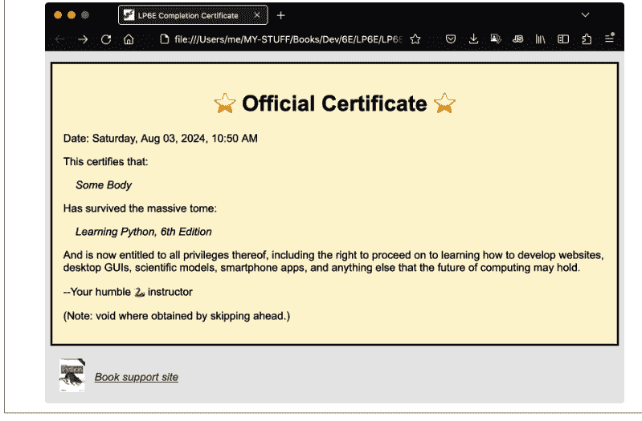

图 41-1. 由 You-made-it.py 创建并打开的 HTML 文档

## 在 Windows 上使用 Python

一旦你在 Windows 上安装了 Python，*运行*它可能像在命令行输入代码并点击文件图标一样简单，也可能像学习功能齐全的 IDE 的细微差别一样复杂。其中，命令行通常增加的复杂度最少。

要在 Windows 上从命令行运行 Python，请打开*命令提示符*或 *PowerShell*（通常是非 ISE 版本）。打开后，只需输入 `py` 或稍后介绍的其他选项，并添加文件名即可运行代码文件（即*脚本*）。

例如，从“开始”菜单打开命令提示符（如果需要，可在此处搜索）。然后，输入 `py` 并按 Enter 键，启动一个 Python 交互式会话，你可以在 `>>>` 提示符下输入并运行代码。要启动脚本，请输入 `py script.py`，其中包含你的脚本名称。图 A-2 在 Windows 上实时演示了这些命令。为节省篇幅，本附录中的一些演示（包括此演示）使用了 Python 的 `-q` 标志来抑制会话启动时的消息；这只是为了美观，是可选的。

`py` 命令从技术上讲是 Python *Windows 启动器*的一部分，它随 Python 本身一起安装。默认情况下，启动器运行你 PC 上安装的最新 Python 版本，但如果有多个版本，你也可以指定要运行的版本（例如，`py -3` 运行最新的 3.X，`py -3.8` 运行其较旧的版本）。如果你只有一个 Python 或想使用最新版本，`py` 就足以启动交互式会话或脚本。

如果你在安装期间选择将 Python 添加到系统 PATH，也可以使用 `python` 命令启动 Python，尽管这是多余的输入（`python3` 也有效，但仅当你按照前面的说明从 Microsoft Store 安装时才有效）。就像在 Unix 上一样，你可以通过在命令末尾添加 `> filename.txt` 轻松地将脚本的打印输出保存到文件中（有关此类流重定向的更多信息，请参见**第 3 章**）。

然而，如果你选择使用命令行，你还需要选择一个*文本编辑器*来创建你希望保存的代码文件（即要运行的脚本和要导入的模块）。如**图 A-2** 所示，Windows 记事本就足够了，但任何 Windows 文本编辑器都可以胜任。要使用记事本，请从“开始”菜单启动它（如果需要，可在此处搜索），或在命令行中输入其名称，无论是否带有要编辑的文件名。

除了命令行，你还可以通过点击其*“开始”菜单*条目中的 *Python 3.12 (64 位)*（或类似）项来启动 Python 的交互式会话，如**图 A-3** 所示。这将启动通常的 Python *REPL*（读取-求值-打印循环）交互式会话，带有 `>>>` 提示符，就像在命令提示符或 PowerShell 中显式使用 `py` 命令一样。不过，你仍然需要使用 `py` 命令或其他技术来运行代码文件。在 Windows 上的所有控制台 REPL 中，在 `>>>` 提示符下输入或点击组合键 `Ctrl+Z`（后跟 Enter）即可退出 Python 交互式会话，或者直接关闭承载窗口。

如果命令行让你感到不适，你也可以从图形 IDE（如 PyCharm 或 Python 自带的 IDLE）运行 Python。其中，IDLE 随 Windows 版 Python 一起提供，提供了一个简单但足够的 IDE 来运行本书的示例。它的功能部分与命令行重叠（它最终只是一个输入和运行代码的地方），但它还包括一个对 Python 友好的代码文件文本编辑器，并简化了一些常见的编码任务。值得注意的是，它能够无需命令行即可启动程序文件。

例如，图 A-4 和图 A-5 分别捕获了 IDLE 的交互式“Shell”和编辑器窗口，使用的是默认配置。你可以从 Windows 上 Python 的“开始”菜单条目启动 IDLE（尝试在其中搜索“idle”以快速定位并打开 IDLE）。命令 `py -m idlelib.idle` 也会启动 IDLE，原因在本书其他地方有介绍（简而言之：这类似于模块导入，但运行而不是导入），在文件资源管理器中右键单击代码文件也可以打开 IDLE，但目前需要编辑注册表。

IDLE 自己的“帮助”菜单提供了丰富的使用信息，我们将在此处引用，但有一个技巧值得一提：在任何编辑器窗口（如图 A-5 所示）中，菜单“运行”→“运行模块”（或其等效的快捷键 F5）允许你无需输入命令行即可启动脚本。这会在需要时将代码保存到文件后运行该窗口中的代码，并将代码的打印输出路由回 Shell 窗口。其“运行...自定义”版本还允许你提供命令行参数（有关详细信息，请参阅 Python 手册中的 `sys.argv`）。

这些技巧确实有用，但即使你不使用 IDLE 以这种方式运行代码，它还有其他工具，由于篇幅限制我们将在此处跳过，而且仅其代码编辑器就是记事本的一个引人注目的替代品，如果你没有其他选择来处理脚本和模块的话。

除了 `py`、`python`、`python3`、“开始”菜单和 IDLE（这已经算是 Windows 上的丰富资源了！），Python 程序文件也可以通过在命令行中仅输入其*名称*（例如 `hack.py`）以及在 Windows 文件资源管理器中定位并*点击*其名称或图标来启动。这两种方法都有效，这得益于 Windows 中文件名关联的魔力，Python 在安装期间会自动设置：任何名称以 `.py` 结尾的文件在被命名或点击时都会被路由到 `py` 启动器。

然而，点击有一个缺点：你以这种方式启动的程序的打印*输出*会在程序退出时丢失，因为程序的运行窗口会关闭。要保持窗口（从而保持输出）打开，只需在脚本底部添加对 Python 的 `input()` 的调用，以暂停等待用户按 Enter 键。如图 A-5 所示，此调用可以根据平台有条件地暂停（某些代码可能还需要标准流 TTY 测试）。

如果程序发生*错误*，`input()` 技巧将无济于事（唉，错误消息可能会在暂停之前随窗口一起消失！），因此通过点击运行通常最好仅用于图形程序和其他将错误记录到文件的程序。GUI 的提示：`.py` 文件在点击时会打开一个控制台用于标准流 IO，而 `.pyw` 文件则不会。

在我们继续之前，这里有一些关于 Windows 上 Python 的高级但有用的技巧：

### 脚本 #! 行

`py` Windows 启动器将脚本文件的*第一行*视为特殊，如果它以 `#!` 开头。此行可以指定用于运行文件代码的 Python 的版本和位置（例如 `#!python3.12`），所有常见的 Unix 风格行都有效（例如 `#!/usr/bin/python3.12`）。此行完全是可选的，与在用于启动它的命令行中指定 Python（例如 `py -3.12 hack.py`）没有区别，但当你的 PC 上安装了多个 Python 时可能很有用，特别是当脚本通过点击而不是命令行运行时。

### 环境变量

Windows 命令行界面使用 PATH（又名 Path）环境变量来定位像 `python` 这样的命名程序：会搜索此列表上的每个文件夹。如果你选择加入，这通常在 Python 安装期间自动设置，但你可以稍后在“设置”中自行调整（在其中搜索“环境变量”）。同样，你也可以创建或修改 `PYTHONPATH`（用于定位导入的模块，参见第 22 章），以及 `PYTHONUTF8` 和 `PYTHONIOENCODING`，它们在 Windows 上用于指定文件和重定向流的默认 Unicode 编码（这个复杂的故事在 3.X 中经常变化，将来也会；参见第 37 章）。

### 其他 Windows 选项

大多数 Python 代码在 Windows 上与其他平台上的工作方式相同，特别是如果它使用 Python 在 `os` 等模块中的可移植系统工具。然而，在需要特定于 Windows 的工具的情况下，`pywin32` 第三方扩展允许你的 Python 程序直接访问许多 Windows API。

有关在 Windows 上使用 Python 的更多信息，请尝试 `python.org` 的 HOWTO 以及网络上的丰富资源（对它们丰富的来源保持通常的谨慎）。现在，让我们继续我们之旅的下一个 PC 平台。

## 在 macOS 上使用 Python

作为一个基于 Unix 的平台，macOS 非常适合 Python、开源和一般的软件开发。在撰写本文时，较新的 macOS PC 不再预装 Python（如果看起来有，那只是用于安装无关工具集的存根，如前面的说明所示）。较旧的 macOS 系统确实有 Python，但它是现在已过时的 2.X 版本，启动时可能会发出弃用警告（换句话说，你不能用它来运行本书的代码，而且它在 macOS 世界中也不会存在太久）。因此，需要安装。

与 Windows 类似，为 macOS *安装* Python 3.X 的推荐方式是从 `python.org` 的下载页面开始。在那里，你将获取一个适用于 macOS 的自安装程序，运行它即可安装 Python 及其 IDLE GUI 和标准库（包括库的 tkinter GUI 工具包）。

你今天将获得的 Python 是一个通用二进制文件，它可以在使用较新的 Apple Silicon (ARM) 和较旧的 Intel (x86) 芯片的 macOS 电脑上原生运行，并且可以在 Rosetta 2 模拟器中运行（有关所有这些术语的更多信息，请参阅网络）。图 A-6 展示了在 macOS 上的安装过程。

安装复杂性：如果你在运行 python.org 安装程序之前，在 macOS 的终端中输入 `python3`，你可能会看到一个 Apple 弹出窗口，询问你是否要将 Python 作为 Xcode 的“命令行开发者工具”的一部分进行安装。这与上一节中 Windows 上的 Microsoft Store 重定向在精神上是相似的——同样令人困惑！

然而，在 macOS 上，大多数用户应该忽略此提议，而是按照此处描述的方式从 python.org 安装 Python，因为它使你的 Python 独立于工具包所做的版本和配置选择。如果你已经拥有 Xcode 及其 Python，情况也是如此：从 python.org 安装一个新的 Python 通常能提供更好的控制。


图 A-6. macOS 上的 python.org 安装程序

安装后，你可以通过 Launchpad 中的条目（主要镜像了你电脑在 Finder 中的“应用程序”文件夹）以及终端中的命令行（提供标准的 Unix 命令行 shell）来启动 Python。其中，终端可能是开始使用本书示例在 macOS 上运行的最基本方式。

要在 macOS 上通过命令行运行代码，请通过点击 Launchpad 的 *其他* 文件夹中的条目，或在 Finder 中点击 *应用程序*→*实用工具* 来打开终端。然后，输入 `python3` 启动一个 Python 交互式会话，你可以在其中输入和运行代码，或者输入 `python3 script.py` 来启动一个代码文件。这之所以可行，是因为安装程序将 `python3` 添加到了你的系统 PATH 中（并且需要提醒的是，在较旧的电脑上，`python` 可能意味着 Python 2.X）。

图 A-7 演示了在 macOS 上实时运行 Python 命令。与基于 Unix 的系统一样，在 `>>>` 提示符下，按组合键 Control+D 可以退出 Python 交互式会话（是的，这与 Windows 不同），如果你觉得七个字符太长，可以在 shell 的启动文件中将 `python3` 别名为更短的名称（例如，别名为 `py`，如果你希望在切换到 Windows 时避免一些混淆）。


图 A-7. 在 macOS 终端中运行 Python

使用命令行运行代码时，你还需要在 macOS 上使用 *文本编辑器* 来创建 Python 代码文件（脚本和模块）。其内置的 TextEdit 足够使用，但开箱即用时对代码不太友好（例如，你可能需要立即设置等宽字体）。任何 macOS 文本编辑器都能胜任编辑 Python 代码的任务，包括 *IDLE*（接下来介绍）、Unix 用户熟悉的基于命令行的 *vi* 和 *nano* 编辑器，以及你可以在网上探索的其他选项。

在 macOS 上安装后，你还会发现两个用于以其他模式运行 Python 代码的工具，它们在 *Launchpad* 和 *Finder* 的 *应用程序* 文件夹中都可用。如图 A-8 和 A-9 所示，*Python Launcher* 允许你通过在 Finder 中 *点击* 或 *拖动* 文件到其图标或名称来运行 Python 代码文件，而 *IDLE* 提供了一个用于 Python 代码的基本编辑和运行 IDE 图形界面。（Python 本身，通过 `python3` 命令调用，位于 /Library/Frameworks 中，不过你通常不需要关心。）


图 A-8. macOS Launchpad 中的 Python IDLE 和启动器


图 A-9. macOS Finder 中的 Python 应用程序文件夹

图 A-10 展示了 macOS 上的 IDLE。最简单的启动方式是通过其 Launchpad 或 Finder 条目，或者在 Finder 中右键点击（也称为 control-click）任何 Python 代码文件，然后在“打开方式”中选择 IDLE（你可以在此处将此关联设为永久，并在 Finder 的“显示简介”中设为全局）。

因为 IDLE 是用 Python 编写的 tkinter 图形界面，所以它在所有支持的平台上（基本上是所有非移动设备的电脑）外观和工作方式都相同。与其他地方一样，它允许你编辑和运行 Python 代码文件，而无需使用命令行或其他编辑器。有关更多提示，请参阅前面 Windows 部分对 IDLE 的介绍；如前所述，即使你通过命令行、点击或拖动来运行文件，IDLE 也可以作为对 Python 友好的代码编辑器。


图 A-10. macOS 上的 IDLE 图形界面 Shell 窗口

最后，这里有一些高级使用技巧，其中 macOS 特有的部分也适用于其他 Unix 平台，如 Linux 和 Android，接下来将介绍：

*脚本 #! 行*
如果脚本的 *第一行* 以 `#!` 开头，在 macOS 上它会被视为特殊行，就像在 Windows 上一样。在 macOS 上，这是运行你命令行的 shell（例如 *Bash* 或 *Zsh*）的功能，而不是 Python 的功能。例如，脚本顶部的行 `#!/usr/bin/python3.12` 告诉 shell 应该使用哪个 Python 来运行文件的其余行。这与在命令行中显式指定你的 Python（例如 `/usr/bin/python3.12 hack.py`）没有区别，但 `#!` 行允许脚本仅通过其名称（例如 `hack.py`）运行，前提是它也被设为可执行（参见 `chmod`）。

*通过点击运行*
Python 代码文件可以通过在 Finder 中 *点击* 来运行，但你可能需要在“打开方式”中选择 Python Launcher，并使用“始终”（或“显示简介”）将其设为永久。与 Windows 不同，输出在退出和出错时会保留在生成的控制台窗口中。`#!` 首行不是必需的，但可以使用。

*环境变量*
在 macOS 上，你还可以通过 shell 启动文件（例如 `~/.bash_profile` 或 `~/.zprofile`）中的代码来设置或更改环境变量，如 `PATH`（用于定位命令行中命名的程序，如 `python3`）和 `PYTHONPATH`（用于定位导入的模块）。`PATH` 由 python.org 安装程序自动设置。有关设置这些变量的 shell 代码示例，请参阅第 22 章的示例，以及网络和你的电脑文档（例如 `info bash` 和编写得不太好的 `man bash`）。

## 其他 macOS 选项

为完整起见，值得注意的是，macOS 上还有其他特定于平台的 Python 工具（例如 PyObjC），第三方 Homebrew 包管理器为 macOS 上的 Python 提供了一种完全不同的安装方案，它同样有效，但有额外的设置步骤，使其更适合高级读者。

由于篇幅限制，我们将在此跳过更多细节；有关 macOS 上更多 Python 选项的信息，请参阅 python.org 上的 HOWTO 和你本地的网络搜索引擎。

## 在 Linux 上使用 Python

Python 是 Linux 上的标配，它既用于用户应用程序，也用于系统工具。由于它在这个基于 Unix 的平台上如此普遍，Python 可能已随你的 Linux 发行版预装；在 shell 窗口（例如终端）中输入 `python3` 进行检查。如果你需要手动安装，请按照你的 Linux 版本的常规方法操作：在 Ubuntu 发行版中，在终端中执行 `sudo apt install python3` 即可完成（在其他一些发行版上尝试 `yum`）。

一旦你安装了 Python 3.X，就可以使用常规的终端命令行交互式运行代码和启动代码文件，如图 A-11 所示。`python3`（或特定版本的名称）启动一个交互式会话，用于输入和运行代码，添加文件名（例如 `python3 script.py`）则运行一个文件。与其他平台一样，你的 `PATH` 设置被这些命令用来定位 Python。与所有 Unix 系统一样，在 `>>>` 提示符下按组合键 Ctrl+D 可以退出 Python REPL，并且可以为 `python3` 设置更短的 shell 别名以避免一些输入。


图 A-11. 在 Linux 终端中运行 Python

使用命令行时，你还需要使用文本编辑器来编写脚本和模块。要创建这样的 Python 代码文件，任何 Linux 文本编辑器都可以，包括 Ubuntu 上默认的图形界面 Gedit，以及面向 shell 的 `vi` 和 `nano`。

你也可以在 Linux 上使用 Python 的 *IDLE* 编辑和运行图形界面。安装后（使用 `sudo apt install idle3` 或其他发行版上的类似命令），通过 `idle` 命令行启动它。在文件浏览器中右键点击代码文件并选择“打开方式”也可能启动 IDLE。

IDLE 注意事项：你可能需要使用更具体的名称（例如 `idle-python3.12`）来强制指定版本；在安装字体之前，表情符号可能无法工作（例如 `sudo apt install ttf-ancient-fonts-symbol`）；并且一个平台无关的命令行 `python3 -m idlelib.idle` 也可以启动 IDLE，如前面 Windows 部分所述。

图 A-12 演示了在解决所有问题后，IDLE 在 Ubuntu Linux 电脑上运行的情况；它在 Linux 上与在 Windows 和 macOS 上的工作方式相同，并在本附录的 Windows 部分有更详细的介绍。


在 Linux 上还值得注意的是：

- 如果你希望使用 Python 的可移植 tkinter GUI 工具包，如果需要，你可以单独安装它，使用 `sudo apt install python3-tk`（或在 Linux 包安装这个丰富分化的世界中的类似命令）。
- 与 macOS 一样，脚本顶部以 `#!` 开头的行可以指定运行该文件的 Python，并且可以在 shell 启动文件中设置 `PATH` 和 `PYTHONPATH` 等环境变量，但前者通常不是必需的。有关这两个主题的介绍，请参阅 macOS 部分以及第 22 章的 PYTHONPATH 示例。
- 在 Linux 上，Python 文件也可以通过 *点击* 运行，但细节各不相同。在 Ubuntu 的文件管理器中，“作为程序运行”会运行一个被点击的、同时具有可执行权限（例如 `chmod +x script.py`）和 `#!/...` 首行（给出 Python 路径）的 Python 文件，但关于 Windows 输出在退出或出错时消失的警告同样适用。

在Linux上从源代码分发包构建Python并不罕见，这些源代码包可在*python.org*或GitHub上获取。这需要执行几条简单的命令行（`configure`和`make`），但这超出了本章以及大多数Python初学者的范围；有关代码和详细信息，请参阅*python.org*上的下载页面。

有关Linux上Python的更多信息，可以尝试在互联网上搜索或查阅*python.org*的**HOWTO**。现在，是时候继续探讨Python在移动端的故事了。

## 在Android上使用Python

Android是Linux的一个安全衍生版本，专为移动设备的独特限制而设计，截至本文撰写时，它是全球使用最广泛的操作系统。尽管该平台存在对Java和Kotlin编程语言的偏好，但Python可以在Android设备上作为一等编程公民使用，既可用于学习也可用于开发。例如，本书中的示例将能在你的Android手机或平板电脑上良好运行。

要在你的Android设备上本地运行Python，你首先需要从*Play*或*F-Droid*等应用商店安装一个支持Python的应用。在这些应用中，*Termux*、*Pydroid 3*和*QPython*都允许你直接在Android上以多种模式运行Python代码。虽然我们无法全面介绍这些以及其他Python应用，但这里简要介绍两个，以帮助你入门。

免费开源的Android应用*Termux*提供了一个功能齐全的Linux shell、工具集和包管理器。要在Termux中使用Python，首先从**F-Droid**商店安装Termux应用（其Play版本已失效）。然后，从你的应用屏幕打开该应用，并在其shell中使用`pkg install python`命令行安装Python 3.X。

Termux启动时会打开一个标准的*Bash*命令行shell，你可以在其中输入命令，通过`python`启动交互式Python会话，并通过添加文件名（例如`python script.py`）来运行代码文件。流重定向的工作方式与所有Unix系统相同，如果你偏好Unix的一致性且不介意多敲一下，命令`python3`与`python`相同。安装后，这两个命令都无需修改PATH即可自动使用。

你可以使用Termux可访问的任何文件夹中的*代码文件*（脚本和模块）（通常意味着共享存储或应用私有存储，如下所述），并使用单独的文本编辑器应用或在Termux内部使用Linux文本编辑器（如*vi*和*nano*（根据需要使用`pkg install`在Termux中安装））来创建和修改它们。Termux还支持Android的存储访问框架，使其应用私有存储对某些文件管理器应用可见，尽管共享存储更易于访问和使用。

**图A-13**演示了Termux应用在Android上运行Python代码和文件。与所有Unix系统一样，在`>>>`处按Ctrl+D组合键（通过Termux的CTRL按钮或后续提到的键盘）会结束Termux中的Python交互式会话，关闭应用也会结束会话，并且shell别名可以缩短`python`（或`python3`）命令。使用应用时，你通常会使用其提供的Python版本；在Termux中，这意味着包仓库中的某个版本，但你也许可以从源代码构建更新的版本。你还可以通过命令行安装大量扩展供代码使用，包括Termux的`pkg`和Python的`pip`。

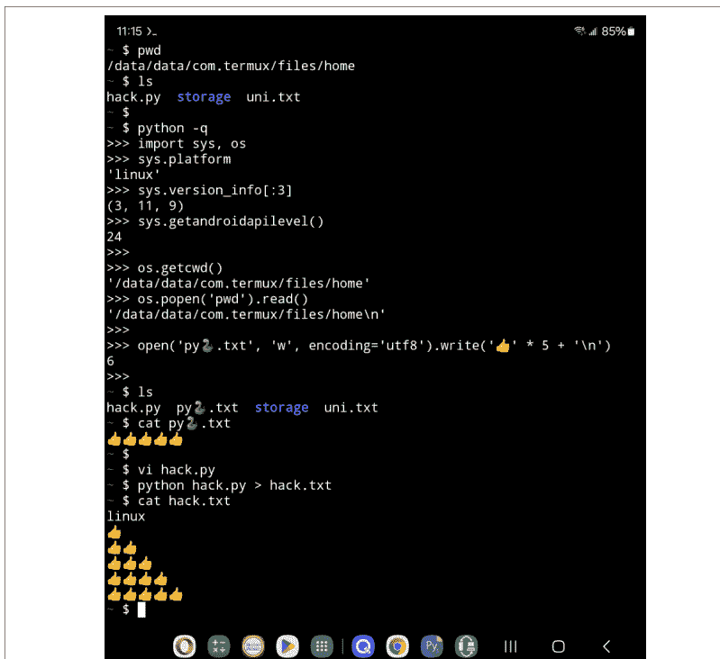

图A-13. 在Android的Termux应用中运行Python

Termux可能是开始在Android上使用Python阻力最小的路径。它还有更多我们在此基本会跳过的功能，包括点击即可运行Python脚本的主屏幕小部件，并且前面涵盖的所有Linux概念都适用，包括PYTHONPATH和PATH环境变量设置。对于某些用户来说，它的主要缺点可能是仅限于命令行，除非启用其可选的X Window系统支持，而后者使用起来相当复杂；例如，在Termux中运行IDLE充其量也是困难的。

如果你想要一些更具图形化的东西，Pydroid 3应用也提供了一个命令行shell和交互式Python会话，但它增加了一个用于编辑和启动Python代码的GUI IDE。该IDE的编辑/运行窗口如图A-14所示。

Pydroid 3目前从Play商店安装。它的shell和交互式会话不如Termux中更丰富的命令行支持用户友好，但其IDE对于不习惯命令行的用户来说可能感觉更舒适。类似于PC上的IDLE，该应用的IDE允许你编辑Python代码，并通过一个简单的（黄色的）按钮按下启动它。

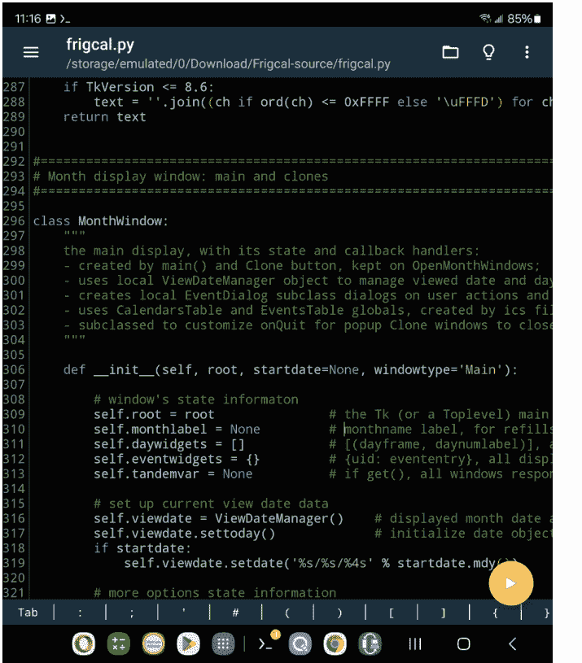

图A-14. Android上的Pydroid 3应用的IDE

除了IDE之外，Pydroid 3还增加了对许多流行工具的支持，包括科学编程库，以及值得注意的Python的tkinter GUI工具包。与Termux一样，Pydroid 3中的Python版本是预设的（尽管源代码构建难以实现），并且Python的pip可用于安装扩展（尽管在此应用中有一个专用的GUI）。

*请注意*：作为一个重大的权衡，Pydroid 3也是一个*免费增值*应用，除非你支付所需费用，否则它会向你弹出粗鲁的全屏广告——这是Android上不幸常见的模式，你需要自己权衡。此外，Pydroid 3在响应Android和Play商店的规定时，对*存储*访问的支持一直摇摆不定。相比之下，*Termux*今天完全免费且无广告，支持广泛的存储访问，并选择替代应用商店，而不是为了Play商店强制要求的Android更改而限制功能。

有关此处因篇幅省略的其他Android Python编程应用的信息，请查看网络和应用商店。当你在商店时，你可能还想探索像*QuickEdit*这样的文本编辑器应用——它能够着色并运行Python代码；以及像*Hacker's Keyboard*这样的替代屏幕键盘——它添加了标准选项中没有但编码常用的PC键（例如方向键和Ctrl）。一些Python应用还包括可以定制或禁用的工具来增强屏幕键盘，蓝牙键盘和投屏到更大的屏幕自然也能提高可用性。

最后还值得注意的是，*CPython*计划很快将Android添加到其官方支持的平台列表中，这可能会在未来催生更多选择。此外，尽管大多数初学者将如上所述使用应用在Android上运行Python代码，但也可以构建独立的Android应用，这些应用用Python编码，但像任何其他应用一样使用。我们将在本附录末尾，在介绍最后一个平台之后，再回到这个选项。

### Android的专有世界

Python程序员还应该意识到，Android对应用施加了许多限制，其中一些对于来自更具互操作性平台的开发者来说可能显得繁重。这些限制大多基于安全或性能的理由，但都降低了实用性。

例如，Android的*存储*被划分为一个具有受控访问权限的共享和持久区域，以及部分或完全私有的应用区域，这些区域在应用卸载时可能会消失。因此，虽然POSIX文件工具和路径在Android上确实有效，但Python代码必须注意使用可访问的文件夹，或者运行请求或使用增强权限的专有Java API工具。

此外，后台或长时间运行的*进程*可能会违反限制；*工具和语言*的选择几乎是强加给开发者的；并且针对功耗、发热、内存或其他偏好的*节流*在大多数手机上是常态。

从积极的一面来看，Android用户可以在其所有者商店之外安装应用，并且可以使用众多文件管理器应用访问文件系统。这使得Android比今天的iOS更开放，但这是一个庞大且不断变化的话题。如果你关心在移动设备上使用Python，请务必关注其他资源以获取这方面的最新消息。

## 在iOS上使用iOS

iOS——在本指南中包括其衍生版本iPadOS——是针对移动设备的macOS衍生版本。与Android一样，它对编程语言（Swift和Objective-C）有限制性偏好，并且在将存储划分为具有专有访问规则和工具的受限应用沙盒方面更为严格。尽管有这些限制，你的iPhone或iPad也可以用来运行Python代码，包括本书中的代码。

与Android一样，你通常会通过安装一个运行Python代码的应用在iOS设备上使用Python。其中，*Pythonista 3*提供了一个交互式Python会话和一个用于编辑和运行代码文件的GUI，类似于其他IDE。此外，此应用还提供了对原生iOS功能的访问以及一个用于在Python中为iOS构建GUI的工具包。它还可以与*Files*应用共享代码文件，以便通过点击打开。

要亲自验证，可以从App Store获取Pythonista 3。图A-15显示了该应用的实际运行情况（是的，在一个不起眼且历史悠久的iPod上）。务必也探索商店中的其他iOS选项；*Pyto*应用，

## 独立应用程序与可执行文件

除了使用我们刚刚介绍的传统方案运行 Python 源代码外，还可以将 Python 代码打包成独立程序，用户可以像运行设备上的任何其他程序一样运行它们（例如，通过点击或轻触）。事实上，用户甚至无法分辨这些程序包是用 Python 编写的：看不到源代码，不需要其他安装或应用程序，本地安装的 Python 的更改也不会影响程序包。

构建独立程序的方式因平台而异。作为当今主要工具的一个非详尽示例，你可以使用 *PyInstaller* 为 Windows 和 Linux 构建独立可执行文件；使用 *PyInstaller* 和 *py2app* 为 macOS 构建独立应用程序；使用 *Buildozer* 和 *Briefcase* 为 Android 和 iOS 构建独立应用程序（后者也提供 PC 选项）。

例如，在 Android 上，完全用 Python 开发独立应用程序是可能的。虽然这比在另一个应用程序中运行代码需要更多的努力，但其产品是功能齐全、符合习惯的 GUI 应用程序，用 Python 编码，轻触即可运行，需要时可以利用 Android API，并且既可以侧载也可以上传到应用商店。

作为演示，图 A-16 展示了众多用 Python 编码的 Android 独立应用程序之一，运行在可折叠设备上。这款应用程序由本书作者制作，在 Play 商店免费提供；使用 *Buildozer* 为 Android 构建；使用可移植的 *Kivy* 工具包作为其 GUI；并在其代码的一小部分中（例如，请求权限、运行服务、打开文档和获取驱动器标签）依赖 Kivy 的 *pyjnius* 来访问 Android Java API。


至关重要的是，此类应用程序也可以在 PC 平台——Windows、macOS 和 Linux 上——从*相同的代码库*运行。例如，图 A-17 显示了同一个应用程序在 macOS 上运行。其代码使用 *PyInstaller* 为 macOS 和其他 PC 打包；其 Kivy GUI 自动跨平台；其 POSIX 文件同步代码在任何地方都能工作。最终结果是一个用 Python 编码的应用程序，可以在一系列 PC 和移动主机上运行，并在每个主机上具有原生行为。

要亲自验证这一点，请在 Play 上获取此应用程序的 Android 版本，并在本书网站或 *quixotely.com* 上获取其 PC 版本。免责声明：如果 Android 应用程序在 Play 上不可用，请在后两个网站上查找或尝试网络搜索；书籍的寿命往往比依赖商店和应用程序的寿命长得多（参见 Termux 的麻烦！）。


*图 A-17. 同一个应用程序在 macOS 上运行*

这个工具集也不是唯一实现互操作性的选择。替代方案 *BeeWare*，及其可移植的 *Toga* GUI 工具包和 *Briefcase* 应用程序构建器，承诺类似的平台独立性，并宣传在 PC 上提供额外的打包选项。此外，使用此类工具构建的一些应用程序也可以在 iOS 上工作，尽管其缺乏用户可访问的文件系统使得许多跨平台代码无法使用（例如，POSIX 文件路径同步是不可能的）。

这里的要点是：使用像 Python 这样的可移植编程工具，你不会被锁定在单一平台的专有领域——除非，你为那些排除在其他任何地方运行的代码的平台进行开发。一如既往，明智地选择你的编码战斗。安全性很重要，但封闭的平台会助长垄断并扼杀创新。

当你刚开始使用 Python 时，独立程序可能不是很有用（对于运行本书中的示例来说完全没有意义！），但当你开始为他人编写程序时，它们可能会变得更加重要。当你准备好探索 Python 的独立交付物时，请在网上查找该领域的当前工具和详细信息。

## 其他

虽然我们在此探讨的平台技术可能是使用 Python 最简单和最常见的方法，但这个故事还有更多内容。例如，本附录没有提及在以下方面使用 Python：

- 其他 IDE，如 PyCharm、PyDev、Wing 和 VSCode
- 基于 Web 的笔记本，如 IPython 和 Jupyter
- 替代的 Python 实现，如 PyPy、Cython、Numba 和 Jython
- 替代的 Python 发行版，如 Anaconda 和 ActiveState
- 电子表格（如 Excel）中的单元格和宏
- 使用 Flask 和 Django 等框架的 Web 服务器
- 使用新兴的 WebAssembly 和 Pyodide 的 Web 浏览器

以及许多其他在此未被提及的选项。本书在第 1 章讨论了其中一些，在第 2 章总结了 Python 实现，在第 3 章简要回顾了 Jupyter 和 WebAssembly，并在第 21 章使用 PyPy 进行基准测试。然而，总的来说，像这样的高级使用场景虽然有趣，但超出了这本 Python 基础文本的范围，最好在你掌握语言本身之后再进行。

最终，Python 的使用细节和选项往往与 Python 本身一样快速地发展。事实上，本书的每个先前版本都不得不彻底修订其使用范围，而这个版本预计也不会更好。正如本附录开头所指出的，你应该期望查阅 Python 的文档和整个网络，以获取几乎肯定会在你阅读这些文字时出现的新颖而令人兴奋的发展。

# 附录 B

## 各部分末尾练习的解答

本附录提供了本书各部分末尾练习的解答。这些解答中按标题或叙述命名的代码文件可在本书示例包的 *AppendixB* 文件夹中找到，该文件夹每个部分有一个子文件夹（例如，*AppendixB/Part1* 是第一部分的文件）。有关示例包的更多信息，请参见[前言](#)。

## 第一部分，入门

练习见第 3 章第 48 页的“测试你的知识：第一部分练习”。

1.  *交互*：假设 Python 配置正确，交互应类似于以下内容。你可以以任何你喜欢的方式运行它——在 IDLE、控制台、应用程序、笔记本页面等中：

    ```
    $ python3
    ...信息行...
    >>> 'Hello World!'
    'Hello World!'
    >>>
    # 在 Unix/Windows 上使用 ctrl+D/ctrl+Z 退出，或关闭窗口
    ```

2.  *程序*：你的代码（即模块）文件应类似于[示例 B-1](#)：

    *示例 B-1. Part1/module1.py*

    ```python
    print('Hello module world!')
    ```

    以下是你应该进行的交互类型；对于控制台启动，请务必使用你平台版本的 "python3" 命令（例如，在 Windows 上尝试 "py -3"）：

    ```
    $ python3 module1.py
    Hello module world!
    ```

    同样，你可以通过其他方式运行它——通过点击或轻触文件图标，使用 IDLE 的 *Run→Run Module* 菜单选项，通过 Web 笔记本或其他 IDE 中的 UI 选项等。

3.  *模块*：以下交互列表演示了通过导入来运行模块文件：

    ```
    $ python3
    >>> import module1
    Hello module world!
    >>>
    ```

    请记住，你需要*重新加载*模块才能在不停止和重新启动交互式解释器（即 REPL）的情况下再次运行它。将 *.py* 文件移动到不同的目录并正常导入通常会失败：Python 可能在源代码文件的文件夹的 *\_\_pycache\_\_* 子目录中生成了 *module1.\*.pyc* 文件，但如果源代码 (*.py*) 文件已被移动到其他地方且不在 Python 的导入搜索路径中的文件夹中，它在导入模块时不会使用它。

    如果 Python 可以访问源文件的目录，则会自动写入 *.pyc* 文件；它包含模块的编译字节码版本。有关模块的更多信息，请参见[第 3 章](#)，有关字节码的更多信息，请参见[第 2 章](#)，有关两者的更多信息，请参见[第 22 章](#)。要真正使用保存的 *.pyc* 而没有 *.py*，从 Python 3.2 开始，你必须将其向上移动一级并重命名，去掉中间的 "*" 部分，或者使用 Python *compileall* 模块的 "legacy" (*-b*) 模式从源代码文件生成并与其并存。例如，以下命令将当前目录中的所有源代码文件编译为可直接使用的字节码文件（你也可以列出特定文件或递归到子文件夹，根据 Python 库文档）：

    ```
    $ python3 -m compileall -b -l .
    ```

4.  *脚本*：假设你的平台支持 *#!* 技巧，你的解决方案将类似于[示例 B-2](#)，尽管你的 *#!* 行可能需要列出你机器上不同的 Python 路径。这一行在 Python 附带和安装的 Windows 启动器下很重要，在那里它被解析以选择运行脚本的 Python 版本，尽管是 Unix 路径语法，并且受默认设置影响；有关更多详细信息，请参见[附录 A](#) 和 Python 的文档。此启动方案是可选的，通常比其他方案可移植性差。

    *示例 B-2. Part1/script1.py*

    ```python
    #!/usr/local/bin/python3
    print('Hello module world!')
    ```

    通过控制台命令行作为程序运行此文件：

    ```
    $ chmod +x script1.py          # 另请参见：#!/usr/bin/env python3
    $ ./script1.py                 # 仅当 "." 不在 PATH 上时才需要 "./"
    Hello module world!

    $ python3 script1.py           # 或正常且可移植地运行
    Hello module world!
    ```

5.  *错误和调试*：以下交互演示了完成此练习时会收到的错误消息类型。实际上，你正在触发 Python 异常；默认的异常处理行为会终止正在运行的 Python 程序，并在屏幕上打印错误消息和堆栈跟踪。堆栈跟踪显示了异常发生时你在程序中的位置（如果错误发生时函数调用处于活动状态，则 "Traceback" 部分显示所有活动的调用级别）。

    在[第 10 章](#)和[第七部分](#)中，你将学习可以使用 *try* 语句捕获异常并任意处理它们。你还将学习 Python 包含一个完整的源代码调试器（模块 *pdb*），用于特殊的错误检测需求。现在，请注意 Python 在发生编程错误时会给出有意义的消息，而不是静默崩溃：

## 第二部分，对象与操作

请参阅第9章的“测试你的知识：第二部分练习”（第239页）获取练习题。

1.  *基础知识*：以下是你应该得到的结果类型，以及一些关于其含义的注释。再次注意，其中一些示例使用了分号（;）将多条语句放在一行（分号是语句分隔符），而逗号则构建了在括号中显示的元组。请参阅文件*Part2/basics.txt*进行复制/粘贴（无需媒体），不过手动输入这些内容是练习语法的好方法：

```
$ python3
# Numbers

>>> 2 ** 16
65536
>>> 2 / 5, 2 / 5.0
(0.4, 0.4)

# Strings

>>> 'hack' + 'code'
'hackcode'
>>> S = 'Python'
>>> 'grok ' + S
'grok Python'
>>> S * 5
'PythonPythonPythonPythonPython'
>>> S[0], S[:0], S[1:]
('P', '', 'ython')
>>> how = 'fun'
>>> 'coding %s is %s!' % (S, how)
'coding Python is fun!'
>>> 'coding {} is {}!'.format(S, how)
'coding Python is fun!'
>>> f'coding {S} is {how}!'
'coding Python is fun!'

# Tuples

>>> ('x',)[0]
'x'
>>> ('x', 'y')[1]
'y'

# Lists

>>> L = [1, 2, 3] + [4, 5, 6]
>>> L, L[:], L[:0], L[-2], L[-2:]
([1, 2, 3, 4, 5, 6], [1, 2, 3, 4, 5, 6], [], 5, [5, 6])
>>> ([1, 2, 3] + [4, 5, 6])[2:4]
[3, 4]
>>> [L[2], L[3]]
[3, 4]
>>> L.reverse(); L
[6, 5, 4, 3, 2, 1]
>>> L.sort(); L
[1, 2, 3, 4, 5, 6]
>>> L.index(4)
3
```

```
# Method: reverse list in place
# Method: sort list in place
# Method: offset of first 4 (search)
```

```
# Dictionaries
```

```
>>> {'a': 1, 'b': 2}['b']
2
>>> D = {'x': 1, 'y': 2, 'z': 3}
>>> D['w'] = 0
>>> D['x'] + D['w']
1
>>> D[(1, 2, 3)] = 4
```

```
# Index a dictionary by key
# Create a new entry
# A tuple used as a key (immutable)
```

```
>>> D
{'x': 1, 'y': 2, 'z': 3, 'w': 0, (1, 2, 3): 4}
```

```
>>> list(D.keys()), list(D.values()), (1, 2, 3) in D
(['x', 'y', 'z', 'w', (1, 2, 3)], [1, 2, 3, 0, 4], True)
```

```
# Methods, key test
```

```
# Empties
```

```
>>> [[]], [""], [], (), {}, None
([[]], [''], [], (), {}, None)
```

```
# Lots of nothings: empty objects
```

2.  *索引与切片*：索引越界（例如，L[4]）会引发错误；Python总是会检查以确保所有偏移量都在序列的边界内。

另一方面，切片越界（例如，L[-1000:100]）可以工作，因为Python会缩放越界切片，使其始终适配（如果需要，边界会被设置为零和序列长度）。

以相反顺序提取序列，即下界大于上界（例如，L[3:1]），实际上并不起作用。你会得到一个空切片（[]），因为Python会缩放切片边界，以确保下界始终小于或等于上界（例如，L[3:1]被缩放为L[3:3]，即偏移量3处的空插入点）。Python切片总是从左到右提取，即使你使用负索引（它们首先通过加上序列长度转换为正索引）。请注意，Python的三参数切片在某种程度上修改了这种行为。例如，L[3:1:-1]确实是从右到左提取：

```
>>> L = [1, 2, 3, 4]
>>> L[4]
Traceback (most recent call last):
  File "<stdin>", line 1, in <module>
IndexError: list index out of range

>>> L[-1000:100]
[1, 2, 3, 4]
>>> L[3:1]
[]

>>> L
[1, 2, 3, 4]
>>> L[3:1] = ['?']
>>> L
[1, 2, 3, '?', 4]
```

3.  *索引、切片与del*：你与解释器的交互应类似于以下内容。请注意，将空列表赋值给一个偏移量会在该处存储一个空列表对象，但将空列表赋值给一个切片会删除该切片。切片赋值期望另一个序列，否则你会得到类型错误；它插入的是被赋值序列*内部*的元素，而不是序列本身：

```
>>> L = [1, 2, 3, 4]
>>> L[2] = []
>>> L
[1, 2, [], 4]

>>> L[2:3] = []
>>> L
[1, 2, 4]

>>> del L[0]
>>> L
[2, 4]
>>> del L[1:]
>>> L
[2]

>>> L[1:2] = 1
Traceback (most recent call last):
  File "<stdin>", line 1, in <module>
TypeError: can only assign an iterable
```

4.  *元组赋值*：X和Y的值被交换了。当元组出现在赋值符号（=）的左右两侧时，Python根据位置将右侧的对象赋值给左侧的目标。这可能最容易通过注意到左侧的目标不是一个真正的元组来理解，即使它们看起来像一个；它们只是一组独立的赋值目标。右侧的项目是一个元组，在赋值过程中被解包（这个元组提供了实现交换效果所需的临时赋值）：

```
>>> X = 'code'
>>> Y = 'hack'
>>> X, Y = Y, X
>>> X
'hack'
>>> Y
'code'
```

5.  *字典键*：任何*不可变*（技术上讲，“可哈希的”）对象都可以用作字典键，包括整数、元组、字符串等。这确实是一个字典，即使它的一些键看起来像整数偏移量。混合类型的键也可以正常工作：

```
>>> D = {}
>>> D[1] = 'a'
>>> D[2] = 'b'
>>> D[(1, 2, 3)] = 'c'
>>> D
{1: 'a', 2: 'b', (1, 2, 3): 'c'}
```

6.  *字典索引*：索引一个不存在的键（D['d']）会引发错误；赋值给一个不存在的键（D['d']='hack'）会创建一个新的字典条目。另一方面，列表的越界索引也会引发错误，但越界赋值同样会引发错误。变量名的工作方式类似于字典键；它们在被引用时必须已经被赋值，但在首次赋值时会被创建。事实上，如果你愿意，变量名可以被当作字典键来处理（它们在栈帧或模块[或其他对象]命名空间的字典中变得可见）：

6.  *中断与循环*：当你输入这段代码时：

```
$ python3
>>> L = [1, 2]
>>> L.append(L)
>>> L
[1, 2, [...]]
```

你在Python中创建了一个*循环*数据结构。在1.5.1之前的Python版本中，Python的打印器不够智能，无法检测对象中的循环，它会打印出无尽的[1, 2, [1, 2, [1, 2, [1, 2, ...流，直到你在机器上按下Ctrl+C中断键组合（这实际上会引发一个键盘中断异常，打印一条默认消息）。从Python 1.5.1开始，打印器足够聪明，可以检测循环，改为打印[[...]]以让你知道它检测到了对象结构中的循环，并避免陷入永远打印的困境。

循环的原因很微妙，需要你在第二部分中获取的信息，所以这算是一个预览。但简而言之，Python中的赋值总是生成对象的*引用*，而不是它们的副本。你可以将对象视为内存块，将引用视为隐式跟随的指针。当你运行前面代码中的第一个赋值时，名称L变成了一个指向包含两个元素的列表对象的命名引用——一个指向一块内存的指针。Python列表实际上是对象引用的数组，有一个append方法，通过在末尾附加另一个对象引用来就地修改数组。这里，append调用在L的末尾添加了一个对L开头的引用，这导致了图B-1所示的循环：列表末尾的一个指针指回列表的开头。

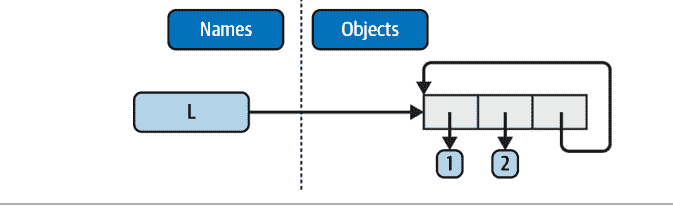

图B-1. 通过将列表附加到自身而创建的循环对象

除了被特殊打印外，正如你将在第6章学到的，循环对象还必须由Python的垃圾收集器特殊处理，否则即使它们不再被使用，其空间也不会被回收。虽然在实践中很少见，但在一些遍历任意对象或结构的程序中，你可能需要通过跟踪你已经访问过的地方来检测此类循环，以避免循环。信不信由你，循环数据结构有时是有用的，尽管它们有特殊的打印情况。

## 第三部分，语句与语法

请参阅第15章的“知识测试：第三部分练习”（第374页）获取练习题。

1.  *编写基本循环*：在完成此练习的过程中，你最终会得到如下所示的代码：

```
>>> S = 'hack'
>>> for c in S:
...     print(ord(c))
...
104
97
99
107

>>> x = 0
>>> for c in S: x += ord(c)        # 或：x = x + ord(c)
...
>>> x
407
>>> chr(x)                          # 附加题：非ASCII字符，参见第37章
'I'

>>> x = []
>>> for c in S: x.append(ord(c))    # 手动构建列表
...
>>> x
[104, 97, 99, 107]

>>> list(map(ord, S))
[115, 112, 97, 109]
>>> [ord(c) for c in S]             # map和列表推导式自动化了列表构建过程
[115, 112, 97, 109]
```

2.  *编写基本选择结构*：以下是预期的代码类型。为了处理超出范围的数字，需要为`if`添加`else`，为`match`添加`case _`，为字典添加`get`方法调用或`in`测试，为列表添加`try`处理程序。要获取更易于复制/粘贴的代码版本，请参阅示例包中的文件*Part3/selections.txt*：

```
>>> month = 3
>>> if month == 1:
...     print('January')
... elif month == 2:
...     print('February')
... elif month == 3:
...     print('March')
...
March

>>> match month:
...     case 1:
...         print('January')
...     case 2:
...         print('February')
...     case 3:
...         print('March')
...
March

>>> {1: 'January', 2: 'February', 3: 'March'}[month]
'March'
>>> ['January', 'February', 'March'][month - 1]
'March'
```

3.  *反斜杠字符*：此示例将响铃字符（\a）打印50次。假设你的机器能够处理，并且当它在IDLE等某些接口之外运行时，你可能会听到一系列哔哔声（或者，如果你的机器足够快，可能是一声持续的音调）。嘿——已经警告过你了。

4.  *字典排序*：以下是完成此练习的一种方法（如果这不清楚，请参阅第8章或第14章）。你确实必须像这样分离键和排序调用，因为`sort`返回`None`。你可以直接迭代字典键而无需调用`keys`（例如，`for key in D:`），但键列表不会像这段代码那样排序。`sorted`内置函数更简单，但会创建一个新的列表对象：

```
>>> D = {'a': 1, 'c': 3, 'e': 5, 'g': 7, 'f': 6, 'd': 4, 'b': 2}
>>> D
{'a': 1, 'c': 3, 'e': 5, 'g': 7, 'f': 6, 'd': 4, 'b': 2}

>>> keys = list(D.keys())          # 键视图没有sort方法
>>> keys.sort()                    # 原地排序列表：返回None
>>> for key in keys:               # 迭代已排序的列表
...     print(key, '=>', D[key])
...
a => 1
b => 2
c => 3
d => 4
e => 5
f => 6
g => 7

>>> D
{'a': 1, 'c': 3, 'e': 5, 'g': 7, 'f': 6, 'd': 4, 'b': 2}
>>>
>>> for key in sorted(D):          # 更简单的替代方案，但会创建新列表
...     print(key, '=>', D[key])
...
...输出相同...
```

5.  *程序逻辑替代方案*：以下是解决方案的一些示例代码，可在示例包的Part3/power*.py中找到。对于步骤e，将`2 ** X`的结果赋值给步骤a和b循环之外的一个变量，并在循环内部使用它。你的结果可能有所不同；此练习主要是为了让你尝试不同的代码替代方案，因此任何合理的方案都能获得满分：

```
# a

L = [1, 2, 4, 8, 16, 32, 64]
X = 5

i = 0
while i < len(L):
    if 2 ** X == L[i]:
        print('at index', i)
        break
    i += 1
else:
    print(X, 'not found')

# b

L = [1, 2, 4, 8, 16, 32, 64]
X = 5

for p in L:
    if (2 ** X) == p:
        print((2 ** X), 'was found at', L.index(p))
        break
else:
    print(X, 'not found')

# c

L = [1, 2, 4, 8, 16, 32, 64]
X = 5

if (2 ** X) in L:
    print((2 ** X), 'was found at', L.index(2 ** X))
else:
    print(X, 'not found')

# d

X = 5
L = []
for i in range(7): L.append(2 ** i)
print(L)

if (2 ** X) in L:
    print((2 ** X), 'was found at', L.index(2 ** X))
else:
    print(X, 'not found')

# “更深入的思考”

X = 5
L = list(map(lambda x: 2 ** x, range(7)))    # 或 [2 ** x for x in range(7)]
print(L)

if (2 ** X) in L:
    print((2 ** X), 'was found at', L.index(2 ** X))
else:
    print(X, 'not found')
```

## 第四部分，函数与生成器

请参阅第21章的“知识测试：第四部分练习”（第554页）获取练习题。

1.  *基础*：这个练习没什么特别的，但要注意，使用`print`（因此你的函数）在技术上是一个*多态*操作，它能为每种对象类型执行正确的操作：

```
$ python3
>>> def echo(x):
        print(x)

>>> echo('hack')
hack
>>> echo(3.12)
3.12
>>> echo([1, 2, 3])
[1, 2, 3]
>>> echo({'edition': 6})
{'edition': 6}
```

2.  **参数：** 示例B-5给出了一个示例解决方案。请记住，你必须在测试调用中使用`print`来查看结果，因为文件与交互式输入的代码不同；Python通常不会在文件中回显表达式语句的结果：

```
示例B-5. Part4/adder1.py

def adder(x, y):
    return x + y

print(adder(5, 1.0))
print(adder('hack', 'code'))
print(adder(['a', 'b'], ['c', 'd']))

以及输出：

$ python3 adder1.py
6.0
hackcode
['a', 'b', 'c', 'd']
```

3.  **任意参数：** 示例B-6展示了两个替代的`adder`函数。这里的难点在于如何将累加器初始化为传入的任何类型的空值。第一个解决方案使用手动类型测试来查找整数，如果确定参数不是整数，则使用第一个参数（假定为序列）的空切片。第二个解决方案使用第一个参数进行初始化，并扫描第2项及之后的项目，非常类似于第18章中展示的`min`函数变体之一。

第二个解决方案可能更好。这两个解决方案都假设所有参数都是相同的类型，并且都不适用于字典（正如我们在第二部分看到的，`+`不适用于混合类型或字典）。你也可以添加类型测试和特殊代码，使用`for`、`update`、`**`或`|`来支持字典组合，但那是附加题；请参阅前面的解决方案5和6获取相关说明。是的，Python中有一个`sum(iterable)`内置函数可以使这更简单，但这里的重点是编写你自己的代码；你最终必须这样做：

```
示例B-6. Part4/adder2.py

def adder1(*args):
    print('adder1:', end=' ')
    if type(args[0]) == type(0):          # 整数？
        sum = 0                           # 初始化为零
    else:                                 # 否则为序列：
        sum = args[0][:0]                  # 使用参数1的空切片
    for arg in args:
        sum = sum + arg
    return sum

def adder2(*args):
    print('adder2:', end=' ')
    sum = args[0]                         # 初始化为参数1
    for next in args[1:]:
        sum += next                       # 添加第2..N项
    return sum
```

## 示例 B-7. Part4/adder3.py

```python
def adder(red=1, green=2, blue=3):
    return red + green + blue

print(adder())
print(adder(5))
print(adder(5, 6))
print(adder(5, 6, 7))
print(adder(blue=7, red=6, green=5))
print(adder(blue=1, red=2))
```

```
$ python3 adder3.py
6
10
14
18
18
5
```

示例 B-8 给出了第二部分的解决方案及其输出。要遍历关键字参数，可以在函数头中使用 **args 形式并使用循环（例如，`for x in args.keys(): use args[x]`），或者使用 `args.values()`，这与练习 3 中对 *args 位置参数求和的方式相同：

## 示例 B-8. Part4/adder4.py

```python
def adder1(*args):                    # 对任意数量的位置参数求和
    tot = args[0]                     # 与 #3 相同，便于比较和复用
    for arg in args[1:]:
        tot += arg
    return tot

def adder2(**args):                   # 对任意数量的关键字参数求和
    argskeys = list(args.keys())      # 需要转换为列表才能索引！
    tot = args[argskeys[0]]
    for key in argskeys[1:]:
        tot += args[key]
    return tot

def adder3(**args):            # 相同，但转换为值列表
    args = list(args.values()) # 需要列表才能索引！
    tot = args[0]
    for arg in args[1:]:
        tot += arg
    return tot

def adder4(**args):            # 相同，但复用位置参数版本
    return adder1(*args.values())

print(adder1(1, 2, 3),        adder1('aa', 'bb', 'cc'))
print(adder2(a=1, b=2, c=3), adder2(a='aa', b='bb', c='cc'))
print(adder3(a=1, b=2, c=3), adder3(a='aa', b='bb', c='cc'))
print(adder4(a=1, b=2, c=3), adder4(a='aa', b='bb', c='cc'))
```

```
$ python3 adder4.py
6 aabbcc
...重复 4 次...
```

5. (5 和 6) *字典工具*：练习 5 和 6 的解决方案合并列在 *示例 B-9* 中。这些只是编码练习，因为 Python 现在提供了字典方法 *D.copy()* 和 *D1.update(D2)* 来处理诸如复制和添加（合并）字典之类的事情。事实上，如今有 *四种* 合并字典的方法，如解决方案 3 中所提示的：像这里的 for 循环、*D1.update(D2)*、*{\*\*D1, \*\*D2}* 和 *D1|D2*。有关这些工具的更多信息和示例，请参见 *第 8 章*。*X[:]* 对字典不起作用，因为它们不是序列（详见 *第 8 章*）。另外，请记住，如果你进行赋值 *(e = d)* 而不是复制，你会生成一个指向 *共享* 字典对象的引用；更改 *d* 也会更改 *e*：

## 示例 B-9. Part4/dicttools.py

```python
def copyDict(old):
    new = {}
    for key in old.keys():
        new[key] = old[key]
    return new

def addDict(d1, d2):
    new = {}
    for key in d1.keys():
        new[key] = d1[key]
    for key in d2.keys():
        new[key] = d2[key]
    return new
```

以下是此代码在 REPL 中演示的预期行为：

```
$ python3
>>> from dicttools import *
>>> d = {1: 1, 2: 2}
>>> e = copyDict(d)
>>> d[2] = '?'
>>> d
{1: 1, 2: '?'}
>>> e
{1: 1, 2: 2}

>>> x = {1: 1}
>>> y = {2: 2}
>>> z = addDict(x, y)
>>> z
{1: 1, 2: 2}
```

6. 参见 #5（解决方案已合并）。

7. *更多参数匹配示例*：以下是你应该得到的交互类型，以及解释匹配过程的注释。最简单的方法可能是将函数粘贴到文件中，并在 REPL 中使用 * 导入所有函数进行测试；它们在示例 B-10 中重复列出以供参考（也可在示例包中复制）：

## 示例 B-10. Part4/testfuncs.py

```python
def f1(a, b): print(a, b)           # 普通参数

def f2(a, *b): print(a, b)          # 位置参数收集器

def f3(a, **b): print(a, b)         # 关键字参数收集器

def f4(a, *b, **c): print(a, b, c)  # 混合模式

def f5(a, b=2, c=3): print(a, b, c) # 默认值

def f6(a, b=2, *c): print(a, b, c)  # 默认值和位置参数收集器
```

预期的 REPL 交互：

```
$ python3
>>> from testfuncs import *
>>> f1(1, 2)                        # 按位置匹配（顺序重要）
1 2
>>> f1(b=2, a=1)                    # 按名称匹配（顺序不重要）
1 2

>>> f2(1, 2, 3)                     # 额外的位置参数收集到元组中
1 (2, 3)

>>> f3(1, x=2, y=3)                 # 额外的关键字参数收集到字典中
1 {'x': 2, 'y': 3}

>>> f4(1, 2, 3, **dict(x=2, y=3))   # 两种类型的额外参数，星号解包
1 (2, 3) {'x': 2, 'y': 3}

>>> f5(1)                            # 两个默认值都生效
1 2 3
>>> f5(1, 4)                         # 只使用一个默认值
1 4 3
>>> f5(1, c=4)                       # 应用中间默认值
1 2 4

>>> f6(1)                            # 一个参数：匹配 "a"
1 2 ()
>>> f6(1, *[3, 4])                   # 额外的位置参数被收集，星号解包
1 3 (4,)
```

8. *质数再探*：示例 B-11 是质数示例，封装在一个函数和一个模块（文件 primes.py）中，以便可以多次运行。添加了一个 if 测试来捕获负数、0 和 1。使用 // 地板除法而不是我们在第 5 章学习的 / 真除法至关重要，以避免产生小数余数（5 / 2 会产生一个错误的因子 2.5，但 5 // 2 会截断为 2）。将 // 改为 / 以亲自查看差异：

## 示例 B-11. Part4/primes.py

```python
def prime(y):
    if y <= 1:                          # 对于某些 y > 1
        print(y, 'is nonprime')
    else:
        x = y // 2                      # 但 / 会失败
        while x > 1:
            if y % x == 0:              # 没有余数？
                print(y, 'has factor', x)
                break                   # 跳过 else
            x -= 1
        else:
            print(y, 'is prime')

tests = (27, 24, 13, 13.0, 15, 15.0, 3, 2, 1, -3)
for test in tests:
    prime(test)
```

以下是模块运行时的情况；// 运算符也允许它通过截断到地板来处理浮点数（5.0 // 2 是 2.0，而不是 2.5）：

```
$ python3 primes.py
27 has factor 9
24 has factor 12
13 is prime
13.0 is prime
15 has factor 5
15.0 has factor 5.0
3 is prime
2 is prime
1 is nonprime
-3 is nonprime
```

这个函数仍然不是非常可重用——它可以 *返回* 值，而不是打印——但足以进行实验。它也不是严格的数学质数（浮点数可以工作，但不应该），而且可能仍然效率低下。改进留给更有数学头脑的读者作为练习。（提示：使用 `for x in range(x, 1, -1)` 的循环可能比 while 稍快，但算法可能是真正的瓶颈。）要计时替代方案，请使用自制的计时器或标准库 timeit 模块，以及第 21 章基准测试部分（以及前面的解决方案 10）中使用的编码模式。

9. *迭代和推导式*：以下是你应该编写的代码类型；编码替代方案是出了名的主观，所以没有对错偏好（尽管参见下一个解决方案以了解一个客观因素）：

```python
>>> values = [2, 4, 9, 16, 25]
>>> import math

>>> res = []
>>> for x in values: res.append(math.sqrt(x))    # 手动循环
...
>>> res
[1.4142135623730951, 2.0, 3.0, 4.0, 5.0]

>>> list(map(math.sqrt, values))
[1.4142135623730951, 2.0, 3.0, 4.0, 5.0]

>>> [math.sqrt(x) for x in values]
[1.4142135623730951, 2.0, 3.0, 4.0, 5.0]

>>> list(math.sqrt(x) for x in values)
[1.4142135623730951, 2.0, 3.0, 4.0, 5.0]
```

10. *计时工具*：**示例 B-13** 中的代码对三种平方根选项进行了计时。每次测试取 5 次运行的最佳值；每次运行需要调用测试函数 1,000 次的总时间；每个测试函数迭代 10,000 次。每个函数的最后一个结果被打印出来，以验证所有三个函数执行相同的工作。

此代码还使用了一个预览（实际上是作弊）来远程访问第 21 章代码文件夹中的 *timer2.py* 模块（**示例 B-12**），通过导入运行其自己的文件夹，假设为示例的 *AppendixB/Part4*。追加 `sys.path` 是增强用于查找导入模块的搜索路径的一种方式，与 PYTHONPATH 环境设置一起使用。这避免了文件复制；我们将在本书的下一部分中探讨它，所以现在请相信它。

*示例 B-12 .../../Chapter21/timer2.py*

*...第 21 章中的示例 21-7...*

## 示例 B-13. Part4/timesqrt.py

```python
import sys
sys.path.append('../../Chapter21')
import timer2

reps = 10_000
repslist = list(range(reps))

from math import sqrt
def mathMod():
    for i in repslist:
        res = sqrt(i)
    return res

def powCall():
    for i in repslist:
        res = pow(i, .5)
    return res

def powExpr():
    for i in repslist:
        res = i ** .5
    return res

print(sys.version)
for test in (mathMod, powCall, powExpr):
    elapsed, result = timer2.bestoftotal(test, _reps1=5, _reps=1000)
    print(f'{test.__name__}: {elapsed:.5f} => {result}')
```

以下是CPython 3.12（标准版）和PyPy 7.3（实现了Python 3.10）在macOS上的测试结果。简而言之，在这两种Python实现中，math模块都比`**`表达式更快，而在CPython中`**`比`pow`内置函数更快，但在PyPy中两者速度相同：

```
$ python3 timesqrt.py
3.12.2 (v3.12.2:6abd d9f6a, Feb 6 2024, 17:02:06) [Clang 13.0.0 (clang-1300.0.29.30)]
mathMod: 0.40860 => 99.99499987499375
powCall: 0.68245 => 99.99499987499375
powExpr: 0.57762 => 99.99499987499375
```

```
$ pypy3 timesqrt.py
3.10.14 (75b3de9d9035, Apr 21 2024, 10:56:19)
[PyPy 7.3.16 with GCC Apple LLVM 15.0.0 (clang-1500.1.0.2.5)]
mathMod: 0.05246 => 99.99499987499375
powCall: 0.33288 => 99.99499987499375
powExpr: 0.33244 => 99.99499987499375
```

在此测试中，PyPy在浮点运算和迭代方面也比CPython快约8倍到2倍，但CPython可能会引入JIT编译器，从而缩小差距（参见第2章）。CPython的结果与前一版中针对CPython 3.3的测试结果一致，尽管使用了不同的重复次数和主机，但结果相对相似。一如既往，你应该在自己的代码、机器和Python版本上尝试，以获得更明确的结果：

```
c:\code> py -3 timesqrt.py
3.3.0 (v3.3.0:bd8afb90ebf2, Sep 29 2012, 10:57:17) [MSC v.1600 64 bit (AMD64)]
mathMod: 2.04481 => 99.99499987499375
powCall: 3.40973 => 99.99499987499375
powExpr: 2.56458 => 99.99499987499375
```

要交互式地计时字典推导式和等效for循环的相对速度，你可以运行如下会话。至少在CPython 3.12的这个测试中，两者速度大致相同，推导式略有优势——尽管差异并不显著。作为验证，这些结果与我们在示例21-10中通过pybench测试获得的结果相对匹配（不包括较慢的dict调用）。你可以用类似的方法来测试包含`if`和`for`的推导式的速度。再次强调，与其将这些结果视为绝对真理，不如在你自己的计算机和Python版本上进一步调查：

```
$ python3
>>> def dictcomp(I):
...     return {i: i for i in range(I)}
...
>>> def dictloop(I):
...     new = {}
...     for i in range(I): new[i] = i
...     return new
...
>>> dictcomp(10)
{0: 0, 1: 1, 2: 2, 3: 3, 4: 4, 5: 5, 6: 6, 7: 7, 8: 8, 9: 9}
>>> dictloop(10)
{0: 0, 1: 1, 2: 2, 3: 3, 4: 4, 5: 5, 6: 6, 7: 7, 8: 8, 9: 9}
...
>>> import sys; sys.path.append('../../Chapter21')
>>> from timer2 import bestoftotal
...
>>> bestoftotal(dictcomp, 10_000, _reps1=5, _reps=500)[0]
0.17137739405734465
>>> bestoftotal(dictloop, 10_000, _reps1=5, _reps=500)[0]
0.18112968490459025
```

```
>>> len(bestoftotal(dictcomp, 10_000, _reps1=5, _reps=500)[1])
10000
>>> len(bestoftotal(dictloop, 10_000, _reps1=5, _reps=500)[1])
10000
```

11. *递归函数*：一种实现此函数的方法如下（此处是在REPL中输入的，但也编码在示例包的*Part4/countdown.py*文件中）。当然，简单的range、推导式或map也能完成这项工作，但递归足够有用，值得在此进行实验：

```
>>> def countdown(N):
        if N == 0:
            print('stop')
        else:
            print(N, end=' ')
            countdown(N - 1)

>>> countdown(5)
5 4 3 2 1 stop
>>> countdown(20)
20 19 18 17 16 15 14 13 12 11 10 9 8 7 6 5 4 3 2 1 stop
```

```
# 非递归选项

>>> list(range(5, 0, -1))
[5, 4, 3, 2, 1]
>>> t = [print(i, end=' ') for i in range(5, 0, -1)]
5 4 3 2 1
>>> t = list(map(lambda x: print(x, end=' '), range(5, 0, -1)))
5 4 3 2 1
```

本练习不需要*基于生成器的解决方案*，但下面列出了其中一种；在这种情况下，所有其他技术似乎都简单得多——这是一个应该避免使用生成器的好例子。请记住，生成器在迭代之前不会产生任何结果，因此我们需要一个for循环或`yield from`（直接`yield countdown2(N-1)`只会返回一个生成器，而不是它的产物）：

```
>>> def countdown2(N):                    # 生成器函数，递归
        if N == 0:
            yield 'stop'
        else:
            yield N
            for x in countdown2(N - 1): yield x   # 或：yield from countdown2(N - 1)

>>> list(countdown2(5))
[5, 4, 3, 2, 1, 'stop']
```

```
# 非递归选项

>>> def countdown3():                    # 生成器函数，更简单
        yield from range(5, 0, -1)       # 或：for x in range(): yield x

>>> list(countdown3())
[5, 4, 3, 2, 1]
>>> list(x for x in range(5, 0, -1))    # 等效的生成器表达式
[5, 4, 3, 2, 1]
```

12. *计算阶乘*：示例B-14展示了使用第21章Python标准库timeit模块来编码此练习的一种方法。当然，其代码有许多可能的变体；例如，其range可以从2..N+1运行以跳过一次迭代，而fact2可以使用`reduce(operator.mul, range(N, 1, -1))`来避免lambda。请随意改进。

*示例B-14. Part4/factorials.py*

```
from functools import reduce
from timeit import repeat
import math

def fact0(N):                                    # 递归
    if N == 1:                                   # 在栈限制处失败
        return N
    else:
        return N * fact0(N - 1)

def fact1(N):
    return N if N == 1 else N * fact1(N - 1)     # 递归，单行

def fact2(N):                                    # 函数式
    return reduce(lambda x, y: x * y, range(1, N + 1))

def fact3(N):
    res = 1
    for i in range(1, N + 1): res *= i           # 迭代
    return res

def fact4(N):
    return math.factorial(N)                      # 标准库“开箱即用”

# 测试
print(fact0(6), fact1(6), fact2(6), fact3(6), fact4(6))  # 6*5*4*3*2*1: 全部为720
print(fact0(500) == fact1(500) == fact2(500) == fact3(500) == fact4(500))  # True

for test in (fact0, fact1, fact2, fact3, fact4):
    print(test.__name__, min(repeat(stmt=lambda: test(500), number=1000, repeat=5)))
```

此代码使用Python的timeit模块对备选方案进行基准测试。其在macOS上CPython 3.12的结果：

```
$ python3 factorials.py
720 720 720 720 720
True
fact0 0.08720566902775317
fact1 0.08635473699541762
fact2 0.06704489700496197
fact3 0.05152398400241509
fact4 0.00873392098583281
```

结论：在此Python和机器上，递归是最慢的，并且一旦N达到sys中设置的最大栈大小就会失败。根据第19章，可以增加此限制，但无论如何，简单的循环或标准库工具似乎是最佳选择，而内置函数则明显胜出。

这个普遍发现通常成立。例如，`''.join(reversed(S))`可能是反转字符串的首选方式，即使递归解决方案是可能的。计时示例B-15中的代码，亲自看看：

示例B-15. Part4/reverses.py

```
def rev1(S):
    if len(S) == 1:
        return S
    else:
        return S[-1] + rev1(S[:-1])    # 递归

def rev2(S):
    return ''.join(reversed(S))        # 非递归可迭代对象

def rev3(S):
    return S[::-1]                     # 通过切片反转序列
```

## 第五部分，模块和包

参见第25章第644页的“测试你的知识：第五部分练习”中的练习。

1. *导入基础*：完成后，你的文件及其REPL交互应类似于示例B-16。请记住，Python可以将整个文件读入行字符串列表，而`len`内置函数返回字符串和列表的长度：

*示例B-16. Part5/mymod.py（初始代码，mymod_start.py）*

```
def countLines(name):
    file = open(name)
    return len(file.readlines())

def countChars(name):
    return len(open(name).read())

def test(name):                          # 或传递文件对象
    return countLines(name), countChars(name)  # 或返回字典
```

```
$ python3
>>> import mymod
>>> mymod.test('mymod.py')
(10, 281)
```

你的计数可能因注释、末尾的额外行等而有所不同，如果模块在自动搜索的当前工作目录中，你不需要设置PYTHONPATH。请注意，这些函数会一次性将整个文件加载到内存中，因此对于大到超出设备内存的病态大文件，它们将无法工作。为了更健壮，你可以使用迭代器逐行读取并边读边计数（参见示例包中的*Part5/mymod_lines.py*）：

```
def countLines(name):
    tot = 0
    for line in open(name): tot += 1
    return tot

def countChars(name):
    tot = 0
    for line in open(name): tot += len(line)
    return tot
```

生成器表达式可以达到相同的效果（尽管过度的魔法可能会让你丢掉一些分数）：

```python
def countLines(name): return sum(+1 for line in open(name))
def countChars(name): return sum(len(line) for line in open(name))
```

在 Unix 系统上，你可以使用 `wc` 命令来验证输出；在 Windows 系统上，可以右键单击文件查看其属性。请注意，你的脚本报告的字符数可能比 Windows 显示的少——为了可移植性，Python 会将 Windows 的 `\r\n` 行结束标记转换为 `\n`，因此每行会丢失一个字节（字符）。要与 Windows 的字节计数完全匹配，你必须以二进制模式（`'rb'`）打开文件，或者加上与行数对应的字节数。有关文本文件中行结束符转换的更多信息，请参见第 9 章和第 37 章。

这个练习中“有野心”的部分（传入一个文件对象，这样你只需打开文件一次）将要求你使用内置文件对象的 `seek` 方法。它的工作方式类似于 C 的 `fseek` 调用（并且可能在底层调用它）：`seek` 将文件中的当前位置重置为传入的偏移量。`seek` 之后，未来的输入/输出操作将相对于新位置进行。要不关闭并重新打开文件就回到文件开头，请调用 `file.seek(0)`；文件读取方法都从文件中的当前位置开始读取，因此你需要回退以重新读取。示例 B-17 展示了这种调整的样子，以及它在 REPL 中的输出：

### 示例 B-17. Part5/mymod2.py

```python
def countLines(file):
    file.seek(0)                    # 回退到文件开头
    return len(file.readlines())

def countChars(file):
    file.seek(0)                    # 同上（如果需要则回退）
    return len(file.read())

def test(name):
    file = open(name)               # 传入文件对象
    return countLines(file), countChars(file)  # 只打开文件一次
```

```
$ python3
>>> import mymod2
>>> mymod2.test('mymod2.py')
(12, 414)
```

2. `from/from *`：这是 `from *` 部分；将 `*` 替换为 `countChars` 来完成其余部分：

```
$ python3
>>> from mymod import *
>>> countChars('mymod.py')
281
```

3. `__main__`：如果你编码正确，这个文件可以在两种模式下工作——程序运行或模块导入，如示例 B-18 及其后的 REPL 会话所示：

### 示例 B-18. Part5/mymod.py（已编辑）

```python
def countLines(name):
    file = open(name)
    return len(file.readlines())

def countChars(name):
    return len(open(name).read())

def test(name):
    return countLines(name), countChars(name)

if __name__ == '__main__':
    print(test('mymod.py'))
```

```
# 或者传入文件对象
# 或者返回一个字典
# 添加了：自测试代码
# 当运行时，而不是导入时
```

```
$ python3 mymod.py
(13, 434)
```

这时你可能会开始考虑使用命令行参数或用户输入来提供要计数的文件名，而不是将其硬编码在脚本中。示例 B-19 和 B-20 展示了所需的修改（有关 `sys.argv` 的更多信息，请参见第 21 章和第 25 章；有关 `input` 的更多信息，请参见第 10 章）：

### 示例 B-19. Part5/mymod_argv.py（修改部分）

```python
...
if __name__ == '__main__':
    import sys
    print(test(sys.argv[1]))
```

```
# 命令行参数
```

```
$ python3 mymod_argv.py mymod.py
(13, 434)
```

### 示例 B-20. Part5/mymod_input.py（修改部分）

```python
...
if __name__ == '__main__':
    print(test(input('Enter file name: ')))
```

```
# 控制台/用户输入
```

```
$ python3 mymod_input.py
Enter file name: mymod.py
(13, 434)
```

4. 嵌套导入：内容不多，但示例 B-21 给出了一种解决方案及其结果（这里的重点是尝试以多种方式从一个模块导入另一个模块）：

### 示例 B-21. Part5/myclient.py

```python
from mymod import countLines, countChars
print(countLines('mymod.py'), countChars('mymod.py'))
```

```
$ python3 myclient.py
13 434
```

至于这个问题的其余部分，`mymod` 的函数可以从 `myclient` 的顶层访问（即可导入），因为 `from` 只是将名称分配给导入者（它的工作方式就像 `mymod` 的定义出现在 `myclient` 中一样）。例如，另一个文件可以这样写：

```python
import myclient
myclient.countLines(...)

from myclient import countChars
countChars(...)
```

如果 `myclient` 使用 `import` 而不是 `from`，你需要使用路径通过 `myclient` 访问 `mymod` 中的函数：

```python
import myclient
myclient.mymod.countLines(...)

from myclient import mymod
mymod.countChars(...)
```

通常，你可以定义*收集器*模块，这些模块从其他模块导入所有名称，以便它们在一个便捷的模块中可用。例如，以下假设代码创建了三个不同的 `somename` 名称副本——`mod1.somename`、`collector.somename` 和 `__main__.somename`；最初所有三个都共享同一个整数对象，并且在交互式提示符下只有名称 `somename` 存在：

```python
# 文件 mod1.py（假设）
somename = 99

# 文件 collector.py（假设）
from mod1 import *                    # 在这里收集大量名称
from mod2 import *                    # "from" 将名称分配给我的名称
from mod3 import *
```

```
>>> from collector import somename
```

5. *包导入*：为此，将练习 3（示例 B-18）中列出的 *mymod.py* 解决方案文件复制到一个目录包中。以下在 Unix 控制台中运行的命令设置目录和一个可选的 `__init__.py` 文件；你需要为其他平台和工具进行调整（例如，在 Windows 上使用 `copy` 和 `notepad` 而不是 `cp` 和 `vi`）。这适用于任何目录，你也可以从文件资源管理器 GUI 中完成部分操作。

完成后，你将拥有一个 *mypkg* 子目录，其中包含 `__init__.py` 和 `mymod.py` 文件。从技术上讲，`mypkg` 位于模块搜索路径的“主”目录组件中。注意，目录初始化文件中编码的 `print` 语句仅在第一次导入时触发，而不是第二次。原始字符串（`r'...'`）也可以避免在 Windows 上处理文件路径时的 `\` 转义问题，但 `/` 在那里也适用：

```
$ mkdir mypkg                          # Windows: 相同
$ cp mymod.py mypkg/mymod.py           # Windows: copy mymod.py mypkg\mymod.py
$ vi mypkg/__init__.py                 # Windows: notepad mypkg\__init__.py
...编写一个 print 语句...
```

```
$ python3                              # Windows: py -3（可能）
>>> import mypkg.mymod
initializing mypkg
>>> mypkg.mymod.countLines('mypkg/mymod.py')  # Windows: 相同
13
>>> from mypkg.mymod import countChars
>>> countChars('mypkg/mymod.py')              # Windows: 相同
434
```

如果你将模块复制为 `__main__.py`，当你整体运行该目录时，副本将会运行（尽管实际上可能没有理由这样做，因为原始模块也可以直接运行）：

```
$ cp mypkg/mymod.py mypkg/__main__.py  # Windows: copy
$ python3 mypkg
(13, 434)
```

```
$ python3 mypkg/mymod.py
(13, 434)
```

6. *重载*：这个练习只是要求你尝试修改书中的 [示例 23-10](Example 23-10) 中的 *changer.py* 示例，因此这里没有内容可展示。

7. *循环导入*：简短的故事是，首先导入 `recur2` 是可行的，因为递归导入发生在 `recur1` 的导入中，而不是在 `recur2` 的 `from` 中。

长故事是这样的：首先导入 `recur2` 是可行的，因为从 `recur1` 到 `recur2` 的递归导入获取的是整个 `recur2`，而不是获取特定的名称。当从 `recur1` 导入 `recur2` 时，`recur2` 是不完整的，但由于它使用 `import` 而不是 `from`，所以你是安全的：Python 找到并返回已创建的 `recur2` 模块对象，并继续运行 `recur1` 的其余部分而不会出错。当 `recur2` 的导入恢复时，第二个 `from` 在 `recur1` 中找到名称 `Y`（它已经完全运行），因此不会报告错误。

将文件作为*脚本*运行与将其作为模块导入是不同的；这些情况与在脚本中交互式地运行第一个 `import` 或 `from` 相同。例如，将 `recur1` 作为脚本运行是可行的，因为它与交互式导入 `recur2` 相同，因为 `recur2` 是 `recur1` 中导入的第一个模块。将 `recur2` 作为脚本运行会失败，原因相同——它与交互式运行其第一个导入相同。

## 第六部分，类和面向对象编程

有关练习，请参见第 32 章第 866 页的“测试你的知识：第六部分练习”。

1. *继承*：[示例 B-22](Example B-22) 列出了这个练习的解决方案，以及一些交互式测试。`__add__` 重载只需在超类中出现一次，因为它调用子类中特定于类型的 add 方法：

### 示例 B-22. Part6/adder.py

```python
class Adder:
    def add(self, x, y):
        print('not implemented!')
    def __init__(self, start=[]):
        self.data = start
    def __add__(self, other):          # 或者在子类中？
        return self.add(self.data, other)  # 或者返回类型？

class ListAdder(Adder):
    def add(self, x, y):
        return x + y

class DictAdder(Adder):
    def add(self, x, y):
        new = {}
        for k in x.keys(): new[k] = x[k]
        for k in y.keys(): new[k] = y[k]
        return new
```

```
$ python3
>>> from adder import *
>>> x = Adder()
>>> x.add(1, 2)
not implemented!
```

## 示例 B-23. Part6/adder2.py

```python
class Adder:
    def __init__(self, start=[]):
        self.data = start
    def __add__(self, other):          # 传递单个参数
        return self.add(other)         # 左侧对象在 self 中
    def add(self, y):
        print('not implemented!')

class ListAdder(Adder):
    def add(self, y):
        return self.data + y

class DictAdder(Adder):
    def add(self, y):
        d = self.data.copy()           # 改为使用 self.data 而非 x
        d.update(y)                    # 或者通过使用更快的内置方法来“取巧”
        return d

x = ListAdder([1, 2, 3])
y = x + [4, 5, 6]
print(y)                              # 输出 [1, 2, 3, 4, 5, 6]

z = DictAdder(dict(name='x')) + {'a': 1}
print(z)                              # 输出 {'name': 'x', 'a': 1}
```

请注意，在最后一个测试中，当类实例出现在 `+` 号右侧时，表达式会产生错误；如果你想修复这个问题，请使用 `__radd__` 方法，如第 30 章所述。

如果你无论如何都要在实例中保存一个值，那么你不妨重写 `add` 方法，使其只接受一个参数，这符合本书本部分其他示例的精神。示例 B-23 概述了这种变体：

因为值是附加到对象上而不是传递的，所以这个版本可以说更具面向对象性。而且，一旦你达到了这个点，你可能会发现你可以完全摆脱 `add`，只需在两个子类中定义特定于类型的 `__add__` 方法即可。

2.  运算符重载：示例 B-24 中的解决方案代码及其 REPL 结果演示了我们在第 30 章中探讨的一些运算符重载方法。在构造函数中复制初始值很重要，因为它可能是可变的；你不想更改或引用一个可能在类外部共享的对象。`__getattr__` 方法将调用路由到包装的列表。关于可能更简单的编码方法的提示，请参见第 32 章第 819 页的“通过子类扩展类型”：

## 示例 B-24. Part6/mylist.py

```python
class MyList:
    def __init__(self, start):
        #self.wrapped = start[:]          # 复制 start：无副作用
        self.wrapped = list(start)        # 确保这里是列表
    def __add__(self, other):
        return MyList(self.wrapped + other)
    def __mul__(self, time):
        return MyList(self.wrapped * time)
    def __getitem__(self, offset):        # 在 [:] 上也传递切片
        return self.wrapped[offset]       # 如果没有 __iter__，则用于迭代
    def __len__(self):
        return len(self.wrapped)          # 也作为真值测试的后备
    def append(self, node):
        self.wrapped.append(node)
    def __getattr__(self, name):          # 其他方法：sort/reverse/etc.
        return getattr(self.wrapped, name)
    def __repr__(self):                   # 通用显示方法
        return repr(self.wrapped)

if __name__ == '__main__':
    x = MyList('hack')
    print(x)
    print(x[2])
    print(x[1:])
    print(x + ['code'])
    print(x * 3)
    x.append('1'); x.extend(['z'])
    x.sort()
    print(' '.join(c for c in x))
```

```
$ python3 mylist.py
['h', 'a', 'c', 'k']
c
['a', 'c', 'k']
['h', 'a', 'c', 'k', 'code']
['h', 'a', 'c', 'k', 'h', 'a', 'c', 'k', 'h', 'a', 'c', 'k']
1 a c h k z
```

请注意，通过调用 `list` 而不是切片来复制起始值也很重要，因为否则结果可能不是真正的 `list`，因此不会响应预期的列表方法，例如 `append`（例如，对字符串进行切片会返回另一个字符串，而不是列表）。你可以通过切片来复制 `MyList` 起始值，因为它的类重载了切片操作并提供了预期的列表接口；但是，你需要避免对字符串等对象进行基于切片的复制。

3.  子类化：一个解决方案出现在示例 B-25 中；你的解决方案将是类似的。你也可以在这里使用 `super` 而不是显式的超类名称来调用方法和属性，如代码注释中部分指出的：

## 示例 B-25. Part6/mysub.py

```python
from mylist import MyList

class MyListSub(MyList):
    calls = 0                          # 实例共享
    def __init__(self, start):
        self.adds = 0                  # 在每个实例中变化
        MyList.__init__(self, start)   # 或：super().__init__(start)

    def __add__(self, other):
        print('add: ' + str(other))
        MyListSub.calls += 1           # 类范围计数器
        self.adds += 1                 # 每个实例计数
        return MyList.__add__(self, other) # 或：super().__add__(other)

    def stats(self):
        return self.calls, self.adds   # 所有添加，我的添加

if __name__ == '__main__':
    x = MyListSub('read')
    y = MyListSub('code')
    print(x[2])
    print(x[1:])
    print(x + ['lp6e'])
    print(x + ['book'])
    print(y + ['py312'])
    print(x.stats())
```

```
$ python3 mysub.py
a
['e', 'a', 'd']
add: ['lp6e']
['r', 'e', 'a', 'd', 'lp6e']
add: ['book']
['r', 'e', 'a', 'd', 'book']
add: ['py312']
['c', 'o', 'd', 'e', 'py312']
(3, 2)
```

4.  属性方法：以下内容适用于本练习。如第 28 章及其他地方所述，`__getattr__` 在 Python 3.X 中*不会*为内置操作调用，因此这里的表达式根本没有被拦截；这样的类必须以某种方式显式地重新定义 `__X__` 运算符重载方法。你可以在第 28、31、32 和 38 章中找到关于此限制的更多信息，以及第 39 章中的*变通方法*和第 40 章中的*继承*特殊情况。它的影响可能很广泛，但可以通过代码解决：

```python
>>> class Attrs:
        def __getattr__(self, name):
            print('get:', name)
        def __setattr__(self, name, value):
            print('set:', name, value)

>>> x = Attrs()
>>> x.append
get append
>>> x.lang = 'py312'
set: lang py312
>>> x + 2
TypeError: unsupported operand type(s) for +: 'Attrs' and 'int'
>>> x[1]
TypeError: 'Attrs' object is not subscriptable
>>> x[1:5]
TypeError: 'Attrs' object is not subscriptable
```

5.  集合对象：以下是你应该得到的交互类型。要使 `Chapter32/setwrapper.py` 的导入工作，要么在此文件所在的文件夹中运行此文件，将此文件复制到你的工作目录，或者按照第五部分将此文件的文件夹添加到你的导入搜索路径。注释解释了调用了哪些方法。另外，请记住，集合是 Python 中的内置类型，所以这主要只是一个编码练习（有关集合的更多信息，请参见第 5 章）：

```python
>>> from setwrapper import Set    # 在那里运行，复制到这里，或修改路径
>>> x = Set([1, 2, 3, 4])        # 运行 __init__
>>> y = Set([3, 4, 5])

>>> x & y                         # __and__，交集，然后 __repr__
Set:[3, 4]
>>> x | y                         # __or__，并集，然后 __repr__
Set:[1, 2, 3, 4, 5]

>>> z = Set('hello')              # __init__ 移除重复项
>>> z[0], z[-1], z[2:]            # __getitem__
('h', 'o', ['l', 'o'])

>>> for c in z: print(c, end=' ') # __iter__（否则 __getitem__）
...
h e l o
>>> ''.join(c.upper() for c in z) # __iter__（否则 __getitem__）
'HELO'
>>> len(z), z                     # __len__，__repr__
(4, Set:['h', 'e', 'l', 'o'])

>>> z & 'mello', z | 'mello'
(Set:['e', 'l', 'o'], Set:['h', 'e', 'l', 'o', 'm'])
```

多操作数扩展子类的解决方案类似于示例 B-26 中的类。它只需要替换原始集合中的两个方法。该类的文档字符串解释了它的工作原理：

## 示例 B-26. Part6/multiset.py

```python
from setwrapper import Set

class MultiSet(Set):
    """
    继承所有 Set 名称，但扩展 intersect 和 union 以支持多个操作数。
    注意 "self" 仍然是第一个参数（现在存储在 *args 参数中）。
    还要注意，继承的 & 和 | 运算符使用 2 个参数调用此处的新方法，
    但处理超过 2 个需要方法调用，而不是表达式。
    intersect 在这里不移除重复项：Set 构造函数会移除。
    """
    def intersect(self, *others):
        res = []
        for x in self:                    # 扫描第一个序列
            for other in others:          # 对于所有其他参数
                if x not in other: break  # 项目在每个中？
            else:                         # 否：跳出循环
                res.append(x)             # 是：将项目添加到末尾
        return Set(res)
```

def union(*args):  # self 是 args[0]
    res = []
    for seq in args:  # 遍历所有参数
        for x in seq:  # 遍历所有节点
            if not x in res:
                res.append(x)  # 将新项添加到结果中
    return Set(res)

你与此扩展的交互将类似于以下示例。请注意，你可以使用 `&` 或调用 `intersect` 来进行交集运算，但对于三个或更多操作数，必须调用 `intersect`；`&` 是一个二元（双侧）运算符。另外，请注意，如果我们使用 `setwrapper.Set` 来引用 multiset 中的原始类（在 import 语句中，`as` 子句也可以根据需要重命名该类），那么我们本可以将 `MultiSet` 简单地称为 `Set`，以使此更改更透明：

```
>>> from multiset import *
>>> x = MultiSet([1, 2, 3, 4])
>>> y = MultiSet([3, 4, 5])
>>> z = MultiSet([0, 1, 2])

>>> x & y, x | y  # 两个操作数
(Set:[3, 4], Set:[1, 2, 3, 4, 5])

>>> x.intersect(y, z)  # 三个操作数
Set:[]
>>> x.union(y, z)
Set:[1, 2, 3, 4, 5, 0]
>>> x.intersect([1,2,3], [2,3,4], [1,2,3])  # 四个操作数
Set:[2, 3]
>>> x.union(range(10))  # 非 MultiSet 也可以使用
Set:[1, 2, 3, 4, 0, 5, 6, 7, 8, 9]

>>> w = MultiSet('soap')  # 字符串集合
>>> w
Set(['s', 'o', 'a', 'p'])
>>> ''.join(w | 'super')
'soapuer'
>>> (w | 'super') & MultiSet('slots')
Set(['s', 'o'])
```

6.  类树链接：示例 B-27 列出了一种更改示例 31-10 中 lister 类的方法，并重新运行了相关的测试器以显示其增强的格式。为了获得满分，请对基于 dir 的版本执行相同的操作，并在树遍历器变体中格式化类对象时也执行此操作。
要将 testmixin.py 作为测试导入，要么从第 31 章示例文件夹中复制它，要么像我们在第四部分解决方案中所做的那样，将该文件夹添加到 sys.path。这里为了多样性，已将其复制过来：

# 示例 B-27. Part6/listinstance-mod.py

```
class ListInstance:
    def __attrnames(self):
        ...未更改...

    def __str__(self):
        return (f'Instance of {self.__class__.__name__}'  # 我的类名
                f'({self.__supers()}), '  # 我的类的父类
                f'address {id(self):#x}:'  # 我的地址（十六进制）
                f'{self.__attrnames()}>')  # name=value 列表

    def __supers(self):
        names = []
        for super in self.__class__.__bases__:  # 从类向上一级
            names.append(super.__name__)        # 名称，而非 str(super)
        return ', '.join(names)

    # 或者：', '.join(super.__name__ for super in self.__class__.__bases__)

if __name__ == '__main__':
    import testmixin                     # 假设 testmixin.py 已复制到 "."
    testmixin.tester(ListInstance)       # 测试此模块中的类

$ python3 listinstance-mod.py
<Instance of Sub(Super, ListInstance), address 0x10edc66c0:
    data1='code'
    data2='Python'
    data3=3.12
>
```

7.  *组合*：一个满分解决方案在示例 B-28 中编码，其中混合了描述中的注释与代码。这是一个用代码表达问题可能比用叙述更容易的情况：

# 示例 B-28. Part6/lunch.py

```
class Lunch:
    def __init__(self):                    # 创建/嵌入 Customer, Employee
        self.cust = Customer()
        self.empl = Employee()
    def order(self, foodName):             # 开始 Customer 订单模拟
        self.cust.placeOrder(foodName, self.empl)
    def result(self):                      # 询问 Customer 关于其 Food
        self.cust.printFood()

class Customer:
    def __init__(self):                    # 将我的食物初始化为 None
        self.food = None
    def placeOrder(self, foodName, employee):  # 向 Employee 下单
        self.food = employee.takeOrder(foodName)
    def printFood(self):                   # 打印我的食物名称
        print(self.food.name)

class Employee:
    def takeOrder(self, foodName):         # 返回 Food，带有期望的名称
        return Food(foodName)

class Food:
    def __init__(self, name):              # 存储食物名称
        self.name = name

if __name__ == '__main__':
    x = Lunch()                           # 自测代码
    x.order('burritos')                   # 如果运行，而非导入
    x.result()
    x.order('pizza')
    x.result()
```

运行时，顾客下单并从员工那里获得食物。这可能复杂得多，但它足以演示 OOP 代码中典型的消息在对象之间的路由：

```
$ python3 lunch.py
burritos
pizza
```

8.  *动物园动物层次结构*：示例 B-29 展示了一种在 Python 中编码分类学的方法；它是人为的，但通用的编码模式适用于许多真实结构，从 GUI 到员工数据库再到航天器。请注意，`Animal` 中的 `self.speak` 调用会触发一个独立的继承搜索，这通常会在子类中找到 `speak`。按照练习描述，通过调用实例的 `reply` 方法来交互式地测试此功能。尝试用新类扩展此层次结构，并在树中创建各种类的实例：

# 示例 B-29. Part6/zoo.py

```
class Animal:
    def reply(self):    self.speak()            # 回到子类
    def speak(self):    print('blah')            # 自定义消息

class Mammal(Animal):
    def speak(self):    print('huh?')

class Cat(Mammal):
    def speak(self):    print('meow')

class Dog(Mammal):
    def speak(self):    print('bark')

class Primate(Mammal):
    def speak(self):    print('Hello world!')

class Hacker(Primate): pass                    # 从 Primate 继承
```

# 第七部分，异常

请参见第 36 章第 945 页的“测试你的知识：第七部分练习”。

1.  *try/except*：`oops` 函数的一种可能编码在示例 B-30 中列出。至于非编码问题，将 `oops` 改为引发 `KeyError` 而不是 `IndexError` 意味着 `try` 处理程序将不会捕获该异常——它会“渗透”到顶层并触发 Python 的默认错误消息。名称 `KeyError` 和 `IndexError` 来自最外层的内置名称作用域（“LEGB”中的 *B*）。导入 `builtins` 并将其作为参数传递给 `dir` 函数，你可以自己验证这一点，参见第 17 章。

# 示例 B-30. Part7/oops.py

```
def oops():
    raise IndexError()

def doomed():
    try:
        oops()
    except IndexError:
        print('caught an index error!')
    else:
        print('no error caught...')

if __name__ == '__main__': doomed()

$ python3 oops.py
caught an index error!
```

2.  *异常对象和列表*：示例 B-31 是扩展此模块以处理自身异常的一种方法：

# 示例 B-31. Part7/oops2.py

```
class MyError(Exception): pass

def oops():
    raise MyError('Hack!')

def doomed():
    try:
        oops()
    except IndexError:
        print('caught an index error!')
    except MyError as exc:
        print('caught error:', MyError, exc)
    else:
        print('no error caught...')

if __name__ == '__main__':
    doomed()

$ python3 oops2.py
caught error: <class '__main__.MyError'> Hack!
```

与所有类异常一样，引发的实例可通过 `as` 变量数据访问；错误消息显示了类的（<...>）和其实例的（Hack!）显示。该实例必须从 Python 的 Exception 类继承 `__init__` 和 `__repr__` 或 `__str__`，否则它的打印方式将与类本身类似。有关这些默认值在内置异常类中如何工作的详细信息，请参见第 35 章。

3.  *错误处理*：示例 B-32 是解决此练习的一种方法。它在文件中编码测试，而不是交互式地，但结果足够相似，可以获得满分。请注意，这里使用的空 `except` 和 `sys.exc_info` 方法将捕获与退出相关的异常，而使用 `as` 变量列出 `Exception` 则不会；这在大多数应用程序代码中可能不是理想的，但在像这样设计为充当某种异常防火墙的工具中可能很有用。

# 示例 B-32. Part7/exctools.py

```
import sys, traceback

def safe(callee, *pargs, **kargs):
    try:
        callee(*pargs, **kargs)           # 捕获其他所有内容
    except:                               # 或 "except Exception as E:"
        traceback.print_exc()
        print(f'Got {sys.exc_info()[0]} {sys.exc_info()[1]}')
```

## 示例 B-33. Part7/exctools_deco.py

```python
import sys, traceback

def safe(callee):
    def callproxy(*pargs, **kargs):
        try:
            return callee(*pargs, **kargs)
        except Exception as E:
            traceback.print_exc()
            print(f'Got {E.__class__} {E}')
    return callproxy

if __name__ == '__main__':
    import oops2

    @safe
    def test():              # test = safe(test)
        oops2.oops()

    test()
```

加分项：示例 B-33 中的这类代码可以将其转换为一个函数装饰器，用于包装并捕获任何函数引发的异常。这使用了第 32 章简要介绍、但在第 39 章更全面讲解的技术——它增强了一个函数，而不是期望函数被显式传入，并且在运行时产生类似的输出（多了一层调用，且文件名不同）：

## 4. 自学示例

最后，示例 B-34 到 B-43 是供你自行学习的 10 个示例。它们的代码和支持文件位于示例包的 AppendixB/Part7 文件夹下的 Self-Study-Demos 子文件夹中。这些示例无需额外安装，因为它们使用标准库工具，尽管 tkinter 在手机上可能不太稳定（参见附录 A）。更多示例，请参阅你接下来将探索的应用领域的后续书籍和资源：

## 示例 B-34. Part7/Self-Study-Demos/largest-dir.py

```python
# Find the largest Python source file in a single directory

import os, glob
dirname = '/Users/me/Downloads'    # Edit me to use (or use input() or sys.argv)

allsizes = []
allpy = glob.glob(dirname + os.sep + '*.py')
for filename in allpy:
    filesize = os.path.getsize(filename)
    allsizes.append((filesize, filename))

allsizes.sort()
print(allsizes[:2])
print(allsizes[-2:])
```

## 示例 B-35. Part7/Self-Study-Demos/largest-tree.py

```python
# Find the largest Python source file in an entire directory tree

import sys, os, pprint
if sys.platform[:3] == 'win':
    dirname = r'C:\Users\me\Downloads'    # Edit me to use
else:
    dirname = '/Users/me/Downloads'

allsizes = []
for (thisDir, subsHere, filesHere) in os.walk(dirname):
    for filename in filesHere:
        if filename.endswith('.py'):
            fullname = os.path.join(thisDir, filename)
            fullsize = os.path.getsize(fullname)
            allsizes.append((fullsize, fullname))

allsizes.sort()
pprint.pprint(allsizes[:2])
pprint.pprint(allsizes[-2:])
```

## 示例 B-36. Part7/Self-Study-Demos/largest-import.py

```python
# Find the largest Python source file on the module import search path

import sys, os, pprint
visited  = {}
allsizes = []
for srcdir in sys.path:
    for (thisDir, subsHere, filesHere) in os.walk(srcdir):
        thisDir = os.path.normpath(thisDir)
        if thisDir.upper() in visited:
            continue
        else:
            visited[thisDir.upper()] = True
        for filename in filesHere:
            if filename.endswith('.py'):
                pypath  = os.path.join(thisDir, filename)
                try:
                    pysize = os.path.getsize(pypath)
                except:
                    print('skipping', pypath)
                allsizes.append((pysize, pypath))

allsizes.sort()
pprint.pprint(allsizes[:3])
pprint.pprint(allsizes[-3:])
```

## 示例 B-37. Part7/Self-Study-Demos/summer1.py

```python
# Sum columns in a text file separated by commas

filename = 'data.txt'    # Edit me for others
sums = {}

for line in open(filename):
    cols = line.split(',')
    nums = [int(col) for col in cols]
    for (ix, num) in enumerate(nums):
        sums[ix] = sums.get(ix, 0) + num

for key in sorted(sums):
    print(key, '=', sums[key])
```

## 示例 B-38. Part7/Self-Study-Demos/summer2.py

```python
# Similar to summer1, but using lists instead of dictionaries for sums

import sys
filename = sys.argv[1]          # "python3 summer2.py data.txt 3"
numcols  = int(sys.argv[2])
totals   = [0] * numcols

for line in open(filename):
    cols = line.split(',')
    nums = [int(x) for x in cols]
    totals = [(x + y) for (x, y) in zip(totals, nums)]

print(totals)
```

## 示例 B-39. Part7/Self-Study-Demos/regrtest.py

```python
# Simple test for regressions in the output of a set of scripts

import os
testscripts = [dict(script='test1.py', args=''),      # Edit me to use (or glob)
               dict(script='test2.py', args='-opt')]  # Add encodings if needed

for testcase in testscripts:
    commandline = '%(script)s %(args)s' % testcase
    output = os.popen(commandline).read()
    result = testcase['script'] + '.result'
    if not os.path.exists(result):
        open(result, 'w').write(output)
        print('Created:', result)
    else:
        priorresult = open(result).read()
        if output != priorresult:
            print('FAILED:', testcase['script'])
            print(output)
        else:
            print('Passed:', testcase['script'])
```

## 示例 B-40. Part7/Self-Study-Demos/gui1.py

```python
"""
Build a GUI with tkinter having buttons that change color and grow.
Caution: this GUI may grow until you close its window manually!
"""

from tkinter import *
import random
fontsize = 25
colors = ['red', 'green', 'blue', 'yellow', 'orange', 'white', 'cyan', 'purple']

def reply(text):
    print(text)
    popup = Toplevel()
    color = random.choice(colors)
    Label(popup, text='Popup', bg='black', fg=color).pack()
    L.config(fg=color)

def cycle():
    L.config(fg=random.choice(colors))
    win.after(250, cycle)

def grow():
    global fontsize
    fontsize += 5
    L.config(font=('arial', fontsize, 'italic'))
    win.after(100, grow)

win = Tk()
L = Label(win, text='Hack',
          font=('arial', fontsize, 'italic'), fg='yellow', bg='navy',
          relief=RAISED)
L.pack(side=TOP, expand=YES, fill=BOTH)
Button(win, text='popup', command=(lambda: reply('new'))).pack(side=BOTTOM, fill=X)
Button(win, text='cycle', command=cycle).pack(side=BOTTOM, fill=X)
Button(win, text='grow', command=grow).pack(side=BOTTOM, fill=X)
win.mainloop()
```

## 示例 B-41. Part7/Self-Study-Demos/gui2.py

```python
"""
Similar to gui1, but use classes so each window has own state info.
Caution: this GUI may grow until you press Stop or kill its window!
"""

from tkinter import *
import random

class MyGui:
    """
    A GUI with buttons that change color and make the label grow
    """
    colors = ['blue', 'green', 'orange', 'red', 'brown', 'yellow']

    def __init__(self, parent, title='popup'):
        parent.title(title)
        self.growing = False
        self.fontsize = 10
        self.lab = Label(parent, text='Hack2', fg='white', bg='navy')
        self.lab.pack(expand=YES, fill=BOTH)
        Button(parent, text='Hack', command=self.reply).pack(side=LEFT)
        Button(parent, text='Grow', command=self.grow).pack(side=LEFT)
        Button(parent, text='Stop', command=self.stop).pack(side=LEFT)

    def reply(self):
        "change the button's color at random on Hack presses"
        self.fontsize += 5
        color = random.choice(self.colors)
        self.lab.config(bg=color,
                       font=('courier', self.fontsize, 'bold italic'))

    def grow(self):
        "start making the label grow on Grow presses"
        self.growing = True
        self.grower()

    def grower(self):
        "multiple presses schedule multiple growers"
        if self.growing:
            self.fontsize += 5
            self.lab.config(font=('courier', self.fontsize, 'bold'))
            self.lab.after(500, self.grower)

    def stop(self):
        "stop all button grower loops on Stop presses"
        self.growing = False

class MySubGui(MyGui):
    colors = ['black', 'purple']           # Customize to change color choices

MyGui(Tk(), 'main')
MyGui(Toplevel())
MySubGui(Toplevel())
mainloop()
```

## 示例 B-42. Part7/Self-Study-Demos/popmail.py

```python
"""
POP email inbox scanning and deletion utility.
Scan pop email box, fetching just headers, allowing
deletions without downloading the complete message.
"""

import poplib, getpass, sys

mailserver = 'your pop email server name here'   # Edit me: your pop.server.net
mailuser   = 'your pop email user name here'     # Edit me: your userid
mailpasswd = getpass.getpass(f'Password for {mailserver}? ')

print('Connecting...')
server = poplib.POP3(mailserver)
server.user(mailuser)
server.pass_(mailpasswd)

try:
    print(server.getwelcome())
    msgCount, mboxSize = server.stat()
    print('There are', msgCount, 'mail messages, size ', mboxSize)
    msginfo = server.list()
```

print(msginfo)
for i in range(msgCount):
    msgnum = i+1
    msgsize = msginfo[1][i].split()[1]
    resp, hdrlines, octets = server.top(msgnum, 0)  # 仅获取头部
    print('-'*80)
    print('[%d: octets=%d, size=%s]' % (msgnum, octets, msgsize))
    for line in hdrlines: print(line)

    if input('打印？') in ['y', 'Y']:
        for line in server.retr(msgnum)[1]: print(line)  # 获取完整邮件
    if input('删除？') in ['y', 'Y']:
        print('正在删除')
        server.dele(msgnum)  # 在服务器上删除
    else:
        print('跳过')
finally:
    server.quit()  # 确保解锁邮箱
input('再见。')  # 在Windows上保持窗口打开

## 示例 B-43. Part7/Self-Study-Demos/sqldbbase.py

```python
# 用于填充和查询存储在 people.db 中的 SQLite 数据库的脚本

import sqlite3, time
conn = sqlite3.connect('people.db')  # 数据库存储的文件名
curs = conn.cursor()  # 通过游标提交 SQL

# 如果表不存在，则创建并填充表
tbl = curs.execute('select name from sqlite_master where name = \'people\'')
if tbl.fetchone() is None:
    print('正在新建表')
    curs.execute('create table people (name, job, pay)')

    recs = [('Pat', 'mgr', 40000), ('Sue', 'dev', 60000), ('Bob', 'dev', 50000)]
    for rec in recs:
        curs.execute('insert into people values (?, ?, ?)', rec)
    conn.commit()

# 显示所有行
print('行：')
curs.execute('select * from people')
for row in curs.fetchall():
    print(row)

# 仅显示开发人员
print('开发人员：')
curs.execute("select name, pay from people where job = 'dev'")
colnames = [desc[0] for desc in curs.description]
while row := curs.fetchone():
    print('-' * 30)
    for (name, value) in zip(colnames, row):
        print(f'{name:<4} => {value}')

# 更新开发人员的薪资：将在下次运行时显示
secs = int(time.time())  # UTC时间！
curs.execute('update people set pay = ? where job = ?', [secs, 'dev'])
conn.commit()
```

# 索引

## 符号

- # 注释，358
- $ 交互式编码中的字符，30
- *（星号）在代码中的使用，270

## A

- 绝对导入，604，605
- 抽象超类，722-724，784
    - 库工具，723
- 按键访问文件，224
- 聚合
    - 组合，782
    - 对象，697
- AI（人工智能），10
- Ajax（异步JavaScript和XML），9
- 别名，424
- __all__ 变量，619-620
- Android
    - 交互式编码与，28
    - Python安装，27
    - Python在，1148-1151
- 注解，函数，383，468-470
- 匿名函数，384-385
- AOT（提前）编译器，40
    - PyThran，23
    - Shed Skin，23
- 任意参数，参数匹配，433-436
- 任意表达式，58
- 任意作用域嵌套，409
- 架构，560
    - （另见程序架构）
- 参数匹配，428-429
    - 任意参数，433-436
    - 默认值，429
    - 函数调用，429
        - 解包参数，434-435
    - 函数定义，429
        - 收集参数，433-434
    - 广义集合函数示例，446-448
    - 仅关键字参数，437-439
    - 关键字，429，431-433，452
    - 最小值计算，443-446
    - mins.py 示例，443-446
    - 传递参数，430-431
    - 仅位置参数，439-440
    - print 函数示例，448-451
    - 语法，429-430，471
- 参数顺序
    - 函数调用，442
        - 边界情况，442
        - 形式定义，442
    - 函数定义，440
        - 边界情况，441
        - 形式定义，441
- 参数传递，423
    - 默认值，431-433
    - 函数调用，430
    - 函数定义，430
    - 不可变参数，424
    - 关键字，431-433
    - 匹配参数，430-431
    - 多结果模拟，427
    - 可变参数，424
        - 更改，426-427
    - 输出参数模拟，427
    - 引用，共享，424-426
- 参数，383，1168
    - 任意，1168
    - 装饰器，1042，1055-1057
        - 可调用对象，1042
        - 类装饰器，1067
    - 描述符，998-999
    - 不可变，424
    - 仅关键字，449
    - 可变，424
    - 耦合，456
    - 传递，382
    - 将函数作为参数传递，465
    - 位置，1076-1078
    - 作用域，416-419
    - super 函数，857-858
    - 验证，1075-1076
- ArithmeticError 异常类，917
- 数组，关联，185
- 人工智能（AI），10
- as 子句，625-626
- ASCII，950-951
    - Latin-1 与，952
    - UTF-8 与，952
- 面向切面编程，1034
- assert 语句
    - 作为条件性 raise 语句，902
    - 约束捕获，903
- 赋值
    - 参数传递，423-427
    - 增强赋值，263，272-274
    - 基本赋值，263-264
    - 类属性，714
    - 扩展解包，263，266-268
        - 边界情况，268-269
        - for 循环，270
        - 函数调用，271
        - 函数头，270
    - 隐式，262
    - from，579
    - import，579
    - 列表，262
    - 模块属性创建，582
    - 多目标，263，271
    - 共享引用，271-272
    - 可变对象，372
    - 名称引用，嵌套作用域，406
    - 命名赋值表达式，263，274-277
    - 名称，261，395，396
    - 命名空间，726-728
    - 对象引用，261
    - 作用域，398
    - 序列赋值，264-266
    - 序列，262
    - __setitem__ 方法，744
    - 语句，247，262
    - 语法，270
    - 元组，262
- 关联数组，185
- 异步函数，517
    - 并发任务
    - async def，519-520
    - async for，523-524
    - async with，523-524
    - as_completed，522-523
    - await，519-520
    - gather，522-523
    - I/O（输入/输出）操作，517
    - 多任务，518
    - 串行任务，518
    - 需要避免的任务，520-522
- async 语句，382
- 属性访问器
    - __get__ 方法，992
    - __getattr__ 方法，992
    - __getattribute__ 方法，992
    - __set__ 方法，992
    - __setattr__ 方法，992
- 属性获取，146，853
    - 计算值，995
    - __getattr__ 方法，1007-1012
    - __getattribute__ 方法，992，1007-1012
    - 继承，672
    - 循环避免，1009
    - 属性，993
- 属性拦截，991
    - 描述符，837
- 属性管理，991
    - 访问，992-993
    - 内置属性，拦截，1017-1020
    - 计算属性，995
    - 描述符，997，1015
        - 计算属性，1002
        - 方法参数，998-999
        - 属性与，1006-1007
        - 只读，999-1000
        - 状态信息，1003-1006
        - 验证与，1023-1026
    - __getattr__ 方法，1007-1016
        - 验证，1027-1028
    - __getattribute__ 方法，1007-1016
        - 验证，1028-1029
    - 属性，993，1015
        - 装饰器，996-997
        - 验证与，1021-1023
    - 验证
        - 描述符与，1023-1026
        - 属性与，1021-1023
- 属性树，718
- 属性，561-563
    - 赋值，760-761，1115
    - 赋值，992
    - 更改，860-861
    - 类语句，714
        - 赋值规则例外，716
        - 定义，715
        - 可见性，715
    - 类，701-702
    - 计算，1012-1014
    - 冲突解决，801-802
    - 删除，760-761
    - 描述符，837，1002
    - 函数，383
    - __getattr__ 方法，759
    - __getattribute__ 方法，836
    - 实例对象，680
    - 实例，701-702
    - 自省工具，699-700
    - 列出，358
        - 名称字符串，358
        - 类型名称，359
    - 列出，混入类，802
        - 类树，807-811
        - __dict__，803-806
        - __dir__，806-807
    - __main__，622-625
    - 元类，1108
    - 模块，575
        - 类，666-667
        - 创建，582
        - 名称，限定，584-585
    - 可变，861-862
    - __name__，622-625
    - 名称，命名空间，725-726
    - 嵌套模块，596
    - 私有，类装饰器，1064-1067
    - 属性，834
        - 赋值支持，835
    - 伪私有，788-791
    - 公有，类装饰器，1067-1075
    - 引用拦截，759
    - __self__，789
    - __setattr__ 方法，760-761
    - 插槽，672，826
        - __slots__，829
    - 用户定义，467
- 增强赋值，263，272-274
- await 语句，382

- BaseException 异常类，916
- __bases__ 属性，672，699，731，797，823，1112
- 基本赋值，263-264
- Beautiful Soup，9
- BeeWare Toga，8
- 基准测试，529
    - 迭代，535-538
        - 函数调用，536-538
        - map 函数，536-538
    - timeit 模块，540-549
    - timing 模块
        - 示例，530-533
        - 测试函数，533-534
- 二进制数据，949，954
    - struct 模块，978
- 二进制文件，217-218，955-956
- 二进制模式文件，972，973
    - bytes 对象，974
- 空行，372
- 块字符串，137-138
- 块，语句，300-302
- BOM（字节顺序标记），953
    - 添加，985-987
    - 文本编辑器，984-985
    - 文本模式文件，972
- __bool__ 方法，775
- 布尔类型，232
- 布尔值，775
- 布尔值，78，308-309
- Boost.Python，9
- 绑定方法，791，838
    - 回调函数，773
- 边界，66
- break 语句，313
    - 交互式循环，255
- 中断，49，1159
- 缓冲
    - 文件，215
    - 输出，214
- 内置文档字符串，362-363
- 内置异常类，916
    - ArithmeticError，917
    - BaseException，916
    - Exception，917
    - LookupError，917
    - OSError，917
- 内置函数
    - 通过赋值处理，553
    - super，691
- 内置模块，模块搜索路径与，567
- 内置对象，54-55
    - 集合，54

## B

- 反斜杠字符，375，1166
    - 字符串，133-134
- 反斜杠转义序列，63
    - f-string 字面量，164

## C

-   调用表达式、方法，146
    -   运算符重载，770-773
    -   `__call__` 方法，770-773
-   调用代理，1032
-   回调函数
    -   绑定方法，773
    -   lambda 函数，773
-   回调，772-773
-   基于委托，864
-   描述符，997
-   与字典对比，673-675
-   文档字符串，361，734-735
-   异常类，911
-   扩展，650
-   生成器，503-504
-   继承，649，650，718，823
    -   属性树，718
    -   继承的方法，719-720
    -   元类子类与，823
    -   MRO（方法解析顺序），855
    -   多重继承，796-814
    -   私有性，719
    -   颠覆，689
-   实例，650
    -   属性，1045
    -   创建，822
-   元类（参见元类）
-   方法对象，791-794
-   方法，683，837，841
    -   添加，1103-1105
    -   双下划线，668
    -   封装，684
    -   实例计数，842-844
    -   元类比较，1119
    -   方法调用，716-717
-   模块属性，666-667
-   `__mro__` 属性，800，811，823，854，1111
-   命名空间
    -   层次结构，650
    -   继承，714
-   嵌套
    -   描述符，1001
    -   作用域，728-730
-   对象工厂，795-796
-   对象，661
    -   默认行为，662
-   OOP，652，679
    -   构造函数，680-681
    -   继承，664-666
    -   拦截运算符，667-670
    -   方法，683-686
    -   方法，增强，689-691
    -   命名空间，653
    -   运算符重载，686-687
    -   多态，691-692
    -   子类化，688-690
    -   超类，652，665
    -   测试，681-682
-   持久化，786
-   多态，657-658
-   作为程序单元，650
-   冗余，649，684
-   作用域，863-864
-   状态保留，416
-   存储，864
-   子类，665
-   超类构造函数，864
-   类型与，821
-   用户定义，821-822
-   与模块对比，735
-   `classmethod` 函数，840
-   闭包函数，772
-   闭包，407-409
-   代码文件夹
    -   专用，29
    -   目录结构，30
    -   每章子文件夹，29
-   代码混淆，列表推导式与，489
-   码点，133
    -   Unicode，951
        -   转义序列，962
        -   值，960
-   代码复用，870
    -   异常，911
    -   函数，379
    -   模块，560
    -   OOP，656-659
-   代码字符串，模块导入，629
-   代码包装，865
-   编码陷阱，372-373
-   集合，54
    -   参数匹配，428
-   收集器模块，1180
-   冒号
    -   复合语句头部，372
    -   语句，248
-   代码中的列，250
-   命令行，47
    -   启动器，45
    -   运行程序文件，35-36
    -   程序文件，34
    -   shell 程序，36
    -   工具，8
-   逗号
    -   表达式，239
    -   元组，209-210
-   注释，32，35
    -   交互式编码，30
-   比较运算符，773
-   比较，228-231
    -   核心对象类型，229
    -   字典，230
    -   列表，176
    -   混合类型，230
    -   递归，228
    -   相对大小，229
-   编译扩展，7
-   编译器
    -   AOT（提前编译），40
    -   Python-to-Wasm，40
-   完成证书，1128-1131
-   复数，56，81，224
-   组件集成，4，9
-   复合对象
    -   委托，696
    -   嵌套，695
-   组合
    -   抽象超类，784
    -   聚合，782
    -   has-a 关系，782-786
    -   OOP，782-786
    -   流处理器，784
-   复合对象，228
-   复合语句，72，248，291
    -   if 语句，291
    -   多选选择，293-295
    -   match 语句，295
        -   属性模式，298
        -   if 语句，296
        -   实例模式，298
        -   字面量模式，297
        -   映射模式，297
        -   嵌套模式，298
        -   嵌套，296
        -   圆括号，298
        -   序列模式，297
        -   语法，299
    -   代码块，300-302
    -   分隔符，302
    -   缩进，300-302
    -   特殊语法，303-304
-   推导式，1172
    -   转换元组，210
    -   字典，191-192
    -   字典，504，1174
    -   for 循环，327-328
    -   生成器与，504
    -   列表推导式，67，347，483
        -   文件，348-349
        -   if 子句，349
        -   嵌套 for 循环，350
    -   序列操作，210
    -   语法，68
    -   列表，182-183
    -   循环变量，397
    -   集合，504
    -   语法，483
    -   类型调用，504
    -   变量，作用域与，504-505
-   连接，130
    -   列表字面量，183
    -   字符串，132，138
-   概念层次结构，245
    -   表达式，245
    -   语句，245
-   约束
    -   assert 语句，903
    -   MicroPython，24
-   构造函数复杂化，740
-   构造函数
    -   类，680-681
    -   自定义，693-694
    -   `__init__` 方法，656
    -   运算符重载，740
    -   超类方法，720
    -   超类，694，864
-   容器对象长度，238
-   `__contains__` 方法，756-758
-   上下文管理器，223
    -   with 语句
        -   上下文管理协议，905-907
        -   多个上下文管理器，907-908
-   交互式编码中的续行，30
-   continue 语句，313
-   控制语言，6
-   控制嵌套，异常处理器，928-930
-   转换
    -   文本文件，218-220
    -   元组，210-211
-   协作方法分派，855-857
-   副本
    -   内置类型，235
    -   对象的，226-228
-   `copy` 方法，71
-   核心对象类型，55
-   协程，382
-   计数器循环，range 对象，324-325
-   耦合，455
    -   变量，456
-   耦合模块，617
-   CPython，22-24，26
    -   WebAssembly/Emscripten 平台，40
-   跨文件更改，404-405
-   CSV 模块，对象存储，222
-   当前工作目录（CWD），214
-   通过继承自定义，688
-   CWD（当前工作目录），214
-   循环，49，1159
    -   递归，463
-   循环数据，1159
    -   结构，237
-   Cython，7，9，10，23，26

## D

-   数据描述符，998
    -   继承，1116
-   数据隐藏，603，618，788
    -   `__all__` 变量，619-620
    -   `__dir__` 函数，620-621
    -   `__getattr__` 函数，620-621
    -   `_X` 前缀，619-620
-   数据库，9
    -   API，9
    -   书籍数据库示例，194-195
    -   对象存储，704
        -   pickle 模块，704
        -   shelf 对象更新，708
        -   shelve 数据库，705-707
        -   shelve 模块，704，705
-   调试，943，1158
    -   异常与，49
    -   练习，48-50
    -   try 语句，934-935
-   十进制数，56，81，168
-   声明语句，115
-   解码，Unicode，952
-   装饰，1031
    -   函数，468-470
-   装饰器计时器，540
-   装饰器
    -   参数，1042，1055-1057
        -   可调用对象，1042
        -   函数注解，1085
    -   调用跟踪器，1043-1044
    -   返回可调用对象的可调用对象，1035
    -   类装饰器，845，848-850，1031，1038，1104
        -   参数，1067
        -   内置类型，1062
        -   类管理器，1032
        -   实现，1038-1039
        -   实例，多个，1039-1040，1062-1064
        -   接口代理，1032
        -   元类比较，1092-1093
        -   对象接口，1059
        -   私有属性，1064-1067
        -   公有属性，1067-1075
        -   单例类，1057-1062
        -   状态，封闭作用域与，1067
    -   类管理，1042
    -   类方法，1105-1108
    -   函数装饰器，845-847，1031
        -   参数验证，1075-1087
        -   调用代理，1032
        -   函数调用计时，1053-1055
        -   函数管理器，1032
        -   元函数，1034
        -   运行时声明，1034
        -   语法，1034
        -   用法，1034
        -   用户定义，847-848
    -   函数管理，1042
    -   函数验证
        -   关键字，1078-1081
        -   位置参数，1076-1078
    -   函数，383
        -   实现，1035-1036
        -   与宏对比，1034
        -   方法，1037，1048
            -   描述符，1051-1053
            -   嵌套函数，1050
        -   嵌套，1040-1041，1085
        -   属性，996
            -   删除器，996
            -   设置器，996
        -   范围测试，1076-1087
        -   状态保留
            -   类-实例属性，1045
            -   封闭作用域非局部变量，1046-1047
            -   函数属性，1047-1048
            -   全局变量与，1046
        -   语法，1033
        -   计时器装饰器，1057
        -   包装函数对象，1041
-   `def` 语句，381，383
    -   函数调用，388
    -   名称赋值，396
    -   nonlocal 语句与，409-412
    -   运行时执行，384
-   默认参数值，作用域，416-419
-   定义，函数，385
-   `__del__` 方法，776-777
-   委托，696
    -   与继承对比，1066
    -   like-a 关系，786-788
    -   OOP，786-788
-   分隔符字符串，149
-   弃用策略，278
-   描述符，837，997，1015
    -   参数，998-999
    -   属性，计算，1002

## E

+   易用性，13
else 子句，316-317
else 语句，313
嵌入
    内置对象类型，818-819
    嵌入式对象，696
空数据结构，231
空字典，186
空字符串，216
封装，684，779，870
    打包，779
    自定义打印，919-920
    默认打印，918-919
    状态，918-919，920-922
捕获，878-879
类别，917
链式调用，900-902
类实例对象，911
基于类的，940
代码重用，911
连接关闭，934
控制流，876
调试与，49
默认行为，890
细节，921
错误检查，884
错误处理，876
错误消息，937
事件通知，876
except 子句，938-940
异常处理器，877-878
文件关闭，934
层次结构，912，914-916
方法，921-922
无异常情况，889
传播，900
raise 语句，898-902，932
    （另见 raise 语句）
引发，879-880，898
作用域，899-900
作为信号，932-933
特殊情况处理，876
超类，912
终止，876，881-882
终止处理器，908-909
测试，进程内，935
回溯对象，937
try 语句，885-897
    （另见 try 语句）
    调试与，934-935
元组，887
意外的，889
用户定义的，880
非错误条件，933
变量，作用域，397
with 语句，904-909
    （另见 with 语句）
包装器，938
exec 函数，44-45
可执行语句
    from，579
    import，579
可执行文件，独立的，24，1152-1155

+   执行
    延迟，470
    速度，6
指数运算，56
表达式语句，280-281
    就地修改，281
表达式，32，114
    任意的，58，484
    逗号，239
    概念层次结构，245
    花括号，56
    字典，56
    函数相关，379
    生成器表达式，483，490，500，803
        作为可迭代对象，497
        最佳用途，497
        与 filter 函数对比，499
        生成器对象，496
        与 map 函数对比，497-499
        切片序列，508
    if/then/else，306-307
    索引表达式，58
    切片，58
    lambda，381
    列表推导式，484
    映射，484
    列表，56
    字面量表达式，56
    方法调用表达式，146
    命名赋值表达式，263，274-277
    对象，53
    运算符重载，740
    切片表达式，142
    方括号，56
    字符串格式化，152-154
        高级，155-156
        基于字典的，156-157
        类型码，154
    字符串，130
        扩展切片，142
    扩展解包赋值，266-268
        边界情况，268-269
        for 循环，270，321-322
    扩展模块，576
    扩展，941

## F

f-字符串，284
    字面量，162
        反斜杠，164
        自定义格式，164
        引号，164
    REPL，163
    替换，163
阶乘，1176
工厂函数，407-409，795-796
    元类，1100
假值，231-233
FIFO（先进先出），队列，224
文件扩展名，导入，373
文件图标，程序运行，37
文件对象
    创建，213
    打印操作，282
文件操作，213
文件处理，216-217
文件名，980-983
    目录路径，214
    模块，575-576
    程序文件，18
文件，75，81
    按键访问，224
    二进制，217-218
    二进制模式，972
    缓冲，215
    字节文件，76-77
    字节码，19
    close 方法，215
    内容，215
    上下文管理器，223
    跨文件更改，最小化，404-405
    描述符文件，os 模块，224
    目录路径，217
    FIFO，224
    迭代，76
    迭代器，215，216
    列表推导式，348-349
    方法导出，224
    换行符，216
    数字类型，224
    对象存储，218-220
    open 函数，77
    打开，214
    管道，224
    程序架构，561
    作为独立脚本运行，622-625
    集合，224
    shell 命令流，224
    shelves，224
    套接字，224
    标准流，223
    字符串类型，224
    字符串，215
        空的，216
    文本文件，215
        转换，218-220
        路径名，973
    文本输出，75
    文本模式，972
    Unicode 与，76-77
filter 函数，477-478，499
终结（见终止操作）
find 方法，149
一等对象模型，465-466
Flask，8，9
浮点数，56，81，114，168
    转换，144
    文件，224
    交互式循环，258-259
文件夹层次结构，包导入，594
文件夹
    包，593
        名称，595
        嵌套，595
for 循环，73-74，318
    推导式，327-328
    数据类型，319
    字典推导式，191
    扩展解包赋值，270，321-322
    在函数中，387-388
    __getitem__ 方法，745
    迭代协议，491
    列表，327-328
    嵌套，322-323
        列表推导式，350，486
    序列赋值，319-321
    序列扫描，325-326
    目标，318
    提示，372
    元组赋值，319-321
FOSS（自由和开源软件），7
分数，81，168
    文件，224
框架，659
自由和开源软件（FOSS），7
from * 语句，577-578
    __all__ 变量，619-620
    __init__.py 文件，603
    变量含义，640
    _X 前缀，619-620
from 语句，577
    as 子句，625-626
    交互式语句，641
    链接问题，639
    潜在问题，580-582
    重载，640

## 函数

- 冻结二进制文件，24
- 函数调用，31
    - 参数匹配，428，429
        - 参数解包，434-435
    - 参数顺序，442
        - 边界情况，442
        - 形式化定义，442
    - 参数传递，430
    - 参数，可变，424
- 赋值，271
- 基准测试，536-538
- 可变数据，415
    - 接口，772-773
    - 圆括号，373
    - 计时，1053-1055
    - 追踪，装饰器，1043-1044
- 函数装饰器，845-847，1031
    - 参数验证，1075-1076
    - 调用代理，1032
    - 函数调用计时，1053-1055
    - 函数管理器，1032
    - 元函数，1034
    - 运行时声明，1034
    - 语法，836，1034
    - 用法，1034
    - 用户定义，847-848
- 函数定义
    - 参数匹配，429，433-434
    - 参数顺序，440
        - 边界情况，441
        - 形式化定义，441
    - 参数传递，430
- 函数头，270
- 函数管理器，1032
- 函数验证
    - 关键字，1078-1081
    - 位置参数，1076-1078
- 函数式编程，3，475，662
    - 闭包，407-409
    - 一等对象模型，465
    - map 函数，476-477
- 函数
    - 注解，125，383，468-470
    - 匿名，384-385，470
        - （另见 lambda 表达式）
    - 参数匹配语法，429
    - 参数，383
        - 耦合，455
        - 传递，382
        - 验证，1075-1087
    - 异步，517-525
    - 异步语句，382
    - 属性，383
    - 状态，1047-1048
    - 状态保持，414-415
    - 用户定义，467
- await 语句，382
- 内置函数，通过赋值处理，553
- 调用，386
    - def 语句，388
- classmethod，840
- 闭包函数，772
- 内聚性，456
- 协程，382
- 耦合，455
- 装饰，468-470
- 装饰器，383
- def 语句，381，383，384
- 默认值，550-552
- 延迟执行，470
- 定义，382，385
- dir，62
- eval，144
- exec，44-45
- 执行环境，456
- 工厂函数，1100
- filter，477-478
- 一等对象模型，465-466
- for 循环，387-388
- 生成器函数，483，490，491，500
    - 最佳用途，493
    - 迭代协议，492
    - send 方法，494
    - 序列切片，507-508
    - 状态挂起，490-491
    - yield 语句，494-495
- 生成器，382
- global 语句，382
- 全局变量，455
- 辅助函数，1090-1092
- 内联，470
- intersect，388
    - lambda 主体表达式，388
    - 多态，389
- 自省，466，1082
- lambda 表达式，381，384-385
- len，133
- 循环变量，552
- 管理器函数，1090
- 元函数，845
- 名称，局部，549-550
- 嵌套，装饰方法，1050
- nonlocal 语句，382
- 对象，可变，550-552
- open，77
- 概览，379
- 参数，383
- 作为参数传递，465
- 普通函数，791，838
- 递归（见递归）
- reduce，478-479
- reload，587-590
- return 语句，381，383
- 返回值，552
- 作用域，闭包，552
- set，77
- 大小，456
- 序列切片，507
- staticmethod，840
- str，57
- super 函数，851
    - 参数列表，857-858
    - 属性获取算法，853
    - 调用链锚点，855-857
    - 部署，854
    - MRO 算法，852-853
    - 非调用，858-859
    - 运算符重载，858-859
- 测试驱动，935
- 计时器实用函数，531
- type，78-79
- 类型提示，125
- 用途，380-381
- yield 语句，382
- __future__ 导入，622
- 序列切片，507-508
- 状态挂起，490-491
- yield 语句，494-495
- 生成器对象，500，752-756
    - 生成器表达式，496
- 生成器，382
    - 内置函数，503-504
    - 类，503-504
    - 推导式，504
    - 内存占用，511
    - 排列，511-513
    - 结果生成，505-506
    - 单次遍历可迭代对象，501-503
- __get__ 方法，992
- __getattr__ 方法，695，759，864，992，1007-1012
    - 与 __getattribute__ 方法对比，1014-1015
- __getattribute__ 方法，836，992，1007-1012，1016
    - 与 __getattr__ 方法对比，1014-1015
- __getitem__ 方法，742
    - 迭代，745-746
    - 迭代与，745
    - 切片表达式，743-744
- 全局命名空间，725
- 全局作用域，状态保持与，413
- global 语句，382，401-402
    - 模拟，405-406
- 全局变量
    - 耦合，455
    - 跨文件更改，404-405
    - 多线程，403
    - 程序设计，402-403
    - 状态，装饰器与，1046
- 字形，954
- 图形处理，10
- __gt__ 方法，773-774
- GUI（图形用户界面），7，8
    - IDLE，38-39

## G

- 游戏编程，10
- 垃圾回收，71
    - 循环引用，119
    - 对象，118-119
- 广义集合函数，参数匹配，446-448
- 生成器表达式，483，490，500，803
    - 作为可迭代对象，497
    - 最佳用途，497
    - 与 filter 函数对比，499
    - 生成器对象，496
    - 与 map 函数对比，497-499
    - 嵌套，498
    - 序列切片，508
- 生成器函数，483，490，491，500
    - 最佳用途，493
    - 可迭代对象，749
    - 迭代协议，491，492
    - send 方法，494

## H

- has-a 关系，组合，782-786
- 基于哈希的字节码文件，565
- 哈希值，185
- Haskell，483
- 辅助函数，1090-1092
- 十六进制转义，960
- 层次结构，子类化，693
- HPy，9

## I

- I/O（输入/输出）操作，异步扩展，517
- __iadd__ 方法，770
- IDE（集成开发环境），39，942
    - 属性列表，359
    - IDLE，38
- IDLE，1139-1141
- IDLE GUI，38-39
- if else 表达式，72
    - 递归，458-459
- if 语句，248，291
    - 字典键，71-73
    - 列表推导式，349
    - match 语句，296
    - 多选选择，293
        - 函数定义，294
        - switch 默认值，294
    - 语法，72
- if/then/else 表达式，306-307
- 图像处理，10
- 不可变性，82
    - 字符串，59-60，168
    - 元组，74，210-211
- 不可变参数，424
- 8位整数不可变序列，bytes 类型，954
- 字符不可变序列，str 类型，954
- 不可变序列，字符串，130
- 不可变类型，169，241，1164
- 实现替代方案，22-24
- 与实现相关的对象，55
- 导入模型
    - 模块，609
    - 命名空间包，609-613
        - 模块搜索，610-611
    - 包相对导入，604-609
    - 包，593-594，609
        - 模块搜索，594-595
        - 包创建，595-600
        - 包初始化，603-604
- 导入优化，字节码，20
- import 语句，576-577
    - as 子句，625-626
    - 模块，564
- 导入
    - 作为运行时操作，564
    - 循环导入，1181
    - __future__，622
    - 模块，561-564
        - 字节码，564-566
        - 字节码执行，567
        - 初始化代码，578
        - 命名空间嵌套，586-587
        - 一次性，578
        - 先前导入，565
        - 运行时赋值，579-580
        - 语句顺序，638-639
        - 变量，585-586
    - 嵌套导入，1179
        - 嵌套模块，属性，596
    - 包相对导入，593
        - 绝对导入，604，605
        - 名称冲突，638
        - 相对导入，604-609
    - 包导入，593，594，609，1180
        - 文件夹层次结构，594
        - from 语句，596
    - 递归导入，642-643
- 就地更改，121-123
    - 表达式语句，281
    - 名称，395
- 增量原型设计，681
- 缩进
    - 代码块，249-252
    - 一致性，372
    - 文本编辑器，252
- 索引赋值，177-178
- __index__ 方法，745
- 索引，240，1161
    - 字典，240，1162
    - 表达式，58
        - 切片，58
    - 实例
        - 迭代，__getitem__，745-746
        - 运算符重载，742-745
    - 列表，176-177
    - 越界，240
    - 字符串索引，241，1163
    - 字符串，140-143
- 间接递归，459
- 无限循环，312
- 继承，779，1181
    - 属性获取，672
    - 内置函数，1116
    - 类树，1113
    - 类，649，718
        - 属性树，718
        - 定制，664-666
        - 继承搜索，823
        - 元类子类与，823
        - 私有性，719
    - 组合，695-698
    - 通过继承定制，688
    - 数据描述符，1113，1116
    - 与委托对比，1066
    - 描述符，998，1001
    - 继承的方法，719-720
    - is-a 关系，780-782
    - 元类，1089，1108，1109，1111-1112
        - 继承关系，1108
        - 名称获取，1110
    - MRO（方法解析顺序），797，799-800，823
    - 多重继承，796
        - 属性冲突，801-802
        - DFLR，797
        - 继承来源，811-814
        - 混入类，802-811
        - 顺序，862-863
        - 概览，797-799
        - 插槽，831，833
    - 命名空间，714
    - 非类实例，823
    - OOP，650，780-782
        - 属性，651-653
        - 类定制，664-666
        - 多重继承，654
    - 运算符重载方法，741
    - 属性，994
    - 次级树，824
    - 单重继承，插槽，832
    - 字符串表示方法，763
    - 子类化，692
    - 颠覆，689
    - super 函数，1116
- 继承算法，1112-1118
- 继承层次结构，649
- __init__ 方法
    - 构造函数，656
    - 运算符重载与，740
- __init__.py 文件，597-598，603
    - from * 语句，603
    - 模块命名空间初始化，603
    - 包初始化，603
    - 搜索，603
- 内联函数，470
- 输入，用户（见用户输入）
- 安装
    - Android，27
    - Linux，27
    - macOS，27
    - Unix，27
    - Windows，27
- 安装管理，944
- 实例方法，838，840
    - 元类对比，1120-1122
- 实例对象，661，662
    - 属性，680
- 实例
    - 属性私有性，761-762
    - 属性，701-702
    - 类装饰器，1039-1040，1062-1064
    - 类，650
    - 计数，841-842
        - 类方法，842-844
    - 创建，822
    - 索引
        - 迭代，745-746
        - 运算符重载，742-745
    - 字面量语法，821
    - 元类，822
    - 非类实例，822
        - 继承，823
    - OOP，652
        - 命名空间，653
    - 状态，1003
    - 状态，装饰器与，1045
    - 子类，命名空间字典，731
- 整数键，196
- 整数，56，81，168
    - 文件，224
    - __index__ 方法，745
- 交互，1157
- 交互式编码
    - $ 字符，30
    - Android，28
    - 命令行，47
    - 注释，30
    - 练习，48
    - macOS，28
    - 提示符，32-34
    - 提示符，30
    - REPL（读取-求值-打印循环）
        - 代码文件夹，29-30
        - IPython，30
        - 启动，28-29，47
    - 运行代码，31-32
    - Windows，28
- 交互式命令行
    - REPL（读取-求值-打印循环），28
- 交互式循环，254-255
    - 错误处理
        - 输入测试，256-257
        - try 语句，257-258
    - 浮点数，258-259
    - 用户输入的数学运算，255-256
    - 嵌套代码，259
- 交互式测试，241
    - from 语句，641

## J

Java, 9

JIT 编译器
- Numba, 23
- PyPy, 23

join 方法, 149

json 模块, 978-979

JSON, 对象存储, 222

Jupyter notebooks, 10

Jupyter Notebooks, 40

JVM (Java 虚拟机)
- Jython, 22

Jython, 9, 22

## K

键
- 字典, 184
    - 插入顺序, 192-193
    - 整数键, 196
    - 将值映射到, 194-195
    - 缺失, 197
    - 排序, 201-202
    - 元组键, 197

keys 方法, 73

关键字参数
- 列表顺序, 179
- 打印操作, 284

仅限关键字参数, 437-439

关键字, 1169-1170
- 参数匹配, 428, 429, 452
- 参数传递, 431-433
- 函数验证, 1078-1081
- 必需, 438

Kivy, 8, 1153

## L

lambda 表达式, 381, 384-385, 471
- 参数匹配语法, 471
- 回调, 480
- 代码邻近性, 473
- 循环, 474
- 名称赋值, 396
- 名称, 394
- 嵌套, 475
- 嵌套逻辑, 474
- 使用原因, 472-473
- 选择逻辑, 474

lambda 函数
- 回调, 773
- 包装层, 1041

Latin-1, 952

学习曲线, 13

LEGB 规则, 396-398, 728-730
- 内置函数, 400-401

len 函数, 133, 238
- 序列重排序, 326

词法作用域, 394, 586

库, 4
- (另请参阅标准库)
- 实用工具, 12

类关系, 786-788

行比较, 文本文件, 908

Linux
- Python 安装, 27
- Python 在, 1146-1148

列表推导模式, map 函数, 514

列表推导式, 67, 347, 483
- 最佳用法, 489-490
- 代码混淆, 489
- 对角线, 487
- 表达式映射, 484
- 表达式, 484
    - 任意, 484
- 文件, 348-349
- filter 函数, 499
- for 子句, 嵌套, 486
- if 子句, 349, 485
- 迭代, 486
- map 函数, 484
- 矩阵, 487-490
- 嵌套 for 循环, 350
- 序列操作, 210
- 语法, 正式, 485

列表, 54, 81, 168
- 作为字面量表达式, 175
- 赋值, 262
- 边界, 66
- 广度优先遍历, 461
- 构建, 203
- 特性, 173-175
- 与元组比较, 211
- 比较, 176, 229
- 推导式, 182-183
- 删除一项, 180
- __dict__ 属性, 627-629
- 字典, 排序, 180
- 索引赋值, 177-178
- 索引, 176-177
- 迭代, 182
- 迭代协议, 343
- 字面量, 174
    - 解包, 183
- 映射, 182-183
- 方法调用, 178-179
- 可变性, 174
- 嵌套, 66-67
- 操作, 174
- 运算符, 175
- 排序, 179-180
- 反转, 180
- 搜索, 170
- 序列操作, 65
- 切片赋值, 177-178, 184
- 切片, 176-177
- 类型特定操作, 65-66

字面量表达式, 56
- 字典, 186
- 列表作为, 175

字面量模式, 297

字面量, 55
- 字典, 185
- 文档字符串, 360
- f-string 格式化, 162
    - 反斜杠, 164
    - 自定义格式, 164
    - 引号, 164
    - REPL, 163
    - 替换, 163
- 列表, 解包, 183
- 字符串格式化, 152

局部作用域, 394

局部变量, 389-390
- 递归, 395
- 静态局部变量, 467

逻辑替代方案, 375

LookupError 异常类, 917

循环, 1165
- 属性拦截方法, 1009
- 编码, 374
- 推导式, 397
- 计数器, range 对象, 324-325
- 默认值, 418-419
- 字典推导式, 191
- else 子句, 316-317
- enumerate 函数, 331-332
- for 循环, 73-74, 318, 372
    - 数据类型, 319
    - 扩展解包赋值, 321-322
    - 在函数中, 387-388
    - __getitem__, 745
    - 嵌套, 322-323, 350
    - 序列赋值, 319-321
    - 目标, 318
    - 元组赋值, 319-321
- 无限, 312
- 交互式, 254-255
    - 浮点数, 258-259
    - 用户输入的数学运算, 255-256
    - 嵌套代码, 259
    - 测试输入, 256-257
    - try 语句, 257-258
- lambda 表达式, 474
- 嵌套, 多个, 931-932
- 对象索引, 312
- 偏移量, 331-332
- 与递归比较, 459-460
- 序列重排序, 326
- 序列扫描, 325-326
- 跳过项, 327
- 字符串, 139
- 变量, 552
- while 循环, 311-312
    - break 语句, 313, 315-316
    - continue 语句, 313-315
    - do until, 312
    - else 语句, 313
    - pass 语句, 313-314
- zip 对象, 328-330

__lt__ 方法, 773-774

机器码, 26

macOS
- 交互式编码, 28
- Python 安装, 27
- Python 在, 1141-1146

大小比较, 305

__main__ 属性, 622-625

__main__.py 文件, 599-600

管理器函数, 1090

名称修饰, 788

手动迭代, 341

手册, 标准, 370-371

map 函数, 476-477
- 基准测试, 536-538
- 模拟, 513-517
- 可迭代对象, 多个, 514
- 列表推导模式, 514
- 列表推导式, 484
- 嵌套, 498
- 与生成器表达式比较, 497-499

映射, 82
- 可变性, 185
- 操作, 69-70

映射模式, 297

映射, 168
- match 语句, 72

match 语句, 295
- 属性模式, 298
- if 语句, 296
- 实例模式, 298
- 字面量模式, 297
- 映射模式, 297
- 嵌套模式, 298
- 嵌套, 296
- 圆括号, 298
- 序列模式, 297
- 语法, 299
    - 块, 300-302
    - 分隔符, 302
    - 缩进, 300-302
    - 特殊语法, 303-304

math 模块, 57

数学运算, 56
- 用户输入, 255-256

matplotlib, 10

矩阵, 列表推导式, 487-490

内存管理, 12
- 生成器, 511
- 对象内存, 71

元类/类二分法, 824-825

元类, 822, 1097
- 属性, 1108
- 类创建, 1089
- 类装饰器比较, 1092-1093
- 类语句, 1104
    - 类型, 1095-1097
- 构造, 1099
- 装饰类方法, 1105-1108
- 工厂函数, 1100
- 继承, 823, 1089, 1099, 1108, 1109, 1111-1112
    - 名称获取, 1110
- 继承关系, 1108
- 方法协议, 1097
- 方法, 1089, 1118
    - 添加, 1103-1105
    - 类方法比较, 1119
    - 实例方法比较, 1120-1122
    - 运算符重载, 1120
- 非类实例, 1101-1103
- 超类比较, 1110-1111
- 类型, 1093-1094
    - 子类, 1094
- 何时使用, 1090

元函数, 845
- 函数装饰器, 1034

元程序, 626

方法调用, 716-717
- 列表, 178-179
- 语法, 146

方法调用 (面向对象), 653-654

方法对象, 791-794
- 绑定方法, 791
- 普通函数, 791

方法
- 属性获取, 146
- __bool__, 775
- 绑定方法, 838
- 字节字符串, 966
- 调用表达式, 146
- __call__, 770-773
- 类方法, 838, 840, 841
- 类, 837
    - 添加到, 1103-1105
    - 方法调用, 716-717
- __contains__, 756-758
- 装饰器, 1037, 1048
    - 描述符, 1051-1053
    - 嵌套函数, 1050
- __del__, 776-777
- 字典, 188-189
- 双下划线, 668
- 封装, 684
- find, 149
- __get__, 992
- __getattr__, 695, 759, 992
- __getattribute__, 992
- __getitem__, 743-744
- __gt__, 773-774
- __iadd__, 770
- __index__, 745
- 继承, 719-720
- 实例, 838
- 实例方法, 840
- __iter__, 746, 747-749
- join, 149
- __lt__, 773-774
- 元类, 1089, 1097, 1118-1122
- __next__, 746
- 面向对象, 655
- 运算符重载, 740-742
- 普通函数, 838-839
- __radd__, 766
- replace, 148, 149
- __repr__, 763
- 作用域, 863-864
- __set__, 992
- __setattr__, 760-761, 992
- split, 150
- 标准库手册, 147
- 静态, 717, 837-840
- __str__, 763-765
- 字符串格式化, 152
    - format 方法, 157-162
- 字符串方法, 146
    - 语法, 146
- 字符串, 60-62
- 子类, 689-690
- 超类, 719
- 元组, 210-211
- __setitem__, 744

方法 (面向对象), 663

MicroPython, 24

Microsoft Store, 1136

Python 的极简主义, 4

mins.py, 443-446

混入类
- 属性列表, 802
    - 类树, 807-811
    - __dict__, 803-806
    - __dir__, 806-807

混合类型比较, 230

模块包 (参见包)

模块搜索路径，567
    内置模块，567
    配置，570
    文件选择，571-572
    文件来源，572
    主目录，568
    包，572，594
    .pth 路径文件目录，569
    PYTHONPATH 目录，568-570
    site-packages 目录，569
    独立模块，572
    标准库目录，569
    sys.path 列表，570-571
模块，34，1158
    属性，42-44，575
        类，666-667
        创建，582
        __dict__，583-584
        名称，限定，584-585
    classtools，702
    代码重用，560
    内聚性，617
    收集器，1180
    耦合性，617
    创建，575-576
    定义，575
    设计，617
    练习，48
    扩展模块，576
    文件名，42
    文件名，575-576
    文件，34
    from * 语句，577-578
    from 语句，559，577
        潜在问题，580-582
    全局作用域，560
    import 语句，559，576-577
    导入，41，47，561-564
        字节码，564-566
        字节码执行，567
        先前导入，565
    importlib.reload，559
    导入
        直接调用，630
        初始化代码，578
        名称字符串，629-638
        命名空间嵌套，586-587
        一次性，578
        运行时赋值，579-580
        语句顺序，638-639
        变量，585-586
    json，978-979
    列出，__dict__ 属性，627-629
__main__，622-625
math 模块，57
可变对象，更改，579
__name__，622-625
命名空间，560
    字典，582-584
    生成，582-583
    初始化，603
    嵌套，586-587
    划分，560
嵌套，属性，596
pickle，704，978-979
程序架构，41，561
random，57
re，977
冗余，560
reload 函数，587-590
重载，42，630
    递归重载器，631-638
作用域
    导入和，583
    变量，585-586
shelve，704，705
标准库模块，563
语句，53
    import，582
字符串，130
struct，978
使用，576-582
与类对比，735
MRO（方法解析顺序），797，799-800
    属性获取，853
    类继承，855
    类树，1113，1115
    部署，854
    作为扁平化树，823
    继承，823
    super 函数，852-853
__mro__ 属性，800，811，823，854，1111
多行语句，32
多行字符串，137-138
多行文本，三引号字符串，138
多重继承，796
    属性冲突，801-802
    DFLR（深度优先，从左到右），797
    继承来源，811-814
    混入类，属性列表，802-811
    MRO（方法解析顺序），797，799-800
    顺序，862-863
    概述，797-799
    插槽，831
多目标赋值，263，271
    共享引用，271-272
乘法，56
多任务，异步函数，518
多线程，全局变量，403
多路分支，字典，473
可变性
    字典，69，185，187-188
    就地更改，122
    列表，174
    可变默认值，433
    对象，就地更改，224
    字符串，59-60
可变参数，424
    更改，426-427
    耦合，456
可变对象
    更改，579
    函数，550-552
可变类型，169
可变对象，赋值，372
命名空间，393，560，682
    赋值，726-728
    类
        层次结构，650
        继承，714
    字典，671，730-732
        插槽和，826-828
    生成，582-583
    全局，725
    global 语句，401-402
    链接，732-733
    模块
        字典，582-584
        __init__.py 文件，603
        嵌套，586-587
        划分，560
    命名空间树，718
    对象命名空间，725-726
    OOP，653
命名变量，277-280
嵌套调用，57
嵌套模块，596
嵌套模式，match 语句，298
嵌套作用域，406-407
    任意嵌套，409
    名称赋值，406
    名称引用，406
嵌套语句块，248
    特殊情况，253-254
嵌套，241，1164
    赋值嵌套序列，265
    类，作用域，728-730
    组合子句，try 语句，896
    复合对象，695
    装饰器，1040-1041，1085
    描述符，1001
    字典，70-71，198
    异常组，929
    异常处理器，927
        控制流，928-930
        语法嵌套，930-931
    for 循环，322-323
    函数，装饰方法，1050
    生成器表达式，498
    导入，1179
    交互式循环，259
    迭代器，344
    lambda 表达式，475
    循环，多重，931-932
    map 函数，498
    match 语句，296
    命名空间，在模块中，586-587

## N

名称注解，基本赋值，264
名称赋值，嵌套作用域，406
__name__ 属性，622-625
名称冲突，581，625，638
名称碰撞，工具类，702
名称修饰，788
名称引用，嵌套作用域，406
名称字符串，模块导入，629
    代码字符串，运行，629
    直接调用，630
    重载，630-638
命名赋值表达式，263，274-277
命名元组，212-213
名称
    别名，424
    赋值，261，395，396
    def 语句，394
    def 语句，396
    global 语句，396
    就地更改，395
    lambda 表达式，394
    lambda 语句，396
    LEGB 规则，396-398
    局部，395
    nonlocal 语句，396
    引用，396
    变量，576
命名空间包，593，598，609
    模块搜索，610-611
    包文件夹，595
while 循环，315
嵌套对象，66-67
.NET Framework for Windows，IronPython，22
换行符，132，216，974
__next__ 方法，746
非类实例，822
    继承，823
    元类，1101-1103
None 对象，78，232
非空数据结构，231
nonlocal 语句，382，409-412
    状态保留和，413
规范化，Unicode，987-989
Notepad，BOM（字节顺序标记），984-985
Nuitka，24
NULL 字符，134
Numba，10，23，26
数字类型，文件，224
数字，81
    比较，229
    复数，56
    十进制，56，168
    浮点数，56，114
    浮点数，168
    分数，168
    整数，56，168
    数学运算，56
    有理数，56
    集合，56
    真和假，231
    类型，81
数值编程，10
NumPy，4，7，10
    循环数据结构，237
    扩展，817-821
    不可变类型，237
    引用，235
    重复，236
    层次结构，233
基于对象的代码，649
面向对象语言，5，11
面向对象，定义，80
对象关系映射器，9
对象，53，117
    聚合，697
    属性，358
        名称字符串，358
        类型名称，359
    布尔值，78
    内置，54-55
    bytearray，955，970-972
    bytes，949，954
    调用，核心对象类型，55
    类别，224
    类对象，652，661
        默认行为，662
    类，文档字符串，361
    比较，228-231
        核心对象类型，229
    副本，226-228
    复制，122
    数据库，存储在，704
        pickle 模块，704
        shelf 对象更新，708
        shelve 数据库，705-707
        shelve 模块，704，705
    动态类型，117
    嵌入，696
    表达式，53
    文件对象，213
    一等对象模型，465-466
    灵活性，225-226
    垃圾回收和，118-119
    生成器对象，496，500，752-756
    实现相关，55
    就地更改，121-123
    实例对象，652，661，662
        属性，680
    可迭代（参见可迭代对象）
    方法对象，791-794
        绑定方法，791
        普通函数，791
    可变
        就地更改，224
        函数，550-552

## O

混淆，列表推导式和，489
object 类
    作为超类，822
    继承类型类，825
对象工厂，682，795-796
对象索引，循环，312
对象内存，71
对象模型
    类，用户定义，821-822
    实例，元类，822
对象命名空间，725-726
对象序列化，220
对象存储，转换，218-220
对象类型，12，55，81
    （另请参见类型）
    内置
    命名空间对象，682
    嵌套，66-67
    None，78，232
    操作共享，224
    程序单元，55
    属性，class 语句，834
    Pydoc，63
    引用计数，71
    引用，226-228
        赋值，261
        字典，185
    集合，77-78，1185
    共享对象，120
    切片对象，743
    状态信息，467
    存储
        CSV 模块，222
        JSON，221-222
        pickle 模块，220-221
        struct 模块，222
    str，954
    类型对象，78-79
    类型，118
偏移量，331-332
OO（面向对象）代码，649
OO（面向对象），定义，3
OOP（面向对象编程），3，649
    参数，函数，650
    属性获取，651-653
    类对象，661
        默认行为，662
    class 语句，80
    类树，654-656，1186
    类，652，679
        构造函数，680-681
        继承，664-666
        拦截运算符，667-670
        方法，683-686
        方法，增强，689-691
        子类，665
        子类化，688-690
        超类，652，665
        测试，681-682
    代码重用，656-659，870
    组合，650，782-786
    一致性，870
    委托，786-788
    封装，779，870
    框架，659
    继承，650，779-782
        属性，651-653
        多重继承，654
        搜索属性，650
    实例对象，662
    实例，650，652，661
    维护，870
    方法调用，653-654
    方法，655，663
    命名空间，653
    运算符重载，650，656
    运算符重载，686
        打印显示，686-687
    多态，657-658，691-692，779，870
    重载，661
    搜索属性，650
    结构，870
open 函数，77，400
    自定义，421
操作
    字典，185
    映射，69-70
    字符串，138-139
运算符重载，225，668，686，739，1182
    属性隐私，761-762
    属性
        赋值，760-761
        删除，760-761
        引用，759
    布尔测试，775
    调用表达式，770-773
    类类型传播，767-769
    比较运算符，773
    构造函数，740
    __contains__ 方法，756-758
    描述符，1073-1075
    析构函数，776-777
    显示格式，762-765
    表达式，740
    回退选项，756-758
    __getattr__ 方法，1008
    __getattribute__ 方法，1008
    __iadd__ 方法，770
    就地加法，770
    索引迭代，745-746
    实例索引，742-745
    可迭代对象，746-747
        多个，749-751
        用户定义的可迭代对象，747-749
    元类方法，1120
    方法，740-742
        内联编码，1071-1072
        超类，1072-1073
    对象比较，773-774
    OOP，650，656

## P

+   print 显示，686-687
    `__radd__` 方法，766
    `__add__` 复用，767
    结果，670
    右侧加法，766-769
    字符串，139
    super 函数，858-859

+   运算符
    泛型操作，1163
    列表，175

+   优化工具，943
    序数，145
    ORM（对象关系映射器），9
    os 模块，45
    描述符文件，224
    OSError 异常类，917
    输出缓冲，214
    运算符重载，225

+   包相对导入，593
    绝对，604，605
    名称冲突，638
    相对，604-608，609

+   包
    优点，600-602
    点分路径语法，594
    模块导入，596
    相对导入，605
    封装，779
    文件夹捆绑，593
    文件夹
        名称，595
        嵌套，595
    导入，593，594，609，1180
    文件夹层次结构，594
    from 语句，596
    模块，596-597
    `__init__.py` 文件，597-598，603
    `__init__.py` 文件
        初始化，603
    `__main__.py` 文件，599-600
    模块搜索路径与，594
    名称冲突，638
    命名空间包，593，598，609-613
    模块搜索，610-611
    常规包，598

+   pandas，10
    并行编程，异步函数，518
    参数，函数，383
    圆括号，372
    函数调用，373

+   lambda 表达式，471
    语句，249
    元组，209-210

+   解析
    切片，140
    文本，字符串方法，150

+   pass 语句，313
    路径名，980-983

+   模式
    工厂函数，407-409
    re 模块，977
    序列赋值，265
    结构化模式匹配，295

+   每次调用作用域，395
    性能，20
    列表推导式，489
    排列，序列，509-513
    持久化，786

+   pickle 模块，238，704，978-979
    对象存储，220-221
    pickle 对象，9，786
    管道，224
    普通函数，791，838
    普通函数方法，838-839
    指针，117

+   多态，59，79，82，386-387，657-658，691-692，779，1167
    动态类型，124
    接口与，780
    intersect 函数，389
    字符串与，139

+   Python 的普及度上升，1127
    可移植性，4，11
    可移植操作系统接口（POSIX），8
    位置参数，1076-1078
    位置参数，参数匹配，428
    POSIX（可移植操作系统接口），8
    大数精度，56
    print 模拟器，仅关键字参数，449

+   print 函数，283-284
    参数匹配，448-451
    调用格式，282-283
    行尾字符，284
    f-string，284
    关键字参数，284

+   print 操作，282
    文件对象方法，282
    print 语句，289
    print 流重定向
        自动，286-288
        hello world，285
        手动，285-286
    标准输出流，282
    stdout，289
    print 语句，18
    print 流
        重定向
            自动，286-288
            hello world，285
            手动，285-286
    print，查看文档字符串，361
    打印
        异常，内置，918-919
            自定义打印，919-920
        运算符重载与，686-687
    过程，380
    生产力，开发者，3，5
    性能分析器，943
    程序架构
        属性，561-563
        文件
            文本文件，561
            顶层，561
        模块
            文件，561
            导入，561-563
            标准库，563
    程序设计（参见设计）
    程序执行，18
    程序文件
        命令行，34-36
        文件图标，37
        模块，34
        命名约定，18
        脚本，34
    程序单元，55
    大型编程，12
    程序，1157
        练习，48
        模块文件，34
        模块，53
    提示符，交互式编码，30，32-34
    属性，834，993，1015
        属性获取，993
        属性，835
            计算值，995
        创建，993
        装饰器，996
        删除器，996
        设置器，996
        描述符与，1006-1007
        继承，994
        对象，class 语句，834
    原型设计，9

+   伪私有属性，788-791
    伪私有命名，804
    PVM（Python 虚拟机），20，26
    .py 后缀，575
    py2wasm，9
    .pyc 文件，19
    PyCharm，39
    PyDev，39
    Pydoc，63，357
        浏览器模式，366-368
        内置工具，363-365
        导入的模块，369
        模块索引页，367
        模块，365-366
    Pygments，370
    Pyjamas，9
    pyjnius，9
    Pyodide，9
    PyPy，7，10，22，23，26
    PyQt，8
    PyScript，9
    PyScripter，39
    Pyston，24
    Python
        在 Android 上，1148-1151
        应用，8-10
        字节码与，6
        代码大小，3
        当前用户，7
        开发者生产力，3，5
        嵌入，45
        执行速度，6
        在 iOS 上，1151-1152
        在 Linux 上，1146-1148
        在 macOS 上，1141-1146
        普及度上升，1127
        可移植性，4
        作为脚本语言，5-6
        软件质量，3，4
        在 Windows 上，1135
            命令提示符，1137-1138
            IDLE，1139-1141
            WSL，1136
    Python 虚拟机，20，26
    Python/Java 桥接，9
    PYTHONPATH 目录，568
        配置搜索路径，570
    PyThran，10，23
    pywin32，9
    PyYAML，9

## Q

限定，属性名，584-585

质量保证应用，10

队列

+   - FIFO（先进先出），461
    - 递归，461-463

字符串中的引号字符，63

## R

`__radd__` 方法，766

+   - `__add__` 复用，767

raise 语句，898，932

+   - except 块，作用域，899-900
    - except 子句，898-899
    - 异常传播，900
    - from 子句，900-902

random 模块，57

range 对象

+   - 计数器循环，324-325
    - 迭代协议，342
    - 列表，327-328
    - 序列重排序，326
    - 序列扫描，325-326
    - 跳过项，327

范围测试装饰器，1076-1087

有理数，56

原始字节，961

原始字符串，448

+   - 文档字符串，360
    - 转义序列与，136-137

re 模块，模式匹配，977

只读描述符，999-1000

可读性，3

记录工厂，683

递归，228，1181

+   - 任意结构，460
        - 测试，460-461
    - 循环，463
    - 直接，459
    - from 导入，642-643
    - 函数，1175
    - if else 表达式，458-459
    - 间接，459
    - 局部变量，395
    - 与循环语句对比，459-460
    - 路径，463
    - 队列，461-463
    - 栈限制，463
    - 栈，461-463
    - sum 函数，457-458

reduce 函数，478-479

冗余

+   - 类，649
    - 增加，1125
    - 模块，560
    - 移除，684

引用计数，71

引用，226-228

+   - 内置类型，235
    - 列表，174
    - 名称，396
        - 嵌套作用域，406
    - 共享，120
        - 参数传递，424-426
        - 相等性，123-124
        - 就地修改，121-123
        - 多目标赋值，271-272
    - 变量，117

相对导入，604，609

相对大小比较，229

reload 函数，587-590

+   - from 导入，640
    - 交互式测试与，641

重新加载模块，630

+   - OOP，661
    - 递归编码，635-636
    - 递归重载器，631-632
        - 测试，632-635
    - reload 变体，636-638

重复，54

replace 方法，148，149

REPL（读取-求值-打印循环）

+   - 代码文件夹，29-30
    - f-string 字面量，163
    - IPython，30
    - 预加载工具，629
    - 启动，28-29

`__repr__` 方法，763

变量命名中的保留字，277

REST，9

reStructuredText 标记语言，370

return 语句，381，383

返回，无，552

运行时声明，1034

+   - 函数装饰器，1034

运行时操作

+   - 导入，564
    - 模块导入，579

## S

沙箱，1127

科学编程，10

SciPy，10

作用域，393，863-864
    参数默认值与，416-419
    内置，399
        LEGB 规则，400-401
    推导式变量，504-505
    推导式，循环变量，397
    跨文件修改，404-405
    嵌套，552，1036
        函数，552
        状态保留与，1067
    示例，398-399
    异常变量，397
    异常，899-900
    全局作用域，394
    global 语句模拟，405-406
    全局变量，程序设计，402-403
    全局，状态保留与，413
    词法作用域，394，586
    局部作用域，394
    模块
        导入与，583
        变量，585-586
    命名赋值，398
    嵌套类，728-730
    嵌套作用域，406-407
        任意嵌套，409
        名称赋值，406
        名称引用，406
    每次调用作用域，395
script1.py，34-35
脚本
    服务器端脚本，9
    Web 脚本，8
脚本语言，5
    控制语言与，6
    易用性与，6
    shell 工具与，5
脚本，34，1158
    练习，48
    Web 服务器，45
搜索表，54
搜索
    `__init__.py` 文件，603
    列表，170
    包，594
选择，54
`__self__` 属性，789
语句中的分号，239，249
send 方法，494
序列，54
序列赋值，262，264-266
序列操作，145，146，170

任意表达式，58
字节字符串，967-968
索引表达式，58
列表推导式，210
列表，65
序列模式，297
序列扫描
    for 循环，325-326
    range 对象，325-326
    while 循环，325-326
序列，82
    字典，196
    for 循环，319-321
    列表，168
    排列，509-513
    重排序，326
    切片，506
        函数，507
        生成器表达式，508
        生成器函数，507-508
        测试器，509
    字符串，130，168
    元组，168，209
    虚拟序列，336
    zip 对象，328-330
序列化
    json 模块，978-979
    对象，220
    pickle 模块，978-979
服务器端脚本，9
集合推导式，504
    语法，485
set 函数，77
`__set__` 方法，992
`__setattr__` 方法，760-761，992
`__setitem__` 方法，742，744
集合，56，77-78，81，224
    比较，229
    字典，200-201
共享对象，120
共享引用，120
    参数传递，424-426
    相等性，123-124
    就地修改，121-123
    多目标赋值，271-272
Shed Skin，23，26
shell 程序
    命令行，36
    流重定向，36
shell 工具，5，8
shell 命令流，224
shelve 模块，704，705

对象存储，705-707
    更新，708
货架，224，786
发货，943
单次扫描迭代，748
site-packages 目录，569
切片赋值，170，177-178，184
切片表达式，743-744
切片对象，743
切片，751
    清理与，143
    跳过项，327
切片操作，58，130，240，1161
    列表，176-177
    越界，240
    解析，140
    序列，506
        函数，507
        生成器表达式，508
        生成器函数，507-508
        测试器，509
    字符串，140-143
        扩展切片，142
槽，672，732，826
    类级默认值，831
    声明，826
    描述符，1007
    泛型程序，830
    ListTree 类，832-833
    多重继承，831
    多重继承类，833
    命名空间字典与，826-828
    单继承树，832
    速度，833
    子类，831
    超类，831
    使用规则，827
__slots__ 属性，829
智能手机应用，10，39
SOAP，9
套接字，224
Python 的软件质量，3，4
软件复用，3
空格，缩进与，252
特殊字符，转义序列，132-135
特殊方法，837
    （另见静态方法）
特殊语法，298
Sphinx，370
split 方法，150
Spyder，39
SQLAlchemy，9
SQLite，9
SQLObject，9
Stackless，23
独立可执行文件，24，45，1152-1155
标准库，4，11
    目录，模块搜索路径，569
    方法，147
    模块，563
标准手册，370-371
标准输出流，打印操作，282
标准流，223
启动速度优化，字节码与，19
状态
    描述符，1003-1006
    事件处理器，772
    异常类，911
    异常，内置，918-919
        自定义，920-922
    实例，1003
    保留，1045-1048
        类，416
        函数属性，414-415
        全局作用域，413
        nonlocal 语句，413
    作用域可变对象，415
    挂起，490-491
状态信息，函数对象，467
语句，245-247
    作为基于表达式的等价物，473-475
    赋值语句，247
    赋值，262
    async，382
    await，382
    class，80，649，713
        属性，714-716
        语法，713-714
    复合语句，72，248，291
    概念层次，245
    def，381，383，384，388
    可执行
        from，579
        import，579
    表达式语句，280-281
    语句中的表达式，53
    for，139
    from，577
        潜在问题，580-582
    from *，577-578
    函数相关，379
    global，382
        命名空间，401-402
    if 语句，248，291
    多选分支，293-295
    str 函数，57
    if/then/else，306-307
    __str__ 方法，763-765
    import，576-577
    str 对象，954
    缩进，250-252
    流处理器，组合，784
    交互式循环，254-259
    流
    match 语句，72，295
    重定向，shell，36
    属性模式，298
    shell 命令，224
    if 语句，296
    字符串格式化，151，968
    实例模式，298
    表达式，152
    字面量模式，297
    高级，155
    映射模式，297
    自定义格式，154-155
    嵌套模式，298
    基于字典，156-157
    嵌套，296
    format 方法，152，157
    圆括号，298
    高级，160-162
    序列模式，297
    属性，158
    模块导入，582
    二进制格式，161
    嵌套语句
    自定义格式，159-160
    块，248
    f-string 字面量，162-167
    特殊情况，253-254
    浮点数，161
    nonlocal，382，409-412
    formatspec 组件，159-160
    顺序，638-639
    十六进制格式，161
    圆括号，249
    键，158
    raise，932
    八进制格式，161
    return，381，383
    偏移量，158
    分号，239
    替换目标，159
    分号，249
    字面量，152
    特殊情况规则，252-253
    手动，152
    语法，246，299
    __repr__ 方法，762-765
    块，300
    __str__ 方法，762-765
    分隔符，302
    字符串索引，241，1163
    缩进，300-302
    字符串插值，163
    特殊语法，303-304
    字符串字面量，956-957
    真值，304-306
    反斜杠转义序列与，63
    try，257-258
    文档字符串，360
    yield，382，491
    格式，131
    静态方法，717，837，838，840
    操作，130
    替代方案，839
    引号，131-132
    实例计数，841-842
    UTF-8 编码，964
    staticmethod 函数，840
    字符串方法，146，148
    统计嵌套作用域，406
    find，149
    （另见嵌套作用域）
    join，149
    stdout，289
    方法调用，语法，146
    STEM（科学、技术、工程和数学），4
    解析文本，150
    存储
    replace，148，149
    类，864
    split，150
    对象
    子串测试，151
    空白字符，151
    反斜杠转义，63
    块字符串，137-138
    字符数组与，129
    码点，133
    组合，130
    比较，145，229
    连接，130，132，138
    转换，143
        字符码，144
        浮点数，144
        字符串转数字，143
    分隔符，149
    文档字符串，138
    空，216
    转义字符，132-135
    表达式，130
    按偏移量获取，1130
    帮助资源，62-63
    不可变性，59-60
    索引，130，140-143
    迭代，139
    循环与，139
    方法，60-62，130
    模块，130
    多行，137-138
    换行符，132
    NULL 字符，134
    操作，138-139
    运算符重载与，139
    多态与，139
    引号字符，63
    原始，136-137
    段提取，130
    序列操作，145-146
        任意表达式，58
        索引表达式，58
    序列，130
    切片，130，140-143
        扩展切片，142
    split 方法，219
    strip 方法，219
    子串，测试，151
    文本字符串，64
    三引号，137-138
    Unicode，64，129
struct 模块，238
    二进制数据，978
    对象存储，222
结构化模式匹配，295
__sub__ 方法，运算符重载，740
子类，665
    元类，1094
    槽，831
子类化，688，1183
    内置类型扩展，819-821
    扩展代码，692
    层次结构，693
    继承，692，823
    实例，命名空间字典，731
    方法，689-690
    多态，691-692
次优代码，317
子程序，380
子串，测试，151
sum 函数，递归与，457-458
super 内置函数，691
super 函数，851，1116
    参数列表，857-858
    属性获取算法，853
    调用链锚点，855-857
    协作者方法分派，855-857
    部署，854
    MRO 算法，852-853
    非调用，858-859
    运算符重载，858-859
超类，652，665
    抽象，722-724，784
        库工具，723
    构造函数，694，864
    异常超类，913
    异常，912
    接口，721-722
    元类比较，1110-1111
    方法调用，719
    运算符重载方法编码，1072-1073
    槽，831
    __slots__ 属性，829
支持，4
SWIG，9
语法嵌套，异常处理器，930-931
语法
    参数匹配，429-430
    赋值，270
    class 语句，713-714
    组合子句，try 语句，895
    复合语句，248
    推导式语法，483
    装饰器，1033
    字典推导式，485
    点路径，594，596
        相对导入，605
    函数装饰器，836
    函数装饰器，1034
    实例生成，821
    lambda 表达式，471
    列表推导式，形式，485
    方法调用，146
    集合推导式，485
    特殊语法，298
    语句，246，299
        块规则特殊情况，253-254
        块，300-302
        分隔符，302
        缩进，249-252，300-302
        嵌套语句块，248
        圆括号，249
        分号，249
        特殊情况规则，252-253
        特殊语法，303-304
    元组，209-210
    变量名，277
sys.exc_info，935-937
sys.platform，35
系统编程，8
文本输出文件，75
文本字符串
    字面量，956-957
    非 ASCII 字符，64
    类型转换，957-959
    Unicode 码点，64
    Unicode 文本，959-963
文本模式文件
    BOM 头，972
    换行符，974
文本数据，954
第三方领域，4
第三方工具，12
timeit 模块
    API 调用模式，540
    基准测试自动化，544
        基准模块，544-545
        基准脚本，545-546
        字典，547-548
        单个 Python，546-547
        多个 Python，547
        集合，547-548
    可调用对象，540
    命令行模式，541-542
    多行语句，542-543
    设置代码，543
    排序速度，543-544
    语句字符串，540
计时器装饰器，1057
计时器实用函数，531
基于时间戳的字节码文件，565
计时工具，1173
Toga，8，1154
工具
    内置，12
    增加，1125
工具集
    内置工具，941
    开发工具，941
        调试器，943
        文档工具，942
        错误检查工具，942
        IDE，942
        安装管理，944
        优化，943
        分析器，943
        发布，943
        测试工具，942
    扩展，941
回溯对象，937
三引号字符串，137-138
真值，231-233，304-306

# T

制表符，缩进与，252
模板，9
    替换，148
终止操作
    try/finally 与，893
    with 语句，904
终止处理器，908-909
测试驱动函数，935
测试器，切片序列，509
测试，10
    类创建，681-682
    比较，228-231
    相等性，229
    进程内测试，异常，935
    交互式测试，241
    用户输入，错误处理，256-257
测试工具，942
文本编辑器，45
    BOM（字节顺序标记），984-985
    缩进，252
文本文件，217-218，955-956
    二进制模式，973
        bytes 对象，974
    转换，218-220
    迭代器，215
    行比较，908
    路径名，973
    文本模式，973
        换行符，974
    Unicode 文本文件，975-977

## try 语句
- 内置异常，891
- 组合子句，894
    - 嵌套，896
    - 语法，895
- 调试，934-935
- 默认异常行为，890
- else 子句，886-892
- 错误处理，257-258
- except 子句，886-892
- except* 子句，923-925
- finally 块，894-895
- finally 子句，892-894
- 形式，886
- 处理程序，885
- 嵌套，927-928
- 元组，887

## try/finally
- 嵌套，896
- 语法，895-896
- 终止操作与，893

## 元组
- 74-75, 81, 168, 183, 197, 207-208, 1162
- 赋值，262
- 逗号，209-210
- 表达式中的逗号，239
- 与列表比较，211
- 转换，210-211
- 从字典转换，212
- for 循环，319-321
- 生成，238
- 不可变性，210-211
- 方法，210-211
- 命名，212-213
- 圆括号，209-210
- 序列赋值，209
- 排序，210
- 语法，209-210
- try 语句，887

TurboGears, 9

类型调用，推导式，504

类型转换，文本字符串，957-959

type 函数，78-79

类型提示，79, 125-126

## 类型对象
- 78-79, 233
- 内置类型，235

特定类型操作，列表，65-66

## 类型
- 12
- 内置类型，扩展，818
- 类与，821
- 不可变类型，169, 241
- 映射类型，168
- 元类/类二分法，824-825
- 元类
    - 类语句，1095-1097
    - 实例，1093-1094
    - 子类，1094-1095
- 可变类型，169
- 数字类型，168
- 对象类型，118
    - 层次结构，233
- 序列类型，168

types 库模块，233

TypeScript, 79

类型，动态，12

# U

UI（用户界面），8

## Unicode
- 949
- 字符编码，951-954
- 字符表示，950-951
- 码点，133, 951
    - 值，960
- 码点，64
- 默认编码，982
- 转义序列，960
- 文件，76-77
- 规范化，987-989
- 原始字节，961
- 字符串，64, 129
    - 码点，64
- 字符串，编码，959-963
- 文本文件，975-977
- UTF-16，133

联合操作，字典，193, 194

单元测试，`__name__` 属性，623-625

Unix，Python 安装，27

解包赋值，263, 266-268
- 边界情况，268-269
- for 循环，270

update 方法，71

使用模式标志，623

## 用户输入
- 错误处理，256-257
- 数学运算，255-256

用户界面（UI），8

用户定义类，821-822

用户定义文档字符串，360-362

用户定义异常，非错误条件，933

用户定义函数装饰器，847-848

用户定义可迭代对象，747-756

UTF-16 编码，133, 953, 960

UTF-32 编码，953, 960

UTF-8 编码，952, 982
- BOM（字节顺序标记），985-987
- 字符串字面量，964

## 实用工具
- 库实用工具，12
- 第三方，12

# V

values 方法，73

## 变量
- 32
- `__all__`，619-620
- 推导式，397
- 作用域与，504-505
- 创建，116
- from * 语句，640
- 全局变量
    - 耦合，455
    - 程序设计，402-403
    - 状态，装饰器与，1046
- 导入，585-586
- 局部变量，389-390
- 静态局部变量，467
- 循环，552
- 名称，576
- 名称，大小写，277
- 命名规则，277-280
- 引用，117
- 作用域，394
- 作用域，585-586
- 类型，116
- 使用，116

视图对象，199-200

虚拟机（VM）（参见 VM（虚拟机））

虚拟序列，336

可见性，类属性，715

## VM（虚拟机）
- 19
- PVM（Python 虚拟机），20

VSCode, 39

# W

Wasm（WebAssembly），40

Web 脚本，8

Web 服务器脚本，45

WebAssembly, 8, 9

## while 循环
- 311-312
- break 语句，315-316
- 命名赋值，315
- break 语句，313
- continue 语句，314-315
- 嵌套代码，315
- do until，312
- else，311
- else 子句，316-317
- 交互式循环，254
- pass 语句，313-314
    - 省略号，314
- 序列扫描，325-326

空白字符，151, 250

宽字符字符串，951

## Windows
- 目录路径，217
- 交互式编码与，28
- Python 安装，27, 1136
- Windows 上的 Python，1135
    - 命令提示符，1137-1138
    - IDLE，1139-1141
- WSL，1136

Wing, 39

## with 语句
- 904-905
- 上下文管理器，多个，907-908
- 上下文管理协议，905-907
- 终止操作，904
- 终止处理程序，908

工作目录，命令，36

## 包装器
- 787, 938
- 调用代理，1032
- 类装饰器，1032
- 层，1041
- 堆叠，1040

包装代码，865

WSL（Windows 子系统 for Linux），1136

wxPython, 8

# X

_X 前缀，619-620

__X 伪私有名称修饰，788, 1070

XML-RPC, 9

# Y

yield 函数，生成器对象，752-756

## yield 语句
- 382, 491
- 生成器函数，494-495

# Z

## zip 函数
- 模拟，513-517
- 可迭代对象，515
- zip 对象，328-330
    - 迭代协议，343

ZODB, 9

Zope, 9

# 关于作者

Mark Lutz 是 Python 经典和基础著作的作者，一位拥有二十年向 Python 新手传授经验的前培训师，也是 Python 享有今日盛誉的功臣之一。

Mark 撰写了三本 O'Reilly 书籍：*Learning Python*、*Programming Python* 和 *Python Pocket Reference*，目前均已出到第四、第五或第六版。他自 1992 年起使用并推广 Python，1995 年开始撰写 Python 书籍，并于 1997 年开始教授 Python 课程。

总而言之，Mark 已亲自教授了数千名学习者，其出版物涵盖 15 本书，共 12,000 页，内容覆盖 Python 1.X 到 3.X。他还拥有计算机科学学士和硕士学位，在编译器和其他领域有工作经验，目前对可在 PC 和手机上运行的 Python 编码应用感兴趣。

更多作者背景，请参阅 Mark 的书籍和软件网站 [learning-python.com](http://learning-python.com)。

# 版权页

*Learning Python* 第六版封面上的动物是林鼠（*Neotoma muridae*）。林鼠生活在北美和中美洲的广泛环境中（主要是岩石、灌木丛和沙漠地区），通常与人类保持一定距离。林鼠是优秀的攀爬者，在离地六米高的树木或灌木丛中筑巢；有些物种在地下或岩石缝隙中打洞，或栖息在其他物种废弃的洞穴中。

这些灰褐色的中型啮齿动物是最初的“囤积鼠”：它们会把任何东西，无论是否需要，都搬进自己的家，尤其被锡罐、玻璃和银器等闪亮物体所吸引。

O'Reilly 封面上的许多动物都濒临灭绝；它们对世界都很重要。

封面插图由 Karen Montgomery 绘制，基于 *Cuvier's Animals* 中的一幅 19 世纪版画。系列设计由 Edie Freedman、Ellie Volckhausen 和 Karen Montgomery 完成。封面字体为 Gilroy Semibold 和 Guardian Sans。正文字体为 Adobe Minion Pro；标题字体为 Adobe Myriad Condensed；代码字体为 Dalton Maag 的 Ubuntu Mono。

# O'REILLY®

# 向专家学习。
成为专家。

60,000+ 书籍 | 专家现场活动 | 基于角色的课程
互动学习 | 认证准备

免费试用 O'Reilly 学习平台 10 天。

# Learning Python

通过这本实践指南，全面深入地了解 Python 核心语言。基于作者 Mark Lutz 广受欢迎的培训课程，这本更新的第六版将帮助您快速编写高效、高质量的 Python 代码。无论您是编程新手还是精通其他语言的专业开发者，这都是理想的入门方式。

本书包含测验、练习和有用的插图，这本易于上手的自学教程将引导您开始使用 Python 3.12 以及当今所有其他在用版本。它以务实的方式聚焦于您需要了解的内容，同时也介绍了一些在 Python 代码中日益常见的高级语言特性。

- 探索 Python 的内置对象类型，如字符串、列表、字典和文件
- 使用 Python 语句创建和处理对象，并学习 Python 的语法模型
- 使用函数和函数式编程来避免冗余并最大化重用
- 使用模块和包将代码组织成更大的组件
- 使用 Python 的异常处理和开发工具编写健壮的程序
- 应用面向对象编程和类使代码可定制
- 概览高级 Python 工具，包括装饰器、描述符和元类
- 编写可在各种平台上移植的地道 Python 代码

**Mark Lutz** 是 Python 经典和基础著作的作者，一位拥有二十年向 Python 新手传授经验的前培训师，也是 Python 享有今日盛誉的功臣之一。更多作者背景，请参阅 Mark 的书籍和软件网站 *learning-python.com*。

PYTHON / 编程

美国 $79.99 加拿大 $99.99
ISBN: 978-1-098-17130-8

O'REILLY