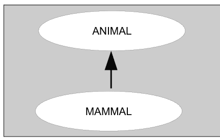
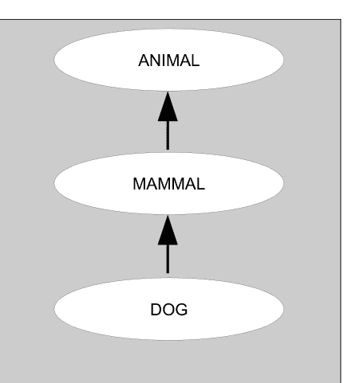
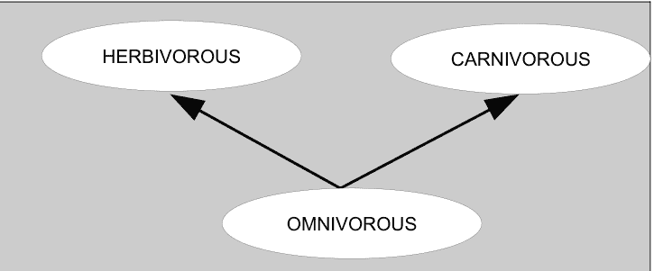
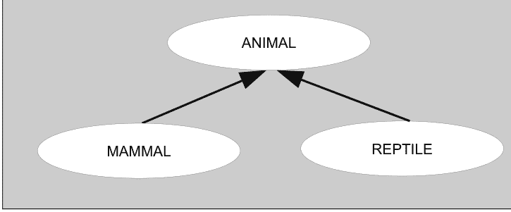
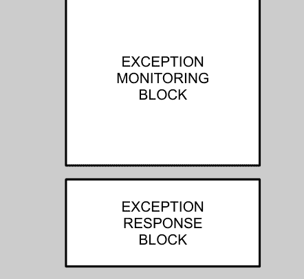
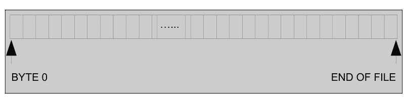
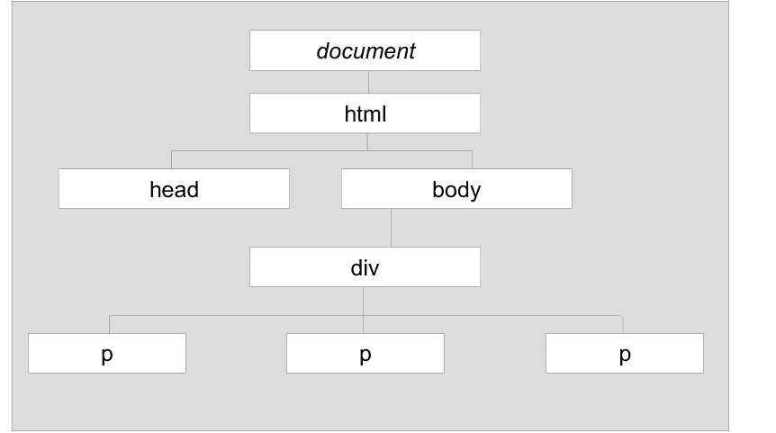
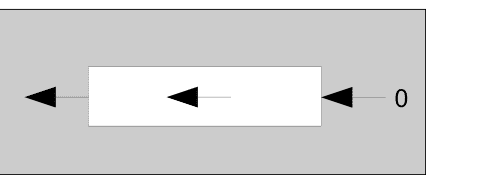
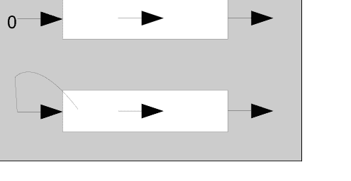

# 学习Python

B. Nagesh Rao

第二国际版

版权所有 © 2017-2021 CyberPlus Infotech Pvt. Ltd.

保留所有权利。未经出版商事先书面许可，不得以任何形式或任何方式复制、存储在检索系统中或传播本书的任何部分，除非在评论文章或评论中嵌入简短引用。

在编写本书时，我们已尽一切努力确保所提供信息的准确性。然而，本书所含信息按“原样”出售，不附带任何明示或暗示的保证。作者、出版商及其经销商和分销商均不对因本书直接或间接造成的任何损害或声称造成的损害负责。

出版者：

CyberPlus Infotech Pvt. Ltd.
32/5, 8th Main, 11th Cross,
Malleswaram, Bengaluru – 560 003.
印度。

www.cyberplusindia.com

献给我的**父母**，他们总是允许我走自己的路……

献给我视为编程导师的人：**彼得·诺顿！**
他的书籍和软件极其丰富且实用……

献给我的**老师们**，他们竭尽全力在我的生命中留下印记，
特别是我已故的第一位计算机科学老师 P. S. Maithily 女士，
她的鼓励和支持让我在编程方面得以出类拔萃……

献给我的**学生们**，他们让我体会到
我对他们的生活产生了影响的喜悦……

## 关于作者

**B. Nagesh Rao** 拥有超过20年的专业经验，是一名软件开发者、培训师、导师和企业家。他是**诺基亚**的首席工程师，也是架构团队的一员，其工作职责包括架构和开发软件解决方案、培训、辅导和指导。他不仅在那里设计和开发软件，还审查他人编写的代码并领导“整洁代码”运动。

他是**CyberPlus Infotech Pvt. Ltd.**的创始人，这是一家自2000年以来专注于开源技术的公司。他已开发了超过150个软件应用程序、实用程序、库和游戏。他指导了超过1000名IT专业人士和学生开发各种软件项目。他已举办了超过200批次的企业培训，并在超过25门课程中培训了超过6500名学员！他编写了几份课程材料，现在计划撰写几本书。

他说，他欣赏C语言的简洁性和全能性，C++对面向对象编程的支持，Java编码的便捷性和可维护性，以及Perl的简洁性！他补充说，Python之所以成为一门非常适合他的语言，是因为Python可以使用C/C++进行扩展，可以在JVM内运行并与Java通信，并且提供了Perl的简洁性而没有其晦涩难懂的特点！作为面向对象编程范式的忠实粉丝，他喜欢Python是完全面向对象的事实！

可以通过**nagesh.rao@cyberplusit.com**联系作者。

## 关于出版者

**CyberPlus Infotech Pvt. Ltd.**是一家成立于2000年的开源公司，总部位于印度的硅谷——班加罗尔！公司的主要活动是软件开发、企业培训和专业指导。

CyberPlus的团队已开发了近200个软件应用程序、实用程序和库。他们擅长为各种开源库开发面向对象的包装器，例如Textuality（用于文本用户界面开发的ncurses包装器）、GUICPP（用于GUI开发的GTK+包装器）和GLOO（用于3D图形编程和渲染的OpenGL包装器）。

CyberPlus的培训师已为印度的各种客户举办了超过200批次的企业培训，客户包括诺基亚（前身为诺基亚西门子网络，更早之前是西门子通信系统）、IBAB（生物信息学与应用生物技术研究所）、德尔福技术中心、OpenStream Technologies、阿尔卡特朗讯（现已被诺基亚收购）、Altiostar（前身为Radio Mobile Access）、威普罗科技、Comptel（现已被诺基亚收购）、三星印度、Indecomm、Unisys和Stryker India。

他们已就C、C++、STL、Java、UNIX/Linux、高级Linux、高级C、高级C++、设计模式、Perl、CGI、HTML、CSS、Javascript、XML、Python、数据结构、算法分析与设计、有限自动机与形式语言、Lex和Yacc、微处理器（8085和8086）、高级微处理器（80286到奔腾）、计算机图形学、OpenGL、Linux网络编程、SQL和MySQL、J2EE等主题开展过培训项目。

他们已指导专业人士和学生在包括威普罗科技、ISRO、诺基亚西门子网络和西门子信息系统有限公司在内的各个客户地点开发软件。

CyberPlus Infotech Pvt. Ltd.
32/5, 8th Main, 11th Cross,
Malleswaram, Bengaluru – 560 003.
印度。

**电子邮件：** info@cyberplusit.com
**www.cyberplusindia.com**

## 第一版前言

那是一见钟情，当时我只有14岁！

我一看到计算机工作就爱上了它们！我记得，这一切始于我们的学长们演示如何使用5¼英寸可启动软盘启动MS-DOS，而DOS启动后要做的第一件事就是询问当前日期和时间。它执行的验证让我大吃一惊。我有很多疑问：

它怎么知道我输入的是哪个数字？
它怎么知道连续输入1和2会组成12？
它怎么知道日、月、年的含义？
它怎么知道什么是有效日期，什么不是？
它怎么知道什么是闰年？并且闰年的二月有29天？
一个靠电运行的东西怎么可能有智能？

一个问题引出另一个问题，而那个问题的答案又引出另一个。这就是我编程之旅的开始！

我首先学习了BASIC，当我觉得它有些事情做不到时，我就会在BASIC程序中使用预汇编的汇编代码加载二进制指令！当时没有专家告诉我汇编语言编程不适合孩子！

随着时间的推移，我勉强学习了更多编程语言——有些是出于好奇，有些是出于被迫。我喜欢其中的大多数，喜欢其余的，但讨厌COBOL！我意识到学习编程语言是次要的；学习*编程*才是主要的！我扎实的编程基础使得学习更多编程语言变得像孩子一样简单。

我非常享受编程，以至于我可以连续几天不停地编码、编码、编码，只在吃饭、睡觉和其他真正重要的活动时才停下来！我记得多次问自己，“为什么我如此享受编程？”如果我没弄错的话，我确实找到了答案！

编程让我扮演了上帝！

通过编程，我可以赋予一台机器生命，它会像一个从不质疑的仆人一样，忠实、顺从、可靠、无私、正确、准确、快速、不知疲倦地执行我的命令！

我设计第一个编程语言时还不到16岁！从那以后，我发明并实现了如此多的自定义语言，坦率地说，我甚至无法全部回忆起来！这本书的存在实际上与我过去常常发明语言有关！

我对游戏的特别迷恋促使我指导学生使用我们在CyberPlus发明的游戏开发库用Java开发游戏。我发现Java代码过于冗长，于是决定发明一种专门用于编写和表达游戏逻辑的语言。我使用C++和Lex与Yacc开发了一个C++游戏引擎和一个游戏解释器，但后来我意识到我的游戏脚本看起来惊人地接近Python脚本！

后来，当我们在Java中开发一个游戏开发框架时，我意识到Python可以直接用于编写可以在JVM内运行的游戏脚本！

从青少年时期起，我就一直想分享我的知识。虽然我做了很多事情——从教朋友和同学、写文章、课程材料和实验手册——但我还有一个梦想有待实现：写书！这是我出版的第一本书，尽管我过去曾尝试写一本关于C和数据结构的书！

让我在这里坦诚相告：我在C、C++、Java和Perl等其他编程语言上花费的时间远多于在Python上。也许命中注定我出版的第一本书将是关于Python，而不是那些其他语言。但正如我之前指出的，编程不同于编程语言，我能够快速学习和理解Python的细微差别，是因为我对这些其他语言的编程非常了解！

我深刻理解编程概念和语言的证明是参与者在我培训项目后给出的反馈——即使是那些事先了解该语言的人也觉得他们在我的培训中学到了许多新东西！许多新手也赞赏向他们传授概念的方式。他们觉得我能够以简单的方式解释高度技术性的概念！正是这种我可以做出贡献的信念促使我写了这本书，尽管市面上有许多书籍和材料以十几种不同的方式教授Python！

**我真诚地希望这本书能实现我的期望：**新手能够*很好地*学习Python，而有经验的程序员能够*快速地*学习Python！

虽然我生命中有许多值得感谢的人，许多他人的贡献间接地使这本书成为可能，但我只会列出那些直接负责使这本书成为现在样子的人！

我感谢Sumesh Kumar担任第一位审稿人。我感激他总是渴望并非常乐意以任何可能的方式提供帮助。

我感谢Santosh Manoharan的所有投入和批判性分析。我钦佩他在审查中对细节的关注。

# 第二版前言

自从我撰写《Learning Python》第一版以来，这真是一段令人惊叹的旅程！围绕这本书，发生了许多完全出乎意料的事情！让我分享一些这样的经历：

原本计划先推出国际版，如果需要再推出印度版。但最终我们先推出了印度版，之后才是国际版！这背后有原因，但大多数事件都是自发发生的，迫使我们改变了计划。

我最初的目标群体是编程社区以及我培训过的庞大网络中的学生们。我曾在各种技术领域培训过的人们，如今在不同地方担任不同职务。我想他们会很乐意有机会以他们喜爱的、我的风格来学习这门“新”编程语言！当然，我以非常简单的方式撰写了这本书，即使是学龄儿童也能阅读、理解和应用。但我没有预料到的是，这本书在工程学院中被大规模推广，而Python当时刚刚被引入课程大纲！

在为在职专业人士举办Python研讨会的过程中，我偶然联系上了我的一位讲师，**Purushotham B. V. 先生**。他在工程学习期间教过我多门课程，我们彼此都非常尊重。在他的帮助和支持下，我得以接触卡纳塔克邦大约50所工程学院。他的商业伙伴，**K. B. Shadaksharappa 教授**，此前是班加罗尔PESIT计算机科学与工程系和信息技术工程系的系主任，此外还有在工业界工作的经验。他也积极协助我这项工作，并陪同我前往多所学院。我感谢他们两位提供的所有帮助，以及他们为在工程学院推广这本书所投入的时间和精力。

与学院的这种联系，使我得以参与在各学院举办的一些“Python认知研讨会”，而这最终导致我被任命为安立大学信息技术工程课程的**研究委员会成员**！我一直坚持认为，C语言绝对不是初学者的正确选择，Python应该作为工程一年级的通用编程语言被引入！

特别感谢**Chethana R. Prasad 女士**，十多年来她总是在许多方面帮助我！就本书而言，她帮助联系学院、在学院举办各种活动，当然还有供应书籍。在这一页里，我无法充分表达对她的感谢！撰写这样一本书绝非易事，她的鼓励和支持确保我持续投入必要的努力，将这本书呈现给世界！同样，我也要感谢**Sumesh Kumar**的所有批判性评论和建议。**Sumesh Kumar**、**Ganapati Hegde** 和 **Roopa Rao** 帮助将前一版改进到了目前的形式。

非常感谢**Nisha Choudhary 教授**，她是班加罗尔MS工程学院计算机科学与工程系的助理教授，她为本书末尾添加的VTU Python模拟试卷进行了设计。这将帮助学生了解考试中可能出现的内容，并帮助他们取得更好的成绩。

一些学院已经将本书第一版定为Python课程的推荐教材，我们感谢这些学院！他们不仅做出了在各自课程大纲中引入Python的正确决定，还评估了我们的书，并决定这应该是他们学生需要使用的书！

由于我们不知何故与工程学院建立了联系，并且他们的学生成为了我们的客户，我们决定扩展本书并增加额外章节，使其完全涵盖VTU教学大纲。这些额外章节是扩展内容，帮助学生应用Python解决常见的现实世界问题。新增的章节包括正则表达式、数据库访问以及解析HTML、XML和JSON。我希望读者发现第二版比第一版更加实用，并能够用Python完成更多事情！

与本书第一版一样，我的期望保持不变：**新手能够*很好地*学习Python，而有经验的程序员能够*快速地*学习Python！**

# 第一版评论

这是一本精彩的书，我非常喜欢！
作者不遗余力地涵盖每个概念，通过推理引入概念，接着是示例程序，最后是其输出。

这是一份极好的课程材料，如果你是初学者，它不仅能让你自信地入门，还能让概念深入人心，拓宽有经验程序员的知识面！

我看过其他一些Python快速入门书籍，它们假设读者已具备某些概念，但这位作者确保他不会跳过任何内容！如果你想回头重读任何章节，每一章的内容都非常清晰。

最后但同样重要的是，它还涉及各种平台的安装和设置，我觉得这非常有帮助。我感觉自己就像在参加一个实践课程，有导师在旁边指导！:)

-Bhavana Ananda
牛津大学软件开发者

祝贺作者和团队成员，他们付出了所有努力，使《Learning Python》这本书取得了成功。

Python编程书籍对学生和教职员工来说都非常简单且用户友好。它包含基础的介绍性章节，旨在展示Python与其他语言的区别。它还介绍了如何使用IDLE并运行“Hello World”类型的程序。作者解释了Python在运行前如何“编译”源代码。解释了语法错误和运行时错误。

早期章节介绍了Python编码。学习注释、内置函数、数据类型、算术表达式、字符串、控制语句以及更多主题。还介绍了函数和模块，以及列表、元组、字典、文件等数据结构和其他主题。

这本书确实非常好。我觉得它很好地涵盖了所有主题。

-Dr. Manjula Sanjay Koti
教授兼系主任，MCA系，
VTU考试委员会成员，
Dayananda Sagar技术与管理学院

书中的内容非常好。质量优秀。

-Manjunath N.,
计算机科学与工程系系主任，
R. L. Jalappa技术学院

Nagesh Rao所著的《Learning Python》是一本结构良好的初学者书籍。章节末尾的示例程序让学习者接触到实际编程。第10章“实用Python”是本书的亮点，展示了各种数据结构的实现。总的来说，这本书语言简单，非常适合Python学习者。

-Vindhya N. S.
助理教授（计算机科学与工程），
Dayananda Sagar技术与管理学院

B. Nagesh Rao先生所著的《Learning Python》是一本写得好、组织有序、内容连贯的Python主题书籍。初学者和中级Python程序员都可以参考。本书的主题内容逻辑清晰、阐述详尽。从Python基础、特性、安装、数据类型、变量、输入输出、控制结构，到派生数据类型如列表、元组、字典、集合、字符串，都通过大量示例进行了详细解释。函数、数据结构如栈、队列、矩阵也进行了适当讨论。面向对象编程原则通过示例得到了很好的涵盖。本书还很好地涵盖了Python中的异常处理和文件处理，并包含一个关于模块的介绍性章节。

-Prof. Sunilkumar S. Manvi
校长，
Reva技术与管理学院
兼主任，
Reva大学计算与信息技术学院

《Learning Python》让我如此轻松地深入Python的世界，以至于我几乎没有意识到自己在一周内获取了多少知识。这本书简直就是大师课，作者充满好奇心的头脑在以最清晰的方式表达复杂和最微妙的细节方面表现得非常出色。它完全公正地对待了所有打算将Python作为主要技能的个人。我谦卑而真诚地感谢作者出版这第一版，并祝愿他在职业生涯中一切顺利。

-Sumesh Kumar
Oracle

无可挑剔！！困难的事情变得易于学习，而且几乎不可能忘记！组织和结构非常好。学习Python乃至编程本身的绝佳方式。典型的B. Nagesh Rao风格——无需多言。他本人就是描述这本书的最佳形容词。

-Roopa Deepak
自由培训师

这是想学习Python的人的最佳书籍。章节结构合理，任何人都能学会。Nagesh老师确保所有内容都以恰当的方式涵盖，他标志性的教学风格显而易见。我真心喜欢这本书。

-Naveen Kumar H.
技术测试主管，Infosys

我有幸认识Nagesh Rao超过15年，从大学时代到工作期间。通过学习他的编程和Linux课程书籍，我成为了一名更好的软件工程师，至今仍将它们作为工作参考资料。看到他出版的Python书籍，我感到非常高兴。

这本书《Learning Python》写得非常出色，既能满足新手程序员的需求，也能满足有经验的程序员。几年前我曾用Python写过脚本，但因为只是为短暂的工作临时学习，所以没有打好基础。但现在读完这本书后，我对基础知识有了信心，并开始使用更多Python风格的东西，比如列表推导式。我喜欢整本书围绕精彩简短示例展开的方式，使其读起来非常有趣和愉快。

我开始准备Python面试，但来自系统领域，我写程序时还是像C程序员一样用Python。我没有时间为了面试专门去读一本Python书。但多亏了这本书，我能快速阅读并开始以更Python化的方式编程，面试时也更加流利。

总的来说，我非常享受这本书，并期待阅读这位伟大而亲爱的老师的更多版本和书籍。

- Santosh Manoharan
软件工程师

这本书非常好，易于理解，你几乎涵盖了从基础到所有的主题。

-Nisha Choudhary
助理教授（计算机科学与工程），
M. S. 工程学院

这本书对初学者学习Python和有经验者深入了解都非常有用。此外，你还可以学习如何利用Python中的资源快速开发应用程序。我参加了一个基于这本书的4天培训项目，能够非常高效地开发中小型程序。我欣赏作者在Python方面的知识以及他的呈现方式。

-Prof. K. B. Shadaksharappa
前系主任（计算机科学与信息系统系）
PES理工学院
（现PES大学）

# 也请看看这些：

**书籍网站：** www.learningpython.in
**我们的网站：** www.cyberplusindia.com
**我们的博客：** www.cyberplusindia.com/blog

# 第一章 引言

在本章中，你将能够：

- [x] 弄清楚为什么这是你学习Python的最佳书籍
- [x] 在你的计算机上安装Python，无论你使用的是Windows还是Linux
- [x] 比较文本编辑器和IDE，并为你选择合适的开发环境
- [x] 能够启动Python解释器并退出它

# 引言

## 1.1 关于本书

无论你是编程新手还是对Python陌生的资深专业人士，这本书都是为你设计的！

以下是本书的十大显著特点，使其脱颖而出并对你特别有价值：

1. **本书起步缓慢！** 基本概念以温和的方式教授，以确保你打好基本概念的基础！
2. **本书组织良好！** 章节、标题、子标题和章节内容都经过精心规划，让你能逐章攻克Python！
3. **本书互动式教学！** 每当教授一个新概念时，紧接着就有代码，以便你理解它在Python解释器中的样子！
4. **即使你无法实践，本书也能教学！** 我们不仅在教授概念后立即展示代码，还提供来自真实Python会话的输出，让你可以想象当你输入一段代码时Python的反应！
5. **本书教授良好的编程实践！** 学习Python很重要，但像专业人士一样编码同样重要。虽然从新手到专业人士肯定需要一点时间，但我们向你展示最佳实践和陷阱，这将加速你的旅程！
6. **本书展示解决实际问题的程序！** 当需要应用Python时，我们向你展示建设性的程序，演示如何应用Python概念！
7. **我们分析每一行代码！** 所有需要分析的内容都会被分析。代码片段和程序之后是输出，然后是分析！
8. **我们将Python与其他编程语言进行比较！** 为了那些已经了解C/C++、Java或Perl等其他编程语言的读者的利益，我们提供帮助他们更快迁移到Python的技巧。这些技巧放在单独的框中，以确保不会干扰那些不熟悉这些语言的读者！
9. **我们筛选了内容！** 虽然这可能看起来不利或违反直觉，但我们相信详细呈现最重要的概念，甚至可能跳过一些你可以没有的概念！如果愿意，可以称之为80/20法则——我们决定详细呈现那些你将使用80%时间的20%功能！
10. **每个标题和子标题都是基于需求的！** 我们解释新概念的风格是首先建立需求。我们相信这使学习者更容易理解他们正在学习的内容以及为什么学习！

*学习愉快！*

## 1.2 关于Python

Python是一种广泛使用的高级、通用、解释型、动态、面向对象的编程语言。其编程风格强调代码可读性，其语法允许程序员用比C++和Java等语言少得多的行数编写逻辑！

它是一种相当古老的语言，由Guido Van Rossum在1980年代末创建，当时他正在Amoeba分布式操作系统组工作，并想使用像ABC这样的解释型语言来访问Amoeba系统调用。他决定创建一种可扩展的语言，这导致了一种新的编程语言的设计，后来被命名为Python。

虽然大多数人最初可能认为“Python”这个名字源自爬行动物，但它实际上取自七十年代末的一个喜剧系列《蒙提·派森的飞行马戏团》。

设计始于1980年代末，并于1991年2月首次发布。Python 2.0于2000年10月16日发布，具有许多主要新功能，如循环检测垃圾收集器和Unicode支持。随着这次发布，开发模式发生了变化，变得更加透明和社区支持。

Python 3.0（在其早期开发中通常被称为Python 3000或py3k）是一个主要的、向后不兼容的版本，于2008年12月3日在经过长时间测试后发布。它的许多主要功能已被向后移植到向后兼容的Python 2.6.x和2.7.x版本系列。

## 1.3 安装Python

从Python网站下载时，目前最新的3.x系列和2.x系列都可用，因为旧版本的Python仍在使用。除非你有充分的理由反其道而行之，否则始终下载那里列出的最新版本的Python。**本书专注于Python 3.x，它在许多方面与Python 2.x不同。**

### 1.3.1 在Windows上安装Python

从官方网站下载最新版本的Python：https://www.python.org/downloads/windows/。

Windows版本以MSI包提供。要手动安装，只需双击该文件。

根据设计，Python安装到一个嵌入版本号的目录中，例如Python版本2.7将安装在`C:\Python27\`，这样你可以在同一系统上拥有多个版本的Python而不会冲突。当然，只有一个解释器可以是Python文件类型的默认应用程序。它也不会自动修改`PATH`环境变量，因此你始终可以控制运行哪个Python副本。

每次输入Python解释器的完整路径名很快就会变得繁琐，因此将默认Python版本的目录添加到`PATH`中。假设你的Python安装在`C:\Python36\`，将其添加到你的`PATH`：

```
C:\Python36\;C:\Python36\Scripts
```

你不需要安装或配置任何其他东西来使用Python。

### 1.3.2 在Linux上安装Python

Python在大多数Linux发行版上预装，在其他所有发行版上都作为软件包提供。但是，你可能想使用的某些功能在你的发行版捆绑的版本中不可用。为此，你可以从源代码编译最新版本的Python。请按照以下步骤操作：

从www.python.org/downloads/release下载所需的Python源代码，作为“Gzipped source tarball”。你可以使用网络浏览器或使用内置的`wget`实用程序来完成。如果你计划使用`wget`实用程序，可以使用浏览器访问上述网站以确定可用的最新版本。我们假设版本为3.5.2：

```
$ wget https://www.python.org/ftp/python/3.5.2/Python-3.5.2.tgz
Resolving www.python.org... done.
Connecting to www.python.org[194.109.137.226]:80... connected.
HTTP request sent, awaiting response... 200 OK
Length: 8,436,880 [application/x-tar]
...
```

解压下载的文件并切换到创建的目录：

## 1. 简介

```
$ tar -zxvf Python-3.5.2.tgz
$ cd Python-3.5.2
```

下一步是配置安装。根据你的需求，有几种选项。如果你想让这个版本的Python为系统的所有用户安装（并且你通过`su`或`sudo`拥有root权限），请运行configure：

```
$ ./configure
```

上述命令会将Python配置为安装在`/usr/local`目录。如果你没有root权限，或者希望为当前用户进行本地安装，请按如下方式运行configure：

```
$ ./configure -prefix=/some/other/directory
```

通常在这种情况下，指定的目录会是当前用户主目录下的一个子目录。以下是上述命令实际使用的一个示例：

```
$ ./configure -prefix=$HOME/py-352
```

上述程序会将Python配置为安装在当前用户主目录下的`py-352`目录中。
配置完成后，运行make命令：

```
$ make
```

最后一步是将最终文件复制到目标位置。如果你选择了全局安装，请以root身份运行`make install`：

```
$ sudo make install
```

Python解释器现在将对所有用户可用。
如果你选择了在当前用户主目录下的本地目录中安装，请在没有root权限的情况下运行`make install`：

```
$ make install
```

Python解释器现在将位于安装目录内的bin子目录中。考虑到我们本地目录"$HOME/py-352"的例子，解释器现在将位于'$HOME/py-352/bin/python3'。你可以将该目录添加到PATH变量中，这样以后只需输入python3即可。为此，请将以下行添加到你的~/.bashrc文件中：

```
PATH="$PATH:~/py-352/bin"
```

## 1.4 Python解释器

假设你已经按照第1.3节的建议更改了PATH环境变量，你可以通过输入以下命令启动Python 3.x解释器：

```
python3
```

你将看到以下解释器界面：

```
Python 3.5.2 (default, Sep 14 2016, 11:28:32)
[GCC 6.2.1 20160901 (Red Hat 6.2.1-1)] on linux
Type "help", "copyright", "credits" or "license" for more information.
>>>
```

">>>"是**Python提示符**（技术上是Python主提示符）——表示Python解释器已准备好接受你的命令。你可以在此输入任何有效的Python语句或表达式，结果会立即显示。我们将在介绍新概念时使用此功能快速测试。当然，对于较大的代码块，我们将更倾向于使用完整的Python脚本。

让我们首先尝试在Python提示符下输入表达式：

```
>>> 2+3
5
>>>
```

**观察：**

1. `2+3`是Python中的一个有效表达式。如果它是无效表达式，我们会收到错误信息。
2. Python解释器通过打印表达式的值来响应，在本例中是5。
3. 完成表达式后，Python解释器再次显示Python提示符，等待我们的下一个命令。

让我们也输入一个有效的Python语句，看看会发生什么：

```
>>> import math
>>>
```

**观察：**

1. 语句"`import math`"是Python中的一个有效语句，意味着我们希望导入`math`模块。如果该语句无效，我们会收到错误信息。
2. 有效的Python语句会立即由Python解释器执行，尽管其效果可能并不总是可见的。Python解释器仅在语句实际上是一个表达式（在这种情况下，会打印表达式的值）或者我们明确发出Python语句来打印某些内容（例如使用`print()`函数，我们稍后会看到）时，才会打印语句的结果。

既然我们知道如何在Python解释器上工作，让我们也学习一下完成后如何退出解释器。在Python主提示符下输入文件结束字符（Unix/Linux上是Control-D，Windows上是Control-Z）会导致解释器退出。你也可以通过输入`quit()`命令退出解释器：

```
>>> quit()
```

解释器的行编辑功能包括以下内容（前提是系统支持）：

1. **交互式编辑** – 在提交之前，能够使用光标键、退格键和删除键编辑当前行内容。
2. **历史替换** – 能够使用上下光标键重现先前输入的行。
3. **代码补全** – 当用户按下Tab键时，能够补全当前单词（或者在有多种可能性时提供选项列表）。

解释器的操作方式类似于Unix shell：当调用时标准输入连接到tty设备，它会交互式地读取和执行命令；当调用时带有文件名参数或文件作为标准输入，它会从该文件读取并执行脚本。

启动解释器的第二种方式是：

```
python -c command [arg] ...
```

这会启动Python解释器，执行command中的语句，类似于Unix shell的-c选项。由于Python语句通常包含空格或对shell有特殊意义的其他字符，通常建议用引号（最好是单引号）将command括起来。

这是一个例子：

```
$ python3 -c 'a=2+3; print(a)'
5
```

**观察：**

1. 我们给出了2个语句：`a=2+3`和`print(a)`。Python理解它们是独立的语句，因为它们之间有分号（`;`）。它们之间的空格只是为了可读性。
2. 由于shell可能对Python语句中的某些特殊字符（如分号和空格）有问题，我们倾向于将语句集括在单引号内，shell不会处理其内容。
3. 执行完语句集后，Python解释器会自动终止。

## 1.5 Python编辑器和IDE

### 1.5.1 编辑器

有许多编辑器可供用户编写Python代码。最受欢迎的、专门为满足Python程序员需求而设计的编辑器有：

1. **Sublime Text** – 支持Linux、Windows、Mac OS X。（网站：https://www.sublimetext.com/3）
2. **SPE (Stani's Python Editor)** – 支持Linux、Windows、Mac OS X（网站：https://sourceforge.net/projects/spe/）
3. **SciTE** - 支持Windows和Linux（网站：http://www.scintilla.org/SciTEDownload.html）
4. **Geany** – 支持Windows、Linux、MAC OS X（网站：https://www.geany.org/Download/Releases）

除了上述编辑器，vim和emacs也广泛用于Linux上的Python编程。

### 1.5.2 IDE

最适合Python的IDE有：

1. **PyCharm** – 支持Windows、Linux、MAC OS X（网站：https://www.jetbrains.com/pycharm/download/）
2. **Wing IDE** - 支持Windows、Linux、MAC OS X（网站：http://www.wingware.com/downloads）
3. **Pyzo** – 支持Windows、Linux、MAC OS X（网站：http://test.pyzo.org/downloads.html）
4. **PyScripter** – 仅支持Windows（网站：https://sourceforge.net/projects/pyscripter/）

不希望切换到其他IDE的Eclipse用户，可以使用PyDEV插件来获得Python支持。

## 1.6 运行Python脚本

第1.4节介绍了你可以直接从解释器输入Python代码并逐行执行。然而，对于较大的代码块，最好将指令保存为Python脚本（扩展名为`.py`的文件），并让解释器将其作为一个单元执行。有两种方法可以做到：

1. **将脚本提供给Python解释器。** 在这种方法中，你调用python解释器并将脚本的文件名（如果脚本不在当前工作目录中，则为路径名）作为参数传递。例如，要运行脚本`test.py`，命令可能是`python test.py`。
2. **直接执行脚本。** 这种技术在UNIX/Linux世界中尤其常见，并且被认为是一种更好的技术！在这种方法中，我们授予Python脚本执行权限，确保Python脚本的第一行选择了Python解释器（稍后会详细介绍），然后通过提供其路径名直接执行脚本。脚本的第一行脚本应以“#”开头，后紧跟Python解释器的路径名。例如，脚本的第一行可以是“#!/usr/bin/python”。

> **注意：**
即使我们使用第一种执行方式，保留方法2中所示的第一行也没有坏处，因为它只会被视为注释！

## 1.7 问题

1.  列出Python的主要特点。
2.  Python是如何演变的？简要描述其从早期到现在的开发历程。
3.  你将如何在以下平台上安装Python？
    -   Windows
    -   Linux
4.  假设你没有超级用户权限且不打算全局安装Python，你有什么替代方案来本地安装Python？
5.  假设你已安装了默认的Python解释器（例如 /usr/bin/python），并且你希望将Python升级到更新的版本，你将如何设置？是覆盖现有的Python还是将其作为独立实体安装更可取？
6.  你将如何确定当前使用的Python版本？
7.  在Windows和Linux中，你如何退出Python终端？两个平台是否有通用的退出方式？如果有，那是什么？
8.  查看 `python --help` 的输出时，你认为哪些选项最有用？
9.  在什么阶段你会倾向于从Python解释器切换到编写完整的程序？
10.  你何时会想在Python解释器中使用 `-c` 选项？

## 总结

-   Python是可移植的，Python脚本在Windows和Linux上都能同样良好地运行。
-   Python解释器会话是快速输入代码、检查结果和学习的最佳方式！
-   较大的程序需要作为单独的Python脚本编写并执行。这将使我们能够在需要时重用该程序。


# 2 Python基础

> **在本章中，你将能够：**
>
> -   [x] 理解语句如何构成Python脚本。
> -   [x] 使用Python的基本数据类型并对其进行操作。
> -   [x] 理解如何在Python中使用变量，并区分引用和对象。
> -   [x] 从用户获取输入并生成格式化输出。

## 2.1 我们的第一个Python脚本

任何语言的第一个程序通常都是“Hello World”程序，我们也不例外！这是我们的第一个程序，执行时会打印 `Hello World`：

```python
# HelloWorld.py
print("Hello World")
```

**输出：**

```
Hello World
```

在你最喜欢的文本编辑器或IDE中输入上述程序（选择帮助请参见第1.5节）并执行它。

> **注意：**
> 当然，不要在你的程序中输入行号（“1.”）！它们仅为你的参考而提供，在我们讨论较大的程序时会有所帮助。

如果你已经执行完该脚本，让我们讨论一些要点：

### 2.1.1 语句和行

**语句**是给解释器的逻辑指令单元。我们的 `HelloWorld.py` 程序仅由1条语句组成。因此，程序是语句的完整集合。

**行**是以换行符终止的字符序列。我们的 `HelloWorld.py` 程序是一个单行程序。因此，我们的程序既是一个单行程序，也只包含一条语句。

在大多数流行的编程语言中，语句以分号结尾，但在Python中并非如此。对于不想深入思考的简单程序员来说，这意味着你的生活变得更加方便了！你只需输入语句，而无需担心终止它们！但如果你是那种更爱探究的人，想知道为什么Python是这样，或者为什么其他语言不是这样，那么让我们继续理解。

语句和行在Python中是相互关联的。

#### 2.1.1.1 每行一条语句

在Python中，一行通常被认为承载1条语句。因此，只要每行有1条语句，就不需要在行尾使用分号。

> **致C/C++/Java程序员：**
>
> 像C、C++和Java这样的编程语言使用分号（;）作为**语句终止符**，这意味着分号标记了语句的结束。这意味着除非看到终止分号，否则语句不被认为是完整的，因此允许语句根据需要跨越多行。

Python依赖缩进规则来决定哪些语句属于哪个块（将在第3.2.1节中介绍），并使用换行符作为语句终止符。换句话说，Python中的语句被认为在同一行终止。

让我们重新审视 `HelloWorld.py` 并编写多条语句——当然，每行一条。

```python
# HelloWorld2.py
print("Hello World")
print("Hi from India!")
```

**输出：**

```
Hello World
Hi from India!
```

#### 2.1.1.2 每行多条语句

Python使用分号作为**语句分隔符**，其行为如下所述：

作为语句分隔符，分号的作用是确保可以在一行中给出多条语句，并且由于分号的分隔，翻译器能够将它们区分为独立的语句。

> **致Perl/Shell脚本编写者：**
>
> Perl和Linux中的shell以相同的方式使用分号，如果程序员想在同一行中发出多条语句/命令，他们必须使用分号作为分隔符！

让我们重新审视 `HelloWorld2.py` 并在单行中编写多条语句。

```python
# HelloWorld3.py
print("Hello World"); print("Hi from India!")
```

**输出：**

```
Hello World
Hi from India!
```

> **注意：**
> 以分号结束语句没有坏处，尽管既不需要也不推荐。

#### 2.1.1.3 一条语句跨越多行

如果一条特定的语句很长，我们希望将其分成多行怎么办？
如果需要，单条语句可以跨越多行，但需要将此信息传达给Python解释器。任何要在下一行继续的行都需要以反斜杠（\）结尾。因此，如果一条语句必须跨越4行，例如，前3行将以反斜杠结尾，每个反斜杠表示该语句继续到下一行，但第4行不会以反斜杠结尾，从而终止该语句。
让我们故意使用多行重写HelloWorld3.py。

```python
# HelloWorld4.py
print("Hello\nWorld")
print("Hi from\nIndia!")
```

**输出：**

```
Hello World
Hi from India!
```

### 2.1.2 引号

Python中的字符串用引号括起来，但与大多数其他编程语言不同，Python不区分单引号和双引号。

#### 2.1.2.1 单引号

字符串完全可以包含在单引号中。这样的字符串可以轻松包含双引号而不会有任何问题，但字符串内的任何单引号字符都需要通过在其前面加上反斜杠进行转义。

这是HelloWorld.py的另一个版本：

```python
# HelloWorld5.py
print('Hello World')
print('"Hi" from \'India\'!')
```

**输出：**

```
Hello World
"Hi" from 'India'!
```

#### 2.1.2.2 双引号

就像单引号一样，字符串也可以包含在双引号中。这样的字符串可以轻松包含单引号，但字符串内的任何双引号字符都需要通过在其前面加上反斜杠进行转义。

这是HelloWorld5.py的另一个版本：

```python
# HelloWorld6.py
print("Hello World")
print("'Hi' from \"India\"!")
```

**输出：**

```
Hello World
'Hi' from "India"!
```

#### 2.1.2.3 三引号

Python还支持一种特殊的引号，由3个单引号（'''）或3个双引号（"""）组成。三引号允许字符串跨越多行。

## 2. Python 基础

此外，单引号和双引号可以在三引号内自由使用——当然，你不能连续使用三个引号来开始字符串，否则它会被视为三引号并终止字符串。如果确实需要，可以对单引号和双引号进行转义。

以下是改进后的程序：

```
HelloWorld7.py

1. print("""Hello World
2. 'Hi' from "India"!""")
```

输出：

```
Hello World
'Hi' from "India"!
```

三引号与单引号和双引号在以下方面有所不同：

1.  它们允许字符串跨越多行
2.  它们不需要在每行末尾使用反斜杠来表示续行
3.  它们允许嵌入单引号和双引号而无需转义（除非连续出现三个引号，此时可能需要转义）
4.  它们保留字符串中的换行符（存在于每行末尾）
5.  它们可以有特殊用途——即提供文档（在第 10.15 节中介绍）

## 2.2 注释

注释是添加在程序中的文本片段，用于提高可读性。注释是不可执行的，解释器会忽略其内容。

Python 中的注释由井号（#）表示——从井号到该行末尾的所有内容都被视为注释。

以下是使用注释的 HelloWorld.py 的另一个版本：

```
HelloWorld8.py

1.  #打印 "Hello World" 的脚本
2.  #这两行是注释
3.  print("Hello World") #再加一个注释
4.  print("Hi from India!")
```

输出：

```
Hello World
Hi from India!
```

优秀的程序员总是使用注释来记录代码为什么这样做，或者记录那些从代码中难以看出或代码中未体现的事实。当然，代码应该始终以清晰说明其功能的方式编写。有时也会添加注释来总结一个代码块的功能——这里的代码块定义也扩展到函数、类和模块！

有时，注释需要多行，我们最终会使用许多井号。使用三引号的概念可以更简单地实现这样的注释。三引号本身不是注释；它们在技术上是字符串——但字符串本身不会执行任何操作，最终可以表现得像注释！

第 10.15 节将介绍一个有趣的注释应用，用于记录程序元素，通过三引号字符串实现！

以下是演示两种方法的版本：

```
HelloWorld9.py

1.  # 你好！
2.  # 这个程序打印 Hello World
3.  # 希望你喜欢它！
4.  # ==========================
5.  #
6.  print("Hello World")
7.  """
8.  ==========================
9.  你好！
10. 这个程序打印了 Hello World
11. 你运行它了吗？
12. """
```

输出：

```
Hello World
```

## 2.3 基本数据类型

学习编程语言首先要了解的是它提供了哪些数据类型。这将帮助我们了解可以表示什么以及允许哪些操作。Python 作为动态脚本语言，不需要（也不允许）在使用变量之前声明其特定类型。作为一种强大的面向对象语言，所有数据都被视为对象，因此所有数据类型都是类（关于对象、类和面向对象编程的更多细节在第 12 节中介绍）。

当变量存储一个值时，它实际上引用的是一个特定类型的对象。任何表达式的类型都可以使用内置函数 `type()` 找出。这现在是一个有用的学习工具，以后也是一个有用的调试工具。

我们将在以下章节中介绍以下数据类型：

1.  整数（`int`）
2.  实数（`float`）
3.  复数（`complex`）
4.  字符串（`str`）
5.  布尔值（`bool`）

这些数据类型的更详细介绍可在第 20.1 节中找到。

### 2.3.1 `int` 类型

最简单的数值数据类型是 `int`。此类型的对象表示整数（正数和负数），不能存储小数部分。在 Python 中，范围不受限制，我们可以存储非常大的整数，而无需担心 Python 是否能够处理！

#### 2.3.1.1 `int` 类型的字面量

-   任何仅由数字组成（可选前导符号）的字面量常量都被视为 `int` 常量。
-   任何仅由数字组成且前导为 `0o`（其前可选前导符号）的字面量常量被视为 `int` 类型的八进制常量。此类常量不能包含数字 8 和 9（因为它们在八进制中是非法的）。
-   任何仅由数字和字母 a-f（大写或小写）组成且前导为 0x 或 0X（其前可选前导符号）的字面量常量被视为 `int` 类型的十六进制常量。

**示例：**

```
>>> 15
15
>>> -25 #负整数
-25
>>> 0o15 #八进制整数
13
>>> -0o15 #负八进制整数
-13
>>> 0o08 #非法的八进制整数
  File "<stdin>", line 1
    0o08
    ^
SyntaxError: invalid syntax
>>> 0x12abc4 #十六进制整数
1223620
>>> -0X12aBc4 #大小写混合的负十六进制整数
-1223620
>>>
```

> **注意：**
任何包含 Python 提示符 `>>>` 的输出（如上例所示）都意味着这是交互式 Python 会话的快照，而不是 Python 脚本的执行。交互式 Python 会话帮助我们即时获得输出，因为每条语句都会立即处理并显示其结果。这可以作为一个学习工具。在此类示例中，我们需要输入的内容以粗体显示，其余部分由 Python 解释器打印。当我们需要将多个语句组合在一起以完成更复杂的任务时，我们将转而编写 Python 脚本。有关如何启动 Python 解释器的信息，请参见第 1.4 节。

`int` 类型的对象也可以使用 `int` 类的显式构造函数创建。这当然也类似于用于类型转换的函数调用。因此，以下两条语句在功能上是相同的：

**示例：**

```
x = 2
x = int(2)
```

此内置函数也有助于将其他类型（如 `float` 和 `string`）转换为 `int` 类型：

```
>>> int(23.99)
23
>>> int("25")
25
```

`int` 类的默认构造函数将创建一个值为 0 的整数，并提供了一个 2 参数构造函数，用于将特定进制的整数字符串表示形式转换为普通整数。构造函数具有以下声明：

**语法：**

```
int(x=0)
int(str_x, base=10)
```

以下是一些示例：

```
>>> int()
0
>>> int(25)
25
>>> int("25")
25
>>> int("25",8)
21
```

#### 2.3.1.2 `int` 类型的操作

下表列出了可用于 `int` 类型数据项的算术运算符：

| 表达式 | 结果 | 含义 |
| :--- | :--- | :--- |
| 2 ** 3 | 8 | 2 的 3 次方 |
| 2 * 3 | 6 | 乘法 |
| 10 / 3 | 3.3333333333333335 | 除法 |
| 10 // 3 | 3 | 整数除法 |
| 10 % 3 | 1 | 取模/余数 |
| 2 + 3 | 5 | 加法 |
| 2 - 3 | -1 | 减法 |

*表 1：int 上的算术运算*

> **注意：**
如果上面的示例 “10/3” 的结果是 “3”，那么你使用的是旧版本的 Python（低于 3.x）。在这种情况下，虽然你可以继续通过本书学习 Python，但建议你将 Python 升级到最新版本以获得最大收益。

以下数学函数可用于 `int` 类型：

| 表达式 | 结果 | 含义 |
| :--- | :--- | :--- |
| `pow(2, 3)` | 8 | 2 的 3 次方 |
| `divmod(10, 3)` | (3, 1) | 一个包含整数除法商和余数的元组。元组将在第 5 节中介绍 |
| `abs(-10)` | 10 | 绝对值 |
| `math.factorial(5)` | 120 | 阶乘 |

**表 2：操作 int 的数学函数**

> **注意：**
当你遇到像 “`math.factorial()`” 这样的函数时，它表示我们指的是 `math` 模块的 `factorial()` 函数。为了使其工作，必须在会话/脚本中调用该模块的任何函数之前执行一次 `import math` 语句。

`int` 类型的对象可以使用这些内置函数转换为其他进制：

| 表达式 | 结果 | 含义 |
| :--- | :--- | :--- |
| `bin(12)` | 0b1100 | 将整数转换为二进制 |
| `oct(12)` | 0o14 | 将整数转换为八进制 |
| `hex(12)` | 0xc | 将整数转换为十六进制 |

**表 3：操作 int 的进制转换函数**

以下位运算符可用于 `int` 类型（如果你想学习位操作，请查看第 20.2 节）：

## 2. Python 基础

| 表达式 | 结果 | 含义 |
| :--- | :--- | :--- |
| 2 & 3 | 2 | 按位与 |
| 2 \| 3 | 3 | 按位或 |
| 2 ^ 3 | 1 | 按位异或 |
| ~2 | -3 | 按位取反 |
| 2 << 3 | 16 | 2 左移 3 位 |
| 2 >> 3 | 0 | 2 右移 3 位 |

表 4：整数的位运算

以下比较操作可用于 `int` 类型：

| 表达式 | 结果 | 含义 |
| :--- | :--- | :--- |
| 2 < 3 | True | 2 小于 3 吗？ |
| 2 <= 3 | True | 2 小于或等于 3 吗？ |
| 2 > 3 | False | 2 大于 3 吗？ |
| 2 >= 3 | False | 2 大于或等于 3 吗？ |
| 2 == 3 | False | 2 等于 3 吗？ |
| 2 != 3 | True | 2 不等于 3 吗？ |

表 5：整数的比较运算

> **注意：**
> 这些比较操作适用于所有数值类型。可以使用这些运算符比较两个不同类型的对象。如果比较没有意义且未实现，则会引发 `TypeError` 异常。由于这些操作适用于所有数值类型，后续章节将不再重复说明。

> **注意：**
> `int` 类型也支持布尔运算，将在 2.3.5.2 节中介绍。

### 2.3.2 float 类型

Python 的 `float` 数据类型允许我们存储带有小数部分的数字。

> **致 C/C++/Java 程序员：**
>
> Python 的 `float` 数据类型可以被视为等同于 C、C++ 和 Java 等语言中的 `double` 数据类型，而非它们的 `float` 数据类型。

#### 2.3.2.1 float 类型的字面量

任何仅由数字（可带前导符号）组成，并包含小数点（.）或指数符号（e/E）的字面常量都被视为 `float` 常量。

**示例：**

```
>>> 123.5
123.5
>>> 123.0
123.0
>>> 12e2
1200.0
>>> 123.5e2
12350.0
>>> 123.45678e2
12345.678
```

`float` 类型的对象也可以使用 `float` 类的显式构造函数创建。这当然也类似于用于类型转换的函数调用。因此，以下两条语句在功能上是相同的：

**示例：**

```
x = 2.5
x = float(2.5)
```

这个内置函数也有助于将其他类型（如 `int` 和 `string`）转换为 `float` 类型。此外，`float` 类的默认构造函数将创建一个值为 0.0 的浮点数。

```
>>> float(23)
23.0
>>> float("23")
23.0
>>> float()
0.0
```

#### 2.3.2.2 float 类型的操作

下表列出了可用于 `float` 类型数据项的算术运算符：

| 表达式 | 结果 | 含义 |
| :--- | :--- | :--- |
| 1.2 ** 0.1 | 1.0183993761470242 | 1.2 的 0.1 次方 |
| 2.5 * 3 | 7.5 | 乘法 |
| 7.5 / 3 | 2.5 | 除法 |
| 7.5 // 3 | 2.0 | 整数除法 |
| 4.5 % 1.2 | 0.9000000000000001 | 取模/余数 |
| 2.1 + 3.3 | 5.4 | 加法 |
| 2.1 - 3.3 | -1.1999999999999997 | 减法 |

**表 6：浮点数的算术运算**

你可能已经观察到，有些结果在数学上并不完全正确——存在非常小的偏差，但在这些示例中很明显。Python 提供了 `Decimal` 类（本书不涉及），它能更好地按预期工作，但其效率方面有其自身的代价。

以下数学函数可用于 `float` 类型：

| 表达式 | 结果 | 含义 |
| :--- | :--- | :--- |
| pow(1.2, 0.1) | 1.0183993761470242 | 1.2 的 0.1 次方 |
| divmod(7.5, 3) | (2.0, 1.5) | 一个包含除法商和余数的元组。元组将在第 5 节介绍 |
| abs(-1.2) | 1.2 | 绝对值 |
| math.floor(2.3) | 2.0 | 向下取整（向 -∞ 方向）到最近的整数浮点数 |
| math.ceil(2.3) | 3.0 | 向上取整（向 +∞ 方向）到最近的整数浮点数 |
| round(2.3) | 2.0 | 四舍五入到最近的整数浮点数 |
| `math.trunc(2.3)` | 2 | 截断浮点数（向 0 方向）并返回整数 |
| `math.exp(2.3)` | 9.974182454814718 | 指数运算 (eˣ) |
| `math.log(9.974182454814718)` | 2.3 | 自然对数 |
| `math.log10(100)` | 2.0 | 常用对数 |
| `math.sqrt(2.3)` | 1.51657508881031 | 平方根 |
| `math.hypot(3,4)` | 5.0 | 斜边长度 |
| `math.degrees(math.pi)` | 180.0 | 弧度转角度 |
| `math.radians(180)` | 3.141592653589793 | 角度转弧度 |
| `math.sin(0)` | 0.0 | 正弦(x)，x 为弧度 |
| `math.cos(0)` | 1.0 | 余弦(x)，x 为弧度 |
| `math.tan(0)` | 0.0 | 正切(x)，x 为弧度 |
| `math.asin(0)` | 0.0 | sin⁻¹(x)，结果为弧度 |
| `math.acos(0)` | 1.5707963267948966 | cos⁻¹(x)，结果为弧度 |
| `math.atan(0)` | 0.0 | tan⁻¹(x)，结果为弧度 |
| `math.atan2(3,0)` | 1.5707963267948966 | tan⁻¹(3/0)，结果为弧度 |

表 7：用于浮点数的数学函数

> **注意：**
> 以 `math.` 开头的函数是 `math` 模块的函数，需要在函数调用前使用语句 `import math` 导入。

> **注意：**
> `float` 类型也支持比较运算，如 2.3.1.2 节所述，以及布尔运算，如 2.3.5.2 节所述。

### 2.3.3 `complex` 类型

`complex` 类型允许我们表示复数。Python 以直角坐标形式存储复数，但可以转换为极坐标。同样，也可以从极坐标创建复数。给定一个复数对象，`real` 字段表示实部，`imag` 字段表示虚部。

#### 2.3.3.1 `complex` 类型的字面量

Python 用于表示由实部 `x` 和虚部 `y` 组成的复数的表示法是 `x+yj` 或 `x+yJ`。

**示例：**

```
>>> (2+3j)
(2+3j)
>>> 2+3J
(2+3j)
>>> (2+3j).real
2.0
>>> (2+3j).imag
3.0
```

`complex` 类型的对象也可以使用 `complex` 类的显式构造函数创建。这当然也类似于用于类型转换的函数调用。因此，以下两条语句在功能上是相同的：

**示例：**

```
x = 2+3j
x = complex(2,3)
```

这个内置函数也有助于将其他类型（如 `int` 和 `string`）转换为 `complex` 类型。此外，`complex` 类的默认构造函数将创建一个值为 `0j` 的复数；接收一个 `int` 参数 `x` 的单参数构造函数将创建一个值为 `x+0j` 的复数；接收一个格式为 `x` 或 `x+yj` 或 `x+yJ` 的 `string` 参数的单参数构造函数将创建一个相应的复数对象。

**示例：**

```
>>> complex()
0j
>>> complex(2)
(2+0j)
>>> complex("2+3j")
(2+3j)
>>> complex("2+3J")
(2+3j)
>>> complex("2")
(2+0j)
```

#### 2.3.3.2 complex 类型的操作

下表列出了可用于 `complex` 类型数据项的算术运算符：

| 表达式 | 结果 | 含义 |
| :--- | :--- | :--- |
| 1j ** 2 | (-1+0j) | i² |
| (2+3j) * (5+6j) | (-8+27j) | 乘法 |
| (2+3j) / (2+3j) | (1+0j) | 除法 |
| (2+3j) + (5+6j) | (7+9j) | 加法 |
| (2+3j) - (5+6j) | (-3-3j) | 减法 |

表 8：复数类型的算术运算

正如 `math` 模块为处理实数提供数学函数一样，`cmath` 模块为处理复数提供数学函数。该模块需要在使用前通过语句 `import cmath` 导入。我们可以使用 `polar()` 函数将任何复数对象转换为极坐标，使用 `rect()` 函数将极坐标转换为复数对象，如下表中的示例所示。我们还可以使用 `abs()` 提取模，使用 `phase()` 提取辐角，如下表中的示例所示：

**示例：**

| 表达式 | 结果 | 含义 |
| :--- | :--- | :--- |
| `cmath.polar(2+3j)` | `(3.605551275463989, 0.982793723247329)` | 从直角坐标 (x+yJ) 转换为极坐标 (r,θ) |
| `cmath.rect(3.605551275463989, 0.982793723247329)` | `(2+3j)` | 从极坐标 (r,θ) 转换为直角坐标 (x+yJ) |
| `abs(3+4j)` | `5.0` | 模 (r) |
| `cmath.phase(3+4j)` | `0.9272952180016122` | 辐角 (θ) |

表 9：用于复数的数学函数

> **注意：**
> `complex` 类型也支持 `==` 和 `!=` 比较，如 2.3.1.2 节所述，以及布尔运算，如 2.3.5.2 节所述。

### 2.3.4 str 类型

字符串类型 (`str`) 允许我们存储非数值数据以及数值数据。

#### 2.3.4.1 str 类型的字面量

我们在 2.1.2 节中已经看到，字符串字面量可以用单引号、双引号或三引号括起来。这里有一些示例来帮你回忆。

**示例：**

```
>>> 'Hello "World" from \'India\''
'Hello "World" from \'India\''
>>> "Hello \"World\" from 'India'"
'Hello "World" from \'India\''
>>> """Hello "World" from 'India'"""
'Hello "World" from \'India\''
>>> '''Hello "World" from 'India\''''
'Hello "World" from \'India\''
```

> **提示**

如果一个字符串包含许多单引号，可以用双引号将其括起来，这样就不需要转义引号了。类似地，如果一个字符串包含许多双引号，可以用单引号将其括起来。如果一个字符串同时包含两种引号，则可以用三引号将其括起来！

`str`类型的对象也可以使用`str`类的显式构造函数来创建。这当然也类似于用于类型转换的函数调用。因此，以下两条语句在功能上是相同的：

**示例：**

```
x = "abc"
x = str("abc")
```

这个内置函数也有助于将其他类型（如`int`和`float`）转换为`str`类型。此外，`str`类的默认构造函数将创建一个空字符串（''）。

```
>>> str("10")
'10'
>>> str()
''
```

> **注意：**

Python字符串支持Unicode。如果只需要由ASCII字符组成的字符串，Python为此提供了一个单独的`bytes`类（第20.3节），尽管Python字符串也可以存储ASCII字符。

下表显示了可以在字符串中使用的转义字符：

## 2. Python基础

| 转义序列 | 含义 |
|---|---|
| \ | 反斜杠 (\) |
| \' | 单引号 (') |
| " | 双引号 (") |
| \a | 响铃（蜂鸣） |
| \b | 退格 |
| \f | 换页 |
| \n | 换行 |
| \r | 回车 |
| \t | 制表符 |
| \v | 垂直制表符 |
| \ooo | ASCII码为ooo（八进制）的字符 |
| \xhh | ASCII码为hh（十六进制）的字符 |
| \uhhhh | Unicode码点为hhhh的字符 |
| \Uhhhhhhhh | Unicode码点为hhhhhhhh的字符 |
| \N{name} | 名称为name的Unicode字符 |

表10：转义序列

如果字符串包含反斜杠，但意图不是表示转义序列，则需要按照上表所示对反斜杠进行转义。然而，如果字符串包含许多这样的反斜杠，可以使用前缀r或R将整个字符串作为原始字符串传递给Python。在这种情况下，所有字符都保留在字符串中，没有任何特殊含义，因此不会处理任何转义序列。以下是转义序列和原始字符串的示例。

## 示例：

```
>>> "\tHello\nWorld\b\n\101\x41"
'\tHello\nWorld\x08\nAA'
>>> r"\tHello\nWorld\b\n\101\x41"
'\tHello\nWorld\b\n\101\x41'
>>> R"\tHello\nWorld\b\n\101\x41"
'\tHello\nWorld\b\n\101\x41'
```

## 观察：

1. 字符A的ASCII码是65，八进制是101，十六进制是41。这些代码已在上面的示例中使用。
2. Python处理某些转义序列并以不同的形式表示它们（\b变成了\x08，\x41变成了A）。
3. r或R前缀会转义任何反斜杠，使它们表示字面反斜杠字符，而不是表示转义序列。

#### 2.3.4.2 类型字符串的操作

字符串类中有许多有用的函数来处理字符串，其中一些在下面的表格中记录，格式化将在第8.7节中介绍，更多与格式化相关的函数将在第8.6节中探讨：

| 表达式 | 结果 | 含义 |
| :--- | :--- | :--- |
| 'aBc'.lower() | 'abc' | 将所有字符转换为小写 |
| 'aBc'.upper() | 'ABC' | 将所有字符转换为大写 |
| 'hello woRLD'.capitalize() | 'Hello world' | 将所有字符转换为小写，并将第一个字符转换为大写 |
| 'hello woRLD'.title() | 'Hello World' | 将所有字符转换为小写，并将每个单词的第一个字符转换为大写 |
| 'hello woRLD'.swapcase() | 'HELLO WOrld' | 将所有小写字符转换为大写，反之亦然 |

表11：字符串的大小写转换函数

## 2. Python基础

| 表达式 | 结果 | 含义 |
| :--- | :--- | :--- |
| 'abc'.isalpha() | True | 如果给定字符串的所有字符都是字母且字符串非空，则返回true；否则返回false |
| 'abc'.isupper() | False | 如果字符串中所有字母字符都是大写且至少有一个字母，则返回true；否则返回false |
| 'abc'.islower() | True | 如果字符串中所有字母字符都是小写且至少有一个字母，则返回true；否则返回false |
| 'abc'.isnumeric() | False | 如果字符串中的所有字符都是数字且字符串非空，则返回true；否则返回false |
| 'abc'.isalnum() | True | 如果字符串中的所有字符都是字母数字（字母或数字）且字符串非空，则返回true；否则返回false |
| 'abc'.isidentifier() | True | 如果字符串内容可以是有效的标识符，则返回true；否则返回false |
| 'abc'.istitle() | False | 如果字符串内容是标题大小写形式，则返回true；否则返回false |
| 'abc'.isprintable() | True | 如果字符串的所有字符都是可打印的，则返回true；否则返回false |
| 'abc'.isspace() | False | 如果字符串的所有字符都是空白字符且字符串非空，则返回true；否则返回false |

表12：字符串的内容测试函数

> **注意：**
`string`类型也支持比较（在第2.3.1.2节中介绍）和布尔运算（在第2.3.5.2节中介绍）。

字符串连接可以通过使用“+”运算符来实现。此外，仅由空格分隔的字符串字面量会被隐式连接。

**示例：**

```
>>> "Hello" + 'world'
'Helloworld'
>>> "Hello"   'world'
'Helloworld'
```

> **注意：**

不要从上面的示例中得出结论，认为Python中不需要“+”运算符——记住，“+”可以在运行时连接两个变量引用的字符串内容！查看下面的代码片段：

```
>>> x="abc"
>>> y="xyz"
>>> x+y
'abcxyz'
>>> x y
  File "<stdin>", line 1
    x y
      ^
SyntaxError: invalid syntax
```

### 2.3.5 `bool`类型

`bool`类型允许我们表示布尔值。

#### 2.3.5.1 `bool`类型的字面量

两个可能的布尔值是`True`和`False`，它们是Python中的关键字，同时也是`bool`类的对象。

`bool`类型的对象也可以使用`bool`类的显式构造函数来创建。这当然也类似于用于类型转换的函数调用。因此，以下两条语句在功能上是相同的：

**示例：**

```
x = True
x = bool(True)
```

这个内置函数也有助于将其他类型（如`int`和`string`）转换为`bool`类型。此外，`bool`类的默认构造函数将创建一个值为`False`的`bool`对象。

```
>>> bool(0)
False
>>> bool(10)
True
>>> bool(0.0)
False
>>> bool(-12.5)
True
>>> bool("hello")
True
>>> bool("")
False
>>> bool()
False
```

> **注意：**
第20.1.1.4节详细讨论了转换为`bool`类型的内容，可以更清楚地解释为什么我们会得到上述输出。

#### 2.3.5.2 类型bool的操作

布尔类型上最常见和实用的操作是`and`、`or`和`not`布尔运算。

`and`运算符执行逻辑与运算。它是一个短路运算符，意味着如果仅对第一个操作数求值后就能得到结果，它就不会费心去求值第二个操作数。

**示例：**

```
>>> True and False
False
>>> False and True
False
>>> True and True
True
```

`and`运算符也可以用于其他类型！为了概括其工作原理，请考虑示例`x and y`。

- 如果`x`求值为`False`，结果就是`x`
- 如果`x`求值为`True`，结果就是`y`

```
>>> 2 and 5
5
>>> 5 and 2
2
>>> 0 and 5
0
```

`or`运算符执行逻辑或运算。它是一个短路运算符，意味着如果仅对第一个操作数求值后就能得到结果，它就不会费心去求值第二个操作数。

**示例：**

```
>>> True or False
True
>>> False or True
True
>>> False or False
False
```

`or`运算符也可以用于其他类型！为了概括其工作原理，请考虑示例`x or y`。

- 如果`x`求值为`False`，结果就是`y`
- 如果`x`求值为`True`，结果就是`x`

```
>>> 2 or 5
2
>>> 5 or 2
5
>>> 0 or 5
5
```

`not`运算符执行逻辑非运算。

## 2. Python 基础

示例：

```
>>> not False
True
>>> not True
False
```

`not` 运算符也可用于其他类型！为了概括其工作原理，请考虑示例 `not x`。

- 如果 `x` 的求值结果为 `False`，则结果为 `True`
- 如果 `x` 的求值结果为 `True`，则结果为 `False`

```
>>> not 2
False
>>> not 5
False
>>> not 0
True
```

> **注意：**
> 当此处使用其他数据类型代替 `bool` 时，将按照第 20.1.1.4 节所述进行布尔转换。
> 类型 `bool` 被视为 `Integral` 的子类型（就像类型 `int` 一样），因此所有适用于 `int` 的运算符也适用于 `bool`。在这种情况下，记住将 `True` 替换为 `1`，将 `False` 替换为 `0` 会有所帮助。

## 2.4 标识符

标识符是赋予程序元素的名称。变量名、类名和函数名是标识符的一些示例。
Python 中命名标识符的规则与 C 类似，但也允许使用 Unicode 字符：

1. 允许的字符是字母、数字和下划线
2. 第一个字符不能是数字。以下划线作为第一个字符可能具有特殊含义，将在后续章节中讨论
3. 长度不受限制（但受实际限制！）
4. 标识符不能与关键字同名（在第 2.5 节中讨论）

良好的编程实践要求标识符名称相关且可读，以便读者能够理解标识符所代表的含义。Python 专业人员使用的编码惯例是：

1. 变量名和函数名应为小写字母，单词之间用下划线分隔。例如：`variable_name`、`function_name()`
2. 类名（以及异常名称，因为它们是类）应为小写字母，每个单词的首字母大写。例如：`ClassName`、`ExceptionName`
3. 常量名应为大写字母，单词之间用下划线分隔。例如：`CONSTANT_NAME`
4. 所有其他标识符（包名、模块名、方法名、实例变量名、局部变量名、函数参数名）应遵循变量名的惯例

## 2.5 关键字

关键字是 Python 能够理解的特殊词语。这些不能用作标识符。我们将在需要时学习关键字。我们已经看到了一些关键字，如 `True`、`False`、`and`、`or` 和 `not`。以下是 Python 中所有关键字的字母顺序列表：

| and | else | in | return |
| --- | --- | --- | --- |
| as | except | is | True |
| assert | False | lambda | try |
| break | finally | None | while |
| class | for | nonlocal | with |
| continue | from | not | yield |
| def | global | or | |
| del | if | pass | |
| elif | import | raise | |

## 2.6 变量

在继续输入和输出之前，让我们讨论一下关于变量、它们的数据类型、它们的值以及对它们的操作的几个要点。我们已经看到了 Python 中可用的数据类型。当我们拥有该类型的特定值并且持有该值的实体是变量时，这些数据类型就会派上用场。以下是关于 Python 中变量的一些重要点：

### 1. 变量可以在需要时和需要的地方创建

与一些限制性更强的语言不同，我们可以在需要时随时开始使用变量，而不必在块的开头声明它。这给了我们灵活性，并让我们能够专注于解决手头的问题。变量在值被赋给它的那一刻就产生了。没有指定其数据类型的概念。

```
x = 10 #x 在这里创建
x = 25 * x
y = x #y 在这里创建
```

### 2. 变量的值可以随时更改

与其他编程语言一样，变量的值可以在需要时随时更改。然而，Python 在这里不同之处在于，Python 中没有直接的方法来实现常量。一个好的程序员会从它的名称中识别出常量，并将其视为常量，尽管解释器可能不会！

```
x = 10 #x 在这里创建
x = 25 * x #x 的值在这里改变
MAX = 100 #MAX 在这里创建
MAX = 200 #MAX 的值在这里改变
```

> **对于 C/C++/Java 程序员：**
> Python 没有等同于 `const`（C/C++）和 `final`（Java）的关键字。

### 3. 变量的类型可以随时更改

与静态类型语言不同，Python 中的数据类型与值相关联，而不是与变量相关联！由于变量的值可以随时更改，并且数据类型是值的关联属性，因此变量引用的数据类型也可能更改！可以使用 `type()` 函数找出任何数据项（可能由变量引用）的数据类型，如下例所示。

```
>>> x=2
>>> type(x)
<class 'int'>
>>> x=2.5
>>> type(x)
<class 'float'>
>>> type(int)
<class 'type'>
>>> type(type)
<class 'type'>
```

### 4. 我们可以以编程方式找出与变量关联的值的数据类型，也可以确定该类型是否与另一个“兼容”

虽然 `type()` 函数可以给我们数据类型，但在大多数情况下更实用的是简单地验证特定值的数据类型是否是特定类型（或者它是否是特定类型的子类型）。对于内置数值类型，层次结构在第 20.1 节中有详细介绍，可以从以下示例中验证：

```
>>> import numbers
>>> x=2.5
>>> isinstance(x,int)
False
>>> isinstance(x,float)
True
>>> isinstance(x,numbers.Integral)
False
>>> isinstance(x,numbers.Real)
True
>>> isinstance(x,numbers.Complex)
True
>>> isinstance(x,numbers.Number)
True
>>> isinstance(x,object)
True
```

观察：

1. 值 2.5 的类型是 float，它是 numbers.Real 的子类型，numbers.Real 是 numbers.Complex 的子类型，numbers.Complex 是 numbers.Number 的子类型，numbers.Number 是 object 的子类型。整个类型层次结构可以从第 20.1 节验证。
2. 归根结底，所有值都存储在对象中，使得 object 成为整个层次结构的根。

### 5. 允许对变量执行的操作取决于变量当前引用的值的数据类型，因此在脚本执行期间可能会更改

由于我们已经确定变量的数据类型可以更改，具体取决于它引用的值的数据类型，并且可以执行的操作取决于数据类型，因此对变量可以做什么和不能做什么取决于变量当前引用的值的数据类型。随着值的数据类型的变化，允许的操作也会变化！以下示例说明了这一点：

```
>>> x=25
>>> x%7
4
>>> len(x)
Traceback (most recent call last):
  File "<stdin>", line 1, in <module>
TypeError: object of type 'int' has no len()
>>> x='Hello'
>>> x%7
Traceback (most recent call last):
  File "<stdin>", line 1, in <module>
TypeError: not all arguments converted during string formatting
>>> len(x)
5
```

### 6. 值是对象，变量只是对这些对象的引用

任何数据项（值）都是一个对象，当它们被赋给一个变量时，变量被认为包含的是对该对象的引用。因此，值和变量非常不同！单个值（对象）可以有多个引用。换句话说，多个变量可以声称包含相同的值。销毁一个变量会减少该特定值的引用数量。当此引用计数达到 0（表示该值没有任何变量引用它）时，它被视为垃圾，并成为垃圾回收的候选对象。销毁变量是立即的，并导致变量从程序中消失（直到需要时重新创建）。然而，这并不一定意味着值的销毁。

不再需要的变量可以使用内置函数 `del` 进行销毁。请记住以下几点：

1.  使用 `del` 删除不再需要的变量并非强制要求。
2.  这仅销毁引用；无法保证任何对象会从内存中释放。
3.  即使对象将被释放，也无法确定它是否会以及何时会被释放。

```
>>> x=5
>>> x
5
>>> del x
>>> x
Traceback (most recent call last):
  File "<stdin>", line 1, in <module>
NameError: name 'x' is not defined
```

## 2.7 基本输入与输出

### 2.7.1 使用 print() 函数进行打印

从 Python 脚本生成输出有多种方式——最简单的方法是使用内置函数 `print()`。`print()` 函数可以连续打印多个对象，并支持用户定义的分隔符字符串和终止符字符串，同时提供默认值。让我们开始吧！

#### 2.7.1.1 打印单个项目

要打印单个项目，我们将该项目作为参数传递给 `print()` 函数，如下例所示：

```
>>> print('hello')
hello
>>> print(12)
12
>>> print(2.5)
2.5
>>> print(True)
True
>>> print("2.5")
2.5
>>> print(1.5 * 3)
4.5
```

#### 2.7.1.2 打印多个项目

要打印多个项目，我们按顺序传递所有项目，用逗号分隔，如下例所示。请注意，它们会自动用空格分隔。

```
>>> print("hello","world")
hello world
>>> print("2+3=",2+3)
2+3= 5
```

#### 2.7.1.3 分隔项目

如果我们想打印多个项目但不希望使用空格作为分隔符，可以将分隔符字符串作为参数传递给 `print()`，如下例所示。分隔符字符串可以是单个字符、多个字符，甚至可以是空字符串，表示我们不希望项目之间有任何分隔符。如下例中的 `sep` 这样的参数称为*关键字参数*，将在第 10.6 节中详细介绍。

```
>>> print("hello","world",sep=',')
hello,world
>>> print("hello","world",sep=" <-> ")
hello <-> world
>>> print("Welcome","to","Python",sep=" <-> ")
Welcome <-> to <-> Python
>>> print("2+3=",2+3,sep="")
2+3=5
```

#### 2.7.1.4 终止项目

默认情况下，`print()` 函数在打印所有项目后会打印一个换行符 (`\n`)。如果需要，我们也可以使用关键字参数 `end` 来控制这一点，如下例所示。我们可以选择打印任何我们想要的后缀字符串，或者更实际地，移除换行符，以便多个 `print()` 函数的输出出现在同一行。

```
>>> print("Python", "is", "a", "dynamic", "language", end="\n\t\t--Python\n")
Python is a dynamic language
		--Python
>>> print("Hello","world",end="\n\n\n\n")
Hello world


>>> print("2+3=",2+3,end="")
2+3= 5>>>
```

#### 2.7.1.5 分隔项目和终止项目

我们可以组合分隔符字符串和终止符字符串，如下例所示：

```
>>> print("Welcome","to","Python",sep="...",end="\n---=====---\n")
Welcome...to...Python
---=====---
>>> print("Welcome","to","Python",end="\n---=====---\n",sep="...")
Welcome...to...Python
---=====---
```

观察：

1.  关键字参数 `sep` 和 `end` 的给出顺序无关紧要。
2.  关键字参数必须位于参数列表的末尾。它们不能出现在任何非关键字参数之前。

#### 2.7.1.6 打印空行

作为特例，当没有参数传递给 `print()` 函数时，它最终只打印终止符字符串（默认为换行符），因此会打印一个空行：

```
>>> print()
>>>
```

### 2.7.2 使用 format() 函数格式化字符串

虽然我们能够使用 `print()` 函数进行打印，但我们无法以任何方式格式化输出（除了添加分隔符和终止符字符串）。对于更高级的格式化，我们可以依赖字符串类的 `format()` 函数，该函数可以格式化字符串并返回一个结果字符串，然后可以打印该字符串。

`format()` 函数在字符串中搜索占位符。这些占位符由花括号 ({}) 表示，表示需要在那里替换某个值（并且可能也需要格式化）。作为特例，如果字符串中没有占位符，`format()` 函数不会对字符串做任何处理，而是原样返回它，如下例所示：

```
>>> 'Hello world'.format()
'Hello world'
```

> **注意：**
字符串类的 `format()` 函数不会打印！它返回格式化后的字符串，如果需要，可以使用 `print()` 打印该字符串。

#### 2.7.2.1 替换参数

现在让我们利用占位符来替换值。`format()` 函数可以接收多个参数，这些参数从 0 开始隐式编号。这些参数值可以在字符串中存在占位符的任何地方被访问和替换。占位符可以通过指定参数编号来标识要替换的参数，如下例所示：

```
>>> '{0} {1}'.format('Hello', 'world')
'Hello world'
```

在上面的例子中，参数 #0 是 `Hello`，它在字符串中存在 `{0}` 的任何地方被替换，同样，参数 #1 (`world`) 在字符串中存在 `{1}` 的任何地方被替换。

#### 2.7.2.2 乱序替换参数

由于参数编号存在于占位符中，我们甚至可以乱序打印参数值，如下例所示：

```
>>> '{1} {0}'.format('Hello', 'world')
'world Hello'
```

#### 2.7.2.3 多次替换参数

既然我们已经掌握了占位符的工作原理，没有什么能阻止我们在格式化字符串中多次引用同一个参数：

```
>>> '{0} {1}, {0} reader. Python is my {1}'.format('Hello', 'world')
'Hello world, Hello reader. Python is my world'
```

#### 2.7.2.4 按顺序替换参数

作为快捷方式，如果所有占位符都按顺序引用参数，则占位符根本不需要标识参数，如下例所示：

```
>>> '{} {}'.format('Hello', 'world')
'Hello world'
```

#### 2.7.2.5 按名称替换参数

如果你觉得参数编号很麻烦，你甚至可以使用*关键字参数*和*命名占位符*的概念来命名参数，如下例所示：

```
>>> '{p} is {a}, {p} is {b}! {p} is {c}!'.format(p='Python',a='easy',b='fun',c='brilliant')
'Python is easy, Python is fun! Python is brilliant!'
>>> 'Hello {name}, welcome to {language}!'.format(name='Ram',language='Python')
'Hello Ram, welcome to Python!'
```

#### 2.7.2.6 参数的基本格式化

到目前为止，我们只触及了 `format()` 冰山的一角！每个占位符支持额外的格式化信息，可以控制某些内容的打印方式。第 8.7 节提供了更详细的介绍，但现在让我们先学习几个步骤。

要为占位符指定格式化，请在参数说明符后使用 ':'。在 ':' 之后，是格式化信息。也许最简单的格式化是选择输出进制（b 表示二进制，o 表示八进制，d 表示十进制，x 表示十六进制）。看看这个例子：

```
>>> 'bin={0:b} oct={0:o} dec={0:d} hex={0:x}'.format(10)
'bin=1010 oct=12 dec=10 hex=a'
```

考虑到我们现在知道了指定参数的各种方式以及一些简单的格式化，让我们看看我们可以使用的各种组合：

| 组合 | 含义 |
|---|---|
| {0} | 显示参数 #0 |
| {age} | 显示名为 `age` 的参数 |
| {} | 显示下一个参数 |
| {0:d} | 以十进制显示参数 #0 |
| {age:d} | 以十进制显示名为 `age` 的参数 |
| {:d} | 以十进制显示下一个参数 |

*表 13：格式化类型示例*

### 2.7.3 使用 input() 函数获取输入

我们知道如何打印输出。现在让我们学习如何从用户那里接收输入。这些知识将帮助我们编写交互式 Python 脚本，要求用户为脚本提供输入。

#### 2.7.3.1 获取输入

要从用户那里接收任何输入，可以使用 `input()` 函数。该函数在其最简单的形式中，等待用户输入一行文本，并在删除尾随换行符后返回输入的内容。

**示例：**

```
>>> name=input()
Ram
>>> language=input()
Python
>>> print('{} is learning {}'.format(name,language))
Ram is learning Python
```

#### 2.7.3.2 提示后获取输入

从上面的输出可以明显看出，当执行 `input()` 函数时，它只是等待用户输入一行内容。用户可能完全不知道脚本正在等待输入。因此，最好打印一些消息通知用户需要输入。可以在调用 `input()` 之前使用 `print()` 调用来打印此消息。不过，有一个更简单的方法！`input()` 函数非常有用，它允许我们传递一个提示字符串，该字符串将在接受用户输入之前显示。在前面的例子中，没有给出提示字符串，因此没有显示任何内容。但如果给出了提示字符串，它将被显示，然后用户才有机会输入。

**示例：**

```
>>> name=input("Enter your name:")
Enter your name:Ram
>>> language=input("Enter language:")
Enter language:Python
>>> print('{} is learning {}'.format(name,language))
Ram is learning Python
```

## 2.8 获取帮助

在学习过程中，遇到困难是很自然的，这时就需要及时获得帮助来克服暂时的进展障碍。有几种获取帮助的方式。

### 2.8.1 从本书中获取帮助

就本书而言，它经过精心编写，每次只向你展示足够理解、实践并建立信心的步骤。但书中也有大量的表格和附录，提供了标准参考。这些可能会有所帮助。

### 2.8.2 在 Python 中获取帮助

在使用 Python 解释器时，你可以通过输入 `help(主题)` 来获取任何函数、类、关键字或模块的帮助信息。你可以滚动浏览帮助文档（就像在 Linux 中使用 `less` 命令一样），最后输入 'q' 退出帮助。

### 2.8.3 在线获取帮助

如果你正在寻找在线帮助，有几个网站可以提供帮助：

- 官方 Python 教程可在 https://docs.python.org/3/tutorial/index.html 找到。
- Python 标准库的讨论在 https://docs.python.org/3/library/index.html。
- 常见问题解答可在 https://docs.python.org/3/faq/ 获取。
- 完整的 Python 语言参考可在 https://docs.python.org/3/reference/index.html 获取。

### 2.8.4 从他人处获取帮助

如果你想与人互动以获取帮助，这里有一些更“官方”的资源，但在使用以下任何选项之前，请务必阅读“Python 邮件列表指南”（可在 https://www.python.org/community/lists/#comp-lang-python 获取）：

- 发布到 Python 新闻组 (news:comp.lang.python)
- 发布到 Python Tutor 邮件列表 (http://mail.python.org/mailman/listinfo/tutor)
- 发送邮件至 help@python.org

### 2.8.5 其他获取帮助的方式

最后，不要忘记 Google (https://www.google.com) 和 Stack Overflow (https://www.stackoverflow.com)，这是程序员在遇到困难时最宝贵的资源！

## 2.9 问题

1.  定义 Python 中的“语句”。
2.  哪个 ASCII 字符表示 Python 中语句的结束？
3.  哪个 ASCII 字符用于在 Python 单行中分隔多个语句？
4.  三重引号（`"""`）如何帮助在 Python 中形成注释？
5.  列出 Python 的基本数据类型。
6.  我们如何知道 Python 中变量引用的数据项的数据类型？
7.  Python 中使用哪个运算符进行整数除法？
8.  Python 中哪个表达式等同于数学函数 `pow()`？
9.  Python 何时将给定的字面量视为 'float' 类型？
10. 在 Python 中如何表示空字符串？
11. 列出 Python 中可以对 'str' 类型执行的任意 3 种操作。
12. 列出 Python 中可以对 'bool' 类型执行的任意 2 种操作。
13. 列出 Python 中标识符的命名规则。
14. 简要说明 Python 中的变量和引用。
15. 简要说明 Python 的 `complex` 类型。
16. Python 解释器的 `help()` 函数与 `--help` 选项有何不同？
17. 简要说明 Python 中的格式化字符串。

## 2.10 练习

1.  编写一个程序来判断给定的数字是否是完全平方数。
2.  编写 Python 语句，使用变量 `p`、`t` 和 `r` 分别表示本金、利率和时间，计算并打印单利。
3.  编写 Python 语句来创建 2 个 `complex` 对象，并打印它们的和、差和积。
4.  编写 Python 语句将 `complex` 对象从极坐标转换为直角坐标，反之亦然。
5.  编写 Python 语句从用户处接受一个字符串，并以标题大小写形式打印它。

## 总结

-   通常，Python 认为 1 条语句跨越 1 行。单条语句可以使用反斜杠在每行末尾跨越多行。如果用分号分隔，同一行中可以存在多条语句。
-   Python 不区分单引号、双引号、三单引号和三双引号！
-   Python 的基本数据类型是 int、float、complex、str 和 bool。
-   变量持有对对象的引用。多个变量也可以持有对同一对象的引用！
-   `print()` 函数打印一系列项目，而 `input()` 函数打印一个可选的提示消息并读取一行输入。
-   输出格式化可以使用字符串（str）类的 `format()` 方法完成。此方法返回格式化的字符串，可以使用 `print()` 函数打印。

# 3 Python 控制结构

在本章中，你将能够：

-   [x] 编写 Python 脚本来解决问题并管理其控制流。
-   [x] 构建决策结构以有条件地执行语句。
-   [x] 构建循环结构以根据需要重复执行指令。
-   [x] 学习如何从循环、函数、代码块和脚本中终止控制。

## 3.1 程序入门

我们已经开始了编写打印 "Hello world" 的 Python 脚本，并了解了 Python 支持的各种数值数据类型。现在让我们将所有这些付诸实践！

程序是一个**语句序列**，按顺序执行以接收一些输入，根据需要进行处理并产生所需的输出。有时，我们需要改变程序的控制流。我们有**决策**结构来帮助评估条件并决定程序中控制应流动的路径。有时我们可能需要多次重复一组语句，而**循环**可以帮助实现这种控制流。我们将看到 Python 中所有可用的此类结构。

本节最后描述了如何将控制从控制结构中移出。

让我们从一个程序开始，该程序要求用户输入其姓名和年龄，并以问候语的形式打印出来。

```
name_age.py

1.  #!/usr/bin/python3
2.  
3.  # 询问用户姓名和年龄并作为问候语打印的程序！
4.  
5.  name = input("Enter your name: ")
6.  age = int(input("Enter your age: "))
7.  
8.  print("Hi {}, you are {:d} years old!".format(name,age))
```

输出：

```
Enter your name: Ram
Enter your age: 25
Hi Ram, you are 25 years old!
```

观察：

1.  脚本的第一行是 `#!/usr/bin/python`。回顾第 1.6 节，这有助于隐式执行脚本。无论我们打算隐式执行脚本还是显式传递给解释器，从现在起我们都将遵循这种风格。
2.  在第 9 行，`:d` 格式应用于 age 以十进制打印（尽管对于 `int` 来说这是默认的，即使作为字符串打印结果也相同）。此格式要求 age 是 `int` 而不是 `input()` 返回的字符串。因此，在第 7 行执行了此转换。
3.  `input()` 函数总是返回一个字符串。如果我们期望不同的类型（如 `int`），最好在从 `input()` 获取结果后立即执行转换（如第 7 行所示）。

现在让我们编写一个程序，对整数执行一些基本操作，例如：

-   找到它的前一个和后一个整数
-   找到它的平方和立方
-   找到它的平方根和阶乘

```
int_demo.py

1.  #!/usr/bin/python3
2.  
3.  # 对整数执行基本操作的程序
4.  
5.  import math
6.  
7.  x = int(input("Enter an integer: "))
8.  
9.  print("x={}".format(x));
10. print("x lies between {} and {}".format(x-1,x+1))
11. print("square(x)={} cube(x)={}".format(x**2,pow(x,3)))
12. print("sqrt(x)={}".format(math.sqrt(x)))
13. print("factorial(x)={}".format(math.factorial(x)))
```

输出：

```
Enter an integer: 5
x=5
x lies between 4 and 6
square(x)=25 cube(x)=125
sqrt(x)=2.23606797749979
factorial(x)=120
```

## 3. Python 控制结构

观察：

- 1. 第5行导入了 `math` 模块，该模块是 `sqrt()` 和 `factorial()` 等函数所必需的。
- 2. 整数的平方可以通过 `x**2` 或 `pow(x,2)` 来计算。

下一个程序将处理对数和反对数。

log.py

```python
#!/usr/bin/python

# Logarithms and anti-logarithm

import math

x = float(input("Enter a real number: "))

print("Natural logarithm and anti-logarithm")
print("ln(x)={} exp(ln(x))={}".format(math.log(x), math.exp(math.log(x))))

print("\nCommon logarithm and anti-logarithm")
print("log(x)={} antilog(log(x))={}".format(math.log10(x), pow(10,math.log10(x))))

print("\nBase 2 logarithm and anti-logarithm")
print("log2(x)={} antilog2(log2(x))={}".format(math.log(x,2), pow(2,math.log(x,2))))
```

输出：

```
Enter a real number: 1.2
Natural logarithm and anti-logarithm
ln(x)=0.1823215567939546 exp(ln(x))=1.2

Common logarithm and anti-logarithm
log(x)=0.07918124604762482 antilog(log(x))=1.2

Base 2 logarithm and anti-logarithm
log2(x)=0.2630344058337938 antilog2(log2(x))=1.2
```

**观察：**

- 1. 第5行包含了此处所用函数所需的 `math` 模块。
- 2. `log()` 函数默认返回自然对数，而 `exp()` 是自然反对数。
- 3. `log10()` 函数返回常用对数（以10为底），而 x 的常用反对数是 10 的 x 次方。
- 4. 对于任何其他底数的对数，可以使用 `log()` 函数，并将所需的底数作为第二个参数，如第16行所示。以 b 为底的 x 的反对数是 b 的 x 次方。

下一个程序处理三角函数：

**trigonometry.py**

```python
#!/usr/bin/python

# Trigonometry demo

import math

angle = float(input("Enter an angle in degrees: "))

angle = math.radians(angle) # Conversion from degrees to radians

print("sin(x) =",math.sin(angle))
print("cos(x) =",math.cos(angle))
print("tan(x) =",math.tan(angle))
print("cosec(x) =",1/math.sin(angle))
print("sec(x) =",1/math.cos(angle))
print("cot(x) =",1/math.tan(angle))
```

**输出：**

```
Enter an angle in degrees: 90
sin(x) = 1.0
cos(x) = 6.123233995736766e-17
tan(x) = 1.633123935319537e+16
cosec(x) = 1.0
sec(x) = 1.633123935319537e+16
cot(x) = 6.123233995736766e-17
```

观察：

- 1. 三角函数使用弧度，因此我们在第9行首先将给定的角度从度转换为弧度。
- 2. 没有单独的 sec()、cosec() 和 cot() 函数，它们分别是 cos()、sin() 和 tan() 的倒数，如第14-16行所实现。
- 3. cos(90°) 的数学值是 0，但这里我们得到 6.123233995736766e-17，即 0.0000000000000006123233995736766（接近 0）。这是由于精度限制以及转换为弧度时使用的 π 的近似值所致。
- 4. 类似地，tan(90°) 的值是无穷大，Python 可以用 float("inf") 表示。然而，同样由于精度问题和 π 的近似值，得到的值是 1.633123935319537e+16，即 16331239353195370，一个据称“接近”无穷大的值。然而，同样真实的是 math.degrees(math.atan(1.633123935319537e+16)) 将得到 90.0！

现在让我们来处理复数。

complex1.py

```python
#!/usr/bin/python

# Demonstration of operations on a complex number
import math
import cmath

r = float(input("Enter the real part of a complex number: "))
i = float(input("Enter the imaginary part of a complex number: "))

c = complex(r,i) # Construct the complex number

print("The complex number is",c)
print("\tIt's real part is",c.real)
print("\tIt's imaginary part is",c.imag)
print("It's amplitude is",abs(c))
print("It's angle is",math.degrees(cmath.phase(c)))
```

**输出：**

```
Enter the real part of a complex number: 2
Enter the imaginary part of a complex number: 3
The complex number is (2+3j)
    It's real part is 2.0
    It's imaginary part is 3.0
It's amplitude is 3.605551275463989
It's angle is 56.309932474020215
```

**观察：**

- 1. 我们在第4行导入了 `math` 模块，因为第16行调用了 `degrees()` 函数。
- 2. 我们在第5行导入了 `cmath` 模块（复数数学），因为第17行调用了 `phase()` 函数。
- 3. 有关此处使用的数学函数的帮助，请参考第 2.3.3.2 节。

现在让我们转向解决现实世界的问题！

**问题：** 编写一个程序，给定本金、利率（年利率百分比）和时间（年），打印单利和总金额。

**simple_interest.py**

```python
#!/usr/bin/python

# Program to find the simple interest and amount

p = float(input("Enter the principal: "))
r = float(input("Enter the rate of interest (%pa): "))
t = float(input("Enter the duration (years): "))

si = (p*t*r)/100
amount = p + si

print("Simple interest={}",si)
print("Amount={}",amount)
```

输出：

```
Enter the principal: 1000
Enter the rate of interest (%pa): 9
Enter the duration (years): 2
Simple interest = 180.0
Amount = 1180.0
```

## 3.2 判断

任何编程语言提供的基本控制流语句之一是判断支持——有条件地执行一段代码。Python 提供了 `if` 语句来实现判断。与大多数其他编程语言一样，它有多种形式——每种形式都将在以下章节中讨论。

### 3.2.1 if 语句

简单的 `if` 语句有条件地执行一条语句或一个语句块。其语法如下所示：

```
if condition: statement

if condition:
    statements
    ...
```

在上面显示的第一种形式中，如果条件求值为 `True`，则执行后面的语句。如果条件求值为 `False`，则跳过该语句，控制权移动到下一行。

在上面显示的第二种形式中，如果条件求值为 `True`，则块内的所有语句将按顺序执行。如果条件求值为 `False`，则跳过块内的所有语句，控制权移动到块外的第一条语句。

`if` 块内的语句通过其**缩进**来标识！为了简单起见，目前我们每级缩进使用一个制表符。

让我们编写一个程序来说明这一点。这是一个程序，它接受用户的姓名和年龄，并打印一条消息说明用户是否有资格投票，前提是个人必须年满18岁才能投票。

vote1.py

```python
#!/usr/bin/python3

# Program that asks for the user's name and age
# and prints whether the user is eligible to vote or not!

name = input("Enter your name: ")
age = int(input("Enter your age: "))

if age >= 18: print("Hi {}! You can vote!".format(name))
if age < 18: print("Sorry {}! You can't vote!".format(name))
```

输出：

```
Enter your name: Ram
Enter your age: 25
Hi Ram! You can vote!
```

```
Enter your name: Sham
Enter your age: 15
Sorry Sham! You can't vote!
```

观察：

- 1. 个人能够投票的条件是 `age >= 18`。类似地，个人不能投票的条件是 `age < 18`。
- 2. 对于任何给定的年龄值，上述两个条件中只有一个可能为真。

我们使用了 `if` 语句的第一种语法来实现这一点，因为如果条件为真，我们只有一条语句需要执行。然而，没有什么能阻止我们使用第二种语法，并且在语句块中只包含一条语句。如下所示：

vote2.py

```python
#!/usr/bin/python3

# Program that asks for the user's name and age
# and prints whether the user is eligible to vote or not!

name = input("Enter your name: ")
age = int(input("Enter your age: "))

if age >= 18:
    print("Hi {}! You can vote!".format(name))

if age < 18:
    print("Sorry {}! You can't vote!".format(name))
```

输出：

```
Enter your name: Ram
Enter your age: 25
Hi Ram! You can vote!
```

```
Enter your name: Sham
Enter your age: 15
Sorry Sham! You can't vote!
```

### 3.2.2 if-else 语句

在前面的例子中，我们有2个条件：

- 1. age >= 18
- 2. age < 18

我们看到这两个条件是互斥的——如果一个为真，则意味着另一个为假。在这种情况下，我们更倾向于使用 `if-else` 语句而不是两个不同的 `if` 语句。使用 `if-else` 更有优势，因为只有一个条件驱动控制流，从而更简单、更易于管理且更高效。`if-else` 语句的语法如下：if condition: statement1
else: statement2

if condition:
    statement_block1
    ...
else: statement2

if condition: statement1
else:
    statement_block2
    ...

if condition:
    statement_block1
    ...
else:
    statement_block2
    ...

这是简单语句（单条语句）和复合语句（语句块）的4种排列组合，但工作原理相似：

- 如果条件求值为 `True`，则顺序执行 `statement1` 或 `statement_block1`，并跳过 `statement2` 或 `statement_block2`，最后在 `if-else` 语句之后恢复控制。
- 如果条件求值为 `False`，则跳过 `statement1` 或 `statement_block1`，并顺序执行 `statement2` 或 `statement_block2`，最后在 `if-else` 语句之后恢复控制。

让我们使用 `if-else` 语句重写之前的程序：

## vote3.py

```python
#!/usr/bin/python3

# 询问用户姓名和年龄的程序
# 并打印用户是否有资格投票！

name = input("Enter your name: ")
age = int(input("Enter your age: "))

if age >= 18:
    print("Hi {}! You can vote!".format(name))
else:
    print("Sorry {}! You can't vote!".format(name))
```

输出与之前的程序相同，因此此处不再重复。这个程序不是比之前的程序更具可读性、更简单吗？它也证明更高效！

### 3.2.3 if-elif-else 语句

让我们将互斥概念再推进一步。我们目前得出的结论是，如果两个条件互斥，我们可以使用单个 `if-else` 语句来代替两个独立的 `if` 语句。类似地，如果我们有超过两个互斥条件，我们可以使用 `if-elif-else` 语句。其语法如下：

```python
if condition1:
    statement_block1
    ...
elif condition2:
    statement_block2
    ...
elif condition3:
    statement_block3
    ...
...
else:
    statement_blockN
```

### 观察：

1. 我们在上面使用了语句块语法，但每个条件（以及 `else` 子句）后面也可以跟单条语句。
2. 因此，`if` 语句的完整语法是一个 `if` 块，后跟零个或多个 `elif` 块，再后跟一个可选的 `else` 块。
3. 条件按顺序测试，一旦其中一个求值为 `True`，相应的块就会顺序执行，所有其他块都会被跳过，控制在 `if-else` 块之后恢复。
4. 如果没有条件求值为 `True`，则执行 `else` 块（如果存在 `else` 子句）。否则，整个 `if-else` 块都会被跳过。

让我们编写一个程序来使用它。给定一个整数，让我们将其分类为正整数、负整数或零。

## int_sign.py

```python
#!/usr/bin/python3

# 将整数分类为以下之一的程序：
# 1. 正整数
# 2. 负整数
# 3. 零

x = int(input("Enter an integer: "))

if x > 0:
    print("{} is positive".format(x))
elif x < 0:
    print("{} is negative".format(x))
else:
    print("{} is zero".format(x))
```

这个程序可能没什么更多可解释的——它应该相当不言自明！但请注意，由于条件的互斥性，当数字既不是正数也不是负数时，我们不必显式检查它是否为零。在这个程序中，我们给出条件的顺序无关紧要，我们为三个案例中的哪两个设定条件也无关紧要。然而，情况并非总是如此，正如下一个程序将演示的那样。

让我们编写一个程序来分类给定的坐标对。它必须告诉我们以下之一：

1. 点在原点上
2. 点在 x 轴上
3. 点在 y 轴上
4. 点所属的象限，否则

## quadrant.py

```python
#!/usr/bin/python

# 一个脚本，用于判断给定的点是在原点上、
# 在 x 轴或 y 轴上，还是在特定的象限中。

x = int(input("Enter the x-coordinate of the point: "))
y = int(input("Enter the y-coordinate of the point: "))

if x == 0 and y == 0:
    print("The point lies on the origin")
elif y == 0:
    print("The point lies on the x-axis")
elif x == 0:
    print("The point lies on the y-axis")
elif x > 0 and y > 0:
    print("The point lies in the first quadrant")
elif x < 0 and y > 0:
    print("The point lies in the second quadrant")
elif x < 0 and y < 0:
    print("The point lies in the third quadrant")
else:
    print("The point lies in the fourth quadrant")
```

### 输出：

```
Enter the x-coordinate of the point: -3
Enter the y-coordinate of the point: 0
The point lies on the x-axis
```

```
Enter the x-coordinate of the point: -3
Enter the y-coordinate of the point: 2
The point lies in the second quadrant
```

### 观察：

1. 我们仅在点不在任一轴上时才分类其所属的象限。
2. 如果点的 x 坐标为 0，则该点位于 y 轴上；如果其 y 坐标为 0，则位于 x 轴上。然而，如果点位于原点（两个坐标均为 0），我们既不说它在 x 轴上，也不说它在 y 轴上。
3. 因此，条件的顺序在这里很重要。例如，如果我们决定首先为点位于 y 轴上设定条件，那将是：x==0 and y!=0。
4. 我们检查象限的顺序仍然无关紧要。

让我们编写一个程序，使用以下公式求二次方程 ax²+bx+c=0 的根：

$$x = \frac{-b \pm \sqrt{b^2 - 4ac}}{2a}$$

我们还将根据判别式 (b²-4ac) 对方程的根进行如下分类：

1. 实数且相等，如果判别式为 0
2. 实数且不相等，如果判别式 > 0
3. 虚数，如果判别式 < 0

```python
#!/usr/bin/python

# 对二次方程的根进行分类和确定的脚本

import math

a = int(input("Enter the value of a: "))
b = int(input("Enter the value of b: "))
c = int(input("Enter the value of c: "))

discriminant = b**2 - 4*a*c

if discriminant == 0:
    print("The roots are real and equal")
    x = -b/(2*a)
    print("The root is",x)
elif discriminant > 0:
    print("The roots are real and distinct")
    part1 = -b/(2*a)
    part2 = math.sqrt(discriminant)/(2*a)
    x1 = part1 + part2
    x2 = part1 - part2
    print("The roots are",  x1, "and", x2)
else:
    print("The roots are imaginary")
    part1 = -b/(2*a)
    part2 = math.sqrt(-discriminant)/(2*a)
    x1 = complex(part1, part2)
    x2 = complex(part1, -part2)
    print("The roots are",  x1, "and", x2)
```

### 输出：

```
Enter the value of a: 1
Enter the value of b: 4
Enter the value of c: 4
The roots are real and equal
The root is -2.0
```

```
Enter the value of a: 1
Enter the value of b: 5
Enter the value of c: 6
The roots are real and distinct
The roots are -2.0 and -3.0
```

```
Enter the value of a: 2
Enter the value of b: 4
Enter the value of c: 4
The roots are imaginary
The roots are (-1+1j) and (-1-1j)
```

### 观察：

1. 我们将判别式取为：

$$discriminant = b^2 - 4ac$$

这将公式更改为以下形式：

$$x = \frac{-b \pm \sqrt{discriminant}}{2a}$$

2. 如果判别式为 0，公式将简化为：

$$x = \frac{-b}{2a}$$

3. 如果判别式为正，公式可以拆分为两项：

$$x = \frac{-b}{2a} \pm \frac{\sqrt{discriminant}}{2a}$$

4. 如果判别式为负，公式可以拆分为两项：

$$x = \frac{-b}{2a} \pm i \frac{\sqrt{-discriminant}}{2a}$$

### 3.2.4 空块和 pass 关键字

有些情况下我们需要一个块是空的——这在 Python 中是不允许的。这可能是因为在我们希望以特定方式处理的众多条件中，可能存在某些我们完全不想处理的异常。或者不那么真实地说，可能存在这样的情况：我们希望在准备好时稍后填充块内容，而现在无论如何都想继续使用一个空块。无论原因是什么，事实仍然是，一条语句就是一条语句，一个语句块是一个或多个语句的块——Python 不支持在需要语句时使用零条语句！

在这种需要语句但我们没有任何内容可以提供的情况下，我们可以使用 `pass` 关键字来表示一个空语句——一个执行时什么都不做的语句！

为了演示 pass 的用法，考虑这样一个目标：如果变量 x 不能被 3 整除，则打印其值。以下是两种方法：

**方法 #1：**

```python
>>> x=5
>>> if x%3 != 0: print(x)
...
5
```

## 3. Python 控制结构

方法二：

```
>>> x=5
>>> if x%3==0: pass
... else: print(x)
...
5
```

观察：

1.  两种方法在功能上完全相同——不同的程序员偏好不同的风格！
2.  第一种方法更受希望代码紧凑的程序员青睐。
3.  第二种方法更受喜欢“正向逻辑”而非“负向逻辑”的程序员青睐——即那些觉得处理相等和真值比处理不等和假值更容易的程序员！

### 3.2.5 嵌套 if 语句

一个 `if` 语句位于另一个 `if` 语句内部，称为嵌套 `if` 语句。当然，内部的 `if` 语句可以位于外部 `if` 语句的 `if` 代码块、`elif` 代码块或 `else` 代码块中的任意一个。缩进级别帮助 Python 识别一条语句属于哪个代码块。属于内部 `if` 的语句将比属于外部 `if` 的语句多缩进一级。

让我们编写一个程序，它接受用户输入的一个单词，并告诉我们该单词满足以下哪些属性：

- 字母数字字符
- 字母字符
- 大写字符
- 小写字符
- 首字母大写字符
- 数字字符
- 空白字符

## classify_word.py

```
#!/usr/bin/python

# 接受一个单词并对其进行分类的程序

word = input("Enter a word: ")

if word.isalnum():
    print("Alphanumeric")
    if word.isalpha():
        print("Alphabetic")
        if word.isupper(): print("Uppercase")
        elif word.islower(): print("Lowercase")
        elif word.istitle(): print("Titlecase")
    elif word.isnumeric(): print("Numeric")
elif word.isspace(): print ("Whitespace")
```

## 输出：

```
Enter a word: Hello
Alphanumeric
Alphabetic
Titlecase
```

```
Enter a word: world
Alphanumeric
Alphabetic
Lowercase
```

```
Enter a word: hello123
Alphanumeric
```

```
Enter a word: 123
Alphanumeric
Numeric
```

## 3. Python 控制结构

观察：

1.  关于本程序中使用的函数描述，请参考第 2.3.4.2 节。
2.  注意，我们在一个 `if` 语句的主体内又包含了一个 `if` 语句。测试字符是否为大写的 `if` 语句位于测试字符是否为字母的 `if` 语句主体内，而后者又位于测试字符是否为字母数字的 `if` 语句主体内。
3.  在那些 `if` 语句主体仅包含单个 `print()` 调用的情况下，我们使用了 `if` 语句的简单语句语法。在所有其他情况下，我们使用了复合语句形式。
4.  如果你好奇的话，确实存在一些字母字符，它们既不是大写，也不是小写，也不是首字母大写。因此，我们不能在第 13 行使用 `else` 子句来代替 `elif`。一个不属于这三种情况的单词例子是 "heLLo"。
5.  请务必注意所涉及条件的互斥性，以及我们为何决定以这种方式构建条件。

## 3.3 循环

现在是时候探索最后一种基本控制结构——循环了。循环被定义为一组被反复执行的语句。

- *有限循环* 是指运行有限次数后，将控制权传递给其后语句的循环。
- *无限循环* 是指永不终止的循环（因此可能需要用户干预来终止它以及脚本，例如按 Control+C）。
- *确定循环* 是指运行固定次数的循环（其运行次数在脚本中是明确的）。
- *不确定循环* 是指只要条件满足就运行的循环，在不知道实际数据的情况下，无法准确预测其运行次数。

我们最终会看到所有这些类型的示例。

### 3.3.1 while 循环

Python 中最简单的循环控制结构是 `while` 循环。其语法与 `if` 语句非常相似。在 `if` 语句的情况下，条件只测试一次；而在 `while` 语句的情况下，条件会一直测试直到其求值为 `False`，每次条件求值为 `True` 时就执行循环体。循环体可以是简单语句，也可以是复合语句，就像 `if` 语句一样。循环每次运行都计为一次迭代。因此，当我们需要多次迭代并使用条件进行控制时，通常会使用循环。

`while` 循环的语法如下所示：

```
while condition: statement

while condition:
    statements
    ...
```

让我们编写一个程序，打印从 1 到 n 的所有整数，其中 n 由用户给出。

```
#!/usr/bin/python

# while 循环演示

n = int(input("Enter a positive integer: "))

i=1
while i<=n:
    print(i)
    i=i+1
```

输出：

```
Enter a positive integer: 7
1
2
3
4
5
6
7
```

观察：

1.  只要条件 `i<=n` 为 `True`，循环就会运行，并在每次条件求值为 `True` 时执行循环体。
2.  一旦条件求值为 `False`，循环立即终止。在本例中，当 `i>n` 时发生。
3.  在每次迭代中，我们递增变量 `i`，如第 10 行所示。

> **给 C/C++/Java/Perl 程序员的说明：**
> Python 中没有自增运算符（++）——我们需要使用普通的加法运算符（+）来递增，如第 10 行所示。

让我们编写一个程序，判断给定的数字是质数还是合数。

## prime.py

```
#!/usr/bin/python

# 将给定数字分类为质数或合数的程序

n = int(input("Enter a positive integer: "))

isPrime=True
i=2
while i<=n/2:
    if n%i==0: isPrime=False
    i=i+1

if isPrime: print("Prime")
else: print("Composite")
```

## 输出：

```
Enter a positive integer: 7
Prime
```

```
Enter a positive integer: 8
Composite
```

## 观察：

1.  一个数如果除了 1 和它本身之外没有其他因子，则它是质数。因此，我们需要检查的第一个因子是 2，最后一个因子是 n/2，因为之后的唯一因子就是 n 本身。
2.  数字 1 既不是质数也不是合数，因此不期望作为我们程序的输入。
3.  从数学上讲，我们不需要搜索到 n/2，只需搜索到 √n 即可，这在数字为质数时可以显著减少所需的迭代次数，但这种节省可能并不合理，因为计算平方根对系统来说是一个相对耗时的操作。
4.  尽管如此，随着我们学习更多概念，我们将改进这个程序。
5.  我们使用一个布尔变量 `isPrime` 来跟踪我们得出的数字类型。我们最初假设该数字是质数，如果遇到给定数字的因子（由 `n%i==0` 表示），则得出相反结论。

### 3.3.2 在 while 中使用 break

`break` 语句会导致立即退出循环。当在循环体中发现另一个应导致循环立即终止的条件时，这可能很有用。执行 `break` 语句后，控制流将跳转到循环外的第一条语句。

一个循环可以包含任意数量的 `break` 语句，但执行其中任何一个都会阻止循环内任何其他语句的执行。

虽然上述程序工作正确，但可以改进。第一个改进建议基于这样一个事实：我们目前没有在结论得出时立即终止循环。第 11 行可以判断给定数字是否不是质数，但循环仍然继续。我们可以在得出数字不是质数的结论时，使用 `break` 语句终止循环，如下改进程序所示：

```
prime2.py

#!/usr/bin/python

# 将给定数字分类为质数或合数的程序

n = int(input("Enter a positive integer: "))

isPrime=True
i=2
while i<=n/2:
    if n%i==0:
        isPrime=False
        break
    i=i+1

if isPrime: print("Prime")
else: print("Composite")
```

这个改进后的程序与前一个程序功能相同，因此此处不显示其输出。

**观察：**

1.  程序中唯一的改动是添加了第13行，从而将第11行的 `if` 语句从简单语句语法变为了复合语句语法。
2.  如果数字是合数，迭代次数会显著减少。例如，如果我们考虑输入为100，`prime.py` 会进行49次迭代（从2到50），而 `prime2.py` 只会使用1次迭代（i=2）！
3.  然而，如果数字是质数，迭代次数将不会改变！例如，质数101在 `prime.py` 和 `prime2.py` 中都需要49次迭代（从2到50）。

### 3.3.3 带 else 子句的 while 循环

`while` 循环也支持一个可选的 `else` 子句，该子句可以包含一个代码块，当循环条件求值为 `False` 导致控制流退出循环时，该代码块将被执行。请注意，如果控制流因任何其他原因（包括在循环体内执行 `break` 语句）退出循环，则不会执行此 `else` 子句。其语法如下所示：

```
while condition:
    statements
    ...
else:
    statements
```

我们可以使用 `else` 子句在循环条件求值为 `False` 时执行任何操作。这是对 `prime.py` 的另一个改进：

### prime3.py

```
#!/usr/bin/python

# Program to classify a given number
# as prime or composite

n = int(input("Enter a positive integer: "))

i=2
while i<=n/2:
    if n%i==0:
        isPrime=False
        break
    i=i+1
else:
    isPrime=True

if isPrime: print("Prime")
else: print("Composite")
```

**观察：**

1.  注意 `prime.py` 的第8行已被移除！我们不再以该数字是质数的假设开始！
2.  第14行引入了一个 else 子句，该子句仅在且当条件 `i<=n/2` 求值为 `False` 时才会执行——而这个条件意味着该数字是质数，因为生成的数字中没有一个是其因子。这个结论记录在第15行。

### 3.3.4 for 循环

`for` 循环是 Python 提供的另一种循环控制结构，它既强大又方便。`for` 循环基本上遍历一个*序列*中的项目，每次在序列中找到一个项目时，它会将其存储在*循环控制变量*中，并执行循环体。其语法如下：

```
for var in sequence: statement

for var in sequence:
    statements
    ...
```

在上面的语法中，`var` 是*循环控制变量*（也称为*循环索引变量*）。对于序列中的每个项目，循环体将执行，此时 `var` 包含该项目的值。循环的迭代次数将等于序列中的项目数量。序列将在本书的后续章节中介绍（因为有不同类型的序列），但我们现在需要一个来展示 for 循环的工作原理。因此，在我们进入示例之前，让我们先介绍 `range()` 函数，该函数使用等差数列生成一个数字序列。

### 3.3.5 在 for 循环中使用 range()

语法：

```
range(end)
range(start,end)
range(start,end,step)
```

**形式 #1：** `range(end)`

在最简单的形式中，`range()` 函数生成一个从0开始到但不包括指定数字的所有数字的序列，如下例所示：

```
>>> for i in range(5): print(i)
...
0
1
2
3
4
```

**形式 #2：** `range(start, end)`

`range()` 函数也可以接收起始和结束数字，并生成它们之间的所有数字，如下所示：

```
>>> for i in range(5,10): print(i)
...
5
6
7
8
9
```

> **注意：**
> 当使用语法 `range(start, end)` 时，`range()` 函数生成从 `start`（包括 `start`）到 `end-1`（不包括 `end`）的所有数字。

**形式 #3：** `range(start, end, step)`

最后，可以向 `range()` 函数提供第三个参数作为步长或增量，这从这个例子中可以明显看出：

```
>>> for i in range (10,20,3): print(i)
...
10
13
16
19
```

一如既往，结束数字被排除在外（如果它存在于序列中的话）。
步长可以是负数，以生成递减的数字，如下例所示：

```
>>> for i in range (20,10,-2): print(i)
...
20
18
16
14
12
```

以下对 `range()` 的调用将产生一个空序列：

- `range(10,10)`
- `range(20,10)`
- `range(10,20,-2)`
- `range(20,10,2)`

### 3.3.6 嵌套循环

循环中的循环称为*嵌套循环*。可以在 `for` 和 `while` 循环中嵌套 `while` 和 `for` 循环，并且可以嵌套任意多层。

让我们将 `range()` 函数的知识与 `prime3.py` 中的代码结合起来，创建一个程序，使用嵌套循环的概念显示给定数字之前的所有质数。

### prime4.py

```
#!/usr/bin/python

# Program to generate all prime numbers till a given number

lim = int(input("Enter the limit: "))

for n in range(2,lim+1):
    i=2
    while i<=n/2:
        if n%i==0:
            break
        i=i+1
    else:
        print(n)
```

### 输出：

```
Enter the limit: 30
2
3
5
7
11
13
17
19
23
29
```

### 观察：

1.  第7行生成从2到给定数字 lim 的所有数字。注意我们在 range() 函数中使用了 lim+1，因为 range() 函数排除最后一个值。循环体或多或少是来自 prime3.py 的代码。
2.  我们发现不需要使用在 prime3.py 中使用的变量 isPrime，这从上面的代码中可以明显看出！这简化了我们的代码并消除一个变量。
3.  如果我们遇到一个质数，我们就打印它，如第14行所示。如果我们遇到一个合数，我们什么都不做，只是继续处理下一个数字。

### 3.3.7 带 else 子句的 for 循环

`while` 循环可用的 `else` 子句在 `for` 循环中也可用，方式类似。只有当循环耗尽序列中的所有值并达到自然终止时，控制流才会进入 `for` 循环的 `else` 子句。如果循环因在循环体内执行 `break` 语句而提前终止，则控制流不会进入 `else` 子句。语法如下：

```
for var in sequence:
    statements
    ...
else:
    statements
    ...
```

为了演示 `else` 子句，我们将仅使用 `for` 循环重写 `prime4.py`：

### prime5.py

```
#!/usr/bin/python

# Program to generate all prime numbers till a given number

lim = int(input("Enter the limit: "))

for n in range(2,lim+1):
    for i in range(2,int(n/2)+1):
        if n%i==0:
            break
    else:
        print(n)
```

**观察：**

1.  该程序的工作方式与 `prime4.py` 相同，并产生相同的输出。我们已将内部的 `while` 循环替换为内部的 `for` 循环。
2.  第8行中的 `int()` 函数是必需的，因为 `range()` 函数仅适用于整数。如果 `n` 是奇数，`n/2` 将产生一个分数（`float`）值，而 `range()` 不支持该值。当然，我们也可以选择使用 `//` 运算符来保证除法后得到一个整数。
3.  像往常一样，第8行中的 "+1" 是因为 `range()` 函数排除结束值。

### 3.3.8 continue 语句

正如 `break` 语句可以在循环体内使用以立即终止循环一样，`continue` 语句可以在循环体内使用以立即继续循环的下一次迭代，丢弃当前迭代。

让我们修改 `prime5.py` 以仅打印那些不以数字3结尾的质数：

### prime6.py

```
#!/usr/bin/python

# Program to generate all prime numbers till a given number,
# excluding those primes that end with the digit 3.

lim = int(input("Enter the limit: "))

for n in range(2,lim+1):
    if n%10 == 3: continue
    for i in range(2,int(n/2)+1):
        if n%i==0:
            break
    else:
        print(n)
```

### 输出：

```
Enter the limit: 30
2
5
7
11
17
19
29
```

### 观察：

1.  注意此程序不打印那些以3结尾的质数——在这个例子中，我们观察到3和13尽管是质数，但不在输出中，因为它们以数字3结尾。
2.  从 `prime5.py` 到 `prime6.py` 引入的唯一更改在第9行。
3.  一个以数字3结尾的数字除以10时余数为3——这就是第9行中使用的条件。

### 3.3.9 循环的更多程序

让我们编写一个 Python 程序，它接受一个数字并打印其各位数字之和。因此，给定数字 789，输出应为 24（7+8+9）。虽然在 Python 中实现这一点有许多不同的方法，但让我们这样做：在一个循环中，我们持续提取数字 `n` 的个位（通过使用表达式 `n%10` 的值），同时减少数字以消除个位（通过使用表达式 `n//10`）。循环将运行与数字位数相同的次数（直到 `n==0`）。将每个数字加到一个变量 `sum` 上，最后在循环外打印 `sum`。

```
sum_digits.py

1.  #!/usr/bin/python
2.  
3.  # 打印给定数字各位数字之和的程序
4.  
5.  n=int(input("Enter an integer: "))
6.  sum=0
7.  
8.  while n>0:
9.      digit=n%10
10.     sum+=digit
11.     n//=10
12. 
13. print("The sum is",sum)
```

# 输出：

```
Enter an integer: 789
The sum is 24
```

## 3. Python 控制结构

观察：

- 1. 在第 11 行，我们使用 `//` 运算符执行整数除法。此外，`//=` 将对左侧进行整数除法，并将结果存储在左侧。
- 2. 即使对于输入为 0 的特殊情况，该程序也能工作。循环体不会执行，`sum` 将被直接打印（并且 `sum` 初始化为 0）。

我们可以使用数字分割逻辑来反转一个数字！

num_reverse.py

```
1.  #!/usr/bin/python
2.  
3.  # 打印给定数字反转的程序
4.  
5.  n=int(input("Enter an integer: "))
6.  reverse=0
7.  
8.  while n>0:
9.      digit = n%10
10.     reverse = reverse*10 + digit
11.     n//=10
12. 
13. print("The reverse is",reverse)
```

输出：

```
Enter an integer: 789
The reverse is 987
```

观察：

- 1. 该程序基于 `sum_digits.py`，将 `sum` 替换为 `reverse`，并更改了第 10 行。
- 2. 例如，数字 789 的反转可以通过数学方式计算为 `((9*10)+8) *10+7`。这就是第 10 行使用的逻辑。

如何使用前面的程序来确定一个数字是否是回文数？回文数将等于其反转！

# palindrome.py

```
1.  #!/usr/bin/python
2.  
3.  # 确定给定数字是否为回文数的程序
4.  
5.  n=int(input("Enter an integer: "))
6.  num=n
7.  reverse=0
8.  
9.  while n>0:
10.     digit = n%10
11.     reverse = reverse*10 + digit
12.     n//=10
13. 
14. if num==reverse: print("The number is a palindrome")
15. else: print("The number is not a palindrome")
```

# 输出：

```
Enter an integer: 789
The number is not a palindrome
```

```
Enter an integer: 1221
The number is a palindrome
```

作为最后一个例子，让我们编写一个程序，打印所有 3 位的阿姆斯特朗数——这些数字等于其各位数字立方之和。例如，153=1+125+27。

## 3. Python 控制结构

85

armstrong.py

```
1.  #!/usr/bin/python
2.  
3.  # 打印所有 3 位阿姆斯特朗数的程序
4.  
5.  for num in range(100,1000):
6.      sum=0
7.      n=num
8.      while n>0:
9.          sum += (n%10)**3
10.         n //= 10
11. 
12.     if num==sum: print(num)
```

输出：

```
153
370
371
407
```

观察：

- 1. 我们在第 5 行使用 `range()` 函数生成所有 3 位整数——从 100（包含）到 1000（不包含）。
- 2. 我们使用与 `sum_digits.py` 中相同的逻辑来从数字中提取数字并求和——只是这里的和是数字的立方和，而不是数字之和（第 9 行）。
- 3. 我们本可以直接使用像 `(n//100)**3 + (n//10%10)**3 + (n%10)**3` 这样的公式来计算给定数字 `n` 的各位数字立方和。循环不仅提高了可读性，而且足够通用，可以在需要时处理任意位数的数字。

## 3.4 终止控制

虽然前面的所有章节都集中在控制程序中控制流的*向下*流动，但本节强调将控制*移出*控制结构！

我们可以将控制移出：

- 1. 一个循环
- 2. 一个函数
- 3. 一个代码块
- 4. 一个脚本

### 3.4.1 终止循环

第 3.3.2 节已经介绍了用于终止循环的 `break` 语句。

### 3.4.2 终止函数

`return` 语句用于终止函数，将在第 10.8 节中介绍。

### 3.4.3 终止代码块

`raise` 语句用于引发异常，该异常有可能终止以下内容：

- 1. 一个代码块
- 2. 一个函数
- 3. 一系列函数调用
- 4. 一个脚本

`raise` 语句在异常处理（第 13 节）中有详细介绍。不过，`raise` 的一种形式将在下一节中介绍。

### 3.4.4 终止脚本

要终止一个 *Python 交互式会话*，可以调用以下函数：

- 1. quit()
- 2. exit()

然而，要终止一个*脚本*，建议使用 `sys.exit()`，如下所示：

```
>>> import sys
>>> sys.exit()
```

## 3. Python 控制结构

观察：

- 1. 我们需要导入包含 `exit()` 函数的 `sys` 模块！
- 2. 理想情况下，我们应该向 `sys.exit()` 传递一个 `退出码` 作为参数，它可以告诉其他人我们脚本终止的原因！退出码 `0` 被假定为表示正常、成功的终止，而非零退出码被假定为表示错误或不成功的终止！当未向 `sys.exit()` 传递参数时，它被假定为表示正常、成功的终止，等同于 `sys.exit(0)`！

从技术上讲，上述所有方法最终都通过引发 `SystemExit` 异常来终止脚本。这意味着作为程序员，你也可以随时通过执行以下语句来终止脚本：

```
>>> raise SystemExit
```

注意：

- 1. 语句 `raise SystemExit` 不需要导入任何模块，从技术上讲，这是 Python 脚本或解释器正常终止的方式！
- 2. 终止 Python 脚本最专业的方式是调用 `sys.exit()`，如果退出码非零则传递它。

## 3.5 问题

- 1. 简要介绍 Python `if` 语句的所有形式，包括语法和示例。
- 2. 简要介绍 Python `while` 语句的所有形式，包括语法和示例。
- 3. 用示例解释 `break` 和 `continue` 语句。
- 4. 简要介绍终止控制，包括以下内容：
    1. 终止循环
    2. 终止函数
    3. 终止代码块
    4. 终止脚本
- 5. 简要介绍 `range()` 函数，并给出示例。

## 3.6 练习

- 1. 编写一个程序来判断给定的数字是负数、零还是正数。
- 2. 编写一个程序来打印给定的数字是偶数还是奇数。
- 3. 编写一个程序来打印给定数字之前的所有偶数和奇数（两个独立的序列）。
- 4. 编写一个程序来检查给定的字符是字母、数字还是标点符号。
- 5. 编写一个程序来检查给定的字母是辅音还是元音。
- 6. 编写一个程序来计算给定输入字符串中的元音和辅音数量。
- 7. 编写一个程序来检查给定的数字是否为质数。
- 8. 编写一个程序来打印给定数字之前的所有质数。
- 9. 编写一个程序来检查给定的年份是否为闰年。
- 10. 编写一个程序来检查给定的字符串是否为回文。
- 11. 编写一个程序来打印给定数字的阶乘。
- 12. 编写一个程序来生成斐波那契数列的前 n 项。
- 13. 编写一个程序，找出 2 到 10 之间数字的因数。同时打印出质数。
- 14. 编写一个程序来打印给定百分比分数的等级。分数>=80 为 A，>=60 为 B，>=40 为 C，否则为 D。
- 15. 给定一个点的坐标，编写一个程序来找出该点是在 x 轴上、y 轴上还是在原点上。
- 16. 编写一个程序来找出两点之间的距离。用户应输入两点的坐标。
- 17. 编写一个程序来打印给定的三角形是等边三角形、等腰三角形还是不等边三角形。用户应输入三角形的边长。

## 总结

- Python 依赖缩进规则来确定任何构造体的代码块。通常，程序员使用单个制表符或 4 个空格来表示一级缩进。
- if-elif-else 构造体允许测试多个条件，并根据条件的真假值执行相应的代码块。
- Python 不允许空代码块——此类代码块至少应包含 `pass` 语句。
- while-else 构造体允许在给定条件为 `True` 时执行一段代码块。
- for-else 构造体允许对序列中的每个元素执行一段代码块。
- `break` 语句可用于提前终止循环，`continue` 语句可用于提前终止循环的当前迭代。
- `range()` 函数可与 `for` 构造体结合使用，以遍历一系列值。
- 可以随时使用 `sys.exit()` 终止脚本。

# 4 列表

在本章中，你将能够：

- [x] 创建列表并访问其元素。
- [x] 遍历列表并搜索特定元素。
- [x] 使用列表切片的概念从列表中提取子列表。
- [x] 在列表中添加、删除和修改元素。
- [x] 处理嵌套列表，并编写程序使用列表解决问题。

## 列表

Python 中的 `list` 被定义为一个可以动态修改的有序元素序列。

- *有序*意味着列表中的每个项目都有一个基于其在列表中位置的*索引*。
- *序列*意味着元素根据其索引按顺序排列，顺序遍历列表将按索引顺序给我们元素。
- “*动态修改*”这一短语意味着列表中的每个项目都可以更改，列表本身也可以更改——可以添加更多项目，现有项目可以被替换或删除。

> **致 C/C++/Java 程序员：**
> 列表可能是最接近 C/C++/Java 程序员所称数组的替代方案。

列表是动态可增长和可收缩的——可以随时添加和删除元素。

## 4.1 创建列表

正如可以使用 `int()` 函数创建整数对象并将其赋值给变量一样，可以使用 `list()` 函数创建列表对象并将其赋值给变量：

```
>>> x=int(5)
>>> x
5
>>> L=list([5,2,3])
>>> L
[5, 2, 3]
```

由于 `list` 是值的集合，因此使用方括号 (`[]`) 来括起该集合，并且在 Python 中始终用于表示列表。事实上，正如我们有数据类型被理解为 `int` 的整数字面量一样，我们也有使用 `[]` 的列表字面量，其数据类型被理解为 `list`：

```
>>> x=5
>>> x
5
>>> L=[5,2,3]
>>> L
[5, 2, 3]
```

从现在开始，为了方便和简洁，我们将坚持使用 [ ] 语法，除非被迫使用 `list()` 函数。

> **注意：**
> 虽然 `list` 是一种数据类型，但列表的内容是对象。因此，不存在像 `int 列表` 与 `float 列表` 这样的区别。

## 4.2 访问列表元素

列表中的每个元素都有一个索引，可用于标识该元素。此索引从左到右递增，从 0 开始。负索引相对于列表末尾，从右到左绝对值递增，从列表末尾的 -1 开始。因此，列表中的每个元素都有两个关联的索引——一个是从列表开头计算的非负索引，另一个是从列表末尾计算的负索引。结合 [ ] 运算符，我们可以标识列表中的任何元素，如下例所示：

```
>>> L=[5,2,3]
>>> L[0]
5
>>> L[1]
2
>>> L[2]
3
>>> L[-1]
3
>>> L[-2]
2
>>> L[-3]
5
```

列表的元素可以自由修改：

```
>>> L=[5,2,3]
>>> L
[5, 2, 3]
>>> L[0]=0
>>> L
[0, 2, 3]
>>> L[0]=L[1]+L[2]
>>> L
[5, 2, 3]
```

## 4.3 计算列表元素数量

可以使用 `len()` 函数来计算列表中的元素数量。任何列表的最小大小为 0，对应于一个空列表（由 `[]` 表示）。

```
>>> L=[5,2,3]
>>> L
[5, 2, 3]
>>> len(L)
3
>>> L=[5]
>>> L
[5]
>>> len(L)
1
>>> L=[]
>>> L
[]
>>> len(L)
0
```

## 4.4 遍历列表元素

我们最终对列表执行的最实用操作之一是遍历它们并按顺序处理每个元素。由于列表是序列，`for` 循环可直接兼容用于遍历，如下例所示：

```
>>> L=[5,2,3]
>>> for i in L: print(i)
...
5
2
3
```

## 4.5 在列表中搜索元素

鉴于列表可以包含多个项目，我们可能需要知道特定元素是否存在于列表中，如果存在，它在列表中出现了多少次以及在哪些位置。Python 中有针对所有这些情况的函数。

### 4.5.1 检查存在性

`in` 和 `not in` 运算符帮助我们验证特定元素是否存在于列表中。

```
>>> L=[5,2,3]
>>> 3 in L
True
>>> 4 in L
False
>>> 4 not in L
True
```

### 4.5.2 计算出现次数

列表的 `count()` 成员函数告诉我们指定对象在列表中存在多少个实例。

```
>>> L=[5,2,3,2]
>>> L.count(3)
1
>>> L.count(2)
2
>>> L.count(4)
0
```

### 4.5.3 定位元素

列表的 `index()` 成员函数在列表中搜索元素的第一次出现，并返回找到它的索引，如果未找到则抛出 `ValueError`。其完整语法为：

```
list.index(x[,i[,j]])
```

**形式 #1：** `list.index(x)`
这在列表 `list` 中搜索元素 `x` 的第一次出现，并返回找到它的索引，如果未找到该元素则引发 `ValueError`，如下例所示：

```
>>> L=[5,2,3,2]
>>> L.index(2)
1
>>> L.index(4)
Traceback (most recent call last):
  File "<stdin>", line 1, in <module>
ValueError: 4 is not in list
```

**形式 #2：** `list.index(x,i)`

如果给出了第二个参数 (i)，则搜索从索引 i 开始，而不是从 0 开始。这允许我们搜索元素的其他出现，或在搜索中跳过一些初始元素。在所有其他方面，此形式与形式 #1 类似。

```
>>> L=[5,2,3,2]
>>> L.index(2,2)
3
```

在上面的例子中，2 的第一次出现在索引 1 处。如果我们想搜索 2 的下一次出现，我们需要从索引 2 开始搜索，这正是该示例所做的。

**形式 #3：** `list.index(x,i,j)`

如果给出了第三个参数 (j)，搜索将从索引 i 开始，但将在索引 j 处停止（不包括索引 j）。请记住，如果停止时未找到元素，它将抛出 ValueError。

```
>>> L=[5,2,3,2]
>>> L.index(3,0,2)
Traceback (most recent call last):
  File "<stdin>", line 1, in <module>
ValueError: 3 is not in list
```

在上面的例子中，我们从索引 0 开始在列表 L 中搜索元素 3，并将搜索限制在索引 2（不包括 2）。因此，我们的搜索被限制在索引 0 和 1，而元素 3 在这些索引中未找到。

## 4.6 列表切片

列表切片是从列表中提取的子列表——它是由现有列表的一部分组成的列表。列表切片使用语法 `list[start:end]`，其中 `list` 是要从中提取元素的父列表，`start` 是开始提取元素的起始索引，`end` 是结束索引（不包括 `end`）直到要提取元素的位置。除非对列表切片进行赋值，否则父列表不会发生任何更改。`start` 和 `end` 都是可选的，`start` 默认为 0（第一个元素的索引），`end` 默认为 `len(list)`，即列表的末尾。以下是一些示例：

```
>>> L=[5,2,3,2]
>>> L[1:3] # L 从 1 到 3（不包括）的切片
[2, 3]
>>> L[1:] # L 从 1 到列表末尾的切片
[2, 3, 2]
>>> L[:3] # L 从列表开头到 3 的切片
[5, 2, 3]
>>> L[:] # 覆盖整个列表的切片
[5, 2, 3, 2]
```

如果你认为 L[:] 与 L 相同，请知道它们并不相同，这将在第 4.8.3 节中详细讨论。

现在让我们看看使用列表切片修改列表内容的示例（更改内容加下划线以便更好识别）：

第一个示例展示了如何在不改变列表大小的情况下，用一组不同的元素替换列表中的几个元素：

```
>>> L=[5,2,3,2]
>>> L[1:3]=[3,2]
>>> L
[5, 3, 2, 2]
```

分配给列表切片的元素数量不必与删除的元素数量相同！这是一个放入比删除元素数量更多元素的示例：

```
>>> L=[5,2,3,2]
>>> L[1:3]=[3,0,0,2]
>>> L
[5, 3, 0, 0, 2, 2]
```

类似地，这是一个放入比删除元素数量更少元素的示例：

```
>>> L=[5,2,3,2]
>>> L[1:3]=[9]
>>> L
[5, 9, 2]
```

现在让我们讨论一些特殊情况！

```
>>> L=[5,2,3,2]
>>> L[1:2]=[9]
>>> L
```

## 4. 列表

```
[5, 9, 3, 2]
```

上面的例子虽然有效，但对于执行 `L[1]=9` 这样一个简单操作来说，过于复杂了！

```
>>> L=[5,2,3,2]
>>> L[1:1]=[9,8,7]
>>> L
[5, 9, 8, 7, 2, 3, 2]
```

上面的例子表明，不一定需要真正替换元素——元素可以只是被插入。

```
>>> L=[5,2,3,2]
>>> L[1:2]=[]
>>> L
[5, 3, 2]
```

类似地，上面的例子表明，不一定需要插入任何东西——元素可以简单地被删除。

```
>>> L=[5,2,3,2]
>>> L[2:]=[]
>>> L
[5, 2]
```

上面的例子展示了如何截断一个列表。

```
>>> L=[5,2,3,2]
>>> L[:2]=[]
>>> L
[3, 2]
```

上面的例子同样移除了小于2的初始索引。

以及本节的最后一个例子：

```
>>> L=[5,2,3,2]
>>> L[:]=[]
>>> L
[]
```

上面的例子清空了列表（删除了列表中的所有元素）。我们将在后面介绍更多实现此目的的技术。

## 4.7 添加和删除元素

我们已经看到了如何通过对列表切片赋值来添加和删除元素。现在将探讨一些更好、更具可读性的替代方法。

### 4.7.1 添加元素

要向列表末尾添加一个或多个元素，可以使用以下函数：

```
list.append(x)
```

`list.append(x)` 函数将元素 `x` 追加到列表 `list` 中：

```
>>> L=[5,2,3]
>>> L.append(9)
>>> L
[5, 2, 3, 9]
```

> 注意：
`list.append(x)` 类似于 `list[len(list):]=[x]`

```
list.extend(L)
```

`list.extend(L)` 函数将列表 `L` 的所有元素追加到列表 `list` 中：

```
>>> L1=[5,2,3]
>>> L2=[7,8,9]
>>> L1.extend(L2)
>>> L1
[5, 2, 3, 7, 8, 9]
```

> 注意：
`list.extend(L)` 类似于 `list[len(list):]=L`

### 4.7.2 插入元素

```
list.insert(i,x)
```

要在列表中的任何所需位置添加元素，可以使用 `list.insert(i,x)` 函数，该函数在列表 `list` 的索引 `i` 处插入元素 `x`：

```
>>> L=[5,2,3]
>>> L.insert(2,9)
>>> L
[5, 2, 9, 3]
```

> **注意：**

`list.insert(i,x)` 类似于 `list[i:i]=[x]`

`list.append(x)` 类似于 `list.insert(len(list),x)`

请注意，在超出列表末尾的索引处插入，最终会在列表末尾进行插入（一个追加操作）：

```
>>> L=[5,2,3,2]
>>> L.insert(50,9)
>>> L
[5, 2, 3, 2, 9]
```

### 4.7.3 删除元素

从列表中删除元素有许多不同的方式。在我们探讨这些方式之前，请记住，从列表中删除元素与替换列表中的元素是不同的，后者我们已经在第4.2节中介绍过。

#### 4.7.3.1 使用 del 删除元素

删除列表中特定位置元素的第一种方法是使用 `del` 语句，类似于我们在第2.6节中用于删除变量的方式：

```
>>> L=[5,2,3]
>>> del L[1]
>>> L
[5, 3]
```

`del` 语句也可以用于删除列表中的一系列元素：

```
>>> L=[5,2,3,7,8,9]
>>> del L[1:4]
>>> L
[5, 8, 9]
>>> L=[5,2,3,7,8,9]
>>> del L[1:5:2]
>>> L
[5, 3, 8, 9]
```

在最后一个使用 `del L[1:5:2]` 的例子中，它将从索引1开始，以步长2删除元素，直到索引5（不包括5）。

作为上述情况的特例，`del` 可用于移除列表的所有元素，保留列表变量并使列表为空：

```
>>> L=[5,2,3,2]
>>> del L[:]
>>> L
[]
```

最后，`del` 语句可用于删除列表变量本身：

```
>>> L=[5,2,3]
>>> del L
>>> L
Traceback (most recent call last):
  File "<stdin>", line 1, in <module>
NameError: name 'L' is not defined
```

#### 4.7.3.2 使用 remove() 删除元素

```
list.remove(x)
```

如果我们希望删除一个特定元素而不考虑其位置，可以使用 `list.remove(x)`，它会在列表 `list` 中搜索并删除第一个出现的 `x`。如果元素 `x` 不在列表中，它将抛出一个 `ValueError`：

```
>>> L=[5,2,3,2]
>>> L.remove(2)
>>> L
[5, 3, 2]
>>> L.remove(2)
>>> L
[5, 3]
>>> L.remove(2)
Traceback (most recent call last):
  File "<stdin>", line 1, in <module>
ValueError: list.remove(x): x not in list
```

#### 4.7.3.3 使用 pop() 删除元素

另一种删除特定位置或列表末尾元素并返回被删除元素的方法是使用 `list.pop()` 函数，其语法如下所示：

```
list.pop([i])
```

如果提供了索引（`i`），它将删除列表 `list` 中索引 `i` 处的元素并返回被删除的元素。如果未提供索引，它将删除列表 `list` 中的最后一个元素并返回被删除的元素：

```
>>> L=[5,2,3,2]
>>> L.pop(1)
2
>>> L
[5, 3, 2]
>>> L.pop()
2
>>> L
[5, 3]
>>> L.pop(10)
Traceback (most recent call last):
  File "<stdin>", line 1, in <module>
IndexError: pop index out of range
```

从上面的最后一个例子可以看出，给 `pop()` 一个无效的索引会导致 `IndexError`！

#### 4.7.3.4 使用 clear() 删除列表的所有元素

```
list.clear()
```

虽然前面讨论的大多数函数都是从列表中删除一个或多个元素，但 `list.clear()` 函数会删除列表 `list` 中的所有元素并使其为空：

```
>>> L=[5,2,3,2]
>>> L.clear()
>>> L
[]
```

> **注意：**

L.clear() 类似于 del L[:]

## 4.8 列表的加法、乘法和复制

+（加法）、+=（加法赋值）、*（乘法）、*=（乘法赋值）和 =（赋值）运算符可用于操作列表。

### 4.8.1 列表加法

可以使用 + 运算符将两个列表连接起来形成第三个列表：

```
>>> L1=[1,3]
>>> L2=[7,8]
>>> L3=L1+L2
>>> L3
[1, 3, 7, 8]
```

+= 运算符会将右侧的列表连接到左侧的列表：

```
>>> L=[1,3]
>>> L+=[7,8]
>>> L
[1, 3, 7, 8]
```

> **注意：**

L1 += L2 类似于 L1.extend(L2)

### 4.8.2 列表乘法

列表 L 可以乘以一个整数 n，表示列表 L 重复 n 次：

```
>>> L=[5,2,3]*3
>>> L
[5, 2, 3, 5, 2, 3, 5, 2, 3]
```

> **注意：**
list * n 与 n * list 相同！

类似地，*= 运算符将左侧的列表重复右侧指定的次数，并将结果列表赋值给左侧变量：

```
>>> L=[5,2,3]
>>> L*=3
>>> L
[5, 2, 3, 5, 2, 3, 5, 2, 3]
```

### 4.8.3 列表的赋值和复制

= 运算符允许我们将一个列表赋值给一个列表变量。然而，这与将一个列表的元素复制到另一个列表是不同的，如下例所示。回顾第2.6节，变量只是持有对对象的引用——列表是对象，列表变量是对这些对象的引用，而 = 运算符只复制引用，而不是对象！

```
>>> L1=[5,2,3]
>>> L2=L1
>>> L2
[5, 2, 3]
>>> L1[0]=9
>>> L1
[9, 2, 3]
>>> L2
[9, 2, 3]
```

为了将一个列表的所有元素复制到另一个列表（复制列表对象而不是列表引用），可以使用 `list.copy()` 函数，如下所示：

```
>>> L1=[5,2,3]
>>> L2=L1.copy()
>>> L2
[5, 2, 3]
>>> L1[0]=9
>>> L1
[9, 2, 3]
>>> L2
[5, 2, 3]
```

> **注意：**
L2=L1.copy() 类似于 L2=L1[:]

另一种复制形式是将列表元素复制到列表元素。这里有一个例子：

```
>>> [x,y]=[7,8]
>>> x
7
>>> y
8
```

右侧列表的每个元素都被复制到左侧列表的对应变量中。实现这一点的更简单方法将在第5.7.3节中介绍。但请注意，要使这种赋值有效，两个列表的大小必须相同。

## 4.9 列表的其他操作

我们已经研究了列表的一些核心功能。本部分将介绍一些额外的功能，更高级的操作将在第11节中介绍。

### 4.9.1 查找列表中的最小元素

`min()` 函数返回列表中的最小元素：

```
>>> L=[5,2,3]
>>> min(L)
2
```

### 4.9.2 查找列表中的最大元素

`max()` 函数返回列表中的最大元素：

```
>>> L=[5,2,3]
>>> max(L)
5
```

### 4.9.3 反转列表

`list.reverse()` 函数会反转列表 `list` 中元素的顺序：

```
>>> L=[5,2,3]
>>> L.reverse()
>>> L
[3, 2, 5]
```

### 4.9.4 排序列表

可以使用 `list.sort()` 函数对列表进行排序，如下例所示。请注意，所有元素将被重新排列，按升序排列在列表中。

```
>>> L=[5,2,3]
>>> L.sort()
>>> L
[2, 3, 5]
```

列表元素可以按降序排序，如下所示：

```
>>> L=[5,2,3]
>>> L.sort(reverse=True)
>>> L
[5, 3, 2]
```

**观察：**

- 1. `L.sort()` 等同于 `L.sort(reverse=False)`
- 2. `list.sort()` 函数会改变原始列表中元素的顺序。为了在不影响原始列表的情况下获取排序后的列表，可以使用 `sorted(list)` 函数，它会将列表 `list` 的元素按升序排序并返回新列表，而不影响列表 `list`。如果我们希望按降序排序元素，可以使用 `sorted(list,reverse=True)`。
- 3. 按逆序排序列表在功能上等同于先排序再反转。因此，`list.sort(reverse=True)` 在功能上等同于先执行 `list.sort()` 再执行 `list.reverse()` 的语句序列。

## 4.10 基于列表的简单程序

列表最基本的用途之一是存储“项目”然后按顺序处理它们。因此，让我们从一个存储几个国家名称并打印长度大于5的国家名称的程序开始：

### countries.py

```
#!/usr/bin/python

# 程序用于存储国家名称并打印
# 长度大于5的国家名称。

countries=["India","Pakistan","Sri Lanka","China"]

for country in countries:
    if len(country)>5: print(country)
```

### 输出：

```
Pakistan
Sri Lanka
```

让我们改进上述程序，让用户输入任意数量的国家名称——一个接一个地输入，输入“end”时结束。然后我们将打印长度大于5的国家名称。

### countries2.py

```
#!/usr/bin/python

# 程序用于接受国家名称并打印
# 长度大于5的国家名称。

countries=[]

while True:
    country=input("Enter a country name (or 'end' to terminate): ")
    if country=="end": break
    countries.append(country)

for country in countries:
    if len(country)>5: print(country)
```

### 输出：

```
Enter a country name (or 'end' to terminate): India
Enter a country name (or 'end' to terminate): Pakistan
Enter a country name (or 'end' to terminate): Sri Lanka
Enter a country name (or 'end' to terminate): China
Enter a country name (or 'end' to terminate): end
Pakistan
Sri Lanka
```

**观察：**

- 1. 该程序与 `countries.py` 类似，只是增加了第8-11行，并在第6行将列表 `countries` 初始化为空列表。
- 2. 我们在第11行使用 `list.append()` 函数将新国家添加到列表 `countries` 中。
- 3. 如果在第10行遇到用户输入的 "end"，我们就跳出循环。

让我们使程序更具实用性：现在我们将从用户那里接收国家名称并打印它们的首都！为此，我们需要有一个国家首都的“数据库”。我们可以将首都名称存储在一个列表中，比如叫做 `capitals`。我们还将相应国家的名称存储在另一个列表中，比如 `countries`，顺序与 `capitals` 中存储的首都相同。因此，对于给定的索引 `i`，`countries[i]` 将告诉我们国家名称，而 `capitals[i]` 将告诉我们相应的首都。然后我们将从用户那里接受一个国家名称，使用索引函数在我们的列表 `countries` 中搜索该国家，使用检索到的索引在 `capitals` 列表中定位首都并打印信息。我们将像之前的程序一样，在循环中重复此操作，直到用户输入 "end"。

### countries3.py

```
#!/usr/bin/python

# 程序用于接受国家名称并打印其首都

countries=["India","Pakistan","Sri Lanka","China"]
capitals=["New Delhi","Islamabad","Sri Jayawardenepura Kotte","Beijing"]

while True:
    country=input("Enter a country name (or 'end' to terminate): ")
    if country=="end": break
    index=countries.index(country)
    capital=capitals[index]
    print("The capital of {} is {}".format(country,capital))
```

### 输出：

```
Enter a country name (or 'end' to terminate): India
The capital of India is New Delhi
Enter a country name (or 'end' to terminate): China
The capital of China is Beijing
Enter a country name (or 'end' to terminate): end
```

**观察：**

- 1. 如果输入的国家名称不在我们的列表 `countries` 中，上述程序将报告 `ValueError` 并终止。第7.7节将展示如何处理国家未在我们列表中的情况。
- 2. 我们将在第5.10节看到实现此程序的更好方法。

类似地，我们现在将编写一个程序，从用户那里接受一个一位数并将其打印为单词。我们将这些单词存储在一个列表中，并使用数字作为索引。

### digit2word.py

```
#!/usr/bin/python

# 程序用于接受一位数并将其打印为单词

digit=int(input("Enter a digit: "))

words=["zero","one","two","three","four",
    "five","six","seven","eight","nine"]

print("{} is {}".format(digit,words[digit]))
```

### 输出：

```
Enter a digit: 5
5 is five
```

**观察：**

- 1. 第7行定义的列表被分成两行，因为它很长，以提高可读性。
- 2. 任何不在0到9范围内的数字输入都将导致错误。

让我们在前面的例子基础上编写一个将数字转换为单词的程序！因此，`1234` 将被打印为 `one thousand two hundred and thirty four`。为简单起见，我们将数字限制在9999以内。

### num2words.py

```
#!/usr/bin/python

# 程序用于将数字打印为单词

onesWords=('zero','one','two','three','four',
    'five','six','seven','eight','nine')
tensWords=('','ten','twenty','thirty','forty',
    'fifty','sixty','seventy','eighty','ninety')
teensWords=('','eleven','twelve','thirteen','fourteen',
    'fifteen','sixteen','seventeen','eighteen','nineteen')

n=int(input("Enter an integer: "))

if n==0: print("Zero")
else:
    thousands=n//1000
    hundreds=n//100%10
    tens=n//10%10
    ones=n%10

    if thousands>0: print("{} thousand".format(onesWords[thousands]),end='')
    if hundreds>0: print("{} hundred".format(onesWords[hundreds]),end='')
    if (thousands>0 or hundreds>0) and (tens>0 or ones>0):
        print("and ",end='')
    if tens==1 and ones>0: print(teensWords[ones],end='')
    else:
        if tens>0: print(tensWords[tens],'',end='')
        if ones>0: print(onesWords[ones],end='')
    print()
```

**观察：**

- 1. 元组 `onesWords`（第5行）用于跟踪个位数的单词。元组 `tensWords`（第7行）用于跟踪描述十位数的单词。元组 `teensWords`（第9行）用于跟踪11到19的单词。这些是将用于输出的单词。除了用于分隔单词的空格外，还可以包含的额外单词有 "thousand"、"hundred" 和 "and"。在这些元组中，请注意索引0通常未使用，但仍然存在以确保索引正确工作。
- 2. 千位部分、百位部分、十位部分和个位部分在第16-19行提取。
- 3. 如果存在千位或百位部分，并且存在十位或个位部分，我们需要在百位和十位部分之间打印一个 "and"。这在第23行完成。
- 4. 由于我们使用多个 `print()` 调用分阶段打印，并且 `print()` 函数默认在末尾打印换行符，而我们不希望这样，因此我们使用 `end=''` 来防止在每个 `print()` 调用后打印任何内容，最后在第28行调用 `print()` 打印换行符。
- 5. 输入0是一个特殊情况，因此在第14行处理。

更强大和实用的例子将在第11节中看到。

## 4.11 嵌套列表

一个列表包含对对象的引用，这些对象可以是任何类型，包括列表。列表中的列表称为*嵌套列表*。因此，嵌套列表由元素组成，其中一些（或可能全部）元素本身是列表。

在嵌套列表的情况下，包含其他列表的列表可以指定为*外层列表*，而此外层列表中的每个列表可以指定为*内层列表*。每个内层列表既作为外层列表的一个元素，也作为一个独立的列表。下面演示了这一点：

```
>>> L1=[1,2,3]
>>> L2=[4,5]
>>> L3=[6,7,8,9]
>>> L=[0,L1,L2,L3,100]
>>> L
[0, [1, 2, 3], [4, 5], [6, 7, 8, 9], 100]
```

**观察：**

- 1. L1、L2 和 L3 是列表
- 2. L 是一个包含5个元素的列表，包括 L1、L2 和 L3。这使得 L 成为一个外层列表，而 L1、L2 和 L3 是内层列表。

让我们继续上面的示例，并证明外层列表确实被认为有5个元素，其中3个是列表：

```
>>> L1=[1,2,3]
>>> L2=[4,5]
>>> L3=[6,7,8,9]
>>> L=[0,L1,L2,L3,100]
```

## 4. 列表

```python
>>> L
[0, [1, 2, 3], [4, 5], [6, 7, 8, 9], 100]
>>> len(L)
5
>>> type(L)
<class 'list'>
>>> type(L[0])
<class 'int'>
>>> type(L[1])
<class 'list'>
```

**观察：**

1.  我们可以验证 `len(L)` 返回 5——所有元素都被计数，无论其类型如何。
2.  我们可以验证 `L[0]`（外层列表的第一个元素，是一个整数）的类型是 `class 'int'`。然而，`L[1]`（外层列表的第二个元素，其本身是一个列表）的类型是 `class 'list'`。

正如我们可以索引外层列表的元素一样，我们也可以索引内层列表的元素，如下例所示：

```python
>>> L1=[1,2,3]
>>> L2=[4,5]
>>> L3=[6,7,8,9]
>>> L=[0,L1,L2,L3,100]
>>> L[3]
[6, 7, 8, 9]
>>> L[3][1]
7
```

**观察：**

1.  `L[3]` 指的是外层列表的索引 3（第四个元素），它是一个内容为 `[6, 7, 8, 9]` 的内层列表。
2.  这个内层列表的索引 1（第二个元素）是 7。
3.  因此，`L[3]` 就是我们的列表 `L3`，而 `L[3][1]` 与 `L3[1]` 相同，即 7。

我们可以根据需要将列表嵌套在列表中，深度不限！下面进行了说明：

```python
>>> L=[4,[6,3,[7,2,5,[7,7,6,[4,1,0]],8,4],9],2]
>>> L
[4, [6, 3, [7, 2, 5, [7, 7, 6, [4, 1, 0]], 8, 4], 9], 2]
>>> L[1]
[6, 3, [7, 2, 5, [7, 7, 6, [4, 1, 0]], 8, 4], 9]
>>> L[1][2]
[7, 2, 5, [7, 7, 6, [4, 1, 0]], 8, 4]
>>> L[1][2][3]
[7, 7, 6, [4, 1, 0]]
>>> L[1][2][3][3]
[4, 1, 0]
>>> L[1][2][3][3][0]
4
```

## 4.12 问题

1.  在 Python 中定义一个列表。
2.  解释在列表中搜索元素的不同方法。
3.  简要说明列表切片。
4.  区分列表的 `append()` 和 `extend()` 方法，并举例说明。
5.  区分列表的 `del` 和 `pop()`，并举例说明。
6.  区分列表的 `remove()` 和 `pop()` 方法，并举例说明。
7.  简要说明可用于列表的运算符。
8.  列表赋值与列表 `copy()` 方法有何不同？请举例说明。
9.  简要说明列表排序。

## 4.13 练习

1.  编写一个程序，计算列表中所有元素的和。
2.  编写一个程序，找出列表中的最大值和最小值。
3.  编写一个程序，移除列表中的重复项。
4.  编写一个程序，打印给定两个列表是否至少有一个共同元素。
5.  编写一个程序，将字符列表转换为字符串。
6.  编写一个程序，检查两个列表是否循环相同。
7.  编写一个程序，打印列表中的唯一值。
8.  编写一个程序，打印列表中每个元素的出现次数。
9.  编写一个程序，在列表的列表中找到元素和最大的子列表。
10. 编写一个程序，在列表中所有字符串的开头插入给定的字符串。
11. 编写一个程序，将字符串转换为字符列表。
12. 编写一个程序，将一个列表的元素与另一个给定列表的对应元素连接起来。
13. 编写一个程序，每隔 n 个元素分割列表，以获得一个列表的列表。
14. 编写一个程序，将包含多个整数的列表转换为一个整数。例如，列表 [25,12,2] 应转换为数字 25122。

## 总结

-   列表可以简单地使用 [] 创建。列表的元素可以使用 [] 访问。
-   `len()` 函数返回列表中的元素数量，`count()` 方法返回列表中特定元素的出现次数。
-   `for` 循环可以自然地用于遍历列表的元素。
-   `in` 和 `not in` 运算符检查元素是否存在于列表中。`index()` 方法可以返回元素在列表中的位置。
-   列表切片是使用 [:] 语法从列表中提取元素组成的一个独立列表。
-   `append()` 方法向列表添加单个元素，而 `extend()` 方法将一个列表的所有元素添加到另一个列表。`insert()` 方法在列表的给定位置插入一个元素。
-   `del` 关键字可用于删除列表中的元素、删除列表的所有元素或删除持有列表引用的变量。
-   `remove()` 方法可用于搜索并移除列表中的特定元素，`pop()` 方法可用于删除列表中特定索引处的元素或列表末尾的元素，`clear()` 方法可用于删除列表的所有元素。
-   两个列表可以使用 `+` 和 `+=` 运算符连接。
-   列表可以使用 `*` 和 `*=` 运算符快速构建为元素的重复副本。
-   `=` 运算符只复制引用！为了创建列表所有元素的独立副本，可以使用 `copy()` 方法。
-   `min()` 和 `max()` 函数分别返回列表中的最小和最大元素。
-   `sort()` 函数对列表的元素进行排序。`sorted()` 函数返回列表的排序副本，而不影响原始列表。
-   `reverse()` 函数反转列表中元素的顺序。
-   列表可以包含任何对象——包括其他列表！

# 5 元组

在本章中，你将能够：

-   [x] 创建元组并访问其元素。
-   [x] 遍历元组并搜索特定元素。
-   [x] 使用元组切片的概念从元组中提取子元组。
-   [x] 连接元组并使用元组乘法快速填充元组。
-   [x] 学会区分列表和元组。

## 元组

Python 中的元组被定义为不可变的有序元素序列。

-   *不可变* 意味着元组的内容一旦创建就不能更改。
-   *有序* 意味着元组中的每个项目都有一个基于其在元组中位置的 *索引*。
-   *序列* 意味着元素根据其索引按顺序排列，顺序遍历元组将按索引顺序给我们元素。

元组与列表密切相关，因此比较它们可能会有所帮助。我们将在第 5.9 节介绍元组的各种属性后进行此操作，但现在，请记住元组的一个非常重要的区别属性：它们是不可变的！

## 5.1 创建元组

### 5.1.1 使用 tuple() 从列表创建元组

正如可以使用 `list()` 函数创建列表对象并将其赋值给变量一样，可以使用 `tuple()` 函数从列表创建元组对象并将其赋值给变量：

```python
>>> T=tuple([5,2,3])
>>> T
(5, 2, 3)
```

> **注意：**
> `tuple()` 函数接受一个可迭代对象——一个可以遍历并逐个获取值的对象。列表是可迭代对象的例子，还有许多其他可迭代类型。

### 5.1.2 使用 tuple() 创建空元组

如果未传递列表作为参数，则创建一个空元组：

```python
>>> T=tuple()
>>> T
()
```

### 5.1.3 使用 (,) 创建元组

正如 [] 表示列表字面量一样，() 表示元组字面量，前提是括号内至少有一个逗号：

```python
>>> T=(5,2,3)
>>> T
(5, 2, 3)
```

从现在开始，为了方便和简洁，我们将坚持使用 () 语法。括号主要用于提高可读性，实际上是逗号的存在让 Python 得出我们正在处理元组的结论！如果需要，也可以省略括号：

```python
>>> T=5,2,3
>>> T
(5, 2, 3)
```

> **注意：**
> 虽然列表通常是同质的，但元组通常是异质的。当然，Python 并不禁止我们拥有异质列表和同质元组！

### 5.1.4 使用 () 创建空元组

正如 [] 表示空列表一样，() 表示空元组：

```python
>>> T=()
>>> T
()
```

### 5.1.5 创建单元素元组

我们已经知道空元组使用括号，并且进一步知道，比括号更重要的是逗号。创建单元素元组——只有一个元素的元组——可能看起来有点奇怪。我们不能使用这种语法：`T= (5)`。我们不能使用这种语法的原因是，解释器无法知道它是必须将 (5) 视为使用括号的算术表达式还是元组。解释器假设我们正在处理算术表达式。因此，为了清楚地表明我们正在处理元组，我们需要使用逗号，无论是否带括号：

## 5. 元组

```python
>>> T=5,
>>> T
(5,)
>>> T=(5,)
>>> T
(5,)
```

## 5.2 访问元组元素

我们可以用与列表完全相同的方式访问元组的各个元素：

```python
>>> T=(5,2,3)
>>> T[0]
5
>>> T[1]
2
>>> T[2]
3
>>> T[-1]
3
>>> T[-2]
2
>>> T[-3]
5
```

元组的元素不能被修改：

```python
>>> T=(5,2,3)
>>> T
(5, 2, 3)
>>> T[0]=9
Traceback (most recent call last):
  File "<stdin>", line 1, in <module>
TypeError: 'tuple' object does not support item assignment
```

## 5.3 统计元组元素数量

可以使用 `len()` 函数来统计元组中的元素数量。任何元组的最小大小为 0，对应一个空元组（用 () 表示）。

```python
>>> T=(5,2,3)
>>> T
(5, 2, 3)
>>> len(T)
3
>>> T=(5,)
>>> len(T)
1
>>> T=()
>>> len(T)
0
```

## 5.4 遍历元组元素

我们最终对元组执行的最实用操作之一就是遍历它们并按顺序处理每个元素。由于元组是序列，`for` 循环可以直接用于遍历，如下例所示：

```python
>>> T=(5,2,3)
>>> for i in T: print(i)
...
5
2
3
```

## 5.5 在元组中搜索元素

我们可以用与列表相同的方式在元组中搜索元素。

### 5.5.1 检查元素是否存在

`in` 和 `not in` 运算符帮助我们验证特定元素是否存在于元组中。

```python
>>> T=(5,2,3)
>>> 3 in T
True
>>> 4 in T
False
>>> 4 not in T
True
```

### 5.5.2 统计出现次数

元组的 `count()` 成员函数告诉我们指定对象在元组中出现了多少次。

```python
>>> T=(5,2,3,2)
>>> T.count(3)
1
>>> T.count(2)
2
>>> T.count(4)
0
```

### 5.5.3 定位元素

元组的 `index()` 成员函数在元组中搜索元素的第一次出现，并返回找到该元素的索引，如果未找到则抛出 `ValueError`。其完整语法为：

```
tuple.index(x[,i[,j]])
```

**形式 #1：`tuple.index(x)`**

这会在元组 `tuple` 中搜索元素 `x` 的第一次出现，如下例所示：

```python
>>> T=(5,2,3,2)
>>> T.index(2)
1
>>> T.index(4)
Traceback (most recent call last):
  File "<stdin>", line 1, in <module>
ValueError: tuple.index(x): x not in tuple
```

**形式 #2：`tuple.index(x,i)`**

如果给出了第二个参数 (`i`)，搜索将从索引 `i` 开始，而不是从 0 开始。这允许我们搜索元素的其他出现位置，或在搜索中跳过一些初始元素。

```python
>>> T=(5,2,3,2)
>>> T.index(2,2)
3
```

在上面的例子中，`2` 的第一次出现在索引 1。如果我们想搜索 `2` 的下一次出现，我们需要从索引 2 开始搜索，这正是该示例所做的。

**形式 #3：`tuple.index(x,i,j)`**

如果给出了第三个参数 (`j`)，搜索将从索引 `i` 开始，并在索引 `j` 处停止（不包括索引 `j`）。请记住，如果在停止时未找到元素，它将抛出 `ValueError`。

```python
>>> T=(5,2,3,2)
>>> T.index(3,0,2)
Traceback (most recent call last):
  File "<stdin>", line 1, in <module>
ValueError: tuple.index(x): x not in tuple
```

在上面的例子中，我们从索引 0 开始在元组 T 中搜索元素 3，并将搜索限制在索引 2（不包括 2）。因此，我们的搜索被限制在索引 0 和 1，而元素 3 在这些索引中未找到。

## 5.6 元组切片

就像列表切片一样，元组切片是从元组中提取的子元组——它是一个由现有元组的一部分组成的元组。元组切片使用语法 `tuple[start:end]`，其中 `tuple` 是要从中提取元素的父元组，`start` 是开始提取元素的起始索引，`end` 是结束索引（不包括 `end`）直到要提取元素的位置。父元组不会发生任何变化。`start` 和 `end` 都是可选的，`start` 默认为 0（第一个元素的索引），`end` 默认为 `len(tuple)`，即元组的末尾。以下是一些示例：

```python
>>> T=(5,2,3,2)
>>> T[1:3] # T 从 1 到 3（不包括）的切片
(2, 3)
>>> T[1:] # T 从 1 到元组末尾的切片
(2, 3, 2)
>>> T[:3] # T 从元组开头到 3 的切片
(5, 2, 3)
>>> T[:] # 覆盖整个元组的切片
(5, 2, 3, 2)
```

> 注意：
由于元组是不可变的，与列表不同，T[:] 与 T 相同！

## 5.7 添加、乘法和复制元组

+（加法）、+=（加法并赋值）、*（乘法）、*=（乘法并赋值）和 =（赋值）运算符可用于操作元组，其方式与操作列表相同。

### 5.7.1 添加元组

可以使用 + 运算符将两个元组连接起来形成第三个元组：

```python
>>> T1=(1,3)
>>> T2=(7,8)
>>> T3=T1+T2
>>> T3
(1, 3, 7, 8)
```

+= 运算符会将右侧的元组连接到左侧的列表：

```python
>>> T=(1,3)
>>> T+=(7,8)
>>> T
(1, 3, 7, 8)
```

> **注意：**
T1 += T2 会创建一个新元组，将 T1+T2 的结果存储在其中，并将新元组赋值给 T1。请注意，元组是不可变的，不能向现有元组添加新元素。

### 5.7.2 乘法元组

元组 T 可以乘以整数 n，以表示元组 T 重复 n 次：

```python
>>> T=(5,2,3)*3
>>> T
(5, 2, 3, 5, 2, 3, 5, 2, 3)
```

> **注意：**
tuple * n 与 n * tuple 相同！

类似地，*= 运算符将左侧的元组重复右侧指定的次数，并将结果元组赋值给左侧变量：

```python
>>> T=(5,2,3)
>>> T*=3
>>> T
(5, 2, 3, 5, 2, 3, 5, 2, 3)
```

### 5.7.3 赋值和复制元组

在继续赋值和复制元组之前，我们需要理解一个基本点：即使元组是不可变的，元组中的元素也不必是不可变的！

1. 元组是不可变的，这意味着我们不能向元组添加元素，也不能从元组中删除元素。我们也不能更改元组的元素。
2. 元组中的元素可以是某个对象的引用。我们不能更改此引用，如上一点所述，但可以更改对象的内容！因此，如果元组包含一个列表，我们就可以在列表中添加/删除/更改元素。

= 运算符允许我们将一个元组赋值给一个元组变量。就像列表的情况一样，这与将一个元组的元素复制到另一个元组不同，如下例所示。

```python
>>> T1=(5, [], 3)
>>> T2=T1
>>> T2
(5, [], 3)
>>> T1[1].append(9)
>>> T1
(5, [9], 3)
>>> T2
(5, [9], 3)
```

由于元组是不可变的，我们不得不在元组中插入一个列表作为成员，并更改列表的内容。由于元组是不可变的，大多数复制元组的方法最终只复制其引用！

元组可以赋值给元组——一个值元组可以赋值给一个变量元组。这里使语法更简单的事实是，逗号表示我们正在处理元组，而不是括号，因此可以省略括号。看看这些多重赋值的例子：

```python
>>> x = y = 5
>>> x
5
>>> y
5
>>> x,y = 2,3
>>> x
2
>>> y
3
```

语句 `x = y = 5` 是一个不涉及元组的多重赋值示例——值 `5` 被存储在 `x` 和 `y` 中。但如果我们希望给 `x` 和 `y` 赋予不同的值呢？这可以在单个语句中完成吗？可以！这就是语句 `x, y = 2, 3` 所实现的！如果语法对你来说不清楚，也许括号可以帮助：`(x, y) = (2, 3)`。这是一个元组到元组的赋值，其中右侧元组的每个值都被赋值给左侧元组中的相应变量。当然，两个元组的大小必须相同！

看看在 Python 中交换两个变量值的经典方式：

```python
>>> x, y = 2, 3
>>> x
2
>>> y
3
>>> x, y = y, x
>>> x
3
>>> y
2
```

## 5.8 元组的其他操作

就像列表一样，元组也可以进行其他杂项操作——但仅限于那些尊重元组不可变性的操作！因此，不支持就地排序或就地反转等操作。

### 5.8.1 查找元组中的最小元素

`min()` 函数返回元组中的最小元素：

```python
>>> T = (5, 2, 3)
>>> min(T)
2
```

### 5.8.2 查找元组中的最大元素

`max()` 函数返回元组中的最大元素：

```python
>>> T = (5, 2, 3)
>>> max(T)
5
```

### 5.8.3 元组排序

由于元组是不可变的，无法进行原地排序，因此可以使用 `sorted()` 函数来获取元组排序后元素的副本，如下例所示：

```
>>> T=(5,2,3)
>>> sorted(T)
[2, 3, 5]
```

元组元素可以按降序排序，如下所示：

```
>>> T=(5,2,3)
>>> sorted(T,reverse=True)
[5, 3, 2]
```

## 5.9 列表与元组的比较

由于列表和元组确实有很多相似之处，作为程序员，有必要了解它们的相似点、不同点、各自独特的功能以及何时使用哪一种。本节将解答这些问题。

列表和元组都是*有序序列*——其中的元素基于索引组织，并可通过索引进行识别。

列表和元组可以自由地*相互转换*：

```
>>> L=[5,2,3]
>>> T=tuple(L)
>>> T
(5, 2, 3)
>>> L=list(T)
>>> L
[5, 2, 3]
```

在*搜索*元素方面，两者都支持非常相似的操作集。

它们之间最大的区别在于元组是*不可变的*，而列表是*可动态修改的*！这一区别或许构成了列表和元组之间最显著的区分，并能帮助你决定何时使用哪一种！

如果你想要一个内容“冻结”（在创建时已知且之后不会改变）的列表，请改用元组。如果你想要一个内容在代码中后续会被操作的元组，请改用列表。

另外，记住列表通常是*同构的*，而元组通常是*异构的*，这可能会有所帮助。如果你发现自己在处理一个异构列表，也许你本意是想用元组。但请注意，Python 并不强制执行这些，它本身处理异构列表或同构元组也没有问题。

> **致 C/C++ 程序员：**

C/C++ 数组通常对应 Python 列表，但那些静态初始化且之后永不改变的数组（例如，查找表）通常对应 Python 元组。

C/C++ 结构体通常对应 Python 元组（如果你想使用索引访问字段）或 Python 字典（如果你想使用字段名访问字段，将在第 7 节介绍）。

## 5.10 基于元组的简单程序

运用我们对列表和元组差异的理解，重新审视程序 `countries3.py`，我们观察到两个列表——`countries` 和 `capitals`——一旦创建就不会改变。因此，我们得出结论，在这种情况下元组是比列表更好的选择。让我们使用元组重写 `countries3.py`：

```
countries4.py

1.  #!/usr/bin/python
2.  
3.  # 程序：接受国家名称并打印其首都
4.  
5.  
6.  countries=("India","Pakistan","Sri Lanka","China")
7.  capitals=("New Delhi","Islamabad","Sri Jayawardenepura Kotte","Beijing")
8.  
9.  while True:
10.     country=input("Enter a country name (or 'end' to terminate): ")
11.     if country=="end": break
12.     index=countries.index(country)
13.     capital=capitals[index]
14.     print("The capital of {} is {}".format(country,capital))
```

**观察：**

1.  该程序与 `countries3.py` 完全相同，只是在第 6 行和第 7 行，我们使用了 () 而不是 []。换句话说，我们处理的是元组而不是列表。
2.  元组比列表效率更高。因此，如果你发现一个列表完全可以作为元组存在，请改用元组。

接下来，我们将编写一个程序来生成斐波那契数列的前 'n' 项——一个每个数字都是序列中前两个数字之和的数字序列。

**fib.py**

```
1.  #!/usr/bin/python
2.  
3.  # 程序：生成前 'n' 个斐波那契数
4.  
5.  t1 = t2 = 1
6.  
7.  n = int(input("How many terms? "))
8.  
9.  for i in range(n):
10.     print(t1)
11.     t1,t2 = t2,t1+t2
```

**观察：**

1.  前两项是 1 和 1（有些人认为前两项是 0 和 1）。这是通过第 5 行的多重赋值实现的。（如果你希望从 0 开始这个序列，那么第 5 行可以替换为元组赋值：`t1,t2=0,1`。
2.  在运行 `n` 次的循环中（第 9 行），我们每次迭代打印一项（第 10 行）。序列之所以能继续，是因为第 11 行的元组赋值，其中 `t1=t2` 且 `t2=t1+t2`。

## 5.11 问题

1.  元组与列表有何不同？何时我们更倾向于使用列表而非元组，反之亦然？
2.  简述单元素元组。
3.  简述在元组中搜索。
4.  简述元组切片。
5.  简述可用于元组的运算符。

## 5.12 练习

1.  编写一个程序，将一个值元组转换为一个由单元素值元组组成的元组。因此，(1, 2, 3) 应转换为 ((1,), (2,), (3,))。
2.  编写一个程序，计算列表中的元素数量，直到在列表中找到一个元组。
3.  编写一个程序，将两个给定元组的对应元素相加，生成一个新元组。
4.  编写一个程序，将给定元组的每个元素乘以一个给定的整数，生成一个新元组。
5.  编写一个程序，给定一个三角形的三个顶点（作为元组的元组），将其分类为等边三角形、等腰三角形或不等边三角形。

## 总结

-   元组是一个不可变的元素序列——元素不能被添加到元组中或从元组中删除。
-   元组可以简单地使用 () 创建。元组的元素可以使用 [] 访问。
-   元组的识别不需要括号！元素之间的逗号就足够了！
-   `len()` 函数给出元组中元素的数量，`count()` 方法返回元组中特定元素的出现次数。
-   `for` 循环可以自然地用于遍历元组的元素。
-   `in` 和 `not in` 运算符检查元素是否存在于元组中。`index()` 方法可以返回元素在元组中的位置。
-   元组切片是一个独立的元组，由使用 [:] 语法从元组中取出的元素组成。


# 6 集合

在本章中，你将能够：

-   [x] 创建一个集合并访问其元素。
-   [x] 遍历集合并搜索特定元素。
-   [x] 在集合中添加和删除元素。
-   [x] 执行集合运算，如并集、交集、差集和对称差集。
-   [x] 检查不相交集合、子集和超集。

## 集合

集合是唯一元素的无序集合。

-   *无序*意味着集合中的元素没有可用于寻址的索引。
-   *唯一*意味着不允许重复（尝试向集合中添加一个已存在的元素将被忽略）。

> **注意：**
> 集合只能包含*可哈希的*元素——即那些具有哈希码的元素。虽然哈希超出了本书的范围，但请注意，在 Python 中所有不可变集合（如元组）都是可哈希的，而可变集合（如列表）则不是。因此，例如，集合可以包含元组，但不能包含列表！

## 6.1 创建集合

正如 `list()` 函数用于创建列表一样，`set()` 函数用于创建集合：

```
>>> S=set([1,2,3,4,5])
>>> S
{1, 2, 3, 4, 5}
>>> S=set(range(1,6))
>>> S
{1, 2, 3, 4, 5}
```

> **注意：**
> `set` 构造函数接收一个序列（如 `list` 和 `tuple`）并提取其元素来创建一个集合。不要将上面的例子误解为创建一个包含列表的集合！请记住前面的注释，集合不能包含列表，因为它们是可变的！

正如 `[]` 用于隐式定义列表一样，`{}` 用于隐式定义集合：

```
>>> S={2,4,6,8}
>>> S
{8, 2, 4, 6}
```

从上面的例子可以看出，集合中元素的顺序不受我们控制，因为集合是无序集合。集合支持数学上的集合运算，如求并集、交集和差集。我们很快将探讨这些运算。

## 6.2 访问集合元素

由于集合是无序的，因此无法通过索引或其他任何机制来识别集合中的元素。因此，通常对集合执行的操作是检查某个元素是否存在于集合中，而不是访问集合中的特定元素。当然，遍历集合仍然是可行且有意义的。

## 6.3 计算集合元素数量

可以使用 `len()` 函数来计算集合中的元素数量。任何集合的最小大小为 0，对应于一个空集合（用 `set()` 表示，而不是 `{}`）。

```
>>> S=set(range(1,6))
>>> S
{1, 2, 3, 4, 5}
>>> len(S)
5
>>> S=set()
>>> S
set()
>>> len(S)
0
```

## 6.4 遍历集合元素

由于无法访问特定的集合元素，遍历集合是确定集合内容的唯一方法。可以使用普通的 `for` 循环来实现：

```
>>> S=set(range(1,6))
>>> for i in S: print(i)
...
1
2
3
4
5
```

## 6.5 在集合中搜索元素

检查某个元素是否存在于集合中是一个非常高效的操作（与在列表或元组中进行类似搜索相比）。可以使用 `in` 和 `not in` 运算符来实现：

```
>>> S=set(range(1,6))
>>> 2 in S
True
>>> 9 in S
False
>>> 9 not in S
True
```

## 6.6 添加和删除元素

可以向集合中添加元素，也可以从集合中删除元素。添加时，请记住重复的元素会被忽略。删除时，我们需要考虑尝试删除不存在的元素会发生什么情况。我们将探讨添加和删除元素的各种方法。

### 6.6.1 添加元素

#### 6.6.1.1 向集合中添加单个元素

要向集合中添加一个元素，可以使用 `set.add(x)` 函数，它将元素 `x` 添加到集合 `set` 中：

```
>>> S=set(range(1,6))
>>> S
{1, 2, 3, 4, 5}
>>> S.add(9)
>>> S
{1, 2, 3, 4, 5, 9}
```

#### 6.6.1.2 向集合中添加一组元素

要将一组元素添加到另一个集合中，可以使用 `set.update(s)` 函数，它将集合 `set` 更新为包含集合 `set` 和集合 `s` 的并集——简单来说，它将集合 `s` 的所有元素添加到集合 `set` 中：

```
>>> S1={2,4,6,8}
>>> S1
{8, 2, 4, 6}
>>> S2={1,3,5,7}
>>> S2
{1, 3, 5, 7}
>>> S1.update(S2)
>>> S1
{1, 2, 3, 4, 5, 6, 7, 8}
```

也可以先求出一个集合与另一个集合的并集，然后将结果赋值给原始变量。我们很快会探讨如何求并集。

### 6.6.2 删除元素

从集合中删除元素有多种方法。这些方法不仅在用户选择要删除的元素的方式上有所不同，而且在无法删除时的处理方式上也有所不同。

#### 6.6.2.1 使用 pop() 删除元素

`set.pop()` 函数从集合 `set` 中删除一个元素并返回被删除的元素。由于集合是无序的，我们无法预测集合中哪个元素会被实际删除。一个特殊情况是，如果集合为空，此函数会引发 `KeyError`。

```
>>> S=set(range(1,6))
>>> S
{1, 2, 3, 4, 5}
>>> S.pop()
1
>>> S
{2, 3, 4, 5}
>>> S.pop()
2
>>> S
{3, 4, 5}
```

#### 6.6.2.2 使用 remove() 删除元素

`set.remove(x)` 函数从集合 `set` 中移除元素 `x`。如果未找到 `x`，它将引发 `KeyError`。

```
>>> S=set(range(1,6))
>>> S
{1, 2, 3, 4, 5}
>>> S.remove(3)
>>> S
{1, 2, 4, 5}
>>> S.remove(3)
Traceback (most recent call last):
  File "<stdin>", line 1, in <module>
KeyError: 3
```

#### 6.6.2.3 使用 discard() 删除元素

`set.discard(x)` 函数从集合 `set` 中删除元素 `x`。它与 `remove()` 函数的不同之处在于，如果未找到元素 `x`，它不会执行任何操作，而不是引发错误。

```
>>> S=set(range(1,6))
>>> S
{1, 2, 3, 4, 5}
>>> S.discard(3)
>>> S
{1, 2, 4, 5}
>>> S.discard(3)
>>> S
{1, 2, 4, 5}
```

#### 6.6.2.4 使用 clear() 删除所有元素

`set.clear()` 函数删除集合 `set` 中的所有元素。

```
>>> S=set(range(1,6))
>>> S
{1, 2, 3, 4, 5}
>>> S.clear()
>>> S
set()
```

### 6.6.3 赋值和复制集合

`=` 运算符可以将一个集合赋值给一个变量。然而，这只是复制了对集合的引用，如下所示：

```
>>> S1={1,2}
>>> S2=S1
>>> S2
{1, 2}
>>> S1.remove(1)
>>> S1
{2}
>>> S2
{2}
```

要将一个集合的元素复制到另一个集合，可以使用 `set.copy()` 函数：

```
>>> S1={1,2}
>>> S2=S1.copy()
>>> S2
{1, 2}
>>> S1.remove(1)
>>> S1
{2}
>>> S2
{1, 2}
```

## 6.7 集合运算

从数学上讲，可以对集合执行多种运算：

- 集合 A 和集合 B 的 *并集* 是一个包含所有在集合 A 或集合 B 中找到的元素的集合。{1,2} 和 {2,3} 的并集是 {1,2,3}。
- 集合 A 和集合 B 的 *交集* 是一个包含所有同时在集合 A 和集合 B 中找到的元素的集合。{1,2} 和 {2,3} 的交集是 {2}。
- 集合 A 和集合 B 的 *差集*（集合 A – 集合 B）是一个包含所有在集合 A 中找到但移除了集合 B 中所有元素的集合。{1,2} 和 {2,3} 的差集是 {1}。
- 集合 A 和集合 B 的 *对称差集* 是一个包含所有在集合 A 或集合 B 中找到，但不同时在两者中的元素的集合。{1,2} 和 {2,3} 的对称差集是 {1,3}。

此外：

- 如果两个集合没有共同的元素，则称它们是 *不相交* 的。集合 {1,2} 和 {2,3} 不是不相交的，因为它们有共同的元素 2。
- 如果集合 A 的所有元素都存在于集合 B 中，则称集合 A 是集合 B 的 *子集*。类似地，在这种情况下，集合 B 被称为集合 A 的超集。{1,2} 既不是 {2,3} 的子集，反之亦然。

### 6.7.1 集合并集

`set.union(s)` 函数返回一个新集合，表示集合 `set` 和集合 `s` 的并集：

```
>>> S1={1,2}
>>> S2={2,3}
>>> S1.union(S2)
{1, 2, 3}
>>> S1
{1,2}
```

`|` 运算符与 `set.union(s)` 作用相同：

```
>>> S1={1,2}
>>> S2={2,3}
>>> S1 | S2
{1, 2, 3}
>>> S1
{1, 2}
```

我们可以直接求集合字面量的并集，如下所示：

```
>>> {1,2}.union({2,3})
{1, 2, 3}
>>> {1,2} | {2,3}
{1, 2, 3}
```

也可以通过向 `union()` 传递多个参数或多次使用 `|` 运算符来求多个集合的并集，如下所示：

```
>>> {1}.union({2},{3},{4})
{1, 2, 3, 4}
>>> {1} | {2} | {3} | {4}
{1, 2, 3, 4}
```

`set.update(s)` 函数也求并集，但将其存回原始集合 `set` 中（这在 6.6.1.2 节中已介绍）：

```
>>> S1={1,2}
>>> S2={2,3}
>>> S1.update(S2)
>>> S1
{1, 2, 3}
```

`|=` 运算符与 `set.update(s)` 作用相同：

```
>>> S1={1,2}
>>> S2={2,3}
>>> S1 |= S2
>>> S1
{1, 2, 3}
```

也可以通过向 `update()` 传递多个参数或在使用 `|=` 运算符后多次使用 `|` 运算符来求多个集合的并集并将其存储在一个集合中，如下所示：

```
>>> S={1}
>>> S.update({2},{3},{4})
>>> S
{1, 2, 3, 4}
>>> S={1}
>>> S |= {2} | {3} | {4}
>>> S
{1, 2, 3, 4}
```

### 6.7.2 集合交集

`set.intersection(s)` 函数返回一个新集合，表示集合 `set` 和集合 `s` 的交集：

```
>>> S1={1,2}
>>> S2={2,3}
>>> S1.intersection(S2)
{2}
>>> S1
{1, 2}
```

`&` 运算符与 `set.intersection(s)` 作用相同：

```
>>> S1={1,2}
>>> S2={2,3}
>>> S1 & S2
{2}
>>> S1
{1, 2}
```

我们可以直接求集合字面量的交集，如下所示：

```
>>> {1,2}.intersection({2,3})
{2}
>>> {1,2} & {2,3}
{2}
```

也可以通过向 `intersection()` 传递多个参数或多次使用 `&` 运算符来求多个集合的交集，如下所示：

```
>>> {1,2,3}.intersection({2,3,4},{1,3,5})
{3}
>>> {1,2,3} & {2,3,4} & {1,3,5}
{3}
```

`set.intersection_update(s)` 函数也求交集，但将其存回原始集合 `set` 中：

```
>>> S1={1,2}
>>> S2={2,3}
>>> S1.intersection_update(S2)
>>> S1
{2}
```

## 6. 集合

`&=` 运算符的作用与 `set.intersection_update(s)` 相同：

```
>>> S1={1,2}
>>> S2={2,3}
>>> S1 &= S2
>>> S1
{2}
```

也可以通过向 `intersection_update()` 传递多个参数，或在使用 `&=` 运算符后多次使用 `&` 运算符，来求多个集合的交集并将其存储在一个集合中，如下所示：

```
>>> S={1,2,3}
>>> S.intersection_update({2,3,4},{1,3,5})
>>> S
{3}
>>> S={1,2,3}
>>> S &= {2,3,4} & {1,3,5}
>>> S
{3}
```

### 6.7.3 集合差集

`set.difference(s)` 函数返回一个新集合，表示集合 `set` 与集合 `s` 的差集：

```
>>> S1={1,2}
>>> S2={2,3}
>>> S1.difference(S2)
{1}
>>> S1
{1, 2}
```

`-` 运算符的作用与 `set.difference(s)` 相同：

```
>>> S1={1,2}
>>> S2={2,3}
>>> S1 - S2
{1}
>>> S1
{1, 2}
```

我们可以直接求集合字面量的差集，如下所示：

```
>>> {1,2}.difference({2,3})
{1}
>>> {1,2} - {2,3}
{1}
```

也可以通过向 `difference()` 传递多个参数，或多次使用 `-` 运算符来求多个集合的差集，如下所示：

```
>>> {1,2,3}.difference({2,4,6},{3,6,9})
{1}
>>> {1,2,3} - {2,4,6} - {3,6,9}
{1}
```

`set.difference_update(s)` 函数也求差集，但会将结果存回原集合 `set` 中：

```
>>> S1={1,2}
>>> S2={2,3}
>>> S1.difference_update(S2)
>>> S1
{1}
```

`-=` 运算符的作用与 `set.difference_update(s)` 相同：

```
>>> S1={1,2}
>>> S2={2,3}
>>> S1 -= S2
>>> S1
{1}
```

也可以通过向 `difference_update()` 传递多个参数，或在使用 `-=` 运算符后多次使用 `|` 运算符，来求一个集合与多个集合的并集的差集，并将其存储在一个集合中，如下所示：

```
>>> S={1,2,3}
>>> S.difference_update({2,4,6},{3,6,9})
>>> S
{1}
>>> S={1,2,3}
>>> S -= {2,4,6} | {3,6,9}
>>> S
{1}
```

### 6.7.4 集合对称差集

`set.symmetric_difference(s)` 函数返回一个新集合，表示集合 `set` 与集合 `s` 的对称差集：

```
>>> S1={1,2}
>>> S2={2,3}
>>> S1.symmetric_difference(S2)
{1, 3}
>>> S1
{1, 2}
```

`^` 运算符的作用与 `set.symmetric_difference(s)` 相同：

```
>>> S1={1,2}
>>> S2={2,3}
>>> S1 ^ S2
{1, 3}
>>> S1
{1, 2}
```

我们可以直接求集合字面量的对称差集，如下所示：

```
>>> {1,2}.symmetric_difference({2,3})
{1, 3}
>>> {1,2} ^ {2,3}
{1, 3}
```

`set.symmetric_difference_update(s)` 函数也求对称差集，但会将结果存回原集合 `set` 中：

```
>>> S1={1,2}
>>> S2={2,3}
>>> S1.symmetric_difference_update(S2)
>>> S1
{1, 3}
```

`^=` 运算符的作用与 `set.symmetric_difference_update(s)` 相同：

```
>>> S1={1,2}
>>> S2={2,3}
>>> S1 ^= S2
>>> S1
{1, 3}
```

### 6.7.5 基本集合操作总结

下表总结了前面章节中涵盖的基本集合操作：

| 操作 | 运算符 | 函数 |
| :--- | :--- | :--- |
| 并集 | \| | union() |
| 并集（带赋值） | \|= | update() |
| 交集 | & | intersection() |
| 交集（带赋值） | &= | intersection_update() |
| 差集 | - | difference() |
| 差集（带赋值） | -= | difference_update() |
| 对称差集 | ^ | symmetric_difference() |
| 对称差集（带赋值） | ^= | symmetric_difference_update() |

表 14：基本集合操作总结

### 6.7.6 不相交集合

`set.isdisjoint(s)` 函数用于判断集合 `set` 与集合 `s` 是否不相交：

```
>>> S1={1,2}
>>> S2={2,3}
>>> S1.isdisjoint(S2)
False
>>> S1.isdisjoint({3,4})
True
```

### 6.7.7 子集与超集

`set.issubset(s)` 函数用于判断集合 `set` 是否是集合 `s` 的子集。`<=` 运算符的作用相同。

```
>>> {1,2}.issubset({2,3})
False
>>> {1,2}.issubset({1,2,3})
True
>>> {1,2} <= {2,3}
False
>>> {1,2} <= {1,2,3}
True
```

如果集合 A 是集合 B 的子集且 A 不等于 B，则 A 是 B 的真子集。虽然 Python 中没有直接进行此检查的函数，但我们可以使用 `<` 运算符：

```
>>> {1,2} <= {1,2}
True
>>> {1,2} < {1,2}
False
```

`set.issuperset(s)` 函数用于判断集合 `set` 是否是集合 `s` 的超集。`>=` 运算符的作用相同。

```
>>> {1,2}.issuperset({2,3})
False
>>> {1,2,3}.issuperset({2,3})
True
>>> {1,2} >= {2,3}
False
>>> {1,2,3} >= {2,3}
True
```

如果集合 A 是集合 B 的超集且 A 不等于 B，则 A 是 B 的真超集。虽然 Python 中没有直接进行此检查的函数，但我们可以使用 `>` 运算符：

```
>>> {1,2} >= {1,2}
True
>>> {1,2} > {1,2}
False
```

## 6.8 基于集合的程序

实际上，当需要一个集合并且满足以下至少一个条件时，应该使用集合：

-   重复项不重要——我们只需要存储唯一元素。
-   我们想要比较集合以找出共同点、独特之处等。

让我们编写一个演示程序，用于跟踪两个用户定义的项目，然后进行比较：

```
set_demo.py

1.  #!/usr/bin/python
2.  
3.  # 集合演示
4.  
5.  item_count_A = int(input("A 有多少个项目？ "))
6.  items_A = set()
7.  for i in range(item_count_A):
8.      item = input("输入 A 的第 #{} 个项目: ".format(i+1))
9.      items_A.add(item)
10. 
11. item_count_B = int(input("B 有多少个项目？ "))
12. items_B = set()
13. for i in range(item_count_B):
14.     item = input("输入 B 的第 #{} 个项目: ".format(i+1))
15.     items_B.add(item)
16. 
17. print("A 的项目数量:",len(items_A))
18. print("B 的项目数量:",len(items_B))
19. 
20. print("A 和 B 的所有项目:")
21. for item in items_A | items_B: print(item)
22. 
23. print("A 和 B 共有的项目:")
24. for item in items_A & items_B: print(item)
25. 
26. print("A 独有的项目:")
27. for item in items_A - items_B: print(item)
28. 
29. print("B 独有的项目:")
30. for item in items_B - items_A: print(item)
31. 
32. print("仅属于 A 或仅属于 B 的项目:")
33. for item in items_A ^ items_B: print(item)
```

输出：

```
A 有多少个项目？ 3
输入 A 的第 #1 个项目: Bat
输入 A 的第 #2 个项目: Ball
输入 A 的第 #3 个项目: Shoes
B 有多少个项目？ 4
输入 B 的第 #1 个项目: Cap
输入 B 的第 #2 个项目: Ball
输入 B 的第 #3 个项目: Socks
输入 B 的第 #4 个项目: Shoes
A 的项目数量: 3
B 的项目数量: 4
A 和 B 的所有项目:
Socks
Shoes
Cap
Bat
Ball
A 和 B 共有的项目:
Ball
Shoes
A 独有的项目:
Bat
B 独有的项目:
Cap
Socks
仅属于 A 或仅属于 B 的项目:
Cap
Socks
Bat
```

## 6.9 问题

1.  什么是集合？
2.  根据给定的两个集合，用示例定义以下概念：
    1.  集合并集
    2.  集合交集
    3.  集合差集
    4.  集合对称差集
    5.  不相交集合
    6.  子集
    7.  超集
3.  我们可以通过哪些方式创建一个集合？请用简单示例说明。
4.  是否可以使用索引访问集合中的特定元素？请解释。
5.  当你声明一个包含一些元素的集合并尝试显示其内容时，你观察到了什么？你从中推断出什么？
6.  集合可以包含列表吗？集合能够存储哪种类型的集合？
7.  我们如何确定集合的大小？
8.  我们如何将列表中的多个元素添加到集合中？请用示例演示。
9.  请用示例说明如何使用以下方法从集合中移除元素：
    1.  `pop()`
    2.  `remove()`
    3.  `discard()`
10. 当你对空集合执行以下操作时，你观察到了什么？
    1.  `pop()`
    2.  `remove()`
    3.  `discard()`
11. 我们如何清空一个集合？
12. 列出所有可能的方法来求：
    1.  两个集合的并集，并举例说明。
    2.  两个集合的交集，并举例说明。
    3.  两个集合的差集，并举例说明。
13. 请用一个简单的例子说明如何使用 `symmetric_difference` 和 `^` 运算符来计算两个集合的对称差集？
14. `symmetric_difference_update` 函数与 `symmetric_difference` 有何不同？请用示例说明。
15. `difference` 函数与 `symmetric_difference` 有何不同？
16. 给定两个集合 A 和 B，我们如何确认以下各项是否为真：
    1.  A 和 B 是不相交集合

## 6.10 练习

1.  在一个集合中添加大量（例如10000个）唯一的数字，并使用 `in` 运算符搜索一个元素，记录其获取所需的时间。重复上述任务，但使用 `for` 循环遍历集合来搜索该元素，然后比较两种场景下所花费的时间。
2.  编写一个程序，使用集合将整数列表转换为唯一整数列表。
3.  假设我们有两个列表，每个列表仅包含IP地址作为其内容。编写一个程序，以最优化的方式确定这两个列表是否包含相同的IP地址（尽管位置不同）。

## 总结

-   集合是唯一元素的无序集合 - 元素不能被添加到元组中或从元组中删除。
-   元组可以简单地使用 `{}` 创建。集合的元素不能直接访问，因为它们是无序集合。
-   `len()` 函数给出集合中元素的数量。
-   `for` 循环可以自然地用于遍历集合的元素。
-   `in` 和 `not in` 运算符用于检查元素是否存在于集合中。
-   `add()` 方法允许向集合中添加一个元素，而 `update()` 方法允许向集合中添加一组元素。
-   `pop()` 方法从集合中删除一个元素，`remove()` 和 `discard()` 方法从集合中移除一个指定的元素。`clear()` 方法移除集合中的所有元素。
-   `union()`、`intersection()`、`difference()` 和 `symmetric_difference()` 执行基本的集合操作。
-   `isdisjoint()`、`issubset()` 和 `issuperset()` 方法是有用的布尔方法。

# 7 字典

在本章中，你将能够：

-   [x] 创建一个字典并访问其元素。
-   [x] 遍历字典的键值对、键和值。
-   [x] 检查字典中是否存在特定的键并获取相应的值。
-   [x] 在字典中添加和删除元素。

## 字典

*字典* 是一个键值对的集合，其约束条件是所有键必须是唯一的。

字典的 *键* 可以被视为集合的成员（因此是唯一的），每个键跟踪一个值。

## 7.1 创建字典

正如可以使用 `list()` 函数创建列表对象并将其赋值给变量一样，可以使用 `dict()` 函数创建字典对象并将其赋值给变量：

```
>>> D=dict([('apple','red'),('grapes','green')])
>>> D
{'grapes': 'green', 'apple': 'red'}
```

### 观察：

1.  字典可以通过多种方式创建——上述技术是将 *可迭代对象*（其中可迭代对象的每个元素有2个元素——一个键和一个值）转换为字典的一种方式。
2.  在上面的例子中，可迭代对象是一个 *列表*，列表的每个元素是一个包含2个元素的 *元组*——一个键和一个值。
3.  由于字典的键可以被视为存储在集合中，而集合是无序集合，因此字典的键也是无序的。从上面的输出可以看出，键的顺序并不直接由我们控制。

正如 `[]` 用于表示列表字面量，`{}` 用于表示字典字面量。回顾第6.1节，`{}` 也用于括起集合的成员。那么Python如何区分集合和字典呢？利用集合由 `{}` 内用逗号分隔的多个元素组成，而字典由 `{}` 内用冒号（用于分隔键和值）和逗号（用于分隔对）分隔的多个元素组成这一事实。

```
>>> D={'apple':'red','grapes':'green'}
>>> D
{'grapes': 'green', 'apple': 'red'}
```

从现在开始，为了方便和简洁，我们将坚持使用 `{}` 语法。

> **注意：**

由于带逗号 (,) 的花括号 ({ }) 表示集合，而带冒号 (:) 的花括号表示字典，那么问题可能出现了：空花括号意味着什么？答案是空花括号总是表示空字典，因此空集合只能使用 `set()` 创建。

## 7.2 访问字典元素

字典可以被视为一种特殊的数组，其下标是字符串而不是整数。这样的数组称为 *关联数组*。用于访问列表元素的相同 `[]` 运算符（给定其索引）可以用于访问字典中的值（给定其键）：

```
>>> D={'apple':'red','grapes':'green'}
>>> D['apple']
'red'
>>> D['grapes']
'green'
```

尝试使用字典中不存在的键访问值会导致 `KeyError`：

```
>>> D={'apple':'red','grapes':'green'}
>>> D['mango']
Traceback (most recent call last):
  File "<stdin>", line 1, in <module>
KeyError: 'mango'
```

可以使用赋值将新值分配给现有键，如下所示。此外，如果在赋值时引用的键不存在，它将被创建：

```
>>> D={'apple':'red','grapes':'green'}
>>> D['grapes']='purple'
>>> D
{'grapes': 'purple', 'apple': 'red'}
>>> D['mango']='yellow'
>>> D
{'mango': 'yellow', 'grapes': 'purple', 'apple': 'red'}
```

## 7.3 计数字典元素

`len()` 函数可用于计算字典中键值对的数量：

```
>>> D={'apple':'red','grapes':'green'}
>>> len(D)
2
>>> D={'apple':'red'}
>>> len(D)
1
>>> D={}
>>> len(D)
0
```

## 7.4 遍历字典元素

由于字典中的每个元素都是一个键值对，遍历字典可以有多种形式：遍历字典中的键，或遍历值，或遍历元素（键值对）。我们将看到每种形式的示例。

### 7.4.1 遍历字典的键

普通的 `for` 循环可用于遍历字典的键：

```
>>> D={'apple':'red','grapes':'green'}
>>> for K in D: print(K)
...
grapes
apple
```

可以使用 `dict.keys()` 函数显式检索字典的键，该函数返回字典 `dict` 中键的新视图——这意味着如果字典 `dict` 的键发生变化，视图也将自动更改：

```
>>> D={'apple':'red','grapes':'green'}
>>> K=D.keys()
>>> for i in K: print(i)
...
grapes
apple
```

### 7.4.2 遍历字典的值

正如 `dict.keys()` 返回字典 `dict` 中所有键的视图，`dict.values()` 返回字典 `dict` 中所有值的视图：

```
>>> D={'apple':'red','grapes':'green'}
>>> V=D.values()
>>> for i in V: print(i)
...
green
red
```

> **注意：**
值返回的顺序与其键返回的顺序相同。

当然，也可以遍历键并打印出相应的值：

```
>>> D={'apple':'red','grapes':'green'}
>>> for K in D: print(D[K])
...
green
red
```

### 观察：

1.  在上面的例子中，我们正在遍历字典 `D` 的键。
2.  我们正在打印 `D[K]`，即字典 `D` 中与键 `K` 关联的值。

### 7.4.3 遍历字典的键值对

遍历字典的一种方法是遍历字典的键并使用键获取相应的值。另一种更直接的方法是使用 `dict.items()` 函数遍历字典的每个键值对，该函数返回键值对（每对作为一个元组），如下例所示：

```
>>> D={'apple':'red','grapes':'green'}
>>> for K,V in D.items():
...     print(K,V)
...
apple red
grapes green
```

## 7.5 在字典中搜索元素

### 7.5.1 检查字典中是否存在键

字典上最有效的操作之一是检查键是否存在，并在键存在时提取相应的值。

`in` 和 `not in` 运算符可用于检查键是否存在于字典中：

```
>>> D={'apple':'red','grapes':'green'}
>>> 'apple' in D
True
>>> 'mango' in D
False
>>> 'mango' not in D
True
```

### 7.5.2 使用 [] 提取键的值

给定字典中存在的键，提取相应的值是一个简单的操作，已经在第7.2节中讨论过，但仍然在下面给出：

```
>>> D={'apple':'red','grapes':'green'}
>>> K='apple'
>>> V=D[K]
>>> print(V)
red
```

### 7.5.3 使用 dict.get() 提取键的值

提取与键关联的值的另一种方法是使用 `dict.get(key)` 函数，如果键存在，该函数返回字典 `dict` 中与键 `key` 对应的值，如果未找到键，则返回 `None`。与使用 `[]` 的前一种方法不同，如果未找到键，此函数不会生成 `KeyError`。

```
>>> D={'apple':'red','grapes':'green'}
>>> D.get('apple')
'red'
>>> D.get('mango')
>>>
```

**观察：**

- 1. `D.get('mango')` 本应返回字典 `D` 中键 `mango` 对应的值，但由于该键不存在，它返回了 `None`。因此，没有任何输出。

完整的函数形式是 `dict.get(key, default)`，它返回字典 `dict` 中键 `key` 对应的值；如果键不存在，则返回值 `default`。

```python
>>> D={'apple':'red','grapes':'green'}
>>> D.get('apple','blue')
'red'
>>> D.get('mango','blue')
'blue'
>>> D.get('mango')
>>>
```

**观察：**

- 1. `D.get('apple','blue')` 返回字典 `D` 中键 `apple` 对应的值。对应的值是 `red`，因此被返回。
- 2. `D.get('mango', 'blue')` 尝试返回字典 `D` 中键 `mango` 对应的值，但由于该键不存在，它返回了值 `blue`。
- 3. `D.get('mango')` 本应返回字典 `D` 中键 `mango` 对应的值，但由于该键不存在，它返回了 `None`。因此，没有任何输出。

### 7.5.4 根据关联值提取键

虽然根据键提取关联的值是一个简单的操作，但根据值提取键则稍微复杂一些，原因如下：

- 1. 没有直接的机制可以根据值提取键。
- 2. 值不必是唯一的。当存在多个相同的值时，就会涉及到获取哪个键的问题。唯一的可能性是获取候选键中的任意一个，或者获取所有候选键。

给定一个值，以下示例展示了如何获取具有该值的任意一个键：

```python
>>> D={'apple':'red','grapes':'green','banana':'yellow','mango':'green'}
>>> V='green'
>>> for K in D:
...     if D[K]==V:
...         print(K)
...         break
...
mango
```

**观察：**

- 1. `break` 语句只是一个优化机制，确保一旦找到任何合适的键，就中止搜索过程。
- 2. 如果移除 `break` 语句且不对代码进行其他更改，代码最终会列出所有具有给定值的键。

### 7.5.5 提取具有特定值的所有键

基于前面的代码片段，以下是打印所有具有给定值的键的代码片段：

```python
>>> D={'apple':'red','grapes':'green','banana':'yellow','mango':'green'}
>>> V='green'
>>> for K in D:
...     if D[K]==V: print(K)
...
mango
grapes
```

## 7.6 添加和删除元素

### 7.6.1 添加元素

#### 7.6.1.1 使用 [] 添加元素

如第 7.2 节所述，如果使用不存在的键对字典的元素进行赋值，则会创建该键并赋予给定的关联值：

```python
>>> D={'apple':'red','grapes':'green'}
>>> 'mango' in D
False
>>> D['mango']='yellow'
>>> 'mango' in D
True
```

#### 7.6.1.2 使用 setdefault() 添加元素

函数 `dict.setdefault(key)` 返回字典 `dict` 中键 `key` 关联的值（如果键存在）；如果键不存在，则创建该键并赋予值 `None`（同时返回值 `None`）：

```python
>>> D={'apple':'red','grapes':'green'}
>>> D.setdefault('apple')
'red'
>>> D.setdefault('pear')
>>> D
{'mango': 'blue', 'apple': 'red', 'pear': None, 'grapes': 'green'}
```

更完整的函数形式是 `dict.setdefault(key, default)`，它返回字典 `dict` 中键 `key` 关联的值（如果键存在）；如果键不存在，则创建该键并赋予对应的值 `default`，同时返回该值。

```python
>>> D={'apple':'red','grapes':'green'}
>>> D.setdefault('apple','blue')
'red'
>>> D
{'apple': 'red', 'grapes': 'green'}
>>> D.setdefault('mango','blue')
'blue'
>>> D
{'mango': 'blue', 'apple': 'red', 'grapes': 'green'}
```

### 7.6.2 删除元素

可以使用多种方式从字典中删除元素（键值对）。请注意，删除元素与删除字典中键关联的值（这只不过是将字典中给定键的值设置为 `None`）是不同的。

#### 7.6.2.1 使用 del 删除元素

`del` 语句可用于从字典中删除元素，通过其键来标识元素。指定的键必须存在，否则将生成 `KeyError`：

```python
>>> D={'apple':'red','grapes':'green'}
>>> del D['apple']
>>> D
{'grapes': 'green'}
>>> del D['mango']
Traceback (most recent call last):
  File "<stdin>", line 1, in <module>
KeyError: 'mango'
```

#### 7.6.2.2 使用 popitem() 删除元素

`dict.popitem()` 函数从字典 `dict` 中移除一个元素（键值对），并以元组形式返回该对。每次调用此函数，字典 `dict` 的大小都会减少一个。但是，如果在空字典上调用，它会生成 `KeyError`：

```python
>>> D={'apple':'red','grapes':'green'}
>>> D.popitem()
('apple', 'red')
>>> D
{'grapes': 'green'}
>>> D.popitem()
('grapes', 'green')
>>> D
{}
>>> D.popitem()
Traceback (most recent call last):
  File "<stdin>", line 1, in <module>
KeyError: 'popitem(): dictionary is empty'
```

#### 7.6.2.3 使用 pop() 删除元素

`dict.pop(key)` 函数从字典 `dict` 中删除键为 `key` 的元素（键值对），并返回被删除键的对应值。如果键不存在，它会生成 `KeyError`：

```python
>>> D={'apple':'red','grapes':'green'}
>>> D.pop('apple')
'red'
>>> D
{'grapes': 'green'}
>>> D.pop('grapes')
'green'
>>> D
{}
>>> D.pop('mango')
Traceback (most recent call last):
  File "<stdin>", line 1, in <module>
KeyError: 'mango'
```

该函数的另一个版本是 `dict.pop(key, default)`，它从字典 `dict` 中删除键为 `key` 的元素，并在找到键时返回其值。如果未找到键，则返回值 `default` 而不删除任何内容：

```python
>>> D={'apple':'red','grapes':'green'}
>>> D.pop('apple','blue')
'red'
>>> D
{'grapes': 'green'}
>>> D.pop('apple','blue')
'blue'
>>> D
{'grapes': 'green'}
```

#### 7.6.2.4 使用 clear() 删除字典的所有元素

`dict.clear()` 函数清空字典 `dict`——它从字典 `dict` 中移除所有元素：

```python
>>> D={'apple':'red','grapes':'green'}
>>> D.clear()
>>> D
{}
```

## 7.7 基于字典的简单程序

如果我们重新审视程序 `countries4.py`，我们会发现首都实际上可以存储为一个单独的字典，以国家名称为键，其首都为对应的值，而不是像程序中那样使用两个不同的数组/列表/元组。让我们使用字典重写该程序：

### countries5.py

```python
#!/usr/bin/python

# 接受国家名称并打印其首都的程序

capitals={"India":"New Delhi","Pakistan":"Islamabad","Sri Lanka":"Sri Jayawardenepura Kotte","China":"Beijing"}

while True:
    country=input("Enter a country name (or 'end' to terminate): ")
    if country=="end": break
    print("The capital of {} is {}".format(country, capitals[country]))
```

**观察：**

- 1. 这是目前该程序最高效的实现——使用键从字典中获取值是一个非常快速的操作。
- 2. 如果输入未知的国家，程序仍然会报告 `KeyError`。这是因为如果我们尝试访问字典中不存在的键的值，就会生成 `KeyError`。我们可以使用 `dict.get()` 并检查返回值是否为 `None`，或者使用异常处理（在第 13 节讨论）。

让我们改进前面的程序，确保即使用户输入未知的国家名称，程序也不会崩溃。程序只需说明在数据库中未找到该国家即可！

### countries6.py

```python
#!/usr/bin/python

# 接受国家名称并打印其首都的程序

capitals={"India":"New Delhi","Pakistan":"Islamabad","Sri Lanka":"Sri Jayawardenepura Kotte","China":"Beijing"}

while True:
    country=input("Enter a country name (or 'end' to terminate): ")
    if country=="end": break
    capital=capitals.get(country)
    if capital is None: print("Sorry, country not found!")
    else: print("The capital of {} is {}".format(country,capital))
```

**输出：**

```
Enter a country name (or 'end' to terminate): India
The capital of India is New Delhi
Enter a country name (or 'end' to terminate): China
The capital of China is Beijing
Enter a country name (or 'end' to terminate): Russia
Sorry, country not found!
Enter a country name (or 'end' to terminate): end
```

让我们运用对字典的理解来编写一个小程序，将罗马数字转换为十进制（并重用程序 `num2words.py` 中的代码转换为单词）。为了保持程序简单，将引入以下约束：

- 1. 罗马数字将仅限于单个字母（更多字母需要遍历字符串的字符，将在第 8 节中介绍）。
- 2. 尽管我们不需要 `num2words.py` 的完整功能，但为了方便，我们将尽可能保留代码。
- 3. 不进行错误检查——我们将假设用户提供了正确的输入。

## 7. 字典

### roman2dec.py

```python
#!/usr/bin/python

# 将单个罗马数字转换为十进制数和英文单词的程序

roman={'I':1,'V':5,'X':10,'L':50,'C':100,'D':500,'M':1000}

n=input("Enter a single Roman uppercase numeral: ").upper()
n=roman[n]
print("Decimal:",n)

onesWords=('zero','one','two','three','four',
    'five','six','seven','eight','nine')
tensWords=('','ten','twenty','thirty','forty',
    'fifty','sixty','seventy','eighty','ninety')
teensWords=('','eleven','twelve','thirteen','fourteen',
    'fifteen','sixteen','seventeen','eighteen','nineteen')

thousands=n//1000
hundreds=n//100%10
tens=n//10%10
ones=n%10

if thousands>0: print("{} thousand".format(onesWords[thousands]),end='')
if hundreds>0: print("{} hundred".format(onesWords[hundreds]),end='')
if (thousands>0 or hundreds>0) and (tens>0 or ones>0):
    print("and ",end='')
if tens==1 and ones>0: print(teensWords[ones],end='')
else:
    if tens>0: print(tensWords[tens],'',end='')
    if ones>0: print(onesWords[ones],end='')
print()
```

观察：

1.  代码大部分取自 `num2words.py`，但第5-9行有所不同。
2.  第5行引入了一个字典，用于记录罗马数字对应的十进制值。罗马数字以大写形式给出。我们需要记住这一点，因为用户可能输入小写字母，而小写字母不能直接用作此字典的键。
3.  第7行没有使用我们在 `num2words.py` 中用过的 `int()` 函数，因为这里的输入不是整数而是字符串。此外，由于字典的键是大写的，我们使用了 `upper()` 函数（在第2.3.4.2节中介绍）将用户输入转换为大写。
4.  第8行从罗马数字字典中提取对应的值——本质上是使用字典将罗马数字转换为其十进制等价值。注意，为了简化，这里没有进行任何检查。
5.  第9行打印出结果十进制数，然后程序的其余部分继续将其转换为单词。

### 7.8 问题

1.  什么是字典？
2.  举例说明我们可以通过哪些方式访问字典的元素。
3.  是否有办法确保字典元素按照它们被添加的顺序保持不变？
4.  举例说明从字典中删除元素的所有可能方式。
5.  举例说明在以下场景中，对字典使用 `setdefault()` 函数并传递参数时的用法：
    1.  一个元素对
    2.  一个已作为键存在的单个元素
    3.  一个在字典中不存在的单个元素
6.  举例说明如何根据字典的值提取其键。
7.  给定两个字典 `D1={'One':1, 'Two':2}` 和 `D2={'Three':3}`，说明如何在单个步骤中将 `D1` 与 `D2` 合并，使得结果字典包含3个元素对。
8.  举例说明如何交换字典中的键和值。

### 7.9 练习

1.  创建一个字典，其键为1到100之间的奇数，值为这些奇数的立方。
2.  编写一个程序，只接受用户输入的数字，并在退出时显示用户输入每个数字的次数。
3.  一家商店有以下商品，其库存用字典维护：
    ```python
    comm = {
        'chair' : 10,
        'table' : 22,
        'sofa-set': 2,
        'tv-unit': 0,
        'fan': 10,
        'table-lamp': 0,
        'iron-box': 0,
        'bed': 30
    }
    ```
    其价格在另一个字典中：
    ```python
    price = {
        'chair': 2365,
        'table': 37752,
        'sofa-set': 23299,
        'tv-unit': 120344,
        'bed': 40226
    }
    ```
    从标准输入接受每种商品售出的数量，最后执行以下操作：
    1.  计算店主获得的收入。
    2.  如果用户输入的商品在商店中没有库存，显示相应的消息。
    3.  如果用户输入的数量超过可用库存，显示库存数量。
    4.  显示可用的库存。

## 总结

-   字典是一个键值对的集合，其约束条件是所有键必须唯一。
-   可以简单地使用 {} 创建字典，冒号用于分隔键和值。空花括号表示一个空字典。
-   可以使用 [] 或 get() 方法访问字典的元素，其中键用作索引。
-   len() 函数返回字典中键值对的数量。
-   for 循环可以自然地用于遍历字典的键值对。也可以使用 keys() 方法遍历键，使用 values() 方法遍历值。
-   in 和 not in 运算符用于检查键是否存在于字典中。
-   可以使用 setdefault() 方法或通过 [] 运算符赋值来向字典添加新元素。
-   pop() 方法从字典中删除一个键值对，而 popitem() 方法和 del 函数则根据键从字典中删除指定的键值对。clear() 方法从字典中移除所有键值对。

# 8 字符串

在本章中，你将能够：

-   [x] 表示字符串并将其他对象转换为字符串。
-   [x] 在字符串的特定区域中搜索子字符串。
-   [x] 分割和连接字符串。
-   [x] 根据需求格式化字符串。

字符串是不可变的字符序列。它们是编程中使用最频繁的数据类型之一。在Python中，字符串是 `str` 类的实例。

作为一种序列，可以使用简单的 for 循环遍历字符串的字符，如下所示：

```python
>>> for c in "Hello":
...     print(c)
...
H
e
l
l
o
```

## 8.1 与其他类型之间的转换

其他类型的对象可以通过几种方式转换为字符串。原始类型（如整数和实数）可以使用 `str()` 函数轻松转换为字符串，该函数在第2.3.4节中讨论。原始类型之间的一般转换在第20.1.1.3节中讨论。其他类对象到字符串的转换也在第20.1.1.3节中讨论。

请记住，像 `123` 这样的值是整数，而像 `'123'` 和 `"123"` 这样的值是字符串。字符串的更多引号类型在第2.1.2节中讨论。整数和字符串不能隐式转换。以下是一些转换示例：

```python
>>> type(123)
<class 'int'>
>>> type('123')
<class 'str'>
>>> str(123)
'123'
>>> type(str(123))
<class 'str'>
>>> int('123')
123
>>> type(int('123'))
<class 'int'>
```

## 8.2 在字符串中搜索

我们通常对字符串执行的基本操作之一是在其中搜索子字符串。根据搜索类型的不同，可以使用合适的Python函数：

1.  如果我们想检查字符串是否在特定位置包含特定子字符串，可以使用 `startswith()` 或 `endswith()`。
2.  如果我们想检查子字符串在字符串中的位置，可以使用 `find()`、`rfind()`、`index()` 或 `rindex()`。
3.  如果我们想计算子字符串在字符串中出现的次数，可以使用 `count()` 函数。

### 8.2.1 使用 startswith() 和 endswith() 检查子字符串是否存在于字符串中

#### 8.2.1.1 startswith() 函数

要检查字符串是否以特定子字符串开头，可以使用 `startswith()` 函数：

```
str.startswith(substring[,start=0[,end=len(str)]])
```

形式：

```
1. str.startswith(substring)
2. str.startswith(substring,start)
3. str.startswith(substring,start,end)
```

形式 #1：`str.startswith(substring)`

如果字符串 `str` 以字符串 `substring` 开头，则函数返回 `True`，否则返回 `False`：

```python
>>> "This is a demo".startswith("This")
True
>>> "This is a demo".startswith("this")
False
```

我们也可以为 `substring` 提供一个字符串元组而不是单个字符串：

```python
>>> "This is a demo".startswith(("This","this"))
True
>>> "This is a demo".startswith(("That","that"))
False
```

因此，我们可以检查字符串是否以一组子字符串中的一个开头。

## 形式 #2: str.startswith(substring, start)

如果字符串 `str` 以字符串 `substring` 开头，且检查从字符串 `str` 中的索引 `start` 开始，则该函数返回 `True`。换句话说，我们正在检查字符串 `str` 中索引 `start` 处是否存在子字符串 `substring`：

```
>>> "This is a demo".startswith("is")
False
>>> "This is a demo".startswith("is",2)
True
>>> "This is a demo".startswith("is",5)
True
>>> "This is a demo".startswith("is",6)
False
```

同样，我们可以提供一个子字符串元组，而不是单个子字符串：

```
>>> "This is a demo".startswith(("this","is","that"),5)
True
```

## 形式 #3: str.startswith(substring, start, end)

如果从字符串 `str` 中的索引 `start` 开始找到子字符串 `substring`，但将搜索限制在索引 `end` 之前，则该函数返回 `True`。如果字符串 `str` 中从索引 `start` 到索引 `end`（不包括 `end`）的字符与子字符串 `substring` 中的字符不匹配，则此函数返回 `False`。如果从 `start` 到 `end` 的索引范围不足以与子字符串 `substring` 的整个长度进行比较，则函数返回 `False`：

```
>>> "This is a demo".startswith("is",5,10)
True
>>> "This is a demo".startswith("is",5,7)
True
>>> "This is a demo".startswith("is",5,6)
False
```

此形式是最不实用的形式，当提供单个子字符串时几乎无用。当提供子字符串元组时，它可能有用。

## 8. 字符串

#### 8.2.1.2 endswith() 函数

要检查一个字符串是否以特定子字符串结尾，我们可以使用 `endswith()` 函数：

```
str.endswith(substring[,start=0[,end=len(str)]])
```

形式：

- 1. str.endswith(substring)
- 2. str.endswith(substring,start)
- 3. str.endswith(substring,start,end)

## 形式 #1: str.endswith(substring)

如果字符串 `str` 以字符串 `substring` 结尾，则该函数返回 `True`，否则返回 `False`：

```
>>> "This is a demo".endswith("demo")
True
>>> "This is a demo".endswith("is")
False
```

我们也可以为子字符串提供一个字符串元组，而不是单个字符串：

```
>>> "This is a demo".endswith(("is","demo"))
True
>>> "This is a demo".endswith(("is","was"))
False
```

因此，我们可以检查一个字符串是否以一组子字符串中的一个结尾。

## 形式 #2: str.endswith(substring,start)

如果字符串 `str` 以字符串 `substring` 结尾，且检查从字符串 `str` 中的索引 `start` 开始，则该函数返回 `True`。换句话说，我们正在检查字符串 `str` 中索引 `start` 处是否存在子字符串 `substring`，且其后没有其他字符：

```
>>> "This is a demo".endswith("is",2)
False
>>> "This is a demo".endswith("demo",10)
True
```

同样，我们可以提供一个子字符串元组，而不是单个子字符串：

```
>>> "This is a demo".endswith(("is","demo"),10)
True
```

## 形式 #3: str.endswith(substring, start, end)

如果从字符串 `str` 中的索引 `start` 开始找到子字符串 `substring`，但将搜索限制在索引 `end` 之前，并且其后在 `str` 中没有其他字符，则该函数返回 `True`。如果字符串 `str` 中从索引 `start` 到索引 `end`（不包括 `end`）的字符与子字符串 `substring` 中的字符不匹配，或者如果在字符串 `str` 中匹配之后还有更多字符，则此函数返回 `False`。如果从 `start` 到 `end` 的索引范围不足以与子字符串 `substring` 的整个长度进行比较，则函数返回 `False`：

```
>>> "This is a demo".endswith("demo",10,14)
True
>>> "This is a demo".endswith("demo",10,13)
False
```

此形式是最不实用的形式，当提供单个子字符串时几乎无用。当提供子字符串元组时，它可能有用。

### 8.2.2 使用 find()、rfind()、index() 和 rindex() 检查子字符串在字符串中的存在性

上一节展示了如何检查子字符串在字符串中特定位置的存在性。如果我们知道在哪里搜索，这将很有帮助。但如果我们想查看子字符串是否存在于字符串中，如果存在，它在字符串中的什么位置呢？本节将重点讨论这个问题。

#### 8.2.2.1 使用 find() 进行搜索

`find()` 函数在字符串中搜索子字符串的第一次出现，成功时返回找到的索引，如果未找到子字符串则返回 -1。

完整语法：

```
str.find(substring[,start=0[,end=len(str)]])
```

形式：

- 1. str.find(substring)
- 2. str.find(substring,start)
- 3. str.find(substring,start,end)

## 形式 #1: str.find(substring)

该函数在字符串 `str` 中搜索子字符串 `substring` 的第一次出现，成功时返回找到的索引，如果未找到子字符串则返回 -1：

```
>>> "This is a demo".find("is")
2
```

## 形式 #2: str.find(substring,start)

该函数在字符串 `str` 中搜索子字符串 `substring` 的第一次出现，从索引 `start` 开始，成功时返回找到的索引，如果未找到子字符串则返回 -1：

```
>>> "This is a demo".find("is",3)
5
```

当字符串中存在子字符串的多个出现时，如果我们想搜索特定的出现，此形式很有用。事实上，我们可以编写一个使用此形式的程序来向我们展示子字符串在字符串中的所有出现：

## finddemo.py

```
#!/usr/bin/python

# 演示在字符串中搜索子字符串的所有出现

string = input("Enter the string to search in:")
substring = input("Enter the substring to search for:")

index=-1
indices=[]
while True:
    index = string.find(substring,index+1)
    if index==-1: break
    indices.append(index)

print(string)
col=0
for i in indices:
    print(' '*(i-col), end='')
    print('^',end='')
    col=i+1
print()
```

## 输出：

```
Enter the string to search in:This is a demo
Enter the substring to search for:is
This is a demo
 ^  ^
```

## 观察：

- 1. 我们在第 6 行从用户那里接受主字符串并将其存储在变量 `string` 中。我们在第 7 行从用户那里接受要搜索的子字符串并将其存储在变量 `substring` 中。
- 2. 我们在第 11 行有一个无限循环，用于搜索子字符串在主字符串中的所有出现。我们在第 12 行找到下一个匹配的索引，如果在第 13 行没有更多匹配，则跳出循环。
- 3. 为了确保每次搜索我们不会最终搜索字符串中的相同位置，我们在第 12 行使用 `index+1` 作为起始位置。
- 4. 为了进一步确保此代码正常工作并且我们从索引 0 开始搜索，我们在第 9 行将 `index` 初始化为 -1，以便第 12 行的表达式 `index+1` 最初产生值 0。
- 5. 每次我们获得匹配的索引时，我们在第 14 行将其添加到列表中，该列表在第 10 行创建。
- 6. 然后第 16-22 行显示主字符串，并在字符串中每个子字符串出现的位置下方显示插入符号 (^)，具体取决于列表中存储的索引。

## 形式 #3: str.find(substring,start,end)

此形式与前一种形式类似，只是搜索在索引 `end`（不包括 `end`）处结束，而不是在字符串末尾结束。如果在索引 `start` 和 `end-1` 之间未找到子字符串 `substring`，则此函数失败并返回 -1。

#### 8.2.2.2 使用 rfind() 进行搜索

`rfind()` 函数在字符串中搜索子字符串的最后一次（最右边）出现，成功时返回找到的索引，如果未找到子字符串则返回 -1。

完整语法：

```
str.rfind(substring[,start=0[,end=len(str)]])
```

形式：

- 1. str.rfind(substring)
- 2. str.rfind(substring,start)
- 3. str.rfind(substring,start,end)

## 形式 #1: str.rfind(substring)

该函数在字符串 `str` 中搜索子字符串 `substring` 的最后一次出现，成功时返回找到的索引，如果未找到子字符串则返回 -1：

```
>>> "This is a demo".rfind("is")
5
```

## 形式 #2: str.rfind(substring,start)

该函数在字符串 `str` 中搜索子字符串 `substring` 的最后一次出现，从索引 `start` 开始，成功时返回找到的索引，如果未找到子字符串则返回 -1：

#### 8.2.2.3 使用 index() 进行搜索

`index()` 函数与 `find()` 函数类似，但如果未找到子字符串，它会生成一个 `ValueError`，而不是简单地返回 -1。在以下情况下，`index()` 函数优于 `find()` 函数：

- 1. 我们预期会找到子字符串，唯一的问题是在哪里找到它。如果在字符串中根本找不到子字符串，那将是一个意外情况。
- 2. 我们希望使用异常处理（在第 13 节中介绍）来处理子字符串未在字符串中找到的情况。

相反，在以下情况下，我们更倾向于使用 `find()` 函数而不是 `index()` 函数：

- 1. 我们不确定子字符串是否存在于字符串中。
- 2. 我们想要一个简单的机制来处理子字符串不存在于字符串中的情况。

**完整语法：**

```
str.index(substring[,start[,end]])
```

形式：

```
1. str.index(substring)
2. str.index(substring,start)
3. str.index(substring,start,end)
```

#### 8.2.2.4 使用 rindex() 进行搜索

`rindex()` 函数与 `rfind()` 函数类似，但如果未找到子字符串，它会生成一个 `ValueError`，而不是简单地返回 -1。在以下情况下，`rindex()` 函数优于 `rfind()` 函数：

- 1. 我们预期会找到子字符串，唯一的问题是在哪里找到它。如果在字符串中根本找不到子字符串，那将是一个意外情况。
- 2. 我们希望使用异常处理（在第 13 节中介绍）来处理子字符串未在字符串中找到的情况。

相反，在以下情况下，我们更倾向于使用 `rfind()` 函数而不是 `rindex()` 函数：

- 1. 我们不确定子字符串是否存在于字符串中。
- 2. 我们想要一个简单的机制来处理子字符串不存在于字符串中的情况。

完整语法：

```
str.rindex(substring[,start[,end]])
```

形式：

```
1. str.rindex(substring)
2. str.rindex(substring,start)
3. str.rindex(substring,start,end)
```

### 8.2.3 使用 count() 计算出现次数

在前面的章节中，我们已经看到了各种用于在字符串中搜索子字符串的函数。虽然 `startswith()` 和 `endswith()` 函数返回布尔值，但 `find()`、`rfind()`、`index()` 和 `rindex()` 函数返回标识索引的整数。

在本节中，我们将研究 `count()` 函数，该函数计算子字符串在字符串中出现的次数并返回计数。

完整语法：

```
str.count(substring[,start[,end]])
```

形式：

```
1. str.count(substring)
2. str.count(substring, start)
3. str.count(substring, start, end)
```

**形式 #1：** `str.count(substring)`
此函数返回子字符串 `substring` 在字符串 `str` 中出现的总次数：

```
>>> "abcdabadac".count("ab")
2
```

**形式 #2：** `str.count(substring, start)`
此函数返回从索引 `start` 开始，子字符串 `substring` 在字符串 `str` 中出现的总次数：

```
>>> "abcdabadac".count("ab", 1)
1
```

**形式 #3：** `str.count(substring, start, end)`
此函数返回从索引 `start` 开始到索引 `end`（不包括 `end`）结束，子字符串 `substring` 在字符串 `str` 中出现的总次数：

```
>>> "abcdabadac".count("ab", 0, 3)
1
```

## 8.3 分割字符串

由于字符串可以包含大量数据，数据通常以带有分隔符的字符串形式存储。这使得在分隔符处分割字符串以提取数据片段成为常见需求。还有一些应用需要提取字符串中分隔符之前和之后的部分。在这种情况下，另一个常见的应用是存储多行数据和提取行——因为行由换行符分隔，多行数据可以存储在单个字符串中，由换行符分隔。如果需要，我们应该能够从这样的字符串中提取各个行。本节将重点讨论这类需求。

我们将具体看到以下内容：

- 1. 如何使用 `partition()` 和 `rpartition()` 提取分隔符之前和之后的部分
- 2. 如何使用 `split()` 和 `rsplit()` 在分隔符处分割字符串并提取所有分割后的数据部分
- 3. 如何使用 `splitlines()` 从多行字符串中提取各个行

### 8.3.1 使用 partition() 和 rpartition() 分割字符串

`partition()` 和 `rpartition()` 函数允许提取字符串中分隔符之前的部分、分隔符本身以及分隔符之后的部分。区别在于 `partition()` 搜索分隔符的第一次（最左边）出现，而 `rpartition()` 搜索分隔符的最后一次（最右边）出现。

#### 8.3.1.1 partition() 函数

语法：

```
str.partition(separator)
```

`partition()` 函数在字符串中搜索分隔符的第一次（最左边）出现，并返回一个包含 3 部分的元组：分隔符之前的部分、分隔符本身以及分隔符之后的部分。如果分隔符未在字符串中找到，它仍将返回一个包含 3 部分的元组：整个字符串后跟 2 个空字符串。

```
>>> "India:New Delhi".partition(":")
('India', ':', 'New Delhi')
```

在上面的示例中，字符串在 ":" 处被分割，产生 "India" 作为 ":" 之前的部分，":" 分隔符本身，以及 "New Delhi" 作为 ":" 之后的部分。

```
>>> "India:New Delhi China:Beijing".partition(":")
('India', ':', 'New Delhi China:Beijing')
```

在上面的示例中，字符串在第一个 ":" 处被分割，"New Delhi China:Beijing" 是第一个 ":" 之后的部分。

```
>>> "India:New Delhi".partition("-")
('India:New Delhi', '', '')
```

在此示例中，由于分隔符 "-" 未在字符串中找到，整个字符串是元组的第一个元素，其余元素是空字符串。

#### 8.3.1.2 rpartition() 函数

语法：

```
str.rpartition(separator)
```

`rpartition()` 函数在字符串中搜索分隔符的最后一次（最右边）出现，并返回一个包含 3 部分的元组：分隔符之前的部分、分隔符本身以及分隔符之后的部分。如果分隔符未在字符串中找到，它仍将返回一个包含 3 部分的元组：2 个空字符串后跟整个字符串。

以下是与 `partition()` 相同的示例：

```
>>> "India:New Delhi".rpartition(":")
('India', ':', 'New Delhi')
>>> "India:New Delhi China:Beijing".rpartition(":")
('India:New Delhi China', ':', 'Beijing')
>>> "India:New Delhi".rpartition("-")
('', '', 'India:New Delhi')
```

### 8.3.2 使用 split() 和 rsplit() 分割字符串

当我们期望单个分隔符或希望一次处理一个分隔符时，`partition()` 和 `rpartition()` 函数是有意义的。`split()` 和 `rsplit()` 函数可以处理分隔符的多次出现，并可以给出分隔符之间的所有分割部分。

#### 8.3.2.1 split() 函数

完整语法：

```
str.split([,separator[,maxsplits]])
```

形式：

```
1. str.split()
2. str.split(separator)
3. str.split(separator, maxsplits)
```

**形式 #1：** `str.split()`

此函数使用以下规则将字符串 `str` 分割成片段：

1.  前导空格被截断。
2.  尾随空格被截断。
3.  字符串内的任何其他空格序列被视为分隔符。

因此，此函数返回一个列表，其中包含由一个或多个空格分隔的字符串部分。

作为特殊情况，如果字符串 `str` 为空或仅由空格字符组成，则返回一个空列表。

**示例：**

```
>>> "India:New Delhi China:Beijing".split()
['India:New', 'Delhi', 'China:Beijing']
>>> " \t\nIndia:New \n\r Delhi\t\tChina:Beijing\n\n".split()
['India:New', 'Delhi', 'China:Beijing']
>>> "\t\t\n\r\n".split()
[]
>>> "".split()
[]
```

**形式 #2：** `str.split(separator)`

给定一个分隔符字符串，此函数在找到分隔符的地方将字符串 `str` 分割成片段，并返回分割部分的列表。

**示例：**

```
>>> "125,342,264".split(",")
['125', '342', '264']
>>> "125,,342,264".split(",")
['125', '', '342', '264']
>>> "53269985".split("99")
['5326', '85']
```

**注意：**

1.  分隔符是一个字符串，可以由多个字符组成。
2.  如果分隔符连续出现，则假定它们之间存在一个空字符串，并将其计为分割片段之一。

**形式 #3：** `str.split(separator, maxsplits)`

此函数在找到给定分隔符时将字符串 `str` 分割成片段。但是，它确保分割次数不超过 `maxsplits`。由于每次分割会产生一个额外的片段，因此此函数返回的总片段数理想情况下为 `maxsplits+1`。

**注意：**

1.  如果无法进行 `maxsplits` 次分割（因为 `separator` 出现的次数不够），此函数无论如何都会返回分割部分的列表，而忽略 `maxsplits`。
2.  如果 `maxsplits` 小于可能的分割次数，则列表中返回的最后一个字符串是 `str` 未分割的剩余部分。
3.  如果 `separator` 为 `None`，则按照形式 #1 进行分割。
4.  如果 `maxsplits` 为 -1 且 `separator` 不为 `None`，则按照形式 #2 进行分割。

**示例：**

```
>>> "125,342,264".split(",", 1)  # 1 次分割，2 个片段
['125', '342,264']
>>> "125,342,264".split(",", 2)  # 2 次分割，3 个片段
['125', '342', '264']
>>> "125,342,264".split(",", 3)  # 3 次分割，但只有 2 次可能
['125', '342', '264']
```

**特殊情况：**

```
>>> "a b c d e f".split(None, 3)
['a', 'b', 'c', 'd e f']
```

由于 `separator` 为 `None`，分割方式类似于形式 #1，但最多只进行 3 次分割。

```
>>> "125,342,264".split(",", -1)
['125', '342', '264']
```

由于 `maxsplits` 为 -1 且 `separator` 不为 `None`，分割方式类似于形式 #2。

### 8.3.3 使用 splitlines() 分割行

给定一个多行字符串（包含换行符的字符串），`splitlines()` 函数可以将其分解为单独的行，并以列表形式返回。

**完整语法：**

```
str.splitlines([keepends])
```

**形式：**

1.  `str.splitlines()`
2.  `str.splitlines(keepends)`

**形式 #1：** `str.splitlines()`

此函数将多行字符串分解为对应于每一行的字符串列表。当找到合适的换行符时（为简单起见，可以认为是 \n，尽管还有其他字符，包括 \r 和 Unicode 换行符），分割就会进行。找到的换行符不会出现在它返回的字符串列表中。

**示例：**

```
>>> "Hello\nWorld\nHow are you?".splitlines()
['Hello', 'World', 'How are you?']
```

**形式 #2：** `str.splitlines(keepends)`

此函数的工作方式与形式 #1 相同，但如果 `keepends` 为 `True`，则会在列表中保留每行末尾的换行符。如果 `keepends` 为 `False`，则其工作方式与形式 #1 相同。

**示例：**

```
>>> "Hello\nWorld\nHow are you?".splitlines(True)
['Hello\n', 'World\n', 'How are you?']
>>> "Hello\nWorld\nHow are you?".splitlines(False)
['Hello', 'World', 'How are you?']
```

## 8.4 连接字符串

分割的反面是连接。我们已经学习了如何使用各种函数将字符串分割成片段。在本节中，我们将学习如何将各个片段连接在一起以形成一个新的字符串。

### 8.4.1 使用 join() 连接字符串

**语法：**

```
str.join(iterable)
```

`join()` 函数使用字符串 `str` 作为它们之间的分隔符，连接 `iterable` 序列（列表、元组等）中的所有字符串，并返回新字符串。作为特殊情况，如果 `str` 是空字符串，则字符串之间不会有分隔符。

**示例：**

```
>>> ",".join(("12", "24", "36"))
'12,24,36'
>>> " and ".join(("12", "24", "36"))
'12 and 24 and 36'
>>> "".join(("12", "24", "36"))
'122436'
```

## 8.5 修改字符串

前面章节介绍的 `split` 和 `join` 操作有助于将字符串分解成片段并将其重新组装成字符串。字符串是不可变的，因此无法修改。但是，在本节中，我们将研究一些函数，这些函数通过对现有字符串执行某些操作来派生出一个新字符串。

### 8.5.1 使用 lstrip()、rstrip() 和 strip() 去除字符串

去除是指从字符串的两端移除某些字符。

#### 8.5.1.1 使用 lstrip() 左侧去除

`lstrip()` 函数从字符串中去除前导字符（最左边的字符）并返回新字符串。

**完整语法：**

```
str.lstrip([chars])
```

**形式：**

1.  `str.lstrip()`
2.  `str.lstrip(chars)`

**形式 #1：** `str.lstrip()`

此函数对字符串 `str` 进行左侧去除。它最终会移除字符串 `str` 的前导空格并返回新字符串：

```
>>> " \t\r\nHello \t\r\n".lstrip()
'Hello \t\r\n'
```

**注意：**

1.  如果字符串 `str` 不以空格开头，则此函数仅返回原始字符串，不做任何更改。

**形式 #2：** `str.lstrip(chars)`

如果我们希望去除空格以外的其他字符，可以使用此形式的函数。我们可以指定所有希望去除的字符（作为单个字符串），前提是它们出现在字符串 `str` 的开头。

以下示例移除字符串开头的所有数字：

```
>>> "233Hello466World599".lstrip("0123456789")
'Hello466World599'
```

#### 8.5.1.2 使用 rstrip() 右侧去除

`rstrip()` 函数从字符串中去除尾随字符（最右边的字符）并返回新字符串。

**完整语法：**

```
str.rstrip([chars])
```

**形式：**

1.  `str.rstrip()`
2.  `str.rstrip(chars)`

**形式 #1：** `str.rstrip()`

此函数对字符串 `str` 进行右侧去除。它最终会移除字符串 `str` 的尾随空格并返回新字符串：

```
>>> " \t\r\nHello \t\r\n".rstrip()
' \t\r\nHello'
```

**注意：**

1.  如果字符串 `str` 不以空格结尾，则此函数仅返回原始字符串，不做任何更改。

**形式 #2：** `str.rstrip(chars)`

如果我们希望去除空格以外的其他字符，可以使用此形式的函数。我们可以指定所有希望去除的字符（作为单个字符串），前提是它们出现在字符串 `str` 的末尾。

以下示例移除字符串末尾的所有数字：

```
>>> "233Hello466World599".rstrip("0123456789")
'233Hello466World'
```

#### 8.5.1.3 使用 strip() 去除

`strip()` 函数从字符串中去除前导和尾随字符（最左边和最右边的字符）并返回新字符串。

**完整语法：**

```
str.strip([chars])
```

**形式：**

1.  `str.strip()`
2.  `str.strip(chars)`

**形式 #1：** `str.strip()`

此函数对字符串 `str` 进行左侧和右侧去除。它最终会移除字符串 `str` 的前导和尾随空格并返回新字符串：

```
>>> " \t\r\nHello \t\r\n".strip()
'Hello'
```

**注意：**

1.  如果字符串 `str` 既不以空格开头也不以空格结尾，则此函数仅返回原始字符串，不做任何更改。

**形式 #2：** `str.strip(chars)`

如果我们希望去除空格以外的其他字符，可以使用此形式的函数。我们可以指定所有希望去除的字符（作为单个字符串），前提是它们出现在字符串 `str` 的开头或末尾。

以下示例移除字符串开头和末尾的所有数字：

```
>>> "233Hello466World599".strip("0123456789")
'Hello466World'
```

### 8.5.2 使用 replace() 替换子字符串

在字符串中用另一个子字符串替换一个子字符串是一个常见的需求——但 Python 中字符串的不可变性意味着任何此类修改都需要创建一个新字符串。`replace()` 函数有助于用另一个子字符串替换一个或多个子字符串的出现，并返回一个执行了替换操作的新字符串。

**完整语法：**

```
str.replace(old, new[, count])
```

**形式：**

1.  `str.replace(old, new)`
2.  `str.replace(old, new, count)`

## 8. 字符串

**形式 #1：** `str.replace(old, new)`

此函数将字符串 `str` 中所有出现的子串 `old` 替换为子串 `new`，并返回新字符串：

```
>>> "Delhi-Bombay-Bangalore-Bombay".replace("Bombay","Mumbai")
'Delhi-Mumbai-Bangalore-Mumbai'
```

**形式 #2：** `str.replace(old, new, count)`

在此形式中，函数从字符串 `str` 的开头起最多执行 `count` 次替换：

```
>>> "Delhi-Bombay-Bangalore-Bombay".replace("Bombay","Mumbai",1)
'Delhi-Mumbai-Bangalore-Bombay'
```

### 8.5.3 使用模板字符串替换子串

一种高级的字符串替换形式是利用 `string` 模块中的 `Template` 类。

模板是一个包含待替换值占位符的字符串。给定待替换的值，单个模板可以多次使用以生成多个字符串。因此，每当替换值时，模板就会生成一个字符串。

#### 8.5.3.1 创建模板

模板是 `Template` 类的对象，内部使用字符串来表示模板本身。此模板字符串可以包含值的占位符，这些占位符由 '$' 符号表示。每当在模板字符串中找到 '$' 时，其解释方式如下：

1. 如果 '$' 后跟一个有效的标识符，则该标识符被视为占位符的名称。
2. 如果 '$' 后跟 '{'，则直到 '}' 为止找到的标识符被视为占位符的名称。
3. 如果 '$' 后跟另一个 '$'，则将其视为单个 '$' 字符。

我们稍后将研究替换——首先我们将专注于模板字符串。

### 形式 #1：$identifier

这是最简单的形式，其中标识符紧跟在 '$' 之后开始，直到第一个不能用于标识符的字符为止。以下是一些标识符（占位符）被突出显示的示例：

```
$capital is the capital of $country
The sum of $x and $y is $z
$abc123xyz789!@#
```

### 形式 #2：${identifier}

形式 #1 的一个问题是，如果我们希望标识符后紧跟字母数字字符怎么办？它如何理解标识符在哪里结束，文本在哪里开始？在这种情况下，我们可以使用这种形式，其中标识符包含在花括号中。以下是一些标识符被突出显示的示例：

```
${thousand}000
${a}_${b}
```

### 形式 #3：$$

由于 '$' 符号作为占位符的指示具有特殊含义，如果我们想在模板字符串中使用一个简单的 '$' 字符怎么办？解决方案是使用两个 '$' 字符代替，如下例所示：

```
$$1000
$$x=10
```

现在我们知道了如何构建模板字符串，让我们看看 Python 中背后的代码。这是一个示例：

```
>>> from string import Template
>>> t=Template("The sum of $x and $y is $z")
```

### 观察：

1. 我们需要 `string` 模块中存在的 `Template` 类。第一行代码处理了这一点。
2. 我们使用模板字符串创建一个 `Template` 对象，并将该对象的引用存储在变量 `t` 中。
3. 使用此模板，我们将能够通过替换值来创建多个字符串，我们很快就会看到。

#### 8.5.3.2 使用 substitute() 在模板中替换值

`Template` 的 `substitute()` 函数允许在模板中替换值，并在替换后返回一个字符串。

`substitute()` 有多种形式：

1. `template.substitute(dict)`
2. `template.substitute(keyargs)`
3. `template.substitute(dict, keyargs)`

**形式 #1：** `template.substitute(dict)`

此函数将字典 `dict` 中的值替换到模板 `template` 的占位符中，并在替换后返回结果字符串。该字典应包含所有占位符标识符作为键，以及用于替换的相应合适值。

如果占位符标识符存在于模板 `template` 中，但不存在于字典 `dict` 的键中，这将生成一个 `KeyError`。

如果键存在于字典 `dict` 中，但不存在于模板 `template` 中，则该键将被忽略。

如果模板 `template` 中的 '$' 后没有跟标识符，这将生成一个 `ValueError`。

**示例：**

```
>>> from string import Template
>>> t=Template("The sum of $x and $y is $z")
>>> d=dict(x=10,y=20,z=30)
>>> t.substitute(d)
'The sum of 10 and 20 is 30'
>>> t.substitute(dict(x=2,y=12,z=14))
'The sum of 2 and 12 is 14'
>>> t.substitute(dict(x=2,y=12))
Traceback (most recent call last):
  File "<stdin>", line 1, in <module>
  File "/usr/lib64/python3.3/string.py", line 121, in substitute
    return self.pattern.sub(convert, self.template)
  File "/usr/lib64/python3.3/string.py", line 111, in convert
    val = mapping[named]
KeyError: 'z'
>>> t.substitute(dict(x=2,y=12,z=14,a=100))
'The sum of 2 and 12 is 14'
```

> **注意：**
语句 `from string import Template` 每个 Python 会话只需执行一次。不过，重复执行此语句是允许的。

**形式 #2：** `template.substitute(keyargs)`

可以传递关键字参数（在第 10.6 节中详细介绍）而不是传递字典。当模板中的占位符较少时，这可能很方便。

此函数将关键字参数 `keyargs` 中的值替换到模板 `template` 的占位符中，并在替换后返回结果字符串。关键字参数应包含所有占位符标识符以及用于替换的相应合适值。

如果占位符标识符存在于模板 `template` 中，但不存在于关键字参数 `keyargs` 中，这将生成一个 `KeyError`。

如果关键字参数存在于 `keyargs` 中，但不存在于模板 `template` 中，则该关键字参数将被忽略。

如果模板 `template` 中的 '$' 后没有跟标识符，这将生成一个 `ValueError`。

**示例：**

```
>>> from string import Template
>>> t=Template("The sum of $x and $y is $z")
>>> t.substitute(x=2,y=12,z=14)
'The sum of 2 and 12 is 14'
>>> t.substitute(x=2,y=12)
Traceback (most recent call last):
  File "<stdin>", line 1, in <module>
  File "/usr/lib64/python3.3/string.py", line 121, in substitute
    return self.pattern.sub(convert, self.template)
  File "/usr/lib64/python3.3/string.py", line 111, in convert
    val = mapping[named]
KeyError: 'z'
>>> t.substitute(x=2,y=12,z=14,a=100)
'The sum of 2 and 12 is 14'
```

> **注意：**
形式 #1 中字典的键的顺序和形式 #2 中关键字参数的顺序无关紧要！

**形式 #3：** `template.substitute(dict, keyargs)`

此形式是前两种形式的组合：它同时使用字典 `dict` 和关键字参数 `keyargs` 在模板 `template` 中执行替换，并在替换后返回字符串。

如果占位符同时作为字典 `dict` 中的键和 `keyargs` 中的关键字参数被找到，则优先使用 `keyargs` 中的关键字参数。

**示例：**

```
>>> from string import Template
>>> t=Template("The sum of $x and $y is $z")
>>> t.substitute(dict(x=2,y=12,z=14),z=100)
'The sum of 2 and 12 is 100'
```

**观察：**

1. 模板标识符 `z` 的值取自关键字参数（100），即使字典包含不同的值（14），因为关键字参数优先。
2. 模板标识符 `x` 和 `y` 的值取自字典，因为没有为它们提供关键字参数。

#### 8.5.3.3 使用 safe_substitute() 在模板中替换值

`safe_substitute()` 函数与上一节介绍的 `substitute()` 函数非常相似。以下是区别：

1. 如果模板中的占位符在字典和关键字参数中都未找到，则占位符将原样保留，不会生成任何 `KeyError`。
2. 任何未后跟标识符的 '$' 将原样保留，不会生成任何 `ValueError`。

**示例：**

```
>>> from string import Template
>>> t=Template("The sum of $x and $y is $z")
>>> t.safe_substitute(dict(x=2),z=100)
'The sum of 2 and $y is 100'
```

### 8.5.4 使用 maketrans() 和 translate() 进行字符串翻译

字符串翻译是将字符串中的每个字符映射到零个或多个替换字符。在 Python 中实现此功能的一种方法是使用 `translate()` 函数，该函数通过使用 `maketrans()` 函数创建的翻译表进行翻译。本节重点介绍如何使用这些函数执行字符串翻译。

虽然 `translate()` 函数执行实际的字符串翻译，但我们将首先了解如何使用 `maketrans()` 构建翻译表。

**完整语法：**

```
str.maketrans(x[, y[, z]])
```

**注意：**

1.  这是 `str` 类的一个静态方法（第 12.4.4 节），因此我们将直接使用 `str` 来调用它，而不是任何字符串实例。
2.  参数 `x`、`y` 和 `z` 的含义取决于提供了多少个参数。我们将分别探讨每种情况。

**形式：**

```
1. str.maketrans(dict)
2. str.maketrans(lookup, replacement)
3. str.maketrans(lookup, replacement, discard)
```

#### 8.5.4.1 构建基于序数进行翻译的翻译表

序数是表示字符的代码（整数）。ASCII 和 Unicode 是两种最流行的表示字符（因此也是字符串）的系统。ASCII 码和 Unicode 码值就是序数。

构建翻译表的第一种方法是使用字典将序数映射到其替换值。字典的键代表需要被翻译的内容，而字典的值代表替换内容。

字典的每个键可以是：

1.  一个序数（ASCII 或 Unicode）
2.  实际的字符本身

即使给出了实际字符，它也会被转换为其序数。因此，字典的键是序数。

字典中的每个值可以是：

1.  一个 Unicode 序数
2.  任意长度的字符串
3.  特殊值 `None`

**语法：**

```
str.maketrans(dict)
```

实际的翻译将由 `translate()` 函数完成，但翻译机制在此处确定。当 `translate()` 函数使用此字典执行字符串翻译时，它对要翻译的字符串中找到的每个字符执行以下步骤：

1.  如果字符的序数在字典的键中找到，并且其对应的值不是 `None`，则用该值替代。
2.  在上述情况下，如果找到的值是 `None`，则原始字符将在翻译后的字符串中被静默删除。
3.  如果字符的序数未在字典的键中找到，则该字符将保留在翻译后的字符串中，不做任何更改。

这是一个构建将八进制数字翻译为小写字母的翻译表的示例：

```
>>> d={'1':'a','2':'b','3':'c','4':'d','5':'e','6':'f','7':'g','8':None,'9':None}
>>> t=str.maketrans(d)
>>> "hello 0468 world".translate(t)
'hello 0df world'
```

**观察：**

1.  字典的键是字符 '0' 到 '9'（带引号），而不是整数！请注意，键可以是序数（整数）或字符。这里我们需要的是序数为 48-57 的字符 '0' 到 '9'。
2.  八进制系统仅支持数字 0 到 7。因此，我们决定使用值 `None` 来消除 8 和 9。
3.  我们决定保留字符 '0' 不变，因此它不在字典中。
4.  因此，'0' 被保留，'1'-'7' 被替换为 'a'-'g'，'8'-'9' 被删除。所有其他字符均被保留。

#### 8.5.4.2 构建基于翻译字符串进行翻译的翻译表

**语法：**

```
str.maketrans(lookup, replacement)
```

在第二种形式中，给定两个等长的字符串，字符串 `lookup` 中的每个字符在翻译过程中将被映射到字符串 `replacement` 中的对应字符。要翻译的字符串中不在 `lookup` 中的字符在翻译过程中将被保留，不做任何更改。

这是一个将小写元音映射到大写的示例：

```
>>> t=str.maketrans("aeiou","AEIOU")
>>> "This is a demonstration".translate(t)
'ThIs Is A dEmOnstrAtIOn'
```

#### 8.5.4.3 构建基于翻译字符串和丢弃字符串进行翻译的翻译表

**语法：**

```
str.maketrans(lookup, replacement, discard)
```

这第三种形式类似于上一节讨论的第二种形式，区别在于第三个参数：一个在翻译过程中要丢弃的字符字符串。

第二种形式在翻译过程中保留所有不在 `lookup` 中的字符，而第三种形式则丢弃字符串 `discard` 中存在的所有字符，仅保留那些既不在 `lookup` 中也不在 `discard` 中的字符，不做任何更改。

这是我们在上一节中用于将小写元音转换为大写的同一个示例，但增加了丢弃空格的功能：

```
>>> t=str.maketrans("aeiou","AEIOU"," ")
>>> "This is a demonstration".translate(t)
'ThIsIsAdEmOnstrAtIOn'
```

## 8.6 填充字符串

Python 提供了多种方式用空格填充字符串的函数——这正是本节的重点。

### 8.6.1 调整字符串对齐方式

一个给定长度的字符串可以通过用任意选择的字符（默认为空格）填充来增加到指定宽度。Python 中有 3 个函数可以为你完成此操作，具体取决于你希望原始字符串内容在最终扩展字符串中的位置：

- `ljust()` - 在扩展字符串中左对齐内容
- `rjust()` - 在扩展字符串中右对齐内容
- `center()` - 在扩展字符串中居中对齐内容

#### 8.6.1.1 ljust() 函数

**完整语法：**

```
str.ljust(width[,fill])
```

**形式：**

1.  `str.ljust(width)`
2.  `str.ljust(width, fill)`

**形式 #1：** `str.ljust(width)`

`ljust()` 函数将给定字符串在指定宽度的扩展字符串中左对齐，根据需要填充空格，并返回新字符串。作为特殊情况，如果给定的宽度小于字符串的长度，则忽略该操作并返回原始字符串。

**示例：**

```
>>> s="Hello"
>>> s.ljust(20)
'Hello               '
>>> s.ljust(2)
'Hello'
```

**形式 #2：** `str.ljust(width, fill)`

如果需要使用其他字符而不是空格进行填充，可以将所需的字符作为参数 `fill` 给出：

```
>>> s.ljust(20, "=")
'Hello==============='
>>> s.ljust(2, "=")
'Hello'
```

#### 8.6.1.2 rjust() 函数

**完整语法：**

```
str.rjust(width[,fill])
```

**形式：**

1.  `str.rjust(width)`
2.  `str.rjust(width, fill)`

**形式 #1：** `str.rjust(width)`

`rjust()` 函数将给定字符串在指定宽度的扩展字符串中右对齐，根据需要填充空格，并返回新字符串。作为特殊情况，如果给定的宽度小于字符串的长度，则忽略该操作并返回原始字符串。

**示例：**

```
>>> s.rjust(20)
'              Hello'
>>> s.rjust(2)
'Hello'
```

**形式 #2：** `str.rjust(width, fill)`

如果需要使用其他字符而不是空格进行填充，可以将所需的字符作为附加参数给出：

```
>>> s.rjust(20, "=")
'================Hello'
>>> s.rjust(2, "=")
'Hello'
```

#### 8.6.1.3 center() 函数

**完整语法：**

```
str.center(width[,fill])
```

**形式：**

1.  `str.center(width)`
2.  `str.center(width, fill)`

**形式 #1：** `str.center(width)`

`center()` 函数将给定字符串在指定宽度的扩展字符串中居中对齐，根据需要填充空格，并返回新字符串。作为特殊情况，如果给定的宽度小于字符串的长度，则忽略该操作并返回原始字符串。

**示例：**

```
>>> s.center(20)
'        Hello        '
>>> s.center(2)
'Hello'
```

**形式 #2：** `str.center(width, fill)`

如果需要使用其他字符而不是空格进行填充，可以将所需的字符作为附加参数给出：

```
>>> s.center(20, "=")
'=======Hello========'
>>> s.center(2, "=")
'Hello'
```

### 8.6.2 使用 zfill() 填充字符串

如果给定的字符串包含数字内容，可能最好的填充方法是使用 `zfill()`，它使用 '0' 填充，右对齐内容，但确保填充仅在符号（如果有）之后开始。

**语法：**

```
str.zfill(width)
```

### 8.6.3 使用 expandtabs() 展开字符串中的制表符

给定一个包含制表符（`\t`）的字符串，我们可以使用 `expandtabs()` 函数将这些制表符扩展为空格：

```
str.expandtabs(tabsize=8)
```

形式：

- 1. `str.expandtabs()`
- 2. `str.expandtabs(tabsize)`

在第一种形式中，`tabsize` 默认为 8，而在第二种形式中，我们可以提供 `tabsize`。

`tabsize` 用于将字符串划分为从第 0 列开始的*区域*。因此，当 `tabsize` 为 8 时，区域将从第 0、8、16、24 等列开始。当 `tabsize` 为 2 时，区域将从第 0、2、4、6 等列开始。制表符的作用是将*光标*移动到下一个区域的开头。此函数通过添加空格而非制表符来模拟此效果。

示例：

```
>>> s="a\tb\tc"
>>> s.expandtabs()
'a         b         c'
 0123456789012345678901234 : Reference Ruler

>>> s.expandtabs(2)
'a b c'
 0123456 : Reference Ruler
```

> 注意：
上文输出中的“Reference Ruler”是为本书可读性而添加的，Python 解释器不会打印它！

## 8.7 格式化字符串

我们已经在 2.7.2 节中见过 `format()` 函数。本节将详细探讨该函数。

关于 `format()` 函数，我们已知以下几点：

- 1. 它允许我们在字符串中替换值
- 2. 如果我们使用不带标识的花括号，它允许我们按顺序替换值
- 3. 如果我们在占位符中通过参数编号标识元素，它允许我们以任意顺序替换值
- 4. 如果我们在多个占位符中使用相同的参数编号，它允许我们多次替换相同的值
- 5. 它允许我们通过名称或位置来标识参数

在本节中，我们将探索更多属性和可能性。

每个占位符可以指定 2 件事：

- 1. 要使用的参数
- 2. 需要应用于该参数值的格式

这 2 部分由冒号（`:`）分隔，因此语法如下：

```
{argumentNumber:argumentFormat}
{argumentName:argumentFormat}
```

两部分都是可选的。如果未给出 `argumentNumber` 和 `argumentName`，它将按顺序提取参数。如果未给出 `argumentFormat`，则不会应用任何特殊格式——它将使用显示该值所需的列数来显示该值。如果省略 `argumentFormat`，则不需要分隔冒号。

`argumentFormat` 的完整语法如下所示：

```
[[fill]align][sign][#][0][width][grouping][.precision][type]
```

此语法的不同部分将在不同章节中详细讨论，如下表所示：

| 部分 | 含义 | 章节 |
| :--- | :--- | :--- |
| `fill` | 用于填充的填充字符 | 8.7.4 |
| `align` | 字段内内容的对齐方式 | 8.7.3 |
| `sign` | 数字实体要显示的符号 | 8.7.6.2 |
| `#` | 显示基数前缀 | 8.7.6.4 |
| `0` | 零填充 | 8.7.6.1 |
| `width` | 字段宽度 | 8.7.2 |
| `grouping` | 数字分组 | 8.7.6.3 |
| `.precision` | 字段精度 | 8.7.5 |
| `type` | 字段类型 | 8.7.1 |

让我们从记录字段类型的格式类型开始。

### 8.7.1 格式类型

格式类型指定字段内容必须如何表示。可能性取决于字段内容是字符串、整数还是实数。

```
[[fill]align][sign][#][0][width][grouping][.precision][type]
```

#### 8.7.1.1 整数的格式类型

整数可以以多种基数显示，如下表所示：

| 类型 | 含义 |
|---|---|
| b | 二进制格式 |
| d | 十进制格式 |
| o | 八进制格式 |
| x | 使用小写字母的十六进制格式 |
| X | 使用大写字母的十六进制格式 |

表 15：整数的格式类型

除了基数，以下格式类型也适用：

| 类型 | 含义 |
|---|---|
| n | 使用当前区域设置格式化的数字 |
| c | 对应于 Unicode 的字符 |

表 16：整数的附加格式类型

> 注意：
如果未为整数选择格式，它将以十进制（`d` 格式）显示。

示例：

```
>>> '{}'.format(15) # 整数的默认格式
'15'
>>> '{:d}'.format(15) # 整数的十进制格式
'15'
>>> '{:b}'.format(15) # 整数的二进制格式
'1111'
>>> '{:x}'.format(15) # 整数的十六进制（小写）格式
'f'
>>> '{:X}'.format(15) # 整数的十六进制（大写）格式
'F'
>>> '{:n}'.format(15000) # 整数的数字（区域特定）格式
'15000'
>>> '{:c}'.format(65) # 字符格式（A=ASCII 65）
'A'
```

#### 8.7.1.2 实数的格式类型

实数可以以定点格式、指数格式、通用格式、数字格式或百分比格式显示，如下表所示：

| 类型 | 含义 |
|---|---|
| f | 定点格式 |
| F | 使用大写表示 inf 和 nan 的定点格式 |
| e | 指数格式 |
| E | 使用 E 而非 e 表示指数的指数格式 |
| g | 通用格式（根据哪个更合适，可能使用定点或指数格式） |
| G | 使用 E 而非 e 表示指数的通用格式（如果使用指数格式） |
| n | 数字格式（使用当前区域设置进行格式化） |
| % | 百分比格式 |

表 17：实数的格式类型

> 注意：
如果未为实数选择格式，它将以通用格式（`g` 格式）显示，但与 `g` 格式不同，它保证小数点后至少有 1 位数字。

示例：

```
>>> '{:f}'.format(12.165) # 定点格式
'12.165000'
>>> '{:e}'.format(12.165) # 指数格式
'1.216500e+01'
>>> '{:E}'.format(12.165) # 指数格式
'1.216500E+01'
>>> '{:g}'.format(12.165) # 通用格式
'12.165'
>>> '{:n}'.format(12.165) # 数字格式
'12,165'
>>> '{}'.format(12.165) # 默认格式
'12.165'
>>> '{:%}'.format(12.165) # 百分比格式
'1216.500000%'
```

#### 8.7.1.3 字符串的格式类型

`s` 格式是唯一可应用于字符串的格式，也是默认格式，因此，除了提高可读性外，用处不大：

```
>>> '{:s}'.format("Ram") # 字符串格式
'Ram'
>>> '{}'.format("Ram") # 默认格式
'Ram'
```

> **注意：**
格式类型**不能**用于类型转换！例如，`d` 格式类型不能用于将实数转换为整数。任何尝试执行此类转换的操作都将导致错误。

### 8.7.2 格式宽度

每个字段在默认显示时，将占用完全表示其在所选格式类型中所需的列数（字符数）。然而，可以指定字段宽度，以确保至少为字段显示保留那么多列。

```
[[fill]align][sign][#][0][width][grouping][.precision][type]
```

> **注意：**
如果给定的宽度不足，它将使用所需的列数，而忽略字段宽度请求！因此，字段宽度可以被视为*最小*字段宽度！

示例：

```
>>> '{:3d}'.format(2) # 字段宽度为 3 的 1 位数字
'  2'
>>> '{:3d}'.format(12) # 字段宽度为 3 的 2 位数字
' 12'
>>> '{:3d}'.format(1234) # 字段宽度为 3 的 4 位数字
'1234'
```

### 8.7.3 格式对齐

```
[[fill]align] [sign] [#] [0] [width] [grouping] [.precision] [type]
```

当给定宽度且宽度超过字段的默认宽度要求时，默认使用空格填充其余列。在这种情况下，对齐方式控制空格添加的位置。可能的值及其解释如下表所示：

| 对齐方式 | 含义 |
| :--- | :--- |
| < | 左对齐字段（在内容右侧添加空格） |
| > | 右对齐字段（在内容左侧添加空格） |
| ^ | 居中对齐字段（根据需要在内容两侧添加空格） |
| = | 右对齐数字字段（在左侧添加空格，但在任何符号之后） |

表 18：格式对齐

示例：

```
>>> '{:<10}'.format(12) # 在 10 列中左对齐 "12"
'12         '
>>> '{:>10}'.format(12) # 在 10 列中右对齐 "12"
'         12'
>>> '{:^10}'.format(12) # 在 10 列中居中对齐 "12"
'    12    '
>>> '{:=10}'.format(12) # 在 10 列中右对齐 "12"，符号在前
'        12'
>>> '{:=10}'.format(-12) # 在 10 列中右对齐 "-12"，符号在前
'-       12'
```

注意：

- 1. `=` 对齐方式有助于生成数字列表，所有数字的符号都在一列中对齐。
- 2. 未指定对齐方式时，字符串默认左对齐，而数字默认右对齐。

### 8.7.4 格式填充

```
[[fill]align][sign][#][0][width][grouping][.precision][type]
```

虽然对齐默认使用空格来填充未使用的列，但也可以使用任何其他字符来填充。我们将重新审视上一节给出的示例，这次使用“*”代替默认的空格：

```
>>> '{:*<10}'.format(12) # 在10列中左对齐 "12"
'12********'
>>> '{:*>10}'.format(12) # 在10列中右对齐 "12"
'********12'
>>> '{:*^10}'.format(12) # 在10列中居中对齐 "12"
'****12****'
>>> '{:*=10}'.format(12) # 在10列中右对齐 "12"，符号在前
'*********12'
>>> '{:*=10}'.format(-12) # 在10列中右对齐 "-12"，符号在前
'-********12'
```

### 8.7.5 格式精度

```
[[fill]align][sign][#][0][width][grouping][.precision][type]
```

精度的确切效果取决于我们正在显示的内容以及所使用的格式类型。因此，我们将分别讨论各种情况：

#### 8.7.5.1 定点格式的精度

当使用定点格式（f 或 F）显示实数时，精度指定了所需的小数位数，如下例所示：

```
>>> '{:.2f}'.format(12.3456789)
'12.35'
>>> '{:.12f}'.format(12.3456789)
'12.345678900000'
```

注意：

1. 如果精度小于小数位数，则小数位数会被四舍五入。
2. 如果精度大于小数位数，则会添加 '0'。

#### 8.7.5.2 浮点通用格式的精度

当使用通用格式（g 或 G）显示实数时，精度指定了显示的最大位数，如下例所示：

```
>>> '{:.5g}'.format(12.3456789)
'12.346'
>>> '{:.10g}'.format(12.3456789)
'12.3456789'
>>> '{:.15g}'.format(12.3456789)
'12.3456789'
```

#### 8.7.5.3 字符串的精度

当显示字符串时，精度指定了从字符串中显示的最大字符数，如下例所示：

```
>>> '{:5.2s}'.format('abcdefghijkl')
'ab   '
>>> '{:5.4s}'.format('abcdefghijkl')
'abcd '
```

> 注意：
在上面的示例中，宽度为5，意味着为该字段保留了5列。默认对齐方式是左对齐，默认使用空格填充字段。精度控制了字符串中有多少字符可用。

### 8.7.6 数字格式化

在本节中，我们将探讨格式规范的剩余部分。

#### 8.7.6.1 零填充

```
[[fill]align][sign][#][0][width][grouping][.precision][type]
```

宽度前的 0 表示使用零填充而不是空格填充：

```
>>> '{:5d}'.format(12)
'   12'
>>> '{:05d}'.format(12)
'00012'
>>> '{:05d}'.format(-12)
'-0012'
```

#### 8.7.6.2 符号保留

```
[[fill]align][sign][#][0][width][grouping][.precision][type]
```

符号控制如何区分和处理正数和负数。可能性如下表所示：

| 符号 | 含义 |
| :--- | :--- |
| - | 负数前缀为 '-'，正数无前缀 |
| + | 负数前缀为 '-'，正数前缀为 '+' |
| 空格 (' ') | 负数前缀为 '-'，正数前缀为空格 (' ') |

表 19：格式中的符号保留

默认行为（当未使用 `sign` 时）是表中的 '-' `sign`。

示例：

```
>>> '{:d}'.format(12)
'12'
>>> '{:d}'.format(-12)
'-12'
>>> '{:-d}'.format(12)
'12'
>>> '{:-d}'.format(-12)
'-12'
>>> '{:+d}'.format(12)
'+12'
>>> '{:+d}'.format(-12)
'-12'
>>> '{: d}'.format(12)
' 12'
>>> '{: d}'.format(-12)
'-12'
```

#### 8.7.6.3 数字分组

```
[[fill]align][sign][#][0][width][grouping][.precision][type]
```

`grouping` 决定了数字组之间使用什么分隔符。如果未指定 `grouping`，则默认不使用分隔符。如果使用逗号 (`,`) 作为 `grouping`，则数字组将用逗号分隔，如下所示：

```
>>> '{:,d}'.format(123456789)
'123,456,789'
```

#### 8.7.6.4 替代表示

```
[[fill]align][sign][#][0][width][grouping][.precision][type]
```

格式规范中 '#' 的存在表示请求替代表示——一种与默认表示不同的表示。这种替代表示仅适用于数字，并且因类型而异。

例如：

1. 二进制、八进制和十六进制类型的替代表示分别是 '0b'、'0o' 和 '0x' 的存在。
2. 'e' 和 'E' 类型的替代表示是即使没有小数部分也显示小数点。
3. 'g' 和 'G' 类型的替代表示是保留尾随零。

示例：

```
>>> '{:b}'.format(12)
'1100'
>>> '{:#b}'.format(12)
'0b1100'
>>> '{:o}'.format(12)
'14'
>>> '{:#o}'.format(12)
'0o14'
>>> '{:x}'.format(12)
'c'
>>> '{:#x}'.format(12)
'0xc'
>>> '{:X}'.format(12)
'C'
>>> '{:#X}'.format(12)
'0XC'
>>> '{:.0f}'.format(12)
'12'
>>> '{:#.0f}'.format(12)
'12.'
>>> '{:g}'.format(1200000000)
'1.2e+09'
>>> '{:#g}'.format(1200000000)
'1.20000e+09'
>>> '{:G}'.format(1200000000)
'1.2E+09'
>>> '{:#G}'.format(1200000000)
'1.20000E+09'
```

## 8.8 问题

1. 举例说明 Python 中可以对字符串执行的 5 种操作。
2. Python 中的 `index()` 函数与 `find()` 函数有何不同？
3. 解释 `str` 类的 `lstrip()`、`rstrip()` 和 `strip()` 方法。
4. 解释如何在 Python 中使用 `Template` 类进行模板处理。
5. 解释 Python 中的字符串翻译。
6. 解释 Python 中用于字符串对齐的字符串函数。
7. 简要说明 `str` 类的 `format()` 方法。

## 8.9 练习

1. 编写一个 Python 脚本，计算给定字符在任意给定字符串中出现的次数。
2. 编写一个 Python 脚本，计算给定字符串中每个单词出现的次数。
3. 编写一个 Python 脚本，从给定字符串中提取前 2 个和后 2 个字符组成一个新字符串。例如，给定字符串 "I am a student"，预期输出为 "I nt"。

## 总结

- 字符串是不可变的字符序列。
- 要在字符串中搜索，可以使用以下方法：startswith()、endswith()、find()、rfind()、index()、rindex()。
- 可以使用 partition()、rpartition()、split()、rsplit() 和 splitlines() 方法分割字符串。可以使用 join() 连接字符串。
- 可以使用 lstrip()、rstrip() 和 strip() 去除字符串两端的字符。可以使用 replace() 替换字符串。
- 使用 string.Template 可以进行基于模板的高级替换。也可以使用 maketrans() 和 translate() 进行逐字符翻译。
- 可以使用 ljust()、rjust() 和 center() 对字符串进行对齐。可以使用 zfill() 进行零填充，使用 expandtabs() 扩展制表符。
- 可以使用 format() 方法格式化字符串。

# 9 正则表达式

在本章中，你将能够：

- [x] 理解什么是正则表达式并学习如何构建它们。
- [x] 学习如何在字符串中搜索模式。
- [x] 处理搜索模式中的组并提取分组部分。
- [x] 处理字符串中的匹配部分。
- [x] 基于字符串模式分割字符串。
- [x] 用自定义替换字符串替换匹配的模式。
- [x] 预编译常用的正则表达式以提高效率。

## 9.1 正则表达式简介

*正则表达式*是一种模式匹配表达式——它是由操作符和操作数组成的表达式，用于指定应在字符串中搜索和匹配何种模式。正则表达式的应用包括：

1. 检查字符串是否符合特定模式（例如，字符串是否是有效的电子邮件地址、有效整数、有效名称、有效地址等）。
2. 检查字符串是否包含与特定模式匹配的部分（例如，检查字符串是否包含坐标、网站 URL 或电子邮件地址）。
3. 计算与特定模式匹配的子字符串出现的次数（例如，计算表达式中存在的运算符数量）。
4. 在字符串中定位与特定模式匹配的子字符串（例如，在计算机程序语句中定位关键字或标识符）。
5. 用替换字符串替换与特定模式匹配的子字符串（例如，将所有电子邮件地址替换为字符串 'EMAIL'）。
6. 用可能重用已找到内容的替换字符串替换与特定模式匹配的子字符串，以重组字符串（例如，将 mm-dd-yy 格式的日期转换为 dd/mm/yy 格式）。

使基于正则表达式的搜索与我们在 8.2 节中看到的字符串搜索函数不同之处在于，在正则表达式的情况下，我们不一定搜索特定的字符串，而是可能搜索所有遵循共同模式的多个字符串。如果我们在字符串中搜索 "info@cyberplusit.com"，我们可以使用普通的字符串函数。但如果我们搜索与 cyberplusit.com 相关的所有电子邮件地址，或者可能在不知道预期电子邮件地址的情况下搜索任何电子邮件地址，我们就需要正则表达式。

正则表达式由操作数和操作符组成。操作数只是需要被找到的字符，而操作符用于强制执行与操作数出现相关的规则。

在我们开始构建用于匹配的正则表达式之前，请记住以下几点：

1. 目前重要的是是否存在匹配（布尔值）。
2. 匹配的位置无关紧要。
3. 匹配的内容无关紧要。
4. 匹配的数量无关紧要。

## 9. 正则表达式

当然，我们最终将学会处理上述第2-4点。我们稍后将学习如何：

- 1. 找出匹配项在给定字符串中的位置。
- 2. 找出字符串的哪些部分被匹配。
- 3. 找出有多少个匹配项。

一个很好的起点是构建不包含运算符的正则表达式。以下是我们第一个正则表达式（不含任何运算符）的示例——`not`：

### 正则表达式：`not`

| 匹配 | 不匹配 |
| :--- | :--- |
| **not** | nt |
| can**not** | pot |
| **not**hing | nod |
| foot**not**e | night |
| **not** a **not**e | nest |

从这些示例可以看出，被匹配的字符串包含字符 n、o 和 t，且严格按此顺序排列，中间不能有其他字符。然而，它在字符串中的位置以及被找到的次数并不重要。

我们现在将探讨一些可在正则表达式中使用的基本运算符。

> **注意：**
> 为简洁起见，从现在开始我们将使用缩写 **RE** 来表示 **正则表达式**。

## 9.2 基本正则表达式运算符

正则表达式中最基本的运算符是 .、[]、*、+、?、{}、|、^、$ 和 ()。() 运算符的变体将在后续章节中介绍。

### 9.2.1 匹配单个字符

使用运算符的最简单正则表达式是那些针对单个字符使用运算符的表达式。

#### 9.2.1.1 使用 . 运算符匹配任意字符

. 运算符匹配任意单个字符（换行符除外——此行为可在第10.4.4节中更改）。

因此，正则表达式 n.t 匹配包含 n、后跟任意一个非换行符、再后跟 t 的字符串，如下表所示：

| 正则表达式：n.t | |
|---|---|
| 匹配 | 不匹配 |
| not | nt |
| nut | night |
| native | spent |
| internet | nest |
| against | sat |
| knotted | nun |

#### 9.2.1.2 使用 [] 运算符匹配集合内的字符

[] 运算符类似于 . 运算符——它也是单个字符的占位符，但该字符被限制为 [] 内列出的字符之一。

因此，正则表达式 n[aeiou]t 将匹配任何包含 n、后跟一个小写元音字母、再后跟 t 的字符串，如下所示：

| 正则表达式：n[aeiou]t | |
|---|---|
| 匹配 | 不匹配 |
| not | nt |
| nut | against |
| net | nest |
| knit | constant |
| native | Net |

#### 9.2.1.3 使用 [-] 运算符匹配字符范围内的字符

要在 [ ] 内指定一个字符范围，我们可以在 [ ] 内使用 - 运算符。
因此，[a-e] 代表 a、b、c、d 和 e 中的任意一个字符。[4-6] 代表 4、5 和 6 中的任意一个字符。
这也可以与前一种形式结合使用。因此，[a-emx-z] 可以匹配 a、b、c、d、e、m、x、y 和 z 中的任意一个。
正则表达式 n[a-e]t 可以匹配任何包含 n、后跟 a、b、c、d 或 e 中的任意一个、再后跟 t 的字符串，如下所示：

| 正则表达式：n[a-e]t | |
|---|---|
| 匹配 | 不匹配 |
| native | nt |
| net | nut |
| punctual | against |

#### 9.2.1.4 使用 [^] 运算符匹配否定集合内的字符

最后，由 [^] 表示的否定字符集意味着一个单个字符的占位符，其约束条件是该字符可以是 [ ] 内列出的字符之外的任意一个。
因此，[0-9] 代表一个数字，而 [^0-9] 代表一个非数字。
这可以结合我们对第9.2.1.2节和第9.2.1.3节的理解来创建像 [^a-emx-z] 这样的正则表达式，它将匹配任何不是小写字母的单个字符，或者如果是小写字母，则只能是 f、g、h、i、j、k、l、n、o、p、q、r、s、t、u、v、w 中的一个。
因此，正则表达式 n[^aeiou]t 匹配任何包含 n、后跟一个非小写元音字符、再后跟 t 的字符串，如下所示：

| 正则表达式：n[^aeiou]t | |
|---|---|
| 匹配 | 不匹配 |
| against | not |
| punctual | nt |

#### 9.2.1.5 字符的快捷转义序列

某些转义序列被理解为某些标准字符集的快捷方式，如下表所示：

| 转义序列 | 含义 |
|---|---|
| \d | 数字字符；等同于 ASCII 中的 [0-9] |
| \D | 非数字字符；等同于 ASCII 中的 [^0-9] |
| \w | 构成单词的字符；等同于 ASCII 中的 [a-zA-Z0-9_] |
| \W | 非构成单词的字符；等同于 ASCII 中的 [^a-zA-Z0-9_] |
| \s | 空白字符；等同于 ASCII 中的 [ \t\n\r\f\v] |
| \S | 非空白字符；等同于 ASCII 中的 [^ \t\n\r\f\v] |

表20：标准正则表达式字符类的转义序列

因此，正则表达式 \w\D\d 将匹配任何包含一个构成单词的字符、后跟一个非数字、再后跟一个数字的字符串，如下所示：

| 正则表达式：\w\D\d | |
|---|---|
| 匹配 | 不匹配 |
| Ab2 | 333 |
| 9e9 | abc |
| cc3 | c33 |

### 9.2.2 匹配多个字符

既然我们已经学习了一些代表单个字符占位符的基本运算符，让我们继续学习代表多个字符占位符的运算符。

#### 9.2.2.1 使用 * 运算符匹配0次或多次出现

* 运算符表示前一个符号出现0次或多次。这也使得前一个符号成为可选的（0次出现）。

因此，正则表达式 `go*d` 匹配任何包含 `g`、后跟0个或多个 `o`、再后跟 `d` 的字符串，如下所示：

| 正则表达式：`go*d` | |
|---|---|
| 匹配 | 不匹配 |
| gd | g |
| god | go |
| good | gold |
| gooooood | old |

#### 9.2.2.2 使用 + 运算符匹配1次或多次出现

`+` 运算符表示前一个符号出现1次或多次。与 `*` 运算符不同，这使得前一个符号成为必需的（至少1次出现）。

因此，正则表达式 `go+d` 匹配任何包含 `g`、后跟1个或多个 `o`、再后跟 `d` 的字符串，如下所示：

| 正则表达式：`go+d` | |
|---|---|
| 匹配 | 不匹配 |
| god | g |
| good | gd |
| gooooood | go |

#### 9.2.2.3 使用 ? 运算符匹配0次或1次出现

`?` 运算符表示前一个符号出现0次或1次。换句话说，这使得前一个符号成为可选的。

因此，正则表达式 `goo?d` 匹配任何包含 `g`、后跟 `o`、再后跟一个可选的 `o`、再后跟 `d` 的字符串，如下所示：

| 正则表达式：`goo?d` | |
|---|---|
| 匹配 | 不匹配 |
| god | gd |
| good | goooooood |

#### 9.2.2.4 使用 {} 运算符匹配多次出现

{m, n} 运算符（其中 m 和 n 是整数）表示前一个符号最少出现 m 次，最多出现 n 次。

因此，正则表达式 go{1, 2}d 将匹配任何包含 g、后跟至少1次且最多2次 o、再后跟 d 的字符串，如下所示：

| 正则表达式：go{1, 2}d | |
|---|---|
| 匹配 | 不匹配 |
| god | gd |
| good | goooooood |

形式 {m, } 表示前一个符号最少出现 m 次，没有上限。

*、+ 和 ? 运算符可以被视为 { } 运算符的特殊简写形式，如下所示：

| 运算符 | 使用 {} 的完整形式 |
|---|---|
| * | {0, } |
| + | {1, } |
| ? | {0, 1} |

作为一种特殊情况，形式 {m} 表示前一个符号恰好出现 m 次。

因此，正则表达式 go{2}d 与正则表达式 good 完全相同——两者都可以匹配包含 g、后跟恰好2次 o、再后跟 d 的字符串。

{ } 运算符不同形式的总结：

| 运算符 | 含义 |
|---|---|
| {m, n} | 至少 m 次，最多 n 次 |
| {m, } | 至少 m 次 |
| {m} | 恰好 m 次 |

表21：{} RE 运算符不同形式的总结

#### 9.2.2.5 使用 () 运算符进行分组

您会注意到，在讨论 *、+ 和 ? 运算符时，我们使用了“前一个符号”而不是“前一个字符”。这是有原因的。这些运算符不必作用于单个字符，而是可以作用于一组字符——就此而言，甚至可以作用于一个正则表达式！

() 运算符用于创建一个分组。然后可以将 *、+ 和 ? 等运算符应用于该分组。考虑正则表达式 (a*b)+。* 作用于 a，表示 a 出现0次或多次。+ 作用于分组 (a*b)，表示整个分组出现一次或多次。因此，这个正则表达式表示“零个或多个 a 后跟 b”的模式出现一次或多次。一个将被此正则表达式匹配的字符串示例是：abaaaabaabb。以下是匹配的分解：ab aaaab aab b。

### 9.2.3 使用 | 运算符匹配多个模式

| 运算符表示“或”——模式之间的选择。

因此，正则表达式 go|ld 可以匹配任何包含 g 后跟 o，或 l 后跟 d 的字符串，如下所示：

| 正则表达式：go|ld | |
|---|---|
| 匹配 | 不匹配 |
| go | greed |
| ld | odd |
| going | swallowed |
| builder | gd |
| pango | ol |

当与 `()` 运算符结合使用时，选择被限制在括号内。因此，正则表达式 `g(ol|ran)d` 可以匹配任何包含 `g` 后跟 `ol` 或 `ran` 再跟 `d` 的字符串，将选择限制在括号内，如下所示：

| 正则表达式：`g(ol|ran)d` |
| :--- |
| **匹配** | **拒绝** |
| `gold` | `greed` |
| `grand` | `golrand` |

### 9.2.4 锚定运算符

到目前为止，我们一直强调使用正则表达式时，匹配发生的位置并不重要。然而，有一些运算符可用于将搜索限制在字符串的开头、字符串的结尾或两者兼有。

#### 9.2.4.1 在字符串开头锚定

如果一个正则表达式以 `^` 开头，则意味着匹配应仅发生在字符串的开头。

因此，正则表达式 `^not` 将匹配任何以 `not` 开头的字符串，并拒绝不以 `not` 开头的字符串，如下所示：

| 正则表达式：`^not` |
| :--- |
| **匹配** | **拒绝** |
| `not` | `cannot` |
| `nothing` | `net` |

> **注意：**
正则表达式开头的转义序列 `\A` 与 `^` 运算符的作用相同。因此，正则表达式 `^not` 与 `\Anot` 相同。

#### 9.2.4.2 使用 $ 运算符在字符串末尾锚定

如果一个正则表达式以 `$` 结尾，则意味着匹配应仅发生在字符串的末尾。

因此，正则表达式 `not$` 将匹配任何以 `not` 结尾的字符串，并拒绝不以 `not` 结尾的字符串，如下所示：

| 正则表达式：`not$` |
|---|
| **匹配** | **拒绝** |
| **not** | nothing |
| can**not** | net |

> **注意：**
正则表达式末尾的转义序列 `\Z` 与 `$` 运算符的作用相同。因此，正则表达式 `not$` 与 `not\Z` 相同。

#### 9.2.4.3 在单词边界锚定

单词边界定义为从构成单词的字符序列（匹配 `\w` 的字符）到不构成单词的字符序列（匹配 `\W` 的字符）的过渡，反之亦然。它还包括字符串开头与构成单词的字符之间的边界，以及构成单词的字符与字符串结尾之间的边界等特殊情况。

在下面的示例中，单词边界被高亮显示：

```
"Take this 500 bucks, said he"
^   ^^ ^^^^^^^ ^ ^ ^ ^^
```

`\b` 转义序列匹配单词边界处的空字符串。其目的是确保在正确的位置进行匹配。因此，正则表达式 `\bnot` 将匹配那些包含在单词边界处开始的 `not` 的字符串，如下所示：

| 正则表达式：`\bnot` |
|---|
| **匹配** | **拒绝** |
| **not** | nothing |
| this is **not** bad | cannot |
| Whose **note** is this? | This cannot happen |

正则表达式 `not\b` 将匹配那些包含在单词边界处结束的 `not` 的字符串，如下所示：

| 正则表达式：`not\b` |
|---|
| **匹配** | **拒绝** |
| `not` | `nothing` |
| This is **not** bad | `cannot` |
| This can**not** happen | Whose note is this? |

正则表达式 `\bnot\b` 将匹配那些包含在单词边界处开始和结束的 `not` 的字符串——或者换句话说，包含 *单词* `not` 的字符串，如下所示：

| 正则表达式：`\bnot\b` |
|---|
| **匹配** | **拒绝** |
| `not` | `note this point` |
| This is **not** bad | Tie this knot |

#### 9.2.4.4 在单词边界处的否定锚定

`\B` 转义序列与 `\b` 相反——它匹配除单词边界之外任何位置的空字符串。

因此，正则表达式 `\Bnot` 将匹配那些包含不在单词边界处开始的 `not` 的字符串，如下所示：

| 正则表达式：`\Bnot` |
|---|
| **匹配** | **拒绝** |
| This can**not** happen | `not` |
| Tie this **knot** | Whose note is this? |

正则表达式 `not\B` 将匹配那些包含不在单词边界处结束的 `not` 的字符串，如下所示：

| 正则表达式：`not\B` |
|---|
| **匹配** | **拒绝** |
| note this point | This cannot happen |
| Did not notice? | Tie this knot |

正则表达式 `\Bnot\B` 将匹配那些包含既不在单词边界处开始也不在单词边界处结束的 `not` 的字符串，如下所示：

| 正则表达式：`\Bnot\B` |
|---|
| **匹配** | **拒绝** |
| Get me a knotted rope | note this point |
| annotate | Tie this knot |

## 9.3 在 Python 中构建正则表达式

我们已经学习了一些有助于表达正则表达式的基本运算符。在本节中，我们将看到一些正则表达式的实际示例，但在此之前，我们将看到两个特定于 Python 的重要点：

1.  与包含反斜杠的正则表达式字符串相关的问题及其解决方法
2.  为什么原始字符串字面量更适合在 Python 中表示正则表达式

### 9.3.1 正则表达式中的转义

正则表达式中的某些字符具有特殊含义。例如，“+”字符是一个运算符，表示前面的符号出现 1 次或多次。如果我们想搜索“+”字符本身呢？为了确保“特殊”字符被视为“普通”字符，我们需要通过在它们前面加上反斜杠（\）来转义这些“特殊”字符。因此，虽然正则表达式 `a+b` 表示“a 出现 1 次或多次后跟 b”，但正则表达式 `a\+b` 表示“a 后跟 +，再跟 b”。

### 9.3.2 处理反斜杠（\）

我们已经看到，为了创建正则表达式，提供了一些特定的转义序列（例如 `\d` 表示数字字符）。我们还了解到 Python 语言本身理解某些自己的转义序列（例如 `\n` 表示换行符）。因此，Python 解释器总是准备好处理字符串中的转义序列。正则表达式转义序列本身并不为解释器所知，如果在正则表达式引擎看到正则表达式字符串之前就被处理，可能会导致问题。解决方案是通过在每个反斜杠前加上另一个反斜杠来转义每个反斜杠。下表显示了一些正则表达式以及它们如何在 Python 中表示为字符串：

| 正则表达式 | 字符串表示 |
|---|---|
| `\d` | `"\\d"` |
| `\d\d-\d\d-\d\d` | `"\\d\\d-\\d\\d-\\d\\d"` |
| `\\d` | `"\\\\d"` |

**观察：**

1.  基本上，正则表达式中的每个 `\` 都必须在字符串中表示为 `\\`，以确保它在字符串中保持为反斜杠。
2.  最后一个示例显示了一个匹配反斜杠（\）后跟 d 的正则表达式。像往常一样，每个反斜杠都必须加上反斜杠前缀，因此我们在字符串中有 4 个反斜杠。

### 9.3.3 使用原始字面量表示正则表达式

在上一节中，我们看到正则表达式中的反斜杠需要通过在前面加上另一个反斜杠来转义。Python 提供了另一种替代方案——原始字符串。

*原始字符串* 是一个不会被 Python 进一步处理的字符串——其中的每个字符都保持不变，没有任何特殊解释。换句话说，转义序列不被识别。它们通过在字符串字面量前加上 'r' 或 'R' 前缀来表示，如下例所示：

```
>>> "Hello\n"
'Hello\n'
>>> r"Hello\n"
'Hello\\n'
>>> R"Hello\n"
'Hello\\n'
```

**观察：**
1.  注意，当使用 r 或 R 前缀时，转义序列 '\n' 不被识别。因此，'\n' 变成了 2 个字符：'\' 和 'n'。'\' 字符在 Python 中表示为 '\\'。

> **注意：**
作为专业实践，我们将在后续所有正则表达式中使用原始字符串。

### 9.3.4 正则表达式的实际示例

正则表达式对于初学者来说可能不太友好，而且调试起来非常困难！本节提供了一些标准示例，可以帮助你处理常见任务，也可能帮助你理解如何构建它们！

在接下来的所有示例中，我们都假设我们构建的正则表达式是为了完全匹配字符串，因此所有正则表达式都以 `^` 开头（从字符串开头匹配）并以 `$` 结尾（匹配到字符串末尾）。如果不需要，可以移除这些。

#### 9.3.4.1 用于名称的正则表达式

首先，我们可以认为名称由字母组成，并且可能不区分大小写。因此，正则表达式如下：

```
^[A-Za-z]+( [A-Za-z]+)*$
```

**观察：**
1.  第一部分 `[A-Za-z]+` 确保名称以字母开头（而不是空格）。
2.  第二部分 `( [A-Za-z]+)*` 允许出现 0 次或多次单词（以空格开头的字母序列）。

这个正则表达式可以变得更健壮以支持以下情况：

1.  支持名称中的句点（例如 M. K. Gandhi）
2.  支持名称中的撇号（例如 Francis D'Souza）
3.  支持名称中的连字符（例如 Inzamam-ul-huq）

## 9. 正则表达式

#### 9.3.4.2 用户名的正则表达式

通常，用户名遵循标识符的规则。假设我们必须遵守以下规则：

- 1. 长度应为3-16个字符。
- 2. 可以包含字母、数字和下划线，但不能以数字开头。

以下是满足我们需求的正则表达式：

```
^[A-Za-z_]\w{2,15}$
```

**观察：**

- 1. 第一部分 `[A-Za-z_]` 确保用户名不以数字开头。
- 2. 第二部分 `\w{2,15}` 允许任何构成单词的字符（字母、数字和下划线），但长度限制在2到15个字符之间。结合之前匹配的第一个字符，确保了总长度为3-16个字符。

#### 9.3.4.3 密码的正则表达式

假设密码的要求是：

- 1. 最小长度应为8个字符。
- 2. 应支持字母、数字以及以下特殊字符：! @ # $ % ^ & * ( ) - + _ =

```
^[A-Za-z0-9!@#$%^&*()\-+_=]{8,}$
```

**观察：**

- 1. 方括号 `[]` 内的连字符 (-) 必须转义，以防止它被解释为运算符。

#### 9.3.4.4 出生日期的正则表达式

假设我们希望支持以下日期格式：

- 1. dd/mm/yy 和 mm/dd/yy
- 2. dd/mm/yyyy 和 mm/dd/yyyy
- 3. dd-mm-yy 和 mm-dd-yy
- 4. dd-mm-yyyy 和 mm-dd-yyyy

为简单起见，我们不对日期进行比上述模式更深入的验证。

```
^(\d{2}-\d{2}-\d{2}(\d{2})?)|(\d{2}/\d{2}/\d{2}(\d{2})?)$
```

**观察：**

- 1. 我们有两种模式——一种支持连字符 (-) 作为分隔符，另一种支持斜杠 (/) 作为分隔符。
- 2. 我们使用 `|` 运算符在两种模式之间提供选择。我们不倾向于使用 `[-/]` 作为分隔符，因为这允许在单个日期中混合使用两种分隔符！
- 3. 每个数字由 `\d` 表示，`{2}` 确保恰好出现2次（我们也可以写成 `\d\d` 而不是 `\d{2}`）。
- 4. 通过在强制性的2位数字后添加可选的2位数字来支持4位数的年份：`\d{2}(\d{2})?`。

#### 9.3.4.5 电话号码的正则表达式

假设我们希望识别具有以下支持的电话号码：

- 1. 可选的前导 `+` 号以指定国家代码。
- 2. 数字可以分组，并用空格和连字符分隔。
- 3. 电话号码为8-10位数字，如果指定了国家代码，则为1-4位数字。

```
^(\+\d{1,4})?(\d[\- ]?){8,10}$
```

**观察：**

- 1. 第一部分 `(\+\d{1,4})?` 用于国家代码。末尾的 `?` 使其可选。`+` 被转义以防止它被解释为正则表达式的 `+` 运算符。`\d{1,4}` 允许 `+` 后跟1-4位数字。
- 2. 第二部分 `(\d[\- ]?){8,10}` 允许8-10个额外的数字，也允许每个数字后跟可选的连字符 (`-`) 或空格。连字符被转义，因为它在字符类中有特殊含义。

#### 9.3.4.6 电子邮件的正则表达式

电子邮件地址的形式为：

```
用户名 @ 域名 . 顶级域名
```

以下是匹配电子邮件地址的正则表达式：

```
[a-z0-9._%+-]+@[a-z0-9.-]+\.[a-z]{2,}
```

**观察：**

- 1. 第一部分 `[a-z0-9._%+-]+` 允许指定字符出现1次或多次。此部分匹配 `用户名`。当然，可以根据需要调整字符。
- 2. 第二部分 `[a-z0-9.-]+` 允许指定字符出现1次或多次。与 `用户名` 不同，我们不期望 `%` 和 `+` 是 `域名` 的一部分。此部分匹配 `域名`。此部分还处理子域名（如 "mail.abc"）或非顶级域名（如 ".co.in" 中的 ".co"）。
- 3. 第三部分 `[a-z]{2,}` 允许2个或更多字符作为顶级域名（如 .in 和 .com）的一部分。
- 4. 如正则表达式所示，这3个部分以 `用户名@域名.顶级域名` 的形式分隔。`.` 被转义以防止它被视为正则表达式运算符。

#### 9.3.4.7 IP地址的正则表达式

IP (IPv4) 地址由4个整数组成，用点分隔，每个整数的范围是0到255。

```
^(\d{1,2}|[01]\d{2}|2[0-4]\d|25[0-5]\.){3}(\d{1,2}|[01]\d{2}|2[0-4]\d|25[0-5])$
```

**观察：**

- 1. 每个整数应在0到255的范围内。这包括所有个位数和所有两位数。这证明了正则表达式 `\d{1,2}` 的合理性。
- 2. 以0或1开头的3位数后面可以跟任意2位数字。这证明了正则表达式 `[01]\d{2}` 的合理性。
- 3. 以2开头的3位数应限制在255以内。如果第二位数字在0到4的范围内，第三位数字可以是任何数字。这证明了正则表达式 `2[0-4]\d` 的合理性。
- 4. 最后，以25开头的3位数，其第三位数字只能在0到5的范围内。这证明了正则表达式 `25[0-5]` 的合理性。
- 5. 由于每个整数可以是上述任何一种情况，我们使用正则表达式 `\d{1,2}|[01]\d{2}|2[0-4]\d|25[0-5]`。
- 6. IP地址的前3个整数后面会跟一个点 (.)，需要转义以防止它被视为运算符。这证明了 `(\d{1,2}|[01]\d{2}|2[0-4]\d|25[0-5]){3}` 的合理性。
- 7. 最后一个整数与前3个具有相同的模式，只是没有点。这证明了最后一部分 `(\d{1,2}|[01]\d{2}|2[0-4]\d|25[0-5])` 的合理性。

#### 9.3.4.8 整数的正则表达式

整数基本上由数字组成，因此整数最基本的正则表达式是：

```
^\d+$
```

上述正则表达式将匹配1个或多个数字。
如果我们还希望支持整数前的可选符号，正则表达式将变为：

```
^[+-]?\d+$
```

**观察：**

- 1. 符号可以是 `+` 或 `-`。`-` 没有被转义，因为它是字符集中的最后一个字符。当 `-` 是字符集中的第一个或最后一个字符时，不需要转义。在所有其他情况下，都需要转义。对于初学者来说，为了安全起见，最好始终在字符类中转义 `-`。随着经验的积累，您可能会选择在不需要时省略转义以提高可读性。
- 2. 使用 `?` 运算符使符号可选。

如果我们希望匹配特定数量的数字，例如一个3位整数，正则表达式可以是：

```
^\d{3}$
```

**观察：**

- 1. 此正则表达式将匹配000-999范围内的整数。它仍然不会匹配像25这样的整数。

如果我们希望接受任何*最多*3位宽的整数，例如，正则表达式可以是：

```
^(\d?){2}\d$
```

**观察：**

- 1. `\d?` 表示一个可选的数字。`{2}` 表示2个这样的可选数字。之后的 `\d` 表示一个强制性的数字。
- 2. 因此，正则表达式的含义是：2个可选数字后跟一个强制性数字。那个强制性数字匹配个位，而可选数字可以匹配百位和十位。

如果我们希望接受任意区间内的整数，正则表达式会变得更复杂。例如，以下是接受000到255之间3位整数的正则表达式：

```
^([01]\d\d|2[0-4]\d|25[0-5])$
```

**观察：**

- 1. 此正则表达式由3个选择组成，如下所述。
- 2. 第一个选择是 `[01]\d\d`，它匹配所有以0或1开头的3位整数，匹配000到199。
- 3. 第二个选择是 `2[0-4]\d`，它匹配200到249的整数。
- 4. 第三个选择是 `25[0-5]`，它匹配250到255的整数。

如果我们希望匹配0到255的整数，这是正则表达式：

```
^([01]?\d?\d|2[0-4]\d|25[0-5])$
```

**观察：**

- 1. 此正则表达式由3个选择组成，如下所述。
- 2. 第一个选择是 `[01]?\d?\d`，它覆盖最多2个可选数字后跟一个强制性数字，并对第一个可选数字有额外的约束，即它应该是0或1。这涵盖了所有个位数整数、所有两位数整数以及所有以0或1开头的3位数整数，因此匹配0-199以及000-199。
- 3. 第二个选择是 `2[0-4]\d`，它匹配所有以2开头的3位整数，因此匹配200-249的范围。
- 4. 第三个选择是 `25[0-5]`，它匹配250-255范围内的所有3位整数。

#### 9.3.4.9 实数的正则表达式

编程中的实数可以使用指数表示法或定点/浮点表示法来表示。以下是匹配实数的正则表达式：

```
^[-+]?\d*\.?\d+([eE][-+]?\d+)?$
```

观察：

1.  `[-+]?` 处理可选的正负号。
2.  `\d*\.?\d+` 处理可选的整数部分、可选的小数点和小数部分。它也处理没有小数部分的情况——此时 `\d+` 用于处理整数部分。
3.  `([eE][-+]?\d+)?` 处理指数表示法（e 或 E），后跟可选的正负号，再后跟整数指数部分。整个部分是可选的。

#### 9.3.4.10 坐标的正则表达式

一对坐标的格式为 (x, y)，将由以下正则表达式匹配：

```
\([-+]?\d+, [-+]?\d+\)
```

观察：

1.  x 坐标和 y 坐标分别使用相同的正则表达式模式匹配。"("、"," 和 ")" 作为字符保留。由于括号是运算符，需要转义。由于 "," 不是运算符，因此不会被转义。
2.  模式 `[-+]\d+` 支持可选的正负号后跟一个整数。此正则表达式仅匹配整数，但也可以使用我们之前用于匹配实数的模式。

## 9.4 使用 match()、fullmatch() 和 search() 搜索字符串

现在我们知道了如何在 Python 中构建正则表达式，让我们来使用它们！Python 中对正则表达式的支持存在于 `re` 模块中，因此必须使用以下语句导入该模块：

```
import re
```

## 9. 正则表达式

我们将要研究的前 3 个函数是 `match()`、`fullmatch()` 和 `search()`，它们都可以在字符串中搜索正则表达式匹配项，但在功能上略有不同，如下表总结：

| 函数 | 匹配位置 |
| :--- | :--- |
| `match()` | 从字符串开头匹配 |
| `fullmatch()` | 匹配整个字符串 |
| `search()` | 匹配字符串中的任意位置和任意部分 |

表 22：字符串中匹配正则表达式的不同函数

因此，如果使用正则表达式 `not` 在不同字符串中搜索，下表总结了哪些函数会检测到匹配：

| 字符串 | `match()` | `fullmatch()` | `search()` |
| :--- | :---: | :---: | :---: |
| `not` | ✓ | ✓ | ✓ |
| `note` | ✓ | ✗ | ✓ |
| `cannot` | ✗ | ✗ | ✓ |
| `this, not that` | ✗ | ✗ | ✓ |

注意：

1.  虽然 `fullmatch()` 是最严格的函数，要求完全匹配，但 `search()` 是最宽松的函数，允许在字符串中的任何位置匹配。
2.  正则表达式中存在前导 `^` 或 `\A` 会使 `search()` 函数的行为也像 `match()` 函数一样。缺少这些不会对 `match()` 函数产生任何影响。
3.  正则表达式中存在前导 `^` 或 `\A` 以及尾随 `$` 或 `\Z` 会使 `search()` 和 `match()` 函数的行为像 `fullmatch()` 函数一样。缺少这些不会对 `fullmatch()` 函数产生任何影响。
4.  任何被 `fullmatch()` 匹配的内容也一定会被 `match()` 和 `search()` 函数匹配。
5.  任何被 `match()` 匹配的内容也一定会被 `search()` 函数匹配。

### 9.4.1 search() 函数

完整语法：

```
re.search(pattern,string[,flags])
```

形式：

1.  `re.search(pattern,string)`
2.  `re.search(pattern,string,flags)`

形式 #1：`re.search(pattern,string)`

在此形式中，函数检查字符串 `string` 是否匹配正则表达式 `pattern`。如果存在匹配，函数返回一个 *匹配对象*（在第 10.6 节中详细介绍）。如果没有匹配，函数返回 `None`。

```
>>> import re
>>> re.search(r"\d","Here are 5 apples")
<_sre.SRE_Match object; span=(9, 10), match='5'>
>>> re.search(r"\d","Here are five apples")
>>>
```

> 注意：
我们使用原始字符串（r""）表示正则表达式的原因已在第 10.3.3 节中介绍。

我们可以像使用布尔值一样使用此函数，如下例所示：

```
>>> import re
>>> if re.search(r"\d","5"): print("Yes")
... else: print("No")
...
Yes
```

形式 #2：`re.search(pattern, string, flags)`
此形式在功能上与前一形式相同，但额外允许我们提供 `flags` 来略微修改搜索行为。这些标志在第 10.4.4 节中详细讨论。

### 9.4.2 fullmatch() 函数

完整语法：

```
re.fullmatch(pattern, string[, flags])
```

形式：

1.  `re.fullmatch(pattern, string)`
2.  `re.fullmatch(pattern, string, flags)`

形式 #1：`re.fullmatch(pattern, string)`
在此形式中，函数检查字符串 `string` 是否完全匹配正则表达式 `pattern`。如果存在匹配，函数返回一个 *匹配对象*（在第 10.6 节中详细介绍）。如果没有匹配，函数返回 `None`。

```
>>> import re
>>> re.fullmatch(r"\d+", "1234")
<_sre.SRE_Match object; span=(0, 4), match='1234'>
>>> re.fullmatch(r"\d+", "12a34")
>>>
```

我们可以像使用布尔值一样使用此函数，如下例所示：

```
>>> import re
>>> if re.fullmatch(r"\d+", "1234"): print("Yes")
... else: print("No")
...
Yes
```

形式 #2：`re.fullmatch(pattern, string, flags)`
此形式在功能上与前一形式相同，但额外允许我们提供 `flags` 来略微修改搜索行为。这些标志在第 10.4.4 节中详细讨论。

### 9.4.3 match() 函数

完整语法：

```
re.match(pattern,string[,flags])
```

形式：

1.  `re.match(pattern,string)`
2.  `re.match(pattern,string,flags)`

形式 #1：`re.match(pattern,string)`
在此形式中，函数检查字符串 `string` 是否以匹配正则表达式 `pattern` 开头。如果存在匹配，函数返回一个匹配对象（在第 10.6 节中详细介绍）。如果没有匹配，函数返回 `None`。

```
>>> import re
>>> re.match(r"\d+","1234a")
<_sre.SRE_Match object; span=(0, 4), match='1234'>
>>> re.match(r"\d+","a1234")
>>>
```

我们可以像使用布尔值一样使用此函数，如下例所示：

```
>>> import re
>>> if re.match(r"\d+","1234a"): print("Yes")
... else: print("No")
...
Yes
```

形式 #2：`re.match(pattern,string,flags)`
此形式在功能上与前一形式相同，但额外允许我们提供 `flags` 来略微修改搜索行为。这些标志在第 10.4.4 节中详细讨论。

### 9.4.4 处理正则表达式的标志

前面所有 3 个函数（search、match 和 fullmatch）以及我们稍后将讨论的许多其他基于正则表达式的函数，都允许我们指定一个额外的 `flags` 参数，该参数可以是本节讨论的任何标志的组合。作为特例，标志值为 0 表示不使用任何这些标志。多个标志可以通过使用 `+` 运算符相加或使用按位或运算符（`|`）来组合。

```
re.I / re.IGNORECASE
```

正则表达式匹配默认区分大小写。此标志强制进行不区分大小写的匹配，如下例所示：

```
>>> import re
>>> re.search("apple", "Here are some APPLES")
>>> re.search("apple", "Here are some APPLES", re.I)
<_sre.SRE_Match object; span=(14, 19), match='APPLE'>
```

**观察：**

1.  在上面的第一个例子中，正则表达式 "apple" 无法匹配子字符串 "APPLE"，因为搜索区分大小写。
2.  在第二个例子中，相同的正则表达式能够匹配相同的字符串，因为指定了 `re.I` 进行不区分大小写的比较。

```
re.M / re.MULTILINE
```

处理正则表达式时，通常期望字符串是单行文本。因此，`"^"` 和 `"$"` 运算符分别意味着在字符串（和行）的开头和结尾匹配。如果字符串是包含换行符的多行字符串，这些运算符将不会意识到这一点。为了强制 `"^"` 和 `"$"` 运算符锚定到字符串中每一行的开头和结尾（由换行符的存在标识），可以指定此标志。

```
>>> import re
>>> re.search("^This", "That is good.\nThis is bad.")
>>> re.search("^This", "That is good.\nThis is bad.", re.M)
<_sre.SRE_Match object; span=(14, 18), match='This'>
```

**观察：**

1.  在第一个例子中，正则表达式 "^This" 无法匹配字符串，因为字符串不以 "This" 开头。
2.  在第二个例子中，相同的正则表达式能够匹配相同的字符串，因为字符串包含一行以 "This" 开头。

```
re.S / re.DOTALL
```

第 10.2.1.1 节介绍了 "." 运算符可以匹配任何单个字符的事实。

## 9. 正则表达式

由于我们假设字符串是单行字符串，因此 "." 字符不匹配换行符。当提供多行字符串时，"." 运算符可以匹配该字符串中除换行符外的任何字符。要使 "." 运算符甚至匹配换行符，可以使用此标志。

```python
>>> import re
>>> re.search("e.T","One\nTwo")
>>> re.search("e.T","One\nTwo", re.S)
<_sre.SRE_Match object; span=(2, 5), match='e\nT'>
```

**观察：**

1. 在第一个示例中，"." 不匹配 "e" 和 "T" 之间的换行符。
2. 在第二个示例中，相同的正则表达式能够匹配相同的字符串，因为 "." 现在甚至可以匹配换行符。

还有一些其他标志可以使用，但此处讨论的标志是最常用的。下表总结了所有标志：

| 标志 | 含义 |
| :--- | :--- |
| re.A<br>re.ASCII | 确保简写运算符 \w, \W, \d, \D, \s, \S, \b 和 \B 仅应用于 Unicode 字符串中的 ASCII 字符 |
| re.DEBUG | 显示调试信息 |
| re.I<br>re.IGNORECASE | 不区分大小写的比较 |
| re.L<br>re.LOCALE | 确保 \w, \W, \s, \S, \b 和 \B 基于当前区域设置工作 |
| re.M<br>re.MULTILINE | 确保 "^" 和 "$" 运算符在多行字符串中按行边界工作 |
| re.S<br>re.DOTALL | 确保 "." 甚至匹配换行符 |
| re.X<br>re.VERBOSE | 支持扩展或详细正则表达式，允许在其中使用 "#" 作为注释指示符进行单行注释。 |

**表 23：正则表达式标志**

作为本节的总结，让我们看看如何组合标志：

```python
>>> import re
>>> re.search("E.T","One\nTwo")
>>> re.search("E.T","One\nTwo",re.S+re.I)
<_sre.SRE_Match object; span=(2, 5), match='e\nT'>
>>> re.search("E.T","One\nTwo",re.IGNORECASE|re.DOTALL)
<_sre.SRE_Match object; span=(2, 5), match='e\nT'>
```

**观察：**

1. 在第一个示例中，没有匹配，因为 "." 不匹配换行符且比较区分大小写。
2. 在第二个示例中，存在匹配，因为标志 `re.S` 和 `re.I` 解决了之前没有匹配的两个原因。这两个标志使用 + 运算符组合。
3. 第三个示例与第二个示例相同，我们使用了标志的全名并使用 | 运算符组合它们。

## 9.5 使用分组

正则表达式中的分组可以使用圆括号 () 创建。以下是我们会在正则表达式中使用分组的原因：

1. 为了**可读性**。将复杂正则表达式的部分分组可以使我们更容易理解正则表达式的哪一部分用于匹配什么。
2. 为了**分组操作**。第 10.2.2.5 节详细介绍了这一点，即量词运算符可以对整个分组进行操作，而不仅仅是单个符号。
3. 为了**内容提取**。在匹配正则表达式时，作为次要目标，我们也可以提取匹配的部分。这是通过分组完成的。除了提取字符串中的整个匹配项之外，还可以提取匹配每个分组的字符串内容。本节将展示哪些内容可以被匹配的示例，第 10.6 节将重点介绍如何提取匹配项的细节。
4. 为了**反向引用**。可以使用在分组中找到的内容在同一正则表达式操作中使用——例如，使用在同一字符串中找到的值进行替换。同样，本节将展示反向引用值的示例，第 10.6 节将集中介绍细节。

### 9.5.1 简单分组内容提取

考虑以下用于匹配英国格式日期的正则表达式：

```
\d\d-\d\d-\d{4}
```

目前，此正则表达式可用于在字符串中搜索匹配此模式的子字符串。但使用分组的概念，除了扮演上述角色外，我们还可以提取日期、月份和年份。需要将正则表达式重写如下以支持分组内容提取：

```
(\d\d)-(\d\d)-(\d{4})
```

这里使用的圆括号定义了 3 个分组。当获得匹配时，

1. 第一个分组的内容将给出找到的日期，
2. 第二个分组的内容将给出找到的月份，
3. 第三个分组的内容将给出找到的年份。

考虑一个示例字符串 “25-12-2016”。第一个分组的内容将是 25，第二个分组的内容将是 12，第三个分组的内容将是 2016。

第 10.6 节介绍了提取分组内容的实际函数。

### 9.5.2 反向引用内容

基于上一节的相同示例和相同示例字符串，每个分组内容也可以使用反向引用来识别，其在字符串中的语法如下：

```
\n
```

在上述语法中，n 是分组编号。因此，\1 指的是第一个分组中匹配的内容，\2 指的是第二个分组中匹配的内容，依此类推。

给定我们的示例字符串，\1 将代表 25，\2 将代表 12，\3 将代表 2016。

### 9.5.3 嵌套分组

分组也可以嵌套，虽然这可能看起来复杂且混乱，但有一些规则可以帮助恢复理智！考虑以下正则表达式：

```
(((\d) (\d)) - ((\d) (\d)) - (\d{4}))
```

上述正则表达式将允许我们提取以下所有内容：

1. 匹配的整个日期
2. 日期、月份和年份
3. 日期的各个数字
4. 月份的各个数字

我们这里唯一需要的是一个编号规则，该规则如下：分组的编号是根据其在正则表达式中的左括号数量分配的。因此，编号如下：

```
(((\d) (\d)) - ((\d) (\d)) - (\d{4}))
^^^ ^ ^^ ^ ^
123 4 56 7 8
```

对于示例字符串 “25-12-2016”，每个反向引用（因此也是分组）的内容将如下所示：

| 反向引用 | 内容 |
|---|---|
| \1 | 25-12-2016 |
| \2 | 25 |
| \3 | 2 |
| \4 | 5 |
| \5 | 12 |
| \6 | 1 |
| \7 | 2 |
| \8 | 2016 |

## 9.6 使用匹配项

像 `search()`、`match()` 和 `fullmatch()`（在第 10.4 节中介绍）这样的函数都检查给定字符串是否匹配给定的正则表达式，并在找到匹配时返回一个 `match` 对象。这个 `match` 对象隐式转换为布尔值 `True`，使得在条件中使用这些函数很方便，但本节重点介绍 `match` 对象的其他强大功能。

`match` 对象跟踪以下内容：

1. 被搜索的给定字符串
2. 用于在字符串中搜索的正则表达式
3. 所有匹配的单个分组的内容
4. 所有匹配的单个分组在字符串中的位置

### 9.6.1 提取原始字符串和正则表达式

一旦获得 `match` 对象，我们就可以用它来提取被搜索的原始字符串 (`match.string`) 和用于搜索的正则表达式 (`match.re`)。

**语法：**

```
match.string
match.re
```

**示例：**

```python
>>> import re
>>> m=re.fullmatch(r"(\d\d?)/(\d\d?)/(\d\d){1,2}", "25/12/2016")
>>> m.string
'25/12/2016'
>>> m.re
re.compile('(\d\d?)/(\d\d?)/(\d\d){1,2}')
```

**观察：**

1. 此示例使用正则表达式匹配英国格式的日期。这次，我们将 `fullmatch` 的返回值（将是一个 `match` 对象）存储在变量 m 中。
2. `m.string` 给出原始字符串：'25/12/2016'
3. `m.re` 给出原始正则表达式：`re.compile('(\d\d?)/(\d\d?)/(\d\d){1,2}')`

当然，从匹配对象中提取字符串和正则表达式没有显著优势，但这只是一个开始。我们更感兴趣的是提取找到的分组的内容，这将在下一节中讨论。

### 9.6.2 提取分组内容

所有分组都可以使用 `match.groups()` 方法作为元组提取，其语法如下：

```
match.groups(default=None)
```

`match.groups()` 方法以元组形式返回所有分组的内容。如果任何分组未参与，其内容将是提供的 `default` 值（默认为 None）。

**示例：**

```python
>>> import re
>>> m=re.fullmatch(r"(\d\d?)/(\d\d?)/(\d\d){1,2}", "25/12/2016")
>>> m.groups()
('25', '12', '16')
```

**观察：**

1. 每个带括号的分组内容都是元组中的一个项。
2. 元组中项的顺序与正则表达式中分组的顺序相匹配。

下面的示例演示了当我们有一个空分组时的可能性：

```python
>>> import re
>>> m=re.fullmatch(r"(\d\d)/(\d\d)?/(\d\d\d\d)", "25//2016")
>>> m.groups()
('25', None, '2016')
>>> m.groups("-")
('25', '-', '2016')
```

**观察：**

1. 在此正则表达式中，第二个分组是可选的，字符串没有为其提供任何值。
2. 当使用 `m.groups()` 时，第二个分组的内容被视为 None。
3. 当使用 `m.groups("-")` 时，内容 "-" 被理解为默认值。

### 9.6.3 提取匹配组的位置

每个匹配组在它被找到的字符串中都有一个起始索引和结束索引，可以使用以下方法提取：

```
match.start(group=0)
match.end(group=0)
match.span(group=0)
```

`match.start()` 方法返回指定组在字符串中的起始索引。

`match.end()` 方法返回指定组在字符串中的结束索引。

`match.span()` 方法返回一个元组，包含指定组在字符串中的起始和结束索引。

在这3个方法中，如果未指定组，则默认为0。组参数为0表示整个匹配。

### 示例：

```
>>> import re
>>> m=re.fullmatch(r"(\d\d)/(\d\d)/(\d\d\d\d)", "25/12/2016")
>>> m.groups()
('25', '12', '2016')
>>> m.start(1)
0
>>> m.end(1)
2
>>> m.span(1)
(0, 2)
>>> m.start(2)
3
>>> m.end(2)
5
>>> m.span(2)
(3, 5)
>>> m.start(3)
6
>>> m.end(3)
10
>>> m.span(3)
(6, 10)
>>> m.start()
0
>>> m.end()
10
>>> m.span()
(0, 10)
>>> m.start(0)
0
>>> m.end(0)
10
>>> m.span(0)
(0, 10)
```

### 观察：

- 1. 可以验证，第一个组位于索引0和2之间。第二个组位于索引3和5之间。第三个组位于索引6和10之间。
- 2. 整个字符串就是匹配，因此整个匹配位于索引0和10之间。

### 9.6.4 扩展模板字符串

鉴于匹配对象知道所有组的内容，它可以轻松地让我们使用从组内容中获取的值来扩展模板。`match.expand()` 方法允许我们传递一个模板字符串，该字符串可以包含对组的引用，其值将被替换，并返回新的字符串。组内容可以使用语法 `\groupNum` 来标识，如示例所示。

**语法：**

```
match.expand(template)
```

**示例：**

```
>>> import re
>>> m=re.fullmatch(r"(\d\d)/(\d\d)/(\d\d\d\d)", "25/12/2016")
>>> m.expand(r"\2-\1-\3")
'12-25-2016'
>>> m.expand(r"US format: \2-\1-\3")
'US format: 12-25-2016'
```

**观察：**

- 1. 语句 `m.expand(r"\2-\1-\3")` 是尝试将英国格式的日期转换为美国格式的日期。正则表达式用于处理英国格式的日期（`dd/mm/yyyy`），我们现在希望将其转换为美国格式的日期（`mm-dd-yyyy`）。
- 2. `\1`、`\2` 和 `\3` 分别代表组1、组2和组3的内容。
- 3. 除了组内容替换请求之外的任何其他字符都原样保留。

## 9.7 使用 findall() 和 finditer() 定位匹配

`re.findall()` 函数以列表形式返回所有与给定正则表达式匹配的内容。由于行为取决于组的存在，我们将分别介绍每种情况。

**语法：**

```
re.findall(pattern, string, flags=0)
```

**行为 #1：** 如果正则表达式不包含任何组，此函数返回字符串 `string` 中所有与模式 `pattern` 匹配的内容的列表：

```
>>> import re
>>> re.findall(r"\d+", "4 four 25 twenty five 12 twelve")
['4', '25', '12']
```

**观察：**

- 1. 正则表达式将匹配1个或多个数字。
- 2. 给定字符串中有3个这样的匹配。
- 3. 函数返回找到的3个匹配的列表。

**行为 #2：** 如果正则表达式包含1个组，此函数返回字符串 `string` 中所有与正则表达式 `pattern` 中的组匹配的内容的列表：

```
>>> import re
>>> re.findall(r"(\d\d)", "4 four 25 twenty five 12 twelve")
['25', '12']
```

**观察：**

- 1. 我们的正则表达式包含1个组：(\d\d)。
- 2. 该组有2个匹配：25和12。
- 3. 函数返回与组匹配的内容的列表。

**另一个示例：**

```
>>> import re
>>> re.findall(r"\d(\d)", "4 four 25 twenty five 12 twelve")
['5', '2']
```

**观察：**

- 1. 正则表达式匹配2个连续的数字，但第二个数字是组的一部分。
- 2. 返回的列表包含与组匹配的值，而不是整个正则表达式。

**行为 #3：** 如果正则表达式包含超过1个组，此函数返回一个元组列表——每个元组对应1个匹配，包含与每个组匹配的内容：

```
>>> import re
>>> re.findall(r"(\d) (\d)", "4 four 25 twenty five 12 twelve")
[('2', '5'), ('1', '2')]
```

**观察：**

- 1. 正则表达式包含2个组。
- 2. 返回列表的每个元素都包含一个具有2个值的元组。
- 3. 列表包含的元素数量与匹配数量相同。
- 4. 每个元组包含的值数量与组数量相同。

`finditer()` 函数是本节讨论的 `findall()` 和上一节处理的 `match` 对象的交叉。此函数提供一个迭代器，我们可以使用它来遍历找到的匹配。

**语法：**

```
re.finditer(pattern, string, flags=0)
```

**示例：**

```
>>> import re
>>> for m in re.finditer(r"(\d) (\d)", "4 four 25 twenty five 12 twelve"):
...     print(m.groups())
...
('2', '5')
('1', '2')
```

**观察：**

- 1. 由于 `finditer()` 返回一个迭代器，我们可以直接使用如图所示的循环结构遍历结果。
- 2. 每次迭代提供一个对应于找到的匹配的单个 `match` 对象。`match` 实例的方法在第9.6节中讨论过。

## 9.8 使用 split() 分割字符串

可以使用 `re.split()` 函数根据使用正则表达式指定的分隔符将字符串分割成片段：

```
re.split(pattern, string, parts=0, flags=0)
```

### 形式：

- 1. `re.split(pattern, string)`
- 2. `re.split(pattern, string, parts)`
- 3. `re.split(pattern, string, parts, flags)`

### 形式 #1：re.split(pattern, string)

在这种形式中，字符串 `string` 的内容在找到与正则表达式 `pattern` 匹配的子字符串的地方被分割成片段，并返回分割后的部分：

```
>>> import re
>>> re.split(r"\d\d", "4 four 25 twenty five 12 twelve")
['4 four ', ' twenty five ', ' twelve']
```

**观察：**

- 1. 分割的正则表达式指定在存在2个连续数字的地方进行分割——在我们的示例中是“25”和“12”。
- 2. 分割后，有3个部分作为字符串列表返回。

如果正则表达式 `pattern` 包含任何组，则组的内容也会在分割部分之间返回：

```
>>> import re
>>> re.split(r"(\d) (\d)", "4 four 25 twenty five 12 twelve")
['4 four ', '2', '5', ' twenty five ', '1', '2', ' twelve']
```

### 形式 #2：re.split(pattern, string, parts)

在这种形式中，我们可以指定想要的分割部分数量。分割将在之后停止，剩余的字符串也将被返回：

```
>>> import re
>>> re.split(r"\d\d", "4 four 25 twenty five 12 twelve", 1)
['4 four ', ' twenty five 12 twelve']
```

观察：

1. 我们请求了1次分割，因此分割过程在1次分割后停止。
2. 分割后的剩余字符串也会被返回。因此，如果我们请求n次分割，我们将得到n个分割字符串和剩余字符串——总共是一个包含n+1个字符串的列表。

如果`parts`的值为0，其工作方式与形式#1相同。

**形式 #3：** `re.split(pattern, string, parts, flags)`

这与形式#2完全相同，只是我们可以使用`flags`来控制正则表达式匹配行为，如10.4.4节所述。`flags`值为0时，这与形式#2完全相同。

## 9.9 使用 sub() 和 subn() 替换字符串

既然我们已经知道如何使用正则表达式函数在字符串中搜索，现在是时候关注搜索替换了。本节重点介绍如何在字符串中搜索正则表达式匹配项，并用字符串替换匹配项。实现此功能的基本函数是`re.sub()`：

```
re.sub(pattern, replacement/function, string, count=0, flags=0)
```

形式：

1. `re.sub(pattern, replacement, string)`
2. `re.sub(pattern, replacement, string, count)`
3. `re.sub(pattern, replacement, string, count, flags)`
4. `re.sub(pattern, function, string)`
5. `re.sub(pattern, function, string, count)`
6. `re.sub(pattern, function, string, count, flags)`

### 形式 #1：`re.sub(pattern, replacement, string)`

将字符串`string`中所有匹配正则表达式`pattern`的部分替换为字符串`replacement`，并返回新字符串：

```
>>> import re
>>> re.sub(r"\d+", "'n'", "There are 5 apples and 3 mangoes")
"There are 'n' apples and 'n' mangoes"
```

观察：

1. 原始字符串参数`string`不会被此函数修改。函数仅返回进行了替换的新字符串。

我们也可以使用反向引用（\1, \2等）在替换字符串中使用正则表达式匹配到的内容：

```
>>> import re
>>> re.sub(r"(\d+)/(\d+)/(\d{4})", r"\2-\1-\3", "25/12/2016")
'12-25-2016'
```

观察：

1. 我们尝试匹配英国格式的日期并将其转换为等效的美国格式。
2. 由于替换字符串包含反斜杠，我们应该在每个反斜杠前加上另一个反斜杠，或者使用原始字符串——为了简洁和可读性，我们更喜欢后者。
3. 反向引用\1指的是匹配第一个分组的内容，\2指的是匹配第二个分组的内容，依此类推。

### 形式 #2：`re.sub(pattern, replacement, string, count)`

在这种形式中，我们可以指定希望在字符串中进行的最大替换次数。如果`count`为0，则恢复为形式#1，并替换字符串`string`中所有匹配正则表达式`pattern`的部分。

```
>>> import re
>>> re.sub(r"\d+", "'n'", "There are 5 apples and 3 mangoes", 1)
"There are 'n' apples and 3 mangoes"
>>> re.sub(r"\d+", "'n'", "There are 5 apples and 3 mangoes", 5)
"There are 'n' apples and 'n' mangoes"
>>> re.sub(r"\d+", "'n'", "There are 5 apples and 3 mangoes", 0)
"There are 'n' apples and 'n' mangoes"
```

观察：

1. 在第一个示例中，只替换了第一个出现的数字序列。
2. 在第二个示例中，虽然我们请求了最多5次替换，但该模式只出现了2次，因此两者都被替换了。
3. 第三个示例与我们之前在形式#1中看到的示例相同。

### 形式 #3：`re.sub(pattern, replacement, string, count, flags)`

此形式与形式#2相同，也允许我们传递各种`flags`，如10.4.4节所述。

### 形式 #4：`re.sub(pattern, function, string)`

此形式类似于形式#1，用于执行全部替换任务，不同之处在于它不是使用固定字符串进行替换，而是调用指定的函数，传递一个对应于每个匹配项的`match`对象，并使用函数的返回值作为替换字符串：

```
>>> import re
>>> def f(m):
...     if int(m.string[m.start():m.end()])<10: return "few"
...     else: return "many"
...
>>> re.sub(r"\d+",f,"There are 15 apples and 3 mangoes")
'There are many apples and few mangoes'
```

观察：

1. 请注意，当我们调用`re.sub()`函数时，我们指定的是`f`而不是`f()`——换句话说，我们提供的是函数名，而不是自己调用该函数。
2. 每次找到匹配项时，函数`f`都会接收一个`match`对象`m`。回顾10.6节，`m.string`给出被搜索的原始字符串，`m.start()`给出匹配项在字符串中的起始索引，`m.end()`给出匹配项在字符串中的结束索引。因此，`m.string[m.start():m.end()]`标识了原始字符串中被匹配的子字符串。
3. 函数`f`将匹配的子字符串转换为整数并与10进行比较——如果小于10，函数返回字符串"few"，否则返回字符串"many"。

### 形式 #5：`re.sub(pattern, function, string, count)`

此形式的函数替换字符串`string`中最多`count`次匹配正则表达式`pattern`的部分，每次找到匹配项时调用函数`function`，将`match`对象传递给该函数，并使用函数的返回值作为替换字符串：

```
>>> import re
>>> def f(m):
...     if int(m.string[m.start():m.end()])<10: return "few"
...     else: return "many"
...
>>> re.sub(r"\d+",f,"There are 15 apples and 3 mangoes", 1)
'There are many apples and 3 mangoes'
```

观察：

1. 我们请求了最多1次替换，因此数字"3"保留在原始字符串中。
2. 此形式类似于形式#2，但使用替换函数而不是替换字符串。
3. 如形式#2中所述，如果`count`为0，其工作方式将与形式#4相同，并替换字符串`string`中所有匹配模式`pattern`的部分。

### 形式 #6：`re.sub(pattern, function, string, count, flags)`

此形式与形式#5相同，但允许我们指定`flags`来控制正则表达式模式的处理方式，如10.4.4节所述。

`re.subn()`是一个非常相似的函数，其工作方式与`re.sub()`相同，但返回一个元组，其中包含替换后的字符串以及执行的替换总数：

```
re.subn(pattern, replacement/function, string, count=0, flags=0)
```

示例：

```
>>> import re
>>> re.subn(r"\d+","'n'","There are 5 apples and 3 mangoes")
("There are 'n' apples and 'n' mangoes", 2)
```

## 9.10 编译正则表达式

如果某个特定的正则表达式在程序中频繁使用，可以通过“编译”正则表达式并使用编译后的正则表达式对象（技术上称为正则表达式对象）来执行操作，从而优化其使用。以下是关于正则表达式对象需要记住的一些要点：

1. 我们可以使用正则表达式对象执行几乎与使用`re`库函数相同的操作。
2. 在正则表达式对象上执行操作比使用正则表达式字符串与`re`函数一起工作更快。
3. Python会自动编译正则表达式并维护一个最近使用的正则表达式缓存。因此，如果我们的程序中只使用少数几个正则表达式，我们无需担心自己编译它们。
4. 在我们的程序中处理许多正则表达式的情况下，我们可以自己编译正则表达式并使用正则表达式对象以获得更好的效率。至少可以编译最常用的正则表达式。

我们使用`re`的`compile()`函数来编译正则表达式并获得对正则表达式对象的引用：

```
re.compile(pattern, flags=0)
```

形式：

1. `re.compile(pattern)`
2. `re.compile(pattern, flags)`

**形式 #1：** `re.compile(pattern)`

在此形式中，给定的正则表达式模式被编译，并返回对正则表达式对象的引用：

```
>>> import re
>>> c=re.compile(r"\d\d")
```

**形式 #2：** `re.compile(pattern, flags)`

此形式与形式#1相同，但也允许我们指定`flags`（在10.4.4节中讨论）。

一旦我们获得一个正则表达式对象，就可以在其上调用以下方法：

```
regexObject.search(string, pos=0, endpos=-1)
regexObject.match(string, pos=0, endpos=-1)
regexObject.fullmatch(string, pos=0, endpos=-1)
regexObject.split(string, parts=0)
regexObject.findall(string, pos=0, endpos=-1)
regexObject.finditer(string, pos=0, endpos=-1)
regexObject.sub(replacement, string, count=0)
regexObject.subn(replacement, string, count=0)
```

**观察：**

1.  这些方法的行为与 `re` 模块中的相应函数完全相同。
2.  这些方法大多接受可选的 `pos` 和 `endpos` 参数——`pos` 参数指定在字符串中开始匹配的位置，`endpos` 参数指定在字符串中停止匹配的位置。当省略 `pos` 时，匹配从字符串的开头开始；当省略 `endpos` 时，匹配在字符串的末尾结束。请注意，这对“^”和“$”运算符没有影响，无论 `pos` 如何，它们仍将字符串的开头视为索引 0；无论 `endpos` 如何，仍将字符串的末尾视为字符串的最后一个索引。
3.  这些方法中不包含正则表达式，因为它已经包含在正则表达式对象中。需要匹配正则表达式的字符串可以改变，因此作为参数传递。
4.  这些方法中不包含标志作为参数，因为它们已经包含在正则表达式对象中。如果需要不同的标志集，则必须使用 `re.compile()` 创建另一个正则表达式对象实例。

## 9.11 问题

1.  举例解释正则表达式运算符。
2.  简要说明正则表达式的锚定运算符。
3.  区分 `re` 模块的 `match()`、`fullmatch()` 和 `search()` 函数。
4.  简要说明处理正则表达式时可以使用的标志。
5.  简要解释如何在 Python 中使用 `match` 对象。
6.  简要说明正则表达式上下文中的反向引用。
7.  举例解释 `re` 模块的 `findall()` 和 `finditer()` 函数。
8.  详细举例解释 `re` 模块的 `split()` 函数。
9.  简要说明 `re` 模块的 `sub()` 和 `subn()` 函数。
10. “编译”正则表达式有什么好处？它们在什么时候有用？

## 9.12 练习

1.  编写一个 Python 脚本，检查给定的字符串是否包含电子邮件地址。
2.  编写一个 Python 脚本，接受一行 CSV（逗号分隔值）并检查第 3 个字段是否恰好包含一个电子邮件地址，假定字段数大于 3。
3.  编写一个 Python 脚本，扫描给定的文本并从中提取所有唯一的电子邮件地址。
4.  编写一个 Python 脚本，读取一段文本并打印出来，同时屏蔽电子邮件地址。因此，电子邮件地址 “helloworld@python.com” 应该变成 “h*********d@python.com”。

## 总结

- 正则表达式是模式匹配表达式。它们帮助我们正式地构建我们感兴趣的字符串搜索模式。
- 某些运算符如 .、[]、*、+、? 和 {} 具有特殊含义。如果要将这些字符用作操作数，则需要对它们进行转义。
- 正则表达式默认区分大小写。
- 基于正则表达式的搜索和替换功能由 re 模块提供。
- search 函数在字符串中的任何位置搜索模式；match 函数从字符串的开头搜索；fullmatch 函数搜索跨越整个字符串的匹配。
- 括号可用于分组，并且可以检索组内匹配的子字符串。
- split() 函数可用于根据指定分隔符字符串的正则表达式将字符串分割成部分。
- sub() 和 subn() 函数可用于执行基于正则表达式的替换。
- 经常使用的正则表达式可以使用 compile() 函数进行预编译。

# 10 函数

在本章中，你将能够：

- [x] 定义函数并调用它们。
- [x] 传递和接收位置参数、默认参数、关键字参数和可变参数。
- [x] 从函数返回单个值以及集合。
- [x] 定义和使用嵌套函数和 lambda 表达式。
- [x] 从集合中解包参数并将它们作为函数参数传递。

## 10.1 函数简介

函数（大致等同于子程序/过程，它们都是子程序的类型）是执行特定任务的独立代码块。函数用于以下原因：

1.  **它们有助于减少代码冗余**：当程序中多个地方需要相同的代码片段时，可以将该代码片段转换为一个函数，然后可以在程序中任何需要的地方调用它。
2.  **它们有助于提高代码可重用性**：一个函数一旦定义，就可以被调用任意多次，甚至可以从其他程序调用（有关模块的讨论，请参见第 15 节）。
3.  **它们有助于提高程序清晰度**：将所有指令放在一个地方会导致混乱，使程序难以阅读、理解和维护；而将它们组织成函数则使其更易于管理。

函数作为子程序，可以协助主程序执行其活动。在执行 Python 脚本期间，控制流总是从主程序的第一行（所有函数之外的部分）开始，并默认按顺序逐行向下流动，按顺序执行所有行。这种流程可以通过某些编程构造（如决策和循环）来改变，当进行函数调用时也会改变。因此，除非从主程序显式调用，否则程序中定义的函数不会被执行。当然，被调用的函数也可以调用其他函数！

## 10.2 函数定义

在调用函数之前，需要先定义它。函数定义包含函数体——构成函数被调用时将发生什么的指令。函数定义具有以下语法：

```
def function_name(parameters):
    function_body
    ...
```

def 关键字指定我们正在定义一个函数。函数名应该是一个有效的标识符。函数可以选择性地接收参数，其不同形式将在接下来的几节中介绍。函数体是一系列指令，可以跨越任意多行（包括空行）。与 Python 中的其他地方一样，缩进级别决定了哪些语句属于此函数。

这是一个名为 `hi` 的函数的定义，当被调用时打印 "Hello World"：

```
>>> def hi():
...     print("Hello World")
...
```

## 10.3 函数调用

一旦定义了函数，就可以根据需要从脚本中几乎任何地方调用任意多次，并传递任何所需的参数。

*函数调用*由紧跟在函数名（我们知道它是一个标识符）后面的括号 `()` 标识。

因此，前面定义的函数 `hi` 可以按以下方式调用：

```
>>> hi()
Hello World
```

> **注意：**
> 在交互式 Python 会话中，一旦定义了函数，就可以调用任意多次，而无需重新定义。

一旦定义的函数可以稍后重新定义以执行不同的任务。当执行函数调用时，将使用最新的定义：

```
>>> def hi():
...     print("Hello World")
...
>>> hi()
Hello World
>>> def hi():
...     print("Heya!")
...
>>> hi()
Heya!
```

不带括号的函数名是对函数的*引用*，因此可以存储在变量中，并在以后用作原始函数名的替代：

## 10.4 位置参数

虽然函数是一段独立的代码，但它通过两种方式与调用它的程序进行交互：

1.  它可以从调用程序接收参数
2.  它可以向调用程序返回一个值

本节重点讨论向函数传递参数，这些参数在函数内部成为形参，而第 9.9 和 9.10 节则讨论返回值给调用者。接下来的章节将讨论向函数传递参数的特殊方式。

函数不仅可以执行其预定的特定任务，还可以从调用者那里接收输入以执行该任务。作为函数调用的一部分发送给函数的值称为*实参*，当它们在函数定义中被接收时，称为*形参*。在正常情况下，它们之间存在一一对应的关系，特殊情况将在后续章节中讨论。在 Python 中，这类参数被称为*位置参数*，因为它们的位置对于将实参与形参关联起来很重要。

我们现在将定义函数 `sum` 并调用它来打印 2 和 3 的和：

```python
>>> def sum(x,y):
...     print(x+y)
...
>>> sum(2,3)
5
```

**观察：**

1.  在调用处发送给函数的值（2 和 3）是函数的*实参*。
2.  在函数定义中接收值的变量（x 和 y）是*形参*。
3.  在函数调用时，实参 2 被传递给形参 x，实参 3 被传递给形参 y。

## 10.5 默认参数

理想情况下，函数定义中的形参数量与函数调用中的实参数量应该相同。但 Python 支持许多其他类型的参数，打破了这种等式，却增加了极大的灵活性！第一种这样的特殊参数是默认参数。

默认参数值是在未显式提供时假定存在的值。这使得在调用处该参数是可选的，但在函数定义中是必需的。如果程序员对形参的默认值感到满意，就可以省去在调用处手动提供它的麻烦。另一方面，如果程序员对默认值不满意，可以像提供任何其他参数一样显式地覆盖它。

这是一个接收 4 个形参的函数示例——其中 2 个是必需的，如前一个示例，而另外 2 个是可选的，带有默认值：

```python
>>> def f(a,b,c=2,d=3):
...     print(a,b,c,d)
...
>>> f(10,20,30,40)
10 20 30 40
>>> f(10,20,30)
10 20 30 3
>>> f(10,20)
10 20 2 3
>>> f(10)
Traceback (most recent call last):
  File "<stdin>", line 1, in <module>
TypeError: f() missing 1 required positional argument: 'b'
```

**观察：**

1.  默认参数的语法是为形参分配一个值。这是当调用中缺少实际参数时将使用的默认值。
2.  位置参数不能跟在默认参数之后。因此，默认参数总是位于参数列表的末尾。
3.  默认值不一定必须使用，默认参数可以像示例 `f(10,20,30,40)` 中那样作为普通参数处理。
4.  当在调用处省略默认参数时，会假定使用默认值——例如在 `f(10,20,30)` 中，假定 d 的值为 3。
5.  当存在多个默认参数且省略了其中一些时，假定省略是从右到左进行的。因此，在调用 `f(10,20,30)` 中，假定 d 被省略，c 的值为 30。实际上，我们会将最常被省略的默认参数放在参数列表的最右端。（第 10.6.2 节展示了如何在不为前面的默认参数提供任何值的情况下显式覆盖默认参数）。
6.  位置参数不能被省略，如 `f(10)` 所示。

## 10.6 关键字参数

关键字参数是一种特殊参数，在调用处同时指定了参数名和值。它们有多种应用，如下所示。

### 10.6.1 用于位置参数的关键字参数

位置参数是按一对一方式为形参传递的值。使用关键字参数提供了按程序员期望的任何顺序提供参数的灵活性。因此，无需记住或遵循函数定义中形参的顺序。

```python
>>> def si(p,t,r):
...     print("Interest:",(p*t*r)/100)
...
>>> si(1000,3,9.5)
Interest: 285.0
>>> si(p=1000,r=9.5,t=3)
Interest: 285.0
>>> si(1000,r=9.5,t=3)
Interest: 285.0
```

**观察：**

1.  在上面的示例中，`si()` 函数设计为按顺序接收本金、时间期限和利率的参数。
2.  示例 `si(1000,3,9.5)` 将 1000 作为 p，3 作为 t，9.5 作为 r 传递。
3.  示例 `si(p=1000,r=9.5,t=3)` 将 1000 作为 p，3 作为 t，9.5 作为 r 传递。请注意，这里给出的参数顺序与形参顺序不匹配，但由于我们通过名称显式标识了形参，因此没有混淆。
4.  我们也可以将位置参数与关键字参数混合使用，如示例 `si(1000,r=9.5,t=3)` 所示。

> **注意：**
> 关键字参数后面不能跟非关键字参数。

### 10.6.2 用于默认参数的关键字参数

使用默认参数的问题之一是必须保持顺序。因此，给定两个连续的默认参数，无法在为第二个参数提供显式值的同时跳过第一个参数。但现在使用关键字参数可以实现这一点，如下所示：

```python
>>> def f(a,b,c=2,d=3):
...     print(a,b,c,d)
...
>>> f(10,20,30)
10 20 30 3
>>> f(10,20,d=30)
10 20 2 30
```

**观察：**

1.  在第一个示例 `f(10,20,30)` 中，30 被假定为 c 的值，d 被假定为已省略，因此假定为默认值 3。
2.  在第二个示例 `f(10,20,d=30)` 中，关键字参数 d=30 明确指出 d 的值应为 30。c 的值被假定为已省略，因此假定为默认值 2。

> **注意：**
> 关键字参数后面不能跟非关键字参数。

### 10.6.3 用于额外参数的关键字参数

当关键字参数要替换位置参数或默认参数时，如前面章节所示，为参数列表中不存在的参数提供关键字参数是不允许的，如下例所示：

```python
>>> def f(a,b,c=2,d=3):
...     print(a,b,c,d)
...
>>> f(1,2,m=9)
Traceback (most recent call last):
  File "<stdin>", line 1, in <module>
TypeError: f() got an unexpected keyword argument 'm'
```

然而，可以发明甚至不在形式参数列表中的额外关键字参数！这些额外的关键字参数随后可以作为一个字典接收，其中键是参数名，值是参数值。为此使用了特殊的 `**` 前缀语法，如下例所示：

```python
>>> def f(a,b,**x):
...     print(a,b)
...     for k,v in x.items():
...         print("The value of {} is {}".format(k,v))
...
>>> f(1,2,c=2,d=3)
1 2
The value of d is 3
The value of c is 2
>>> f(1,c=2,b=5,d=3)
1 5
The value of d is 3
The value of c is 2
```

**观察：**

1.  函数 `f` 接收 2 个位置参数 `a` 和 `b`，以及任意数量的关键字参数。
2.  在调用 `f(1,2,c=2,d=3)` 中，值 `1` 和 `2` 分别传递给位置参数 `a` 和 `b`；而创建了两个关键字参数 `c` 和 `d`，值分别为 `2` 和 `3`。
3.  额外的关键字参数存储在一个字典中，并作为字典参数 `x` 的值传递。回顾第 7.1 节，字典中键的顺序（在本例中，键是参数名）不受我们控制。
4.  字典包含那些不在参数列表中的参数。因此，在示例 `f(1,c=2,b=5,d=3)` 中，参数 `b` 不会在字典中找到。

> **注意：**
关键字参数后面不能跟非关键字参数。

## 10.7 可变参数

Python 中的函数可以设计为接收任意数量的参数。换句话说，参数的数量可以在每次调用时变化。例如，考虑一个用于累加多个值的函数 `sum`。我们不知道会提供多少个值——在某些调用中可能只有 2 个值，而在其他调用中可能提供 5 个值。以下是如何使用可变参数概念编写 `sum` 函数的示例：

```
>>> def sum(*x):
...     s=0
...     for i in x: s+=i
...     print(s)
...
>>> sum(2,3)
5
>>> sum(2,3,5,5,5,5)
25
>>> sum()
0
```

**观察：**

- 1. 特殊的 `*` 前缀用于表示我们正在处理可变参数。
- 2. 这些可变参数被打包成一个元组，在函数中作为单个参数访问——在我们的例子中是 `x`。
- 3. 一个简单的 `for` 循环可以帮助按顺序遍历所有传递的参数。

### 10.7.1 带位置参数的可变参数

可以将位置参数与可变参数结合使用。这在期望已知数量的值后跟可选的额外值序列时很有用。让我们重新设计 `sum` 函数，使其在调用时至少累加 2 个值：

```
>>> def sum(a,b,*x):
...     s=a+b
...     for i in x: s+=i
...     print(s)
...
>>> sum(2,3)
5
>>> sum(2,3,5,5,5,5)
25
>>> sum()
Traceback (most recent call last):
  File "<stdin>", line 1, in <module>
TypeError: sum() missing 2 required positional arguments: 'a' and 'b'
```

**观察：**

- 1. 在此函数中，`a` 和 `b` 是位置参数。必须为这些参数提供参数，否则我们将得到错误，如示例 `sum()` 所示。
- 2. 变量 `s` 初始化为 `a` 和 `b` 的和，而不是像前一个示例中那样初始化为 `0`。

`*` 参数（我们之前的例子中的 `x`）是贪婪的，会占用所有剩余的参数。因此，我们永远不会在可变参数之后提供位置参数，如本例所示：

```
>>> def sum(*x,a,b):
...     s=a+b
...     for i in x: s+=i
...     print(s)
...
>>> sum(2,3,4)
Traceback (most recent call last):
  File "<stdin>", line 1, in <module>
TypeError: sum() missing 2 required keyword-only arguments: 'a' and 'b'
```

然而，可以使用关键字参数为位置参数提供值来解决此问题，如下所示：

```
>>> sum(2,a=3,b=4)
9
```

> **注意：**
关键字参数后面不能跟非关键字参数。

### 10.7.2 带默认参数的可变参数

默认参数是可选的，而可变参数是贪婪的！以下示例展示了这种组合的行为：

```
>>> def sum(a,b=100,*x):
...     s=a+b
...     for i in x: s+=i
...     print(s)
...
>>> sum(5)
105
>>> sum(5,8)
13
>>> sum(5,8,12)
25
```

**观察：**

- 1. 在上面的例子中，`a` 是位置参数且是必需的，`b` 是默认参数且是可选的，`x` 是可变参数的集合且是可选的。因此，函数调用中至少需要 1 个参数。
- 2. 当只提供 1 个参数时，该参数被视为位置参数 `a` 的值，参数 `b` 取值 `100`。
- 3. 当提供 2 个参数时，它们分别被视为 `a` 和 `b` 的值，`x` 为空。
- 4. 当提供超过 2 个参数时，前 2 个参数分别被视为 `a` 和 `b` 的值，其余参数将按调用中的相同顺序出现在 `x` 中。

当然，如果需要，位置参数和默认参数可以作为关键字参数提供，如下例所示：

```
>>> sum(b=2,a=5)
7
>>> sum(7,b=2)
9
```

以下是一些需要考虑的其他情况：

```
>>> sum(3,a=4)
Traceback (most recent call last):
  File "<stdin>", line 1, in <module>
TypeError: sum() got multiple values for argument 'a'
```

**观察：**

- 1. 如果提供了第一个参数，它将被分配给位置参数 `a`。不允许使用关键字参数重新赋值。

```
>>> sum(3,5,b=4)
Traceback (most recent call last):
  File "<stdin>", line 1, in <module>
TypeError: sum() got multiple values for argument 'b'
```

**观察：**

- 1. 如果提供了第二个参数，它将被分配给参数 `b`。不允许使用关键字参数重新赋值。

### 10.7.3 可变参数后跟默认参数

作为一种特殊情况，如果可变参数后跟默认参数，结果是默认参数的值只能通过关键字参数显式提供。回想一下内置的 `print()` 函数：它显然支持可变参数，因为它可以打印任意数量的值。它还使用一个默认值为空格的分隔符和一个默认值为换行符的终止符。指定自定义分隔符或终止符的唯一方法是使用关键字参数：

```
>>> print(1,2,3,sep=':',end='\n*****\n')
1:2:3
*****
```

以下是一个接收可变参数及其后跟默认参数的函数 `sum`：

```
>>> def sum(*x,negate=False):
...     s=0
...     for i in x: s+=i
...     if negate: s = -s
...     print(s)
...
>>> sum(2,3,4)
9
>>> sum(2,3,4,negate=True)
-9
>>> sum(2,3,4,True)
10
```

**观察：**

- 1. 在示例 `sum(2,3,4)` 中，所有参数都进入 `x`，`negate` 保留其默认值 `False`。
- 2. 在示例 `sum(2,3,4,negate=True)` 中，关键字参数 `negate=True` 确保参数 `negate` 取值 `True`。所有其他参数都存储在 `x` 中。
- 3. 在示例 `sum(2,3,4,True)` 中，所有参数都存储在 `x` 中。因此，最后一个参数 `True` 也是 `x` 的一部分，并在加法中计为 `1`。具体来说，值 `True` 不被视为 `negate` 的值。

### 10.7.4 可变参数后跟关键字参数

- 1. 第 10.5 节介绍了为缺失参数接受默认值的能力。
- 2. 第 10.7 节介绍了接受可变数量参数的能力。
- 3. 第 10.6 节介绍了接受任意关键字参数的能力。

所有这些都可以如下组合：

```
>>> def sum(a,b=2,*c,**d):
...     print("a:",a,"b:",b)
...     print("c:",end='')
...     for i in c: print(i,end=' ')
...     print("\nd:",end='')
...     for k,v in d.items(): print("({}={})".format(k,v),end='')
...     print()
...
>>> sum(1,2,3,4,5,6,7,x=2,y=4,z=9)
a: 1 b: 2
c:3 4 5 6 7
d:(x=2) (y=4) (z=9)
```

## 10.8 从函数返回

当调用函数时，默认情况下，它会在整个函数体执行完毕后自动返回。可以使用 `return` 语句确保函数在需要时立即返回。执行时，`return` 语句会立即将控制权转移回调用者。

`return` 语句的完整语法是：

```
return [value]
```

**形式：**

- 1. return
- 2. return value

形式 #1 将在本节中介绍，而形式 #2 将在下一节中介绍。

```
>>> def hi():
...     print("Hello World")
...     return
...     print("Heya!")
...
>>> hi()
Hello World
```

**观察：**

- 1. 函数 `hi` 最终没有打印字符串 "Heya!"，因为它前面的 `return` 语句导致控制权转移回调用者。
- 2. 像本例中所示的无条件 `return` 语句实际上没有用处，因为其余的语句永远不会被执行。函数通常有多个 `return` 语句，但在这种情况下，`return` 语句应该是有条件的——可能存在于 `if` 语句的主体内。

## 10.9 从函数返回单个值

前面的函数没有返回任何值给调用者。根据经典计算机科学中函数的定义，函数必须返回一个值。Python 通过确保不返回任何内容的函数默认返回 `None` 来承认这一规则！这可以通过将函数调用赋值给一个变量并检查其值，或直接打印函数调用返回的值来验证，两者都在下面展示：

## 10. 函数

```python
>>> def hi():
...     print("Hello World")
...
>>> x=hi()
Hello World
>>> print(x)
None
>>> print(hi())
Hello World
None
```

## 观察：

1.  在上面的例子中，每次调用函数 `hi` 时，无论我们提供了什么其他内容，它都会打印 "Hello World"。
2.  `hi` 和 `hi()` 之间有很大区别：`hi` 是对函数的引用，而 `hi()` 是一个函数调用，它会导致函数被执行，并将其返回值替换在调用位置！

但更实用的是，我们可以从函数中返回值。`return` 语句还允许选择性地返回一个值，该值将被替换在调用位置。

我们之前多次处理过 `sum` 函数，但每次它都是将结果打印到标准输出。这次，我们将修改它，使其返回总和而不是打印它：

```python
>>> def sum(x,y):
...     return x+y
...
>>> sum(2,3)
5
>>> s=sum(2,3)
>>> print(s)
5
```

正如上一节所讨论的，一个函数中可以有多个这样的 `return` 语句，但一旦执行了其中一个，控制权就会返回给调用者，并且返回值将被替换在调用位置。

让我们通过编写一个程序来应用这一点，该程序使用一个名为 `gcd` 的函数来查找两个整数的最大公约数，并将结果返回给主脚本。

## gcd.py

```python
#!/usr/bin/python

# 使用函数查找两个整数最大公约数的程序

def gcd(x,y):
    if x==y: return x
    elif x>y: return gcd(x-y,y)
    else: return gcd(x,y-x)

x,y = input("Enter 2 integers:").split(' ')
x,y = int(x),int(y)

print("The GCD of {} and {} is {}".format(x,y,gcd(x,y)))
```

## 输出：

```
Enter 2 integers:36 60
The GCD of 36 and 60 is 12
```

## 观察：

1.  gcd 函数在第 5 行定义。函数定义应始终在函数调用之前。
2.  最大公约数是通过递归地从较大的整数中减去较小的整数来找到的，直到两个整数相等，此时它们收敛于最大公约数。也可以使用其他方法来查找最大公约数。
3.  第 10 行读取一行作为字符串。这一行包含两个整数，因此使用了 split() 函数在空格处分割字符串，以得到两个部分。这两个部分分别存储在 x 和 y 中，但它们仍然是字符串而不是整数。
4.  第 11 行将 x 和 y 中的字符串转换为整数，并将它们存储回相同的变量中。
5.  第 13 行调用 gcd 函数，将 x 和 y 作为参数传递，返回的值作为格式化字符串的一部分被打印出来。

## 10. 函数

让我们使用函数重写 `prime3.py`：

### prime7.py

```python
#!/usr/bin/python

# 使用函数将给定数字分类为
# 质数或合数的程序。

def isPrime(n):
    for i in range(2,int(n/2)+1):
        if n%i==0: return False
    return True

n = int(input("Enter a positive integer: "))

if isPrime(n): print("Prime")
else: print("Composite")
```

## 观察：

1.  主程序从第 11 行开始，使用 `isPrime()` 函数来确定给定的数字是否为质数。
2.  `isPrime()` 函数大致基于 `prime3.py` 的代码，并进行了优化以减少代码量。
3.  第 7 行使用了 `int()` 函数，以防止除法产生浮点结果。提供 +1 是因为 range 函数不包括结束值，而我们需要最后一个值为 n/2。
4.  如果我们在循环内（第 8 行）发现该数字有一个因数（因此是合数），我们立即返回 `False` 以表示该数字不是质数。循环或函数内不会执行其他语句，控制权返回给主程序（第 13 行）。
5.  如果控制权从循环中出来，则表明该数字是质数，我们无条件地返回 `True` 以表示这一点。

## 10.10 从函数返回集合

有一个限制，即一个函数只能返回一个值。如果我们希望一个函数返回多个值怎么办？一个聪明的解决方案是返回一个单一的集合！这个集合可以是一个列表、一个元组或一个字典。稍后，在我们学习了第 12 节的面向对象编程之后，我们也将能够返回对象！

### 10.10.1 从函数返回元组

这是一个名为 `calc` 的函数，给定两个输入 `x` 和 `y`，它返回一个包含和、差、积和商的元组：

```python
>>> def calc(x,y):
...     t=(x+y,x-y,x*y,x/y)
...     return t
...
>>> result=calc(2,3)
>>> print(result)
(5, -1, 6, 0.6666666666666666)
>>> print("Sum=",result[0],"difference=",result[1])
Sum= 5 difference= -1
```

当然，我们不一定需要函数中的临时变量 `t`，函数也可以定义如下：

```python
>>> def calc(x,y):
...     return (x+y,x-y,x*y,x/y)
...
>>> result=calc(2,3)
>>> print(result)
(5, -1, 6, 0.6666666666666666)
```

### 10.10.2 从函数返回列表

这是一个名为 `calc` 的函数，给定两个输入 `x` 和 `y`，它返回一个包含和、差、积和商的列表：

```python
>>> def calc(x,y):
...     l = [x+y,x-y,x*y,x/y]
...     return l
...
>>> result=calc(2,3)
>>> print(result)
[5, -1, 6, 0.6666666666666666]
>>> print("Sum=",result[0],"difference=",result[1])
Sum= 5 difference= -1
```

当然，我们不一定需要函数中的临时变量 `l`，函数也可以定义如下：

```python
>>> def calc(x,y):
...     return [x+y,x-y,x*y,x/y]
...
>>> result=calc(2,3)
>>> print(result)
[5, -1, 6, 0.6666666666666666]
>>> print("Sum=",result[0],"difference=",result[1])
Sum= 5 difference= -1
```

让我们编写一个程序，使用一个函数来生成给定整数的所有质因数。然后我们可以找到两个整数的质因数，并利用这些信息来生成这两个整数的最大公约数（即公共质因数的乘积）：

## gcd2.py

```python
#!/usr/bin/python

# 使用函数查找质因数来
# 查找最大公约数的程序

def getPrimeFactors(n):
    factors = []
    factor=2
    while n>1:
        while n%factor == 0:
            factors.append(factor)
            n /= factor
        factor = factor+1
    return factors

def gcd(x,y):
    factors1 = getPrimeFactors(x)
    factors2 = getPrimeFactors(y)
    gcd=1
    for i in factors1:
        if i in factors2:
            factors2.remove(i)
            gcd *= i
    return gcd

x,y = input("Enter 2 integers:").split(' ')
x,y = int(x),int(y)
print("The GCD of {} and {} is {}".format(x,y,gcd(x,y)))
```

## 输出：

```
Enter 2 integers:248 356
The GCD of 248 and 356 is 4
```

## 观察：

1.  第 6 行定义的 `getPrimeFactors()` 函数返回一个包含给定整数所有质因数的列表。例如，相乘得到 12 的质因数是 2、2 和 3。
2.  第 16 行的 `gcd()` 函数查找并返回两个整数的最大公约数。它首先使用 `getPrimeFactors()` 找到两个整数的质因数。对于第一个数字的每个质因数，它检查第二个数字是否有相同的质因数。如果有，它将其从列表中移除并将其乘到最大公约数上。最后，返回最大公约数。

### 10.10.3 从函数返回字典

这是一个名为 `calc` 的函数，给定两个输入 `x` 和 `y`，它返回一个包含和、差、积和商的字典：

```python
>>> def calc(x,y):
...     d = {'sum':x+y,'diff':x-y,'prod':x*y,'quot':x/y}
...     return d
...
>>> result=calc(2,3)
>>> print(result)
{'quot': 0.6666666666666666, 'diff': -1, 'prod': 6, 'sum': 5}
>>> print("Sum=",result['sum'],"difference=",result['diff'])
Sum= 5 difference= -1
```

当然，我们不一定需要函数中的临时变量 `d`，函数也可以定义如下：

```python
>>> def calc(x,y):
...     return {'sum':x+y,'diff':x-y,'prod':x*y,'quot':x/y}
...
>>> result=calc(2,3)
>>> print(result)
{'quot': 0.6666666666666666, 'diff': -1, 'prod': 6, 'sum': 5}
>>> print("Sum=",result['sum'],"difference=",result['diff'])
Sum= 5 difference= -1
```

## 10.11 全局变量

全局变量是在整个脚本中都可以访问的变量——包括函数内部和所有函数外部。虽然这使得多个函数共享同一个变量变得方便，但这种做法被认为是不专业的，原因如下：

1.  全局变量与函数之间存在隐式关联——阅读程序的人可能无法明显看出该函数使用/依赖某个特定的全局变量。参数的可读性要高得多，能让我们清楚地了解函数依赖哪些输入。
2.  全局变量被所有函数共享，当某个特定函数存在错误并干扰了全局变量的值时，可能会导致其他函数也出现异常行为，使得调试和定位出错函数变得困难。参数是函数局部的，不会在函数间共享。
3.  函数对全局变量的依赖使得在不同程序中复用该函数变得更加困难——例如，你不能简单地将函数复制粘贴到另一个程序中，而不同时复制全局变量（尽管复制粘贴并非专业的复用方式）。此外，函数调用者应在调用前了解将要存储在全局变量中的值。另一方面，函数的参数属于函数本身，并在复制函数定义时被复制。
4.  当多个此类函数在同一程序中共存时，可能会混淆哪个全局变量被哪个函数使用。另一方面，不同函数中的参数即使名称相同也是不同的。
5.  全局变量会一直存在直到程序结束，这可能在我们不再需要该变量之后很久，从而浪费内存并污染命名空间。参数在被调用函数返回时即被销毁。

因此，使用全局变量是一个坏主意。但目前，我们将继续讨论这个主题，并看看如何在函数中使用全局变量。

函数内部使用的所有变量默认都是函数局部的。换句话说，Python 通过假设你总是想要局部变量而非全局变量来帮助你。这在下面的示例中得到了说明：

```
>>> x=2
>>> def f():
...     x=3
...     print(x)
...
>>> print(x)
2
>>> f()
3
>>> print(x)
2
```

**观察：**

1.  `x=2` 这一行引入了一个名为 `x`、值为 2 的全局变量。
2.  函数 `f` 引用了变量 `x`，但这被假定为一个局部变量 `x`，它对于函数 `f` 是局部的。该变量在函数被调用时创建，在函数返回时销毁。然而，在函数的生命周期内，它的值为 3。
3.  函数内部对变量的任何引用默认都被假定为局部引用。函数外部对变量的任何引用都被假定为全局引用。
4.  所有函数外部对 `x` 的任何引用都是对全局变量 `x` 的引用，其值为 2。函数 `f` 内部对 `x` 的任何引用都是对局部变量 `x` 的引用，其值为 3。

如果在前面的例子中，我们希望函数使用全局变量 `x` 而不是创建一个新的局部变量呢？我们使用关键字 `global` 向 Python 表明这一意图，以请求访问一个或多个全局变量，语法如下所示：

```
global name1[,name2[,...]]
```

这在下面的示例中得到了演示：

```
>>> x=2
>>> def f():
...     global x
...     x=3
...     print(x)
...
>>> print(x)
2
>>> f()
3
>>> print(x)
3
```

**观察：**

1.  `global x` 语句使得函数 `f` 能够访问全局变量 `x`，否则它将被解释为局部变量 `x`。
2.  需要访问全局变量的函数必须强制使用 `global` 语句来请求访问。
3.  一旦使用 `global` 语句请求访问全局变量，就不可能再有一个同名的局部变量。
4.  一个函数可以使用单个 `global` 语句和所有全局变量的列表，或者使用多个 `global` 语句，同时请求访问多个全局变量。

## 10.12 嵌套函数

正如上一节介绍了在所有函数外部定义的、可以使用 `global` 语句被所有函数访问的全局变量的概念一样，同样可以合理地假设所有函数通常也是在全局作用域中定义的。当然，函数不需要 `global` 语句就能被其他函数访问。类似地，正如我们可以在函数内部定义只能在该函数内部访问的局部变量一样，我们也可以在一个函数内部定义另一个函数，使其成为定义它的函数的局部函数，从而只能被定义它的函数访问。

在另一个函数内部定义的函数称为*嵌套函数*。在这种情况下，我们使用*外层函数*和*内层函数*的术语来区分这些函数。因此，内层函数是在外层函数内部定义的，对于外层函数是局部的，并且只能被外层函数访问。这在下面得到了演示：

```
>>> def f():
...     print("This is f")
...     def g():
...             print("This is g")
...     g()
...
>>> f()
This is f
This is g
>>> g()
Traceback (most recent call last):
  File "<stdin>", line 1, in <module>
NameError: name 'g' is not defined
```

**观察：**

1.  函数 `f` 是外层函数，函数 `g` 是内层函数。
2.  与 Python 中其他地方一样，遇到函数定义并不会自动导致函数调用。内层函数除非以某种方式使用，否则是无用的。典型的使用方式是进行调用（如本例所示）或将其返回（如后面部分将要做的）。
3.  函数 `g` 属于函数 `f` 的作用域（`g` 对于 `f` 是局部的），因此只能被 `f` 访问。如示例所示，任何从 `f` 外部访问它的尝试都会导致错误。

以下是我们可能想要处理内层函数的原因，每类应用将在后续章节中详细讨论：

1.  内层函数不会污染全局命名空间。因此，如果内层函数提供的功能已知只对有益于外层函数，那么将其“隐藏”在外层函数中而不污染全局命名空间是有意义的。这也使得拥有多个同名的[内]函数成为可能，因为它们都在不同的作用域中！
2.  有时，外层函数只是内层函数的一个包装器，主要工作由内层函数完成。外层函数的存在可能是为了执行验证（验证函数的输入是否可接受）、日志记录（将调用记录在某个文件或数据结构中）、选择（从几个内层函数中选择一个）等。
3.  外层函数也可以充当生成器——一个帮助制造合适的（内层）函数并返回该函数供外部使用的函数！

### 10.12.1 用于私有用途的内层函数

让我们重新审视 `gcd2.py`：我们观察到函数 `getPrimeFactors()` 被函数 `gcd()` 内部使用。如果我们希望“保护”它，使其仅对 `gcd` 函数可用，可以将其重写如下：

```python
# gcd3.py

# 使用函数查找质因数来求最大公约数的程序
# 利用了内层函数。

def gcd(x,y):
    def getPrimeFactors(n):
        factors = []
        factor=2
        while n>1:
            while n%factor == 0:
                factors.append(factor)
                n /= factor
            factor = factor+1
        return factors

    factors1 = getPrimeFactors(x)
    factors2 = getPrimeFactors(y)
    gcd=1
    for i in factors1:
        if i in factors2:
            factors2.remove(i)
            gcd *= i
    return gcd

x,y = input("Enter 2 integers:").split(' ')
x,y = int(x),int(y)
print("The GCD of {} and {} is {}".format(x,y,gcd(x,y)))
```

**输出：**

```
Enter 2 integers:248 356
The GCD of 248 and 356 is 4
```

**观察：**

1.  此程序与 `gcd2.py` 相同，唯一的区别是 `getPrimeFactors()` 函数现在定义在函数 `gcd` 内部，即第 7 行。
2.  在 `gcd2.py` 中，`getPrimeFactors()` 是一个全局函数，可被其后定义的任何其他函数访问，但在此程序中它是一个局部函数，只能被函数 `gcd()` 访问。

### 10.12.2 用于抽象的外层函数

我们重新审视 `prime7.py` 并为其添加错误检查功能，而不干扰函数的内容，如下所示：

## prime8.py

```python
#!/usr/bin/python

# Program to classify a given number
# as prime or composite using functions.
import sys
def isPrime(n):
    def implIsPrime(n):
        for i in range(2,int(n/2)+1):
            if n%i==0: return False
        return True

    if n<0: print("Negative integer specified!")
    elif n==0: print("Zero given!")
    elif n==1: print("1 is neither prime nor composite!")
    else: return implIsPrime(n)
    sys.exit()

n = int(input("Enter a positive integer: "))

if isPrime(n): print("Prime")
else: print("Composite")
```

## 输出：

```
Enter a positive integer: -26
Negative integer specified!
```

```
Enter a positive integer: 0
Zero given!
```

```
Enter a positive integer: 1
1 is neither prime nor composite!
```

```
Enter a positive integer: 2
Prime
```

## 10. 函数

观察：

- 1. `prime7.py` 中 `isPrime()` 的原始代码现在位于本程序中 `isPrime()` 内部的 `implIsPrime()` 函数中。
- 2. 这里的 `isPrime()` 函数检查并验证给定的输入。如果输入不可接受，它会打印一条合适的消息。否则，它使用 `implIsPrime()` 函数（`isPrime` 的实际实现）来判断整数是否为素数并返回结果。如果输入不可接受，它使用 `sys.exit()` 函数终止脚本，而不是返回给调用者。
- 3. 处理不可接受输入的更专业方法是引发异常，这个概念将在第 13 节中介绍。

### 10.12.3 外部函数作为生成器

我们知道 `math.pow()` 函数允许我们计算 x 的 y 次方。目前没有专门的函数来计算整数 x 的平方和立方。那么，我们是否可以使用生成器函数来创建 `pow()` 函数的特殊版本，以帮助生成一个专门的 `pow()` 版本呢？

```python
generator.py

#!/usr/bin/python

# Program to demonstrate outer functions
# as generators using inner functions.
import math

def power(n):
    def implPower(x):
        return int(math.pow(x,n))
    return implPower

square=power(2)
cube=power(3)

print("Equation: ax^3 + bx^2 + cx + d")
a,b,c,d = input("Enter the values of a, b, c, d:").split(' ')
a,b,c,d = int(a),int(b),int(c),int(d)
x = int(input("Enter the value of x:"))
result=a*cube(x) + b*square(x) + c*x + d
print("Result:",result)
```

输出：

```
Equation: ax^3 + bx^2 + cx + d
Enter the values of a, b, c, d:3 -2 5 4
Enter the value of x:2
Result: 30
```

观察：

- 1. `power()` 函数是一个生成器函数，它返回一个函数的引用！因此，第 12 行创建了一个函数并将其引用存储在变量 `square` 中，第 13 行类似地将一个函数引用存储在变量 `cube` 中。
- 2. 变量 `square` 和 `cube` 现在可以像普通函数一样使用，因为它们是函数的引用。它们在第 19 行中被使用。
- 3. power 函数返回 `implPower`，这是一个函数的引用。
- 4. `implPower` 函数是 `power` 的内部函数，并使用 `power` 的局部上下文。`power` 的局部变量 `n` 可以在内部函数 `implPower` 中使用，并且确实被使用了。因此，可以有与传递给 `power()` 的 `n` 的唯一值一样多的 `implPower` 的唯一版本！
- 5. 因此，`square` 中的引用是对 `implPower()` 函数的引用，其中 `n=2` 已经被替换。`cube` 的情况类似，`n=3`。
- 6. 为了简单起见，我们这里处理的是整数。这证明了第 9、17 和 18 行中 `int()` 调用的合理性。
- 7. 我们在第 9 行使用了 `math` 模块的 `pow()` 函数。因此，我们在第 5 行导入了 `math` 模块。

### 10.13 Lambda 表达式

Python 提供了一种方便的机制来创建匿名函数，称为 *Lambda 表达式*，并允许使用其引用来调用它们。

Lambda 表达式在我们需要完成一些简单任务（可以放在单个表达式中的任务）时非常理想使用，而且我们更感兴趣的是快速完成任务，而不是正式地为函数命名。

在我们继续看更强大的例子之前，让我们先看一些简单的例子。但首先，这里是 lambda 表达式的语法：

```
lambda parameters: expression
```

一个 lambda 可以接收 0 个或多个参数（就像函数一样），并在执行后返回表达式的值。这是第一个例子：

```
>>> (lambda x: x**2)(4)
16
```

**观察：**

- 1. 我们使用关键字 `lambda` 创建了一个 lambda 函数。这个函数接受一个参数 `x` 并返回它的平方。
- 2. 我们希望立即使用 `4` 作为参数执行 lambda 函数。因此，我们使用括号来表示 `lambda` 关键字返回的函数引用，并将 `4` 作为参数传递给它。
- 3. 尽管这个例子是有效的，但它实际上没有用，因为我们本可以直接使用表达式 `4**2`。但这绝对可以作为第一个有效的例子。

由于关键字 `lambda` 创建一个函数并返回它的引用，我们可以将函数引用存储在任何变量中，然后像使用函数一样使用该变量。下面对此进行了说明：

```
>>> square=lambda x: x**2
>>> square(4)
16
```

**观察：**

- 1. 我们创建了与上一个例子相同的 lambda 表达式，但这次将其存储在变量 `square` 中。
- 2. 然后，我们可以在需要时、需要多少次以及使用任何我们想要的参数来使用 `square` 调用该功能。
- 3. 这种方式使用 lambda 同样不太实用，因为我们本可以定义一个名为 square 的函数，其工作方式类似。但这个例子说明了处理函数引用的相似性。

当需要函数对象时，Lambda 表达式特别有用。*函数对象* 是一个函数的引用，可以存储（在变量中）、在脚本中传递（作为函数的参数和函数的返回值），并且可以在需要时调用。我们将在第 11.6 节中看到这方面的例子。

### 10.14 解包参数列表

当一个集合作为参数传递给函数时，它只作为集合对象被接收，而不是作为集合的各个元素。为了说明这一点，请看下面的例子：

```
>>> def f(a):
...     print(a)
...
>>> f((2,4,6,8))
(2, 4, 6, 8)
```

**观察：**

- 1. 函数 `f` 被设计为接收单个参数。
- 2. 我们传递了一个包含 4 个值的单个元组：`(2, 4, 6, 8)`。
- 3. 函数将整个元组 `(2, 4, 6, 8)` 作为 `a` 中的单个集合接收。

当我们特别希望函数接收像元组、列表、集合和字典这样的集合时，这种行为很有用。但是，如果我们已经将多个值存储在一个集合中，并且我们希望将它们作为单个参数发送给函数呢？回想一下第 10.10.1 节中讨论的 `calc` 函数：

```
>>> def calc(x,y):
...     return (x+y, x-y, x*y, x/y)
```

给定 2 个值，这个函数将返回一个包含它们的和、差、积和商的元组。如果我们有 2 个输入值已经在列表中，我们将无法直接将列表作为参数传递，因为它将被视为单个列表参数，如下所示：

```
>>> def calc(x,y):
...     return (x+y, x-y, x*y, x/y)
...
>>> L=[2,3]
>>> calc(L)
Traceback (most recent call last):
  File "<stdin>", line 1, in <module>
TypeError: calc() missing 1 required positional argument: 'y'
```

解决方案是 *参数解包*：从集合中提取各个元素，并将它们视为单个参数。参数解包的语法如下所示：

```
*collection
**dictionary
```

注意：

- 1. `*collection` 语法用于元组、列表和集合，而 `**dictionary` 语法专门用于字典。
- 2. `*collection` 语法将集合扩展为参数，这些参数可以映射到函数的相应参数，或者可以使用第 10.7 节中讨论的 `*args` 语法作为可变参数接收。
- 3. `**dictionary` 语法将字典扩展为关键字参数，这些参数可以映射到函数的相应命名参数，或者可以使用第 10.6 节中讨论的 `**kargs` 语法作为额外的关键字参数接收。

这在下面的修改示例中进行了说明：

```
>>> def calc(x,y):
...     return (x+y,x-y,x*y,x/y)
...
>>> L=[2,3]
>>> calc(*L)
(5, -1, 6, 0.6666666666666666)
```

```
>>> def calc(x,y):
...     return (x+y,x-y,x*y,x/y)
...
>>> D={'x':2,'y':3}
>>> calc(**D)
(5, -1, 6, 0.6666666666666666)
```

### 10.15 文档字符串

*文档字符串* 是在程序中战略位置添加的字符串，用于为程序元素提供文档。这样的文档字符串可以被 Python 解析器识别，也可以被各种外部工具解析。

就函数而言，文档字符串可以提供关于函数功能的文档。文档字符串被识别为从函数定义的第一行开始的字符串。由于文档字符串通常跨越多行，因此使用三引号将其括起来是一种常见的做法。

以下是为形成良好文档字符串而推荐的一些约定：

1.  第一行应该是函数用途的单行摘要。这一行通常应以大写字母开头，以句号结尾，并避免使用函数名（除非它被用作英语单词）。这一行必须与函数体的其余部分一样缩进。
2.  第一行（摘要）与其余行（描述）之间用一个空行分隔。
3.  描述可以跨越任意多行，并可以提供有关函数及其特性的额外信息。这些通常与函数体的其余部分一样缩进（但缩进不是强制性的）。Python 解析器会将用于缩进的任何空格和制表符保留为文档字符串的一部分（但其他工具可以设计为忽略缩进）。

这是一个修改自 `prime7.py` 的修订版 `isPrime()` 函数定义：

```python
>>> def isPrime(n):
...     """Returns whether n is prime or not.
...
...     Given a non-negative integer n, this function
...     returns True if n is prime and False otherwise.
...     The argument n is assumed to be a positive integer
...     greater than 1 (since 1 is neither prime nor composite).
...     No argument validation is performed.
...     """
...     for i in range(2,int(n/2)+1):
...             if n%i==0: return False
...     return True
...
```

由于 Python 解析器会解析文档字符串，我们总是可以使用函数的特殊成员 `__doc__` 来访问它，如下所示：

```python
>>> isPrime.__doc__
'Returns whether n is prime or not.\n\n\tGiven a non-negative integer n, this function\n\treturns True if n is prime and False otherwise.\n\tThe argument n is assumed to be a positive integer\n\tgreater than 1 (since 1 is neither prime nor composite).\n\tNo argument validation is performed.\n\t'
```

## 观察：

1.  我们使用函数引用（`isPrime`）来访问成员 `__doc__`。注意函数名后没有括号，以防止它成为函数调用。
2.  注意，Python 解析器会将用于缩进的每个空白字符保留在字符串中。

不仅如此，我们还可以使用 Python 解释器中的内置 `help()` 函数来访问文档字符串，如下例所示：

```python
>>> help(isPrime)
Help on function isPrime in module __main__:

isPrime(n)
    Returns whether n is prime or not.

    Given a non-negative integer n, this function
    returns True if n is prime and False otherwise.
    The argument n is assumed to be a positive integer
    greater than 1 (since 1 is neither prime nor composite).
    No argument validation is performed.
```

```python
>>> help(range)
Help on class range in module builtins:

class range(object)
 |  range(stop) -> range object
 |  range(start, stop[, step]) -> range object
 |  
 |  Returns a virtual sequence of numbers from start to stop by step.
 |  
 |  Methods defined here:
 |  
 |  __contains__(...)
 |      x.__contains__(y) <==> y in x
 |  
 |  __eq__(...)
 |      x.__eq__(y) <==> x==y
 |  
 |  __ge__(...)
 |      x.__ge__(y) <==> x>=y
 |  
 |  __getattribute__(...)
 |      x.__getattribute__('name') <==> x.name
 |  
 |  __getitem__(...)
 |      x.__getitem__(y) <==> x[y]
 |  
 |  __gt__(...)
 |      x.__gt__(y) <==> x>y
 |  
 |  __hash__(...)
 |      x.__hash__() <==> hash(x)
 |  
 |  __iter__(...)
 |      x.__iter__() <==> iter(x)
 |  
 |  __le__(...)
 |      x.__le__(y) <==> x<=y
 |  
 |  __len__(...)
 |      x.__len__() <==> len(x)
 |  
 |  __lt__(...)
 |      x.__lt__(y) <==> x<y
 |  
 |  __ne__(...)
 |      x.__ne__(y) <==> x!=y
 |  
 |  __reduce__(...)
 |  
 |  __repr__(...)
 |      x.__repr__() <==> repr(x)
 |  
 |  __reversed__(...)
 |      Returns a reverse iterator.
 |  
 |  count(...)
 |      rangeobject.count(value) -> integer -- return number of occurrences of value
 |  
 |  index(...)
 |      rangeobject.index(value, [start, [stop]]) -> integer -- return index of value.
 |      Raises ValueError if the value is not present.
 |  
 |  ----------------------------------------------------------------------
 |  Data descriptors defined here:
 |  
 |  start
 |  
 |  step
 |  
 |  stop
 |  
 |  ----------------------------------------------------------------------
 |  Data and other attributes defined here:
 |  
 |  __new__ = <built-in method __new__ of type object>
 |      T.__new__(S, ...) -> a new object with type S, a subtype of T
```

## 10.16 基于函数的程序

问：编写一个使用函数来查找两个整数组合的程序。

## 10. 函数

### combination.py

```python
#!/usr/bin/python

# Program to find the combination of 2 integers using functions.

from math import factorial

def ncr(n,r):
    return int(factorial(n)/(factorial(r)*factorial(n-r)))

x,y = input("Enter 2 integers:").split(' ')
x,y = int(x),int(y)
print("The combination of {} and {} is {}".format(x,y,ncr(x,y)))
```

### 观察：

1.  第 10 行使用 `split()` 函数在空格处将一行拆分为两个值，从而从用户那里接收两个值。
2.  第 11 行将 `x` 和 `y` 中的字符串转换为整数，并将它们存回相同的变量中。
3.  组合是使用第 7 行定义的 `ncr` 函数找到的。该函数使用 `math` 模块中的内置 `factorial` 函数。
4.  由于第 5 行的 `import`，`math.factorial` 函数在程序中直接可用。

## 10.17 问题

1.  列出函数的优点。
2.  简要说明位置参数和默认参数。
3.  简要说明 Python 中的函数定义和函数调用。
4.  简要说明关键字参数。
5.  解释 Python 中函数如何处理可变参数。
6.  如果函数中没有 return 语句，Python 中函数的返回值是什么？
7.  解释函数可以向调用者返回多个值的两种不同方式。
8.  在 Python 中，可以从全局作用域调用嵌套函数吗？请详细说明。
9.  Python 中的 lambda 表达式是什么？请用语法和示例解释。

## 10.18 练习

1.  编写一个使用函数来检查给定数字是否为丑数的程序。丑数是其唯一质因数为 2、3 或 5 的正数。
2.  在 Python 中编写一个函数来计算并返回给定整数列表的平均值。
3.  在 Python 中编写一个名为 `isIn()` 的函数，用于检查字符串中是否存在子字符串，并返回布尔值。
4.  在 Python 中编写一个函数来演示关键字参数。
5.  在 Python 中编写一个脚本来演示嵌套函数。
6.  编写一个 lambda 表达式，将给定的角度从度转换为弧度。
7.  编写一个函数来查找两点之间的距离，其中每个点作为元组传递给函数。

## 总结

-   函数需要先定义才能被调用。
-   函数是对象，对它们的引用可以存储在变量中！
-   位置参数总是从函数调用参数到函数定义参数进行一对一赋值。
-   默认参数后面不能跟位置参数。在调用处省略的任何默认参数将采用其在定义中的默认值。
-   关键字参数可用于在函数调用处改变位置参数的顺序。
-   关键字参数可用于指定某些默认参数，同时省略其他参数。
-   关键字参数允许创建动态的、用户定义的参数，这些参数可以在函数中接收和处理，而无需预先记录参数名称！
-   关键字参数后面不能跟非关键字参数。
-   可变参数允许函数调用传递任意数量的参数，但在函数定义中使用单个集合变量进行处理。
-   在函数定义参数列表中，可变参数后面不应跟位置参数。

## 总结

- 函数可以向调用者返回单个值。这个单个值也可以是一个集合！当函数未指定返回内容时，返回值被视为 `None`。函数可以随时使用 `return` 语句返回，可选择性地向调用者返回一个值。
- 函数可以通过使用 `global` 关键字并指定函数希望访问的全局变量来访问全局变量。
- 函数定义内部可以包含其他函数定义！
- Lambda 表达式是创建匿名函数的一种便捷而强大的方式！
- 参数列表可以通过使用 `*args` 语法解包，并作为单独的参数发送给函数。
- 关键字参数字典可以通过使用 `**args` 语法解包，并作为单独的关键字参数发送给函数。
- 文档字符串可以帮助记录函数，并为其他程序员提供函数使用方面的帮助。

# II 实用 Python

在本章中，你将能够：

- 实现栈和队列等数据结构。
- 使用 `map()`、`filter()` 和 `reduce()` 函数编写强大的代码。
- 使用列表推导式和嵌套列表推导式快速轻松地构建和填充列表。
- 轻松解决某些现实生活中的问题。

## 11.1 实现栈

*栈*是一种遵循 LIFO（后进先出）原则的线性数据结构。因此，最后添加到栈中的元素是第一个被删除的元素。插入操作称为 *push* 操作，而删除操作称为 *pop* 操作。

Python 中没有直接支持栈（意味着没有名为 `stack` 的类或数据类型），但栈可以容纳在合适的容器中并进行操作。元组和列表是两种线性容器，但元组是不可变的，不能用于存储栈，因为栈的内容应该能够随时间变化。因此，列表是容纳栈的最佳选择。

栈有两个端点：一个固定的 *bottom* 端，栈从这里增长；一个动态的 *top* 端，push 和 pop 操作在此发生。

此功能可以使用列表以这种方式实现：

1. push 操作可以使用 `list.append()` 执行，该方法在列表末尾（栈的顶部）追加一个元素。
2. pop 操作可以使用 `list.pop()` 函数执行，该函数删除列表中的最后一个元素（从栈顶）。
3. peek 操作提供栈的最后一个元素（最顶部的元素）而不将其从栈中删除，可以实现为 `list[-1]`。
4. 栈中的元素数量可以使用 `len(list)` 找出。这也可以用来判断栈是否为空。
5. 栈可以使用 `list.clear()` 函数清空。
6. 可以实现更多典型栈可能不提供的功能，例如在栈中搜索元素、合并栈等。

这是一个演示基本栈操作的简单程序：

```python
# stackdemo.py
#!/usr/bin/python

# 使用列表演示栈

S = []        # 创建一个栈 S
S.append(10)  # Push 10
S.append(20)  # Push 20
S.append(30)  # Push 30
print(S)      # 显示栈

print(S.pop())     # Pop 30
print(S)      # 显示栈
print(S[-1])  # Peek

print(len(S))# 栈大小
print(len(S)==0)# 栈是否为空？
```

输出：

```
[10, 20, 30]
30
[10, 20]
20
2
False
```

## 11.2 实现队列

队列是一种遵循 FIFO（先进先出）原则的线性数据结构。因此，第一个添加到队列中的元素是第一个被删除的元素。

Python 中没有直接支持队列（意味着没有名为 queue 的类或数据类型），但队列可以容纳在合适的容器中并进行操作。`collections` 模块中有一个名为 `deque` 的类，它提供了对双端队列的支持，其中插入和删除操作限制在两端。对 `deque` 进行更严格的使用将为我们提供所需的功能，如下所示：

1. 要向队列中插入一个元素，可以使用 `deque.append()` 函数。
2. 要从队列中删除一个元素，可以使用 `deque.popleft()` 函数。
3. 要找出队列中的元素数量，可以使用 `len(deque)` 函数。此函数也可用于判断队列是否为空。
4. 要从队列中移除所有元素，可以使用 `deque.clear()` 函数。
5. 此外，`deque.insert()` 函数允许在队列内的任何位置插入元素（从而允许实现优先队列），而 `remove()` 函数从队列中删除给定值的第一次出现。`index()` 函数在队列中（或在队列的某个区域内）搜索给定元素的第一次出现。

这是一个演示基本队列操作的简单程序：

```python
# queuedemo.py
#!/usr/bin/python

# 使用 collections.deque 演示队列

from collections import deque

q = deque()        # 创建一个队列
q.append(10)       # 插入 10
q.append(20)       # 插入 20
q.append(30)       # 插入 30
print(q)           # 显示队列

print(q.popleft()) # 删除 10
print(q)           # 显示队列
print(q[0])        # Peek

print(len(q))      # 队列大小
print(len(q)==0)   # 队列是否为空？
```

**输出：**

```
deque([10, 20, 30])
10
deque([20, 30])
30
2
False
```

## 11.3 map() 函数

`map` 函数映射或转换可迭代对象的每个元素，生成一个包含转换后元素的新可迭代对象。输出序列中的元素数量将等于输入序列中的元素数量。

**语法：**

```python
map(func, sequence)
```

`sequence` 中的每个元素作为参数发送给函数 `func`，函数的返回值被发送到一个输出序列，该序列最终由 `map()` 返回。

这是一个使用 `map` 将列表中的每个元素乘以 2 并获得包含相应结果的新列表的示例：

```python
>>> def f(x): return 2*x
...
>>> L=[1,6,4,9,7]
>>> M=list(map(f,L))
>>> M
[2, 12, 8, 18, 14]
```

**观察：**

1. 我们的输入列表是 `L`，包含元素 1、6、4、9 和 7。
2. 我们定义了一个名为 `f` 的映射函数，它返回原始参数值的 2 倍。
3. 我们使用 `map()` 函数，将映射函数的引用（`f`）作为第一个参数，输入列表（`L`）作为第二个参数传递。
4. `map()` 函数将使用 `f` 映射 `L` 的每个元素进行单独的元素转换，并将最终结果作为可迭代对象返回，为了方便，我们将其转换为列表。
5. 我们最终观察到列表 `M` 包含的元素值是列表 `L` 中对应元素值的两倍，并且顺序与 `L` 中的顺序相同。

类似地，这是一个将字符串列表转换为所有字符都转换为大写的相应字符串列表的示例：

```python
>>> def f(x): return x.upper()
...
>>> L=["Hello","World"]
>>> M=list(map(f,L))
>>> M
['HELLO', 'WORLD']
```

### 11.3.1 将 map() 与多个可迭代对象一起使用

`map()` 函数更通用的语法接受多个可迭代对象而不是一个。在这种映射中，每次从每个可迭代对象中取出对应元素并发送给映射函数，返回值被收集到一个输出序列中，该序列最终被返回。当然，现在映射函数必须接收与传递给 `map` 函数的可迭代对象数量一样多的参数！

这是一个使用 `map` 将 3 个列表的对应元素相加的示例：

```python
>>> L1=[1,2,3]
>>> L2=[4,5,6]
>>> L3=[7,8,9]
>>> def f(a,b,c): return a+b+c
...
>>> M=list(map(f,L1,L2,L3))
>>> M
[12, 15, 18]
```

**观察：**

1. `map()` 函数接收映射函数引用（`f`）和 3 个列表（`L1`、`L2` 和 `L3`）。
2. 因此，映射函数（`f`）接收 3 个参数（`a`、`b` 和 `c`）——每个列表一个。函数 `f` 返回其参数的总和。
3. 输出序列中的元素数量与其他输入列表中的元素数量相同。如果输入列表的元素数量不全相同，则考虑最小的列表，其他列表的额外元素将被忽略。因此，输出列表的长度与最小输入列表的长度相同。

## 11.4 filter() 函数

顾名思义，`filter()` 函数过滤序列——其元素通过一个过滤函数，只有那些通过标准的元素才被允许通过，而其余的则被“阻止”。

**语法：**

```python
filter(func, sequence)
```

序列 `sequence` 中的每个元素作为参数发送给函数 `func`，如果函数返回 `True`，则会被发送到一个输出序列，该序列最终由 `filter()` 返回。输出序列作为可迭代对象返回。

可以按顺序访问，也可以转换为合适的序列，例如列表。

以下是使用 `filter` 从列表中筛选出奇数整数并仅保留偶数元素的示例：

```
>>> L=[1,6,4,9,7]
>>> def f(x): return x%2==0
...
>>> M=list(filter(f,L))
>>> M
[6, 4]
```

## 观察：

- 1. 我们的输入列表是 L，包含元素 1、6、4、9 和 7。
- 2. 我们定义了一个名为 f 的过滤函数，仅当其参数为偶数时返回 True。
- 3. 我们使用 filter() 函数，将过滤函数（f）的引用作为第一个参数，输入列表（L）作为第二个参数传递。
- 4. filter() 函数将使用 f 对 L 的每个元素进行过滤，并将最终结果作为可迭代对象返回，为方便起见，我们将其转换为列表。
- 5. 我们最终观察到列表 M 仅包含列表 L 中存在的偶数元素，且顺序与在 L 中找到的顺序相同。

### 11.4.1 filter() 的特殊情况

我们在上一节中已经看到了 filter() 的典型用法。然而，有两种特殊情况需要考虑。

第一种特殊情况出现在过滤函数引用（filter() 的第一个参数）为 None 时。这将导致根据序列元素的真值过滤所有元素——只有序列中计算结果为布尔值 True 的元素才被允许通过，如下例所示：

```
>>> L=[1,0,6,4,0,9,7]
>>> M=list(filter(None,L))
>>> M
[1, 6, 4, 9, 7]
```

对于整数，0 被视为 False，而任何其他整数值被视为 True。因此，在上面的例子中，我们观察到 0 的出现被过滤掉了。

第二种特殊情况出现在我们想要相反的情况时——我们想要过滤掉那些计算结果为布尔值 `False` 的序列元素。这可以使用 `itertools.filterfalse()` 函数来完成，它是 `filter()` 的否定形式，如下所示：

```
>>> from itertools import filterfalse
>>> L=[1,0,6,4,0,9,7]
>>> M=list(filterfalse(None,L))
>>> M
[0, 0]
```

**观察：**

- 1. 与作为内置函数的 `filter()` 不同，`filterfalse` 函数存在于 `itertools` 模块中，因此需要导入。
- 2. 当过滤函数引用（`filterfalse` 的第一个参数）不是 `None` 时，此函数会过滤掉所有过滤函数返回 `True` 的元素，只允许过滤函数返回 `False` 的元素通过，其行为与 `filter` 相反。

## 11.5 reduce() 函数

顾名思义，`reduce()` 函数将序列缩减为单个值——其元素被累积地传递给一个缩减函数，该函数每次将两个参数缩减为一个值。缩减函数的第一个参数是到目前为止的累积值，而第二个参数是从序列中取出的一个元素。

**语法：**

```
reduce(func,sequence[,initial])
```

如果指定了初始累积值，则取 `initial`，如果未指定，则取 `0`。首先，这个初始累积值和序列的第一个元素被传递给函数 `func`。函数的返回值成为新的累积值，然后与 `sequence` 的下一个元素一起传递给函数 `func`。这个过程会根据 `sequence` 中的元素数量重复多次。最终的累积值由 `reduce()` 返回。

以下是使用 `reduce` 查找列表中所有元素之和的示例：

```
>>> from functools import reduce
>>> def f(x,y): return x+y
...
>>> L=[1,6,4,9,7]
>>> sum=reduce(f,L)
>>> sum
27
```

## 观察：

- 1. `reduce()` 函数从 `functools` 模块导入。
- 2. 缩减函数（`f`）接收 2 个参数——累积值和序列中的一个元素——并返回它们的和。
- 3. `reduce` 函数接受缩减函数（`f`）的引用和要操作的序列（`L`）。
- 4. 由于 0 是默认的初始累积值，也是加法单位元，我们不需要显式提供任何初始值。

类似地，以下是使用 `reduce` 查找列表中所有元素乘积的示例：

```
>>> from functools import reduce
>>> def f(x,y): return x*y
...
>>> L=[1,6,4,9,7]
>>> product=reduce(f,L,1)
>>> product
1512
```

## 观察：

- 1. 此示例与前一个类似，只是 `reduce()` 的第三个参数不同。
- 2. 由于 1 是乘法单位元，而 0 是默认的初始累积值，我们需要初始累积值为 1。这作为 `reduce()` 的第三个参数显式提供，否则乘积将始终为 0。

## 11.6 使用 Lambda 表达式实际应用 map()、filter() 和 reduce()

将 lambda 表达式（第 10.13 节）与 `map()`、`filter()` 和 `reduce()` 结合使用，可以帮助使用最少的代码处理序列！本节通过几个实际示例来说明这一点。

首先，让我们重新审视前面章节中涵盖的所有 `map()`、`filter()` 和 `reduce()` 示例，并使用 lambda 表达式重写它们。

将列表中的每个元素乘以 2：

```
>>> L=[1,6,4,9,7]
>>> M=list(map(lambda x: 2*x, L))
>>> M
[2, 12, 8, 18, 14]
```

将列表中字符串的所有字符转换为大写：

```
>>> L=['Hello', 'World']
>>> M=list(map(lambda x: x.upper(), L))
>>> M
['HELLO', 'WORLD']
```

将 3 个列表的对应元素相加：

```
>>> L1=[1,2,3]
>>> L2=[4,5,6]
>>> L3=[7,8,9]
>>> M=list(map(lambda a,b,c: a+b+c, L1, L2, L3))
>>> M
[12, 15, 18]
```

过滤掉奇数整数，只允许偶数整数通过：

```
>>> L=[1,6,4,9,7]
>>> M=list(filter(lambda x: x%2==0, L))
>>> M
[6, 4]
```

将列表中的所有元素相加：

```
>>> from functools import reduce
>>> L=[1,6,4,9,7]
>>> sum=reduce(lambda x,y: x+y, L)
>>> sum
27
```

将列表中的所有元素相乘：

```
>>> from functools import reduce
>>> L=[1,6,4,9,7]
>>> product=reduce(lambda x,y: x*y, L, 1)
>>> product
1512
```

现在，这是一个分析班级中 n 名学生成绩的程序：

## marksAnalyzer.py

```
#!/usr/bin/python

# 分析班级中 'n' 名学生成绩的程序

from functools import reduce

marks = list( map(lambda x: int(x), input("Enter the marks of 'n' students: ").split(' ')))
n = len(marks)

maxMarks = max(marks)
minMarks = min(marks)
sumMarks = reduce(lambda x,y: x+y, marks)
avgMarks = sumMarks/n

numPasses = len(list(filter(lambda x: x>35, marks)))
numFailures = n-numPasses
percentPasses = numPasses/n*100

print("Analysed marks of {} students:".format(n))
print("Minimum marks: {} Maximum marks: {}".format(minMarks,maxMarks))
print("Average marks: {}".format(avgMarks))
print("Passes: {} Failures: {}".format(numPasses,numFailures))
print("Pass percentage: {}".format(percentPasses))
```

## 输出：

```
Enter the marks of 'n' students: 60 90 25 12 59
Analysed marks of 5 students:
Minimum marks: 12 Maximum marks: 90
Average marks: 49.2
Passes: 3 Failures: 2
Pass percentage: 60.0
```

## 观察：

- 1. 此程序使用了所有 3 个函数：`map()`、`filter()` 和 `reduce()`。
- 2. 在第 7 行，我们要求用户输入所有成绩，按空格分割，使用 map 将分割后的字符串转换为整数，将结果转换为列表并存储在 `marks` 中。
- 3. 第 10-11 行使用内置函数 `max()` 和 `min()` 分别查找最大和最小成绩。
- 4. 第 12 行使用 `reduce()` 函数查找列表 `marks` 中成绩的总和。
- 5. 第 15 行使用 `filter()` 函数过滤列表 `marks`，以查找表示通过的成绩。当然，我们只对通过的数量感兴趣，这由内置的 `len()` 函数计数。

## 11.7 列表推导式

*列表推导式*是 Python 支持的一种特殊语法，用于快速构建列表。列表推导式甚至可以消除使用 `map()` 和 `filter()` 函数的需要，提供更简洁的语法！因此，让我们开始介绍列表推导式，作为 `map()` 和 `filter()` 的替代品，使用我们在前面章节中看到的示例。

构建一个列表，其元素值是给定列表中元素值的两倍：

```
>>> L=[1,6,4,9,7]
>>> M=[2*x for x in L]
>>> M
[2, 12, 8, 18, 14]
```

将字符串列表转换为所有字符均为大写的字符串列表：

```
>>> L=['Hello','World']
>>> L=[x.upper() for x in L]
>>> L
['HELLO', 'WORLD']
```

或者，实际上我们可以直接执行以下操作：

```
>>> L=[x.upper() for x in ['Hello','World']]
>>> L
['HELLO', 'WORLD']
```

这是一个更简短的版本，它不将结果存储在任何地方：

```
>>> [x.upper() for x in ['Hello','World']]
['HELLO', 'WORLD']
```

这是一个简单的列表推导式，它仅仅复制列表的元素：

```
>>> L=[1,6,4,9,7]
>>> M=[x for x in L]
>>> M
[1, 6, 4, 9, 7]
```

前面的例子虽然不太有用，但它为展示列表推导式的下一个语法铺平了道路！这是`filter()`函数的替代方案，用于过滤掉奇数整数，只允许列表中的偶数整数通过：

```
>>> L=[1,6,4,9,7]
>>> M=[x for x in L if x%2==0]
>>> M
[6, 4]
```

现在，使用列表推导式来组合`filter()`和`map()`：生成列表中偶数的平方：

```
>>> L=[1,6,4,9,7]
>>> M=[x*x for x in L if x%2==0]
>>> M
[36, 16]
```

如何使用列表推导式生成所有小于100的素数列表？

```
>>> def isPrime(n):
...     for i in range(2,n):
...         if n%i==0: return False
...     else: return True
...
>>> P=[x for x in range(2,100) if isPrime(x)]
>>> P
[2, 3, 5, 7, 11, 13, 17, 19, 23, 29, 31, 37, 41, 43, 47, 53, 59, 61, 67, 71, 73, 79, 83, 89, 97]
```

让我们再添加一个约束，即我们想要排除那些以数字9结尾的素数：

```
>>> def isPrime(n):
...     for i in range(2,n):
...         if n%i==0: return False
...     else: return True
...
>>> P=[x for x in range(2,100) if isPrime(x) if not x%10==9]
>>> P
[2, 3, 5, 7, 11, 13, 17, 23, 31, 37, 41, 43, 47, 53, 61, 67, 71, 73, 83, 97]
```

### 11.7.1 返回集合的列表推导式

上一节展示了如何使用列表推导式快速轻松地用选定的值填充列表。列表中的所有单个元素都是标量——简单的单个值。列表推导式也可用于创建填充了集合（如列表和元组）的列表。本节将向你展示如何操作。

让我们从一个列表推导式开始，创建形式为 (x,x) 的元组，其中 x 的范围从 1 到 10：

```
>>> [(x,x) for x in range(1,11)]
[(1, 1), (2, 2), (3, 3), (4, 4), (5, 5), (6, 6), (7, 7), (8, 8), (9, 9), (10, 10)]
```

## 11. 实用的 Python

观察：

1.  (x, x) 中的括号和逗号足以让 Python 理解我们正在处理一个元组。列表中生成的每个值都将是一个元组。
2.  `range()` 的第一个参数是起始数字（我们不想从 0 开始）。
3.  `range()` 的第二个参数总是被排除（我们希望包含 10）。

让我们修改前面的例子，生成一个包含形式为 (x,x²) 的元组的列表：

```
>>> [(x,x*x) for x in range(1,11)]
[(1, 1), (2, 4), (3, 9), (4, 16), (5, 25), (6, 36), (7, 49), (8, 64),
(9, 81), (10, 100)]
>>>
```

让我们从上面的列表中排除奇数整数：

```
>>> [(x,x*x) for x in range(1,11) if x%2==0]
[(2, 4), (4, 16), (6, 36), (8, 64), (10, 100)]
```

让我们同时排除奇数整数和 6 的倍数：

```
>>> [(x,x*x) for x in range(1,11) if x%2==0 if not x%6==0]
[(2, 4), (4, 16), (8, 64), (10, 100)]
```

现在让我们处理多个变量：假设我们想要生成所有形式为 (x, y) 的坐标排列，其中 x 和 y 是 1 到 3（包含两端）之间的整数：

```
>>> [(x,y) for x in range(1,4) for y in range(1,4)]
[(1, 1), (1, 2), (1, 3), (2, 1), (2, 2), (2, 3), (3, 1), (3, 2), (3,
3)]
```

在上面的输出中，假设我们想要省略那些形式为 (x, x) 的坐标：

```
>>> [(x,y) for x in range(1,4) for y in range(1,4) if not x==y]
[(1, 2), (1, 3), (2, 1), (2, 3), (3, 1), (3, 2)]
```

让我们修改它，生成一个形式为 (x, y) 的坐标列表，其中 x 的范围从 1 到 3，y 的范围从 5 到 9：

```
>>> [(x,y) for x in range(1,4) for y in range(5,10)]
[(1, 5), (1, 6), (1, 7), (1, 8), (1, 9), (2, 5), (2, 6), (2, 7), (2, 8), (2, 9), (3, 5), (3, 6), (3, 7), (3, 8), (3, 9)]
```

如何生成形式为 (x,y,z) 的 3D 坐标，其中 x 的范围从 1 到 3，y 始终小于 x，z 始终小于或等于 y？

```
>>> [(x,y,z) for x in range(1,4) for y in range(1,x) for z in range(1,y+1)]
[(2, 1, 1), (3, 1, 1), (3, 2, 1), (3, 2, 2)]
```

虽然上面所有的例子都处理的是元组，但列表也没有什么不同——它们只需要用方括号 ([]) 括起来：

```
>>> [[x,y,z] for x in range(1,4) for y in range(1,x) for z in range(1,y+1)]
[[2, 1, 1], [3, 1, 1], [3, 2, 1], [3, 2, 2]]
```

## 11.8 嵌套列表推导式

上一节展示了如何使用列表推导式构建一个值列表。本节更深入，展示如何使用列表推导式构建包含由列表推导式构建的列表/元组的列表！或者换句话说，如何将一个列表推导式嵌套在另一个列表推导式中，创建*嵌套列表推导式*！

让我们从一个例子开始，创建一个 3x4 的矩阵 M，其中填充了值 1，如下图所示：

| 1 | 1 | 1 | 1 |
|---|---|---|---|
| 1 | 1 | 1 | 1 |
| 1 | 1 | 1 | 1 |

```
>>> M=[[1 for j in range(4)] for i in range(3)]
>>> M
[[1, 1, 1, 1], [1, 1, 1, 1], [1, 1, 1, 1]]
```

## 11. 实用的 Python

观察：

1.  有两个列表推导式——一个嵌套在另一个内部。“内部”列表推导式用于生成单行内的不同列值，而“外部”列表推导式用于为每一行生成列表。
2.  内部列表推导式 (`[1 for j in range(4)]`) 生成一个包含 4 个元素的列表，每个元素的值为 1。这是因为矩阵的每一行应包含 4 列，每列的值为 1。
3.  外部列表推导式 (`[[...] for i in range(3)]`) 生成一个包含 3 个列表的列表。这是因为我们想要 3 行，而每一行都是一个值列表。

我们的下一个例子是获得以下矩阵：

| 1 | 1 | 1 | 1 |
|---|---|---|---|
| 2 | 2 | 2 | 2 |
| 3 | 3 | 3 | 3 |

```
>>> M=[[i+1 for j in range(4)] for i in range(3)]
>>> M
[[1, 1, 1, 1], [2, 2, 2, 2], [3, 3, 3, 3]]
```

观察：

1.  内部列表推导式创建一个包含 4 个元素的列表，每个值为 i+1。我们需要 4 个元素是因为我们想要 4 列。我们需要值 i+1 是因为我们希望行号作为内容，其中 i 是行号（并且由于 range 中的行编号从 0 开始，而用户看到的从 1 开始，所以我们使用 i+1）。
2.  外部列表推导式创建 3 个列表，因为我们想要 3 行。

我们的下一个例子是获得以下矩阵：

| 1 | 2 | 3 | 4 |
|---|---|---|---|
| 1 | 2 | 3 | 4 |
| 1 | 2 | 3 | 4 |

```
>>> M=[[j+1 for j in range(4)] for i in range(3)]
>>> M
[[1, 2, 3, 4], [1, 2, 3, 4], [1, 2, 3, 4]]
```

**观察：**

1.  这个例子与前一个类似，不同之处在于我们用列值替换了列表内的行值（同样使用 j+1，因为 range 从 0 开始，而我们想从 1 开始）。

我们的下一个例子是获得以下矩阵：

| 1 | 2 | 3 | 4 |
|---|---|---|---|
| 5 | 6 | 7 | 8 |
| 9 | 10 | 11 | 12 |

```
>>> M=[[4*i+j+1 for j in range(4)] for i in range(3)]
>>> M
[[1, 2, 3, 4], [5, 6, 7, 8], [9, 10, 11, 12]]
```

**观察：**

1.  可以验证，每个单元格的内容可以通过算术表达式 4*i+j+1 获得，其中 i 是从 0 开始的行号，j 是从 0 开始的列号。

让我们扩展前面的例子，使用嵌套列表推导式来找到矩阵的转置！

```
>>> M=[[4*i+j+1 for j in range(4)] for i in range(3)]
>>> M
[[1, 2, 3, 4], [5, 6, 7, 8], [9, 10, 11, 12]]
>>> T=[[row[i] for row in M] for i in range(4)]
>>> T
[[1, 5, 9], [2, 6, 10], [3, 7, 11], [4, 8, 12]]
```

**观察：**

1.  第一部分（创建矩阵 M 及其显示）是前面的例子，为了可读性而被重用。

## 11.9 矩阵

矩阵在数学和编程中被广泛使用，程序员通常将矩阵表示为二维数组/列表。在Python中，矩阵可以很容易地表示为嵌套列表，我们在上一节中已经见过。

我们希望对矩阵执行一系列操作，这些将在后续章节中介绍，但现在我们将重点介绍矩阵的一些基本方面，这些将在后续章节中需要，例如从用户读取矩阵、打印矩阵和遍历矩阵元素。所有这些操作将通过以下程序演示：

```python
matrixdemo.py

#!/usr/bin/python

# 矩阵演示

m,n = map(lambda x: int(x), input("Enter the order of the matrix: ").split(' '))

print("Enter the matrix elements rowwise:")
matrix = [list(map(lambda x: int(x),input().split(' ')))
for row in range(m)]

print("Here is the matrix of order {}x{}:".format(m,n))
for i in range(m):
    for j in range(n):
        print("{:5}".format(matrix[i][j]),end='')
    print()
```

### 输出：

```
Enter the order of the matrix: 3 4
Enter the matrix elements rowwise:
1 2 3 4
5 6 7 8
9 10 11 12
Here is the matrix of order 3x4:
    1    2    3    4
    5    6    7    8
    9   10   11   12
```

### 观察：

- 1. 接收矩阵的第一步是接收矩阵的阶。这在第5行完成。
- 2. 矩阵的每一行可以作为单行接收，并按空格分割成各个元素，然后转换为整数，这在第8行完成，并根据行数重复多次。所有元素存储在`matrix`中的一个列表的列表中。
- 3. 矩阵可以通过使用嵌套循环遍历其所有元素来显示，如第11-13行所示。

第11-14行可以替换为以下语句：

```python
for row in matrix:
    for value in row:
        print("{:5}".format(value),end=' ')
    print()
```

实际上，为了使代码更符合Python风格，第11-14行可以替换为以下单条语句：

```python
print("\n".join([" ".join(["{:5}".format(value) for value in row]) for row in matrix]))
```

现在我们知道了如何接收和显示矩阵以及如何访问它们的各个元素，是时候开始对它们执行操作了。

### 11.9.1 矩阵转置

矩阵的转置是通过交换矩阵的行和列获得的。因此，一个 $m \times n$ 矩阵的转置将具有 $n \times m$ 的阶。当然，方阵（行数等于列数）的阶不会发生任何变化。

```python
transpose.py

#!/usr/bin/python

# 求矩阵转置的程序

m,n = map(lambda x: int(x), input("Enter the order of the matrix: ").split(' '))

print("Enter the matrix elements rowwise:")
matrix = [list(map(lambda x: int(x),input().split(' '))) for row in range(m)]
transpose = [[None]*m for i in range(n)]

for i in range(m):
    for j in range(n):
        transpose[j][i]=matrix[i][j]

print("Here is the transpose of the matrix of order {}x{}:".format(m,n))
for i in range(n):
    for j in range(m):
        print("{} ".format(transpose[i][j]),end='')
    print()
```

### 输出：

```
Enter the order of the matrix: 3 4
Enter the matrix elements rowwise:
1 2 3 4
5 6 7 8
9 10 11 12
Here is the transpose of the matrix of order 3x4:
1 5 9
2 6 10
3 7 11
4 8 12
```

### 观察：

- 1. 此程序利用了前一个程序 `matrixdemo.py` 的代码。
- 2. 第5-8行取自 `matrixdemo.py`，用于读取矩阵。
- 3. 如果原始矩阵的阶是 $m \times n$，那么转置矩阵的阶将是 $n \times m$。我们需要创建一个此大小的空矩阵，以便之后可以为各个元素赋值。这在第9行完成。`[None]*m` 部分创建一个大小为 $m$ 的列表，每个元素填充值 `None`。`for i in range(n)` 部分对 $n$ 行重复此操作。
- 4. 第11-12行类似于 `matrixdemo.py` 中显示矩阵的部分，但第13行将原始矩阵第 $i$ 行第 $j$ 列的元素复制到转置矩阵的第 $j$ 行第 $i$ 列。
- 5. 第15-19行类似于 `matrixdemo.py` 中显示矩阵的那些行。

第11-13行可以替换为第11.8节中介绍的以下语句：

```python
transpose=[[row[i] for row in matrix] for i in range(m)]
```

### 11.9.2 方阵对角线

如前所定义，*方阵*是行数和列数相同的矩阵。这样的矩阵有2条标准对角线——从左上延伸到右下的*主对角线*和从左下延伸到右上的*副对角线*。方阵主对角线上元素的和称为矩阵的*迹*。

这是一个求以下元素之和的程序：

- 1. 主对角线上
- 2. 主对角线上方
- 3. 主对角线下方

### matrix_diagonal.py

```python
#!/usr/bin/python

# 求所有元素之和的程序：
# 1. 主对角线上
# 2. 主对角线上方
# 3. 主对角线下方

m = int(input("Enter the number of rows of the matrix: "))

print("Enter the matrix elements rowwise:")
matrix = [list(map(lambda x: int(x),input().split(' ')))
for row in range(m)]

sumAbove,sumBelow,trace = 0, 0, 0

for i in range(m):
    for j in range(m):
        if i<j: sumAbove += matrix[i][j]
        elif i>j: sumBelow += matrix[i][j]
        else: trace += matrix[i][j]

print("Sum of all elements:")
print("\tAbove the principal diagonal:",sumAbove)
print("\tOn the principal diagonal:",trace)
print("\tBelow the principal diagonal:",sumBelow)
```

### 输出：

```
Enter the number of rows of the matrix: 4
Enter the matrix elements rowwise:
1 2 3 4
5 6 7 8
2 2 3 3
3 3 4 4
Sum of all elements:
    Above the principal diagonal: 27
    On the principal diagonal: 14
    Below the principal diagonal: 19
```

### 观察：

- 1. 第8行接收矩阵的行数。由于矩阵是方阵，列数必须与行数相同。
- 2. 第13行将变量 `sumAbove`、`sumBelow` 和 `trace` 初始化为0。它们分别表示主对角线上方、下方和线上所有元素的和。
- 3. 第15-16行用于遍历矩阵的每个元素。
- 4. 第17-19行利用了主对角线上的元素具有相同的行号 (i) 和列号 (j) 这一事实。主对角线上方的元素行号 (i) 将小于列号 (j)，而主对角线下方的元素则表现出相反的特性。

### 11.9.3 矩阵加法和减法

如果两个矩阵具有相同的阶，则可以对它们进行加法或减法。然后对相应的元素执行加法或减法。考虑到矩阵将表示为列表的列表，我们可以使用列表操作轻松地执行此任务！

### matrix_addsub.py

```python
#!/usr/bin/python

# 矩阵加法和减法

m,n = map(lambda x: int(x), input("Enter the order of the matrices: ").split(' '))

print("Enter the elements of the first matrix rowwise:")
matrix1 = [list(map(lambda x: int(x),input().split(' '))) for row in range(m)]
print("Enter the elements of the second matrix rowwise:")
matrix2 = [list(map(lambda x: int(x),input().split(' '))) for row in range(m)]

matrixSum = list(map(lambda rowMatrix1, rowMatrix2: list(map(lambda a, b: a+b, rowMatrix1, rowMatrix2)), matrix1, matrix2))

matrixDiff = list(map(lambda rowMatrix1, rowMatrix2: list(map(lambda a, b: a-b, rowMatrix1, rowMatrix2)), matrix1, matrix2))

print("Sum of the matrices:")
```

## 11. 实用的Python

```python
17. for i in range(m):
18.     for j in range(n):
19.         print("{} ".format(matrixSum[i][j]),end='')
20.     print()
21.
22. print("Difference of the matrices:")
23. for i in range(m):
24.     for j in range(n):
25.         print("{} ".format(matrixDiff[i][j]),end='')
26.     print()
```

**输出：**

```
Enter the order of the matrices: 2 3
Enter the elements of the first matrix rowwise:
1 2 3
4 5 6
Enter the elements of the second matrix rowwise:
2 2 2
3 3 3
Sum of the matrices:
3 4 5
7 8 9
Difference of the matrices:
-1 0 1
1 2 3
```

**观察：**

1.  第5行存储了矩阵的阶，就像我们之前关于矩阵的程序一样。两个输入矩阵将具有相同的阶。
2.  第7-8行接收第一个矩阵的元素，第9-10行类似地接收第二个矩阵的元素。
3.  第12行将两个矩阵（matrix1和matrix2）相加，并使用列表操作将结果存储在matrixSum中。我们使用map函数，通过一个lambda函数映射两个矩阵的每个元素。请记住，矩阵的每个元素实际上是一个代表矩阵中完整行的列表。然后，将对应的行传递给另一个映射，同样使用一个lambda函数，该函数将两个给定行的对应元素相加，得到一个结果行。
4.  第14行执行一个非常相似的操作来计算矩阵之间的差——唯一的区别是减法而不是加法。
5.  然后使用第16-20行和第22-26行显示矩阵。

### 11.9.4 矩阵乘法

一个阶为 m x n 的矩阵 a 只有在 n=p 时才能与一个阶为 p x q 的矩阵 b 相乘。结果矩阵的阶将是 m x q。结果矩阵 c 中位于第 i 行第 j 列的元素的值由以下公式计算：

> c_ij = a_i0*b_0j + a_i1*b_1j + a_i2*b_2j + ... + a_in*b_nj

```python
#!/usr/bin/python

# Matrix Multiplication
from functools import reduce
import sys
m,n = map(lambda x: int(x), input("Enter the order of the first matrix: ").split(' '))
p,q = map(lambda x: int(x), input("Enter the order of the second matrix: ").split(' '))

if not n==p:
    print("Matrices are not multiplicable")
    sys.exit()

print("Enter the elements of the first matrix rowwise:")
matrix1 = [list(map(lambda x: int(x),input().split(' '))) for row in range(m)]
print("Enter the elements of the second matrix rowwise:")
matrix2 = [list(map(lambda x: int(x),input().split(' '))) for row in range(p)]

matrixProduct = [ [ reduce(lambda x,y:x+y, [matrix1[i][k]*matrix2[k][j] for k in range(n)]) for j in range(q)] for i in range(m)]

print("Product of the matrices:")
for i in range(m):
    for j in range(q):
        print("{} ".format(matrixProduct[i][j]),end='')
    print()
```

**输出：**

```
Enter the order of the first matrix: 2 3
Enter the order of the second matrix: 2 3
Matrices are not multiplicable
```

```
Enter the order of the first matrix: 2 3
Enter the order of the second matrix: 3 4
Enter the elements of the first matrix rowwise:
1 2 3
4 5 6
Enter the elements of the second matrix rowwise:
1 2 3 4
5 6 7 8
2 3 4 5
Product of the matrices:
17 23 29 35
41 56 71 86
```

**观察：**

1.  第6行和第7行接受矩阵的阶。第9行检查矩阵是否可乘，如果不可乘，则在第11行终止程序。
2.  第14行和第16行接受两个矩阵的元素，而第18行使用嵌套列表推导式执行实际的矩阵乘法。

## 11.10 强大的脚本

本章介绍了许多涉及数据和数据结构的强大概念。让我们在本节中应用这些概念来解决一些现实世界的问题。

让我们从一个与计算算术表达式相关的应用开始本节。你可能会惊讶地发现，这种方法并不像许多人想象的那样直接，但也不太复杂！

### 11.10.1 检查中缀算术表达式

我们从一个脚本开始，用于检查中缀算术表达式（涉及单字符操作数和二元运算符“+”、“-”、“*”和“/”）是否正确。

中缀算术表达式是指二元运算符用于其操作的两个操作数之间，如下所示的语法：

```
operand1 operator operand2
```

可以对中缀算术表达式进行以下检查以确保其正确性：

1.  操作数假定为单字符小写字母
2.  运算符假定仅为“+”、“-”、“*”和“/”
3.  所有运算符假定为二元运算符
4.  不允许空表达式
5.  两个操作数不能连续出现（“ab”是不正确的）
6.  两个运算符不能连续出现（“a+*b”是不正确的），除非其中一个是括号（“a+(b)”和“(a)+b”是正确的）。但是，“(a+)”和“(*c)”仍然是不正确的
7.  表达式不能以运算符开头，除非该运算符是左括号（“*c”是不正确的）
8.  表达式不能以运算符结尾，除非该运算符是右括号（“c*”是不正确的）
9.  左括号的数量应与右括号的数量相同（“(a”是不正确的）
10. 从左到右扫描表达式时，右括号不应在其对应的左括号之前出现（“a) (”是不正确的，尽管括号是平衡的）

**infixChecker.py**

```python
1. #!/usr/bin/python
2. 
3. # Infix Expression Checker
4. 
5. import sys
6. 
7. def error(msg):
8.        print(msg)
9.        sys.exit()
10.
11.   infix = input("Enter an infix expression:")
12.   mode = prevMode = ''
13.   parentheses=0
14.
15.   for i in infix:
16.       if i.isalpha():
17.           mode='operand'
18.           if prevMode == 'operand': error("Found two operands in succession:")
19.       elif i == '(':
20.           if prevMode == 'operand': error("Found '(' after operand")
21.           parentheses = parentheses+1
22.       elif i == ')':
23.           if prevMode == 'operator': error("Found ')' after operator")
24.           parentheses = parentheses-1
25.           if parentheses < 0: error("Improper nesting of parentheses")
26.       elif i in ('+','-','*','/'):
27.           mode='operator'
28.           if not prevMode == 'operand': error("Found operator in wrong place")
29.       else:
30.           error("Invalid character found!")
31.
32.       prevMode = mode
33.
34.   if len(infix)==0: error("No expression")
35.   if mode=='operator': error("Wrong termination of expression")
36.   if not parentheses==0: error("Improper parentheses")
37.
38.   print("Correct!")
```

**观察：**

1.  我们在第11行从用户那里接受中缀表达式，如果中缀表达式有效，则在第38行打印“Correct!”。
2.  我们在第15行遍历给定中缀表达式的每个字符，并在循环内测试各种可能性，采取相应的操作。
3.  我们有一个当前模式（mode）和先前模式（prevMode）的概念。当前模式根据当前迭代中看到的字符确定，并在下一次迭代中成为先前模式（第31行）。`mode`（和`prevMode`）的值将是“operand”或“operator”，如第17行和第27行所赋值。这两个变量在第12行都以空值开始。
4.  第16行检查当前字符是否为字母，这意味着它是一个操作数。我们在第17行将`mode`设置为“operand”以反映这一观察结果。我们在第18行检查连续的操作数（这应该产生错误）。
5.  我们定义了一个`error`函数（第7-9行）来处理显示适当的消息和终止脚本。
6.  第26行检查支持的运算符。遇到运算符时，我们将`mode`设置为“operator”。我们在第28行检查连续的运算符，必要时生成错误。
7.  我们在第19行和第22行检查括号。就平衡括号而言，我们可以维护一个迄今为止遇到的左括号计数（变量`parentheses`，在第13行初始化为0）。每次遇到左括号时，我们增加此计数（第21行），每次遇到右括号时，我们减少此计数（第24行）。此计数在任何时候都不应为负数（第25行），最后计数必须为0（第36行）。
8.  我们还检查这些括号的正确放置。左括号不能在操作数之后开始（第20行），而右括号不能放在运算符之后（第23行）。
9.  不期望其他字符，这种情况在第29-30行处理。
10. 第34行检查未提供表达式的特殊情况。
11. 第35行验证表达式不以运算符结尾。

### 11.10.2 中缀到后缀的转换

虽然我们人类发现使用中缀表示法来表示表达式很方便，但计算机发现使用前缀和后缀表示法更方便。

在`前缀`表示法中，一个二元运算符总是位于其两个操作数之前，操作数紧随运算符之后，如下所示的语法：

```
operator operand1 operand2
```

在`后缀`表示法中，一个二元运算符总是位于其两个操作数之后，操作数紧邻运算符之前，如下所示的语法：操作数1 操作数2 运算符

以下是几个中缀算术表达式及其等效后缀表达式的示例：

| 序号 | 中缀表示法 | 后缀表示法 |
|---|---|---|
| 1 | a | a |
| 2 | a+b | ab+ |
| 3 | a+b*c | abc*+ |
| 4 | a*b+c | ab*c+ |
| 5 | a*(b+c) | abc+* |
| 6 | (a+b)*(c+d) | ab+cd+* |

## 观察：

1.  只要不涉及运算符，中缀和后缀表达式看起来是一样的，如示例1所示。对于更长的表达式，请注意唯一的区别在于运算符的位置，而操作数在表达式中的顺序保持不变！
2.  示例2展示了一个基本的算术表达式。
3.  在示例3的后缀表达式中，`*` 运算符作用于 `b` 和 `c`，而 `+` 运算符作用于 `a` 和 `b*c` 的结果。
4.  在示例4的后缀表达式中，`*` 运算符作用于 `a` 和 `b`，而 `+` 运算符作用于 `a*b` 的结果和 `c`。
5.  在示例5的后缀表达式中，`+` 运算符作用于 `b` 和 `c`，而 `*` 运算符作用于 `a` 和 `b+c` 的结果。
6.  在示例6的后缀表达式中，第一个 `+` 运算符作用于 `a` 和 `b`，第二个 `+` 运算符作用于 `c` 和 `d`，而 `*` 运算符作用于前两个操作的结果（`a+b` 和 `c+d`）。
7.  我们观察到，与需要根据运算符优先级（和结合性）来求值的中缀表达式不同，在后缀表达式中，一旦表达式构建完成，我们就可以轻松地求值，而无需考虑其他任何因素。
8.  我们还观察到，出于上述相同的原因，我们在后缀表达式中不需要也不使用括号。

## 后缀表示法的优势：

1.  我们无需扫描表达式来考虑运算符的优先级和结合性。我们可以轻松地从左到右求值。
2.  在中缀表达式中，括号经常被用来改变运算符的优先级。在后缀表达式中，我们根本不使用括号，因为一旦表达式被仔细构建，就不存在需要处理的优先级问题。
3.  基于上述原因，我们发现编写程序来求值后缀表达式比求值中缀表达式更容易。
4.  上述原因也证明了使用前缀表示法优于中缀表示法，但后缀表示法比前缀表示法稍好的地方在于，我们可以直接使用栈来求值后缀表达式（正如本节后面将看到的）。

虽然后缀表达式的求值非常简单，但将中缀表达式转换为后缀表达式则稍微复杂一些，因为我们将不得不处理中缀表达式中运算符的优先级。

下一个程序将一个有效的中缀算术表达式转换为其等效的后缀表达式。当然，该程序与前一个程序做出相同的假设——操作数是单字符变量，运算符是二元运算符“+”、“-”、“*”和“/”。

程序中使用的基本逻辑如下（使用一个栈来临时存储运算符）：

1.  从用户处接受一个中缀表达式，并从左到右逐个字符扫描它。
2.  如果字符是操作数，则将其原样转移到输出字符串（因为操作数的位置总是固定的，只有运算符的位置需要改变）。
3.  遇到左括号时，将其压入运算符栈（因为我们希望遇到相应的右括号以完全处理它）。
4.  遇到右括号时，从运算符栈中弹出所有运算符到输出字符串，直到在栈中遇到左括号，然后丢弃该左括号。这将确保括号内的整个表达式被处理。
5.  遇到运算符时，我们从栈中弹出所有优先级高于当前正在处理的运算符的运算符，并将它们转移到输出字符串。然后我们将当前运算符压入运算符栈。这将确保运算符以正确的顺序呈现。
6.  处理完整个中缀表达式后，我们将运算符栈中剩余的运算符弹出并转移到输出字符串。

## infix2postfix.py

```python
#!/usr/bin/python

# 中缀转后缀转换器

infix = input("Enter an infix expression:")
postfix = ''

precedence = {'(':0,'+':1,'-':1,'*':2,'/':2}
operators = []

for i in infix:
    if i.isalpha(): postfix += i
    elif i == '(': operators.append(i)
    elif i == ')':
        while not operators[-1] == '(':
            postfix += operators.pop()
        operators.pop()
    else:
        while len(operators)>0 and precedence[operators[-1]]>=precedence[i]:
            postfix += operators.pop()
        operators.append(i)

operators.reverse()
postfix += ''.join(operators)

print(postfix)
```

## 观察：

1.  我们在第5行从用户处接受中缀表达式（`infix`），并在第6行初始化输出字符串（`postfix`）。
2.  我们在第9行维护一个运算符栈（`operators`）。
3.  运算符的优先级以字典（`precedence`）的形式记录在第8行。键是运算符符号，值是数值优先级，值越高表示优先级越高。因此，“*”和“/”具有相同的优先级，高于“+”和“-”的优先级。左括号在这里被赋予最低优先级，因为它也可以存在于栈中，并且除了右括号外，不应因任何其他运算符而被弹出。
4.  我们在第11行遍历中缀字符串中的字符。
5.  操作数在第12行被转移到输出字符串。
6.  左括号在第13行被无条件地压入运算符栈。
7.  遇到右括号时，所有运算符在第15-16行从栈中弹出到输出字符串，直到在栈中找到左括号运算符，然后在第17行将其丢弃。
8.  遇到运算符时，所有优先级更高的运算符在第19-20行从运算符栈中弹出到输出字符串。然后当前运算符在第21行被压入运算符栈。
9.  处理完中缀表达式后，运算符栈中剩余的运算符需要被弹出到输出字符串。实现相同效果的一个更简单的操作是反转栈的内容，将它们全部连接起来形成一个字符串，并将该字符串附加到输出字符串，如第23-24行所示。
10. 输出字符串最终在第26行打印。

### 11.10.3 求值后缀算术表达式

既然我们知道了如何将中缀算术表达式转换为其等效的后缀表达式，让我们专注于如何求值这些后缀算术表达式。我们再次假设提供给我们的后缀算术表达式是有效的，并且由单字符、区分大小写的变量和二元运算符“+”、“-”、“*”和“/”组成。

**求值后缀算术表达式的步骤：**

1.  从左到右扫描给定的后缀表达式。
2.  当遇到操作数时，检查我们是否已经知道它的值。如果不知道，请向用户询问其值并记录下来。操作数的值被压入栈中。
3.  当遇到运算符时，它作用于栈顶的两个值，其中栈顶的值是第二个操作数。操作的结果被压入栈中。
4.  处理完整个表达式后，表达式的值将是栈中唯一的元素。我们只需将其弹出并显示即可。

请注意，与之前我们有一个运算符栈的程序不同，在这个程序中我们有一个操作数值的栈！

## postfixEval.py

```python
#!/usr/bin/python

# 后缀表达式求值器

postfix = input("Enter a postfix expression:")
stack = []
operands = {}

for i in postfix:
    if i.isalpha(): # 操作数
        if i not in operands:
            operands[i] = int(input("Enter the value of {}: ".format(i)))
        stack.append(operands[i])
    elif i=='+': stack.append(stack.pop() + stack.pop())
    elif i=='*': stack.append(stack.pop() * stack.pop())
    elif i=='-': stack.append(-(stack.pop() - stack.pop()))
    elif i=='/': stack.append(1/(stack.pop() / stack.pop()))

print("Value:",stack.pop())
```

## 观察：

1.  我们在第5行接受后缀表达式（`postfix`）。
2.  我们在第6行创建一个栈（`stack`）来存储中间表达式值。
3.  我们在第7行将所有变量（`operands`）及其对应的值存储在字典 `operands` 中。
4.  我们在第9行从左到右逐个字符遍历后缀表达式。
5.  第10-13行处理操作数。如果操作数在字典 `operands` 中不存在作为键，我们要求用户输入其值，并将操作数及其关联值存储在 `operands` 中，最后将操作数的值压入栈 `stack`。
6.  对于每个运算符，我们从栈 `stack` 中弹出两个值，对它们进行操作，然后将结果压回。这在第14-17行完成。
7.  最后，在第19行，我们从栈 `stack` 中弹出结果并显示它。

### 11.10.4 计算中缀算术表达式

通过前面的程序，我们现在有信心计算以中缀表示法给出的算术表达式，因为我们知道如何将其转换为等效的后缀表达式，以及如何计算后缀算术表达式。让我们将所有这些结合起来，创建一个通过将其转换为后缀表达式并进行计算来求值中缀算术表达式的单一程序。

```python
infixEval.py

#!/usr/bin/python

# 中缀表达式计算器
import sys
def error(msg):
    print(msg)
    sys.exit()

def infixChecker(infix):
    mode = prevMode = ''
    parentheses=0

    for i in infix:
        if i.isalpha():
            mode='operand'
            if prevMode == 'operand': return "Found two operands in succession:"
        elif i == '(':
            if prevMode == 'operand': return "Found '(' after operand"
            parentheses = parentheses+1
        elif i == ')':
            if prevMode == 'operator': return "Found ')' after operator"
            parentheses = parentheses-1
            if parentheses < 0: return "Improper nesting of parentheses"
        elif i in ('+','-','*','/'):
            mode='operator'
            if not prevMode == 'operand': return "Found two operators in succession"
        else:
            return "Invalid character:"

        prevMode = mode

    if len(infix)==0: return "No expression"
    if mode=='operator' and not i[-1] == ')': return "Wrong termination of expression"
    if not parentheses==0: return "Improper parentheses"


def infix2postfix(infix):
    postfix = ''

    precedence = {'(':0,'+':1,'-':1,'*':2,'/':2}
    operators = []

    for i in infix:
        if i.isalpha(): postfix += i
        elif i == '(': operators.append(i)
        elif i == ')':
            while not operators[-1] == '(':
                postfix += operators.pop()
            operators.pop()
        else:
            while len(operators)>0 and precedence[operators[-1]]>=precedence[i]:
                postfix += operators.pop()
            operators.append(i)

    operators.reverse()
    postfix += ''.join(operators)
    return postfix

def postfixEval(postfix):
    stack = []
    operands = {}

    for i in postfix:
        if i.isalpha(): # 操作数
            if i not in operands:
                operands[i] = int(input("Enter the value of {}: ".format(i)))
            stack.append(operands[i])
        elif i=='+': stack.append(stack.pop() + stack.pop())
        elif i=='*': stack.append(stack.pop() * stack.pop())
        elif i=='-': stack.append(-(stack.pop() - stack.pop()))
        elif i=='/': stack.append(1/(stack.pop() / stack.pop()))

    return stack.pop()

infix = input("Enter an infix expression:")

msg = infixChecker(infix)
if not msg is None: error(msg)
postfix = infix2postfix(infix)
value = postfixEval(postfix)
print("Value:",value)
```

**输出：**

```
Enter an infix expression:a+b*(c-d)
Enter the value of a: 10
Enter the value of b: 2
Enter the value of c: 8
Enter the value of d: 5
Value: 16
```

**观察：**

1. 我们在第75行从用户处接受一个中缀算术表达式。
2. 我们在第77-78行使用第9行定义的函数 `infixChecker` 检查中缀表达式的有效性。
3. 如果有效，我们继续在第79行使用第37行定义的函数 `infix2postfix` 将中缀算术表达式转换为其等效的后缀表达式。
4. 转换后，我们继续在第80行使用第59行定义的 `postfixEval` 函数计算后缀表达式。
5. 最后，我们在第81行打印表达式的值。

### 11.10.5 检查数独解

数独是一种逻辑谜题，涉及在9x9的单元格网格中填入1-9的数字，使得每一行、每一列以及如图所示的9个3x3网格都包含从1到9的所有数字。这当然意味着任何数字都不能在任何行、列或网格中出现两次。

我们当然可以编写一个Python脚本来解决给定的数独问题，但这对于像本书这样的书籍来说可能有点过于复杂。然而，我们可以编写一个Python脚本来检查一个所谓的解是否正确，而这在Python中做起来会有点过于简单！

以下是完成此任务的Python逻辑，只需很少的代码行即可完成：

1. 我们从用户处接受输入（9行，每行9个数字），并将其存储为字符串列表——列表包含每行一个字符串，每个字符串包含该行的9个数字。
2. 我们将逻辑分为3部分——行检查（检查每行是否包含数字1-9）、列检查（检查每列是否包含数字1-9）和网格检查（检查每个3x3网格是否包含数字1-9）。
3. 我们使用一个布尔变量来指示解是否正确。一旦我们意识到任何检查失败，我们就将布尔变量设置为 `False`。因此，我们从布尔变量的值为 `True` 开始。
4. 对于行检查，我们获取与每行相关的字符串，将其拆分为单个字符，按ASCII升序排序，然后重新连接。如果行的内容包含所有数字1到9，字符串现在将是 "123456789"！
5. 对于列检查，我们采用类似的策略，但必须从每行中提取相应的列元素以获取列内容。
6. 对于网格检查，我们同样需要提取跨多行和多列的内容以获取单个网格的内容，并采用与上述相同的逻辑。

### sudokuChecker.py

```python
#!/usr/bin/python

# 数独解检查器
row = []

for i in range(9): row.append(input())

ok=True

# 行检查
for i in range(9):
    if not ''.join(sorted(row[i])) == '123456789':
        ok=False

# 列检查
for j in range(9):
    if not ''.join(sorted([x for i in range(9) for x in row[i][j]])) == '123456789': ok=False

# 网格检查
for g in range(9):
    if not ''.join(sorted([x for i in range(3) for j in range(3) for x in row[g//3*3+i][g%3*3+j]])) == '123456789':
        ok=False

if ok: print("Correct!")
else: print("Wrong!")
```

**输出：**

```
142576389
796384251
538912674
974235168
251698743
863741925
427153896
389467512
615829437
Correct!
```

**输出：**

```
142576389
427153896
796384251
538912674
974235168
251698743
863741925
389467512
615829437
Wrong!
```

**观察：**

1. 首先，请注意在第一个输出中，给定的输入确实是一个有效的解。在第二个输出中，我们将第7行的内容插入到第2行，从而由于网格检查而使其成为无效解。
2. 如上逻辑所述，我们在第4-6行从用户处接受输入并将其存储在列表 `row` 中，在第8行使用初始化为 `True` 的布尔标志 `ok`，然后进行行检查（第10-12行）、列检查（第14-16行）和网格检查（第18-20行）。
3. 最后，在第22-23行，我们根据布尔变量 `ok` 的值打印适当的消息。
4. 行检查：在第12行，我们获取单个字符串，对其进行排序（最终对字符串内的字符进行排序），将字符连接在一起，并检查其是否与字符串 "123456789" 匹配。
5. 列检查：在第16行，我们使用列表推导式创建一个包含特定列中所有元素的列表，使用 `sorted` 对列表进行排序，使用 `join` 将字符连接成字符串，并将字符串与 "123456789" 进行比较。
6. 网格检查：每个网格的元素将在 `row[i][j]` 中找到，其中
   1. `g`，网格编号，范围从0到8
   2. `i` 范围从 `g//3 * 3` 到 `g//3 * 3 + 3`（仅考虑除法的商）
   3. `j` 范围从 `g%3 * 3` 到 `g%3 * 3 + 3`（仅考虑余数）
7. 在第20行，我们使用列表推导式创建一个包含网格 `g` 所有元素的列表，对其进行排序，连接它们形成一个字符串，并与 "123456789" 进行比较。

## 11.11 问题

1. 解释如何在Python中实现栈，并举例说明各种操作。
2. 解释如何在Python中实现队列，并举例说明各种操作。
3. 简要说明：
   1. `map()` 函数
   2. `filter()` 函数
   3. `reduce()` 函数
4. 解释如何使用列表轻松构建复杂的列表

## 11.12 练习

1.  编写一个程序，使用 `map` 函数将温度从摄氏度转换为华氏度。
2.  使用 lambda 表达式编写上述程序。
3.  编写一个程序，将一个角度元组转换为一个元组列表，其中每个元组包含一个角度的正弦值和余弦值。
4.  编写一个程序，筛选出斐波那契数列前 n 项中的奇数元素。
5.  编写一个程序，使用 `reduce` 函数找出给定列表中的最大数。
6.  编写一个程序，使用 lambda 表达式和 `reduce` 函数计算列表中所有元素的和。
7.  编写一个程序，使用 lambda 表达式和 `reduce` 函数计算列表中所有元素的乘积。
8.  编写一个程序，使用 lambda 表达式和 `reduce` 函数打印从 1 到 50 所有数字的和。
9.  编写一个程序，使用 `filter` 创建一个包含 1 到 50 之间既不能被 2 整除也不能被 3 整除的数字的列表。
10. 编写一个程序，从字符串列表中找出所有回文字符串。
11. 编写一个程序，使用 `reduce` 将字符串列表连接成一个句子。
12. 编写一个程序，使用列表推导式生成给定列表中元素的平方值。
13. 编写一个程序，使用列表推导式提取给定字符串中所有存在的元音字母。
14. 编写一个程序，使用列表推导式展平一个矩阵（将行元素转换为单个元素列表）。
15. 编写一个程序，使用列表推导式从给定字符串中提取所有数字。
16. 编写一个程序，使用列表推导式生成矩阵的转置。

## 总结

-   栈可以使用 `list.append()` 和 `list.pop()` 方法实现。
-   队列可以使用 `deque.append()` 和 `deque.popleft()` 方法实现。
-   `map()` 函数使用一个映射函数将序列的每个元素映射到另一个元素。它也可以用于使用映射函数将多个序列的对应元素映射到目标序列的单个对应元素。
-   `filter()` 函数使用一个过滤函数过滤序列，只允许某些值通过。作为一个特例，如果没有提供过滤函数，所有 `True` 值都会通过，而 `False` 值会被过滤掉。`itertools.filterfalse()` 函数则执行相反的操作！
-   `reduce()` 函数使用一个归约函数将序列归约为单个值，该函数接受两个参数：一个累加值（默认为 0）和给定序列中的一个元素。
-   列表推导式是创建和填充具有所需值的列表的强大机制。它们消除了为填充列表而编写复杂代码行的需要！

# 12 Python 中的面向对象编程

在本章中，你将能够：

-   [x] 学习面向对象编程的基本概念。
-   [x] 定义类并实例化它们。定义和使用实例变量、类变量、实例方法和类函数。定义和使用构造函数和析构函数。
-   [x] 实现继承并利用动态多态性。
-   [x] 使用属性处理、魔术函数和运算符重载。

## 12.1 面向对象编程原则概述

面向对象编程是一种编程范式——一种看待问题和设计解决方案的方式。OOP 的主要目标是在软件中模拟现实世界，从而建立一个平行的现实，使我们更容易将代码与现实世界联系起来。这种编程范式本质上使用以下 8 个原则来实现这一目标：

1.  类
2.  对象
3.  数据封装
4.  数据隐藏
5.  数据抽象
6.  多态性
7.  继承
8.  消息传递

因此，在继续讨论如何在 Python 中使用 OOP 之前，我们将简要介绍这 8 个原则。

### 12.1.1 类

类可以定义为一个设计，根据这个设计，对象可以稍后被实例化。

面向对象建模的起点是类。类是现实世界中存在的实体的设计。这个设计包括属性（实体拥有的一切）和行为（实体能做的一切）。

例如，这是一个 `Date` 类的图表表示（技术上使用 UML 进行类表示），用于表示日历日期：

**注意：**

1.  目前，只需注意 `Date` 是一个类的名称，它有 3 个属性——`day`、`month` 和 `year`——以及 4 个成员函数——`setDate()`、`getDay()`、`getMonth()` 和 `getYear()`。
2.  因此，上述 UML 图中的三个部分是：类名、数据成员和成员函数。
3.  “-”前缀表示我们希望将这些成员设为私有（第 12.4.6.2 节）。
4.  “+”前缀同样表示我们希望将这些成员设为公共（同样是第 12.4.6 节）。

### 12.1.2 对象

*对象*是类的一个实例。

一旦一个类被完全设计好，就可以创建该类的多个独立实例，就像一旦设计好一辆汽车，就可以制造出多辆相同设计的汽车一样。这些对象在设计上彼此相同，但在其属性的值上彼此独立。因此，从同一设计制造出的不同汽车可以具有不同的属性值，例如它们的颜色。然而，同一类的所有对象的行为必须相同。因此，一个类的对象通常具有相同的属性和行为，但在其属性的值上可以彼此不同。

在我们的 `Date` 示例中，`day`、`month` 和 `year` 是属性，而 `setDate()`、`getDay()`、`getMonth()` 和 `getYear()` 是行为。多个 `Date` 对象可以具有不同的 `day`、`month` 和 `year` 值，从而表示可能不同的日期，但将具有相同的功能。

### 12.1.3 数据封装

*数据封装*是指将数据和作用于数据的代码封装到一个单一单元中。由于一个类将属性（数据）和行为（作用于数据的代码）打包在一起，我们声称类使数据封装成为可能。

数据封装在编程世界中很重要，因为它为代码和数据提供了平等的地位。

在我们的 `Date` 示例中，`Date` 类封装了数据（`day`、`month` 和 `year`）和作用于数据的代码（`setDate()`、`getDay()`、`getMonth()` 和 `getYear()`）。

### 12.1.4 数据隐藏

OOP 中一条不成文的规定是，所有对象必须始终与现实相关联。由于对象是类的实例，而类是现实世界中实体的设计，我们期望程序中的每个对象在任何时候都代表一个有效的现实世界实体。这条规定还要求确保对象的属性永远不会以一种在现实中代表荒谬事物的方式被篡改。实现这一点的方法之一是将属于对象的数据从外部世界隐藏起来，这样就没有人可以意外地篡改它——这个概念称为*数据隐藏*。

在我们的 `Date` 示例中，我们可以尝试隐藏属性 `day`、`month` 和 `year`，以防止用户直接篡改它们。这将防止用户，例如，设置一个无效的日期，如 `40/30/2016`！相反，我们将提供设置和获取日期的函数，并在必要时强制执行验证。

### 12.1.5 数据抽象

*数据抽象*是指隐藏实现细节，同时揭示一个简单的接口。数据抽象的第一个优点是它使对象易于使用，因为用户只需要了解接口，而不需要知道任何实现细节。其次，当实现通过接口与使用隔离开来时，就可以在保持接口一致的情况下，以后更改实现而不影响使用。这在实际编程中增加了很大的价值，尤其是在软件维护期间。

在我们的 `Date` 示例中，我们提供了一个简单的接口来设置和获取日期，而用户无需知道我们最终如何在对象内部存储日期。

数据隐藏和数据抽象密切相关，但并不完全相同！两者都专注于隐藏某些东西，但意图非常不同！数据隐藏专注于隐藏数据以帮助维护对象的完整性，而数据抽象专注于隐藏实现细节以简化对象的使用。

### 12.1.6 多态

*多态*一词通常指同一实体的多种形态。在面向对象编程中，它意味着通过适当选择多种实现来执行相同的逻辑操作。我们将在Python中积极看到的两种多态形式是：

1. *运算符重载* – 根据调用操作数的类型，以不同方式（使用不同实现）使用运算符执行相同的逻辑操作。
2. *动态多态* – 根据调用对象的类型，以不同方式（使用不同实现）执行相同的逻辑操作。

在`Date`示例中，运算符重载的一个例子是为给定日期添加天数提供一个实现，从而产生一个新的Date对象。

### 12.1.7 继承

*继承*是一种机制，其中一个类获取另一个类（或多个类）的所有特性和属性。继承有以下用途：

1. **可重用性** – 通过重用现有代码来帮助减少工作量。
2. **可扩展性** – 有助于在不修改现有代码的情况下添加新代码或应用更改。
3. **模块化** – 通过将类模块化来帮助更好地管理代码。

从结构上看，继承有多种类型：

1. **简单继承** – 当一个类继承自另一个类时。



2. **多级继承** – 当一个类继承自一个继承自另一个类的类时，从而形成一个继承链。



3. **多重继承** – 当一个类继承自多个类时。



4. **层次继承** – 当多个类继承自一个类时。



继承是一个重要的概念，因为动态多态完全依赖于它。在我们的`Date`示例中，我们可以从`Date`类继承自定义日期格式类，如`USDate`和`UKDate`，仅添加支持该日期格式所需的功能。

### 12.1.8 消息传递

在面向对象编程中，程序需要记录类结构，在运行时创建对象，并允许这些对象在运行时相互通信。这种运行时对象之间的通信称为*消息传递*，通常通过函数调用来实现，传递的参数在技术上称为*消息*。

## 12.2 定义类

设计类是面向对象编程的第一步。在Python中定义类的最简单语法如下所示：

```python
class className:
    statements
```

类中的语句可以是以下任何一种：

1. 空行
2. 注释
3. 类变量
4. 类函数

我们将在第12.4.3节介绍类变量，在第12.4.4节介绍类函数。现在，让我们从一个空类开始。由于类定义中至少需要1条语句（类似于条件、循环和函数体中至少需要1条语句），我们可以使用`pass`语句来避免产生任何效果：

```python
class Date:
    pass
```

就像函数定义可以选择性地以文档字符串开头一样，类定义也可以包含文档字符串，然后可以通过特殊的类变量`__doc__`访问：

```python
>>> class Date:
...     """This is our first implementation of the Date class"""
...     pass
...
>>> Date.__doc__
'This is our first implementation of the Date class'
```

随着我们学习Python的更多特性，我们将向类定义中添加更多代码。

## 12.3 实例化类

一旦我们的类定义准备就绪，我们就可以实例化它并创建对象。每个对象都将包含类定义中记录的所有内容。在我们的`Date`示例中，由于类是空的，对象也几乎是空的。请注意，作为类一部分的文档字符串现在也可以通过对象访问。实例化类、创建对象并将其引用存储在变量中的最简单语法如下所示：

```python
var = ClassName()
```

这就是我们实例化`Date`类的方式：

```python
>>> d = Date()
>>> d
<__main__.Date object at 0x7f592e29fb50>
>>> type(d)
<class '__main__.Date'>
>>> d.__doc__
'This is our first implementation of the Date class'
```

如上所示，类的`__doc__`成员也可以通过对象`d`访问。

## 12.4 实例变量、类变量、函数和方法

类中存在的属性称为*类变量*，类通过函数提供的功能称为*类函数*。

类变量属于类，也可以使用该类的任何对象访问。换句话说，类变量可以被该类的对象共享。

对象可以拥有自己的独立变量，称为*实例变量*。

在类中定义的函数是*类函数*，因此属于类，也可以被该类的任何对象访问和调用，对象除了标识类函数所属的类之外没有其他作用。当这些函数在每个对象的基础上工作时（通过跟踪调用对象并隐式地对其操作），它们被称为*方法*。

本节重点介绍这4个概念：

1. 实例变量
2. 实例方法
3. 类变量
4. 类函数

### 12.4.1 实例变量

实例变量是属于对象的变量。

> **给C/C++/Java程序员：**
> 与C++和Java等语言中类定义指定实例变量不同，在Python中，类只能指定类变量（类似于C++中的`static`数据成员和Java中的`static`字段）。

Python使用Perl风格，对象可以创建它想要的任何实例变量。事实上，同一类的不同对象可以拥有不同的实例变量，尽管这样做可能不是一个好主意！这种实例变量的创建通常使用方法来完成，正如即将在一个示例中演示的那样。

实例变量也可以使用`del`语句删除！

在我们的`Date`示例中，我们希望`Date`对象拥有`day`、`month`和`year`作为实例变量——我们希望每个`Date`对象都有自己的这些值。这些实例变量可以在`setDate()`方法中创建，如下所示：

```python
>>> class Date:
...     def setDate(self, d, m, y):
...         self.day, self.month, self.year = d, m, y
...
>>> d = Date()
>>> d.setDate(1, 2, 2000)
>>> d
<__main__.Date object at 0x7f592df6cb50>
>>> d.day
1
>>> d.month
2
>>> d.year
2000
```

### 观察：

1. `setDate()`是一个方法——类`Date`的一个函数，需要一个调用对象来调用它。在我们的示例中，语句`d.setDate(1, 2, 2000)`展示了`Date`对象`d`如何调用函数`setDate()`，并将`1`、`2`和`2000`作为参数传递给该方法。
2. 对调用对象的引用作为第一个参数隐式传递给方法`setDate()`，并作为参数`self`接收。虽然严格来说参数名称并不重要，但按照惯例，它总是被命名为`self`。遵循这个惯例是明智的。
3. 属于调用对象的所有内容都应显式地以引用`self`为前缀。因此，要访问调用对象的实例变量`day`，我们需要访问`self.day`。第一次对不存在的实例变量进行赋值时，该实例变量就会被创建。
4. `setDate()`方法将给定的参数（`d`、`m`和`y`）复制到相应的实例变量（分别是`self.day`、`self.month`和`self.year`）。我们稍后将通过添加验证支持来改进此方法。
5. 上面的例子表明`setDate()`按预期工作。

### 12.4.2 实例方法

在前面的例子中，我们已经看到了`setDate()`方法的实际应用。我们已经看到方法是类的函数，它们使用调用对象，并可以通过第一个参数（通常称为`self`）访问相应的调用对象。

让我们为`Date`类添加更多实例方法：

```python
>>> class Date:
...     def setDate(self, d, m, y):
...             self.day, self.month, self.year = d, m, y
...     def getDay(self): return self.day
...     def getMonth(self): return self.month
...     def getYear(self): return self.year
...
>>> d = Date()
>>> d.setDate(1, 2, 2000)
>>> print("{}-{}-{}".format(d.getDay(), d.getMonth(), d.getYear()))
1-2-2000
```

## 12. Python中的面向对象编程

**观察：**

1.  我们之前定义了`setDate()`方法。这类用于设置对象状态的方法被称为*setter*或*setter方法*。
2.  我们现在添加了`getDay()`、`getMonth()`和`getYear()`方法来获取或提取对象的状态。这类方法被称为*getter*或*getter方法*。由于这些方法体内部只有一条简单的语句，为了简洁，它们被定义在单行中。
3.  注意，所有方法（包括但不限于getter和setter）都使用第一个参数（`self`）来引用调用该方法的对象。
4.  类定义完成后，我们创建一个对象`d`，使用我们的setter `setDate()`设置其日期，然后使用我们的getter（`getDay`、`getMonth`和`getYear`）提取值并打印出来，以验证整个过程。

将`Date`对象的打印工作委托给对象自身，通过一个`print()`方法来完成，会是一个好主意：

```python
>>> class Date:
...     def setDate(self,d,m,y):
...             self.day,self.month,self.year = d,m,y
...     def getDay(self): return self.day
...     def getMonth(self): return self.month
...     def getYear(self): return self.year
...     def print(self):
...             print("{}-{}-{}".format(self.getDay(),self.getMonth(),self.getYear()))
...
>>> d = Date()
>>> d.setDate(1,2,2000)
>>> d.print()
1-2-2000
```

**观察：**

1.  我们在`Date`类中添加了一个`print()`方法来打印日期。这个`print()`方法与全局内置的`print()`函数无关。当然，如果需要，我们可以考虑使用一个不同于`print()`的名称。
2.  通过将打印责任委托给对象，对象的使用变得更加简单！
3.  我们将在第12.8.2.2节看到一种更好的技术来实现打印对象字符串表示的目标。

数据隐藏之所以被认为重要，是因为它消除了对数据的意外更改，从而维护了对象的完整性。这是通过防止直接访问数据并提供可访问的方法来实现的，这些方法在经过适当验证后允许对不可访问的数据进行赋值。如何使数据不可访问将在第12.4.6节中讨论，但现在我们将专注于提供一个在向数据赋值前执行验证的方法。以下是修改后的代码，setter方法`setDate()`包含了验证：

```python
>>> class Date:
...     def setDate(self,d,m,y):
...             if self.isValid(d,m,y):
...                     self.day,self.month,self.year = d,m,y
...             else:
...                     print("Invalid date!")
...     def getDay(self): return self.day
...     def getMonth(self): return self.month
...     def getYear(self): return self.year
...     def print(self):
...             print("{}-{}-{}".format(self.getDay(),self.getMonth(),self.getYear()))
...     def isValid(self,d,m,y):
...             if y<1 or y>9999: return False
...             if m<1 or m>12: return False
...             daysInMonth=[0,31,28,31,30,31,30,31,31,30,31,30,31]
...             if self.isLeap(y): daysInMonth[2]=29
...             if d<1 or d>daysInMonth[m]: return False
...             return True
...     def isLeap(self,y): return y%4==0 and (not y%100==0 or y%400==0)
...
>>> d=Date()
>>> d.setDate(1,2,2000)
>>> d.setDate(29,2,2001)
Invalid date!
```

**观察：**

1.  `setDate()`方法使用`isValid()`方法（在类中稍后定义）对给定的输入执行验证。只有当给定的值表示一个有效的日期时，它才会存储在实例变量中；否则会显示错误消息。与其显示错误消息，更专业的方法是抛出一个异常。这个更好的版本将在第13章中介绍。
2.  `isValid()`方法首先验证年份在1到9999之间，月份在1到12之间。然后它构建数组`daysInMonth`来跟踪每个月的最大天数。我们还考虑了闰年二月有29天的事实。然后验证日期。如果给定的日期有效，该方法简单地返回`True`，否则返回`False`。
3.  `isLeap()`方法检查给定的年份是否是闰年，如果是闰年则返回`True`，否则返回`False`。一个年份是闰年的条件是它必须能被4整除，如果能被100整除，则还必须能被400整除。
4.  我们将在第12.4.4节看到实现`isValid()`和`isLeap()`方法的更好方式。

在进入下一节之前，让我们为我们的`Date`类添加更多功能，并将其存储为一个程序。我们将添加一个机制，向`Date`对象添加天数并获取添加后的日期：

### Date1.py

```python
#!/usr/bin/python

# Date类的实现

class Date:
    def setDate(self,d,m,y):
        if self.isValid(d,m,y):
            self.day,self.month,self.year = d,m,y
        else:
            print("Invalid date!")

    def getDay(self): return self.day
    def getMonth(self): return self.month
    def getYear(self): return self.year

    def print(self):
        print("{}-{}-{}".format(self.getDay(),self.getMonth(),self.getYear()))

    def isValid(self,d,m,y):
        daysInMonth=[0,31,28,31,30,31,30,31,31,30,31,30,31]
        if y<1 or y>9999: return False
        if self.isLeap(y): daysInMonth[2]=29
        if m<1 or m>12: return False
        if d<1 or d>daysInMonth[m]: return False
        return True

    def isLeap(self,y): return y%4==0 and (not y%100==0 or y%400==0)

    def addDays(self,days):
        d,m,y = self.day,self.month,self.year
        daysInMonth=[0,31,28,31,30,31,30,31,31,30,31,30,31]
        if self.isLeap(y): daysInMonth[2]=29

        for i in range(days):
            d=d+1
            if d>daysInMonth[m]:
                d=1
                m=m+1
                if m>12:
                    m=1
                    y=y+1
                    if self.isLeap(y): daysInMonth[2]=29
                    else: daysInMonth[2]=28
        result = Date()
        result.setDate(d,m,y)
        return result

d1 = Date()
d1.setDate(1,2,2000)
d2 = d1.addDays(100)
d2.print()
```

**输出：**

```
11-5-2000
```

**观察：**

1.  我们在第29行引入了一个`addDays()`方法。
2.  `addDays()`方法使用一个循环（第34行）将天数（d）增加1（第35行），次数等于要添加的天数。
3.  每当日期（d）超过该月的天数（在第36行测试）时，我们将日期重置为1并增加月份。
4.  每当月份超过12（在第39行测试）时，我们将月份重置为1并增加年份。
5.  每当年份发生变化时，我们根据年份是否是闰年重新计算二月的天数（第42-43行）。
6.  为了简单起见，我们没有检查年份是否超过9999。
7.  最后，该方法从d、m和y的值返回一个`Date`对象。
8.  从输出中，我们可以确认1-2-2000之后100天的日期确实是11-5-2000。

### 12.4.3 类变量

如前所述，类变量是属于类并在该类的所有实例之间共享的变量。它们可以使用类名（类对象）或该类的任何实例来访问。以下代码片段演示了这些特性：

```python
>>> class A:
...     x=10
...
>>> A.x
10
```

我们创建了一个类`A`，其中有一个类变量`x`初始化为`10`。我们可以使用`A.x`来访问它，其中`A`是类对象（对我们来说是类名），`x`是类变量。现在让我们创建对象：

```python
>>> a=A()
>>> b=A()
>>> a.x
10
>>> b.x
10
```

我们创建了两个对象`a`和`b`，可以看到它们都可以访问类变量`x`，并为我们提供相同的值`10`。让我们尝试使用实例对类变量进行赋值：

```python
>>> a.x=20
>>> A.x
10
>>> a.x
20
>>> b.x
10
```

当使用实例对变量进行赋值时，该变量被假定为实例变量。因此，语句`a.x=20`最终在实例`a`中创建了一个实例变量`x`，并为其赋值`20`，而不会干扰通过`A`以及`b`可访问的类变量`x`。任何使用实例`a`访问变量`x`的尝试都将优先考虑实例`a`中的实例变量`x`。现在让我们使用类对象对类变量进行赋值：

## 12. Python中的面向对象编程

我们可以看到，当使用类对象修改类变量时，该更改对类对象以及该类的所有实例都是可见的，但那些也具有同名实例变量的实例除外（在我们的例子中，是实例 `a` 中的实例变量 `x`）。

让我们将这个概念应用到 `Date1.py` 中的 `Date` 类。我们看到 `isValid` 和 `addDays` 方法都需要相同的数组 `daysInMonth`。它被指定了两次——在第20行和第31行。让我们将这个变量设为类变量，使其可被任何对象访问——因此也可被对象内的任何方法访问。我们当然可以将其设为实例变量，但该数组的值不会随实例而改变的事实，证明了将其设为类变量是合理的。

### Date2.py

```python
#!/usr/bin/python

# Implementation of Date class

class Date:
    daysInMonth=[0,31,28,31,30,31,30,31,31,30,31,30,31]

    def setDate(self,d,m,y):
        if self.isValid(d,m,y):
            self.day,self.month,self.year = d,m,y
        else:
            print("Invalid date!")

    def getDay(self): return self.day
    def getMonth(self): return self.month
    def getYear(self): return self.year

    def print(self):
        print("{}-{}-{}".format(self.getDay(),self.getMonth(),self.getYear()))

    def isValid(self,d,m,y):
        Date.daysInMonth[2]=28
        if y<1 or y>9999: return False
        if self.isLeap(y): Date.daysInMonth[2]=29
        if m<1 or m>12: return False
        if d<1 or d>Date.daysInMonth[m]: return False
        return True

    def isLeap(self,y): return y%4==0 and (not y%100==0 or y%400==0)

    def addDays(self,days):
        d,m,y = self.day,self.month,self.year
        Date.daysInMonth[2]=28
        if self.isLeap(y): Date.daysInMonth[2]=29

        for i in range(days):
            d=d+1
            if d>Date.daysInMonth[m]:
                d=1
                m=m+1
                if m>12:
                    m=1
                    y=y+1
                    if self.isLeap(y):
                        Date.daysInMonth[2]=29
                    else: Date.daysInMonth[2]=28
        result = Date()
        result.setDate(d,m,y)
        return result

d1 = Date()
d1.setDate(1,2,2000)
d2 = d1.addDays(100)
d2.print()
```

### 观察：

1.  这段代码基本上取自 `Date.py`。局部变量 `daysInMonth` 已从 `isValid` 和 `addDays` 方法中移除，改为在第6行定义为类变量。
2.  代码中其他地方对 `daysInMonth` 的所有引用都已替换为 `Date.daysInMonth`，因为它现在是一个类变量，而不是之前的局部变量。
3.  由于类变量 `daysInMonth` 被所有实例和 `isValid` 和 `addDays` 方法共享，其中任何一个所做的更改都将在所有其他实例和方法中可见。因此，我们需要小心处理二月的天数。添加第22行和第33行使这段代码变得可靠，并能抵御任何方法对二月天数的先前更改。

### 12.4.4 类函数

正如在类中定义的变量会自动成为类变量一样，在类中定义的函数也会成为类函数。只有当使用对象调用函数时，它们才是方法，在这种情况下，对调用对象的引用会自动作为第一个参数传递，并通常作为 `self` 参数接收。类函数只能通过类对象调用，并且显然不会接收任何调用对象引用作为 `self`。

以下代码片段将有助于演示这些特性：

```python
>>> class A:
...     x=10
...     def increment():
...             A.x=A.x+1
...
>>> A.x
10
>>> A.increment()
>>> A.x
11
```

我们定义了一个类 `A`，其中有一个类变量 `x`，初始化为 `10`。我们定义了一个函数 `increment()`，用于增加这个类变量的值。该函数使用类对象（`A`）调用，而不是使用类 `A` 的任何对象。

```python
>>> a=A()
>>> b=A()
>>> a.x
11
>>> b.x
11
```

然后我们创建了类 `A` 的两个对象（`a` 和 `b`），并观察到它们也给出了类变量 `x` 的递增值。

然而，我们不能使用对象 `a` 或 `b` 中的任何一个来调用类函数 `increment()`，因为类函数不是方法：

```python
>>> a.increment()
Traceback (most recent call last):
  File "<stdin>", line 1, in <module>
TypeError: increment() takes 0 positional arguments but 1 was given
```

当函数明显不依赖于该类的任何特定实例时，类函数优于方法。在我们的 `Date` 示例中，我们观察到函数 `isValid()` 和 `isLeap()` 与 `Date` 类的任何特定实例都没有关联，因此它们是转换为类函数的候选者。

对于初学者来说，一个简单的技巧来确定何时将实例方法转换为类函数，就是当函数定义中没有使用 `self` 时，除了访问其他也适合转换为类函数的方法。在我们的 `Date` 示例中，方法 `isValid()` 确实使用了 `self` 来调用方法 `isLeap()`。`isLeap()` 方法在其定义中没有使用 `self`，因此可以转换为类函数。进行此更改后，`isValid()` 中对 `isLeap()` 的调用从 `self.isLeap()` 变为 `Date.isLeap()`，并且 `isValid()` 中没有使用 `self`，这使得将 `isValid()` 也从实例方法转换为类函数成为可能。

如果你想知道为什么我们应该将这些实例方法转换为类函数，即使代码运行得很好，那是因为它是人为的，并且可能具有误导性或毫无意义。在语句 `self.isValid(d,m,y)` 中，`self` 绝对没有发挥作用！同样，在语句 `d1.isLeap(2000)` 中，`d1` 没有发挥作用，最坏的情况是具有误导性，最好的情况是毫无意义。最好分别用 `Date.isValid(d,m,y)` 和 `Date.isLeap(2000)` 来替换它们。还要注意，即使类尚未实例化，也可以调用类函数，而实例方法则不能在没有实例的情况下调用。

> **注意：**
> Python 2.2 及更高版本支持装饰器 `@classmethod` 和 `@staticmethod`，这两者都不在本书的讨论范围之内！

以下是我们进行这些更改后的新 `Date` 类：

### Date3.py

```python
#!/usr/bin/python

# Implementation of Date class

class Date:
    daysInMonth=[0,31,28,31,30,31,30,31,31,30,31,30,31]

    def setDate(self,d,m,y):
        if Date.isValid(d,m,y):
            self.day,self.month,self.year = d,m,y
        else:
            print("Invalid date!")

    def getDay(self): return self.day
    def getMonth(self): return self.month
    def getYear(self): return self.year

    def print(self):
        print("{}-{}-{}".format(self.getDay(),self.getMonth(),self.getYear()))

    def isValid(d,m,y):
        Date.daysInMonth[2]=28
        if y<1 or y>9999: return False
        if Date.isLeap(y): Date.daysInMonth[2]=29
        if m<1 or m>12: return False
        if d<1 or d>Date.daysInMonth[m]: return False
        return True

    def isLeap(y): return y%4==0 and (not y%100==0 or y%400==0)

    def addDays(self,days):
        d,m,y = self.day,self.month,self.year
        Date.daysInMonth[2]=28
        if Date.isLeap(y): Date.daysInMonth[2]=29

        for i in range(days):
            d=d+1
            if d>Date.daysInMonth[m]:
                d=1
                m=m+1
                if m>12:
                    m=1
                    y=y+1
                    if Date.isLeap(y):
                        Date.daysInMonth[2]=29
                    else: Date.daysInMonth[2]=28
        result = Date()
        result.setDate(d,m,y)
        return result

d1 = Date()
d1.setDate(1,2,2000)
d2 = d1.addDays(100)
d2.print()
```

11-5-2000

观察：

+   1. 本程序基于 `Date2.py`。我们通过移除 `self`，将实例方法 `isValid()` 和 `isLeap()` 改为了类函数。
2. 这一改动的结果是，所有对 `isValid()` 和 `isLeap()` 的调用现在都需要 `Date` 类，而不是 `Date` 实例。

### 12.4.5 实例方法作为特殊的类函数

理解了类函数之后，我们可以从新的视角来看待方法：方法就是将调用对象的引用作为第一个参数的类函数！以下代码片段将对此进行说明：

```
>>> class A:
...     def f(self):
...         print("Hello")
...
>>> a=A()
>>> a.f()
Hello
>>> A.f(a)
Hello
```

观察：

+   1. 我们定义了一个类 `A`，其中有一个方法 `f`，调用时会打印 "Hello"。我们有一个该类的实例，其引用存储在 `a` 中。
2. `a.f()` 是使用 `a` 作为调用对象来调用类 `A` 的方法 `f`。
3. `A.f(a)` 是调用类 `A` 的类函数 `f`，将 `a` 作为参数传递，该参数在 `f` 中作为 `self` 接收。

因此，方法是特殊的类函数！

### 12.4.6 公有、私有和受保护成员

面向对象编程通常讨论类的私有、公有和受保护成员，其解释如下：

+   1. **公有**成员在类/对象可访问的任何地方都可访问。
2. **受保护**成员在定义它的类及其所有子类（继承它的类）中可访问。
3. **私有**成员仅在定义它的类内部可访问，其他地方均不可访问。

Python 并不直接支持这些概念，类的所有成员本质上都是公有的。然而，Python 支持一种约定，可能有助于实现这一点，但并不强制执行。由于所有类成员无论如何都是公有的，本节我们将只关注受保护和私有成员。

#### 12.4.6.1 受保护成员

如前所述，受保护成员在定义它的类及其所有子类中可访问。

任何以单个下划线开头的成员都表示应将其视为受保护成员。如前所述，这只是一个*约定*，Python 并不强制执行，但专业人士将此约定视为规则。

**语法：**

```
_member
```

由于我们尚未涉及继承，受保护成员将在 12.6.2 节中演示。

#### 12.4.6.2 私有成员

如前所述，私有成员仅在定义它的类内部可访问，其他地方均不可访问。

任何以至少两个下划线开头并以至多一个下划线结尾的成员都表示应将其视为私有成员。这在 Python 中通常通过*名称修饰*来实现：

形式为 `__member` 的私有成员会被替换为 `_classname__member`。换句话说，一个以至少两个下划线开头并以至多一个下划线结尾的成员会被替换为一个下划线，后跟成员所属类的名称，再跟两个下划线，最后是成员名称。这防止了通过其名称直接访问成员，但仍然无法阻止通过其修饰后的名称进行访问！此外，此名称修饰过程将来可能会更改，因此建议程序员不要在任何时候使用修饰后的名称来*非法*访问私有成员！

**语法：**

```
__member
```

以下是演示私有成员的代码片段：

```
>>> class A:
...     def set(self,x,y):
...             self.x = x
...             self.__y = y
...     def print(self):
...             print("{},{}".format(self.x,self.__y))
...
>>> a=A()
>>> a.set(2,3)
>>> a.print()
2,3
>>> a.x
2
>>> a.y
Traceback (most recent call last):
  File "<stdin>", line 1, in <module>
AttributeError: 'A' object has no attribute 'y'
>>> a.__y
Traceback (most recent call last):
  File "<stdin>", line 1, in <module>
AttributeError: 'A' object has no attribute '__y'
>>> a._A__y
3
```

**观察：**

+   1. 我们定义了一个类 `A`，其中有一个名为 `set` 的设置器，它将参数 `x` 和 `y` 分别赋值给成员 `x` 和 `y`（称为 `__y`）。成员 `x` 被视为公有，而成员 `__y` 被视为私有。
2. `print()` 方法显示成员 `x` 和 `__y` 的值，两者都可访问，因为 `print()` 是同一个类的方法。
3. 从类外部，只有 `x` 可访问，`__y` 不可访问。
4. 私有成员 `__y` 在类外部可以通过名称 `_A__y` 访问。

在我们的 `Date` 示例中，我们可以将所有类变量和实例变量转换为私有！通常，将所有类变量和实例变量转换为私有总是更好的，以防止外部意外更改，从而实现数据隐藏。因此，实例变量 `day`、`month` 和 `year` 需要分别重命名为 `__day`、`__month` 和 `__year`。同样，类变量 `daysInMonth` 将被替换为 `__daysInMonth`。

### Date4.py

```
#!/usr/bin/python

# Date class 的实现

class Date:
    __daysInMonth=[0,31,28,31,30,31,30,31,31,30,31,30,31]

    def setDate(self,d,m,y):
        if Date.isValid(d,m,y):
            self.__day,self.__month,self.__year = d,m,y
        else:
            print("Invalid date!")

    def getDay(self): return self.__day
    def getMonth(self): return self.__month
    def getYear(self): return self.__year

    def print(self):
        print("{}-{}-{}".format(self.getDay(),self.getMonth(),self.getYear()))

    def isValid(d,m,y):
        Date.__daysInMonth[2]=28
        if y<1 or y>9999: return False
        if Date.isLeap(y): Date.__daysInMonth[2]=29
        if m<1 or m>12: return False
        if d<1 or d>Date.__daysInMonth[m]: return False
        return True

    def isLeap(y): return y%4==0 and (not y%100==0 or y%400==0)

    def addDays(self,days):
        d,m,y = self.__day,self.__month,self.__year
        Date.__daysInMonth[2]=28
        if Date.isLeap(y): Date.__daysInMonth[2]=29

        for i in range(days):
            d=d+1
            if d>Date.__daysInMonth[m]:
                d=1
                m=m+1
                if m>12:
                    m=1
                    y=y+1
                    if Date.isLeap(y):
                        Date.__daysInMonth[2]=29
                    else: Date.__daysInMonth[2]=28
        result = Date()
        result.setDate(d,m,y)
        return result

d1 = Date()
d1.setDate(1,2,2000)
d2 = d1.addDays(100)
d2.print()
```

**输出：**

```
11-5-2000
```

**观察：**

+   1. 本程序基于 `Date3.py`。实例变量（`day`、`month` 和 `year`）和类变量（`daysInMonth`）已通过添加 `__` 前缀变为私有。
2. 实例和类变量在类外部不再能直接访问。
3. 甚至类函数和实例方法也可以通过添加 `__` 前缀变为私有。这样的函数/方法随后可以在类内部使用，而不能从类外部直接调用。在我们的 `Date` 示例中，如果我们认为外部世界对这些不感兴趣，可以考虑将类函数 `isValid` 和 `isLeap` 设为私有。
4. 将类变量和实例变量设为私有助于实现*数据隐藏*。将类函数和实例方法设为私有助于实现*数据抽象*。

## 12.5 构造函数和析构函数

在面向对象编程中，**构造函数**是类的一个成员函数，当创建该类的实例时会自动调用，以将对象初始化为有效状态。**析构函数**是类的一个成员函数，当实例被销毁时会自动调用，以执行所需的任何清理工作。

Python 没有这些的确切实现，但提供了非常类似的东西。本节重点介绍 Python 版本的构造函数和析构函数。

### 12.5.1 构造函数

Python 中的构造函数是一个实例方法，在创建实例时自动调用，允许程序员执行任何必要的初始化，以确保实例处于有效状态。

Python 中的构造函数通过其特殊名称标识：`__init__`。请注意，前导下划线并不会使此实例方法变为私有，因为方法名称并非以至多一个下划线结尾——它实际上以两个下划线结尾！

以下代码片段演示了如何设计构造函数，以及它们在对象实例化时如何被自动调用：

```
>>> class A:
...     def __init__(self):
...             print("Constructor called!")
...
>>> a=A()
Constructor called!
>>> b=A()
Constructor called!
```

**观察：**

+   1. 构造函数始终名为 `__init__()`，作为实例方法，它始终将 `self` 作为第一个参数接收。
2. 构造函数可以设计为接收除 `self` 之外的任意数量的参数，但由于 Python 不支持函数重载，一个类中只能存在一个构造函数。
3. 使用构造函数创建对象所需的所有实例变量——全部初始化为有意义的值——是一种良好的编程实践。
4. 在没有显式定义构造函数的类中，可以想象 Python 添加了一个什么都不做的虚拟构造函数，即一个空构造函数。

## 12. Python中的面向对象编程

在我们的`Date`示例中，我们可以添加一个构造函数，允许通过指定`day`、`month`和`year`来构造一个`Date`对象。我们无需担心具体实现，因为`setDate()`方法可以用于此目的。由于构造函数的目标是确保对象处于有效状态，即使给定的`day`、`month`和`year`值无效，我们也将确保这一点。

Date5.py

```python
#!/usr/bin/python

# Date类的实现

class Date:
    __daysInMonth=[0,31,28,31,30,31,30,31,31,30,31,30,31]

    def __init__(self,d,m,y):
        self.setDate(1,1,1970)
        self.setDate(d,m,y)

    def setDate(self,d,m,y):
        if Date.isValid(d,m,y):
            self.__day,self.__month,self.__year = d,m,y
        else:
            print("Invalid date!")

    def getDay(self): return self.__day
    def getMonth(self): return self.__month
    def getYear(self): return self.__year

    def print(self):
        print("{}-{}-{}".format(self.getDay(),self.getMonth(),self.getYear()))

    def isValid(d,m,y):
        Date.__daysInMonth[2]=28
        if y<1 or y>9999: return False
        if Date.isLeap(y): Date.__daysInMonth[2]=29
        if m<1 or m>12: return False
        if d<1 or d>Date.__daysInMonth[m]: return False
        return True

    def isLeap(y): return y%4==0 and (not y%100==0 or y%400==0)

    def addDays(self,days):
        d,m,y = self.__day,self.__month,self.__year
        Date.__daysInMonth[2]=28
        if Date.isLeap(y): Date.__daysInMonth[2]=29

        for i in range(days):
            d=d+1
            if d>Date.__daysInMonth[m]:
                d=1
                m=m+1
                if m>12:
                    m=1
                    y=y+1
                    if Date.isLeap(y):
                        Date.__daysInMonth[2]=29
                    else: Date.__daysInMonth[2]=28
        result = Date()
        result.setDate(d,m,y)
        return result

d1 = Date(1,2,2000)
d1.print()
d2 = Date(90,90,90)
d2.print()
```

# 输出：

```
1-2-2000
Invalid date!
1-1-1970
```

# 观察：

- 1. 此程序基于`Date4.py`。我们在第8-10行引入了一个构造函数。
- 2. 构造函数接收`day`、`month`和`year`，并使用`setDate()`方法执行必要的验证和赋值。重用函数是一个好习惯，因为它减少了我们的工作量，使代码更健壮，并且也使得将来需要时更容易修改程序。
- 3. 由于我们当前的`setDate()`实现仅在给定的`day`、`month`和`year`值不表示有效日期时打印错误消息并继续执行，因此我们的构造函数首先设置一个有效日期（选择1-1-1970主要是因为它是一个有效日期，更重要的是因为它是计算机中的一个重要参考日期），然后才调用`setDate()`来更改日期（如果给定日期有效的话）。更好的实现将使用异常处理，这将在第13节中介绍。

### 12.5.2 析构函数

Python中的析构函数是一个实例方法，当对象即将被销毁和消除时自动调用，允许程序员执行任何所需的清理操作。

析构函数在Python中通过其特殊名称标识：`__del__`。

以下代码片段演示了Python中析构函数的工作原理：

```python
>>> class A:
...     def __del__(self):
...             print("Destructor called!")
...
>>> a=A()
>>> del a
Destructor called!
>>> b=A()
>>> del b
Destructor called!
```

# 观察：

- 1. 析构函数是一个实例方法，除了`self`外不接收任何参数。
- 2. 与构造函数类似，一个类只能有一个析构函数，如果没有用户定义的析构函数，Python会提供一个空的虚拟析构函数。
- 3. 虽然在这个例子中析构函数只是打印一条消息，但当对象即将被消除时，析构函数可以执行许多有意义的操作。如果不存在此类需求，则不需要在该类中定义析构函数。
- 4. `del`内置函数用于删除变量，最终也可能删除内存中的对象。

但请回想第2.6节，对象/实例和引用之间存在差异，Python中的变量只持有引用！使用`del`删除变量不仅会删除该变量，还会将所引用对象的引用计数减1，只有当此引用计数达到0（意味着该对象在程序中没有活动引用）时，对象才会被删除。下面演示了这一点：

```python
>>> class A:
...     def __del__(self):
...         print("Destructor called!")
...
>>> a=A()
>>> b=a
>>> del a
>>> del b
Destructor called!
```

**观察：**

- 1. 我们创建一个类`A`的对象，并将其引用存储在变量`a`中。该对象的引用计数为1（只有1个变量——`a`——引用该对象）
- 2. 此引用从`a`复制到`b`，最终有2个引用指向该对象。因此，该对象的引用计数变为2。
- 3. 当我们删除变量`a`时，我们也减少了`a`所引用对象的引用计数1。因此，该对象的引用计数减少到1。由于它尚未达到0，对象继续存在，不受变量`a`删除的影响。
- 4. 当我们删除变量`b`时，我们也减少了`b`所引用对象的引用计数1。引用计数现在达到0。此时对象将被销毁，就在之前析构函数会自动调用。

由于我们的`Date`类实际上不需要析构函数，我们将不尝试演示添加析构函数。

## 12.6 继承

继承是面向对象编程中最重要的概念之一，具有以下优点：

- 1. 它有助于**模块化**代码，从而帮助程序员更好地组织代码。
- 2. 它允许**代码重用**，允许一个新类完全获取其他现有类的功能并添加更多自己的功能。
- 3. 它允许**代码扩展**，在不修改现有代码和类的情况下添加新代码。

虽然第12.1.7节已经介绍了继承的不同结构形式，但我们将主要考察使所有其他形式成为可能的两种形式：

- 1. **简单继承**，其中一个类从另一个类继承
- 2. **多重继承**，其中一个类从多个类继承

关于继承需要记住的一点是，派生类包含基类的*所有*特性。我们可以想象派生类的每个实例也包含一个基类的实例。基类的*私有*特性也存在于派生类中，但不能直接访问。

### 12.6.1 简单继承

在简单继承中，一个类从另一个现有类继承。继承的类称为*派生*类或*子类*，而被继承的类称为*基*类或*超*类。因此，继承也称为*子类化*。
子类化的语法如下所示：

```python
class derived_class(base_class):
    class_definition
```

这是一个小代码片段，演示了类B从类A派生的简单继承：

```python
>>> class A:
...     pass
...
>>> class B(A):
...     pass
...
>>> a=A()
>>> b=B()
>>> type(a)
<class '__main__.A'>
>>> type(b)
<class '__main__.B'>
```

# 观察：

- 1. 类定义是空的，但Python要求定义中至少有1行，因此我们使用了`pass`语句。
- 2. 类B从类A派生：`class B(A)`

### 12.6.2 重新审视私有、公有和受保护成员

第12.4.6节介绍了类中*公有*、*私有*和*受保护*访问的约定。当时由于尚未涉及继承，我们没有看到受保护访问的实际应用。既然我们已经了解了继承的概念，让我们重新审视这些内容，并通过一个示例看看它们的实际应用：

```python
# inheritance1.py

#!/usr/bin/python

# 继承演示：
# 公有、私有和受保护方法的访问

class A:
    def __f1(self): print("A.f1")
    def f2(self): print("A.f2")
    def _f3(self): print("A.f3")

class B(A):
    def __g1(self): print("B.g1")
    def g2(self): print("B.g2")
    def _g3(self): print("B.g3")

b = B()
```

### 观察：

1.  上述程序不会产生任何输出。它仅用于我们分析程序并得出结论。因此，运行此程序没有意义。
2.  类A是*基*类，类B是*派生*类。类A包含3个方法 - `__f1`、`f2` 和 `_f3` – 分别是*私有*、*公有*和*受保护*的。类B也包含3个方法 - `__g1`、`g2` 和 `_g3` – 分别是*私有*、*公有*和*受保护*的。
3.  回想一下，*公有*成员在类内部和外部都可以访问，*私有*成员只能在类内部访问，而*受保护*成员只能在类内部及其子类中访问。同时也要记住，解释器可能不会禁止从类外部直接访问受保护成员。
4.  第16行创建了一个派生类B的实例，名为b。我们现在将分析可以使用这个实例b调用哪些方法。
5.  `b.g2()` 是最明显的有效候选者 – 任何类的公有方法都可以从类外部访问。
6.  `b.f2()` 是下一个明显的有效候选者 – 基类的公有方法作为派生类的公有方法被继承，而派生类的公有方法可以从类外部访问。
7.  `b.__g1()` 是一个无效候选者 – 类的私有方法不能在类外部访问。当然，我们可以调用 `b.f2()`，而 `f2()` 又可以调用 `self.__f1()`。
8.  `b._g3()` 本应是一个无效候选者 – 类的受保护成员不能在类外部访问，但解释器可能不会特别禁止其访问。我们将只尝试通过其他途径调用 `_g3()`（例如通过 `g2()`）。
9.  `b.__f1()` 是一个无效候选者 – 类的私有成员只能在该类内部访问，即使在其子类中也无法访问。不过，我们可以遵循其他途径，比如从 `f2()` 或 `g2()` 中调用 `__f1()`。
10. `b._f3()` 本应是一个无效候选者 – 类的受保护成员可以在子类中访问，但不能在这些子类之外访问。B作为A的子类确实可以访问 `_f3()`，但我们不应该从B的外部访问它们。

### 12.6.3 函数重写

上一节说明了在继承中，哪些函数可以在派生类内部访问，哪些甚至可以在派生类外部访问。然而，当基类和派生类中存在同名函数时，会出现一个特殊情况 – 这被称为**函数重写**，其中派生类函数作为基类函数的替代品被提供。本节将集中讨论这个概念。

当基类及其派生类中存在同名方法，并且我们有一个指向派生类实例的引用，使用该引用调用函数时，将调用派生类函数。下面对此进行说明：

```python
# Inheritance2.py

#!/usr/bin/python

# 继承演示：
# 函数重写

class A:
    def f(self):
        print("A.f")

class B(A):
    def f(self):
        print("B.f")

b = B()
b.f()
```

### 输出：

```
B.f
```

如果我们希望B的f在作为其功能的一部分时也调用A的f呢？我们可以使用类函数语法来调用该方法（如第12.4.5节所示），将self作为实例的引用传递。或者，我们可以使用内置函数 `super()` 来访问当前对象（由self标识）的超类对象：

```python
# Inheritance3.py

#!/usr/bin/python

# 继承演示：
# 函数重写

class A:
    def f(self):
        print("A.f")

class B(A):
    def f(self):
        print("B.f")
        super().f()

b = B()
b.f()
```

### 输出：

```
B.f
A.f
```

### 观察：

1.  语句 `A.f(self)` 与语句 `self.f()` 非常相似，其中 `self` 指向A的一个实例。但在我们的情况下，`self` 指向B的一个实例，而 `self.f()` 将导致调用 `B.f(self)` 而不是A的f！
2.  语句 `super().f()` 等同于语句 `self.f()`，其中 `self` 指向一个A的实例，该实例包含在当前由 `self` 引用的B的实例中！

如果我们想使用B的实例直接调用A的f而不涉及B的f呢？同样，我们可以使用类函数语法，如下所示：

```python
# Inheritance4.py

#!/usr/bin/python

# 继承演示：
# 函数重写

class A:
    def f(self):
        print("A.f")

class B(A):
    def f(self):
        print("B.f")
        super.f()

b = B()
A.f(b)
```

### 输出：

```
A.f
```

### 观察：

1.  这一次，我们没有使用 `b.f()`，它总是会优先调用B的 `f`。我们直接调用 `A.f`，并将 `b` 作为参数传递。

### 12.6.4 简单继承中的构造函数和析构函数

继承的一个重要结果是派生类依赖于基类。虽然基类可以独立存在，但派生类的存在依赖于基类。派生类实例依赖于相应的基类实例。实际上，我们可以说每个派生类实例内部都包含一个基类实例，没有它就无法存在。

在此基础上，我们还可以这样说：当实例化派生类时，应该先实例化基类；当销毁派生类实例时，也应随之销毁基类实例。换句话说，构造/创建的顺序应该是从基类到派生类，而销毁的顺序应该是从派生类到基类。这个顺序符合我们的约定，即基类/实例可以在没有派生类/实例的情况下生存，但反之则不行。

与C++等其他编程语言不同，后者由编译器自动强制执行此规则，Python并不强制执行！因此，程序员有责任通过显式调用合适的基类函数来确保这一点确实发生。

让我们从一个简单的代码片段开始，观察Python在继承情况下处理构造函数和析构函数的默认行为：

```python
# Inheritance5.py

#!/usr/bin/python

# 继承演示：
# 构造函数和析构函数

class A:
    def __init__(self):
        print("A constructed")
    def __del__(self):
        print("A destroyed")

class B(A):
    def __init__(self):
        print("B constructed")
    def __del__(self):
        print("B destroyed")

b = B()
del(b)
```

### 输出：

```
B constructed
B destroyed
```

### 观察：

1.  我们观察到，当我们实例化类B时，调用了类B的构造函数，但类A的构造函数没有被自动调用。
2.  同样，当我们销毁类B的实例时，调用了类B的析构函数，但类A的析构函数没有被自动调用。

理想情况下，我们希望在构造期间调用两个类的构造函数，在销毁时类似地自动调用析构函数。由于Python不会自动执行此操作，我们需要修改代码片段以获得所需的结果：

```python
# Inheritance6.py

#!/usr/bin/python

# 继承演示：
# 构造函数和析构函数

class A:
    def __init__(self):
        print("A constructed")
    def __del__(self):
        print("A destroyed")

class B(A):
    def __init__(self):
        super().__init__()
        print("B constructed")
    def __del__(self):
        print("B destroyed")
        super().__del__()

b = B()
del(b)
```

## 12. Python中的面向对象编程

### 12.6.5 多重继承

一个类可以从两个或更多基类派生，从而形成多重继承。多重继承的语法如下所示：

```
class className(baseClass1,baseClass2[,baseClass3...])
```

上述语法显示了至少两个强制性的基类，因为如果没有多个基类，这首先就不会被称为多重继承！一个类可以继承的类数量没有限制。继承的顺序在这里是一个重要的属性，它从基类列表中从左到右排列。因此，第一个基类是 `baseClass1`，第二个基类是 `baseClass2`，依此类推。当我们使用像 `super()` 这样的内置函数时，继承的顺序很重要，专业人员总是力求确保构造函数调用始终按照继承顺序进行，而析构函数调用则始终严格按照相反的顺序进行。这些将在以下部分中进行演示。

下面的程序演示了多重继承：

# Inheritance7.py

```
1.  #!/usr/bin/python
2.  
3.  # Inheritance Demo:
4.  # Multiple Inheritance
5.  
6.  class A:
7.      def fa(self):
8.          print("A called")
9.  
10. class B:
11.     def fb(self):
12.         print("B called")
13. 
14. class C(A,B):
15.     def fc(self):
16.         self.fa()
17.         self.fb()
18.         print("C called")
19. 
20. c=C()
21. c.fc()
```

# 输出：

```
A called
B called
C called
```

# 观察：

- 1. 类 A 在第 6 行定义，包含在第 7 行定义的方法 fa。
- 2. 类 B 在第 10 行定义，包含在第 11 行定义的方法 fb。
- 3. 类 C 在第 14 行定义，派生自类 A 和类 B。继承的顺序是 A 后跟 B，尽管在这个例子中我们没有观察到任何由此顺序导致的结果。
- 4. 在类 C 内部的第 14 行定义了一个方法 fc，它在自身上调用方法 fa 和 fb，这些方法由于继承而对它可用。

### 12.6.6 多重继承中的函数重写

函数重写在第 12.6.3 节中介绍，本节将重点介绍多重继承中的函数重写。让我们从第一个程序开始：

Inheritance8.py

```
1.  #!/usr/bin/python
2.  
3.  # Inheritance Demo:
4.  # Multiple Inheritance - Function Overriding
5.  
6.  class A:
7.      def f(self):
8.          print("A")
9.  
10. class B:
11.     def f(self):
12.         print("B")
13. 
14. class C(A,B):
15.     def f(self):
16.         print("C")
17. 
18. c=C()
19. c.f()
```

输出：

```
C
```

观察：

- 1. 在第 14 行定义的类 C 同时派生自类 A 和类 B。
- 2. 所有类（A、B 和 C）都定义了各自的方法 f 的副本（第 7、11 和 15 行）。
- 3. 当在第 19 行使用语句 `c.f()` 进行调用时，优先选择类 C 中的方法 f。

我们重新审视多重继承中的函数重写的原因是，当我们使用 `super()` 函数时，情况变得有趣起来，因为问题出现了：当有 2 个（或更多）基类时，哪个基类被认为是超类？回答这个问题需要依据继承顺序，这在第 12.6.5 节中已经介绍过。回顾一下，继承顺序是从左到右，在这个例子中，`C` 的第一个基类因此是 `A`。首先优先考虑类 `A` 中的方法 `f`。只有当 `A`（以及它的超类，按照继承顺序）没有定义方法 `f` 时，才会优先考虑类 `B`（以及它的超类，按照继承顺序）。以下程序演示了这一点：

# Inheritance9.py

```
1.  #!/usr/bin/python
2.  
3.  # Inheritance Demo:
4.  # Multiple Inheritance - Function Overriding
5.  
6.  class A:
7.      def f(self):
8.          print("A")
9.  
10. class B:
11.     def f(self):
12.         print("B")
13. 
14. class C(A,B):
15.     def f(self):
16.         super().f()
17.         print("C")
18. 
19. c=C()
20. c.f()
```

# 输出：

```
A
C
```

如果我们想从类 `C` 内部调用类 `B` 的方法 `f` 怎么办？我们使用类函数语法：`B.f(self)`。

### 12.6.7 多重继承中的构造函数与析构函数

第12.6.4节强调了构造和析构的顺序，并解释了程序员如何实现这一点。以下程序将所有内容整合在一起，展示了在Python中编写使用多重继承的程序的最佳方式：

**inheritance10.py**

```python
#!/usr/bin/python

# Inheritance Demo:
# Multiple Inheritance - Constructors and Destructors

class A:
    def __init__(self):
        print("A constructed")
    def __del__(self):
        print("A destroyed")

class B:
    def __init__(self):
        print("B constructed")
    def __del__(self):
        print("B destroyed")

class C(A,B):
    def __init__(self):
        A.__init__(self)
        B.__init__(self)
        print("C constructed")
    def __del__(self):
        print("C destroyed")
        B.__del__(self)
        A.__del__(self)

c=C()
del(c)
```

**输出：**

```
A constructed
B constructed
C constructed
C destroyed
B destroyed
A destroyed
```

**观察：**

1. 类C的构造函数首先将控制权传递给类A的构造函数，然后是类B的构造函数，最后继续执行自身。
2. 类C的析构函数首先执行自身，最后调用类B的析构函数，然后是类A的析构函数。
3. 正如第12.6.4节所指出的，这样做是为了遵守基类可以独立于派生类存在，但派生类不能独立于基类存在的规则。
4. 继承顺序得到了尊重：类A是类C的第一个基类，因此最先被创建，但最后被销毁。

## 12.7 动态多态性

面向对象编程的一个非常重要的特性是*动态多态性*——一种在运行时根据调用对象的类型决定调用哪个函数的机制。

在真正理解动态多态性之前，重要的是要认识到*子类完全可以替代基类*，这意味着在任何需要基类实例引用的场景中，派生类的实例引用同样适用。让我们通过一个示例程序来说明这一点：

**Inheritance11.py**

```python
#!/usr/bin/python

# Inheritance Demo:
# Dynamic Polymorphism

class Animal:
    def __init__(self,name):
        self.name = name

    def speak(self):
        pass

class Dog(Animal):
    def __init__(self):
        super().__init__("Dog")

    def speak(self):
        print("Bow wow!")

class Cat(Animal):
    def __init__(self):
        super().__init__("Cat")

    def speak(self):
        print("Meow!")


def introduce(animal):
    print("Hi! This animal is called",animal.name)
    print("This animal says: ",end='')
    animal.speak()

animal = Dog()
introduce(animal)
animal = Cat()
introduce(animal)
```

**输出：**

```
Hi! This animal is called Dog
This animal says: Bow wow!
Hi! This animal is called Cat
This animal says: Meow!
```

**观察：**

1. 类`Animal`在第6行定义。它包含一个构造函数和一个名为`speak`的方法。
2. 构造函数（在第7行定义）接收动物的名称并将其存储在属性`name`中。
3. `speak`方法（在第10行定义）不执行任何操作，将被派生类适当地重写。
4. `Dog`类（在第13行定义）派生自`Animal`类。它的构造函数不接收任何参数，但调用`Animal`的构造函数，并将"Dog"作为动物的名称传递。它的`speak`方法最终打印"Bow wow!"。
5. `Cat`类（在第20行定义）派生自`Animal`类。它的构造函数不接收任何参数，但调用`Animal`的构造函数，并将"Cat"作为动物的名称传递。它的`speak`方法最终打印"Meow!"。
6. `introduce`函数（在第28行定义）接受一个动物，打印其名称并调用其`speak`方法让动物“说话”。虽然该函数设计为接收`Animal`类型的实例，但由于本节开头介绍的可替换性法则，它也可以接收`Animal`的任何派生类的实例。如果传递一个`Dog`实例，则优先调用`Dog`的`speak`方法；如果传递一个`Cat`实例，则优先调用`Cat`的`speak`方法。如果`Dog`或`Cat`类没有重写`Animal`的`speak`方法，则会调用`Animal`的`speak`方法，该方法不执行任何操作。

### 12.7.1 抽象方法和抽象类

上一个程序显示了在`Animal`中定义`speak`方法的两种缺点：

1. 我们被迫提供一个空的方法定义，这充其量可能显得有点奇怪。
2. 如果任何派生类没有重写`speak`方法，那么在调用`speak`方法时将没有输出，因为调用的是`Animal`的`speak`方法，而该方法是空的。没有办法强制派生类重写`speak`方法。

这两种缺点可以消除。可以使用`abc`包将类设为抽象类，并使用`@abstractmethod`将方法设为抽象方法，这两者都超出了本书的范围。

## 12.8 属性处理、魔术函数和运算符重载

Python中一个非常有趣的特性是，对对象执行某些操作会导致调用某些标准函数。有趣的是，看起来并没有发生这样的调用！

同样的原理也用于在Python中实现运算符重载——一种运算符扮演相同逻辑角色，但其实现取决于运算符所操作的操作数类型的机制。

虽然本节重点介绍运算符重载，但我们首先从对对象执行某些基本操作时调用的某些标准函数开始。在理解了这一点之后，我们将继续为我们的类添加运算符支持。

### 12.8.1 属性处理

第12.4.1节介绍了实例可以拥有自己的属性这一事实。我们使用语法`object.attribute`来访问这些属性。Python中有可用的函数来处理实例的属性。

#### 12.8.1.1 hasattr() 函数

`hasattr()`函数用于判断一个特定的实例是否具有特定的属性。

**语法：**

```
hasattr(object, attribute)
```

这是一个布尔函数，仅当给定的实例包含给定的属性时才返回true，如下方代码片段所示：

```python
>>> class A:
...     def __init__(self):
...             self.x=0
...
>>> a=A()
>>> hasattr(a, 'x')
True
>>> hasattr(a, 'y')
False
```

**观察：**

1. 我们定义了一个类A，它包含一个构造函数，该构造函数将属性x初始化为0（从而创建了它）。由于每次创建实例时都会调用构造函数，因此可以保证A的所有实例都将具有属性x。
2. 因此，`hasattr(a, 'x')`返回True，而`hasattr(a, 'y')`返回False，因为在实例a中没有创建属性y。

#### 12.8.1.2 getattr() 函数

`getattr()`函数返回实例中某个属性的值（如果该属性存在），如果属性不存在，则返回一个默认值（如果提供了的话）。

**语法：**

```
getattr(object, attribute[, default])
```

**注意：**

1. 如果属性`attribute`存在于实例`object`中，则返回其值。
2. 如果属性`attribute`不存在于实例`object`中，则返回`default`。
3. 如果属性`attribute`不存在于实例`object`中，并且没有提供`default`，则会发生`AttributeError`。

**示例：**

```python
>>> class A:
...     def __init__(self):
...             self.x=0
...
>>> a=A()
>>> getattr(a,'x',2)
0
>>> getattr(a,'y',2)
2
>>> getattr(a,'y')
Traceback (most recent call last):
  File "<stdin>", line 1, in <module>
AttributeError: 'A' object has no attribute 'y'
```

**观察：**

1. `getattr(a,'x',2)`返回实例`a`中属性`x`的值，即0。
2. `getattr(a,'y',2)`返回值2（`default`），因为实例`a`中没有属性`y`。
3. `getattr(a,'y')`生成一个`AttributeError`，因为实例`a`中没有属性`y`，并且也没有提供`default`。

#### 12.8.1.3 `setattr()` 函数

`setattr()` 函数用于设置实例中某个属性的值。如果该属性在实例中已存在，则其值会被覆盖；如果不存在，则会被创建。

语法：

```
setattr(object, attribute, value)
```

示例：

```
>>> class A:
...     def __init__(self):
...             self.x = 0
...
>>> a = A()
>>> setattr(a, 'x', 2)
>>> setattr(a, 'y', 3)
>>> a.x
2
>>> a.y
3
```

观察：

1.  创建了一个实例 `a`，其属性 `x` 的值为 `0`。
2.  `setattr(a, 'x', 2)` 将实例 `a` 中属性 `x` 的值覆盖为 `2`。
3.  `setattr(a, 'y', 3)` 在实例 `a` 中创建了一个属性 `y`，并为其赋值 `3`。

#### 12.8.1.4 `delattr()` 函数

最后，要从实例中删除一个已存在的属性，可以使用 `delattr()` 函数。

语法：

```
delattr(object, attribute)
```

注意：

1.  如果属性 `attribute` 存在于实例 `object` 中，它将被从实例中移除。
2.  如果属性 `attribute` 不存在于实例 `object` 中，将引发 `AttributeError`。

示例：

```
>>> class A:
...     def __init__(self):
...             self.x = 0
...
>>> a = A()
>>> a.x
0
>>> delattr(a, 'x')
>>> a.x
Traceback (most recent call last):
  File "<stdin>", line 1, in <module>
AttributeError: 'A' object has no attribute 'x'
>>> delattr(a, 'y')
Traceback (most recent call last):
  File "<stdin>", line 1, in <module>
AttributeError: y
```

#### 12.8.1.5 标准属性

虽然程序员可以在实例内部创建和删除属性，但每个类（以及该类的每个实例）中始终存在某些标准属性，如下表所示：

| 属性 | 详情 |
| :--- | :--- |
| `__name__` | 类的名称 |
| `__doc__` | 类的文档字符串（参见第 12.2 节） |
| `__bases__` | 一个包含该类基类的元组，按继承顺序排列（参见第 12.6.5 节） |
| `__module__` | 该类所属模块的名称（参见第 15 章） |
| `__dict__` | 一个包含该类命名空间的字典 |

表 24：标准属性

这些属性在下面的程序中进行了说明：

## StandardAttributesDemo.py

```
1.  #!/usr/bin/python
2.  
3.  # 标准属性演示：
4.  
5.  class A:
6.      pass
7.  
8.  class B:
9.      pass
10. 
11. class C(A, B):
12.     "一个用于演示标准属性的类"
13. 
14.     x = 10
15. 
16.     def __init__(self):
17.         pass
18. 
19.     def f(self):
20.         pass
21. 
22. print("__name__:", C.__name__)
23. print("__doc__:", C.__doc__)
24. print("__bases__:", C.__bases__)
25. print("__module__:", C.__module__)
26. print("__dict__:", C.__dict__)
```

## 输出：

```
__name__: C
__doc__: 一个用于演示标准属性的类
__bases__: (<class '__main__.A'>, <class '__main__.B'>)
__module__: __main__
__dict__: {'f': <function C.f at 0x7f92c18564d0>, '__module__': '__main__', '__doc__': '一个用于演示标准属性的类', '__init__': <function C.__init__ at 0x7f92c1856440>, 'x': 10}
```

**观察：**

1.  我们在第 5 行定义了类 A，在第 8 行定义了类 B。类 C（在第 11 行定义）派生自类 A 和类 B。类 C 包含一个构造函数和一个方法 f。它还包含一个类变量 x。
2.  我们观察到 `__name__` 属性正确地给出了类名 C。
3.  我们观察到 `__doc__` 属性获取了类 C 的文档字符串。
4.  我们观察到 `__bases__` 属性识别出类 A 和类 B（均在 `__main__` 模块中）为基类。
5.  我们观察到类 C 所在的模块是 `__main__`。
6.  最后，`__dict__` 属性是一个包含标准属性以及用户自定义属性的字典。具体来说，我们观察到该字典包含了方法 f、构造函数和类变量 x。

### 12.8.2 魔术函数

我们使用术语“魔术函数”来表示那些无需我们显式命名就能自动调用的函数/方法！所有这些魔术函数的特殊之处在于它们的名称遵循以下语法：

```
__name__
```

#### 12.8.2.1 构造函数和析构函数

以下是我们已经使用过的一些魔术函数示例：

1.  每当我们创建一个对象时，其构造函数（`__init__`）就会被自动调用！
2.  每当我们使用 `del` 删除一个对象引用时，其析构函数（`__del__`）就会被自动调用！

观察上面的示例，被调用的函数名称都以双下划线开头和结尾，并且我们从未显式调用它们！以下是证明：

```
>>> class A:
...     def __init__(self): print("Created")
...     def __del__(self): print("Destroyed")
...
>>> a = A()
Created
>>> del(a)
Destroyed
```

**观察：**

1.  当我们使用语句 `a = A()` 创建类 `A` 的一个实例时，我们观察到 `__init__()` 方法被自动调用了！
2.  当我们使用语句 `del(a)` 删除变量 a 时，我们观察到 `__del__` 方法被自动调用了！

#### 12.8.2.2 字符串化

由于很多时候对象是自定义用户类的实例，而 Python 解释器在你的程序开始执行之前对此一无所知，因此我们发现为这类对象提供一个字符串表示非常方便，特别是当我们想要向用户显示对象或将它们记录到文件中时。我们使用术语“字符串化”来描述将对象转换为字符串的过程，并使用以下语法执行字符串化：

```
str(object)
```

**注意：**

1.  这是我们在第 2.3.4.1 节讨论过的字符串类（`str`）的构造函数。
2.  上述语句不能直接用于用户自定义类，但可以通过下面解释的概念来实现。

任何尝试字符串化对象的操作都会自动调用该对象的魔术方法 `__str__`。如果该对象不包含此方法，它将使用（最近的）超类提供的版本，在最坏的情况下会调用 `object` 类的此函数。下面的示例演示了这一点：

```
>>> class A: pass
...
>>> a = A()
>>> str(a)
'<__main__.A object at 0x7f390c039d30>'
```

**观察：**

1.  我们创建了一个空类 A 并创建了它的一个实例，其引用存储在变量 a 中。
2.  我们看到，尽管类 A 没有为 `__str__` 方法提供实现，但没有出错，我们仍然得到了一个字符串版本，这是由于 `object` 类中的实现。

让我们在类 A 中添加一个名为 `__str__` 的方法来返回一个字符串，并观察其行为：

```
>>> class A:
...     def __str__(self):
...             return "Hi"
...
>>> a = A()
>>> str(a)
'Hi'
```

**观察：**

1.  这一次，我们的类 A 包含了 `__str__` 方法的实现，该方法被设计为在调用时返回字符串 "Hi"。
2.  我们创建了类 A 的一个实例，并将其引用存储在变量 a 中。
3.  我们观察到 `str(a)` 最终返回了字符串 "Hi"，证明 `str(a)` 最终调用了 `a.__str__()`。

第 12.10 节中的一些示例程序将利用这一点来为用户自定义类的对象提供适当的字符串表示。

### 12.8.3 运算符重载

通过使用 *运算符重载* 的概念向 Python 解释器传授操作方法，大多数基本运算符甚至可以与用户自定义类的对象一起工作。

#### 12.8.3.1 重载基本算术运算符

为了说明这个概念，如果我们有一个对象 o 和一个整数 i，如果我们在对象 o 所属的类中重载了运算符 +，那么就可以执行像 o + i 这样的操作。

这是一个没有运算符重载的示例：

```
>>> class A: pass
...
>>> o = A()
>>> i = 5
>>> o + i
Traceback (most recent call last):
  File "<stdin>", line 1, in <module>
TypeError: unsupported operand type(s) for +: 'A' and 'int'
```

**观察：**

1.  我们定义了一个空类 A。
2.  变量 o 引用类 A 的一个实例，变量 i 引用值为 5 的 int 类的一个实例。
3.  由于我们没有在类 A 中重载 + 运算符，我们看到操作 o + i 无法工作。

为了支持 + 运算符的重载，我们需要在类 A 中添加 `__add__` 方法，如下所示：

```
>>> class A:
...     def __add__(self, x): pass
...
>>> o = A()
>>> i = 5
>>> o + i
>>>
```

## 12. Python中的面向对象编程

**观察：**

1.  这次我们观察到 `o+i` 没有产生任何错误。这是因为 `o+i` 会导致以下调用：`o.__add__(i)`。
2.  我们的 `__add__()` 方法没有执行任何操作，因为这只是一个演示。出于同样的原因，该方法也没有返回任何内容。

12.10节中的一些程序将演示像这样的运算符重载的实际用途。下表总结了用于重载基本算术运算符的魔术函数：

| 算术运算符 | 魔术函数 |
|---|---|
| + | `__add__` |
| - | `__sub__` |
| * | `__mul__` |
| // | `__floordiv__` |
| / | `__truediv__` |
| % | `__mod__` |
| divmod() | `__divmod__` |
| **, pow() | `__pow__` |

表25：算术运算符的魔术函数

虽然我们知道现在可以计算 `o+i`，因为它映射到 `o.__add__(i)`，但现在的问题是，像 `i+o` 这样的表达式如何计算？由于 `i` 是对内置 `int` 类的引用，该类无法定义这样的操作来作用于用户定义类的实例，如下所示：

```python
>>> class A:
...     def __add__(self, x): pass
...
>>> o=A()
>>> i=5
>>> i+a
Traceback (most recent call last):
  File "<stdin>", line 1, in <module>
NameError: name 'a' is not defined
```

解决方案是使用以相反顺序工作的额外魔术方法！因此，`i+o` 可以使用 `o.__radd__(i)` 来实现，其中 `__radd__` 是“反向加法”魔术方法，如下所示：

```python
>>> class A:
...     def __radd__(self, x): pass
...
>>> o=A()
>>> i=5
>>> i+o
>>>
```

**观察：**

1.  我们观察到 `i+o` 可以无错误地工作，因为它映射到 `o.__radd__(i)`。
2.  `__add__` 和 `__radd__` 魔术方法是相关的，但两者都不依赖于对方，并且并非必须同时拥有两者，尽管可能并且在许多情况下是推荐的。
3.  我们的 `__radd__()` 方法没有执行任何操作，因为这只是一个演示。出于同样的原因，该方法也没有返回任何内容。

下表列出了执行反向算术运算的魔术函数：

| 反向算术运算符 | 魔术函数 |
| :--- | :--- |
| + | `__radd__` |
| - | `__rsub__` |
| * | `__rmul__` |
| // | `__rfloordiv__` |
| / | `__rtruediv__` |
| % | `__rmod__` |
| divmod() | `__rdivmod__` |
| **, pow() | `__rpow__` |

表26：反向算术运算符的魔术函数

#### 12.8.3.2 重载一元算术运算符

正如12.8.3.1节介绍了基本二元算术运算符的魔术方法一样，下表总结了基本一元算术运算符的魔术方法：

| 一元算术运算符 | 魔术方法 |
|---|---|
| - | `__neg__` |
| + | `__pos__` |
| abs() | `__abs__` |

表27：一元算术运算符的魔术方法

> 注意：
> 与12.8.3.1节中显示的运算符不同，反向一元算术运算符不存在，因为这些运算符是一元的，作用于单个操作数，而该操作数就是类本身的实例！

#### 12.8.3.3 重载类型转换运算符

当我们的类的对象被转换为其他原始类型时，如果定义了某些标准魔术方法，它们将被调用以促进转换。这些魔术方法总结在下表中：

| 转换 | 魔术方法 |
|---|---|
| int() | `__int__` |
| float() | `__float__` |
| bool() | `__bool__` |
| complex() | `__complex__` |
| str() | `__str__` |
| bytes() | `__bytes__` |
| index(), bin(), oct(), hex() | `__index__` |

表28：类型和进制转换的魔术方法

**注意：**

1.  `__str__` 魔术方法已在12.8.2.2节中正式介绍过。
2.  `__index__` 魔术方法应该返回与 `__int__` 相同的值，并且 `__index__` 的存在理想情况下也应伴随 `__int__`，尽管 `__int__` 的存在并不强制要求实现 `__index__`！
3.  `__index__` 魔术方法用于将实例的整数等效值转换为其他进制，如 `bin()`、`oct()` 和 `hex()` 函数所执行的那样。所有这些函数都使用 `__index__` 的返回值并自行执行进制转换。

#### 12.8.3.4 重载比较运算符

为了比较两个对象，可以使用关系运算符，前提是实现了合适的魔术方法，如下表总结：

| 比较运算符 | 魔术方法 |
| :---: | :---: |
| < | `__lt__` |
| > | `__gt__` |
| <= | `__le__` |
| >= | `__ge__` |
| == | `__eq__` |
| != | `__ne__` |

表29：比较运算符的魔术方法

#### 12.8.3.5 重载位运算符

当对对象使用位运算符时，会调用相应的魔术方法。下表总结了当第一个操作数是我们的类的实例时调用的魔术方法：

| 位运算符 | 魔术方法 |
| :--- | :--- |
| & | `__and__` |
| \| | `__or__` |
| ^ | `__xor__` |
| << | `__lshift__` |
| >> | `__rshift__` |
| ~ | `__invert__` |

表30：位运算符的魔术方法

如果第一个操作数不支持所需的位运算，则会调用第二个操作数的反向魔术方法，如下表总结：

| 反向位运算符 | 魔术方法 |
| :--- | :--- |
| & | `__rand__` |
| \| | `__ror__` |
| ^ | `__rxor__` |
| << | `__rlshift__` |
| >> | `__rrshift__` |

表31：反向位运算符的魔术方法

**注意：**

1.  如果第二个操作数也不支持反向位运算，则会报告错误。
2.  `~` 运算符是一元的，没有相应的反向运算符。

#### 12.8.3.6 重载赋值运算符

请注意，在形式为 `o1=o2` 的语句中，其中 `o1` 和 `o2` 是任何类的对象，赋值运算符（`=`）不能被重载，因为Python负责将右侧的引用赋值给左侧。然而，对于简写赋值运算符，我们确实有相应的魔术方法会被调用，如下表总结：

| 简写赋值运算符 | 魔术方法 |
| --- | --- |
| += | `__iadd__` |
| -= | `__isub__` |
| *= | `__imul__` |
| //= | `__ifloordiv__` |
| /= | `__itruediv__` |
| %= | `__imod__` |
| **= | `__ipow__` |
| &= | `__iand__` |
| \|= | `__ior__` |
| ^= | `__ixor__` |
| <<= | `__ilshift__` |
| >>= | `__irshift__` |

表32：简写赋值运算符的魔术方法

> **注意：**
> 这些魔术方法理想情况下应该返回一个对类的新实例的引用，该实例表示操作的结果。

## 12.9 空类

Python中的空类可能因多种原因而有用。空类被定义为仅包含1条语句的类：`pass`，如下所示的语法：

```python
class className:
    pass
```

本节介绍我们可能遇到空类的一些有效原因：

### 12.9.1 空类作为占位符

很多时候，在编码时，程序员希望专注于代码的某个方面，但又不想因为程序其他部分缺少代码而导致语法错误。需要某个特定类但又不想立即确定其属性和行为的程序员可以轻松地从一个空类开始，并在以后填充类的详细信息。即使类的详细信息尚未实现，该类本身也是可用的，并且可以创建该类的实例并使用它们。

### 12.9.2 空类用于标识

有时，我们想要一个特定类的唯一原因是为了区分对象。例如，在异常处理中，我们希望以不同的方式处理不同的异常，就会发生这种情况。这样的类不需要任何实现，我们可以使用一个空的定义。

> 注意：
> 本节中的示例涉及异常处理，这将在第13节中介绍。建议读者在完成第13节后再阅读本节。

以下是一个示例，说明了使用用户定义类 `MyStack` 实现的栈上的操作，其中 `push()` 方法可能引发 `StackOverflowException`，而 `pop()` 方法可能引发 `StackUnderflowException`：

# MyStack.py

```python
#!/usr/bin/python

# 固定长度栈的实现

class MyStack:

    def __init__(self,MAX_SIZE):
        self.MAX_SIZE = MAX_SIZE
        self.values=[]

    def push(self,x):
        if len(self.values) == self.MAX_SIZE: raise StackOverflowException()
        self.values.append(x)

    def pop(self):
        if len(self.values) == 0: raise StackUnderflowException()
```

## 12. Python中的面向对象编程

```python
class MyStack:
    def __init__(self, MAX_SIZE):
        self.MAX_SIZE = MAX_SIZE
        self.values = []

    def push(self, x):
        if len(self.values) == self.MAX_SIZE:
            raise StackOverflowException()
        self.values.append(x)

    def pop(self):
        if len(self.values) == 0:
            raise StackUnderflowException()
        return self.values.pop()

    def display(self):
        for i in self.values:
            print(i)

class StackOverflowException(Exception):
    pass

class StackUnderflowException(Exception):
    pass

myStack = MyStack(3)

while True:
    try:
        print("1. Push")
        print("2. Pop")
        print("3. Display")
        print("4. Quit")
        choice = int(input("Enter choice:"))

        if choice == 1:
            myStack.push(int(input("Enter value to push:")))
        elif choice == 2:
            print("Popped:", myStack.pop())
        elif choice == 3:
            myStack.display()
        elif choice == 4:
            break
        else:
            print("Invalid Choice!")
    except StackOverflowException:
        print("Stack overflow!")
    except StackUnderflowException:
        print("Stack underflow!")
    except ValueError:
        print("Invalid number!")
```

**输出：**

```
1. Push
2. Pop
3. Display
4. Quit
Enter choice:3
1. Push
2. Pop
3. Display
4. Quit
Enter choice:1
Enter value to push:10
1. Push
2. Pop
3. Display
4. Quit
Enter choice:1
Enter value to push:20
1. Push
2. Pop
3. Display
4. Quit
Enter choice:1
Enter value to push:30
1. Push
2. Pop
3. Display
4. Quit
Enter choice:1
Enter value to push:40
Stack overflow!
1. Push
2. Pop
3. Display
4. Quit
Enter choice:3
10
20
30
1. Push
2. Pop
3. Display
4. Quit
Enter choice:2
Popped: 30
1. Push
2. Pop
3. Display
4. Quit
Enter choice:3
10
20
1. Push
2. Pop
3. Display
4. Quit
Enter choice:2
Popped: 20
1. Push
2. Pop
3. Display
4. Quit
Enter choice:2
Popped: 10
1. Push
2. Pop
3. Display
4. Quit
Enter choice:2
Stack underflow!
1. Push
2. Pop
3. Display
4. Quit
Enter choice:3
1. Push
2. Pop
3. Display
4. Quit
Enter choice:4
```

让我们分段分析输出：

```
1. Push
2. Pop
3. Display
4. Quit
Enter choice:3
1. Push
2. Pop
3. Display
4. Quit
```

当我们从一个空栈开始时，我们首先使用选项3来验证我们确实有一个空栈。现在让我们向栈中添加项目：

```
Enter choice:1
Enter value to push:10
1. Push
2. Pop
3. Display
4. Quit
Enter choice:1
Enter value to push:20
1. Push
2. Pop
3. Display
4. Quit
Enter choice:1
Enter value to push:30
1. Push
2. Pop
3. Display
4. Quit
Enter choice:1
Enter value to push:40
Stack overflow!
1. Push
2. Pop
3. Display
4. Quit
```

如图所示，我们添加了10、20和30。但当我们尝试添加40时，我们得到了“Stack overflow!”消息，因为我们的栈的最大大小是3！我们现在将使用选项3来显示栈并观察栈内容：

```
Enter choice:3
10
20
30
1. Push
2. Pop
3. Display
4. Quit
```

我们看到10、20和30在栈中，但被拒绝的值40不在。让我们弹出一个项目并显示栈内容，以验证弹出的项目确实已从栈中移除：

```
Enter choice:2
Popped: 30
1. Push
2. Pop
3. Display
4. Quit
Enter choice:3
10
20
1. Push
2. Pop
3. Display
4. Quit
```

值30已从栈中弹出，不再在栈中。让我们逐个弹出所有项目：

```
Enter choice:2
Popped: 20
1. Push
2. Pop
3. Display
4. Quit
Enter choice:2
Popped: 10
1. Push
2. Pop
3. Display
4. Quit
Enter choice:2
Stack underflow!
1. Push
2. Pop
3. Display
4. Quit
```

当我们尝试从空栈中弹出项目时，我们得到“Stack underflow!”消息。让我们验证栈确实为空：

```
Enter choice:3
1. Push
2. Pop
3. Display
4. Quit
```

最后，让我们退出程序：

```
Enter choice:4
```

### 观察：

1. 我们从第5行定义了`MyStack`类。
2. 第7行定义的构造函数接受`MAX_SIZE`——栈的最大大小——并将其存储在实例变量`MAX_SIZE`中。构造函数还创建一个空列表来容纳栈项目，并将其存储在实例变量`values`中。
3. 第11行定义的`push()`方法接受一个要压入栈的值。它首先检查栈是否已满，如果已满则引发`StackOverflowException`。否则，它将给定的值附加到栈值列表中。
4. 第15行定义的`pop()`方法应该从栈中弹出一个项目并返回它。首先，该方法检查栈是否为空，如果为空则引发`StackUnderflowException`，否则从栈值列表中弹出一个元素并返回该元素。
5. 第19行定义的`display()`方法通过遍历栈值列表来显示栈的内容。
6. 第12行和第16行引发的异常是`StackOverflowException`和`StackUnderflowException`类的实例，分别在第22行和第23行定义。回顾第13.6节，这样的类需要从`Exception`类派生。由于不需要其他功能，这些类是空的！
7. 第40行和第42行显示了为什么我们需要区分这些类来识别异常。

### 12.9.3 空类作为基类

当我们有一个类层次结构，并且觉得某些类“属于”同一组时，我们决定让它们从一个公共基类继承，以建立这种逻辑归属关系。在这种情况下，如果程序员看不到任何需要，公共基类没有任何实现是完全有效的。因此，空类被用作基类，许多相关类可以从中派生。

我们可以更改上一节讨论的程序`MyStack.py`，并确保`StackOverflowException`和`StackUnderflowException`类都从公共类`StackException`派生，以获得更好的逻辑清晰度！

```python
# MyStack2.py

#!/usr/bin/python

# 固定长度栈的实现

class MyStack:
    def __init__(self, MAX_SIZE):
        self.MAX_SIZE = MAX_SIZE
        self.values = []

    def push(self, x):
        if len(self.values) == self.MAX_SIZE:
            raise StackOverflowException()
        self.values.append(x)

    def pop(self):
        if len(self.values) == 0:
            raise StackUnderflowException()
        return self.values.pop()

    def display(self):
        for i in self.values:
            print(i)

class StackException(Exception):
    pass

class StackOverflowException(StackException):
    pass

class StackUnderflowException(StackException):
    pass

myStack = MyStack(3)

while True:
    try:
        print("1. Push")
        print("2. Pop")
        print("3. Display")
        print("4. Quit")
        choice = int(input("Enter choice:"))

        if choice == 1:
            myStack.push(int(input("Enter value to push:")))
        elif choice == 2:
            print("Popped:", myStack.pop())
        elif choice == 3:
            myStack.display()
        elif choice == 4:
            break
        else:
            print("Invalid Choice!")
    except StackOverflowException:
        print("Stack overflow!")
    except StackUnderflowException:
        print("Stack underflow!")
    except ValueError:
        print("Invalid number!")
```

**观察：**

1. 此程序与`MyStack.py`相同，但第22-24行有更改。
2. 程序的输出未显示，因为它与`MyStack.py`的输出相同。
3. 我们决定让`StackOverflowException`和`StackUnderflowException`从`StackException`派生，因为我们觉得这2个异常类在逻辑上是相关的。这种关系是通过公共基类`StackException`建立的。
4. 由于异常处理规则（第13.6节），我们需要确保`StackException`扩展`Exception`。但除此之外，我们不需要在`StackException`类中添加任何其他代码。
5. 如果需要，我们现在也可以在except子句中使用`StackException`来捕获`StackOverflowException`和`StackUnderflowException`！

### 12.9.4 空类作为数据类型

由于实例变量并非在类内部定义，因此可以从一个空类开始，然后直接在实例本身中添加实例变量，如下例所示：

```python
>>> class A:
...     pass
...
>>> a=A()
>>> a.x=10
>>> a.y=20
>>> a.x
10
```

在这种情况下，拥有一个空类并不意味着实例是空的！

> **给 C/C++ 程序员的说明：**
> C 语言中 `struct` 数据类型的等价物是一个空类，其实例可以拥有任何所需的字段。

## 12.10 基于 OOP 的程序

本节展示了一些类和本节涵盖概念的示例实现。

### 12.10.1 计数器类的实现

计数器是一种用于跟踪整数计数的机制，该计数可以递增、递减、增加、减少和显示。以下是这样一个计数器的实现。

```python
#!/usr/bin/python

# Implementation of Counter Class

class Counter:
    def __init__(self, count=0): self.set(count)

    def set(self, count): self._count = count
    def get(self): return self._count
    def reset(self): self.set(0)

    def increment(self, count=1): self.set(self.get()+count)
    def decrement(self, count=1): self.set(self.get()-count)

    def __add__(self, x): return Counter(self.get()+x)
    def __radd__(self, x): return self.__add__(x)
    def __sub__(self, x): return Counter(self.get()-x)
    def __rsub__(self, x): return self.__sub__(x)
    def __iadd__(self, x):
        self.increment(x)
        return self
    def __isub__(self, x):
        self.decrement(x)
        return self

    def __str__(self): return str(self.get())
    def __int__(self): return self.get()
    def __index__(self): return self.__int__()

# Basic counter setting/getting/resetting
c = Counter()
print(c.get())
c.set(9)
print(c.get())
c.reset()
print(c.get())

# Basic counter increment and decrement
c = Counter(100)
print(c.get())
c.increment()
c.increment(5)
print(c.get())
c.decrement()
c.decrement(3)
print(c.get())

# Basic counter operators
c = Counter()
c = c + 2
c = 3 + c
c += 5
print(c.get())
c = Counter()
c = c - 2
c = 3 - c
c -= 5
print(c.get())

# Counter type conversions
c = Counter(12)
print(int(c))
print(str(c))
print(c)
```

输出：

```
0
9
0
100
106
102
10
-10
12
12
12
```

观察：

1.  `Counter` 类在第 5 行定义。第 6 行的构造函数可以选择性地接收一个计数并将其存储在实例变量 `_count` 中。如果未给出此值，则假定为 0。该实例变量是*受保护的*，明确表示外部世界不应直接干预它，而应使用*公共*方法来访问它。这些方法基本上是 `get()`、`set()` 和 `reset()`。
2.  第 8 行的 `set()` 方法接受一个计数并在实例变量 `_count` 中设置它。
3.  第 9 行的 `get()` 方法返回与调用对象关联的计数，该计数存储在实例变量 `_count` 中。
4.  第 10 行的 `reset()` 方法将计数器值重置回 0。
5.  我们看到构造函数在第 6 行调用了 `set()` 方法。同样，`reset()` 方法在第 10 行调用了 `set()` 方法。我们更倾向于以这种方式重用方法，即使效率降低，因为它使代码更可靠且更易于维护。例如，如果我们决定将实例变量 `_count` 的名称更改为 `count` 或 `__count` 或任何其他名称，更改将局限于 `set()`（以及 `get()`），但不会影响构造函数和 `reset()` 方法！我们还将确保在任何方法中都不引用实例变量 `_count`，而是更喜欢使用 `set()` 和 `get()` 方法来间接访问它。
6.  第 12 行的 `increment()` 方法将调用对象的计数增加指定的值（默认为 1）。同样，这是通过调用 `set()` 方法完成的。第 13 行的 `decrement()` 方法类似地将调用对象的计数减少指定的值（默认为 1）。
7.  基本运算符重载在第 15-24 行实现。同样，重点是方法的可重用性，而不是在每个方法中重新实现。
8.  第 15 行的 `__add__()` 方法旨在处理 `c+x` 形式的情况，其中 `c` 是一个 `Counter` 对象，`x` 是一个整数。它应该返回表达式的结果，我们知道这应该是一个 `Counter` 实例。
9.  第 16 行的 `__radd__()` 方法旨在处理 `x+c` 形式的情况，其中 `c` 是一个 `Counter` 对象，`x` 是一个整数。其行为应与 `c+x` 相同。
10. 第 17 行的 `__sub__()` 方法和第 18 行的 `__rsub__()` 方法分别处理 `c-x` 和 `x-c` 的情况，其中 `c` 是一个 `Counter` 对象，`x` 是一个整数。
11. 第 19 行的 `__iadd__` 方法处理 `c+=x` 的情况，其中 `c` 是一个 `Counter` 对象，`x` 是一个整数。与返回结果的 `__add__()` 方法不同，这里的结果必须存储在调用对象本身中，我们更喜欢返回对调用对象的引用以支持操作的级联（此处未演示）。
12. 第 20 行的 `__isub__()` 方法类似地处理 `c-=x` 的情况，其中 `c` 是一个 `Counter` 对象，`x` 是一个整数。
13. 第 26-28 行的方法处理转换为其他类型。第 26 行的 `__str__()` 方法有助于将 `Counter` 对象转换为字符串。第 27 行的 `__int__()` 方法有助于将 `Counter` 对象转换为整数。第 28 行的 `__index__()` 方法有助于在需要时将 `Counter` 对象转换为其他基数（此处未演示）。
14. `__index__()` 的实现应与 `__int__()` 相同。
15. `__str__()` 的实现使我们能够通过 `print(c)`（其中 `c` 是一个 `Counter` 对象）在 `print()` 调用中直接打印 `Counter` 对象。

### 12.10.2 距离类的实现

以下是距离类的实现，可以帮助以多种单位表示任何距离，并支持距离的加法和减法。目前支持的单位是米（m）、公里（km）、英里（mi）、码（yd）和英尺（ft），尽管任何其他单位都可以通过最少的修改轻松添加！

```python
#!/usr/bin/python

# Implementation of Distance Class

class Distance:
    _factors = {"m":1, "km":1000, "mi":1609.34,
        "yd":0.9144, "ft":0.3048}
    def __init__(self, distance=0, unit="m"):
        self.set(distance, unit)

    def set(self, distance, unit="m"):
        self._distance = Distance._normalize(distance,
            unit)

    def get(self, unit="m"):
        return Distance._externalize(self._distance, unit)

    def _normalize(distance, unit):
        if unit == "m": return distance
        return distance * Distance._factors[unit]

    def _externalize(distance, unit):
        if unit == "m": return distance
        return distance/Distance._factors[unit]

    def add(self, distance, unit="m"):
        self.set(self.get() +
            Distance._normalize(distance, unit))

    def sub(self, distance, unit="m"):
        self.set(self.get() -
            Distance._normalize(distance, unit))

    def __int__(self): return int(self._distance)
    def __float__(self): return self._distance
    def __str__(self): return str(self._distance)

# Distance getting/setting in various units
d = Distance(1000) #1000m = 1km
print(d.get()) #1000m
print(d.get("km")) #1km
d.set(2,"km") #2km = 2000m
print(d.get()) #2000m
print(d.get("km")) #2m
print(Distance(12,"ft").get("ft")) #12ft = 12ft

# Distance addition and subtraction
d = Distance(500) #500m
d.add(0.6,"km") #0.6km = 600m, 500+600=1100m
print(d.get()) #1100m
d.sub(1000) #1100-1000 = 100m
print(d.get("km")) #100m = 0.1km

# Conversion to int and str
d = Distance(500)
print(int(d)) #500m -> 500
print(str(d)) #500m -> "500"
print(d) #d -> str(d)
```

输出：

```
1000
1.0
2000
2.0
12.0
1100.0
0.1
500
500
500
```

观察：

1.  Distance 类在第 5-31 行实现。在第7行能够接受一个可选的距离值（默认为0），单位可以是任何所需单位（默认为米）。赋值操作通过`set()`方法完成。

2.  第10行定义的`set()`方法负责将指定的距离赋值给实例变量`_distance`，在此之前会使用`_normalize()`方法（稍后解释）将其转换为标准单位（米）。

3.  第13行定义的`get()`方法返回调用对象所表示的距离，单位为指定单位（默认为米），转换使用`_externalize()`方法（稍后解释）。

4.  单位转换在这里很重要，因为我们处理的是多种单位。我们坚持使用米作为标准单位，不过无论选择哪个单位作为标准，程序的行为都将完全相同！根据所选的标准，类变量`_factors`（第6行）被填充为一个字典，其键是单位缩写，值是将该单位转换为标准单位所需的乘数因子。因此，要将千米（km）转换为米（m），乘数因子是1000；要将英里（mi）转换为米（m），乘数因子是1609.34。显然，将米转换为米，乘数因子是1！可以根据需要在此添加更多单位！注意，我们将其设为类变量，因为它对这个类的所有实例都是通用的！

5.  第16行定义的`_normalize()`方法是一个*类方法*，用于帮助将距离从其他单位转换为标准单位（米）。作为一个特例，如果距离已经是米，此方法则不进行转换。这仅仅是一种*优化*，在这种情况下进行单位转换并非错误，只是没有必要！单位转换使用类变量`_factors`完成。

6.  第20行定义的`_externalize()`方法是一个类方法，用于帮助将距离从米转换为其他单位。这是`_normalize()`方法的反向功能！

7.  第24行定义的`add()`方法将指定单位（默认为米）的指定距离添加到调用对象中。

8.  第27行定义的`sub()`方法类似地从调用对象中减去指定单位（默认为米）的指定距离。

9.  第30行定义的`__int__()`方法将米为单位的距离转换为整数；第31行定义的`__float__()`方法仅返回米为单位的距离（已经是浮点数/整数）；第32行定义的`__str__()`方法将米为单位的距离转换为字符串。

## 12.11 问题

1.  解释面向对象编程（OOP）的5个原则。
2.  在Python中，一个类通常包含什么？
3.  区分类函数和实例方法。
4.  简要说明Python中的构造函数和析构函数。
5.  简要说明魔法方法。
6.  简要说明Python中的属性处理。
7.  简要说明Python中算术运算符的重载。
8.  简要说明Python中对象的基类型转换。
9.  用Python示例解释继承。
10. 用Python示例解释动态多态性。
11. 空类在Python中如何有用？请举例说明。

## 12.12 练习

1.  用Python编写一个脚本，使用面向对象编程实现队列数据结构。
2.  用Python编写一个脚本，将3种不同的形状实现为独立的类，并使用动态多态性计算它们的面积。
3.  用Python编写一个脚本，演示`or`运算符的重载。
4.  编写一个名为`Time`的类，用于表示24小时制的当天时间。添加以下功能：
    1.  给定小时、分钟、秒和毫秒，创建一个`Time`对象。
    2.  提取`Time`对象的不同部分。
    3.  向`Time`对象添加指定的绝对毫秒数。
    4.  比较两个`Time`对象以判断它们是否相同。
    5.  比较两个`Time`对象以判断哪个时间更早。

## 总结

> 类是一个设计蓝图，对象可以根据它来实例化。对象是类的一个实例。
> 数据封装是将数据和作用于数据的代码封装成一个单一单元。数据隐藏是将数据隐藏起来，不对外部世界暴露，目的是保护对象免受意外更改，从而维护对象的完整性。数据抽象是隐藏实现细节，只暴露接口。
> 多态性指的是同一实体存在多种形式。继承是一个类从另一个现有类派生出所有特性的机制。
> 类可以使用`class`关键字定义。对象可以使用`ClassName()`语法创建。
> 实例变量可以显式地通过对象创建，或通过实例方法创建，最常见的是通过构造函数创建。
> 类变量直接在类内定义，可以通过类的所有实例访问，或者通过显式使用类名来访问。
> 实例方法是自动作用于调用对象的方法。此类方法会自动接收一个对调用对象的引用作为第一个参数。这个参数通常被程序员称为`self`。
> 类函数是在类内定义的、不依赖于调用对象的函数。

## 总结

> 类中的所有成员默认被假定为公共的。以单个下划线开头的标识符被假定为受保护的，而以两个下划线开头且不以两个或更多下划线结尾的标识符被假定为私有的。Python目前没有对受保护成员的实现支持。
> 构造函数通过特殊名称`__init__()`标识，而析构函数通过特殊名称`__del__()`标识。
> Python也支持多重继承！
> 所有函数都经历后期绑定。因此，不需要特殊步骤来实现动态多态性。
> `super()`方法可用于引用直接/第一个基类实例。
> 在继承过程中，基类的构造函数和析构函数不会自动调用——这是程序员的责任。
> 魔法函数在特定情况下被自动调用，有助于实现各种功能，包括运算符重载。此类函数总是以两个下划线开始和结束！


# 13 异常处理

在本章中，你将能够：

-   [x] 领会Python使用的面向对象异常处理机制
-   [x] 理解异常处理块并处理发生的异常。
-   [x] 理解异常发生和未发生时的控制流。
-   [x] 创建自定义异常类，并创建和处理自定义异常。

## 13.1 错误与异常

每个程序员肯定都写过不能按预期工作的程序。有时，我们程序员违反了语言的语法规则，导致语法错误；而其他时候，我们的程序由于各种运行时异常而无法正确工作。虽然语法错误肯定是程序员的过错，但各种运行时异常可能是由程序指令之外的原因引起的。例如，程序可能内存不足，或者无法打开文件，或者无法连接到服务器，或者用户给出了无效输入。在这些情况下，将问题归咎于程序员是错误的，尽管一个优秀的程序员总是能预见这些问题并在程序中优雅地处理它们。像Python这样的面向对象编程语言提供了一个非常明确的机制来处理这些问题。

但请注意，Python的一些异常类的名称表明是错误（Error），但技术上它们是异常！例如，`ZeroDivisionError`是在我们执行整数除以0时生成的异常的名称。另一方面，`SyntaxError`是一个错误，它派生自`Exception`类，并被视为异常。Python中确实有些东西很奇怪！

## 13.2 处理异常

如上一节所述，优秀的程序员会预见到程序无法按预期执行的情况。这样的代码块需要被*监控*异常。优秀的程序员会优雅地处理这些异常，因此必须在异常发生时*响应*异常。这是在一个响应块中完成的。因此，代码将具有以下结构：



此机制的优势在于：

1.  我们能够将异常测试代码（监控块中的检查）与异常处理代码（响应块）分离。这使得监控块中的代码更易于理解和维护。
2.  我们能够无需多次检查即可响应多个异常。监控块中的所有语句都会被监控。这简化了我们的代码并使其易于维护。
3.  我们能够根据需求（第13.2.2节）对不同的异常做出不同响应，或以相同方式处理多种类型的异常。
4.  我们能够在不同层级或多个层级处理异常（第13.4节）。

### 13.2.1 基本异常处理块

上一节介绍了异常监控块和异常处理块。在Python中，这些块分别被称为`try`块和`except`块，如下所示：

```
try:
    ...
except exceptionName:
    ...
```

让我们理解上述语法中的控制流。由于控制流取决于`try`块中是否引发异常，我们将分别考虑两种情况：

1.  如果`try`块中没有引发异常，则`try`块中的语句将按顺序执行，并且整个`except`块将被忽略。这是我们通常在大多数情况下所期望的，因为异常应该很少被引发。
2.  如果在正常顺序执行期间，`try`块中的任何位置引发了异常，控制将立即退出`try`块，并开始检查`except`块。如果找到能够处理所引发异常的`except`块，则执行该`except`块，然后控制在`try-except`块之外恢复。我们将在下一节中更详细地介绍这一点，届时我们将看到如何处理多种类型的异常。在上面的语法中，`except`块能够处理类型为`exceptionName`的异常（以及我们在第12.7节中学到的其派生类）。
3.  如果在正常顺序执行期间，`try`块中的任何位置引发了异常，并且该异常未被`except`块处理，则控制将退出整个`try-except`结构，异常将传播。这种行为将在第13.4节中详细探讨。

让我们通过一个简单的例子来理解上面所示的`try-except`的最简单语法。

## ExceptionHandlingDemo1.py

```python
#!/usr/bin/python

# Exception Handling Demo
# Simple try-except block

try:
    n = int(input("Enter an integer:"))
    quotient = int(100/n)
    print("100/{} = {}".format(n, quotient))
except ZeroDivisionError:
    print("Sorry! Division by zero is not permitted!")

print("Thanks for using this program!")
```

## 输出：

```
Enter an integer:5
100/5 = 20.0
Thanks for using this program!
```

## 观察：

1.  此程序基本上从用户处接受一个整数，用给定的整数除以100并显示商。
2.  然而，我们需要意识到，如果用户输入0作为输入，则除法将导致引发`ZeroDivisionError`。我们需要优雅地处理这种情况。
3.  `try`块从第7行延伸到第9行。这些行中的语句被监控任何可能引发的异常。我们目前期望当用户输入为0时引发`ZeroDivisionError`。从技术上讲，第7行和第9行不需要在try块内，因为它们不是`ZeroDivisionError`引发的候选者。我们仍然将它们放在try块内是为了方便，并且因为后续的演示程序基于同一程序构建，我们需要这些语句也被监控异常。
4.  `except`块包含第11行。这是我们对`ZeroDivisionError`的响应。
5.  第7行接受用户输入，第8行用输入除以100，第9行打印结果。从输出可以看出，如果输入是5，输出是20。由于没有引发异常，在try块执行后，控制在try-except块之外恢复，在第12行。

我们现在考虑当输入为0时程序的行为。

**输出：**

```
Enter an integer:0
Sorry! Division by zero is not permitted!
Thanks for using this program!
```

**观察：**

1.  当第7行接收到的输入为0时，它在第8行导致ZeroDivisionError。这中断了try块中的控制流。注意第9行没有被执行。
2.  第10行是一个能够处理已发生的ZeroDivisionError的except块的开始。因此，控制从第11行恢复，在except块内。
3.  在except块执行后，控制退出try-except块，并从第12行恢复执行。因此，第13行也被执行。

### 13.2.2 处理多个异常

上一节展示了如何处理引发的异常。本节展示了如何使用单个try块处理多个此类异常。我们将具体了解如何：

1.  使用单个处理程序处理来自多行的相同异常。
2.  使用单个处理程序处理多个异常。
3.  使用单个处理程序处理所有异常。
4.  如何结合以上方法以实现我们的需求。

#### 13.2.2.1 分别处理每个异常

`try-except`块的扩展语法如下所示：

```
try:
    ... # try block
except ExceptionName1:
    ... # Exception handler for ExceptionName1
except ExceptionName2:
    ... # Exception handler for ExceptionName2
except ExceptionName3:
    ... # Exception handler for ExceptionName3
...
```

从这个语法可以明显看出，单个`try`块后面可以跟任意数量的`except`块，每个`except`块可以处理特定类型的异常。

-   如果没有发生异常，则只执行`try`块，控制退出整个结构。
-   如果`try`块中的任何语句引发了异常，控制立即退出`try`块，并开始按顺序检查`except`块。第一个能够处理所引发异常的`except`块将被执行，之后控制退出整个结构，忽略所有其他`except`块。
-   如果没有一个`except`块能够处理所引发的异常，则异常将传播到下一个更高的层级，我们将在第13.4节中详细探讨。

让我们重新审视`ExceptionHandlingDemo1.py`：如果用户没有给我们一个有效的整数作为输入，那么尝试使用`int()`函数将这样的字符串转换为整数会导致引发`ValueError`。现在让我们同时处理`ValueError`和`ZeroDivisionError`。

## ExceptionHandlingDemo2.py

```python
#!/usr/bin/python

# Exception Handling Demo
# Separate handling of each exception

try:
    n = int(input("Enter an integer:"))
    quotient = int(100/n)
    print("100/{} = {}".format(n, quotient))
except ValueError:
    print("Invalid input! Please enter an integer.")
except ZeroDivisionError:
    print("Sorry! Division by zero is not permitted!")

print("Thanks for using this program!")
```

## 输出：

```
Enter an integer:5
100/5 = 20
Thanks for using this program!
```

## 观察：

1.  当输入为5时，没有引发异常。因此，只执行`try`块，所有`except`块都被忽略。

## 输出：

```
Enter an integer:0
Sorry! Division by zero is not permitted!
Thanks for using this program!
```

## 观察：

1.  当输入为0时，如`ExceptionHandlingDemo1.py`中的情况所示，`try`块中引发了一个`ZeroDivisionError`，控制立即退出`try`块，并按顺序检查`except`块。
2.  第10行是一个能够处理`ValueError`但不能处理`ZeroDivisionError`的`except`块，因此被跳过。

#### 13.2.2.2 多个异常的通用处理

既然我们已经了解了如何以不同方式处理不同的异常，现在让我们考虑一种情况：我们可能希望以通用方式处理两个或更多异常。虽然我们可以自由地以不同方式处理不同的异常，但也可以使用一段通用的代码块来处理多个异常。

**语法：**

```
try:
    ... # try 块
except (ExceptionName1, ExceptionName2 [,ExceptionName3...]):
    ... # except 块
```

我们从上面的语法中观察到，可以在 `except` 子句中给出一个异常类型的元组，而不是单个异常类型！

让我们使用对 `ValueError` 和 `ZeroDivisionError` 的通用响应来重写 `ExceptionHandlingDemo2.py`：

### ExceptionHandlingDemo3.py

```
1.  #!/usr/bin/python
2.  
3.  # 异常处理演示
4.  # 多个异常的通用处理
5.  
6.  try:
7.      n = int(input("Enter an integer:"))
8.      quotient = int(100/n)
9.      print("100/{} = {}".format(n,quotient))
10. except (ValueError, ZeroDivisionError):
11.     print("Oops! Unable to calculate!")
12. 
13. print("Thanks for using this program!")
```

**输出：**

```
Enter an integer:5
100/5 = 20
Thanks for using this program!
```

**输出：**

```
Enter an integer:0
Oops! Unable to calculate!
Thanks for using this program!
```

**输出：**

```
Enter an integer:hi
Oops! Unable to calculate!
Thanks for using this program!
```

**观察：**

- 1. 第10行现在处理一个异常元组！如果 `try` 块中引发的异常是 `ValueError` 或 `ZeroDivisionError`（或它们的任何派生类），则控制流将进入第10行。对两者的响应是相同的。

在我们进一步讨论之前，请注意我们可以将不同异常的不同处理方式与多个异常的通用处理方式混合使用，如下所示的示例语法：

```
try:
    ... # try 块
except ExceptionName1:
    ... # except 块
except (ExceptionName2, ExceptionName3, ExceptionName4):
    ... # except 块
except (ExceptionName5, exceptionName6):
    ... # except 块
except ExceptionName7:
    ... # except 块
```

#### 13.2.2.3 处理所有异常

虽然第13.2.2.1节展示了如何处理特定异常，第13.2.2.2节展示了如何处理多个特定异常。但这两种方法都要求程序员明确指定要处理的异常。如果我们不想命名它们，只是告诉Python我们希望以这种方式处理*所有*异常，即使我们不知道异常的名称呢？以下语法演示了这种可能性：

```
try:
    ... # try 块
except ExceptionName1:
    ... # 单个异常处理程序
except (ExceptionName2, ExceptionName3):
    ... # 多个异常处理程序
except:
    ... # 处理上面未处理的所有异常
```

**观察：**

- 1. 从上面的语法可以看出，最后一个 `except` 块没有指定任何特定异常，因此被认为意味着任何和所有异常。
- 2. 这样的通用处理程序应该是最后一个 `except` 子句（如果存在的话）。原因是此下面的任何 `except` 处理程序都无法执行，因为 `except` 块是按顺序尝试的，而通用处理程序可以处理任何异常。
- 3. 在上面的语法中，`try` 块中引发的任何不是 `ExceptionName1`、`ExceptionName2` 和 `ExceptionName3`（或其派生类）的异常，都将在通用处理程序中处理。

请注意，通用处理程序不需要任何先前的 `except` 块。因此，以下语法是有效、可能且有用的：

```
try:
    ... # try 块
except:
    ... # 在此处处理所有异常
```

让我们重新访问 `ExceptionHandlingDemo3.py` 并在那里使用此功能。

### ExceptionHandlingDemo4.py

```
1.  #!/usr/bin/python
2.  
3.  # 异常处理演示
4.  # 处理所有异常
5.  
6.  try:
7.      n = int(input("Enter an integer:"))
8.      quotient = int(100/n)
9.      print("100/{} = {}".format(n,quotient))
10. except:
11.     print("Oops! Unable to calculate!")
12. 
13. print("Thanks for using this program!")
```

**输出：**

```
Enter an integer:5
100/5 = 20
Thanks for using this program!
```

```
Enter an integer:0
Oops! Unable to calculate!
Thanks for using this program!
```

```
Enter an integer:hi
Oops! Unable to calculate!
Thanks for using this program!
```

**观察：**

- 1. `try` 块中产生的任何异常现在都将在第10行的 `except` 块中处理。
- 2. 我们预期会有 `ValueError` 和 `ZeroDivisionError`，两者都将在第10行处理。

### 13.2.3 处理异常实例

到目前为止，我们已经以多种方式响应了不同的异常，但还没有考虑具体的异常实例。当异常被引发时，其背后有一个异常对象。这样的异常对象可以包含关于所发生异常的许多有用信息！在本节中，我们将了解如何访问异常对象并获取有关异常的更多信息。

以下示例语法展示了我们如何访问异常实例：

```
try:
    ... # try 块
except ExceptionName1 as e:
    ... # 使用实例 e 处理 ExceptionName1
except (ExceptionName2, ExceptionName3) as e:
    ... # 使用实例 e 处理这两个异常
```

让我们修改 `ExceptionHandlingDemo4.py` 来演示这些功能。

### ExceptionHandlingDemo5.py

```
1.  #!/usr/bin/python
2.  
3.  # 异常处理演示
4.  # 异常实例
5.  
6.  import sys
7.  
8.  try:
9.      n = int(input("Enter an integer:"))
10.     quotient = int(100/n)
11.     print("100/{} = {}".format(n,quotient))
12. except Exception as e:
13.     print("Oops! Unable to calculate!")
14.     print("Details:",e)
15. 
16. print("Thanks for using this program!")
```

**输出：**

```
Enter an integer:0
Oops! Unable to calculate!
Details: division by zero
Thanks for using this program!
```

```
Enter an integer:hi
Oops! Unable to calculate!
Details: invalid literal for int() with base 10: 'hi'
Thanks for using this program!
```

**观察：**

- 1. 此程序基于 `ExceptionHandlingDemo4.py`，但第12行有2个重要更改。
- 2. 第一个更改是我们正在响应 `Exception` 类型的异常。由于我们希望以相同方式响应 `ValueError` 和 `ZeroDivisionError`，我们本可以使用通用处理程序（第13.2.2.3节）。然而，通用处理程序语法不能用于处理实例，因此我们必须考虑替代方案。我们利用了 `ValueError` 和 `ZeroDivisionError` 都派生自 `Exception` 这一事实，因此处理 `Exception` 将允许我们同时处理它们。
- 3. 第12行的第二个更改是我们使用了附加子句 "as e"。这允许我们使用 `e` 访问异常实例。当然，`e` 只是一个变量名，我们可以使用任何名称来访问实例。
- 4. 第14行打印 `e` – 它实际上最终将 `e` 字符串化（第12.8.2.2节）并打印该字符串。我们期望所有内置异常的字符串版本都是人类可读的消息，让我们理解异常的原因。
- 5. 我们可以对异常实例做更多事情，但能做什么取决于异常。一旦我们在第13.6节学习创建自己的异常类，我们将更详细地介绍这一方面。

### 13.2.4 else 子句

回顾第13.2节，异常处理的目标之一是将正常逻辑与异常处理逻辑分离。通过将正常逻辑代码放在 `try` 部分，将异常处理代码放在其中一个 `except` 块中，这个目标已经实现。

Python提供了一种替代方案，允许我们将正常逻辑块分成两部分

### 13.2.5 finally 子句

有时，无论是否发生异常，都需要执行某些任务。通常，这是一些无论是否引发异常都需要执行的清理工作，例如关闭文件或断开与服务器的连接。`finally` 子句有助于保证其内容在所有情况下都能执行——无论是否发生异常。语法现在如下所示：

```
try:
    ... # try 块
except:
    ... # except 块
else:
    ... # else 块
finally:
    ... # finally 块
```

该结构的控制流程如下图所示。让我们再次详细回顾一下：

1.  异常监控块是 `try` 块。异常响应是 `except` 块。`else` 块是 `try` 块的延续，但不进行异常监控。`finally` 块是 `else` 块（如果不存在 `else` 块，则是 `try` 块）和 `except` 块的共同延续。
2.  当执行此结构时，控制权会顺序传递到 `try` 块中的所有语句。如果其中任何语句引发异常，控制权将退出 `try` 块并检查 `except` 块。
3.  如果找到合适的 `except` 块，则执行该 `except` 块，忽略所有其他 `except` 块，然后控制权在 `finally` 块中恢复，之后控制权退出此结构。
4.  如果没有找到能够处理引发的异常的合适 `except` 块，则必须将异常传播到外层（在第 13.4 节中详细介绍）。但在传播之前，会执行 `finally` 块。
5.  如果 `try` 块中没有引发异常，控制权将跳转到 `else` 块并继续执行。
6.  如果在 `else` 块中引发任何异常，异常将传播到外层（在第 13.4 节中详细介绍），但仅在执行 `finally` 块之后。
7.  如果在 `else` 块中也没有引发任何异常，则控制权在退出结构之前在 `finally` 块中恢复。
8.  如果在 `finally` 块中引发任何异常，它们将被传播到外层（在第 13.4 节中详细介绍）。

`finally` 块不执行的唯一情况是脚本被终止（第 3.4.4 节）。

让我们将对此的理解应用到 `ExceptionHandlingDemo6.py`：

### ExceptionHandlingDemo7.py

```
#!/usr/bin/python

# 异常处理演示
# finally 子句

try:
    n = int(input("Enter an integer:"))
    quotient = int(100/n)
except:
    print("Oops! Unable to calculate!")
else:
    print("100/{} = {}".format(n,quotient))
finally:
    print("Thanks for using this program!")
```

### 输出：

```
Enter an integer:5
100/5 = 20
Thanks for using this program!
```

```
Enter an integer:0
Oops! Unable to calculate!
Thanks for using this program!
```

```
Enter an integer:hi
Oops! Unable to calculate!
Thanks for using this program!
```

### 观察：

1.  此程序基于 `ExceptionHandlingDemo6.py`，并产生相同的输出。
2.  第 14 行位于 `finally` 块内，无论 `try` 块中是否引发异常，它都会被执行。

## 13.3 引发异常

到目前为止，我们已经了解了异常引发时如何处理它们。我们也确切地知道某些异常何时引发——例如，我们知道当尝试除以 0 时会引发 `ZeroDivisionError`。在本节中，我们将学习如何在需要时自己引发异常。

要引发异常，需要遵循 2 个步骤：

1.  我们需要创建一个必须引发的异常对象。该对象将属于一个类，该类应直接或间接地从内置的 `Exception` 类派生。所有内置异常类都从 `Exception` 类派生。
2.  我们需要使用 `raise` 语句来引发此异常对象，如下所示的语法。

```
raise exceptionInstance
```

示例：

```
>>> e=ZeroDivisionError()
>>> raise e
Traceback (most recent call last):
  File "<stdin>", line 1, in <module>
ZeroDivisionError
```

虽然遵循上述 2 个步骤来引发异常是必要的，但更实际的做法是将这两个步骤合二为一，即在 `raise` 语句本身中显式实例化异常类，如下所示：

```
>>> raise ZeroDivisionError()
Traceback (most recent call last):
  File "<stdin>", line 1, in <module>
ZeroDivisionError
```

我们更喜欢这种方法的原因是：

1.  我们通常只需要异常对象来传递给 `raise`。因此，我们不会访问引用异常对象的变量，为此使用变量名是浪费。
2.  我们不倾向于提前创建异常对象，然后在必要时 `raise` 它。请记住，异常应该是罕见的，提前创建此类异常对象效率低下。实际上，在许多情况下，可能无法提前创建异常对象，因为可能需要有关异常的更多信息才能实例化它，而如果异常尚未发生，这些信息将不可用。
3.  我们发现使用这种将两个步骤合二为一的语法更方便。

让我们重新审视 `ExceptionHandlingDemo2.py`，如果给定的输入大于 100，则引发 `ValueError`：

### ExceptionHandlingDemo8.py

```
#!/usr/bin/python

# 异常处理演示
# raise 语句

try:
    n = int(input("Enter an integer:"))
    if n>100: raise ValueError()
    quotient = int(100/n)
    print("100/{} = {}".format(n,quotient))
except ValueError:
    print("Please enter an integer less than 100!")
except ZeroDivisionError:
    print("Sorry! Division by zero is not permitted!")

print("Thanks for using this program!")
```

### 输出：

```
Enter an integer:5
100/5 = 20
Thanks for using this program!
```

```
Enter an integer:0
Sorry! Division by zero is not permitted!
Thanks for using this program!
```

```
Enter an integer:hi
Please enter an integer less than 100!
Thanks for using this program!
```

输入一个整数：200
请输入一个小于100的整数！
感谢使用本程序！

## 观察：

1.  本程序要求输入小于100。我们希望在不满足此条件时生成一个`ValueError`并进行适当处理。
2.  由于Python本身并不知道我们的这个要求，也没有内置支持来测试它，因此我们需要自行添加检查。在第8行，我们检查`n`是否大于100，如果是，则引发`ValueError`。
3.  第11-12行处理此异常，并在捕获`ValueError`时打印合适的消息。请注意，在我们的程序中，`ValueError`可能在两种情况下发生——输入不是有效的整数，或者输入是大于100的有效整数。在这两种情况下，我们的响应是相同的。

## 13.4 异常传播

在本节中，我们将探讨这样一个问题：“如果在某个特定位置引发的异常没有在该位置被处理，会发生什么？”这个问题的简短答案是：异常会传播到外层。为了理解它是如何传播的以及如何在外部层级处理它，我们将对外部层级进行如下分类，并在单独的章节中详细讨论：

1.  嵌套的try-except块
2.  函数

### 13.4.1 通过嵌套块传播异常

try-except块可以嵌套——一个try-except块可以放置在另一个try块、except块、else块或finally块内部。
为了说明，让我们修改`ExceptionHandlingDemo2.py`并添加嵌套的try-except块：

# ExceptionHandlingDemo9.py

```python
#!/usr/bin/python

# 异常处理演示
# 通过嵌套try-except块传播异常

try:
    try:
        n = int(input("Enter an integer:"))
        quotient = int(100/n)
        print("100/{} = {}".format(n,quotient))
    except ValueError:
        print("Please enter an integer!")
except ValueError:
    print("Invalid value!")
except ZeroDivisionError:
    print("Sorry! Division by zero is not permitted!")
```

# 输出：

```
Enter an integer:5
100/5 = 20
```

```
Enter an integer:0
Sorry! Division by zero is not permitted!
```

```
Enter an integer:hi
Please enter an integer!
```

# 观察：

1.  我们预期会有两种不同的异常——`ValueError`和`ZeroDivisionError`——就像`ExceptionHandlingDemo2.py`一样。但在这个程序中，我们没有使用同一个try块的两个except子句来处理异常，而是放置了一个try-except块来处理`ValueError`（第7-12行），并将这个整个块放入一个监控并处理`ValueError`和`ZeroDivisionError`的try块（第6-16行）中。
2.  如果在第8-10行引发了`ValueError`，那么它将在第11-12行被处理。第6行的外部try块不会报告任何异常，因此其任何except块都不会执行。请注意，由于这个原因，第13-14行的except块永远不会执行，完全是多余的。然而，它的存在并非错误，我们将在13.4.2节重新审视这个例子，并探讨更多可能性。
3.  如果在第8-10行引发了`ZeroDivisionError`，那么内部的`try-except`块无法处理此异常。异常随后传播到外部层级，并在外部`try`块（第7-12行）中报告，由其`except`块（第15-16行）处理。
4.  如果在任何`try`块内部发生了这两种异常之外的其他异常，那么该异常将进一步传播，因为这两个块都无法处理它。13.4节将对此进行更详细的说明。

### 13.4.2 通过函数传播异常

异常传播的另一种可能性是：如果在特定函数中引发的异常没有在该函数内处理，那么它会传播到调用该函数的下一个外部函数。这个过程会递归地、逐个函数地进行。

让我们修改`ExceptionHandlingDemo9.py`来演示这一点：

# ExceptionHandlingDemo10.py

```python
#!/usr/bin/python

# 异常处理演示
# 通过函数传播异常

def divideAndPrint():
    try:
        n = int(input("Enter an integer:"))
        quotient = int(100/n)
        print("100/{} = {}".format(n,quotient))
    except ValueError:
        print("Please enter an integer!")

try:
    divideAndPrint()
except ValueError:
    print("Invalid value!")
except ZeroDivisionError:
    print("Sorry! Division by zero is not permitted!")
```

# 输出：

```
Enter an integer:5
100/5 = 20
```

```
Enter an integer:0
Sorry! Division by zero is not permitted!
```

```
Enter an integer:hi
Please enter an integer!
```

# 观察：

1.  我们修改了`ExceptionHandlingDemo9.py`，将整个内部try-except块放入一个名为`divideAndPrint`的函数中。
2.  第7行的`try`块监控其内容中的`ValueError`和`ZeroDivisionError`，但只能处理`ValueError`。任何`ZeroDivisionError`的发生都将通过函数传播，并报告给其调用者。
3.  函数`divideAndPrint`在第15行被调用。如果`ZeroDivisionError`确实在`divideAndPrint`内部引发，这就是它被报告的地方。此语句位于一个`try`块内，可以在第18-19行处理`ZeroDivisionError`。
4.  与`ExceptionHandlingDemo9.py`一样，尽管有`except`块，`ValueError`在第16-17行并未被处理，但这仍然不是错误。

### 13.4.3 未处理的异常

在本节中，我们将探讨这样一个问题：“如果引发的异常在程序中完全没有被处理，会发生什么？”这个问题的答案是：异常会逐个函数传播，直到控制权离开程序，并在终端报告该异常。让我们修改`ExceptionHandlingDemo10.py`来演示这一点：

# ExceptionHandlingDemo11.py

```python
#!/usr/bin/python

# 异常处理演示
# 未处理的异常

def divideAndPrint():
    try:
        n = int(input("Enter an integer:"))
        quotient = int(100/n)
        print("100/{} = {}".format(n,quotient))
    except ValueError:
        print("Please enter an integer!")

divideAndPrint()
```

# 输出：

```
Enter an integer:5
100/5 = 20
```

```
Enter an integer:hi
Please enter an integer!
```

```
Enter an integer:0
Traceback (most recent call last):
  File "ExceptionHandlingDemo11.py", line 14, in <module>
    divideAndPrint()
  File "ExceptionHandlingDemo11.py", line 9, in divideAndPrint
    quotient = int(100/n)
ZeroDivisionError: division by zero
```

# 观察：

1.  该程序基于`ExceptionHandlingDemo10.py`，当引发`ValueError`时产生相同的输出，因为它的处理方式完全相同（在第11行）。
2.  然而，当引发`ZeroDivisionError`异常时，没有代码来处理它。在`divideAndPrint`函数中引发的异常传播到主程序（第14行），但由于那里也没有处理它，它进一步传播到程序之外，并报告了异常。
3.  专业的代码绝不允许此类异常传播到程序之外。任何预期的异常都必须得到适当处理。

## 13.5 重新引发异常

到目前为止，我们已经看到，当我们希望处理异常时，可以在`try`块中监控异常，并在`except`块中处理它。本节回答这样一个问题：“如果我们想在代码的多个地方处理同一个异常，该怎么办？”一个实际的用法是在异常发生的地方处理它，同时通知调用者处理失败。重新引发异常的语法如下所示：

```python
raise
```

**注意：**

1.  请注意，这与`raise`的常规语法不同，常规语法需要一个异常对象。这种语法被理解为我们希望引发当前正在处理的同一个异常。
2.  `raise`的这种特殊语法仅在`except`块内可用，并最终引发我们当前正在处理的同一个异常对象。

让我们修改`ExceptionHandlingDemo10.py`来加入这个特性：

# ExceptionHandlingDemo12.py

```python
#!/usr/bin/python

# 异常处理演示
# 重新引发异常

def divideAndPrint():
    try:
        n = int(input("Enter an integer:"))
        quotient = int(100/n)
        print("100/{} = {}".format(n,quotient))
    except ValueError:
        print("Please enter an integer!")
        raise

try:
    divideAndPrint()
except ValueError:
    print("Invalid value!")
except ZeroDivisionError:
    print("Sorry! Division by zero is not permitted!")
```

## 13. 异常处理

输出：

```
Enter an integer:5
100/5 = 20
```

```
Enter an integer:0
Sorry! Division by zero is not permitted!
```

```
Enter an integer:hi
Please enter an integer!
Invalid value!
```

观察：

- 1. 本程序基于 `ExceptionHandlingDemo10.py`，仅在第13行增加了一行代码，用于重新引发异常。
- 2. 任何 `ZeroDivisionError` 的发生都与 `ExceptionHandlingDemo10.py` 中的处理方式完全相同，因此此处不再赘述。
- 3. 如果在第8-10行的 `try` 块中引发了 `ValueError`，它将在第11-13行的 `except` 块中被处理。然而，第13行的 `raise` 语句会导致同一个 `ValueError` 实例被再次引发，该异常会传播到 `divideAndPrint` 函数之外，并在第16行的 `try` 块中被报告。这个 `ValueError` 实例随后在第17-18行的 `except` 块中被处理。
- 4. 因此，同一个 `ValueError` 异常实例在第11-13行和第17-18行都被处理了。回想一下，在之前的 `ExceptionHandlingDemo10.py` 中，第17-18行的 `except` 块永远不会被执行。

下面从语法上展示一个更实际的例子：

```
def f():
    try:
        ... # try 块
    except ExceptionName:
        ... # 处理异常
        raise # 向调用者报告发生了此异常

try:
    f() # 调用函数 f
    ... # 如果对 f() 的调用没有异常，则执行其他操作
except ExceptionName:
    ... # 响应该异常
```

## 13.6 用户自定义异常

我们已经学习了关于异常的所有内容——从监控它们到处理它们再到传播它们。本节将聚焦于最后一个方面——创建我们自己的异常类并引发我们自己的异常。创建和引发我们自己的异常的能力，使得在程序中引入有意义且不同的异常成为可能。在处理用户自定义异常时，需要牢记以下几点：

- 1. 用户自定义异常永远不会自动引发！这意味着此类异常只能通过显式使用 `raise` 语句并传递我们异常类的对象来引发。
- 2. 这样的用户自定义类必须直接或间接地派生自内置的 `Exception` 类。
- 3. 由于异常很少见，并且是特定事件的指示，引发此类异常通常是有条件的。结合上面的第1点，确定触发异常所需的条件就成为了程序员的责任。

让我们重新审视 `ExceptionHandlingDemo8.py`，并为以下情况添加我们自己的异常：

- 1. 大于100的值应引发 `OverflowException`
- 2. 负值应引发 `NegativeInputException`
- 3. 除以0将继续引发 `ZeroDivisionError`，非数字输入将继续引发 `ValueError`

## ExceptionHandlingDemo13.py

```
#!/usr/bin/python

# 异常处理演示
# 用户自定义异常

class OverflowException(Exception):
    pass

class NegativeInputException(Exception):
    pass

def check(n):
    if n>100: raise OverflowException()
    if n<0: raise NegativeInputException()

try:
    n = int(input("Enter an integer:"))
    check(n)
    quotient = int(100/n)
    print("100/{} = {}".format(n,quotient))
except OverflowException:
    print("Please enter an integer less than 100!")
except NegativeInputException:
    print("Please do not enter a negative integer!")
except ValueError:
    print("Please enter an integer!")
except ZeroDivisionError:
    print("Sorry! Division by zero is not permitted!")
```

输出：

```
Enter an integer:5
100/5 = 20
```

```
Enter an integer:0
Sorry! Division by zero is not permitted!
```

```
Enter an integer:hi
Please enter an integer!
```

```
Enter an integer:200
Please enter an integer less than 100!
```

```
Enter an integer:-100
Please do not enter a negative integer!
```

观察：

- 1. 我们定义了 `OverflowException`（第6行）和 `NegativeInputException`（第9行）类，分别用于在输入大于100和输入为负时引发。
- 2. 这些我们的异常类派生自内置的 `Exception` 类。它们也可以派生自 `Exception` 的任何派生类，例如 `ValueError` 类。
- 3. 这些类是空的，因为我们认为没有必要在其中添加任何功能。目前我们满足于能够区分这些异常。很快，我们将看到可以向这些类添加什么功能以使其更有用。
- 4. 第18行调用了我们的 `check` 函数（定义在第12行），该函数仔细检查给定的输入，并根据需要引发 `OverflowException` 或 `NegativeInputException`。
- 5. 我们在第21行和第23行分别处理 `OverflowException` 和 `NegativeInputException`。

前面的例子展示了我们如何定义自己的异常类以满足我们的需求。除了扮演识别所生成异常的角色外，这些类没有其他作用，因此是空的。现在让我们对此进行改进，并添加对存储导致异常的输入的支持。然后可以在 `except` 块中查询此输入并根据需要使用。为此，我们需要进行一些更改：

- 1. 在引发异常对象时，我们将创建异常对象，并将输入作为参数传递，以便将其存储在异常对象中。
- 2. 为了支持上面的第1点，我们需要向我们的类添加一个构造函数，该构造函数接收输入作为参数并将其存储在对象的一个属性中。
- 3. 我们倾向于该属性是类的私有属性以支持数据隐藏，因此将提供一个公共方法来访问此私有数据。

修改后的程序如下：

## ExceptionHandlingDemo14.py

```
#!/usr/bin/python

# 异常处理演示
# 带参数的用户自定义异常

class OverflowException(Exception):
    def __init__(self,value):
        self._value = value

    def getValue(self):
        return self._value

class NegativeInputException(Exception):
    def __init__(self,value):
        self._value = value

    def getValue(self):
        return self._value

def check(n):
    if n>100: raise OverflowException(n)
    if n<0: raise NegativeInputException(n)

try:
    n = int(input("Enter an integer:"))
    check(n)
    quotient = int(100/n)
    print("100/{} = {}".format(n,quotient))
except OverflowException as e:
    print("The given input({}) is too large!".format(e.getValue()))
    print("Please enter an integer less than 100!")
except NegativeInputException as e:
    print("The given input({}) is negative!".format(e.getValue()))
    print("Please do not enter a negative integer!")
except ValueError:
    print("Please enter an integer!")
except ZeroDivisionError:
    print("Sorry! Division by zero is not permitted!")
```

输出：

```
Enter an integer:5
100/5 = 20
```

```
Enter an integer:0
Sorry! Division by zero is not permitted!
```

```
Enter an integer:hi
Please enter an integer!
```

```
Enter an integer:200
The given input(200) is too large!
Please enter an integer less than 100!
```

```
Enter an integer:-5
The given input(-5) is negative!
Please do not enter a negative integer!
```

观察：

- 1. 在第21和22行，当创建异常对象时，导致异常的值也作为参数传递给构造函数。
- 2. 第7-8行和第14-15行的构造函数将给定的值复制到属性 `_value` 中。
- 3. 第10-11行和第17-19行的 `getValue` 方法返回存储在对象属性 `_value` 中的值。
- 4. 这使得我们能够在第30和33行访问并打印该值。

作为最后一个例子，让我们创建不直接继承自 `Exception`，而是通过直接继承其派生类之一而间接派生自它的异常类。让我们设计我们的 `OverflowException` 和 `NegativeInputException` 类，使其派生自 `ValueError` 而不是 `Exception`。如果程序中没有其他更改，那么程序的行为和输出将与前一个相同。然而，我们将使用这个程序来演示之前提到的另一个概念——即

## 13. 异常处理

`except` 子句可以处理指定的异常及其派生类。因此，我们将在处理 `ValueError` 的 `except` 子句中，以相同的方式处理 `OverflowException`、`NegativeInputException` 和 `ValueError`。此外，由于我们不再关心导致异常发生的值，我们将修改 `ExceptionHandlingDemo13.py` 而不是 `ExceptionHandlingDemo14.py`：

### ExceptionHandlingDemo15.py

```python
#!/usr/bin/python

# Exception Handling Demo
# User-defined exceptions - deriving indirectly from Exception

class OverflowException(ValueError):
    pass

class NegativeInputException(ValueError):
    pass

def check(n):
    if n>100: raise OverflowException()
    if n<0: raise NegativeInputException()

try:
    n = int(input("Enter an integer:"))
    check(n)
    quotient = int(100/n)
    print("100/{} = {}".format(n,quotient))
except ValueError:
    print("Please enter an integer between 0 and 100!")
except ZeroDivisionError:
    print("Sorry! Division by zero is not permitted!")
```

### 输出：

```
Enter an integer:5
100/5 = 20
```

```
Enter an integer:0
Sorry! Division by zero is not permitted!
```

```
Enter an integer:hi
Please enter an integer between 0 and 100!
```

```
Enter an integer:200
Please enter an integer between 0 and 100!
```

```
Enter an integer:-5
Please enter an integer between 0 and 100!
```

**观察：**

1. 我们的类 `OverflowException`（第6行）和 `NegativeInputException`（第9行）现在派生自 `ValueError` 而不是 `Exception`。
2. 这使得我们可以在第21行将它们与 `ValueError` 一起处理。
3. 如果我们想单独处理这些异常，可以使用与 `ExceptionHandlingDemo13.py` 中相同的方法。需要注意的是，处理异常的顺序应从派生类到基类。例如，`ValueError` 不应在 `OverflowException` 之前被处理。

## 13.7 问题

1. 列出异常处理的优点。
2. 写出 Python 中异常处理块的完整语法并进行解释。
3. 简要说明 Python 中引发和重新引发异常。
4. 简要说明异常传播。
5. 简要说明 Python 中的用户定义异常。

## 13.8 练习

1. 编写一个 Python 脚本来演示 `ValueError` 异常。
2. 编写一个 Python 脚本来演示用户定义异常。
3. 编写一个 Python 脚本来演示异常传播。

## 总结

- 可以使用 `try` 块监控异常。
- 可以使用 `catch` 块捕获和处理异常。
- `catch` 块也可以捕获由异常类名元组标识的多种异常类型。
- 能够处理特定异常类型的 `except` 块也能够处理该异常类型的所有子类。
- 也可以在 `except` 块中获取对实际异常实例的引用。
- 未指定其能处理的异常类型的 `except` 块最终将处理所有异常。这样的 `except` 块后面不能跟任何其他 `except` 块。
- `else` 子句允许未监控的代码与监控的代码共存！
- `finally` 子句提供了清理的机会，无论是否发生异常。
- 可以使用 `raise` 语句按需引发异常。
- 在引发级别未处理的异常会传播到外层，如果需要则从函数返回，直到在某处被处理或作为未处理异常报告。
- 未处理的异常会导致程序终止！
- 被 `except` 语句捕获的异常可以使用 `raise` 语句重新引发以进行额外处理。
- 用户定义的异常可以通过创建直接或间接扩展 `Exception` 类的自定义类来创建。然后可以根据需要引发此类的实例。

# 14 文件处理

在本章中，你将能够：

- [x] 区分文本文件和二进制文件。
- [x] 以所需的操作模式打开文件，并在处理完成后关闭它们。
- [x] 从文本文件读取和写入文本文件。
- [x] 从二进制文件读取和写入二进制文件。
- [x] 在文件中定位并确定文件中的当前位置。

## 文件处理

## 14.1 文件处理简介

### 14.1.1 文件处理的必要性

**文件**是存储在存储设备文件系统中作为单个单元的逻辑数据集合。虽然文件的内容可以顺序访问，但也可以随机访问。也许文件最重要的方面之一是它们是持久的——即使在很长一段时间后，程序和用户仍然可以访问它们。

文件可以是：

1. 由用户直接访问，
2. 或者可以使用理解该文件格式的特定应用程序打开、查看和编辑，
3. 或者可以由应用程序内部使用（可能用于存储配置数据）。

### 14.1.2 文件处理的逻辑步骤

如果程序需要访问（读取或写入）文件，应遵循以下逻辑步骤：

1. **打开文件。** 打开文件会在内存中创建合适的数据结构，允许你与文件通信。在此过程中，需要确定要打开哪个文件以及出于什么原因（以何种模式打开文件）。成功后（经过适当的验证，如文件存在性和权限），会在内存中提供一个缓冲区，通过该缓冲区你可以与文件内容通信。使用缓冲区的原因是通过充当文件和程序之间的中介来提高速度。
2. **访问文件。** 文件成功打开后，你就可以访问文件的内容。如果文件以支持读取的模式打开，你可以从文件读取。如果文件以支持写入的模式打开，你可以写入文件。
3. **关闭文件。** 处理完文件后，可以关闭与文件的连接。这将刷新缓冲区（从而将缓冲区中尚未写入文件的数据写入文件，如果文件是为写入而打开的），关闭文件句柄并释放用于处理文件的数据结构所占用的内存。当进程终止时，所有打开的文件都会自动关闭。在程序不再需要访问文件时立即关闭文件是一个良好的编程习惯。文件关闭后，无法再对其进行任何文件操作。当然，你可以再次打开文件以访问其内容。

### 14.1.3 文本文件与二进制文件

此时，甚至在我们进入 Python 对文件的支持之前，你最好了解两种文件类型——文本文件和二进制文件——以及它们之间的区别。

**文本文件**是人类可读的文件，由使用已知、固定字符集的字符串组成。访问文件内容不需要特定的应用程序（可能除了文本编辑器）。

另一方面，**二进制文件**是使用非人类可读编码的文件。简单的文本编辑器无法帮助你解读其内容。因此，需要理解文件格式的特定应用程序来向你呈现文件内容以供查看或编辑。

本质上是文本的文件格式示例：

| 扩展名 | 格式 |
| :--- | :--- |
| .txt | 文本文件 |
| .html, .htm | HTML 文件 |
| .py | Python 脚本 |
| .xml | XML 文件 |
| .sql | SQL 文件 |

本质上是二进制的文件格式示例：

| 扩展名 | 格式 |
| :--- | :--- |
| .doc, .docx, .odt | 文档 |
| .xls, .xlsx, .ods | 电子表格 |
| .mp3 | MP3 音频 |
| .mpg, .mpeg | MPEG 视频 |
| .jpg, .jpeg | JPEG 图像 |

不要被“文本”和“二进制”这两个名称搞混——它们最终都以二进制格式存储在存储设备上。这种区别并非基于它们的存储方式，而是基于当文件的各个字符被显示时，其内容是否对人类可读。

除了文本文件和二进制文件之间的这个基本区别外，在程序如何访问和处理这些文件方面还存在一些技术差异。这些差异如下所列：

1.  文本文件通常由行组成（因为我们人类习惯于以行为单位进行处理）。这些行需要文件中的特定字符来表示其结束，并且这些字符在不同操作系统之间有所不同。例如，Windows 使用 2 个字符来终止行——回车符（`\r`）和换行符（`\n`）。而 Linux 则仅使用换行符来达到相同目的。Python 能够在任何这些平台上运行，因此必须同时支持两者。因此，Python 确保以平台特定的方式处理行尾，但对于程序员来说，Python 给人的印象是只有换行符（`\n`）标记行的结束。二进制文件不是以行的形式组织的，其中发现的任何回车符和换行符可能根本不是为了传达行尾信息，因此不应以任何特殊方式解释。
2.  文本文件中的数字需要以人类可读的格式存储。因此，它们被转换为数字，每个数字作为单独的字符存储。因此，数字 12345 在文件中存储为 5 个 ASCII 字符（假设使用 ASCII 编码）——‘1’、‘2’、‘3’、‘4’和‘5’——因此将占用 5 个字节。在文本文件中存储一个数字所需的内存量因此取决于其位数。二进制文件以其直接的二进制形式存储数字，这种形式的大小是固定的，与数字中的位数无关（只要数字不是不合理地长）。
3.  在文本文件中进行定位（在第 14.5.4 节中详细介绍）受到上述第 1 点的限制，该点要求 Python 以平台相关的方式处理行尾字符，同时对程序员保持平台无关性。在二进制文件中进行定位则没有任何此类限制。

## 14.2 打开和关闭文件

正如上一节所指出的，为了访问文件内容，要执行的第一个操作是打开文件。由于有多种从文件读取的方式，本节将重点介绍如何打开和关闭文件，后续章节将讨论如何从文件读取和写入文件。

### 14.2.1 打开文件

为了打开文件以访问其内容，需要 2 条信息：

1.  文件的*路径名*，标识您希望打开哪个文件
2.  *访问模式*，标识您希望对文件内容执行什么操作

成功打开文件后，将返回一个**文件对象**，该对象将在程序的后续部分用作对已打开文件的引用。所有其他文件操作都可以使用此文件对象执行。

`open` 函数用于打开文件并返回一个文件对象，其语法如下：

```
open(pathName [,mode])
```

**注意：**

1.  文件在文件系统中通过其路径名标识，该路径名可以是相对路径或绝对路径。
2.  如果由于任何原因无法打开文件，将引发 `FileNotFoundError`。

允许的模式如下表所列：

| 模式 | 含义 |
| :--- | :--- |
| 'r' | 打开文件进行读取。 |
| 'rb' | 如果文件存在且具有读取权限，您将被允许使用返回的文件对象读取其内容。如果文件不存在或没有读取权限，此操作将失败。 |
| 'w' | 打开文件进行写入。 |
| 'wb' | 如果文件存在且具有写入权限，您将被允许写入文件，但文件中已存在的任何数据都会丢失，因为文件会被截断。如果文件不存在，将创建该文件，并且您将被允许向文件写入新内容。 |
| 'a' | 打开文件进行追加。 |
| 'ab' | 如果文件存在且具有写入权限，您将被允许写入文件，并且写入的任何内容都会自动追加到文件中，而不会干扰其现有内容。如果文件不存在，将创建该文件，并且您将被允许向创建的空文件追加内容。 |
| 'r+' | 打开文件进行读写。这是唯一允许使用同一文件对象进行读取和写入的模式。 |
| 'r+b' | 如果文件存在且具有写入权限，您将被允许从文件读取和写入文件，但任何写入操作都会覆盖文件中该位置已存在的数据。如果文件不存在，将创建该文件，并且您将被允许向文件写入新内容，并通过定位（在第 14.5 节中介绍）读取相同内容。 |

表 33：文件打开模式

注意：

1.  在上表列出的模式中，后缀 'b' 表示应将文件视为二进制文件，而后缀的缺失表示应将文件视为文本文件。因此，模式 'r' 打开文本文件进行读取，而模式 'rb' 打开二进制文件进行读取。
2.  默认模式是 'r'。因此，如果使用 `open` 打开文件而未指定模式，它将以文本文件形式打开进行读取。

以下是一个交互式会话，显示成功的文件打开：

```
>>> f=open("fib.py", 'r')
>>> f
<_io.TextIOWrapper name='fib.py' mode='r' encoding='UTF-8'>
```

观察：

1.  我们正在打开之前保存在当前目录中的 Python 脚本 fib.py。我们以读取模式打开此文件。请注意，Python 脚本是文本文件。
2.  成功打开文件后，将返回一个文件对象，并在我们的示例中存储在变量 f 中。

以下是一个交互式会话，显示如果文件无法打开会发生什么：

```
>>> f=open("blah",'r')
Traceback (most recent call last):
  File "<stdin>", line 1, in <module>
FileNotFoundError: [Errno 2] No such file or directory: 'blah'
```

### 14.2.2 关闭文件

如第 14.1.2 节所述，当您完成访问文件内容时，建议关闭与文件的连接。`close` 函数可用于此目的，其语法如下：

```
fileObject.close()
```

注意：

1.  使用的 `fileObject` 必须是仅由 `open()` 函数返回的对象。
2.  一旦文件对象关闭，就不能再使用它来执行与其连接的文件的任何操作。当然，您可以再次调用 `open()` 打开任何文件，或继续使用引用已打开文件的其他文件对象。
3.  当 Python 脚本终止时，所有打开的文件都会自动关闭。

以下是一个示例交互式会话，用于打开文件并关闭它：

```
>>> f=open("fib.py",'r')
>>> f
<_io.TextIOWrapper name='fib.py' mode='r' encoding='UTF-8'>
>>> f.closed
False
>>> f.close()
>>> f
<_io.TextIOWrapper name='fib.py' mode='r' encoding='UTF-8'>
>>> f.closed
True
```

观察：

1.  即使文件关闭后，其文件对象仍会跟踪文件和访问模式，但不允许对文件进行操作。
2.  `closed` 属性可随时用于查明与文件对象关联的文件当前是关闭还是打开状态。
3.  关闭已关闭的文件并非错误，尽管显然不需要这样做。

## 14.3 从文本文件读取

一旦文本文件以支持读取的模式打开，我们就可以使用文件对象继续读取文件内容。本节介绍我们可以从文件读取的各种方式：

1.  一次读取整个文件内容
2.  一次读取一行文件内容
3.  一次读取一块文件内容
4.  一次读取一个字符的文件内容

### 14.3.1 一次读取整个文件

读取文本文件最简单的方法之一是单步一次读取整个文件。本节介绍我们可以实现此目的的 2 种技术：

1.  将整个文件内容作为字符串加载
2.  将整个文件内容作为行列表加载

#### 14.3.1.1 将整个文件作为单个字符串读取

要将整个文件内容作为单个字符串加载，可以使用 `read()` 方法，其语法如下：

```
fileObject.read()
```

此方法将读取整个文件内容并将其作为单个字符串返回。

让我们编写一个 Python 脚本来显示用户输入的文件名的文件内容（UNIX `cat` 命令执行类似操作）：

```
cat1.py
1.  #!/usr/bin/python
2.  
3.  # cat 命令的实现，用于显示文件内容
4.  
5.  filename = input("Enter filename:")
6.  
7.  try:
8.      file = open(filename)
9.      contents = file.read()
10.     print(contents)
```

## 14. 文件处理

#### 14.3.1.2 将整个文件读取为字符串列表

在第二种方法中，我们可以将文件的行转换为字符串列表中的元素，然后通过列表访问内容，如下方程序所示：

**cat2.py**

```python
#!/usr/bin/python

# Implementation of cat command to display the contents of a file

filename = input("Enter filename:")

try:
    file = open(filename)
    contents = list(file.read())
    for line in contents: print(line,end='')
except Exception as e:
    print("Unable to open file: {}".format(filename))
    print("Reason: {}".format(str(e)))
```

**输出：**

```
Enter filename:cat2.py
#!/usr/bin/python

# Implementation of cat command to display the contents of a file

filename = input("Enter filename:")

try:
    file = open(filename)
    contents = list(file.read())
    for line in contents: print(line,end='')
except Exception as e:
    print("Unable to open file: {}".format(filename))
    print("Reason: {}".format(str(e)))
```

```
Enter filename:blah
Unable to open file: blah
Reason: [Errno 2] No such file or directory: 'blah'
```

**观察：**

- 1. 此程序与前一个非常相似，仅在第9-10行有所更改。
- 2. 文件是一个行序列，因此可以传递给 `list` 的构造函数，将序列中的每个元素（文件中的行）转换为列表中的一个元素。这在第9行完成。
- 3. 第10行随后遍历列表并打印列表中的每个元素。请注意，每行都以换行符结尾，因此我们需要告诉 `print` 不要打印自己的换行符。文件的最后一行可能有也可能没有结尾的换行符，这将相应地反映在列表的最后一个元素中。

使用 `readlines()` 方法可以获得相同的功能：

```
fileObject.readlines([sizeHint])
```

**注意：**

- 1. `readlines()` 方法读取整个文件并返回一个字符串列表，其中每个元素是文件的一行。
- 2. 列表的每个字符串元素都将有一个结尾的换行符，除了最后一行可能没有，这取决于文件末尾是否有结尾的换行符。
- 3. 可选的 `sizeHint` 参数是建议您愿意从文件读取的最大字节数，但实际结果取决于实现，不应依赖。当省略时（这几乎总是我们所做的），这意味着我们希望读取整个文件内容。

### 14.3.2 逐行读取文件

上一节展示了如何通过一次性完全加载来访问文件内容。我们看到了两种给出相同结果的方法：

- 1. 将整个内容加载为单个字符串
- 2. 将整个内容加载为行（字符串）列表

本节重点介绍如何逐行读取文件内容，这可能看起来类似于上面的方法2，但不同之处在于我们没有加载整个文件。当文件很大时，将整个文件加载到内存中可能效率低下，甚至可能在内存耗尽时使程序不稳定。当不能确定文件预期相当小时，最好逐行加载。

#### 14.3.2.1 通过遍历文件逐行读取

文件是一个可以直接遍历的行序列，如下方程序所示：

**cat3.py**

```python
#!/usr/bin/python

# Implementation of cat command to display the contents of a file

filename = input("Enter filename:")

try:
    file = open(filename)
    for line in file: print(line,end='')
except Exception as e:
    print("Unable to open file: {}".format(filename))
    print("Reason: {}".format(str(e)))
```

**输出：**

```
Enter filename:cat3.py
#!/usr/bin/python

# Implementation of cat command to display the contents of a file

filename = input("Enter filename:")

try:
    file = open(filename)
    for line in file: print(line,end='')
except Exception as e:
    print("Unable to open file: {}".format(filename))
    print("Reason: {}".format(str(e)))
```

```
Enter filename:blah
Unable to open file: blah
Reason: [Errno 2] No such file or directory: 'blah'
```

**观察：**

- 1. 此程序与前一个程序（`cat2.py`）相似，更改在第9行突出显示。
- 2. 前一个程序将整个文件读入列表，然后遍历列表，而此程序直接遍历文件，为更好的内存处理提供了空间。
- 3. 第9行的循环本可以替换为类似 `for line in list(file)` 或 `for line in file.readlines()` 的语句，但这些会将整个文件加载到内存中，导致内存管理较差。

#### 14.3.2.2 使用 readline() 从文件逐行读取

正如 `readlines()` 方法从文件读取所有行并以列表形式返回一样，`readline()` 方法从文件读取单行并将其作为字符串返回。

**语法：**

```
fileObject.readline([size])
```

**注意：**

- 1. 此方法从文件对象 `fileObject` 标识的文件中读取并返回单行。
- 2. 可选的 `size` 参数可用于指定从文件读取的最大字符数。当省略时，意味着读取到行尾（直到读取换行符）或文件末尾。
- 3. 如果读取的行以换行符结尾（对于文件中除最后一行外的所有行都是如此），则结尾的换行符将作为返回字符串的最后一个字符保留。
- 4. 如果已到达文件末尾，则返回空字符串。

以下是使用 `readline()` 实现的 `cat`：

**cat4.py**

```python
#!/usr/bin/python

# Implementation of cat command to display the contents of a file

filename = input("Enter filename:")

try:
    file = open(filename)
    while 1:
        line = file.readline()
        if not line: break
        print(line,end='')
except Exception as e:
    print("Unable to open file: {}".format(filename))
    print("Reason: {}".format(str(e)))
```

## 14. 文件处理

### 14.3.3 从文件中读取任意数量的数据

上一节展示了如何逐行读取，这可能是读取文本文件最常见的方式，而本节则重点介绍如何从文件中读取任意指定数量的字符（字节），让你能更精确地控制从文件中读取多少数据。

为此，我们重新审视第 14.3.1.1 节介绍的 `read` 方法，其完整语法如下：

```
fileObject.read(bytes)
```

**注意：**

- 1. 此方法从 `fileObject` 标识的文件中读取最多 `bytes` 个字节，并将结果作为字符串返回。
- 2. 遇到文件末尾时，此方法会立即返回已读取的数据，返回的字节数可能少于 `bytes`。
- 3. 如果在调用时已处于文件末尾，此方法将返回一个空字符串。
- 4. 此方法在遇到换行符时不会停止读取。文件中的任何换行符仅被视为一个普通字符。
- 5. 如果未提供 `bytes` 或将其设为 -1，则最终会读取文件的所有字符，如第 14.3.1.1 节所述。

以下是使用 `read()` 每次读取 100 个字节来重新实现之前的程序：

```
cat5.py

#!/usr/bin/python

# 实现 cat 命令以显示文件内容

filename = input("Enter filename:")

try:
    file = open(filename)
    while 1:
        data = file.read(100)
        if not data: break
        print(data,end='')
except Exception as e:
    print("Unable to open file: {}".format(filename))
    print("Reason: {}".format(str(e)))
```

**输出：**

```
Enter filename:cat5.py
#!/usr/bin/python

# Implementation of cat command to display the contents of a file

filename = input("Enter filename:")

try:
    file = open(filename)
    while 1:
        data = file.read(100)
        if not data: break
        print(data,end='')
except Exception as e:
    print("Unable to open file: {}".format(filename))
    print("Reason: {}".format(str(e)))
```

**观察：**

- 1. 此程序与 `cat4.py` 非常相似，主要变化在第 10-12 行。
- 2. 此程序每次读取 100 个字节并打印。
- 3. 例如，如果文件包含 250 个字节，那么此程序的第 10 行将在 4 次迭代中分别读取 100、100、50 和 0 个字节，循环由第 11 行终止。

### 14.3.4 逐字符读取文件

作为上一节概念的具体化，我们可以使用 `read(1)` 逐个字节（字符）地读取文件内容。虽然这效率不高，但在读取文本文件时能提供非常高的粒度控制。虽然这更适用于二进制文件，但同样可用于文本文件。

```
cat6.py

#!/usr/bin/python

# 实现 cat 命令以显示文件内容

filename = input("Enter filename:")

try:
    file = open(filename)
    while 1:
        data = file.read(1)
        if not data: break
        print(data,end='')
except Exception as e:
    print("Unable to open file: {}".format(filename))
    print("Reason: {}".format(str(e)))
```

**输出：**

```
Enter filename:cat6.py
#!/usr/bin/python

# Implementation of cat command to display the contents of a file

filename = input("Enter filename:")

try:
    file = open(filename)
    while 1:
        data = file.read(1)
        if not data: break
        print(data,end='')
except Exception as e:
    print("Unable to open file: {}".format(filename))
    print("Reason: {}".format(str(e)))
```

**观察：**

- 1. 此程序与 `cat5.py` 非常相似，唯一的变化是此程序在第 10 行每次读取 1 个字节，而不是 100 个字节。
- 2. 由于循环迭代次数和内部语句的增加，此程序的运行速度会比 `cat5.py` 慢。在小文件上，速度差异可能不易（明显）察觉。

## 14.4 写入文本文件

与读取文件的多种方式不同，写入文件非常直接，只需使用一个函数——`write()`——其语法如下：

```
fileObject.write(string)
```

**注意：**

- 1. 此方法将给定字符串（`string`）的内容写入调用文件对象（`fileObject`）指定的文件。
- 2. 此方法不会自动添加终止换行符。如果字符串以换行符结尾，它也会被写入；否则，文件中不会自动添加换行符。
- 3. 文件对象（`fileObject`）标识的文件必须以支持写入的模式打开，否则操作将失败。

以下程序生成从 1 到 10 所有整数的阶乘，并将它们存储在名为 `factorials.txt` 的文件中：

```
factorials.py

#!/usr/bin/python

# 将阶乘存储在文本文件中

from math import factorial

try:
    file = open("factorials.txt","w")
    for i in range(1,11):
        file.write("The factorial of {} is {}\n".format(i,factorial(i)))
except Exception as e:
    print("Unable to open file: {}".format(filename))
    print("Reason: {}".format(str(e)))
else:
    print("Factorials successfully written to file factorials.txt")
```

**输出：**

```
Factorials successfully written to file factorials.txt
```

文件 `factorials.txt` 的内容：

```
The factorial of 1 is 1
The factorial of 2 is 2
The factorial of 3 is 6
The factorial of 4 is 24
The factorial of 5 is 120
The factorial of 6 is 720
The factorial of 7 is 5040
The factorial of 8 is 40320
The factorial of 9 is 362880
The factorial of 10 is 3628800
```

**观察：**

- 1. 第 8 行以写入模式（"w"）打开文件 `factorials.txt`。我们也可以不硬编码文件名，而是从用户那里获取文件名。
- 2. 第 10 行使用 `write()` 方法将格式化字符串写入文件。注意我们确保字符串以换行符结尾，以便文件内容格式良好且易于阅读。
- 3. 第 15 行仅在未发生异常且字符串成功写入文件时执行。

## 14.5 在文件中定位

虽然我们通常倾向于按顺序读取或写入文件（正如本章目前所做的那样），但有时需要能够“跳转”到文件中的特定位置，从而实现对文件内容的随机访问。本节将展示如何在 Python 中实现这种跳转。

### 14.5.1 文件偏移量简介

如果我们将文件内容视为字节/字符的线性序列，可以将其可视化为下图所示：



当文件被打开用于读取或写入时，文件中的*当前位置*将是字节 0（文件的开头）。这意味着下一次读取或写入将从位置 0 开始，并根据成功读取或写入的字节数增加位置。（例外情况是以追加模式打开的文件进行写入，此时数据将始终写入文件末尾而非当前位置）。随着我们继续读取或写入，位置不断增加，确保文件内容的顺序访问。

在写入文件时，可以超出文件末尾，此时文件会随着写入而增长。在读取文件时，则无法超出文件末尾。

文件中的任何特定位置都可以通过从以下标准位置之一应用偏移量来选择：

- 1. 从文件开头（由标准位置 `SEEK_SET` 标识）
- 2. 从文件中的当前位置（由标准位置 `SEEK_CUR` 标识）
- 3. 从文件末尾（由标准位置 `SEEK_END` 标识）

正偏移量表示在选定的标准位置之后那么多字节，而负偏移量表示在选定的标准位置之前那么多字节。偏移量值为 0 表示恰好在选定的标准位置。

下表展示了一些示例，说明这些偏移量与标准位置如何结合以帮助定位文件中的位置：

| 偏移量 | 标准位置 | 含义 |
| :--- | :--- | :--- |
| 0 | `SEEK_SET` | 文件开头 |
| 10 | `SEEK_SET` | 文件开头之后 10 个字节（定位在文件第 11 个字节的开头） |
| 0 | `SEEK_CUR` | 文件中的当前位置（位置不变） |
| 10 | `SEEK_CUR` | 文件中当前位置之后 10 个字节（用于跳过文件中的下一个 10 个字节） |

| 偏移量 | 标准位置 | 含义 |
| :--- | :--- | :--- |
| -10 | SEEK_CUR | 文件当前位置之前10个字节（适用于重新读取或覆盖文件的前一部分） |
| 0 | SEEK_END | 文件末尾 |
| -10 | SEEK_END | 文件末尾之前10个字节 |
| 10 | SEEK_END | 文件末尾之后10个字节（仅当文件以写入模式打开时有效，此时文件将随位置变化而增长） |

表34：Seeking 示例

### 14.5.2 定位到文件中的特定位置

为了定位到文件中的特定位置（使用上一节的概念），可以使用 `seek()` 方法，其语法如下：

```
fileObject.seek(offset [,whence])
```

注意：

1.  `offset` 参数指定相对于第二个参数 `whence` 所选标准位置的偏移量。
2.  `whence` 参数是应用偏移量所依据的标准位置选择。此参数的值必须是 `os.SEEK_SET` (0)、`os.SEEK_CUR` (1) 或 `os.SEEK_END` (2) 之一。如果未提供此参数，则默认假定标准位置为 `os.SEEK_SET`。
3.  对于文本文件，偏移量必须为 0 或 `tell()` 方法（在 14.5.3 节中介绍）先前返回的值。对于二进制文件，偏移量可以是任意数字。

### 14.5.3 查找文件中的当前位置

正如 `seek()` 方法允许我们更改已打开文件中的位置一样，`tell()` 方法告诉我们已打开文件中的当前位置，其语法如下：

```
fileObject.tell()
```

注意：

1.  此方法返回文件对象 (fileObject) 所表示文件中的当前位置，以从文件开头算起的字节数衡量。
2.  `tell()` 方法返回的值可以直接用作 `seek()` 方法中的偏移量，标准位置为 `SEEK_SET`，以便在需要时返回到此位置，无论脚本执行过程中当前位置如何变化。
3.  对于文本文件，`tell()` 方法返回的值和特殊的偏移量 0 是唯一可用作 `seek()` 方法中偏移量的有效值。

### 14.5.4 在文本文件中定位的特殊说明

14.1.3 节介绍了文本文件和二进制文件之间的区别。影响文件内定位的一个区别是，行尾检测由 Python 根据平台在内部完成。实现方式可能不同，因此定位也会受到影响。为简化问题，Python 要求程序员在文本文件定位方面遵守以下规则：

1.  相对于任何标准位置使用偏移量 0 是安全的。这样的定位保证有效。
2.  使用的任何其他偏移量必须相对于文件开头 (`SEEK_SET`)。
3.  如果使用非零偏移量进行定位，该偏移量应是之前从 `tell()` 返回的值。不得使用任何其他任意偏移量。

二进制文件不会被 Python 进行任何行尾处理，因此没有上述限制。

## 14.6 写入二进制文件

虽然文本文件旨在供人类阅读，但有时更倾向于以高效的方式存储数据，使我们的应用程序能够读取和理解，而人类则不能。此类文件将被称为二进制文件，以区别于包含人类可读文本的文本文件。为了写入二进制文件和从二进制文件读取，可以使用 `pickle` 模块。

`pickle` 模块能够将对象转换为字节流，然后将其写入二进制文件，也能够从二进制文件读取字节序列并将其转换为对象。

为了将对象写入二进制文件，可以使用 `dump()` 函数，其语法如下：

```
pickle.dump(object, file)
```

**注意：**

1.  在上述语法中，`pickle` 是模块的名称，`dump` 是该模块中函数的名称。还有其他方法可以序列化对象，但我们将坚持使用此语法。
2.  参数 `object` 是您希望存储在文件中的任何对象，参数 `file` 是标识需要写入对象的文件的文件对象。
3.  文件应以支持二进制写入的模式打开。

以下是一个程序，它使用一个名为 `Employee` 的类来表示员工，并允许用户将一条这样的员工记录添加到名为 `employees.dat` 的二进制文件中：

**add_employee.py**

```python
#!/usr/bin/python

# 将员工记录写入文件的程序

import pickle

class Employee:
    def __init__(self, name, id, designation):
        self.name = name
        self.id = id
        self.designation = designation

try:
    file = open("employees.dat", "ab")
    name = input("Enter employee name:")
    id = int(input("Enter employee ID:"))
    designation = input("Enter employee designation:")

    pickle.dump(Employee(name, id, designation), file)
except Exception as e:
    print("Unable to open file!")
    print("Reason: {}".format(str(e)))
else:
    print("Employee record successfully added to file!")
```

输出：

```
Enter employee name:Ram
Enter employee ID:1
Enter employee designation:Manager
Employee record successfully added to file!
```

观察：

1.  我们在第5行导入了 `pickle` 模块。我们在第7行定义了 `Employee` 类。
2.  `Employee` 类包含一个构造函数（第8行），它接受员工的姓名、ID和职位，并将这些详细信息存储在对象中。
3.  我们在第14行以追加二进制 (`ab`) 模式打开文件 `employees.dat`。由于我们计划向文件添加记录而不覆盖任何现有记录，因此需要追加模式。由于我们计划写入对象，文件应为二进制性质。请注意，如果文件不存在，此模式会创建该文件。
4.  我们在第15-17行从用户那里获取员工详细信息。
5.  我们在第19行使用用户提供的详细信息构造一个 `Employee` 对象，并使用 `pickle.dump` 函数将其写入文件 `file`。
6.  任何错误都在第21-22行处理。成功时，第24行打印一条消息。

## 14.7 从二进制文件读取

一旦使用 `pickle.dump()` 将对象存储在文件中，就可以使用 `pickle.load()` 函数将它们从文件中加载回来。

```
pickle.load(file)
```

注意：

1.  参数 `file` 标识要从中加载对象的文件，从文件的当前位置开始。文件应为二进制文件，并且应以支持读取的模式打开。
2.  此函数返回从文件成功加载的对象。

我们现在将编写一个程序，列出文件 `employees.dat` 中的所有员工记录，这些记录是由之前的程序 `add_employee.py` 写入的。

## list_employees.py

```python
#!/usr/bin/python

# 从文件中列出员工记录的程序

import pickle

class Employee:
    def __init__(self,name,id,designation):
        self.name = name
        self.id = id
        self.designation = designation

try:
    file = open("employees.dat","rb")

    while 1:
        employee = pickle.load(file)
        print("Name: {} ID: {} Designation: {}".format(employee.name,employee.id,employee.designation))

except EOFError: pass
except Exception as e:
    print("Unable to open file!")
    print("Reason: {}".format(str(e)))
```

输出：

```
Name: Ram ID: 1 Designation: Manager
```

观察：

1.  我们在第7行定义了与 `add_employee.py` 中相同的 `Employee` 类。当然，实际上更好的选择是将 `Employee` 类保存在一个模块中，并在两个程序中使用第15章的概念加载它！
2.  我们在第14行以二进制读取模式打开文件 `employees.dat`。
3.  我们在第16行设置了一个循环，根据需要在文件中迭代多次，一次读取一条记录。每条员工记录在第17行使用 `pickle.load()` 加载为一个 `Employee` 对象。
4.  在文件末尾，`pickle.load()` 生成一个 `EOFError`，在第20行被静默处理。这导致循环终止。

## 14.8 基于文件的程序

### 14.8.1 head 的实现：提取文件的前几行

UNIX 的 `head` 命令默认显示文件的前 10 行。让我们编写一个实现相同功能的 Python 脚本。

```python
# head.py

#!/usr/bin/python

# head 命令的实现，用于显示文件的前 10 行

filename = input("Enter filename:")

try:
    file = open(filename)
    for i in range(10):
        data = file.readline()
        if not data: break
        print(data,end='')
except Exception as e:
    print("Unable to open file: {}".format(filename))
    print("Reason: {}".format(str(e)))
```

**输出：**

```
Enter filename:head.py
#!/usr/bin/python

# head 命令的实现，用于显示文件的前 10 行

filename = input("Enter filename:")

try:
    file = open(filename)
    for i in range(10):
        data = file.readline()
```

**观察：**

- 1. 我们在第 5 行向用户询问文件名，并在第 8 行打开文件。错误处理在第 14-15 行。
- 2. 我们在第 9 行运行一个执行 10 次的循环。在每次迭代中，我们从文件中读取 1 行（第 10 行），检查是否已到达文件末尾（第 11 行），如果成功则打印读取的行（第 12 行）。
- 3. 如果文件包含的行数少于 10 行，循环将在第 11 行提前终止，我们最终会显示文件中存在的所有行。

### 14.8.2 tail 的实现：提取文件的最后几行

UNIX 的 `tail` 命令默认显示给定文件的最后 10 行。让我们看看如何编写一个实现相同功能的 Python 脚本。

**tail.py**

```python
#!/usr/bin/python

# tail 命令的实现，用于显示文件的最后 10 行

filename = input("Enter filename:")

try:
    file = open(filename)
    lines = file.readlines()
    if len(lines)>10: lines = lines[-10:]
    print("".join(lines),end='')
except Exception as e:
    print("Unable to open file: {}".format(filename))
    print("Reason: {}".format(str(e)))
```

**输出：**

```
Enter filename:tail.py
filename = input("Enter filename:")

try:
    file = open(filename)
    lines = file.readlines()
    if len(lines)>10: lines = lines[-10:]
    print("".join(lines),end='')
except Exception as e:
    print("Unable to open file: {}".format(filename))
    print("Reason: {}".format(str(e)))
```

**观察：**

- 1. 我们在第 5 行从用户处获取文件名，并在第 8 行打开文件。错误处理在第 13-14 行。
- 2. 我们在第 9 行将整个文件加载到一个列表中。我们需要这个列表的最后 10 个条目。
- 3. 如果文件中的行数少于 10 行，则应原样显示。此检查在第 10 行进行，如果行数超过 10 行，我们则选取列表的最后 10 行。
- 4. 列表内容在第 11 行被转换为单个字符串并打印。
- 5. 这种方法简单但效率低下，因为整个文件都被加载到内存中。特别是在处理大文件时，最好开发一种替代逻辑，每次加载一行，并在内存中最多保留 10 行。

### 14.8.3 head 和 tail 工具的组合

在 UNIX 中，`head` 和 `tail` 命令可以通过管道组合使用，以从文件中获取任何连续的行序列。我们可以将此功能实现为一个 Python 脚本。

```python
# headtail.py

#!/usr/bin/python

# head 和 tail 命令组合的实现，用于显示文件的连续行

filename = input("Enter filename:")
start = int(input("Enter starting line:"))
length = int(input("Enter number of lines:"))
try:
    file = open(filename)
    lines = file.readlines()
    lines = lines[start-1:start+length-1]
    print("".join(lines),end='')
except Exception as e:
    print("Unable to open file: {}".format(filename))
    print("Reason: {}".format(str(e)))
```

**输出：**

```
Enter filename:headtail.py
Enter starting line:6
Enter number of lines:4
start = int(input("Enter starting line:"))
length = int(input("Enter number of lines:"))
try:
    file = open(filename)
```

**观察：**

- 1. 我们从用户处获取文件名（第 5 行）、起始行号（第 6 行）和要显示的行数（第 7 行），并在第 9 行打开文件，在第 10 行将其所有内容读入一个列表。
- 2. 由于用户从 1 开始编号，而列表索引从 0 开始，因此列表中所需的第一行位于索引 `start-1` 处。我们在第 11 行从列表中提取所需的行，并在第 12 行将其转换为字符串后显示。
- 3. 这个程序简单但效率低下，因为整个文件内容都被加载到内存中。一种更节省内存的替代方法是逐行加载文件内容，并通过跟踪当前行号来有条件地显示它。

### 14.8.4 wc 的实现：字数统计

UNIX 的 `wc` 工具统计给定文件中的字符数、单词数和行数。这是一个实现相同功能的 Python 脚本。

**wc.py**

```python
#!/usr/bin/python

# wc 命令的实现，用于显示
# 文件中的字符数、单词数和行数。

filename = input("Enter filename:")
chars,words,lines = 0,0,0

try:
    file = open(filename)
    while 1:
        line = file.readline()
        if not line: break
        lines += 1
        chars += len(line)
        words += len(line.split())
except Exception as e:
    print("Unable to open file: {}".format(filename))
    print("Reason: {}".format(str(e)))
else:
    print("Number of characters :",chars)
    print("Number of words :",words)
    print("Number of lines :",lines)
```

**输出：**

```
Enter filename:wc.py
Number of characters : 613
Number of words : 73
Number of lines : 23
```

**观察：**

- 1. 我们在第 6 行从用户处获取文件名，并在第 10 行打开文件。错误处理在第 18-19 行。
- 2. 我们逐行读取文件内容（第 12 行）。每次读取一行，我们就在第 14 行增加已读行数（`lines`）。
- 3. 我们在第 15 行将该行中找到的字符数添加到变量 `chars` 中。
- 4. 我们使用 `split()` 函数（第 8.3.2 节）将行拆分为单词列表，并使用 `len()` 计算单词数，然后在第 16 行将其添加到 `words` 中。
- 5. 如果没有错误，结果将在第 21-23 行显示。

### 14.8.5 cp 的实现：复制文件

UNIX 的 `cp` 命令将一个文件复制到另一个文件。这是一个实现类似功能的 Python 脚本。

**cp.py**

```python
#!/usr/bin/python

# cp 命令的实现，用于复制文件

source_filename = input("Enter source filename:")
dest_filename = input("Enter destination filename:")

try:
    source_file = open(source_filename,"rb")
    dest_file = open(dest_filename,"wb")
    while 1:
        byte = source_file.read(1)
        if not byte: break
        dest_file.write(byte)
except Exception as e:
    print("Unable to open file!")
    print("Reason: {}".format(str(e)))
else:
    print("File successfully copied!")
```

**输出：**

```
Enter source filename:cp.py
Enter destination filename:copy.py
File successfully copied!
```

**观察：**

- 1. 我们在第 5-6 行从用户处获取源文件名和目标文件名。
- 2. 我们在第 9 行以二进制模式打开源文件进行读取。二进制模式确保我们的程序适用于所有文件——无论是否为文本文件。类似地，我们在第 10 行以二进制模式打开目标文件进行写入。所有错误都在第 16-17 行处理。
- 3. 我们从源文件中一次读取 1 个字节（第 12 行），并将读取的字节写入目标文件（第 14 行）。第 13 行确保在遇到源文件末尾时中断此循环。

### 14.8.6 cmp 的实现：比较文件

UNIX 的 `cmp` 命令比较两个文件并报告它们是否相同。如果相同，则不产生输出；否则，报告第一个差异的位置。这是一个实现相同功能的 Python 脚本。

## 14. 文件处理

cmp.py

```python
#!/usr/bin/python

# Implementation of cmp command to compare files

filename1 = input("Enter first filename:")
filename2 = input("Enter second filename:")
byte,line = 1,1

try:
    file1 = open(filename1)
    file2 = open(filename2)
    while 1:
        char1 = file1.read(1)
        char2 = file2.read(1)
        if not char1 and not char2: break
        elif not char1 or not char2 or char1 != char2:
            print("{} {} differ: byte {}, line {}".format(filename1,filename2,byte,line))
            break
        byte += 1
        if char1 == '\n': line += 1
except Exception as e:
    print("Unable to open file")
    print("Reason: {}".format(str(e)))
```

输出：

```
Enter first filename:cmp.py
Enter second filename:cmp.py
```

```
Enter first filename:cmp.py
Enter second filename:cp.py
cmp.py cp.py differ: byte 41, line 3
```

观察：

1.  我们在第5-6行从用户处获取两个文件名。错误处理由第22-23行执行。
2.  我们在第10-11行打开两个文件进行读取。我们假设文件是文本文件。如果要支持二进制文件，可以将模式更改为"rb"。
3.  我们在第13-14行从每个文件中读取1个字符。为了加快执行速度，我们也可以一次读取一行（仅限文本文件）或一次读取多个字节。
4.  如果文件相同，所有字符对都将相同，并且我们将同时遇到两个文件的文件结束符。这在第15行进行检查。
5.  如果文件不相同，要么某些字符对不同，要么其中一个文件结束而另一个文件中仍有数据剩余。这些检查在第16行进行。
6.  如果遇到差异，我们将在第17行显示一条合适的消息以及差异的位置（使用变量`byte`和`line`分别跟踪字节号和行号）。第18行的`break`语句确保只报告第一个差异。
7.  在成功读取每个字节后，第19行的变量`byte`递增。在读取换行符时，第20行的变量`line`递增。

### 14.8.7 cut的实现：提取文件的垂直切片

UNIX `cut`命令显示给定文件中数据的垂直切片。虽然实际的命令非常强大并支持各种选项，但我们将坚持从给定文件的每一行中提取简单的字节/字符范围。

```python
#!/usr/bin/python

# Implementation of cut command to extract vertical slices from files

filename = input("Enter filename:")
start = int(input("Enter starting column:"))
end = int(input("Enter ending column:"))

try:
    file = open(filename)
    while 1:
        line = file.readline()
        if not line: break
        print(line[start-1:end])
except Exception as e:
    print("Unable to open file: {}".format(filename))
    print("Reason: {}".format(str(e)))
```

输出：

```
Enter filename:cut.py
Enter starting column:4
Enter ending column:8
usr/b

mplem

ename
rt =
 = in
:

file
whil

ept E
 prin
 prin
```

观察：

1.  我们在第5-7行从用户处获取文件名、起始字节和结束字节。
2.  我们在第10行打开文件进行读取。错误处理由第16-17行执行。
3.  我们使用第11-13行从文件中逐行读取，直到文件结束。
4.  我们只显示行的选定部分（第14行）。我们使用`start-1`，因为索引从0开始，而用户使用基于1的编号。
5.  此程序仅适用于简单的字节范围。实际的`cut`命令还支持基于字段的提取，并支持指定字段分隔符。可以通过使用`split()`函数将读取的行分割成片段，然后显示所需的字段范围来实现相同的功能。

### 14.8.8 使用文件进行员工记录管理

对于文件处理的最后一个示例程序，让我们在程序`add_employee.py`（第14.6节）和`list_employees.py`（第14.7节）的基础上，创建一个完整的基于菜单的员工管理程序，允许我们使用文件执行以下操作：

-   添加员工记录
-   列出所有员工记录
-   搜索特定员工
-   删除选定的员工记录

employee_management.py

```python
#!/usr/bin/python

# Implementation of an employee management system

import os
import pickle

class Employee:
    def __init__(self,name,id,designation):
        self.name = name
        self.id = id
        self.designation = designation

def menu():
    print("Employee Management System")
    print("============================")
    print("1. Add Employee")
    print("2. List Employees")
    print("3. Search Employee")
    print("4. Delete Employee")
    print("5. Quit")
    return int(input("Enter choice:"))

def do_add_employee(file):
    name = input("Enter employee name:")
    id = int(input("Enter employee ID:"))
    designation = input("Enter employee designation:")

    file.seek(0,os.SEEK_END)
    pickle.dump(Employee(name,id,designation),file)

def do_list_employees(file):
    try:
        file.seek(0)
        while 1:
            employee = pickle.load(file)
            print("Name: {} ID: {} Designation: {}".format(employee.name,employee.id,employee.designation))
    except EOFError: pass

def do_search_employee(file):
    id = int(input("Enter ID to search:"))
    try:
        file.seek(0)
        while 1:
            employee = pickle.load(file)
            if id == employee.id:
                print("Name: {} ID: {} Designation: {}".format(employee.name,employee.id,employee.designation))
                break
    except EOFError: print("Record not found!")

def do_delete_employee(file):
    id = int(input("Enter ID to delete:"))
    file.seek(0)
    tempfile = open("temp.dat","w+b")

    try:
        while 1:
            employee = pickle.load(file)
            if not employee.id == id:
                pickle.dump(employee,tempfile)
    except EOFError: pass

    file.seek(0)
    tempfile.seek(0)
    try:
        while 1:
            employee = pickle.load(tempfile)
            pickle.dump(employee,file)
    except EOFError:
        file.flush()
        file.truncate()
        tempfile.close()
        os.remove("temp.dat")

filename="employees.dat"
try:
    if os.path.isfile(filename): mode="r+b"
    else: mode="w+b"
    file = open(filename,mode)
    while 1:
        choice = menu()
        if choice == 1: do_add_employee(file)
        elif choice == 2: do_list_employees(file)
        elif choice == 3: do_search_employee(file)
        elif choice == 4: do_delete_employee(file)
        elif choice == 5: break
        else: print("Invalid choice!")
except Exception as e:
    print("Unable to open file: {}".format(filename))
    print("Reason: {}".format(str(e)))
```

输出：

```
Employee Management System
=========================
1. Add Employee
2. List Employees
3. Search Employee
4. Delete Employee
5. Quit
Enter choice:2
Name: Ram ID: 1 Designation: Manager
Employee Management System
=========================
1. Add Employee
2. List Employees
3. Search Employee
4. Delete Employee
5. Quit
Enter choice:1
Enter employee name:Sham
Enter employee ID:2
Enter employee designation:Manager
Employee Management System
=========================
1. Add Employee
2. List Employees
3. Search Employee
4. Delete Employee
5. Quit
Enter choice:2
Name: Ram ID: 1 Designation: Manager
Name: Sham ID: 2 Designation: Manager
Employee Management System
=========================
1. Add Employee
2. List Employees
3. Search Employee
4. Delete Employee
5. Quit
Enter choice:1
Enter employee name:Anthony
Enter employee ID:5
Enter employee designation:Team Lead
Employee Management System
=========================
1. Add Employee
2. List Employees
3. Search Employee
4. Delete Employee
5. Quit
Enter choice:2
Name: Ram ID: 1 Designation: Manager
Name: Sham ID: 2 Designation: Manager
Name: Anthony ID: 5 Designation: Team Lead
Employee Management System
=========================
1. Add Employee
2. List Employees
3. Search Employee
4. Delete Employee
5. Quit
Enter choice:3
Enter ID to search:2
Name: Sham ID: 2 Designation: Manager
Employee Management System
=========================
1. Add Employee
2. List Employees
3. Search Employee
4. Delete Employee
5. Quit
Enter choice:3
Enter ID to search:3
Record not found!
Employee Management System
=========================
```

## 14. 文件处理

### 输出说明：

1.  本程序使用了与程序 `add_employee.py`（第 14.6 节）和 `list_employees.py`（第 14.7 节）相同的数据文件。这意味着在必要时，所有这三个程序可以协同工作。
2.  由于允许多种操作，示例输出展示了其中的许多操作。我们将逐段检查输出。
3.  我们假设本程序是在我们演示了 `add_employee.py`（第 14.6 节）之后执行的。因此，文件 `employees.dat` 包含 1 条员工记录（名为 Ram 的员工）。
4.  我们将首先列出文件内容。我们预期会列出“Ram”的员工详情。

```
Employee Management System
=========================
1. Add Employee
2. List Employees
3. Search Employee
4. Delete Employee
5. Quit
Enter choice:2
Name: Ram ID: 1 Designation: Manager
```

5.  现在，我们将使用“添加员工”选项将我们的第二位员工添加到文件中。

```
Employee Management System
=========================
1. Add Employee
2. List Employees
3. Search Employee
4. Delete Employee
5. Quit
Enter choice:1
Enter employee name:Sham
Enter employee ID:2
Enter employee designation:Manager
```

6.  让我们验证一下“Sham”的员工详情确实已存在于文件中。

```
Employee Management System
=========================
1. Add Employee
2. List Employees
3. Search Employee
4. Delete Employee
5. Quit
Enter choice:2
Name: Ram ID: 1 Designation: Manager
Name: Sham ID: 2 Designation: Manager
```

7.  现在，我们将类似地添加另一条员工记录，并验证它已成功保存。

```
Employee Management System
========================
1. Add Employee
2. List Employees
3. Search Employee
4. Delete Employee
5. Quit
Enter choice:1
Enter employee name:Anthony
Enter employee ID:5
Enter employee designation:Team Lead
Employee Management System
========================
1. Add Employee
2. List Employees
3. Search Employee
4. Delete Employee
5. Quit
Enter choice:2
Name: Ram ID: 1 Designation: Manager
Name: Sham ID: 2 Designation: Manager
Name: Anthony ID: 5 Designation: Team Lead
```

8.  既然我们确信“添加员工”和“列出员工”选项工作正常，让我们探索“搜索员工”选项，并搜索 ID 为 2 的员工详情。

```
Employee Management System
========================
1. Add Employee
2. List Employees
3. Search Employee
4. Delete Employee
5. Quit
Enter choice:3
Enter ID to search:2
Name: Sham ID: 2 Designation: Manager
```

9.  看，我们检索到了名为“Sham”的员工详情。如果我们尝试搜索一个不存在的 ID，则不会有输出。让我们也验证一下这一点。

```
Employee Management System
========================
1. Add Employee
2. List Employees
3. Search Employee
4. Delete Employee
5. Quit
Enter choice:3
Enter ID to search:3
Record not found!
```

10. 现在让我们探索删除操作。我们将首先尝试删除一个不存在的员工，并验证文件内容未被干扰。

```
Employee Management System
==========================
1. Add Employee
2. List Employees
3. Search Employee
4. Delete Employee
5. Quit
Enter choice:4
Enter ID to delete:4
Employee Management System
==========================
1. Add Employee
2. List Employees
3. Search Employee
4. Delete Employee
5. Quit
Enter choice:2
Name: Ram ID: 1 Designation: Manager
Name: Sham ID: 2 Designation: Manager
Name: Anthony ID: 5 Designation: Team Lead
```

11. 尽管尝试了删除，我们在列出时仍然得到相同的员工详情。现在，我们将删除 ID 为 2 的员工。

```
Employee Management System
==========================
1. Add Employee
2. List Employees
3. Search Employee
4. Delete Employee
5. Quit
Enter choice:4
Enter ID to delete:2
Employee Management System
==========================
1. Add Employee
2. List Employees
3. Search Employee
4. Delete Employee
5. Quit
Enter choice:2
Name: Ram ID: 1 Designation: Manager
Name: Anthony ID: 5 Designation: Team Lead
```

12. 我们观察到员工记录确实被删除了！删除是本程序中最复杂的操作，因此让我们验证我们确实可以删除任何记录。之前的删除是删除文件中间某条记录的一个例子。让我们验证删除末尾的记录。

```
Employee Management System
==========================
1. Add Employee
2. List Employees
3. Search Employee
4. Delete Employee
5. Quit
Enter choice:4
Enter ID to delete:5
Employee Management System
==========================
1. Add Employee
2. List Employees
3. Search Employee
4. Delete Employee
5. Quit
Enter choice:2
Name: Ram ID: 1 Designation: Manager
```

13. 成功了！现在，最后，删除第一条记录（也是文件中唯一的记录）

```
Employee Management System
==========================
1. Add Employee
2. List Employees
3. Search Employee
4. Delete Employee
5. Quit
Enter choice:4
Enter ID to delete:1
Employee Management System
========================
1. Add Employee
2. List Employees
3. Search Employee
4. Delete Employee
5. Quit
Enter choice:2
```

14. 现在文件为空，我们已经验证了所有操作。让我们终止程序。

```
Employee Management System
========================
1. Add Employee
2. List Employees
3. Search Employee
4. Delete Employee
5. Quit
Enter choice:5
```

既然我们确信程序工作完美，让我们分析一下代码。

**观察：**

1.  我们在第 5-6 行导入了 `os` 模块以获取用于寻址的常量，以及 `pickle` 模块以便能够从二进制文件读取和写入对象。
2.  在第 8-12 行定义了与早期程序中使用的相同的 `Employee` 类。
3.  第 14-22 行的 `menu()` 函数用于显示程序菜单，等待用户输入菜单选择，并返回用户做出的选择。
4.  第 24-30 行的 `do_add_employee()` 函数用于通过从用户获取输入将员工记录添加到文件中。
5.  第 33-39 行的 `do_list_employees()` 函数用于列出文件中的所有员工记录。
6.  第 41-50 行的 `do_search_employee()` 函数搜索具有用户指定 ID 的员工，如果存在则显示它，否则显示错误消息。
7.  第 53-75 行的 `do_delete_employee()` 函数删除一个员工

## 14. 文件处理

基于用户提供的ID来检索记录。为简化起见，如果未找到记录，则不显示任何消息！

8. 我们将在后续要点中逐一探讨这些函数，但首先让我们关注第77-92行的主程序代码。

9. 第77行指定了程序中将使用的文件名。由于我们有许多不同的函数需要操作同一个文件，并且可能以不同的模式操作，我们倾向于以允许读写二进制模式的方式打开文件一次，并在所有函数中使用该文件对象。此文件对象在第81行创建。如果文件存在，其内容不应被破坏；而如果文件不存在，则应创建它。第79行使用`os.path.isfile()`函数验证文件是否存在，并在第79-80行相应地做出模式决策。

10. 第82-89行提供了一个连续的菜单系统，使用`menu()`函数显示菜单并允许用户做出选择，然后根据用户的选择调用其他合适的函数。

11. 第81行的`open()`函数可能会失败，这种异常处理（以及用户未为菜单选择提供数字输入时可能出现的`ValueError`等其他异常）在第90-92行执行。

12. 让我们通过再次提供每个函数的代码来进行观察，以便快速参考。

```
1. def menu():
2.     print("Employee Management System")
3.     print("=============================")
4.     print("1. Add Employee")
5.     print("2. List Employees")
6.     print("3. Search Employee")
7.     print("4. Delete Employee")
8.     print("5. Quit")
9.     return int(input("Enter choice:"))
```

1. `menu()`函数在第2-8行打印菜单并等待用户做出选择。

2. 选择在第9行被转换为整数并返回。

```
1. def do_add_employee(file):
2.     name = input("Enter employee name:")
3.     id = int(input("Enter employee ID:"))
4.     designation = input("Enter employee designation:")
5. 
6.     file.seek(0,os.SEEK_END)
7.     pickle.dump(Employee(name,id,designation),file)
```

1. `do_add_employee()`函数在第2-4行接受用户输入的单个员工记录。

2. 由于我们需要将此员工记录添加到给定文件中，而追加是向文件添加内容的最简单方式，我们倾向于在第6行将文件指针定位到文件末尾。

3. 然后我们使用用户提供的输入创建一个`Employee`对象，并在第7行将其写入文件。

```
1. def do_list_employees(file):
2.     try:
3.         file.seek(0)
4.         while 1:
5.             employee = pickle.load(file)
6.             print("Name: {} ID: {} Designation: {}".format(employee.name,employee.id,employee.designation))
7.     except EOFError: pass
```

1. `do_list_employees()`函数需要列出给定文件中的所有员工记录，因此我们希望将文件指针定位到文件开头，以确保从文件中的第一条记录开始。这在第3行完成。

2. 我们在第5行一次读取一条员工记录，并在第6行显示员工详细信息。此过程无限重复（直到文件末尾发生`EOFError`并退出循环）。

3. 由于我们最终会到达文件末尾，我们在第7行处理此情况并忽略该异常。

```
1. def do_search_employee(file):
2.     id = int(input("Enter ID to search:"))
3.     try:
4.         file.seek(0)
5.         while 1:
6.             employee = pickle.load(file)
7.             if id == employee.id:
8.                 print("Name: {} ID: {} Designation: {}".format(employee.name,employee.id,employee.designation))
9.                 break
10.     except EOFError: print("Record not found!")
```

1. `do_search_employee()`函数允许用户在第2行提供要搜索的员工ID。

2. 为了在给定文件中搜索该员工，我们需要将文件指针定位到开头，以便从文件开头开始搜索。这在第4行完成。

3. 第5行设置了一个无限循环，在循环内我们一次从文件加载一条员工记录（第6行）并检查ID是否匹配（第7行）。如果匹配，我们显示该员工的详细信息（第8行）并终止循环（第9行）。如果不匹配，我们只需在循环内继续。

4. 如果文件中根本没有找到该员工记录，循环会因为尝试超出文件末尾时引发的`EOFError`而中断，这在第10行处理。

```
1. def do_delete_employee(file):
2.     id = int(input("Enter ID to delete:"))
3.     file.seek(0)
4.     tempfile = open("temp.dat","w+b")
5. 
6.     try:
7.         while 1:
8.             employee = pickle.load(file)
9.             if not employee.id == id:
10.                 pickle.dump(employee,tempfile)
11.     except EOFError: pass
12. 
13.     file.seek(0)
14.     tempfile.seek(0)
15.     try:
16.         while 1:
17.             employee = pickle.load(tempfile)
18.             pickle.dump(employee,file)
19.     except EOFError:
20.         file.flush()
21.         file.truncate()
22.         tempfile.close()
23.         os.remove("temp.dat")
```

1. 此程序中最复杂的函数是`do_delete_employee()`函数，它必须从给定文件中删除由用户提供的ID标识的员工记录。此输入在第2行获取。

2. 使此函数复杂的原因是文件内没有直接支持删除内容！我们在此使用的技术是读取每条员工记录，如果它不是要删除的记录，则将其写入临时文件。因此，要删除的记录将不会出现在临时文件中，而所有其他记录都会存在。然后我们将所有记录从临时文件逐一传输到给定文件，并在之后将文件截断到当前位置，以确保文件中在该点之后没有其他内容。然后我们可以安全地删除创建的临时文件。

3. 第3行确保我们从给定文件的开头开始，第4行创建一个临时文件。

4. 第7-11行从给定文件中一次读取一条员工记录，如果ID与用户提供的ID不匹配，则将其写入临时文件。

5. 第13-14行然后将两个文件的指针都定位回开头，准备现在反向传输内容。

6. 第16-18行将记录从临时文件传输到原始文件。

7. 第20行然后将缓冲区中的内容刷新到文件，以确保数据确实存在于文件中而不仅仅是在内存中，并确保第21行对`truncate()`的后续调用正常工作。`truncate()`函数确保文件大小更改为当前位置，从而有效地删除文件中当前位置之后的任何内容（如果有的话）。

8. 第22-23行然后关闭临时文件并从文件系统中删除它。

## 14.9 问题

1. 访问文件涉及哪3个逻辑步骤？
2. 你如何区分文本文件和二进制文件？给出文本和二进制文件格式的示例。
3. 列出并解释用于操作文件的所有访问模式。
4. 我们如何确认文件是否已关闭？
5. 是否总是建议一次性读取文件的全部内容？如果不是，为什么你会避免这样做以及如何避免？
6. 我们如何一次读取文件的一行内容？
7. 你会使用Python中的哪个函数从文件中读取几个字节？给出其语法和一个示例。
8. 简要说明文件中的定位（seeking）。
9. 你如何读写文件的二进制数据？用合适的程序说明。

## 14.10 练习

1. 从标准输入接受所有朋友的详细信息（例如姓名、出生日期、爱好、职业、居住地址），并将其作为单独的记录存储在二进制文件中。允许用户根据朋友的姓名列出其所有详细信息。
2. 创建一个文本文件，内容为简短的摘要，突出你的个人资料和你一生中发生的有趣事件。编写一个Python程序，列出所有重复的单词（例如句子 "I think I will go" 中的 'I'）。
3. 编写一个Python脚本，列出文件的每一行，并在每行前加上其行号。

## 总结

-   文本文件是人类可读的，而二进制文件需要专门的应用程序来读取和呈现其内容。
-   `open()`函数以指定模式（默认为读取模式）打开指定文件，并在成功时返回一个文件对象。该文件对象可用于与文件内容进行交互。
-   完成与文件内容的交互后，可以使用文件对象调用`close()`方法来关闭与文件的连接。这样做是可选的，所有打开的文件最终会在脚本结束或文件对象不再被程序使用时关闭，但在不再需要时显式关闭文件在某些情况下可能更高效。
-   `read()`方法可用于从文件中读取任意数量的字节。
-   `readlines()`方法可用于将整个文件作为行列表读取。
-   `readline()`方法可用于一次读取一行。使用`for`循环遍历文件对象可以达到相同的效果。
-   `write()`方法可用于将字符串写入文件。
-   `seek()`方法可用于在文件中定位到任何位置，该位置指定为相对于所选参考点的偏移量。
-   `tell()`方法可用于确定文件中的当前位置。
-   对于文本文件，只能定位到标准参考点之一，或定位到同一文件对象上`tell()`方法先前返回的偏移量。
-   `pickle`模块提供了一种简单便捷的方法来读写二进制文件！
-   `pickle.dump()`方法可用于将对象写入二进制文件。
-   `pickle.load()`方法可用于从二进制文件中读取对象。

# 15 模块

在本章中，你将能够：

-   [x] 理解模块的必要性。
-   [x] 了解如何创建和导入模块。
-   [x] 学习符号表如何帮助实现命名空间。
-   [x] 理解模块的执行和初始化。
-   [x] 创建包和子包来组织模块。
-   [x] 弄清楚Python如何定位模块、包和子包。

## 15.1 模块的必要性

到目前为止，我们已经看到了两种执行Python代码的方式：

1.  直接在解释器中输入Python指令并立即执行
2.  将Python指令存储在文件中并作为脚本运行

虽然前一种方法具有快速获得任何指令输出的优点，但在编写较大的代码块时，后一种方法绝对是首选。在前一种方法中，引入的所有代码和数据（函数和变量）在用户退出解释器时就会被遗忘。在后一种方法中，程序每次运行的方式都相同。

当我们编写较大的代码块时，我们观察到以下情况：

1.  我们的程序可能变得太长，我们希望有一种方法将其组织成可管理的块（文件）
2.  我们可能有多个已经定义了各种函数的Python脚本，我们希望在另一个工作中使用它们

上述两个问题的解决方案是*模块*！**模块**是一个可重用的Python代码块，可以被其他Python程序（和模块）使用。事实上，当我们运行一个Python脚本时，它被假定为作为名为`__main__`的默认模块运行。当前模块的名称在变量`__name__`中可用。

```
>>> print(__name__)
__main__
```

通过将Python脚本存储为模块，我们获得了以下能力：

1.  模块的内容可以被其他Python脚本重用
2.  这样定义的模块被认为是一个独立的逻辑单元，拥有自己的符号表，其中存储标识符，防止与其他可能具有相同标识符名称的模块发生冲突。

顺便说一句，将Python脚本“转换”为Python模块不需要做太多事情！任何Python脚本都可以被视为一个模块！但是，你可能仍然对区分模块和可执行脚本感兴趣，这在第15.3.3节中有详细介绍。

## 15.2 创建模块

掌握了使用模块的优势以及任何Python脚本都可以被视为模块这一事实，让我们编写我们的第一个模块！让我们创建一个模块，定义一个函数`factorial`来计算整数的阶乘。然后我们可以使用这个模块，并从其他Python脚本中调用`factorial`函数。

fact.py

```
1.  #!/usr/bin/python
2.  
3.  # 用于计算整数阶乘的模块
4.  
5.  def factorial(n):
6.      if n==0: return 1
7.      return n*factorial(n-1)
```

观察：

1.  这是一个简单的Python脚本，尽管我们称它为模块。没有进行任何特殊更改来将此脚本转换为模块。
2.  此模块名为`fact`，因为文件名是`fact.py`。因此，模块名称源自文件名。
3.  此模块定义了一个名为`factorial`的函数，该函数返回给定整数的阶乘。
4.  当执行此脚本时，由于主脚本中没有代码，因此没有输出。然而，这可以改变，如第15.3.3节所述，但目前我们对这个模块的编码方式感到满意。

## 15.3 导入模块

前面的章节向我们展示了模块旨在可重用，并且模块名称源自文件名。现在让我们编写一个Python脚本，重用前面定义的模块`fact`。为了使用一个模块，必须*导入*该模块。导入模块使模块名称在我们的脚本中可用，并且使用模块名称我们将能够访问模块内容，我们很快就会发现。导入模块的语法是：

```
import moduleName
```

在我们的例子中，由于`fact`是模块的名称，这就是我们在使用阶乘函数之前导入它的方式：

```
>>> import fact
```

### 15.3.1 模块符号表

第15.1节提到，使用模块的优势之一是每个模块都有自己的符号表，其中存储其标识符，从而消除与其他模块和脚本中具有相同名称的任何标识符的冲突。本节将更详细地阐述这个概念。

*标识符*是程序员赋予程序元素的名称，包括函数和变量的名称。这些标识符存储在一个称为*符号表*的数据结构中。多个符号表可以共存并包含它们自己的标识符，因为符号表本身由名称标识——定义它们的*模块*的名称！第15.2节介绍了模块名称源自文件名的事实。第15.1节介绍了执行的脚本被假定为名为`__main__`的模块的一部分的事实。因此，每个标识符都存在于由模块名称或默认模块名称`__main__`标识的符号表中。

导入模块只是将模块名称作为标识符添加到导入者的符号表中。模块的内容隐藏在模块的符号表中。在我们的例子中，语句`import fact`确保标识符`fact`存在于`__main__`的符号表中，使我们能够访问`fact`。`factorial`函数是模块`fact`中的一个标识符，因此在`__main__`中不能直接访问，但可以通过`fact`访问，`fact`现在对我们可用。

我们现在将编写一个程序，使用`fact`模块的`factorial`函数来计算组合数：

combination2.py

```
1.  #!/usr/bin/python
2.  
3.  # 使用模块计算两个整数组合数的程序。
4.  
5.  import fact
6.  
7.  def ncr(n,r):
8.      return int(fact.factorial(n)/
9.      (fact.factorial(r)*fact.factorial(n-r)))
```

## 15. 模块

### 15.3.2 从模块符号表中导入名称

上一节展示了如何导入模块，以及模块的标识符并非直接可用的事实。然而，存在一种解决方案。如果我们希望将特定的标识符（或一组标识符）从模块直接导入到当前符号表中，可以使用 `import` 的一种变体，其语法如下：

```
from moduleName import identifier
```

这将把模块 `moduleName` 的符号表中的标识符 `identifier` 复制到我们当前的符号表中，使我们能够直接访问 `identifier`，如下所示，以 `math` 模块的 `factorial` 函数为例：

```
>>> from math import factorial
>>> factorial(5)
120
```

虽然这样做简化了我们使用标识符（`factorial`）的方式，无需每次都使用模块名来访问它，但它也有一个缺点，即可能污染当前符号表并增加标识符的数量，从而随着更多模块的更多标识符以类似方式加入，可能导致冲突。尽管方便，但这种导入标识符的做法并不被专业人士所提倡。

问题随之而来：如果我们从不同模块导入同名的标识符会发生什么？答案是，每个 `import` 都可能覆盖符号表中现有的标识符，因此最后一次导入具有最高优先级。下面对此进行了说明：

```
>>> from math import factorial
>>> factorial(5)
120
>>> from fact import factorial
>>> factorial(5)
120
>>> factorial.__doc__
>>> from math import factorial
>>> factorial.__doc__
'factorial(x) -> Integral\n\nFind x!. Raise a ValueError if x is\nnegative or non-integral.'
```

**观察：**

- 1. 我们首先从 `math` 模块导入了 `factorial` 函数，并验证了它能正常工作。
- 2. 然后我们从 `fact` 模块导入了 `factorial` 函数，并验证了我们仍然得到正确的输出。标识符名称 `factorial` 存在冲突这一事实并未导致任何错误。`math.factorial` 和 `fact.factorial` 都给我们相同的输出这一事实，可能让我们有点难以分辨调用的是哪一个。
- 3. 回想第 10.15 节，函数可以有文档字符串。我们期望 `math.factorial` 也有，但我们的 `fact.factorial` 没有。我们可以利用这一点来判断调用的是哪个模块的 `factorial` 函数。
- 4. 从上面的输出可以看出，每个 `import` 都用从指定模块获取的新副本覆盖了之前的 `factorial`。

以下是使用这种更简洁（但可能不专业）语法重写的 `combination2.py`：

### combination3.py

```
1.  #!/usr/bin/python
2.  
3.  # 使用模块查找两个整数组合的程序。
4.  
5.  from fact import factorial
6.  
7.  def ncr(n,r):
8.      return int(factorial(n)/(factorial(r)*factorial(n-r)))
9.  
10. x,y = input("Enter 2 integers:").split(' ')
11. x,y = int(x),int(y)
12. print("The combination of {} and {} is {}".format(x,y,ncr(x,y)))
```

### 输出：

```
Enter 2 integers:5 3
The combination of 5 and 3 is 10
```

### 观察：

- 1. 此程序基于 `combination2.py`。
- 2. 我们将第 5 行更改为仅导入标识符 `factorial`，使其直接可用。
- 3. 第 8 行直接使用 `factorial` 函数，而无需使用模块名 `fact` 来标识它。

在结束本节之前，让我们也介绍其他相关的导入形式：

可以通过给出一个标识符元组，将多个标识符导入到当前符号表中，如下所示：

```
from moduleName import identifier1 [,identifier2...]
```

> **注意：**
我们可以根据需要从模块导入任意数量的标识符。这种语法减少了实现此目标所需的 `import` 语句数量。

作为一种特殊情况，我们可以使用以下语法将模块中所有允许的标识符导入到当前符号表中：

```
from moduleName import *
```

> **注意：**
虽然此语句理想情况下应将模块 `moduleName` 中的所有标识符导入到当前符号表中，但事实是，当使用 `*` 时，模块控制着哪些标识符被导入！如果模块没有明确指定使用此语法时允许导入的所有内容，默认规则是导入所有不以单个下划线开头的标识符！另请注意，这种导入语法不被专业人士所提倡，因为它会污染导入者的命名空间！

### 15.3.3 执行模块

从前几节中，我们学到了以下内容：

- 1. 模块仅仅是旨在可重用的普通 Python 脚本。
- 2. 在使用模块的内容之前，我们需要导入它。

本节深入探讨了导入模块时会发生什么。
导入模块为模块提供了初始化自身的机会。这是通过执行模块的内容来完成的，就像有人执行 Python 脚本一样！

让我们修改模块 `fact.py` 来演示这一特性：

### fact2.py

```
1.  #!/usr/bin/python
2.  
3.  # 用于查找整数阶乘的模块
4.  # 模块执行演示
5.  
6.  def factorial(n):
7.      if n==0: return 1
8.      return n*factorial(n-1)
9.  
10. print("Module loaded successfully!")
```

### 输出：

```
Module loaded successfully!
```

### 观察：

- 1. 此程序基于 `fact.py`，仅添加了第 10 行。
- 2. 第 10 行在执行时打印一条消息，我们可以将其用作语句执行的证明。

当我们直接将 Python 脚本作为程序运行时，会得到上述输出。但关键在于，即使导入此模块，我们仍然会得到相同的输出，如下所示的交互式会话：

```
>>> import fact2
Module loaded successfully!
```

因此我们得出结论：*模块在导入时会被执行*。但是，此执行仅在模块首次导入时执行。此后，后续导入同一模块不会导致模块执行。

有趣的是，模块可以区分两种执行形式，如下所示：

- 1. 如果模块正在执行是因为用户试图将其作为脚本运行（我们称之为*直接执行*），则变量 `__name__` 的值将是 `__main__`（如第 15.1 节所述）。
- 2. 如果模块正在执行是因为其他脚本导入了它（我们称之为*间接执行*），则变量 `__name__` 的值将是模块名称（在此示例中为 `fact2`）。

现在让我们最终重写之前的模块，使直接执行和间接执行的输出不同。

### fact3.py

```
1.  #!/usr/bin/python
2.  
3.  # 用于查找整数阶乘的模块
4.  # 模块执行演示
5.  
6.  def factorial(n):
7.      if n==0: return 1
8.      return n*factorial(n-1)
9.  
10. if __name__ == "__main__":
11.     # 直接执行
12.     print("Script executed successfully!")
13. else:
14.     # 间接执行
15.     print("Module loaded successfully!")
```

### 输出：

```
Script executed successfully!
```

### 交互式会话：

```
>>> import fact3
Module loaded successfully!
```

### 观察：

- 1. 第 10 行检查执行是直接的（`__name__ == "__main__"`）还是间接的（`__name__` 将包含模块名称）。
- 2. 如果脚本是直接执行的，第 11-12 行将被执行，如上面的输出所示。
- 3. 如果脚本是通过导入间接执行的，第 14-15 行将被执行，如上面的交互式会话所示。

### 15.3.4 从命名空间访问符号

考虑到模块定义了一个命名空间，我们现在将探讨使用 `dir()` 函数来查找任何命名空间完整内容的技术，该函数的语法如下：

```
dir([moduleName])
```

形式：

1. `dir()`
2. `dir(moduleName)`

**形式 #1：`dir()`**

此函数返回当前命名空间中当前本地作用域内所有标识符的列表，不包括内置标识符，如下所示：

```
>>> x=10
>>> def f(x): return x
...
>>> import fact
>>> dir()
['__builtins__', '__doc__', '__loader__', '__name__',
'__package__', '__spec__', 'f', 'fact', 'x']
```

**观察：**

1. 我们创建了一个变量 `x`，定义了一个函数 `f` 并导入了一个模块 `fact`。
2. 我们看到 `dir()` 函数返回一个字符串列表，每个字符串命名我们当前命名空间中的一个标识符。此列表包括变量名（如 `x`）、函数名（如 `f`）和模块名（如 `fact`）。
3. 某些标准标识符总是包含在内——例如 `__builtins__`！

> **注意：**
> 如果你想查看所有内置标识符的列表，请导入 `builtins` 模块（`import builtins`），并使用第二种形式（`dir(builtins)`）将 `builtins` 作为参数传递给 `dir()`。

## 15. 模块

**形式 #2：dir(moduleName)**

此函数列出指定模块命名空间中存在的所有标识符。下面是一个示例，通过显式检查 builtins 模块的内容来显示所有内置标识符：

```
>>> import builtins
>>> dir(builtins)
['ArithmeticError', 'AssertionError', 'AttributeError',
'BaseException', 'BlockingIOError', 'BrokenPipeError', 'BufferError',
'BytesWarning', 'ChildProcessError', 'ConnectionAbortedError',
'ConnectionError', 'ConnectionRefusedError', 'ConnectionResetError',
'DeprecationWarning', 'EOFError', 'Ellipsis', 'EnvironmentError',
'Exception', 'False', 'FileExistsError', 'FileNotFoundError',
'FloatingPointError', 'FutureWarning', 'GeneratorExit', 'IOError',
'ImportError', 'ImportWarning', 'IndentationError', 'IndexError',
'InterruptedError', 'IsADirectoryError', 'KeyError',
'KeyboardInterrupt', 'LookupError', 'MemoryError', 'NameError',
'None', 'NotADirectoryError', 'NotImplemented', 'NotImplementedError',
'OSError', 'OverflowError', 'PendingDeprecationWarning',
'PermissionError', 'ProcessLookupError', 'RecursionError',
'ReferenceError', 'ResourceWarning', 'RuntimeError', 'RuntimeWarning',
'StopAsyncIteration', 'StopIteration', 'SyntaxError', 'SyntaxWarning',
'SystemError', 'SystemExit', 'TabError', 'TimeoutError', 'True',
'TypeError', 'UnboundLocalError', 'UnicodeDecodeError',
'UnicodeEncodeError', 'UnicodeError', 'UnicodeTranslateError',
'UnicodeWarning', 'UserWarning', 'ValueError', 'Warning',
'ZeroDivisionError', '__build_class__', '__debug__', '__doc__',
'__import__', '__loader__', '__name__', '__package__', '__spec__',
'abs', 'all', 'any', 'ascii', 'bin', 'bool', 'bytearray', 'bytes',
'callable', 'chr', 'classmethod', 'compile', 'complex', 'copyright',
'credits', 'delattr', 'dict', 'dir', 'divmod', 'enumerate', 'eval',
'exec', 'exit', 'filter', 'float', 'format', 'frozenset', 'getattr',
'globals', 'hasattr', 'hash', 'help', 'hex', 'id', 'input', 'int',
'isinstance', 'issubclass', 'iter', 'len', 'license', 'list',
'locals', 'map', 'max', 'memoryview', 'min', 'next', 'object', 'oct',
'open', 'ord', 'pow', 'print', 'property', 'quit', 'range', 'repr',
'reversed', 'round', 'set', 'setattr', 'slice', 'sorted',
'staticmethod', 'str', 'sum', 'super', 'tuple', 'type', 'vars', 'zip']
```

> **注意：**
> 第二种形式实际上接受任何命名空间，不一定是模块名！例如，给定一个对象的引用，它将返回该对象中存在的所有符号的列表！

## 15.4 包

如果模块是可重用代码的集合，那么模块的集合称为什么？包！

*包*是模块的逻辑集合（如下一节将介绍的，包也可以包含子包）。包使得逻辑上分组相关模块成为可能，从而更易于管理和分发它们。在文件系统中，物理上，包是一个*目录*，模块是该目录中的*文件*。

鉴于一个目录要被视为包，其中的所有 Python 脚本都将被视为模块。因此，我们应该有一种机制来告诉 Python 哪些目录应被视为包，哪些应仅被视为目录而不做其他推断。这是通过一个名为 `__init__.py` 的特殊文件的存在来实现的。目录中存在此文件向 Python 表明该目录应被视为一个包。该文件可以是空的，但作为一个 Python 脚本，它也可以包含可执行的 Python 代码，这些代码在包首次加载时执行（就像模块在首次导入时执行一样）。同样，目录中缺少此文件将阻止 Python 将该目录视为包。

让我们创建一些示例文件来演示包及其模块和内容的访问。我们将创建一个名为 `pkg1` 的包，其中包含两个分别名为 `mod1` 和 `mod2` 的模块，每个模块包含一个名为 `f` 的函数。然后我们将看到调用这些函数的各种方式。

```
pkg1/__init__.py
```

```
pkg1/mod1.py
#!/usr/bin/python

# 包内模块的演示
# 包含函数 f 的模块 mod1

def f():
    print("This is mod1's f")
```

```
pkg1/mod2.py
#!/usr/bin/python

# 包内模块的演示
# 包含函数 f 的模块 mod2

def f():
    print("This is mod2's f")
```

**交互式会话：**

```
>>> import pkg1
>>> from pkg1 import mod1, mod2
>>> mod1.f()
This is mod1's f
>>> mod2.f()
This is mod2's f
```

**观察：**

1. 文件 `pkg1/__init__.py` 是空的。我们稍后将看到可以添加什么代码。
2. 语句 `import pkg1` 使符号 `pkg1` 在程序中可用。此语句还将负责执行文件 `pkg1/__init__.py`。
3. 语句 `from pkg1 import mod1, mod2` 使 `pkg1` 内部的符号 `mod1` 和 `mod2` 直接对我们可用。此语句还负责执行包 `pkg1` 内的模块 `mod1` 和 `mod2`。
4. 语句 `mod1.f()` 调用包 `pkg1` 的模块 `mod1` 的函数 `f`。类似地，语句 `mod2.f()` 调用包 `pkg1` 的模块 `mod2` 的函数 `f`。

在上述设置中，如果我们的目标是调用包 `pkg1` 的模块 `mod1` 的函数 `f`，以下是几种方法：

```
>>> import pkg1.mod1
>>> pkg1.mod1.f()
This is mod1's f
```

**观察：**

1. 请注意，这里给出的每个示例都在不同的交互式会话中，因为在单个会话中，所有先前的导入都会被记住！
2. 语句 `import pkg1.mod1` 导入整个符号 `pkg1.mod1`。从这个语法可以理解，`pkg1` 是包的名称，而 `mod1` 是模块的名称。
3. 语句 `pkg1.mod1.f()` 调用导入的符号 `pkg1.mod1` 的函数 `f`，它就是包 `pkg1` 内的模块 `mod1`。

```
>>> from pkg1 import mod1
>>> mod1.f()
This is mod1's f
```

**观察：**

1. 语句 `from pkg1 import mod1` 从 `pkg1` 内部导入符号 `mod1`，使 `mod1` 可直接访问。
2. 语句 `mod1.f()` 然后使用导入的模块名调用函数 `f`。

```
>>> from pkg1.mod1 import f
>>> f()
This is mod1's f
```

**观察：**

1. 语句 `from pkg1.mod1 import f` 从包 `pkg1` 内的模块 `mod1` 导入符号 `f`。
2. 函数 `f` 现在可以直接调用。

因此我们得出结论，以下语法是可能的：

```
packageName.moduleName
packageName.moduleName.functionName
packageName.moduleName.variableName
```

## 15. 模块

我们现在将通过修改上述设置，创建一个新包 `pkg2` 来演示包（`__init__.py`）和模块的执行：

```
pkg2/__init__.py

#!/usr/bin/python

# 包的演示
# 包执行

print("Package loaded successfully!")
```

```
pkg2/mod1.py

#!/usr/bin/python

# 包内模块的演示
# 包含函数 f 的模块 mod1

def f():
    print("This is mod1's f")

print("Module mod1 loaded successfully!")
```

```
pkg2/mod2.py

#!/usr/bin/python

# 包内模块的演示
# 包含函数 f 的模块 mod2

def f():
    print("This is mod2's f")

print("Module mod2 loaded successfully!")
```

### 观察：

- 1. 文件名 `mod1.py` 和 `mod2.py` 不会与我们之前所做的操作冲突，因为它们位于不同的目录 `pkg2` 中。出于同样的原因，包 `pkg2` 的模块 `mod1` 和 `mod2` 也不会与包 `pkg1` 中同名的模块冲突。
- 2. 我们在这 3 个文件中添加了 `print` 语句，以了解它们何时执行。

此处展示了与之前包演示相同的交互会话，用于这个新包：

```
>>> import pkg2.mod1
Package loaded successfully!
Module mod1 loaded successfully!
>>> pkg2.mod1.f()
This is mod1's f
```

```
>>> from pkg2 import mod1
Package loaded successfully!
Module mod1 loaded successfully!
>>> mod1.f()
This is mod1's f
```

```
>>> from pkg2.mod1 import f
Package loaded successfully!
Module mod1 loaded successfully!
>>> f()
This is mod1's f
```

```
>>> from pkg2 import mod1, mod2
Package loaded successfully!
Module mod1 loaded successfully!
Module mod2 loaded successfully!
```

### 观察：

- 1. 当首次导入一个包（或其任何模块）时，该包会首先被执行（我们指的是该包内的 `__init__.py` 文件被执行）。
- 2. 包总是在其任何模块之前被执行。

## 15.5 子包

一个包不仅可以包含模块，还可以包含子包（子包可以递归地包含子包和模块）。这个概念与文件系统中的物理概念相同，即一个目录不仅可以包含文件，还可以包含子目录（子目录可以递归地包含子目录和文件）。

因此，现在可以使用的更多有效语法如下：

```
packageName.subpackageName
packageName.subpackageName.moduleName
packageName.subPackageName.moduleName.functionName
packageName.subPackageName.moduleName.variableName
packageName.subpackageName.subpackageName.moduleName
```

下面是一个包含子包 `subpkg` 的包 `pkg3` 的演示，该子包包含一个模块 `mod`，该模块包含一个函数 `f`：

```
pkg3/__init__.py

#!/usr/bin/python

# 包的演示
# 子包演示

print("Package pkg3 loaded successfully!")
```

```
pkg3/subpkg/__init__.py

#!/usr/bin/python

# 包的演示
# 子包演示

print("Subpackage subpkg loaded successfully!")
```

```
pkg3/subpkg/mod.py

#!/usr/bin/python

# 子包内模块的演示
# 包含函数 f 的模块 mod

def f():
    print("This is mod's f")

print("Module mod loaded successfully!")
```

交互会话：

```
>>> from pkg3.subpkg.mod import f
Package pkg3 loaded successfully!
Subpackage subpkg loaded successfully!
Module mod loaded successfully!
>>> f()
This is mod's f
```

### 观察：

- 1. 子包也是包，必须包含 `__init__.py` 文件。
- 2. 包总是在其子包之前被执行。

## 15.6 定位模块和包

我们已经了解了 Python 在使用 `import` 语句时如何定位和导入包与模块。我们尚未正式讨论的是 Python 如何搜索这些文件以及它搜索的所有位置。我们已知以下内容：

- 1. 第 15.2 节介绍了模块名与文件名匹配，这有助于 Python 定位它们。
- 2. 第 15.4 节介绍了包名与目录名匹配，这有助于 Python 定位它们。

本节要解决的问题是：Python 搜索包和模块的所有目录有哪些，如果我们希望向搜索路径添加某些额外目录，该如何操作？让我们逐一解决。

每当导入一个包或模块时，Python 首先检查它是否引用内置包/模块，如果是，则直接导入。否则，Python 假设它是库包/模块或用户定义的包/模块，并依赖于一个变量 `sys.path`。

Python 在存储在变量 `sys.path` 中的目录列表中搜索包和模块。我的系统上 `sys.path` 的内容如下所示：

```
>>> import sys
>>> sys.path
['', '/usr/lib64/python35.zip', '/usr/lib64/python3.5',
'/usr/lib64/python3.5/plat-linux', '/usr/lib64/python3.5/lib-dynload',
'/usr/lib64/python3.5/site-packages', '/usr/lib/python3.5/site-packages']
```

**观察：**

- 1. 导入的任何包/模块将按顺序搜索上述目录，直到找到为止。因此，例如，优先搜索目录 `/usr/lib64/python35.zip` 而不是 `/usr/lib64/python3.5`。如果在上述输出中列出的任何目录中都找不到该包/模块，则会出错。
- 2. `sys.path` 中的第一个条目为空，代表当前工作目录。这意味着当前工作目录中的包和模块比库模块具有更高的优先级！这意味着我们可以为库包和模块提供替代品！

下一个问题是 `sys.path` 是如何构建的？`sys.path` 的内容加载方式如下：

- 1. 第一个条目始终是当前工作目录。
- 2. 第二组条目来自环境变量 `PYTHONPATH`（如果存在）。此变量的用法与 `PATH` 相同——它是一个由分隔符分隔的目录列表。在 UNIX/Linux 中分隔符是‘:’，在 Windows 中是‘;’。这是存储包和模块位置的好地方，而不会影响源代码。
- 3. 然后将标准库位置附加到 `sys.path`。这些位置取决于安装。

我们可以在脚本中更改 `sys.path` 的内容。直接在脚本中修改 `sys.path` 可以替代从 `PYTHONPATH` 加载它们。让我们删除 `sys.path` 中的第一个条目（指当前目录），看看对导入存储在当前目录中的包/模块的影响：

```
>>> import sys
>>> sys.path
['', '/usr/lib64/python35.zip', '/usr/lib64/python3.5',
'/usr/lib64/python3.5/plat-linux', '/usr/lib64/python3.5/lib-dynload',
'/usr/lib64/python3.5/site-packages', '/usr/lib/python3.5/site-packages']
>>> del sys.path[0]
>>> sys.path
['/usr/lib64/python35.zip', '/usr/lib64/python3.5',
'/usr/lib64/python3.5/plat-linux', '/usr/lib64/python3.5/lib-dynload',
'/usr/lib64/python3.5/site-packages', '/usr/lib/python3.5/site-packages']
>>> import pkg1
Traceback (most recent call last):
  File "<stdin>", line 1, in <module>
ImportError: No module named 'pkg1'
```

如上所示，Python 现在无法从当前目录导入包 `pkg1`，因为不再搜索当前目录。让我们启动一个新会话，将 `pkg1` 添加到 `sys.path`，看看如何加载模块 `mod1`：

```
>>> import sys
>>> sys.path.append('pkg1')
>>> import mod1
>>> mod1.f()
This is mod1's f
```

在 `sys.path` 中添加 `pkg1` 使得 Python 也在目录 `pkg1` 中搜索包和模块。这使得可以直接从目录 `pkg1` 中加载模块 `mod1`。

作为本节的最后一个演示，让我们将 `pkg1` 添加到 `PYTHONPATH`，并直接从 `pkg1` 导入 `mod1`。

以下语句在 Linux shell 中输入（**不是在 Python 解释器中**）：

```
export PYTHONPATH="pkg1"
```

然后是 Python 交互会话：

```
>>> import mod1
>>> mod1.f()
This is mod1's f
```

如上所示，我们能够在`pkg1`中定位到`mod1`。作为进一步证明`sys.path`已根据`PYTHONPATH`的输入进行了修改，以下是同一会话的延续：

```
>>> import sys
>>> sys.path
['', '/home/nagesh/PythonBook/programs/pkg1',
'/usr/lib64/python35.zip', '/usr/lib64/python3.5',
'/usr/lib64/python3.5/plat-linux', '/usr/lib64/python3.5/lib-dynload',
'/usr/lib64/python3.5/site-packages', '/usr/lib/python3.5/site-packages']
```

其中第一个条目是当前工作目录，第二个条目则取自`PYTHONPATH`。其余条目与之前相同。

## 15.7 安装包和模块

有许多包可供Python使用——其中一些在安装Python时就已可用，而另一些可能需要手动安装。本节将展示如何使用Python的安装程序——PIP（一个递归缩写，代表PIP Installs Packages）来安装包和模块。

使用PIP安装包的语法如下所示：

```
python -m pip install packageName
```

**观察：**

1.  我们显式运行Python解释器（`python`）。如果安装了多个Python解释器，我们可以选择合适的一个用于包安装。
2.  `-m`选项指定我们希望将一个命名模块（`pip`）作为脚本运行。
3.  参数`install`是PIP脚本的一个参数，表示我们希望安装一个包。
4.  最后，`packageName`参数指定了要下载和安装的包的名称。

在许多系统上，PIP可能直接作为命令可用。在同时安装了Python 2和Python 3的系统上，PIP可能分别以`pip`和`pip3`的形式对应这两个版本。在此类系统上，包安装的语法如下：

```
pip install packageName
pip3 install packageName
```

## 15.8 问题

1.  模块如何帮助管理大型项目？
2.  简要说明如何在Python中创建和使用模块。
3.  举例说明导入模块内容的各种方式。
4.  Python如何知道在哪里搜索模块和包？解释帮助Python定位自定义模块的各种技术。
5.  包与模块有何不同？

## 15.9 练习

1.  定义一个名为`prime`的模块，其中包含一个函数`isPrime()`，该函数返回传入的参数是否为质数。使用此模块和函数，编写另一个包含函数`printPrimes()`的程序，该函数打印前`n`个质数。
2.  定义一个名为`factorial`的模块，其中包含一个用于计算给定整数阶乘的函数。使用此函数，计算给定输入的排列和组合。
3.  创建一个包`P`，其中包含模块`M`，模块`M`中有一个函数`F`。使用不同的程序演示调用函数`F`的各种方式。

## 总结

-   模块使其内容可被其他程序重用。
-   将Python脚本转换为模块不需要特殊步骤！
-   每个模块都有自己的符号表来维护其标识符。`import`语句有助于将符号传输到当前命名空间。
-   模块在首次导入时会被执行！当因导入而执行时，特殊符号`__name__`将包含模块名称；而当作为脚本执行时，其值将为`"__main__"`。
-   `dir()`函数可用于列出任何命名空间的内容。
-   包是模块的逻辑集合，物理上是一个目录。子包类似地是包中的包，存储为子目录。
-   只有当目录包含`__init__.py`文件时，该目录才被视为一个包，该文件在包首次加载时执行。
-   环境变量`PYTHONPATH`和Python变量`sys.path`可用于指定定位包和模块的位置。

# 16 使用数据库

在本章中，你将能够：

-   [x] 回顾SQL、DDL、DML和DQL的基础知识。
-   [x] 创建并使用SQLite数据库
-   [x] 执行查询并获取查询结果
-   [x] 创建内存中的临时数据库

## 16.1 简介

本章并非旨在提供关于数据库和SQL编程的完整材料。那或许需要一整本书来阐述！尽管如此，我们将快速探讨一些基本概念，以便在本章的主要部分专注于如何在Python中处理SQLite数据库。

### 16.1.1 数据库简介

每当我们发现需要处理海量数据时，就会发现有必要以逻辑方式组织它们，以便于存储和访问这些数据。**数据库**正是如此：一个有组织的数据集合。在更复杂的系统中，**数据库管理系统（DBMS）**负责与数据库的接口和管理。

**关系型DBMS（RDBMS）**是一种基于关系概念的数据库系统，这些关系有助于链接存储在不同表中的数据。这是迄今为止最流行的数据库形式，尽管近年来NewSQL正日益受到重视。

随着面向对象编程变得非常流行，数据库也演进到原生支持对象——这样的数据库系统被称为**对象数据库**（如果对象可以直接存储和检索）或**对象关系数据库**（如果底层存储是关系型的，但提供的视图是面向对象的）。

如前所述，日益受到重视的是NewSQL和NoSQL。**NoSQL**处理键值对，这与RDBMS中使用的标准表结构相反。**NewSQL**强调使用SQL来处理NoSQL数据库，同时兼顾可扩展性和兼容性。

用于编程和与数据库交互的最常见语言是**SQL——结构化查询语言**。SQL包含一组具有预定义格式的标准语句。该语言类似英语且不区分大小写。SQL语句大致分为：

1.  **数据定义语言（DDL）**，包含处理表的语句——它们的结构、创建、销毁等。例如：`CREATE TABLE`语句。
2.  **数据控制语言（DCL）**，包含处理访问权限和许可的语句。例如：`GRANT`语句。
3.  **数据操作语言（DML）**，包含处理数据更改的语句。例如：`INSERT`语句。
4.  **数据查询语言（DQL）**，包含各种形式的`SELECT`语句，主要处理数据的提取。

接下来的几节将简要介绍DDL、DML和DQL。我们将不考虑DCL，因为在使用SQLite创建简单数据库时，访问权限并非关键问题。

### 16.1.2 数据定义语言（DDL）概述

最常用的DDL SQL语句是用于创建表的`CREATE TABLE`和用于删除表的`DROP TABLE`。

#### 16.1.2.1 CREATE TABLE语句

以下是一个创建`Employee`表的DDL语句示例：

```
CREATE TABLE Employee
(
    name  TEXT,
    id    INTEGER,
    email TEXT
)
```

**观察：**

1.  SQL不区分大小写，因此我们可以使用任何大小写形式，但作为惯例，我们将对关键字使用大写，对标识符名称使用小写。许多人遵循此惯例。
2.  此`Employee`表将有3列或字段：`name`、`id`和`email`。
3.  `TEXT`和`INTEGER`是标准数据类型。`TEXT`可以表示任何长度的文本内容，而`INTEGER`可以表示任何普通整数。

可以有条件地创建表，仅当该表尚不存在时。这使用了略有不同的语法：

```
CREATE TABLE IF NOT EXISTS Employee
(
    name  TEXT,
    id    INTEGER,
    email TEXT
)
```

#### 16.1.2.2 DROP TABLE 语句

要移除一个不再需要的表，可以使用 `DROP TABLE` 语句，如下所示：

```
DROP TABLE Employee
```

> **注意：**
> 删除表不仅会移除表结构，还会移除其中的所有数据！意外执行此操作可能非常危险！

可以仅在表存在时有条件地删除它。否则，任何删除不存在表的尝试都会导致语法错误。有条件删除表的示例如下：

```
DROP TABLE IF EXISTS Employee
```

### 16.1.3 数据操作语言（DML）概述

最常用的 DML SQL 语句包括：用于向表中添加行的 `INSERT`，用于修改表中行的 `UPDATE`，以及用于从表中删除行的 `DELETE`。

#### 16.1.3.1 INSERT 语句

创建 `Employee` 表后，我们可以向其中添加行，如下所示：

```
INSERT INTO Employee VALUES("Ram",1,"ram@company.com")
```

#### 16.1.3.2 UPDATE 语句

要更改 `Employee` 表中的现有行，我们可以使用 `UPDATE` 语句，如下所示：

```
UPDATE Employee SET email="ram2@company.com" WHERE id=1
```

上述语句将在找到记录中的 `id` 为 1 时，将该记录的电子邮件地址替换为 "ram2@company.com"。

#### 16.1.3.3 DELETE 语句

要从表中删除一行或多行，可以使用 `DELETE` 语句，如下所示：

```
DELETE FROM Employee WHERE name="Ram"
```

作为特例，要删除表的所有记录，可以使用以下 `DELETE` 语句：

```
DELETE FROM Employee
```

> **注意：**
> 这与 `DROP TABLE Employee` 不同，后者不仅删除行，还会移除表结构！

### 16.1.4 数据查询语言（DQL）概述

SQL 中最强大且最常用的语句可能是 `SELECT` 语句，它能够从表中检索数据：

```
SELECT * FROM Employee
```

上述语句从 `Employee` 表中获取所有记录。如果我们希望过滤结果，可以按照以下示例进行操作：

```
SELECT * FROM Employee WHERE id<10
```

### 16.1.5 SQLite 简介

本章中所有上述示例都是有效的 SQL 示例，但针对 SQLite 的使用进行了更精细的调整。因此，我们看到了像 `TEXT` 这样的数据类型，而不是更传统的 `VARCHAR`。尽管 SQLite 支持主键的方式与其他流行的 RDBMS 相同，但跨表连接在这里可能使用得较少。也许我们需要先了解什么是 SQLite，才能更好地理解为什么在这个 RDBMS 中事情略有不同！

SQLite 是一个可嵌入式 RDBMS 的 C 语言实现。因此，它高效、高度可移植（随应用程序一起分发，不依赖于任何需要安装/部署的数据库）且相当简单（因为单个应用程序很少需要创建大型数据库和存储海量数据）。安装过程简单直接，数据库也是如此。每个数据库都作为文件存储在本地。事实上，如果需要，可以直接在内存中临时创建数据库！当然，这有一个限制，即当应用程序终止时，数据库也会消失！

## 16.2 安装

SQLite 内置于 Python 3 中，因此无需安装。有关下载源代码和文档的更多信息，请访问 https://www.sqlite.org/。

## 16.3 连接与关闭

SQLite 的所有功能都由 `sqlite3` 模块提供，该模块必须首先导入。

在访问数据库内容之前，我们需要建立一个连接。这通过 `connect` 函数完成，其语法如下所示：

```
sqlite3.connect(databaseName)
```

回顾第 16.1.5 节，SQLite 将数据库存储为文件。上面语法中显示的 `databaseName` 参数是要使用的数据库文件的文件名（如果文件不在当前目录中，则为路径名）。如果文件不存在，它将被创建。

> **注意：**
> 作为特例，如果 `databaseName` 参数是 ":memory:"，则数据库将在内存中创建！

`connect()` 函数返回一个 `Connection` 对象，该对象将在第 16.4 节中进一步使用，但现在让我们也看看如何使用 `close()` 方法关闭数据库连接，其语法如下所示：

```
connection.close()
```

从数据库连接打开到关闭的时间段内，可能会对数据库进行任意数量的读/写操作。在没有显式调用 `commit()` 方法的情况下，任何写操作都不会提交到数据库！在关闭数据库连接之前提交可能是一个好习惯！

`commit()` 方法的语法如下所示：

```
connection.commit()
```

以下是使用上述函数的示例运行：

```
>>> import sqlite3
>>> conn=sqlite3.connect("test.db")
>>> conn
<sqlite3.Connection object at 0x7f596a4183b0>
>>> conn.commit()
>>> conn.close()
```

## 16.4 执行查询

### 16.4.1 使用游标

现在我们知道了如何与数据库建立连接，让我们看看如何使用该连接在数据库上执行查询。`Cursor` 实例充当在 `Connection` 上执行查询的接口，可以使用 `cursor()` 方法从 `Connection` 创建，其语法如下：

```
connection.cursor()
```

我们可以从单个连接创建任意数量的 `Cursor` 对象，并使用每个对象通过连接执行任意数量的查询。虽然不需要创建多个 `Cursor` 对象来执行多个查询，但请记住，如果我们没有提取完前一个查询的完整结果就执行下一个查询，我们将丢失前一个查询的剩余结果。因此，在某些情况下，我们可能需要创建多个 `Cursor` 对象。

从 `Cursor` 对象检索结果将在第 16.5 节中讨论，但现在让我们看看如何执行不产生结果的查询（DML 查询）。

### 16.4.2 执行单个查询

要执行查询，我们使用 `Cursor` 的 `execute()` 方法，其语法如下：

```
cursor.execute(query)
```

我们将首先演示如何使用此方法创建第 16.1.2.1 节中讨论的 Employee 表：

```
>>> import sqlite3
>>> conn=sqlite3.connect("employee.db")
>>> cursor=conn.cursor()
>>> query="CREATE TABLE Employee( name TEXT, id INTEGER, email TEXT)"
>>> cursor.execute(query)
<sqlite3.Cursor object at 0x7f596a1ba490>
>>> conn.commit()
>>> conn.close()
```

现在我们已经创建了表并提交了它，它将在我们想要时随时可用，即使在不同的 Python 会话中！

让我们启动另一个 Python 解释器会话，继续向创建的表中写入一条记录。

```
>>> import sqlite3
>>> conn=sqlite3.connect("employee.db")
>>> cursor=conn.cursor()
>>> query="""INSERT INTO Employee VALUES("Ram",1,"ram@company.com")"""
>>> cursor.execute(query)
<sqlite3.Cursor object at 0x7f35d86e7490>
>>> conn.commit()
>>> conn.close()
```

### 16.4.3 使用占位符

很多时候，我们希望构建一个包含占位符的查询模板，这些占位符将在执行查询时用合适的值动态填充。可以使用 "?" 作为占位符来构建这样的查询，如下例所示，该示例继续使用单个查询模板向 Employee 数据库写入另外 2 条记录：

```
>>> import sqlite3
>>> conn=sqlite3.connect("employee.db")
>>> cursor=conn.cursor()
>>> query="""INSERT INTO Employee VALUES(?,?,?)"""
>>> cursor.execute(query,("Sham",2,"sham@company.com"))
<sqlite3.Cursor object at 0x7f35d86e7500>
>>> cursor.execute(query,("Balram",3,"ballu@company.com"))
<sqlite3.Cursor object at 0x7f35d86e7490>
>>> conn.commit()
>>> conn.close()
```

观察：

### 16.4.4 执行多个查询

上一节展示了如何构建单个查询模板，但每次调用 `execute()` 方法时提供不同的值元组。本节我们将探讨如何传递一整组这样的元组，以便在不同的值元组上多次运行相同的查询模板！

我们使用 `executemany()` 方法，其语法如下：

```
cursor.executemany(query_with_placeholders, seq_of_tuples)
```

以下演示了使用此概念向我们的 `Employee` 数据库中再添加 2 条记录：

```
>>> import sqlite3
>>> conn=sqlite3.connect("employee.db")
>>> cursor=conn.cursor()
>>> query="""INSERT INTO Employee VALUES(?,?,?)"""
>>> employees=[("Sita",10,"sita@company.com"),
("Gita",11,"gita@company.com")]
>>> cursor.executemany(query,employees)
<sqlite3.Cursor object at 0x7f35d86e7490>
>>> conn.commit()
>>> conn.close()
```

**观察：**

1. 我们使用了与之前相同的查询模板。
2. 我们构建了一个元组列表，每个元组代表一条员工记录。这不必是一个列表——它可以是任何序列，例如另一个元组。
3. 我们将此序列作为参数传递给 `executemany()`，其方式与将单个元组作为参数传递给 `execute()` 相同。
4. 如果我们执行了所有上述代码片段，现在数据库中应该总共有 5 条记录。我们数据库中的员工姓名将是 Ram、Sham、Balram、Sita 和 Gita。
5. 到目前为止，我们还无法验证数据是否确实存在于数据库中。下一节将演示如何从数据库中提取数据，并验证我们迄今为止执行的所有代码的工作情况。

## 16.5 获取响应

每个 `Cursor` 对象在执行查询后，都能够提供查询执行的结果。这就是为什么在 16.4.1 节中我们提到在某些情况下需要多个 `Cursor` 对象。

我们可以：

1. 使用 `Cursor.fetchone()` 一次获取一行结果。
2. 使用 `Cursor.fetchmany()` 一次获取多行结果。
3. 使用 `Cursor.fetchall()` 一次获取所有结果行。

以下章节演示了如何使用这些方法。

### 16.5.1 使用 fetchone() 获取结果

`Cursor.fetchone()` 方法获取单行结果并将其返回。作为一个特殊情况，当没有更多结果行可获取时，它返回 `None`。下面进行了演示：

```
>>> import sqlite3
>>> conn=sqlite3.connect("employee.db")
>>> cursor=conn.cursor()
>>> query="SELECT * FROM Employee"
>>> cursor.execute(query)
<sqlite3.Cursor object at 0x7fb7281ed490>
>>> while True:
...     row=cursor.fetchone()
...     if row is None: break
...     print(row)
...
('Ram', 1, 'ram@company.com')
('Sham', 2, 'sham@company.com')
('Balram', 3, 'ballu@company.com')
('Sita', 10, 'sita@company.com')
('Gita', 11, 'gita@company.com')
```

**观察：**

1. 我们连接到了同一个数据库——`employee.db`——并尝试列出数据库中的所有记录。
2. 每一行打印时，都显示为一个列值的元组。
3. 我们逐行迭代，直到 `fetchone()` 方法返回 `None`。
4. 由于我们没有向数据库写入任何内容，因此无需调用 `commit()`。

### 16.5.2 通过迭代获取结果

另一种顺序获取结果行的方法是迭代 `Cursor` 对象，如下所示：

```
（接上一个会话）
>>> cursor.execute(query)
<sqlite3.Cursor object at 0x7fb7281ed490>
>>> for row in cursor:
...     print(row)
...
('Ram', 1, 'ram@company.com')
('Sham', 2, 'sham@company.com')
('Balram', 3, 'ballu@company.com')
('Sita', 10, 'sita@company.com')
('Gita', 11, 'gita@company.com')
>>>
```

**观察：**

1. 这是上一个会话的延续，因此我们不必重新建立与数据库的连接或创建新的 `Cursor` 对象。
2. 我们需要再次执行查询以获取结果。我们可以重用同一个 `Cursor` 对象（如已完成的），或者为此创建一个新的 `Cursor` 对象（这是不必要的）。
3. 我们只是迭代 `Cursor` 对象，最终迭代了结果行。这可能比使用 `fetchone()` 更易读和简单。

### 16.5.3 使用 fetchmany() 获取结果

前面的章节展示了如何一次获取单个结果记录。虽然这样做可能很简单，但效率不高。使用 `fetchmany()` 一次获取一批行更有效率，其语法如下：

```
Cursor.fetchmany([size])
```

**观察：**

1. 可选的 `size` 参数指定了我们希望获取的结果行数。如果这些行不可用，它将返回可用的行数。
2. 最好省略 `size` 参数，让 `Cursor` 对象决定最佳大小。这保证是最优的。

让我们继续 Python 会话，这次使用 `fetchmany()` 获取所有结果行：

```
（接上一个会话）
>>> cursor.execute(query)
<sqlite3.Cursor object at 0x7fb7281ed490>
>>> while True:
...     rows=cursor.fetchmany(3)
...     if len(rows) == 0: break
...     print(rows)
...
[('Ram', 1, 'ram@company.com'), ('Sham', 2, 'sham@company.com'),
('Balram', 3, 'ballu@company.com')]
[('Sita', 10, 'sita@company.com'), ('Gita', 11,
'gita@company.com')]
```

**观察：**

1. 同样，这是上一个会话的延续，我们使用同一个 `Cursor` 对象再次执行了查询。
2. 我们尝试一次读取 3 行。当返回的行数为 0 时，我们跳出循环。
3. 由于数据库中有 5 行，我们看到第一次迭代产生了前 3 行，第二次迭代产生了剩余的 2 行，第三次迭代产生了 0 行（此时我们跳出循环）。

### 16.5.4 使用 fetchall() 获取结果

`fetchmany()` 方法的另一个版本是 `fetchall()` 方法，它一次返回所有结果行。请注意，当我们预期有大量行时，不建议这样做，因为整个行列表将存储在内存中！

我们重新访问上一个会话，演示使用 `fetchall()` 获取所有结果行：

```
（接上一个会话）
>>> cursor.execute(query)
<sqlite3.Cursor object at 0x7fb7281ed490>
>>> rows=cursor.fetchall()
>>> print(rows)
[('Ram', 1, 'ram@company.com'), ('Sham', 2, 'sham@company.com'),
('Balram', 3, 'ballu@company.com'), ('Sita', 10,
'sita@company.com'), ('Gita', 11, 'gita@company.com')]
```

**观察：**

1. 如我们所见，所有结果行都已一次返回。在完全没有结果行的特殊情况下，我们将获得一个空列表。

## 16.6 使用行对象

16.5 节展示了使用 `Cursor` 对象提取查询结果行的各种方法。为了更好的易用性，可以将每个结果行作为 `Row` 对象而不是元组来处理。本节重点介绍如何提取 `Row` 对象的列。

为了将行作为 `Row` 对象而不是元组来处理，在尝试从 `Connection` 对象创建 `Cursor` 对象之前，必须执行以下语句：

```
>>> conn.row_factory=sqlite3.Row
```

以下是一个演示 `Row` 对象使用的小会话：

```
>>> import sqlite3
>>> conn=sqlite3.connect("employee.db")
>>> conn.row_factory=sqlite3.Row
>>> cursor=conn.cursor()
>>> query="SELECT * FROM Employee"
>>> cursor.execute(query)
<sqlite3.Cursor object at 0x7fb46b1d9490>
>>> row=cursor.fetchone()
>>> row
<sqlite3.Row object at 0x7fb469682a90>
```

### 16.6.1 行对象作为元组

`Row` 对象的行为类似于元组。我们可以使用 `len()` 函数来查找行中的列数，并可以迭代行内容，这将按顺序给我们列值，如下所示：

```
（接上一个会话）
>>> tuple(row)
('Ram', 1, 'ram@company.com')
>>> len(row)
3
>>> for value in row:
...     print(value)
...
Ram
1
ram@company.com
```

### 16.6.2 通过索引访问列

与元组类似，Row 对象的各个元素可以通过下标运算符访问：

```
(接续上一个会话)
>>> row[0]
'Ram'
>>> row[1]
1
>>> row[2]
'ram@company.com'
```

### 16.6.3 通过名称访问列

Row 对象比元组更强大的地方在于，它也可以像字典一样使用，其中键是列名，值是从结果中取出的对应值：

```
(接续上一个会话)
>>> row['name']
'Ram'
>>> row['id']
1
>>> row['email']
'ram@company.com'
```

## 16.7 问题

1.  解释如何在 Python 中使用 SQLite 执行 SQL 查询。
2.  通过示例解释在 SQL 查询执行中占位符的用法。
3.  简要说明如何在 Python 中将 SQL 查询结果提取为行。
4.  简要说明如何从 SQLite Row 对象中提取列值。

## 16.8 练习

1.  编写一个程序，在文件 `employee.db` 中创建一个 SQLite 数据库，该数据库包含一个名为 `Employee` 的表，字段包括 `ID`、`name`、`department`、`designation` 和 `city`。
2.  编写一个程序，允许用户向之前创建的 `employee.db` 文件中添加多条记录。每添加一条记录后，应询问用户是否要添加另一条记录。
3.  编写一个程序，允许用户编辑之前创建的 `employee.db` 文件中的条目。程序应询问员工的 `ID`，并输入该员工的新详细信息。
4.  编写一个程序，允许用户从之前创建的 `employee.db` 文件中删除一条或多条记录。输入是一行，包含要删除的员工的 `ID`，以空格分隔。
5.  编写一个程序，以格式化的方式显示之前创建的 `employee.db` 文件中存在的所有记录。
6.  编写一个菜单驱动的程序，操作之前创建的 `employee.db` 文件，并提供以下选项：
    1.  按 `ID` 搜索特定员工
    2.  列出属于特定部门的所有员工
    3.  列出属于特定城市的所有员工
    4.  列出特定城市中具有特定职位的人数
    5.  列出每个城市的员工总数

## 总结

-   SQLite 是一个嵌入式关系数据库管理系统，将数据库存储为文件。它也能够直接将数据库存储在内存中！
-   内置模块 `sqlite3` 提供了使用 SQLite 的功能。
-   连接是 `Connection` 类的对象，可以使用 `connect()` 函数获取，并使用 `close()` 方法关闭。
-   可以使用 `Cursor` 对象的 `execute()` 或 `executemany()` 方法执行查询，该对象可以通过连接的 `cursor()` 方法获得。
-   查询执行的结果可以使用 `Cursor` 对象的 `fetchone()`、`fetchmany()` 和 `fetchall()` 方法获取。也可以直接迭代 `Cursor` 对象以逐行处理查询结果。
-   我们也可以使用 `Row` 对象而不是默认的元组来处理查询结果。`Row` 对象既可以像元组一样使用，也可以像字典一样使用。

# 17 解析 HTML

在本章中，你将能够：
-   [x] 解析 HTML 内容并使用 HTMLParser 编写自定义解析器
-   [x] 使用 BeautifulSoup 模块读写 HTML 内容
-   [x] 从 HTML 解析树中提取详细信息
-   [x] 在 HTML 解析树中导航
-   [x] 在 HTML 解析树中搜索标签、属性和内容
-   [x] 使用 urllib 包从 URL 下载 HTML 内容
-   [x] 解析远程 HTML 内容
-   [x] 从远程 URL 下载图像

## 17.1 简介

**超文本标记语言 (HTML)** 是网络的语言。每当内容需要在网络上提供时，首选形式是通过 HTML 输出。本章重点介绍如何在 Python 中解析 HTML 以及如何创建 HTML。

Python 3 自带一个内置的 HTML 解析器。我们将首先探索如何使用它来解析 HTML 内容。之后，我们将探索另一个名为 **BeautifulSoup** 的库（它内部使用 Python 的 HTML 解析器），它提供了更强大且更易于使用的 HTML 文档接口。

## 17.2 使用 HTML 解析器

Python 的内置 HTML 解析器可通过 `html.parser` 模块的 `HTMLParser` 类使用。以下是使用它解析 HTML 代码的步骤：

1.  定义一个从 `HTMLParser` 派生的类
2.  重写我们感兴趣的方法并提供合适的实现
3.  创建我们类的实例
4.  将 HTML 数据输入到该实例中
5.  根据解析的 HTML 内容，我们类的合适方法会被自动调用

以下部分展示了如何实现这些步骤中的每一步。

### 17.2.1 从 HTMLParser 派生类

以下部分涵盖了 `HTMLParser` 中我们可能感兴趣重写的常用方法：

#### 17.2.1.1 处理标签

HTML 中最常见的内容是标签。标签可以是成对的（例如：`<b>Hello world</b>`）或不成对的（例如：`<br/>`）。

每当解析器找到标签的开头时，它将调用 `handle_starttag` 方法，其语法如下：

```
HTMLParser.handle_starttag(self, tag, attrs)
```

第一个参数必须是 `self`（因为这是一个实例方法），第二个参数 (`tag`) 标识找到的标签名称，第三个参数 (`attrs`) 是一个列表，包含标签的所有属性，每个属性-值对存储为一个元组。

以下是一个示例代码，演示其工作原理：

```
>>> from html.parser import HTMLParser
>>> class Parser(HTMLParser):
...     def handle_starttag(self, tag, attrs):
...         print("Found tag:", tag)
...         print(" Attributes:", attrs)
...
>>> data='<html><body><p class="para text" id="1">This is a <b>test</b><p><br/></body></html>'
>>> parser=Parser()
>>> parser.feed(data)
Found tag: html
 Attributes: []
Found tag: body
 Attributes: []
Found tag: p
 Attributes: [('class', 'para text'), ('id', '1')]
Found tag: b
 Attributes: []
Found tag: p
 Attributes: []
Found tag: br
 Attributes: []
```

**观察：**

1.  我们从 `html.parser` 模块导入了 `HTMLParser` 类，定义了从它派生的类 (`Parser`)，重写了 `handle_starttag` 方法并实例化了我们的类。
2.  我们使用 `feed()` 方法输入 HTML 数据。我们将在第 17.2.2 节详细探讨这一点。
3.  我们只是在解析器遇到标签时打印标签名称及其属性。
4.  我们观察到，解析在输入数据后立即开始。
5.  我们观察到，遇到标签的顺序与它们在 HTML 输入中的顺序相同。
6.  我们观察到，所有属性也作为元组列表提供。当然，大多数标签没有任何属性，因此列表为空。

类似地，每当遇到结束标签时，会调用 `handle_endtag` 方法，其语法如下：

```
HTMLParser.handle_endtag(self, tag)
```

请注意，结束标签不能包含任何属性，因此我们没有像 `handle_starttag` 中那样的额外 `attrs` 参数。
我们现在将演示除了开始标签之外的结束标签处理。由于我们重用了之前编写的代码，将其编写为程序会更容易：

### htmlDemo1.py

```python
#!/usr/bin/python

# 程序演示 HTML 内容中开始标签和结束标签的处理


from html.parser import HTMLParser

class Parser(HTMLParser):
    def handle_starttag(self, tag, attrs):
        print("Found tag:", tag)
        print(" Attributes:", attrs)
    
    def handle_endtag(self, tag):
        print("End tag:", tag)

data='<html><body><p class="para text" id="1">This is a <b>test</b><p><br/></body></html>'
parser=Parser()
parser.feed(data)
```

## 17. 解析 HTML

输出：

```
Found tag: html
Attributes: []
Found tag: body
Attributes: []
Found tag: p
Attributes: [('class', 'para text'), ('id', '1')]
Found tag: b
Attributes: []
End tag: b
Found tag: p
Attributes: []
Found tag: br
Attributes: []
End tag: br
End tag: body
End tag: html
```

观察：

1.  除了 `handle_starttag`，我们现在还定义了 `handle_endtag`。
2.  开始标签和结束标签按照它们在 HTML 内容中出现的顺序打印。

形式为 `<br/>` 的非配对标签会在 `handle_startendtag` 方法中报告，该方法的语法如下：

```
HTMLParser.handle_startendtag(self, tag, attrs)
```

每个参数的作用与 `handle_starttag` 中的完全相同。

> **注意：**
> 如果我们不重写 `handle_startendtag`，则会调用 `HTMLParser` 类中的默认实现，最终会为该标签同时调用 `handle_starttag` 和 `handle_endtag`！

以下是定义了 `handle_startendtag` 的程序：

### htmlDemo2.py

```python
#!/usr/bin/python

# 演示处理 HTML 内容中开始标签和结束标签的程序


from html.parser import HTMLParser

class Parser(HTMLParser):
    def handle_starttag(self, tag, attrs):
        print("Found tag:", tag)
        print(" Attributes:", attrs)
    
    def handle_endtag(self, tag):
        print("End tag:", tag)
    
    def handle_startendtag(self, tag, attrs):
        print("Found unpaired tag:", tag)
        print(" Attributes:", attrs)


data='<html><body><p class="para text" id="1">This is a <b>test</b><p><br/></body></html>'
parser=Parser()
parser.feed(data)
```

输出：

```
Found tag: html
 Attributes: []
Found tag: body
 Attributes: []
Found tag: p
 Attributes: [('class', 'para text'), ('id', '1')]
Found tag: b
 Attributes: []
End tag: b
Found tag: p
 Attributes: []
Found unpaired tag: br
 Attributes: []
End tag: body
End tag: html
```

观察：

1.  这个程序与前一个非常相似，只是在第 17 行添加了 `handle_startendtag` 方法。
2.  从输出可以明显看出，HTML 内容 `<br/>` 并未调用 `handle_starttag` 和 `handle_endtag`，而是只调用了 `handle_startendtag`。

#### 17.2.1.2 处理数据

标签之后，HTML 文档中下一个重要的信息是文本内容本身。每当解析器找到文本信息时，它就会调用 `handle_data` 方法，其语法如下：

```
HTMLParser.handle_data(self, data)
```

获得的实际文本内容通过 `data` 参数发送。

让我们重写程序以同时处理文本：

### htmlDemo3.py

```python
#!/usr/bin/python

# 演示处理 HTML 内容中标签和文本内容的程序


from html.parser import HTMLParser

class Parser(HTMLParser):
    def handle_starttag(self, tag, attrs):
        print("Found tag:", tag)
        print(" Attributes:", attrs)
    
    def handle_endtag(self, tag):
        print("End tag:", tag)
    
    def handle_startendtag(self, tag, attrs):
        print("Found unpaired tag:", tag)
        print(" Attributes:", attrs)
    
    def handle_data(self, data):
        print("Found data:", data)

data='<html><body><p class="para text" id="1">This is a <b>test</b><p><br/></body></html>'
parser=Parser()
parser.feed(data)
```

输出：

```
Found tag: html
Attributes: []
Found tag: body
Attributes: []
Found tag: p
Attributes: [('class', 'para text'), ('id', '1')]
Found data: This is a
Found tag: b
Attributes: []
Found data: test
End tag: b
Found tag: p
Attributes: []
Found unpaired tag: br
Attributes: []
End tag: body
End tag: html
```

观察：

1.  我们在程序的第 21 行添加了 `handle_data` 方法。
2.  我们看到现在连文本内容也被报告出来了。

#### 17.2.1.3 处理特殊输入

标签和文本内容构成了 HTML 的大部分内容。剩下的部分如下：

1.  注释（例如：`<!-- This is a comment -->`）
2.  实体（例如：`&nbsp;`、`&#32` 和 `&#x20`）
3.  声明和处理指令（例如：`<!DOCTYPE HTML>` 和 `<?php echo ?>`）

有额外的方法来处理这些内容，其语法如下所示：

```
HTMLParser.handle_comment(self, commentText)
HTMLParser.handle_entityref(self, entityName)
HTMLParser.handle_charref(self, entityCode)
HTMLParser.handle_decl(self, declarationText)
HTMLParser.unknown_decl(self, declarationText)
HTMLParser.handle_pi(self, processingInstruction)
```

### 17.2.2 喂入 HTML 数据

我们已经了解了如何响应 HTML 文档中的各个部分。我们还看到了用于提供 HTML 数据的 `feed()` 方法，其语法如下：

```
HTMLParser.feed(self, data)
```

此方法将给定的 `data` 喂入解析器，这会导致立即执行相应的方法。可以通过多次调用此方法向解析器“添加”数据。从技术上讲，数据在内部被缓冲，因为此方法可以随时调用更多内容。这意味着文本内容可能留在缓冲区中，未通过上述任何方法报告。当我们调用解析器对象的 `close()` 方法时，保证会刷新缓冲区：

```
HTMLParser.close(self)
```

## 17.3 使用 Beautiful Soup

**BeautifulSoup** 是另一个 HTML/XHTML 和 XML 解析器，它使用另一个解析器作为后端，并提供许多有用的、易于使用的功能。BeautifulSoup 不是 Python 内置的，因此需要手动安装。下一节将向你展示如何操作。文档可在 https://www.crummy.com/software/BeautifulSoup/bs4/doc/ 获取。

以下是 BeautifulSoup 的重要功能列表：

1.  可以解析 HTML、XHTML 和 XML 文档
2.  允许以非常简单的方式提取详细信息
3.  允许在解析树中的节点之间导航
4.  允许使用强大的搜索机制直接定位程序员感兴趣的节点
5.  允许写回解析树（修改和创建文档）
6.  可以将树转换为字符串，甚至可以美化它！

### 17.3.1 安装 BeautifulSoup

安装 BeautifulSoup 最简单的方法是使用 PIP（第 15.7 节），如下所示：

```
pip3 install beautifulsoup4
```

虽然 BeautifulSoup 默认使用 `lxml` 解析器或 `HTMLParser` 作为其后端引擎，但也可以配置为与其他解析器一起工作，在这种情况下，如果尚未安装，也需要安装这些解析器。

### 17.3.2 读取 HTML 内容

如果 HTML 内容较小（如前面章节所示），我们可以将要解析的 HTML 内容存储在一个字符串中，并将其作为参数传递给 BeautifulSoup 的构造函数，如下所示：

```
BeautifulSoup(htmlString [,parser])
```

`parser` 参数可以是 "lxml" 以选择 lxml HTML 解析器，或 "html.parser" 以选择第 17.2 节中介绍的 `HTMLParser`。如果省略，它将自动从系统中可用的解析器中选择一个。

以下是演示：

```python
>>> from bs4 import BeautifulSoup
>>> data='<html><body><p class="para text" id="1">This is a <b>test</b><p><br/></body></html>'
>>> soup=BeautifulSoup(data)
/usr/lib/python3.6/site-packages/bs4/__init__.py:181:
UserWarning: No parser was explicitly specified, so I'm using
the best available HTML parser for this system ("lxml"). This
usually isn't a problem, but if you run this code on another
system, or in a different virtual environment, it may use a
different parser and behave differently.

The code that caused this warning is on line 1 of the file
<stdin>. To get rid of this warning, change code that looks
like this:

BeautifulSoup(YOUR_MARKUP})

to this:

BeautifulSoup(YOUR_MARKUP, "lxml")

markup_type=markup_type))
>>> soup
<html><body><p class="para text" id="1">This is a
<b>test</b></p><p><br/></p></body></html>
```

观察：

1.  我们从 `bs4` 模块（`bs4` 代表 BeautifulSoup 4）导入了 `BeautifulSoup` 类。
2.  我们使用了与第 17.2.1.1 节中相同的数据。
3.  当我们构造 `BeautifulSoup` 对象时，收到了一个警告，因为我们没有明确选择后端 HTML 解析器。从消息中我们看到，在这种情况下它选择了 `lxml` 解析器，因为它已经安装并可用。它还显示了一条消息，如果我们明确传递解析器（"lxml" 或 "html.parser"），就不会收到此消息。这不是一个严重的问题，我们可以暂时忽略它。
4.  我们看到构造的对象 `soup` 确实包含了我们传递给它进行解析的 HTML 内容。

对于较大的HTML内容，我们可以将内容存储在文件中，并将文件句柄传递给构造函数，如下所示：

```
BeautifulSoup(fileHandle [,parser])
```

例如，如果当前目录中有一个名为`test.html`的HTML文件，我们可以按如下方式加载它：

```
>>> from bs4 import BeautifulSoup
>>> f=open("test.html")
>>> soup=BeautifulSoup(f)
```

**观察：**

1.  我们打开文件"test.html"并将文件句柄传递给BeautifulSoup。
2.  如果文件"test.html"位于不同的目录中，我们总是可以指定文件的路径名。
3.  我们将在后续章节中看到如何提取此HTML文档的各个部分。

### 17.3.3 编写HTML内容

一旦BeautifulSoup对象表示一个HTML文档，只需将BeautifulSoup对象转换为字符串，即可将其转换为HTML文本。下面进行了演示：

```
>>> from bs4 import BeautifulSoup
>>> data='<html><body><p class="para text" id="1">This is a <b>test</b><p><br/></body></html>'
>>> soup=BeautifulSoup(data)
>>> str(soup)
'<html><body><p class="para text" id="1">This is a <b>test</b></p><p><br/></p></body></html>'
```

也可以使用`prettify`方法美化此输出，如下所示：

```
>>> from bs4 import BeautifulSoup
>>> data='<html><body><p class="para text" id="1">This is a <b>test</b><p><br/></body></html>'
>>> soup=BeautifulSoup(data)
>>> print(soup.prettify())
<html>
 <body>
  <p class="para text" id="1">
   This is a
   <b>
    test
   </b>
  </p>
  <p>
   <br/>
  </p>
 </body>
</html>
```

`prettify`方法格式化HTML内容并将其作为字符串返回。完整语法如下：

```
BeautifulSoup.prettify([formatter=formatter])
```

`formatter`控制HTML的美化方式。`formatter`的默认值为"minimal"。

### 17.3.4 从解析树中提取细节

第17.3.2节介绍了如何将HTML字符串或文件读入BeautifulSoup对象，但很多内容都在后台隐藏了！我们看不到BeautifulSoup在后台使用了另一个HTML解析器来解析内容，并构建了一个表示整个HTML文档的解析树！本节将展示如何探索该解析树并从中提取值。

为了演示所有这些功能，我们将使用如下示例HTML内容：

```
>>> from bs4 import BeautifulSoup
>>> html="""
... <!DOCTYPE html>
... <!-- Test file -->
... <html>
...   <head>
...     <title>HTML Demonstration</title>
...   </head>
...   <body>
...     <div id="main" class="main content">
...       <p>This is <b>Bold</b></p>
...       <p>This is <i>Italics</i></p>
...       <p>This is <u>Underlined</u></p>
...     </div>
...   </body>
... </html>
... """
>>> soup=BeautifulSoup(html)
```

BeautifulSoup构建的解析树将如下所示：



# 17. 解析HTML

**观察：**

1.  此树是节点的集合。为便于阅读，此处未显示所有节点。我们选择仅显示树中的所有标签对象。
2.  此树中具体缺少的是所有文本节点。文本节点不是标签对象，但仍然是树中的节点。虽然未在树中显示，但我们强调它们的存在，并将在以下章节中展示如何提取它们。
3.  此层次结构的根是"document"对象，由BeautifulSoup内部维护。
4.  "document"对象的唯一子节点是html标签，它是HTML内容的根。
5.  html标签包含head标签和body标签作为子节点。
6.  body标签包含一个div标签作为其子节点，该div标签又包含3个p标签。

所有进一步的演示代码将是同一会话的延续。我们知道HTML页面通常包含一个title标签。让我们提取该标签：

```
（前一个会话的延续）
>>> tag=soup.title
>>> tag
<title>HTML Demonstration</title>
>>> type(tag)
<class 'bs4.element.Tag'>
```

**观察：**

1.  表达式soup.title，其中soup指代已解析某些HTML内容的BeautifulSoup对象，返回一个引用，该引用指向表示HTML内容中title标签的Tag对象。
2.  我们看到Tag对象的字符串表示是标签及其内容——在此示例中为"<title>HTML Demonstration</title>"。
3.  我们可以验证Tag对象的类型确实是bs4.element.Tag。

给定一个`Tag`对象，如我们上面提取的，我们可以获取以下信息：

1.  标签的名称
2.  标签的属性
3.  标签的字符串内容
4.  标签内的子标签
5.  标签内完整的递归字符串内容

#### 17.3.4.1 提取标签名称

标签的名称可以简单地通过使用`name`属性来提取，如下例所示：

```
（前一个会话的延续）
>>> tag.name
'title'
```

#### 17.3.4.2 提取标签属性

`Tag`的所有属性都作为字典在`attrs`属性中可用。字典中的键是属性名，值是该属性的对应值。由于`title`标签没有任何属性，我们将使用`div`标签进行演示：

```
（前一个会话的延续）
>>> tag=soup.div
>>> tag.attrs
{'id': 'main', 'class': ['main', 'content']}
```

**观察：**

1.  `div`标签有2个属性：`id`和`class`。
2.  虽然`id`属性只有一个值，但`class`属性有2个值。在HTML中，属性的多个值以空格分隔。BeautifulSoup却给了我们一个值列表！
3.  但请注意，BeautifulSoup只有在认为该属性支持多个值且值中至少发现一个空格时，才会给我们一个值列表。如果该属性不期望有多个值，BeautifulSoup将保留值中的空格，而不是返回列表！

与已知标签属性交互的一种更简单、更直接的方法是简单地将属性名作为下标用于`Tag`对象，如下所示：

```
（前一个会话的延续）
>>> tag['id']
'main'
>>> tag['class']
['main', 'content']
>>> tag['class'][0]
'main'
```

**观察：**

1.  当然，上述方法仅在我们知道预期属性的名称时才有效。
2.  虽然`tag['class']`以列表形式给出属性class的值，但`tag['class'][0]`给出该属性class的第一个值。

#### 17.3.4.3 提取标签的字符串内容

要提取标签内的文本内容，可以使用`string`属性，如下所示：

```
（前一个会话的延续）
>>> tag=soup.title
>>> tag
<title>HTML Demonstration</title>
>>> tag.string
'HTML Demonstration'
>>> type(tag.string)
<class 'bs4.element.NavigableString'>
```

**观察：**

1.  `string`属性提供`Tag`内的文本内容。文本内容的类型是`NavigableString`。
2.  此文本内容仅在`Tag`除了文本外不包含其他任何内容时才可用！第17.3.4.5节展示了如何从子节点中递归提取文本。
3.  `NavigableString`对象的字符串等效形式就是文本内容。

如果给定的`Tag`包含多个子文本节点，那么我们可以使用`strings`属性遍历给定`Tag`的所有`NavigableString`节点，如下所示：

```
（前一个会话的延续）
>>> tag=soup.div
>>> for string in tag.strings:
...     print("["+str(string)+"]")
...
[
]
[This is ]
[Bold]
[
]
[This is ]
[Italics]
[
]
[This is ]
[Underlined]
[
]
```

**观察：**

1.  我们正在遍历`div`标签的文本内容。
2.  我们看到这不仅遍历了`div`标签内部，还遍历了它的子节点！
3.  我们显示每个子节点的字符串等效形式，并用方括号括起来以提高可读性。
4.  我们需要使用`str()`函数显式地将每个对象转换为字符串，因为字符串不能与其他对象连接。我们之前从未发现需要将这些对象转换为字符串，因为在所有那些示例中，到字符串的转换是隐式的！

HTML标签后的每个换行符都被视为文本内容，这使得输出不太易读。我们可以选择使用`stripped_strings`而不是`strings`来遍历已去除这些空白的字符串：

## 17. 解析 HTML

```python
>>> for string in tag.stripped_strings:
...     print(string)
...
This is
Bold
This is
Italics
This is
Underlined
```

**观察：**

1.  我们不再显示方括号，因为没有必要！
2.  由于我们无论如何都不进行字符串拼接，因此不需要显式地将对象转换为字符串。
3.  我们观察到，我们没有获得之前得到的空行。

甚至注释也被视为（特殊类型的）字符串！它们属于 `Comment` 类型，该类型是 `PreformattedString` 的子类，而 `PreformattedString` 又是 `NavigableString` 的子类，如下所示：

```python
>>> tag=BeautifulSoup("<!-- This is a comment -->")
>>> tag.string
' This is a comment '
>>> type(tag.string)
<class 'bs4.element.Comment'>
>>> type(tag.string).__bases__
(<class 'bs4.element.PreformattedString'>,)
>>> type(tag.string).__bases__[0].__bases__
(<class 'bs4.element.NavigableString'>,)
```

**观察：**

1.  我们通过解析一个 HTML 注释来创建一个 `Comment` 标签。
2.  我们观察到，注释的字符串等价物就是注释文本。
3.  注释对象的类型是 `Comment`，它派生自 `PreformattedString`，而 `PreformattedString` 又派生自 `NavigableString`。

#### 17.3.4.4 提取标签内的子标签

要提取标签内的特定子标签，我们可以简单地将标签名称用作 `Tag` 对象的属性，如下所示：

```python
（接续上一个会话）
>>> tag=soup.html.body
>>> tag.name
'body'
```

**观察：**

1.  我们正尝试从 `html` 标签内提取 `body` 标签。
2.  我们使用了 `tag.name` 来演示此处的正确性。

严格来说，我们不必使用正确的层次结构来定位 `body` 标签。因此，以下代码也可以工作：

```python
（接续上一个会话）
>>> tag=soup.body
>>> tag.name
'body'
```

这是另一个提取 `p` 标签的例子：

```python
（接续上一个会话）
>>> tag=soup.p
>>> tag
<p>This is <b>Bold</b></p>
```

**观察：**

1.  这些提取子标签的技术仅在存在具有给定名称的单个子标签时有效。如果存在多个具有给定名称的标签，则只返回第一个。
2.  第 17.3.6 节将介绍如何提取所有具有给定名称的标签。

#### 17.3.4.5 提取标签内的递归字符串内容

BeautifulSoup 的一个非常强大的功能是提取标签及其子标签内所有文本的功能！如下所示：

```python
（接续上一个会话）
>>> tag=soup.div
>>> tag
<div class="main content" id="main">
<p>This is <b>Bold</b></p>
<p>This is <i>Italics</i></p>
<p>This is <u>Underlined</u></p>
</div>
>>> print(tag.get_text())

This is Bold
This is Italics
This is Underlined

>>>
```

**观察：**

1.  我们已经提取了 `div` 标签。
2.  我们看到 `div` 标签内包含 3 个 `p` 标签，而这些 `p` 标签又包含文本。此外，还有换行符。
3.  `get_text()` 方法连接并返回了 `div` 标签内每个 `p` 标签中的字符串。

### 17.3.5 在解析树中导航

上一节展示了我们如何从解析树中提取某些 `Tag` 对象，然后继续从 `Tag` 对象中提取详细信息。本节展示了我们如何在解析树中从一个 `Tag` 对象导航到另一个。

鉴于解析树是一个树结构，有 3 种可能的导航类型：

1.  从 `Tag` 导航到其子节点
2.  从 `Tag` 导航到其父节点
3.  从 `Tag` 导航到其兄弟节点

以下部分将使用 `Tag` 类的以下属性来涵盖所有这些可能性：

```
Tag.contents
Tag.children
Tag.descendants
Tag.parent
Tag.parents
Tag.next_sibling
Tag.previous_sibling
Tag.next_siblings
Tag.previous_siblings
Tag.next_element
Tag.previous_element
Tag.next_elements
Tag.previous_elements
```

#### 17.3.5.1 导航到子节点

每个标签可以有任意数量的子节点，可以使用 `contents` 属性作为列表来访问它们，如下所示：

```python
（接续上一个会话）
>>> tag=soup.div
>>> tag.contents
['\n', <p>This is <b>Bold</b></p>, '\n', <p>This is <i>Italics</i></p>, '\n', <p>This is <u>Underlined</u></p>, '\n']
```

**观察：**

1.  `div` 标签的子节点包括字符串节点和其他 `Tag` 节点。
2.  字符串节点仅包含 `Tag` 中存在的文本，而 `Tag` 节点可以在其内部包含额外的内容。
3.  尽管输出看起来像字符串对象列表，但实际上它是 `NavigableString` 和 `Tag` 对象的列表。
4.  列表中元素的顺序与它们在解析的 HTML 内容中出现的顺序相同。

如果目标是遍历子节点，可以使用 `children` 属性代替，这将更有效率：

```python
（接续上一个会话）
>>> tag=soup.div
>>> for child in tag.children:
...     print("["+str(child)+"]")
...
[
]
[<p>This is <b>Bold</b></p>]
[
]
[<p>This is <i>Italics</i></p>]
[
]
[<p>This is <u>Underlined</u></p>]
[
]
```

**观察：**

1.  我们遍历给定 `Tag` 对象的子节点。
2.  使用 `children` 的这段代码比使用 `contents` 编写的类似代码稍微高效一些，但输出是相同的。我们在这里避免了创建子元素列表。

虽然前面的例子展示了如何使用 `children` 属性访问直接子节点，但也可以类似地使用 `descendants` 属性访问所有后代节点（递归的子节点），如下所示：

```python
（接续上一个会话）
>>> tag=soup.div
>>> for child in tag.descendants:
...     print("["+str(child)+"]")
...
[
]
[<p>This is <b>Bold</b></p>]
[This is ]
[<b>Bold</b>]
[Bold]
[
]
[<p>This is <i>Italics</i></p>]
[This is ]
[<i>Italics</i>]
[Italics]
[
]
[<p>This is <u>Underlined</u></p>]
[This is ]
[<u>Underlined</u>]
[Underlined]
[
]
```

**观察：**

1.  这不仅显示了直接子节点，还显示了它们的子节点！
2.  嵌套标签显示为单个条目。

#### 17.3.5.2 导航到父节点

作为一个树结构，解析树中的每个 `Tag` 对象都将恰好有一个父节点，追溯祖先最终将我们带到没有父节点的“文档”节点。`Tag` 的直接父节点可以使用 `parent` 属性访问，如下所示：

```python
（接续上一个会话）
>>> tag=soup.div
>>> tag.parent.name
'body'
>>> tag.parent.parent.name
'html'
>>> tag.parent.parent.parent.name
'[document]'
```

**观察：**

1.  `div` 标签的父节点是 `body` 标签。
2.  `body` 标签的父节点是 `html` 标签。
3.  `html` 标签的父节点是 `document` 元素。
4.  `document` 元素的父节点是 `None`（此处未演示）。

可以使用 `parents` 属性遍历 `Tag` 对象的祖先：

```python
>>> for parent in tag.parents:
...     print(parent.name)
...
body
html
[document]
```

**观察：**

1.  我们按顺序看到 `div` 标签的祖先：`body`、`html` 和 `document`。

#### 17.3.5.3 导航到兄弟节点

在了解了如何在树中上下遍历之后，我们现在将了解如何在树中横向遍历到对等节点。共享同一父节点的节点在技术上是兄弟节点，可以使用 `next_sibling` 和 `previous_sibling` 属性访问，如下所示：

```python
（接续上一个会话）
>>> tag=soup.p
>>> tag
<p>This is <b>Bold</b></p>
>>> tag.next_sibling
'\n'
>>> tag.next_sibling.next_sibling
<p>This is <i>Italics</i></p>
>>> tag.previous_sibling
'\n'
>>> tag.previous_sibling.previous_sibling
>>>
```

**观察：**

1.  我们从 `div` 标签内的第一个 `p` 标签开始。
2.  它的下一个兄弟节点是一个内容为 "\n" 的文本节点。
3.  再下一个兄弟节点是下一个 `p` 标签。
4.  第一个 `p` 标签的前一个兄弟节点是一个内容为 "\n" 的文本节点——这是 `<div>` 标签之后的换行符！

同样，我们可以选择使用 `next_siblings` 和 `previous_siblings` 来遍历兄弟节点：

（上一节的延续）
>>> tag=soup.p
>>> for sibling in tag.next_siblings:
...     print(sibling)
...

<p>This is <i>Italics</i></p>

<p>This is <u>Underlined</u></p>

>>>

**观察：**

1.  我们从第一个 `p` 标签开始，并遍历其后的所有兄弟节点。
2.  这将给我们所有的文本节点以及其他 `p` 标签。
3.  我们看到的空行是因为文本节点的内容是“\n”。

最后，正如我们访问下一个和上一个兄弟节点一样，我们也可以使用 `next_element` 和 `previous_element` 来访问解析树的下一个和上一个元素（节点）：

```
（上一节的延续）
>>> tag=soup.p
>>> tag
<p>This is <b>Bold</b></p>
>>> tag.next_element
'This is '
>>> tag.previous_element
'\n'
```

**观察：**

1.  解析树中的下一个元素不一定是下一个兄弟节点，如上图输出所示。
2.  解析树中的上一个元素不一定是上一个兄弟节点（但在上面的输出中确实是上一个兄弟节点）。

我们可以使用 `next_elements` 遍历特定元素之后的所有元素，直到解析树的末尾（最后一个叶子节点），并可以使用 `previous_elements` 遍历所有之前的元素，直到文档元素。以下是 `next_elements` 的演示：

```
（上一节的延续）
>>> tag=soup.p
>>> for element in tag.next_elements:
...     print(element)
...
This is
<b>Bold</b>
Bold

<p>This is <i>Italics</i></p>
This is
<i>Italics</i>
Italics

<p>This is <u>Underlined</u></p>
This is
<u>Underlined</u>
Underlined

>>>
```

**观察：**

1.  我们看到，我们获取了 `p` 标签之后出现的所有 HTML 内容。
2.  我们看到的空行是 HTML 内容中每个标签后存在的文本内容（换行符）。

以下是 `previous_elements` 的演示：

```
（上一节的延续）
>>> tag=soup.p
>>> for element in tag.previous_elements:
...     print(element)
...

<div class="main content" id="main">
<p>This is <b>Bold</b></p>
<p>This is <i>Italics</i></p>
<p>This is <u>Underlined</u></p>
</div>

<body>
<div class="main content" id="main">
<p>This is <b>Bold</b></p>
<p>This is <i>Italics</i></p>
<p>This is <u>Underlined</u></p>
</div>
</body>

HTML Demonstration
<title>HTML Demonstration</title>

<head>
<title>HTML Demonstration</title>
</head>

<html>
<head>
<title>HTML Demonstration</title>
</head>
<body>
<div class="main content" id="main">
<p>This is <b>Bold</b></p>
<p>This is <i>Italics</i></p>
<p>This is <u>Underlined</u></p>
</div>
</body>
```

```
html
</html>
Test file
html
```

**观察：**

1.  我们看到了 `p` 标签之前的所有 HTML 内容，从 `div` 标签一直到文档标签！
2.  请注意，当访问并打印一个先前的元素时，它最终会递归地打印该元素及其子元素中包含的所有 HTML 内容。

### 17.3.6 在解析树中搜索

虽然上一节展示了如何遍历解析树，但能够直接访问解析树中的特定节点通常很方便。我们在 17.3.4.4 节中确实看到了一种机制，但它只获取解析树中的第一个此类标签。在本节中，我们将看到如何直接提取我们感兴趣的节点。

为了直接获取所有符合我们标准的标签，我们可以使用 `find_all()` 方法，其语法如下：

```
python
BeautifulSoup.find_all(name, attrs, recursive, string, limit, **kwargs)
```

> **注意：**
> 上面显示的所有参数都是可选的！我们经常使用关键字参数来指定所需的参数。
> 除了在 BeautifulSoup 对象上调用此方法并搜索整个解析树外，也可以在任何 `Tag` 对象上调用此方法并搜索该子树。

形式：

1.  `BeautifulSoup.find_all()`
2.  `BeautifulSoup.find_all(name)`
3.  `BeautifulSoup.find_all(name, attrs)`
4.  `BeautifulSoup.find_all(name, attrs, recursive)`
5.  `BeautifulSoup.find_all(name, attrs, recursive, string)`
6.  `BeautifulSoup.find_all(name, attrs, recursive, string, limit)`
7.  `BeautifulSoup.find_all(name, attrs, recursive, string, limit, **kwargs)`

**形式 #1：** `BeautifulSoup.find_all()`

这将返回解析的 HTML 内容中所有标签的列表，如下所示：

```
（上一节的延续）
>>> for tag in soup.find_all():
...     print(tag.name)
...
html
head
title
body
div
p
b
p
i
p
u
```

**观察：**

1.  我们正在遍历 HTML 内容的所有标签并显示标签的名称。
2.  我们观察到，我们按照 HTML 内容中出现的相同顺序获取了所有标签。

## 17. 解析 HTML

**形式 #2：** `BeautifulSoup.find_all(name)`

这将返回所有与给定名称匹配的标签列表，如下所示：

```
（上一节的延续）
>>> for tag in soup.find_all("p"):
...     print(tag.name)
...
p
p
p
```

**观察：**

1.  这列出了 HTML 内容中所有的 `p` 标签。
2.  我们有 3 个这样的 `p` 标签，每个都被列出了。

除了搜索具有指定名称的单个标签外，我们还可以搜索匹配给定名称列表中任何一个的标签，如下所示：

```
（上一节的延续）
>>> for tag in soup.find_all(["p","b","u"]):
...     print(tag.name)
...
p
b
p
p
u
```

**观察：**

1.  这列出了所有 `p`、`b` 和 `u` 标签。
2.  我们观察到，这按照它们在 HTML 内容中被找到的相同顺序列出了标签。
3.  我们观察到，这没有打印 `i` 标签，因为它没有在标签列表中指定。

也可以使用正则表达式来指定要匹配的标签，如下所示：

```
（上一节的延续）
>>> import re
>>> for tag in soup.find_all(re.compile("^.$")):
...     print(tag.name)
...
p
b
p
i
p
u
```

**观察：**

1.  我们导入了 `re` 模块以处理正则表达式。
2.  我们给出的正则表达式匹配单个字符——因此我们正在搜索由单个字符组成的标签。
3.  我们编译正则表达式并将正则表达式对象作为第一个参数传递给 `find_all()` 方法。
4.  我们观察到，这列出了所有由单个字符组成的标签！

最后，可以传递一个函数对象作为第一个参数，该函数用于过滤，如下所示：

```
（上一节的延续）
>>> def filter_tag(tag):
...     return tag.name=="b" or tag.name=="u"
...
>>> for tag in soup.find_all(filter_tag):
...     print(tag.name)
...
b
u
```

## 17. 解析 HTML

**观察：**

1.  我们传递了一个不带括号的函数名（即函数对象）作为 `find_all()` 方法的第一个参数。
2.  此函数（`filter_tag`）将接收在 HTML 内容中找到的每个标签，并且必须为接收到的每个标签返回 `True` 或 `False`。如果函数返回 `True`，该标签将被 `find_all()` 列出，否则将被跳过。
3.  我们在 `filter_tag` 函数中给出的过滤条件是，仅当给定标签是 `b` 或 `u` 时才返回 true。
4.  因此我们观察到，只列出了 `b` 和 `u` 标签。

**形式 #3：** `BeautifulSoup.find_all(name, attrs)`

这将返回所有具有给定名称（`name`）和给定属性（`attrs`）的标签列表。属性以字典形式传递，其中属性名称为键，其值为值。这在下面的示例中进行了演示：

```
（上一节的延续）
>>> for tag in soup.find_all(attrs={"id":"main"}):
...     print(tag.name)
...
div
```

**观察：**

1.  在上面的示例中，我们只传递了 `attrs` 参数，没有传递 `name` 参数。从之前的形式中我们知道，当未提供名称时，这将给出 HTML 内容中遇到的所有标签的列表。但是，我们现在是按属性进行过滤。只有那些具有值为“main”的“id”属性的标签才会被选中。
2.  从第 17.3.4 节分配的 HTML 内容中验证，`div` 标签是唯一一个具有值为“main”的“id”属性的标签，因此被处理。

## 形式 #4：BeautifulSoup.find_all(name, attrs, recursive)

`recursive` 标志用于指定我们是否要递归地深入子标签。默认值为 `True`。

```
>>> for tag in soup.div.find_all("b"):
...     print(tag.name)
...
b
>>> for tag in soup.div.find_all("b",recursive=False):
...     print(tag.name)
...
>>>
```

## 观察：

1. 我们试图在 `div` 标签内查找所有 `b` 标签。在第一种情况下，`div` 标签包含一个 `p` 标签，而 `p` 标签又包含一个 `b` 标签，因此我们看到它被列出。
2. 在第二种情况下，我们传递了 `recursive=False`，这将搜索限制在 `div` 标签的直接子标签内，因此我们没有看到 `b` 标签。

## 形式 #5：BeautifulSoup.find_all(name, attrs, recursive, string)

`string` 参数可用于搜索包含特定字符串的节点，而不是搜索标签，如下所示：

```
（接续上一个会话）
>>> for node in soup.find_all(string="Bold"):
...     print(node)
...
Bold
```

## 观察：

1. 我们正在搜索任何包含文本 "Bold" 的节点。
2. 请注意，在 BeautifulSoup 的早期版本中，`string` 参数被称为 `text`。

## 17. 解析 HTML

### 形式 #6：`BeautifulSoup.find_all(name, attrs, recursive, string, limit)`

默认情况下，`find_all()` 方法返回所有匹配要求的标签列表。我们可以通过使用 `limit` 参数指定所需的最大标签数来限制此列表的长度。请注意，如果标签数量少于限制，它们仍然会被返回。

```
（接续上一个会话）
>>> for tag in soup.div.find_all("p"):
...     print(tag)
...
<p>This is <b>Bold</b></p>
<p>This is <i>Italics</i></p>
<p>This is <u>Underlined</u></p>
>>> for tag in soup.div.find_all("p",limit=2):
...     print(tag)
...
<p>This is <b>Bold</b></p>
<p>This is <i>Italics</i></p>
```

### 观察：

1. 第一个示例尝试列出 `div` 标签内的所有 `p` 标签——共有 3 个。
2. 在第二个示例中，我们使用 `limit=2` 将标签列表限制为最多 2 个条目，并观察到只报告了 `div` 标签内的前 2 个 `p` 标签。

### 形式 #7：`BeautifulSoup.find_all(name, attrs, recursive, string, limit, **kwargs)`

最后，如果我们使用任何不是 `name`、`attrs`、`recursive`、`string` 和 `limit` 之一的关键字参数，它将被假定为引用具有特定值的属性，如下所示：

```
（接续上一个会话）
>>> for tag in soup.find_all(id="main"):
...     print(tag.name)
...
div
```

### 观察：

1. 我们正在递归搜索所有包含属性 `id` 且值为 `main` 的标签。
2. `div` 标签是唯一包含此类属性的标签，因此被列出。

`find_all()` 方法可能是我们需要在解析树中执行任何搜索的唯一方法。尽管如此，在搜索方面还有其他可能性。在结束本节之前，让我们快速了解一下这些可能性。

作为 `find_all()` 方法的快捷方式，我们可以直接在 `BeautifulSoup` 文档或 `Tag` 对象上使用括号，如下所示：

```
（接续上一个会话）
>>> soup.find_all("p")
[<p>This is <b>Bold</b></p>, <p>This is <i>Italics</i></p>,
<p>This is <u>Underlined</u></p>]
>>> soup("p")
[<p>This is <b>Bold</b></p>, <p>This is <i>Italics</i></p>,
<p>This is <u>Underlined</u></p>]
```

### 观察：

1. 我们看到上述两个示例的输出是相同的。
2. 有些人觉得括号语法更简单，因为它更简洁；另一些人则更喜欢 `find_all()` 方法的可读性。当然，选择权在你手中，因为它们的行为或效率没有区别。

如果我们只对搜索一个匹配特定要求的标签感兴趣，我们可以使用形式 #6 中所示的 `limit=1`，或者可以使用 `find()` 方法，该方法与 `find_all()` 方法相同，但有以下区别：

1. `find()` 方法返回匹配的单个标签（该标签将是找到的第一个匹配项）。
2. 即使只有一个匹配项，`find_all()` 方法也返回包含该单个标签的列表，而 `find()` 方法从不返回列表。

`find()` 方法的语法与 `find_all()` 方法相同：

```
BeautifulSoup.find_all(name, attrs, recursive, string, limit, **kwargs)
```

与之前一样，所有参数都是可选的，该方法也可以直接在 `Tag` 对象上调用。

`find()` 和 `find_all()` 有变体，它们具有完全相同的语法，但作用于不同的标签，总结在下表中：

| 搜索范围 | 单个项目 | 所有项目 |
|---|---|---|
| 所有后代 | `find()` | `find_all()` |
| 所有祖先 | `find_parent()` | `find_parents()` |
| 所有后续兄弟节点 | `find_next_sibling()` | `find_next_siblings()` |
| 所有先前兄弟节点 | `find_previous_sibling()` | `find_previous_siblings()` |
| 所有后续节点 | `find_next()` | `find_all_next()` |
| 所有先前节点 | `find_previous()` | `find_all_previous()` |

## 17.4 通过 HTTP 访问 Web 内容

前面的所有章节都集中在硬编码在 Python 脚本中或从本地 HTML 文件加载的 HTML 内容上。本节将重点介绍如何通过 HTTP 连接到远程系统来访问和下载 HTML 内容。

### 17.4.1 通过 HTTP 连接下载 HTML 文件

内置的 `urllib` 包有助于建立与远程系统的 HTTP 连接并传输内容。我们需要使用的最基本方法是 `urllib.request.urlopen()`，它打开一个到给定 URL 的连接并返回一个 `HTTPResponse` 对象，我们可以使用该对象来查询响应，如下所示：

```
>>> import urllib.request
>>> 
>>> response=urllib.request.urlopen("https://en.wikipedia.org/wiki/Python_(programming_language)")
>>> type(response)
<class 'http.client.HTTPResponse'>
```

### 观察：

1. `urllib` 包包含多个模块，如 `request`、`error`、`parse` 和 `robotparser`。我们这里对 `request` 模块感兴趣。
2. 我们使用 `urlopen()` 函数与维基百科的 Python 页面建立连接！
3. 我们获得一个 `HTTPResponse` 对象作为返回值，在示例中存储在变量 `response` 中。

这非常简单，但我们仍然没有从网页中提取任何内容。我们可以像读取文件一样从响应对象中读取（在第 14.3 节中介绍）。

#### 17.4.1.1 一次读取一行

逐行提取 HTML 内容的一种非常简单的方法是遍历响应对象，如下所示：

```
（接续上一个会话）
>>> for line in response:
...     print(line.decode().strip())
```

### 观察：

1. 这些语句的输出未在此处显示，因为它很大，不增加价值，并且可能随着维基百科页面的更改而变化！然而，当你运行这些语句时，你肯定会看到 HTML 页面内容。
2. 我们正在遍历 HTML 页面的每一行。
3. 每一行都作为 `bytes` 对象获取。最好使用 `decode()` 方法将其转换为 `str` 对象。用于此转换的默认字符集是 UTF-8。
4. `strip()` 方法删除每行开头和结尾的任何多余空白，从而产生更整洁的输出。
5. 如果我们尝试再次重复此循环，我们将不会再次获得相同的输出，因为 `response` 对象中的所有数据都已被此循环读取。

#### 17.4.1.2 一次读取全部内容

可以使用 `read` 方法一次性提取整个 HTML 内容，如下所示：

```
>>> import urllib.request
>>>
>>> response=urllib.request.urlopen("https://en.wikipedia.org/wiki/Python_(programming_language)")
>>> data=response.read()
>>> len(data)
355637
```

### 观察：

1. `read()` 方法返回整个 HTML 数据。这些语句的输出未在此处显示，因为它很大，不增加价值，并且可能随着维基百科页面的更改而变化！然而，当你打印 data 的值时，你肯定会看到 HTML 页面内容。
2. 我们观察到加载的数据长度为 `355637` 字节。

逐行读取可能效率不高（尽管很方便），而一次性读取全部内容可能内存效率不佳。第三种可能性是：使用`read()`方法按块读取数据，如下所示：

```
（接续上一节）
>>>
response=urllib.request.urlopen("https://en.wikipedia.org/wiki/Python_(programming_language)")
>>> while True:
...     data=response.read(10000)
...     if not data: break
...     print(data.decode().strip())
...
```

**观察：**

- 1. 再次记住，我们需要使用`urlopen()`调用，因为一旦从响应对象中读取了内容，就无法再使用同一对象提取它。
- 2. 我们每次读取10000字节的内容。这是一个任意数字，可以根据需要由我们控制。

以下是一个程序，它从用户那里接受一个URL和一个文件名，从URL下载HTML内容并将其保存到给定文件：

```
**htmlDownloader.py**

1.  #!/usr/bin/python
2.  
3.  # 从URL下载HTML内容的程序
4.  
5.  import urllib.request
6.  
7.  url = input("Enter URL:")
8.  filename = input("Enter filename:")
9.  
10. try:
11.     response = urllib.request.urlopen(url)
12.     fileHandle = open(filename,"w")
13.     fileHandle.write(response.read().decode().strip())
14.     fileHandler.close()
15. except Exception as e:
16.     print("Error:",e)
```

**输出：**

## 17. 解析HTML

```
Enter
URL:https://en.wikipedia.org/wiki/Python_(programming_language)
Enter filename:Python.wiki
```

**观察：**

- 1. 我们在第7-8行接受要读取的URL和要写入的文件名。
- 2. 我们在第11行打开与URL的连接并获取响应。
- 3. 我们在第12行以写模式打开输出文件。
- 4. 我们在第13行读取HTML内容，将其从字节转换为字符串，去除首尾空白，并将内容写入文件。
- 5. 我们添加了异常处理逻辑来处理过程中的任何错误。

### 17.4.2 解析远程内容

结合之前介绍的BeautifulSoup，以下是一个程序，用于列出给定URL中找到的所有超链接（这可以作为基本的网络爬虫）：

**hyperlinkLister.py**

```
1.  #!/usr/bin/python
2.  
3.  # 列出URL引用的所有超链接的程序
4.  
5.  import urllib.request
6.  from bs4 import BeautifulSoup
7.  
8.  url = input("Enter URL:")
9.  
10. try:
11.     response = urllib.request.urlopen(url)
12.     soup =  BeautifulSoup(response)
13.     hyperlinks = set()
14. 
15.     for tag in soup("a"):
16.         if "href" in tag.attrs:
17.             hyperlinks.add(tag["href"])
18. 
19.     for hyperlink in hyperlinks:
20.         print(hyperlink)
21. 
22. except Exception as e:
23.     print("Error:",e)
```

**观察：**

- 1. 你可以输入任何有效的URL——也许你想尝试我们之前程序中作为输入的URL：https://en.wikipedia.org/wiki/Python_(programming_language)。我们没有在这里产生输出，因为它可能太大。
- 2. 我们在第8行从用户那里接受URL。
- 3. 我们在第11行从该URL获取内容，并在第12行基于此构建一个BeautifulSoup对象。
- 4. 由于超链接在HTML内容中可能重复，我们在第13行构建一个超链接集合。记住集合包含唯一元素，重复项会被忽略。
- 5. 我们在第15行遍历每个a标签。
- 6. 并非所有a标签都会有href属性（有些可能只有id属性）。因此我们在第16行检查给定的a标签是否包含href属性，如果包含，我们在第17行将其添加到超链接集合中。
- 7. 然后我们在第19行遍历超链接集合，并在第20行打印它们。
- 8. 我们在第23行通过打印来处理所有异常。

### 17.4.3 下载二进制文件

类似地，以下是一个从给定URL下载图像的程序：

**imageDownloader.py**

```
1. #!/usr/bin/python
2. 
3. # 从URL下载图像文件的程序
4. 
5. import urllib.request
6. 
7. url = input("Enter URL:")
8. 
9. try:
10.     response = urllib.request.urlopen(url)
11. 
12.     index = url.rfind("/")
13.     filename = url[index+1:]
14.     fileHandle = open(filename, "wb")
15.     fileHandle.write(response.read())
16.     fileHandle.close()
17.
18. except Exception as e:
19.     print("Error:",e)
```

**观察：**

- 1. 此程序要求用户输入要下载的图像的URL。也许你可以尝试使用维基百科网站上Python标志图像的URL：`https://upload.wikimedia.org/wikipedia/commons/thumb/f/f8/Python_logo_and_wordmark.svg/200px-Python_logo_and_wordmark.svg.png`
- 2. 在第7行从用户获取输入后，我们在第10行建立连接。
- 3. 我们希望创建一个本地文件来存储图像。我们更希望文件名与正在下载的图像文件相同，但不包含前面的主机和路径详细信息。因此我们只提取URL中最后一个"/"字符之后的部分。这在第12和13行完成。
- 4. 我们在第14行以二进制写模式打开本地文件。二进制模式在这里很重要，因为图像数据不是文本。
- 5. 我们在第15行从URL HTTP响应中读取图像数据，并将其原样写入创建的本地文件。
- 6. 文件在第16行关闭。异常被处理并在第19行作为文本消息报告。

## 17.5 问题

- 1. 解释如何在Python中使用`HTMLParser`类构建一个简单的HTML解析器。
- 2. 列出使用`BeautifulSoup`库相对于`HTMLParser`的一些优势。
- 3. 解释`BeautifulSoup`的Tag类提供的服务。
- 4. 简要说明如何使用`BeautifulSoup`在解析树中导航。
- 5. 简要说明如何使用`BeautifulSoup`在解析树中搜索。
- 6. 解释如何在Python中下载和解析HTML文件，并举例说明。
- 7. 解释如何通过互联网下载图像，并举例说明。

## 17.6 练习

- 1. 编写一个Python脚本，从文件系统加载HTML文件，并通过丢弃所有标签将BODY内容转换为文本。
- 2. 重写上述程序，从给定URL下载HTML内容，打印BODY中的文本内容。
- 3. 编写一个Python脚本，提取HTML文档中的所有重要关键词（假设这些关键词在B、STRONG、I或EM标签内）。
- 4. 编写一个Python脚本，给定其URL，下载HTML页面中引用的所有图像。
- 5. 编写一个Python脚本，解析HTML文件并列出所有唯一的CSS类引用。
- 6. 编写一个Python脚本，解析HTML文件并识别包含最多后代标签的DIV标签。

## 总结

> 要开发自定义HTML解析器，请创建一个扩展html.parser.HTMLParser类的类，并根据需要重写所需的方法。最常见的方法是handle_starttag()、handle_endtag()和handle_data()。HTML数据使用feed()方法馈送到解析器。
> bs4.BeautifulSoup类提供了一个更易于使用的解析器，它内部使用另一个可用的HTML解析器。
> prettify()方法返回格式良好的HTML内容。
> Tag对象具有各种有用的属性，如name、attrs、string等。
> Tag的get_text()方法返回递归收集的Tag字符串内容，而contents属性包含该Tag所有子节点的列表。
> BeautifulSoup最常用的搜索方法是find_all()，它返回匹配所需条件的标签列表。
> urllib.request.urlopen()函数与给定URL建立连接，并返回一个HTTPResponse对象，该对象的行为类似于表示URL内容的文件句柄。

# 18 解析XML

在本章中，你将能够：

- [x] 解析来自文件和字符串的XML内容
- [x] 使用BeautifulSoup模块以及ElementTree模块
- [x] 从XML解析树中提取详细信息
- [x] 在XML解析树中搜索特定的XML标签

## 18.1 简介

XML（可扩展标记语言）是许多用于数据表示的语言（包括第17章介绍的HTML）的母体。本章将展示如何在Python中解析XML数据。

Python 3内置了一个名为`ElementTree`的XML解析器来解析XML文档，但如果安装了`lxml` HTML/XML解析器，也可以使用第17.3节介绍的BeautifulSoup。本章重点介绍如何使用`ElementTree` XML API。

## 18.2 读取XML内容

XML内容可以从文件或字符串中读取。我们将探讨这两种方法。

### 18.2.1 从文件读取XML内容

如果我们希望获得更高的可重用性和可移植性，建议从文件读取XML内容。回想一下第17.3.4节用于演示的HTML示例。如果该HTML内容存储在当前目录下名为`test.html`的文件中，那么我们可以使用以下语句加载它：

```
>>> from xml.etree import ElementTree
>>> tree=ElementTree.parse("test.html")
>>> root=tree.getroot()
>>> root
<Element 'html' at 0x7f519ae16e08>
```

**观察：**

1.  所有有效且格式良好的HTML文档也是有效的XML文档。
2.  我们从`xml.etree`模块导入`ElementTree`类。
3.  `ElementTree.parse`函数可以解析来自文件的XML内容，给定文件的路径名或文件对象。它返回一个表示已解析XML文档的`ElementTree`对象。
4.  请注意，格式良好且有效的HTML文档是XML文档的一种形式！我们只是重用了前面章节中讨论过的示例。
5.  我们使用`ElementTree`的`getroot()`方法提取此解析树的根节点，该方法将XML解析树的根节点作为Element对象返回。
6.  XML解析树的根节点是`html`标签。

### 18.2.2 从字符串读取XML内容

如果要解析的所需XML内容已经作为字符串可用，我们可以直接按如下方式解析：

```
>>> from xml.etree import ElementTree
>>> data="""
... <!DOCTYPE html>
... <!-- Test file -->
... <html>
...   <head>
...     <title>HTML Demonstration</title>
...   </head>
...   <body>
...     <div id="main" class="main content">
...       <p>This is <b>Bold</b></p>
...       <p>This is <i>Italics</i></p>
...       <p>This is <u>Underlined</u></p>
...     </div>
...   </body>
... </html>
... """
>>> root=ElementTree.fromstring(data)
>>> root
<Element 'html' at 0x7f519255ce58>
```

**观察：**

1.  我们现在使用`fromstring()`函数并传递XML字符串，而不是使用`parse()`函数。
2.  再次记住，如果HTML内容格式良好且有效，也可以被视为有效的XML内容。
3.  与返回`ElementTree`对象（我们可以从中提取根节点）的`parse()`函数不同，`fromstring()`方法直接返回根节点！
4.  在这个例子中，根节点再次是`html`标签。

### 18.2.3 从解析树中提取细节

给定任何`Element`对象（如我们上面提取的），我们可以获取以下信息：

1.  标签的名称
2.  标签的属性
3.  标签的字符串内容
4.  标签内的子标签
5.  标签内完整的递归字符串内容

#### 18.2.3.1 提取标签名称

可以简单地使用`tag`属性提取标签的名称，如下例所示：

```
（接续上一个会话）
>>> root.tag
'html'
```

#### 18.2.3.2 提取标签内的子标签

参考第17.3.4节显示的解析树。`ElementTree`是文档元素，根节点是`html`标签。这个html标签有2个子节点：`head`和`body`。`body`标签有1个子节点——`div`标签。我们可以使用下标运算符访问子节点，如下所示：

```
（接续上一个会话）
>>> root
<Element 'html' at 0x7f519255ce58>
>>> root.tag
'html'
>>> root[1]
<Element 'body' at 0x7f518d0bd098>
>>> root[1][0]
<Element 'div' at 0x7f518d0bd0e8>
```

**观察：**

1.  根节点是`html`标签。
2.  表达式`root[0]`会给我们`head`标签。我们使用了`root[1]`，它给了我们`body`标签。
3.  表达式`root[1][0]`给了我们`root[1]`的第一个子节点，其中`root[1]`代表`body`标签。这个`body`标签的第一个子节点是`div`标签。

访问`Element`的直接子节点的另一种方法是遍历它，如下所示：

```
（接续上一个会话）
>>> for child in root[1][0]:
...     print(child.tag)
...
p
p
p
```

**观察：**

1.  表达式`root[1][0]`给了我们一个表示`div`标签的`Element`对象。
2.  `div`标签有3个子节点，它们都是`p`标签。

#### 18.2.3.3 提取标签属性

`Element`的所有属性都作为字典在`attrib`属性中可用。字典中的键是属性名，值是该属性的对应值。由于`html`标签没有任何属性，我们将使用`div`标签进行演示：

```
（接续上一个会话）
>>> root[1][0].attrib
{'id': 'main', 'class': 'main content'}
```

**观察：**

1.  上一节向我们展示了`root[1][0]`给了我们一个表示`div`标签的`Element`对象。
2.  `attrib`属性是一个字典，包含`div`标签的属性及其对应的值。

我们也可以使用`get()`方法从Element对象访问单个属性的值，如下所示：

```
（接续上一个会话）
>>> root[1][0].get("id")
'main'
```

**观察：**

1.  表达式`root[1][0]`给了我们一个表示`div`标签的`Element`对象。
2.  `div`标签有一个名为`id`的属性，其值为`main`。

#### 18.2.3.4 提取标签的字符串内容

要提取标签内的文本内容，可以使用`text`属性，如下所示：

```
（接续上一个会话）
>>> root[0]
<Element 'head' at 0x7f518edc9f98>
>>> root[0][0]
<Element 'title' at 0x7f518d0bd048>
>>> root[0][0].text
'HTML Demonstration'
```

**观察：**

1.  表达式`root[0]`给了我们一个表示`head`标签的`Element`。
2.  表达式`root[0][0]`给了我们一个表示`title`标签的`Element`。
3.  这个`Element`对象的`text`属性给了我们该标签内的字符串内容。

让我们看另一个例子——这次我们将提取`div`标签的文本内容，如下所示：

```
（接续上一个会话）
>>> root[1][0].text
'\n    '
```

**观察：**

1.  表达式`root[1][0]`给了我们一个表示`div`标签的`Element`对象。
2.  `div`标签的文本内容仅报告为换行符和空格，不考虑其子节点内的文本内容。

如果一个标签包含多个包含文本的子标签，我们可以遍历所有嵌套的文本内容，如下所示：

```
（接续上一个会话）
>>> for string in root[1][0].itertext():
...     print(string.strip())
...
This is
Bold

This is
Italics

This is
Underlined
```

**观察：**

1.  `itertext()`方法允许我们遍历嵌套的文本内容。
2.  `strip()`方法用于移除每个文本内容开头和结尾的额外空白字符（特别是换行符）。
3.  我们看到这甚至列出了`div`标签内的`p`标签（及其子标签）中存在的文本内容。

#### 18.2.3.5 提取标签内的递归字符串内容

上一节展示了我们如何递归地访问标签及其子节点内的字符串内容。虽然没有单独的方法可以做到这一点，但我们可以使用简单的`join`调用将整个文本提取为单个字符串，如下所示：

```
（接续上一个会话）
>>> "".join(root[1][0].itertext())
'\n    This is Bold\n    This is Italics\n    This is Underlined\n    '
```

**观察：**

1.  回想上一个例子，`root[1][0]`代表`div`标签，`itertext()`允许我们遍历其所有嵌套的文本节点。
2.  `join()`方法将所有这些文本片段组合在一起（使用空字符串分隔符""）。

### 18.2.4 在解析树中搜索

`ElementTree`对导航的支持不如BeautifulSoup丰富。对解析树搜索的支持也不如BeautifulSoup强大，但使用`findall()`和`find()`方法完成，类似于BeautifulSoup。

#### 18.2.4.1 findall() 方法

`findall()`方法返回一个列表，包含所有匹配给定名称且是调用`Element`的直接子节点的`Element`对象：

```
（接续上一个会话）
>>> for element in root[1][0].findall("p"):
...     print("".join(element.itertext()))
...
This is Bold
This is Italics
This is Underlined
```

**观察：**

1.  我们正在遍历所有是`div`标签直接子节点的`p`标签。
2.  我们正在组合`p`标签内的所有文本，并使用第18.2.3.5节介绍的技术打印它们。

**注意：**
`findall()` 方法也支持 Xpath 和命名空间，这两者都超出了本章的范围。

#### 18.2.4.2 find() 方法

`find()` 方法的搜索方式与 `findall()` 方法相同，但有两点不同：

1.  此方法仅返回第一个匹配项。
2.  即使只有一个匹配项，`findall()` 也会返回一个包含该匹配项的列表，而 `find()` 则返回单个 `Element` 对象。

下面使用 `find()` 代替 `findall()` 重复上面的示例代码：

```
（接续上一个会话）
>>> print("".join(root[1][0].find("p").itertext()))
This is Bold
```

**观察：**

1.  由于我们不期望得到一个 `Element` 对象列表，因此没有使用循环。我们直接处理返回的 `Element` 对象。
2.  从输出可以看出，这返回的是第一个 `p` 标签的内容，而不是 `div` 标签内任何或所有 `p` 标签的内容。

## 18.3 问题

1.  比较用于解析 XML 文档的 `ElementTree` 模块和 `BeautifulSoup`。
2.  举例说明如何使用 `ElementTree` 解析 XML 内容：
    1.  从文件
    2.  从字符串
3.  简要说明如何使用 `ElementTree` 提取 `Tag` 的内容。
4.  简要说明如何使用 `ElementTree` 在 XML 解析树中进行搜索。

## 18.4 练习

1.  编写一个 Python 脚本，通过维护一个小型的标准 HTML 标签示例列表，来验证给定的 XML 内容是否实际上是 HTML。如果在 XML 内容中发现任何不在标准标签列表中的标签，则应得出该内容不是有效 HTML 的结论。

2.  编写一个 Python 脚本，使用以下规则将 XML 文件转换为 HTML：
    1.  HTML 内容的 `<head>` 部分必须由脚本创建。
    2.  XML 中的每个 `<employee>` 标签在 HTML 中应变为 `<div class="employee">`。
    3.  XML 中 `<employee>` 内的每个 `<name>` 和 `<id>` 标签在 HTML 中应分别变为 `<p class="name">` 和 `<p class="id">`。
    4.  XML 中 `<employee>` 内发现的任何其他子标签在 HTML 中应变为 `<p>` 标签。

3.  编写一个 Python 脚本，分析一个 XML 文件并显示以下内容：
    1.  遇到的标签总数
    2.  出现频率最高的标签
    3.  标签的最大嵌套级别

4.  编写一个 Python 脚本，读取一个 XML 文件并列出其文本内容中包含字符串 "Python" 的标签名称。

5.  编写一个 Python 脚本，读取一个 XML 文件并列出所有包含 `class` 属性且值为 "test" 的标签。请注意，单个标签的 `class` 属性可以包含多个值。需要检查 "test" 是否作为 `class` 属性的值存在。

## 总结

-   虽然可以使用 bs4.BeautifulSoup 模块来解析 XML，但也可以使用 xml.etree.ElementTree 模块来解析 XML 内容。
-   Element 对象具有多种有用的属性，如 name、attrib、text 等。
-   Element 的 itertext() 方法允许我们递归地遍历所有子节点的字符串内容。
-   下标运算符可用于访问给定 Element 的各个子元素。
-   ElementTree 最常用的搜索方法是 findall()，它返回一个与给定标签名匹配的 Element 对象列表。
-   find() 方法类似于 findall() 方法，但只返回第一个匹配项。

# 19 解析 JSON

在本章中，你将能够：

-   [x] 使用 json 模块处理 JSON
-   [x] 将 Python 对象转换为其对应的 JSON 字符串表示
-   [x] 解析 JSON 字符串并以 Python 对象的形式提取数据
-   [x] 在 Python 中读写 JSON 文件

## 19.1 简介

**JavaScript 对象表示法 (JSON)** 已成为一种流行的数据文本表示形式。与 XML 类似，JSON 也是文本化和结构化的，但与 XML 不同的是，它在文档内需要的元数据要少得多！最初开发为可以通过流传输的 JavaScript 对象的文本表示，现在它在许多情况下已成为 XML 的有效替代品！

JSON 文档基本上由集合和单个值组成。支持的集合是对象和数组，它们分别映射到 Python 的 `dict` 和 `list` 类型。标量值可以是数字或字符串，映射到 Python 的 `int/float` 和 `str` 类型。此外，JSON 还支持布尔字面量（`true` 和 `false`）和一个特殊的 `null` 字面量，它们分别映射到 Python 的 `bool` 和 `None`。

JSON 对象和 Python 对象可以使用内置的 `json` 模块进行相互转换。该模块的接口与第 14.6 和 14.7 节介绍的 pickle 模块非常相似，我们曾在那里使用过 `dump()` 和 `load()` 方法，但一个显著的区别是，将多个 JSON 对象依次写入单个文件并不会使其成为一个 JSON 文件！单个 JSON 文件应该只包含一个 JSON 对象（该对象本身可以包含任何内容！）。将多个 JSON 对象依次写入文件可能有其应用场景，但从技术上讲，它不是一个单一的 JSON 文件。

## 19.2 从 Python 转换为 JSON

### 19.2.1 将 Python 对象转换为 JSON 字符串

在研究帮助将 Python 对象转换为其 JSON 等效形式的方法之前，我们首先看看每种 Python 对象的 JSON 等效形式：

| Python 对象 | JSON 表示 |
|---|---|
| `dict` | 对象 |
| `list`, `tuple` | 数组 |
| `str` | 字符串 |
| `int`, `float` | 数字 |
| `True`, `False` | `true`, `false` |
| None | null |

为了将现有的 Python 对象转换为其等效的 JSON 表示，我们使用 `json.dumps()` 方法（代表 "dump string"），其语法如下：

```
json.dumps(obj)
```

以下是将各种 Python 对象转换为 JSON 的示例：

```
>>> import json
>>> json.dumps({"a":"1","b":"2"})
'{"a": "1", "b": "2"}'
>>> json.dumps([1,2,3,4])
'[1, 2, 3, 4]'
>>> json.dumps("Hello")
'"Hello"'
>>> json.dumps(25)
'25'
>>> json.dumps(True)
'true'
>>> json.dumps(None)
'null'
```

**观察：**

1.  我们导入了 `json` 模块。
2.  我们看到 JSON 输出与 Python 表示非常匹配。字典变成对象，列表和元组变成数组，`int` 和 `str` 对象保持为字符串和数字，`True` 和 `False` 分别变成 `true` 和 `false`，`None` 变成 `null`。

这是一个更复杂的示例：

```
（接续上一个会话）
>>> json.dumps({"Ram":{"age":25,"hobbies":["reading","singing"]}, "Sham":{"age":32,"hobbies":["swimming","singing","dancing"]}})
'{"Ram": {"age": 25, "hobbies": ["reading", "singing"]}, "Sham": {"age": 32, "hobbies": ["swimming", "singing", "dancing"]}}'
```

**观察：**

1.  我们有一个字典，其键是 "Ram" 和 "Sham"。
2.  该字典的值又是字典，其键是 "age" 和 "hobbies"。
3.  与键 "hobbies" 对应的值是字符串数组。

### 19.2.2 美化打印 JSON

`json.dumps()` 函数支持美化打印，通过 `indent` 关键字参数指定缩进级别，如下所示，修改了前面的示例：

```
（接续上一个会话）
>>> result=json.dumps({"Ram":{"age":25,"hobbies":["reading","singing"]}, "Sham":{"age":32,"hobbies":["swimming","singing","dancing"]}},indent=4)
>>> print(result)
{
    "Ram": {
        "age": 25,
        "hobbies": [
            "reading",
            "singing"
        ]
    },
    "Sham": {
        "age": 32,
        "hobbies": [
            "swimming",
            "singing",
            "dancing"
        ]
    }
}
```

**观察：**

1.  这是与之前相同的示例，但我们使用了缩进级别 4（`indent=4`）。
2.  此缩进导致每个缩进级别有 4 个空格。
3.  我们还看到字符串现在包含换行符以支持美化打印。

### 19.2.3 编码到文件

正如 `dumps()` 函数将 JSON 表示形式转储为字符串一样，`dump()` 函数将 JSON 字符串表示形式转储到由文件对象标识的文件中。其语法如下：

```
json.dump(obj, file)
```

下面是一个简单的示例，将列表以 JSON 格式写入文件：

```
>>> import json
>>> f=open("test.json","w")
>>> json.dump([1,3,5,7],f)
>>> f.close()
```

**观察：**

1. 我们导入了 `json` 模块。我们以（文本）写入模式打开文件 "test.json"，并获得一个存储在变量 `f` 中的文件句柄。
2. 我们将列表内容转储到由文件句柄 `f` 表示的文件中。
3. 我们关闭文件以确保数据确实被刷新并写入文件。

文件 "test.json" 将包含以下文本：

```
[1, 3, 5, 7]
```

我们将在 19.3.2 节中了解如何读回 JSON 内容。

## 19.3 从 JSON 转换为 Python

### 19.3.1 将 JSON 字符串转换为 Python 对象

从 JSON 转换为 Python 也使用数据类型匹配，总结在下表中：

| JSON 表示形式 | Python 对象 |
|---|---|
| Object | dict |
| Array | list |
| String | str |
| Number (integral) | int |
| Number (non-integral) | float |
| true, false | True, False |
| null | None |

为了将 JSON 字符串转换为其等效的 Python 对象表示形式，我们使用 `json.loads()` 方法（代表“load string”），其语法如下：

```
json.loads(jsonString)
```

以下是一些将各种 JSON 字符串转换为 Python 对象的示例：

```
>>> import json
>>> json.loads('{"a":"1","b":"2"}')
{'a': '1', 'b': '2'}
>>> json.loads('[1,2,3,4]')
[1, 2, 3, 4]
>>> json.loads('"Hello"')
'Hello'
>>> json.loads('25')
25
>>> json.loads('true')
True
>>> json.loads('false')
False
>>> json.loads('null')
>>>
```

**观察：**

1. 我们已经导入了 `json` 模块。
2. 我们看到 Python 输出与 JSON 表示形式非常匹配。对象变成字典，数组变成列表，整数和字符串变成 `int` 和 `str` 对象，`true` 和 `false` 分别变成 `True` 和 `False`，而 `null` 变成 `None`（当然，在输出中不可见）。

### 19.3.2 从文件解码

正如 `loads()` 函数从字符串加载 JSON 表示形式一样，`load()` 函数从由文件对象标识的文件加载 JSON 字符串表示形式。其语法如下：

```
json.load(file)
```

下面是一个简单的示例，从文件 `test.json`（在 19.2.3 节中）读取先前写入的列表：

```
>>> import json
>>> f=open("test.json")
>>> obj=json.load(f)
>>> print(obj)
[1, 3, 5, 7]
```

**观察：**

1. 我们导入了 `json` 模块。我们加载文件 "test.json" 用于读取，并将文件句柄存储在变量 `f` 中。
2. 我们从由文件句柄 `f` 标识的文件中加载一个对象。
3. 打印对象时，我们看到与存储在 JSON 文件中的相同列表。
4. 关闭文件并不关键，因为我们是以读取模式打开它的。

### 19.3.3 异常处理

在尝试将 JSON 表示形式转换为 Python 对象时，我们读取的 JSON 表示形式可能是格式错误的。在这种情况下，会引发类型为 `json.decoder.JSONDecodeError`（它是 `ValueError` 的子类）的异常，如下所示：

```
>>> import json
>>> json.loads("[1,2,3")
Traceback (most recent call last):
  File "<stdin>", line 1, in <module>
  File "/usr/lib64/python3.6/json/__init__.py", line 354, in loads
    return _default_decoder.decode(s)
  File "/usr/lib64/python3.6/json/decoder.py", line 339, in decode
    obj, end = self.raw_decode(s, idx=_w(s, 0).end())
  File "/usr/lib64/python3.6/json/decoder.py", line 355, in raw_decode
    obj, end = self.scan_once(s, idx)
json.decoder.JSONDecodeError: Expecting ',' delimiter: line 1
column 7 (char 6)
```

**观察：**

1. 我们已经导入了 `json` 模块。我们正在尝试将 JSON 字符串转换为其 Python 等效形式。
2. JSON 字符串格式错误，因为左方括号没有匹配的右方括号。
3. 我们看到引发了 `JSONDecodeError` 异常，它指出了错误及其在字符串中的位置。
4. 在程序中，我们可能希望在 `except` 块中适当地处理此异常。

## 19.4 问题

1. 解释 Python 中 `json` 模块的以下函数：
   1. `dump()`
   2. `dumps()`
2. 解释 Python 中 `json` 模块的以下函数：
   1. `load()`
   2. `loads()`

## 19.5 练习

1. 编写一个 Python 脚本，演示使用 `json` 模块保存和加载 JSON 格式的数据。
2. 编写一个 Python 脚本，加载已知格式的 XML 数据并将其写入 JSON 文件。
3. 编写一个 Python 脚本，加载已知格式的 JSON 数据并将其写入 XML 文件。

## 总结

- 内置的 json 模块提供了 JSON 解析和转换支持。
- Python 对象和 JSON 对象非常相似——得益于 json 模块，它们几乎可以相互转换！
- Python 对象可以使用 json.dumps() 转换为 JSON 字符串表示形式，或者使用 json.dump() 以 JSON 格式存储在文件中。
- JSON 字符串可以使用 json.loads() 转换为相应的 Python 对象，或者使用 json.load() 从 JSON 文件转换。

# 20 杂项

在本章中，你将能够：

- [x] 理解内置数据类型层次结构。
- [x] 将数据项从一种内置类型转换为另一种类型，并了解转换是如何发生的。
- [x] 处理数据项上的位操作。
- [x] 处理字节而不是字符串。

## 20.1 数据类型回顾

下图显示了 Python 中可用的各种内置**数值数据类型**：

我们可以从图中得出以下结论：

1. 这是一个**类层次结构**，其中每个类都从另一个类**派生**特性。
2. 这个层次结构的根是一个名为 **object** 的类。
3. 粗体显示的类是我们可以使用的**具体类**，而其余的只是**抽象基类**，它们包含可以被其他类派生但不能直接使用的功能。
4. **numbers** 和 **fractions** 是**包**的名称。**__builtin__** 是一个伪包，其内容无需导入任何包即可被解释器知晓。

关于类层次结构，这里还有一些观察：

1. Python 中的所有对象最终都是 `__builtin__.object` 的实例。
2. Python 中的所有数字都是 `numbers.Number` 的实例。
3. `numbers.Complex` 类是一个表示复数的抽象类，派生自 `numbers.Number`。
4. 如果程序员想专门处理复数，`complex` 类是 `numbers.Complex` 的一个具体表示。
5. 如果程序员不想专门处理复数，那么程序员希望处理实数，使用 `numbers.Real` 表示，它是 `numbers.Complex` 的子类，因为所有实数都是虚部为 0 的复数。
6. 实数可以是有理数或无理数。有理数是那些可以表示为 $x/y$ 的数，其中 $x$ 和 $y$ 是整数且 $y$ 非零。无理数不能这样表示，但可以这样近似。如果程序员不想费心实数是有理数还是无理数，`float` 类作为 `numbers.Real` 的子类被提供来处理任何实数。
7. 如果程序员特别对有理数或整数感兴趣，那么 `numbers.Real` 的子类 `numbers.Rational` 很有用。如果程序员对整数不是特别感兴趣，那么 `numbers.Rational` 类的子类 `fractions.Fraction` 允许访问分子和分母。
8. 作为有理数的特例，如果分母是 1，那么从数学上讲我们处理的是整数！`numbers.Rational` 的子类 `numbers.Integral` 描述了那些分母为 1 的有理数——整数！
9. 虽然 `numbers.Integral` 最常见的实现是 `int` 类，但 `bool` 也被认为是一种整数类型，其值只能是 0 或 1，但分别称为 `False` 和 `True`！

### 20.1.1 数据类型转换

#### 20.1.1.1 转换为 int

要将对象 `x` 转换为其整数等价形式，请使用 `int(x)`。以下是其在基本类型上的工作方式：

```
>>> int(4) # int to int does not require any conversion
4
>>> int(4.9) #float is truncated to int
4
>>> int("25") #str is parsed to convert to int
25
>>> int("25.6") #integer parsing in strings does not support float values!
Traceback (most recent call last):
  File "<stdin>", line 1, in <module>
ValueError: invalid literal for int() with base 10: '25.6'
>>> int(float("25.6")) #This is how to parse a string that contains a float!
25
>>> int(True) #False=0, True=1
1
>>> int(None)#Null references are not allowed!
Traceback (most recent call last):
  File "<stdin>", line 1, in <module>
TypeError: int() argument must be a string, a bytes-like object or a number, not 'NoneType'
>>> int(bool(None)) #bool() supports null references, and False=0!
0
```

`complex` 类型的对象不能直接转换为 `int`——但其 `real` 和 `imag` 部分可以！

如果 `x` 是用户定义类的实例，则会调用其 `__int__()` 方法来确定整数等价形式，如第 12.8.3.3 节所述。如果未实现此方法，则会发生 `TypeError`！

#### 20.1.1.2 转换为 float

要将对象 x 转换为其浮点数等价形式，请使用 `float(x)`。以下是其在基本类型上的工作方式：

```
>>> float(5) #Conversion of int to float
5.0
>>> float("56.5") #Parsing a string to extract a float
56.5
>>> float(False) #False = int(0) = float(0.0)
0.0
>>> float(None) #Null references not supported!
Traceback (most recent call last):
  File "<stdin>", line 1, in <module>
TypeError: float() argument must be a string or a number, not 'NoneType'
>>> float(bool(None)) #bool() permits null references!
0.0
```

如果 x 是用户定义类的实例，则会调用其 `__float__()` 方法来确定 `float` 等价形式，如第 12.8.3.3 节所述。如果未实现此方法，则会发生 `TypeError`！

#### 20.1.1.3 转换为 str

转换为字符串是非常常见的操作，并且在一些地方（如 `print(x)`）会隐式执行。当我们使用语句 `str(x)` 显式地将对象 x 转换为字符串时，以下示例展示了转换在基本类型上的情况：

```
>>> str(True)
'True'
>>> str(12)
'12'
>>> str(12.5)
'12.5'
>>> str(2+3j)
'(2+3j)'
>>> str(None)
'None'
```

请注意，上面也演示了 x 为空引用的情况。

如果 x 是序列、集合或映射，以下示例展示了转换：

```
>>> str([2,3,4])
'[2, 3, 4]'
>>> str((2,3,4))
'(2, 3, 4)'
>>> str({1:2,3:4})
'{1: 2, 3: 4}'
>>> str({1,2,3,4})
'{1, 2, 3, 4}'
```

如果 x 是用户定义类的实例，则会调用其魔术函数 `__str__()` 来提取对象的字符串表示形式，如第 12.8.2.2 节详述。
如果该类未实现 `__str__()` 方法，则会测试超类的 `__str__()` 方法是否存在，直到最终到达 `object` 类（如果需要）。`object` 类提供了 `__str__()` 的默认实现，如下所示：

```
>>> class A: pass
...
>>> str(A())
'<__main__.A object at 0x7f8e6bcaf240>'
```

#### 20.1.1.4 转换为 bool

当我们显式尝试将对象转换为 `bool` 类型（如在调用 `bool(x)` 中）或在布尔上下文中隐式转换（如在 `if` 语句的条件中）时，会涉及转换为 `bool` 类型。如果对象已经是 `bool` 类的实例，其值肯定是 `True` 或 `False`。本节专注于其他类型的对象及其使用示例 `bool(x)` 转换为 `bool`：

1. 如果 x 是空引用（`None`），则求值为 `False`。
2. 如果 x 是数字，则值 `0`（整数）、`0.0`（浮点数）和 `0j`（复数）被视为 `False`，所有其他值被视为 `True`。
3. 如果 x 是字符串，空字符串（`''`）被视为 `False`，任何其他字符串被视为 `True`。
4. 如果 x 是序列或映射，空序列/映射被视为 `False`，而非空序列/映射被视为 `True`。因此，空列表（`[]`）、空元组（`()`）和空字典（`{}`）求值为 `False`。
5. 如果 x 是任何其他类的对象，如果该类实现了魔术函数 `__bool__()`，则该方法的返回值用于确定布尔值（该函数必须返回布尔值）。
6. 如果上述类未实现 `__bool__()` 但实现了魔术函数 `__len__()`，则该方法的返回值用于确定布尔值（该函数必须返回整数，如果为 0 则求值为 `False`，否则为 `True`）。
7. 如果以上所有检查都失败，则求值为 `True`！

## 20.2 处理位

虽然第 2.3.5.2 节专注于布尔值，但本节专注于位！

这两者可能看起来相似，因为布尔值可以很好地用单个位表示，但有两个核心区别：

1. 我们处理的是 1 和 0 的位，而不是 `True` 和 `False`。
2. 我们处理的是共同定义单个值的位序列，而不是具有自身含义的单个布尔值。

为了给以下章节提供通用、一致的示例，我们将使用以下两条语句：

```
>>> x=0b1100
>>> y=0b0110
```

我们使用这些值是因为它们有助于演示真值表中的所有可能情况！观察 x 和 y 的最左边位——它们分别是 1 和 0。它们各自的下一位分别是 1 和 1。再下一位分别是 0 和 1。最后，它们各自的最后一位分别是 0 和 0。因此，我们得到了所有 4 种 0 和 1 的排列组合。

在继续之前，让我们打印它们的十进制等价值：

```
>>> x
12
>>> y
6
```

> **注意：**
从二进制到十进制（反之亦然）的转换超出了本书的范围。

### 20.2.1 按位与

按位与运算符（`&`）的工作方式与逻辑与运算符（`and`）非常相似，除了以下 2 个区别：

1. 它们作用于两个整数的对应位。
2. 它们作用于 1 和 0。

以下是在前面定义的变量 `x` 和 `y` 上执行按位与的示例：

```
>>> x & y
4
```

让我们将结果 4 转换为二进制并查看位模式：

```
>>> bin(4)
'0b100'
```

> **注意：**
二进制值 `0b100` 与 `0b0100` 相同，我们将使用后者来理解操作是如何进行的。

下表总结了操作是如何进行的。请注意，操作是逐列进行的：

| x | 1 | 1 | 0 | 0 |
|---|---|---|---|---|
| y | 0 | 1 | 1 | 0 |
| **x & y** | 0 | **1** | 0 | 0 |

### 20.2.2 按位或

按位或运算符（`|`）的工作方式与逻辑或运算符（`or`）非常相似，除了以下 2 个区别：

1. 它们作用于两个整数的对应位。
2. 它们作用于 1 和 0。

以下是在前面定义的变量 x 和 y 上执行按位或的示例：

```
>>> x | y
14
```

让我们将结果 14 转换为二进制并查看位模式：

```
>>> bin(14)
'0b1110'
```

下表总结了操作是如何进行的。请注意，操作是逐列进行的：

| x | 1 | 1 | 0 | 0 |
|---|---|---|---|---|
| y | 0 | 1 | 1 | 0 |
| **x \| y** | 1 | 1 | 1 | 0 |

### 20.2.3 按位异或

按位异或运算符（^）根据旁边给出的真值表工作。请注意，这与或非常相似，只是当两个条件都为 True 时，结果为 False。换句话说，只有当其中一个输入为 True 时，结果才为 True。另一种表述方式是，异或运算符是不等运算符：只有当输入不相等时，结果才为 True！

| A | B | A XOR B |
|---|---|---|
| 0 | 0 | 0 |
| 0 | 1 | 1 |
| 1 | 0 | 1 |
| 1 | 1 | 0 |

以下是在前面定义的变量 x 和 y 上执行按位异或的示例：

```
>>> x ^ y
10
```

让我们将结果 10 转换为二进制并查看位模式：

```
>>> bin(10)
'0b1010'
```

下表总结了操作是如何进行的。请注意，操作是逐列进行的：

| x | 1 | 1 | 0 | 0 |
|---|---|---|---|---|
| y | 0 | 1 | 1 | 0 |
| **x ^ y** | 1 | 0 | 1 | 0 |

### 20.2.4 按位取反

最后，按位取反运算符（~）在性质上类似于逻辑非运算符（not）：0 变为 1，反之亦然，如下例所示：

```
>>> ~x
-13
```

以下是位的表格表示：

| x | 1 | 1 | 0 | 0 |
|---|---|---|---|---|
| **~x** | 0 | 0 | 1 | 1 |

> **注意：**
要理解结果的二进制模式以及结果为何是 -13，需要了解二进制补码系统，这超出了本书的范围！

### 20.2.5 位移位

#### 20.2.5.1 左位移

表达式 `x << y` 的值是通过将 `x` 的所有位向左移动 `y` 次来确定的，如图所示：

每次所有位向左移动时，最左边的位被丢弃，并从右边插入一个0。



> **注意：**
> 除非表达式是 `x <<= y`，否则变量 `x` 不会受此操作影响！

**示例：**

```
>>> x=10
>>> bin(x)
'0b1010'
>>> x<<2
40
>>> bin(40)
'0b101000'
```

**观察：**

1. 整数值 `10` 的二进制模式是 `1010`。
2. 当此模式向左移动 `2` 次，并从右端插入0时，模式变为 `101000`。

#### 20.2.5.2 右位移

`x >> y` 的值是通过将 `x` 的所有位向右移动 `y` 次来确定的。然而，实际过程取决于数字是正数还是负数！该图显示了两种可能性：

对于正整数，每次所有位向右移动时，最右边的位被丢弃，并从左边插入一个0。



对于负整数，每次所有位向右移动时，最右边的位被丢弃，最左边的位被重新插入，如图所示。

> **注意：**
> 除非表达式是 `x >>= y`，否则变量 `x` 不会受此操作影响！

**示例：**

```
>>> x=10
>>> bin(x)
'0b1010'
>>> x>>2
2
>>> bin(2)
'0b10'
```

**观察：**

1. 整数值 `10` 的二进制模式是 `1010`。
2. 当此模式向右移动 `2` 次，并从左边插入 `0` 时，模式变为 `10`。

## 20.3 处理字节

回顾第8节，Python中的字符串是Unicode字符的不可变序列。如果我们处理的是ASCII字符，我们可能可以通过使用类似的ASCII字符不可变序列来节省内存和时间——这正是 `bytes` 类所提供的！

### 20.3.1 bytes类型的字面量

正如引号用于指定字符串字面量一样，字节字面量可以用相同的方式指定，但前缀为 'b'，如下例所示：

```
>>> b'Hello'
b'Hello'
>>> b"Hello"
b'Hello'
>>> b'''Hello'''
b'Hello'
>>> b"""Hello"""
b'Hello'
```

`bytes` 类型的对象也可以使用 `bytes()` 构造函数创建。默认构造函数创建一个表示单个空字符（ASCII 0）的 `bytes` 对象作为一个字节：

```
>>> bytes()
b''
```

可以提供一个整数参数来指定 `bytes` 序列的长度：

```
>>> bytes(5)
b'\x00\x00\x00\x00\x00'
```

更常见的是，可以将字符串作为第一个参数传递以构造等效的 `bytes` 序列，第二个参数指定编码，如下例所示：

```
>>> bytes("Hello", "utf-8")
b'Hello'
```

考虑到每个字节可以使用2个十六进制数字指定，也可以使用 `fromhex` 类函数构建 `bytes` 对象，传递一个十六进制字符串序列，每个字节2个十六进制数字，字节之间可选空格以提高可读性：

```
>>> bytes.fromhex("10 a96d")
b'\x10\xa9m'
```

**观察：**

1. 作为一个类函数，我们使用类名（`bytes`）来调用它。
2. 我们指定了3个字节的十六进制值——10、a9和6d。它们分别表示为 \x10、\xa9 和 m。（6d是字符m的十六进制ASCII码！）

## 20.4 问题

1. 借助图表解释内置基本数值数据类型的层次结构。
2. 写一篇关于转换为 `bool` 类型的简短说明。
3. 用示例解释Python中的位运算。
4. 解释Python的 `bytes` 类。

## 20.5 练习

1. 编写一个菜单驱动的Python程序，支持对给定整数执行以下操作，并在每次操作后以二进制形式显示结果：
    1. 设置整数的特定位
    2. 重置整数的特定位
    3. 切换整数的特定位
    4. 提取整数的特定位

## 总结

- 所有对象都是派生自 `__builtin__.object` 的类的最终实例。所有原始数据类型都派生自 `numbers.Number`（它是 `__builtin__.object` 的子类），或者更具体地说，派生自 `numbers.Complex` 类，而 `complex` 是其直接子类。
- 所有非复数由 `numbers.Real` 类表示，`float` 是其直接子类。
- 所有非浮点实数由 `numbers.Rational` 类表示，`fractions.Fraction` 是其直接子类。
- 所有整数类（`int` 和 `bool`）是 `numbers.Integral` 的子类，而 `numbers.Integral` 派生自 `numbers.Rational`。
- 构造函数 `int()`、`bool()`、`float()`、`complex()` 和 `str()` 有助于制造其各自类的对象，也有助于从其他类型转换。
- 本节详细介绍了位运算符。
- `bytes` 类有助于实现字节序列，也可用于表示ASCII字符串。


# 21 附录 – PYTHON 2 与 PYTHON 3

> **在本章中，你将能够：**
>
> - [x] 了解Python 2和Python 3之间一些最重要的差异，并了解使用特定版本的影响。
> - [x] 了解如何将Python 2.x代码转换为Python 3.x代码，反之亦然。
> - [x] 编写与任一版本兼容的代码。

## 21.1 引言

尽管我们已经有了稳定的Python 3.x（3.6）和Python 2.x（2.7）版本，但个人想到的第一个问题是“我应该使用哪个版本的Python进行日常活动？”。简短的回答是“Python 2是遗留版本，因此Python 3是必由之路！”。长的回答是“这取决于你的需求是什么！”。然而，如果初学者打算开始学习Python，他或她应该考虑在Python 3上学习和构建，只有在需要时，才逐渐熟悉Python 2及其与Python 3的差异。

Python 3是在Python的发明者——Guido Van Rossum——决定清理Python 2时演变而来的，在这个过程中，他对向后兼容性给予了很少的重视！因此，有必要从一开始就选择正确的版本并坚持使用它！

有趣的是，Python 3.0和3.1中的一些改进被反向移植到了Python 2.6和2.7！因此，如果需要使用Python 2，建议使用Python 2.7.x。

本模块将首先向你展示Python 2和Python 3之间一些基本且明显的差异，然后将向你展示如何以最小的努力将遗留的Python 2代码转换为Python 3，最后，如果需要，将展示如何编写在两个版本上同样运行良好的代码。

## 21.2 基本差异

本节涵盖了从Python 2.5到Python 3.0引入的基本且明显的变化。

### 21.2.1 print()函数

Python 2中的 `print` 语句在Python 3中已被 `print()` 函数取代。

| Python 2 | Python 3 |
| --- | --- |
| `>>> print "2+3=", 2+3`<br>`2+3=5` | `>>> print("2+3=", 2+3)`<br>`2+3=5` |

在Python 2中，print语句末尾的尾随逗号会抑制末尾的换行符。这在Python 3中已被 `print()` 函数的 `end` 关键字参数取代：

| Python 2 | Python 3 |
| --- | --- |
| `>>> print 25,`<br>`25`<br>`>>>` | `>>> print(25,end="")`<br>`25>>>` |

> **注意：**
> 在Python 2中，即使print语句没有打印换行符，解释器也会在下一行显示提示符。但是，作为脚本执行时，这个换行符不会被打印！

要打印空行，Python 3使用 `print()`，而Python 2使用 `print`：

| Python 2 | Python 3 |
| --- | --- |
| `>>> print`<br>`>>>` | `>>> print()`<br>`>>>` |

像 `end` 这样的关键字参数是在Python 3中引入的。我们现在同样可以使用 `sep` 关键字参数（第2.7.1.3节）在项目之间提供分隔符，如下所示：

```
>>> print("I have", 5, "items", sep=":")
I have:5:items
```

### 21.2.2 视图和迭代器而非列表

一些在Python 2中返回列表/元组的方法已被返回视图和迭代器的方法所取代。这意味着我们不再一次性获取整个集合，而是获得一个对象，通过该对象我们可以迭代并一次提取一个元素。这提高了效率。当然，如果需要，我们可以从中构造一个列表或元组，并一次访问所有元素。本节展示了Python 3在这方面引入的一些最显著的变化。

### 21.2.3 比较

当操作数没有有意义的自然排序时，顺序比较运算符（`<`、`<=`、`>=`、`>`）会引发 `TypeError` 异常。

| Python 2 | Python 3 |
| --- | --- |
| >>> 1<""<br>True<br>>>> 0>None<br>True<br>>>> None<None<br>False | >>> 1<""<br>Traceback (most recent call last):<br>  File "<stdin>", line 1, in <module><br>TypeError: '<' not supported between instances of 'int' and 'str'<br>>>> 0>None<br>Traceback (most recent call last):<br>  File "<stdin>", line 1, in <module><br>TypeError: '>' not supported between instances of 'int' and 'NoneType'<br>>>> None<None<br>Traceback (most recent call last):<br>  File "<stdin>", line 1, in <module><br>TypeError: '<' not supported between instances of 'NoneType' and 'NoneType' |

此外，`cmp()` 函数（以及底层的 `__cmp__()` 魔术方法）在 Python 3 中已被移除：

| Python 2 | Python 3 |
| --- | --- |
| >>> cmp(2,3)<br>-1 | >>> cmp(2,3)<br>Traceback (most recent call last):<br>  File "<stdin>", line 1, in <module><br>NameError: name 'cmp' is not defined |

如果在 Python 3 中需要使用 `cmp()`，应使用的表达式是 `(a > b) - (a < b)`，而不是 `cmp(a, b)`。

### 21.2.4 整数

`long` 数据类型在 Python 3 中已重命名为 `int`。无论整数的“大小”如何，Python 3 中的数据类型都是 `int`，它可以处理任意大的整数（第 2.3.1 节）：

| Python 2 | Python 3 |
| --- | --- |
| `>>> type(29482364)`<br>`<type 'int'>`<br>`>>>`<br>`type(2948236423472903749234)`<br>`<type 'long'>` | `>>> type(29482364)`<br>`<class 'int'>`<br>`>>>`<br>`type(2948236423472903749234)`<br>`<class 'int'>` |

`sys.maxint` 常量已被移除，因为整数的值不再有上限。

长整数的 `repr()` 不再包含末尾的 `L`，因此无条件去除该字符的代码会错误地截断最后一位数字。在 Python 3 中，请改用 `str()` 来获取整数的字符串表示。

在 Python 3 中，除法运算符（`/`）可以返回 `float`。要保证整数除法，可以使用 `//` 运算符：

| Python 2 | Python 3 |
| --- | --- |
| `>>> 1/2`<br>`0` | `>>> 1/2`<br>`0.5`<br>`>>> 1//2`<br>`0` |

Python 3 中的八进制字面量不再使用前缀 "0" - 需要使用 "0o"：

| Python 2 | Python 3 |
| --- | --- |
| `>>> 077`<br>`63` | `>>> 077`<br>`File "<stdin>", line 1`<br>`    077`<br>`    ^`<br>`SyntaxError: invalid token`<br>`>>> 0o77`<br>`63` |

### 21.2.5 Unicode 和 ASCII

Python 3 使用文本和二进制数据的概念，而不是 Unicode 字符串和 8 位字符串。所有文本都是 Unicode；然而*编码后的* Unicode 表示为二进制数据。用于保存文本的类型是 `str`；而用于保存数据的类型是 `bytes`。与 Python 2 最大的区别是，在 Python 3 中任何尝试混合文本和数据的操作都会引发 `TypeError`，而在 Python 2 中，如果 8 位字符串恰好只包含 7 位 ASCII 字节，混合 Unicode 和 8 位字符串可以正常工作，但如果包含非 ASCII 值，则会得到 `UnicodeDecodeError`。

| Python 2 | Python 3 |
| --- | --- |
| `>>> "abc"+b"def"`<br>`'abcdef'` | `>>> "abc"+b"def"`<br>`Traceback (most recent call last):`<br>`  File "<stdin>", line 1, in <module>`<br>`TypeError: must be str, not bytes` |

### 21.2.6 语法更改

本节重点介绍一些重要的语法更改。

列表推导式不再支持语法形式 `[... for var in item1, item2, ...]`。在 Python 3 中，请改用 `[... for var in (item1, item2, ...)]`：

| Python 2 | Python 3 |
| --- | --- |
| `>>> [x for x in 1,2,3]`<br>`[1, 2, 3]` | `>>> [x for x in 1,2,3]`<br>`  File "<stdin>", line 1`<br>`    [x for x in 1,2,3]`<br>`          ^`<br>`SyntaxError: invalid syntax`<br>`>>> [x for x in (1,2,3)]`<br>`[1, 2, 3]` |

在 Python 3 中，`nonlocal` 是一个保留字。使用 `nonlocal x`，你现在可以直接对外部（但非全局）作用域中的变量进行赋值。

## 21. 附录 – Python 2 与 Python 3

元组参数解包在 Python 3 中已被移除。你不能再编写 `def f(a, (b, c)): ...`。请改用 `def f(a, b_c): b, c = b_c`：

| Python 2 | Python 3 |
| --- | --- |
| `>>> def f(a, (b,c)):`<br>`...     print "a=",a`<br>`...     print "b=",b`<br>`...     print "c=",c`<br>`...`<br>`>>> f(1, (2,3))`<br>`a= 1`<br>`b= 2`<br>`c= 3` | `>>> def f(a,b_c):`<br>`...     b,c=b_c`<br>`...     print("a=",a)`<br>`...     print("b=",b)`<br>`...     print("c=",c)`<br>`...`<br>`>>> f(1, (2,3))`<br>`a= 1`<br>`b= 2`<br>`c= 3` |

Python 3 使用 `!=` 进行比较，而不是 Python 2 中的 `<>`：

| Python 2 | Python 3 |
| --- | --- |
| `>>> 1<>2`<br>`True` | `>>> 1!=2`<br>`True` |

整数字面量不再支持末尾的 `l` 或 `L`（第 2.3.1 节）。字符串字面量不再支持前导的 `u` 或 `U`（第 2.3.4 节）。

### 21.2.7 异常处理

Python 3 不再支持语法 `raise exceptionClass message`。我们需要坚持使用 `raise exceptionClass(message)` 的构造函数语法：

| Python 2 | Python 3 |
| --- | --- |
| `>>> raise ValueError, "Invalid Value"`<br>`Traceback (most recent call last):`<br>`  File "<stdin>", line 1, in <module>`<br>`ValueError: Invalid Value` | `>>> raise ValueError, "Invalid Value"`<br>`  File "<stdin>", line 1`<br>`    raise ValueError, "Invalid Value"`<br>`            ^`<br>`SyntaxError: invalid syntax` |
| `>>> raise ValueError("Invalid Value")`<br>`Traceback (most recent call` | `>>> raise ValueError("Invalid Value")`<br>`Traceback (most recent call` |

```
last):
    File "<stdin>", line 1, in <module>
ValueError: Invalid Value
```

```
last):
    File "<stdin>", line 1, in <module>
ValueError: Invalid Value
```

此外，Python 3 要求在 `except` 块中使用 `as` 关键字：

| Python 2 | Python 3 |
| --- | --- |
| `>>> try: 2/0`<br>`... except ZeroDivisionError, e:`<br>`...     print e`<br>`...`<br>`integer division or modulo by zero` | `>>> try: 2/0`<br>`... except ZeroDivisionError as e:`<br>`...     print(e)`<br>`...`<br>`division by zero` |

### 21.2.8 库更改

在 Python 3 中，许多旧模块被移除，例如 `gopherlib` 和 `md5`（由 `hashlib` 替代）。`bsddb3` 包被移除，因为其存在于核心标准库中，事实证明对核心开发者来说是一个特别的负担。

一些模块被重命名：

| Python 2 模块 | Python 3 模块 |
| --- | --- |
| `_winreg` | `winreg` |
| `ConfigParser` | `configparser` |
| `copy_reg` | `copyreg` |
| `Queue` | `queue` |
| `SocketServer` | `socketserver` |
| `markupbase` | `_markupbase` |
| `repr` | `reprlib` |
| `test.test_support` | `test.support` |

一些相关模块被分组到包中，子模块名称被简化。由此产生的新包是：

- dbm (anydbm, dbhash, dbm, dumbdbm, gdbm, whichdb)。
- html (HTMLParser, htmlentitydefs)。
- http (httplib, BaseHTTPServer, CGIHTTPServer, SimpleHTTPServer, Cookie, cookielib)。
- tkinter (所有 Tkinter 相关模块，除了 turtle)。
- urllib (urllib, urllib2, urlparse, robotparse)。
- xmlrpc (xmlrpclib, DocXMLRPCServer, SimpleXMLRPCServer)。

### 21.2.9 杂项更改

本节展示 Python 3 带来的一些杂项更改。

#### 21.2.9.1 运算符和魔术方法

`!=` 运算符现在返回 `==` 的相反结果，除非 `==` 返回 `NotImplemented`。

“未绑定方法”的概念已从语言中移除。当将方法作为类属性引用时，你现在得到的是一个普通的函数对象。

`__getslice__()`、`__setslice__()` 和 `__delslice__()` 魔术方法已被移除。语法 `a[i:j]` 现在转换为 `a.__getitem__(slice(i, j))`（或当用作赋值或删除目标时，分别为 `__setitem__()` 或 `__delitem__()`）。

标准的 `next()` 方法已重命名为 `__next__()`。

`__oct__()` 和 `__hex__()` 特殊方法已被移除 – `oct()` 和 `hex()` 现在使用 `__index__()` 将参数转换为整数。

对 `__members__` 和 `__methods__` 的支持已被移除。

形式为 `func_X` 的函数属性已重命名为 `__X__` 形式，从而在函数属性命名空间中为用户定义的属性释放了这些名称。下表说明了这一点：

`dict` 方法 `dict.keys()`、`dict.values()` 和 `dict.items()`（第 7.4 节）返回视图而不是列表：

| Python 2 | Python 3 |
| --- | --- |
| >>> d={}<br>>>> type(d.keys())<br><type 'list'> | >>> d={}<br>>>> type(d.keys())<br><class 'dict_keys'> |

Python 2 为此提供了 `dict.iterkeys()`、`dict.itervalues()` 和 `dict.iteritems()` 方法，在 Python 3 中不再支持。

`map()` 和 `filter()` 函数（第 11.3 和 11.4 节）在 Python 3 中返回迭代器：

| Python 2 | Python 3 |
| --- | --- |
| >>> L=map(lambda x:x, [])<br>>>> type(L)<br><type 'list'> | >>> L=map(lambda x:x, [])<br>>>> type(L)<br><class 'map'> |

`range()` 函数（第 3.3.5 节）在 Python 3 中返回迭代器而不是列表：

| Python 2 | Python 3 |
| --- | --- |
| >>> type(range(5))<br><type 'list'> | >>> type(range(5))<br><class 'range'> |

Python 2 为此提供了 `xrange()`，在 Python 3 中已不存在。

## 21. 附录 – Python 2 与 Python 3 对比

| Python 2 方法 | Python 3 方法 |
| :--- | :--- |
| func_closure | __closure__ |
| func_code | __code__ |
| func_defaults | __defaults__ |
| func_dict | __dict__ |
| func_doc | __doc__ |
| func_globals | __globals__ |
| func_name | __name__ |

`__nonzero__()` 魔术方法现在已被 `__bool__()` 取代。

#### 21.2.9.2 super() 调用

现在你可以无参数地调用 `super()`，并且（假设这是在类语句中定义的常规实例方法内）系统会自动选择正确的类和实例。如果带参数，`super()` 的行为保持不变。

#### 21.2.9.3 input() 函数

`raw_input()` 函数已重命名为 `input()`。也就是说，新的 `input()` 函数从 `sys.stdin` 读取一行，并返回去除末尾换行符的字符串。如果输入提前终止，它会引发 `EOFError`。要获得旧版 `input()` 的行为，请使用 `eval(input())`。

#### 21.2.9.4 round() 函数

`round()` 函数的舍入策略和返回类型已更改。精确的中间值现在会舍入到最接近的偶数结果，而不是远离零。（例如，`round(2.5)` 现在返回 2 而不是 3）。调用 `round(x[, n])` 现在会委托给 `x.__round__([n])`，而不是总是返回一个浮点数。当使用单个参数调用时，它通常返回一个 `int`；当使用两个参数调用时，它返回与 `x` 类型相同的值。

#### 21.2.9.5 reduce() 函数

`reduce()` 函数已从全局作用域中移除，并放置在 `functools` 模块中。

#### 21.2.9.6 reload() 函数

`reload()` 函数已从全局作用域中移除，并放置在 `imp` 模块中。

#### 21.2.9.7 dict.has_key() 方法

`dict.has_key()` 方法已被移除。请改用 `in` 操作符。

## 21.3 将代码从 Python 2 移植到 Python 3

在你希望使用 Python 3，但代码库中存在仅兼容 Python 2 的库的情况下，建议首先将该特定库移植到 Python 3。这里采用的解决方案是使用 Python 2 中的 `-3` 命令行开关，针对所有单元测试运行该库。如果测试失败或发出警告，请修改代码并重试。

一旦代码在没有警告的情况下运行，然后尝试用 Python 3 运行它。如果测试在 Python 3 中仍然失败，那么标准的 `2to3` 工具在这里可以派上用场，将版本转换为 Python 3。除了允许从 Python 2 生成代码的 `2to3` 工具外，还有一个 `3to2` 工具，可以将 Python 3 代码转换回 Python 2 代码！

> **注意：**
> 关于 `2to3` 工具的更多信息，请参阅 https://docs.python.org/2/library/2to3.html。
> 关于 `3to2` 工具的更多信息，请参阅 https://pypi.python.org/pypi/3to2。

## 21.4 为 Python 2 和 Python 3 编写通用代码

如果需要同时维护 Python 2 和 Python 3 的代码库，你可能会遇到一些在不同版本中名称不同的项目。与其更改代码，不如使用 `six` 兼容性库。它是一个单独的 Python 文件，可以从 http://pypi.python.org/pypi/six/ 下载。

本节展示如何使用 `six` 兼容性模块编写适用于 Python 2 和 Python 3 的代码。

## 21. 附录 – Python 2 与 Python 3 对比

下面的代码片段说明了在 Python 3 中直接使用 `intern("mysting")` 的挑战，因为它并非开箱即用（你需要从 `sys` 导入它）。相反，如果我们尝试在 Python 2 中导入相同的内容，会得到一个 `ImportError` 异常：

| Python 2 | Python 3 |
| --- | --- |
| `>>> intern('mystring')`<br>`'mystring'`<br>`>>> from sys import intern`<br>`Traceback (most recent call last):`<br>`  File "<stdin>", line 1, in <module>`<br>`ImportError: cannot import name intern` | `>>> intern('mystring')`<br>`Traceback (most recent call last):`<br>`  File "<stdin>", line 1, in <module>`<br>`NameError: name 'intern' is not defined`<br>`>>> from sys import intern`<br>`>>> intern('mystring')`<br>`'mystring'` |

为了使上述代码在 Python 2 和 Python 3 中都能工作，我们可以使用 `six` 模块，如下所示：

```
>>> from six.moves import intern
>>> intern('mystring')
mystring
```

`six` 模块的另一个演示是关于一些常量，它们可以方便地用作某些对象（在 Python 3 中已弃用）的替代品：

- `six.class_types`
- `six.integer_types`
- `six.string_types`
- `six.text_type`
- `six.binary_type`

以下是在 Python 2 中的演示：

```
>>> a=u'Hello World'
>>> isinstance(a, basestring)
True
>>> isinstance(a, str)
False
>>> import six
>>> isinstance(a, six.string_types)
True
```

**观察：**

1. 在 Python 2 中，Unicode 字符串肯定派生自 `basestring`，但不符合 `str` 对象的条件。
2. Python 2 中的 Unicode 字符串仍然符合 `six.string_types` 的条件。

以下是在 Python 3 中的类似代码：

```
>>> a=u'Hello World'
>>> isinstance(a, basestring)
Traceback (most recent call last):
  File "<stdin>", line 1, in <module>
NameError: name 'basestring' is not defined
>>> isinstance(a, str)
True
>>> import six
>>> isinstance(a, six.string_types)
True
```

**观察：**

1. 在 Python 3 中，所有字符串都是 Unicode 字符串，因此是 `str` 类的实例。
2. Python 3 中没有名为 `basestring` 的基类。
3. 然而，Python 3 中的 Unicode 字符串仍然符合 `six.string_types` 的实例条件。

> **注意：**
> 关于 `six` 模块的更多信息，请参阅 https://pypi.python.org/pypi/six。

## 总结

- Python 2 是过去，而 Python 3 是现在和未来！
- Python 3 不向后兼容 Python 2，这是 Python 2 仍然存在的主要原因！
- 即使是像打印和读取输入这样的基本语句，从 Python 2 到 Python 3 也发生了变化。
- Python 2 代码可以转换为 Python 3 代码——可以手动转换，也可以使用 2to3 工具。
- 在某种程度上，可以使用 six 兼容性库编写适用于 Python 2 和 Python 3 的通用 Python 代码。