# 面向初学者的Linux命令、C、C++、Java和Python练习

MANJUNATH.R

# 面向初学者的Linux命令、C、C++、Java和Python练习

（学习者实践练习）

> "唯一真正的智慧在于认识到自己一无所知。"
– 苏格拉底

Manjunath.R

印度卡纳塔克邦班加罗尔市拉贾吉纳加尔区希瓦纳加尔第8主路16/1号，邮编560010

*电子邮件：manjunath5496@gmail.com

# 免责声明

尽管我已尽最大努力确保本书材料的准确性，但我对因错误或遗漏（无论是由疏忽、事故还是任何其他原因造成）而导致的任何一方的任何损失、损害或中断，不承担任何责任，特此声明。

如有任何建议或疑虑，请致信：**manjunath5496@gmail.com**

© 版权所有 2019 Manjunath.R

本作品采用**知识共享署名-非商业性使用-相同方式共享 4.0 国际许可协议**进行许可。

**(CC BY-NC-SA 4.0)**

根据 cc-4.0-by 许可协议条款，您可以：

* 分享 – 以任何形式或媒体复制和分发内容
* 混合、改编和基于内容进行创作，用于任何非商业目的

只要您遵守许可条件，许可方无法撤销这些权利。

**您必须**

* 提供适当的署名；
* 引用许可协议，包含其链接（**https://creativecommons.org/licenses/by-nc-sa/4.0/**）；以及
* 注明是否（以及如果是，哪些）对原始内容进行了更改。

# 献词

我**将此书献给**世界上每个国家的每一位个体、程序员、教师、教育机构和企业公司，感谢他们在创建、设计、部署和支持软件的过程中所做的巨大贡献...

# 致谢

若没有一些著名程序员在软件编程领域的卓越工作、创造力和发明精神，本书将无法完成。我想借此机会感谢我最亲爱的朋友和祝福者“劳伦斯”，感谢他在**COVID危机**期间坚定不移的支持，以及为我提供完成本书所需的所有资源。我想向我的家人表达我的感激之情，感谢他们在撰写本书过程中给予的支持和鼓励，特别是我的**母亲**，她一直是我生命中巨大的灵感源泉。我非常感激我的母亲教会我如何在生活中坚持不懈和坚强。最后，我想强调在写书或承担生活中任何其他项目时，耐心是多么重要。

# 前言

我既不是一家知名出版社的老板，也不是一家拥有数百名内部程序员、可以轻松制作任何我所需内容的顶级IT公司。我是一名热爱自己工作的独立软件工程师，请相信我，编写这本**综合版**投入了大量的工作和努力。如果它能帮助哪怕少数几个人达到他们职业理想的位置，我将欣喜万分。

# 感谢

– Manjunath.R

# 编码的愉快入门

# 引言

当今的设备大多由软件驱动：几乎每个人都使用Facebook、WhatsApp和Twitter进行交流，许多手机拥有联网的桌面，大多数办公室工作需要使用计算机来完成任务。因此，对程序员的需求大幅增加。**众多书籍**、互动网站和程序员培训课程都大胆声称，它们可以将有抱负的初学者转变为年薪六位数的软件工程师。本书适用于所有程序员，无论你是初学者还是经验丰富的专业人士。其众多的示例和**节奏良好的讨论**将对初学者尤其有益。当然，那些已经有编程经验的人可能会从本书中获得更多。读完本书后，你将达到中等水平的编程熟练度，从那里你可以将自己提升到更高的水平，从而能够自动化简单的任务，例如：

- 制作文件备份
- 摆脱烦人的电子邮件
- 填写在线表格

如果你刚开始了解C、C++、Java、PHP、Python和JavaScript是什么样的“动物”，本书将是对任何教程的绝佳补充，并作为你特定查询的信息来源。即使你的职业与计算机无关，你从编程中学到的技能在学校和工作中也可能很有价值。**编程**是一项愉快的、有时困难且可能令人沮丧的活动。创造力、逻辑和解决问题的能力都能通过编程得到提升。

- 教育机构正在教授它
- 企业社会正在雇佣它
- 学生需要它
- （教育工作者渴望它... ;）
- （程序员感知它... :))

# 玩得开心！

在阅读本书的过程中，请记住编程可以是愉快的。不要把它当作工作。将编程视为开发有趣的游戏或软件应用程序的一种手段，你可以向他人或你的朋友展示。编程是一项极好的大脑锻炼，在当今世界至关重要，因为我们的日常世界中有如此多的部分是自动化的。但最重要的是，你可以接触到依赖于机器连接的快节奏、创造性的世界。

> "学习一门新编程语言的唯一方法就是用它编写程序。"

– 丹尼斯·里奇

**注意：**

*   **使用的Linux版本：** CentOS Linux release 7.3.1611 (Core)
*   **使用的Python版本：** 3.7.3

# 每个程序员都应该知道的基本编程原则：

1.  在开始编写软件程序之前，始终清楚其目的。
2.  编程不是解决方案；它只是实现解决方案的一种手段。
3.  思考问题本身，而不仅仅是解决方案。
4.  总是尝试让事情变得简单；任何人都能想出一个复杂的答案。要使解决方案既简单又一致，需要额外的工作和思考。
5.  减少深度嵌套的If语句或循环：当你的软件程序深度嵌套时，你的程序会变得复杂且混乱。
6.  删除不必要的代码。确保你的软件程序安全、可靠、可测试且易于阅读。
7.  关注代码审查，以便在错误导致软件应用程序出现严重问题之前尽早发现它们。
8.  降低复杂性。软件程序必须有清晰的解释。
9.  泛化你的软件程序。确保你的软件程序有文档记录。文档和注释极大地有助于理解软件应用程序某个组件的功能。
10. 复杂的算法和数据结构更难实现。使用简单、高效、合适的算法和数据结构。
11. 经常重构你的软件程序，以改善其在维护、测试和理解方面的内部软件属性。
12. 每次对软件程序进行更改时：检查它、构建它并测试它。
13. 在发布之前，所有软件代码必须通过每一个单元测试。
14. 使用他人代码时务必谨慎。保持标准化、有序且通常一致的编码风格。
15. 避免实现难以理解的代码风格。
16. 因为它使代码更难维护，所以在软件编程中，代码重复被视为不良做法。
17. 寻找错误和缺陷并修复它们。将你的软件程序划分为简短、简洁的单元。
18. 避免过度设计。将你的软件设计集中在客户的需求上。
19. 防御性编程。函数应该简单，并执行一个明确、定义好的任务。
20. 创建可重用的函数，并保持函数尽可能简单、不可变和易于管理。
21. 在命名变量和函数时，选择有意义且描述性的名称。

## 十大编程语言及其应用

| **Python** | 人工智能、深度学习和机器学习 |
|---|---|
| **JavaScript** | 丰富的交互式网页开发 |
| **Java** | 企业应用开发 |
| **R** | 数据分析 |
| **C/C++** | 操作系统和系统工具 |
| **Golang** | 服务器端编程 |
| **C#** | 使用 .NET 进行应用和网页开发 |
| **PHP** | 网页开发 |
| **SQL** | 数据库管理 |
| **Swift** | 用于 iOS 平台的移动应用开发 |

## 成为一名优秀的程序员需要多长时间？

一名熟练的程序员能够识别任何问题的最佳解决方案，并解决最具挑战性的问题。成为一名优秀的程序员需要持续的知识更新和新技能的获取。成为一名熟练的程序员并不总是需要博士学位，但需要自律和决心。成为一名成功的程序员要求你领先一步，而成为一名受人尊敬的程序员则需要多年的努力。

## 目录

| LINUX 命令 | 1 |
|---|---|
| C 练习 | 325 |
| C++ 练习 | 446 |
| Java 练习 | 575 |
| Python 练习 | 721 |

> “一门不能影响你对编程思考方式的语言，不值得学习。”

— Alan J. Perlis

## LINUX 命令

**Linux** 是一个基于 Linux 内核构建的开源类 Unix 操作系统，由 Linus Torvalds 于 1991 年 9 月 17 日首次发布。从 Windows 或 macOS 转过来的用户可能会觉得 Linux 难以使用和理解，许多人因为不了解 Linux 提供的命令和快捷方式而放弃使用它。在使用 Linux 时，通过熟悉有用的命令以及如何正确使用它们，你可以比使用其他操作系统更快地完成任务。我们将在本章中探讨一些广泛使用的 Linux 命令。

在 Linux 中处理非结构化文件时，无论你是系统管理员还是数据库管理员，有许多命令在你的日常工作中会非常有帮助。作为开发人员，我们偶尔需要使用 Linux 命令行。Linux 通常被认为在公共互联网服务器领域占据主导地位，其驱动的服务器数量是 Windows Server 的两倍多。Linux 在超级计算机市场占据垄断地位，驱动着 TOP 500 中的全部计算机。定制 Linux 相当容易。你的操作系统可以被修改。在本章中，我们将探讨一些每个程序员都应该熟悉的基本 Linux 命令。

## UNIX 哲学的 17 条原则

- **模块化**原则：系统应由多个组件组成，这些组件相互连接、协作良好，并具有明确定义的功能。
- **清晰性**原则：清晰优于聪明。
- **组合性**原则：创建能够与其他软件通信的软件。
- **分离性**原则：编程机制和规则应保持分离。将前端界面和后端引擎分开。
- **简单性**原则：为简单而构建，只在必要时增加复杂性。
- **节俭性**原则：只有在通过演示明确表明没有其他方法可行时，才编写大型程序。
- **透明性**原则：设计时考虑可见性，以简化分析和故障排除。
- **健壮性**原则：透明性和易用性产生健壮性。
- **表示性**原则：创建让参与项目的任何程序员都更容易理解的程序，以便于维护。

> > 当面临选择时，程序员应选择使数据复杂化，而不是使软件的程序逻辑复杂化，因为复杂的数据比复杂的逻辑更容易让我们理解。

- **最小惊讶**原则：应鼓励开发人员创建用户友好、直观的产品。
- **静默性**原则：允许程序员和其他程序从程序的输出中获取所需数据，而无需解释不必要的大量详细信息。
- **可修复性**原则：程序员应创建以易于识别和诊断的方式失败的软件。
- **经济性**原则：应最小化项目开发成本。
- **生成性**原则：程序员应开发抽象的、高级的程序来生成代码，而不是手动编写代码，以减少人为错误并节省时间。
- **优化性**原则：在优化之前，先让它运行起来。软件应在被开发人员精心打造之前进行开发和测试。
- **多样性**原则：使程序灵活，使其能够以创作者意图之外的方式使用。
- **可扩展性**原则：增加开发人员编写代码的有用性和使用寿命。

## 更好的技能来自不断的学习。

> 作为新手，你的主要重点应该是熟悉操作系统架构的方方面面，并发现捷径和节省时间的技术。

**CentOS** 是一个很好的选择，如果你使用 Windows 并想学习 Linux，因为它是初学者最好的 Linux 发行版之一。使用 **CentOS** 的最初几天不会那么奇怪。但如果你想体验其全部功能，你必须学习如何使用 Linux 的命令行界面。你最初在学习一些指令时会遇到一些困难。虽然使用这些指令不会让你成为天才，但它将帮助你执行一些基本任务。以下是为新用户准备的最基本的 **CentOS** 命令，以确保顺利开始。让我们直接开始吧！

22. 使用缩进来展示你的软件程序的结构。
23. 删除任何未使用的变量和函数；不要注释它们。
24. 如果你觉得软件程序的某个部分过于混乱，重新组合和修改它，甚至将其拆分成不同的部分。
25. 避免使用 GOTO 语句，因为它们会导致软件程序结构化不良，使其更难理解并使调试更复杂。
26. 避免多次使用相同的标识符。
27. 函数的长度不应过长。
28. 三思而后行，一次编码：鼓励自己在提出解决方案之前更多地思考问题。
29. 使软件程序对人类可读的第一步是添加注释。注释应该是对软件程序的详细解释。
30. 应定期使用空格以提高代码可读性，尽管它对编译器意义不大。
31. 格式化代码时必须遵循编码标准。
32. 避免安全陷阱并保持你的软件代码可移植。
33. 所有软件设计都是重新设计。借鉴他人的经验。
34. 软件程序的编写应使未来的软件开发人员能够轻松地纠正错误或修改其功能。
35. 永远不要为了虚假的效率感而牺牲清晰度。

> “以效率之名犯下的计算错误比任何其他单一原因都多——包括盲目的愚蠢。”

– W.A. Wulf

36. 通过避免过长的名称或模糊的缩写来增强软件程序的外观。
37. 寻找使用循环而不是重复行的方法。与 100 个单独的代码块相比，一个可以处理 100 次重复的循环更容易调试。

> 你编码不是为了给陌生人留下深刻印象。你从事这个职业是为了找到解决问题的方法。

> “计算机程序员是宇宙的创造者，他是唯一的立法者。没有剧作家，没有舞台导演，没有皇帝，无论多么强大，曾经行使过如此绝对的权力来安排舞台或战场，并指挥如此坚定不移、尽职尽责的演员或部队。”

– Joseph Weizenbaum

# Linux 命令

> “……身为 Linux 用户，就像住在一个由众多木匠和建筑师组成的大家庭里。每天早晨醒来，房子都会有些不同。也许多了一座新塔楼，或者某些墙壁移动了位置。又或者有人暂时把你床下的地板拆掉了。”

~ 《Unix 入门经典》第二版

**描述：**

显示系统日期和时间。

命令：

```
date
```

**描述：**

显示日历。

命令：

```
cal
```

**描述：**

显示日期、时间和日历。

命令：

```
date & cal
```

**描述：**

显示 2016 年 8 月的日历。

命令：

```
cal 8 2016
```

**描述：**

用于清空终端窗口。

命令：

```
clear
```

**描述：**

退出终端窗口。

命令：

```
exit
```

**描述：**

显示系统的空闲和已用内存。

命令：

```
free
```

**描述：**

以字节为单位显示系统的空闲和已用内存。

命令：

```
free -b
```

**描述：**

以千字节为单位显示系统的空闲和已用内存。

命令：

```
free -k
```

**描述：**

以兆字节为单位显示系统的空闲和已用内存。

命令：

```
free -m
```

**描述：**

更改用户密码。

命令：

```
passwd
```

**描述：**

关闭计算机。

命令：

```
shutdown
```

**描述：**

立即关闭计算机。

命令：

```
shutdown -h now
```

**描述：**

10 分钟后关闭计算机。

命令：

```
shutdown -h +10
```

**描述：**

打印当前工作目录。

命令：

```
echo $PWD
```

**描述：**

打印上一个工作目录。

命令：

```
echo $OLDPWD
```

**描述：**

执行命令历史记录中的第 11 条命令。

命令：

```
!11
```

**描述：**

显示你的命令历史记录。

命令：

```
history
```

**描述：**

关闭或重启操作系统。

命令：

```
sudo reboot
```

**描述：**

显示主机的 IP 地址。

命令：

```
ip address
```

**描述：**

列出文件和目录的大小。

命令：

```
ls -s
```

**描述：**

查看已挂载的文件系统。

命令：

```
mount
```

**描述：**

显示文件和目录的磁盘使用信息。

命令：

```
du
```

**描述：**

告诉你系统已运行了多长时间。

命令：

```
uptime
```

**描述：**

将当前日期设置为 1988 年 11 月 2 日。

命令：

```
date --set 1998-11-02
```

**描述：**

将当前时间设置为 12:11:02 IST。

命令：

```
date --set 12:11:02
```

**描述：**

查看 Linux 中的特定磁盘分区。

命令：

```
fdisk -l /dev/sda
```

**描述：**

列出当前工作目录中的所有文件和目录。

命令：

```
ls
```

**描述：**

报告进程信息。

命令：

```
ps
```

**描述：**

显示磁盘使用情况。

命令：

```
df
```

**描述：**

以 GB、MB 或 KB 为单位显示磁盘使用情况。

命令：

```
df -H
```

**描述：**

删除每个文件和每个目录。

命令：

```
rm -r *
```

**描述：**

提供当前运行进程的快速概览。

命令：

```
top
```

**描述：**

系统立即重启。

命令：

```
reboot
```

**描述：**

终止进程，无需注销或重启。

命令：

```
kill
```

**描述：**

更改当前工作目录。

命令：

```
cd
```

**描述：**

在系统上创建一个新会话。

命令：

```
login
```

**描述：**

列出打开的文件。

命令：

```
lsof
```

**描述：**

列出 USB 设备。

命令：

```
lsusb
```

**描述：**

检查网络服务的状态。

命令：

```
service network status
```

**描述：**

启动网络服务。

命令：

```
service network start
```

**描述：**

停止网络服务。

命令：

```
service network stop
```

**描述：**

重启网络服务。

命令：

```
service network restart
```

**描述：**

报告当前在机器上的用户及其进程的信息。

命令：

```
w
```

**描述：**

显示当前目录。

命令：

```
pwd
```

**描述：**

显示 CPU 架构信息（如 CPU 数量、线程数、核心数、插槽数等）。

命令：

```
lscpu
```

**描述：**

显示当前进程可用的处理单元数量。

命令：

```
nproc
```

**描述：**

系统立即重启。

命令：

```
init 6
```

**描述：**

关闭计算机。

命令：

```
init 0
```

**描述：**

按日期列出文件。

命令：

```
ls -lrt
```

**描述：**

报告有关存储设备（如硬盘、闪存驱动器等）的信息。

命令：

```
lsblk
```

**描述：**

显示上一个命令的退出状态。

命令：

```
echo $?
```

**描述：**

列出一些有用的 info 命令。

命令：

```
info
```

**描述：**

打印当前年份的日历。

命令：

```
cal -y
```

**描述：**

检查所有服务的状态。

命令：

```
service --status-all
```

**描述：**

以 hh:mm:ss 格式显示时间。

命令：

```
date +%T
```

**描述：**

告诉你用户上次登录和注销的时间及地点。

命令：

```
last -1 username
```

**描述：**

按扩展名对文件和目录进行排序。

命令：

```
ls -X
```

**描述：**

显示 pwd 命令的手册。

命令：

```
man pwd
```

**描述：**

以树状形式显示有关运行进程的信息。

命令：

```
pstree
```

**描述：**

重置你的终端。

命令：

```
reset
```

**描述：**

显示这个星期五是几号。

命令：

```
date -d fri
```

**描述：**

显示每个单独文件的大小。

命令：

```
du -a
```

**描述：**

显示有关高级配置和电源接口的信息。

命令：

```
acpi
```

**描述：**

带你回到上两级目录。

命令：

```
cd ../..
```

**描述：**

带你回到上一个目录。

命令：

```
cd -
```

**描述：**

显示 shell 内置命令列表。

命令：

```
help
```

**描述：**

列出你最近的登录记录。

命令：

```
last yourusername
```

**描述：**

创建一个名为 myfiles 的新目录。

命令：

```
mkdir myfiles
```

**描述：**

删除目录 myfiles。

命令：

```
rmdir myfiles
```

**描述：**

为特定用户 "root1" 禁用密码。

命令：

```
passwd -d root1
```

**描述：**

切换到用户 "root1"。

命令：

```
sudo su root1
```

**描述：**

退出终端窗口。

命令：

```
logout
```

**描述：**

创建一个用户 "root1"。

命令：

```
useradd "root1"
```

**描述：**

为用户 "root1" 分配密码。

命令：

```
passwd "root1"
```

**描述：**

重复上一个命令。

命令：

```
!!
```

**描述：**

显示你当前登录的身份。

命令：

```
whoami
```

**描述：**

显示当前用户的登录名。

命令：

```
logname
```

**描述：**

报告内核名称。

命令：

```
uname
```

**描述：**

打印内核版本。

命令：

```
uname -v
```

**描述：**

打印操作系统。

命令：

```
uname -o
```

**描述：**

报告机器硬件名称。

命令：

```
uname -m
```

**描述：**

打印版本信息并退出。

命令：

```
uname --version
```

**描述：**

打印内核发行版。

命令：

```
uname -r
```

**描述：**

报告网络节点主机名。

命令：

```
uname -n
```

**描述：**

显示所有端口连接（包括 TCP 和 UDP）。

命令：

```
netstat -a
```

**描述：**

仅显示 TCP（传输控制协议）端口连接。

命令：

```
netstat -at
```

**描述：**

仅显示 UDP（用户数据报协议）端口连接。

命令：

```
netstat -au
```

**描述：**

显示所有活动的监听端口。

命令：

```
netstat -l
```

# 命令：

```
netstat -I
```

**描述：**

显示所有活动的监听 TCP 端口。

# 命令：

```
netstat -It
```

**描述：**

显示所有活动的监听 UDP 端口。

# 命令：

```
netstat -lu
```

**描述：**

显示当前用户的所有信息（用户 ID、用户名、组 ID、组名等）。

# 命令：

```
id
```

**描述：**

显示用户 "root1" 的所有信息（用户 ID、用户名、组 ID、组名等）。

# 命令：

```
id root1
```

**描述：**

打印机器的架构。

# 命令：

```
arch
```

**描述：**

显示可用字体的列表。

# 命令：

```
fc-list
```

**描述：**

创建两个目录（myfiles, files）。

# 命令：

```
mkdir myfiles files
```

**描述：**

安装 apache（CentOS）。

# 命令：

```
yum install httpd
```

**描述：**

安装 apache（Ubuntu）。

# 命令：

```
apt install httpd
```

**描述：**

升级 apache（CentOS）。

# 命令：

```
yum update httpd
```

**描述：**

升级 apache（Ubuntu）。

# 命令：

```
apt update httpd
```

**描述：**

卸载 apache（CentOS）。

# 命令：

```
yum remove httpd
```

**描述：**

卸载 apache（Ubuntu）。

# 命令：

```
apt remove httpd
```

**描述：**

显示命令（date）的用法摘要。

# 命令：

```
date --help
```

**描述：**

列出系统活动的传入/传出连接。

# 命令：

```
ss -tup
```

**描述：**

列出系统上的互联网服务。

# 命令：

```
ss -tupl
```

**描述：**

显示所有活动的 UNIX 监听端口。

# 命令：

```
netstat -lx
```

**描述：**

显示所有活动接口的详细信息。

# 命令：

```
ifconfig
```

**描述：**

显示所有网络接口的信息。

# 命令：

```
ifconfig -a
```

**描述：**

比较两个文件（1.txt, 2.txt）的内容。

# 命令：

```
diff 1.txt 2.txt
```

**描述：**

告诉你文件（1.txt）中有多少行、单词和字符。

# 命令：

```
wc 1.txt
```

**描述：**

压缩文件（1.txt），使其占用更少的空间。

# 命令：

```
gzip 1.txt
```

**描述：**

解压缩由 gzip 压缩的文件（1.txt）。

# 命令：

```
gunzip 1.txt
```

**描述：**

检查文件（1.txt）的内容。

# 命令：

```
cat 1.txt
```

**描述：**

显示日历。

# 命令：

```
ncal
```

**描述：**

删除文件（1.txt）。

# 命令：

```
rm 1.txt
```

**描述：**

将名为 1.txt 的文件重命名为 0.txt。

# 命令：

```
mv 1.txt 0.txt
```

**描述：**

用 1.txt 的内容替换 0.txt 的内容。

# 命令：

```
cp 1.txt 0.txt
```

**描述：**

创建一个空文件（test.txt）。

# 命令：

```
touch test.txt
```

**描述：**

打印文件（1.txt）的最后 10 行。

# 命令：

```
tail 1.txt
```

**描述：**

从文件（1.txt）打印 N 行。

# 命令：

```
tail -n N 1.txt
```

**描述：**

打印文件（1.txt）中的单词数。

# 命令：

```
wc -w 1.txt
```

**描述：**

打印文件（1.txt）中的字符数。

# 命令：

```
wc -m 1.txt
```

**描述：**

打印文件（1.txt）中最长行的长度。

# 命令：

```
wc -L 1.txt
```

**描述：**

打印 USB 端口、显卡、网络适配器等信息。

# 命令：

```
lspci
```

**描述：**

查看文件（1.txt）的内容。

# 命令：

```
less 1.txt
```

**描述：**

显示日历（上个月、本月和下个月）。

# 命令：

```
cal -3
```

**描述：**

逐行比较三个文件（1.txt, 2.txt, 3.txt）的内容。

# 命令：

```
diff3 1.txt 2.txt 3.txt
```

**描述：**

逐行比较两个文件（1.txt, 2.txt）。

# 命令：

```
comm 1.txt 2.txt
```

**描述：**

对两个文件（1.txt, 2.txt）进行逐字节比较。

# 命令：

```
cmp 1.txt 2.txt
```

**描述：**

打印文件 "myfiles.txt" 的 CRC 校验和与字节数。

# 命令：

```
cksum myfiles.txt
```

**描述：**

将文件（1.txt, 2.txt）的内容追加到一个文件（0.txt）中。

# 命令：

```
cat 1.txt 2.txt > 0.txt
```

**描述：**

将文件（1.txt, 2.txt, 3.txt）的内容追加到一个文件（0.txt）中。

# 命令：

```
sed r 1.txt 2.txt 3.txt > 0.txt
```

**描述：**

将文件（1.txt, 2.txt, 3.txt）的内容追加到一个文件（0.txt）中。

# 命令：

```
sed h 1.txt 2.txt 3.txt > 0.txt
```

**描述：**

将文件（1.txt, 2.txt, 3.txt）的内容追加到一个文件（0.txt）中。

# 命令：

```
sed -n p 1.txt 2.txt 3.txt > 0.txt
```

### 快捷键：

| 命令 | 描述 |
|:-------------------|-------------------:|
| ctrl+c | 停止当前命令 |
| ctrl+z | 暂停当前命令 |
| ctrl+d | 注销当前会话 |
| ctrl+w | 删除当前行中的一个单词 |
| ctrl+u | 删除整行 |
| ctrl+r | 输入以调出最近使用的命令 |

**描述：**

将文件（0.txt）的内容写入输出，并在每行前添加行号。

# 命令：

```
nl 0.txt
```

**描述：**

在目录（test）内创建一个空文件（test1.txt）。

# 命令：

```
mkdir test
cd test
pwd
touch test1.txt
```

**描述：**

收集有关 CPU、磁盘、内存、USB 控制器等硬件组件的信息。

# 命令：

```
sudo lshw
```

**描述：**

收集有关文件系统分区的信息。

# 命令：

```
sudo fdisk -l
```

**描述：**

显示文件（1.txt）中找到字符串（good）的行（good morning）。

# 命令：

```
grep good 1.txt
```

**描述：**

使用 for 循环将文件（1.txt, 2.txt, 3.txt）的内容追加到一个文件（0.txt）中。

# 命令：

```
for i in {1..3}; do cat "$i.txt" >> 0.txt; done
```

**描述：**

在目录及其子目录中搜索文件（test.txt, test1.txt, test2.txt, test.php, test.html）。

# 命令：

```
find test*
```

**描述：**

显示与文件（1.txt）相关的状态。

# 命令：

```
stat 1.txt
```

### Vi 编辑器快捷键：

| 命令 | 描述 |
|:-------------------|-------------------:|
| vi | 打开 vi 编辑器 |
| i | 进入插入模式 |
| a =20; b =64; | |
| print (a + b); | |
| 按 Escape 返回普通模式。 | |
| :w hello.py | 保存文本 |
| :q | 退出 |
| python hello.py | 打印输出：84 |

**描述：**

从 URL "http://website.com/files/file.txt" 下载文件（file.txt）。

# 命令：

```
wget http://website.com/files/file.txt
```

**描述：**

以十六进制格式显示主机的数字 ID。

# 命令：

```
hostid
```

**描述：**

显示文件（myfiles.txt）的文件类型。

# 命令：

```
file myfiles.txt
```

**描述：**

创建一个包含文本（Hello World）的文件（myfiles.txt）。

# 命令：

```
echo 'Hello World' > myfiles.txt
```

**描述：**

创建一个包含文本（Hello World）的文件（myfiles.txt）。

# 命令：

```
printf 'Hello World' > myfiles.txt
```

**描述：**

显示主机名的 IP 地址。

# 命令：

```
hostname -i
```

**描述：**

向现有文件（1.txt）添加新的文本行。

# 命令：

```
echo "Hello world!" >> 1.txt
echo "this is 2nd line text" >> 1.txt
echo "last line!" >> 1.txt
```

**描述：**

显示关于命令（cal）的单行描述。

# 命令：

```
whatis cal
```

### Vi 编辑器快捷键（Python）：

| 命令 | 描述 |
|:-------------------|-------------------:|
| vi | 打开 vi 编辑器 |
| i | 进入插入模式 |
| 输入一些文本。 | |
| 按 Escape 返回普通模式。 | |
| :w test.txt | 保存文本 |
| :q | 退出 |
| :q! | 不保存退出 |

### Vi 编辑器快捷键（Perl）：

| 命令 | 描述 |
|:-------------------|-------------------:|
| vi | 打开 vi 编辑器 |
| i | 进入插入模式 |
| $name = "Paul"; | |
| print "$name"; | |
| 按 Escape 返回普通模式。 | |
| :w hello.pl | 保存文本 |
| :q | 退出 |
| perl hello.pl | 打印输出：Paul |

### Vi 编辑器快捷键（Shell）：

| 命令 | 描述 |
|:-------------------|-------------------:|
| vi | 打开 vi 编辑器 |
| i | 进入插入模式 |
| echo "What is your name?" | |
| read PERSON | |
| echo "Hello, $PERSON" | |
| 按 Escape 返回普通模式。 | |
| :w hello.sh | 保存文本 |
| :q | 退出 |
| sh hello.sh | 输出： |
| | What is your name? |
| | 如果你输入：Zara Ali |
| | Hello, Zara Ali |

**描述：**

检查主机（你的连接）和服务器（Google 服务器）之间的网络连通性。

命令：

```
ping google.com
```

描述：

查找命令（cal）的源文件/二进制文件位置。

命令：

```
whereis cal
```

使用该命令有两种方式：

```
# 覆盖现有文件
$ echo "Albert Einstein" > 1.txt

# 追加第二行
$ echo "Alan Turing" >> 1.txt
```

- 数字模式
- 符号模式

| 数字模式 | 权限类型 | 符号模式 |
|---|---|---|
| 0 | 无权限 | --- |
| 1 | 执行 | --x |
| 2 | 写入 | -w- |
| 3 | 执行 + 写入 | -wx |
| 4 | 读取 | r-- |
| 5 | 读取 + 执行 | r-x |
| 6 | 读取 + 写入 | rw- |
| 7 | 读取 + 写入 + 执行 | rwx |

```
[manju@localhost ~]$ ps -ef | grep sshd
root         988     1  0 06:14 ?        00:00:00 /usr/sbin/sshd
manju       3501  3461  0 06:24 pts/0    00:00:00 grep --color=auto sshd

# 检查 SSH 服务器 (sshd) 是否正在运行
```

```
cd /etc && ls

# 在 cd /etc 之后执行 ls

rm myfiles.txt && echo success || echo failed
```

> 如果 myfiles.txt 被删除则打印 'success'，如果未被删除则打印 'failed'

```
[manju@localhost ~]$ echo This is the $SHELL shell

This is the /bin/bash shell

[manju@localhost ~]$ echo This is $SHELL on computer $HOSTNAME

This is /bin/bash on computer localhost.localdomain

[manju@localhost ~]$ echo The user ID of $USER is $UID

The user ID of manju is 1000

[manju@localhost ~]$ echo My home directory is $HOME

My home directory is /home/manju
```

```
[manju@localhost ~]$ bash -c 'echo $SHELL $HOME $USER'

/bin/bash /home/manju manju

[manju@localhost ~]$ env -i bash -c 'echo $SHELL $HOME $USER'

/bin/bash
```

```
env LANG=C bash -c 'ls test[a-z].txt'

testa.txt  testb.txt  testc.txt
```

```
env LANG=en_US.UTF-8 bash -c 'ls test[a-z].txt'

testa.txt  testA.txt  testb.txt  testc.txt  testC.txt
```

```
[manju@localhost ~]$ prefix=John

[manju@localhost ~]$ echo Hello ${prefix}Dalton and ${prefix}Humphrys

Hello JohnDalton and JohnHumphrys
```

```
echo $(a=5;echo $a)

5
```

```
echo 'a=5;echo $a'

a=5;echo $a
```

```
[manju@localhost ~]$ touch myfiles.txt

[manju@localhost ~]$ cat myfiles.txt

Hello World

[manju@localhost ~]$ !to

touch myfiles.txt
```

```
[manju@localhost ~]$ echo $HISTSIZE

1000
```

在你的 bash 会话期间，存储在内存中的历史记录列表中的命令数量

```
[manju@localhost ~]$ echo $HISTFILE

/home/manju/.bash_history
```

保存你的 **Bash 历史文件** 的名称和位置

```
echo $HISTFILESIZE
1000
```


```
[manju@localhost ~]$ ls *ile1.txt
file1.txt
```

```
[manju@localhost ~]$ ls f*ile1.txt
file1.txt
```

```
[manju@localhost ~]$ ls f*1.txt
file1.txt
```

```
[manju@localhost ~]$ ls file?.txt
file1.txt  file2.txt  file3.txt
```

```
[manju@localhost ~]$ ls fil?1.txt
file1.txt
```

```
[manju@localhost ~]$ ls fil??.txt
file1.txt  file2.txt  file3.txt
```

```
[manju@localhost ~]$ ls file??.txt
file23.txt  file34.txt
```

```
[manju@localhost ~]$ ls test[5A].txt
testA.txt
```

```
[manju@localhost ~]$ ls test[A5].txt
testA.txt
```

```
[manju@localhost ~]$ ls file[!5]*.txt
file123.txt  file1.txt  file23.txt  file2.txt  file34.txt  file3.txt
```

```
[manju@localhost ~]$ ls file[!5]?.txt
file23.txt  file34.txt
```

```
[manju@localhost ~]$ ls [a-z]ile?.txt
file1.txt  file2.txt  file3.txt
```

```
[manju@localhost ~]$ ls [A-Z]ile?.txt
file1.txt  file2.txt  file3.txt
```

```
[manju@localhost ~]$ echo \*
*
```

```
[manju@localhost ~]$ echo '*'
*
```

```
[manju@localhost ~]$ echo "*"
*
```

```
[manju@localhost ~]$ ls [a-z]*[0-9].txt
file123.txt  file1.txt  file23.txt  file2.txt  file34.txt  file3.txt
```

> 列出所有以字母开头、以数字结尾的 .txt 文件

```
ls ?????
# 列出所有恰好有五个字符的文件

ls [fF]*[3A].txt
# 列出所有以 f 或 F 开头、以 3 或 A 结尾的 .txt 文件

ls f[iR]*[0-9].txt
# 列出所有以 f 开头、第二个字符是 i 或 R、以数字结尾的 .txt 文件

ls [!f]*.txt
# 列出所有不以字母 "f" 开头的 .txt 文件
```

```
[manju@localhost ~]$ echo Einstein2 | sed 's/2/36/'
Einstein36

[manju@localhost ~]$ echo Einstein36 | sed 's/Einstein/Hilbert/'
Hilbert36
```

```
[manju@localhost ~]$ echo Hawking6 Lucy8 | sed 's/Hawking/Lucy/'
Lucy6 Lucy8

[manju@localhost ~]$ echo Lucy3 Lucy6 | sed 's/Lucy/Hawking/g'
Hawking3 Hawking6
```

```
[manju@localhost ~]$ who | cut -d' ' -f1 | sort
manju
manju
```

> 显示已登录用户的排序列表

```
[manju@localhost ~]$ who | cut -d' ' -f1 | sort | uniq
manju
```

> 显示已登录用户的排序列表 - 但每个用户只显示一次

```
[manju@localhost ~]$ grep bash /etc/passwd
root:x:0:0:root:/root:/bin/bash
manju:x:1000:1000:su,root,yopp,hhhh:/home/manju:/bin/bash
```

> 显示此计算机上所有 bash 用户账户的列表

```
grep bash /etc/passwd | cut -d: -f1 | sort > bu.txt
# 将所有 bash 用户的排序列表放入 bu.txt
```

```
who | cut -d' ' -f1 | sort > users.txt
# 将所有已登录用户的排序列表放入 users.txt
```

```
ls /etc | grep conf
# 列出 /etc 中所有文件名包含字符串 "conf" 的文件
```

```
ls /etc | grep -i conf | sort
```

> 显示 /etc 中所有文件名包含不区分大小写的字符串 "conf" 的文件的排序列表

90% 的公共云工作负载运行在 Linux 发行版上。

第一个 Linux 内核仅占用 65 KB。

| import subprocess | import os |
| --- | --- |
| subprocess.call('linux command') | os.system('linux command') |

所有 500 台最快的超级计算机都运行 Linux。

| import os | 列出当前目录中的所有文件和目录 |
| --- | --- |
| os.system('ls') | |
| import subprocess | |
| subprocess.call('ls') | |

使用 python 程序执行 linux 命令 "ls"

命令：

```
last reboot
```

描述：

显示系统重启历史记录

命令：

```
dmesg
```

描述：

显示来自内核环形缓冲区的消息（一个记录与内核操作相关消息的数据结构）

命令：

```
cat /proc/cpuinfo
```

描述：

显示 CPU 信息

命令：

```
cat /proc/meminfo
```

描述：

显示内存信息

命令：

```
lspci -tv
```

描述：

显示 PCI（外围组件互连）设备

命令：

```
lsusb -tv
```

描述：

显示 USB 设备

命令：

```
free -h
```

描述：

显示空闲和已使用的内存（-h 表示人类可读，-m 表示 MB，-g 表示 GB）

命令：

```
mpstat 1
```

描述：

显示处理器相关统计信息

命令：

```
vmstat 1
```

描述：

显示虚拟内存统计信息

命令：

```
iostat 1
```

描述：

显示输入/输出统计信息

命令：

```
watch df -h
```

描述：

执行 "df -h" 命令，显示周期性更新

命令：

```
ps -ef
```

描述：

显示系统上所有当前正在运行的进程

命令：

```
ip a
```

描述：

显示所有网络接口和 IP 地址

命令：

```
dig wikipedia.org
```

描述：

显示域名 (wikipedia.org) 的 DNS 信息

命令：

```
host wikipedia.org
```

描述：

显示指定域名 (wikipedia.org) 的 IP 地址详细信息

命令：

```
netstat -nutlp
```

描述：

显示监听中的传输控制协议 (TCP) 和用户数据报协议 (UDP) 端口及相应程序

命令：

```
rpm -qa
```

描述：

列出所有已安装的软件包

命令：

```
yum list installed
```

描述：

列出所有已安装的软件包 (CentOS)

命令：

```
yum info httpd
```

描述：

显示软件包 "httpd" 的描述和摘要信息 (CentOS)

命令：

```
du -ah
```

描述：

以人类可读格式显示所有文件和目录的磁盘使用情况

命令：

```
du -sh
```

描述：

显示当前目录的总磁盘使用量

命令：

# 描述：

切换到 /etc 目录

# 命令：

```
cd /etc
```

# 描述：

列出所有进程的状态，包括进程ID和PID

# 命令：

```
ps -A
```

# 描述：

编译保存在 Hello.c 文件中的 C 程序

# 命令：

```
#include <stdio.h>
int main()
{
    printf("Hello world\n");
    return 0;
}

gcc Hello.c
```

# 描述：

编译保存在 Hello.cpp 文件中的 C++ 程序

# 命令：

```
#include <iostream>
int main()
{
    std::cout << "Hello world!";
    return 0;
}

g++ Hello.cpp
```

# 描述：

显示连接到标准输入的终端的文件名

# 命令：

```
tty
```

# 描述：

使用 javac 编译器编译保存在 MyClass.java 文件中的 Java 程序

# 命令：

```
public class MyClass {
    public static void main(String [] args) {
        System.out.println("Hello, World!");
    }
}

javac MyClass.java
```

# 描述：

以八进制格式显示 myfiles.txt 文件的内容

# 命令：

```
od -b myfiles.txt
```

# 描述：

以字符格式显示 myfiles.txt 文件的内容

# 命令：

```
od -c myfiles.txt
```

# 描述：

以字符格式显示 myfiles.txt 文件的内容，但不显示偏移信息

# 命令：

```
od -An -c myfiles.txt
```

# 描述：

> 如果文件 **myfiles.txt** 有 123 行，**csplit 命令**将创建四个文件：xx00 文件将包含第 1–12 行，xx01 文件将包含第 13–61 行，xx02 文件将包含第 62–100 行，xx03 文件将包含第 101–123 行

# 命令：

```
csplit myfiles.txt 13 62 101
```

# 描述：

使用 MD5 算法打印 `myfiles.txt` 文件的 32 字符（128 位）校验和

# 命令：

```
md5sum myfiles.txt
```

# 描述：

显示 `myfiles.txt` 文件的内容

# 命令：

```
more myfiles.txt
```

# 描述：

打印 `myfiles.txt` 文件的 SHA1（160 位）校验和

> SHA 1 → 安全散列算法 1

# 命令：

```
sha1sum myfiles.txt
```

# 描述：

反复覆盖 `myfiles.txt` 文件——即使使用非常昂贵的硬件探测也难以恢复数据

# 命令：

```
shred myfiles.txt
```

# 描述：

以相反顺序打印 `myfile.txt` 的行（从最后一行到第一行）

# 命令：

```
cat myfile.txt

01. Einstein
02. Newton
03. Maxwell
04. Tesla
05. Edison

tac myfile.txt

05. Edison
04. Tesla
03. Maxwell
02. Newton
01. Einstein
```

# 描述：

删除文件（myfiles.txt）中的重复行。

# 命令：

```
uniq myfiles.txt
```

# 描述：

显示系统服务列表及其在运行级别 0–6 中的启动（on）或停止（off）状态

# 命令：

```
chkconfig --list
```

# 描述：

关闭系统电源

# 命令：

```
halt -p
```

# 描述：

打开文件（myfiles.txt）。

# 命令：

```
xdg-open myfiles.txt
```

# 描述：

打印 **上次登录** 的详细信息（登录名、端口和上次登录时间）

# 命令：

```
lastlog
```

# 描述：

显示 **登录信息**（1 天前）

# 命令：

```
lastlog -t 1
```

# 描述：

显示 **特定用户**（manju）的 lastlog 信息

# 命令：

```
lastlog -u manju
```

# 描述：

列出 Linux 上的所有用户

# 命令：

```
cat /etc/passwd
more /etc/passwd
less /etc/passwd
getent passwd
```

# 描述：

列出 Linux 上的最后 5 个用户

列出 Linux 上的前 5 个用户

# 命令：

```
tail -5 /etc/passwd
head -5 /etc/passwd
```

# 描述：

**消息**（系统将在 10 分钟后关闭。）**将广播给所有当前登录的用户**

# 命令：

```
wall "The system will be shutdown in 10 minutes."
```

# 描述：

**列出用户的密码及其相关详细信息**（manju）

# 命令：

```
chage -l manju
```

# 描述：

设置用户（manju）的密码过期日期

# 命令：

```
chage -M 10 manju
```

# 描述：

设置用户（manju）的账户过期日期

# 命令：

```
chage -E "2020-07-30" manju
```

# 描述：

强制用户（manju）账户在 10 天不活动后锁定

# 命令：

```
chage -I 10 manju
```

# 描述：

显示系统的主机名

# 命令：

```
cat /etc/hostname
→ localhost.localdomain

hostname
→ localhost.localdomain
```

# 描述：

配置网络接口 IPv4 地址

# 命令：

```
nmtui
```

# 描述：

检查已安装的软件包是否有可用更新

# 命令：

```
yum check-update
```

# 描述：

查找包含指定关键字 "httpd" 的任何软件包

# 命令：

```
yum search httpd
```

# 描述：

列出 /etc 的内容

# 命令：

```
ls /etc
```

# 描述：

列出 /bin 和 /sbin 的内容

# 命令：

```
ls /bin /sbin
```

# 描述：

列出主目录中的所有文件（包括隐藏文件）

# 命令：

```
ls -al ~
```

# 描述：

以人类可读格式列出 /boot 中的文件

# 命令：

```
ls -lh /boot
```

# 描述：

在主目录下创建目录 "mydir"

# 命令：

```
mkdir ~/mydir
```

# 描述：

切换到 /etc 目录并在主目录下创建目录 "mydir"。

# 命令：

```
cd /etc ; mkdir ~/mydir
```

# 描述：

带确认提示删除 file.txt

# 命令：

```
rm -i file.txt
```

```
rm: remove regular empty file `file.txt'?

如果我们输入 "yes"

file.txt 被删除

如果我们输入 "no"

file.txt 未被删除
```

# 描述：

重命名所有 .txt 文件，将 .txt 替换为 .backup

# 命令：

```
rename .txt .backup *.txt
```

# 描述：

将文件重命名为 FILE

# 命令：

```
ls

file.txt  cod.txt    conf.txt

rename file FILE *

ls

FILE.txt  cod.txt    conf.txt
```

# 描述：

显示 /bin/cat、/etc/passwd 和 /usr/bin/passwd 的文件类型

# 命令：

```
file /bin/cat /etc/passwd /usr/bin/passwd
```

# 描述：

连接到远程服务器 IP 地址 "192.168.42.77" 的 FTP 服务器

# 命令：

```
ftp 192.168.42.77
```

# 描述：

列出连接在各个接口上的所有对等方及其 MAC 地址**和 IP 地址**

# 命令：

```
arp -a
```

# 描述：

显示系统的 DNS 域名

# 命令：

```
dnsdomainname
```

# 描述：

显示您的机器所属的域名

# 命令：

```
domainname
```

# 描述：

将文本（Hello World!）编码为 base64

# 命令：

```
echo 'Hello World!' | base64

输出：SGVsbG8gV29ybGQhCg==
```

# 描述：

将（SGVsbG8gV29ybGQhCg==）解码为文本（Hello World!）

# 命令：

```
echo 'SGVsbG8gV29ybGQhCg==' | base64 -d

输出：Hello World!
```

# 描述：

构建字体信息缓存文件

# 命令：

```
fc-cache -f -v
```

# 描述：

将文本格式化为单行

# 命令：

```
cat 1.txt

Einstein
Newton
Albert

fmt 1.txt

Einstein Newton Albert
```

# 描述：

显示按使用百分比排序的前 3 个分区的磁盘使用情况

# 命令：

```
df -h | sort -rnk 5 | head -3 | \nawk '{ print "Partition " $6 "\t: " $5 " full!" }'
```

```
分区 /boot : 已使用 51%！
分区 /      : 已使用 29%！
分区 /run   : 已使用 2%！
```

# 描述：

显示系统上的所有用户

# 命令：

```
awk 'BEGIN { FS=":" } { print $1 "\t" $5 }' /etc/passwd
```

# 描述：

列出 XML 文件

# 命令：

```
ls *.xml
```

```
1.xml  2.xml
```

# 描述：

将 XML 文件列表重定向到 list.txt

# 命令：

```
ls *.xml > list.txt
```

# 描述：

显示 list.txt 的内容

# 命令：

```
[manju@localhost ~]$ cat list.txt
```

```
1.xml

2.xml
```

# 描述：

将 list.txt 中列出的每个文件复制到对应的 .md 文件

# 命令：

```
for i in `cat list.txt`; do cp "$i" "$i".md ; done
```

# 描述：

列出主目录中的文件

# 命令：

```
[manju@localhost ~]$ ls

12.txt      2.xml.md    Documents   file34.txt  Music       Pictures    tree.cpio
13.txt      3.txt       Downloads   file3.txt   mydi        Public      users.txt
145.txt     all         echo        FILE.backup mydir       SHOW        Videos
1.txt       allfiles.txt file       file.md     mydir1      Templates
1.xml       bu.txt      file123.txt first.bash  myfiles.txt test
1.xml.md    Desktop     file1.txt   first.txt   myFILEs.txt.xz testA.txt
2.txt       DICT        file23.txt  foo1.txt    newdir      testB.txt
2.xml       dir         file2.txt   list.txt    nohup.out   text
```

# 描述：

检查当前根设备上的实际使用空间

# 命令：

```
[manju@localhost ~]$ df -h /
文件系统      大小  已用  可用 已用% 挂载点
/dev/sda3        18G  5.2G   13G  29% /
```

# 描述：

显示系统上加载的内核模块信息

# 命令：

```
less /proc/modules
```

# 描述：

显示内存使用情况，包括以兆字节为单位的总计

# 命令：

```
[manju@localhost ~]$ free -tm
              总计        已用        空闲      共享  缓存/缓冲   可用
内存：         999936      511156       73480        8572      415300      284236
交换：       2097148           0     2097148
```

# 描述：

打印当前日期 3 个月零 1 天前的日期

# 命令：

```
[manju@localhost ~]$ date --date="3 months 1 day ago"
Mon Jul 18 23:17:47 PDT 2022
```

# 描述：

打印从现在起 3 天后的日期

# 命令：

```
[manju@localhost ~]$ date -d "3 days"
Fri Apr 22 23:20:01 PDT 2022
```

# 描述：

将 myfiles.txt 中的 'H' 替换为 'A' 并保存到 myfilesB.txt

# 命令：

```
[manju@localhost ~]$ cat myfiles.txt
Hello World

[manju@localhost ~]$ cat myfiles.txt | tr 'H' 'A' > myfilesB.txt

[manju@localhost ~]$ cat myfilesB.txt
Aello World
```

在文件 "myfiles.txt" 中查找字符串 "He"

# 命令：

```
lsattr
```

# 描述：

列出当前目录中的文件

# 命令：

```
cp {*.txt,*.md} ~
```

# 描述：

将扩展名为 .txt 或 .md 的文件复制到用户的主目录

```
[manju@localhost ~]$ cat myfiles.txt
Hello World

[manju@localhost ~]$ grep --color -i Hello myfiles.txt
Hello World
```

```
ls file*
# 列出当前目录中所有以 "file" 开头的文件
ls *file
# 列出当前目录中所有以 "file" 结尾的文件
```

```
cat phy.txt
```

阿尔伯特·爱因斯坦是一位出生于德国的理论物理学家，被广泛认为是有史以来最伟大的物理学家之一。爱因斯坦以发展相对论而闻名，但他也为量子力学理论的发展做出了重要贡献。

```
fmt -w 1  phy.txt
```

阿尔伯特
爱因斯坦
是
一位
出生于德国的
理论
物理学家，
被广泛
认为
是
有史以来
最伟大的
物理学家
之一。
爱因斯坦
以
发展
相对论
而闻名，
但
他
也为
量子力学
理论
的
发展
做出了
重要
贡献。

```
cat phy.txt

阿尔伯特·爱因斯坦是一位出生于德国的理论物理学家，被广泛认为是有史以来最伟大的物理学家之一。爱因斯坦以发展相对论而闻名，但他也为量子力学理论的发展做出了重要贡献。

fold -w 20  phy.txt

阿尔伯特·爱因斯坦
是一位出生于德国的理论物理学家，被广泛认为是有史以来最伟大的物理学家之一。爱因斯坦以发展相对论而闻名，但他也为量子力学理论的发展做出了重要贡献。
```

# 命令：

```
traceroute google.com
```

# 描述：

打印数据包从本地机器到达 Google (172.217.26.206) 主机所经过的路由

# 命令：

```
cat 1.txt
```

```
爱因斯坦
牛顿
阿尔伯特

gzip 1.txt

zcat 1.txt.gz

爱因斯坦
牛顿
阿尔伯特
```

# 描述：

查看压缩文件的内容

# 命令：

```
zdiff 1.txt.gz 2.txt.gz
```

# 描述：

比较两个压缩文件（1.txt.gz, 2.txt.gz）的内容

**命令：**

```
ss | less
```

**描述：**

列出所有连接

**命令：**

```
ss -aA tcp
```

**描述：**

筛选出 **TCP**（传输控制协议）**连接**

**命令：**

```
ss -aA udp
```

**描述：**

筛选出 **UDP**（用户数据报协议）**连接**

命令：

```
ss -lnt
```

描述：

仅显示监听套接字

命令：

```
ss -ltp
```

描述：

打印进程名称和 PID

命令：

```
ss -s
```

描述：

打印摘要统计信息

命令：

```
ss -tl6
```

描述：

仅显示 IPv6 连接

命令：

```
ss -tl -f inet
```

描述：

仅显示 IPv4 套接字连接

命令：

```
ss -t4 state established
```

描述：

显示所有处于已连接状态的 IPv4 TCP 套接字

**命令：**

```
pmap 3244
```

**描述：**

查看进程 ID (3244) 的内存映射

**命令：**

```
apropos -r 'remove file'
```

**描述：**

查找用于删除文件的命令

**命令：**

```
apropos editor
```

**描述：**

显示系统上可用的编辑程序的信息

# 命令：

```
apropos pstree
```

# 描述：

**提供关于 pstree 命令的信息**（该命令以树状图的形式显示系统上当前进程的名称）

> **apropos 命令**在你明确想做什么，但不知道该用什么命令来完成时非常有用。例如，如果你想知道如何定位文件，那么命令
>
> apropos find
>
> 和
>
> apropos locate
>
> 会提供很多建议。

```
basename /etc/passwd

输出：passwd

basename /usr/local/apache2/conf/httpd.conf

输出：httpd.conf
```

```
echo a b c d e f| xargs

输出：a b c d e f

echo a b c d e f| xargs -n 3

输出：

a b c
d e f
```

# 命令：

```
env
```

# 描述：

打印所有环境变量的列表

# 命令：

```
printenv HOME
```

# 描述：

打印 HOME 变量的值

```
cat score.txt

Albert-30
John-50
William-80
Stephen-20
Justin-40

cut -d- -f2 score.txt

30
50
80
20
40

cut -d- -f1 score.txt

Albert
John
William
Stephen
Justin
```

```
cat 1.txt

Hello World

cat 2.txt

Computer Program

paste 1.txt  2.txt

Hello World  Computer Program
```

```
cat 1.txt

Hello World

cat 2.txt

Computer Program

join 1.txt  2.txt

Hello World  Computer Program
```

# 命令：

```
rev 1.txt
```

# 描述：

反转文件（1.txt）的行

```
cat 3.txt

22
33
11
77
55

sort 3.txt

11
22
33
55
77
```

```
cat 1.txt

Hello World

cat 1.txt | tr "[a-z]" "[A-Z]"

HELLO WORLD
```

从小写转换为大写

```
cat 5.txt

zz
zz
yy
yy
yy
xx

uniq 5.txt

zz
yy
xx
```

删除重复行并显示唯一行

```
cat 6.txt

Einstein
Newton
Tesla

nl 6.txt

1 Einstein
2 Newton
3 Tesla
```

为文件（6.txt）中的行编号

# 命令：

```
ls -l *.txt
```

# 描述：

列出扩展名为 .txt 的文件

> Linux 的特别之处在于，开发者本身实际上也是客户：这一直是 Linux 的一个重要组成部分。
>
> **林纳斯·托瓦兹**

```
ls /proc/bus/

# 列出 /proc/bus/ 目录的内容
```

```
[manju@localhost ~]$ dmesg | grep "irq 1[45]"

[ 2.269581] ata1: PATA max UDMA/33 cmd 0x1f0 ctl 0x3f6 bmdma 0x1060 irq 14

[ 2.269585] ata2: PATA max UDMA/33 cmd 0x170 ctl 0x376 bmdma 0x1068 irq 15
```

```
cat /proc/ioports

# 列出系统的 IO 端口
```

```
echo Albert > 1.txt ; echo Einstein > 2.txt

cat 1.txt

Albert

cat 2.txt

Einstein
```

```
[manju@localhost home]$ echo $-
himBH
```

```
[manju@localhost ~]$ s=01234567890abcdefgh; echo ${s:7}

7890abcdefgh

[manju@localhost ~]$ cd /home/manju; echo $PWD

/home/manju

[manju@localhost ~]$ cd ..; pwd

/home
```

```
[manju@localhost home]$ w | cut -d " " -f 1 - | grep -v USER | sort -u
manju
```

当前连接的用户

```
[manju@localhost ~]$ echo ""
\n
[manju@localhost ~]$ echo Al{ber,an,er}t
Albert Alant Alert

[manju@localhost ~]$ echo ${Albert:=Einstein}
Einstein

[manju@localhost ~]$ echo $[5*5]
25
```

```
[manju@localhost ~]$ ls
```

+   12.txt allfiles.txt echo file3.txt mydi Pictures text
13.txt bu.txt file FILE.backup mydir Public tree.cpio
145.txt Desktop file123.txt file.md mydir1 SHOW users.txt
1.txt DICT file1.txt first.bash myfiles.txt Templates Videos
2.txt dir file23.txt first.txt myFILEs.txt.xz test
3.txt Documents file2.txt fool.txt newdir testA.txt
all Downloads file34.txt Music nohup.out testB.txt

```
ls -ldh * | grep -v total | \nawk '{ print "Size is " $5 " bytes for " $9 }'
```

```
Size is 135K bytes for 12.txt
Size is 13M bytes for 13.txt
Size is 0 bytes for 145.txt
Size is 7 bytes for 1.txt
Size is 9 bytes for 2.txt
Size is 8 bytes for 3.txt
Size is 20 bytes for all
Size is 13M bytes for allfiles.txt
Size is 11 bytes for bu.txt
Size is 6 bytes for Desktop
Size is 0 bytes for DICT
Size is 6 bytes for dir
Size is 6 bytes for Documents
Size is 6 bytes for Downloads
Size is 0 bytes for echo
Size is 0 bytes for file
Size is 0 bytes for file123.txt
Size is 0 bytes for file1.txt
Size is 0 bytes for file23.txt
Size is 0 bytes for file2.txt
Size is 45 bytes for mydir
Size is 47 bytes for mydir1
Size is 12 bytes for myfiles.txt
Size is 68 bytes for myFILEs.txt.xz
Size is 0 bytes for file34.txt
Size is 0 bytes for file3.txt
Size is 0 bytes for FILE.backup
Size is 3 bytes for file.md
Size is 13 bytes for first.bash
Size is 13 bytes for first.txt
Size is 66 bytes for foo1.txt
Size is 6 bytes for Music
Size is 31 bytes for mydi
Size is 6 bytes for newdir
Size is 148 bytes for nohup.out
Size is 6 bytes for Pictures
Size is 6 bytes for Public
Size is 0 bytes for SHOW
Size is 6 bytes for Templates
Size is 6 bytes for test
Size is 0 bytes for testA.txt
Size is 0 bytes for testB.txt
Size is 25 bytes for text
Size is 512 bytes for tree.cpio
Size is 12 bytes for users.txt
Size is 6 bytes for Videos
```

## Linux 与 Unix 对比

| Linux | Unix |
| --- | --- |
| 免费使用（**开源**） | 授权操作系统（**闭源**） |
| Linux 只是内核 | Unix 是完整的操作系统包 |
| Bash（Bourne Again SHell）是 Linux 的默认 shell | Bourne Shell 是 Unix 的默认 shell |
| 可移植，可从 USB 启动 | 不可移植 |
| 源代码对公众开放 | 源代码不对任何人开放 |
| 使用图形用户界面，可选命令行界面 | 使用命令行界面 |

**命令：**

```
echo $SHELL
```

**描述：**

打印用户的默认 shell

**命令：**

```
echo $0
```

**描述：**

> 显示当前正在运行的进程的名称（**$0 是正在运行的进程的名称**）。如果你在 shell 中使用它，它将返回 shell 的名称。如果你在脚本中使用它，它将返回脚本的名称。

**命令：**

```
echo *
```

**描述：**

打印所有文件和文件夹——类似于 ls 命令

**命令：**

```
ps -p $$
```

**输出：**

```
PID TTY TIME CMD
3352 pts/0 00:00:00 bash
```

**描述：**

打印当前 shell 的进程 ID（$$ 是当前 shell 的进程 ID）

```
sudo du -a Documents/ | sort -n -r | head -n 5

# 列出目录 "Documents" 中最大的 5 个文件
```

**命令：**

```
cat /etc/shells
```

**描述：**

列出可用的 shell

**命令：**

```
echo m*
```

**描述：**

显示当前文件夹中以字母 "m" 开头的文件。

**命令：**

```
last
```

**描述：**

列出用户的最近登录记录以及发生了什么，例如 "shutdown" 或 "crash" 等。

**命令：**

```
echo ~
```

**描述：**

打印你的主目录路径

**命令：**

```
bzip2 -k phy.txt
```

**描述：**

压缩但不删除原始文件

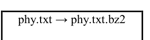

**命令：**

```
bzip2 -d phy.txt.bz2
```

**描述：**

解压缩文件 (phy.txt.bz2)

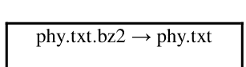

**命令：**

```
bzcat phy.txt.bz2
```

**描述：**

显示压缩文件 (phy.txt.bz2) 的内容

**命令：**

```
bunzip2 phy.txt.bz2
```

**描述：**

解压缩文件 (phy.txt.bz2)

**命令：**

```
crontab -l
```

**描述：**

显示当前登录用户的 crontab 条目

```
cat /dev/null > phy.txt
```

```
cp /dev/null phy.txt
```

```
echo "" > phy.txt
```

```
echo > phy.txt
```

**描述：**

清空文件 (phy.txt) 的内容

**命令：**

```
nohup ping google.com &
```

**描述：**

Ping google.com 并将进程发送到后台

**命令：**

```
nohup ping google.com > log.txt &
```

**描述：**

将 ping 日志保存到 log.txt

```
pgrep -a ping
```

**输出：**

```
3858 ping google.com
4200 ping google.com
4236 ping google.com
```

```
kill 3858
```

```
pgrep -a ping
```

**输出：**

```
4200 ping google.com
4236 ping google.com
```

**命令：**

```
ls -la /home
```

**描述：**

显示 /home 的内容

**命令：**

```
sudo shutdown 2
```

**描述：**

2 分钟后关闭机器

**命令：**

```
shutdown -c
```

**描述：**

取消关机过程

**命令：**

```
pr 36.txt
```

**描述：**

逐页显示文件 (36.txt) 的内容

**命令：**

```
stty -a
```

**描述：**

显示所有当前终端设置

**命令：**

```
ls -1
```

**描述：**

每行列出一个文件

**命令：**

```
yes John
```

**描述：**

重复输出一个字符串 (John) 直到被终止

**命令：**

```
vdir
```

**描述：**

列出当前目录中的文件和目录（每行一个）并显示详细信息

**命令：**

```
who -b
```

**描述：**

打印系统启动时间

```
# 使用 nano 打开 phy.txt
nano phy.txt

# 使用 vim 打开 phy.txt
vim phy.txt
```

**命令：**

```
ls -al *.txt
```

**描述：**

显示所有 .txt 文件，包括其个人权限。

**命令：**

```
uname -i
```

**描述：**

显示硬件平台

**命令：**

```
uname -p
```

**描述：**

显示处理器类型

**命令：**

```
cat /proc/interrupts
```

**描述：**

显示中断信息

```
w --ip-addr
```

**描述：**

显示有关当前在机器上的用户的信息，包括登录时间、空闲时间、TTY 和 CPU 时间

**输出：**

```
11:12:10 up 1:29, 2 users, load average: 0.02, 0.04, 0.10
USER TTY FROM LOGIN@ IDLE JCPU PCPU WHAT
manju :0 :0 02:43 ?xdm? 3:30 0.65s gdm-session-worker [pa
manju pts/0 :0 11:01 2.00s 0.10s 0.01s w --ip-addr
```

```
w -short
```

**描述：**

省略 CPU 时间和登录信息

**输出：**

```
11:11:46 up 1:28, 2 users, load average: 0.02, 0.04, 0.11
USER TTY FROM IDLE WHAT
manju :0 :0 ?xdm? gdm-session-worker [pam/gdm-password]
manju pts/0 :0 2.00s w --short
```

**命令：**

```
findmnt
```

**描述：**

显示当前已挂载文件系统的列表

**命令：**

```
ip addr show
```

**描述：**

列出 IP 地址和网络接口

**命令：**

```
netstat -pnltu
```

**描述：**

列出活动（监听）端口

**命令：**

```
journalctl
```

**描述：**

显示 systemd、内核和日志日志

**命令：**

```
sudo systemctl status network
```

**描述：**

显示网络服务的状态

**命令：**

```
sudo systemctl start network
```

**描述：**

启动网络服务

**命令：**

```
sudo systemctl stop network
```

**描述：**

停止网络服务

**命令：**

```
sestatus -b
```

**描述：**

显示布尔值的当前状态

**命令：**

```
getenforce
```

**描述：**

报告 SELinux 是处于强制、宽容还是禁用状态

> **安全增强型 Linux** (SELinux) 是一种 Linux 系统的安全架构，允许管理员更精确地控制谁可以访问系统。

```
setenforce 0
```

```
getenforce
```

**输出：**

```
Permissive
```

```
setenforce 1
```

```
getenforce
```

**输出：**

```
Enforcing
```

- **Enforcing** - SELinux 安全策略被强制执行。
- **Permissive** - SELinux 打印警告而不是强制执行。
- **Disabled** - 未加载 SELinux 策略。

```
[manju@localhost ~]$ let a="36 + 5" ; echo $a

41

[manju@localhost ~]$ let a="20 + 50/10" ; echo $a

25

[manju@localhost ~]$ let a="20 - 50/10" ; echo $a

15

[manju@localhost ~]$ let a="20 * 50/10" ; echo $a

100
```

```
[manju@localhost ~]$ grep ^PASS /etc/login.defs

PASS_MAX_DAYS    99999

PASS_MIN_DAYS    0

PASS_MIN_LEN     5

PASS_WARN_AGE    7
```

```
[manju@localhost ~]$ grep PASS /etc/login.defs

# PASS_MAX_DAYS    Maximum number of days a password may be used.

# PASS_MIN_DAYS    Minimum number of days allowed between password changes.

# PASS_MIN_LEN     Minimum acceptable password length.

# PASS_WARN_AGE    Number of days warning given before a password expires.

PASS_MAX_DAYS    99999

PASS_MIN_DAYS    0

PASS_MIN_LEN     5

PASS_WARN_AGE    7
```

**命令：**

```
cut -d: -f1 /etc/passwd | column
```

**描述：**

以列的形式列出所有本地用户账户

**命令：**

```
mkdir ~/mydir1 ; touch ~/mydir1/myfiles1.txt
```

**描述：**

创建一个目录 "mydir1" 并在其中创建一个文件 "myfiles1.txt"

**命令：**

```
echo hi > file.md ; chmod 744 file.md
```

**描述：**

创建一个文件 "file.md" 并仅给予其他人读取权限

```
[manju@localhost ~]$ ls -l $(which sudo)

---s--x--x. 1 root root 130776 Nov  5  2016 /bin/sudo
```

**命令：**

```
sestatus
```

**描述：**

显示系统上运行的 SELinux 的当前状态

**命令：**

```
ps -aef
```

**描述：**

显示系统上进程的完整列表

**命令：**

```
sar
```

**描述：**

显示系统活动报告

**命令：**

```
ulimit
```

**描述：**

报告当前用户的资源限制

| 输出： | |
|---|---|
| Unlimited | 当前用户可以消耗当前系统支持的所有资源 |

- 两种资源限制类型：
  * **硬资源限制：** 用户可以达到的物理限制。
  * **软资源限制：** 用户可管理的限制（**其值最高可达硬限制**）

# 命令：

```
ulimit -a
```

**描述：**

报告当前用户的所有资源限制

# 命令：

```
ulimit -s
```

**描述：**

检查当前用户的最大栈大小

# 命令：

```
ulimit -e
```

**描述：**

查看当前用户的最大调度优先级

# 命令：

```
ulimit -u
```

**描述：**

显示最大用户进程数

# 命令：

```
ulimit -v
```

**描述：**

查看虚拟内存的大小

# 命令：

```
ulimit -n
```

**描述：**

查看一个进程可以拥有的文件描述符数量

# 命令：

```
man limits.conf
```

**描述：**

显示关于 limits.conf 配置文件的详细信息

# 命令：

```
sar -V
```

**描述：**

显示 sar 版本

# 命令：

```
sar -u 2 5
```

**描述：**

以2秒为间隔，总共报告5次 CPU 详细信息

# 命令：

```
sar -n DEV 1 3 | egrep -v lo
```

# 描述：

报告网络接口、网络速度、IPV4、TCPV4、ICMPV4 网络流量和错误

# 命令：

```
sar -v 1 3
```

# 描述：

报告关于进程、内核线程、i-node 和文件表的详细信息

# 命令：

```
sar -S 1 3
```

# 描述：

报告交换空间的统计信息

# 命令：

```
sar -b 1 3
```

# 描述：

报告 I/O 操作的详细信息，如每秒事务数、每秒读取次数、每秒写入次数

# 命令：

```
sudo systemctl status firewalld
```

# 描述：

显示 firewalld 的状态

# 命令：

```
sudo systemctl start firewalld
```

# 描述：

启动 firewalld 服务

**firewalld** 是一个用于 Linux 操作系统的防火墙管理工具

# 命令：

```
firewall-config
```

# 描述：

启动图形化防火墙配置工具

### firewall-cmd

# 命令：

```
firewall-cmd --list-all-zones
```

# 描述：

列出所有区域

# 命令：

```
firewall-cmd --get-default-zone
```

**描述：**

检查当前设置的默认区域

# 命令：

```
firewall-cmd --list-services
```

**描述：**

显示系统上当前允许的服务

# 命令：

```
firewall-cmd --list-ports
```

**描述：**

列出系统上开放的端口

# 命令：

```
firewall-cmd --zone=work --list-services
```

**描述：**

列出公共区域允许的服务

# 命令：

```
mtr --report google.com
```

**描述：**

提供有关互联网流量在本地系统和远程主机 (google.com) 之间所经过路由的信息

# 命令：

```
sudo yum install samba
```

**描述：**

安装 Samba (CentOS)

> **Samba** 是一种客户端/服务器技术，可实现跨操作系统的网络资源共享。通过 Samba，可以在 Windows、Mac 和 Linux/UNIX 客户端之间共享文件和打印机。

# 命令：

```
sudo firewall-cmd --add-service samba -permanent
```

**描述：**

**将 Samba 服务添加到 firewalld**

# 命令：

```
zip q.zip q.txt
```

**描述：**

**创建一个 zip 文件** (q.zip)

# 命令：

```
unzip q.zip
```

# 描述：

解压一个 zip 文件 (q.zip)

```
zipcloak q.zip

# zipcloak 会提示您输入密码，然后要求您确认：

Enter password:
Verify password:

...如果密码匹配，它会加密 q.zip 文件

unzip q.zip

# 当您尝试解压 q.zip 文件时，它会提示您输入密码，然后才允许您提取其中包含的文件 (q.txt)
```

# 命令：

```
zgrep -l "Einstein" *
```

# 描述：

显示包含单词 (Einstein) 的文件名

# 命令：

```
zipsplit -n 1048576 q.zip
```

# 描述：

将 q.zip 文件分割成一系列 zip 文件 (q1.zip, q2.zip.....) – 每个文件不大于 1048576 字节 (一兆字节)

```
您可以使用以下命令将 (q1.zip, q2.zip....) 连接到一个新文件 w.zip：

cat q*.zip > w.zip
```

# 命令：

```
mtr google.com
```

# 描述：

测试到目标主机 **google.com** 的路由和连接质量

# 命令：

```
route
```

**描述：**

显示 Linux 系统的 IP 路由表

# 命令：

```
nmcli dev status
```

**描述：**

查看所有网络设备

# 命令：

```
nmcli con show
```

**描述：**

检查系统上的网络连接

# 命令：

```
ss -ta
```

**描述：**

列出服务器上所有开放的 TCP 端口 (**套接字**)

# 命令：

```
ss -to
```

**描述：**

显示所有活动的 TCP 连接及其计时器

# 命令：

```
type -a alias
```

**描述：**

检查 Linux 中的 Bash 别名

```
# %Y 和 %y 的区别在于 %Y 将打印 4 位数字，而 %y 将打印年份的最后 2 位数字。

echo "We are in the year = $(date +%Y)"
echo "We are in the year = $(date +%y)"
```

```
# %B 和 %b 的区别在于，%B 将打印完整的月份名称，而 %b 将打印缩写的月份名称。

echo "We are in the month = $(date +%b)"
echo "We are in the month = $(date +%B)"

# %A 和 %a 的区别在于，%A 将打印完整的星期名称，而 %a 将打印缩写的星期名称。

echo "Current Day of the week = $(date +%A)"
echo "Current Day of the week = $(date +%a)"
```

```
echo "Date using %D = $(date +%D)"
echo "Date using %F = $(date +%F)"
```

> Date using %D = 08/15/21

> Date using %F = 2021-08-15

```
echo "current time in 24 hour format = $(date +%T)"
```

> current time in 24 hour format = 01:27:46

```
echo "current time in 12 hour format = $(date +%r)"
```

> current time in 12 hour format = 01:27:47 AM

```
# 打印昨天的日期和时间。
echo "Yesterday = $(date -d "Yesterday")"

# 打印明天的日期和时间。
echo "tomorrow = $(date -d "tomorrow")"

# 查找从现在起 10 天前的日期和时间。
echo "Before 10 days = $(date -d "tomorrow -10 days")"

# 查找上个月和下个月
echo "Last month = $(date -d "last month" "%B")"
echo "Next month = $(date -d "next month" "%B")"

# 查找去年和明年
echo "Last Year = $(date -d "last year" "+%Y")"
echo "Next Year = $(date -d "next year" "+%Y")"
```

# 命令：

```
ls -lai /
```

**描述：**

获取目录中文件的 inode 数量 (**根目录**)

# 命令：

```
sudo du --inode /
```

**描述：**

获取根目录中的 inode 总数

# 命令：

```
ss -o state established '( sport = :http or sport = :https )'
```

**描述：**

获取所有连接到 HTTP (端口 80) 或 HTTPS (端口 443) 的客户端列表

# 命令：

```
ss -tn src :80 or src :443
```

**描述：**

列出数字端口号

# 命令：

```
sudo yum install putty
```

**描述：**

# 在 CentOS 上安装 PuTTY

# 命令：

```
sudo watch netstat -tulpn
```

**描述：**

实时监视 TCP 和 UDP 开放端口

# 命令：

```
sudo watch ss -tulpn
```

**描述：**

实时监视 TCP 和 UDP 开放端口

# 命令：

```
timeout 5s ping google.com
```

**描述：**

在 5 秒后超时 ping 命令

# 命令：

```
yum install curl
```

**描述：**

在 CentOS 上安装 curl

# 命令：

```
ss -ua
```

**描述：**

列出所有 UDP 连接

# 命令：

```
ss -lu
```

**描述：**

列出所有监听中的 UDP 连接

# 命令：

```
ss -p
```

**描述：**

显示与套接字连接相关的进程 ID

# 命令：

```
ss -4
```

**描述：**

显示 IPv4 和 IPv6 套接字连接

# 命令：

```
ss -6
```

**描述：**

显示 IPv6 连接

# 命令：

```
ss -at '( dport = :22 or sport = :22 )'
```

**描述：**

按端口号过滤连接

> "学习一门新编程语言的唯一方法就是用它编写程序。"

—Dennis Ritchie

```
[manju@localhost ~]$ echo {a..z}

a b c d e f g h i j k l m n o p q r s t u v w x y z
```

```
[manju@localhost ~]$ echo {z..a}

z y x w v u t s r q p o n m l k j i h g f e d c b a
```

```
[manju@localhost ~]$ echo {05..12}

05 06 07 08 09 10 11 12
```

```
[manju@localhost ~]$ echo {005..10}

005 006 007 008 009 010

mkdir 20{09..11}-{01..12}

# 创建目录以按月份和年份分组文件
```

```
[manju@localhost ~]$ echo {12..5}

12 11 10 9 8 7 6 5
```

```
[manju@localhost ~]$ echo {12..05}

12 11 10 09 08 07 06 05
```

```
[manju@localhost ~]$ echo {x..z}{1..3}

x1 x2 x3 y1 y2 y3 z1 z2 z3
```

```
[manju@localhost ~]$ echo {0..10..2}

0 2 4 6 8 10
```

```
[manju@localhost ~]$ for i in {a..z..5}; do echo -n $i; done

afkpuz
```

## Shell 命令与脚本示例

```
[manju@localhost ~]$ ls *.txt; echo $_

12.txt  1.txt    2.txt  abc.txt     my.txt      phy.txt
13.txt  24.txt   3.txt  marks.txt   names.txt   mphy.txt
```

```
[manju@localhost ~]$ cut -d, -f2,1 <<<'Albert,Bob,John'
Albert,Bob

[manju@localhost ~]$ cut -d, -f2,2 <<<'Albert,Bob,John'
Bob

[manju@localhost ~]$ cut -d, -f2,3 <<<'Albert,Bob,John'
Bob,John
```

```
[manju@localhost ~]$ x="W  X  Y   Z"; echo "$x"
W  X  Y   Z

[manju@localhost ~]$ x="W  X  Y   Z"; echo $x
W X Y Z
```

> `echo $x` 和 `echo "$x"` 会产生不同的结果

**引用变量可以保留空格**

```
[manju@localhost ~]$ let x=20+7; echo "The value of "x" is $x."

The value of "x" is 27.

[manju@localhost ~]$ x=100; let "x += 1"; echo "x = $x"

x = 101
```

```
[manju@localhost ~]$ x="a+b+c"; IFS=+; echo $x

a b c

[manju@localhost ~]$ x="a-b-c"; IFS=-; echo $x

a b c

[manju@localhost ~]$ x="a,b,c"; IFS=,; echo $x

a b c
```

```
free | grep Mem | awk '{ print $4 }'

# 显示未使用的 RAM 内存

du -ach

# 显示（磁盘）文件使用情况

readelf -h /bin/bash

# 显示指定 ELF 二进制文件的信息和统计
```

```
[manju@localhost ~]$ expr 5 \* 2 + 3

13 # 10 + 3

[manju@localhost ~]$ expr 5 \* \( 2 + 3 \)

25 # 5 * 5
```

```
[manju@localhost ~]$ echo -e "\033[4mAlbert Einstein.\033[0m"

Albert Einstein.

[manju@localhost ~]$ echo -e "\033[1mAlbert Einstein.\033[0m"

Albert Einstein.
```

```
[manju@localhost ~]$ echo -e '\E[34;47mAlbert Einstein'; tput sgr0

Albert Einstein

[manju@localhost ~]$ echo -e '\E[33;44m'"Albert Einstein"; tput sgr0

Albert Einstein

[manju@localhost ~]$ echo -e '\E[1;33;44m'"Albert Einstein"; tput sgr0

Albert Einstein
```

```
[manju@localhost ~]$ x=2; y=3; echo $((2*$x + 3*$y))

13

[manju@localhost ~]$ x=2; y=3; echo $((2*x + 3*y))

13

[manju@localhost ~]$ let x=2+3 y=3+2; echo $x $y

5 5
```

# 命令：

```
sdiff phy.txt score.txt
```

# 描述：

显示两个文件之间的差异（**phy.txt 和 score.txt**）

# 命令：

```
history -c
```

# 描述：

删除或清空 bash 历史记录中的所有条目

# 命令：

```
ping -c 5 www.google.com
```

# 描述：

ping 测试将在发送 5 个数据包后停止

```
# 统计每个 .txt 文件的行数
ls *.txt | xargs wc -l

# 统计每个 .txt 文件的单词数
ls *.txt | xargs wc -w

# 统计每个 .txt 文件的字符数
ls *.txt | xargs wc -c

# 统计每个 .txt 文件的行数、单词数和字符数
ls *.txt | xargs wc
```

# 命令：

```
lslogins -u
```

# 描述：

显示用户账户

**命令：**

```
systemctl list-units --type=service
```

**描述：**

列出系统上所有已加载的服务（无论是否活跃；运行中、已退出或失败）

**命令：**

```
systemctl --type=service
```

**描述：**

列出系统上所有已加载的服务（无论是否活跃；运行中、已退出或失败）

**命令：**

```
systemctl list-units --type=service --state=active
```

**描述：**

列出所有已加载但活跃的服务

**命令：**

```
systemctl --type=service --state=active
```

**描述：**

列出所有已加载但活跃的服务

**命令：**

```
systemctl list-units --type=service --state=running
```

**描述：**

列出所有正在运行的服务（即所有已加载且正在运行的服务）

**命令：**

```
systemctl --type=service --state=running
```

# 描述：

列出所有正在运行的服务（即所有已加载且正在运行的服务）

```
# 扫描单个端口

nc -v -w 2 z 192.168.56.1 22

# 扫描多个端口

nc -v -w 2 z 192.168.56.1 22 80

# 扫描端口范围

nc -v -w 2 z 192.168.56.1 20-25
```

# 命令：

```
cat /etc/resolv.conf
```

# 描述：

查找 DNS 服务器的 IP 地址

**命令：**

```
less /etc/resolv.conf
```

**描述：**

查找 DNS 服务器的 IP 地址

**命令：**

```
findmnt --poll --mountpoint /mnt/test
```

**描述：**

监控目录（**即 /mnt/test**）上的挂载、卸载、重新挂载和移动操作

**命令：**

```
uptime -p
```

**描述：**

检查 Linux 服务器的运行时间

**命令：**

```
uptime -s
```

**描述：**

检查 Linux 服务器的启动时间

**命令：**

```
uptime -h
```

**描述：**

显示 uptime 的版本信息

**命令：**

```
grep -o -i Justin score.txt | wc -l
```

**描述：**

统计文件（**score.txt**）中 "**Justin**" 出现的次数

# 命令：

```
crontab -r
```

# 描述：

删除所有 crontab 任务

```
ADD=$(( 1 + 2 ))
echo $ADD
3

MUL=$(( $ADD * 5 ))
echo $MUL
15

SUB=$(( $MUL - 5 ))
echo $SUB
10

DIV=$(( $SUB / 2 ))
echo $DIV
5

MOD=$(( $DIV % 2 ))
echo $MOD
1
```

# 命令：

```
expr length "This is myw3schools.com"
```

# 描述：

查找字符串的长度（**This is myw3schools.com**）

```
echo '3+5' | bc
8
awk 'BEGIN { a = 6; b = 2; print "(a + b) = ", (a + b) }'
(a + b) = 8
```

# 命令：

```
factor 10
```

# 描述：

将整数（**10**）分解为质因数

**命令：**

```
ps -e
```

**描述：**

显示 Linux 系统上的每个活动进程

**命令：**

```
ps -x
```

**描述：**

显示用户运行的进程

**命令：**

```
ps -fU manju
```

**描述：**

按用户名（**manju**）显示用户的进程

**命令：**

```
ps -fu 1000
```

**描述：**

按真实用户 ID（**RUID**）显示用户的进程

**命令：**

```
ps -U root -u root
```

**描述：**

显示以 root 用户权限运行的每个进程（真实和有效 ID）

```
echo -e "The following users are logged on the system:\n\n $(who)"

manju    :0           Aug 15 03:31 (:0)
manju    pts/1        Aug 15 03:32 (:0)
```

```
date +%d\-%m\-%Y

# 以 DD-MM-YY 格式显示当前日期

date +%m\/%d\/%Y

# 以 MM/DD/YYYY 格式显示当前日期
```

```
date -d "-7 days"

# 显示当前日期前 7 天的日期

date -d "7 days"

# 显示当前日期后 7 天的日期
```

```
ls -a ~/

# 显示所有文件 - 包括隐藏文件

[manju@localhost ~]$ gnome-calculator -s 23500*10%

2350
```

```
shuf -i 1-5 -n 5
```

```
[manju@localhost ~]$ shuf -i 1-5 -n 5 | awk '{ sum+=$1;print $1} END {print "Sum";print sum}'
4
5
2
3
1
Sum
15
```

```
[manju@localhost ~]$ find ./ -name "*.zip" -type f
./1.zip
./--encrypt.zip
./my.zip
```

查找扩展名为 .zip 的文件

```
find -type f -mtime 0
# 查找过去 24 小时内更新的文件

find -type f -newermt `date +%F`
# 查找今天更新的文件

find -type f -newermt `date +%F -d yesterday`
# 查找昨天修改的文件

find -type f -mtime -3
# 查找过去 72 小时内更新的文件
```

```
find -type f -newermt 2021-03-01

# 查找 2021 年 3 月 1 日之后修改的文件

find -type f -newermt `date +%F -d -3hours`

# 查找过去 3 小时内更新的文件

find -type f -mmin -180
```

## Shell 脚本

```
if [ 15 -gt 25 ]
then
    echo "True"
else
    echo "False"
fi
```

```
# 输出：

False
```

```
for i in 1 2 3 4 5
do
    echo "Albert"
done
```

```
# 输出：

Albert
Albert
Albert
Albert
```

```
if test 5 -eq 6
then
    echo "True"
else
    echo "False"
fi

# 输出：
False
```

```
yum deplist httpd

# 列出软件包 "apache" 的依赖项
```

```
yum reinstall httpd

# 重新安装（损坏的）软件包 "apache"
```

```
[manju@localhost ~]$ echo "i=3;++i" | bc
4

[manju@localhost ~]$ echo "i=3;--i" | bc
2

[manju@localhost ~]$ echo "i=4;i" | bc
4
```

```
help cd

# 显示 cd 命令的完整信息

help -d cd
显示 cd 命令的简短描述
```

```
help -s cd

# 显示 cd 命令的语法
```

```
mkdir -m a=rwx myfiles

创建 myfiles 目录，并设置其文件模式（-m），以便
所有用户（a）都可以读取（r）、写入（w）和执行（x）它。
```

```
whatis -w make*

# 显示所有以 make 开头的命令的用途

who -d -H

# 打印所有已终止进程的列表
```

```
finger -s manju

# 显示用户 "manju" 的登录详情和空闲状态

last -F

# 显示登录和注销时间，包括日期

locate --regex -i "(\.mp3|\.txt)"

# 在系统上搜索所有 .mp3 和 .txt 文件，并忽略大小写
```

## systemctl -l -t service | less

# 列出所有 Systemd 服务

locate "*.txt" -n 20

# 显示搜索以 .txt 结尾的文件的 20 个结果

locate -c [.txt]*

# 统计以 .txt 结尾的文件数量并显示结果

ls -l . | egrep -c '^-'

# 统计当前目录中的文件数量

du -kx | egrep -v "\./.+/" | sort -n

# 查找最大的目录

ls -al --time-style=+%D | grep `date +%D`

# 仅列出今天的文件

find . -name '*.gz'

# 在当前工作目录中查找所有 gzip 压缩包

du -hsx * | sort -rh | head -10

# 查看占用空间最大的前 10 个文件

mpstat

# 显示处理器和 CPU 统计信息

mpstat -P ALL

# 显示所有 CPU 的处理器编号

mpstat 1 5

此命令将以 1 秒的时间间隔打印 5 份报告

[manju@localhost ~]$ printf "%s\n" "Albert Einstein"
Albert Einstein

find . -size 0k

# 查找当前目录中的所有空文件

ls -F | grep / | wc -l

# 统计目录中的目录数量

提取子字符串

x=HelloWorld;
echo `expr substr $x 6 10`
# 输出：World

fdisk -s /dev/sda

# 显示 Linux 中磁盘分区的大小

**命令：**

sh <(curl https://nixos.org/nix/install) --daemon

**描述：**

在 Linux 中安装 Nix 包管理器

**命令：**

locale

**描述：**

查看 Linux 中的系统区域设置

**命令：**

locale -a

**描述：**

# 显示所有可用区域设置的列表

cat score.txt

Justin-40

cat score.txt | tr [:lower:] [:upper:]

JUSTIN-40

cat score.txt | tr [a-z] [A-Z] >output.txt
cat output.txt

JUSTIN-40

cat domainnames.txt

www. google. com
www. fb. com
www. mactech. com

cat domainnames.txt | tr -d ' '

www.google.com
www.fb.com
www.mactech.com

> 删除域名中的空格

cat domainnames.txt

www.google....com
www.fb.com
www.mactech.Com

cat domainnames.txt | tr -s '.'

www.google.com
www.fb.com
www.mactech.Com

echo "My UID is $UID"

My UID is 0

echo "My UID is $UID" | tr " " "\n"

My
UID
is
0

将空格转换为 ":" 字符

echo "myw3schools.com  =>Linux-Books,Src,Tutorials" | tr " ":"

myw3schools.com:=Linux-Books,Src,Tutorials

# 命令：

!sud

**描述：**

重新执行之前使用的命令

**命令：**

!sudo

**描述：**

重新执行之前使用的命令

**命令：**

cut -d: -f1 < /etc/passwd | sort | xargs

**描述：**

生成系统上所有 Linux 用户账户的紧凑列表

**命令：**

zcat phy.txt.gz myfiles.txt.gz

**描述：**

查看多个压缩文件（**phy.txt.gz 和 myfiles.txt.gz**）

**命令：**

find . -type f -name "*.php"

**描述：**

在目录中查找所有 php 文件

mkdir /tmp/DOCUMENTS

# 在 "/tmp" 目录下创建名为 'DOCUMENTS' 的目录

**命令：**

find . -type f -perm 0777 -print

**描述：**

查找所有权限为 777 的文件

**命令：**

find / -type f ! -perm 777

**描述：**

查找所有权限不是 777 的文件

**命令：**

find / -perm /g=s

**描述：**

查找所有设置了 SGID 的文件

**命令：**

find / -perm /u=r

**描述：**

查找所有只读文件

**命令：**

find / -perm /a=x

**描述：**

查找所有可执行文件

[manju@localhost ~]$ echo "ALBERT" | awk '{print tolower($0)}'
albert
将文本从大写转换为小写

**命令：**

find . -type f -name "phy.txt" -exec rm -f {} \;

**描述：**

查找并删除 **phy.txt** 文件

[manju@localhost ~]$ echo "Phone number: 55602369" | tr -cd [:digit:]
55602369

**命令：**

从字符串中获取数字

find . -type f -name "*.txt" -exec rm -f {} \;

**描述：**

查找并删除多个 **.txt** 文件

**命令：**

find . -type f -name "*.mp3" -exec rm -f {} \;

**描述：**

查找并删除多个 .mp3 文件

**命令：**

find /tmp -type d -empty

**描述：**

查找所有空目录

**命令：**

find /tmp -type f -name ".*"

**描述：**

查找所有隐藏文件

[manju@localhost ~]$ echo "Phone number: 55602369" | tr -d [:digit:]
Phone number: 
从字符串中删除所有数字

**命令：**

find / -mtime 50

**描述：**

查找最近 50 天内修改过的文件

**命令：**

find / -atime 50

**描述：**

查找最近 50 天内访问过的文件

**命令：**

find / -cmin -60

**描述：**

# 查找最近 1 小时内更改过的文件

**命令：**

find / -mmin -60

**描述：**

# 查找最近 1 小时内修改过的文件

**命令：**

find / -amin -60

**描述：**

# 查找最近 1 小时内访问过的文件

| 命令： | type cat |
|---|---|
| 描述： | 识别 "cat" 命令是 shell 内置命令、子程序、别名还是关键字。 |

find / -size 50M

**描述：**

查找所有 50MB 的文件

**命令：**

find / -type f -size +100M -exec rm -f {} \;

**描述：**

查找并删除 100MB 的文件

**命令：**

find / -type f -name *.mp3 -size +10M -exec rm {} \;

**描述：**

查找所有大于 10MB 的 .mp3 文件并删除它们

ls -l --color

# 列出当前目录中的文件（带彩色输出）

info df

# 加载 "df" 信息页

ls /usr/include

# 列出用于编译 C 程序的头文件

ls /usr/local

# 列出本地安装的文件

ls /usr/bin/d*

# 列出 /usr/bin 目录中所有以字母 "d" 开头的文件

[manju@localhost ~]$ ls .b*

.bash_history  .bash_logout  .bash_profile  .bashrc

[manju@localhost ~]$ ls [a-h]*

all          DICT  file1        file2        file34.txt   file.md      fool.txt
allfiles.txt echo  file123.txt  file23.txt   file3.txt    first.bash
bu.txt       file  file1.txt    file2.txt    FILE.backup  first.txt

[manju@localhost ~]$ touch hello.cpp; touch hello.f99

[manju@localhost ~]$ ls *.?[9p]?

hello.cpp  hello.f99

ls /usr

# 列出 /usr 目录

ls ~ /usr

# 列出用户的主目录和 /usr 目录

[manju@localhost ~]$ echo f*

显示任何以 "f" 开头的文件

file file1 file123.txt file1.txt file2 file23.txt file2.txt file34.txt file3.txt
file.md first.bash first.txt fool.txt

[manju@localhost ~]$ echo f*.txt

显示任何以 "f" 开头，后跟任意字符，并以 ".txt" 结尾的文件

file123.txt file1.txt file23.txt file2.txt file34.txt file3.txt first.txt fool.txt

sudo vim myfiles.txt

# 使用 Vim 编辑器打开文件 "myfiles.txt"

[manju@localhost ~]$ for ((i=0;i<8;i++)); do echo $((i)); done

0

1

2

3

4

5

6

7

**命令：**

cat /proc/sys/fs/file-max

**描述：**

查找 Linux 打开文件限制

**命令：**

ulimit -Hn

**描述：**

检查 Linux 中的硬限制

**命令：**

ulimit -Sn

**描述：**

检查 Linux 中的软限制

**命令：**

timedatectl status

**描述：**

显示系统上的当前时间和日期

**命令：**

timedatectl list-timezones

**描述：**

查看所有可用的时区

**命令：**

timedatectl list-timezones | egrep -o "Asia/B.*"
timedatectl list-timezones | egrep -o "Europe/L.*"
timedatectl list-timezones | egrep -o "America/N.*"

**描述：**

根据您的位置查找本地时区

**命令：**

timedatectl set-timezone "Asia/Kolkata"

**描述：**

在 Linux 中设置您的本地时区

**命令：**

swapon --summary

**描述：**

查看按设备划分的交换空间使用情况摘要

**命令：**

# 描述：

检查交换空间使用信息

```
cat /proc/swaps
```

# 命令：

```
dir -shl
```

# 描述：

列出文件及其以块为单位分配的大小

# 命令：

```
less /proc/sys/dev/cdrom/info
```

# 描述：

显示 CD-ROM 信息

```
# 开始记录 Linux 终端
script history_log.txt
Script started, file is history_log.txt
exit
Script done, file is history_log.txt
```

```
while true; do date >> date.txt ; sleep 5 ; done &
cat date.txt
Mon Aug 16 03:05:36 PDT 2021
Mon Aug 16 03:05:41 PDT 2021
Mon Aug 16 03:05:46 PDT 2021
Mon Aug 16 03:05:51 PDT 2021
```

> "不要写更好的错误信息，要写不需要错误信息的代码。"
> – Jason C. McDonald

```
[manju@localhost ~]$ echo hello > 1.txt
[manju@localhost ~]$ echo world > 2.txt
[manju@localhost ~]$ echo program > 3.txt
[manju@localhost ~]$ cat 1.txt
hello
[manju@localhost ~]$ cat 2.txt
world
[manju@localhost ~]$ cat 3.txt
program
[manju@localhost ~]$ cat 1.txt 2.txt 3.txt
hello
world
program
[manju@localhost ~]$ cat 1.txt 2.txt 3.txt >all
[manju@localhost ~]$ cat all
hello
world
program
```

```
strings /usr/bin/passwd
# 从 /usr/bin/passwd 中显示可读的字符字符串
```

```
ls -lrS /etc
# 列出 /etc 中最大的文件
```

```
cat /etc/passwd >> myfiles.txt
# 创建一个名为 myfiles.txt 的文件，其内容为 myfiles.txt 的内容后跟 /etc/passwd 的内容
```

```
[manju@localhost ~]$ ls /etc/*.conf
/etc/asound.conf          /etc/kdump.conf          /etc/radvd.conf
/etc/autoofs.conf         /etc/krb5.conf           /etc/request-key.conf
/etc/autoofs_ldap_auth.conf /etc/ksmtuned.conf     /etc/resolv.conf
/etc/brltty.conf          /etc/ld.so.conf          /etc/rsyncd.conf
/etc/cgconfig.conf        /etc/libaudit.conf       /etc/rsyslog.conf
/etc/cgrules.conf         /etc/libuser.conf        /etc/sestatus.conf
/etc/cgsnapshot_blacklist.conf /etc/locale.conf     /etc/sos.conf
/etc/chrony.conf          /etc/logrotate.conf      /etc/sudo.conf
/etc/dleyna-server-service.conf /etc/man_db.conf    /etc/sudo-ldap.conf
/etc/dnsmasq.conf         /etc/mke2fs.conf         /etc/sysctl.conf
/etc/dracut.conf          /etc/mtools.conf         /etc/tcsd.conf
/etc/e2fsck.conf          /etc/nfsmount.conf       /etc/updatedb.conf
/etc/fprintd.conf         /etc/nsswitch.conf       /etc/usb_modeswitch.conf
/etc/fuse.conf            /etc/ntp.conf            /etc/vconsole.conf
/etc/GeoIP.conf           /etc/numad.conf          /etc/wvdial.conf
/etc/host.conf            /etc/oddjobd.conf        /etc/yum.conf
/etc/idmapd.conf          /etc/pbm2ppa.conf
/etc/ipsec.conf           /etc/pnm2ppa.conf
```

显示位于 /etc 的配置文件

```
ls /dev/sd*
/dev/sda  /dev/sda1  /dev/sda2  /dev/sda3
```

显示 SATA 设备文件

```
echo $USER
# $USER
```

```
echo -e "2+2\t=4" ; echo -e "12+12\t=24"
2+2   =4
12+12 =24
```

```
echo Hello && echo World
Hello
World
```

```
echo Hello ; echo World
Hello
World
```

```
echo Hello || echo Hi ; echo World
Hello
World
```

```
rm myfiles.txt && echo It worked! || echo It failed!
It worked!

rm files.txt && echo It worked! || echo It failed!
rm: cannot remove 'files.txt': No such file or directory
It failed!
```

```
pwd ; pwd
/home/manju
/home/manju
```

执行两次 pwd 命令

```
a=$(pwd)
echo "Current working directory is : $a"
/home/manju
```

# 命令：

```
echo *.jpeg
```

# 描述：

打印所有 **.jpeg** 文件

# 命令：

```
echo 'linux' | fold -w1
```

# 描述：

将一个单词（**linux**）分解为单个字符


**命令：**

```
bash
find . -user root
```

**描述：**

输出当前目录中属于用户（**root**）的文件

**命令：**

```
bash
strace pwd
```

**描述：**

跟踪命令（**pwd**）的执行

# 命令：

```
top -u manju
```

# 描述：

显示特定用户（**manju**）的进程详情

+   **大数据的 3 个特征：**

* **Volume（数据量）** — 有多少数据？
* **Variety（多样性）** — 不同类型的数据有多多样化？
* **Velocity（速度）** — 新数据以什么速度生成？

```
[manju@localhost ~]$ netstat -plunt
# 打印所有监听端口

[manju@localhost ~]$ netstat -plunt | grep 8080
# 检查服务器是否在端口 8080 上监听

[manju@localhost ~]$ netstat -s
# 列出所有端口的统计信息
```

```
[manju@localhost ~]$ cat myfiles.txt
Hello World

[manju@localhost ~]$ cat myfiles.txt | tr ' ' '\n'
Hello
World
```

```
find . -name "*.txt"
# 在当前目录及所有子目录中查找以 .txt 结尾的文件
```

```
find /etc > 12.txt
# 查找 /etc 中的所有文件并将列表放入 12.txt
```

```
find . -newer file1.txt
# 查找比 file1.txt 更新的文件
```

```
[manju@localhost ~]$ date +'%A %d-%m-%Y'
Tuesday 19-04-2022
```

```
[manju@localhost ~]$ date -d '2022-04-01 + 200000000 seconds'
Thu Aug 16 03:33:20 PDT 2085
```

```
find /etc -type f -name '*.txt' | wc -l
# 打印 /etc 及其所有子目录中 .txt 文件的数量
```

```
[manju@localhost ~]$ cat myfiles.txt
Hello World

[manju@localhost ~]$ grep -E 'o*' myfiles.txt
Hello World

[manju@localhost ~]$ grep -E 'o+' myfiles.txt
Hello World
```

```
[manju@localhost ~]$ echo Albert Einstein | sed 's/Albert/&&/'
AlbertAlbert Einstein
```

```
[manju@localhost ~]$ echo Albert Einstein | sed 's/Einstein/&&/'
Albert EinsteinEinstein
```

```
[manju@localhost ~]$ echo Albert | sed 's_\(Alb\)_\1ert_'
Albertert

[manju@localhost ~]$ echo Albert | sed 's_\(Alb\)_\1ert \1_'
Albert Albert
```

```
[manju@localhost ~]$ echo -e 'Albert\tis\tScientist'
Albert   is          Scientist
```

```
[manju@localhost ~]$ echo -e 'Albert\tis\tScientist' | sed 's_\s_ _g'
Albert is Scientist
```

```
[manju@localhost ~]$ cat myfiles.txt
Hello World

[manju@localhost ~]$ cat myfiles.txt | sed 's/ll\?/A/'
HeAo World
```

```
[manju@localhost ~]$ cat myfiles.txt
Hello World

[manju@localhost ~]$ cat myfiles.txt | sed 's/l\{2\}/A/'
HeAo World
```

echo Albert `echo -n Einstein`

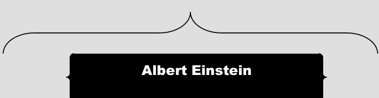

```
[manju@localhost ~]$ test 50 -gt 15 ; echo $?
0
True: 50 is greater than 15

[manju@localhost ~]$ test 5 -gt 15 ; echo $?
1
False: 5 is not greater than 15

[manju@localhost ~]$ test 5 -lt 15 ; echo $?
0
True: 5 is lesser than 15

[manju@localhost ~]$ test 50 -gt 15 && echo true || echo false
true

[manju@localhost ~]$ test 5 -gt 15 && echo true || echo false
false
```

```
[manju@localhost ~]$ [ 50 -gt 15 ] && echo true || echo false
true

[manju@localhost ~]$ [ 5 -gt 15 ] && echo true || echo false
false
```

```
[manju@localhost ~]$ [ 100 -gt 10 -a 100 -lt 150 ] && echo true || echo false
true

[manju@localhost ~]$ [ 100 -gt 10 -a 100 -lt 15 ] && echo true || echo false
false
```

```
[manju@localhost ~]$ a=2; b=a; eval c=\$\$b; echo $c
2
```

```
[manju@localhost ~]$ date
Tue Apr 19 02:55:39 PDT 2022

[manju@localhost ~]$ date --date="1 week ago"
Tue Apr 12 02:55:05 PDT 2022
```

# 命令：

```
uname -or
```

# 描述：

查找 Linux 内核版本

# 命令：

```
uname -a
```

# 描述：

打印 Linux 系统信息

# 命令：

```
cat /proc/version
```

# 描述：

显示部分系统信息，包括 Linux 内核版本

**命令：**

```
cat /etc/centos-release
```

**描述：**

查找 Linux 发行版名称和发布版本

**命令：**

```
fuser .
```

**描述：**

显示当前正在访问您当前工作目录的进程的 PID

**命令：**

```
fuser -v -m .bashrc
```

# 描述：

确定哪些进程正在访问您的 **~.bashrc** 文件

# 命令：

```
sudo fuser --list-signals
```

# 描述：

显示可与 fuser 工具一起使用的所有可能信号

# 命令：

```
sudo fuser -k -HUP /boot
```

# 描述：

向所有打开了您的 **/boot 目录**的进程发送 HUP 信号

# 命令：

```
ls -al
```

# 描述：

列出所有文件，包括文件权限、指向该文件的链接数、文件所有者、文件所属组、以字节为单位的文件大小、文件最后修改时间以及文件名。

# 命令：

```
echo "shutdown -h now" | at -m 23:55
```

# 描述：

在今天 23:55 关闭系统。

# 命令：

```
echo "updatedb" | at -m 23:55
```

# 描述：

在今天 23:55 运行 **updatedb**。

# 命令：

```
chmod a+r myfiles.txt
```

# 描述：

现在每个人都可以读取该文件。

# 命令：

```
chmod a+rw myfiles.txt
```

# 描述：

现在每个人都可以读写该文件。

# 命令：

```
chmod o-rwx myfiles.txt
```

# 描述：

其他人（非所有者，且不在文件所属组内）无法读取、写入或执行该文件。

# 描述：

创建并更新 `locate` 命令使用的文件名数据库。

# 命令：

```
bash
echo $(ls -al)
```

# 描述：

执行命令 `ls -al` 并将结果打印到标准输出。

# 命令：

```
bash
top -b -o +%MEM | head -n 22
```

# 描述：

显示按内存使用量降序排列的前 15 个进程。

# 命令：

```
bash
top -b -o +%MEM | head -n 22 > report.txt
```

# 描述：

将输出重定向到文件（**report.txt**）以供后续检查。

# 命令：

```
ps -eo pid,ppid,cmd,%mem,%cpu --sort=-%mem | head
```

# 描述：

在 Linux 中检查按 RAM 或 CPU 使用率排序的顶级进程。

# 命令：

```
find . -type f \( -name "*.sh" -o -name "*.txt" \)
```

# 描述：

在当前目录中查找所有具有 **.sh** 和 **.txt** 扩展名的文件。

# 命令：

```
find . -type f \( -name "*.sh" -o -name "*.txt" -o -name "*.c" \)
```

# 描述：

在当前目录中查找所有具有 **.sh**、**.c** 和 **.txt** 扩展名的文件。

# 描述：

查找编辑于 3 天前的文件。

# 命令：

```
find . -type f -mtime +3
```

# 描述：

查找过去 24 小时内编辑过的文件。

# 命令：

```
find . -type f -mtime -1
```

# 描述：

查找包含超过 100 个字符（字节）的文件。

# 命令：

```
find . -type f -size +100c
```

# 描述：

查找大于 100 KB 但小于 1 MB 的文件。

# 命令：

```
find . -type f -size +100k -size -1M
```

# 描述：

删除过去 24 小时内编辑过的所有文件。

# 命令：

```
find . -type f -mtime -1 -delete
```

# 描述：

列出所有文件，包括隐藏文件。

# 命令：

```
ls -a
```

# 描述：

列出文件和目录，并在目录后附加 "/" 字符。

# 命令：

```
ls -F
```

# 描述：

以相反顺序列出文件。

# 命令：

```
ls -r
```

# 描述：

按文件大小排序文件。

# 命令：

```
ls -ls
```

# 描述：

列出带有 inode 编号的文件。

# 命令：

```
ls -i
```

# 描述：

检查 `ls` 命令的版本。

# 命令：

```
ls --version
```

# 描述：

列出 /tmp 目录下的文件。

# 命令：

```
ls -l /tmp
```

# 描述：

显示文件和目录的 UID 和 GID。

# 命令：

```
ls -n
```

# 描述：

查找所有 30 MB 的文件。

# 命令：

```
find / -size 30M
```

# 描述：

查找大小在 100 - 200 MB 之间的文件。

# 命令：

```
find / -size +100M -size -200M
```

# 描述：

列出大于 20 KB 的目录。

# 命令：

```
find / -type d -size +20k
```

# 描述：

查找空文件和目录。

# 命令：

```
find ./ -type f -size 0
```

# 描述：

列出过去 17 小时内修改过的文件。

# 命令：

```
find . -mtime -17 -type f
```

# 描述：

列出过去 10 天内修改过的目录。

# 命令：

```
find . -mtime -10 -type d
```

# 描述：

列出主目录中 6 到 15 天前修改过的所有文件。

# 命令：

```
find /home -type f -mtime +6 -mtime -15
```

# 描述：

显示权限为 777 的文件。

# 命令：

```
find -perm 777
```

# 描述：

列出由用户（manju）拥有的文件。

# 命令：

```
find /home -user manju
```

# 描述：

查找用户 "manju" 拥有的所有文本文件。

# 命令：

```
find /home -user manju -iname "*.txt"
```

# 描述：

查找并列出文件及其权限。

# 命令：

```
find -name "*.conf" | ls -l
```

# 描述：

仅列出目录。

# 命令：

```
ls -d */
```

# 描述：

在单行中列出多个文件。

# 命令：

```
ls --format=comma
```

# 描述：

查看特定用户 "manju" 的进程。

# 命令：

```
ps -u manju
```

# 描述：

执行以特定字母 "c" 开头的上一个命令。

# 命令：

```
!c
```

# 描述：

显示 BIOS 信息（您需要提升权限才能运行此命令）。

# 命令：

```
dmidecode -t 0
```

# 描述：

显示 CPU 信息（您需要提升权限才能运行此命令）。

# 命令：

```
dmidecode -t 4
```

# 描述：

查看所有系统日志。

# 命令：

```
gnome-system-log
```

# 描述：

识别 SSH 客户端版本。

# 命令：

```
ssh -V
```

# 描述：

显示用户的总连接时间。

# 命令：

```
ac -d
```

# 描述：

显示所有用户的连接时间。

# 命令：

```
ac -p
```

# 描述：

显示特定用户 "manju" 的连接时间报告。

# 命令：

```
ac -d manju
```

# 描述：

显示 Apache 内部编译的模块。

# 命令：

```
httpd -l
```

# 描述：

查看当前用户拥有的进程。

# 命令：

```
ps U $USER
```

# 描述：

显示文件系统类型的信息。

# 命令：

```
df -Tha
```

# 描述：

显示带有进程 ID 和程序名称的活动连接。

# 命令：

```
netstat -tap
```

# 描述：

显示原始网络统计信息。

# 命令：

```
netstat --statistics --raw
```

# 命令：

```
PS1="Please enter a command: "
```

Please enter a command: date

Thu Apr 21 20:51:19 PDT 2022

Please enter a command: cal

April 2022

Su Mo Tu We Th Fr Sa

```
ps -aux | grep 'httpd'
# Check for the httpd process
```

1  2

3  4  5  6  7  8  9

10 11 12 13 14 15 16

17 18 19 20 21 22 23

24 25 26 27 28 29 30

Please enter a command:

> /var/spool 保存假脱机文件，例如为打印作业和网络传输生成的文件。

```
ls /var/spool
```

abrt abrt-upload anacron at cron cups lpd mail plymouth postfix

```
ls /usr/share/man
```

> /usr/share/man 保存在线手册文件。

ca en hu ko man1x man3p man5 man7 man9 pl ro tr zh_TW

cs es id man0p man2 man3x man5x man7x man9x pt ru uk

da fr it man1 man2x man4 man6 man8 mann pt_BR sk zh

de hr ja man1p man3 man4x man6x man8x overrides pt_PT sv zh_CN

```
ls /etc/gdm
```

列出 GDM 配置目录的内容。

```
custom.conf  Init  PostLogin  PostSession  PreSession  Xsession
```

```
ls /etc/gconf
```

```
# 列出 GConf 配置文件
```

```
ls /usr/share/gnome
```

```
# 列出 GNOME 应用程序使用的文件
```

```
ls /etc/sysconfig
```

列出 **系统配置** 文件。

```
atd            firewalld       libvirt-guests  qemu-ga         samba
authconfig     grub            man-db          radvd           saslauthd
autofs         init            modules         raid-check      selinux
cbq            ip6tables-config netconsole     rdisc           smartmontools
cgred          iptables-config network         readonly-root   sshd
console        irqbalance       network-scripts rpcbind         sysstat
cpupower       kdump            nfs             rpc-rquotad     sysstat.ioconf
crond          kernel           ntpd            rsyncd          virtlockd
ebtables-config ksm            ntpdate         rsyslog         virtlogd
fcoe           libvirtd         pluto           run-parts       wpa_supplicant
```

```
ls /etc/rc.d
```

```
# 列出系统启动和关闭文件
```

```
ls /etc/init.d
```

**/etc/init.d** 包含用于启动网络连接的网络脚本。

```
functions  netconsole  network  README
```

## Linux 操作系统的重要特性

- 自由且开源
- 可移植且更安全
- 强健且适应性强


计算机硬件与其进程之间的核心接口

管理 RAM 内存。

管理处理器时间。

管理连接到计算机的各种外围设备的访问和使用。

## 交换空间

当**物理内存**（RAM）已满时，使用硬盘上的一个空间

```
[manju@localhost ~]$ cd /etc
[manju@localhost etc]$ pwd
/etc
```

```
[manju@localhost etc]$ cat /etc/hosts
```

/etc/hosts 包含主机名及其 IP 地址

```
127.0.0.1   localhost localhost.localdomain localhost4 localhost4.localdomain4
::1         localhost localhost.localdomain localhost6 localhost6.localdomain6
```

```
chmod u+w myfiles.txt
# 添加用户写权限
```

```
chmod u-w myfiles.txt
# 移除用户写权限
```

```
chmod g+w myfiles.txt
# 添加组写权限
```

```
chmod go-r myfiles.txt
# 移除组和其他用户的读权限
```

```
chmod g=r myfiles.txt
# 仅允许组读权限
```

```
chmod o+x myfiles.txt
# 为其他用户添加执行权限
```

```
chmod a+x myfiles.txt
# 为所有人添加执行权限
```

```
chmod a=xr myfiles.txt
# 仅允许所有人读和执行权限
```

```
ps -L 3315

# 列出特定进程（进程 ID 为 3315）的所有线程

ps aux --sort pmem

# 检查内存状态

awk '/Hello/' myfiles.txt

# 在 myfiles.txt 中查找 "Hello"

awk -F: '{ print $1 }' /etc/passwd | sort

# 显示所有用户登录名的排序列表

awk 'END { print NR }' myfiles.txt

# 统计 myfiles.txt 中的行数
```

```
[manju@localhost ~]$ awk 'BEGIN { for (i = 1; i <= 7; i++) print int(101 * rand()) }'
24
29
85
15
59
19
81
```

打印从零到 100 的**七个随机数**

```
ls -lg *.txt | awk '{ x += $5 } ; END {print "total bytes:" x }'
# 打印所有 .txt 文件使用的总字节数
```

| 随机存取内存 | 虚拟内存 |
| --- | --- |
| CPU 的内部内存，用于存储数据、程序和程序结果。 | 一个存储区域，当计算机 RAM 用尽时，用于检索硬盘上的文件。 |

## Linux 中的进程状态：

- **就绪：** 一个新进程被创建并准备运行。
- **运行：** 进程正在被执行。
- **等待：** 进程正在等待用户输入。
- **完成：** 进程已完成执行。
- **僵尸：** 进程已终止，但有关该进程的信息仍然存在，并且在进程表中可用。

| Cron | Anacron |
| --- | --- |
| 一个服务，使我们能够在 Linux/Unix 系统中每分钟运行计划任务。 | 一个服务，仅使我们能够在 Linux/Unix 系统中按天运行计划任务。 |

# 命令：

```
cat /etc/crontab
```

# 描述：

查看系统定义的 cron 任务

# 命令：

```
netstat --listen
```

# 描述：

检查 Linux 服务器中哪些端口正在监听

> **网络接口卡绑定**是将多个网卡组合在一起以提高性能、负载平衡和增加正常运行时间的过程。

| 服务 | 默认端口 |
|---|---|
| DNS | 53 |
| SMTP | 25 |
| FTP | 20（**数据传输**），21（**建立连接**） |
| SSH | 22 |
| DHCP | 67/UDP（**dhcp 服务器**），68/UDP（**dhcp 客户端**） |
| squid | 3128 |

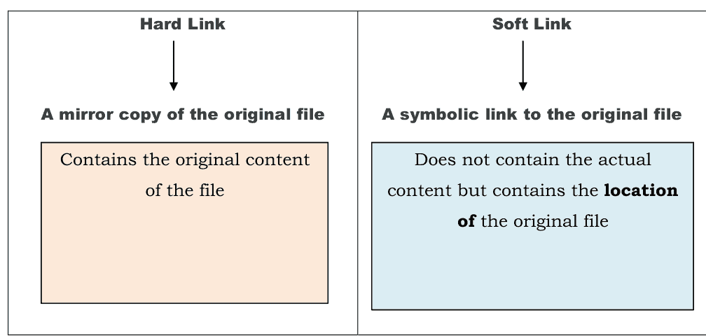

```
ls /bin

# 列出二进制文件和其他可执行程序
```

```
ls /boot

# 列出启动操作系统所需的文件
```

```
ls /dev

# 列出设备文件 - 通常由操作系统和系统管理员控制
```

```
ls /etc

# 列出系统配置文件
```

```
ls /lib

# 列出系统库
```

```
mkdir mydir{1,2,3,4,5}

**创建 5 个新目录：**

* mydir1
* mydir2
* mydir3
* mydir4
* mydir5
```

```
ls /lib64

# 列出系统库（64 位）
```

```
ls /proc

# 列出有关正在运行的进程的信息
```

```
ls /sbin

# 列出系统管理二进制文件
```

```
ls /var/log

# 列出日志文件
```

```
[manju@localhost ~]$ ls -l myfiles.txt

-rw-r--r--. 1 manju nath 12 Apr 19 20:22 myfiles.txt
```

显示文件 "**myfiles.txt**" 的权限

```
find . -mtime +1 -mtime -3

# 显示当前目录中超过 1 天但少于 3 天的文件
```

```
find . -name "s*" -ls

# 查找以字母 "s" 开头的文件并对其执行 "ls" 命令
```

```
find . -size +3M

# 查找大于 3 兆字节的文件
```

```
[manju@localhost ~]$ cat myfile.txt

ffff
b
eee
cc
```

```
[manju@localhost ~]$ touch file1; touch file2
[manju@localhost ~]$ ls file{1,2}
file1  file2
```

```
[manju@localhost ~]$ cat myfile.txt | sort

b
eee
ffff
```

```
[manju@localhost ~]$ NUMLOGINS=$(who | grep $USER | wc -l)
[manju@localhost ~]$ echo You have $NUMLOGINS login sessions
You have 2 login sessions
```

**命令：**

```
chmod go-rwx myfiles.txt
```

**描述：**

移除文件 "**myfiles.txt**" 上组和其他用户的读、写和执行权限

**命令：**

```
chmod a+rw myfiles.txt
```

**描述：**

**授予所有人对文件 "myfiles.txt" 的读和写权限**

**命令：**

```
!-3
```

**描述：**

**重复执行最近的第三条命令**

```
[manju@localhost ~]$ echo $OSTYPE
linux-gnu
```


**命令：**

```
df -i /dev/sda1
```

**描述：**

检查文件系统上的 Inode

**命令：**

```
ls -il myfiles.txt
```

**描述：**

查找文件 (myfiles.txt) 的 Inode 号

**命令：**

```
getfacl myfiles.txt
```

**描述：**

检查文件 (myfiles.txt) 上配置的 ACL（访问控制列表）

> SSH（**安全外壳或安全套接字外壳**）是一种网络协议，为用户和系统管理员提供了一种通过不安全网络访问计算机的安全方式。

## Linux 中的 3 个标准流：

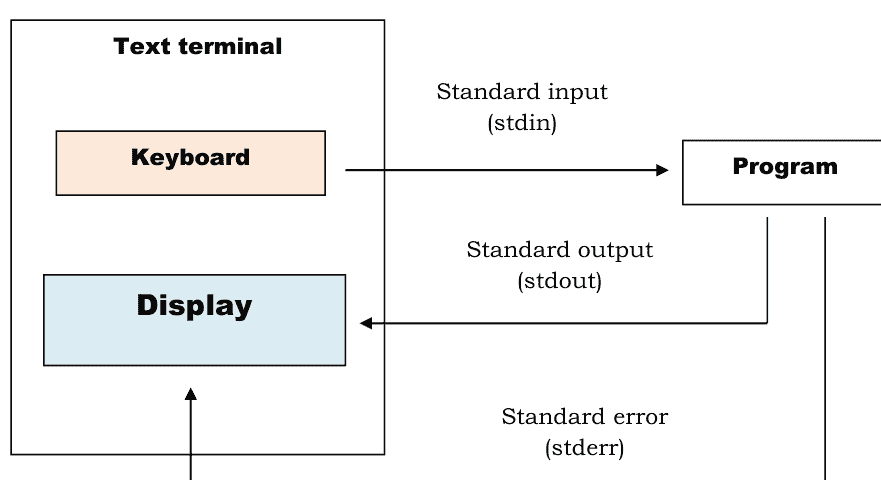

# 命令：

```
du -sh /var/log/*
```

# 描述：

检查机器上文件和目录的磁盘使用情况信息。

# 命令：

```
ldd /bin/cp
```

**描述：**

显示 "cp" 命令的依赖项。

**命令：**

```
ldd -v /bin/cp
```

**描述：**

详细显示 "cp" 命令的依赖项。

**命令：**

```
ldd -u /bin/cp
```

**描述：**

显示 "cp" 命令未使用的直接依赖项。

```
[manju@localhost ~]$ date; cal

Thu Apr 21 19:44:12 PDT 2022

    April 2022
Su Mo Tu We Th Fr Sa
                1  2
 3  4  5  6  7  8  9
10 11 12 13 14 15 16
17 18 19 20 21 22 23
24 25 26 27 28 29 30
```

> **date 命令**执行后紧接着执行 **cal 命令**

| -gt | 大于 |
| -lt | 小于 |
| -ge | 大于或等于 |
| -le | 小于或等于 |
| -eq | 等于 |
| -ne | 不等于 |

```
[manju@localhost ~]$ date && cal

Thu Apr 21 19:44:21 PDT 2022

    April 2022
Su Mo Tu We Th Fr Sa
                1  2
 3  4  5  6  7  8  9
10 11 12 13 14 15 16
17 18 19 20 21 22 23
24 25 26 27 28 29 30
```

> 仅当 **date 命令**成功执行时，才会执行 **cal 命令**

```
[manju@localhost ~]$ ls *.c

hello.c  vim.c
```

```
[manju@localhost ~]$ ls *.[co]

hello.c  hello.o  vim.c
```

```
[manju@localhost ~]$ a=`ls *.c`; echo $a
hello.c main.c vim.c

[manju@localhost ~]$ test 50 -ge 15 && echo true || echo false
true

[manju@localhost ~]$ test 50 -ge 50 && echo true || echo false
true

[manju@localhost ~]$ test 20 -le 50 && echo true || echo false
true

[manju@localhost ~]$ test 20 -le 20 && echo true || echo false
true

[manju@localhost ~]$ test 30 -eq 30 && echo true || echo false
true

[manju@localhost ~]$ test 320 -eq 30 && echo true || echo false
false

[manju@localhost ~]$ test 30 -ne 30 && echo true || echo false
false

[manju@localhost ~]$ test 320 -ne 30 && echo true || echo false
true
```

# 命令：

cat /proc/net/dev

显示网络适配器和统计信息

# 命令：

cat /proc/mounts

显示已挂载的文件系统

# 命令：

telinit 0

关闭系统

cd /home

# 进入主目录

cd ..

# 返回上一级目录

ls * [0-9] *

显示包含数字0到9的文件和文件夹

iconv -l

# 显示已知字符集列表

ls -lSr | more

# 按大小顺序显示文件和目录的大小

du -sk * | sort -rn

# 按大小顺序显示文件和目录的大小

# 命令：

ls -lh

显示权限

# 命令：

yum list

列出系统上已安装的所有软件包

# 命令：

yum clean packages

清理所有已保存的软件包

# 命令：

yum clean headers

清理软件包头文件

# 命令：

yum clean all

清理所有缓存信息

# 命令：

yum clean metadata

清理元数据

ip link show

# 显示所有接口的链路状态

ps -eafw

# 显示Linux任务

lsof -p $$

# 显示进程打开的文件列表

# 命令：

find /var -atime -90

查找 /var 目录中过去90天内未被访问过的文件

# 命令：

find / -name core -exec rm {} \;

在整个目录树中搜索核心文件，并在找到时直接删除，不提示确认

# 命令：

who -r

检查Linux服务器的当前运行级别

# Bash脚本：

for i in *linux*; do rm $i; done

# 描述：

删除当前目录中所有包含"linux"这个词的文件

# 命令：

awk '{print}' myfiles.txt

# 描述：

显示文件（myfiles.txt）的内容

# 命令：

ln myfiles.txt hardF1

为 myfiles.txt 创建硬链接

# 命令：

cat hardF1

检查硬链接 - hardF1 的内容

# 命令：

ln myfiles.txt softF1

为 myfiles.txt 创建软链接

# 命令：

cat softF1

检查软链接 - softF1 的内容

| 前台进程 | 后台进程 |
| --- | --- |
| 需要用户启动或与之交互。 | 独立于用户运行。 |

# 命令：

ps -p 13

显示进程ID为13的进程信息

# 命令：

ulimit -f 100

将文件大小限制设置为51,200字节

# 命令：

lsmod

找出当前已加载的内核模块

| 绝对路径 | 相对路径 |
|---|---|
| 从根目录开始的文件或目录路径。 | 从当前工作目录开始的文件或目录路径。 |

# 命令：

sudo yum install php

安装php 7.2版本

# 命令：

php -r 'echo "Hello World\r\n";'

从命令行运行PHP语句，无需创建文件

# 命令：

php -a

启动PHP交互式shell

# 命令：

du -h -d 1 /

显示所有顶级目录的磁盘使用情况

# 命令：

yum install man

在Centos中安装man软件包

# 命令：

man -f ls

显示ls命令的手册页并打印简短描述

man -a ls

# 显示ls命令的所有手册页

man -k ls

# 允许用户搜索ls命令的简短命令描述和手册页名称

man -w ls

# 显示ls命令手册页的位置

cat /etc/redhat-release

# 显示Linux发行版名称和版本

ls ~

# 显示主目录的内容

ls ../

# 显示父目录的内容

# 命令：

ps -U root -u root

显示在root用户账户下运行的所有进程

# 命令：

cal -1

显示当前月份的日历

# 命令：

cal -j

以天数形式打印日历

# 命令：

su

用于从一个账户切换到另一个账户

# 命令：

nmcli connection show

显示我们系统中已连接的网络连接

# 命令：

ps aux | grep 'telnet'

搜索进程'telnet'的ID

ps r

# 仅列出Linux上正在运行的进程

ps T

# 列出当前终端上的所有进程

ps -f

# 列出与当前终端关联的父进程ID一起的进程

ps -x

# 查看您拥有的所有进程

ps -eo pid,ppid,cmd,%mem,%cpu --sort=-%mem

# 显示使用内存最高的进程

sudo yum list --installed | more

# 列出CentOS上已安装的软件包

# 命令：

sudo rpm -qa

sudo rpm -qa | more

使用rpm命令获取所有已安装软件包的列表

# 命令：

sudo rpm -q nginx

检查nginx软件包是否已安装

# 命令：

sudo rpm -q bash

检查bash软件包是否已安装

# 命令：

sudo yum history

使用yum history命令列出CentOS上所有已安装的软件包

# 命令：

sudo yum history info 2

使用事务ID [2] 详细检查历史记录条目

# 命令：

file /etc/passwd

显示给定文件的文件类型

```
[root@localhost manju]# file /etc/passwd
/etc/passwd: ASCII text
```

# 命令：

wc /etc/passwd

输出：

46  91 2373 /etc/passwd

/etc/passwd 文件有46行，91个单词和2373个字母

# 命令：

grep root: /etc/passwd

显示 /etc/passwd 中包含字符串"root"的所有行

# 命令：

grep -n root /etc/passwd

显示 /etc/passwd 中包含字符串"root"的所有行，并显示行号

# 命令：

grep -c false /etc/passwd

显示shell为 /bin/false 的账户数量

# 命令：

`grep ^root: /etc/passwd`

显示 `/etc/passwd` 中以字符串"**root**"后跟冒号开头的所有行

# 命令：

`last | head`

显示登录和注销系统的用户信息

（仅显示前10行）

bash

lastb

# 显示最近未成功的登录尝试

du /etc/passwd

# 显示 /etc/passwd 文件的磁盘使用情况

killall proc

# 终止所有名为proc的进程

wget https://repo.mysql.com/mysql80-community-release-el8-1.noarch.rpm

# 下载RPM文件以进行安装

sudo yum localinstall mysql80-community-release-el8-1.noarch.rpm

# 安装RPM文件

sudo yum localinstall https://repo.mysql.com/mysql80-community-release-el7-1.noarch.rpm

# 通过URL安装RPM软件包

curl --version

# 显示curl版本

curl -O http://website.com/myfiles.tar.gz

# 从url "http://website.com/myfiles.tar.gz" 下载文件（myfiles.tar.gz）

# 保存为 myfiles.tar.gz

curl -o files.tar.gz http://website.com/myfiles.tar.gz

# 从url "http://website.com/myfiles.tar.gz" 下载文件（myfiles.tar.gz）

# 保存为 files.tar.gz

echo 'https://repo.mysql.com/mysql80-community-release-el8-1.noarch.rpm' > urls.txt

xargs -n 1 curl -O < urls.txt

# 从"urls.txt"文件中的URL列表下载文件

exit 110

# 从终端窗口退出

sudo -l

# 了解当前主机上允许和不允许执行哪些命令

# 命令：

echo -e "\thello\nworld"

history | grep cd | head -12

搜索历史记录中前12条包含cd单词匹配的命令

## 开源操作系统的缺点：

- 难以使用
- 兼容性问题

# 命令：

rpm -qa | grep ftp

检查所有已安装的ftp软件包

# 命令：

find /home -mtime +120

查找 /home 目录中修改时间超过120天的文件

## Samba 使得 Linux / UNIX 机器能够在网络中与 Windows 机器通信。

- `/etc` 目录包含 Linux 中的配置文件。
- 网络文件系统（NFS）是一种在网络上存储文件的机制。
- "init" 是 Linux 中的第一个进程，由内核启动，其进程 ID 为 1。

```
egrep "Hello|Einstein" file.txt
```

返回 file.txt 中包含 Hello 或 Einstein 的行

```
date "+%s"
```

以秒为单位打印日期

```
cat file.txt | uniq
```

仅显示重复记录一次

```
Command:
cd ../../..
```

返回上三级目录

```
Command:
ps -ef | grep xlogo

Description:
列出系统中所有包含字符串 'xlogo' 的进程
```

```
echo -n "abc";echo "def"
```

abcdef

```
echo "abc";echo "def"
```

abc
def

```
ls -ltr /etc
```

按最后修改时间顺序列出 /etc 中的文件

```
Command:
ls -Rlh /var | grep [0-9]M

Description:
列出 /var 中大于 1 兆字节但小于 1 吉字节的文件
```

```
Command:
ls -lhS

Description:
按大小列出文件
```

```
cat /etc/passwd /etc/group

# 显示多个文件（/etc/passwd 和 /etc/group）的内容

find /tmp -name *.txt -exec rm -f {} \;

# 在 /tmp 目录中搜索所有名为 *.txt 的文件并删除它们
```


```
watch -n 5 tail -n 3 /etc/passwd
# 每 5 秒显示一次 /etc/passwd 文件的末尾
```

```
watch -n 1 'ls -l | wc -l'
# 监视文件夹中的文件数量
```

```
watch -t -n 1 date
# 显示时钟
```

```
find / -name "*.txt"
# 搜索所有扩展名为 .txt 的文件
```

```
find . -name "*file*"
# 搜索所有名称中包含 "file" 的文件
```

```
find /home -name "*file*"
# 搜索 /home 中所有名称中包含 "file" 的文件
```

```
grep -nre "hello computer" ./*
# 在当前目录中搜索包含字符串 "hello computer" 的文件
```

```
(echo In Linux; exit 0) && echo OK || echo exit
```

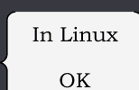

```
(echo In Linux; exit 4) && echo OK || echo exit
```

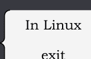

**Command:**

`free -t -m`

以 MB 为单位显示空闲内存大小

**Command:**

`gnome-system-monitor`

**Description:**

显示正在运行的程序以及处理器时间、内存和磁盘空间的使用情况

`lsblk -m`

显示设备权限和所有权

`lsblk -S`

显示 **SCSI**（小型计算机系统接口）设备

`lsblk -n` -> 列出**设备**，不显示标题

**Command:**

`ls -l ~`

**Description:**

检查文件和文件夹权限

**Command:**

`ls ./Documents`

**Description:**

显示 Documents 文件夹中的文件列表

```
ls -R
# 列出子目录的所有内容

compgen -c
# 显示我们可以在命令行界面中使用的所有命令列表

hostnamectl
# 显示系统信息，包括操作系统、内核和发行版本
```

- `pwd -L` → 打印符号路径
- `pwd -P` → 打印实际完整路径

```
Command:
find . -type f
查找文件
```

```
Command:
find . -type d
Description:
查找目录
```

```
find . -iname "*.jpg"
按不区分大小写的扩展名查找文件（例如：.jpg, .JPG, .jpG）
```

```
find . -type f -perm 777
按八进制权限查找文件
```

```
cd logs; ls -lt | head; du -sh ; df -h
```

使用 ";" 运算符将上述所有任务连接在一行中

```
{ echo "Albert Einstein"; pwd; uptime; date; }
```


```
Albert Einstein
/home/manju
00:26:53 up 28 min, 2 users, load average: 0.00, 0.01, 0.05
Tue Mar 29 00:26:53 PDT 2022
```

```
cal; { date; uptime; }; pwd
```

```
March 2022
Su Mo Tu We Th Fr Sa
       1  2  3  4  5
 6  7  8  9 10 11 12
13 14 15 16 17 18 19
20 21 22 23 24 25 26
27 28 29 30 31
Tue Mar 29 00:52:38 PDT 2022
00:52:38 up 54 min, 2 users, load average: 0.00, 0.01, 0.05
/home/manju
```

```
shutdown -r
# 启动重启
shutdown +0
# 立即关闭系统
shutdown -r +5
# 五分钟后开始重启系统
```

```
kill 12838
```

终止进程 ID 为 12838 的进程

```
ss -t -r state established
```

列出所有已建立的端口

```
shutdown -Fr now
```

在重启期间强制进行文件系统检查

```
ss -t -r state listening
```

列出所有处于监听状态的套接字

```
mtr google.com
```

诊断网络问题

```
sudo tcpdump --list-interfaces
```

列出所有网络接口

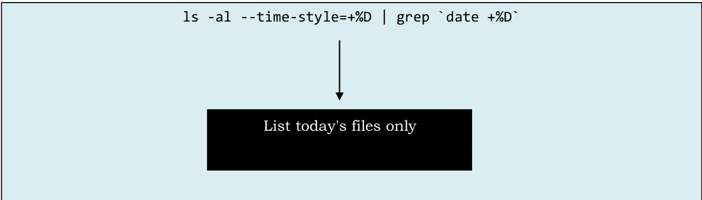

```
mpstat -P 0

# 打印处理器统计信息，帮助监控系统上的 CPU 使用率

chmod 777 myfiles.txt

# 为所有人分配（读、写和执行）权限

chmod 766 myfiles.txt

# 为所有者分配完全权限，为组和其他人分配读写权限

chmod -x myfiles.txt

# 移除 myfiles.txt 文件的执行权限

history 30

# 列出我们在系统上输入的最后 30 条命令

find ~ -empty

# 查找主目录中的所有空文件

gzip -l *.gz

# 显示压缩文件的压缩比
```

```
Command:
ps -efH | more

以树状结构查看当前正在运行的进程
```

```
Command:
df -T

Description:
显示文件系统类型
```

```
mkdir ~/temp

在主目录下创建一个名为 temp 的目录
```

```
ls *py
# 列出所有 Python 文件

chsh -l
# 显示所有 shell 的列表

ipcs -a
# 显示有关消息队列、信号量和共享内存的详细信息
```

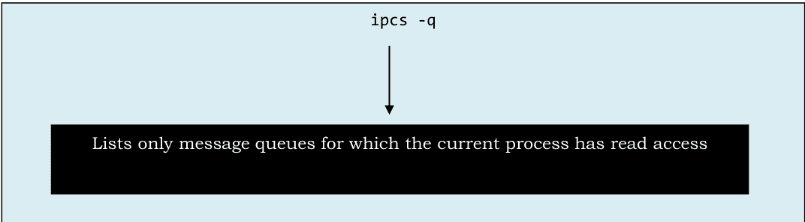

```
ipcs -s
# 列出可访问的信号量

ipcs -m
# 列出所有共享内存

quotastats
# 显示从内核收集的配额系统统计报告

rpcinfo
# 显示本地主机的所有 RPC（远程过程调用）服务

slabtop
# 实时显示内核 slab 缓存信息

tload
# 在指定的 tty 上显示当前系统负载平均值的图形
```

```
cat /proc/devices

# 显示为当前运行的内核配置的设备驱动程序
```

```
cat /proc/dma

# 显示当前使用的 DMA 通道
```

```
cat /proc/filesystems

# 显示配置到内核中的文件系统
```

```
cat /proc/kmsg

# 显示内核生成的消息
```

```
cat /proc/loadavg

# 显示系统负载平均值
```

```
ls /proc/net

# 列出网络协议
```

```
ls /etc/udev

# 列出 udev 配置目录的内容
```

```
cat /proc/stat

# 显示系统操作统计信息
```

```
cat /proc/uptime

# 显示系统已运行的时间
```

## Command:

```
poweroff -i -f
```

关闭系统

```
[ 2 = 2 ] ; echo $?
# 0（逻辑上为真）

[ 2 = 6 ] ; echo $?
# 1（逻辑上为假）

type echo
# echo 是一个 shell 内置命令
```

```
find /usr -print
# 查找并打印 "/usr" 下的所有文件

systemctl list-units --type=target
# 列出所有目标单元配置

systemctl list-units --type=service
# 列出所有服务单元配置

systemctl list-sockets
# 列出内存中的所有套接字单元
```

```
systemctl list-timers
# 列出内存中的所有定时器单元

systemctl list-dependencies --all
# 列出所有单元服务的依赖关系

systemctl poweroff
# 关闭系统
```

```
systemctl reboot
# 关闭并重启系统
```

```
systemctl suspend
# 挂起系统
```

```
netstat -ln --tcp
# 查找监听的 TCP 端口（数字形式）
```

```
systemctl hibernate
# 休眠系统
```

```
loginctl user-status
# 显示调用者会话用户的简要运行时状态信息
```

```
loginctl session-status
# 显示调用者会话的简要运行时状态信息
```

```
ip route show
# 以数字地址显示所有路由表
```

```
ip neigh
# 显示 ARP（地址解析协议）缓存表的当前内容
```

```
netstat -l --inet
# 查找监听端口
```

# 命令：

```
atq
```

列出用户的待处理作业

```
lsof | grep deleted
```

打印所有声称占用磁盘空间的已删除文件

```
echo $$
```

显示当前进程的进程 ID

```
echo $!
```

显示最近启动的后台作业的进程 ID

```
date --date="yesterday"
```

显示昨天的日期

```
date --date="10 days ago"
```

显示10天前的日期

```
ls / | wc -w
```

列出根目录中的目录数量

```
sudo sfdisk -l -uM
```

以 MB 为单位显示每个分区的大小

```
sudo parted -l
```

列出分区详细信息

```
df -h | grep ^/dev
```

过滤出真实的硬盘分区/文件系统

```
sudo blkid
```

显示有关可用块设备的信息

```
ls / > info.txt
cat info.txt
```

```
export NAME="Albert Einstein"
echo $NAME
```

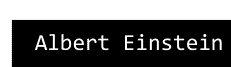

+   bin
boot
dev
etc
home
lib
lib64
media
mnt
opt
proc
root
run
sbin
srv
sys
tmp
usr
var

```
TZ=US/Pacific date
```

以美国/太平洋时区显示当前日期/时间

```
ls -l /etc/shadow
```

显示以加密形式存储的用户密码和密码过期数据

```
sudo journalctl --since yesterday
```

显示自昨天以来的所有日志

```
sudo journalctl --since "2019-12-10 13:00:00"
```

显示自 2019-12-10 13:00:00 以来的所有日志

```
journalctl -disk-usage
```

显示日志的总大小

# 命令：

```
ls -m
```

以逗号分隔打印目录和文件

```
ls -Q
```

为所有目录和文件添加引号

```
ss -f unix
```

列出 Unix 套接字

```
echo *.desktop
```

列出当前目录中所有 .desktop 文件

```
ss --raw
```

列出原始套接字

```
tracepath www.google.com
```

追踪到网络主机 (www.google.com) 的路径，并沿途发现 MTU

```
echo -e "123\b4"
```

3 被 4 覆盖

```
echo -e "123\r456"
```

123 被 456 覆盖

```
echo D*
```

列出当前目录中所有以字母 D 开头的文件和目录

```
echo '$'\'I\'m a Linux Learner.'
```

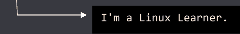

```
echo $USER
```

打印当前登录用户的名称

```
echo -e "\033[0;32mGREEN"
```

GREEN

```
echo -e "\033[0;31mRED"
```

RED

```
echo -e 'Hello, \vWorld!'
```

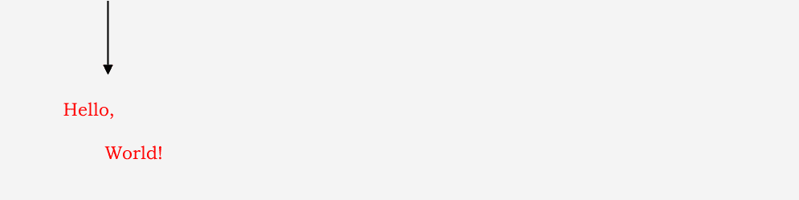

```
echo "This is the list of directories and files on this system: $(ls)"
```

- 这是此系统上的目录和文件列表：Desktop
- Documents
- Downloads
- Music
- Pictures
- Public
- Templates
- Videos

```
echo *s
```

打印所有以字母 "s" 结尾的文件和文件夹

```
echo [[:upper:]]*
```

打印所有以大写字母开头的文件和文件夹

```
echo $((2 + 3))
→ 5
```

```
echo $(($( ((2**2)) ) * 3))
→ 12
```

```
echo Four divided by two equals $((4/2))
→ Four divided by two equals 2
```

```
echo Capital-{A,B,C}-Letter
→ Capital-A-Letter Capital-B-Letter Capital-C-Letter
```

```
echo {1..5}
→ 1 2 3 4 5
```

```
echo {A..Z}
→ A B C D E F G H I J K L M N O P Q R S T U V W X Y Z
```

```
echo x{P{1,2},Q{3,4}}y
→ xP1y xP2y xQ3y xQ4y
```

```
echo The total price is $500.00
→ The total price is 00.00
```

```
echo "$USER $((3*2)) $(cal)"
```

```
manju 6       March 2022
Su Mo Tu We Th Fr Sa
         1  2  3  4  5
 6  7  8  9 10 11 12
13 14 15 16 17 18 19
20 21 22 23 24 25 26
27 28 29 30 31
```

```
echo -e "\aMy Laptop shut "down"."
→ My Laptop shut "down".

echo -e "C:\WIK2N\LINUX_OS.EXE"
→ C:\WIK2N\LINUX_OS.EXE
```

```
echo $(cal)
```

```
March 2022 Su Mo Tu We Th Fr Sa 1 2 3 4 5 6 7 8 9 10 11 12 13 14 15 16 17 18 19 20 21 22 23 24 25 26 27 28 29 30 31
```

```
echo "$(cal)"
```

```
March 2022
Su Mo Tu We Th Fr Sa
         1  2  3  4  5
 6  7  8  9 10 11 12
13 14 15 16 17 18 19
20 21 22 23 24 25 26
27 28 29 30 31
```

```
echo The total price is \$500.00
→ The total price is $500.00
```

```
sudo lsof -i -P -n | grep LISTEN
sudo netstat -tulpn | grep LISTEN
```


```
sudo ss -tulw
```

检查哪些端口是开放的

```
netstat -ap | grep ssh
```

找出程序在哪个端口上运行

```
[root@localhost manju]# ipcs -m -l
------ Shared Memory Limits --------
max number of segments = 4096
max seg size (kbytes) = 18014398509465599
max total shared memory (kbytes) = 18014398442373116
min seg size (bytes) = 1
```


```
[root@localhost manju]# ipcs -m -p
------ Shared Memory Creator/Last-op PIDs --------
shmid      owner      cpid      lpid
131072     manju      2998      3135
163841     manju      2998      3135
327682     manju      3277      6920
360451     manju      2827      1406
```

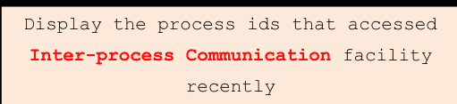

```
[root@localhost manju]# ipcs -u

------- Messages Status --------

allocated queues = 0

used headers = 0

used space = 0 bytes

------- Shared Memory Status --------

segments allocated 4

pages allocated 2432

pages resident  319

pages swapped   0

Swap performance: 0 attempts     0 successes

------- Semaphore Status --------

used arrays = 0

allocated semaphores = 0
```

> 显示**进程间通信**设施的当前使用状态

```
dmidecode -t 16
```

显示系统支持的最大 RAM

```
dmidecode -t baseboard
```

显示所有系统主板相关信息

```
dmidecode -t bios
```

显示 BIOS 信息

# 命令：

```
dmidecode -t system
```

# 描述：

显示有关系统制造商、型号和序列号的信息


> Linux 的哲学是“笑对危险”。哎呀。说错了。是“自己动手”。是的，就是这个。

**Linus Torvalds**

```
nmcli con show -a
```

显示活动的网络连接

```
netstat -r
```

显示内核路由表

```
yum install nmap
```

在 CentOS 上安装 nmap

```
nmap google.com
```

扫描主机名

```
nmap 193.169.1.1
```

扫描 IP 地址

```
nmap --iflist
```

显示主机接口和路由

```
echo [![:digit:]]*
```

打印所有不以数字开头的文件和文件夹

```
echo *[[:lower:]123]
```

打印所有以小写字母或数字结尾的文件和文件夹

```
echo g*
```

打印所有以 "g" 开头的文件和文件夹

```
echo b*.txt
```

打印所有以 "b" 开头，后跟任意字符并以 ".txt" 结尾的文件和文件夹

```
echo [abc]*
```

打印所有以 "a"、"b" 或 "c" 开头的文件和文件夹

```
netstat -t
```

显示活动连接的下载状态

```
netstat -x
```

显示有关所有连接、侦听器和网络直接共享端点的信息

```
netstat -n
```

以数字形式显示地址和端口号

```
echo $LANG
```

显示 Linux 系统的语言

```
echo "AAA" | grep AAA
→ AAA
```

```
echo "AAA" | grep BBB
→
```

```
echo "AAA" | grep -E 'AAA|BBB'
→ AAA
```

```
echo "BBB" | grep -E 'AAA|BBB'
→ BBB
```

```
echo "albert einstein" | tr a-z A-Z
→ ALBERT EINSTEIN
```

```
echo "albert einstein" | tr [:lower:] E
→ EEEEEE EEEEEEE
```

```
echo "Albert Einstein was a German-born theoretical physicist." | fold -w 12
```

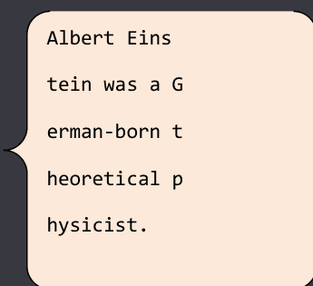

```
echo " Albert Einstein was a German-born theoretical physicist." | fold -w 12 -s
```

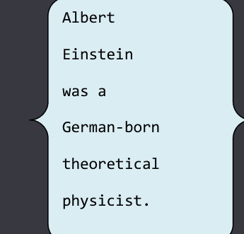

```
printf "English theoretical physicist: %s\n" Hawking
→ English theoretical physicist: Hawking
```

```
ls /usr/bin | pr -3 -w 65 | head
```

以分页、三列输出格式显示 /usr/bin 的目录列表

```
for i in A B C D; do echo $i; done
```

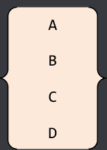

```
Scientists=("Einstein" "Hawking" "Darwin"); for i in ${Scientists[*]}; do echo $i; done
```

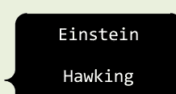

```
for i in {A..D}; do echo $i; done
```

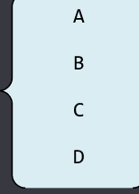

```
Scientists=("Einstein" "Hawking" "Darwin"); for i in "${Scientists[*]}"; do echo $i; done
```


```
for i in file*.txt; do echo $i; done
```

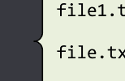

```
echo ${!BASH*}
```

列出环境中所有以 BASH 开头的变量

```
bc <<< "6+6"
```


## 文件系统与磁盘管理

```
df -k
# 检查文件系统空间
```

```
ls -alh
# 列出目录中所有文件夹的详细信息
```

```
find /home -name file.txt
# 检查/home目录下所有名为file.txt的文件
```

```
find /home -iname File.txt
# 在/home目录中搜索所有文件，不区分大小写
```

```
find / -ctime +90
# 搜索超过90天未修改的文件
```

```
find / -size 0c
# 搜索所有空文件
```

```
find / -size +1G
# 搜索所有大于1GB的文件和文件夹
```

```
df -a
# 显示文件系统的完整磁盘使用情况
```

```
df -i
# 显示已用和空闲的inode数量
```

```
du -ch *.png
# 显示当前目录中每个png文件的大小
```

```
du -a /etc/ | sort -n -r | head -n 10
# 列出/etc/目录下占用磁盘空间最大的前10个目录
```

## 用户与会话管理

```
ac
# 显示用户连接到系统的总时长
```

```
ac --individual-totals
# 显示每个用户的登录时间报告
```

```
cancel
# 取消打印任务
```

```
yum install finger
# 安装finger工具（CentOS）
```

```
finger manju
# 显示用户"manju"的详细信息
```

```
chfn
# 允许你修改用户信息
```

```
finger -s manju
# 显示用户"manju"的空闲状态和登录详情
```

## 用户组管理

```
groups
# 列出当前用户所属的所有组
```

```
id -nG
# 列出当前用户所属的所有组
```

```
groupadd mygroup
# 创建一个名为"mygroup"的新组
```

```
groupdel mygroup
# 删除名为"mygroup"的组
```

```
less /etc/group
# 列出所有组
```

```
getent group
# 列出所有组
```

```
usermod -a -G mygroup manju
# 将现有用户"manju"添加到组"mygroup"
```

```
userdel manju
# 删除用户"manju"
```

```
chgrp mygroup test.txt
# 将文件test.txt的所属组更改为名为"mygroup"的组
```

## 内核与模块管理

```
sudo depmod -a
# 生成所有内核模块依赖关系及关联映射文件的列表
```

## 文件与目录操作

```
dirname /usr/bin
→ /usr
```

```
dirname /Desktop/root
→ /Desktop
```

```
dmesg > kernel_messages.txt
# 将内核环形缓冲区的所有消息读取到文件"kernel_messages.txt"
```

```
dmesg | grep -i memory
# 显示与内存使用相关的内核消息
```

```
egrep -c '^Hello|World$' myfiles.txt
# 统计myfiles.txt中以单词'Hello'开头或以单词'World'结尾的行数
```

```
ex myfiles.txt
# 编辑文件myfiles.txt
```

```
expand myfiles.txt
# 展开文件myfiles.txt - 将制表符转换为空格 - 并在标准输出上显示
```

```
expand --tabs=10 myfiles.txt > myfiles0.txt
# 将文件myfiles.txt中的制表符转换为10个空格，并将输出写入myfiles0.txt
```

```
expr 2 = 5
# 0
```

## 命令历史与文本处理

```
fc -l
# 列出命令历史记录
```

```
!l
# 执行最近执行过的以字母"l"开头的命令
```

```
fc -e - l
# 执行最近执行过的以字母"l"开头的命令
```

```
fmt myfiles.txt
# 显示文件"myfiles.txt"的重新格式化版本
```

```
fmt < myfiles.txt > myfiles0.txt
# 重新格式化"myfiles.txt"并将输出写入文件"myfiles0.txt"
```

```
finger -p manju
# 显示用户"manju"的信息
```

```
fold -w5 myfiles.txt > myfiles0.txt
# 将myfiles.txt的行宽折叠为5个字符，并将输出写入myfiles0.txt
```

```
for file in *.txt ; do wc -l $file ; done
# 对当前目录中所有扩展名为.txt的文件执行行数统计
```

## 用户与组信息查询

```
grep manju /etc/passwd
# 在/etc/passwd中搜索用户"manju"
```

```
groupmod -n group mygroup
# 将组"mygroup"重命名为"group"
```

```
head myfiles.txt
# 显示"myfiles.txt"的前10行
```

```
head -15 myfiles.txt
# 显示"myfiles.txt"的前15行
```

```
head myfiles.txt myfiles0.txt
# 显示myfiles.txt和myfiles0.txt的前10行 - 每个文件前显示文件名标题
```

```
head -n 5K myfiles.txt
# 显示"myfiles.txt"的前5,000行
```

```
head -n 4 *.txt
# 显示工作目录中所有扩展名为.txt的文件的前4行
```

## 系统监控与日志

```
iostat
# 显示操作系统存储输入输出统计信息
```

```
last reboot | less
# 显示最近登录用户列表及系统最后重启时间和日期
```

```
last -x | less
# 显示上次关机日期和时间
```

```
last shutdown
# 显示上次关机日期和时间
```

## 程序依赖与文件查看

```
ldd /bin/bash
# 显示程序/bin/bash的共享库依赖关系
```

```
less -N myfiles.txt
# 查看文件myfiles.txt - 在每行开头显示行号
```

## 文件列表与搜索

```
ls *.{html,php,txt}
# 列出所有扩展名为.html、.php和.txt的文件
```

```
ls /
# 列出根目录的内容
```

```
ls [aeiou]*
# 仅列出以元音字母（a, e, i, o和u）开头的文件
```

## 网络与进程文件

```
lsof -i -U
# 列出所有打开的Internet、x.25（HP-UX）和UNIX域文件
```

```
lsof -i 4 -a -p 555
# 列出进程ID为555的进程使用的所有打开的IPv4网络文件
```

```
lsof -i 6
# 仅列出打开的IPv6网络文件
```

## 压缩与模块信息

```
xz myfiles.txt
# 将文件"myfiles.txt"压缩为"myfiles.txt.xz"
```

```
xz -dk myfiles.txt.xz
# 将"myfiles.txt.xz"解压为"myfiles.txt"
```

```
mkdir -m a=rwx dir
# 创建目录"dir"并设置其文件模式，使所有用户均可读、写和执行
```

```
modinfo snd
# 显示关于"snd" Linux内核模块的所有可用信息
```

```
more +3 myfiles.txt
# 从第3行开始显示文件"myfiles.txt"的内容
```

```
more +/"Hello" myfiles.txt
# 从包含字符串"Hello"的第一行开始显示文件"myfiles.txt"的内容
```

## 网络统计

```
netstat -g
# 显示IPv4和IPv6的多播组成员信息
```

```
netstat -c
# 每隔几秒打印一次netstat信息
```

```
netstat -natp
# 显示活动Internet连接的统计信息
```

```
netstat -rn
# 显示绑定到服务器的所有IP地址的路由表
```

```
netstat -an
# 显示与服务器所有活动连接的信息
```

## 文件内容查看与信号处理

```
od -b myfiles.txt
# 以八进制格式显示"myfiles.txt"的内容
```

```
od -Ax -c myfiles.txt
# 以ASCII字符格式显示"myfiles.txt"的内容 - 字节偏移量以十六进制显示
```

```
trap -l
# 显示信号名称及其对应编号的列表
```

```
trap
# 显示当前设置的信号陷阱列表
```

## 软件包管理

```
yum list openssh
# 搜索名为"OpenSSH"的软件包
```

```
yum grouplist
# 列出所有可用的组软件包
```

```
yum repolist
# 列出所有已启用的Yum仓库
```

```
yum repolist all
# 列出所有已启用和已禁用的Yum仓库
```

## 文件合并与打印

```
paste 1.txt 2.txt
# 并排显示1.txt和2.txt的内容
```

```
ls -a | pr -n -h "Files in $(pwd)" > dc.txt
```

```
cat dc.txt
```

```
2022-04-02 01:10          Files in /home/manju          Page 1

 1    .
 2    ..
 3    1.txt
 4    2.txt
 5    .bash_history
 6    .bash_logout
 7    .bash_profile
 8    .bashrc
 9    bio.txt
10    .cache
11    .config
12    Data.txt
13    Desktop
14    dir
15    Documents
```

## 格式化输出与进程信息

```
printf "Hi, I'm %s.\n" $LOGNAME
→ Hi, I'm manju.
```

```
printf "%.*s" 6 "abcdefg"
→ abcdef
```

```
ps -eLf
# 获取线程信息
```

```
ps axms
# 获取线程信息
```

- ps -eo euser,ruser,suser,fuser,f,comm,label
- ps axZ
- ps -eM

**命令：**

pstree -h

**描述：**

以树状结构显示所有进程，并高亮显示当前进程及其祖先进程

## 文件删除

```
rm -- 1.txt
# 删除当前目录中的"1.txt"文件
```

```
rm /home/manju/2.txt
# 删除目录"/home/manju"中的"2.txt"文件
```

## 路由与网络配置

```
ip route list
# 列出当前路由表
```

```
route -n
# 显示绑定到服务器的所有IP地址的路由表
```

## 脚本录制

```
script -c 'echo "Hello, World!"' hello.txt
```

```
Script started, file is hello.txt

Hello, World!

Script done, file is hello.txt
```

```
cat hello.txt
```

```
Script started on Sat 02 Apr 2022 03:24:52 AM PDT

Hello, World!

Script done on Sat 02 Apr 2022 03:24:52 AM PDT
```

## 磁盘与SSH检查

```
sfdisk -s
# 列出所有磁盘的大小
```

```
ls -d ~/.ssh
# 检查.ssh目录是否存在
```

## 文件校验

```
sha224sum myfiles.txt
# 显示当前目录中"myfiles.txt"文件的SHA224校验和
```

## 什么是 Linux，它为何如此流行？

无论你是否意识到，你每天都在使用 Linux（最著名且使用最广泛的开源操作系统）。从超级计算机到智能手机，Linux 操作系统无处不在。作为一种操作系统，Linux 是一个基于 Linux 内核的开源类 Unix 软件家族——它位于计算机所有其他软件的底层，接收这些程序的请求并将其转发给计算机的硬件。就职业发展而言，掌握 Linux 技能正变得越来越有价值，而不仅仅是知道如何使用 Windows。总的来说，Linux 比 Windows 更难管理，但提供了更多的灵活性和配置选项。

每台台式计算机都使用操作系统。当今最流行的操作系统有：Windows、Mac OS 和 LINUX。Linux 是最著名的、以可靠性和高安全性著称的开源可移植操作系统——非常像 UNIX——在过去几年中变得非常流行——最初由芬兰赫尔辛基大学的计算机科学学生 Linus Torvalds 在 1990 年代初作为一项兴趣任务创建，后来由全球数千人共同开发。

Linux 速度快、免费且易于使用，它位于计算机所有其他软件的底层——运行你的计算机——处理你与硬件之间的所有交互，即无论你是在电脑上撰写信件、计算财务预算，还是管理食谱，Linux 操作系统（类似于其他操作系统，如 Windows XP、Windows 7、Windows 8 和 Mac OS X）都提供了计算机运行所必需的基础支持。

Linux 是二十一世纪最重要的技术进步，并且在 Linux 使用的通用公共许可证（GPL）下，确保该软件始终对任何人开放，其源代码开放且可供任何用户检查，这使得发现和修复漏洞变得更容易，并且它为 Google、Facebook、Twitter、NASA 和纽约证券交易所等机构的笔记本电脑、开发机器和服务器提供动力，仅举几例。Linux 还有许多其他令人惊叹的功能，例如：Live CD/USB、图形用户界面（X Window System）等。

## 为什么选择 LINUX？

尽管 Microsoft Windows（它最有可能成为病毒和恶意软件的受害者）近年来在可靠性方面取得了很大进步，但它被认为不如 Linux 可靠。Linux 以可靠性和安全性著称，它免受持续对抗病毒和恶意软件的困扰（这些病毒和恶意软件可能会通过损坏文件、导致速度变慢、崩溃、昂贵的维修以及接管操作系统的基本功能来影响你的台式机、笔记本电脑和服务器）——并且它让你免于支付许可费用，即零成本入门……就像免费一样。你可以在地球上任意多台可靠的计算机生态系统上安装 Linux，而无需为软件或服务器许可支付一分钱。而 Microsoft Windows 通常每份许可副本的费用在 99.00 美元到 199.00 美元之间，并且存在丢失数据的风险。

以下是 Linux 当今应用的一些示例：

- 安卓手机和平板电脑
- 服务器
- 电视、相机、DVD 播放器等
- 亚马逊
- 谷歌
- 美国邮政服务
- 纽约证券交易所


Linux 操作系统主要有三个组成部分：

- **内核**

内核是 Linux 操作系统的核心部分，直接与硬件交互。它负责 Linux 操作系统的所有主要活动。

- **系统库**

系统库是特殊程序，应用程序通过它们访问内核的功能。

- **系统实用程序**

系统实用程序程序负责执行专门的任务。

## Linux 操作系统的重要特性：

- 可移植
- 开源
- 多用户
- 多程序
- 分层文件系统
- 安全


现在，Linux（已被全球数百万用户成功使用）已经超越了几乎专用于学术系统的阶段，仅对少数具有技术背景的人有用。它提供的不仅仅是操作系统：有一个完整的基础设施支持着创建操作系统、为其制作和测试程序、将一切带给用户、提供维护、更新和支持以及定制化的整个工作链，可以在包括 Intel 和 Alpha 平台在内的不同平台上运行。如今，Linux 已准备好接受快速变化世界的挑战，执行各种类型的操作、调用应用程序等。由于招聘重点越来越倾向于 DevOps 类型的技能，Linux 技能组合将是让你非常具有可部署性的那类技能。

```
sha256sum myfiles.txt
# Display the SHA256 checksum of the "myfiles.txt" file in the current directory
```

```
sha384sum myfiles.txt
# Display the SHA384 checksum of the "myfiles.txt" file in the current directory
```

```
sha512sum myfiles.txt
# Display the SHA512 checksum of the "myfiles.txt" file in the current directory
```

```
shutdown 8:00
# Schedule the system to shut down at 8 A.M
```

```
shutdown 20:00
# Schedule the system to shut down at 8 P.M
```

```
shutdown +15 "The system will be shutdown in 15 minutes."
# Schedule the system to shut down in 15 minutes with the normal message alerting users that the system is shutting down
```

```
shutdown -P now
# Power off the system immediately
```

```
sleep 10
# Delay for 10 seconds
```

```
startx -- -depth 16
# Start an X session at 16 bits color depth
```

```
time cal
# Reports how long it took for the "cal" command to complete
```

```
tr "[:lower:]" "[:upper:]" < myfiles.txt
# Translate the contents of "myfiles.txt" to uppercase
```

```
tr -cd "[:print:]" < myfiles.txt
# Remove all non-printable characters from "myfiles.txt"
```

```
cat myfiles.txt
```

```
Hello World
```

```
xlsfonts
# Lists all fonts available to the default X server and display
```

```
tr -cs "[:alpha:]" "\n" < myfiles.txt
```

```
Hello
World
```

```
xset q
Display the values of all current X Window System preferences
```

```
uncompress myfiles.txt.xz
# Uncompress the file "myfiles.txt.xz"
```

```
w manju
# Display information for the user named "manju"
```

```
yes | rm -i *.txt
Remove all files with the extension .txt from the current directory
```

```
write albert
# Write a message to the user "albert"
```

```
[manju@localhost ~]$ echo al{an,bert,exander}

alan albert alexander

[manju@localhost ~]$ mkdir {txt,doc,pdf}files

[manju@localhost ~]$ ls

txtfiles docfiles pdffiles
```

```
[manju@localhost ~]$ x=Albert; y="$x won \$100.00"; echo $y

Albert won $100.00

[manju@localhost ~]$ x=5; test $x -eq 10; echo $?

1

exit status of the test command is 1

[manju@localhost ~]$ x=5; test $x -eq 5; echo $?

0

exit status of the test command is 0
```

```
cat /etc/profile

# Display System login initialization file

cat /etc/bashrc

# Display System BASH shell configuration file

cat .bash_profile

# Display Login initialization file
```

```
[manju@localhost ~]$ date

Wed Sep 28 08:14:17 PDT 2022

[manju@localhost ~]$ alias x=date

[manju@localhost ~]$ x

Wed Sep 28 08:14:27 PDT 2022
```

```
[manju@localhost ~]$ echo $BASH_VERSION
4.2.46(1)-release

[manju@localhost ~]$ echo $HISTCMD
290

[manju@localhost ~]$ echo $HOSTTYPE
x86_64

[manju@localhost ~]$ echo $OSTYPE
linux-gnu

[manju@localhost ~]$ echo $PPID
3563

[manju@localhost ~]$ echo $SHLVL
2

[manju@localhost ~]$ echo $TERM
xterm-256color

[manju@localhost ~]$ echo $EUID
1000
```

291

```
[manju@localhost ~]$ PS1="\d"
Sun Oct 02 # Display the Current date

[manju@localhost ~]$ PS1="\h"
localhost # Display the Hostname

[manju@localhost ~]$ PS1="\s"
bash  # Display the Shell type currently active

[manju@localhost ~]$ PS1="\t"
18:42:10  # Display the Time of day in hours, minutes, and seconds

[manju@localhost ~]$ PS1="\u"
manju # Display the Username

[manju@localhost ~]$ PS1="\v"
4.2 # Display the Shell version
```

| PS1="\w" | 显示当前工作目录的完整路径名 |
| PS1="\W" | 显示当前工作目录的名称 |

```
[manju@localhost ~]$ PS1="Hello\n World"
Hello

World

[manju@localhost ~]$ PS1="Hello \ World"
Hello \ World
```

## Linux 目录结构

| 目录 | 功能 |
| :--- | :--- |
| / | Linux 系统的顶层目录，包含所有文件、设备信息和系统信息，这些信息被组织成目录 |
| /home | 存放用户的主目录 |
| /bin | 包含所有基本的命令和实用程序 |
| /usr | 包含系统使用的命令和文件 |
| /usr/bin | 包含实用程序和用户友好的命令 |
| /usr/sbin | 存放用于系统管理的命令 |
| /usr/lib | 包含编程语言库 |
| /usr/share/doc | 包含 Linux 的文档 |
| /usr/share/man | 包含在线的 "man" 手册文件 |
| /var/spool | 包含假脱机文件，例如为网络传输和打印操作生成的文件 |
| /sbin | 包含用于启动系统的系统管理命令 |
| /var | 存放各种文件，包括邮箱文件 |
| /dev | 存放打印机和终端等设备的文件接口 |
| /etc | 存放所有系统文件，包括配置文件 |

```
find myfiles -name '*.c' -ls
```

使用 **-ls** 命令，搜索并显示 "myfiles" 目录中所有具有 **.c 扩展名** 的文件

```
find / -user manju -print
```

查找用户主目录中的每个文件以及该用户在其他用户目录中拥有的每个文件

```
ls /usr/share/X11
# 列出系统 X11 配置和支持文件

ls /etc/X11
# 列出配置文件

ls /etc/gdm
# 显示 GDM 配置目录的内容

ls /usr/share/gdm
# 显示 GDM 配置目录的内容，包括默认设置和主题
```

```
ls /etc/gconf
# 列出 GConf 配置文件

ls /usr/share/gnome
# 列出 GNOME 应用程序使用的文件

ls /usr/share/doc/gnome*
# 显示各种 GNOME 包的文档内容，包括库
```

```
ls /usr/share/icons
# 列出 KDE 桌面和应用程序中使用的图标

rpm -qa | more
# 显示所有已安装软件包的列表
```

```
ls /etc/cron.d
# 列出包含大量 crontab 文件的目录，该目录仅 root 用户可访问

ls /etc/cron.hourly
# 列出每小时执行任务的目录

ls /etc/cron.daily
# 列出每天执行任务的目录

ls /etc/cron.weekly
# 列出每周执行任务的目录

ls /etc/cron.monthly
# 列出每月执行任务的目录

ls /etc/mtab
# 列出当前已挂载的文件系统

ls /etc/services
# 列出系统上运行的服务及其使用的端口
```

```
ls /etc/cups
# 列出 CUPS 打印机配置文件

ls /proc/net
# 列出网络设备的目录
```

```
free -s 3
# 按固定间隔持续显示内存的当前使用状态

ls -lhR /var | grep \- | grep [1-9]*M
# 列出 "/var" 中大于 1 MB 但小于 1 GB 的文件
```

```
whereis -b ls
# 仅搜索与命令 "ls" 相关的二进制文件

whereis -m ls
# 仅搜索与命令 "ls" 相关的手册页

whereis -s ls
# 仅搜索与命令 "ls" 相关的源文件
```

```
[manju@localhost ~]$ echo "Alan" "Mathison" "Turing"
Alan Mathison Turing
```

```
watch -t -n 1 date
# 显示日期
```

```
[manju@localhost ~]$ echo "Albert" > 1.txt && cat 1.txt
Albert
```

```
du -sh * --time
# 检查每个文件的大小及其最后编辑的日期和时间

dmidecode -s system-serial-number
# 显示 Linux 服务器的序列号
```

```
ls -aril
# 显示所有带序列号的文件

yum search mod_
# 显示所有模块
```

```
du -sch *
# 显示当前目录中所有文件和文件夹的大小总和

dmidecode | grep -A3 '^System Information'
# 显示服务器硬件名称和型号

dmesg | grep -i firmware
# 显示所有固件错误
```

```
cat /proc/cpuinfo | grep processor | wc -l
# 显示核心数

netstat -ap | grep 80
# 显示使用端口号 80 的进程 ID
```

```
dmidecode --type memory
# 显示连接到服务器的物理内存

dirs
# 显示当前记住的目录列表
```

```
blkid -i /dev/sda
# 显示有关可用块设备的信息

crontab -e
```

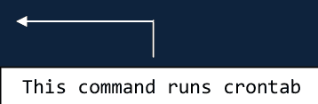

```
[manju@localhost ~]$ df -h /home
Filesystem      Size  Used Avail Use% Mounted on
/dev/sda3        18G  5.2G   13G  29% /
```

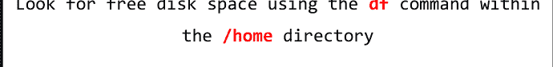

```
[manju@localhost ~]$ hostname -I
192.168.6.131 192.168.122.1
```

显示主机的所有本地 IP 地址

```
badblocks -s /dev/sda
```

# 检查磁盘 sda 上是否有不可读的块

```
tail -10 /var/log/messages
```

# 显示最后 10 条系统日志消息

```
lsof -u manju
```

# 列出用户 "manju" 打开的文件

```
sudo shutdown -r 2
```

# 在 2 分钟后关闭并重启机器

```
[manju@localhost ~]$ cat 1.txt
albert
[manju@localhost ~]$ cat 1.txt | tr a-z A-Z > 2.txt
[manju@localhost ~]$ cat 2.txt
ALBERT
```

```
cat /etc/passwd | column -t -s :
```

# 以列的形式显示 "/etc/passwd" 的内容

```
nmcli d
# 显示所有网络接口的状态

grep "^[[:alnum:]]" myfiles.txt
# 在 "myfiles.txt" 中搜索以字母数字字符开头的行

grep "^[[:alpha:]]" myfiles.txt
# 在 "myfiles.txt" 中搜索以字母字符开头的行

grep "^[[:blank:]]" myfiles.txt
# 在 "myfiles.txt" 中搜索以空白字符开头的行

grep "^[[:digit:]]" myfiles.txt
# 在 "myfiles.txt" 中搜索以数字字符开头的行
```

```
grep "^[[:lower:]]" myfiles.txt
# 在 "myfiles.txt" 中搜索以小写字母开头的行

grep "^[[:punct:]]" myfiles.txt
# 在 "myfiles.txt" 中搜索以标点符号字符开头的行

grep "^[[:graph:]]" myfiles.txt
# 在 "myfiles.txt" 中搜索以图形字符开头的行

grep "^[[:print:]]" myfiles.txt
# 在 "myfiles.txt" 中搜索以可打印字符开头的行
```

```
grep "^[[:space:]]" myfiles.txt
# 在 "myfiles.txt" 中搜索以空格字符开头的行

grep "^[[:upper:]]" myfiles.txt
# 在 "myfiles.txt" 中搜索以大写字母开头的行

grep "^[[:xdigit:]]" myfiles.txt
# 在 "myfiles.txt" 中搜索以十六进制数字开头的行
```

```
vmstat -a
# 显示活动和非活动系统内存

vmstat -s
# 显示内存和调度统计信息
```

```
vmstat -f
# 显示自系统启动以来创建的 fork 数量

vmstat -D
# 显示所有磁盘活动的快速摘要统计信息

vmstat -d
# 显示每个磁盘使用情况的详细统计信息

vmstat 5 -S M
```

此命令用于每五秒更新一次统计信息，并将显示单位更改为兆字节

```
[manju@localhost ~]$ free -h --total
              total        used        free      shared  buff/cache   available
Mem:          976M        566M         75M        8.7M        334M        209M
Swap:         2.0G         84K        2.0G
Total:        3.0G        566M        2.1G
```

- hostname -s
- hostname --short

显示主机名的简短版本

```
hostname --all-ip-addresses
# 显示所有网络地址

date -r /etc/hosts
# 显示日期文件的最后修改时间戳
```

```
[manju@localhost ~]$ cat 1.txt
Albert Einstein

[manju@localhost ~]$ cat 2.txt
Elsa Einstein

[manju@localhost ~]$ cat 1.txt > 2.txt

[manju@localhost ~]$ cat 2.txt
Albert Einstein
```

```
[manju@localhost ~]$ cat 12.txt
Albert Einstein

Elsa Einstein

[manju@localhost ~]$ cat -n 12.txt
     1	Albert Einstein
     2	Elsa Einstein
```

```
[manju@localhost ~]$ cat 1.txt
Albert Einstein

[manju@localhost ~]$ cat -e 1.txt
Albert Einstein$
```

```
sudo shutdown 08:00
# 在早上 8 点关闭系统

grep 'but\|is' phy.txt
# 在 phy.txt 文件中搜索单词 "but" 和 "is"
```

```
grep 'is\|but\|of' phy.txt
# 在 phy.txt 文件中搜索单词 "but"、"is" 和 "of"

grep -e but -e is -e of phy.txt
```

## 文件权限与系统管理命令

```
echo "The system will be shutdown in 10 minutes." | wall
```

该消息（The system will be shutdown in 10 minutes.）将被广播给所有当前登录的用户。

```
[manju@localhost ~]$ echo -e 'Albert   Einstein'

Albert   Einstein

[manju@localhost ~]$ echo -e 'Albert \c Einstein'

Albert [manju@localhost ~]$
```

```
ss --all

# 列出所有监听和非监听的连接

ss --listen

# 仅列出监听套接字
```

```
ss -t state listening

# 查找所有监听的TCP连接

[manju@localhost ~]$ hostname -I | awk '{print $1}'

192.168.6.131
```

系统的IP地址

```
yum erase httpd

# 卸载apache
```

-   read 的值为 4
-   write 的值为 2
-   execute 的值为 1
-   no permission 的值为 0

```
chmod 644 1.txt

-   用户：6 = 4 + 2（读和写）
-   组：4 = 4 + 0 + 0（读）
-   其他：4 = 4 + 0 + 0（读）
```

-   7 = 4 + 2 + 1（读、写和执行）
-   6 = 4 + 2 + 0（读和写）
-   5 = 4 + 0 + 1（读和执行）
-   4 = 4 + 0 + 0（读）

```
rpm -qi httpd

# 显示特定软件包（apache）的信息

sudo rpm -qa | wc -l

# 显示已安装软件包的总数

sudo repoquery -a --installed

# 使用repoquery命令列出所有已安装的软件包
```

```
cat /var/log/boot.log

# 显示与启动操作相关的所有信息

cat /var/log/maillog

# 显示与邮件服务器和邮件归档相关的所有信息

cat /var/log/yum.log

# 显示Yum命令日志
```

```
mkdir -m777 myfiles

# 创建一个具有读、写和执行权限的目录"myfiles"

rpm -qa centos-release

# 显示CentOS版本

ps -AlFH

# 获取有关线程（LWP和NLWP）的信息

* ps -eM
* ps axZ

ps -auxf | sort -nr -k 4 | head -10

# 显示内存消耗最高的前10个进程
```

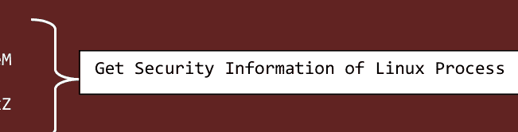

```
ps -auxf | sort -nr -k 3 | head -10

# 显示CPU消耗最高的前10个进程

sar -n DEV | more

# 监控、收集和报告Linux系统活动
```

```
# 创建或覆盖"1.txt"文件
echo "Albert Einstein" > 1.txt

# 创建或追加到"1.txt"文件
echo "Albert Einstein" >> 1.txt
```

```
grep -i "is" phy.txt

# 在文件"phy.txt"中搜索给定字符串

grep -A 3 -i "is" phy.txt

# 打印匹配的行及其后的三行

grep -r "is" *

# 递归地在所有文件中查找给定字符串

export | grep ORACLE

# 显示与oracle相关的环境变量
```

```
chkconfig --list | grep network

# 查看Linux网络服务的启动配置

shutdown -r 18:30

# 立即关闭系统并在18:30重启

find /home -size +1024 -print

# 在home目录中查找大于1MB的文件

find /home -size +1024 -size -4096 -print

# 在home目录中查找大于1MB且小于4MB的文件
```

```
netstat -ain

# 显示内核接口表

sar -n SOCK | more

# 显示网络统计信息

find /home -size +10000k

# 在home目录中查找大于10000k的文件

ls -ld /home

# 列出home目录本身的信息，而不是其内容
```

```
chmod go=+r 1.txt

# 为所有者和组添加读权限

chown manju 1.txt

# 将文件"1.txt"的所有权更改为用户"manju"
```

```
du -sh *

# 显示当前目录中文件的磁盘使用情况

du -sh .[!.]* *

# 显示当前目录中文件（包括隐藏文件）的磁盘使用情况
```

```
du -sch .[!.]* *
```

显示当前目录中文件（包括隐藏文件）的总磁盘使用量。

```
du --threshold=1G -sh .[!.]* *
```

仅显示当前目录下大小超过1GB的文件。

```
iostat -kx

# 实时显示磁盘操作的一般信息
```

```
netstat -ntlp

# 显示打开的TCP套接字
```

> Parted 是一个著名的命令行工具，允许我们轻松管理硬盘分区。

```
netstat -nulp

# 显示打开的UDP套接字
```

```
sudo yum install parted

# 安装parted
```

```
netstat -nxlp

# 显示打开的Unix套接字
```

```
parted -v

# 检查Parted版本
```

```
dmidecode -q | less

# 显示BIOS信息
```

```
parted -l

# 列出所有块设备上的分区布局
```

```
systemctl --failed

# 列出失败的服务
```

```
parted -m

# 显示机器可解析的输出
```

```
losetup

# 显示所有环回设备的信息
```

```
quit

# 退出parted shell
```

```
• getfacl --access 1.txt
• getfacl -a 1.txt
```

> 显示文件"1.txt"的文件访问控制列表。

```
• getfacl -n 1.txt
• getfacl --numeric 1.txt
```

> 列出文件"1.txt"对应的数字用户和组ID。

```
sudo tcpdump -D
```

> 列出系统中所有可用的网络接口。

```
[manju@localhost ~]$ xz myfiles.txt

[manju@localhost ~]$ ls | grep myfiles
myfiles
myfiles.txt.xz
```

> 使用xz命令压缩文件"myfiles.txt"。

```
[manju@localhost ~]$ free -t | awk 'NR == 2 {print $3/$2*100}'
61.852

[manju@localhost ~]$ free -t | awk 'FNR == 2 {print $3/$2*100}'
61.852
```

# 显示内存使用率

```
[manju@localhost ~]$ free -t | awk 'NR == 3 {print $3/$2*100}'
2.54155
[manju@localhost ~]$ free -t | awk 'FNR == 3 {print $3/$2*100}'
2.54155
```

# 显示交换空间使用率

```
[manju@localhost ~]$ free -t | awk 'FNR == 2 {printf("%.2f% \n"), $3/$2*100}'
61.86%
[manju@localhost ~]$ free -t | awk 'NR == 2 {printf("%.2f% \n"), $3/$2*100}'
61.86%
```

# 显示带百分号和两位小数的内存使用率

```
[manju@localhost ~]$ free -t | awk 'FNR == 3 {printf("%.2f% \n"), $3/$2*100}'
2.65%
[manju@localhost ~]$ free -t | awk 'NR == 3 {printf("%.2f% \n"), $3/$2*100}'
2.65%
```

# 显示带百分号和两位小数的交换空间使用率

```
[manju@localhost ~]$ top -b -n1 | grep ^%Cpu | awk '{cpu+=$9}END{print 100-cpu/NR}'
100
```

显示CPU使用率。

```
[manju@localhost ~]$ top -b -n1 | grep ^%Cpu | awk '{cpu+=$9}END{printf("%.2f% \n"), 100-cpu/NR}'
100.00%
```

显示带百分号和两位小数的CPU使用率。

```
swapon -s

# 打印交换空间使用摘要

swapon -a

# 激活所有交换空间

swapoff -a

# 停用所有交换空间
```

```
alias -p

# 列出所有别名

lsof -i :8080

# 检查哪个进程正在端口8080上运行
```

```
[manju@localhost ~]$ cat /etc/system-release
CentOS Linux release 7.3.1611 (Core)
```

显示CentOS的版本。

```
sudo netstat -anp | grep tcp | grep LISTEN

# 显示正在使用的各种端口及其使用的进程

sudo netstat -anp | grep 8080

# 显示监听端口8080的进程
```

```
printf "%s\n" *

# 打印当前目录中的文件和目录

printf "%s\n" */

# 仅打印当前目录中的目录

printf "%s\n" *.{gif,jpg,png}

# 仅列出某些图像文件
```

```
[manju@localhost ~]$ alias x='date' # 创建一个别名

[manju@localhost ~]$ x # 预览别名

Fri Oct  7 03:51:39 PDT 2022

[manju@localhost ~]$ unalias x # 移除别名

[manju@localhost ~]$ x

bash: x: command not found...
```

```
[manju@localhost ~]$ x="alan"; printf '%s\n' "${x^}"
Alan

[manju@localhost ~]$ x="alan"; printf '%s\n' "${x^^}"
ALAN

[manju@localhost ~]$ x="alan"; declare -u name="$x"; echo "$name"
ALAN
```

```
find . -name "xyz[a-z][0-9]"
```

> 查找名称以"xyz"开头，后跟一个字母字符和一个数字的目录和文件。

```
find . -mmin -120
# 搜索在过去两小时内修改过的文件
```

```
find . -mmin +120
# 搜索在过去两小时内未更新的文件
```

```
find . -mtime -3
# 查找在过去3天内修改过的文件

find . -mtime +3
# 查找在过去3天内未修改过的文件
```

```
[manju@localhost ~]$ names="Albert Alan John Mary"; x=(${names// / }); echo ${x[0]}
Albert

[manju@localhost ~]$ names="Albert Alan John Mary"; x=(${names// / }); echo ${x[3]}
Mary
```

```
names="Albert+Alan+John+Mary";

x=(${names//+/ });

echo ${x[0]}

# 输出：Albert

names="Albert+Alan+John+Mary";

x=(${names//+/ });

echo ${x[3]}

# 输出：Mary
```

```
x=(hello world); echo "${x[@]/#/A}"

# 输出：Ahello Aworld
```

```
[manju@localhost ~]$ awk '{print $2}' <<< "Alan Mathison Turing"
Mathison

[manju@localhost ~]$ awk '{print $1}' <<< "Alan Mathison Turing"
Alan
```

```
x='4 * 2'; echo "$x"

# 打印 4 * 2

x='4 * 2'; echo $x

# 打印 4，当前目录的文件列表，以及 2
```

x='4 * 2'; echo "$(($x))"

# 输出 8

[manju@localhost ~]$ x="ALAN"; printf '%s\n' "${x,}"

aLAN

[manju@localhost ~]$ x="ALAN"; printf '%s\n' "${x,,}"

alan

[manju@localhost ~]$ x="Alan"; echo "${x~~}"

aLAN

[manju@localhost ~]$ x="Alan"; echo "${x~}"

alan

[manju@localhost ~]$ x='You are a genius'; echo "${x/a/A}"

You Are a genius

[manju@localhost ~]$ x='You are a genius'; echo "${x//a/A}"

You Are A genius

[manju@localhost ~]$ x='You are a genius'; echo "${x/%s/N}"

You are a geniuN

[manju@localhost ~]$ x='You are a genius'; echo "${x/s/}"

You are a geniu

[manju@localhost ~]$ x='You are a genius'; echo "${x#*a}"
re a genius

[manju@localhost ~]$ x='You are a genius'; echo "${x#*g}"
enius

[manju@localhost ~]$ foo=25; i=foo; echo ${i}
foo

[manju@localhost ~]$ foo=25; i=foo; echo ${!i}
25

[manju@localhost ~]$ x='You are a genius'; echo "${x%a*}"
You are

[manju@localhost ~]$ x='You are a genius'; echo "${x%%a*}"
You

[manju@localhost ~]$ x=Bob-Dev-Fox; echo ${x%%-*}
Bob

[manju@localhost ~]$ x=Bob-Dev-Fox; echo ${x%-*}
Bob-Dev

[manju@localhost ~]$ x=Bob-Dev-Fox; echo ${x##*-}
Fox

[manju@localhost ~]$ x=Bob-Dev-Fox; echo ${x#*-}
Dev-Fox

find . -type f -path '*/Documents/*'

# 仅查找名为 Documents 文件夹内的文件

find . -type f -path '*/Documents/*' -o -path '*/Downloads/*'

# 仅查找名为 Documents 或 Downloads 文件夹内的文件

find . -type f -not -path '*/Documents/*'

# 查找除名为 Documents 文件夹内文件外的所有文件

find . -type f -not -path '*log' -not -path '*/Documents/*'

# 查找除名为 Documents 文件夹内文件或日志文件外的所有文件

[manju@localhost ~]$ find /dev -type b
/dev/sr0
/dev/sda3
/dev/sda2
/dev/sda1
/dev/sda

块设备

[manju@localhost ~]$ echo '16 / 5' | bc
3
[manju@localhost ~]$ echo '16 / 5' | bc -l
3.20000000000000000000

find . -maxdepth 1 -type f -name "*.txt"

# 仅从当前目录查找每个 .txt 文件

[manju@localhost ~]$ echo "$(printf "%04d" "${x}")"
0000

[manju@localhost ~]$ echo "$(printf "%05d" "${x}")"
00000

[manju@localhost ~]$ echo ""\'""
"'"

[manju@localhost ~]$ echo '3 5 + p' | dc
8

[manju@localhost ~]$ dc <<< '3 5 + p'
8

[manju@localhost ~]$ echo '3 5 * p' | dc
15

[manju@localhost ~]$ dc <<< '3 5 * p'
15

[manju@localhost ~]$ expr 'Alan Turing' : 'Ala\(.\*\)ring'
n Tu

[manju@localhost ~]$ echo '12 == 12 && 18 > 12' | bc
1 (True)

[manju@localhost ~]$ echo '12 == 13 && 18 > 12' | bc
0 (False)

[manju@localhost ~]$ expr PQRSTUVWXYZ : PQRS
4
显示匹配字符的数量

ls -ral

# 按反向字母顺序列出所有文件

- ls -tl
- ls -trl

# 列出文件，使最近编辑的文件位于列表顶部

find . -regex ".*\(\.sh\|\.txt\)$"

# 查找 .sh 或 .txt 文件

[manju@localhost ~]$ find . -iregex ".*\(\.sh\|\.pdf\)$"

./bc.pdf
./1.PDF
./data.sh
./1.sh
./2.SH
./1.pdf
./2.sh

find . -type f -print

# 仅列出常规文件

[manju@localhost ~]$ echo "alan+alan+alan+alan" | xargs -d +

alan alan alan alan

[manju@localhost ~]$ echo "alan+alan+alan+alan" | xargs -d + -n 2

alan alan

alan alan

[manju@localhost ~]$ echo -e "2\nalbert\n" > 1.txt

[manju@localhost ~]$ cat 1.txt

2

albert

- ps -eLf --sort -nlwp | head
- ps -eLf

**显示进程线程信息**

systemctl -l -t service | less

# 列出所有 Systemd 服务

[manju@localhost ~]$ echo -e "Albert\nTesla\nJohn"

Albert

Tesla

John

[manju@localhost ~]$ echo -e "Albert\nTesla\nJohn" | nl

    1	Albert

    2	Tesla

    3	John

[manju@localhost ~]$ echo -e "Albert\nTesla\nJohn" | nl -s ": " -w 1

1: Albert

2: Tesla

3: John

whiptail --yesno "Do you wish to proceed?" 10 40

# 使用 whiptail 在命令行上显示一个简单的“是”或“否”输入框

du -h -d1

# 仅检查当前目录的文件空间使用情况。

sudo nmcli networking off
sudo nmcli networking on

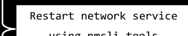

find / -user manju

# 查找由用户 "manju" 拥有的文件和目录

locate "*.png"

# 查找所有名称中包含 '.png' 的文件

find . -name '*.txt' -type f -delete

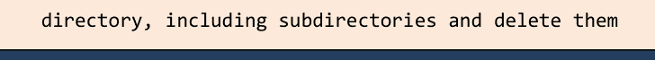

find . -type f -printf "%p" | xargs chmod 664
# 查找当前目录中的所有文件，包括子文件夹，并分配权限 664

find . -type d -printf "%p" | xargs chmod 775
# 查找当前目录中的所有文件，包括子文件夹，并分配权限 775

ll
# 列出当前目录中的文件

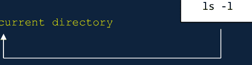

sudo netstat -nltp
# 按进程显示所有打开的端口

date +%j
# 将当前日期转换为儒略日格式

date -d "2022/03/13" +%j
# 将特定日期转换为儒略日格式

date +%Y%m%d
# 以 YYYYMMDD 格式显示当前日期

date +%d\/%m\/%Y
# 以 DD/MM/YYYY 格式显示当前日期

# C 练习


**丹尼斯·里奇**，被誉为“C 低级编程语言之父”，于 1972 年在贝尔电话实验室创建了通用、过程式、命令式的计算机编程语言“C”，旨在与 UNIX 操作系统配合使用。如今，在传播到众多不同的操作系统后，它已成为最受欢迎的编程语言之一。许多其他知名语言，包括最初作为 C 的改进而创建的 C++，也深受 C 的启发。尽管它也广泛用于创建应用程序，但它是创建系统软件最常用的编程语言。它是当今最常用的编程语言之一。自 1989 年以来，C 已被国际标准化组织和美国国家标准协会标准化。如果你是初学者，请不要担心；我们为你准备了练习。在本章中，我们将专注于初级编程问题，以帮助你学习 C 并提高你的编程能力。

## 问题 1

问题：

编写一个程序来打印 Hello, World!。

解决方案：

```c
#include<stdio.h>
int main() {
printf("Hello, World!");
return 0;
}
```

```c
#include<stdio.h>
int main() {
int a = 6;
{
int a = 2;
printf("%d\n", a);
}
printf("%d\n", a);
}
```

输出：
2
6

## 问题 2

问题：

编写一个程序来计算矩形的周长和面积。

解决方案：

```c
#include<stdio.h>
int main() {
int height = 8;
int width = 5;
int perimeter = 2*(height + width);
printf("Perimeter of the rectangle is: %d cm\n", perimeter);
int area = height * width;
printf("Area of the rectangle is: %d square cm\n", area);
return 0;
}
```

## 问题 3

问题：

编写一个程序来计算圆的周长和面积。

解决方案：

```c
#include<stdio.h>
int main() {
int radius = 4;
float perimeter = 2*3.14*radius;
printf("Perimeter of the circle is: %f cm\n", perimeter);
float area = 3.14*radius*radius;
printf("Area of the circle is: %f square cm\n", area);
return 0;
}
```

> 许多其他编程语言，包括 C++、Java、JavaScript、Go、C#、PHP、Python、Perl、C-shell 等，都基于 C。

## 问题 4

问题：

编写一个程序，接受用户输入的两个数字并计算这两个数字的和。

解决方案：

```c
#include<stdio.h>
int main() {
    int a, b, sum;
    printf("\nEnter the first number: ");
    scanf("%d", &a);
    printf("\nEnter the second number: ");
    scanf("%d", &b);
    sum = a + b;
    printf("\nSum of the above two numbers is: %d", sum);
    return 0;
}
```

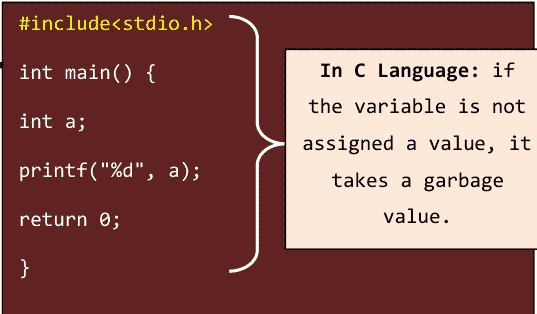

## 问题 5

问题：

编写一个程序，接受用户输入的两个数字并计算这两个数字的乘积。

解答：

```c
#include<stdio.h>
int main() {
    int a, b, mult;
    printf("\nEnter the first number: ");
    scanf("%d", &a);
    printf("\nEnter the second number: ");
    scanf("%d", &b);
    mult = a * b;
    printf("\nProduct of the above two numbers is: %d", mult);
    return 0;
}
```

```c
#include<stdio.h>
int Message() {
    printf("Hello, World!");
    return 0;
}
int main() {
    Message();
}
```
输出：
Hello, World!

## 问题 6

问题：

编写一个程序，接受三个数字并找出其中最大的一个。

解答：

```c
#include<stdio.h>
int main() {
    int x, y, z;
    printf("\nEnter the first number: ");
    scanf("%d", &x);
    printf("\nEnter the second number: ");
    scanf("%d", &y);
    printf("\nEnter the third number: ");
    scanf("%d", &z);

    // 如果 x 大于 y 和 z，则 x 是最大的
    if (x >= y && x >= z)
        printf("\n%d is the largest number.", x);

    // 如果 y 大于 x 和 z，则 y 是最大的
    if (y >= x && y >= z)
        printf("\n%d is the largest number.", y);

    // 如果 z 大于 x 和 y，则 z 是最大的
    if (z >= x && z >= y)
        printf("\n%d is the largest number.", z);

    return 0;
}
```

## 问题 7

问题：

编写一个程序，读取三个浮点值，并检查是否可以用它们构成一个三角形。如果输入的值有效，还要计算三角形的周长。

解答：

```c
#include<stdio.h>
int main() {
    float x, y, z;
    printf("\nEnter the first number: ");
    scanf("%f", &x);
    printf("\nEnter the second number: ");
    scanf("%f", &y);
    printf("\nEnter the third number: ");
    scanf("%f", &z);

    if(x < (y+z) && y < (x+z) && z < (y+x)) {
        printf("\nPerimeter of the triangle is: %f\n", x+y+z);
    }
    else {
        printf("\nIt is impossible to form a triangle.");
    }
    return 0;
}
```

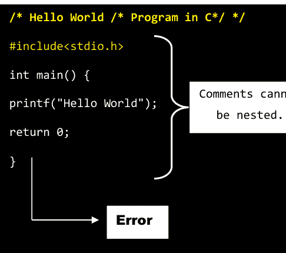

## 问题 8

问题：

编写一个程序，读取一个1到7之间的整数，并用英文打印出星期几。

解答：

```c
#include<stdio.h>
int main() {
    int day;
    printf("\nEnter a number between 1 to 7 to get the day name: ");
    scanf("%d", &day);
    switch(day) {
        case 1 : printf("Monday\n"); break;
        case 2 : printf("Tuesday\n"); break;
        case 3 : printf("Wednesday\n"); break;
        case 4 : printf("Thursday\n"); break;
        case 5 : printf("Friday\n"); break;
        case 6 : printf("Saturday\n"); break;
        case 7 : printf("Sunday\n"); break;
        default : printf("Enter a number between 1 to 7.");
    }
    return 0;
}
```

## 问题 9

问题：

编写一个程序来计算两个数的和。

> 由于它只支持标量运算，C语言现在常被程序员视为一种低级语言，这与它曾被认为是高级语言的看法相反。

解答：

```c
#include<stdio.h>
int main() {
    int a, b, sum;
    a=1;
    b=2;
    sum = a + b;
    printf("The sum of a and b = %d", sum);
    return 0;
}
```

## 问题 10

问题：

编写一个程序来计算一个数的平方。

解答：

```c
#include<stdio.h>
#include<math.h>
int main() {
    int a, b;
    a=2;
    b = pow((a), 2);
    printf("The square of a = %d", b);
    return 0;
}
```

```c
#include<stdio.h>
extern int a;
int main()
{
    printf("a = %d", a);
}
int a = 1;
```
输出：
a = 1

## 问题 11

问题：

编写一个程序来找出两个数中较大的一个。

解答：

```c
#include<stdio.h>
int main() {
    int a, b;
    a = 2;
    b = 3;
    if(a>b) {
        printf("a is greater than b");
    }
    else {
        printf("b is greater than a");
    }
    return 0;
}
```

```c
#include<stdio.h>
#define merge(a, b) a##b
int main()
{
    printf("%d ", merge(12, 09));
    return 0;
}
```
输出：
1209

## 问题 12

问题：

编写一个程序来打印数组中元素的平均值。

解答：

```c
#include<stdio.h>
int main() {
    int i, avg, sum = 0;
    int num [5] = {16, 18, 20, 25, 36};
    for(i=0; i<5; i++) {
        sum = sum + num [i];
        avg = sum/5;
    }
    printf("Sum of the Elements in the array is: %d\n", sum);
    printf("Average of the elements in the array is: %d\n", avg);
    return 0;
}
```


## 问题 13

问题：

编写一个程序，打印1到25之间所有的偶数。

解答：

```c
#include<stdio.h>
int main() {
    printf("Even numbers between 1 to 25:\n");
    for(int i = 1; i <= 25; i++) {
        if(i%2 == 0) {
            printf("%d ", i);
        }
    }
    return 0;
}
```

## 问题 14

> **使用最广泛的操作系统Linux，其内核是基于C语言编写的。**

问题：

编写一个程序，打印1到50之间所有的奇数。

解答：

```c
#include<stdio.h>
int main() {
    printf("Odd numbers between 1 to 50:\n");
    for(int i = 1; i <= 50; i++) {
        if(i%2 != 0) {
            printf("%d ", i);
        }
    }
    return 0;
}
```

```c
#include<stdio.h>
int main() {
    char c = 'a';
    putchar(c);
    return 0;
}
```
输出：

a

## 问题 15

问题：

编写一个程序，打印从1开始的前10个数字，以及它们的平方和立方。

解答：

```c
#include<stdio.h>
int main() {
    for(int i=1; i<=10; i++) {
        printf("Number = %d its square = %d its cube = %d\n", i , i*i, i*i*i);
    }
    return 0;
}
```

## 问题 16

问题：

编写一个程序：
如果你输入一个字符 M
输出必须是：ch = M。

解答：

```c
#include<stdio.h>
int main() {
    int a, b;
    for(a=1; a<=5; a++) {
        for(b=1; b<=a; b++)
            printf("%d", b);
        printf("\n");
    }
    return 0;
}
```
输出：
1
12
123
1234
12345

```c
#include<stdio.h>
int main() {
    char M;
    printf("Enter any character: ");
    scanf("%c", &M);
    printf("ch = %c", M);
    return 0;
}
```

```c
#include<stdio.h>
int main() {
    int x = 50, y, z;
    if(x >= 50) {
        y = 15;
        z = 28;
        printf("\n%d %d", y, z);
    }
    return 0;
}
```
输出：
15 28

## 问题 17

问题：

编写一个程序，打印用户输入数字的乘法表。

解答：

```c
#include<stdio.h>
int main() {
    int n, i;
    printf("Enter any number: ");
    scanf("%d", &n);
    for(i=1; i<=5; i++) {
        printf("%d * %d = %d\n", n, i, n*i);
    }
    return 0;
}
```

```c
#include<stdio.h>
int main () {
    float a;
    a = (float) 51/4;
    printf("%f", a);
    return 0;
}
```
输出：
12.750000

## 问题 18

问题：

编写一个程序，打印前10个数字的乘积。

解答：

> C语言中唯一的三元运算符是“?:”

```c
#include<stdio.h>
int main() {
    int i, product = 1;
    for(i=1; i<=10; i++) {
        product = product * i;
    }
    printf("The product of the first 10 digits is: %d", product);
    return 0;
}
```

## 问题 19

问题：

编写一个程序，打印给定的数字是正数还是负数。

解答：

```c
#include<stdio.h>
int main() {
    int a;
    a = -35;
    if(a>0) {
        printf("Number is positive");
    }
    else {
        printf("Number is negative");
    }
    return 0;
}
```

```c
#include<stdio.h>

int main() {
    char name[] = "Einstein";
    printf("%c", name[0]);
    return 0;
}
```
输出：

E

## 问题 20

问题：

编写一个程序，检查用户输入的两个数字是否相等。

解答：

```c
#include<stdio.h>
int main() {
    int x, y;
    printf("\nEnter the first number: ");
    scanf ("%d", &x);
    printf("\nEnter the second number: ");
    scanf ("%d", &y);
    if(x-y==0) {
        printf("\nThe two numbers are equivalent");
    }
    else {
        printf("\nThe two numbers are not equivalent");
    }
    return 0;
}
```

## 问题 21

问题：

编写一个程序，打印用户输入的两个数字的余数。

解答：

> “sizeof”是唯一既是运算符又是关键字的运算符。

```c
#include<stdio.h>
int main() {
    int a, b, c;
    printf("\nEnter the first number: ");
    scanf ("%d", &a);
    printf("\nEnter the second number: ");
    scanf ("%d", &b);
    c = a%b;
    printf("\nThe remainder of %d and %d is: %d", a, b, c);
    return 0;
}
```

## 问题 22

问题：

编写一个程序，打印从A到Z的字符。

解答：

```c
#include<stdio.h>
int main() {
    char i;
    for(i='A'; i<='Z'; i++) {
        printf("%c\n", i);
    }
    return 0;
}
```

```c
#include<stdio.h>
int main() {
    char name[] = "Einstein";
    name[0] = 'H';
    printf("%s", name);
    return 0;
}
```
输出：

Hinstein

## 问题 23

问题：

编写一个程序，打印输入字符串的长度。

解答：

```c
#include<stdio.h>
#include<string.h>
```

## 问题 24

**问题：**

编写一个程序来检查给定的字符是否为小写字母。

**解答：**

> 在 `printf()` 和 `scanf()` 中，`f` 代表格式化。

```c
#include<stdio.h>
#include <ctype.h>
int main() {
    char ch = 'a';
    if(islower(ch)) {
        printf("The given character is a lower case letter");
    }
    else {
        printf("The given character is a upper case letter");
    }
    return 0;
}
```

## 问题 25

**问题：**

编写一个程序来检查给定的字符是否为大写字母。

**解答：**

> 每个 C 程序中都必须有一个名为 `main()` 的函数。

```c
#include<stdio.h>
#include <ctype.h>
int main() {
    char ch = 'A';
    if(isupper(ch)) {
        printf("The given character is a upper case letter");
    }
    else {
        printf("The given character is a lower case letter");
    }
    return 0;
}
```

## 问题 26

**问题：**

编写一个程序将小写字母转换为大写字母。

**解答：**

> 在 C 程序中，可以编写任意数量的函数。在 C 语言中，有两种不同类型的函数：用户定义函数和库函数。

```c
#include<stdio.h>
#include <ctype.h>
int main() {
    char ch = 'a';
    char b = toupper(ch);
    printf("Lower case letter '%c' is converted to Upper case letter '%c'", ch, b);
    return 0;
}
```

## 问题 27

**问题：**

编写一个程序，输入以厘米为单位的距离，并输出以英寸为单位的相应值。

**解答：**

```c
#include<stdio.h>
#define x 2.54
int main() {
    double inch, cm;
    printf("Enter the distance in cm: ");
    scanf("%lf", &cm);
    inch = cm / x;
    printf("\nDistance of %0.2lf cms is equal to %0.2lf inches", cm, inch);
    return 0;
}
```

```c
#include<stdio.h>
int main() {
    int i = 6;
    while(i == 3) {
        i = i - 3;
        printf ("%d\n", i);
        --i;
    }
    return 0;
}
```

## 问题 28

**问题：**

编写一个程序来打印以下输出：

- Einstein [0] = E
- Einstein [1] = I
- Einstein [2] = N
- Einstein [3] = S
- Einstein [4] = T
- Einstein [5] = E
- Einstein [6] = I
- Einstein [7] = N

**输出：**

**54**

**解答：**

```c
#include<stdio.h>
int main() {
    const int i = 54;
    printf("%d", i);
    return 0;
}
```

```c
#include<stdio.h>
int main() {
    char name [8] = {'E' , 'I', 'N', 'S', 'T', 'E', 'I', 'N'};
    for(int i=0; i<8; i++) {
        printf("\nEinstein [%d] = %c", i, name[i]);
    }
    return 0;
}
```

## 问题 29

**问题：**

编写一个程序打印 "Hello World" 10 次。

**解答：**

```c
#include<stdio.h>
int main() {
    for(int i=1; i<=10; i++) {
        printf("Hello World \n");
    }
    return 0;
}
```

```c
#include<stdio.h>
int main() {
    int num[] = {5, 7, 9, 42};
    printf("%d", num[0]);
    return 0;
}
```

**输出：**
5

## 问题 30

**问题：**

编写一个程序，使用 `do while` 循环语句打印前 5 个数字。

**解答：**

```c
#include<stdio.h>
int main() {
    int i =1;
    do {
        printf("%d\n", i++);
    } while(i<=5);
    return 0;
}
```

```c
#include<stdio.h>
int main () {
    char name[9] = {'C', 'P', 'r', 'o', 'g', 'r', 'a', 'm', '\0'};
    printf("%s\n", name);
    return 0;
}
```

**输出：**

**CProgram**

## 问题 31

**问题：**

编写一个程序来检查一个字符是否是字母。

**解答：**

```c
#include<stdio.h>
#include<ctype.h>
int main() {
    int a =2;
    if(isalpha(a)) {
        printf("The character a is an alphabet");
    }
    else {
        printf("The character a is not an alphabet");
    }
    return 0;
}
```

```c
#include<stdio.h>
#define SIZE 3
int main() {
    char names[SIZE][8] = {
        "Mary",
        "Albert",
        "John"
    };
    int i;
    for(i=0; i<SIZE; i++)
        puts(names[i]);
    return 0;
}
```

**输出：**

**Mary**

**Albert**

**John**

## 问题 32

**问题：**

编写一个程序来检查输入的数字是偶数还是奇数。

**解答：**

```c
#include<stdio.h>
int main() {
    int a;
    printf("Enter any number: ");
    scanf ("%d", &a);
    if(a%2 == 0) {
        printf("The entered number is even");
    }
    else {
        printf("The entered number is odd");
    }
    return 0;
}
```

```c
#include<stdio.h>
int main() {
    int num[] = {5, 7, 9, 42};
    num[0] = 3;
    printf("%d", num[0]);
    return 0;
}
```

**输出：**
3

## 问题 33

**问题：**

编写一个程序来打印给定字符的 ASCII 值。

**解答：**

```c
#include<stdio.h>
int main() {
    char ch ='A';
    printf("The ASCII value of %c is: %d", ch, ch);
    return 0;
}
```

## 问题 34

> 因为它支持位域和动态内存分配，C 编程语言有助于内存管理。

**问题：**

编写一个程序，打印 1 到 50 之间所有除以指定数字后余数为 2 的数字。

**解答：**

```c
#include<stdio.h>
int main() {
    int x, i;
    printf("Enter a number: ");
    scanf("%d", &x);
    for(i=1; i<=50; i++) {
        if((i%x)==2) {
            printf("%d\n", i);
        }
    }
    return 0;
}
```

```c
#include<stdio.h>
int main() {
    int i = 25;
    printf("%p", &i);
    return 0;
}
```

## 问题 35

**问题：**

编写一个程序来确定一对数字是升序还是降序。

**解答：**

```c
#include<stdio.h>
int main() {
    int a, b;
    printf("\nEnter a pair of numbers (for example 22,12 | 12,22): ");
    printf("\nEnter the first number: ");
    scanf("%d", &a);
    printf("\nEnter the second number: ");
    scanf("%d", &b);
    if (a>b) {
        printf("\nThe two numbers in a pair are in descending order.");
    }
    else {
        printf("\nThe two numbers in a pair are in ascending order.");
    }
    return 0;
}
```

## 问题 36

**问题：**

编写一个程序，读取两个数字并将一个除以另一个。如果无法除，则指定 "Division not possible"。

**解答：**

```c
#include<stdio.h>
int main() {
    int a, b;
    float c;
    printf("\nEnter the first number: ");
    scanf("%d", &a);
    printf("\nEnter the second number: ");
    scanf("%d", &b);
    if(b != 0) {
        c = (float)a/(float)b;
        printf("\n%d/%d = %.1f", a, b, c);
    }
    else {
        printf("\nDivision not possible.\n");
    }
    return 0;
}
```

```c
#include<stdio.h>
int main() {
    int a = 6;
    float b = 6.0;
    if(a == b) {
        printf("\na and b are equal");
    }
    else {
        printf("\na and b are not equal");
    }
    return 0;
}
```

**输出：**

a and b are equal

## 问题 37

**问题：**

编写一个程序，打印 1 到 50 之间所有除以指定数字后余数等于 2 或 3 的数字。

**解答：**

```c
#include<stdio.h>
int main() {
    int x, i;
    printf("Enter a number: ");
    scanf("%d", &x);
    for(i=1; i<=50; i++) {
        if((i%x)==2 || (i%x) == 3) {
            printf("%d\n", i);
        }
    }
    return 0;
}
```

```c
#include<stdio.h>
int main() {
    int a = 15, b, c;
    b = a = 25;
    c = a < 25;
    printf ("\na = %d b = %d c = %d", a, b, c);
    return 0;
}
```

**输出：**
a = 25 b = 25 c = 0

## 问题 38

**问题：**

编写一个程序，将 1 到 100 之间所有不能被 12 整除的数字相加。

**解答：**

```c
#include<stdio.h>
int main() {
    int x =12, i, sum = 0;
    for(i=1; i<=100; i++) {
        if((i%x)!= 0) {
            sum += i;
        }
    }
    printf("\nSum: %d\n", sum);
    return 0;
}
```

```c
#include<stdio.h>
int main() {
    int x = 67;
    char y = 'C';
    if(x == y) {
        printf("Albert Einstein");
    }
    else {
        printf("Elsa Einstein");
    }
    return 0;
}
```

**输出：**

Albert Einstein

## 问题 39

**问题：**

编写一个程序来计算 x 的值，其中 x = 1 + 1/2 + 1/3 + ... + 1/50。

**解答：**

```c
#include<stdio.h>
int main() {
    float x = 0;
    for(int i=1; i<=50; i++) {
        x += (float)1/i;
    }
    printf("Value of x: %.2f\n", x);
    return 0;
}
```

## 问题 40

**问题：**

编写一个程序，读取一个数字并找出它的所有除数。

**解答：**

```c
#include<stdio.h>
int main() {
    int x, i;
    printf("\nEnter a number: ");
    scanf("%d", &x);
    printf("All the divisor of %d are: ", x);
    for(i = 1; i <= x; i++) {
        if((x%i) == 0) {
            printf("\n%d", i);
        }
    }
    return 0;
}
```

```c
#include<stdio.h>
int main() {
    int a = 20, b = 25;
    if(a % 2 == b % 5) {
        printf("\nPeru");
    }
    return 0;
}
```

**输出：**
Peru

## 问题 41

**问题：**

编写一个程序，找出两个数的递增和递减值。

**解答：**

```c
#include<stdio.h>
int main() {
    int a, b, c, d, e, f;
    a = 10;
    b = 12;
    c = a + 1;
    d = b + 1;
    e = a - 1;
    f = b - 1;
    printf("\nThe incremented value of a =%d", c);
    printf("\nThe incremented value of b =%d", d);
    printf("\nThe decremented value of a =%d", e);
    printf("\nThe decremented value of b =%d", f);
    return 0;
}
```

## 问题 42

**问题：**

编写一个程序，使用函数来求输入数字的平方。

**解答：**

```c
#include<stdio.h>
int square();
int main() {
    int answer;
    answer = square();
    printf("The square of the entered number is: %d", answer);
    return(0);
}
int square() {
    int x;
    printf("Enter any number: ");
    scanf("%d", &x);
    return x*x;
}
```

```c
#include<stdio.h>
int main() {
    int a = 6, b, c;
    b = ++a;
    c = a++;
    printf ("%d %d %d\n", a, b, c);
    return 0;
}
```

**输出：**
8 7 7

## 问题 43

**问题：**

编写一个程序，接受本金、利率、时间，并计算单利。

**解答：**

```c
#include<stdio.h>
int main() {
    int p, r, t, SI;
    printf("\nEnter the principal amount: ");
    scanf("%d", &p);
    printf("\nEnter the rate of interest: ");
    scanf("%d", &r);
    printf("\nEnter the time: ");
    scanf("%d", &t);
    SI = (p * r * t) / 100;
    printf("\nSimple interest is: %d", SI);
    return 0;
}
```

## 问题 44

**问题：**

编写一个程序，在不使用第三个变量的情况下交换两个数。

**解答：**

```c
#include<stdio.h>
int main() {
    int a, b;
    printf("\nEnter the value for a: ");
    scanf("%d", &a);
    printf("\nEnter the value for b: ");
    scanf("%d", &b);
    printf("\nBefore swapping: %d %d", a, b);
    a = a + b;
    b = a - b;
    a = a - b;
    printf("\nAfter swapping: %d %d", a, b);
    return 0;
}
```

## 问题 45

**问题：**

编写一个程序，使用指针找出两个输入数字中的较大者。

**解答：**

```c
#include<stdio.h>
int main() {
    int x, y, *p, *q;
    printf("Enter the value for x: ");
    scanf("%d", &x);
    printf("Enter the value for y: ");
    scanf("%d", &y);
    p = &x;
    q = &y;
    if(*p > *q) {
        printf("x is greater than y");
    }
    if(*q > *p) {
        printf("y is greater than x");
    }
    return 0;
}
```

```c
#include<stdio.h>
int main() {
    int a = 15, b = 30;
    if(a == b) {
        printf("a = b");
    }
    else if(a > b) {
        printf("a > b");
    }
    else if(a < b) {
        printf("a < b");
    }
    return 0;
}
```

**输出：**
a < b

## 问题 46

**问题：**

编写一个程序，打印输出：
body [b] = b
body [o] = o
body [d] = d
body [y] = y

```c
#include<stdio.h>
int main() {
    int i = 60;
    if(i > 70 && i < 100) {
        printf("i is greater than 70 and less than 100");
    }
    else {
        printf("%d", i);
    }
    return 0;
}
```

**输出：**
60

**解答：**

```c
#include <stdio.h>
int main() {
    char i;
    char body [4] = {'b', 'o', 'd', 'y'};
    for(i=0; i<4; i++)
        printf("\n body[%c] = %c", body[i] , body[i]);
    return 0;
}
```

## 问题 47

**问题：**

编写一个程序，计算折扣价和折扣后的总价。

给定条件：

- 如果购买价值大于1000，享受10%折扣
- 如果购买价值大于5000，享受20%折扣
- 如果购买价值大于10000，享受30%折扣。

**解答：**

```c
#include<stdio.h>
int main() {
    double PV;
    printf("Enter purchased value: ");
    scanf("%lf", &PV);
    if(PV > 1000) {
        printf("\n Discount = %lf", PV * 0.1);
        printf("\n Total = %lf", PV - PV * 0.1);
    }
    else if(PV > 5000) {
        printf("\n Discount = %lf", PV * 0.2);
        printf("\n Total = %lf", PV - PV * 0.2);
    }
    else {
        printf("\n Discount = %lf", PV * 0.3);
        printf("\n Total = %lf", PV - PV * 0.3);
    }
    return 0;
}
```

```c
#include<stdio.h>
int main() {
    printf("%%15s = %15s\n", "albert");
    printf("%%14s = %14s\n", "albert");
    printf("%%13s = %13s\n", "albert");
    printf("%%12s = %12s\n", "albert");
    printf("%%11s = %11s\n", "albert");
    printf("%%10s = %10s\n", "albert");
    printf(" %%9s = %9s\n", "albert");
    printf(" %%8s = %8s\n", "albert");
    printf(" %%7s = %7s\n", "albert");
    printf(" %%6s = %6s\n", "albert");
    printf(" %%5s = %5s\n", "albert");
    printf(" %%4s = %4s\n", "albert");
    return(0);
}
```

## 问题 48

**问题：**

编写一个程序，使用 while 循环语句打印前十个自然数。

**解答：**

```c
#include<stdio.h>
int main() {
    int i = 1;
    while (i <= 10) {
        printf("%d\n", i++);
    }
    return 0;
}
```

```c
#include<stdio.h>
int main() {
    int i = 12;
    if(i == 12 && i != 0) {
        printf("\nHi");
        printf("\nEinstein");
    }
    else {
        printf( "Bye Elsa" );
    }
    return 0;
}
```

**输出：**
Hi
Einstein

## 问题 49

**问题：**

编写一个程序，将输入的数据向左移动两位。

**解答：**

```c
#include<stdio.h>
int main() {
    int x;
    printf("Enter the integer from keyboard: ");
    scanf("%d", &x);
    printf("\nEntered value: %d ", x);
    printf("\nThe left shifted data is: %d ", x <<= 2);
    return 0;
}
```

## 问题 50

**问题：**

编写一个程序，将输入的数据向右移动两位。

**解答：**

```c
#include<stdio.h>
int main() {
    int x;
    printf("Enter the integer from keyboard: ");
    scanf("%d", &x);
    printf("\nEntered value: %d ", x);
    printf("\nThe right shifted data is: %d ", x >>= 2);
    return 0;
}
```

## 问题 51

**问题：**

编写一个程序，计算 x 与 21 的精确差值。如果 x 大于 21，则返回绝对差值的三倍。

**解答：**

```c
#include<stdlib.h>
#include<stdio.h>
int main() {
    int x;
    printf("Enter the value for x: ");
    scanf("%d", &x);
    if(x <= 21) {
        printf("%d", abs(x - 21));
    }
    else if(x >= 21) {
        printf("%d", abs(x - 21) * 3);
    }
    return 0;
}
```

> 因为 C 是一种结构化（模块化）的编程语言，程序员可以将代码分成更小的块，使其更容易理解，从而使程序更简单、更少冗余。

```c
#include<stdio.h>
int main() {
    int x = 25, y;
    x >= 16 ? (y = 25) : (y = 30);
    printf ("\n%d %d", x, y);
    return 0;
}
```

**输出：**
25 25

## 问题 52

**问题：**

编写一个程序，读取两个数字并确定第一个数字是否是第二个数字的倍数。

**解答：**

```c
#include<stdio.h>
int main() {
    int x, y;
    printf("\nEnter the first number: ");
    scanf("%d", &x);
    printf("\nEnter the second number: ");
    scanf("%d", &y);
    if(x % y == 0) {
        printf("\n%d is a multiple of %d.\n", x, y);
    }
    else {
        printf("\n%d is not a multiple of %d.\n", x, y);
    }
    return 0;
}
```

```c
#include<stdio.h>
int main() {
    int x = 10;
    (x == 10 ? printf( "True" ) : printf( "False" ));
    return 0;
}
```

**输出：**
True

## 问题 53

**问题：**

编写一个程序，使用结构体打印输出：
书名 = B
书价 = 135.00
页数 = 300
版本 = 8

**解答：**

```c
#include<stdio.h>
int main() {
    struct book {
        char name;
        float price;
        int pages;
        int edition;
    };
    struct book b1;
    b1.name = 'B';
    b1.price = 135.00;
    b1.pages = 300;
    b1.edition = 8;
    printf("\n Name of the book = %c", b1.name);
    printf("\n Price of the book = %f", b1.price);
    printf("\n Number of pages = %d", b1.pages);
    printf("\n Edition of the book = %d", b1.edition);
    return 0;
}
```

```c
#include<stdio.h>
int main() {
    int num, x, y, z;
    printf("Enter a three digit number: ");
    scanf("%d", &num);
    x = num % 10;
    y = (num / 10) % 10;
    z = (num / 100) % 10;
    printf("%d is the sum of the digits of the number %d.", x + y + z, num);
    return 0;
}
```

## 问题 54

问题：

编写一个程序将摄氏温度转换为华氏温度。

解决方案：

```c
#include<stdio.h>
int main() {
    float fahrenheit, celsius;
    celsius = 36;
    fahrenheit = ((celsius*9)/5)+32;
    printf("\nTemperature in fahrenheit is:  %f", fahrenheit);
    return 0;
}
```

## 问题 55

问题：

编写一个程序，检查两个输入的整数，如果其中任何一个等于50，或者它们的和等于50，则返回真。

解决方案：

```c
#include<stdio.h>
int main() {
    int x, y;
    printf("\nEnter the value for x: ");
    scanf("%d", &x);
    printf("\nEnter the value for y: ");
    scanf("%d", &y);
    if(x == 50 || y == 50 || (x + y == 50)) {
        printf("\nTrue");
    }
    else {
        printf("\nFalse");
    }
    return 0;
}
```

```c
#include<stdio.h>
int main() {
    while(!printf("Albert Einstein")){}
    return 0;
}
```

输出：

Albert Einstein

## 问题 56

问题：

编写一个程序，统计十八个整数输入中的偶数、奇数、正数和负数的个数。

解决方案：

```c
#include<stdio.h>
int main () {
    int x, even = 0, odd = 0, positive = 0, negative = 0;
    printf("\nPlease enter 18 numbers:\n");
    for(int i = 0; i < 18; i++) {
        scanf("%d", &x);
        if (x > 0) {
            positive++;
        }
        if(x < 0) {
            negative++;
        }
        if(x % 2 == 0) {
            even++;
        }
        if(x % 2 != 0) {
            odd++;
        }
    }
    printf("\nNumber of even values: %d", even);
    printf("\nNumber of odd values: %d", odd);
    printf("\nNumber of positive values: %d", positive);
    printf("\nNumber of negative values: %d", negative);
    return 0;
}
```

```c
#include<stdio.h>
int main() {
    int x = 0, y = 1 ;
    if(x == 0) {
        (y > 1 ? printf("\nHi") : printf ("\nAlbert"));
    }
    else {
        printf("\nHi Albert!");
    }
    return 0;
}
```

输出：

Albert

```c
#include<stdio.h>
int main() {
    switch(printf("Albert Einstein")){}
    return 0;
}
```

输出：

Albert Einstein

## 问题 57

问题：

编写一个程序来检查一个人是否是老年人。

解决方案：

```c
#include<stdio.h>
int main() {
    int age;
    printf("Enter age: ");
    scanf("%d", &age);
    if(age>=60) {
        printf("Senior citizen");
    }
    else {
        printf("Not a senior citizen");
    }
    return 0;
}
```

```c
#include<stdio.h>
int main() {
    int x;
    printf("Enter any number: ");
    scanf ("%d", &x);
    if(x > 100) {
        printf ("\nAlbert");
    }
    else {
        if(x < 15)
            printf ("\nElsa");
        else
            printf ("\nDavid");
    }
    return 0;
}
```

输出：

David

## 问题 58

问题：

编写一个程序，读取一个学生的三门科目分数（0-100），并计算这些分数的平均值。

解决方案：

```c
#include<stdio.h>
int main() {
    float score, total_score = 0;
    int subject = 0;
    printf("Enter three subject scores (0-100):\n");
    while (subject != 3) {
        scanf("%f", &score);
        if(score < 0 || score > 100) {
            printf("Please enter a valid score.\n");
        }
        else {
            total_score += score;
            subject++;
        }
    }
    printf("Average score = %.2f\n", total_score/3);
    return 0;
}
```

## 问题 59

问题：

以下程序会产生什么结果？

```c
#include<stdio.h>
int main() {
    for(int i=1; i<=5; i++) {
        if(i==3) {
            break;
        }
        printf("%d\n", i);
    }
    return 0;
}
```

```c
#include<stdio.h>
int main() {
    int a = 15, b = 4;
    float c = (float)a/(float)b;
    printf("%d/%d = %.2f\n", a, b, c);
    return 0;
}
```

输出：

15/4 = 3.75

解决方案：

1
2

```c
#include<stdio.h>
int main() {
    int a = 6, b = 4, c;
    c = a++ +b;
    printf ("\n%d %d %d", a, b, c);
    return 0;
}
```

```c
#include<stdio.h>
int main() {
    for(int i=1;i<=5;i++) {
        if(i==3) {
            goto HAI;
        }
        printf("\n %d ",i);
    }
    HAI : printf("\n Linux");
}
```

输出：

7 4 10

解决方案：

1
2
Linux

```c
#include<stdio.h>
int main() {
    for( ; ; ) {
        printf("This loop will run forever.\n");
    }
    return 0;
}
```

```c
#include<stdio.h>
int main() {
    float i = 5.5;
    while(i == 5.5) {
        i = i - 0.8;
        printf("\n%f", i);
    }
    return 0;
}
```

解决方案：

This loop will run forever.
This loop will run forever.
This loop will run forever.
This loop will run forever.
This loop will run forever.
This loop will run forever. .........

输出：

4.700000

```c
#include<stdio.h>
int main() {
    printf("Hello,world!");
    return 0;
    printf("Hello,world!");
}
```

解决方案：

Hello,world!

```c
#include<stdio.h>
int main() {
    float i = 5.5;
    while(i == 5.5) {
        printf("\n%f", i);
        i = i - 0.8;
    }
    return 0;
}
```

```c
#include<stdio.h>
#include<stdlib.h>
int main () {
    printf("linux\n");
    exit (0);
    printf("php\n");
    return 0;
}
```

输出：

5.500000

解决方案：

linux

```c
#include<stdio.h>
int main() {
    for(int i=1; i<=5; i++) {
        if(i==3) {
            continue;
        }
        printf("%d\n ", i);
    }
    return 0;
}
```

解决方案：

1
2
4
5

```c
#include<stdio.h>
int main() {
    int a = 6, b = 2;
    while(a >= 0) {
        a--;
        b++;
        if(a == b) {
            continue;
        }
        else {
            printf("\n%d %d", a, b);
        }
    }
    return 0;
}
```

```c
#include<stdio.h>
int main() {
    int a = 10, b = 20, c;
    c = (a < b) ? a : b;
    printf("%d", c);
    return 0;
}
```

解决方案：

10

输出：

3 5
2 6
1 7
0 8
-1 9

```c
#include<stdio.h>
#define A 15
int main() {
    int x;
    x=A;
    printf("%d", x);
    return 0;
}
```

```c
#include<stdio.h>
int main() {
    int x = 0;
    for ( ; x ; )
        printf ("\nAlbert");
    return 0;
}
```

解决方案：

15

```c
#include<stdio.h>
#include<stdlib.h>
int main() {
    int i;
    for(i=1; i <= 3; i++) {
        printf((i&1) ? "odd\n" : "even\n");
    }
    exit(EXIT_SUCCESS);
}
```

解决方案：

odd
even
odd

```c
#include<stdio.h>
#include<math.h>
int main() {
    double a, b;
    a = -2.5;
    b = fabs(a);
    printf("|%.2lf| = %.2lf\n", a, b);
    return 0;
}
```

```c
#include<stdio.h>
int main() {
    int x;
    float y = 2.0;
    switch (x = y + 3) {
        case 5:
            printf("\nAlbert");
            break;
        default:
            printf("\nElsa");
    }
    return 0;
}
```

解决方案：

|-2.50| = 2.50

```c
#include<stdio.h>
#include<stdlib.h>
int main() {
    int x=12, y =3;
    printf("%d\n", abs(-x-y));
    return 0;
}
```

解决方案：

15

```c
#include<stdio.h>
#include<stdlib.h>
int main() {
    int x=12, y =3;
    printf("%d\n", -(-x-y));
    return 0;
}
```

```c
#include<stdio.h>
int main() {
    int x = 5;
    switch (x - 6) {
        case -1 :
            printf("\nAlbert");
        case 0 :
            printf("\nJohn");
        case 1 :
            printf("\nMary");
        default :
            printf("\nJames");
    }
    return 0;
}
```

解决方案：

15

输出：

Albert
John
Mary
James

```c
#include<stdio.h>
#include<stdlib.h>
int main() {
    int x=12, y =3;
    printf("%d\n", x-(-y));
    return 0;
}
```

```c
#include<stdio.h>
int main() {
    int y[] = {20, 40, 60, 80, 100};
    for(int x = 0; x <= 4; x++) {
        printf("\n%d", *(y + x));
    }
    return 0;
}
```

解决方案：

15

输出：

20
40
60
80
100

## 问题 60

问题：

编写一个程序来查找数组的大小。

解决方案：

```c
#include<stdio.h>
int main() {
    int num [] = {11, 22, 33, 44, 55, 66};
    int n = sizeof(num) / sizeof(num [0]);
    printf("Size of the array is: %d\n", n);
    return 0;
}
```

## 问题 61

问题：

编写一个程序，打印从1到给定整数的序列，在这些数字之间插入加号，然后移除序列末尾的加号。

解决方案：

```c
#include<stdio.h>
int main () {
    int x, i;
    printf("\nEnter a integer: \n");
    scanf("%d", &x);
    if(x>0) {
        printf("Sequence from 1 to %d:\n", x);
        for(i=1; i<x; i++)  {
            printf("%d+", i);
        }
        printf("%d\n", i);
    }
    return 0;
}
```

```c
#include<stdio.h>
int main() {
    char i[2] = "B";
    printf("\n%c", i[0]);
    printf("\n%s", i);
    return 0;
}
```

输出：

B
B

## 问题 62

问题：

编写一个程序来验证三角形的三条边是否构成直角三角形。

解决方案：

```c
#include<stdio.h>
int main() {
    int a,b,c;
    printf("Enter the three sides of a triangle: \n");
    scanf("%d %d %d",&a,&b,&c);
    if((a*a)+(b*b)==(c*c) || (a*a)+(c*c)==(b*b) || (b*b)+(c*c)==(a*a)) {
        printf("Triangle's three sides form a right angled triangle.\n");
    }
    else {
        printf("Triangle's three sides does not form a right angled triangle.\n");
    }
    return 0;
}
```

```c
#include<stdio.h>
int main() {
    printf("%c", "einstein"[4]);
    return 0;
}
```

输出：

t

## 问题 63

### 问题：

编写一个程序，从用户输入的三个数中找出第二大数。

### 解答：

```c
#include<stdio.h>
int main() {
    int a, b, c;
    printf("\nEnter the first number: ");
    scanf("%d", &a);
    printf("\nEnter the second number: ");
    scanf("%d", &b);
    printf("\nEnter the third number: ");
    scanf("%d", &c);
    if(a>b && a>c) {
        if(b>c)
            printf("\n%d is second largest number among three numbers", b);
        else
            printf("\n%d is second largest number among three numbers", c);
    }
    else if(b>c && b>a) {
        if(c>a)
            printf("\n%d is second largest number among three numbers", c);
        else
            printf("\n%d is second largest number among three numbers", a);
    }
    else if(a>b)
        printf("\n%d is second largest number among three numbers", a);
    else
        printf("\n%d is second largest number among three numbers", b);
    return 0;
}
```

## 问题 64

### 问题：

编写一个程序，计算两个给定整数值的和。如果两个值相等，则返回它们和的三倍。

```c
#include<stdio.h>

int main() {
    int x = 53286, y=0, i;
    while(x!=0) {
        i=x%10;
        y=y*10+i;
        x/=10;
    }
    printf("%d", y);
    return 0;
}
```

### 解答：

```c
#include<stdio.h>
int myfunc();
int main() {
    printf("%d", myfunc(3, 5));
    printf("\n%d", myfunc(6, 6));
    return 0;
}
int myfunc(int a, int b) {
    return a == b ? (a + b)*3 : a + b;
}
```

输出：
68235

## 问题 65

### 问题：

编写一个程序，接受分钟作为输入，并显示总小时数和分钟数。

```c
#include<stdio.h>

int main() {

float num[5] = { 11.5, 12.5, 13.5, 14.5, 15.5 };

printf("%.1f\n", *(num+1));

printf("%.1f\n", *(num+4));

return 0;

}
```

### 解答：

```c
#include<stdio.h>
int main() {
    int mins, hrs;
    printf("Input minutes: ");
    scanf("%d",&mins);
    hrs=mins/60;
    mins=mins%60;
    printf("\n%d Hours, %d Minutes.\n", hrs, mins);
    return 0;
}
```

输出：
12.5
15.5

## 问题 66

### 问题：

编写一个程序，判断用户输入的正数是否是3或5的倍数。

### 解答：

```c
#include<stdio.h>
int main() {
    int x;
    printf("\nEnter a number: ");
    scanf("%d", &x);
    if(x % 3 == 0 || x % 5 == 0) {
        printf("True");
    }
    else {
        printf("False");
    }
    return 0;
}
```

```c
#include<stdio.h>
#define MULT(i) (i*i)
int main() {
    int x = 6;
    int a = MULT(x++);
    int b = MULT(++x);
    printf("\n%d %d", a, b);
    return 0;
}
```

输出：
42 100

## 问题 67

### 问题：

编写一个程序，验证输入的两个整数中是否有一个在100到200的范围内（包含100和200）。

### 解答：

```c
#include<stdio.h>
int main() {
    int x, y;
    printf("\nEnter the value for x: ");
    scanf("%d", &x);
    printf("\nEnter the value for y: ");
    scanf("%d", &y);
    if((x >= 100 && x <= 200) || (y >= 100 && y <= 200)) {
        printf("True");
    }
    else {
        printf("False");
    }
    return 0;
}
```

```c
#include<stdio.h>
int main() {
    char x[] = "Albert";
    int i = 0;
    while(x[i]) {
        printf("%c at %p\n", x[i], &x[i]);
        i++;
    }
    return 0;
}
```


## 问题 68

### 问题：

编写一个程序，判断两个给定整数中哪个更接近100。
如果两个数相等，则返回0。

### 解答：

```c
#include<stdio.h>
#include<stdlib.h>
int myfunc();
int main() {
    printf("%d", myfunc(86, 99));
    printf("\n%d", myfunc(55, 55));
    printf("\n%d", myfunc(65, 80));
    return 0;
}
int myfunc(int a, int b) {
    int x = abs(a - 100);
    int y = abs(b - 100);
    return x == y ? 0 : (x < y ? a : b);
}
```

## 问题 69

### 问题：

编写一个程序，判断用户输入的正数是否是3或5的倍数，但不能同时是两者的倍数。

### 解答：

```c
#include<stdio.h>
int main() {
    int x;
    printf("\nEnter a number: ");
    scanf("%d", &x);
    if(x % 3 == 0 ^ x % 5 == 0) {
        printf("True");
    }
    else {
        printf("False");
    }
}
```

```c
#include<stdio.h>
int main() {
    printf("%-9s al\n", "alan");
    printf("%-8s al\n", "alan");
    printf("%-7s al\n", "alan");
    printf("%-6s al\n", "alan");
    printf("%-5s al\n", "alan");
    printf("%-4s al\n", "alan");
    return 0;
}
```


## 问题 70

### 问题：

编写一个程序，判断输入的两个非负数是否具有相同的最后一位数字。

### 解答：

```c
#include<stdio.h>
#include<stdlib.h>
int main() {
    int x, y;
    printf("\nEnter the value for x: ");
    scanf("%d", &x);
    printf("\nEnter the value for y: ");
    scanf("%d", &y);
    if(abs(x % 10) == abs(y % 10)) {
        printf("True");
    }
    else {
        printf("False");
    }
    return 0;
}
```

```c
#include<stdio.h>
#include<ctype.h>
int main() {
    char x;
    x = getchar();
    if(islower(x)) {
        putchar(toupper(x));
    }
    else {
        putchar(tolower(x));
    }
    return 0;
}
```


## 问题 71

### 问题：

编写一个程序，判断给定的非负数是否是12的倍数，或者比12的倍数大1。

### 解答：

```c
#include<stdio.h>
#include<stdlib.h>
int main() {
    int x = 43;
    if(x % 12 == 0 || x % 12 == 1) {
        printf("True");
    }
    else {
        printf("False");
    }
    return 0;
}
```

```c
#include<stdio.h>

int main() {

printf(6 + "Albert Einstein");

return 0;

}
```

输出：
Einstein

## 问题 72

### 问题：

编写一个程序，接受两个整数，当其中一个等于6，或者它们的和或差等于6时，返回真。

### 解答：

```c
#include<stdio.h>
#include<stdlib.h>
int main() {
    int x, y;
    printf("\nEnter the value for x: ");
    scanf("%d", &x);
    printf("\nEnter the value for y: ");
    scanf("%d", &y);
    if(x == 6 || y == 6 || x + y == 6 || abs(x - y) == 6) {
        printf("True");
    }
    else {
        printf("False");
    }
    return 0;
}
```

```c
#include<stdio.h>

int main() {

printf("%f\n", (float)(int)10.5 / 4);

return 0;

}
```

输出：
2.500000

## 问题 73

### 问题：

编写一个程序，检查从输入的三个整数中，是否可能将其中两个相加得到第三个。

### 解答：

```c
#include<stdio.h>
int main() {
    int x, y, z;
    printf("\nEnter the value for x: ");
    scanf("%d", &x);
    printf("\nEnter the value for y: ");
    scanf("%d", &y);
    printf("\nEnter the value for z: ");
    scanf("%d", &z);
    if(x == y + z || y == x + z || z == x + y) {
        printf("True");
    }
    else {
        printf("False");
    }
    return 0;
}
```

```c
#include<stdio.h>
int myfunc();
int main() {
    printf("\nAlbert Einstein");
    myfunc();
    return 0;
}
int myfunc() {
    printf("\nElsa Einstein");
    main();
}
```


## 问题 74

### 问题：

编写一个程序，将公里每小时转换为英里每小时。

### 解答：

```c
#include<stdio.h>
int main() {
    float kmph;
    printf("Enter kilometers per hour: ");
    scanf("%f", &kmph);
    printf("\n%f miles per hour", (kmph * 0.6213712));
    return 0;
}
```

## 问题 75

### 问题：

编写一个程序，计算椭圆的面积。

### 解答：

```c
#include<stdio.h>
#define PI 3.141592

int main() {
    float major, minor;
    printf("\nEnter length of major axis: ");
    scanf("%f", &major);
    printf("\nEnter length of minor axis: ");
    scanf("%f", &minor);
    printf("\nArea of an ellipse = %0.4f", (PI * major * minor));
    return 0;
}
```

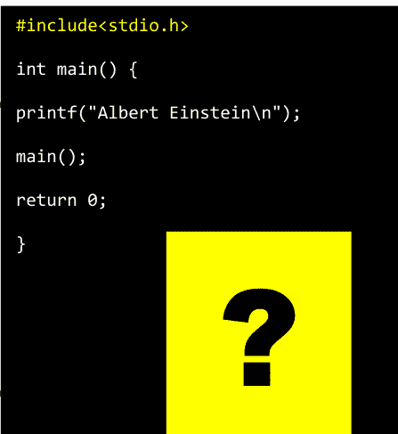

## 问题 76

### 问题：

编写一个程序，计算三个给定整数的和。如果前两个值相等，则返回第三个值。

### 解答：

```c
#include<stdio.h>
int myfunc();
int main() {
    printf("\n%d", myfunc(11, 11, 11));
    printf("\n%d", myfunc(11, 11, 16));
    printf("\n%d", myfunc(18, 15, 10));
    return 0;
}
int myfunc(int a, int b, int c) {
    if (a == b && b == c) return 0;
    if (a == b) return c;
    if (a == c) return b;
    if (b == c) return a;
    else return a + b + c;
}
```


## 问题 77

### 问题：

编写一个程序，将字节转换为千字节。

### 解答：

```c
#include<stdio.h>
int main() {
    double bytes;
    printf("\nEnter number of bytes: ");
    scanf("%lf",&bytes);
    printf("\nKilobytes: %.2lf", (bytes/1024));
    return 0;
}
```

```c
#include<stdio.h>
#include<stdlib.h>

int main() {
    int x = 1;
    x++;
    if(x <= 6) {
        printf("\nC language");
        exit(0);
        main();
    }
    return 0;
}
```

输出：
C language

## 问题 78

### 问题：

编写一个程序，将兆字节转换为千字节。

### 解决方案：

```c
#include<stdio.h>
int main() {
    double megabytes, kilobytes;
    printf("\nInput the amount of megabytes to convert: ");
    scanf("%lf", &megabytes);
    kilobytes = megabytes * 1024;
    printf("\nThere are %lf kilobytes in %lf megabytes.", kilobytes, megabytes);
    return 0;
}
```

## 问题 79

### 问题：

编写一个程序，计算整数数组中偶数元素的数量。

### 解决方案：

```c
#include<stdio.h>
int main() {
    int array[1000], i, arr_size, even=0;
    printf("Input the size of the array: ");
    scanf("%d", &arr_size);
    printf("Enter the elements in array: \n");
    for(i=0; i<arr_size; i++) {
        scanf("%d", &array[i]);
    }

    for(i=0; i<arr_size; i++) {
        if(array[i]%2==0) {
            even++;
        }
    }
    printf("Number of even elements: %d", even);
    return 0;
}
```

## 问题 80

### 问题：

编写一个程序，计算整数数组中奇数元素的数量。

### 解决方案：

```c
#include<stdio.h>
int main() {
    int array[1000], i, arr_size, odd=0;
    printf("Input the size of the array: ");
    scanf("%d", &arr_size);
    printf("Enter the elements in array: \n");
    for(i=0; i<arr_size; i++) {
        scanf("%d", &array[i]);
    }

    for(i=0; i<arr_size; i++) {
        if(array[i]%2!=0) {
            odd++;
        }
    }
    printf("Number of odd elements: %d", odd);
    return 0;
}
```

## 问题 81

### 问题：

编写一个程序，接受两个整数并判断它们是否相等。

### 解决方案：

```c
#include<stdio.h>
int main() {
    int x, y;
    printf("Input the values for x and y: \n");
    scanf("%d %d", &x, &y);
    if(x == y) {
        printf("x and y are equal\n");
    }
    else {
        printf("x and y are not equal\n");
    }
    return 0;
}
```

## 问题 82

### 问题：

编写一个程序，已知三角形的两个角，求第三个角。

### 解决方案：

```c
#include<stdio.h>
int main() {
    int angle1, angle2;
    printf("\nEnter the first angle of the triangle: ");
    scanf("%d", &angle1);
    printf("\nEnter the second angle of the triangle: ");
    scanf("%d", &angle2);
    printf("\nThird angle of the triangle is:  %d", (180 - (angle1 + angle2)));
    return 0;
}
```

## 问题 83

### 问题：

编写一个程序，判断给定的年份是否是闰年。

### 解决方案：

```c
#include<stdio.h>
int main() {
    int year;
    printf("Enter the year: ");
    scanf("%d", &year);
    if((year % 400) == 0) {
        printf("\n%d is a leap year.", year);
    }
    else if((year % 100) == 0) {
        printf("\n%d is a not leap year.", year);
    }
    else if((year % 4) == 0) {
        printf("\n%d is a leap year.", year);
    }
    else {
        printf("\n%d is not a leap year.", year);
    }
    return 0;
}
```

## 问题 84

### 问题：

编写一个程序，读取候选人的年龄并判断其是否有资格投票。

### 解决方案：

```c
#include<stdio.h>
int main() {
    int age;
    printf("\nEnter the age of the candidate: ");
    scanf("%d", &age);
    if(age<18) {
        printf("\nWe apologize, but the candidate is not able to cast his vote.");
        printf("\nAfter %d year, the candidate would be able to cast his vote.", (18-age));
    }
    else {
        printf("Congratulation! the candidate is qualified to cast his vote.\n");
    }
    return 0;
}
```

```c
#include<stdio.h>
int main() {
    char *x = "Albert Einstein\n";
    while(putchar(*x++));
    return 0;
}
```

输出：
Albert Einstein

## 问题 85

### 问题：

编写一个程序，将码转换为英尺。

### 解决方案：

```c
#include<stdio.h>
int main() {
    float yard;
    printf("\nEnter the Length in Yard : ");
    scanf("%f", &yard);
    printf("\n%f Yard in Foot is: %f", yard, (3*yard));
    return 0;
}
```

## 问题 86

### 问题：

编写一个程序，将吉字节转换为兆字节。

### 解决方案：

```c
#include<stdio.h>
int main() {
    double gigabytes, megabytes;
    printf("\nInput the amount of gigabytes to convert: ");
    scanf("%lf", &gigabytes);
    megabytes = gigabytes*1024;
    printf("\nThere are %lf megabytes in %lf gigabytes.", megabytes, gigabytes);
    return 0;
}
```

## 问题 87

### 问题：

编写一个程序，将千克转换为磅。

### 解决方案：

```c
#include<stdio.h>
int main() {
    float kg, lbs;
    printf("\nEnter Weight in Kilogram: ");
    scanf("%f", &kg);
    lbs = kg*2.20462;
    printf("\n%f Kg = %f Pounds", kg, lbs);
    return 0;
}
```

## 问题 88

### 问题：

编写一个程序，将千克转换为盎司。

### 解决方案：

```c
#include<stdio.h>
int main() {
    float kg, ounce;
    printf("\nEnter Weight in Kilogram: ");
    scanf("%f", &kg);
    ounce = kg*35.274;
    printf("\n%f Kg = %f Ounce", kg, ounce);
    return 0;
}
```

## 问题 89

### 问题：

编写一个程序，将磅转换为克。

### 解决方案：

```c
#include<stdio.h>
int main() {
    float pound, gram;
    printf("\nEnter Weight in Pounds: ");
    scanf("%f", &pound);
    gram = pound*453.592;
    printf("\n%f Pound = %f Grams", pound, gram);
    return 0;
}
```

## 问题 90

### 问题：

编写一个程序，使用角度验证三角形是否有效。

### 解决方案：

```c
#include<stdio.h>
int main() {
    int angle1, angle2, angle3, sum;
    printf("\nEnter the first angle of the triangle: ");
    scanf("%d", &angle1);
    printf("\nEnter the second angle of the triangle: ");
    scanf("%d", &angle2);
    printf("\nEnter the third angle of the triangle: ");
    scanf("%d", &angle3);
    sum = angle1 + angle2 + angle3;
    if(sum == 180) {
        printf("\nThe triangle is valid.");
    }
    else {
        printf("\nThe triangle is not valid.");
    }
    return 0;
}
```

## 问题 91

### 问题：

编写一个程序，将用户输入的两位数的各位数字相加。

### 解决方案：

```c
#include<stdio.h>
int main() {
    int x, y, sum = 0;
    printf("\nEnter a two-digit number: ");
    scanf("%d", &x);
    y = x;
    while(y != 0) {
        sum = sum + y % 10;
        y = y / 10;
    }
    printf("\nSum of digits of %d is: %d", x, sum);
    return 0;
}
```

## 问题 92

### 问题：

编写一个程序，验证输入的字符是元音还是辅音。

### 解决方案：

```c
#include<stdio.h>
int main() {
    char ch;
    printf("\nEnter a character: ");
    scanf("%c", &ch);
    if(ch == 'a' || ch == 'e' || ch == 'i' || ch == 'o' || ch == 'u' ||
       ch == 'A' || ch == 'E' || ch == 'I' || ch == 'O' || ch == 'U' ) {
        printf("\n%c is a vowel", ch);
    }
    else {
        printf("\n%c is a consonant", ch);
    }
    return 0;
}
```

## 问题 93

### 问题：

编写一个程序，求一个数的阶乘。

```c
#include<stdio.h>
#define x 2

int main() {
    int i;
    for(i=24; i<28; i++) {
        printf("%d %% %d = %d\n", i, x, i%x);
    }
    return 0;
}
```

### 解决方案：

```c
#include<stdio.h>
int main() {
    int i, fact=1, num;
    printf("\nEnter a number: ");
    scanf("%d", &num);
    for(i=1; i<=num; i++) {
        fact=fact*i;
    }
    printf("\nFactorial of %d is: %d", num, fact);
    return 0;
}
```

输出：

24 % 2 = 0
25 % 2 = 1
26 % 2 = 0
27 % 2 = 1

## 问题 94

### 问题：

编写一个程序，打印一个月中的天数。

### 解决方案：

```c
#include<stdio.h>
int main() {
    int x[12]={31,28,31,30,31,30,31,31,30,31,30,31}, m;
    printf("\nEnter the month number: ");
    scanf("%d", &m);
    if(m>12 || m<1) {
        printf("Invalid input");
    }
    else if(m==2) {
        printf("\nNumber of days in month 2 is either 29 or 28");
    }
    else {
        printf("\nNumber of days in month %d is %d", m, x[m-1]);
    }
    return 0;
}
```

```c
#include<stdio.h>
int main() {
    char *names[] = {
        "Albert",
        "Alan",
        "John",
        "James",
        "Mary"
    };
    int i;
    for(i=0; i<5; i++)
        puts(*(names+i));
    return(0);
}
```

## 问题 95

### 问题：

编写一个程序，连接两个字符串。

### 解决方案：

```c
#include<stdio.h>
#include<string.h>
int main() {
    char a[1000], b[1000];
```

## 问题 96

问题：

编写一个程序，找出两个数中的最大值。

解决方案：

```c
#include<stdio.h>
int main() {
    int a,b;
    printf("Enter two numbers: \n");
    scanf("%d%d", &a, &b);
    if(a>b) {
        printf("\n%d is a maximum number", a);
    }
    else {
        printf("\n%d is a maximum number", b);
    }
    return 0;
}
```

```c
#include<stdio.h>
int main() {
    for(int x=2; x<=25; x=x+2) {
        printf("%d\t", x);
    }
    putchar('\n');
    return 0;
}
```

## 问题 97

问题：

编写一个程序来比较两个字符串。

解决方案：

```c
#include<stdio.h>
#include<string.h>
int main() {
    char a[100], b[100];
    printf("Enter the first string: \n");
    scanf("%s", a);
    printf("Enter the second string: \n");
    scanf("%s", b);
    if (strcmp(a,b) == 0) {
        printf("The 2 strings are equal.\n");
    }
    else {
        printf("The 2 strings are not equal.\n");
    }
    return 0;
}
```

```c
#include<stdio.h>
int main() {
    for(int x=3; x>=1; x--) {
        for(int y=1; y<=x; y++) {
            printf("%d ", y);
        }
        printf("*");
    }
    return 0;
}
```

**输出：**

1 2 3 *1 2 *1 *

```c
#include<stdio.h>
int main() {
    puts("Albert Einstein");
    return 0;
}
```

**输出：**

Albert Einstein

## 问题 98

问题：

编写一个程序，将大写字母转换为小写字母。

解决方案：

```c
#include<ctype.h>
#include<stdio.h>
int main() {
    char ch;
    ch = 'G';
    printf("%c in lowercase is represented as %c", ch, tolower(ch));
    return 0;
}
```

## 问题 99

问题：

编写一个程序，计算输入的被除数和除数的商和余数。

解决方案：

```c
#include<stdio.h>
int main() {
    int dividend, divisor;
    printf("\nEnter dividend: ");
    scanf("%d", &dividend);
    printf("\nEnter divisor: ");
    scanf("%d", &divisor);
    printf("\nQuotient = %d\n", (dividend / divisor));
    printf("\nRemainder = %d", (dividend % divisor));
    return 0;
}
```

## 问题 100

问题：

编写一个程序，确定 `int`、`float`、`double` 和 `char` 类型的大小。

解决方案：

```c
#include<stdio.h>
int main() {
    printf("Size of char is: %ld byte\n",sizeof(char));
    printf("Size of int is: %ld bytes\n",sizeof(int));
    printf("Size of float is: %ld bytes\n",sizeof(float));
    printf("Size of double is: %ld bytes", sizeof(double));
    return 0;
}
```

## 问题 101

问题：

编写一个程序，持续验证密码直到正确为止。

```c
#include<stdio.h>
int main() {
    int i;
    for(i=-3; i<3; i++)
        printf("%d ", i);
    for(; i>=-3; i--)
        printf("%d ", i);
    putchar('\n');
    return 0;
}
```

解决方案：

```c
#include<stdio.h>
int main() {
    int pwd, i;
    while (i!=0) {
        printf("\nEnter the password: ");
        scanf("%d",&pwd);
        if(pwd==1988) {
            printf("The password you entered is correct");
            i=0;
        }
        else {
            printf("Incorrect password, try again");
        }
        printf("\n");
    }
    return 0;
}
```

输出：

-3 -2 -1 0 1 2 3 2 1 0 -1 -2 -3

```c
#include<stdio.h>
int main() {
    int x, y;
    printf("\nEnter the value for x: ");
    scanf("%d", &x);
    printf("\nEnter the value for y: ");
    scanf("%d", &y);
    (x>y)? printf("\nx is greater"): printf("\ny is greater");
    return 0;
}
```

输出： ?

## 问题 102

问题：

编写一个程序，求数字的绝对值。

解决方案：

```c
#include<stdio.h>
#include<stdlib.h>
int main() {
    int num;
    printf("Input a positive or negative number: \n");
    scanf("%d", &num);
    printf("\nAbsolute value of |%d| is %d\n", num, abs(num));
    return 0;
}
```

## 问题 103

问题：

编写一个程序，接受一个人的身高（厘米），并根据身高对其进行分类。

解决方案：

```c
#include<stdio.h>
int main() {
    float ht;
    printf("\nEnter the height (in cm): ");
    scanf("%f", &ht);
    if(ht < 150.0) {
        printf("Dwarf.\n");
    }
    else if((ht >= 150.0) && (ht < 165.0)) {
        printf("Average Height.\n");
    }
    else if((ht >= 165.0) && (ht <= 195.0)) {
        printf("Taller.\n");
    }
    else {
        printf("Abnormal height.\n");
    }
    return 0;
}
```

```c
#include<stdio.h>
int main() {
    int i = 6;
    while(i==1)
        i = i-3;
    printf("%d\n", i);
}
```

因为条件为假，所以会打印出 "i" 的值，而不是执行 while 循环。

输出：

6

## 问题 104

问题：

编写一个程序，使用 `switch` 语句计算不同几何图形的面积。

解决方案：

```c
#include<stdio.h>
int main() {
    int choice;
    float r, l, w, b, h;
    printf("\nEnter 1 for area of circle: ");
    printf("\nEnter 2 for area of rectangle: ");
    printf("\nEnter 3 for area of triangle: ");
    printf("\nEnter your choice : ");
    scanf("%d", &choice);

    switch(choice) {
        case 1:
            printf("Enter the radius of the circle: ");
            scanf("%f", &r);
            printf("\nArea of a circle is: %f", (3.14*r*r));
            break;
        case 2:
            printf("Enter the length and width of the rectangle: \n");
            scanf("%f%f", &l, &w);
            printf("\nArea of a rectangle is: %f", (l*w));
            break;
        case 3:
            printf("Enter the base and height of the triangle: \n");
            scanf("%f%f", &b, &h);
            printf("\nArea of a triangle is: %f", (0.5*b*h));
            break;
        default:
            printf("\nPlease enter a number from 1 to 3.");
            break;
    }
    return 0;
}
```

## 问题 105

问题：

编写一个程序，从键盘接受一个字符，如果它等于 'y'，则打印 "Yes"。否则打印 "No"。

解决方案：

```c
#include<stdio.h>
int main() {
    char ch;
    printf ("Enter a character: ");
    ch = getchar ();
    if(ch == 'y' || ch == 'Y') {
        printf ("Yes\n");
    }
    else {
        printf ("No\n");
    }
    return(0);
}
```

```c
#include<stdio.h>
int main() {
    int num[6] = {21, 22, 23, 24, 25, 26};
    for(int i = 0; i <= 7; i++) {
        printf("\n%d", num[i]);
    }
    return 0;
}
```

输出：
21
22
23
24
25
26
-759135232
-1723617269

> 当 i = 5 之后，将会打印出垃圾值。

## 问题 106

问题：

编写一个程序，使用位运算符将输入的值乘以四。

解决方案：

```c
#include<stdio.h>
int main() {
    long x, y;
    printf("Enter a integer: ");
    scanf("%ld", &x);
    y = x;
    x = x << 2;
    printf("%ld x 4 = %ld\n", y, x);
    return 0;
}
```

```c
#include<stdio.h>
int main() {
    for(int x=5; x>=1; x--) {
        for(int y=1; y<=x; y++) {
            printf("* ");
        }
        printf("\n");
    }
    return 0;
}
```

输出：

* * * * *
* * * *
* * *
* *
*

## 问题 107

问题：

编写一个程序，检查用户输入的数字是否是 2 的幂。

解决方案：

```c
#include<stdio.h>
int main() {
    int x;
    printf("Enter a number: ");
    scanf("%d", &x);
    if((x != 0) && ((x &(x - 1)) == 0)) {
        printf("\n%d is a power of 2", x);
    }
    else {
        printf("\n%d is not a power of 2", x);
    }
    return 0;
}
```

```c
#include<stdio.h>
#define A 16
#define B 4
int main() {
    printf("A+B: %d\n", A+B);
    printf("A-B: %d\n", A-B);
    printf("A×B: %d\n", A*B);
    printf("A/B: %d\n", A/B);
    return 0;
}
```

输出：
A+B: 20
A-B: 12
A×B: 64
A/B: 4

## 问题 108

问题：

编写一个程序，判断三角形是不等边三角形、等腰三角形还是等边三角形。

解决方案：

```c
#include<stdio.h>
int main() {
    int side1, side2, side3;
    printf("\nEnter the first side of the triangle: ");
    scanf("%d",&side1);
    printf("\nEnter the second side of the triangle: ");
    scanf("%d",&side2);
    printf("\nEnter the third side of the triangle: ");
    scanf("%d",&side3);
    if(side1 == side2 && side2 == side3) {
        printf("\nThe given Triangle is equilateral.");
    }
    else if(side1 == side2 || side2 == side3 || side3 == side1) {
        printf("\nThe given Triangle is isosceles.");
    }
    else {
        printf("\nThe given Triangle is scalene.");
    }
    return 0;
}
```

## 问题 109

问题：

编写一个程序，打印从 A 到 Z 所有英文字母的 ASCII 值。

解决方案：

```c
#include<stdio.h>
int main() {
    int i;
    for(i='A'; i<='Z'; i++) {
```

## 问题 110

编写一个程序，找出 1 到 n 之间所有偶数的和。

```c
#include<stdio.h>
int main() {
    int i, num, sum=0;
    printf("Enter a number: ");
    scanf("%d", &num);
    for(i=2; i<=num; i=i+2) {
        sum = sum + i;
    }
    printf("\nSum of all even number between 1 to %d is: %d", num, sum);
    return 0;
}
```

## 问题 111

编写一个程序，找出 1 到 n 之间所有奇数的和。

```c
#include<stdio.h>
int main() {
    int i, num, sum=0;
    printf("Enter a number: ");
    scanf("%d", &num);
    for(i=1; i<=num; i=i+2) {
        sum = sum + i;
    }
    printf("\nSum of all odd number between 1 to %d is: %d", num, sum);
    return 0;
}
```

## 问题 112

编写一个程序，使用 switch case 语句找出最大值。

```c
#include<stdio.h>
int main() {
    int x, y;
    printf("Enter any two numbers: \n");
    scanf("%d%d", &x, &y);
    switch(x > y) {
        case 0: printf("%d is Maximum number", y);
                break;
        case 1: printf("%d is Maximum number", x);
                break;
    }
    return 0;
}
```

```c
#include<stdio.h>
int main() {
    for(int i=5; i>=0; i=i-1) {
        printf("%d\n", i);
    }
    return 0;
}
```

## 问题 113

编写一个程序，允许你输入产品的成本价和售价，并计算利润或亏损。

```c
#include<stdio.h>
int main() {
    int cp, sp;
    printf("\nInput Cost Price: ");
    scanf("%d", &cp);
    printf("\nInput Selling Price: ");
    scanf("%d", &sp);
    if(sp > cp) {
        printf("Profit = %d", (sp - cp));
    }
    else if(cp > sp) {
        printf("Loss = %d", (cp - sp));
    }
    else {
        printf("No Profit No Loss.");
    }
    return 0;
}
```

```c
#include<stdio.h>
int main() {
    int x[25], a;
    for(a = 0; a <= 24; a++);
    {
        x[a] = a;
        printf("\n%d", x[a]);
    }
    return 0;
}
```

输出：
25

## 问题 114

编写一个程序，使用星号显示类似直角三角形的图案。

```c
#include<stdio.h>
int main() {
    int rows;
    printf("Input the number of rows: ");
    scanf("%d", &rows);
    for(int x=1; x<=rows; x++) {
        for(int y=1; y<=x; y++)
            printf("*");
        printf("\n");
    }
    return 0;
}
```

## 问题 115

编写一个程序，使用数字显示类似直角三角形的图案。

```c
#include<stdio.h>
int main() {
    int rows;
    printf("Input the number of rows: ");
    scanf("%d",&rows);
    for(int x=1; x<=rows; x++) {
        for(int y=1; y<=x; y++)
            printf("%d", y);
        printf("\n");
    }
    return 0;
}
```

```c
#include<stdio.h>
static int b;
int main() {
    static int c;
    printf("%d %d", b, c);
    return 0;
}
```

输出：
0 0

## 问题 116

编写一个程序，确定 50 到 100 之间所有能被 2 整除的整数的数量和总和。

```c
#include<stdio.h>
int main() {
    int x, sum=0;
    printf("Numbers between 50 and 100, divisible by 2: \n");
    for(x=51; x<100; x++) {
        if(x%2==0) {
            printf("%5d", x);
            sum+=x;
        }
    }
    printf("\nThe sum: %d", sum);
    return 0;
}
```

```c
#include<stdio.h>
int main() {
    int z[] = { 1, 40, 1, 80, 6 };
    int y, *x;
    x = z;
    for(y = 0; y <= 4; y++) {
        printf("\n%d", *x);
        x++;
    }
    return 0;
}
```

输出：
1
40
1
80
6

## 问题 117

编写一个程序，使用函数来确定输入的数字是偶数还是奇数。

```c
#include<stdio.h>
int main() {
    printf("Enter a character: ");
    int c = getchar();
    printf("You have entered the character '%c'.\n", c);
    return 0;
}
```

```c
#include<stdio.h>
int myfunc(int x) {
    return (x & 1);
}
int main() {
    int x;
    printf("Enter any number: ");
    scanf("%d", &x);
    if(myfunc(x)) {
        printf("\nThe number you entered is odd.");
    }
    else {
        printf("\nThe number you entered is even.");
    }
    return 0;
}
```

```c
#include<stdio.h>
#include<math.h>
int main() {
    printf("%f\n", log(50.0));
    return 0;
}
```

输出：
3.912023

## 问题 118

编写一个程序，求输入数字的平方根。

```c
#include<stdio.h>
#include<math.h>
int main() {
    int x;
    printf("Enter any number: ");
    scanf("%d",&x);
    printf("Square root of %d is %.2lf", x, sqrt(x));
    return 0;
}
```

## 问题 119

编写一个程序，使用库函数求输入数字的幂。

```c
#include<stdio.h>
#include<math.h>
int main() {
    int x, y;
    printf("\nEnter the value for x: ");
    scanf("%d", &x);
    printf("\nEnter the value for y: ");
    scanf("%d", &y);
    printf("\n%d^%d = %ld", x, y, (long)pow(x,y));
    return 0;
}
```

## 问题 120

编写一个程序，确定输入的字符是字母字符还是数字字符。

```c
#include<stdio.h>
#include<ctype.h>
int main() {
    char ch;
    printf("Enter a character: ");
    scanf("%c", &ch);
    if(isdigit(ch)) {
        printf("\n%c is a Digit", ch);
    }
    else if(isalpha(ch)) {
        printf("\n%c is an Alphabet", ch);
    }
    else {
        printf("\n%c is not an Alphabet, or a Digit", ch);
    }
    return 0;
}
```

```c
#include<stdio.h>
int main() {
    printf(""Hi," Albert, "Elsa!"\n");
    return 0;
}
```

**输出：**
"Hi," Albert, "Elsa!"

## 问题 121

编写一个程序，确定输入的字符是否是字母数字字符。

```c
#include<stdio.h>
int main() {
    printf("The Sum is: %f\n",16.0+17);
    return 0;
}
```

```c
#include<stdio.h>
#include<ctype.h>
int main() {
    char a;
    printf("Enter a character: ");
    scanf("%c", &a);
    if(isalnum(a)) {
        printf("\n%c is an alphanumeric character.", a);
    }
    else {
        printf("\n%c is NOT an alphanumeric character.", a);
    }
    return 0;
}
```

输出：
The Sum is: 33.000000

## 问题 122

编写一个程序，确定输入的字符是否是标点字符。

```c
#include<stdio.h>
#include<ctype.h>
int main() {
    char a;
    printf("Enter a character: ");
    scanf("%c", &a);
    if(ispunct(a)) {
        printf("\n%c is an punctuation character.", a);
    }
    else {
        printf("\n%c is NOT an punctuation character.", a);
    }
    return 0;
}
```

```c
#include<stdio.h>
#define SIZE 6
int main() {
    char name[SIZE];
    printf("Enter your name: ");
    fgets(name, SIZE, stdin);
    printf("Pleased to meet you, %s.", name);
    return 0;
}
```

## 问题 123

编写一个程序，检查输入的字符是否是图形字符。

```c
#include<stdio.h>
#include<ctype.h>
int main() {
    char a;
    printf("Enter a character: ");
    scanf("%c", &a);
    if(isgraph(a)) {
        printf("\n%c is a graphic character.", a);
    }
    else {
        printf("\n%c is NOT a graphic character.", a);
    }
    return 0;
}
```

```c
#include<stdio.h>
int main() {
    static int x[8];
    for(int i = 0; i <= 7; i++)
        printf("\n%d", x[i]);
    return 0;
}
```

## 问题 124

编写一个程序，使用 `isprint()` 函数列出所有可打印字符。

```c
#include<stdio.h>
#include<ctype.h>
int main() {
    int i;
    for(i = 1; i <= 127; i++)
        if(isprint(i)!= 0)
            printf("%c ", i);
    return 0;
}
```

## 问题 125

编写一个程序，检查输入的字符是否是十六进制数字字符。

```c
#include<stdio.h>
#include<ctype.h>
int main() {
    char a;
    printf("Enter a character: ");
    scanf("%c", &a);
    if(isxdigit(a)) {
        printf("\n%c is a hexadecimal digit character.", a);
    }
    else {
        printf("\n%c is NOT a hexadecimal digit character.", a);
    }
    return 0;
}
```

## 问题 126

编写一个程序，打印所有控制字符的 ASCII 值。

```c
#include<stdio.h>
#include<ctype.h>
int main() {
    int i;
    printf("The ASCII value of all control characters are: \n");
```

## 问题 127

### 问题：

编写一个程序，检查输入的字符是否为空白字符。

### 解答：

```c
#include<stdio.h>
#include<ctype.h>
int main() {
    char c;
    printf("Enter a character: ");
    scanf("%c", &c);
    if(isspace(c) == 0) {
        printf("Not a white-space character.");
    }
    else {
        printf("White-space character.");
    }
    return 0;
}
```

```c
#include<stdio.h>

int main()  {

    if(printf("Albert Einstein")){}

    return 0;

}
```

**输出：**

**Albert Einstein**

## 问题 128

### 问题：

编写一个程序，演示 `isprint()` 和 `iscntrl()` 函数。

### 解答：

```c
#include<stdio.h>
#include<ctype.h>
int main() {
    char ch = 'a';
    if(isprint(ch)) {
        printf("\n%c is printable character.", ch);
    }
    else {
        printf("\n%c is not printable character.", ch);
    }

    if(iscntrl(ch)) {
        printf("\n%c is control character.", ch);
    }
    else {
        printf("\n%c is not control character.", ch);
    }
    return (0);
}
```

## 问题 129

### 问题：

编写一个程序，计算立方体的表面积。

```c
#include<stdio.h>

int main() {

    char name[10];

    printf("Enter your name: ");

    fgets(name,10,stdin);

    printf("Pleased to meet you, %s.\n",name);

    return 0;

}
```

### 解答：

```c
#include<stdio.h>
int main() {
    int side;
    long area;
    printf("\nEnter the side of cube: ");
    scanf("%d", &side);
    area = 6*side*side;
    printf("\nThe surface area of cube is: %ld", area);
    return 0;
}
```

## 问题 130

### 问题：

编写一个程序，在不使用减法运算符的情况下，计算两个数的差。

### 解答：

```c
#include<stdio.h>
#include<stdlib.h>
int main() {
    int x =6, y=3;
    printf("%d", x+(~y)+1);
    return 0;
}
```

```c
#include<stdio.h>
int main() {
    for(int i=12; i<=15; i=i+1) {
        printf("%d\t", i);
    }
    putchar('\n');
    return 0;
}
```

输出：
12 13 14 15

## 问题 131

### 问题：

编写一个程序，在不使用加法运算符的情况下，计算两个数的和。

### 解答：

```c
#include<stdio.h>
#include<stdlib.h>
int main() {
    int x =6, y=3;
    printf("%d", x-(~y)-1);
    return 0;
}
```

```c
#include<stdio.h>
int main() {
    int i;
    for(i=0; i<5; i=i+1, printf("%d\n", i));
    return(0);
}
```

输出：
1
2
3
4
5

## 问题 132

### 问题：

编写一个程序，在不使用乘法运算符的情况下，将一个数乘以 2。

### 解答：

```c
#include<stdio.h>
int main() {
    int x=2;
    printf("%d", x<<1);
    return 0;
}
```

```c
#include<stdio.h>
int main() {
    printf("%d\n", 49);
    printf("%1.2f\n",3.15698222);
    printf("%d\n", 496596);
    printf("%1.1f\n",0.00056);
    return 0;
}
```

输出：

49

3.16

496596

0.0

## 问题 134

### 问题：

编写一个程序，在不使用除法运算符的情况下，将一个数除以 2。

### 解答：

```c
#include<stdio.h>
int main() {
    int x=12;
    printf("%d", x>>1);
    return 0;
}
```

## 问题 135

### 问题：

编写一个程序，计算球体的体积。

### 解答：

```c
#include<stdio.h>
int main() {
    int radius;
    float PI = 3.141592;
    printf("\nEnter the radius of sphere: ");
    scanf("%d", &radius);
    float volume = (4/3)*(PI*radius*radius*radius);
    printf("\nThe volume of sphere is: %f", volume);
    return 0;
}
```

## 问题 136

### 问题：

编写一个程序，计算椭球体的体积。

### 解答：

```c
#include<stdio.h>
int main() {
    int r1, r2, r3;
    float PI = 3.141592;
    printf("\nEnter the radius of the ellipsoid of axis 1: ");
    scanf("%d", &r1);
    printf("\nEnter the radius of the ellipsoid of axis 2: ");
    scanf("%d", &r2);
    printf("\nEnter the radius of the ellipsoid of axis 3: ");
    scanf("%d", &r3);
    float volume = (4/3)*(PI*r1*r2*r3);
    printf("\nThe volume of ellipsoid is: %f", volume);
    return 0;
}
```

## 问题 137

### 问题：

编写一个程序，使用 `for` 循环计算用户输入数字的幂。

### 解答：

```c
#include<stdio.h>
int main() {
    int x, y;
    long power = 1;
    printf("\nEnter the value for x: ");
    scanf("%d", &x);
    printf("\nEnter the value for y: ");
    scanf("%d", &y);
    for(int i=1; i<=y; i++) {
        power = power * x;
    }
    printf("%d ^ %d = %ld", x, y, power);
    return 0;
}
```

```c
#include<stdio.h>

int main() {

    int x, y;

    x = 14;

    y = x + 3;

    if( x < y) {

        printf("%d is greater than %d\n", x, y);

    }

    return(0);

}
```

**输出：**

**14 is greater than 17**

## 问题 138

### 问题：

编写一个程序，读取三个数字并计算它们的平均值。

### 解答：

```c
#include<stdio.h>
int main() {
    int a,b,c;
    float avg;
    printf("\nEnter the first number: ");
    scanf("%d", &a);
    printf("\nEnter the second number: ");
    scanf("%d",&b);
    printf("\nEnter the third number: ");
    scanf("%d",&c);
    avg=(a+b+c)/3.0;
    printf("\nAverage of three numbers is: %f", avg);
    return 0;
}
```

## 问题 139

### 问题：

编写一个程序，读取整数 "n" 并打印其前三个幂（n¹, n², n³）。

### 解答：

```c
#include<stdio.h>
#include<math.h>
int main() {
    int n;
    printf("\nEnter a number: ");
    scanf("%d",&n);
    printf("%f, %f, %f", pow(n, 1), pow(n, 2), pow(n, 3));
    return 0;
}
```

| 静态内存分配 | 动态内存分配 |
| --- | --- |
| 内存分配在编译时完成，并在整个程序运行期间保持不变 | 内存分配在程序运行时完成，并在整个程序运行期间增加或减少，当不再需要或使用时会被释放 |

# C 程序：

```c
#include<stdio.h>

int main()
{
    FILE *fp;
    fp = fopen("myfiles.txt","w");
    return 0;
}
```

> **w** 表示文件以写入模式打开——如果文件不存在，则会创建一个新文件。

# C 程序：

```c
#include<stdio.h>
int main()
{
    FILE *fp;
    fp = fopen("myfiles.txt","w");
    fprintf(fp, "%s", "C Programming");
    return 0;
}
```

> **fprintf** 函数将文本 **C Programming** 写入文件 **myfiles.txt**。

```c
#include<bits/stdc++.h>

using namespace std;

int main() {

    int a = 15, b = 25;

    printf("Value of a: %d", a);

    printf("\n Value of b: %d", b);

    swap(a, b);

    printf("\n After swapping, the values are: a = %d, b = %d", a, b);

    return 0;

}
```

**输出：**

**Value of a: 15**

**Value of b: 25**

**After swapping, the values are: a = 25, b = 15**

# C++ 练习

在 20 世纪 70 年代，丹麦计算机科学家 **Bjarne Stroustrup** 创建了 C++ 编程语言。C++ 的最初名称是 "C with classes"。通过练习 C++ 程序，你可以最有效地学习 C++ 编程语言。C++ 是一种通用编程语言。它提供了低级内存操作功能，以及命令式、面向对象和泛型编程特性。它被用于创建机器学习工具、网络浏览器、视频游戏和操作系统。本章提供了关于 C++ 基本概念的示例。建议你将这些程序作为参考，并自行测试这些概念。C++ 练习是练习编程、提高技能和深入了解该语言的好方法。

## 问题 1

### 问题：

编写一个程序，打印 "Hello, World!"。

### 解答：

```cpp
#include<iostream>
int main() {
    std::cout<<"Hello, World!";
    return 0;
}
```

## 问题 2

### 问题：

编写一个程序，计算矩形的周长和面积。

### 解答：

```cpp
#include<iostream>
using namespace std;
int main() {
    int height = 8;
    int width = 5;
    int perimeter = 2*(height + width);
    cout<<"Perimeter of the rectangle is: " << perimeter << " cm\n";
    int area = height * width;
    cout<<"Area of the rectangle is: "<< area << " square cm\n";
    return 0;
}
```

## 问题 3

### 问题：

编写一个程序，计算圆的周长和面积。

### 解答：

```cpp
#include<iostream>
using namespace std;
int main() {
    int radius = 4;
    float perimeter = 2*3.14*radius;
    cout<<"Perimeter of the circle is: " << perimeter << " cm\n";
    float area = 3.14*radius*radius;
    cout<<"Area of the circle is: "<< area << " square cm\n";
    return 0;
}
```

## 问题 4

### 问题：

编写一个程序，从用户那里接收两个数字，并计算这两个数字的和。

### 解答：

```cpp
#include<iostream>
using namespace std;
int main() {
    float a, b, sum;
    cout<<"\nEnter the first number: ";
    cin>>a;
    cout<<"\nEnter the second number: ";
    cin>>b;
    sum = a + b;
    cout<<"\nSum of the above two numbers is: "<< sum;
    return 0;
}
```

```cpp
#include<iostream>
using namespace std;
int main() {
    int x = 26; // Now x is 15
    x = 56;   // Now x is 10
    cout << x;
    // Output: 56
    return 0;
}
```

## 问题 5

### 问题：

编写一个程序，从用户那里接收两个数字，并计算这两个数字的乘积。

### 解答：

```cpp
#include<iostream>
using namespace std;
int main() {
    int a, b, mult;
    cout<<"\nEnter the first number: ";
    cin>>a;
    cout<<"\nEnter the second number: ";
    cin>>b;
    mult = a * b;
    cout<<"\nProduct of the above two numbers is: " << mult;
    return 0;
}
```

## 问题 6

### 问题：

编写一个程序，接收三个数字并找出其中最大的一个。

### 解答：

```cpp
#include<iostream>
using namespace std;
int main() {
    int x, y, z;
    cout<<"\nEnter the first number: ";
    cin>>x;
    cout<<"\nEnter the second number: ";
    cin>>y;
    cout<<"\nEnter the third number: ";
    cin>>z;

    // if x is greater than both y and z, x is the largest
    if (x >= y && x >= z)
        cout<<x<<" is the largest number.";

    // if y is greater than both x and z, y is the largest
    if (y >= x && y >= z)
        cout<<y<<" is the largest number.";

    // if z is greater than both x and y, z is the largest
    if (z >= x && z >= y)
        cout<<z<<" is the largest number.";

    return 0;
}
```

## 问题 7

### 问题：

编写一个程序，读取三个浮点值，并检查是否可以用它们构成一个三角形。如果输入的值有效，还要计算三角形的周长。

### 解答：

```cpp
#include<iostream>
using namespace std;
int main() {
    float x, y, z;
    cout<<"\nEnter the first number: ";
    cin>>x;
    cout<<"\nEnter the second number: ";
    cin>>y;
    cout<<"\nEnter the third number: ";
    cin>>z;

    if(x < (y+z) && y < (x+z) && z < (y+x)) {
        cout<<"\nPerimeter of the triangle is: " << x+y+z;
    }
    else {
        cout<<"\nIt is impossible to form a triangle.";
    }

    return 0;
}
```

## 问题 8

### 问题：

编写一个程序，读取一个1到7之间的整数，并用英文打印出星期几。

### 解答：

```cpp
#include<iostream>
using namespace std;
int main() {
    int day;
    cout<<"\nEnter a number between 1 to 7 to get the day name: ";
    cin>>day;
    switch(day) {
        case 1 : cout<<"Monday\n"; break;
        case 2 : cout<<"Tuesday\n"; break;
        case 3 : cout<<"Wednesday\n"; break;
        case 4 : cout<<"Thursday\n"; break;
        case 5 : cout<<"Friday\n"; break;
        case 6 : cout<<"Saturday\n"; break;
        case 7 : cout<<"Sunday\n"; break;
        default : cout<<"Enter a number between 1 to 7.";
    }
    return 0;
}
```

## 问题 9

### 问题：

编写一个程序来计算两个数字的和。

### 解答：

```cpp
#include<iostream>
using namespace std;
int main() {
    int a, b, sum;
    a=1;
    b=2;
    sum = a + b;
    cout<<"The sum of a and b is: " << sum;
    return 0;
}
```

```cpp
#include<iostream>
using namespace std;
int main() {
    bool x = true;
    bool y = false;
    cout << x <<endl;
    // Output: 1
    cout << y<<endl;
    // Output: 0
    return 0;
}
```

## 问题 10

### 问题：

编写一个程序来计算一个数字的平方。

### 解答：

```cpp
#include<iostream>
#include<cmath>
using namespace std;
int main() {
    int a, b;
    a=2;
    b = pow((a), 2);
    cout<<"The square of a is: "<< b;
    return 0;
}
```

```cpp
#include<iostream>
#include<cstring>
using namespace std;
int main() {
    string x = "Albert";
    cout << x[0];
    // Output: A
    return 0;
}
```

## 问题 11

### 问题：

编写一个程序来找出两个数字中较大的一个。

### 解答：

```cpp
#include<iostream>
using namespace std;
int main() {
    int a, b;
    a = 2;
    b = 3;
    if(a>b) {
        cout<<"a is greater than b";
    }
    else {
        cout<<"b is greater than a";
    }
    return 0;
}
```

## 问题 12

### 问题：

编写一个程序来打印数组中元素的平均值。

### 解答：

```cpp
#include<iostream>
using namespace std;
int main() {
    int i, avg, sum = 0;
    int num [5] = {16, 18, 20, 25, 36};
    for(i=0; i<5; i++) {
        sum = sum + num [i];
        avg = sum/5;
    }
    cout<<"\nSum of the Elements in the array is: "<< sum;
    cout<<"\nAverage of the elements in the array is: " << avg;
    return 0;
}
```

## 问题 13

### 问题：

编写一个程序，打印1到25之间所有的偶数。

### 解答：

```cpp
#include<iostream>
using namespace std;
int main() {
    cout<<"Even numbers between 1 to 25:\n";
    for(int i = 1; i <= 25; i++) {
        if(i%2 == 0) {
            cout<< i << endl;
        }
    }
    return 0;
}
```

```cpp
#include<iostream>
#include<cstring>
using namespace std;
int main() {
    string x = "Albert";
    x[0] = 'E';
    cout << x;
    // Output: Elbert
    return 0;
}
```

## 问题 14

### 问题：

编写一个程序，打印1到50之间所有的奇数。

### 解答：

```cpp
#include <iostream>
using namespace std;
int main() {
    cout<<"Odd numbers between 1 to 50:\n";
    for(int i = 1; i <= 50; i++) {
        if(i%2 != 0) {
            cout<<i<<endl;
        }
    }
    return 0;
}
```

## 问题 15

### 问题：

编写一个程序，打印从1开始的前10个数字，以及它们的平方和立方。

### 解答：

```cpp
#include<iostream>
using namespace std;
int main() {
    for(int i=1; i<=10; i++) {
        cout<<"Number = " << i << " its square = " << i*i << " its cube = " << i*i*i <<endl;
    }
    return 0;
}
```

## 问题 16

### 问题：

编写一个程序：
如果你输入一个字符 M
输出必须是：ch = M。

```cpp
#include<iostream>
using namespace std;
int main() {
    cout << min(15, 60)<<endl;
    // Output: 15
    cout << max(15, 60)<<endl;
    // Output: 60
    return 0;
}
```

### 解答：

```cpp
#include<iostream>
using namespace std;
int main() {
    char M;
    cout<<"Enter any character: ";
    cin>>M;
    cout<<"ch = "<< M;
    return 0;
}
```

## 问题 17

### 问题：

编写一个程序，打印用户输入数字的乘法表。

### 解答：

```cpp
#include<iostream>
using namespace std;
int main() {
    int n, i;
    cout<<"Enter any number: ";
    cin>>n;
    for( i=1; i<=5; i++)
        cout<< n <<" * "<< i <<" = "<< n*i <<endl;
    return 0;
}
```

## 问题 18

### 问题：

编写一个程序，打印前10个数字的乘积。

### 解答：

```cpp
#include<iostream>
using namespace std;
int main() {
    int i, product = 1;
    for(i=1; i<=10; i++) {
        product = product * i;
    }
    cout<<"The product of the first 10 digits is: " << product;
    return 0;
}
```

## 问题 19

### 问题：

编写一个程序，打印给定的数字是正数还是负数。

### 解答：

```cpp
#include<iostream>
using namespace std;
int main() {
    int a;
    a = -35;
    if(a>0) {
        cout<<"Number is positive";
    }
    else {
        cout<<"Number is negative";
    }
    return 0;
}
```

```cpp
#include<iostream>
#include<cmath>
using namespace std;
int main() {
    cout << sqrt(36) << endl;
    // Output: 6
    cout << round(6.68) << endl;
    // Output: 7
    cout << log(4) << endl;
    // Output: 1.38629
    return 0;
}
```

## 问题 20

### 问题：

编写一个程序，检查用户输入的两个数字是否相等。

### 解答：

```cpp
#include<iostream>
using namespace std;
int main() {
    int x, y;
    cout<<"Enter the first number: ";
    cin>>x;
    cout<<"Enter the second number: ";
    cin>>y;
    if(x-y==0) {
        cout<<"The two numbers are equivalent";
    }
    else {
        cout<<"The two numbers are not equivalent";
    }
    return 0;
}
```

```cpp
#include<iostream>
using namespace std;
int main() {
    cout << (20 > 19);
    // Output: 1
    return 0;
}
```

## 问题 21

问题：

编写一个程序，打印用户输入的两个数字的余数。

解决方案：

```cpp
#include<iostream>
using namespace std;
int main() {
    int a, b, c;
    cout<<"Enter the first number: ";
    cin>>a;
    cout<<"Enter the second number: ";
    cin>>b;
    c = a % b;
    cout<<"The remainder of " << a << " and " << b << " = " << c;
    return 0;
}
```

## 问题 22

问题：

编写一个程序，打印从 A 到 Z 的字符。

解决方案：

```cpp
#include<iostream>
using namespace std;
int main() {
    char i;
    for(i='A'; i<='Z'; i++) {
        cout << i << endl;
    }
    return 0;
}
```

```cpp
#include<iostream>
#include<cstring>
using namespace std;

void myfunc(string name, int age) {
    cout << name << " John. " << age << " years old. \n";
}

int main() {
    myfunc("Albert", 73);
    myfunc("Elsa", 14);
    myfunc("David", 30);
    return 0;
}
```


## 问题 23

问题：

编写一个程序，打印输入字符串的长度。

解决方案：

```cpp
#include<iostream>
#include<string.h>
using namespace std;
int main() {
    char str[1000];
    cout<<"Enter a string to calculate its length: ";
    cin>>str;
    cout<<"The length of the entered string is: "<< strlen(str);
    return 0;
}
```

## 问题 24

问题：

编写一个程序，检查给定的字符是否为小写字母。

解决方案：

```cpp
#include<iostream>
using namespace std;
int main() {
    char ch = 'a';
    if(islower(ch))
        cout<<"The given character is a lower case letter";
    else
        cout<<"The given character is a upper case letter";
    return 0;
}
```

## 问题 25

问题：

编写一个程序，检查给定的字符是否为大写字母。

解决方案：

```cpp
#include<iostream>
using namespace std;
int main() {
    char ch = 'A';
    if(isupper(ch))
        cout<<"The given character is a upper case letter";
    else
        cout<<"The given character is a lower case letter";
    return 0;
}
```

## 问题 26

问题：

编写一个程序，将小写字母转换为大写字母。

解决方案：

```cpp
#include<iostream>
using namespace std;
int main() {
    char ch = 'a';
    char b = toupper(ch);
    cout<<"Lower case letter "<<ch<<" is converted to Upper case letter "<<b;
    return 0;
}
```

## 问题 27

问题：

编写一个程序，接受以厘米为单位的距离，并输出相应的英寸值。

解决方案：

```cpp
#include<iostream>
using namespace std;
#define x 2.54
int main() {
    double inch, cm;
    cout<<"Enter the distance in cm: ";
    cin>>cm;
    inch = cm / x;
    cout<<"\nDistance of "<< cm << " cms is equal to " << inch << " inches";
    return 0;
}
```

## 问题 28

问题：

编写一个程序，打印以下输出：
Einstein [0] = E
Einstein [1] = I
Einstein [2] = N
Einstein [3] = S
Einstein [4] = T
Einstein [5] = E
Einstein [6] = I
Einstein [7] = N

解决方案：

```cpp
#include<iostream>
using namespace std;
int main() {
    int i;
    char name [8] = {'E' , 'I', 'N', 'S', 'T', 'E', 'I', 'N'};
    for(i=0; i<8; i++)
        cout<<"Einstein ["<< i <<" ] = "<< name[i] << endl;
    return 0;
}
```

## 问题 29

问题：

编写一个程序，打印 "Hello World" 10 次。

解决方案：

```cpp
#include<iostream>
using namespace std;
int main() {
    for(int i=1; i<=10; i++) {
        cout<< "Hello World"<< endl;
    }
    return 0;
}
```

## 问题 30

问题：

编写一个程序，使用 do while 循环语句打印前 5 个数字。

解决方案：

```cpp
#include<iostream>
using namespace std;
int main() {
    int i =1;
    do {
        cout<<" \ni = "<< i++;
    } while(i<=5);
    return 0;
}
```

## 问题 31

问题：

编写一个程序，检查一个字符是否为字母。

解决方案：

```cpp
#include<iostream>
using namespace std;
int main() {
    int a = 2;
    if(isalpha(a)) {
        cout<<"The character a is an alphabet";
    }
    else {
        cout<<"The character a is not an alphabet";
    }
    return 0;
}
```

## 问题 32

问题：

编写一个程序，检查输入的数字是偶数还是奇数。

解决方案：

```cpp
#include<iostream>
using namespace std;
int main() {
    int a;
    cout<<"Enter any number: ";
    cin>>a;
    if(a%2 == 0) {
        cout<<"The entered number is even";
    }
    else {
        cout<<"The entered number is odd";
    }
    return 0;
}
```

## 问题 33

问题：

编写一个程序，打印输入字符的 ASCII 值。

解决方案：

```cpp
#include<iostream>
using namespace std;
int main() {
    char c;
    cout << "Enter a character: ";
    cin >> c;
    cout << "The ASCII Value of " << c << " is " << int(c);
    return 0;
}
```

## 问题 34

问题：

编写一个程序，打印 1 到 50 之间所有除以指定数字后余数为 2 的数字。

解决方案：

```cpp
#include<iostream>
using namespace std;
int main() {
    int x, i;
    cout<<"Enter a number: ";
    cin>>x;
    for(i=1; i<=50; i++) {
        if((i%x)==2) {
            cout<<i<<endl;
        }
    }
    return 0;
}
```

## 问题 35

问题：

编写一个程序，判断一对数字是升序还是降序。

解决方案：

```cpp
#include<iostream>
using namespace std;
int main() {
    int a, b;
    cout<<"\nEnter a pair of numbers (for example 22,12 | 12,22): ";
    cout<<"\nEnter the first number: ";
    cin>>a;
    cout<<"\nEnter the second number: ";
    cin>>b;
    if (a>b) {
        cout<<"\nThe two numbers in a pair are in descending order.";
    }
    else {
        cout<<"\nThe two numbers in a pair are in ascending order.";
    }
    return 0;
}
```

## 问题 36

问题：

编写一个程序，读取两个数字并将一个除以另一个。如果无法除，则指定 "Division not possible"。

解决方案：

```cpp
#include<iostream>
using namespace std;
int main() {
    int a, b;
    float c;
    cout<<"\nEnter the first number: ";
    cin>>a;
    cout<<"\nEnter the second number: ";
    cin>>b;
    if(b != 0) {
        c = (float)a/(float)b;
        cout<<a<<"/"<<b<<" = "<< c;
    }
    else {
        cout<<"\nDivision not possible.\n";
    }
    return 0;
}
```

## 问题 37

问题：

编写一个程序，打印 1 到 50 之间所有除以指定数字后余数等于 2 或 3 的数字。

解决方案：

```cpp
#include<iostream>
using namespace std;
int main() {
    int x, i;
    cout<<"Enter a number: ";
    cin>>x;
    for(i=1; i<=50; i++) {
        if((i%x)==2 || (i%x) == 3) {
            cout<<i<<endl;
        }
    }
    return 0;
}
```

## 问题 38

问题：

编写一个程序，将 1 到 100 之间所有不能被 12 整除的数字相加。

解决方案：

```cpp
#include<iostream>
using namespace std;
int main() {
    int x =12, i, sum = 0;
    for(i=1; i<=100; i++) {
        if((i%x)!= 0) {
            sum += i;
        }
    }
    cout<<"\nSum: "<<sum;
    return 0;
}
```

## 问题 39

问题：

编写一个程序，计算 x 的值，其中 x = 1 + 1/2 + 1/3 + ... + 1/50。

解决方案：

```cpp
#include<iostream>
using namespace std;
int main() {
    float x = 0;
    for(int i=1; i<=50; i++) {
        x += (float)1/i;
    }
    cout<<"Value of x: "<< x;
    return 0;
}
```

## 问题 40

问题：

编写一个程序，读取一个数字并找出它的所有除数。

解决方案：

```cpp
#include<iostream>
using namespace std;
int main() {
    int x, i;
    cout<<"\nEnter a number: ";
    cin>>x;
    cout<<"All the divisor of "<<x<<" are: \n";
    for(i = 1; i <= x; i++) {
        if((x%i) == 0) {
            cout<<i<<endl;
        }
    }
    return 0;
}
```

## 问题 41

问题：

编写一个程序，找出两个数字的递增和递减值。

解决方案：

```cpp
#include<iostream>
using namespace std;
int main() {
    int a, b, c, d, e, f;
    a = 10;
    b=12;
    c=a+1;
    d=b+1;
    e=a-1;
    f=b-1;
    cout<<"The incremented value of a = "<< c << endl;
    cout<<"The incremented value of b = "<< d << endl;
    cout<<"The decremented value of a = "<< e << endl;
    cout<<"The decremented value of b = "<< f << endl;
    return 0;
}
```

## 问题 42

问题：

编写一个程序，使用函数找出输入数字的平方。

解决方案：

```cpp
#include<iostream>
using namespace std;
int square();
int main() {
    int answer;
    answer = square();
    cout<<"The square of the entered number is: "<< answer;
    return 0;
}
int square() {
```

## 问题 43

### 问题：

编写一个程序，接受本金、利率、时间，并计算单利。

### 解答：

```cpp
#include<iostream>
using namespace std;
int main() {
    int P, T, R, SI;
    cout<<"Enter the principal amount: ";
    cin>>P;
    cout<<"Enter the time: ";
    cin>>T;
    cout<<"Enter the rate of interest: ";
    cin>>R;
    SI = P*T*R/100;
    cout<<"The simple interest is: "<<SI;
    return 0;
}
```

## 问题 44

### 问题：

编写一个程序，在不使用第三个变量的情况下交换两个数。

### 解答：

```cpp
#include<iostream>
using namespace std;
int main() {
    int a, b;
    cout<<"\nEnter the value for a: ";
    cin>>a;
    cout<<"\nEnter the value for b: ";
    cin>>b;
    cout<<"\nBefore swapping: " <<a <<" "<<b;
    a=a+b;
    b=a-b;
    a=a-b;
    cout<<"\nAfter swapping: " <<a<<" "<<b;
    return 0;
}
```

## 问题 45

### 问题：

编写一个程序，使用指针找出两个输入数字中的较大者。

### 解答：

```cpp
#include<iostream>
using namespace std;
int main() {
    int x, y, *p, *q;
    cout<<"Enter the value for x: ";
    cin>> x;
    cout<<"Enter the value for y: ";
    cin>> y;
    p = &x;
    q = &y;
    if(*p>*q) {
        cout<<"x is greater than y";
    }
    else {
        cout<<"y is greater than x";
    }
    return 0;
}
```

## 问题 46

### 问题：

编写一个程序，打印输出：
body [b] = b
body [o] = o
body [d] = d
body [y] = y

### 解答：

```cpp
#include<iostream>
using namespace std;
int main() {
    char i;
    char body [4] = {'b', 'o', 'd', 'y'};
    for(i=0; i<4; i++)
        cout<<"\n body ["<<body[i] <<" ] = "<< body[i] << endl;
    return 0;
}
```

## 问题 47

### 问题：

编写一个程序，计算折扣价和折扣后的总价。
给定：
如果购买价值大于1000，折扣10%
如果购买价值大于5000，折扣20%
如果购买价值大于10000，折扣30%。

### 解答：

```cpp
#include<iostream>
using namespace std;
int main() {
    double PV;
    cout<<"Enter purchased value: ";
    cin>>PV;
    if(PV>1000) {
        cout<<"Discount = "<< PV * 0.1 << endl;
        cout<<"Total= "<< PV - PV * 0.1 << endl;
    }
    else if(PV>5000) {
        cout<<"Discount = "<< PV * 0.2 << endl;
        cout<<"Total= "<< PV - PV * 0.2 << endl;
    }
    else {
        cout<<"Discount = "<< PV * 0.3 << endl;
        cout<<"Total= "<< PV - PV * 0.3 << endl;
    }
    return 0;
}
```

## 问题 48

### 问题：

编写一个程序，使用 while 循环语句打印前十个自然数。

### 解答：

```cpp
#include<iostream>
using namespace std;
int main() {
    int i = 1;
    while(i<=10) {
        cout<<"\n" << i++;
    }
    return 0;
}
```

```cpp
#include<iostream>
#include<cstring>
using namespace std;
void myfunc(string x) {
    cout << x << " Einstein\n";
}
int main() {
    myfunc("David");
    myfunc("Elsa");
    myfunc("John");
    return 0;
}
```

## 问题 49

### 问题：

编写一个程序，将输入数据向左移动两位。

### 解答：

```cpp
#include<iostream>
using namespace std;
int main() {
    int x;
    cout<<"Enter the integer from keyboard: ";
    cin>>x;
    cout<<"\nEntered value: "<< x;
    cout<<"\nThe left shifted data is: " << (x<<=2);
    return 0;
}
```

## 问题 50

### 问题：

编写一个程序，将输入数据向右移动两位。

### 解答：

```cpp
#include<iostream>
using namespace std;
int main() {
    int x;
    cout<<"Enter the integer from keyboard: ";
    cin>>x;
    cout<<"\nEntered value: "<< x;
    cout<<"\nThe right shifted data is: " << (x>>=2);
    return 0;
}
```

## 问题 51

### 问题：

编写一个程序，计算 x 与 21 的确切差值。如果 x 大于 21，则返回绝对差值的三倍。

### 解答：

```cpp
#include<iostream>
using namespace std;
int main() {
    int x;
    cout<<"Enter the value for x: ";
    cin>>x;
    if(x<=21){
        cout<<abs(x-21);
    }
    else if(x>=21) {
        cout<<abs(x-21)*3;
    }
    return 0;
}
```

```cpp
#include<iostream>
using namespace std;

void myfunc() {
    cout << "Einstein"<<endl;
}

int main() {
    myfunc();
    myfunc();
    myfunc();
    return 0;
}
```

```
# 输出：
Einstein
Einstein
Einstein
```

## 问题 52

### 问题：

编写一个程序，读入两个数字并确定第一个数字是否是第二个数字的倍数。

### 解答：

```cpp
#include<iostream>
using namespace std;
int main() {
    int x, y;
    cout<<"\nEnter the first number: ";
    cin>>x;
    cout<<"\nEnter the second number: ";
    cin>>y;
    if(x % y == 0) {
        cout<<x<<" is a multiple of " <<y;
    }
    else {
        cout<<x<<" is not a multiple of " <<y;
    }
    return 0;
}
```

## 问题 53

### 问题：

编写一个程序，使用结构体打印输出：
书名 = B
书价 = 135.00
页数 = 300
版本 = 8

```cpp
#include<iostream>
using namespace std;

int myfunc(int x) {
    return 15 + x;
}

int main() {
    cout << myfunc(13);
    return 0;
}
```

### 解答：

```cpp
#include<iostream>
using namespace std;
int main() {
    struct book {
        char name;
        float price;
        int pages;
        int edition;
    };
    struct book b1= {'B', 135.00, 300, 8};
    cout<<"Name of the book = "<< b1.name<< endl;
    cout<<"Price of the book = "<< b1.price<<endl;
    cout<<"Number of pages = "<< b1.pages<<endl;
    cout<<"Edition of the book = "<< b1.edition<< endl;
    return 0;
}
```

## 问题 54

### 问题：

编写一个程序，将摄氏度转换为华氏度。

### 解答：

```cpp
#include<iostream>
using namespace std;
int main() {
    float fahrenheit, celsius;
    celsius = 36;
    fahrenheit = ((celsius*9)/5)+32;
    cout<<"\nTemperature in fahrenheit is: "<<fahrenheit;
    return 0;
}
```

## 问题 55

### 问题：

编写一个程序，检查两个输入的整数，如果其中任何一个等于50，或者它们的和等于50，则返回 true。

### 解答：

```cpp
#include<iostream>
using namespace std;
int main() {
    int x, y;
    cout<<"\nEnter the value for x: ";
    cin>>x;
    cout<<"\nEnter the value for y: ";
    cin>>y;
    if(x == 50 || y == 50 || (x + y == 50)) {
        cout<<"\nTrue";
    }
    else {
        cout<<"\nFalse";
    }
    return 0;
}
```

## 问题 56

### 问题：

编写一个程序，在十八个整数输入中统计偶数、奇数、正数和负数的个数。

### 解答：

```cpp
#include<iostream>
using namespace std;
int main () {
    int x, even = 0, odd = 0, positive = 0, negative = 0;
    cout<<"\nPlease enter 18 numbers: \n";
    for(int i = 0; i < 18; i++) {
        cin>>x;
        if (x > 0) {
            positive++;
        }
        if(x < 0) {
            negative++;
        }
        if(x % 2 == 0) {
            even++;
        }
        if(x % 2 != 0) {
            odd++;
        }
    }
    cout<<"\nNumber of even values: "<<even;
    cout<<"\nNumber of odd values: "<<odd;
    cout<<"\nNumber of positive values: "<<positive;
    cout<<"\nNumber of negative values: "<<negative;
    return 0;
}
```

## 问题 57

### 问题：

编写一个程序，检查此人是否为老年人。

### 解答：

```cpp
#include<iostream>
using namespace std;
int main() {
    int age;
    cout<<"Enter age: ";
    cin>>age;
    if(age>=60) {
        cout<<"Senior citizen";
    }
    else {
        cout<<"Not a senior citizen";
    }
    return 0;
}
```

## 问题 58

### 问题：

编写一个程序，读取学生的三科成绩（0-100）并计算这些成绩的平均值。

### 解答：

```cpp
#include<iostream>
using namespace std;
int main() {
    float score, total_score = 0;
    int subject = 0;
    cout<<"Enter three subject scores (0-100):\n";
    while (subject != 3) {
        cin>>score;
        if(score < 0 || score > 100) {
            cout<<"Please enter a valid score.\n";
        }
        else {
            total_score += score;
            subject++;
        }
    }
    cout<<"Average score = "<< (total_score/3);
    return 0;
}
```

## 问题 59

### 问题：

以下程序会产生什么结果？

#include<iostream>
using namespace std;
int main() {
for(int i=1; i<=5; i++) {
if(i==3) {
break;
}
cout<<"\n"<< i;
}
return 0;
}

### 解答：

1
2

```
#include<iostream>
using namespace std;
int main() {
for(int i=1;i<=5;i++) {
if(i==3) {
goto HAI;
}
cout<<"\n "<<i;
}
HAI : cout<<"\n Linux";
}
```

### 解答：

1
2
Linux

```
#include<iostream>
using namespace std;
int main() {
for( ; ; ) {
cout<<"This loop will run forever.\n";
}
return 0;
}
```

### 解答：

This loop will run forever.
This loop will run forever.
This loop will run forever.
This loop will run forever.
This loop will run forever.
This loop will run forever. .........

```
#include<iostream>
using namespace std;
int main() {
cout<<"Hello,world!";
return 0;
cout<<"Hello,world!";
}
```

### 解答：

Hello,world!

```
#include<iostream>
using namespace std;
int main() {
cout<<"linux\n";
exit (0);
cout<<"php\n";
return 0;
}
```

### 解答：

linux

```
#include<iostream>
using namespace std;
int main() {
for(int i=1; i<=5; i++) {
if(i==3) {
continue;
}
cout<<"\n "<<i;
}
return 0;
}
```

### 解答：

1
2
4
5

```
#include<iostream>
using namespace std;
int main() {
int a = 10, b = 20, c;
c = (a < b) ? a : b;
cout<<c;
return 0;
}
```

### 解答：

10

```
#include<iostream>
using namespace std;
#define A 15
int main() {
int x;
x=A;
cout<<x;
return 0;
}
```

### 解答：

15

```
#include<iostream>
#include<cmath>
using namespace std;
int main() {
int x = 20;
cout<<"Inverse of tan x = "<< atan(x);
return 0;
}
```

### 解答：

Inverse of tan x = 1.52084

```
#include<iostream>
#include<cmath>
using namespace std;
int main() {
double a, b;
a = -2.5;
b = fabs(a);
cout<<"|"<<a<<"|" << " = "<<b;
return 0;
}
```

### 解答：

|-2.5| = 2.5

```
#include<iostream>
using namespace std;
int main() {
    int x=12, y =3;
    cout<<abs(-x-y);
    return 0;
}
```

### 解答：

15

```
#include<iostream>
using namespace std;
int main() {
    int x=12, y =3;
    cout<<-(-x-y);
    return 0;
}
```

### 解答：

15

```
#include <iostream>
using namespace std;
int main() {
    int x=12, y =3;
    cout<< x-(-y);
    return 0;
}
```

### 解答：

15

## 问题 60

### 问题：

编写一个程序来查找数组的大小。

### 解答：

```
#include<iostream>
using namespace std;
int main() {
int num [] = {11, 22, 33, 44, 55, 66};
int n = sizeof(num) / sizeof(num [0]);
cout<<"Size of the array is: " << n;
return 0;
}
```

## 问题 61

### 问题：

编写一个程序，打印从1到给定整数的序列，在这些数字之间插入加号，然后移除序列末尾的加号。

### 解答：

```
#include<iostream>
using namespace std;
int main () {
int x, i;
cout<<"\nEnter a integer: \n";
cin>>x;
if(x>0) {
cout<<"Sequence from 1 to "<< x << ":\n";
for(i=1; i<x; i++)  {
cout<<i<<"+";
}
cout<<i<<"\n";
}
return 0;
}
```

## 问题 62

### 问题：

编写一个程序来验证三角形的三条边是否构成直角三角形。

### 解答：

```
#include<iostream>
using namespace std;
int main() {
int a,b,c;
cout<<"Enter the three sides of a triangle: \n";
cin>>a;
cin>>b;
cin>>c;
if((a*a)+(b*b)==(c*c) || (a*a)+(c*c)==(b*b) || (b*b)+(c*c)==(a*a)) {
cout<<"Triangle's three sides form a right angled triangle.\n";
}
else {
cout<<"Triangle's three sides does not form a right angled triangle.\n";
}
return 0;
}
```

## 问题 63

### 问题：

编写一个程序，在用户输入的三个数字中找出第二大数字。

### 解答：

```
#include<iostream>
using namespace std;
int main() {
    int a, b, c;
    cout<<"\nEnter the first number: ";
    cin>>a;
    cout<<"\nEnter the second number: ";
    cin>>b;
    cout<<"\nEnter the third number: ";
    cin>>c;
    if(a>b && a>c) {
        if(b>c)
            cout<<b<<" is second largest number among three numbers";
        else
            cout<<c<<" is second largest number among three numbers";
    }
    else if(b>c && b>a) {
        if(c>a)
            cout<<c<<" is second largest number among three numbers";
        else
            cout<<a<<" is second largest number among three numbers";
    }
    else if(a>b)
        cout<<a<<" is second largest number among three numbers";
    else
        cout<<b<<" is second largest number among three numbers";
    return 0;
}
```

## 问题 64

### 问题：

编写一个程序来计算两个给定整数值的和。如果两个值相等，则返回它们和的三倍。

### 解答：

```
#include<iostream>
using namespace std;
int myfunc();
int myfunc(int a, int b) {
return a == b ? (a + b)*3 : a + b;
}
int main() {
cout<<""<<myfunc(3, 5);
cout<<"\n"<<myfunc(6, 6);
return 0;
}
```

## 问题 65

### 问题：

编写一个程序，接受分钟作为输入，并显示总小时数和分钟数。

### 解答：

```
#include<iostream>
using namespace std;
int main() {
    int mins, hrs;
    cout<<"Input minutes: ";
    cin>>mins;
    hrs=mins/60;
    mins=mins%60;
    cout<<hrs<<" Hours,"<<mins<<" Minutes.\n";
    return 0;
}
```

## 问题 66

### 问题：

编写一个程序来确定用户输入的正数是否是3或5的倍数。

### 解答：

```
#include<iostream>
using namespace std;
int main() {
    int x;
    cout<<"\nEnter a number: ";
    cin>>x;
    if(x % 3 == 0 || x % 5 == 0) {
        cout<<"True";
    }
    else {
        cout<<"False";
    }
    return 0;
}
```

## 问题 67

### 问题：

编写一个程序来验证两个输入的整数中是否有一个在100到200的范围内（包含100和200）。

### 解答：

```
#include<iostream>
using namespace std;
int main() {
    int x, y;
    cout<<"\nEnter the value for x: ";
    cin>>x;
    cout<<"\nEnter the value for y: ";
    cin>>y;
    if((x >= 100 && x <= 200) || (y >= 100 && y <= 200)) {
        cout<<"True";
    }
    else {
        cout<<"False";
    }
    return 0;
}
```

## 问题 68

### 问题：

编写一个程序来确定两个给定整数中哪个更接近值100。如果两个数字相等，则返回0。

### 解答：

```
#include<iostream>
using namespace std;
int myfunc();
int myfunc(int a, int b) {
    int x = abs(a - 100);
    int y = abs(b - 100);
    return x == y ? 0 : (x < y ? a : b);
}
int main() {
    cout<<" "<< myfunc(86, 99);
    cout<<"\n "<<myfunc(55, 55);
    cout<<"\n "<<myfunc(65, 80);
    return 0;
}
```

## 问题 69

### 问题：

编写一个程序来确定用户输入的正数是否是3或5的倍数，但不能同时是两者的倍数。

### 解答：

```
#include<iostream>
using namespace std;
int main() {
    int x;
    cout<<"\nEnter a number: ";
    cin>>x;
    if(x % 3 == 0 ^ x % 5 == 0) {
        cout<<"True";
    }
    else {
        cout<<"False";
    }
    return 0;
}
```

## 问题 70

### 问题：

编写一个程序来确定两个输入的非负数是否具有相同的最后一位数字。

### 解答：

```
#include<iostream>
using namespace std;
int main() {
    int x, y;
    cout<<"\nEnter the value for x: ";
    cin>>x;
    cout<<"\nEnter the value for y: ";
    cin>>y;
    if(abs(x % 10) == abs(y % 10)) {
        cout<<"True";
    }
    else {
        cout<<"False";
    }
    return 0;
}
```

## 问题 71

### 问题：

编写一个程序来确定给定的非负数是否是12的倍数，或者比12的倍数大1。

### 解答：

```
#include<iostream>
using namespace std;
int main() {
    int x = 43;
    if(x % 12 == 0 || x % 12 == 1) {
        cout<<"True";
    }
    else {
        cout<<"False";
    }
    return 0;
}
```

## 问题 72

### 问题：

编写一个程序，接受两个整数，当其中一个等于6，或者它们的和或差等于6时返回真。

### 解答：

```
#include<iostream>
using namespace std;
int main() {
    int x, y;
    cout<<"\nEnter the value for x: ";
    cin>>x;
    cout<<"\nEnter the value for y: ";
    cin>>y;
    if(x == 6 || y == 6 || x + y == 6 || abs(x - y) == 6) {
        cout<<"True";
    }
    else {
        cout<<"False";
    }
    return 0;
}
```

## 问题 73

### 问题：

编写一个程序来检查从三个输入的整数中，是否可能将两个整数相加得到第三个整数。

### 解答：

## 问题 74

### 问题：

编写一个程序，将公里每小时转换为英里每小时。

### 解决方案：

```cpp
#include<iostream>
using namespace std;
int main() {
    float kmph;
    cout<<"Enter kilometers per hour: ";
    cin>>kmph;
    cout<<(kmph * 0.6213712)<<" miles per hour";
    return 0;
}
```

## 问题 75

### 问题：

编写一个程序来计算椭圆的面积。

### 解决方案：

```cpp
#include<iostream>
using namespace std;
#define PI 3.141592
int main() {
    float major, minor;
    cout<<"\nEnter length of major axis: ";
    cin>>major;
    cout<<"\nEnter length of minor axis: ";
    cin>>minor;
    cout<<"\nArea of an ellipse = "<< (PI * major * minor);
    return 0;
}
```

## 问题 76

### 问题：

编写一个程序来计算三个给定整数的和。如果前两个值相等，则返回第三个值。

### 解决方案：

```cpp
#include<iostream>
using namespace std;
int myfunc();
int myfunc(int a, int b, int c) {
    if (a == b && b == c) return 0;
    if (a == b) return c;
    if (a == c) return b;
    if (b == c) return a;
    else return a + b + c;
}
int main() {
    cout<<"\n"<<myfunc(11, 11, 11);
    cout<<"\n"<<myfunc(11, 11, 16);
    cout<<"\n"<<myfunc(18, 15, 10);
    return 0;
}
```

```cpp
#include<iostream>
#include<cstring>
using namespace std;

void myfunc(string x= "John") {
    cout << x;
}

int main() {
    myfunc();
    return 0;
}
```

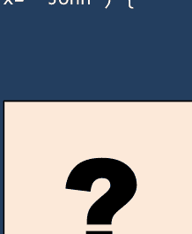

## 问题 77

### 问题：

编写一个程序将字节转换为千字节。

### 解决方案：

```cpp
#include<iostream>
using namespace std;
int main() {
    int bytes;
    cout<<"\nEnter number of bytes: ";
    cin>>bytes;
    cout<<"\nKilobytes: "<<(bytes/1024);
    return 0;
}
```

## 问题 78

### 问题：

编写一个程序将兆字节转换为千字节。

### 解决方案：

```cpp
#include<iostream>
using namespace std;
int main() {
    double megabytes, kilobytes;
    cout<<"\nInput the amount of megabytes to convert: ";
    cin>>megabytes;
    kilobytes = megabytes * 1024;
    cout<<"\nThere are "<<kilobytes<< " kilobytes in " <<megabytes<< " megabytes.";
    return 0;
}
```

## 问题 79

### 问题：

编写一个程序来计算整数数组中偶数元素的数量。

### 解决方案：

```cpp
#include<iostream>
using namespace std;
int main() {
    int array[1000], i, arr_size, even=0;
    cout<<"Input the size of the array: ";
    cin>>arr_size;
    cout<<"Enter the elements in array: \n";
    for(i=0; i<arr_size; i++) {
        cin>>array[i];
    }

    for(i=0; i<arr_size; i++) {
        if(array[i]%2==0) {
            even++;
        }
    }
    cout<<"Number of even elements: "<< even;
    return 0;
}
```

## 问题 80

### 问题：

编写一个程序来计算整数数组中奇数元素的数量。

### 解决方案：

```cpp
#include<iostream>
using namespace std;
int main() {
    int array[1000], i, arr_size, odd=0;
    cout<<"Input the size of the array: ";
    cin>>arr_size;
    cout<<"Enter the elements in array: \n";
    for(i=0; i<arr_size; i++) {
        cin>>array[i];
    }

    for(i=0; i<arr_size; i++) {
        if(array[i]%2!=0) {
            odd++;
        }
    }
    cout<<"Number of odd elements: "<< odd;
    return 0;
}
```

## 问题 81

### 问题：

编写一个程序，接受两个整数并确定它们是否相等。

### 解决方案：

```cpp
#include<iostream>
using namespace std;
int main() {
    int x, y;
    cout<<"Input the values for x and y: \n";
    cin>>x;
    cin>>y;
    if(x == y) {
        cout<<"x and y are equal\n";
    }
    else {
        cout<<"x and y are not equal\n";
    }
    return 0;
}
```

## 问题 82

### 问题：

如果给定两个角度，编写一个程序来找到三角形的第三个角。

### 解决方案：

```cpp
#include<iostream>
using namespace std;
int main() {
    int angle1, angle2;
    cout<<"\nEnter the first angle of the triangle: ";
    cin>>angle1;
    cout<<"\nEnter the second angle of the triangle: ";
    cin>>angle2;
    cout<<"\nThird angle of the triangle is: "<< (180 - (angle1 + angle2));
    return 0;
}
```

## 问题 83

### 问题：

编写一个程序来确定特定年份是否是闰年。

### 解决方案：

```cpp
#include<iostream>
using namespace std;
int main() {
    int year;
    cout<<"Enter the year: ";
    cin>>year;
    if((year % 400) == 0) {
        cout<<year<<" is a leap year.";
    }
    else if((year % 100) == 0) {
        cout<<year<<" is a not leap year.";
    }
    else if((year % 4) == 0) {
        cout<<year<<" is a leap year.";
    }
    else {
        cout<<year<<" is not a leap year.";
    }
    return 0;
}
```

## 问题 84

### 问题：

编写一个程序，读取候选人的年龄并确定候选人是否有资格亲自投票。

### 解决方案：

```cpp
#include <iostream>
using namespace std;
int main() {
    int age;
    cout<<"\nEnter the age of the candidate: ";
    cin>>age;
    if(age<18) {
        cout<<"\nWe apologize, but the candidate is not able to cast his vote.";
        cout<<"\nAfter "<< (18-age) <<" year, the candidate would be able to cast his vote.";
    }
    else {
        cout<<"Congratulation! the candidate is qualified to cast his vote.\n";
    }
    return 0;
}
```

## 问题 85

### 问题：

编写一个程序将码转换为英尺。

### 解决方案：

```cpp
#include<iostream>
using namespace std;
int main() {
    float yard;
    cout<<"\nEnter the Length in Yard: ";
    cin>>yard;
    cout<<yard<<" Yard in Foot is: "<<(3*yard);
    return 0;
}
```

## 问题 86

### 问题：

编写一个程序将千兆字节转换为兆字节。

### 解决方案：

```cpp
#include<iostream>
using namespace std;
int main() {
    double gigabytes, megabytes;
    cout<<"\nInput the amount of gigabytes to convert: ";
    cin>>gigabytes;
    megabytes = gigabytes*1024;
    cout<<"\nThere are "<<megabytes<<" megabytes in "<<gigabytes<<" gigabytes.";
    return 0;
}
```

## 问题 87

### 问题：

编写一个程序将千克转换为磅。

### 解决方案：

```cpp
#include<iostream>
using namespace std;
int main() {
    float kg, lbs;
    cout<<"\nEnter Weight in Kilogram: ";
    cin>>kg;
    lbs = kg*2.20462;
    cout<<kg<<" Kg = "<<lbs<<" Pounds";
    return 0;
}
```

## 问题 88

### 问题：

编写一个程序将千克转换为盎司。

### 解决方案：

```cpp
#include<iostream>
using namespace std;
int main() {
    float kg, ounce;
    cout<<"\nEnter Weight in Kilogram: ";
    cin>>kg;
    ounce = kg*35.274;
    cout<<kg<<" Kg = "<<ounce<<" Ounce";
    return 0;
}
```

## 问题 89

### 问题：

编写一个程序将磅转换为克。

### 解决方案：

```cpp
#include<iostream>
using namespace std;
int main() {
    float pound, gram;
    cout<<"\nEnter Weight in Pounds: ";
    cin>>pound;
    gram = pound*453.592;
    cout<<pound<<" Pound = "<<gram<<" Grams";
    return 0;
}
```

## 问题 90

### 问题：

编写一个程序，使用角度来验证三角形是否有效。

### 解决方案：

```cpp
#include <iostream>
using namespace std;
int main() {
    int angle1, angle2, angle3, sum;
    cout<<"\nEnter the first angle of the triangle: ";
    cin>>angle1;
    cout<<"\nEnter the second angle of the triangle: ";
    cin>>angle2;
    cout<<"\nEnter the third angle of the triangle: ";
    cin>>angle3;
    sum = angle1 + angle2 + angle3;
    if(sum == 180) {
        cout<<"\nThe triangle is valid.";
    }
    else {
        cout<<"\nThe triangle is not valid.";
    }
    return 0;
}
```

## 问题 91

### 问题：

编写一个程序，将用户输入的两位数的各位数字相加。

### 解决方案：

```cpp
#include<iostream>
using namespace std;
int main() {
    int x, y, sum = 0;
    cout<<"\nEnter a two-digit number: ";
    cin>>x;
    y = x;
    while(y != 0) {
        sum = sum + y % 10;
        y = y / 10;
    }
    cout<<"\nSum of digits of "<<x<<" is: "<<sum;
    return 0;
}
```

## 问题 92

### 问题：

编写一个程序来验证你输入的字符是元音还是辅音。

### 解决方案：

```cpp
#include<iostream>
using namespace std;
int main() {
    char ch;
    cout<<"\nEnter a character: ";
    cin>>ch;
    if(ch == 'a' || ch == 'e' || ch == 'i' || ch == 'o' || ch == 'u' ||
       ch == 'A' || ch == 'E' || ch == 'I' || ch == 'O' || ch == 'U' ) {
        cout<<ch<<" is a vowel";
    }
    else {
```

## 问题 93

### 问题：

编写一个程序来计算一个数的阶乘。

### 解答：

```cpp
#include<iostream>
using namespace std;
int main() {
    int i, fact=1, num;
    cout<<"\nEnter a number: ";
    cin>>num;
    for(i=1; i<=num; i++) {
        fact=fact*i;
    }
    cout<<"\nFactorial of "<<num<<" is: "<<fact;
    return 0;
}
```

## 问题 94

### 问题：

编写一个程序来打印一个月中的天数。

### 解答：

```cpp
#include<iostream>
using namespace std;
int main() {
    int x[12]={31,28,31,30,31,30,31,31,30,31,30,31}, m;
    cout<<"\nEnter the month number: ";
    cin>>m;
    if(m>12 || m<1) {
        cout<<"Invalid input";
    }
    else if(m==2) {
        cout<<"\nNumber of days in month 2 is either 29 or 28";
    }
    else {
        cout<<"\nNumber of days in month "<<m<< " is: "<<x[m-1];
    }
    return 0;
}
```

## 问题 95

### 问题：

编写一个程序来连接两个字符串。

### 解答：

```cpp
#include<iostream>
#include<cstring>
using namespace std;
int main() {
    char a[1000], b[1000];
    cout<<"\nEnter the first string: ";
    cin>>a;
    cout<<"\nEnter the second string: ";
    cin>>b;
    strcat(a, b);
    cout<<"\nString produced by concatenation is: "<< a;
    return 0;
}
```

## 问题 96

### 问题：

编写一个程序来找出两个数中的最大值。

### 解答：

```cpp
#include<iostream>
using namespace std;
int main() {
    int a,b;
    cout<<"Enter two numbers: \n";
    cin>>a;
    cin>>b;
    if(a>b) {
        cout<<a<<" is a maximum number";
    }
    else {
        cout<<b<<" is a maximum number";
    }
    return 0;
}
```

## 问题 97

### 问题：

编写一个程序来比较两个字符串。

### 解答：

```cpp
#include<iostream>
#include<cstring>
using namespace std;
int main() {
    char a[100], b[100];
    cout<<"Enter the first string: \n";
    cin>>a;
    cout<<"Enter the second string: \n";
    cin>>b;
    if (strcmp(a,b) == 0) {
        cout<<"The 2 strings are equal.\n";
    }
    else {
        cout<<"The 2 strings are not equal.\n";
    }
    return 0;
}
```

## 问题 98

### 问题：

编写一个程序将大写字母转换为小写字母。

### 解答：

```cpp
#include<iostream>
using namespace std;
int main() {
    char ch = 'G';
    char b = tolower(ch);
    cout<<ch<<" in lowercase is represented as "<< b;
    return 0;
}
```

## 问题 99

### 问题：

编写一个程序来计算输入的被除数和除数的商和余数。

### 解答：

```cpp
#include<iostream>
using namespace std;
int main() {
    int dividend, divisor;
    cout<<"\nEnter dividend: ";
    cin>>dividend;
    cout<<"\nEnter divisor: ";
    cin>>divisor;
    cout<<"\nQuotient = "<< (dividend / divisor);
    cout<<"\nRemainder = "<< (dividend % divisor);
    return 0;
}
```

## 问题 100

### 问题：

编写一个程序来确定 `int`、`float`、`double` 和 `char` 的大小。

### 解答：

```cpp
#include<iostream>
using namespace std;
int main() {
    cout<<"Size of char is: "<<sizeof(char)<<" byte\n";
    cout<<"Size of int is: "<<sizeof(int)<<" bytes\n";
    cout<<"Size of float is: "<<sizeof(float)<<" bytes\n";
    cout<<"Size of double is: "<<sizeof(double)<<" bytes\n";
    return 0;
}
```

## 问题 101

### 问题：

编写一个程序来验证密码，直到输入正确为止。

### 解答：

```cpp
#include<iostream>
using namespace std;
int main() {
    int pwd, i;
    while (i!=0) {
        cout<<"\nEnter the password: ";
        cin>>pwd;
        if(pwd==1988) {
            cout<<"The password you entered is correct";
            i=0;
        }
        else {
            cout<<"Incorrect password, try again";
        }
        cout<<"\n";
    }
    return 0;
}
```

## 问题 102

### 问题：

编写一个程序来找出一个数的绝对值。

### 解答：

```cpp
#include<iostream>
using namespace std;
int main() {
    int num;
    cout<<"Input a positive or negative number: \n";
    cin>>num;
    cout<<"\nAbsolute value of "<<"|"<<num<<"|"<<" is: "<<abs(num);
    return 0;
}
```

## 问题 103

### 问题：

编写一个程序，接受一个人的身高（厘米），并根据身高对其进行分类。

### 解答：

```cpp
#include<iostream>
using namespace std;
int main() {
    float ht;
    cout<<"\nEnter the height (in cm): ";
    cin>>ht;
    if(ht < 150.0) {
        cout<<"Dwarf.\n";
    }
    else if((ht >= 150.0) && (ht < 165.0)) {
        cout<<"Average Height.\n";
    }
    else if((ht >= 165.0) && (ht <= 195.0)) {
        cout<<"Taller.\n";
    }
    else {
        cout<<"Abnormal height.\n";
    }
    return 0;
}
```

## 问题 104

### 问题：

编写一个程序，使用 `switch` 语句计算不同几何图形的面积。

### 解答：

```cpp
#include<iostream>
using namespace std;
int main() {
    int choice;
    float r, l, w, b, h;
    cout<<"\nEnter 1 for area of circle: ";
    cout<<"\nEnter 2 for area of rectangle: ";
    cout<<"\nEnter 3 for area of triangle: ";
    cout<<"\nEnter your choice : ";
    cin>>choice;
    switch(choice) {
        case 1:
            cout<<"Enter the radius of the circle: ";
            cin>>r;
            cout<<"\nArea of a circle is: " << (3.14*r*r);
            break;
        case 2:
            cout<<"Enter the length and width of the rectangle: \n";
            cin>>l;
            cin>>w;
            cout<<"\nArea of a rectangle is: "<<(l*w);
            break;
        case 3:
            cout<<"Enter the base and height of the triangle: \n";
            cin>>b;
            cin>>h;
            cout<<"\nArea of a triangle is: "<<(0.5*b*h);
            break;
        default:
            cout<<"\nPlease enter a number from 1 to 3.";
            break;
    }
    return 0;
}
```

## 问题 105

### 问题：

编写一个程序，从键盘接受一个字符，如果它等于 `y`，则打印 "Yes"。否则打印 "No"。

### 解答：

```cpp
#include<iostream>
using namespace std;
int main() {
    char ch;
    cout<<"Enter a character: ";
    ch = getchar ();
    if(ch == 'y' || ch == 'Y') {
        cout<<"Yes\n";
    }
    else {
        cout<<"No\n";
    }
    return(0);
}
```

## 问题 106

### 问题：

编写一个程序，使用位运算符将输入的值乘以四。

### 解答：

```cpp
#include<iostream>
using namespace std;
int main() {
    long x, y;
    cout<<"Enter a integer: ";
    cin>>x;
    y = x;
    x = x << 2;
    cout<< y<<" x 4 = "<< x;
    return 0;
}
```

## 问题 107

### 问题：

编写一个程序来检查用户输入的数字是否是 2 的幂。

### 解答：

```cpp
#include<iostream>
using namespace std;
int main() {
    int x;
    cout<<"Enter a number: ";
    cin>>x;
    if((x != 0) && ((x &(x - 1)) == 0)) {
        cout<<x<<" is a power of 2";
    }
    else {
        cout<<x<<" is not a power of 2";
    }
    return 0;
}
```

## 问题 108

### 问题：

编写一个程序来确定一个三角形是不等边三角形、等腰三角形还是等边三角形。

### 解答：

```cpp
#include<iostream>
using namespace std;
int main() {
    int side1, side2, side3;
    cout<<"\nEnter the first side of the triangle: ";
    cin>>side1;
    cout<<"\nEnter the second side of the triangle: ";
    cin>>side2;
    cout<<"\nEnter the third side of the triangle: ";
    cin>>side3;
    if(side1 == side2 && side2 == side3) {
        cout<<"\nThe given Triangle is equilateral.";
    }
    else if(side1 == side2 || side2 == side3 || side3 == side1) {
        cout<<"\nThe given Triangle is isosceles.";
    }
    else {
        cout<<"\nThe given Triangle is scalene.";
    }
    return 0;
}
```

## 问题 109

### 问题：

编写一个程序来打印从 A 到 Z 的所有英文字母的 ASCII 值。

### 解答：

```cpp
#include<iostream>
using namespace std;
int main() {
    int i;
    for(i='A'; i<='Z'; i++) {
        cout<<"ASCII value of "<<char(i)<<"="<<int(i)<<endl;
    }
    return 0;
}
```

## 问题 110

### 问题：

编写一个程序来计算 1 到 n 之间所有偶数的和。

### 解答：

```cpp
#include<iostream>
using namespace std;
int main() {
    int i, num, sum=0;
    cout<<"Enter a number: ";
    cin>>num;
    for(i=2; i<=num; i=i+2) {
        sum = sum + i;
    }
    cout<<"\nSum of all even number between 1 to " <<num<< " is: "<< sum;
    return 0;
}
```

## 问题 111

### 问题：

编写一个程序来计算 1 到 n 之间所有奇数的和。

### 解答：

```cpp
#include<iostream>
using namespace std;
int main() {
    int i, num, sum=0;
    cout<<"Enter a number: ";
    cin>>num;
    for(i=1; i<=num; i=i+2) {
        sum = sum + i;
    }
    cout<<"\nSum of all odd number between 1 to " <<num<< " is: "<< sum;
    return 0;
}
```

## 问题 112

### 问题：

编写一个程序，使用 `switch case` 找出最大数。

解答：

```cpp
#include<iostream>
using namespace std;
int main() {
    int x, y;
    cout<<"Enter any two numbers: \n";
    cin>>x;
    cin>>y;
    switch(x > y) {
        case 0: cout<<y<<" is Maximum number";
            break;
        case 1: cout<<x<<" is Maximum number";
            break;
    }
    return 0;
}
```

## 问题 113

问题：

编写一个程序，允许你输入产品的成本价和销售价，并计算利润或亏损。

解答：

```cpp
#include<iostream>
using namespace std;
int main() {
    int cp, sp;
    cout<<"\nInput Cost Price: ";
    cin>>cp;
    cout<<"\nInput Selling Price: ";
    cin>>sp;
    if(sp > cp) {
        cout<<"Profit = "<< (sp - cp);
    }
    else if(cp > sp) {
        cout<<"Loss = "<< (cp - sp);
    }
    else {
        cout<<"No Profit No Loss.";
    }
    return 0;
}
```

## 问题 114

问题：

编写一个程序，使用星号显示类似直角三角形的图案。

解答：

```cpp
#include<iostream>
using namespace std;
int main() {
    int rows;
    cout<<"Input the number of rows: ";
    cin>>rows;
    for(int x=1; x<=rows; x++) {
        for(int y=1; y<=x; y++)
            cout<<"*";
        cout<<"\n";
    }
    return 0;
}
```

## 问题 115

问题：

编写一个程序，使用数字显示类似直角三角形的图案。

解答：

```cpp
#include<iostream>
using namespace std;
int main() {
    int rows;
    cout<<"Input the number of rows: ";
    cin>>rows;
    for(int x=1; x<=rows; x++) {
        for(int y=1; y<=x; y++)
            cout<<""<<y;
        cout<<"\n";
    }
    return 0;
}
```

## 问题 116

问题：

编写一个程序，确定50到100之间所有能被2整除的整数的数量和总和。

解答：

```cpp
#include<iostream>
using namespace std;
int main() {
    int x, sum=0;
    cout<<"Numbers between 50 and 100, divisible by 2: \n";
    for(x=51; x<100; x++) {
        if(x%2==0) {
            cout<<" "<<x;
            sum+=x;
        }
    }
    cout<<"\nThe sum: "<< sum;
    return 0;
}
```

## 问题 117

问题：

编写一个程序，使用函数来确定输入的数字是偶数还是奇数。

解答：

```cpp
#include<iostream>
using namespace std;
int myfunc(int x) {
    return (x & 1);
}
int main() {
    int x;
    cout<<"Enter any number: ";
    cin>>x;
    if(myfunc(x)) {
        cout<<"\nThe number you entered is odd.";
    }
    else {
        cout<<"\nThe number you entered is even.";
    }
    return 0;
}
```

## 问题 118

问题：

编写一个程序，求输入数字的平方根。

解答：

```cpp
#include<iostream>
#include<cmath>
using namespace std;
int main() {
    int x;
    cout<<"Enter any number: ";
    cin>>x;
    cout<<"Square root of "<<x<< " is: "<<(double)sqrt(x);
    return 0;
}
```

## 问题 119

问题：

编写一个程序，使用库函数求输入数字的幂。

解答：

```cpp
#include<iostream>
#include<cmath>
using namespace std;
int main() {
    int x, y;
    cout<<"\nEnter the value for x: ";
    cin>>x;
    cout<<"\nEnter the value for y: ";
    cin>>y;
    cout<<x<<"^"<<y<<" = " << (long)pow(x,y);
    return 0;
}
```

## 问题 120

问题：

编写一个程序，确定输入的字符是字母字符还是数字字符。

解答：

```cpp
#include<iostream>
using namespace std;
int main() {
    char ch;
    cout<<"Enter a character: ";
    cin>>ch;
    if(isdigit(ch)) {
        cout<<ch<<" is a Digit";
    }
    else if(isalpha(ch)) {
        cout<<ch<<" is an Alphabet";
    }
    else {
        cout<<ch<<" is not an Alphabet, or a Digit";
    }
    return 0;
}
```

## 问题 121

问题：

编写一个程序，确定输入的字符是否是字母数字字符。

解答：

```cpp
#include<iostream>
using namespace std;
int main() {
    char a;
    cout<<"Enter a character: ";
    cin>>a;
    if(isalnum(a)) {
        cout<<a<<" is an alphanumeric character.";
    }
    else {
        cout<<a<<" is NOT an alphanumeric character.";
    }
    return 0;
}
```

## 问题 122

问题：

编写一个程序，确定输入的字符是否是标点字符。

解答：

```cpp
#include<iostream>
using namespace std;
int main() {
    char a;
    cout<<"Enter a character: ";
    cin>>a;
    if(ispunct(a)) {
        cout<<a<<" is an punctuation character.";
    }
    else {
        cout<<a<<" is NOT an punctuation character.";
    }
    return 0;
}
```

## 问题 123

问题：

编写一个程序，检查输入的字符是否是图形字符。

解答：

```cpp
#include<iostream>
using namespace std;
int main() {
    char a;
    cout<<"Enter a character: ";
    cin>>a;
    if(isgraph(a)) {
        cout<<a<<" is a graphic character.";
    }
    else {
        cout<<a<<" is NOT a graphic character.";
    }
    return 0;
}
```

## 问题 124

问题：

编写一个程序，使用 `isprint()` 函数列出所有可打印字符。

解答：

```cpp
#include<iostream>
using namespace std;
int main() {
    int i;
    for(i = 1; i <= 127; i++)
        if(isprint(i)!= 0)
            cout<<" "<<char(i);
    return 0;
}
```

## 问题 125

问题：

编写一个程序，检查输入的字符是否是十六进制数字字符。

解答：

```cpp
#include<iostream>
using namespace std;
int main() {
    char a;
    cout<<"Enter a character: ";
    cin>>a;
    if(isxdigit(a)) {
        cout<<a<<" is a hexadecimal digit character.";
    }
    else {
        cout<<a<<" is NOT a hexadecimal digit character.";
    }
    return 0;
}
```

## 问题 126

问题：

编写一个程序，打印所有控制字符的 ASCII 值。

解答：

```cpp
#include<iostream>
using namespace std;
int main() {
    int i;
    cout<<"The ASCII value of all control characters are: \n";
    for(i=0; i<=127; i++) {
        if(iscntrl(i)!=0)
            cout<<"\n "<< i;
    }
    return 0;
}
```

```cpp
#include<iostream>
#include<cstring>
using namespace std;
int main() {
    string x = "Joe";
    string* ptr = &x;
    cout << ptr << endl;
    cout << *ptr << endl;
    return 0;
}
```

## 问题 127

问题：

编写一个程序，检查给定的字符是否是空白字符。

解答：

```cpp
#include <iostream>
using namespace std;
int main() {
    char c;
    char ch = ' ';
    if(isspace(ch)) {
        cout << "\nNot a white-space character.";
    }
    else {
        cout << "\nWhite-space character.";
    }
    return 0;
}
```

## 问题 128

问题：

编写一个程序，演示 `isprint()` 和 `iscntrl()` 函数。

解答：

```cpp
#include<iostream>
using namespace std;
int main() {
    char ch = 'a';
    if(isprint(ch)) {
        cout<<ch<<" is printable character."<<endl;
    }
    else {
        cout<<ch<<" is not printable character."<<endl;
    }

    if(iscntrl(ch)) {
        cout<<ch<<" is control character."<<endl;
    }
    else {
        cout<<ch<<" is not control character."<<endl;
    }
    return (0);
}
```

## 问题 129

问题：

编写一个程序，计算立方体的表面积。

解答：

```cpp
#include<iostream>
using namespace std;
int main() {
    int side;
    long area;
    cout<<"\nEnter the side of cube: ";
    cin>>side;
    area = 6*side*side;
    cout<<"\nThe surface area of cube is: "<< area;
    return 0;
}
```

## 问题 130

问题：

编写一个程序，在不使用减法运算符的情况下减去两个数。

解答：

```cpp
#include<iostream>
using namespace std;
int main() {
    int x =6, y=3;
    cout<<x+(~y)+1;
    return 0;
}
```

## 问题 131

问题：

编写一个程序，在不使用加法运算符的情况下将两个数相加。

解答：

```cpp
#include<iostream>
using namespace std;
int main() {
    int x =6, y=3;
    cout<<x-(~y)-1;
    return 0;
}
```

## 问题 132

问题：

编写一个程序，在不使用乘法运算符的情况下将一个数乘以2。

解答：

```cpp
#include<iostream>
using namespace std;
int main() {
    int x=2;
    cout<< (x<<1);
    return 0;
}
```

```cpp
#include<iostream>
#include<cstring>
using namespace std;
int main() {
    string x[5] = {"Albert", "John", "Mary", "James"};
    x[0] = "Joe";
    cout << x[0]; // 输出：Joe
    return 0;
}
```

## 问题 134

问题：

编写一个程序，在不使用除法运算符的情况下将一个数除以2。

解答：

```cpp
#include<iostream>
using namespace std;
int main() {
```

## 问题 135

### 问题：

编写一个程序来计算球体的体积。

### 解答：

```cpp
#include<iostream>
using namespace std;
int main() {
    int radius;
    float PI = 3.141592;
    cout<<"\nEnter the radius of sphere: ";
    cin>>radius;
    float volume = (4/3)*(PI*radius*radius*radius);
    cout<<"\nThe volume of sphere is: "<< volume;
    return 0;
}
```

## 问题 136

### 问题：

编写一个程序来计算椭球体的体积。

### 解答：

```cpp
#include<iostream>
using namespace std;
int main() {
    int r1, r2, r3;
    float PI = 3.141592;
    cout<<"\nEnter the radius of the ellipsoid of axis 1: ";
    cin>>r1;
    cout<<"\nEnter the radius of the ellipsoid of axis 2: ";
    cin>>r2;
    cout<<"\nEnter the radius of the ellipsoid of axis 3: ";
    cin>>r3;
    float volume = (4/3)*(PI*r1*r2*r3);
    cout<<"\nThe volume of ellipsoid is: "<< volume;
    return 0;
}
```

```cpp
#include<iostream>
#include<cstring>
using namespace std;
int main() {
    string x[5] = {"Albert", "John", "Mary", "James", "Bob"};
    for(int i = 0; i < 5; i++) { cout << x[i] << endl; }
    return 0;
}
```

## 问题 137

### 问题：

编写一个程序，使用 for 循环来计算用户输入数字的幂。

### 解答：

```cpp
#include<iostream>
using namespace std;
int main() {
    int x, y;
    long power = 1;
    cout<<"\nEnter the value for x: ";
    cin>>x;
    cout<<"\nEnter the value for y: ";
    cin>>y;
    for(int i=1; i<=y; i++) {
        power = power * x;
    }
    cout<<x<<"^"<<y<<" = "<<power;
    return 0;
}
```

```cpp
#include<iostream>
#include<cstring>
using namespace std;

int main() {
    string x = "Albert";
    string &y = x;
    cout << x << endl;
    // 输出：Albert
    cout << y << endl;
    // 输出：Albert
    return 0;
}
```

## 问题 138

### 问题：

编写一个程序来读取三个数字并计算它们的平均值。

### 解答：

```cpp
#include<iostream>
using namespace std;
int main() {
    int a,b,c;
    float avg;
    cout<<"\nEnter the first number: ";
    cin>>a;
    cout<<"\nEnter the second number: ";
    cin>>b;
    cout<<"\nEnter the third number: ";
    cin>>c;
    avg=(a+b+c)/3.0;
    cout<<"\nAverage of three numbers is: "<< avg;
    return 0;
}
```

## 问题 139

### 问题：

编写一个程序来读取整数 "n" 并打印其前三个幂（n¹, n², n³）。

### 解答：

```cpp
#include<iostream>
#include<cmath>
using namespace std;
int main() {
    int n;
    cout<<"\nEnter a number: ";
    cin>>n;
    cout<<pow(n, 1)<<" "<< pow(n, 2)<<" "<< pow(n, 3);
    return 0;
}
```

```cpp
#include<iostream>

using namespace std;

int main() {

    string i[2][4] = {

        { "A", "L", "B", "E" },

        { "R", "T", "J", "H" }

    };

    cout << i[0][2];

    // 输出：B

    return 0;

}
```

```cpp
#include<iostream>
#include<cstring>

using namespace std;

int main() {
    string x = "Albert";
    cout << &x;

    return 0;

}
```


```cpp
#include<iostream>

using namespace std;

int main() {

    string x="C++ ";

    string y="programming";

    x.append(y);

    cout<<" \n "<<x<<'\n';

    return 0;

    // 输出：C++ programming

}
```

```cpp
#include<iostream>

using namespace std;

int main() {

    string x="Albert";

    cout<<*x.begin();

    return 0;

    // 输出：A

}
```

```cpp
#include<iostream>

using namespace std;

int main() {

    string x ="C language";

    *x.begin()='J';

    cout<<x;

    return 0;

    // 输出：J language

}
```

```cpp
#include<iostream>

using namespace std;

int main() {

    string x="This is a C++ Program.";

    x.erase(8,1);

    cout<<x;

    // 输出：This is  C++ Program.

    return 0;

}
```

```cpp
#include<iostream>

#include<cstring>

using namespace std;

int main() {

    string txt = "C++ Programming.";

    cout << "The length of the text string is: " << txt.size();

    // 输出：The length of the text string is: 16

    return 0;

}
```

```cpp
#include<iostream>

#include<cstring>

using namespace std;

int main() {

    string txt = "C++ Programming.";

    cout << "The length of the text string is: " << txt.length();

    // 输出：The length of the text string is: 16

    return 0;

}
```

```cpp
#include<iostream>

using namespace std;

int main() {

    string x="c++ programming";

    x.erase(x.begin()+0);

    cout<<x;

    // 输出：++ programming

    return 0;

}
```


**C++ 是 C 编程语言的扩展，用 C 语言编写的程序可以在 C++ 编译器中运行。**

## C++ 程序：

```cpp
#include<bits/stdc++.h>
using namespace std;

int main()
{
    float a =2.33333;
    cout << floor(a) << endl;
    cout << ceil(a) << endl;
    cout << trunc(a) << endl;
    cout << round(a) << endl;
    cout << setprecision(2) << a;
    return 0;
}
```

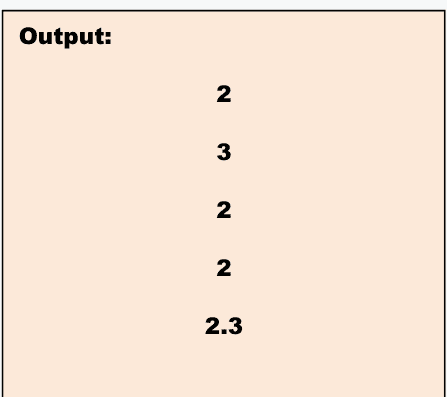

## C++ 程序：

```cpp
#include <cstdlib>
#include <iostream>
using namespace std;

int main()
{
    float a = -43;
    cout << abs(a) << endl;
    cout << labs(a) << endl;
    cout << llabs(a) << endl;
    return 0;
}
```

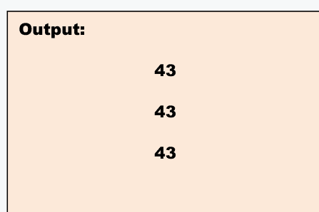

| JDK | JRE | JVM |
| :--- | :--- | :--- |
| Java 开发工具包 | Java 运行时环境 | Java 虚拟机 |
| 它是编译、文档化和打包 Java 程序所必需的工具。 | 它提供特定 Java 程序运行所需的类库和其他资源。 | 一台使计算机能够运行 Java 程序的虚拟机 |

**继承**

↓

**一个类获取另一个类属性的机制**

**抽象**

↓

向用户隐藏实现细节，仅向用户提供功能的方法论。

**封装**

↓

**将代码和数据包装成一个单一单元的过程**

**多态**

↓

**任何数据能够以多种形式被处理的能力**

> **集合是一个旨在存储对象并操作设计以存储对象的框架。**

## Java 练习


Java 是创建和交付嵌入式与移动软件、游戏、互联网娱乐和商业软件的主流技术。它几乎是任何类型网络应用程序的基础。全球拥有超过 900 万开发者，Java 使得快速创建、分发和使用新的应用程序和服务变得简单。大约在 1992 年，**詹姆斯·高斯林**受雇于 Sun 实验室。高斯林和他的团队正在构建一个机顶盒，他们从“清理”C++ 开始，最终提出了一种新的语言和运行时。因此，Java 或 Oak 被创造出来。在编程语言方面，C 仍然是开发者的首选。然而，Java 在开发者中比 C 更受欢迎。Java 是第二受欢迎的编程语言。常见的原因是它有助于创建运行良好且令人满意的复杂应用程序。此外，Java 可以在任何平台上安装和运行。目前大约有 30 亿部手机、1.25 亿台电视和每台蓝光播放器使用 Java。你可以通过练习和解决问题来学习 Java 编程并提升你的技能。如果你通过“示例”学习效果最好，那么这一章就是为你准备的。

## 问题 1

### 问题：

编写一个程序来打印 Hello, World!。

### 解答：

```java
public class MyClass {
    public static void main(String[] args) {
        System.out.print("Hello, World!");
    }
}
```

## 问题 2

### 问题：

编写一个程序来计算矩形的周长和面积。

### 解答：

```java
public class MyClass {
    public static void main(String[] args) {
        int height = 8;
        int width = 5;
        int perimeter = 2 * (height + width);
        System.out.println("Perimeter of the rectangle is: " + perimeter + " cm");
        int area = height * width;
        System.out.println("Area of the rectangle is: " + area + " square cm");
    }
}
```

## 问题 3

### 问题：

编写一个程序来计算圆的周长和面积。

### 解答：

```java
public class MyClass {
    public static void main(String[] args) {
        int radius = 4;
        float perimeter = (float)(2 * 3.14 * radius);
        System.out.printf("Perimeter of the circle is: %f cm\n", perimeter);
        float area = (float)(3.14 * radius * radius);
        System.out.printf("Area of the circle is: %f square cm\n", area);
    }
}
```

```java
public class MyClass {

    public static void main(String[] args) {

        int x = 65;

        x = 80;

        System.out.println(x);

    }

}
```

## 问题 4

### 问题：

编写一个程序，从用户那里接收两个数字，并计算这两个数字的和。

### 解决方案：

```java
import java.util.Scanner;

public class MyClass {
    public static void main(String[] args) {
        int a, b, sum;
        System.out.print("\nEnter the first number: ");
        a = STDIN_SCANNER.nextInt();
        System.out.print("\nEnter the second number: ");
        b = STDIN_SCANNER.nextInt();
        sum = a + b;
        System.out.print("\nSum of the above two numbers is: " + sum);
    }
    public final static Scanner STDIN_SCANNER = new Scanner(System.in);
}
```

```java
public class MyClass {

    public static void main(String[] args) {

        String x = "Einstein";

        System.out.println("Albert " + x);

    }

    // Output: Albert Einstein

}
```

## 问题 5

### 问题：

编写一个程序，从用户那里接收两个数字，并计算这两个数字的乘积。

### 解决方案：

```java
import java.util.Scanner;

public class MyClass {
    public static void main(String[] args) {
        int a, b, mult;
        System.out.print("\nEnter the first number: ");
        a = STDIN_SCANNER.nextInt();
        System.out.print("\nEnter the second number: ");
        b = STDIN_SCANNER.nextInt();
        mult = a * b;
        System.out.print("\nProduct of the above two numbers is: " + mult);
    }
    public final static Scanner STDIN_SCANNER = new Scanner(System.in);
}
```

## 问题 6

### 问题：

编写一个程序，接收三个数字并找出其中最大的一个。

### 解决方案：

```java
import java.util.Scanner;

public class MyClass {
    public static void main(String[] args) {
        int x, y, z;
        System.out.print("\nEnter the first number: ");
        x = STDIN_SCANNER.nextInt();
        System.out.print("\nEnter the second number: ");
        y = STDIN_SCANNER.nextInt();
        System.out.print("\nEnter the third number: ");
        z = STDIN_SCANNER.nextInt();

        // if x is greater than both y and z, x is the largest
        if(x >= y && x >= z) {
            System.out.print("\n" + x + " is the largest number.");
        }

        // if y is greater than both x and z, y is the largest
        if(y >= x && y >= z) {
            System.out.print("\n" + y + " is the largest number.");
        }

        // if z is greater than both x and y, z is the largest
        if(z >= x && z >= y) {
            System.out.print("\n" + z + " is the largest number.");
        }
    }
    public final static Scanner STDIN_SCANNER = new Scanner(System.in);
}
```

## 问题 7

### 问题：

编写一个程序，读取三个浮点值，并检查是否可以用它们构成一个三角形。如果输入的值有效，还要计算三角形的周长。

### 解决方案：

```java
import java.util.Scanner;

public class MyClass {
    public static void main(String[] args) {
        float x, y, z;
        System.out.print("\nEnter the first number: ");
        x = STDIN_SCANNER.nextFloat();
        System.out.print("\nEnter the second number: ");
        y = STDIN_SCANNER.nextFloat();
        System.out.print("\nEnter the third number: ");
        z = STDIN_SCANNER.nextFloat();

        if(x < y + z && y < x + z && z < y + x) {
            System.out.printf("\nPerimeter of the triangle is: %f\n", x + y + z);
        } else {
            System.out.print("\nIt is impossible to form a triangle.");
        }
    }
    public final static Scanner STDIN_SCANNER = new Scanner(System.in);
}
```

## 问题 8

### 问题：

编写一个程序，读取一个1到7之间的整数，并用英文打印出星期几。

### 解决方案：

```java
import java.util.Scanner;

public class MyClass {
    public static void main(String[] args) {
        int day;
        System.out.print("\nEnter a number between 1 to 7 to get the day name: ");
        day = STDIN_SCANNER.nextInt();
        switch(day) {
            case 1:
                System.out.println("Monday");
                break;
            case 2:
                System.out.println("Tuesday");
                break;
            case 3:
                System.out.println("Wednesday");
                break;
            case 4:
                System.out.println("Thursday");
                break;
            case 5:
                System.out.println("Friday");
                break;
            case 6:
                System.out.println("Saturday");
                break;
            case 7:
                System.out.println("Sunday");
                break;
            default:
                System.out.print("Enter a number between 1 to 7.");
        }
    }
    public final static Scanner STDIN_SCANNER = new Scanner(System.in);
}
```

## 问题 9

### 问题：

编写一个程序来计算两个数字的和。

### 解决方案：

```java
public class MyClass {
    public static void main(String[] args) {
        int a, b, sum;
        a = 1;
        b = 2;
        sum = a + b;
        System.out.print("The sum of a and b = " + sum);
    }
}
```

## 问题 10

### 问题：

编写一个程序来计算一个数字的平方。

### 解决方案：

```java
public class MyClass {
    public static void main(String[] args) {
        int a, b;
        a = 2;
        b = (int)Math.pow(a, 2);
        System.out.print("The square of a = " + b);
    }
}
```

## 问题 11

### 问题：

编写一个程序来找出两个数字中较大的那个。

### 解决方案：

```java
public class MyClass {
    public static void main(String[] args) {
        int a, b;
        a = 2;
        b = 3;
        if(a > b) {
            System.out.print("a is greater than b");
        } else {
            System.out.print("b is greater than a");
        }
    }
}
```

## 问题 12

### 问题：

编写一个程序来打印数组中元素的平均值。

### 解决方案：

```java
public class MyClass {
    public static void main(String[] args) {
        int avg = 0, sum = 0;
        int[] num = {16, 18, 20, 25, 36};
        for(int i = 0; i < 5; i++) {
            sum = sum + num[i];
            avg = sum / 5;
        }
        System.out.println("Sum of the Elements in the array is: " + sum);
        System.out.println("Average of the elements in the array is: " + avg);
    }
}
```

## 问题 13

### 问题：

编写一个程序，打印1到25之间所有的偶数。

### 解决方案：

```java
public class MyClass {
    public static void main(String[] args) {
        System.out.println("Even numbers between 1 to 25:");
        for(int i = 1; i <= 25; i++) {
            if(i % 2 == 0) {
                System.out.print(i + " ");
            }
        }
    }
}
```

## 问题 14

### 问题：

编写一个程序，打印1到50之间所有的奇数。

### 解决方案：

```java
public class MyClass {
    public static void main(String[] args) {
        System.out.println("Odd numbers between 1 to 50:");
        for(int i = 1; i <= 50; i++) {
            if(i % 2 != 0) {
                System.out.print(i + " ");
            }
        }
    }
}
```

```java
public class MyClass {
    public static void main(String[] args) {
        byte x = 100;
        System.out.println(x);
    }
}
// Output: 100
```

## 问题 15

### 问题：

编写一个程序，从1开始打印前10个数字，以及它们的平方和立方。

### 解决方案：

```java
public class MyClass {
    public static void main(String[] args) {
        for(int i = 1; i <= 10; i++) {
            System.out.println("Number = " + i + " its square = " + (i * i) + " its cube = " + (i * i * i));
        }
    }
}
```

## 问题 16

### 问题：

编写一个程序：
如果你输入一个字符 M
输出必须是：ch = M。

### 解决方案：

```java
public class MyClass {
    public static void main(String[] args) throws Exception {
        char c;
        System.out.print("Enter a character: ");
        c = (char)System.in.read();
        System.out.println("ch = " + c);
    }
}
```

## 问题 17

### 问题：

编写一个程序，打印用户输入数字的乘法表。

### 解决方案：

```java
import java.util.Scanner;

public class MyClass {
    public static void main(String[] args) {
        int n;
        System.out.print("Enter any number: ");
        n = STDIN_SCANNER.nextInt();
        for(int i = 1; i <= 5; i++) {
            System.out.println(n + " * " + i + " = " + (n * i));
        }
    }
    public final static Scanner STDIN_SCANNER = new Scanner(System.in);
}
```

## 问题 18

### 问题：

编写一个程序，打印前10个数字的乘积。

### 解决方案：

```java
public class MyClass {
    public static void main(String[] args) {
        int product = 1;
        for(int i = 1; i <= 10; i++) {
            product = product * i;
        }
        System.out.print("The product of the first 10 digits is: " + product);
    }
}
```

## 问题 19

### 问题：

编写一个程序，打印给定的数字是正数还是负数。

解决方案：

```java
public class MyClass {
    public static void main(String[] args) {
        int a;
        a = -35;
        if(a > 0) {
            System.out.print("Number is positive");
        } else {
            System.out.print("Number is negative");
        }
    }
}
```

## 问题 20

问题：

编写一个程序，检查用户输入的两个数字是否相等。

解决方案：

```java
import java.util.Scanner;

public class MyClass {
    public static void main(String[] args) {
        int x, y;
        System.out.print("\nEnter the first number: ");
        x = STDIN_SCANNER.nextInt();
        System.out.print("\nEnter the second number: ");
        y = STDIN_SCANNER.nextInt();
        if(x - y == 0) {
            System.out.print("\nThe two numbers are equivalent");
        } else {
            System.out.print("\nThe two numbers are not equivalent");
        }
    }
    public final static Scanner STDIN_SCANNER = new Scanner(System.in);
}
```

## 问题 21

问题：

编写一个程序，打印用户输入的两个数字的余数。

解决方案：

```java
import java.util.Scanner;

public class MyClass {
    public static void main(String[] args) {
        int a, b, c;
        System.out.print("\nEnter the first number: ");
        a = STDIN_SCANNER.nextInt();
        System.out.print("\nEnter the second number: ");
        b = STDIN_SCANNER.nextInt();
        c = a % b;
        System.out.print("\n The remainder of " + a + " and " + b + " is: " + c);
    }
    public final static Scanner STDIN_SCANNER = new Scanner(System.in);
}
```

## 问题 22

问题：

编写一个程序，打印从 A 到 Z 的字符。

解决方案：

```java
public class MyClass {
    public static void main(String[] args) {
        for(byte i = 'A'; i <= 'Z'; i++) {
            System.out.println((char)Byte.toUnsignedInt(i));
        }
    }
}
```

```java
public class MyClass {
    public static void main(String[] args) {
        boolean x = true;
        boolean y = false;
        System.out.println(x); // 输出：true
        System.out.println(y); // 输出：false
    }
}
```

## 问题 23

问题：

编写一个程序，打印输入字符串的长度。

解决方案：

```java
import java.util.Scanner;
public class MyClass {
    public static void main(String[] args) {
        String a;
        Scanner scan = new Scanner(System.in);
        System.out.print("Enter Your Name : ");
        a = scan.nextLine();
        System.out.println("The length of the String is: " + a.length());
    }
}
```

## 问题 24

问题：

编写一个程序，检查给定的字符是否为小写字母。

解决方案：

```java
public class MyClass {
    public static void main(String[] args) {
        char ch = 'a';
        if(Character.isLowerCase(ch)) {
            System.out.println("The given character is a lower case letter");
        }
        else {
            System.out.println("The given character is a upper case letter");
        }
    }
}
```

## 问题 25

问题：

编写一个程序，检查给定的字符是否为大写字母。

解决方案：

```java
public class MyClass {
    public static void main(String[] args) {
        char ch = 'A';
        if(Character.isUpperCase(ch)) {
            System.out.println("The given character is a upper case letter");
        }
        else {
            System.out.println("The given character is a lower case letter");
        }
    }
}
```

## 问题 26

问题：

编写一个程序，将小写字符串转换为大写字符串。

解决方案：

```java
public class MyClass {
    public static void main(String[] args) {
        String a = "albert einstein";
        System.out.println(a.toUpperCase());
    }
}
```

## 问题 27

问题：

编写一个程序，接收以厘米为单位的距离，并输出对应的英寸值。

解决方案：

```java
import java.util.Scanner;

public class MyClass {
    public final static double X = 2.54;
    public static void main(String[] args) {
        double inch, cm;
        System.out.print("Enter the distance in cm: ");
        cm = STDIN_SCANNER.nextDouble();
        inch = cm / X;
        System.out.printf("\nDistance of %.2f cms is equal to %.2f inches", cm, inch);
    }
    public final static Scanner STDIN_SCANNER = new Scanner(System.in);
}
```

## 问题 28

问题：

编写一个程序，打印以下输出：
Einstein [0] = E
Einstein [1] = I
Einstein [2] = N
Einstein [3] = S
Einstein [4] = T
Einstein [5] = E
Einstein [6] = I
Einstein [7] = N

解决方案：

```java
public class MyClass {
    public static void main(String[] args) throws Exception{
        int i;
        char [] num = {'E' , 'I', 'N', 'S', 'T', 'E', 'I', 'N'};
        for(i=0; i<8; i++)
            System.out.println("Einstein [" + i + " ] = " + num[i]);
    }
}
```

## 问题 29

问题：

编写一个程序，打印 "Hello World" 10 次。

解决方案：

```java
public class MyClass {
    public static void main(String[] args) {
        for(int i = 1; i <= 10; i++) {
            System.out.println("Hello World ");
        }
    }
}
```

```java
public class MyClass {

    static void myMethod(String x) {

        System.out.println(x + " Einstein");

    }

    public static void main(String[] args) {

        myMethod("David");

        myMethod("Albert");

        myMethod("Elsa");

    }

}
```

## 问题 30

问题：

编写一个程序，使用 do while 循环语句打印前 5 个数字。

解决方案：

```java
public class MyClass {
    public static void main(String[] args) {
        int i = 1;
        do {
            System.out.println(i++);
        } while(i <= 5);
    }
}
```

## 问题 31

问题：

编写一个程序，检查一个字符是否为字母。

解决方案：

```java
import java.util.Scanner;

public class Main {
    public static void main(String[] args) {
        Scanner scanner = new Scanner(System.in);
        System.out.println("Enter any character: ");
        char c = scanner.next().charAt(0);
        if((c >= 'a' && c <= 'z') || (c >= 'A' && c <= 'Z')) {
            System.out.println(c + " is an Alphabet.");
        } else {
            System.out.println(c + " is not an Alphabet.");
        }
    }
}
```

## 问题 32

问题：

编写一个程序，检查输入的数字是偶数还是奇数。

解决方案：

```java
import java.util.Scanner;

public class MyClass {
    public static void main(String[] args) {
        int a;
        System.out.print("Enter any number: ");
        a = STDIN_SCANNER.nextInt();
        if(a % 2 == 0) {
            System.out.print("The entered number is even");
        } else {
            System.out.print("The entered number is odd");
        }
    }
    public final static Scanner STDIN_SCANNER = new Scanner(System.in);
}
```

## 问题 33

问题：

编写一个程序，打印给定字符的 ASCII 值。

解决方案：

```java
public class MyClass {
    public static void main(String[] args) {
        byte ch = 'A';
        System.out.print("The ASCII value of " + ((char)Byte.toUnsignedInt(ch)) + " is: " + ch);
    }
}
```

## 问题 34

问题：

编写一个程序，打印 1 到 50 之间所有除以指定数字后余数为 2 的数字。

解决方案：

```java
import java.util.Scanner;

public class MyClass {
    public static void main(String[] args) {
        int x;
        System.out.print("Enter a number: ");
        x = STDIN_SCANNER.nextInt();
        for(int i = 1; i <= 50; i++) {
            if(i % x == 2) {
                System.out.println(i);
            }
        }
    }
    public final static Scanner STDIN_SCANNER = new Scanner(System.in);
}
```

> **指针**在 Java 中不被使用，因为这样做会削弱语言的安全性和健壮性，并使其更加复杂。

## 问题 35

问题：

编写一个程序，判断一对数字是升序还是降序排列。

解决方案：

```java
import java.util.Scanner;

public class MyClass {
    public static void main(String[] args) {
        int a, b;
        System.out.print("\nEnter a pair of numbers (for example 22,12 | 12,22): ");
        System.out.print("\nEnter the first number: ");
        a = STDIN_SCANNER.nextInt();
        System.out.print("\nEnter the second number: ");
        b = STDIN_SCANNER.nextInt();
        if(a > b) {
            System.out.print("\nThe two numbers in a pair are in descending order.");
        } else {
            System.out.print("\nThe two numbers in a pair are in ascending order.");
        }
    }
    public final static Scanner STDIN_SCANNER = new Scanner(System.in);
}
```

## 问题 36

### 问题：

编写一个程序，读取两个数字并将一个除以另一个。如果无法进行除法运算，则输出“无法进行除法”。

### 解答：

```java
import java.util.Scanner;

public class MyClass {
    public static void main(String[] args) {
        int a, b;
        float c;
        System.out.print("\nEnter the first number: ");
        a = STDIN_SCANNER.nextInt();
        System.out.print("\nEnter the second number: ");
        b = STDIN_SCANNER.nextInt();
        if(b != 0) {
            c = (float)a / (float)b;
            System.out.printf("\n%d/%d = %.1f", a, b, c);
        } else {
            System.out.println("\nDivision not possible.");
        }
    }
    public final static Scanner STDIN_SCANNER = new Scanner(System.in);
}
```

## 问题 37

### 问题：

编写一个程序，打印出1到50之间所有除以指定数字后余数等于2或3的数字。

### 解答：

```java
import java.util.Scanner;

public class MyClass {
    public static void main(String[] args) {
        int x;
        System.out.print("Enter a number: ");
        x = STDIN_SCANNER.nextInt();
        for(int i = 1; i <= 50; i++) {
            if(i % x == 2 || i % x == 3) {
                System.out.println(i);
            }
        }
    }
    public final static Scanner STDIN_SCANNER = new Scanner(System.in);
}
```

```java
public class MyClass {
    public static void main(String[] args) {
        double y = 9.78d;
        int x = (int) y;
        System.out.println(x); // 输出：9
    }
}
```

## 问题 38

### 问题：

编写一个程序，计算1到100之间所有不能被12整除的数字之和。

### 解答：

```java
public class MyClass {
    public static void main(String[] args) {
        int x = 12, sum = 0;
        for(int i = 1; i <= 100; i++) {
            if(i % x != 0) {
                sum += i;
            }
        }
        System.out.println("\nSum: " + sum);
    }
}
```

## 问题 39

### 问题：

编写一个程序，计算 x 的值，其中 x = 1 + 1/2 + 1/3 + ... + 1/50。

### 解答：

```java
public class MyClass {
    public static void main(String[] args) {
        float x = 0;
        for(int i = 1; i <= 50; i++) {
            x += (float)1 / i;
        }
        System.out.printf("Value of x: %.2f\n", x);
    }
}
```

## 问题 40

### 问题：

编写一个程序，读取一个数字并找出它的所有约数。

### 解答：

```java
import java.util.Scanner;

public class MyClass {
    public static void main(String[] args) {
        int x;
        System.out.print("\nEnter a number: ");
        x = STDIN_SCANNER.nextInt();
        System.out.print("All the divisor of " + x + " are: ");
        for(int i = 1; i <= x; i++) {
            if(x % i == 0) {
                System.out.print("\n" + i);
            }
        }
    }
    public final static Scanner STDIN_SCANNER = new Scanner(System.in);
}
```

## 问题 41

### 问题：

编写一个程序，找出两个数字的递增和递减值。

### 解答：

```java
public class MyClass {
    public static void main(String[] args) {
        int a, b, c, d, e, f;
        a = 10;
        b = 12;
        c = a + 1;
        d = b + 1;
        e = a - 1;
        f = b - 1;
        System.out.print("\nThe incremented value of a =" + c);
        System.out.print("\nThe incremented value of b =" + d);
        System.out.print("\nThe decremented value of a =" + e);
        System.out.print("\nThe decremented value of b =" + f);
    }
}
```

## 问题 42

### 问题：

编写一个程序，使用函数来计算输入数字的平方。

### 解答：

```java
import java.util.Scanner;

public class MyClass {
    public static void main(String[] args) {
        int answer;
        answer = square();
        System.out.print("The square of the entered number is: " + answer);
    }

    public static int square() {
        int x;
        System.out.print("Enter any number: ");
        x = STDIN_SCANNER.nextInt();
        return x * x;
    }
    public final static Scanner STDIN_SCANNER = new Scanner(System.in);
}
```

## 问题 43

### 问题：

编写一个程序，接受本金、利率和时间，并计算单利。

### 解答：

```java
import java.util.Scanner;

public class MyClass {
    public static void main(String[] args) {
        int p, r, t, SI;
        System.out.print("\nEnter the principal amount: ");
        p = STDIN_SCANNER.nextInt();
        System.out.print("\nEnter the rate of interest: ");
        r = STDIN_SCANNER.nextInt();
        System.out.print("\nEnter the time: ");
        t = STDIN_SCANNER.nextInt();
        SI = (p * r * t) / 100;
        System.out.print("\nSimple interest is: " + SI);
    }
    public final static Scanner STDIN_SCANNER = new Scanner(System.in);
}
```

## 问题 44

### 问题：

编写一个程序，在不使用第三个变量的情况下交换两个数字。

### 解答：

```java
import java.util.Scanner;

public class MyClass {
    public static void main(String[] args) {
        int a, b;
        System.out.print("\nEnter the value for a: ");
        a = STDIN_SCANNER.nextInt();
        System.out.print("\nEnter the value for b: ");
        b = STDIN_SCANNER.nextInt();
        System.out.print("\nBefore swapping: " + a + " " + b);
        a = a + b;
        b = a - b;
        a = a - b;
        System.out.print("\nAfter swapping: " + a + " " + b);
    }
    public final static Scanner STDIN_SCANNER = new Scanner(System.in);
}
```

## 问题 45

### 问题：

编写一个程序来计算六边形的面积。

### 解答：

```java
import java.util.Scanner;
public class MyClass {
    public static void main(String[] args) {
        Scanner input = new Scanner(System.in);
        System.out.print("Enter the length of a side of the hexagon: ");
        double s = input.nextDouble();
        double area = (6*(s*s))/(4*Math.tan(Math.PI/6));
        System.out.print("The area of the hexagon is: " + area);
    }
}
```

## 问题 46

### 问题：

编写一个程序来打印输出：
body [b] = b
body [o] = o
body [d] = d
body [y] = y

### 解答：

```java
public class MyClass {
    public static void main(String[] args) throws Exception{
        int i;
        char [] body = {'b', 'o', 'd', 'y'};
        for(i=0; i<4; i++) {
            System.out.println("body [" + body [i] + " ] = " + body [i]);
        }
    }
}
```

## 问题 47

### 问题：

编写一个程序来计算折扣价和折扣后的总价。
给定：
如果购买金额大于1000，享受10%折扣
如果购买金额大于5000，享受20%折扣
如果购买金额大于10000，享受30%折扣。

### 解答：

```java
import java.util.Scanner;
public class MyClass {
    public static void main(String[] args) {
        double pv;
        System.out.print("Enter purchased value: ");
        pv = STDIN_SCANNER.nextDouble();
        if(pv > 1000) {
            System.out.printf("\n Discount = %f", pv * 0.1);
            System.out.printf("\n Total = %f", pv - pv * 0.1);
        } else if(pv > 5000) {
            System.out.printf("\n Discount = %f", pv * 0.2);
            System.out.printf("\n Total = %f", pv - pv * 0.2);
        } else {
            System.out.printf("\n Discount = %f", pv * 0.3);
            System.out.printf("\n Total = %f", pv - pv * 0.3);
        }
    }
    public final static Scanner STDIN_SCANNER = new Scanner(System.in);
}
```

## 问题 48

### 问题：

编写一个程序，使用 while 循环语句打印前十个自然数。

### 解答：

```java
public class MyClass {
    public static void main(String[] args) {
        int i = 1;
        while(i <= 10) {
            System.out.println(i++);
        }
    }
}
```

```java
import java.util.ArrayList;

public class MyClass {
    public static void main(String[] args) {
        ArrayList<String> x = new ArrayList<String>();
        x.add("Albert");
        x.add("Joe");
        x.add("Alan");
        x.add("Mary");
        System.out.println(x);
    }
}
```

## 问题 49

### 问题：

编写一个程序，将输入的数据向左移动两位。

### 解答：

```java
import java.util.Scanner;

public class MyClass {
    public static void main(String[] args) {
        int x;
        System.out.print("Enter the integer from keyboard: ");
        x = STDIN_SCANNER.nextInt();
        System.out.print("\nEntered value: " + x + " ");
        System.out.print("\nThe left shifted data is: " + (x <<= 2) + " ");
    }
    public final static Scanner STDIN_SCANNER = new Scanner(System.in);
}
```

## 问题 50

问题：

编写一个程序，将输入的数据向右移动两位。

解决方案：

```java
import java.util.Scanner;

public class MyClass {
    public static void main(String[] args) {
        int x;
        System.out.print("Enter the integer from keyboard: ");
        x = STDIN_SCANNER.nextInt();
        System.out.print("\nEntered value: " + x + " ");
        System.out.print("\nThe right shifted data is: " + (x >>= 2) + " ");
    }
    public final static Scanner STDIN_SCANNER = new Scanner(System.in);
}
```

## 问题 51

问题：

编写一个程序，计算 x 与 21 之间的精确差值。如果 x 大于 21，则返回绝对差值的三倍。

解决方案：

```java
import java.util.Scanner;

public class MyClass {
    public static void main(String[] args) {
        int x;
        System.out.print("Enter the value for x: ");
        x = STDIN_SCANNER.nextInt();
        if(x <= 21) {
            System.out.print(Math.abs(x - 21));
        } else if(x >= 21) {
            System.out.print(Math.abs(x - 21) * 3);
        }
    }
    public final static Scanner STDIN_SCANNER = new Scanner(System.in);
}
```

## 问题 52

问题：

编写一个程序，读入两个数字并判断第一个数字是否是第二个数字的倍数。

解决方案：

```java
import java.util.Scanner;

public class MyClass {
    public static void main(String[] args) {
        int x, y;
        System.out.print("\nEnter the first number: ");
        x = STDIN_SCANNER.nextInt();
        System.out.print("\nEnter the second number: ");
        y = STDIN_SCANNER.nextInt();
        if(x % y == 0) {
            System.out.println("\n" + x + " is a multiple of " + y + ".");
        } else {
            System.out.println("\n" + x + " is not a multiple of " + y + ".");
        }
    }
    public final static Scanner STDIN_SCANNER = new Scanner(System.in);
}
```

## 问题 53

问题：

编写一个程序来显示系统时间。

解决方案：

```java
public class MyClass {
    public static void main(String[] args) {
        System.out.format("\nCurrent Date time: %tc%\n\n",
        System.currentTimeMillis());
    }
}
```

## 问题 54

问题：

编写一个程序将摄氏度转换为华氏度。

解决方案：

```java
public class MyClass {
    public static void main(String[] args) {
        float fahrenheit, celsius;
        celsius = 36;
        fahrenheit = (celsius * 9) / 5 + 32;
        System.out.printf("\nTemperature in fahrenheit is: %f", fahrenheit);
    }
}
```

```java
public class MyClass {
    public static void main(String[] args) {
        int y = 9;
        double x = y;
        System.out.println(x); // Output: 9.0
    }
}
```

## 问题 55

问题：

编写一个程序，检查两个输入的整数，如果其中任何一个等于 50，或者它们的和等于 50，则返回 true。

解决方案：

```java
import java.util.Scanner;

public class MyClass {
    public static void main(String[] args) {
        int x, y;
        System.out.print("\nEnter the value for x: ");
        x = STDIN_SCANNER.nextInt();
        System.out.print("\nEnter the value for y: ");
        y = STDIN_SCANNER.nextInt();
        if(x == 50 || y == 50 || x + y == 50) {
            System.out.print("\nTrue");
        } else {
            System.out.print("\nFalse");
        }
    }
    public final static Scanner STDIN_SCANNER = new Scanner(System.in);
}
```

## 问题 56

问题：

编写一个程序，统计十八个整数输入中的偶数、奇数、正数和负数的个数。

解决方案：

```java
import java.util.Scanner;

public class MyClass {
    public static void main(String[] args) {
        int x, even = 0, odd = 0, positive = 0, negative = 0;
        System.out.println("\nPlease enter 18 numbers:");
        for(int i = 0; i < 18; i++) {
            x = STDIN_SCANNER.nextInt();
            if(x > 0) {
                positive++;
            }
            if(x < 0) {
                negative++;
            }
            if(x % 2 == 0) {
                even++;
            }
            if(x % 2 != 0) {
                odd++;
            }
        }
        System.out.print("\nNumber of even values: " + even);
        System.out.print("\nNumber of odd values: " + odd);
        System.out.print("\nNumber of positive values: " + positive);
        System.out.print("\nNumber of negative values: " + negative);
    }
    public final static Scanner STDIN_SCANNER = new Scanner(System.in);
}
```

## 问题 57

问题：

编写一个程序来检查此人是否是老年人。

解决方案：

```java
import java.util.Scanner;

public class MyClass {
    public static void main(String[] args) {
        int age;
        System.out.print("Enter age: ");
        age = STDIN_SCANNER.nextInt();
        if(age >= 60) {
            System.out.print("Senior citizen");
        } else {
            System.out.print("Not a senior citizen");
        }
    }
    public final static Scanner STDIN_SCANNER = new Scanner(System.in);
}
```

```java
import java.util.ArrayList;

public class MyClass {
    public static void main(String[] args) {
        ArrayList<String> x = new ArrayList<String>();
        x.add("Albert");
        x.add("Joe");
        x.add("Alan");
        x.add("Mary");
        System.out.println(x.get(0));
        // Output: Albert
    }
}
```

## 问题 58

问题：

编写一个程序，读取学生的三门科目分数（0-100）并计算这些分数的平均值。

解决方案：

```java
import java.util.Scanner;

public class MyClass {
    public static void main(String[] args) {
        float score, totalScore = 0;
        int subject = 0;
        System.out.println("Enter three subject scores (0-100):");
        while(subject != 3) {
            score = STDIN_SCANNER.nextFloat();
            if(score < 0 || score > 100) {
                System.out.println("Please enter a valid score.");
            } else {
                totalScore += score;
                subject++;
            }
        }
        System.out.printf("Average score = %.2f\n", totalScore / 3);
    }
    public final static Scanner STDIN_SCANNER = new Scanner(System.in);
}
```

## 问题 59

问题：

以下程序会产生什么结果？

```java
public class MyClass {
    public static void main(String[] args) {
        for(int i = 1; i <= 5; i++) {
            if(i == 3) {
                break;
            }
            System.out.println(i);
        }
    }
}
```

```java
import java.util.ArrayList;

public class MyClass {
    public static void main(String[] args) {
        ArrayList<String> x = new ArrayList<String>();
        x.add("Albert");
        x.add("Joe");
        x.add("Alan");
        x.add("Mary");
        x.clear();
        System.out.println(x);
        // Output: []
    }
}
```

解决方案：

1
2

```java
public class MyClass {
    public static void main(String[] args) {
        System.out.println(-7 + 9 * 5);
        System.out.println((68+7) % 8);
        System.out.println(50 + -6*5 / 5);
        System.out.println(6 + 25 / 3 * 6 - 8 % 2);
    }
}
```

解决方案：

```
38
3
44
54
```

```java
public class MyClass {
    public static void main(String[] args) {
        for(;;) {
            System.out.println("This loop will run forever.");
        }
    }
}
```

解决方案：

```
This loop will run forever.
This loop will run forever.
This loop will run forever.
This loop will run forever.
This loop will run forever.
This loop will run forever. .........
```

```java
public class MyClass {
    public static void main(String[] args) {
        System.out.println((35.5 * 3.7 - 3.6 * 7.5) / (60.8 - 8.9));
    }
}
```

解决方案：

2.010597302504817

```java
public class MyClass {
    public static void main(String[] args) {
        System.out.println("linux");
        System.exit(0);
        System.out.println("php");
    }
}
```

解决方案：

linux

```java
public class MyClass {
    public static void main(String[] args) {
        for(int i = 1; i <= 5; i++) {
            if(i == 3) {
                continue;
            }
            System.out.print(i + "\n ");
        }
    }
}
```

```java
public class MyClass {
    // Create a myfunc() method with an integer parameter called x
    static void myfunc(int x) {
        // If x is less than 18, print "Access denied"
        if(x < 18) {
            System.out.println("Access denied");
        // If x is greater than, or equal to, 18, print "Access granted"
        } else {
            System.out.println("Access granted");
        }
    }

    public static void main(String[] args) {
        myfunc(25); // Call the myfunc method and pass along an age of 25
    }
}
```

解决方案：

+   1
2
4
5

```java
public class MyClass {
    public static void main(String[] args) {
        int a = 10, b = 20, c;
        c = a < b ? a : b;
        System.out.print(c);
    }
}
```


### 解答：

10

```java
public class MyClass {
    public final static int A = 15;
    public static void main(String[] args) {
        int x;
        x = A;
        System.out.print(x);
    }
}
```

```java
import java.util.ArrayList;

public class MyClass {
    public static void main(String[] args) {
        ArrayList<String> x = new ArrayList<String>();
        x.add("Albert");
        x.add("Joe");
        x.add("Alan");
        x.add("Mary");
        for(int i = 0; i < x.size(); i++) {
            System.out.println(x.get(i));
        }
    }
}
```

### 解答：

15

```java
public class MyClass {
    public static void main(String[] args) {
        for(int i = 1; i <= 3; i++) {
            System.out.print((i & 1) != 0 ? "odd\n" : "even\n");
        }
        System.exit(0);
    }
}
```

### 解答：

odd
even
odd

```java
public class MyClass {
    public static void main(String[] args) {
        double a, b;
        a = -2.5;
        b = Math.abs(a);
        System.out.printf("|%.2f| = %.2f\n", a, b);
    }
}
```

### 解答：

|-2.50| = 2.50

```java
public class MyClass {
    public static void main(String[] args) {
        int x = 12, y = 3;
        System.out.println(Math.abs(-x - y));
    }
}
```

```java
import java.util.ArrayList;
import java.util.Iterator;

public class MyClass {
    public static void main(String[] args) {
        ArrayList<String> x = new ArrayList<String>();
        x.add("Albert");
        x.add("John");
        x.add("James");
        x.add("Mary");

        Iterator<String> it = x.iterator();
        System.out.println(it.next());
        // 输出：Albert
    }
}
```

### 解答：

15

```java
public class MyClass {
    public static void main(String[] args) {
        int x = 12, y = 3;
        System.out.println(-(-x - y));
    }
}
```

### 解答：

15

```java
public class MyClass {
    public static void main(String[] args) {
        int x = 12, y = 3;
        System.out.println(x - -y);
    }
}
```

### 解答：

15

```java
public class MyClass {
    static void myMethod() {
        System.out.println("Anyone who has never made a mistake has never tried anything new.");
    }

    public static void main(String[] args) {
        myMethod();
        myMethod();
        myMethod();
    }
}
```

### 解答：

Anyone who has never made a mistake has never tried anything new.
Anyone who has never made a mistake has never tried anything new.
Anyone who has never made a mistake has never tried anything new.

## 问题 60

### 问题：

编写一个程序来查找数组的大小。

### 解答：

```java
public class MyClass {
    public static void main(String[] args) {
        int[] num = {11, 22, 33, 44, 55, 66};
        int n = (int)num.length;
        System.out.println("Size of the array is: " + n);
    }
}
```

## 问题 61

### 问题：

编写一个程序，打印从1到给定整数的序列，在这些数字之间插入加号，然后移除序列末尾的加号。

### 解答：

```java
import java.util.Scanner;

public class MyClass {
    public static void main(String[] args) {
        int x, i;
        System.out.println("\nEnter a integer: ");
        x = STDIN_SCANNER.nextInt();
        if(x > 0) {
            System.out.println("Sequence from 1 to " + x + ":");
            for(i = 1; i < x; i++) {
                System.out.print(i + "+");
            }
            System.out.println(i);
        }
    }
    public final static Scanner STDIN_SCANNER = new Scanner(System.in);
}
```

## 问题 62

### 问题：

编写一个程序来验证三角形的三条边是否构成直角三角形。

### 解答：

```java
import java.util.Scanner;

public class MyClass {
    public static void main(String[] args) {
        int a, b, c;
        System.out.println("Enter the three sides of a triangle: ");
        a = STDIN_SCANNER.nextInt();
        b = STDIN_SCANNER.nextInt();
        c = STDIN_SCANNER.nextInt();
        if(a * a + b * b == c * c || a * a + c * c == b * b || b * b + c * c == a * a) {
            System.out.println("Triangle's three sides form a right angled triangle.");
        } else {
            System.out.println("Triangle's three sides does not form a right angled triangle.");
        }
    }
    public final static Scanner STDIN_SCANNER = new Scanner(System.in);
}
```

## 问题 63

### 问题：

编写一个程序，在用户输入的三个数字中找出第二大的数字。

### 解答：

```java
import java.util.Scanner;

public class MyClass {
    public static void main(String[] args) {
        int a, b, c;
        System.out.print("\nEnter the first number: ");
        a = STDIN_SCANNER.nextInt();
        System.out.print("\nEnter the second number: ");
        b = STDIN_SCANNER.nextInt();
        System.out.print("\nEnter the third number: ");
        c = STDIN_SCANNER.nextInt();
        if(a > b && a > c) {
            if(b > c) {
                System.out.print("\n" + b + " is second largest number among three numbers");
            } else {
                System.out.print("\n" + c + " is second largest number among three numbers");
            }
        } else if(b > c && b > a) {
            if(c > a) {
                System.out.print("\n" + c + " is second largest number among three numbers");
            } else {
                System.out.print("\n" + a + " is second largest number among three numbers");
            }
        } else if(a > b) {
            System.out.print("\n" + a + " is second largest number among three numbers");
        } else {
            System.out.print("\n" + b + " is second largest number among three numbers");
        }
    }
    public final static Scanner STDIN_SCANNER = new Scanner(System.in);
}
```

## 问题 64

### 问题：

编写一个程序来计算两个给定整数值的和。如果两个值相等，则返回它们和的三倍。

### 解答：

```java
public class MyClass {
    public static void main(String[] args) {
        System.out.print(myfunc(3, 5));
        System.out.print("\n" + myfunc(6, 6));
    }
    public static int myfunc(int a, int b) {
        return a == b ? (a + b) * 3 : a + b;
    }
}
```

## 问题 65

### 问题：

编写一个程序，接受分钟作为输入，并显示总小时数和分钟数。

### 解答：

```java
import java.util.Scanner;

public class MyClass {
    public static void main(String[] args) {
        int mins, hrs;
        System.out.print("Input minutes: ");
        mins = STDIN_SCANNER.nextInt();
        hrs = mins / 60;
        mins = mins % 60;
        System.out.println("\n" + hrs + " Hours, " + mins + " Minutes.");
    }
    public final static Scanner STDIN_SCANNER = new Scanner(System.in);
}
```

## 问题 66

### 问题：

编写一个程序来确定用户输入的正数是否是3或5的倍数。

### 解答：

```java
import java.util.Scanner;

public class MyClass {
    public static void main(String[] args) {
        int x;
        System.out.print("\nEnter a number: ");
        x = STDIN_SCANNER.nextInt();
        if(x % 3 == 0 || x % 5 == 0) {
            System.out.print("True");
        } else {
            System.out.print("False");
        }
    }
    public final static Scanner STDIN_SCANNER = new Scanner(System.in);
}
```

## 问题 67

### 问题：

编写一个程序来验证输入的两个整数中是否有一个在100到200的范围内（包含100和200）。

### 解答：

```java
import java.util.Scanner;

public class MyClass {
    public static void main(String[] args) {
        int x, y;
        System.out.print("\nEnter the value for x: ");
        x = STDIN_SCANNER.nextInt();
        System.out.print("\nEnter the value for y: ");
        y = STDIN_SCANNER.nextInt();
        if(x >= 100 && x <= 200 || y >= 100 && y <= 200) {
            System.out.print("True");
        } else {
            System.out.print("False");
        }
    }
    public final static Scanner STDIN_SCANNER = new Scanner(System.in);
}
```

## 问题 68

### 问题：

编写一个程序来确定两个给定整数中哪个更接近值100。如果两个数字相等，则返回0。

### 解答：

```java
public class MyClass {
    public static void main(String[] args) {
        System.out.print(myfunc(86, 99));
        System.out.print("\n" + myfunc(55, 55));
        System.out.print("\n" + myfunc(65, 80));
    }

    public static int myfunc(int a, int b) {
        int x = Math.abs(a - 100);
        int y = Math.abs(b - 100);
        return x == y ? 0 : (x < y ? a : b);
    }
}
```

```java
public class MyClass {
    public static void main(String[] args) {
        int a = 15;
        int b = 13;
        // 返回 false，因为 15 不等于 13
        System.out.println(a == b);
    }
}
```

## 问题 69

### 问题：

编写一个程序，判断用户输入的正数是否是3或5的倍数，但不能同时是两者的倍数。

### 解答：

```java
import java.util.Scanner;
public class MyClass {
    public static void main(String[] args) {
        int x;
        System.out.print("\nEnter a number: ");
        x = STDIN_SCANNER.nextInt();
        if(x % 3 == 0 ^ x % 5 == 0) {
            System.out.print("True");
        } else {
            System.out.print("False");
        }
    }
    public final static Scanner STDIN_SCANNER = new Scanner(System.in);
}
```

```java
public class MyClass {
    public static void main(String[] args) {
        int x = 15;
        // returns true because 15 is greater than 13 AND 15 is less than 30
        System.out.println(x > 13 && x < 30);
    }
}
```

## 问题 70

### 问题：

编写一个程序，判断两个输入的非负数是否具有相同的个位数。

### 解答：

```java
import java.util.Scanner;

public class MyClass {
    public static void main(String[] args) {
        int x, y;
        System.out.print("\nEnter the value for x: ");
        x = STDIN_SCANNER.nextInt();
        System.out.print("\nEnter the value for y: ");
        y = STDIN_SCANNER.nextInt();
        if(Math.abs(x % 10) == Math.abs(y % 10)) {
            System.out.print("True");
        } else {
            System.out.print("False");
        }
    }
    public final static Scanner STDIN_SCANNER = new Scanner(System.in);
}
```

## 问题 71

### 问题：

编写一个程序，判断给定的非负数是否是12的倍数，或者比12的倍数大1。

### 解答：

```java
public class MyClass {
    public static void main(String[] args) {
        int x = 43;
        if(x % 12 == 0 || x % 12 == 1) {
            System.out.print("True");
        } else {
            System.out.print("False");
        }
    }
}
```

```java
import java.util.ArrayList;

public class MyClass {
    public static void main(String[] args) {
        ArrayList<Integer> x = new ArrayList<Integer>();
        x.add(30);
        x.add(45);
        x.add(50);
        x.add(65);
        for(int i : x) {
            System.out.println(i);
        }
    }
}
```

## 问题 72

### 问题：

编写一个程序，接受两个整数，当其中一个等于6，或者它们的和或差等于6时，返回true。

### 解答：

```java
import java.util.Scanner;

public class MyClass {
    public static void main(String[] args) {
        int x, y;
        System.out.print("\nEnter the value for x: ");
        x = STDIN_SCANNER.nextInt();
        System.out.print("\nEnter the value for y: ");
        y = STDIN_SCANNER.nextInt();
        if(x == 6 || y == 6 || x + y == 6 || Math.abs(x - y) == 6) {
            System.out.print("True");
        } else {
            System.out.print("False");
        }
    }
    public final static Scanner STDIN_SCANNER = new Scanner(System.in);
}
```

## 问题 73

### 问题：

编写一个程序，检查从三个输入的整数中，是否可能将其中两个相加得到第三个整数。

### 解答：

```java
import java.util.Scanner;

public class MyClass {
    public static void main(String[] args) {
        int x, y, z;
        System.out.print("\nEnter the value for x: ");
        x = STDIN_SCANNER.nextInt();
        System.out.print("\nEnter the value for y: ");
        y = STDIN_SCANNER.nextInt();
        System.out.print("\nEnter the value for z: ");
        z = STDIN_SCANNER.nextInt();
        if(x == y + z || y == x + z || z == x + y) {
            System.out.print("True");
        } else {
            System.out.print("False");
        }
    }
    public final static Scanner STDIN_SCANNER = new Scanner(System.in);
}
```

## 问题 74

### 问题：

编写一个程序，将公里每小时转换为英里每小时。

### 解答：

```java
import java.util.Scanner;

public class MyClass {
    public static void main(String[] args) {
        float kmph;
        System.out.print("Enter kilometers per hour: ");
        kmph = STDIN_SCANNER.nextFloat();
        System.out.printf("\n%f miles per hour", kmph * 0.6213712);
    }
    public final static Scanner STDIN_SCANNER = new Scanner(System.in);
}
```

## 问题 75

### 问题：

编写一个程序，计算椭圆的面积。

### 解答：

```java
import java.util.Scanner;

public class MyClass {
    public final static double PI = 3.141592;
    public static void main(String[] args) {
        float major, minor;
        System.out.print("\nEnter length of major axis: ");
        major = STDIN_SCANNER.nextFloat();
        System.out.print("\nEnter length of minor axis: ");
        minor = STDIN_SCANNER.nextFloat();
        System.out.printf("\nArea of an ellipse = %.4f", PI * major * minor);
    }
    public final static Scanner STDIN_SCANNER = new Scanner(System.in);
}
```

## 问题 76

### 问题：

编写一个程序，计算三个给定整数的和。如果前两个值相等，则返回第三个值。

### 解答：

```java
public class MyClass {
    public static void main(String[] args) {
        System.out.print("\n" + myfunc(11, 11, 11));
        System.out.print("\n" + myfunc(11, 11, 16));
        System.out.print("\n" + myfunc(18, 15, 10));
    }

    public static int myfunc(int a, int b, int c) {
        if(a == b && b == c) {
            return 0;
        }
        if(a == b) {
            return c;
        }
        if(a == c) {
            return b;
        }
        if(b == c) {
            return a;
        } else {
            return a + b + c;
        }
    }
}
```

```java
import java.util.ArrayList;

public class MyClass {
    public static void main(String[] args) {
        ArrayList<String> x = new ArrayList<String>();
        x.add("Apple");
        x.add("Lemon");
        x.add("Kiwi");
        x.add("Orange");
        for(String i : x) {
            System.out.println(i);
        }
    }
}
```

## 问题 77

### 问题：

编写一个程序，将字节转换为千字节。

### 解答：

```java
import java.util.Scanner;

public class MyClass {
    public static void main(String[] args) {
        double bytes;
        System.out.print("\nEnter number of bytes: ");
        bytes = STDIN_SCANNER.nextDouble();
        System.out.printf("\nKilobytes: %.2f", bytes / 1024);
    }
    public final static Scanner STDIN_SCANNER = new Scanner(System.in);
}
```

## 问题 78

### 问题：

编写一个程序，将兆字节转换为千字节。

### 解答：

```java
import java.util.Scanner;

public class MyClass {
    public static void main(String[] args) {
        double megabytes, kilobytes;
        System.out.print("\nInput the amount of megabytes to convert: ");
        megabytes = STDIN_SCANNER.nextDouble();
        kilobytes = megabytes * 1_024;
        System.out.printf("\nThere are %f kilobytes in %f megabytes.", kilobytes, megabytes);
    }
    public final static Scanner STDIN_SCANNER = new Scanner(System.in);
}
```

## 问题 79

### 问题：

编写一个程序，计算整数数组中偶数元素的数量。

### 解答：

```java
import java.util.Scanner;

public class MyClass {
    public static void main(String[] args) {
        int[] array = new int[1000];
        int arrSize, even = 0;
        System.out.print("Input the size of the array: ");
        arrSize = STDIN_SCANNER.nextInt();
        System.out.println("Enter the elements in array: ");
        for(int i = 0; i < arrSize; i++) {
            array[i] = STDIN_SCANNER.nextInt();
        }

        for(int i = 0; i < arrSize; i++) {
            if(array[i] % 2 == 0) {
                even++;
            }
        }
        System.out.print("Number of even elements: " + even);
    }
    public final static Scanner STDIN_SCANNER = new Scanner(System.in);
}
```

## 问题 80

### 问题：

编写一个程序，计算整数数组中奇数元素的数量。

### 解答：

```java
import java.util.Scanner;

public class MyClass {
    public static void main(String[] args) {
        int[] array = new int[1000];
        int arrSize, odd = 0;
        System.out.print("Input the size of the array: ");
        arrSize = STDIN_SCANNER.nextInt();
        System.out.println("Enter the elements in array: ");
        for(int i = 0; i < arrSize; i++) {
            array[i] = STDIN_SCANNER.nextInt();
        }

        for(int i = 0; i < arrSize; i++) {
            if(array[i] % 2 != 0) {
                odd++;
            }
        }
        System.out.print("Number of odd elements: " + odd);
    }
    public final static Scanner STDIN_SCANNER = new Scanner(System.in);
}
```

## 问题 81

### 问题：

编写一个程序，接受两个整数并判断它们是否相等。

### 解答：

```java
import java.util.Scanner;

public class MyClass {
    public static void main(String[] args) {
        int x, y;
        System.out.println("Input the values for x and y: ");
        x = STDIN_SCANNER.nextInt();
        y = STDIN_SCANNER.nextInt();
        if(x == y) {
            System.out.println("x and y are equal");
        } else {
            System.out.println("x and y are not equal");
        }
    }
    public final static Scanner STDIN_SCANNER = new Scanner(System.in);
}
```

## 问题 82

### 问题：

编写一个程序，已知三角形的两个角，求第三个角。

### 解答：

```java
import java.util.Scanner;

public class MyClass {
    public static void main(String[] args) {
        int angle1, angle2;
        System.out.print("\nEnter the first angle of the triangle: ");
        angle1 = STDIN_SCANNER.nextInt();
        System.out.print("\nEnter the second angle of the triangle: ");
        angle2 = STDIN_SCANNER.nextInt();
        System.out.print("\nThird angle of the triangle is:  " + (180 - (angle1 + angle2)));
    }
    public final static Scanner STDIN_SCANNER = new Scanner(System.in);
}
```

## 问题 83

### 问题：

编写一个程序，判断给定的年份是否是闰年。

### 解答：

```java
import java.util.Scanner;

public class MyClass {
    public static void main(String[] args) {
        int year;
        System.out.print("Enter the year: ");
        year = STDIN_SCANNER.nextInt();
        if(year % 400 == 0) {
            System.out.print("\n" + year + " is a leap year.");
        } else if(year % 100 == 0) {
            System.out.print("\n" + year + " is a not leap year.");
        } else if(year % 4 == 0) {
            System.out.print("\n" + year + " is a leap year.");
        } else {
            System.out.print("\n" + year + " is not a leap year.");
        }
    }
    public final static Scanner STDIN_SCANNER = new Scanner(System.in);
}
```

## 问题 84

### 问题：

编写一个程序，读取候选人的年龄并判断其是否有资格投票。

### 解答：

```java
import java.util.Scanner;

public class MyClass {
    public static void main(String[] args) {
        int age;
        System.out.print("\nEnter the age of the candidate: ");
        age = STDIN_SCANNER.nextInt();
        if(age < 18) {
            System.out.print("\nWe apologize, but the candidate is not able to cast his vote.");
            System.out.print("\nAfter " + (18 - age) + " year, the candidate would be able to cast his vote.");
        } else {
            System.out.println("Congratulation! the candidate is qualified to cast his vote.");
        }
    }
    public final static Scanner STDIN_SCANNER = new Scanner(System.in);
}
```

## 问题 85

### 问题：

编写一个程序，将码转换为英尺。

### 解答：

```java
import java.util.Scanner;

public class MyClass {
    public static void main(String[] args) {
        float yard;
        System.out.print("\nEnter the Length in Yard : ");
        yard = STDIN_SCANNER.nextFloat();
        System.out.printf("\n%f Yard in Foot is: %f", yard, 3 * yard);
    }
    public final static Scanner STDIN_SCANNER = new Scanner(System.in);
}
```

## 问题 86

### 问题：

编写一个程序，将千兆字节转换为兆字节。

### 解答：

```java
import java.util.Scanner;

public class MyClass {
    public static void main(String[] args) {
        double gigabytes, megabytes;
        System.out.print("\nInput the amount of gigabytes to convert: ");
        gigabytes = STDIN_SCANNER.nextDouble();
        megabytes = gigabytes * 1_024;
        System.out.printf("\nThere are %f megabytes in %f gigabytes.", megabytes, gigabytes);
    }
    public final static Scanner STDIN_SCANNER = new Scanner(System.in);
}
```

## 问题 87

### 问题：

编写一个程序，将千克转换为磅。

### 解答：

```java
import java.util.Scanner;

public class MyClass {
    public static void main(String[] args) {
        float kg, lbs;
        System.out.print("\nEnter Weight in Kilogram: ");
        kg = STDIN_SCANNER.nextFloat();
        lbs = (float)(kg * 2.20462);
        System.out.printf("\n%f Kg = %f Pounds", kg, lbs);
    }
    public final static Scanner STDIN_SCANNER = new Scanner(System.in);
}
```

## 问题 88

### 问题：

编写一个程序，将千克转换为盎司。

### 解答：

```java
import java.util.Scanner;

public class MyClass {
    public static void main(String[] args) {
        float kg, ounce;
        System.out.print("\nEnter Weight in Kilogram: ");
        kg = STDIN_SCANNER.nextFloat();
        ounce = (float)(kg * 35.274);
        System.out.printf("\n%f Kg = %f Ounce", kg, ounce);
    }
    public final static Scanner STDIN_SCANNER = new Scanner(System.in);
}
```

## 问题 89

### 问题：

编写一个程序，将磅转换为克。

### 解答：

```java
import java.util.Scanner;

public class MyClass {
    public static void main(String[] args) {
        float pound, gram;
        System.out.print("\nEnter Weight in Pounds: ");
        pound = STDIN_SCANNER.nextFloat();
        gram = (float)(pound * 453.592);
        System.out.printf("\n%f Pound = %f Grams", pound, gram);
    }
    public final static Scanner STDIN_SCANNER = new Scanner(System.in);
}
```

## 问题 90

### 问题：

编写一个程序，使用角度验证三角形是否有效。

### 解答：

```java
import java.util.Scanner;

public class MyClass {
    public static void main(String[] args) {
        int angle1, angle2, angle3, sum;
        System.out.print("\nEnter the first angle of the triangle: ");
        angle1 = STDIN_SCANNER.nextInt();
        System.out.print("\nEnter the second angle of the triangle: ");
        angle2 = STDIN_SCANNER.nextInt();
        System.out.print("\nEnter the third angle of the triangle: ");
        angle3 = STDIN_SCANNER.nextInt();
        sum = angle1 + angle2 + angle3;
        if(sum == 180) {
            System.out.print("\nThe triangle is valid.");
        } else {
            System.out.print("\nThe triangle is not valid.");
        }
    }
    public final static Scanner STDIN_SCANNER = new Scanner(System.in);
}
```

## 问题 91

### 问题：

编写一个程序，将用户输入的两位数的各位数字相加。

### 解答：

```java
import java.util.Scanner;

public class MyClass {
    public static void main(String[] args) {
        int x, y, sum = 0;
        System.out.print("\nEnter a two-digit number: ");
        x = STDIN_SCANNER.nextInt();
        y = x;
        while(y != 0) {
            sum = sum + y % 10;
            y = y / 10;
        }
        System.out.print("\nSum of digits of " + x + " is: " + sum);
    }
    public final static Scanner STDIN_SCANNER = new Scanner(System.in);
}
```

## 问题 92

### 问题：

编写一个程序，验证输入的字符是元音还是辅音。

### 解答：

```java
import java.util.Scanner;

public class MyClass {
    public static void main(String[] args) {
        Scanner scanner = new Scanner(System.in);
        System.out.println("Enter a alphabet: ");
        char ch = scanner.next().charAt(0);
        if(ch == 'a' || ch == 'e' || ch == 'i' || ch == 'o' || ch == 'u' ||
           ch == 'A' || ch == 'E' || ch == 'I' || ch == 'O' || ch == 'U' ) {
            System.out.println(ch + " is vowel");
        }
        else {
            System.out.println(ch + " is consonant");
        }
    }
}
```

```java
import java.util.ArrayList;

public class MyClass {
    public static void main(String[] args) {
        ArrayList<String> x = new ArrayList<String>();
        x.add("Apple");
        x.add("Lemon");
        x.add("Kiwi");
        x.add("Mango");
        System.out.println(x.size());
        // Output: 4
    }
}
```

## 问题 93

### 问题：

编写一个程序，计算一个数的阶乘。

### 解答：

```java
import java.util.Scanner;

public class MyClass {
    public static void main(String[] args) {
        int fact = 1, num;
        System.out.print("\nEnter a number: ");
        num = STDIN_SCANNER.nextInt();
        for(int i = 1; i <= num; i++) {
            fact = fact * i;
        }
        System.out.print("\nFactorial of " + num + " is: " + fact);
    }
    public final static Scanner STDIN_SCANNER = new Scanner(System.in);
}
```

## 问题 94

### 问题：

编写一个程序，打印一个月中的天数。

### 解答：

```java
import java.util.Scanner;

public class MyClass {
    public static void main(String[] args) {
        int[] x = {31, 28, 31, 30, 31, 30, 31, 31, 30, 31, 30, 31};
        int m;
        System.out.print("\nEnter the month number: ");
        m = STDIN_SCANNER.nextInt();
        if(m > 12 || m < 1) {
            System.out.print("Invalid input");
        } else if(m == 2) {
            System.out.print("\nNumber of days in month 2 is either 29 or 28");
        } else {
            System.out.print("\nNumber of days in month " + m + " is " + x[m - 1]);
        }
    }
}
```

public final static Scanner STDIN_SCANNER = new Scanner(System.in);

## 问题 95

问题：

编写一个程序来连接多个字符串。

解决方案：

```java
public class MyClass {
    public static void main(String[] args) {
        String x = "Stephen";
        String y = "-William";
        String z = "-Hawking";
        String c = x.concat(y).concat(z);
        System.out.println(c);
    }
}
```

```java
public class MyClass {
    public static void main(String[] args) {
        Integer x = 10065;
        String y = x.toString();
        System.out.println(y.length());
        // 输出：5
    }
}
```

## 问题 96

问题：

编写一个程序来找出两个数中的最大值。

解决方案：

```java
import java.util.Scanner;

public class MyClass {
    public static void main(String[] args) {
        int a, b;
        System.out.println("输入两个数字：");
        a = STDIN_SCANNER.nextInt();
        b = STDIN_SCANNER.nextInt();
        if(a > b) {
            System.out.print("\n" + a + " 是最大数");
        } else {
            System.out.print("\n" + b + " 是最大数");
        }
    }
    public final static Scanner STDIN_SCANNER = new Scanner(System.in);
}
```

```java
public class MyClass {
    public static void main(String args[]) {
        double a = 15.143;
        double b = 15.656;
        System.out.println(Math.max(a, b));
    }
}
```

## 问题 97

问题：

编写一个程序来比较两个字符串。

解决方案：

```java
public class MyClass {
    public static void main(String[] args) {
        String x = "Albert";
        String y = "Albert";
        if(x == y) {
            System.out.println("这两个字符串相等。");
        }
        else {
            System.out.println("这两个字符串不相等。");
        }
    }
}
```

```java
public class MyClass {
    public static void main(String[] args) {
        String x = "Albert";
        String y = "Albert";
        if(x.equals(y)) {
            System.out.println("这两个字符串相等。");
        }
        else {
            System.out.println("这两个字符串不相等。");
        }
    }
}
```

## 问题 98

问题：

编写一个程序将大写字符串转换为小写字符串。

解决方案：

```java
public class MyClass {
    public static void main(String args[]) {
        String x = new String("ALBERT EINSTEIN");
        System.out.println(x.toLowerCase());
    }
}
```

```java
public class MyClass {
    public static void main(String[] args) {
        String a = "20";
        int b = 30;
        String c = a + b;
        System.out.println(c); // 输出：2030
    }
}
```

## 问题 99

问题：

编写一个程序来计算输入的被除数和除数的商和余数。

解决方案：

```java
import java.util.Scanner;

public class MyClass {
    public static void main(String[] args) {
        int dividend, divisor;
        System.out.print("\n输入被除数：");
        dividend = STDIN_SCANNER.nextInt();
        System.out.print("\n输入除数：");
        divisor = STDIN_SCANNER.nextInt();
        System.out.println("\n商 = " + (dividend / divisor));
        System.out.print("\n余数 = " + (dividend % divisor));
    }
    public final static Scanner STDIN_SCANNER = new Scanner(System.in);
}
```

## 问题 100

问题：

编写一个程序来确定 int、float、double 和 char 的大小。

解决方案：

```java
public class MyClass {
    public static void main (String[] args) {
        System.out.println("int 的大小是：" + (Integer.SIZE/8) + " 字节。");
        System.out.println("char 的大小是：" + (Character.SIZE/8) + " 字节。");
        System.out.println("float 的大小是：" + (Float.SIZE/8) + " 字节。");
        System.out.println("double 的大小是：" + (Double.SIZE/8) + " 字节。");
    }
}
```

## 问题 101

问题：

编写一个程序，提示用户进行 4 次密码检查。

解决方案：

```java
import java.util.Scanner;

public class MyClass {
    public static void main(String[] args) {
        String password = "123";
        String inputPass;
        Scanner input = new Scanner(System.in);
        System.out.println("输入您的密码：");
        inputPass = input.nextLine();
        if (inputPass.equals(password)) {
            System.out.println("欢迎用户！");
        }
        else {
            for(int i = 0; i < 3; i++) {
                System.out.println("输入您的密码：");
                inputPass = input.nextLine();
            }
            System.out.println("访问被拒绝！请重试");
        }
    }
}
```

## 问题 102

问题：

编写一个程序来求数字的绝对值。

解决方案：

```java
import java.util.Scanner;

public class MyClass {
    public static void main(String[] args) {
        int num;
        System.out.println("输入一个正数或负数：");
        num = STDIN_SCANNER.nextInt();
        System.out.println("\n|" + num + "| 的绝对值是 " + Math.abs(num));
    }
    public final static Scanner STDIN_SCANNER = new Scanner(System.in);
}
```

```java
public class MyClass {
    public static void main(String args[]) {
        int x = 820;
        int y = -985;
        float z = -8.1f;
        System.out.printf( "x 的绝对值：%d \n", Math.abs(x) );
        System.out.printf( "y 的绝对值：%d \n", Math.abs(y) );
        System.out.printf( "z 的绝对值：%f \n", Math.abs(z) );
    }
}
```

## 问题 103

问题：

编写一个程序，接受一个人的身高（厘米）并根据其进行分类。

解决方案：

```java
import java.util.Scanner;

public class MyClass {
    public static void main(String[] args) {
        float ht;
        System.out.print("\n输入身高（厘米）：");
        ht = STDIN_SCANNER.nextFloat();
        if(ht < 150.0) {
            System.out.println("矮小。");
        } else if(ht >= 150.0 && ht < 165.0) {
            System.out.println("中等身高。");
        } else if(ht >= 165.0 && ht <= 195.0) {
            System.out.println("较高。");
        } else {
            System.out.println("身高异常。");
        }
    }
    public final static Scanner STDIN_SCANNER = new Scanner(System.in);
}
```

## 问题 104

问题：

编写一个程序，使用 switch 语句计算不同几何图形的面积。

解决方案：

```java
import java.util.Scanner;

public class MyClass {
    public static void main(String[] args) {
        int choice;
        float r, l, w, b, h;
        System.out.print("\n输入 1 计算圆的面积：");
        System.out.print("\n输入 2 计算矩形的面积：");
        System.out.print("\n输入 3 计算三角形的面积：");
        System.out.print("\n输入您的选择：");
        choice = STDIN_SCANNER.nextInt();

        switch(choice) {
            case 1:
                System.out.print("输入圆的半径：");
                r = STDIN_SCANNER.nextFloat();
                System.out.printf("\n圆的面积是：%f", 3.14 * r * r);
                break;
            case 2:
                System.out.println("输入矩形的长和宽：");
                l = STDIN_SCANNER.nextFloat();
                w = STDIN_SCANNER.nextFloat();
                System.out.printf("\n矩形的面积是：%f", l * w);
                break;
            case 3:
                System.out.println("输入三角形的底和高：");
                b = STDIN_SCANNER.nextFloat();
                h = STDIN_SCANNER.nextFloat();
                System.out.printf("\n三角形的面积是：%f", 0.5 * b * h);
                break;
            default:
                System.out.print("\n请输入 1 到 3 之间的数字。");
                break;
        }
    }
    public final static Scanner STDIN_SCANNER = new Scanner(System.in);
}
```

## 问题 105

问题：

编写一个程序，从键盘接受一个字符，如果它等于 'y' 则打印 "Yes"。否则打印 "No"。

解决方案：

```java
public class MyClass {
    public static void main(String[] args) throws Exception {
        char ch;
        System.out.println("输入一个字符：");
        ch = (char)System.in.read();
        if(ch == 'y' || ch == 'Y') {
            System.out.println("Yes\n");
        }
        else {
            System.out.println("No\n");
        }
    }
}
```

```java
public class MyClass {
    public static void main(String[] args) {
        // 返回一个 0 到 1 之间的随机数
        System.out.println(Math.random());
    }
}
```

## 问题 106

问题：

编写一个程序，使用位运算符将输入的值乘以四。

解决方案：

```java
import java.util.Scanner;

public class MyClass {
    public static void main(String[] args) {
        long x, y;
        System.out.print("输入一个整数：");
        x = STDIN_SCANNER.nextLong();
        y = x;
        x = x << 2;
        System.out.println(y + " x 4 = " + x);
    }
    public final static Scanner STDIN_SCANNER = new Scanner(System.in);
}
```

## 问题 107

问题：

编写一个程序来检查用户输入的数字是否是 2 的幂。

解答：

```java
import java.util.Scanner;

public class MyClass {
    public static void main(String[] args) {
        int x;
        System.out.print("Enter a number: ");
        x = STDIN_SCANNER.nextInt();
        if(x != 0 && (x & x - 1) == 0) {
            System.out.print("\n" + x + " is a power of 2");
        } else {
            System.out.print("\n" + x + " is not a power of 2");
        }
    }
    public final static Scanner STDIN_SCANNER = new Scanner(System.in);
}
```

## 问题 108

问题：

编写一个程序来判断一个三角形是不等边三角形、等腰三角形还是等边三角形。

解答：

```java
import java.util.Scanner;

public class MyClass {
    public static void main(String[] args) {
        int side1, side2, side3;
        System.out.print("\nEnter the first side of the triangle: ");
        side1 = STDIN_SCANNER.nextInt();
        System.out.print("\nEnter the second side of the triangle: ");
        side2 = STDIN_SCANNER.nextInt();
        System.out.print("\nEnter the third side of the triangle: ");
        side3 = STDIN_SCANNER.nextInt();
        if(side1 == side2 && side2 == side3) {
            System.out.print("\nThe given Triangle is equilateral.");
        } else if(side1 == side2 || side2 == side3 || side3 == side1) {
            System.out.print("\nThe given Triangle is isosceles.");
        } else {
            System.out.print("\nThe given Triangle is scalene.");
        }
    }
    public final static Scanner STDIN_SCANNER = new Scanner(System.in);
}
```

## 问题 109

问题：

编写一个程序，打印从 A 到 Z 所有英文字母的 ASCII 值。

解答：

```java
public class MyClass {
    public static void main(String[] args) {
        for(int i = 'A'; i <= 'Z'; i++) {
            System.out.println("ASCII value of " + ((char)Byte.toUnsignedInt((byte)i)) +
                " = " + i);
        }
    }
}
```

## 问题 110

问题：

编写一个程序，求 1 到 n 之间所有偶数的和。

解答：

```java
import java.util.Scanner;

public class MyClass {
    public static void main(String[] args) {
        int num, sum = 0;
        System.out.print("Enter a number: ");
        num = STDIN_SCANNER.nextInt();
        for(int i = 2; i <= num; i = i + 2) {
            sum = sum + i;
        }
        System.out.print("\nSum of all even number between 1 to " + num + " is: " + sum);
    }
    public final static Scanner STDIN_SCANNER = new Scanner(System.in);
}
```

## 问题 111

问题：

编写一个程序，求 1 到 n 之间所有奇数的和。

解答：

```java
import java.util.Scanner;

public class MyClass {
    public static void main(String[] args) {
        int num, sum = 0;
        System.out.print("Enter a number: ");
        num = STDIN_SCANNER.nextInt();
        for(int i = 1; i <= num; i = i + 2) {
            sum = sum + i;
        }
        System.out.print("\nSum of all odd number between 1 to " + num + " is: " + sum);
    }
    public final static Scanner STDIN_SCANNER = new Scanner(System.in);
}
```

## 问题 112

问题：

编写一个程序，接受一个整数 (x) 并计算 x+xx+xxx 的值。

解答：

```java
import java.util.Scanner;

public class MyClass {
    public static void main(String[] args) {
        int x;
        Scanner in = new Scanner(System.in);
        System.out.print("Enter a number: ");
        x = in.nextInt();
        System.out.printf("%d + %d%d  + %d%d%d\n", x, x, x, x, x, x);
    }
}
```

## 问题 113

问题：

编写一个程序，允许你输入产品的成本价和售价，并计算利润或亏损。

解答：

```java
import java.util.Scanner;

public class MyClass {
    public static void main(String[] args) {
        int cp, sp;
        System.out.print("\nInput Cost Price: ");
        cp = STDIN_SCANNER.nextInt();
        System.out.print("\nInput Selling Price: ");
        sp = STDIN_SCANNER.nextInt();
        if(sp > cp) {
            System.out.print("Profit = " + (sp - cp));
        } else if(cp > sp) {
            System.out.print("Loss = " + (cp - sp));
        } else {
            System.out.print("No Profit No Loss.");
        }
    }
    public final static Scanner STDIN_SCANNER = new Scanner(System.in);
}
```

## 问题 114

问题：

编写一个程序，使用星号显示一个直角三角形图案。

解答：

```java
import java.util.Scanner;

public class MyClass {
    public static void main(String[] args) {
        int rows;
        System.out.print("Input the number of rows: ");
        rows = STDIN_SCANNER.nextInt();
        for(int x = 1; x <= rows; x++) {
            for(int y = 1; y <= x; y++) {
                System.out.print("*");
            }
            System.out.println();
        }
    }
    public final static Scanner STDIN_SCANNER = new Scanner(System.in);
}
```

## 问题 115

问题：

编写一个程序，使用数字显示一个直角三角形图案。

解答：

```java
import java.util.Scanner;

public class MyClass {
    public static void main(String[] args) {
        int rows;
        System.out.print("Input the number of rows: ");
        rows = STDIN_SCANNER.nextInt();
        for(int x = 1; x <= rows; x++) {
            for(int y = 1; y <= x; y++) {
                System.out.print(y);
            }
            System.out.println();
        }
    }
    public final static Scanner STDIN_SCANNER = new Scanner(System.in);
}
```

## 问题 116

问题：

编写一个程序，确定 50 到 100 之间所有能被 2 整除的整数的数量和总和。

解答：

```java
public class MyClass {
    public static void main(String[] args) {
        int sum = 0;
        System.out.println("Numbers between 50 and 100, divisible by 2: ");
        for(int x = 51; x < 100; x++) {
            if(x % 2 == 0) {
                System.out.printf("%5d", x);
                sum += x;
            }
        }
        System.out.print("\nThe sum: " + sum);
    }
}
```

## 问题 117

问题：

编写一个程序，使用函数来判断输入的数字是偶数还是奇数。

解答：

```java
import java.util.Scanner;

public class MyClass {
    public static int myfunc(int x) {
        return x & 1;
    }

    public static void main(String[] args) {
        int x;
        System.out.print("Enter any number: ");
        x = STDIN_SCANNER.nextInt();
        if(myfunc(x) != 0) {
            System.out.print("\nThe number you entered is odd.");
        } else {
            System.out.print("\nThe number you entered is even.");
        }
    }
    public final static Scanner STDIN_SCANNER = new Scanner(System.in);
}
```

## 问题 118

问题：

编写一个程序，求输入数字的平方根。

解答：

```java
import java.util.Scanner;

public class MyClass {
    public static void main(String[] args) {
        int x;
        System.out.print("Enter any number: ");
        x = STDIN_SCANNER.nextInt();
        System.out.printf("Square root of %d is %.2f", x, Math.sqrt(x));
    }
    public final static Scanner STDIN_SCANNER = new Scanner(System.in);
}
```

## 问题 119

问题：

编写一个程序，使用库函数求输入数字的幂。

解答：

```java
import java.util.Scanner;

public class MyClass {
    public static void main(String[] args) {
        int x, y;
        System.out.print("\nEnter the value for x: ");
        x = STDIN_SCANNER.nextInt();
        System.out.print("\nEnter the value for y: ");
        y = STDIN_SCANNER.nextInt();
        System.out.print("\n" + x + "^" + y + " = " + ((long)Math.pow(x, y)));
    }
    public final static Scanner STDIN_SCANNER = new Scanner(System.in);
}
```

## 问题 120

问题：

编写一个程序，从键盘读取 10 个数字，并求它们的和与平均值。

解答：

```java
import java.util.Scanner;

public class MyClass {
    public static void main(String [] args) {
        int N1, N2, N3, N4, N5, N6, N7, N8, N9, N10, sum;
        float X;
        Scanner scan = new Scanner(System.in);
        System.out.println("Enter any ten Numbers: ");
        N1 = scan.nextInt();
        N2 = scan.nextInt();
        N3 = scan.nextInt();
        N4 = scan.nextInt();
        N5 = scan.nextInt();
        N6 = scan.nextInt();
        N7 = scan.nextInt();
        N8 = scan.nextInt();
        N9 = scan.nextInt();
        N10 = scan.nextInt();
        sum = N1 + N2 + N3 + N4 + N5 + N6 + N7 + N8 + N9 + N10;
        X = sum /10;
        System.out.println("The sum of 10 numbers = " + sum);
        System.out.println("The average of 10 numbers = " + X);
    }
}
```

## 问题 121

问题：

编写一个程序来判断给定的字符是否是字母数字字符。

解决方案：

```java
public class MyClass {
    public static void main(String[] args) {
        String x="abc123", y="abc.com";
        System.out.println(x.matches("[a-zA-Z0-9]+"));
        System.out.println(y.matches("[a-zA-Z0-9]+"));
    }
}
```

## 问题 122

问题：

编写一个程序来演示 try-catch 语句。

解决方案：

```java
public class MyClass {
    public static void main(String[] args) {
        try {
            int[] num = {1, 2, 3};
            System.out.println(num[3]);
        } catch (Exception e) {
            System.out.println("Something went wrong.");
        }
    }
}
```

## 问题 123

问题：

编写一个程序来移除给定字符串中的所有空白字符。

解决方案：

```java
public class MyClass {
    public static void main(String[] args) {
        String x = "T   his is b  ett     er.";
        x = x.replaceAll("\\s", "");
        System.out.println(x);
    }
}
```

## 问题 124

问题：

编写一个程序来获取当前工作目录。

解决方案：

```java
public class MyClass {
    public static void main(String[] args) {
        String path = System.getProperty("user.dir");
        System.out.println("Current Working Directory: " + path);
    }
}
```

## 问题 125

问题：

编写一个程序将句子分割成单词。

解决方案：

```java
public class MyClass {
    public static void main(String[] args) {
        String x = "Hai this is Alan";
        String[] y = x.split(" ", 3);
        for(String i : y)
            System.out.println(i);
    }
}
```

## 问题 126

问题：

编写一个程序来替换字符串中所有出现的 'a' 为 'e'。

解决方案：

```java
public class MyClass {
    public static void main(String args[]) {
        String x="Java is a powerful general-purpose programming language.";
        String replaceString=x.replace('a','e');
        System.out.println(replaceString);
    }
}
```

## 问题 127

问题：

编写一个程序来检查给定的字符串是否为空。

解决方案：

```java
public class MyClass {
    public static void main(String[] args) {
        String a="";
        String b="Java";
        System.out.println(a.isEmpty());
        System.out.println(b.isEmpty());
    }
}
```

## 问题 128

问题：

编写一个程序来演示 `.join()` 方法。

解决方案：

```java
public class MyClass {
    public static void main(String[] args) {
        String a=String.join("-","Java","Programming");
        System.out.println(a);
    }
}
```

## 问题 129

问题：

编写一个程序来计算立方体的表面积。

解决方案：

```java
import java.util.Scanner;

public class MyClass {
    public static void main(String[] args) {
        int side;
        long area;
        System.out.print("\nEnter the side of cube: ");
        side = STDIN_SCANNER.nextInt();
        area = 6 * side * side;
        System.out.print("\nThe surface area of cube is: " + area);
    }
    public final static Scanner STDIN_SCANNER = new Scanner(System.in);
}
```

## 问题 130

问题：

编写一个程序，在不使用减法运算符的情况下计算两个数的差。

解决方案：

```java
public class MyClass {
    public static void main(String[] args) {
        int x = 6, y = 3;
        System.out.print(x + ~y + 1);
    }
}
```

## 问题 131

问题：

编写一个程序，在不使用加法运算符的情况下计算两个数的和。

解决方案：

```java
public class MyClass {
    public static void main(String[] args) {
        int x = 6, y = 3;
        System.out.print(x - ~y - 1);
    }
}
```

## 问题 132

问题：

编写一个程序，在不使用乘法运算符的情况下将一个数乘以 2。

解决方案：

```java
public class MyClass {
    public static void main(String[] args) {
        int x = 2;
        System.out.print(x << 1);
    }
}
```

## 问题 134

问题：

编写一个程序，在不使用除法运算符的情况下将一个数除以 2。

解决方案：

```java
public class MyClass {
    public static void main(String[] args) {
        int x = 12;
        System.out.print(x >> 1);
    }
}
```

```java
public class MyClass {
    public static void main(String[] args) {
        String x = "Albert";
        String y = "ALBERT";
        System.out.println(x.equalsIgnoreCase(y));
        // Output: true
    }
}
```

## 问题 135

问题：

编写一个程序来计算球体的体积。

解决方案：

```java
import java.util.Scanner;

public class MyClass {
    public static void main(String[] args) {
        int radius;
        float PI = 3.141592f;
        System.out.print("\nEnter the radius of sphere: ");
        radius = STDIN_SCANNER.nextInt();
        float volume = (4 / 3) * (PI * radius * radius * radius);
        System.out.printf("\nThe volume of sphere is: %f", volume);
    }
    public final static Scanner STDIN_SCANNER = new Scanner(System.in);
}
```

## 问题 136

问题：

编写一个程序来计算椭球体的体积。

解决方案：

```java
import java.util.Scanner;

public class MyClass {
    public static void main(String[] args) {
        int r1, r2, r3;
        float PI = 3.141592f;
        System.out.print("\nEnter the radius of the ellipsoid of axis 1: ");
        r1 = STDIN_SCANNER.nextInt();
        System.out.print("\nEnter the radius of the ellipsoid of axis 2: ");
        r2 = STDIN_SCANNER.nextInt();
        System.out.print("\nEnter the radius of the ellipsoid of axis 3: ");
        r3 = STDIN_SCANNER.nextInt();
        float volume = (4 / 3) * (PI * r1 * r2 * r3);
        System.out.printf("\nThe volume of ellipsoid is: %f", volume);
    }
    public final static Scanner STDIN_SCANNER = new Scanner(System.in);
}
```

## 问题 137

问题：

编写一个程序，使用 for 循环来计算用户输入数字的幂。

解决方案：

```java
import java.util.Scanner;

public class MyClass {
    public static void main(String[] args) {
        int x, y;
        long power = 1;
        System.out.print("\nEnter the value for x: ");
        x = STDIN_SCANNER.nextInt();
        System.out.print("\nEnter the value for y: ");
        y = STDIN_SCANNER.nextInt();
        for(int i = 1; i <= y; i++) {
            power = power * x;
        }
        System.out.print(x + " ^ " + y + " = " + power);
    }
    public final static Scanner STDIN_SCANNER = new Scanner(System.in);
}
```

## 问题 138

问题：

编写一个程序来读取三个数字并计算它们的平均值。

解决方案：

```java
import java.util.Scanner;

public class MyClass {
    public static void main(String[] args) {
        int a, b, c;
        float avg;
        System.out.print("\nEnter the first number: ");
        a = STDIN_SCANNER.nextInt();
        System.out.print("\nEnter the second number: ");
        b = STDIN_SCANNER.nextInt();
        System.out.print("\nEnter the third number: ");
        c = STDIN_SCANNER.nextInt();
        avg = (float)((a + b + c) / 3.0);
        System.out.printf("\nAverage of three numbers is: %f", avg);
    }
    public final static Scanner STDIN_SCANNER = new Scanner(System.in);
}
```

## 问题 139

问题：

编写一个程序来读取整数 "n" 并打印其前三个幂（n¹, n², n³）。

解决方案：

```java
import java.util.Scanner;

public class MyClass {
    public static void main(String[] args) {
        int n;
        System.out.print("\nEnter a number: ");
        n = STDIN_SCANNER.nextInt();
        System.out.printf("%f, %f, %f", Math.pow(n, 1), Math.pow(n, 2), Math.pow(n, 3));
    }
    public final static Scanner STDIN_SCANNER = new Scanner(System.in);
}
```

## 问题 140

问题：

编写一个程序在给定字符串中搜索子字符串。

解决方案：

```java
public class MyClass {
    public static void main(String[] args) {
        String name="Java is a powerful general-purpose programming language";
        System.out.println(name.contains("Java"));
        System.out.println(name.contains("programming"));
        System.out.println(name.contains("language"));
    }
}
```

## 问题 141

问题：

编写一个程序来检查字符串是否以给定的后缀结尾。

解决方案：

```java
public class MyClass {
    public static void main(String[] args) {
        String a="Java Programming";
        System.out.println(a.endsWith("g"));
    }
}
```

## 问题 142

问题：

编写一个程序来检查字符串是否以给定的前缀开头。

解决方案：

```java
public class MyClass {
    public static void main(String[] args) {
        String a="Java Programming";
        System.out.println(a.startsWith("j"));
        System.out.println(a.startsWith("J"));
    }
}
```

## 问题 143

问题：

编写一个程序来检查一个字符是字母、数字还是特殊字符。

解决方案：

```java
import java.util.Scanner;
public class MyClass {
    public static void main(String[] args) {
```

## 问题 144

### 问题：

编写一个程序来检查你的计算机上是否安装了 Java。

### 解决方案：

```java
public class MyClass {
    public static void main(String[] args) {
        System.out.println("\nJava Version: " + System.getProperty("java.version"));
        System.out.println("Java Runtime Version: " + System.getProperty("java.runtime.version"));
        System.out.println("Java Home: " + System.getProperty("java.home"));
        System.out.println("Java Vendor: " + System.getProperty("java.vendor"));
        System.out.println("Java Vendor URL: " + System.getProperty("java.vendor.url"));
        System.out.println("Java Class Path: " + System.getProperty("java.class.path") + "\n");
    }
}
```

## 问题 145

### 问题：

编写一个程序来检查你的计算机上是否安装了 Java。

### 解决方案：

```java
public class MyClass {
    public static void main(String[] args) {
        System.out.println("\nJava Version: " + System.getProperty("java.version"));
        System.out.println("Java Runtime Version: " + System.getProperty("java.runtime.version"));
        System.out.println("Java Home: " + System.getProperty("java.home"));
        System.out.println("Java Vendor: " + System.getProperty("java.vendor"));
        System.out.println("Java Vendor URL: " + System.getProperty("java.vendor.url"));
        System.out.println("Java Class Path: " + System.getProperty("java.class.path") + "\n");
    }
}
```

## 问题 146

### 问题：

编写一个程序来获取当前的系统环境和系统属性。

### 解决方案：

```java
import java.lang.*;
public class Main {
    public static void main(String[] args) {
        System.out.println("\nCurrent system environment:");
        System.out.println(System.getenv());
        System.out.println("\n\nCurrent system properties:");
        System.out.println(System.getProperties());
    }
}
```

## 问题 147

### 问题：

编写一个程序来测量代码执行所需的时间（以纳秒为单位）。

### 解决方案：

```java
import java.lang.*;
public class Main {
    public static void main(String[] args) {
        long startTime = System.nanoTime();
        int i;
        System.out.println("The first 5 natural numbers are:\n");
        for (i = 1; i <= 5; i++) {
            System.out.println(i);
        }
        long estimatedTime = System.nanoTime() - startTime;
        System.out.println("Estimated time (in nanoseconds) to get the first 5 natural numbers: " + estimatedTime);
    }
}
```

## 问题 148

### 问题：

编写一个程序，用特定字符替换字符串中的空格。

### 解决方案：

```java
public class MyClass {
    public static void main(String[] args) {
        String a = "Java Programming";
        char ch = '-';
        a = a.replace(' ', ch);
        System.out.println("String after replacing spaces with the character '-': ");
        System.out.println(a);
    }
}
```

## 问题 149

### 问题：

编写一个程序来计算给定字符串中所有标点符号的总数。

### 解决方案：

```java
public class Main {
    public static void main(String args[]) {
        int count = 0;
        String str = "Logic will get you from A to Z; imagination will get you everywhere.";
        for (int i = 0; i < str.length(); i++) {
            if (str.charAt(i) == '!' || str.charAt(i) == ',' || str.charAt(i) == ';'
                || str.charAt(i) == '.' || str.charAt(i) == '?' || str.charAt(i) == '-'
                || str.charAt(i) == '\'' || str.charAt(i) == '"' || str.charAt(i) == ':') {
                count++;
            }
        }
        System.out.println("The total number of punctuations in a given string is: " + count);
    }
}
```

## 问题 150

### 问题：

编写一个程序将十进制数转换为十六进制数。

### 解决方案：

```java
public class MyClass {
    public static void main(String args[]) {
        System.out.println(Integer.toHexString(10));
        System.out.println(Integer.toHexString(15));
        System.out.println(Integer.toHexString(289));
    }
}
```

## 问题 151

### 问题：

编写一个程序将十进制数转换为八进制数。

### 解决方案：

```java
public class MyClass {
    public static void main(String args[]) {
        System.out.println(Integer.toOctalString(8));
        System.out.println(Integer.toOctalString(19));
        System.out.println(Integer.toOctalString(81));
    }
}
```

## 问题 152

### 问题：

编写一个程序将十进制数转换为二进制数。

### 解决方案：

```java
public class MyClass {
    public static void main(String args[]) {
        System.out.println(Integer.toBinaryString(10));
        System.out.println(Integer.toBinaryString(21));
        System.out.println(Integer.toBinaryString(31));
    }
}
```

## 问题 153

### 问题：

编写一个程序将二进制数转换为十进制数。

### 解决方案：

```java
public class MyClass {
    public static void main(String args[]) {
        String a = "1010";
        int decimal = Integer.parseInt(a, 2);
        System.out.println(decimal);
    }
}
```

```java
public class MyClass {
    int x = 15;
    public static void main(String[] args) {
        Main myfunc = new Main();
        System.out.println(myfunc.x);
        // Output: 15
    }
}
```

## 问题 154

### 问题：

编写一个程序将十六进制数转换为十进制数。

### 解决方案：

```java
public class MyClass {
    public static void main(String args[]) {
        String hex = "a";
        int decimal = Integer.parseInt(hex, 16);
        System.out.println(decimal);
    }
}
```

## 问题 155

### 问题：

编写一个程序来判断一个字符串是否是另一个字符串的旋转。

### 解决方案：

```java
public class MyClass {
    public static void main(String[] args) {
        String x = "abcde", y = "deabc";
        if (x.length() != y.length()) {
            System.out.println("Second string is not a rotation of first string");
        } else {
            x = x.concat(x);
            if (x.indexOf(y) != -1)
                System.out.println("Second string is a rotation of first string");
            else
                System.out.println("Second string is not a rotation of first string");
        }
    }
}
```

## 问题 156

### 问题：

编写一个程序来演示 `isNaN` 方法。

### 解决方案：

```java
public class MyClass {
    public static void main(String args[]) {
        /* The isNaN method returns true if the value is NaN. */
        Float a = Float.NaN;
        Float b = 6.0f;
        System.out.println(a + " - " + a.isNaN());
        System.out.println(a + " - " + Float.isNaN(a));
        System.out.println(b + " - " + Float.isNaN(b));
    }
}
```

## 问题 157

### 问题：

编写一个程序来演示 `isNaN` 方法。

### 解决方案：

```java
public class MyClass {
    public static void main(String args[]) {
        /* The isNaN method returns true if the value is NaN. */
        Float a = Float.NaN;
        Float b = 6.0f;
        System.out.println(a + " - " + a.isNaN());
        System.out.println(a + " - " + Float.isNaN(a));
        System.out.println(b + " - " + Float.isNaN(b));
    }
}
```

```java
public class MyClass {
    public static void main(String[] args) {
        String[] x = {"Apple", "Orange", "Kiwi", "Lemon"};
        for (String i : x) {
            System.out.println(i);
        }
    }
}
```

## 问题 158

### 问题：

编写一个程序来设计一个简单的计算器。

### 解决方案：

```java
import java.util.Scanner;

public class MyClass {
    public static void main(String[] args) {
        char operator;
        Double number1, number2, result;
        Scanner input = new Scanner(System.in);
        System.out.println("Choose an operator: +, -, *, or /");
        operator = input.next().charAt(0);

        System.out.println("Enter first number:");
        number1 = input.nextDouble();

        System.out.println("Enter second number:");
        number2 = input.nextDouble();

        switch (operator) {
            case '+':
                result = number1 + number2;
                System.out.println(number1 + " + " + number2 + " = " + result);
                break;
            case '-':
                result = number1 - number2;
                System.out.println(number1 + " - " + number2 + " = " + result);
                break;
            case '*':
                result = number1 * number2;
                System.out.println(number1 + " * " + number2 + " = " + result);
                break;
            case '/':
                result = number1 / number2;
                System.out.println(number1 + " / " + number2 + " = " + result);
                break;
            default:
                System.out.println("Invalid operator!");
                break;
        }
        input.close();
    }
}
```

```java
public class MyClass {
    public static void main(String[] args) {
        int[][] x = { {11, 12, 13, 14}, {15, 16, 17}};
        System.out.println(x[1][2]);  // Output: 17
    }
}
```

## 问题 159

### 问题：

编写一个程序来打印倒三角形。

### 解答：

```java
public class MyClass {
    public static void main(String args[]) {
        int x = 9;
        while(x > 0) {
            for(int i=1; i<=x; i++) {
                System.out.print(" "+x+" ");
            }
            System.out.print("\n");
            x--;
        }
    }
}
```

```java
public class MyClass {

    public static void main(String[] args) {

        String[] x = {"Albert", "John", "James", "Mary"};

        x[0] = "Elsa";

        System.out.println(x[0]); // 输出：Elsa

    }

}
```

```java
public class MyClass {

    public static void main (String [] args) {

        String x = "Einstein";

        System.out.println(x.charAt(1));

        // 输出：i

    }

}
```

```java
public class MyClass {

    public static void main (String [] args){

        String x = "   Albert ";

        System.out.println(x);

        System.out.println(x.trim());

    }

}
```

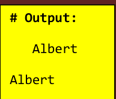

```java
public class MyClass {

    public static void main (String [] args){

        double x =56.698;

        double y =-56.898;

        double z =56.45;

        System.out.println(Math.round(x)); // 输出：57

        System.out.println(Math.round(y)); // 输出：-57

        System.out.println(Math.round(z)); // 输出：56

    }

}
```

```java
public class MyClass {

    public static void main (String [] args){

        String x = "Most Important Programming Concepts";

        System.out.println(x.substring(15));

        // 输出：Programming Concepts

        System.out.println(x.substring(26));

        // 输出：Concepts

        System.out.println(x.substring(15, 26));

        // 输出：Programming

        System.out.println(x.substring(0, 5));

        // 输出：Most

    }

}
```


```java
public class MyClass {

    public static void main (String [] args) {

        Integer i = new Integer(10);

        int a = i;

        System.out.println(a);

    }

}
```

```java
public class MyClass {

    public static void main (String [] args) {

        StringBuffer buffer=new StringBuffer("Java");

        buffer.append(" Programming");

        System.out.println(buffer);

    }

}
```

**重载**提供了

- 代码清晰度
- 降低复杂性
- 提高代码的运行时表现

```java
public class MyClass {

    public static void main (String [] args) {

        StringBuilder builder=new StringBuilder("Java");

        builder.append(" Programming");

        System.out.println(builder);

    }

}
```

**输出：**

**Java Programming**

| 函数重载 | 运算符重载 |
| :--- | :--- |
| 使用单一名称并为其提供更多功能 | 为特定运算符添加额外功能 |


## Python 练习


**Python** 是一种著名的通用、交互式、面向对象的高级编程语言。Python 是一种动态类型、垃圾回收的编程语言。它在 1985 年至 1990 年间由 **Guido van Rossum** 开发。Python 是一种极佳的入门语言，因为其代码清晰易读。Python 能够完成你要求它做的任何事情。如果你对数据研究、机器学习或 Web 开发感兴趣，Python 就是适合你的语言。本章包含 Python 编程语言的学习问题和解答。练习是学习 Python 编程语言的绝佳方法，因为通过实践学习编程效果最好。Python 是一种非常受欢迎的编程语言，使你能够创建从机器人到 Web 应用程序的任何东西。

## 问题 1

### 问题：

编写一个程序来将两个数字相加。

### 解答：

```python
a = 1
b = 2
c= a+b
print(c)
```

```python
import numpy as np

x= np.ones([2,4])

print(x)

print(x.dtype)

print(x.shape)
```

```python
a = int(input("Enter a number: "))
b = int(input("Enter a number: "))
c= a+b
print(c)
```

```python
# 输出：

[[1. 1. 1. 1.]
 [1. 1. 1. 1.]]

float64

(2, 4)
```

## 问题 2

### 问题：

编写一个程序来判断用户输入的数字是偶数还是奇数，并向用户打印出相应的信息。

### 解答：

```python
a = int(input("Enter a number: "))
if a % 2 == 0:
    print("This is an even number.")
else:
    print("This is an odd number.")
```

```python
import sys

print("Albert (Einstein)")

# 输出：Albert (Einstein)

print("Elsa (Einstein)", file=sys.stderr)

# 输出：Elsa (Einstein)

sys.stderr.write("David Einstein")

# 输出：David Einstein
```

## 问题 3

### 问题：

编写一个程序来检查用户输入的数字是正数、负数还是零。

### 解答：

```python
a = int(input("Enter a number: "))
if a > 0:
    print("Positive number")
elif a == 0:
    print("Zero")
else:
    print("Negative number")
```

```python
for i in "albert":
    print(i)

# 输出：
# a
# l
# b
# e
# r
# t
```

## 问题 4

### 问题：

编写一个程序来显示给定日期的日历。

### 解答：

```python
import calendar
yy = int(input("Enter year: "))
mm = int(input("Enter month: "))
print(calendar.month(yy, mm))
```

```python
names = ["Albert", "Paul", "John"]

names[0] = "David"

print(names)

# 输出：['David', 'Paul', 'John']
```

## 问题 5

### 问题：

编写一个程序，要求用户输入一个字符串，并将该字符串作为程序的输出打印出来。

### 解答：

```python
x= input("Enter string: ")
print("You entered:", x)
```

```python
x = ("ball", "bag", "bat")

y = iter(x)

print(next(y))
print(next(y))
print(next(y))
```

```python
# 输出：

ball

bag

bat
```

## 问题 6

### 问题：

编写一个程序来连接两个字符串。

### 解答：

```python
x = input("Enter first string to concatenate: ")
y = input("Enter second string to concatenate: ")
z = x + y
print("String after concatenation = ", z)
```

## 问题 7

### 问题：

编写一个程序来检查列表中是否存在某个项目。

### 解答：

```python
x = ["ball", "book", "pencil"]
i = input("Type item to check: ")
if i in x:
    print("Item exists in the list.")
else:
    print("Item does not exist in the list.")
```

```python
x = abs(-9.78)

print(x)

# 输出：9.78
```

## 问题 8

### 问题：

编写一个程序来连接两个或多个列表。

### 解答：

```python
x = ["This" , "is", "a", "blood", "sample"]
y = [20, 6, 55, 3, 9, 7, 18, 20]
z = x + y
print(z)
```

```python
x = min(15, 100, 215)
y = max(15, 100, 215)

print(x)

# 输出：15

print(y)

# 输出：215
```

## 问题 9

### 问题：

编写一个程序来计算一个数字的立方。

### 解答：

```python
import math
x = int(input("Enter a number: "))
y=math.pow(x,3)
print(y)
```

## 问题 10

### 问题：

编写一个程序来计算一个数字的平方根。

```python
import math

x = math.ceil(6.8)

y = math.floor(6.8)

print(x) # 输出：7

print(y) # 输出：6
```

### 解答：

```python
import math
x = int(input("Enter a number: "))
y=math.sqrt(x)
print(y)
```

## 问题 11

### 问题：

编写一个程序，接收一个数字列表（例如，i = [6, 10, 75, 60, 55]），并创建一个新列表，其中只包含给定列表的第一个和最后一个元素。

### 解答：

```python
i = [6, 10, 75, 60, 55]
print([i[0], i[4]])
```

## 问题 12

### 问题：

取一个列表，例如这个：x = [1, 1, 2, 3, 2, 8, 18, 31, 14, 25, 78]，编写一个程序来打印出列表中所有小于 4 的元素。

### 解答：

```python
x = [1, 1, 2, 3, 2, 8, 18, 31, 14, 25, 78]
for i in x:
    if i < 4:
        print(i)
```

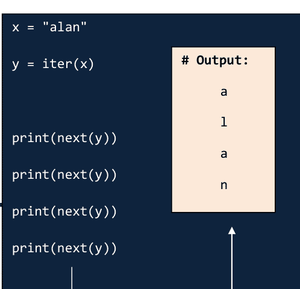

## 问题 13

### 问题：

假设我给你一个保存在变量中的列表：x = [1, 4, 9, 16, 25, 36, 49, 64, 81, 100]。编写一行 Python 代码，接收这个列表 'x' 并创建一个新列表，其中只包含该列表的偶数元素。

### 解答：

```python
x = [1, 4, 9, 16, 25, 36, 49, 64, 81, 100]
```

```python
y = [i for i in a if i % 2 == 0]
print(y)
```

## 问题 14

### 问题：

要求用户输入一个字符串，并打印出该字符串是否是回文（回文是指正读和反读都相同的字符串）。

### 解答：

```python
x=input("Please enter a word: ")
z = x.casefold()
y = reversed(z)
if list(z) == list(y):
    print("It is palindrome")
else:
    print("It is not palindrome")
```

```python
import math
x = math.pi
print(x)
# 输出：3.141592653589793
```

## 问题 15

### 问题：

取两个列表，例如这两个：x = [1, 1, 2, 3, 5, 8, 13, 21, 34, 55, 89] y = [1, 2, 3, 4, 5, 6, 7, 8, 9, 10, 11, 12, 13]，编写一个程序，返回一个列表，其中只包含

## 问题 16

编写一个程序，将字符串添加到文本文件中。

```
file = open("testfile.txt","w")
file.write("Albert Einstein")
file.write("Elsa Einstein")
file.write("David Einstein.")
file.write("Why E=mc squared?.")
file.close()
```

```
x = ["albert", "john", "david"]

for i in x:
    print(i)
    if i == "john":
        break
```

```
# 输出：
albert
john
```

## 问题 17

编写一个程序，读取一个文件并将其内容显示在控制台上。

```
with open('testfile.txt') as f:
    i = f.readline()
    while i:
        print(i)
        line = f.readline()
```

## 问题 18

取两个集合，例如：x = {1, 1, 2, 3, 5, 8, 13, 21, 34, 55, 89} y = {1, 2, 3, 4, 5, 6, 7, 8, 9, 10, 11, 12, 13}，并编写一个程序，返回一个仅包含两个集合共有元素的集合。

```
x = {1, 1, 2, 2, 3, 5, 8, 13, 21, 34, 55, 89}
y = {1, 2, 2, 3, 4, 5, 6, 7, 8, 9, 10, 11, 12, 13}
print(set(x) & set(y))
```

## 问题 19

编写一个程序，将给定字符串的字符拆分成一个列表。

```
x= "albert"
y = list(x)
print(y)
```

一个将所有空白字符替换为符号 "+" 的程序

```
import re

str = "Stephen William Hawking"

x = re.sub("\s", "+", str)

print(x)

# 输出：Stephen+William+Hawking
```

## 问题 20

创建一个程序，询问用户一个数字，然后打印出该数字的所有除数列表。

```
x=int(input("Enter an integer: "))
print("The divisors of the number are: ")
for i in range(1,x+1):
    if(x%i==0):
        print(i)
```

## 问题 21

编写一个程序，找出三个数中的最大值。

```
x = int(input("Enter first number: "))
y = int(input("Enter second number: "))
z = int(input("Enter third number: "))
if (x > y) and (x > z):
    largest = x
elif (y > x) and (y > z):
    largest = y
else:
    largest = z
print("The largest number is", largest)
```

一个返回包含 "in" 每次出现的列表的程序

```
import re

str = "Albert Einstein"

x = re.findall("in", str)

print(x)

# 输出：['in', 'in']
```

## 问题 22

编写一个程序，求数字的绝对值。

```
x = int(input("Enter a number: "))
if x >= 0:
    print(x)
else:
    print(-x)
```

一个检查字符串是否以 "The" 开头并以 "secretary" 结尾的程序

```
import re
str = "The boy is the sports secretary"
x = re.search("^The.*secretary$", str)

if x:
    print("YES! We've got a match!")
else:
    print("No match")

# 输出：YES! We've got a match!
```

## 问题 23

编写一个程序，求字符串的长度。

```
print("Enter 'y' for exit.")
i = input("Enter a string: ")
if i == 'y':
    exit()
else:
    print("Length of the string is: ", len(i))
```

## 问题 24

编写一个程序，打印从 1 到 x 的自然数。

```
x = int(input("Please Enter any Number: "))
for i in range(1, x+1):
    print(i)
```

## 问题 25

编写一个程序，计算从 1 到 x 的自然数的和与平均值。

```
x = int(input("Please Enter any Number: "))
sum = 0
for i in range(1,x+1):
    sum = sum + i
print(sum)
average = sum / x
print(average)
```

```
x = [(2,6),(4,7),(5,9),(8,4),(2,1)]

x.sort()

print(x)

# 输出：[(2, 1), (2, 6), (4, 7), (5, 9), (8, 4)]
```

## 问题 26

编写一个程序，打印任意次数的语句。

```
x = int(input("Please Enter any Number: "))
for i in range(x):
    print("Albert Einstein")
```

```
print(type(True))
# 输出：<class 'bool'>
print(type(False))
# 输出：<class 'bool'>
print(type([1,2]))
# 输出：<class 'list'>
print(type({1,2}))
# 输出：<class 'set'>
```

## 问题 27

编写一个程序，使用函数将两个数相乘。

```
def myfunc():
    x = int(input("Enter a number: "))
    y=int(input("Enter a number: "))
    z= x*y
    return z
```

```
i = myfunc()
print(i)
```

```
x = 6
y = 2
print(x+y)
# 输出：8
print(x-y)
# 输出：4
print(x*y)
# 输出：12
print(x/y)
# 输出：3.0
```

## 问题 28

编写一个程序，将一个项目添加到列表末尾。

```
x = ["pen", "book", "ball"]
x.append("bat")
print(x)
```

## 问题 29

```
x = "23"
y = "54"
z = x + y
print(z)
# 输出：2354
```

编写一个程序，从列表中移除一个项目。

```
x = ["pen", "book", "ball"]
x.remove("ball")
print(x)
```

## 问题 30

编写一个程序，打印数组中的元素数量。

```
x = ["pen", "book", "ball"]
y = len(x)
print(y)
```

```
import sys

sys.stdout.write("Albert ")

sys.stdout.write("Einstein")

# 输出：Albert Einstein
```

## 问题 31

编写一个程序，计算列表元素的方差和标准差。

```
import numpy as np
x= [2,6,8,12,18,24,28,32]
variance= np.var(x)
std = np.std(x)
print(variance)
print(std)
```

```
def main():
    print("Albert Einstein")

if __name__ == "__main__":
    main()

# 输出：Albert Einstein
```

## 问题 32

编写一个程序，获取两个列表之间的差集。

```
x = [4, 5, 6, 7]
y = [4, 5]
print(list(set(x) - set(y)))
```

## 问题 33

编写一个程序，从列表中随机选择一个项目。

```
import random
x = ['Paper', 'Pencil', 'Book', 'Bag', 'Pen']
print(random.choice(x))
```

## 问题 34

编写一个程序，打印从 0 到 6 的所有数字，但不包括 2 和 6。

```
for x in range(6):
    if (x == 2 or x==6):
        continue
    print(x)
```

## 问题 35

编写一个程序，从用户那里获取输入，并以大写和小写形式显示该输入。

```
x = input("What is your name? ")
print(x.upper())
print(x.lower())
```

```
print("Albert ", sep="")
print("Einstein")
```

## 问题 36

编写一个程序，检查字符串是否以指定字符开头。

```
x = "science.com"
print(x.startswith("phy"))
```

```
print("Albert ", end="")
print("Einstein")

# 输出：Albert Einstein
```

## 问题 37

编写一个程序，创建一个数字的乘法表（从 1 到 10）。

```
x = int(input("Enter a number: "))
for i in range(1,11):
    print(x,'x',i,'=',x*i)
```

## 问题 38

编写一个程序，检查三角形是等边三角形、等腰三角形还是不等边三角形。

```
print("Enter lengths of the triangle sides: ")
x = int(input("x: "))
y = int(input("y: "))
z = int(input("z: "))
if x == y == z:
    print("Equilateral triangle")
elif x==y or y==z or z==x:
    print("isosceles triangle")
else:
    print("Scalene triangle")
```

```
def main():
    x = input('First number: ')
    y = input('Second number: ')
    print(x + y)

main()
```

## 问题 39

编写一个程序，计算两个给定整数的和。但是，如果和在 15 到 20 之间，它将返回 20。

```
x = int(input("Enter a number: "))
y = int(input("Enter a number: "))
z= x+y
if z in range(15, 20):
    print (20)
else:
    print(z)
```

```
def main():
    a = 2.5
    b = 2.9
    print(int(a) + int(b))

main()
# 输出：4
```

## 问题 40

编写一个程序，将度转换为弧度。

```
pi=22/7
degree = int(input("Input degrees: "))
radian = degree*(pi/180)
print(radian)
```

```
x = ["albert", "john", "david"]

for i in x:
    if i == "john":
        continue
    print(i)

# 输出：
albert
david
```

## 问题 41

问题：

编写一个程序来生成一个随机数。

解决方案：

```python
import random
print(random.randint(0,9))
```

```python
def main():
    a = 2.5
    b = 2.9
    print(float(a) + float(b))

main()
# 输出：5.4
```

## 问题 42

问题：

编写一个程序来求三角形的半周长。

解决方案：

```python
x = int(input('输入第一条边：'))
y = int(input('输入第二条边：'))
z = int(input('输入第三条边：'))
s = (x + y + z) / 2
print(s)
```

## 问题 43

问题：

给定一个数字列表，遍历它并只打印那些能被2整除的数字。

解决方案：

```python
x = [10, 20, 33, 46, 55]
for i in x:
    if (i % 2 == 0):
        print(i)
```

```python
x = '2'
print(x)
# 输出：2
print(x.isdecimal())
# 输出：True
print(x.isnumeric())
# 输出：True
if x.isdecimal():
    y = int(x)
    print(y)
# 输出：2
```

## 问题 44

问题：

编写一个程序来将列表中的所有数字相乘。

解决方案：

```python
import numpy
x = [1, 2, 3]
y = numpy.prod(x)
print(y)
```

## 问题 45

问题：

编写一个程序来打印一个字符的 ASCII 值。

```python
x = "56"
print(type(x))

# 输出：<class 'str'>

y = int(x)
print(type(y))

# 输出：<class 'int'>
```

解决方案：

```python
x = 'j'
print("The ASCII value of '" + x + "' is", ord(x))
```

一个将 '字符串' 转换为 '整数' 的程序

## 问题 46

问题：

编写一个程序，在不换行或不加空格的情况下打印 "#"。

解决方案：

```python
for x in range(0, 5):
    print('#', end="")
print("\n")
```

```python
x = 56.39
print(type(x))

# 输出：<class 'float'>

y = int(x)
print(type(y))

# 输出：<class 'int'>
```

一个将 '浮点数' 转换为 '整数' 的程序

## 问题 47

问题：

编写一个程序，将字符串转换为浮点数或整数。

解决方案：

```python
x = "546.11235"
print(float(x))
print(int(float(x)))
```

```python
print(int(float(5.6)))
# 输出：5
print(int(float("5")))
# 输出：5
print(int(float(5)))
# 输出：5
```

## 问题 48

问题：

编写一个程序来在字典中添加和搜索数据。

解决方案：

```python
# 定义一个字典
customers = {'1':'Mehzabin Afroze','2':'Md. Ali',
'3':'Mosarof Ahmed','4':'Mila Hasan', '5':'Yaqub Ali'}

# 添加新数据
customers['6'] = 'Mehboba Ferdous'
```

```python
print("客户姓名如下：")
# 打印字典的值
for customer in customers:
    print(customers[customer])

# 输入客户ID进行搜索
name = input("请输入客户ID：")

# 在字典中搜索ID
for customer in customers:
    if customer == name:
        print(customers[customer])
        break
```

```python
def main():
    x = input('第一个数字：')
    y = input('第二个数字：')
    if int(y) == 0:
        print("不能除以0")
    else:
        print("将", x, "除以", y)
        print(int(x) / int(y))

main()
```

## 问题 49

问题：

编写一个程序来获取数学模块的详细信息。

解决方案：

```python
import math
print(dir(math))
```

## 问题 50

问题：

编写一个程序来演示抛出和捕获异常。

解决方案：

```python
# 尝试块
try:
    # 输入一个数字
    x = int(input("请输入一个数字："))
    if x % 2 == 0:
        print("数字是偶数")
    else:
        print("数字是奇数")

# 异常块
except (ValueError):
    # 打印错误信息
    print("请输入一个数值")
```

```python
import random

names = ["Albert", "John", "Mary", "Alan"]

# 随机选择并打印一个名字
print(random.choice(names))

# 输出：Albert
```

```python
import array

x = array.array('i', [11,13,15,17,19])

for i in x:
    print(i)
```

输出：
11
13
15
17
19

## 问题 51

问题：

编写一个程序来演示密码认证。

解决方案：

```python
# 导入 getpass 模块
import getpass

# 从用户获取密码
passwd = getpass.getpass('密码：')

# 检查密码
if passwd == "albert":
    print("您已通过认证")
else:
    print("您未通过认证")
```

```python
a = 4

b = 2

print(a ** b) # 等同于 a ^ b

# 输出：16

print(a % b)

# a 除以 b，余数为 0

# 输出：0

a += 2 # 等同于 a = a + 2

print(a)

# 输出：6

b -= 1 # 等同于 b = b - 1

print(b)

# 输出：1
```

## 问题 52

问题：

编写一个程序来计算给定列表中数字的平均值。

解决方案：

```python
x=int(input("输入要插入的元素数量："))
y=[]
for i in range(0,x):
    n=int(input("输入元素："))
    y.append(n)
avg=sum(y)/x
print("列表中元素的平均值：",round(avg,2))
```

## 问题 53

问题：

编写一个程序，在不需要循环或条件语句的情况下对三个整数进行排序。

```python
import random

x = "123456789"

# 随机选择并打印一个数字
print(random.choice(x))

# 输出：3
```

解决方案：

```python
a = int(input("输入第一个数字："))
b = int(input("输入第二个数字："))
c = int(input("输入第三个数字："))

x = min(a, b, c)
z = max(a, b, c)
y = (a + b + c) - x - z
print("排序后的数字：", x, y, z)
```

```python
import random

print(1 + int(3 * random.random()))

print(random.randrange(1, 3))
```

## 问题 54

问题：

编写一个程序来确定一个数字的各位数字之和。

解决方案：

```python
num = int(input("输入一个四位数："))
x  = num //1000
y = (num - x*1000)//100
z = (num - x*1000 - y*100)//10
c = num - x*1000 - y*100 - z*10
print("该数字的各位数字之和为：", x+y+z+c)
```

## 问题 55

问题：

编写一个程序，输入5门学科的成绩并显示等级。

解决方案：

```python
sub1=int(input("输入第一门学科的成绩："))
sub2=int(input("输入第二门学科的成绩："))
sub3=int(input("输入第三门学科的成绩："))
sub4=int(input("输入第四门学科的成绩："))
sub5=int(input("输入第五门学科的成绩："))
avg=(sub1+sub2+sub3+sub4+sub4)/5
if(avg>=90):
    print("等级：A")
elif(avg>=80 and avg<90):
    print("等级：B")
elif(avg>=70 and avg<80):
    print("等级：C")
elif(avg>=60 and avg<70):
    print("等级：D")
else:
    print("等级：F")
```

```python
import random

names = ["Albert", "Alan", "John", "James", "Mary"]

print(random.sample(names, 2))

# 输出：['Mary', 'James']
```

## 问题 56

问题：

编写一个程序来打印一个范围内所有能被给定数字整除的数。

解决方案：

```python
x=int(input("输入范围下限："))
y=int(input("输入范围上限："))
n=int(input("输入要除以的数字："))
for i in range(x,y+1):
    if(i%n==0):
        print(i)
```

## 问题 57

问题：

编写一个程序来读取两个数字并打印它们的商和余数。

解决方案：

```python
a=int(input("输入第一个数字："))
b=int(input("输入第二个数字："))
quotient=a//b
remainder=a%b
print("商是：", quotient)
print("余数是：", remainder)
```

## 问题 58

问题：

编写一个程序来确定一个给定的值是否存在于一组值中。

解决方案：

```python
def myfunc(x, i):
    for value in x:
        if i == value:
            return True
    return False
print(myfunc([19, 15, 18, 13], 13))
print(myfunc([15, 18, 13], -11))
```

```python
x = 0
if x:
    print("Albert Einstein")
else:
    print("Elsa Einstein")

# 输出：Elsa Einstein
```

## 问题 59

问题：

编写一个程序来打印给定范围内的奇数。

解决方案：

```python
x = 1
if x:
    print("Albert Einstein")
else:
    print("Elsa Einstein")

# 输出：Albert Einstein
```

```python
x=int(input("输入范围的下限："))
y=int(input("输入范围的上限："))
for i in range(x,y+1):
    if(i%2!=0):
        print(i)
```

## 问题 60

问题：

编写一个程序来找到一个整数的最小除数。

解决方案：

```python
n=int(input("输入一个整数："))
a=[]
for i in range(2,n+1):
    if(n%i==0):
        a.append(i)
a.sort()
print("最小除数是：",a[0])
```

```python
for i in range(5):
    print(i)
else:
    print("Albert!")
```

## 问题 61

问题：

编写一个程序来计算一个数字的位数。

```
x = "56"
y = 56

print(x == y)
# 输出：False

print(x != y)
# 输出：True

print(y == 56.0)
# 输出：True

print(None == None)
# 输出：True

print(None == False)
# 输出：False
```

解决方案：

```
n=int(input("Enter a number:"))
i=0
while(n>0):
    i=i+1
    n=n//10
print("The number of digits in the number are:", i)
```

## 问题 62

问题：

编写一个程序来读取一个数字 n，并打印和计算序列 "1+2+...+n="。

解决方案：

```
n=int(input("Enter a number: "))
x=[]
for i in range(1, n+1):
    print(i, sep=" ", end=" ")
    if(i<n):
        print("+", sep=" ", end=" ")
    x.append(i)
print("=",sum(x))

print()
```

```
a = 16

b = 4

print(a > b)

# 输出：True
```

## 问题 63

问题：

编写一个程序来读取一个数字 n 并打印自然数求和模式。

解决方案：

```
n=int(input("Enter a number: "))
for j in range(1, n+1):
    x=[]
    for i in range(1, j+1):
        print(i, sep=" ", end=" ")
        if(i<j):
            print("+",sep=" ",end=" ")
        x.append(i)
    print("=", sum(x))
```

```
a = "16"

b = "4"

print(a > b)

# 输出：False
```

```
print()
```

## 问题 64

问题：

编写一个程序来读取一个数字 n 并打印所需大小的单位矩阵。

解决方案：

```
n=int(input("Enter a number: "))
for i in range(0, n):
    for j in range(0, n):
        if(i==j):
            print("1", sep=" ", end=" ")
        else:
            print("0", sep=" ", end=" ")
    print()
```

```
import array

x = array.array('i', [11,13,15,17,19])

x.append(115)

for i in x:
    print(i)
```

输出：
11
13
15
17
19
115

## 问题 65

问题：

编写一个程序来读取一个数字 n 并打印所需大小的倒置星号图案。

解决方案：

```
n=int(input("Enter number of rows: "))
for i in range (n,0,-1):
    print((n-i) * ' ' + i * '*')
```

```
x = "Stephen " \n"William " \n"Hawking"
print(x)
# 输出：Stephen William Hawking
```

## 问题 66

问题：

编写一个程序来确定直角三角形的斜边长度。

解决方案：

```
from math import sqrt
print("Enter the lengths of shorter triangle sides: ")
x = float(input("x: "))
y = float(input("y: "))
z = sqrt(x**2 + y**2)
print("The length of the hypotenuse is: ", z)
```

## 问题 67

问题：

编写一个程序来找出列表中的最大数。

```
x = """Stephen

William

Hawking"""

print(x)
```

解决方案：

```
x=[]
n=int(input("Enter number of elements: "))
for i in range(1, n+1):
    y=int(input("Enter element: "))
    x.append(y)
x.sort()
print("Largest element is: ",x[n-1])
```

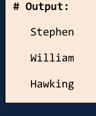

## 问题 68

问题：

编写一个程序来找出列表中的第二大数。

解决方案：

```
x=[]
n=int(input("Enter number of elements: "))
for i in range(1,n+1):
    y=int(input("Enter element: "))
    x.append(y)
x.sort()
print("Second largest element is: ",x[n-2])
```

```
x = 3 * 'Alan '

print(x)

# 输出：Alan Alan Alan
```

## 问题 69

问题：

编写一个程序将列表中的偶数和奇数元素放入两个不同的列表中。

解决方案：

```
a=[]
n=int(input("Enter number of elements:"))
for i in range(1,n+1):
    b=int(input("Enter element:"))
    a.append(b)
even=[]
odd=[]
for j in a:
    if(j%2==0):
        even.append(j)
    else:
        odd.append(j)
print("The even list", even)
print("The odd list", odd)
```

```
x = "Einstein"

a = x[0]

print(a)

# 输出：E

b = x[3]

print(b)

# 输出：s
```

```
str = "wxyz"
print(str)
# 输出：wxyz
str = str[:2] + 'Q' + str[3:]
print(str)
# 输出：wxQz
```

## 问题 70

问题：

编写一个程序将列表中的所有元素连接成一个字符串并返回。

解决方案：

```
def myfunc(list):
    result= ''
    for i in list:
        result += str(i)
    return result

print(myfunc([2, 4, 13, 4]))
```

```
x = ["Alan", "Albert"]
y = ["Turing", "Einstein"]

for a in x:
    for b in y:
        print(a, b)

# 输出：
Alan Turing
Alan Einstein
Albert Turing
Albert Einstein
```

## 问题 71

问题：

编写一个程序将给定的三个整数相加。但是，如果有两个值相等，则和为零。

解决方案：

```
def myfunc(a, b, c):
    if a == b or b == c or a==c:
        sum = 0
    else:
        sum = a + b + c
    return sum
print(myfunc(12, 11, 12))
print(myfunc(13, 22, 22))
print(myfunc(22, 22, 22))
print(myfunc(12, 22, 13))
```

```
x = "albert"
y = x.upper()
print(y)
# 输出：ALBERT
print(y.lower())
# 输出：albert
```

## 问题 72

问题：

编写一个程序根据元素的长度对列表进行排序。

解决方案：

```
x=[]
n=int(input("Enter number of elements: "))
for i in range(1,n+1):
    y=input("Enter element: ")
    x.append(y)
x.sort(key=len)
print(x)
```

```
x = "Einstein"
if "ein" in x:
    print('Found ein')
else:
    print("NOT found ein")

# 输出：Found ein
```

## 问题 73

问题：

编写一个程序创建一个元组列表，其中第一个元素是数字，第二个元素是该数字的平方。

解决方案：

```
x=int(input("Enter the lower range:"))
y=int(input("Enter the upper range:"))
a=[(i,i**2) for i in range(x,y+1)]
print(a)
```

## 问题 74

问题：

编写一个程序创建一个列表，包含范围内所有完全平方数且该数的各位数字之和小于10的数字。

解决方案：

```
l=int(input("Enter lower range: "))
u=int(input("Enter upper range: "))
a=[]
a=[x for x in range(l,u+1) if (int(x**0.5))**2==x and
sum(list(map(int,str(x))))<10]
print(a)
```

## 问题 75

问题：

编写一个程序将距离（以英尺为单位）转换为英寸、码和英里。

解决方案：

```
n = int(input("Enter the distance in feet: "))
x = n * 12
y = n / 3.0
z = n / 5280.0

print("The distance in inches is: %i inches." % x)
print("The distance in yards is: %.2f yards." % y)
print("The distance in miles is: %.2f miles." % z)
```

```
x = "Albert Einstein"

print(x[1:4])

# 输出：lbe

print(x[2:])

# 输出：bert Einstein

print(x[:2])

# 输出：Al
```

## 问题 76

问题：

编写一个程序生成从1到20的随机数并将其附加到列表中。

解决方案：

```
import random
a=[]
n=int(input("Enter number of elements:"))
for j in range(n):
    a.append(random.randint(1,20))
print('Randomised list is: ',a)
```

## 问题 77

问题：

编写一个程序根据每个元组中的最后一个元素按升序对元组列表进行排序。

```
import numpy as np

x = np.array([2, 4, 8])

y = np.array([3, 6, 12])

print(x)

# 输出：[2 4 8]

print(y)

# 输出：[3 6 12]

print(np.multiply(x, y))

# 输出：[6 24 96]

print(np.dot(x, y)) # 点积

# 输出：126

print(np.matmul(x, y)) # 矩阵乘法

# 输出：126
```

解决方案：

```
def last(n):
    return n[-1]

def sort(tuples):
    return sorted(tuples, key=last)

a=input("Enter a list of tuples:")
print("Sorted:")
print(sort(a))
```

```
import array

x = array.array('i', [11,13,15,17,19])

x.reverse()

for i in x:
    print(i)
```

| 输出： |
|---|
| 19 |
| 17 |
| 15 |
| 13 |
| 11 |

## 问题 78

问题：

编写一个程序来确定系统是大端序还是小端序平台。

```
x = 'Albert Einstein'

for i in x:

    if i == ' ':

        break

    print(i)

# 输出：
A
l
b
e
r
t
```

解决方案：

```
import sys
print()
if sys.byteorder == "little":
    print("Little-endian platform.")
else:
    print("Big-endian platform.")
print()
```

## 问题 79

问题：

编写一个程序来检查可用的内置模块。

解决方案：

```
import sys
x = ', '.join(sorted(sys.builtin_module_names))
print("The available built-in modules are: ")
print()
print(x)
```

```
x = 2

i = x == 2

print(i)

# 输出：True

if i:
    print("Albert Einstein")
else:
    print("Elsa Einstein")

# 输出：Albert Einstein
```

## 问题 80

问题：

编写一个程序来确定对象的大小（以字节为单位）。

解决方案：

```
import sys
x = "three"
y = 154
z = [11, 12, 13, 'Ball', 'Bat']
print("Size of ",x,"=",str(sys.getsizeof(x))+ " bytes")
print("Size of ",y,"=",str(sys.getsizeof(y))+ " bytes")
print("Size of ",z,"=",str(sys.getsizeof(z))+ " bytes")
```

## 问题 81

问题：

编写一个程序来连接 'n' 个字符串。

```
x = 'Albert Einstein'

for i in x:

    if i == ' ':

        continue

    print(i)
```

解决方案：

```
x = ['Stephen', 'William', 'Hawking']
i = '-'.join(x)
print()
print(i)
print()
```

```
# 输出：
A
l
b
e
r
t
E
i
n
s
t
e
i
n
```

## 问题 82

问题：

编写一个程序来显示当前日期和时间。

解决方案：

```
import datetime
print(datetime.datetime.now().strftime("%Y-%m-%d %H:%M:%S"))
```

```
x = 1915

y = 'Albert'

print("%s  Einstein's  %s papers." % (y, x))

# 输出：Albert Einstein's 1915 papers.
```

## 问题 83

问题：

编写一个程序来计算半径为 8 的球体的体积。

解决方案：

```
pi=22/7
r = 8.0
V = 4.0/3.0*pi*r**3
print('The volume of the sphere is: ',V)
```

## 问题 84

问题：

编写一个程序来检查列表中的每个数字是否都超过特定数字。

解决方案：

```
x = [12, 33, 44, 55]
print()
print(all(i > 11 for i in x))
print(all(i > 100 for i in x))
print()
```

```
x = 1915

y = 'Albert'

print(y + " Einstein's " + str(x) + " papers.")

# 输出：Albert Einstein's 1915 papers.
```

## 问题 85

问题：

编写一个程序来计算给定字符串中特定字符的出现次数。

解决方案：

```
x = "Albert Einstein."
print("Number of occurrence of 'e' in the given string: ")
print(x.count("e"))
```

## 问题 86

问题：

编写一个程序，根据所有给定值计算单利。

解决方案：

```
x=float(input("Enter the principal amount: "))
y=float(input("Enter the rate: "))
z=int(input("Enter the time (years): "))
simple_interest=(x*y*z)/100
print("The simple interest is: ", simple_interest)
```

```
x = 1915

y = 'Albert'

print("{}  Einstein's  {} papers.".format(y, x))

# 输出：Albert Einstein's 1915 papers.
```

## 问题 87

问题：

编写一个程序来检查给定年份是否是闰年。

解决方案：

```
year=int(input("Enter the year to be checked: "))
if(year%4==0 and year%100!=0 or year%400==0):
    print("The", year, "is a leap year!")
else:
    print("The", year, "isn't a leap year!")
```

## 问题 88

问题：

编写一个程序来确定文件路径指向的是文件还是目录。

解决方案：

```
import os
path="1.txt"
if os.path.isdir(path):
    print("It is a directory")
elif os.path.isfile(path):
    print("It is a regular file")
else:
    print("It is a unique file (socket, FIFO, device file)" )
print()
```

```
x = 1915

y = 'Albert'

print("{0}  Einstein's  {1} papers.".format(y, x))

# 输出：Albert Einstein's 1915 papers.
```

## 问题 89

问题：

编写一个程序来生成一个整数的所有除数。

解决方案：

```
x=int(input("Enter an integer: "))
print("The divisors of", x, "are: ")
for i in range(1, x+1):
    if(x%i==0):
        print(i)
```

```
x = 1915

y = 'Albert'

print("{1}  Einstein's  {0} papers.".format(y, x))

# 输出：1915  Einstein's  Albert papers.
```

## 问题 90

问题：

编写一个程序来打印给定数字的乘法表。

解决方案：

```
n=int(input("Enter the number to print the tables for: "))
for i in range(1,11):
    print(n,"x",i,"=",n*i)
```

## 问题 91

问题：

编写一个程序来检查一个数字是否是阿姆斯特朗数。

解决方案：

```
n=int(input("Enter any number: "))
a=list(map(int,str(n)))
b=list(map(lambda x:x**3,a))
if(sum(b)==n):
    print("The number", n, "is an armstrong number. ")
else:
    print("The number", n, "isn't an arsmtrong number. ")
```

```
x = 1915

y = 'Albert'

print(f"{y}  Einstein's  {x} papers.")

# 输出：Albert  Einstein's  1915 papers.
```

## 问题 92

问题：

编写一个程序来查找 Python 的 site-packages 目录。

解决方案：

```
import site
print(site.getsitepackages())
```

## 问题 93

问题：

编写一个程序来检查一个数字是否是完全数。

解决方案：

```
x = int(input("Enter any number: "))
sum = 0
for i in range(1, x):
    if(x % i == 0):
        sum = sum + i
if (sum == x):
    print("The number", x, "is a perfect number!")
else:
    print("The number", x, "is not a perfect number!")
```

```
x = 1915

y = 'Albert'

print("{name}  Einstein's  {year} papers.".format(name = y, year = x))

# 输出：Albert  Einstein's  1915 papers.
```

## 问题 94

问题：

编写一个程序来求两个数的最小公倍数。

解决方案：

```
x=int(input("Enter the first number: "))
y=int(input("Enter the second number: "))
if(x>y):
    min=x
else:
    min=y
while(1):
    if(min%x==0 and min%y==0):
        print("LCM is:",min)
        break
    min=min+1
```

```
x = 'Albert Einstein'

for i in x:

    if i == ' ':

        continue

    if i == 'n':

        break

    print(i)

print('NSTEIN')
```

## 问题 95

问题：

编写一个程序来求两个数的最大公约数。

解决方案：

```
import math
x=int(input("Enter the first number: "))
y=int(input("Enter the second number: "))
print("The GCD of the two numbers is", math.gcd(x,y))
```

## 问题 96

问题：

编写一个程序来确定文件的大小。

解决方案：

```
import os
x = os.path.getsize("1.csv")
print("The size of 1.csv is:", x, "Bytes")
print()
```

```
x = [
["John", 56],
["Albert", 77],
["Alan", 17],
["Mary", 39],
["James", 44],
]

print(type(x))
# 输出：<class 'list'>

for i in x:
    print("{} {}".format(i[0], i[1]))
```

## 问题 97

问题：

编写一个程序来检查两个数是否是亲和数。

解决方案：

```
x=int(input('Enter number 1: '))
y=int(input('Enter number 2: '))
sum1=0
sum2=0
for i in range(1,x):
    if x%i==0:
        sum1+=i
for j in range(1,y):
    if y%j==0:
        sum2+=j
if(sum1==y and sum2==x):
    print('Amicable!')
else:
    print('Not Amicable!')
```

```
x = "Albert"

print("'{}'".format(x))

print("'{:12}'".format(x))

print("'{:<12}'".format(x))

print("'{:>12}'".format(x))

print("'{:^12}'".format(x))
```

```
# 输出：
'Albert'
'Albert       '
'Albert       '
'       Albert'
'   Albert    '
```

## 问题 98

问题：

编写一个程序，根据给定的三条边计算三角形的面积。

解决方案：

```
import math
a=int(input("Enter first side: "))
b=int(input("Enter second side: "))
c=int(input("Enter third side: "))
s=(a+b+c)/2
area=math.sqrt(s*(s-a)*(s-b)*(s-c))
print("Area of the triangle is: ",round(area,2))
```

## 问题 99

```
x = "Albert"
print("{:s}".format(x))
# 输出：Albert
```

问题：

编写一个程序来计算两个物体之间的引力。

解决方案：

```
m1=float(input("Enter the first mass: "))
m2=float(input("Enter the second mass: "))
r=float(input("Enter the distance between the centers of the masses: "))
G=6.673*(10**-11)
f=(G*m1*m2)/(r**2)
print("Hence, the gravitational force is: ",round(f,2),"N")
```

## 问题 100

问题：

编写一个程序来确定一个字符串是否是数字。

解决方案：

```
x = 'x549'
try:
    i = float(x)
    print('Numeric')
except (ValueError, TypeError):
    print('Not numeric')
print()
```

```
a = 549.9678962314589

print("{:e}".format(a))
# 输出：5.499679e+02

print("{:E}".format(a))
# 输出：5.499679E+02

print("{:f}".format(a))
# 输出：549.967896

print("{:.2f}".format(a))
# 输出：549.97

print("{:F}".format(a))
# 输出：549.967896

print("{:g}".format(a))
# 输出：549.968

print("{:G}".format(a))
# 输出：549.968

print("{:n}".format(a))
# 输出：549.968
```

## 问题 101

问题：

编写一个程序来找出程序正在运行的主机名。

解决方案：

```
import socket
x = socket.gethostname()
print("Host name: ", x)
```

## 问题 102

问题：

编写一个程序来求前 n 个正整数的和。

解决方案：

```
n=int(input("Enter a number: "))
sum = 0
while(n > 0):
    sum=sum+n
    n=n-1
print("The sum of first n positive integers is: ", sum)
```

```
n = int(input("Enter a number: "))
sum = (n * (n + 1)) / 2
print("The sum of first", n ,"positive integers is:", sum)
```

```
def myfunc(x = "Paul"):
    print("Albert " + x)

myfunc("Einstein")
# 输出：Albert Einstein
```

## 问题 103

问题：

编写一个程序来计算以下级数的和：1 + 1/2 + 1/3 + ...... + 1/n。

解决方案：

```
n=int(input("Enter the number of terms: "))
sum=0
for i in range(1,n+1):
    sum=sum+(1/i)
print("The sum of series is: ", round(sum,2))
```

```
num = ['1', '2', '3', '4', '5', '6', '7', '8', '9', '10']

print(num[::])

# Output: ['1', '2', '3', '4', '5', '6', '7', '8', '9', '10']
```

## 问题 104

问题：

编写一个程序，使用匿名函数从列表中获取能被12整除的数字。

解决方案：

```
x = [55, 144, 72, 155, 120, 135, 540]
result = list(filter(lambda i: (i % 15 == 0), x))
print("Numbers divisible by 12 are: ", result)
```

## 问题 105

问题：

编写一个程序，根据字符串长度限制来格式化给定的字符串。

解决方案：

```
x = "987653421066"
print('%.5s' % x)
print('%.7s' % x)
print('%.9s' % x)
```

```
pi = 3.141592653589793

r = 6

print(f"The value of PI is: '{pi:.4}'.")

# Output: The value of PI is: '3.142'.

print(f"The value of PI is: '{pi:.4f}'.")

# Output: The value of PI is: '3.1416'.

print(f"Area of a circle is: {pi * r ** 2}")

# Output: Area of a circle is: 113.09733552923255

print(f"Area of a circle is: {pi * r ** 2:.4f}")

# Output: Area of a circle is: 113.0973
```

## 问题 106

问题：

编写一个程序，接受一个数字作为输入，如果不是数字则返回错误。

解决方案：

```
while True:
    try:
        a = int(input("Enter a number: "))
        print("This is a number")
        break
    except ValueError:
        print("This isn't a number")
        print()
```

```
x = 68

print("<%s>" % x)

# Output: <68>

print("<%10s>" % x)

# Output: <        68>

print("<%-10s>" % x)

# Output: <68        >

print("<%c>" % x)

# Output: D

print("<%d>" % x)

# Output: <68>

print("<%0.5d>" % x)

# Output: <00068>
```

## 问题 107

问题：

编写一个程序，从列表中过滤出负数。

解决方案：

```
x = [22, -10, 11, -28, 52, -75]
y = list(filter(lambda i: i <0, x))
print("Negative numbers in the above list: ", y)
```

```
num = ['1', '2', '3', '4', '5', '6', '7', '8', '9', '10']

print(num[::-1])

# Output: ['10', '9', '8', '7', '6', '5', '4', '3', '2', '1']
```

## 问题 108

问题：

编写一个程序来判断一个数是否是2的幂。

解决方案：

```
def myfunc(n):
    """Return True if n is a power of two."""
    if n <= 0:
        return False
    else:
        return n & (n - 1) == 0

n = int(input('Enter a number: '))

if myfunc(n):
    print('{} is a power of two.'.format(n))
else:
    print('{} is not a power of two.'.format(n))
```

```
x="Albert"

print(r"b\nc {x}")
# Output: b
c {x}

print(rf"b\nc {x}")
# Output: b
c Albert

print(fr"b\nc {x}")
# Output: b
c Albert
```

```
import array

x = array.array('i', [11,13,15,17,19,13])

print("Number of times the number 13 appears in the above array is: ", x.count(13))
# Output: Number of times the number 13 appears in the above array is: 2
```

## 问题 109

问题：

编写一个程序来计算 (a - b) * (a - b)。

解决方案：

```
a, b = 2, 4
result = a * a - 2 * a * b + b * b
print("({} - {}) ^ 2 = {}".format(a, b, result))
```

```
num = ['1', '2', '3', '4', '5', '6', '7', '8', '9', '10']
print(num[::2])
# Output: ['1', '3', '5', '7', '9']
```

## 问题 110

问题：

编写一个程序，从给定字符串生成一个带有前缀“AI”的新字符串。如果给定字符串已包含“AI”前缀，则返回原始文本。

解决方案：

```
def myfunc(x):
    if len(x) >= 2 and x[:2] == "AI":
        return x
    return "AI" + x
print(myfunc("Albert"))
print(myfunc("bert"))
```

```
num = ['1', '2', '3', '4', '5', '6', '7', '8', '9', '10']
print(num[1::2])
# Output: ['2', '4', '6', '8', '10']
```

## 问题 111

问题：

编写一个程序，统计列表中数字5出现的所有次数。

解决方案：

```
def myfunc(y):
    i = 0
    for x in y:
        if x == 5:
            i = i + 1
    return i

print(myfunc([11, 5, 16, 18, 15]))
print(myfunc([17, 14, 5, 12, 9, 5]))
```

```
def myfunc(x):
    return 6 * x

print(myfunc(6))
# Output: 36
```

## 问题 112

问题：

编写一个程序来判断文件是否存在。

解决方案：

```
import os.path
print(os.path.isfile('1.txt'))
print(os.path.isfile('1.pdf'))
```

```
num = ['1', '2', '3', '4', '5', '6', '7', '8', '9', '10']
print(num[2:8:2])
# Output: ['3', '5', '7']
```

```
x = ['11', '12', '13', '14']
x[0] = '10'
print(x)
# Output: ['10', '12', '13', '14']
```

## 问题 113

问题：

编写一个程序，将字符串中所有出现的'a'替换为'$'。

解决方案：

```
x=input("Enter string: ")
x=x.replace('a','$')
x=x.replace('A','$')
print("Modified string: ")
print(x)
```

```
x = ['11', '12', '13', '14']
x[1:3] = ['alan', 'john']
print(x)
# Output: ['11', 'alan', 'john', '14']
```

## 问题 114

问题：

编写一个程序来计算数字列表的乘积（不使用for循环）。

解决方案：

```
from functools import reduce
num = [2, 4, 10,11]
result = reduce( (lambda x, y: x * y), num)
print("Product of the above numbers is: ", result)
```

```
num = ['1', '2', '3', '4', '5', '6', '7', '8', '9', '10']
print(num[1:20:3])
# Output: ['2', '5', '8']
```

## 问题 115

问题：

编写一个程序来检测两个字符串是否是变位词。

解决方案：

```
x=input("Enter first string: ")
y=input("Enter second string: ")
if(sorted(x)==sorted(y)):
    print("The 2 strings are anagrams.")
else:
    print("The 2 strings aren't anagrams.")
```

```
x = ['11', '12', '13', '14']
x[1:3] = ['john']
print(x)
# Output: ['11', 'john', '14']
```

## 问题 116

问题：

编写一个程序，生成一个首尾字符已交换的字符串。

解决方案：

```
def change(x):
    return x[-1:] + x[1:-1] + x[:1]
x=input("Enter a string: ")
print("Modified string: ")
print(change(x))
```

```
x = ['100', '120', '130', '140']
x[1:2] = ['bat', 'ball']
print(x)
# Output: ['100', 'bat', 'ball', '130', '140']
```

## 问题 117

问题：

编写一个程序来统计字符串中元音字母的数量。

解决方案：

```
string=input("Enter string:")
vowels=0
for i in string:
    if(i=='a' or i=='e' or i=='i' or i=='o' or i=='u' or i=='A' or i=='E' or i=='I' or i=='O' or i=='U'):
        vowels=vowels+1
print("Number of vowels are:")
print(vowels)
```

```
x = [11, 12, 13, 14, 15, 16, 17, 18, 19, 20, 21, 22]
print(x)
# Output: [11, 12, 13, 14, 15, 16, 17, 18, 19, 20, 21, 22]
x[1::2] = [10, 10, 10, 10, 10, 10]
print(x)
# Output: [11, 10, 13, 10, 15, 10, 17, 10, 19, 10, 21, 10]
```

## 问题 118

问题：

编写一个程序，接受一个字符串并将每个空格替换为连字符。

解决方案：

```
string=input("Enter a string: ")
string=string.replace(' ','-')
print("Modified string:")
print(string)
```

```
a = ['alan', 'john', 'mary', 'david']

b = a

a[0] = 'computer'

print(a)
# Output: ['computer', 'john', 'mary', 'david']

print(b)
# Output: ['computer', 'john', 'mary', 'david']
```

## 问题 119

问题：

编写一个程序，在不使用库函数的情况下计算字符串的长度。

解决方案：

```
s=input("Enter string: ")
x=0
for i in s:
    x=x+1
print("Length of the string is: ")
print(x)
```

```
import array

x = array.array('i', [11,13,15,17,19,22])

print("Length of the array is: ", len(x))
# Output: Length of the array is:  6
```

## 问题 120

问题：

编写一个程序来判断字符串中是否存在小写字母。

解决方案：

```
x = 'Albert Einstein'
print(any(i.islower() for i in x))
```

```
from copy import deepcopy

a = ['green', 'red', 'blue', 'orange']
b = deepcopy(a)
a[0] = 'albert'
print(a)
# Output: ['albert', 'red', 'blue', 'orange']
print(b)
# Output: ['green', 'red', 'blue', 'orange']
```

## 问题 121

问题：

编写一个程序来计算字符串中的单词数和字符数。

解决方案：

```
x=input("Enter a string: ")
char=0
word=1
for i in x:
    char=char+1
```

```
x = ["albert", "1915", "john"]

y = ["albert", 1915, "john"]

print(":".join(x))

# Output: albert:1915:john
```

## 问题 122

编写一个程序，将浮点数四舍五入到指定的小数位数。

```
x = 549.968
print('%f' % x)
print('%.2f' % x)
print()
```

## 问题 123

编写一个程序，统计字符串中小写字符的数量。

```
x=input("Enter string: ")
count=0
for i in x:
    if(i.islower()):
        count=count+1
print("The number of lowercase characters is: ")
print(count)
```

## 问题 124

编写一个程序，统计字符串中小写字母和大写字母的数量。

```
x=input("Enter a string: ")
count1=0
count2=0
for i in x:
    if(i.islower()):
        count1=count1+1
    elif(i.isupper()):
        count2=count2+1
print("The number of lowercase characters is: ")
print(count1)
print("The number of uppercase characters is: ")
print(count2)
```

## 问题 125

编写一个程序，计算字符串中数字和字母的数量。

```
x=input("Enter a string: ")
count1=0
count2=0
for i in x:
    if(i.isdigit()):
        count1=count1+1
    else:
        count2=count2+1
print("The number of digits is: ")
print(count1)
print("The number of characters is: ")
print(count2)
```

## 问题 126

编写一个程序，由给定字符串的前2个字符和后2个字符组成一个新字符串。

```
x=input("Enter a string: ")
count=0
for i in x:
    count=count+1
new=x[0:2]+x[count-2:count]
print("Newly formed string is: ")
print(new)
```

## 问题 127

编写一个程序，从列表创建一个字节数组。

```
x = [10, 20, 56, 35, 17, 99]
# Create bytearray from list of integers.
y = bytearray(x)
for i in y: print(i)
print()
```

## 问题 128

编写一个程序，判断一个整数是否适合用64位表示。

```
x = 60
if x.bit_length() <= 63:
    print((-2 ** 63).bit_length())
    print((2 ** 63).bit_length())
```

## 问题 129

编写一个程序，如果两个给定的整数值相等，或者它们的和或差为10，则返回真。

```
def myfunc(a, b):
    if a == b or abs(a-b) == 10 or (a+b) == 10:
        return True
    else:
        return False

print(myfunc(17, 2))
print(myfunc(30, 20))
print(myfunc(5, 5))
print(myfunc(17, 13))
print(myfunc(53, 73))
```

## 问题 130

编写一个程序，如果两个对象都是整数类型，则将它们相加。

```
def myfunc(x, y):
    if not (isinstance(x, int) and isinstance(y, int)):
        return "Inputs have to be integers only!"
    return x + y
print(myfunc(50, 70))
print(myfunc(20, 50.74))
print(myfunc('6', 8))
print(myfunc('8', '8'))
```

## 问题 131

编写一个程序，为字符串添加前导零。

```
x='122.22'
x = x.ljust(8, '0')
print(x)
x = x.ljust(10, '0')
print(x)
```

## 问题 132

编写一个程序，显示带有双引号的字符串。

```
import json
print(json.dumps({'Albert': 1, 'Alan': 2, 'Alex': 3}))
```

## 问题 133

编写一个程序，检查给定的键是否存在于字典中。

```
d={'A':1,'B':2,'C':3}
key=input("Enter key to check:")
if key in d.keys():
    print("Key is present and value of the key is:")
    print(d[key])
else:
    print("Key isn't present!")
```

## 问题 134

编写一个程序，计算字典中所有项的总和。

```
d={'A':100,'B':540,'C':239}
print("Total sum of values in the dictionary is: ")
print(sum(d.values()))
```

## 问题 135

编写一个程序，将字典中的所有项相乘。

```
d={'A':10, 'B':10, 'C':239}
x=1
for i in d:
    x=x*d[i]
print(x)
```

## 问题 136

编写一个程序，从字典中删除给定的键。

```
d = {'a':1, 'b':2, 'c':3, 'd':4}
print("Initial dictionary")
print(d)
key=input("Enter the key to delete(a-d):")
if key in d:
    del d[key]
else:
    print("Key not found!")
    exit(0)
print("Updated dictionary")
print(d)
```

## 问题 137

编写一个程序，在不使用绝对路径的情况下列出主目录。

```
import os.path
print(os.path.expanduser('~'))
```

## 问题 138

编写一个程序，在单行中输入两个整数。

```
print("Enter the value of a and b: ")
a, b = map(int, input().split())
print("The value of a and b are: ", a, b)
```

## 问题 139

编写一个程序，将真转换为1，假转换为0。

```
a = 'true'
a = int(a == 'true')
print(a)
a = 'xyz'
a = int(a == 'true')
print(a)
```

## 问题 140

编写一个程序，判断一个变量是整数还是字符串。

```
print(isinstance(16,int) or isinstance(16,str))
print(isinstance("16",int) or isinstance("16",str))
```

## 问题 141

编写一个程序，使用集合统计用户输入字符串中元音的数量。

```
s=input("Enter a string: ")
count = 0
vowels = set("aeiou")
for letter in s:
    if letter in vowels:
        count += 1
print("The number of vowels present in a string is: ")
print(count)
```

## 问题 142

编写一个程序，检查两个输入字符串中的共同字母。

```
x=input("Enter the first string: ")
y=input("Enter the second string: ")
z=list(set(x)&set(y))
print("The common letters are: ")
for i in z:
    print(i)
```

## 问题 143

### 问题：

编写一个程序，显示哪些字母出现在第一个字符串中但不在第二个字符串中。

### 解答：

```
x=input("Enter the first string: ")
y=input("Enter the second string: ")
z=list(set(x)-set(y))
print("The letters in the first string but not in the second string are: ")
for i in z:
    print(i)
```

## 问题 144

### 问题：

编写一个程序，判断一个变量是列表、元组还是集合。

### 解答：

```
i = ['list', True, 8.9, 6]
if type(i) is list:
    print('i is a list')
elif type(i) is set:
    print('i is a set')
elif type(i) is tuple:
    print('i is a tuple')
else:
    print('Neither a set, list, or tuple.')
```

```
import numpy as np

x = np.random.randint(10, size=(2, 3))

print(x)
```

## 问题 145

### 问题：

编写一个程序，递归判断一个给定的数字是偶数还是奇数。

### 解答：

```
def myfunc(n):
    if (n < 2):
        return (n % 2 == 0)
    return (myfunc(n - 2))
n=int(input("Enter a number: "))
if(myfunc(n)==True):
    print("Number is even!")
else:
    print("Number is odd!")
```

```
x = {
"albert" : "46",
"bob" : "18",
"john" : "68",
}

for name, age in x.items():
    print("{} => {}".format(name, age))
```

```
# 输出：

albert => 46
bob => 18
john => 68
```

## 问题 146

### 问题：

编写一个程序，检查一个数字列表中的所有数字是否互不相同。

```
x = {}

x['name'] = 'albert'

print(x)

# 输出：{'name': 'albert'}

x['email'] = 'albert_john@gmail.com'

print(x)

# 输出：{'name': 'albert', 'email': 'albert_john@gmail.com'}
```

### 解答：

```
def myfunc(x):
    if len(x) == len(set(x)):
        return True
    else:
        return False;
print(myfunc([11,15,17,19]))
print(myfunc([12,14,15,15,17,19]))
```

```
x = "Albert "
y = "Einstein"
print(x + y)
# 输出：Albert Einstein
```

## 问题 147

### 问题：

编写一个程序，在不使用 '+' 运算符的情况下将两个正数相加。

### 解答：

```
def myfunc(x, y):
    while y != 0:
        z = x & y
        x = x ^ y
        y = z << 1
    return x
print(myfunc(12, 50))
```

```
x = lambda a, b: a * b

print(x(2, 2))

# 输出：4
```

```
x = {
'name': 'Albert',
'age': 26,
'email': None
}

print(x.get('name'))
# 输出：Albert
print(x.get('age'))
# 输出：26
print(x.get('email'))
# 输出：None
print(x.get('address'))
# 输出：None
```

## 问题 148

### 问题：

编写一个程序，使用递归计算一个数的阶乘。

### 解答：

```
def myfunc(n):
    if(n <= 1):
        return 1
    else:
        return(n*myfunc(n-1))
n = int(input("Enter a number: "))
print("Factorial of", n, "is:", myfunc(n))
```

```
x = {
    'name': 'Albert',
    'age': 26,
    'email': None
}

print('name' in x.values())
# 输出：False

print('Albert' in x.values())
# 输出：True
```

## 问题 149

### 问题：

编写一个程序，判断三条给定的边长是否能构成一个直角三角形。如果指定的边能构成直角三角形，则打印 "Yes"，否则打印 "No"。

### 解答：

```
print("Enter three side lengths of a triangle: ")
a,b,c = sorted(list(map(int,input().split())))
if a**2+b**2==c**2:
    print('Yes')
else:
    print('No')
```

## 问题 150

### 问题：

编写一个程序，找出三个给定整数中相等数字的个数。

### 解答：

```
def myfunc(a, b, c):
    result= set([a, b, c])
    if len(result)==3:
        return 0
    else:
        return (4 - len(result))

print(myfunc(11, 11, 11))
print(myfunc(11, 12, 12))
```

```
x = {
    'name': 'Albert',
    'age': 26,
    'email': None
}

print(x)

# 输出：{'name': 'Albert', 'age': 26, 'email': None}
```

## 问题 151

### 问题：

编写一个程序，从给定的字符串中提取数字。

### 解答：

```
def myfunc(x):
    result = [int(x) for x in x.split() if x.isdigit()]
    return result
x = "5 bags, 10 pencils and 55 books"
print(myfunc(x))
```

## 问题 152

### 问题：

编写一个程序，从列表中找出最小的数字。

### 解答：

```
def myfunc(list):
    x = list[0]
    for i in list:
        if i < x:
            x = i
    return x
print(myfunc([11, 22, -28, 3]))
```

```
x = {}

x['A'] = 11

x['B'] = 12

x['C'] = 13

x['D'] = 14

print(x)

# 输出：{'A': 11, 'B': 12, 'C': 13, 'D': 14}
```

## 问题 153

### 问题：

编写一个程序，判断列表中的每个字符串是否都等于给定的字符串。

### 解答：

```
x = ["ball", "bat", "bag", "book"]
y = ["book", "book", "book", "book"]

print(all(i == 'bag' for i in x))
print(all(i == 'book' for i in y))
```

```
x = {
    'name': 'Albert',
    'email': 'albert_john@gmail.com'
}

for i in x:
    print("{} -> {}".format(i, x[i]))
```

```
# 输出：
    name -> Albert
    email -> albert_john@gmail.com
```

## 问题 154

### 问题：

编写一个程序，统计文本文件中的单词数量。

### 解答：

```
x = input("Enter the file name: ")
num_words = 0
with open(x, 'r') as f:
    for line in f:
        num_words += len(line.split())
print("Number of words: ", num_words)
```

```
import numpy as np

x = np.random.random((3, 6))

print(x)
```

## 问题 155

### 问题：

编写一个程序，统计文本文件中的行数。

### 解答：

```
x = input("Enter the file name: ")
num_lines = 0
with open(x, 'r') as f:
    for line in f:
        num_lines += 1
print("Number of lines: ", num_lines)
```

```
x = 11

y = 12.5

z = "Albert"

print(type(x)) # 输出：<class 'int'>

print(type(y)) # 输出：<class 'float'>

print(type(z)) # 输出：<class 'str'>
```

## 问题 156

### 问题：

编写一个程序，创建一个空字典的列表。

```
x = set()
print(x)
# 输出：set()
x.add('Mary')
print(x)
# 输出：{'Mary'}
x.add('Mary')
print(x)
# 输出：{'Mary'}
x.add('John')
print(x)
# 输出：{'John', 'Mary'}
```

### 解答：

```
print([{} for _ in range(10)])
```

## 问题 157

### 问题：

编写一个程序，计算两个列表的平均值。

### 解答：

```
def myfunc(x, y):
    result = sum(x + y) / len(x + y)
    return result

x = [11, 11, 13, 14, 14, 15, 16, 17]
y = [0, 11, 12, 13, 14, 14, 15, 17, 18]
print("The Average of two lists: ", myfunc(x, y))
```

## 问题 158

### 问题：

编写一个程序，确定三个给定列表中的最大值和最小值。

### 解答：

```
x = [12,13,15,28,27,32,53]
y = [54,32,91,0,41,13,19]
z = [12,11,51,16,15,58,49]
print("Maximum value in the three given lists is: ")
print(max(x+y+z))
print("Minimum value in the three given lists is: ")
print(min(x+y+z))
```

```
x = int(5)
y = int(5.2)
w = float(5.6)
z = int("6")
print(x) # 输出：5
print(y) # 输出：5
print(w) # 输出：5.6
print(z) # 输出：6
```

## 问题 159

### 问题：

编写一个程序，从给定的列表列表中删除空列表。

### 解答：

```
x = [[], [], [], ['Ball', 'Bag'], [11,12], ['Bat','Book'], []]
print([i for i in x if i])
```

## 问题 160

### 问题：

编写一个程序，判断列表中的每个字典是否都为空。

### 解答：

```
x = [{},{},{}]
y = [{2:6},{},{}]
print(all(not i for i in x))
print(all(not i for i in y))
```

```
import numpy as np

x = np.eye(2)

print(x)

print()

y = np.eye(2, 4)

print(y)
```

```
# 输出：
[[1. 0.]
 [0. 1.]]

[[1. 0. 0. 0.]
 [0. 1. 0. 0.]]
```

## 问题 161

### 问题：

编写一个程序，接收两个列表，当两个列表中至少有一个元素共享时返回 True。

### 解答：

```
def myfunc(A, B):
    result = False
    for x in A:
        for y in B:
            if x == y:
                result = True
                return result
print(myfunc([21,22,23,24,25], [25,26,27,28,29]))
print(myfunc([31,32,33,34,35], [36,37,38,39]))
```

```
x = 5
def myfunc(i):
    i = i+1
    return i
print(x)
# 输出：5
print(myfunc(x))
# 输出：6
print(x)
# 输出：5
```

```
x = "Albert Einstein"
print(x[2:5]) # 输出：ber
```

## 问题 162

### 问题：

编写一个程序来判断一个列表是否为空。

### 解答：

```python
x = lambda a, b, c: a + b + c

print(x(2, 2, 2))

# 输出：6
```

```python
x = []

if x:
    print("列表不为空")
else:
    print("列表为空")
```

## 问题 163

### 问题：

编写一个程序来读取一个文件，并将文件中每个单词的首字母大写。

### 解答：

```python
x = input("请输入文件名：")

with open(x, 'r') as f:
    for line in f:
        print(line.title())
```

```python
set(['John', 'Mary'])

x = set(['Mary', 'James', 'Alan'])

y = set(['Bob', 'Joe', 'Albert', 'Mary'])

x.update(y)

print(x)

# 输出：{'Joe', 'Alan', 'Mary', 'James', 'Bob', 'Albert'}

print(y)

# 输出：{'Joe', 'Bob', 'Mary', 'Albert'}
```

## 问题 164

### 问题：

编写一个程序来以相反的顺序读取文件内容。

### 解答：

```python
x = input("请输入文件名：")
for line in reversed(list(open(x))):
    print(line.rstrip())
```

```python
def myfunc(a, b):
    c = a + b
    return c

print(myfunc(12, 33))
# 输出：45

print(myfunc(28, 93))
# 输出：121
```

## 问题 165

### 问题：

编写一个程序来将给定字符串的首字母小写化。

### 解答：

```python
def myfunc(i, x=False):
    return ''.join([i[:1].lower(), (i[1:].upper() if x else i[1:])])

print(myfunc('Albert'))
print(myfunc('John'))
```

```python
x: int = 6

print(x)

# 输出：6
```

## 问题 166

### 问题：

编写一个程序来移除给定字符串中的空格。

### 解答：

```python
def myfunc(x):
    x = x.replace(' ', '')
    return x

print(myfunc("a lbe rt ein stein"))
print(myfunc("a l a n"))
```

```python
x: str = "Albert"

print(x)

# 输出：Albert
```

## 问题 167

### 问题：

编写一个程序来计算给定数字与10的差值，如果该值大于10，则返回绝对差值的两倍。

### 解答：

```python
def myfunc(x):
    if x <= 10:
        return 10 - x
    else:
        return (x - 10) * 2

print(myfunc(8))
print(myfunc(16))
```

```python
x: float = 26.69

print(x)

# 输出：26.69
```

## 问题 168

### 问题：

编写一个程序来将三个给定的数字相加，如果这些值相等，则返回它们和的三倍。

### 解答：

```python
def myfunc(a, b, c):
    sum = a + b + c
    if a == b == c:
        sum = sum * 3
    return sum

print(myfunc(11, 12, 13))
print(myfunc(13, 13, 13))
```

```python
def myfunc(x: int, y: int) -> int:
    return x + y

print(myfunc(12, 13))
# 输出：25
```

## 问题 169

### 问题：

编写一个程序来检查操作系统是以32位还是64位模式运行Python shell。

### 解答：

```python
import platform
print(platform.architecture()[0])
```

## 问题 170

### 问题：

编写一个程序来实现生日字典。

### 解答：

```python
import os

x = os.path.join('home', 'etc', 'files')

print(x)

# 输出：home\etc\files
```

```python
if __name__ == '__main__':

    birthdays = {
        'Albert Einstein': '03/14/1879',
        'Benjamin Franklin': '01/17/1706',
        'Ada Lovelace': '12/10/1815',
        'Donald Trump': '06/14/1946',
        'Rowan Atkinson': '01/6/1955'}

    print('欢迎来到生日字典。我们知道以下人员的生日：')
    for name in birthdays:
        print(name)

    print('你想查询谁的生日？')
    name = input()
    if name in birthdays:
        print('{}的生日是{}。'.format(name, birthdays[name]))
    else:
        print('很遗憾，我们没有{}的生日信息。'.format(name))
```

## 问题 171

### 问题：

编写一个程序来查找当前正在运行的文件的名称和位置。

### 解答：

```python
import os
print("当前文件名：", os.path.realpath(__file__))
```

```python
import platform
print(platform.system())
# 输出：Windows
print(platform.release())
# 输出：10
```

## 问题 172

### 问题：

编写一个程序来实现密码生成器。

### 解答：

```python
import random
x = "abcdefghijklmnopqrstuvwxyz01234567890ABCDEFGHIJKLMNOPQRSTUVWXYZ!@#$%^&*()?"

passlen = 8
print("".join(random.sample(x, passlen)))
```

```python
x = ["apple", "orange", "kiwi", "ball", "bat", "blackboard"]
print(list(filter(lambda i: len(i) == 4, x)))
# 输出：['kiwi', 'ball']
```

## 问题 173

### 问题：

编写一个程序来显示给定月份和年份的日历。

### 解答：

```python
from functools import reduce

x = [11, 12, 13, 14]

print(reduce(lambda a, b: a+b, x))
# 输出：50

print(reduce(lambda a, b: a*b, x))
# 输出：24024
```

```python
# 导入日历模块
import calendar

yy = 2014  # 年份
mm = 11    # 月份

# 从用户处获取月份和年份输入
# yy = int(input("请输入年份："))
# mm = int(input("请输入月份："))

# 显示日历
print(calendar.month(yy, mm))
```

## 问题 174

### 问题：

编写一个程序来消除换行符。

```python
from functools import reduce

print(reduce(lambda a, b: a+b, [], 1))

# 输出：1

print(reduce(lambda a, b: a+b, [5, 5], 0))

# 输出：10

print(reduce(lambda a, b: a*b, [5, 6], 0))

# 输出：0

print(reduce(lambda a, b: a*b, [6, 5], 1))

# 输出：30

print(reduce(lambda a, b: a*b, [], 0))

# 输出：0
```

### 解答：

```python
x = 'Albert Einstein\n'
print(x.rstrip())
```

## 问题 175

### 问题：

编写一个程序来移除给定文本中所有行的现有缩进。

### 解答：

```python
import textwrap
x = '''
    Albert Einstein was a German-born theoretical physicist,
    widely acknowledged to be one of the greatest and most
    influential physicists of all time. Einstein is best known
    for developing the theory of relativity, but he also made
    important contributions to the development of the theory of
    quantum mechanics.
'''
print(x)
print(textwrap.dedent(x))
```

## 问题 176

### 问题：

编写一个程序来计算正在使用的CPU数量。

### 解答：

```python
import multiprocessing
print(multiprocessing.cpu_count())
```

```python
x = ['Mon', 'Tue', 'Wed', 'Thru', 'Fri']
y = [1, 2, 3, 4, 5]
print(zip(x, y))
```

## 问题 177

### 问题：

编写一个程序，如果字符串的长度是6的倍数，则反转该字符串。

### 解答：

```python
def myfunc(x):
    if len(x) % 6 == 0:
        return ''.join(reversed(x))
    return x

print(myfunc('alan'))
print(myfunc('albert'))
```

```python
x = ['Mon', 'Tue', 'Wed', 'Thru', 'Fri']

y = [1, 2, 3, 4, 5]

print(list(zip(x, y)))

# 输出：[('Mon', 1), ('Tue', 2), ('Wed', 3), ('Thru', 4), ('Fri', 5)]
```

## 问题 178

### 问题：

在指定字符串的末尾添加 "xyz"（长度应至少为3）。如果提供的字符串已经以 "xyz" 结尾，则在其后添加 "123"。如果指定字符串的长度小于三，则保持不变。

### 解答：

```python
def myfunc(x):
    i = len(x)

    if i > 2:
        if x[-3:] == 'xyz':
            x += '123'
        else:
            x += 'xyz'

    return x

print(myfunc('xy'))
print(myfunc('xyz'))
print(myfunc('morning'))
```

```python
import numpy as np

x = np.zeros(5, dtype='float32')

print(x)

# 输出：[0. 0. 0. 0. 0.]

print(x.dtype)

# 输出：float32
```

```python
x = ['Mon', 'Tue', 'Wed', 'Thru', 'Fri']

y = [1, 2, 3, 4, 5]

print(dict(zip(x, y)))

# 输出：{'Mon': 1, 'Tue': 2, 'Wed': 3, 'Thru': 4, 'Fri': 5}
```

## 问题 179

### 问题：

编写一个程序来打乱给定列表的元素。

### 解答：

```python
import random
x = [11, 12, 13, 14, 15]
random.shuffle(x)
print(x)
```

```python
import numpy as np

x = np.array([6, 8, 10], dtype='int8')

print(x / 2)

# 输出：[3. 4. 5.]

print(x.dtype)

# 输出：int8
```

## 问题 180

### 问题：

一个列表中存在三个正数。编写一个程序来判断每个数字的各位数字之和是否相等。如果相等，返回 true；否则，返回 false。

### 解答：

```python
def myfunc(x):
    return x[0] % 9 == x[1] % 9 == x[2] % 9

x = [14, 5, 23]
print(myfunc(x))
```

```python
x = [True, True]
y = [True, False]
z = [False, False]
print(all(x))
# 输出：True
print(all(y))
# 输出：False
print(all(z))
# 输出：False
print()
print(any(x))
# 输出：True
print(any(y))
# 输出：True
print(any(z))
# 输出：False
```

## 问题 181

### 问题：

编写一个程序来获取你计算机的IP地址。

### 解答：

```python
import socket
x = socket.gethostname()
```

## 问题 182

**问题：**

编写一个程序来判断一系列整数是否具有递增趋势。

**解决方案：**

```python
def myfunc(x):
    if (sorted(x) == x):
        return True
    else:
        return False

print(myfunc([11,12,13,14]))
print(myfunc([11,12,15,13,14]))
```

```python
x = ["alan", "john", "albert"]

x.clear()

print(x) # 输出: []
```

## 问题 183

**问题：**

编写一个程序来模拟掷骰子。

**解决方案：**

```python
import random
min = 1
max = 6

roll_again = "yes"

while roll_again == "yes" or roll_again == "y":
    print ("Rolling the dices...")
    print ("The values are....")
    print (random.randint(min, max))
    print (random.randint(min, max))

    roll_again = input("Roll the dices again?")
```

```python
x = [12, 14]

print(all(map(lambda i: i > 5, x)))

# 输出: True

print(all(map(lambda i: i > 13, x)))

# 输出: False
```

## 问题 184

**问题：**

编写一个程序将摄氏温度转换为华氏温度。

**解决方案：**

```python
c = input(" Enter temperature in Centigrade: ")
f = (9*(int(c))/5)+32
print(" Temperature in Fahrenheit is: ", f)
```

## 问题 185

**问题：**

编写一个程序来检查给定的整数是否是5的倍数。

```python
import numpy as np

x = np.array([13, 14, 17])

print(x)

# 输出: [13 14 17]

print(x * 3)

# 输出: [39 42 51]

print(x + 4)

# 输出: [17 18 21]

print(x.dtype)

# 输出: int32
```

**解决方案：**

```python
x = int(input("Enter an integer: "))
if(x%5==0):
    print(x, "is a multiple of 5")
else:
    print(x, "is not a multiple of 5")
```

## 问题 186

**问题：**

编写一个程序来检查给定的整数是否同时是3和5的倍数。

**解决方案：**

```python
x = int(input("Enter an integer: "))
if((x%3==0)and(x%5==0)):
    print(x, "is a multiple of both 3 and 5")
else:
    print(x, "is not a multiple of both 3 and 5")
```

## 问题 187

**问题：**

编写一个程序来显示10到70范围内所有5的倍数。

**解决方案：**

```python
for i in range(10,70):
    if (i%5==0):
        print(i)
```

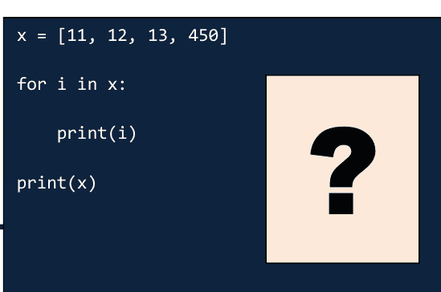

## 问题 188

**问题：**

编写一个程序来显示50-100范围内所有各位数字之和为偶数的整数。

**解决方案：**

```python
for i in range(50,100):
    num = i
    sum = 0
    while(num!=0):
        digit = num%10
        sum = sum + digit
        num = num//10
    if(sum%2==0):
        print(i)
```

```python
x = lambda a: a + 5

print(x(2))

# 输出: 7
```

## 问题 189

**问题：**

编写一个程序，使用递归从给定数字 n 打印到 0。

**解决方案：**

```python
def myfunc(n):
    if (n==0):
        return
    print(n)
    n=n-1
    myfunc(n)
```

```python
from functools import reduce

x = [12, 11, 14, 31]

print(reduce(lambda a,b: a if a < b else b, x))

# 输出: 11 (最小值)

print(reduce(lambda a,b: a if a > b else b, x))

# 输出: 31 (最大值)
```

myfunc(9)

```python
from functools import reduce

x = 5

print(reduce(lambda a,b: a*b, range(1, x+1), 1))

# 输出: 120 (5的阶乘)
```

## 问题 190

**问题：**

编写一个程序来找出数组中的奇数。

**解决方案：**

```python
num = [8,3,1,6,2,4,5,9]
count = 0
for i in range(len(num)):
    if(num[i]%2!=0):
        count = count+1
print("The number of odd numbers in the array are: ", count)
```

## 问题 191

**问题：**

编写一个程序将给定的大写字符串反转并转换为小写。

**解决方案：**

```python
def myfunc(x):
    return x[::-1].lower()
x = "JAVASCRIPT"
print(myfunc(x))
```

```python
import numpy as np

x = np.array([
    [ 11, 12, 13, 14, 15],
    [ 12, 13, 14, 15, 16]
])

print(x)
print(x * 6)
print(x + 5)
```

## 问题 192

**问题：**

编写一个程序来找出两个数中的最大值。

```python
import itertools

for i in itertools.count(start=10, step=1):
    print(i)
    if i > 15:
        break
```

**解决方案：**

```python
def maximum(a, b):
    if a >= b:
        return a
    else:
        return b

a = 3
b = 5
print(maximum(a, b))
```

**解决方案：**

```python
a = 3
b = 5

print(max(a, b))
```

```python
from collections.abc import Iterator, Iterable

from types import GeneratorType

print(issubclass(GeneratorType, Iterator))
# 输出: True

print(issubclass(Iterator, Iterable))
# 输出: True
```

**解决方案：**

```python
a = 3
b = 5

print(a if a >= b else b)
```

- 生成器是一个迭代器
- 迭代器是一个可迭代对象

## 问题 193

**问题：**

编写一个程序来找出两个数中的最小值。

```python
x = [11, 11, 12, 13, 15, 18, 19, 35, 64]
y = x[2:5]
print(y)
# 输出: [12, 13, 15]

x[2] = 99
print(x)
# 输出: [11, 11, 99, 13, 15, 18, 19, 35, 64]

print(y)
# 输出: [12, 13, 15]
```

**解决方案：**

```python
def minimum(a, b):
    if a <= b:
        return a
    else:
        return b
```

```python
a = 3
b = 9
print(minimum(a, b))
```

```python
import itertools

i = 0

for x in itertools.cycle(['A', 'B', 'C']):

    print(x)

    i = i+1

    if i >= 4:

        break

print('')
```

## 问题 194

**问题：**

编写一个程序来计算盈利或亏损。

**解决方案：**

```python
cp=float(input("Enter the Cost Price : "));
sp=float(input("Enter the Selling Price : "));
if cp==sp:
    print("No Profit or No Loss")
else:
    if sp>cp:
        print("Profit of ",sp-cp)
    else:
        print("Loss of ",cp-sp)
```

```python
x = [11, 12, 13, 14]

for i in x:

    print(i)

    if i == 12:

        x.remove(12)

print(x)
```

## 问题 195

**问题：**

编写一个程序来确定学生成绩等级。

**解决方案：**

```python
physics = float(input(" Please enter Physics Marks: "))
math = float(input(" Please enter Math score: "))
chemistry = float(input(" Please enter Chemistry Marks: "))

total = physics + math + chemistry
percentage = (total / 300) * 100

print("Total Marks = %.2f"  %total)
print("Percentage = %.2f"  %percentage)

if(percentage >= 90):
    print("A Grade")
elif(percentage >= 80):
    print("B Grade")
elif(percentage >= 70):
    print("C Grade")
elif(percentage >= 60):
    print("D Grade")
elif(percentage >= 40):
    print("E Grade")
else:
    print("Fail")
```

```python
def myfunc():
    yield 24
    yield 48
    yield 64

x = myfunc()
print(type(x))
# 输出: <class 'generator'>
print(next(x))
# 输出: 24
print(next(x))
# 输出: 48
print(next(x))
# 输出: 64
```

```python
x = 5

y = 100

print("X") if x > y else print("Y")

# 输出: Y
```

## 问题 196

**问题：**

编写一个程序来打印从1到N的偶数。

```python
def myfunc():
    yield 24
    yield 48
    yield 64

x = myfunc()
print(type(x))
for i in x:
    print(i)
```

**解决方案：**

```python
x = int(input(" Enter the Value of N : "))

for num in range(1, x+1):
    if(num % 2 == 0):
        print("{0}".format(num))
```

```
# 输出:
<class 'generator'>
24
48
64
```

## 问题 197

**问题：**

编写一个程序来打印从1到N的奇数。

**解决方案：**

```python
x = int(input(" Enter the Value of N : "))

for num in range(1, x+1):
    if(num % 2 != 0):
        print("{0}".format(num))
```

## 问题 198

**问题：**

编写一个程序来计算从1到N的偶数之和。

**解决方案：**

```python
x = int(input(" Enter the Value of N : "))
total = 0

for num in range(1, x+1):
    if(num % 2 == 0):
        print("{0}".format(num))
        total = total + num

print("The Sum of Even Numbers from 1 to {0} is: {1}".format(num, total))
```

```python
def myfunc(name):
    def x():
        print(f"Albert {name}")
    return x

y = myfunc("Einstein")
y()
# 输出: Albert Einstein
```

## 问题 199

**问题：**

编写一个程序来计算从1到N的奇数之和。

**解决方案：**

```python
x = int(input(" Enter the Value of N : "))
total = 0

for num in range(1, x+1):
    if(num % 2 != 0):
        print("{0}".format(num))
        total = total + num

print("The Sum of Odd Numbers from 1 to {0} is: {1}".format(num, total))
```

## 问题 200

**问题：**

编写一个程序来检查一个字符是否是字母。

**解决方案：**

```python
ch = input("Enter a Character : ")

if((ch >= 'a' and ch <= 'z') or (ch >= 'A' and ch <= 'Z')):
    print(ch, "is an Alphabet.")
else:
    print(ch, "is Not an Alphabet.")
```

```python
x = 21
y = 5
z = 35

if x > y and z > x:
    print("Both conditions are satisfied")

# 输出: Both conditions are satisfied
```

## 问题 201

### 问题：

编写一个程序来检查一个字符是字母、数字还是特殊字符。

### 解答：

```
ch = input("Enter a Character : ")

if((ch >= 'a' and ch <= 'z') or (ch >= 'A' and ch <= 'Z')):
    print(ch, "is an Alphabet.")
elif(ch >= '0' and ch <= '9'):
    print(ch, "is a Digit.")
else:
    print(ch, "is a Special Character.")
```

```
say = print

say("Albert Einstein")

# Output: Albert Einstein
```

## 问题 202

### 问题：

编写一个程序来检查一个字符是否为小写字母。

### 解答：

```
ch = input("Enter a Character : ")

if(ch.islower()):
    print(ch, "is a Lowercase character")
else:
    print(ch, "is Not a Lowercase character")
```

## 问题 203

### 问题：

编写一个程序来检查一个字符是否为大写字母。

### 解答：

```
ch = input("Enter a Character : ")

if(ch.isupper()):
    print(ch, "is a Uppercase character")
else:
    print(ch, "is Not a Uppercase character")
```

```
def myfunc():
    x = 2
    yield x

    x += 2
    yield x

    x += 2
    yield x

for i in myfunc():
    print(i)
```

```
# Output:
2
4
6
```

## 问题 204

### 问题：

编写一个程序来检查一个字符是元音还是辅音。

### 解答：

```
ch = input("Enter a Character : ")

if(ch == 'a' or ch == 'e' or ch == 'i' or ch == 'o' or ch == 'u' or ch == 'A'
        or ch == 'E' or ch == 'I' or ch == 'O' or ch == 'U'):
    print(ch, "is a Vowel")
else:
    print(ch, "is a Consonant")
```

```
def myfunc():
    x = 1
    while True:
        yield x
        x += 1

for i in myfunc():
    print(i)
    if i >= 5:
        break
```

## 问题 205

### 问题：

编写一个程序将字符串转换为大写。

### 解答：

```
str = input("Enter a String : ")

string = str.upper()

print("String in Lowercase =  ", str)
print("String in Uppercase =  ", string)
```

```
# Output:
1
2
3
4
5
```

## 问题 206

### 问题：

编写一个程序将字符串转换为小写。

```
def myfunc():
    i = 0
    i += 2
    return i

print(myfunc())
print(myfunc())
print(myfunc())
```

### 解答：

```
str = input("Enter a String : ")

string = str.lower()

print("String in Uppercase = ", str)
print("String in Lowercase = ", string)
```

```
# Output:
2
2
2
```

## 问题 207

### 问题：

编写一个程序将十进制数转换为二进制、八进制和十六进制。

### 解答：

```
decimal = int(input("Enter a Decimal Number: "))

binary = bin(decimal)
octal = oct(decimal)
hexadecimal = hex(decimal)

print(decimal, " Decimal Value = ", binary, "Binary Value")
print(decimal, " Decimal Value = ", octal, "Octal Value")
print(decimal, " Decimal Value = ", hexadecimal, "Hexadecimal Value")
```

## 问题 208

### 问题：

编写一个程序来检查三角形是否有效。

### 解答：

```
a = int(input('Please Enter the First Angle of a Triangle: '))
b = int(input('Please Enter the Second Angle of a Triangle: '))
c = int(input('Please Enter the Third Angle of a Triangle: '))

total = a + b + c

if total == 180:
    print("\nThis is a Valid Triangle")
else:
    print("\nThis is an Invalid Triangle")
```

```
i = 0

while True:
    i += 1
    print(i)
    if i > 0:
        break
```

# Output:
1

## 问题 209

### 问题：

编写一个程序，输入一个年龄并打印20年后的年龄。

### 解答：

```
age = int(input("What is your age? "))
print("In twenty years, you will be", age + 20, "years old!")
```

## 问题 210

### 问题：

编写一个程序来打印一年中的秒数。

### 解答：

```
days=365
hours=24
minutes=60
seconds=60
print("Number of seconds in a year : ",days*hours*minutes*seconds)
```

```
x = [11, 12, 13, 14]
for i in x[:]:
    print(i)
    if i == 12:
        x.remove(12)
print(x)
```

```
# Output:
11
12
13
14
[11, 13, 14]
```

## 问题 211

### 问题：

编写一个程序，输入一个字符串，然后打印它等于其长度的次数。

```
i = 0

def myfunc():

    global i

    i += 1

    return i

print(myfunc())

print(myfunc())

print(myfunc())
```

### 解答：

```
str = input("Enter string: ")
b = len(str)
a = str * b
print(a)
```

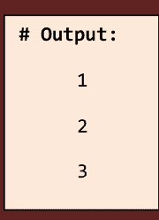

## 问题 212

### 问题：

编写一个程序将给定的字符串和字符列表转换为单个字符列表。

### 解答：

```
def myfunc(x):
    result = [i for y in x for i in y]
    return result

x = ["alan", "john", "w", "p", "james", "q"]
print(myfunc(x))
```

```
x = 22

y = 5

z = 73

if x > y or x > z:

    print("At least one of the conditions is satisfied")

# Output: At least one of the conditions is satisfied
```

```
x = 1

while x < 8:

    print(x)

    if (x == 3):

        break

    x = x+1
```

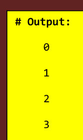

```
x = 0

while x < 8:

    x = x+1

    if (x == 3):

        continue

    print(x)
```

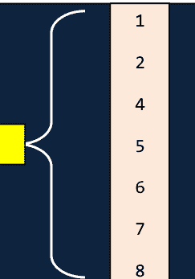

```
say = print

def mult(x, y):
    return x * y

product = mult

say(product(6, 6))

# Output: 36
```

```
import numpy as np

x = np.array([11, 11, 12, 13, 15, 18, 23, 31, 65])

print(x)

# Output: [11 11 12 13 15 18 23 31 65]

print(x[4])

# Output: 15

print(x[2:5])

# Output: [12 13 15]
```

```
import numpy as np

x = np.array([[2, 4, 6], [8, 10, 12]])

y = np.array([[3, 6, 12], [15, 18, 21]])

print(x)

# Output:
[[ 2  4  6]
 [ 8 10 12]]

print(y)

# Output:
[[ 3  6 12]
 [15 18 21]]

print(x*y)

# Output:
[[  6  24  72]
 [120 180 252]]
```

```
print(np.multiply(x, y))

# Output:
[[  6  24  72]
 [120 180 252]]
```

```
import numpy as np

x = np.array([True, True, False])

print(x.dtype)

# Output: bool

print(x)

# Output: [ True  True False]
```

```
import numpy as np

x = np.array(['Albert', 'James', 'Mary', 'Einstein', 'Bob'])

print(x)

# Output: ['Albert' 'James' 'Mary' 'Einstein' 'Bob']

print(np.vectorize(len)(x))

# Output: [6 5 4 8 3]
```

```
def myfunc():
    return 26

print(myfunc())
print(myfunc())
print(myfunc())

# Output:
26
26
26
```

```
a = ['pqrs', 'wxyz']

print(a)

# Output: ['pqrs', 'wxyz']

print(a[0:1])

# Output: ['pqrs']

print(a[0])

# Output: pqrs

print(a[0][0])

# Output: p

print(a[0][1])

# Output: q

print(a[0][0:2])

# Output: pq
```

```
def myfunc():
    return 26
    return 27
    return 28

print(myfunc())
print(myfunc())
print(myfunc())

# Output:
26
26
26
```

```
import numpy as np

x = np.array(['Albert', 'James', 'Mary', 'Einstein', 'Bob'])

print( [(len(i), i) for i in x])

# Output: [(6, 'Albert'), (5, 'James'), (4, 'Mary'), (8, 'Einstein'), (3, 'Bob')]
```

```
import multiprocessing as mp

print(mp.cpu_count()) # Multiprocess CPU count

# Output: 4
```

```
x = complex(5, 6)

print(x)

# Output: (5+6j)

print(x.real)

# Output: 5.0

print(x.imag)

# Output: 6.0

print((-1) ** 0.5)

# Output: (6.123233995736766e-17+1j)

print(complex(0, 1))

# Output: 1j

print(complex(0, 1) ** 2)

# Output: (-1+0j)
```

```
def f(x, y = []):
    y.append(x)
    return y

print(f(11))
print(f(12))
print(f(13))
```

```
# Output:

[11]

[11, 12]

[11, 12, 13]
```

```
def f(x, y = None):
    if y == None:
        y = []
    y.append(x)
    return y

print(f(11))
print(f(12))
print(f(13))
```

```
# Output:

[11]

[12]

[13]
```

```
x = 59

def f():
    print(x)

f()
# Output: 59
```

```
import pandas

x = pandas.Series([11, 11, 12, 13, 15, 18])

print(x)

print(x.values)
# Output: [11 11 12 13 15 18]

print(x.sum())
# Output: 80

print(x.count())
# Output: 6

print(x.mean())
# Output: 13.333333333333334

print(x.median())
# Output: 12.5

print(x.std())
# Output: 2.7325202042558927
```

```
# Output:
0    11
1    11
2    12
3    13
4    15
5    18
dtype: int64
```

```
import numpy as np

x = np.array([112], 'uint8')

print(x.dtype)

# Output: uint8

print(x)

# Output: [112]

x[0] += 1

print(x)

# Output: [113]

x[0]-=1

print(x)

# Output: [112]

x[0]= 126

print(x)

# Output: [126]

x[0]+=1

print(x)

# Output: [127]
```

```
for _ in range(10):
    print('Albert')
```


```
import numpy as np

x = np.array([11, 12, 13])

y = np.array([14, 15, 16])

z = np.array([17, 18, 19])

print(x)

# Output: [11 12 13]

print(y)

# Output: [14 15 16]

print(z)

# Output: [17 18 19]

w = np.hstack([x, y])

print(w)

# Output: [11 12 13 14 15 16]

q = np.hstack([w, z])

print(q)

# Output: [11 12 13 14 15 16 17 18 19]
```

## 每位超级用户都应阅读的最佳 Linux 书籍：

- **《Linux 工作原理：每位超级用户都应知道的知识》**
  作者：Brian Ward
- **《Linux 编程接口》**
  作者：Michael Kerrisk
- **《Linux 口袋指南》**
  作者：Daniel J. Barrett
- **《Linux 入门》**
  作者：Jason Cannon
- **《Linux 工作原理：每位超级用户都应知道的知识》**
  作者：Brian Ward
- **《Linux 内核开发》**
  作者：Robert Love
- **《Linux：完全参考手册》**
  作者：Richard Petersen
- **《Linux 精要》**
  作者：Ellen Siever 和 Robert Love
- **《黑客 Linux 基础：Kali 中的网络、脚本和安全入门》**
  作者：OccupyTheWeb
- **《Linux 命令行与 Shell 脚本编程宝典》**
  作者：Christine Bresnahan 和 Richard BLUM
- **《Linux 管理：Linux 操作系统与命令行指南》**
  作者：Jason Cannon
- **《Unix 编程艺术》**
  作者：Eric S. Raymond
- **《Linux 命令行，第 2 版：完全入门指南》**
  作者：William Shotts
- **《Linux 圣经》**
  作者：Christopher Negus
- **《Linux 系统编程：直接与内核和 C 库对话》**
  作者：Robert Love
- **《Linux 命令、编辑器和 Shell 编程实用指南》**
  作者：Mark G. Sobell
- **《Linux 入门与命令行功夫》**
  作者：Jason Cannon
- **《Linux 设备驱动程序》**
  作者：Alessandro Rubini、Greg Kroah-Hartman 和 Jonathan Corbet
- **《高级 Linux 编程》**
  作者：Alex Samuel、Jeffrey Oldham 和 Mark Mitchell
- **《深入理解 Linux 内核》**
  作者：Daniel Pierre Bovet 和 Marco Cesati
- **《快速学习 Linux：面向初学者的指南，助你掌握世界上最强大的操作系统》**
  作者：Ahmed Alkabary
- **《Linux 管理》**
  作者：Wale Soyinka
- **《Linux 入门经典》**
  作者：Richard Blum
- **《Linux 基础》**
  作者：Christine Bresnahan 和 Richard BLUM
- **《Linux 命令行初学者指南》**
  作者：Jonathan Moeller
- **《Linux 全能入门经典》**
  作者：Emmett Dulaney
- **《学习 bash Shell》**
  作者：Cameron Newham
- **《面向开发者的 Linux：快速提升你的 Linux 编程技能》**
  作者：William "Bo" Rothwell
- **《Linux 实战手册》**
  作者：Tim Bryant
- **《CompTIA Linux+ 学习指南：考试 XK0-005》**
  作者：Christine Bresnahan 和 Richard BLUM
- **《sed & awk》**
  作者：Arnold Robbins 和 Dale Dougherty
- **《从零开始构建 Linux》**
  作者：Gerard Beekmans

> **Linux** 是群体智慧的一个复杂范例。它之所以是一个好例子，是因为它表明你可以让人们以去中心化的方式工作——也就是说，无需任何人真正指导他们的工作朝向**特定方向**——并且仍然相信他们会得出好的答案。
>
> – **詹姆斯·索罗维基**

## 每位程序员都应阅读的最佳编程书籍：

## C 语言：

- **《C 程序设计语言》**
  作者：Brian Kernighan 和 Dennis Ritchie
- **《C 编程绝对初学者指南》**
  作者：Dean Miller 和 Greg Perry
- **《Head First C》**
  作者：David Griffiths 和 Dawn Griffiths
- **《C 专家编程》**
  作者：Peter van der Linden
- **《C 编程：现代方法》**
  作者：K. N King
- **《C 语言完全参考》**
  作者：Herbert Schildt
- **《C 语言入门之道：关于你一直回避的计算主题的实践练习（如 C）》**
  作者：Zed Shaw
- **《C 语言精要：权威参考》**
  作者：Peter Prinz 和 Tony Crawford
- **《C 编程轻松学》**
  作者：Mike McGrath
- **《计算机基础与 C 语言编程》**
  作者：Reema Thareja
- **《C 语言网络编程实战：学习 C 语言套接字编程并编写安全、优化的网络代码》**
  作者：Lewis Van Winkle
- **《让我们学 C》**
  作者：Yashavant Kanetkar
- **《底层编程：C、汇编与 Intel® 64 架构上的程序执行》**
  作者：Igor Zhirkov
- **《Effective C：专业 C 编程入门》**
  作者：Robert C. Seacord
- **《C 语言数据结构》**
  作者：Reema Thareja
- **《C 语言教程：C 语言编程》**
  作者：Al Kelley 和 Ira Pohl
- **《C 陷阱与缺陷》**
  作者：Andrew Koenig
- **《C 语言接口与实现：创建可复用软件的技术》**
  作者：David Hanson 和 David R. Hanson
- **《C 语言算法精粹》**
  作者：Kyle Loudon
- **《极限 C：带你领略并发、OOP 和 C 语言最前沿的能力》**
  作者：Kamran Amini
- **《让我们学 C 解答》**
  作者：Yashavant Kanetkar
- **《裸机 C：面向真实世界的嵌入式编程》**
  作者：Stephen Oualline
- **《C 编程导论》**
  作者：Reema Thareja
- **《C 语言深入解析》**
  作者：Deepali Srivastava
- **《C 如何编程》**
  作者：Harvey Deitel 和 Paul Deitel
- **《C 语言答案书》**
  作者：Clovis L. Tondo
- **《C 编程入门经典》**
  作者：Dan Gookin
- **《深入理解 C 和 C++ 中的指针：指针的完整工作示例与应用》**
  作者：Yashavant Kanetkar

## C++：

- **《C++ 程序设计语言》**
  作者：Bjarne Stroustrup
- **《Effective Modern C++》**
  作者：Scott Meyers
- **《C++ Primer》**
  作者：Barbara E. Moo、Josée Lajoie 和 Stanley B. Lippman
- **《C++ 之旅》**
  作者：Bjarne Stroustrup
- **《编程：使用 C++ 的原则与实践》**
  作者：Bjarne Stroustrup
- **《C++ 并发编程实战》**
  作者：Anthony Williams
- **《C++ 设计新思维》**
  作者：Andrei Alexandrescu
- **《More Effective C++：改善程序设计与设计的 35 个新方法》**
  作者：Scott Meyers
- **《加速 C++：通过示例进行实践编程》**
  作者：Andrew Koenig 和 Barbara E. Moo
- **《C++ 模板：完全指南》**
  作者：David Vandevoorde、Douglas Gregor 和 Nicolai M. Josuttis
- **《More Exceptional C++：40 个新的工程谜题、编程问题与解决方案》**
  作者：Herb Sutter
- **《C++ 编程规范》**
  作者：Andrei Alexandrescu 和 Herb Sutter
- **《C++ 模板元编程：来自 Boost 及其他的概念、工具与技术》**
  作者：Aleksey Gurtovoy 和 David Abrahams
- **《C++ 游戏编程入门》**
  作者：Michael Dawson
- **《C++ 编程入门》**
  作者：Richard Grimes
- **《C++ 编程》**
  作者：D. S. Malik
- **《Sams 24 小时自学 C++》**
  作者：Rao Siddhartha
- **《Professional C++》**
  作者：Nicholas A. Solter 和 Scott J. Kleper
- **《C++ 入门经典》**
  作者：Tony Gaddis
- **《C++ 完全参考》**
  作者：Herbert Schildt
- **《Exceptional C++：47 个工程谜题、编程问题与解决方案》**
  作者：Herb Sutter
- **《C++ 高性能：掌握优化 C++ 代码运行的艺术》**
  作者：Björn Andrist 和 Viktor Sehr
- **《C++ 标准库：教程与参考》**
  作者：Nicolai M. Josuttis

## C++ 书籍

- **Effective C++ 数字合集：140 种提升编程水平的方法**
  作者：Scott Meyers
- **C++17 - 完全指南**
  作者：Nicolai M. Josuttis
- **C++ Primer Plus**
  作者：Stephen Prata
- **数据并行 C++：掌握 DPC++ 以使用 C++ 和 SYCL 进行异构系统编程**
  作者：James Brodman, Michael Kinsner, Xinmin Tian, Ben Ashbaugh, John Pennycook, James Reinders
- **使用 C++ 的数据结构**
  作者：Varsha H. Patil
- **C++ 的设计与演化**
  作者：Bjarne Stroustrup
- **现代 CMake for C++：发现构建、测试和打包软件的更好方法**
  作者：Rafał Świdziński
- **专家 C++：通过学习 C++17 和 C++20 最新特性的编码最佳实践成为熟练程序员**
  作者：Shunguang Wu 和 Vardan Grigoryan
- **快速学习 C++：面向编程新手的完整 C++ 学习指南**
  作者：Code Quickly
- **C/C++ 中的内存管理算法与实现**
  作者：Bill Blunden
- **C++ 编程思想**
  作者：Bruce Eckel
- **现代 C++ 编程实战**
  作者：Marius Bancila
- **C++ 设计模式实战：运用现代设计模式解决常见 C++ 问题并构建健壮应用**
  作者：Fedor G. Pikus
- **C++ 编程完全指南**
  作者：Ulla Kirch-Prinz
- **C++ 速成课程：快速入门**
  作者：Josh Lospinoso
- **C++ 入门经典**
  作者：Stephen Randy Davis

## JAVA 书籍

- **Head First Java**
  作者：Bert Bates 和 Kathy Sierra
- **Effective Java**
  作者：Joshua Bloch
- **Thinking in Java**
  作者：Bruce Eckel
- **Java 并发编程实战**
  作者：Brian Goetz
- **Core Java**
  作者：Cay S. Horstmann 和 Gary Cornell
- **Java：初学者指南**
  作者：Herbert Schildt
- **Java：完全参考手册**
  作者：Herbert Schildt
- **Java 8 实战：Lambda、流与函数式编程**
  作者：Alan Mycroft 和 Mario Fusco
- **Java 编程入门经典**
  作者：Barry A. Burd
- **一天学会 Java**
  作者：Jamie Chan
- **现代 Java 实战：Lambda、流、函数式与响应式编程**
  作者：Alan Mycroft, Mario Fusco, 和 Raoul-Gabriel Urma
- **测试驱动开发：面向 Java 开发者的实用 TDD 与验收 TDD**
  作者：Lasse Koskela
- **Java 解惑：陷阱、误区与边界情况**
  作者：Joshua Bloch 和 Neal Gafter
- **Spring 实战**
  作者：Craig Walls 和 Ryan Breidenbach
- **Java 泛型与集合**
  作者：Maurice Naftalin
- **Core Java 卷 I——基础知识**
  作者：Cay S. Horstmann
- **Think Java：像计算机科学家一样思考**
  作者：Allen B. Downey
- **Java SE 8 入门经典**
  作者：Cay S. Horstmann
- **Head First 面向对象分析与设计：一种友好的 OOA&D 学习指南**
  作者：Brett McLaughlin
- **学习 Java：使用 Java 进行真实世界编程的入门指南**
  作者：Daniel Leuck, Marc Loy, 和 Patrick Niemeyer
- **Core Java 入门经典**
  作者：Cay S. Horstmann
- **Java 对比学习：通过 70 个示例成为 Java 工匠**
  作者：Jorg Lenhard, Linus Dietz, 和 Simon Harrer
- **高性能 Java 持久化**
  作者：Vlad Mihalcea
- **Java 技术手册：桌面快速参考**
  作者：Benjamin Evans 和 David Flanagan
- **Spring 微服务实战**
  作者：Edward John Carnell
- **优化 Java：提升 JVM 应用性能的实用技巧**
  作者：Benjamin Evans, Chris Newland, 和 James Gough
- **Java 性能权威指南：从代码中获取最大价值**
  作者：Scott Oaks
- **微服务模式：Java 示例**
  作者：Chris Richardson
- **Java 函数式编程：驾驭 Java 8 Lambda 表达式的力量**
  作者：Venkat Subramaniam
- **精通 Java 机器学习**
  作者：Krishna Choppella 和 Uday Kamath
- **OCA：Oracle 认证 Java SE 8 程序员 I 学习指南：考试 1Z0-808**
  作者：Jeanne Boyarsky 和 Scott Selikoff
- **Let Us Java：Java 编程的坚实基础**
  作者：Yashavant Kanetkar
- **学习 Java：一周内掌握 Java 的速成指南**
  作者：Timothy C. Needham
- **Java 性能**
  作者：Binu John 和 Charlie Hunt
- **Java 语言规范**
  作者：Oracle Corporation
- **Java 编程面试要素：内部人士指南**
  作者：Adnan Aziz, Amit Prakash, 和 Tsung-Hsien Lee

## PYTHON 书籍

- **流畅的 Python**
  作者：Luciano Ramalho
- **笨办法学 Python：通往计算机与代码世界的恐怖而美丽之旅的极简入门**
  作者：Zed Shaw
- **Python Cookbook：精通 Python 3 的食谱**
  作者：Brian K. Jones 和 David M. Beazley
- **用 Python 自动化无聊的事：面向完全初学者的实用编程**
  作者：Al Sweigart
- **Python 速成课程：基于项目的编程入门实战**
  作者：Eric Matthes
- **Head First Python**
  作者：Paul Barry
- **Programming Python**
  作者：Mark Lutz
- **Think Python：软件设计入门**
  作者：Allen B. Downey
- **利用 Python 进行数据分析：使用 Pandas、NumPy 和 IPython 进行数据整理**
  作者：Wes McKinney
- **Python 技巧：一系列超赞的 Python 特性**
  作者：Dan Bader
- **Learning Python**
  作者：Mark Lutz
- **Python 机器学习入门：数据科学家指南**
  作者：Andreas C. Müller 和 Sarah Guido
- **Learning Python：强大的面向对象编程**
  作者：Mark Lutz
- **Python 全家桶：使用 Python 3 探索数据**
  作者：Charles Severance
- **Python 儿童编程：趣味编程入门**
  作者：Jason R. Briggs
- **Python 编程：计算机科学入门**
  作者：John M. Zelle
- **一天学会 Python：面向初学者的 Python 实战项目**
  作者：Jamie Chan
- **用 Python 创造自己的电脑游戏**
  作者：Al Sweigart
- **Python 数据科学手册：数据处理必备工具**
  作者：Jake VanderPlas
- **Effective Python：编写更优 Python 代码的 90 条具体建议**
  作者：Brett Slatkin
- **Python 口袋参考：随身携带的 Python**
  作者：Mark Lutz
- **Python 3 面向对象编程**
  作者：Dusty Phillips
- **如何像计算机科学家一样思考：使用 Python 学习**
  作者：Allen B. Downey
- **Python 技术手册**
  作者：Alex Martelli
- **使用 Python 进行自然语言处理**
  作者：Edward Loper, Ewan Klein, 和 Steven Bird
- **Python 小项目大全：81 个简单的练习程序**
  作者：Al Sweigart
- **Python 编程初学者指南**
  作者：Michael Dawson
- **Python 核心参考**
  作者：David M. Beazley
- **Python 深度学习**
  作者：François Chollet
- **深入 Python**
  作者：Mark Pilgrim
- **不切实际的 Python：让你更聪明的趣味编程活动项目**
  作者：Lee Vaughan
- **面向对象 Python：通过构建游戏和 GUI 掌握 OOP**
  作者：Irv Kalb
- **Python 圣经 7 合 1：第一卷至第七卷（入门、进阶、数据科学、机器学习、金融、神经网络、计算机视觉）**
  作者：Florian Dedov
- **儿童编程：Python：通过 50 个超棒的游戏和活动学习编程**
  作者：Adrienne Tacke
- **笨办法学 Python 3 进阶：新 Python 程序员的下一步**
  作者：Zed Shaw
- **Python 人工智能**
  作者：Prateek Joshi
- **Python 编程：使用问题解决方法**
  作者：Reema Thareja
- **Django 初学者指南：使用 Python 和 Django 构建网站**
  作者：William S. Vincent
- **Python 入门经典**
  作者：Aahz Maruch 和 Stef Maruch
- **Python 编程入门经典**
  作者：John Paul Mueller

## HTML 书籍

- **学习网页设计**
  作者：Jennifer Niederst Robbins
- **Head First HTML with CSS and XHTML**
  作者：Elisabeth Robson 和 Eric Freeman
- **HTML5：缺失的手册**
  作者：Matthew MacDonald
- **初学者学 HTML：图解编码指南**
  作者：Jo Foster
- **面向网页设计师的 HTML5**
  作者：Jeremy Keith
- **面向万维网的 HTML 4**
  作者：Elizabeth Castro

## HTML5

- **HTML5入门**
  Bruce Lawson与Remy Sharp合著
- **核心HTML5 Canvas：图形、动画与游戏开发**
  David M. Geary著
- **HTML5权威指南**
  Adam Freeman著
- **HTML：初学者基础入门指南**
  M. G. Martin著教材
- **轻松学HTML5**
  Mike McGrath著

## CSS

- **CSS袖珍参考：Web视觉呈现**
  Eric A. Meyer著
- **CSS揭秘：解决日常Web设计问题的更优方案**
  Lea Verou著
- **CSS权威指南（缺失手册）**
  David McFarland著
- **深入CSS**
  Keith Grant著
- **精通CSS**
  Andy Budd著
- **CSS权威指南：Web视觉呈现**
  Eric A. Meyer与Estelle Weyl合著
- **CSS视觉词典**
  Greg Sidelnikov著
- **层叠样式表权威指南**
  Eric A. Meyer著
- **CSS3书籍：Web设计未来的开发者指南**
  Peter Gasston著
- **CSS3权威指南（缺失手册）**
  David Sawyer McFarland著
- **一天学好CSS：初学者实践指南**
  Jamie Chan著
- **CSS大师**
  Tiffany A. Brown著
- **网页设计基础：HTML5与CSS**
  Terry A. Felke-Morris著教材
- **宝宝学CSS**
  John Vanden-Heuvel著
- **轻松学CSS**
  Mike McGrath著

## JavaScript

- **JavaScript语言精粹**
  Douglas Crockford著
- **JavaScript编程精解：现代编程入门**
  Marijn Haverbeke著
- **JavaScript与jQuery：交互式前端Web开发**
  Jon Duckett著
- **你不知道的JavaScript（上卷）：作用域与闭包**
  Kyle Simpson著
- **聪明的方法学JavaScript**
  Mark Myers著
- **Effective JavaScript：编写高质量JavaScript代码的68个有效方法**
  David Herman著
- **Head First JavaScript程序设计：大脑友好指南**
  Elisabeth Robson与Eric Freeman合著
- **JavaScript权威指南：掌握全球最流行的编程语言**
  David Flanagan著
- **图解JavaScript：交互式练习**
  Ivelin Demirov著
- **面向对象JavaScript原理**
  Nicholas C. Zakas著
- **JavaScript高级程序设计（第4版）**
  Nicholas C. Zakas著
- **JavaScript语言详解：程序员深度指南**
  Axel Rauschmayer著
- **JavaScript应用程序编程：基于Node、HTML5和现代JS库的健壮Web架构**
  Eric Elliott著
- **JavaScript启蒙**
  Cody Lindley著
- **学习JavaScript设计模式**
  Addy Osmani著
- **JavaScript忍者秘籍**
  Bear Bibeault、John Resig与Josip Maras合著
- **JavaScript入门经典**
  Jeremy McPeak与Paul Wilton合著
- **JavaScript设计模式与开发实践**
  Stoyan Stefanov著
- **深入理解ECMAScript 6：JavaScript开发者的权威指南**
  Nicholas C. Zakas著
- **JavaScript趣味编程：儿童友好入门**
  Nick Morgan著
- **高性能JavaScript**
  Nicholas C. Zakas著
- **面向对象JavaScript**
  Kumar Chetan Sharma与Stoyan Stefanov合著
- **可维护JavaScript**
  Nicholas C. Zakas著
- **JavaScript忍者秘籍**
  Bear Bibeault与John Resig合著
- **JavaScript傻瓜书**
  Chris Minnick与Eva Holland合著
- **DOM启蒙**
  Cody Lindley著
- **JavaScript从入门到精通：通过构建趣味交互式动态Web应用、游戏和页面快速学习JavaScript**
  Laurence Lars Svekis与Rob Percival合著
- **可测试JavaScript**
  Mark Ethan Trostler著
- **你不知道的JavaScript（上卷）：入门与进阶**
  Kyle Simpson著
- **JavaScript函数式编程：函数、对象、组合子与装饰器的深度解析**
  Reginald Braithwaite著
- **你还不知道JS：开始学习**
  Kyle Simpson著
- **JavaScript与jQuery权威指南（缺失手册）**
  David Sawyer McFarland著
- **递归之书：用Python和JavaScript攻克编程面试**
  Al Sweigart著
- **React学习之路：掌握实用React.js的旅程**
  Robin Wieruch著
- **轻松学JavaScript**
  Mike McGrath著
- **构建JavaScript游戏：适用于手机、平板和桌面**
  Arjan Egges著
- **高性能浏览器网络**
  Ilya Grigorik著
- **学习TypeScript**
  Josh Goldberg著
- **JavaScript高级编程技术**
  John Resig著
- **CoffeeScript小书**
  Alex MacCaw著
- **学习React：使用React和Redux进行函数式Web开发**
  Alex Banks与Eve Porcello合著
- **快速学JavaScript：零基础编程者完全指南**
  Code Quickly著
- **测试驱动JavaScript开发**
  Christian Johansen著
- **计算机程序的构造和解释（JavaScript版）**
  Gerald Jay Sussman与Hal Abelson合著教材
- **JavaScript函数式编程：如何用函数式技术改进JavaScript程序**
  Luis Atencio著
- **JavaScript设计模式精粹**
  Dustin Diaz与Ross Harmes合著
- **JavaScript完全参考手册（第二版）**
  Thomas Powell著

## PHP

- **PHP的乐趣：用PHP和MySQL构建交互式Web应用的初学者指南**
  Alan Forbes著
- **学习PHP、MySQL、JavaScript、CSS和HTML5：创建动态网站的分步指南**
  Robin Nixon著
- **PHP编程**
  Rasmus Lerdorf著
- **PHP与MySQL Web开发实战**
  Laura Thomson与Luke Welling合著
- **PHP与MySQL权威指南**
  Joel Murach与Ray Harris合著
- **Head First PHP与MySQL**
  Lynn Beighley与Michael Morrison合著
- **PHP与MySQL：从新手到忍者**
  Tom Butler与Kevin Yank合著
- **PHP与MySQL：服务端Web开发**
  Jon Duckett著
- **学习PHP、MySQL与JavaScript：包含jQuery、CSS和HTML5**
  Robin Nixon著
- **轻松学PHP与MySQL（第二版）：更新至MySQL 8.0**
  Mike McGrath著
- **PHP初学者指南**
  Vikram Vaswani著
- **现代PHP：新特性与最佳实践**
  Josh Lockhart著
- **Laravel实战：构建现代PHP应用的框架指南**
  Matt Stauffer著
- **精通PHP 7**
  Branko Ajzele著
- **PHP与MySQL**
  Jon Duckett著
- **PHP与MySQL权威指南（缺失手册）**
  Brett McLaughlin著
- **PHP 8编程技巧、诀窍与最佳实践：PHP 8特性、用法变更与高级编程技术实用指南**
  Cal Evans与Doug Bierer合著
- **PHP Web编程：可视化快速入门指南**
  Larry Ullman著
- **PHP与MySQL动态网站开发**
  Larry Ullman著
- **PHP一日速成：初学者实践指南**
  Jamie Chan著
- **PHP 7实战应用开发**
  Altaf Hussain、Branko Ajzele与Doug Bierer合著
- **PHP经典实例**
  Adam Trachtenberg与David Sklar合著
- **全栈Web开发入门：使用HTML5、CSS3、Bootstrap、JavaScript、MySQL和PHP学习电商Web开发**
  Riaz Ahmed著
- **Drupal 9模块开发：构建强大Drupal模块与应用的快速入门指南**
  Daniel Sipos著
- **使用WordPress构建Web应用：WordPress作为应用框架**
  Brian Messenlehner与Jason Coleman合著
- **轻松学PHP与MySQL**
  Mike McGrath著
- **WordPress完全指南**
  Karol Król著
- **PHP、MySQL与JavaScript从入门到精通**
  Richard Blum著
- **PHP实战：对象、设计与敏捷开发**
  Chris Shiflett、Dagfinn Reiersol与Marcus Baker合著
- **PHP高级面向对象编程：可视化快速精通指南**
  Larry Ullman著
- **学习PHP 7**
  Antonio Lopez著

## PHP

- **PHP 7 编程宝典**
  作者：Doug Bierer

- **PHP：完全参考手册**
  作者：Steven Holzner

- **PHP 和 MySQL 入门经典**
  作者：Janet Valade

- **PHP 初学者实用指南**
  作者：Pratiyush Guleria

- **使用 PHP 7 构建 RESTful Web 服务**
  作者：Haafiz Waheed-ud-din Ahmad

- **精通 PHP 设计模式**
  作者：Junade Ali

- **PHP 和 MongoDB Web 开发入门指南**
  作者：Rubayeet Islam

- **PHP 7 数据结构与算法**
  作者：Mizanur Rahman

- **精通 PHP、MySQL 和 JavaScript 的更快 Web 开发：使用最新 Web 技术开发最先进的 Web 应用程序**
  教科书作者：Andrew Caya

- **学习 PHP：Web 最流行语言的轻松入门**
  作者：David Sklar

- **学习 PHP 8：使用 MySQL、JavaScript、CSS3 和 HTML5**
  作者：Steve Prettyman

- **PHP 微服务**
  作者：Carlos Perez Sanchez 和 Pablo Solar Vilarino

- **专业 CodeIgniter**
  作者：Thomas Myer

- **Symfony 5：快速入门**
  作者：Fabien Potencier

- **实用 PHP 和 MySQL 网站数据库：简化方法**
  作者：Adrian W. West

- **PHP 初学者编程：关键编程概念。如何将 PHP 与 MySQL 和 Oracle 数据库（Mysqli、PDO）结合使用**
  作者：Sergey Skudaev

## 算法

- **算法导论**
  作者：T Cormen, C Leiserson, R Rivest, C Stein

- **算法设计手册**
  作者：Steven Skiena

- **算法图解：写给程序员和其他好奇者的图解指南**
  作者：Aditya Bhargava

- **算法**
  作者：Robert Sedgewick

- **算法设计**
  作者：Jon Kleinberg 和 Éva Tardos

- **算法详解：NP 难问题的算法**
  作者：Tim Roughgarden

- **算法精要**
  作者：George T. Heineman

- **Java 数据结构与算法轻松学：数据结构与算法谜题**
  作者：Narasimha Karumanchi

- **数据结构与算法的常识指南：提升你的核心编程技能**
  作者：Jay Wengrow

- **剑指 Offer：名企面试官精讲典型编程题**
  作者：Gayle Laakmann McDowell

- **竞赛编程指南：通过竞赛学习和改进算法**
  作者：Antti Laaksonen

- **算法解锁**
  作者：Thomas H. Cormen

- **使用 Python 的算法与数据结构问题求解**
  作者：Bradley N Miller 和 David L. Ranum

- **计算机科学精要：学习解决计算问题的艺术**
  作者：Wladston Ferreira Filho

- **Python 算法：掌握 Python 语言中的基础算法**
  作者：Magnus Lie Hetland

- **高级算法与数据结构**
  作者：Marcello La Rocca

- **终极算法：对终极学习机器的探索将如何重塑我们的世界**
  作者：Pedro Domingos

- **深入算法：给无畏初学者的 Python 冒险之旅**
  作者：Bradford Tuckfield

- **高级数据结构**
  作者：Peter Brass

- **算法思维：基于问题的入门**
  作者：Daniel Zingaro

- **算法 + 数据结构 = 程序**
  作者：Niklaus Wirth

- **算法详解（第 2 部分）：图算法与数据结构**
  作者：Tim Roughgarden

- **算法设计与分析导论**
  作者：Anany Levitin

- **自动化这一切：算法如何统治我们的世界**
  作者：Christopher Steiner

- **像程序员一样思考：创造性问题解决入门**
  作者：V. Anton Spraul

- **间谍、谎言与算法：美国情报的历史与未来**
  作者：Amy Zegart

- **算法详解（第 3 部分）：贪心算法与动态规划**
  作者：Tim Roughgarden

- **决策算法**
  作者：Kyle H. Wray, Mykel J. Kochenderfer 和 Tim A. Wheeler

- **计算机算法基础**
  作者：Ellis Horowitz 和 Sartaj Sahni

- **信息论、推断与学习算法**
  作者：David J. C. MacKay

- **改变未来的 9 个算法**
  作者：John MacCormick

- **计算机程序设计艺术**
  作者：Donald Knuth

- **Python 数据结构与算法思维**
  作者：Narasimha Karumanchi

- **数据结构与算法的常识指南**
  作者：Jay Wengrow

- **你好，世界：在机器时代如何做人**
  作者：Hannah Fry

- **计算机算法的设计与分析**
  作者：Alfred Aho, Jeffrey Ullman, 和 John Hopcroft

- **设计分布式系统：可扩展、可靠服务的模式与范式**
  作者：Brendan Burns

- **程序员的计算机科学指南：为自学开发者提供的虚拟学位**
  作者：William M Springer

- **具体数学**
  教科书作者：Donald Knuth, Oren Patashnik 和 Ronald Graham

- **理解密码学：面向学生和从业者的教科书**
  教科书作者：Christof Paar 和 Jan Pelzl

- **算法入门经典**
  作者：John Mueller 和 Luca Massaron

## 数据结构

- **C++ 数据结构与算法分析**
  作者：Clifford A Shaffer

- **纯粹函数式数据结构**
  作者：Chris Okasaki

- **开放数据结构：导论**
  作者：Pat Morin

- **思考数据结构：Java 中的算法与信息检索**
  作者：Allen B. Downey

- **使用 C 的数据结构**
  作者：Reema Thareja

- **深入 C 语言数据结构**
  作者：Deepali Srivastava 和 Suresh Kumar Srivastava

- **C++ 数据结构**
  作者：Nell B. Dale

- **JavaScript 数据结构与算法：理解与实现核心数据结构和算法基础的入门**
  作者：Sammie Bae

- **使用 C 和 C++ 的数据结构**
  作者：Yedidyah Langsam

- **算法与数据结构：基础工具箱**
  作者：Kurt Mehlhorn 和 Peter Sanders

- **Java 数据结构与算法分析**
  作者：Clifford A Shaffer

- **数据结构与应用手册**
  作者：Dinesh P. Mehta 和 Sartaj Sahni

- **Java 数据结构**
  作者：J. R Hubbard

- **Java 数据结构**
  作者：Duane A. Bailey

## Linux

- **Linux 命令行与 Shell 脚本编程大全**
  作者：William E. Shotts Jr. 和 William E. Shotts, Jr.

- **Linux 编程接口**
  作者：Michael Kerrisk

- **Linux 权威指南**
  作者：Christopher Negus

- **Linux 口袋指南**
  作者：Daniel J. Barrett

- **Linux 入门经典**
  作者：Jason Cannon

- **Linux是怎样工作的：每个超级用户都应该知道的知识**
  作者：Brian Ward

- **黑客的 Linux 基础：Kali 中的网络、脚本和安全入门**
  作者：OccupyTheWeb

- **Linux 内核设计与实现**
  作者：Robert Love

- **Linux 管理：Linux 操作系统和命令行指南**
  作者：Jason Cannon

- **Linux：完全参考手册**
  作者：Richard Petersen

- **Linux 命令行与 Shell 脚本编程宝典**
  作者：Christine Bresnahan 和 Richard BLUM

- **Linux 权威指南**
  作者：Ellen Siever 和 Robert Love

- **Unix 编程艺术**
  作者：Eric S. Raymond

- **Linux 系统编程：直接与内核和 C 库对话**
  作者：Robert Love

- **Linux 命令、编辑器和 Shell 编程实用指南**
  作者：Mark G. Sobell

- **快速学习 Linux：轻松上手世界最强大操作系统的初学者友好指南**
  作者：Ahmed Alkabary

- **Linux 入门与命令行功夫**
  作者：Jason Cannon

- **终极 Kali Linux 书籍：使用 Nmap、Metasploit、Aircrack-Ng 和 Empire 执行高级渗透测试**
  作者：Glen D. Singh

- **深入理解 Linux 内核**
  作者：Daniel Pierre Bovet 和 Marco Cesati

- **开发者 Linux：快速提升你的 Linux 编程技能**
  作者：William "Bo" Rothwell

- **学习 bash Shell**
  作者：Cameron Newham

- **Linux 设备驱动程序**
  作者：Alessandro Rubini, Greg Kroah-Hartman, 和 Jonathan Corbet

- **精通 Linux Shell 脚本：Linux 命令行、Bash 脚本和 Shell 编程实用指南**
  作者：Andrew Mallett 和 Mokhtar Ebrahim

- **命令行高效 Linux**
  作者：Daniel J. Barrett

## 数据库：

- **《数据库系统大全》**
  作者：Héctor García-Molina、Jeffrey Ullman 和 Jennifer Widom
- **《数据库系统基础》**
  作者：Ramez Elmasri
- **《数据库设计入门》**
  作者：Michael J. Hernandez
- **《数据库系统导论》**
  作者：Christopher J. Date
- **《SQL反模式：避免数据库编程的陷阱》**
  作者：Bill Karwin
- **《数据密集型应用系统设计：可靠、可扩展与可维护系统背后的核心思想》**
  作者：Martin Kleppmann
- **《数据库系统概念》**
  作者：Avi Silberschatz、Henry F. Korth 和 S. Sudarshan
- **《数据库内核：深入解析分布式数据系统的工作原理》**
  作者：Alex Petrov
- **《数据库设计入门解决方案》**
  作者：Rod Stephens
- **《SQL性能详解》**
  作者：Markus Winand
- **《数据库管理系统》**
  作者：Johannes Gehrke 和 Raghu Ramakrishnan
- **《Oracle PL/SQL编程》**
  作者：Scott Urman
- **《数据库深入解析：面向实践者的关系理论》**
  作者：Christopher J. Date
- **《数据库设计与关系理论：范式及其他》**
  作者：Christopher J. Date
- **《数据库系统：设计、实现与管理的实用方法》**
  作者：Carolyn Begg 和 Thomas M. Connolly
- **《面向商业的关系数据库设计入门（使用Microsoft Access）》**
  作者：Bonnie R. Schultz 和 Jonathan Eckstein
- **《深入浅出SQL：你的SQL大脑——学习者指南》**
  作者：Lynn Beighley
- **《数据库系统读本》**
  作者：Joseph M Hellerstein
- **《SQL的艺术》**
  作者：Stéphane Faroult
- **《关系数据库理论》**
  作者：David Maier
- **《数据仓库工具箱》**
  作者：Ralph Kimball
- **《MongoDB权威指南》**
  作者：Kristina Chodorow 和 Michael Dirolf
- **《学习SQL》**
  作者：Alan Beaulieu
- **《Joe Celko的SQL谜题与解答》**
  作者：Joe Celko
- **《数据库基础》**
  作者：Serge Abiteboul
- **《专业SQL Server关系数据库设计与实现：可扩展性与性能的最佳实践》**
  作者：Louis Davidson
- **《六步关系数据库设计：关系数据库设计与开发的分步指南》**
  作者：Fidel A. Captain
- **《数据库、类型与关系模型：第三宣言》**
  作者：Christopher J. Date
- **《七周七数据库：现代数据库与NoSQL运动指南》**
  作者：Eric Redmond 和 Jim R. Wilson
- **《实用SQL：用数据讲故事的初学者指南》**
  作者：Anthony DeBarros
- **《数据库重构》**
  作者：Scott Ambler
- **《SQL快速入门指南：管理、分析和操作数据的简化初学者指南》**
  作者：Walter Shields
- **《PHP与MySQL：服务器端Web开发》**
  作者：Jon Duckett
- **《SQL食谱》**
  作者：Anthony Molinaro
- **《学习MongoDB 4.x：面向NoSQL开发者的MongoDB开发与管理指南》**
  作者：Doug Bierer
- **《专业Azure SQL托管数据库管理：使用Azure SQL高效管理和现代化云中数据》**
  作者：Ahmad Osama 和 Shashikant Shakya
- **《PostgreSQL实战》**
  作者：Leo S. Hsu 和 Regina O. Obe
- **《SQL全能指南》**
  作者：Allen G. Taylor
- **《关系数据库理论导论》**
  作者：Hugh Darwen
- **《事务处理：概念与技术》**
  作者：Jim Gray
- **《理解NoSQL：面向管理者和其他人的指南》**
  作者：Ann Kelly、Ann Marie Kelly 和 Dan McCreary
- **《数据库设计实用指南》**
  作者：Rex Hogan
- **《数据库开发入门》**
  作者：Allen G. Taylor
- **《面向普通人的SQL查询：SQL数据操作实践指南》**
  作者：John Viescas 和 Michael J. Hernandez
- **《专业SQL Server 2012关系数据库设计与实现》**
  作者：Jessica Moss 和 Louis Davidson
- **《SQL性能详解：开发者需要了解的SQL性能知识》**
  作者：Markus Winand
- **《数据库重构：演进式数据库设计》**
  作者：Scott W Ambler 和 Pramod J Sadalage
- **《数据密集型应用系统设计》**
  作者：Martin Kleppmann

**编程**如今是一场软件工程师与宇宙之间的竞赛：工程师们努力构建更大、更好的**防呆程序**，而宇宙则试图制造更大、更好的白痴。到目前为止，宇宙赢了。

> —— Rick Cook，《编译的巫术》

> “在某些方面，编程就像绘画。你从一块空白的画布和一些基本的原材料开始。你运用科学、艺术和技艺的结合，来决定如何处理它们。”

– Andrew Hunt

## 最后一点想法：

如果您觉得这些信息对您有帮助，请花一点时间在LinkedIn、Facebook和Twitter上与您的朋友分享。如果您觉得这本书对您的编程生涯有所帮助，并且学到了有价值的东西，请考虑在**Google Play Books**上写一篇简短的评论。

对我来说，编码既是一门科学，也是一门创造性的艺术。它既极其有趣，又引人入胜。我想将我的热情传播给尽可能多的人。我也希望这不是您学习的终点。

**谢谢！**

这是一本面向新手和经验丰富的程序员的平易近人的手册，介绍了C、C++、Java和Python编程语言。本书适用于所有程序员，无论您是新手还是经验丰富的专业人士。它专为入门课程设计，为工程和计算机科学初学者提供计算机编程基本概念的坚实基础。它还通过使用C、C++、Java和Python语言培养编程和解决问题的能力，为重要的计算概念提供了宝贵的视角。初学者会发现其精心安排的练习尤其有帮助。当然，那些已经熟悉编程的人可能会从本书中获得更多收益。阅读本书后，您将在C、C++、Java和Python方面达到中等水平的专业知识，从而可以将自己提升到更高的水平。命令行界面是Linux几乎所有精心构建的标志性特征之一。Linux命令浩如烟海，允许您在Linux操作系统上执行几乎所有您能想到的事情。然而，这最终会产生一个问题：由于有如此多的命令可供管理，您不知道从何处以及何时开始学习和掌握它们，特别是当您是初学者时。如果您面临这个问题，并且正在寻找一种轻松的方法开始您的Linux命令行之旅，那么您来对地方了——因为在本书中，我们将向您介绍一系列广受欢迎且实用的Linux命令。本书全面介绍了C、C++、Java和Python编程语言，涵盖了从基础到高级概念的所有内容。它还包括各种练习，让您将所学知识应用到现实世界中。