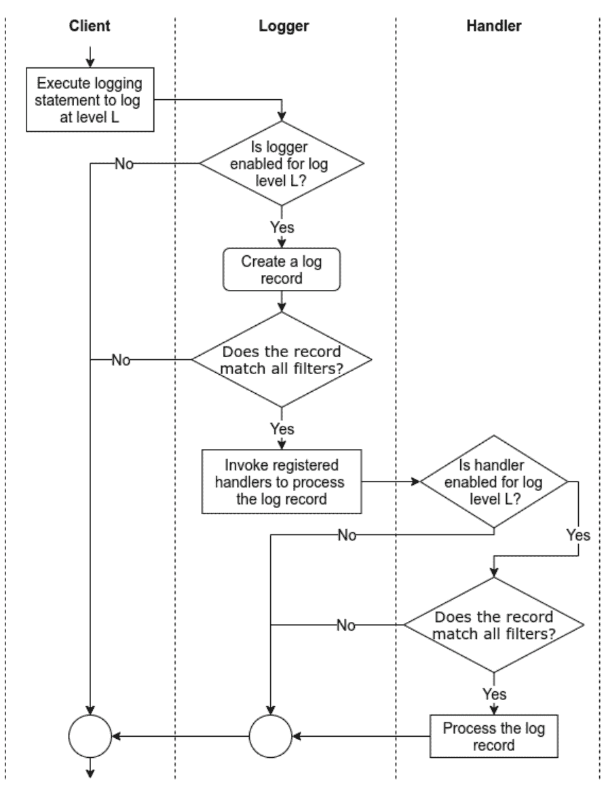
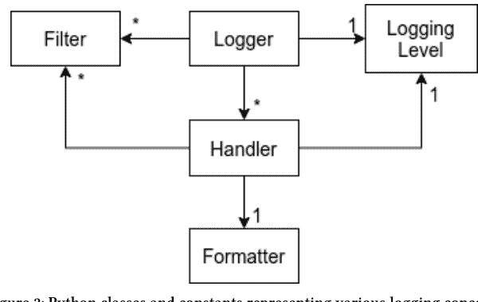

# Python 日志记录

VENKATESH–PRASAD RANGANATH

# Python 日志记录

Venkatesh-Prasad Ranganath

本书可在 http://leanpub.com/logging-in-python 购买

本版本发布于 2022-01-15

这是一本 Leanpub 图书。Leanpub 通过精益出版流程赋能作者和出版商。精益出版是指使用轻量级工具和多次迭代来发布进行中的电子书，以获取读者反馈，不断调整，直到你拥有合适的书籍，并在完成后建立影响力。

© 2020 - 2022 Venkatesh-Prasad Ranganath

# 在 Twitter 上分享本书！

请帮助 Venkatesh-Prasad Ranganath 在 [Twitter](https://twitter.com) 上宣传本书！

本书的推荐推文是：

[一本关于 Python 日志记录的实用指南。](https://twitter.com/intent/tweet?text=A%20no-nonsense%20guide%20about%20logging%20in%20Python.)

本书的推荐标签是 [#logging-in-python-book](https://twitter.com/hashtag/logging-in-python-book)。

点击此链接在 Twitter 上搜索此标签，了解其他人对本书的评价：

[#logging-in-python-book](https://twitter.com/search?q=%23logging-in-python-book)

献给我的父母、家人、朋友以及所有帮助我学习的人。

# 目录

- 关于本书赞助商 Coralogix

## 关于赞助商 Coralogix

Coralogix 提供由机器学习驱动的日志解决方案，可加速专注于 CI/CD 的云公司的交付流程。

除了搜索、可视化和创建告警功能外，我们的解决方案还能检测异常。它提供自动版本基准测试，让您能够自信地推进工作。通过一个 100% 托管、可扩展且安全的平台，它简化了您的 ELK 技术栈和 Grafana 工作流程，并且通过全天候（24/7）即时（人工）支持，帮助解决任何日志挑战，让您永不失方向。它支持通过电子邮件/Slack/PagerDuty/OpsGini 或任何自定义 webhook 目标进行通知。它轻松集成 Python、Node.js、Java、.Net、Ruby、Rsyslog、Auditbeat、Filebeat、Packetbeat、Logstash、Filebeat、FluentD、CircleCI、Jenkins、Fastly、Okta、Akamai、Kubernetes、Docker、CloudTrial、Cloudwatch Logs and Metrics，以及其他 AWS 服务，如 Kinesis、ELB/ALB 日志、S3、VPC 流日志等等。

我们的解决方案由一个强大的解析引擎驱动，该引擎能够以任何必要的方式快速解析、提取、映射、转换和过滤日志条目。此功能有助于将非结构化数据转换为 JSON；从日志中提取关键信息，同时根据特定条件过滤流式日志。高级规则可以帮助阻止或屏蔽特定日志数据，以确保隐私并避免日志数据配额超额。

客户可以通过为摄入的日志数据分配优先级级别来控制配额使用，从而优化其日志投资回报率。他们可以根据分配的价值以不同程度处理数据，同时仍然归档所有数据以便于重新索引。

要开始使用，请访问 [Coralogix 网站](https://coralogix.com)，或轻松地从 AWS 或 Heroku 市场添加 Coralogix，以获得一个简单的按需付费选项，通过您现有的账户支付。您可以自行管理设置，或安排与我们的一位日志专家进行免费的 1 对 1 会话，我们将帮助您传输和解析数据。

¹https://coralogix.com

## 前言

本手册是关于*如何使用 Python 中内置的日志支持*。它介绍了与理解 Python 日志相关的各种概念，讨论了 Python 中相应的日志 API 及其使用方法，并介绍了使用这些 API 的最佳实践和性能考量。

本手册不提供与语言无关的通用日志信息，例如，日志的目的、记录日志时的最佳实践以及存储和处理日志的技术。

本手册假设读者已熟练掌握 Python 编程，特别是与通用编程和面向对象编程相关的概念和构造。手册中的信息和示例基于 Python 3.8 版本。

## 概念与 API

Python 自 2.3 版本起就提供了内置的日志支持。此支持包括用于日志特定且与语言无关的常见概念和任务的库 API。本章介绍了这些在 Python 日志库中实现和支持的概念和任务。

### 日志概念

当我们使用日志库时，我们在使用相关概念（以粗体突出显示）的同时执行/触发以下常见任务。

1.  客户端通过执行一条**日志语句**来发出**日志请求**。通常，此类日志语句通过提供**日志数据**和**日志级别**作为参数来调用**日志（库）API** 中的一个函数/方法。日志级别指定了日志请求的重要性。日志数据通常是一个**日志消息**（一个字符串），以及一些要记录的**额外数据**。通常，日志 API 通过 **logger** 对象暴露。
2.  为了在请求穿过日志库时启用处理，日志库会创建一个**日志记录**，该记录代表日志请求并捕获相应的日志数据。
3.  根据日志库的配置方式（通过**日志配置**），日志库会过滤日志请求/记录。此过滤涉及将请求的日志级别与阈值日志级别进行比较，并将日志记录通过用户提供的**过滤器**。
4.  **处理器**处理过滤后的日志记录，以存储日志数据（例如，将日志数据写入文件）或执行涉及日志数据的其他操作（例如，发送包含日志数据的电子邮件）。在某些日志库中，在处理日志记录之前，处理器可能会再次根据处理器的日志级别和用户提供的处理器特定**过滤器**来过滤日志记录。此外，在需要时，处理器通常依赖于用户提供的**格式化器**将日志记录格式化为字符串，即**日志条目**。

与日志库无关，上述任务的执行顺序类似于图 1 所示。



图 1：通过日志库记录日志时的任务流程

### Python 的日志库

Python 的标准库通过 logging、logging.config 和 logging.handlers 模块提供日志支持。

- logging 模块提供主要的面向客户端的 API。
- logging.config 模块提供用于在客户端配置日志的 API。
- logging.handlers 模块提供不同的处理器，涵盖处理和存储日志记录的常见方式。

我们将这些模块统称为 *Python 的日志库*。
这些模块将上一节介绍的概念实现为类、一组模块级函数或一组常量。图 2 显示了这些类及其之间的关联。



### 日志级别

开箱即用，Python 的日志库支持五个日志级别：*critical*、*error*、*warning*、*info* 和 *debug*。这些级别由 logging 模块中同名的常量表示，即 logging.CRITICAL、logging.ERROR、logging.WARNING、logging.INFO 和 logging.DEBUG。这些常量的值分别为 50、40、30、20 和 10。

在运行时，日志级别的数值决定了日志级别的含义。因此，客户端可以通过使用大于 0 且不等于预定义日志级别的数值作为日志级别来引入新的日志级别。

日志级别可以有名称。当有名称时，日志级别在日志条目中以其名称显示。每个预定义的日志级别都与相应常量的名称相同；因此，它们在日志条目中以其名称显示，例如，`logging.WARNING` 和 30 级别显示为 ‘WARNING’。相比之下，自定义日志级别默认是无名称的。因此，一个数值为 n 的无名称自定义日志级别在日志条目中显示为 ‘Level n’，这会导致不一致且对人类不友好的日志条目。为了解决这个问题，客户端可以使用模块级函数 `logging.addLevelName(level, levelName)`⁶ 为自定义日志级别命名。例如，通过使用 `logging.addLevelName(33, 'CUSTOM1')`，级别 33 将被记录为 ‘CUSTOM1’。

Python 的日志库采用了社区通用的日志级别适用性规则，即*何时应使用日志级别 X？*⁷

1.  使用 `logging.DEBUG` 记录详细信息，通常仅在诊断问题时感兴趣，例如，当应用程序启动时。
2.  使用 `logging.INFO` 确认软件按预期工作，例如，当应用程序成功初始化时。
3.  使用 `logging.WARNING` 报告意外行为或预示未来问题但不影响软件当前功能的行为，例如，当应用程序检测到内存不足时，这可能会影响应用程序未来的性能。
4.  使用 `logging.ERROR` 报告软件未能执行某些功能，例如，当应用程序因权限不足而无法保存数据时。
5.  使用 `logging.CRITICAL` 报告可能阻止软件继续执行的严重错误，例如，当应用程序无法分配内存时。

#### 日志记录器

`logging.Logger`⁸ 对象提供了与日志库的主要接口。这些对象提供用于发出日志请求的日志记录方法，以及查询和修改其状态的方法。（我们将 Logger 对象称为日志记录器。）

**创建** 工厂函数 `logging.getLogger(name)`⁹ 通常用于创建日志记录器。通过使用工厂函数，客户端可以依赖库来管理日志记录器，并通过其名称访问日志记录器，而不是存储和传递日志记录器的引用。

工厂函数中的 `name` 参数通常是一个点分隔的层次结构名称，例如 *a.b.c*。此命名约定使库能够维护日志记录器的层次结构。具体来说，当工厂函数创建日志记录器时，库确保为名称指定的层次结构的每一级都存在一个日志记录器，并且层次结构中的每个日志记录器都与其父级和子级日志记录器链接。

**阈值日志级别** 每个日志记录器都有一个阈值日志级别，用于确定是否应处理日志请求。如果请求的日志级别的数值

⁶ https://docs.python.org/3/library/logging.html#logging.addLevelName
⁷ https://docs.python.org/3/howto/logging.html#when-to-use-logging
⁸ https://docs.python.org/3/library/logging.html#logger-objects
⁹ https://docs.python.org/3/library/logging.html#logging.getLogger

日志级别大于或等于日志记录器的阈值日志级别。客户端可以通过 `Logger.getEffectiveLevel()` 和 `Logger.setLevel(level)` 方法分别检索和更改日志记录器的阈值日志级别。

当使用工厂函数创建日志记录器时，该函数会根据其名称确定的父日志记录器的阈值日志级别，设置该日志记录器的阈值日志级别。

### 日志记录方法

每个日志记录器都提供以下日志记录方法来发出日志请求。

- `Logger.critical(msg, *args, **kwargs)`
- `Logger.error(msg, *args, **kwargs)`
- `Logger.debug(msg, *args, **kwargs)`
- `Logger.info(msg, *args, **kwargs)`
- `Logger.warn(msg, *args, **kwargs)`

这些方法中的每一个都是发出具有相应预定义日志级别作为请求日志级别的日志请求的简写。

除了上述方法外，日志记录器还提供以下两种方法。

- `Logger.log(level, msg, *args, **kwargs)` 发出具有明确指定日志级别的日志请求。此方法在使用自定义日志级别时很有用。
- `Logger.exception(msg, *args, **kwargs)` 发出日志级别为 ERROR 的日志请求，并将当前异常作为日志条目的一部分捕获。因此，客户端应仅在异常处理程序中调用此方法。

上述方法中的 `msg` 和 `args` 参数组合在一起，创建由日志条目捕获的日志消息。所有上述方法都支持关键字参数 `exc_info` 以向日志条目添加异常信息，以及 `stack_info` 和 `stacklevel` 以向日志条目添加调用堆栈信息。此外，它们还支持关键字参数 `extra`，这是一个字典，用于传递与 `filters`、`handlers` 和 `formatters` 相关的值。

执行时，上述方法执行/触发图 1 所示的所有任务以及以下两个任务。

1.  在根据日志请求的日志级别和阈值日志级别决定处理该请求后，日志记录器创建一个 `LogRecord` 对象，以在请求的下游处理中表示该日志请求。LogRecord 对象捕获日志记录方法的 msg 和 args 参数以及异常和调用堆栈信息，以及源代码信息。它们还捕获日志记录方法的 extra 参数中的键和值作为字段。

2.  在日志记录器的每个处理程序处理完日志请求后，其祖先日志记录器的处理程序将处理该请求（按照在日志记录器层次结构中向上遍历的顺序）。Logger.propagate 字段控制此方面，默认情况下为 True。

除了日志级别，过滤器提供了一种更精细的方法，可以根据日志记录中的信息过滤日志请求，例如忽略在特定类中发出的日志请求。客户端可以使用 Logger.addFilter(filter) 和 Logger.removeFilter(filter) 方法分别向日志记录器添加和移除过滤器。

### 过滤器

任何接受日志记录参数并返回零以拒绝记录、返回非零值以接受记录的函数或可调用对象都可以用作过滤器。任何提供具有签名 filter(record: LogRecord) -> int 的方法的对象也可以用作过滤器。

logging.Filter(name: str) 的子类，可以选择性地覆盖 logging.Filter.filter(record) 方法，也可以用作过滤器。如果不覆盖 filter 方法，这样的过滤器将接受由与过滤器同名且是过滤器子级的日志记录器发出的记录（基于日志记录器和过滤器的名称）。如果过滤器的名称为空，则过滤器接受所有记录。如果覆盖了该方法，则应返回零值以拒绝记录，返回非零值以接受记录。

### 处理程序

logging.Handler 对象执行日志记录的最终处理，即记录日志请求。这种最终处理通常转化为存储日志记录，例如将其写入系统日志或文件。它也可以转化为将日志记录中的数据传达给特定实体（例如，发送电子邮件）或将日志记录传递给其他实体进行进一步处理（例如，将日志记录提供给日志收集过程或日志收集服务）。

与日志记录器一样，处理程序具有阈值日志级别，可以通过 Handler.setLevel(level) 方法设置。它们还通过 Handler.addFilter(filter) 和 Handler.removeFilter(filter) 方法支持过滤器。

处理程序使用其阈值日志级别和过滤器来过滤要处理的日志记录。这种额外的过滤允许对日志记录进行特定于上下文的控制，例如，通知处理程序应仅处理来自关键模块或不稳定模块的日志请求。

在处理日志记录时，处理程序使用其格式化器将日志记录格式化为日志条目。客户端可以通过 `Handler.setFormatter(formatter)` 方法为处理程序设置格式化器。如果处理程序没有格式化器，则使用库提供的默认格式化器。

`logging.handler` 模块提供了 15 个有用的处理程序的丰富集合，涵盖了许多常见用例（包括上述提到的用例）。因此，在许多情况下，实例化和配置这些处理程序就足够了。

在需要自定义处理程序的情况下，开发者可以通过实现 `Handler.emit(record)` 方法来记录提供的日志记录，从而扩展 Handler 类或预定义的 Handler 类之一。

#### 格式化器

处理程序使用 `logging.Formatter` 对象将日志记录格式化为基于字符串的日志条目。[注意：格式化器不控制日志消息的创建。] 格式化器通过将日志记录中的字段/数据与用户指定的格式字符串组合来工作。

与处理程序不同，日志库只提供一个基本的格式化器，它记录请求的日志级别、日志记录器的名称和日志消息。因此，除了简单的用例之外，客户端需要通过使用必要的格式字符串创建 `logging.Formatter` 对象来创建新的格式化器。

格式化器支持三种格式字符串样式：

- `printf`，例如 `'%(levelname)s:%(name)s:%(message)s'`
- `str.format()`，例如 `'{levelname}:{name}:{message}'`
- `str.template`，例如 `$levelname:$name:$message`

格式化器的格式字符串可以引用 `LogRecord` 对象的任何字段，包括基于日志记录方法的 `extra` 参数的键的字段。

在格式化日志记录之前，格式化器使用 `LogRecord.getMessage()` 方法，通过使用字符串格式化运算符（`%`）组合日志记录方法的 `msg` 和 `args` 参数（存储在日志记录中）来构造日志消息。然后，格式化器使用指定的格式字符串将生成的日志消息与日志记录中的数据组合，以创建日志条目。

### 日志模块

为了维护日志记录器的层级结构，当客户端使用日志库时，该库会创建一个*根日志记录器*，作为日志记录器层级结构的根。根日志记录器的默认阈值日志级别为 `logging.WARNING`。

该模块以模块级函数的形式提供了 Logger 类的所有日志方法，这些函数具有相同的名称和签名，例如 `logging.debug(msg, *args, **kwargs)`[^42]。客户端可以使用这些函数发出日志请求，而无需创建日志记录器，根日志记录器将处理这些请求。如果根日志记录器在处理通过这些方法发出的日志请求时没有任何处理器，那么日志库会将一个基于 `sys.stderr` 流的 `logging.StreamHandler` 实例作为处理器添加到根日志记录器。

当没有处理器的日志记录器收到日志请求时，日志库会将此类日志请求定向到*最后的备用处理器*，这是一个基于 `sys.stderr` 流的 `logging.StreamHandler` 实例。可以通过 `logging.lastResort` 属性访问此处理器。

## 使用 Python 的日志库

以下是一些代码片段，说明如何使用 Python 的日志库。

### 代码片段 1：创建带有处理器和格式化器的日志记录器

```python
# main.py
import logging, sys

def _init_logger():
    logger = logging.getLogger('app')  #1
    logger.setLevel(logging.INFO)  #2
    handler = logging.StreamHandler(sys.stderr)  #3
    handler.setLevel(logging.INFO)  #4
    formatter = logging.Formatter(
        '%(created)f:%(levelname)s:%(name)s:%(module)s:%(message)s') #5
    handler.setFormatter(formatter)  #6
    logger.addHandler(handler)  #7

_init_logger()
_logger = logging.getLogger('app')
```

此代码片段执行以下操作。

1.  创建一个名为 'app' 的日志记录器。
2.  将日志记录器的阈值日志级别设置为 INFO。
3.  创建一个基于流的处理器，将日志条目写入标准错误流。
4.  将处理器的阈值日志级别设置为 INFO。
5.  创建一个格式化器，用于捕获：
    -   日志请求的时间（自纪元以来的秒数），
    -   请求的日志级别，
    -   日志记录器的名称，
    -   发出日志请求的模块名称，以及
    -   日志消息。
6.  将创建的格式化器设置为处理器的格式化器。
7.  将创建的处理器添加到此日志记录器。

通过更改步骤 3 中创建的处理器，我们可以将日志条目重定向到不同的位置或处理器。

### 代码片段 2：发出日志请求

```python
# main.py
_logger.info('App started in %s', os.getcwd())
```

此代码片段记录一条信息性消息，说明应用程序已启动。
当应用程序在 /home/kali 文件夹中使用代码片段 1 创建的日志记录器启动时，此代码片段将在标准错误流中生成日志条目 `1586147623.484407:INFO:app:main:App started in /home/kali/`。

### 代码片段 3：发出日志请求

```python
# app/io.py
import logging

def _init_logger():
    logger = logging.getLogger('app.io')
    logger.setLevel(logging.INFO)

_init_logger()
_logger = logging.getLogger('app.io')

def write_data(file_name, data):
    try:
        # write data
        _logger.info('Successfully wrote %d bytes into %s', len(data), file_name)
    except FileNotFoundError:
        _logger.exception('Failed to write data into %s', file_name)
```

此代码片段在每次通过 write_data 成功写入数据时记录一条信息性消息。如果写入失败，则该代码片段会记录一条错误消息，其中包含发生异常的堆栈跟踪。

使用代码片段 1 创建的日志记录器，如果 `app.write_data('/tmp/tmp_data.txt', image_data)` 的执行成功，那么此代码片段将生成一个类似于 `1586149091.005398:INFO:app.io:io:Successfully wrote 134 bytes into /tmp/tmp_data.txt` 的日志条目。如果 `app.write_data('/tmp/tmp_data.txt', image_data)` 的执行失败，那么此代码片段将生成以下日志条目。

```
1586149219.893821:ERROR:app:io:Failed to write data into /tmp1/tmp_data.txt
Traceback (most recent call last):
  File "/home/kali/program/app/io.py", line 12, in write_data
    print(open(file_name), data)
FileNotFoundError: [Errno 2] No such file or directory: '/tmp1/tmp_data.txt'
```

我们可以通过按名称使用参数来实现相同的输出，而不是在日志方法的格式字符串中使用位置参数，如下所示：

```python
_logger.info('Successfully wrote %(data_size)s bytes into %(file_name)s',
    {'data_size': len(data), 'file_name': file_name})
```

### 代码片段 4：过滤日志请求

```python
# main.py
import logging, os, sys
import app.io

def _init_logger():
    logger = logging.getLogger('app')
    logger.setLevel(logging.INFO)
    formatter = logging.Formatter(
        '%(created)f:%(levelname)s:%(name)s:%(module)s:%(message)s')
    handler = logging.StreamHandler(sys.stderr)
    handler.setLevel(logging.INFO)
    handler.setFormatter(formatter)
    handler.addFilter(lambda record: record.version > 5 or #1
        record.levelno >= logging.ERROR) #1
    logger.addHandler(handler)

_init_logger()
_logger = logging.LoggerAdapter(logging.getLogger('app'), {'version': 6})  #2
```

此代码片段对代码片段 1 进行了如下修改。

1.  标记为 #1 的行向处理器添加了一个过滤器。此过滤器仅当日志记录的级别大于或等于 `logging.ERROR` 或来自版本高于 4 的组件时才允许通过。
2.  标记为 #2 的行将日志记录器包装在 `logging.LoggerAdapter` 对象中，以将版本信息注入日志记录。

`logging.LoggerAdapter` 类提供了一种将上下文信息注入日志记录的机制。我们将在“最佳实践与陷阱”章节的“最佳实践”部分讨论其他注入上下文信息的机制。

```python
# app/io.py
import logging

def _init_logger():
    logger = logging.getLogger('app.io')
    logger.setLevel(logging.INFO)

_init_logger()
_logger = logging.LoggerAdapter(logging.getLogger('app.io'), {'version': 3})  # 1

def write_data(file_name, data):
    try:
        # write data
        _logger.info('Successfully wrote %d bytes into %s', len(data),
                     file_name)
    except FileNotFoundError:
        _logger.exception('Failed to write data into %s', file_name)
```

此代码片段通过将日志记录器包装在 LoggerAdapter 对象中来注入版本信息，从而修改了代码片段 3。

所有上述更改对代码片段 2 和代码片段 3 中描述的应用程序的日志行为影响如下。

1.  记录关于应用程序启动的信息性消息的请求被处理，因为模块提供的版本信息满足过滤器条件。
2.  记录关于成功写入的信息性消息的请求被忽略，因为模块提供的版本信息不满足过滤器条件。
3.  记录关于写入数据失败的错误消息的请求被处理，因为消息的日志级别满足过滤器条件。

你认为如果将过滤器添加到日志记录器而不是处理器会发生什么？答案请参见[最佳实践与陷阱](Good Practices and Gotchas)章节中的[陷阱](Gotchas)部分。

## 配置

上一章介绍的日志类提供了配置其实例的方法，从而可以自定义日志库的使用。代码片段 1 演示了如何使用配置方法。这些方法最好在简单的单文件程序中使用。

当复杂的程序（例如应用程序、库）使用日志库时，更好的选择是*将日志库的配置外部化*。这种外部化允许用户自定义程序中日志的某些方面（例如，指定日志文件的位置、使用自定义的日志记录器/处理器/格式化器/过滤器），从而简化程序的部署和使用。我们将这种配置方法称为*基于数据的方法*。

### 配置库

客户端可以通过调用 `logging.config.dictConfig(config: Dict)` 函数来配置日志库。`config` 参数是一个字典，可以使用以下可选键来指定配置。

-   `filters` 键映射到一个由字符串和字典组成的字典。字符串用作*过滤器 ID*，用于在配置中引用过滤器（例如，向日志记录器添加过滤器），而映射的字典用作过滤器配置。过滤器配置中 `name` 键的字符串值用于构造 `logging.Filter` 实例。

```json
"filters": {
  "io_filter": {
    "name": "app.io"
  }
}
```

此配置片段将创建一个过滤器，该过滤器允许所有由名为 'app.io' 的日志记录器或其后代创建的记录通过。

-   `formatters` 键映射到一个由字符串和字典组成的字典。字符串用作*格式化器 ID*，用于在配置中引用格式化器（例如，向处理器添加格式化器），而映射的字典用作格式化器配置。格式化器配置中 `datefmt` 和 `format` 键的字符串值分别用作日期和日志条目格式化字符串，以构造 `logging.Formatter` 实例。（可选）`validate` 键的布尔值控制在构造格式化器期间对格式字符串的验证。

[^42]: https://docs.python.org/3/library/logging.html#logging.debug

### 通过工厂函数进行自定义

过滤器的配置模式支持指定工厂函数来创建过滤器的模式。在此模式下，过滤器配置将 `()` 键映射到创建过滤器的工厂函数的全限定名，以及一组作为关键字参数传递给工厂函数的键值对。此外，可以通过将 `.` 键映射到属性名称和值的字典，为自定义过滤器添加属性和值。

例如，下面的配置将调用 `app.logging.customFilterFactory(startTime='6PM', endTime='6AM')` 来创建一个自定义过滤器，并将 `local` 属性（值为 `True`）添加到此过滤器。

```
"filters": {
    "time_filter": {
        "()": "app.logging.create_custom_factory",
        "startTime": "6PM",
        "endTime": "6PM",
        ".": {
            "local": true
        }
    }
}
```

格式化器、处理器和日志记录器的配置模式也支持上述模式。对于处理器/日志记录器，如果配置字典中同时出现此模式和 `class` 键，则使用此模式来创建处理器/日志记录器。更多详情请参阅[用户定义对象](https://docs.python.org/3/library/logging.config.html#user-defined-objects)。

### 使用 Configparse 格式文件进行配置

日志库还支持通过 [logging.config.fileConfig()](https://docs.python.org/3/library/logging.config.html#logging.config.fileConfig) 函数从 [configparser](https://docs.python.org/3/library/configparser.html#module-configparser) 格式的文件加载配置。由于这是一个较旧的 API，不提供上述基于字典配置的所有功能，因此本教程不涵盖此内容。

### 配置字典模式

本节描述传递给 `logging.config.dictConfig()` 的配置字典中预期的键和值。

#### 格式化器

`formatters` 键映射到一个由字符串和字典组成的字典。字符串用作*格式化器 ID*，用于在配置中引用格式化器（例如，在处理器配置中）。映射的字典是格式化器配置。`format` 键的字符串值指定日志条目的格式字符串。`datefmt` 键的字符串值指定日期格式字符串。`style` 键（如果存在）指定格式字符串的样式（`%`、`{` 或 `$`）。`class` 键（如果存在）指定要使用的格式化器类。

```
"formatters": {
    "simple": {
        "format": "%(asctime)s - %(message)s",
        "datefmt": "%y%j-%H%M%S"
    },
    "detailed": {
        "format": "%(asctime)s - %(pathname)s:%(lineno)s - %(message)s"
    }
}
```

此配置片段将创建两个格式化器。一个*简单*格式化器，使用指定的日志条目和日期格式化字符串；一个*详细*格式化器，使用指定的日志条目格式化字符串和默认日期格式化字符串。

#### 处理器

`handlers` 键映射到一个由字符串和字典组成的字典。字符串用作*处理器 ID*，用于在配置中引用处理器（例如，将处理器添加到日志记录器），而映射的字典用作处理器配置。处理器配置中 `class` 键的字符串值指定要实例化以构造处理器的类名。（可选）`level` 键的字符串值指定实例化处理器的日志级别。（可选）`formatter` 键的字符串值指定处理器的格式化器 ID。同样，（可选）`filters` 键的值列表指定处理器的过滤器 ID。其余键作为关键字参数传递给处理器的构造函数。

```
"handlers": {
    "stderr": {
        "class": "logging.StreamHandler",
        "level": "INFO",
        "filters": ["io_filter"],
        "formatter": "simple",
        "stream": "ext://sys.stderr"
    },
    "alert": {
        "class": "logging.handlers.SMTPHandler",
        "level": "ERROR",
        "formatter": "detailed",
        "mailhost": "smtp.skynet.com",
        "fromaddr": "logging@skynet.com",
        "toaddr": [ "admin1@skynet.com", "admin2@skynet.com" ],
        "subject": "System Alert"
    }
}
```

此配置片段将创建两个处理器。

-   一个 *stderr* 处理器，它使用 *简单* 格式化器格式化 INFO 及以上日志级别的日志请求，并将生成的日志条目输出到标准错误流。`stream` 键作为关键字参数传递给 `logging.StreamHandler` 构造函数。`stream` 键的值展示了如何访问配置外部的对象。`ext://` 前缀字符串指的是当不带 `ext://` 前缀的字符串（即 `sys.stderr`）通过正常导入机制处理时可访问的对象。更多详情请参阅[访问外部对象](https://docs.python.org/3/library/logging.config.html#access-to-external-objects)。有关基于 `cfg://` 前缀引用配置内部对象的类似机制的详情，请参阅[访问内部对象](https://docs.python.org/3/library/logging.config.html#access-to-internal-objects)。

-   一个 *alert* 处理器，它使用 *详细* 格式化器格式化 ERROR 和 CRITICAL 日志请求，并将生成的日志条目通过电子邮件发送给给定的电子邮件地址。键 `mailhost`、`fromaddr`、`toaddrs` 和 `subject` 作为关键字参数传递给 `logging.handlers.SMTPHandler` 的构造函数。

#### 日志记录器

`loggers` 键映射到一个由字符串（用作*日志记录器名称*）和字典（用作日志记录器配置）组成的字典。（可选）`level` 键的字符串值指定日志记录器的日志级别。（可选）`propagate` 键的布尔值指定日志记录器的传播设置。（可选）`filters` 键的值列表指定日志记录器的过滤器 ID。同样，（可选）`handlers` 键的值列表指定日志记录器的处理器 ID。

```
"loggers": {
    "app": {
        "handlers": ["stderr", "alert"],
        "level": "WARNING"
    },
    "app.io": {
        "level": "INFO"
    }
}
```

此配置片段将创建两个日志记录器。第一个日志记录器名为 *app*，其阈值日志级别设置为 WARNING，并配置为将日志请求转发给 *stderr* 和 *alert* 处理器。第二个日志记录器名为 *app.io*，其阈值日志级别设置为 INFO。由于日志请求会传播到与每个祖先日志记录器关联的处理器，因此通过 *app.io* 日志记录器发出的每个 INFO 或更高级别的日志请求都将传播到 *stderr* 和 *alert* 处理器并由它们处理。

#### 根日志记录器

`root` 键映射到根日志记录器的配置字典。映射字典的格式与日志记录器的映射字典相同。

#### 增量配置

`incremental` 键映射到 `True` 或 `False`（默认值）。如果为 `True`，则仅处理日志记录器、处理器和根日志记录器的日志级别和传播选项，而忽略配置的所有其他部分。此键对于更改现有日志配置很有用。更多详情请参阅[增量配置](https://docs.python.org/3/library/logging.config.html#logging-config-dict-incremental)。

#### 禁用现有日志记录器

`disable_existing_loggers` 键映射到 `True`（默认值）或 `False`。如果为 `False`，则处理此配置后，所有现有的非根日志记录器都将被禁用。

#### 版本

`version` 键必须设置为 1。此键是配置字典被 `logging.config.dictConfig()` 处理所必需的。

### 完整配置示例

以下是上述片段组成的完整配置。

```
{
    "version": 1,
    "filters": {
        "io_filter": {
            "name": "app.io"
        }
    },
    "formatters": {
        "simple": {
            "format": "%(asctime)s - %(message)s",
            "datefmt": "%y%j-%H%M%S"
        },
        "detailed": {
            "format": "%(asctime)s - %(pathname)s:%(lineno)s - %(message)s"
        }
    },
    "handlers": {
        "stderr": {
            "class": "logging.StreamHandler",
            "level": "INFO",
            "filters": ["io_filter"],
            "formatter": "simple",
            "stream": "ext://sys.stderr"
        },
        "alert": {
            "class": "logging.handlers.SMTPHandler",
            "level": "ERROR",
            "formatter": "detailed",
            "mailhost": "smtp.skynet.com",
            "fromaddr": "logging@skynet.com",
            "toaddrs": [ "admin1@skynet.com", "admin2@skynet.com" ],
            "subject": "System Alert"
        }
    },
    "loggers": {
        "app": {
            "handlers": ["stderr", "alert"],
            "level": "WARNING"
        },
        "app.io": {
            "level": "INFO"
        }
    }
}
```

### 通过网络进行配置

虽然上述 API 可用于在客户端运行时（例如 Web 服务）更新日志配置，但从头开始编写此类更新机制可能相当繁琐。`logging.config.listen()` 函数缓解了这一问题。该函数启动一个套接字服务器，通过网络接受新配置，并通过 `dictConfig()` 或 `fileConfig()` 函数加载它们。更多详情请参阅 `logging.config.listen()`<sup>51</sup>。

### 加载和存储配置

由于提供给 `dictConfig()` 的配置不过是一组嵌套的字典，因此日志配置可以轻松地用 JSON 和 YAML 格式表示。因此，程序可以使用 Python 标准库中的 `json` 模块或外部 YAML 处理库来读写日志配置文件。

例如，以下代码片段足以加载以 JSON 格式存储的日志配置。

```python
import json, logging.config

with open('logging-config.json', 'rt') as f:
    config = json.load(f)
    logging.config.dictConfig(config)
```

### 局限性

在支持的配置方案中，我们无法配置过滤器以进行超出简单基于名称的过滤。例如，我们无法创建一个仅允许在晚上 6 点到早上 6 点之间创建的日志请求的过滤器。我们需要在 Python 中编写此类过滤器，并通过 `factory functions` 或 `addFilter()` 方法将它们添加到日志记录器和处理器中。

<sup>51</sup>https://docs.python.org/3/library/logging.config.html#logging.config.listen

## 最佳实践和注意事项

在本章中，我们将列出一些与日志库相关的最佳实践和注意事项。此列表源于我们的经验，旨在补充 Python 文档中 [Logging HOWTO](https://docs.python.org/3/howto/logging.html#logging-howto) 和 [Logging Cookbook](https://docs.python.org/3/howto/logging-cookbook.html#logging-cookbook) 部分提供的详尽信息。

由于没有万能的解决方案，所有最佳实践和注意事项都有几乎总是取决于具体情况的例外情况。因此，在使用以下最佳实践和注意事项之前，请考虑它们在您应用程序上下文中的适用性，并确认它们在您的应用程序上下文中是合适的。

### 最佳实践

#### 使用 `logging.getLogger()` 工厂函数创建日志记录器

该工厂函数帮助库管理器管理日志记录器名称到日志记录器实例的映射，并维护日志记录器的层次结构。反过来，这种映射和层次结构提供了以下好处。

1.  客户端可以使用工厂函数，仅通过名称检索日志记录器，即可在程序的不同部分访问同一个日志记录器。
2.  在运行时创建的日志记录器数量是有限的（除非在异常情况下）。
3.  日志请求可以沿日志记录器层次结构向上传播。
4.  当未指定时，日志记录器的阈值日志级别可以从其祖先推断出来。
5.  仅需依赖日志记录器名称，即可在运行时更新日志库的配置。

#### 使用 `logging.<logging level>()` 函数或 `Logger.<logging level>()` 方法在预定义的日志级别进行记录

除了使代码更简洁外，使用这些函数/方法有助于将程序中的日志语句分为两组：那些发出具有预定义日志级别的日志请求的语句，以及那些发出具有自定义日志级别的日志请求的语句。

#### 使用预定义的日志级别

如 [Concepts and API](https://docs.python.org/3/library/logging.html#concepts-and-terminology) 章节中的 [Logging Level](https://docs.python.org/3/library/logging.html#logging-levels) 部分所述，库提供的预定义日志级别几乎涵盖了程序中发生的所有日志场景。此外，由于大多数开发者熟悉预定义的日志级别（因为大多数不同编程语言的日志库都提供非常相似的级别），使用预定义级别有助于降低部署、配置和维护负担。因此，除非有特殊要求，请使用预定义的日志级别。

#### 创建模块级别的日志记录器

在创建日志记录器时，我们可以为每个类创建一个日志记录器，也可以为每个模块创建一个日志记录器。虽然第一种选项支持细粒度配置，但它会导致程序中出现更多的日志记录器，即每个类一个。相比之下，第二种选项有助于减少程序中的日志记录器数量。因此，除非确实需要这种细粒度配置，否则请创建模块级别的日志记录器。

#### 使用相应模块的名称命名模块级别的日志记录器。

由于日志记录器名称是字符串值，不属于 Python 程序命名空间的一部分，因此它们不会与模块名称冲突。因此，使用模块的名称作为相应模块级别日志记录器的名称。通过这种命名方式，日志记录器命名可以借助基于点号的模块命名方式，从而简化日志记录器的引用。

#### 使用 `logging.LoggerAdapter` 注入本地上下文信息

如 [Snippet 4](https://docs.python.org/3/library/logging.html#snippet-4) 所示，我们可以使用 `logging.LoggerAdapter`[^54] 将上下文信息注入日志记录。LoggerAdapter 也可用于修改日志消息以及作为日志请求一部分提供的日志数据。

由于日志库不管理这些适配器，因此无法通过通用名称访问它们。因此，请使用它们来注入模块或类本地的上下文信息。

#### 使用过滤器或 `logging.setLogRecordFactory()` 注入全局上下文信息

有两种选项可以将全局上下文信息（在应用程序中通用）无缝注入日志记录。

1.  第一个选项是使用过滤器支持来修改提供给过滤器的日志记录参数。例如，以下过滤器将版本信息注入传入的日志记录。

[^54]: https://docs.python.org/3/library/logging.html#loggeradapter-objects

```python
def version_injecting_filter(logRecord):
    logRecord.version = '3'
    return True
```

此选项有两个缺点。首先，如果过滤器依赖于日志记录中的数据，那么将数据注入日志记录的过滤器应在使用注入数据的过滤器之前执行。因此，添加到日志记录器和处理器的过滤器的顺序变得至关重要。其次，此选项“滥用”了过滤日志记录的支持来扩展日志记录。

2.  第二个选项是通过 `logging.setLogRecordFactory()`[^55] 使用日志记录创建工厂函数来初始化日志库。由于注入的上下文信息是全局的，因此可以在工厂函数中创建日志记录时将其注入，并确保数据可供程序中的每个过滤器、格式化器、日志记录器和处理器使用。

此选项的缺点是我们必须确保程序中不同组件提供的工厂函数能够良好协作。虽然 `日志记录工厂函数可以链接`[^56]，但这种链接增加了程序的复杂性。

#### 使用基于数据的方法配置日志库

如果您的程序涉及多个模块，可能还有第三方组件，那么请使用 `Configuration` 章节中描述的基于数据的方法来配置日志库。

#### 将通用处理器附加到日志记录器层次结构中较高的日志记录器

如果一个处理器对两个日志记录器是通用的，而其中一个日志记录器是另一个的后代，那么请将该处理器附加到祖先日志记录器，并依赖日志库将日志请求从后代日志记录器传播到祖先日志记录器的处理器。如果日志记录器的 `propagate`[^57] 属性未被修改，此模式有助于避免重复消息。

#### 使用 `logging.disable()` 函数抑制所有日志记录器中低于特定日志级别的日志请求处理

如果日志请求的日志级别至少与日志记录器的有效日志级别一样高，则日志记录器会处理该日志请求。日志记录器的有效日志级别是两个日志级别中较高的那个：日志记录器的阈值日志级别和库范围的日志级别。我们可以通过 `logging.disable(level)`[^58] 函数设置库范围的日志级别。默认情况下，库范围的日志级别为 0，即每个日志级别的日志请求都会被处理。

使用此函数，我们可以通过提高整个应用程序的日志级别来限制应用程序的日志输出。

[^55]: https://docs.python.org/3/library/logging.html#logging.setLogRecordFactory
[^56]: https://docs.python.org/3/library/logging.html#logrecord-objects
[^57]: https://docs.python.org/3/library/logging.html#logging.Logger.propagate
[^58]: https://docs.python.org/3/library/logging.html#logging.disable

### 关于缓存日志记录器引用的思考？

在讨论常见陷阱之前，让我们先思考一下*缓存日志记录器引用并通过缓存引用访问日志记录器*这一常见实践的优点，例如，前面代码片段中`_logger`属性的使用方式。

这种编码模式避免了重复调用`logging.getLogger()`函数来获取同一个模块级日志记录器；因此，它有助于消除冗余的获取操作。然而，如果获取操作本身并非冗余，这种消除可能导致日志请求丢失。例如，假设一个长期运行的Web服务中的日志库配置通过`disable_existing_loggers`选项进行了更新。由于此类更新会禁用已缓存的日志记录器，所有使用缓存日志记录器的日志语句都将无法记录任何请求。虽然我们可以通过更新日志记录器的缓存引用来补救这种情况，但更简单的解决方案是使用`logging.getLogger()`函数，而不是缓存引用。

简而言之，缓存日志记录器引用并非总是好的实践。因此，在决定是否缓存日志记录器引用时，请考虑程序的上下文。

### 常见陷阱

#### 过滤器执行失败

当日志库调用与处理器和日志记录器关联的过滤器时，库假定过滤器将始终执行完成，即不会因错误而失败。因此，库中没有错误处理逻辑来处理失败的过滤器。结果，当一个过滤器未能执行完成时，相应的日志请求将不会被记录。

*确保过滤器能够执行完成。尤其是在使用自定义过滤器并在过滤中使用额外数据时。*

#### 格式化器执行失败

日志库对格式化器也做了类似的假设，即格式化器将始终执行完成。因此，当格式化器未能执行完成时，相应的日志请求将不会被记录。

*确保格式化器能够执行完成。*

#### `extra`参数中缺少必需的键

如果过滤器/格式化器引用了作为日志方法一部分提供的`extra`参数的键，那么当`extra`参数未提供被引用的键时，过滤器/格式化器可能会失败。

*确保过滤器或格式化器中使用的`extra`参数的每个键，在每个触发的日志语句中都可用。*

#### `extra`参数中的键与必需属性冲突

日志库将`extra`参数（传递给各种日志方法）的键作为属性添加到日志记录中。然而，如果`asctime`和`message`作为键出现在`extra`参数中，那么日志记录的创建将会失败，相应的日志请求将不会被记录。

如果`args`、`exc_info`、`lineno`、`msg`、`name`或`pathname`作为键出现在`extra`参数中，也会发生类似的失败；这些是`LogRecord`类的属性。

> 确保`asctime`、`message`以及`LogRecord`的某些属性不会作为键出现在日志方法的`extra`参数中。

#### 使用自定义日志级别的库被组合

当一个程序及其依赖的库使用日志库时，它们的日志需求会被服务这些需求的底层日志库组合在一起。在这种情况下，如果程序的组件使用了相互不一致的自定义日志级别，那么日志结果可能是不可预测的。

> 不要使用自定义日志级别，特别是在库中。

#### 祖先日志记录器的过滤器不会触发

默认情况下，日志请求会沿日志记录器层次结构向上传播，由祖先日志记录器的处理器处理。虽然处理器的过滤器会处理此类日志请求，但相应日志记录器的过滤器不会处理此类日志请求。

> 要将过滤器应用于提交给日志记录器的所有日志请求，请将该过滤器添加到该日志记录器。

#### 处理器/过滤器/格式化器的ID冲突

如果多个处理器在配置中共享相同的处理器ID，那么当配置被处理时，该处理器ID将指向最后创建的处理器。共享ID的过滤器和格式化器之间也会发生同样的情况。

当日志库终止时，它将执行与每个处理器ID关联的处理器的清理逻辑。因此，如果配置中有多个处理器具有相同的ID，那么除了最后创建的处理器外，所有其他处理器的清理逻辑都不会被执行，从而导致资源泄漏。

> 在配置中，为同一类对象使用唯一的ID。

### 性能考量

虽然日志语句有助于捕获程序中特定位置的信息，但它们也会增加程序的执行时间（例如，循环中的日志语句）和存储（例如，记录大量数据）成本。尽管无成本且有用的日志记录是不可能的，但我们可以通过基于性能考量做出选择来降低日志记录的成本。

#### 基于配置的考量

在向程序添加日志语句后，我们可以利用前面描述的日志配置支持来控制日志语句的执行及其相关的执行时间。特别是在做出与日志相关的性能决策时，请考虑以下配置能力。

1. **更改日志记录器的日志级别**：此更改有助于抑制低于特定日志级别的日志消息。这有助于减少与*不必要地创建日志记录*相关的执行成本。
2. **更改处理器**：此更改有助于用更快的处理器替换较慢的处理器（例如，在测试期间，使用临时处理器而不是持久处理器），甚至移除与上下文无关的处理器。这减少了与*不必要地处理日志记录*相关的执行成本。
3. **更改格式**：此更改有助于从日志中排除日志记录的不必要部分（例如，在单节点设置中执行时排除IP地址）。这减少了与*不必要地处理日志记录部分*相关的执行成本。

上述更改涵盖了Python中日志支持从粗到细的不同方面。

#### 基于代码的考量

虽然配置日志的功能很强大，但它无法帮助控制源代码中固有的实现选择对性能的影响。以下是一些与日志相关的实现选择，以及在做出与日志相关的性能决策时应考虑它们的原因。

#### 不要执行非活动的日志语句

在将`logging`模块添加到Python标准库时，人们曾担心与*非活动的日志语句*相关的执行成本——即发出日志请求的日志级别低于目标日志记录器阈值日志级别的日志语句。例如，*当`logger`的阈值日志级别为`logging.WARN`时，调用`logger.debug(...)`的日志语句会给程序的执行时间增加多少额外时间？* 这种担忧导致了客户端编码模式（如下所示），该模式使用目标日志记录器的阈值日志级别来控制日志语句的执行。

```
# 客户端代码
...
if logger.isEnabledFor(logging.DEBUG):
    logger.debug(msg)
...
```

如今，这种担忧已不再成立，因为`logging.Logger`类中的日志方法执行类似的检查，并且仅在检查通过时才处理日志请求。例如，如下所示，上述检查在`logging.Logger.debug`方法中执行。

```
# 客户端代码
...
logger.debug(msg)
...

# 日志库代码

class Logger:
    ...
    def debug(self, msg, *args, **kwargs):
        if self.isEnabledFor(DEBUG):
            self._log(DEBUG, msg, args, **kwargs)
```

因此，非活动的日志语句*实际上*变成了空操作语句，不会增加程序的执行成本。

即便如此，在添加日志语句时，应考虑以下两个方面。

1. 每次调用日志方法都会产生与调用日志方法和检查日志请求是否应继续相关的少量开销。例如，在典型的笔记本电脑上，当`logger`的阈值日志级别为`logging.WARN`时，一百万次调用`logger.debug(...)`耗时半秒。因此，虽然单个非活动日志语句的成本微不足道，但大量非活动日志语句的总执行成本会迅速累积到不可忽视的程度。

#### 不要急切地构造日志消息

客户端可以通过两种方式构造日志消息：急切地和懒惰地。

1.  客户端构造日志消息并将其传递给日志记录方法，例如 `logger.debug(f'Entering method Foo: {x=}, {y=}')`。这种方法通过 f-字符串和 `format()` 方法提供了格式化的灵活性，但它涉及日志消息的急切构造，即在日志记录语句被视为活动状态之前就进行构造。
2.  客户端向日志记录方法提供一个 printf 风格的消息格式字符串（作为 msg 参数）和值（作为 args 参数）来构造日志消息，例如 `logger.debug('Entering method %s: x=%d, y=%f', 'Foo', x, y)`。当日志记录语句被视为活动状态后，日志记录器使用字符串格式化运算符 % 来构造日志消息。这种方法依赖于 Python 中一个较旧且有些奇特的字符串格式化特性，但它涉及日志消息的懒惰构造。

虽然两种方法产生相同的结果，但由于消息构造的急切性和懒惰性，它们表现出不同的性能特征。

例如，在一台典型的笔记本电脑上，当 t 是一个包含四个整数的列表时，一百万次非活动调用 `logger.debug('Test message {0}'.format(t))` 耗时 2197 毫秒，而一百万次非活动调用 `logger.debug('Test message %s', t)` 耗时 1111 毫秒。在一百万次活动调用的情况下，第一种方法耗时 11061 毫秒，第二种方法耗时 10149 毫秒。**节省了 9% 到 50% 的日志记录时间！**

因此，在非活动和活动日志记录语句的情况下，第二种（懒惰）方法都比第一种（急切）方法性能更好。此外，当消息构造非平凡时（例如，使用许多参数，将复杂参数转换为字符串），收益会更大。

#### 不要收集不必要的底层信息

默认情况下，创建日志记录时，以下数据会被捕获到日志记录中。

1.  当前进程的标识符
2.  当前线程的标识符和名称
3.  多进程框架中当前进程的名称
4.  日志记录语句的文件名、行号、函数名和调用栈信息

除非这些数据被记录，否则不必要地收集它们会增加执行成本。因此，如果这些数据不会被记录，那么可以通过设置以下标志来配置日志记录框架不收集它们。

1.  `logging.logProcesses = False`
2.  `logging.logThreads = False`
3.  `logging.logMultiProcessing = False`
4.  `logging._srcFile = None`

#### 不要阻塞主线程执行

在某些情况下，我们可能希望在主线程中记录数据，而几乎不花费任何时间在记录数据上。这种情况在 Web 服务中很常见，例如，一个请求处理线程需要记录传入的 Web 请求，而不会显著增加其响应时间。我们可以通过*跨线程分离关注点*来处理这些情况：客户端/主线程创建日志记录，而日志记录线程记录该记录。由于日志记录任务通常较慢，因为它涉及较慢的资源（例如，二级存储）或其他服务（例如，Coralogix 等日志记录服务，Kafka 等发布-订阅系统），这种关注点分离有助于最小化日志记录对主线程/客户端线程执行时间的影响。

Python 日志记录库通过 [QueueHandler](https://docs.python.org/3/library/logging.handlers.html#logging.handlers.QueueHandler) 和 [QueueListener](https://docs.python.org/3/library/logging.handlers.html#queuehandler) 类帮助处理此类情况，如下所示。

1.  一对 `QueueHandler` 和 `QueueListener` 实例使用一个队列进行初始化。
2.  当 `QueueHandler` 实例从客户端接收到一条日志记录时，它只是将日志请求放入其队列中，同时在客户端的线程中执行。鉴于 `QueueHandler` 执行的任务很简单，客户端线程几乎不会暂停。
3.  当 `QueueListener` 的队列中有可用的日志记录时，监听器会检索该日志记录，并执行注册到监听器的处理程序来处理该日志记录。在执行方面，监听器和注册的处理程序在一个与客户端线程不同的专用线程中执行。

**注意：** 虽然 `QueueListener` 自带默认的线程策略，但开发者并非必须使用此策略才能使用 `QueueHandler`。相反，开发者可以使用满足其需求的替代线程策略。