# 精通Python编程

前所未有的Python学习体验（第一卷）

Abhishek Singh

# 精通Python编程

# 前所未有的Python学习体验（第一卷）

作者

Abhishek Singh (M. Tech, B.E.)
教授，电子与通信工程系
Baderia全球工程与管理学院，贾巴尔普尔

© 保留所有权利

**版权页：** 独立出版
**版次：** 第一版
**卷次：** 第一卷
**ISBN：** 9798356787928
**首次印刷：** 2020年3月

# 法定警告

本书旨在教育和教学提升。所使用的语言简单幽默，以确保学习过程轻松无压力。未经作者适当许可，本书的图片和内容不得以任何形式（无论是纸质版还是电子版）在其他地方使用。
已尽最大努力避免任何错误，尤其是在代码方面。但如果仍存在任何错误，作者将承担责任，若能将错误告知作者，将不胜感激。

**联系方式：**
**电子邮件：** [abhishek.ec@global.org.in](mailto:abhishek.ec@global.org.in)

# 前言

欢迎大家来到**Python编程宇宙**。从选词上你们一定已经明白，我是漫威电影宇宙的超级粉丝。确实如此。同时，我也是Python的超级粉丝。对我来说，***如果Python是一种宗教，那么Guido Van Rossum就是上帝，官方语言是Python，而宇宙必须是Python编程宇宙。*** 用这句话，我欢迎大家成为这个美妙编程宇宙的一部分。

## 我为什么选择学习Python编程？

“当我上十年级时，我父亲给我买了一台电脑，那天……”实际上，并没有发生这样的事。我的专业是电子工程师，职业是电子与通信工程系的助理教授。我热爱电子学，事实上直到两年前，我在编程方面还是零基础。Python是我的第一门编程语言。我开始学习Python编程的首要原因是它与我感兴趣的领域——电子学——密切相关。Python是树莓派的语言。这是我第一次下定决心，好吧，是时候了。然后遇到了编程世界的第一大迷思：如果你想学编程，就从C语言开始，它是现代编程语言之母。我想，对于像我这样的人来说，C语言是新的，Python也是新的。我该怎么办？是遵循传统的迷思，还是挑战自己去做看似不可能的事？所以，我决定学习Python。

## 为什么你应该学习Python？

Python是领先的语言，其应用遍及生活的方方面面。你想到一个领域，就会发现Python是该领域的支柱。Instagram、YouTube、NASA、Google、Dropbox、机器学习、数据科学、大数据、Reddit、Linux，这个名单还会继续。每个大名鼎鼎的公司都在以某种方式使用Python。其他大公司也在转向它。所以，无论你是什么学术背景，掌握Python知识都会让你在游戏中占有一席之地。Python就是未来。

## 我不懂C语言。我能学Python吗？

一旦你决定学习任何编程语言，你就会听到资深人士说：“嘿！学C语言吧。否则你学不会基础。”C语言一直是一门如此占主导地位的语言，这个问题是显而易见的。它有自己的星系。但这是我们的宇宙。好吧，我从Python开始作为我的第一门语言，读完这本书后，你会觉得，好吧，这家伙的基础相当扎实。因为我是一名教师，我知道学生想要什么。请放心，你可以将Python作为你的第一门编程语言。

## 我懂C语言。我应该学Python吗？

问题是，你为什么应该学习一门现代编程语言？对于你的问题，我有一个问题。你能用C语言制作一个网站吗？我想要一些很棒的图形，你能用C语言编写代码实现吗？在应用方面，C语言和Python是无法比较的。我在树莓派上看到了Python的应用，然后我觉得，好吧，学习C语言对我没有帮助。当然，学习C语言有助于构建逻辑，事实上，这可以帮助你更快地掌握任何逻辑。但宇宙在变化。每个人都想要多才多艺的设备，能够执行难以想象的应用，但使用简单的编程语言编写。想想Alexa或Jarvis或任何虚拟助手。问题不在于你能否构建这样的东西，而在于你能否轻松地构建这样的东西？为此，我总觉得你应该学习一门现代流行的编程语言。可以是JavaScript、Java、Python、R或任何其他语言。这些语言在它们所应用的领域是可比的。你可以学习其中任何一门（嘿……就学Python吧）。

## 这本书里有什么？

为一门最受欢迎的语言写一本新书并非易事。它需要……勇气和知识。关于Python，有无数优秀的书籍和学习资料，各种格式都有：电子版、纸质版、音频、视频以及任何存在的模式。让它们有趣的是它们帮助你理解事物的方式。这本书的写作方式，让一个新手也能理解编程。如果你是初学者，那么毫不犹豫地开始使用这本书吧。这本书就是为你准备的。如果你有一些编程背景，那么你会更容易掌握概念。如果你是一位经验丰富的程序员，那么请务必提出你的建议，告诉我如何提高我的工作质量。质量总是可以提高的。所以，这本书适合你们所有人。拿起书，开始阅读吧。

## 这本书的内容是如何安排的？

这是两卷系列中的第一卷。本卷按章节包含以下主题：

- 第1章 Python基础介绍
- 第2章 条件语句
- 第3章 循环
- 第4章 列表
- 第5章 元组
- 第6章 字典
- 第7章 集合
- 第8章 字符串
- 第9章 函数
- 第10章 可迭代对象与迭代器
- 第11章 生成器
- 第12章 错误
- 第13章 异常处理
- 第14章 文件处理
- 第15章 正则表达式

我知道如果你是新手，这些可能是陌生的术语，而我猜你就是新手。目前，不要给自己太大压力。读下去，继续前进。在第二卷中，我将讲解面向对象编程和高级数据结构。以及我收到的所有反馈。

## 致谢

哦，是的。我肯定要感谢很多人。首先感谢全能的主赐予我力量，并祝福我写这本书。
感谢我的高级同事Zohaib Hasan教授，他为我提供了关于书籍内容的宝贵建议，并批评我以更好地写作（尽管他是个C语言专家）。
最重要的是，我要感谢我使用的一些资源（和人物）。我从Google、Javatpoint、RealPython、DataFlair以及Corey Schafer、CS Dojo、Telusko和Joe James的YouTube频道学到了很多。我知道他们不会读到这个，但像数百万人一样，他们帮助我建立了我的知识。
感谢我的妻子和女儿的耐心和爱。
感谢亚马逊提供的所有支持和资源，让我能把这本书带给读者。
最后但同样重要的是，感谢你们所有人，现在即将阅读这本书的人。我希望这本书能充分实现向需要的人传授知识的唯一目的。请务必提供你的反馈，无论好坏，让我改进我的工作。

谢谢。

献给我可爱的女儿Anika，以及，
献给
电子与通信工程
这个美妙的领域

# 精通Python编程

前所未有的Python学习体验（第一卷）

# 前言

- 我为什么选择学习Python编程？
- 为什么你应该学习Python？
- 我不懂C语言。我能学Python吗？
- 我懂C语言。我应该学Python吗？
- 这本书里有什么？
- 这本书的内容是如何安排的？

## 致谢

# 第1章

- 我是……Python
- 为什么是3.8版本？
- Python编辑器或集成开发环境
- Python安装
- 词法单元
- 保留字（关键字）
- Python标识符
- 变量与常量
  - 编写或赋值变量名的规则
- 字面量
- 运算符
  - 算术运算符
  - 比较运算符
  - 赋值运算符
  - 增强赋值运算符
  - 位运算符
  - 逻辑运算符
  - 成员运算符
  - 身份运算符

# 第2章

## 条件语句

- 编写程序判断一个数是偶数还是奇数？
- 编写程序找出两个数中较大的那个？
- 编写程序判断一个数是正数还是负数？
- 使用海象运算符编写程序判断一个数是偶数还是奇数？
- 使用嵌套 if else 条件编写程序判断一个数是正数还是负数？
- 使用 if-elif-else 条件编写程序判断一个数是正数还是负数？
- 编写程序判断一个年份是否是闰年？
- 编写程序将摄氏温度转换为华氏温度？
- 编写程序将华氏温度转换为摄氏温度？
- 编写程序计算一个数的平方根？
- 编写程序交换两个变量的内容？

# 第3章

## 循环

- 循环的优势
- 循环的类型
- while 循环
- 编写程序打印给定数字以下的所有正数？
- while-else 循环
- for 循环
- 编写程序打印任意数字的所有因数
- 编写程序打印给定数字的乘法表？
- 编写程序打印给定数字的阶乘？
- 编写程序打印给定数字的斐波那契数列？
- 使用 while 循环编写程序打印给定数字的斐波那契数列？
- 编写程序计算任意数字的各位数字之和？
- 编写程序检查给定数字是否是阿姆斯特朗数？
- 编写程序计算任意数字的各位数字之和，直到结果变为一位数？
- 编写程序打印一个范围内的所有质数？
- 编写程序打印以下正方形图案？
- 编写程序打印以下直角三角形图案？
- 编写程序打印以下倒置直角三角形图案？
- 编写程序打印以下数字直角三角形图案？
- 编写程序打印以下数字直角三角形图案？

# 第4章

## 四大天王：列表、元组、集合和字典

- 列表
    - 如何编写一个列表？
    - 可以对列表执行哪些操作？
    - 切片
    - 列表可变性
    - 字符串连接
    - 列表函数
    - 列表方法
    - 列表推导式
        - 使用列表推导式编写程序，打印字母数字字符串中所有数字的总和。
        - 使用列表推导式编写程序，判断学生的成绩是否高于 A+。要求用户在运行时输入科目数量，科目成绩以空格分隔。
        - 使用列表推导式编写程序，使用海象运算符分离字符串中存在的零。
        - 使用列表推导式编写程序，计算给定成绩的平均值，并使用海象运算符显示等级。

# 第5章

- 元组
    - 如何创建一个元组？
    - 元组赋值：打包与解包

# 第6章

- 字典
    - 如何编写一个字典？
    - 字典函数
    - 字典方法
    - 如何将列表转换为字典？

# 第7章

- 集合
    - 如何编写一个集合？
    - 集合上的操作
        - 集合的并集
        - 集合的交集
        - 集合的差集
        - 集合的对称差集
        - 集合中的 .isdisjoint()
        - 集合中的 .issubset()
        - 集合中的真子集()
        - 集合中的 .issuperset()
        - 集合中的真超集()
        - 集合中的 .add()
    - 增强赋值运算符和方法
    - 冻结集合

# 第8章

- 字符串
    - 字符串函数
    - Python 字符串连接
    - Python 字符串操作
        1. 身份运算符
        2. 成员运算符
        3. 比较运算符
        4. 算术运算符
        5. 逻辑运算符
    - 字符串切片
    - Python 字符串格式化器
    - 字节
    - Python 3.8 的新特性？
- 编写程序将两个列表中存在的共同元素存储到另一个列表中？
- 编写程序打印任意三个数字的所有可能组合。
- 编写程序从列表中提取所有奇数索引值并存储到另一个列表中。
- 编写程序从列表中移除所有重复值并将结果存储到新列表中？
- 编写程序创建一个从 1 到 50 的随机数字列表。提示用户在运行时选择一个数字。检查列表中有多少数字能被该用户选择的数字整除。
- 编写程序计算成绩的平均值。科目成绩需要逐个输入。
- 使用字典推导式编写程序，打印键大于 3 且键除以 3 余数为零的字典内容。
- 编写程序检查给定字符串是否是回文？
- 使用元组赋值编写程序打印数字之和？

# 第9章

## 函数

- 如何在 Python 中定义和调用函数
- 如何编写一个函数？
- 函数 vs. 方法

## 参数 vs. 实参

- 在 Python 中，使用哪种方法在函数中传递参数？
    - 按值传递
    - 按引用传递
- 何时使用 return？

## Python 中的函数参数

- 默认参数
- 必需参数
- 关键字参数
- 可变数量参数
- 全局变量 vs. 局部变量

## Python 中的匿名函数

- Python 3.8 的新特性？

## 递归函数

- 编写程序查找字符串中第一个重复出现的元素？

# 第10章

可迭代对象和迭代器

# 第11章

生成器

# 第12章

我... 无可避免！！

- 缩进错误：
- 语法错误：
- 属性错误：

# 第13章

异常处理

# 第14章

文件处理

# 第15章

正则表达式

- 学习正则表达式有多大用处？
- 正则表达式模块
- 使用正则表达式进行字符串操作
- ^ 和 $
- 编写程序验证输入字符串的第一个字母是否与输入一致。
- 编写程序验证输入字符串的最后一个字母是否与输入一致。
- 不使用 ^ 运算符编写程序验证输入字符串的第一个字母是否与输入一致。
- 编写程序搜索输入字符串中的任意给定单词并验证其位置。

## 匹配对象

- 编写程序搜索单词开头的大写字母，并打印其位置。
- 编写程序搜索单词开头的大写字母，并打印该完整单词。
- 编写程序搜索单词开头的字符，并打印该完整单词。

## 关于作者

# 第1章

## 我... 是 Python

根据谷歌的定义，“*Python 是一种通用、解释型、高级编程语言，支持过程式、函数式和面向对象编程。*” 这是一个标准定义，你的教授、HR 或任何面试官都期望你能说出来。所以，我们要把它记在心里。但这个定义中使用的这些专业术语是什么意思呢？我们将在后面的章节中讨论它们。继续，Python 于 1991 年正式发布，尽管实现工作在 1989 年就已完成。Guido Van Rossum 创建了 Python，我个人认为 Python 变得如此强大的原因是他本人一直参与开发自己的作品直到 2018 年。这就是为什么 Python 随着时间不断演进。

Python 是一款开源软件，免费可用且平台无关。官方网站是 **python.org**。你可以轻松地从这里下载适用于你所使用平台的最新版本，无论是 Linux、Windows 还是 Mac。最新版本是 3.11 版。最受欢迎的版本可以说是 2.7 版，现在 3.8 版正在取代它的位置。我将使用 3.8 版，并比较 3.7 和 3.8 之间的主要差异。这是因为 3.7 和 3.8 版本是使用最广泛、最受青睐的版本。3.8 版具有一些 3.7 及更早版本中没有的新功能。

### 为什么选择 3.8 版？

尽管 3.11 版是最新版本，并且在 3.9 和 3.10 版本中引入了一些重大更改，但 3.8 版与其他最近版本相比，对 OpenCV、Tensorflow 等其他库的支持更稳定。这就是为什么 3.8 版比其他版本更受欢迎。

## Python 编辑器或集成开发环境

谈到 IDE，有一些著名的 IDE 可以用来编写 Python 代码。IDE 基本上是带有图形用户界面的代码编辑器。一些知名的名字包括：

- Pycharm
- Sublime Text
- Atom
- Jupyter Notebook
- Spyder
- IDLE

我使用过所有这些编辑器。在 Windows 上安装 Python 时，IDLE 会随之安装。我将在 Windows 平台上进行操作，因为在 Windows 上安装相当简单。

## Python 安装

我是一个不喜欢在安装软件上费神的人。
点击下一步、下一步、下一步，然后完成。
如果我连安装都要费神，那还剩下什么精力来编码和构建逻辑呢？
最简单的安装方法是访问 Python 的官方网站，下载你选择的版本。

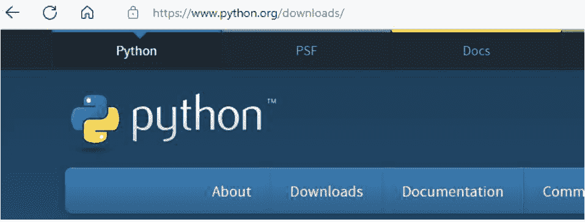

图 1. Python 官方网站

只需向下滚动主页，找到如图所示的 3.8 版本。然后你可以点击下载。


我也在 Ubuntu 上工作过。在那里使用命令行安装也很容易，但当你想使用 Python 3.x 时问题就来了，因为 Linux（Ubuntu）默认显示的是 2.7 版本。设置环境路径、bash 文件、设置这个那个……这很棘手。
在 Windows 上，如果发生这种情况，设置路径非常容易。为了避免这些问题，另一个有用的方法是通过一些包来下载 Python。最流行的包是 **Anaconda Package**。你可以访问 Anaconda 的官方网站，从那里下载最新版本。

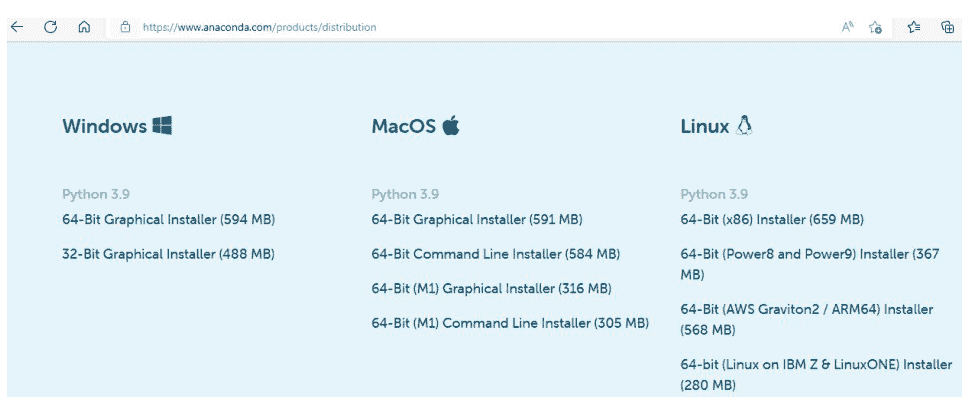

图 2. Anaconda 下载页面

但最近，Anaconda 已经停止支持 32 位 Linux 和 Mac OS 的 Anaconda 包。Anaconda 是一个安装起来比较庞大的软件，因为它预装了大量的模块和包。替代方案是 Miniconda。它是一个轻量级版本，安装速度快。但你需要根据自己的需求单独安装包。另一个重要的优势是，Anaconda Package 还为你提供了两个 IDE：Jupyter Notebook 和 Spyder。

Jupyter notebook 是我最喜欢的 IDE，我在这里的所有工作都将使用它。它是唯一一个**基于浏览器的 IDE**。它会随 Anaconda Package 自动安装。当你点击 Jupyter 时，首先会打开一个 DOS 窗口，如下图所示。

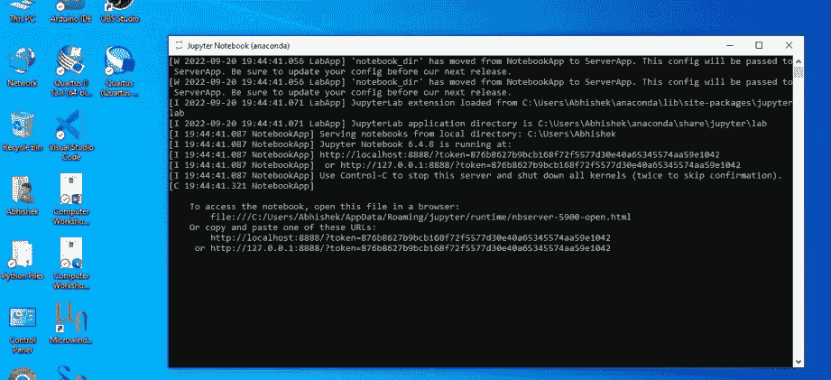

图 3. Anaconda Jupyter 服务器

不要关闭它。等待一段时间，然后你的浏览器会打开，Jupyter 界面将作为本地主机在端口 8888 上打开，如下所示。它是基于浏览器的，但你不需要活跃的互联网连接。请记住，只要你在使用 Jupyter，就不要关闭那个 DOS 窗口。如果你的系统上有多个浏览器，并且你没有设置任何默认浏览器，那么 Jupyter 会要求你选择一个你想要打开它的浏览器。如果你的默认浏览器已经设置好了，它就会直接在该浏览器中打开。

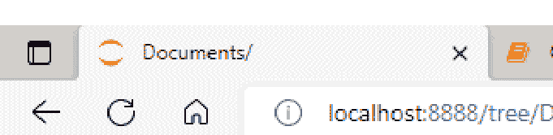

图 4. 本地主机 8888 上的 Jupyter 桌面

Sublime Text 是一个 IDE，它有免费版和付费版。Pycharm 是一个流行的 IDE，被评为工业级产品。不过，无论你想要哪个版本，你都可以尝试一下。现在你明白为什么我不想以艰难的方式花费精力安装软件了吧？因为如今这既取决于操作系统版本，也取决于软件版本。好的。所以，我希望你在安装过程中能借助网络资源。
现在，让我们继续学习基础知识。在本章中，我们将学习一些在任何编程语言中几乎都通用的术语。

## 词元

词元是任何编程语言的小单元。Python 支持 4 种类型的词元：关键字、标识符、字面量和运算符。

## 保留字（关键字）

Python 保留了一组 33 个关键字，用于指定特殊的语言功能。保留字不能用作变量名、函数名或标识符。

Python 中的关键字

| False | class | finally | is | return |
| None | continue | for | lambda | try |
| True | def | from | nonlocal | while |
| and | del | global | not | with |
| as | elif | if | or | yield |
| assert | else | import | pass | |
| break | except | in | raise | |

## Python 标识符

标识符代表可编程的实体，如用户定义的名称、变量、模块和其他对象。标识符可以是小写字母、大写字母、整数或任何组合的序列。标识符名称应以小写或大写字母开头，但不能以数字开头。标识符名称不应是保留字，并且只允许使用下划线（_）作为标识符名称中的特殊字符。

标识符名称的长度不应超过 79 个字符。

## 变量与常量

顾名思义，**变量**意味着可以变化或不是固定的。变量是我们开始编码时遇到的第一个标识符。当我们写 **a = 100** 时，我们执行的是变量赋值。一个常量值 100 被赋给了变量 **a**。

从技术上讲，这意味着在内存通道中的某个地方创建了一个黑盒子，这个盒子被称为**对象**。它保存着值 100（一个常量）。这个对象通过一个称为**变量**的引用来访问。

常量是一种变量类型，它保存的值是不可变的（不能更改）。常量被声明并赋值给一个变量，就像上面的 100 一样。

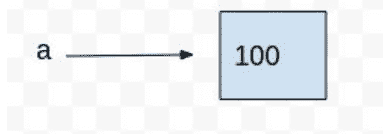

一旦创建，**a** 就可以在语句或表达式中使用，它的值将被替换，之后，如果 **a** 的值被更改并再次使用，将替换为新值。这就是为什么它被称为变量。

## 编写或赋值变量名的规则

Python 中的变量名可以是任何长度（**不含空格**），可以由大写和小写字母（A-Z, a-z）、数字（0-9）和下划线字符（_）组成。最重要的规则是，尽管变量名可以包含数字，但变量名的第一个字符不能是数字。不能使用特殊符号，如 !, @, #, $, % 等。区分大小写。Python 是区分大小写的。编写多词变量名的常用方法有：

- **驼峰命名法（Camel Case）：** 第二个及后续单词首字母大写，以便更容易看清单词边界。
    - 示例：pythonProgrammingUniverse
- **帕斯卡命名法（Pascal Case）：** 与驼峰命名法相同，只是第一个单词也大写。
    - 示例：PythonProgrammingUniverse
- **蛇形命名法（Snake Case）：** 单词之间用下划线分隔。
    - 示例：python_programming_universe

那么，使用哪种命名法呢？没有硬性规定。根据你的需要，你可以选择任何一种命名法。好的，在继续之前，让我们输入我们的第一个内置函数。让我们赋值一个变量，看看如何显示它并检查它。

```
a = 100
print(a)
print(type(a))

100
<class 'int'>
```

要显示结果，使用 **print()** 函数。这是我们学习的第一个函数。我们知道 100 是一个整数，但 Python 是否也将其视为整数呢？要检查这一点，使用 **type()**。只需将变量名与 **type** 一起写在括号内，然后 **print** 结果，如图所示。从技术上讲，这称为传递参数。这里，变量 **a** 是写在括号内的 **type** 的参数，而 **type** 是 **print** 命令的参数。这些命令：**type()** 和 **print()**，也称为内置函数。随着学习的深入，我们将了解许多内置函数。所有关键字都是内置函数。让我们再检查一些类型。

```
a = '100'
b = 100.11
c = "Python"
d = '''Python'''
print(a,b,c,d)
print(type(a))
print(type(b))
print(type(c))
print(type(d))
```

```
100 100.11 Python Python
<class 'str'>
<class 'float'>
<class 'str'>
<class 'str'>
```

所以，如果你看到输出，你可以观察到，使用 **print** 我可以传递任意多个用逗号分隔的参数。而 **type** 一次只能传递一个参数。看看这些类型。如果任何内容写在单引号、双引号或三引号中，Python 将这种数据的类型称为**字符串**。小数值被称为浮点数。这些被称为数据类型。这表明了数据的类型，比如数据是整数、字符还是其他任何东西。广义上讲，Python 中的数据类型可以分类如下：

1. **数字：** Python 支持 4 种类型的数字数据。
    - int（有符号整数，如 10, 2, 29 等）
    - long（长整数，用于更高范围的值，如 908090800L, -0x1929292L 等）
    - float（浮点数，用于存储浮点数，如 1.9, 9.902, 15.2 等）
    - complex（复数，如 2.14j, 2.0 + 2.3j 等）

**字符串：** 字符串是用引号括起来的字符序列。

**列表：** 列表类似于 C 语言中的数组。列表可以包含不同类型的数据。列表中存储的项目用逗号（,）分隔，并包含在方括号 [] 中。

**元组：** 元组在许多方面与列表相似。与列表一样，元组也包含不同数据类型的项目集合。元组的项目用逗号（,）分隔，并用括号（）括起来。

**字典：** 字典是一个键值对项目的有序集合。

无需担心。列表、元组、字典和字符串稍后将详细讲解。目前，只需阅读并记住这些名称。当我们稍后学习这些内容时，会更频繁地使用**type()**。

## 字面量

字面量被定义为赋予变量或常量的数据。Python有6种字面量：字符串、数值、布尔值、集合、集合和字典。

## 运算符

在Python中，运算符是用于执行计算（无论是数学计算还是逻辑计算）的特殊符号。**操作数**使用**运算符**来执行**操作**。运算符的类型在python.org和许多网络资源上有详细解释。这里，我从多个来源汇编了运算符，并尝试以清晰的方式进行解释。让我们开始吧。

### 算术运算符

算术运算符在两个操作数之间执行算术运算。它包括 +（加法）、-（减法）、*（乘法）、/（除法）、%（取余）、//（整除）和幂运算（**）。

| 运算符 | 操作 | 示例 |
| :--- | :--- | :--- |
| + | **加法** | A = 10, B = 5 则, A + B = 15 |
| - | **减法** | A = 10, B = 5 则, A - B = 5 |
| * | **乘法** | A = 10, B = 5 则, A * B = 50 |
| / | **除法** | A = 9, B = 2 则, A / B = 4.5 |
| % | **取余** | A = 11, B = 5 则, A % B = 1 |
| ** | **幂运算** | A = 5, B = 2 则, A ** B = 25 |
| // | **整除** | A = 5, B = 2 则, A // B = 2 |

现在，在学习了算术运算符之后，让我们在继续之前讨论一个重要话题。我能将一种数据类型转换为另一种吗？我的意思是，我能将**i = 5**转换为字符串，或者将**i = '5'**转换为整数或浮点数吗？答案是，可以。当我们写**i = 5**时，Python会自动理解它是一个整数。我们不必像**int i = 5**那样提及或编写。这被称为**动态类型语言**。如果你熟悉C、C++或Java等语言，我们必须这样写，**int i = 5**，因此它们被称为**静态类型语言**。让我们将一个整数和一个字符串相加。

```
a = 5
b = '5'
print(a+b)
```

```
---------------------------------------------------------------------------
TypeError                                 Traceback (most recent call last)
<ipython-input-1-72c4fca5d33c> in <module>()
      1 a = 5
      2 b = '5'
----> 3 print(a+b)

TypeError: unsupported operand type(s) for +: 'int' and 'str'
```

哎呀！！出错了。我们的第一次操作就出错了。我该怎么办？在放弃希望并删除Python软件之前，让我们先看看错误信息。它说**对于+号，两个操作数int和str是不支持的。** 你自己想想，你能把一个苹果和数字5相加吗？我可以将5与5相加，我可以将一个苹果与另一个苹果相加得到两个苹果，但我不能将一个数字与一个字符相加。这就引出了类型转换。将一种数据类型转换为另一种的过程称为**类型转换**或**类型强制转换**。只需在变量名外的括号内写上**int**或**str**即可转换数据类型。让我们看一些例子。

```
a = 5
b = '5'
print(a+int(b))
```

10

```
a = 5
b = '5'
print(float(a)+int(b))
```

10.0

```
a = 5
b = '5'
print(str(a)+b)
```

55

我想现在清楚如何以及为什么进行类型转换了。让我们看一些算术运算的例子。

```
a = 5
b = 3
print(a+b)
print(a-b)
print(a*b)
print(a/b)
print(a//b)
print(a%b)
print(complex(a,b))
```

8
2
15
1.6666666666666667
1
2
(5+3j)

我们可以让输出更有意义。如果我们在引号中写任何内容，它将按原样显示，当然，没有类型转换。让我们使上述代码的输出更易于阅读。

```
a = 5
b = 3
print('Add:',a+b)
print('Subtract:',a-b)
print('Product:',a*b)
print('Division with floating point answer:',a/b)
print('Division with non-floating point answer:',a//b)
print('Remainder:',a%b)
print('Complex:',complex(a,b))
```

Add: 8
Subtract: 2
Product: 15
Division with floating point answer: 1.6666666666666667
Division with non-floating point answer: 1
Remainder: 2
Complex: (5+3j)

### 比较运算符

比较运算符比较两个操作数的值，并相应地返回布尔值真或假。

| 运算符 | 操作 | 示例 |
| :--- | :--- | :--- |
| == | 等于 | A = 10, B = 10 则, A == B 为 True |
| != | 不等于 | A = 10, B = 5 则, A != B 为 False |
| <= | 小于或等于 | A = 10, B = 5 则, A <= B 为 False |
| >= | 大于或等于 | A = 9, B = 2 则, A >= B 为 True |
| > | 大于 | A = 11, B = 5 则, A > B 为 True |
| < | 小于 | A = 5, B = 2 则, A < B 为 False |

### 赋值运算符

赋值运算符将右侧表达式的值赋给左侧操作数。

| 运算符 | 操作 | 示例 |
| :--- | :--- | :--- |
| = | 被赋值为等于 | A = 5 |

### 增强赋值运算符

单个等号（=）用于将值赋给变量。增强赋值运算符用作表示算术和位运算符的简写符号。

| 运算符 | 操作 | 示例 |
| :--- | :--- | :--- |
| += | 加并赋值回新值 | a += 5 等同于 a = a + 5 |
| /= | 除并赋值回新值 | a /= 5 等同于 a = a / 5 |
| ^= | 幂运算并赋值回新值 | a ^= 5 等同于 a = a ^ 5 |

### 位运算符

位运算符对两个操作数的值执行逐位操作。

| 运算符 | 操作 | 示例 |
| :--- | :--- | :--- |
| & | **按位与** | 如果所有位都是1（高），则输出为1（高） |
| \| | **按位或** | 如果任何位是1（高），则输出为1（高） |
| ^ | **按位异或** | 如果所有位相同，则输出为0（低） |
| ~ | **按位取反** | 如果位是1（高），则输出为0（低），反之亦然 |
| << | **左移** | 左操作数值根据右操作数中的位数向左移动 |
| >> | **右移** | 左操作数值根据右操作数中的位数向右移动 |

### 逻辑运算符

逻辑运算符用于通过计算表达式来做出决策。

| 运算符 | 操作 | 示例 |
| :--- | :--- | :--- |
| and | **逻辑与** | 如果所有输入都是1（高），则输出为1（高） |
| or | **逻辑或** | 如果任何输入是1（高），则输出为1（高） |
| not | **逻辑非** | 如果输入是1（高），则输出为0（低），反之亦然 |

### 成员运算符

成员运算符检查值是否存在于Python数据结构中。如果值存在，则结果值为真，否则返回假。

| 运算符 | 操作 | 示例 |
| :--- | :--- | :--- |
| in | **存在** | A = [10, 20, 30] 则, 10 in A 为 True |
| not in | **不存在** | A = [10, 20, 30] 则, 50 not in A 为 True |

### 身份运算符

身份运算符确定给定的操作数是否具有相同的身份——即，它们是否引用同一个对象。此运算符不同于**等于运算符**，后者意味着两个操作数引用包含相同数据但不一定是同一对象的对象。

| 运算符 | 操作 |
| :--- | :--- |
| is | **如果两侧的引用指向同一个对象，则给出True值。** |
| is not | **如果两侧的引用不指向同一个对象，则给出True值。** |

身份运算符读起来可能令人困惑，但在阅读以下示例后，就不会困惑了。

```
'''文档字符串：身份运算符检查'''

a = 1001
b = 1000 + 1
print(a,b)
print(a == b)
print(a is b)

1001 1001
True
False
```

这里，**a**和**b**都引用值为1001的对象。它们相等。但它们不引用同一个对象。这就是为什么**a is b**显示**False**。当你进行像**a = b**这样的赋值时，Python会创建对同一对象的第二个引用。这可以使用**id()**函数来验证。要查看输出，使用了**print()**函数。另外，如果你观察，第一行中，我在三个单引号内写了一个语句。在Python中，如果我们在三个单引号或双引号内写任何内容，它就变成了多行注释。单行注释使用**#**。注释是不可执行的语句，编译器在编译时会忽略它。注释只是程序员为了让自己和他人理解代码在做什么而编写的。**文档字符串**是一个多行字符串，它不赋值给任何东西。它在源代码中指定，用于记录特定的代码段。

print(id(a))
print(id(b))

3055550400
3055549824

让我们再做一次检查。

```
a = 'Identity Operator Check'
b = a
print(a,b)
print(a == b)
print(a is b)
print(id(a))
print(id(b))
```

Identity Operator Check Identity Operator Check
True
True
3038175888
3038175888

很好。最后再检查一次，以增强信心。

```
a = 101
b = 100 + 1
print(a,b)
print(a == b)
print(a is b)
print(id(a))
print(id(b))
```

101 101
True
True
139238240
139238240

在继续之前，不要仅仅阅读代码和输出就觉得没问题了，请将这段代码与 `a = 1001` 和 `b = 1000 + 1` 的代码进行比较。那么，这里发生了什么？为什么这里是 `True` 而那里是 `False`？嗯，直到 3.7 版本，这是一个有趣的现象。Python 认为前 256 个数字非常常用。因此，对于 256 以内的数字，Python 不会浪费内存来创建具有相同值的另一个变量。两个变量指向相同的内存位置。但超过 256 后，情况就变了。

```
a = 256
b = 255 + 1
print(id(a))
print(id(b))
```

1381725328
1381725328

```
a = 257
b = 256 + 1
print(id(a))
print(id(b))
```

85715568
85715776

**id ()** 是 **Python** 中的一个内置函数。它用于返回对象的 **身份标识**。这个 **身份标识** 在对象的生命周期内必须是唯一且恒定的。两个生命周期不重叠的对象可能具有相同的 **id ()** 值。它类似于 C 语言编程中的内存分配。

## 这个“生命周期”是什么意思？

如前所述，当一个对象被赋值给一个变量时，该对象通过其名称被引用。但数据本身仍然包含在对象中。例如，当我们写 **a = 100** 时，这个赋值创建了一个值为 100 的整数对象，并将变量 **a** 指向该对象。

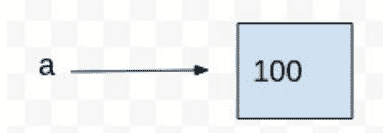

当这个变量被赋值给另一个变量时，比如 **a = b**，并不会创建另一个对象，而是创建了一个指向同一对象的新变量或引用。

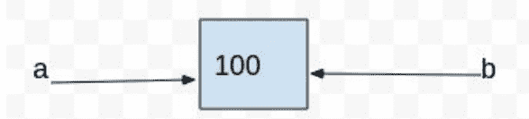

当同一个对象被赋值给另一个变量，但这样写时：**b = 100**。那么，会创建一个指向另一个对象的新引用。

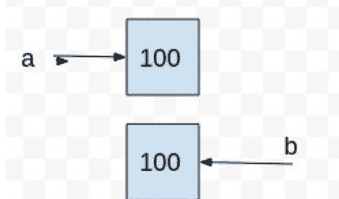

但是当这个变量 **a** 被赋予另一个对象时，**a = 101**，那么它看起来就像这样，

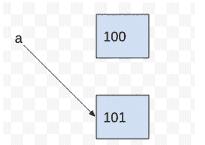

现在对象 100 没有引用了，也无法访问它。这在技术上被称为孤立对象。只要至少有一个引用指向一个对象，该对象就是存活的。当引用为零时，可访问性就为零。这段时间被称为任何对象的生命周期。Python 检测到它不可访问，并回收分配的内存，以便将其用于其他用途。在计算机语言中，这被称为垃圾回收。

在 Python 中，每个对象在创建时都会被赋予一个唯一标识它的数字。必须确保在任何生命周期重叠的时期内，没有两个对象具有相同的标识符。但正如你刚才观察到的，当它失败时，你可能会得到不理想的结果。但这不是你的错。幸运的是，解释器足够智能。所以，如果你觉得你的代码是正确的，但它的行为不同，比如上面的例子，请检查它的身份标识。

## 运算符优先级

运算符优先级是指哪个运算符应该先被求值。当两个运算符共享一个操作数时，具有更高 *优先级* 的运算符将先执行。Python 遵循 **PEMDAS**（括号-指数-乘法-除法-加法-减法）的标准优先级规则，其中 **括号** 优先级最高，**减法** 优先级最低。优先级表如下：

| 运算符 | 操作 |
| :--- | :--- |
| ** | **指数** |
| ~, +, - | 按位取反、一元加和减 |
| *, /, %, // | 乘、除、取模、整除 |
| +, - | 二元加和减 |
| >>, << | 左移和右移 |
| & | 按位与 |
| ^, \| | 按位异或、或 |
| <=, <, >, >= | 比较运算符 |
| <, >, ==, != | 相等运算符 |
| =, %=, /=, //=, -=, +=, *=, **= | 赋值运算符和增强赋值运算符 |
| is, is not | 身份运算符 |
| in, not in | 成员运算符 |
| not, or, and | 逻辑运算符 |

但是，如果两个运算符共享一个操作数，并且运算符具有相同的优先级呢？例如，**a ** b ** c** 应该如何求值？是 **(a ** b) ** c** 还是 **a ** (b ** c)**？

```
print('Without Parenthesis:', 2**5**2)
```

Without Parenthesis: 33554432

```
print('With Parenthesis:', (2**5)**2)
```

With Parenthesis: 1024

这被称为运算符的结合性。求值顺序通常在函数参数中是从左到右。赋值和比较运算符是非结合的。

Python 在求值涉及 **and** 或 **or** 运算符的表达式时，也会使用 *短路求值*。当涉及这些运算符时，除非有必要确定结果，否则 Python 不会求值第二个操作数。

有时，运算符的优先级并不遵循标准的数学规范。在数学中，-1^2 的结果是 1。它被计算为 (-1) ^2，而不是 - (1^2)。这个规则对于所有 C 运算符（其中一元运算符的优先级高于二元运算符）都符合数学惯例，但在添加指数运算符后就不适用了。极客们称之为“设计选择”。不用担心！！熟能生巧。

## Python 中的转义序列

在 Python 字符串中，反斜杠 \ 是一个特殊字符，也称为转义字符。它用于表示某些空白字符：\t 是制表符，\n 是换行符，\r 是回车符。相反，在特殊字符前加上 \ 会将其转换为普通字符。
当存在 'r' 或 'R' 前缀时，反斜杠后面的字符将原样包含在字符串中，所有反斜杠都保留在字符串中。我们稍后将在字符串中使用这些，但这里，我们将对它们的工作原理进行一些概述。Python 中有效的转义字符是，

| 运算符 | 操作 |
| :--- | :--- |
| \' | **字符字面量的单引号** |
| \" | **字符串字面量的双引号** |
| \\ | **字符串字面量的反斜杠** |
| \0 | **Unicode 字符 0** |
| \a | **警报** |
| \b | **退格** |
| \f | **换页** |
| \n | **换行** |
| \r | **回车** |
| \t | **水平制表符** |
| \v | **垂直制表符** |
| \xhh | **使用十六进制表示匹配一个 ASCII 字符（恰好两位数字）** |
| \uhhhh | **使用十六进制表示匹配一个 Unicode 字符（恰好四位数字）** |

让我们看看如何使用这些转义序列。

```
print("Escape \n Sequence")
```

Escape
Sequence

\n 表示换行。所以，它会将字符串分成新行。写在 \n 之后的任何内容都将出现在新行中。另一个广泛使用的转义字符是 \t。使用时，它会在单词之间生成一个制表符空格。

```
print("Escape \t Sequence")
```

Escape    Sequence

你可以通过写一个反斜杠字符 \ 后跟以八进制（基数为 8）或十六进制（基数为 16）表示的 ASCII 码来表示任何字符。在八进制中，数字必须紧跟在反斜杠后面，在十六进制中，必须在数字本身之前写一个 x 字符。让我们用八进制打印 ABC。

```
"\101\102\103"
```

'ABC'

现在用十六进制，

```
"\x41\x42\x43"
```

'ABC'

同样，你可以在需要时使用这些转义字符。

## Python 3.8 有什么新功能？

Python 3.8 的第一个更新是引入了一个名为 **海象运算符** 的新运算符。海象运算符也称为 **赋值表达式**。符号是 **冒号后跟一个等号 (:=)**。这个名字源于从侧面看它时，它与海象的眼睛和獠牙相似。

## 第二章

## 条件语句

条件语句是指当满足特定条件时才会执行的语句。其语法如下：

```
if test expression:
    Body of if
else:
    Body of else
```

例如，我想检查一个数字是偶数还是奇数。根据数学定义，如果一个数能被2整除且余数为零，那么这个数就是偶数，否则就是奇数。这里的条件就是，**除以2余数为零**。这将是期望的条件或真条件。另一个条件是，**除以2余数不为零**。这将是不期望的条件或假条件。条件语句只会给出这两种输出中的一种。用英语我们怎么说呢？**如果**这个数能被2整除且余数为零，那么这个数是偶数，**否则**，它就是奇数。这两个英语单词**If- else**在Python中被称为条件语句。那么，让我们把这个奇偶数讨论作为我们的第一个程序，并学习一些编程基础知识。

## 编写程序，判断一个数是偶数还是奇数？

```
a = int(input("Enter a number:"))
if (a%2)==0:
    print(a,"is an even number")
else:
    print(a,"is an odd number")
```

Enter a number:3
3 is an odd number

如前所述，这里我们取一个数**a**。这个数应该是整数，所以使用**int ()**。我们可以通过写**a = 10**来硬编码它。另一种方式是要求用户输入一个值。这是通过**input ()**来实现的。所以第一行代码是提示用户输入一个整数。我们需要检查这个数是偶数还是奇数。在下一行，我们检查**如果**这个数能被2整除且余数为零，那么就打印这个数是偶数。如果它不是偶数，那么就跳转到**else条件**并打印这个数是奇数。如果你看输出，输入的数字是3。3%2的余数是1，所以，**else条件**会被执行，因此打印的输出是3是一个奇数。让我们检查另一个数字。

```
a = int(input("Enter a number:"))
if (a%2)==0:
    print(a,"is an even number")
else:
    print(a,"is an odd number")
```

Enter a number:10
10 is an even number

这里，数字是10。10%2的余数是0。因此，执行的输出在**if条件**中。这里，我们还需要学习在**print ()**命令中应该写什么。如果你想显示一条消息，就把消息写在引号里。引号内的消息不会改变。这个做法不是硬性规定；它只是让你的显示更有意义、更易读。我们之前在算术运算符之后尝试过同样的事情。让我们再试一些例子。

## 编写程序，找出两个数中哪个更大？

这里，我们至少需要两个数字。然后我们才能比较并说，好的，一个数比另一个数大。假设有两个数：**a**和**b**。我们需要一个比较运算符来比较。

这里我们需要一个**大于 (>)**或**小于 (<)**运算符。然后我们需要检查**如果 a > b，那么打印 a，否则，打印 b**。让我们把它写成代码。

```
a = int(input("Enter first number: "))
b = int(input("Enter second number: "))
if (a > b):
    print("The greater number is",a)
else:
    print("The greater number is",b)
```

Enter first number: 5
Enter second number: 4
The greater number is 5

```
a = int(input("Enter first number: "))
b = int(input("Enter second number: "))
if (a > b):
    print("The greater number is",a)
else:
    print("The greater number is",b)
```

Enter first number: 6
Enter second number: 8
The greater number is 8

## 编写程序，判断一个数是正数还是负数？

我想我们现在可以尝试这个了。如果一个数大于0，那么它是正数，否则，它是负数。

```
a = int(input("Enter a number: "))
if (a > 0):
    print("The number",a,"is positive")
else:
    print("The number",a,"is negative")
```

Enter a number: 5
The number 5 is positive

```
a = int(input("Enter a number: "))
if (a > 0):
    print("The number",a,"is positive")
else:
    print("The number",a,"is negative")
```

Enter a number: -5
The number -5 is negative

让我们尝试使用海象运算符来编写这个程序。

## 编写程序，使用海象运算符判断一个数是偶数还是奇数？

首先，我写一个不使用海象运算符的版本。我之前已经作为我们的第一个程序写过了，但让我们用另一种方式写。

```
num = int(input('Enter the number:'))
rem = num % 2
if num % 2 == 0:
    print(num,'is an even number and the rem is',rem)
else:
    print(num,'is an odd number and the rem is',rem)
```

我做的是，我取一个数，然后将这个数除以2，我想检查余数，所以我使用取模运算符**num%2**。然后我将**num%2**的结果赋值给另一个叫做rem的变量。我将结果与零进行比较。**如果**它是零，那么它是一个偶数，**否则**，它是一个奇数。现在让我们使用海象运算符来写它。

```
num = int(input('Enter the number:'))
if (rem := num % 2) == 0:
    print(num,'is an even number and the rem is',rem)
else:
    print(num,'is an odd number and the rem is',rem)
```

输出将是

```
Enter the number:5
5 is an odd number and the rem is 1

Enter the number:10
10 is an even number and the rem is 0
```

现在，我们有两个不使用海象运算符来判断偶数或奇数的程序，以及一个使用海象运算符的程序。我们能用海象运算符来替代我们的第一个程序吗？如果我们看这里，我们有两行写着相同的语句：**num%2 == 0 和 rem = num%2**。那么，我们在做什么？我们写**rem = num%2**，然后通过写**rem := num%2**将其结果返回给rem，然后检查**如果**这个整个操作的结果是否为0。这就是为什么我在前一章说，你能用海象运算符做的事情，不用它也能做。当有两条语句写着相同的东西时，使用海象运算符。我们将在后面的章节中使用这个运算符，你会发现它更有用。

继续下去，我们可以根据需要拥有任意多个if- else条件。我们也可以有**if里面套if里面再套if**等等。这种条件被称为嵌套If- Else条件。还有另一种条件叫做If- Elif- Else。它的工作方式是**如果**一个条件执行并打印结果，**否则如果**另一个条件执行并打印这个结果，**否则**第三个条件执行并打印结果。其语法如下：

```
if test expression:
    Body of if
elif test expression:
    Body of elif
else:
    Body of else
```

让我们再试一个程序，看看多个if条件和if-elif-else条件的用法。

## 编写程序，使用嵌套if else条件判断一个数是正数还是负数？

赋值表达式在同一个表达式中赋值并返回一个值。我们已经看到了如何赋值然后打印出来。

```
a = 5
print(a)
```

5

现在这个符号，:= 同时赋值和返回。它是这样写的。

```
print(a := 5)
```

5

海象运算符的用处是一个值得探索的主题。你可以放心，无论你能用海象运算符做什么；不用它也能做到。我们将在后面的章节中看到如何以及在哪里可以使用海象运算符，因为这个运算符与循环配合得很好。

谈到优先级，关于海象运算符的优先级没有官方文档。但一个重要的条件是，这个运算符总是写在括号内。括号或圆括号具有最高优先级。而且，这不仅仅是赋值，它同时也在返回。因此，它是一个完整的表达式。也许这就是为什么目前还没有关于其优先级的讨论。

在这里，我们结束本章。我没有深入探讨所有运算符是如何工作的。我觉得运算符最好通过在循环中的使用来理解，而不是简单地写**a + b 或 a > b**。所以，从下一章开始，我们将开始编程，然后我们将学习如何以及何时使用哪个运算符。你目前的任务是记住并牢记这些运算符。

如果一个数字是零，那么它是正数；如果它大于零，那么它也是正数。当数字大于或等于零时，这两个条件都成立。我们可以将它们设置为嵌套条件。**如果**数字大于或等于零，并且**如果**它等于零，则打印零是正数，**否则**，它大于零，则打印该数字是正数。**否则**，它是负数。

```
num = int(input("Enter a number: "))
if num >= 0:
    if num == 0:
        print("Zero")
    else:
        print("Positive number")
else:
    print("Negative number")
```

Enter a number: 15
Positive number

## 编写一个程序，使用 if-elif-else 条件判断一个数字是正数还是负数？

```
num = int(input("Enter a number: "))

if num == 0:
    print("Zero")
elif num > 0:
    print("Positive number")
else:
    print("Negative number")
```

Enter a number: 15
Positive number

现在是时候进行一些练习，看看运算符和 if-else 条件语句是如何工作的了。

## 编写一个程序，判断一个年份是否是闰年？

我们现在准备好使用 if 和 else 条件了。唯一的问题是**条件**。一个年份成为闰年的条件是什么？如果年份能被 4 和 400 整除，但不能被 100 整除，那么该年份就是闰年。让我们来编写代码。

```
year = int(input("Enter the year:"))
if (year%4==0 and (year%400==0 or year%100 != 0)):
    print(year,"is leap year")
else:
    print(year,"is not a leap year")
```

Enter the year:2020
2020 is leap year

```
year = int(input("Enter the year:"))
if (year%4==0 and (year%400==0 or year%100 != 0)):
    print(year,"is leap year")
else:
    print(year,"is not a leap year")
```

Enter the year:2019
2019 is not a leap year

## 编写一个程序，将摄氏温度转换为华氏温度？

根据公式，**华氏温度 = (摄氏温度 * 9/5) + 32**。

```
Celsius = float(input("Enter the temperature:"))
Fahrenheit = (Celsius * 9/5) + 32.
print('The temperature in fahrenheit is:',Fahrenheit)
```

Enter the temperature:37
The temperature in fahrenheit is: 98.6

## 编写一个程序，将华氏温度转换为摄氏温度？

根据公式，**摄氏温度** = (**华氏温度** – 32) * 5/9

```
Fahrenheit = float(input("Enter the temperature:"))
Celsius = (Fahrenheit-32) * 5/9
print('The temperature in celsius is:',Celsius)
```

Enter the temperature:98.6
The temperature in celsius is: 37.0

## 编写一个程序，求一个数的平方根？

数字的平方根值可以通过使用指数运算符 ** 乘以 0.5 来找到。

```
num = int(input("Enter a number:"))
sq_rt = num ** 0.5
print('The square root of',num,'is',sq_rt)
```

Enter a number:8
The square root of 8 is 2.8284271247461903

## 编写一个程序，交换两个变量的内容？

交换意味着互换。如果 a = 5 且 b = 6，那么交换后它们的值将变为 a = 6 且 b = 5。首先，让我们使用两个变量来赋值这两个值。

```
a = 5
b = 6
print(a,b)
```

5 6

现在，Python 提供了一个有趣的一行赋值特性。如果左边有 n 个用逗号分隔的变量，右边有 n 个用逗号分隔的值，那么每个值将按位置分别赋给每个变量。让我们来验证一下。

```
a, b = 5, 6
print(a,b)
```

5 6

让我们检查超过两个值的情况。

```
a, b, c, d = 5, 6, 7, 8
print(a,b,c,d)
```

5 6 7 8

5 被赋给 a，6 被赋给 b，7 被赋给 c，8 被赋给 d。我们将使用 Python 的这个特殊的**单行多重赋值**特性来交换两个变量的值。如果我们写 **a, b = b, a**，那么右边的变量 **b** 将被赋给左边的变量 **a**，右边的变量 **a** 将被赋给左边的变量 **b**。让我们来编写代码。

```
a = int(input("Enter 1st number:"))
b = int(input("Enter 2nd number:"))
if a > b:
    a, b = b, a
    print("The values are a=",a,"and b=",b)
else:
    print("The values are a=",a,"and b=",b)
```

Enter 1st number:5
Enter 2nd number:4
The values are a= 4 and b= 5

现在，改变 a 和 b 的值看看。根据我们的代码，如果 a 小于 b，值不应该被交换。

```
a = int(input("Enter 1st number:"))
b = int(input("Enter 2nd number:"))
if a > b:
    a, b = b, a
    print("The values are a=",a,"and b=",b)
else:
    print("The values are a=",a,"and b=",b)
```

Enter 1st number:4
Enter 2nd number:5
The values are a= 4 and b= 5

它运行得很好。从技术上讲，这个**单行多重赋值**特性被称为元组打包和解包。我们将在后面的元组章节中详细学习这个。在结束本章之前，我们还有最后一件事要考虑。如果我们仔细观察所有代码，会发现遵循了一个特定的模式。在 if 语句或 else 语句之后，下一条语句是在一些空格之后写的。我们能直接写在它下面吗？让我们看看会发生什么？

```
a = int(input("Enter 1st number:"))
b = int(input("Enter 2nd number:"))
if a > b:
a, b = b, a
print("The values are a=",a,"and b=",b)
else:
print("The values are a=",a,"and b=",b)
```

```
File "<ipython-input-12-7ae94add1d9d>", line 4
    a, b = b, a
    ^
IndentationError: expected an indented block
```

发生了一个错误。这是在继续之前需要讨论的最重要的错误。Python 不像其他语言那样有用于语句终止的分号。也没有用于开始和结束任何块的花括号。那么，Python 如何知道某些内容是否写在循环内呢？或者某个语句是否依赖于某个条件？这就是为什么代码的对齐在 Python 中是必要的。即使你的代码完全正确，如果它没有正确对齐，你也会得到一个错误。这个错误被称为缩进错误。所以，记住这个规则：每当循环、函数、类和条件语句开始时，首先写一个冒号。这意味着一个循环开始了。下一行将位于这些循环内部。它将向内缩进 **4 个空格**或 **1 个制表符**。所以，每当一个循环开始时，将你的下一行放在这个循环内 **4 个空格**或 **1 个制表符**的位置。如果一个循环内部还有另一个循环，那么下一行缩进 **8 个空格**或 **2 个制表符**，依此类推，取决于条件。这看起来很复杂，但别担心，通过练习，你会在编写缩进代码方面变得完美。

## 第 3 章

## 循环

当需要一遍又一遍地执行相同的代码块时，这个过程称为迭代，而这种迭代是通过一种称为循环的编程结构来实现的。循环用于改变任何程序的流程，其执行流程默认是顺序的。在许多情况下，希望将任何代码重复多次。为此，Python 提供了不同类型的循环，能够根据需要将任何代码重复多次。

### 循环的优点

- 代码可重用性。
- 无需一遍又一遍地编写相同的代码。
- 可以遍历数据结构的元素。

### 循环的类型

大致分类，有两种类型的迭代：不定迭代和定迭代：

- 在**不定迭代**中，循环执行的次数没有预先指定。只要满足给定条件，指定的代码块就会重复执行。当我们事先不知道迭代次数时，使用 **while 循环**。语句块会一直执行，直到满足 while 循环中指定的条件。它也被称为预测试循环。
- 在**定迭代**中，循环执行的次数没有预先指定。当我们需要执行代码的某部分直到满足给定条件时，使用 **for 循环**。**for 循环**也被称为预测试循环。如果事先知道迭代次数，最好使用 for 循环。

### while 循环

while 循环的语法是：

```
while <expr>:
    <statement(s)>
```

<statement(s)> 指的是要重复执行的主体或代码块。就像我们在 **if-else 条件语句**中读到的那样，这里也将遵循缩进规则。
控制表达式 <expr> 涉及一个（或多个）变量，该变量在循环开始前初始化，然后在循环体中的某处被修改。这个 <expr> 的求值结果为 True 或 False。只要 <expr> 为真，循环就会一遍又一遍地执行。当 <expr> 变为假时，将执行循环体之后的第一条语句。让我们先编写代码来理解这个概念。

### 编写一个程序，打印给定数字下方的所有正数？

我有一个数字，比如 5。我想打印 5 下方的所有正数，即 4, 3, 2, 1, 0。我该怎么做？用英语，我可以说**当**我的数字 5 **大于零**时，我将递减我的数字并每次打印。当 5 变成 4 时，打印 4，4 变成 3 时，打印 3，依此类推。为此，print 语句应该在循环内部。现在让我们来编写代码。

```
n = int(input("Enter a number:"))
while n > 0:
    n -= 1
    print(n)
```

```
Enter a number:5
4
3
2
1
0
```

我认为这段代码很清晰。只要数字 n 大于 0，`n = n-1` 就会执行。首先 n = 5。当 5 > 0 时，n = 5-1 = 4，并且会打印出 4。现在 n = 4。它仍然大于零。所以，n = 4-1 = 3，并且会打印出 3。现在 n = 3。它仍然大于零。所以，n = 3-1 = 2，并且会打印出 2。现在 n = 2-1 = 1，并且会打印出 1。现在 n = 1。它仍然大于零。所以，n = 1-1 = 0，并且会打印出 0。当 n 变为零时，它现在不大于零了，根据理论，True 条件已经执行完毕，程序会退出循环。如果这个 print 语句放在循环外部会怎样？

```
n = int(input("Enter a number:"))
while n > 0:
    n -= 1
print(n)

Enter a number:5
0
```

好的。它只会显示最终的输出。所有值都执行了，但 print 在循环外部，所以不会打印任何值。我们了解到，当 True 条件执行完毕后，循环后的第一条语句会被执行。这里的第一条语句就是 print。

如果我想打印到某个特定值，或者想跳过一些值并打印剩余的值呢？为此，使用了两个关键字：**break** 和 **continue**。**break** 语句会立即完全终止一个循环。**continue** 语句会立即终止当前循环迭代，并跳转到循环的顶部。控制表达式会被重新求值，以确定循环是继续执行还是终止。

```
num = int(input("Enter a number:"))
while num > 0:
    num -= 1
    if num == 2:
        break
    print(num)
print('Done')

Enter a number:5
4
3
Done
```

我们取了一个数字 5。如前所述，5>0，下一行将是 5-1 = 4。然后，它会检查 4 是否等于 2。不相等。所以它不会进入 if 语句的条件内部。4 将被打印。现在 num = 4。4>0，所以下一行将是 4-1 = 3。然后，它会检查 3 是否等于 2。不相等。所以它不会进入 if 语句的条件内部。3 将被打印。现在数字是 3。3>0，下一行将是 3-1 = 2。然后，它会检查 2 是否等于 2。相等。所以它会进入 if 语句的条件内部。if 条件内部有一个 **break** 语句。它会立即终止整个执行，退出循环，而循环外部有一条 print 消息。所以，消息将被打印。让我们看看 **continue** 是如何工作的？

```
num = int(input("Enter a number:"))
while num > 0:
    num -= 1
    if num == 2:
        continue
    print(num)
print('Done')

Enter a number:5
4
3
1
0
Done
```

循环将如上所述执行，直到数字等于 2。当 num 变为 2 时，**continue** 语句会执行当前迭代。2 不会被打印，执行返回到循环顶部。条件被重新求值，它仍然为真。循环恢复，当数字变为 0 时终止，并退出 **while** 循环，打印最终消息。

## while-else 循环

while-else 循环是 Python 的一个独特特性。**else** 子句是可选的。语法如下：

```
while <expr>:
    <statement(s)>
else:
    <additional_statement(s)>
```

当 **while** 循环执行完毕后，**else** 子句会被执行。需要记住的一件重要事情是，如果循环是被 break 语句终止的，**else** 子句将不会被执行。让我们看看它是如何工作的。

```
n = int(input("Enter a number:"))
while n > 0:
    n -= 1
    print(n)
else:
    print('Done')

Enter a number:5
4
3
2
1
0
Done
```

整个 while 循环执行完毕后，else 循环也会被执行。如果我写这个最终的 print 语句时不带 **else** 子句会怎样？

```
n = int(input("Enter a number:"))
while n > 0:
    n -= 1
    print(n)
print('Done')

Enter a number:5
4
3
2
1
0
Done
```

两个答案是一样的。唯一的区别是 **else** 子句认为发生了一个 False 条件。所以，它执行了。而不带 **else** 时，执行是因为 true 条件已经完成，程序退出了循环。循环外部的任何内容都会被执行。它不被视为 True 或 False。它只是一个需要执行的条件。这就是为什么这个 **else 子句** 是可选的。

```
num = int(input("Enter a number:"))
while num > 0:
    num -= 1
    if num == 2:
        break
    print(num)
else:
    print('Done')

Enter a number:5
4
3
```

如前所述，使用 **break** 语句时，**else 子句** 不起作用。在这种情况下，你可以假设它的工作方式类似于 **while num > 0** 的行为类似于 **if (while (num > 0))**，反复执行直到遇到 **break** 条件。由于这里 **while** 的作用类似于 **if**，**else** 将不会像在 **if-else** 情况下那样执行，在那种情况下，要么执行 **if**，要么执行 **else**。

## for 循环

**for 循环** 用于多次迭代语句或程序的一部分。它经常用于遍历数据结构，如列表、元组或字典。

Python 中 for 循环的语法是：

```
for <var> in <sequence>:
    <statement(s)>
```

<sequence> 是一个对象的集合——例如，一个列表或元组。循环体中的 <statement(s)> 通过缩进表示，与所有 Python 控制结构一样，并且对 <sequence> 中的每个项目执行一次。循环变量 <var> 在每次循环中取 <sequence> 中下一个元素的值。让我们编写一些代码来理解这个语法。

```
for letter in 'Python':
    print(letter)

P
y
t
h
o
n
```

我们有一个字符串 'Python'。我们必须打印这个单词 'Python' 的每个字母。所以我们取一个变量 **letter**。有 6 个字母，P, y, t, h, o, n。所以这个循环将迭代 6 次。当 letter 是 1 时，P 将被打印。然后 letter 将变为 2，y 将被打印，依此类推，直到 letter 是 6，n 被打印。

这里，**letter** 是一个变量，我们可以用任何名字代替 letter。

```
for x in 'Python':
    print(x)

P
y
t
h
o
n
```

我们也可以打印字符串中单词的位置。在上面的代码中，x 打印 P, y, t, h, o, n。如果我们赋值 x = 1 并在每次迭代后递增 1，那么它将打印 1 而不是 P，然后 x 将递增到值 2。它将打印 2 而不是 y。这将迭代直到字符串的长度。让我们看看如何编写它。

```
x = 1
for i in 'Python':
    print(x)
    x += 1

1
2
3
4
5
6
```

让我们学习另一个重要的函数，它将经常使用。我们看到每次输出都在新行中打印。如果我们想在同一行打印输出呢？为此，我们将使用 **end** 函数，如下所示。

```
for letter in 'Python':
    print(letter, end = ' ')

P y t h o n
```

这行代码的执行方式如下。**打印 letter = P 之后**，这个函数**用一个空格（“ ”）结束**。在此之前，**letter = P** 之后，有一个无限的空格。现在它被一个空格终止。**letter** 的另一个值将在这个空格之后打印，依此类推。实际上，我们可以在这个双引号之间放置任何东西，它都会被打印。让我们放一个逗号看看。

```
for letter in 'Python':
    print(letter, end = ',')

P,y,t,h,o,n,
```

我想现在清楚了。使用 **end** 完全取决于你希望如何显示你的答案。但正如你看到的上面的输出，即使在打印了最后一个 **letter** 之后，仍然有一个逗号。这是不理想的（即使根据英语标点规则也是如此）。我们如何消除它呢？嗯，对于上面这个特定的问题，我们将学习字符串的一个重要属性。虽然我们将在 **字符串** 章节中学习和练习很多关于这个的内容，但这里我们将先了解一下。它被称为通过其位置（称为索引位置）访问字符串值。字符串 'Python' 的索引位置从 P 开始为零，y 为一，t 为二，依此类推。我们必须将这个字符串赋值给某个变量，比如 **a**。从字符串中访问特定单词的方法是通过在方括号中写入位置以及变量名。让我们看看。

```
a = 'Python'
print(a[0])
print(a[1])

P
y
```

在 Python 中，我们也可以从右到左访问字符串值。最右边的索引位置是 **-1**。然后是 **-2**、**-3**，依此类推。

```
a = 'Python'
print(a[-1])
print(a[-2])

n
o
```

好的。现在让我们回到最初的问题。我们通过编写 **a[-1]** 来访问字符串的最后一个值。如果这个最后一个值也等于我们的 **letter**，即 **a[-1]** 在这里将是 **n**，而我们最后一个 **letter** 也将是 **n**。如果 **a[-1]** 等于 **letter**，那么我们可以用一个空格来**结束**。在所有其他情况下，我们希望用逗号代替空格。这意味着，现在，我们需要 **If 条件，else 条件**，并且这个 **if-else** 条件将在 **for 循环**执行期间持续执行。让我们把它写成代码。

```
a = 'Python'
for letter in a:
    if letter == a[-1]:
        print(letter, end = ' ')
    else:
        print(letter, end = ',')
```

P,y,t,h,o,n

它按预期工作。继续下一个例子。

## 编写程序打印任意数字的所有因子

那么这个问题是什么？这个问题要求**编写一个程序**（即 WAP）来打印或显示任意数字的所有因子。例如，数字是 10。那么我们的输出应该是 1, 2, 5 和 10。因子是那些能整除给定数字且余数为零的值。如果我们取数字 10，那么 1, 2, 5 和 10 将整除 10 且余数为零。那么我们的方法是什么？

1.  取一个数字。
2.  将该数字除以 1, 2, 3… 一直到该数字本身。
3.  如果余数为零，那么只有这些数字才是我们的因子。

现在，让我们把它放入我们的 for 循环语法中。

1.  我们需要一个数字。让我们取一个变量 **a** 并给它赋值，**a = 10**。
2.  我们必须告诉 Python 这个数字是一个数值。这是通过赋值 **int()** 函数来完成的。所以，我们用户定义的运行时输入赋值将写成 **a = int(input("Enter a number:"))**。
3.  让我输入数字 10。现在我想用 1, 2, 3, 4, 5, 6, 7, 8, 9 和 10 来除我的数字。为什么到 10？一个数字只能被它自身整除才能得到零余数。如果我除以 10/11 或 10/12 或任何更大的数字，余数永远不会是零。同样，任何数字都不能被零整除。所以，我们需要从 1 开始一直到那个数字。这里就用到了循环。根据语法，它将写成：**for i in range(1, a)**。这里，**i** 是 1, 2, 3, 4, 5, 6, 7, 8, 9, 10，但一次一个。我们可以这样理解：**i = 1** 并且它在 1 到 10 的范围内。然后，**i = 2** 并且它在 1 到 10 的范围内。然后，**i = 3** 并且它在 1 到 10 的范围内，依此类推，直到 **i = 10** 并且它在 1 到 10 的范围内。
4.  每次检查后，我们将用 **i** 的每个值来除我们的数字 10。如果余数变为零，我们就需要这个 **i** 的值。为此，我们可以写 **if a%i is equal to 0**，那么这个 **i** 就是我们的答案。我们不需要其他 **i** 的值。这个 **%** 是什么？正如我们在运算符中看到的，**%** 用于求余数。最后，为了显示，我们将使用 **print(i)**。
5.  让我们把它写成代码。

```
a = int(input("Enter a number:"))
for i in range(1, a):
    if a%i == 0:
        print("The factors are:",i)
```

Enter a number:10
The factors are: 1
The factors are: 2
The factors are: 5

所以，我们得到了预期的一切。但如果你观察，10/10 的余数也是零。但这里没有打印 10。为什么？这是因为在 **for 循环**中，当我们写 **for i in range(1,a)** 时，它运行 **a-1 次迭代。**如果我们想让它运行 **a 次迭代**，我们必须写成 **(a + 1)**。

```
a = int(input("Enter a number:"))
for i in range(1, a+1):
    if a%i == 0:
        print("The factors are:",i)
```

Enter a number:10
The factors are: 1
The factors are: 2
The factors are: 5
The factors are: 10

同时，我们绝不能忘记缩进规则。我们知道 **i = 2 在 1 到 10 的范围内**，如果发生这种情况，10 必须被这个 i 的值整除。同样，我们再次知道 **i = 3 在 1 到 10 的范围内**，如果发生这种情况，10 必须被这个 i 的值整除。但我们的 Python 不知道这一点。这就是为什么我们使用 4 个空格或 1 个制表符将光标定位在循环内部。它会这样读取：

i 的值是 1。它位于 1 到 10 之间的范围内。那是 **for 循环**行。好的，然后进入内部检查下一行。这是 **if 语句**。如果 **a**，即 10，能被 i 整除，目前 i 是 1，**(a%i ==0)**，**打印 1**。然后它将再次跳转到 **for 循环**行。现在我有值 2。2 在 1 到 10 的范围内。如果 10%2==0，打印 2。它再次跳转到 **for 循环**。现在它变成 3。3 在 1 到 10 的范围内。10%3 不等于 0。所以 3 不会被打印。这个循环周期一直持续到 i 变成 10。

这里，**if 语句**在 **for 循环**执行时执行。同样，**print() 语句**在 **if 语句**执行时执行。它们是相互依赖的。当我们以这种方式编写时，Python 理解这一点；彼此嵌套。由于 Python 中没有括号和分号，对齐是 Python 知道接下来必须执行哪一行的唯一方式。这种书写模式称为缩进。但有一件事可以让你放心，当只出现缩进错误时，你的代码是正确的，只是对齐有问题。

如何在这里使用 **end 函数**？

```
a = int(input("Enter a number:"))
for i in range(1, a):
    if a%i == 0:
        print(i, end = " ")
```

Enter a number:10
1 2 5

这行代码这样执行。**在打印 i = 1 之后，用 (" ") 中表示的单个空格结束空格。**在此之前，在 **i = 1** 之后，有无限的空格。现在它被一个空格终止。另一个 **i** 的值将在这个空格之后打印，依此类推。实际上，我们可以在这个双引号之间放置任何东西，它都会被打印出来。让我们放一个逗号看看。

```
a = int(input("Enter a number:"))
for i in range(1, a+1):
    if a%i == 0:
        print(i, end = ",")
```

Enter a number:10
1,2,5,10,

这里也是，即使在得到最后一个数字后，它也打印了一个逗号。由于输入是一个数字，我们不需要索引定位。我们希望当这个 **i** 等于数字本身时，之后不应该打印任何东西。也就是说，在这种情况下，当 **i = 10 且 a = 10 时，打印 10 并以空格结束。**对于所有其他情况，如上所述进行。让我们检查一下。

```
a = int(input("Enter a number:"))
for i in range(1, a+1):
    if i == a:
        print(a, end = " ")
    else:
        if a%i == 0:
            print(i, end = ",")
```

Enter a number:10
1,2,5,10

所以，我们已经详细理解了循环如何工作以及 **for 循环**如何工作。就像 **while-else** 一样，Python 也提供了 **for-else 循环**。这意味着，在 **for 循环**的可迭代对象中查找某个项目，**else** 如果没有找到，则执行写在 **else 条件**中的语句。让我们尝试下一个程序。我们有一个密码作为输入。如果用户输入 3 次错误的密码，那么将显示一条消息，提示尝试了 3 次错误的密码。我们将在 **else 条件**中写下这条消息。程序将如下所示。

```
for i in range(3):
    pwd = input('Enter password: ')
    if pwd == 'python':
        print('Correct Password!')
        break
else:
    print('3 incorrect password attempts')
```

Enter password: hello
Enter password: hi
Enter password: bye
3 incorrect password attempts

我想这个程序现在很清楚了。现在我将给出正确的输入来检查是只有 **if** 条件执行还是 **else** 也执行。

```
for i in range(3):
    pwd = input('Enter password: ')
    if pwd == 'python':
        print('Correct Password!')
        break
else:
    print('3 incorrect password attempts')
```

Enter password: python
Correct Password!

只执行了 **if** 条件。如果没有 **break** 语句会怎样？

```
for i in range(3):
    pwd = input('Enter password: ')
    if pwd == 'python':
        print('Correct Password!')
else:
    print('Few incorrect password attempts')
```

输出是

Enter password: python
Correct Password!
Enter password: hello
Enter password: hi
Few incorrect password attempts

由于没有 **break 条件**，即使在得到正确密码后，**for** 循环又执行了两次。我输入了两次错误的密码。执行完 **for 循环**后，**else 条件也被**执行了。

现在，是练习时间了。

## 编写程序打印给定数字的乘法表？

我需要打印任意数字的乘法表。让数字是 10。表格看起来像，10 x 1 = 10, 10 x 2 = 20, 10 x 3 = 30，依此类推。直到什么时候？直到 10 x 10 = 100（比如说）。我们可以有任何结束值。所以，10不会改变，乘号 x 和等号 = 保持不变。变化的值是 1，然后是 2，接着是 3，依此类推。我们将其记为 i。代码如下所示。

```
a = int(input("Enter the number:"))
for i in range (1, a+1):
    print(a,'x',i,'=',(a*i))
```

Enter the number:10
10 x 1 = 10
10 x 2 = 20
10 x 3 = 30
10 x 4 = 40
10 x 5 = 50
10 x 6 = 60
10 x 7 = 70
10 x 8 = 80
10 x 9 = 90
10 x 10 = 100

## 编写程序打印给定数字的阶乘？

根据数学定义，一个数的阶乘是所有小于等于该数的正整数的乘积。例如，5 的阶乘写作 1x2x3x4x5 = 120。所以，阶乘从 1 开始。然后它乘以 1，阶乘的新值变为 1。当 i = 2 时，阶乘变为 1x2。当 i = 3 时，阶乘变为 1x2x3，依此类推。让我们来编写代码。

```
a = int(input("Enter the number:"))
fact = 1
for i in range (1, a+1):
    fact = fact * i
print('The factorial of',a,'is',fact)
```

Enter the number:5
The factorial of 5 is 120

我们将用另一个输入 100 来验证。

```
a = int(input("Enter the number:"))
fact = 1
for i in range (1, a+1):
    fact = fact * i
print('The factorial of',a,'is',fact)
```

Enter the number:100
The factorial of 100 is 93326215443944152681699238856266700490715968264381621468592963895217599993229915608941463976156518286253697920827223758251185210916864000000000000000000000000

如果你熟悉 C、C++ 或 Java 等编程语言，那么你一定知道，对于输入 100，基本的阶乘程序逻辑将无法工作。在 Java 中，有一个专门的类叫做 BigInteger 类来处理大数值。在 C 语言中，根据编译器的不同，可能会产生错误或垃圾值。如果你还没有尝试过，可以试试看。

## 编写程序打印给定数字的斐波那契数列？

斐波那契数列以两个数字开始：a, b。生成的第三个数字将是 (a + b) 的和。例如，如果斐波那契数列要打印到数字 5，并且前两个数字是 1, 1。那么，数列生成如下：1, 1, 然后是 2(1+1), 3(1+2), 5(3+2)。新数字是通过将前两个数字相加生成的。我们将从 a, b 开始，然后在循环迭代期间，将 (a+b) 的值赋给 **a**，将 **b** 的值赋给 a。

```
a = int(input("Enter 1st number:"))
b = int(input("Enter 2nd number:"))
n = int(input("Generate Fibonacci Series upto:"))
for i in range(2,n+1):
    a,b = b,a+b
    print(a, end = ' ')
```

Enter 1st number:0
Enter 2nd number:1
Generate Fibonacci Series upto:10
1 1 2 3 5 8 13 21 34

## 编写程序使用 while 循环打印给定数字的斐波那契数列？

```
a = int(input("Enter 1st number:"))
b = int(input("Enter 2nd number:"))
n = int(input("Generate Fibonacci Series upto:"))
while n>2:
    a,b = b,a+b
    print(a, end = ' ')
    n -= 1
```

Enter 1st number:0
Enter 2nd number:1
Generate Fibonacci Series upto:10
1 1 2 3 5 8 13 21

## 编写程序检查给定数字是质数还是非质数？

如果一个数只能被 1 和它本身整除，那么它就是质数。另外，2 是质数。因此，我们的循环从 2 开始，一直到该数减 1。这是因为该数能被自身整除。我们不需要检查最后一个数。如果该数能被 2 到上限范围之间的任何数整除，那么它就不是质数。

```
a = int(input("Enter 1st number:"))
for i in range(2,a):
    if a%i == 0:
        print(a,"is not prime number")
        break
else:
    print(a,"is prime number")
```

Enter 1st number:11
11 is prime number

用另一个输入 12 进行检查。

```
a = int(input("Enter 1st number:"))
for i in range(2,a):
    if a%i == 0:
        print(a,"is not prime number")
        break
else:
    print(a,"is prime number")
```

Enter 1st number:12
12 is not prime number

## 编写程序打印任意数字的各位数字之和？

获取整数的值并将其存储在一个变量中。使用 while 循环，获取该数字的每一位数字，并将这些数字相加到一个变量中。最后，打印该数字的各位数字之和。

```
num=int(input("Enter a number:"))
sod=0
while(num>0):
    temp=num%10
    sod=sod+temp
    num=num//10
print("The total sum of digits of number is:",sod)
```

Enter a number:786
The total sum of digits of number is: 21

## 编写程序检查给定数字是否为阿姆斯特朗数？

一个 n 位数，如果其每个数字的 n 次幂之和等于该数本身，则称为**阿姆斯特朗数**或**自恋数**。例如，153 有 3 位数字，因此，1 的 3 次方加上 5 的 3 次方加上 3 的 3 次方等于 153。因此，153 是一个阿姆斯特朗数。

通用公式是，

```
abcd... = a^n + b^n + c^n + d^n + ...
```

153 的例子是：

```
153 = 1*1*1 + 5*5*5 + 3*3*3
```

```
num = int(input("Enter a number: "))
order = len(str(num))
sum = 0
temp = num
while temp > 0:
    digit = temp % 10
    sum += digit ** order
    temp //= 10
if num == sum:
    print(num, "is an Armstrong Number")
else:
    print(num, "is not an Armstrong Number")
```

Enter a number: 320
320 is not an Armstrong Number

## 编写程序打印任意数字的各位数字之和，直到它变成一位数？

```
num=int(input("Enter a number:"))
sod=0
while(num>0):
    temp=num%10
    sod=sod+temp
    num=num//10
if sod == 0:
    print(0);

if sod % 9 == 0:
    print(9)
else:
    sod = sod % 9
print("The total sum of digits of number is:",sod)
```

Enter a number:786
The total sum of digits of number is: 3

## 编写程序打印指定范围内的所有质数？

```
a = int(input("Enter the lower range:"))
b = int(input("Enter the upper range:"))

print("Prime numbers between",a,"and",b,"are:")

for num in range(a, b + 1):
    if num > 1:
        for i in range(2, num):
            if (num % i) == 0:
                break
        else:
            print(num, end = ' ')
```

Enter the lower range:1
Enter the upper range:100
Prime numbers between 1 and 100 are:
2 3 5 7 11 13 17 19 23 29 31 37 41 43 47 53 59 61 67 71 73 79 83 89 97

## 编写程序打印以下正方形图案？

```
* * * *
* * * *
* * * *
* * * *
```

这里我们需要两个循环，一个嵌套在另一个内部。由 **j 循环**控制的内层循环将打印列。由 **i 循环**控制的外层循环将打印行。根据给定的图案，行数 **a = 4**，即 i = 0, 1, 2, 3。当 i = 0 时，是第一行
j = 0, 1, 2, 3（每个列号），且 j 的范围为 4，因此，在第一行的每一列（j = 0, 1, 2, 3）打印 4 个星号。下一行是空行。跳转到 i 循环。
当 i = 1 时，是第二行
j = 0, 1, 2, 3（每个列号），且 j 的范围为 4，因此，在第二行的每一列（j = 0, 1, 2, 3）打印 4 个星号。下一行是空行。跳转到 i 循环。
当 i = 2 时，是第三行
j = 0, 1, 2, 3（每个列号），且 j 的范围为 4，因此，在第三行的每一列（j = 0, 1, 2, 3）打印 4 个星号。下一行是空行。跳转到 i 循环。
当 i = 3 时，是第四行
j = 0, 1, 2, 3（列），且 j 的范围为 4，因此，在第四行的每一列（j = 0, 1, 2, 3）打印 4 个星号。下一行是空行。跳转到 i 循环。
当 i = 4 时，它退出循环，因为给定的数字是 4。
代码如下

```
a = int(input("Enter the no.of rows:"))
for i in range(a): # for printing rows
    for j in range(a): # for printing stars
        print('* ', end = '')
    print() # for printing new line
```

## 编写程序打印以下直角三角形图案？

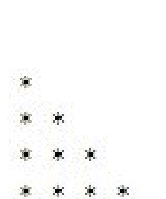

这里我们需要两个循环。一个打印行，另一个打印列。根据给定的图案，行数 a = 4，即 i = 0, 1, 2, 3
当 i = 0 时，是第一行
j = 0, 1, 2, 3（每个列号），且 j 的范围为 0 + 1，因此，在第一行的第一列打印 1 个星号。但第一行的所有其他列将保持为空。下一行是空行。跳转到 i 循环。
当 i = 1 时，是第二行
j = 0, 1, 2, 3（每个列号），且 j 的范围为 1 + 1，因此，在第二行的前两列打印 2 个星号。接下来的两列将保持为空。下一行是空行。跳转到 i 循环。
当 i = 2 时，是第三行
j = 0, 1, 2, 3（每个列号），且 j 的范围为 2 + 1，因此，在第三行的前三列打印 3 个星号。下一行是空行。跳转到 i 循环。
当 i = 3 时，是第四行
j = 0, 1, 2, 3（每个列号），且 j 的范围为 3 + 1，因此，在第四行的所有列打印 4 个星号。下一行是空行。跳转到 i 循环。
当 i = 4 时，它退出循环，因为给定的数字是 4。

```
a = int(input("Enter the no.of rows:"))
for i in range(a): # for printing rows
    for j in range(i+1): # for printing stars
        print('* ', end = '')
    print() # for printing new line
```

## 编写程序打印以下倒置直角三角形图案？

## 编写程序打印以下星号图案？

```
* * * *
* * *
* *
*
```

这里我们需要两个循环。一个用于打印行，另一个用于打印列。根据给定的图案，行数 a = 4，即 i = 0, 1, 2, 3
当 i = 0 时，是第一行
j = 0, 1, 2, 3（每个列号），且 j 的范围为 4 - 0，因此，在第一行打印 4 个星号，覆盖第一行的所有列。下一行为空。跳转到 i 循环。
当 i = 1 时，是第二行
j = 0, 1, 2, 3（每个列号），且 j 的范围为 4 - 1，因此，在第二行打印 3 个星号，覆盖第二行的前三列。最后一列为空。下一行为空。跳转到 i 循环。
当 i = 2 时，是第三行
j = 0, 1, 2, 3（每个列号），且 j 的范围为 4 - 2，因此，在第三行打印 2 个星号，覆盖第三行的前两列。下一行为空。跳转到 i 循环。
当 i = 3 时，是第四行
j = 0, 1, 2, 3（每个列号），且 j 的范围为 4 - 3，因此，在第四行打印 1 个星号，位于第四列。其他所有列为空。下一行为空。跳转到 i 循环。
当 i = 4 时，由于给定的数字是 4，循环结束。

```python
a = int(input("Enter the no.of rows:"))
for i in range(a): # for printing rows
    for j in range(a-i): # for printing stars
        print('* ', end = '')
    print() # for printing new line
```

## 编写程序打印以下数字直角三角形图案？

```
1
12
123
1234
```

这里我们需要两个循环。一个用于打印行，另一个用于打印列。根据给定的图案，行数 a = 4，即 i = 1, 2, 3, 4，因为 i 的范围是从 1 到 5。所以它将从 1 运行到 4。
当 i = 1 时，是第一行
    j = 0, 1, 2, 3（每个列号），并且因为 j 的范围是从 1 到 2，所以，在第一行的第一列打印值 1。其他所有列为空。下一行为空。跳转到 i 循环。
当 i = 2 时，是第二行
    j = 0, 1, 2, 3（每个列号），并且因为 j 的范围是从 1 到 3，所以，在第二行打印值 1 和 2，覆盖第二行的前两列。接下来的两列将保持为空。下一行为空。跳转到 i 循环。
当 i = 3 时，是第三行
    j = 0, 1, 2, 3（每个列号），并且因为 j 的范围是从 1 到 4，所以，在第三行的前三列打印值 1、2 和 3。跳转到 i 循环。
当 i = 4 时，是第四行
    j = 0, 1, 2, 3（每个列号），并且因为 j 的范围是从 1 到 5，所以，在第四行的四列中打印值 1、2、3 和 4。然后跳转到 i 循环。
当 i = 5 时，由于给定的数字是 4，循环结束。

```python
a = int(input("Enter the no.of rows:"))
for i in range(1,a+1): # for printing rows
    for j in range(1,i+1): # for printing values
        print(j, end='')
    print() # for printing new line
```

## 编写程序打印以下数字直角三角形图案？

```
1
22
333
4444
55555
666666
```

这与上面的逻辑类似。唯一的区别是现在我需要打印 i 的值而不是 j。

```python
a = int(input("Enter the no.of rows:"))
for i in range(1,a+1): # for printing rows
    for j in range(1,i+1): # for printing values
        print(i, end='')
    print() # for printing new line
```

那么，回到 Python 的定义，如果一种编程语言广泛使用结构化的控制流构造，如选择（if/then/else）和重复（while 和 for），旨在提高计算机程序的清晰度、质量和开发时间，那么它就被称为结构化编程。

# 第 4 章

## 四大法宝：列表、元组、集合和字典

如果有人想使用 Python 从事数据科学职业，那么，掌握 Python 的四大法宝特性是必须的。

## 列表

从第一个特性开始：列表。脑海中浮现的第一个问题是 Python 中的列表是什么？Python 中的列表是一种内置的数据结构，用于保存一个有序的值序列，因为 Python 编程没有数组的概念。列表类似于 C 或 Java 中的数组。与元组、集合和字典一起，列表在概念上主导着 Python 编程。

## 如何编写一个列表？

让我们编写第一个列表。列表写在方括号内，括号内的元素用逗号分隔。

```python
rainbow = ['violet', 'indigo', 'blue', 'green',
           'yellow', 'orange', 'red']
rainbow
['violet', 'indigo', 'blue', 'green', 'yellow', 'orange', 'red']
```

这里，`rainbow` 是一个变量，它包含一个元素列表，位于方括号内并用逗号分隔。使用单引号是因为元素是非数字的。我们也可以使用 `type` 命令检查这个变量 `rainbow` 的类型。

```python
type(rainbow)
list
```

如你所见，这是一个列表。列表中的元素可以是也可以不是相同类型。例如，上面的列表全是颜色。我们也可以有一个数字列表，比如，

```python
numbers = [1,2,3,4,5]
print(numbers)

[1, 2, 3, 4, 5]
```

使用数字值时不需要包含单引号或双引号。或者，我们也可以有一个包含不同类型元素的列表，比如

```python
alpha_num = [1, 'a', 2, 'b', 3, 'c']
print(alpha_num)

[1, 'a', 2, 'b', 3, 'c']
```

上面的列表既包含字符也包含数字。我们也可以通过将列表写在方括号内来创建一个列表的列表。每个列表也将被包含在它们自己的方括号中。

```python
list_of_lists = [[1, 'a', 2, 'b', 3, 'c'],
                  [1,2,3,4,5],
                  ['violet', 'indigo', 'blue', 'green',
                   'yellow', 'orange', 'red']]

print(list_of_lists)
[[1, 'a', 2, 'b', 3, 'c'], [1, 2, 3, 4, 5], ['violet', 'indigo', 'blue', 'green', 'yellow', 'orange', 'red']]
```

## 可以对列表执行哪些操作？

### 索引

列表中的元素可以通过它们的索引值来访问。位置从 0 开始。也就是说，第一个元素的索引值为 0；第二个元素的索引值为 1，依此类推。要访问任何元素，只需写出列表的名称，后跟方括号内的索引号。

```python
rainbow[0]
```

'violet'

列表 `rainbow` 的第一个元素是 violet。让我们检查几个位置。

```python
alpha_num[2]
```

2

列表的列表呢？

```python
list_of_lists[2]
```

['violet', 'indigo', 'blue', 'green', 'yellow', 'orange', 'red']

它工作正常。`list_of_lists` 中的第二个元素是一个颜色列表。不要被数字 [2] 搞混。索引从 [0] 开始。我们能为一个特定的列表写一个不存在的索引吗？让我们再次检查这个 `rainbow` 列表。

```python
rainbow = ['violet', 'indigo', 'blue', 'green',
           'yellow', 'orange', 'red']
rainbow
```

['violet', 'indigo', 'blue', 'green', 'yellow', 'orange', 'red']

简单地看这个列表，现在你可以说这个列表有六个索引值，从 0 到 6。0 表示 violet，6 表示 red。如果有人写了 7 呢？

```python
rainbow[7]
```

```
IndexError
Input In [18], in <cell line: 1>()
----> 1 rainbow[7]

IndexError: list index out of range
```

正如预期的那样，发生了一个错误。这个错误被称为索引错误。看看这个错误的最后一行。它显示列表索引超出范围。这简单地意味着，无论提到了什么索引值，列表都不包含那么多元素。同样，了解这些基本错误对于故障排除非常方便。Python 中列表索引最有趣的特性之一是，列表也可以从右向左读取和访问。[0] 是我们从左向右移动时的第一个索引位置，而 [-1] 是我们从右向左移动时的第一个索引位置。如果我们想访问列表 `rainbow` 的最后一个元素，那么，我们必须这样写，

```python
rainbow[-1]
'red'
```

```python
rainbow[-2]
'orange'
```

### 切片

切片是最强大的操作之一，当需要列表的一部分时使用。剩余部分被切掉。切片通过使用以下语法执行：

+   1. 列表名 [第一个所需元素的索引值: 最后一个所需元素的索引值]这将返回位于两个指定索引位置之间的所有元素列表，包括第一个元素但不包括最后一个元素。

```
rainbow[1:3]
```

```
['indigo', 'blue']
```

这里使用的索引位置是[1:3]。[1]是靛蓝色的索引位置，它将被包含。[3]是绿色的索引位置，它将被排除。因此，从靛蓝色开始到绿色之前的所有元素都会被打印出来。查看rainbow列表，靛蓝色和蓝色是剩下的元素，其他所有元素都被切片掉了。

## 2. 列表名 [第一个所需元素的索引值:]

这意味着从给定索引位置开始的所有元素都将被包含，直到最后一个值。因为没有指定最后一个所需的索引位置，我将其视为无穷大。理论上，无穷大之前的最后一个值就是列表的最后一个值。

```
rainbow[2:]
```

```
['blue', 'green', 'yellow', 'orange', 'red']
```

如你所见，列表从索引位置[2]（即蓝色）开始，并包含所有剩余元素，直到最后一个元素（即红色）。

## 3. 列表名 [ : 最后一个所需元素的索引值]

这将包含从起始索引位置到列表倒数第二个元素的所有元素，切掉最后一个元素。

```
rainbow[:6]
```

```
['violet', 'indigo', 'blue', 'green', 'yellow', 'orange']
```

紫色是第一个元素，橙色是rainbow列表中索引为[5]的倒数第二个元素。红色被切掉了。
与负索引类似，Python中也支持负切片。

```
rainbow[2:-1]
['blue', 'green', 'yellow', 'orange']
```

```
rainbow[2:6]
['blue', 'green', 'yellow', 'orange']
```

我们现在知道[-1]是列表的最后一个索引位置。所以，rainbow[2:-1]将包含索引位置[2]，但会取索引值[-1]之前的那个元素。这类似于写rainbow[2:6]。
另一个需要记住的重要切片语法是[: : -1]。这个特殊操作将返回列表的一个反转副本。两个冒号后面跟着-1，全部在方括号内。这在解决许多问题时非常有用。

```
rainbow[::-1]
['red', 'orange', 'yellow', 'green', 'blue', 'indigo', 'violet']
```

整个列表被反转了。

## 列表的可变性

列表是可变的。这意味着列表可以被修改。根据需求，值可以被更改和重新赋值。让我们看看如何更改一个列表。以数字列表为例，

```
numbers = [1,2,3,4,5]
print(numbers)
```

[1, 2, 3, 4, 5]

让我们先添加一些新数字，然后删除一些。首先重新赋值整个列表，

```
numbers = [1,2,3,4,5,6,7,8,9,10]
print(numbers)
```

[1, 2, 3, 4, 5, 6, 7, 8, 9, 10]

现在在3的位置添加两个新数字11和12。我们将使用切片方法。3的索引值是[2]。让我们看看接下来会发生什么？

```
numbers[2:3] = [11,12]
print(numbers)
```

[1, 2, 11, 12, 4, 5, 6, 7, 8, 9, 10]

这将数字11和12重新赋值到了3的位置，即索引位置[2]或第三个元素。[2:3]意味着第2个索引位置或第3个元素被给定的值替换。这里，我们有两个值要替换到这个位置，11和12。让我们把3也加回来。

```
numbers[2:2] = [3]
print(numbers)
```

[1, 2, 3, 11, 12, 4, 5, 6, 7, 8, 9, 10]

所以，这意味着[2:2]等同于“用给定的值替换第2个索引值或第2个元素”，这里是3。让我们在这个列表的最后位置添加另一个数字。这个列表有11个索引位置。需要索引位置[12]才能在最后位置添加一个数字。

```
numbers[12] = [13]
print(numbers)
```

```
---------------------------------------------------------------------------
IndexError                                Traceback (most recent call last)
~\AppData\Local\Temp\ipykernel_5140/582444687.py
----> 1 numbers[12] = [13]
      2 print(numbers)

IndexError: list assignment index out of range
```

出错了！！！为什么会这样？如果我们分析这个错误，它是索引错误。所以，一旦列表被创建，它的长度或范围就由Python确定。然后，元素就不能被添加到最后位置。我们能把13添加到其他位置吗？

```
numbers[10] = 13
print(numbers)
```

[1, 2, 3, 11, 12, 4, 5, 6, 7, 8, 13, 10]

它工作了。现在让我们删除数字并恢复我们原来的数字列表。Del命令用于执行删除操作。索引可用于删除单个元素。

```
del numbers[3]
print(numbers)
```

[1, 2, 3, 12, 4, 5, 6, 7, 8, 13, 10]

要删除一批数字，可以将切片与**del**命令一起使用。

```
del numbers[3:5]
print(numbers)
```

[1, 2, 3, 5, 6, 7, 8, 13, 10]

可以看到，索引位置3和4的数字已被删除。

## 字符串连接

它用于连接两个列表，并且顺序也会保持。使用“+”号将两个列表连接在一起。

```
numbers = [1,2,3,4,5]
vowels = ['a','e','i','o','u']
print(numbers + vowels)
```

[1, 2, 3, 4, 5, 'a', 'e', 'i', 'o', 'u']

```
print(vowels + numbers)
```

['a', 'e', 'i', 'o', 'u', 1, 2, 3, 4, 5]

## 列表函数

Python列表上有许多内置函数。一些常见的函数是：
**len ()**：它返回列表的长度，即列表中有多少个元素。

```
numbers = [1,2,3,4,5,6,7,8,9,10]
print(numbers)
```

[1, 2, 3, 4, 5, 6, 7, 8, 9, 10]

```
len(numbers)
```

10

**max ()**：它返回列表中元素的最大值。列表必须是数字类型。

```
max(numbers)
```

10

对于字符串类型的元素，它会比较并给出最大值。

```
my_str = ['1','2','3','4','5']
print(my_str)
['1', '2', '3', '4', '5']
```

```
max(my_str)
'5'
```

但当元素同时是字符串和整数时，它会失败。让我们看看错误。这是类型错误。数据类型不同，因此无法进行比较。

```
alpha_num = [1, 'a', 2, 'b', 3, 'c']
print(alpha_num)
[1, 'a', 2, 'b', 3, 'c']
```

```
sorted(alpha_num)
---------------------------------------------------------------------------
TypeError                                 Traceback (most recent call last)
~\AppData\Local\Temp/ipykernel_5140/3290992670.py in <module>
----> 1 sorted(alpha_num)

TypeError: '<' not supported between instances of 'str' and 'int'
```

**min ()**：它返回列表中元素的最小值。

```
min(numbers)
1
```

**sum ():** 它返回列表中所有元素值的总和。同样，它只对整数或数字数据类型的元素有效。

```
sum(numbers)
55
```

**sorted ():** 它将按升序对列表的元素进行排序。

```
numbers = [15,14,13,12,11,10,9,8,7,6,5,4,3,2,1]
print(numbers)
[15, 14, 13, 12, 11, 10, 9, 8, 7, 6, 5, 4, 3, 2, 1]
```

```
sorted(numbers)
[1, 2, 3, 4, 5, 6, 7, 8, 9, 10, 11, 12, 13, 14, 15]
```

对于字符串数据类型，排序是根据它们的ASCII值进行的。

```
my_list = ['I', 'am', 'Iron', 'Man']
print(my_list)
['I', 'am', 'Iron', 'Man']
```

```
sorted(my_list)
['I', 'Iron', 'Man', 'am']
```

**list ():** 它将任何可迭代的非整数数据类型转换为列表。

```
list('IronMan')
['I', 'r', 'o', 'n', 'M', 'a', 'n']
```

这里的“可迭代”一词是什么意思？看下面的例子，你就会很容易理解。

```
list(2)
---------------------------------------------------------------------------
TypeError                                 Traceback (most recent call last)
~\AppData\Local\Temp/ipykernel_5140/38097... in <module>
----> 1 list(2)

TypeError: 'int' object is not iterable
```

```
list(123)
---------------------------------------------------------------------------
TypeError                                 Traceback (most recent call last)
~\AppData\Local\Temp/ipykernel_5140/41204... in <module>
----> 1 list(123)

TypeError: 'int' object is not iterable
```

```
list('123')
['1', '2', '3']
```

**any ():** 如果Python列表中即使有一个项目的值为True，它就返回True。如果列表为空，则返回False。
**all ():** 如果Python列表中所有项目的值都为True，它就返回True。如果列表为空，则返回True。

## 列表方法

函数是你可以应用于某个结构并获得结果的东西，而方法是你能对它做什么并改变它。以下是 Python 内置的列表方法：

**append():** 用于在列表的最后位置添加任何项目。

```
alpha_num = [1, 'a', 2, 'b', 3, 'c']
print(alpha_num)
```

[1, 'a', 2, 'b', 3, 'c']

```
alpha_num.append('d')
print(alpha_num)
```

[1, 'a', 2, 'b', 3, 'c', 'd']

**extend():** 用于将一个列表的元素作为单个参数添加到另一个列表。它将列表的长度扩展一个。

```
numbers = [1,2,3,4,5]
vowels = ['a','e','i','o','u']
numbers.extend(vowels)
print(numbers)
```

[1, 2, 3, 4, 5, 'a', 'e', 'i', 'o', 'u']

**insert():** 用于在已存在的列表中任意所需位置插入任何项目。

```
numbers = [1,2,3,4,5]
numbers.insert(3,6)
print(numbers)
```

[1, 2, 3, 6, 4, 5]

第一个值是索引位置，第二个值是要插入的项目。(3, 6) 表示在索引位置 [3] 处将值 6 插入到 numbers 列表中。

**remove():** 用于移除列表中存在的任何元素。与 index() 类似，它也检查第一个实例。

```
numbers.remove(6)
print(numbers)
```

[1, 2, 3, 4, 5]

如果任何元素出现多次，则只移除第一个实例。在下面的代码中，6 出现了两次。remove() 将只移除第一个 6。

```
numbers = [1,2,3,6,4,5,6]
numbers.remove(6)
print(numbers)
```

[1, 2, 3, 4, 5, 6]

**pop():** 移除指定索引处的元素，并在屏幕上显示它。当未提及索引位置时，它用于移除并返回列表中存在的最后一个元素。

```
alpha_num = [1, 'a', 2, 'b', 3, 'c']
alpha_num.pop(3)
print(alpha_num)
```

[1, 'a', 2, 3, 'c']

```
alpha_num.pop()
print(alpha_num)
```

[1, 'a', 2, 3]

**clear():** 用于清空列表或使列表为空。

```
alpha_num.clear()
print(alpha_num)
```

[]

```
bool(alpha_num)
```

False

**index():** 给出列表中任何元素的第一个匹配索引。如果任何元素重复，则只考虑第一次出现。它用于搜索列表中存在的任何元素及其位置。

**count():** 给出列表中存在的任何元素的计数。

**sort():** 将列表的元素按升序排列。

**reverse():** 反转列表元素的顺序。

```
numbers = [5,10,9,8,7,6,5,4,3,2,1]
print(numbers)
```

[5, 10, 9, 8, 7, 6, 5, 4, 3, 2, 1]

```
numbers.index(3)
```

8

```
numbers.count(5)
```

2

```
numbers.reverse()
numbers
```

[1, 2, 3, 4, 5, 6, 7, 8, 9, 10, 5]

```
numbers.sort()
numbers
```

[1, 2, 3, 4, 5, 5, 6, 7, 8, 9, 10]

让我们在彩虹列表中搜索橙色。

```
rainbow = ['violet', 'indigo', 'blue', 'green',
           'yellow', 'orange', 'red']
rainbow.index('orange')
```

5

确实如此。橙色存在于第 5 个位置。黑色呢？

```
rainbow.index('black')
```

```
----------------------------------------------------
ValueError
~\AppData\Local\Temp/ipykernel_15100
----> 1 rainbow.index('black')

ValueError: 'black' is not in list
```

哎呀！！！黑色不存在。这是一个包含 7 种颜色的小列表，可以清楚地看到什么存在什么不存在。但想象一个包含 70 或 700 个元素的列表，你必须检查某个特定项目是否属于该列表。也可以使用“in”运算符搜索列表。它以布尔形式给出输出。

```
'black' in rainbow

False
```

```
'red' in rainbow

True
```

有一个重要的函数叫做 **enumerate**。借助这个函数，我们可以打印列表元素及其索引位置。首先让我们在不使用 enumerate 函数的情况下做同样的事情。我有一个包含英雄名字的列表。要获取索引，我需要函数的长度。我的循环将迭代到列表的长度。例如，如果有 4 个元素，那么长度将变为 4，输出将是 0、1、2 和 3。让我们看看如何编写它。

```
heros = ['Wade','The Thing','Mr. Fantastic']
for x in range (len(heros)):
    print(x, heros[x])
```

0 Wade
1 The Thing
2 Mr. Fantastic

列表名称后跟方括号，以 **x** 作为参数，将给出索引值。
另一种方法是使用 **enumerate** 函数。它接受两个值。
第一个值将打印列表元素，第二个值将打印索引。这里，x 和 y 是这两个值。

```
heros = ['Wade','The Thing','Mr. Fantastic']
for x, y in enumerate (heros):
    print(x, y)
```

0 Wade
1 The Thing
2 Mr. Fantastic

默认情况下，索引从零开始。如果你想从其他数字开始，你可以在 **enumerate** 函数中编写如下。

```
heros = ['Wade','The Thing','Mr. Fantastic']
for x, y in enumerate (heros, 2):
    print(x, y)
```

2 Wade
3 The Thing
4 Mr. Fantastic

这里，我写了 2。所以索引从 2 开始。请注意，它就像序列号。它不是从第 2 个索引位置的元素开始。

## 列表推导式

列表推导式是列表最强大的功能之一，用于使用单行从其他可迭代对象创建新列表。虽然它是一个非常强大且独特的功能，但我总是建议在需要时使用列表推导式。这是因为列表推导式确实使你的代码看起来优雅，但与此同时，它更难解释和阅读。让我们开始这个有趣的功能。
任务是编写一个 Python 代码来生成前 10 个数字的平方。任务非常简单。在使用列表推导式之前，让我们使用简单的 for 循环来编写它，就像我们之前理解 for 循环结构时使用的那样。

### 在列表中使用 for 循环：

```
square_list = []
for i in range(10):
    square_list.append(i*i)
print(square_list)

[0, 1, 4, 9, 16, 25, 36, 49, 64, 81]
```

我们所做的是首先创建一个空列表来存储数字的平方。这个列表的名称是 square_list。有 10 个数字由“i”表示。所以“i”将有一个从 0 到 9 的值。这写在代码的第二行。它可以读作“对于从 0 到 9 的 i 值”。在代码的第三行，我们将“i”的值乘以自身以生成平方，然后我们将乘积值存储在空列表 square_list 中。**i = 0** 的第一个值及其平方也是 0。这显示在第一行输出中。**i = 1** 的第二个值。现在我们需要将这个结果与之前的结果一起存储。也就是说，我们需要追加结果。因此我们使用 **append()** 函数。我认为这是一个关于何时使用 **append()** 的清晰概念。让我们使用列表推导式编写代码。

```
square_list = [i*i for i in range(10)]
print(square_list)
```

```
[0, 1, 4, 9, 16, 25, 36, 49, 64, 81]
```

哇！！！这真的很神奇。但是，实际上发生了什么？如果你比较这两个代码，你会观察到这里没有什么花哨的事情发生。通用格式将有助于理解这里刚刚发生了什么。当我们谷歌搜索时，列表推导式的语法可以写成如下：

**List_comprehension = [expression for member in iterable]**

有三个词：
**Expression:** 可以是成员本身、对方法的调用，或任何其他返回值的有效表达式。这里，表达式 i * i 是成员值的平方。
**Member:** 可以是列表或可迭代对象中的对象或值。这里，成员值是 i
**Iterable:** 可以是列表、集合、序列、生成器或任何其他一次返回其元素的对象。这里，可迭代对象是 range (10)。
好的。现在这些是一些奇怪的东西来理解。让我们用英语来理解。

列表中有 **n** 个元素，我希望每个 **n** 元素都被平方，即 **n * n**。我可以说，“我想要 **列表变量** 中每个 **n** 的 **n*n**”。将粗体部分提取出来，放入方括号中。**[n*n for n in list_variable]**。将其赋值给一个变量。搞定！！这就是列表推导式。
让我们再看一些例子。我会详细解释，并尝试用英语句子的方式来写。

## 使用列表推导式编写程序，打印字母数字字符串中所有数字的和。

**解决方案：** 算法应该是什么？

1.  有一个包含字符和数字的字母数字字符串。
2.  将所有这些视为某个值，比如 "i"。
3.  我们想要 int(i)，并且必须检查这个 int(i) 是否是数字，以及它是否存在于输入字符串中。
4.  最后，我们必须对所有这些 "i" 值求和并打印总和。

现在让我们编写代码，

```
my_data = "Hello Sir. I am 65 years old, and, \n          my height is 5 foot 10 inches and, \n          my biceps are 18 inches wide."
my_list = [int(i) for i in my_data if i.isdigit()]
print(my_list)

[6, 5, 5, 1, 0, 1, 8]
```

所以，这是我的输入字符串。你也可以使用 input 命令在运行时提示用户输入字符串。用英语来说就是，“我想要 **my data** 中每个 **i** 的 **整数** 值，前提是检查 **i** 是否是 **数字**。”我使用了反斜杠将字符串换行（没有它，字符串会很长，截图会变得很小且模糊）。

我们得到了数字，但它更像是一个列表。这不是我们想要的。我的列表中有值 65，但它给出了 6, 5。在这种情况下，我们需要一个名为 **split()** 的函数。这个 .split() 是做什么的？

```
my_data = "Hello Sir. I am 65 years old"
my_data.split()

['Hello', 'Sir.', 'I', 'am', '65', 'years', 'old']
```

所以，它是在分离或拆分所有内容。所有这些值都等于 "i"。而我们的要求是获取所有是数字的 "i" 值。让我们将这个函数加入到我们的列表推导式中。

```
my_list = [int(i) for i in my_data.split() if i.isdigit()]
print(my_list)

[65, 5, 10, 18]
```

现在它工作正常了。我想现在清楚上面的代码在做什么了。在计算总和之前，让我们再检查一下：指定 int 的必要性。我们可以写 float(i) 或者只写 i 吗？

```
my_list = [float(i) for i in my_data.split() if i.isdigit()]
print(my_list)

[65.0, 5.0, 10.0, 18.0]
```

```
my_list = [i for i in my_data.split() if i.isdigit()]
print(my_list)

['65', '5', '10', '18']
```

所以，它对所有类型都有效。但如果我们不指定 int 或 float，它默认是字符串（数字在引号中）。因此，指定数据类型是一个好习惯，可以避免任何不必要的错误。现在，让我们计算总和。我将使用 int。

```
my_list = [int(i) for i in my_data.split() if i.isdigit()]
print(sum(my_list))

98
```

最后，我们使用 sum 函数计算总和后打印结果。
再举一个例子。

## 使用列表推导式编写程序，判断学生的成绩是否高于 A+。要求用户在运行时输入科目数量，科目分数应以空格分隔。

**解决方案：** 算法应该是什么？根据题目要求，
1.  首先，必须输入科目数量。由于需要在运行时进行，需要 input() 函数。并且它必须是整数。
2.  其次，输入第一个分数，在输入第二个分数之前需要一个空格。split() 函数会有所帮助。
3.  然后，需要计算分数的平均值。数学上，平均值 = 总分 / 科目总数。sum() 函数将给出总分，科目总数已在上面确定。
4.  最后，可以使用 **if** 条件将获得的平均值与某个参考值进行比较。
现在让我们编写代码，

```
total_subjects = int(input('Enter the total no.of subjects:'))
```

Enter the total no.of subjects:5

如步骤 1 所述，我们定义了一个变量 total_subjects，并提示用户在运行时输入科目总数。这里，输入的科目数是 5。

```
print('Enter the marks of 5 subjects:')
```

Enter the marks of 5 subjects:

这将显示一条消息，要求输入 5 个科目的分数。

```
marks = [int(i) for i in input().split(' ')]
```

75 85 95 80 76

现在是概念部分：marks 是用于存储结果的变量。"i" 有 5 个值，因为有 5 个科目。input() 中的 'i' 是科目数量。i = 第一个科目，然后输入其分数。接着，**for** 循环将为 i 的第二个值执行，即 i = 第二个科目，然后输入其分数。现在这两个分数可以通过用一个空格分隔来分开。然后 **for** 循环将再次执行。这将持续到所有 5 个科目的分数都以空格分隔输入完毕。如前所述，指定 int 是可选的，但它有助于让系统知道需要输入整数值。现在让我们计算平均值。

```
avg = sum(marks)/len(marks)
avg
```

82.2

```
if avg >= 91 and avg <= 100:
    print('Your average score is:',avg,
          'and your grade is A+')
elif avg >= 81 and avg <= 90:
    print('Your average score is:',avg,
          'and your grade is A')
```

Your average score is: 82.2 and your grade is A

最后，计算出平均值并显示结果。你可以添加更多的 **if**、**elif** 和 **else** 条件来显示更多的等级选项。
这就是关于列表推导式的全部内容。你可以在上面的问题中练习一个简单的任务，将 5 个科目的分数以逗号分隔而不是空格分隔存储。
Python 3.8 提供了使用海象运算符尝试列表推导式实验的机会。让我们在这里尝试一些海象运算符。现在，你已经看到列表推导式是一种强大的技术，写起来有点难。而海象运算符更难读和写。所以，提醒一下，请不要不必要地使用这两个概念。如果使用不当，它会使你的代码非常难以解释。

## 使用列表推导式编写程序，使用海象运算符分离任何字符串中存在的零。

为了便于理解，让我们在不使用海象运算符甚至不使用列表推导式的情况下编写代码。

```
data = [0,5,4,3,2,1,0]
res = []
for i in data:
    if i != 0:
        res.append(i)
print('The new list is:',res)
```

The new list is: [5, 4, 3, 2, 1]

我们所做的是，取一个空列表 result，用于存储从输入字符串中移除零后的最终列表。检查输入字符串中存在的数字，如果数字不等于零，我们将该数字附加到空列表 result 中。循环将继续执行，直到检查完输入字符串的所有值。然后，将打印结果。

现在使用列表推导式，代码将如下所示：“我想要 **data** 中每个 **number** 的 **整数** 值，但 **如果** 那个 **number 不等于零**。”

```
res = [int(i) for i in data if i != 0]
print('The new list is:',res)
```

The new list is: [5, 4, 3, 2, 1]

你可能已经理解了推导式来自我解释代码。让我们使用海象运算符编写相同的代码。区别在于我们不需要预先编写 result 变量。我们可以在运行时声明、赋值和使用它。

```
data = [0,5,4,3,2,1,0]
print([res for i in data if (res := int(i)) != 0])
```

[5, 4, 3, 2, 1]

## 使用列表推导式编写程序，使用海象运算符计算给定分数的平均值并显示等级。

我们之前已经计算过这个代码。使用相同的概念，让我们现在用海象运算符写下来。

```
total_subjects = int(input('Enter the total no.of subjects:'))
print('Enter the marks of 5 subjects:')
marks = [int(i) for i in input().split(' ')]
if((avg := sum(marks)/len(marks)) > 90):
    print('Your average score is:',avg,
          'and your grade is A+')
elif avg >= 81 and avg <= 90:
    print('Your average score is:',avg,
          'and your grade is A')
```

Enter the total no.of subjects:5
Enter the marks of 5 subjects:
95 85 75 80 76
Your average score is: 82.2 and your grade is A

前三行是相同的。在代码的第 4 行，我们声明、初始化并为 average 变量赋值。我们使用了 len() 函数来计算 marks 列表的长度，在本例中是 5，因为有 5 个科目。在 elif 条件中，也可以使用 average 变量。所以，我想我们节省了几行代码。
工作正常。但是，记住一件事。在输入最后一个分数后，比如这里是 76；在按回车键之前不要匆忙加空格。否则会发生错误，你会一直想知道发生了什么。为了学习目的，我向你展示这个错误。

```
marks = [int(i)for i in input().split(' ')]
ValueError: invalid literal for int() with base 10: ''
```

这发生是因为我在写完最后一个数字后按了空格键。如果我再给一些分数会怎样？平均分会包含所有这些分数，还是只考虑前5个分数，或者会抛出错误？这是一个需要你去检查的任务。（提示：平均分的公式是找到正确答案的关键。）

在结束列表之前，让我们看看如何将列表转换为字符串。

可以使用“.join()”将列表转换为字符串。根据需要使用带或不带空格的两个引号，一个点运算符，然后是join()函数。此操作将列表中所有存在的字符串粘贴在一起，并将它们作为单个字符串返回。

```
avengers = ['I', 'am', 'IronMan']
avengers
['I', 'am', 'IronMan']
```

```
type(avengers)
list
```

```
my_str = ''.join(avengers)
my_str
'IamIronMan'
```

```
type(my_str)
str
```

这是引号之间没有空格的情况。让我们插入一个空格。

```
my_str = ' '.join(avengers)
my_str
'I am IronMan'
```

这样更具可读性。我们也可以在这里使用推导式。“我想要**字符串**值的**n**，对于**字符串**中存在的每个**n**值，然后**连接**这些获得的n的字符串值，**用单个空格分隔。**”

```
my_str = ' '.join(str(n) for n in avengers)
my_str
'I am IronMan'
```

另一个重要概念是关于嵌套列表，即列表中的列表。让我们看一个例子。

```
my_list = [4,3,2,1,[9,8,7,6,5]]
print(my_list [:])
print(my_list [4])
print(my_list [4][2])
[4, 3, 2, 1, [9, 8, 7, 6, 5]]
[9, 8, 7, 6, 5]
7
```

```
my_list = [[4,3,2,1],[9,8,7,6,5],[10,11,12.3]]
print(my_list[0][2])
print(my_list[1][2])
print(my_list[2][2])
2
7
12.3
```

列表中的列表通过将其写在方括号中来创建。现在它将给出整个括号的索引位置，而不是单个元素。就像在上面的例子中，索引位置零不是值4，而是[4,3,2,1]。要访问嵌套列表中的特定值，我们必须首先键入列表的索引位置，然后是要访问的值的索引位置。就像这里当我们键入[0][2]时，它将转到第一个索引，并在此列表中转到第二个索引位置。

在这里结束我们对列表的讨论已经足够了。接下来，让我们开始另一个重要主题，元组。

# 第5章

## 元组

元组可以被认为是一个不可变的列表，或者一旦创建就不能更改或修改。所以，列表是可变的，而元组一旦在内存中创建，就不能更改。那么问题来了，这个元组的应用是什么？元组基本上用于创建：记录。例如，学生记录或电话簿或一些图书馆记录。一旦输入，条目就不需要更改。

### 如何创建元组？

元组是像列表一样的逗号分隔值，但这里我们使用普通括号，而不是列表中的方括号。但是，是的，使用括号是可选的。不过这是惯例。让我们看看它是什么样子：

```
>>> iron_man = ('Tony Stark', 2009)
>>> iron_man
('Tony Stark', 2009)
```

所以，这是一个元组。与列表的区别相当明显。

```
>>> iron_man = 'Tony Stark', 2009
>>> iron_man
('Tony Stark', 2009)
```

正如我之前提到的，括号是可选的，但这是惯例。没有括号，代码也会顺利运行。类型呢？

```
>>> print(type(iron_man))
<class 'tuple'>
```

它是一个元组。元组支持索引吗？

```
>>> iron_man[0]
'Tony Stark'
```

是的，它支持。现在我想用演员的真实姓名代替屏幕名称。

```
>>> iron_man[0] = 'Robert Downey Jr.'
Traceback (most recent call last):
  File "<pyshell#8>", line 1, in <module>
    iron_man[0] = 'Robert Downey Jr.'
TypeError: 'tuple' object does not support item assignment
```

这就是列表和元组之间的区别。看看错误的最后一行。元组对象不支持项赋值。简单地说，一旦创建，你就不能修改元组内容。我们可以用列表进行交叉验证吗？当然，我们可以检查它是否是一个列表。

```
>>> iron_man = ['Tony Stark', 2009]
>>> iron_man[0]
'Tony Stark'
>>> iron_man[0] = 'Robert Downey Jr.'
>>> iron_man
['Robert Downey Jr.', 2009]
```

我创建了相同的名称和变量，但这次使用方括号，使其成为一个列表。我们可以看到这个列表是可变的。让我们看看元组还有哪些其他区别。

```
>>> iron_man = ('Tony Stark', 2009)
>>> captain_america = ('Steve Rogers', 2011)
>>> civil_war = iron_man + captain_america
>>> civil_war
('Tony Stark', 2009, 'Steve Rogers', 2011)
```

我们可以连接。让我们使用切片和索引进行更多连接。

```
>>> iron_man = ("Tony Stark", 2009)
>>> iron_man = iron_man[:2] + ("Robert Downey Jr.")
Traceback (most recent call last):
  File "<pyshell#33>", line 1, in <module>
    iron_man = iron_man[:2] + ("Robert Downey Jr.")
TypeError: can only concatenate tuple (not "str") to tuple
```

哎呀！！！发生了一个错误。为什么？看看最后一行。它说，**只能将元组（不是“str”）连接到元组。** 这意味着我们正在将元组与字符串连接。但在这里，iron_man是一个元组，而“Robert Downey Jr.”是用普通括号写的。那么，这些中哪一个是字符串？让我们检查一下“Robert Downey Jr.”的类型。

```
>>> new_name = ("Robert Downey Jr.")
>>> type(new_name)
<class 'str'>
```

它显示为字符串。怎么会这样？这意味着括号不是列表和元组之间的真正区别。概念是，当在普通括号中使用单个元素（或多个元素（不特定））时，在关闭括号之前也要使用逗号。

```
>>> new_name = ("Robert Downey Jr.",)
>>> type(new_name)
<class 'tuple'>
```

看看第一行插入的逗号。现在类型是元组。所以，不要被括号搞混了。真正的概念在于逗号与括号的用法。除此之外，只有空元组可以在没有逗号的情况下被接受。

```
>>> avengers = ()
>>> type(avengers)
<class 'tuple'>
```

我们现在可以连接了吗？

```
>>> iron_man = iron_man[:2] + ('Robert Downey Jr.',)
>>> iron_man
('Tony Stark', 2009, 'Robert Downey Jr.')
```

现在它工作正常了。那么，这是元组修改吗？从技术上讲，是的。但不是通过使用append或extend的直接方法。它更像是再次使用先前创建的元组的引用。谈到技术性，列表和元组之间的另一个区别是元组是异构元素的集合，而列表是同构元素的集合。这实际上是一个理想的区别。我们期望当我们创建一个元组时，它是由异构元素组成的，而列表是由同构元素组成的。但在现实中，这是不可能的。所以，列表和元组都可以包含所有可能的数据类型元素。但是，一个固执的老教授可能会介意这个现实与理想的检查！！！无论如何，让我们做一些更多的属性检查。

```
>>> del iron_man[0]
Traceback (most recent call last):
  File "<pyshell#6>", line 1, in <module>
    del iron_man[0]
TypeError: 'tuple' object doesn't support item deletion
>>> 2009 in iron_man
True
>>> iron_man = ('Tony Stark', 2009)
>>> iron_man
('Tony Stark', 2009)
>>> iron_man.remove[0]
Traceback (most recent call last):
  File "<pyshell#16>", line 1, in <module>
    iron_man.remove[0]
AttributeError: 'tuple' object has no attribute 'remove'
```

```
>>> iron_man.pop[1]
Traceback (most recent call last):
  File "<pyshell#17>", line 1, in <module>
    iron_man.pop[1]
AttributeError: 'tuple' object has no attribute 'pop'
>>> del iron_man
>>> iron_man
Traceback (most recent call last):
  File "<pyshell#19>", line 1, in <module>
    iron_man
NameError: name 'iron_man' is not defined
```

这很酷。所以，元组没有remove和pop属性。但它确实支持del命令，尽管项目删除是不可能的。显然，我们可以删除一条记录。我们可以将列表和元组之间的区别总结如下。

- 列表有**append**和**extend**属性，元组没有。
- 列表有remove和pop属性，元组没有。
- 两者都支持索引。
- 两者都支持使用**in**运算符进行搜索。
- 列表是可变的，元组是不可变的。
- 理想情况下，元组应该由异构元素组成，列表应该由同构元素组成。实际上，两者都支持异构结构。

### 元组赋值：打包和解包

元组的一个强大功能是元组赋值。在面试中，这是一个直接的问题：元组打包和解包是什么意思？让我们探索这个非常简单且非常有用的概念。

在元组赋值中，赋值右侧元组的值被分配给左侧的元组。主要要求是左侧的变量数必须与元组中的元素数匹配。也可以说，我们正在将多个项目打包到左侧的一个元组中。

## 第六章

## 字典

字典是另一种具有键和值的数据类型。它类似于关联数组。值与其键相关联。与字符串、列表和元组这些序列类型不同，因为它们的元素有出现顺序，并且使用索引来访问值，而在字典中，使用键来访问值。键映射到值，因此，有时字典也被称为映射类型。键是不可变的。它可以是整数或字符串，但不能是列表。

### 如何编写字典？

字典用花括号表示，其中键和值用冒号分隔。这被称为键-值对。语法看起来像这样，**{键: 值}**。根据数据类型，键和/或值可以写在引号内。让我们创建一个字典。

```
>>> my_dict = {}
>>> type(my_dict)
<class 'dict'>
```

这会创建一个空字典。在学习新东西时，使用 `type()` 命令检查数据类型总是一个好习惯。现在，让我们在这个空字典中添加键和值。

```
>>> my_dict['Iron Man'] = 'Tony Stark'
>>> my_dict['Hulk'] = 'Dr. Bruce Banner'
>>> my_dict
{'Iron Man': 'Tony Stark', 'Hulk': 'Dr. Bruce Banner'}
>>> type(my_dict)
<class 'dict'>
```

很好！！！这样，我们就创建了第一个字典。冒号前的字符串称为键，冒号后的字符串称为与该键关联的值。所有内容都包含在花括号中。我们也可以在一行中直接赋值键-值对。

```
>>> avengers = {1:'Tony', 2:'Steve'}
>>> avengers
{1: 'Tony', 2: 'Steve'}
```

在这段代码中，1 和 2 是键，其值分别为 Tony 和 Steve。让我们从字典中访问任何内容。

```
>>> avengers[2]
'Steve'
>>> avengers[Tony]
Traceback (most recent call last):
  File "<pyshell#23>", line 1, in <module>
    avengers[Tony]
NameError: name 'Tony' is not defined
```

所以，我们只能使用键来访问值，而不能反过来。那么出现顺序呢？正如我们所看到的，我们是通过键而不是索引位置来访问值的，因此，在字典中，键-值对的顺序无关紧要。因此，字典可以是元素的无序集合。这就是为什么字典不支持切片和索引。那么字典还能做什么呢？

### 字典函数

```
>>> avengers = {1:'Tony', 2:'Steve', 3:'Thanos'}
>>> del avengers[3]
>>> avengers
{1: 'Tony', 2: 'Steve'}
```

好的。所以，`del` 对字典有效。使用 `del` 函数后跟字典名和键将删除该特定的键-值对。显然，灭霸不是复仇者！！！如果有两个相同的键会怎样？

```
>>> avengers = {1:'Tony', 2:'Steve', 3:'Thanos', 3:'Thor'}
>>> del avengers[3]
>>> avengers
{1: 'Tony', 2: 'Steve'}
```

两个相同的键-值对都被删除了。但我想让雷神留在字典里。

```
>>> avengers[3] = 'Thor'
>>> avengers
{1: 'Tony', 2: 'Steve', 3: 'Thor'}
```

如果字典中有两个相同的键会怎样？

```
>>> avengers = {1:'Tony', 2:'Steve', 3:'Thanos', 3:'Thor'}
>>> avengers
{1: 'Tony', 2: 'Steve', 3: 'Thor'}
```

所以如果存在相同的键，那么最后一个会被包含。我们还可以计算字典中存在的元素数量。`len()` 函数会有所帮助。

```
>>> len(avengers)
3
```

它返回键-值对的数量。

### 字典方法

字典使用一些强大的方法。第一个方法叫做 `keys()`。这个方法返回所谓的底层键的视图。视图对象与 `range` 对象非常相似。我们也可以遍历视图对象。

这是元组打包。你还可以观察到，这个元组是同质元素的集合。
通过元组解包，我们指的是将右侧元组中的值“解包”到右侧的变量/名称中：

```
>>> (Iron_Man, Captain_America, Black_Widow, Hulk) = avengers
>>> Iron_Man
'Tony'
>>> Captain_America
'Steve'
>>> Black_Widow
'Natasha'
>>> Hulk
'Bruce'
```

这相当令人印象深刻。左侧的元组已被赋予右侧元组的值。有什么限制吗？是的，左右元组的名称应该相同。这里，名称是 `avengers`。

```
>>> (Iron_Man, Captain_America, Black_Widow, Hulk) = not_avengers
Traceback (most recent call last):
  File "<pyshell#18>", line 1, in <module>
    (Iron_Man, Captain_America, Black_Widow, Hulk) = not_avengers
NameError: name 'not_avengers' is not defined
```

如果名称不同，就会出现如上所示的 `NameError`。
应用？Python 提供了一个强大的功能，可以在一行中进行多重赋值，例如交换两个数字，或在一行中为多个变量赋值。我们在前面的章节中已经看到过。让我们进一步探索它。

```
a, b = 4, 5
print(a, b)
```

4 5

值 4 被赋给 **a**，5 被赋给 **b**。如果变量更多而值更少会怎样？

```
a, b, c = 4, 5
print(a, b, c)
```

```
---------------------------------------------------------------------------
ValueError                                Traceback (most recent call last)
<ipython-input-38-4a30644578be> in <module>
----> 1 a, b, c = 4, 5
      2 print(a, b, c)

ValueError: not enough values to unpack (expected 3, got 2)
```

它会给出一个错误。但看看这个语句。它说没有足够的值来**解包**。有 3 个变量，但没有足够的值来分配给这些变量。让我们检查一下，如果值更多而变量更少会怎样？

```
a, b, c = 4, 5, 6, 7
print(a, b, c)
```

```
---------------------------------------------------------------------------
ValueError                                Traceback (most recent call last)
<ipython-input-39-2ebc390c35ac> in <module>
----> 1 a, b, c = 4, 5, 6, 7
      2 print(a, b, c)

ValueError: too many values to unpack (expected 3)
```

它说值太多无法**解包**，而变量较少。有两种方法可以克服这种情况。一种是使用下划线符号。

```
a, b, c, _ = 4, 5, 6, 7
print(a, b, c, _)
```

4 5 6 7

这里，下划线充当一个变量，你也可以打印它。另一种方法是在变量前使用 `*` 作为前缀。

```
a, b, *c = 4, 5, 6, 7, 8, 9, 10
print(a, b, c)
```

4 5 [6, 7, 8, 9, 10]

如果有 3 个变量，并且在第 3 个变量前写了星号，那么无论有多少个值，第 1 个和第 2 个值将被分配给前两个变量，所有剩余的值将被分配给第三个变量。让我们再检查一个例子。

```
*a, b, c = 4, 5, 6, 7, 8, 9, 10
print(a, b, c)
```

[4, 5, 6, 7, 8] 9 10

这里，星号与第一个变量在一起。因此，前 5 个值被分配给第一个变量，接下来的两个值分别被分配给前两个变量。所有这一切之所以可能，都是因为元组打包和解包。元组打包和解包的另一个重要应用是在函数中返回多个值。

```
python
import math
def circle(rad):
    cir = 2 * math.pi * rad
    area = math.pi * rad * rad
    return (cir, area)

rad = int(input("Enter the radius value:"))
print("The circumference and area are:",circle(rad))

Enter the radius value:5
The circumference and area are: (31.41592653589793, 78.53981633974483)
```

可以观察到，我们在 `return` 语句中传递了两个值。这使用了元组打包功能。在完成元组这个主题之前，最后一个问题是，我们如何将列表转换为元组，反之亦然。为此，我们分别使用 `tuple()` 和 `list()` 命令。

```
python
>>> my_list = ['Tony', 'Thanos', 'Cap']
>>> type(my_list)
<class 'list'>
>>> tuple(my_list)
('Tony', 'Thanos', 'Cap')
```

`tuple()` 将列表更改为元组。同样，我们可以使用 `list` 命令将元组更改为列表。

```
python
>>> my_tuple = ('Tony', 'Thanos', 'Cap')
>>> type(my_tuple)
<class 'tuple'>
>>> my_list = list(my_tuple)
>>> my_list
['Tony', 'Thanos', 'Cap']
>>> type(my_list)
<class 'list'>
```

这就是关于元组的全部内容。我们可以继续探讨 Python 中字典的另一个重要特性。

## 字典的迭代与方法

```python
avengers = {1:'Tony', 2:'Steve', 3:'Thor'}
for k in avengers.keys():
    print("The key",k,"maps to",avengers[k])
ks = list(avengers.keys())
print(ks)
```
输出：
```
The key 1 maps to Tony
The key 2 maps to Steve
The key 3 maps to Thor
[1, 2, 3]
```

在字典的 **for** 循环中迭代键已经变得非常普遍，以至于可以忽略 `keys()` 方法调用——迭代字典会隐式地迭代其键：

```python
avengers = {1:'Tony', 2:'Steve', 3:'Thor'}
for k in avengers:
    print("The key",k,"maps to",avengers[k])
```
输出：
```
The key 1 maps to Tony
The key 2 maps to Steve
The key 3 maps to Thor
```

这类似于编写一个没有字典的 for 循环。
要获取所有键的列表，使用 **`keys()`** 方法。要获取所有值，使用 **`values()`** 方法。

```python
>>> avengers.keys()
dict_keys([1, 2, 3])
>>> avengers.values()
dict_values(['Tony', 'Steve', 'Thor'])
```

要获取与各自键关联的键和值，使用 **`items()`** 方法。它将显示键值对作为元组。

```python
>>> avengers.items()
dict_items([(1, 'Tony'), (2, 'Steve'), (3, 'Thor')])
```

检查一个键是否存在于字典中？可以使用 **`in`** 方法。

```python
>>> 1 in avengers
True
>>> 4 in avengers
False
```

在早期版本中，具体来说是在 3 之前，使用 `has_key` 方法。但现在这个属性不再受支持。

```python
>>> avengers.has_key(1)
Traceback (most recent call last):
  File "<pyshell#7>", line 1, in <module>
    avengers.has_key(1)
AttributeError: 'dict' object has no attribute 'has_key'
```

这个方法对于检查键是否存在非常有用。但还有一种也很流行的方法。让我们检查一个不在我们字典中的键。在我们的 avenger 字典中，有 3 个键。看看当我们想检查键 4 时的错误。

```python
>>> avengers[4]
Traceback (most recent call last):
  File "<pyshell#12>", line 1, in <module>
    avengers[4]
KeyError: 4
```

KeyError。这意味着我们正在寻找的键不存在。是的，**`in` 方法**会为此返回 False。但还有另一种方法可以为这种情况返回一个值，即使用 **`defaultdict()`** 方法。这类似于 C 语言的 switch case 的 default 语句。如果未满足任何给定条件，则将分配任何默认值。它将做的是，它不会生成键错误，代码看起来会更...专业。如何使用 **`defaultdict()`**？首先，我们需要使用命令导入它

```python
>>> from collections import defaultdict
```

让我们现在使用它。

```python
from collections import defaultdict
avengers = defaultdict(lambda: 'Not An Avenger')
avengers[1] = 'Tony'
avengers[2] = 'Steve'
avengers[3] = 'Thor'
print (avengers[1])
print (avengers[4])
```

我们在做什么？首先，我们使用 lambda 函数定义字典的默认值。如果键不在字典中，它将返回一个值 **Not An Avenger**，而不是抛出 KeyError。然后，我们简单地创建了一个名为 avengers 的字典，其中有 3 个键及其值。然后我们检查键 1 和键 4。预期结果是 Tony 和 Not an Avenger。

```
Tony
Not An Avenger
```

所以，它工作正常。继续讨论其他字典方法。要从键获取值，我们也使用 **`get()`** 方法。

```python
>>> avengers.get(2)
'Steve'
```

这个方法可以有 2 个参数。第一个是键，第二个参数是你想要返回的值。默认情况下，它是 None。

```python
>>> avengers.get(4, 'Hulk')
'Hulk'
>>> avengers
{1: 'Tony', 2: 'Steve', 3: 'Thor'}
```

这里，我们使用 `get()` 方法传递了两个参数。4 是键，Hulk 是我们想要获取的值。由于 4 不在 avengers 字典中，它返回了我们指定的值。但也要记住，原始字典不受影响。
我们可以使用 **`fromkeys()`** 方法为一组键分配相同的值。

```python
>>> avengers.fromkeys(('Tony','Steve','Thor'),'Avengers')
{'Tony': 'Avengers', 'Steve': 'Avengers', 'Thor': 'Avengers'}
```

我们可以进行多个值赋值吗？

```python
>>> avengers.fromkeys(('Tony','Steve','Thor'),('Rich Avenger','Oldest Avenger','GOD Avenger'))
{'Tony': ('Rich Avenger', 'Oldest Avenger', 'GOD Avenger'), 'Steve': ('Rich Avenger', 'Oldest Avenger', 'GOD Avenger'), 'Thor': ('Rich Avenger', 'Oldest Avenger', 'GOD Avenger')}
```

OK!! 不是我们预期的。但它表明一个键可以有多个值。让我们在字典中添加一些元素。为此，我们有一个 **`update()`** 函数。

```python
>>> avengers = {1:'Tony', 2:'Steve', 3:'Thor'}
>>> avengers
{1: 'Tony', 2: 'Steve', 3: 'Thor'}
>>> avengers.update({4:'Hawkeye'})
>>> avengers
{1: 'Tony', 2: 'Steve', 3: 'Thor', 4: 'Hawkeye'}
```

注意，更新时必须使用花括号。但是，如果你的键是字符串，你可以直接附加值而无需使用花括号。让我们现在用和不用花括号检查一下。

```python
>>> avengers.update({'Thanos':5})
>>> avengers
{1: 'Tony', 2: 'Steve', 3: 'Thor', 4: 'Hawkeye', 'Thanos': 5}
```

现在我们的最后一个键是字符串。让我们现在不用花括号做同样的事情。

```python
>>> avengers.update(thanos = 0)
>>> avengers
{1: 'Tony', 2: 'Steve', 3: 'Thor', 4: 'Hawkeye', 'Thanos': 5, 'thanos': 0}
```

我们可以附加多个值吗？是的。多个值可以以元组键值对列表或字典的形式附加到 `update()`。

```python
>>> avengers.update([(5,'Black Widow'), (0,'Nick')])
>>> avengers
{1: 'Tony', 2: 'Steve', 3: 'Thor', 4: 'Hawkeye', 'Thanos': 5, 'thanos': 0, 5: 'Black Widow', 0: 'Nick'}
```

关于删除一些条目呢？从字典中删除任何条目可以通过两种方式完成，使用 `del()` 命令或使用 `pop()` 命令。

```python
>>> del avengers['thanos']
>>> avengers
{1: 'Tony', 2: 'Steve', 3: 'Thor', 4: 'Hawkeye', 'Thanos': 5, 5: 'Black Widow', 0: 'Nick'}
```

语法非常简单，**`del` 字典名 `[键]`**。**`pop()`** 命令与 **`del()`** 相比有点不同。在 `pop()` 中，有一个设置默认值的选项。如果键不存在，则返回默认值。如果键和默认值都未设置，则会发生键错误。

```python
>>> avengers.pop('Thanos')
5
>>> avengers
{1: 'Tony', 2: 'Steve', 3: 'Thor', 4: 'Hawkeye', 5: 'Black Widow', 0: 'Nick'}
```

将默认值设置为 None。

```python
>>> avengers.pop(6, None)
>>> avengers
{1: 'Tony', 2: 'Steve', 3: 'Thor', 4: 'Hawkeye', 5: 'Black Widow', 0: 'Nick'}
```

键 6 不存在，默认值是 None。因此，不会发生错误。如果没有键且没有默认值呢？

```python
>>> avengers.pop(7)
Traceback (most recent call last):
  File "<pyshell#24>", line 1, in <module>
    avengers.pop(7)
KeyError: 7
```

发生了键错误，因为键不存在，我们也没有设置任何默认值。另外，还有一件事要注意：键值对的顺序。它是无序的。我们可以有一个有序的字典吗？字典可以使用 `sorted()` 函数进行排序。

```python
>>> avengers = {1:'Tony', 0:'Nick', 2:'Steve', 3:'Thor'}
>>> avengers
{1: 'Tony', 0: 'Nick', 2: 'Steve', 3: 'Thor'}
>>> sorted(avengers.keys())
[0, 1, 2, 3]
>>> sorted(avengers.items())
[(0, 'Nick'), (1, 'Tony'), (2, 'Steve'), (3, 'Thor')]
>>> sorted(avengers.items(), reverse = True)
[(3, 'Thor'), (2, 'Steve'), (1, 'Tony'), (0, 'Nick')]
```

函数 **`sorted(dict.keys())`** 将按键的升序对字典进行排序。
函数 **`sorted(dict.items())`** 将按键值对的升序对字典进行排序。这个 **`dict.items()`** 也可以在迭代字典内容时用于逐行打印字典。

函数 **`sorted(dict.items(), reverse = True)`** 将按键值对的降序对字典进行排序。
此外，我们可以在迭代中使用 **`dict.items()`** 来逐行显示字典项。

```python
>>> for k,v in avengers.items():
        print(k, ':' , v)
```
输出：
```
TonyStark : 1
NickFury : 0
SteveRogers : 2
Thor : 3
```

还有一个自定义排序的功能。函数 **`sorted(dict.items(), key function)`**。键函数可以有任何参数，如键或值的长度。让我们创建一个具有不同键长度的字典。

```python
>>> avengers = {'TonyStark':1, 'NickFury':0, 'SteveRogers':2, 'Thor':3}
>>> avengers
{'TonyStark': 1, 'NickFury': 0, 'SteveRogers': 2, 'Thor': 3}
>>> sorted(avengers.items(), key = lambda x: len(x[0]))
[('Thor', 3), ('NickFury', 0), ('TonyStark', 1), ('SteveRogers', 2)]
```

lambda 函数有一个键函数，它将按升序返回键的长度。类似地，我们也可以按值排序。

```python
>>> sorted(avengers.items(), key = lambda x: (x[1]))
[('NickFury', 0), ('TonyStark', 1), ('SteveRogers', 2), ('Thor', 3)]
```

键函数传递了第一个索引，即键值对的值参数。排序是根据

## 如何将列表转换为字典？

字典包含两个元素：键和值。第一个要求是需要一个有意义的列表，你想将其转换为字典。让我们先创建一个包含两个元素的列表。

```
>>>
>>> avengers = ['Tony', 'IronMan']
>>> avengers
['Tony', 'IronMan']
>>>
```

好的。我们知道托尼就是钢铁侠。让名字作为键，超级英雄身份作为其值。我们希望将它们组合在一起。为了将它们组合在一起，我们使用 **zip ()** 函数。**zip ()** 函数至少需要两个参数。**zip ()** 的作用是将两个未压缩的部分压缩在一起。我们还需要切片操作。让我们检查一下我们的列表，对于 zip 来说，这就像传递一个参数。让我们深入理解这一点。

```
>>>
>>> list(zip(avengers))
[('Tony',), ('IronMan',)]
>>>
```

发生了什么？这个 **zip ()** 函数的输出是 (x, y) 的元组值。元组值 x 是 Tony，但我们的列表中没有 y。同样，另一个 x 的值是 Ironman，也没有 y 值。实际上，应该有两个列表才能有 x 和 y 的值。让我们看另一个例子。

```
>>>
>>> non_hero_name = ['Tony', 'Steve', 'Bruce']
>>> hero_name = ['IronMan', 'Captain America', 'Hulk']
>>> avengers = zip(non_hero_name, hero_name)
>>> avengers
<zip object at 0x026A0DA8>
>>>
```

现在，看看这段代码。这里，我们有一个值 x 是 non_hero_name，一个值 y 是 hero_name。但我们看不到任何输出。我们需要一个 list () 来打印 **zip ()** 函数的输出。

```
>>>
>>> list(zip(avengers))
[('Tony', 'IronMan'), ('Steve', 'Captain America'), ('Bruce', 'Hulk')]
>>>
```

你可以观察到 **zip ()** 函数创建了元组对，告诉你哪两个对将成为键值对，尽管实际的字典尚未创建。现在让我们创建实际的字典格式。有很多种方法。第一种是使用 **dict ()** 函数与 **zip ()** 函数结合的基本方法。

```
>>>
>>> non_hero_name = ['Tony', 'Steve', 'Bruce']
>>> hero_name = ['IronMan', 'Captain America', 'Hulk']
>>> avengers = dict(zip(non_hero_name, hero_name))
>>> avengers
{'Tony': 'IronMan', 'Steve': 'Captain America', 'Bruce': 'Hulk'}
>>>
```

只需将两个参数与 zip 函数一起传递，然后将它们转换为字典。我们也可以使用 for 循环。

```
>>>
>>> for n,h in zip(non_hero_name, hero_name):
        print(f'non_hero_name: {n}')
        print(f'hero_name: {h}')
```

```
non_hero_name: Tony
hero_name: IronMan
non_hero_name: Steve
hero_name: Captain America
non_hero_name: Bruce
hero_name: Hulk
```

我们使用了两个变量 **n** 和 **h**，分别代表 **non_hero_name** 和 **hero_name** 列表。**zip ()** 函数将压缩这两个参数。对于单值参数，也使用了字符串切片。

```
>>>
>>> avengers = ['Tony', 'IronMan']
>>> dict(zip(avengers[0::2], avengers[1::2]))
{'Tony': 'IronMan'}
>>>
```

如果我们执行简单的字符串切片，我们就能理解这个函数在做什么。

```
>>>
>>> avengers[0::2]
['Tony']
>>>
>>> avengers[1::2]
['IronMan']
>>>
```

我想现在它不言自明了。然后，我们将使用 zip () 函数压缩这两个部分。所以，在理解了压缩概念之后，还有一个概念需要注意：解压已压缩的项目。这非常简单。使用解包运算符 * 与 zip 命令来解压。但解压后会提取两个值：键及其值。因此，为了容纳这两个值，应该分配两个变量。让我们检查一下这个。

```
>>>
>>> avengers = [('Tony', 'IronMan'), ('Steve', 'Captain America'), ('Bruce', 'Hulk')]
>>> non_hero, hero = zip(*avengers)
>>> non_hero
('Tony', 'Steve', 'Bruce')
>>> hero
('IronMan', 'Captain America', 'Hulk')
>>>
```

让我们也创建一个字典推导式。我有两个列表。一个包含英雄的名字，另一个包含他们的超级英雄身份。让我们创建一个字典，其中名字作为键，超级英雄身份作为值。它类似于列表推导式。唯一的区别是我们将使用花括号。

```
names = ['Tony','Steve','Bruce']
heros = ['Iron Man','Captain America','Hulk']
dict_com = {reel_name:super_hero_name for reel_name, super_hero_name in zip(names,heros)}
print(dict_com)
{'Tony': 'Iron Man', 'Steve': 'Captain America', 'Bruce': 'Hulk'}
```

这就是关于基本字典的全部内容。我们现在可以进入四个特征中的最后一个：集合。

# 第7章

## 集合

集合是无序的元素列表，元素是唯一的，不允许重复元素。集合可以被修改，但集合中包含的元素必须是不可变类型，例如列表、字符串或元组。

如何编写集合？
集合可以使用两种类型编写。

- 使用 **set ()** 函数。
- 使用花括号。

让我们逐一检查。首先使用 **set ()** 函数创建一个集合。

```
>>>
>>> hero_name = ['IronMan', 'Captain America', 'Hulk']
>>> type(hero_name)
<class 'list'>
>>> hero_name = set(['IronMan', 'Captain America', 'Hulk'])
>>> type(hero_name)
<class 'set'>
>>>
```

我在 set 函数中传递了一个列表。一旦集合创建完成，你可以使用 type 命令检查数据类型。我也创建了列表以区分两者。

```
>>>
>>> hero_name = ('IronMan', 'Captain America', 'Hulk')
>>> type(hero_name)
<class 'tuple'>
>>> hero_name = set(('IronMan', 'Captain America', 'Hulk'))
>>> type(hero_name)
<class 'set'>
>>>
```

这次我从元组列表创建了另一个集合。列表和元组都是不可变的。让我们也检查一下字符串。

```
>>>
>>> hero_name = 'IronMan, Captain America, Hulk'
>>> type(hero_name)
<class 'str'>
>>> hero_name = set('IronMan, Captain America, Hulk')
>>> type(hero_name)
<class 'set'>
>>>
```

好的。创建集合后，让我们检查集合的输出。

```
>>>
>>> rich_avenger = 'Tony aka Iron Man'
>>> set(rich_avenger)
{'I', ' ', 'T', 'a', 'n', 'o', 'y', 'r', 'M', 'k'}
>>>
```

集合的输出类似于列表。与列表本身进行比较可以更好。

```
>>>
>>> list(rich_avenger)
['T', 'o', 'n', 'y', ' ', 'a', 'k', 'a', ' ', 'I', 'r', 'o', 'n', ' ', 'M', 'a', 'n']
>>>
```

现在可以观察到区别。集合没有重复的元素，甚至空格也没有。元素是无序排列的。列表则有有序的重复元素集合。
现在，让我们使用另一种方法创建集合：使用花括号。

```
>>>
>>> hero_name = {'IronMan', 'Captain America', 'Hulk'}
>>> type(hero_name)
<class 'set'>
>>>
```

简单地使用花括号而不写 set 命令会将给定的实体转换为集合。但是空的花括号呢？

```
>>>
>>> thanos_snap = {}
>>> type(thanos_snap)
<class 'dict'>
>>>
```

现在这是需要记住的事情。空的花括号返回的是字典。描述空集合的唯一方法是使用 **set ()** 函数。

```
>>>
>>> thanos_snap = set()
>>> type(thanos_snap)
<class 'set'>
>>>
```

## 集合上的操作

集合的长度可以使用 **len ()** 函数计算。

```
>>>
>>> hero_name = {'IronMan', 'Captain America', 'Hulk'}
>>> len(hero_name)
3
>>>
```

成员运算符 **in** 和 **not in** 也适用于集合。

```
>>>
>>> 'IronMan' in hero_name
True
>>> 'Nebula' in hero_name
False
>>>
```

## 集合的并集

两个集合可以使用 **union** 函数或使用“|”符号连接在一起。让我们检查一下。

```
>>>
>>> hero_name = {'IronMan', 'Captain America', 'Hulk'}
>>> non_hero_name = {'Tony', 'Steve', 'Bruce'}
>>> hero_name | non_hero_name
{'Steve', 'Tony', 'IronMan', 'Captain America', 'Bruce', 'Hulk'}
>>>
>>> hero_name.union(non_hero_name)
{'Steve', 'Tony', 'IronMan', 'Captain America', 'Bruce', 'Hulk'}
>>>
```

很好。好的。还有一件事可以观察到。元素是无序排列的。这里，你可以执行的一个任务是检查当这两个集合有任何共同名称（比如 Nebula）时的最终集合。可能会想到一个问题：**union** 和“ | ”是同一回事吗？（我知道这个问题从未出现在脑海中。但现在，它出现了）。现在这是一个需要讨论的重要话题。这个 **union** 是一个方法，而“ | “是一个运算符。这实际上是一个面试问题，询问方法和运算符是否是同一回事？我们刚刚通过代码检查了这一点。让我们再做一些编码。

## 集合的交集

此函数将返回所有集合中共同存在的值。与并集类似，这里使用的方法是**交集**，运算符是 **&** 运算符。

```
>>> hero_name = {'IronMan', 'Captain America', 'Hulk', 'Nebula'}
>>> non_hero_name = {'Tony', 'Steve', 'Bruce', 'Nebula'}
>>> hero_name & non_hero_name
{'Nebula'}
>>> hero_name.intersection(non_hero_name)
{'Nebula'}
```

我想这段代码不言自明。不过，你也可以在这里尝试一下运算符与方法的区别。交集允许多个集合操作。

## 集合的差集

此函数将返回存在于一个集合中但不存在于另一个集合中的值。与并集类似，这里使用的方法是**差集**，运算符是 **-** 运算符。

```
>>> hero_name - non_hero_name
{'IronMan', 'Captain America', 'Hulk'}
>>> hero_name.difference(non_hero_name)
{'IronMan', 'Captain America', 'Hulk'}
```

集合 `hero_name` 包含集合 `non_hero_name` 中不存在的元素。差集允许多个集合操作。

## 集合的对称差集

此函数将返回存在于第一个集合或第二个集合中，但不同时存在于两个集合中的值。或者说，不显示共同元素。与并集类似，这里使用的方法是**对称差集**，运算符是 **^** 运算符。

```
>>> hero_name ^ non_hero_name
{'Tony', 'Steve', 'IronMan', 'Captain America', 'Bruce', 'Hulk'}
>>> hero_name.symmetric_difference(non_hero_name)
{'Tony', 'Steve', 'IronMan', 'Captain America', 'Bruce', 'Hulk'}
```

此函数也允许多个集合操作。但有一个有趣的地方：`^` 运算符允许多个集合，而 `.symmetric_difference()` 方法则不允许。

## 集合的 .isdisjoint ()

此函数用于检查集合是否有任何共同元素。如果没有共同元素，则返回 `True`。

## 集合的 .issubset ()

此函数用于检查一个集合是否是另一个集合的子集。使用 `<=` 来检查子集关系。

```
>>> iron_man_1 = {'Tony', 'WarMachine'}
>>> iron_man_2 = {'Tony', 'WarMachine', 'Natasha'}
>>> iron_man_1.isdisjoint(iron_man_2)
False
>>> iron_man_1.issubset(iron_man_2)
True
```

我们可以看到两个集合有一些共同元素。因此，不相交的值为 `False`。我们可以说它们互为子集。如果两个集合没有共同元素，那么它们就是空集。

```
>>> heros = {'Tony', 'Bruce', 'Dr.Strange'}
>>> villains = {'Thanos', 'Loki', 'Dormaamu'}
>>> heros.isdisjoint(villains)
True
>>> heros & villains
set()
```

两个集合没有任何共同元素。因此，`heros` 和 `villains` 构成一个空集。

## 集合的真子集 ()

此函数用于检查一个集合是否是另一个集合的真子集。真子集意味着一个集合的每个元素都在另一个集合中，但两个集合并不完全相同。使用 `<` 来检查真子集关系。

```
>>> heros = {'Tony', 'Steve', 'Hulk'}
>>> avengers = {'Tony', 'Steve', 'Ant Man'}
>>> heros < avengers
False
```

你可以看到第一个集合的每个元素并不都在第二个集合中。因此，返回的输出是 `False`。

## 集合的 .issuperset ()

此函数用于检查一个集合是否是另一个集合的超集。它是子集的相反函数。它检查一个集合的所有元素是否也存在于另一个集合中。使用 `>=` 来检查超集关系。

```
>>> heros = {'Tony', 'Steve', 'Hulk'}
>>> avengers = {'Tony', 'Steve', 'Hulk', 'Ant Man'}
>>> heros >= avengers
False
>>> avengers >= heros
True
```

集合 **avengers** 包含集合 **heros** 的所有元素，因此，`heros` 是 `avengers` 的超集，返回的输出是 `True`。但集合 **heros** 并不包含集合 **avengers** 的所有元素。因此，返回的输出是 `False`。

## 集合的真超集 ()

此函数用于检查一个集合是否是另一个集合的真超集。真超集意味着一个集合的每个元素都在另一个集合中，但两个集合并不完全相同。使用 `>` 来检查真超集关系。

```
>>> avengers > heros
True
>>> heros > avengers
False
```

你能检查一下一个集合是否是其自身的子集、超集、真子集和真超集吗？
接下来我们来修改集合。修改集合的方法有很多。

## 集合的 .add ()

此函数用于添加任何元素（单个不可变元素）。

```
>>> heros = {'Tony', 'Steve', 'Bruce'}
>>> heros.add('Peter')
>>> heros
{'Bruce', 'Tony', 'Peter', 'Steve'}
```

如果我们添加多个元素会怎样？

```
>>> heros.add('Thanos', 'Ronan')
Traceback (most recent call last):
  File "<pyshell#21>", line 1, in <module>
    heros.add('Thanos', 'Ronan')
TypeError: add() takes exactly one argument (2 given)
```

看看最后一行的错误信息。`add()` 只接受一个元素。但我们给了它两个。
要从集合中移除任何元素，有两种方法：
`.remove()` 和 `.discard()`。

```
>>> heros.remove('Peter')
>>> heros
{'Bruce', 'Tony', 'Steve'}
>>> heros.discard('Bruce')
>>> heros
{'Tony', 'Steve'}
```

当我们尝试移除集合中不存在的元素时，可以看到两者的区别。

```
>>> heros.remove('Peter')
Traceback (most recent call last):
  File "<pyshell#29>", line 1, in <module>
    heros.remove('Peter')
KeyError: 'Peter'
>>> heros.discard('Peter')
>>> heros
{'Tony', 'Steve'}
```

当我们尝试使用 `remove()` 方法从集合中移除一个不存在的元素时，它会抛出一个错误。另一方面，使用 `discard()` 则不会出错。它只会简单地返回现有的集合。另一种移除元素的方法是使用 `.pop()` 方法。但这个方法会随机移除一个元素。

```
>>> heros = {'Tony', 'Steve', 'Bruce', 'Peter'}
>>> heros
{'Bruce', 'Tony', 'Peter', 'Steve'}
>>> heros.pop()
'Bruce'
>>> heros
{'Tony', 'Peter', 'Steve'}
>>> heros.pop()
'Tony'
>>> heros
{'Peter', 'Steve'}
>>> heros.pop()
'Peter'
>>> heros
{'Steve'}
>>> heros.pop()
'Steve'
>>> heros
set()
>>> heros.pop()
Traceback (most recent call last):
  File "<pyshell#44>", line 1, in <module>
    heros.pop()
KeyError: 'pop from an empty set'
```

可以看到 `pop()` 如何从集合中随机移除任何元素。同样重要的是看最后一个例子。当对空集应用 `pop()` 时，会抛出一个错误。另一个重要的函数是 `.clear()` 函数。它用于清空集合。

## 增强赋值运算符与方法

上文提到的并集、交集、差集和对称差集运算符都有增强赋值形式，可用于修改集合。每种增强赋值运算符也对应一个方法。

**a.update(b)** 或 **a |= b**：此操作会将集合 **b** 中那些不在集合 **a** 中的元素添加到 **a** 中，然后更新集合 **a**。

**a.intersection_update(b)** 或 **a &= b [ &c... ]**：此操作会保留集合 **b** 和 **a** 中共有的元素，然后更新集合 **a**。

**a.difference_update(b)** 或 **a -= b [ |c... ]**：此操作会移除集合 **b** 中与 **a** 共有的元素，然后更新集合 **a**。

**a.symmetric_difference_update(b)** 或 **a ^= b [ |c... ]**：此操作会保留那些仅存在于集合 **a** 或 **b** 中，但不同时存在于两个集合中的元素，然后更新集合 **a**。

## 冻结集合

顾名思义，不可变或无法更改的集合称为冻结集合。要创建一个冻结集合，需使用 **frozenset** 命令。

```python
a = frozenset(['Tony', 'Bruce', 'Peter'])
print(a)
print(type(a))
```

```
frozenset({'Tony', 'Bruce', 'Peter'})
<class 'frozenset'>
```

可以对冻结集合执行非修改操作，但通过方法进行修改会失败。让我们看看。

```python
a.pop()
print(a)
```

```
---------------------------------------------------------------------------
AttributeError                            Traceback (most recent call last)
<ipython-input-3-b9eb1135ac2e> in <module>()
----> 1 a.pop()
      2 print(a)

AttributeError: 'frozenset' object has no attribute 'pop'
```

```python
a.clear()
print(a)
```

```
---------------------------------------------------------------------------
AttributeError                            Traceback (most recent call last)
<ipython-input-4-3ded6dc134e6> in <module>()
----> 1 a.clear()
      2 print(a)

AttributeError: 'frozenset' object has no attribute 'clear'
```

```python
a.add('Bruce')
print(a)
```

```
---------------------------------------------------------------------------
AttributeError                            Traceback (most recent call last)
<ipython-input-5-0ef04b1d82f2> in <module>()
----> 1 a.add('Bruce')
      2 print(a)

AttributeError: 'frozenset' object has no attribute 'add'
```

显然可以观察到，冻结集合没有 pop、clear 或 add 属性。
Python 也不会对冻结集合执行增强操作。
它不会修改原始集合，而是将集合变量重新赋值给一个新对象。

```python
a = frozenset(['Tony','Bruce','Peter'])
print(id(a))
b = {'Strange','Thor','Tony'}
a &= b  # a = a & b
print(a)
print(id(a))
```

```
3028025212
frozenset({'Tony'})
3028099340
```

你可以看到，当我们检查集合 **a** 的标识时，它已经不同了。
集合 **a** 被重新赋值，而 **a** 的原始引用现在已消失。
如果存在元素也是集合的集合，那么它们无法组合成一个新的集合，因为集合的元素必须是不可变的。如果你尝试创建一个元素也是集合的集合，将会发生错误。

```python
a = set(['Tony'])
b = set(['Steve'])
c = set(['Bruce'])
d = {a,b,c}
print(d)
```

```
---------------------------------------------------------------------------
TypeError                                 Traceback (most recent call last)
<ipython-input-9-9ca52974a3a3> in <module>()
      2 b = set(['Steve'])
      3 c = set(['Bruce'])
----> 4 d = {a,b,c}
      5 print(d)

TypeError: unhashable type: 'set'
```

但如果你仍然想创建一个集合的集合，这可以通过冻结集合来实现。字典的键也像集合一样是不可变的，但集合不能用作键。

```python
real_name = ({'Robert','Tony'})
hero_name = ({'Chris','Steve'})
avengers = {real_name:'Iron Man',hero_name:'Cap'}
print(avengers)
```

```
---------------------------------------------------------------------------
TypeError                                 Traceback (most recent call last)
<ipython-input-15-6f32fd373b6c> in <module>()
      1 real_name = ({'Robert','Tony'})
      2 hero_name = ({'Chris','Steve'})
----> 3 avengers = {real_name:'Iron Man',hero_name:'Cap'}
      4 print(avengers)

TypeError: unhashable type: 'set'
```

再次，冻结集合是救星。

```python
real_name = frozenset({'Robert','Tony'})
hero_name = frozenset({'Chris','Steve'})
avengers = {real_name:'Iron Man',hero_name:'Cap'}
print(avengers)
```

```
{frozenset({'Robert', 'Tony'}): 'Iron Man', frozenset({'Steve', 'Chris'}): 'Cap'}
```

最后一个主题是创建集合推导式。这非常简单。让我们创建一个整数列表，然后找出列表中每个数字的平方。现在集合会移除重复项。我将创建一个包含重复元素的列表。让我检查一下它是否在移除重复项的同时生成平方值。该语句与列表推导式完全相同，只是括号是花括号。我们在字典推导式中也使用花括号。但那里我们还会有一个键:值对。

```python
num = [4,3,2,1,5,4,3,2,1,5]
set_com = {n*n for n in num}
print(set_com)
```

```
{1, 4, 9, 16, 25}
```

以上就是关于集合的全部内容。

# 第 8 章

## 字符串

Python 字符串是 Unicode 字符的序列。Python 没有字符数据类型。它有一个内置的类 “str” 来处理字符串操作。即使单个字符也是一个字符串。
如何创建字符串？
当在单引号、双引号或三引号内写入任何内容时，就可以创建字符串。可以使用 type () 命令来验证结果。让我们写一些字符串。

```python
>>> avengers = 'I am Iron Man'
>>> type(avengers)
<class 'str'>
>>> avengers = "I am Iron Man"
>>> type(avengers)
<class 'str'>
>>> avengers = '''I am Iron Man'''
>>> type(avengers)
<class 'str'>
```

所以，我们有一个名为 avengers 的变量，其中存储的字符串是 I am Iron Man。可以观察到单引号、双引号和三引号是如何被用来编写字符串的。同时，使用 type () 命令我们已经交叉验证了类型是字符串。首先，为什么有这么多种引号？永远记住，一对特定类型的引号可以包含在另一对特定类型的引号内。我所说的“对”是指开始和结束引号。但这样做的好处是什么？

```python
>>> iron_man = "I love you '3000'"
>>> print(iron_man)
I love you '3000'
```

当我们需要打印引号内的特定部分或全部字符串时，我们可以将一组带引号的字符串包含在另一组引号内并打印结果。就像在上面的例子中，我们想打印带引号的 3000。这可以通过使用单引号来编写 3000，而整个字符串用双引号括起来来实现。如果你想同时打印双引号和单引号，那么所有内容都可以包含在三引号内。

```python
>>> iron_man = '"I love you '3000'"'
>>> print(iron_man)
"I love you '3000'"
```

我们可以使用一对不同的引号吗？比如，以单引号开始，以双引号结束。

```python
>>> iron_man = 'I love you 3000"
SyntaxError: EOL while scanning string literal
```

语法错误！！！我原以为 Python 能做任何事。在语法上，Python 也不支持错误的英语格式。三引号还有一个更重要的应用。当字符串需要多行时使用它。它也用于编写多行注释。（记住 # 用于编写单行注释）

```python
>>> iron_man = '''I
am
Iron Man'''
>>> print(iron_man)
I
am
Iron Man
```

这不类似于使用反斜杠吗？试试看。所以，基本上，这些引号使我们免于使用一些分隔符（虽然不总是如此，但很多时候是的）。那么，让我们从一些重要的字符串函数开始。

## 字符串函数

**len ():** 此函数用于给出字符串的长度（包括空格，如果有的话）。

```python
>>> avengers = 'I am Iron Man'
>>> len(avengers)
13
```

**isdigit ():** 此函数检查字符串中是否存在任何数字。如果字符串全是数字，则返回 True 值。

```python
>>> my_str = '786'
>>> my_str.isdigit()
True
```

如果字符串是字母数字混合的呢？

```python
>>> iron_man = 'I love you 3000'
>>> iron_man.isdigit()
False
```

所以，只有当整个字符串是数字序列时，它才会返回 true。

**isalnum ():** 此函数检查字符串中是否存在字母数字字符。

```python
>>> iron_man = 'I love you 3000'
>>> iron_man.isalnum()
False
>>>
```

## Python 字符串函数

**isalnum():** 此函数检查字符串中的所有字符是否都是字母数字（字母或数字）。如果字符串包含空格或特殊字符，则返回 False 值。

```python
>>> iron_man = 'I_love_you_3000'
>>> iron_man.isalnum()
False

>>> iron_man = 'Iloveyou3000'
>>> iron_man.isalnum()
True
```

因此，可以观察到空格和特殊字符不起作用。只有字母和数字才会返回 True 值。

**isalpha():** 此函数检查字符串中是否存在所有非数字字符。如果字符串全部由字符组成，则返回 True 值。

```python
>>> avengers = 'IamIronMan'
>>> avengers.isalpha()
True
```

那么字母数字字符串呢？

```python
>>> iron_man.isalpha()
False
```

不行。字符串必须是纯字符序列。但是空格呢？我们能否有一个仅由字符组成但用空格分隔的序列？或者用逗号分隔？

```python
>>> avengers = 'I am Iron Man'
>>> avengers.isalpha()
False
>>> avengers = 'I,am,Iron,Man'
>>> avengers.isalpha()
False
```

用空格或逗号分隔的字符字符串，使用 isalpha() 检查时都会返回 False 值。

**upper():** 此函数将字符串转换为大写。

**lower():** 此函数将字符串转换为小写。

```python
>>> avengers = 'Tony, steve, thor'
>>> avengers.lower()
'tony, steve, thor'
>>> avengers.upper()
'TONY, STEVE, THOR'
```

**isspace():** 如果引号内全部是空格，则返回 True 值。

```python
>>> thanos_snap = ' '
>>> thanos_snap.isspace()
True
```

如果字符串是空的呢？

```python
>>> iron_man = ''
>>> iron_man.isspace()
False
```

好的！！字符串必须至少包含一个空格，isspace() 才会返回 True 值。然而，对于空白字符（空格也是一种空白字符），一些 ASCII 字符如 \f 和 \r（分别是**换页符和回车符**）以及一些 Unicode 字符，此函数会返回 True 值。

```python
>>> ' \t\n '.isspace()
True
>>> '\t\n'.isspace()
True
>>> '\f'.isspace()
True
>>> '\u2005'.isspace()
True
```

字符串有一些有趣的函数用于搜索内容。它们是 **startswith()、endswith() 和 find() 函数。**

**startswith():** 如果字符串以给定的参数开头，则返回 True 值。

**endswith():** 如果字符串以给定的参数结尾，则返回 True 值。

```python
>>> civil_war = 'Tony and Steve'
>>> civil_war.startswith('Tony')
True
>>> civil_war.endswith('Steve')
True
```

**find():** 它搜索给定的子字符串，并在找到时返回该子字符串的索引位置。

```python
>>> iron_man = 'I love you 3000'
>>> iron_man.find('3000')
11
>>> iron_man.find('l')
2
>>> iron_man.find('love')
2
```

酷！！所以，它返回的是索引值，并且请记住空格不计入索引。

**replace():** 此函数用于将一个子字符串替换为另一个子字符串。因此，replace() 函数有两个参数，第一个是要被替换的子字符串，第二个是用于替换的子字符串。

```python
>>> avengers = 'Avengers Are Gone'
>>> avengers.replace('Are Gone', 'Assemble')
'Avengers Assemble'
```

函数 **replace()** 将子字符串 Are Gone 替换为另一个子字符串 Assemble。

**split():** 它从参数中给定的部分拆分字符串。

```python
>>> avengers.split(' ')
['Avengers', 'Are', 'Gone']
>>> avengers.split('.')
['Avengers Are Gone']
```

我们拆分了上面 replace() 函数中使用的 avengers 变量。由于子字符串是用空格分隔的，用空格拆分它们将返回一个字符串列表作为结果。第二个输出表明，如果我们使用字符串中不存在的值来拆分字符串，那么它将原样返回整个字符串。

如果我们想使用上面显示的第二个命令来拆分字符串，字符串应该是什么样子？

```python
>>> avengers = 'Avengers. Assemble.'
>>> avengers.split('.')
['Avengers', ' Assemble', '']
```

因此，每当在字符串中遇到点时，就会从该部分进行拆分。

**join():** 它将字符串与参数中给定的部分连接起来。

```python
>>> iron_man = 'I Am IronMan'
>>> '-'.join(iron_man)
'I- -A-m- -I-r-o-n-M-a-n'
```

存储在变量 iron_man 中的字符串用 '-' 符号连接。

**strip():** 如果字符串的开头和结尾有空格，那么 strip() 函数将去除这些空格。

```python
>>> iron_man = ' I am IronMan '
>>> iron_man.strip()
'I am IronMan'
```

如果你看到字符串前后有空格。函数 strip() 去除了整个字符串前后存在的空格。字符串内部的空格不受影响。

**swapcase():** 用于将字符串的大小写互换，大写变小写，小写变大写。

**title():** 用于将字符串中每个单词的首字母大写。

**capitalize():** 仅用于将字符串中第一个单词的首字母大写。

```python
>>> GOTG = 'I am Groot'
>>> GOTG.swapcase()
'i AM gROOT'
>>> GOTG.title()
'I Am Groot'
>>> GOTG.capitalize()
'I am groot'
```

**ord():** 用于将字符转换为其 ASCII 或 Unicode 整数等效值。

```python
>>> ord('Groot')
Traceback (most recent call last):
  File "<pyshell#17>", line 1, in <module>
    ord('Groot')
TypeError: ord() expected a character, but string of length 5 found
```

一个错误。它说 ord() 期望一个字符，但发现了一个长度为 5 的字符串。这意味着 **ord() 函数**仅适用于单个字符。

```python
>>> ord('G')
71
```

现在好了。抱歉，Groot。

我们也可以检查一些 Unicode 值。

```python
>>> ord('£')
163
```

**chr():** 用于将整数转换为其 ASCII 或 Unicode 字符等效值。

```python
>>> chr(163)
'£'
>>> chr(71)
'G'
```

可以检查 chr() 是否像 ord() 一样仅支持单个字符。

**isprintable():** 用于检查字符串是否仅由可打印字符组成。如果字符串为空或其包含的所有字符都是可打印的，则返回 True。转义序列是不可打印的。非字母字符被忽略。

```python
>>> 'iron_man'.isprintable()
True
>>> 'I love you 3000'.isprintable()
True
>>> 'Steve\tTony'.isprintable()
False
>>> 'Hulk vs. Thanos'.isprintable()
True
>>> 'Steve\nBucky'.isprintable()
False
>>> ''.isprintable()
True
```

.isprintable() 方法是唯一一个在字符串为空字符串时返回 True 值的方法。

## Python 字符串连接

连接字面意思就是将事物连接在一起。第一种连接形式是简单地将字符串写在引号中。两个或多个用空格分隔的独立引号字符串在打印时会自动连接。

```python
avenger = 'Tony' 'Stark'
print(avenger)

Tony Stark
```

但请记住，这仅适用于字符串，不适用于任何数据类型的组合。我们不能使用此方法将整数与字符串连接。使用运算符的连接是通过 '+' 和 '*' 符号实现的。

```python
>>> iron_man = 'I am'
>>> iron_man_2 = 'Iron Man'
>>> iron_man + iron_man_2
'I amIron Man'
```

很好。两个字符串连接起来了。但你可以看到我们可以让它更具可读性。如果在写 Iron Man 之前在引号内加一个空格，也许我们可以达到想要的效果。让我们检查一下。

```python
>>> iron_man_2 = ' Iron Man'
>>> iron_man + iron_man_2
'I am Iron Man'
```

我们也可以使用 '*' 符号乘以字符串。但乘以字符串会是什么样子？

```python
>>> my_data = '10'
>>> my_data * 2
'1010'
```

这是一个乘以连接的字符串。由于 10 在引号内，它是字符串而不是数字。当它与另一个字符串相乘时，它被连接，结果是 1010 而不是 20。但这在我脑海中引发了一个问题。我们能将字符串与整数连接吗？

```python
>>> 'IronMan' + 3
TypeError: can only concatenate str (not "int") to str
```

发生了一个错误。看最后一行，我们可以看到它显示了一个类型错误，这进一步表明字符串不能与整数连接。如果我们仍然想连接这两个，我们可以使用 **str** 命令将整数转换为字符串。

```python
>>> 'IronMan' + str(3)
'IronMan3'
```

稍后我们将看到，通过使用这两种连接符号，我们可以非常轻松地构建真正有意义的句子。

## Python 字符串操作

### 1. 身份运算符

### 2. 成员运算符

成员运算符 **in** 和 **not in** 可以用于字符串，以查找子字符串。

```
'Man' in avengers
True

'man' in avengers
False
```

输出结果将是布尔值。同时，在检查子字符串时，不要忘记区分大小写这一因素。

### 3. 比较运算符

字符串可以使用关系运算符进行比较。当我们检查字符串之间的**小于或大于**操作时，它会根据字母顺序位置返回 True 或 False。

```
'Iron' < 'Tony'
True
```

```
'I' < 'T'
True
```

由于在字母顺序中 I 出现在 **T** 之前，因此返回的输出值为 True。如果两个字符串的第一个索引值相同会怎样？

```
'Tony' > 'Thanos'
True
```

好的！！所以在电影中，托尼当然比灭霸厉害。但这里发生了什么？由于第一个字母是 **T**，现在比较第二个字母。**O** 大于 **H**，**To** 大于 **Th**，因此，输出为 True。

```
'Hulk' == 'hulk'
False
```

必须注意区分大小写。**Hulk** 不等于 **hulk**。

```
'Hulk' != 'hulk'
True
```

现在没问题了。

### 4. 算术运算符

字符串也支持一些算术运算。加法本质上是连接，但我们也可以对字符串执行乘法。

```
'I' + ' am' + ' Gr' + 'o'*2 + 't'
'I am Groot'
```

这相当可爱（我指的是角色格鲁特）。同时，如果你看这段代码，有几件事值得注意。我在 **am** 和 **Gr** 前面引入了一个空格。这也会在最终输出中引入空格。我将 **O** 乘以 2。这将得到 **OO**。所以，要明智地使用它来生成可读的字符串。如果没有空格会怎样。

```
'I' + 'am' + 'Gr' + 'o'*2 + 't'
'IamGroot'
```

### 5. 逻辑运算符

某些逻辑运算符 **and, or, not** 可以与字符串一起使用。关于字符串最重要的一点是，空字符串的值为 False。

**(i) and：** 如果左侧的值为 False，**and 运算符**将返回左侧的值。如果左侧的值为 True，则将执行右侧的值。

```
'IronMan' and 'Steve'
'Steve'

'' and 'Tony'
''

'Steve' and ''
''
```

让我们检查这三个输出。在第一种情况下，两个字符串都为真。因此，将执行右侧的值。
在第二种情况下，左侧是一个空字符串。空字符串意味着布尔值 False。如果左侧的值为假，则返回左侧的值。
类似地，在第三种情况下，左侧的值为 True（不是空字符串），那么将返回 **and** 运算符右侧的值。这里，它是一个空字符串。

**(ii) or：** 如果左侧的值为 True，**or 运算符**将返回 True 或左侧的值。如果左侧的值为 False，则将执行右侧的值。

```
'IronMan' or 'Steve'
'IronMan'
```

```
"" or 'Tony'
'Tony'
```

```
'Steve' or ""
'Steve'
```

在第一种情况下，两个字符串都为真。因此，将执行左侧的值。
在第二种情况下，左侧是一个空字符串。空字符串意味着布尔值 False。如果左侧的值为假，则返回右侧的值。
类似地，在第三种情况下，左侧的值为 True（不是空字符串），那么将返回 **or** 运算符左侧的值。

**(iii) not：** 如果字符串为空，则返回假值。使用 **not** 将返回取反后的输出。当字符串为空时，**not** 会将其读取为**非空**，并返回 True 值。

```
not('Tony')
False

not('')
True
```

## 字符串切片

与列表类似，当需要显示整个字符串的一部分或子字符串时，也可以对字符串进行切片。语法与列表切片类似。使用的符号是 ':'。语法是 **[a:b]**，其中 **a** 是起始字符串的索引位置，**b** 是结束位置。切片部分将从 **a** 到 **b**，但不包括 **b**。

```
infinity_war = 'obambe'
infinity_war[1:3]
'ba'
```

因此，子字符串切片将从索引值 1 开始，到索引值 2 结束，不包括第 3 个索引值。
切片过程与列表完全相同，我们在列表切片中学到的所有内容都适用于字符串切片。我们将在后续编程中直接使用它们。

## Python 字符串格式化器

可以通过在字符串前写字母 'f' 并在需要的位置用花括号括起变量来格式化字符串。

```
name = 'SpiderMan'
city = 'NewYork'
identity = f'I am {name} and I belong to {city}'
identity
```

```
File "C:\Users\Global\AppData\Local\Temp/ipykernel
    identity = f 'I am {name} and I belong to {city}
    ^
SyntaxError: invalid syntax
```

哎呀！！语法错误。好的。让我去掉 **f** 和起始引号之间的空格。

```
name = 'SpiderMan'
city = 'NewYork'
identity = f'I am {name} and I belong to {city}'
identity
```

'I am SpiderMan and I belong to NewYork'

格式化字符串的另一种方法是使用 **%s** 运算符。它类似于使用 **%d** 表示整数，**%f** 表示浮点数。前一种方法的花括号变量被 **%s** 替换，实际变量稍后使用 **%** 运算符再次提及。让我们检查一下之前的例子，但现在使用 **%s** 运算符。

```
name = 'SpiderMan'
city = 'NewYork'
identity = f'I am %s and I belong to %s' %(name, city)
identity
```

'I am SpiderMan and I belong to NewYork'

还有另一种格式化字符串的方法。它是 **.format ()** 方法。变量作为逗号分隔的参数（如果有多个变量）传递给 **format ()**。变量的位置在字符串中使用花括号指定，其值为 0, 1, 2... 让我们再次检查上面的例子。

```
name = 'SpiderMan'
city = 'NewYork'
identity = 'I am {0} and I belong to {1}'.format(name,city)
identity
```

'I am SpiderMan and I belong to NewYork'

这里，{0} 映射到 Name 变量，{1} 映射到 City 变量。我们可以用其他数字代替 0 和 1 吗？

```
name = 'SpiderMan'
city = 'NewYork'
identity = 'I am {1} and I belong to {2}'.format(name,city)
identity
```

```
---------------------------------------------------------------------------
IndexError                                Traceback (most recent call last)
~\AppData\Local\Temp\ipykernel_15100/2433029998.py in <module>
      1 name = 'SpiderMan'
      2 city = 'NewYork'
----> 3 identity = 'I am {1} and I belong to {2}'.format(name,city)
      4 identity

IndexError: Replacement index 2 out of range for positional args tuple
```

索引错误。这是因为只有两个变量，索引值将从 0 到 1。如果有第三个变量，{2} 将返回某个值。使用顺序索引位置。但我们也可以使用空花括号。在这种情况下，将考虑作为参数传递给 **format ()** 的变量顺序。

```
name = 'SpiderMan'
city = 'NewYork'
identity = 'I am {} and I belong to {}'.format(name,city)
identity
```

'I am SpiderMan and I belong to NewYork'

让我们改变 Name 和 City 的位置。

```
name = 'SpiderMan'
city = 'NewYork'
identity = 'I am {} and I belong to {}'.format(city,name)
identity
```

'I am NewYork and I belong to SpiderMan'

好的！！所以，纽约属于蜘蛛侠，就像蜘蛛侠属于纽约一样。但必须足够聪明才能使用带有空花括号的字符串格式化器。否则，最终语句可能会变得滑稽且毫无意义。我们也可以使用字典。在 **format ()** 参数中使用 ** 后跟字典名称。

```
my_dict = {'name':'SpiderMan', 'city':'NewYork'}
identity = 'I am {name} and I belong to {city}'.format(**my_dict)
identity
```

'I am SpiderMan and I belong to NewYork'

还有其他一些增强字符串格式的方法。**zfill ()**：它将在字符串左侧添加或填充零。填充零后的字符串总宽度作为参数传递给 **zfill ()**。如果字符串的总宽度与要填充的零的数量相同，则不会填充零。

```
'Tony'.zfill(6)
```

'00Tony'

字符串 Tony 的长度为 4。字符串的总宽度为 6。因此，将在 Tony 的左侧填充两个零，使其长度为 6。

## center()

此函数将字符串居中对齐。`center()` 接受两个参数。一个是宽度，第二个用于填充。填充部分是可选的。作为宽度传递的值决定了居中对齐后字符串的总宽度。让我们看看这两个功能参数。

```
'Mark70'.center(10)
'  Mark70  '
```

```
'Mark70'.center(10, '-')
'--Mark70--'
```

看第一个例子，Mark70 的长度为 06。作为参数传递的宽度是 10。这意味着，在 2 个空格之后，字符串将居中对齐，然后引入两个空格，使字符串的总宽度为 10。在第二个例子中，前 2 个和后 2 个空格被破折号填充。这类似于用零填充。这里，填充使用的是破折号。

## rjust()

此函数将字符串右对齐。`rjust()` 接受两个参数。一个是宽度，第二个用于填充。填充部分是可选的。作为宽度传递的值决定了右对齐后字符串的总宽度。让我们看看这两个功能参数。

```
'Mark70'.rjust(10)
'      Mark70'
```

```
'Mark70'.rjust(10, '-')
'----Mark70'
```

看第一个例子，Mark70 的长度为 06。作为参数传递的宽度是 10。这意味着，在 4 个空格之后，字符串将向右移动。在第二个例子中，前 4 个空格被破折号填充。这类似于用零填充。这里，填充使用的是破折号。

## rstrip()

这是 **strip()** 函数的扩展。它将剥离或移除字符串末尾的字符。右侧存在的任何空白字符都将被剥离。任何需要从右侧剥离的特定字符集都可以作为参数传递给 **rstrip()**。

```
' Tony Stark '.rstrip()
' Tony Stark'
```

```
' Steve\t\n\f'.rstrip()
' Steve'
```

让我们进行一些选择性的右侧剥离。

```
'Mark41'.rstrip('14')
'Mark'
```

这是从右侧进行的选择性剥离。我们从字符串中剥离 41。从右向左读取 41，1 会先出现，然后是 4，即 14。这就是在 `rstrip()` 中传递参数的规则。让我们再看一个例子。

```
'Mark41.69,'.rstrip(',96.14')
'Mark'
```

我想现在很清楚了。

## ljust()

此函数将字符串左对齐。`ljust()` 接受两个参数。一个是宽度，第二个用于填充。填充部分是可选的。作为宽度传递的值决定了左对齐后字符串的总宽度。让我们看看这两个功能参数。我们使用与 `rjust` 中相同的例子。

```
'Mark70'.ljust(10)
'Mark70    '
```

```
'Mark70'.ljust(10, '-')
'Mark70----'
```

看第一个例子，Mark70 的长度为 06。作为参数传递的宽度是 10。这意味着，在 6 个字符之后，将引入 4 个空格。在第二个例子中，前 6 个空格被一个字符填充，然后使用 4 个破折号来完成 10 的宽度。这类似于用零填充。这里，填充使用的是破折号。

## lstrip()

这是 **strip()** 函数的扩展。它将剥离或移除字符串开头的字符。左侧存在的任何空白字符都将被剥离。任何需要从左侧剥离的特定字符集都可以作为参数传递给 **lstrip()**。

```
'41Mark'.lstrip('41')
'Mark'
```

```
'41.69,Mark'.lstrip('41.69,')
'Mark'
```

这是从左侧进行的选择性剥离。我们从字符串中剥离 41。从左向右读取 41，4 会先出现，然后是 1，即 41。这就是在 `lstrip()` 中传递参数的规则。在第二个例子中，41.69, 已从左侧被剥离。

## partition(<sep>)

当 `<sep>` 第一次出现时，它会分割字符串。输出是一个元组集合：分隔符前的字符串、<分隔符>、分隔符后的字符串。

## rpartition(<sep>)

当 `<sep>` 最后一次出现时，它会分割字符串。输出是一个元组集合：分隔符前的字符串、<分隔符>、分隔符后的字符串。

```
richest_avenger = 'Tony@Iron@Man'.partition('@')
print(richest_avenger)
oldest_avenger = 'Steve@Captain@America'.rpartition('@')
print(oldest_avenger)
```

```
('Tony', '@', 'Iron@Man')
('Steve@Captain', '@', 'America')
```

## rsplit(sep=None, maxsplit=-1)

它将字符串分割成子字符串。参数 `<sep>` 和 `<maxsplit>` 是可选的。`<maxsplit>` 的默认值是 -1。让我们看看这个函数是如何工作的。

```
angry_avenger = 'Dr.Bruce Banner aka The Hulk'.rsplit()
print(angry_avenger)
```

```
['Dr.Bruce', 'Banner', 'aka', 'The', 'Hulk']
```

现在将 `<sep>` 参数设置为 **aka**。

```
angry_avenger = 'Dr.Bruce Banner aka The Hulk'.rsplit('aka')
print(angry_avenger)
```

```
['Dr.Bruce Banner ', ' The Hulk']
```

它将字符串分成两部分，**aka** 之前和之后。让我们检查 maxsplit 值为 1 和 -1 的情况。

```
angry_avenger = 'Dr.Bruce Banner aka The Hulk'.rsplit(maxsplit=1)
print(angry_avenger)
```

```
['Dr.Bruce Banner aka The', 'Hulk']
```

```
angry_avenger = 'Dr.Bruce Banner aka The Hulk'.rsplit(maxsplit=-1)
print(angry_avenger)
```

```
['Dr.Bruce', 'Banner', 'aka', 'The', 'Hulk']
```

当 maxsplit = -1 时，字符串按正常方式分割；当 maxsplit = 1 时，字符串从右向左分割。这里，值为 1，因此它在第一个子字符串之后分割。

## split(sep=None, maxsplit=-1)

它将字符串分割成子字符串，类似于 **rsplit()**。唯一的区别是，使用 `<maxsplit>` 时，它是从左向右分割，而不是从右向左。连续的定界符返回空字符串，连续的空白字符被视为单个定界符。

```
gotg_avengers = 'gro...ot'.split('.')
print(gotg_avengers)
```

```
['gro', '', '', 'ot']
```

```
gotg_avengers = 'rocket\t\tracoon'.split()
print(gotg_avengers)
```

```
['rocket', 'racoon']
```

## splitlines([<keepends>])

它将字符串按行分割，并以列表形式返回。下表包含构成行边界的字符序列。

| 转义序列 | 字符 |
| :--- | :--- |
| \n | 换行符 |
| \r | 回车符 |
| \r\n | 回车符 + 换行符 |
| \v 或 \x0b | 行制表符 |
| \f 或 \x0c | 换页符 |
| \x1c | 文件分隔符 |
| \x1d | 组分隔符 |
| \x1e | 记录分隔符 |
| \x85 | 下一行 (C1 控制码) |
| \u2028 | Unicode 行分隔符 |
| \u2029 | Unicode 段落分隔符 |

```
gotg_avengers = 'rocket\f\fracoon'.splitlines()
print(gotg_avengers)
```

```
['rocket', '', 'racoon']
```

连续的行边界字符作为空字符串返回，如上所示。你可以看到输出是一个列表。如果参数传递为 True 或 1，那么行边界也会保留在输出列表中。

```
gotg_avengers = 'rocket\n\nracoon'.splitlines(True)
print(gotg_avengers)
```

```
['rocket\n', '\n', 'racoon']
```

## 字节

一个范围从 0 到 255 的小整数，**字节对象**是一个不可变的单字节值序列。带有前缀 **b** 的字符串称为字节字符串。字节字符串可以使用单引号、双引号和三引号。字节字面量中只允许使用 ASCII 字符。如果字符值大于 127，则必须指定适当的转义序列。让我们看看这些内容。

```
avengers = b'Tony, Steve, Bruce'
print(avengers)
print(type(avengers))
```

```
b'Tony, Steve, Bruce'
<class 'bytes'>
```

```
avengers = b'Gro\xddt'
print(avengers[3])
print(int(0xdd))
```

```
221
221
```

如果前缀 **b** 也带有前缀 **r**，则可以禁用转义序列的处理。

```
avengers = rb'Gro\xddt'
print(avengers[3])
print(chr(92))
```

```
92
\
```

## Python 3.8 中的新特性？

Python 3.8 的字符串格式化器在 **f-string** 中有一个 `=` 说明符。它像这样 **f'{variable=}'**。它将给出结果以及变量本身。

```
name = 'SpiderMan'
city = 'NewYork'
identity = f'I am {name =} and I belong to {city =}'
identity
```

```
"I am name ='SpiderMan' and I belong to city ='NewYork'"
```

简而言之，它代表了整个表达式。请再次根据需要明智地使用它。因为，你可以观察到在上面的输出中，Name = SpiderMan 和 City = NewYork 在这里看起来并不优雅。所以，在需要整个表达式的地方使用它。

那么，现在我们已经学习了如何一起使用列表、元组、字典、集合和字符串，以及它们的属性、海象运算符和列表推导式，是时候在这些主题上练习更多问题了。

## 编写一个程序，将两个列表中共同的元素存储到另一个列表中？

```python
def common_elements(list1, list2):
    result = []
    for num in list1:
        if num in list2:
            result.append(num)
    return result

(list1, list2) = ([1,2,3,4,5], [4,5,6,7,8])
print('The common elements are:',common_elements(list1, list2))
```

输出：
The common elements are: [4, 5]

## 编写一个程序，打印任意三个数字的所有可能组合。

```python
a = int(input("Enter the first number:"))
b = int(input("Enter the second number:"))
c = int(input("Enter the third number:"))
d = []
d.append(a,b,c)
for i in range(0,3):
    for j in range(0,3):
        for k in range(0,3):
            if(i!=j & j!=k & k!=i):
                print('The combination are:',d[i], d[j],d[k])
```

输出：
Enter the first number:5
Enter the second number:6
Enter the third number:7
Traceback (most recent call last):
  File "C:/Users/ELECTRONICS/AppData/Local/Programs/Python/Codes/combinations.py", line 5, in <module>
    d.append(a,b,c)
TypeError: append() takes exactly one argument (3 given)

一个错误！！！好的。看看这个错误。它说 append() 恰好需要一个参数，而我给了三个。所以，append 函数不能有多个参数。让我们纠正这个错误。

```python
a = int(input("Enter the first number:"))
b = int(input("Enter the second number:"))
c = int(input("Enter the third number:"))
d = []
d.append(a)
d.append(b)
d.append(c)
for i in range(0,3):
    for j in range(0,3):
        for k in range(0,3):
            if(i!=j & j!=k & k!=i):
                print(d[i], d[j],d[k])
```

输出：
Enter the first number:5
Enter the second number:6
Enter the third number:7
5 6 7
5 7 6
6 5 7
6 7 5
7 5 6
7 6 5

现在它运行得很好了。

## 编写一个程序，从列表中提取所有奇数索引的值并将其存储在另一个列表中。

```python
data = [1,2,3,4,5,6,7]
result = []
count = 0
for i in data:
    if count%2 == 1:
        result.append(i)
    count += 1
print('The list with odd index values are:',result)
```

输出：
The list with odd index values are: [2, 4, 6]

## 编写一个程序，从列表中移除所有重复的值，并将结果存储在一个新列表中？

```python
def no_dup(a):
    no_dup_list = []
    for num in a:
        if num not in no_dup_list:
            no_dup_list.append(num)
    return(no_dup_list)

a = [1,2,2,3,4,5,6,7,7,8]
print('The new list with no duplicate values are:',no_dup(a))
```

输出：
The new list with no duplicate values are: [1, 2, 3, 4, 5, 6, 7, 8]

## 编写一个程序，创建一个从1到50的随机数字列表。提示用户在运行时选择一个数字。检查列表中有多少数字能被这个用户选择的数字整除。

```python
list_1 = list(range(1,51))
print(' '.join(map(str,[list_1])))
a = int(input("Enter a number: "))
count = 0
for elem in list_1:
    if elem%a==0 and elem!=a:
        count = count+1
print(count)
```

输出：
[1, 2, 3, 4, 5, 6, 7, 8, 9, 10, 11, 12, 13, 14, 15, 16, 17, 18, 19, 20, 21, 22, 23, 24, 25, 26, 27, 28, 29, 30, 31, 32, 33, 34, 35, 36, 37, 38, 39, 40, 41, 42, 43, 44, 45, 46, 47, 48, 49, 50]
Enter a number: 3
15

## 编写一个程序来计算分数的平均值。科目分数必须一次输入一个。

```python
num = int(input("Enter the total number of subjects: "))
a = []
for i in range(0,num):
    subject = int(input("Enter the subject's marks: "))
    a.append(subject)
average_of_marks = sum(a)/num
print("The average of",num,"subject's marks is equal to",average_of_marks)
```

输出：
Enter the total number of subjects: 5
Enter the subject's marks: 78
Enter the subject's marks: 86
Enter the subject's marks: 98
Enter the subject's marks: 95
Enter the subject's marks: 85
The average of 5 subject's marks is equal to 88.4

## 编写一个程序，使用字典推导式打印字典中键大于3且键除以3余数为零的内容。

```python
>>> my_dict = {'a': 1, 'b': 2, 'c': 3, 'd': 4, 'e': 5, 'f':6}
>>> new_dict = {k:v for (k,v) in my_dict.items() if v>3 if v%3 == 0}
>>> new_dict
{'f': 6}
```

## 编写一个程序来检查给定的字符串是否是回文？

```python
my_str = input("Enter the string: ")
my_str = my_str.casefold()
rev_str = reversed(my_str)
if (list(my_str)==list(rev_str)):
    print("String",my_str,"is palindrome")
else:
    print("String",my_str,"is not a palindrome")
```

**输出：**
Enter the string: AbA
String aba is palindrome
>>>
Enter the string: Aba
String aba is palindrome
>>>

如果我们看第一个输出，AbA 是一个回文。但是 Aba 怎么可能是回文呢？这通过在第二行使用 **.casefold ()** 语句成为可能。让我们忽略这个语句。我注释掉第二行。

```python
my_str = input("Enter the string: ")
#my_str = my_str.casefold()
rev_str = reversed(my_str)
if (list(my_str)==list(rev_str)):
    print("String",my_str,"is palindrome")
else:
    print("String",my_str,"is not a palindrome")
```

输出：
Enter the string: Aba
String Aba is not a palindrome
>>>

我希望现在清楚了。所以，根据你的需要，无论你是否想将区分大小写的字符串视为回文，你都可以使用 .casefold () 函数。让我们再检查一下这个程序是否检查数字值。

Enter the string: 121
String 121 is palindrome
>>>
>>> type(my_str)
<class 'str'>
>>>

它对数字也有效。但它没有将数字视为整数。它被视为字符串。

## 编写一个程序，使用元组赋值打印数字的总和？

```python
%%time
import math
num=int(input("Enter a number:"))
sod=0
while(num>0):
    sod, num = sod + num % 10, num // 10
print("The total sum of digits of number is:",sod)
```

输出：
Enter a number:987
The total sum of digits of number is: 24
Wall time: 3.29 s
%%time 用于打印执行时间。

# 第9章

## 函数

函数是当通过其名称调用时执行的代码块。数据作为参数分配给函数。然后函数将数据作为结果返回，该结果根据函数体中的指令执行。当一组指令需要反复重复使用时，就会使用函数。

## 如何在Python中定义和调用函数

Python中的函数由 **"def"** 语句定义，后跟 **函数名** 和 **括号 (( ))**。

Python中有三种类型的函数：

- 内置函数，例如 help (), min (), print (), 等等。
- 用户定义函数 (UDFs)，由用户创建。
- 匿名函数，也称为lambda函数，它们不是用标准的 **def** 关键字声明的，也不返回任何值。

## 如何编写一个函数？

- 任何参数或输入参数都应放在括号内
- 每个函数中编写的代码都以 **def 函数名 (参数)** 开头，然后是一个 **冒号 (:)**。之后函数体开始，并且这个函数体应该缩进。
- **return** 语句退出函数，可选择将一个值返回给调用者。没有参数或参数的 return 语句返回一个称为 **None** 的值。

## 函数 vs. 方法

方法指的是作为类的一部分的函数。你可以通过类的实例或对象来访问它。所有方法都是函数，但并非所有函数都是方法。现在这个定义在这个点上有些奇怪，用词很重。类、方法、实例，这些词对于一个新程序员来说很难掌握。让我们首先看看函数和方法之间有什么区别？

```python
a = [4,3,2,1]
a.sort()
print(a)

[1, 2, 3, 4]
```

```python
a = [4,3,2,1]
b = sorted(a)
print(b)

[1, 2, 3, 4]
```

在第一个例子中，我们使用 **sort ()**，在第二个例子中使用 **sorted ()**。这个词 **sort ()** 是方法，**sorted ()** 是函数。这不是一个定义。这只是让你认识到，好的，这是一个方法，这是一个函数。函数 **sorted ()** 不会改变原始列表，**sort ()** 也会改变原始列表。我们还指出，所有方法都是函数，但并非所有函数都是方法。如果我们不知道 **方法** 或 **函数**，我们会说，**sort ()** 是一个函数，**sorted ()** 也是一个函数。知道了这一点，现在你可以区分这两个词了。

让我们举一个非技术性的例子。动物是一个 **类**。你如何确定一个动物是 **对象 (实例)** 狗？一个 **方法** 是声音：吠叫。类不是我们这本书的主题。我们将在下一卷中介绍它，届时我们将讨论面向对象编程的概念。

## 参数 vs. 实参

参数是在定义函数或方法时使用的名称，实参会被映射到这些参数上。实参是传递给任何函数或方法调用的内容，而函数或方法代码通过其参数名来引用这些实参。在函数式代码中，函数的输出值仅取决于其参数，因此用相同的参数值调用函数总是产生相同的结果。任何遵循这种构建结构和元素风格的编程语言都称为函数式编程。这就是在Python定义中使用的“函数式编程”一词的含义。在这种编程中，使用表达式或声明而不是语句来完成编程。

## Python中函数参数传递使用哪种方法？

我们通常不会遇到这个问题，但在C语言中这是一个很好的面试题。默认情况下，C语言使用按值传递还是按引用传递来传递函数参数？

现在这个问题在Python编程中不会出现。因为……Python不需要这些？还是它两者都用？让我们看看概念并尝试理解。

### 按值传递

在这种方式中，函数创建作为参数传递的变量的副本。实际对象不受影响。在这种情况下，变量是不可变类型，不能被修改。

```python
a = 10
def change(a):
    a = 20
    print('Inside function:',a,'has address:',id(a))
    return
print('Outside function:',a,'has address:',id(a))
change(a)
print('Function after call:',a,'has address:',id(a))
```

Outside function: 10 has address: 1629644080
Inside function: 20 has address: 1629644240
Function after call: 10 has address: 1629644080

你可以看到变量是一个不可变类型对象（这里是列表）。实际值没有改变，内存地址也不同。

### 按引用传递

在这种方式中，实际变量作为参数传递。在函数内部对对象所做的所有更改都会影响原始值。在这种情况下，变量是可变类型，可以被修改。

```python
a = [1,2,3,4]
def change(a):
    a[1] = 20
    print('Inside function:',a,'has address:',id(a))
    return
print('Outside function:',a,'has address:',id(a))
change(a)
print('Function after call:',a,'has address:',id(a))
```

Outside function: [1, 2, 3, 4] has address: 82774696
Inside function: [1, 20, 3, 4] has address: 82774696
Function after call: [1, 20, 3, 4] has address: 82774696

你可以看到变量是一个可变类型对象（这里是列表）。实际值也改变了，内存地址相同。

这意味着Python使用两种方法来传递参数，这就是为什么我们通常在书中不会遇到这个话题。

## 何时使用return？

使用**return**值是最难理解的部分。请记住，每当有操作需要执行时，就会使用**return**。此时，是时候开始编写我们的函数并理解这整个事情了。让我们编写一个函数，将给定的数字平方。我们需要**def**后跟一个函数名，比如**sq**，然后在括号中跟上数字**n**。

```python
def sq(n):
    return n**2

print(sq(2))
```

4

我们正在计算n的平方，这意味着我们正在对**n**执行一些操作。在这种情况下，我们需要将操作返回给我们的函数名。当我们必须显示结果时，我们必须写完整的函数名，就像这里我们写的**sq(2)**，而不仅仅是**2或sq()**。另一件需要理解的事情是，当我们写**sq(n)**时，这里的**n**是一个参数。但当我给它赋值时，比如**sq(2)**，那么它就被称为实参。我们也可以用不同的方式编写这个函数。

```python
def sq(n):
    return n * n
f = sq
print(sq)
```

<function sq at 0x05097468>

我所做的是将我的函数名赋值给一个变量**f**。我打印我的函数时不带括号，也就是说，我没有执行它并返回任何值。你可以观察到函数**sq**在内存中的某个位置。这个变量**f**现在能作为我的函数吗？

```python
def sq(n):
    return n * n
f = sq
print(sq)
print(f(8))
```

<function sq at 0x05097780>
64

是的，它像我的主函数**sq**一样工作。这意味着我们正在将一个函数赋值给一个变量。但我们不是将函数的结果赋值给一个变量。这个变量**f**现在可以支持其他实体可用的所有操作，这些操作包括作为参数传递、从函数返回以及赋值给变量。这个概念被称为**一等函数**，对象被称为**一等公民或一等对象**。我们也可以将函数作为参数传递，并将函数作为其他函数的结果返回。当一个函数可以将其他函数作为参数传递，并将函数作为其他函数的结果返回时，这些函数被称为高阶函数。让我们编写一个函数，它将另一个函数作为参数传递并返回结果。我们将一个函数作为参数，然后将一个整数数组作为参数。然后，我们将映射它。**map**是一个内置函数，我们将在本章后面阅读它。但我们现在使用的这个map函数不是内置的map函数。我们在列表中做过类似类型的编码。让我们编写它。

```python
def sq(n):
    return n * n

def my_map_func(my_func, list_of_arg):
    result = []
    for i in list_of_arg:
        result.append(my_func(i))
    return result

squares = my_map_func(sq, [4,3,2,1])
print(squares)
```

[16, 9, 4, 1]

现在这很棒。我有一个名为**squares**的变量，我将my_map_func赋值给它，然后将函数**square**作为参数传递给它。请记住，这些不带括号，否则函数将尝试执行。如果我直接将列表作为输入参数传递会怎样？

```python
def sq(n):
    return n * n

a = [1,2,3,4]
print(sq(a))
```

```
---------------------------------------------------------------------------
TypeError                                 Traceback (most recent call last)
<ipython-input-23-419c04baa29c> in <module>
      3 
      4 a = [1,2,3,4]
----> 5 print(sq(a))

<ipython-input-23-419c04baa29c> in sq(n)
      1 def sq(n):
----> 2     return n * n
      3 
      4 a = [1,2,3,4]
      5 print(sq(a))

TypeError: can't multiply sequence by non-int of type 'list'
```

在这种情况下，一等函数很有帮助。让我们看看如何将函数作为结果返回。

```python
def log_in(msg):
    def login_msg():
        print ('Login:',msg)
    return login_msg
user_login = log_in('Welcome')
user_login()
```

Login: Welcome

我们有一个函数**log_in**，它以消息作为参数。然后我们有另一个名为**login_msg**的函数，没有参数。我们只是打印一些东西，然后返回我们的函数。避免使用括号，否则它会立即开始执行。现在我们将我们的函数赋值给一个变量。我们看到我们可以像这样将我们的变量转换为一个函数，然后我们将这个变量作为函数的结果返回，而这本身就是一个函数。这就是一等函数的意义。

回到我们的编程实践，现在我正在编写一个程序来求两个数的最小公倍数。最小公倍数是如何工作的？有很多技巧，你可以遵循其中任何一种。我将解释我认为相当简单的方法。我不会在这里深入探讨求最小公倍数的数学原理。我知道每个人都可以用数学方法找到最小公倍数。有两个快速技巧可以找到最小公倍数。如果有两个数字，比如2，4，那么最小公倍数是4。如果数字是4，8，那么最小公倍数是8。第一个技巧是，在两个数字中，最小公倍数总是较大的数字。但这在大多数情况下不适用。比如，2和25的最小公倍数是50。12和18的最小公倍数是36。第二个要记住的技巧是，最小公倍数总是较大数字的倍数。比如在2和25中，最小公倍数是50（25 + 25或25 x 2）。在12和18中，最小公倍数是36（18 + 18或18 x 2）。你可以检查任何两个数字。让我们实现这个逻辑。首先，我们将找到一个较大的数字。我们将检查到两个数字的和。我们将用较大的数字递增这个数字，而不是加一。比如这里，我们递增18 + 18 + 18等等，根据需要。为此，我们将使用**for循环**。我们将从较大的数字18开始检查数字。但下一个数字不会是19。下一个数字将是18 + 18 = 36。如果这个数字36也能被较小的数字整除，那么这个数字就是我们的最小公倍数。代码是什么样子的？

## Python 中的函数参数

Python 用户自定义函数可以接受四种类型的参数：

- 默认参数
- 必需参数
- 关键字参数
- 可变数量参数

### 默认参数

顾名思义，**默认参数**是在函数调用时如果没有传递参数值，则采用默认值的参数。默认值通过赋值运算符 `=` **符号**来指定。

### 必需参数

顾名思义，**必需参数**是必须存在的参数。这些参数需要在函数调用时传递，并且必须按照正确的顺序。

### 关键字参数

关键字参数用于按正确的顺序调用所有参数。关键字参数通过其参数名来标识参数。
请注意，使用关键字参数时，你还可以调换参数的顺序，并且在执行函数时仍然得到相同的结果：

### 可变数量参数

当传递给函数的参数的确切数量未知时，可以使用 `*` 来编写此函数，例如 **\*a 或 \*b 或任何变量名**。你会发现参数名 **\*args** 使用最为广泛。如果你还记得元组打包和解包的部分，如果我们使用 `*`，我们可以为其分配任意数量的值。这里的情况也是如此。数据类型也是元组类型。让我们看看它是如何编写的。

```python
def n_values(*a):
    return a
print(n_values(1,2,3))
print(type(n_values()))
```

```
(1, 2, 3)
<class 'tuple'>
```

没有这个 `*` **符号**，我们只能传递一个参数。在 `*` **符号**之后编写的任何参数，都必须使用关键字传递，否则会发生错误。

```python
def c_to_f(*, degree_celsius):
    return 32 + degree_celsius * 9/5

c_to_f(98)
```

```
TypeError                                 Traceback (most recent call last)
<ipython-input-14-2a6f133d09e9> in <module>
      2     return 32 + degree_celsius * 9/5
      3 
----> 4 c_to_f(98)

TypeError: c_to_f() takes 0 positional arguments but 1 was given
```

错误提示该函数不接受任何参数，但我们传递了一个参数。可以通过使用关键字传递参数来消除此错误。

```python
def c_to_f(*, degree_celsius):
    return 32 + degree_celsius * 9/5

c_to_f(degree_celsius = 98)
```

```
208.4
```

另一个重要的概念是使用 `**` 符号。这将为指定的参数创建一个字典。字典具有键：值对，因此在打印时我们必须以这种方式传递输入。

```python
def n_values(**b):
    return b
print(n_values(x=1,y=2,z=3))
print(type(n_values()))
```

```
{'x': 1, 'y': 2, 'z': 3}
<class 'dict'>
```

我们也可以同时传递元组和字典。最终结果将是一个元组。

```python
def n_values(*a, **b):
    return a, b

print(n_values(1, 2, 3, x=1, y=2, z=3))
print(type(n_values()))
```

```
((1, 2, 3), {'x': 1, 'y': 2, 'z': 3})
<class 'tuple'>
```

它也可以写成 **def 函数名 (args, kwargs)**，其中 **args** 代表 **arguments**（位置参数），**kwargs** 代表 **keyword arguments**（关键字参数）。你可以使用任何变量名，比如 **def 函数名 (*t, **d)**。
当单个数据被赋值并通过其关键字调用时，使用 `*`。
当多个数据被赋值并通过它们的关键字调用时，使用 `**`。这也用于字典。例如，`*` 前缀的 `**` 可以将所有键值对解包为函数参数。

```python
def avengers_detail(**kwargs):
    if 'real_name' in kwargs:
        print("Real Name : ", kwargs['real_name'])
    if 'reel_name' in kwargs:
        print("Reel Name  : ", kwargs['reel_name'])
    if 'super_hero_name' in kwargs:
        print("Super Hero Name : ", kwargs['super_hero_name'])

details = {
    'real_name': 'Robert Downey Jr.',
    'reel_name': 'Tony Stark',
    'super_hero_name': 'Iron Man'
}

### 使用 ** 自动将字典解包为函数参数
avengers_detail(**details)
```

```
Real Name :  Robert Downey Jr.
Reel Name  :  Tony Stark
Super Hero Name :  Iron Man
```

## 全局变量与局部变量

在函数体内定义的变量具有局部作用域，而在函数外定义的变量具有全局作用域。这意味着局部变量在函数块内定义，只能在该函数内部访问，而全局变量可以被脚本中可能存在的所有函数访问：

```python
def sq(n):
    m = n**2
    return m

print(m)
```

```
NameError                                 Traceback (most recent call last)
<ipython-input-3-788c336c1c14> in <module>()
      3     return m
      4 
----> 5 print(m)

NameError: name 'm' is not defined
```

你会得到一个 NameError，提示名称 'm' 未定义。这是因为 **m** 具有局部作用域。只要它在函数体内，它就有效。通过在函数上方声明它，我们可以使其成为全局变量。

```python
m = 1
def sq(n):
    m = n**2
    return m

print(m)
```

```
1
```

我们也可以使用 **global** 关键字。

```python
m = 1
def sq(n):
    global m
    m = n ** 2
    return m

print(sq(5))
```

```
25
```

如果我们已经在函数外部为 **m** 赋值了，我们是否仍然需要使用 **global** 关键字来写它？

```python
m = 1
def sq(n):
    m = n ** 2
    return m

print(sq(5))
```

```
25
```

它正常工作。那么我们什么时候应该使用这个关键字？如果函数内外有同名变量但值不同，输出会是什么？

```python
m = 10
def global_check():
    m = 20
    print('variable inside function', m)

global_check()
print('variable outside function', m)
```

```
variable inside function 20
variable outside function 10
```

它会打印两个值，但优先使用的是在函数内赋值的局部变量。让我们移除这个局部变量 **m**，看看会发生什么？

```python
m = 10
def global_check():
    print('variable inside function', m)

global_check()
print('variable outside function', m)
```

```
variable inside function 10
variable outside function 10
```

好的。没有错误。所以我们可以从函数内部访问全局声明的变量。当我们想将局部变量用作全局变量，无论该变量在函数外部的值是什么，我们就使用 **global** 关键字。

```python
m = 10
def global_check():
    global m
    m = 20
    print('variable inside function', m)

global_check()
print('variable outside function', m)
```

```
variable inside function 20
variable outside function 20
```

我们能同时拥有全局变量和局部变量吗？当然可以。让我更清楚地说明一下。我们能拥有同一个变量既是局部又是全局的吗？当然，可能会有需要将一个变量同时赋值为全局和局部的情况。在这种情况下，使用 **global** 关键字将无济于事。Python 提供了另一个名为 **globals()** 的函数来处理这种情况。让我们看看如何使用它。

```python
m = 10
def global_check():
    m = 20
    a = globals()['m']
    print('variable inside function', m)

global_check()
print('variable outside function', m)
```

```
variable inside function 20
variable outside function 10
```

观察输出。如果你想改变 **全局** 变量的值，可以这样做。

```python
m = 10
def global_check():
    m = 20
    a = globals()['m']
    print('variable inside function', m)
    globals()['m'] = 50

global_check()
print('variable outside function', m)
```

```
variable inside function 20
variable outside function 50
```

现在 **全局** 变量的值已经改变了。这就是关于全局和局部变量的全部内容。除了这两个作用域，我们还有两个作用域：内置作用域和闭包作用域。当 Python 查找给定变量时，它首先在局部作用域中查找，然后是闭包作用域，接着是全局作用域，最后是内置作用域。因此，优先级规则是 LEGB 规则。让我们也来了解一下这两个作用域。内置作用域用于内置函数。我们必须先导入这个函数。让我们以从列表中查找最小值为例。为此，我们将使用 **min()** 函数。

```python
a = min([1, 2, 3, 4])
print(a)
```

```
1
```

很简单。现在让我们使用一个名为 min 的函数，我们除了传递它什么也不做。

```python
import builtins

def min():
    pass

a = min([1, 2, 3, 4])
print(a)
```

```
---------------------------------------------------------------------------
TypeError                                 Traceback (most recent call last)
<ipython-input-8-079581a83264> in <module>
      4     pass
      5 
----> 6 a = min([1, 2, 3, 4])
      7 print(a)

TypeError: min() takes 0 positional arguments but 1 was given
```

当我们运行这个时，看看错误。它说 min 期望 0 个参数，但我们传递了一个。它尝试在本地搜索 **min** 函数，然后是全局搜索，当它找不到时，就给出了一个错误。尽管 **min()** 是一个内置函数，但还是发生了这种情况。它并不是说 **min** 函数不能使用或类似的意思。另一个作用域是 **闭包作用域**。闭包作用域与嵌套函数一起工作。假设我们有一个外部函数，其中有一个局部变量 **x**，以及一个内部函数，其中有一个另一个局部变量 **x**。为简单起见，我们分别称它们为外部 x 和内部 x。然后我们将打印内部局部变量，然后打印我们的外部局部变量。让我们先编写代码。

```python
def outer():
    x = 'outer of x'
    def inner():
        x = 'inner of x'
        print(x)
    inner()
    print(x)

outer()
```

```
inner of x
outer of x
```

好的。那么它做了什么？它首先在外部函数中搜索变量 x。在那里它找到了局部变量 x。然后它搜索内部函数。同样，内部局部变量也存在。所以，根据 LEGB 规则，它首先打印内部变量，然后打印外部变量。现在，让我们注释掉这个内部局部变量 **x**。

```python
def outer():
    x = 'outer of x'
    def inner():
        #x = 'inner of x'
        print(x)
    inner()
    print(x)

outer()
```

```
outer of x
outer of x
```

它做的是，它首先检查是否有任何局部变量存在。由于我们注释掉了它，然后它检查是否有任何闭包函数具有局部变量 **x**，并在外部函数中找到了它。这就是闭包作用域。让我们做相反的操作。现在我们将注释掉外部函数的局部变量，并取消注释内部函数，然后重新运行代码。

```python
def outer():
    #x = 'outer of x'
    def inner():
        x = 'inner of x'
        print(x)
    inner()
    print(x)

outer()
```

```
inner of x
```

```
---------------------------------------------------------------------------
NameError                                 Traceback (most recent call last)
<ipython-input-26-7f4c3a48505e> in <module>
      7     print(x)
      8 
----> 9 outer()

<ipython-input-26-7f4c3a48505e> in outer()
      5         print(x)
      6     inner()
----> 7     print(x)
      8 
      9 outer()

NameError: name 'x' is not defined
```

哎呀！！发生了一个错误。函数在内部循环中检查 **x** 并打印它。然后它检查外部局部变量和闭包函数，但没有找到。然后它检查全局和内置作用域，当它也不在那里时，它就抛出了一个错误。
另一个重要的事情是，对于闭包函数，使用 **global** 可能会导致不希望的结果。例如，如果我们想改变外部变量 x。使用 **global** 会全局地改变值。在这种情况下，我们使用 **nonlocal 关键字**。

def outer():
    x = 'outer of x'
    def inner():
        nonlocal x
        x = 'inner of x'
        print(x)
    inner()
    print(x)

outer()

inner of x
inner of x

**Nonlocal** 首先打印内部函数的局部变量 **x**，然后通过覆盖来改变外部函数。这种方法比使用 **global** 更广泛地应用于我们拥有嵌套函数并希望改变外部局部变量作用域的情况。
我们已经看到内部函数可以访问自己的函数作用域（在括号之间定义的“局部”变量），但它是否也能访问外部函数的变量呢？让我们先检查一下。

```
def add_fun():
    val1 = 3
    val2 = 2
    return val1 + val2
print(add_fun())
```

5

我们有一个函数，它将两个数字相加，然后返回两个数字的结果。让我在这个函数外部放一个变量，看看它是否还能运行。

```
val1 = 3
def add_fun():
    val2 = 2
    return val1 + val2
print(add_fun())
```

5

它正在运行。现在让我们把这个函数放在另一个函数内部，我们现在将这些值作为参数分配给这些函数，外部值给外部函数，内部值给内部函数。

```
def add_to_fun(val1):
    def add_fun(val2):
        return val1 + val2
    return add_fun
```

好的。让我给一些值。现在棘手的问题是，一个值在内部函数中，另一个值是外部函数的参数。它能访问外部变量吗？
让我们看看。首先，分配一些值。如何分配？外部函数将被分配一个值，比如3，像这样：**add_to_func(3)**。然后这个函数被分配给内部函数 **add_fun**。然后我们将打印 **add_fun**，它有自己的值，比如4。我们这样做是因为我们返回内部函数，因为加法是由内部函数执行的。

```
def add_to_fun(val1):
    def add_fun(val2):
        return val1 + val2
    return add_fun

add_fun = add_to_fun(3)
print(add_fun(4))
```

7

这意味着我们的内部函数变量可以访问外部函数变量。这种现象称为**闭包。闭包函数**是具有保留数据的函数。简单来说，闭包是一个内部函数，它记住并可以访问其创建时所在局部作用域中的变量，即使在外部函数执行完毕后也是如此。让我们再看一个例子。
我有一个内部函数，它将打印一条消息，然后返回内部函数。但消息是在外部函数中编写的。最后，打印外部函数。让我们编写代码。

```
def outer_func():
    message = 'Python for fun'

    def inner_func():
        print(message)
    return inner_func()
outer_func()
```

Python for fun

它在做什么？当外部函数执行时，它进入 def outer 函数并检查消息。然后它进入内部函数，然后通过返回内部函数来打印消息。现在移除这个返回内部函数的括号，这样它会执行但不会返回任何东西。让我把这个外部函数赋值给另一个变量，现在执行它。

```
def outer_func():
    message = 'Python for fun'

    def inner_func():
        print(message)

    return inner_func

new_func = outer_func()
new_func()
```

Python for fun

现在我新赋值的变量等于内部函数，因为外部函数等于内部函数。我们可以通过使用 __name__ 函数来验证这一点，我们可以看到这个外部函数现在被分配给了内部函数。

```
def outer_func():
    message = 'Python for fun'

    def inner_func():
        print(message)

    return inner_func

new_func = outer_func()
print(new_func.__name__)
```

inner_func

我们可以看到它现在是一个内部函数。这个新函数可以像函数一样运行，如果我们打印它几行，它将为所有行输出。有趣的部分是，我们的外部函数已经停止执行，但我的内部函数仍然可以访问外部函数中的消息。

```
def outer_func():
    message = 'Python for fun'

    def inner_func():
        print(message)

    return inner_func

new_func = outer_func()
new_func()
new_func()
new_func()
```

Python for fun
Python for fun
Python for fun

这就是关于闭包的全部内容。
接下来，让我们执行另一个任务。我想写一个除以两个数字的函数。这是一个简单的任务。

```
def div_op(a,b):
    return a/b
print(div_op(5,2))
```

2.5

它运行良好。现在我希望分母为零。

```
def div_op(a,b):
    return a/b
print(div_op(5,0))
```

```
ZeroDivisionError                         Traceback (most recent call last)
<ipython-input-14-2b2fe8dad34c> in <module>
      1 def div_op(a,b):
      2     return a/b
----> 3 print(div_op(5,0))

<ipython-input-14-2b2fe8dad34c> in div_op(a, b)
      1 def div_op(a,b):
----> 2     return a/b
      3 print(div_op(5,0))

ZeroDivisionError: division by zero
```

好的，如预期的那样出现错误，因为你不能用零除任何东西。现在我的老板想让我做点什么，这样这个错误就不会发生。相反，显示一条消息或类似的东西，说“不能除以零”。这也很简单。但这里有个问题。我的老板不想对现有函数做任何更改。绝对不允许任何修改。那么，我能做什么？让我们使用我们调用函数作为参数的概念以及我们到目前为止所学的一切。我正在创建另一个函数，让我称之为 **check_div_op**，让变量 **func** 作为它的参数。现在创建一个嵌套函数。它在里面，所以命名为 **inner**。这个函数的参数与我们原始函数的参数相同，**a**，**b**。在这个内部函数中，我们将执行我们的检查操作。如果 **b 等于零**，则打印一些消息。我们将把这个返回给 **func**，参数为 **a**，**b**。然后我们将返回内部函数。最后，我们将我们的主函数 **div_op** 作为参数传递给外部嵌套函数 **check_div_out**，并将其分配回我们的主函数。然后，打印结果。让我们看看代码。

```
def check_div_op(func):
    def inside(a, b):
        if b == 0:
            print("Can't divide by zero")
            return
        func(a,b)
    return inside

def div_op(a,b):
    return a/b

div_op = check_div_op(div_op)

print(div_op(10,0))
```

Can't divide by zero
None

如果第二个数字是零，它将进入嵌套函数，检查条件，打印消息，将打印的结果返回给外部函数，该函数将作为结果分配给主函数。我们实现了什么？我们没有修改原始函数。当有一个函数可以在不修改原始函数的情况下为原始函数添加额外功能时，该函数称为**装饰器函数**。这里 **check_div_op ()** 是一个装饰器函数。你可以通过简单地在主函数上方写 **@装饰器函数名称** 将装饰器函数分配给主函数。在这种情况下，无需执行将主函数作为参数分配给装饰器函数，然后将其分配回主函数的操作。

```
def check_div_op(func):
    def inside(a, b):
        if b == 0:
            print("Can't divide by zero")
            return
        func(a,b)
    return inside

@check_div_op ############### Decorator Function Pointer
def div_op(a,b):
    return a/b

print(div_op(10,0))
```

Can't divide by zero
None

请记住，除非你不想篡改你的主函数，否则不需要装饰器函数。现在这是一个非常小的函数。你可以在这里修改函数，如下所示。

```
def div_op(a,b):
    if b == 0:
        print("Enter denominator greater than zero")
    else:
        return a/b
print(div_op(5,0))
```

Enter denominator greater than zero
None

两行就完成了工作。但是，如果你写了100行代码，只有你和上帝知道它在做什么，而且幸运的是它也能正确运行。有人要求稍微修改它以检查一些东西。相信我；你会喜欢写一个装饰器函数的。

## Python 中的匿名函数

匿名函数在 Python 中也被称为 lambda 函数，因为它们不是使用标准的 **def** 关键字来声明，而是使用 lambda 关键字。
匿名函数用于需要一个临时无名函数的场合。这些函数在运行时创建。根据你的程序需求，lambda 函数可以与 filter()、map() 和 reduce() 结合使用：
**filter()** 函数，顾名思义，根据给定的条件对原始输入进行过滤。使用 **map()**，你可以将一个函数应用于列表的所有元素。**reduce()** 函数是 **functools** 库的一部分。你使用这个函数从左到右累积地应用于列表的元素，并将序列归约为单个值。让我们看看如何使用它们。

```python
def sq(n):
    return n*3
print(sq(2))
```

6

函数 **sq(n)** 有一个参数 **n**，它将返回 **n 乘以 3** 的值。例如，当 **n = 3** 时，输出是 6。同样的功能可以使用 **lambda 函数** 来编写。

```python
m = lambda n:n*2
print(m(3))
```

6

我们将使用 **lambda 关键字**。首先写出参数。然后放置一个 **冒号**。接着写出操作。让我们再看一个例子。

```python
def mx(m,n):
    if m>n:
        return m
    else:
        return n
print(mx(5,6))
```

6

这个程序很简单。它检查两个数字中哪个更大。有两个参数，**m 和 n**。使用 **lambda** 编写时，我们会写 **lambda m,n**。然后，我们有函数体部分。它将 **返回** 结果 **如果 m>n 则返回 m，否则** 返回值 **n**。现在让我们使用 **lambda** 函数来编写它。

```python
mx = lambda m,n:m if m>n else n
print(mx(5,6))
```

6

我有一个数字列表，任务是生成另一个列表，其中包含前一个列表的平方值。会有一个列表。然后，生成一个空列表。我们将检查列表中的每个值。我们将每个元素平方，然后将每个值追加到空列表中。然后我们将返回空列表。让我们先使用一个函数来编写代码。

```python
def sq_l(l):
    l2 = []
    for x in l:
        l2.append(x**2)
    return l2
a = [4,3,2,1]
print(sq_l(a))
```

[16, 9, 4, 1]

使用 **lambda**，我们可以这样写。我们有 **x**，这个变量需要被平方，即 **x**\*\*2。但它从哪里获取这些 **x** 的值呢？从列表 **l** 中。现在我们需要将我们的平方结果与列表 **l** 进行映射。为此，使用 **map** 函数。然后这个函数通过 **list 函数** 进行处理。

```python
l = [4,3,2,1]
print(list(map(lambda x:x**2, l)))

[16, 9, 4, 1]
```

让我们使用上面的列表进行另一个操作。我们需要创建一个包含大于二的元素的列表。我们只需要检查如果 **x**>2，那么我们将把这个 **x** 的值追加到一个空列表中。最后，**返回** 这个空列表。

```python
def values_over_two(a):
    b = []
    for x in a:
        if x>2:
            b.append(x)
    return b
l = [4,3,2,1]
print(values_over_two(l))

[4, 3]
```

从技术上讲，我们正在过滤我们的数据。我们过滤那些 **x** 大于 2 的值。

```python
l = [4,3,2,1]
print(list(filter(lambda x:x>2, l)))

[4, 3]
```

我们将编写一个 **filter** 命令来代替 **map** 命令。我们也可以使用 **map** 命令。它将以布尔值打印结果。

```python
l = [1,2,3,4]
print(list(map(lambda x:x>2, l)))
[False, False, True, True]
```

3 和 4 大于 2，因此显示 True 布尔值。对于 1 和 2，打印 False 布尔值。让我们再做一个任务。我需要将列表中的每个值相乘并打印结果。在上面的例子中，我的列表有值 1,2,3,4。结果将是 1x2x3x4 = 24。

```python
def prod_terms(a):
    mul = a[0]
    for i in range(1, len(a)):
        mul *= a[i]
    return mul
a = [1,2,3,4]
print(prod_terms(a))
24
```

在这种情况下，我们需要将列表归约为单个值。这里我们可以使用 **reduce 函数**。如前所述，**reduce 函数** 位于 **functools 包** 中。对于乘法，我们需要两个值，**x 和 y**。让我们看看如何编写它。

```python
from functools import reduce
a = [1,2,3,4]
print(reduce(lambda x,y:x*y, a))
24
```

## Python 3.8 的新特性？

我们之前看到了 **关键字参数**。Python 3.8 在函数中引入了一个新特性，称为仅位置参数。为此，在所需参数之后添加 **/ 符号**，参数之间用逗号分隔。

在 / 符号之前编写的所有参数只能按位置传递，而在此符号之后编写的参数可以按位置传递或使用关键字传递。以下示例说明了这一点。

```python
def raised_to (x,y,/,z = None):
    w = x ** y
    if z is not None:
        w %= z
    return w
print(raised_to(x = 3, y = 5, z = 6))
```

让我们看看错误

```
TypeError Traceback (most recent call last)
~\AppData\Local\Temp\ipykernel_15100/144810202.py in <module>
      4     w %= z
      5     return w
----> 6 print(raised_to(x = 3, y = 5, z = 6))

TypeError: raised_to() got some positional-only arguments passed as keyword arguments: 'x, y'
```

错误表明我们将仅位置参数作为关键字参数传递了。

```python
def raised_to (x,y,/,z = None):
    w = x ** y
    if z is not None:
        w %= z
    return w
print(raised_to(3, 5, z = 6))
print(raised_to(3, 5, 6))
```

3
3

在这里，可以观察到变量 x 和 y 只能按位置编写，但 z 可以带关键字 z 传递，也可以不带关键字传递。让我们也检查一下不使用此参数时的输出是什么？

```python
def raised_to (x,y,z = None):
    w = x**y
    if z is not None:
        w %= z
    return w

print(raised_to(3,5,6))
print(raised_to(x = 3,y = 5, z = 6))
```

3
3

我们可以看到，没有仅位置参数 / 时，参数可以带关键字传递，也可以不带关键字传递。

## 递归函数

当一个函数调用自身时，这个过程称为递归。让我们使用最常用的例子——计算给定数字的阶乘——来理解这个概念。从数学上讲，一个数字的阶乘是通过将该数字与其递减值相乘得到的，每次减一，直到 1。例如，5 的阶乘写作 **5 ! = 5 x 4 x 3 x 2 x 1**。如果我们观察这个，可以说它是 **5 x 4 !** 因为 **4 ! = 4 x 3 x 2 x 1**。同样，它可以写成 **4 x 3 !**，因为 **3 ! = 3 x 2 x 1**。同样，它可以写成 **3 x 2 !**，因为 **2 ! = 2 x 1**。同样，它可以写成 **2 x 1 !**，因为 **1 ! = 1 x 1**。在一般形式中，我们可以写成 **n x (n-1) !**。从 **n = 5** 开始，它将首先调用 **(n-1) !**，即 **4 !**。现在 **n** 的新值将是 **5 x 4 x (n-1) !**，然后它将再次调用 **3 !**。现在 **n** 的新值将是 **5 x 4 x 3 x (n-1) !**，**然后**，它将再次调用 **2 !**，**最后**，它将再次调用 **1 !**。这就是函数调用自身的方式。让我们编写代码。

```python
def rec_fact(n):
    if n == 0:
        return 1
    return n * rec_fact(n-1)

result = rec_fact(5)
print(result)
```

120

所以，我们可以将递归定义为一个过程，其中一个函数分解成更小的问题，并且它不断调用自身来处理每个更小的问题，直到达到基本情况。就像这里，基本情况是 **1 !**。非递归或一般的迭代阶乘函数是什么样子的？

```python
def iter_fact(n):
    if n == 0:
        return 1
    else:
        fact = 1
        for i in range(1, n+1):
            fact *= i
        return fact

result = iter_fact(5)
print(result)
```

120

这是一个通用函数。迭代和递归之间有一些区别。

- 递归需要更多的内存。
- 在许多语言中，迭代是一种更快的方法。
- 递归有时可能是一种更抽象、更难理解的方法。

## 递归

递归实际上是一种更快的方法，适用于遍历树和二分查找等应用。

函数调用自身是否存在限制？一个可以无限次调用自身的函数与一个递归函数有什么区别？让我们在没有基础或终止条件的情况下递归调用一个函数，看看它是一个无限函数还是存在某种限制。

```python
def endgame():
    print("Avengers Assemble")
    endgame()
endgame()
```

函数 **endgame()** 不断地调用自身，而我们没有提供任何限制。当我执行这段代码时，得到的输出是大量的 **Avengers Assemble** 持续打印，然后过了一段时间后出现了一个错误。

```
... last 1 frames repeated, from the frame below ...

<ipython-input-5-9281b79c4932> in endgame()
      1 def endgame():
      2     print("Avengers Assemble")
----> 3     endgame()
      4 endgame()

RecursionError: maximum recursion depth exceeded in comparison
```

递归错误，它表明存在某个最大递归深度。是否有默认值？为此，递归提供了一个名为 **.getrecursionlimit()** 的方法。我们需要导入一个名为 **sys** 的模块。让我们看看如何使用它，以及如果存在默认值，会生成什么值。

```python
import sys
print(sys.getrecursionlimit())

def endgame():
    print("Avengers Assemble")
    endgame()
endgame()
```

```
3000
Avengers Assemble
Avengers Assemble
Avengers Assemble
```

看输出的第一行。它显示的值是 3000。这可能是我们的默认值。我们也可以使用另一个名为 **setrecursionlimit()** 的方法来设置这个限制。我们可以传递一个值，表示我们希望函数调用自身的次数上限。

```python
import sys

sys.setrecursionlimit(2000)
print(sys.getrecursionlimit())

i = 0
def endgame():
    global i
    i += 1
    print("Avengers Assemble", i)
    endgame()
endgame()
```

```
2000
Avengers Assemble 1
Avengers Assemble 2
Avengers Assemble 3
```

现在值是设置的 2000。我还使用了一个全局变量 **i** 来记录生成的输出编号。所以，基本上，递归是一个期望的条件，如果意外进入无限循环条件，已经设置了一个默认值来避免我们的程序崩溃或系统挂起。

现在让我们来看一个已解决的练习题。

### 编写程序查找字符串中第一个重复的元素？

这是一个简单的任务。我需要检查是否存在一个字符串，比如 ABBA，这意味着 B 是第一个重复出现的元素。如果是 ABCAC，那么应该是 A。我们将使用字典。首先，我们将创建一个字典，然后；我们将检查元素是否在字符串中并且也存在于字典中，然后打印该元素的计数。如果它只存在于字符串中，那么打印 1。让我们编写代码：

```python
def first_rep_element(a):
    my_dict = {}
    for char in a:
        if char in my_dict:
            return char
        my_dict[char] = 1
    return None
b = input('Enter the string:')
print(first_rep_element(b))
```

```
Enter the string:ABBC
B
```

## 第 10 章

## 可迭代对象与迭代器

我们已经学习了列表，也了解了函数的概念。让我们创建一个函数，它将打印给定列表中所有元素的平方。我们之前做的是取一个空列表，检查给定列表中的每个元素，将每个元素平方，并将平方值附加到空列表中。最后，打印空列表。在函数中，我们必须将上述逻辑放在 **def** 函数内部，而不是打印空字符串的结果，我们将把这个结果返回给 **def** 函数并打印函数。现在让我们编写代码。

```python
def sq_num(my_list):
    result = []
    for i in my_list:
        result.append(i*i)
    return result

a = [4,3,2,1]
print(sq_num(a))
```

```
[16, 9, 4, 1]
```

所以我们得到了给定列表的平方值列表。让我们深入研究这个已经完成的小程序。这个 **for 循环** 在做什么？它检查第一个值，然后是第二个，然后是第三个值，依此类推，直到获取所有值。用数学语言来说，它在执行迭代，因此它是一个迭代器。所以，迭代器用于一次获取一个值。除了使用这个 **for** 循环，还有另外两种方法可以一次获取一个值。第一种方法是使用索引位置。我们可以写 a[0]，它会给出第一个值，a[1] 会给出第二个值，依此类推。但是这种索引方法不适用于无序数据结构，比如集合和字典。

另一种方法是使用一个名为 **iter()** 的函数。它写作双下划线 iter 后跟双下划线。这些双下划线方法也被称为魔术方法。这个双下划线 iter 方法帮助我们判断某个东西是否可迭代。我们知道列表是可迭代的。任何循环可以运行的东西都是可迭代的。当我们写 **for l in list** 时，意味着 **for 循环** 正在尝试遍历我们的列表。字符串、字典、集合、元组都是可迭代的，因为我们可以使用循环从它们中获取数据。让我们创建一个列表，并使用 **dir()** 检查它是否有 \_\_iter\_\_ 方法。如果这个方法存在，那么那个东西就是可迭代的。

```python
a = [4,3,2,1]
print(dir(a))
```

当我们观察输出时，看起来像下面的截图

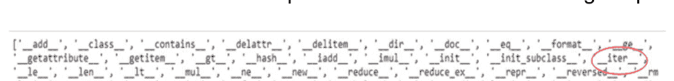

我们感兴趣的属性可以在红色圆圈中看到：**iter 方法**。让我高亮并放大它。

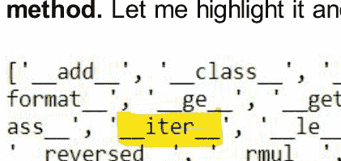

这就是 iter 方法。我们也可以有一个 iter 方法，写法如下

```python
a = [4,3,2,1]
print(a.__iter__())
```

```
<list_iterator object at 0x04C0EA10>
```

这意味着列表是可迭代的，因为它有这个方法。但它是一个迭代器吗？我们可以使用列表来执行 **for 循环** 的功能吗？迭代器有一个状态，通过它知道在迭代过程中处于什么位置，并且通过使用 **双下划线 next 方法** 获取下一个值。如果我们在这里看输出，没有 next 方法。因此，列表没有状态来检查下一个值，这就是为什么列表不是迭代器。

```python
a = [4,3,2,1]
print(a.__next__())
```

```
---------------------------------------------------------------------------
AttributeError                            Traceback (most recent call last)
<ipython-input-3-50e593993c23> in <module>
      1 a = [4,3,2,1]
----> 2 print(a.__next__())

AttributeError: 'list' object has no attribute '__next__'
```

所以列表没有属性 **next**。这也可以从之前的输出中验证。在那里你可以看到 **iter() 方法** 但没有 **next()** 方法。这就是为什么列表不是迭代器，尽管它们是可迭代的。还有另一种写这些魔术方法的方式。通常它们被写成函数。让我们将我的列表名传递给这个 **iter** 函数。

```python
a = [4,3,2,1]
print(iter(a))
```

```
<list_iterator object at 0x04C0ED90>
```

类似地，我们可以使用 **next()** 函数。

```python
a = [4,3,2,1]
print(next(a))
```

```
---------------------------------------------------------------------------
TypeError                                 Traceback (most recent call last)
<ipython-input-5-9e87209431d8> in <module>
      1 a = [4,3,2,1]
----> 2 print(next(a))

TypeError: 'list' object is not an iterator
```

哎呀！！发生了一个错误。如果列表变成了迭代器，那么它也应该有 **next()** 属性，以便它可以迭代 **下一个** 值。让我先将这个传递给另一个变量，然后打印它。

```python
a = [4,3,2,1]
b = iter(a)
print(dir(b))
```

```
['__doc__', '__eq__', '__format__', '__ge__', '__getattribute__', '__gt__', '__iter__', '__le__', '__length_hint__', '__lt__', '__ne__', '__new__', '__next__', '__setattr__', '__setstate__', '__sizeof__', '__str__', '__subclasshook__']
```

现在它工作正常了。你可以看到 **\_\_iter\_\_** 和 **\_\_next\_\_** 方法都存在（在红色圆圈中标出）。这个 **next()** 方法保留了上一个值的状态。所以这个 **for 循环** 所做的是，它在我们的对象上调用 **iter** 并返回一个我们可以循环的迭代器。在后端，它一次又一次地调用 **next** 函数并生成所有值。迭代器

# 第11章

## 生成器

生成器函数是一种借助 **yield 函数** 返回生成器迭代器的函数。这意味着生成器会生成迭代器。简单来说，生成器在需要时才产生结果，而迭代器则一次性产生全部结果。在上一章中，我们学习了迭代器。要创建一个生成器，需要使用 **yield ()** 函数。让我们沿用之前对列表元素求平方的例子。但现在我们不需要追加或返回任何东西。我们只需要写一个 **yield**，后面跟上要执行的操作。这样可读性也更高。对于列表中的每个值，返回该值的平方。无需追加，无需返回，也无需将其存储在空列表中。

```python
def sq_num(my_list):
    result = []
    for i in my_list:
        yield (i*i)

a = [4,3,2,1]
print(sq_num(a))
```

```
<generator object sq_num at 0x05245C60>
```

如果我们观察这个输出，会发现它并不是一个平方数的列表。生成器不会将整个结果保存在内存中。它实际上还没有做任何事情。它在等待我们请求下一个结果。为此，我们使用 **next** 函数。所以，我会将我的函数和参数写在 **next** 函数内部并打印它。

```python
def sq_num(my_list):
    result = []
    for i in my_list:
        yield (i*i)

a = [4,3,2,1]
print(next(sq_num(a)))
```

```
16
```

所以，它会打印下一个结果。那就是给定列表中第一个元素的平方值。它再次等待我们询问下一步该做什么。让我们打印接下来的值。

```python
def sq_num(my_list):
    for i in my_list:
        yield (i*i)

a = sq_num([4,3,2,1])
print(next(a))
print(next(a))
print(next(a))
print(next(a))
```

```
16
9
4
1
```

好的。所有值都打印出来了。哦，对了，我们也不需要那个空列表了。如果我们仍然要求打印 **next** 步骤会发生什么？

```python
def sq_num(my_list):
    for i in my_list:
        yield (i*i)

a = sq_num([4,3,2,1])
print(next(a))
print(next(a))
print(next(a))
print(next(a))
print(next(a))
```

```
16
9
4
1
```

```
StopIteration
<ipython-input-19-6b8d2ca016f0>
     9 print(next(a))
    10 print(next(a))
---> 11 print(next(a))

StopIteration:
```

会发生停止迭代错误。这意味着生成器已经耗尽，因为列表中没有更多的值来生成下一个值了。有一个更好的方法来编写这么多 **next** 语句，那就是使用 **for 循环**。

```python
def sq_num(my_list):
    for i in my_list:
        yield (i*i)

a = sq_num([4,3,2,1])
for x in a:
    print (x, end = ' ')
```

```
16 9 4 1
```

这将检查给定列表中所有元素的值并打印结果。基本上，我们在上一章用迭代器得到的东西，现在用生成器也能得到。但在这里，我们对输出的执行有了更多的控制。
我们也可以像列表推导式一样编写生成器推导式。有两点需要记住。第一，使用普通圆括号而不是方括号。第二，我们知道生成器一次只会给出一个值，所以为了获取下一个结果，我们需要再次编写 **for 循环**。

```python
a = [4,3,2,1]
gen_com = (x*x for x in a)
for i in gen_com:
    print(i, end=' ')
```

```
16 9 4 1
```

这些输出不会一次性全部保存在内存中。如果你想打印出生成器中的所有值怎么办？我们可以将其转换为列表。如果你想将其转换为列表，请使用 list 函数并将生成器传入其中。

```python
a = [4,3,2,1]
gen_com = (x*x for x in a)
print(list(gen_com))
```

```
[16, 9, 4, 1]
```

让我再举一个例子。现在我将斐波那契数列程序写成一个生成器函数。

```python
def fib_series(a):
    x, y = 0, 1
    while True:
        z = x + y
        if z < a:
            yield z
            x, y = y, z
        else:
            break

gen_fib = fib_series(10)
print(gen_fib)
```

```
<generator object fib_series at 0x01BE5510>
```

一切都和我们之前做的一样。唯一的区别是现在我们在输出中使用了 **yield 关键字**。当程序执行 yield 语句时，它会停止。只有当我们请求获取下一个值时，它才会进行迭代。

```python
def fib_series(a):
    x, y = 0, 1
    while True:
        z = x + y
        if z < a:
            yield z
            x, y = y, z
        else:
            break

gen_fib = fib_series(10)
print(next(gen_fib))
print(next(gen_fib))
```

```
1
2
```

那么，这个生成器相对于迭代器的优势是什么？主要优势在于，你可以以额外执行生成下一个可迭代对象的时间为代价，节省大量的内存。但生成器函数的局限性在于它们执行较慢，因为它们只执行一次。你也可以使用 **list 函数** 将生成器输出转换为列表。如果你需要节省内存且不关心执行时间，请使用生成器；如果你不关心高内存使用率且需要稍快的执行时间，请使用列表。

# 第12章

## 我是……不可避免的！！

对于一个新手程序员来说，什么是真正不可避免的噩梦？你答对了。错误。错误是任何偏离预期结果的情况。为什么理解错误很重要？这更多地与一个人在构建编程逻辑时增强自信心有关，当一个人能够自己消除任何错误时。但如果你不知道错误在说什么，你将如何消除错误呢？在本章中，我们将了解一些你可以自己排查而无需使用 Google 或 Stack Overflow 的错误。我们谈论的是那些不会让你说：

> 犯错是人之常情，
> 宽恕是神圣之举

而是让你感觉：

> 犯错是计算机，
> 宽恕是人类

错误是不可避免的。它们迟早会出现在某个阶段。无论你是初学者还是专业人士，你都会面对这个编码中的反派。当任何错误在早期学习阶段出现时，它只会动摇我们的信心。我们所做的是，看到那条红色的错误行，就将其复制粘贴到 Google 中，阅读一些解决方案，然后尝试修改我们的代码，无论是否理解它，或者，我们停止编码。在整个课程中，我谈到了不同类型的错误。现在是理论时间了。

**缩进错误：** 好的。首先，当只有这个错误出现时，请确保你的代码和逻辑是正确的。（这对自信心有好处）。那么，为什么会出现这个错误呢？如果你之前已经用 C、C++ 或 Java 编写过一些程序，那么你可能知道（也可能不知道）这个错误的含义。用非技术性语言来说，将这个词视为“对齐”。编码中的对齐？是的，在 Python 中，没有花括号的概念。那么 Python 如何知道一个代码块、循环或函数是开始还是结束了呢？为此，需要使用制表符和空格进行适当的对齐。通常使用四个空格，并且空格比制表符更受青睐。这在技术上被称为代码缩进。当我们不遵循这一点时，就会出现缩进错误。在 C 或 Java 中，使用花括号来开始和结束任何代码块、循环或函数。让我们举个例子来理解这个错误。

**语法错误：** 语法错误被认为是最基本的错误类型。当 Python 无法理解某行代码时，就会出现语法错误。语法错误总是致命的，也就是说，你无法成功运行包含语法错误的代码片段。语法错误主体包含以下部分：

- 遇到无效语法的文件名
- 遇到问题的行号和重现的代码行
- 在重现代码下方的插入符号（^），它指出代码中存在问题的位置。
- 语法错误之后的错误消息，它提供信息以帮助你确定问题。

实际上，缩进错误和制表符错误都继承自语法错误类，但它们是涉及缩进的特殊情况。当你的代码缩进级别不匹配时，会引发缩进错误。当你的代码在同一文件中同时使用制表符和空格时，会引发制表符错误。
大多数语法错误是输入错误、缩进错误、标点符号错误或参数错误。如果你遇到这个错误，请尝试在你的代码中查找这些错误中的任何一个。

**属性错误：** 这个词“属性”是什么意思？在英语和任何编程语言中，属性都意味着“**被视为某人或某物特征或固有部分的品质或特征**”。例如，颜色可以是花的一个属性。如果你说玫瑰是红色的，这意味着红色是来自花类的对象玫瑰的属性。当 Python当解释器无法在允许属性引用的对象上找到任何给定的数据或方法属性时，它将抛出一个属性错误异常。当你在Python中遇到属性错误时，这意味着你正试图访问或赋值给一个Python对象或类实例的属性值，而该属性实际上并不存在。

有一些简单的方法可以解决这个错误。首先检查拼写或大小写是否正确。对于父类和子类的情况，继承的特定属性应该存在，否则就会发生此错误。有时，根据解释器的不同，错误可能出现在代码中实际出错行之外的其他地方。

**值错误：** 在Python中，值是存储在特定对象中的任何信息。一个简单的例子是在`int()`函数中指定某个整数值，比如`int(3000)`。甚至字符串"3000"也可以使用`int("3000")`转换为整数。但如果我们赋值`int("Steve")`会怎样呢？类型是正确的，因为`int()`可以接受整数和字符串。但值是错误的，因为`int()`不知道应该将什么值赋给Steve。这将引发值错误。

下表总结了我们最常遇到的一些**常见错误**：

| 异常 | 描述 |
| --- | --- |
| **断言错误** | 当断言语句失败时引发。 |
| **属性错误** | 当属性赋值或引用失败时引发。 |
| **EOF错误** | 当`input()`函数遇到文件结束条件时引发。 |
| **浮点错误** | 当浮点运算失败时引发。 |
| **生成器退出** | 当调用生成器的`close()`方法时引发。 |
| **导入错误** | 当找不到导入的模块时引发。 |
| **索引错误** | 当序列的索引超出范围时引发。 |
| **键错误** | 当在字典中找不到键时引发。 |
| **键盘中断** | 当用户按下中断键（Ctrl+c或delete）时引发。 |
| **内存错误** | 当操作耗尽内存时引发。 |
| **名称错误** | 当在局部或全局作用域中找不到变量时引发。 |
| **未实现错误** | 由抽象方法引发。 |
| **操作系统错误** | 当系统操作导致系统相关错误时引发。 |
| **溢出错误** | 当算术运算的结果太大而无法表示时引发。 |
| **引用错误** | 当使用弱引用代理访问已被垃圾回收的引用值时引发。 |
| **运行时错误** | 当错误不属于任何其他类别时引发。 |
| **停止迭代** | 由`next()`函数引发，以指示迭代器没有更多项可返回。 |
| **语法错误** | 当解析器遇到语法错误时引发。 |
| **缩进错误** | 当缩进不正确时引发。 |
| **制表符错误** | 当缩进包含不一致的制表符和空格时引发。 |
| **系统错误** | 当解释器检测到内部错误时引发。 |
| **系统退出** | 由`sys.exit()`函数引发。 |
| **值错误** | 当函数获得正确类型但值不合适的参数时引发。 |
| **零除错误** | 当除法运算的第二个操作数为零时引发。 |
| **递归错误** | 当超过最大递归范围时引发。 |
| **类型错误** | 当函数或操作应用于不正确类型的对象时引发。 |
| **未绑定局部错误** | 当在函数或方法中引用局部变量，但该变量尚未绑定任何值时引发。 |
| **Unicode错误** | 当发生与Unicode相关的编码或解码错误时引发。 |
| **Unicode编码错误** | 当在编码过程中发生与Unicode相关的错误时引发。 |
| **Unicode解码错误** | 当在解码过程中发生与Unicode相关的错误时引发。 |
| **Unicode翻译错误** | 当在翻译过程中发生与Unicode相关的错误时引发。 |

再次记住，这里没有提到的错误还有很多。这些是最常发生或遇到的错误。

# 第13章

## 异常处理

在上一章中，我们了解了错误的类型。在本章中，我们将看到处理这些异常情况的方法。让我们从第一种基本类型的错误开始，即除以零错误。我们知道没有人会将一个数除以零，但如果有人仍然这样做了呢？

```
a = 5
b = 0

print(a/b)
print('Well Done')
```

```
---------------------------------------------------------------------------
ZeroDivisionError                         Traceback (most recent call last)
<ipython-input-11-9fcdf2cfc87e> in <module>()
      2 b = 0
      3 
----> 4 print(a/b)
      5 print('Well Done')

ZeroDivisionError: division by zero
```

好的。预期会有一个错误。但是，还有另一个问题。在那个除法操作之后还有另一条消息没有被执行。这是主要问题。为了处理这个问题，Python提供了**try-except块**。无论你想执行什么，都把它写在**try块**中。Python会想：“好的，我会尝试执行它。但如果我失败了怎么办？”然后，我们会确保：“别担心Python，如果你失败了，我已经在**异常块**中写好了接下来该怎么做。”语法如下。

```
try:
```

你想捕获异常的代码写在这个块中。如果引发异常，控制流将立即离开此块并转到*except*块。

**except [(Exception[, Exception])] [as VAR]:**

此代码仅在*try*块中引发异常时执行。在此块中执行的代码就像普通代码一样。你可以在*except*语句中选择性地指定特定类型的异常，在这种情况下，只有当引发的异常是命名的异常之一时，该块才会执行。

**[else:]**

此代码仅在*try*块中未引发异常时执行。如果执行了*else*块，则*except*块不会执行，反之亦然。此块是可选的。

**[finally:]**

此代码**始终**在其他块之后执行，即使其他块中有未捕获的异常或return语句。此块也是可选的。

让我们看看如何使用这个**try-except块**。

```
a = 5
b = 0

try:
    print(a/b)
except Exception:
    print('Dividing by zero!!Not possible')

print('Well Done')
```

Dividing by zero!!Not possible
Well Done

这比错误消息好多了。它还执行了其他print语句。如果没有错误呢？

```
a = 10
b = 2

try:
    print(a/b)
except Exception:
    print('Dividing by zero!!Not possible')

print('Well Done')

5.0
Well Done
```

如果没有错误，**except块**将不会干扰Python执行**try块**的工作。还有另一种方法可以让你读取遇到了什么类型的错误。为此，except块稍作修改如下

```
a = 10
b = 0

try:
    print(a/b)
except Exception as e:
    print('The error is:',e)

print('Well Done')

The error is: division by zero
Well Done
```

它打印出错误是“除以零”。让我们尝试一些其他错误。我将用户定义的输入作为整数，但在运行时我将提供一个字符串。让我们看看会出现什么类型的错误。

```
try:
    x = int(input('Enter a number:'))
    print(x)

except Exception as e:
    print('The error is:',e)

print('Well Done')
```

Enter a number:A
The error is: invalid literal for int() with base 10: 'A'
Well Done

它运行良好。我们可以有多个错误吗？是的，我们可以。但是异常处理块能处理这个吗？

```
a, b = 10, 0
x = int(input('Enter a number:'))
print(x)
try:
    print(a/b)
except Exception as e:
    print('The error is:',e)
```

Enter a number:A

```
---------------------------------------------------------------------------
ValueError                                Traceback (most recent call last)
<ipython-input-18-255e30588ad0> in <module>()
      1 a, b = 10, 0
----> 2 x = int(input('Enter a number:'))
      3 print(x)
      4 try:
      5     print(a/b)

ValueError: invalid literal for int() with base 10: 'A'
```

它检查了一个错误。没有进入**try块**。让我把所有内容都放在**try块**里。

a, b = 10, 0
try:
    x = int(input('Enter a number:'))
    print(x)
    print(a/b)
except Exception as e:
    print('The error is:', e)

Enter a number: A
The error is: invalid literal for int() with base 10: 'A'

然而，第二种逻辑甚至没有被检查。因此，异常并不能处理所有情况。一旦识别出异常，后续操作就不会被检查。编写异常有一个更系统化的方法。一旦我们了解了不同类型的错误，就可以具体地指定错误类型。让我们来看看。

```python
a, b = 10, 0
try:
    x = int(input('Enter a number:'))
    print(x)
    print(a/b)
except ZeroDivisionError as e:
    print('The error is:', e)
except ValueError as e:
    print('Input is not valid')
except Exception as e:
    print("I don't understand the error")
```

Enter a number: A
Input is not valid

我们无法同时检测多种类型的错误，但凭借对错误的了解，我们可以分配多个`except`块，使我们的错误信息更有意义。还有一个叫做**finally**的块。无论输出正确与否，写在这个块中的内容都会被打印出来。

```python
a, b = 10, 0
try:
    x = int(input('Enter a number:'))
    print(x)
except ValueError as e:
    print('Input is not valid')
except Exception as e:
    print("I don't understand the error")
finally:
    print('Exception Handeled!!')
```

Enter a number: A
Input is not valid
Exception Handeled!!

如果存在**finally子句**，无论**try块**是否执行，它都会执行。如果**try块**中有一个**break**语句会怎样？即使有**break**，**finally子句**也会执行吗？

```python
while True:
    try:
        x = int(input("Please enter a number: "))
        break
    except ValueError:
        print("Integer Expected")
    finally:
        print('It still executes')
```

Please enter a number: 5
It still executes

所以这个**finally块**在所有条件下都会执行。如果在**异常子句**中执行了**continue语句**，**finally子句**中的代码将被执行，然后循环将继续下一次迭代。根据Python文档，如果try语句遇到了**break**、**continue**或**return**语句，**finally子句**将在break、continue或return语句执行之前执行。

```python
x = 0
while x < 5:
    try:
        if(x != 3):
            print("x={0}".format(x))
    except:
        continue
    finally:
        x += 1;
```

x=0
x=1
x=2
x=4

**finally子句**不执行的唯一情况是在其中传递了**continue**语句。

```python
def func():
    for num in range(5):
        try:
            print(num)
        finally:
            continue

func()
```

File "<ipython-input-17-46306c895c94>", line 9
SyntaxError: 'continue' not supported inside 'finally' clause

这不是代码的问题，而是版本的问题。Python 3.7及之前的版本不支持此功能。这是Python 3.8引入的新功能。

```python
def func():
    for num in range(5):
        try:
            print(num, end=' ')
        finally:
            continue
func()
```

0 1 2 3 4

# 第14章

## 文件处理

文件用于永久存储数据。文件处理简单来说就是从文件读取和向文件写入。Python提供了多种模式、方法和函数来执行文件处理。这是关于文件处理的入门章节，我们将了解如何对文件执行读取、写入、追加、重命名和删除操作。

第一个操作是读取文件内容，为此我们必须打开它。这是通过使用**open命令**并传递文件名和读取模式来完成的。对于读取模式，使用单词**r**。通过使用**name命令**，我们可以打印文件名。读取模式意味着我们有一个文件并正在读取其内容。为此，最重要的是你的文件应该与你当前编写代码的目录相同。

```python
my_file = open('Test.txt', 'r')
print(my_file.name)
my_file.close()
```

Test.txt

请记住，一旦你打开了一个文件，在执行完操作后，你必须使用**close()函数**关闭文件。此函数将刷新任何未写入的数据。这是必要的，否则即使没有错误，你也会得到垃圾值。如果你不知道目录的名称，有两种方法。第一种是检查你保存文件的路径。它看起来像**驱动器名称（C、D或你的驱动器名称）：home \some folder name \some more folder\File name to be executed**或类似的东西。你可以复制此路径并将其传递到**open命令**中的文件名位置。另一种方法是使用**os模块**，通过输入以下命令获取当前工作目录。

```python
import os
print(os.getcwd())
```

/home/abhishek/Desktop/Jupyter Files

这将让你知道工作目录。你可以将文本文件复制到此工作目录中，然后只需使用**open命令**写入文件名，而无需写入整个路径。

好的。我们可以使用**mode函数**检查文件的模式。

```python
my_file = open('Test.txt', 'r')
print(my_file.mode)
my_file.close()
```

r

这里，**r**表示我们正在读取模式下工作。下表总结了用于文件操作的不同类型的模式。

| 模式 | 描述 |
| :--- | :--- |
| **r** | 以只读方式打开文件。文件指针放在文件的开头。这是默认模式。 |
| **rb** | 以二进制格式打开文件进行只读。文件指针放在文件的开头。这是默认模式。 |
| **r+** | 打开文件进行读写。文件指针放在文件的开头。 |
| **rb+** | 以二进制格式打开文件进行读写。文件指针放在文件的开头。 |
| **w** | 打开文件进行只写。如果文件存在，则覆盖该文件。如果文件不存在，则创建一个新文件进行写入。 |
| **wb** | 以二进制格式打开文件进行只写。如果文件存在，则覆盖该文件。如果文件不存在，则创建一个新文件进行写入。 |
| **w+** | 打开文件进行读写。如果文件存在，则覆盖现有文件。如果文件不存在，则创建一个新文件进行读写。 |
| **wb+** | 以二进制格式打开文件进行读写。如果文件存在，则覆盖现有文件。如果文件不存在，则创建一个新文件进行读写。 |
| **a** | 打开文件进行追加。如果文件存在，文件指针位于文件末尾。即文件处于追加模式。如果文件不存在，则创建一个新文件进行写入。 |
| **ab** | 以二进制格式打开文件进行追加。如果文件存在，文件指针位于文件末尾。即文件处于追加模式。如果文件不存在，则创建一个新文件进行写入。 |
| **a+** | 打开文件进行追加和读取。如果文件存在，文件指针位于文件末尾。文件以追加模式打开。如果文件不存在，则创建一个新文件进行读写。 |
| **ab+** | 以二进制格式打开文件进行追加和读取。如果文件存在，文件指针位于文件末尾。文件以追加模式打开。如果文件不存在，则创建一个新文件进行读写。 |

与文件处理相关的一些属性包括：

- **file.closed**：如果文件已关闭则返回true，否则返回false。
- **file.mode**：返回打开文件时使用的访问模式。
- **file.name**：返回文件的名称。
- **file.softspace**：如果print需要显式空格则返回false，否则返回true。

使用**with函数**编写open命令有一种更受控的方式。使用此函数的一个优点是它会自动关闭函数。我们不必编写**close()**函数。不要被这种写法所迷惑，变量是在右侧而不是左侧赋值的。让我们看看如何编写它。

```python
with open('Test.txt', 'r') as my_file:
    pass

print(my_file.closed)

True
```

我们只是使用pass函数，什么也不做。然后我们使用**closed函数**检查此文件是否已关闭。这将检查并返回一个布尔值。

现在，通过使用**open函数**，我们已经以读取模式打开了文件，让我们读取此文件的内容。为此，我们将使用**read()**

### 文件处理函数

**read 函数**将打印文件的所有内容。

```python
with open('Test.txt','r') as my_file:
    my_file_contents = my_file.read()

print(my_file_contents)
```

这是一个用于理解 Python 中文件处理概念的测试文件。
读取使用 'r'。
写入使用 'w'。
同时读写使用 'r+'。

另一个函数是 **readlines()**。它会将文件内容创建为一个字符串列表。

```python
with open('Test.txt','r') as my_file:
    my_file_contents = my_file.readlines()

print(my_file_contents)
```

['This is a test file for understanding the File Handling Concept in Python.\n', 'For reading use 'r'.\n', 'For writing use 'w'.\n', 'For both reading and writing use 'r+'.\n']

请注意，文件的每一行都被转换为单独的列表元素。
另一个函数是 **readline()**。这只会显示单行内容。

```python
with open('Test.txt','r') as my_file:
    my_file_contents = my_file.readline()

print(my_file_contents)
```

This is a test file for understanding the File Handling Concept in Python.

如果我们想显示多行，可以多次复制 readline 命令并打印。

```python
with open('Test.txt','r') as my_file:
    my_file_contents = my_file.readline()
    print(my_file_contents)

    my_file_contents = my_file.readline()
    print(my_file_contents)
```

This is a test file for understanding the File Handling Concept in Python.

For reading use 'r'.

这还会在两行显示之间产生一个空格。为此，我们可以使用之前用过的 **end** 函数。

```python
with open('Test.txt','r') as my_file:
    my_file_contents = my_file.readline()
    print(my_file_contents, end = '')

    my_file_contents = my_file.readline()
    print(my_file_contents, end = '')
```

This is a test file for understanding the File Handling Concept in Python.
For reading use 'r'.

现在行与行之间不必要的空格已被消除。另一个需要记住的重要事项是，当所有内容都打印完毕后，函数返回的最终字符串是一个空字符串。现在我们需要打印 **n** 行读取的行来打印 **n** 行，这使其适合在循环中使用。我们可以使用 **for 循环**，它将遍历文件的每一行并打印结果。让我们看看。

```python
with open('Test.txt','r') as my_file:
    for line in my_file:
        print(line, end = '')
```

This is a test file for understanding the File Handling Concept in Python.
For reading use 'r'.
For writing use 'w'.
For both reading and writing use 'r+'.

它运行良好。现在我们已经看到了 **read()** 函数。我们还可以指定要打印的字符数。如果在第一个 read 函数中指定 100，则将读取 100 个字符。如果在第二个 read 函数中指定 60，则将打印 60 个字符，但这是在已经打印的 100 个字符之后。

```python
with open('Test.txt','r') as my_file:
    my_file_contents = my_file.read(100)
    print(my_file_contents, end = '')

    my_file_contents = my_file.read(60)
    print(my_file_contents, end = '')
```

This is a test file for understanding the File Handling Concept in Python.
For reading use 'r'.
For writing use 'w'.
For both reading and writing use 'r+'.

如果我们每次必须显示固定数量的字符，那么与其在 n 个 read 行中编写该固定值，一种更受控的方法是将其分配给一个变量，然后将此变量传递给 read 函数。然后我们将应用一个 while 循环，该循环将运行到大于零。只要文件内容大于零，while 循环就会执行并打印内容。但是当所有内容都结束时，将出现空字符串，我们的循环将变成无限循环。为避免这种情况，我们将再次分配 read 函数行。循环将读取此行并检查它是否为空字符串且不大于零。因此，它将退出循环。

```python
with open('Test.txt','r') as my_file:
    size_of_data = 100
    my_file_contents = my_file.read(size_of_data)

    while len(my_file_contents)>0:
        print(my_file_contents, end = '')
        my_file_contents = my_file.read(size_of_data)
```

This is a test file for understanding the File Handling Concept in Python.
For reading use 'r'.
For writing use 'w'.
For both reading and writing use 'r+'.

在空格的位置，你可以放置任何内容与 **end 函数**一起使用。我放置一个星号，我想在一次迭代中打印的字符数是 10。让我们看看它是什么样子。

```python
with open('Test.txt','r') as my_file:
    size_of_data = 10
    my_file_contents = my_file.read(size_of_data)

    while len(my_file_contents)>0:
        print(my_file_contents, end = '*')
        my_file_contents = my_file.read(size_of_data)
```

This is a *test file *for unders*tanding th*e File Han*dling Conc*ept in Pyt*hon.
For r*eading use* 'r'.
For *writing us*e 'w'.
For* both read*ing and wr*iting use *'r+'.
*

你可以看到每 10 个字符后打印一个星号。然后再次执行 **while 循环**。它每 10 个字符重复一次。在最后一行有一个星号。它返回一个空字符串。

我们还可以通过使用 **tell() 命令**来查看执行了多少值。这里，数据大小为 10，这意味着执行了 10 个字符。光标位于第 10 个字符位置。

```python
with open('Test.txt','r') as my_file:
    size_of_data = 10
    my_file_contents = my_file.read(size_of_data)
    print(my_file.tell())
```

10

如果我们运行此命令两次，那么我们可以计算出下一个输出是在 10 个字符之后生成的。让我们检查一下。

```python
with open('Test.txt','r') as my_file:
    size_of_data = 10
    my_file_contents = my_file.read(size_of_data)
    print(my_file_contents, end = '')

    my_file_contents = my_file.read(size_of_data)
    print(my_file_contents, end = '')
```

This is a test file

我们可以控制这一点，并使我们的光标始终从指定位置开始。例如，我希望在读取 10 个字符后，光标再次从第一个字符开始。为此，在两个打印命令之间，我们将使用 **seek() 函数**。此函数将光标定位到作为参数传递的指定位置。例如 **seek(0)** 将光标指向字符的初始位置。

```python
with open('Test.txt','r') as my_file:
    size_of_data = 10
    my_file_contents = my_file.read(size_of_data)
    print(my_file_contents, end = '')

    my_file.seek(0)

    my_file_contents = my_file.read(size_of_data)
    print(my_file_contents, end = '')
```

This is a This is a

你可以看到，在读取 10 个字符后，光标再次从第一个字符开始。现在让我们开始写入文件。首先，让我们在这个已经打开的文件中写入一些内容。无论你想写什么，只需使用 **write 命令**写入即可。

```python
with open('Test.txt','r') as my_file:
    my_file.write('Python')
```

```
---------------------------------------------------------------------------
UnsupportedOperation                  Traceback (most recent call last)
<ipython-input-26-ccd3fc90c32d> in <module>()
      1 with open('Test.txt','r') as my_file:
----> 2     my_file.write('Python')

UnsupportedOperation: not writable
```

它说这是一个不支持的操作。所以我们不能在打开的文件中写入内容。让我们创建一个新文件并使用 'w' 以写入模式打开它。这将使我们能够在新文件中写入一些内容。**write** 模式不会在字符串末尾添加换行符。字符串也可以包含二进制数据。

```python
with open('Python.txt','w') as my_file:
    my_file.write('Python')
```

我们可以使用 **seek() 命令**来检查光标的当前位置。我在两行中写入两个相同的单词，并检查光标的当前位置。**seek(0)** 将检查光标在第 1 个位置的当前位置。

```python
with open('Python.txt','w') as my_file:
    my_file.write('Python')
    my_file.seek(0)
    my_file.write('Python')
```

输出文件将在工作目录中创建，当你打开它时，你只会看到一个单词，光标已经定位在第一个字符之前。它正在覆盖现有数据。

我们可以通过更改要写入的数据来检查这一点。让我在第二行要写入的内容中写入 'C'。

with open('Python.txt','w') as my_file:
    my_file.write('Python')
    my_file.seek(0)
    my_file.write('C')

如果你现在查看输出，第一个位置已经被第二条语句的输出覆盖了。

让我们完成最后一个任务。现在我将读取一个现有文件，然后创建该文件的副本，并将原始文件的内容逐行写入副本中。我们可以通过复制读取模式行并将其改为写入模式来实现。

```
with open('Test.txt','r') as r_file:
    with open('Test_copy.txt','w') as w_file:
        for line in r_file:
            w_file.write(line)
```

这将从我们的原始 Test 文件中读取行，并创建一个副本文件，将行写入 Test_copy 文件。这个复制过程将逐行进行，直到 for 循环迭代完成。我们能用这种方法复制图像文件吗？让我拿一张图片，只修改上面代码中的文件名。

```
with open('images.jpeg','r') as r_file:
    with open('images_copy.jpeg','w') as w_file:
        for line in r_file:
            w_file.write(line)
```

好的。我的图片文件名是 **images.jpeg**。我们也将创建副本。让我们运行这段代码。

```
/usr/lib/python3.6/codecs.py in decode(self, input, final)
    319         # decode input (taking the buffer into account)
    320         data = self.buffer + input
--> 321         (result, consumed) = self._buffer_decode(data, self.errors, final)
    322         # keep undecoded input until the next call
    323         self.buffer = data[consumed:]

UnicodeDecodeError: 'utf-8' codec can't decode byte 0xff in position 0: invalid start byte
```

哎呀！！发生了一个错误。错误提示说 utf-8 编解码器无法解码位置 0 的字节。简单来说，我们需要二进制值来执行这段代码。我们只需要在 **r** 和 **w** 后面加上 **b**。让我们运行这个。

```
with open('images.jpeg','rb') as r_file:
    with open('images_copy.jpeg','wb') as w_file:
        for line in r_file:
            w_file.write(line)
```

如果你检查工作目录，图像的副本将会被创建。就像之前做的那样，我们不需要逐行创建和复制文件。我们可以像之前那样，通过获取大量数据来写入文件。这里，我设置要读取的数据大小为 4096。你可以设置任何大小。

```
with open('images.jpeg','rb') as r_file:
    with open('images_copy.jpeg','wb') as w_file:
        size_of_data = 4096
        r_file_datasize = r_file.read(size_of_data)
        while len(r_file_datasize)>0:
            w_file.write(r_file_datasize)
            r_file_datasize = r_file.read(size_of_data)
```

这就是创建图像副本的方法。

让我们看看如何向现有文件追加一些数据。我们将使用我们的原始 Test 文件。现在，我们不是以**读取模式**打开文件，而是以追加模式打开它。为此，我们需要用 **a** 代替 **r**。然后，使用 **write 函数**，写入你的文本，然后关闭文件。

```
my_file = open('Test.txt', 'a')
my_file.write('Python for Fun')
my_file.close()
```

你去驱动器或文件夹检查，你的文件将包含这个追加的数据。请记住，如果你的文件已经打开，那么追加操作将不起作用。同样，在追加完成后关闭文件。使用重命名函数，我们可以重命名文件名。传递给重命名函数的第一个参数是你想要的新文件名，第二个参数是你想要更改的旧文件名。但是这个重命名函数必须通过使用 **import os** 命令来调用。

```
import os
os.rename('Python_file.txt','Test.txt')
```

这将更改文件名。一个可能的错误是指定的文件未找到。在这种情况下，我们必须在新文件名中传递路径。我没有遇到错误，但让我随机犯一些错误来向你展示错误。

```
import os
os.rename('Python_file.txt','Test.txt')

---------------------------------------------------------------------------
FileNotFoundError                         Traceback (most recent call last)
<ipython-input-7-bc1f38b90720> in <module>
      1 import os
----> 2 os.rename('Python_file.txt','Test.txt')

FileNotFoundError: [WinError 2] The system cannot find the file specified
```

看到了吧。好的。首先我们应该使用 **os.getcwd()** 命令检查当前工作目录。

```
import os
os.getcwd()
```

'C:\Users\ELECTRONICS'

重要的是，当你写路径时，你必须使用 \\ 而不是 \，因为 \u、\n 等是具有特殊含义的特殊字符。所以我们必须使用双正斜杠。现在我们必须这样写，

```
import os
os.rename('C:\\Users\\ELECTRONICS\\Python_file.txt','C:\\Users\\ELECTRONICS\\Test.txt')
```

这样就可以了。像 **rename ()** 一样，你可以使用 **remove ()** 来删除文件。

```
import os
os.remove('C:\\Users\\Python_file.txt','C:\\Users\\Test.txt')
```

这将删除你的文件。你可以去你指定的路径位置检查。

你还可以使用 **mkdir ()** 和 **chdir ()** 命令来创建目录和更改目录。

```
import os
os.mkdir('C:\\Users\\ELECTRONICS\\new_file')
os.getcwd()
```

'C:\Users\ELECTRONICS'

这将在指定位置创建一个名为 new_file 的新文件夹。我们也可以更改目录。

```
import os
os.chdir('C:\\Users\\ELECTRONICS\\new_file')
os.getcwd()
```

'C:\Users\ELECTRONICS\new_file'

现在我们在这个目录或文件夹内部了。

所以这些是文件处理中的一些基本命令。这就是本章我们要讲的全部内容。在学习了这些基础知识之后，还有很多操作技巧你可以练习。

## 第 15 章

## 正则表达式

正则表达式是我在编程中最喜欢的主题。我非常喜欢它，以至于我写了一本名为**《使用 Python 简化正则表达式》**的书。这本书在亚马逊和 Kindle 上都有售。另一个原因是正则表达式可以完全使用海象运算符编写。我将把它作为使用海象运算符编写的任务留给你。在本章结束时，你将很好地学习这个主题，你肯定能够编写它。我将直接从我自己的书中摘取几章来讨论这个主题。

正则表达式（RegEx）是一系列字符，用于确定一个搜索模式。正则表达式可用于检查字符串是否包含指定的搜索模式。除此之外，正则表达式还提供了各种字符串操作，例如验证电子邮件或密码，甚至提取一些数据。

### 学习正则表达式有多有用？

每种流行的语言，如 C、Java、Perl、Python 等，都支持正则表达式。但不幸的是，正则表达式并没有随着时间的推移获得它应有的名声和声誉，尽管它提供了这些特性和优势。让我们列出其中一些：

-   通过编写几个字符，可以实现很多功能，否则可能需要几十行代码。
-   正如我已经告诉你的，不幸的是，正则表达式并没有像它应该的那样流行起来，主要是因为许多程序员不知道正则表达式（讽刺的是，但这是事实）。所以，学习正则表达式显然会给你带来独特的认可。
-   使用少量字符意味着更快的执行时间。
-   也许最重要的特性之一是**可移植性**。大多数正则表达式语法在各种编程语言中的工作方式相同。因此，学习一种语言的正则表达式将使你更容易理解任何其他编程语言的正则表达式。

### 正则表达式模块

Python 有一个名为 **re** 的内置包，可用于处理正则表达式。记住一件事，编写正则表达式是一门艺术。就像在 VLSI 中，选择工艺参数是一门艺术，无论使用什么技术。同样，编写正则表达式并正确应用它也需要艺术。第一步是使用以下行导入此模块：

**第 1<sup>行</sup>代码：** `import re`

在开始实际编程之前，编译（或者你可以说是预编译）总是一个更好的方法。

**第 2<sup>行</sup>代码：** `pattern = re.compile(r"")`

## 使用正则表达式进行字符串操作

好的！！我们的第一个任务是**编写一个程序，将字符串中的所有数字替换为下划线（ _ ）**

现在我们来讨论这个任务。它的算法应该是什么？

- 1. 输入一个字符串。该字符串应包含数字。
- 2. 找出数字并将其替换为下划线。
- 3. 打印带有下划线的新字符串。

让我们来编码：

```python
import re
pattern = re.compile(r"")
my_string = input("Enter a string: ")
pattern = re.compile(r"[0-9]+")
result = pattern.sub("_", my_string)
print(result)
```

哇！！只用了6行代码。是的，这就是使用正则表达式的魔力。
现在我们来对这段代码进行事后分析。

**前两行代码**是我们之前讨论过的必需行。再次提醒，第2行不是必须写的，但实际上这是一个好习惯。

**第3行代码：** `my_string = input ("Enter a string: ")`
`my_string` 是一个变量，在运行时要求用户输入任何字符串。

**第5行代码：** `result = pattern.sub ("_", my_string)`
同样，**result** 是一个用于存储最终结果的变量。在这个最终结果中，我们的输入，即 `my_string`，将根据一个模式进行检查，该模式在**第4行代码**中定义（我们稍后会分析）。通过替换，我们也可以说我们想要**替换**。正则表达式提供了一个 **sub** 函数来执行**替换**部分。这行代码的含义如下：

通过检查模式，在 `my_string` 中替换一个下划线，其中模式由数字组成。
“模式由数字组成”在第4行代码中描述，这是代码的核心。这是我们要处理的第一个合适的正则表达式函数。

**第4行代码：** `pattern = re.compile (r"[0-9]+")`
这是正则表达式的第一个学习部分。这个 `([0-9]+)` 是什么？第一个要学习的表格是：

### 表1：特殊序列

| 元素 | 描述 |
| :--- | :--- |
| . | 匹配除换行符外的任何单个字符。 |
| \d | 匹配任何数字 [0-9] |
| \D | 匹配任何非数字字符 [^0-9] |
| \s | 匹配任何空白字符 [ \t\n\r\f\v] |
| \S | 匹配任何非空白字符 [^ \t\n\r\f\v] |
| \w | 匹配任何字母数字字符 [a-zA-Z0-9_] |
| \W | 匹配任何非字母数字字符 [^a-zA-Z0-9] |
| \A | 如果指定字符位于字符串开头，则返回匹配 |
| \b | 返回匹配，其中指定字符位于单词的开头或结尾 |
| \B | 返回匹配，其中指定字符存在，但不在单词的开头（或结尾） |
| \Z | 如果指定字符位于字符串末尾，则返回匹配 |

没什么好惊慌的。我们只会在需要时参考这个表格，并且通过参考来记住它。这是千真万确的……
回到我们的**第4行代码**，`[0-9]` 将检查从0到9的任何数字。现在让我们检查代码的输出：

```python
import re
pattern = re.compile(r"")
my_string = input("Enter a string: ")
pattern = re.compile(r"[0-9]")
result = pattern.sub("_",my_string)
print(result)
```

输入字符串： john123
john___

所以，输入字符串 `john123` 在代码执行后输出 `john___`

与之前编写的代码有什么不同吗？是的，有一个区别。`([0-9]+)` 与 `([0-9])`。这个‘+’号是做什么的？

```python
import re
pattern = re.compile(r"")
my_string = input("Enter a string: ")
pattern = re.compile(r"[0-9]+")
result = pattern.sub("_",my_string)
print(result)
```

输入字符串： john123
john_

观察变化。没有‘+’时，输出的下划线数量与字符串中的数字数量相同。但使用‘+’后，它是一个单独的下划线。问题是：这有什么用？‘+’用于字符重复一次或多次的情况。使用‘+’，**123** 被视为一个字符。因此，使用一个下划线。没有‘+’，**123** 被视为 **1**、**2** 和 **3**，所以使用3个下划线来表示3个数字。再次强调，作为一种写作技巧，当我们进行密码验证时，这非常有用。实际上，没有‘+’，入侵者会知道有多少位数字，他/她/他们可以尝试各种排列组合来破解密码。‘+’提高了安全性。

**第6行代码：** `print (result)`
这将最终打印结果。
让我们再次参考**表1**。**[0-9]** 也可以用 **\d** 替换。它会给出相同的结果吗？

```python
import re
pattern = re.compile(r"")
my_string = input("Enter a string: ")
pattern = re.compile(r"\d+")
result = pattern.sub("_",my_string)
print(result)
```

输入字符串： jason123
jason_

**它运行得很棒！！！**

让我们再检查一次。我可以将数字写在任何地方，还是应该连续书写？

```python
import re
pattern = re.compile(r"")
my_string = input("Enter a string: ")
pattern = re.compile(r"[0-9]+")
result = pattern.sub("_",my_string)
print(result)
```

输入字符串： 123jason456
_jason_

好的。所以，我们可以以任何方式书写数字。它将被替换为下划线。
再举一个 **sub** 的例子将有助于理解替换函数。在这里，我们将数字替换为 **$** 符号。

```python
import re
pattern = re.compile(r"")
my_string = input("Enter a string: ")
pattern = re.compile(r"\d+")
result = pattern.sub("$",my_string)
print(result)
```

输入字符串： 2fast2furious
$fast$furious

接下来，我们使用了‘+’。它有什么名字吗？**是的**。它被称为**量词**。量词只是指定要匹配的字符数量。这引出了我们的**表2**。同样，没有必要记住它。我们会像 \d 和 **sub** 一样最终学会它。

### 表2：量词

| 量词 | 描述 | 示例 | 匹配示例 |
| :--- | :--- | :--- | :--- |
| + | 一次或多次 | \w+ | ABCDEF097 |
| {2} | 恰好2次 | \d{2} | 01 |
| {1,} | 一次或多次 | \w{1,} | smiling |
| {2,4} | 2、3或4次 | \w{2,4} | 1234 |
| * | 0次或多次 | A*B | AAAAB |
| ? | 一次或零次 | \d+? | 12345中的1 |

### 表3：集合

集合是一对方括号 [] 内的一组字符，具有特殊含义：

| 集合 | 描述 |
| :--- | :--- |
| [am] | 返回匹配，其中存在指定字符之一（a、r或n） |
| [a-n] | 返回匹配，适用于任何小写字母，按字母顺序在a和n之间 |
| [^am] | 返回匹配，适用于除a、r和n之外的任何字符 |
| [0123] | 返回匹配，其中存在指定数字之一（0、1、2或3） |
| [0-9] | 返回匹配，适用于0到9之间的任何数字 |
| [0-5][0-9] | 返回匹配，适用于从00到59的任何两位数 |
| [a-zA-Z] | 返回匹配，适用于任何字母，按字母顺序在a和z之间，小写或大写 |
| [+] | 在集合中，+、*、.、|、()、$、{} 没有特殊含义，所以 [+] 表示：返回匹配，适用于集合中的任何 + 字符 |

## 使用正则表达式进行字符串操作

所以，在成功理解、编写和编译我们的第一个程序后，我们已经准备好继续前进。
从我们的第一个程序开始，该程序将字符串中存在的任何数字替换为下划线，现在让我们进行相反的操作。即，将非数字替换（或替换）为下划线符号。

我们的任务是**编写一个程序，将字符串中的所有非数字替换为‘_’符号？**

再次参考**表1**，类似于指定数字的 **\d**，我们有指定非数字的 **\D**。这意味着如果在我们的第一个程序中，我们将 **\d** 替换为 **\D**，我们的目标应该能够实现。让我们检查一下。

```python
import re
pattern = re.compile(r"")
my_string = input("Enter a string: ")
pattern = re.compile(r"\D")
result = pattern.sub("_",my_string)
print(result)
```

输入字符串： tonystark123
_________123

**它运行得很棒。** 字符串中的非数字被替换为下划线。

**使用量词怎么样？**

```python
import re
pattern = re.compile(r"")
my_string = input("Enter a string: ")
pattern = re.compile(r"\D+")
result = pattern.sub("_",my_string)
print(result)
```

输入字符串： stark123
_123

量词‘+’的工作方式与第一个程序中的类似。

我们还应该再尝试一件事。非数字字符是指除数字以外的所有字符，还是仅指字母？特殊字符又如何处理呢？

```python
import re
pattern = re.compile(r"")
my_string = input("Enter a string: ")
pattern = re.compile(r"\D+")
result = pattern.sub("_", my_string)
print(result)

Enter a string: tony@123
_123
```

如果我们观察，特殊字符 @ 也被下划线替换了。这很好。这正是非数字字符的实际含义。就像 \d 等价于 [0-9]，\D 等价于 [^0-9]，其中 ^ 符号在这里可以被“视为”**取反**。因此，将 \D 替换为 [^0-9] 会得到相同的结果。

```python
import re
pattern = re.compile(r"")
my_string = input("Enter a string: ")
pattern = re.compile(r"[^0-9]+")
result = pattern.sub("$", my_string)
print(result)

Enter a string: 123tony456
123$456
```

现在，我们已经熟悉了 \d 和 \D 以及 **sub** 函数。如果有人要求找出输入字符串中的所有数字呢？我们知道对于数字，我们将使用 \d。要找到所有数字，正则表达式提供了一个名为 *findall* 的函数。

```python
import re
my_string = input("Enter a string: ")
result = re.findall(r"\d", my_string)
print(result)

Enter a string: bond007
['0', '0', '7']
```

这**第3行代码**在做什么？它实际上是在查找给定输入字符串中的所有数字，并以列表形式打印结果。另外，我做了一个额外的更改，仅为演示目的。我没有写那第2行我强调是必须的代码。正如之前所说，一切都会顺利运行。这只是一个良好的习惯。那么量词呢？它会以某种方式产生影响吗？

```python
import re
my_string = input("Enter a string: ")
result = re.findall(r"\d+", my_string)
print(result)

Enter a string: bond007
['007']
```

所以，‘+’ 将包含3个元素的列表转换成了1个元素，但我们仍然知道字符串中存在的所有数字。

## ^ 和 $

^ 和 $ 是**边界**。^ 标记开始，也被称为脱字符，而 $ 标记正则表达式的结束。这些是非常方便的语法。**稍等一下…** 之前使用的 ^ 表示取反。那么，这里它被提及为正则表达式的起始点。当用在方括号 [^…] 中时，它表示**非**。让我们编写一些程序来验证我们的陈述。

### 编写一个程序来验证输入字符串的首字母是否与输入时一致。

```python
import re

my_str = "Bond! James Bond"
pattern = re.findall("^Bond", my_str)
if (pattern):
    print("Yes, the string starts with 'Bond'")
else:
    print("No match")
```

Yes, the string starts with 'Bond'

输入的字符串以 Bond 作为其第一个单词。**^Bond** 正在检查第一个单词是否是 Bond。如果检查后执行循环并打印结果。

**如果第一个单词不是 Bond 而是其他内容呢？**
假设，第一个单词是 James。那么，相应地，else 循环应该被执行。

```python
import re

my_str = "Bond! James Bond"
pattern = re.findall("^James", my_str)
if (pattern):
    print("Yes, the string starts with 'Bond'")
else:
    print("No match")
```

No match

**很好！！**

它是在检查第一个单词还是第一个字母？实际上，它两者都在检查。^Bond 或 ^James 在这里根据我们期望的答案执行，因为第一个字母，即 B 和 J，以及 Bond 和 James。如果我们改变单词但保持第一个字母相同，它将不会工作。

```python
import re

my_str = "Bond! James Bond"
pattern = re.findall("^Blond", my_str)
if (pattern):
    print("Yes, the string starts with 'Bond'")
else:
    print("No match")
```

No match

但如果我们只检查第一个字母，它将给出期望的答案。

```python
import re

my_str = "Bond! James Bond"
pattern = re.findall("^B", my_str)
if (pattern):
    print("Yes, the string starts with 'B'")
else:
    print("No match")
```

Yes, the string starts with 'B'

让我们用另一个例子来澄清这一点，但是，通过检查最后一个字母，即使用 $ 符号。

### 编写一个程序来验证输入字符串的最后一个字母是否与输入时一致。

```python
import re

my_str = "Bond! James Bond 007"
pattern = re.findall("7$", my_str)
if (pattern):
    print("Yes, the string ends with '007'")
else:
    print("No match")
```

Yes, the string ends with '007'

```python
import re

my_str = "Bond! James Bond 007"
pattern = re.findall("007$", my_str)
if (pattern):
    print("Yes, the string ends with '007'")
else:
    print("No match")
```

Yes, the string ends with '007'

要检查最后一个字母，使用 $ 符号。007$ 或 7$ 具有相同的含义。但 807$ 将执行 else 循环。

```python
import re

my_str = "Bond! James Bond 007"
pattern = re.findall("807$", my_str)
if (pattern):
    print("Yes, the string ends with '007'")
else:
    print("No match")
```

No match

继续，再次参考表1，让我们看看另一个特殊序列 \A。

### 编写一个程序来验证输入字符串的首字母是否与输入时一致，不使用 ^ 运算符。

```python
import re

my_str = "Patience is the key to success"
result = re.findall("\APatience", my_str)
print(result)
if (result):
    print("Yes, there is a match!")
else:
    print("No match")
```

['Patience']
Yes, there is a match!

所以，\A 将检查整个第一个单词并相应地给出结果。它类似于使用 ^ 符号。

### 编写一个程序来搜索输入字符串中的任何给定单词并验证其位置。

假设输入的字符串是“**The truth is...I am Iron Man**”。我需要找到单词 Iron 是否存在于这个字符串中，以及它的位置是什么。

```python
import re

my_str = "The truth is...I am Iron Man"
result = re.search("Iron", my_str)
print(result)
if (result):
    print("Yes, there is a match!")
else:
    print("No match")
```

```
<_sre.SRE_Match object; span=(20, 24), match='Iron'>
Yes, there is a match!
```

所以，存在匹配。这里，我们引入了一个新函数 **search**（参见上面代码的第3行）。它正在搜索输入字符串中的给定单词。
另外，看看输出。

```
span=(20, 24), match='Iron'>
```

如果你数一下，可以观察到，在20个位置（包括空格）之后，单词 Iron 开始并一直持续到第24个位置。
**search ()** 函数在字符串中搜索匹配项，如果找到匹配项，则返回一个 Match 对象。
**如果存在多个匹配项，将只返回第一个匹配项：**

```python
import re

my_str = "The truth is...I am The Iron Man"
result = re.search("The", my_str)
print(result)
if (result):
    print("Yes, there is a match!")
else:
    print("No match")
```

```
<_sre.SRE_Match object; span=(0, 3), match='The'>
Yes, there is a match!
```

输入字符串中有两个 **The**。但 search 函数只会给出它遇到的第一个匹配的结果。
如果我们看，**findall** 和 **search** 做的是同样的事情。那么，区别是什么？使用 findall 编写上面的代码会得到……什么？
让我们检查一下：

```python
import re

my_str = "The truth is...I am The Iron Man"
result = re.findall("The", my_str)
print(result)
if (result):
    print("Yes, there is a match!")
else:
    print("No match")
```

```
['The', 'The']
Yes, there is a match!
```

哇！！所以 **findall** 给出了所有相同的单词。但它没有给出 span，而 **search** 给出了带有 span 的第一个匹配项。
继续前进到其他重要函数 **split**

**split ()** 函数返回一个列表，其中字符串在每个匹配项处被分割。

```python
import re

my_str = "We are Venom"
result = re.split("\s", my_str)
print(result)
```

```
['We', 'are', 'Venom']
```

所以，**split ()** 简单地创建了一个列表。**\s** 在每个空白字符出现处分割字符串。
split () 函数有一个特殊情况，允许分割 **n** 个单词。假设我想分割字符串的前两个单词，而不是其余部分。那么，它就像这样：

```python
import re

my_str = "The name is Cable"
result = re.split("\s", my_str, 2)
print(result)
```

```
['The', 'name', 'is Cable']
```

看看代码的第3行。有一个数字 **‘2’**，它表示要分割多少个单词。如果它变成1呢？

```python
import re

my_str = "The name is Cable"
result = re.split("\s", my_str, 1)
print(result)
```

```
['The', 'name is Cable']
```

## 匹配对象

匹配对象是一个包含搜索信息和结果的对象。它有一些与**搜索**操作相关的属性：
- `.span()` 返回一个包含匹配起始位置和结束位置的元组。
- `.string` 返回传入函数的字符串。
- `.group()` 返回字符串中匹配的部分（我们将在课程的最后一天详细学习这个函数）。

### 编写一个程序，搜索单词开头的大写字母，并打印其位置。

例如字符串是 "**I am Iron Man**"。任务是找到，比如，单词 Man 中字母 M 的位置。应该采用什么方法？
1.  检查字符串的第一个字符。例如，这里的第一个单词不是 M，而是 I。所以，我不能使用 `^` 或 `\A`。
2.  再次参考**表 1**。有两个特殊序列 `\b` 和 `\w`。
3.  `\b` 返回一个匹配，其中指定字符位于单词的开头或结尾。
4.  `\w` 返回一个匹配，其中字符串包含任何单词字符。
5.  最后，使用 `.span()` 就能完成任务。

```python
import re

my_str = "I am Iron Man"
result = re.search(r"\bM\w+", my_str)
print(result.span())
```

(10, 13)

**代码第 3 行：** `\b` 将返回一个匹配，其中指定字符位于单词的开头（或结尾），这里是 **M**（在此示例中），而 `\w` 将返回字符串包含任何单词字符的匹配。`.span()` 返回一个包含匹配起始位置和结束位置的元组，即在我们的示例中为 (10, 13)。

### 编写一个程序，搜索单词开头的大写字母，并打印该完整单词。

例如字符串是 "**I am Iron Man**"。任务是，如果我的字母是，比如 M，找到 Man 的完整单词。这里，我将使用 `.group()` 而不是 `.span()`。

```python
import re

my_str = "I am Iron Man"
result = re.search(r"\bM\w+", my_str)
print(result.group())
```

Man

### 编写一个程序，搜索单词开头的字符，并打印该完整单词。

同样，`\b` 对我们的需求很有用。

```python
import re
my_input = "Avengers"
dotsequence = re.search(r'\b[a-zA-Z]vengers', my_input)
print(dotsequence)
```

`<_sre.SRE_Match object; span=(0, 8), match='Avengers'>`

代码很简单。`\b` 将检查小写或大写字符的开头部分，写作 `[a-zA-Z]`。当它找到 **A** 时，它会与输入字符串匹配并打印结果。

好的，我们有一个最终任务要完成，尝试用海象运算符编写一个正则表达式。我知道这是作业。但我会写一个函数来指导你。我将使用 **`findall()`** 在给定字符串中查找日期，并使用海象运算符来完成这个任务。

```python
import re, datetime
text = 'Python 3.8 was released on 14-10-2019'
if (match_res := re.findall(r'[\d]{1,2}-[\d]{1,2}-[\d]{4}',text)):
    print('The matched result is:',match_res)
```

The matched result is: ['14-10-2019']

好的，这很酷。我想你现在能明白发生了什么？这个主题就到这里。现在这是一个广泛的主题，如果你对这个主题感兴趣，我建议你阅读我的书。至此，我们已经结束了本卷的内容。我希望你觉得这本书内容丰富且有趣。在下一卷中，我将开始介绍如何使用一些流行的包和模块、面向对象编程概念、排序和搜索，以及一些 Python 有用的领域，如解析和网络爬虫。感谢你的耐心。我请求大家就本书的内容提供一些反馈，如果你希望在未来的卷中涵盖一些特定主题，我很乐意听取。