# 精通Django

入门指南


编辑

## Sufyan bin Uzayr

CRC Press
Taylor & Francis Group

*精通Django* 帮助读者掌握强大的Python Django框架，用于创建动态应用程序和项目。

Django是一个高级、开源的Python Web框架，旨在帮助Web开发者在满足各种需求的同时，也能应对紧迫的截止日期。Django在开发者中如此受欢迎的主要特点是，它在提供一致且现实的设计的同时，促进了快速开发。

Django是一个完整的工具包，具有基础代码和高度可适应的架构，能够促进快速开发——它可以在几小时内塑造并推进你的Web应用概念，直至发布。

Django的简洁性、稳定性、可扩展性和灵活性无与伦比。它目前是一个充满活力、协作的开源项目，拥有成千上万的用户和贡献者。Django是一个多功能框架，能够开发任何网站。

这个流行的Web框架的标志包括：健壮的设计、快速的软件开发、出色的文档和教程、拥有现成解决方案的庞大社区、相对容易的学习曲线，以及高度的清晰度和可读性。

多年来，Django在行业中为自己赢得了一席之地，这是理所当然的。许多流行的应用程序都使用Django作为其秘密武器。Django拥有众多功能，可以适应任何现代Web应用程序。如果你希望在Web开发领域建立成功的职业生涯，学习Django是一个明智的选择。

有了*精通Django*，学习Django框架将变得轻而易举，并无疑将帮助读者推进他们的职业生涯。

*精通计算机科学*系列由Sufyan bin Uzayr编辑，他是一位在计算机领域拥有超过十年经验的作家和教育家。

# 精通计算机科学

系列编辑：Sufyan bin Uzayr

**精通Django：入门指南**
*Jaskiran Kaur, NT Ozman, and Reza Nafim*

**精通Ubuntu：入门指南**
*Jaskiran Kaur, Rubina Salafey, and Shahryar Raz*

**精通GNOME：入门指南**
*Jaskiran Kaur, Mathew Rooney, and Reza Nafim*

**精通Flutter：入门指南**
*Divya Sachdeva, NT Ozman, and Reza Nafim*

**精通Rust：入门指南**
*Divya Sachdeva, Faruq KC, and Aruqqa Khateib*

**精通Visual Studio Code：入门指南**
*Jaskiran Kaur, D Nikitenko, and Mathew Rooney*

有关本系列的更多信息，请访问：https://www.routledge.com/Mastering-Computer-Science/book-series/MCS

> “精通计算机科学”系列书籍由Zeba Academy团队成员撰写，由Sufyan bin Uzayr领导。
> Zeba Academy是一家教育科技企业，主要为STEM领域的学习者开发课程和内容，并为全球大学和机构提供教育咨询。更多信息，请访问 https://zeba.academy

# 精通Django

## 入门指南

编辑：Sufyan bin Uzayr


CRC Press
Taylor & Francis Group
Boca Raton London New York

CRC Press是Taylor & Francis Group的商标，一家Informa业务

第一版于2023年出版
由CRC Press出版
地址：6000 Broken Sound Parkway NW, Suite 300, Boca Raton, FL 33487-2742

以及由CRC Press出版
地址：2 Park Square, Milton Park, Abingdon, Oxon, OX14 4RN

*CRC Press是Taylor & Francis Group, LLC的商标*

© 2023 Sufyan bin Uzayr

我们已尽合理努力发布可靠的数据和信息，但作者和出版商无法对所有材料的有效性或其使用后果承担责任。作者和出版商已尝试追溯本出版物中所有复制材料的版权持有者，如果未获得以这种形式出版的许可，我们向版权持有者致歉。如果任何版权材料未被确认，请写信告知我们，以便我们在任何未来的重印中予以更正。

除非美国版权法允许，否则本书的任何部分不得以任何形式（无论是电子、机械或其他方式，无论是现在已知或未来发明的，包括影印、缩微胶片和录音）进行重印、复制、传输或利用，也不得用于任何信息存储或检索系统，除非获得出版商的书面许可。

要获得影印或以电子方式使用本作品材料的许可，请访问 www.copyright.com 或联系版权结算中心（CCC），地址：222 Rosewood Drive, Danvers, MA 01923, 978-750-8400。对于CCC上不可用的作品，请联系 mpkbookspermissions@tandf.co.uk

*商标声明：* 产品或公司名称可能是商标或注册商标，仅用于识别和解释，无意侵权。

# 美国国会图书馆编目出版数据

名称：Bin Uzayr, Sufyan, 编辑。
标题：精通Django：入门指南 / 编辑：Sufyan bin Uzayr。
描述：第一版。| Boca Raton, FL : CRC Press, 2023。| 包含参考文献和索引。
标识符：LCCN 2022020952（印刷版）| LCCN 2022020953（电子书）| ISBN 9781032315997（精装）| ISBN 9781032315980（平装）| ISBN 9781003310495（电子书）
主题：LCSH: Django (Electronic resource) | Web sites--Authoring programs. | Python (Computer program language)
分类：LCC TK5105.8885.D54 M37 2023（印刷版）| LCC TK5105.8885.D54（电子书）| DDC 006.7/6--dc23/eng/20220707
LC记录可在 https://lccn.loc.gov/2022020952 获取
LC电子书记录可在 https://lccn.loc.gov/2022020953 获取

ISBN: 9781032315997（精装）
ISBN: 9781032315980（平装）
ISBN: 9781003310495（电子书）

DOI: 10.1201/9781003310495

使用Minion字体排版
由Deanta Global Publishing Services, Chennai, India制作

## 目录

精通计算机科学系列前言，xvii

关于编辑，xix

## 第1章 ■ Django的历史 1

- DJANGO使用什么语言？ 1
- DJANGO需要PYTHON吗？ 2
- 我能用PYTHON做什么？ 2
- PYTHON受支持吗？ 2
- PYTHON编程语言的优势 2
- 在Django之前，需要在Python中完成的事情 4
- 我们如何开始使用PYTHON？ 12
- 代码编辑器 13
- PYTHON是解释型还是编译型语言？ 13
- Python编程的应用 13
- Python的附加功能 14
- DJANGO 15
- 什么是WEB框架？ 15
- Web框架的类型 15
- 使用Web框架进行开发的优势？ 15
- 如何使用DJANGO框架？ 16
- DJANGO代码是什么样子的？ 16
- 模型模板视图（MTV）设计模式 17
- 为什么使用DJANGO模板？ 18
- DJANGO有多受欢迎？ 18
- 为什么是MTV而不是MVC？ 18
- 为什么选择DJANGO？ 18
- Django的优势 19
- Django的劣势 20
- 项目和应用的区别 21
- DJANGO文件结构 21
- 你还能做什么？ 22
- 设置数据库？ 22
- 主要主题 23
- 章节总结 24

## 第2章 ■ 安装 25

- 那么首先，什么是IDE？ 25
- 为什么开发者使用IDE？ 26
- 理解差异：本地IDE与云IDE 26
- 什么是本地IDE？ 26
- 优势 26
- 什么是云IDE？ 26
- 优势 27
- 你是DJANGO新手吗？ 28
- 学习Django 28
- 数据库驱动 28
- 为什么需要PYTHON？ 29
- 在WINDOWS上安装PYTHON 30
- 如何在环境变量中添加PATH 31
- 验证 32
- Python解释器 34
- 什么是PIP？ 36
- 在WINDOWS上安装PIP 36
- PIP命令 36
- 设置PYTHON虚拟环境 37
- 为什么使用虚拟环境？ 37
- 组织文件夹 37
- 冻结依赖 37
- 使用虚拟环境的命令 40
- 使用PIP安装DJANGO 40
- 使用PIP从本地TAR.GZ文件安装DJANGO 42
- 从Git安装Django 43
- 安装并创建DJANGO项目 43
- 如何更改默认端口？ 45
- 如何检查DJANGO版本？ 46
- 模板文件 47
- 创建项目并部署 48
- 使用Heroku部署 48
- 章节总结 49

## 第3章 ■ 文件结构 51

- 检查项目结构和应用 51
- 探索项目文件夹 52
- Manage.py 53
- 中间件 54
- 中间件的类型 55
- 自定义中间件 56
- 如何创建中间件？ 56
- 中间件方法 57
- urls.py 57
- URL映射 57
- 最常用的Django URL函数 58
- views.py 58
- wsgi.py 60
- asgi.py 60
- 探索应用文件夹 60
- 迁移文件夹 62
- models.py 62

## 目录

- urls.py 62
- tests.py 62
- 需要创建的文件和目录 63

## DJANGO 命令

- 创建项目的目录结构 63
- 在项目中创建新应用 63
- 运行服务器 63
- 创建数据库迁移 63
- 迁移数据库 64
- 创建管理员用户 64
- 在 Git Bash 中创建管理员用户 64

## DJANGO 是一个松耦合的框架

- Django 的 URL 配置 64

## 附加配置

- URL 调度器 69

## 章节总结

## 第 4 章 ■ Django 的模型

## DJANGO 模型基础

- 不同类型的字段 74

## DJANGO 模型如何工作？

- 什么是字段选项？ 76
- 字段选项 77
- 解释 77
- 添加模型字符串 80
- 什么是 Unicode 对象？ 80
- 魔术方法或双下划线方法 80

## 关系与查询集

- 关系 85
- 多对多关系 85
- 从查询集中检索单个对象 86
- 过滤记录 87
- 使用 exclude() 方法 87
- 数据排序 87
- 链式查找 88
- 数据切片 88
- 多对一关系 89
- 一些重要的字段查找 90
- 一对一关系 91
- 为什么使用模型？ 93
- 配置数据库 93
  - 数据库类型 93
  - 连接到数据库 94
  - 模型表单集 95
- 管理模块 95
  - 安装管理模块 95
- 章节总结 96

## 第 5 章 ■ Django 的视图 97

- DJANGO 中的视图 97
- URL 配置 98
- 将 URL 映射到视图 99
- 它如何处理请求？ 99
- 什么是 URL 路由？ 100
- 什么是 path 与 re_path？ 101
  - 如何创建视图 104
  - 添加首页路径 104
  - 基于函数的视图 105
  - 基于类的视图 105
- 什么是通用视图？ 106
  - 通用视图的类型 106
  - Django 视图 HTTP 装饰器 107
  - URLconf 与松耦合 108
  - Django 异常与错误处理 108
- 什么是异常？ 109
  - Python 中的异常 109
- 为什么实践异常？ 110
  - 常见异常 110
  - 解释 111
  - 抛出异常 111
  - 自定义异常 111
  - Django 异常 112
  - URL 解析器异常 115
- 高级视图与 URL 116
  - 使用命名组 117
  - 关键字参数与位置参数 117
  - 向视图函数传递额外选项 117
- 章节总结 118

## 第 6 章 ■ Django 的模板 119

- 模板基础 119
- JINJA 120
  - 为什么 Jinja2 有用？ 120
  - Jinja2 的起源？ 120
- API 120
  - 为什么我们需要 Jinja2？ 121
    - 安装 121
    - 依赖项 121
- 什么是 BABEL？ 122
  - 模板 122
  - Django 模板系统基础 124
    - 运算符 126
    - 其他运算符 126
    - Python 内置方法 127
    - 各种函数 127
    - 比较 129
  - 逻辑 130
  - 渲染模板 130
  - Django 模板语言 131
- 为什么使用引擎？ 132
- 什么是加载器？ 132
- 对模板引擎的支持 133
- 配置或 Django 如何查找模板？ 133
- 模板中使用的常见术语 133
- 创建站点模板 133
- 模板的附加路径 134
- 模板完整示例 134
- Jinja2 类 135
- 模板加载器的使用 135
- 可选参数 136
- 模板继承 136
- Django 静态文件处理 138
- 章节总结 140

## 第 7 章 ■ Django 的管理后台 141

- DJANGO 管理后台概述 141
- 访问 DJANGO 管理站点 142
- 启用管理面板 144
- 管理后台做什么？ 144
- 它如何工作？ 145
- DJANGO 管理后台有多安全？ 145
- 编写动作函数 145
- 用法 145
- 各种子命令 146
- Django 管理后台自定义 147
- Python manage.py Startapp Products 147
- 如何从管理后台注册/注销模型？ 149
- 管理面板标题自定义 149
- Django 管理后台自定义页面布局、数据和行为 149
- 模型管理类 150
- 如何在项目中添加 JQUERY？ 155
- 章节总结 159

## 第 8 章 ■ Django 的表单 161

- HTML 表单 161
- 链接到包含表单的页面 162
- Input 标签 163
- Django 在表单中的作用 163
- Django 的表单 163
- forms.Form 与 forms.ModelForm 164
- Django 表单类 164
- 绑定和未绑定的表单实例 164
- 小部件 165
- 表单类 165
- 小部件参数 167
- Django-crispy-Forms 171
- 如何使用 Django Crispy Forms 171
- Crispy 过滤器 172
- 安装 172
- 在 Crispy 表单标签中加载 173
- 使用 Django as_crispy_field 表单过滤器 174
- 当 CRISPY 表单不工作时该怎么办？ 174
- 模板包 174
- 如何使用 Bootstrap 为 Django 表单设置样式 175
- 表单助手 176
- Django UserCreationForm 176
- 实现 Django UserCreationForm 176
- 我们使用 SELF.CLEANED_DATA 的原因 178
- 理解 Python 中的 Args 和 Kwargs 178
- 什么是 Kwargs？ 179
- Args 和 Kwargs 的使用 179
- 在函数中同时使用 Args 和 Kwargs 179
- 章节总结 179

## 第 9 章 ■ 高级模型 181

- DJANGO 模型定义 181
- 字段 182
- 常见字段参数 182
- 常见数据类型的字段 183
- 在不同文件中导入 model.py 184
- Django 模型中的各种高级主题 184
- 模型方法 185
- 创建新实例 185
- 自定义模型加载 185
- 从数据库中删除对象 186
- Model.get_deferred_fields() 186
- 验证对象 186
- Model.clean_fields(exclude=None) 186
- Model.validate_unique(exclude=None) 186
- 保存对象 186
- 自增主键 186
- Model.pk 与 Model.id 186
- 模型对象 187
- 保存 ForeignKey 和 ManyToManyField 字段 187
- 检索所有对象 188
- 其他模型实例方法 189
- UserModel 190
- 用户模型内置字段 191
- 方法 192
- 登出和登录信号 192
- 管理器方法 193
- 模型管理器 193
- 为默认管理器指定自定义名称 193
- 如何使用 Student 管理器 193
- 管理器类的方法 194
- 章节总结 194

## 第 10 章 ■ 部署 195

- 简介 195
  - 先决条件 195
  - 什么是部署环境？ 196
- 在 WINDOWS 上安装 PYTHON 196
  - 如何在环境变量中添加 PATH 197
- 使用 PIP 安装 DJANGO 197
  - 创建 Django 项目 199
- 选择合适的托管提供商 199
  - 准备发布您的网站 200
- DJANGO 部署接口 201
  - WSGI 201
  - ASGI 203
    - class Application 203
- AWS？ 204
  - 什么是云计算？ 204
    - 云的类型 204
    - 云服务模型 204
- AWS 服务 205
- AWS ELASTIC BEANSTALK 206
  - 优势 206
  - 在浏览器中打开 ES 环境 211
  - 在部署中访问 Django 管理后台 211
  - 在 CLI 中收集静态文件 211
  - 从 AWS 检查 Django Web 应用 212
- AZURE 212
  - 基于云的服务的特性 212
  - 与移动服务相关的 Microsoft Azure 特性 213

## 将我们的 DJANGO 应用部署到 AZURE 214

- 文件结构 214
- 安装 Azure 215
- Azure 部署文件 218
- GIT 218
- 章节总结 219

## 第 11 章 ■ 使用 Python Django 创建测验 Web 应用 221

- REACT、FLASK、RUBY ON RAILS 等 221

## 如何在 PYTHON DJANGO 中创建测验列表应用 222

- 目的 222
- 项目先决条件 222
- 虚拟环境 222
- 修改我们的模型 225
- 进行迁移 226
- 迁移到数据库 226
- 注册到管理后台 227
- 创建超级用户并在管理面板中查看 227
- 制作和修改模板 228
- BASE.HTML 229
- LOGIN.HTML 230
- 登录页面 231
- 注册页面 232
- 主页 235
- 结果页面 238
- url.py 238
- url.py 239
- form.py 240
- view.py 241
- app.py 245
- 这个项目的目的是什么？ 245

## 第 12 章 ■ 项目：待办事项列表

- REACT、FLASK、RUBY ON RAILS 等
- 如何在 PYTHON DJANGO 中创建待办事项列表应用
- 创建超级用户并在管理面板中查看
- 进行迁移
- 迁移到数据库
- 编辑页面
- 编辑后页面
- 登录页面
- 注册页面
- 显示详情页面
- Views.py
- urls.py
- model.py
- forms.py
- Apps.py
- admin.py
- 在 admin.py 中

## 第 13 章 ■ Django、Flask、Node.Js 和 Spring Boot 的比较研究

- PYTHON 框架的类型
- 什么是 FLASK？
- DJANGO 与 NODE.JS
  - 什么是 Node.js？
- DJANGO 与 SPRING BOOT
  - 什么是 Spring Boot？
- 章节总结

评估, 279

参考文献, 285

索引, 291

## 《精通计算机科学》系列前言

*精通计算机*系列涵盖广泛的主题，从编程语言到现代技术和框架。该系列特别关注初学者内容，并以易于理解的方式呈现，包括：

- 清晰明了的文本，涵盖按相关性排序的各种主题
- 特别注重实践练习，提供大量代码示例和程序
- 针对绝对初学者的引导式编程方法，提供分步教程
- 强调技能的实际应用，从而剔除冗余和少用的概念，转而关注行业普遍采用的编码范式
- 提供广泛的参考和资源，帮助初学者和中级开发者从书籍中获得最大收益

*精通计算机科学*系列书籍从核心概念入手，然后迅速转向行业标准编码实践，帮助学习者在尽可能短的时间内获得高效且关键的技能。这些书籍假设读者没有编程先验知识，因此即使是绝对的新手程序员也能从该系列中受益。

*精通计算机科学*系列由苏夫扬·本·乌扎伊尔编辑，他是一位在计算机领域拥有超过十年经验的作家和教育家。

泰勒与弗朗西斯
泰勒与弗朗西斯集团
http://taylorandfrancis.com

## 关于编辑

**苏夫扬·本·乌扎伊尔**是一位作家、程序员和企业家，在该行业拥有超过十年的经验。他过去曾撰写过多本书籍，涉及从历史到计算机/IT等广泛主题。

苏夫扬是Parakozm的总监，这是一家专注于教育科技解决方案的跨国IT公司。他还运营着Zeba Academy，这是一个专注于STEM领域的在线学习和教学平台。

苏夫扬精通多种技术，如JavaScript、Dart、WordPress、Drupal、Linux和Python。他拥有多个学位，包括管理、IT、文学和政治学学位。

苏夫扬是一位数字游民，时间分配在四个国家之间。他曾在全球各地的大学和教育机构生活和教学。苏夫扬对技术、政治、文学、历史和体育有着浓厚的兴趣，在业余时间，他喜欢教年轻学生编程和英语。

了解更多请访问sufyanism.com。

泰勒与弗朗西斯
泰勒与弗朗西斯集团
http://taylorandfrancis.com

## Django的历史

本章内容

- 了解Django的历史
- 学习其用途和特性
- Django的安装

Django是一个基于Python的高级Web框架，遵循MTV模式，即模型-模板-视图，使我们能够拥有一个由*《劳伦斯日报世界》*报纸在2003年设计和开发的连贯架构。Django于2005年7月21日发布。它是一个基于Python的框架，使用Python创建快速动态网站。Django机构决定在2005年以BSD许可证发布Django源代码。Django软件基金会（DSF）于2008年成立，以支持和发展Django，几个月后发布了该框架的1.0版本。Django 2.0兼容Python 3.4、3.5、3.6和3.7版本。其主要目标是简化复杂数据库驱动网站的构建。像Instagram移动网站、Mozilla.org和Openstack.org这样的跨国公司都在使用Django。

### DJANGO使用什么语言？

它是用Python编写的，Python可以在Windows、Linux和macOS等多种平台上运行，是一种动态和高级编程语言。它涵盖了几乎所有任务和问题。

2 ■ 精通Django

### 学习DJANGO是否需要PYTHON？

如果你没有扎实的Python知识，学习Django并不容易。你不必了解Python的所有内容，但要弄清楚Django所需的基本概念。同时，关注面向对象编程（OOP）概念。

### 我能用PYTHON做什么？

Python有助于完成现实世界的任务——程序员日复一日所做的那种事情。它通常用于各种领域，编写其他组件的脚本和实现独立程序。Python在这里扮演着重要角色。你可以将其用于任何地方：从网站开发和游戏到机器人和航天器控制，或其他任何事情。Python目前似乎分为多个类别。
Python通常应用于许多领域，这里可以提到一些工作。例如，你可以做：

- Web应用程序开发
- 使用pygame系统进行游戏编程和多媒体
- Windows、Linux上的串口通信
- 自然语言处理
- 使用PIL进行图像处理
- 网页抓取
- 机器人控制编程
- 人工智能编程
- DevOps
- 机器学习

### PYTHON是否得到支持？

是的。Python社区响应用户查询的速度，是大多数商业软件帮助台都值得效仿的。Python附带完整的源代码；其文档赋能开发者，创建了一支庞大的实施专家团队。

### PYTHON编程语言的优势

这些语言充满益处，有一些极好的理由去喜爱它们。世界上最杰出的公司都在使用Python。

例如：皮克斯用来制作电影，谷歌用来抓取页面，Instagram、Netflix和Spotify都在利用它。

- **简洁性**：Python语法直接明了，让初学者想要学习这门语言。它易于维护、共享和理解。
  它具有直接的语法和编码风格。

- **Python是否可移植？** 它可以安装在每个操作系统上。它是免费和开源的，对所有人可用。Python脚本可以在Linux、Windows、macOS和UNIX上使用。Python可用于：
  1. 微软Windows和DOS（所有现代版本）
  2. MacOS（包括OS X和Classic）
  3. 实时系统
  4. 用于IOS和iPods的Python
  5. 其他手机Windows Mobile
  6. 游戏

- **Python是一种强大的语言**：与JavaScript、Ruby等其他一些脚本语言不同，这种组合使Python对大型开发项目非常有用。你会在Python文档中找到你需要了解的主要内容。

- **动态类型语言**：这意味着变量的类型仅在运行时确定。但Python在运行时会跟踪程序使用的对象类型。
  它允许将整数和浮点数相加，但将整数与字符串相加会产生错误。Python代码不限制数据类型，通常也自动应用于整个对象。

- **自动内存管理**：Python在对象不再使用时自动分配对象（“垃圾收集”），称为垃圾回收，大多数对象可以增长和收缩。它跟踪底层内存细节，因此你不必担心。

- **大型系统支持**：Python是大型系统或项目的绝佳工具，例如模块、类、包和异常。还有什么其他工具能让你将策略组织成组件、使用OOP重用、自定义代码并优雅地处理事件和错误？

- **内置对象类型：** Python提供最常用的数据结构，如列表、字典和字符串，作为语言本身的内在部分；它们灵活且易于使用。内置对象可以自行增长和收缩，以表示复杂信息等。

- **许多内置工具：** Python具有强大且标准的操作来处理所有对象类型，包括连接（连接集合）、切片（提取部分）、排序、映射等。

在Django之前，需要在Python中完成的事情
首先你需要下载Python，然后了解如何运行简单的pip并安装Django。一旦完成此操作，就开始学习基础知识。

1. **基本概念：** 在此，你首先需要了解Python的基础知识、变量、数据类型、条件语句；for循环，所有这些都属于Python基础。所有这些概念都是编程的一部分。如果基础不清楚，你将面临很多问题。
   - **标准数据类型**
     - 数值型
     - 布尔型
     - 集合
     - 字典
     - 列表
     - 元组
     - 字符串
   *注意：字符串、列表、元组属于序列类型。*

2. **Python中的变量**

```
>>> n = 300

>>> print (n)
```

## 6 ■ 掌握 Django

>>>300

>>>a=b=c=300

（这被称为链式赋值）

如何在 Python 中检查变量的类型？

>>> type(300)

>>> < class ‘int ‘>

3. **可迭代对象**：在掌握基本概念之后，下一步是学习循环（可迭代对象）。通过它，你将能够处理大量数据。

```
for i in range(0,10):
    print(i)
```

C:\Users\Dell\PycharmProjects\BASIC_PYTHON\Project>python3 Dictionaries.py

0

1

3

4

5

6

7

8

9

4. **字符串**：它是一组用引号表示的字符。引号可以是单引号或双引号成对出现。连接或合并字符串使用加号（+）。

```
string = "This is String."
#concatenation
string1 ="This is string1"
string2 = "This is string2"
print(string1+ string2)
```

可以使用切片操作符（`[]` 和 `[:]`）获取字符串的子集。

```
string =" Python Programs "    # Prints complete string
print(string[0])    # Prints first character of the string
print(string[2:5])  # Prints characters starting from 3rd to 5th
print(string[2:])   # Prints string starting from 3rd character
print(string * 2)   # Prints string two times
print(string + " Slice ") # Prints concatenated string

//OUTPUT
P
tho
the Programs
Python ProgramsPython Programs
Python ProgramsSlice
```

5. **列表**：它包含用逗号（,）分隔并放在方括号（[]）内的项目。

类似于数组，但列表可以存储不同的数据类型。列表是可变的（可以更改）。我们可以对列表进行切片操作。

```
list = [ 'ABC', 123 , 323.22, 'Python' ]
print(list[0:3])

//OUTPUT
['ABC', 123, 323.22]
```

6. **元组**：另一种数据类型，类似于列表。它由用逗号分隔并放在圆括号（()）内的值组成。元组不能更新。它也被称为不可变类型。

示例：

```
list = ( 'ABC', 123 , 323.22, 'Python' )
print(list[0:3])

//OUTPUT
('ABC', 123, 323.22)
```

7. **字典**：在 Python 中，字典以键值对的形式存储数据，例如你可以创建一个对象，其中名称作为键，'Sam' 作为值。它有许多内置函数，例如 `key()`、`items()`、`values()` 等。

示例：

```
Alphabets = {"P": "C", "B": "A"}
print(Alphabets.items())

//Output
>>> dict_items([('P','C'), ('B','A')])
```

8. **函数**：它用于重复执行相似的代码。当你需要那些特定的代码片段时，调用它即可。同时，也请了解 Django 中 `*args` 和 `**kwargs` 的概念。

```
def name():
    print("Hello Python")
name()

//Output
>>> Hello Python
```

9. **装饰器**：它为你的代码提供额外的功能，但在 Django 应用程序中并不常用。

```
@staticmethod
```

10. **面向对象编程**：在每种语言中，理解面向对象编程的概念都至关重要。你也可以使用对象、继承、封装、抽象等。在 Django 中，你将学习和使用模型、表单和视图，其中包含许多概念。首先弄清楚 Python 的基础，然后开始专注于面向对象编程的概念，不要混淆。否则会让你感到困惑。

以下是 Python 中类的示例。类可以定义为任何事物的蓝图，它具有颜色、年龄、型号等属性，以及工作和交流等功能。

```
class A:
    def get_name(self):
        print("A Class")
obj = A()
```

```
obj.get_name()
//Output
>>> A-Class
```

+   - 面向对象编程的主要概念

+   - 什么是类？类是对象的集合，也是用户定义的数据结构，用于使数据更易于管理。

```
class Car:
    pass
```

在深入细节之前，你应该理解对象。对象是类的实例；它们包含关于类的准确数据或信息。

```
object = Car()
```

如果你打印这个对象，你会得到

```
class Car:
    pass
object = Car()
print(object)
#OUTPUT
<__main__.Car object at 0x7f69920044c0>
```

+   - 类构造函数：因此，汽车的属性或任何其他对象的属性必须放在一个名为 `__init__()` 的方法内。这也被称为构造函数方法。当对象创建时，构造函数会自动调用。

```
class Car:
    def __init__(self,name):
        self.name=name #instance attributes
```

`self` 关键字代表类的实例。通过使用它，我们可以访问特定类的属性和方法。实例指的是构造函数方法内的属性，即 `self.name`。

• **类方法**：在类中定义的、除构造函数方法之外的方法也称为实例方法。我们在代码中有一个实例方法：`show_model_name()`。此方法将返回 `self.model` 的值。你需要使用 `print(instance_obj.instance_method())` 来调用此方法。

```
class Car:
    def __init__(self,model):
        self.model=model
        def show_model_name(self):
            return self.model
object = Car("BWM")
print(object.show_model_name())
```

我们也可以像这样传递参数：`print(obj.instance_method(parameter))`

• **继承**：最有用的概念之一是继承，它是一个类可以继承另一个类的属性和方法的过程。从父类继承属性的类是子类。

```
class A:
    def __init__(self):
        pass
    def show(self):
        print('Class A inherits ')
#Class B inherits the feature of Class A
class B(A):
    def hello(self):
        print('Class B')
obj = B()
obj.show()
obj.hello()
```

• **封装**：这是确保安全性的唯一最佳方式。许多程序员希望保护信息免受任何未经授权的人访问。因此，封装应运而生。

你可以通过在方法或属性名称前添加单下划线（_）前缀来声明它们为受保护的，例如 `self._name` 或 `def_method()`。Python 使用 `_` 约定，它表示你应该在类的范围内使用这些方法。

```
class A:
    def __init__(self,name):
        self._name = name    #protected variable
        pass
```

名称修饰是从外部访问类成员的过程。

```
print(obj._Car__name)    #mangled name
```

11. **Python 标识符**：它是变量、函数、类、模块或对象的名称。标识符以字母 A 到 Z、a 到 z 或下划线（_）开头，后跟数字（0 到 9）。

标识符的规则：

+   - 类名应大写；其他应为小写字母。
- 两个下划线表示变量是受保护的，单个下划线作为个人标识符。

12. **命名空间**：每个变量都应该有一个唯一的名称，以便它不会与其他变量混淆。Python 有其关键字，我们不能用作变量名。

命名空间的类型：

+   - 内置命名空间
- 局部命名空间

13. **保留关键字**：这些关键字在 Python 程序中常用。

| and | exec | not |
| --- | --- | --- |
| assert | finally | or |
| break | for | pass |
| class | from | print |
| def | if | return |
| del | import | try |
| else | is | with |
| while | except | yield |
| elif | raise | global |

14. **行与缩进**：Python 中最关键的概念是使用缩进来表示类、函数或控制流语句的代码块。

示例：

```
if 'n' in 'Python':
    print("Available")
else:
    print("Not available")
```

在上面的示例中，这是正确缩进 Python 代码的方式。缩进应为 2 个制表符或 4 个制表符。注意类函数末尾的冒号（:），循环语句也需要。

示例：遵循规则，然后以正确的缩进编写你的代码。

```
# Function
def name():
# Class
class A():
# looping
if (condition):

if 'n' in 'Python':
print("Available")
else:
print("Not available")
```

你可以像上面那样编写代码，但这会产生缩进错误。

15. **注释**：它有助于解释 Python 代码的功能，使代码更清晰、更易读，并在测试时更容易调试代码。

## 示例

- 单行注释
- 多行注释

```python
#This is a comment
print("Hello, Python!")
print("Hello, Python!") #This is a comment
#This is a comment
#written in the
#more than just one line
""" This is a comment
written in
more than just one line """
```

- 数据抽象

它用于隐藏函数的个人细节。任何至少有一个抽象函数的类都被定义为抽象方法。

```python
from ABC import ABC (Abstract Base Class)
class abs_class(ABC):
    pass
```

## 我们如何开始使用Python？

你可以从以下参考资源开始你的学习之旅：

- **Python官方网站**：这是Python的官方网站。在这里你可以查阅他们的原始文档。
- **Code Academy和Udemy课程**：该网站提供大量免费和付费课程，你还可以获得他们的证书，但仅限于付费课程。
- **YouTube**：这是互联网上学习新技能的绝佳平台之一，拥有精彩的Python教程。
- **MDN（Mozilla开发者网络）**：你应该访问这个网站以获得更深入的知识。在这里你可以找到大量带有良好解释的代码示例。
- **FreeCodeCamp**：它以免费课程和优秀的YouTube教程而闻名，每个人都可以免费学习任何编程语言。
- **Google的Python**：通过一些视频讲座，以有趣的方式快速学习任何语言。交互式代码和大量练习。

## 代码编辑器

- **Visual Studio**：它是一个源代码编辑器，可用于多种编程语言，包括Java、JavaScript、Go、Node.js、Python和C++。它是一个更轻量级、更省资源的消费级IDE。
- **Pycharm**：一个为Python程序员构建项目的工具，甚至这个工具就是为Python项目和大型应用程序而设计的。
- **Atom**：轻量级且设计精美的ID编辑器，非常适合小型程序练习和编码。

## Python是解释型语言还是编译型语言？

它是一种解释型语言，即Python程序的源代码被转换为由Python虚拟机执行的字节码。Python与主要的编译型语言（如C和C++）略有不同，因为Python代码不需要构建。
Python代码可以快速开发任何应用程序。无需编译和构建代码；它可以轻松更改并独立执行，从而实现快速的开发周期。
它的执行速度并不快，因为代码不是直接编译和执行的。Python虚拟机的额外一层负责执行，与C、C++等传统语言相比，Python代码运行稍慢。
与其他语言相比，Python是一种相对容易学习的语言。它的语法简单易读，适合初学者学习和理解。
与C或Java等其他语言相比，执行Python程序所需的样板代码极少。

## Python编程的应用

- **Web开发**：Python提供了不同的Web开发框架，如Django、Pyramid和Flask。这些框架以其安全性、灵活性和可扩展性而闻名。
- **游戏开发**：PySoy和PyGame是两个用于游戏开发的Python库。
- **人工智能（AI）和机器学习（ML）**：在开发AI/ML应用程序时，可以使用许多开源库。
- **桌面GUI**：桌面GUI提供了许多工具包和框架，我们可以使用它们来构建桌面应用程序。PyQt、PyGtk和PyGUI是一些GUI框架。

## Python的附加特性

- Python对“即使在初学者的小规模项目中也能进行大规模编程”的支持，使其适用于开发更大的系统。
- 与Perl相比，它具有更简洁的语法和更直接的设计，使其更具可读性和可维护性，并有助于减少程序错误。
- 与其他脚本语言（如JavaScript、Java和Ruby）相比，它更易于理解和使用。Python是一种脚本语言。
- 它更易于使用和理解，但通常不与C++竞争；Python作为脚本语言为每个应用程序提供不同的角色。
- 它既更强大又具有多平台特性。
- 它的开源也意味着它不受单一公司控制。
- 它拥有庞大的社区。
- 它更具可读性和通用性。Python有时用于构建网站和游戏，但它也广泛应用于几乎每个计算机领域，从机器人到电影动画。
- 与Ruby相比，它更成熟，语法更清晰。
- 面向对象编程在Python中是一个选项——Python不会将面向对象编程强加于用户或可能不适用的项目。
- 它具有Smalltalk和Lisp等语言的动态特性，并具有简单、传统的语法，易于开发者和可定制系统的最终用户使用。

## DJANGO

一个节省你时间并让Web开发成为乐趣的Web开发框架。使用Django，你可以更轻松地构建和维护高质量的Web应用程序。

## 什么是Web框架？

该框架为大规模应用程序提供了重要支持，并提供了更好的功能，包括Web服务和Web API。

### Web框架的类型

1. **客户端框架**
   - Angular.js
   - Ember.js
   - Vue.js
   - React.js

2. **服务器端框架**
   - .NET(#)
   - Django(Python)
   - Ruby on Rails(Ruby)
   - Express(JavaScript)

### 使用Web框架进行开发的优势？

- **安全性**：大公司广泛使用它来保障安全，因为任何安全漏洞都可以被报告和检测到。
- **成本**：大多数基于Python的框架是免费的，它帮助开发者更快地编码。
- **效率**：框架可以节省你的时间和精力。一切都内置了可用的模块、包、中间件等。

## 如何使用Django框架？

让我们看看配置Django项目的正确步骤。
我们可以从系统命令行的概述开始。有许多命令可以使用，以下六个命令在Django开发中经常使用：

- cd（切换到下一级目录/文件夹）
- cd ..（切换到上一级目录）
- ls（列出当前目录中的文件）
- PWD（打印工作目录）
- mkdir（创建目录）
- touch（创建新记录）

## Django代码是什么样的？

代码由URL、视图、模型和模板组成。下图展示了数据在Django中如何传递。用户与浏览器交互，并点击作为特定应用程序URL的链接。用户的数据使用模型（Python对象）存储在Django中，这些对象定义了应用程序数据的结构，并赋予我们管理（添加、修改、删除）和记录数据库查询的权限。用户可以使用模板查看内容。HTML文件在Django中充当模板。所有信息都通过视图传递。视图是请求处理函数，它接收HTTP请求并返回HTTP响应。视图通过模型访问满足需求所需的数据，并将响应格式化委托给模板。

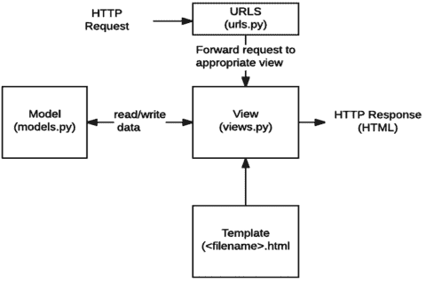

## 模型模板视图（MTV）设计模式

Django紧密遵循这种MTV模式，以至于可以被称为基于MVC（模型视图控制器）的MTV框架。这两者之间的区别在于Django本身负责控制器部分。以下是M、T和V在Django中的大致划分。

MVC代表模型视图控制器。它用于开发Web应用程序，我们将代码分解为不同的部分。这里有三个组件：模型、视图和控制器：

1. “M”代表模型，即数据访问层。这个数据层包含你存储在数据库中的数据所需的字段。模型帮助开发者在原始数据库中创建、读取、更新数据。

```python
from django.db import models
from django.contrib.auth.models import User
class Post(models.Model):
    title= models.CharField(max_length=100)
    description=models.TextField()
```

2. “T”代表模板，即表示层。这一层包含与表示相关的决策：某些内容应如何在网页或其他类型的文档上显示。模板仅用于呈现数据，因为它不包含业务逻辑。

- 要配置模板，请转到setting.py文件并将DIRS更新为模板文件夹的路径。整个模板都保存在模板文件夹下。

3. “V”代表视图，即业务逻辑层，它与模型交互并将数据传递给模板。这一层接受HTTPS请求，通过Python类和方法进行逻辑处理。你可以将其视为模型和模板之间的桥梁。它是特定URL的回调函数。

4. “C”代表控制器，是与模型和视图交互的业务逻辑，但Django自己处理了这部分。这就是为什么我们在Django中使用MTV模式。

## 为什么选择 Django 模板？

它是一个在浏览器中渲染的文本文档。Django 保持逻辑和代码的整洁，并将其与设计分离。重要的是要知道 Django 模板不包含 HTML 文件中的 Python 代码，因此 Django 使用了 DRY（不要重复自己）原则。它有自己的标记法，如标签、变量、过滤器、注释、模板继承等。

## Django 有多受欢迎？

像 Instagram、Pinterest、Mozilla 等流行应用都使用这个框架。提供免费和付费支持的人员或开发者数量之多，显然表明 Django 是一个受欢迎的框架。

## 为什么是 MTV 而不是 MVC？

Django 框架本身负责控制器部分（在这种模式中，视图被模板取代，而视图取代了控制器），留给我们的是模板，即为什么 Django 是基于 MTV 的框架。模板是混合了 Django 模板语言（DTL）的 HTML 文件。特点：

- 1. 代码更少
- 2. 设计整洁
- 3. 开发快速且安全
- 4. 简单性
- 5. 可重用性
- 6. 可扩展性

## 为什么选择 Django？

Django 极大地降低了 Web 应用程序的复杂性，提供了更简化的方法，并且拥有活跃的社区、优秀的文档以及许多免费和付费支持选项。Django 完全可定制。开发者可以通过创建模块或重写框架方法快速适应它。Python 在这个框架中的帮助使你能够受益于所有 Python 库，并确保出色的可读性。一个良好的社区支持着 Django。这是一个重要的资产，因为它允许你快速解决问题和修复错误。多亏了社区，我们还能找到展示最佳实践的代码示例。Django 让你在短时间内构建出深入、动态、令人兴奋的网站。Django 框架主要由以下组件组成：

- **模型**：它保存你的数据库模式。
- **模板**：它负责前端用户在屏幕上看到的内容。
- **视图**：它包含你所有的渲染文件，如 HTML。
- **管理**：此组件负责应用程序的认证和安全过程。

## Django 的优势

以下是使用 Django 的一些优势：

- **内置电池（包）**：这些电池包括 ORM、身份验证、会话管理支持、HTML 模板、URL 路由、中间件、HTTP 库、多站点支持、模板引擎、表单、视图层、模型层、Python 兼容性等。
- **Python Web 框架**：Django 作为一个 Python Web 框架，为用户创建应用程序提供了极大的便利。理解和实现 Python 代码相对容易且自由。只要了解 Python，你就能使用 Django 工作，并且在使用 Django 时，你不必成为前端和后端的专家。
- **速度和应用性能**：这个框架帮助用户快速创建动态 Web 应用程序。Django MTV 架构使部署过程相对容易。
- **面向对象**：Django 提供了面向对象编程的功能。使用类、方法、对象和 OOPS 的功能使事情变得更容易。
- **用于 API 的 REST 框架**：应用程序编程接口，通常称为“API”，对于向应用程序添加最新功能至关重要。它用于为 Web 应用程序构建 API，并附带身份验证、授权以及提高应用程序的灵活性。
- **内置管理**：Django 团队在创建框架时考虑得非常周到，他们将用户和客户满意度放在心上。在后端开发自己的管理界面来管理数据并执行基本的 CRUD 操作是相当不合理的。
- **社区支持**：Django 的社区是乐于助人的社区之一，积极致力于使框架对初学者更友好，并在添加新功能的同时保持其稳定性。
- **可扩展**：Django 是一个高度可扩展且经过深思熟虑的框架。它将使你能够水平扩展你的应用程序，并支持数亿个请求，正如我们在 Instagram、Netflix 等许多案例中看到的那样。
- **安全性**：用户身份验证和授权对于通过管理面板安全地管理 Django 的用户账户和密码也是必要的。
- **管理界面**：你将获得 Django 创建的管理面板，使用 create-super 命令创建。

## Django 的劣势

以下是使用 Django 的一些劣势：

- **不适合较小的项目**：这个框架包含大量代码，提供大量处理并节省我们的时间。
- **没有约定**：这些框架具有约定优于配置的特点，使得在应用程序中遵循和实现变得困难。模块应该使用小写字母或全小写字母以使其清晰。
- **不提供多处理器支持**：多处理是当今的需求。应用程序必须支持多处理。它无法同时处理多个请求。
- **单体框架**：Django 不允许开发者学习 Python 包和工具。相反，它专注于提供面向代码的编程。Django 有一组特定的文件，你只需要了解这些。
- **URL 问题**：有时，指定 URL 可能是一项棘手的任务。模板错误可能很耗时。

## 项目和应用的区别

项目可以定义为包含执行特定任务的应用程序的整个应用程序。而应用是在项目中自给自足的，为特定任务而设计。一个项目可能包含许多彼此不相关的应用。

## Django 文件结构

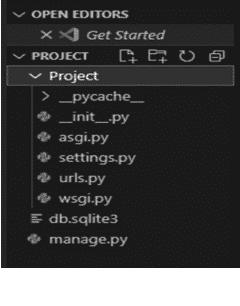

- **项目名称**：创建新的 Django 项目时，内部项目文件夹将始终与外部目录具有*相同的名称*。
- **__init__.py**：将包含目录定义为 Python 包。
- **Setting.py**：它包含 Django 项目的许多全局设置。
- **Urls.py**：这是你注册指向应用程序中函数的路由的地方。
- **Wsgi.py**：在部署到 Web 服务器网关接口服务器时需要使用此文件。
- **Manage.py**：此文件为开发者提供了许多有用的命令行实用程序功能，以帮助构建和调试 Django 应用程序。

## 你还能做什么？

你将在每个 Web 应用程序中使用的主要功能：URL 映射、视图、模板和模型。Django 本身就在这些功能上工作。

- **表单**：HTML 表单通常用于从用户输入中收集数据，在每种语言中用于在服务器上使用 POST 和 GET 方法进行处理，也提供一些条件验证。
- **用户身份验证和权限**：Django 包含有效的用户身份验证和权限系统，以构建安全性。
- **管理站点**：Django 管理站点在你创建应用程序时默认添加。你可以轻松地在网站上创建、编辑和查看任何数据模型。
- **序列化对象**：Django 还可以将你的对象序列化并以 XML 和 JSON 格式提供。

## 设置数据库？

Django 不需要数据库。Django 支持四种数据库引擎：

1. **PostgreSQL** (http://www.postgresql.org/)
2. **SQLite 3** (http://www.sqlite.org/)
3. **MySQL** (http://www.mysql.com/)
4. **Oracle** (http://www.oracle.com/)

如果你只是想尝试 Django 框架，而不想从任何地方安装数据库服务器，请考虑使用 SQLite 作为默认数据库。它（SQLite）在已建立的支持数据库列表中是独特的，如果你使用 Python 2.5 或更高版本，它不需要上述任何步骤。它只是将数据读取、写入、编辑到文件系统上的单个文件中，并且它包含对 Python 2.5 及更高版本的内置支持。

- **将 Django 与 PostgreSQL 一起使用**：如果你使用 PostgreSQL，你需要从 http://www.djangoproject.com/r/python-pgsql/ 安装 psycopg 或 psycopg2 包。

## 主要主题

- **模型（Models）：** 这是 Django 中的一个内置功能，用于创建表及其字段。通过模型，我们可以访问和管理数据，以及设置其最大长度、默认值等。

  我们可以导入模块来使用此功能。

  ```python
  from django.db import models
  ```

- **视图（Views）：** 一个可调用的函数，它接收一个请求并以 `HttpResponse` 的形式返回响应。这个响应可以是网页的 HTML 内容。

- **模板（Templates）：** Django 视图的响应借助模板在网页浏览器中显示。

- **管理后台（Admin Panel）：** 用于对 Django 模型执行创建、读取、更新和删除操作。

  ```python
  from django.contrib import admin
  ```

- **表单（Forms）：** 用于以不同方式从用户获取输入。Django 提供了一个表单类用于创建 HTML 表单；它也类似于 `ModelForm` 类。

  ```python
  from django import forms

  class SForm(forms.Form):
      first_name = forms.CharField(label="Enter first name", max_length=50)
      last_name = forms.CharField(label="Enter last name", max_length=100)
  ```

- **在 HTML 示例中定义此表单的方式：**

  ```html
  <label for="firstname">Enter first name:</label>
  <input type="text" name="firstname" required maxlength="50" id="firstname" />
  <label for="lastname">Enter last name:</label>
  <input type="text" name="lastname" required maxlength="100" id="lastname" />
  ```

  `<input>` 标签中的 `name` 属性代表模型的字段名。

## 章节总结

本章解释了 Python 和 Django 是什么，以及它们是如何发展的。它还描述了两者各自的特性，并介绍了不同类型的编辑器。在下一章中，你将学习 Python 和 Django 的目的和特性，以及如何在你的计算机上安装它们。

# 第 2 章

## 安装

### 本章内容

- 了解 Django 的安装
- 安装 pip
- 安装 Python

在上一章中，我们介绍了 Python 和 Django 的基础知识。它们的特性和不同类型的编辑器是什么？在这里，你将了解 Python 和 Django 的目的和特性。

在安装 Django 之前，你必须知道你将在哪里工作。从哪里获取所有你需要的东西，比如所需的包、你的开发环境、库、调试功能以及其他很棒的东西。因此，这里我们将讨论 IDE 的主题，它将为你提供编程领域，它能给你什么，以及它们的好处。

## 那么，首先，什么是 IDE？

IDE（集成开发环境）是一种用于执行和构建任何基于 Web 的应用程序的软件，它将所有开发人员工具组合到一个单一的 GUI（图形用户界面）中。它理想地适用于编写编程语言，如 JavaScript、MySQL 和 Python。让我们了解一下这个平台是如何工作的。它主要包含以下内容：

- **源代码编辑器**：一些文本编辑器可以为你提供出色的功能，例如语法高亮文本、任何语言的代码自动补全、深色和浅色模式主题，以及在编写代码时检查代码中的错误。
- **调试器**：它将在原始代码中以图形方式表示错误位置。

## 为什么开发人员使用 IDE？

它将允许你快速开始编程，因为在 IDE 中，我们获得了大多数技术的多个内置配置。它使事情易于理解，无需花费数小时来学习该配置。IDE 旨在节省时间，因为会自动生成代码。此外，你可以下载各种扩展来添加更多功能，例如任何语言的简单代码片段、实时服务器、使你的代码更美观以及许多其他功能。

## 理解差异：本地 IDE 与云 IDE

### 什么是本地 IDE？

让我们看看如何开始使用本地 IDE。开发人员需要安装和下载 IDE。一旦 IDE 安装完毕，开发人员需要下载各种库和项目依赖项。要在 IDE 中运行项目，你应该了解你正在使用的特定 IDE 的工作环境。大多数语言都有其主要的 IDE，例如 Eclipse 适合 Java 开发。但著名的本地 IDE 是 VS code，它适用于每种语言。

### 优点

- **可定制性**：许多 IDE 允许用户安装不同的扩展或插件，以添加功能并支持工作流程。VS code 有 271,000 个扩展，而 Microsoft workplace 有 11,000 个。
- **无需互联网连接**：一旦你安装并下载了 IDE，设置好你的开发环境。现在你的代码就可以在本地运行了。

### 什么是云 IDE？

云 IDE 是软件即服务（SaaS），与本地开发环境相比，提供了几个独特的优势。它运行在某处的服务器上，完全通过浏览器访问，无需下载软件和配置。有些人喜欢使用云 IDE，而另一些人则喜欢在本地工作。但在本地，你无法获得在浏览器中共享代码的功能。

### 优点

- 你可以使用与本地相同的 IDE，只是在云端。一些公司已经构建了自己的云 IDE，如 Coder、Gitpod、Google Cloud Shell、Codeanywhere 等。
- 它们是可扩展的，并且具有出色的可伸缩性。
- 它们非常适合想要尝试新语言而无需在本地安装的开发人员。
- 它允许开发人员同时处理多个项目，并管理每个项目。

以下是一些基于云的 IDE。

- **CodePen**：它是一个基于云的 HTML、CSS 和 JavaScript 编辑器，允许你实时渲染代码、与他人分享并保存他人的代码片段。它的主要目的是创建一个小程序来理解概念。你可以添加样式表、脚本。此外，它还有一个 JavaScript 控制台来调试你的代码。
- **JSFiddle**：它允许你进行前端开发并在同一浏览器中实时渲染。你可以 fork 别人的作品并在此基础上开始你的代码。它是 CodePen 的简化版本。
- **Microsoft Azure**：它是 Microsoft 提供的一个完整的端到端解决方案。它管理通过 Jupiter notebook 开发的项目。你需要登录你的 Microsoft 帐户并选择一个计划。它有免费和付费两种选项。
- **Repl.it**：它只让你专注于编码，让平台负责设置环境。一旦你在其官方网站上完成注册，你只需单击一下即可创建一个环境。你可以根据项目需求选择语言。窗口分为三列——你的文件、文本编辑器和一个终端，你可以在其中查看结果。

## 你是 Django 新手吗？

理解 Django 代码可能需要更长时间，但初学者在深入学习 Django 之前应该先掌握 Python。

## 学习 Django

以下是使用 Django 编写数据库驱动型 Web 应用程序的非正式概述。

## 数据库驱动程序

数据库驱动程序是实现数据库连接协议（ODBJ 或 JDBC）的程序。该驱动程序就像一个适配器，将接口与数据库连接起来。Django 的默认数据库是 sqlite3，如下图所示。

```
DATABASES = {
    'default': {
        'ENGINE': 'django.db.backends.sqlite3',
        'NAME': BASE_DIR / 'db.sqlite3',
    }
}
```

本章将涵盖所有内容，以便在使用 Python 时更容易理解 Django 框架。

开始使用 Django 需要做两件重要的事情：

1.  安装 Django。
2.  充分理解模型-视图-控制器（MVC）与模型-模板-控制器（MTV）设计模式。

在开始学习如何使用 Django 之前，你必须先在计算机上安装一些有用的软件。幸运的是，这是一个简单的三步过程：

1.  安装 Python。
2.  安装 Python 虚拟环境。
3.  安装 Django。

本章假设你以前从未从命令行安装过软件，并将逐步引导你完成操作。那么，让我们从安装 Python 开始。

## 为什么需要 Python？

Django 是一个 Python Web 框架，因此需要 Python。它包含一个名为 SQLite 的轻量级数据库，因此你无需设置数据库。

访问链接 https://www.python.org/downloads/ 下载最新版本的 Python。

根据你的系统（Windows、macOS、Linux）选择要下载的 Python 版本。

获取最新版本的 Python。访问链接 https://www.python.org/download/ 或使用你的操作系统管理器。

你可以通过在 shell 中运行命令来检查 Python 是否已安装。

```
C:\Users\PC> python
Python 3.9.6 (tags/v3.9.6:db3ff76, Jun 28 2021, 15:26:21) [MSC v.1929 64 bit (AMD64)] on win32
```

在这里，你可以获取本地系统中最新版本的 Python。或者，你也可以在 shell 中输入“Python --version”。

- **使用 Python 与 Python3**：使用 venv 安装 Python 时，请使用 Python 而不是 Python3。这将建立一个广泛的 Python 版本。如果你希望停用虚拟环境，请在终端中输入“deactivate”。

## 在 Windows 上安装 Python

你很可能会在这里找到你的 Python。现在，这是在系统中安装 Python 的步骤。

从 Python 官方网站下载最新的 Python3（64 位）安装程序，通常是 Windows x86-64 MSI 安装程序。SDK 不支持 32 位 Python 解释器（图 2.1）。

1.  **单击“立即安装”**
    安装路径：
    将路径添加到环境变量时不要有空格，否则 Python 安装程序将无法找到其脚本文件夹，例如：\ Program Files\n   Python
    在哪里添加此路径：

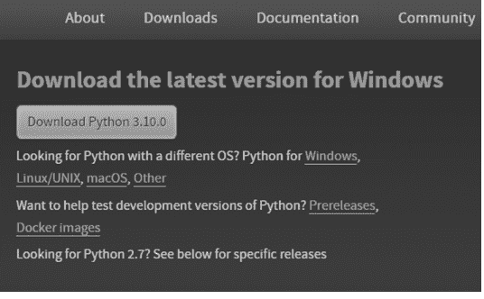

图 2.1 下载 Windows 最新版本的 Python。

“C:\Program Files\Python”。检查环境变量并单击显示“环境变量”的按钮，然后确保 Python 命令被系统正确识别和安装（图 2.2）。

2.  **安装进行中：** 这将需要一些时间，因为所有内置函数、模块和包都将被安装。运行时，屏幕上可能会出现一个用户帐户控制弹出窗口。该弹出窗口将请求你允许更改 PC 上的一些设置。因此，请允许它并使其生效。单击“是”并允许它（图 2.3）。

3.  **安装完成：** 在安装过程中，它将在进度条上显示已安装和处理的组件。很快，Python 将安装在你的系统中（图 2.4）。

现在安装完成。单击关闭按钮。

现在，分析你的 PC 上安装了哪个 Python 版本，在命令提示符中。如果是 Python3，请输入命令 Python-version（图 2.5）。

现在下一步是将 Python PATH 添加到环境变量。

### 如何在环境变量中添加 PATH

1.  在搜索栏中搜索“环境”。
2.  弹出窗口将显示“编辑系统环境变量”。

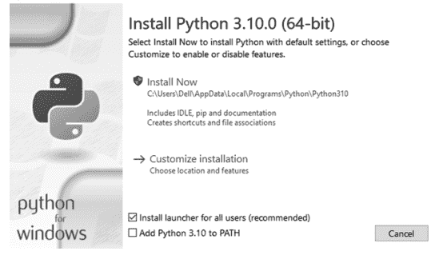

图 2.2 Python 安装设置弹出窗口。

32 ■ 精通 Django

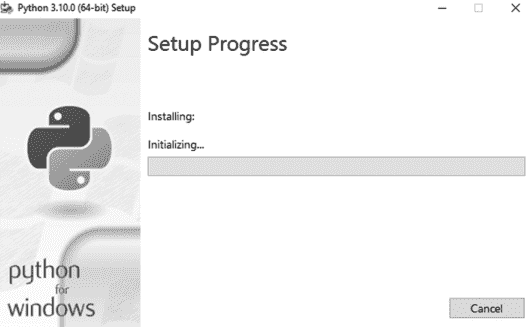

图 2.3 安装正在运行。

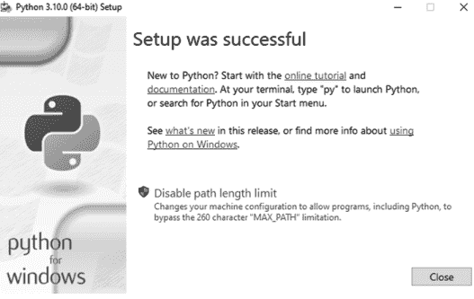

图 2.4 安装完成。

3.  然后在第一个 shell 中，你将看到 PATH。只需打开它并添加新的路径（图 2.6）。

## 验证

当你在 shell 或命令提示符中运行 Python 命令时，Python 交互式会话将开始。你可以在这里执行你的代码。

```
C:\Users\PC>python3
Python 3.9.7 (tags/v3.9.7:1016ef3, Aug 30 2021, 20:19:38) [MSC v.1929 64 bit (AMD64)] on win32.
```

> 注意：这在每个系统中都是相同的。

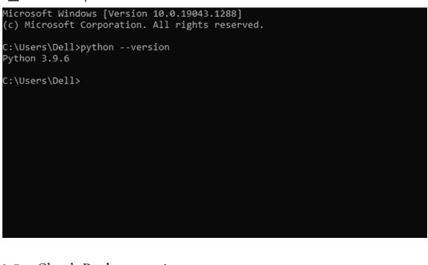

图 2.5 检查 Python 版本。

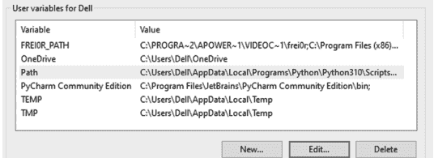

图 2.6 在 Windows 上安装 Django。

```
>>>print("Python Interactive Session")
Python Interactive Session
你可以在那里执行任何操作，例如计算、表达式和循环语句。
示例：
C:\Users\PC>python3
Python 3.9.7 (tags/v3.9.7:1016ef3, Aug 30 2021, 20:19:38) [MSC v.1929 64 bit (AMD64)]
on win32
.
>>> 34 + 34
68
```

34 ■ 精通 Django

```
>>> name = "Python"
>>> name
'Python'

>>> for i in range(1,10):
... print(i)
1
2
3
4
5
6
7
8
9
```

要检查本地系统中的版本，请运行此命令 - python3 --version

```
C:\Users\PC>python3 --version
Python 3.9.7
```

它会告诉你你的 PC 上安装了哪个版本。

现在，我们已经准备好使用 Python 了。

如果你的 Python 安装在“C:\Program Files\Python\”中，则需要将以下路径添加到环境变量的 Path 中。

## Python 解释器

解释器是你的程序和计算机之间的一个软件层。它读取你的代码并执行其中包含的指令。你可以在交互式提示符中键入并运行 Python 节点。此外，这允许我们使用命令行与 Django 项目进行交互。

- **在 MacOS 上安装：** 这里我们将介绍如何在 MacOS 中安装 Python。

    如何使用交互式解释器进行测试。

    安装步骤：

    要在 macOS 上安装 Python3，请访问 https://www.python.org/downloads/macos/。

    选择要下载的最新版本，即 Python 3.10.0。

    使用 Finder 定位文件，然后双击包文件。

    通过在终端中使用以下命令检查 Python3 来确认安装成功：

    Python3-v

- **在 LINUX/UNIX 上安装：** 大多数 Linux 发行版都预装了 Python，因此你的 Linux 安装很可能已经捆绑了 Python 库。这是因为一些 GTK+ 应用程序需要 Python 作为依赖项。

    要验证你的 Linux 机器是否安装了 Python，请打开终端，然后键入以下内容：

    python -v

    如果安装了 Python，它应该显示所需的 Python 版本号。

    然而，如果未安装 Python，你可以直接从 Linux 的包管理器安装它。对于 RPM 发行版，例如 Fedora 或 openSUSE，你应该从包管理器或 Pacman 安装 Python。

    对于 DEB 发行版，例如 Ubuntu 或 Debian，或 Linux Mint，你可以从包管理器或通过终端安装。要通过终端安装 Python，请打开一个终端窗口，然后首先刷新你的存储库：

    sudo apt refresh

接下来，获取Python依赖项并安装它们：
sudo apt-get install python
请注意，某些发行版可能需要您指定版本号：
sudo apt-get install python3.8
完成后，您将在本地机器上准备好并部署Python。然后您可以继续下一步。要在LINUX/UNIX上安装Python3，请访问 https://www.python.org/downloads/source/。

## 什么是PIP？

Python的标准包管理器允许我们安装和管理不属于Python标准库的额外包。pip代表“首选安装程序”或“Pip安装包”。如果您使用的是旧版本，则需要安装PIP。

在Windows上安装PIP
要安装PIP，请输入以下内容：

- Python get-pip.py
- 您可以使用以下命令查看目录内容：dir
- 使用pip验证安装，
- pip help
- 在Windows上升级pip，
- pip --version

PIP命令

1. 安装包 – python3 –m pip install package_name
2. 卸载包 – python3 –m pip uninstall package_name
3. 列出所有已安装的包 – python3 –m pip list
4. 自动创建requirements.txt – python3 –m pip freeze > requirement.txt
5. 升级包 – python3 -m pip install package_name --upgrade
6. 获取包信息 – python3 -m pip show package_name
7. 这些是在系统中安装Python时使用的基本命令

## 设置PYTHON虚拟环境

为什么使用虚拟环境？
它允许您轻松管理项目依赖项。假设您有两个项目A和B。两者使用不同版本的Python。像A这样的Django使用Python2和Django A，而B使用Python1和Django 2。请记住，两者都有独立的虚拟环境，互不干扰（图2.7）。

组织文件夹
您不必将venv文件夹放在项目文件夹内。请记住，Django将下载到venv内部（图2.8）。

冻结依赖项
这意味着您的项目包列表可以使用pip freeze命令存储在文件中。

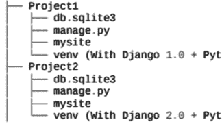

图2.7 不同项目，不同虚拟环境。

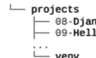

图2.8 带有虚拟环境的项目。

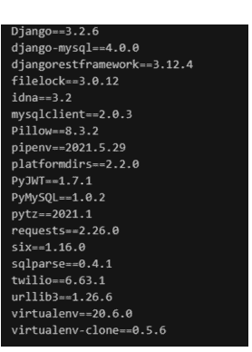

图2.9 Pip Freeze命令。

Pip freeze > requirement.txt
Pip是一个Python包管理器（图2.9）。
这些依赖项（包）可以使用pip install命令安装：
pip install –r requirement.txt
另一种将venv包含在您的机器中的方法

- 使用仓库
- 使用Virtualwrapper

它可能看起来像这样：

**对于Windows：** Python虚拟环境的主要目的是为Python项目创建一个虚拟环境。每个项目都可以有自己的依赖项。
示例：我们需要为项目A和项目B分别创建一个独立的虚拟环境。可以使用virtualenv或pyenv命令行工具来创建。
以下是创建和激活虚拟环境的命令：
使用以下命令为项目创建一个新目录

- mkdir project_name
- Cd project_name
- venv命令创建虚拟环境。使用activate.bat脚本激活它
- python -m venv even
- venv/Scripts/activate.bat
- (venv)前缀表示环境处于活动状态：
- (venv) C:\User\PC\project_name>
- 其他操作系统创建和激活虚拟环境的步骤相同。

首先，如果您不使用Python3，您需要使用PIP安装virtualenv工具：

- pip install virtualenv
- virtualenv env
或者
- 使用Python3，您可以遵循此命令：
- py -3 -m env env_name

**对于Ubuntu：** 使用pip3安装该工具的步骤：

- Sudo pip3 install virtualwrapper
- 在shell末尾添加几行（文件名为.bashrc）
- 确保您检查目录路径，然后按照以下步骤操作：

1. export WORKON_HOME = $HOME/ .virtualenvs
2. export VIRTUALENVWRAPPERS_PYTHON=/usr/bin/python3
3. export VIRTUALENVWRAPPERS_PYTHON_ARGS ='-p /usr/bin/python3 `
4. export PROJECT_HOME = $HOME/Devel
5. source /user/local/bin/virtualwrapper.sh
6. 提示：VIRTUALENVWRAPPERS_PYTHON和VIRTUALENVWRAPPERS_PYTHON_ARGS只是安装变量，source /user/local/bin/virtual wrapper.sh指向virtual wrapper.sh的位置。

40 ■ 精通Django

**对于macOS：** 步骤与Ubuntu的安装完全相同。请按照以下步骤操作：

- 使用pip安装virtualwrapper：
- Sudo pip3 install virtualwrapper

确保您检查目录路径，然后按照以下步骤操作。

1. export WORKON_HOME = .virtualenvs
2. export VIRTUALENVWRAPPERS_PYTHON = /usr/bin/python3
3. export PROJECT_HOME = $HOME/Devel
4. source /user/local/bin/virtualwrapper.sh

提示：VIRTUALENVWRAPPERS_PYTHON和VIRTUALENVWRAPPERS_PYTHON_ARGS只是安装变量，source /user/local/bin/virtual wrapper.sh指向virtualwrapper.sh的位置。

使用虚拟环境的命令
在使用虚拟环境时，您只需使用几个命令：

1. **deactivate：** 退出Python虚拟环境
2. **work on：** 列出所有可用的虚拟环境
3. **work name_of_venvironment：** 激活当前虚拟环境
4. **reversal name_of_venvironment：** 删除指定的虚拟环境

## 使用PIP安装DJANGO

在安装Django之前，请使用上述PIP命令安装虚拟环境设置。Python中的虚拟环境称为virtualenv，我们使用PIP在命令提示符中安装它：

- pip install virtualenv（图2.10）
- 确保您的pip版本是最新的。您可以这样做。

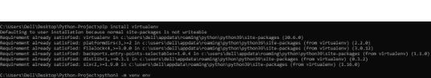

图2.10 安装虚拟环境。

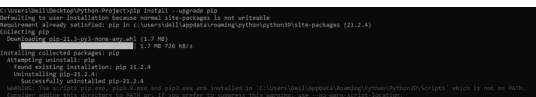

图2.11 检查pip版本。

Pip install – upgrade pip。

或者（图2.11）

- 现在，您需要通过输入以下内容为项目创建一个虚拟环境：

  使用pip设置虚拟环境

  virtualenv your_environment_name 或者

  python3 –m venv your_environment_name（您可以为环境指定任何名称）

接下来，通过使用ls命令列出所有目录来确认环境（名称可以是任何名称）目录已创建

- >ls

一旦virtualenv完成设置您新创建的虚拟环境，现在打开Windows Explorer，查看virtualenv为您创建了什么。在您的主目录中，您现在将看到一个名为 \ your_environment_name（或您为虚拟环境指定的任何名称）的文件夹。每当您打开该文件夹时，您将看到以下内容：

- C:\Users\PC\Desktop\Python-Project\env\Scripts

- （env是您的环境名称）。

- 要使用此Python虚拟环境，我们必须激活它，因此让我们返回命令提示符并输入以下内容：

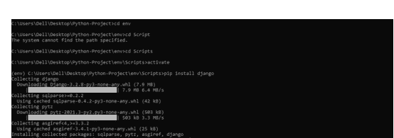

图2.12 激活环境。

- 激活虚拟环境
- your_environment_name/Scripts/activate（图2.12）

这将运行虚拟环境\Scripts文件夹内的activate脚本。您会注意到您的命令提示符现在已更改：

- (env) C:\Users\PC\Desktop\Python-Project\env\Scripts

现在您的Python虚拟环境正在工作。让我们在其中安装Django。

## 使用PIP从本地TAR.GZ文件安装DJANGO

.tar.gz文件由TAR打包后跟GNU zip（gzip）压缩组合而成，用于UNIX/LINUX系统。要使用这些文件，首先，我们必须解压包含.tar和.gz文件的文件。
让我们看看如何从.tar和.gz文件中获取这些文件。

- 导入该特定模块
- 打开.tar.gz文件
- 将文件解压到特定文件夹
- 关闭文件

现在这些文件已准备就绪，打开命令提示符并运行此命令。
Pip install /home/your_folder/Django-3.3.tar.gz（版本号可能会更改）。
要使用，您只需在Python文件中导入tarfile。

## 从 Git 安装 Django

可以通过克隆 Django Git 仓库到本地，直接从 Git 下载 Django。

Django 使用 Git 进行源代码管理。请为您的操作系统下载 Git。Git 仓库托管在 Github 上。请在 Github 上创建账户，并像这样创建您 fork 的本地副本。

- 使用此命令将创建 Git 文件夹
- git clone https://github.com/github_username/django.git
- 然后 cd 到 Django 文件夹（现在您的 Github 仓库将被称为“origin”）
- 将 Django/Django 设置为“upstream”远程仓库（这指定了 Django 官方仓库的引用）
- 执行这些 git 命令
- git remote add upstream git@github.com:django/django.git.
- git fetch upstream

> 注意：Django git 官方仓库：https://github.com/django/django。Git 有很多命令，比如本地和远程的。我们需要在使用前理解这些命令。

- **Git init**：它将使文件夹/目录成为 git 仓库
- **Git adds**：将文件添加到 Git 的暂存区。在 Git 中，提交任何存储之前总是使用 add。一次移动多个文件时，使用 Git add。（不要忘记在 add 后面加一个点）。
- **Git status**：返回当前工作分支。如果文件在暂存区或没有更改，它将返回“nothing to commit”。

## 安装和创建 Django 项目

在您的命令运行的确切位置，运行此命令安装 Django：

44 ■ 精通 Django

- pip install Django

    或者（您也可以像这样定义您的版本）

    pip install django==1.8.13（图 2.12）

    在运行您的项目之前，请确保您位于项目位置，而不是在 /Scripts 文件夹中（图 2.13）。

    创建您的 Python 项目。

- Django-admin startproject Project

    （这将在您的位置创建 Project 名称文件夹，现在使用 cd 命令移入该文件夹。）

    运行命令 django-admin startproject projectname。

    然后将您的目录更改为 project。

    在项目文件夹内运行 startapp，

    django-admin startapp appname（图 2.14）。

    现在，您的 Python 项目已准备好运行。

- python manage.py runserver

    （上述命令帮助您运行您的 python 项目。）

    PS C:\Users\PC\Desktop\Python-Project\Project> Python manage.py run server

    Watching for file changes with StatReloader

```
(env) C:\Users\Dell\Desktop\Python-Project>cd ..
(env) C:\Users\Dell\Desktop>cd Python-Project
```

图 2.13 移入根目录。

```
(env) C:\Users\Dell\Desktop\Python-Project>django-admin startproject Project
(env) C:\Users\Dell\Desktop\Python-Project>cd Project
(env) C:\Users\Dell\Desktop\Python-Project\Project>python manage.py runserver
Watching for file changes with StatReloader
Performing system checks...
System check identified no issues (0 silenced).
You have 1 unapplied migration(s) on Project. Your project may not work properly until you apply the migrations for app(s): admin, auth, contenttypes, sessions.
Run 'python manage.py migrate' to apply them.
Django version 2.2.5, using settings 'Project.settings'
Starting development server at http://127.0.0.1:8000/
Quit the server with CTRL-BREAK.
```

图 2.14 移入项目目录。

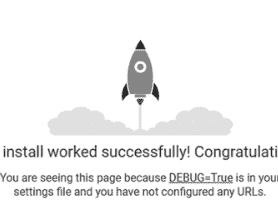

安装成功！恭喜！
您看到此页面是因为您的设置文件中 DEBUG=True，并且您尚未配置任何 URL。

图 2.15 运行服务器。

```
Performing system checks...

System check identified no issues (0 silenced).

You have 18 pending migrations. Your project might not work correctly until you will not apply the migrations for app(s): admin, auth, content types, sessions.

Run python manage.py migrate to apply them.

October 23, 2021 - 17:29:43

Django version 3.2.6, using settings ‘Project.settings.’

Starting development server at http://127.0.0.1:8000/

Quit the server with CTRL-BREAK.
```

注意：使用 migrate 命令迁移所有模型（图 2.15）。

Django-admin 是一个命令行工具，可帮助您管理项目的所有任务：

```
Django-admin startproject project_name
```

## 如何更改默认端口？

默认情况下，您的服务器在端口 8080 上运行，您可以分别传入 IP 地址和端口号。

- C:\Users\PC\Desktop\Python-Project\Project> python manage.py runserver 8080

如果您想在网络上另一台计算机上展示您的作品，请使用此命令：

- C:\Users\PC\Desktop\Python-Project\Project> python manage.py runserver 0.0.0.0:8080

## 如何检查 Django 版本？

要验证 Django 是否已安装在您的 PC 上，只需在 PIP 已安装在您的 PC 上后输入“pip show Django”。
示例：

```
C:\Users\PC>pip show Django
Name: Django
Version: 3.2.6
C:\users\PC\appdata\roaming\python\python39\site-packages
Requires: asgiref, pytz, SQL parse
Required by: Django-MySQL, djangorestframework
```

或者，
您也可以通过这种方式检查：

```
C:\Users\PC>python -m django --version
3.2.6
```

一些关于整个安装的参考。
https://www.stanleyulili.com/django/how-to-install-django-on-windows/

您在 Django 中的第一个程序：
移入第二个项目文件夹，并使用 touch 命令或创建新文件来创建一个视图文件。

- C:\Users\PC\Projects> touch view.py

注意：view.py 区分大小写。
现在，我们将编辑两个文件：

- view.py
- url.py

```
# editing view.py file
from django.http.response import HttpResponse
def print(request):
    return HttpResponse("Hello World!")
```

在 view.py 中，您将在此编写逻辑并将结果返回给模板。

```
from .views import *
from django.urls import path
urlpatterns = [
    path('', login,name="login"),
    path('register', register,name="register"),
]
```

在 url.py 中，我们为视图添加一个路径，名称如上 path=” register”，并将路径留空以将模板渲染为项目的主页。编写路径的方法：
语法：path(‘URL’, view method, name )
注意：使用此行从 view 导入所有视图方法：
From .view import *（* 是星号符号，它从特定文件导入所有内容。）

## 模板文件

在浏览器上呈现内容的唯一方法是使用模板。这些在您的项目中被称为静态文件。为此创建一个不同的文件夹，然后将您的文件添加到其中。
不要忘记在项目文件夹的 setting.py 中添加 Static 路径。对于媒体、CSS 文件，文件夹将位于项目文件夹之外。每个应用程序都可以访问该文件夹，前提是您的图像和样式表适用于所有其他应用程序。

```
<!doctype html>
<html lang="en">
<head>
    <title>Title</title>
    <!-- Required meta tags -->
</head>
<body>
    
    
<!-- Optional JavaScript -->
<!-- jQuery first, then Popper.js, then Bootstrap JS -->
</body>
</html>
```

## 创建项目和部署

我们可以使用 star project 命令创建一个新项目，后跟项目名称（您可以更改它）。此命令将在同一目录中创建一个具有给定项目名称的新文件夹。现在，使用 cd 命令移至新目录，并将其部署在本地服务器上。

部署后，您将在命令行界面上看到一堆包含 URL 的文件。将该 URL 复制到您的浏览器，您将看到一条介绍性消息。无需复制，只需按 Ctrl + 链接（URL）。它将自动打开您的浏览器并在本地部署您的项目。完成项目后，在命令行上按 Ctrl + c 退出服务器。

## 使用 Heroku 部署

Heroku 是一个云托管平台；它支持多种语言和 Web 框架，现在我们使用 Django Python。因此，一旦您的 Django 项目准备就绪，您将注册一个免费的 Heroku 账户。Heroku 提供至少五种部署项目的方式：

1. Git
2. Github
3. Docker
4. API
5. Web

现在登录您的 Heroku 账户，然后启用多因素认证（MFA）以增强您账户的保护。它也称为双因素认证。

- 安装 Heroku CLI。
- 如果 Heroku 已经在您的系统中，那么使用 Heroku –version 检查其版本。

## 章节总结

本章介绍了 Django 和 Python 的安装步骤，以及一些 PIP 安装命令。你也可以访问 Django 官方网站，了解更多关于不同类型的 IDE 以及 Django 中第一个 Hello World 程序的信息。

### 文件结构

### 本章内容

- 了解文件结构
- 处理静态文件
- URL 调度器

上一章介绍了各种 Python 语言的 IDE，以及从零开始安装 Python 和 Django。还涵盖了一些 PIP 安装命令。

### 检查项目结构和应用

Django 创建了一个目录结构来明智地管理 Web 应用程序的不同部分。为此，它构建了一个项目和一个应用文件夹。

创建一个合适的项目并对其进行组织有助于保持项目的 DRY（不要重复自己）和整洁。当我们创建一个项目时，Django 本身会根据你提供的项目名称创建一个项目根目录。它包含为你的 Web 应用程序提供基本功能的必要文件。

- **应用：** 它（应用）是一个 Python 包，用于为你的项目添加功能。你可以使用 startapp 命令 "python manage.py startup myApp" 创建新的应用。

你通常通过在 setting.py 文件的 INSTALLED_APPS 列表中添加字符串来启用应用：

```
INSTALLED_APPS = [
    'django.contrib.admin',
    'django.contrib.auth',
    'django.contrib.contenttypes',
    'django.contrib.sessions',
    'django.contrib.messages',
    'django.contrib.staticfiles',
    'myApp', #this you app
]
```

- **项目：** 它是 Django 实例的一组设置。如果你是第一次使用 Django，你需要处理一些初始设置。你需要生成一些代码来组织一个 Django 项目：一个 Django 实例的设置集合，包括数据库配置等等。使用 Django-admin 工具生成一个项目文件夹。

**在 Django 中处理项目。**

### 探索项目文件夹

项目根目录包含数据库、manage.py 文件以及所有未安装在环境文件夹中的应用。Django 包和 Python 安装在 venv 文件夹中。

它使用目录结构来安排 Web 应用程序的不同部分。现在，我们将在这里更详细地讨论 Django 应用结构和项目结构。

**文件结构。**

让我们理解上图中所示文件的功能。首先，我们将讨论项目文件夹。

### Manage.py

该文件基本上用作命令行实用程序，用于部署、调试或运行我们的 Web 应用程序。你可以在 manage.py 中阅读项目的全部详细信息。它作为我们项目的命令行实用程序。它也是调试、部署和运行 Django Web 应用程序的工具。该文件包含运行服务器、makemigrations 或 migrations 以及我们在代码编辑器中执行的其他几个命令。它提供与 Django-admin 相同的功能，但也提供一些特定于项目的功能。

它包含运行服务器、makemigrations 或 migrations 等的代码。

- **runserver**：它用于运行 Django 框架提供的 Web 应用程序服务器。
- **Migration**：它将对模型所做的更改应用到数据库中。
- **makemigrations**：它应用由于数据库更改而进行的新迁移。

1. **\_\_init\_\_.py**：它让你知道该目录包含代码；基本上，这个文件是空的，是告诉 Python 这个特定目录是一个包的唯一方式。它的作用是告诉 Python 解释器这个目录是一个包，并且其中包含这个 \_\_init.py\_\_ 文件。如果你删除这个 init.py 文件，Python 将不再查看其中的模块，你的一些文件将会失败。在 Python 3.3 及以上版本中不需要此文件。所有包都被视为命名空间。\_\_init\_\_ 是 Python 类名中的保留字。
2. **setting.py**：此文件是 Django 项目中的主配置文件。它保存了工作所需的配置值、模板信息和数据库信息。它是 Django 中的核心文件，包含 Web 应用程序需要做的所有配置。在这里，你可以安装你为项目创建的应用。大多数项目配置都在 setting.py 中进行。它包含 sqlite3 作为内置数据库。我们可以根据创建的 Web 应用程序，在 setting.py 中更改一些设置后，将此数据库替换为 Mysql、PostgreSQL 或 MongoDB。

例如，默认数据库配置如下所示：

```
DATABASES = {
    'default': {
        'ENGINE': 'django.db.backends.sqlite3',
        'NAME': BASE_DIR / 'db.sqlite3',
    }
}
```

对于 PostgreSQL 数据库，我们会这样做：

```
DATABASES = {
    'default': {
        'ENGINE': 'django.db.backends.postgresql_psycopg2',
        'NAME': database_name,
        'USER': 'username',
        'PASSWORD': 'password',
        'HOST': 'localhost',
        'PORT': '',
    }
}
```

要更改你的时区：

```
TIME_ZONE = 'UTC'
```

出于安全目的：这使得在发生错误时显示调试日志，而不是 HTTP 状态码，例如 200、505、400 等等。在本地进行错误检查时将其设置为 True 是很好的，但在生产环境中应将其设置为 False。

```
#WARNING: don not run with debug turned on in production!
DEBUG = True
```

### 中间件

在每种编程语言中，中间件都用于在请求和响应执行期间进行处理。它用于在应用程序中执行功能。这些功能可以是安全会话、身份验证等等。它被挂接到 Django 的请求/响应处理中。它是一个轻量级的低级插件系统，用于整个 Django 的输入或输出。

这是如何工作的？
当用户从任何应用程序向服务器发出请求时，一个 WSGI 处理程序会启动，它处理以下事项：

1. 解析请求的 URL
2. 调用视图函数
3. 处理异常方法
4. 遍历每个响应方法。
5. 加载在 setting.py 的 MIDDLEWARE 元组中编写的所有中间件类。

### 中间件类型

1. 内置中间件
2. 自定义中间件

内置中间件在你创建项目时默认存在于 Django 中。你也可以在 setting.py 中名为 MIDDLEWARE 的部分查看。

```
MIDDLEWARE = [
    'django.middleware.security.SecurityMiddleware',
    'django.contrib.sessions.middleware.SessionMiddleware',
    'django.middleware.common.CommonMiddleware',
    'django.middleware.csrf.CsrfViewMiddleware',
    'django.contrib.auth.middleware.AuthenticationMiddleware',
    'django.contrib.messages.middleware.MessageMiddleware',
    'django.middleware.clickjacking.XFrameOptionsMiddleware',
]
```

所有这些中间件都有自己的功能。有些用于安全目的、会话创建和 csrf，以防止我们的网站受到各种攻击。还有用于安全的身份验证中间件。

## 自定义中间件

你可以拥有自己的中间件，并在 `MIDDLEWARE` 部分的最后安装你的中间件。

## 如何创建中间件？

1.  创建一个 Python 包，其中包含一个名为 `middleware` 的文件，并在 `__init__.py` 中定义。
2.  创建一个名为 `custommiddleware.py` 的文件，并使用常规的类和函数。
3.  现在，将中间件编写为函数或类，其对象是可调用的。

```python
class CustomMiddleware:
    def __init__(self, getback_response):
        self.getback_response = getback_response
    def __call__(self, request):
        # This Code that is executed in each request before the view is called
        response = self.getback_response(request)
        # This Code that is executed in each request after the view is called
        return response
    def process_view(request, view_func, view_args, view_kwargs):
        # The code is executed just before the view is called
    def process_exception(request, exception):
        # The code is executed if an exception is raised
    def process_template_response(request, response):
        # This code will execute if the response contains a render() method
        return response
```

此外，还提供了各种内置中间件，允许你编写自己的中间件。请查看 Django 项目中的 `setting.py` 文件，该文件已包含多个用于维护应用程序安全性的中间件。

这些是 `setting.py` 文件中的内置中间件。要激活中间件应用，请在你的 `MIDDLEWARE` 中添加，它应该用单引号括起来，如下所示：

```python
MIDDLEWARE = [
    'your_app_name.middleware_directory.custom_middleware_file.CustomMiddleware_class',
    'django.middleware.clickjacking.XFrameOptionsMiddleware',
]
```

## 中间件方法

1.  `process_view (request, view_func, view_args, view_kwargs)`
    它接收 `HttpRequest` 对象、函数对象、传递给视图的参数列表。它返回 `None` 或 `HttpResponse`，其中结果会显示。
2.  `process_template_response (request, response)`
    它接受两个参数，第一个是 `HttpRequest` 的引用，第二个是 `HttpResponse` 对象。它返回一个实现了 `render` 方法的响应对象。
3.  `process_exception(request, exception)`
    此方法接受两个参数，第一个是 `HttpRequest` 对象，第二个是视图函数读取的 `Exception` 类对象。

# urls.py

URL 是一个通用资源定位符，用于提供互联网上存在的资源的地址。它包含我们网站所需的所有站点部署数据，例如服务器名称和端口。简单来说，它告诉 Django，当用户访问此 URL 时，应将他们重定向到特定的网站或图像等。

```python
from django.urls import path
# from .urls import *
patterns = [
    path('',include('First.urls')),
    path('',include('Framework.urls')),
    path('admin/', admin.site.urls),
]
```

## URL 映射

现在，我们将学习应用程序的路由。在介绍中，我们了解了 MTV，并且 Django 是一个通过 URL 定位器接收用户请求并做出响应的 Web 应用程序框架。为了处理 URL，Django 使用了 URLs 模块。上面的例子展示了如何在 Django 中定义 URL。
URL 包含各种函数、路径（路由、视图、kwargs、名称），第一个参数是字符串或正则表达式类型的路由。在第二个参数中，定义了视图，该视图向此用户返回响应（模板）。

## 最常用的 Django URL 函数

| 函数 | 描述 | 示例 |
| :--- | :--- | :--- |
| `path(route, view, kwargs=None, name=None)` | 它将返回一个用于包含在 url 模式中的元素 | `path('index', views.index, name='main-view')` |
| `include(module, namespace=None)` | 这是一个函数，它接受一个完整的 Python 导入路径 URLconf 模块，该模块应在此处“包含” | |

让我们在 `view.py` 中创建一个函数，该函数将从同一文件夹的 `url.py` 映射。

```python
# this is the url.py
from django.contrib import admin
from django.urls import path
from myapp import views # Or (from myapp import *)
urlpatterns = [
    path('index/', index, name="index"),
]
```

现在，运行服务器并在浏览器中输入 `localhost:8000/index`。随后的 URL 将被映射到 URL 列表中，并从视图文件中调用函数。这称为 URL 映射。

```python
# views.py
from django.shortcuts import render
from django.http import HttpResponse, HttpResponseNotFound
from django.views.decorators.http import require_http_methods

def index(request):
    return HttpResponse('<h1>This is Http GET request for index page.</h1>')
```

视图表示为 Python 函数或 Python 类的方法。但在早期，存在基于函数的视图，随着 Django 的发展，Django 的开发者添加了基于类的视图。基于类的视图为 Django 视图增加了额外的功能和可扩展性。它有许多内置的基于类的视图。例如：

- **基础视图**
  - View
  - Template View
  - Redirect View
- **通用显示视图**
  - Details View
  - List View
- **通用编辑视图**：它将继承自 `django.views.generic.CreateView`。
  - FormView
  - CreateView
  - UpdateView
  - DeleteView

```python
class CustomCreateView(View):
    templateName = 'form.html'
    formName = MyForm
    def get(self, request, *args, **kwargs):
        form = self.formName
        return render(request, template_name, {'form': form})
    def post(self, request, *args, **kwargs):
        form = self.formName(request.POST)
        if form.is_valid():
            form.save()
            return HttpResponseRedirect('main')
        else:
            return render(request, self.templateName, {'form': form})
```

基于函数的视图：它们是可调用的函数。它继承了 `as_view()` 方法，该方法根据 HTTP 动词（get、post 等）使用 `dispatch()` 方法。它们接受一个 `HttpRequest` 对象并返回或引发异常。

优点：

1.  实现简单。
2.  易于阅读和理解其工作原理。
3.  可直接使用装饰器。

缺点：

-   难以像基于类的视图那样扩展以重用代码。
-   使用分支处理各种 HTTP 方法。

```python
def index(request):
    return HttpResponse('<h1>This is Http GET request for index page.</h1>')
```

你可以选择任何方法。这完全取决于上下文和需求。

## wsgi.py

它代表将我们的应用程序部署到 Apache 等服务器上。**WSGI（Web 服务器网关接口）** 可以是一个描述服务器如何与 Web 应用程序交互的规范。在这里，你将不使用 Web 服务器，而是由 WSGI 服务器来处理。它描述了服务器与应用程序交互的方式。

## asgi.py

**异步服务器网关：** 它是一个与 WSGI 类似工作的接口，但它比其他接口更有用，因为它在 Django 开发中提供了更大的自由度。

## 探索 APP 文件夹

此项目文件夹包含所有应用程序的默认目录。让我们详细了解一下 Django 应用程序的结构。

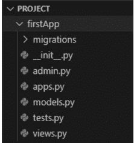

让我们浏览一下应用程序目录中第一个应用文件夹的文件，以了解它们的用途。

-   **`__init__.py`**：此文件通常是一个空文件，用于将此目录标记为 Python 包，并且与 Django 项目结构中的 `__init__.py` 文件具有相同的功能。
-   **`__pycache__`**：这包含字节码，使程序启动更快。
-   **`admin.py`**：Django 在 admin 中有一个自动管理界面，你可以用来管理内容。`admin.py` 用于将模型注册到 Django 管理面板。所有现有的模型都有一个唯一的超级用户管理员，可以控制存储的信息。在这里，你可以注册你的模型以在该特定应用程序的管理面板中使用。我们将在接下来的章节中介绍模型。我们将使用名为 `django-import-export` 的包通过 Django 管理员导入和导出数据。
-   **`apps.py`**：此文件是一个通用的入口点，处理应用程序的应用程序配置。这有助于用户包含任何应用程序配置，你也可以添加一些应用程序的属性。

```python
from django.contrib import admin
from .models import *
# Register your models here.
admin.site.register(Register)
```

## 掌握 Django

```python
from django.apps import AppConfig

class FirstConfig(AppConfig):
    default_auto_field = 'django.db.models.BigAutoField'
    name = 'First'
```

- **views.py**：视图是接收 Web 请求并返回响应的 Python 函数。它决定了我们在渲染 Django Web 应用时看到的内容。这个文件至关重要，`view.py` 负责实际处理 HTTP 请求。

    在你的视图文件中导入所有 URL 以供后续使用。

    ```python
    from .models import *

    def User(request):
        return render(request, 'user_details.html')
    ```

## 迁移文件夹

迁移文件夹包含应用的迁移文件。这些文件用于对数据库应用更改，并具有数据库架构的版本控制功能。每当我们执行 `makemigrations` 和 `migrate` 命令时，更改会自动应用。

## models.py

这些是我们所使用的数据库结构的蓝图，因此包含了数据库的信息。它是你应用中最重要的文件之一。它遵循 MTV 设计架构。

```python
from django.db import models

# 在此处创建你的模型。
class Register(models.Model):
    Username = models.CharField(max_length=20)
```

# urls.py

它处理和搜索所有 URL 的 URL 模式。该文件用于将应用中的 `Views.py` 与主机 Web URL `apps.py` 链接起来。在 `urls.py` 中，`^` 表示 URL 的开始，`$` 表示 URL 的结束。其前后不能添加任何额外内容。

## tests.py

此文件包含用于应用程序运行的不同测试用例。几乎每个单独创建的应用程序中都存在此文件。它将帮助你为数据库编写简单的测试用例。

## 需要创建的文件和目录

当你处理 Django 项目时，你会在过程中创建许多新的附加文件和目录。最常见的文件如下：

- **模板目录**：Django 项目的另一个重要组成部分。模板是 MTV 模式中的 “T”。你可以在模板中编写网站的显示逻辑。它基本上包含不同的 HTML 文件。你可以在根目录中创建模板文件夹。

- **静态目录**：你应该在根目录中创建静态目录。这将包含被视为静态文件的 CSS 文件、JavaScript 文件和图像。

## DJANGO 命令

让我们讨论一些 Django 命令。

## 创建项目的目录结构

以下命令创建项目目录。一个项目可以包含多个应用。

- `Django-admin.py startproject project_name`

## 在项目中创建新应用

以下命令创建应用目录。你可以在项目中创建多个应用。

```bash
python manage.py startapp APPNAME
```

## 运行服务器

以下命令有助于在本地服务器上部署你的项目：

- `python manage.py run server`

## 创建数据库迁移

`makemigrations` 命令创建迁移文件。这些文件随其余代码一起移动，并在其他环境中应用：

- `python manage.py makemigrations`

## 迁移数据库

`migrate` 命令更新数据库架构。在进行迁移后，请始终使用以下命令：

- `python manage.py migrate`

## 创建管理员用户

`createsuperuser` 命令创建主管理账户。此用户默认拥有所有权限（添加、编辑、更新、删除）。当我们在项目文件夹终端中运行此命令时，它会要求提供电子邮件、用户名和密码。请确保你必须使用强密码和唯一的用户名。

- `Python manage.py createsuperuser.`

## 在 Git Bash 中创建管理员用户

- `winpty python manage.py createsuperuser`

## DJANGO 是一个松耦合框架

它被称为松耦合框架，因为其 *MVT 模式*，这是 MVC 架构的一个变体，与服务器代码完全不同。它有助于将服务器代码与客户端相关代码分离。这些组件相互支持，降低了维护项目应用程序的风险。Django 被称为松耦合框架。

## Django 的 URL 配置

这个原则在实践中有一些很好的例子。在 Django 应用程序中，URL 定义及其调用的视图函数是松耦合的。

> 如果两段代码是松耦合的，那么对其中一部分进行的持续更改对另一部分的影响很小或没有影响。

## 附加配置

你可以为你的 Django 项目添加什么额外内容？

- Bootstrap
- 静态文件
- 媒体文件
- 模板

这些将涵盖在你的项目中安装 Bootstrap 所需的所有必要事项。所以让我们首先谈谈 Bootstrap 是什么。它是用于快速、无任何问题地开发响应式和基于移动设备的网站的最受欢迎的 CSS 框架。它包含各种类，你可以在 HTML 标签中使用。它是一个专注于简化网页开发的 HTML、CSS 和 JS 库。有多种方法可以将 Bootstrap 添加到你的项目中。

- **在你的本地系统中安装 Bootstrap**：访问 Bootstrap 的官方网站 “https://getbootstrap.com/docs/3.4/getting-started” 并单击 Download Bootstrap 按钮；它将下载到你的 PC 上。然后从下载的 zip 文件夹中提取文件，然后你只需将该文件夹复制到你的项目中并添加它。在下载之前，你还会得到三个选项：Bootstrap 本身、源代码和 Sass。

- **直接在你的项目中通过 script 标签添加其 CDN**：在同一官方网站下方，你将获得 Bootstrap CDN。复制该 CDN 链接并将其粘贴到你的 HTML 文件中。将 CSS 链接粘贴到 HTML 的 head 部分，将 script 链接粘贴到 `</body>` body 结束标签上方的 script 标签本身中。

    示例：

    ```html
    <!--这是 CSS 链接-->
    <link rel="stylesheet" href="https://stackpath.bootstrapcdn.com/bootstrap/4.3.1/css/bootstrap.min.css">
    <!--这是 Js 链接-->
    <script src="https://stackpath.bootstrapcdn.com/bootstrap/4.3.1/js/bootstrap.min.js"></script>
    ```

- 使用终端，运行命令来安装它。
    1. 使用 bower 安装，使用如下简单命令：
        `C:\Users\PC\Project> bower install bootstrap`
    2. 使用 npm 安装
        `C:\Users\PC\Project> npm install bootstrap@3`
    3. 使用 composer 安装
        `C:\Users\PC\Project> composer require twbs/bootstrap`

但在 Django 中，你可以使用一个使事情更容易实现的终端。现在在你的项目中创建一个名为 `static` 的文件夹或目录，然后在你的 `setting.py`（位于你的主项目文件夹中）中添加几行代码。

```python
import os
STATIC_DIR = os.path.join(BASE_DIR, 'static')
STATIC_URL = '/static/'
```

要在模板中加载你的静态文件，请在你的基础 `.html` 文件开头添加以下代码，然后你就可以访问你的静态文件夹了。

```django

```

在 `setting.py` 中添加上述代码行。确保你的目录与上述相同。上述代码定义了你导入 `os` 模块，然后将应用程序的基础路径与你的静态文件夹连接起来。现在在你的项目基础模板（即包含项目每个页面上相同渲染内容的标准模板文件）中加载这个静态文件夹。在你的项目中添加媒体文件与上述相同；你只需将模板文件夹的名称更改为 `media`，然后在你的 `setting.py` 中添加一行

```python
STATICFILES_DIRS = [
    STATIC_DIR, MEDIA_DIR
]
```

一步一步地执行这些步骤。不要混合它们。一次尝试一个。上述代码定义了你添加了两个路径。

- **模板**：Django 借助 HTML 在浏览器上渲染其内容。你只需要在你的项目中有一个 `templates` 文件夹。然后在 `setting.py` 中添加模板的路径，如下所示：

    ```python
    # setting.py
    TEMPLATES = [
        {
            'BACKEND': 'django.template.backends.django.DjangoTemplates',
            'DIRS': ['template'], #在 [] 中写入你的文件夹名称。
            'APP_DIRS': True,
            'OPTIONS': {
                'context_processors': [
                    'django.template.context_processors.debug',
                    'django.template.context_processors.request',
                    'django.contrib.auth.context_processors.auth',
                    'django.contrib.messages.context_processors.messages',
                ],
            },
        },
    ]
    ```

Django 静态（CSS、JavaScript、图像）配置。

- **加载图像示例**

    ```html
    <!DOCTYPE html>
    <html lang="en">
    <head>
        <meta charset="UTF-8">
        <title>索引页</title>
        
    </head>
    <body>
        
    </body>
    </html>
    ```

## 加载JavaScript

```html
<!DOCTYPE html>
<!-- index.html -->
<html lang="en">
<head>
  <meta charset="UTF-8">
  <title>Index</title>
  
  <script src="" type="text/javascript"></script>
</head>
<body>
</body>
</html>
```

## Script.js

```javascript
alert("I am Learning Python with Django");
```

`<script src="" type="text/javascript"></script>` 这个链接用于将外部JavaScript文件链接到index.html。

## Django加载CSS

```html

<!DOCTYPE html>
<html lang="en">
<head>
  <meta charset="UTF-8">
  <title>Index Page</title>
  <link href="" rel="stylesheet">
</head>
<body>
<p> I am Learning Python with Django </p>
</body>
</html>
```

## style.css

```css
p{
color : yellow;
}
```

## URL调度器

Django允许你设计清晰且可用的URL。要为应用创建URL，你需要创建一个非正式地称为URLconf（即URL配置）的Python模块。

Django如何处理请求？

它确定要使用的根URLconf模块。该值将是`ROOT_URLCONF`设置，但如果传入的`HTTPRequest`对象具有URL conf属性（），则该属性将用于替代`ROOT_URLCONF`设置。

它加载Python模块并查找变量`urlpatterns`。

它遍历每个`URL_pattern`。这应该是一个Django `URLs.path()`的序列。

一旦URL模式匹配，它就导入给定的视图。视图接收以下参数：

1. 一个`HttpRequest`实例。
2. 如果匹配的URL模式不包含命名组，则从正则表达式中匹配。
3. 关键字参数由路径表达式匹配的任何命名部分组成，并被可选`kwargs`中指定的参数覆盖。

如果没有URL匹配，或者在此过程中的任何点引发异常，Django将调用错误处理。

示例：

```python
from django.urls import path
from . import views

urlpatterns = [
    path('student/id/', views.student, name='student_login'),
    path('student/<int:year>/', views.student, name='student_login'),
    path('student/<int:year>/<int:month>/', views.month_archive),
]
```

注意：要从URL获取值，请使用尖括号`< >`。`<int: name>`将为URL添加数据类型，以便用户只能传递一个整数。

注意：不需要在任何URL前添加前导斜杠`/`，因为每个URL都有它。一旦传递了URL请求，该URL应提供与你在`url.py`中提供的类似路径。否则，它将引发错误。

## 模块 vs. 包

那么，Django中的模块是什么？
这两者有时会让一些人感到困惑，什么是模块和包。所以让我们花点时间来解释它们。

- **包：** 它指的是Python模块的集合。它是一个单独的Python文件，而包是文件的集合。它包含一个名为`__init__.py`的额外文件，以区分此类模块。Python中有许多包，你可以将它们导入到你的Django模块中。
  - abc
  - datetime
  - http
  - json
  - math
  - random
  - importlib
  - functools
  - collections
  - os
  - multiprocessing
  - inspect
  - pdb

## 章节总结

在本章中，我们学习了Django项目的结构，每个组件如何与其他文件协作，以及如何创建Web应用程序。我们还通过一些示例讨论了Django应用的额外功能。

## 第4章

## Django的模型

### 本章内容

- 了解模型的工作原理
- Python内置函数
- 数据库配置

在上一章中，我们学习了Django中的文件结构。本章解释了内置文件，如`model.py`、`view.py`等。
除了Django文件的结构外，还提供了应用程序和主项目中每个文件的解释。
我们将在本章讨论的主题是关键的：你如何在Django中操作你的数据结构？

## Django模型基础

本章涵盖：

1. 模型的定义
2. 安装模型
3. 如何创建和使用模型
4. 模型中不同类型的字段
5. 模型格式

在Django中，模型是关于你的数据的信息来源。它由存储在数据库中的数据的基本字段和行为组成。每个模型映射到数据库的单个表。

示例：

```python
from django.db import models

class Event(models.Model):
    name = models.CharField('Event Name', max_length=120)
    event_date = models.DateTimeField('Event Date')
    venue = models.CharField(max_length=120)
    manager = models.ForeignKey(max_length=60)
    description = models.TextField(blank=True, default=None)
```

在上面的例子中，我们有`event`类，它有各种字段，如其名称、`event_date`、场地、经理和描述。

`project`字段定义了一个外键类型：`manager`。定义与`Event`模型关系的`project`字段有两个额外的属性：

1. **Null：** 这决定元素是否可以定义为null。此属性在`project`字段中意味着其任务不一定与项目相关。
2. **Default：** 这设置字段将具有的默认值。

要使用此模型，我们需要在`admin.py`中注册它，以便我们可以获取模型（event）中的所有数据。

```python
from django.contrib import admin
from .models import *
# Register your models here.
admin.site.register(Event)
```

它代表`django.db.models.Model`的子类，每个字段代表数据库字段（列）。

我们已经编写了代码；现在让我们为数据库创建表。第一步是在Django项目中激活此模型。再次编辑`setting.py`文件，查看`INSTALLED_APP`设置。基本上，`INSTALLED_APPS`告诉Django哪些应用在给定项目中被激活。默认情况下，它看起来像这样：

```python
INSTALLED_APPS = [
    'django.contrib.admin',
    'django.contrib.auth',
    'django.contrib.contenttypes',
    'django.contrib.sessions',
    'django.contrib.messages',
    'django.contrib.staticfiles',
    'NewApp',
]
```

`'NewApp'`指的是我们正在处理的本书的应用。每个`INSTALLED_APPS`由其完整的Python路径表示——包的路径，用点分隔，指向其应用包。例如：`django.contrib.sites`。

现在Django应用已在`setting.py`中激活，我们可以在数据库中创建数据库表。首先，让我们通过运行以下命令来验证模型：

```bash
python manage.py validate
```

`validate`命令检查你的模型的语法和逻辑是否正确。你将看到消息“0 is no error found”。任何时候你认为模型有问题，请在终端中运行`python manage.py validate`。它会捕获所有标准的模型问题。

## 如何创建模型

```python
from django.db import models
from django.contrib.auth.models import User

class Post(models.Model):
    title = models.CharField(max_length=20)
    description = models.CharField(max_length=100)
```

这就是你的模型的样子；让我们讨论代码的每一点。首先，你必须从`Django.db`导入模型以在我们的代码中建模。第二行显示我们从`Django.contrib.auth.models`导入了一个内置的`User`。这个用户在我们的管理面板中可用。我们有一整章关于Django的管理面板。

每个模型名称应以大写字母开头，其余字母应为小写。在上面的代码中，我们必须创建一个`POST`模型，其首字母是大写，其余是小写。它应该用类语法编写：

```python
class ModelName():
    # rest of the code.
```

`model.Models`是传递给类的参数，因为之后我们可以访问模型以在我们的字段中使用，我们将添加这些字段来在数据库中存储不同的值。

`title`和`description`字段被指定为类属性，每个属性映射到一个数据库列。

```sql
CREATE TABLE POST (
    "id" INT NOT NULL PRIMARY KEY, -- automatically allot
    "title" varchar(20) NOT NULL,
    "description" varchar(100) NOT NULL
);
```

`id`字段是自动创建的。表的名称与模型的名称类似。这是在模型的数据库中存储数据的方式。

`title`和`description`——意味着在SQL查询语言中具有`varchar`数据类型。

一旦定义了模型，你需要告诉Django你将在项目中使用该模型。首先，你必须在`setting.py`的`INSTALLED_APPS`中添加你的应用名称：

```python
INSTALLED_APPS = [
    #...
    'new app',
    #...
]
```

然后运行`migrate`命令，即`python manage.py make migrations`，然后运行命令`python manage.py migrate`来更新你的数据库。

## 不同类型的字段

字段是适合你数据的数据类型。它在模型类内部定义。

```python
from django.db import models
from django.contrib.auth.models import User
```

class Post(models.Model):
    title = models.CharField(max_length=20)
    age = models.IntegerField(max_length=100)
    date = models.DateField()
    marks = models.IntegerField()

这里的字段是 CharField 和 IntegerField。Django 中有多种数据类型。让我们来看看：

| 字段名 | 类 | 描述 |
| :--- | :--- | :--- |
| AutoField | AutoField(options) | 这是一个自动递增的 IntegerField |
| BigAutoField | BigAutoField(options) | 这是一个 64 位整数，范围从 1 到 9223372036854775807 |
| BigIntegerField | BigIntegerField(options) | 这是一个 64 位整数，范围从 -9223372036854775808 到 9223372036854775807 |
| BinaryField | BinaryField(options) | 这是一个用于存储原始二进制数据的字段 |
| BooleanField | BooleanField(options) | |
| CharField | CharField(max_length, options) | 这是一种用于定义文本表示为字符的类型 |
| DateField | DateField(auto=False, auto_now_add=False, options) | 在 Python 中由 datetime.date 实例表示 |
| DateTimeField | DateTimeField(auto=False, auto_now_add=False, options) | 在 Python 中由 datetime.datetime 实例表示。它也用于日期和时间 |
| DecimalField | DecimalField(max_digits, decimal_places, options) | 这是一个固定精度的十进制数，在 Python 语言中由 decimal 实例表示 |
| DurationField | DurationField(options) | 这是一个用于存储时间段的字段 |
| EmailField | EmailField(max_length=254, options) | 它检查值是否为有效的电子邮件地址 |
| FileField | FileField(upload_to, max_length=100, options) | 这是一个文件上传字段 |
| FloatField | FloatField(options) | 这是一个由 float 实例表示的浮点数 |
| ImageField | ImageField(upload_to, height_field=None, width_field=None, max_length=100, options) | 它从 FileField 获取所有属性和方法，并验证上传的对象是否为有效图像 |
| IntegerField | IntegerField(options) | 这是一个整数字段，其范围从 -2147483648 到 2147483647，在 Django 支持的所有数据库中都是安全的 |
| NullBooleanField | NullBooleanField(options) | 类似于 BooleanField，它允许 NULL 作为选项之一 |
| PositiveIntegerField | PositiveIntegerField(options) | 它必须是正数或零 (0)。其范围从 0 到 2147483647，在 Django 支持的所有数据库中都是安全的 |
| SmallIntegerField | SmallIntegerField(options) | 它类似于 IntegerField，只允许低于某个（取决于数据库的）值的值 |
| TextField | TextField(options) | 此字段的表单部件是用于大型数据文本的 Textarea |
| TimeField | TimeField(auto=False, auto_now_add=False, options) | 在 Python 中由 datetime.time 实例表示的时间 |

## Django 模型是如何工作的？

Django 的模型为底层数据库提供了一个 ORM（对象关系映射）。这是一种强大的编程技术，使得处理批量数据和关系数据库变得更加直接。
SQL 学习起来很有挑战性，但这项技术使一切变得简单，并提供了到对象的映射（ORM 中的 O）（图 4.1）。

## 什么是字段选项？

每个字段（属性）都需要一些参数来设置属性值。例如，max_length、Null、blank 等，还有更多选项。

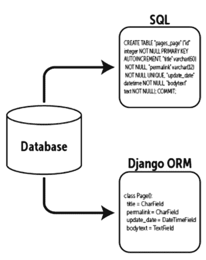

图 4.1 Django 模型。

## 字段选项

| 选项 | 描述 |
| :--- | :--- |
| Null | 在数据库中将值存储为 NULL |
| Blank | 用于允许字段为空 |
| Choices | 它是一个可迭代对象（列表或元组），包含两个元组，用作任何字段的选项 |
| Default | 字段的默认值，可以是一个值或可调用对象 |

## 解释

这里你快速了解了 Django 模型中最常用的选项。每个字段都接受一组参数：有些只接受一个，但其他字段接受多个。例如，CharField 接受 max_length，它指定在数据集中存储数据的 VARCHAR 的大小，以及 Null 属性。

- **Null**：如果 Null 定义为 True，Django 将在数据库中存储空值。但默认值为 False。
- **Blank**：如果此选项为 True，则允许字段为空。默认值为 False。如果字段有 blank=False，则该字段将是必需的。如果为 True，则空值将通过。
- **Choices**：此字段使用一个可迭代对象（例如，元组列表）的 2 元组。默认的表单部件，即你的表单结构，将选择一个框而不是标准的文本字段。

```python
marks = (
    ("60", "10"),
    ("50", "50"),
    ("70", "30"),
    ("60", "40"),
)
class StudentData(models.Model):
    semester = models.CharField(
        max_length=20,
        choices=marks,
    )
```

- **Default**：字段的默认值。它可以是一个值或可调用对象。每次创建不同的对象时。
- **Help_text**：这将提供与表单部件一起显示的“帮助”文本。

不同类型的键：

- **主键**：一个主键，用于确保特定列中的数据是唯一的。如果为 True，则该字段是模型的主键。

如果你没有为模型中的任何字段指定 primary_key=True，Django 将自动添加一个 IntegerField 来保存主键。此字段是只读的。如果你更改现有对象上此主键的值并保存它，将创建一个新实体以及旧实体。例如，

```python
from django.db import models
class Student(models.Model):
    name = models.CharField(max_length=100, primary_key=True)
```

如何使用 object.create() 在 Student 模型中存储数据如下所示。

```python
Student_name = Student.objects.create(name='Rohan')
Student_name.name = 'john'
Student_name.save()
Student_name.objects.values_list('name')
```

- **外键**：它接受另一个参数，该参数定义了关系如何工作的详细信息。

当被外键引用的对象被删除时，Django 将通过 on_delete 参数复制 SQL 约束的行为。例如，如果你有一个可为空的外键，那么你的引用对象如下：

```python
user = models.ForeignKey(
    User,
    on_delete=models.CASCADE,
    blank=True,
    null=True,
)
```

- **CASCADE**：级联删除。Django 遵循 SQL 约束 ON DELETE CASCADE 的行为，并删除包含外键的对象，其中用户是从 Django 本身导入的。

- **基本数据访问**：一旦你创建了一个模型，Django 会自动提供一个高级 Python API 来处理这些模型。假设我们在 model.py 中有一个名为 'Student' 的模型。让我们尝试在终端中从这个 Student 模型获取数据。确保你的模型文件应该具有所有这些属性。

```python
>>> from model import *
>>> S1 = Student(name='Komal', address='ABC, XYZ Avenue', city='NY', country='UK')
>>> S1.save()
>>> S2 = Student(name='Arsh', address='EFG, Z Avenue', city='NJ', country='USA')
>>> Student_list = Student.objects.all()
>>> Student_list
[<Student: Student object>, <Student: Student object>]
```

以下几行将帮助你清晰地理解代码：

- 首先，导入 Student 模型类。这让你可以与包含学生的数据库表进行交互。
- 为模型 student 创建对象，并为每个字段赋值：name、address、city、country。
- 要将此对象保存到数据库中，请调用内置的 save() 方法。
- 要检索对象，请使用属性 Student.objects.all()。在幕后，Django 在这里执行一个 SQL SELECT 语句。

## 添加模型字符串

当我们打印学生列表时，我们得到的只是输出，很难从中读取详细信息。

[<Student: Student object>, <Student: Student object>]

我们可以通过向 Student 类添加 __unicode__() 来解决这个问题。__unicode__() 方法告诉 Python 显示对象的 'Unicode'。

## 什么是 Unicode 对象？

如果你为任何模型定义了 __unicode__() 方法，Django 将在需要在上下文中（作为字符串）渲染对象时调用它。

```python
class Student(models.Model):
    name = models.CharField(max_length=30)
    address = models.CharField(max_length=50)
    city = models.CharField(max_length=60)
    def __unicode__(self):
        return self.name, self.address, self.city
#OUTPUT
<Student:'Komal'>, <Student:'ABC, XYZ Avenue'>
<Student:'NY'>, <Student:'UK'>
```

## 魔术方法或 Dunder 方法

使用以下模式处理你的魔术方法：
__str__() 和 __unicode__() 方法：在 Python 2 中，对象模型指定了 __str__() 和 __unicode__() 方法。如果这些方法存在于你的模型代码中，它们必须返回 str（字节）和 unicode（文本）。

## 关系与查询集

关系

当一张表的外键是另一张表的主键时，关系就在两个关系型数据库表之间起作用。它允许我们将数据拆分并存储在不同的表中：

1. 多对多关系
2. 多对一关系
3. 一对一关系

多对多关系

多对多关系指的是数据库中表之间的关系。一个表中的父行包含第二个表中的若干子行，反之亦然（在关系型数据库管理系统中）。使用 `ManyToManyField` 来定义与类模型的多对多关系。

```python
class Student(models.Model):
    name = models.CharField(max_length=30)
class Marks(models.Model):
    marks = models.CharField(max_length=100)
    student_model = models.ManyToManyField(Student)
```

创建一个新的 Student：

```python
add = Student.objects.create(username = 'rahul20',
first_name = 'Rahul', last_name = 'Shakya', mobile =
'77777', email = 'rahul@gmail.com')
```

在学生模型中保存数据：

```python
s1 = Student(name='Sam')
s1 = Student(name='jam')
s1.save()
```

这就是你在 Django 中保存学生的方法。`Save()` 是一个内置方法，用于将数据保存到数据库中。

获取所有数据：

```python
#使用 all() 方法
data = Student.object.all()
#输出
<QuerySet [ <Student:Sam>,<Student:Jam>] >
```

*从查询集中检索单个对象*

`get()` 方法直接返回括号中传入参数的单个对象。它找到匹配的对象并在查询集结果中返回它。

```python
# 使用 get() 方法。
get_data = Student.objects.get(pk = 1)
get_data
<Student: Jam>
get_data = Student.objects.get(name = 'Jam')
get_data
[ <Student: Jam> ]
```

## 过滤记录

`all()` 返回的查询集描述了数据库中的所有记录。但有时我们只想从数据库中选择有限的信息，这可以通过添加过滤条件来实现。

```python
data_filter = Student.objects.filter(name="Sam")
```

## 使用 exclude() 方法

它返回一个不匹配给定参数的新查询集。

```python
data_filter = Student.objects.exclude('name="Sam"')
#输出
[ <Student: Jam> ]
```

## 数据排序

当你尝试前面的示例时，你可能会发现它们是以看似随机的顺序返回的。有时你希望结果按字母顺序、数字序列等排序，我们使用 `order_by()` 方法。

```python
# 升序
ModelName.objects.all().filter(client=id).order_by('number')
# 降序
ModelName.objects.all().filter(client=id).order_by('-number')
# 最早
ModelName.objects.all().filter(client=id).earliest('number')
# 最新
ModelName.objects.all().filter(client=id).latest('-number')
```

`first()`, `last()`, `delete()`, `update()`

```python
ModelName.objects.all().order_by('title','data').first()
ModelName.objects.all().order_by('title','data').last()
ModelName.objects.all().filter(id=2).delete()
ModelName.objects.all().filter(pk=id).last()
```

分别对应。这里的 print 语句和内置方法 `__str__()` 表示人类可读的文本。`__str__()` 和 `__unicode__()` 方法分别适用于 Python 2 和 3。你必须定义一个返回文本的 `__str__()` 方法，并在 Python 2 中应用 `python_2_unicode_compatible()` 装饰器。

```python
from django.utils.encoding import python_2_unicode_compatible
@python_2_unicode_compatible
class MyClass(object):
    def __str__(self):
        return "Instance of my class"
```

但在 Python 3 中，`@decorator` 是可选的。最后，请注意 `__repr__()` 在所有版本的 Python 中都必须返回字符串。

- **Init：** 这是你在类中肯定已经用过的方法。这个 `init` 用于创建类的实例，也充当构造函数。

```python
class Number:
    def __init__(self, number):
        self.number = number
    def get_number(self):
        return self.number
n = Number(3)
print(n.get_number())
#输出
3
```

- **迭代器：** Python 迭代器对象必须实现两个独特的方法：`__iter__()` 和 `__next__()`，统称为迭代器协议。
    - `__iter__()`：此函数返回一个迭代器对象，该对象遍历对象的每个元素。后续方法可通过 `__next__()` 函数访问。
    - `__next__()`：此函数用于获取下一个对象的值。它总是在 `__iter__()` 方法之后使用。

示例：

```python
class MyIterator(six.Iterator):
    def __iter__(self):
        return self       # 在此处实现一些逻辑
    def __next__(self):
        raise StopIteration  # 在此处实现一些逻辑
```

- `__getitem__` 和 `__setitem__`：这是由 `__getitem__()` 和 `__setitem__()` 实现的两个 getter 和 setter 方法。这些方法用于索引属性，如数组、字典、列表等。

```python
# 设置值的方法。
def __setitem__(self,name,student):
    if name in self.student:
        self.student[name] = student
    else:
        raise Exception("Student Name doesn't exist")
# 获取值的方法。
def __getitem__(self,name,student):
    if name in self.student:
        self.student[name] = student
    else:
        raise Exception("Student Name doesn't exist")
# 删除值的方法。
def __delitem__(self,name,student):
    if name in self.student:
        del self.student[name]
        self.names.remove(name)
    else:
        raise Exception("Student Name doesn't exist")
```

`__len__()`：类的 `lens` 方法返回学生数量。此方法只返回整数值。

```python
def __len__(self):
    return len(self.names)
print(len(p))
```

- `__contains__()`：此方法在使用 `in` 运算符时使用。返回值是布尔值。

示例：

```python
def __contains__(self,name):
    if name in self.students:
        return True
    else:
        return False
```

- **布尔求值**
    1. **__bool__**：每个对象都有一个布尔值，可以是 True 或 False。`布尔(对象)` 返回该对象的布尔值。它通过调用 `__bool__()` 方法产生一个布尔值。
    2. **__nonzero__**：Python 2 使用 `__nonzero__` 方法将对象转换为布尔值。

示例：

```python
class MyBoolean(object):
    def __bool__(self):
        return True    # 在此处实现一些逻辑
    def __nonzero__(self):  # Python 2 兼容性
        return type(self).__bool__(self)
```

- 除法

```python
class MyDivisible(object):
    def __truediv__(self, other):
        return self / other  # 在此处实现一些逻辑
    def __div__(self, other):  # Python 2 兼容性
        return type(self).__truediv__(self, other)
    def __itruediv__(self, other):
        return self // other  # 在此处实现一些逻辑
    def __idiv__(self, other):  # Python 2 兼容性
        return type(self).__itruediv__(self, other)
```

更多双下划线方法

- **add**：此方法涉及使用 `+` 运算符。我们可以为我们的类定义一个自定义的 add 方法。
    - `a1 + a2` 等于 `a1.__add__(a2)`

```python
def __add__(self,a2):
    a = self.
    a + a2.a
    b = self.b + a2.b
    return point(x,y)
```

- **iadd**：`iadd` 方法类似于 `add` 方法。当使用 `+=` 运算符时调用它。

```python
def __iadd__(self,p2):
    self.x += p2.x
    self.y += p2.y
    return self
```

上面的方法只是通过添加 `p2` 的坐标来更新实例的坐标。确保你返回自身。否则，它将返回 `None` 并且无法按预期工作。

```python
p1 += p2
print(p1)
```

上面的方法调用了 add 方法。
一些其他有用的运算符

- `__sub__(self,p2)` ( - )
- `__isub__(self,p2)` ( -= )
- `__mul__(self,p2 )` ( * )
- `__imul__(self,p2)` ( *= )
- `__truediv__(self,p2)` ( \ )
- `__itruediv__(self,p2)` ( \= )
- `__floordiv__(self,p2)` ( \ )
- `__ifloordiv__(self,p2)` ( \= )

```python
student_1 = 4
student_2 = 2
# 二元运算符
print (student_1.__add__(student_2))
print(student_1.__sub__(student_2))
print(student_1.__mul__(student_2))
print(student_1.__truediv__(student_2))
print(student_1.__floordiv__(student_2))
print(student_1.__pow__(student_2))
print(student_1.__mul__(student_2))
print(student_1.__lshift__(student_2))
print(student_1.__rshift__(student_2))
print(student_1.__and__(student_2))
print(student_1.__or__(student_2))
import operator
# 扩展赋值
print(operator.__iadd__(student_1,10))
print(operator.__isub__(student_1,10))
print(operator.__itruediv__(student_1,10))
print(operator.__ifloordiv__(student_1,10))
print(operator.__ipow__(student_1,10))
print(operator.__imul__(student_1,10))
print(operator.__ilshift__(student_1,10))
print(operator.__irshift__(student_1,10))
print(operator.__iand__(student_1,10))
print(operator.__ior__(student_1,10))
print(operator.__imod__(student_1,10))
# 一元运算符
print(operator.__neg__(10))
print(operator.__pos__(-680))
```

## 链式查询

你已经了解了如何进行过滤，也看到了 `order_by` 的用法。你可以在一行代码中同时使用两者。

```python
Student.objects.filter(country="US").order_by("-name")
[<Student: 'SAM'>, <Marks: 89>]
```

## 数据切片

假设你的数据库中有成千上万名学生的数据，而你想要以各种形式获取数据，例如第一个学生的数据、仅100名学生的数据、第1到第50名学生之间的数据。这时就需要用到切片的概念。你可以通过索引，即 `[]` 来获取数据。

```python
Student.objects.order_by('name')[0]  # 仅获取第一个
Student.objects.order_by('name')[0:100]  # 第1到第100个，不包括第100个。
```

在 Django ORM 中使用运算符：

- 1. 与（And）
- 2. 或（Or）

当我们需要匹配两个或更多条件的记录时，运算符用于将条件相互绑定。
可以通过三种方式实现：

- 1. query_1 & query_2
- 2. filter(<条件_1>, <条件_2>)
- 3. filter(<条件_1> & <条件_2>)

## 语法

```python
Student.objects.filter(name__startswith='Sam') &
Student.objects.filter(name__startswith='Jam')

Student.objects.filter(name__startswith='Sam',
                       name__startswith='Jam')

Student.objects.filter(Q(name__startswith='Sam') &
                       Q(name__startswith='Jam'))
```

所有查询都将返回相同的结果。
如何清空关系集：

```python
p2.student.clear()
p2.student.all()
# 输出
<QuerySet []>
```

## 多对一关系

多对一关系是指一个实体（通常是一列或一组列）包含的值引用另一个具有唯一值的实体（一列或一组列）（在关系型数据库管理系统中）。
要定义多对一关系，请使用外键（Foreign Key）：

```python
from django.db import models

class Student(models.Model):
    first_name = models.CharField(max_length=30)
    last_name = models.CharField(max_length=30)

    def __str__(self):
        return self.first_name

class Article(models.Model):
    marks = models.CharField(max_length=100)
    student = models.ForeignKey(Student, on_delete=models.CASCADE)

    def __str__(self):
        return self.marks
```

示例与多对多关系类似。

创建一个新的学生：

```python
add = Student.objects.create(username='rahul20',
                             first_name='Rahul', last_name='Shakya')
```

在学生模型中保存数据：

```python
s1 = Student(name='ROHAN')
s1 = Student(name='SOHAN')
s1.save()
```

这就是在 Django 中保存学生数据的方法。`save()` 是一个内置方法，用于将数据保存到数据库中。

获取所有数据：

```python
# 使用 all() 方法
data = Student.objects.all()
# 输出
<QuerySet [<Student: ROHAN>, <Student: SOHAN>]>
```

从 QuerySet 中检索单个对象：
`get()` 方法直接返回括号中传入参数对应的单个对象。它找到匹配的对象并将其作为 QuerySet 结果返回。

```python
# 使用 get() 方法。
get_data = Student.objects.get(pk=1)
get_data
<Student: Jam>

get_data = Student.objects.get(name='ROHAN')
get_data
<Student: ROHAN>
```

过滤记录：
`all()` 返回的 QuerySet 描述了数据库中的所有记录。但有时我们只想从数据库中选择有限的信息，这可以通过添加过滤条件来实现。

```python
data_filter = Student.objects.filter(name="SOHAN")
```

使用 Exclude() 方法：
它返回一个新的 QuerySet，其中包含不匹配给定参数的记录。

```python
data_filter = Student.objects.exclude(name="SOHAN")
# 输出
<Student: SOHAN>
```

## 一些重要的字段查找

在 Django 中，我们有各种字段查找，它们类似于 SQL 的 WHERE 子句。它们仅与 `filter()`、`exclude()` 和 `get()` 一起使用。每个查找都应以 `__查找名` 为前缀。区分大小写。

示例：

使用 `startswith` 的标准用法：

```python
Student.objects.filter(fname__startswith='Aman')
```

使用 `exact`：

```python
Student.objects.get(lname__exact='Singh')
```

使用 `contains`：

```python
Student.objects.filter(surname__contains='Gill')
```

## 一对一关系

当一个表中的每一行在第二个表中只有一行对应的行时，就存在一对一关系。

要定义一对一关系，请使用 `OneToOneField`：

```python
from django.db import models

class Student(models.Model):
    first_name = models.CharField(max_length=30)
    last_name = models.CharField(max_length=30)

    def __str__(self):
        return self.first_name

class Article(models.Model):
    marks = models.CharField(max_length=100)
    student = models.OneToOneField(Student, on_delete=models.CASCADE)

    def __str__(self):
        return self.marks
```

示例与多对多关系类似。

字段的一些规则：

- 1. 字段名不能是 Python 标识符或保留字，否则会显示语法错误。

```python
class Example(models.Model):
    break = models.IntegerField()  # 'break' 是一个保留关键字！
```

- 2. 字段名只能有一个下划线，不能连续使用多个下划线（`__`），并且字段名不能以下划线结尾，否则无效：

```python
class Example(models.Model):
    first__name = models.CharField()  # 'first__name' 是一个保留关键字！
```

- 3. **元选项（Meta Options）**：模型元类（Model Meta）是模型类的内部类。模型元类用于改变模型字段的行为，例如更改排序选项、`verbose_name` 以及许多其他选项。向模型添加元类是完全可选的。

```python
class student(models.Model):
    class Meta:
        options.......
```

## 4. 模型属性

- **Objects**：模型最关键的属性是模型的管理器（manager）。它是向 Django 模型提供数据库查询操作的接口，用于从数据库获取实例。
- **模型方法**：
  - `__str__()`：这是一个“魔术方法”，返回任何对象的字符串表示形式。

```python
class Example(models.Model):
    first__name = models.CharField()  # 'first__name' 是一个保留关键字！
```

Python 模型具有多种优势：

- **简洁性**：Python 不仅比编写 SQL 更容易，而且程序也更容易利用语法构建具有清晰、可读和可维护代码的 Web 应用程序。
- **一致性**：SQL 在不同数据库之间不一致。一个模型可以一次性描述你的数据，无需为每个数据库创建不同的 SQL 语句集，从而使应用程序可以轻松部署。
- **版本控制**：将模型存储在数据库中可以更容易地跟踪设计变更。
- **元数据**：在代码中而不是 SQL 中描述模型，允许特定的数据类型，并提供存储比 SQL 更多元数据的能力。

## 为什么我们使用模型？

Django 的模型是用 Python 编写的，并提供了对底层数据库结构的映射。Django 使用模型在后台执行 SQL，以返回 Python 数据结构——Django 称之为 QuerySets。

## 配置数据库

我们将假设你已经设置了一个数据库服务器，激活了它，并在其中创建了一个数据库（例如，使用 `CREATE DATABASE` 语句）。如果你使用的是 SQLite，则不需要这样的设置，因为 SQLite 使用 Django 文件系统中的独立文件来存储其数据。

SQL Lite：

```python
DATABASES = {
    'default': {
        'ENGINE': 'django.db.backends.sqlite3',
        'NAME': BASE_DIR / 'db.sqlite3',
    }
}
```

在上一章中，我们了解了 `settings.py`。SQLite 之前已作为默认值添加。

## 数据库类型

| 设置 | 数据库 |
| :--- | :--- |
| PostgreSQL | PostgreSQL |
| Postgresql_psycopg2 | PostgreSQL |
| oracle | Oracle |
| MySQL | MYSQL |
| sqlite3 | SQLite |

## 连接到数据库

连接设置按以下顺序使用：

- 1. 选项（Options）
- 2. NAME, USER, PASSWORD, HOST, PORT
- 3. MySQL 选项文件。

另一方面，如果你在 `OPTIONS` 中设置了数据库名称，这将优先于 `NAME`，后者将覆盖 MySQL 选项文件中的任何内容。
MYSQL 数据库：

```python
# settings.py
DATABASES = {
    'default': {
        'DATABASE_ENGINE': 'django.db.backends.mysql',
        'DATABASE_NAME': 'home/db/djangodatabase',
        'DATABASE_USER': 'dbadmin',
        'DATABASE_PASSWORD': '12345',
        'DATABASE_HOST': 'localhost',
        'DATABASE_PORT': '3306',
    }
}
```

无论你使用哪个数据库后端，你都需要下载并安装相应的数据库适配器。每个适配器都可以在网上免费获取。如果你使用的是 Linux 系统，你的发行版的包管理系统可能会提供方便的软件包（查找名为 `python-PostgreSQL` 或 `python-psycopg` 的包）。例如：

- DATABASE_ENGINE = "django.db.backends.MySQL"
- DATABASE_NAME 告诉 Django 你的数据库名称。例如，
- DATABASE_NAME = "djangodatabase"

如果你使用的是 SQLite，请指定数据库文件在文件系统中的完整路径。

- DATABASE_NAME = 'djangodatabase'

我们现在将数据库路径放在目录中，就像我们使用 "home/DB/Django database" 一样。

- DATABASE_USER 告诉 Django 在连接数据库时使用哪个用户名。如果你使用的是 SQLite，请将其留空。
- DATABASE_PASSWORD 告诉 Django 在数据库正确连接以获取所有存储信息时使用哪个密码。如果是 SQLite，请将其留空。
- DATABASE_HOST 告诉 Django 如果你的数据库与 Django 安装在同一台计算机上（即 localhost），主机是谁。如果是 SQLite，请将其留空。

## 模型表单集

它是一个抽象层，用于处理同一页面上的多个表单，例如

```
FormSet = modelformset_factory(User_Model, fields=['title', 'description'], extra=3)
```

extra 关键字参数会创建同一表单的多个副本。

## 管理模块

管理模块非常方便，并且默认包含在 Django 中。它是一个可以轻松维护数据库内容的模块。它不能支持数据库的结构，因为它不是数据库管理器。它管理模型之间的关系。它包含 Django 权限。你可以根据模型和 CRUD 操作为用户设置权限。它建立起来很快。

## 安装管理模块

要实现管理模块，请转到 setting.py 并进行编辑。在 INSTALLED_APPS 设置中，你需要添加新行：

```
# add this to INSTALLED_APPS
'django.contrib.admin'
```

## 章节总结

阅读本章后，你已经掌握了足够的 Django 模型知识来编写基本的数据库应用程序。它提供了一些关于 Django 数据库层更高级用法的信息。一旦你定义了模型，下一步就是用数据填充数据库。下一章将介绍 Django 的视图接口。

# 第 5 章

## Django 的视图

### 本章内容

- 了解 Django 中的视图
- URL 路由
- 正则表达式

在上一章中，我们学习了 Django 模型及其基本数据库应用、Django 中的数据库类型，以及一些关于 Django 数据库层更高级用法的信息。还涵盖了各种类型的键及其关系。本章介绍 Django 的视图接口。

在本章中，你将学习视图，包括基础知识和高级内容：为网页创建动态和静态 URL：正则表达式、基于类的通用视图和基于函数的通用视图，以及它们的类型。

## DJANGO 中的视图

在 Python 中，视图函数（简称视图）用于接收 Web 请求并返回 Web 响应。这是通过在网页上使用 HTML 内容、文本渲染、文档、图形、样式和其他技术来实现的。它本身包含返回该响应给客户端所需的所有逻辑。这段代码可以放在浏览器上的任何位置，只要它在你的 Python 路径上即可。

## URL 的配置

每当启动开发服务器时，你会在屏幕上看到 Django 的欢迎页面。在 Django 中，要拥有一个新视图，你必须告诉 Django 当有人导航到站点根 URL（页面名称）时应显示索引视图。我们通过添加新的 URL 来实现这一点。

在 Django 中，path() 函数也用于配置 URL 以将视图映射到 URL。path 函数包含在 Django.url 下，在 Django 项目代码库中，其基本形式是 path() 函数。

语法：

```
path(route, view)
```

基本 path() 函数的示例是 path('mypage/', views.myview)

1. path() 函数还可以接受一个可选的 name 参数，以及零个或多个作为 Python 字典（Python 中的一个概念）传递的关键字参数。我们将在本书后面详细介绍这些内容。
2. path() 函数语句位于一个名为 urls.py 的特殊文件中。

当 startproject 创建我们的网站时，它在我们的站点文件夹（\mysite\urls.py）中创建了一个 urls.py 文件。

简单视图的代码：

```
from Django.http import HttpResponse
def index(request):
    return HttpResponse("Hello Python")
```

让我们逐行分析这段代码：
首先，你导入 HttpResponse 类，它位于 Django.HTTP 模块中。导入它以供代码后续使用。

- 接下来，你定义一个名为 index 的函数——视图函数。
- 每个视图函数至少接受一个参数，按照惯例简单地称为 request。此对象包含有关触发此视图的当前 Web 请求的信息，它是以下类的实例：Django.HTTP.HttpRequest。
- 视图函数的名称无关紧要；它不必被命名。
- 在某种程度上，Django 必须识别它。因此，每个 URL 都应该有一个唯一的名称，以避免混淆。我们称它为 index，以便它可以渲染索引页。
- 该函数是一个简单的单行函数，仅返回一个 HttpResponse 对象，该对象已使用文本 "Hello Python" 进行实例化。

此代码用于实现 Django 中视图的基础知识；上述代码告诉了在项目中使用 URL 需要导入什么。

## 将 URL 映射到视图

此图可以按你需要的长度进行绘制。它具有引用其他映射的能力。它也可以动态构建，因为它是纯 Python 代码。你创建一个名为 URLconf 的 Python 模块来为应用程序设计 URL（URL 配置）。它轻松地将 URL 路径表达式映射到 Python 函数（视图）。

## 它如何处理请求？

当用户从你的 Django 站点请求页面时，系统遵循 Python 代码执行的过程如下：

- 它（Django）确定要使用的根 URLconf 模块。
- 它加载 Python 模块并查找变量 urlpatterns，该变量可以在项目的 urls.py 中定义。这应该是编写 Django.URLs.path() 的一种方式。
- 它按顺序运行每个 URL 模式，并在第一个匹配请求 URL 的模式处停止，与 path_info 进行匹配。
- 当其中一个 URL 模式与你的视图匹配，并且匹配的 URL 模式不包含命名组时，则正则表达式中的匹配项将作为位置参数提供。

## 什么是 URL 路由？

在将正则表达式用于 Django 之前，我们需要了解什么是 URL 路由；它实际上非常容易理解。它只是 Django 理解用户请求内容的方式。
这些路由称为静态路由。

| 路径 | URL 路由 | 视图名称 |
|---|---|---|
| http://example.com/ | / | IndexPageView |
| http://example.com/about/ | /about/ | AboutPageView |
| http://example.com/user/id | /user/id/ | UserIdView |

这些会做什么？

- / - 渲染项目的根页面。
- /about/ - 当用户请求时渲染关于页面。
- /user/id - 渲染带有其 ID 号的用户。用户将了解添加的任何用户数据。

这些路由称为动态路由。

| 路径 | URL 路由 | 视图名称 |
|---|---|---|
| http://example.com/user/data/content | /user/data/content | UserDataContent |
| http://example.com/about/company-name | /about/company-name | AboutCompanyView |
| http://example.com/user/id | /user/id/ | UserIdView |

上面的示例是静态路由，因为它们永远不会改变。/about/ 路径将始终是 /about/ 路径（除非我们手动更改它）。
处理程序（视图）对于两个路径将是完全相同的。视图（处理程序）知道要显示哪个帖子的唯一方法是它必须接受一些额外的值。

- 关键字参数是你在将变量传递给函数时为其命名的地方。
- django.URLs.path() 或 django.URLs.re_path()。

在 Django 中，我们使用路径转换器创建动态 URL。路径转换器具有简单的语法：

<type:variable>

有五种不同的路径转换器类型：

1. **str**：匹配任何非空字符串，不包括 '/'。
2. **path**：匹配任何非空字符串，包括 '/'。对于匹配整个 URL 很有用。
3. **int**：匹配一个整数
4. **slug**：匹配任何 slug 字符串。例如，slugs-are-text-strings-with-hyphens-and_underscores
5. **UUID**：匹配通用唯一标识符（UUID）

此示例包含路径转换器的 URL：

- /<int:year>/<str:month>/

让我们将其写下来，并在 urls.py 中为视图函数修改此内容：

```
urlpatterns = [
    # path('', views.index, name='index'),
    path('<int:year>/<str:month>/', views.index, name='index'),
]
```

## 什么是 path 与 re_path？

要理解 path 函数不再接受正则表达式 URL，你需要使用新的 URL 语法 <slug: title>，而不是通过匹配参数传递正则表达式。re_path 仅适用于正则表达式格式的 URL（我们创建 URL 的旧方式）。

- 如果没有 URL 模式匹配或在该过程中的任何点引发异常，Django 将调用适当的错误处理视图。请参阅下面的错误处理：
    - "是否存在各种 HTTP 状态码？"
    - 使用 Node.js 进行 REST API 开发将状态码定义为"总结与其关联的响应的数字"。

你可以轻松地找出其中的错误所在。

| HTTP 状态码 | 状态描述 |
|---|---|
| 200 | 正常 |
| 201 | 已创建 |
| 204 | 返回内容为空 |
| 301 | 内容已从此 URL 移动。 |
| 400 | 错误请求，意味着 URL 中缺少参数 |
| 401 | 禁止访问（资源不可访问） |
| 404 | 页面未找到 |
| 405 | 方法不允许 |
| 500 | 内部服务器错误 |

示例：

```python
from django.http import HttpResponse
def my_view(request):
    # ...
    # 返回一个“已创建”（201）响应码。
    return HttpResponseNotFound('<h1>This page not found</h1>')
```

- **自定义错误视图：** 如果你需要任何自定义行为，Django 中的错误视图可以轻松地被覆盖。其中一些处理程序定义如下：
    - `page_not_found()` 视图被 `handler404` 覆盖：`handler404 = 'mysite.views.my_custom_page_not_found_view'`
    - `server_error()` 视图被 `handler500` 覆盖：`handler500 = 'mysite.views.my_custom_error_view'`
    - `permission_denied()` 视图被 `handler403` 覆盖：`handler400 = 'mysite.views.my_custom_bad_request_view'`
    - `handler403 = 'mysite.views.my_custom_permission_denied_view'`
    - `bad_request()` 视图被 `handler400` 覆盖：

## Django 的视图

- **在 Django 中返回错误**

| 类 | 描述 |
| :--- | :--- |
| 1. class HttpResponseNotModified | 用于指示自用户上次请求以来页面未被修改（状态码 304） |
| 2. class HttpResponseBadRequest | 类似于 HttpResponse，但使用 400 状态码作为错误 |
| 3. class HttpResponseNotFound | 类似于 HttpResponse，但使用 404 状态码 |
| 4. class HttpResponseNotAllowed | 其行为与 HttpResponse 相同，但使用 410 状态码 |
| HttpResponseServerError | 其行为与 HttpResponse 相同，但使用 500 状态码 |

- **正则表达式：** 它可以作为指定文本模式的紧凑方式。同时，Django 允许使用正则表达式进行 URL 匹配。它们与 URL 相关。

以下是使用非命名组重写的相同 URLconf：

```python
urlpatterns = [
    # 示例：
    re_path(r'^$', home_view, name='home_with_regex'),
    path("/", home_view, name='home_with_path'), # 与上面的 path 相同。
    re_path(r'^contact/$', ContactView.as_view(), name='contact'),
    re_path(r'^about/$', AboutView.as_view(), name='about'),
    re_path(r'^profile/(?P<username>[\w.@+-]+)/$', profile_detail, name='profile'),
    re_path(r'^article/(?P<slug>[\w-]+)/$', article_detail, name='article'),
    re_path(r'^blog/', include("blog.urls")),
    re_path(r'^admin/', admin.site.urls),
]
```

例如，对于非命名组，对 /student/2006/03/ 的请求将导致等效于此的函数调用：

- student_dob(request, '2006', '03')

这是一个使用命名组的示例 URLconf：

```python
from django.conf.urls.defaults import *
from mysite import views
urlpatterns = patterns('',
    (r'^route_name/(\d{4})/$', views.view_method),
    (r'^route_name/(\d{4})/(\d{2})/$', views.view_method),
)
```

| 符号 | 匹配内容 |
| :--- | :--- |
| . (点) | 任何单个字符 |
| \d | 任何单个数字 |
| [A-Z] | A 到 Z 之间的任何字符（大写） |
| [a-z] | a 到 z 之间的任何字符（小写） |
| [A-Za-z] | a 到 z 之间的任何字符（不区分大小写） |
| + | 一个或多个前面的表达式。例如，1.\d+，它匹配一个或多个数字 |
| 2.[^/]+ | 这包括一个或多个字符，直到（但不包括）正斜杠 |
| 3.? | 表示零个或一个前面的表达式。例如，\d? 匹配零个或一个数字） |
| 4.* | 描述零个或多个前面的表达式（例如，\d* 匹配零个、一个或多个数字） |
| {10,20} | 前面的表达式出现 10 到 20 次（包含 10 和 20）（例如，\d{2,5} 匹配两个、三个、四个、五个数字） |

## 如何创建视图

编辑你的 views.py 文件并添加一个 index 函数：

```python
from django.shortcuts import render
def index(request):
    return render(request, 'index.html')
```

## 添加首页路径

编辑你的 urls.py 并将 index 路径添加到 URL 模式列表中：

```python
from django.contrib import admin
from django.urls import path
from myapp import views as myapp_views # < 在这里
urlpatterns = [
    path('admin/', admin.site.urls),
    path('', myapp_views.index, name='index'), # < 在这里
]
```

现在，运行开发服务器：
python manage.py runserver

## 基于函数的视图

让我们简要了解一下基于函数的视图和基于类的视图。
基于函数的视图被初学者使用，以便轻松理解它将作为函数工作。与基于类的视图相比，它更容易理解。

- 它提供了明确的代码流程。
- 它是装饰器的直接用法。
- 但基于函数的视图无法扩展，并且会导致代码冗余。

## 基于类的视图

这是一种特殊的视图，它接收请求并返回响应。Django 提供了一些可以作为视图使用的类示例。这些将允许你通过利用继承和混入来重构和重用视图代码。

- 它支持 Django 的 DRY（不要重复自己）约定。
- 我们可以扩展基于类的视图，并可以根据我们的需求使用混入添加额外功能。
- 它允许从另一个类继承方法和特性，并且可以针对各种用例进行修改。

## 示例：

所有视图都继承自 View 类，该类处理将视图链接到 URL、HTTP 方法分发和其他常见功能。RedirectView 提供 HTTP 重定向，TemplateView 扩展基类以使其也能渲染模板。

- **在你的 URL 配置中使用**：使用通用视图的直接方法是在你的 URLconf 中直接创建它们。如果你只是更改基于类的视图的少数属性，你可以将它们传递给 as_view() 方法调用本身：

## 什么是通用视图？

这是一种设置那些简单、复杂视图的简便方法，这些视图被称为通用视图；通用视图是类而不是函数。每个通用视图或类都可以被继承。一组通用视图类实现为 Django.views.generic。

要掌握基于类的视图，我们必须在 urls.py 文件中使用 as_view()。

```python
# urls.py
from django.urls import path
from myapp.views import NewView
urlpatterns = [
    path('about/', NewView.as_view()),
]
```

如何在代码中导入通用视图：
from django.views.generic import ListView

## 通用视图的类型

1. **CreateView**：它实现了在数据库中创建表实例的视图。它自动完成创建新实例的所有工作。我们只需要指定模型的名称来创建视图及其字段。

```python
from .models import Employee
from django.views.generic.edit import CreateView
class EmployeeCreate(CreateView):
    model = Employee
    fields = '__all__'
```

2. **Retrieve View（检索视图）**：有两种类型的检索视图——第一种，ListView 指的是显示数据库中表的多个实例的视图。

```python
from django.views.generic.list import ListView
class EmployeeRetrieve(ListView):
    model = Employee
```

3. **DetailView**：DetailView 与 ListView 略有不同，因为它只显示数据库中表的一个实例。Django 自动为数据库中的每个条目提供一个主键，我们需要在请求中指定 <pk>。DetailView 将自动执行所有操作。

```python
from django.views.generic.detail import DetailView
class EmployeeDetail(DetailView):
    model = Employee
```

4. **UpdateView**：它允许使用 id 更新数据库中表的单个实例，并添加一些更多细节。它用于更改数据库中的条目。

```python
from django.views.generic.edit import UpdateView
class EmployeeDelete(UpdateView):
    model = Employee
```

5. **DeleteView**：DeleteView 允许从数据库中删除表的实例。它用于删除数据库中的条目。

```python
from django.views.generic.edit import DeleteView
class EmployeeDelete(DeleteView):
    model = Employee
```

## Django 视图 HTTP 装饰器

这些 HTTP 装饰器用于根据请求方法限制视图的路径。这些装饰器列在 Django.views.decorators.http 中。

装饰器是一个动态修改的函数，它接受其他函数作为其参数并返回另一个进一步的函数。它可能非常有用，因为它们允许在不修改原始函数源代码的情况下扩展现有函数。装饰器的一个很好的例子是我们可以在视图之前声明它为 @login_required。但 Django 返回一个更新版本的函数。

语法：require_http_methods(request_method_list)

## URL配置与松散耦合

在Django应用中，URL定义和视图函数都被称为**松散耦合**。

```python
from django.shortcuts import render
# Create your views here.
from django.http import HttpResponse, HttpResponseNotFound
from django.views.decorators.http import require_http_methods

@require_http_methods(["GET"])
def index(request):
    return HttpResponse('<h1> Http GET request using @require_http_method.</h1>')
```

```python
### url.py
from django.contrib import admin
from django.urls import path
from myapp import views

urlpatterns = [
    path('admin/', admin.site.urls),
    path('index/', views.index),
    path('show/', views.show),
]
```

```python
urlpatterns = [
    url('admin/', include(admin.site.urls)),
    url(r'^hello/$', hello),
    url(r'^time/$', current_datetime),
    url(r'^another-time-page/$', current_datetime),
]
```

## Django异常与错误处理

```python
def hours_ahead(request, offset):
    try:
        offset = int(offset)
    except ValueError:
        raise Http404()
    dt = datetime.datetime.now() + datetime.timedelta(hours=offset)
    assert False
    html = "In %s hour(s), it will be %s." % (offset, dt)
    return HttpResponse(html)
```

如果我们注释掉上述代码中的几行，或者漏掉代码中的几个词，就会发生错误。我们可以调试我们的错误。

我们的应用程序、网站和程序中可能存在大量错误。错误处理是一项重要技能。对所有开发者来说都是必备的。你应该在Python代码的异常处理方面有一些实践经验。

## 什么是异常？

异常是程序中可能导致不良行为的事件。它们能够被运行时执行环境或操作系统检测到。异常并不总是源于错误。错误只能被捕获，并且只有在所有可能的处理方式都尝试后才能生成响应。异常是开发者每天实际处理的唯一事项。

## Python中的异常

本书的这一部分介绍了异常，它们是能够改变程序控制流程的事件。它们通过以下五种语句处理：

1.  **try/except**：它匹配并恢复由代码或你引发的异常。
2.  **try/finally**：它在代码中执行清理操作，无论是否发生异常。
3.  **Raise**：它由程序员在代码中手动触发异常。
4.  **Assert**：它在代码中根据条件触发异常，当条件评估为True时触发。
5.  **With/as**：它在Python 2.6和3.0中实现上下文管理器。

这个主题被保留到本书接近尾声，因为你需要了解它。

## 为什么要练习异常？

异常是在程序执行期间发生的简单事件，它会干扰程序的正常流程。通常，当Python脚本发现它无法处理的情况时，它会抛出一个异常。异常是表示错误的Python对象。

### 常见异常

以下是常见异常的列表：

-   **ZeroDivisionError**：当数字被零除时发生此错误。
-   **NameError**：当找不到名称时发生。它可能是局部或全局的。
-   **IndentationError**：如果给出了不正确的缩进。
-   **IOError**：仅在输入和输出操作失败时发生。
-   **EOFError**：当到达文件末尾但仍在执行操作时发生。

语法：

```python
try:
    # block of code
except Exception1:
    # block of code
except Exception2:
    # block of code
# other code
```

示例：

```python
try:
    a = int(input("Enter a:"))
    b = int(input("Enter b:"))
    c = a/b
except:
    print("Can't divide with zero")
```

示例：

```python
try:
    pass
except:
    pass
else:
    pass
finally:
    pass
```

## 解释

1.  **try-except语句**：在任何Python程序代码中，使用此代码很有用，因为try块只包含运行代码。如果此代码不能正常工作，那么执行将终止，并将错误抛出到except块。它总是以try关键字开头。

2.  **except语句**：except块总是声明它使用异常变量处理的异常类型。我们可以将异常变量名与except语句和关键字一起使用。Python语言允许我们一次用except子句声明多个异常。

3.  **try-finally块**：Python将是一个可选语句，仅与try语句一起使用。它定义了一个代码块来运行try块。无论是否引发异常，它都会执行。finally块保证执行，这意味着无论是否发生任何错误，它都会运行。

## 引发异常

可以使用代码中的raise子句强制引发。在需要引发异常以在所需位置停止程序执行的场景中很有用。

```python
raise Exception_class <value>
```

## 自定义异常

Python允许我们创建自己的异常，这些异常可以由程序引发，并使用except子句捕获。

```python
try:
    a = int(input("Enter a:"))
    b = int(input("Enter b:"))
    c = a/b;
    print("a/b = %d"%c)
except:
    print("can't divide by zero")
else:
    print("Hi I am else block")
```

让我们学习Django如何在代码中引发不同类型的异常。

## Django异常

-   **Django.core.Exceptions包：** 这将为我们提供低级错误，并允许我们为Django项目定义一套新的规则。我们也可以以自己的方式加载模型和视图。

此模块有使用场景示例：

-   当你处理自定义中间件时。
-   当对Django ORM进行一些更改时。

```python
from django.core import exceptions
list_errors = list(dir(exceptions))
for i in list_errors:
    print(i)
```

```
AppRegistryNotReady
BadRequest
DisallowedHost
DisallowedRedirect
EmptyResultSet
FieldDoesNotExist
FieldError
ImproperlyConfigured
MiddlewareNotUsed
MultipleObjectsReturned
NON_FIELD_ERRORS
ObjectDoesNotExist
PermissionDenied
RequestAborted
RequestDataTooBig
SuspiciousFileOperation
SuspiciousMultipartForm
SuspiciousOperation
SynchronousOnlyOperation
TooManyFieldsSent
ValidationError
ViewDoesNotExist
__builtins__
__cached__
__doc__
__file__
__loader__
__name__
__package__
__spec__
make_hashable
operator
```

1.  **AppRegistryNotReady**：当Django项目运行时，它会生成一个应用注册表。它包含在你的settings.py中以及一些自定义设置中的相关信息。此注册表将跟踪你的记录并安装项目中的所有重要组件——当我们尝试在应用加载之前使用模型时，就会出现此异常。

2.  **ObjectDoesNotExist**：当我们请求代码中不存在的对象时，会发生此异常。它是DoesNotExist错误的基类。ObjectDoesNotExist主要从Django的get()方法中产生。get()是从服务器返回数据的重要方法。此方法在找到对象时返回该对象。

3.  **EmptyResultSet**：这很少见，因为大多数查询都会返回一些结果。它仅在没有结果可返回时运行。

4.  **FieldDoesNotExist**：Meta.get_field()函数连接视图和模型。Django使用此方法在模型对象位于视图函数中时搜索字段。此方法还会在super_models中搜索请求的字段。一旦我们进行了一些模型调整，它就会变得很有帮助。

5.  **MultipleObjectsReturned**：模型也具有MultipleObjectsReturned属性。一些模型需要返回多个项目，而另一些则不能超过一个。此异常允许我们对模型中的数据进行额外控制。

6.  **SuspiciousOperation**：它是Django的安全类之一。当Django检测到来自用户的有害行为时，它会引发此错误。此异常包含许多子类，可以帮助你提高安全性。

有几个子类处理极其具体的问题：

-   DisallowedHost
-   DisallowedModelAdminLookup
-   DisallowedModelAdminToField
-   DisallowedRedirect
-   InvalidSessionKey
-   RequestDataTooBig
-   SuspiciousFileOperation
-   SuspiciousMultipartForm
-   SuspiciousSession
-   TooManyFieldsSent

7.  **PermissionDenied**：当我们将静态文件存储在无法访问的位置时，Django会抛出此问题。你可以使用try/except块引发它，但静态文件方法更有趣。将静态文件夹设置更改为隐藏或受保护以增加它。

8.  **ViewDoesNotExist**：这是我们所有人都经历过的事情。网站的前端设计不断变化，频繁的更改可能导致错误的URL。默认情况下，Django会检查所有URL和视图函数。如果有任何不正确，服务器将显示错误。

9.  **MiddlewareNotUsed**：当MIDDLEWARES列表中存在未使用的中间件时，它会抛出此异常。它类似于

## FieldError

当模型包含错误时，我们会引发字段错误。例如，模型中的字段具有相同的名称。不正确的排序会导致无限循环。join 和 drop 方法被错误地使用。字段的名称可能不存在，等等。

## ValidationError

当模型包含错误时，我们会引发字段错误。例如，模型中的字段具有相同的名称。不正确的排序会导致无限循环。join 和 drop 方法被错误地使用。字段的名称可能不存在，等等。

## URL Resolver Exceptions

Django. URLs 是 Django 的基础类之一，没有它就无法工作。这个类有几个例外情况：

1.  **Resolver404**：如果 `path()` 没有有效的视图进行映射，就会抛出此异常。Resolver404 会显示错误页面。它是 `Django.HTTP.Http404` 模块的一个子类。
2.  **NoReverseMatch**：当我们请求一个在 URL 配置中未定义的 URL 时，就会得到这个错误。
3.  **Database Exceptions**：Django 的异常包装器的工作方式与 Python 数据库 API 相同。错误包括：
    -   InterfaceError
    -   DatabaseError
    -   DataError
    -   IntegrityError
    -   InternalError
    -   ProgrammingError
    -   NotSupportedError

我们在以下情况下引发这些错误：
    -   找不到数据库
    -   接口不存在
    -   数据库未连接
    -   输入数据无效，等等。

4.  **HTTP Exceptions**：Django 的 HttpResponse 类是一个子类。HTTP 是一种协议。该模块提供异常和特定的响应。
5.  **Transaction Exceptions**：一系列数据库查询被称为一个事务。这是你会找到最微小查询的地方，也称为原子查询。当在这个原子级别发生错误时，`Django.DB.transaction` 模块会解决它。
6.  **Testing Framework Exceptions**：`Django.test` 包也附带了许多异常。

## ADVANCED VIEW AND URLS

这是定义视图和 URL 的旧方法。

```python
from django.conf.urls.defaults import *
patterns = patterns('',
    (r'^index/$', 'mysite.views.indx'),
    (r'^index/$', 'myapp.views.currentdatetime'),
    (r'^index/plus/(\d{1,2})/$', 'myapp.views.hours'),
    (r'^tag/(\w+)/$', 'blog.views.tag'),
)
```

新方法如下：

```python
from django.conf.urls.defaults import *
patterns = patterns('mysite.views',
    (r'^time/$', 'hello'),
    (r'^time/$', 'current_datetime'),
    (r'^time/plus/(\d{1,2})/$', 'hours'),
)
urlpatterns += patterns('blog.views',
    (r'^tag/(\w+)/$', 'tag'),
)
```

该框架只关心是否存在一个名为 `urlpatterns` 的模块级变量。如本例所示，该变量可以动态创建。值得注意的是，`patterns()` 提供的对象可以连接在一起，这可能是你意想不到的。

## Using Named Groups

到目前为止，在我们所有的 URLconf 示例中，我们都使用了简单的、非命名的正则表达式组——也就是说，我们在希望捕获的 URL 部分周围放置括号，Django 将捕获的文本作为位置参数提供给视图函数。在更高级的用法中，可以利用命名的正则表达式组来捕获 URL 部分，并将它们作为关键字参数传递给视图。

## Keyword Arguments vs. Positional Arguments

可以使用关键字参数或位置参数来调用 Python 函数，在某些情况下也可以同时使用两者。在关键字参数调用中，你定义参数的名称以及你发送的值。在位置参数调用中，你只发送参数而不说明哪个参数对应哪个值；这种关系是由参数的顺序隐含的。

## Passing Extra Options to View Functions

有时你会发现视图函数非常相似：

```python
# urls.py
from django.conf.urls.defaults import *
from mysite import views
urlpatterns = patterns('',
    (r'^foo/$', views.foo_view),
    (r'^bar/$', views.bar_view),
)

from django.shortcuts import render
from mysite.models import MyModelName
```

```python
def foo_view(request):
    m_list = MyModelName.objects.filter(is_new=True)
    return render(request, 'template1.html', {'m_list': list})
def bar_view(request):
    m_list = MyModelName.objects.filter(is_new=True)
    return render(request, 'template2.html', {'m_list': m_list})
```

## CHAPTER SUMMARY

在本章中，我们详细介绍了 Django 的视图，从 Django 视图的基础知识开始，以及视图如何与模型、模板和项目的其余部分交互。为了帮助你在初学者水平上理解视图，我们向你展示了它们如何使用简单的 HTML 响应工作。在下一章中，我们将介绍 Django 模板的基础知识。

# CHAPTER 6

## Django’s Templates

### IN THIS CHAPTER

-   了解 Django 的模板
-   模板引擎 Jinja
-   加载器
-   静态文件

在上一章中，我们学习了 Django 的模型及其实现、语法、模型包、主要管理界面以及存储数据的数据库类型。在本章中，我们将讨论如何使用模板在你的 Django 项目中渲染数据。我们将学习像 Jinja2 这样的模板引擎、模板继承、一些内置的 Python 函数；所有这些都有适当的解释。现在是时候深入探讨了。

## BASICS OF TEMPLATE

Django 中的模板是缩进的文本字符串，用于将文档的表示与其数据分开。正是模板定义了占位符和各种基本逻辑片段，这些逻辑控制着文档应如何显示。模板用于显示 HTML，但 Django 模板同样能够处理基于文本格式的数据。让我们回顾一个简单的模板示例。作为一个 Web 框架，Django 需要一种方便的方法来动态生成 HTML。最常见的方法依赖于模板。

一个 Django 项目可以使用一个或多个模板。Django 有自己的内置模板系统后端；它被称为 Django 模板语言（DTL），一个流行的替代方案是 Jinja2。其他模板语言的后端可以从第三方获得。我们也可以编写自定义后端。首先，我们将简要讨论 Jinja 模板。

## JINJA

Jinja 通常也被称为“Jinja2”。这个 Python 模板引擎用于创建 HTML、XML 或其他标记格式，这些格式通过 HTTP 响应返回给用户。它是一个快速、富有表现力、可扩展的模板引擎。这些模板允许编写类似于 Python 语法的代码。然后将数据传递给此模板以渲染最终文档。

**Why Is Jinja2 Useful?**
它具有一致的模板标签语法，并且该项目已被其他代码库干净地提取为独立的开源项目。

**Origin of Jinja2?**
它并不是唯一存在的模板引擎。Django 的内置模板引擎启发了 Jinja2 的语法。许多模板系统，例如 JavaServer Pages（JSP），在 Jinja 之前很多年就出现了。在开始使用 Jinja2 之前，你应该了解它的基础知识。它建立在其他模板引擎的概念之上，如今被 Python 社区和开发者广泛使用。

## API

这将定义 Jinja 的 API，而不是模板语言。让我们谈谈它的基础知识。它使用一个称为模板的对象。类实例用于存储全局内容，并用于从文件系统或其他位置加载模板。配置 Jinja 最简单的方法是加载模板。

```python
from jinja2 import Environment, PackageLoader, select_autoescape
env = Environment(
    loader=PackageLoader("Your_app_name"),
    autoescape=select_autoescape()
)
```

这将创建一个模板环境，其中包含一个加载器，该加载器在‘Your_app_name’ Python 包内的 templates 文件夹（或 Your_app_name.py Python 模块旁边）中查找模板。它还为 HTML 文件启用了自动转义。出于安全原因，它可能默认允许自动运行。

## Why do we need Jinja2?

1.  它为测试行为未知且必须调查的程序提供了一个受保护的框架。
2.  它具有强大的自动 HTML 转义功能，有助于防止网站遭受跨站脚本攻击（XSS Attack）。
3.  模板中有像 `>`、`<`、`&` 等具有特殊含义的特殊字符。
4.  它有一个最重要的特性，可以扩展你的项目，那就是模板继承。
5.  它包含可扩展的过滤器、测试、函数和更清晰的语法。
6.  它使调试更容易。
7.  这些被编译为即时优化的 Python 代码。
8.  使用 Babel 支持 I18N。
9.  在模板中定义和导入宏。

## Installation

如果你想在你的系统中安装 Jinja，你需要 Python 3.6 和更新版本的 Python。在终端中运行以下命令：

```bash
pip install Jinja2
# another way to add Jinja to your project
pip install jinja2
easy_install jinja2
```

## Dependencies

安装 Jinja 时，这些将自动安装。

-   **Markup Safe**：在渲染模板时转义不受信任的内容，以避免恶意攻击。
-   **Babel**：在 Jinja 模板中提供翻译支持。

## 什么是 Babel？

它提供了一个消息提取框架。此软件包包含用于集成的各种消息。

- 一个用于 Django 模板的消息提取插件：Django-Babel 附带一个方法插件，可以从 Django 模板文件中提取消息。Babel 完全支持 Python。
- 一个将 Babel Locale 对象添加到请求中的中间件类：要使用 Babel 中间件，请确保将其添加到设置模块的 `MIDDLEWARE_CLASSES` 列表中。
- 用于日期和数字格式化的模板标签：要使模板过滤器/标签在项目中可用，您需要将 Django-Babel 添加到设置模块的 `INSTALLED_APPS` 列表中：

```
MIDDLEWARE_CLASSES = (
    ...
    'django.middleware.locale.LocaleMiddleware',
    'django_babel.middleware.LocaleMiddleware',
    ...
)
```

```
INSTALLED_APPS = (
    ...
    'django_babel',
    ...
)
```

Jinja 支持最新版本 Python 3.4 及更高版本。我们还建议使用虚拟环境，以便从其他项目和系统添加依赖项。

## 模板

它代表了模板引擎的语法和语义。模板引擎非常灵活，因此应用程序的配置可以与此处展示的代码不同。
模板只是一个文本文件。Jinja 可以生成任何基于文本的格式，如 HTML、XML 等。它不需要特定的扩展名：.html、.xml 等。它包含变量和/或表达式，在渲染模板时会被值替换，以及控制逻辑的标签。Django 和 Python 启发了这一点。

一些示例将有助于理解 Jinja 配置的默认行为。

```
<!doctype html>
<html lang="en">
<head>
    <title>Title</title>
    <!-- Required meta tags -->
    <meta charset="utf-8">
    <meta name="viewport" content="width=device-width, initial-scale=1, shrink-to-fit=no">
    <link rel="stylesheet" href="">
    <!-- Bootstrap CSS -->
    <link rel="stylesheet" href="https://stackpath.bootstrapcdn.com/bootstrap/4.3.1/css/bootstrap.min.css">
    <link rel="stylesheet" href="https://cdnjs.cloudflare.com/ajax/libs/font-awesome/5.12.1/css/all.min.css">
</head>
<body>
    
    <!DOCTYPE html>
    <html lang="en">
    <head>
        <title>My Webpage</title>
    </head>
    <body>
        <ul id="navigation">
            
            <li><a href="{{ item.href }}">{{ item.caption }}</a></li>
            
        </ul>
        <h1>My Webpage</h1>
        {{ name_of_website }}
        {# a comment #}
    </body>
    </html>
    
    <!-- Optional JavaScript -->
    <!-- jQuery first, then Popper.js, then Bootstrap JS -->
    <script src="https://code.jquery.com/jquery-3.3.1.slim.min.js" ></script>
    <script src="https://stackpath.bootstrapcdn.com/bootstrap/4.3.1/js/bootstrap.min.js"></script>
</body>
</html>
```

在上面的示例中，您看到了与 Django 中模板相关的所有内容。不要在查看此代码后感到困惑，我们将解释代码的每一步。让我们看看它。

开始编写 HTML 代码，然后编写通用样板代码，并在 `<head>` 标签中的 `<link>` 标签中添加您的附加 CSS 文件。之后，我们将看到 ``。以下示例展示了语法配置。

## Django 模板系统基础

模板标签被 `` 包围。这是因为 Django 的标签非常灵活。模板标签执行的一些示例如下：

1. **显示逻辑：** 例如，`` 添加 ``
2. **循环控制：** 例如，`...`
3. **块声明：** 例如，`...`
4. **内容导入：** 例如，``
5. **继承：** 例如，``

模板变量被 `{{` 和 `}}` 包围。这些模板变量在运行时通过上下文传递给模板。

1. **简单变量：** 例如，`{{ name }}`
2. **对象属性：** 例如，`{{ page.heading }}`
3. **字典查找：** 例如，`{{ dict.item }}`
4. **列表索引：** 例如，`{{ list_items.2 }}`
5. **方法调用：** 例如，`{{ var.lower }}`，`{{ mydict.push }}`

有以下几个分隔符：

- **显示逻辑 - ``（用于语句）**：控制语句指的是所有控制程序流程的东西——条件 if/elif/else、for 循环，以及宏和块之类的东西。例如，

```
<h1>Favorite Color</h1>
<ul>

  <li>{{ user.color }}</li>

</ul>
```

- **If**：在 Jinja 中，最容易将 if 用作已定义的变量，然后返回一些值，而不是空值或 false。

```

<ul>

  <li>{{ user.username}}</li>

</ul>

#模板将从 view.py 以字典形式获取值。
{'users' :user})
```

- **If 表达式**：它也用作内联表达式。例如，您可以添加它来扩展代码逻辑。

```

```

- **表达式**：它允许在任何地方使用表达式。表达式的最简单形式是字面量。它们表示为 Python 对象，如字符串和数字。以下是字面量：
    - **“Django with Python”**：单引号或双引号作用相同。
    - **123 / 123_432**：整数是没有小数部分的整数。
    - **12.12**：浮点数可以写成小数点形式。
    - **['List', 'of', 'objects']**：在 `[]` 之间定义的所有内容都是一个列表。它用于以顺序方式存储数据。
    - **('Values', 'of', 'tuples')**：元组就像不能修改的列表（“不可变列表”）。它通常用于表示两个或更多元素的项目。
    - **{"Key": "Value"}**：在 Python 中，字典是一种包含键和值的结构，表示为键值对。键必须是唯一的，并且始终只有一个值。它在模板中很少使用。
    - **True/false**：true 始终为真，false 始终为假。True、false 和 none 应为小写。

## 运算符

数学 Jinja 允许您使用值进行计算。

- **(+)**：将两个实例相加。通常，对象是数字，但它们也可以将两个字符串或列表相加以添加额外数据。例如：`{{ 1+1 }}` 是 2。
- **(-)**：它从第一个数字中减去第二个数字。`{{ 3 - 2 }}` 是 1。
- **(/)**：它将除以两个数字，返回值将是浮点数。`{{ 1 / 2 }}` 是 `{{ 0.5 }}`。
- **(%)**：计算整数除法的余数。`{{ 11 % 7 }}` 是 4。
- **(*)**：将左操作数乘以右操作数。`{{ 2 * 2 }}` 将返回 4，它也可以用于多次重复字符串。`{{ '=' * 4 }}` 将打印一个由 80 个等号组成的条 ****。
- **(**)**：将左操作数提升到右操作数的幂。`{{ 2**3 }}` 将返回 8。

## 其他运算符

- **in**：如果左操作数存在于右操作数中，则返回 true。例如，`{{ 2 in [1, 2, 3,4] }}` 将返回 true。
- **Is**：用于执行测试。
- **|（管道符，竖线）**：用于应用过滤器。
- **~（波浪号）**：将所有操作数转换为字符串并连接它们。

## Python 内置方法

Python 有各种内置方法。您也可以使用在变量类型上定义的任何方法。

| abs() | xmlattr() | jsonencode() | round() | lower() |
| float() | format() | pprint() | join() | trim() |
| slice() | truncate() | capitalize() | string() | reverse() |
| dformat() | center() | int() | urlencode() | sort() |
| replace() | length() | upper() | random() | dictsort() |
| last() | wordcount() | sum() | first() | list() |
| title() | filesizeformat() | escape() | trim() | urlize() |

- **解释：** 模板是一种在显示之前过滤变量交替值的方法。过滤器使用管道字符，如下所示。`{{ name | lower }}`

## 各种函数

- **abs：** 它将返回作为参数的数字的绝对值。例如，如果一个变量包含 -15，过滤器语句 `{{variable| abs}}` 输出 15。
- **xmlattr：** 它将创建一个 SGML/XML 属性字符串，但这取决于字典中的项目。所有值，既不是 none 也不是 undefined，都会自动转义。
- **JSON encode：** JSON 转储一个变量，它仅在安装了简单 JSON 时才有效。
- **round：** 它过滤器将数字四舍五入到给定精度，其中第一个参数是精度——默认为 0。
    - ‘common’ 向上或向下舍入
    - ‘ceil’ 始终向上舍入
    - ‘floor’ 始终向下舍入
- **lower：** 它将字符串变量的所有值转换为小写字符。例如，如果一个变量包含 Hello Python，过滤器语句 `{{variable | lower}}` 输出 hello Python。
- **float：** 它将过滤器将值转换为浮点数。

## 比较

- ( == )：比较两个对象是否相等。
- ( != )：比较两个对象是否不相等。
- (>)：如果左侧大于右侧，则为真。
- (>=)：如果左侧大于或等于右侧，则为真。
- (<)：左侧小于右侧。
- (<=)：左侧小于或等于右侧的值。

## 逻辑

If 语句、过滤和 if 表达式可用于组合多个表达式：

1. ( **and** )：如果左侧和右侧操作数都为真，则返回真。
2. ( **Or** )：如果左侧或右侧操作数为真，则返回真。
3. ( **not** )：对语句取反（见下文）。
4. (**expr**)：括号用于对表达式进行分组。

## 渲染模板

当你有一个 Template 对象时，你可以通过为其提供一个 context 来传递其数据：

```
from django.template import Context, Template
obj_t = Template('You are learning {{ name }}.')
obj_c = Context({'name': 'Python with Django'})
t.render(c)
```

Context 类似于一组模板变量名及其值的集合。模板使用 context 来填充其变量。Django 中的 context 由 Context 类表示。使用 Context 调用 Template 对象的 render() 方法来“填充”模板。这里我们应该指出，obj_t.render(obj_c) 的返回值是一个 Unicode 对象——而不是普通的 Python 字符串。

让我们逐行分析这段代码：

- 首先，我们导入 Template 和 Context 类，它们在 Django 模块中可用。
- 我们将模板的原始文本传递给某个变量。
- 接下来，我们通过将 raw_template 传递给 Template 类构造函数来创建一个模板对象 obj_t。
- 我们创建一个 Context 对象 obj_c。Context 是一个接受 Python 字典的对象，该字典将变量名映射到值。
- 最后，我们可以通过将 Context 传递给模板对象来调用其 render() 方法。

## Django 模板语言

- **变量**：它必须从 Context 中输出一个值，Context 是一个类似字典的对象，将键映射到值。变量用 {{ 和 }} 括起来，如下所示：
  - I am learning {{ name1 }} with{{ name2 }}.
  - 使用 context {'name1': 'Python', 'name2': 'Django'}，输出如下：
  - I am learning Python with Django.

字典查找、属性查找和列表索引查找使用点表示法（.）实现：

- {{ my_own_dict.key }}
- {{ my_own_object.attribute }}
- {{ my_own_list.0 }}

**标签**：它在渲染过程中提供任意逻辑。标签可以输出内容，例如“if”语句或“for”循环等。标签用  括起来。

```
 #用于 <form> 标签中的身份验证目的。
```

**过滤器**：它转换变量和标签参数的值。它们看起来像这样：

```
{{ django|title }}
```

我们有各种过滤器：

**add**：将参数添加到值中。

```
{{ value|add:"2" }} #如果 value 是 "django"，输出将是 "Django"。
```

**center**：值是一个给定宽度的字段。

```
{{ value|center:"2" }} #如果 value 是 "Django"，输出将是 " Django "。
```

其他过滤器如下：

- date
- cut
- default
- dictsort
- divisible by
- dictsortreversed 以及更多。

## 为什么使用引擎？

Django 模板：引擎是 Django 模板系统的一个实例。使用 Jinja 的好处：

- **速度和性能**：它在加载时将模板源代码编译为 Python 字节码，因此模板只被解析一次，从而在运行时获得更好的性能。
- **类似于 Django 模板**：它实际上受到 Django 模板的启发，因此两个系统之间有很多共同点。
- **异步执行**：Jinja 模板支持异步执行，这允许后台任务运行其流程——而不阻塞模板。
- **灵活性**：它们可以包含宏等支持概念以及更类似 Python 的构造。

## 什么是加载器？

模板加载器负责定位模板并返回模板对象。

## 对模板引擎的支持

配置或 Django 如何查找模板？

模板引擎在 TEMPLATES 设置中配置。它是一个包含所有配置的列表，每个引擎一个。

```
TEMPLATES = [
    {
        'BACKEND': 'django.template.backends.django.DjangoTemplates',
        'DIRS': ['template'],
        'APP_DIRS': True,
        'OPTIONS': {
            'context_processors': [
                'django.template.context_processors.debug',
                'django.template.context_processors.request',
                'django.contrib.auth.context_processors.auth',
                'django.contrib.messages.context_processors.messages',
            ],
        },
    },
]
```

Backend 指向模板类的 Python 点分路径：内置后端是 'Django.template.backends.Django.DjangoTemplates'。

模板中使用的常见术语

- **DIRS**：这是引擎应该查找的目录列表。
- **APP_DIRS**：它告诉引擎是否应该在应用程序内部查找模板。当为 True 时，Django 模板引擎会查找模板，然后模板引擎会查看已安装应用程序的 templates 子目录。

创建站点模板

Django 没有为你创建 \templates 文件夹，所以请自行创建。完成后，你的文件夹结构应如下所示：

```
\myclub_site # 你的应用文件夹
    \templates # 你的模板文件夹
```

128 ■ 精通 Django

- **Print**：这是一个用于调试的变量。
- **Join**：它将返回一个字符串，该字符串是序列中字符串的连接。
- **Trim**：trim 过滤器用于去除前导和尾随空格，就像 Python 的字符串 strip() 方法一样。
- **Slice**：它将提供一个迭代器并返回一个包含这些项目的列表的列表。
- **Truncate**：返回字符串的截断副本。
- **Capitalize**：此过滤器将字符串变量的首字母大写。例如，如果变量包含 hello Python，过滤器语句 {{variable | capitalize}} 输出 Hello Python。
- **String**：string 过滤器使字符串成为 Unicode（如果它还不是）。
- **Reverse**：返回过滤序列的反转列表。
- **Format**：对对象应用 Python 映射字符串格式化。
- **Center**：它居中对齐一个值，并用额外的空格字符填充，直到达到给定的字符参数。
- **Int**：int 过滤器将值转换为整数。
- **urlencode**：它将转义一个值以用于 URL。例如，变量包含 http://localhost/data?type=cold&size=large，过滤器语句 {{variable| urlencode }} 输出 http%3A//localhost/data%3Ftype%3Dcold%26size%3Dlarge。
- **sort**：对序列进行排序。默认情况下，它按升序排序，如果你传递 True 作为第一个参数，它将反转排序。
- **Replace**：它的工作方式类似于 Python 的 replace 字符串。第一部分是要替换的子字符串；第二部分是替换字符串。
- **Length**：返回值的长度。
- **Upper**：它将字符串字母的所有值转换为大写。例如，如果变量包含 Hello Python，过滤器语句 {{variable| upper}} 输出 HELLO PYTHON。
- **Random**：它将从序列中返回一个随机项。
- **dictsort**：它将对字典进行排序并生成（键，值）对。因为字典是无序的，你可能想使用此函数来排序它们。
- **Last**：返回序列的最后一项。
- **sum**：它将返回数字序列的总和，加上 start 参数提供的值（默认为 0）。
- **first**：返回序列的第一项。
- **List**：它将用于返回字符列表。例如，一个变量包含一个字母，过滤器语句 {{variable | list}} 生成 ['l', 'a', 'v', 'b', 't', 's']。
- **title**：它将字符串字母的所有首字符值转换为大写。例如，如果变量包含 Hello Python，过滤器语句 {{variable| title}} 输出 Hello Python。
- **file size format**：它将字节数转换为友好的文件大小字符串。例如，如果变量包含 150，过滤器语句 {{variable| filesizeformat}} 输出 150 bytes。
- **escape**：它从值中转义 HTML 字符。具体来说，使用 escape 过滤器，
  1. < 被转换为 <
  2. > 被转换为 >，
  3. '（单引号）被转换为 &#39;
  4. "（双引号）被转换为 &quot,
  5. & 被转换为 &amp。
- **Trim**：它用于去除前导和尾随空格，就像 Python 的字符串 strip() 方法一样。
- **urlize**：它将使你的文本 URL 变成可点击的 HTML 链接。

130 ■ 精通 Django

## 模板的附加路径

`os.path.join` 是一个 Python 命令，用于通过连接字符串来创建文件路径。在此示例中，我们将 `my site/templates` 连接到项目目录，以创建模板目录的完整路径，即 `<your project path>/root/my site/templates`。

```python
TEMPLATES = [
    {
        'BACKEND': 'django.template.backends.django.DjangoTemplates',
        'DIRS': ['template'],
        'APP_DIRS': os.path.join(BASE_DIR, 'mysite/templates'),
        'OPTIONS': {
            'context_processors': [
                'django.template.context_processors.debug',
                'django.template.context_processors.request',
                'django.contrib.auth.context_processors.auth',
                'django.contrib.messages.context_processors.messages',
            ],
        },
    },
]
```

## 模板的完整示例

你可以像上面那样在 `setting.py` 中添加模板。

```python
# views.py
def index(request):
    data = " I am learning ".
    return render(request, 'index.html', {'data': data})

# index.html
<html>
<head>
<title></title>
</head>
<body>
<!-- Data will render here -->
{{data}}
</body>
</html>

# urls.py
urlpatterns = [
    path('', index, name="index"),
]
```

`Render()` 是一个特殊的 Django 辅助函数，它为与 Web 浏览器通信创建了一个快捷方式。

## Jinja2 类

需要安装：

```bash
>>> python -m pip install Jinja2
```

将 `BACKEND` 设置为 `'Django.template.backend.jinja2.Jinja2 '` 以使用 Jinja2 引擎。

`OPTIONS` 中最重要的条目是 `'environment'`。它是一个可调用对象的 Python 路径，该对象返回一个 Jinja 环境。Django 会添加与 Jinja2 不同的默认选项。

Django 中使用了一些常见的表示法：

1.  “**autoescape**”：True
2.  “**loader**”：为 `DIRS` 和 `APPS_DIRS` 配置的加载器。
3.  “**auto_reload**”：`setting.DEBUG`
4.  “**undefined**”：如果 `settings.DEBUG` 为真则为 `DebugUndefined`，否则为 `Undefined`。

## 模板加载器的用法

`Django.template.loader` 模块是加载器模块，定义了两个加载模板的函数：

-   **`get_template(template_name, using=None)`**：此函数加载给定名称的模板并返回一个 `Template` 对象。如果找不到任何模板，它会引发 `TemplateDoesNotExist` 错误。如果模板存在但包含无效语法，它会引发 `TemplateSyntaxError` 错误。
-   **`select_template(template_name_list, using=None)`**：它就像 `get_template()`，它接受一个模板名称列表。它将按顺序尝试每个名称，并返回第一个存在的模板。

可选参数

-   **Backend**：异常源自的实例。
-   **Tried**：查找模板时尝试过的源列表，格式为包含 `(origin, status)` 的元组列表。
-   **Chain**：这被 `get_template()` 等函数使用，这些函数尝试从多个引擎加载给定的模板。

示例：

```python
TEMPLATES = [
    {
        'BACKEND': 'django.template.backends.django.DjangoTemplates',
        'DIRS': [
            '/home/html/example.com',
            '/home/html/default',
        ],
    },
    {
        'BACKEND': 'django.template.backends.jinja2.Jinja2',
        'DIRS': [
            '/home/html/jinja2',
        ],
    },
]
```

## 模板继承

Jinja2 支持模板继承，这是任何模板引擎最强大、最有用的功能。它意味着一个模板可以从另一个模板继承。

几乎每个网站的页面顶部都有一个导航栏。重复代码是个坏主意，因此为了避免重复代码，我们使用继承功能，因为它节省了更多时间，也减少了工作量。

一个基础页面模板包含基本布局，该布局对所有其他模板都是通用的。这个基础模板扩展或派生其他页面的布局。

示例：我们有一个父模板。

```html
<!DOCTYPE html>
<html>
<head>
  
  <title></title>
  
</head>
<body>
  
</body>
</html>
```

模板继承 ``：此标签用于告诉模板引擎，我们希望通过一些公共模板覆盖站点的公共元素。它是父模板，是基本布局，你可以使用子模板对其进行修改。

示例：我们有一个子模板；我们将借助 `extends` 扩展我们的代码。

```html

 Index 

  {{ super() }}


  <h1>Hello World</h1>
  <p>Welcome to my site.</p>

```

1.  `` 必须是子模板中的第一个标签。此标签告诉模板引擎，此模板扩展自父模板或 (`base.html`)。
2.  `` 代表继承。

## Django 静态文件处理

Django 高效地处理它，并提供了一种便捷的方式来使用其资源。`Django.contrib.staticfiles` 模块有助于管理所有静态文件。

Django 静态（CSS、JavaScript、图像）配置：

-   在 `INSTALLED_APPS` 中包含 `django.contrib.staticfiles`。
-   在 `settings.py` 文件中定义 `STATIC_URL`，如下所示：
    -   `STATIC_URL = '/static/'`
-   使用以下表达式在模板中加载静态文件：
    -   ``
-   将所有图像、JavaScript、CSS 文件存储在应用程序的 `static` 文件夹中，然后创建一个 `static` 目录并将文件存储在其中。

要在模板中加载静态文件，请在 `base.html` 的开头添加以下代码。然后你就可以访问你的 `static` 文件夹了。在 `static` 文件夹中，你可以存放你的 CSS、JavaScript 和 Bootstrap 文件。

-   **Django 图像加载示例：**

```html
<!DOCTYPE html>
<html lang="en">
<head>
    <meta charset="UTF-8">
    <title>Index</title>
    
</head>
<body>
    
</body>
</html>
```

-   **Django 加载 JavaScript：** 要在文件中加载 JavaScript 代码，只需在 `index.html` 文件中添加以下代码行：

```html

<script src="" type="text/javascript"></script>
```

-   **Django 加载 CSS 示例：**

```html

<!DOCTYPE html>
<html lang="en">
<head>
    <meta charset="UTF-8">
    <title>Index Page</title>
    <link href="" rel="stylesheet">
</head>
<body>
    <p> I am Learning Python with Django </p>
</body>
</html>
```

-   **在 HTML 模板中使用表单：**

```html
<form method="POST" enctype="multipart/form-data">
    
    {{ formset.as_p }}
    <input type="submit" value="Submit">
</form>
```

我们为网站创建一个 HTML 页面，其中使用了 `<form>` 标签和一些属性，如 `Method`，它表示获取和发送的方法，借助方法类型我们有：

-   **GET**

GET 用于从资源请求（获取）数据。它是最常见的 HTTP 方法之一。

它在 URL 中的样子：

-   `/test/demo_site.php?name1=value1&name2=value2`

当我们使用它代替 POST 方法时，我们在 URL 上获得了全部信息，因此此方法主要用于检索数据。

-   **POST**

它用于向服务器发送数据以创建资源。通过 POST 请求发送到服务器的数据存储在 HTTP 请求的请求体中：

-   `POST /test/demo_site.php HTTP/1.1`
-   `Host: example.com`
-   `name1=value1&name2=value2`

## 章节总结

你已经学习了 Django 模板系统的基础知识，包括 Django 模板语言和 Jinja2 中都存在的标签和过滤器的概念。在下一章中，我们将探讨 Django 的管理面板。

## 第7章

## Django的管理后台

### 本章内容

- Django管理后台概述
- Django管理后台自定义
- 自定义布局
- 模型管理类

在上一章中，我们学习了Django模板、Jinja2、其语法以及Django数据库的一些Python函数和继承。在这里，我们将学习Django的管理后台。

## DJANGO管理后台概述

Django拥有一个自动化的管理界面。它从你的模型中读取所有元数据，提供一个快速、以模型为中心的界面，让受信任的用户可以管理你网站上的内容。管理后台的使用仅限于组织的内部管理工具。

Django-admin.py是Django用于管理任务的命令行实用程序。

通常，你会通过项目的manage.py包装器来访问Django-admin.py。manage.py在每个Django项目中自动创建，是Django-admin.py的一个轻量级包装器。

它为Django-admin.py处理两件事：

1.  它将你的整个项目包添加到系统路径中。
2.  它将DJANGO_SETTINGS_MODULE环境变量设置为你的项目settings.py文件。

## 访问DJANGO管理站点

当你在上一章运行startproject时，Django创建并配置了默认的管理站点。你需要创建一个管理员用户（超级用户）来登录管理面板。在你的虚拟环境中运行以下命令：

- python manage.py createsuperuser

输入你想要的用户名并按回车：

- 用户名（留空则使用‘dell’）：Quiz
- 错误：该用户名已被占用。
- 用户名（留空则使用‘dell’）：quiz
- 电子邮件地址：
- 密码：
- 密码（再次输入）：
- 用户名和密码太相似。
- 密码长度不足。密码长度必须至少为8个字符。
- 绕过密码验证并继续创建用户？[y/N]：y

超级用户创建成功。

现在你已经创建了一个管理员用户，可以使用Django管理后台了。让我们运行开发服务器并探索一些新东西。首先，确保开发服务器正在运行。然后打开一个网页浏览器，访问 http://127.0.0.1:8000/admin/。你应该会看到管理登录屏幕。

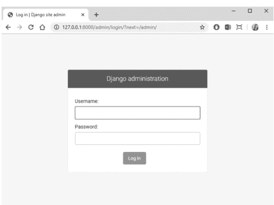

你可能会在上图中看到Django的管理面板登录窗口。使用你创建的超级用户账户登录。登录后，你可以看到Django管理页面。

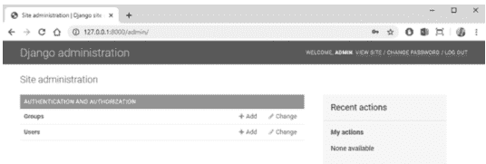

你将在上图中看到Django的管理面板。页面顶部是“认证和授权”组。组和用户都由Django中的认证框架提供。

通常，当我们处理单个Django项目时，使用manage.py更容易。如果你想在多个Django设置文件之间切换，请使用带有DJANGO_SETTINGS_MODULE的Django-admin.py，或者使用settings命令行选项。当你通过setup.py实用程序安装Django时，Django-admin.py脚本必须位于你的系统路径上。我们将在后面简要讨论它（Django管理后台自定义）。

## 启用管理面板

管理后台在用作startproject的默认Django项目模板中是启用的。如果你不想使用默认的项目模板，以下是选项：

- 添加 'django.contrib.admin' 及其依赖项：django.contrib.auth、django.contrib.contenttypes、django.contrib.messages 和 django.contrib.sessions。将这些代码添加到你的setting.py中的INSTALLED_APPS位置。
- 在你的TEMPLATES设置中配置DjangoTemplates后端，使用django.contrib.auth.context_processors.auth、django.template.context_processors.request和django.contrib.messages.context_processors.messages（在setting.py中）。
- MIDDLEWARE设置中必须包含django.contrib.auth.middleware.AuthenticationMiddleware和django.contrib.messages.middleware.MessageMiddleware。

如果你需要创建一个管理员用户来登录，请在终端中为同一项目运行createsuperuser命令。默认情况下，登录管理后台要求用户详细信息的is_staff属性设置为True，否则你将无法访问管理面板。

应用程序模型必须在管理界面中可更改。对于每个模型，按照ModelAdmin中的描述将它们注册到管理后台。

## 管理后台做什么？

管理后台允许你注册并编写任何操作。管理面板包含你在项目中创建的所有模型。Django管理后台的基本工作流程是：选择一个对象，然后更改它、删除它、更新它和添加它。Django管理后台试图为你提供一个用户界面，用于对各种用户模型执行多种操作（CRUD），以及其他功能，如认证、用户访问级别等。你将了解管理界面是如何可定制的，以及你如何在管理后台中添加和更改内容。这种修改可能会使其更具生产力。

## 它是如何工作的？

当Django在服务器启动时从urls.py加载你的URLconf时，它会执行admin.site.urls。这个函数遍历你的INSTALLED_APPS设置，并在每个已安装的应用中查找名为admin.py的文件。在我们books应用的admin.py中，每次调用admin.site.register()都会注册给定的模型。管理站点将只显示一个编辑/更改界面。django.contrib.auth应用包含其admin.py，这就是为什么用户和组会自动出现在管理后台中。其他Django.contrib应用也包含Django.contrib。Django管理站点本身就是一个Django应用程序，其模型、模板、视图和URL模式都由管理后台提供。

## DJANGO管理后台有多安全？

Django管理后台在创建数据库记录以管理组和用户方面很方便，这些组和用户根据用户拥有的权限，在读取、写入、修改级别上授予模型权限。Django管理后台本身相当安全。你可以通过htaccess保护它并强制使用HTTPS访问来采取额外措施。该设计不是响应式的。移动设备上的用户需要进行大量的缩放和平移。

## 编写操作函数

首先，我们需要编写一个函数，当管理后台触发操作时调用它。操作函数是常规函数，接受三个参数：

- 当前的ModelAdmin
- 代表当前请求的HttpRequest
- 包含用户选择的对象集合的QuerySet。

## 用法

以下是使用django-admin.py的方法：

- django-admin.py <子命令> [选项]
- manage.py <子命令> [选项]

它应该是“可用子命令”中列出的子命令之一，该子命令是可选的，可以是零个或多个适用于给定子命令的选项。

## 各种子命令

- **Cleanup**：这可以作为cron作业运行或直接运行，以从数据库中清除旧数据（目前仅限过期的会话）。
- **Compile messages**：compile messages子命令编译创建的.po文件，将消息转换为.mo文件，以供内置的gettext支持使用。
- **createsuperuser**：这将创建一个超级用户账户（一个拥有所有权限的用户），该账户拥有对站点的完全访问权限，并需要使用manage.py进行权限设置。如果你需要创建一个初始的超级用户账户，这很有用。此命令可以在终端中调用。
- **--locale**：使用--locale或-l选项指定要处理的区域设置。如果未提供此选项，则处理所有区域设置。
- **这是一个用法示例**：Django-admin.py compile messages --locale=br_PT
- **createcachetable**：此子命令创建一个具有给定名称的缓存表，用于数据库缓存后端。
- **示例**：django-admin.py createcachetable my_cache_table。
- **Runserver**：python manage.py runserver。你可以根据需要运行多个服务器。多次执行django-admin.py runserver。为确保你的开发服务器对网络上的其他机器可见，请运行其默认IP地址（192.168.2.1）或0.0.0.0（如果你不知道网络上的IP地址，可以使用此地址）。

新账户的用户名和电子邮件地址（可选）可以通过在命令行上使用--username和--email参数提供。此命令仅在Django的认证系统（Django.contrib.auth）是INSTALLED_APPS时可用。

- django-admin.py runserver --adminmedia=/tmp/new-admin-stylefiles/：使用--adminmedia选项告诉Django在哪里可以找到Django管理界面所需的各种CSS和JavaScript文件。
- Django-admin.py runserver --noreload：使用--noreload选项禁用自动重载器的使用。

使用不同端口和地址的示例：

- 端口号为 8000：
  `django-admin.py runserver`
- IP 地址 127.0.0.1：
  `django-admin.py runserver 7000`
- 0.0.0.0:4000（格式类似这样）

默认情况下，服务器不会为你的网站提供任何静态文件（CSS、图片）。所有这些都归入 MEDIA_URL 下。

## Django Admin 自定义

Django Admin 的某些部分将被自定义。这种调整将使我们能够更准确地查看项目。

`python manage.py startapp Products`

安装此应用程序，在 settings.py 文件的 INSTALLED_APPS 列表中输入产品。

现在在你的应用中创建模型。本章将使用该模型来自定义 Django admin。

```python
from django.db import models

class Product_Details(models.Model):
    name = models.CharField(max_length=200)
    description = models.TextField()

    def __str__(self):
        return self.name
```

我们需要将此模型添加到我们的管理面板中，为此我们需要将这些更改迁移到数据库。然后，在同一个文件夹的终端中按顺序执行这些命令。如果你使用 VS Code，我们会很快得到它。在下面的屏幕中，你可以输入这些行，或者使用命令提示符，我们需要在 cmd（命令提示符）中打开该文件夹，然后运行这些命令。

```bash
python manage.py makemigrations
python manage.py migrate
```

这些模型必须在 Django admin 中注册。编辑 products/admin.py 文件以完成此操作。清空文件后，粘贴此代码。

```python
from django.contrib import admin
from .models import Product

# Register your models here.
admin.site.register(Product_Details)
```

为了访问 admin，我们还需要一个超级用户。如果你已经有一个超级用户账户，你可以跳过此部分。使用此命令在 Django admin 中创建一个超级用户。

```bash
python manage.py createsuperuser
```

出于安全目的，输入密码时不会显示。成功创建超级用户后，启动你的服务器。

```bash
python manage.py runserver
```

现在，我们可以开始使用 Django admin 了。将此链接粘贴到浏览器中：http://localhost:8000/admin/

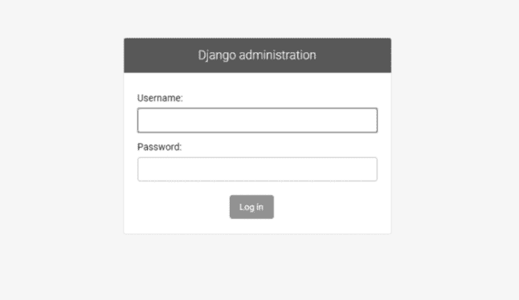

## 如何从 Admin 注册/注销模型？

我们可以轻松地在 admin 中注册模型。我们必须使用 register 方法在 admin 中注册模型。同时，我们可以通过 unregistering 方法注销模型。

```python
admin.site.register(Product_Details)
admin.site.unregister(Group)
```

注销 Group 模型后，你将看到 Group 模型不再存在。

## 自定义 Admin 面板中的标题

在你的 admin.py 中添加这行代码：

```python
admin.site.site_header = "Django Practise"
```

## Django Admin 自定义页面布局、数据和行为

有多种方法可以自定义 Django admin 页面的设计、数据和行为。你可以自定义所有 Django admin 页面中使用的特定全局值，而无需修改任何 Django 模板。Django.contrib 包中的 admin.site 对象上有许多声明：

1. **admin.site.site_header**：它定义了所有 Django admin 页面中使用的标题（例如，在深蓝色页眉和登录页面中）
2. **admin.site.site_title**：它定义了使用的标题。它将所有 Django admin 页面定义为 HTML 标题的一部分。
3. **admin.site.site_url**：它定义了域名（例如，coffeehouse.com），用作 Django admin ‘查看网站’链接的一部分，以便轻松地从 Django admin 访问实时网站。
4. **admin.site.index_title**：它定义了 Django admin 主页面的标题。
5. **admin.empty_value_display**：它定义了当 Django admin 模型值为空时显示的默认值。

## 模型 Admin 类

它定义了管理面板中自定义用户定义模型的表示。它用于覆盖各种操作。ModelAdmin 类提供了许多选项范围。

**ModelAdmin.exclude：**

```python
# ModelAdmin Class #
class Product_Details(admin.ModelAdmin):
    exclude = ('description', )
```

此 ModelAdmin 类覆盖了 admin 创建的默认类视图。在上面的示例中，变量 ‘descriptions’ 将被排除。exclude 变量接受元组；列表作为输入或数组，只有名称将显示在管理面板中。

**ModelAdmin.fields：**

```python
# ModelAdmin Class #
class Product_Details(admin.ModelAdmin):
    fields = ('name','description')
```

此模型将更改管理面板中模型的布局。显示的字段仅限于其中定义的字段。

**ModelAdmin.fieldsets：** 设置 fieldsets 以控制 admin “添加”和“更改”页面的设计和布局。fieldset 是一个包含两个元组的列表，其中每个二元组代表表单页面上的一个 <fieldset>。（<fieldset> 是表单的一个小“部分”。）

```python
# ModelAdmin Class #
class Product_Details(admin.ModelAdmin):
    fields = ('name','description')
```

此模型将更改管理面板中模型的布局。显示的字段仅限于其中定义的字段。

```python
class FlatPageAdmin(admin.ModelAdmin):
    fieldsets = (
        (Options, {
            'fields': ('url', 'title', 'content', 'sites')
        }),
    )
```

字段可以具有直接类型的值，如下所示：

```python
{
    'fields': (('firstname', 'lastname'), 'address',
    'city', 'state'),
}
```

**ModelAdmin.form：**

```python
class CustomForm(forms.ModelForm):
    class Meta:
        model = Person
        exclude = ['name']

class Person_APanel(admin.ModelAdmin):
    exclude = ['age']
    form = CustomForm
```

在上面的代码中，我们为模型创建了一个动态表单来存储值，并在 AdminModel 类中定义它们。

**ModelAdmin.list_display：**

```python
class PersonAdmin(admin.ModelAdmin):
    list_display = ('first_name', 'last_name')
```

设置 list_display 以控制在 admin 的更改列表页面上显示的字段。

1. **ModelAdmin.list_editable**：它将 list_editable 设置为模型上的字段名列表，这将允许在更改列表页面上进行编辑。它将作为表单小部件显示在更改列表页面上，允许用户一次编辑和保存多行。
2. **ModelAdmin.list_filter**：要使用此过滤器，请定义 list_filter 以在 admin 列表页面的侧边栏中激活过滤器。它可能是一个元素列表或元组，其中每个元素应是以下类型之一：
    1. 指定的字段应为 BooleanField 类型、CharField 类型、DateField 类型、DateTimeField 类型、IntegerField 类型、ForeignKey 或 ManyToManyField 类型
3. **ModelAdmin.ordering：** 要使用此过滤器，请定义 set 方法以指定在 Django admin 视图中应如何调用对象列表。
4. **ModelAdmin.paginator：** 分页器类用于分页。默认情况下，使用 Django.core.paginator.Paginator。假设自定义类没有相同的构造函数接口。那么它还需要为 ModelAdmin.get_paginator() 提供一个实现。
5. **ModelAdmin.radio_fields：** 默认情况下，Django admin 使用选择框界面（<select>）来选择字段为 ForeignKey 或持有 choices 集的字段。你可以选择使用 Django.contrib.admin 模块中的 HORIZONTAL 或 VERTICAL。
6. **ModelAdmin.autocomplete_fields：** 要使用此过滤器，请将 autocomplete_fields 定义为 ForeignKey 和 Many-To-ManyField 字段的列表，如果你想将其更改为自动完成输入。
7. **ModelAdmin.search_fields：** 要使用此过滤器，请定义 set search_fields 以允许在 admin 列表页面上有一个搜索框。它应设置为字段名列表，当有人在该文本字段框中给出搜索查询时，将搜索这些字段。
    这些字段应是一些文本字段，例如 CharField 或 TextField。
    示例，
    * search_fields = ['foreign_key__fieldname']
8. **class apps.AdminConfig：** 它是管理面板的默认 AppConfig 类。
    autocover() 将在每个应用程序中导入一个 admin 模块。这些模块用于向管理面板注册模型。
9. **Class apps.SimpleAdminConfig：** 此类的工作方式类似于 AdminConfig，只是它不调用 autodiscover()。
10. **ModelAdmin.date_hierarchy：** 它被定义为将 date_hierarchy 设置为注册模型中的 DateField/DateTimeField 的名称，并且

## ModelAdmin 方法

10. **ModelAdmin.get_search_fields(request)**：此方法接收 HttpRequest 参数，并返回与模型中 `search_fields` 属性相同类型的结果。

11. **ModelAdmin.get_sortable_by(request)**：此方法接收 HttpRequest 参数，并应返回一个集合（列表、元组或集合），其中包含将在变更列表页面中排序的字段。

其默认行为是：如果设置了 `sortable_by`，则返回该值；否则，它将委托给 `get_list_display()` 方法。

12. **ModelAdmin.get_urls()**：此 ModelAdmin 方法返回该 ModelAdmin 所使用的 URL，其方式与 URLconf 相同。

13. **ModelAdmin.get_form(request, obj, \*\*kwargs)**：它返回一个 ModelForm 类，该类在管理面板中用于添加和更改视图，具体使用方法参见 `add_view()` 和 `change_view()` 方法。

基础实现是创建一个表单子类，并通过 `fields` 和 `exclude` 等属性进行修改。

## 管理面板的一些权限方法

1. **ModelAdmin.has_view_permission(request, obj=None)**：如果允许查看 `obj`，则返回 True，否则返回 False。此类在 `obj` 为 None 时允许用户对模型进行只读访问，返回 True 或 False 以指示是否允许查看此类型的对象。

默认实现是：如果用户只有“view”权限，则返回 true。

2. **ModelAdmin.has_add_permission(request)**：如果允许添加 `obj`，则返回 True，否则返回 False。此类允许用户对模型进行仅添加访问。

默认实现是：如果用户只有“add”权限，则返回 true。

3. **ModelAdmin.has_change_permission(request, obj=None)**：如果允许更改，则返回 True，否则返回 False。此类允许用户对模型进行仅更改访问。

默认实现是：如果用户只有“change”权限，则返回 true。

4. **ModelAdmin.has_delete_permission(request, obj=None)**：如果用户 `obj` 具有删除权限，则返回 True，否则返回 False。此类允许用户对模型进行仅删除访问。

默认实现是：如果用户只有“delete”权限，则返回 true。

5. **ModelAdmin.response_add(request, obj, post_url_continue=None)**：在管理表单提交给模型并创建对象之后调用。你可以重写此方法以更改对象创建后的默认行为。它用于添加新实例。

6. **ModelAdmin.response_change(request, obj)**：在管理表单提交并保存对象之后调用。它用于更改单个实例。

7. **ModelAdmin.response_delete(request, obj_display, obj_id)**：在对象被删除后调用。它用于删除单个实例。

**obj_display**：这是一个字符串，作为第一个参数，包含被删除对象的名称。

**obj_id**：这是一个序列化标识符，作为第一个参数，用于检索要删除的对象。

8. **ModelAdmin.has_module_permission(request)**：如果允许在管理索引页面上显示模块并访问该模块的索引页面，则应返回 True，否则返回 False。默认使用 `User.has_module_perms()`。

9. **ModelAdmin 资源（媒体和 CSS）**：ModelAdmin 具有在管理面板中添加 CSS、JavaScript 和媒体的功能。

```python
from django.contrib import admin

class CustomAdmin(admin.ModelAdmin):
    class Media:
        css = {
            'all': ('css/mymarkup.css',)
        }
        js = ('javascript/mymarkup.js',)

admin.site.register(CustomAdmin)
```

## 如何在你的项目中添加 jQuery？

Django 允许我们在管理面板中使用 jQuery 库。
如果你想在管理 JavaScript 中使用 jQuery 而不包含第二份副本，你可以使用 `Django.jQuery` 对象，并在变更列表上添加/编辑视图。此外，依赖于 `Django.jQuery` 的管理表单或小部件必须按如下方式指定：

```python
from django.contrib import admin

class CustomAdmin(admin.ModelAdmin):
    class Media:
        css = {
            'all': ('css/mymarkup.css',)
        }
        js = ('admin/js/jquery.init.js',)

admin.site.register(CustomAdmin)
```

**向管理添加自定义验证：** 此表单由字段组成。创建一个名为 `form.py` 的不同文件，然后构建一个基本的表单结构，并在 `admin.py` 中导入它。
`form.py` 如下所示：

```python
class CustomForm(forms.Form):
    name = forms.CharField(label='Your name',
                           max_length=100)
    age = forms.IntegerField(label='Your Age')
```

这里，`admin.py` 需要导入该表单以直接在管理面板中使用。

```python
from .form import *

class ArticleAdmin(admin.ModelAdmin):
    form = CustomForm
```

## 如何在 view.py 中使用 form.py？

```python
from .form import *

def register(request):
    # 这是一个 POST 请求，需要处理表单数据
    if request.method == 'POST':
        # 创建实例并用请求中的数据填充它：
        form = NameForm(request.POST)
        # 检查它是否有效：
        if form.is_valid():
            # 根据需要处理 form.cleaned_data 中的数据
            # ...
            # 重定向到一个新的 URL：
            return HttpResponseRedirect('/thanks/')
    # 如果是 GET（或任何其他方法），我们将创建一个空白表单
    else:
        form = CustomForm()
```

让我们理解代码的每一行。
首先，我们从 `form.py` 导入 `CustomForm`，然后开始名为 `register()` 的函数。在接下来的行中，我们以 `if request.method` 开始逻辑，即当按钮被按下时，其方法与“POST”相同。然后，其内部编写的代码将运行，我们从页面 `form.py` 获取表单数据并将其存储在 `form` 变量中。我们可以调用表单的 `is_valid()` 方法；如果它不是 true，我们可以带着表单返回模板。如果 `is_valid()` 为 True，我们就能在其 `cleaned_data` 属性中找到所有已验证的表单数据。

## InlineModelAdmin

当两个 Django 模型共享一个外键关系时，可以在父模型页面上暴露相关模型的内联被称为 InlineModelAdmin。它提供了 InlineModelAdmin 的两个子类：

1. TabularInline
2. StackedInline

InlineModelAdmin：它共享 ModelAdmin 的许多相同功能，并添加了一些自己的功能。共享的功能如下：

1. form
2. fieldsets
3. fields
4. formfield_overrides
5. exclude
6. filter_horizontal
7. filter_vertical
8. ordering
9. prepopulated_fields
10. get_fieldsets()
11. get_queryset()
12. radio_fields
13. readonly_fields
14. raw_id_fields
15. formfield_for_choice_field()
16. formfield_for_foreignkey()
17. formfield_for_manytomany()
18. has_module_permission()

InlineModelAdmin 有其独立的方法：

- **InlineModelAdmin.model**：
- **InlineModelAdmin.fk_name**：这是模型中外键的名称。在少数情况下，这将自动处理，但如果存在多个指向同一父模型的外键，则必须显式指定 `fk_name`。
- **InlineModelAdmin.formset**：这默认为 `BaseInlineFormSet`。使用你自己的表单集可以为你提供许多修改的可能性。

内联是围绕模型表单集构建的。

- **InlineModelAdmin.form**：你无法在任何内联模型中访问任何内联对象。这是使用自定义 ModelForm 的唯一方式。

示例

- self.instance.pk

- **InlineModelAdmin.get_extra()**：它允许你自定义不同表单的数量。

- **InlineModelAdmin.get_max_num()**：它允许你自定义不同表单的最大数量。

- **InlineModelAdmin.get_min_num()**：它允许你自定义显示表单的最小数量。

1. **InlineModelAdmin.raw_id_fields()**：这是一个字段列表，你希望将其更改为 ForeignKey 或 ManyToManyField 的输入小部件。

2. **InlineModelAdmin.template**：此模板用于在页面上渲染内联模型。

3. **InlineModelAdmin.verbose_name**：这是 Django 中字段的可读名称。如果未给出，则 Django 可以使用 `fields` 属性创建它。

```python
field_name = models.Field(verbose_name = "name")
```

4. **InlineModelAdmin.has_add_permission(request, obj)**：如果允许添加模型对象，则应返回 True；否则返回 False。

5. **示例**：我们可以通过外键来实现这一点，例如：

```python
class Friendship(models.Model):
    to_person = models.ForeignKey(Student1, on_delete=models.CASCADE, )
    from_person = models.ForeignKey(Student2, on_delete=models.CASCADE,)
```

## 第八章

## Django 表单

### 本章内容

- HTML 表单
- 表单类
- 小部件
- 遍历表单字段
- Django crispy forms
- 用户创建表单

在上一章中，我们学习了管理后台、其工作原理、注册以及许多功能。在这里，我们将讨论 Django 最核心的主题——Django 表单。

## HTML 表单

它们用于从用户那里获取输入以收集数据。它们非常易于使用，并为你处理所有验证。在 HTML 中，表单是 `<form>..其他代码..</form>` 内各种元素的集合，允许用户执行诸如输入文本、选择选项、操作对象或控件、添加图像等操作，然后将这些信息发送回服务器。它们还具有各种属性，如 method、enctype、name 等。`<form>` 元素内部可能包含一个或多个元素：

- `<input>`：用于在表单中输入文本
- `<textarea>`：用于输入文本，如你的消息、反馈
- `<button>`：用于向服务器提交数据
- `<select>`：用于下拉列表
- `<option>`：应写在 `<select>` 内部
- `<label>`：用于定义名称

```html
<form>
  <p>First Name: <input type="text" name="firstname"></p>
  <p>Last Name: <input type="text" name="lastname"></p>
  <p><input type="submit" value="Submit"></p>
</form>
```

### 链接到包含表单的页面

```html
<a href="" class="title"> You can place text, image or anything else between the anchor tag </a>
```

它是一个 HTML 元素，用于创建指向另一个 URL 的链接。在实现时，链接可以包裹文本、图像或按钮，以便用户可以与之交互并访问链接的目标地址。

`<a>` 元素的一个重要属性是 href 属性，它指示链接的目标地址。它具有各种属性，应写在锚标签内：

| 属性 | 描述 |
| :--- | :--- |
| download | 目标将被下载 |
| href | 指定 URL |
| rel | 设置当前文档与其他链接文档之间的关系 |
| type | 指定链接文档的媒体类型 |
| target | _blank, _parent, _self, _top，它指明在哪里打开链接文档 |

## Input 标签

这个 `<input>` 标签描述了一个输入字段，用户可以在其中输入数据。根据 type 属性的不同，它可以以多种方式显示。不同的输入类型如下：button、checkbox、color、date、email、number、password、submit 和 file。这些是常用的示例。

```html
<input type="text" class="form-control"
type="submit" name="username">
```

## Django 在表单中的作用

Django 的表单可以简化并自动化大部分工作，并且比大多数程序员在代码中能做的更可靠。我们可以在任何地方使用它，因为它不会占用太多空间。Django 处理包含三个不同的部分：

- 准备和重构数据，使其准备好呈现给用户
- 为数据创建 HTML 表单
- 接收和处理来自客户端的提交表单和数据

## Django 表单

Django 提供了表单类，允许你创建 HTML 表单。它还描述了表单及其工作方式和外观。表单类的每个字段都映射到 HTML 表单的 `<input>` 元素，每个字段本身就是一个类。它管理表单数据并在提交表单时执行验证。

```python
from django import forms
from .models import Post
#this is the forms
class CustomForm(forms.Form):
    first_name = forms.CharField(max_length=50)
    last_name= forms.CharField(max_length=50)
#this is the form that the model automatically creates
class PostForm(forms.ModelForm):
    class Meta:
        model = Post
        fields = ('first_name', 'last_name',)
```

### forms.Form 与 forms.ModelForm

有两种表单是从 forms 创建的。在 ModelForm 中，我们必须声明哪个模型将用于创建我们的表单。

首先，我们必须导入 Django 表单 (`from django import forms`) 和我们的 ModelName 模型 (`from .models import ModelName`)。ModelNameForm，正如你可能猜测的那样，是我们自定义表单的名称。有必要告诉 Django 这个表单是一个 ModelForm——表单。ModelForm 负责这一点。接下来，我们有一个 class Meta（Meta 提供关于数据的信息），它告诉 Django 应该使用哪个模型来创建这个表单 (`model = ModelName`)。最后，我们在其中添加一些字段，如 title 和 text。

‘Form’ 指的是 HTML `<form>` 或 Django 表单，它为表单提供结构，我们可以在任何文件的任何地方通过导入来使用它。每个网站至少有一个表单，用户可以与之交互。

表单有两个基本的状态属性：

1. **is_bound**：如果返回 False，则表单处于未绑定状态，即一个具有空或默认字段值的新表单。如果为 true，则表单已绑定；即至少一个字段已设置用户输入。
2. **is_valid()**：如果返回 true，则绑定表单中的每个字段都具有有效数据。如果为 false，则至少一个字段中存在一些无效数据，或者表单未绑定。

### Django 表单类

表单类描述了一个表单，定义了它的工作方式和外观。例如，一个 ModelForm 通过一个 FormIt 将模型类的字段链接到 HTML 表单 `<input>` 元素，该 FormIt 在浏览器中以 HTML ‘小部件’ 的形式呈现给用户。

### 绑定和未绑定的表单实例

- **未绑定表单**：这是一个没有与之关联数据的表单。当呈现给用户时，它将是空的或包含默认值。
- **绑定表单**：这是一个已提交数据的表单，可用于判断数据是否有效。当呈现一个无效的绑定表单时，它包含内联错误消息，告诉用户需要更正哪些数据。

## 小部件

它是 Django 对 HTML 输入元素的表示。小部件处理所有 HTML 的渲染。

```python
from django import forms
class CustomForm(forms.Form):
    title = forms.CharField(widget = forms.Textarea)
    description = forms.CharField(widget = forms.CheckboxInput)
    views = forms.IntegerField(widget = forms.TextInput)
    available = forms.BooleanField(widget = forms.Textarea)
```

小部件表示为一个 HTML 输入元素。Django 使用适合要显示的数据类型的默认小部件。这将识别一个带有注释的表单，该注释使用较大的 Textarea 小部件而不是默认的 TextInput 小部件。

### 表单类

```python
from django import forms
class NameForm(forms.Form):
    name = forms.CharField(label='Your name', max_length=100)
```

表单渲染选项：

- `{{ form.as_table }}`：它会将它们渲染为包裹在 `<tr>` 标签中的表格单元格。
- `{{ form.as_p }}`：它会将它们渲染为包裹在 `<p>` 标签中。
- `{{ form.as_ul }}`：它会将它们渲染为包裹在 `<li>` 标签中。

## 166 ■ 精通 Django

| 模板 | 代码 |
| :--- | :--- |
| `{{ form.as_p }}` | html
<div class="form" >
<p>
<label for="id_name"> 姓名:</label>
<input class="textinput textInput formcontrol" id="id_name" maxlength="100" name="name" type="text" />
</p>
<p>
<label for="id_age">年龄:</label>
<input class="numberinput formcontrol" id="id_age" name="age" type="number"/>
</p>
</div>
 |
| `{{ form.as_ul }}` | html
<div class="form" >
<li>
<label for="id_name"> 姓名:</label>
<input class="textinput textInput formcontrol" id="id_name" maxlength="100" name="name" type="text" />
</li>
<li>
<label for="id_age">年龄:</label>
<input class="numberinput formcontrol" id="id_age" name="age" type="number"/>
</li>
</div>
 |
| `{{ form.as_table }}` | html
<tr>
<th>
<label for="id_name">姓名:</label>
</th>
<td>
<input class="textinput textInput form-control" id="id_name" maxlength="100" name="name" type="text" />
</td>
</tr>
<tr>
<th>
<label for="id_number">编号:</label>
</th>
<td>
<input class="textinput textInput form-control" id="id_number" maxlength="100" name="number" type="number" />
</td>
</tr>
 |

有多种方式来展示表单。Django 表单帮助你创建表单的 HTML 表示。它们支持三种独立的表示方式：as_p（定义为段落标签）、as_ul（定义为无序列表项）和 as_table（顾名思义，作为一个表格）。

Django 定义了一个包含单个字段（name）的表单类。字段的最大允许长度由 max_length 定义。它会在 HTML `<input>` 上设置 `maxlength="150"`。这也意味着，每当 Django 从浏览器接收回表单时，它都应该验证数据的长度。

模板：要在你的模板中添加表单，你不需要在模板中做太多事情：

```
<form action="/your-name/" method="post">
    
    {{ form }}
    <input type="submit" value="Submit">
</form>
```

所有表单字段都由 Django 的模板语言通过 `{{form}}` 获取。

```

```

跨站请求伪造（CSRF）保护：CSRF 中间件和模板标签可防止 CSRF 攻击。当各种恶意网站包含一个链接、一个表单按钮时，就会发生此类攻击。如何使用它？它应该在 `MIDDLEWARE` 设置中默认激活；请记住 `'django.middleware.csrf.CsrfViewMiddleware'`。

小部件参数

- 带有 Textarea 小部件属性的 CharField()：

```
from django import forms
# Create your forms here.
class ExampleForm(forms.Form):
    comment = forms.CharField(widget=forms.Textarea(attrs={'rows':3}))
```

我们可以在小部件中传递各种属性以进行更改。这里我们通过 'rows' 属性来更改高度。

- 带有 NumberInput 小部件属性的 DateField()：

```
from django import forms
from django.forms.widgets import NumberInput
# Create your forms here.
class ExampleForm(forms.Form):
    birth_date = forms.DateField(widget=NumberInput(
        attrs={'type': 'date'}))
```

这里我们在文件顶部单独导入 NumberInput，然后添加带有属性 `'type': 'date'` 的 NumberInput 小部件。我们也可以添加 `required` 作为额外参数。

各种附加参数

- Required
- max_length
- min_length
- label
- CharField()、DateField()、BooleanField() 的 initial

- ChoiceField、MultipleChoiceField、ModelChoiceField 和 ModelMultipleChoiceField：

```
from django import forms
# Create your forms here.
FAVORITE_COLORS = [
    ('blue', 'Blue'),
    ('green', 'Green'),
    ('black', 'Black'),
]
class ExampleForm(forms.Form):
    favorite_color = forms.ChoiceField(choices=FAVORITE_COLORS)
```

使用 Django ChoiceField 作为字符串字段来选择特定选项或创建选项的下拉菜单。每个选项应有一个键和一个值。FAVORITE_COLORS 会被自动获取。

- **装饰器方法**：你可以使用 `csrf_protect` 装饰器，而不是添加 CsrfViewMiddleware，它在需要保护的特定视图上具有相同的功能。但它存在一个安全漏洞。
这是我们新装饰器的基本结构：

```
import functools
from django.shortcuts import render
def view_form(form_cls, template):
    def decorator(func):
        @functools.wraps(func)
        def wrapper(request, *args, **kwargs):
            ...
        return wrapper
    return decorator
```

- **Jinja2 模板中的 CSRF**：Django 的 Jinja2 模板后端会将 `{{ csrf_input }}` 添加到所有模板的上下文中，这等同于 Django 模板语言中的 ``。例如：

- <form method="post">{{ csrf_input }} 或 </form>

- **手动渲染字段**：你可以根据需要手动获取数据。假设在数据库中你有字段 name、age、marks 等，并且每个字段都可以作为表单的属性通过 `{{ form.name_of_field }}` 使用：

```
<div class="wrapper">
    {{ form.message.errors }}
    <label for="{{ form.message.id_for_label }}">Your message:</label>
    {{ form.name }}
</div>
<div class="wrapper">
    {{ form.message.errors }}
    <label for="{{ form.message.id_for_label }}">Your message:</label>
    {{ form.age}}
</div>
<div class="wrapper">
    {{ form.message.errors }}
    <label for="{{ form.message.id_for_label }}">Your message:</label>
    {{ form.marks}}
</div>
```

- **显示错误**

- 使用 `{{form.name_of_field.errors}}`：它显示一个表单错误列表，渲染为无序列表。它可能看起来像这样：

```

  <ol>
    
      <li><strong>{{ error|escape }}</strong></li>
    
  </ol>

```

- **遍历表单字段**：通过使用 `` 循环依次循环每个字段，可以减少代码量：

```

  <div class="wrapper">
    {{ field.errors }}
    {{ field.name }} {{ age }}
  </div>

```

`{{ field }}` 的属性

- **`{{ field.label }}`**：它拥有字段的 label 属性，例如，电子邮件名称、地址。

- **`{{ field.label_tag }}`**：它是字段的 label 属性，包裹在适当的 HTML `<label>` 标签中。这包括表单的 `label_suffix`。

```
<label for="id_name">Name:</label>
```

- **`{{ field.id_for_label }}`**：用于此字段的 ID。

- **`{{ field.value }}`**：字段的值。例如，someone@example.com。

- **`{{ field.html_name }}`**：这将是用于输入元素（如 name 字段属性）的字段名称。如果设置了表单前缀，它只会考虑该前缀。

语法示例，

- <input type="text" class="form-control"
- name="{{ form.name.html_name }}"
- id="{{ form.name.id_for_label }}" required>

- **`{{ field.help_text }}`**：与字段关联的帮助文本，用于获取有关该字段的详细信息。

- **`{{ field.errors }}`**：它包含任何验证错误，例如与此字段对应的语法错误。然后你可以通过显示消息来提醒用户。你可以使用 `` 循环来更改错误的呈现方式。在这种情况下，循环中的单个对象是包含错误消息的字符串。

## Django-crispy-Forms

Django-crispy-forms 包使得编写表单模板代码更加简洁。新的 Django-uni-form 是由 Daniel Greenfeld 创建的一个应用程序。

## 如何使用 Django Crispy Forms

- 在你的 Django 项目中运行 `pip install Django-crispy-forms`。
- 在 settings 的 `INSTALLED_APPS` 列表中添加 `crispy_forms`。
- 在 settings 中添加 `crispy_template_pack`。
- 在 HTML 模板中加载 `crispy_forms_tags`。
- 将 `|crispy` 或 `|as_crispy_field` 过滤器添加到 Django 表单变量。

示例：

```



<form method="POST">

{{ form_data |crispy }}
<button type="submit" class="btn btn-primary">Sign in</button>
</form>

```

## Crispy 过滤器

它允许你使用 Django-crispy-forms 优雅地基于 div 的字段来渲染表单或表单集，Django-crispy-forms 实现了一个名为 `FormHelper` 的类，它定义了表单行为。这些 helper 为你提供了一个控制表单属性及其布局的方案，而 `|crispy` 过滤器有其内置方法：`as_table`、`as_ul` 和 `as_p`。

## 安装

在终端中使用 pip 安装最新稳定版本的 Python 环境：

```
pip install django-crispy-forms
```

一旦使用上述命令安装了 crispy form，请在项目的 `setting.py` 中的 `INSTALLED_APPS` 中添加 `"crispy_forms"`。

```
INSTALLED_APPS = [
    'django.contrib.admin',
    'django.contrib.auth',
    'django.contrib.contenttypes',
    'django.contrib.sessions',
    'django.contrib.messages',
    'django.contrib.staticfiles',
    'crispy_forms' #add here
]
```

crisp form 的应用：

1. 一个过滤器变量 `|crispy` 将渲染优雅的基于 div 的表单。它有内置方法：`as_table`；2. `as_ul`；3. `as_p`
- 名为 `` 的标签将根据你的配置和特定布局渲染表单。下面的代码将告诉你

## 加载 Crispy 表单标签

Crispy 表单标签代码将允许你在下面的表单中调用 crispy 表单过滤器。

```

<h1>This Is My Crispy Form:</h1>

```

```
<html>
  <head>
    <!-- here adds meta tags -->
    <meta charset="utf-8">
    <meta name="viewport" content="width=device-width, initial-scale=1.0">
    <!--Bootstrap CSS-->
    <link href="https://stackpath.bootstrapcdn.com/bootstrap/4.4.1/css/bootstrap.min.css" rel="stylesheet" integrity="sha384-Vkoo8x4CGsO3+Hhxv8T/Q5PaXtkKtu6ug5TOeNV6gBiFeWPGFN9MuhOf23Q9Ifjh" crossorigin="anonymous">
  </head>
  <body>
    
    <!--Contact form-->
    ...
    <!-- Optional Javascript -->
    <script src="https://code.jquery.com/jquery-3.4.1.slim.min.js" integrity="sha384-J6qa4849blE2+poT4WxyKhv5vZF5SrPo0iEjwBvKU7imGFAV0wwj1yYfoRSJoZ+n" crossorigin="anonymous"></script>
    <script src="https://cdn.jsdelivr.net/npm/popper.js@1.16.0/dist/umd/popper.min.js" integrity="sha384-Q6E9RHvbIyZFJoft+2mJbHaEWldlvI9IOYy5n3zV9zzTtmI3UksdQRVvoxMfooAo" crossorigin="anonymous"></script>
    <script src="https://stackpath.bootstrapcdn.com/bootstrap/4.4.1/js/bootstrap.min.js" integrity="sha384-wfSDF2E50Y2D1uUdj0O3uMBJnjuUD4Ih7YwaYd1iqfkTj0Uod8GCExl3Og8ifwB6" crossorigin="anonymous"></script>
  </body>
</html>
```

## 使用 Django 的 as_crispy_field 表单过滤器

使用格式 `{{form.name_of_field|as_crispy_field}}`。这样，你就可以更改表单字段的显示顺序。

```
<div>
    <h1>Contact</h1>
    <form method="post">
        
        {{form.first_name|as_crispy_field}}
        {{form.last_name|as_crispy_field}}
        <button type="submit">Submit</button>
    </form>
</div>
```

## 当 Crispy 表单不工作时该怎么办？

- 检查已安装的包名称是否正确。
- 确保在设置中添加了 `crispy_template_pack`。
- 务必在 HTML 模板顶部加载 `crispy_forms_tags`。
- 使用的表单过滤器必须是 `|crispy` 或 `|as_crispy_field`。

## 模板包

Django-crispy-forms：它有一个内置应用程序，用于帮助管理 Django 中的表单，并支持不同的 CSS 框架，如 Bootstrap，在 Django-crispy-forms 中称为模板包：

- Bootstrap 是 crispy-forms 的默认模板包，是简单灵活的 HTML、CSS 和 JavaScript 用户界面 bootstrap3 的第 2 版。
- 支持 Twitter Bootstrap 第 4 版。
- Uni-form 是一个外观精美、结构良好、高度可定制、可访问且易用的表单。
- 此模板包可通过 crispy-forms-foundation 获得。
- Tailwind 是一个实用优先的框架。此模板包可通过 crispy-tailwind 获得。

Crispy 表单不包含静态文件，如 CSS 和 JavaScript。你需要根据所使用的 CSS 框架（模板包）自行包含适当的静态和媒体文件。

## 如何使用 Bootstrap 为 Django 表单设置样式

使用 Bootstrap 渲染 Django 表单需要你 `pip install bootstrap4` 或将 Bootstrap CDN 和 JavaScript 添加到文件中。

```
<!DOCTYPE html>
<html>
<head>
    <!-- Required meta tags -->
    <meta charset="utf-8">
    <meta name="viewport" content="width=device-width, initial-scale=1, shrink-to-fit=no">

    <!-- Bootstrap CSS -->
    <link rel="stylesheet" href="https://stackpath.bootstrapcdn.com/bootstrap/4.5.0/css/bootstrap.min.css" integrity="sha384-9aIt2nRpC12Uk9gS9baDl411NQApFmC26EwAOH8WgZl5MYYxFfc+NcPb1dKGj7Sk" crossorigin="anonymous">

</head>
<body>
    <div class="container">
        <div class="row justify-content-center">
            <div class="col-8">
                <h1 class="mt-2">Django People</h1>
                <hr class="mt-0 mb-4">
                
                
            </div>
        </div>
    </div>
    <!-- Optional Javascript -->
    <script src="https://code.jquery.com/jquery-3.4.1.slim.min.js" integrity="sha384-J6qa4849blE2+poT4WnyKhv5vZF5SrPo0iEjwBvKU7imGFAV0wwj1yYfoRSJoZ+n" crossorigin="anonymous"></script>
    <script src="https://cdn.jsdelivr.net/npm/popper.js@1.16.0/dist/umd/popper.min.js" integrity="sha384-Q6E9RHvbIyZFJoft+2mJbHaEWldlvI9IOYy5n3zV9zzTtmI3UksdQRVvoxMfooAo" crossorigin="anonymous"></script>
    <script src="https://stackpath.bootstrapcdn.com/bootstrap/4.4.1/js/bootstrap.min.js" integrity="sha384-wfSDF2E50Y2D1uUdj0O3uMBJnjuUD4Ih7YwaYd1iqfktj0Uod8GCExl3Og8ifwB6" crossorigin="anonymous"></script>
</body>
</html>
```

## 表单助手

Django-crispy-forms 应用程序有一个名为 `FormHelper` 的特殊类，旨在让你的生活更轻松，并为你提供足够的控制力来决定如何渲染表单。

## Django UserCreationForm

`UserCreationForm` 用于创建具有内置字段的新用户。请注意，使用 "UserCreationForm" 创建的用户没有电子邮件字段，因此你可以通过添加更多代码行来添加它。它包含以下主要属性：

- username
- password
- first_name
- last_name

## 实现 Django UserCreationForm

要使用 `UserCreationForm`，我们需要从 `django.contrib.auth.forms` 导入它。

```
from django.contrib.auth.forms import UserCreationForm
```

`UserCreationForm` 示例：

**form.py**

```
from django.shortcuts import render
from django.contrib.auth.forms import UserCreationForm
# Create your views here.
def register(request):
    if request.POST == 'POST':
        form = UserCreationForm()
        if form.is_valid():
            form.save()
            messages.success(request, 'Account created successfully')
    else:
        form = UserCreationForm()
    context = {
        'form':form
    }
    return render(request, 'register.html', context)
```

**register.html:**

```
<div class = "register">
    
        <ul>
            
                <li>{{ message }}</li>
            
        </ul>
    
    <form method="post" >
        
        <table>
            {{ form.as_table }}
            <tr>
                <td></td>
                <td><input type="submit" name="submit" value="Register" /></td>
            </tr>
        </table>
    </form>
</div>
```

**view.py:**

```
from django.urls import path
from .views import *
urlpatterns = [
    path('register', register, name = 'register')
]
```

完成所有代码后，你只需运行服务器并在浏览器中打开此链接，即 http://127.0.0.1:8000/register。

## 我们使用 SELF.CLEANED_DATA 的原因

数据作为字符串传递到服务器，甚至浏览器也以字符串形式获取所有内容。当 Django 清理数据时，它会自动将数据转换为适当的类型。

- `name = form.cleaned_data['name']`

## 理解 Python 中的 Args 和 Kwargs

在这里，我将教你什么是 args 和 kwargs，以及如何使用它们。

## 什么是 Args？

1. `*args` 用于传递非关键字参数。非关键字参数的示例是 `fun(12,14)`、`fun("value1","value2")`。
2. `*args` 通常用于防止程序崩溃。如果我们不知道将有多少参数传递给函数。这在其他编程语言中也有使用。

它使得使用任意数量的参数变得容易，而无需更改代码。它为你的代码提供了更多的灵活性，因为将来你可以拥有任意数量的参数。

示例：

```
def func(*args):
    for arg in args:
        print(arg)
func(11,22,33,"Django","Python")
list = [11,22,33,"Django","Python"]
func(list)
```

```
#OUTPUT
11
22
33
Django
Python
#List
[11, 22, 33, 'Django', 'Python']
```

## 什么是 Kwargs？

`**kwargs` 是一个关键字参数字典。双星号 (`**`) 符号允许我们传递任意数量的参数。关键字参数通常是一个字典。
这里有一个关键字参数的示例 `fun(a=1,b=17)`。
`**kwargs` 与 `*args` 类似，不同之处在于你在同一个函数参数中声明变量及其数量。

## Args 和 Kwargs 的使用

当你需要以下情况时，Args 和 kwargs 非常方便：

- 在函数中传递多个参数
- 减少代码编写
- 使你的代码更具可读性
- 重用代码片段

## 在函数中同时使用 Args 和 Kwargs

在同一函数定义中同时使用 args 和 kwargs 时，`*args` 必须出现在 `**kwargs` 之前。

```
def __init__(self, *args, **kwargs):
```

## 章节总结

在本章中，我们介绍了 HTML 表单：它们的工作原理和语法。我们还研究了在 Django 表单中使用 `csrf_token`、小部件和属性实现 crispy 表单。我们还学习了 `UserCreationForm`。在下一章中，我们将学习高级模型。

## 高级模型

### 本章内容

- Django 的模型定义
- 字段
- 模型方法与对象
- 用户模型
- 模型管理器

上一章我们探讨了 Web 表单的工作原理，并使用 Django 表单类对其进行了抽象。我们还了解了在处理文档时，如何运用各种策略和模式来节省时间。

本章，我们将讨论 Django 模型代码的高级方法。我们将更深入地探讨 Django 的模型。内容将涵盖添加和重写模型管理器与模型方法，以及 Django 中模型继承的工作原理。

## DJANGO 模型定义

Django 的模型是提供面向对象方式处理数据库的类。每个属性对应一个数据库列，每个类型属于一个数据库表。可以使用自动生成的 API 来查询这些表。它通常在应用的 `model.py` 中定义。它们作为 `Django.DB.models.Model` 的子类被应用，并包含字段、方法和类的元数据。

模型可以作为多种其他组件的基础。一旦你找到了一个合适的模型。模型的应用场景也比你想象的要多。Django 可以在多种方式中使用：

```python
from Django.DB import models

class ModelName(models.Model):
    # Fields of the model
    fieldname = models.CharField(max_length=50, help_text='Enter field data')
    ...
    # Metadata
    class Meta:
        ordering = ['-fieldname']
    # Methods
    def get_absolute_url(self):
        return reverse('model-view', args=[str(self.id)])
    def __str__(self):
        return self.fieldname
```

## 字段

一个模型可以有多个字段，每个字段代表一列数据，用于在模型中存储值。

- **max_length=10**：表示此字段中值的最大长度为十个字符。
- **help_text=**：它只是提供一个文本标签，用于显示用户通过 HTML 表单输入的值。

## 常用字段参数

在声明大多数不同字段类型时，可以使用以下常用参数：

- **verbose_name**：字段的可读名称。如果未指定，Django 将从字段名推断默认的 verbose_name。
- **Null**：如果声明为 true，Django 将为空白值在数据库中存储 NULL（如果适用）。默认值为 False。
- **Blank**：如果为 True，则允许字段在表单中为空。默认值为 False，这意味着 Django 的表单验证将要求你输入一个值。`null=True` 是因为如果你允许空白值，你不会希望在数据库中得到它们，需要适当地表示它们。
- **Choices**：它是由恰好两个项目组成的序列（`[(A,B)]`）。这种元组中的第一个元素是名称，第二个是包含值的可迭代对象。
- **primary_key**：如果定义为 true，则将当前字段设置为模型的主键。（主键是用于唯一标识所有不同表记录的唯一数据库列。）如果没有字段被指定为主键，Django 会自动为此目的添加一个。
- **db_column**：用作字段的数据库列的名称。如果未指定，Django 将使用字段的名称。

## 常用数据类型的字段

- **CharField**：用于定义短到中等长度的固定长度字符串。它指定了要存储数据的 `max_length`。
- **TextField**：用于长字符串。你可以为字段指定 `max_length`，这通常用于文本区域。
- **IntegerField**：用于存储整数（整数）值的字段。
- **DateField 和 DateTimeField**：这些用于存储/表示日期和日期/时间信息。
- **电子邮件字段**：用于在模型中存储和验证电子邮件地址。
- **FileField 和 ImageField**：这些字段分别用于上传文件和图像。
- **AutoField**：这是一种特殊的 IntegerField，它使用主键自动递增，如果你没有手动指定，它会自动添加到你的模型中。
- **ForeignKey**：用于指定与另一个数据库模型的一对多关系。“一”指的是关系的模型，它持有“键”（包含“外键”的模型，该外键指向关系中“多”方的“键”）。
- **ManyToManyField**：此关系用于指定多对多关系。

## 在不同文件中导入 model.py

所有包级别的定义必须在 `__init__.py` 的全局作用域中定义。例如，如果我们把 `models.py` 拆分成不同的类，并将它们存储在相应的文件中，比如 `p1.py`、`p2.py` 和 `comment.py`，放在 models 子目录下，那么 `_init_.py` 包将如下所示：

- from p1.model import p1
- from p2.model import p2

现在你可以像我们在前一章学到的那样导入模型了。

## Django 模型中的各种高级主题

- **自动主键**：`get_absolute_url()` 方法中的 `self.pk` 在使用此方法时出现。它返回一个指向 URL 的反向链接，这将向 URL 传递一个额外的参数。
- **get_absolute_url ()**：它定义了一个 `get_absolute_url()` 方法，告诉 Django 如何计算对象的 URL。调用此方法应返回一个字符串，该字符串可用于通过 HTTP 引用该对象。
- **字符串表示**：当我们打印学生列表时，我们得到的只是这个无用的显示，使得很难区分学生对象：
  - <QuerySet [<Student : Student object>, <Student : Student object>]>
  我们可以通过向学生对象添加一个名为 `__str__()` 的方法来解决这个问题。`__str__()` 方法告诉 Python 如何显示对象的“字符串”表示。你可以通过添加 `__str__()` 方法看到实际效果。

```python
class Student(models.Model):
    first_name = models.CharField(max_length=100)
    last_name = models.CharField(max_length=100)
    age = models.IntergerField(max_length=100)
    def __str__(self):
        return self.first_name, self.last_name, self.age
```

```python
#Run these lines of code in the terminal.
>>> from books.models import Student
>>> Student_data= Student.objects.all()
>>> Student_data
<QuerySet [<Student:ABC>, <Student: XYZ>, <Student: 12>]>
```

- **Slug 字段：** 这是一个用于在关系数据库中存储 URL slug 的字段。slug 字段类似于 char 字段，但默认接受更少的符号：仅字母、数字、下划线或连字符。`SlugField` 在 `Django.DB.models.Fields` 模块中定义，通常从 `Django.DB.models` 导入，而不是包含 fields 模块引用。

```python
slug = models.SlugField(null=True, blank=True)
```

- **Meta 类：** 这个类允许我们为整个项目集合定义更多信息。这里，只设置了默认排序。

## 模型方法

### 创建新实例

要创建模型的新实例，例如：
    class Model(**kwargs):
关键字参数（kwargs）是你在模型上定义的字段的名称。要使用你的模型，你只需要用 `save()` 保存它。

### 自定义模型加载

```python
classmethod Model.from_db(db, field_names, values)
```

此方法可用于在从数据库加载时自定义你的模型实例。
    field_names.

186 ■ 精通 Django

### 从数据库中删除对象

你可以从模型实例中删除一个字段，再次访问它并从数据库重新加载该值。示例：

```python
>>> obj = MyModel.objects.first()
>>> del obj.field
>>> obj.field # this code loads the field from the database
```

### Model.get_deferred_fields()

一个辅助方法，返回一个集合，包含当前为此模型延迟加载的所有字段的属性名称。

### 验证对象

验证器是一个可调用对象，它接受一个值，如果该值不满足某些标准，则引发 `ValidationError`。

### Model.clean_fields(exclude=None)

这将用于提供模型修改和验证。

```python
class ModelName(models.Model):
    ...
    def clean(self):
```

### Model.validate_unique(exclude=None)

这类似于 `clean_fields()`，但验证模型上的所有唯一性约束。你可以使用可选的 `exclude` 参数指定要从验证中排除的字段名列表。如果任何字段验证失败，它将抛出一个 `ValidationError`。

### 保存对象

要将对象保存到数据库，请调用 `save()`：

```python
Model.save(force_insert=False, force_update=False, using=DEFAULT_DB_ALIAS, update_fields=None)
```

### 自增主键

一个 `IntegerField` 会自动递增可用的 ID。你通常不需要直接使用这个。

### Model.pk 与 Model.id

`Model.pk` 是包含模型主键值的属性。

Model 是作为主键创建的字段的名称。

## 模型对象

要构造一个对象，使用模型类的关键字参数来实例化它，然后使用 `save()` 将其存储到数据库中。

```python
>>> from student import Student

>>> b = Student(name='ABC')

>>> b.save()
```

在底层，会执行一条 INSERT SQL 语句。`save()` 函数没有返回值。

## 保存 ForeignKey 和 ManyToManyField 字段

更新 ForeignKey 字段的方式与保存普通字段相同。要创建一个关系——一个与自身具有多对一关系的对象——使用 `models.ForeignKey('self', on_delete=models.CASCADE)`。

```python
from django.db import models
class Car(models.Model):
    manufacturer = models.ForeignKey(
        'Manufacturer',
        on_delete=models.CASCADE,
    )
```

当一个表中的多条记录与另一个表中的多条记录相关联时，就会发生多对多关系。

```python
from django.db import models
class Student(models.Model):
    name = models.CharField(max_length=30)
    def __str__(self):
        return self.name
class Examination(models.Model):
    subjects = models.CharField(max_length=100)
    student_record = models.ManyToManyField(Student)
    def __str__(self):
        return self.subjects
```

save() 和 add()

`save()`，Django 会将当前对象状态保存到记录中。而 `add()` 在调用时包含多个参数，像这样：

```python
>>> riya = Student.objects.create(name="Riya")
>>> george = Author.objects.create(name="George")
>>> ringo = Author.objects.create(name="Ringo")
>>> model.Student.add(john, paul, george, ringo)
```

## 检索所有对象

```python
details = Student.objects.all()
```

`all()` 方法返回数据库中所有对象的查询集。Django 有很多返回查询集的方法。

| 方法 | 描述 |
|---|---|
| filter() | 根据给定的查找参数进行过滤 |
| exclude() | 根据不匹配给定查找参数的对象进行过滤 |
| annotate() | 为查询集中的每个对象添加注释。注释可以是简单值、字段引用或聚合表达式 |
| order_by() | 更改查询集的默认排序 |
| reverse() | 反转查询集的默认排序 |
| distinct() | 执行 SQL SELECT DISTINCT 查询以消除重复行 |
| values() | 返回字典而不是模型实例 |
| values_list() | 返回元组而不是模型实例 |
| dates() | 返回一个查询集，包含指定日期范围内的所有可用日期 |
| datetimes() | 返回一个查询集，包含指定日期和时间范围内的所有可用日期 |
| none() | 创建一个空的查询集 |
| all() | 返回当前查询集的一个副本 |
| union() | 使用 SQL UNION 运算符组合两个或多个查询集 |
| intersection() | 使用 SQL INTERSECT 运算符返回两个或多个查询集的共享元素 |
| difference() | 使用 SQL EXCEPT 运算符返回第一个查询集中不在其他查询集中的元素 |
| select_related() | 在执行查询时选择所有相关数据（多对多关系除外） |
| AND | 它将使用 SQL AND 运算符组合两个查询集。其符号是 (&) 运算符。其功能等同于带有多个参数的 filter() |
| OR | 它将使用 SQL OR 运算符组合两个查询集。其符号是 (|) 运算符 |
| prefetch_related() | 它在执行查询时选择所有相关数据。它旨在防止数据库泛滥。它为每个关系进行单独的循环 |
| defer() | 它将从数据库中检索字段列表 fields_name 中的命名字段。它用于提高复杂数据集上的查询性能 |
| only() | 仅返回命名字段 |
| using() | 选择查询集将针对哪个数据库进行评估（当使用多个数据库时） |
| select_for_update() | 返回一个查询集并锁定表行，直到事务结束 |
| raw() | 执行原始 SQL 语句 |

## 其他模型实例方法

Model.__str__() `__str__()` 方法以人类可读的形式表示我们的查询集文本。它的定义方式易于阅读。当需要检查类成员时，此方法也用作调试工具。

```python
from django.db import models
class Person(models.Model):
    first_name = models.CharField(max_length=50)
    last_name = models.CharField(max_length=50)
    def __str__(self):
        return self.first_name, self.last_name
```

Model.__eq__()：当你使用 == 运算符比较类的实例时，会使用类的此方法。

```python
class Student:
    def __init__(self, firstname, lastname, age):
        self.firstname = firstname
        self.lastname = lastname
        self.age = age
    def __eq__(self, other):
        return self.age == other.age
```

## UserModel

Django 中的默认 User 模型在身份验证期间使用用户名来唯一标识用户。它具有以下内容：

- User

```python
from django.db import models
from django.contrib.auth.models import User
# Create your models here.
class Student(models.Model):
    author = models.ForeignKey(User, on_delete=models.CASCADE)
    name = models.CharField(max_length=50)
    def __str__(self):
        return self.name
```

AUTH_USER_MODEL：这是在 models.py 文件中引用用户模型时推荐的方法。

为此，你需要通过子类化来创建一个自定义的用户模型。

1. **AbstractUser**：它是一个完整的用户模型，字段作为抽象类，因此你可以从中继承数据并添加你的个人资料字段和方法。
2. **AbstractBaseUser**：它只包含身份验证功能。你可以使用 `from django.contrib.auth.models import AbstractUser, AbstractBaseUser` 导入两者。
3. **User model**：

```python
from django.db import models
from django.contrib.auth.models import User
# Create your models here.
class Student(models.Model):
    marks = models.ForeignKey(settings.AUTH_USER_MODEL, on_delete=models.CASCADE)
    name = models.CharField(max_length=50)
    def __str__(self):
        return self.name
```

- Get_user_model()

```python
from django.db import models
from django.contrib.auth import get_user_model
User = get_user_model()
# Create your models here.
class Student(models.Model):
    author = models.ForeignKey(User, on_delete=models.CASCADE)
    name = models.CharField(max_length=50)
    def __str__(self):
        return self.name
```

这里我们将 `get_user_model` 传递给某个变量，以便在后续语句中使用。

## 用户模型内置字段

**Username：** 必需，50 个字符或更少。用户名可以包含字母数字、_、@、+、. 和 - 等一些特殊字符。

- **first_name：** 这允许我们添加名字，并可以使用 `blank=True`、`null` 等各种字段选项。
- **last_name：** 这允许我们添加姓氏，并可以使用 `blank=True`、`null` 等各种字段选项。
- **Email：** 这允许我们添加电子邮件，并可以使用 `blank=True`、`null` 等各种字段选项。
- **Password：** Django 不存储原始密码。你必须设置加密密码。
- **groups：** 用于多对多关系。
- **is_staff：** 指定此用户是否可以访问管理站点。
- **is_active：** 指定在用户登录时，此用户帐户是否应被视为活动状态。
- **is_superuser**：处理管理事务的用户权限。
- **last_login**：用户上次登录的日期时间。
- **date_joined**：标识帐户创建时间的日期时间。
- **is_anonymous**
- **is_authenticated**

方法

- **get_username()**：它返回用户的用户名。
- **get_short_name()**：它返回 first_name 加上 last_name，中间用空格隔开。
- **get_full_name()**：它返回用户的 first_name。
- **set_password(raw_password)**：它将用户密码设置为提供的原始字符串，然后使用此方法加密密码。当 raw_password 为空时，密码将被设置为不可用密码，然后使用 set_unusable_password()。
- **check_password(raw_password)**：如果给定的原始字符串是用户的正确密码，则返回 True。
- **set_unusable()**：它标记该用户没有密码。对于此用户，set.check_password() 将永远不会返回 True。不会保存用户对象。
- **Authenticate (request, username)**：将传递的 username 视为用户名。此方法返回具有所提供用户名的用户对象。

注销和登录信号

- **user_logged_in()**：当用户成功登录时返回。

随信号发送的各种参数：
- **Sender**：刚刚登录到模型的用户类。
- **Request**：它为类设置当前的 HttpRequest 实例。

## user_logged_out()

- **user_logged_out()**：当调用注销方法时发送。
- **发送者**：刚刚注销的用户，如果用户未认证则为无。
- **请求**：返回当前的 HttpRequest 对象。
- **用户**：刚刚注销的用户对象。

## 管理器方法

create_user(username, email, password, **extra_fields)：用户名和密码按给定值设置。电子邮件被转换为小写，然后返回的用户对象的 is_active 将设置为 True，当未提供密码时，将调用 set_unusable_password()。extra_fields 关键字参数被传递给 User 的 __init__ 方法，以在自定义用户模型上设置任意字段。

create_superuser(username, email=None, password=None, **extra_fields)：与 create_user() 相同，但具有其属性。

## 模型管理器

管理器是一个 Django 类，它提供数据库查询操作与 Django 模型之间的接口。管理器是与数据库交互的接口。

## 为默认管理器指定自定义名称

需要为你的默认管理器指定一个自定义名称。你必须在模型中定义一个类型为 models.Manager() 的类属性或字段。这里有一个例子：

```python
class Student(models.Model):
    students = models.Manager() # 现在默认管理器被命名为 students
```

## 如何使用 Student 管理器

Student.students.filter() // 这里使用了 students 管理器。

## 管理器类的方法

| 方法类 | 描述 |
|---|---|
| all() | 返回一个包含迄今为止创建的所有对象的查询集 |
| filter(**kwargs) | 返回一个包含与给定参数匹配的对象列表的查询集。如果未找到匹配项，则返回一个空查询集 |
| exclude(**kwargs) | 它与 filter() 方法的功能恰好相反，即返回一个包含与给定参数不匹配的对象的查询集 |
| get(**kwargs) | 返回一个与给定参数匹配的单个对象。如果找到多个对象，它将抛出一个 Model.MultipleObjectsReturned 错误。如果 get() 未找到任何对象，它会引发一个模型不存在异常 |
| create(**kwargs) | 使用给定参数创建一个新对象 |
| order_by(*fields) | 根据传入的参数设置先前返回的查询集的排序 |

## 章节总结

在本章中，我们学习了 Django 的模型及其方法类型。我们还学习了返回某种 QuerySets 的标准模型方法、模型字段查找、聚合函数以及构建复杂查询。我们还涵盖了添加、覆盖模型管理器、模型方法以及 Django 中模型继承的工作原理。

# 第 10 章

## 部署

### 本章内容

- 部署简介
- 选择合适的托管提供商
- 使用 AWS 部署
- 使用 Microsoft Azure 部署
- 使用 Git 部署

上一章讨论了高级模型以及各种模型方法及其编码示例。在本章中，我们将讨论如何将 Django 项目部署到互联网上。

## 简介

Django 是一个强大的基于 Python 的 Web 框架，允许你将应用程序或网站部署到互联网上。Django 可能包含许多功能，例如身份验证、自定义数据库 ORM（对象关系映射器）以及使用第三方网站的可扩展插件架构。它简化了 Web 开发的复杂性，让你可以专注于编写代码。

## 先决条件

你的本地机器上需要安装 Python 3。你可以按照第 2 章（适用于 Windows、LINUX/UNIX、macOS）中的安装步骤操作。

还有其他各种步骤需要遵循：
步骤 1 是为项目创建 Python 虚拟环境。
在开始之前，你需要设置我们的 Python 开发环境。你将在虚拟环境中安装你的 Python 依赖项，以使事情变得简单。

## 什么是部署环境？

这是让你的网站上线的快捷方式。这将改变将产品代码交付给客户端的唯一方式。该环境包括：

- 运行网站的计算机硬件。
- 你的操作系统（例如 Linux、Windows）。
- 编写网站所用的编程语言运行时和框架库。
- 用于提供页面和其他内容的 Web 服务器（例如 Nginx、Apache）。
- 在你的 Django 网站和 Web 服务器之间传递“动态”请求的应用程序服务器。
- 你的网站所依赖的数据库。

## 在 Windows 上安装 Python

现在，这是在你的系统中安装 Python 的步骤。
从 Python 官方网站下载最新的 Python 3（64 位）安装程序，通常是 Windows x86-64 MSI 安装程序。SDK 不支持 32 位 Python 解释器。

1. **单击立即安装**
   安装路径：I
   你必须勾选那个写着“Add Python 3. x to Path”的复选框，如下所示，为所有用户安装启动器。
2. **安装进行中**
   这将需要一些时间，因为所有内置函数、模块和包都将被安装。

### 3. 安装完成

现在安装已完成。

现在，在命令提示符下运行 Python 命令。输入命令 Python version（如果是 python3）或 Python。

现在下一步是将 Python PATH 添加到环境变量中。

### 如何在环境变量中添加 PATH

1. 在搜索栏中搜索 Environment。
2. 窗口弹出，将显示编辑系统环境变量。
3. 然后在第一个 shell 中，你会看到 PATH，打开它并在其中添加新的路径。

当你在 shell 或命令提示符中运行 Python 命令时，Python 交互式会话开始。你可以在这里执行你的代码。

```
C:\Users\PC>python3
Python 3.9.7 (tags/v3.9.7:1016ef3, Aug 30 2021, 20:19:38) [MSC v.1929 64 bit (AMD64) ] on win32
Type "copyright", "help", "credits", or "license" for more information.
```

## 使用 PIP 安装 DJANGO

在安装 Django 之前，请使用上述 pip 命令安装虚拟环境设置。虚拟环境用于执行 Django 应用程序，它是 Python 中一个名为 virtualenv 的包，用于不同的项目，我们使用 pip 从命令行安装它：

- pip install virtualenv
- 确保你的 pip 版本是最新的。你可以这样做。
  Pip install – upgrade pip.

198 ■ 精通 Django

- 你需要通过编写以下命令为你的项目创建一个虚拟环境：
  使用 pip 进行虚拟环境设置
  virtualenv your_enviornment_name
  或者
  python3 -m venv your_enviornment_name（你可以为你的环境指定任何名称）

接下来，通过使用 ls 命令列出所有指南来确认环境（名称可以是任何名称）目录已创建：

```
>ls
```

一旦你的 virtualenv 完成了新虚拟环境的设置，打开 Windows 资源管理器，查看 virtualenv 为你创建了什么。在你的根目录中，你现在会看到一个名为 \ your_enviornment_name（或你给虚拟环境的任何名称）的文件夹。打开你的项目文件夹，然后你会看到以下内容：

```
C:\Users\PC\Desktop\Python-Project\env\Scripts
(env 是你的环境名称)。
```

要使用这个新的 Python 虚拟环境，我们必须激活它，所以让我们回到命令提示符并输入以下内容：

- 激活虚拟环境
- your_enviornment_name/Scripts/activate

这将运行你的虚拟环境 \Scripts 文件夹内的激活脚本。你会注意到你的命令提示符现在已更改：

```
(env) C:\Users\PC\Desktop\Python-Project\env\Scripts
```

现在你的 Python 虚拟环境正在工作。让我们在其中安装 Django。

## 创建 Django 项目

使用安装 Django 时安装的 Django-admin 工具创建一个项目：

- django-admin startproject app_name

然后你的当前目录将包含以下内容：
manage.py：一个 Django 项目管理脚本。
django_app/ 允许你与 Django 项目交互。它是 Django 项目的核心。它应该包含 __init__.py、settings.py、urls.py、asgi.py 和 wsgi.py 文件。
这些文件将是你的项目的根目录。然后使用命令导航到此目录：在终端中运行此命令：

- cd app_name

## 选择合适的托管提供商

许多托管提供商支持 Django 或与部署配合良好。选择主机时需要考虑各种因素。

- 了解你网站的需求

选择合适的 Web 主机的第一步是确定你网站的需求。问一些问题，例如，“我应该构建什么类型的网站？”如果你是一个完全的新手，那么去和一家值得信赖的公司分享你的计划。
如今，升级你的托管服务器计划的潜力以各种形式和规模存在。但如果你只是开始，寻找那些提供灵活性和扩展性的 Web 主机，以便在你的网站需要时进行扩展，如果你是一个初学者的话。

- 他们有基本功能吗？

每次你都应该检查他们是否提供其他基本功能，例如文件管理器、一键安装程序和 DNS 管理。

## 1. 一键安装程序

此类安装程序是帮助您直接安装高级配置的绝佳工具：涵盖WordPress、Drupal、Joomla等众多流行应用。

## 2. .htaccess 文件访问

这是一个功能强大的网站文件管理工具。如果您希望进行全站范围的管理更改，就必须访问 .htaccess 文件。它还提供了修改目录配置的方法。

## 3. FTP/SFTP 访问

许多托管服务提供商会提供某种形式的文件管理器，但其功能往往相当有限。通过 FTP/SFTP 访问，您可以安全地在服务器上处理和传输大量文件。

- 在本地硬盘或云端为您的网站创建备份，对您大有裨益。

它们对网站至关重要。即使采取了全球性的安全措施，您的网站仍可能面临各种病毒、崩溃、故障或黑客攻击，导致网站完全瘫痪。备份可以在服务器上创建项目的副本，这样一旦发生任何意外，您都可以从备份中恢复。

- **长期增长能力：** 网络托管服务将提供您公司发展所需的所有基本资源。您的托管服务商应为您提供各种托管方案，助您从小型发展到大型。

## 准备发布您的网站

Django 网站是使用 Django-admin 创建的，而 manage.py 工具则旨在简化开发过程。许多 Django 项目设置在 settings.py 中指定，出于安全或性能考虑，生产环境的设置应与开发环境有所不同。

您需要检查的一些强制性设置如下：

- **DEBUG**：在生产环境中应设置为 False（DEBUG = False），这将阻止显示敏感的调试跟踪和变量信息。
- **SECRET_KEY**：这是一个用于 CSRF 保护等的相当随机的值。生产环境中使用的密钥位于 Django 中。当我们运行 Django-admin startproject 时，它会自动为每个新项目添加一个随机生成的 SECRET_KEY。
- **ALLOWED_HOSTS**：需要将其设置为您的应用可以使用的 IP 地址/域名的允许列表，以防止跨站请求伪造攻击或类似问题。
- **DATABASES**：数据库连接参数在开发和生产环境中可能不同。数据库密码非常敏感。最好像保护 SECRET_KEY 一样保护它们。为确保最大安全，请确保数据库服务器仅接受来自应用服务器的连接。

## DJANGO 部署接口

根据您的模式或特定业务需求，部署 Django 项目应用程序有多种选择。Django 作为一个 Web 框架，需要一个 Web 服务器来运行。由于大多数 Web 服务器本身不支持 Python，我们需要一个接口来实现这种通信。Django 目前支持两种接口：WSGI 和 ASGI。这两个文件位于项目内部。

## WSGI

WSGI 是 Web 服务器与应用程序之间通信的首要 Python 标准，但它仅支持同步代码。WSGI 是 Web 服务器网关接口。它描述了 Web 服务器如何执行 Web 应用并将信息发送给客户端。在部署 Django 或 Flask 应用程序时，它扮演着不可或缺的角色。为什么它是必要的？服务器被设计为能够同时处理大量请求。并非所有框架都能处理成千上万的提交。这就是为什么我们使用它来加速 Python Web 应用程序开发的原因，因为您只需要了解 WSGI 的基本知识。

准备我们的 WSGI 服务器：WSGI 规范使得任何兼容 WSGI 的 Web 服务器都可以运行任何符合 WSGI 的 Web 框架，这意味着：

- Green Unicorn (Gunicorn) 是一个基于预分叉工作模型的服务器，移植自 Ruby Unicorn 项目。它是一个用于 UNIX 系统的 Python WSGI 服务器。与工作模型架构相比，它基于预分叉模型。

```
python -m pip install gunicorn
```

安装 Gunicorn 后，会有一个 gunicorn 命令可用，用于启动 Gunicorn 服务器进程。

```
gunicorn myproject.wsgi
```

- uWSGI 作为一种高性能的 WSGI 服务器实现正日益受到关注。uWSGI 运行在客户端-服务器模型上。您的 Web 服务器（例如 Nginx、Apache）与 Django-uwsgi “工作”进程通信以提供动态内容。

- mod_wsgi 是一个实现 WSGI 规范的 Apache 模块。mod_wsgi 是一个用于基于 Python 的主机（任何 Python2）的 Apache HTTP 服务器模块。它是 mod_python、FastCGI 解决方案的替代品。

基本文件结构：

```
WSGIScriptAlias / /path/to/mysite.com/mysite/wsgi.py
WSGIPythonHome /path/to/venv
WSGIPythonPath /path/to/mysite.com
<Directory /path/to/mysite.com/mysite>
<Files wsgi.py>
Require all granted
</Files>
</Directory>
```

CherryPy 是一个纯 Python Web 服务器，同时也作为 WSGI 服务器运行。它内置了会话、静态文件、Cookie、文件上传、缓存、编码、授权、压缩等众多工具。

以下是一些兼容 WSGI 的 Web 框架：

- Django
- Flask
- Pyramid
- web2py

配置设置模块：当 WSGI 服务器加载您的应用程序时，Django 需要导入设置模块。Django 使用 DJANGO_SETTINGS_MODULE 环境变量来定位，例如：

- os.environ["DJANGO_SETTINGS_MODULE"] = "my site.settings"

应用 WSGI 中间件：WSGI 中间件组件是一个 Python 可调用对象。

## ASGI

ASGI 是新的、对异步友好的标准，它将允许您的 Django 网站使用异步 Python 功能和异步 Django 功能（随着它们的发展）。异步服务器网关接口（ASGI）是扩展 WSGI（Web 服务器网关接口）能力的规范。此应用程序是一个可调用对象，它接受一个作用域并返回一个协程可调用对象，该协程可调用对象接收和发送方法。它通常写成一个类：

```
class Application:
    def __init__(self, scope):
    async def __call__(self, receive, send):
```

作用域保存连接的属性。它有两个接口：在异步语法方法中，我们有 __call__ 方法，这使其成为与其他任务切换器的实际切换点，并允许其他代码（异步代码）与该执行上下文一起使用。

第二个接口接收和发送参数，服务器与应用程序之间的消息传递通过这些参数进行。可用的 receive 以字典形式提供事件，可用的 send 提供了一种发送回数据和事件的方式。

## AWS？

AWS 的全称是 Amazon Web Services。它为 Amazon 提供了一个更灵活、可靠、可扩展、易于使用且经济高效的云计算解决方案平台。该平台为您提供了桌面即服务（DaaS）、平台即服务（PaaS）和软件即服务（SaaS）的组合。它是目前最全面、应用最广泛的云平台。

## 什么是云计算？

云计算意味着通过互联网存储、访问数据和程序。它是一种基于应用的软件基础设施，将数据存储在小型服务器上，并通过互联网进行访问。

## 云的类型

云有三种类型：

1. **公有云**：在这种云中，第三方服务提供商通过互联网向其客户提供所有资源和服务。
2. **私有云**：私有云与公有云具有几乎相同的特性，但所有组织都管理所有资源。主要关注的工作是基础设施。
3. **混合云**：混合云是私有云和公有云的组合。其策略为您的业务提供了更大的灵活性。它帮助组织将本地工作负载复制并备份到云服务器上。

## 云服务模型

- **IaaS**：代表基础设施即服务。它为用户提供按需处理、存储和网络连接的能力。
- **PaaS**：代表平台即服务。这将提供数据库、队列、工作流和引擎等服务，这些服务拥有资源，可以更专注于其应用程序的功能。

## AWS 服务

它（Amazon Web Services）提供广泛的业务产品，主要基于云。这些产品必须包括存储、数据库、分析、网络、各种开发工具等等。现在，让我们来谈谈 Amazon 提供的 AWS 计算服务。

对于那些组织来说，它一直是一块基石，因为它们被用于在云上创建和开发任何应用程序。Amazon Web Services 的各个领域包括计算、存储、数据库、迁移、网络、内容分发、管理工具以及安全与身份合规。

AWS 提供了多种最佳服务：

- 1. **Amazon Elastic Cloud Compute (EC2)**：它提供协助计算工作负载的服务，其 Web 界面用于通过创建虚拟机来减少昂贵的物理服务器。在根据用户操作系统通过几次点击在几分钟内创建虚拟服务器时，Amazon EC2 是首选。这有助于更多地专注于项目，而不是服务器维护。
- 2. **Amazon S3 (Simple Storage Service)**：该领域通过互联网服务提供数据存储。由于其改进的基础设施，它以高安全性存储数据。信息分布在不同的区域，并具有高质量的集成。它防止数据丢失，并帮助通过互联网检索存储的时间和空间数据。
- 3. **Amazon Virtual Private Cloud (VPC)**：它属于 AWS 的网络领域，用于隔离一台计算机的网络基础设施。它拥有一个独特的虚拟网络，保护信息不被他人获取，并使用户信息在云中无风险。
- 4. **Amazon Cloud Front**：它代表分发领域，用于以良好的速度交付内容并减少延迟。它通过全球内容分发服务有效地管理所有用户内容。

## AWS ELASTIC BEANSTALK

它是一个易于使用的服务，用于部署和扩展使用 Python、Ruby 和 Go 开发的 Web 应用程序和服务。你可以自动将代码上传到 Elastic Beanstalk，它处理应用程序的部署、负载平衡和自动扩展。Elastic Beanstalk 没有额外费用。

### 优势

- **快速且直接**：这是在 AWS 上部署应用程序的最快方式。你使用 AWS 管理控制台、Git 存储库或 Visual Studio 等 IDE 来上传整个项目。
- **开发者生产力**：它管理应用程序的基础设施。它将保持运行你的应用程序的底层平台更新到最新功能。
- **完全的资源控制**：它允许保留对驱动你的应用程序的 AWS 资源的完全控制。你可以选择任何 AWS 资源，例如 EC2，它将为你的应用程序提供最佳支持。

现在创建虚拟环境以使用 AWS 服务。
首先，注册并拥有一个 AWS 要户和登录凭证。要了解更多，请访问 https://aws.amazon.com/
你应该安装所有 Python 的通用先决条件，包括以下包：

- Python 3.7 或更高版本
- pip
- virtualenv
- awsebcli

我们对 Django 的要求已完成。现在为 Elastic Beanstalk 配置你的 Django 应用程序。
默认情况下，Elastic Beanstalk 有一个名为 application.py 的文件来运行其 Django 应用程序。因为这在你创建的 Django 项目中不存在，你需要创建一些东西来设置你的应用程序环境。你还必须保留环境变量，以便你的应用程序的模块可以被加载。

要为 Elastic Beanstalk 配置你的站点，请为 Elastic Beanstalk 激活你的站点。

在基于 Unix 的系统中，使用以下命令，打开你的项目文件夹并激活它：

- C:\Users\PC\Django_project> virtualenv\Scripts\activate.

在终端中运行 pip freeze，然后将输出保存到名为 requirements.txt 的文件中（这里你将获得项目中每个已安装包的列表）：

- pip freeze > requirements.txt
- 创建一个名为 .ebextensions 的目录，使用此命令
- mkdir .ebextensions
- 在 .ebextensions 目录/文件夹中，添加一个名为 django.config 的文件，内容如下：
- 示例：/ebdjango/.ebextensions/django.config
- option_settings:
- aws:elasticbeanstalk:container:python:
- WSGIPath: ebdjango.wsgi:application

WSGI 路径将指定 Elastic Beanstalk 用于启动你的应用程序的 WSGI 脚本的位置。

要使用 deactivate 命令停用你的虚拟环境，

- >>> deactivate

每当你需要向应用程序添加包或在本地运行应用程序时，重新激活你的虚拟环境。

### 在 AWS EB CLI 中设计你的新应用程序

在 Windows 中，

```
Enter Application Name
(default is "my site"): Django-deployment
Application Django-deployment has been created
```

在 macOS 终端中，

```
Enter Application Name
(default is "my site"): Django-deployment
Application Django-deployment has been created
```

AWS CLI 会询问应用程序名称，你的应用程序名称是 Django-deployment。一个应用程序中可以有多个环境。AWS Elastic Beanstalk 由应用程序和环境组成。在输入你的应用程序名称之前，请输入你的凭证。

### 你偏好的编程语言

在 macOS 终端中，

```
It appears you are using Python. Is this correct?
(Y/n): y
Select a platform version.
1) Python 3.6
2) Python 3.4
3) Python 3.4 (Preconfigured - Docker)
4) Python 2.7
5) Python
(default is 1): 1
```

Windows 命令提示符：

```
It appears you are using Python. Is this correct?
(Y/n): y
Select a platform version.
1) Python 3.6
2) Python 3.4
3) Python 3.4 (Preconfigured - Docker)
4) Python 2.7
5) Python
(default is 1): 1
```

CLI 知道你正在使用哪种编程语言。要响应，输入 y，然后选择最新版本的 Python。

### 配置 SSH 安全连接

SSH（安全套接字外壳）是一种安全连接，允许开发人员远程访问服务器。此连接使用户能够安全地访问系统管理并传输文件，而无需担心不安全的网络连接。

通过 SSH 连接到主机时，通常使用 SSH 密钥对来单独授权用户。这些组织负责存储、共享、管理访问权限和维护这些 SSH 密钥。

在 Windows 和 macOS 中，输出将如下所示：

```
Do you want to set up an SSH key for your instances?
Object?
(Y/n): y (y if yes you want to set up )
Select a keypair.
1) aws-eb
2) [ Create new KeyPair ]
(default is 1): 1
```

### 现在为你的项目创建环境

macOS：

```
eb create Django-env
```

Windows 命令提示符：

```
C:\Users\PC> eb create Django-env
```

运行命令 create Django-env 以创建一个名为 Django-env 的新环境（这可以是任何名称）。环境将重置并开始根据我们之前添加到项目中的文件自动进行配置。

### 检查环境状态

macOS 终端：

```
Facebook-user: site user$ eb status
Environment details for Django-env
Application name: Django-deployment
...
CNAME: django-env......elasticbeanstalk.com
```

在 Windows 提示符中：

```
C:\Users\PC> eb status
Environment details for: django-env
Application name: django-deployment
...
CNAME: Django-env......elasticbeanstalk.com
```

在环境完全安装到你的系统后检查其状态。Elastic Beanstalk (EB) 域 AWS 已为你的应用程序自动创建。CNAME 值是你的网站的 Elastic Beanstalk 域名。

### 将你的自定义 EB 域名添加到 setting.py

```
ALLOWED_HOSTS = [
    'django-env...........elasticbeanstalk.com'
]
```

转到你的 Django 项目的 setting.py；将上面的 CNAME 代码行添加到 ALLOWED_HOSTS 中。将所有测试放在引号（' '）之间。

### 在 .env 文件中替换 Django DEBUG 设置

```
DEBUG = True
```

我们保留了 DEBUG = TRUE，直到我们仍然可以在发生任何错误时收到黄色的 Django 页面。但在部署中，我们不希望用户在输入不存在的 URL 时看到调试页面；他们应该得到一个 404 错误。将 DEBUG 设置为 False 并保存更改。

```
DEBUG = False
```

### 将项目上传到 AWS Elastic Beanstalk

在 macOS 中：

```
Macbook-user:site user$ eb status
Environment details for: django-env
```

## 从 AWS 检查 Django Web 应用

登录你的 AWS 并选择部署项目的区域——然后在控制台中搜索 Elastic Beanstalk。如果找到了，点击它，那么该区域中的环境应该会显示出来。其中有各种选项可供检查：你的网站创建日期和时间、网站的 URL、平台技术（例如在本项目中，我们使用 Python 构建网站）、最后修改时间和终止时间。

要终止你的网站，选择 Django-env，点击“操作”以获取下拉菜单，选择“终止环境”，输入你的域名以确认“Django-deployment”，然后点击“终止”。一旦终止，你转到“应用程序名称”并选择“删除应用程序”。输入应用程序的名称并点击“删除”。你的应用程序将被完全删除。

## AZURE

它是一个公共云计算平台——提供包括基础设施即服务（IaaS）、平台即服务（PaaS）和软件即服务（SaaS）在内的解决方案，可用于存储、分析、网络、虚拟计算、存储、网络等。它可以用来替代你的本地服务器。凭借其庞大的功能集和为 Microsoft 平台构建的特性，Azure 使 IT 专业人员更容易开发和管理企业、移动、Web 和物联网（IoT）应用程序。

## 基于云的服务特性

- **虚拟机的可用性：** 通过 Microsoft Azure IaaS 设施，你可以受益于虚拟化和虚拟机。用户可以启动在 Windows 或 Linux 平台上开发的通用虚拟机。

- **应用服务的可用性：** Azure 的这一设施属于 Azure PaaS 服务部分。你可以快速创建和管理你的网站和业务 Web 应用程序。这是 Microsoft Azure 为 Web 开发人员、移动应用程序开发人员和在线企业主提供的又一伟大特性。

### 与移动服务相关的 Microsoft Azure 特性

Microsoft Azure 优势的另一个伟大特性是平台提供的移动服务。让我们逐一了解。

1. **移动参与服务：** 你可以轻松监控和管理你的应用程序从用户那里获得的移动用户参与度。Azure 移动服务允许进行实时数据分析跟踪，帮助你深入了解。你还会收到推送通知，以跟踪重要用户。

2. **数据管理：** Azure 搜索使用 SDK API 或 REST 来提供文本搜索和 OData 结构化过滤器的子集。Azure 通过其名为 SQL Data Warehouse 的数据仓库服务，能够处理超过 1TB 的数据集上的数据密集型查询。

- **存储：** 这类 Azure 服务为我们提供可扩展的云存储，用于结构化和非结构化数据，并支持大数据项目、持久存储和归档存储。最后但同样重要的是，我们在 Microsoft Azure 云中有一个文件服务功能。通过 Microsoft Azure 的这一业务应用程序数据存储功能，你可以使用 REST API 和 SMB 协议将数据存储在云上。队列服务允许程序通过使用查询进行异步通信。

- **分析：** 这些 Azure 服务为我们提供分布式分析和存储，以及实时分析、大数据分析、数据湖、机器学习（ML）、商业智能（BI）、物联网（IoT）数据流和数据仓库等功能。

- **容器：** 这些 Azure 服务将帮助企业使用 Docker 和 Kubernetes 等通用平台，在 Azure 云中创建、注册、编排和管理大量容器。

- **物联网：** 这些服务将帮助用户从传感器和其他设备捕获、监控和分析 IoT 数据。服务包括通知、分析、监控以及对编码和执行的支持。

- **数据库：** 此类别包括针对 SQL 和 NoSQL 以及其他数据库实例的数据库即服务（DBaaS）产品——例如 Azure Cosmos DB 和 Azure Database for PostgreSQL。它还包括 Azure SQL Data Warehouse 支持、缓存以及混合数据库集成和迁移功能。

## 将我们的 DJANGO 应用部署到 AZURE

首先，确保你的系统已安装 Python，然后通过运行命令 `pip install virtualenv`（使用 `pip3` 代替 `pip`）创建一个虚拟环境。

现在我们已经在本地准备好了，让我们将第一个应用部署到 Azure。

### 文件结构

现在，创建 `django_azure_demo` 文件夹。然后，运行 `cd django_azure_Demo` 以查看 `django_azure_Demo` 文件夹外的文件，其中应包含 `manage.py`。

首先，将你的代码推送到 Github：

```
1. git init
2. git remote add origin https://github.com/YOUR_USERNAME/YOUR_REPO_NAME
3. git pull origin master
4. git add -A
5. git commit -m "Initial commit."
6. git push origin master
```

- **Git init：** 将你的本地仓库初始化为 git 仓库。
- **Git remote add origin：** 将你的本地仓库与 Github 中的远程仓库链接。
- **Git pull：** 将 Github 创建的远程 .gitignore 拉取到你的本地仓库。
- **Git add：** 添加所有文件进行暂存（文件处于处理模式）。
- **Git commit：** 通过“提交”更改并附带消息“-m”来保存对仓库的更改。
- **Git push：** 将它们推送到 Github；你可以在你的 Github 账户中查看你的文件，无论你的仓库被赋予什么名称。

## 安装 Azure

在 azure.com 创建一个免费账户。Django 应用将通过 Azure 的 Web 应用服务进行部署。为了开始，我们将从左上角的“创建资源”按钮创建一个资源。点击“Web App”按钮，但如果没找到，你可以在搜索栏中搜索“Web App”。如果你是学生，请访问此链接 https://azure.microsoft.com/en-us/offers/ms-azr-0144p/。

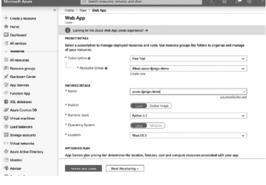

## Azure 部署

填写所需信息。我们将应用命名为 azure-Django-demo。请确保在填写配置时，系统选择 Linux，而非 Windows。

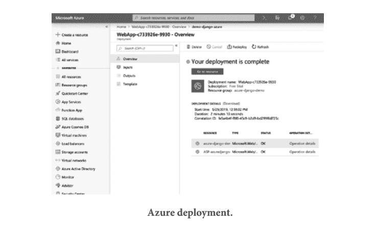

找到已创建的应用服务资源。

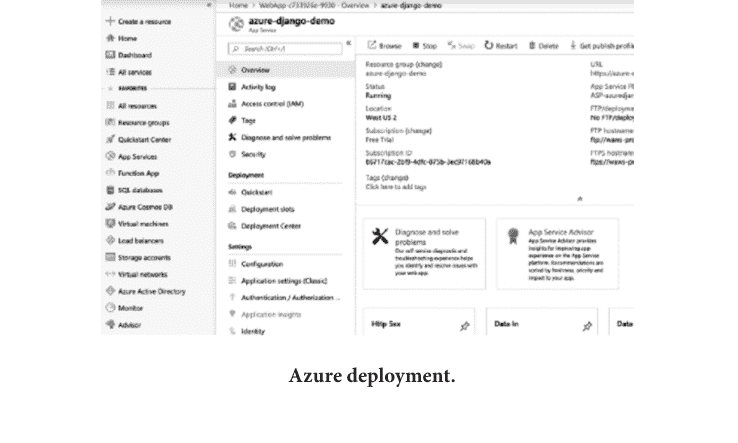

屏幕上应弹出以下界面：

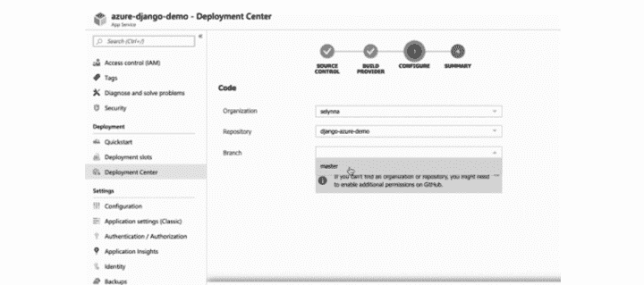

点击左侧边栏（浅色边栏，非深色）的“部署中心”。屏幕将显示包含三个步骤的“部署中心”弹出窗口。你将首先（1）通过 GitHub 部署，（2）使用应用服务构建服务，然后（3）配置你的用户名、仓库和分支。

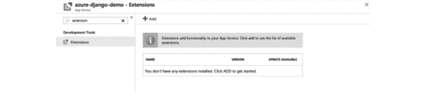

最后，我们将对 Python 应用进行一些配置更改。在搜索栏中，找到“扩展”。滚动查找并点击最新的 Python 版本（目前为 Python 3.7）。添加后，我们将使用搜索栏搜索“配置”。在屏幕弹出的窗口中转到“常规设置”，并将堆栈和 Python 版本分别更改为 Python 和 3.7。

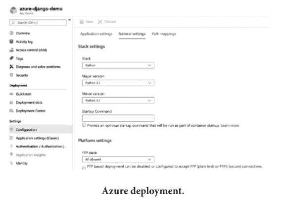

你应该能够在 azure-django-demo.azurewebsites.net 访问你的网站。

## Azure 部署文件

要部署到 Azure，我们需要一个额外的文件 `requirement.txt`，它指定了为使应用正常工作需要安装的 Azure 包。如果你想访问实时 Azure 应用，请在 `ALLOWED_HOST` 中添加 `'*'`，例如 `ALLOWED_HOST = ['*']`。

## GIT

Git 是一个免费且开源的分布式版本控制系统，用于管理和跟踪源代码历史记录；而 GitHub 是一个基于云的托管服务，用于收集 Git 仓库。如果你有一个使用 Git 的开源项目，那么 GitHub 旨在帮助你更好地管理它们。为什么我们需要两者？使用 Git 不需要 GitHub，但没有 Git 就无法使用 GitHub。

- **安装 Git：** 你可以从其官方网站下载并安装到你的电脑上。Git 有两种使用模式——bash 脚本 shell（命令行）和图形用户界面（GUI）。
- **配置 GitHub 凭据：** 通过输入以下命令配置你的本地 Git 安装以使用你的 GitHub 凭据：
    - `git config –global user.name "输入你的名字"`
    - `git config –global user.email "email_address"`
- **克隆 GitHub 仓库：** 转到你在 GitHub 上的仓库。在右上角，打开“Clone or download”下拉菜单。复制通过 HTTPS 克隆的 URL。
- **设置本地仓库：** 打开你的项目位置，并在同一路径打开 Git bash。它可以从互联网下载。然后逐行运行以下代码：
    - **`git init`：** 它将初始化 Git，即在你的项目中创建名为 `.git` 的文件夹。
    - **`git add`：** 要添加所有文件，运行此命令并手动使用 `git add folder/filename`。
    - **`git commit –m`：** `'First Commit done'`。
    - `git remote add origin "粘贴你在 GITHUB 上新仓库的 URL"` 例如，`https://github.com/project_name.git`。
    - **`git push –u origin`：** 它将把你的文件添加到你账户的 git 仓库中。
    - **`git status`：** 检查你当前的状态。

## 章节总结

在本章中，我们介绍了使用各种云平台（如 AWS Elastic Beanstalk、Microsoft Azure、Github 和 Git）部署 Django。我们有多种通过互联网部署的选项，包括免费和付费。付费版将比免费版具有更多功能，因此如果你是初学者，首先使用免费版，熟悉环境后再考虑付费版。


Taylor & Francis
Taylor & Francis Group
http://taylorandfrancis.com

# 第 11 章

## 使用 Python Django 创建测验 Web 应用

### 本章内容

- 了解 Django 基础知识
- 待办事项应用概述
- 项目代码

在本章中，初学者将在开始任何基于 Web 的应用或开发之前，学习 Python Django 的基础知识。在尝试任何项目之前，对基础知识有良好的理解非常重要。

在讨论 Django 之前，让我们先看看为什么需要 Web 框架。Web 框架是一种服务器应用框架，旨在支持动态网站。借助此框架，你无需费心于 Web 开发。市场上有各种 Web 开发框架。其中一些如下：

### REACT、FLASK、RUBY ON RAILS 等

Django 的主要特点之一是它基于 Python 构建。它遵循 DRY 原则——“不要重复自己”。它负责用户内容管理、身份验证、站点地图等等。它具有高度安全性。它帮助所有其他开发人员避免许多常见的安全错误，例如 SQL 注入、跨站脚本、csrf/xsrf 和点击劫持。

它具有相当好的可扩展性，例如使用共享无模式，这意味着你可以在任何阶段添加硬件——数据库服务器、缓存服务器或应用服务器。它还有许多其他优点：它具有自动管理界面、ORM、RSS 源等等。它动态构建网站，速度极快，并且针对 SEO 进行了优化。

## 如何在 PYTHON DJANGO 中创建测验列表应用

让我们在 Django 中开发自己的测验应用项目，让其他人使用测验来测试他们的知识。这将帮助你理解 Django Python 框架的基础知识以及如何设计前端和后端部分。每个人都喜欢尝试测验，最后查看分数，并查看尝试回答需要多长时间。你是否曾尝试制作一个其他人可以使用你的编程知识来玩的测验？如果你是 Django 初学者，那么这对你来说是一个完美的项目。它将提高你的前端技能，包括 HTML、CSS 等。

### 目的

我们项目的目标是使用 Python Django 框架制作一个包含不同主题的测验。对 Django 和前端技能的良好了解就足以完成该项目。

### 项目先决条件

- **文本编辑器：** 任何文本编辑器，如 Visual Code、Brackets、PyCharm 等。你可以从互联网下载这些编辑器。这些编辑器可以帮助你最透彻地理解结构。
- **Python3：** 你的系统中应安装最新版本的 Python；访问 Python 官方网站获取。

> 注意：你可以轻松地跟随此项目来理解 Python 的基础知识，并学习循环、函数、类等；对于高级知识，你将学习 bash 和命令行。

### 虚拟环境

它作为 Python 相关项目的依赖项。它是自包含的，存在于所有 Python 相关包和所需版本中。强烈建议在单独的环境中创建和执行 Django 应用程序。Python 提供了 `virtualenv` 工具来创建隔离的 Python 环境。

### 安装包

创建虚拟环境（在你想创建 Django 项目的同一文件夹的终端中运行这些命令）。

```
C:\Users\PC> python -m venv Virtual_name
```

更改目录

```
C:\Users\PC> cd Virtual_name
```

激活环境：`Virtual_name/Scripts/activate`。

```
C:\Users\PC> cd Virtual_name
C:\Users\PC\Virtual_name> cd Scripts.
C:\Users\PC\Virtual_name\Scripts> activate.
(env) C:\Users\PC\Virtual_name\Scripts>
```

在同一文件夹中，使用 `pip install Django` 安装 Django。

```
(Virtual_name) C:\Users\PC\Virtual_name\Scripts>
pip install django
```

安装步骤汇总；请查看以更好地理解。

```
C:\Users\PC\dd>python -m venv Virtual_env
C:\Users\PC\dd>cd Virtual_env
C:\Users\PC\Quiz\Virtual_env>cd Scripts
C:\Users\PC\Quiz\Virtual_env\Scripts>activate
(Virtual_env) C:\Users\PC\Quiz\Virtual_env\nScripts>pip install django
Collecting django
  Using cached Django-3.2.9-py3-none-any.whl (7.9 MB)
Collecting asgiref<4,>=3.3.2
  Using cached asgiref-3.4.1-py3-none-any.whl (25 kB)
Collecting sqlparse>=0.2.2
  Using cached sqlparse-0.4.2-py3-none-any.whl (42 kB)
```

收集 pytz
使用缓存 pytz-2021.3-py2.py3-none-any.whl (503 kB)
安装已收集的包：sqlparse、pytz、asgiref、Django
成功安装 asgiref-3.4.1 Django-3.2.9 pytz-2021.3 sqlparse-0.4.2
警告：您正在使用 pip 版本，即 21.2；但当前可用版本为 21.3.1。
您应该通过 'c:\users\dell\dd\virtual_env\scripts\python.exe -m pip install --upgrade pip' 命令进行升级。

## 1. 创建 Django 项目：

创建项目的第一步是使用以下命令：

```
(Virtual_env) C:\Users\PC\Quiz\Virtual_env\Scripts>cd ..
(Virtual_env) C:\Users\PC\Quiz\Virtual_env>cd ..
(Virtual_env) C:\Users\PC\Quiz\>django-admin startproject Quiz
```

使用 cd 命令更改目录：

```
(Virtual_env) C:\Users\PC\Quiz\>cd Quiz
```

您已完成安装过程；现在，使用命令提示符中的命令创建应用：

```
(Virtual_env) C:\Users\PC\Quiz\Quiz\>django-admin startapp quizapp
```

所有代码汇总：

```
Virtual_env) C:\Users\PC\Quiz\Virtual_env\Scripts>cd ..
(Virtual_env) C:\Users\PC\Quiz\Virtual_env>cd ..
(Virtual_env) C:\Users\PC\Quiz\>django-admin startproject Quiz
(Virtual_env) C:\Users\PC\Quiz\>cd Quiz
```

```
(Virtual_env) C:\Users\PC\Quiz\Quiz>django-admin startapp quizapp
(Virtual_env) C:\Users\PC\Quiz\Quiz>
```

## 2. 第二步是通过更改 Quiz/settings.py 中的 INSTALLED_APP 部分，让我们的项目知晓新创建的应用。

```
INSTALLED_APPS = [
    'django.contrib.admin',
    'django.contrib.auth',
    'django.contrib.contenttypes',
    'django.contrib.sessions',
    'django.contrib.messages',
    'django.contrib.staticfiles',
    'quizapp'
]
```

## 修改我们的模型

Django 使用默认的数据库 “SQLite”，它轻量级且适用于小型项目，对于本项目来说已经足够。它使用对象关系映射器（ORM），使得与数据库交互变得简单。

```
from Django.DB import models
# 在此创建您的模型。
class QuestionsModel(models.Model):
    question = models.CharField(max_length=200,null=True)
    option_one = models.CharField(max_length=200,null=True)
    option_two = models.CharField(max_length=200,null=True)
    option_three = models.CharField(max_length=200,null=True)
    option_four = models.CharField(max_length=200,null=True)
    answer = models.CharField(max_length=200,null=True)
    def __str__(self):
        return self.question
```

在上面的代码中，我们从 Django.db 导入了模型。这是 Django 的一个内置模块，包含各种包，如 models，可在我们的项目中使用。数据库表是在 “model.py” 中借助类关键字创建的。

在 model.py 内部，您需要创建一个名为 “Questionmodel” 的新模型。这是一个类，它将成为一个数据库表，目前继承自 model.Model。每个字段都必须有一个字段类型，如上所示。我们使用了 CharField()。这是一个基于文本的列，接受 “max_length” 为 200。与 CharField 类似，我们可以使用 TextField（包含详细文本）和 IntegerField（包含数字）。如上所示，我们有包含四个选项和正确答案的问题。每个都有一个类型字段。定义了双下划线（__str__）方法，它覆盖了模型在管理面板中的默认行为，并返回实际的 “标题” 名称，而不是某个对象。

## 进行迁移

python manage.py makemigrations 是第一步过程，读取 “model.py”。它引入了一个全新的名为 “migrations” 的文件夹，其中包含名为 “0001_initial.py” 的文件，这些文件可跨数据库移植。

```
C:\Users\Dell\Desktop\Quiz\Myquiz> python manage.py makemigrations
Did you rename questionsmodel.option_one to questionsmodel.option_o (a CharField)? [y/N] y
Migrations for 'quizapp':
  quizapp\migrations\0002_auto_20211106_1649.py
    - Rename field option_one on questionsmodel to option_o
```

## 迁移到数据库

这是第二步，其中 “python manage.py migrate” 读取新创建的文件夹 “migrations” 并创建数据库，当模型发生更改时涉及数据库。

```
C:\Users\PC\Desktop\Quiz\Myquiz> python manage.py migrate
Operations to perform:
  Apply all migrations: admin, auth, contenttypes, quiz app, sessions
```

```
Running migrations:
Applying quizapp.0002_auto_20211106_1649... OK
```

## 注册到管理后台

让我们转到 “admin.py”，并使用 “from .models import QuestionsModel” 导入名为 “QuestionsModel” 的模型。

```
from django.contrib import admin
from .models import *
# 在此注册您的模型。
admin.site.register(QuestionsModel)
```

## 创建超级用户并在管理面板中查看

在访问 “admin” 面板之前，您需要创建一个超级用户。为此，请使用 python manage.py 创建超级用户。

```
C:\Users\PC\Desktop\Quiz\Myquiz> python manage.py createsuperuser
Username (leave blank to use 'dell'): Quiz
Error: That username is already taken.
Username (leave blank to use 'dell'): quiz
Email address:
Password:
Password (again):
The password is similar to the username.
This password is short. It must contain at least eight characters.
Bypass password validation and create a user anyway? [y/N]: y
Superuser created successfully.
```

现在在终端中使用命令 python manage.py runserver 运行您的服务器。

```
C:\Users\PC\Desktop\Quiz\Myquiz> python manage.py runserver
Watching for file changes with StatReloader
Performing system checks...
System check identified no issues (0 silenced).
November 06, 2021 - 17:06:37
```

Django 版本 3.1.4，使用设置 'Myquiz.settings'。
在 http://127.0.0.1:8000/ 运行开发服务器。
使用 CTRL-BREAK 退出服务器。

我们已经设置了应用程序的基本配置。现在我们将转向应用程序设置。这是 Django 项目中文件的基本结构。

```
>Quiz (文件夹名称)
  >Myquiz (文件夹名称)
    > __pycache__
    __init__.py
    asgi.py
    setting.py
    urls.py
    wsgi.py
  >MyQuiz (项目名称)
    >quizapp (应用名称)
      >__pychache__
      >migratons (迁移文件)
      >templates
        >home.html
        >login.html
        >register.html
        >navbar.html
    db.sqlite3
    manage.py
```

## 制作和修改模板

让我们创建一个 templates 文件夹，通常用于存放 “HTML” 文件，并包含其称为 “jinja2” 的模板语言。该文件夹需要命名为 “templates”，这是约定俗成的。

```
>templates
  >home.html
  >login.html
  >register.html
  >navbar.html
```

您可以看到与 “HTML 超文本标记语言” 相关的语法。您已经为我们的测验应用创建了各种 HTML 文件。

1. Base.html
2. Home.html
3. Login.html
4. Navbar.html
5. Register.html
6. Result.html

首先，讨论 Base.html 的代码——您可以在其中添加所有静态文件链接，如 CSS、JavaScript 等，并将这些文件附加在 <head> 标签内的 <link> 标签中。

## BASE.HTML

```
{# HTML5 声明 #}

<html>
  <head>
    <title>
      使用 Django 的测验
    </title>
    <link rel="stylesheet" href="https://maxcdn.bootstrapcdn.com/bootstrap/4.0.0/css/bootstrap.min.css" integrity="sha384-Gn5384xqQ1aoWXA+058RXPxPg6fYWIH1FtMbZlDWiXai9tC4qud/Gr9PaSCcE1l9KkK" crossorigin="anonymous">
  </head>
  <body>
    
    
    
    <br>
    <script src="https://code.jquery.com/jquery-3.2.1.slim.min.js" integrity="sha384-KJ3o2DKtIkvYIK3UENzmM7KCkRr/rE9/Qpg6aAZGJwFDMVNA/GpGFF93hXpG5KkN" crossorigin="anonymous"></script>
    <script src="https://cdn.jsdelivr.net/npm/popper.js@1.16.0/dist/umd/popper.min.js" integrity="sha384-Q6E9RHvbIyZFJoft+2mJbHaEWldlvI9IOYy5n3zV9zzTtmI" crossorigin="anonymous"></script>
```

230 ■ 精通 Django

```
3UksdQRVvoxMfooAo" crossorigin="anonymous"></script>
<script src="https://maxcdn.bootstrapcdn.com/bootstrap/4.0.0/js/bootstrap.min.js" integrity="sha384-JZR6Spejh4U02d8jOt6vLEHfe/JQGiRRSQQxSfFWpi1MquVdAyjUar5+76PVCmYl" crossorigin="anonymous"></script>
</body>
</html>
```

在 base.html 中，为项目创建模板的第一步是创建基础模板。它用于设置顶部导航栏和页脚，并为任何页面提供主体画布。通过使用这个基础模板，我们可以为 HTML 页面提供传统的外观，而无需重复代码。base.html 文件可能包含大量代码。

顶部的行显示我们正在像这样注释文本 {# 添加任何文本}。 标签用于在基础文件中加载静态文件夹。这是模板语言的关键部分。它为您提供文件的特定部分，这些部分可以被扩展它的页面更改。任何扩展 base.html 的页面都可以通过编写  添加文本  轻松更改标题。

- 

Include 将帮助您扩展页面，它总是写在代码的顶部。

- 

在 block 之间，您可以添加用于渲染的 HTML 代码。

- 

这有助于更多地扩展您的模板，并减少公共代码（如样式表、JavaScript 代码等）的重复。

## LOGIN.HTML

```



```

## 登录页面

登录页面将向用户描述登录表单，以便他们输入登录详情以访问其账户。`` 通过在顶部添加 `dependencies.html` 来扩展代码。`dependencies.html` 是包含每个模板页面中所有通用代码的文件。`` 将帮助加载静态文件夹；静态文件夹包含 CSS、图像或其他文件。在 `<div>` 标签中，我使用了带有 `container jumbotron` 的类属性。我们从 `dependencies.html` 文件中的 Bootstrap CDN 链接获取它。CDN（内容分发网络）包含 Bootstrap 中定义的所有类。通过添加此链接，您可以访问它。Bootstrap 可帮助您使网页更具吸引力。接下来，我们有带有 POST 方法的 `<form>` 标签。通过互联网存储数据是安全的。`` 有助于防止我们遭受各种 SQL 注入攻击，以便没有人可以访问您的站点。该表单有两个输入标签，用于接收用户名和密码。它还有一些属性，如 `name` 定义字段的名称，例如，如果您想存储数据，可以引用该名称来使用；`placeholder` 定义在浏览器中显示在输入标签内的名称。按钮用于点击事件。当您按下任何按钮时，会发生某些事情。在按钮下方，我们有一个主要用作路由的锚点标签。它将重定向我们到注册页面；最后，我们有块的结束。整个代码应在块部分中；否则，您的代码将不会渲染。

图 11.1 显示了登录页面。

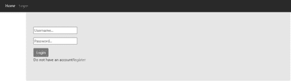

图 11.1 登录页面。

- templates > Register.html

```



<div class="container jumbotron">
    <form method="POST" action="" >
        
        {{form.as_p}}
        <input class="btn btn-primary" type="submit" value="register here">
    </form>
</div>

```

## 注册页面

注册页面将向用户描述注册表单，以便他们输入登录详情以访问其账户。`` 通过在顶部添加 `dependencies.html` 来扩展代码。`dependencies.html` 是包含每个模板页面中所有通用代码的文件。`` 将帮助加载静态文件夹；静态文件夹包含 CSS、图像或其他文件。在 `<div>` 标签中，我使用了与登录页面类似的 `container`、`jumbotron` 类属性。注册表单与登录页面略有不同。我们使用了 `{{ form.as_p }}`，这意味着我们必须使用高级表单模板，例如它将返回表单的字段，其中每个数据都用段落 `<p>` 标签包裹。`` 令牌是数据存储或检索所必需的。

图 11.2 显示了注册页面。

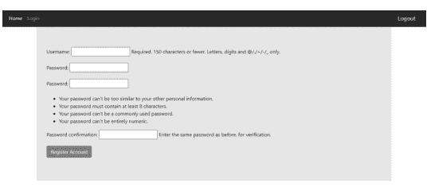

图 11.2 注册页面。

- templates > home.html

```



<div class="container ">
<h1>Quiz</h1>
<form method='post' action=''>


<div class="form-group">
<label for="question">{{ q.question }}</label>
</div>
<div class="form-check">
<div class="form-check">
<input type="radio" class="form-check-input" name="{{ q.question }}" id="gridRadio1" value="{{ q.option_one }}" checked>
<label class="form-check-label" for="gridRadios1">
{{ q.option_one }}
</label>
</div>
<div class="form-check">
<input type="radio" class="form-check-input" name="{{ q.question }}" id="gridRadio2" value="{{ q.option_two }}">
<label class="form-check-label" for="gridRadios2">
{{ q.option_two }}
</label>
</div>
<div class="form-check">
<input class="form-check-input" type="radio" name="{{ q.question }}" id="gridRadio3" value="{{ q.option_three }}">
<label class="form-check-label" for="gridRadios3">
{{ q.option_three }}
</label>
</div>
<div class="form-check">
<input type="radio" class="form-check-input" name="{{ q.question }}" id="gridRadio4" value="{{ q.option_four }}">
<label class="form-check-label" for="gridRadios4">
{{ q.option_four }}
</label>
</div>
<br>
</div>

<br>
<button type="submit" class="btn btn-primary">Submit</button>
</form>

<script>
console.log('hello world')
</script>

</div>

```

## 主页

主页包含应用程序根 URL 的代码，这意味着当有人访问该 URL 时，第一个页面将是根 URL，即主页。在 `urls.py` 中，它看起来像 `path('', home, name='home')`。第一个空参数意味着您正在引用根 URL。`` 将帮助加载静态文件夹；静态文件夹包含 CSS、图像或其他文件。在 `<div>` 标签中，我使用了带有 `jumbotron` 的类属性。要开始使用 POST 方法，请在表单标签后添加 ``，然后应用于表单输入，例如 `` 我们使用了 Jinja 模板表达式。`<div>` 标签具有 `form-group` 类，Bootstrap 类 `<label>` 用于为文本添加标签。`{{ q.question }}` 是一个 Jinja 模板，通过它我们可以在浏览器上获取值。Jinja 模板表达式不会显示在屏幕上。只有使用此 `{{ }}` 括号的文本才会显示。基本上，`q.question` 中的 `q` 是为循环提供的数据，而 `question` 是模型的字段。这是从数据库获取值的方式。所有值都是以这种方式获取的。现在结束您打开的块。

图 11.3 显示了主页。

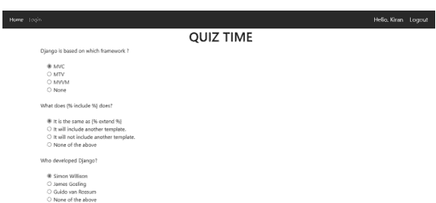

图 11.3 主页。

- templates > navbar.html

```

<style>
.greet{
    font-size: 18px;
    color: #fff;
    margin-right: 20px;
}
</style>
<nav class="navbar navbar-expand-lg navbar-dark bg-dark">
    <button type="button" class="navbar-toggler" data-toggle="collapse" data-target="#navbarNav" aria-controls="navbarNav" aria-expanded="false" aria-label="Toggle navigation">
<span class="navbar-toggler-icon"></span>
</button>
<div class="collapse navbar-collapse" id="navbarNav">
    <ul class="navbar-nav">
        <li class="nav-item active">
            <a class="nav-link" href="">
                Home </a>
        </li>
        <li class="nav-item">
            <a class="nav-link" href="">
                Login </a>
        </li>
    </ul>
</div>

<span class="greet"> Hello, {{ request.user }} </span>

<span><a class="greet" href="">
Logout </a></span>
</nav>
```

导航栏是添加在每个页面顶部的通用栏。您可以通过 `` 添加此文件。它将自动添加到每个页面的顶部。它应该只有一个顶部。在此文件中，我们添加了 Bootstrap 导航栏，以便我们的文本看起来更好，并且我们可以轻松管理、添加内容。打开导航标签并在其中添加类属性。此导航栏是响应式的，这意味着当屏幕变小时，所有内容将被隐藏并显示在按钮后面。然后，当您点击该按钮时，所有导航栏选项将作为下拉菜单工作并显示。接下来，您在导航栏类中有一个按钮。其类型为按钮，`data-toggle` 为折叠状态，并且提到了目标 ID，以便当屏幕较小时，按钮覆盖导航栏，同时点击按钮时，目标引用在所有情况下都相同的 ID，否则什么也不会发生。要运行整个代码，您应该添加名为

## 结果页面

代码只有在正确添加到文件中后才会运行。接着我们有一个 `div` 元素，其 `id` 为 `NavbarNav`，用于在小屏幕上切换显示。然后，在 `<li>` 标签中，我们保留了 `nav-item` 和 `active` 类，以告知浏览器这是一个导航项链接，并添加了带有 `nav-link` 类的 `<a>` 标签；`href` 属性告诉模板这是一个导航链接。类似地，Jinja 中的其他导航链接写作 ``：第一个参数是 URL 模式名称，下一个参数用作 URL 中的参数。

下一行代码让你知道用户是否已通过身份验证。代码 `` 描述了如果用户已通过身份验证，它将使用内置方法（即 `is_authenticated`）进行检查，然后接下来的代码行将运行。它将显示已验证的用户名 `{{request.user}}`。始终记得结束 `if` 代码块；注销选项紧邻其后，它会将用户重定向到根目录。

- templates > result.html

```


<div class="container ">
    <div class="card-column">
        <div class="card" align="centre ">
            <div class="card-body">
                <h5 class="card-title">Score: {{ score }}</h5>
                <p class="card-text">Percentage: {{ percent }}</p>
                <p class="card-text">Correct answers: {{ correct }}</p>
                <p class="card-text">Incorrect answers: {{ wrong }}</p>
                <p class="card-text">Total questions: {{ total }}</p>
                <h5>All the best for next quiz!</h5>
            </div>
        </div>
    </div>
</div>

```

上述代码将按顺序显示结果。结果在 `view.py` 的 `home` 函数中处理。只要没有出现 `False` 条件，用户将在代码 `{{ variable }}` 成功执行后被重定向。像 `score`、`percent`、`correct`、`wrong` 和 `total` 这样的变量将使用该语法显示。

图 11.4 展示了结果页面。

### url.py

```
from django.contrib import admin
from django.urls import path
from django.urls.conf import include
from quizapp.urls import *

urlpatterns = [
    path('admin/', admin.site.urls),
    path('', include('quizapp.urls')),
]
```

- `from django.contrib import admin`

当它被导入时，它会自动在每个应用中查找 `admin` 模块并导入它们。

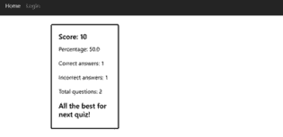

- `from django.urls import path`

`path` 函数包含在 `Django.URL` 模块中。它用于使用分发器（表达式）将 URL 路由到应用程序中适当的视图函数。

- `from django.urls.conf import include`

一个函数，它接受另一个 `URLconf` 模块的完整导入路径，可以在其中添加 `include`。在这种情况下，点（`.`）运算符是访问当前包的快捷方式。

- `from quizapp.urls import *`

`quizapp.urls` 是测验应用的 URL 文件，因此这里我们只是导入它们以使其可用。

```
from django.urls import path
from quizapp.views import *
from django.conf import settings
from django.conf.urls.static import static

urlpatterns = [
    path('', home, name='home'),
    path('login/', loginpage, name='login'),
    path('logout/', logoutpage, name='logout'),
    path('register/', registerpage, name='register'),
]

if settings.DEBUG:
    urlpatterns += static(settings.MEDIA_URL,
                          document_root=settings.MEDIA_ROOT)
```

在 `url.py` 中，我们有一个需要导入的重要模块：

- `from django.urls import path`

`path` 函数包含在 `Django.URL` 模块中。它用于使用分发器（表达式）将 URL 路由到应用程序中适当的视图函数。

- `from quizapp.views import *`

`quizapp.urls` 是测验应用的 URL 文件，因此这里我们只是导入它们以使其可用。

- `from django.conf import settings`

它抽象了默认和站点特定的设置，并提供了一个单一接口。设置文件保存了你的 Web 应用程序工作所需的值，包括数据库设置、静态文件、API 密钥、密钥以及一堆其他内容。

- `from django.conf.urls.static import static`

为了设置静态文件，需要在 `url.py` 文件中引入 `Django.contrib.static`，以创建像 `STATIC_ROOT`、`MEDIA_ROOT` 和 `MEDIA_URL` 以及 `STATIC_URL` 这样的路径。

`urlpatterns` 是一个元组，你可以在其中定义 URL 和视图之间的映射。你在这里合并了 `MEDIA` 的路径，以便在项目中添加图片。

### form.py

```
from django.forms import ModelForm
from .models import *
from django.contrib.auth.forms import UserCreationForm
from django.contrib.auth.models import User

class createuserform(UserCreationForm):
    class Meta:
        model = User
        fields = ['username', 'password']
```

在 `form.py` 中，我们将学习如何使用内置的 `Form`，即 `UserCreationForm` 来创建表单。首先，导入包，然后从该包中导入特定的模块以在你的项目中使用。因此，从 `Django` 中，`Forms` 是包，模块名是 `ModelForm`，我们在 `form.py` 中使用它。其次，我们导入特定应用程序的所有模型，`(*)` 是一个符号，用于从该文件中获取所有模型。无需手动从 `.model` 导入 `create user form`。

接下来，我们有 `UserCreationForm` 和 `User`。这些是 Django 中的内置模块。两者都有各种数据字段，如 `username`、`password`、`email`、`confirm password` 等。记住，你必须在类中编写模型，而不是在函数中。在 `create user form` 内部，我们有 `class Meta`，它为我们提供了所有与 `Meta` 相关的信息（关于数据的简要信息）。它有各种字段，如 `model`、`fields` 等，但这里我们只有两个模型，它们定义了该表单的模型，例如表单数据存储在哪里以及表单具有哪些类型的属性。接下来，我们有字段 `username` 和 `password`。我们的表单只有两个字段：`username` 和 `password`。有了它，用户就能够使用自己的凭据登录。`UserCreationForm` 覆盖了其中其他表单的字段。如果你想使用所有字段，那么建议使用代码 `fields="__all__"`。这些用于通过表单一次获取所有输入。

### view.py

```
from django.shortcuts import redirect, render
from django.contrib.auth import login, logout, authenticate
from .forms import *
from .models import *
from django.http import HttpResponse
from django.contrib.auth.models import auth

# Create your views here.
def home(request):
    if request.method == 'POST':
        print(request.POST)
        questions = QuestionsModel.objects.all()
        score = 0
        wrong = 0
        correct = 0
        total = 0
        for q in questions:
            total += 1
            print(request.POST.get(q.question))
            print(q.answer)
            print()
            if q.answer == request.POST.get(q.question):
                score += 10
                correct += 1
            else:
                wrong += 1
        percent = score / (total * 10) * 100
        context = {
            'score': score,
            'correct': correct,
            'wrong': wrong,
            'percent': percent,
            'total': total
        }
        return render(request, 'result.html', context)
    else:
        questions = QuestionsModel.objects.all()
        context = {
            'questions': questions
        }
        return render(request, 'home.html', context)

def registerPage(request):
    if request.user.is_authenticated:
        return redirect('home')
    else:
        form = createuserform()
        if request.method == 'POST':
            form = createuserform(request.POST)
            if form.is_valid():
                user = form.save()
                return redirect('login')
        context = {
            'form': form,
        }
        return render(request, 'register.html', context)

def loginPage(request):
    if request.user.is_authenticated:
        return redirect('home')
    else:
        if request.method == "POST":
            username = request.POST.get('username')
            password = request.POST.get('password')
            user = authenticate(request, username=username, password=password)
            if user is not None:
                login(request, user)
                return redirect('/')
        context = {}
        return render(request, 'login.html', context)

def logoutPage(request):
    auth.logout(request)
    return redirect('/')
```

在 view.py 文件中，你将看到与上面相同的模块导入；在深入代码之前，我们先来讨论 view.py 文件的导入部分：

1.  **From Django.shortcuts import redirect, render:** 这段代码包含了项目在将文本渲染到模板以及重定向到特定 URL 以使网站动态化时的重要功能。你可以从 Django.shortcuts 中获取所有的重定向和返回。

2.  **From django.contrib.auth import logout, authenticate, login:** 这将帮助你使视图更安全。一旦用户注册，只有该用户才能访问网站。登录、登出有助于传递经过身份验证的用户。在前面的章节中，你已经了解了存储所有数据的管理面板。

3.  **From .forms import *:** 表单在这里扮演着至关重要的角色，因为你可以通过在 view.py 文件中导入它来直接获取表单数据。只有当用户输入详细信息并点击 POST 方法时，表单数据才能被存储。这就是为什么在每个表单中，我们总是写 `if method == POST`；这段代码只有在方法匹配时才会运行。

4.  **From .models import *:** 当用户在表单中输入数据时，模型文件会像这样导入，forms.py 会运行，并且当 `save()` 方法执行时数据将被保存，下面的代码是 save 方法的示例。

```
if request.method=='POST':
    form = createuserform(request.POST)
    if form.is_valid():
        user=form.save()
        return redirect('login')
```

当用户点击按钮时，请求方法与用户值匹配，该值我们将从 `createuserform(request.POST)` 中获取并保存在 form 变量中；在下一行，检查代码是否有效：如果 `form.is_valid()` 返回 True，则用户详细信息将存储在数据库中，并在代码成功运行后链接到数据库，然后窗口重定向到登录页面。

5.  **From Django.http import HttpResponse:** HttpResponse 将文本返回给客户端浏览器。每当请求产生时，它由中间件处理并由 HttpResponse 渲染。

6.  **From django.contrib.auth.models import auth:** 你的 INSTALLED_APP setting.py 文件中的 contrib.auth 将确保四个默认的通用权限——添加、删除、更改和查看。

这是 view.py 中常见的导入模型。

Django 项目的所有逻辑都应该写在单独的函数中。我们为每个页面设置了不同的函数，这样一切看起来更好，并且能以正确的方式运行。看看主页的代码。

所以，home 函数被请求了。该方法只有在你点击 POST 方法时才会首先运行。之后，你通过 `QuestionsModel.object.all()` 获取存储在数据库中的所有数据，其中 all 方法帮助你获取存储的数据并渲染到浏览器，score、wrong、correct、total 是用于存储一些值的变量，然后循环将遍历问题并存储在 q 变量中，total 将为每个问题增加 1（如果问题的答案正确），score 将增加 10，correct 值将增加 1，如果答案错误，wrong 变量将增加 1。当测验结束时，玩家会得到一个带有百分比的分数。context 变量以键值对（字典）的形式获取值，字典的写法像这样 `{'key': 'value'}`。代码成功完成后，`render()` 将返回带有 context 的 result.html。如果出现任何问题，例如语法错误或其他错误，它将简单地返回问题并将其渲染到主页。

所以，register page() 方法被请求作为一个参数。接下来，这将让你知道，如果用户已通过身份验证，则无需登录，因为它会简单地将你重定向到 home.html；然而，如果用户是网站的新用户，那么他们首先必须注册，然后他们会得到表单。

Login page() 具有与 register 相同的参数，因为请求是由用户生成的。当用户已经通过身份验证时，这将由 authenticate 方法检查，以查看用户名和密码是否存在。当用户不存在时，这将重定向到根目录，即 home.html。

在 logout page() 上，方法名 `auth.logout(request)` 仅在用户已登录时用于注销。此选项仅在用户通过身份验证时才会出现。

### app.py

```python
from django.apps import AppConfig

class QuizappConfig(AppConfig):
    default_auto_field = 'django.db.models.BigAutoField'
    name = 'quizapp'
```

这是一个所有 Django 应用程序通用的配置。用于配置应用程序的 AppConfig 有一个 path 属性。类的名称是 in-app。Y 类似于你的应用程序名称。它的首字母必须大写，括号后添加 AppConfig。`default_auto_field` 是一个属性，默认值是 `DEFAULT_AUTO_FIELD`，如果为 `BigAutoField`。BigAutoField 是一个根据可用 ID（如 AutoField）自动递增的主键。

## 这个项目的目的什么？

在这个项目中，你从零开始学习了 Python 和 Django。它向你展示了如何构建语法和逻辑。现在你能够制作自己的项目了。我们在这个项目中使用的概念与身份验证、模型、模板、表单和带有静态文件的视图有关。

所以这是我们的测验应用，在这里我们将告诉你为什么我们倾向于用任何语言制作这类项目的原因。在求职时，手头至少应该有一个项目，这样你才能有更好的机会在公司找到工作。没有实践，你就无法正确编码。所以我们对此的看法是，你可以学习和练习语言的基础，更清楚地理解语法，你也可以向其中添加新东西。一旦你掌握了全部要点，尝试制作项目，但要有一些变化。熟练掌握基础知识，学习一些高级功能，如类、方法、继承等。与其使用函数，不如更好地使用类，因为类本质上是可调用的。在未来，你的小项目将对你帮助更大。


Taylor & Francis
Taylor & Francis Group
http://taylorandfrancis.com

# 第 12 章
项目：待办事项列表

### 本章内容

- 了解 Django
- 测验应用概述
- 项目代码

在本章中，我们将创建一个完全可扩展且基于平台独立运行的待办事项应用。这将让你在正确理解基础知识的前提下，为学习 Django 开个好头。

在理解 Django 之前，让我们先了解为什么我们需要一个 Web 框架？Web 框架是一个服务器应用框架，旨在支持动态网站。借助这些框架，你不必为 Web 开发而烦恼。市场上有各种 Web 开发框架。其中一些如下：

## REACT, FLASK, RUBY ON RAILS, 等等。

Django 的一个主要特点是它基于 Python 构建。它遵循 DRY 原则——“不要重复自己”。它负责用户内容管理、身份验证、站点地图等等。它非常安全。它帮助所有初学者和开发者避免许多常见的安全错误，例如 SQL 注入、跨站脚本、csrf/xsrf 和点击劫持。

它具有相当好的可扩展性，例如使用无共享架构，这意味着你可以在任何级别添加硬件——数据库服务器、缓存服务器或应用服务器。它还有许多其他优点：它有一个直观的管理界面、ORM、RSS 订阅源等等。

它动态构建网站，速度极快，并且针对 SEO 进行了优化。

## 如何在 Python Django 中创建待办事项列表应用

一个跟踪你一天中执行的所有任务的列表称为待办事项列表。这是一种按时完成任务的可管理方式。它让用户负责任，也了解时间的价值。今天我们将使用 Django 框架创建一个待办事项列表应用。这个待办事项列表的主要目的是获取一些 Python 语法和 Django CRUD 的知识。它具有一些基本功能，如创建、读取、更新和删除。用户可以添加他们的任务，也可以删除它们。

如果你对 Django 和 Python 的基础知识掌握得很好，那么你就可以很好地进行这个项目了。以下是开始此项目的步骤。

1.  **安装 Python：** 在我们继续之前，确保你的系统中安装了 Python。如果你没有 Python，请从其官方网站安装 Python。
2.  在环境变量集中添加环境变量，这样你就不会遇到任何路径问题。
3.  创建一个文件夹，然后使用 `Python –m venv Virtual_env` 在其中创建一个虚拟环境。
4.  当虚拟环境安装在你的文件夹中后，激活它。
5.  使用 `cd` 命令移动到 Scripts 目录。
6.  在文件夹中运行 `activate`。
7.  它将让你移动到项目的末尾，你必须使用 `pip install Django` 安装你的 Django。
8.  安装 Django 后，使用 `cd ..` 两次返回项目文件夹。

9. 在根文件夹中，你必须使用 `django-admin startproject TodoApp` 创建项目目录。

10. 使用 `django-admin startapp Todo`。

以下是完整的代码：

```
C:\Users\PC\dd>python -m venv Virtual_env
C:\Users\PC\dd>cd Virtual_env
C:\Users\PC\Quiz\Virtual_env>cd Scripts
C:\Users\PC\Quiz\Virtual_env\Scripts>activate
(Virtual_env) C:\Users\PC\Quiz\Virtual_env\Scripts>pip install django
Collecting django
  Using cached Django-3.2.9-py3-none-any.whl (7.9 MB)
Collecting asgiref<4,>=3.3.2
  Using cached asgiref-3.4.1-py3-none-any.whl (25 kB)
Collecting sqlparse>=0.2.2
  Using cached sqlparse-0.4.2-py3-none-any.whl (42 kB)
Collecting pytz
  Using cached pytz-2021.3-py2.py3-none-any.whl (503 kB)
Installing collected packages: sqlparse, pytz, asgiref, Django
Successfully installed asgiref-3.4.1 Django-3.2.9 pytz-2021.3 sqlparse-0.4.2
WARNING: You are using pip version 21.1.3; however, version 21.3.1 is available.
You should consider upgrading via the 'c:\users\dell\dd\virtual_env\scripts\python.exe -m pip install --upgrade pip' command.
(Virtual_env) C:\Users\PC\Quiz\Virtual_env\Scripts>cd ..
(Virtual_env) C:\Users\PC\Quiz\Virtual_env>cd ..
(Virtual_env) C:\Users\PC\Quiz>django-admin startproject Quiz
(Virtual_env) C:\Users\PC\Quiz\>cd Quiz
(Virtual_env) C:\Users\PC\Quiz\Quiz>django-admin startapp quizapp
(Virtual_env) C:\Users\PC\Quiz\Quiz>
```

## 创建超级用户并在管理面板中查看

在访问“admin”面板之前，你必须创建一个超级用户。为此，请使用 `python manage.py createsuperuser`。

```
C:\Users\PC\Desktop\Quiz\Myquiz> python manage.py createsuperuser
Username (leave blank to use 'dell'): Quiz
Error: That username is already taken.
Username (leave blank to use 'dell'): quiz
Email address:
Password:
Password (again):
The password is too similar to the username.
This password is too short. It must contain at least eight characters.
Bypass password validation and create a user anyway? [y/N]: y
Superuser created successfully.
```

## 进行迁移

`python manage.py makemigrations` 是此过程的第一步。它读取“model.py”并创建一个名为“migrations”的新文件夹，其中包含一个名为“0001_initial.py”的文件，该文件可跨数据库移植。

```
C:\Users\Dell\Desktop\Quiz\Myquiz> python manage.py makemigrations
Did you rename questionsmodel.option_one to questionsmodel.option_o (a CharField)? [y/N] y
Migrations for 'quizapp':
  quizapp\migrations\0002_auto_20211106_1649.py
    - Rename field option_one on questionsmodel to option_o
```

## 迁移到数据库

这是第二步，`python manage.py migrate` 读取新创建的“migrations”文件夹并创建数据库，并在模型发生更改时更新数据库。

```
C:\Users\PC\Desktop\Quiz\Myquiz> python manage.py migrate
Operations to perform:
  Apply all migrations: admin, auth, contenttypes,
quizapp, sessions
Running migrations:
  Applying quizapp.0002_auto_20211106_1649... OK
```

创建应用后，请迁移你的文件。它将把迁移应用到所有待处理的迁移。
现在，在终端中使用命令 `python manage.py runserver` 运行你的服务器。

```
C:\Users\PC\Desktop\Quiz\Myquiz> python manage.py runserver
Watching for file changes with StatReloader
Performing system checks...
System check identified no issues (0 silenced).
November 06, 2021 - 17:06:37
Django version 3.1.4, using settings 'Myquiz.settings'.
Starting development server at http://127.0.0.1:8000/
Quit the server with CTRL-BREAK.
```

运行所有命令后，你的 Django 环境就设置好了。
文件夹结构：

```
>TodoListApp (文件夹名称)
  >TodoListApp (文件夹名称)
    > __pycache__
    __init__.py
    asgi.py
    setting.py
    urls.py
    wsgi.py
  >Todo (项目名称)
    >quizapp (应用名称)
      >__pycache__
      >migrations (迁移文件)
      >templates
        >home.html
        >login.html
        >register.html
        >navbar.html
        >base.html
        >update.html
  db.sqlite3
  manage.py
```

模板目录是一个目录，所有 HTML 模板都将在此渲染以显示输出。让我们讨论每个模板。

### templates > Base.html

```html

<!DOCTYPE html>
<html lang="en">
<head>
    <meta charset="UTF-8">
    <meta http-equiv="X-UA-Compatible"
content="IE=edge">
    <meta name="viewport" content="width=device-width,
initial-scale=1.0">
    <title> Django CRUD </title>
    <link rel="stylesheet" href="" />
    <link rel="stylesheet" href="https://maxcdn.bootstrapcdn.com/bootstrap/4.0.0/css/bootstrap.min.css" integrity="sha384-Gn5384xqQ1aoWXA+058RXPxPg6fy4IWvTNh0E263XmFcJlSAwiGgFAW/dAiS6JXm" crossorigin="anonymous">
</head>
<body>
    <div class="main">
        <p class="main-title" >Django CRUD </p>
        
            
        </div>
    </div>
    <script src="https://code.jquery.com/jquery-3.2.1.slim.min.js" integrity="sha384-KJ3o2DKtIkvYIK3UENzmM7KCkRr/rE9/Qpg6aAZGJwFDMVNA/GpFF93hXpG5KkN" crossorigin="anonymous"></script>
    <script src="https://cdnjs.cloudflare.com/ajax/libs/popper.js/1.12.9/umd/popper.min.js" integrity="sha384-ApNbgh9B+Y1QKtv3Rn7W3mgPxhU9K/ScQsAP7hUibX39j7fakFPskvXusvfa0b4Q" crossorigin="anonymous"></script>
    <script src="https://maxcdn.bootstrapcdn.com/bootstrap/4.0.0/js/bootstrap.min.js" integrity="sha384-JZR6Spejh4U02d8jOt6vLEHfe/JQGiRRSQxSfFWpilMquVdAyjUar5+76PVCmYl" crossorigin="anonymous"></script>
</body>
</html>
```

在 base.html 中，为项目创建模板的第一步是制作基础模板。它用于设置顶部导航栏和页脚，并为任何页面提供主体画布。使用这个基础模板，我们可以在不重复任何代码的情况下为 HTML 页面提供传统的外观。base.html 文件可能包含大量代码。

顶行显示我们像这样注释我们的文本：`{# add any text}`。`` 标签用于在基础文件中加载静态文件夹。这是模板语言的关键部分。它为你提供文件的特定功能，这些功能可以被扩展它的页面更改。任何打开 base.html 的页面都可以通过编写 ` Add Text ` 轻松更改标题。

示例：

```html

```

Include 将帮助你扩展页面，它总是写在代码的顶部。

```html

```

...... 在 block 之间，你可以添加用于渲染的 HTML 代码。

```html

```

这极大地帮助你扩展模板并减少公共代码（如样式表、JavaScript 代码等）的重复。

### templates > Edit.html

```html


<form method="POST" >
    
    <!-- <span>Email</span> <input type="email" name="email"> -->
    Update your Data:
    <input type="text" name="todo" value="{{todo.0.todos}}" >
    <!-- {{form}} -->
    <br>
    <button class="btn--primary"> Save </button>
</form>

```

项目有一个 edit.html 模板，以便我们可以更新待办事项列表中的任务。使用 form 标签，我们可以使用引用模型属性的 name 属性来更新值。`{{todo.0.todos}}` 将获取已验证用户的值。所有提供的代码都应写在 `` 中，并且不要忘记结束此 block ``。当你按下保存更新时，update 方法将运行，并且当你的代码正确工作时，值会立即存储。

## 编辑页面

图 12.1 显示了编辑页面。

## 编辑页面之后

一旦你完成了数据的编辑，旧内容就会被更新（图 12.2）。

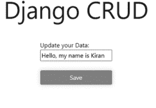

图 12.1 编辑你当前的数据。

## Django CRUD

在此登录

## 注册

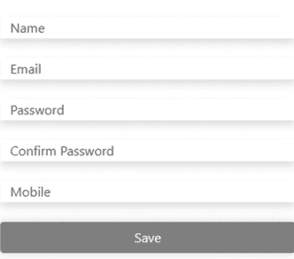

图 12.2 在此完成数据更新。

### templates > Login.html

```html


<a class="links" href="" >
Register Here </a>
<h1> Login </h1>
<form method="POST" >
  
  <!-- <span>Email</span>  <input type="email"
name="email"> -->
  <label>Mobile Number</label>
  <input class="form__field" type="number"
name="number"> <br>
  <label>Password</label>
  <input class="form__field" type="password"
name="password"> <br>
  <button class="btn--primary"> Save </button>
</form>

```

## 登录页面

登录页面将描述用户输入登录详情以访问其账户的登录表单。`` 通过在顶部添加 `dependencies.html` 来扩展代码。接下来，我们有 `<form>` 标签，其 method 为 POST，这是一种在互联网上安全存储数据的方式。`` 有助于防止我们遭受 SQL 注入等各种攻击，从而确保无人能访问您的站点。该表单有两个输入标签，分别用于数字和密码。它还有一些属性，例如 `number` 定义字段的编号，如果您想存储数据，可以参考 `name` 来使用，`placeholder` 定义了在浏览器中显示在输入标签内的名称。按钮用于点击事件，当您按下任何按钮时，就会发生某些事情。按钮下方，我们有一个锚点标签，主要用作路由。它将重定向我们到注册页面；最后，我们有块的结束。整个代码应该在块部分内；否则，您的图例将不会渲染。在 Django 表单中，我们用数字覆盖了电子邮件。

图 12.3 显示了登录页面。

- templates > register.html

```


<a href="" > Login Here </a>
<h1>Register</h1>
<form method="POST">
    
```

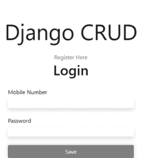

图 12.3 用户登录页面。

```
{{error}}


<input placeholder="Name" class="form__field" type="type" name="uname"> <br>
<input placeholder="Email" class="form__field" type="email" name="email"> <br>
<input placeholder="Password" class="form__field" type="password" name="password1"> <br>
<input placeholder="Confirm Password" class="form__field" type="password" name="password2"> <br>
<input placeholder="Mobile" class="form__field" type="number" name="number" > <br>
<button class="btn--primary"> Save </button>
</form>

```

注册页面将描述用户输入登录详情以访问其账户的注册表单。`` 通过在顶部添加 `base.html` 来扩展代码。`Base.html` 是我们获取包含在每个模板页面中的所有标准代码的文件。注册表单与登录页面略有不同。我们有四个输入标签：用户名、电子邮件、密码和确认密码。用户必须输入这些详细信息。`` 令牌是数据存储或检索所必需的。

## 注册页面

图 12.4 显示了注册页面。

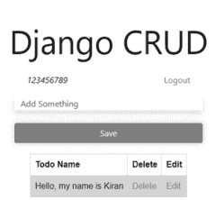

图 12.4 用户注册页面。

258 ■ 精通 Django

- templates > show.html

```


<div class="user">
  <div class="user-name">
    <em>{{A_USER}}</em>
  </div>
  <div class="user-logout">
    <a class="links" href="">Logout</a>
  </div>
</div>
  <form method="POST" >
    
    <input class="form__field" type="text"name="todo" placeholder="Add Something"><br>
    <button class="btn--primary">Save</button>
  </form>
  <table class="content">
    <tr>
      <th>Todo Name</th>
      <th>Delete</th>
      <th>Edit</th>
    </tr>
    
    <tr>
      <td>{{item.todos}}</td>
      <td><a class="links" href="">Delete</a></td>
      <td><a class="links" href="">Edit</a> </td>
    </tr>
    
  </table>

```

`Show.html` 可以返回您存储在账户中的所有任务。让我们看看代码。`` 通过在顶部添加 `base.html` 来扩展代码。`Base.html` 是我们获取包含在模板页面中的所有通用代码的文件。在 `<div>` 标签部分，写有 `{{A_USER}}`，这意味着如果您的用户已通过身份验证，用户的名字将显示在此处。除了这段代码，我们还有一个注销按钮，以便用户可以从其账户中注销。每次导航链接时，请始终使用 ``。然后首先从 post 方法开始，该方法有用于将任务存储在数据库中的输入标签。`view.py` 处理所有查询。最后，我们有一个表格及其子标签 `tr`、`th`、`td`。`Tr` 定义为表格行，`th` 为表格标题，`td` 为表格数据。创建第一行，然后是 `<th>Todo Name</th>`、`<th>Delete</th>`、`<th>Edit</th>`，这段代码将原样添加。然后 for 循环运行，从数据库获取待办事项数据 ``，每次都会创建一个新行。数据库中的数据借助 `{{write your code here}}` 显示。除此之外，还有两个链接用于删除和编辑。删除将一次删除选定的待办事项，编辑则转到新的 URL `edit.html`。

## 显示详情页面

图 12.5 显示了显示详情页面。
向您的列表中添加一些内容并检查；当您点击保存按钮时，您的数据将立即显示（图 12.6）。

## Views.py

```
from django.http.response import HttpResponseRedirect
from django.shortcuts import redirect, render, get_list_or_404
from django.http import HttpResponse
from .models import *
```

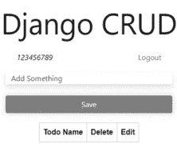

图 12.5 此处列出了所有待办事项。

## Django CRUD

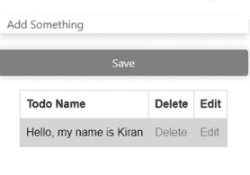

图 12.6 待办事项已创建。

```python
from django.contrib import messages
from django.contrib.auth.models import User,auth
from django.contrib.auth import authenticate, logout
from django.contrib.auth.decorators import login_required
from .forms import *
def login(request):
    if request.method == "POST":
        # Get the value from input
        phone = request.POST.get('number')
        password=request.POST.get('password')
        print(phone, password)
        user_auth = auth.authenticate(username=phone, password=password)
        print("USER_AUTH" , user_auth)
        if user_auth is not None:
            auth.login(request,user_auth)
            print(user_auth)
            messages.success(request, 'Auth User')
            return redirect('/show')
        else:
            messages.success(request, 'User not found')
            return redirect('/')
    return render(request,'login.html')
def register(request):
    if request.method == "POST":
        if request.POST['password1'] == request.POST['password2']:
            try :
                user = User.objects.get(username=request.POST['uname'])
                return render(request,'register.html',{'error':"Username Has been Taken"})
            except User.DoesNotExist:
                user = User.objects.create_user(username=request.POST['number'],first_name=request.POST['uname'],email=request.POST['email'],password = request.POST['password1'])
                user.save()
                auth.login(request,user)
                return redirect('/')
        else:
            return render(request,'register.html',{'error':"Password Dose Not Match"})
    else:
        return render(request,'register.html')
@login_required
def show(request):
    A_USER = request.user
    if request.method == "POST":
        todo= request.POST.get('todo')
        print(todo)
        if todo is not None:
            todo_item = TodoModel(todos = todo, user = request.user)
            todo_item.save()
            # print(todo_item)
    get_todo =TodoModel.objects.filter(user = request.user)
    return render(request,'show.html',{'get_item':get_todo,'A_USER':A_USER})
def logout(request):
    auth.logout(request)
    return redirect('/')
def delete(request,id):
    todo_delete = TodoModel.objects.get(id = id)
    print(todo_delete)
    todo_delete.delete()
    return redirect('/show')
def edit(request,id):
    if request.method =="POST":
        todo = request.POST.get('todo')
        # AUTH USER GET ID
        todo_obj = TodoModel.objects.get(id=id)
        # For storing the value in particular field in
        # in Todo Model 'todos' field.
        todo_obj.todos = todo
        todo_obj.save()
        print("Todo",todo,"TODOS",todo_obj)
        return redirect('/show')
    else:
        # Return the particular value with id.
        todo = TodoModel.objects.filter(id=id)
        return render(request,'edit.html',{'todo':todo})
```

262 ■ 精通 Django

1.  **view.py 是整个 Django 项目的逻辑文件：** 从 `django.shortcuts` 导入 `redirect`、`render`。这段代码包含了项目中的关键功能，同时将文本传递给模板并转向确切的 URL 以使站点动态化。您可以从 `django.shortcuts` 获取所有重定向和返回。

2.  **Django.contrib.auth import login, logout, authenticate：** 这将帮助您使视图安全，例如一旦用户注册，只有同一用户才能访问站点。登录、注销有助于传递经过身份验证的用户；在前面的章节中，您已经了解了存储在管理面板中的所有关于管理面板的数据。

3.  **From .forms import *：** 表单在这里起着至关重要的作用，因为您可以通过将其导入 `view.py` 文件来直接获取表单数据。只有当用户输入详细信息并点击 POST 方法时，表单数据才能被存储。这就是为什么在每个表单中，我们总是写 `if method == POST`；这段代码只有在方法匹配时才会运行。

4.  **From .models import *：** 模型文件像这样导入，当用户在表单 `forms.py` 中输入其数据时运行，并且当 `save()` 方法执行时数据将被保存，下面的代码是 save 方法的示例。

5.  **From Django.HTTP import HttpResponse：** `HttpResponse` 将文本返回给客户端浏览器。每当有请求到来时

## 6. 从 django.contrib.auth.models 导入 auth

在 `settings.py` 文件的 `INSTALLED_APP` 设置中包含 `contrib.auth`，将确保启用四个默认的通用权限——添加、删除、更改和查看。

这是 `view.py` 中常见的导入模型。

Django 项目的所有逻辑都应编写在独立的函数中。我们为每个页面设置不同的函数，这样一切看起来更清晰，运行也更顺畅。让我们看看主页的代码。

我们的第一个函数是关于登录的，以 `request` 作为参数。它仅在请求方法为 POST 时执行。在前两行中，当用户在 Django 中输入他们的号码和密码时，我们可以这样获取输入。`print(phone, password)` 有其特定用途。它主要用于调试代码。用户名和密码将显示在编辑器的控制台终端中。认证是检查用户是否存在于用户模型中的方法。这是 Django 的默认用户模型，即 `user_auth = auth.authenticate(username=phone, password=password)`。如果用户存在，则 `auth.login` 将运行，`auth.login(request, user_auth)`，如果返回 `True`，则下一行将在成功登录后执行，并通过 `messages.success(request, 'Auth User')` 打印消息。如果未找到用户，则将用户重定向到根 URL。

下一个方法是 `register.html`。当它收到 POST 方法时，它将匹配并确认密码。如果密码不匹配，将发生错误。如果两者匹配，代码将移至 `try` 语句；同时 `try` 块会检查用户是否已存在，如果存在，则会出现一条消息，说明该用户名已被他人占用，你可以添加自己的消息。如果未找到输入的名称，则 `except` 块将运行。它将使用电子邮件、用户名、密码创建一个新用户，并将其保存在数据库中，然后授权用户将被重定向到下一个页面。如果发生任何其他错误，用户将被重定向到同一个注册页面。

`show` 是我们拥有的第三个方法，此页面仅在已认证用户登录时显示。如果用户是有效用户，它将被重定向到此页面。页面在此特定页面上打开。用户可以在任务完成时添加他们的任务列表，用户可以随时删除或编辑它。此页面不会被任何人获取，因为我们使用了 `request.user`，因此只有有效用户才能获取。授权用户只能在此处获取数据，我们必须过滤该特定用户的值。

在 `logout` 方法中，仅存在用户注销选项。他们可以随时注销，并在需要时登录。该页面将用户重定向到主页。

`delete()` 在删除前匹配传递对象的 ID。

`edit` 方法也通过 ID 完成。我们首先获取 ID，然后根据请求 `request.POST.get('todo')` 从用户输入获取数据。接下来，匹配 ID，一旦我们获得该 ID 及其对应的 todo，用户更改值并点击保存按钮；todo 将保存在同一位置，即覆盖该数据，之后页面将渲染回 `show` 本身。

```python
# urls.py
from django.contrib import admin
from django.urls import path
from .views import *
from django.contrib.staticfiles.urls import staticfiles_urlpatterns

urlpatterns = [
    path('', login, name="login"),
    path('register', register, name="register"),
    path('show', show, name="show"),
    path('logout', logout, name="logout"),
    path('delete/<id>', delete, name="delete"),
    path('edit/<id>', edit, name="edit"),
]
```

1.  从 Django.contrib 导入 admin
    它会自动在每个应用中查找 admin 模块并导入它们。

2.  从 Django.URLs 导入 path
    `path` 函数包含在 `Django.URL` 模块中。它用于使用分发器（表达式）将 URL 路由到应用程序中适当的视图函数。

3.  从 Django.URLs.conf 导入 include
    一个函数，它接受另一个 URLconf 模块的完整导入路径，可以在其中添加 `include`。点（.）运算符是当前包的简写。

4.  从 quiz app.URLs 导入 *
    `quiz app.URLs` 是 quiz 应用程序的 URL 文件，因此这里我们只是导入它们以供使用。

5.  从 Django.contrib.staticfiles.URLs 导入 staticfiles_urlpatterns
    这将返回用于提供已在模式列表中定义的静态文件的 URL 模式。

6.  URL 模式——它指的是 URL 到函数名称的映射以及视图。第一个参数用于添加 URL，接下来是视图函数名称。此方法应与 `view.py` 中定义的相同。

### model.py

在下面显示的代码中，我们从 `Django.db` 导入了模型。它是一个内置模块，包含各种包，我们可以在项目中使用。数据库表是通过 `model.py` 中的 `class` 关键字创建的。

```python
# Create your tests here.
# https://testdriven.io/blog/django-custom-user
# model/
from django.db import models
from django.contrib.auth.models import User

class TodoModel(models.Model):
    user = models.ForeignKey(User, on_delete=models.CASCADE, null=True)
    todos = models.CharField(max_length=20, blank=True)

    def __str__(self):
        return f"User {self.user}"
```

这些字段属于名为 `TodoModel` 的模型，其中 `user` 字段是外键，它是表中的一列，其值必须与另一表中的值匹配，这意味着 `TodoModel` 的 `user` 字段现在具有与 Django 内置模型 `User` 相同的值。每当我们删除此用户时，与此用户相关的所有数据都将被删除。

`on_delete`——它告诉 Django 对依赖于你已删除的模型实例的模型字段执行什么操作。`CASCADE` 告诉 Django 级联删除效果。在 MySQL 中，此约束是在父表中的行被删除时从表中删除行。每个字段必须有一个字段类型，如上所示。我们有 `CharField()`。它是一个基于文本的列，接受最大长度为 200 个字符，在我们的下一个字段中，`todos` 的最大长度仅为 20 个字符，`blank=True` 意味着默认情况下此字段为空。

`__str__()`：它告诉 Django 要打印什么。它返回模型对象的字符串表示。F 字符串（`f""`）是一种在字面字符串中嵌入表达式的方式；你可以使用引号、双引号甚至三引号来创建你的字面字符串。要在 F 字符串中求值表达式，请将其写入 `{}` 花括号中，如 `{self.user}`。这里，`self` 用于指向当前用户名。

### forms.py

```python
from Django.forms import fields
from .models import TodoModel
from Django import forms
from Django.contrib.auth import models

class TodoForm(forms.Form):
    todos = forms.CharField(max_length=100)

class UpdateForm(forms.ModelForm):
    class Meta:
        model = TodoModel
        fields = ['todos']
        widgets = {
            'todos': forms.TextInput(attrs={
                'class': 'form__field'
            })
        }
```

在这个 `forms.py` 中，我们有一些导入字段：

1.  **从 Django.forms 导入 fields**：此字段在 `class Meta` 中用作 `fields = ['todos']`。它将返回 `TodoForm` 的 todo 模型的所有字段。
2.  **从 .models 导入 TodoModel**：我们导入在 `model.py` 的 `TodoModel` 上定义的模型。
3.  **从 Django 导入 forms**：这里，我们可以访问我们定义的表单。通过这行代码，我们可以在 `model.py` 中导入表单。表单可以直接在模板中使用 `{{ form }}`。
4.  **从 Django.contrib.auth 导入 models**：此代码从 `Django.contrib` 导入模型，这些模型在 `settings.py` 的 `INSTALLED_APPS = [ ]` 部分列出。对于默认用户模型，用户标识符是用户名。

```python
INSTALLED_APPS = [
    'django.contrib.auth',
]
```

`UpdateForm` 是包含 `Meta` 类的类：我们可以根据需要自定义数据，例如我们可以在 `UpdateForm` 中使用相同的模型。`widgets` 用于在表单中添加自定义。

### apps.py

```python
from Django.apps import AppConfig

class TodoConfig(AppConfig):
    default_auto_field = 'django.db.models.BigAutoField'
    name = 'Todo'
```

这是所有 Django 应用程序通用的配置。用于配置应用程序的 `AppConfig` 有一个 `path` 属性。`BigAutoField` 是一个根据可用 ID（如 `AutoField`）自动递增的主键。

### admin.py

让我们转到 `admin.py`，并使用 `from .models import TodoModel` 导入名为 `TodoModel` 的模型。

```python
# Register your models here.
from Django.contrib import admin
from .models import *

admin.site.register(TodoModel)
```

## 第13章
Django、Flask、Node.Js与Spring Boot的比较研究

### 本章内容

- 框架简介
- 与Flask的比较
- 与Node.Js的比较
- 与Spring Boot的比较

在这里，你将了解最受欢迎且需求量最大的基于Python的框架之间的区别。
Python是一种高级编程语言，广泛应用于数据科学、网站和软件开发、任务自动化、控制与管理构建以及测试。许多非程序员也已将其用于日常任务。Python拥有众多框架。
其框架为应用开发提供了明确的结构。它们可以自动化并执行一些标准解决方案。

### PYTHON框架的类型

Python框架分为多种类型：

1.  **全栈框架**：也称为企业框架，是满足所有开发需求的最佳解决方案之一。它能够快速开发客户端和服务器端软件。这些框架拥有内置库，可平稳、持续地运行。它们支持数据库、前端界面和后端服务的开发。全栈开发者可以处理所有这些优势。
2.  **微框架**：这些框架是轻量级、极简的Web应用程序，功能和特性有限。它们仅用于构建应用程序。它们缺乏额外的功能，如控制数据库、身份验证、验证和后端服务。

让我们来看看Python框架之间的区别。

### 什么是FLASK？

它是一个Python API，允许我们构建Web应用程序。由Armin Ronacher开发，由于代码量少，更容易学习。Web应用程序框架是帮助开发者编写应用程序的模块和库的集合。它基于WSGI（Web服务器网关接口）工具包和Jinja2模板。

Flask与Django的比较。

让我们看看它们与Django的比较：

1.  Django是一个全栈Web框架，通过其“自带电池”的方法提供开箱即用的功能。Flask是一个轻量级的微框架，无需外部库和极简元素即可提供丰富的功能。
2.  Django提供自己的Django ORM（对象关系映射器）并使用数据模型，而Flask没有任何数据模型。Django捆绑了所有东西，而Flask更具模块化。
3.  Django拥有大量的内置包，而Flask的包则非常精简。
4.  管理界面是Django成为一个强大Web系统的关键，而Flask则不然。
5.  Django适用于需要大量功能的大型项目。对于简单项目，这些功能可能会占用更多空间。
6.  Django比Flask需要多两行代码，而Flask应用程序在简单任务上所需的代码行数要少得多。
7.  Django工具是内置工具，开发者无需外部工具即可构建Web应用程序。Flask的管理功能不如Django知名。
8.  Django拥有庞大且活跃的开发者社区。无论你对任何主题有任何问题，都可以在各种平台（如Web门户）上提问，而Flask的社区不如Django庞大。
9.  Django可以轻松保护其应用程序免受以下问题的影响：
    *   跨站脚本攻击（XSS）：它允许攻击者将客户端脚本注入浏览器。Django保护其应用程序免受此类攻击。
    *   跨站请求伪造（CSRF）：CSRF攻击允许非法用户使用其他用户的凭据执行操作。
    *   SQL注入：这是一种用户可以在数据库上执行SQL代码的攻击。
    Flask库也提供相同的功能，Django还能防止数据重大损失和其他Web攻击。
10. Django将路由与函数分离，而Flask使用函数上的装饰器来设置路由。
11. Django拥有众多的第三方库和包。这就是为什么它不容易学习，而Flask没有这些特性。它易于理解。

| 基本比较 | Django | Flask |
| :--- | :--- | :--- |
| 结构 | 它是一个基于Python的免费、开源框架，遵循MTV结构模式，因为控制器由框架本身处理。部分功能由模型、模板和视图完成。它被认为是一个全栈框架 | 它是一个基于Python的微框架，用于任何特定的工具集或外部库。它也没有数据库层或表单验证规定，并使用扩展 |
| 特性 | - ORM（对象关系映射器）<br>- 视图 – Web模板<br>- 模型 – 关系型<br>- 缓存<br>- 继承<br>- 控制器 – 基于正则表达式的URL调度器<br>- 中间件类支持<br>- 国际化<br>- 单元测试框架<br>- 身份验证<br>- 管理界面<br>- Atom和RSS联合订阅源<br>- Google站点地图<br>- GIS应用框架<br>- 可扩展性<br>- 服务器配置 | 开发服务器<br>开发调试器<br>内置单元支持<br>Jinja2模板<br>RESTful请求分发<br>支持安全Cookie<br>完全符合WSGI规范<br>文档丰富<br>高度灵活<br>易于在生产环境中部署<br>ORM – 无关 |
| 项目布局 | 传统的项目结构 | 任意结构 |
| 使用这些框架的网站 | 公共广播服务、Mozilla、Instagram、Nextdoor | Pinterest、LinkedIn、Flask社区 |
| 灵活性 | 它不排除设置灵活性 | 据信，所有可能的排列组合组织Flask代码等于Flask中已存在的应用程序数量 |
| 路由 | 使用Url.py设置连接属性，请求由正则表达式列表中的第一个匹配视图处理 | URL最常使用，但并非总是由视图装饰器设置，集中配置也是可能的 |
| 优势 | 大量内置功能<br>庞大的第三方库<br>功能性的管理面板<br>版本控制<br>可浏览的API<br>描述性和详尽 | 速度<br>支持NoSQL<br>最小复杂性<br>无ORM，易于通过扩展连接 |
| 模板 | 帮助你利用视图Web模板 | 使用Ninja2模板设计 |
| 工作风格 | 提供多样化的工作风格 | 提供单一的工作风格 |
| URL调度器 | 基于控制器-正则表达式 | 基于RESTful请求 |
| HTML特性 | 提供HTML | 不提供HTML |
| 可视化调试 | 不支持可视化调试 | 支持可视化调试 |
| 第三方应用程序 | 支持第三方应用程序 | 不支持第三方应用程序 |
| API | 不支持 | 支持AAI |
| 数据库 | 不支持多个数据库 | 支持多个数据库 |

### DJANGO VS NODE.JS

### 什么是Node.js？

它是一个用于执行JavaScript代码的开源、跨平台运行时环境。Node.js不是框架，也不是编程语言。Node.js用于构建后端服务，如API和移动应用程序。它被PayPal、Uber和沃尔玛等大型生产公司使用。

Node.js与Django。

让我们来看看 Node.Js 与 Django 的对比。

1.  **定义：** Django 和 Node.js 的区别在于，Node 是一个基于 JavaScript 运行的开源系统。它旨在为希望构建强大应用接口的开发者服务。Django 是一个基于 Python 的开源、免费框架，面向专业开发者，旨在构建 PC 应用程序。
2.  **社区：** 两者的区别在于，Node.JS 拥有一个相当活跃的社区，有经验丰富的用户可以帮助你进行更新，而 Django 的社区相比 Node.Js 较小。
3.  **效率：** Node.Js 框架易于适配，而 Django 更高效并提供快速的速度。
4.  **安全性：** Node.Js 不如 Django 安全，需要在框架中进行手动操作来管理安全性，而 Django 更安全。

| 基本对比 | Django | Node |
| :--- | :--- | :--- |
| 定义 | 它是一个开源 Web 框架 | 它是一个开源的 JS 运行时环境 |
| 编程语言 | 它使用 Python 编写 | 它使用 C、C++ 和 JavaScript 编写 |
| 可扩展性 | 可扩展性较低 | 相对而言可扩展性更高 |
| 性能 | 性能更好 | 性能良好 |
| 架构 | 它遵循模型模板视图架构，用于处理数据、验证和交互 | 它遵循事件驱动编程。可在多种操作系统上运行，并维护一个较小的请求列表 |
| 复杂性 | 对开发者来说更复杂，需要遵循预定义路径来解决问题 | 比 Django 简单。开发者可以自由地以自己的方式操作 |
| 官方网站 | https://www.djangoproject.com/ | https://nodejs.org/en/ |
| 领先地位 | 它是新的，在使用上落后于 Node.js | 它在许多国家被广泛使用，相对领先 |
| 安全性 | 高 | 中等 |

| 基本对比 | Django | Node |
| :--- | :--- | :--- |
| 快速开发 | 最推荐 | 推荐 |
| 架构 | 带有 Web 框架的模型视图模板结构 | 带有运行时环境的单线程事件循环 |
| 成本效益 | 它更高效并提供快速速度，使其更具成本效益 | 学习起来更安全，但消耗更多运行时间，使其也成为一种具有成本效益的选择 |
| 灵活性 | 它提供明确的灵活性，并具有服务开发功能 | 借助 JavaScript 库，Node.Js 中提供了多种工具和功能。你甚至可以从头开始创建一个基于 JS 的应用程序 |
| 声誉 | 拥有良好且稳固的声誉 | 其受欢迎程度随时间增长。一些人将其视为首选框架 |
| 开发速度 | 由于内置系统，运行时间较短；如果开发者不懂 Python，学习起来耗时 | 运行时间较长，但如果开发者有影响力且熟悉 JavaScript，则很有帮助 |
| 工具类型 | Web 环境 | 运行时框架 |

## DJANGO VS. SPRING BOOT

什么是 Spring Boot？
它是一个用于创建业务应用程序的知名 Java 框架。它是一个基于 Web 的应用程序，具有明确的观点。它使你能够快速启动一个产品，一个独立的应用程序。它使用 Java 编写，其背后的概念是让事情变得简单。它减少了启动和运行应用程序所需的工作量。它为你提供了依赖分离等功能。


Spring Boot 与 Django 的比较。

一些 Spring Boot 特性：

- 它允许快速创建 Web 应用程序。
- 一些嵌入式服务器对于执行应用程序很有价值。
- 它允许你通过使用 YAML 文件在不同内容中操作相同的应用程序。
- 它确保应用程序的安全。
- 它依赖于注解和 XML 文件。Spring Boot 使项目入门变得简单。

让我们来看看基于 Java 的 Spring Boot 框架与 Django 中使用的基于 Python 的框架相比如何。

| Django | Spring Boot |
|---|---|
| 它是免费的、开源的，且易于学习 | 它是免费的、开源的。 |
| 它是一个基于 Python 的 Web 开发框架 | 它是一个基于 Java 的 Web 开发框架 |
| 比 Spring Boot 简单，Django 很受欢迎 | Spring 是一个基于 Java 的框架，理解起来可能具有挑战性 |
| 它也提供快速的 Web 开发 | 它提供了快速创建 Java 项目的设施 |
| 它比 Spring Boot 环境更难设置 | 使用 SB 设置和启动一个项目很简单 |
| 它拥有庞大的社区 | 与 Django 相比，它的社区较小 |
| 它提供全文搜索 | 它没有全文搜索的概念 |

在将其他框架与 Django 进行比较后，我们了解到每个框架都有其特点。有些框架适合小型开发，有些适合大型开发。它们允许开发者使用模块来加速增长。因此，请明智地选择你的框架。

## 章节总结

在本章中，你了解了基于 Python 的框架 Django 与 Flask、Node.Js 和 Spring Boot 之间的区别。Django 拥有 Flask、Node.Js 和 Spring Boot 所不具备的各种功能。每个框架都有其优缺点。选择使用哪一个取决于你自己。

## 评价

如果你想成为一名全栈开发者，这本书将帮助你从零开始。目前，开发正处于顶峰。你可能已经看到许多大公司已经从零开始，随着新技术的开发开展工作。他们都在学习并将技术应用到他们的产品中。全栈开发技能的基础包括 Web 技术，如 HTML、CSS 和 JavaScript，以及数据库、框架等等。现在你可以通过使用第三方包来扩展它们的功能。技术世界在不断变化，随着需求的增长和技术需要提供有效代码产品的时期，新技术经常被各种公司引入。你为什么想成为一名全栈开发者？关于它，什么知识是重要的？

全栈开发者了解多种技术，如前端和后端技术。他们熟悉所有这些技术。没有强制要求你必须适合全栈。你可以选择前端（客户端）或后端（服务器端）。前端开发者的技能包括 HTML、CSS、JavaScript，以及前端开发的重要方面，如用户体验、一些验证和响应式设计。他们必须至少熟悉一个前端框架，如 Angular.js、React、Vue.js、JQuery 等。了解框架也会增加你在全球获得好工作的机会。一旦他们掌握了前端，就可以进一步转向后端。后端开发所需的技能是至少掌握一种后端语言（PHP、Java、C#、Ruby、.Net、Python）的知识，以及数据库、服务器配置和 API 的经验。数据库层管理也是全栈的一部分。他们必须处理一些基本查询，如从服务器（无论是基于云的还是本地安装的）存储、创建和管理数据。流行的全栈开发包括 LAMP Stack、MEAN STACK、MERN STACK、PHP Full Stack、Python Full Stack、Java Full Stack 和 Django Full Stack。许多人已经选择全栈开发作为职业，未来还会有更多人这样做。由于其广泛的开发，它需求量很大。当你进入这个领域时，职业道路就向你敞开了。你可以选择任何方向，也可以通过学习新事物来改变你的道路。他们构建动态、创新的软件，提供持续改进的见解，并根据需要移除功能；他们还可以管理开发团队并与他们进行良好的沟通。

他们发展哪些角色？全栈开发者通常会在前端基础（如上所述）、服务器端基础和用户体验设计方面获得多样化的工作，即在设计应用程序时，必须仅考虑客户的观点。因此，全栈开发者必须具备设计 UX 组件的能力。数据库架构和设计，即了解数据库，对于这样的开发者来说是必须的。数据库将如何构建？如何进行部署？——业务逻辑，即开发者必须从业务角度构建代码。项目管理是另一项技能，可以让你提升全栈工作的水平。多任务处理，即全栈，会让他们在学习工作的同时处理多项任务。除了全栈开发之外，还会有更多选择。如果你觉得合适，你可以选择它，但你应该具备类似的技能组合。这种方法的一个基本事实是，他们在一两个领域高度熟练，而不是在所有领域。他们对所有相关技术都有一个大致的了解。有时，单人开发难以处理；有一个好的团队领导可以提升你的技能组合。

如何成为一名全栈开发者？仔细阅读以上内容，你肯定会很好地了解从哪里开始你的开发者之旅。首先，你需要在一些知名公司获得几年的专业培训，以学习这些技术。你不能仅通过学习就成为一名全栈开发者。获取一些实践经验。这完全在于不断学习并在前端和后端开发方面获得经验。

有许多资源和课程可供学习全栈 Web 开发。但要始终问自己你想成为什么，以及在哪个职业中你会得到好的指导。

这就是全栈开发的全部内容。现在让我们来谈谈最流行的基于 Python 的框架——Django。

在本书中，我们为你提供了关于 Django 和 Python 的知识。Python 是一种高级、面向对象且具有动态语义的语言。起初，你可能会在语法上遇到问题。如果你是初学者，在更深入地学习后，它会变得更容易。它的语法非常简洁、简单且易于理解。大多数公司都在使用它。在使用 Django、Flask 等不同框架时，它会为你提供更多功能。一旦你熟练掌握 Python，许多机会将为你敞开，例如人工智能、机器学习、移动应用、Web 应用开发等。

每个新领域都有不同的技能组合，例如人工智能领域有 Python、R、Java、C++，机器学习领域也是如此。Python 是开源的，在互联网上免费可用。

你可以在任何文本编辑器中进行 Django 编码。它对每个人来说都很熟悉，但我们推荐使用 VS Code 编辑器。VS Code（Visual Studio Code）是免费且开源的，由微软发布。它也适用于 Windows、Linux 和 macOS。它包含许多强大的功能，使其成为目前最受欢迎的开发工具。其界面分为五个区域：活动栏、侧边栏、编辑器组、面板和状态栏。这个编辑器具有内置功能，例如你可以直接安装 Bootstrap 而无需手动下载。对于初学者来说，这个文本编辑器非常方便。

本书全面介绍了 Django，包括其架构、工作原理、代码运行方式、如何安装第三方包等等。它具有多种功能，例如提高应用程序的速度和性能，以及一个“自带电池”的框架。它为你提供了预定义的代码，如数据库、会话管理、HTML 模板和 URL 路由。它遵循 DRY 原则，即“不要重复自己”。每个文件的代码都可以在另一个文件中重用。它是一个无错误的框架，当代码中出现错误时，它会被高亮显示。注意缩进非常重要，因为这是一个基于 Python 的框架，你需要正确地缩进代码。我们还有许多包选项，如 Django REST framework、Django Allauth、Django shop、cartridge 等。

像 Instagram、Mozilla Firefox、Pinterest 甚至 NASA 这样的公司都在使用 Django 框架。Django 使用 Jinja 模板引擎来显示内容。它使用管理面板来支持任何语言。这个框架是可扩展的框架。Django 支持 MTV 模式，而不是 MVC。控制器由 Django 自身处理。我们需要关注模型、视图和模板。它既适合小型企业，也适合大型企业。它支持 SQL 和 NoSQL 数据库，使小型企业能够从广泛的数据库中更轻松地选择解决方案。它基于 ORM 系统工作，这意味着它弥合了数据模型和数据库引擎之间的差距。小型企业可以受益于 ORM 系统，使用关系数据库管理系统如 MySQL、Oracle、PostgreSQL，以及 NoSQL 数据库如 MongoDB 和 Google App Engine。Django 和 Python 被认为是可移植的。你可以将它们移植到许多平台，从 PC 和 Linux 到任何 PlayStation。Django 总共有大约 40,000 个包来覆盖测试和调试。它是安全且最新的。

使用这个框架，你的时间将得到节省。你不必花几个小时来编码。它完全遵循 Python，而 Python 社区非常庞大。你可以在互联网上找到任何代码。你也可以从它们的官方文档中获取。一旦你熟悉了它，你就可以广泛地使用它。它是当今最受欢迎的框架。它有自己的 REST 框架来构建 API。

本书涵盖了模型、视图和模板等主题。首先，你对 Python 语言有了一个简要的介绍。你应该了解 Python 的基础和语法，以及如何用 Python 语言编写内容。本书也涵盖了安装，然后你学习了进行项目的要求。我们还涵盖了一些关键的安装，如 pip。不要困惑，它只是安装的一部分。然后我们查看了 Django 的文件结构，比如在哪里编写代码块，以便你对文件及其用途有所了解，这意味着逻辑部分、数据库部分和表示部分。在第 4 章中，我们学习了语法，哪个文件负责这段代码（model.py），如何编写所有内容，何时将模型迁移到数据库中，等等。

第 5 章基于视图。视图用于编写逻辑部分。所有类型的逻辑都应该写在这个文件中。下一章探讨了 Django 中的模板。这里我们使用 Jinja 模板作为模板引擎。这个模板非常方便，可以使语法清晰；我们很快就能知道这个模板文件中发生了什么。在管理面板中，你将看到迁移模型时存储的内容。这用于存储我们定义的模型的数据库。我们也可以检查和更新模型字段。第 8 章告诉你如何在模板或模型文件中正确实现表单。整章包含内置功能，如它们的方法和函数。它使工作更容易。在第 9 章中，模型的高级特性通过其内置的 Python 方法进行了定义。第 10 章回顾了部署。我们简要介绍了使用 Microsoft Azure、AWS Elastic Bean Stack 和 Git 进行 Django 部署。在第 11 章中，我们有一个使用 Python 和 Django 框架的简单待办事项列表项目，具有功能和特性，如简单的 CRUD 操作和身份验证，用户可以随时存储和获取他们的数据。我们还涵盖了更多项目，如 Django 中的测验应用。它将帮助你了解从哪里开始你的项目，并在未来帮助你更快地完成事情。我们还涵盖了 Django 与其他框架的比较研究，例如 Flask 基于 Python，Node.Js 基于 JavaScript，Spring Boot 基于 Java。读完整本书后，初级和中级开发人员将获得更多关于 Python 和 Django 的信息。尝试做一些小项目，以获得更多获得好工作的机会。你应该对 Python 和 Django 都有实践经验。当你真正知道你未来想成为什么样的人时，无论是全栈、前端还是后端开发人员，许多机会将为你敞开。同时，尝试保持对 IT 领域最新技术的了解。


Taylor & Francis
Taylor & Francis Group
http://taylorandfrancis.com

## 参考文献

- *Python 中的 *args 和 **kwargs*。 (2017, May 30). GeeksforGeeks. https://www.geeksforgeeks.org/args-kwargs-python/
- *为什么 Django Web 框架最适合 Web 开发的 8 个原因*。 (2021, November 15). Monocubed. https://www.monocubed.com/blog/django-web-framework/
- *选择虚拟主机时要考虑的 9 个因素*。 (2018, November 12). Cuelogic Technologies Pvt. Ltd. https://www.cuelogic.com/blog/9-factors-to-consider-when-choosing-a-web-host
- Acsany, P. (2022, February 2). *使用 Python 的 Pip 管理你的项目依赖*。 Real Python. https://realpython.com/what-is-pip/
- adrianhall. (2022, May 9). *关于 Azure 移动应用*。 Microsoft Docs. https://docs.microsoft.com/en-in/azure/developer/mobile-apps/azure-mobile-apps/overview
- Banerjee, R. (2021, March 23). *Python 中的 Dunder/魔术方法*。 Engineering Education (EngEd) Program. Section. https://www.section.io/engineering-education/dunder-methods-python/#:~:text=Dunder%20methods%20are%20names%20that,in%20functions%20for%20custom%20classes
- Baysan. (2021, November 26). *从零到英雄 Django Admin：ModelAdmin 类（第 2 部分）*。 Nerd For Tech | Medium. https://medium.com/nerd-for-tech/from-zero-to-hero-django-admin-modeladmin-class-part2-2c8665d6cd5
- Bledsoe, E. (2021, June 30). *云 IDE 与本地 IDE：理解差异*。 Coder. https://coder.com/blog/cloud-ide-vs-local-ide-understanding-the-differences
- *使用 __str__ 函数更改对象显示名称 - Django 模型 | Python*。 (2019, October 28). GeeksforGeeks. https://www.geeksforgeeks.org/change-object-display-name-using-__str__-function-django-models-python/#:~:text=str%20function%20in%20a%20django,of%20instances%20for%20that%20model.&text=%23%20Create%20your%20models%20here.,-class%20GeeksModel(Model&text=This%20will%20display%20the%20objects,could%20understand%20using%20self%20object
- *第 3 章：视图和 URLconf*。 (n.d.). Django Book 0.1 Documentation. Retrieved July 10, 2022, from https://django-book.readthedocs.io/en/latest/chapter03.html

## 286 ■ 参考文献

基于类的通用视图 Django（创建、检索、更新、删除）。(2020, January 22). GeeksforGeeks. https://www.geeksforgeeks.org/class-based-generic-views-django-create-retrieve-update-delete/

Contributor, T. T. (2012, June 1). *什么是云 IDE？ - WhatIs.com 上的定义*. SearchCloudComputing. https://www.techtarget.com/searchcloudcomputing/definition/cloud-IDE

*Crispy Filter*. (n.d.). Django-Crispy-Forms 1.14.0 文档。检索于 2022 年 7 月 10 日，来自 https://django-crispy-forms.readthedocs.io/en/latest/filters.html

Daityari, S. (2019, May 28). *2022 年最佳云 IDE 是什么？以下是 8 个顶级选项*. CodeinWP. https://www.codeinwp.com/blog/best-cloud-ide/

Data Flair. (n.d.). Django 异常与错误处理：使用这份便捷指南轻松掌握！检索于 2022 年 7 月 10 日，来自 https://data-flair.training/blogs/django-exceptions-and-error-handling/

Deepali. (2021, December 17). *2022 年顶级 Django 面试问题与答案* https://www.naukri.com/learning/articles/django-interview-questions-and-answers/

*在应用平台上部署 Django 应用*. (n.d.). DigitalOcean 文档。检索于 2022 年 7 月 10 日，来自 https://docs.digitalocean.com/tutorials/app-deploy-django-app/#:~:text=Django%20is%20a%20powerful%20web,and%20an%20extensible%20plugin%20architecture

*基于类的视图与基于函数的视图的区别*. (n.d.). Javatpoint. 检索于 2022 年 7 月 10 日，来自 https://www.javatpoint.com/class-based-views-vs-function-based-views

*Django 管理后台自定义页面布局、数据与行为*. (n.d.). Web Forefront. 检索于 2022 年 7 月 10 日，来自 https://www.webforefront.com/django/admincustomlayout.html

*Django 数据库连接*. (n.d.). Javatpoint. 检索于 2022 年 7 月 10 日，来自 https://www.javatpoint.com/django-database-connectivity

*Django 在 Github 上部署*. (n.d.). Javatpoint. 检索于 2022 年 7 月 10 日，来自 https://www.javatpoint.com/django-deploy-on-github

*Django 异常*. (n.d.). Django 文档 | Django. 检索于 2022 年 7 月 10 日，来自 https://docs.djangoproject.com/en/4.0/ref/exceptions/

*Django 简介*. (2022, April 26). 学习 Web 开发 | MDN. https://developer.mozilla.org/en-US/docs/Learn/Server-side/Django/Introduction

*Django 简介 | 第 2 部分（创建项目）*. (2018, February 1). GeeksforGeeks. https://www.geeksforgeeks.org/django-introduction-set-2-creating-a-project/

*Django 模型数据类型与字段列表*. (2019, October 3). GeeksforGeeks. https://www.geeksforgeeks.org/django-model-data-types-and-fields-list/

*Django ModelForms*. (n.d.). Javatpoint. 检索于 2022 年 7 月 10 日，来自 https://www.javatpoint.com/django-modelforms

*Django 模型*. (2019, December 20). GeeksforGeeks. https://www.geeksforgeeks.org/django-models/

*Django 静态文件处理*. (n.d.). Javatpoint. 检索于 2022 年 7 月 10 日，来自 https://www.javatpoint.com/django-static-files-handling

*Django 模板.* (n.d.). Javatpoint. 检索于 2022 年 7 月 9 日，来自 https://www.javatpoint.com/django-template#:~:text=Django%20Templates,dynamic%20content%20will%20be%20inserted

*Django 模板.* (n.d.). Javatpoint. 检索于 2022 年 7 月 10 日，来自 https://www.javatpoint.com/django-template

*Django 教程第 11 部分：将 Django 部署到生产环境.* (2022, April 28). 学习 Web 开发, MDN. https://developer.mozilla.org/en-US/docs/Learn/Server-side/Django/Deployment

*Django 教程第 3 部分：使用模型.* (2022, April 27). 学习 Web 开发 | MDN. https://developer.mozilla.org/en-US/docs/Learn/Server-side/Django/Models

*Django 教程第 4 部分：Django 管理站点.* (2022, April 7). 学习 Web 开发 | MDN. https://developer.mozilla.org/en-US/docs/Learn/Server-side/Django/Admin_site

*Django 教程第 6 部分：通用列表和详情视图.* (2022, May 23). 学习 Web 开发 | MDN. https://developer.mozilla.org/en-US/docs/Learn/Server-side/Django/Generic_views

*Django URL 映射.* (n.d.). Javatpoint. 检索于 2022 年 7 月 10 日，来自 https://www.javatpoint.com/django-url-mapping

*Django UserCreationForm | 创建新用户.* (n.d.). Javatpoint. 检索于 2022 年 7 月 10 日，来自 https://www.javatpoint.com/django-usercreationform

*Django 与 Node JS | Django 和 Node JS 的区别.* (n.d.). Javatpoint. 检索于 2022 年 7 月 10 日，来自 https://www.javatpoint.com/django-vs-node-js#:~:text=Django%20is%20Python%20based%20web%20APIs%20(Client%20Dside).&text=It%20provides%20strong%20security%20and,system%20which%20prevents%20any%20deficiency

*Django.Contrib.Auth.* (n.d.). Django 文档 | Django. 检索于 2022 年 7 月 10 日，来自 https://docs.djangoproject.com/en/4.0/ref/contrib/auth/

*Django.Urls 用于 URLConfs 的函数.* (n.d.). Django 文档 | Django. 检索于 2022 年 7 月 10 日，来自 https://docs.djangoproject.com/en/4.0/ref/urls/

*Django-Babel.* (2017, December 18). PyPI. https://pypi.org/project/django-babel/#:~:text=Babel%20provides%20a%20message%20extraction,extraction%20functionality%20is%20rather%20limited

Dugar, D. (2020, April 25). *5 分钟解释 Jinja2！*（第 4 部分：后端 Web 框架：Flask）。Medium. https://codeburst.io/jinja-2-explained-in-5-minutes-88548486834e

*探索项目结构与创建 Django 应用.* (2021, April 9). PyCharm 指南. https://www.jetbrains.com/pycharm/guide/tutorials/django-aws/project-explore/

*FileMaker Pro 18 高级帮助.* (n.d.). FileMaker. 检索于 2022 年 7 月 10 日，来自 https://fmhelp.filemaker.com/help/18/fmp/en/index.html#page/FMP_Help/one-to-one-relationships.html

*Flask 与 Django.* (n.d.). Javatpoint. 检索于 2022 年 7 月 10 日，来自 https://www.javatpoint.com/flask-vs-django#:~:text=Both%20Django%20and%20Flask%20are,lightweight%20and%20extensible%20web%20framework

Flask 与 Django - Javatpoint. (n.d.). Javatpoint. 检索于 2022 年 7 月 10 日，来自 https://www.javatpoint.com/flask-vs-django#:~:text=Both%20Django%20and%20Flask%20are,lightweight%20and%20extensible%20web%20framework

表单资源（媒体类）。(n.d.). Django 文档 | Django. 检索于 2022 年 7 月 10 日，来自 https://docs.djangoproject.com/en/4.0/topics/forms/media/

通用 Python 常见问题。(n.d.). Python 3.10.5 文档。检索于 2022 年 7 月 9 日，来自 https://docs.python.org/3/faq/general.html#:~:text=Finally%2C%20Python%20is%20portable%3A%20it,and%20macOS%2C%20and%20on%20Windows

学习 Django 需要了解多少 Python？(2021, March 27). GeeksforGeeks. https://www.geeksforgeeks.org/how-much-python-should-you-know-to-learn-django/#:~:text=It's%20not%20easy%20to%20learn,object%2Doriented%20programming%20in%20Python

如何部署 Django。(n.d.). Django 4.0.6 文档。检索于 2022 年 7 月 10 日，来自 https://django.readthedocs.io/en/stable/howto/deployment/index.html

如何在 Windows 上安装 Django。(n.d.). Django 文档 | Django. 检索于 2022 年 7 月 9 日，来自 https://docs.djangoproject.com/en/1.8/howto/windows/#:~:text=Django%20can%20be%20installed%20easily,version%20in%20the%20command%20prompt

如何在 Windows 中安装 Python？(n.d.). Tutorialspoint. 检索于 2022 年 7 月 9 日，来自 https://www.tutorialspoint.com/how-to-install-python-in-windows

如何在 Django 中执行 URL 路由。(n.d.). Educative: 面向软件开发者的交互式课程。检索于 2022 年 7 月 10 日，来自 https://www.educative.io/answers/how-to-perform-url-routing-in-django

HTTP 状态码术语表。(2022, July 5). WebFX. https://www.webfx.com/web-development/glossary/http-status-codes/

https://www.sciencedirect.com/topics/computer-science/interpreted-language#:~:text=Python%20is%20an%20interpreted%20language,like%20code%20for%20these%20languages.

集成开发环境。(2018, October 10). Wikipedia. https://en.wikipedia.org/wiki/Integrated_development_environment#:~:text=An%20integrated%20development%20environment%20(IDE,automation%20tools%20and%20a%20debugger (最后编辑于 2022 年 9 月 1 日)。

AWS Elastic Beanstalk 简介。(2020, May 26). GeeksforGeeks. https://www.geeksforgeeks.org/introduction-to-aws-elastic-beanstalk/

Jaysha. (2021, April 21). Ordinary Coders. https://ordinarycoders.com/blog/article/render-a-django-form-with-bootstrap

多对一关系。（无日期）。Django 文档 | Django。检索于 2022 年 7 月 10 日，来自 https://docs.djangoproject.com/en/4.0/topics/db/examples/many_to_one/

Matosevic, M. (2022, 3 月 9 日)。*如何检查 Django 版本？* ZeroToByte。https://zerotobyte.com/how-to-check-django-version/

*Python 中的内存管理。* (2020, 4 月 30 日)。GeeksforGeeks。https://www.geeksforgeeks.org/memory-management-in-python/#:~:text=Memory%20allocation%20can%20be%20defined,to%20do%20manual%20garbage%20collection

*中间件。* (无日期)。Django 文档 | Django。检索于 2022 年 7 月 10 日，来自 https://docs.djangoproject.com/en/1.8/topics/http/middleware/

Mitchel, J. (2018, 3 月 8 日)。*Django URL 如何与正则表达式配合工作。* Coding for Entrepreneurs。https://www.codingforentrepreneurs.com/blog/how-django-urls-work-with-regular-expressions/#:~:text=We%20use%20regular%20expressions%20to,404%20Page%20Not%20Found%20response

*模型字段参考。* (无日期)。Django 文档 | Django。检索于 2022 年 7 月 10 日，来自 https://docs.djangoproject.com/en/4.0/ref/models/fields/

*模型视图控制器 (MVC) 与 Django (MTV) 的联系。* (2020, 6 月 12 日)。OpenGenius IQ: Computing Expertise & Legacy。https://iq.opengenus.org/model-view-controller-django/

More, R., & About. (2016, 7 月 17 日)。*如何创建自定义 Django 中间件。* Simple Is Better Than Complex。https://simpleisbetterthancomplex.com/tutorial/2016/07/18/how-to-create-a-custom-django-middleware.html

*数据库管理系统中的一对多或多对一关系。* (无日期)。Tutorialspoint。检索于 2022 年 7 月 10 日，来自 https://www.tutorialspoint.com/One-to-Many-or-Many-to-One-Relationship-in-DBMS

*Python (编程语言)。* (1991, 2 月 20 日)。Wikipedia。https://en.wikipedia.org/wiki/Python_(programming_language) (最后编辑于 2022 年 9 月 6 日)。

*Python 内置函数。* (无日期)。Tutorialsteacher。检索于 2022 年 7 月 10 日，来自 https://www.tutorialsteacher.com/python/builtin-methods

Python, R. (无日期)。*将 Django + Python 3 + PostgreSQL 部署到 AWS Elastic Beanstalk。* Real Python。检索于 2022 年 7 月 10 日，来自 https://realpython.com/deploying-a-django-app-and-postgresql-to-aws-elastic-beanstalk/

Python, R. (无日期)。*我能用 Python 做什么？* Real Python。检索于 2022 年 7 月 9 日，来自 https://realpython.com/what-can-i-do-with-python/

*保护 Django 管理后台。* (无日期)。Mastering Django Admin Documentation。https://django-tips.avilpage.com/en/latest/admin_secure.html

*Spring Boot 与 Django - Spring Boot 和 Django 之间的区别。* (2020, 12 月 18 日)。JavaSterling。https://javasterling.com/spring-boot/spring-boot-vs-django/

Sun, S. (2019, 9 月 21 日)。*使用 Azure App Services 部署一个基本的 Django 应用。* Major League Hacking。Medium。https://stories.mlh.io/deploying-a-basic-django-app-using-azure-app-services-71ec3b21db08

*模板。* (无日期)。Django 文档 | Django。检索于 2022 年 7 月 10 日，来自 https://docs.djangoproject.com/en/4.0/topics/templates/#:~:text=A%20Django%20template%20is%20a,is%20rendered%20with%20a%20context

URL 调度器。(无日期)。Django 文档 | Django。检索于 2022 年 7 月 10 日，来自 https://docs.djangoproject.com/en/4.0/topics/http/urls/

视图装饰器。(无日期)。Django 文档 | Django。检索于 2022 年 7 月 10 日，来自 https://docs.djangoproject.com/en/4.0/topics/http/decorators/

什么是 IDE？(2019, 1 月 8 日)。Red Hat。https://www.redhat.com/en/topics/middleware/what-is-ide#:~:text=digital%20transformation%20efforts-,%20Why%20do%20developers%20use%20IDEs%3F,part%20of%20the%20setup%20process

什么是 AWS？Amazon 云 (Web) 服务教程。(2020, 1 月 5 日)。Guru99。https://www.guru99.com/what-is-aws.html

什么是 Django？使用 Django 的优缺点。(2022, 6 月 7 日)。Hackr.io。https://hackr.io/blog/what-is-django-advantages-and-disadvantages-of-using-django

Python 用于什么？初学者指南。(无日期)。Coursera。检索于 2022 年 7 月 9 日，来自 https://www.coursera.org/articles/what-is-python-used-for-a-beginners-guide-to-using-python

小部件。(无日期)。Django 文档 | Django。检索于 2022 年 7 月 10 日，来自 https://docs.djangoproject.com/en/4.0/ref/forms/widgets/

使用表单。(无日期)。Django 文档 | Django。检索于 2022 年 7 月 10 日，来自 https://docs.djangoproject.com/en/4.0/topics/forms/#:~:text=Django’s%20role%20in%20forms&text=Django%20handles%20three%20distinct%20parts,and%20data%20from%20the%20client

编写视图。(无日期)。Django 文档 | Django。检索于 2022 年 7 月 10 日，来自 https://docs.djangoproject.com/en/4.0/topics/http/views/

编写你的第一个 Django 应用，第 3 部分。(无日期)。Django 文档 | Django。检索于 2022 年 7 月 9 日，来自 https://docs.djangoproject.com/en/4.0/intro/tutorial03/

## 索引

### A

-   Abs 函数, 127
-   附加配置, 64–65
    -   Bootstrap, 65–66
    -   加载 CSS, 68
    -   加载图片示例, 67
    -   加载 JavaScript, 68
    -   加载你的静态文件, 66–67
    -   script.js, 68
    -   style.css, 68
    -   模板, 66–67
    -   URL 调度器, 69–70
-   添加标签, 131–132
-   管理后台
    -   访问管理站点, 142–144
        -   启用管理后台, 144
    -   添加 jQuery 项目, 155–159
    -   admin do, 144
    -   概述, 141–142
    -   安全, 145–147
    -   概要, 159
    -   工作流程, 145
-   高级模型, 181–194
-   高级视图和 URL, 116–117
    -   关键字参数 vs. 位置参数, 117
    -   传递额外选项，视图函数, 117–118
    -   使用命名组, 117
-   Amazon Web Services (AWS), 205
    -   云计算, 204
        -   云服务模型, 204
        -   类型, 204
    -   CloudFront, 205
    -   Elastic Beanstalk
        -   访问 Django 管理后台，部署, 211
        -   优势, 205–211
        -   检查 Web 应用, 212
        -   收集静态文件，CLI, 211–212
        -   打开 ES 环境，浏览器, 211
    -   弹性计算云 (EC2), 205
    -   简单存储服务 (S3), 205
    -   虚拟私有云 (VPC), 205
-   应用程序编程接口 (API), 120
    -   配置 Jinja，加载模板, 120–121
    -   依赖项, 121
    -   安装, 121
    -   需要 Jinja2, 121
-   人工智能 (AI), 14
-   异步服务器网关, 60
-   Atom, 13
-   Authenticate (request, username), 192
-   Auth_user_model, 190–191
    -   Get_user_model(), 191
    -   子类化, 190–191
-   AWS Elastic Beanstalk, 206
    -   添加自定义 EB 域名，设置 .py, 210
    -   优势
        -   应用程序模块, 207
        -   完整的资源控制, 206
        -   创建虚拟环境, 206
        -   开发者生产力, 206
        -   快速且直接, 206
        -   包, 206
        -   运行 pip freeze, 207
        -   WSGI, 207
    -   配置 SSH 安全连接, 209
    -   检查状态，环境, 209–210
    -   创建环境项目, 209
    -   设计新应用程序，AWS EB CLI, 208
    -   首选编程语言, 208–209
    -   替换 Django DEBUG 设置.env 文件
    -   上传项目, 210–211
-   Azure, 212
    -   部署 Django, 214–218
    -   部署文件, 218
    -   基于云的服务特性
        -   应用服务的可用性, 213
        -   虚拟机的可用性, 212–213
    -   移动服务特性
        -   数据管理, 213
        -   移动参与服务, 213
    -   队列服务
        -   分析, 213
        -   容器, 213
        -   数据库, 214
        -   物联网, 214
        -   存储, 213

### B

-   Babel, 121–122
    -   比较, 129–130
    -   Django 模板系统基础
        -   表达式, 125–126
        -   几个分隔符, 125
        -   函数, 127–130
        -   If, 125
        -   If 表达式, 125
        -   Jinja 配置, 123–124
        -   语言, 131–132
        -   逻辑, 130
        -   运算符，数学, 126
        -   其他运算符, 126
        -   Python 内置方法, 127
        -   渲染模板, 130–131
        -   模板, 122
        -   模板标签, 124
        -   模板变量, 124
    -   base.html, 229–230

### C

-   Capitalize 函数, 128
-   Center 函数, 128
-   Center 标签, 132
-   CharField, 183
-   check_password(raw_password), 192
-   选择托管提供商, 199
    -   备份站点, 200
    -   基本功能
        -   FTP/SFTP 访问, 200
        -   .htaccess 文件访问, 200
        -   一键安装程序, 200
        -   准备好发布网站, 200
    -   allowed_hosts, 201
    -   数据库, 201
    -   DEBUG, 201
    -   SECRET_KEY, 201
    -   了解你的网站需求, 199
-   云计算, 204
-   Code Academy 和 Udemy 课程, 12
-   创建测验 Web 应用
    -   首页, 235
        -   代码, 236–237
        -   导航栏, 236
        -   templates > navbar.html, 235–236
        -   templates > result.html, 237–238
    -   登录页面, 231–232
        -   templates > register.html, 232
    -   项目先决条件
        -   Python3, 222
        -   文本编辑器, 222
        -   目的, 222
    -   注册页面, 232–233
        -   templates > home.html, 233–235
    -   结果页面
        -   app.py, 245
        -   form.py, 240–241
        -   url.py, 238–240
        -   view.py, 241–245
    -   虚拟环境, 222–223
        -   更改我们的模型, 225–226
        -   创建项目, 224–225
        -   创建超级用户并查看管理后台, 227–228
        -   安装包, 223–224
        -   制作和更改模板, 228
        -   进行迁移, 226

## 索引

迁移数据库，226–227
Quiz/setting.py INSTALLED_APP，225
注册管理员，227
Crispy 表单，不工作，174
Django UserCreationForm，176–178
表单助手，176
如何使用 Bootstrap 为 Django 表单设置样式，175–176
模板包，174–175

REST Framework 用于 API，19–20
可扩展，20
安全性，20
速度和应用性能，19
代码外观，16
命令
- 创建管理员用户，64
- 在 Git Bash 中创建管理员用户，64
- 创建数据库迁移，63–64
- 创建新应用、项目，63
- 创建项目的目录结构，63
- 迁移数据库，64
- 运行服务器，63
通用字段参数，182
- blank，183
- choices，183
- db_column，183
- null，182
- primary_key，183
- verbose_name，182
组件，19
自定义名称，默认管理器，193
使用学生管理器，193
定义，181–182
在 Azure 中部署，214–218
部署环境，196
缺点
- 单体框架，20–21
- 无约定，20
- 不支持多处理器，20
- 不适合小型项目，20
- URL 问题，21
字段用于，通用数据类型，183–184
字段在，182
文件结构，21
导入 model.py，各种文件，184
注销和登录信号，192–193
松耦合框架，64
额外配置，64–65
（另见额外配置）
URL 配置，64
管理器方法，193
方法在，192
方法的，管理器类，194
模型管理器，193
模型方法
- 自增主键，186

## D

数据抽象，12
数据库异常，115–116
部署接口的，Django，201
- ASGI，203
- 类 Application，203–204
- WSGI，201
- 兼容的 Web 框架，203
- 配置设置模块，203
- 必要性，201
- 准备服务器，202–203
桌面 GUI，14
Dictsort 函数，129
Django-crispy-Forms，171
- crispy 过滤器，172
- 安装，172–173
- 加载 crispy 表单标签，173–174
- 使用 Django crispy 表单，171–172
- 使用 Django as_crispy_field 表单过滤器，174
Django 框架，16
Django 模型，15，77，另见单独条目
高级主题
- 自动主键，184
- get_absolute_url()，184
- 元类，185
- slug 字段，185
- 字符串表示，184–185
优点
- 管理界面，20
- 内置电池（包），19
- 内置管理，20
- 社区支持，20
- 面向对象，19
- Python Web 框架，19
- 创建新实例，185
- 自定义模型加载，185
- 删除对象，数据库，186
- model.clean_fields(exclude=None)，186
- model.get_deferred_fields()，186
- 模型对象，187
- model.pk 与 model.id，186–187
- model.validate_unique(exclude=None)，186
- 保存对象，186
其他模型实例方法
- Model.__eq__()，189–190
- Model.__str__()，189
流行度，18
先决条件，195–196
项目
- Django.contrib.auth，262
- From Django.contrib.auth.models import auth，263
- From Django.HTTP import HttpResponse，262–263
- From.forms import*，262
- From.models import*，262
- view.py，262
基于 Python 的 Web 框架，195
降低复杂性，18
检索所有对象，188–189
保存外键和多对多字段，187–188
模板，18
URL 函数，58
- asgi.py，60
- views.py，58–60
- wsgi.py，60
用户模型，190
- auth_user_model，190–191
- 用户模型内置字段，191–192
工作特性，22
Django 与 Flask，273–275
Django 与 Node.js，275–277
Django 与 Spring Boot，277–278
不要重复自己（DRY），221，247

异常，109
- Python，109
- Except 语句，111
探索应用文件夹，60–62
- admin.py，61
- apps.py，61–62
- 文件和目录，创建，62–63
- 静态目录，63
- 模板目录，63
- init__.py，61
- 迁移文件夹，62–63
- models.py，62
- tests.py，62–63
- urls.py，62
- __pycache__，61
- views.py，62

## F

文件大小格式函数，129
文件结构，52
检查，项目结构和应用，51–52
探索应用文件夹，60–62
文件和目录，创建，62–63
迁移文件夹，62–63
探索项目文件夹，52–53
manage.py，53–54
中间件，54–57
URL 函数，58–60
URL 映射，57–58
urls.py，57
过滤器标签，131
First 函数，129
Flask，272
Float 函数，127
Format 函数，128
Django 的表单，163
类
- 绑定和未绑定实例，164–165
- 表单类，165–167
- 小部件，165
- 小部件参数，167–171
forms.Form 与 forms.ModelForm，164
is_bound，164
is_valid()，164
HTML 表单，161–162

## E

EOFError，110
Escapes 函数，129
input 标签，163
链接页面，162
角色，163
概要，179

URLconfs 和松耦合，108
get_full_name()，192
get_short_name()，192
get_username()，192

Python 框架
类型
- 全栈框架，272
- 微框架，272

GIT，218–219
- 克隆 Github 仓库，219
- 配置 Github 凭据，218–219
- 安装，218
- 设置，本地仓库，219

FreeCodeCamp，13

Google 的 Python，13

全栈开发者
- 高级质量，283
- 公司，281
- 数据库架构和设计，280
- 部署，283
- 开发者旅程，280–281
- 表单，282
- 多种技术，279
- 项目，283
- Python，281
- 角色，280
- 技能集，281
- SQL 和 NoSQL 数据库，282
- 技术技能，279
- 技术，279
- 视图，282

## H

Django 的历史
优点，Python，2–3
- 自动内存管理，3
- 内置对象类型，4
- 动态类型语言，3
- 大型系统支持，3–4
- 许多内置工具，4
- 可移植，3
- 强大的语言，3
- 简单性，3
使用的语言，1
Python 必要性，2
Python 角色，2
Python 支持，2

基础，72
- admin.py，72
- charfield 和 integerfield，75–76
- Class ModelName()，74
- 默认属性，72
- 不同字段类型，74–75
- INSTALLED_APP，72–73
- null 属性，72
- python manage.py validate，73
- 数据库的单表，72

主页，235
- 代码，236–237
- 导航栏，236
- templates > navbar.html，235–236
- templates > result.html，237–238
HTTP 异常，116

## G

## I

游戏开发，14
通用视图，106
Django 异常和错误处理，108–109
类型
- 创建视图，106
- 删除视图，107
- 详情视图，107
- 检索视图，106–107
- 更新视图，107

重要的字段查找，90–91
- 一对一关系，91
- 字段规则，91–92
- 元选项，92
- 模型属性，92–93
IndentationError，110
安装
更改默认端口，45–46
检查版本，46–47
模板文件，47–48
云 IDE，26–27
- 优点，27
- Cloud Shell，28
- Codeanywhere，28
- Codenvy，28
- CodePen，27
- JSFiddle，27
- Microsoft Azure，27
- Reply.it，27
创建项目和部署，48
- 使用 Heroku，48–49
调试器，26
开发者使用 IDE，26
图形用户界面（GUI），25
集成开发环境（IDE），25
本地 IDE，26
- 优点，26
使用 PIP，40–42，197–199
- 创建，Django 项目，199
- 本地 tar.gz 文件，42–43
- 项目，安装和创建，43–45
源代码编辑器，26
概要，49
Python 的安装
Windows，30，196
- 添加 PATH，环境变量，197
- 添加 Python PATH，31–32
- 单击，立即安装，30–31
- 单击关闭按钮，31
- 单击立即安装，196
- 命令，197
- 安装完成，31，197
- 安装过程，31，196
LINUX/UNIX，35–36
MacOS，35
Python 解释器，34
验证，32–34
Int 函数，128
IOError，110

自定义验证，管理，155–156
InlineModelAdmin，156
示例，158–159
特性，156–157
方法，157–158
JSON 编码函数，127

## L

Last 函数，129
Length 函数，128
List 函数，129
login.html，230–231
登录页面，231–232
templates > register.html，232
注销和登录信号
user_logged_in()
- request，192
- sender，192
- user，193
user_logged_out()
- request，193
- sender，193
- user，193
Lower 函数，127

## M

机器学习（ML），14
魔法方法/双下方法，80–85
- add，83–84
- 布尔求值
  - __bool__，83
  - __nonzero__，83
- __contains__()，82–83
- 除法，83
- __getitem__ 和 __setitem__，82
- iadd，84–85
- init，81
- 迭代器，81
  - 示例，81–82
  - __iter__()，81
  - __next__()，81
- __len__()，82
- 模式使用，80–81
manage.py，53
- 更改时区，54
- 默认数据库配置，54
- makemigrations，53
- __init__.py，53
- setting.py，53
- 迁移，53
- PostgreSQL 数据库，54
- runserver，53
Markup Safe，121
中间件，54
方法，57
类型
- 内置，55
- 自定义，56–57
- WSGI get 句柄，55
模型管理类，150–151
权限方法，管理面板
ModelAdmin 资产（媒体和 CSS），154–155
ModelAdmin.has_add_permission(request)，153–154
Model Admin.has_change_permission(request, obj=None)，154
Model Admin.has_delete_permission(request, obj=None)，154
Model Admin.has_module_permission(request)，154
ModelAdmin.has_view_permission(request, obj=None)，153
ModelAdmin.response_add(request, obj, post_url_continue=None)，154
ModelAdmin.response_change(request, obj)，154
ModelAdmin.response_delete(request, obj_display, obj_id)，154
设置 list_display
- class apps.AdminConfig，152
- Class apps.SimpleAdminConfig，152
- ModelAdmin.autocomplete_fields，152
- ModelAdmin.date_hierarchy，152–153
- ModelAdmin.get_form(request, obj, **kwargs)，153
- ModelAdmin.get_search_fields(request)，153
- ModelAdmin.get_sortable_by(request)，153
- ModelAdmin.get_urls()，153
- ModelAdmin.list_editable，151
- ModelAdmin.list_filter，151–152
- ModelAdmin.paginator，152
- ModelAdmin.radio_fields，152
- ModelAdmin.search_fields，152
Django 的模型工作
管理模块，95
配置数据库，93
连接设置，94
数据库类型，93
modelformsets，95
MYSQL 选项文件，94–95
字段选项
- 基本数据访问，79–80
- Blank，78
- Cascade，79
- Choices，78
- default，78
- Help_text，78–79
- Null，77
- 概述，76–77
模型使用，93
对象关系映射（OBM），76
概要，95
unicode 对象，80
魔法方法/双下方法，80–85
模型模板视图（MTV），17
Mozilla 开发者网络（MDN），12
MTV 与 MVC，18

## N

NameError，110
Django 新手
- 数据库驱动，28–29
- 入门必备，29
- 学习，28
Node.js，275
- 社区，276
- 定义，276
- 效率，276
- 安全性，276
NoReverseMatch，115

## 298 ■ 索引

### O

- OOPS 概念
    - 类，8
    - 类构造函数，8
    - 类方法，9
    - 注释，11–12
    - 封装，9–10
    - 继承，9
    - 行与缩进，11
    - 命名空间，10
    - Python 标识符，10
    - 保留关键字，10–11
- 版本控制，93
- 代码编辑器，13
- Django 之前，所需事项，4
    - 基本概念，4
    - 装饰器，7
    - 字典，7
    - 函数，7
    - 可迭代对象，5
    - 列表，6
    - OOPS 概念，7–8
    - 字符串，5–6
    - 元组，6
    - 变量，4–5
- 解释型或编译型语言，13
- Python 编程的应用，13–14
- 参考资料，12–13
- 设置，虚拟环境
    - 冻结依赖，37–38
    - macOS，40
    - 组织文件夹，37
    - Ubuntu，39
    - 使用，37
    - Windows，38–39
- Python 官方网站，12
- Python 必需，29–30
- Python 与 Python3，30

### P

- Pip 安装包 (PIP)
    - 命令，36–37
    - Windows 安装，36
- 实践异常，110
    - 常见异常，110–111
    - 自定义异常，111–112
    - Django 异常，112–113
        - appregistrynotready，113
        - emptyresultset，113
        - fielddoesnotexist，113
        - fielderror，115
        - middlewarenotused，114–115
        - multipleobjectsreturned，114
        - objectdoesnotexist，113
        - permissiondenied，114
        - suspiciousoperation，114
        - validationerror，115
        - viewdoesnotexist，114
    - 引发异常，111
    - URL 解析器异常，115–116
- 首选安装程序，参见 Pip 安装包 (PIP)
- Print 函数，128
- 项目待办事项列表，参见 待办事项列表应用
- 项目与应用，21
- Pycharm，13
- Python 模型
    - 优势
        - 一致性，92–93
        - 元数据，93
        - 简洁性，92

### R

- Random 函数，128
- 注册页面，232–233
    - templates > home.html，233–235
- 关系与查询集，85
    - 多对多关系，85–86
        - 链式查找，88
        - 过滤记录，87
        - 数据排序，87
        - 检索单个对象，查询集，86
        - 数据切片，88–89
        - 使用 exclude() 方法，87
    - 多对一关系，89–90
        - 过滤记录，90
        - 检索单个对象，查询集，90
        - 使用 exclude() 方法，90
- Replace 函数，128
- Resolver404，115
- 结果页面
    - app.py，245
    - form.py，240–241
    - url.py，238–240
    - view.py，241–245
- Reverse 函数，128
- Round 函数，127
- 特性，278
- Java 与基于 Python 的框架，278
- 静态文件处理
    - 表单使用，HTML 模板，139
    - GET，139–140
    - POST，140
    - 图片加载示例，138
    - 加载 CSS 示例，139
    - 加载 JavaScript，138–139
- String 函数，127
- Sum 函数，129

## S

- 安全，Django 管理后台，145
    - Django 管理后台自定义，147–148
    - 标题自定义，149
    - 模型管理类，150–155
    - 页面布局、数据与行为，149
    - 注册/注销模型，149
    - 子命令
        - cleanup，146
        - compile messages，146
        - create cache table，146
        - create superuser，146
        - --locale 或 -l 选项，146
        - runserver，146–147
    - 使用，145
    - 编写 action 函数，145
- SELF.CLEANED_DATA，178
    - Args，178–179
    - Kwargs，179
    - Args 和 Kwargs 的使用，179
    - 在函数中同时使用 Args 和 Kwargs，179
- set_password(raw_password)，192
- 设置数据库，22
    - Django 与 MySQL，23
    - Django 与 Oracle，23
    - Django 与 PostgreSQL，22–23
    - Django 与 SQLite 3，23
    - 主要主题
        - 管理面板，24
        - 表单，24
        - 模型，23
        - 模板，24
        - 视图，24
- set_unusable()，192
- Slice 函数，128
- Sort 函数，128
- Spring Boot，277

## T

- 模板加载器，132–133
    - 配置，133
    - 添加路径，134
    - Class Jinja2，135
    - 常用术语，133
    - 创建站点模板，133–134
    - Django 静态文件处理，138–140
    - 示例，134–135
    - 可选参数，136
    - 模板继承，136–137
    - 使用，135–136
- Django 模板
    - 基础，119–120
    - 引擎，132
    - 语言
        - 过滤器，132
        - 标签，131–132
        - 变量，131
    - 加载器（另见 模板加载器）
    - 概要，140
- 测试框架异常，116
- Title 函数，129
- 待办事项列表应用，248
    - admin.py，267–270
    - 编辑后页面，254–255
    - apps.py，267
    - 代码，249
    - 创建超级用户并查看管理面板，250
    - 编辑页面，254
    - forms.py，266
    - 导入字段，266–267
    - 登录页面，256
    - templates > login.html，255
    - templates > register.html，256–257
    - 进行迁移，250
    - 迁移数据库
        - 文件夹结构，251–252
        - manage.py runserver，251
        - python manage.py migrate，250–251
    - templates > base.html，252–253
    - templates > edit.html，253–254
    - model.py，265–266
    - 目的，270
    - 注册页面，257
    - templates > show.html，258–259
    - 显示详情页面，259
    - 步骤，启动项目，248–249
    - urls.py，264–265
    - views.py，259–263
        - 常用导入模型，263–264
- 事务异常，116
- Trim 函数，128, 129
- Truncate 函数，128
- Try-expect 语句，111
- Try-finally 块，111

## U

- Upper 函数，128
- URLencode 函数，128
- Urlize 函数，129
- 用户模型内置字段
    - date_joined，192
    - email，191
    - first_name，191
    - groups，191
    - is_active，191
    - is_anonymous，192
    - is_authenticated，192
    - is_staff，191
    - is_superuser，192
    - last_login，192
    - last_name，191
    - password，191
    - username，191

## V

- Django 视图，97
    - HTTP 装饰器，107–108
    - path 与 re_path，101
        - 添加主页路径，104–105
        - 基于类的视图，105
        - 创建视图，104
        - 自定义错误视图，102
        - 基于函数的视图，105
        - 正则表达式，103–104
        - 返回错误，103
        - 使用 URL 配置，106
        - 各种 HTTP 状态码，101–102
    - 处理请求，99
    - 概要，118
- URL 配置
    - 简单视图的代码，98
    - Django.HTTP 模块，98–99
    - path() 函数，98
    - URL 映射，99
- URL 路由，100
    - 动态路由，100
    - 处理器（视图），100
    - 路径转换器类型，101
    - 静态路由，100
- views.py，58
    - 基于类的视图，59
        - 基础视图，59
        - 通用显示视图，59
        - 通用编辑视图，59
    - 基于函数的视图，60
        - 优点，60
        - 缺点，60
- 虚拟环境，37
- Visual Studio，13

## W

- 基于 Web 的应用，247
- Web 开发，13
- Web 框架，221
    - 优势，15
    - 服务器端框架，15
    - 类型，15
- Web 服务器网关接口 (WSGI)，60
- 手动渲染字段，169–170
- Widgets 参数
    - 带有 Textarea widget 属性的 CharField()，167
    - ChoiceField、MultipleChoiceField、ModelChoiceField 和 ModelMultipleChoiceField，168
    - Jinja2 模板中的 CSRF，169
    - 带有 NumberInput widget 属性的 DateField()，168
    - 装饰器方法，169
    - 显示错误，170
    - 遍历表单字段，170–171

## X

- Xmlattr 函数，127

## Y

- YouTube，12

## Z

- ZeroDivisionError，110