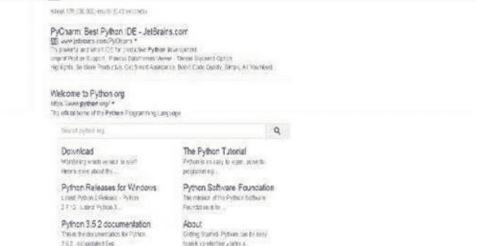
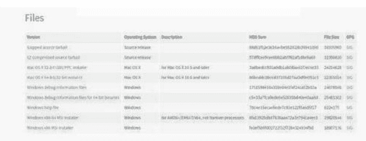
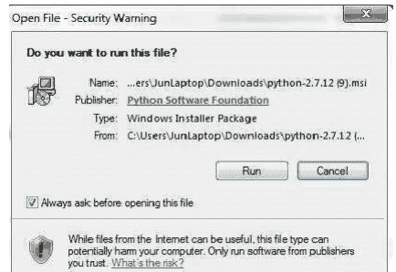
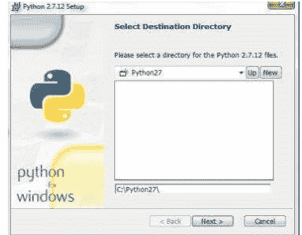
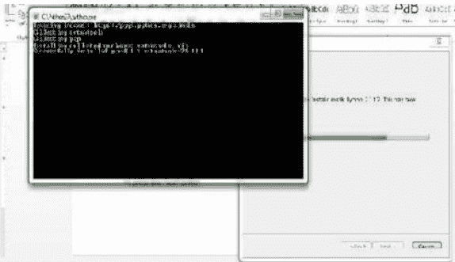
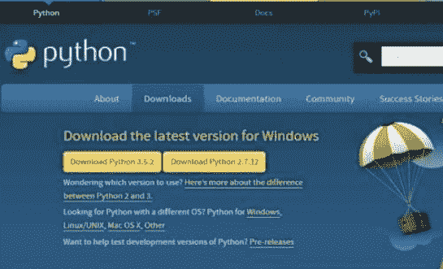
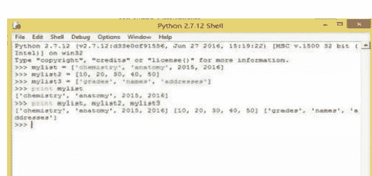
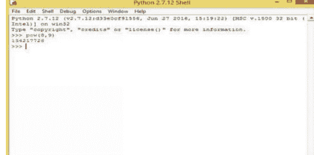
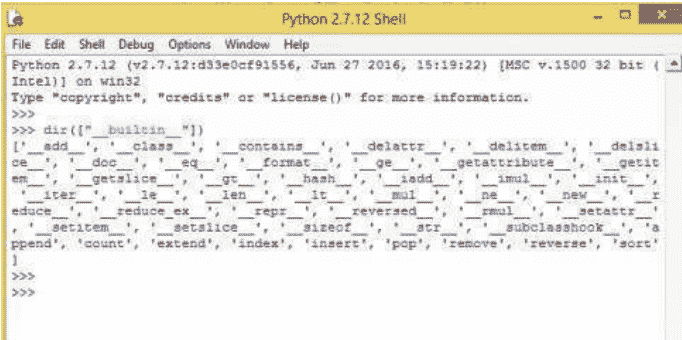
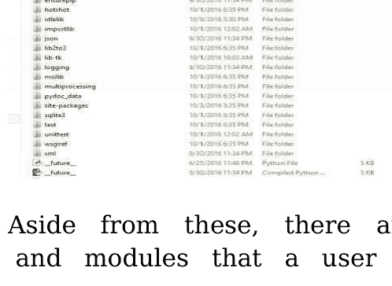

# 精通Python

硬核编程、数据分析与编程项目综合指南

Vera Poe

版权所有 © [2024] [vera poe]，保留所有权利。

未经出版商或作者书面许可，不得以任何形式复制本书的任何部分，美国版权法允许的情况除外。

本出版物旨在就所涵盖的主题提供准确且权威的信息。其销售基于以下理解：作者和出版商均未提供法律、投资、会计或其他专业服务。尽管出版商和作者已尽最大努力编写本书，但他们对本书内容的准确性或完整性不作任何陈述或保证，并特别否认任何关于适销性或特定用途适用性的默示保证。销售代表或书面销售材料不得创建或扩展任何保证。本书所含的建议和策略可能不适用于您的情况。您应在适当时咨询专业人士。对于任何利润损失或任何其他商业损害，包括但不限于特殊、附带、后果性、个人或其他损害，出版商和作者均不承担任何责任。

# 目录

- 引言
- 第1章：Python编程基础
- 第2章：学习Python编程语言及如何阅读代码
- 第3章：如何阅读错误信息并进行代码故障排除
- 第4章：学习Python计算机编程的核心
- 第5章：编码的工作原理
- 第7章：使用海龟绘图
- 第8章：提出正确的问题
- 第9章：Python编程的秘诀与技巧
- 结语

# 引言

在许多情况下，我们听到人们谈论编程，以及在程序中使用不同的编程语言有多难。编程并不像许多人想象的那么困难。在编写程序时，您可以选择不同类型的编程语言。这些语言包括JavaScript、C++和Python。当我们开始学习Python编程语言时，您将理解Python的所有层面，以及它为何如此易于用于编程。阅读本书还将赋予您必要的编码技能。

编码并不像大多数人想象的那么严峻。它只是对初学者来说比较困难。有许多编码语言，最受欢迎的编码语言包括C++和Java，大多数人听到它们时会感到害怕。这些页面有时充满了符号和字母，作为初学者，您可能无法理解它们。尽管编程让许多人感到害怕，因为他们觉得学习起来太难，但Python编程语言是个人学习编码甚至将其作为专业研究的最原始编程语言之一。

在本书中，您将获得Python编程的基础知识。为了更好地理解如何开始Python编程，本书将首先介绍Python编程，如果您计算机上没有安装该程序，将介绍下载步骤，以及学习Python编程的重要性。然后，它将定义一些个人理解程序所必需的关键字，最后讨论在编码和编程中使用Python的效果。

# 第1章：Python编程基础

## 如何安装Python

在这个时代，精通技术是时代的要求，缺乏知识会将一个人归类为落伍者。这可能导致在职业世界中被边缘化，尤其是在编程领域。

许多大公司已经雇佣了自己的程序员，目的是打造品牌并削减IT开支。

在编程世界中，使用Python语言被认为更容易且对程序员友好，因此得到了普遍使用。

下面讨论的是如何为MS Windows下载Python的信息。在这个特定的演示中，我们选择了Windows，因为它在全球范围内最常见——即使在不太发达的国家也是如此。我们希望满足全球每个人的编程需求。

选择Python 2.7.12版本是因为这个版本弥合了旧版本2和新版本3之间的差距。

版本3的一些更新功能/应用程序仍然与某些设备不兼容，因此2.7.12是一个明智的选择。

### 下载Python 2.7.12并在Windows上安装的步骤

在浏览器中输入python，然后按搜索按钮以显示搜索结果。

向下滚动以找到您感兴趣的项目。在此示例中，您正在寻找python。单击“python releases for windows”，将打开一个新页面。请参见下图：



选择Python版本，python 2.7.12，然后单击，或者您可以选择与您的设备或操作系统兼容的版本。

### Windows的Python版本

- 最新的Python 2版本 - Python 2.7.12
- 最新的Python 3版本 - Python 3.5.2
- Python 3.6.0b1 - 2016-09-12
  - 下载Windows x86基于Web的安装程序
  - 下载Windows x86可执行安装程序
  - 下载Windows x86可嵌入的zip文件
  - 下载Windows x86-64基于Web的安装程序
  - 下载Windows x86-64可执行安装程序
  - 下载Windows x86-64可嵌入的zip文件
  - 下载Windows帮助文件
- Python 3.6.0a4 - 2016-08-15
  - 下载Windows x86基于Web的安装程序
  - 下载Windows x86可执行安装程序
  - 下载Windows x86可嵌入的zip文件
  - 下载Windows x86-64基于Web的安装程序
  - 下载Windows x86-64可执行安装程序
  - 下载Windows x86-64可嵌入的zip文件

新页面包含各种Python类型。向下滚动并选择一个选项：在此示例中，选择Windows x86 MSI安装程序并单击。



按屏幕底部的Python框。单击“运行”按钮，并等待新窗口出现。



选择您需要的用户选项，然后按“下一步”。

您的屏幕将显示Python将安装到的硬盘驱动器。



按“下一步”按钮。

按“是”，并等待几分钟。有时应用程序下载可能需要更长时间，具体取决于您的互联网速度。

之后，单击“完成”按钮以表示安装已完成。



您的Python已安装在计算机中，现在可以使用了。

在C盘或您保存它的任何位置找到它。

过程中可能会出现故障，但本文介绍了可选的解决方案。如果您遵循得当，没有理由无法完成此任务。

需要注意的是，无需编译程序。Python是一种解释型语言，可以快速执行您的命令。

您也可以直接从Python网站下载，选择以下任一版本 - 3.5.2或2.7.12，并单击“下载”。（本书中，为便于讨论，通常使用2.7.12）。

请参见下图：



按照程序本身提示的逐步说明操作。在计算机上保存并运行程序。

### 对于Mac

要在Mac上下载Python，您可以遵循类似的步骤，但这次您需要访问“Python.mpkg”文件来运行安装程序。

### 对于Linux

对于Linux，Python 2和3可能已默认安装。因此，请先检查您的操作系统。您可以通过访问命令提示符并输入以下命令来检查您的设备是否已有Python程序：python—version，或python3—version。

如果Python未安装在您的Linux中，将显示结果“command not found”。

想要为你的Linux系统同时下载Python 2.7.12和任意版本的Python 3。这是因为Linux系统对Python 3的兼容性可能更好。

对于Windows用户，既然你已经下载了程序，就可以准备开始了。

没错，恭喜你！现在你可以开始使用你的Python编程系统进行工作和探索乐趣了。

## 你必须学习的Python基础术语

如前所述，Python是一种用于计算机编程的语言。因此，你必须熟悉最常用的术语，以便更好地理解这门语言。这就像在学习读写第一个字母之前，必须先学习字母表一样。

请记住，不同的Python版本之间可能存在细微差异。这里的示例来自版本2。那么，我们开始吧：

**字符串** - 是用双引号、单引号或三引号括起来的值。它们可以是一个单词/文本，或一组单词，或一个Unicode字符，或其他项目。

示例：

```
mystring = 'welcome'
mystring = "welcome"
mystring = 'My little corner.'
mystring = "My little corner."
```

双引号的优点是，你可以在双引号内包含值。

三引号表示长字符串。它们对于避免出现EOL（行尾）错误很有用。

**变量** - 是字符串的容器。在Python语言中，这些通常是对象。它们可以是数字或字符串。请记住，在使用变量之前，必须先声明它们。

数字可以是浮点数或整数。

使用此语法来定义整数和浮点数。整数是整数，而浮点数通常是带小数点的数字。

示例：`myint = 9` `myfloat = 9.0`

**语句** - 是用于调用函数进行计算、写入值或执行Python命令所需的其他过程的陈述句或语法。

**列表** - 就像你想要创建的普通物品列表。它们可以包含你想要包含在列表中的任何变量。它们可以与数组相媲美。变量通常用方括号括起来，项目或值用逗号分隔。分号可用于列表之间。列表是不可变文件 - 意味着它们不能被更改。

单词值用单引号或双引号括起来，而数字则不需要。

示例：

```
mylist1 = ['chemistry', 'anatomy', 2015, 2016];
mylist2 = [10, 20, 30, 40, 50];
mylist3 = ['grades', 'names', 'addresses']
```

当你添加函数 'print' 并按 'enter' 或执行时，将显示：



请注意颜色的变化，这些颜色可以区分命令或函数（红色单词）、变量（绿色）和结果（蓝色单词）。

双引号示例：

```
mystring4 = ["Vanessa Redgrave", "Tom Cruise", "Mel Gibson", "Matt Damon"]
```

**循环** - 是可以一个接一个地执行或执行的语句 - 重复执行或只执行一次。循环有两种基本类型，'for' 循环和 'while' 循环。

**函数** - 是执行某些功能或逻辑的代码片段。例如 'print'，用于打印你的输入或变量；pow（幂），用于计算数字提升到某个幂次的结果。一个具体的例子是：

要知道 8^9 的值，你可以使用Python函数（pow）。在你的Python shell中输入此语句：

`pow(8, 9)`

当你按 'enter' 或执行键时，答案将出现：

在上面的具体示例中，答案是 134217728。



**模块** – 是包含各种项目的文件，例如变量、函数定义和可执行语句等。当你想要保存已创建的函数以便日后更容易访问时，可以使用模块。

这是因为使用Python解释器后，你创建的所有定义、变量和函数都将丢失。因此，你需要将它们编译到模块中，以便在需要时再次使用。

Python会自动要求你保存文件，因此你永远不会忘记这个功能。你的模块应该用你分配给它们的名称和后缀 - .py 保存。

最好根据对象或模块的用途来分配名称。这样，你可以轻松回忆模块的名称。

**Shell** - 是你编写Python命令或语句的空白框。

**元组** - 与列表类似；它们是不可变的。你不能更改它们。但是，你可以创建新的元组来修改旧的元组。它们也可以用作字典的键。

**类** - 是相关数据的组，类似于字符串、整数和列表，它们使用相关的函数。要引入或标识一个类，你可以使用函数词 'class'。

**对象** - 在Python语言中大量使用，因为Python是面向对象的。这意味着用户可以根据文件作为组或作为单个值来命名它们。例如，当用户将他的地理数据命名为 'Geo'，或将他的气候变化研究数据命名为 'climchange'。

**连接** - 是Python程序中使用的一系列连接的字符串或变量。你可以通过使用 'join'() 过程或加号 (+) 将小字符串组合成更大的字符串。

随着我们的进行，你将遇到更多的Python术语。这里并未包含所有术语。

## Python标准库的功能

Python标准库是编程世界中最广泛的库之一。这是因为它包含了程序员可能需要的所有可能的包和模块。

有各种参考资料、模块、重要的内置函数和打包工具，可以帮助你学习Python语言。

标准库的常见功能是：

- 它提供了易于访问的内置模块，程序员在创建和执行代码时可能会遇到问题。
- 它为希望快速可靠地创建和运行程序的专家提供了指导。
- 它允许快速访问Python的系统功能，并增强程序员的输出。
- 它还可以提供来自第三方的、对编程至关重要的可选组件。

在Python标准库中，提供了简介，然后是基本材料。以下是一些Python标准库最基本的内容及其具体功能。

**内置函数**（类型、常量和异常） - 这些是Python包附带的组件。当你需要它们时，以及当你需要帮助创建语句时，可以调用这些函数。

这些内置函数对Python用户是现成可用的：

以下是一些最常见的函数：

**abs()** - 当你想要确定特定数字的绝对值时，使用此函数。

```
>>> abs(35)
35
>>>
```

**all(), all(iterable)** - 如果可迭代对象为空，或者所有可迭代对象（逐个取）都为True，此函数将返回 'True' 结果。

**any(), any(iterable)** - 如果可迭代对象的任何元素为真，此函数将返回 'True' 结果。当可迭代对象为空时，将打印 'False' 结果。

**basestring()** - 这将确定对象是Unicode还是字符串。

**cmp()** - 这是比较数据中元素的关键。它在元组中最有用。

**dict()** - 这指的是字典类。

**dir([object])** - 这指的是目录。

### 示例：

如果你想访问内置目录，请使用此语句：

`dir(["__builtins__"])` 按 'enter' 或执行，内置目录将出现：



**getattr(), getattr(object, name[, default])** - 此函数用于返回指定对象的属性值。

**help()** - 此函数用于向Python的内置函数和模块寻求帮助。它是交互式的，可以帮助你学习很多你想了解的东西。

**input(), input([prompt]), raw_input()** - 输入数据可以帮助访问历史记录功能和类似数据。

**int(), class int(x, base=10), class int(x=0)** - 此函数用于返回一个整数。数值类型可以是浮点数、复数、长整数或整数。

**len(s)** -这将显示对象的项目或元素的长度。

**map(function, iterable,...)** - 此函数返回一个列表，该列表提供了应用于每个可迭代对象的函数。

**open(file[, mode[, buffering]])** - 此关键字打开指定的数据并返回结果。

其中：

name = 要打开的文件名

mode = 这是一个字符串类型，指定文件将如何打开。

其值为 'r' - 读取，'w' - 写入，以及 'a' 用于追加。

**range(stop), range(start[, stop[, step]])** - 这是一个在循环中常用的函数，因其算术级数特性。它返回一个整数列表。当 start 参数为空时，返回默认值为 (1)，当 step 参数被省略时，默认值为 (0)。

**reload(module)** - 此函数将重新加载你想要访问的模块。该模块应已被预先加载并成功导入，但请注意，有些模块一旦预先加载，可能无法重新加载。因此，请记得保存你的模块。

**round(number[, ndigits])** - 此函数将数字四舍五入到小数点后指定的 ndigits 位。

**vars([object])** - 这返回 `__dict__` 属性的值，并可作为本地字典使用。

上述列表中未提及一些其他内置函数，因为它们在某些章节的示例中使用。

复杂的函数也被省略，以防止信息过载（“太多，太快”）。你可能最终什么也学不到，因为大量的数据可能会让你的大脑窒息，使其无法吸收任何东西。

学习一些基础的 Python 编程语言并能够记住它们，比一次性吞下所有信息要好。

**字符串服务** - 字符串在 Python 编程中至关重要。

**数据类型** - 如果你想学习 Python，你必须熟悉各种数据类型。这些数据类型的处理方式有时不同。

**文件和目录访问** - 除非你知道如何操作，否则你无法访问你的文件或数据。

**数值和数学模块** - 数值计算是 Python 语言的一部分。你可以使用这些模块执行许多数据操作。

**Python（运行时服务、语言和解释器、编译器包）** - 没有这些包，Python 库就不完整。这些是使 Python 工作的程序。

无论如何，你可以随时访问内置函数；因此，你不必记住所有函数。

下面是 Python 编程中一些内置数据的图像。



除此之外，用户还可以利用更多可选的服务和模块。

Python 编程语言非常广泛。如果我们讨论所有内容，可能需要数月才能学完所有东西。因此，让我们选择在当前情况下你可以学习的最重要的部分。

## Python 的基本要素

学习世界上任何事物的 ABC 都是必须的。了解基础知识是在开始之前就赢得了一半的胜利。当你掌握了所从事工作的基础知识时，继续前进会更容易。

同样，在你开始学习 Python 的其他方面之前，让我们先掌握基本要素。你需要学习和理解 Python 的基础知识，作为进阶到更复杂组件的基础。这些基本信息将极大地帮助你继续前进，使学习体验更轻松、更愉快。

熟悉 Python 官方网站 https://www.python.org/。熟悉 Python 的网站将为你获取更多信息和扩展 Python 知识提供优势。此外，你还可以获得工作所需的链接。

从 Python 集合中学习。查找 Python 集合，如记录、书籍、论文、文件、文档和档案，并从中学习。你可以从中学到许多课程，并扩展你的 Python 知识。还有教程、社区和论坛可供你使用。

掌握 SEO 基础知识。学习一些搜索引擎优化知识，以便与该领域的专家互动并提高你的 Python 知识水平。话虽如此，以下是 Python 的基本要素。

### 语言和程序

这是介绍程序语言的阶段，让用户理解所使用的语言类型并知道如何使用它。

### 解释和模块起草

Python 可以通过网络交互用作活动翻译器或转录器。它也可以用于制定课程。然而，在交互中，有一个严重的问题：即，不可能保留交互过程的副本。另一方面，使用课程可以让你保留已完成工作的记录。在交互式翻译器中，你只能打开一个显示页面，而在课程中，你可以根据需要打开任意多个。

### 变量

Python 使用非常量信息，这些信息用于存储数据。使用这些时，请务必添加描述。这些数据可以是姓名、年龄、地址、性别和其他类似材料。

## 输出和输入

任何计算机程序都需要自身与使用者之间的接口。用户编码，这就是输入，而输出是打印已编码的内容。

## 数学

数字是包括 Python 在内的计算机程序的通用语言。Python 使用数学运算，你将在后面学到。它的大部分语言由数学方程和符号表示。

## 循环

你需要理解 Python 中的循环术语。它是一个符号，用于表示 Python 编程中重复的单词或句子。

任何被重复使用的东西都可以使用循环。

## Python 类别

熟悉 Python 产品类别的类型对于轻松参考和理解很重要。Python 类别用 A、B、C 表示，表示语言的转变。例如 3.3.1 到 3.3.2。这意味着有微小的变化，但当它使用类似 2.xx 到 3.xx 时，意味着有重大变化。

## 切片

这是 Python 的一个关键组件，用于复制数据的所需部分。它是一种通过专注于数据范围内的项目来简化程序的方法。当你这样做时，你实际上是在移除与程序无关的组件。

## 模块

模块是 Python 的描述和声明文件。它是 Python 使用的所有术语的列表，以及每个术语的相应解释。Python 采用将定义合并到一个名为 **module** 的文件夹中的方法。根据程序员或用户的需要，这些模块可以引入到不同的模块中。

这是为了让用户更好地理解和轻松访问 Python 的标准库而创建的。程序员甚至初学者都可以为自己使用创建模块。

模块可以是：索引和搜索、音频和音乐、Web 开发、控制台和数据库。Python 提供了一系列你可以使用的模块。你也可以创建自己的模块。

## 源代码

如果你不知道如何推导代码，生成 Python 源代码可能会很乏味。

程序开发人员现在有一个应用程序，可以从 AST 将你的 Python 2 代码转换为 Python 3 版本的代码。

你可以按照章节中讨论的方式创建自己的代码，并且将字符串附加到列表以创建代码很容易，但如果你知道如何生成 Python 源代码，这也不会伤害你。一种方法是使用上下文管理器。

这些是 Python 中最基本的要素，还有更多，但有了这些介绍，一个人就可以开始使用 Python，并在编程过程中学习其他内容。

# 第 2 章：学习 Python 编程语言以及如何阅读代码

当 Guido van Rossum 在 1980 年代后期开发第一个 Python 语言编译器时，他几乎不知道这种语言将比机器学习和人工智能中流行的语言更出名。事实是——在过去的几年里；Python 语言已成为大多数机器学习问题的解决方案。

Python 语言对初学者友好，但功能非常强大。难怪 Python 语言正在一些最受欢迎的系统中找到其应用，例如 Google、Pinterest、Mozilla、Survey Monkey、Slideshare、YouTube 和 Reddit，作为核心开发语言。此外，如果你是初学者或高级程序员，Python 的语法极其简单易懂。

如果你是 C、C++、Java 或 Perl 的高级开发人员，你会发现用 Python 编程极其简单。如果你是有经验的开发人员，你可以用 Python 完成伟大的事情。除了开发游戏、数据分析，

## Python 入门

显然，要开始使用 Python 开发机器学习系统，你需要在计算机上安装它并设置编程环境。如果你是 Python 编程新手，学习 Python 安装和环境设置的基础知识将对你的长远发展大有裨益。

### 安装过程

下载和安装 Python 语言解释器的过程相当简单。如果你使用的是最新的 Linux 发行版——无论是 Ubuntu、Fedora 还是 Mint——你会发现最新版本的 Python 已经预装好了。你只需更新系统即可。如果你使用的是基于 Debian 的 Linux 发行版，请按照以下步骤更新系统：

启动终端应用程序，在命令提示符下输入以下命令：`sudo apt-get update`

输入你的 root 密码并按回车键。
等待更新过程完成。

如果你使用的是基于 Redhat 的 Linux 发行版，例如 Fedora，请按照以下步骤更新系统：

启动终端应用程序，在命令提示符下输入以下命令：`su apt-get update`

输入你的 root 密码并按回车键。

等待更新过程完成。

另一方面，如果你使用的是 Linux 以外的其他操作系统，你需要自行下载并安装 Python。此外，如果你使用的是没有预装 Python 的旧版 Linux，则需要手动安装。

请按照以下步骤在 Linux 发行版上安装 Python：

启动终端应用程序（确保已连接到互联网）。

在命令提示符下输入“su”并按回车键。

输入你的 root 密码并按回车键。

如果你使用的是基于 Debian 的 Linux 发行版，例如 Ubuntu，请在命令提示符下输入：“apt-get install python”并按回车键。

另一方面，如果你使用的是 Red Hat/ RHEL / CentOS Linux 发行版，例如 Fedora，请在命令提示符下输入：“yum install python”并按回车键。

等待安装完成。

通过输入以下命令更新系统：如果你使用的是基于 Debian 的 Linux 发行版，则输入“su apt-get update”；如果你是 Redhat/ RHEL / CentOS Linux 发行版用户，则输入“su yum update”。

Windows 操作系统怎么办？

在下载和安装 Python 之前，请决定要安装的 Python 语言版本。根据经验，始终选择最新版本。截至撰写本书时，最新版本是 3.6.2。

以下步骤可帮助你在 Windows 操作系统上安装 Python：

访问 [www.python.org](http://www.python.org) 并下载当前版本的 Python。根据你的操作系统类型（32 位或 64 位）选择相应的版本。

打开你刚刚下载的 Python 文件。

按照屏幕上的说明点击“接受默认设置”，并等待安装过程完成。

如果你是 Mac OS X 或 Sierra 用户，你会发现 Python 2.7 已经移植到该操作系统。因此，如果你想开始使用 Python，无需安装或配置任何内容。但是，如果你想安装最新版本的 Python，则需要使用 Homebrew。

现在是时候开始开发你的机器学习系统了。但别急！你应该决定使用哪个文本编辑器。你可以选择最适合你的编辑器来帮助你编写和执行程序。一些最受欢迎的文本编辑器包括 Emacs、Geany、Komodo Edit 和 Sublime Text。

但既然我们都知道文本编辑器的缺点——例如需要从 Python Shell 手动运行代码——我不建议你使用它们。相反，请使用 Python IDLE（集成开发环境）。我一直在使用它，没有遇到任何问题。当然，你也可以选择适合你的 IDE。

Python IDLE 具有以下功能：

- 语法高亮
- 代码语句自动补全
- 智能缩进
- 集成调试器，支持单步执行、持久断点和调用堆栈可见性功能。

### 启动 Python

要开始使用，你必须了解如何启动 Python 应用程序。你可以从终端启动 Python，或使用桌面环境启动 IDLE 应用程序。只需启动终端，在命令提示符下输入：“idle”。现在你已经启动了 Python，是时候开始编码了。

现在让我们创建第一个 Python 程序。请按照以下步骤编写你的第一个 Python 程序：

打开 Python IDLE。

在 IDLE 窗口中编写 Python 语言语句（指令）。

运行程序。

就是这样！很简单，不是吗？

现在，这里有一个快速了解编程过程的方法……请继续，将以下代码复制/粘贴到你的 Python IDLE 窗口中。

```python
print("Hello World! This is my first Machine Learning program")
```

运行程序。你看到的输出是什么？

嗯，出现了短语“Hello World! This is my first Machine Learning program”。

恭喜！你刚刚编写了你的第一段 Python 代码。我知道你现在很兴奋，想要开始编写机器学习系统。不要过于担心语句的含义。如果你是机器学习新手，掌握一些 Python 编程概念将帮助你理解如何设计机器学习应用。

接下来，让我们一起深入了解 Python 编程的基础知识。

## Python 概述

既然你已经执行了你的第一个 Python 程序，还需要了解什么？嗯，现在是时候了解任何 Python 代码的关键组成部分，包括其结构了。所有 Python 程序都具有以下结构：

```python
import sys
def main():
    main()
    {
        Program statements
    }
```

正如你从这个程序结构中看到的，所有 Python 代码都应该以关键字“import”开头。那么，我们导入的是什么？Python 语言是面向对象的。因此，它具有所有面向对象编程语言的组件。其中一个特性是继承，或者简单地说，代码重用。Python 中继承代码特性的能力允许程序员重用在其他地方编写的代码片段。

从技术上讲，import 语句告诉 Python 解释器声明已经在其他 Python 包中使用的类，而无需引用它们的完整包名。例如，语句：“import sys”告知解释器在 Python 程序启动时包含所有系统库，例如 print。

语句“def main():”是什么意思？

每当 Python 程序被加载和执行时，计算机的内存——随机存取存储器——包含带有函数定义的对象。函数定义为程序员提供了指示控制单元将函数对象放置到计算机内存适当部分的能力。换句话说，就像指示控制单元检查主内存并初始化需要执行的程序一样。

内存中的函数对象可以使用名称来指定。这就是语句“def main():”的用武之地。它只是告诉控制单元开始执行紧接在语句“def main():”之后的 Python 代码语句。

例如，下面的 Python 代码创建了一个函数对象并将其命名为“main”：

```python
def main():
    if len(sys.argv) == 10:
        name = sys.argv[2]
    else:
        name = "Introduction to Machine Learning."
    print("Hello"), name
```

在上面的代码中，Python 解释器将通过将一组函数对象放入内存并将每个对象与命名空间链接起来，来运行 Python 文件中的所有函数语句。这将在程序通过 import 语句初始化时发生。

但更根本的是，“Python 代码有哪些不同的元素？”嗯，所有 Python 程序都包含以下组件：

记录程序。程序中（第一个语句除外）任何以“#”开头的语句都被视为命令行或注释行，在执行期间将被忽略。这将允许你对代码部分进行注释，以便正确记录。

关键字。关键字是解释器识别和理解的指令。例如，前面程序中的单词“print”就是一个关键字。在 Python 中，关键字主要有两种类型：函数和控制关键字。函数是简单的动词，如 print，告诉解释器要做什么，而控制关键字控制执行流程。

模块。Python 程序附带大量模块，这些模块增强了其功能。模块将帮助你以易于调试和控制代码的方式组织代码。

程序语句。程序语句是告诉控制单元的句子或指令

### Python 变量

每当运行程序时，计算机的主内存中都会发生许多活动。理解变量和数据类型的概念将帮助你编写高效的程序。

程序只是一系列指令（语句），用于指导计算机执行特定任务。例如，前面的程序在执行时会在屏幕上打印短语“Hello World! This is my first program”。但在你能在屏幕上看到输出之前，一些数据必须保存在计算机的内存中。

数据的使用适用于所有编程语言——包括 Python——因此，理解计算机内存中数据管理的机制是开发健壮、高效和强大应用程序的第一步。

变量可以被视为计算机主内存中的一个临时存储位置，特别是随机存取存储器。这个临时存储位置将保存你希望在程序中使用的数据。换句话说，变量是程序执行时保存数据的内存位置。因此，每当你定义一个变量时，实际上就是在计算机内存中预留一个临时存储位置。

你定义的所有变量都必须有名称和相应的数据类型——一种对变量进行分类的方式，指定变量应保存的数据类型。数据类型有助于指定可以应用于变量的数学、关系甚至逻辑操作，而不会导致错误。理想情况下，当你将变量分配给数据类型时，就可以开始在计算机的主内存中存储数字、字符甚至常量。

由于 Python 语言是一种面向对象的编程语言，它不是“静态类型”的。这意味着解释器将每个变量都视为一个对象。因此，你不必在程序中使用变量之前声明它们。那么，在 Python 中如何声明变量呢？

名称或标识符通常用于声明 Python 变量。就像你迄今为止学习的任何其他编程语言一样，必须严格遵守变量命名约定。以下是在声明变量时应遵循的一些命名约定：

- 所有变量名应始终以字母（A 到 Z 和 a 到 z）或下划线开头。例如，“age”是有效的变量名，而“-age”不是有效的变量名。
- 你声明的任何变量名都不能以数字开头。例如，9age 不是有效的变量名。
- 声明变量名时不应使用特殊符号。例如，name$ 不允许作为变量名。
- 变量名的最大字符数不应超过 255。

要以变量名预留临时内存位置，你不必像其他编程语言那样使用显式声明。如果你有其他编程语言（如 Pascal 或 C）的经验，我相信你知道在赋值之前显式声明变量是必须的。

在 Python 中，变量的声明通常在你赋值给它的那一刻自动发生。例如，语句：

```
age = 10
```

自动在内存空间中预留一个名为“age”的临时存储位置，并将 10 赋值给它。

也可以同时将单个值赋给多个变量。例如，下面的语句为两个变量（即 age 和 count）预留临时内存空间，并将值 30 赋给它们：

```
age, count = 30
```

Python 语言有不同的数据类型类别，用于定义存储方法和数学运算。以下是 Python 语言中数据类型的示例：

- 数字
- 字符串
- 列表
- 元组
- 字典

### 数字

数字数据类型存储数值。当你将特定值赋给变量时，数字对象将自动初始化。例如，下面的代码创建了两个变量对象（age 和 count），并分别将值 10 和 30 赋给它们：

```
age = 10
count = 30
```

如果你想删除对数字对象的引用，可以使用“del”关键字，后跟要删除的变量名。考虑下面的代码，它删除了两个已经声明并使用的变量：age 和 count：

```
del age, count
```

Python 语言支持四种不同的数字类型类别。它们是：

- **int**：在声明中使用时，它指的是有符号整数。这些包括从 8 位到 32 位的整数。
- **long**：这些是长整数。它们可以用八进制和十六进制表示法表示。
- **float**：这些是浮点实数值。它们的长度可以从 8 位到 64 位。
- **complex**：这些是复数。

### 字符串

字符串在计算机内存位置中存储为连续的字符集。Python 语言允许你在定义字符串时使用单引号或双引号。字符串变量类型的其他子集可以使用切片运算符（[ ] 和 [:]）指定，索引从字符串开头的 0 开始。加号（+）运算符执行字符串连接（连接两个或多个字符串），而星号（*）运算符执行字符串重复。

在了解了 Python 的起源和重要性之后，现在是时候学习更多关于 Python 编程的知识了。

### 关键字

在开始编写第一个计算机程序之前，了解每种计算机语言都有特定的关键字至关重要。这些词用于特定目的，应正确使用。随意或在任何地方使用它们都会影响应用程序的成功。显然，在任何地方使用这些词都可能导致错误警报，从而影响程序的正常运行。Python 编程中最常见的关键字是：`or`、`not`、`with`、`as`、`break`、`yield`、`assert`、`raise`、`class`、`while`、`return`、`try`、`continue`、`del`、`finally`、`except`、`def`、`for`、`global`、`from`、`is`、`None`、`if`、`lambda`、`nonlocal` 和 `pass`。

### 标识符名称

这是程序员用来引用他们创建的类、变量和函数的名称。在创建 Python 程序时，你将需要使用这个名称。以下规则将帮助你成功创建 Python 中的标识符：

- 标识符不应包含任何关键字。
- 应包含下划线、数字和字母（大写、小写或两者兼有）。
- 不应以数字开头。

### 创建可读的标识符

虽然标识符不会对计算机造成伤害，但它们应该清晰易读。显然，我们有时在阅读和创建代码时会遇到问题。然而，以下规则将帮助你创建易于阅读的标识符：

- 确保选择具有描述性的名称。
- 非常谨慎地使用缩写。

**注意**：在编写 Python 程序时，应始终遵守一条规则，以避免任何混淆。小心并确保一切保持一致。

## 控制流

使用 Python 语言时，用户需要像编写购物清单一样编写语句，因为计算机从第一条指令开始，然后继续执行后续步骤。因此，你应该像编写购物清单一样写出所需的控制语句，这将确保计算机正确读取它们。然而，一旦计算机完成最后一条指令，它就会停止读取列表。

此外，遵循所有指令可确保控制流顺畅，计算机可以正确读取它。这使你能够轻松地让程序执行所需的操作，而不会引起问题。

### 缩进和分号

如果你观察计算机语言，很容易发现花括号的存在，它们用于表示语句的开始和结束，甚至用于区分代码块。虽然你的计算机可以读取代码，即使没有缩进，但缩进可以让你更容易记住所有内容。

对于使用其他编程语言的初学者来说，在编码中使用缩进和分号并不容易。例如，你需要输入一些不必要的信息供人类阅读，即使这些信息可能被计算机读取。只有 Python 做事方式不同，使个人更容易阅读。

此外，许多编程语言使用分号来告知计算机指令的结束。然而，Python 使用行尾来告知计算机指令的结束。只有在同一行上有多个指令时，你才可以使用分号，尽管这在编程语言中被视为不良形式。

### 字母大小写

与许多将所有字母无论大写还是小写都同等对待的计算机语言不同，Python 是唯一对字母大小写敏感的语言。它对小写和大写字母的处理方式不同。你还需要牢记，所有保留字都必须使用小写。保留字的唯一例外是 `False`、`True` 和 `None`。

尽管这些基础知识让你很容易入门，但花更多时间熟悉程序本身仍然至关重要。熟悉文本解释器和程序的其他部分，能让你更容易使用它并了解其工作原理。

# 第三章：如何阅读错误和调试你的代码

这些代码非常棒，因为它们能为你节省大量时间，并让你的代码看起来更整洁，因为你可以重用代码的某些部分，而无需反复重写，从而避免自己筋疲力尽。这是你可以通过面向对象编程（OOP）语言来实现的，Python 就属于这一类。你可以使用继承，这样你就可以使用父代码，然后对你想要的部分进行一些调整，使代码变得独特。作为初学者，你会发现这些继承使用起来相当容易，因为你可以让代码按照你想要的方式工作，而无需反复编写无数次。

为了帮助你保持简单并更好地理解继承的工作原理，继承是指你将一个“父”代码复制到一个“child”代码中。然后你就可以在子代码上进行操作并进行一些调整，而无需对父代码部分进行任何更改。你可以只做一次就停止，或者你可以继续向下进行，在每一层更改子代码，而无需对父代码进行任何更改。

使用继承可以成为编写自己代码的一个有趣部分，你可以让它看起来整洁得多，而没有那些混乱。

## 如何重写基类

在继承代码方面，我们可以处理的下一件事是如何重写基类。很多时候，当你在处理派生类时，你必须进去重写你放在基类中的内容。这意味着你将查看放在基类中的内容，然后进行更改以改变其中编程的一些行为。这有助于引入新的行为，然后这些行为将在你计划从该基类创建的子类中可用。

这听起来可能有点复杂，但它确实非常有用，因为你可以选择和挑选你想要放入派生类的父类特性，哪些你想要保留，哪些你不再想使用。整个过程将使你更容易对新类进行一些更改，并保留基类中可能对你以后有帮助的原始部分。这是一个简单的过程，你可以用来对代码进行一些更改，删除不再工作的基类部分，并用更好的东西替换它们。

## 重载

在使用继承时，你可能想考虑的另一个过程是学习如何“重载”。当你处理称为重载的过程时，你可以获取你正在使用的一个标识符，然后用它来定义至少两个方法，甚至更多。在大多数情况下，每个类中只有两个方法，但有时这个数字会更高。这两个方法应该在完全相同的类中，但它们需要有不同的参数，以便在这个过程中将它们分开。你会发现，当你希望两个匹配的方法执行相同的任务，但希望它们在具有不同参数的情况下执行该任务时，使用这种方法是个好主意。

这并不常见，作为初学者，你很少需要使用它，因为许多专家实际上也不使用它。但这仍然是你可能想花时间学习的东西，以防你确实需要在代码中使用它。有一些额外的模块可供你下载，以确保重载对你有效。

## 关于继承的最后说明

在编写代码时，你可能会发现有可能处理多个继承代码。如果你这样做，这意味着你可以创建一系列彼此相似的继承，但你也可以在需要时对它们进行一些更改。你会注意到多重继承与普通继承并没有太大不同。相反，你只是添加了更多步骤并不断重复自己，以便进行你想要的更改。

当你想使用多重继承时，你必须获取一个类，然后给它两个或多个父类来启动它。这在你准备好编写自己的代码时很重要，但你也可以使用继承来确保代码在编写时看起来整洁。

现在，作为初学者，你可能担心使用这些多重继承可能很困难，因为它听起来太复杂了。当你使用这些类型的继承时，你将创建一个新类，我们称之为 Class3，你会发现这个类是由 Class2 中的特性创建的。然后你可以再往前追溯，会发现 Class2 是由 Class1 中的特性创建的，依此类推。每一层都将包含来自前一个类的特性，你确实可以追溯到你想要的任何程度。你可以有十个这样的类，每个类都包含来自过去父类的特性，只要它在你的代码中有效。

在创建新代码并考虑添加一些多重继承时，你应该记住的一件事是，Python 语言不允许你创建循环继承。你可以添加任意多的父类，但不允许进入代码并使父类形成一个循环，否则程序会出错。扩展我们上面的例子以创建另一个或更多类是可以的，但你必须确保在进行更改之前正确复制代码，以便让这个程序工作。

随着你开始使用 Python 编程语言编写更多代码，你会发现使用不同类型的继承实际上非常普遍。很多时候，你可以坚持使用程序中的同一块代码，然后进行一些更改，而无需浪费时间并因反复重写代码而筋疲力尽。

# 第四章：学习 Python 计算机编程的核心

现在是时候看看如何在 Python 代码中处理异常了。当你在 Python 中使用一些新代码时，有时添加异常会很有帮助。在编码中，这些异常稍微复杂一些，但重要的是你要确切了解如何处理它们，以便你的代码能够按照你想要的方式运行。其中一些异常可以在 Python 库中找到，这是由程序自动引发的。然后还有一些异常将由你引发，因为这是你希望程序工作的方式。让我们看看如何处理异常处理，以便让程序完全按照你想要的方式工作。

在编写代码时，如果代码内部发生异常情况，无论是 Python 语言将识别的异常，还是你为特定代码设置的异常，你都需要注意查看代码是否出现异常。

正如我们之前简要提到的，编译器会识别一些异常条件，如果这些条件被触发，程序将无法正常完成执行。例如，如果你在代码中添加了错误类型的语句，或者拼错了某个类名导致编译器无法找到它，又或者你尝试除以零，编译器将无法处理这个请求，程序就会抛出异常。

这些只是编译器会为你抛出的异常类型的几个例子。除此之外，有时你可能希望修改当前正在编写的程序，并让它主动抛出异常。从技术上讲，解释器可以处理这类异常，但根据你希望程序完成的任务，你可能希望代码主动抛出这些异常。

那么，你可能想知道这一切具体是如何运作的。一个很好的例子是，当你想要建立一个主要面向成年观众的网站时。你需要确保每个尝试访问的用户年龄都不小于21岁。同时，你的程序还必须具备抛出异常的能力，如果用户声称自己未满21岁，屏幕上就会显示该异常。当这种情况发生时，你可以确保代码抛出该异常，从而阻止用户继续访问该网站。

在编写程序时，你应该研究或查阅随Python一起提供的库。你会注意到这个库包含了一些编译器自动识别的异常列表。了解并记住它们会很有帮助，因为它们可以使你的代码编写更加高效，也能帮助你理解程序为何会以某种方式运行。

在使用Python时，你会遇到的一个常见异常是尝试除以零。如果你或用户尝试这样做，屏幕上会显示一条错误信息来通知你。此外，当你尝试读取文件中超出当前文件实际位置的点时，也可能会遇到一些与这些异常相关的问题。这两种操作都会引发异常并在你的代码中产生错误。

现在，了解Python库中的一些异常是个好主意，这样你就可以在编写和调试代码时处理这些异常。在处理异常时，你可能会遇到的一些不同异常包括：

**Finally**

这是一个你可以用来执行清理操作的动作，无论异常是否发生。

**Assert**

这个条件会在代码内部触发异常。

**Raise**

`raise`命令可以在代码内部手动触发异常。

**Try/except**

这是当你想要尝试执行一段代码块，然后由于你或Python代码抛出的异常而恢复执行的情况。

## 如何抛出异常

我们已经花了很多时间讨论这些异常以及它们是什么，但现在是时候看看你将如何在想要编写的代码中使用它们了。如果你在编写代码时发现出现了某种问题，或者你想了解为什么你的程序会做出看似错误的行为，编译器会检查它，并抛出一个新的异常。这是因为程序也检查了代码，并且在确定你希望它做什么时遇到了一些困难。

然后你会遇到的问题可能很简单，你可以自己修复，例如当你尝试打开一个文件但输入了错误的文件名时。或者可能是当你或用户尝试让程序除以零时。

理解这些异常如何运作的一个好方法是看一个例子，并让编译器针对你想要在代码中完成的任务抛出一个异常。

以上面我们讨论的例子为例，程序将显示一个错误，因为在这段代码中你试图除以零，而Python代码不允许你这样做。现在，如果你确实想尝试运行程序，你可能不希望看到那个杂乱的错误信息。这会让你的代码看起来不专业，用户也不会真正理解那个错误信息意味着什么。好消息是，你可以在这里进行一些必要的更改，使消息看起来有所不同。

有几种不同的选项可供你使用，它们可以帮助将这个新更改添加到代码中，同时允许你选择当异常被抛出时会发生什么。你不希望看到上面那个难看的异常消息，但你可以轻松地将其更改为更友好的消息，或者至少解释清楚错误到底是什么。

现在，我们刚刚编写的代码看起来与上面编写的代码非常相似，但它会改变当用户触发异常时显示的消息。使用这段代码，那个难看的错误信息已被擦除，并替换为更容易理解的错误信息：“You are trying to divide by zero”，该信息将显示在屏幕上。你可以对消息进行几乎任何你想要的更改，这将为你提供一个良好的语法起点。

## 如何定义你自己的异常

到目前为止，我们只是了解了如何处理程序识别的异常。但有时你可能希望抛出一些自己的异常。例如，你可以编写一段代码，并希望确保你的用户只能访问和使用某些数字，而其他数字将不被接受。如果你计划创建一个游戏，其中你希望抛出一个异常，如果用户尝试猜测的次数超过允许的次数，他们将被限制，这将会很有效。一旦用户超过了你允许他们猜测的次数限制（例如，限制为两次或三次），编译器可以被编程为抛出一个异常，告诉用户他们不允许再次猜测，因为他们已经用完了可以猜测的次数。

编译器不会识别用户猜测次数过多有什么问题。就编译器而言，用户可以无限次猜测。但当涉及到你正在创建的游戏或其他程序时，你不希望用户陷入困境而永远无法前进，这就是为什么你必须为他们可以猜测的次数设置一个异常。

这些异常是你代码独有的，如果你不将它们作为异常写入代码，编译器永远不会将它们识别为异常。你可以添加任何你想要的异常，并且你也可以添加一条消息，类似于我们上面所做的那样。

在这段代码中，你已经成功设置了你自己的异常，每当用户触发其中一个异常时，屏幕上就会出现“Caught: This is a CustomError!”的消息。这是向你的用户展示你已经在程序中添加了自定义异常的最佳方式，特别是如果这只是你为这部分代码个人创建的异常，而不是编译器本身会识别的异常。

就像我们讨论的其他例子一样，我们使用了一些通用措辞来展示异常应该如何工作。你可以随时轻松地更改它，以便获得一条针对你正在编写的代码的独特消息，并在错误消息显示在用户屏幕上时向用户解释刚刚发生了什么。

随着你开始用Python编写一些更高级的代码，异常处理将是你经常使用的东西。很多时候，你会处理程序识别的异常，或者你希望为特定编写的代码抛出的异常。使用一些代码将帮助你处理这些异常，也可以确保你能为用户呈现良好的体验。确保在你的编译器中尝试编写一些这样的代码，以练习处理这些异常，从而对这些异常的基本工作原理有一个很好的了解。

# 第五章：编程如何运作

既然你已经学习了会计、交换、求和、标志变量、最大值和最小值，以及 Python 中使用的简单调试，现在是时候开始运行一些代码了。我相信此时你已经在电脑上安装了 Python。如果没有，请按照之前的步骤在电脑上安装它。

程序员可以使用多种方式告诉 Python 执行他/她输入的代码。在本章中，我们将讨论当今用于启动程序的所有技术。除了学习如何交互式地输入代码外，你还将了解将代码保存到文件中以所需方式运行的不同方法，借助系统命令行、exec 调用、图标点击和模块导入等，正如你将在本章中看到的那样。

然而，如果你有其他编程语言的经验，并且想开始深入研究 Python，那么彻底阅读本章是很重要的。它是调试技术的概述，将帮助你理解将代码导入和保存到文件中的不同方式。这是理解 Python 程序架构的重要主题，尽管我们稍后会重新讨论它。此外，阅读有关 IDLE 和其他 IDLE 的部分也很重要，这将帮助你了解可用的工具，特别是用于开发复杂的 Python 程序。

## 交互式提示

在本节中，你将学习一些交互式编码基础知识，然后查看运行代码，之后再介绍一些预备知识，如设置系统路径和目录。你将在此应用之前学到的关于目录和系统路径的知识。

### 启动交互式会话

启动 Python 程序最简单的方法是在交互式提示符下输入它，许多程序员通常称之为 Python 的交互式命令行。事实上，启动此命令行的方法有很多，其中包括系统控制台等。如果你已将解释器作为可执行程序安装在系统上，你可以直接在操作系统提示符下输入 Python 来启动它，这是启动交互式解释器会话最有效的方式。例如，当我们在系统 shell 中输入“python”一词时，我们将启动系统以开始交互式 Python 会话。请注意，此列表开头的字符“%”代表通用系统提示符；它不是程序员可以自己输入的输入。如果你使用的是 Windows，按 Ctrl-Z 将退出此会话；因此，在 Unix 上请尝试使用 Ctrl-D。

尽管系统 shell 具有通用概念，但其可访问性因平台而异，如下所示：

#### 在 Windows 上

如果你使用的是 Windows，请启动命令提示符（cmd.exe）并在控制台窗口中输入“python”一词。

#### 在 macOS 上

可以通过从 Spotlight 启动终端或双击位于“应用程序”>“实用工具”文件夹中的终端图标来启动 Python 交互式解释器。在终端窗口中，输入“python”一词。

#### 在 Linux 和其他 Unix 操作系统上

作为程序员，你可以在终端窗口甚至 shell 中输入此命令来运行你的程序。

#### 或者

某些平台允许你以不同或额外的方式启动交互式提示符，而无需输入命令。此类平台的示例包括 Windows 7 和 Windows 8。

#### Windows 7

除了在 shell 窗口中输入 python 外，程序员还可以通过选择 python 菜单选项来启动相同的交互式会话。这可以在 Python 的“开始”按钮菜单中找到。

#### Windows 8

使用 Windows 8 时，无需“开始”按钮，因为你可以使用多种方式访问工具，例如搜索和文件资源管理器。

#### 其他平台

如果你使用的是 Windows 7 和 Windows 8 以外的其他平台，请不要担心。使用与上述相同的方法启动 Python 交互式会话。无需输入命令，因为这些平台非常具体，因此你可以轻松到达那里。提示符在你计算机上的出现表明你已经处于交互式 Python 解释器会话中，因此你可以自由地在其中输入任何 Python 表达式或语句并立即运行它。

### 在 Windows 上哪里可以找到命令提示符

对于大多数人来说，启动命令行界面并不容易，特别是如果你是初学者。尽管一些 Windows 读者知道它，但 Unix 开发人员和初学者并不理解它，因为它不像控制台或终端窗口那样突出。以下步骤将帮助你轻松找到命令提示符。如果你使用的是 Windows 7，可以在“开始”和“所有程序”菜单下的“附件”部分找到它。或者，你可以在“开始”→“运行”框中输入 cmd 并允许程序运行。如果你使用的是 Windows 10，可以通过直接在任务栏上的 Windows 搜索栏中输入 cmd 来启动命令提示符。

### 系统路径

通常，在上一节中输入 python 后，系统将在其系统路径上定位你的 python 程序，正如你之前所看到的那样。根据你使用的 Python 版本和平台，如果你尚未将系统的 PATH 环境变量设置为包含安装目录，则必须将“python”一词替换为你所需的完整名称。你必须确保 PATH 环境简单，以允许程序正常运行。

### 运行代码目录

由于我们已经开始讨论如何在计算机上运行代码，因此了解在哪里运行代码以确保程序运行时不会出现某些错误至关重要。你将从一个名为文件夹的目录运行代码，该文件夹在你的 Windows 上创建为 C:/code，位于主驱动器的顶部。你的大多数交互式会话将从那里开始。此外，确保从那里保存和运行所有脚本文件。但是，如果你一直在使用其他编程语言（如 Java 和 C++），并且想使用 Python 进行程序设计，请按照以下说明操作。它们将帮助你了解如何使用 Python 编程在计算机上开始使用工作目录。

#### 基于 Unix 的系统

这些包括 Linux 和 MacOS。对于这些系统，工作目录可以在 /usr/home 中找到，有时由 mkdir 命令创建。有了工作目录，你将能够确定或查看代码的运行方式。

#### Windows

Windows 系统允许程序员在命令提示符窗口或文件资源管理器中轻松创建其工作代码目录。在文件资源管理器中搜索“新建文件夹”，你将看到“文件”菜单。或者，在命令提示符中输入 mkdir 命令并运行它。你可以随时定位和调用你的工作目录。此外，从一个目录运行有助于程序员轻松跟踪他/她的工作。

### 如何交互式运行代码

因为你已经学习了所有这些预备知识，现在是时候开始输入一些实际代码并在你的 Python 程序中交互式地运行它们了。请注意，你已经通过在 Python 交互式会话中输入两行信息文本开始输入，这些文本不仅给出了 Python 版本号，还提供了一些提示，正如我们在早期讨论中所说明的那样。通常，当我们交互式工作时，代码的结果将显示在输入行下方，这是在按 Enter 键之后。例如，当你在提示符下输入 print 语句时，一个 Python 字符串（也称为输出）将立即回显。因此，如果你不使用 Python 语言，则无需创建源代码文件或运行编译器来运行代码。稍后，你将学习如何运行多行语句，这些语句在输入行中输入并按两次 Enter 按钮后立即运行。

### 交互式提示的原因

尽管交互式提示在运行时会回显结果，但它不会将代码保存到文件中。这表明你无法像想象的那样在交互式会话中处理大量的编码。交互式提示已被证明是测试程序文件或即时实验语言的好地方。

### 实验

由于交互式提示符能够立即执行代码，它已成为尝试语言特性的最佳场所。本书后续将用它来演示一些小型实验。如果你不确定Python代码的运行方式，可以观察启动交互式命令行时会发生什么。例如，当你阅读Python程序代码时，可能会遇到不理解其含义的表达式。这类表达式的例子可能是`'Spam!'*8`。你可能会花费大量时间查阅手册、书籍，甚至在网上搜索其含义。

利用交互式提示符提供的即时响应，你可以快速确定代码的功能。例如，从这里可以清楚地看到代码执行的是字符串重复操作。符号`'*'`在Python中既表示数字乘法，也表示字符串重复。它就像将字符串自身重复连接多次。进行此实验不会破坏任何东西。通常，Python代码是最适合运行的，因为它不会导致文件被删除。

此外，在Python编程中使用未赋值的变量是错误的。如果你用默认值填充变量名，某些错误可能无法被检测到。因此，为避免此类错误，在向计数器添加任何内容之前，从零开始初始化计数器非常重要，同时确保你有初始列表以帮助正确扩展它们。通过使用初始列表并从零开始计数，你将能够运行程序而不产生任何错误。

### 测试

除了作为实验工具外，交互式解释器还用于在学习Python语言时测试你将在文件中编写的代码。实际上，我们将向你展示如何以交互方式导入模块文件。同时，我们还将向你展示如何通过在交互式提示符中输入调用来运行对已定义工具的测试。

此外，许多程序员在交互式提示符中测试编程组件。作为程序员，你可以导入、测试和运行Python文件中的函数和类，无论其来源如何。这是通过输入对C语言链接函数的调用以及在Python中使用Java类来实现的。最后，凭借Python的交互特性，它能够支持实验性编程风格，从而方便你入门。这使得Python编程变得简单、容易，并且最适合初学者用来运行他们的程序代码。

### 有效使用交互式提示符的指南

尽管交互式提示符易于使用，但作为初学者，在使用它时有许多事项需要考虑，以确保你的代码运行时不会产生错误。以下指南将帮助你避免其他初学者常犯的错误。请花时间阅读它们：

#### 确保只输入Python命令。

在许多情况下，初学者会犯一个大错误，即在交互式提示符中输入系统命令。这会导致他们的计算机在尝试运行程序时显示错误。尽管从Python代码中运行系统命令有多种不同方式，但这些方法并不涉及直接输入命令本身，正如你将在本书中看到的那样。

#### 仅在文件中使用print语句

在看到交互式解释器自动打印表达式结果后，你无需在交互式Python中完成输入print语句。虽然交互式解释器是一个很好的特性，但它有时会混淆许多程序员，尤其是初学者在文件中编写代码时，因为他们必须使用print语句以确保结果不会自动回显。

#### 避免在交互式提示符中缩进

无论你是输入到文本文件还是交互式输入，确保所有未测试的语句都从第1列最左侧开始非常重要。如果你不遵循上述指令，Python将打印语法错误，因为你代码中的空格将被视为用于分组嵌套语句的缩进。请记住，如果你在交互式提示符中以制表符或空格开头，前导空格总会生成错误消息。

#### 确保注意所有提示符变化

这些变化对于复合语句至关重要。虽然我们目前不会处理复合/多行语句，但重要的是要知道，交互式输入复合语句的第2行可能会使提示符自动更改。

#### 确保在具有空行的交互式提示符中终止复合语句。

空行在Python编程中起着至关重要的作用，因为它告诉交互式Python程序员已完成多行语句的输入，你只需按两次Enter按钮即可。然而，在文件中并非必须使用它们。如果它们存在，你可以忽略它们。

#### 输入多行语句

大多数初学者不知道如何在Python程序中输入多行语句。例如，上周我们收到了来自世界各地学生的许多电子邮件和消息，寻求关于输入复合语句的澄清。虽然这听起来像是一件难事，但它是Python编程语言中最容易处理的事情之一。为了帮助你理解这一点，我们将介绍复合语句并详细讨论其语法。

由于它们在交互式提示符和文件中的行为不同或行为有差异，对于任何输入多行语句的人来说，以下步骤至关重要。终止所有复合语句，包括for循环，并在交互式提示符中测试是否有空行。同样，你可以通过按两次Enter按钮在运行前终止所有复合语句。

#### 系统命令行

尽管你可以使用交互式提示符来执行Python代码的测试和实验，但与之相关的问题之一是，你的程序在被Python解释器执行后会立即消失。由于代码未存储在文件中，我们无法运行已输入的代码而不重新输入它。我们只能从头开始重新输入，或者可以剪切粘贴。然而，为了有效执行此过程，我们必须编辑掉Python提示符和程序输出。

此外，我们可以通过将代码写入文件（通常称为模块）来永久保存我们的程序。模块是指包含Python语句的简单文本文件。编码后，我们将能够以多种方式要求Python解释器执行语句，例如系统命令行、文件图标点击和IDLE用户界面。每次运行文件时，它都会从模块文件底部开始执行我们的代码。此领域使用了许多术语。例如，在Python中，模块文件被称为程序。换句话说，程序被视为文件中一系列预编码的语句，可重复执行。有时，直接运行的模块文件称为脚本，这个术语在Python中曾用于表示顶级程序文件。此外，一些程序员使用术语模块来表示从另一个文件导入的文件。

无论你如何称呼它们，在接下来的几节中，我们将探索将代码输入模块文件的不同运行方式。我们将专注于运行文件的基本方式。这将涉及在系统提示符处输入的Python命令行中列出名称。虽然这可以通过使用GUI（如IDLE）来避免，正如我们稍后将看到的，但系统shell和文本编辑器窗口构成了更集成的开发环境，从而为程序员提供了对其程序的直接控制。

#### 第一个脚本

确保你有一个适宜的环境，即没有干扰，然后我们现在开始第一个项目。首先，让我们打开我们最喜欢的文本编辑器，无论是IDLE编辑器还是记事本，在新文本文件`scrpt1.spy`中输入以下内容，然后将其保存到我们之前设置的工作代码目录中。

#### 解释

由于这是我们的第一个正式Python脚本，无需担心。在本节结束时，你将能够理解此文件代码的工作原理。简而言之，我们导入一个Python模块以获取运行前的平台名称。

### 如何通过命令行运行文件

保存文本文件后，现在是时候让Python来运行该文件了。这可以通过列出文件名来实现，我们将它作为Python命令的第一个参数，就像在系统shell提示符下操作一样。请记住，您可以在首选系统（如xterm窗口或Windows命令提示符）中输入系统shell命令来提供命令行输入。但是，请确保在系统提示符下运行它。同时，请确保将“python”一词替换为完整的目录路径，就像我们在PATH设置未配置时所做的那样。

通过替换它，系统将成功运行您的程序。

此外，作为初学者，您不应在上一节创建的脚本1.py源文件中输入任何后续文本。这些文本包括系统命令以及程序输出。除了该行之外，第一行必须是用于运行源文件的shell命令。

### 运行命令行和文件的步骤

许多人认为从系统命令运行程序文件很难。然而，一旦您熟悉了Python编程，这将变得非常容易。这是运行Python程序最简单且可移植的方式，因为每台计算机都有命令行和目录结构。如果您是初者，以下步骤将帮助您在项目中运行命令行和文件而不产生错误。

- 在文件中使用print语句
- 在系统提示符下使用文件扩展名

注意IDLE和窗口中的自动扩展。

#### Unix环境查找技巧

一些Unix系统为用户提供了避免在脚本文件中硬编码Python解释器路径的机会。这可以通过独特地编写第一行注释来实现。一个很好的例子是`#!/usr/bin/env python`。通过这样的编码，env程序将使用您的系统搜索路径设置来定位Python解释器。然而，在大多数Unix shell中，这是通过搜索用户PATH环境变量中突出显示的所有目录来完成的。

如果他们的Python移动到新位置或脚本移动到新机器，他们必须始终更新PATH以控制移动。此外，由于用户可以在任何地方访问env，他们的脚本无论Python在系统中的位置如何都可以运行。

#### Python 3.3

在我们深入探讨这个主题之前，我想提醒您，本节描述的方法是一个Unix技巧，如果您使用Windows，它可能无法在您的平台上正常工作。然而，这对我们来说不是大问题；我们将使用前面讨论的基本命令行技术来理解这个上下文。第一步是在显式Python命令行上列出文件名，如下所示：

```
C:\code> python brian
The Bright Side of Life...
```

根据我们的经验，在这种情况下不需要在顶部使用特殊的#注释。即使您决定使用它，Python也会自动忽略它。同样，需要了解的是，文件不应被赋予任何可执行权限。最后，当您使用这种方法时，在Microsoft窗口和Unix之间运行文件比Unix风格的脚本更容易。但是，当使用Python3.3（其Windows启动器是单独安装的）时，Unix风格的#行可能意味着其他事情，因为除了提供py可执行文件外，Windows启动器将尝试通过解析#行来确定要启动的Python版本类型，然后再运行我们脚本的代码。它还允许我们以并行或完整形式给出版本号，因为它识别最常见的Unix模式。在处理命令行时，您应该小心，以避免犯一些可能影响程序运行的错误。

### 单击文件图标

这是那些不擅长使用命令行的人的最佳替代方案。通常，您可以通过使用开发GUI和文件图标单击启动Python脚本，以及其他根据平台类型而变化的方案来避免使用它们。其中一些替代方案如下所述。

#### 图标单击的基础知识

许多平台以不同方式支持图标单击。以下展示了图标单击如何在我们的计算机中构建。请花时间仔细阅读。

#### Windows图标单击

通常，Python将使用Windows文件名关联自动将自身注册为单击时打开python程序文件的程序。

这发生在将其安装到您的计算机上之后。

因此，我们通过单击文件图标来启动编写的Python程序变得很容易。在编码中，这些异常有点复杂，但重要的是您要确切了解如何与它们一起工作，以便您的代码能够按照您希望的方式运行。其中一些异常可以在Python库中找到，这是程序自动引发的。然后，有些异常将由您引发，因为这是您希望程序工作的方式。

我们只需要使用鼠标光标单击这些文件图标。之后发生的事情取决于图标的扩展名和我们正在运行的Python类型。请注意，Python 3.2中的.py文件由python.exe通过控制台窗口运行，而pythonw.exe文件运行pyw文件。

#### 其他图标单击限制

即使有上一段的输入恶作剧，文件图标也可能带来其危险。一个人可能无法理解Python错误消息。如果他/她的脚本产生错误，记录下来的错误信息文本可能会突然出现在控制台窗口中，然后可能立即消失。向某人的图标文件添加输入调用可能没有帮助，因为他/她可能无法确定出了什么问题。

当本书后面讨论异常时，一个人将获得关于记录代码以停止、处理和从错误中恢复以防止程序终止的可能性的知识。人们还将学习try语句的替代方法，以防止控制台窗口在错误时关闭。

由于上述讨论的缺点，最好将图标单击视为在项目被修正或配置为将其返回记录到文档捕获过程以捕获任何必要错误后启动项目的一种方式。在开始时，建议使用其他方法，如IDLE和系统命令行，以便一个人可以看到创建的错误文本并理解其返回，而无需转向另一个额外的编码。

# 第6章 数据分析中的特殊函数和异常处理

有时有一段代码需要被大量使用。例如，我们想计算一批学生的累积GPA。现在，如果一批中有两百名学生，为整个批次的学生一遍又一遍地编写相同的代码将极其繁琐且无用。这就是函数概念出现的地方。在函数中，我们编写一段执行特定任务的代码。每当我们需要执行该任务时，我们就调用相同的代码。我们给这段代码一个特殊的名称，称为函数名，因此每当我们需要执行该特定函数时，我们就通过其函数名调用相同的代码。

Python中已经编写了许多函数并保存在其库中。我们可以使用它们来方便我们，以避免编写新代码，我们重用已经编写并经过错误测试的代码。函数可以接受值作为输入，并返回一些输出，这些输出是函数执行的计算或功能的结果。

## 内置函数

首先我们给出一些内置函数的示例，然后我们将讨论如何编写自己的函数。为了满足特定需求，我们总是需要编写新的函数，一旦你开始正式编码，你就会发现自己一直在编写函数。

内置函数最常见的例子之一是 **type** 函数，它会告诉你所使用的变量或值的类型。例如

```
>>> type(32)
<type 'int'>
```

对任何变量都可以这样做。例如，

```
>>> var = 32
>>> type(var)
<type 'int'>
```

这里函数的名称是 **type**，所以函数调用就是 **type**。在括号内，函数接受一个变量或值作为输入。这被称为参数。许多函数接受一个参数，但并非所有函数都如此。有些函数不接受任何参数。这里的 **type** 函数不仅接受一个参数，还会给出一个结果或返回值。它告诉我们变量的类型。就像参数一样，并非每个函数都必须返回一个值。函数可能返回也可能不返回值。

除了 **type** 函数，还可以使用 **类型转换** 函数。转换会将一个变量的类型更改为另一个变量的类型。有时用户会输入值作为输入。我们不知道用户输入的是哪种类型的数据，因此我们根据需要显式地进行类型转换，以便我们可以将其存储在数据库中以备后用，并相应地使用它。

### 类型转换函数

**类型转换** 函数以变量名命名。它们接受一个参数作为需要转换的值。**int** 函数接受任何值并将其转换为整数。

```
>>> int(3.4556)
3
>>> int(4.980)
4
```

这里浮点数被转换为整数，但并没有像人们逻辑上假设的那样进行四舍五入。小数部分被简单地截断，剩余的数字作为整数存储。如果我们尝试将无效值转换为整数，它将无法工作。

```
>>> int('Hello')
ValueError: invalid literal for int(): Hello
```

**Float** 函数将传入的参数转换为浮点格式。

```
>>> float(3)
3.0
>>> float('3.234')
3.234
```

这里同样，如果向函数传递无效参数，将会抛出错误。**str** 函数会将传入的值转换为字符串。这非常有用，因为之后我们可以在参数中应用字符串连接操作。

### Max、Min 和 Len 函数

现在让我们介绍一些非常常用的函数，它们的定义由 Python 内部提供，因此我们可以在需要时自由使用它们，而无需定义它们。

**max** 函数用于从给定的一组值中找出最大值。而 **min** 函数用于从一组值中找出最小值。

```
>>> max(34, 45, 54, 20, 13)
54
>>> min(34, 45, 54, 20, 13)
13
```

Max 和 min 函数也可以用于字符串值。在 **字符串** 函数中，字母顺序越靠后的值越大，因此对于 **max** 函数：

```
>>> max('Hello World')
w
>>> min('Good')
d
```

这里需要注意的一点是，如果提供的字符串中有空格，最小值将是空格。

```
>>> min('Hello World')
' '
```

另一个常用于字符串的函数是 **len** 函数，它告诉我们字符串的长度。

```
>>> len('HELLO WORLD')
11
```

空格也被视为一个字符，因此它也包含在长度中。**len** 函数只能用于查找字符串的长度。因此，即使有一个整数，也要先将其转换为字符串，然后查找其长度。

```
>>> len('345')
3
```

有时，为了访问内置函数，我们需要将其模块导入程序。例如，要导入一个随机数生成函数，我们需要导入一个随机库。当我们从这个库中调用函数时，我们使用点表示法，即首先是函数所在的库名，然后是函数名，最后在括号中是参数（如果有），否则将是空括号。

```
>>> import random
>>> x = random.random()
>>> print x
```

屏幕上会打印出任何随机数。我们得到一个介于 0.0 和 1.0 之间的浮点值。如果我们愿意，可以将其转换为整数。由于我们在这里讨论随机数函数，因此必须提到确定性和非确定性函数的概念。在编码中，这些异常稍微复杂一些，但重要的是你要确切了解如何处理它们，以便你的代码能够按照你希望的方式运行。其中一些异常可以在 Python 库中找到，这是程序自动引发的。然后还有一些异常将由你引发，因为这是你希望程序运行的方式。

计算机科学中的大多数函数在每次给定相同输入时总是给出相同的值。例如，**sum** 函数、**min**、**max** 和 **len** 函数。这些被称为确定性函数，因为一旦我们看到答案，每次输入相同的值，结果都会相同。这些被称为确定性函数。另一方面，即使输入相同也不给出相同值的函数被称为非确定性函数，因为它们的结果不是预先确定的。由于所有程序都基于算法，因此生成的数字并非真正的随机，但它们的工作方式如此。这样的算法被称为伪随机算法。

### 数学函数

一组经常需要的函数是基本数学函数，如 log、sin、cos、sqrt。所有这些都可以通过将数学库导入程序来使用。一旦数学库被导入程序，使用复杂的数学运算和解决复杂的方程就变得非常容易。下面是一些使用点表示法的基本数学函数的演示。

```
>>> import math
>>> math.sqrt(2)/2.0
0.70710678
```

sin、cos、tan 等三角函数可以使用三角数学运算执行。这些函数在参数中接受弧度并给出结果。

```
>>> radians = 0.7
>>> height = math.sin(radians)
```

如果我们有度数，我们可以先通过将其除以 360 并乘以 pi 的两倍将其转换为弧度。pi 的值可以通过编写 math.pi 来获得。现在 pi 是一个变量而不是一个函数，因此它不带 () 括号编写。

```
>>> degrees = 45
>>> radians = degrees/360 * 2 * math.pi
>>> math.sin(radians)
0.70710678
```

数学库中还有许多其他函数。我们可以通过 learnPython.com 和其他网络资源来探索它。

内置函数的名称也是保留的，在命名变量时，我们应该避免使用它们作为变量名。

## 编写自己的函数

在我们继续学习如何编写函数之前，让我们首先讨论编写函数的好处。有人可能会争辩说，为什么我们应该将程序分解为不连贯的语句序列并干扰执行流程。

以下是编写函数的主要好处列表：

- 它使程序更具可读性和可理解性。如果我们为一组执行特定功能的语句命名，我们就在函数名中相应地指定了它们的用途。现在我们知道，每当我们调用该函数时，它都会执行我们调用的相同功能。
- 函数使程序变得更小。我们不必一遍又一遍地编写重复的代码。我们只需在函数中编写一次，然后重复调用它。
- 如果程序被明智地划分成部分，调试它并找出其中的错误就容易得多。当我们知道程序的哪一部分做什么时，我们只需在需要时转到该部分并更新它。
- 如果程序编写良好且调试正确，它可以被保存，然后导入以在其他程序中使用。

函数定义非常重要。它应该传达函数的功能。它应该简洁并具有适当的意义。例如，如果有一个函数计算某些数字的总和，将其命名为 sum 或 calcSum。另一个重要的事情是决定何时将程序划分为函数。理想情况下，函数是程序的一个单元，因此它应该执行单一任务。当你生成学生成绩单时，应该有一个函数计算单个课程的成绩，一个函数计算学期 GPA，至少还有一个函数计算累计 GPA。编写函数是一项精明的任务，人们通过经验学习何时将程序划分为函数并使其工作。

### 定义函数

现在让我们进入定义函数的主要部分。函数定义由函数名、它接受的参数以及函数执行的语句序列组成。函数的第一行称为函数头，其余部分称为函数体。

此函数在每次调用时都会打印童谣《矮胖子》。函数的第一行 `def print_poem():` 是函数头。函数头必须以冒号结尾。函数名是 `print_poem`。函数名的规则与变量名相同，只能使用大小写字母、数字或下划线。名称不能以数字开头，并避免使用保留字作为名称。一旦为函数使用了某个名称，就应避免为变量使用相同的名称。

在这里，你会看到前两个 `print` 语句使用了单引号，而后两行使用了双引号。虽然单引号和双引号都可以使用，选择权在我们，但如果句子中包含单引号或撇号，那么外部就应该使用双引号。

函数结束时，给出一个空行。函数中的语句通过缩进来分组。在开始代码行之前，有四个空格。解释器会持续给出 `(...)` 省略号，直到它接收到一个空行。

当我们定义一个函数时，会创建一个以我们给定的名称命名的函数对象。如果我们打印该对象，它会给出关于该函数的以下信息。

```
>>> print print_poem
<function print_poem at 0xb7e99e9c>
>>> print type(print_poem)
<type 'function'>
```

**type** 函数用于了解 `print_poem` 的类型，正如它所述，它是一种函数对象。此函数定义中的空括号表示该函数不接受任何参数。现在让我们看一个接受参数并返回值的函数。

### 空函数、参数和形参

如前所述，有些函数会给出结果或输出。输出称为返回值。但并非所有函数都返回值，比如函数 `print_poem`。因此，函数 `print_poem` 是一个空函数。不返回值的函数称为**空**函数。

现在让我们来谈谈参数和形参。考虑一个函数，它接受三个整数作为参数，并返回这些数字的平均值。

```
>>>def calc_average(val1, val2, val3):
    Sum = val1+val2+val3
    Avg=Sum/3
    print Avg
    return Avg
```

在这个函数中，传递了三个参数，在函数内部，这些参数被赋值给变量 `val1`、`val2` 和 `val3`。这三个变量称为形参。这里首先在屏幕上打印平均值，然后将其返回到主流程，也赋值给某个变量。调用将如下所示：

```
>>>average = calc_average(34,45,35)
```

函数的结果或返回值被赋值给变量 `average`，然后该值可用于计算其他结果。

### 在函数内编写函数

我们也可以在函数内进行函数调用。考虑三个打印不同诗歌的函数：`print_humpty`、`print_twinkle`、`print_oldkingcole`。这三个函数打印三首不同的诗。现在，如果我们想一起打印所有三首诗，我们编写这个函数：

```
>>>def print_poems():
    print_humpty()
    print_twinkle()
    print_oldkingcole()
```

这个 `print_poems` 函数包含三个函数调用。它将一起打印所有三首诗。

### 执行流程

在编写不同函数和进行函数调用时，必须注意控制流。控制流是语句执行的顺序。执行总是从程序的开头开始。语句从上到下逐一执行。函数定义必须在调用函数之前编写。函数定义不会改变执行流程，但函数定义内的语句在调用函数之前不会执行。每当解释器遇到函数调用时，它会跳转到函数定义并执行函数内的语句。然后它返回到离开的地方并完成执行。

这很简单，但当函数调用中嵌套了许多函数调用时，控制流可能会让程序员感到困惑。然而，对于解释器来说，记住这一点很容易，它不会混淆，它会标记离开的位置，一旦完成函数定义内的语句，它将返回到离开的确切位置，无论是在另一个函数内还是在主程序中。如果函数定义没有在函数调用之前编写，将会发生错误，因为程序将不知道去哪里，并且无法继续向下执行，因为它有一个标签要返回到发起调用的那一行。

虽然解释器记住了控制流，但程序员也必须了解程序流程，这一点至关重要。因为程序员必须进行错误控制和调试。如果存在错误，只有当程序员确切知道程序流程将走向何处时，才能捕获该错误。

### 调试和异常处理

调试和异常处理都涉及查找和定位错误，并尝试以整洁的方式修复它们。主要目的是程序不能挂起或停止工作。相反，应该给出一个礼貌的消息，告诉用户出了什么问题以及应该采取什么替代措施。为了进行异常处理，我们编写 **try** 和 **catch** 语句。最常见的错误发生在从用户获取输入时。当程序期望一种输入，而提供给它处理的是其他东西时。这会导致程序中断，或者换句话说，出现错误。

在这种情况下，首先执行 `try` 块中的语句，如果一切顺利，则忽略 `catch` 块。如果用户输入的是字符串值，则会发生异常，但程序不会挂起或崩溃，而是向用户传达一个礼貌的消息，要求输入数字而不是其他任何内容。这个过程称为捕获异常。

错误消息不仅帮助用户理解正在发生的问题，还使程序员能够确切知道错误发生的位置以及如何处理。具有适当异常处理的程序易于调试和更新。我们可以比没有程序员进行错误处理的程序更容易地对此类程序进行更改。

调试提供了一种查找逻辑错误的简便方法。解释器无法捕获的错误，但它们会导致程序中出现错误，并且程序由于这些错误而无法给出正确的结果。调试是查找此类错误的一种方法。在 Python 中，此类错误可能通过使用错误的比较运算符（如 `<=` 而不是 `<`，或 `>=` 而不是 `>`）而发生。有时程序员可能会意外地写 `-` 而不是 `+`，或者混淆运算符，这最终可能导致问题。语法对解释器来说是正确的，它不会抛出错误消息，但实际上结果会因为输入错误而错误。

在 Python 中，缩进和空格也是错误的主要原因，在留空格时应特别小心，尤其是在嵌套的代码块中。

## Python 中的面向对象编程

面向对象编程（OOP）是一种编程范式，其中应用程序以模仿现实世界实体的对象形式实现。对象可以具有属性、方法和特性。任何包含一些信息并能执行功能的东西都是在 OOP 中实现为对象的候选者。考虑一个场景，你必须使用面向对象编程开发一个第一人称射击游戏。你必须考虑在第一人称射击游戏中具有一些信息并能执行某些功能的现实世界对象。射手本身就是一个对象，因为射手有名字、身高、体重、国籍等，并且可以执行跑步、坐下、站立、爬行等功能。同样，枪也是一个实体，因为枪可以射击、装弹、重新装弹等。

### 类

类是面向对象编程的基本构建块。简单来说，类充当对象的蓝图。类和对象之间的另一个类比是地图和房子。你可以通过阅读地图来了解房子的布局

### 对象

在 Python 中，一切皆对象。Python 对象大致可分为两类：

-   内置对象
-   自定义对象

### 内置对象

内置对象是属于原始数据类型的对象。例如，当你将一个整数赋值给一个变量时，本质上是将一个整数对象存储在该变量中。请看以下脚本：

```python
# 创建一个整数类型对象 age
age = 28
type(age)
```

在上面的脚本中，我们创建了一个整数对象并将其赋值给 `age` 变量。然后我们检查 `age` 变量的类型，返回 `int`。

### 自定义对象

自定义对象是实现了自定义类的对象。在上一节中，我们创建了一个 `Person` 类。现在让我们创建 `Person` 类的对象。请看以下脚本：

```python
person1 = Person()
```

要创建自定义对象，你只需编写类名，后跟一对括号，并将其赋值给一个命名实体（变量），在上面的例子中就是 **person1**。现在对象 **person1** 可用于访问 `Person` 类的属性和方法。

要访问类属性或方法，你可以使用对象名，后跟点运算符和属性或方法的名称。

请看以下示例：

```python
# 访问属性
f_name = person1.name
print(f_name)

# 访问方法
person1.stand()
```

在上面的脚本中，`Person` 类的 `name` 属性通过 `person1` 对象访问，并赋值给 `f_name` 变量。然后将 `f_name` 变量打印到屏幕上。

类似地，访问 `stand` 函数，该函数在控制台上打印语句 "Person standing"。上述脚本的输出如下所示：


### 构造函数

“构造函数”是在类实例化时执行的方法。创建类对象的过程也称为实例化。要在 Python 中创建构造函数，使用 `__init__` 方法。请看以下示例，了解构造函数的实际应用。

```python
# 创建类 Person
class Person:
    # 创建构造函数
    def __init__(self):
        print("Class object created")

    # 创建类方法
    def stand(self):
        print("Person standing")
```

在上面的脚本中，我们再次创建了 `Person` 类。但这次该类有一个构造函数，它只是在屏幕上打印一些文本。该类还包含 **stand** 方法。

现在，当你创建 `Person` 类的对象时，构造函数将执行，你将在控制台屏幕上看到 "Class object created"。

执行以下脚本：

```python
person1 = Person()
```

输出将是：

```
Class object created
```

### 属性

我们知道，在 Python 中赋值给命名实体的值实际上是一个对象。同理，在类内部声明的属性也是对象。这意味着对象可以包含嵌套对象。让我们创建一个原始字符串类型对象，并检查该对象包含哪些属性。

请看以下脚本：

```python
# 创建一个字符串对象 message
message = "I love Python"

# 查找 message 对象的所有属性
print(dir(message))
```

在上面的脚本中，我们创建了一个名为 "message" 的字符串对象。要查找对象的所有属性，使用 **dir** 方法。上述脚本的输出如下所示：


### 类属性与实例属性

Python 类有两种类型的属性：类属性和实例属性。实例属性特定于类的各个对象，并且在对象之间不共享。另一方面，类属性在类的所有实例（对象）之间共享。

在上面的脚本中，我们照常创建了 `Person` 类。该类包含一个类属性 `person_count` 和一个方法 **set_details**。在 **set_details** 方法内部，三个实例属性使用传递给 **set_details** 方法的参数值进行初始化。在方法内部，`person_count` 属性递增一。你在这里可以看到的另一个区别是，在类内部，类属性通过类名访问，而实例属性通过关键字 **self** 访问。

在上面的脚本中，我们创建了 `Person` 类的 `person1` 对象。然后我们使用该对象调用 **set_details** 方法，并向该方法传递一些参数。该方法在控制台上打印人的姓名。然后我们在屏幕上打印类属性 `person_count`，它将显示 1。

在上面的脚本中，我们创建了 `Person` 类的 `person2` 对象。这次，共享属性 `person_count` 将递增到 2，因为它之前是 1。

上述脚本的输出如下所示：

```
Details for person Suzi have been stored
Person count 2
```

从输出中你可以看到，类属性 `person_count` 在两个实例 `person1` 和 `person2` 之间共享，而实例属性 "name" 则没有共享。

### 属性

封装是面向对象编程的主要基石之一。封装是指对内部类数据提供受控访问。访问通过特殊方法进行控制。特殊方法通过属性和描述符与类属性捆绑在一起。

#### 为什么我们需要属性？

在本节中，我们将学习属性。但首先，让我们看看为什么我们需要属性。

让我们创建一个名为 `Medicine` 的类，包含三个属性：`name`、`expiration_year` 和 `expiration_month`。执行以下脚本：

```python
# 创建类 Medicine
class Medicine:
    # 创建 Medicine 类构造函数
    def __init__(self, name, expiry_year, expiry_month):
        # 初始化实例变量
        self.name = name
        self.expiry_year = expiry_year
        self.expiry_month = expiry_month

    def getExpiryDate(self):
        print('The expiration date is: ' + str(self.expiry_month) + '/' + str(self.expiry_year))
```

现在让我们创建一个 `Medicine` 类的对象。

```python
medicine1 = Medicine("xyz", 2020, 15)
```

在上面的脚本中，`Medicine` 类的构造函数将 15 作为月份编号赋值给 `expiry_month`。要查看到期日期，请使用 `medicine1` 对象调用 **getExpiryDate** 方法，如下所示：

```python
medicine1.getExpiryDate()
```

从技术上讲，任何数字都可以赋值给月份。然而，从逻辑上讲，一年只有 12 个月。所以数字应该在 1 到 12 之间。这就是属性派上用场的地方。使用属性，你可以控制赋值给类成员和从类成员检索的值。

请看以下脚本，了解如何创建属性：

```python
# 创建类 Medicine
class Medicine:
    # 创建 Medicine 类构造函数
    def __init__(self, name, expiry_year, expiry_month):
        # 初始化实例变量
        self.name = name
        self.expiry_year = expiry_year
        self.expiry_month = expiry_month

    # 创建 expiry_month 属性
    @property
    def expiry_month(self):
        return self.__expiry_month

    # 创建属性设置器
    @expiry_month.setter
    def expiry_month(self, expiry_month):
        if expiry_month < 1:
            self.__expiry_month = 1
        elif expiry_month > 12:
            self.__expiry_month = 12
        else:
            self.__expiry_month = expiry_month
```

def getExpiryDate(self):
    print('The expiration date is : ' + str(self.expiry_month) + '/' + str(self.expiry_year))

要为某个属性创建一个属性，你需要创建一个与该属性同名的方法。例如，在上面的脚本中，我们想创建“expiry_month”属性，因此我们创建了一个名为“expiry_month”的方法，并在该方法内部使用self和双下划线语法返回“expiry_month”属性的值。请记住，属性方法必须用 **property** 字面量进行装饰，如上面的脚本所示。

一旦属性创建完成，下一步就是为该属性设置规则。属性设置器（Property setter）就是用于此目的。以下脚本为“expiry_month”属性设置了规则。

```python
# 创建属性设置器
@expiry_month.setter
def expiry_month(self, expiry_month):
    if expiry_month < 1:
        self.__expiry_month = 1
    elif expiry_month > 12:
        self.__expiry_month = 12
    else:
        self.__expiry_month = expiry_month
```

上面脚本实现的逻辑很简单。如果分配给expiry_month的值小于1，则将1赋给expiry_month属性。否则，如果分配的值大于12，则将12赋给expiry_month变量。最后，如果分配的值在1到12之间，则直接赋该值。

执行以下脚本：

```python
medicine1 = Medicine("xyz", 2020, 15)
medicine1.getExpiryDate()
```

在上面的脚本中，我们创建了Medicine类的medicine1对象。通过构造函数，将15赋值给expiry_month属性。但由于我们有一个expiry_month属性，因此12将被赋给expiry_month属性。如果你调用 **getExpiryDate** 方法，你将看到expiry_month为12，如下方输出所示：

```
The expiration date is : 12/2020
```

### 静态方法

类方法与函数类似，但有两个主要区别。类方法定义在类体内部。类方法以“self”作为第一个参数。在本章中，我们已经看到了几个实例方法的例子。实例方法是通过类对象调用的方法。还有另一类方法可以通过类名调用。这些方法被称为静态方法。看下面的例子，了解静态方法的实际应用：

```python
# 创建Person类
class Person:
    @staticmethod
    def run():
        print("Person is running")

    def stand(self):
        print("Person is standing")
```

在上面的脚本中，我们创建了一个Person类，其中包含一个静态方法 **run** 和一个非静态方法 **stand**。在Python中，静态方法和非静态方法有两个区别。静态方法必须用 **@staticmethod** 装饰器进行装饰。另一方面，非静态方法不需要任何装饰器。同样，静态方法不需要 **self** 作为第一个参数，而非静态方法需要 **self** 作为第一个参数。

让我们通过Person类调用静态方法 **run**。

```python
Person.run()
```

上面脚本的输出如下所示：

```
Person is running
```

### 特殊方法

特殊方法或魔法方法用于为类添加特殊功能。特殊方法的名称以双下划线开始和结束。构造函数 **__init__** 也是一种特殊方法。

其他特殊方法的例子包括 __str__、__del__ 等。

原始对象也包含特殊方法。例如，**int** 对象包含 **__add__** 方法，用于将两个整数相加。看下面的例子：

```python
# 将两个数字相加
int.__add__(15, 30)
```

上面脚本的输出将是45。

#### __add__ 方法

特殊方法可以被重写。例如，你可以重写 **__add__** 特殊方法来将两个或多个自定义类相加。看下面的例子，了解特殊方法的实际应用。

```python
# 创建Person类
class Person:
    # 创建带有实例属性的方法
    def __init__(self, age):  # 初始化实例变量
        self.age = age

    # 重写__add__特殊方法
    def __add__(self, other):
        return self.age + other.age
```

在上面的脚本中，我们创建了一个名为Person的类。该类有一个age属性，通过构造函数初始化。**__add__** 方法在Person类内部被重写，用于将本类的age属性与传递给“+”运算符右侧的类对象的age属性相加。

现在，当两个Person类的对象通过“+”运算符相加时，实际上是将对象的age属性的值相加。看下面的脚本：

```python
person1 = Person(10)
person2 = Person(20)
sum_of_age = person1 + person2
print(sum_of_age)
```

在脚本中，屏幕上将打印30，因为person1和person2对象的年龄之和是30。

#### __gt__ 方法

__gt__ 特殊方法用于比较两个或多个类。如果“>”运算符左侧类的属性大于右侧类的属性，__gt__ 方法返回true，否则返回false。让我们修改Person类，重写__gt__方法以比较age属性。看下面的脚本：

```python
# 创建Person类
class Person:
    # 创建带有实例属性的方法
    def __init__(self, age):  # 初始化实例变量
        self.age = age

    # 重写__add__特殊方法
    def __add__(self, other):
        return self.age + other.age

    # 重写__gt__特殊方法
    def __gt__(self, other):
        return self.age > other.age
```

现在，让我们再次创建两个Person类的对象，并使用“>”运算符比较它们的年龄。看下面的脚本：

```python
person1 = Person(10)
person2 = Person(20)
person1 > person2
```

person1的age属性值为10，而person2的age属性值为20。接下来，使用“>”运算符将person1对象与person2对象进行比较。但由于person1对象的age属性小于person2的age属性，因此将返回False。

#### __str__ 方法

当对象被用作字符串时，会调用__str__方法。例如，当你将对象传递给print方法时，对象的__str__方法就会执行。与其他特殊方法一样，__str__方法也可以被重写。看下面的例子，了解如何重写Person类的__str__方法，使其打印Person的名字。

```python
# 创建Person类
class Person:
    # 创建带有实例属性的方法
    def __init__(self, name):  # 初始化实例变量
        self.name = name

    def __str__(self):
        return "The person is " + self.name
```

让我们创建Person类的对象，并尝试在控制台打印：

```python
person1 = Person("James")
print(person1)
```

当执行上面的脚本时，Person类的__str__方法执行，产生以下输出：

```
The person is James
```

### 局部变量与全局变量

与实例属性和类属性类似，Python中的变量也有两种类型：全局变量和局部变量。在函数体外部定义的任何变量都称为全局变量，而在函数体内部定义的变量称为局部变量。看下面的例子，了解局部变量和全局变量的实际应用：

```python
# 声明全局变量
count = 1;

def print_count():
    # 访问全局变量
    print("Accessing global variable inside function :" + str(count))
    num = 2;

print(count)
print_count()
print(num)
```

在上面的脚本中，我们首先声明了一个全局变量count。然后在 **print_count** 函数内部访问了这个全局变量。在函数内部，还声明了一个局部变量“num”。

最后，在函数外部访问了全局变量“count”和局部变量“num”。你会看到上面的代码会返回一个错误，因为“num”是一个局部变量，不能在 **print_count** 函数外部访问。上面脚本的输出如下所示：

你可以看到，由于我们试图在函数外部访问局部变量“num”，因此抛出了一个错误，提示“num”未定义。

### 修饰符

Python 中的修饰符用于指定变量的作用域。与大多数其他编程语言一样，Python 有三种访问修饰符：Public（公有）、Private（私有）和 Protected（受保护）。具有 Public 访问修饰符的变量可以在程序中的任何地方访问。Public 变量的名称前没有前导下划线。另一方面，具有 Private 修饰符的变量只能在类内部访问。Private 变量的名称以双下划线开头。最后，Protected 变量可以在类内部和子类中访问。

请看以下示例，了解修饰符的实际应用：

```python
# 创建 Person 类
class Person:
    def __init__(self, name, age, gender):
        # 私有变量
        self.__age = age
        # 公有变量
        self.name = name
        # 受保护变量
        self._gender = gender
```

在上面的脚本中，我们有一个 Person 类，包含三个实例变量：name、age 和 gender。name 变量是公有的；age 变量是私有的，而 gender 变量是受保护的。

让我们创建一个 Person 类的对象，并尝试在 Person 类外部访问这些变量。请看以下脚本：

```python
person1 = Person("John", 20, "Male")

# 访问公有变量
print(person1.name)
# 访问私有变量
print(person1.age)
```

在上面的脚本中，我们首先通过 Person 类的 person1 对象访问公有变量 name。然后我们尝试访问 Person 类的私有变量 age。在输出中，你将看到我们能够访问 name 变量，因为它是公有的，但当我们尝试在 Person 类外部访问私有变量 age 时，会抛出一个错误。脚本的输出如下所示：

错误提示 Person 对象没有 age 属性。这是因为 age 是私有的，不能在 Person 类外部访问。

# 第7章 使用海龟绘图

是的，你没看错。我们现在将学习如何使用海龟绘图。现实世界中的海龟和 Python 中的海龟非常相似。海龟是爬行动物，移动极其缓慢，而且这些爬行动物背着它们的家。话虽如此，这种海龟在屏幕上移动时会留下一条轨迹。现实世界中的海龟不会这样做。因此，Python 中的海龟看起来可能像蛞蝓或蜗牛。使用 Python 中的海龟是学习计算机图形学的好方法，我们将看看如何使用它在 Python 中绘制一些简单的线条和形状。

## 使用 Python 的 Turtle 模块

Python 中的模块包含一些其他程序经常使用的有用代码。这些模块还包含一些有用的函数，使我们更容易使用 Python。Python 中有一个名为 turtle 的特殊模块，它将帮助你绘制一些形状和尺寸，如果你更熟练地使用它，甚至可以绘制一些图片。turtle 模块允许你编程一些矢量图形。这意味着你可以使用 turtle 模块绘制线条、点和曲线。让我们看看这在我们的 shell 中如何工作。你应该首先通过点击桌面上的图标打开 Python shell。然后你应该指示 Python 开始使用 turtle 模块。

你可以通过输入以下代码行来实现：

```python
>>> import turtle
```

当你将一个模块导入 Python 时，你是在告诉它你想使用它。

### 创建画布

一旦 turtle 模块被导入到 shell 中，你应该创建一个画布。它类似于现实世界中的画布，因为它是一个你可以绘制的空白区域。为此，你应该调用 turtle 模块中存在的 pen 函数。这将创建一个画布。在 Python 中输入以下代码：

```python
>>> t = turtle.Pen()
```

你将看到屏幕上打开一个空白窗口，其中心有一个箭头。屏幕上的箭头被称为海龟，尽管它看起来并不像现实世界中的海龟。如果你看到画布窗口在 shell 窗口后面，这意味着模块没有正常工作。如果你的光标在画布上移动时变成沙漏形状，这意味着你现在无法使用该窗口。

这可能是由于多种原因造成的：

- 如果你使用的是 Mac 或 Windows，你可能没有使用桌面上的图标启动 shell；
- 你在 Windows 菜单中打开了 Python 接口或 IDLE；或者
- IDLE 没有在你的系统中正确安装。

你应该退出 shell 或使用桌面图标重新启动它。如果这不起作用，你应该尝试使用 Python 控制台而不是 shell。

如果你使用的是 Windows，你应该选择“开始”>“所有程序”，然后打开 Python 3.2 组。在打开的窗口中，选择 Python（命令行）。

如果你使用的是 Mac OS X，你应该选择屏幕顶部的 Spotlight 图标。将打开一个输入框，你应该在该框中输入 Terminal。现在，在终端打开后输入单词 Python。

如果你使用的是 Ubuntu，你应该直接从应用程序菜单打开终端并输入 Python。

### 移动海龟

你可以使用你可以对创建的变量使用的不同函数来指示海龟执行的操作。这类似于使用 turtle 模块中存在的 pen 函数。例如，你可以使用 forward 命令让海龟向前移动。如果你想让海龟向前移动 50 像素，请使用以下代码行：

```python
>>> t.forward(50)
```

如果你现在看屏幕，你会看到海龟已经向前移动了 50 像素。像素是屏幕上的一个点，是可以表示的最小元素。请记住，你在屏幕上看到的一切都是由像素组成的。像素是屏幕上的一个小点，如果你放大画布，你会注意到海龟或箭头只是点的集合。这是非常简单的计算机图形学。

我们现在将告诉海龟使用以下命令向左转 90 度：

```python
>>> t.left(90)
```

如果你对度数还不太了解，让我们看一个简单的例子来帮助你理解。站在一个圆的中心：

**你正对着圆的零度标记。**

如果你伸出右臂，你指向的是你右边的 90 度。

如果你伸出左臂，你指向的是你左边的 90 度。

如果你向右绕着圆移动——你的右臂指向你的方向——180 度标记就在你正后方，270 度标记在你的左边，360 度标记是你开始的地方。度数从 0 到 360。

当海龟向左转时，它会改变方向并面向一个新的方向。看起来就像你转身面向你指向 90 度的左臂。t.left(90) 命令将确保箭头指向上方。

现在让我们画一个正方形。你应该在最初输入的代码行中添加以下代码行。

```python
>>> t.forward(50)
>>> t.left(90)
>>> t.forward(50)
>>> t.left(90)
>>> t.forward(50)
>>> t.left(90)
```

海龟现在会在你的画布上画一个正方形，并面向它最初开始的方向。

如果你想完全擦除画布，可以使用 reset 函数。这将清除画布并将海龟移回其起始位置。

```python
>>> t.reset()
```

如果你想清除屏幕并指示海龟留在原地，请输入以下代码：

```python
>>> t.clear()
```

重要的是要记住，我们可以指示海龟向后或向右移动。up 命令将允许你将笔从画布上抬起，这意味着海龟将停止绘制。如果你使用 down 命令，海龟将再次开始绘制。你需要以与编写其他函数相同的方式编写这些函数。让我们尝试使用这些命令绘制另一个形状，并指示海龟在画布上绘制两条线。

```python
>>> t.reset()
>>> t.backward(100)
>>> t.up()
>>> t.right(90)
```

## 你学到了什么

本章阐明了如何在Python中使用turtle模块。我们学习了使用右转、左转、前进和后退命令来绘制一些图形。你还学会了如何指示海龟使用down命令开始绘制，以及使用up命令停止绘制。最后，你明白了海龟使用度数来确定转向的方向。

# 第八章 提出正确的问题

在编程中，我们通常倾向于提出是或否的问题，而执行的操作则基于给出的答案。这些问题被称为条件。条件和响应组合在一起形成**if语句**。条件可以比单个问题更复杂；if语句也可以与多个问题及其响应相结合。重要的是要记住，一个问题可以有多个响应。

本章将帮助你进一步了解如何使用if语句来构建程序。

## If语句

if语句包含‘if’关键字、一个条件和一个冒号。冒号后面的代码行应始终位于一个代码块内；如果答案为是，则代码块内的命令将运行。现在让我们看看如何编写命令和代码块。

### 语句块

代码块是编程语句的集合。

在上面的代码块中，有三个print语句，如果条件成立，这些语句就会运行。在if语句之后的每一行代码开头之前，总是有四个空格（用□□□□表示）。

在Python中，你可以通过按空格键或制表键来输入空白字符。这些空格具有意义，有助于你区分代码的不同部分。当你输入没有任何缩进的代码时，你永远无法识别特定代码块的开始位置。如果你使用缩进，将更容易理解你编写的程序。

重要的是要记住，我们只将相关的语句分组到一个代码块中。这是因为这些语句都需要一起运行。如果你更改了缩进，你就创建了一个新的代码块。因此，如果你在第一行以四个空格开始一个代码块，而在第二行使用六个空格，Python会抛出缩进错误，因为它要求你在代码块的所有行中使用相同的缩进。当你以四个空格开始一个代码块时，你应该在整个代码块中继续使用四个空格。

此代码中的空格是可见的，以帮助你理解差异。如果你查看代码中的第三行，你会注意到有六个空格而不是四个。当你在Python中运行此代码时，IDLE会用红色块突出显示代码中的第三行，并显示SyntaxError消息。

出现错误是因为Python不希望在第二行print语句的开头看到两个额外的空格。

### 条件帮助我们比较事物

条件是程序中的一条语句，它允许你比较两个变量，并根据提供的标准决定条件是否成立。例如，如果条件是age>10，我们是在尝试验证变量age的值是否大于10。Hair_color == ‘Black’也是一个条件，它试图验证变量hair_color是否持有值black。

Python中使用了许多运算符和符号，这些被称为运算符。它们用于创建不同的条件。

例如，如果你只有十岁，条件your_age==0将成立，返回的值将为true。否则，你将收到值False。同样，如果你的年龄大于10，返回的值将为true。

现在让我们再看几个例子。在这个例子中，我们将值10赋给变量age，并编写一个条件语句，如果变量age的值大于10，则打印一条语句。

```
>>> age = 10
>>> if age > 10:
        print('You are too old for my jokes!')
```

那么，当你将此代码输入IDLE并按Enter键时，你认为会发生什么？什么都不会发生。这是因为变量age返回的值不满足条件。因此，Python不会打印语句。如果你将变量age的值设置为20，消息将打印在屏幕上。现在让我们更改条件并使用大于等于符号。

```
>>> age = 10
>>> if age >= 10:
        print('You are too old for my jokes!')
```

消息“You are too old for my jokes!”被打印在屏幕上，因为变量age的值等于10。现在让我们尝试在条件中使用等于运算符。

```
>>> age = 10
>>> if age == 10:
        print('What's brown and sticky? A stick!!')
```

以下消息被打印在屏幕上：“What's brown and sticky? A stick!!”

### If-Then-Else语句

除了使用if语句在条件为真时执行特定操作外，我们还可以使用这些语句在条件不成立时执行特定操作。例如，如果输入的年龄是12，你可以在屏幕上打印一条消息，如果年龄不是12，则打印另一条语句。在这种情况下，你应该使用**if-then-else语句**。它表示如果条件为真，Python应执行特定函数；如果条件为假，Python应执行其他函数。

```
>>> print("Want to hear a dirty joke?")
Want to hear a dirty joke?
>>> age = 12
>>> if age == 12:
        print("A pig fell in the mud!")
    else:
        print("Shh. It's a secret.")
A pig fell in the mud!
```

由于age变量的值是12，并且条件是检查age变量的值是否等于12，你将在屏幕上看到第一条print消息。现在你应该尝试将age的值更改为12以外的任何数字。

```
>>> print("Want to hear a dirty joke?")
Want to hear a dirty joke?
>>> age = 8
>>> if age == 12:
        print("A pig fell in the mud!")
    else:
        print("Shh. It's a secret.")
Shh. It's a secret.
```

现在你将在系统上看到第二条print消息。

### If和Elif语句

你可以使用**elif语句**来扩展**if语句**。Elif是else-if的缩写。例如，你可以检查一个人的年龄是10、11还是12。你还可以让系统根据提供的答案执行不同的操作。重要的是要记住，if和elif语句与if-then-else语句不同，因为你可以在代码中包含多个elif。

```
>>> age = 12
>>> if age == 10:
        print("What do you call an unhappy cranberry?")
        print("A blueberry!")
    elif age == 11:
        print("What did the green grape say to the blue grape?")
        print("Breathe! Breathe!")
    elif age == 12:
        print("What did 0 say to 8?")
        print("Hi guys!")
    elif age == 13:
        print("Why wasn't 10 afraid of 7?")
        print("Because rather than eating 9, 7 ate pi.")
    else:
        print("Huh?")
What did 0 say to 8? Hi guys!
```

在上面的例子中，代码第二行的 `if` 语句会检查第一行代码中 `age` 变量的值是否等于 10。如果条件成立，紧随该 `if` 语句的 `print` 语句就会执行。由于 `age` 是 12，代码会继续执行下一个 `if` 语句，检查 `age` 是否等于 11。显然不等于 11。然后计算机会跳到下一条语句，验证 `age` 是否等于 12。由于这个条件成立，计算机会打印该条件之后的语句。当你将这段代码输入到 IDLE 中时，它会自动缩进，因此你必须在输入代码行后按一次 Delete 或 Backspace 键。确保你的代码遵循缩进规则非常重要。

## 组合条件

你可以选择使用逻辑关键字 `AND` 和 `OR` 来组合多个条件。这将帮助你生成更小、更简洁的代码。让我们看下面的例子：

```
>>> if age == 10 or age == 11 or age == 12 or age == 13: print('What is 13 + 49 + 84 + 155 + 97? A headache!') else:
print('Huh?')
```

如果上面代码中的条件为真，那么该代码下方的语句就会执行。也就是说，如果 `age` 在 10 到 13 之间，条件下方的代码块就会执行。如果第一行的条件不成立，Python 将会执行代码的 `else` 部分。输出结果将是 `Huh?`。

如果你想减小程序的大小，也可以使用 `AND` 关键字来确保代码顶部只有一个条件。

这可以通过以下方式实现：

```
>>> if age >= 10 and age <= 13: print('What is 13 + 49 + 84 + 155 + 97? A headache!') else:
print('Huh?')
```

在上面的例子中，如果一个人的年龄大于或等于十且小于或等于 13，由于条件为真，该条件下方的语句就会执行。例如，如果 `age` 的值是 12，那么输出将是 `What is 13 + 49 + 84 + 155 + 97? A headache!`。这个字符串会显示在屏幕上，因为 12 大于 10 且小于 13。

## None - 没有值的变量

在任何编程语言中，你都可以将一个字符串、数字或列表赋值给一个变量。话虽如此，你也可以给一个变量赋一个空值或没有值。这个值被称为 `None`；它表示该变量没有被赋值。理解 `None` 值与零的区别很重要，因为前者代表值的缺失，而后者是一个值为零的数字。当你给一个变量赋值为 `None` 时，你实际上是给了它一个空值。让我们看下面的例子：

```
>>> myval = None
>>> print(myval)

None
```

当你不给变量赋任何值时，你实际上是将 `None` 赋给了该变量，并将其值重置为原始状态。如果你想声明或定义一个变量但不给它赋值，你也可以将变量的值设置为 `None`。当你知道稍后会在程序中使用这个变量时，就可以这样做。大多数程序员选择预先定义变量，因为这样更容易查看代码块正在使用的变量名。你可以始终使用以下示例在代码中查找 `None`：

```
>>> myval = None
>>> if myval == None:
    print("The variable myval doesn't have a value")
```

The variable myval doesn't have a value

当你希望 Python 计算应该赋给一个尚未计算的变量的值时，这是一个有用的方法。

## 字符串与数字的区别

用户输入是用户通过键盘输入的文本。这个输入可以是回车键、方向键、字符或其他任何东西。用户输入将以字符串的形式进入 Python。这意味着当你在 Python 中输入 10 时，它会将该数字视为字符串而不是数字。10 和字符串 '10' 在我们看来是一样的，不是吗？唯一的区别是字符串被单引号包围，而数字则没有。对于计算机来说，这两者非常不同。

例如，假设我们试图使用条件语句将标记为 `age` 的变量的值与一个数字进行比较。

```
>>> if age == 10: print("What's the best way to speak to a monster?") print("From as far away as possible!")
```

现在让我们将数字 10 存储在变量 `age` 中。

```
>>> age = 10
>>> if age == 10: print("What's the best way to speak to a monster?") print("From as far away as possible!")
What's the best way to speak to a monster?

From as far away as possible!
```

上面代码中的 `print` 语句将会执行。现在让我们将 `age` 设置为一个包含数字 10 的字符串。

```
>>> age = '10'
>>> if age == 10: print("What's the best way to speak to a monster?") print("From as far away as possible!")
```

不幸的是，`print` 语句中预设的代码将无法正常运行，因为引号中的数字不被识别为数字。幸运的是，Python 会帮助你解决这个问题。有一些函数可以用来将字符串转换为数字，反之亦然。

例如，你可以将 '10' 转换为一个数字。

```
>>> age = '10'
>>> converted_age = int(age)
```

数字 10 现在已经被赋值给了变量 `converted_age`。

如果你想将数字转换为字符串，你需要使用 `str` 函数。

```
>>> age = 10
>>> converted_age = str(age)
```

在上面的例子中，变量 `converted_age` 将不会持有数字 10，而是持有字符串 '10'。你必须记住，如果变量在语句中被设置为字符串数据类型，`if age==10` 将不会打印 `if` 之后写的语句。如果你确实改变了变量的数据类型，你将得到不同的结果。

```
>>> age = '10'
>>> converted_age = int(age)
>>> if converted_age == 10: print("What's the best way to speak to a monster?") print("From as far away as possible!")
What's the best way to speak to a monster?

From as far away as possible!
```

你必须记住，当你尝试转换带有小数点的数字时，你会收到一个错误，因为 `int` 函数只能接受整数值。

```
>>> age = '10.5'
>>> converted_age = int(age)
Traceback (most recent call last):
  File "", line 1, in <module>
    converted_age = int(age)
ValueError: invalid literal for int() with base 10: '10.5'
```

如果你使用的值可能不适合程序，Python 会抛出一个 `ValueError`。因此，在这个例子中，你应该使用 `float` 而不是 `int`。前者可以接受非整数的数字。

```
>>> age = '10.5'
>>> converted_age = float(age)
>>> print(converted_age)
10.5
```

如果你尝试将值转换为字符串，你会收到一个 `ValueError`，特别是当你尝试将其转换为一个不包含任何数字的字符串时。

```
>>> age = 'ten'
>>> converted_age = int(age)
Traceback (most recent call last):
  File "", line 1, in <module>
    converted_age = int(age)
ValueError: invalid literal for int() with base 10: 'ten'
```

## 你学到了什么

在本章中，你学习了如何使用条件语句，以及如何在 `if` 语句中创建代码块。你还理解了代码是如何执行的，如何通过使用 `elif` 和 `else` 语句来扩展 `if` 语句，以及如何确保在没有任何条件成立时使用 `else` 关键字执行某些语句。

本章教你了组合不同条件的不同方法，以及如果你想比较数字，如何使用逻辑关键字 `AND` 和 `OR`。此外，它还提供了关于如何将字符串转换为 `int`、`float` 和 `str` 的信息，以及关于 `None` 变量的信息，你可以使用它来将变量的值重置为空状态。

## 练习

你现在应该完成以下练习。这些练习的答案可以在以下位置找到：http://python-for-kids.com/。

### 看下面的代码：

```
>>> money = 2000
>>> if money > 1000:
    print("I'm rich!!")
else:
```

print("I'm not rich!!")
print("But I might be later...")

你认为这段代码会做什么？

你现在应该编写一个程序，测试用户输入的特定数量的Twinkies（一种零食）是否小于100或大于500。该程序还应根据条件是否成立打印“太多”或“太少”。

编写一个程序，检查存储在变量`money`中的特定金额是否在100到500之间，或在1000到5000之间。

编写一个程序，如果分配给变量`ninja`的值小于50，则打印字符串“There are too many”；如果小于30，则打印语句“I will need to be smart, but I can take over these ninjas”；如果忍者数量小于10，则Python应打印语句“I can fight those ninjas!”。你可以使用以下语句测试代码：

```
>>> ninjas = 4
```

# 第9章 Python编程的秘密与技巧

创建程序时，你不仅仅是编写代码。你必须测试它。

目前，你测试代码的唯一方法是运行脚本，等待错误（如果有），并使用解释器进行测试。

尽管如此，还有另一种测试代码的方法。那就是使用单元测试模块。在该模块中，有多个函数可用于测试你的代码。

顺便问一下，你可能会问——如果可以通过运行代码或在解释器中逐个检查来测试代码，为什么还需要“单元测试”？

首先，使用单元测试非常适合混乱的代码。如果其他人无法阅读你的代码，那么单元测试可以发现可能出错的地方。单元测试比手动测试一行行意大利面条式代码容易得多。

其次，单元测试执行起来快得多。使用解释器和运行脚本进行测试很容易，但如果你有数百条语句，单元测试是最好的选择。

## 测试函数

建议在代码接近完成时执行单元测试。单元测试的最大问题是在错误的时间反复执行会浪费时间。然而，这一点存在争议。

无论如何，在模块中创建单元测试。你可以在解释器中执行，但可能不方便，因为运行测试会自动关闭窗口。

创建单元测试代码的第一步是导入unittest框架。然后你需要定义一个继承自unittest.TestCase的单元测试子类。例如：

```
import unittest
class Test1(unittest.TestCase):
```

要执行测试，你需要为要测试的用例创建方法。

请注意，你从TestCase超类继承的大多数方法都是断言方法（例如，assertEqual()、assertIsNotEqual()、assertIs()等）。这些方法通常有两个参数，而assertTrue()、assertFalse()、assertIsNone()和assertIsNotNone()只有一个参数。

大多数断言方法的这两个参数根据所使用的断言方法进行测试。

例如，assertEqual()检查参数a是否等于参数b。如果相等，它将返回通过标记。如果不相等，它将返回失败标记。例如：

```
import unittest
class Test(unittest.TestCase):
    def test1(self):
        self.assertEqual(1, 1)

unittest.main()
```

要运行测试，你必须执行unittest框架的main()可调用对象。一旦执行，它将执行你创建的所有测试。之后，它将在控制台上打印有关测试的信息。这些信息包括错误、分数和消耗的时间。

为了在测试执行中增加一点控制，在脚本开头添加一个input()函数。例如：

```
import unittest

input("Press enter to start the test.")
class Test(unittest.TestCase):
    def test1(self):
        self.assertEqual(1, 1)

unittest.main()
```

如果你运行此测试，它将显示以下信息。
Press enter to start the test.

.
--------------------------------------------------
Ran 1 test in 0.000s
OK

该信息告诉开发者，它运行了脚本中的单个测试方法，并且耗时不到0.0001秒完成。由于它立即显示了测试结果和OK行，这意味着没有发现错误。

test1()方法通过了，因为1等于1。

这是一个会导致错误的示例：

```
import unittest

input("Press enter to start the test.")
class Test(unittest.TestCase):
    def test1(self):
        self.assertEqual(1, 0)

unittest.main()
```

```
Press enter to start the test.

F

======================================================================
FAIL: test1 (__main__.test)
----------------------------------------------------------------------
Traceback (most recent call last):
  File "C:\P37\test.py", line 6, in test1
    self.assertEqual(1, 0)
AssertionError: 1 != 0

----------------------------------------------------------------------
Ran 1 test in 0.000s

FAILED (failures=1)
```

测试函数时使用的方法取决于函数的目的。但通常，你需要做的就是在TestCase类中包含其中一个方法。例如：

```
import unittest

input("Press enter to start the test.")

def onlyReturn1():
    return 1
def onlyReturn2():
    return "2"
class Test(unittest.TestCase):
    def test1(self):
        self.assertIsInstance(onlyReturn1(), int)
        self.assertIsInstance(onlyReturn2(), int)

unittest.main()
```

Press enter to start the test.

F

```
======================================================================
FAIL: test1 (__main__.test)
----------------------------------------------------------------------
Traceback (most recent call last):
  File "C:\P37\test.py", line 11, in test1
    self.assertIsInstance(onlyReturn2(), 0)
AssertionError: '2' is not an instance of <class 'int'>
```

```
----------------------------------------------------------------------
Ran 1 test in 0.000s

FAILED (failures=1)
```

通过检查程序的上下文，预期函数onlyReturn1()和onlyReturn2()应该只返回int类对象。为了检查这一点，示例使用了assertIsInstance()方法。

由于onlyReturn2()返回一个字符串值（'2'），测试失败了。你可能注意到测试方法中有多个断言方法，但它只返回了一行错误，并且结果显示只运行了1个测试。

一个测试方法等同于一个测试。此外，当测试遇到失败时，它会停止处理方法的其余部分，因为它基本上收到了一个异常。

## 测试类

测试类与测试函数类似。请记住，单元测试用于确保函数、方法和类传递正确和预期的数据。

## 练习

对于本章，你的练习是创建至少十个测试方法，并检查你编写的程序。还记得那个告诉你创建你列出的八个程序的练习章节吗？是的。

那些就是你应该使用单元测试的程序。

如果你还没有创建这些程序，你现在应该尝试创建。你已经准备好用Python编程了，当然，你可以制作出你想要的程序的像样版本。

## 循环的价值

现在是时候看看如何在代码中编写循环了。

早些时候我们讨论了条件语句以及如何使用它们来帮助程序与用户进行更多交互。但关于“if”语句，我们还没有讨论一些限制，这就是使用循环可以帮助你的地方。这些循环非常有用，因为每次你处理一个希望在代码中重复自身的程序时，你都不想花所有时间一遍又一遍地重写相同的代码行。那太累人了。

假设你想要代码列出从一到十的所有数字。你不想一遍又一遍地写出所有这些。这太耗时，而且会让你的代码看起来非常混乱。但在循环的帮助下，你只需一两行代码就可以完成完全相同的任务。

你可以在循环中放入很多信息，而且无论怎样它们仍然很容易使用。这些循环能够告诉你的编译器，它需要一遍又一遍地读取相同的代码行，直到满足你设置的条件。如果你要求编译器写出从一到十的所有数字，你只需告诉代码持续计数直到达到十。这很容易实现，使用循环，你只需几行简单的代码就可以做到。

在使用循环时，重要的是要记住，你需要在决定运行程序之前设置好条件。如果不设置条件或忘记了，最终会导致代码陷入无限循环，从而使计算机冻结或崩溃。务必仔细检查代码中使用循环的部分，确保你已经提前设置了这些条件。

在编写Python代码时，你可能会发现循环不止一种类型，因为有多种选择可供使用。我们将讨论一些最常见的循环类型，并解释何时使用每种类型。

### 'while' 循环

有多种循环可以使用，但我们要看的第一种是 'while' 循环。如果你确定代码需要循环多少次，这种循环随时可以使用。因此，如果你想让代码在进入下一部分之前执行几轮，那么使用 while 循环是最佳选择。如果你想确保它不会无限次地循环，那么必须在代码开头写入一些条件来避免这个问题。

如果你希望程序至少执行一次循环以检查结果是真还是假，while 循环是最佳选择。为了了解 while 循环的工作原理，让我们看下面的例子：

```
#计算单利。要求用户输入本金、利率和年数。

counter = 1
while(counter <= 3):
    principal = int(input("Enter the principal amount:"))
    numberofyears = int(input("Enter the number of years:"))
    rateofinterest = float(input("Enter the rate of interest:"))
    simpleinterest = principal * numberofyears * rateofinterest/100
    print("Simple interest = %.2f" %simpleinterest)
    #将计数器增加1
    counter = counter + 1
print("You have calculated simple interest for 3 times!")
```

在继续之前，打开你的编译器并输入所有这些内容，以便代码可以执行。完成此任务后，你会注意到输出结果将允许用户输入他们想要的任何信息，并让程序计算这些信息。例如，假设用户正在尝试处理涉及利率的事情，并且用户希望将这些数字添加到程序中以查看会发生什么。我们设置好一切，以便循环在用户的帮助下至少执行三次，但你可以进行更改，使其执行任意次数。

### 'for' 循环

你可能想使用的另一种循环是 'for' 循环。使用 for 循环时，你会发现它与 while 循环不同，但它对于你可能尝试编写的许多代码都很有用。事实上，你会发现 for 循环是编写循环的传统方式，因此绝对值得花时间学习如何使用它。

准备好使用 for 循环后，你会发现用户无法进入代码并输入他们想要的信息来启动循环。但是，使用这种循环，Python 可以按照语句中出现的顺序进行迭代，并且这将显示在屏幕上。它不需要来自其他人的输入，它只会执行整个迭代直到结束。

当我们查看上面的示例时，你能够将所需信息放入此代码中，然后当它有时间执行时，程序将花费一些时间列出我们内部的水果。这些将按照你将它们放入代码中的顺序列出。如果你想让它们以不同的顺序显示，那么你需要进行这些更改。这不是在代码执行时能够更改的内容。

### '嵌套' 循环

我们将在本指南中查看的最后一种循环类型对于你想要编写的代码非常有帮助，它被称为 '嵌套' 循环。任何时候你决定使用嵌套循环，你都可以采用我们之前学到的基本循环，然后将其放入另一个循环中。这两个循环可以同时工作，并且它们将继续进行直到完成。在许多情况下，这种循环可以应用于使你的代码受益，例如当你的代码试图写出自己的乘法表时。让我们看一个例子，看看如何写出这种嵌套循环。

```
#编写从1到10的乘法表
for x in xrange(1, 11):
    for y in xrange(1, 11):
        print '%d * %d = %d' % (x, y, x*y)
```

当你得到这个程序的输出时，它看起来会类似于这样：

```
1*1 = 1
1*2 = 2
1*3 = 3
1*4 = 4
```

一直到 1*10 = 10

然后它会继续进行二的乘法表，如下所示：

```
2*1 = 2
2*2 = 4
```

依此类推，直到你最终得到 10*10 = 100 作为序列中的最后一个位置。

这些是你能够使用的三种最基本的循环类型，它们将极大地帮助你编写有用的代码并使用Python编程语言创建出色的程序。你可以使用这些循环来帮助你稍微清理代码，以便确保代码的相同部分重写自身，并确保代码完全按照你想要的方式工作。与 if 语句相比，当你需要让代码中的内容一遍又一遍地重复时，使用循环要容易得多。你的代码看起来会更好，并且当你决定在代码中添加循环时，它可以实现无数的功能。

## 字符串方法

除了表达式处理器外，字符串还提供了一对执行更复杂文本操作活动的模型。在Python中，断言和内置角色可以跨多种类型工作，但模型通常针对特定项目形式。例如，字符串模型仅对字符串工具有效。某些形式的模型集在Python 3.X中相交，例如，大多数类别复制和计数模型，但它们仍然比其他项目更类型特定。

### 方法调用语法

如前所述，模型是易于归因于对特定工具执行操作的简单角色。从技术上讲，它们与倾向于引用可调用任务的工具相关联和附加，这些任务通常包含一个使用的主体。在详细研究中，函数是代码的集合，模型要求同时执行两个组合过程。属性收集一个调用：它获取对象类型的表达式。简单来说，特性指的是带来项目中关联的值。另一方面，调用表达式指的是函数类型的解释，这意味着函数将调用代码，传递零个或多个逗号分隔的对象以转换为函数的结果值。结合这两个允许我们调用项目的模型，模型调用表达式：**item.model(arguments)**。此操作从左到右计算，其中Python将首先收集项目，然后调用它，通过项目和参数传递。换句话说，我们可以说模型将调用表达式调用模型来操作带有参数的项目。如果模型计算结果，它也将作为整个模型调用断言的结果返回。例如：

```
>>> S = 'spam'
>>> result = S.find('pa') # 调用 find 模型在字符串 S 中查找 'pa'
```

上面说明的映射同时适用于内置形式和用户定义类的精确模型。正如我们将在本章中发现的那样，大多数项目都包含可调用模型，并且它们都使用类似的模型调用语法进行访问。调用项目模型如本章后面所述，将使一个人通过可用的项目；这里的模型不能在没有主体的情况下操作。

### 原始字符串模块的角色（在3.X中已消失）

Python字符串模型的历史在某种程度上是巴洛克式的。据称，在其存在的第一个十年中，Python提供了一个名为string的常用库模块，该模块的角色在长度上反映了当时的一对字符串项目策略。通过典型调用，在Python 2.0中证明这些角色作为字符串对象的模型变得可用。鉴于大多数人已经记录了大量依赖于第一个字符串模块的代码，因此为了向后兼容性，它被保留了下来。

在当前时代，一个人应该只使用字符串模型，而不是第一个字符串模块。原始模块要求当今字符串模型的类型已从Python 3.X中删除，因此人们不应该在2.X或3.X Python代码的新编码系统中使用它们。然而，由于一个人可能仍然在过去的Python形式中看到该模块的使用。

### 2.X 代码，此脚本同时涉及 Python 2.X 和 3.X，是对旧版 Python 的总结。

这一特性的后续影响是，在 Python 2.X 中，技术上仍有两种方式调用现代字符串处理方法：通过调用对象方法，或通过调用 `string` 模块函数并将对象作为参数传入。例如，假设有一个变量 `X` 被赋值为一个字符串对象，调用对象方法：`X.model(arguments)` 通常等同于通过 `string` 模块调用相同的过程，前提是该模块已被导入：

```
string.model(X, arguments)
```

以下是 `model` 方法在实际中的示例：

```
>> S = 'a+b+c+'
>> x = S.replace('+', 'spam')
>>> x
'aspambspamcspam'
```

要在 Python 2.X 中通过 `string` 模块访问相同的过程，用户可能需要在操作中导入该模块一次，然后传入对象：

```
>> import string
>> y = string.replace(S, '+', 'spam')
>> y
'aspambspamcspam'
```

由于模块函数形式存在了很长时间，并且字符串仍然是大多数程序的基本元素，用户可能会在遇到的 Python 2.X 代码中看到这两种调用序列。

然而，在当今时代，用户应始终使用新的对象方法调用来替代旧的模块函数调用。这背后有充分的理由：首先，模块函数调用要求用户导入 `string` 模块（而对象方法不需要导入）。另一个原因是，模块函数调用的某些字符更长，当用户使用 `import` 加载模块时，如果实际上并未使用 `from` 导入，这会使工作变得繁琐。最后，模块函数的运行速度比对象方法慢（模块可能将大多数调用映射回对象方法，因此在此过程中涉及额外的调用）。

第一个没有 `string` 模型等效项的 `string` 模块，在 Python 3.X 中得以保留，因为它包含了额外的工具，例如预定义的字符串常量（如 `string.digits`）和一个相对模糊的模板对象方法。这个先于字符串方法模型的对象，在本讨论主题中大多被忽略（更多细节，您可以阅读 Python 库指南中关于此参数与其他格式化工具类型的简要说明）。但是，除非用户打算将他的 2.X 代码更改为使用 3.X，否则他们应该考虑任何主要的字符串处理方法。

### 字符串格式化表达式

虽然用户可以通过字符串方法和序列操作完成许多事情，但 Python 也提供了更现代的方式来组合字符串操作活动，允许格式化在单个步骤中对字符串执行多种特定类型的替换。这并非严格必需，但在格式化要呈现给程序用户的脚本时可能很合适。由于 Python 世界中新思想的丰富，当今 Python 中的字符串格式化可以呈现两种风格：

- 字符串格式化表达式：`'...%s...' % (values)`：自 Python 诞生以来就可用的第一种策略，基于 C 语言的“printf”方法，并在许多现有代码中广泛应用。
- 字符串格式化方法调用：`'...{}...'.format(values)`：在 Python 2.6 和 3.0 中添加的较新策略，此结构源自 C#/.NET 中类似标识的对象。

由于方法风格较新，上述两种方法中的一种在未来可能会被弃用并淘汰。

当 3.0 在 2008 年被临时推出时，这种断言似乎最有可能在未来引入的 Python 版本中被憎恶。事实上，3.0 的填充在 3.1 中受到了弃用的威胁，并在之后被取消。截至 2013 年的 3.3 版本，这并未发生，并且现在看来不太可能完全实现其应用，它似乎即使在 Python 的定制库中，数千次今天仍然依赖于 Python 用户未来的行动。

另一方面，由于方法和表达式在今天都有效，并且都可能出现在用户遇到的代码中，本书需要完整解释这两种方法。正如我们将看到的，两者在主题上大体是变体，尽管方法具有一些额外的特征，而表达式通常更简洁，并且对大多数 Python 程序员来说是第二特征。

本书在后面的示例中出于说明目的应用了两种策略。如果作者有偏见，他/她将大致恢复它，排除 Python 在此时刻的导入引用：

> 应该有一种——最好只有一种——显而易见的方式来实现它。

除非当前的字符串格式化策略明显优于第一个广泛应用的表达式，否则在这个领域增加 Python 程序员的知识库需求似乎是毫无根据且不符合 Python 风格的，根据该术语的第一个且已确立的含义。Python 程序员不应该主要学习两个复杂的对象，如果它们相交。用户必须自己衡量格式化优势是否为他服务的语言带来了公平听证的好处。

#### 格式化表达式基础

因为字符串格式化表达式是本节中的原始内容，我们将从此主题开始。Python 使用 `%` 二进制运算符来处理字符串。当用于字符串时，`%` 运算符提供了一种自然的方式来根据格式定义将值格式化为字符串。简而言之，`%` 运算符提供了一种紧凑的方式来同时编码多个字符串替换，而不是单独构建和连接部分。要格式化字符串：

- 在 `%` 运算符的左侧，提供一个包含一个或多个固定转换目标的格式字符串，每个目标以 `%` 开头（例如，`%d`）。
- 在 `%` 运算符的右侧，提供用户希望 Python 插入到左侧格式字符串中转换目标位置的对象（或对象，嵌入在元组中）。

例如，在本章前面的格式化示例中，我们可以注意到整数 `1` 替换了左侧格式字符串中的 `%d`，字符串 `'deceased'` 替换了 `%s`。结果随后作为一个新字符串呈现，反映了这两个替换，该字符串可以在其他角色中打印或保存以供其他用途。

```
'That is %d %pigeon!' % (1, 'deceased') # 格式化表达式，1 是 deceased pigeon！
```

参考所示技术，字符串格式化表达式通常是可选的。用户通常可以通过多次转换和连接来完成相同的工作。然而，格式化允许用户将多个步骤组合成一个过程。它足够强大，可以允许一些额外的示例：

```
Exclamation = 'Ni'
'The kings who say %s!' % exclamation # 字符串替换
The kings who say Ni!'

>> '%d %s %g you' % (1, 'spam', 4.0) # 类型实际替换

>> '%s -- %s -- %s' % (42, 3.14159, [1, 2, 3]) # 所有类型匹配 %s 目标
'42 -- 3.14159 -- [1, 2, 3]'
```

第一个示例将字符串 `'Ni'` 注入到左侧所需的目标区域，替换了 `%s` 标记。在第二个示例中，三个值被引入到目标字符串中。用户可能需要注意到，当他/她插入多个值时，他/她需要将右侧的值分组在括号中，例如将它们放入一个元组中。`%` 格式化表达式运算符要求其右侧有一个对象或一个包含一个或多个对象的元组。

第三个示例插入了三个值，一个整数、一个浮点对象和一个列表对象（但用户需要注意左侧的所有目标都是 `%s`，表示转换为字符串）。由于每种对象类型都可以在打印时转换为字符串，因此每种对象类型都适用于 `%s` 转换代码。因此，除非用户要执行一些特殊的格式化，否则 `%s` 通常是格式化表达式中唯一需要记住的代码。

除了已经讨论过的内容，我们必须记住格式化通常创建一个新字符串，而不是转换左侧的字符串；由于字符串是不可变的，它必须以这种方式工作。如果用户需要保留结果，请将其分配给一个变量标识符。

#### 高级格式化表达式语法

对于更现代/高级的特定类型格式化，用户可以在格式化表达式中应用表 7-4 中提到的任何转换类别代码；它们在之后呈现替换目标中的 `%` 字符。C 程序员会认出其中许多，因为 Python 字符串格式化支持所有常见的 C 打印格式代码，但它会返回结果，而不是像 `print` 那样直接显示。表 7-4 中提到的少数格式代码提供了格式化类似类型的额外方式；例如，`%e`、`%f` 和 `%g` 提供了格式化浮点数的不同方式。

| 代码 | 代码的含义 |
| :--- | :--- |
| s | 字符串（或任何对象的 `str(X)` 字符串） |
| r | 类似于 s，但使用 `repr`，而非 `str` |
| c | 字符（整数或字符串） |
| d | 十进制（基数为 10 的整数） |
| i | 整数 |
| u | 类似于 d（已过时：不再表示无符号） |
| o | 八进制整数（基数为 8） |
| x | 十六进制整数（基数为 16） |
| X | 类似于 x，但包含大写字母 |
| e | 使用小写字母的浮点指数表示 |
| E | 类似于 e，但使用大写字母 |
| f | 浮点十进制表示 |
| F | 类似于 f，但使用大写字母 |
| g | 浮点 e 或 f 表示 |
| G | 浮点 E 或 F 表示 |
| % | 字面量 %（编码为 %%） |

格式字符串中位于断言左侧的转换目标，其自身具有相当复杂的语法，以辅助各种转换过程。转换的一般形式如下：`%[(keyname)][flags][width][.precision]typecode`。表 7-4 第一列中的类型代码说明了此目标字符串格式的最终形式。在 `%` 和类型代码结构之间，可以执行以下任何操作：

- 提供一个基本标识名称，用于索引断言右侧使用的字典。
- 列出标志，这些标志引用诸如左对齐（`-`）、数字符号（`+`）、正数前的空格和负数前的 `-`（一个空格），以及零填充（`0`）等对象。
- 为替换脚本指定最小字段宽度。
- 为浮点数指定小数点后要显示的数字位数（精度）。

精度和宽度部分都可以编码为 `*`，以表示它们应从断言右侧输入值中的下一个对象中提取其值，这在运行时才知道该值时非常有用。如果不需要任何额外项目，格式字符串中的简单 `%s` 将被相关值的默认打印字符串替换，无论其形式如何。更详细的格式化断言语例，展示了格式化目标语法在 Python 标准指南和参考脚本中是如何被完整填充的，但为了阐述常见用法，我们将举几个例子。

#### 基于字典的格式化表达式

作为一种更高级的扩展，字符串格式化还允许左侧的转换目标引用右侧编码的字典中的键，并收集相关值。这为将格式化用作一种模板工具开辟了新的途径。

```
>>> '%(qty)d more %(food)s' % {'qty': 1, 'food': 'spam'}
'1 more spam'
```

在这种情况下，左侧格式字符串中的 `(qty)` 和 `(food)` 引用右侧字典字面量中的键，并收集它们的相关值。生成 HTML 或 XML 等脚本的程序通常应用此策略。可以构建一个值字典，并使用一个应用基于键的引用的格式化断言一次性替换它们（注意第一个注释在三引号上方，因此它不会被添加到字符串中，我是在 IDLE 中输入此内容，没有用于续行的 "..." 提示符）。

### 格式化方法调用

如前所述，Python 2.6 和 3.0 引入了一种新的字符串格式化方式，被一些人认为更具 Python 特色。与格式化断言不同，格式化方法调用并非友好地基于 C 语言的 "print" 方法构建，并且在目标上通常更直接。当前策略仍然依赖于基本的 "print" 概念，例如格式代码和格式化规范。此外，它广泛重叠，有时比格式化断言需要更多代码，并且在实践中可以在许多函数中表达复杂操作。对这些方案进行粗略解释不会有太大帮助。幸运的是，这两个概念是相同的，许多项目是重叠的。

#### 格式化方法基础

字符串对象的 `format` 方法（存在于 Python 2.6、2.7 和 3.X 中）是基于标准函数调用语法构建的，而不是断言的语法。更准确地说，它使用主题字符串作为模板，并拥有任意数量的参数，这些参数代表要根据模板替换的值。它的应用需要了解函数和调用，但主要针对任务。在主题字符串中，花括号 `{}` 委托替换目标和参数，可以通过位置（例如 `{1}`）、关键字（例如 `{water}`）或在 2.7、3.1 及更高版本中的关联位置（`{}`）来指定。函数和模型的参数可以通过位置或关键字标识传递，Python 获取任意多个位置和关键字参数的能力允许这种常见的模型调用结构。

就像 `%` 断言和其他字符串策略一样，`format` 生成并返回一个新的字符串对象，该对象可以同时打印或存储以供进一步处理（请记住字符串是不可变的，在这种情况下，这意味着 `format` 必须构造一个新对象）。

与 `%` 格式化断言一样，`format` 调用可能变得更复杂以支持更高级的应用。例如，格式字符串可以使用标准 Python 语法指定对象属性和字典键，方括号 `[]` 指定字典键，点号 `.` 表示通过位置或关键字引用的对象的对象属性。下面的第一个示例在键 "spam" 上索引一个字典，然后从已导入的 `sys` 模块对象中收集属性 "platform"。

格式字符串中的方括号 `[]` 结构可以指定列表和其他序列偏移量以进行索引，但只有正偏移量在格式字符串中语法上有效，`[]` 的这一特性并不像人们想象的那样通用。与 `%` 表达式一样，要指定负切片，或通常使用任意断言结果，则必须在格式字符串本身外部操作表达式。

#### 高级格式化模型语法

`%` 表达式揭示的另一个可比性是，可以通过在格式字符串中附加额外语法来获得更具体的安排。对于可用的格式化模型，可以在可能为空的替换目标标识后使用冒号 `:`，后跟一个格式规范，该规范可以指定对齐方式、字段大小和特定类型代码。此处阐述的格式结构，即格式字符串中可以作为替换目标的内容，包含四个部分，都是可选的，且必须没有中间空格：

`{fieldname element !conversion flag :format spec}`

在此替换目标语法中：

- `fieldname` 是一个可选的数字或关键字，用于标识参数，在 2.7、3.1 及更高版本中有时可以省略以使用关联参数编号。
- `element` 是一个由零个或多个 `.identity` 或 `[index]` 引用组成的字符串，用于收集参数的特征和索引值，可以省略以使用完整的参数值。
- `format spec` 以 `:` 开头（如果存在），后跟一个脚本，该脚本指定值应如何显示，包括对齐方式、十进制精度、填充、字段宽度等细节，并以可选的数据类型代码结尾。

冒号后的 `format spec` 元素本身具有丰富的格式，正式描述如下（方括号表示非强制性元素，不按字面编码）：`[[fill]align][sign][#][0][width][,][.precision][typecode]`。在这种情况下，`fill` 可以是除 `{` 或 `}` 之外的任何填充字符；`align` 可以是 `<`、`>`、`=` 或 `^`，分别表示左对齐、右对齐（在符号字符之后）、符号填充或居中对齐。`sign` 可以是 `+`、`-` 或空格；而 `,`（逗号）选项从 Python 2.7 和 3.1 开始请求使用逗号作为千位分隔符。`width` 和 `precision` 与 `%` 断言中的类似，并且格式规范还可以包含嵌套的 `{}` 格式字符串，仅用于区域标识。

参数索引的值可以动态获取，这与格式化断言中的 `*` 类似。

模型的类型码选择几乎完全与表 7-4 中索引的 `%` 格式化断言所应用的类型码相交。格式模型还允许使用 `b` 类型码以二进制格式显示整数；这等同于使用内置的 `bin` 调用。为了允许 `%` 类别码表示百分比，并且仅适用于十进制整数（此处不使用 `i` 或 `u`）。需要注意的是，与断言的 `%s` 不同，此处的 `s` 类别码需要一个字符串项参数；回想一下，类别码可以泛型地接受任何类别。

你需要查阅 Python 的库指南，以获取关于替换语法的更详细信息，我们将在本主题中省略这些内容。除了字符串的 `format` 方法外，一个项有时也可以使用内置函数 `format` 进行格式化，该函数内部使用其方法，并且有时可以标准化用户定义的类，这些类具有诸如 `__format__` 运算符重载模型之类的格式，你可以在本书的第六部分中阅读相关信息。

总之，Python 2.6 和 3.0 还引入了一个现代的内置 `format` 函数，可用于格式化一个对象。它是字符串格式模型的一种更简洁的替代方法，并且大致等同于使用 `%` 格式化断言格式化一个对象。事实上，内置的 `format` 函数运行主题项的 `__format__` 模型，而 `str.format` 模型在内部为每个格式化对象执行此操作。尽管如此，它仍然比此处等效的第一个 `%` 断言更冗长，而这实际上将我们的讨论引向下一部分。

#### 与 % 格式化表达式的比较

如果你已经仔细阅读了前面讨论的部分，你会意识到，至少对于位置断言，更具体地说是在使用类别码和附加格式语法的现代化应用中。事实上，通常情况下，格式化断言的编码可能比格式化模型调用更简单，特别是当一个人使用包含的 `%s` 打印字符串替换目标时，甚至在 2.7 和 3.1 中添加的区域自动编号时也是如此。

更复杂的格式化往往在复杂性方面是一种吸引力，艰苦的活动通常很困难，无论使用哪种方法，有些人经常认为格式化模型是多余的。

## 结论

下一步是下载你需要开始使用 Python 的东西，这样你就可以处理一些自己的代码。Python 是一门很棒的编程语言，因为它足够简单，初学者可以使用，但它仍然拥有你需要的所有功能，可以创建有用且独特的代码。本指南将为你提供所有你需要的答案，这样你就可以开始制作自己的 Python 代码。一旦你准备好开始学习如何编写自己的代码，没有什么比学习如何使用 Python 更好的了，本指南将帮助你今天就开始！