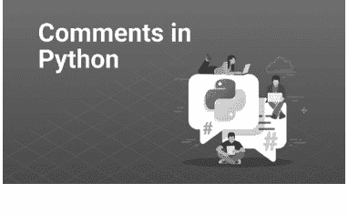
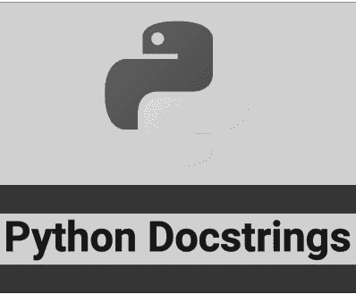
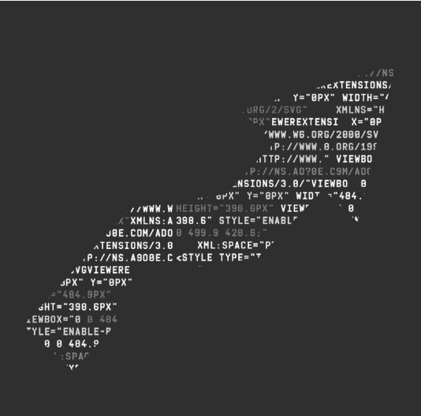
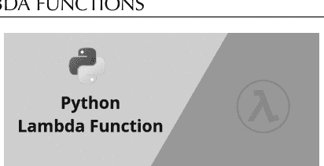
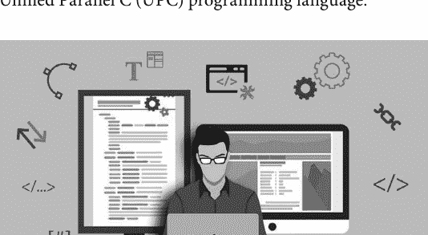
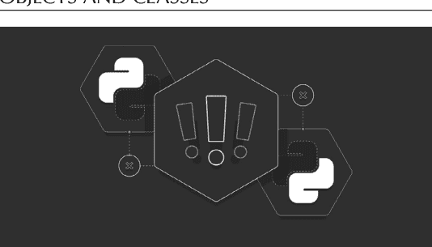
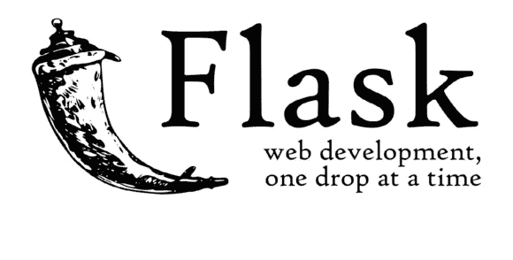
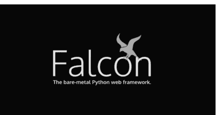

精通计算机科学

## 精通 Web 开发的 Python

初学者指南


编辑

## Sufyan bin Uzayr

CRC Press
Taylor & Francis Group

## 精通计算机科学

**丛书编辑：** Sufyan bin Uzayr

**精通 Web 开发的 Python：初学者指南**
*Mathew Rooney 和 Madina Karybzhanova*

**精通 Android Studio：初学者指南**
*Divya Sachdeva 和 Reza Nafim*

**精通 Swift：初学者指南**
*Mathew Rooney 和 Madina Karybzhanova*

**精通 C++：初学者指南**
*Divya Sachdeva 和 Natalya Ustukpayeva*

**精通 Git：初学者指南**
*Sumanna Kaul, Shahryar Raz, 和 Divya Sachdeva*

**精通 Ruby on Rails：初学者指南**
*Mathew Rooney 和 Madina Karybzhanova*

有关本系列的更多信息，请访问：[https://www.routledge.com/Mastering-Computer-Science/book-series/MCS](https://www.routledge.com/Mastering-Computer-Science/book-series/MCS)

> *“精通计算机科学”系列丛书由 Zeba Academy 团队成员撰写，由 Sufyan bin Uzayr 领导。*
*Zeba Academy 是一家教育科技企业，主要为 STEM 领域的学习者开发课程和内容，并为全球大学和机构提供教育咨询服务。更多信息，请访问 [https://zeba.academy](https://zeba.academy)*

## 精通 Web 开发的 Python

## 初学者指南

由 Sufyan bin Uzayr 编辑


CRC Press
Taylor & Francis Group
Boca Raton London New York

CRC Press 是
Taylor & Francis Group 的一个印记，一家 informa 企业

第一版于 2022 年由 CRC Press 出版
地址：6000 Broken Sound Parkway NW, Suite 300, Boca Raton, FL 33487-2742

并由 CRC Press 出版
地址：2 Park Square, Milton Park, Abingdon, Oxon, OX14 4RN

*CRC Press 是 Taylor & Francis Group, LLC 的一个印记*

© 2022 Sufyan bin Uzayr

我们已尽合理努力发布可靠的数据和信息，但作者和出版商无法对所有材料的有效性或其使用后果承担责任。作者和出版商已尝试追溯本出版物中所有复制材料的版权持有者，如果未获得以这种形式出版的许可，我们向版权持有者致歉。如果任何版权材料未被确认，请写信告知我们，以便我们在任何未来的重印中予以更正。

除非美国版权法允许，否则本书的任何部分不得以任何形式（无论是电子、机械或其他方式，无论是现在已知或今后发明的，包括影印、缩微胶片和录音）或任何信息存储或检索系统进行重印、复制、传播或利用，未经出版商书面许可。

如需获得影印或以电子方式使用本作品材料的许可，请访问 www.copyright.com 或联系版权结算中心 (CCC)，地址：222 Rosewood Drive, Danvers, MA 01923, 978-750-8400。对于 CCC 上不可用的作品，请联系 mpkbookspermissions@tandf.co.uk

**商标声明：** 产品或公司名称可能是商标或注册商标，仅用于识别和解释，无意侵权。

ISBN: 9781032135670 (精装)
ISBN: 9781032135656 (平装)
ISBN: 9781003229896 (电子书)

DOI: 10.1201/9781003229896

由 KnowledgeWorks Global Ltd. 使用 Minion 字体排版。

## 目录

关于编辑，xiii

### 第 1 章 ■ Python 简介 1

- PYTHON 2 与 PYTHON 3 对比 3
- PYTHON 简史 11
- 安装和配置 PYTHON 16
- 如何在 WINDOWS 上安装 PYTHON 19
  - 如何从 Microsoft Store 安装 22
  - 如何从完整安装程序安装 24
- 如何在 macOS 上安装 PYTHON 25
  - 如何从官方安装程序安装 28
  - 如何从 Homebrew 安装 29
- 如何在 LINUX 上安装 PYTHON 31
  - 如何在 Ubuntu 和 Linux Mint 上安装 33
  - 如何在 Debian Linux 上安装 34
  - 如何在 openSUSE 上安装 34
  - 如何在 CentOS 和 Fedora 上安装 35
  - 如何在 Arch Linux 上安装 35
- 如何从源代码构建 PYTHON 36
- 如何在 IOS 上安装 PYTHON 39
- 如何在 ANDROID 上安装 PYTHON 40
- 在线 PYTHON 解释器 40
- 重新生成配置 41

### 第 2 章 ■ Python 数据类型 43

- 整数类型的附加方法 46
- 字符串数据类型 54
- 集合数据类型 62
  - 运算符和方法 62
  - 修改集合 64
- 数字数据类型 65
  - 整数 67
  - 浮点数 67
  - 复数 68
  - 数字类型转换 69
- 列表数据类型 72
  - 访问列表中的值 74
  - 更新列表 74
  - 删除列表元素 75
  - 基本列表操作 76
  - 内置列表函数和方法 76
- 字典数据类型 77
  - 创建字典 78
  - 访问字典中的值 78
  - 更新字典 79
  - 删除字典元素 79
  - 字典键的属性 80
  - 内置字典函数和方法 80
- 元组数据类型 82
  - 访问元组中的值 83
  - 更新元组 84
  - 删除元组元素 84
  - 基本元组操作 85
  - 内置元组函数 85

### 第 3 章 ■ Python 注释和文档 89

- 单行、行内和多行注释 91
- PYTHON 多行注释如何工作？ 94
  - 块注释 95
  - Shebang 96
- PYTHON 注释最佳实践 97
  - 为自己编写代码时 97
  - 为他人编写代码时 99
- PYTHON 注释最差实践 100
- 如何练习注释？ 104
- 以编程方式访问文档字符串 106
  - 单行文档字符串 106
  - 多行文档字符串 107
  - 文档字符串格式 108
- 通过文档字符串编写文档 113
  - 段落 115
  - 行内标记 115
  - 章节 115
  - 元信息标记 116
  - 信息单元 117
  - 行内标记 122

### 第 4 章 ■ 程序、算法和函数 133

- PYTHON 脚本和模块 135
  - 什么是 Python 解释器？ 135
  - 使用 Python 命令 137
  - 使用脚本文件名 138
  - 如何交互式运行 Python 脚本 139
  - 如何从 IDE 或文本编辑器运行 Python 脚本 140
  - 如何从文件管理器运行 Python 脚本 141
  - 连接两个字符串 142
  - 在字符串中格式化浮点数 142
  - 将数字提升到幂 143
  - 使用布尔类型 144
  - 使用 If-Else 语句 145
  - 使用 AND 和 OR 运算符 146
  - 定位模块 148
  - 标准模块 148
  - Python 包 149
- PYTHON 算法 151
  - 如何编写算法？ 151
  - 算法的特征 153
  - 暴力法 154
  - 分治法 155
    - 树遍历算法 155
    - 排序算法 157
    - 搜索算法 159
  - 算法分析 161
- 基本函数 161
- 动态规划 165
  - 递归方法 168
  - 自顶向下方法 169
  - 自底向上方法 169
- LAMBDA 函数 170
  - 语法 174
  - 装饰器 175

### 第 5 章 ■ Python 的执行模型

- 名称和命名空间
- 作用域
  - 使用 LEGB 规则
  - 函数：局部作用域
  - 嵌套函数：闭包作用域
  - 模块：全局作用域
  - 内置作用域
- 修改 PYTHON 作用域的行为
  - Global 语句
  - Nonlocal 语句
  - 将闭包作用域用作闭包
  - 通过 Import 将名称引入作用域
  - 审查不寻常的 Python 作用域
  - 推导式变量作用域
  - 异常变量作用域
  - 类和实例属性作用域
  - 使用与作用域相关的内置函数
- 对象和类
  - 类对象
  - 方法对象
  - 继承

### 第 6 章 ▪ 用于 Web 开发的 Python

- 围绕 Web 编程的基本概念
- DJANGO 框架
  - Django 是固执己见的吗？
  - Django 代码是什么样子的？
  - 处理请求 (views.py)
  - 定义数据模型 (models.py)
  - 渲染数据 (HTML 模板)
- 正则表达式
  - 正则表达式对象
- FLASK 和 FALCON 框架
- 评估, 267
- 索引, 277

# Taylor & Francis

Taylor & Francis Group

http://taylorandfrancis.com

# 关于编辑

**Sufyan bin Uzayr** 是一位作家、程序员和企业家，在该行业拥有超过十年的经验。他过去曾撰写过多本书籍，涉及从历史到计算机/信息技术等广泛主题。

Sufyan 是 Parakozm 的总监，这是一家专注于教育科技解决方案的跨国信息技术公司。他还运营着 Zeba Academy，这是一个在线学习和教学平台，专注于 STEM 领域。

Sufyan 精通多种技术，例如 JavaScript、Dart、WordPress、Drupal、Linux 和 Python。他拥有多个学位，包括管理学、信息技术、文学和政治学学位。

Sufyan 是一位数字游民，时间分配在四个国家之间。他曾在全球各地的大学和教育机构生活和教学。Sufyan 对技术、政治、文学、历史和体育有着浓厚的兴趣，在业余时间，他喜欢教年轻学生编程和英语。

了解更多请访问 sufyanism.com。

# Taylor & Francis

Taylor & Francis Group

http://taylorandfrancis.com

# 第 1 章

## Python 简介

### 本章内容

- 介绍 Python 编程语言
- 深入了解 Python 的创建故事
- 解释如何安装和配置 Python

Python 是一种通用编程语言，用于其他类型的编程和软件开发。它被认为是网络应用创建和系统管理的重要力量，也是大数据分析和机器智能爆发的关键驱动力。

简单来说，Python 通常用于以下方面：

- 编写系统脚本
- 处理大数据

DOI: 10.1201/9781003229896-1

# 2 ■ 精通 Python 网络开发

- 执行数学计算
- 连接数据库系统
- 读取和修改文件
- Python 可用于在服务器上创建网络应用
- 创建工作流程
- 快速原型设计
- 生产就绪的软件开发
- 后端网络和移动应用开发

然而，Python 最典型的用例是作为脚本和自动化语言。在创建脚本时，Python 不被视为 shell 脚本或批处理文件的替代品，而是用于自动化与网络浏览器或应用程序图形用户界面（GUI）的交互。因此，使用 Python，你可以创建命令行和跨平台 GUI 应用程序，并将它们部署为独立的可执行文件。

复杂的数据分析已成为信息技术领域最蓬勃发展的领域之一，大多数用于机器学习的流行软件和数据科学库都具有 Python 接口，使其成为最受欢迎的高级命令接口和数值算法。Python 的第三方网络框架提供了快速便捷的方式来创建从简单代码行到功能齐全、数据驱动的网站。Python 的最新版本对操作有强大的支持，使网站能够处理每秒数万个请求。Python 还充当高效的代码生成器，使得编写能够操作自身功能的应用程序成为可能，而这些功能在其他语言中很难实现。这种编码通常被描述为“胶水语言”，意味着它可以使不同的代码再次互操作。因此，如果你有希望相互链接的应用程序或程序领域，你可以使用 Python 来完成这项任务。

## PYTHON 2 与 PYTHON 3

Python 有两个不同的版本：Python 2 和 Python 3。Python 2 是较旧的分支，截至 2020 年 1 月 1 日，其创建者 Python 软件基金会已不再支持它。Python 3 是该语言的当前和未来版本，具有许多 Python 2 中未包含的更新功能，例如新的并发控制和更好的解释器。过去两者之间存在很多竞争，但自从版本 3 整合了一些重要功能后，它赢得了所有 Python 粉丝的支持。Python 3 中的一些变化包括：¹

- 文本与数据，而不是 Unicode 与 8 位。
- Print 现在是一个函数。
- 视图和迭代器，而不是列表。
- 排序比较的规则已简化。因此，异构列表无法排序，因为列表中的所有元素必须彼此可比较。

> ¹ https://learntowish.com/history-python-comedy-snake-programming-language/, Learntowish 博客

# 4 ■ 精通 Python 网络开发

起初，由于缺乏第三方库的支持，Python 3 的采用一度放缓。因为大多数 Python 库只支持 Python 2，这使得向版本 3 的迁移耗时。但在过去几年中，同时兼容 Python 2 和 Python 3 的库数量有所增加。如今，Python 3 是新项目的最佳、最新选择。

由于其简单性，像 Dropbox、Google、Mozilla、Hewlett-Packard、IBM 和 Cisco 这样的顶级技术组织已经将 Python 用于各种目的，例如开发、脚本编写、生成和软件测试。它也启发了许多其他编程语言，如 Ruby、Cobra、Boo、CoffeeScript、ECMAScript、Groovy、Swift、Go、OCaml 和 Julia。

Python 的成功建立在强大的标准库和来自第三方开发者的丰富、易于获取和使用的库之上。Python 的标准库为常见的编程任务提供了模块，如数学、字符串处理、文件和目录访问、网络、异步操作、线程和多进程管理。此外，它还包括管理常见编程任务的模块，例如读写结构化文件格式、处理压缩文件以及使用互联网协议。默认的 Python 发行版还通过 Tkinter 提供了跨平台 GUI 库，并内置了对 SQLite 3 数据库的访问。

通过 Python 包索引可以获取数千个第三方库。例如：

- BeautifulSoup 库提供了一个用于提取 HTML 的一体化工具箱。
- 像 Flask 和 Django 这样的框架允许快速开发网络服务。
- 可以通过 Python 的模型使用 Apache Libcloud 管理多种云服务。
- Pandas、NumPy 和 Matplotlib 加速了数学和统计操作，并创建了数据可视化。

话虽如此，也值得注意 Python 不太适合的任务。首先，Python 是一种高级语言，因此它不是系统级编程的最佳选择——设备驱动程序或操作系统内核是不可行的。它也不适合需要跨平台独立二进制文件的情况。而且由于语言中的一切，包括函数和模块本身，都是作为对象处理的，编码是以速度为代价的。因此，当速度是应用程序每个方面的绝对优先事项时，它并不是最佳选择。为此，建议选择 C/C++ 或其他语言。

像 C#、Java 和 Go 一样，Python 具有垃圾回收的内存管理，这意味着不需要实现代码来跟踪对象。垃圾回收在后台自动进行，可能会带来性能问题，这就是为什么建议手动管理或完全禁用它以提高性能。

# 6 ■ 精通 Python 网络开发

另一个妥协在于 Python 对显著空白的使用。由于语法空白可能会让一些人皱眉，一些开发者选择不使用 Python。另一个潜在的缺点可能是 Python 处理变量类型的方式。默认情况下，Python 使用动态或“鸭子”类型，这在大型代码库中可能会带来问题。

话虽如此，人们仍然欣赏、接受并简单地热爱使用 Python。而且，这有很多原因：

- **初创公司热爱 Python：** 初创公司在构建网站、移动应用程序或软件程序时需要灵活且可靠的编程工具。主要的两个优先事项包括财务效率和按时完成的能力。而且，由于 Python 能够实现这两个目标，它在初创公司世界中成为一种受欢迎的编程语言。

  Python 的效率和易用性导致了较短的开发时间；以及简化的质量保证和调试过程，承诺更高的投资回报率。对于那些想加入初创公司社区、获得第一份工作并开始积累行业经验的人来说，掌握 Python 管理的基础知识将使你作为潜在候选人更具吸引力。

## 8 ■ 掌握 Python 用于 Web 开发

- **Python 学习周期不长：** 尽管 Python 是一门功能强大且用途广泛的语言，但学习它并不需要耗费数年时间或获得多个学位。大多数行业专业人士都是通过各种在线课程掌握 Python 基础知识（包括 Python 的语法、关键字和数据类型）的，这些课程平均只需 6-8 周即可完成。而且，如果你之前有编程语言的学习经验，掌握 Python 的速度可能会更快。

- **你可以免费学习 Python 基础知识：** Python 背后的组织——Python 软件基金会，在其官方网站上提供免费的 Python 教程：[https://www.python.org/about/gettingstarted/](https://www.python.org/about/gettingstarted/)。这个免费资源为初学者提供了全面的 Python 教程，包括专门为没有编程经验的用户准备的材料，以及为 Python 编程经验有限的初学者提供的指南。

同时，如果你需要更详细的 Python 速成课程，可以在网上搜索。如前所述，像 [https://www.learnpython.org/](https://www.learnpython.org/) 和 [https://docs.python-guide.org/](https://docs.python-guide.org/) 这样的网站提供了额外的教程。大多数在线平台都让你能轻松学习编程基础，并且可以免费开始学习。你只需注册即可。

- **Python 拥有支持性的用户社区：** Python 是一种开源编程语言，这意味着任何人都可以修改或创建 Python 语言的变体。开源也意味着它是免费的，并允许形成库、框架和扩展工具，这些都有助于保持 Python 语言的适应性和兼容性。可以说，Python 之所以能取得今天的成功，很大程度上是因为有一个如此支持性的用户社区参与其中。

此外，Python 软件基金会在其网站上有一个专门的社区页面，链接到多个社区小组和论坛。Python 编程语言的用户会定期在所谓的 Python 用户组中聚会，分享他们如何使用这门语言以及学习新技术。他们也为初学者提供极大的帮助，并提供一个平台，让用户可以与志趣相投的人交流。会议通常每月举行一次；形式非常随意，向所有人开放。根据目前的统计，全球约有 1,637 个 Python 用户组，分布在近 191 个城市、37 个国家，拥有超过 860,333 名成员。² 你也可以通过这个链接找到你当地的 Python 社区：[https://wiki.python.org/moin/LocalUserGroups](https://wiki.python.org/moin/LocalUserGroups)。

Python 软件基金会是一个非营利组织，为社区项目的实施提供资助计划。它每年处理超过 300 份申请。因此，在 2019 年，资助计划为全球各地的项目提供了 324,500 美元的支持。³

² [https://wiki.python.org/moin/LocalUserGroups](https://wiki.python.org/moin/LocalUserGroups), wiki Python
³ [https://www.python.org/psf/annual-report/2020/](https://www.python.org/psf/annual-report/2020/), Python

## Python 简介 ■ 9

- **Python 很受欢迎：** 编程语言是否流行很重要。这很重要，因为如果你投入金钱和时间去学习一门使用不够广泛、对你的求职目标没有帮助的语言，那是错误的。

根据*《经济学人》*^1 的报道，Python 在 2018 年成为世界上最受欢迎的编程语言。其他语言如 Fortran 和 Lisp 出现了急剧下降，而 C 和 C++ 等语言则保持稳定。该文章预测，Python 普及的这一趋势将在相当长一段时间内持续下去。

- **Python 用途广泛：** 作为通用语言，意味着 Python 语言可用于构建不同软件解决方案的各个部分，这就是为什么像 Google 和 Facebook 这样的大型科技公司选择 Python 编程用于他们的项目。此外，Python 代码也可用于构建基础程序，作为开发者，你将拥有极其广泛的工作选择。无论你是想为科技巨头工作、构建自己的软件程序，还是作为自由职业的 Web 开发者工作，掌握 Python 编程都被认为是一种优势，可以使这些计划中的任何一个成为可能。

- **Python 确保项目的前后端更好地协同工作：** 如果你想在开发者领域拥有出色的职业生涯，了解你的目标可能是同步和平衡由数据库和 Web 服务器组成的前端和后端（这些服务器为网站应用程序的前端提供支持）会很有用。

当我们称 Python 为“胶水语言”时，我们的意思是它用于编写后端操作的脚本，使你的数字产品的前后端能够和谐地工作。因此，如果你想为你的前端开发者技能组合添加服务器端或后端技能，学习 Python 可能是一个完美的起点。

- **Python 可定制：** 如果你需要一种可定制的编程语言，那么 Python 绝对是一个完美的选择。就像 JavaScript 一样，Python 不乏库和框架来塑造和满足你特定的编码需求。

像 Django 这样流行的、功能齐全的 Python 服务器端 Web 框架，旨在使 Python 在调整 Web 应用程序方面更加实用，而 PyQt 是一个允许 Python 构建图形用户界面（GUI）的框架，这些界面包括使用屏幕图标和图形来操作用户命令。

- **Python 是流程自动化的绝佳工具：** 在科技领域工作，一个必要但乏味的部分是管理所有重复性、耗时的技术相关流程。像复制文件、拖动文件夹和重命名文件、管理资产到服务器这样的无聊任务——所有这些累积起来会占用大量宝贵时间。在这种情况下，通过 Python 实现自动化可能是你的救星。Python 编写系统脚本的能力使你能够创建简单的 Python 程序来自动化那些占用你大量生产力的日常任务。通过使用 Python 重新调整流程所能节省的时间，是学习这门语言一个极具吸引力的方面。

- **Python 为你提供了在科技领域任何地方工作的工具：** 学习 Python 代码不仅能确保你在互联网开发方面的潜在专业知识——它还将为你未来各种科技工作做好准备。Python 的用途远不止传统的 Web 开发。事实上，Python 是数据分析、人工智能、机器学习和数据科学等热门新兴科学领域的首选语言。因此，掌握这门语言将有助于你保持选择的开放性，如果你决定精通 Python，你可能会有更多的科技相关机会。

^1 https://www.economist.com/graphic-detail/2018/07/26/python-is-becoming-the-worlds-most-popular-coding-language, *The Economist*

## PYTHON 简史

Python 是一种通用、高级编程语言，最初由 Guido van Rossum 于 1991 年设计，并由 Python 软件基金会开发。它主要是为了提高代码可读性而开发的，其语法允许程序员用更短的代码表达概念。

Python 的官方工作始于 1980 年代末期。不久之后，Guido van Rossum 于 1989 年 12 月在荷兰的 Centrum Wiskunde & Informatica (CWI) 开始了其基于应用的试验。最初，Python 项目是作为一个爱好开始的，因为他想在圣诞节期间找点有趣的事情做。Python 编程语言基于 ABC 编程语言，该语言具有与基于微内核的 Amoeba 操作系统的接口，该操作系统将一组单板计算机变成了一个透明的分布式系统。Van Rossum 在职业生涯早期曾帮助创建过 ABC，并发现了一些问题。因此，他采用了 ABC 的语法、其一些最佳特性，并修复了其他未解决的属性。就这样，通过完全纠正这些问题，他创建了一种新的脚本语言。

该语言于 1991 年发布。发布时，它使用了许多代码，并具有独特的设计方法。其主要目标是提供代码可读性并提高开发者的整体生产力。

但“Python”这个名字是怎么来的呢？大多数人认为，由于标志描绘了两条蛇，这个名字的起源一定是受到了实际蟒蛇的启发。令人惊讶的是，事实远非如此。Python 的创造者 Guido van Rossum 在 1996 年写到了他为这门编程语言取的名字，与其说有什么深意，不如说更偏向于英式幽默：“六年前，也就是1989年12月，我正在寻找一个‘业余’编程项目，好让我在圣诞节前后的一周有事可做。我的办公室……会关闭，但我家里有台电脑，也没别的要紧事。我决定为最近一直在思考的一种新脚本语言编写一个解释器：它是ABC语言的后裔，旨在吸引Unix/C黑客。我当时心情有点玩世不恭，又是蒙提·派森的飞行马戏团的忠实粉丝，于是就用Python作为这个项目的暂定名称。”⁵

此外，在2004年，Python社区提出了Python设计的指导原则，并将其称为“Python之禅”：⁶

> 优美胜于丑陋。
> 明了胜于晦涩。
> 简洁胜于复杂。
> 复杂胜于凌乱。
> 扁平胜于嵌套。
> 稀疏胜于紧凑。
> 可读性很重要。
> 特例不足以特殊到违背原则。
> 虽然实用性胜过纯粹性。
> 错误绝不应被默默传递。
> 除非明确地被抑制。
> 面对歧义时，拒绝猜测的诱惑。
> 应该有一种——最好只有一种——显而易见的方式来做到它。
> 虽然这种方式起初可能并不明显，除非你是荷兰人。
> 做比不做好。
> 虽然不做往往比*现在*就做好。
> 如果实现难以解释，那它就是个坏主意。
> 如果实现容易解释，那它可能是个好主意。
> 命名空间是个绝妙的主意——让我们多做这样的事！

⁵ https://www.python.org/doc/essays/foreword/, Python
⁶ https://www.python.org/dev/peps/pep-0020/, Python

## 14 ■ 精通Python Web开发

Python在发布后的多年里表现并不出色。像ASP.NET、Java和PHP这样的成熟解决方案主导着企业市场。Python真正开始腾飞是在2000年代，当时新的初创公司开始在项目中使用Python。许多预算有限的企业也优先选择Python，因为它易于使用、开发迅速，当然也因为其托管成本低廉。

当Dropbox进入市场时，Python的受欢迎程度达到了顶峰。故事是这么说的：一天，一位名叫Drew Houston的麻省理工学院学生忘记带他的USB闪存盘去上课。后来，他开始思考一种更好的文件共享解决方案。Houston在2007年创立了一家名为Evenflow的公司，其唯一产品就是Dropbox。Dropbox软件首次使人们能够在计算机上创建一个文件夹，该文件夹会自动上传到云端服务，并自动同步到用户安装了Dropbox的所有设备上。到2009年4月，该公司已拥有100万用户。到2009年底，用户数达到300万。Dropbox是用Python编写的。

Dropbox很快成为Python成功应用的典范。一个有趣的事实是，Dropbox最初是用Python 2编写的。2013年，当Guido van Rossum加入Dropbox时，他主要负责将软件迁移到新的Python 3。他在Dropbox一直工作到退休。看到Python在Dropbox上如此成功地扩展后，许多其他企业也开始考虑将其用于自己的业务。

2000年代末也是社交媒体爆发的时期。随着其影响力的增长，需要管理的数据量也随之增加。与此同时，Python迅速成为访问这些数据的首选语言，尤其是在科技和初创领域。在2008年金融危机期间，自动化接管了金融世界。金融机构需要处理大数据，并开始研究数据以发现模式、做出决策和管理经济流程。公司拥有大量数据，但缺乏简单明了的访问方式。正是在那时，他们开始使用Python对金融数据进行定量分析。其他软件包如NumPy、scikit和Matplotlib有着相对深厚的开发背景，Python很快成为数据科学的首选语言。

另一个推动Python成为数据科学首选语言的因素是训练营。随着Web开发的爆发，训练营也如雨后春笋般涌现。Python一直是免费学习的。因此，许多训练营项目教授的第一门语言就是Python。世界各地的高中和大学开始将编程作为一项核心技能来教授，而其中大部分都是基于Python的。

如今，如果你想成为一名全栈开发者，通常需要从前后端软件的基础开始。许多教学项目已经为初学者建立了从JavaScript到Python的平滑过渡，尽管这两种语言有所不同。所以，如果有一天你最终成为一名前端开发者，使用JavaScript并与应用程序编程接口（API）交互，你可能会发现为这些应用程序创建后端相当乏味，直到你尝试Python。它的框架如Flask和Django为想要构建更多后端软件并创建强大API以实现良好协调的开发者提供了简便的解决方案。

## 安装和配置Python

任何Python速成课程都可能从在计算机上安装或更新Python开始。有多种安装方法：你可以从Python.org下载官方Python发行版，从包管理器安装，甚至可以安装用于科学计算的专用发行版。

如果你正在自学如何使用Python，最好的选择是从Python.org开始。这个平台提供官方发行版，这种来源通常是学习Python编程最安全的选择。

在该平台上，你可以轻松获取各种有用的教程和各类学习材料：

- 如何检查设备上安装的Python版本。
- 如何在Windows、macOS和Linux上安装和更新Python。
- 如何在手机或平板电脑等移动设备上使用Python。
- 如何在Web上使用在线解释器使用Python。

在我们继续介绍这些要点之前，了解CPython源代码树中的一些顶级目录非常重要，这些目录旨在帮助你找到特定功能的实现位置。⁷

- **Doc**：官方文档。https://docs.python.org/ 使用的就是这个。
- **Grammar**：包含Python的EBNF语法文件。
- **Include**：包含所有解释器范围的头文件。
- **Lib**：用纯Python实现的标准库部分。
- **Mac**：Mac特定代码（例如，将IDLE用作OS X应用程序）。
- **Misc**：不属于其他地方的内容。通常，这是各种开发者特定的文档。
- **Modules**：用C实现的标准库部分（加上一些其他代码）。
- **Objects**：所有内置类型的代码。
- **PC**：Windows特定代码。
- **PC build**：用于python.org上提供的Windows安装程序的当前MSVC版本的构建文件。
- **Parser**：与解析器相关的代码。AST节点的定义也保存在此处。
- **Programs**：C可执行文件的源代码，包括CPython解释器的主函数（在Python 3.5之前的版本中，这些文件位于Modules目录中）。
- **Python**：构成CPython核心运行时的代码。这包括编译器、求值循环和各种内置模块。
- **Tools**：用于维护Python的各种工具（或曾经使用过的工具）。

### 如何在Windows上安装Python

与许多其他Unix系统和服务不同，Windows不包含系统支持的Python安装。为了使Python可用，CPython团队多年来一直为每个版本提供高级Windows安装程序。这些安装程序主要用于添加每个用户的Python安装，包括核心解释器和库。

目前，在Windows上有三种安装方法：

1.  Microsoft Store
2.  完整安装程序
3.  Windows Subsystem for Linux

如果你想检查Windows上是否已经安装了Python，首先需要打开一个命令行应用程序，例如PowerShell。你可以按照以下三个简单步骤操作：

1.  按Win键
2.  输入PowerShell
3.  按Enter键

或者，你可以右键单击*开始*按钮，然后选择*Windows PowerShell*或*Windows PowerShell (管理员)*。也可以使用cmd.exe或Windows Terminal（这是微软为Windows 10开发的多标签命令行，后来完全

### 如何在 Windows 上安装 Python

（已替代 Windows 控制台）。打开命令行后，输入以下命令并按回车键：

```
C:\> python --version
Python 3.9.2.
```

使用 `--version` 开关将显示已安装的版本。或者，你也可以使用 `-V` 开关：

```
C:\> python -V
Python 3.9.2.
```

无论哪种情况，如果你看到的版本低于 3.9.2（这是撰写本文时的最新版本），那么你可能需要升级安装。如果你的系统上没有安装任何版本的 Python，那么上述两个命令都会被设定为启动 Microsoft Store 并将你重定向到 Python 应用页面。

如果你不知道安装的确切位置，可以通过 `cmd.exe` 或 PowerShell 中的 `where.exe` 命令来查找：

```
C:\> where.exe python
C:\Users\mertz\AppData\Local\Programs\nPython\Python37-32\python.exe
```

（请注意，`where.exe` 命令仅在 Python 已安装的情况下才有效。）

如前所述，在 Windows 上安装官方 Python 发行版有三种简便方法：

- 1. **Microsoft Store 包：** 通过 Microsoft Store 应用在 Windows 上进行最简单的安装。此方法主要建议给寻求简单设置体验的 Python 初学者用户。
- 2. **完整安装程序：** 此选项涉及直接从 Python.org 官方网站下载 Python。推荐给需要在安装过程中拥有更多功能和控制权的中级和高级开发者。
- 3. **适用于 Linux 的 Windows 子系统 (WSL)：** WSL 可以让你直接在 Windows 中运行 Linux 环境。你可以通过阅读《适用于 Windows 10 的 Linux 的 Windows 子系统安装指南》来了解如何启用和管理 WSL。

你也可以使用替代平台在 Windows 上完成安装，例如 Anaconda (https://www.anaconda.com/)，这是一个用于使用 Python 进行科学计算和数据科学的优秀交互式网站。访问该网站，你可以通过《在 Windows 上为机器学习设置 Python》了解如何在 Windows 上安装 Anaconda。

在本章中，我们将只关注前两种安装选项，因为它们是 Windows 社区中最方便且因此最受欢迎的安装方法。

Windows 的两个官方 Python 安装程序有很大不同。Microsoft Store 包有特定的限制。官方 Python 文档对 Microsoft Store 包有如下说明——即它“主要用于交互式使用”。这意味着 Microsoft Store 包是为学生和首次学习使用 Python 的人设计的。由于此方法主要针对 Python 初学者，因此 Microsoft Store 包被认为不适合专业的开发环境。此外，它对 TEMP 或注册表等共享位置没有完全的写入权限，这对于专业开发者来说可能是主要的障碍。

但如果你是 Python 新手，并且目前只专注于学习语言基础而不是构建专业软件，那么你应该直接从 Microsoft Store 包安装它。它将提供最短、最简单的入门方式，且麻烦最少。另一方面，如果你是更有经验的开发者，希望在 Windows 环境中开发专业软件，那么官方的 Python.org 安装程序将是你的答案。在这种情况下，你的安装和配置将不受 Microsoft Store 策略的限制，并且你可以控制执行过程，并在必要时将 Python 添加到 PATH。

### 如何从 Microsoft Store 安装

如前所述，如果你是 Python 的绝对新手，并希望快速入门，那么 Microsoft Store 包是让你熟悉 Python 潜力的最佳选择。简单来说，你只需一步即可从 Microsoft Store 安装它。

**步骤 1：在 Microsoft Store 中打开 Python 应用页面。** 打开 Microsoft Store 应用程序开始搜索 Python。在这里，你可能会看到多个可供选择的版本。确保你选择 Python 3.9.2，或你在应用商店中能找到的最高版本号，以打开安装页面。另一件需要记住的事情是，你必须注意应用程序的发布者。你想要安装的官方 Python 应用程序应该是由 Python Software Foundation 创建的。官方的 Microsoft Store 包始终是免费的，因此如果应用程序收费，那么它就不是原版的。或者，你可以打开 PowerShell 并输入以下命令：

```
C:\> python
```

如果你的系统上还没有安装任何版本的 Python，那么如果你按 `Enter`，Microsoft Store 将自动启动并带你到商店中最新版本的 Python。一旦你选择了要安装的版本，请按照*这些简单的步骤完成安装*：

- 1. 点击 *获取*。
- 2. 等待应用程序开始下载。下载完成后，你会看到一个不同的按钮，上面写着 *在我的设备上安装*，而不是 *获取* 按钮。
- 3. 点击 *在我的设备上安装* 并选择你想要完成安装的设备。
- 4. 点击 *立即安装*，然后点击 *确定* 开始安装。
- 5. 安装成功完成后，你将在 Microsoft Store 页面顶部看到以下消息：“此产品已安装。”

### 如何从完整安装程序安装

对于寻求功能齐全的 Python 开发选项的专业开发者来说，从完整安装程序安装是正确的选择。它允许更多的自定义，并让你掌控安装过程，这与选择从 Microsoft Store 安装不同。你可以通过两个步骤从完整安装程序安装。

**步骤 1：你必须按照以下步骤下载完整安装程序：**

- 1. 打开浏览器窗口并导航到 Python.org 的 Windows 下载页面。
- 2. 在“Python Releases for Windows”按钮下，点击“Latest Python 3 Release”的链接。截至目前，最新版本是 Python 3.9.2。
- 3. 滚动到底部并选择 *Windows x86-64 executable installer for 64-bit* 或 *Windows x86 executable installer for 32-bit*。
  如果你不确定是选择 32 位还是 64 位安装程序，那么你可以展开下面的框来帮助你决定。

**步骤 2：运行安装程序**
下载完安装程序后，双击下载的文件运行它。将出现一个如下所示的对话框。关于这个对话框，有四件事你需要注意：

- 1. 默认安装路径位于当前 Windows 用户的 AppData/ 目录中。
- 2. *自定义安装* 按钮通常用于自定义安装位置以及安装哪些附加功能，包括 pip 和 IDLE。
- 3. *为所有用户安装启动程序* 复选框默认是选中的。这意味着机器上的每个用户都可以访问 `py.exe` 启动程序。你可以取消选中此框以将 Python 限制为当前 Windows 用户。
- 4. *Add Python 3.9 to PATH* 复选框默认是未选中的。可能有几个缺点会让你改变主意，不想将 Python 添加到 PATH，因此在选中此框之前，请确保你理解其含义。

完整安装程序让你完全掌控安装过程。你可以使用对话框中可用的选项来自定义安装以满足你的需求。之后你所要做的就是点击 *立即安装*。

### 如何在 macOS 上安装 Python

Python 2 以及其他编程语言如 Ruby 和 Perl 曾经预装在旧版本的 macOS 上。然而，对于

## 精通Python用于Web开发

当前版本的macOS，从macOS Catalina开始。自然，在macOS上有两种声称的安装方法：

1.  官方安装程序
2.  Homebrew包管理器

首先，你可能需要检查你的Mac上安装了哪个Python版本。你可以通过打开一个命令行应用程序，例如终端来完成。以下是打开终端的方法：

1.  按下 `Cmd` + `Space` 键
2.  输入 Terminal
3.  按下 `Enter`

或者，你也可以通过打开Finder并导航到 *应用程序* → *实用工具* → *终端* 来打开。打开命令行后，尝试输入以下命令：

```
# 检查系统Python版本
$ python –version

# 检查Python 2版本
$ python2 –version

# 检查Python 3版本
$ python3 –version
```

如果你的系统上安装了Python，那么这些命令中的一个或多个会自动返回一个版本号。如果满足以下任一条件，你可能需要获取最新版本的Python：

-   上述命令都没有返回版本号。
-   你看到的唯一版本是Python 2.X系列。
-   你安装的Python 3版本不是最新的可用版本。

如前所述，在macOS上安装官方Python发行版有两种方法：

1.  **官方安装程序**：此方法需要从Python.org网站下载官方安装程序。
2.  **Homebrew包管理器**：此方法涉及首先下载并安装Homebrew包管理器（如果你尚未安装），然后在终端应用程序中输入一个命令。

官方安装程序和Homebrew包管理器都很好用，但Python软件基金会只支持官方安装程序。而且由于官方安装程序和Homebrew包管理器安装的发行版并不相同，从Homebrew安装会有一些限制。

Homebrew上的macOS Python发行版不包含标准Python接口Tkinter模块所需的Tcl/Tk依赖项。Tkinter是Python中开发GUI的惯用库模块，也是Tk GUI工具包的接口。由于Homebrew不安装Tk GUI工具包依赖项，它仍然依赖于你系统上已安装的现有版本。系统版本的Tcl/Tk可能已过时，并最终可能阻止你导入Tkinter模块。

Homebrew包管理器是一种流行的方法，因为Homebrew是一个命令行实用程序，并且可以通过基本脚本实现自动化。此外，在macOS上安装Python是许多人的首选，因为它易于从命令行管理，并且无需访问网站即可轻松升级。同时，Homebrew提供的Python发行版不受Python软件基金会支持，因此并非完全可靠。在macOS上最安全的方法仍然是使用官方安装程序，特别是如果你需要使用Tkinter进行Python GUI编程。

### 如何从官方安装程序安装

如前所述，从官方安装程序安装Python是macOS上最可靠的安装方法。它提供了使用Python开发应用程序所需的所有系统依赖项。你可以通过两个简单的步骤从官方安装程序安装。

**步骤1：按照以下步骤下载官方安装程序：**

1.  打开浏览器窗口，导航到Python.org的macOS下载页面。
2.  在“Python Releases for Mac OS X”标题下，点击 *Latest Python 3 Release*。截至目前，最新版本是Python 3.9.2。
3.  滚动到底部，点击 *macOS 64-bit installer* 开始下载。

**步骤2：通过双击下载的文件运行安装程序。** 你应该能看到以下窗口：

1.  按下 *Continue*，直到被要求同意软件许可协议。然后点击 *Agree*。
2.  然后你会看到一个窗口，告诉你安装目标位置并询问你想让它占用多少空间。你很可能不需要更改默认位置，因此请点击 *Install* 继续开始安装。
3.  当安装程序完成文件复制后，点击 *Close* 关闭安装程序窗口。

### 如何从Homebrew安装

对于需要从命令行安装且不需要使用Tkinter模块开发GUI的用户，Homebrew包管理器将是一个完美的选择。你可以通过两个步骤从Homebrew包管理器安装。

**步骤1：安装Homebrew（如果你已经安装了Homebrew，则可以跳过此步骤），按照此过程操作：**

1.  打开浏览器并访问 http://brew.sh/
2.  你应该能在页面顶部标题“Install Homebrew”下看到一个用于安装Homebrew的命令。
3.  用光标突出显示此命令，然后按 `Cmd` + `C` 将其复制到剪贴板。
4.  打开终端窗口，粘贴该命令，然后按 `Enter`。这样你就开始了Homebrew的安装。
5.  在请求时输入你的macOS用户密码。下载所有Homebrew所需文件可能需要几分钟时间，但完成后，你将回到终端窗口的shell提示符处。如果你是第一次在macOS上执行此操作，可能会收到一个弹出警报，要求你安装Apple的命令行开发工具。这些工具是安装的先决条件，因此你需要通过点击Install来确认对话框。开发工具安装完成后，你应该按 `Enter` 继续安装Homebrew。一旦Homebrew安装完毕，你就可以安装Python了。

**步骤2：按照以下步骤安装Python：**

1.  打开一个终端应用程序。
2.  输入以下命令以升级Homebrew：`$brew update && brew upgrade`
    这将下载并在你的计算机上设置最新版本的Python。你可以通过在终端中测试来确保一切正常：
    1.  打开一个终端。
    2.  输入 `pip3` 并按Enter。
    3.  你应该会看到来自Python的pip包管理器的文本。如果运行pip3时收到错误消息，你应该重新执行安装步骤，以确保没有遗漏任何步骤。

### 如何在Linux上安装Python

在本节中，你将了解Linux上的Python安装方法，并希望能够自己完成安装。通常，许多Linux发行版已经预装了Python，但它可能不是最新版本，甚至可能是Python 2而不是Python 3。你需要自己检查版本以确保。为了找出你拥有的Python版本，请打开一个终端窗口并尝试以下命令：

```
# 检查系统Python版本
$ python -version

# 检查Python 2版本
$ python2 -version

# 检查Python 3版本
$ python3 -version
```

如果你的计算机上已经安装了Python，那么这些命令中的一个或多个应该会返回一个版本号。通常，在Linux上有两种方便且相对快速的方法来安装官方Python发行版：

1.  **从包管理器安装：** 这是大多数Linux发行版上最流行的安装方法。它需要从命令行运行一个命令。
2.  **从源代码构建：** 此方法比使用包管理器更复杂。它涉及从命令行运行一系列命令，同时确保你已安装正确的依赖项以完成Python源代码的构建。

不幸的是，并非每个Linux发行版都有包管理器，也并非每个包管理器都包含Python。根据你的操作系统，从源代码构建Python可能是你唯一的选择。你将使用哪种安装方法主要取决于你的Linux操作系统是否有包管理器，以及你是否想控制安装的细节。

迄今为止，在Linux上安装Python最流行的方法是使用操作系统的包管理器。许多专家开发者将其视为默认选择。然而，根据你的Linux发行版，Python可能无法通过包管理器获得。在这种情况下，你将不得不从源代码构建Python。

有三个主要原因可能限制你选择从源代码构建Python：

1.  你无法从操作系统的包管理器下载Python。
2.  如果你需要在嵌入式系统上减少内存占用，你将希望控制Python的编译方式。
3.  你希望能够在最新、最先进的版本正式发布之前测试其测试版和发布候选版。

为了在您的 Linux 机器上完成安装，请在下方找到您的 Linux 发行版并按照提供的步骤操作。

### 如何在 Ubuntu 和 Linux Mint 上安装

根据您所使用的 Ubuntu 发行版版本，设置 Python 的过程会有所不同。您可以通过输入以下命令来确定本地 Ubuntu 版本：

```
$ lsb_release -a
No LSB modules are available.
Distributor ID: Ubuntu
Description: Ubuntu 16.04.4 LTS
Release: 16.04
Codename: xenial
```

请遵循与您在控制台输出中 Release 标题下获得的版本号相匹配的指南：

- **Ubuntu 18.04、Ubuntu 20.04 及以上版本：** Python 3.9 在 Ubuntu 18.04 及以上版本中并非默认安装，但它在 Universe 软件仓库中可用。要安装 3.9 版本，您需要打开终端应用程序并输入以下命令：
  - $ sudo apt-get update
  - $ sudo apt-get install python3.9 python3-pip

安装完成后，您现在可以使用 `python3.9` 命令运行 Python 3.9，并使用 `pip3` 命令运行 pip。

- **Linux Mint 和 Ubuntu 17 及以下版本：** Python 3.9 不在 Universe 软件仓库中，因此您需要从个人软件包存档（PPA）获取。例如，要从 "deadsnakes" PPA 安装，请使用以下命令：
  - $ sudo add-apt-repository PPA:deadsnakes/ppa
  - $ sudo apt-get update
  - $ sudo apt-get install python3.9 python3-pip

### 如何在 Debian Linux 上安装

在 Debian 上安装 Python 3.9 之前，您必须先安装 sudo 命令。为此，您应该在终端中执行以下命令：

```
$ su
$ apt-get install sudo
$ sudo vim /etc/sudoers
```

之后，请尝试使用 `sudo vim` 命令或您喜欢的文本编辑器打开 `/etc/sudoers` 文件。将以下文本行添加到文件末尾，将 `your_username` 替换为您的实际用户名：`your_username ALL=(ALL) ALL`

完成此操作后，您可以继续并跳过直到“如何从源代码构建 Python”部分以完成 Python 的安装。

### 如何在 openSUSE 上安装

从源代码构建是在 openSUSE 上设置 Python 最可靠的方法。为此，您需要安装开发工具，这可以通过 YaST 操作系统设置中的菜单或使用命令行软件包管理器 Zipper 来完成：

```
$ sudo zypper install -t pattern devel_C_C
```

由于它将需要安装超过 150 个软件包，因此这被认为是正常的做法，可能需要一段时间才能完成。但一旦完成，请随时跳到“如何从源代码构建 Python”部分。

### 如何在 CentOS 和 Fedora 上安装

不幸的是，Python 3.9 在 CentOS 和 Fedora 的软件仓库中不可用，因此您需要从源代码构建 Python。不过，在安装 Python 之前，您需要确保您的系统已提前准备好。首先，通过以下代码更新 yum 软件包管理器：`$ sudo yum -y update`

一旦 yum 完成更新，您就可以使用以下命令行自由安装必要的构建依赖项：

```
$ sudo yum -y groupinstall "Development Tools"
$ sudo yum -y install gcc openssl-devel bzip2-devel libffi-devel
```

当您看到所有内容都安装完成时，您可以跳到“如何从源代码构建 Python”部分。

### 如何在 Arch Linux 上安装

Arch Linux 以遵循 KISS 原则（“保持简单，愚蠢”）而闻名，并且主要关注现代性和实用性。也就是说，Arch Linux 在跟进 Python 版本方面相当勤勉。很可能您默认安装的已经是最新版本了。如果没有，您可以使用以下命令更新 Python：`$ pacman -S python`。一旦更新完成，您就可以开始编写脚本了。

### 如何从源代码构建 Python

当您的 Linux 发行版没有最新版本的 Python，或者您只是想自己构建最新、最快的版本时，您可以按照以下步骤从源代码构建 Python：

**步骤 1：下载源代码**
首先，您需要通过 Python.org 获取 Python 源代码。您只需转到下载页面，并在顶部查找 Python 3 的最新源代码。确保您搜索的是 Python 3 而不是 Python 2。
当您选择 Python 3 版本时，您可以在页面底部看到一个“Files”部分。选择 *Gzipped source tarball* 并将其下载到您的机器上。如果您更喜欢命令行方法，您可以使用从 Web 服务器检索内容的 Wget 程序将文件下载到当前目录：

```
$ wget https://www.python.org/ftp/python/3.8.4/Python-3.8.4.tgz
```

当 tarball 下载完成后，您需要处理其他事项以准备系统进行 Python 构建。

**步骤 2：准备您的系统**

从头构建 Python 涉及几个固定步骤。每个步骤的目标在所有发行版上都是相同的，但如果您的发行版不使用 `apt-get`，您可能需要将其转换为适合您发行版的命令：

1.  首先，确保您已更新软件包管理器并升级了软件包：

```
$ sudo apt-get update
$ sudo apt-get upgrade
```

2.  接下来，您需要安装所有构建要求：

```
# 对于基于 apt 的系统（如 Debian、Ubuntu 和 Mint）
$ sudo apt-get install -y make build-essential libssl-dev zlib1g-dev libbz2-dev libreadline-dev libsqlite3-dev wget curl llvm libncurses5-dev libncursesw5-dev xz-utils tk-dev
# 对于基于 yum 的系统（如 CentOS）
$ sudo yum -y groupinstall "Development Tools"
$ sudo yum -y install gcc openssl-devel bzip2-devel libffi-devel
```

如果您系统上已经安装了一些要求，这不会造成任何问题，因为您可以执行上述命令，任何现有的软件包都不会被覆盖。

**步骤 3：构建 Python**

1.  一旦您拥有了所有先决条件和 Tape Archive (TAR) 文件，您就可以开始将源代码解压到一个目录中。请注意，以下命令将在您当前所在的目录下创建一个名为 `Python-3.9.1` 的新目录：

```
$ tar xvf Python-3.9.2.tgz
$ cd Python-3.9.2
```

2.  现在，您需要运行 `./configure` 工具来准备构建：

```
$ ./configure --enable-optimizations --with-ensurepip=install
```

`enable-optimizations` 标志将启用 Python 内部的一些优化，使其运行速度提高约 10%。这样做可能会使编译时间增加二十或三十分钟。

3.  接下来，您使用 `-j` 选项构建 Python，该选项只是告诉 `make` 将构建分成并行步骤以加速编译。即使使用并行构建，此步骤也可能需要几分钟：

```
$ make -j 8
```

4.  最后，您将需要安装新版本的 Python。您可以在此处使用 `altinstall` 选项以避免覆盖系统 Python。由于您要安装到 `/usr/bin`，因此您需要以 root 身份运行：

```
$ sudo make altinstall
```

整个安装可能需要一些时间，但一旦完成，建议您验证 Python 是否已正确设置。

**步骤 4：验证您的安装**

您可以测试 `python3.9 --version` 命令是否返回最新版本：

```
$ python3.9 --version
Python 3.9.2
```

如果您看到 Python 3.9.2，那么您的安装就完全验证通过了。

如果您想运行额外的测试，您也可以选择测试套件，以确保一切都在您的系统上正常且快速地运行。要运行测试套件，您只需输入以下命令：

```
$ python3.9 -m test
```

您不需要急于完成这部分，因为您的计算机将运行测试一段时间。如果所有测试都通过且没有错误，那么您可以确信您全新的 Python 构建正在按预期工作。

### 如何在 iOS 上安装 Python

iOS 上的 Pythonista 软件应用程序是一个完全开发的 Python 创作环境，您可以在 iPhone 或 iPad 上运行它。它具有所有功能，包括 Python 编辑器、技术文档和解释器，所有这些都集成在一个应用程序中。

Pythonista 对于那些不喜欢只局限于笔记本电脑、更喜欢在旅途中工作或提升 Python 技能的人来说，可能是一个很棒的工具。该应用程序附带完整的 Python 3 标准库，还包括您可以浏览的完整文档。

### 如何在安卓设备上安装Python

如果你不是苹果用户而是安卓粉丝，并想通过平板或手机练习Python，这个问题也已得到解决。可靠支持Python 3.8的安卓应用是Pydroid 3。Pydroid 3内置了解释器，可用于读取-求值-打印循环（REPL）、交互式语言会话，并允许你编辑、保存和执行Python代码。此外，它还内置了专为Pydroid 3设计的C、C++甚至Fortran编译器。借助它，你可以从pip构建任何库，也可以从命令行构建和安装依赖项。

你可以从Google Play商店下载并安装Pydroid 3的免费版和付费高级版（支持代码预测和代码分析）。

### 在线Python解释器

如果你希望在不实际安装Python的情况下查看示例和实时Python教程，有几个网站可以提供在线Python解释。这些基于云的Python解释器可能无法执行一些更复杂的活动，但对于运行大多数代码来说已经足够，如果你是初学者，这或许是一个不错的入门方式。

- **Python.org在线控制台：** [https://www.python.org/shell/](https://www.python.org/shell/)
- **Repl.it：** [https://replit.com/](https://replit.com/)
- **Trinket：** https://trinket.io/
- **Python Anywhere：** https://www.pythonanywhere.com/

### 重新生成配置

如果对Python的修改依赖于某些特定于可移植操作系统接口（POSIX）系统的功能，那么更新配置脚本以测试其功能就非常重要。

Python的配置脚本是使用Autoconf工具从configure.ac生成的，该工具用于为计算机系统上的软件构建和打包生成脚本。请确保你编辑的是configure.ac，然后运行autoreconf来重新生成configure以及许多其他文件，而不是直接编辑configure。

就像任何其他软件一样，在极少数情况下，你可能会在Parser/asdl_c.py或Python/makeopcodetargets.py等脚本中遇到Python错误。由于Python会自动生成部分代码，你需要从头开始完整构建才能运行自动生成脚本。为了解决这个问题，自动生成的文件也被检入到虚拟存储库Git仓库中。

Python的使用非常广泛，几乎所有代码编辑器在首次编写Python代码时都提供了某种形式的支持。如果你正在寻找一些额外的工具或特殊指南来管理Python编码，可以在“附加资源”和“开发者指南”中搜索：https://devguide.python.org/#resources。在那里，你可以找到关于探索CPython内部结构、修改CPython语法、CPython编译器设计、CPython垃圾收集器设计以及基本工具支持选项的优秀材料。Python.org的维护还包括使用clang进行动态分析以及Misc目录中找到的各种工具和配置文件。

# 第2章

## Python数据类型

### 本章内容

- 介绍主要的Python数据类型
- 讨论每种类型的内置方法描述
- 解释如何访问、更新和修改Python数据类型

数据分析是当前一个非常重要的领域。大多数公司都希望聘请专业的数据分析师来管理庞大的数据库，并防止任何意外错误的发生。一个好的数据分析师是懂得如何使用各种编程工具来管理大量复杂数据，并从中找到相关信息的人。简而言之，如果你正在寻找一个在不断发展的IT领域中的位置，可能作为数据分析师，你需要开始投资以下领域的技能，以便在职场中获得认可：

- **领域专业知识：** 你需要具备领域专业知识，才能处理大数据并得出与其工作场所相关的见解。
- **编程技能：** 数据分析师应具备编程技能，以了解使用哪些合适的库来清理数据、挖掘数据并从中获得见解。
- **统计学：** 如果不知道如何使用一些基本的统计工具，分析师将无法从数据中得出全部意义。
- **可视化技能：** 数据分析师不能将原始数据作为其工作成果呈现，他需要具备出色的数据可视化技能，以便向第三方总结和呈现全面的数据。
- **讲故事能力：** 最后，分析师需要向利益相关者或客户传达他们的发现。这意味着他们不仅需要创建一个数据故事，还需要有能力讲述它。

数据类型基本上只是编程语言用于存储和操作其余数据的内部构造。尽管Python运行良好，但在数据分析过程的某个阶段，每个人都可能需要显式地将数据从一种类型转换为另一种类型。在本章中，我们将讨论基本的Python数据类型、它们如何映射以及从一种数据类型转换为另一种数据类型的选项。简单来说，数据类型就是数据项的分类或归类。Python支持以下内置数据类型：

- **标量类型**
  - **整数（Int）：** 整数代表正或负的整数（没有小数部分）。用于位级编程的位运算仅对整数有意义。二进制位运算的优先级都低于数值运算，高于比较运算。一元运算符~与其他一元数值运算符（+和-）具有相同的优先级。¹

下表按优先级升序列出了位运算：

| 运算 | 描述 |
| :--- | :--- |
| x \| y | x和y的按位或 |
| x ^ y | x和y的按位异或 |
| x & y | x和y的按位与 |
| x << n | x左移n位 |
| x >> n | x右移n位 |
| ~x | x的按位取反 |

> ¹ https://docs.python.org/3/library/stdtypes.html, Python

### 整数类型的附加方法

int类型实现了numbers和Integral抽象基类。此外，它还提供了更多操作方法：²

1.  **int.bit_length()**：返回以二进制表示整数所需的位数，不包括符号和前导零。
2.  **int.to_bytes(length, byteorder, *, signed=False)**：返回表示整数的字节数组。
3.  **classmethod int.from_bytes(bytes, byteorder, *, signed=False)**：返回由给定字节数组表示的整数。
4.  **int.as_integer_ratio()**：返回一对整数，其比值恰好等于原始整数，且分母为正。整数（整数）的整数比总是以整数为分子，1为分母。

- **浮点数（Float）**：表示实数，使用浮点表示法，其中小数部分由十进制符号或科学记数法表示。float类型实现了numbers和Real抽象基类。它还具有以下附加方法：³

1.  **float.as_integer_ratio()**：返回一对整数，其比值恰好等于原始浮点数，且分母为正。
2.  **float.is_integer()**：如果浮点数实例是有限的且具有整数值，则返回True，否则返回False：

```
>>> (-2.0).is_integer()
True
>>> (3.2).is_integer()
False
```

有两种方法支持与十六进制字符串的相互转换。由于Python的浮点数在内部以二进制数存储，将浮点数转换为十进制字符串或从十进制字符串转换通常会涉及小的舍入误差。相比之下，十六进制字符串允许精确表示和指定浮点数。这在调试和数值工作中很有用。

3.  **float.hex()**：返回浮点数的十六进制字符串表示。对于有限的浮点数，此表示将始终包含前导0x和尾随p及指数。
4.  **classmethod float.fromhex(s)**：返回由十六进制字符串s表示的浮点数的类方法。字符串s可以有前导和尾随空白。请注意，float.hex()是实例方法，而float.fromhex()是类方法。

- **复数（Complex）**：由实部和虚部组成的数字，表示为x + 2y。
- **布尔值（Bool）**：具有两个内置值True或False之一的数据。注意“T”和“F”是大写的。

iii. **None：** None 代表 Python 中的空对象，或由未显式返回值的函数返回。

- **序列类型：** 序列是指由相似或不同数据类型组成的有序集合。Python 具有以下内置序列数据类型：
    - **字符串：** 字符串值简单地表示一个或多个字符的集合，这些字符被置于单引号、双引号或三引号中。
    - **列表：** 这里的列表代表一个或多个数据项的有序集合，这些数据项不一定是相同类型，但置于方括号中。
    - **元组：** 元组对象是一个或多个数据项的有序集合，这些数据项不一定是相同类型，置于圆括号中。

- **映射类型**
    - **字典：** 字典 `Dict()` 对象是以 `键:值` 对形式存储的数据集合。这样的对必须用花括号括起来。例如：`{1:“Sam,” 2:“Ben, 3:“Roy, 4:“Molly”}`

- **集合类型**
    - **集合：** Python 中的集合与数学中集合的实现相同。集合对象具有执行数学集合运算（如并集、交集、差集等）的合适方法。在脚本中，它被视为一个可变的、无序的、由不同可哈希对象组成的集合。
    - **冻结集合：** 冻结集合与普通集合不同，它是集合的不可变版本，其元素从其他数据类型添加而来。

- **可变与不可变类型：** 上述数据类型的可变数据对象存储在计算机内存中以供处理。其中一些值可以在处理过程中被修改，但一旦它们在内存中创建，其内容就无法更改。数字、字符串和元组是不可变的，这意味着它们的内容在创建后无法更改。

- **迭代器类型：** Python 支持在容器上迭代的概念，并使用容器用户定义的类来支持迭代。下文将更详细描述的序列始终支持迭代方法：

    1. **`container.__iter__()`：** 返回一个迭代器对象。此过程是支持下文所述迭代器协议所必需的，并且如果容器支持不同类型的迭代，可以提供额外的方法来专门请求这些迭代类型的迭代器。此方法对应于 Python/C 应用程序编程接口（API）中 Python 对象类型结构的 `tp_iter` 槽位。
    迭代器对象本身需要支持以下两个方法，它们共同构成迭代器协议：⁴
    2. **`iterator.__iter__()`：** 返回迭代器对象本身。这是允许容器和迭代器与 `for` 和 `in` 语句一起使用所必需的。此方法对应于 Python/C API 中 Python 对象类型结构的 `tp_iter` 槽位。
    3. **`iterator.__next__()`：** 返回容器中的下一个项目。如果没有更多项目，则引发 `StopIteration` 异常。此方法对应于 Python/C API 中 Python 对象类型结构的 `tp_iternext` 槽位。一旦迭代器的 `__next__()` 方法引发 `StopIteration`，它必须在后续调用中继续这样做。不遵守此属性的实现被视为有缺陷。

Python 定义了多个迭代器对象，以支持对通用和特定序列类型、字典以及其他更专门形式的迭代。除了它们对迭代器协议的实现之外，具体类型并不重要。

Python 中另一个重要的脚本项目是 *运算符*。它们用于对变量和值执行操作。Python 将运算符分为以下几组：

1. 赋值运算符
2. 算术运算符
3. 逻辑运算符
4. 比较运算符
5. 身份运算符
6. 位运算符
7. 成员运算符

算术运算符用于数值以执行常见的数学运算：⁵

| 运算符 | 名称 | 示例 |
| :--- | :--- | :--- |
| + | 加法 | x + y |
| - | 减法 | x - y |
| * | 乘法 | x * y |
| / | 除法 | x / y |
| % | 取模 | x % y |
| ** | 幂运算 | x ** y |
| // | 整除 | x // y |

- **Python 赋值运算符：** 赋值运算符用于为变量赋值：

| 运算符 | 示例 | 等同于 |
| :--- | :--- | :--- |
| = | x = 5 | x = 5 |
| += | x += 3 | x = x + 3 |
| -= | x -= 3 | x = x - 3 |
| *= | x *= 3 | x = x * 3 |
| /= | x /= 3 | x = x / 3 |
| %= | x %= 3 | x = x % 3 |
| //= | x //= 3 | x = x // 3 |
| **= | x **= 3 | x = x ** 3 |
| &= | x &= 3 | x = x & 3 |
| |= | x |= 3 | x = x | 3 |
| ^= | x ^= 3 | x = x ^ 3 |
| >>= | x >>= 3 | x = x >> 3 |
| <<= | x <<= 3 | x = x << 3 |

52 ■ 精通 Python Web 开发

- **Python 比较运算符：** 比较运算符用于比较两个值：

| 运算符 | 名称 | 示例 |
| :--- | :--- | :--- |
| == | 等于 | x == y |
| != | 不等于 | x != y |
| > | 大于 | x > y |
| < | 小于 | x < y |
| >= | 大于或等于 | x >= y |
| <= | 小于或等于 | x <= y |

- **Python 逻辑运算符：** 逻辑运算符用于组合条件语句：

| 运算符 | 描述 | 示例 |
| :--- | :--- | :--- |
| and | 如果两个语句都为真，则返回 True | x < 5 and x < 10 |
| or | 如果其中一个语句为真，则返回 True | x < 5 or x < 4 |
| not | 反转结果，如果结果为真，则返回 False | not(x < 5 and x < 10) |

- **Python 身份运算符：** 身份运算符用于比较对象，不是比较它们是否相等，而是比较它们是否是同一个对象，具有相同的内存位置：

| 运算符 | 描述 | 示例 |
| :--- | :--- | :--- |
| is | 如果两个变量是同一个对象，则返回 True | x is y |
| is not | 如果两个变量不是同一个对象，则返回 True | x is not y |

- **Python 成员运算符：** 成员运算符用于测试序列是否存在于对象中：

| 运算符 | 描述 | 示例 |
| :--- | :--- | :--- |
| in | 如果对象中存在具有指定值的序列，则返回 True | x in y |
| not in | 如果对象中不存在具有指定值的序列，则返回 True | x not in y |

- **Python 位运算符：** 位运算符用于比较（二进制）数字：

| 运算符 | 名称 | 描述 |
| :--- | :--- | :--- |
| & | 与 | 如果两个位都为 1，则将每个位设置为 1 |
| | | 或 | 如果两个位中有一个为 1，则将每个位设置为 1 |
| ^ | 异或 | 如果两个位中只有一个为 1，则将每个位设置为 1 |
| ~ | 非 | 反转所有位 |
| << | 零填充左移 | 通过从右侧推入零向左移动 |
| >> | 有符号右移 | 通过推入最左侧位的副本向右移动 |

尽管如此，在下一部分中，我们将更深入地探讨数据类型如何在 Python 世界中被使用、操作和实现。我们还将研究一些用于操作数据集的有用函数和修改。那么，事不宜迟，让我们从字符串数据类型开始。

## 字符串数据类型

字符串最基本的定义可以是一个字符序列，其中序列是由多个相同类型（即整数、浮点数、字符、字符串等）元素组成的数据类型。在 Python 中，所有现有字符都有一个唯一的代码。编码约定被标记为 Unicode 格式。它包含几乎所有可能语言的字符以及表情符号。因此，字符串可以被视为一种特殊的序列类型，其所有元素都是字符。例如，字符串 "Hello, You" 基本上是一个序列 `['H', 'e', 'l', 'l', 'o', ',', 'Y', 'o', 'u']`，其长度可以通过计算序列中的字符数来确定。

Python 中的字符串处理所需的工作量最少，因为与其它语言相比，大多数字符串操作的复杂度非常低。有几种方法可以管理字符串：

- **连接：** 连接简单地意味着连接两个字符串。例如，将 "Hello" 与 "You" 连接，使其成为 "HelloYou"。这是它的写法：

    ```python
    >>> print ("Hello" + "You");
    ```

    一个加号 `+` 就足以完成任务。当与字符串一起使用时，`+` 号连接两个字符串。另一个包含多个字符串的示例是：

    ```python
    >>> s1 = "Name Python "
    >>> s2 = "had been adapted "
    >>> s3 = "from Monty Python"
    >>> print (s1 + s2 + s3)
    ```

    结果：Name Python had been adapted from Monty Python

### 重复

假设你想在控制台多次输出相同的文本，比如将“Hey!”重复100次，你可以手动输入全部内容，如“Hey!Hey!Hey!...”一百次，或者直接执行以下操作：

```python
>>> print ("Hey!"*100)
```

因此，如果你想让用户输入一个数字，并根据该数字在控制台打印文本n次，你只需创建一个变量n，使用`input()`函数从用户获取一个数字，然后将文本乘以该数字：

```python
>>> n = input("Number of times you want the text to repeat: ")
Number of times you want the text to repeat: 4
>>> print ("Text"*4);
```

结果：TextTextTextText

### 将字符串转换为整数或浮点数数据类型

这也相当简单。Python初学者中有一个非常普遍的疑问：当一个数字被引号括起来时，它就变成了字符串，如果你试图对它进行数学运算，就会出错。

```python
numStr = '123'
```

在上面的语句中，123不是数字，而是字符串。因此，在这种情况下，要将数字字符串转换为浮点数或整数数据类型，我们可以使用`float()`和`int()`函数。

```python
numStr = '123'
numFloat = float(numStr)
numInt = int(numFloat)
```

这样，你就可以轻松地对数值执行数学函数。同样地，要将整数或浮点数变量转换为字符串，我们可以使用`str()`函数。

```python
num = 123
# 就这么简单
numStr = str(num)
```

### 切片

*切片*是另一个主要的字符串操作。切片允许你根据起始索引和结束索引提取字符串的一部分。例如，如果我们有一个字符串，并且想提取这个字符串的一部分或只是一个字符，那么我们可以使用以下语法之一：

- **string_name[starting_index: finishing_index: character_iterate]**
    - **String_name：** 代表保存字符串的变量名。
    - **starting_index：** 是你想要在子字符串中包含的起始字符的索引。
    - **finishing_index：** 表示你想要在子字符串中包含的最后一个字符的索引加一。

### 内置字符串方法

Python有一组内置方法，你可以用于字符串：⁶

- **str.capitalize()：** 返回字符串的副本，其首字母大写，其余字母小写。
- **string.casefold()：** 返回一个小写字符串。它类似于`lower()`方法，但`casefold()`方法将更多字符转换为小写。
- **string.center()：** 返回一个指定长度的新居中字符串，用指定字符填充。默认字符是空格。
- **string.count()：** 在给定字符串中搜索（区分大小写）指定的子字符串，并返回一个整数表示子字符串出现的次数。
- **string.endswith()：** 如果字符串以指定的后缀结尾（区分大小写），则返回True，否则返回False。
- **string.expandtabs()：** 返回一个字符串，其中所有制表符`\t`被替换为一个或多个空格，具体取决于`\t`之前的字符数和指定的制表符大小。
- **string.find()：** 返回子字符串在给定字符串中首次出现的索引（区分大小写）。如果未找到子字符串，则返回-1。
- **string.index()：** 返回子字符串在给定字符串中首次出现的索引。
- **string.isalnum()：** 如果字符串中的所有字符都是字母数字（字母或数字），则返回True。否则，返回False。
- **string.isalpha()：** 如果字符串中的所有字符都是字母（包括小写和大写），则返回True；如果至少有一个字符不是字母，则返回False。
- **string.isascii()：** 如果字符串为空或所有字符都是ASCII字符，则返回True。
- **string.isdecimal()：** 如果字符串中的所有字符都是十进制字符，则返回True。否则，返回False。
- **string.isdigit()：** 如果字符串中的所有字符都是数字或Unicode数字字符，则返回True。否则，返回False。
- **string.isidentifier()：** 检查字符串是否为有效的标识符字符串。如果字符串是有效的标识符，则返回True，否则返回False。
- **string.islower()：** 检查给定字符串的所有字符是否都是小写。如果所有字符都是小写，则返回True；即使只有一个字符是大写，也返回False。
- **string.isnumeric()：** 检查字符串的所有字符是否都是数字字符。如果所有字符都是数字，则返回True；即使只有一个字符是非数字，也返回False。
- **string.isprintable()：** 如果给定字符串的所有字符都是可打印的，则返回True。即使只有一个字符是不可打印的，也返回False。
- **string.isspace()：** 如果给定字符串的所有字符都是空白字符，则返回True。即使只有一个字符不是空白字符，也返回False。
- **string.istitle()：** 检查每个单词的首字母是否大写，其余字母是否小写。如果字符串是标题格式，则返回True；否则，返回False。符号和数字被忽略。
- **string.isupper()：** 如果所有字符都是大写，则返回True；即使只有一个字符不是大写，也返回False。
- **string.join()：** 返回一个字符串，该字符串是调用它的字符串与作为参数指定的可迭代对象的字符串元素的连接。
- **string.ljust()：** 返回左对齐的指定宽度的字符串。如果指定的宽度大于字符串长度，则字符串的剩余部分用指定的填充字符填充。
- **string.lower()：** 返回原始字符串的副本，其中所有字符都转换为小写。
- **string.lstrip()：** 通过删除作为参数指定的前导字符，返回字符串的副本。
- **string.maketrans()：** 返回一个映射表，该表将给定字符串中的每个字符映射到第二个字符串中相同位置的字符。此映射表与`translate()`方法一起使用，该方法将根据映射表替换字符。
- **string.partition()：** 在指定的字符串分隔符`sep`参数首次出现的位置分割字符串，并返回一个包含三个元素的元组：分隔符之前的部分、分隔符本身以及分隔符之后的部分。
- **string.replace()：** 返回字符串的副本，其中所有出现的子字符串都被另一个子字符串替换。
- **string.rfind()：** 返回指定子字符串（子字符串的最后一次出现）在给定字符串中的最高索引。
- **string.rindex()：** 返回子字符串在给定字符串中最后一次出现的索引。
- **string.rjust()：** 返回右对齐的指定宽度的字符串。如果指定的宽度大于字符串长度，则字符串的剩余部分用指定的填充字符填充。
- **string.rpartition()：** 在指定的字符串分隔符`sep`参数最后一次出现的位置分割字符串，并返回一个包含三个元素的元组：分隔符之前的部分、分隔符本身以及分隔符之后的部分。
- **string.split()：** 从指定的分隔符分割字符串，并返回一个包含字符串元素的列表对象。
- **string.rstrip()：** 通过删除作为参数指定的尾随字符，返回字符串的副本。
- **string.splitlines()：** 在行边界处分割字符串，并返回字符串中的行列表。
- **string.startswith()：** 如果字符串以指定的前缀开头，则返回True。否则，返回False。
- **string.strip()：** 通过删除前导和尾随字符，返回字符串的副本。
- **string.swapcase()：** 返回字符串的副本，其中大写字符转换为小写，反之亦然。符号和字母被忽略。
- **string.title()：** 返回一个字符串，其中每个单词以大写字符开头，其余字符为小写。
- **string.translate()：** 返回一个字符串，其中每个字符都映射到其在翻译表中的对应字符。
- **string.upper()：** 返回一个大写字符串。符号和数字不受影响。
- **string.zfill()：** 返回字符串的副本，左侧填充‘0’字符。它在字符串开头添加零（0），直到字符串长度等于指定的宽度参数。

⁶ https://www.tutorialsteacher.com/python/python-string, Python教程

## 集合数据类型

Python 的另一种内置数据类型可以这样描述：

- 集合数据类型的所有元素都是唯一的。不允许重复集合元素。
- 集合本身可以被修改，但集合中包含的元素仍然是不可变类型。
- 集合是无序的。

尽管如此，在 Python 中使用集合非常容易。你可以通过两种方式创建集合。首先，你可以使用内置的 `set()` 函数来定义一个集合，例如：

```
x = set(<iter>)
```

或者，也可以使用花括号（`{}`）来定义集合：

```
x = {<obj>, <obj>, ..., <obj>}
```

许多可用于 Python 其他复合数据类型的标准数据操作，对于集合来说工作方式并不相同。例如，集合不能被索引或切片。但与此同时，Python 提供了大量针对集合对象的操作，这些操作通常模仿为数学集合定义的操作。

### 运算符和方法

Python 中大多数常用的集合操作可以通过两种不同的方式执行：通过运算符或通过方法。我们可以以集合并集为例，看看这些运算符和方法通常是如何工作的。

给定两个集合 x1 和 x2，x1 和 x2 的并集是一个包含两个集合中所有元素的集合。
考虑这两个集合：

```
x1 = {'food', 'bar', 'bass'}
x2 = {'bass', 'mouse', 'house'}
```

x1 和 x2 的并集是 `{'food', 'bar', 'bass', 'mouse', 'house'}`。

请确保你注意到元素 "bass" 同时出现在 x1 和 x2 中，但在并集中只出现一次，因为正如我们之前提到的，集合从不包含重复的值。
在 Python 中执行集合并集的另一种方式是使用 `|` 运算符：

```
>>> x1 = {'food', 'bar', 'bass'}
>>> x2 = {'bass', 'mouse', 'house'}
>>> x1 | x2
{'bass', 'mouse', 'house', 'bar', 'food'}
```

作为替代方案，你也可以使用 `union()` 方法来获取集合并集。该方法在一个集合上调用，另一个集合作为参数传入：

```
>>> x1.union(x2)
{'bass', 'mouse', 'house', 'bar', 'food'}
```

正如你可能从上面的例子中观察到的，运算符和方法的行为几乎完全相同。然而，它们之间仍然存在细微的差别。当你使用 `|` 运算符时，两个操作数都必须是集合。但另一方面，`union()` 方法将接受任何可迭代对象作为参数，将其转换为集合，然后执行并集操作。

### 修改集合

尽管集合中包含的元素必须是不可变类型，但集合本身确实可以被修改。就像上面的操作一样，有运算符和方法的混合使用可以用来修改集合的内容。因此，上面列出的并集、交集、差集和对称差集运算符中的每一个都有一个增强赋值形式，可以应用于修改集合。并且对于每一个运算符，都有一个对应的方法：⁷

1.  **x1.update(x2[, x3 ...]); x1 |= x2 [| x3 ...]:** 通过并集修改集合。
2.  **x1.intersection_update(x2[, x3 ...]); x1 &= x2 [& x3 ...]:** 通过交集修改集合。
3.  **x1.difference_update(x2[, x3 ...]); x1 -= x2 [| x3 ...]:** 通过差集修改集合。
4.  **x1.symmetric_difference_update(x2); x1 ^= x2:** 通过对称差集修改集合。
5.  **x.add(<elem>):** 向集合中添加一个元素。
6.  **x.remove(<elem>):** 从集合中移除一个元素。
7.  **x.clear():** 清空一个集合。

*冻结集合*也被认为是 Python 中的原生数据类型。即使它们具有与集合相同的特性，包括类方法，它们也像元组一样是不可变的。要使用冻结集合，请调用 `frozenset()` 函数并传递一个可迭代对象作为参数。如果你传递另一种数据类型，如列表或字符串，冻结集合会将其视为可迭代对象。这意味着该值将被解构为其各个部分，然后被简化为一组唯一的不可变元素。演示如下：

```
myList = [1,1,2,3,4]
myString = "Hello"
frozenList = frozenset(myList)
frozenString = frozenset(myString)
print(frozenList) # frozenset({1, 2, 3, 4})
print(frozenString) # frozenset({'e', 'l', 'H', 'o'})
```

如你所见，冻结集合不能像集合用花括号、列表用方括号或元组用圆括号那样用字符表示法来声明。因此，如果你想使用冻结集合，你必须使用函数来创建它。人们可能会认为在决定应用冻结集合时，在性能方面没有太多好处。然而，它们对于构建更清晰、简洁的代码可能具有巨大价值。因此，通过将变量定义为冻结集合，你是在向其他读者发出信号，表明他们不能修改这个变量。

⁷ https://realpython.com/python-sets/, Realpython

## 数字数据类型

Python 有许多有用的内置数据类型，如果你想编写结构良好的代码，理解它们非常有用。数字数据类型存储数值。它们也被认为是不可变数据类型，因此当你希望更改数字的值时，数据类型会导致新分配的对象。Python 变量可以存储不同类型的数据，无需在创建变量时显式定义数据类型。简而言之，数字对象仅在你为其赋值时才创建。例如：

```
var1 = 1
var2 = 10
```

Python 中的变量名必须遵守以下规则：

- 变量名仅包含字母、数字和下划线字符 `_`。
- 变量名应以字母开头。
- 变量名不能包含空格或标点符号。
- 变量名不应被任何引号或括号包围。

通常，Python 支持四种不同的数字类型：

- **int（整数）**：有时也标记为 ints，整数代表没有小数点的正或负整数。
- **long（长整数）**：可以称为 longs，它们是大小无限制的整数，写法像整数，但后面跟着一个大写或小写的 L。
- **float（浮点实数值）**：或简称 floats，它们表示实数，书写时用小数点分隔整数部分和小数部分。
- **complex（复数）**：形式为 a + bJ，其中 a 和 b 是浮点数，J（或 j）表示 -1 的平方根（这是一个虚数）。可能值得一提的是，复数在 Python 编程中并不常用。

### 整数

如前所述，整数是整数，可以是负数、正数或零。在 Python 中，整数变量通过将整数赋值给变量来决定。Python 的 `type()` 函数可用于定义变量的数据类型：

```
>>> a = 2
>>> type(a)
<class 'int'>
```

输出 `<class 'int'>` 表明变量 `a` 是一个整数。整数也可以是负数或零：

```
>>> b = -1
>>> type(b)
<class 'int'>
>>> z = 0
>>> type(z)
<class 'int'>
```

### 浮点数

浮点数是另一种 Python 数据类型，由小数表示，可以是正数、负数和零。此外，浮点数也可以用科学计数法表示，其中包含指数。书写时，可以在给变量赋值时使用小数点来定义浮点数。但要定义科学计数法中的浮点数，可以使用小写 `e` 或大写 `E`：

```
>>> c = 6.2
>>> type(c)
<class 'float'>

>>> d = -0.03
>>> type(d)
<class 'float'>

>>> Na = 6.02e23
>>> Na
6.02e+23
>>> type(Na)
<class 'float'>
```

如果你想将变量定义为浮点数而不是整数，即使变量被赋予了一个整数，也可以添加一个小数点。然而，在这种情况下，小数点跟在整数后面：

```
>>> g = 4
>>> type(g)
<class 'int'>
>>> f = 4.
>>> type(f)
<class 'float'>
```

### 复数

复数是另一种有用的数字数据类型，适用于问题解决者，它通过使用实数实部和虚部j。必须使用字母j来表示虚部。如果使用字母i来定义复数，Python会返回错误。

```
>>> comp = 2 + 2j
>>> type(comp)
<class 'complex'>
>>> comp2 = 2+ 2i
  ^
SyntaxError: invalid syntax
```

### 数字类型转换

Python具有在包含混合类型的表达式中将数字内部转换为通用类型进行求值的功能。但有时，当你需要显式地将数字从一种类型强制转换为另一种类型时，你必须添加以下函数参数：⁸

- 使用`int(x)`将x转换为普通整数。
- 使用`long(x)`将x转换为长整数。
- 使用`float(x)`将x转换为浮点数。
- 使用`complex(x)`将x转换为实部为x、虚部为零的复数。
- 使用`complex(x, y)`将x和y转换为实部为x、虚部为y的复数。x和y是数值表达式。

⁸ https://www.tutorialspoint.com/python/python_numbers.htm, Tutorialspoint

此外，Python内置了执行数学计算的函数（数学函数）、常用于游戏、模拟和测试的函数（随机数函数），以及执行三角函数计算的函数（三角函数）。

Python包含以下执行**数学计算**的函数：<sup>9</sup>

1.  **abs(x)**：x的绝对值：x与零之间的（正）距离。
2.  **ceil(x)**：x的上取整：不小于x的最小整数。
3.  **exp(x)**：x的指数：e^x。
4.  **fabs(x)**：x的绝对值。
5.  **floor(x)**：x的下取整：不大于x的最大整数。
6.  **log(x)**：x的自然对数，其中x > 0。
7.  **log10(x)**：x的以10为底的对数，其中x > 0。
8.  **max(x1, x2,...)**：其参数中的最大值：最接近正无穷大的值。
9.  **min(x1, x2,...)**：其参数中的最小值：最接近负无穷大的值。
10. **modf(x)**：x的小数部分和整数部分，以二元组形式返回。两部分都与x具有相同的符号。整数部分作为浮点数返回。
11. **pow(x, y)**：x**y的值。
12. **round(x [,n])**：x四舍五入到小数点后n位。Python在平局时采用远离零的舍入方式：`round(0.5)`为1.0，`round(-0.5)`为-1.0。
13. **sqrt(x)**：x的平方根，其中x > 0。

主要用于游戏、安全和隐私应用的*随机数*包括以下函数：¹⁰

1.  **choice(seq)**：从列表、元组或字符串中随机选择一个元素。
2.  **randrange ([start,] stop [,step])**：从`range(start, stop, step)`中随机选择一个元素。
3.  **random()**：一个随机浮点数r，满足0 ≤ r < 1。
4.  **seed([x])**：设置用于生成随机数的整数起始值。在调用任何其他随机模块函数之前调用此函数。返回None。
5.  **shuffle(list)**：就地随机打乱列表的元素。返回None。
6.  **uniform(x, y)**：一个随机浮点数r，满足x ≤ r < y。

¹⁰ https://www.tutorialspoint.com/python/python_numbers.htm, Tutorialspoint

Python包含以下执行*三角函数计算*的函数：<sup>11</sup>

1.  **acos(x)**：返回x的反余弦值，以弧度表示。
2.  **asin(x)**：返回x的反正弦值，以弧度表示。
3.  **atan(x)**：返回x的反正切值，以弧度表示。
4.  **atan2(y, x)**：返回`atan(y/x)`，以弧度表示。
5.  **cos(x)**：返回x弧度的余弦值。
6.  **hypot(x, y)**：返回欧几里得范数，`sqrt(x*x + y*y)`。
7.  **sin(x)**：返回x弧度的正弦值。
8.  **tan(x)**：返回x弧度的正切值。
9.  **degrees(x)**：将角度x从弧度转换为度。
10. **radians(x)**：将角度x从度转换为弧度。

## 列表数据类型

列表是Python中最基本的数据结构，它看起来像一个可变的、有序的元素序列。列表中的任何元素或值都称为项。就像字符串被定义为引号之间的字符一样，列表被定义为方括号`[ ]`之间的值。

当你需要处理许多相关值、将数据组合在一起、精简代码，并对多个值同时执行相同的方法和操作时，列表特别有用。

Python列表的重要特征包括：

- 列表是可变的。
- 列表是有序的。
- 列表元素可以通过索引访问。
- 列表可以嵌套到任意深度。
- 列表是动态的。

在思考如何应用Python列表和其他作为集合类型的数据结构时，尝试回忆你可能拥有的所有不同集合会很有用：你的个人文件、歌曲播放列表、浏览器下载、电子邮件历史记录、你可以访问的云服务上的视频集合等等。有了这样的列表，一个有序的元素序列可以成为列表中的一个项，因此可以通过索引单独调用。在这种情况下，列表是一种复合数据类型，由较小的部分组成，并且非常灵活，因为它们允许添加、删除和更改值。当你需要存储大量值或迭代值，并且仍然能够修改这些值时，你很可能需要使用列表数据类型。

列表是可用的最通用的数据类型。列表的重要之处在于，列表中的项不必是相同类型，可以写成方括号内以逗号分隔的值列表。

创建列表只需要将不同的逗号分隔的值放在方括号之间。例如：

```
list1 = ['history', 'chemistry', 1993, 2019];
list2 = [1, 2, 3, 4, 5];
list3 = ["a", "b", "c", "d"]
```

与字符串索引类似，列表索引从0开始，可以进行切片、连接和修改。

### 访问列表中的值

为了访问列表中的值，请添加用于切片的方括号以及索引或索引范围，以获取该索引处的值。例如：

```
Live Demo
#!/usr/bin/python

list1 = ['history', 'chemistry', 1993, 2019];
list2 = [1, 2, 3, 4, 5, 6, 7];

print "list1[0]: ", list1[0]
print "list2[1:5]: ", list2[1:5]
```

执行上述代码时，会产生以下结果：

```
list1[0]: history
list2[1:5]: [2, 3, 4, 5]
```

### 更新列表

如果你想更新单个或多个元素，你应该在赋值运算符的左侧给出切片，然后使用`append()`方法向列表中添加元素。例如：

```
Live Demo
#!/usr/bin/python

list = ['history', 'chemistry', 1993, 2019];
print "Value available at index 2: "
print list[2]
list[2] = 2020;
print "New value available at index 2: "
print list[2]
```

执行上述代码时，应该产生以下结果：

```
Value available at index 2:
1993
New value available at index 2:
2020
```

### 删除列表元素

要删除列表元素，如果你确切知道要删除的元素的位置，可以使用`del`语句；如果无法定位，则可以使用`remove()`方法。例如：

```
Live Demo
#!/usr/bin/python

list1 = ['history', 'chemistry', 1993, 2019];
print list1
del list1[2];
print "After deleting value at index 2: "
print list1
```

执行上述代码时，会产生以下结果：

```
['history', 'chemistry', 1993, 2019]
After deleting value at index 2:
['history', 'chemistry', 2019]
```

### 基本列表操作

列表对`+`和`*`运算符的响应与字符串类似——连接和重复，只是结果将是一个新列表，而不是字符串。¹²

| Python 表达式 | 结果 | 描述 |
| :--- | :--- | :--- |
| len([1, 2, 3]) | 3 | 长度 |
| [1, 2, 3] + [4, 5, 6] | [1, 2, 3, 4, 5, 6] | 连接 |
| ['Hi!'] * 4 | ['Hi!', 'Hi!', 'Hi!', 'Hi!'] | 重复 |
| 3 in [1, 2, 3] | True | 成员关系 |
| for x in [1, 2, 3]: print x, | 1 2 3 | 迭代 |

### 内置列表函数和方法

Python包含以下列表函数¹³

1.  **cmp(list1, list2)**：比较两个列表的元素。
2.  **len(list)**：给出列表的总长度。

3. **max(list)**：返回列表中值最大的元素。
4. **min(list)**：返回列表中值最小的元素。
5. **list(seq)**：将元组转换为列表。

它还包含以下列表方法：

- 1. **list.append(obj)**：将对象 obj 追加到列表末尾。
- 2. **list.count(obj)**：返回 obj 在列表中出现的次数。
- 3. **list.extend(seq)**：将序列 seq 的内容追加到列表末尾。
- 4. **list.index(obj)**：返回 obj 在列表中首次出现的最低索引。
- 5. **list.insert(index, obj)**：将对象 obj 插入列表的指定索引位置。
- 6. **list.pop(obj=list[-1])**：移除并返回列表中的最后一个对象或指定对象 obj。
- 7. **list.remove(obj)**：从列表中移除第一个匹配的对象 obj。
- 8. **list.reverse()**：原地反转列表中的元素。
- 9. **list.sort([func])**：对列表中的元素进行排序，如果提供了比较函数 func，则使用它。

## 字典数据类型

Python 中的字典代表一个无序的数据值集合，用于像映射一样存储数据值。与其他只包含单个值作为元素的数据类型不同，字典存储键值对，这主要是为了优化而添加的。然而，字典中的键不允许多态性（当同一个方法被多次声明，用于不同目的和不同类时）。

### 创建字典

在 Python 中，可以通过将一系列元素放在花括号 `{}` 内并用逗号分隔来轻松创建字典。通常，字典存储一对值，其中一个是键，另一个对应的元素是其键值。字典中的值可以是任何数据类型，并且可以重复，而键不能重复且应该是不可变的。此外，字典键是区分大小写的，同名但大小写不同的键会被视为不同的键。

### 访问字典中的值

要访问字典项，可以使用熟悉的方括号 `[]` 加上键来获取其值。用一个简单的例子来说明：

```
Live Demo
#!/usr/bin/python

dict = {'Name': 'Mary', 'Age': 10, 'Class':
'First'}
print "dict['Name']: ", dict['Name']
print "dict['Age']: ", dict['Age']
```

当处理上述代码时，会产生以下结果：

```
dict['Name']: Mary
dict['Age']: 10
```

### 更新字典

可以通过简单地添加新条目或键值对来更新字典，这将修改现有条目或删除现有条目，如下例所示：

```
Live Demo
#!/usr/bin/python

dict = {'Name': 'Mary', 'Age': 10, 'Class':
'First'}
dict['Age'] = 11; # 更新现有条目
dict['School'] = "High School"; # 添加新条目

print "dict['Age']: ", dict['Age']
print "dict['School']: ", dict['School']
```

当处理上述代码时，会产生以下结果：

```
dict['Age']: 11
dict['School']: High School
```

### 删除字典元素

有两种选择：可以删除单个字典元素，也可以清空字典的全部内容（可以在单个操作中执行）。要显式删除整个字典，应使用 `del` 语句。请看以下示例：

```
Live Demo
#!/usr/bin/python

dict = {'Name': 'Mary', 'Age': 10, 'Class':
'First'}
del dict['Name']; # 删除键为 'Name' 的条目
dict.clear(); # 删除 dict 中的所有条目
del dict; # 删除整个字典

print "dict['Age']: ", dict['Age']
print "dict['School']: ", dict['School']
```

### 字典键的属性

通常，字典值没有限制——它们可以是任何任意的 Python 对象，无论是标准对象还是用户定义对象。然而，键的情况并非如此。关于字典键，有两点最重要：

- 1. 不允许一个键有多个条目。这意味着不允许重复的键。如果在赋值过程中遇到重复的键，则最后一次赋值将生效。
- 2. 键必须是不可变的，这意味着可以使用字符串、数字或元组作为字典键，但像 `['key']` 这样的列表是不允许的。

### 内置字典函数与方法

Python 包含以下内置字典函数：¹⁴

- 1. **CMP(dict1, dict2)**：比较两个字典的元素。
- 2. **len(dict)**：返回字典的总长度。这等于字典中项目的数量。
- 3. **str(dict)**：生成字典的可打印字符串表示形式。
- 4. **type(variable)**：返回传递变量的类型。如果传递的变量是字典，则返回字典类型。

它还包含以下字典方法：¹⁵

- 1. **dict.clear()**：移除字典 dict 的所有元素。
- 2. **dict.copy()**：返回字典 dict 的浅拷贝。
- 3. **dict.fromkeys()**：创建一个新字典，键来自序列 seq，值设置为 value。
- 4. **dict.get(key, default=None)**：对于键 key，返回其值，如果键不在字典中则返回默认值 default。
- 5. **dict.has_key(key)**：如果键 key 在字典 dict 中则返回 true，否则返回 false。
- 6. **dict.items()**：返回字典 dict 的 (键, 值) 元组对列表。
- 7. **dict.keys()**：返回字典 dict 的键列表。
- 8. **dict.setdefault(key, default=None)**：类似于 get()，但如果键不在 dict 中，则会设置 dict[key]=default。
- 9. **dict.update(dict2)**：将字典 dict2 的键值对添加到 dict 中。
- 10. **dict.values()**：返回字典 dict 的值列表。

¹⁴ https://www.tutorialspoint.com/python/python_dictionary.htm, Tutorialspoint
¹⁵ https://www.tutorialspoint.com/python/python_dictionary.htm, Tutorialspoint

## 元组数据类型

元组在所有方面都与列表相同，除了以下属性：它们通过将元素括在圆括号 `()` 中而不是方括号 `[]` 中来定义；并且与列表不同，元组是不可变的。

在以下情况下，通常更倾向于使用元组而不是列表：

- 操作元组比列表更快。
- 元组用于防止数据被修改。如果集合中的值在程序生命周期内应保持不变，使用元组而不是列表可以确保数据类型不会被意外修改。
- 当需要使用字典数据类型时，可以使用元组，因为字典要求其组件之一是不可变类型的值。

创建元组只需将不同的逗号分隔的值放在一起。作为选项，也可以将这些逗号分隔的值放在圆括号内。例如：

```
tup1 = ('history', 'chemistry', 1993, 2019);
tup2 = (1, 2, 3, 4, 5) ;
tup3 = "a", "b", "c", "d";
```

空元组表示为两个不包含任何内容的圆括号：

```
tup1 = ();
```

要编写包含单个值的元组，需要添加一个逗号，即使只有一个值：

```
tup1 = (60,);
```

与字符串索引类似，元组索引从 0 开始，之后可以进行切片、连接和修改。

### 访问元组中的值

要访问元组中的值，可以使用方括号 `[]` 进行切片，并使用索引或索引范围来获取该索引处的值。例如：

```
Live Demo
#!/usr/bin/python
tup1 = ('history', 'chemistry', 1993, 2019);
tup2 = (1, 2, 3, 4, 5, 6, 7) ;
print "tup1[0]: ", tup1[0];
print "tup2[1:5]: ", tup2[1:5];
```

当执行上述代码时，会产生以下结果：

```
tup1[0]: history
tup2[1:5]: [2, 3, 4, 5]
```

### 更新元组

如前所述，元组是不可变的，这意味着你不能更新或修改元组元素的值。你可以做的是取现有元组的部分来创建新元组，如下例所示：

```
Live Demo
#!/usr/bin/python

tup1 = (12, 34.56);
tup2 = ('abc', 'xyz');

# 以下操作对元组无效
# tup1[0] = 100;

# 所以我们将创建一个新元组如下
tup3 = tup1 + tup2;
print tup3;
```

当执行上述代码时，会产生以下结果：

```
(12, 34.56, 'abc', 'xyz')
```

### 删除元组元素

不允许删除单个元组元素。但是，将不需要的元素排除在外，重新组合另一个元组似乎没有问题。要显式删除整个元组，只需使用 `del` 语句。例如：

```
Live Demo
#!/usr/bin/python

tup = ('history', 'chemistry', 1993, 2019);
print tup;
```

```python
del tup;
print "After deleting tup: ";
print tup;
```

此公式将产生以下结果：

```
('history', 'chemistry', 1993, 2019)
After deleting tup:
Traceback (most recent call last):
  File "test.py", line 9, in
    print tup;
NameError: name 'tup' is not defined
```

### 基本元组操作

元组对 `+` 和 `*` 运算符的响应方式与字符串非常相似；在这里它们同样表示连接和重复，不同之处在于结果是一个新的元组，而不是字符串。16

| Python 表达式 | 结果 | 描述 |
| :--- | :--- | :--- |
| len((1, 2, 3)) | 3 | 长度 |
| (1, 2, 3) + (4, 5, 6) | (1, 2, 3, 4, 5, 6) | 连接 |
| ('Hi!') * 4 | ('Hi!', 'Hi!', 'Hi!', 'Hi!') | 重复 |
| 3 in (1, 2, 3) | True | 成员关系 |
| for x in (1, 2, 3): print x, | 1 2 3 | 迭代 |

### 内置元组函数

Python 包含以下元组函数 –

1.  **cmp(tuple1, tuple2)**：比较两个元组的元素。
2.  **len(tuple)**：返回元组的总长度。
3.  **max(tuple)**：返回元组中值最大的元素。
4.  **min(tuple)**：返回元组中值最小的元素。
5.  **tuple(seq)**：将列表转换为元组。


总而言之，有效的数据驱动科学和计算需要理解数据是如何被利用和操作的。通过本章，我们试图概述并对比 Python 语言本身如何处理数据数组，以及任何人都可以如何改进这一点。通常，数据类型用于定义格式，设置数据的上下限，以便程序可以适当地应用它。然而，Python 数据类型的创建远不止于此。在 Python 中，无需在不明确提及数据类型的情况下声明变量。相反，Python 在运行时直接从语法确定字面量的类型。此特性也称为动态类型。

动态类型是许多其他脚本语言（如 Perl 或 PHP）的特征。它确实可以让你免于编写“额外”的代码行，这反过来意味着编写代码所花费的时间更少。理解这个概念对于理解本书其余部分的大部分内容至关重要。

因此，到目前为止，我们已经了解到数据类型很重要，因为统计方法和某些其他内容只能与特定的 Python 数据类型一起使用。你可能需要以不同的方式分析数据，然后对数据进行分类；否则，将导致错误的分析。数据类型本质上是了解你的变量持有或可以持有何种“类型”数据所必需的。如果你提前知道这些信息，就可以避免许多运行时问题，并利用最小的内存空间。


# Taylor & Francis

Taylor & Francis Group

http://taylorandfrancis.com

# 第 3 章

## Python 注释和文档

### 本章内容

- 介绍主要的 Python 数据类型
- 讨论每种类型的内置方法描述
- 解释如何访问、更新和修改 Python 数据类型

每种编程语言都有一个称为注释的概念。虽然注释不会改变程序的结果，但它们在编程中仍然扮演着重要角色。注释主要用作在运行时被解释器或编译器忽略的语句。然而，每种编码语言都有其语法，可以将注释与实际代码区分开来。注释是提高代码可读性的好方法，通过用简单的语言解释你可能希望在代码中完成的操作。

注释在编码过程中也可能有益，具有以下功能：

- **未来参考：** 想象一下，你编写了一个包含数百行代码且没有任何注释的程序。如果你在一两个月后打开该程序，那么你会发现理解你的代码很有挑战性。此外，你甚至可能忘记代码块的作用，并被迫再次跟踪它以理解其意图。因此，在代码中添加注释可以节省大量时间，特别是当你知道你将不得不重新回到这段代码时。
- **注释有助于理解他人的代码：** “没有人是一座孤岛”，大多数时候我们通常在团队结构中工作，由其他团队成员审查一名团队成员的代码。此外，你可能需要处理你的同事之前处理过的项目。在这两种情况下，你都需要理解其他人编写的代码。如果你在代码中使用了注释，它会使其他人查看你的代码的体验变得容易得多。他可以完成有用的审查，并且如果其他人编辑你的代码，缺陷的可能性也会大大降低。
- **代码调试：** 有时我们需要检查代码的一部分，看看它是否按预期工作。在这种情况下，我们可以在其余代码上留下注释。没有注释，我们将不得不通过删除代码来检查输出，然后必须再次输入相同的代码。这个耗时的过程可以通过应用注释来避免。



## 单行、内联和多行注释

注释是开发人员提供的有用信息，以确保读者能够理解源代码。它用于解释逻辑或代码的特定部分。当你不再在场回答有关代码的问题时，注释对于试图维护或增强你的代码的人特别有帮助。这些通常被引用为有用的编程技术，它们不参与程序的输出，但大大提高了整个程序的可读性。

按照惯例，Python 中的注释以井号 (`#`) 和空白字符开头，并持续到行尾。通常，注释应如下所示：

```python
# This is a comment sample
```

因为注释对执行没有贡献，所以当你运行程序时，你不会在其中看到任何注释的迹象。注释旨在使代码对人类可理解，并被编译器忽略。在一个“Hello, Reader!”程序中，注释可能如下所示：

```python
# Print "Hello, Reader!" to console
print("Hello, Reader!")
```

由于 Python 会忽略井号之后直到行尾的所有内容，因此你可以随意在代码中的任何位置插入注释，甚至与其他代码内联：

```python
print("It is great work.") # There is a mistake
```

当你运行上面的代码时，你只会看到输出 "It is great work."。其他所有内容都将被完全忽略。此外，强烈建议保持注释简短、简洁且切中要点。而且，虽然 Python 企业门户 8 (PEP 8) 关于“Python 代码风格指南”建议每行编写 79 个字符或更少，但它也建议内联注释和文档字符串最多 72 个字符。如果你的注释将超过该长度，那么你将需要将其拆分到多行。在同一份 PEP 8 指南中，Guido van Rossum 对注释时的空白使用添加了一些说明。确切地说，他陈述了以下内容：¹

- “避免在任何地方使用尾随空白。因为它通常是不可见的，所以可能会引起混淆：反斜杠后跟空格和换行符不算作行继续标记。一些编辑器不保留它，许多项目（如 CPython 本身）有预提交钩子会拒绝它。
- 始终在这些二元运算符两侧用单个空格包围：赋值 (=)、增强赋值 (+=, -= 等)、比较 (==, <, >, !=, <>, <=, >=, in, not in, is, is not)、布尔值 (and, or, not)。
- 如果使用了具有不同优先级的运算符，请考虑在优先级最低的运算符周围添加空白。**使用你自己的判断**；但是，永远不要使用超过一个空格，并且始终在二元运算符两侧使用相同数量的空白。”

**内联注释**应用于与语句相同的行，紧跟在代码本身之后。就像其他注释一样，它们以井号和单个空白字符开头。通常，内联注释如下所示：[code] # 关于代码的内联注释

内联注释选项不应被滥用，但对于解释代码中复杂或不明显的部分可能很有效。如果你认为你可能不记得将来可能需要的一行代码，或者你正在与其他人协作，而你知道他们可能不完全了解代码的所有方面，它们也可能很有帮助。例如，如果你在 Python 程序中不使用很多数学运算，你或你的编码伙伴可能不知道以下代码会创建一个复数

### Python 多行注释如何工作？

程序中的注释可以被视为一组旨在帮助用户理解程序的英文短语，试图使其具有一定的可读性。在 Python 中，使用井号（#）置于行首来表示注释。Python PEP 8 指南中没有多行注释的概念，但仍然有一些关于三引号用法的描述，可以将其声明为多行注释。

在 Python 中，重要的是观察对齐和缩进方法，而不是使用花括号来定义函数。因此，在编写注释时，我们应该注意缩进。例如，如果你在函数体之前但在函数内部添加注释，这也被称为文档字符串，类似于没有缩进的多行注释。但是，函数可以有缩进多层的代码块。因此，你应该正确缩进注释以及函数块。

可以说，Python 将多行注释视为行内注释和文档字符串之间的模糊地带。因为多行注释和文档字符串都应用于三引号（""" """）内。在 Python 中，注释以井号（#）开头，以 EOL（行尾）结束。而文档字符串可以在三引号内声明，但位于函数、模块、方法或类内部，这与多行注释类似。

### 块注释

块注释通常用于解释更复杂的代码或读者可能不熟悉的代码集。这些较长形式的注释可以添加到其后部分或全部代码中，并且与代码在同一行缩进。在块注释中，每行以井号和单个空格开头。如果需要使用多个段落，它们应该用包含单个井号的行分隔。

以下是一个块注释的示例，它定义了下面定义的 main() 函数中发生的事情：²

```
# 主函数将通过解析器变量解析参数。这些
# 参数将由用户在控制台定义。这将传递
# 用户想要解析的单词参数以及用户想要使用的文件名，
# 并在用户未正确传递参数时提供帮助文本。
```

只有当操作看起来不直接，因此需要更好的解释时，才应使用块注释。否则，最好避免过度注释代码，并尝试相信其他程序员能够理解 Python，除非你是为特定受众编写代码。

### Shebang

一旦你开始自己阅读 Python 脚本，你可能会看到其中一些脚本的第一行以 #! 字符和 Python 解释器的路径开头：

```
#!/usr/bin/env python3
```

这组字符被称为 shebang，用于告诉操作系统应该使用哪个解释器来解析文件的其余部分。以 shebang 开头的脚本可以在终端中直接运行，而无需在脚本名称前输入 python。由于 shebang 行以井号开头，它也被视为注释，因此会被 Python 解释器自动忽略。

### Python 注释最佳实践

了解如何在 Python 中编写注释的一个重要部分是确保你的注释可读且易于理解。我们收集了一些技巧来帮助你编写更好的注释，这些注释可以真正支持你的代码。

#### 为自己编写代码时

通过正确注释自己的代码，你可以显著地让自己的生活更轻松。即使没有其他人会看到它，你也将与它打交道，这足以成为正确注释的理由。作为开发者，使用注释的一种极其有用的方式是将其作为代码的大纲。特别是当你仍在编写脚本的过程中，还不确定程序最终会是什么样子时，你可以使用注释作为工具来跟踪剩余的工作，甚至作为保持程序高级流程的一种方式。例如，你可以使用注释以伪代码的形式概述一个函数：

```
from collections import defaultdict

def get_top_companies(prices):
    top_companies = defaultdict(int)
    # 对于每个服务范围
    # 获取价格范围内的公司搜索
    然后
    # 计算公司被搜索的次数
    # 取前 3 家公司并添加到字典

    return dict(top_companies)
```

这些注释将帮助你规划 get_top_companies()。而且，一旦你确切知道你的函数要做什么，你就可以着手将其转化为代码。

以这种方式使用注释将帮助你保持头脑清晰。当你浏览程序时，你会知道为了拥有一个功能完整的脚本，还剩下什么需要完成。将注释转化为代码后，请确保删除之前已变得无关的注释，以保持代码的整洁和明确。

你也可以将注释选项作为调试过程的一部分。尝试注释掉你的一段旧代码，看看这如何影响你的整体输出。如果你同意这个更改，那么不要将注释掉的代码留在程序中，因为它可能会降低可读性。相反，删除它并使用版本控制，以防你需要将其恢复。

最后，你可以应用注释来描述你自己代码中有问题的部分。通常会发生这样的情况：你放下一个项目，然后不得不在几个月或几年后重新开始。在这种情况下，你将花费大量时间试图重新熟悉你之前编写的内容。为了避免这种情况，你能做的最好的事情就是记下你的想法和计划，以便以后更容易重新上手。

#### 为他人编写代码时

人们倾向于跳过和来回浏览文本，阅读代码也是如此。唯一可能被迫逐行阅读代码的情况是当代码不工作时，你必须找出错误所在。在大多数其他情况下，你会快速浏览变量和函数定义以了解大致情况。使用简单英语的注释确实可以帮助开发者理解正在发生什么。

因此，试着对你的同行开发者友好一些，使用注释帮助他们理解你代码的目的。行内注释应谨慎使用，以澄清那些本身不明确的代码片段。如果你有一个复杂的方法或函数，不容易理解；你可能想在 def 行之后包含一个简短的注释，为其提供一些上下文：

```
def complicated_function(s):
    # 此函数正在执行一些复杂的操作
```

这可以帮助其他浏览你代码的专业人士了解该函数的作用。至于其他公共函数，无论是否复杂，你可能都想包含一个相关的文档字符串：

```
def sparsity_ratio(x: np.array) -> float:
    """返回一个浮点数
```

这个字符串将成为你函数的 .__doc__ 属性，并将正式与该特定方法关联。Python PEP 257 文档字符串指南可以提供帮助。

---
² https://devguide.python.org/documenting/. Python它通过提供一系列开发者在构建文档字符串时最可能使用的约定，来帮助你组织文档字符串。

PEP 257 指南也对多行文档字符串制定了约定。这些文档字符串出现在文件的最顶部，包含对整个脚本及其预期用途的高层概述：

```
# -*- coding: utf-8 -*-
"""A module-level docstring
```

文档字符串确实会出现在字节码中，因此你可以通过 `__doc__` 属性访问它。像这样的模块级文档字符串必须包含对阅读它的开发者来说任何必要或实用的信息。在编写此类文档字符串时，建议包含所有类、异常和函数，并为每个提供一行摘要。

### PYTHON 注释的不良实践

正如存在编写 Python 注释的良好实践示例一样，也存在一些不利于编写规范 Pythonic 代码的注释不良实践。以下仅是其中几例：

- **避免冗长的注释：** 你的注释应该直截了当。在一切都很清楚易懂的情况下，你不需要添加任何内容。许多开发者使用的缩写是 D.R.Y.，它代表编程口号“不要重复自己”。这意味着你的代码应尽可能简洁。你不需要为一段已经充分解释自身的代码添加注释，比如这个：

```
return x # Returns a
```

我们可以清楚地看到返回了 x，因此显然没有必要在注释中重复该语句。此类不良实践会使注释变得 W.E.T.，意思是开发者“把所有东西写了两遍”。此外，一旦你让代码运行起来，务必回头删除那些已变得多余的注释。

- **避免不必要的注释：** 杂乱、复杂的注释可能是一个迹象，表明你的代码可能存在更深层次的问题。有时代码注释可能被用来掩盖程序的潜在错误。归根结底，注释应该支持你的代码，而不是试图掩盖沟通不畅。值得提醒自己，如果你的代码写得很糟糕，再多的注释也无法解决它。

通过为变量、函数和集合赋予清晰的名称，可以保持每行代码前的注释简单明了。你的注释应该很少比它们所支持的代码更长。如果你发现自己花了太多时间和行数来解释你做了什么，那么你需要回头重新设计，以获得更清晰的代码。此外，使用清晰的命名约定并删除所有不必要的注释，有助于整体上减少代码的长度。

102 ■ 精通 Python Web 开发

- **避免粗鲁的注释：** 在你人生的某个阶段，你很可能会参与一个开发团队项目。而且，当多个人都在处理同一段代码时，通常会鼓励其他人来审查你目前写的内容并给出诚实的反馈。有时，你可能会目睹有人胆敢添加这样的注释：

```
# Re-write this one here to fix John's stupid f** mistake
```

简单来说，这样做是不好的。即使那是你朋友的代码，并且你确定他们不会因此感到被冒犯，这仍然是不可接受的。你永远不知道哪些片段会溜进生产环境，如果你的客户将来可能意外发现它，那会是什么样子。在注释中包含不雅和粗鲁的言辞，并不是展示你专业素养的方式。

说到专业开发者的道德，值得一提的是，主要位于美国的科技组织和公司（工程师、设计师和商业高管）的员工正在选择签署“永不再犯”承诺书，以建立团结并为 IT 基础设施制定基本规则。通过签署该承诺书，他们承诺：³

- 我们拒绝参与为美国政府创建识别信息数据库，以针对基于种族、宗教或国籍的个人。

³ http://neveragain.tech/, 该承诺书

- 我们将在我们的组织内倡导：
    - 尽量减少收集和保留可能助长针对种族或宗教的数据。
    - 缩减包含不必要种族、民族和国籍数据的现有数据集。
    - 负责任地销毁高风险数据集和备份。
    - 实施安全和隐私最佳实践，特别是尽可能将端到端加密设为默认选项。
    - 如果政府要求我们交出我们组织收集的用户数据（即使是少量），要求其提供适当的法律程序。
- 如果我们发现组织内存在我们认为非法或不道德的数据滥用行为：
我们将与同事和领导层合作予以纠正。
    - 如果我们无法阻止这些行为，我们将行使我们的权利和责任，公开发声并进行负责任的举报，同时不危及用户。
    - 如果我们有权这样做，我们将使用所有可用的法律辩护来阻止这些行为。
    - 如果我们没有这样的权力，而我们的组织强迫我们参与此类滥用，我们将辞去职位而不是服从。

- 我们将提高意识，并就数据和算法在我们组织和行业之外的负责任和公平使用提出关键问题。

### 如何实践注释？

开始编写更 Pythonic 注释的最简单方法就是直接动手。

你可以开始在自己的代码中为自己编写注释。从现在起，将包含简单注释作为一项任务，在合适的地方添加。看看它是否能为复杂函数增加更多清晰度，并尝试在所有脚本的顶部放置文档字符串。另一个好的练习方法是回头审查你之前编写的任何旧代码。观察哪些地方可能不合理，并整理代码。如果它仍然需要一些额外的解释，你可能想添加一个快速注释来帮助阐明代码的主要功能。

如果你的代码托管在像 GitHub 这样的互联网托管平台上（该平台用于软件开发和版本控制），这尤其是一个好主意。尝试审查你的旧作品，并通过引导其他人了解你已完成的工作来帮助他们。

使用同一个平台，你也可以通过评论其他人的代码来回馈社区。如果你发现自己从 GitHub 下载了某些东西，后来在理解时遇到困难，那么在你理解每段代码如何优化时添加注释。完成后，你可以用你的姓名首字母和日期签署你的注释，然后将你的更改作为拉取请求提交。如果你的更改被合并，你可能正在帮助数十甚至数百名像你一样的开发者获得他们项目的更好版本。

总之，学会写好注释应被视为一个极其宝贵的工具。你不仅能学会如何更清晰、更简洁地写作，而且无疑也会对 Python 产生更深入的欣赏。知道如何在 Python 中编写注释可以让许多开发者的生活更轻松，从你自己开始。恰到好处的注释有助于加快理解你的代码的作用，也能帮助你重新熟悉自己的旧代码。

通过注意你何时应用注释来试图支持写得不好的代码，你将能够审查和修改你的代码，使其更高效。注释之前编写的代码，无论是你自己的还是其他开发者的，对于那些刚开始练习编写清晰 Python 注释的人来说都是一个很好的选择。而且，随着你对代码文档化的了解加深，你可以考虑进入下一个层次，即代码文档化。



### 以编程方式访问文档字符串

正如前文所述，Python 代码文档是软件开发过程中一个关键且持续的环节。术语“文档字符串”是“documentation string”的缩写，用于定义你的源代码——即你的函数、模块或类的功能。通常，它作为常规注释添加在代码函数、模块或方法的头部下方。文档字符串是从代码内部为 Python 代码创建文档的绝佳方式。这种代码内文档适用于所有模块，并且模块导出的所有函数和类都应包含文档字符串。公共方法（如 `__init__` 构造函数）也应有文档字符串。一个包可以在其目录下的 `__init__.py` 文件的模块文档字符串中进行说明。

为了正确编写文档字符串，建议遵循官方的 Python 约定。在这种情况下，由 David Goodger 和 Guido van Rossum 本人编写的 PEP 257 – 文档字符串约定，将是一个极佳的参考指南。该 PEP 的目标是“标准化文档字符串的高级结构：它们应包含什么，以及如何表达。”⁴

### 单行文档字符串

由于 Python 的简洁性，文档字符串可以是单行注释。但请记住，文档字符串的文本应以大写字母开头，并以句号结尾。基于代码通常被阅读的次数远多于被编写的次数这一趋势，强烈建议以命令的形式描述被记录结构的功能，而不是解释它是如何实现的。此外，提及返回给调用者的值类型也有助于理解函数或方法的结果。

关于双引号，只要开头和结尾的引号一致，Python 是相当灵活的，你既可以使用三个单引号，也可以使用三个双引号。你只需确保结束引号与开始引号在同一行。此外，在文档字符串文本的前后无需添加任何空行。

### 多行文档字符串

此外，文档字符串也可以写成多行注释。如果你选择使用多行注释，有两点会发生变化——文档字符串的封装将使用三个单引号或双引号编写，并且文档字符串本身的结构将被赋予更深层的含义。

脚本的文档字符串记录了脚本的功能、命令行语法以及其他变量和文件。在应用此文档字符串时，你可以相当详尽（几屏内容），但同时也要使其足够简洁，以便新用户能够正确操作命令。同时，也需要为专家用户提供所有选项和参数的快速参考。

模块的文档字符串通常应列出模块所需的类、异常和函数，并对每个进行一行摘要。同时，包的 `__init__.py` 模块的文档字符串也应列出包导出的模块和子包。

函数或方法的文档字符串应总结其行为，并列出其返回值、副作用、引发的异常以及应用限制。应指明可选参数，作为接口一部分的关键字参数必须记录在案。

类的文档字符串应概述其行为，并列出公共方法和其他变量。如果该类旨在被子类化，并且为子类提供了额外的接口，则该接口应在单独的文档字符串中列出。此外，类构造函数应在其 `__init__` 方法的文档字符串中进行说明。

如果一个类继承自另一个类，并且其行为主要来自该类，则其文档字符串应提及这一点并概述差异。你可以使用动词“override”来表示子类方法替换了超类方法。此外，你可以使用动词“extend”来表示子类方法调用了超类方法。

### 文档字符串格式

关于文档字符串格式，并非只有一种固定的设置。需要明确的是，不止一种，并且所有这些格式变体都兼容多行文档字符串。

- **reStructured Text (reST)/Sphinx**：这被认为是官方的 Python 文档标准，它使用轻量级标记语言 reStructured text (reST) 的语法。
- **Google 文档字符串：** Google 风格的文档字符串。
- **NumPy/SciPy 文档字符串：** reStructured text (reST) 和 Google 文档字符串的结合。

同时，有许多工具可以从文档字符串自动生成文档和 HTML 文档，例如 Sphinx、Epydoc、Doxygen、PyDoc、pdoc 以及 Sphinx 的 autodoc 扩展。

例如，PyDoc 是 Python 发行版的一部分，它为控制台、Web 浏览器或 HTML 文档收集有关模块的信息。要了解更多关于其模块、函数、类或方法的信息，可以尝试在 Python shell 中查看并使用 `help()` 函数。

如前所述，Sphinx 是官方的 Python 文档标准，也被用作 JetBrains 的 PyCharm 集成开发环境的默认生成器。基本上，Sphinx 风格利用了轻量级标记语言 reStructuredText (reST) 的语法，该语言旨在既能被文档处理软件（如 Docutils）处理，又能保持人类开发者在阅读和编写 Python 源代码时易于访问。

遵循 PEP 257 的文档指南将帮助你理解源代码。通过应用 Sphinx 工具，你将能够从代码中的文档字符串自动生成文档。下面，我们提供一个简单的分步指南，介绍如何使用 Sphinx 轻松地从 Python 代码自动生成整洁且组织良好的文档。

1. **安装 Sphinx：** 你可以直接从 Git 仓库的克隆安装 Sphinx – [https://github.com/sphinx-doc/sphinx](https://github.com/sphinx-doc/sphinx)。你可以通过克隆仓库并从本地克隆安装，或者直接通过 git 安装：⁵

    ```
    git clone https://github.com/sphinx-doc/sphinx
    cd sphinx
    pip install .
    ```

2. **初始化 Sphinx 配置：** 在项目的根目录中，启动 `sphinx-quickstart` 以初始化启用默认配置的 Sphinx 源目录。运行此命令将提示你填写一些基本配置属性，例如创建单独的源目录和构建目录，以及指定项目名称、作者姓名和项目版本。

3. **更新 conf.py 文件：** 位于源文件夹中的 `conf.py` 文件描述了 Sphinx 配置并控制 Sphinx 如何构建文档。如果你想修改主题、版本或模块目录，你需要在此处插入这些更改。以下是一些标准的覆盖项：

    更新主题：如果你想更改 Sphinx 的默认主题（即 alabaster），你会发现许多其他主题可供选择，甚至可以创建自己的主题。其中一个流行的主题是 `sphinx_rtd_theme`，这是一个现代且支持移动设备的主题。要安装 `sphinx_rtd_theme`，你需要通过在终端运行 `pip install sphinx-rtd-theme` 来安装 `sphinx-rtd-theme` Python 包。

    添加 Autodoc 的扩展支持：`extensions` 变量被赋值为构建文档所需的扩展列表。例如，如果你计划使用 autodoc 指令从文档中包含文档，你需要通过将 `sphinx.ext.autodoc` 添加到扩展列表来激活它。如果你的代码中的文档遵循 Google Python 风格指南，则需要将 `sphinx.ext.napoleon` 附加到扩展列表中。

    此外，在每次发布新的 Sphinx 版本时，建议将文档版本更新为指向项目发布版本，可以手动更新，也可以使用自动化流程。

4. **自动生成 rst 文件：** Sphinx 从 reStructuredText (rst) 文件生成 HTML 文档。这些 rst 文件定义了每个网页，并且可能包含 autodoc 指令，这些指令用于以自动方式从文档字符串生成文档。由于存在一种自动生成这些文件，无需手动输入和整理每个类和模块的autodoc指令。sphinx-autodoc命令应能从你的代码自动生成带有autodoc指令的rst文件。此命令仅在项目添加新模块时需要运行。

5.  **构建HTML：** 完成配置和rst文件设置后，你应该能在主目录的终端中运行`make HTML`命令来生成HTML文件。随后，HTML文件将被创建在`build/HTML`文件夹内。

6.  **高级Sphinx项目：** 请注意，还有一些额外的Sphinx指令可以帮助你的文档看起来更现代、更有条理。以下是一些关键特性，可用于进一步自定义文档。所有示例均使用`sphinx_rtd_theme`生成：
    i.  **目录：** Sphinx使用一个名为`toctree`指令的自定义指令，以目录或表格的形式描述不同文件之间的关系。
    ii. **警告框：** 可以使用`warning`指令应用警告框。
        例如：`.. warning:: 这是一个**警告**框。`
    iii. **图片：** 可以使用`image`指令添加图片项。
    iv. **表格：** 因此，可以使用`table`指令添加表格。



### 通过文档字符串编写文档

长期以来，Python的文档一直被认为在免费编程语言中是优秀的。原因在于Python的创始人Guido van Rossum早期承诺为用户提供语言及其库的文档，以便他们能够积极参与并持续协助创建和维护Python文档。

时至今日，社区参与采取多种形式，从修改错误报告到仅仅批评文档可以更完善或更易用。

此外，还有一个完整的Python增强提案（PEP）索引，分为以下几类：⁶ 元PEP（关于PEP或流程的PEP）、其他信息性PEP、临时PEP（临时接受；接口可能仍会更改）、已接受PEP（已接受；可能尚未实现）、开放PEP（审议中）、已完成PEP（完成，接口稳定）、历史元PEP和信息性PEP、推迟PEP（因需要进一步研究或更新而推迟），以及最终，放弃、撤回和拒绝的PEP。

这些文档面向Python文档的作者和潜在作者。更具体地说，它适用于为标准文档做出贡献并使用与标准文档相同工具开发额外文档的用户。

如果你有兴趣为Python文档做出贡献，但没有时间学习所有与文本数据和技术文档格式相关的PEP——reStructuredText，那么你可以进一步查阅本节。我们将简要介绍文档概念和语法，旨在为作者提供足够的信息，以便高效地编写文档。

⁶ https://www.python.org/dev/peps/#id6, Python

### 段落

段落是reST文档中最基本的块。它们只是由一个或多个空行分隔的文本部分。在Python中，缩进很重要，因此同一段落的所有行应左对齐到相同的缩进级别。

### 行内标记<sup>7</sup>

标准的reST行内标记非常直接：

```
一个星号：*文本* 用于强调（斜体），
两个星号：**文本** 用于强烈强调（粗体），以及
反引号：``文本`` 用于代码示例。
```

### 章节

章节标题通过在标题下方或上方添加标点字符来创建。通常，不应为特定字符分配标题级别，因为结构是由标题的连续性决定的。但对于Python文档，有一个建议的惯例：<sup>8</sup>

```
# 带上划线，用于部分
* 带上划线，用于章节
=，用于节
-，用于子节
^，用于子子节
"，用于段落
```

Sphinx为标准reST标记带来了许多新的指令和解释文本角色。本节包含这些设施的参考材料。然而，此材料应仅被视为Sphinx扩展标记能力的概述。完整内容可在Python PEP文档中找到。

### 元信息标记

本节将描述的标记用于提供有关已记录模块的信息。请注意，每个模块应在自己的文件中记录。

**sectionauthor**
代表当前章节的作者。该元素应包含作者的姓名（以便用于展示）和电子邮件地址。地址的域名部分应为小写。示例：

```
sectionauthor:Bill Gates <bill@gates.org>
```

**module**
此标记代表模块、包或子模块描述的开始。名称应完全限定并使用简短标识符；正在使用的示例包括“IRIX”、“Mac”、“Windows”和“Unix”。使用`synopsis`选项很重要，该选项通常由描述模块目的的一句话组成——目前仅在全局模块索引中使用。

### moduleauthor

`moduleauthor`指令可以出现多次，它命名特定模块代码的作者，就像`sectionauthor`命名文档片段的作者一样。它也不会产生任何输出。

此外，使模块描述文件的章节标题有意义将是有益的，因为该值将插入到概览文件的目录中。

### 信息单元

有多种指令用于描述模块提供的特定功能。每个指令需要一个或多个签名来提供有关所描述内容的基本信息，内容应为描述。标准版本在通用索引中创建条目。但是，如果不需要索引条目，可以给出指令选项标志：`noindex:`。以下示例展示了此指令类型的所有功能：⁹

#### c:function

描述一个C函数。签名应按C语言给出，例如：

```
.. c:function:: PyObject* PyType_
GenericAlloc(PyTypeObject *type,
Py_ssize_t nitems)
```

你无需在签名中转义星号；参数的名称应给出，以便在描述中使用。

#### c:member

描述一个C结构体成员。确保描述文本包含允许的值范围、如何解释值以及值是否可以更改。文本中对结构体成员的引用可以使用`member`角色。

#### c:macro

代表一个“简单”的C宏。为明确起见，简单宏是用于代码扩展但不接受参数的宏，因此不能描述为函数。这不适用于简单的常量定义。

#### c:type

描述一个C类型。签名应仅为类型名称。

#### c:var

描述一个全局C变量。签名也可以包括类型，例如：

```
.. c:var:: PyObject* PyClass_Type
```

#### data

表示模块中的全局数据，使用变量和值作为“定义常量”。请注意，类和对象属性不使用此指令记录。

#### exception

描述一个异常类。此签名可以包含带有构造函数参数的括号。

#### function

描述一个模块级函数，带有参数，可选参数在括号中。如果增强清晰度，可以给出默认值。例如：

```
.. function:: repeat([repeat=3[, number=1000000]])
```

通常，对象方法本身不使用此指令记录。绑定对象方法作为模块公共接口的一部分放置在模块命名空间中，并显示有关副作用和可能异常的信息。

#### coroutinefunction

描述一个模块级协程。标准描述可能包含与`function`描述类似的信息。

#### decorator

分类一个装饰器函数。签名不应表示实际函数的签名，而是作为装饰器的用法。举例说明：

```
def removename(func):
    func.__name__ = ''
    return func

def setnewname(name):
    def decorator(func):
```

### class

对类进行分类。签名可以包含带参数的括号，这些参数将显示为构造函数参数。

### attribute

描述对象的数据属性。描述应包含关于预期数据类型以及是否可以直接更改的信息。此指令通常嵌套在类指令中，如以下示例所示：

```
.. class:: Primary
```

但是，也可以在类指令之外记录属性，以防不同属性和方法的文档被分成多个部分。此时应显式包含类名：

```
.. attribute:: Primary.social
```

### method

描述对象方法，包含与函数描述类似的信息。但是，参数不应包含 self 参数。此指令应嵌套在类指令中，如上一个指令所示。

### coroutinemethod

描述对象协程方法，包含与函数描述类似的信息。但是，参数不应包含 self 参数。此指令也应嵌套在类指令中。

### decoratormethod

与装饰器相同，但用于作为方法的装饰器。您可以使用 :meth: 角色引用装饰器方法。

### staticmethod

描述对象的静态方法。描述通常包含与函数描述类似的信息。此指令也应嵌套在类指令中。

### classmethod

描述对象的类方法，使用与函数描述类似的信息。参数不应包含 cls 参数，且指令应嵌套在类指令中。

### abstractmethod

描述对象的抽象方法，包含与函数描述类似的信息。此指令应嵌套在类指令中。

**opcode**
描述 Python 字节码指令。

**cmdoption**
代表 Python 命令行选项或开关。确保选项参数名称用尖括号括起来。

### 内联标记

如前所述，Sphinx 使用解释文本角色在文档中插入语义标记。以下角色与模块中的对象相关，如果找到匹配的标识符，则可能被超链接：¹⁰

**mod**
模块的名称。通常是点分名称，用于包名。

**func**
Python 函数的名称；可以使用点分名称。为了提高可读性，角色文本不应包含尾随括号。在搜索标识符时会去除括号。

**data**
模块级变量或常量的名称。

**const**
“已定义”常量的名称。这可以是 C 语言的 #define 或不可变的 Python 变量。

**class**
类名；可以使用点分名称。

¹⁰ https://devguide.python.org/documenting/, Python

**meth**
对象方法的名称。角色文本应包含类型名和方法名。

**attr**
对象数据属性的名称。

**exc**
异常的名称。可以使用点分名称。此标记中包含的名称可以包括模块名称和/或该名称的内置函数。

以下角色在应用程序编程接口（API）文档中编码时，会创建对 C 语言的交叉引用：¹¹

**c:data**
C 语言变量的名称。

**c:func**
C 语言函数的名称，应包含尾随括号。

**c:macro**
如上所述的“简单”C 宏的名称。

**c:type**
C 语言类型的名称。

**c:member**
C 类型成员的名称。

¹¹ https://devguide.python.org/documenting/, Python

以下角色与对象无关，但用于创建交叉引用或内部链接：

**envvar**
生成索引条目的环境变量。

**keyword**
Python 关键字的名称。使用此角色将生成指向关键字文档的链接。

**option**
Python 的命令行选项。必须包含前导连字符。如果存在匹配的 cmdoption 指令，请使用简单的 ``code`` 标记。

**token**
语法标记的名称，主要用于参考手册中创建生产显示之间的链接。

**term**
对术语表中术语的引用。术语表是使用 glossary 指令创建的，该指令包含一个定义列表，其中包含术语和定义。它不必与术语标记位于同一文件中，但如果您使用术语表中未解释的术语，构建时会收到警告。

**command**
操作系统级命令的名称，例如 rm。除了以不同样式格式化文本外，它没有特殊功能。

**dfn**
用于在文本中标记术语的定义实例，而不生成索引条目。

**file**
文件或目录的名称。在构建过程中，您可以使用花括号表示内容的“变量”部分，例如：

```
``spam`` is installed in:file:`/usr/lib/python2.{x}/site-packages ...
```

在文档的后续部分，x 将以不同方式显示，表示它将被 Python 次版本号替换。

**guilabel**
作为交互式用户界面一部分显示的标签必须使用 guilabel 标记。这包括来自基于文本的界面的标签，例如使用 curses 或其他基于文本内容创建的标签。基本上，界面中使用的任何标签都应使用此角色标记，即使是按钮标签、窗口标题、字段名称、菜单和选择列表中的值。

**kbd**
此角色用于标记按键序列。按键序列的形式通常取决于平台或应用程序特定的约定。如果没有相关约定，应拼写出修饰键的名称，以提高新用户的可访问性。

### mailheader

此标记并不意味着该标头用于电子邮件消息，它也用于各种媒体类型规范定义的标头。标头名称应以实践中通常出现的方式输入，如果有多种常见用法，则首选驼峰式命名约定。

### makeover

make 变量的名称。

### manpage

对 Unix 手册页的引用，也包含章节。

### menuselection

菜单选择必须使用 menuselection 角色标记。这通常用于标记完整的菜单选择序列，包括选择子菜单和选择特定操作，或此类序列的任何子序列。各个选择的名称应使用 -> 分隔。

### mimetype

媒体类型或媒体主要或次要部分的名称。

### newsgroup

代表 Usenet 新闻组的名称。

**regexp**
不包含引号的正则表达式。

**samp**
一段文本，例如代码。在内容中，您可以使用花括号表示“变量”部分，如果不需要“变量部分”指示，可以使用标准 ``code`` 代替。

现在我们转向用于生成外部链接的角色：¹²

**pep**
指 Python 增强提案。这会生成适当的索引条目。在 HTML 输出中，此文本是指定 PEP 在线副本的超链接。但是，此类超链接不应替代在手册中正确记录语言。

**rfc**
对互联网请求评论的引用。这会在 HTML 输出中生成适当的索引条目，并且此文本被视为指定 RFC 在线副本的超链接。请注意，没有特殊角色用于包含超链接，因为您可以使用标准 reST 标记来实现此目的。

¹² https://devguide.python.org/documenting/, Python

### 段落级标记指令

以下段落级标记指令用于创建简短段落，既可用于信息单元内，也可用于普通文本中：¹³

**note**
用于关于API的特别重要的信息，用户在使用该指令所附着的API部分时应予以注意。此指令的内容可以使用完整句子编写，并包含所有必要的标点符号。

**warning**
关于API的极其重要的信息，用户在使用该指令所附着的API部分时应予以注意。此指令的内容也应使用完整句子编写，并包含所有适当的标点符号。为了避免因页面充满警告而吓跑用户，此指令应仅在涉及崩溃、安全漏洞和数据丢失可能性的信息时选用，而非note。

**versionadded**
此指令附带添加了所描述功能（或其一部分）到库或C API的Python版本。当适用于整个模块时，应将其置于模块部分的顶部，在任何正文之前。

**versionchanged**
与versionadded类似，此指令描述命名功能在某些方面（新参数、更改的副作用、平台支持）发生更改的时间和具体内容。

**deprecated**
指定所描述功能已弃用的版本。通常，有一个必需参数，代表功能开始弃用的版本。例如：
```
.. deprecated:: 3.8
```

**deprecated-removed**
与deprecated类似，但它额外指明了功能被移除的版本。此指令有两个必需参数：功能开始弃用的版本，以及功能被移除的版本。例如：
```
.. deprecated-removed:: 3.8 4.0
```

**seealso**
通常，章节需要包含指向结构化文档或外部文档的参考列表。这些列表使用seealso指令创建。该指令本身通常放置在章节中任何子章节之前。对于HTML输出，它会显示为与文本主体分开的方框。seealso指令的内容应是一个reST定义列表。示例：
```
.. seealso::
   模块 :mod:`'zipfile'`
   :mod:`'zipfile'` 标准模块的文档。

   'GNU tar 手册，基本 Tar 格式 <http://link>'_
```
关于tar归档文件的文档，包括GNU tar扩展。

**rubric**
此指令用于创建不包含在目录中的段落标题。目前用于“脚注”标题。

**centered**
使用此指令，您可以创建一个居中的粗体段落。

**substitutions**
文档系统提供三个默认定义的替换。它们放置在构建配置文件conf.py中。

**release**
替换为文档所指的Python发行版。代表完整的版本字符串，包括alpha/beta/发布候选标签。

**version**
替换为文档所指的Python版本。仅包含主要和次要版本部分，例如3.8

**today**
替换为今天的日期，或构建配置文件中设置的日期。通常具有以下格式 – 2019年4月11日。

### 翻译

有单独的Python文档翻译，严格遵循PEP 545 – Python文档翻译操作。新版本由docsbuild-scripts构建并托管在docs.python.org上。已有多个文档翻译投入生产，许多其他翻译仍在进行中：¹⁴

- 阿拉伯语 (ar)
- 印度孟加拉语 (bn_IN)
- 法语 (fr)
- 印地语 (hi_IN)
- 匈牙利语 (hu)
- 印度尼西亚语 (id)
- 意大利语 (it)
- 日语 (ja)
- 韩语 (ko)
- 立陶宛语 (lt)
- 波兰语 (pl)
- 葡萄牙语 (pt)
- 巴西葡萄牙语 (pt-br)
- 俄语 (ru)
- 简体中文 (zh-cn)
- 西班牙语 (es)
- 繁体中文 (zh-tw)
- 土耳其语 (tr)

使用Python，任何人都可以开始新的翻译。您只需订阅doc-sig邮件列表，向社区介绍自己，并让每个人知道您即将开始的翻译。之后，您应该创建GitHub账户并召集人员帮助您翻译；否则，您将无法独自完成。您可以使用任何工具进行翻译，只要您能通过Transifex或Github与Git版本控制系统同步。请确保通过邮件列表让您的Python同仁了解您的工作和进展。

## 第四章：程序、算法与函数

### 本章内容

- 回顾主要的Python算法
- 讨论Python脚本与模块的区别
- 描述Python基本函数和Lambda函数

标准数据结构课程介绍一系列基础数据结构和算法，可以在当今任何可用的编程语言基础上进行教学。然而，大多数大学和在线课程选择采用Python语言来向学生介绍编程和问题解决。Python相比C++和Java等其他语言具有多项优势，其中最重要的是其语法简单，更易于学习。在本章中，我们将通过提供以Python为中心的数据结构课程算法和函数来扩展Python的使用。我们将学习该语言在脚本编写中使用的简洁语法和强大功能，以及这些功能的底层机制及其整体效率。

重要的是要理解，算法的设计与分析是当今计算机科学与工程教育中的一个基本主题。不幸的是，传统的编程语言迫使许多人处理数据结构和辅助程序的细节，而非算法设计。Python代表了一种在开发中急需的面向算法的语言。Python的优势包括其简单的语法、基本函数的灵活性以及鼓励实验的交互性。我们将毫不拖延地分析这些以及许多其他特性。

### PYTHON脚本与模块

在计算中，术语“脚本”用于指代包含逻辑指令序列或一组处理文件的文件。这通常是一个存储在纯文本文件中的简单程序。因此，包含Python代码并设计为由用户直接执行的纯文本文件称为脚本，这是一个非正式术语，意指顶层程序文件。另一方面，包含Python代码并创建为从另一个Python文件导入和使用的纯文本文件，我们称之为模块。模块和脚本之间的主要区别在于模块旨在被导入，而脚本旨在被直接执行。无论如何，重要的是学习如何运行您在模块和脚本中编写的Python代码。脚本总是由解释器处理，解释器负责按顺序执行每个命令。

### 什么是Python解释器？

Python是一种出色的编程工具，允许您以多种方式高效工作。Python还有一段称为解释器的软件。解释器是您正确运行Python代码和脚本所需的程序。从技术上讲，解释器是一层软件，运行在您的程序和计算机硬件之间，以使您的代码运行。根据您使用的代码实现，解释器可以是：

- 一个用Python本身编写的程序，通常使用PyPy解释器。
- 一个用C编写的程序，使用CPython运行，这是该语言的核心实现。

¹³ https://devguide.python.org/documenting/, Python
¹⁴ https://www.python.org/dev/peps/pep-0545/, Python

## 掌握 Python 进行 Web 开发

- 用 Java 编写的程序通过 Jython 运行。
- 用 .NET 实现的程序，通常使用开源的 IronPython 解释器。

上述示例中的解释器能够以两种不同方式运行 Python 代码：作为脚本或模块，或者作为交互式会话中编写的代码片段。然而，无论解释器采取何种形式，你编写的代码都必须由这个程序来运行。因此，能够执行 Python 脚本的首要条件是在你的系统上正确安装解释器。

当你开始运行 Python 脚本时，一个多步骤的过程便启动了。在此过程中，解释器将：

- 按顺序处理脚本中的所有语句。
- 将源代码编译为一种中间格式，也称为字节码。此处的字节码用作将代码翻译成更底层、与平台无关的语言的工具。其主要目的是优化代码实现。因此，下次解释器运行你的代码时，它将跳过这个编译过程。简单来说，这种代码优化仅对模块或其他导入文件是必要的，而对可执行脚本则不需要。
- 发送代码以供执行。在这一步，一个被称为 Python 虚拟机（PVM）的组件开始发挥作用。PVM 是一个运行时引擎，用于遍历你的字节码指令并逐一测试和运行它们。PVM 不仅仅是 Python 的一个独立组件，它是你需要安装在机器上的 Python 系统的重要组成部分。从技术上讲，PVM 是所谓的 Python 解释器的最后一步。

运行 Python 脚本的整个过程被称为 Python 执行模型。此外，还有许多其他方式可以运行 Python 脚本：

### 使用 Python 命令

Python 命令是运行 Python 脚本最基本、最实用的方式。要使用 python 命令运行 Python 脚本，你只需打开命令行，输入单词 python，或者如果你同时安装了两个版本则输入 python3，后面跟上脚本的路径。例如：

```
$ python3 hello.py
Hello There!
```

如果一切正常，那么在你按下回车键后，你将能在屏幕上看到短语 Hello There!。通过这些简单的步骤，你就运行了一个 Python 脚本。但如果它没有正常工作，建议检查你的系统 PATH、Python 安装、创建 hello.py 脚本的方式以及保存它的位置。

有时，保存脚本的输出以供后续分析也很有用。你可以通过以下方式实现：

```
$ python3 hello.py > output.txt
```

此操作将脚本的输出重定向到 output.txt，而不是标准系统输出（stdout）。这个过程也称为流重定向，在 Windows 和类 Unix 系统上都可用。如果 output.txt 不存在，则会自动创建。另一方面，如果文件已存在，则其内容将被新输出替换。

因此，如果你想将连续执行的输出添加到 output.txt 的末尾，那么你必须使用两个尖括号（>>）而不是一个，就像这样：

```
$ python3 hello.py >> output.txt
```

### 使用脚本文件名

在 Windows 的较新版本中，只需在命令行输入包含代码的文件名即可方便地运行 Python 脚本：

```
C:\devspace> hello.py
Hello There!
```

此过程之所以可行，是因为 Windows 拥有系统注册表和文件关联，用于指定运行特定文件应使用的程序。在类 Unix 系统（如 GNU/Linux）上，你可以通过添加一行文本 #!/usr/bin/env python 来实现类似的功能，就像你在 hello.py 中所做的那样。

对于 Python，这被解释为一个简单的注释，但这一行指示了操作系统必须激活哪个程序来运行该文件。这一行以 #! 字符组合开头，通常称为 hashbang 或 shebang，后面跟着解释器的路径。指定解释器路径有两种方式：

```
#!/usr/bin/python：用于指定绝对路径。

#!/usr/bin/env python：当你使用操作系统的 env 命令时使用，该命令通过搜索 PATH 环境变量来定位并执行 Python。
```

最后一种选项对于类 Unix 系统在不同位置定位解释器很有用。最终，要执行这样的脚本，你需要为其分配执行权限，然后在命令行中输入文件名。

### 如何交互式运行 Python 脚本

也可以从交互式会话中运行 Python 脚本和模块。这种可能性为你提供了多种选择。当你利用导入模块时，你可以加载其内容以供后续访问和使用。这个过程有趣的一点是，import 作为其最后一步会运行代码。

如果模块只包含类、函数、变量和常量定义，你可能无法追踪代码是否实际运行，但当模块包含对函数、方法或其他产生可见结果的语句的调用时，你将能够观察到其执行。这为你提供了运行 Python 脚本的另一种选择：

```
>>> import hello
Hello There!
```

你应该注意，此选项在每个会话中仅工作一次。第一次导入后，后续的导入执行将无效，即使你修改了模块的内容。这是因为导入操作开销较大，只能运行一次。举例说明：

```
>>> import hello  # 什么也不做
>>> import hello  # 再次什么也不做
```

这两个导入操作什么也不做，因为 Python 知道 hello 已经被导入过了。然而，此方法要生效有一些要求——首先，包含 Python 代码的文件必须位于你当前的工作目录中。其次，该文件应位于 Python 模块搜索路径（PMSP）中，Python 可以在此查找你导入的模块和包。

### 如何从 IDE 或文本编辑器运行 Python 脚本

在编写更大、更复杂的应用程序时，建议你使用集成开发环境（IDE）或高级文本编辑器。大多数这些程序都具有从环境内部运行脚本的能力。它们通常包含一个“运行”或“构建”命令，通常可以从工具栏或主菜单访问。

Python 的标准发行包已经包含 IDLE 作为默认 IDE，你可以使用它来编写、调试、修改以及运行你的模块和脚本。其他 IDE 如 Eclipse-PyDev、PyCharm、Eric 和 NetBeans 也允许你从环境内部运行 Python 脚本。此外，你还有像 Sublime Text 和 Visual Studio Code 这样的高级文本编辑器，它们也允许你运行脚本。

### 如何从文件管理器运行 Python 脚本

只需在文件管理器中双击其图标即可运行脚本，这是运行 Python 脚本的另一种简单方式。此选项在开发阶段可能并不广泛流行，但当你准备将代码发布到生产环境时可能很有用。然而，为了能够通过双击运行脚本；你应该满足一些取决于你的操作系统的条件。

例如，Windows 将扩展名 .py 和 .pyw 与程序 python.exe 和 pythonw.exe 关联起来。这允许你通过双击来运行脚本。当你有一个带有命令行界面的脚本时，你可能只会在屏幕上看到一个黑色窗口的闪烁。为避免这种情况，你可以在脚本末尾添加一条像 input('Press Enter to Continue…') 这样的语句。这样，程序在你按下回车键之前不会继续处理。然而，如果你的脚本有任何错误，执行将在到达 input() 语句之前中止，你仍然无法看到结果。

在类 Unix 系统上，你可以通过应用我们之前提到的 shebang 变量，在文件管理器中双击来运行脚本。同样，对于命令行界面脚本，你可能不会在屏幕上注意到任何结果。

由于通过双击执行脚本存在一些限制，并且通常取决于许多

### 连接两个字符串

在Python中，连接字符串值的方法有很多。然而，连接两个字符串值最简单的方法是使用‘+’运算符。在这种情况下，两个字符串值被赋给两个变量，然后使用另一个变量来存储连接后的值，之后再打印出来。

```python
string1 = "Hello"
string2 = "World"
joined_string = string1 + string2
print(joined_string)
```

运行脚本后，将出现以下输出。结果是，两个单词“Hello”和“World”被连接起来，并打印出“HelloWorld”作为输出。

### 格式化字符串中的浮点数

编程中需要浮点数来构成小数，有时为了编程目的需要对浮点数进行格式化。以下脚本使用了字符串格式化和字符串插值来格式化浮点数。

字符串格式化使用了带格式宽度的`format()`方法，字符串插值使用了带格式宽度的“%”符号。根据格式宽度，小数点前设置5位数字，小数点后设置2位数字。¹

```python
# 使用字符串格式化
float1 = 563.78453
print("{:5.2f}".format(float1))

# 使用字符串插值
float2 = 563.78453
print("%5.2f" % float2)
```

运行脚本后，将出现以下输出。

### 将数字提升到幂

以下脚本展示了在Python中计算x的n次方的三种方法。使用了双星号‘*’运算符、`pow()`方法和`math.pow()`方法来计算x的n次方。x和n的值用数值初始化。双星号‘*’和`pow()`方法用于计算整数值的幂。`math.pow()`可以计算小数的幂；这也在脚本的最后一部分中展示。²

```python
import math
# 为x和n赋值
x = 4
n = 3

# 方法1
power = x ** n
print("%d to the power %d is %d" %
(x,n,power))

# 方法2
power = pow(x,n)
print("%d to the power %d is %d" %
(x,n,power))

# 方法3
power = math.pow(2,6.5)
print("%d to the power %d is %5.2f" %
(x,n,power))
```

运行脚本后，将出现以下输出。前两个输出的结果将是4的3次方，第三个输出将显示2的6.5次方的结果。

### 使用布尔类型

以下脚本展示了布尔类型的不同用法。第一个输出将打印包含布尔值`true`的`val1`的值。所有正数和负数作为布尔值返回`true`，只有零作为布尔值返回`false`。因此，第二个和第三个输出将为正数和负数打印`true`。第四个输出将为0打印`false`，第五个输出将打印`false`，因为比较运算符返回`false`。³

```python
# 布尔值
val1 = True
print(val1)

# 数字转布尔值
number = 7
print(bool(number))

number = -10
print(bool(number))

number = 0
print(bool(number))

# 来自比较运算符的布尔值
val1 = 4
val2 = 6
print(val1 < val2)
```

运行脚本后，将出现以下输出。

### 使用If-Else语句

以下脚本用于在Python中创建条件语句。Python中if-else语句的声明与其他语言不同——在Python中定义if-else块不需要像其他语言那样使用花括号，但必须正确添加缩进块，否则脚本将显示错误。在‘if’和‘else’块之后使用冒号(:)来定义块的开始。

```python
# 赋值一个数值
number = 77

# 检查是否大于77
if (number >= 77):
    print("You have passed")
else:
    print("You have not passed")
```

运行脚本后，将出现以下输出。

### 使用AND和OR运算符

以下脚本在条件语句中应用了AND和OR运算符。当两个条件都返回`true`时，AND运算符返回`true`；当两个条件中的任何一个返回`true`时，OR运算符返回`true`。将取两个浮点数作为选择题和理论分数。

```python
# 获取选择题分数
mcq_marks = float(input("Enter the MCQ marks: "))
# 获取理论分数
theory_marks = float(input("Enter the Theory marks: "))

# 使用AND和OR运算符检查及格条件
if (mcq_marks >= 20 and theory_marks >= 10) or (mcq_marks + theory_marks) >=30:
    print("\nYou have passed")
else:
    print("\nYou have failed")
```

模块或模块化编程代表将一个大型、复杂的编程任务分解成独立的、更小的子任务或模块的过程。然后，各个模块可以像积木一样堆叠在一起，创建另一个应用程序。在大型应用方面，模块化代码有多个优势：

- **简单性：** 模块允许你专注于问题的一小部分，而不是整个问题。如果你正在处理单个模块，你知道你有一个更小的问题领域需要首先解决。这使得整体开发易于管理且不易出错。
- **可维护性：** 模块通常旨在为不同的问题和任务创建逻辑边界。如果模块编写得最小化相互依赖，那么对单个模块的修改影响程序其他部分的可能性就会降低。这样，你甚至可以在不了解该模块外部脚本的情况下对模块进行更改。这使得许多开发人员团队在大型应用程序上协作工作更加方便。
- **可重用性：** 在单个模块中定义的功能可以通过适当定义的接口轻松重用。这样，就不需要复制你的代码。
- **组织性：** 模块通常定义一个单独的命名空间，这有助于防止标识符之间发生任何冲突。

通常，在Python中定义模块有三种不同的方式：模块可以用Python本身编写；可以用C编写并在运行时动态加载；或者内置模块可能本质上包含在解释器中。然而，在所有三种情况下，模块的内容都通过`import`语句以相同的方式访问。模块内容通过`import`语句提供给调用者，如下所示：

```python
import <module_name>
```

这是最简单的方式，它不会使模块内容直接对调用者可访问。每个模块都有自己的私有符号表，该符号表也用作模块中定义的所有对象的全局符号表。因此，它也允许模块创建一个单独的命名空间，如前所述。

### 定位模块

当你导入一个模块时，Python解释器会在当前目录中搜索该模块。如果找不到该模块，Python会搜索shell变量PYTHONPATH中的每个目录。如果这也失败了，Python会检查默认路径。在UNIX上，这个默认路径通常是/usr/local/lib/python/。

确切地说，模块搜索路径存储在系统模块`sys`中，作为`sys.path`变量。`sys.path`变量包含当前目录、PYTHONPATH和依赖于安装的默认值。PYTHONPATH是一个环境变量，由目录列表组成，PYTHONPATH的语法与shell变量PATH的语法相似。

以下是Windows系统中常见的PYTHONPATH –

```bash
set PYTHONPATH = c:\python20\lib;
```

以下是UNIX系统中的基本PYTHONPATH –

```bash
set PYTHONPATH = /usr/local/lib/python
```

### 标准模块

Python附带了一个标准模块库，在一个单独的文档中描述，也称为Python库。

¹ https://linuxhint.com/python_scripts_beginners_guide/#post-67157-02, Python
² https://linuxhint.com/python_scripts_beginners_guide/#post-67157-02, Python
³ https://linuxhint.com/python_scripts_beginners_guide/#post-67157-02, Python

参考。解释器内置的一些模块提供了对非语言核心部分但对效率或访问操作系统功能（如系统调用）所必需的操作的访问。这些模块的集合是一个高度依赖底层平台的配置选项。特别是，`sys` 模块内置在每个 Python 解释器中。变量 `sys.ps1` 和 `sys.ps2` 定义了用作主提示符和次提示符的字符串：

```
>>>
>>> import sys
>>> sys.ps1
'>>>'
>>> sys.ps2
'...'
>>> sys.ps1 = 'C>'
C> print('Yes!')
Yes!
C>
```

### Python 包

你经常会开发一个包含许多模块的大型应用程序。随着模块数量的增长，跟踪所有模块变得具有挑战性，特别是当它们存储在一个位置时。如果它们具有相似的名称或功能，这尤其困难。在这种情况下，你可能希望有一个工具或系统能够对它们进行分组和组织。

包通过点表示法实现模块命名空间的层次结构。就像模块有助于避免变量名混淆一样，包有助于避免模块名混淆。创建包是一个直接的过程，它利用了操作系统的默认层次文件结构。

为了演示，让我们假设你需要设计一组模块来统一处理声音文件和声音数据。由于有许多不同的声音文件格式，你可能需要创建并维护一个不断增长的模块集合，用于各种文件格式之间的转换。你可能还想对声音数据执行许多不同的操作，例如混合、添加回声、应用均衡器功能、创建立体声效果，因此，你还将编写一系列模块来执行这些操作。以下是你的包的一个可能结构，基于层次文件系统设计：⁴

```
sound/           顶层包
    __init__.py   初始化 sound 包
    formats/      用于文件格式转换的子包
        __init__.py
        wavread.py
        wavwrite.py
        aiffread.py
        aiffwrite.py
        auread.py
        auwrite.py
        ...
    effects/       用于声音效果的子包
        __init__.py
        echo.py
        surround.py
        reverse.py
        ...
    filters/          用于滤波器的子包
        __init__.py
        equalizer.py
        vocoder.py
        karaoke.py
```

⁴ https://docs.python.org/3/tutorial/modules.html, Python

## PYTHON 算法

算法是按有限顺序结构化的规则或指令，用于解决问题并获得所需结果。它们也用于给出问题的伪代码，并且可以应用于多种语言，因为它们不被认为是特定于语言的。

### 如何编写算法？

算法通常以用户友好的语言和一些常见编程语言的组合形式编写。它们通常按步骤写下。然而，形成算法没有明确的规则，但你需要记住以下几点：

- 指出确切的问题是什么
- 定义你从哪里开始
- 确定你需要在哪里停止
- 决定中间步骤
- 审查你的算法步骤

例如，如果你必须制定一个算法来检查专家是否通过了资格考试，你可以遵循以下步骤：

**步骤 1：** 开始

**步骤 2：** 定义两个变量 x, y

**步骤 3：** 将专家获得的分数存储在 x 中

**步骤 4：** 将最低及格分数存储在 y 中

**步骤 5：** 检查 x 是否大于或等于 y。如果是，则返回“通过”，否则返回“失败”

**步骤 6：** 停止

不过，你可以根据你的需求和偏好来调整步骤。例如，你可以在步骤 2 中直接为变量赋值，而不是执行步骤 3 和 4。这样，一个问题可以有多种解决方案，这取决于问题和程序员选择最实用的解决方案。

### 算法的特性

然而，并非所有过程都可以被视为算法。算法应具有以下特性：

- **明确性：** 算法应清晰，并具有透明的步骤（或阶段）顺序，以及一组可理解的输入/输出，这些输入/输出只产生一种含义。
- **输入：** 算法应有 0 个或多个明确定义的输入。
- **输出：** 算法应有 1 个或多个明确解释的输出，并且应与期望的输出匹配。
- **有限性：** 算法必须在一定数量的步骤后结束。
- **可行性：** 应使用可用资源可行。
- **独立性：** 算法应有明确的逐步指导，不应依赖任何编程代码。

从数据结构的角度来看，有几类算法至关重要：

- **搜索：** 帮助在数据结构中搜索项目的算法。
- **排序：** 用于按特定顺序对项目进行排序的算法。
- **插入：** 将项目插入数据结构的算法。
- **更新：** 用于更新数据结构中现有项目的算法。
- **删除：** 从数据结构中删除现有项目的算法。

算法可以被视为解决问题的范式或策略。两种最常见的算法范式是蛮力法和分治法。

### 蛮力法

蛮力法是通过运用计算能力并测试所有可能性来找到解决方案，而不是使用更高级的策略来提高整体战术效率，从而解决问题的好方法。
例如，如果你试图找出一个四位数密码组合，蛮力法的应用将让你测试从 0000 到 9999 的所有可能的四位数组合。线性搜索，一种使用特定列表查找目标值的方法，是蛮力法的一个例子。搜索算法将遍历数组并检查每个元素，直到找到匹配项。使用蛮力法的优点是你肯定能找到解决方案。与其他更复杂的算法策略相比，它也相当直接且易于实现。另一方面，尽管它易于实现，但它也是效率最低的解决方案。使用这种策略使得提高性能或找到可能的捷径变得具有挑战性。

### 分治法

分治法是另一种算法范式，它通过将问题分解为更小的子问题来解决问题。一旦子问题足够小，它们将被分别解决。最后，算法将已解决的子解决方案反复组合成原始问题的解决方案。在处理问题可以轻松分解为子问题的一般情况解决方案时，它非常高效和快速。在内存使用方面也是可取的，因为将问题分解为微小子问题允许问题在缓存本身中解决。然而，由于其递归方法，它可能相当慢。也有可能该方法可能重复子问题，导致大型递归集，这将消耗额外的空间。

在继续学习 Python 中的这些数据结构和算法时，我们应该更仔细地研究一些重要的算法，例如树遍历算法、搜索算法和排序算法。

### 树遍历算法

Python 中的树是非线性数据结构，需要访问树中存在的每个节点恰好一次，以便更新或检查它们。根据节点被访问的顺序，树遍历可以有三种类型：前序遍历（根-左-右）、中序遍历（左-根-右）和后序遍历（左-右-根）。

中序遍历 中序遍历代表以这样的方式遍历树：你首先访问左节点接着是根节点，然后是右节点。你从左子树的所有节点开始遍历，向根节点移动，最后到达右子树。中序遍历的算法如下：

- 步骤 1：遍历左子树中存在的节点
- 步骤 2：访问根节点
- 步骤 3：遍历右子树。

前序遍历 在前序遍历中，首先访问根节点，然后是左子树，最后是右子树。前序遍历的算法如下：

- 步骤 1：访问根节点
- 步骤 2：遍历左子树中存在的节点
- 步骤 3：遍历右子树。

后序遍历 后序遍历从左到右，然后才是根节点。后序遍历的算法如下：

- 步骤 1：遍历左子树中存在的节点
- 步骤 2：遍历右子树
- 步骤 3：访问根节点。

### 排序算法

数据的排序应被视为一个实时问题，需要多种排序算法来解决。在这种情况下，排序算法用于将数据按所需顺序排序。排序算法可分为五种类型：

- 归并排序
- 冒泡排序
- 插入排序
- 选择排序

归并排序 归并排序算法基于分治规则运行。首先，给定的项目列表被分成更小的列表，直到每个列表恰好包含一个项目。默认情况下，包含一个项目的列表是已排序的，然后归并排序算法比较列表并按顺序重新排列它们。这个过程递归进行，直到达到只有一个已排序列表的阶段。简而言之，归并排序算法可能如下所示：

**步骤 1：** 检查列表是否包含多个项目；如果是，则将列表分成两个列表，否则列表已排序

**步骤 2：** 重复分割列表，直到每个子列表中只剩下一个元素

**步骤 3：** 通过按给定顺序排列子列表来自动合并它们，直到得到一个已排序的列表。

冒泡排序 冒泡排序也称为比较算法，它首先比较元素，然后按指定顺序调整元素。冒泡排序算法可以如下解释：

- 步骤 1：从第一个元素开始，算法逐步比较数组的元素
- 步骤 2：如果当前元素和下一个元素未按指定顺序排列，则交换元素
- 步骤 3：如果当前元素和下一个元素已按指定顺序排列，则可以继续下一个元素。

插入排序 插入排序算法一次选取给定列表中的一个元素，并将其放置在应放置的确切位置：

- 步骤 1：将第一个元素与下一个元素比较，如果左侧元素和关键元素未按顺序排列，则交换它们
- 步骤 2：取下一个元素，如果新的关键元素需要重新定位，则将列表的元素向右移动，直到为考虑中的元素创建合适的位置
- 步骤 3：继续步骤 2，直到给定列表的所有元素都已排序。

选择排序 选择排序算法用于将给定列表分成两半，其中前半部分是已排序列表，后半部分是未排序列表。开始时，已排序列表为空，所有要排序的元素都在未排序列表中。选择排序算法将查看未排序列表中的所有元素，选择应该排在第一位的项目，然后将其放入已排序列表中。然后它重复搜索过程，并将下一个元素放置在已排序列表中第一个元素的右侧。

例如，如果必须按升序排列元素，选择排序算法将查看整个列表，选择最小的元素，然后将该元素作为已排序列表中的第一个元素：

- **步骤 1：** 选择第一个元素作为最小值，并将其与下一个元素比较。如果下一个元素小于选定的元素，则将其标记为最小值，并将其与下一个元素比较。重复相同的过程，直到比较未排序列表的所有元素。

- **步骤 2：** 在已排序数组中定位最小值。

- **步骤 3：** 增加计数器的位置以指向未排序数组的第一个元素，并对未排序数组的所有元素重复步骤 1 和 2。

### 搜索算法

搜索算法用于搜索或查找存储在给定数据集中的特定元素。搜索算法有多种类型，如线性搜索、二分搜索、指数搜索、插值搜索等。在本章中，我们将介绍线性搜索和二分搜索算法。

线性搜索：线性搜索算法通过将给定元素与给定数组的其他项进行比较来依次搜索给定元素。它是最简单、最基本的搜索算法之一，但对于理解其他排序算法非常重要。线性搜索算法的功能如下：

- 步骤 1：创建一个函数，该函数接受数据列表、列表的长度及其关键元素
- 步骤 2：如果给定列表中存在的元素与关键元素匹配，则返回相应的索引号
- 步骤 3：如果未找到元素，则返回 -1。

二分搜索：二分搜索用于通过应用分治算法在已排序数组中搜索特定元素。在这里，算法从将第一个元素与中间项进行比较开始，然后将数组分成两半。如果要搜索的元素小于中间元素，则搜索左半部分，反之亦然。然后，将适当的子数组再次分成两半，并重复该过程：

- 步骤 1：将键与中间元素进行比较
- 步骤 2：如果匹配，则返回中间索引值
- **步骤 3：** 如果关键元素大于中间元素，则在中间元素的右侧搜索关键元素，否则在其左侧搜索。

### 算法分析

算法可以在实现之前和之后进行观察和分析。这些分析被称为先验分析和后验分析。

先验分析（也称为理论分析）：通过假设所有其他因素恒定且不影响算法的实现来跟踪算法的效率。

后验分析（也称为经验分析）：在使用某种编程语言实现算法后分析算法。因此，在此分析中，收集实际值，如算法的时间复杂度或执行时间、空间复杂度或算法在其整个生命周期中所需的空间。

### 基本函数

函数是一组有组织的、可重用的代码，用于执行单个操作。如你所知，Python 有许多内置函数，如 print()，但也允许你创建自己的函数或所谓的用户定义函数。通常，函数不仅为你的应用程序提供更好的模块化，还确保高度的代码重用。在 Python 中定义函数有一些简单的规则——函数块以关键字 def 开头，后跟函数名和括号 ( () )，你拥有的任何输入参数或参数必须放在这些括号内。你也可以在这些括号内定义参数。

函数的第一条语句可以是可选语句——函数的文档字符串或 docstring。每个函数内的代码块以冒号 (:) 开头并缩进。语句 return [expression] 退出函数，可选择将表达式返回给调用者。没有参数的 return 语句与 return None 相同。以下是 Python 的一组内置函数：⁵

| 函数 | 描述 |
| :--- | :--- |
| abs() | 返回数字的绝对值 |
| all() | 如果可迭代对象中的所有项都为真，则返回 True |
| any() | 如果可迭代对象中的任何项为真，则返回 True |
| ascii() | 返回对象的可读版本。将非 ASCII 字符替换为转义字符 |
| bin() | 返回数字的二进制版本 |
| bool() | 返回指定对象的布尔值 |
| bytearray() | 返回字节数组 |
| bytes() | 返回字节对象 |
| callable() | 如果指定对象可调用，则返回 True，否则返回 False |
| chr() | 从指定的 Unicode 代码返回一个字符。 |
| classmethod() | 将方法转换为类方法 |
| compile() | 将指定的源代码作为对象返回，准备执行 |
| complex() | 返回复数 |
| delattr() | 从指定对象中删除指定的属性（属性或方法）

（续）

### 程序、算法与函数

| 函数 | 描述 |
| :--- | :--- |
| dict() | 返回一个字典（数组） |
| dir() | 返回指定对象的属性和方法列表 |
| divmod() | 返回参数1除以参数2的商和余数 |
| enumerate() | 接受一个集合（例如元组）并将其作为枚举对象返回 |
| eval() | 计算并执行一个表达式 |
| exec() | 执行指定的代码（或对象） |
| filter() | 使用过滤函数排除可迭代对象中的元素 |
| float() | 返回一个浮点数 |
| format() | 格式化指定的值 |
| frozenset() | 返回一个冻结集合对象 |
| getattr() | 返回指定属性（属性或方法）的值 |
| globals() | 以字典形式返回当前全局符号表 |
| hasattr() | 如果指定对象具有指定的属性（属性/方法），则返回 True |
| hash() | 返回指定对象的哈希值 |
| help() | 执行内置帮助系统 |
| hex() | 将数字转换为十六进制值 |
| id() | 返回对象的 id |
| input() | 允许用户输入 |
| int() | 返回一个整数 |
| isinstance() | 如果指定对象是指定对象的实例，则返回 True |
| issubclass() | 如果指定类是指定对象的子类，则返回 True |
| iter() | 返回一个迭代器对象 |
| len() | 返回对象的长度 |
| list() | 返回一个列表 |
| locals() | 返回当前局部符号表的更新字典 |
| map() | 返回将指定函数应用于每个项的指定迭代器 |
| max() | 返回可迭代对象中的最大项 |
| memoryview() | 返回一个内存视图对象 |
| min() | 返回可迭代对象中的最小项 |
| next() | 返回可迭代对象中的下一个项 |
| object() | 返回一个新对象 |
| oct() | 将数字转换为八进制 |
| open() | 打开一个文件并返回一个文件对象 |
| ord() | 将表示指定字符 Unicode 的整数转换 |
| pow() | 返回 x 的 y 次幂的值 |
| print() | 打印到标准输出设备 |
| property() | 获取、设置、删除一个属性 |
| range() | 返回一个数字序列，从 0 开始，默认递增 1 |
| repr() | 返回对象的可读版本 |
| reversed() | 返回一个反转的迭代器 |
| round() | 对数字进行四舍五入 |
| set() | 返回一个新的集合对象 |
| setattr() | 设置对象的属性（属性/方法） |
| slice() | 返回一个切片对象 |
| sorted() | 返回一个排序后的列表 |
| @staticmethod() | 将方法转换为静态方法 |
| str() | 返回一个字符串对象 |
| sum() | 对迭代器的项求和 |
| super() | 返回一个表示父类的对象 |
| tuple() | 返回一个元组 |
| type() | 返回对象的类型 |
| vars() | 返回对象的 __dict__ 属性 |
| zip() | 返回一个迭代器，来自两个或多个迭代器 |

### 动态规划

动态规划是一种强大的方法，可用于解决一系列问题以找到高效且最优的解决方案。简单来说，动态规划背后的思想是将问题分解为子问题，并将结果存储起来以备将来使用，这样你就无需重新计算相同的问题。这种寻求整体解决方案的子问题优化被称为最优子结构属性。

动态规划被设计为一种问题解决技术，通过递归地将复杂问题分解为子问题来解决，然后这些子问题可以逐一解决。因此，动态规划使用递归编程，并有助于节省稍后重新计算输入的时间。然而，这种方法与分而治之范式不同，因为动态规划解决方案中的子问题是相互交织的，因此解决一个子问题所需的一些相同步骤也会被保存，直到其他子问题需要时才使用。这引出了动态规划的主要关键点。动态规划不是重新计算一些共享步骤，而是让我们简单地存储每个步骤的第一次解决方案，并在后续每次使用它们。

同时，不应将动态规划与递归混淆。递归是指通过自顶向下方法将函数值表示为其他值来找到解决方案的系统。另一方面，动态规划不过是带有记忆化的递归，或者计算并存储值，以便稍后访问以解决重复出现的问题，从而使你的代码更快并降低时间复杂度。这里的基本思想是通过高效利用空间来节省时间。递归可能需要时间但不需要空间，而动态规划需要存储空间来存储子问题的解决方案以供潜在参考。

尽管这两个系统密切相关，但动态规划在可能的情况下仍然更受青睐。这主要是因为暴力递归程序在面对重叠过程时往往会重复工作，浪费宝贵的时间和资源进行计算。动态规划通过确保每个相同的步骤只完成一次，并将该步骤的结果存储在哈希表或数组等收集器中来防止此问题。这样，动态规划确保了更少的重复工作，并具有更好的运行时效率。

动态规划可以通过两种方式应用——使用自顶向下或自底向上的方法。

使用自顶向下方法时，问题被分解，如果问题的某些部分已经解决，则找到并返回保存的值，否则，函数的值被记忆化或首次计算。

自顶向下的解决方案通过将问题分解为更小的子问题来确保达到每个问题的基本情况。通过使用这种递归链风格，自顶向下的动态规划仅在需要时解决子问题，而不是按顺序解决所有子问题。在这种情况下，记忆化在处理计算成本高昂的程序方面发挥了重要作用。记忆化可以定义为在自顶向下方法中保存子问题解决方案的过程。由于自顶向下方法按需解决问题，记忆化也以非顺序方式存储数据。为此，哈希表是最佳的集合类型，因为它们以无序方式存储数据。在 Python 中，自顶向下最好使用字典数据结构完成，因为它是存储键/值对无序数据的完美选择。

自底向上是另一种通过减少递归导致的时间复杂度来避免递归的有效方法。在这种情况下，计算小问题的解决方案以构建整体问题的解决方案。自底向上的动态规划解决方案首先关注最小的子问题，称为基本情况，然后逐步解决每个子问题。随着每个子问题的完成，其解决方案被保存并用于解决下一个最小的子问题。因此，这些构建的解决方案有望构成主要问题的答案。制表法确保此过程顺利进行。制表法可以定义为以有序方式存储自底向上方法中子问题结果的过程。在制表法中，无需选择首先解决哪些子问题，而是继续解决基本情况和主要问题之间的每个子问题。由于过程是按顺序排列的，制表法可以使用列表或数组，因为这些集合以特定顺序组织信息。

通过一些示例，人们可以更好地理解动态规划及其类型。我们将通过斐波那契数列的基本计算来研究这个概念。斐波那契数列是一个简单的数字序列，其排列方式是每个数字都是前两个数字的和，从 0 和 1 开始：F(n) = F(n-1) + F(n-2)

#### 递归方法

```python
def r_fibo(n):
    if n <= 1:
        return n
    else:
        return(r_fibo(n-1) + r_fibo(n-2))
```

使用这种方法，程序将一遍又一遍地调用自身，试图计算更进一步的值。基于递归的方法的时间复杂度计算大约为 O(2^N)。这种方法的空间复杂度为 O(N)，因为递归最多可以达到 N。

例如 - F(4) = F(3) + F(2) = ((F(2) + F(1)) + F(2) = ((F(1) + F(0)) + F(1)) + (F(1) + F(0)) 在这种方法中，像 F(2) 这样的值将被计算两次，并且对 F(1) 和 F(0) 的调用也会重复。

> https://towardsdatascience.com/beginners-guide-to-dynamic-programming-8eff07195667, Towardsdatascience

同样会被多次执行。这将导致大量重复计算，仅此一点就足以证明该方法在处理大数值时效率低下，应予以摒弃。

### 自顶向下法

```python
def fibo(n, memo):
    if memo[n] != null:
        return memo[n]
    if n <= 1:
        return n
    else:
        res = fibo(n-1) + fibo(n+1)
        memo[n] = res
        return res
```

采用这种方法，计算时间大幅减少，因为每次递归产生的输出都被保存在一个单独的列表中，可供后续重用。此方法处理数列比前一种方法更高效。

### 自底向上法

```python
def fib(n):
    if n<=1:
        return n
    list_ = [0]*(n+1)
    list_[0] = 0
    list_[1] = 1
    for i in range(2, n+1):
        list_[i] = list_[i-1] + list[i-2]
    return list_[n]
```

使用这段代码，完全无需应用递归。相反，你可以简单地创建一个长度为 (n+1) 的空列表，并在索引位置 0 和 1 处设置基本情况 F(0) 和 F(1)。创建此列表是为了使用 for 循环存储从索引值 2 到 n 的相应计算值。

与第一种递归方法不同，此代码的时间复杂度是线性的，计算所有结果所需时间大大减少，因为循环从 2 运行到 n，即其运行时间为 O(n)。这种方法可被视为编写程序最高效的方式。

## LAMBDA 函数



Python 和其他编程语言中的 Lambda 函数源于 lambda 演算和由阿隆佐·邱奇发明的一种原始计算模型。早在 20 世纪 30 年代，阿隆佐·邱奇就形式化了一种基于纯粹抽象的语言，现在被称为 lambda 演算。有时，lambda 函数也被称为 lambda 抽象，直接指代阿隆佐·邱奇原始设计中的抽象模型。

一般来说，函数式语言起源于数理逻辑和 lambda 演算，而命令式编程语言则遵循由艾伦·图灵发明的基于状态的计算模型。Lambda 演算可以编码任何计算，但与图灵机的概念相反，它不保留任何状态。Lambda 演算和图灵机这两种计算模型可以相互转换。这种等价性通常被称为邱奇-图灵假说。

此外，函数式语言直接源自 lambda 演算哲学，采用一种声明式的编程方法，专注于抽象、数据转换和组合。另一方面，图灵机催生了命令式编程，体现在 Fortran、C 或 Python 等语言中。命令式风格涉及使用语句进行编程，通过详细的指令逐步引导程序的流程。这种方法存在状态变更的空间，并需要全面管理状态。

这两种基础的分离存在一些细微差别，因为一些函数式语言（如 OCaml）包含了命令式特性，而命令式语言家族也一直在模仿函数式特性，特别是在 Java 或 Python 中引入 lambda 函数之后。

Python 不被视为函数式语言，但它从一开始就采用了一些函数式概念。因此，早在 1994 年 1 月，`map()`、`filter()`、`reduce()` 和 lambda 运算符就被添加到了该语言中。

需要明确的是，以下术语可能根据编程语言类型和文化背景而互换使用：

- 匿名函数
- Lambda 函数
- Lambda 表达式
- Lambda 抽象
- Lambda 形式
- 函数字面量

但在本节的其余部分，你将只会看到 lambda 函数这个术语。然而，在 Python 中，我们使用 `lambda` 关键字来声明一个匿名函数，即一个没有名称的函数。虽然语法上看起来不同，但 lambda 函数的运行方式与使用 `def` 关键字编写的常规函数相同。以下是 Python lambda 函数的主要特征：

- Lambda 函数可以接受任意数量的参数，但只能包含一个表达式。从技术上讲，lambda 函数被限制为只能有一个表达式。这里的表达式指的是由 lambda 函数执行的一段代码，它可能返回也可能不返回任何值。
- Lambda 函数可以被应用以返回函数对象。
- 当你需要一个函数只使用很短一段时间时，Lambda 函数非常有用。这通常应用于你想将一个函数作为参数传递给高阶函数时，即那些将其他函数作为其参数的函数。

其他编程语言如 JavaScript 采用了一种用于立即执行 Python lambda 函数的模式。这被称为立即调用函数表达式（IIFE）。举例说明：

```python
>>> (lambda x, y: x + y)(2, 3)
5
```

上面的 lambda 函数被定义，然后立即用两个参数（2 和 3）调用。它返回值 5，即参数之和。

Python 不鼓励使用立即调用的 lambda 表达式。这仅仅是因为 lambda 表达式是可调用的，而不像普通函数的函数体。Lambda 函数常与高阶函数一起使用，高阶函数接受一个或多个函数作为参数或返回一个或多个函数。Lambda 函数本身也可以是高阶函数，通过接受一个函数（普通函数或 lambda 函数）作为参数，如下例所示：

```python
>>> high_ord_func = lambda x, func: x + func(x)
>>> high_ord_func(2, lambda x: x * x)
6
>>> high_ord_func(2, lambda x: x + 3)
7
```

Python 将高阶函数作为内置函数或在标准库中提供。示例包括 `map()`、`filter()`、`functools.reduce()`，以及像 `sort()`、`sorted()`、`min()` 和 `max()` 这样的关键函数。

### 语法

如前所述，lambda 形式在语法上与普通函数有区别。具体来说，lambda 函数具有以下特征：

- 它被编写为单行执行代码。
- 它不支持类型注解。
- 它可以被立即调用（IIFE）。
- Lambda 函数不能包含任何语句。在 lambda 函数中，添加 `return`、`pass`、`assert` 或 `raise` 等语句只会导致 `SyntaxError` 异常。

与普通函数不同，Python lambda 函数是一个单一表达式。虽然在 lambda 的函数体中，你可以使用括号或多行字符串将表达式分布在多行上，但它仍然是一个单一表达式：

```python
>>> (lambda x:
... (x % 4 and 'odd' or 'even'))(3)
'odd'
```

上面的例子在 lambda 参数为奇数时返回字符串 'odd'，为偶数时返回 'even'。它跨越两行是因为它包含在一组括号中，但它仍然是一个单一表达式。
类似于用 `def` 定义的普通函数对象，Python lambda 表达式支持所有不同的参数传递方式。这包括：

- 命名参数，也称为关键字参数
- 位置参数
- 可变参数列表
- 可变关键字参数列表
- 仅关键字参数

以下示例展示了向 lambda 表达式传递参数的可用选项：⁷

```python
>>> (lambda x, y, z: x + y + z)(1, 2, 3)
6
>>> (lambda x, y, z=3: x + y + z)(1, 2)
6
>>> (lambda x, y, z=3: x + y + z)(1, y=2)
6
>>> (lambda *args: sum(args))(1,2,3)
6
>>> (lambda **kwargs: sum(kwargs.values()))(one=1, two=2, three=3)
6
>>> (lambda x, *, y=0, z=0: x + y + z)(1, y=2, z=3)
6
```

### 装饰器

在 Python 中，装饰器是一种执行模式，用于为函数或类添加行为。它通常以 `@decorator` 语法前缀的形式出现在函数之前。举例说明：⁸

```python
def some_decorator(f):
    def wraps(*args):
        print(f"Calling function '{f.__name__}'")
        return f(args)
    return wraps

@some_decorator
def decorated_function(x):
    print(f"With argument '{x}'")
```

在上面的例子中，`some_decorator()` 是一个为 `decorated_function()` 构建行为的函数，因此调用 `decorated_function("Python")` 会产生以下输出：

```
Calling function 'decorated_function'
With argument 'Python'
```

此外，Python lambda 函数可以像常规函数一样进行测试。可以使用 `unittest` 和 `doctest` 这两个模块来完成。

`unittest` 模块对 Python lambda 函数的操作与常规函数类似：⁹

```python
import unittest
addtwo = lambda x: x + 2
class LambdaTest(unittest.TestCase):
    def test_add_two(self):
```

---
⁷ https://realpython.com/python-lambda/, Real Python
⁸ [原文此处有脚注标记，但未提供脚注内容]
⁹ [原文此处有脚注标记，但未提供脚注内容]

self.assertEqual(addtwo(2), 4)

def test_add_two_point_two(self):
    self.assertEqual(addtwo(2.2), 4.2)

def test_add_three(self):
    # 应该失败
    self.assertEqual(addtwo(3), 6)

if __name__ == '__main__':
    unittest.main(verbosity=2)

这个测试定义了三个测试方法，每个方法都针对作为 lambda 函数实现的 `addtwo()` 执行一个测试场景。执行 Python 文件 `lambda_unittest.py` 会产生以下输出：

```
$ python lambda_unittest.py
test_add_three (__main__.LambdaTest) ... FAIL
test_add_two (__main__.LambdaTest) ... ok
test_add_two_point_two (__main__.LambdaTest) ... ok
```

`doctest` 模块从文档字符串中提取交互式 Python 代码来执行测试。即使 Python lambda 函数的语法不支持典型的文档字符串，也可以将字符串附加到命名 lambda 的 `__doc__` 元素上：¹⁰

```
addtwo = lambda x: x + 2
addtwo.__doc__ = """Add 2 to a number.
>>> addtwo(2)
4
>>> addtwo(2.2)
4.2
>>> addtwo(3) # Should fail
6
"""
if __name__ == '__main__':
    import doctest
    doctest.testmod(verbose=True)
```

¹⁰ https://realpython.com/python-lambda/, Real Python

178 ■ 精通 Python Web 开发

在某些情况下，Python 中的 lambda 往往成为争议的焦点。一些反对 lambda 的论点包括：

-   可读性问题
-   要求函数式思维方式
-   `lambda` 关键字带来的额外语法

尽管如此，lambda 函数是函数式编程的重要组成部分，它允许你编写便捷的函数而无需为其命名。当你需要以最简短的方式编写或计算某些内容时，使用 lambda 函数是一个好主意，例如，在返回函数、按备用键排序或使用 `reduce()` 集成可迭代序列的元素时。

尽管存在关于 Python 中此特性的存在和功能的争论，但 lambda 具有为 Python 语言和开发者提供重要价值的属性。如果使用得当，它们富有表现力，并且可以使代码更短、更友好。可以肯定的是，一旦你开始使用 lambda 表达式，你很快就会习惯它的操作性。

# 第 5 章

## Python 的执行模型

### 本章内容

-   了解 Python 执行模型
-   介绍名称和命名空间的概念
-   描述 Python 对象和类的特征

任何编程语言的基础都由语法/语法和执行模型组成。执行模型用于指定语言各项的行为。通过应用它，可以监控用该编程语言编写的程序的行为。因此，运行程序的观察行为应与从执行模型推导出的行为相匹配。执行模型观察诸如工作单元以及这些工作单元执行顺序的限制等事项。

每种编程语言都有一个执行模型，该模型定义了工作单元被调度执行的方式。执行模型规范的详细报告包括 Python 和统一并行 C（UPC）编程语言的报告。



Python 程序由代码块构建。代码块代表作为单元执行的一段 Python 程序文本。以下是代码块：模块、函数体和类定义。交互式编写的每条命令都是一个代码块。表示解释器标准输入的脚本文件是一个代码块；在解释器命令行上使用“-c”选项指定的脚本命令是一个代码块；传递给内置函数 `eval()` 和 `exec()` 的字符串参数也是一个代码块。这些代码块在执行帧中实现。帧保存一些管理信息，用于调试和确定代码块实现完成后执行继续的位置和方式。Python 程序的执行有两个步骤：编译和解释。

编译是指将程序转换为字节码的过程。字节码是固定的指令集，代表算术、比较和内存操作。字节码指令在 `.pyc` 文件中创建，可以在任何操作系统和硬件上运行。

解释步骤涉及将字节码（`.pyc` 文件）转换为机器代码。这一步至关重要，因为计算机只能读取机器代码或二进制代码。Python 虚拟机（PVM）必须理解计算机中的操作系统和处理器，然后才能将其转换为机器代码。之后，这些机器代码指令将由处理器执行并显示结果。

然而，PVM 内部的解释器逐行翻译程序，因此消耗大量时间。为了防止这种情况发生，一个称为即时编译（JIT）的编译器被添加到 PVM 中。JIT 编译器提高了 Python 程序的执行速度，并广泛用于所有 Python 环境中，例如作为标准 Python 软件的 CPython。

### 名称和命名空间

Python 中的名称既指对象，也指名称绑定操作。以下项目可称为名称：函数的形式参数、导入语句、类和函数定义，或定义块中的函数名称。如果出现在赋值语句中，它还绑定作为标识符的目标，以及导入模块中定义的所有名称（以下划线开头的名称和模块级别使用的名称除外）。出现在 `del` 语句中的目标也被视为为此目的而绑定。在模块级别由类或函数定义定义的块内发生的每个赋值或导入语句也是如此。

模块代码块的变量可以被视为局部变量或全局变量。如果一个名称在块中被绑定，它是该块的局部变量，除非声明为 `nonlocal` 或 `global`。如果一个名称在模块级别被绑定，它是一个全局变量。如果一个变量在代码块中使用但未在其中定义，则它被视为自由变量。程序文本中每个名称的出现都引用该名称的绑定，并遵循以下名称解析规则。

作用域定义了名称在块内的可见性。如果在块中定义了局部变量，则其作用域包括该块。如果定义涉及函数块，则作用域扩展到定义块内包含的任何块，除非包含的块为该名称引入了单独的绑定。当一个名称被添加到代码块时，它会使用最近的封闭作用域进行解析。代码块可见的所有此类作用域的集合也称为该块的环境。如果根本找不到该名称，则会出现 `NameError` 异常。如果当前作用域是函数作用域，并且该名称引用的是在名称使用时尚未绑定到值的局部变量，则会出现 `UnboundLocalError` 异常。`UnboundLocalError` 被认为是 `NameError` 的子类。

因此，如果在代码块内的任何位置发生名称绑定操作，则块内该名称的所有应用都用作对当前块的引用。这可能导致在块内绑定名称之前使用该名称时出现错误。由于 Python 没有声明，因此允许在代码块内的任何位置发生名称绑定操作。可以通过扫描整个块的文本来定义代码块的局部变量。

如果 `global` 语句出现在块中，则该语句中指定的名称的所有使用都引用该名称在顶级命名空间中的绑定。名称在顶级命名空间中通过查找全局命名空间（即包含有关代码块信息的模块的命名空间）、内置命名空间以及内置函数的模块命名空间来解析。通常，首先搜索全局命名空间，只有在找不到该名称时，才搜索内置命名空间。`global` 语句确保该名称的所有使用。

`global` 语句定位与同一块中的名称绑定操作相同的作用域。如果自由变量的最近封闭作用域包含 `global` 语句，则该自由变量被视为全局变量。另一方面，`nonlocal` 语句导致相应的名称引用最近封闭函数作用域中先前绑定的变量。如果给定的名称未出现在任何封闭函数作用域中，则在编译时可能会出现 `SyntaxError`。

模块的命名空间在第一次导入模块时自动创建。脚本的主模块始终称为 `__main__`。类定义块

并且 `exec()` 和 `eval()` 的参数在名称解析的上下文中很重要。类定义是一个适用的语句，它可以使用和定义名称。这些引用按照名称解析的正常规则进行组织，但有一个例外：未绑定的局部变量会被包含在全局命名空间中。类定义的命名空间成为该类的属性字典。在类块中定义的名称的作用域仅限于该类块，这意味着它不会扩展到方法的代码块——这仅包括推导式和生成器表达式，因为它们是使用函数作用域执行的。

内置命名空间通常与代码块的执行相关联，可以通过在其全局命名空间中搜索名称 `__builtins__` 来找到。这应该是一个字典或一个模块，默认情况下，在 `__main__` 模块中，内置模块被设置为 `__builtins__`；而在任何其他模块中，`__builtins__` 则作为内置模块本身字典的别名。此外，`__builtins__` 可以被设置为用户创建的字典，以弥补受限执行的较弱形式。另一件事是，用户根本不应该处理 `__builtins__`，因为它被认为是一个严格的实现细节。想要修改内置命名空间中值的用户应该导入 `builtins` 模块并适当地优化其属性。

关于名称与动态特性的交互，自由变量的名称解析应在运行时发生，而不是在编译时。在某些情况下，当 Python 语句与包含自由变量的嵌套作用域一起使用时是不允许的。当在封闭作用域中引用一个变量时，删除该名称是严格禁止的，并且在编译时会报告错误。

`eval()` 和 `exec()` 函数无法访问完整的环境来解析名称。名称可以在调用者的局部和全局命名空间中解析。`exec()` 和 `eval()` 函数有可选参数来覆盖全局和局部命名空间。如果只指定了一个命名空间，则它同时用于两者。此外，自由变量不是在最近的封闭命名空间中解析，而是在全局命名空间中解析。

在分析 Python 执行模型时，关注异常也很重要。异常是打破代码块常规控制流以管理错误或其他可疑情况的一个重要系统技巧。异常仅在检测到错误的点发生。它可以由周围的代码块或直接或间接触发错误发生代码块的任何代码块处理。

当 Python 解释器检测到运行时错误时，它会以异常作为响应。Python 程序可以使用 `raise` 语句显式调用异常。此类语句的 `finally` 子句可用于指定清理代码，这些代码不处理异常，但无论前面的代码是否发生异常都会执行。

Python 还使用“终止”错误处理模型：异常处理程序可以轻松检测发生了什么并在外层继续执行，但不能期望它修复错误原因并重试失败的操作。当异常完全没有被处理时，解释器会关闭程序的执行或返回到其交互式主循环。

异常严格由类实例标识。`except` 子句根据实例的类进行选择：它必须处理该实例的类或其基类。实例可以被处理程序接收，并可能携带有关异常情况的附加信息。

## 作用域

在编程中，名称的作用域指的是程序中可以明确找到该名称的区域，例如变量、函数或对象。一个名称只在其作用域内的代码中可见且可访问。一些编程语言利用作用域来防止名称冲突和意外行为。最典型的是，有两种通用作用域需要区分：全局作用域（使在此作用域中定义的名称对所有代码可用）和局部作用域（使在此作用域中定义的名称仅对该作用域内的代码可见）。

引入作用域主要是因为像 BASIC 这样的早期编程语言只有全局名称。对于这种类型的名称，程序的任何部分都可以随时修改任何变量，因此操作和调试大型程序可能会变成真正的痛苦。为了处理全局名称，你需要在脑海中监控所有代码，并随时知道给定名称的值是什么。这是一个重要的副作用，因此像 Python 这样的语言决定实现作用域以避免这些问题。当你使用一种实现了作用域的语言时，你无法定位程序中的所有变量，你访问给定名称的能力将取决于你定义该名称的位置。需要明确的是，这里的术语“名称”指的是变量、常量、函数、类或任何其他可以分配名称的对象的标识符。

程序中的名称只能在其定义的代码块的作用域内。如果你从代码中的某个位置访问给定名称的值，你将声明该名称在作用域内。如果你无法定位该名称，那么你可能会说该名称不在作用域内。由于 Python 被认为是一种动态类型语言，Python 中的变量只有在首次赋值时才会存在。另一方面，函数和类在使用 `def` 或 `class` 定义后即可使用。最后，模块在导入后存在。总结一下，你可以通过以下操作之一创建 Python 名称：¹

| 操作 | 语句 |
| :--- | :--- |
| 赋值 | x = value |
| 导入操作 | import module 或 from module import name |
| 函数定义 | def my_func(): ... |
| 函数上下文中的参数定义 | def my_func(arg1, arg2,... argN): ... |
| 类定义 | class MyClass: ... |

所有上述操作都会创建或（在赋值的情况下）优化新的 Python 名称，因为它们都将名称分配给变量、常量、函数、类、实例或模块。然而，赋值操作与引用或访问操作之间存在重要区别。因此，如果你引用一个名称，你只是试图检索其内容或值。但当你赋值一个名称时，你是在创建该名称或更新它。

Python 利用名称赋值或定义的位置将其与特定作用域关联起来。简单地说，你在代码中赋值或定义名称的位置将决定该名称的作用域或可见性。例如，如果你在函数内部为一个名称赋值，那么该名称将具有 Python 局部作用域。反之，如果你选择在模块顶层所有函数之外为一个名称赋值，那么该名称将具有 Python 全局作用域。

> ¹ https://realpython.com/python-scope-legb-rule/, Real Python

在 Python 中，作用域的概念与命名空间的概念密切相关。如前所述，Python 作用域决定了程序中名称可见的位置。Python 作用域以字典的形式执行，将名称映射到对象。这些字典被称为命名空间。这些是 Python 用来存储名称的通用机制。它们保存在一个名为 `.__dict__` 的特殊属性中。

### 使用 LEGB 规则

Python 使用广为人知的 LEGB 规则来解析名称，该规则以 Python 名称的作用域命名。LEGB 中的字母代表 Local（局部）、Enclosing（封闭）、Global（全局）和 Built-in（内置）。简而言之，每个术语的含义如下：

- 局部作用域是任何 Python 函数或 lambda 表达式的代码块或主体。这个特定的作用域包括你在函数内部定义的名称。这些名称可能仅从函数的代码中可见。它是在函数调用时创建的，而不是在函数定义时创建的，因此你可以拥有与函数调用次数一样多的不同局部作用域。即使你多次调用同一个函数也是如此，每次调用仍然会导致创建一个新的局部作用域。
- 封闭作用域是一个特定的作用域，仅适用于嵌套函数。如果局部作用域是内部或嵌套函数，那么封闭作用域就是外部或封闭函数的作用域。这个作用域包含你在封闭函数中添加的名称。并且封闭作用域中的名称从内部和封闭函数的代码中都是可见的。

### 全局作用域

全局作用域被视为 Python 程序、脚本或模块中最重要的作用域。这个 Python 作用域包含了你在程序或模块顶层定义的所有名称。这个 Python 作用域中的名称可以从代码中的任何地方访问。

内置作用域是一种 Python 作用域，它在你运行脚本或打开交互式会话时创建或激活。这个作用域包含诸如关键字、函数、异常以及其他已经内置于 Python 中的项目等名称。这个 Python 作用域中的名称也可以从代码中的任何地方访问。当你运行程序或脚本时，Python 会自动加载它。

LEGB 规则是一个有用的查找过程，它决定了 Python 查找名称的顺序。例如，如果你引用一个给定的名称，那么 Python 将依次在局部、嵌套、全局和内置作用域中查找该名称。如果该名称存在，那么你将能够获取它的第一个出现位置。否则，你只会得到一个错误。

总结一下，当你使用嵌套函数时，名称的操作首先检查局部作用域或最内层函数的局部作用域。之后，Python 会从最内层作用域到最外层作用域查看所有外部函数的嵌套作用域。如果没有找到匹配项，Python 开始在全局和内置作用域中查找。如果没有找到名称，那么你会得到一个错误。无论如何，在执行过程中的任何给定时间，你最多会有四个活动的 Python 作用域——局部、嵌套、全局和内置——这取决于你在代码中的位置。另一方面，你至少可以访问两个活动作用域，即全局和内置作用域，它们始终对你可用。

### 函数：局部作用域

局部作用域或函数作用域是在函数调用时生成的 Python 作用域。每次调用函数时，你也在创建一个新的局部作用域。同时，你可以将每个 `def` 语句和 `lambda` 表达式视为下一个局部作用域的蓝图。这些局部作用域将在你调用当前函数时产生。按照标准设置，你在函数内分配的参数和名称仅存在于该函数或与函数调用对应的局部作用域中。当函数返回时，局部作用域结束，名称被遗忘。

### 嵌套函数：嵌套作用域

嵌套或非局部作用域是在你将函数嵌套在其他函数内部时设计的。嵌套作用域最早在 Python 2.2 版本中添加。它可以采用任何外部函数的局部作用域的形式。你在嵌套 Python 作用域中使用的名称通常被称为非局部名称。

### 模块：全局作用域

从你访问 Python 程序的那一刻起，你就处于全局 Python 作用域中。在内部，Python 将你的程序主脚本转换为一个名为 `__main__` 的模块，以保存主程序的执行。这个模块的命名空间将是你的程序的主全局作用域。同样值得了解的是，在 Python 中，全局作用域和全局名称的概念与模块文件紧密相连。举例来说，如果你在任何 Python 模块的顶层定义一个名称，那么该名称就被认为是该模块的全局名称。这也是为什么这种类型的作用域被称为模块作用域的原因。

一旦你开始在 Python 交互式会话中工作，你可能会注意到 `__main__` 也是其主模块的名称。要自己验证这一点，请打开一个交互式会话并输入以下内容：

```
>>> __name__
'__main__'
```

当你运行一个 Python 程序或像上面那样的交互式会话时，解释器会执行作为程序入口点的模块或脚本中的代码。这个模块或脚本被赋予特殊名称 `__main__`。这意味着从这一点开始，你可以说你的主全局作用域就是 `__main__` 的作用域。

如果你想检查主全局作用域中的名称，可以使用 `dir()`。如果你不带参数调用 `dir()`，那么你将获得当前全局作用域中存在的名称列表。

但当你不带参数调用 `dir()` 时，你会获得主全局 Python 作用域中可用的名称列表。同时，如果你在模块的顶层（这里是 `__main__`）分配一个新名称（比如这里的 `var`），那么该名称将被添加到 `dir()` 返回的列表中。

需要注意的是，每次程序执行只有一个全局 Python 作用域。这个作用域一直有效，直到程序终止并且其所有名称都被遗忘。否则，下次运行程序时，名称会记住它们在上一次运行中的值。你可以从代码中的任何地方访问或引用任何全局名称的值。这包括函数和类。为了阐明这些要点：

```
>>> var = 10
>>> def func():
...     return var # 你可以从 func() 内部访问 var
...
>>> func()
10
>>> var # 保持不变
10
```

在 `func()` 内部，你可以轻松定位或引用 `var` 的值。这不会影响你的全局名称 `var`，但它向你展示了 `var` 可以从 `func()` 内部自由访问。同时，除非你使用 `global` 语句将它们声明为全局名称，否则你不能在函数内部分配全局名称。然而，当你在 Python 中为一个名称赋值时，很可能会发生以下两种情况之一：你要么创建一个新名称，要么更新一个现有名称。

整体行为将取决于你分配名称的 Python 作用域。如果你尝试在函数内部为全局名称赋值，那么你最终会在函数的局部作用域中创建该名称，覆盖全局名称。这也可能意味着你无法从函数内部优化在函数外部确定的大多数变量。

另一方面，全局名称可以从全局 Python 作用域中的任何位置更新或修改。此外，`global` 语句也可以用于从代码中的几乎任何位置修改全局名称。

修改全局名称通常不被认为是良好的编程实践，因为它可能导致代码：

- **难以阅读：** 你需要了解并理解所有先前访问和用于修改全局名称的语句。
- **无法重用：** 代码与特定于特定程序的全局名称相关联。
- **难以调试：** 程序中的大多数语句都可以更改全局名称的值。

良好的编程实践通常使用局部名称而不是全局名称。一些技巧包括：

- 在整个程序中尽量减少全局名称的修改。
- 编写依赖于局部名称而不是全局名称的自包含函数。
- 无论你处于什么作用域，都尝试使用唯一的对象名称。
- 防止发生跨模块名称修改。
- 将全局名称用作在程序执行期间无法优化的常量。

### 内置作用域

内置作用域是 Python 作用域之一，在 Python 3 版本中作为名为 `builtins` 的标准库模块进行管理。所有 Python 的内置对象都位于此模块中。一旦你运行 Python 解释器，它们就会自动上传到内置作用域。Python 在其 LEGB 查找中查找 `builtins`，因此你可以免费获得它定义的所有名称。这也意味着你可以使用它们而无需导入任何模块。

你还可以注意到，`builtins` 中的名称通常以特殊名称 `__builtins__` 加载到你的全局 Python 作用域中，如以下代码所示：

```
>>> dir()
['__annotations__', '__builtins__',...,
'__package__', '__spec__']
>>> dir(__builtins__)
['ArithmeticError', 'AssertionError',...,
'tuple', 'type', 'vars', 'zip']
```

在第一次调用 `dir()` 的输出中，你可以看到 `__builtins__` 始终存在于全局 Python 作用域中。如果你使用 `dir()` 搜索 `__builtins__`，那么你将能够获得 Python 内置名称的完整列表。平均而言，内置作用域比你当前的全局 Python 作用域多出 150 多个名称。例如，在 Python 3.8 中，你可以通过以下方式获取确切的名称数量：

```
>>> len(dir(__builtins__))
152
```

通过调用 `len()`，你可以获取 `dir()` 返回的列表中的项目数量。这返回了 152 个名称包括异常、函数、类型、特殊属性以及其他Python内置对象。即使你可以无需导入任何内容就能访问所有这些Python内置对象，你也可以显式导入`builtins`并使用点号表示法访问这些名称。

### 修改Python作用域的行为

回顾一下，到现在你应该已经了解Python作用域的工作原理，以及它们如何将变量、函数、类和其他Python对象的可见性限制在代码的特定部分。你现在知道，你可以从代码中的任何位置定位或引用全局名称，但只能在全局Python作用域内修改或更新它们。你还应该知道，你只能从定义它们的局部Python作用域内部或嵌套函数内部访问局部名称，但无法从全局Python作用域或其他局部作用域访问它们。此外，你一定已经学过，非局部名称可以从嵌套函数内部访问，但无法从那里修改或更新。

即使Python作用域默认遵循这些通用规则，仍然有方法可以修改这种标准行为。Python有两个关键字允许你编辑全局和非局部名称的内容。这两个关键字是：`global`和`nonlocal`。

#### Global语句

现在必须清楚的是，当你尝试在函数内部为全局名称赋值时，你是在函数作用域中创建了一个新的局部名称。要调整这种行为，你可以使用`global`语句。通过这个语句，你可以列出一个将被视为全局名称的名称列表。该语句包括`global`关键字，后跟一个或多个用逗号分隔的名称。你也可以对一个名称（或名称列表）使用多个`global`语句。你在`global`语句中列出的所有名称都将在你定义它们的全局或模块作用域中被标记。

#### Nonlocal语句

就像全局名称一样，非局部名称也可以从内部函数访问，但不能赋值或更新。如果你希望修改它们，则需要使用`nonlocal`语句。应用`nonlocal`语句将允许你定义一个将被视为非局部的名称列表。

`nonlocal`语句由`nonlocal`关键字以及一个或多个用逗号分隔的名称组成。这些名称将引用外层Python作用域中的同名名称。以下示例展示了如何使用`nonlocal`来更改外层或非局部作用域中的变量：

```python
>>> def func():
...     var = 50  # A nonlocal variable
...     def nested():
...         nonlocal var  # Declare var as nonlocal
...         var += 50
...     nested()
...     print(var)
...
>>> func()
100
```

使用语句`nonlocal var`，你是在告诉Python你需要在`nested()`内部修改`var`。然后，你使用增强赋值操作来实现`var`。这个更改体现在非局部名称`var`上，其现在的值为100。与`global`不同，你不能在嵌套或封闭函数之外应用`nonlocal`。更直接地说，你不能在全局作用域或局部作用域中使用`nonlocal`语句。举例说明：

```python
>>> nonlocal my_var  # Try to use nonlocal in the global scope
  File "<stdin>", line 1
SyntaxError: nonlocal declaration cannot be allowed at the module level
>>> def func():
...     nonlocal var  # Try to use nonlocal in a local scope
...     print(var)
...
  File "<stdin>", line 2
SyntaxError: no binding for nonlocal 'var' found
```

首先，你尝试在全局Python作用域中使用`nonlocal`语句，但由于`nonlocal`只在内部或嵌套函数中有效，你最终得到一个`SyntaxError`，告诉你不能在模块作用域中应用`nonlocal`。关于`nonlocal`语句操作的深入信息可以在PEP 3104 – Access to Names in Outer Scopes中找到。

与`global`不同，你不能使用`nonlocal`来创建延迟的非局部名称。如果你想将它们用作非局部名称，名称应该已经存在于外层Python作用域中。这意味着你不能通过在嵌套函数中的`nonlocal`语句中声明它们来管理非局部名称。看看以下代码示例：

```python
>>> def func():
...     def nested():
...         nonlocal lazy_var  # Try to create a nonlocal lazy name
...
  File "<stdin>", line 3
SyntaxError: no binding for nonlocal 'lazy_var' found
```

使用这个示例，你可以看到当你尝试使用`nonlocal lazy_var`定义一个非局部名称时，Python会立即引发`SyntaxError`，因为`lazy_var`没有在`nested()`的外层作用域中执行。

#### 将外层作用域用作闭包

闭包是外层Python作用域的一个特定用例。当你将嵌套函数作为数据处理时，创建该函数的语句与其执行环境一起放置。生成的项目被称为闭包。准确地说，闭包是一个内部或嵌套函数，它包含关于其外层作用域的数据，即使该作用域已经完成执行。此外，闭包还提供了一种在函数调用之间保持状态信息的方法。如果你需要基于延迟或延迟求值的概念编写代码，这可能特别有用。

有些人也将这种函数称为工厂、工厂函数或闭包工厂，以指定该函数构建并返回闭包，而不是类或实例。

#### 通过Import将名称引入作用域

当涉及到编写Python程序时，通常从将代码组织成多个模块开始。为了管理你的程序，你需要将这些独立模块中的名称引入到你的`__main__`模块中。为此，你应该显式导入模块或名称。这是你可以在主全局Python作用域中使用这些名称的最快方式。以下代码是导入一些标准模块和名称时发生情况的示例：

```python
>>> dir()
['__annotations__', '__builtins__',..., '__spec__']
>>> import sys
>>> dir()
['__annotations__', '__builtins__',..., '__spec__', 'sys']
>>> import os
>>> dir()
['__annotations__', '__builtins__',..., '__spec__', 'os', 'sys']
>>> from functools import partial
>>> dir()
['__annotations__', '__builtins__',..., '__spec__', 'os', 'partial', 'sys']
```

你首先从Python标准库导入`sys`和`os`。通过调用不带参数的`dir()`，你可以观察到这些模块现在作为名称在你当前的全局作用域中可用。这样，你可以添加点号表示法来访问在`sys`和`os`中定义的名称。在下一个导入操作中，你使用`from <module> import <name>`的形式。这样，你可以直接在代码中使用导入的名称。简单来说，不需要显式使用点号表示法。

### 回顾非典型的Python作用域

并非所有Python结构都似乎符合Python作用域的LEGB规则。这些结构包括以下内容：

- 推导式
- 异常块
- 类和实例

了解Python作用域如何在这三种结构上工作，将使你能够避免与在这些类型的Python结构中使用名称相关的随机错误。

#### 推导式变量作用域

推导式结构是一种紧凑的方式来操作集合或序列中的全部或部分项目。你可以应用推导式来创建列表、字典和集合。推导式由一对括号（`[]`）或花括号（`{}`）组成，其中包含一个表达式，后跟一个或多个`for`子句，然后每个`for`子句后跟零个或一个`if`子句。然而，推导式中的`for`子句以与传统`for`循环类似的方式运行。推导式中的循环变量对于该结构是局部的。用以下代码演示：

```python
>>> [item for item in range(5)]
[0, 1, 2, 3, 4]
>>> item  # Try to access the comprehension variable
Traceback (most recent call last):
  File "<stdin>", line 1, in <module>
    item
NameError: name 'item' is not defined
```

如果你运行列表推导式，变量`item`会被删除，你将无法再访问其值。你不太可能需要在此推导式之外使用该变量，但无论如何，Python确保一旦推导式完成，其值就不再可访问。

#### 异常变量作用域

你将遇到的另一个非典型Python作用域情况是异常变量的情况。异常变量是一个持有`try`语句引发的异常引用的变量。在Python 3.x中，此类变量对于`except`块是局部的，并在块结束时被遗忘。

#### 类和实例属性作用域

当你定义一个类时，你正在创建一个新的局部Python作用域。在类顶层分配的名称存在于这个局部作用域中。你在类语句内分配的名称不会与其他地方的名称混合。这是安全的

可以说这些名称遵循LEGB规则，其中类块代表L级别。

与函数不同，类的局部作用域不是在调用时创建的，而是在执行时创建。每个类对象都有自己的`.__dict__`属性，该属性保存类作用域或命名空间，其中包含所有类属性。也可以使用类的实例来访问任何类属性，如下所示：

```
>>> obj = A()
>>> obj.attr
100
```

如果你有实例，可以使用点表示法访问类属性，就像这里使用`obj.attr`一样。类属性特定于类对象，但你可以从该类的任何实例访问它们。还值得注意的是，类属性对类的所有实例都是基础的。如果你编辑一个类属性，那么更改将在该类的所有实例中可见。

当你调用一个类时，你正在创建该类的一个新实例。实例有自己的`__dict__`属性，其中包含实例局部作用域或命名空间中的名称。这些名称通常被称为实例属性，是局部且特定于每个实例的。这意味着如果你决定编辑一个实例属性，那么更改将仅对该特定实例可见。

如果你想从类内部创建、更新或访问任何实例属性，你需要使用`self`和点表示法。这里的`Self`代表一个特殊属性，表示当前实例。另一方面，要从类外部更新或访问任何实例属性，你需要创建一个实例，然后使用点表示法。通常，当你在Python中编写面向对象的代码并尝试访问属性时，你的程序会自动遵循以下标准步骤：

- 首先检查实例局部作用域或命名空间。
- 如果在那里找不到属性，则检查类局部作用域或命名空间。
- 如果名称在类命名空间中也不存在，你将得到一个`AttributeError`。

这是Python在类和实例中定位和解析名称的基本机制。即使类定义了类局部作用域或命名空间，它们仍然不会为方法产生一个封闭作用域。

### 使用作用域相关的内置函数

有多种内置函数与Python作用域和命名空间的概念密切相关。在前面的部分中，你已经使用了`dir()`来获取给定作用域中存在的名称信息。除了`dir()`之外，还有其他一些内置函数可以帮助你获取关于Python作用域或命名空间的信息。我们将简要介绍如何使用：

- `globals()`
- `locals()`
- `dir()`
- `vars()`

由于这四个都是内置函数，它们可以在内置作用域中免费访问。这意味着你可以随时应用它们，而无需导入任何东西。这些函数大多设计用于交互式会话，以获取各种Python对象的数据。尽管如此，你也可以在代码中找到一些有趣的用例。

- **`globals()`:** 在Python中，`globals()`是一个内置函数，用于返回对当前全局作用域或命名空间字典的引用。该字典随后存储当前模块的名称。这意味着如果你在给定模块中调用`globals()`，你将获得一个字典，其中包含在调用`globals()`之前在该模块中确定的所有名称。
- **`locals()`:** 这是另一个与Python作用域和命名空间相关的函数，负责更新并返回一个字典，该字典保存当前Python作用域或命名空间状态的副本。一旦你在函数块中调用`locals()`，你将获得在调用`locals()`之前在局部或函数作用域中分配的所有名称。举例说明：

```
>>> def func(arg):
...     var = 100
...     print(locals())
...     another = 100
...
>>> func(200)
{'var': 100, 'arg': 200}
```

如果你在`func()`内部调用`locals()`，结果字典将包含名称`var`映射到值100和`arg`映射到200。由于`locals()`只获取在调用之前分配的名称，`another`不在字典中。

如果你在全局Python作用域中调用`locals()`，你将得到与调用`globals()`时相同的字典：

```
>>> locals()
{'__name__': '__main__', ..., '__builtins__': <module 'builtins' (built-in)>}
>>> locals() is globals()
True
```

当你在全局Python作用域中调用`locals()`时，你得到的字典与调用`globals()`返回的字典相同。

- **`vars()`:** `vars()`是另一个内置函数，返回模块、类、实例或任何其他具有字典属性的对象的`.__dict__`属性。值得注意的是，`.__dict__`是Python用于实现命名空间的特殊字典。
- **`dir()`:** 你可以不带参数地应用`dir()`来获取当前Python作用域中的名称列表。如果你用参数调用`dir()`，那么函数会尝试返回该对象的有效属性列表。你也可以使用`dir()`来检查不同对象的名称或属性列表，包括函数、模块、变量等。

尽管官方文档说`dir()`是为交互式使用而设计的，但你可以使用该函数来设置任何给定对象的全面属性列表。你甚至可以从函数内部调用`dir()`，并返回函数作用域中定义的名称列表。

总之，变量或名称的作用域决定了它在整个代码中的可见性。在Python中，作用域被实现为局部、封闭、全局或内置作用域。当你应用一个变量或名称时，Python会按顺序查找这些作用域来解析它。在实例中，如果找不到名称，你将得到一个错误。这是Python用于名称解析的基本机制，被称为LEGB规则。

为了充分利用Python的作用域来防止或最小化与名称冲突相关的问题，请确保在程序中使用全局和局部名称，以提高代码可维护性，并制定一个连贯的策略来访问、优化或更新所有Python代码中的名称。此外，我们尝试提供Python提供的一些与作用域相关的工具和技术，并介绍如何使用它们来收集关于给定作用域中名称的数据或编辑Python作用域的标准行为。

## 对象和类



Python是一种面向对象的编程语言，这意味着它提供了允许面向对象编程的功能。自20世纪80年代以来，面向对象编程已成为创建新软件时使用的主要编程范式。它是作为维护快速增长的软件操作系统规模和复杂性的解决方案而产生的，并使这些大型复杂系统更容易随时间变化而改变。

Python中的类用于提供一个将数据和功能收集在一起的系统。定义一个新类会创建一种新的对象类型，允许添加该类型的新实例。每个类实例都可以添加属性以承载其状态。类实例也可以有由其类定义的方法来改变其状态。

如果你将Python与其他编程语言进行比较，Python的类机制以最少的新语法和语义添加了类。它是C++和Modula-3中类机制的绝佳组合。Python类支持面向对象编程的所有标准功能：类继承机制提供多个基类，派生类可以覆盖其基类的任何方法，方法可以调用具有相同名称的基类方法。对象可以具有任意数量和种类的信息格式。与模块一样，类参与Python的动态特性：它们在运行时设计，并且可以在创建后进一步编辑。

根据C++术语，通常类成员连同数据成员都是公共的，所有成员函数都是虚拟的。类似于Modula-3，从其方法引用对象成员时没有简写：方法函数被调用时带有一个显式的第一参数表示该对象，该参数由调用隐式组成。就像在Smalltalk中一样，类被视为对象。这为导入和重命名提供了语义。然而，与C++和Modula-3不同，内置类型可以作为基类实现，供用户扩展。此外，就像在C++中一样，大多数具有特殊语法的内置运算符可以为类实例重新定义。

通常，最简单的类定义形式如下所示：

```
class ClassName:
    <statement-1>
    .
    .
    .
    <statement-N>
```

类定义，就像函数定义（`def`语句）一样，必须在执行后才能生效。因此，你可以将类定义放在`if`语句的分支中，或放在函数内部。实际上，类定义内部的语句通常被编写为函数定义，但其他语句也是允许的。一旦进入类定义，就会创建一个新的命名空间，并作为局部作用域执行——因此，所有对局部变量的赋值都会进入这个新的命名空间。但如果类定义正常结束（通过末尾），则会创建一个类对象。这基本上是对类定义所创建命名空间内容的封装。原始的局部作用域被恢复，类对象在此处绑定到类定义头部给出的类名。

### 类对象

默认情况下，类对象支持两种操作：属性引用和实例化。

属性引用使用Python中所有属性引用的标准语法：`obj.name`。确定的属性名是类对象创建时类命名空间中存在的所有名称。因此，如果类定义如下所示：

```
class MyClass:
    """A simple example class"""
    i = 12345

    def f(self):
        return 'hello world'
```

那么`MyClass.i`和`MyClass.f`是有效的属性引用，可以返回一个整数和一个函数对象。类属性也可以被赋值，因此你可以通过赋值改变`MyClass.i`的值。`__doc__`也是一个有效的属性，返回属于该类的文档字符串："A simple example class."

类实例化使用函数表示法。只需将类对象视为一个无参数函数，该函数返回类的一个新实例。例如：

```
x = MyClass()
创建类的一个新实例，并将此对象赋值给局部变量x。
```

实例化操作创建一个空对象。大多数类喜欢创建具有针对特定初始状态定制实例的对象。因此，类可以描述一个名为`__init__()`的特殊方法，如下所示：

```
def __init__(self):
    self.data = []
```

如果类定义了`__init__()`方法，类实例化会自动为新创建的类实例调用`__init__()`。因此，在这个例子中，可以通过以下方式获得一个新的、已初始化的实例：

```
x = MyClass()
```

同时，`__init__()`方法可以有参数以提供更大的灵活性。在这种情况下，传递给类实例化运算符的参数会传递给`__init__()`。

对象是独立的，但与此同时，多个名称（在多个作用域中）可以绑定到同一个对象。这在其他语言中被称为别名。这在初次接触Python时通常不被积极认可，并且在处理不可变基本类型（数字、字符串、元组）时可能会被忽略。然而，别名对涉及可变对象（如列表、字典和许多其他类型）的Python代码语义具有潜在的惊人影响。这通常被应用于程序的优势，因为别名在某种程度上被视为指针。例如，传递对象是廉价的，因为实现只传递一个指针，并且如果函数修改了作为参数传递的对象，调用者将看到更改——这消除了对两种不同参数传递机制的需求。

除此之外，还有实例对象。而且，实例对象唯一能管理的操作是属性引用。有效的属性名称有两种类型：数据属性和方法。

数据属性与Smalltalk中的“实例变量”和C++中的“数据成员”具有相同的特征。与局部变量类似，数据属性不需要声明，因为它们在第一次赋值时被激活。另一种类型的实例属性引用是方法。方法是对象的一部分的函数。此外，在Python中，术语“方法”并不专属于类实例：其他对象类型也可以有方法。例如，列表对象有名为`append`、`insert`、`remove`、`sort`等的方法。实例对象的有效方法名称基于其类。默认情况下，类的所有函数对象属性都定义了其实例的相应方法。

### 方法对象

通常，方法在绑定后立即被调用：

```
x.f()
```

在`MyClass`的标准情况下，这将返回字符串"hello world"。然而，没有必要立即调用方法：`x.f`是一个方法对象，可以存储起来并在以后调用。例如：

```
xf = x.f
while True:
    print(xf())
将一直打印hello world直到永远。
```

同时，你可能注意到`x.f()`在上面被调用时没有参数，即使`f()`的函数定义指定了一个参数。方法的特殊之处在于实例对象可以作为函数的第一个参数传递。在我们的例子中，调用`x.f()`完全等同于`MyClass.f(x)`。通常，用n个参数列表调用一个方法等同于用一个参数列表调用相应的函数，该参数列表是通过在第一个参数之前插入方法的实例对象创建的。理解方法的工作原理可能需要实际实现它们。实践将有助于澄清你可能仍然持有的任何问题。

### 继承

当然，一个语言特性如果没有支持继承，就不会被赋予“类”的名称。派生类定义的语法应如下所示：

```
class DerivedClassName(BaseClassName):
    <statement-1>
    .
    .
    .
    <statement-N>
```

名称`BaseClassName`必须在包含派生类定义的作用域中定义。除了基类名称，你也可以放置其他任意表达式。这可能很有用，例如，当基类在另一个模块中定义时：

```
class DerivedClassName(modname.BaseClassName):
```

派生类定义的执行与基类相同。当类对象被构造时，基类被记住。这用于解析属性引用：如果请求的属性在类中未找到，则搜索会继续在基类中查找。如果基类本身是从某个其他类派生的，则此规则递归应用。

派生类没有什么特别困难的：`DerivedClassName()`创建类的一个新实例。方法引用按以下方式解析：搜索相应的类属性，如果需要则沿着基类链向下搜索，如果这产生一个函数对象，则方法引用是有效的。

派生类可以覆盖其基类的方法。因为方法在调用同一对象的其他方法时没有特殊处理，所以基类中调用同一基类中定义的另一个方法的方法最终可能调用派生类中覆盖它的方法。派生类中的覆盖方法实际上可能想要扩展而不是简单地替换同名的基类方法。有一个简单的方法可以直接调用基类方法：只需调用`BaseClassName.methodname`。

Python还有两个内置函数可用于继承：

- 1. 你可以应用`isinstance()`来检查实例的类型：`isinstance(obj, int)`仅在`obj.__class__`是`int`或从`int`派生的某个类时为`True`。
- 2. 你可以使用`issubclass()`来检查类继承：`issubclass(bool, int)`为`True`，因为`bool`是`int`的子类。然而，`issubclass(float, int)`为`False`，因为`float`不是`int`的子类。

Python也支持一种多重继承形式。具有多个基类的类定义通常如下所示：

```
class DerivedClassName(Base1, Base2, Base3):
    <statement-1>
    .
    .
    .
    <statement-N>
```

对于大多数目的，你需要记住，从父类继承的属性的搜索是深度优先、从左到右的，并且在层次结构中存在重叠时不会在同一类中搜索两次。因此，如果一个属性是如果在派生类名中未找到，则会在基类1中搜索，然后（递归地）在其基类中搜索；如果仍未找到，则会在基类2中搜索，依此类推。这种方法在其他一些多重继承语言中被称为“调用下一个方法”，比单继承语言中的`super`调用更为复杂。

动态排序是必要的，因为所有多重继承的情况都表现出一种或多种关系。例如，所有类都继承自`object`，因此任何多重继承的情况都提供了多条到达`object`的路径。动态排序有助于避免基类被多次访问，并且动态算法以一种保留每个类中指定的从左到右顺序的方式线性化搜索顺序，这种顺序是单调的，每个父类只被调用一次。综合起来，这些特性使得设计可靠且可扩展的多重继承类成为可能。

# 第6章

## Python用于Web开发

### 本章内容

- 回顾Python在Web开发中的优势
- 了解主要的Python框架
- 描述不同Web开发框架的特点

Python是一种实用的语言，提供清晰简洁的语法。它也是初学者的热门选择，同时是支持NASA、Google、Microsoft等公司一些全球最受欢迎产品和服务的强大工具。Python最具优势的领域之一是Web开发。Python提供了许多框架，包括bottle.py、Flask、CherryPy、Pyramid、Django和web2py，这些框架已被用于驱动一些全球最受欢迎的网站。

尽管可能难以定义，但创建网站可以被视为构建和维护前端（用户可见的所有内容）和后端——对普通用户隐藏——后者涉及所有业务逻辑和与数据库的交互。Python在Web开发中定位为后端语言，通常与JavaScript等其他前端语言混合使用来构建完整的网站。同时，在Web开发中使用Python的原因如下：它是一种灵活、通用且高效的编程语言，具有动态类型能力。Python让开发者能够创建科学应用、带有图形的复杂系统应用、游戏、命令行项目、Web应用以及许多其他需求。


另一个使用Python的可靠原因是它可以免费使用和分发。因为它是一个开源产品，拥有广泛的库支持，所有需要的编码信息都可以在互联网上找到，这意味着在你的产品中复制、嵌入和分发Python是无限且不受限制的。这使得它在数字系统领域极其有用，因为它在市场中提供了灵活性，并允许公司与许多行业部门进行互操作。还有其他因素简化了Python在Web开发中的使用：

- **易于学习**：编程算法的简单性使你能够处理复杂的系统，并简化在同一项目上工作的开发人员之间的沟通。事实上，一种易于学习的语言意味着新开发人员或没有Python经验的开发人员可以更快地学习该语言并加入开发团队。
- **良好的可读性**：Python类似于我们的日常语言，并且强调可读性，这意味着鼓励其开发人员编写用户友好的代码。
- **后端复杂任务**：Python是一种高级编码语言，使你能够在后端完成困难的任务，包括人工智能和数据科学，以及其他编程语言中的任何其他基本任务。
- **广泛的库**：有许多Python库可用于推进应用程序的开发。这些库是预编写代码的包，可供所有人使用，因此你不需要重新发明核心。其中一些库包括用于数据分析和数学算法的Numpy和scitLearn。
- **良好的框架**：一些最广泛使用的Python Web开发框架包括Django、Flask、Pyramid、Web2Py和Turbogears。这些框架类似于工具箱，旨在帮助你加速Web应用程序的开发。它们由标准化代码的包和模块组成，可在多个应用领域（URL路由、访问数据库、HTTP请求和响应）为你提供帮助。
- **良好的可视化**：通过使用不同的图表和图形，可以更好地理解以某种格式表示的数据。一种有效可视化呈现和理解数据的方法是利用Python库，这些库使数据可视化并创建清晰易懂的报告成为可能。

### Web编程的基本概念

使用Python编写和维护异步代码几乎不需要费力，因为没有死锁、资源竞争或其他令人困惑的情况。这种代码的每个单元都独立运行，使你能够更快地处理各种问题。与其他编码语言（如Java）相比，Python的编程方法限制较少。它具有多种范式，可以支持多种编程方法，包括过程式、面向对象和函数式。这使得Python成为初创公司的合适语言，因为你可能需要在任何阶段重新评估你的方法。除此之外，Python还有其他优势，例如：


- **快速开发**：Python是发展最快的编码语言之一，允许快速原型设计和迭代。这使得工作对开发人员来说更容易、更高效，赋予他们更大的竞争优势。
- **面向对象编程（OOP）变得更容易**：OOP是一种将不同行为和项目集组织成多个对象和类的范式。每个类都有一个功能，因此如果代码的某个部分出现错误，其他部分不会受到影响。OOP在Python中的操作相当简单，这使得开发成本更低、耗时更少。
- **丰富的标准库**：Python的库具有大量预编写的代码，因此开发人员不需要花时间创建基本项目。这些库还允许程序员管理和转换机器学习中持续数据处理所需的数据。有各种包和库可用于开发科学和数值应用程序。最常用的是：
    - SciPy（科学数值库）；
    - Pandas（数据分析库）；
    - IPython（命令行Shell）；
    - Numeric Python（基础数值包）；
    - Natural Language Toolkit（数学和文本分析库）。
- **企业应用集成**：Python是企业软件应用的首选，主要是因为它与企业开发中通常使用的其他语言（如Java、PHP和.NET）的平滑集成。

此外，Python可以直接调用Java、C++或C代码，从而实现相当大的过程控制和最常见协议及数据格式的实现。除此之外，它还可以用于组合新的和旧的基础设施片段，这在复杂的移动应用程序中是一个典型情况。Python的另一个优点是它有各种框架，可以简化开发过程。根据你的需求，你可能需要不同的框架，但以下是最著名的Python框架：

**Django**：这个框架非常适合功能齐全的Web应用程序和中等规模的可扩展项目。它它内置了允许代码重用、对不同代码组件进行连贯修改以及其他在Web开发中备受重视的功能。Django与Oracle SQL、PostgreSQL和MySQL数据库配合良好。

**Pyramid：** 该框架可用于各种数据库和应用程序，或通过插件进行扩展——开发者可以添加任何他们需要的功能。当你需要在单个任务中实现多种解决方案时，它尤其有用。

**TurboGears：** 该框架包含Repoze、WebOb和Genshi等多个组件，并基于MVC架构。它适用于快速高效地开发Web应用程序，且易于维护。使用此框架，你可以通过应用最小化和全栈模式来编写小型或复杂的应用程序。

**Flask：** 该框架背后的理念是提供一个易于定制的简单解决方案。Flask通常被描述为一个微框架，常用于那些主要优先考虑灵活功能的小型解决方案。该框架也用于创建原型。

如今，机器学习和人工智能技术正受到越来越多的关注，因此越来越多的开发者将它们融入各种项目中。如果你使用合适的语言，这是可以实现的。Python拥有高效的包、结果可视化选项，并且远不止数据分析，还有其他有利于该应用领域的特性：

- **应用脚本和软件测试：** 由于Python与C、C++和Java的强集成性，它可用于应用脚本编写，以及定制大型应用程序并为其制作扩展。Python也用于测试自动化。许多QA自动化专家选择Python，因其学习曲线平缓、社区强大、语法清晰且用户友好。
- **用于原型设计：** 用Python创建原型是一个快速而简单的过程。这种编程语言的敏捷性使得代码重构变得容易，并能快速将初始原型开发成最终成果。
- **开源优势：** Python拥有开源许可证，使其对用户可访问，并促进重新分发和不受限制的修改。开发者被鼓励自由使用该语言并积极为其改进做出贡献。
- **服务器端脚本：** 如上所述，Python语法简单，这显著加快了Web开发过程。代码由功能模块组成，允许你根据用户操作执行程序算法。Python还支持Web开发所需的图形用户界面。
- **可移植性和交互性：** Python具有强大的动态语义和快速原型设计能力，这得益于其交互性和可移植性。它可以轻松嵌入各种应用程序，并通过连接不同组件来轻松修复新模块并扩展Python的核心词汇。

然而，尽管Python有其优势，但如果你考虑将此语言用于你的项目，也应记住它的一些缺点。

- **开发者较少：** 当你需要创建一个Web应用程序时，你肯定会寻找最有经验的开发者来完成这项工作。然而，对于Python来说这并不容易，因为使用这种语言的专家程序员并不多，尤其是与Java相比。
- **缺乏真正的多处理器支持：** 多进程是编写应用程序的重要组成部分。尽管Python确实支持多进程，但它可能不如其他语言那样灵活或方便。因此，它可能会造成某些限制。
- **速度限制：** Python作为一种解释型脚本语言，其速度常受到批评，由于其应用的代码翻译方法不同，使其比许多编译型对应语言（如C/C++或Java）相对较慢。
- **不是移动应用开发的首选语言：** 很少有公司使用Python进行移动应用开发，他们更倾向于iOS和Android的原生开发或React Native开发。
- **不适合内存密集型任务：** Python是一种主要以其数据类型灵活性而闻名的语言。这导致了相当高的内存消耗，使其在内存密集型解决方案中使用起来不太方便。
- **设计限制：** Python是动态类型的，这意味着它在应用程序运行时执行一些任务，而这些任务在静态类型语言中本应提前完成。这给设计带来了一些限制。因此，如果你的设计包含大量项目，可能会拖慢程序并阻碍其顺畅运行。因此，你预期的设计可能看起来不如你希望的那样精致。

总而言之，Python让你能够开发清晰简单的应用程序，这些应用很容易从一个小项目发展成一个成熟的复杂应用。无论你是学习编码的新程序员，还是初创企业的所有者，Python都可能是许多类型项目的合适选择。它被公认为IT初创公司最好的编程语言之一——如果你将Python的优势与初创公司的主要需求并列比较，原因就很清楚了。初创公司不断寻求确定性和降低风险；他们资源有限，并且需要成长空间。另一方面，Python灵活且易于修改，不需要太多监控，并且可用于构建各种原型。

## DJANGO 框架

如前所述，Django是一个高级Python Web框架，支持快速开发和简洁、实用的设计。Django使得快速构建更好的Web应用程序变得更加容易，且代码更少。

Django最初由Adrian Holovaty和Simon Willison于2003年在《劳伦斯Journal-World》报纸内部作为一个项目启动。后来于2005年发布，并以爵士吉他手Django Reinhardt的名字命名。当该框架完全开发出来以处理多个高流量网站时，它成为了一个拥有全球贡献者的开源项目。Django遵循以下设计哲学：¹

- **松耦合：** Django希望使其技术栈的每个元素都独立于其他元素。
- **更少的代码：** 更少的代码意味着更快的开发。
- **不要重复自己（DRY）：** 一切都应该只在一个地方开发，而不是重复多次。
- **快速开发：** Django的理念是尽一切可能促进超快速开发。
- **简洁设计：** Django在其自身代码中严格保持简洁的设计，并使其易于遵循流行的Web开发实践。

由经验丰富的开发者构建，Django处理了大部分Web开发工作，因此你可以专注于编写应用程序，而无需重新调整任何工具。此外，该框架是免费且开源的；拥有一个活跃且繁荣的社区、优秀的文档以及许多开发支持选项。以下是使用Django的更多优势：

- **对象关系映射支持：** Django在数据模型和数据库引擎之间提供互连服务，并支持包括MySQL、Oracle和Postgres在内的大量数据库系统。
- **多语言支持：** Django通过其内置的国际化系统支持多语言网站。使用Django，你可以开发支持多种语言的网站。
- **框架支持：** Django内置支持Ajax、RSS、缓存以及其他各种框架。
- **管理界面：** Django为管理活动提供了一个出色且实用的用户界面。
- **开发环境：** Django自带一个轻量级Web服务器，支持端到端的应用程序开发和测试。

凭借上述特性，Django可以帮助你编写一个网站或软件，该软件：

- **完整：** Django力求提供开发者可能想要“开箱即用”的几乎所有功能。因为你需要的一切都是Django服务的一部分，所以它们都能无缝协作，遵循一致的设计模式，并拥有广泛且最新的文档。
- **多功能：** Django可用于构建几乎任何类型的网站，从内容管理系统到社交网络和新闻网站。它可以管理任何客户端框架，并且可以以几乎任何格式交付内容。同时，它为你可能想要的几乎任何功能提供了选择，如果需要，也可以扩展以使用其他组件。
- **安全：** Django通过提供一个自动保护网站的框架，帮助开发者避免许多常见的安全错误。例如，Django提供了一种安全的方式来管理用户账户和密码，避免了将会话信息放在容易受到攻击的cookie中或直接存储密码而不是密码哈希等常见错误。Django可以检查输入的

¹ https://docs.djangoproject.com/en/3.2/misc/design-philosophies/, Django

### Django 概述

Django 通过运行哈希函数并比较输出与存储的哈希值来验证密码是否正确。Django 默认启用了对许多漏洞的防护，包括 SQL 注入、跨站脚本攻击和跨站请求伪造。

- **可扩展：** Django 采用组件化架构，其中每个部分都独立于其他部分，并且可以在需要时进行替换。不同部分之间的清晰分离意味着它可以通过在任何层级添加硬件来扩展以应对增加的流量：缓存服务器、数据库服务器或应用服务器。
- **可维护：** Django 代码的编写遵循设计原则和模式，鼓励创建可维护和可重用的代码。具体来说，它运用了“不要重复自己”（DRY）原则，因此没有不必要的重复，减少了代码量。
- **可移植：** Django 使用 Python 编写，可在许多平台上运行，确保您不依赖于任何特定的服务器，并且可以在 Linux、Windows 和 Mac OS X 上运行您的应用程序。此外，Django 得到了许多网络托管提供商的良好支持，他们通常为托管 Django 站点提供特定的基础设施和文档。

Django 持续改进，从 2008 年 9 月的第一个里程碑版本（1.0）到最近发布的 3.1 版本（2020）。每次发布，Django 都添加了新的功能和错误修复，范围从支持新型数据库、模板引擎和缓存，到添加视图函数和类。如今，Django 是一个蓬勃发展的协作开源项目，拥有众多用户和贡献者。虽然它仍然保留了一些反映其起源的特性，但 Django 已经转变为一个多功能框架，能够开发像 Instagram、Mozilla、National Geographic、Open、Pinterest 和 Open Stack 这样的知名网站。

### Django 是有主见的吗？

Web 框架通常可以被定义为“有主见的”或“无主见的”。有主见的框架是指对处理任何特定问题的“最佳方式”持有看法的框架。它们倾向于支持在特定领域内快速开发，因为做任何事情的最佳方式通常被很好地理解和记录。同时，它们在解决其主要领域之外的问题时可能不够灵活，并且倾向于为可以使用的组件和方法提供更少的选择。

另一方面，无主见的框架在如何将组件组合在一起以实现目标，甚至应该使用哪些组件方面限制较少。它们使开发人员更容易使用最合适的工具以最合适的成本完成特定任务。

按照这个逻辑，我们可以说 Django 是“有主见的”，因此提供了一组组件来处理大多数 Web 开发任务以及使用它们的首选方式。然而，Django 的解耦架构意味着您通常可以从多个不同的选项中进行选择，或者在必要时添加对全新选项的支持。

### Django 代码是什么样的？

在一个典型的数据驱动网站中，Web 应用程序等待来自 Web 浏览器的 HTTP 请求。当收到请求时，应用程序会根据 URL 以及可能来自 POST 数据或 GET 数据的信息来计算所需内容。根据需要，它可能会从数据库中读取或编写信息，或执行完成请求所需的其他任务。然后，应用程序将向 Web 浏览器返回响应，通常通过将检索到的数据插入到 HTML 模板的占位符中来动态创建 HTML 页面供浏览器操作。

Django Web 应用程序通常将处理每个步骤的代码组合到单独的文件中：

- **URLs：** 虽然可以通过单个函数处理来自每个 URL 的请求，但为每个资源编写单独的视图函数要方便得多。URL 映射器用于根据请求 URL 将 HTTP 请求重定向到适当的视图。它还可以匹配 URL 中出现的特定字符串或数字模式，并将这些作为数据传递给视图函数。
- **视图：** 视图是一个请求处理函数，它定位 HTTP 请求并返回 HTTP 响应。视图通过模型访问完成请求所需的数据，并将响应的格式化转发给模板。
- **模型：** 模型是为应用程序数据提供结构的 Python 对象，并提供管理数据库中记录和存储记录的机制。
- **模板：** 模板是一个文本文件，它构建文件（如 HTML 页面）的布局，使用占位符来表示实际内容。

Django 将这种整体文件组织称为“模型视图模板（MVT）”架构。它在许多方面与更熟悉的模型视图控制器架构相似。URL 映射器通常存储在名为 `urls.py` 的文件中。在下面的示例中，映射器（`urlpatterns`）定义了路由和相应视图函数之间的映射列表。当收到一个 URL 与指定模式匹配的 HTTP 请求时，将调用关联的视图函数并传递请求。

```python
urlpatterns = [
    path('admin/', admin.site.urls),
    path('book/<int:id>/', views.book_detail, name='book_detail'),
    path('catalog/', include('catalog.urls')),
    re_path(r'^([0-9]+)/$', views.best),
]
```

`urlpatterns` 对象是 `path()` 和/或 `re_path()` 函数的列表（Python 列表使用方括号添加，其中项目用逗号分隔，并且可能有一个可选的尾随逗号。例如：`[item1, item2, item3,]`）。

两种方法的第一个参数都是将被匹配的路由（模式）。`path()` 方法使用尖括号定义 URL 中将被捕获并作为命名参数传递给视图函数的部分。

`re_path()` 函数应用了一种称为正则表达式的灵活模式匹配方法。第二个参数是另一个函数，当模式匹配时将被调用。表示法 `views.book_detail` 表示该函数名为 `book_detail()`，可以在名为 `views` 的模块中找到（即在名为 `views.py` 的文件中）。

### 处理请求（views.py）

视图是 Web 应用程序的核心，它从 Web 客户端接收 HTTP 请求并返回 HTTP 响应。同时，它们维护框架的其他资源以访问数据库和渲染模板。

下面的示例显示了一个最小的视图函数 `index()`，我们的 URL 映射器在上一节中可能已经调用了它。像所有视图函数一样，它接收一个 `HttpRequest` 对象作为参数（`request`）并返回一个 `HttpResponse` 对象。在这种情况下，我们不应该对请求做任何事情，我们的响应返回一个硬编码的字符串。举例说明：

```python
# filename: views.py (Django view functions)
from Django.HTTP import HttpResponse
def index(request):
    # Get an HttpRequest - the request parameter
    # perform operations using information from the request.
    # Return HttpResponse
    return HttpResponse('Hello from Django!')
```

### 定义数据模型（models.py）

Django Web 应用程序通过称为模型的 Python 对象来管理数据。模型旨在构建存储的数据，包括字段类型、大小、默认值、选择列表选项、用于文档的帮助文本以及用于表单的标签文本。模型的定义不依赖于底层数据库——您可以根据项目需求选择其中一种。一旦决定了要使用的数据库，就完全不需要直接接触它——您只需编写模型结构，Django 就会为您完成与数据库的通信。

下面的代码片段显示了一个用于 Team 对象的简单 Django 模型。它将团队名称和团队级别定义为字符字段，并指定每条记录要存储的最大字符数。`team_level` 可以是几个值之一，因此我们将其描述为一个选择字段，并提供要显示的选择与要存储的数据之间的映射，以及一个默认值。

```python
# filename: models.py
from django.db import models
class Team(models.Model):
    team_name = models.CharField(max_length=40)
    TEAM_LEVELS = (
        ('U09', 'Under 09s'),
        ('U10', 'Under 10s'),
        ('U11', 'Under 11s'),
        ... #list other team levels
    )
    team_level = models.CharField(max_length=3, choices=TEAM_LEVELS, default='U11')
```

正如前面提到的，Python 代表面向对象编程，这是一种将代码组织成对象的风格，对象包含相关数据以及操作这些数据的函数。对象也可以从其他对象继承/扩展/派生，从而在相关对象之间共享通用行为。还可以基于类中的模型创建该类型对象的多个具体实例。

### 渲染数据（HTML 模板）

模板系统允许你指定输出文档的结构，利用占位符来填充页面生成时的数据。模板通常用于生成 HTML，但也可以创建其他类型的文档。Django 既支持其内置的模板系统，也支持另一个流行的 Python 库——Jinja2。

下面的代码展示了 `render()` 函数调用的 HTML 模板可能的样子。该模板的编写前提是，在渲染时它将能够访问一个名为 `very_old_teams` 的列表变量。在 HTML 主体内，我们有一个表达式，它首先检查 `very_old_teams` 变量是否存在，然后在一个 `for` 循环中对其进行迭代。每次迭代时，模板都会在 `<li>` 元素中显示每个团队的 `team_name` 值：

```
# filename: go/templates/go/index.html
<!DOCTYPE html>
<html lang="en">
<head>
    <meta charset="utf-8">
    <title>Home page</title>
</head>
<body>
    
<ul>
    
        <li>{{ team.team_name }}</li>
    
</ul>

    <p>No teams are available.</p>

</body>
</html>
```

在前面的章节中，我们展示了你在几乎每个 Web 应用程序中都会使用的主要功能：URL 映射、视图、模型和模板。Django 还提供了其他一些功能，包括：

- **表单：** HTML 表单旨在收集用户数据以在服务器上进行处理。Django 提供了简化表单创建、验证和处理的设置。
- **用户认证和权限：** Django 拥有出色的用户认证和权限系统，旨在确保系统安全。
- **缓存：** 动态创建内容在技术上比提供静态内容要密集得多。Django 提供了灵活的缓存，允许你存储渲染页面的全部或部分内容，以便在需要时才重新渲染。
- **管理站点：** Django 管理站点在你创建网站应用程序时默认包含。它使得为网站管理员提供管理页面变得更加容易，以便在你的站点上创建、编辑和查看任何数据模型。
- **序列化数据：** 使用 Django，可以轻松地将数据序列化为 XML 或 JSON 并提供服务。当创建向其他应用程序提供数据而不自行显示任何内容的 Web 服务，或者创建客户端代码处理所有数据渲染的网站时，这尤其有用。

此外，Django 提供了一个开箱即用的管理活动用户界面，并根据你的项目模型自动生成管理 UI。管理界面依赖于 `Django.contrib` 模块。要使其工作，你需要确保在 `myproject/settings.py` 文件的 `INSTALLED_APPS` 和 `MIDDLEWARE_CLASSES` 元组中导入了一些模块。

对于 `INSTALLED_APPS`，请确保你有：

```
INSTALLED_APPS = (
    'django.contrib.admin',
    'django.contrib.auth',
    'django.contrib.contenttypes',
    'django.contrib.sessions',
    'django.contrib.messages',
    'django.contrib.staticfiles',
    'myapp',
)
```

对于 `MIDDLEWARE_CLASSES`：

```
MIDDLEWARE_CLASSES = (
    'django.contrib.sessions.middleware.SessionMiddleware',
    'django.middleware.common.CommonMiddleware',
    'django.middleware.csrf.CsrfViewMiddleware',
    'django.contrib.auth.middleware.AuthenticationMiddleware',
    'django.contrib.messages.middleware.MessageMiddleware',
    'django.middleware.clickjacking.XFrameOptionsMiddleware',
)
```

在启动服务器之前，要访问你的管理界面，你需要初始化数据库并为管理界面运行创建必要的表或集合。为了启动管理界面，我们需要确保为管理界面配置了一个 URL。打开 `myproject/url.py`，你应该会有类似这样的内容：

```
from django.conf.urls import patterns,
include,
url
from django.contrib import admin
admin.autodiscover()

urlpatterns = patterns('',
    # Examples:
    # url(r'^$', 'myproject.views.home', name = 'home'),
    # url(r'^blog/', include('blog.urls')),
    url(r'^admin/', include(admin.site.urls)),
)
```

现在只需运行服务器：$ python manage.py runserver。

## 正则表达式

正则表达式，也称为 RE、regexes 或 regex 模式，是嵌入在 Python 中并通过 `re` 模块提供的小型、高度专业化的编程语言代码。使用这种小语言，你可以定义需要匹配的可能字符串集合的规则；这个集合可能由英语句子、电子邮件地址、命令或任何你喜欢的东西组成。

正则表达式模式被编译成字节码集，然后由用 C 编写的匹配引擎执行。对于专业专家使用，可能需要注意引擎将如何实现给定的 RE，并以特定方式编写 RE 以生成运行更快的字节码。正则表达式语言小巧且有限，因此并非所有可能的字符串处理任务都可以使用正则表达式完成。有些任务可以用正则表达式完成，但表达式最终会变得非常复杂。在这些情况下，你最好编写 Python 代码来处理；即使 Python 代码比精心设计的正则表达式慢，它也可能更容易理解。

正则表达式定义了一组与之匹配的字符串。最终，此模块中的函数让你查看特定字符串是否匹配给定的正则表达式，或者给定的正则表达式是否匹配特定字符串。此外，正则表达式可以用于形成新的正则表达式；如果 A 和 B 都是正则表达式，那么 AB 也是正则表达式。根据同样的逻辑，如果字符串 p 匹配 A，另一个字符串 q 匹配 B，那么字符串 pq 将匹配 AB。因此，复杂的表达式可以很容易地从更简单的原始表达式构建而成。

正则表达式可以由特殊字符和普通字符组成。大多数普通字符，如 'A'、'a' 或 '0'，是最简单的正则表达式；它们只是匹配自身。有些字符，如 '|' 或 '('，是特殊字符。特殊字符要么代表普通字符类，要么影响其周围正则表达式的解释方式。

重复限定符（`*`、`+`、`?`、`{m,n}` 等）不能直接嵌套。这避免了与非贪婪修饰符后缀 `?` 以及其他实现中的其他修饰符产生歧义。要将第二个重复应用于内部重复，可能需要括号。例如，表达式 `(?:a{6})*` 匹配任何六个 'a' 字符的倍数。

特殊字符包括：

- `.` 在默认模式下，点匹配除换行符以外的任何字符。如果添加了 `DOTALL` 标志，则匹配任何字符，包括换行符。
- `^` 脱字符位于字符串的开头，在 `MULTILINE` 模式下也匹配每个换行符之后的位置。
- `$` 匹配字符串的末尾或字符串末尾换行符之前的位置，在 `MULTILINE` 模式下也匹配换行符之前的位置。
- `*` 使生成的 RE 匹配前一个 RE 的 0 次或多次重复，尽可能多的重复。`ab*` 将匹配 'a'、'ab' 或 'a' 后跟任意数量的 'b'。
- `+` 使生成的 RE 匹配前一个 RE 的 1 次或多次重复。`ab+` 将匹配 'a' 后跟任意非零数量的 'b'；它不会只匹配 'a'。
- `?` 使生成的 RE 匹配前一个 RE 的 0 次或 1 次重复。`ab?` 将匹配 'a' 或 'ab'。
- `*?`、`+?`、`??` 限定符 `*`、`+` 和 `?` 尽可能多地匹配文本。例如，如果 RE `<.*>` 与 '<a> b <c>' 匹配，它将匹配整个字符串，而不仅仅是 '<a>'。在限定符后添加 `?` 使其以最小方式执行匹配；将匹配尽可能少的字符。使用 RE `<.*?>` 将只匹配 '<a>'。
- `{m}` 指定应恰好匹配前一个 RE 的 m 个副本；较少的匹配会导致整个 RE 不匹配。例如，`a{6}` 将恰好匹配六个 'a' 字符，但不会匹配五个。

### {m,n}

使生成的正则表达式匹配前一个正则表达式的 m 到 n 次重复，尝试匹配尽可能多的重复次数。例如，`a{3,5}` 将匹配 3 到 5 个 “a” 字符。省略 m 指定下限为零，省略 n 指定无限上限。例如，`a{4,}b` 将匹配 ‘aaaab’ 或一千个 ‘a’ 字符后跟一个 ‘b’，但不匹配 ‘aaab’。逗号不能省略，否则修饰符会与前面描述的形式混淆。

### {m,n}?

使生成的正则表达式匹配前一个正则表达式的 m 到 n 次重复，尝试匹配尽可能少的重复次数。这是前一个限定符的非贪婪版本。例如，在 6 个字符的字符串 ‘aaaaaa’ 上，`a{3,5}` 将匹配 5 个 ‘a’ 字符，而 `a{3,5}?` 只会匹配 3 个字符。

## \

要么转义特殊字符（允许你匹配像 ‘*’、‘?’ 这样的字符），要么表示一个特殊序列；特殊序列将在下文讨论。

还值得注意的是，特殊字符在集合内会失去其特殊含义。例如，`[(+*)]` 将匹配字面字符 ‘(‘、‘+’、‘*’ 或 ‘)’ 中的任何一个。像 `\w` 或 `\S`（下文定义）这样的字符类在集合内也被接受，尽管它们匹配的字符取决于 ASCII 模式还是 LOCALE 模式生效。

不在范围内的字符可以通过补集来匹配。如果集合的第一个字符是 ‘^’，则所有不在集合中的字符都将被匹配。例如，`[^5]` 将匹配除 ‘5’ 之外的任何字符，而 `[^^]` 将匹配除 ‘^’ 之外的任何字符。如果 ‘^’ 不是集合中的第一个字符，则没有特殊含义。

### A|B

`A|B`，其中 A 和 B 可以是任意正则表达式，创建一个匹配 A 或 B 的正则表达式。任意数量的正则表达式可以用 ‘|’ 这样分隔。当扫描目标字符串时，由 ‘|’ 分隔的正则表达式从左到右尝试匹配。当一个模式完全匹配时，该分支被接受。这意味着一旦 A 匹配，即使 B 可能产生更长的整体匹配，也不会再测试 B。换句话说，‘|’ 运算符从不贪婪。要匹配字面 ‘|’，使用 `\|`，或将其包含在字符类中，如 `[|]`。

### (...)

匹配括号内的任何正则表达式，并表示一个组的开始和结束；组的内容可以在匹配执行后检索，并可以在字符串中稍后使用 `\number` 特殊序列（下文描述）进行匹配。要匹配字面 ‘(’ 或 ‘)’，使用 `\(` 或 `\)`，或将它们包含在字符类中：`[(]`、`[)]`。

### (?...)

这是一个扩展表示法，其中 ‘?’ 后的第一个字符决定了该结构的含义和进一步的语法。扩展通常不会创建新的组；`(?P<name>...)` 是此规则的唯一例外。以下是当前支持的扩展。

#### (?aiLmsux)

（来自集合 ‘a’、‘i’、‘L’、‘m’、‘s’、‘u’、‘x’ 的一个或多个字母。）该组匹配空字符串；这些字母为整个正则表达式设置相应的标志：`re.A`（仅 ASCII 匹配）、`re.I`（忽略大小写）、`re.L`（依赖于区域设置）、`re.M`（多行）、`re.S`（点匹配所有）、`re.U`（Unicode 匹配）和 `re.X`（详细模式）。（标志在模块内容中描述。）如果你希望将标志作为正则表达式的一部分，而不是将标志参数传递给 `re.compile()` 函数，这很有用。标志应在表达式字符串中首先使用。

#### (?:...)

常规括号的非捕获版本。匹配括号内的任何正则表达式，但组匹配的子字符串在执行匹配后无法检索，也不能在模式中稍后引用。

#### (?aiLmsux-imsx:...)

（来自集合 ‘a’、‘i’、‘L’、‘m’、‘s’、‘u’、‘x’ 的零个或多个字母，可选地后跟 ‘-’，再后跟 ‘i’、‘m’、‘s’、‘x’ 中的一个或多个字母。）这些字母设置或移除表达式部分的相应标志：`re.A`（仅 ASCII 匹配）、`re.I`（忽略大小写）、`re.L`（依赖于区域设置）、`re.M`（多行）、`re.S`（点匹配所有）、`re.U`（Unicode 匹配）和 `re.X`（详细模式）。（标志在模块内容中描述。）

字母 ‘a’、‘L’ 和 ‘u’ 作为内联标志时是互斥的，因此不应组合或跟在 ‘-’ 后面。相反，当它们出现在内联组中时，它会覆盖外层组的匹配模式。在 Unicode 模式中，`(?a:...)` 切换到仅 ASCII 匹配，而 `(?u:...)` 切换到 Unicode 匹配（默认）。在字节模式中，`(?L:...)` 切换到依赖于区域设置的匹配，而 `(?a:...)` 切换到仅 ASCII 匹配（默认）。此覆盖仅在狭窄的内联组内有效，组外恢复原始匹配模式。

#### (?P<name>...)

类似于常规括号，但组匹配的子字符串可以通过符号组名访问。组名必须是有效的 Python 标识符，并且每个组名在正则表达式中只能定义一次。符号组也是编号组，就像组未命名一样。

#### (?P=name)

对命名组的反向引用；它匹配之前名为 name 的组匹配的任何文本。

#### (?#...)

注释；括号内的内容被简单地忽略。

#### (?=...)

如果 ... 匹配下一个，则匹配，但不消耗字符串的任何部分。这称为前瞻断言。例如，`Isaac (?=Newton)` 仅在 ‘Isaac’ 后跟 ‘Newton’ 时匹配 ‘Isaac’。

#### (?!...)

如果 ... 不匹配下一个，则匹配。这是一个否定前瞻断言。例如，`Isaac (?!Newton)` 仅在 ‘Isaac’ 后不跟 ‘Newton’ 时匹配 ‘Isaac’。

#### (?<=...)

如果字符串中的当前位置之前有一个匹配 ... 的匹配项，且该匹配项在当前位置结束，则匹配。这称为正向后顾断言。`(?<=abc)def` 将在 ‘abcdef’ 中找到匹配，因为后顾将回退 3 个字符并检查包含的模式是否匹配。包含的模式必须只匹配固定长度的字符串，这意味着允许 `abc` 或 `a|b`，但不允许 `a*` 和 `a{3,4}`。请注意，以正向后顾断言开头的模式不会在被搜索字符串的开头匹配；你很可能需要使用 `search()` 函数而不是 `match()` 函数。

```python
>>> import re
>>> m = re.search('(?<=abc)def', 'abcdef')
>>> m.group(0)
'def'
```

此示例查找连字符后跟的单词：

```python
>>> m = re.search(r'(?<=-)\w+',
...              'spam-egg')
>>> m.group(0)
'egg'
```

#### (?<!...)

这称为否定后顾断言。类似于正向后顾断言，包含的模式必须只匹配固定长度的字符串。以否定后顾断言开头的模式可能在被搜索字符串的开头匹配。

#### (?(id/name)yes-pattern|no-pattern)

如果给定名称的组存在，则尝试用 yes-pattern 匹配，如果不存在，则用 no-pattern 匹配。例如，`(<)?(\w+@\w+(?:\.\w+)+)(?(1)>|$)` 是一个较差的电子邮件匹配模式，它将匹配 ‘user@host.com’ 以及 ‘user@host.com,’，但不匹配 ‘<user@host.com’ 或 ‘user@host.com>’。

### 
umber

匹配相同编号的组的内容。组从 1 开始编号。例如，`(.+) \1` 匹配 ‘the the’ 或 ‘55 55’，但不匹配 ‘thethe’（注意组后的空格）。此特殊序列只能用于匹配前 99 个组之一。如果数字的第一位是 0，或者数字是 3 位八进制数，则不会将其解释为组匹配，而是解释为八进制值 number 的字符。在字符类的 ‘[’ 和 ‘]’ 内，所有数字转义都被视为字符。

## \A

仅在字符串的开头匹配。

### 

匹配空字符串，但仅在单词的开头或结尾。单词被定义为单词字符的序列。请注意，从形式上讲，`\b` 被定义为 `\w` 和 `\W` 字符之间（或反之）的边界，或 `\w` 与字符串开头/结尾之间的边界。Unicode 字母数字是 Unicode 模式中使用的，但可以通过使用 ASCII 标志来更改。如果使用 LOCALE 标志，单词边界由当前区域设置定义。在字符范围内，`\b` 代表退格字符，以兼容 Python 的字符串字面量。

## \B

匹配空字符串，但仅当它不在单词的开头或结尾时。这意味着 `r'py\B'` 会匹配 `'python'`、`'py3'`、`'py2'`，但不会匹配 `'py'`、`'py.'` 或 `'py!'`。`\B` 恰好是 `\b` 的反义，因此 Unicode 模式中的单词字符是 Unicode 字母数字字符或下划线，尽管可以使用 ASCII 标志来更改这一点。如果使用 LOCALE 标志，单词边界由当前区域设置决定。

## \d

匹配任何 Unicode 十进制数字（Unicode 字符类别 `[Nd]` 中的任何字符）。这包括 `[0-9]`，以及许多其他数字字符。如果使用 ASCII 标志，则仅匹配 `[0-9]`。

## \D

匹配任何不是十进制数字的字符。这是 `\d` 的反义。如果使用 ASCII 标志，则等同于 `[^0-9]`。

## \s

匹配 Unicode 空白字符（包括 `[\t\n\r\f\v]`，以及许多其他字符，例如，许多语言排版规则要求的不间断空格）。如果使用 ASCII 标志，则仅匹配 `[\t\n\r\f\v]`。对于 8 位（字节）模式，它匹配在 ASCII 字符集中被视为空白的字符；这等同于 `[\t\n\r\f\v]`。

## \S

匹配任何不是空白字符的字符。这是 `\s` 的反义。如果使用 ASCII 标志，则等同于 `[^ \t\n\r\f\v]`。

## \w

匹配 Unicode 单词字符，包括任何语言中可以成为单词一部分的大多数字符，以及数字和下划线。如果使用 ASCII 标志，则仅匹配 `[a-zA-Z0-9_]`。对于 8 位（字节）模式，匹配在 ASCII 字符集中被视为字母数字的字符，等同于 `[a-zA-Z0-9_]`。如果使用 LOCALE 标志，则匹配在当前区域设置中被视为字母数字的字符和下划线。

## \W

匹配任何不是单词字符的字符。这是 `\w` 的反义。如果使用 ASCII 标志，则等同于 `[^a-zA-Z0-9_]`。如果使用 LOCALE 标志，则匹配在当前区域设置中既不是字母数字也不是下划线的字符。

## \Z

仅在字符串末尾匹配。该模块定义了几个函数、常量和一个异常。其中一些函数是编译正则表达式的完整功能方法的简化版本。

## re.compile(pattern, flags=0)

将正则表达式模式编译为正则表达式对象，该对象可用于使用其 `match()`、`search()` 和其他方法进行匹配，如下所述。

模块级正则表达式定义了函数、常量和一个异常。其中一些 RE 是编译正则表达式的完整功能方法的简化版本。⁴

### re.A

使 `\w`、`\W`、`\b`、`\B`、`\d`、`\D`、`\s` 和 `\S` 执行仅限 ASCII 的匹配，而不是完整的 Unicode 匹配。这仅对 Unicode 模式有意义，对于字节模式则被忽略。

### re.DEBUG

显示有关编译表达式的调试信息。没有对应的内联标志。

### re.I

执行不区分大小写的匹配；像 `[A-Z]` 这样的表达式也会匹配小写字母。完整的 Unicode 匹配（例如 `Ü` 匹配 `ü`）也有效，除非使用 ASCII 标志禁用非 ASCII 匹配。除非同时使用 LOCALE 标志，否则当前区域设置不会更改此标志的效果。

请注意，当 Unicode 模式 `[a-z]` 或 `[A-Z]` 与 IGNORECASE 标志结合使用时，它们将匹配 52 个 ASCII 字母和 4 个额外的非 ASCII 字母：`'İ'`（U+0130，拉丁大写字母 I 带点）、`'ı'`（U+0131，拉丁小写字母无点 i）、`'ſ'`（U+017F，拉丁小写字母长 s）和 `'K'`（U+212A，开尔文符号）。如果使用 ASCII 标志，则仅匹配字母 `'a'` 到 `'z'` 和 `'A'` 到 `'Z'`。

⁴ https://docs.python.org/3/library/re.html, Python

### re.L

使 `\w`、`\W`、`\b`、`\B` 和不区分大小写的匹配依赖于当前区域设置。此标志只能与字节模式一起应用。不鼓励使用此标志，因为区域设置机制非常不可靠，它一次只处理一种“文化”，并且仅适用于 8 位区域设置。对于 Unicode（str）模式，Python 3 默认已启用 Unicode 匹配，并且能够处理不同的区域设置/语言。对应于内联标志 `(?L)`。

### re.M

指定时，模式字符 `'^'` 在字符串的开头和每行的开头（紧跟在每个换行符之后）匹配；模式字符 `'$'` 在字符串的结尾和每行的结尾（紧跟在每个换行符之前）匹配。默认情况下，`'^'` 仅在字符串的开头匹配，`'$'` 仅在字符串的结尾和字符串末尾换行符（如果有）之前匹配。对应于内联标志 `(?m)`。

### re.S

使 `'.'` 特殊字符匹配任何字符，包括换行符；没有此标志时，`'.'` 将匹配除换行符之外的任何字符。对应于内联标志 `(?s)`。

### re.X

此标志允许你编写看起来更简单、更易读的正则表达式，通过允许你直观地分隔模式的逻辑部分并添加注释。模式中的空白字符将被忽略，除非在字符类中，或在未转义的反斜杠之前，或在像 `*?`、`(?:` 或 `(?P<...>` 这样的标记内。当一行包含一个不在字符类中且未在未转义反斜杠之前的 `#` 时，从最左边的此类 `#` 到行尾的所有字符都将被忽略。这意味着以下两个匹配十进制数字的正则表达式对象在功能上是相等的：

```python
a = re.compile(r"""\d +  # the integral part
          \.    # the decimal point
          \d *  # some fractional digits""", re.X)
b = re.compile(r"\d+\.\d*")
```

对应于内联标志 `(?x)`。

## re.search(pattern, string, flags=0)

扫描字符串，查找正则表达式模式产生匹配的第一个位置，并返回相应的匹配对象。如果字符串中没有位置匹配该模式，则返回 `None`；请注意，这与在字符串中的某个点找到零长度匹配不同。

## re.match(pattern, string, flags=0)

如果字符串开头的零个或多个字符匹配正则表达式模式，则返回相应的匹配对象。如果字符串不匹配该模式，则返回 `None`；请注意，这与零长度匹配不同。

请注意，即使在 MULTILINE 模式下，`re.match()` 也仅在字符串的开头匹配，而不是在每行的开头匹配。

如果你想在字符串中的任何位置定位匹配，请改用 `search()`（另请参阅 search() 与 match()）。

## re.fullmatch(pattern, string, flags=0)

如果整个字符串匹配正则表达式模式，则返回相应的匹配对象。如果字符串不匹配该模式，则返回 `None`；请注意，这与零长度匹配不同。

## re.split(pattern, string, maxsplit=0, flags=0)

按模式的出现拆分字符串。如果模式中使用了捕获括号，则模式中所有组的文本也将作为结果列表的一部分返回。如果 maxsplit 不为零，则最多发生 maxsplit 次拆分，字符串的剩余部分作为列表的最后一个元素返回。

## re.findall(pattern, string, flags=0)

返回字符串中模式的所有非重叠匹配，作为字符串列表。字符串从左到右扫描，匹配按找到的顺序返回。如果模式中存在一个或多个组，则返回组列表；如果模式有多个组，则这将是一个元组列表。空匹配包含在结果中，非空匹配可以在前一个空匹配之后立即开始。

## re.finditer(pattern, string, flags=0)

返回一个迭代器，该迭代器在字符串中为 RE 模式的所有非重叠匹配生成匹配对象。字符串从左到右扫描，匹配按找到的顺序返回。空匹配包含在结果中，非空匹配现在可以在前一个空匹配之后立即开始。

## re.sub(pattern, repl, string, count=0, flags=0)

返回通过将字符串中最左边的非重叠出现的模式替换为替换 repl 获得的字符串。如果未找到模式，则返回未更改的字符串。repl 可以是字符串或函数；如果是字符串，则其中的任何反斜杠转义都将被处理。

## 正则表达式对象

编译的正则表达式对象支持以下方法和属性：⁵

- **Pattern.search(string[, pos[, endpos]]):** 扫描字符串，查找此正则表达式产生匹配的第一个位置，并返回相应的匹配对象。如果没有字符串中的位置与模式匹配；请注意，这与在字符串中某处找到零长度匹配不同。

- **Pattern.fullmatch(string[, pos[, endpos]])**：如果整个字符串匹配此正则表达式，则返回相应的匹配对象。如果字符串不匹配该模式，则返回 None；请注意，这与零长度匹配不同。
- **Pattern.split(string, maxsplit=0)**：与 split() 函数相同，使用已编译的模式。
- **Pattern.findall(string[, pos[, endpos]])**：类似于 findall() 函数，使用已编译的模式，但也接受可选的 pos 和 endpos 参数，用于限制搜索区域，类似于 search()。
- **Pattern.finditer(string[, pos[, endpos]])**：类似于 finditer() 函数，使用已编译的模式，但也接受可选的 pos 和 endpos 参数，用于限制搜索区域，类似于 search()。
- **Pattern.sub(repl, string, count=0)**：与 sub() 函数相同，使用已编译的模式。
- **Pattern.subn(repl, string, count=0)**：与 subn() 函数相同，使用已编译的模式。
- **Pattern.flags**：正则表达式匹配标志。这是传递给 compile() 的标志、模式中任何 (?...) 内联标志以及隐式标志（如 UNICODE，如果模式是 Unicode 字符串）的组合。
- **Pattern.groups**：模式中捕获组的数量。
- **Pattern.groupindex**：一个字典，将 (?P<id>) 定义的任何符号组名映射到组号。如果模式中未使用符号组，则该字典为空。
- **Pattern.pattern**：用于编译模式对象的模式字符串。

## FLASK 和 FALCON 框架

Flask 是一个用 Python 编写的微 Web 框架。它被归类为“微”框架，仅仅是因为它不需要任何特定的工具或库。它也没有数据库抽象层、表单验证或任何其他可以由现有第三方库提供通用功能的组件。尽管如此，Flask 拥有扩展，可以像在 Flask 本身中实现一样添加应用功能。同样，也存在用于对象关系映射器、表单验证、上传处理、各种开放认证技术和多个常见框架相关工具的扩展。





Flask 由 Pocoo 的 Armin Ronacher 创建，Pocoo 是一个成立于 2004 年的国际 Python 专家小组。Flask 几乎立即在其他 Python 爱好者中流行起来，并且是使用第二广泛的 Web 开发框架，仅略落后于 Django。使用 Flask 框架的应用程序包括像 Pinterest 和 LinkedIn 这样广为人知的网站。

微框架 Flask 基于几个组件：

- **Werkzeug**：是 Python 编程语言的一个实用程序库，也可以被视为 Web 服务器网关接口（WSGI）应用程序的工具包。Werkzeug 可以为请求、响应和实用函数生成软件对象。它也可以用于在其之上构建自定义软件框架，并支持 Python 的后续版本。
- **Jinja**：是 Python 编程语言的一个模板引擎，主要用于在沙箱中处理模板。
- **MarkupSafe**：是 Python 编程语言的一个字符串处理库。它扩展了 Python 字符串类型，并将其内容标记为“安全”，如果与普通字符串组合，它会自动转义未标记的字符串，同时避免对已标记字符串进行双重转义。
- **dangerous**：是 Python 编程语言的一个安全数据序列化库，用于将 Flask 应用程序的会话存储在 cookie 中，而不允许用户篡改会话内容。

Flask 的主要功能还包括：

- 开发服务器和调试器
- 集成单元测试支持
- RESTful 请求分发
- 使用 Jinja 模板
- 支持安全 cookie
- 基于 Unicode
- 广泛的文档
- 兼容 Google App Engine
- 提供扩展以增强所需功能

Falcon 通过在需要时提供额外的性能、可靠性和灵活性，为通用的 Python Web 框架增添了更多功能。它具有许多优势，包括以下几点：

- **可靠性：** Falcon 没有标准库之外的依赖项，有助于通过避免传递性错误和破坏性更改来最小化网站的攻击面。
- **易于维护：** 使用 Falcon，很容易看出哪些输入导致哪些输出。未处理的异常很少发生，并且潜在的干扰行为（如自动请求体解析）默认情况下是禁用的。最后，就框架本身而言，脚本逻辑路径简单易懂。所有这些都使得更容易理解代码，并在大规模部署中进行调整。
- **快速：** Falcon 响应和完成请求的速度明显快于其他流行的 Python 框架，如 Django 和 Flask。为了获得额外的速度提升，Falcon 使用 Cython 等替代编程语言进行编译，并且与 PyPy 配合良好。
- **灵活：** Falcon 让你决定许多决策和实现细节。这个选项为你提供了大量的自由来定制和编辑你的组织。它还帮助你从基本层面理解你的应用程序，使其更容易在长期内进行调整、调试和修改。

Falcon 的主要功能包括以下内容：

- 原生 asyncio 支持
- 不依赖用于路由和状态管理的魔法全局变量
- 稳定的接口，强调向后兼容性
- 高度优化、可扩展的代码库
- 通过中间件组件和钩子实现 DRY 请求处理
- 符合习惯的 HTTP 错误响应
- 直接的异常处理
- 支持 CPython 3.5+ 和 PyPy 3.5+

使用像 Flask 或 Falcon 这样流行的 Web 框架可以保证你能够节省大量的时间和金钱，同时保持安全性和功能性。但是，如果你仍然不知道选择哪个框架，你应该考虑以下重要因素，它们将能够帮助你做出决定：

1.  **技术变更：** 在创建概念验证时，你可能想使用 Flask，因为它学习曲线短，并且在轻量级开发中速度快。但是，当需要进一步开发你的产品时，我们可以说 Django 是推动项目前进的最佳选择。
2.  **对 WSGI 的支持：** Web 服务器网关接口是一个允许不同计算机系统相互操作的标准。准确地说，它允许 Web 框架与 Web 服务器交互。在创建允许开发人员轻松与其他在线服务通信的应用程序时，这是一个很好的工具。应用程序也可以被评判，因为 WSGI 能够同时处理许多请求。Flask、Django 和 Falcon 都支持 WSGI。
3.  **对框架的支持：** Django、Flask 和 Falcon 都是著名的框架，拥有大量的文档、成千上万的专家和用户，以及为它们构建的众多资源。话虽如此，在创建你的产品时，一个庞大而活跃的社区是宝贵的资源，它不仅可以节省你的时间和金钱，还能带来更好的结果。
4.  **应用类型：** 你的框架选择在很大程度上取决于你的公司正在构建什么样的应用程序以及其核心功能是什么。如果你正在构建一个具有复杂前端的应用程序，Flask 或 Django 可能是你的首选。另一方面，Falcon 并非专门为前端开发而设计。但是，如果你正在构建一个应用程序编程接口（API），Falcon 就成为最佳选择，因为它轻量级、用户友好，并且专门为此目的而设计。
5.  **数据库：** 你很有可能需要一个依赖数据库的 Web 应用程序。Django 和 Flask 都有坚实的数据库

### 6. Go 开源
开源软件可以免费获取，并且可以根据你的需要进行修改。Django 尤其拥有庞大的社区和相当规律的发布周期，因此你可能需要跟踪版本并管理错误。请确保定期升级版本，以保持应用程序的安全性和高效性。使用一个免费、开源且具有明确发布计划的框架，可以让你的开发团队更具生产力和凝聚力，因为他们可以提前为变更做好准备。

### 7. 应用程序结构
应用程序结构因你所使用的框架而异。特别是，Django 拥有更固定的应用程序结构。许多开发者认为这是一个缺点，因为它限制了创造力，并阻碍了选择结构和实现方式的能力。Django 使用 MTV（模型-模板-视图）架构模式，允许你为了更好的组织而分离程序的不同部分。另一方面，Flask 和 Falcon 都是微框架，因此它们不使用 MTV 方法，你构建应用程序的方式主要取决于你自己。

### 8. 路由
如果你正在处理任何带有 URL（统一资源定位符）的 Web 应用程序，路由是一个需要考虑的重要点。在 Flask 中，有一个位于 Python 文件中的装饰器，它在特定 URL 被激活时确定某些操作。Django 采用更集中的路由方法，使 Django 成为一个更通用的选择。另一方面，Flask 使得提取 URL 参数更容易。这对于一个具有多个页面和项目的复杂应用程序非常重要，这些页面和项目通过 URL 相互通信和传递数据。

# Taylor & Francis
Taylor & Francis Group
http://taylorandfrancis.com

# 评价
复杂的编程已成为最受欢迎的工作或投资领域之一。大多数用于机器学习的流行软件和数据科学库都具有 Python 接口，使其成为最受欢迎的高级命令接口。Python 的 Web 框架提供了快速便捷的方式来生成从简单的代码行到功能齐全、数据驱动的网站的一切。Python 的最新版本对操作有强大的支持，使网站能够管理每秒数万个请求。此外，Python 还可以作为高效的代码生成器，使得编写能够操作自身功能的应用程序成为可能，而这在其他语言中几乎不可能实现。这种编码被称为“胶水语言”，意味着它可以使不同的代码再次互操作。因此，如果你有想要相互链接的应用程序或程序领域，你可以使用 Python 来完成这项任务。如今，Python 通常用于编写系统脚本、处理大数据、执行数学计算、创建 Web 应用程序和快速原型设计。

任何关于 Python 的速成课程或傻瓜指南都可能从在你的计算机上安装或更新 Python 开始。有多种安装方法：你可以从 Python.org 下载官方 Python 发行版，从包管理器安装，甚至可以安装用于科学计算的专用发行版。如果你刚开始学习如何自己使用 Python，最好的选择是从 Python.org 开始。这个平台代表了官方发行版，是学习 Python 编程最安全的选择。此外，在该平台上，你可以轻松访问各种有用的教程和各种学习材料：

- 如何检查我们的设备上安装了哪个版本的 Python
- 如何在 Windows、macOS 和 Linux 上安装和更新 Python
- 如何在手机或平板电脑等移动设备上使用 Python
- 如何在 Web 上使用在线解释器使用 Python

通过这本精通版，我们试图概述和对比 Python 语言本身如何处理数据数组，以及任何人都可以如何改进这一点。通常，数据类型用于定义格式，设置数据的上下限，以便程序可以适当地应用它。在 Python 中，无需在不明确提及数据类型的情况下声明变量。

相反，Python 在运行时直接从语法确定字面量的类型。此特性也称为动态类型。Python 默认内置以下数据类型，分为以下几类：¹

- 文本类型：str
- 数字类型：int、float、complex
- 序列类型：list、tuple、range
- 映射类型：dict
- 集合类型：set、frozenset
- 布尔类型：bool
- 二进制类型：bytes、bytearray

我们还触及了一个称为注释的概念。注释主要用作在运行时被解释器或编译器忽略的语句。虽然注释不会改变程序的结果，但它们在编程中仍然扮演着重要的角色。

注释是开发者提供的有用信息，以确保读者能够理解源代码。单行注释、内联注释和多行注释用于解释代码的逻辑或特定部分。当你不再处理代码时，注释对于试图管理你代码的人特别有帮助。此外，我们已经介绍了 Python 代码文档作为软件开发过程中关键且持续的课程。通常，文档字符串定义了你的源代码——你的函数、模块或类的功能。代码内文档适用于所有模块，并且模块导出的所有函数和类也应具有文档字符串。

希望你也能够了解以 Python 为中心的算法和数据结构课程的函数。算法通常由用户友好的语言和一些常见的编程语言组合编写。没有明确的规则来形成算法，但你需要记住以下几点：

- 指出确切的问题是什么
- 定义你想要从哪里开始
- 确定你需要在哪里停止
- 决定中间步骤
- 审查你的算法步骤

算法可以被视为解决问题的范式或策略。两种最常见的算法范式是暴力法和分治法。暴力算法是通过运用计算能力并测试所有可能性来找到解决方案，而不是使用更高级的策略来提高整体战术效率，从而解决问题的好方法。分治法是一种算法范式，通过将问题分解为更小的子问题来解决问题。一旦子问题足够小，它们将被分别解决。最后，算法将已解决的子解决方案反复组合成原始问题的解决方案。我们还仔细研究了一些重要的算法，如树遍历算法、搜索算法和排序算法。

此外，Python 有许多内置函数，如 print()，它们为你的应用程序提供了更好的模块化，同时也确保了高度的代码重用。

为了声明一个匿名函数，即在 Python 中声明一个没有名称的函数，我们使用 lambda 函数。虽然在语法上它们看起来不同，但 lambda 函数的运行方式与使用 def 关键字编写的常规函数相同。以下是 Python lambda 函数的主要特征：

- lambda 函数可以接受任意数量的参数，但只包含一个表达式。
- lambda 函数可用于返回函数对象。
- 当你需要一个函数使用很短的时间时，lambda 函数很有用。

Python 的基础由语法/语法和执行模型组成。执行模型用于指定语言各项的行为。通过应用它，可以监控用该编程语言编写的程序的行为。执行模型观察诸如工作单元和

¹ https://www.w3schools.com/python/gloss_python_built-in_data_types.asp, W3Schools

对这些工作单元发生顺序的限制。名称的作用域指的是执行模型中可以明确找到该名称的区域，例如变量、函数或对象。一个名称仅在其作用域内的代码中可见且可访问。通常需要区分两种作用域：全局作用域（使在此作用域中定义的名称对所有代码可用）和局部作用域（使在此作用域中定义的名称仅对该作用域内的代码可见）。

Python 在 Web 开发中定位为后端语言，通常与另一种前端语言结合来构建完整的网站。同时，在 Web 开发中使用 Python 的原因如下：它是一种灵活、通用且高效的编程语言，具有动态类型能力。Python 让开发者能够创建科学应用、带图形的复杂系统应用、游戏、命令行工具、Web 应用以及满足许多其他需求。使用 Python 的另一个重要原因是它可以免费使用和分发。由于它是一个开源产品，拥有广泛的库支持，所有编码信息都可在互联网上获取，这意味着在你的产品中复制、嵌入和分发 Python 是无限且不受限制的。这使其在数字系统领域非常有用，因为它在市场中提供了灵活性，并允许公司与多个行业领域进行互操作。还有其他因素简化了 Python 在 Web 开发中的使用：

- 编程算法的简单性使得在同一项目中工作的开发者之间的沟通更加顺畅。此外，易于学习的语言意味着新开发者或没有 Python 经验的开发者可以更快地学习该语言并加入开发团队。
- Python 是一种高级编码语言，使你能够完成后端的复杂任务，包括人工智能和数据科学，以及其他编程语言中的任何基础任务。
- 有许多 Python 库可用于推进应用程序的开发。这些库是预编写代码的包，对所有人开放，因此你无需重新发明核心。这些库还允许程序员管理和转换机器学习中持续数据处理所需的数据。有多种包和库可用于开发科学和数值应用。最常用的包括：²
    - SciPy（科学数值库）；
    - Pandas（数据分析库）；
    - IPython（命令行 Shell）；
    - Numeric Python（基础数值包）；
    - Natural Language Toolkit（数学和文本分析库）。

² https://djangostars.com/blog/python-web-development/, Djangostars

274 ■ 评估

- Python 拥有 Web 开发框架，包括 Django、Flask、Pyramid、Web2Py 和 Turbogears。这些框架由标准化代码的包和模块组成，可在多个应用领域（URL 路由、数据库访问、HTTP 请求和响应）为你提供帮助。
- Python 是发展最快的编码语言之一，支持快速原型设计和迭代。这使得开发工作更轻松、更高效，为开发者提供了更大的竞争优势。
- 面向对象编程（OOP）操作在 Python 中相当简单，这使得开发成本更低、耗时更少。
- Python 是企业软件应用的首选，主要是因为它与企业开发中常用的其他语言（如 Java、PHP 和 .NET）能够顺畅集成。

如前所述，Python 拥有多种简化开发过程的框架。我们已经介绍了一些最知名的 Python 框架：

- **Django：** 该框架非常适合功能齐全的 Web 应用和中等规模的可扩展项目。它具有内置功能，允许代码重用、不同代码组件的连贯修改以及其他在 Web 开发中重视的功能。Django 与 Oracle SQL、PostgreSQL 和 MySQL 数据库配合良好。
- **Flask：** 该框架背后的理念是提供一个简单且易于定制的解决方案。Flask 通常被描述为微框架，常用于优先考虑灵活功能的小型解决方案。该框架也用于创建原型。
- **Falcon：** 通过在需要时提供额外的性能、可靠性和灵活性，为通用 Python Web 框架添加了更多功能。它具有许多优势，包括稳定的接口（强调向后兼容性）、高度优化的可扩展代码库，以及通过中间件组件和钩子实现的 DRY 请求处理。

使用像 Flask 或 Falcon 这样的流行 Python 框架，可以保证你能够节省大量时间和金钱，并保持安全性和功能性。然而，在决定选择哪个框架时，你应该考虑以下重要因素，它们将帮助你做出决定：

1. 技术变化
2. 对 WSGI 的支持
3. 对框架的支持
4. 应用类型
5. 数据库
6. 选择开源
7. 应用结构
8. 路由

276 ■ 评估

Python 的使用非常广泛，几乎所有代码编辑器在首次编写 Python 代码时都提供了某种形式的支持。如果你正在寻找一些额外的工具或特殊指南来管理 Python 编码，可以在“附加资源和开发者指南”中搜索：https://devguide.python.org/#resources。在那里，你可以找到关于探索 CPython 内部结构、修改 CPython 语法、CPython 编译器设计、CPython 垃圾收集器设计以及基本工具支持选项的优秀材料。Python.org 的维护还包括使用 clang 进行动态分析以及使用配置文件的各种工具（如在 Misc 目录中找到的）。

# 索引

A

ABC 编程语言，12

abs()，162

Python 的优势，221–222

算法，151，161

- 暴力算法，154
- 特征，153–154
- 分治法，155
- 算法分析，161
- 搜索算法，159–161
- 排序算法，157–159
- 树遍历算法，155–156
- 编写，151–152

all()，162

Amoeba 操作系统，12

Anaconda，21

AND 运算符，146–148

Android，Python 安装，40

any()，162

API，参见应用程序编程接口

后验分析，161

应用程序编程接口（API），16，123

应用脚本，224

应用结构，264

先验分析，161

Arch Linux，Python 安装，35–36

人工智能，223

ascii()，162

赋值运算符，51

异步代码，220

自动生成脚本，41

通过 Python 实现自动化，10–11

B

BaseClassName，214

BeautifulSoup 库，5

Python 作用域行为，修改，196

- 通过 import 将名称引入作用域，200–201
- 类和实例属性作用域，202–204
- 推导式变量作用域，201–202
- 异常变量作用域，202
- global 语句，196–197
- nonlocal 语句，197–199
- 审查不寻常的 Python 作用域，201
- 将封闭作用域用作闭包，199–200
- 使用作用域相关的内置函数，204–207

Cisco，4

类和实例属性作用域，202–204

classmethod()，162

类对象，210–212

闭包，将封闭作用域用作，199–200

云服务，5

代码生成器，Python 作为，3

命令，137–138

注释，269

- 最佳实践，97
- 为他人编写代码时，99–100
- 为自己编写代码时，97–98
- 代码调试，90–91
- 未来参考，90
- 帮助理解他人代码，90
- 内联注释，92–94
- 多行注释，94
- 块注释，95–96
- shebang，96–97
- 练习，104–105
- 单行注释，94
- 最差实践，100–104

bin()，162

二分查找，160–161

位运算符，53

块注释，95–96

Bool，47

bool()，162

布尔类型，使用，144–145

训练营，15

冒泡排序，158

内置方法，57–61

内置作用域，190，195

bytearray()，162

bytes()，162

C

C，9

C++，9

callable()，162

call-next-method，216

CentOS 和 Fedora，Python 安装，35

chr()，162

Church，Alonzo，170

Church-Turing 假设，171

社区页面，8

比较运算符，52

编译，181

compile()，162

complex()，162

复数，47，68–69

推导式变量作用域，201–202

连接，54

conf.py 文件，110

# 索引

Python 配置脚本，41–42
配置 Python，16–18
将字符串转换为整数或浮点数数据类型，55–56
CPython，17，19，181，276
Python 的可定制性，10

运算符和方法，62–64
字符串，54–61
元组，82
访问其中的值，83
基本元组操作，85
内置元组函数，85–87
删除元组元素，84–85
更新，84

### D

危险，260
数据类型，43
字典，77
访问其中的值，78
内置字典函数与方法，80–82
创建，78
删除字典元素，79–80
字典键的属性，80
更新，79
列表，72
访问其中的值，74
基本列表操作，76
内置列表函数与方法，76–77
删除列表元素，75–76
更新，74–75
数字，65
复数，68–69
浮点数，67–68
整数，67
数字类型转换，69–72
集合，62
修改，64–65

在 Debian Linux 上安装 Python，34
装饰器函数，119
delattr()，162
删除，154
DerivedClassName()，214，216
Python 的设计限制，226
dict()，163
字典数据类型，48，77
访问字典中的值，78
内置字典函数与方法，80–82
创建字典，78
删除字典元素，79–80
字典键的属性，80
更新字典，79
dir()，163，192，204，206–207
Python 的缺点，225–226
分而治之，155
算法分析，161
搜索算法，159–160
二分搜索，160–161
线性搜索算法，160
排序算法，157
冒泡排序，158
插入排序算法，158
归并排序算法，157
选择排序算法，158–159
树遍历算法，155
中序遍历，155–156
后序遍历，156
前序遍历，156
divmod()，163
Django，5，10，16，222–223，227，274
使用优势，228
定义数据模型，235–236
Django 代码，232–234
处理请求，234
作为有主见的框架，231
渲染数据，236–239
文档字符串，95，100
类的文档字符串，108
函数/方法的文档字符串，108
模块的文档字符串，107–108
模块级文档字符串，100
PEP 257 指南，99–100，109
以编程方式访问，106
文档字符串格式，108–113
多行文档字符串，107–108
单行文档字符串，106–107
脚本文档的文档字符串，107
通过文档字符串编写文档，113
信息单元，117–122
内联标记，115
元信息标记，116–117
段落，115
章节，115–116
文档，270
以编程方式访问文档字符串，106
文档字符串格式，108–113
多行文档字符串，107–108
单行文档字符串，106–107
通过文档字符串编写文档，113
信息单元，117–122
内联标记，115
内联标记，122–132
元信息标记，116–117
段落，115
章节，115–116
Dropbox 软件，4，14–15
学习 Python 的时长，7
动态排序，216
动态规划，165
自顶向下，169–170
递归方法，168–169
自顶向下方法，169
动态类型，86–87，268

### E

经验分析，*参见* 后验分析
闭包作用域，183，189
作为闭包，199–200
企业应用集成，222
enumerate()，163
eval()，163，185
Evenflow，14
异常变量作用域，202
exec()，163，185
执行模型，179
修改 Python 作用域的行为，196
通过 import 将名称引入作用域，200–201
类和实例属性作用域，202–204
推导式变量作用域，201–202
异常变量作用域，202
global 语句，196–197
nonlocal 语句，197–199
作用域相关内置函数，204–207
回顾不寻常的 Python 作用域，201
使用闭包作用域作为闭包，199–200
名称和命名空间，181–186
对象和类，208
类对象，210–212
继承，213–216
方法对象，212–213
作用域，186
内置作用域，195
函数，191
使用 LEGB 规则，189–191
模块，191–194
嵌套函数，191
扩展变量，111

### F

Facebook，9
Falcon，275
Falcon 框架
优势，261–262
主要特性，262
从文件管理器运行 Python 脚本，141
使用 AND 和 OR 运算符，146–148
处理布尔类型，144–145
在字符串中格式化浮点数，142–143
使用 if-else 语句，145
连接两个字符串，142
将数字提升到幂，143–144
文件共享，14
filter()，163
2008 年金融危机，15
金融数据，定量分析，15
Flask，5，16，223，258–265，275
主要特性，260–261
浮点数，46–47
float()，163
浮点数，67–68
format()，163
Fortran，9
项目的前端和后端，9–10
前端开发者，16
冻结集合，48
frozenset()，163
完整安装程序，21
从完整安装程序安装 Python，24–25
全栈开发者，16
函数，161–164

### G

垃圾回收，5–6
getattr()，163
GitHub，104
全局名称，194
globals()，163，205
全局作用域，190
global 语句，196–197
胶水语言，3，10，267
David Goodger，106
Google，4，9
Google 文档字符串，109
Google Play 商店，40
资助计划，8
图形用户界面 (GUI)，2，10，27，29
GUI，参见图形用户界面

### H

井号字符，94，95
hasattr()，163
hash()，163
help()，163
惠普，4
hex()，163
Python 的历史，11–16
Adrian Holovaty，227
从 Homebrew 安装 Python，29–31
Homebrew 包管理器，27，29
Drew Houston，14
HTML 文件，112
Hydroid 3，40

### I

IBM，4
id()，163
IDE，参见集成开发环境
身份运算符，52
使用 If-else 语句，145
图像项，113
代码内文档，270
信息单元，117–122
继承，213–216
内联注释，92–94
内联标记，115
中序遍历，155–156
input()，163
插入，154
插入排序算法，158
Python 的安装，16–18，30
int()，163
整数，45–46，67
集成开发环境 (IDE)，140–141
互联服务，228
解释，181
解释器，135–137
在 iOS 上安装 Python，39–40
iPad，39
iPhone，39
isinstance()，163
issubclass()，163
iter()，163
迭代器类型，49–51

### J

JavaScript，16
JetBrains 的 PyCharm，109
Jinja，259
JIT，参见即时编译
即时编译 (JIT)，181

### K

KISS（“保持简单，愚蠢”）原则，35

### L

Lambda 函数，170
装饰器，175–178
语法，174–175
学习 Python
基础，7
时长，7
使用 LEGB 规则，189–191，203
len()，163
Python 的库，221–222
线性搜索算法，160
在 Linux 上安装 Python，31
Arch Linux，35–36
CentOS 和 Fedora，35
Debian Linux，34
openSUSE，34–35
Ubuntu 和 Linux Mint，33–34
在 Linux Mint 上安装 Python，33–34
Lisp，9
list()，163
列表，48
列表数据类型，72
访问列表中的值，74
基本列表操作，76
内置列表函数与方法，76–77
删除列表元素，75–76
更新列表，74–75
locals()，164，205–206
局部作用域，189
逻辑运算符，52

### M

机器学习，223
在 macOS 上安装 Python，25
Homebrew，29–31
官方安装程序，28–29
map()，164
MarkupSafe，260
Matplotlib，5，15
max()，164
成员运算符，53
内存密集型任务，226
memoryview()，164
归并排序算法，157
元信息标记，116–117
方法对象，212–213
基于微内核的 Amoeba 操作系统，12
从 Microsoft Store 安装 Python，22–24
Microsoft Store 包，20–21
min()，164
移动应用开发，225–226
模型视图控制器架构，233
模型视图模板 (MVT) 架构，233
模块级文档字符串，100
模块
定位，148
Python 包，149–151
标准模块，148–149
Mozilla，4
多行注释，94
块注释，95–96
shebang，96–97
多行文档字符串，107–108
多语言网站，Django 与，228
多进程，225
可变和不可变类型，49
MVT 架构，参见模型视图模板架构

### N

NameError，182
Python 语言的名称起源，12–13
Python 的导航，17
next()，164
None，48
非局部作用域，参见闭包作用域
nonlocal 语句，197–199
数字数据类型，65
复数，68–69
浮点数，67–68
整数，67
数字类型转换，69–72
NumPy，5，15，109

### O

object()，164
面向对象编程 (OOP)，208，221，274
对象和类，208
类对象，210–212
继承，213–216
方法对象，212–213
OCaml，171
oct()，164
官方安装程序，27
从官方安装程序安装 Python，28–29
Python 的官方工作，11
在线 Python 解释器，40–41
OOP，参见面向对象编程

# 索引

### P

Pandas, 5
段落, 115
path() 方法, 233
PEP 8, 参见 Python 企业门户 8
PEPs, 参见 Python 增强提案
个人软件包存档 (PPA), 34
pip3 命令, 33
加号, 54
PMSP, 参见 Python 模块搜索路径
Python 的流行度, 9
可移植性与交互性, 224–225
可移植操作系统接口 (POSIX), 41
POSIX, 参见可移植操作系统接口
后序遍历, 156
pow(), 164
PPA, 参见个人软件包存档
前序遍历, 156
print(), 164
使用 Python 实现流程自动化, 10–11
以编程方式访问文档字符串, 106
文档字符串格式, 108–113
多行文档字符串, 107–108
单行文档字符串, 106–107
Python 作为编程语言, 12
property(), 164
在 Python 中创建原型, 224
PVM, 参见 Python 虚拟机
PyDoc, 109
Pydroid 3, 40
PyQt, 10
Pyramid, 223
Python.org, 17, 42
Python 2 与 Python 3 对比, 3–4
Python 3, 15, 24, 27, 36, 39
Python 3.8, 40, 195
Python 3.9, 33, 34, 35
Python 3.9.2, 23, 24, 28
Python 增强提案 (PEPs), 114
Python 企业门户 8 (PEP 8), 92
Pythonista 软件应用, 39
Python 库参考手册, 148–149
Python 模块搜索路径 (PMSP), 140
PYTHONPATH, 148
Python 软件基金会, 7, 8, 11
Python 用户组, 8
Python 虚拟机 (PVM), 136–137, 181

### R

随机数, 71
range(), 164
读取-求值-打印循环 (REPL), 40
正则表达式, 234, 240–258
Reinhardt, Django, 227
render() 函数, 236
重复, 55
重复限定符, 241
REPL, 参见读取-求值-打印循环
repr(), 164
reST, 参见 reStructuredText
reStructuredText (reST), 108–109, 111, 114
reversed(), 164
re_path() 函数, 234
round(), 164
路由, 265
避免粗鲁的注释, 102

### S

标量类型, 45
Scikit, 15
SciPy, 109
与作用域相关的内置函数, 204–207
作用域, 186
- 内置作用域, 195
- 函数, 191
- 使用 LEGB 规则, 189–191
- 模块, 191–194
- 嵌套函数, 191
脚本, 135
- 文件名, 138–139
- 解释器, 135–137
- 使用 Python 命令, 137–138
- 从文件管理器运行 Python 脚本, 141
- 使用 AND 和 OR 运算符, 146–148
- 处理布尔类型, 144–145
- 在字符串中格式化浮点数, 142–143
- 使用 if-else 语句, 145
- 连接两个字符串, 142
- 将数字提升到幂, 143–144
- 从 IDE/文本编辑器运行 Python 脚本, 140–141
- 交互式运行 Python 脚本, 139–140
搜索, 153
搜索算法, 159–160
- 二分查找, 160–161
- 线性搜索算法, 160
章节, 115–116
选择排序算法, 158–159
序列类型, 48
服务器端脚本, 224
set(), 164
setattr(), 164
集合数据类型, 62
- 修改集合, 64–65
- 运算符和方法, 62–64
Shebang, 96–97
单行注释, 94
单行文档字符串, 106–107
slice(), 164
切片, 56
软件测试, 224
复杂数据分析, 2
复杂编程, 267
sorted(), 164
排序算法, 153, 157
- 冒泡排序, 158
- 插入排序算法, 158
- 归并排序算法, 157
- 选择排序算法, 158–159
源代码, 32
- 从源代码构建 Python, 36–39
特殊字符, 241–256
Python 的速度限制, 225
Sphinx, 108–109, 116
- 初始化 Sphinx 配置, 110
- 安装, 110
sphinx_rtd_theme, 111, 112
初创公司与 Python, 6
@staticmethod(), 164
str(), 164
字符串, 48, 54–61
sum(), 164
super(), 164
支持性的用户社区, 7–8
SyntaxError, 183

### T

表格, 113
磁带归档 (TAR) 文件, 38
TAR 文件, 参见磁带归档文件
技术相关机会与 Python, 11
理论分析, 参见先验分析
第三方开发者, 4
第三方库, 5
Python 的第三方 Web 框架, 3
Tkinter 模块, 27, 29
Toctree 指令, 112
树遍历算法, 155
- 中序遍历, 155–156
- 后序遍历, 156
- 前序遍历, 156
三角函数计算, 72
tuple(), 164
元组数据类型, 48, 82
- 访问元组中的值, 83
- 基本元组操作, 85
- 内置元组函数, 85–87
- 删除元组元素, 84–85
- 更新元组, 84
TurboGears, 223
图灵, Alan, 170
图灵机, 171
type(), 164

### U

Ubuntu 18.04, 33
Ubuntu 20.04, 33
在 Ubuntu 和 Linux Mint 上安装 Python, 33–34
UnboundLocalError, 182
避免不简洁的注释, 100–101
统一并行 C (UPC) 编程语言, 180
避免不必要的注释, 101
无倾向性框架, 231
回顾不寻常的 Python 作用域, 201
UPC 编程语言, 参见统一并行 C 编程语言
更新, 154
URL 映射器, 233
Python 的用例, 2
Python 的应用, 1–2

### V

van Rossum, Guido, 12, 15, 106, 114
vars(), 164, 206
Python 的多功能性, 9

### W

警告框, 112
Web 开发, 217
- 基本概念, 220–226
- Django 框架, 227
- 定义数据模型, 235–236
- Django 代码, 232–234
- 处理请求, 234
- 作为有倾向性的框架, 231
- 渲染数据, 236–239
- 简化 Python 在 Web 开发中应用的因素, 219–220
- Flask 和 Falcon 框架, 258–265
- 正则表达式, 240–258
Python 的 Web 框架, 267
恰当的注释, 105
Werkzeug, 259
空白字符, 6
Willison, Simon, 227
在 Windows 上安装 Python, 19
- 完整安装程序, 24–25
- Microsoft Store, 22–24
- Windows 子系统 for Linux (WSL), 21
WSL, 参见 Windows 子系统 for Linux

### Z

zip(), 164