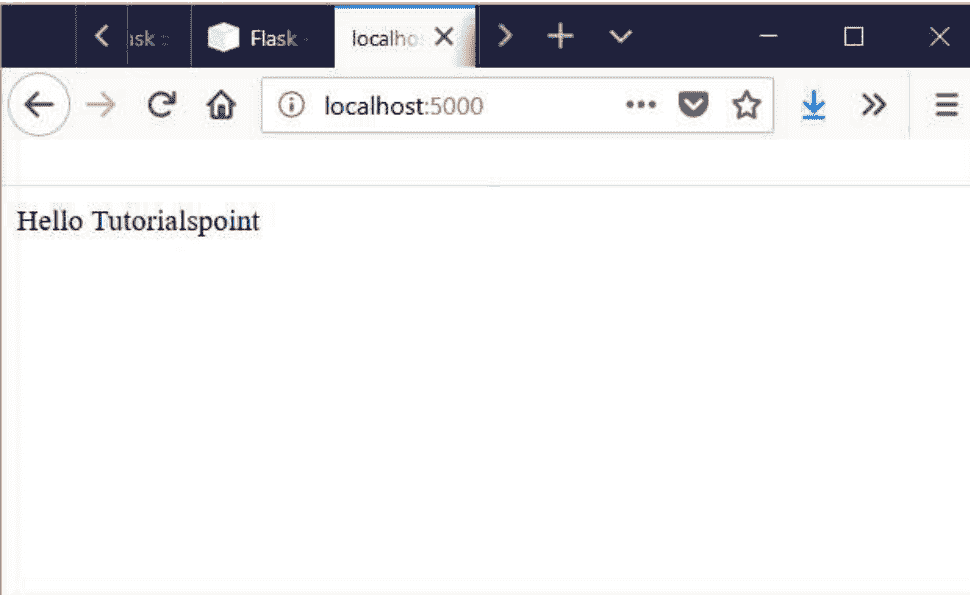

© 工程师 迈克尔·大卫

版权所有。未经作者许可或确认，不得以任何形式或方式（电子、机械、影印、录制或其他方式）复制、存储于检索系统或传播本作品的任何部分。

## 目录

- Python - 网络编程
    - Python - 网络编程简介
        - Socket 编程
        - 客户端编程
        - 构建 Web 服务器
        - 网页抓取
        - Web 框架
        - 获取地理位置
    - Python - 网络环境
        - 本地环境设置
        - 获取 Python
            - Windows 平台
            - Linux 平台
            - Mac OS
        - 设置 PATH
        - 在 Unix/Linux 上设置路径
        - 在 Windows 上设置路径
        - 运行 Python
            - 交互式解释器
            - 集成开发环境
    - Python - 互联网协议
    - Python - IP 地址
        - 验证 IPV4 地址
        - 验证 IPV6 地址
        - 检查 IP 地址类型
        - IP 地址比较
        - IP 地址算术
    - Python - DNS 查询
        - 查找 'A' 记录
        - 查找 CNAME 值
        - 查找 MX 记录
    - Python - 路由
        - Flask 中的路由
        - 使用 URL 变量
        - 重定向
    - Python - HTTP 请求
        - 请求行
        - 请求方法
        - 请求 URI
        - 使用 Python requests
    - Python - HTTP 响应
        - 消息状态行
        - HTTP 版本
        - 状态码
        - 使用 Python Requests
    - Python - HTTP 头
        - 头信息示例
            - Cache-Control
            - Connection
            - Date
            - Transfer-Encoding
            - Upgrade
            - Via
            - Warning
        - 示例
    - Python - 自定义 HTTP 请求
        - 示例
        - 使用查询的 URL
    - Python - 请求状态码
        - 状态码
        - 成功响应
        - 不成功响应
    - Python - HTTP 认证

##### 安装 Requests
- 向 Github 进行身份验证
- 向 Twitter 进行身份验证
- Python - HTTP 数据下载
  - 获取文件
  - 读取数据
- Python - 连接重用
- Python - 网络接口
  - 示例
- Python - 套接字编程
  - socket 模块
  - 服务器套接字方法
  - 客户端套接字方法
  - 通用套接字方法
  - 一个简单的服务器
  - 一个简单的客户端
  - 使用公共 URL 的套接字
- Python - HTTP 客户端
  - 获取初始响应
  - 获取会话对象响应
  - 处理错误
- Python - HTTP 服务器
  - 为本地主机提供服务
- Python - 构建 URL
  - Build_URL
  - 拆分 URL
- Python - Web 表单提交
  - 示例
- Python - 数据库与 SQL
  - 连接到数据库
  - 创建表
  - 插入操作
  - 查询操作
  - 更新操作
  - 删除操作
- Python - Telnet
  - 示例
- Python - 电子邮件消息
  - 电子邮件地址
    - 示例
- Python - SMTP
  - 示例
  - 使用 Python 发送 HTML 电子邮件
    - 示例
- Python - POP3
  - POP 命令
- Python - IMAP
  - IMAP 命令
    - 示例
- Python - SSH
  - 示例
- Python - FTP
  - FTP 类中的方法
  - 列出文件
  - 更改目录
  - 获取文件
- Python - SFTP
  - 示例
- Python - Web 服务器
  - Gunicorn
    - 重要特性
  - CherryPy WSGI 服务器
    - 重要特性
  - Twisted Web

## Python - 网络编程

Python 网络编程是指使用 Python 作为编程语言来处理计算机网络需求。例如，如果我们想要创建并运行一个本地 Web 服务器，或者从具有特定模式的 URL 自动下载一些文件。

本书面向计算机科学专业的毕业生以及软件专业人士，旨在帮助他们使用 Python 作为编程语言，通过简单易学的步骤掌握网络编程。

在开始学习本书之前，您应该具备使用 Python 编程语言编写代码、使用任何 Python IDE 以及执行 Python 程序的基础知识。如果您是 Python 的完全新手，请参考我们的 Python 书籍，以获得对该语言的扎实理解。

### Python - 网络编程简介

随着 Python 作为编程语言的多功能性逐年增长，我们发现 Python 在网络编程领域也非常适用。随着云计算的发展，网络编程已成为一个更热门的话题，而 Python 在其中扮演着重要角色。以下是 Python 被首选为网络编程语言的一些重要原因。

#### Socket 编程

Socket 是客户端和服务器相互通信的链接。例如，当打开浏览器时，会自动创建一个 Socket 来连接服务器。Python 有一个 socket 模块，可用于实现各种 Socket 功能，如绑定地址或启动监听端口。Socket 编程是计算机网络的基础，Python 能很好地处理它。

#### 客户端编程

客户端是请求信息并等待响应的计算机。可以编写 Python 程序来验证许多客户端操作，例如解析 URL、在提交请求时随 URL 发送参数、如果访问某个 URL 失败则连接到备用 URL 等。这些程序在客户端程序中运行，即使不使用浏览器也能处理与服务器的所有通信需求。例如，您可以向 Python 程序提供一个 URL 来下载文件，程序本身无需借助浏览器程序即可完成下载。

#### 构建 Web 服务器

使用 Python 作为编程语言，可以创建足以运行网站的简单 Web 服务器。Python 已经内置了一些 Web 服务器，可以通过调整来实现所需的额外功能。

**SimpleHTTPServer** 模块开箱即用地提供了 Web 服务器的功能，您可以从本地 Python 安装中启动它。在 Python 3 中，它被命名为 **http.server**。**CherryPy** 和 **Tornado** 是用 Python 编写的 Web 服务器示例，它们的运行性能与 Apache 或 Ngnix 等非 Python 知名 Web 服务器一样好。

#### Web 抓取

Python 变得著名的一个重要原因是在用于抓取网络的语言中占据主导地位。其数据结构和网络访问能力使其非常适合访问网页并自动下载其数据。如果目标网站提供了某些 API 连接，Python 将通过其程序结构更轻松地处理它。

#### Web 框架

Web 框架通过提供预定义的结构和模块化，使应用程序开发变得简单快捷。开发人员只需编写最少的代码即可利用这些现有库，并进行少量定制以实现目标。**Django** 和 **Flask** 是两个著名的框架，尽管它们是开源的，但已被广泛用于商业用途。

#### 获取地理位置

Python 有处理地理数据的库。如果已知经纬度，它可以找到商业地址的名称，反之亦然。当然，它需要借助其他地图提供商的数据，如谷歌地图。Python 的网络能力确实延伸到了不同的地理边界！

### Python - 网络环境

Python 3 可用于 Windows、Mac OS 和大多数 Linux 操作系统版本。尽管 Python 2 可用于许多其他操作系统，但 Python 3 的支持要么尚未提供，要么已被放弃。

#### 本地环境设置

打开终端窗口并输入 "python" 以检查是否已安装以及安装了哪个版本。

##### 获取 Python

###### Windows 平台

最新版本的 Python 3（Python 3.5.1）的二进制文件可在[此下载页面](this download page)获取。

以下提供不同的安装选项。

- Windows x86-64 可嵌入的 zip 文件
- Windows x86-64 可执行安装程序
- Windows x86-64 基于 Web 的安装程序
- Windows x86 可嵌入的 zip 文件
- Windows x86 可执行安装程序
- Windows x86 基于 Web 的安装程序

**注意** – 要安装 Python 3.5.1，最低操作系统要求是带有 SP1 的 Windows 7。对于 3.0 到 3.4.x 版本，Windows XP 是可接受的。

###### Linux 平台

不同版本的 Linux 使用不同的包管理器来安装新软件包。

在 Ubuntu Linux 上，使用以下终端命令安装 Python 3。

```
$sudo apt-get install python3-minimal
```

从源代码安装

从Python的下载网址下载Gzipped源码压缩包 – https://www.python.org/ftp/python/3.5.1/Python-3.5.1.tgz

```
解压压缩包
tar xvfz Python-3.5.1.tgz
配置并安装：
cd Python-3.5.1
./configure --prefix = /opt/python3.5.1
make
sudo make install
```

##### Mac OS

从以下网址下载Mac OS安装程序 – https://www.python.org/downloads/mac-osx/

- Mac OS X 64位/32位安装程序 – python-3.5.1-macosx10.6.pkg
- Mac OS X 32位 i386/PPC安装程序 – python-3.5.1-macosx10.5.pkg

双击此软件包文件，按照向导说明进行安装。

最新的源代码、二进制文件、文档、新闻等，可在Python官方网站获取 –

Python官方网站 – https://www.python.org/

您可以从以下网站下载Python文档。文档提供HTML、PDF和PostScript格式。

Python文档网站 – www.python.org/doc/

##### 设置PATH

程序和其他可执行文件可能位于多个目录中。因此，操作系统提供了一个搜索路径，列出了它搜索可执行文件的目录。

重要特性是 –

- 路径存储在一个环境变量中，这是一个由操作系统维护的命名字符串。此变量包含命令shell和其他程序可用的信息。
- 路径变量在Unix中命名为**PATH**，在Windows中命名为**Path**（Unix区分大小写；Windows不区分）。
- 在Mac OS中，安装程序会处理路径细节。要从任何特定目录调用Python解释器，必须将Python目录添加到您的路径中。

###### 在Unix/Linux中设置路径

要在Unix中为特定会话将Python目录添加到路径 –

- **在csh shell中** – 输入 setenv PATH "$PATH:/usr/local/bin/python3" 并按回车键。
- **在bash shell (Linux)中** – 输入 export PYTHONPATH=/usr/local/bin/python3.4 并按回车键。
- **在sh或ksh shell中** – 输入 PATH="$PATH:/usr/local/bin/python3" 并按回车键。

**注意** – /usr/local/bin/python3 是Python目录的路径。

###### 在Windows中设置路径

要在Windows中为特定会话将Python目录添加到路径 –

- **在命令提示符下** – 输入 path %path%;C:\Python 并按回车键。

**注意** – C:\Python 是Python目录的路径

##### 运行Python

有三种不同的方式启动Python –

##### 交互式解释器

您可以从Unix、DOS或任何其他提供命令行解释器或shell窗口的系统启动Python。

在命令行输入 **python**。

在交互式解释器中立即开始编码。

```
$python            # Unix/Linux

或
python%             # Unix/Linux
或
C:>python           # Windows/DOS
```

##### 集成开发环境

如果您的系统上有支持Python的图形用户界面（GUI）应用程序，您也可以从GUI环境运行Python。

- **Unix** – IDLE是第一个用于Python的Unix IDE。
- **Windows** – **PythonWin**是第一个用于Python的Windows界面，是一个带有GUI的IDE。
- **Macintosh** – Macintosh版本的Python及其IDLE IDE可从主网站获取，可下载为MacBinary或BinHex'd文件。

如果您无法正确设置环境，可以寻求系统管理员的帮助。确保Python环境正确设置并完美运行。

**注意** – 后续章节中给出的所有示例均使用Windows 7和Ubuntu Linux上可用的Python 3.4.1版本执行。

我们已经在线设置了Python编程环境，因此您可以在学习理论的同时在线执行所有可用示例。随意修改任何示例并执行它。

### Python - 互联网协议

互联网协议旨在在所有连接到互联网的计算机上实现统一的地址系统，并使数据包能够从互联网的一端传输到另一端。

像Web浏览器这样的程序应该能够连接到任何地方的主机，而无需知道每个数据包在其旅程中穿越的网络设备迷宫。互联网协议有多种类别。这些协议是为了满足互联网中不同计算机之间不同类型数据通信的需求而创建的。

Python有几个模块来处理每种通信场景。这些模块中的方法和函数可以完成最简单的任务，如验证URL，也可以完成处理cookie和会话等复杂任务。在本章中，我们将介绍用于互联网协议的最著名的Python模块。

| 协议 | Python模块名称 | 描述 |
| :--- | :--- | :--- |
| HTTP | urllib.request | 打开HTTP URL |
| HTTP | urllib.response | 为url请求创建响应对象 |
| HTTP | urllib.parse | 将统一资源定位符（URL）字符串分解为组件，如（寻址方案、网络位置、路径等）， |
| HTTP | urllib.robotparser | 它查找特定用户代理是否可以获取发布robots.txt文件的网站上的URL。 |
| FTP | Ftplib | 实现FTP协议的客户端。您可以使用它来编写执行各种自动化FTP任务的Python程序，例如镜像其他FTP服务器。 |
| POP | Poplib | 此模块定义了一个类POP3，它封装了与POP3服务器的连接，用于从电子邮件服务器读取消息 |
| IMAP | Imaplib | 此模块定义了三个类：IMAP4、IMAP4_SSL和IMAP4_stream，它们封装了与IMAP4服务器的连接以读取电子邮件。 |
| SMTP | Smtplib | smtplib模块定义了一个SMTP客户端会话对象，可用于向任何具有SMTP监听守护程序的Internet机器发送邮件。 |
| Telnet | telnet | 此模块提供了一个Telnet类，该类实现了Telnet协议，用于通过telnet访问服务器。 |

它们中的每一个都将在后续章节中详细讨论。

#### Python - IP地址

IP地址（互联网协议）是一个基本的网络概念，提供网络中的地址分配能力。Python模块**ipaddress**被广泛用于验证和分类IP地址为IPV4和IPV6类型。它也可用于比较IP地址值以及进行IP地址算术运算以操作IP地址。

##### 验证IPV4地址

ip_address函数验证IPV4地址。如果值的范围超出0到255，则会抛出错误。

```
print (ipaddress.ip_address(u'192.168.0.255'))
print (ipaddress.ip_address(u'192.168.0.256'))
```

当我们运行上述程序时，得到以下输出 –

```
192.168.0.255
ValueError: u'192.168.0.256' does not appear to be an IPv4 or IPv6 address
```

##### 验证IPV6地址

ip_address函数验证IPV6地址。如果值的范围超出0到ffff，则会抛出错误。

```
print (ipaddress.ip_address(u'FFFF:9999:2:FDE:257:0:2FAE:112D'))

#无效的IPV6地址
print (ipaddress.ip_address(u'FFFF:10000:2:FDE:257:0:2FAE:112D'))
```

当我们运行上述程序时，得到以下输出 –

```
ffff:9999:2:fde:257:0:2fae:112d
ValueError: u'FFFF:10000:2:FDE:257:0:2FAE:112D' does not appear to be an IPv4 or IPv6 address
```

##### 检查IP地址的类型

我们可以提供各种格式的IP地址，模块将能够识别有效格式。它还将指示它属于哪个类别的IP地址。

```
print type(ipaddress.ip_address(u'192.168.0.255'))
print type(ipaddress.ip_address(u'2001:db8::'))
print ipaddress.ip_address(u'192.168.0.255').reverse_pointer
print ipaddress.ip_network(u'192.168.0.0/28')
```

当我们运行上述程序时，得到以下输出 –

```
255.0.168.192.in-addr.arpa
192.168.0.0/28
```

##### IP地址比较

我们可以对IP地址进行逻辑比较，找出它们是否相等。我们还可以比较一个IP地址的值是否大于另一个。

```
print (ipaddress.IPv4Address(u'192.168.0.2') > ipaddress.IPv4Address(u'192.168.0.1'))
print (ipaddress.IPv4Address(u'192.168.0.2') == ipaddress.IPv4Address(u'192.168.0.1'))
print (ipaddress.IPv4Address(u'192.168.0.2') != ipaddress.IPv4Address(u'192.168.0.1'))
```

当我们运行上述程序时，得到以下输出 –

```
True
False
True
```

##### IP地址算术运算

我们还可以应用算术运算来操作IP地址。我们可以向IP地址添加或减去整数。如果相加后最后一个八位字节的值超过255，则前一个八位字节会递增以容纳该值。如果额外的值无法被任何前一个八位字节吸收，则会引发值错误。

```
print (ipaddress.IPv4Address(u'192.168.0.2')+1)
print (ipaddress.IPv4Address(u'192.168.0.253')-3)
##### 将前一个八位字节的值增加1。
print (ipaddress.IPv4Address(u'192.168.10.253')+3)
```

##### 抛出值错误

```python
print (ipaddress.IPv4Address(u'255.255.255.255')+1)
```

当我们运行上述程序时，会得到以下输出 –

```
192.168.0.3
192.168.0.250
192.168.11.0
AddressValueError: 4294967296 (>= 2**32) is not permitted as an IPv4 address
```

#### Python - DNS 查询

IP 地址被转换为人类可读的格式或单词后，就被称为域名。域名到 IP 地址的转换由 Python 模块 **dnspython** 管理。该模块还提供了查找 CNAME 和 MX 记录的方法。

##### 查找 'A' 记录

在下面的程序中，我们使用 dns.resolver 方法查找域名的 IP 地址。通常，IP 地址和域名之间的这种映射也被称为 'A' 记录。

```python
import dnspython as dns
import dns.resolver

result = dns.resolver.query('tutorialspoint.com', 'A')
for ipval in result:
    print('IP', ipval.to_text())
```

当我们运行上述程序时，会得到以下输出 –

```
('IP', u'94.130.81.180')
```

##### 查找 CNAME 值

CNAME 记录，也称为规范名称记录，是域名系统中的一种记录类型，用于将域名映射为另一个域名的别名。CNAME 记录始终指向另一个域名，而从不直接指向 IP 地址。在下面的查询方法中，我们指定 CNAME 参数来获取 CNAME 值。

```python
import dnspython as dns
import dns.resolver
result = dns.resolver.query('mail.google.com', 'CNAME')
for cnameval in result:
    print ' cname target address:', cnameval.target
```

当我们运行上述程序时，会得到以下输出 –

```
cname target address: googlemail.l.google.com.
```

##### 查找 MX 记录

MX 记录，也称为邮件交换器记录，是域名系统中的一种资源记录，它指定负责代表收件人域名接受电子邮件的邮件服务器。它还设置了优先级值，用于在多个邮件服务器可用时确定邮件投递的优先顺序。与上面的程序类似，我们可以在查询方法中使用 'MX' 参数来查找 MX 记录的值。

```python
result = dns.resolver.query('mail.google.com', 'MX')
for exdata in result:
    print ' MX Record:', exdata.exchange.text()
```

当我们运行上述程序时，会得到以下输出 -

```
MX Record:    ASPMX.L.GOOGLE.COM.
MX Record:    ALT1.ASPMX.L.GOOGLE.COM.
MX Record:    ALT2.ASPMX.L.GOOGLE.COM.
```

以上是示例输出，并非确切输出。

#### Python - 路由

路由是将 URL 直接映射到创建网页的代码的机制。它有助于更好地管理网页结构，并显著提高网站性能，使后续的增强或修改变得非常直接。在 Python 中，大多数 Web 框架都实现了路由。本章我们将看到 **flask** Web 框架的示例。

##### Flask 中的路由

Flask 中的 **route()** 装饰器用于将 URL 绑定到一个函数。因此，当在浏览器中输入该 URL 时，就会执行该函数以给出结果。这里，URL '/hello' 规则被绑定到 **hello_world()** 函数。因此，如果用户访问 **http://localhost:5000/** URL，**hello_world()** 函数的输出将呈现在浏览器中。

```python
from flask import Flask
app = Flask(__name__)

@app.route('/')
def hello_world():
    return 'Hello Tutorialspoint'

if __name__ == '__main__':
    app.run()
```

当我们运行上述程序时，会得到以下输出 –

```
* Serving Flask app "flask_route" (lazy loading)
* Environment: production
  WARNING: Do not use the development server in a production environment.
  Use a production WSGI server instead.
* Debug mode: off
* Running on http://127.0.0.1:5000/ (Press CTRL+C to quit)
127.0.0.1 - - [06/Aug/2018 08:48:45] "GET / HTTP/1.1" 200 -
127.0.0.1 - - [06/Aug/2018 08:48:46] "GET /favicon.ico HTTP/1.1" 404 -
127.0.0.1 - - [06/Aug/2018 08:48:46] "GET /favicon.ico HTTP/1.1" 404 -
```

我们打开浏览器并指向 URL **http://localhost:5000/** 以查看函数执行的结果。



##### 使用 URL 变量

我们可以使用路由传递 URL 变量来动态构建 URL。为此，我们使用 url_for() 函数，该函数接受函数名作为第一个参数，其余参数作为 URL 规则的可变部分。

在下面的示例中，我们将函数名作为参数传递给 url_for 函数，并在执行这些行时打印出结果。

```python
from flask import Flask, url_for
app = Flask(__name__)

@app.route('/')
def index(): pass

@app.route('/login')
def login(): pass

@app.route('/user/')
def profile(username): pass

with app.test_request_context():
    print url_for('index')
    print url_for('index', _external=True)
    print url_for('login')
    print url_for('login', next='/')
    print url_for('profile', username='Tutorials Point')
```

当我们运行上述程序时，会得到以下输出 –

```
/
http://localhost/
/login
/login?next=%2F
/user/Tutorials%20Point
```

##### 重定向

我们可以使用重定向函数通过路由将用户重定向到另一个 URL。我们将新 URL 作为应重定向用户的函数的返回值。当我们暂时将用户引导到另一个页面（例如在修改现有网页时），这非常有用。

```python
from flask import Flask, abort, redirect, url_for
app = Flask(__name__)

@app.route('/')
def index():
    return redirect(url_for('login'))

@app.route('/login')
def login():
    abort(401)
##### this_is_never_executed()
```

当执行上述代码时，基础 URL 会转到登录页面，该页面使用 abort 函数，因此登录页面的代码永远不会被执行。

#### Python - HTTP 请求

HTTP 或超文本传输协议基于客户端-服务器模型工作。通常，Web 浏览器是客户端，托管网站的计算机是服务器。在 Python 中，我们使用 requests 模块来创建 HTTP 请求。这是一个非常强大的模块，可以处理 HTTP 通信的许多方面，而不仅仅是简单的请求和响应数据。它可以处理身份验证、压缩/解压缩、分块请求等。

HTTP 客户端以请求消息的形式向服务器发送 HTTP 请求，该消息包含以下格式：

- 一个请求行
- 零个或多个头部字段（通用|请求|实体），后跟 CRLF
- 一个空行（即 CRLF 前没有任何内容的行），表示头部字段结束
- 可选的消息体

以下各节解释了 HTTP 请求消息中使用的每个实体。

##### 请求行

请求行以方法标记开始，后跟请求 URI 和协议版本，最后以 CRLF 结束。各元素之间用空格 SP 字符分隔。

```
Request-Line = Method SP Request-URI SP HTTP-Version CRLF
``

让我们讨论请求行中提到的每个部分。

##### 请求方法

请求 **方法** 指示要在给定 **请求 URI** 标识的资源上执行的方法。该方法区分大小写，并且应始终以大写形式提及。下表列出了 HTTP/1.1 中支持的所有方法。

| 序号 | 方法和描述 |
| :--- | :--- |
| 1 | **GET**<br>GET 方法用于使用给定的 URI 从给定服务器检索信息。使用 GET 的请求应该只检索数据，而不应对数据产生其他影响。 |
| 2 | **HEAD**<br>与 GET 相同，但只传输状态行和头部部分。 |
| 3 | **POST**<br>POST 请求用于向服务器发送数据，例如，使用 HTML 表单发送客户信息、文件上传等。 |
| 4 | **PUT**<br>用上传的内容替换目标资源的所有当前表示。 |
| 5 | **DELETE**<br>删除 URI 给出的目标资源的所有当前表示。 |
| 6 | **CONNECT**<br>建立到由给定 URI 标识的服务器的隧道。 |
| 7 | **OPTIONS**<br>描述目标资源的通信选项。 |

##### 请求URI

请求URI是一个统一资源标识符，用于标识要应用请求的资源。以下是用于指定URI的最常用形式：

```
Request-URI = "*" | absoluteURI | abs_path | authority
```

| 序号 | 方法与描述 |
|---|---|
| 1 | 星号 * 用于HTTP请求不适用于特定资源，而适用于服务器本身的情况，并且仅在所用方法不一定适用于资源时才允许使用。例如：**OPTIONS * HTTP/1.1** |
| 2 | **绝对URI** 用于向代理发出HTTP请求时。代理被要求转发请求或从有效缓存中提供服务，并返回响应。例如：**GET http://www.w3.org/pub/WWW/TheProject.html HTTP/1.1** |
| 3 | 请求URI最常见的形式是用于标识源服务器或网关上的资源。例如，希望直接从源服务器检索资源的客户端将创建到主机"www.w3.org"端口80的TCP连接，并发送以下行：**GET /pub/WWW/TheProject.html HTTP/1.1** **Host: www.w3.org** |

> 请注意，绝对路径不能为空；如果原始URI中没有，则必须将其指定为"/"（服务器根目录）。

##### 使用Python requests

我们将使用requests模块来学习HTTP请求。

```
pip install requests
```

在下面的示例中，我们看到一个简单的GET请求案例，并打印出响应结果。我们选择只打印前300个字符。

```
##### 如何发出HTTP请求
import requests as req
r = req.get('http://www.tutorialspoint.com/python/')
print(r.text)[0:300]
```

当我们运行上述程序时，会得到以下输出 –

```
<!DOCTYPE html>
<!--[if IE 8]><html class="ie ie8"> <![endif]-->
<!--[if IE 9]><html class="ie ie9"> <![endif]-->
<!--[if gt IE 9]><!-->      <html> <!--<![endif]-->
<head>
<!-- Basic -->
<meta charset="utf-8">
<title>Python Tutorial</title>
<meta name="description" content="Python Tutorial
```

#### Python - HTTP响应

HTTP或超文本传输协议基于客户端-服务器模型工作。通常，Web浏览器是客户端，托管网站的计算机是服务器。服务器在收到客户端的请求后，会生成响应并以特定格式发送回客户端。

服务器在接收并解释请求消息后，会用HTTP响应消息进行响应：

- 一个状态行
- 零个或多个头部字段（通用|响应|实体），后跟CRLF
- 一个空行（即，CRLF前没有任何内容的行）
- 表示头部字段的结束
- 可选的消息体

以下各节解释HTTP响应消息中使用的每个实体。

##### 消息状态行

状态行由协议版本、数字状态代码及其相关的文本短语组成。各元素之间用空格SP字符分隔。

```
Status-Line = HTTP-Version SP Status-Code SP Reason-Phrase CRLF
```

##### HTTP版本

支持HTTP 1.1版本的服务器将返回以下版本信息：

```
HTTP-Version = HTTP/1.1
```

##### 状态代码

状态代码元素是一个3位整数，其中状态代码的第一位定义了响应的类别，最后两位没有分类作用。第一位有5个值：

| 序号 | 代码与描述 |
|---|---|
| 1 | **1xx: 信息性**<br>表示请求已收到，处理正在进行中。 |
| 2 | **2xx: 成功**<br>表示操作已成功接收、理解和接受。 |
| 3 | **3xx: 重定向**<br>表示必须采取进一步操作才能完成请求。 |
| 4 | **4xx: 客户端错误**<br>表示请求包含错误的语法或无法被满足。 |
| 5 | **5xx: 服务器错误**<br>表示服务器未能满足一个明显有效的请求。 |

HTTP状态代码是可扩展的，HTTP应用程序不需要理解所有已注册状态代码的含义。

##### 使用Python Requests

在下面的Python程序中，我们使用urllib3模块发出HTTP GET请求并接收包含数据的响应。它还提供响应代码，该代码也由模块中的函数管理。PoolManager对象处理连接池的所有细节，并处理线程安全。

```
import urllib3
http = urllib3.PoolManager()

resp = http.request('GET', 'http://tutorialspoint.com/robots.txt')
print resp.data

##### 获取响应状态
print resp.status
```

当我们运行上述程序时，会得到以下输出 –

```
User-agent: *
Disallow: /tmp
Disallow: /logs
Disallow: /rate/*
Disallow: /cgi-bin/*
Disallow: /videotutorials/video_course_view.php?*
Disallow: /videotutorials/course_view.php?*
Disallow: /videos/*
Disallow: /*/*_question_bank/*
Disallow: ///*/*/*/*/src/*

200
```

#### Python - HTTP头部

客户端和服务器之间的请求和响应涉及消息中的头部和正文。头部包含特定于协议的信息，这些信息出现在通过TCP连接发送的原始消息的开头。消息的正文与头部之间用空行分隔。

##### 头部示例

HTTP响应中的头部可以分为以下类型。下面是头部的描述和示例。

##### Cache-Control

Cache-Control通用头部字段用于指定所有缓存系统必须遵守的指令。语法如下：

```
Cache-Control : cache-request-directive|cache-response-directive
```

HTTP客户端或服务器可以使用**Cache-control**通用头部来指定缓存的参数或从缓存请求某些类型的文档。缓存指令在逗号分隔的列表中指定。例如：

```
Cache-control: no-cache
```

##### Connection

Connection通用头部字段允许发送者指定该特定连接所需的选项，并且不得通过代理在进一步的连接中传播。以下是使用连接头部的简单语法：

```
Connection : "Connection"
```

HTTP/1.1定义了"close"连接选项，用于发送者表示连接将在响应完成后关闭。例如：

```
Connection: close
```

默认情况下，HTTP 1.1使用持久连接，连接在事务完成后不会自动关闭。另一方面，HTTP 1.0默认不支持持久连接。如果1.0客户端希望使用持久连接，它使用**keep-alive**参数，如下所示：

```
Connection: keep-alive
```

##### Date

所有HTTP日期/时间戳必须以格林威治标准时间（GMT）表示，无一例外。HTTP应用程序可以使用以下三种日期/时间戳表示法中的任何一种：

```
Sun, 06 Nov 1994 08:49:37 GMT ; RFC 822, updated by RFC 1123
Sunday, 06-Nov-94 08:49:37 GMT ; RFC 850, obsoleted by RFC 1036
Sun Nov 6 08:49:37 1994 ; ANSI C's asctime() format
```

##### Transfer-Encoding

*Transfer-Encoding*通用头部字段指示为了在发送者和接收者之间安全传输，对消息体应用了何种类型的转换。这与内容编码不同，因为传输编码是消息的属性，而不是实体正文的属性。Transfer-Encoding头部字段的语法如下：

```
Transfer-Encoding: chunked
```

所有传输编码值都不区分大小写。

##### Upgrade

*Upgrade*通用头部允许客户端指定它支持哪些额外的通信协议，以及如果服务器认为切换协议合适，它希望使用哪些协议。例如：

```
Upgrade: HTTP/2.0, SHTTP/1.3, IRC/6.9, RTA/x11
```

Upgrade头部字段旨在提供一个简单的机制，用于从HTTP/1.1过渡到其他不兼容的协议。

##### Via

*Via*通用头部必须由网关和代理使用，以指示中间协议和接收者。例如，请求消息可以从HTTP/1.0用户

##### 警告

*警告*通用头部用于携带关于消息状态或转换的附加信息，这些信息可能未在消息中体现。一个响应可以携带多个警告头部。

```
Warning : warn-code SP warn-agent SP warn-text SP warn-date
```

#### 示例

在下面的示例中，我们使用 urllib2 模块通过 urlopen 获取响应。接着，我们应用 info() 方法来获取该响应的头部信息。

```python
import urllib2
response = urllib2.urlopen('http://www.tutorialspoint.com/python')
html = response.info()
print html
```

当我们运行上述程序时，会得到以下输出 –

```
Access-Control-Allow-Headers: X-Requested-With
Access-Control-Allow-Origin: *
Cache-Control: max-age=2592000
Content-Type: text/html; charset=UTF-8
Date: Mon, 02 Jul 2018 11:06:07 GMT
Expires: Wed, 01 Aug 2018 11:06:07 GMT
Last-Modified: Sun, 01 Jul 2018 21:05:38 GMT
Server: ECS (tir/CDD1)
Vary: Accept-Encoding
X-Cache: HIT
Content-Length: 22063
Connection: close
```

#### Python - 自定义 HTTP 请求

超文本传输协议（HTTP）是一种用于实现客户端和服务器之间通信的协议。它在客户端和服务器之间以请求-响应协议的方式工作。发起请求的设备称为客户端，发送响应的设备称为服务器。

urllib 是传统的 Python 库，用于在 Python 程序中处理 HTTP 请求。但现在有了 urllib3，它比 urllib 原有的功能更强大。我们导入 urllib3 库，看看 Python 如何使用它来发起 HTTP 请求并接收响应。我们可以通过选择请求方法来定制请求类型。

```
pip install urllib3
```

#### 示例

在下面的示例中，我们使用 `PoolManager()` 对象，它负责处理 HTTP 请求的连接细节。接着，我们使用 `request()` 对象以 POST 方法发起 HTTP 请求。最后，我们还使用 json 库以 JSON 格式打印接收到的值。

```python
import urllib3
import json

http = urllib3.PoolManager()
r = http.request(
    'POST',
    'http://httpbin.org/post',
    fields={'field': 'value'})
print json.loads(r.data.decode('utf-8'))['form']
```

当我们运行上述程序时，会得到以下输出 –

```
{field': value'}
```

##### 使用查询参数的 URL

我们也可以传递查询参数来构建自定义 URL。在下面的示例中，请求方法使用查询字符串中的值来完成 URL，该 URL 可以被 Python 程序中的另一个函数进一步使用。

```python
import requests

query = {'q': 'river', 'order': 'popular', 'min_width': '800',
'min_height': '600'}
req = requests.get('https://pixabay.com/en/photos/', params=query)

print(req.url)
```

当我们运行上述程序时，会得到以下输出 –

```
https://pixabay.com/en/photos/?q=river&min_width=800&min_height=600
&order=popular
```

#### Python - 请求状态码

服务器在接收并解释请求消息后，会用 HTTP 响应消息进行回复。响应消息包含一个状态码。它是一个三位整数，其中状态码的第一位数字定义了响应的类别，最后两位数字没有分类作用。第一位数字有 5 个值：

##### 状态码

| 序号 | 代码与描述 |
|---|---|
| 1 | **1xx: 信息性**<br>表示请求已接收，处理正在进行中。 |
| 2 | **2xx: 成功**<br>表示操作已被成功接收、理解和接受。 |
| 3 | **3xx: 重定向**<br>表示必须采取进一步操作才能完成请求。 |
| 4 | **4xx: 客户端错误**<br>表示请求包含错误的语法或无法被满足。 |
| 5 | **5xx: 服务器错误**<br>表示服务器未能满足一个显然有效的请求。 |

##### 成功响应

在下面的示例中，我们从一个 URL 访问一个文件，响应是成功的。因此返回的状态码是 200。

```python
import urllib3
http = urllib3.PoolManager()

resp = http.request('GET', 'http://tutorialspoint.com/robots.txt')
print resp.data

##### 获取响应状态
print resp.status
```

当我们运行上述程序时，会得到以下输出 –

```
User-agent: *
Disallow: /tmp
Disallow: /logs
Disallow: /rate/*
Disallow: /cgi-bin/*
Disallow: /videotutorials/video_course_view.php?*
Disallow: /videotutorials/course_view.php?*
Disallow: /videos/*
Disallow: /*/*_question_bank/*
Disallow: //*/ */ */ */src/*

200
```

##### 不成功响应

在下面的示例中，我们从一个不存在的 URL 访问一个文件。响应不成功。因此返回的状态码是 403。

```python
import urllib3
http = urllib3.PoolManager()

resp = http.request('GET', 'http://tutorialspoint.com/robot.txt')
print resp.data

##### 获取响应状态
print resp.status
```

当我们运行上述程序时，会得到以下输出 –

```
<!DOCTYPE HTML PUBLIC "-//IETF//DTD HTML 2.0//EN">
<html><head>
<title>403 Forbidden</title>
</head><body>
<h1>Forbidden</h1>
<p>You don't have permission to access /robot.txt
on this server.</p>
</body></html>
```

```
403
```

#### Python - HTTP 认证

认证是确定请求是否来自有权使用系统的合法用户的过程。在计算机网络世界中，这是一个非常关键的要求，因为许多系统需要相互交互，必须有适当的机制来确保这些程序之间只发生有效的交互。

Python 模块 **requests** 具有内置功能，可以调用服务 Web 应用提供的各种 API，并附带用户凭证。这些凭证必须嵌入到调用程序中。如果 API 成功验证，则发生有效登录。

##### 安装 Requests

我们安装名为 requests 的所需 Python 模块来运行认证程序。

```
pip install requests
```

##### 认证到 Github

下面我们看到一个仅涉及用户名和密码的简单认证机制。成功的响应表示有效登录。

```python
import requests
r = requests.get('https://api.github.com/user', auth=('user', 'pass'))
print r
```

当我们运行上述程序时，会得到以下输出 –

##### 认证到 Twitter

我们也可以运行一个程序来使用 Twitter 的 API，并通过使用以下代码实现成功登录。我们使用 requests 模块中可用的 OAuth1 方法来处理 Twitter API 所需的参数。正如我们所看到的，requests 模块能够处理涉及密钥和令牌的更复杂的认证机制，而不仅仅是用户名和密码机制。

```python
import requests
from requests_oauthlib import OAuth1

url = 'https://api.twitter.com/1.1/account/verify_credentials.json'
auth = OAuth1('YOUR_APP_KEY', 'YOUR_APP_SECRET',
              'USER_OAUTH_TOKEN', 'USER_OAUTH_TOKEN_SECRET')

requests.get(url, auth=auth)
```

当我们运行上述程序时，会得到以下输出 –

```
{
    "errors": [
        {
            "code": 215,
            "message": "Bad Authentication data."
        }
    ]
}
```

但是，使用 OAuth1 参数的正确值，你会得到成功的响应。

#### Python - HTTP 数据下载

我们可以使用处理 FTP 或文件传输协议的 Python 模块从服务器下载数据。我们也可以读取数据，然后将其保存到本地系统。

我们需要安装模块 **ftplib** 来实现这一点。

```
pip install ftplib
```

#### 获取文件

我们可以使用 **getfile** 方法获取特定文件。此方法将文件的副本从远程系统移动到发起 FTP 连接的本地系统。

```python
import ftplib
import sys

def getFile(ftp, filename):
    try:
        ftp.retrbinary("RETR " + filename ,open(filename, 'wb').write)
    except:
        print "Error"

ftp = ftplib.FTP("ftp.nluug.nl")
ftp.login("anonymous", "ftplib-example-1")

ftp.cwd('/pub/')           # 更改目录到 /pub/
getFile(ftp,'README.nluug')

ftp.quit()
```

当我们运行上述程序时，会发现文件 README.nluug 存在于发起连接的本地系统中。

##### 读取数据

在下面的示例中，我们使用 urllib2 模块读取所需部分的数据，我们可以将其复制并保存到本地系统。

当我们运行上述程序时，会得到以下输出 –

```python
import urllib2
response = urllib2.urlopen('http://www.tutorialspoint.com/python')
```

#### Python - 连接重用

当客户端向服务器发出有效请求时，它们之间会建立一个临时连接以完成发送和接收过程。但在某些场景下，由于通信程序之间需要自动化的请求和响应，连接需要保持活跃状态。以交互式网页为例，网页加载后，可能需要提交表单数据或下载额外的CSS和JavaScript组件。为了提升性能并保持客户端与服务器之间的通信不中断，连接需要保持活跃。

Python提供了**urllib3**模块，其中包含处理客户端与服务器之间连接重用的方法。在下面的示例中，我们创建一个连接，并通过GET请求传递不同的参数来发起多个请求。我们收到了多个响应，同时也统计了过程中使用的连接数量。可以看到，连接数量没有变化，这意味着连接被重用了。

```python
from urllib3 import HTTPConnectionPool

pool = HTTPConnectionPool('ajax.googleapis.com', maxsize=1)
r = pool.request('GET', '/ajax/services/search/web',
                 fields={'q': 'python', 'v': '1.0'})
print 'Response Status:', r.status

##### Header of the response
print 'Header: ',r.headers['content-type']

##### Content of the response
print 'Python: ',len(r.data)

r = pool.request('GET', '/ajax/services/search/web',
                 fields={'q': 'php', 'v': '1.0'})

##### Content of the response
print 'php: ',len(r.data)

print 'Number of Connections: ',pool.num_connections

print 'Number of requests: ',pool.num_requests
```

运行上述程序后，我们得到以下输出：

```
Response Status: 200
Header: text/javascript; charset=utf-8
Python: 211
php: 211
Number of Connections: 1
Number of requests: 2
```

### Python - 网络接口

当一台机器有多个网络接口时，我们需要跟踪它们的名称、状态等信息。在Python中，我们可以列出接口及其状态。

#### 示例

在下面的示例中，我们使用Python模块**netifaces**，它提供了接口及其状态的详细信息。所使用的方法非常简单直接。

```python
import netifaces

print (netifaces.interfaces())

print (netifaces.ifaddresses('lo'))

print (netifaces.AF_LINK)

addrs = netifaces.ifaddresses('ens33')
print(addrs[netifaces.AF_INET])

print(addrs[netifaces.AF_LINK])
```

运行上述程序后，我们得到以下输出：

```
['lo', 'ens33']
{17: [{'peer': '00:00:00:00:00:00', 'addr': '00:00:00:00:00:00'}],
2: [{'peer': '127.0.0.1', 'addr': '127.0.0.1', 'netmask':
'255.0.0.0'}], 10: [{'addr': '::1', 'netmask':
'ffff:ffff:ffff:ffff:ffff:ffff:ffff:ffff/128'}]}

17

[{'netmask': '255.255.255.0', 'addr': '192.168.232.128',
'broadcast': '192.168.232.255'}]
[{'addr': '00:0c:29:ea:13:0a', 'broadcast': 'ff:ff:ff:ff:ff:ff'}]
```

### Python - 套接字编程

Python为网络服务提供了两个级别的访问。在低级别，你可以访问底层操作系统中的基本套接字支持，这允许你为面向连接和无连接的协议实现客户端和服务器。

Python还提供了库，可以更高级别地访问特定的应用层网络协议，例如FTP、HTTP等。

套接字是双向通信通道的端点。套接字可以在进程内、同一机器上的不同进程之间，或不同大洲的进程之间进行通信。我们使用Python中的socket模块来创建和使用套接字。

套接字有其自身的术语：

| 序号 | 术语与描述 |
| :--- | :--- |
| 1 | **域**<br><br>用作传输机制的协议族。这些值是常量，如AF_INET、PF_INET、PF_UNIX、PF_X25等。 |
| 2 | **类型**<br><br>两个端点之间的通信类型，对于面向连接的协议通常是SOCK_STREAM，对于无连接的协议通常是SOCK_DGRAM。 |
| 3 | **协议**<br><br>通常为零，可用于标识域和类型内的协议变体。 |
| 4 | **主机名**<br><br>网络接口的标识符——<br><br>- 一个字符串，可以是主机名、点分十进制地址，或冒号（可能带点）表示法的IPv6地址<br>- 字符串"<broadcast>"，指定INADDR_BROADCAST地址。<br>- 零长度字符串，指定INADDR_ANY，或<br>- 一个整数，解释为主机字节序的二进制地址。 |
| 5 | **端口**<br><br>每个服务器监听一个或多个端口上的客户端调用。端口可以是Fixnum端口号、包含端口号的字符串，或服务名称。 |

#### socket模块

要创建套接字，必须使用`socket`模块中可用的`socket.socket()`函数，其通用语法为：

```python
s = socket.socket (socket_family, socket_type, protocol=0)
```

以下是参数的描述：

- **socket_family** – 这是AF_UNIX或AF_INET，如前所述。
- **socket_type** – 这是SOCK_STREAM或SOCK_DGRAM。
- **protocol** – 通常省略，默认为0。

一旦你有了`socket`对象，就可以使用所需的函数来创建你的客户端或服务器程序。

#### 服务器套接字方法

| 序号 | 方法与描述 |
|---|---|
| 1 | **s.bind()**<br><br>此方法将地址（主机名、端口号对）绑定到套接字。 |
| 2 | **s.listen()**<br><br>此方法设置并启动TCP监听器。 |
| 3 | **s.accept()**<br><br>此方法被动接受TCP客户端连接，等待连接到达（阻塞）。 |

#### 客户端套接字方法

| 序号 | 方法与描述 |
|---|---|
| 1 | **s.connect()**<br><br>此方法主动发起与TCP服务器的连接。 |

#### 通用套接字方法

| 序号 | 方法与描述 |
|---|---|
| 1 | **s.recv()**<br><br>此方法接收TCP消息。 |
| 2 | **s.send()**<br><br>此方法发送TCP消息。 |
| 3 | **s.recvfrom()**<br><br>此方法接收UDP消息。 |
| 4 | **s.sendto()**<br><br>此方法发送UDP消息。 |
| 5 | **s.close()**<br><br>此方法关闭套接字。 |
| 6 | **socket.gethostname()**<br><br>返回主机名。 |

#### 一个简单的服务器

要编写互联网服务器，我们使用socket模块中可用的**socket**函数来创建一个套接字对象。然后使用该套接字对象调用其他函数来设置套接字服务器。

现在调用**bind(hostname, port)**函数，为给定主机上的服务指定一个*端口*。

接下来，调用返回对象的*accept*方法。此方法会等待客户端连接到你指定的端口，然后返回一个表示与该客户端连接的*connection*对象。

```python
#!/usr/bin/python
import socket
s = socket.socket()
host = socket.gethostname() # Get local machine name
port = 12345                # Reserve a port for your service.
s.bind((host, port))        # Bind to the port

s.listen(5)                 # Now wait for client connection.
while True:
    c, addr = s.accept()    # Establish connection with client.
    print 'Got connection from', addr
    c.send('Thank you for connecting')
    c.close()               # Close the connection
```

#### 一个简单的客户端

让我们编写一个非常简单的客户端程序，它连接到给定主机和端口12345。使用Python的*socket*模块函数创建套接字客户端非常简单。

**socket.connect(hostname, port)**函数打开一个到*hostname*上*port*的TCP连接。一旦套接字打开，你就可以像读取任何IO对象一样从中读取数据。完成后，记得关闭它，就像关闭文件一样。

以下代码是一个非常简单的客户端，它连接到给定的主机和端口，从套接字读取任何可用数据，然后退出：

```python
#!/usr/bin/python           # This is client.py file

import socket               # Import socket module

s = socket.socket()         # Create a socket object
host = socket.gethostname() # Get local machine name
port = 12345                # Reserve a port for your service.

s.connect((host, port))
print s.recv(1024)
s.close                     # Close the socket when done
```

现在在后台运行这个server.py，然后运行上面的client.py来查看结果。

```
##### Following would start a server in background.
$ python server.py &

##### Once server is started run client as follows:
$ python client.py
```

这将产生以下结果：

```
Got connection from ('127.0.0.1', 48437)
Thank you for connecting
```

#### 具有公共URL的套接字

在下面的示例中，我们使用套接字模块中的几个方法来查找服务器的地址信息和主机名详情。

```python
import socket
from pprint import pprint

##### get server address
addrinfo = socket.getaddrinfo('tutorialspoint.com', 'www')

pprint(addrinfo)

##### get server hostname
print socket.gethostname()
```

当我们运行上述程序时，会得到以下输出 –

```
[(2, 1, 0, '', ('94.130.81.180', 80))]
DESKTOP-JXYKQCPLP
```

### Python - HTTP客户端

在HTTP协议中，来自客户端的请求到达服务器，并假设它是一个有效请求，然后获取一些数据和元数据。我们可以使用Python requests模块中提供的各种函数来分析来自服务器的响应。下面的Python程序在客户端运行，并显示服务器发送的响应结果。

#### 获取初始响应

在下面的程序中，requests模块中的get方法从服务器获取数据，并以纯文本格式打印出来。

```python
import requests
r = requests.get('https://httpbin.org/')
print(r.text)[:200]
```

当我们运行上述程序时，会得到以下输出 –

```
<!DOCTYPE html >
<html lang="en">
<head>
  <meta charset="UTF-8">
  <title>httpbin.org</title>
  <link
href="https://fonts.googleapis.com/css?family=Open+Sans:400,700|Source+Code+Pro:300,600|Titillium+
```

#### 获取会话对象响应

Session对象允许你跨请求持久化某些参数。它还会持久化从Session实例发出的所有请求的cookies。如果你向同一主机发出多个请求，底层的TCP连接将被重用。

```python
import requests
s = requests.Session()

s.get('http://httpbin.org/cookies/set/sessioncookie/31251425')
r = s.get('http://httpbin.org/cookies')

print(r.text)
```

当我们运行上述程序时，会得到以下输出 –

```
{"cookies":{"sessioncookie":"31251425"}}
```

#### 处理错误

如果由于服务器处理请求时出现问题而引发某些错误，Python程序可以使用timeout参数优雅地处理引发的异常，如下所示。程序将等待定义的超时错误值，然后引发超时错误。

```python
requests.get('http://github.com', timeout=10.001)
```

### Python - HTTP服务器

Python标准库自带一个内置的Web服务器，可以用于简单的Web客户端-服务器通信。端口号可以以编程方式分配，Web服务器通过此端口访问。虽然它不是一个功能齐全的Web服务器，不能解析多种类型的文件，但它可以解析简单的静态HTML文件，并通过响应所需的响应码来提供服务。

下面的程序启动一个简单的Web服务器，并在端口8001上打开它。服务器的成功运行由程序输出中的200响应码表示。

```python
import SimpleHTTPServer
import SocketServer

PORT = 8001

Handler = SimpleHTTPServer.SimpleHTTPRequestHandler

httpd = SocketServer.TCPServer(("", PORT), Handler)

print "serving at port", PORT
httpd.serve_forever()
```

当我们运行上述程序时，会得到以下输出 –

```
serving at port 8001
127.0.0.1 - - [14/Jun/2018 08:34:22] "GET / HTTP/1.1" 200 -
```

#### 服务本地主机

如果我们决定将Python服务器设置为仅服务本地主机的本地主机，那么我们可以使用以下程序来实现。

```python
import sys
import BaseHTTPServer
from SimpleHTTPServer import SimpleHTTPRequestHandler

HandlerClass = SimpleHTTPRequestHandler
ServerClass = BaseHTTPServer.HTTPServer
Protocol = "HTTP/1.0"

if sys.argv[1:]:
    port = int(sys.argv[1])
else:
    port = 8000
server_address = ('127.0.0.1', port)

HandlerClass.protocol_version = Protocol
httpd = ServerClass(server_address, HandlerClass)

sa = httpd.socket.getsockname()
print "Serving HTTP on", sa[0], "port", sa[1], "..."
httpd.serve_forever()
```

当我们运行上述程序时，会得到以下输出 –

```
Serving HTTP on 127.0.0.1 port 8000 ...
```

### Python - 构建URL

requests模块可以帮助我们构建URL并动态操作URL值。可以以编程方式获取URL的任何子目录，然后将其部分替换为新值以构建新的URL。

#### 构建URL

下面的示例使用**urljoin**来获取URL路径中的不同子文件夹。urljoin方法用于向基础URL添加新值。

```python
from requests.compat import urljoin
base='https://stackoverflow.com/questions/3764291'
print urljoin(base,'.')
print urljoin(base,'..')
print urljoin(base,'...')
print urljoin(base,'/3764299/')
url_query = urljoin(base,'?vers=1.0')
print url_query
url_sec = urljoin(url_query,'#section-5.4')
print url_sec
```

当我们运行上述程序时，会得到以下输出 –

```
https://stackoverflow.com/questions/
https://stackoverflow.com/
https://stackoverflow.com/questions/...
https://stackoverflow.com/3764299/
https://stackoverflow.com/questions/3764291?vers=1.0
https://stackoverflow.com/questions/3764291?vers=1.0#section-5.4
```

#### 分割URL

URL也可以被分割成多个部分，超出主地址。用于特定查询或附加到URL的标签的附加参数，使用urlparse方法进行分隔，如下所示。

```python
from requests.compat import urlparse
url1 = 'https://docs.python.org/2/py-modindex.html#cap-f'
url2='https://docs.python.org/2/search.html?q=urlparse'
print urlparse(url1)
print urlparse(url2)
```

当我们运行上述程序时，会得到以下输出 –

```
ParseResult(scheme='https', netloc='docs.python.org', path='/2/py-modindex.html', params='', query='', fragment='cap-f')
ParseResult(scheme='https', netloc='docs.python.org', path='/2/search.html', params='', query='q=urlparse', fragment='')
```

### Python - Web表单提交

与网页的交互通常需要通过HTML页面中的表单向服务器提交一些数据。这些Web表单通常用于注册新账户或提供一些信息（如姓名或学号）以检索考试结果等过程。**requests**模块使用POST方法和所需参数优雅地处理此问题。

#### 示例

在下面的示例中，我们通过提供用户ID和密码值来使用网站的注册表单。提交值后，我们打印响应。

```python
import requests

ID_USERNAME = 'signup-user-name'
ID_PASSWORD = 'signup-user-password'
USERNAME = 'username'
PASSWORD = 'yourpassword'
SIGNUP_URL = 'http://codepad.org/login'
def submit_form():
    """Submit a form"""
    payload = {ID_USERNAME : USERNAME, ID_PASSWORD : PASSWORD,}

    resp = requests.get(SIGNUP_URL)
    print "Response to GET request: %s" %resp.content

    resp = requests.post(SIGNUP_URL, payload)
    print "Headers from a POST request response: %s" %resp.headers
#print "HTML Response: %s" %resp.read()

if __name__ == '__main__':
    submit_form()
```

当我们运行上述程序时，会得到以下输出 –

```
Response to GET request: <!DOCTYPE html>
<html>

<head>

    <meta http-equiv="content-type" content="text/html; charset=UTF-8">
    <meta HTTP-EQUIV="Pragma" CONTENT="no-cache">
    <meta HTTP-EQUIV="Expires" CONTENT="-1">

    <title>Login - codepad</title>

    <link href="/main.css" media="screen" rel="stylesheet"
    type="text/css" />
    <style type="text/css">

    </style>
    <script src='https://www.google.com/recaptcha/api.js'></script>
    <script>
        function onRecaptcha(token) {
            document.getElementById("editor-form").submit();
        }
    </script>
</head>

<body >

    ....................
    ....................
```

### Python - 数据库和SQL

Python编程语言具有强大的数据库编程功能。Python支持多种数据库，如SQLite、MySQL、Oracle、Sybase、PostgreSQL等。Python还支持数据定义语言（DDL）、数据操作语言（DML）和数据查询语句。Python数据库接口的标准是Python DB-API。大多数Python数据库接口都遵循此标准。

以下是可用的Python数据库接口列表：[Python数据库接口和API](https://www.tutorialspoint.com/python/python_database_access.htm)。你必须为需要访问的每个数据库下载单独的DB API模块。

在本章中，我们将看到SQLite数据库在Python编程语言中的使用。这是通过使用Python内置的sqlite3模块完成的。你应该首先创建一个表示数据库的连接对象，然后创建一些游标对象来执行SQL语句。

#### 连接到数据库

以下Python代码展示了如何连接到现有数据库。如果数据库不存在，则会创建它，最后返回一个数据库对象。

```python
#!/usr/bin/python

import sqlite3

conn = sqlite3.connect('test.db')

print "Opened database successfully";
```

在这里，你也可以提供数据库名称作为特殊名称**:memory:**，以在RAM中创建数据库。现在，让我们运行上述程序，在当前目录中创建我们的数据库**test.db**。你可以根据需要更改路径。将上述代码放在sqlite.py文件中，并如下所示执行它。如果数据库成功创建，它将显示以下消息。

```
$chmod +x sqlite.py
$./sqlite.py
Open database successfully
```

##### 创建表

以下 Python 程序将用于在先前创建的数据库中创建一个表。

```python
#!/usr/bin/python

import sqlite3

conn = sqlite3.connect('test.db')
print "Opened database successfully";

conn.execute('''CREATE TABLE COMPANY
        (ID INT PRIMARY KEY     NOT NULL,
        NAME           TEXT    NOT NULL,
        AGE            INT     NOT NULL,
        ADDRESS        CHAR(50),
        SALARY         REAL);''')
print "Table created successfully";

conn.close()
```

当执行上述程序时，它将在你的 **test.db** 数据库中创建 COMPANY 表，并显示以下消息 –

```
Opened database successfully
Table created successfully
```

##### 插入操作

以下 Python 程序展示了如何在上例中创建的 COMPANY 表中创建记录。

```python
#!/usr/bin/python

import sqlite3

conn = sqlite3.connect('test.db')
print "Opened database successfully";

conn.execute("INSERT INTO COMPANY (ID,NAME,AGE,ADDRESS,SALARY) \n      VALUES (1, 'Paul', 32, 'California', 20000.00 )");

conn.execute("INSERT INTO COMPANY (ID,NAME,AGE,ADDRESS,SALARY) \n      VALUES (2, 'Allen', 25, 'Texas', 15000.00 )");

conn.execute("INSERT INTO COMPANY (ID,NAME,AGE,ADDRESS,SALARY) \n      VALUES (3, 'Teddy', 23, 'Norway', 20000.00 )");

conn.execute("INSERT INTO COMPANY (ID,NAME,AGE,ADDRESS,SALARY) \n    VALUES (4, 'Mark', 25, 'Rich-Mond ', 65000.00 )");

conn.commit()
print "Records created successfully";
conn.close()
```

当执行上述程序时，它将在 COMPANY 表中创建给定的记录，并显示以下两行 –

```
Opened database successfully
Records created successfully
```

##### 查询操作

以下 Python 程序展示了如何从上例中创建的 COMPANY 表中获取并显示记录。

```python
#!/usr/bin/python

import sqlite3

conn = sqlite3.connect('test.db')
print "Opened database successfully";

cursor = conn.execute("SELECT id, name, address, salary from COMPANY")
for row in cursor:
   print "ID = ", row[0]
   print "NAME = ", row[1]
   print "ADDRESS = ", row[2]
   print "SALARY = ", row[3], "\n"

print "Operation done successfully";
conn.close()
```

当执行上述程序时，将产生以下结果。

```
Opened database successfully
ID = 1
NAME = Paul
ADDRESS = California
SALARY = 20000.0

ID = 2
NAME = Allen
ADDRESS = Texas
SALARY = 15000.0

ID = 3
NAME = Teddy
ADDRESS = Norway
SALARY = 20000.0

ID = 4
NAME = Mark
ADDRESS = Rich-Mond
SALARY = 65000.0

Operation done successfully
```

##### 更新操作

以下 Python 代码展示了如何使用 UPDATE 语句更新任何记录，然后从 COMPANY 表中获取并显示更新后的记录。

```python
#!/usr/bin/python

import sqlite3

conn = sqlite3.connect('test.db')
print "Opened database successfully";

conn.execute("UPDATE COMPANY set SALARY = 25000.00 where ID = 1")
conn.commit()
print "Total number of rows updated :", conn.total_changes

cursor = conn.execute("SELECT id, name, address, salary from COMPANY")
for row in cursor:
    print "ID = ", row[0]
    print "NAME = ", row[1]
    print "ADDRESS = ", row[2]
    print "SALARY = ", row[3], "\n"

print "Operation done successfully";
conn.close()
```

当执行上述程序时，将产生以下结果。

```
Opened database successfully
Total number of rows updated : 1
ID = 1
NAME = Paul
ADDRESS = California
SALARY = 25000.0

ID = 2
NAME = Allen
ADDRESS = Texas
SALARY = 15000.0

ID = 3
NAME = Teddy
ADDRESS = Norway
SALARY = 20000.0

ID = 4
NAME = Mark
ADDRESS = Rich-Mond
SALARY = 65000.0

Operation done successfully
```

##### 删除操作

以下 Python 代码展示了如何使用 DELETE 语句删除任何记录，然后从 COMPANY 表中获取并显示剩余的记录。

```python
#!/usr/bin/python

import sqlite3

conn = sqlite3.connect('test.db')
print "Opened database successfully";

conn.execute("DELETE from COMPANY where ID = 2;")
conn.commit()
print "Total number of rows deleted :", conn.total_changes

cursor = conn.execute("SELECT id, name, address, salary from COMPANY")
for row in cursor:
   print "ID = ", row[0]
   print "NAME = ", row[1]
   print "ADDRESS = ", row[2]
   print "SALARY = ", row[3], "\n"

print "Operation done successfully";
conn.close()
```

当执行上述程序时，将产生以下结果。

```
Opened database successfully
Total number of rows deleted : 1
ID = 1
NAME = Paul
ADDRESS = California
SALARY = 20000.0

ID = 3
NAME = Teddy
ADDRESS = Norway
SALARY = 20000.0

ID = 4
NAME = Mark
ADDRESS = Rich-Mond
SALARY = 65000.0

Operation done successfully
```

### Python - Telnet

Telnet 是一种网络协议，它允许一台计算机上的用户登录到同一网络中的另一台计算机。telnet 命令与主机名一起使用，然后输入用户凭证。成功登录后，远程用户可以像系统的常规用户一样访问应用程序和数据。当然，一些权限可以由设置和维护系统的系统管理员控制。

在 Python 中，telnet 由模块 telnetlib 实现，该模块包含 Telnet 类，该类具有建立连接所需的方法。在下面的示例中，我们还使用 getpass 模块来处理登录过程中的密码提示。我们假设连接是建立到一个 unix 主机。程序中使用的 telnetlib.Telnet 类的各种方法说明如下。

- Telnet.read_until - 读取直到遇到给定的字符串 expected，或者直到超时秒数过去。
- Telnet.write - 将字符串写入套接字，将任何 IAC 字符加倍。如果连接被阻塞，这可能会阻塞。如果连接关闭，可能会引发 socket.error。
- Telnet.read_all() - 读取所有数据直到 EOF；阻塞直到连接关闭。

#### 示例

```python
import getpass
import telnetlib

HOST = "http://localhost:8000/"
user = raw_input("Enter your remote account: ")
password = getpass.getpass()

tn = telnetlib.Telnet(HOST)

tn.read_until("login: ")
tn.write(user + "\n")
if password:
    tn.read_until("Password: ")
    tn.write(password + "\n")

tn.write("ls\n")
tn.write("exit\n")

print tn.read_all()
```

当我们运行上述程序时，会得到以下输出 –

```
- lrwxrwxrwx    1 0        0              1 Nov 13  2012 ftp -> .
- lrwxrwxrwx    1 0        0              3 Nov 13  2012 mirror -> pub
- drwxr-xr-x   23 0        0           4096 Nov 27  2017 pub
- drwxr-sr-x   88 0      450           4096 May 04 19:30 site
- drwxr-xr-x    9 0        0           4096 Jan 23  2014 vol
```

请注意，此输出特定于运行程序时提交详细信息的远程计算机。

### Python - 电子邮件消息

电子邮件是一种服务，允许我们通过互联网以电子方式发送消息。它提供了一种高效、廉价且实时的信息分发方式。

#### 电子邮件地址

每个电子邮件用户都被分配一个用于其电子邮件帐户的唯一名称。此名称称为电子邮件地址。不同的用户可以根据电子邮件地址发送和接收消息。

电子邮件通常采用 username@domainname 的形式。例如，webmaster@michaeldavid.com 是一个电子邮件地址，其中 webmaster 是用户名，michaeldavidtech.com 是域名。

- 用户名和域名由 @（at）符号分隔。
- 电子邮件地址不区分大小写。
- 电子邮件地址中不允许有空格。

电子邮件消息的前五行称为电子邮件标头。标头部分包含以下字段：

- From
- Date
- To
- Subject
- CC
- BCC

##### From

**From** 字段表示发件人的地址，即谁发送了电子邮件。

##### Date

**Date** 字段表示电子邮件发送的日期。

##### To

**To** 字段表示收件人的地址，即电子邮件发送给谁。

##### Subject

**Subject** 字段表示电子邮件的目的。它应该精确且切题。

##### CC

**CC** 代表抄送。它包括我们希望告知但并非确切收件人的那些收件人地址。

##### BCC

**BCC** 代表密送。当我们不希望一个或多个收件人知道消息被抄送给其他人时使用它。

##### 问候语

问候语是实际消息的开头。例如。Hi Sir 或 Hi Guys 等。

##### 正文

它代表消息的实际内容。

##### 签名

这是电子邮件消息的最后一部分。它包括发件人姓名、地址和联系电话。

Python 有 EmailMessage 类，可用于构建电子邮件消息。该类具有自定义电子邮件消息不同部分所需的方法，例如 - TO 和 FROM 标签、主题行以及电子邮件的内容。

#### 示例

在下面的示例中，我们创建一个包含电子邮件所有必要部分的邮件消息。

一旦我们打印出消息的内容，我们就能看到完整的电子邮件。

```python
import email.message, email.policy, email.utils, sys
text = """Welcome to TutorialsPoint - Simple Easy Learning"""

message = email.message.EmailMessage(email.policy.SMTP)
message['To'] = 'you@yourdomain.com'
message['From'] = 'Learn '
message['Subject'] = 'A mail To you'
message['Date'] = email.utils.formatdate(localtime=True)
message['Message-ID'] = email.utils.make_msgid()
message.set_content(text)
sys.stdout.buffer.write(message.as_bytes())
```

当我们运行上述程序时，会得到以下输出 –

```
To: you@yourdomain.com
From: Learn
Subject: A mail To you
Date: Wed, 13 Jun 2018 06:51:09 -0700
Message-ID: <152889786976.4106.5718297150260802709@ubuntu>
Content-Type: text/plain; charset="utf-8"
Content-Transfer-Encoding: 7bit
MIME-Version: 1.0
```

### Python - SMTP

简单邮件传输协议（SMTP）是一种处理电子邮件发送和在邮件服务器之间路由电子邮件的协议。

Python提供了**smtplib**模块，该模块定义了一个SMTP客户端会话对象，可用于向任何具有SMTP或ESMTP监听守护进程的互联网机器发送邮件。

SMTP对象有一个名为**sendmail**的实例方法，通常用于执行发送邮件的工作。它接受三个参数 –

- *发送者* – 一个包含发送者地址的字符串。
- *接收者* – 一个字符串列表，每个字符串对应一个收件人。
- *消息* – 一个按照各种RFC规定格式化的字符串消息。

#### 示例

这是一个使用Python脚本发送电子邮件的简单方法。试一试 –

```python
#!/usr/bin/python3

import smtplib

sender = 'from@fromdomain.com'
receivers = ['to@todomain.com']

message = """From: From Person <from@fromdomain.com>
To: To Person <to@todomain.com>
Subject: SMTP e-mail test

This is a test e-mail message.
"""

try:
   smtpObj = smtplib.SMTP('localhost')
   smtpObj.sendmail(sender, receivers, message)
   print "Successfully sent email"
except SMTPException:
   print "Error: unable to send email"
```

在这里，你使用三引号在消息中放置了一封基本的电子邮件，并注意正确格式化邮件头。电子邮件需要**发件人**、**收件人**和**主题**头，它们与电子邮件正文之间用一个空行分隔。

要发送邮件，你使用*smtpObj*连接到本地机器上的SMTP服务器。然后使用*sendmail*方法，并将消息、发件人地址和目标地址作为参数（即使发件人和收件人地址包含在电子邮件本身中，它们并不总是用于路由邮件）。

如果你的本地机器上没有运行SMTP服务器，你可以使用*smtplib*客户端与远程SMTP服务器通信。除非你使用的是网络邮件服务（如gmail或Yahoo! Mail），否则你的电子邮件提供商必须为你提供了可以提供的外发邮件服务器详细信息，如下所示 –

```python
mail = smtplib.SMTP('smtp.gmail.com', 587)
```

##### 使用Python发送HTML电子邮件

当你使用Python发送文本消息时，所有内容都被视为纯文本。即使你在文本消息中包含HTML标签，它也会被显示为纯文本，HTML标签不会根据HTML语法进行格式化。但是，Python提供了一个选项，可以将HTML消息作为实际的HTML消息发送。

在发送电子邮件消息时，你可以指定MIME版本、内容类型和字符集来发送HTML电子邮件。

#### 示例

以下是将HTML内容作为电子邮件发送的示例。试一试 –

```python
#!/usr/bin/python3

import smtplib

message = """From: From Person <from@fromdomain.com>
To: To Person <to@todomain.com>
MIME-Version: 1.0
Content-type: text/html
Subject: SMTP HTML e-mail test

This is an e-mail message to be sent in HTML format

<b>This is HTML message.</b>
<h1>This is headline.</h1>
"""

try:
    smtpObj = smtplib.SMTP('localhost')
    smtpObj.sendmail(sender, receivers, message)
    print "Successfully sent email"
except SMTPException:
    print "Error: unable to send email"
```

### Python - POP3

POP3协议是一种用于从邮件服务器下载消息的电子邮件协议。这些消息可以存储在本地机器上。

**要点**

- POP是一种应用层互联网标准协议。
- 由于POP支持离线访问消息，因此需要的互联网使用时间较少。
- POP不允许搜索功能。
- 为了访问消息，有必要将它们下载下来。
- 它只允许在服务器上创建一个邮箱。
- 它不适合访问非邮件数据。
- POP命令通常缩写为三个或四个字母的代码。例如：STAT。

#### POP命令

下表描述了一些POP命令：

| 序号 | 命令描述 |
|---|---|
| 1 | **LOGIN**<br>此命令打开连接。 |
| 2 | **STAT**<br>用于显示当前邮箱中的消息数量。 |
| 3 | **LIST**<br>用于获取消息摘要，其中显示每条消息的摘要。 |
| 4 | **RETR**<br>此命令帮助选择一个邮箱来访问消息。 |
| 5 | **DELE**<br>用于删除一条消息。 |
| 6 | **RSET**<br>用于将会话重置为其初始状态。 |
| 7 | **QUIT**<br>用于注销会话。 |

Python的**poplib**模块提供了名为pop()和pop3_SSL()的类，用于实现此需求。我们提供主机名和端口号作为参数。在下面的示例中，我们连接到一个gmail服务器，并在提供登录凭据后检索消息。

```python
import poplib

user = 'username'
##### Connect to the mail box
Mailbox = poplib.POP3_SSL('pop.googlemail.com', '995')
Mailbox.user(user)
Mailbox.pass_('password')
NumofMessages = len(Mailbox.list()[1])
for i in range(NumofMessages):
    for msg in Mailbox.retr(i+1)[1]:
        print msg
Mailbox.quit()
```

运行上述程序时，消息将被检索。

### Python - IMAP

IMAP是一种电子邮件检索协议，它不下载电子邮件。它只是读取并显示它们。这在低带宽条件下非常有用。Python的客户端库**imaplib**用于通过imap协议访问电子邮件。

**IMAP**代表**互联网邮件访问协议**。它于1986年首次提出。

**要点：**

- IMAP允许客户端程序在服务器上操作电子邮件消息，而无需将它们下载到本地计算机上。
- 电子邮件由远程服务器持有和维护。
- 它使我们能够执行任何操作，例如下载、删除邮件而无需阅读邮件。它使我们能够创建、操作和删除称为邮箱的远程消息文件夹。
- IMAP使用户能够搜索电子邮件。
- 它允许同时访问多个邮件服务器上的多个邮箱。

#### IMAP命令

下表描述了一些IMAP命令：

| 序号 | 命令描述 |
| :--- | :--- |
| 1 | **IMAP_LOGIN**<br>此命令打开连接。 |
| 2 | **CAPABILITY**<br>此命令请求列出服务器支持的功能。 |
| 3 | **NOOP**<br>此命令用作在不活动期间对新消息或消息状态更新的定期轮询。 |
| 4 | **SELECT**<br>此命令帮助选择一个邮箱来访问消息。 |
| 5 | **EXAMINE**<br>与SELECT命令相同，但不允许对邮箱进行任何更改。 |
| 6 | **CREATE**<br>用于创建具有指定名称的邮箱。 |
| 7 | **DELETE**<br>用于永久删除具有给定名称的邮箱。 |
| 8 | **RENAME**<br>用于更改邮箱的名称。 |
| 9 | **LOGOUT**<br>此命令通知服务器客户端已完成会话。服务器必须在OK响应之前发送BYE未标记响应，然后关闭网络连接。 |

#### 示例

在下面的示例中，我们使用用户凭据登录到gmail服务器。然后我们选择显示收件箱中的消息。使用for循环逐个显示获取的消息，最后关闭连接。

import imaplib
import pprint

imap_host = 'imap.gmail.com'
imap_user = 'username@gmail.com'
imap_pass = 'password'

##### 使用SSL连接到主机
imap = imaplib.IMAP4_SSL(imap_host)

##### 登录到服务器
imap.login(imap_user, imap_pass)

imap.select('Inbox')

tmp, data = imap.search(None, 'ALL')
for num in data[0].split():
    tmp, data = imap.fetch(num, '(RFC822)')
    print('Message: {0}\n'.format(num))
    pprint.pprint(data[0][1])
    break
imap.close()

根据邮箱配置，邮件会显示出来。

### Python - SSH

SSH，即安全套接字外壳，是一种网络协议，提供了一种安全访问远程计算机的方式。安全外壳在两台通过不安全网络（如互联网）连接的计算机之间提供强身份验证和安全的加密数据通信。SSH被网络管理员广泛用于远程管理系统和应用程序，允许他们通过网络登录到另一台计算机，执行命令以及在计算机之间传输文件。

随着云服务器变得更加经济实惠，SSH成为在云服务器上执行各种任务最常用的工具。我们需要它用于：

- 为客户网站搭建Web服务器
- 将源代码部署到生产服务器

在Python中，SSH是通过使用名为**fabric**的Python库实现的。它可以用于通过SSH远程发出命令。

#### 示例

在下面的示例中，我们连接到一个主机并发出命令以识别主机类型。我们将结果捕获并显示为格式化文本。

```
from fabric import Connection
result = Connection('xyz.com').run('uname -s')
msg = "Ran {.command!r} on {.connection.host}, got stdout:\n{.stdout}"
print(msg.format(result))
```

当我们运行上述程序时，会得到以下输出：

```
Linux
```

这是一个示例结果，具体取决于服务器。

### Python - FTP

FTP，即文件传输协议，是一种著名的网络协议，用于在网络中的计算机之间传输文件。它基于客户端-服务器架构创建，可以与用户身份验证一起使用。也可以在没有身份验证的情况下使用，但安全性会降低。FTP连接维护当前工作目录和其他标志，每次传输都需要一个用于传输数据的辅助连接。大多数常见的Web浏览器都可以检索托管在FTP服务器上的文件。

#### FTP类中的方法

在Python中，我们使用**ftplib**模块，它包含以下所需方法，用于列出文件，因为我们将会传输文件。

| 方法 | 描述 |
|---|---|
| pwd() | 当前工作目录。 |
| cwd() | 将当前工作目录更改为指定路径。 |
| dir([path[,...[,cb]]]) | 显示路径的目录列表。可选的回调cb传递给retrlines()。 |
| storlines(cmd, f) | 使用给定的FTP命令上传文本文件 - 例如，STOR 文件名。 |
| storbinary(cmd,f[, bs=8192]) | 类似于storlines()，但用于二进制文件。 |
| delete(path) | 删除位于指定路径的远程文件。 |
| mkd(directory) | 创建远程目录。 |
| exception ftplib.error_temp | 当收到表示临时错误的错误代码（响应代码在400-499范围内）时引发的异常。 |
| exception ftplib.error_perm | 当收到表示永久错误的错误代码（响应代码在500-599范围内）时引发的异常。 |
| connect(host[, port[, timeout]]) | 连接到给定的主机和端口。默认端口号为21，由FTP协议指定。 |
| quit() | 关闭连接并退出。 |

以下是上述一些方法的示例。

#### 列出文件

下面的示例使用匿名登录到FTP服务器，并列出当前目录的内容。它遍历文件和目录的名称，并将它们存储为一个列表。然后打印出来。

```
import ftplib

ftp = ftplib.FTP("ftp.nluug.nl")
ftp.login("anonymous", "ftplib-example-1")

data = []

ftp.dir(data.append)

ftp.quit()

for line in data:
    print "-", line
```

当我们运行上述程序时，会得到以下输出：

```
- lrwxrwxrwx    1 0        0               1 Nov 13  2012 ftp -> .
- lrwxrwxrwx    1 0        0               3 Nov 13  2012 mirror -> pub
- drwxr-xr-x   23 0        0            4096 Nov 27  2017 pub
- drwxr-sr-x   88 0      450            4096 May 04 19:30 site
- drwxr-xr-x    9 0        0            4096 Jan 23  2014 vol
```

#### 更改目录

下面的程序使用ftplib模块中可用的cwd方法来更改目录，然后获取所需内容。

```
import ftplib

ftp = ftplib.FTP("ftp.nluug.nl")
ftp.login("anonymous", "ftplib-example-1")

data = []

ftp.cwd('/pub/')           # 将目录更改为 /pub/
ftp.dir(data.append)

ftp.quit()

for line in data:
    print "-", line
```

当我们运行上述程序时，会得到以下输出：

```
- lrwxrwxrwx    1 504      450              14 Nov 02  2007 FreeBSD -> os/BSD/FreeBSD
- lrwxrwxrwx    1 504      450              20 Nov 02  2007 ImageMagick -> graphics/ImageMagick
- lrwxrwxrwx    1 504      450              13 Nov 02  2007 NetBSD -> os/BSD/NetBSD
- lrwxrwxrwx    1 504      450              14 Nov 02  2007 OpenBSD -> os/BSD/OpenBSD
- -rw-rw-r--    1 504      450             932 Jan 04  2015 README.nluug
- -rw-r--r--    1 504      450            2023 May 03  2005 WhereToFindWhat.txt
- drwxr-sr-x    2 0        450            4096 Jan 26  2008 av
- drwxrwsr-x    2 0        450            4096 Aug 12  2004 comp
```

#### 获取文件

在获得如上所示的文件列表后，我们可以使用**getfile**方法获取特定文件。此方法将文件的副本从远程系统移动到发起FTP连接的本地系统。

```
import ftplib
import sys

def getFile(ftp, filename):
    try:
        ftp.retrbinary("RETR " + filename ,open(filename, 'wb').write)
    except:
        print "Error"

ftp = ftplib.FTP("ftp.nluug.nl")
ftp.login("anonymous", "ftplib-example-1")

ftp.cwd('/pub/')           # 将目录更改为 /pub/
getFile(ftp,'README.nluug')

ftp.quit()
```

当我们运行上述程序时，会发现文件README.nluug存在于发起连接的本地系统中。

### Python - SFTP

SFTP也称为SSH文件传输协议。它是一种网络协议，通过任何可靠的数据流提供文件访问、文件传输和文件管理。该程序运行在安全通道上，例如SSH，服务器已经验证了客户端，并且客户端用户的身份对协议可用。

**pysftp**模块是SFTP的一个简单接口。该模块提供高级抽象和基于任务的例程来处理SFTP需求。因此，我们使用以下命令将模块安装到我们的Python环境中。

```
pip install pysftp
```

#### 示例

在下面的示例中，我们使用sftp登录到远程服务器，然后在该目录中获取和放置一些文件。

```
import pysftp

with pysftp.Connection('hostname', username='me',
    password='secret') as sftp:

    with sftp.cd('/allcode'):          # 临时切换到
        allcode
        sftp.put('/pycode/filename')   # 上传文件到
        远程的 allcode/pycode
        sftp.get('remote_file')        # 获取一个远程文件
```

当我们运行上述代码时，我们能够看到allcode目录中存在的文件列表，并且可以在该目录中放置和获取一些文件。

### Python - Web服务器

Python功能足够强大，可以创建多种类型的应用程序和程序，驱动互联网或其他计算机网络。互联网的一个重要方面是Web服务器，它们是客户端-服务器模型的基础。在本章中，我们将看到一些使用纯Python语言创建的Web服务器。

#### Gunicorn

Gunicorn是一个独立的Web服务器，它有一个中央主进程，负责管理不同类型的已启动工作进程。这些工作进程随后直接处理请求。所有这些都可以配置和调整以适应生产场景的多样化需求。

##### 重要特性

- 它支持WSGI，可以与任何运行Python应用程序和框架的WSGI一起使用
- 它也可以用作Paster（例如：Pyramid）、Django的开发服务器、web2py等的直接替代品
- 提供多种工作进程类型/配置的选择和自动工作进程管理
- 通过同步和异步工作进程支持HTTP/1.0和HTTP/1.1（保持连接）
- 内置SSL支持
- 可通过钩子扩展

#### CherryPy WSGI服务器

CherryPy是一个自包含的Web框架，因为它可以独立运行，无需额外软件。它有自己的符合WSGI、HTTP/1.1标准的Web服务器。由于它是一个WSGI服务器，它也可以用于服务任何其他WSGI Python应用程序，而不必绑定到CherryPy的应用程序开发框架。

##### 重要特性

-   它可以运行任何基于WSGI的Python Web应用程序。
-   它可以处理静态文件，也可以单独用于提供文件和文件夹服务。
-   它采用线程池架构。
-   它内置SSL支持。
-   它是一个易于适配、易于使用的纯Python替代方案，既健壮又可靠。

#### Twisted Web

它是一个随Twisted网络库一起提供的Web服务器。Twisted本身是“一个事件驱动的网络引擎”，而Twisted Web服务器运行在WSGI之上，能够驱动其他Python Web应用程序。

##### 重要特性

-   它运行WSGI Python应用程序
-   它可以像一个Python Web服务器框架一样工作，允许你使用该语言进行编程，以实现自定义HTTP服务目的
-   它通过Python脚本（.rpy）提供简单快速的原型开发能力，这些脚本在收到HTTP请求时执行
-   它具备代理和反向代理功能
-   它支持虚拟主机
-   它甚至可以提供Perl、PHP等服务

### Python - 上传数据

我们可以使用Python处理FTP（文件传输协议）的模块将数据上传到服务器。

我们需要安装**ftplib**模块来实现这一点。

```
pip install ftplib
```

#### 使用 ftplib

在下面的示例中，我们使用FTP方法连接到服务器，然后提供用户凭证。接着我们指定文件名和storbinary方法，以将文件发送并存储到服务器上。

```
import ftplib

ftp = ftplib.FTP("127.0.0.1")
ftp.login("username", "password")
file = open('index.html','rb')
ftp.storbinary("STOR " + file, open(file, "rb"))
file.close()
ftp.quit()
```

当我们运行上述程序时，我们观察到服务器上已经创建了该文件的一个副本。

#### 使用 ftpretty

与ftplib类似，我们可以使用ftpretty安全地连接到远程服务器并上传文件。我们也可以使用ftpretty下载文件。下面的程序说明了这一点。

```
from ftpretty import ftpretty

##### 指定主机
host = "127.0.0.1"

##### 提供凭证
f = ftpretty(host, user, pass )

##### 获取一个文件，保存到本地
f.get('someremote/file/on/server.txt', '/tmp/localcopy/server.txt')

##### 将本地文件放到远程位置
##### 不存在的子目录将自动创建
f.put('/tmp/localcopy/data.txt', 'someremote/file/on/server.txt')
```

当我们运行上述程序时，我们观察到服务器上已经创建了该文件的一个副本。

### Python - 代理服务器

代理服务器用于通过另一台服务器浏览某个网站，以保持浏览的匿名性。它也可以用于绕过对特定IP地址的封锁。

我们使用urllib模块中的urlopen方法，通过将代理服务器地址作为参数传递来访问网站。

#### 示例

在下面的示例中，我们使用一个代理地址来匿名访问网站twitter.com。响应状态为OK证明通过代理服务器成功访问。

```
import urllib
URL = 'https://www.twitter.com'
PROXY_ADDRESS = "265.24.11.6:8080"
if __name__ == '__main__':
    resp = urllib.urlopen(URL, proxies = {"http" : PROXY_ADDRESS})
print "Proxy server returns response headers: %s " %resp.headers
```

当我们运行上述程序时，我们得到以下输出 –

```
Proxy server returns response headers: cache-control: no-cache, no-store, must-revalidate, pre-check=0, post-check=0
content-length: 145960
content-type: text/html;charset=utf-8
date: Mon, 02 Jul 2018 02:06:19 GMT
expires: Tue, 31 Mar 1981 05:00:00 GMT
last-modified: Mon, 02 Jul 2018 02:06:19 GMT
pragma: no-cache
server: tsa_n
set-cookie: fm=0; Expires=Mon, 02 Jul 2018 02:06:10 GMT; Path=/; Domain=.twitter.com; Secure; HTTPOnly
set-cookie: _twitter_sess=BAh7CSIKZmxhc2hJQzonQWN0aW9uQ29udHJvbGxlcjo6Rmxhc2g6OkJ...
kZsYXNo%250ASGFzaHsABjoKQHVzZWR7ADoPY3JlYXRlZF9hdGwrCAifvVhkAToMY3N
yZl9p%250AZCIlNzlhY2ZhMzdmNGFkYTU0ZTRmMDkxODRhNWNiYzI0MDI6B2lkIiUyZ
Tgy%250AOTAyYjY4NTBkMzE3YzNjYTQwNzZjZDhhYjZhMQ%253D%253D--
6807256d74a01129a7b0dcf383f56f169fb8a66c; Path=/;
Domain=.twitter.com; Secure; HTTPOnly
set-cookie: personalization_id="v1_iDacJdPWUx3e81f8UErWTA==";
Expires=Wed, 01 Jul 2020 02:06:19 GMT; Path=/; Domain=.twitter.com
set-cookie: guest_id=v1%3A153049717939764273; Expires=Wed, 01 Jul
2020 02:06:19 GMT; Path=/; Domain=.twitter.com
set-cookie: ct0=50c8b59b09322825cd750ea082e43bdc; Expires=Mon, 02
Jul 2018 08:06:19 GMT; Path=/; Domain=.twitter.com; Secure
status: 200 OK
strict-transport-security: max-age=631138519
x-connection-hash: 89dfbab81abc35dd8f618509c6171bd3
x-content-type-options: nosniff
x-frame-options: SAMEORIGIN
x-response-time: 312
x-transaction: 007b998000f86eaf
x-twitter-response-tags: BouncerCompliant
x-ua-compatible: IE=edge,chrome=1
x-xss-protection: 1; mode=block;
report=https://twitter.com/i/xss_report
```

### Python - 目录列表

Python可用于获取目录中的内容列表。我们可以编写程序来列出Python运行所在机器上的目录内容。我们也可以登录到远程系统并列出远程目录中的内容。

#### 列出本地目录

在下面的示例中，我们使用listdir()方法获取当前目录的内容。为了同时指示内容的类型（如文件或目录），我们使用更多函数来评估内容的性质。

```
for name in os.listdir('.'):
    if os.path.isfile(name): print 'file: ', name
    elif os.path.isdir(name): print 'dir: ', name
    elif os.path.islink(name): print 'link: ', name
    else: print 'unknown', name
```

当我们运行上述程序时，我们得到以下输出 –

```
file: abcl.htm
dir: allbooks
link: ulink
```

请注意，以上内容特定于运行Python程序的系统。结果将因系统及其内容而异。

#### 列出远程目录

我们可以通过使用ftp访问远程系统来列出远程目录的内容。一旦建立连接，我们就可以使用类似于列出本地目录的方式来列出目录内容的命令。

```
from ftplib import FTP
def main():
    ftp = FTP('ftp.ibiblio.org')
    ftp.login()
    ftp.cwd('pub/academic/biology/') # 更改为其他主题
    entries = ftp.nlst()
    ftp.quit()

    print(len(entries), "entries:")
    for entry in sorted(entries):
        print(entry)

if __name__ == '__main__':
    main()
```

当我们运行上述程序时，我们得到以下输出 –

```
(6, 'entries:')
INDEX
README
acedb
dna-mutations
ecology+evolution
molbio
```

### Python - 远程过程调用

远程过程调用（RPC）系统使你能够使用与调用本地库中函数相同的语法来调用远程服务器上可用的函数。这在两种情况下很有用。

-   你可以利用多台机器的处理能力，而无需更改调用位于远程系统上的程序的代码。
-   处理所需的数据仅在远程系统中可用。

因此，在Python中，我们可以将一台机器视为服务器，另一台机器视为客户端，客户端将调用服务器来运行远程过程。在我们的示例中，我们将使用localhost，将其同时用作服务器和客户端。

#### 运行服务器

Python语言自带一个内置服务器，我们可以将其作为本地服务器运行。运行此服务器的脚本位于Python安装目录的bin文件夹下，名为classic.py。我们可以在Python提示符下运行它，并检查它是否作为本地服务器运行。

```
python bin/classic.py
```

当我们运行上述程序时，我们得到以下输出 –

```
INFO:SLAVE/18812:server started on [127.0.0.1]:18812
```

#### 运行客户端

接下来，我们使用rpyc模块运行客户端来执行远程过程调用。在下面的示例中，我们在远程服务器上执行print函数。

```
import rpyc
conn = rpyc.classic.connect("localhost")
conn.execute("print('Hello from Tutorialspoint')")
```

当我们运行上述程序时，我们得到以下输出 –来自 Tutorialspoint 的问候

#### 通过 RPC 进行表达式求值

使用上述代码示例，我们可以利用 Python 的内置函数通过 RPC 执行和求值表达式。

```python
import rpyc
conn = rpyc.classic.connect("localhost")
conn.execute('import math')
conn.eval('2*math.pi')
```

运行上述程序后，我们得到以下输出：

```
6.283185307179586
```

### Python - RPC JSON 服务器

JSON 或 JavaScript 对象表示法是一种轻量级的数据交换格式。它易于人类读写，也易于机器解析和生成。基于 JSON 的 RPC 调用能够以比普通基于 XML 的 RPC 调用更紧凑、更高效的方式发送数据。Python 模块 **jsonrpclib** 能够创建一个简单的基于 JSON 的服务器和客户端。

#### 示例

在下面的示例中，我们创建一个简单的 JSON 服务器并在其中定义一个函数。该函数将一个较大的列表拆分为多个较小的列表，并说明参数的长度以及参数本身。

```python
##### 服务器程序
from jsonrpclib.SimpleJSONRPCServer import SimpleJSONRPCServer

def findlen(*args):
    res = []
    for arg in args:
        try:
            lenval = len(arg)
        except TypeError:
            lenval = None
        res.append((lenval, arg))
    return res

def main():
    server = SimpleJSONRPCServer(('localhost', 1006))
    server.register_function(findlen)
    print("Start server")
    server.serve_forever()

if __name__ == '__main__':
    main()
```

```python
##### 客户端调用
from jsonrpclib import Server

def main():
    conn = Server('http://localhost:1006')
    print(conn.findlen(('a','x','d','z'), 11, {'Mt. Abu': 1602,
        'Mt. Nanda': 3001,'Mt. Kirubu': 102, 'Mt.Nish': 5710}))

if __name__ == '__main__':
    main()
```

运行上述程序后，我们得到以下输出：

```
[[4, [u'a', u'x', u'd', u'z']], [None, 11], [4, {u'Mt. Abu': 1602,
    u'Mt. Kirubu': 102, u'Mt. Nanda': 3001, u'Mt.Nish': 5710}]]
```

### Python - Google 地图

Python 提供了可以将 Google 地图中的地址直接转换为地理坐标的模块。这对于查找商业地址和定位不同地址的邻近性非常有帮助。

我们使用一个名为 **pygeocoder** 的模块，它提供了接收地址和地理编码的功能。该模块通过 pip 使用以下命令安装。

#### 安装 pygeocoder

```
pip install pygeocoder
```

#### 查找商业地址

我们提交一个商业名称作为输入，程序会输出完整的地址。该模块在后台使用 Google 地图的数据来检索结果。

```python
from pygeocoder import Geocoder

business_name = "Workafella Business Centre - Hitec city"
print "Searching %s" %business_name
results = Geocoder.geocode(business_name)
for result in results:
    print result
```

运行上述程序后，我们得到以下输出：

```
Searching Workafella Business Centre - Hitec city
Western pearl building 1st floor, Hitech City Rd,
Opposite HDFC Bank, Kondapur, Hyderabad, Telangana 500084, India
```

### Python - RSS 订阅

RSS（丰富站点摘要）是一种用于传递定期更新的网页内容的格式。许多新闻相关网站、博客和其他在线发布者将其内容作为 RSS 订阅源分发给任何需要的人。在 Python 中，我们借助以下包来读取和处理这些订阅源。

```
pip install feedparser
```

#### 订阅源结构

在下面的示例中，我们获取订阅源的结构，以便进一步分析我们想要处理订阅源的哪些部分。

```python
import feedparser
NewsFeed = feedparser.parse("https://timesofindia.indiatimes.com/rssfeedstopstories.cms")
entry = NewsFeed.entries[1]

print entry.keys()
```

运行上述程序后，我们得到以下输出：

```
['summary_detail', 'published_parsed', 'links', 'title', 'summary',
'guidislink', 'title_detail', 'link', 'published', 'id']
```

#### 订阅源标题和文章

在下面的示例中，我们读取 RSS 订阅源的标题和摘要。

```python
import feedparser

NewsFeed = feedparser.parse("https://timesofindia.indiatimes.com/rssfeedstopstories.cms")

print 'Number of RSS posts :', len(NewsFeed.entries)

entry = NewsFeed.entries[1]
print 'Post Title :',entry.title
```

运行上述程序后，我们得到以下输出：

```
Number of RSS posts : 5
Post Title : Cong-JD(S) in SC over choice of pro tem speaker
```

#### 订阅源详情

根据上述条目结构，我们可以使用 Python 程序从订阅源中提取必要的详细信息，如下所示。由于条目是一个字典，我们利用其键来生成所需的值。

```python
import feedparser

NewsFeed = feedparser.parse("https://timesofindia.indiatimes.com/rssfeedstopstories.cms")

entry = NewsFeed.entries[1]

print entry.published
print "*******"
print entry.summary
print "------News Link--------"
print entry.link
```

运行上述程序后，我们得到以下输出：

```
Fri, 18 May 2018 20:13:13 GMT
*******
Controversy erupted on Friday over the appointment of BJP MLA K G Bopaiah as pro tem speaker for the assembly, with Congress and JD(S) claiming the move went against convention that the post should go to the most senior member of the House. The combine approached the SC to challenge the appointment. Hearing is scheduled for 10:30 am today.

------News Link----------

https://timesofindia.indiatimes.com/india/congress-jds-in-sc-over-bjp-mla-made-pro-tem-speaker-hearing-at-1030-am/articleshow/64228740.cms
```