# 移动机器人编程

Python与C语言的冒险之旅

第二版

Thomas Bräunl

Springer

Thomas Bräunl

工程学院
西澳大利亚大学
珀斯，西澳大利亚州，澳大利亚

ISBN 978-3-031-32796-4 ISBN 978-3-031-32797-1 (电子书)
https://doi.org/10.1007/978-3-031-32797-1

© Springer Nature Switzerland AG 2020, 2023
本作品受版权保护。无论涉及材料的全部还是部分，所有权利均由出版商保留，特别是翻译权、转载权、插图重用权、朗诵权、广播权、以缩微胶片或任何其他物理方式复制的权利，以及信息存储和检索、电子改编、计算机软件的传输权，或以目前已知或未来开发的类似或不同方法进行的传输权。
在本出版物中使用通用描述性名称、注册名称、商标、服务标志等，即使没有具体声明，也并不意味着这些名称不受相关保护性法律法规的约束，因此可以自由使用。
出版商、作者和编辑有理由相信，本书中的建议和信息在出版之日是真实和准确的。无论是出版商还是作者或编辑，对于本文所含材料或可能存在的任何错误或遗漏，均不提供任何明示或暗示的保证。出版商对已出版地图中的管辖权主张和机构隶属关系保持中立。

本 Springer 印刷品由注册公司 Springer Nature Switzerland AG 出版
注册公司地址为：Gewerbestrasse 11, 6330 Cham, Switzerland

本产品中的纸张可回收。

## 前言

与普遍看法相反，机器人学中最重要的三个主题*不是*机械学、电子学和软件。相反，它们是软件、软件和软件！虽然配套书籍*《嵌入式机器人学》*（2022年第四版）在电子学、机械学和软件之间保持平衡，但这本新书主要专注于移动机器人的软件。这才是真正的挑战所在，也是真正的创新正在发生的地方。

在本书中，我们展示了如何为像我们的*EyeBot*机器人（使用树莓派控制器和摄像头）这样的廉价移动机器人进行编程，以及如何使用我们免费的*EyeSim*系统进行模拟。该模拟器可以真实地模拟驾驶、游泳/潜水甚至行走机器人的运动。我们强调算法开发，并确保所有软件项目都能在真实机器人硬件和模拟系统上运行。这意味着，我们不使用任何在现实世界中永远无法实现的不切实际的模拟假设。

在西澳大利亚大学，我们发现学生使用 EyeSim 作为机器人学的辅助教学工具，大大提高了他们的学习速度和对机器人学概念的理解。

本书中使用的所有软件，包括所有示例程序，都可以从以下链接下载。有适用于 MacOS、Windows、Linux 和树莓派的原生应用程序——也支持在 Oculus Quest 上的虚拟现实中运行。

EyeBot 真实机器人：[http://roblab.org/eyebot](http://roblab.org/eyebot)
EyeSim 模拟：[http://roblab.org/eyesim](http://roblab.org/eyesim)

在接下来的章节中，我们将从简单的应用开始，逐步过渡到更复杂的应用，从一个小型、简单的驾驶机器人到一个全尺寸的自动驾驶汽车。

## 前言

本书包含大多数问题的源代码。为了使所有这些不同的代码井然有序，我们使用颜色编码方案来区分：

- Python 程序
- C/C++ 程序
- SIM 脚本
- 机器人定义文件
- 环境数据文件

每章末尾的任务和挑战将有助于加深所学概念，并让读者在编写机器人程序时发挥创造力。
我希望你喜欢这本书，并在重现和扩展所呈现的应用程序时获得乐趣——然后继续创建你自己的机器人世界！
我特别感谢实现 EyeSim 并编写了部分示例程序的 UWA 学生：Travis Povey、Joel Frewin、Michael Finn 和 Alexander Arnold。你们做得非常出色！
感谢 UWA 的 Linda Barbour 和 Springer Nature 团队对稿件的校对。

珀斯，澳大利亚，2023年6月

Thomas Bräunl

## 目录

1. 机器人硬件
   1.1 执行器
   1.2 传感器
   1.3 处理器与输入/输出
   1.4 完整机器人
   1.5 通信
   1.6 用户界面
   1.7 模拟
   1.8 任务
2. 机器人软件
   2.1 软件安装
   2.2 Python 入门
   2.3 C 语言入门
   2.4 用 Python 驱动走正方形
   2.5 用 C 或 C++ 驱动走正方形
   2.6 SIM 脚本与环境文件
   2.7 显示与输入按钮
   2.8 距离传感器
   2.9 摄像头
   2.10 机器人通信
   2.11 多任务处理
   2.12 使用集成开发环境
   2.13 虚拟现实
   2.14 任务
3. 驾驶算法
   3.1 随机驾驶
   3.2 驾驶到目标位置
   3.3 转弯与直线行驶
   3.4 画圆
   3.5 狗曲线
   3.6 样条曲线
   3.7 任务
4. 激光雷达传感器
   4.1 激光雷达扫描
   4.2 角落与障碍物
   4.3 任务
5. 机器人集群
   5.1 建立集群
   5.2 跟随我
   5.3 多跟随者
   5.4 任务
6. 沿墙行驶
   6.1 沿墙行驶算法
   6.2 简化的沿墙行驶程序
   6.3 任务
7. 替代驱动系统
   7.1 阿克曼转向
   7.2 全向驱动
   7.3 滑动转向
   7.4 履带驱动与地形
   7.5 任务
8. 船只与潜艇
   8.1 自主船只
   8.2 自主潜艇
   8.3 模拟船只与潜艇
   8.4 潜艇下潜
   8.5 潜艇运动
   8.6 任务
9. 迷宫
   9.1 微型鼠
   9.2 沿墙行驶
   9.3 鲁棒性与控制
   9.4 使用激光雷达的迷宫驾驶
   9.5 递归迷宫探索
   9.6 洪水填充
   9.7 最短路径
   9.8 任务
10. 导航
    10.1 未知环境中的导航
    10.2 DistBug 算法
    10.3 已知环境中的导航
    10.4 四叉树
    10.5 四叉树实现
    10.6 最短路径算法
    10.7 任务
11. 机器人视觉
    11.1 摄像头与屏幕功能
    11.2 边缘检测
    11.3 OpenCV
    11.4 颜色检测
    11.5 运动检测

## 机器人硬件

在本书中，我们将讨论几种根本不同的移动机器人——从小型基础驾驶机器人、自主潜水机器人和足式机器人，一直到无人驾驶汽车。我们将从小型驾驶机器人开始，在本章中简要介绍移动机器人硬件（并提供构建指南）。然而，如果你的主要关注点是机器人软件，你可以*跳过本章*，直接从第2章的机器人仿真系统软件开始。

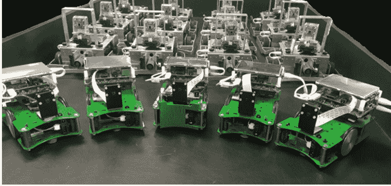

*图1.1：EyeBot移动机器人家族*

在西澳大利亚大学的机器人与自动化实验室，我们开发了*EyeBot家族*（见图1.1），这是一个多样化的移动机器人群体，包括轮式、履带式、足式、飞行和水下机器人[Bräunl 2022]<sup>1</sup>。每个机器人都有一个摄像头作为主要传感器，一些距离传感器，以及一个触摸屏LCD作为其用户界面。

> <sup>1</sup> T. Bräunl, *Embedded Robotics – From Mobile Robots to Autonomous Vehicles with Raspberry Pi and Arduino*, 4th Ed., Springer Nature, Singapore, 2022

## 1 机器人硬件

我们所有的小型机器人都与嵌入式系统紧密相连。它们包含一个机载计算机系统，该系统连接到执行器和传感器。它持续读取传感器输入以获取关于周围世界的信息，然后通过向其执行器发送命令来做出反应。执行器大多是电动机，例如车轮电机或腿部伺服电机，但也可能是气动或液压执行器、螺线管、继电器或固态电子开关。

### 1.1 执行器

电机 驾驶机器人的运动能力来自多个执行器——在大多数情况下，这些是两个电动机。每个电机独立驱动，主控制器（例如树莓派）发送期望速度的信号。然而，电机永远不能直接连接到微控制器，因为它消耗的电流比标准输出引脚所能提供的要大得多。因此，我们设计了一个接口板（EyeBot I/O控制器），它将树莓派控制器连接到机器人的传感器和电机，并提供两个电机驱动器。

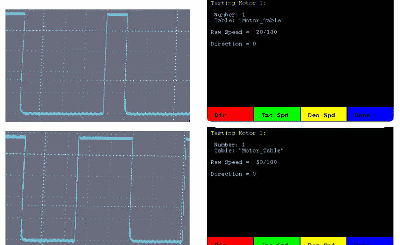

*图1.2：脉宽调制在20%和50%时的电机输出*

电机通常随着供给它的模拟电压增加而提高速度，而其旋转方向随着供给电压的极性变化而改变。由于我们无法轻易地从数字微控制器生成模拟电压，我们使用“脉宽调制”方法作为数字等效方法。通过这种方法，全供电电压（例如5V）被非常快速地开启和关闭（例如以1,000 Hz的频率），因此对电机的效果与提供匹配此比例的较低模拟电压相同。如图1.2所示，不同的百分比设置将导致具有相应“开启时间”和“关闭时间”的矩形输出函数，这将使连接的电机以所需的空闲速度旋转。

**驱动系统** 人们能想象到的最简单的机械驱动系统称为*差速驱动*，这是一个机器人平台，上面连接着两个独立控制的轮式电机（见图1.3）。如果两个电机以相同的速度向前驱动，那么机器人将直线向前行驶。如果一个电机比另一个运行得快，例如左电机比右电机快，那么机器人将沿曲线行驶——在这种情况下是向右（或顺时针）曲线。最后，如果一个电机向前（例如左电机）而另一个电机向后，那么机器人将原地转向（此处：顺时针）。

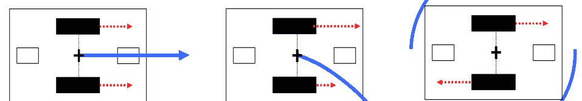

*图1.3：差速驱动原理*

### 1.2 传感器

驱动系统只是移动机器人的一半。另一半是感知。即使对于我们最简单的机器人，我们也使用三种类型的传感器，按复杂性递增的顺序排列：轴编码器、红外距离传感器和数字摄像头。

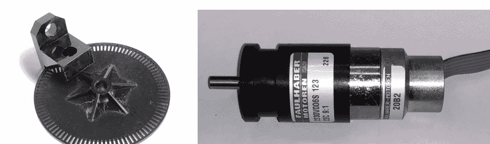

*图1.4：增量编码器（左）；带封装齿轮箱和编码器的电机（右）*

**轴编码器** 轴编码器是简单的传感器，主要提供用于控制机器人电机速度（速度控制和位置控制）的反馈。对于光学编码器，可以使用反射盘或开槽盘（见图1.4），在圆盘旋转期间交替让红外LED光束通过和阻挡它。当车轮旋转时，这会产生一个矩形信号（图1.5）。

使用具有交替白色和黑色扇区的反射盘（西门子星）的工作原理相同，只是LED和检测器位于圆盘的同一侧。

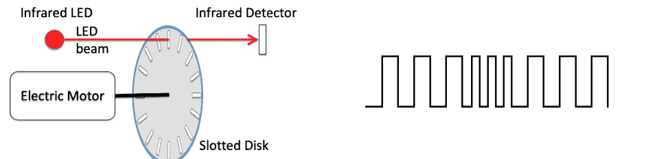

*图1.5：编码盘原理（左）；慢-快-慢旋转的编码器输出信号（右）*

轴编码器也可用于测量机器人行驶的短距离（位置控制）。左右传感器输出计数可以通过机器人的运动学公式转换为其平移和旋转位置（*位姿*）的变化。不幸的是，这只适用于较短的距离，并且当机器人的车轮牢固地接触地面时。在较长的距离上，小的误差会累积起来，很快计算出的位姿将变得不可用。

**距离传感器** 红外距离传感器也称为位置敏感器件（PSD）。它们发射一束人眼看不见的光束，并利用物体的反射来计算距离值。在我们的机器人系统中，我们通常使用四个PSD传感器，每个方向一个。

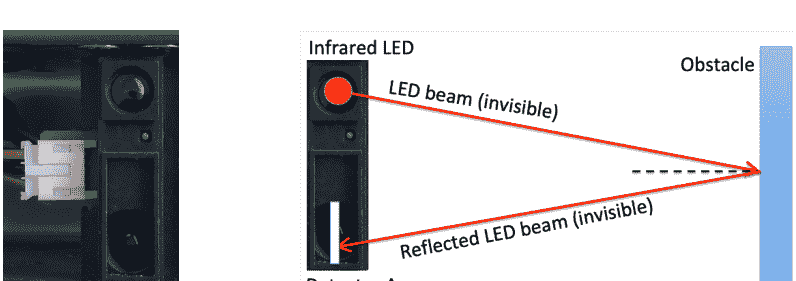

*图1.6：Sharp PSD传感器（左）和测量原理（右）*

简单的距离传感器使用红外探测器阵列来计算物体距离。根据反射光束落在传感器阵列上的位置，物体越近或越远（见图1.6，右）。红外PSD有各种不同的形状、形式和接口（模拟或数字），如图1.6，左所示。

更高精度的距离传感器使用基于激光的飞行时间原理。对于EyeBot-8接口板，我们使用ST Microelectronics的微型VL53L0X传感器，安装在Pololu载板上（见图1.7）。实际传感器尺寸仅约2mm × 4mm，具有SMD触点，因此对于爱好者来说，焊接这个传感器芯片几乎是不可能的。使用现成的载板使集成变得容易得多。

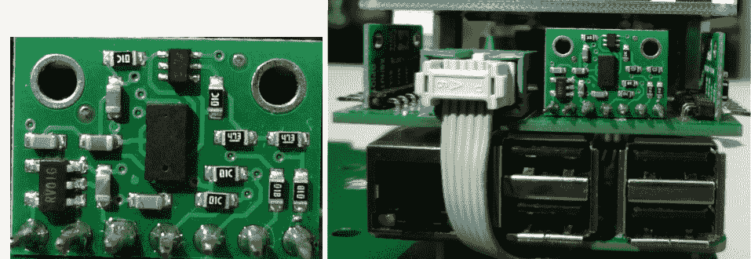

*图1.7：飞行时间激光测距传感器及其在EyeBot上的放置*

摄像头 数字摄像头是一种比前面提到的传感器复杂得多且功能强大的传感器。它每帧图像提供数百万像素，每秒数次。在非常适中的VGA²分辨率下，有640×480像素，每个像素3字节，频率为25赫兹（PAL³）或30赫兹（NTSC⁴），因此PAL超过23 MB/s，NTSC接近28 MB/s。图1.8展示了我们自己的*EyeCam*系统（左）与现代树莓派摄像头模块（右）的对比。标准树莓派摄像头具有固定不可更换的镜头，但也有第三方摄像头提供可调节和可更换的板载镜头。对于这些摄像头，有更宽视野角度的镜头可供选择（甚至鱼眼镜头），更适合驾驶机器人。有各种各样的板载镜头可供选择，以适应大多数应用。

² VGA：虚拟图形适配器；一种640×480像素的图像分辨率，于1987年首次为IBM PS/2引入
³ PAL：逐行倒相；欧洲模拟电视标准，625线，每秒25帧（50个交替半场），匹配50Hz市电频率
⁴ NTSC：国家电视系统委员会（也戏称为“never the same color”）；北美模拟电视标准，525线，每秒30帧（60个交替半场），匹配60Hz市电频率

## 1 机器人硬件

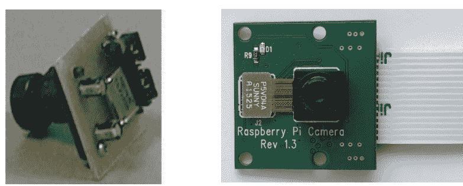

图 1.8：EyeCam M4（左）和树莓派摄像头（右）

由于数据量庞大，需要强大的控制器进行处理，我们通常使用相对较低的图像分辨率，以保持整体处理速度在每秒10帧（fps）或更高。图1.9中的图像分辨率为80×60像素——这可能是我们愿意使用的最低分辨率，但如你所见，它们仍然包含了丰富的可见细节。

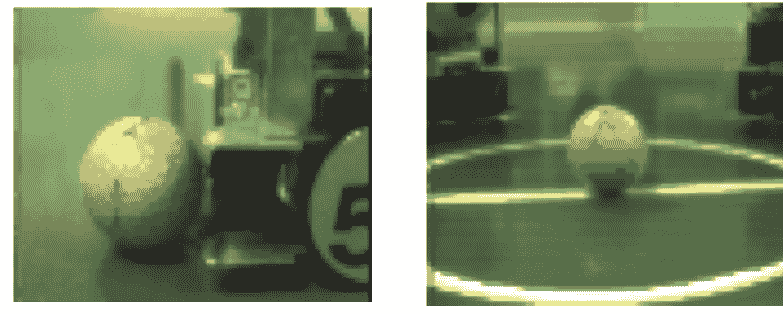

图 1.9：分辨率为80×60像素的示例图像

### 1.3 处理器与输入/输出

执行器和传感器必须与嵌入式控制器连接。我们选择的是树莓派（图1.10，左）与我们自己的EyeBot-8接口板相结合，用于传感器输入/输出和电机驱动（图1.10，右）。与我们之前的接口板不同，这款新板不包含自己的处理器。相反，其输入/输出硬件通过输入/输出数据线直接连接到树莓派。EyeBot板以“帽子”形式叠加在树莓派上，不需要任何额外的通信或电源线。可充电电池连接到EyeBot板，然后由该板为树莓派提供所需的5V电源。EyeBot-8板提供了树莓派所不具备的多种接口：

- 2个H桥电机驱动器
- 2个编码器输入
- 4个伺服输出
- 4个用于STM/Pololu激光测距传感器的端口
- 1个用于电池电压测量的模拟输入
- 1个用于树莓派的电源稳压器
- 1个摄像头支架
- 1个开关

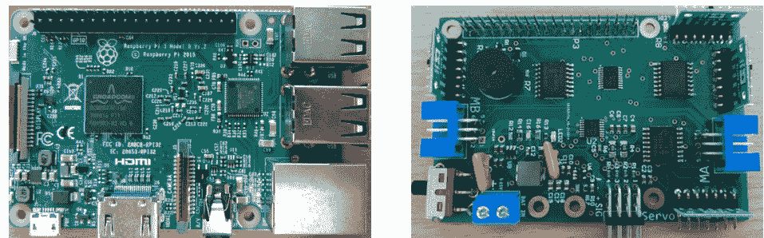

总的来说，这种板卡设计有助于为机器人设计创建一个紧凑、精美的封装。虽然可选，但我们在所有机器人型号上都使用一个4.3英寸的彩色触摸屏，它插在EyeBot板的上方。通过它，我们可以轻松地启动和停止应用程序、显示传感器值或更改参数。显示屏始终是测试和调试的宝贵工具。

### 1.4 完整机器人

将所有部件组合在一起，我们就能构建一个完整的机器人。我们可以从一个非常简单的矩形载板开始，由木材、塑料或铝制成。在底部，我们安装两个电机和一个自由滚轮，为机器人提供三点支撑系统。我们还将电池盒放置在底部，因为那里有空间，并且能让机器人外观更整洁。

对于这种设计，我们使用“带保护”版本的18650锂电池。每个电芯内都包含一个特殊的电子电路板，可防止过充和深度放电。过去我们使用不带保护的可充电AA电池和锂聚合物电池，但由于意外深度放电，我们损失了太多电池。带保护的18650电池比普通版本长几毫米，因此无法放入标准电池盒中。我们通过将电池盒切成两半，并在中间间隔几毫米来解决这个问题（图1.11）。

在载板顶部，我们只需用四个M2.5螺丝固定控制器堆叠。该堆叠包含（从下到上）树莓派控制器、EyeBot接口板和触摸屏显示器。最多四个激光距离传感器安装在EyeBot板周围，该板也固定着摄像头。两个带编码器的电机只需插入EyeBot板侧面的相应插座即可。这使其设计非常紧凑（图1.12）。

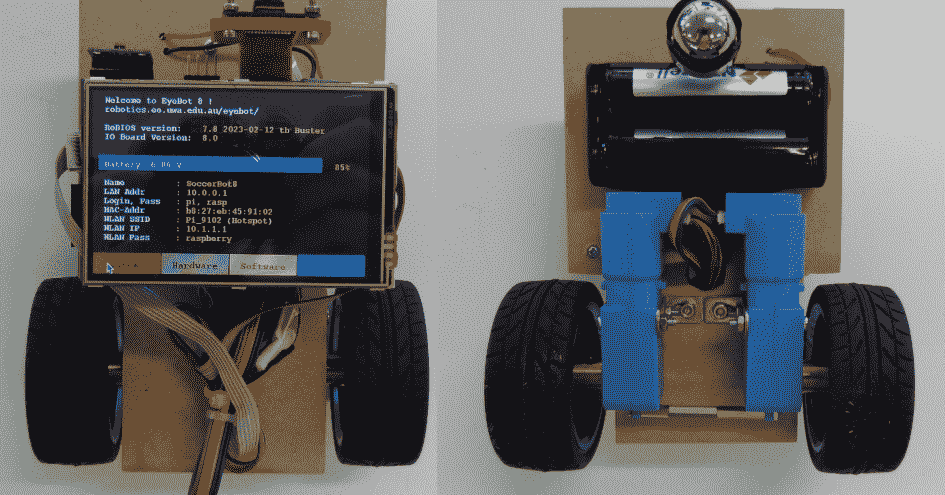

图1.13左侧展示了我们的*SoccerBot S4*机器人，它使用相同的树莓派/EyeBot/LCD控制器堆叠。右侧是更小的*Mule*车辆。*Mule*不使用EyeBot接口板，因此无法使用轴编码器和距离传感器，并且需要一个单独的电机控制器板安装在其侧面。

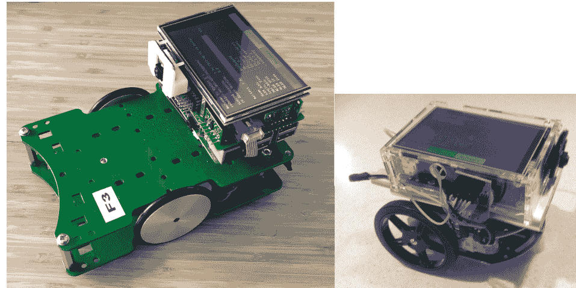

图1.14中的图表展示了主要的机器人硬件设置。显示器、摄像头和高级传感器（例如GPS、IMU、激光雷达等，通过USB或LAN连接）直接连接到树莓派控制器。EyeBot-8接口板构建了通往驱动电机、伺服器和低级传感器的桥梁。它通过数字输入/输出引脚与树莓派通信。

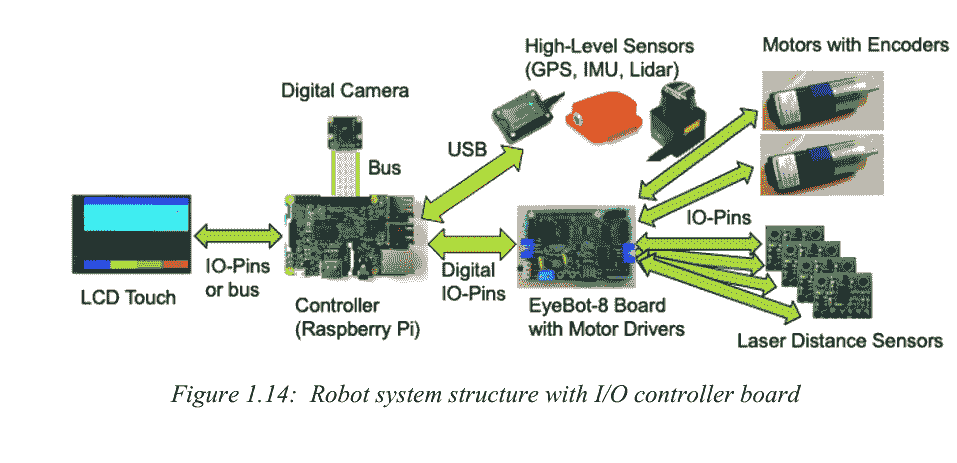

通过改装模型车，可以构建一个更简单的、无需专用接口板的机器人设计。这种设计必须放弃PSD传感器和电机编码器；其原理如图1.15所示。

当使用内置伺服转向和数字电机控制器的模型车平台时，我们只需要两条PWM（脉宽调制）输出线即可将车连接到树莓派控制器。然而，树莓派只有一条硬件PWM输出线，所有其他输出线都使用软件生成PWM信号。由于我们在树莓派上不使用实时操作系统，控制器处理不同任务时的时间变化可能会导致转向伺服器出现明显的抖动。虽然驱动电机控制也会有类似的变化，但这些变化往往影响较小，几乎难以察觉。

不使用接口板的方法可用于构建一个廉价、最小配置的驾驶平台，但它当然缺少低级传感器，特别是轴编码器。虽然它可能不适合精确驾驶，但这样的机器人模型车可以实现更高的驾驶速度。

类似的方法也用于图1.13右侧所示的非常基础的Mule机器人底盘。树莓派与两个差速驱动电机之间的连接是一个廉价的电机驱动板，安装在树莓派侧面，而摄像头则用魔术贴固定在前面。整个机器人由一个USB移动电源供电。与之前一样，这种方法缺少来自轮式编码器和距离传感器的反馈，而这需要接口板。有关驱动机构、电子硬件和系统软件的更多详细信息，请参阅EyeBot用户指南[Bräunl等，2023]⁵。

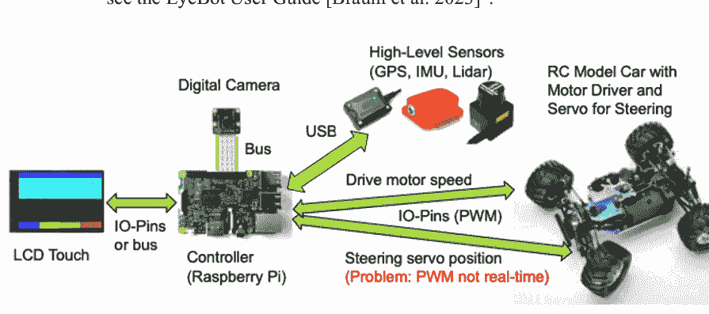

⁵ T. Bräunl, M. Pham, F. Hidalgo, R. Keat, *EyeBot 8 用户指南*, 2023, http://roblab.org/eyebot/

### 1.5 通信

每个机器人都是一个独立的自主车辆。然而，即使对于单个机器人，拥有到笔记本电脑或台式机PC的无线通信链路也是非常可取的，以便将程序传输到机器人，并将数据从机器人传回。当使用多个机器人时，我们希望有一个通信网络，让机器人之间能够相互通信。

我们的网络基于树莓派内置的WiFi模块。默认情况下，每个机器人有自己的WiFi热点，因此我们可以轻松地用笔记本电脑、平板电脑或智能手机连接到它。

默认的WiFi热点网络名称和密码是：
*PI_12345678* 和 *raspberry*

其中的数字是从树莓派的MAC地址自动派生的，允许在同一房间内操作多个独立的机器人。

默认的WiFi IP地址很容易记住：
10.1.1.1

我们EyeBot-Raspian发行版的默认用户名和密码是：
*pi* 和 *rasp*

使用LAN电缆连接时，用户名和密码相同，默认IP地址同样简单：
10.0.0.1

当使用多个机器人作为一个组时，可以将它们的网络设置更改为“从属”，将它们链接到一个公共的DHCP⁶ WiFi路由器。这样，所有机器人都可以直接相互通信，也可以与基站（例如操作员的笔记本电脑）通信。

### 1.6 用户界面

虽然从技术上讲并非绝对必要，但我们所有的机器人都配备了触摸屏显示器形式的用户界面（见图1.16）。通过它，机器人可以显示传感器和测量结果，用户可以使用软按钮输入命令或选择参数。此界面可以在真实机器人“背面”的物理LCD上工作，也可以通过WiFi远程桌面在笔记本电脑窗口中工作，甚至可以在模拟中工作。

⁶ DHCP路由器（动态主机配置协议）为每个WiFi客户端分配一个唯一的IP（互联网协议）地址。

## 1 机器人硬件

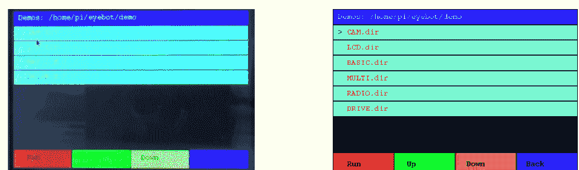

图 1.16：真实机器人触摸屏（左）和远程桌面（右）

### 1.7 仿真

在本书后续章节中，我们将频繁使用仿真。需要强调的是，我们在 *EyeSim* 中创建了非常逼真的真实机器人行为近似模型。机器人程序可以直接从仿真环境转移到真实机器人，无需修改一行源代码。这里没有不切实际的假设，没有虚拟（理想化的）传感器，没有“作弊”行为。即使是误差设置也非常逼真且可调整。没有完美的世界：一个被告知行驶1.0米的机器人总会产生微小偏差（例如行驶0.99米或1.01米），传感器读数也并非总是100%准确——我们的仿真环境反映了这一点。

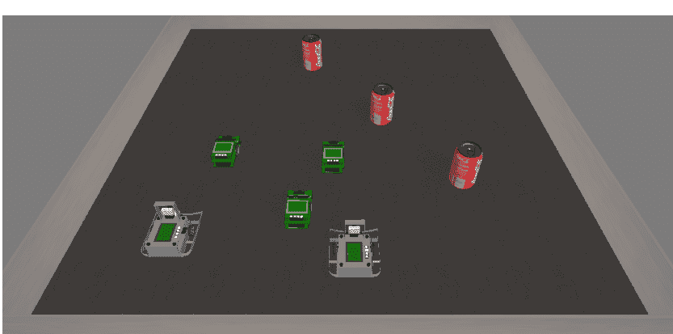

图 1.17：EyeSim-VR 机器人场景仿真

自约20年前首个版本以来，我们已多次从头重新实现了EyeSim仿真系统。最新版本称为EyeSim-VR（图1.17），可在MacOS、Windows和Linux上原生运行。

我们甚至有一个适用于Oculus Quest VR（虚拟现实）设备的版本。EyeSim-VR由Travis Povey和Joel Frewin于2018年实现，Alexander Arnold和Michael Finn于2019年进行了扩展。VR版本由Jairus Wong于2023年实现。

我们决定以项目驱动的方式构建本书，无论使用真实机器人还是仿真机器人，算法和程序代码都将保持一致。在后续章节中，我们将从简单的机器人任务开始，逐步开发更复杂的应用程序。

### 1.8 任务

- 通过选择轮子、执行器（电机）和传感器（如摄像头、PSD等）来配置你理想的移动机器人。
- 制作一个电子表格，显示零件编号、数量、供应商和成本。
- 制作机器人设计的CAD图纸，考虑所有组件的尺寸。
- 制作它！

## 2 机器人软件

EyeSim是一个逼真的移动机器人仿真系统，由西澳大利亚大学机器人与自动化实验室开发。EyeSim免费分发，支持多种不同类型的机器人和传感器，具有逼真、接近现实的运动模式。EyeSim机器人仿真源代码可以直接移植到物理EyeBot机器人，无需修改一行代码。支持的编程语言包括Python、C和C++。

EyeSim包含各种轮式和履带式驱动机器人、配备麦克纳姆轮的全向机器人、各种AUV（自主水下机器人）、足式机器人 *Starman* 以及各种机器人操作臂。更多信息请参阅EyeSim用户手册¹和EyeSim网页（见图2.1）：

http://roblab.org/eyesim


### 简介

配备虚拟现实的EyeBot仿真器 *EyeSim VR* 是一个**具有VR功能的多移动机器人仿真器**，基于游戏引擎Unity 3D，允许使用与真实机器人上运行的相同且未修改的EyeBot程序进行实验。EyeSim VR能够仿真RoBIOS-7中的所有主要功能，包括：

- LCD输出/按键输入
- 摄像头输出
- PSD传感器

图 2.1：*EyeSim VR 网站*

> ¹ EyeSim VR Team, *EyeSim User Manual*, 2018, roblab.org/eyesim/ftp/EyeSim-User Manual.pdf

### 2.1 软件安装

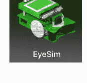

下载时，请选择与您的操作系统和硬件匹配的软件包：MacOS (Intel)、MacOS (M)、Windows或Linux。EyeSim使用Unity 3D²游戏引擎实现，使其能够在每个平台上原生运行。其内置的物理引擎使所有机器人运动非常逼真。

额外的系统要求包括MacOS和Windows的X11库，以及我们为Windows适配的Cygwin版本。图像处理应用需要额外的包，例如OpenCV³。

虽然EyeSim的Windows版本会自动安装Cygwin包，但Mac OS用户需要单独安装免费的XQuartz库。Linux用户不需要额外的包。EyeSim软件包位于：

http://roblab.org/eyesim/ftp/

包含大量应用程序库

EyeSim-Examples.zip

**RoBIOS-7 库函数**

版本 7.3，2023年1月 -- RoBIOS是EyeBot控制器的操作系统。

以下库可用于使用C/C++或Python对EyeBot控制器进行编程。

除非另有说明，成功时返回码为0，发生错误时返回非零值。

在应用源文件中包含：`#include "eyebot.h"`

编译应用以包含RoBIOS库：`$gccarm myfile.c -o myfile.o`

- LCD输出
- 按键输入
- 摄像头
- 图像处理
- 系统函数
- 定时器
- USB/串口
- 音频
- 距离传感器
- 舵机和电机
- V-Omega 驱动接口
- 数字和模拟I/O
- 红外遥控
- 无线电通信
- 多任务
- 仿真

**LCD输出**

`int LCDPrintf(const char *format, ...);` // 在LCD上打印字符串和参数

`int LCDSetPrintf(int row, int column, const char *format, ...);` // 从给定位置开始打印

`int LCDClear(void);` // 清除LCD显示屏和显示缓冲区

`int LCDSetPos(int row, int column);` // 为后续printf设置光标位置（像素）

`int LCDGetPos(int *row, int *column);` // 读取当前光标位置

`int LCDSetColor(COLOR fg, COLOR bg);` // 为后续printf设置颜色

`int LCDSetFont(int font, int variation);` // 为后续打印操作设置字体

`int LCDSetFontSize(int fontsize);` // 为后续打印操作设置字体大小（7..18）

`int LCDSetMode(int mode);` // 设置LCD模式（0=默认）

图 2.2：RoBIOS-7 API 函数

² Unity 3D, https://unity3d.com

³ OpenCV是开源计算机视觉库，参见 OpenCV.org

### Python 入门

安装后，请查看EyeSim用户手册 **EyeSim-UserManual.pdf**

机器人控制的关键是构成 *RoBIOS* API（机器人基本I/O系统 - 应用程序员接口）的函数集。这包含在EyeBot用户指南中，也可以在网上查看：[http://roblab.org/eyebot/robios.html](http://roblab.org/eyebot/robios.html)

图2.2概述了RoBIOS打印函数；完整的RoBIOS函数列表包含在本书的附录中。

安装EyeSim后，您的任务栏上应该有一个类似左侧的机器人图标。单击此图标将启动EyeSim仿真器，其中包含一个放置了单个机器人的默认环境（见图2.3）。

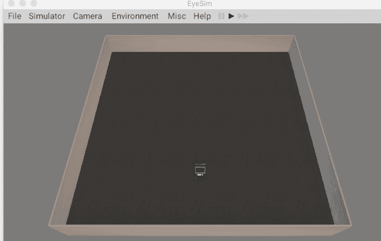

*图 2.3：EyeSim 默认环境*

此启动场景可以通过文件/设置菜单进行更改。在您的环境中，可以有多个机器人、多个物体、墙壁、标记、颜色和纹理、3D地形甚至水。我们稍后会回到这一点。

### 2.2 Python 入门

现在，我们只尝试让这个机器人移动起来。相关的RoBIOS命令是

```
int VWSetSpeed(int linSpeed, int angSpeed)
```

我们称之为 *v-ω*（v-omega）驱动接口，因为我们可以为机器人指定线速度 *v* 和角速度 *ω*。如果 *v* 被赋予某个值且 *ω*=0，机器人应该直线行驶。如果 *v*=0 且 *ω* 设置为固定值，机器人应该原地旋转，如果 *v* 和 *ω* 都获得非零值，机器人将行驶某种曲线。让我们试试看！

最简单的开始是使用Python，但我们也会用C重复这个例子。启动EyeSim并准备好如图2.3所示的机器人后，打开命令窗口并输入

```
python3
```

或启动一个编程环境，如Thonny或PyCharm。在Python命令提示符后，逐行输入您的机器人程序

```
from eye import *
```

这将使所有RoBIOS API命令可用。然后输入您的第一个驱动命令，例如

```
VWSetSpeed(100,0)
```

这将使机器人以100mm/s的速度直线行驶，旋转速度为零。在命令窗口中，您将看到程序2.1的系统对话框。

程序 2.1：在命令行中使用Python编程机器人

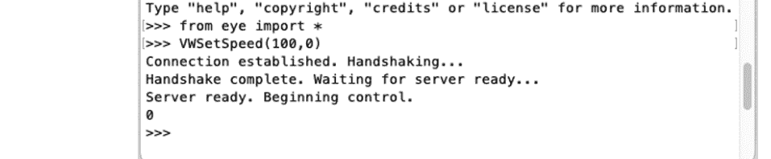

同时，在EyeSim窗口中，您可以看到机器人向前行驶。事实上，如果我们不够快地用以下命令停止它

```
VWSetSpeed(0,0)
```

它会撞到后墙（图2.4）。没问题，这只是仿真机器人，所以没有造成损坏。您可以单击它并将其移回场地中间。使用+和-键，您也可以将机器人旋转到任何角度。

### 2.3 C 语言入门

在C中直线行驶由程序2.2中的等效程序完成。但随后我们不能简单地输入命令来停止它，因此除非暂停仿真器，否则机器人将与墙壁碰撞。

*include* 语句使RoBIOS API可用，所有C程序都需要一个 *main* 函数定义作为程序起点。此程序中唯一的语句是 *VWSetSpeed* 命令。注意所需的分号。

## C语言入门

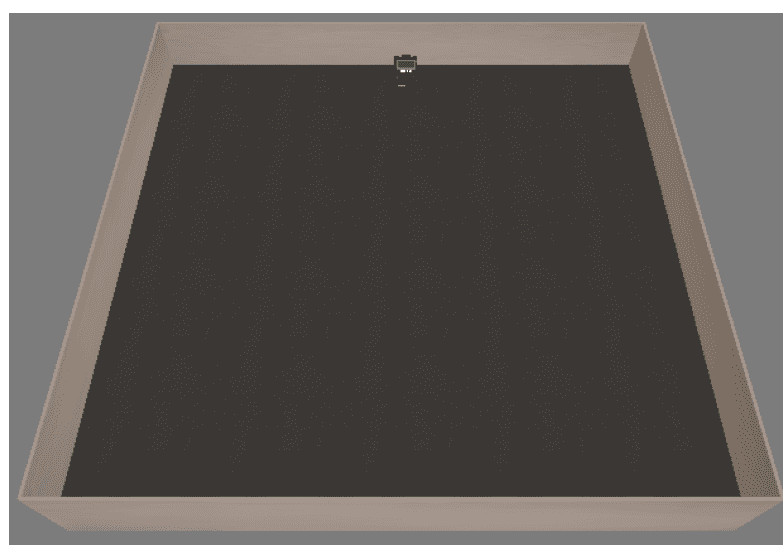

图 2.4：使用 Python 或 C 程序控制机器人直线行驶

程序 2.2：由 C 程序控制的机器人

```
1  #include "eyebot.h"
2  int main ()
3  { VWSetSpeed(100, 0);
4  }
```

语句后的分号和函数定义外的花括号是必不可少的。在 C 语言中你会经常用到它们。
由于 C 是编译型语言，不像 Python 那样是解释型语言，我们必须先对源程序进行编译才能运行。虽然这看起来像是不必要的额外工作，但实际上非常有益，因为它会检查源代码中的错误并报告出来。相比之下，Python 会立即开始运行程序，如果在执行过程中遇到错误，可能会在中途停止。

程序 2.3：编译并执行 C 程序

```
tb-pro:tmp tb$ gccsim straight.c -o straight.x
tb-pro:tmp tb$ ./straight.x
Connection established. Handshaking...
Handshake complete. Waiting for server ready...
Server ready. Beginning control.
tb-pro:tmp tb$
```

## 2 机器人软件

使用我们编写的 *gccsim* 脚本（见程序 2.3）可以轻松编译 C 程序。第一个参数是 C 源文件，`-o` 选项允许你指定二进制输出文件的名称。

```
gccsim straight.c -o straight.x
```

对于所有我们提供的 EyeSim 示例目录，我们都提供了所谓的 *Makefile*，这大大简化了 C 和 C++ 程序的编译。有了正确的 *Makefile*，你只需输入一个单词即可完成编译：

```
make
```

假设我们已经启动了 EyeSim 模拟器，并且有一个机器人正在等待命令，我们现在可以运行我们的程序：

```
./straight.x
```

Linux 在执行命令时总是要求我们指定目录，因此如果可执行程序 *straight.x* 在我们当前目录中，我们必须在它前面加上 `./`。

### 2.4 用 Python 驱动机器人走正方形

让我们更进一步，尝试让机器人绕着一个正方形行驶。为此，我们使用另外两个 API 命令：一个用于直线行驶，另一个用于原地旋转。这些命令会在达到所需距离或角度后自动停止机器人。

```
int VWStraight(int dist, int lin_speed)
int VWTurn(int angle, int ang_speed)
```

*VWStraight* 的参数单位是 [mm] 和 [mm/s]，*VWTurn* 的参数单位是 [degrees] 和 [degrees/s]。程序 2.4 展示了完整的 Python 程序，用于驱动机器人走一个正方形。

程序 2.4：用 Python 驱动机器人走正方形

```
1  from eye import *
2
3  for x in range (0,4):
4      VWStraight(300,500)
5      VWWait()
6      VWTurn(90, 100)
7      VWWait()
```

我们重复执行“直线行驶后原地旋转”这个序列四次。*for* 循环的参数 `(0,4)` 表示计数器 *x* 将从 0 开始，运行四次迭代（*x* 的值分别为 0, 1, 2, 3），这正是我们想要的。

在每个行驶命令后调用 *VWWait* 是必要的，因为 *VWStraight* 和 *VWTurn* 命令会立即将控制权交还给程序，任何后续的行驶命令都会覆盖前一个命令。因此，如果你忘记在代码中加入 *VWWait*，程序会非常快地执行完所有命令，然后在机器人甚至还没来得及从起始位置移动之前就终止了。

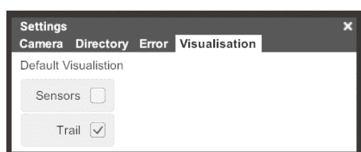

*图 2.5：EyeSim 菜单中的可视化设置*

模拟器的菜单命令 File / Settings / Visualization 允许我们开启机器人路径或“轨迹”的可视化（图 2.5），这将使我们更容易解释它的运动。设置好这个选项后，正方形程序将在地面上标记出机器人的运动轨迹（见图 2.6）。

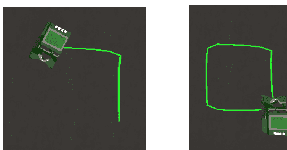

*图 2.6：机器人完成正方形程序*

最后，我们不必将行驶命令直接输入到 Python3 解释器中，而是可以将它们放入一个文件中，例如 *square.py*。然后我们可以用以下命令调用该程序：

```
python3 square.py
```

或者，更进一步，我们可以使源文件 *square.py* 可执行（通过更改其文件权限），然后将 Python3 解释器的名称作为第一行添加进去：

```
#!/usr/bin/env python3
```

现在我们可以更轻松地从命令行直接启动 Python 程序：

```
./square.py
```

### 2.5 用 C 或 C++ 驱动机器人走正方形

使用 C 或 C++ 完成相同的驾驶任务并不困难多少，如程序 2.5 所示。命令是相同的，但 C 有自己的语法来包含 EyeBot/ROBIOS 库，并且需要一个 *main* 函数，它告诉系统程序从哪里开始。

程序 2.5：C 语言的正方形驾驶程序

```
1  #include "eyebot.h"
2  int main()
3  { for (int i=0; i<4; i++)  // 运行 4 条边
4    { VWStraight(400, 300);  // 直线行驶 400mm
5      VWWait();              // 等待完成
6      VWTurn(90, 90);        // 旋转 90 度
7      VWWait();              // 等待完成
8    }
9  }
```

*for* 循环的写法比 Python 稍微啰嗦一些，但功能相同；它只是将内部花括号 `{` 和 `}` 之间的语句块执行四次。和之前一样，*VWStraight* 和 *VWTurn* 之后需要跟上 *VWWait* 语句，以确保它们在进入下一个行驶命令之前完全执行完毕。

### 2.6 SIM 脚本和环境文件

我们现在可以编写、编译（仅限 C/C++）和执行机器人程序了。但是，当我们设置越来越复杂的场景，包含结构化的驾驶环境、多个机器人和场景中的众多对象时，我们可能需要一些帮助，这样就不必一遍又一遍地手动放置所有组件。这可以通过使用一个 `.sim` 脚本文件来实现，如程序 2.6 所示。

程序 2.6：用于简单世界的 SIM 脚本，放置了一个机器人

```
1  # 默认环境
2  world rectangle.maz
3
4  # 机器人放置
5  S4 1500 300 90  square.py
```

除了注释（以 `#` 开头），这个 *SIM* 脚本中只有两个项目：*world* 命令选择一个描述驾驶环境的文件，*S4* 命令将一个 S4 型机器人放置在指定的 (x,y) 坐标（x 为 1500mm，y 为 300mm）和旋转角度（90°）处。可执行文件是我们的 Python 程序 square.py——但你也可以将其替换为 C/C++ 二进制文件 square.x。

使用 SIM 脚本还可以做更多事情，例如更改设置：

```
settings VIS TRACE
```

这将自动激活机器人红外距离传感器的可视化（VIS），并在地面上绘制其行驶路径（TRACE）。

至于驾驶环境，EyeSim 支持两种标准输入格式：world 文件和 maze 文件。maze 格式是两者中较简单的一种，允许使用字符图形来构建驾驶环境。字符 `_` 和 `|` 分别代表水平和垂直的墙壁。例如，我们可以轻松地创建一个空的矩形（图 2.7，左）。

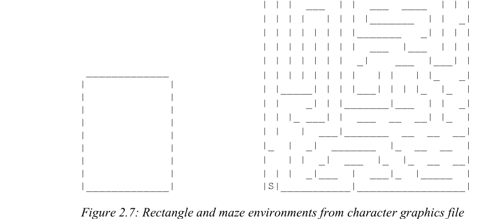

但我们同样可以轻松地指定一个迷宫，就像用于 MicroMouse 竞赛 [Christiansen 1977]⁴ 的那些迷宫一样，机器人需要在其中导航。图 2.7，右，展示了一个竞赛迷宫的例子，其中 “S” 标记了机器人的起始位置，而目标总是在中心。关于迷宫以及如何走出迷宫的更多内容将在第 9 章介绍。

> 4 D. Christiansen, Spectral Lines – Announcing the Amazing MicroMouse Maze Contest, IEEE Spectrum, vol. 14, no. 5, SPEC 77, May 1977, p. 27 (1)

### 2.7 显示和输入按钮

我们所有的实体机器人顶部都带有一个触摸屏显示器，这对于显示数据（例如传感器值和结果）、输入参数值、选择和启动程序等极其有价值。
当然，我们在 EyeSim 中也拥有相同的功能——事实上，仿真系统运行的源代码与物理机器人相同。以下是用于显示的最重要的 RoBIOS API 命令：

```
int LCDPrintf(const char *format, ...)
int LCDSetPrintf(int row, int col, const char *format, ...)
int LCDMenu(char *st1, char *st2, char *st3, char *st4)
int LCDClear(void)
int LCDPixel(int x, int y, COLOR col)
int LCDLine(int x1, int y1, int x2, int y2, COLOR col)
int LCDArea(int x1, int y1, int x2, int y2, COLOR c, int fl)
int LCDImage(BYTE *img)
int LCDImageGray(BYTE *g)
int LCDImageBinary(BYTE *b)
```

这些命令大多不言自明。它们用于在屏幕上写入文本、在特定行和列写入文本、标记菜单按钮（软键）、清除显示屏、设置特定颜色的像素/线/区域，以及以彩色、灰度或二进制格式在屏幕上显示完整图像。用于读取按钮输入（软键）的 RoBIOS API 命令是：

```
int KEYGet(void)          // 阻塞式读取按键
int KEYRead(void)         // 非阻塞式读取
int KEYWait(int key)      // 等待按键按下
```

这允许我们输入用户命令，并等待确认键被按下。程序 2.7 展示了一个简单的 Python “Hello, world!” 程序，它结合了这两个功能。

程序 2.7：Python 机器人 Hello world 程序

```
1  from eye import *
2
3  LCDPrintf("Hello from EyeBot!")
4  LCDMenu("DONE","BYE","EXIT","OUT")
5  KEYWait(ANYKEY)
```

该程序在屏幕上写入一行文本（“Hello ...”），标记四个软键，然后等待用户按下其中任意一个按钮。请注意，如果没有最后的 KEYWait 命令，程序会立即终止，清除显示在屏幕上的任何信息。因此，这是一个确保程序仅在需要时终止的好方法。

### 距离传感器

C语言中的等效应用如程序2.8所示。它包含必需的*main*函数，该函数也可以包含在Python程序中。实际的RoBIOS命令与之前相同。

程序2.8：C语言的Hello world机器人程序

```
1  #include "eyebot.h"
2
3  int main()
4  { LCDPrintf("Hello from EyeBot!");
5    LCDMenu("DONE", "BYE", "EXIT", "OUT");
6    KEYWait(ANYKEY);
7  }
```

运行（并编译）此程序将产生如图2.8所示的屏幕输出（适用于Python和C）。

图2.8：（模拟）机器人屏幕上的Hello world输出

### 2.8 距离传感器

到目前为止，我们已经讨论了控制移动机器人的基础知识，但我们缺少一些必要的传感器输入。我们从读取红外PSD（位置敏感器件）传感器开始，其RoBIOS API为

```
int PSDGet(int psd) // Read distance in mm from sensor
```

有四个预定义的传感器：*PSD_FRONT*、*PSD_LEFT*、*PSD_RIGHT*和*PSD_BACK*，它们在机器人上的位置相对应。

我们可以将这些传感器整合到我们第一个直线行驶的程序中，但这次要在机器人撞墙前使其停止。程序2.9展示了Python代码。

## 2 机器人软件

程序2.9：Python中的行驶-停止程序（版本1）

```
1  from eye import *
2
3  while PSDGet(PSD_FRONT) > 200:
4      VWSetSpeed(100,0)
5  VWSetSpeed(0,0)
```

只要前方至少有200毫米的间隙，机器人就应该持续行驶。当不再满足此条件时，它将通过将速度设置为(0,0)来停止。

请注意，我们不必在循环内重复*VWSetSpeed*命令。我们可以在开始时设置一次，然后使用一个空的“忙等待循环”来代替。这是正确的做法，即使它看起来不那么美观（程序2.10）。

程序2.10：Python中的行驶-停止程序（版本2）

```
1  from eye import *
2
3  VWSetSpeed(100,0)
4  while PSDGet(PSD_FRONT) > 200:    # empty wait
5  VWSetSpeed(0,0)
```

C语言中的相应应用如程序2.11所示。除了括号和分号外，它与Python版本没有太大区别。这里，特别是*while*条件后的分号很重要，因为它表示一个空的（等待）语句。

程序2.11：C语言中的行驶-停止程序

```
1  #include "eyebot.h"
2
3  int main()
4  { VWSetSpeed(100,0);              /* drive */
5    while (PSDGet(PSD_FRONT) > 200) ; /* wait  */
6    VWSetSpeed(0,0);                /* stop  */
7  }
```

如果你想节省一些CPU时间，可以插入类似*OSWait(100)*的东西来等待100毫秒（0.1秒）

```
while (PSDGet(PSD_FRONT) > 200) OSWait(100);
```

在所有情况下，机器人现在都能避免碰撞，并在距离墙壁200毫米处停止（图2.9）。

将PSD传感器值写入屏幕是调试任何机器人程序的一个非常好的主意。程序2.12展示了稍作增强的代码。*LCDMenu*和*KEYWait*将其余代码框起来，以避免当机器人停止时程序终止（并擦除显示）。我们使用一个新变量*dist*来读取和检查距离，以避免在每次循环迭代中调用*PSDGet*例程两次。

程序2.12：Python中显示距离的行驶-停止程序

```
1  from eye import *
2
3  LCDMenu("","","","END")
4  VWSetSpeed(100,0)
5  dist = 1000
6  while dist > 200:
7      dist = PSDGet(PSD_FRONT)
8      LCDPrintf("%d ", dist)
9  VWSetSpeed(0,0)
10 KEYWait(ANYKEY)
```

C语言中的相应应用如程序2.13所示。C语言提供了一个*do-while*循环，它在循环结束时检查终止条件，使得这个示例的编码更加优雅。

屏幕输出现在会在机器人移动时更新其与墙壁的距离。一旦达到200毫米的距离值，机器人的移动（以及向LCD的打印）就会停止（见图2.10）。

还有其他类型的距离传感器，无论是在模拟中还是在真实机器人上。类似于PSD，但提供更丰富数据的是激光雷达（光探测与测距）传感器。它是一个旋转激光扫描仪，每次扫描返回数千个距离点，类似于放置成一圈的大量PSD。我们将在第4章中更详细地讨论激光雷达传感器。

另一类传感器是测量里程计数据。这些是机器人电机轴上的增量编码器，允许机器人通过组合其左右编码器值来计算其位置和方向——当然，假设没有车轮打滑。RoBIOS函数*VWSetPosition*和*VWGetPosition*已经将里程计数据转换为机器人的位姿（位置和方向），计算时还使用了机器人的车轮尺寸、每转编码器刻度和车轮间距。这些数据存储在真实机器人的HDT（硬件描述表）文件中，以及模拟机器人的“.robi”定义文件中。请随意探索这些额外的传感器。

程序2.13：C语言中显示距离的行驶-停止程序

```
1  #include "eyebot.h"
2
3  int main()
4  { int dist;
5
6      LCDMenu("", "", "", "END");
7      VWSetSpeed(100,0); /* drive */
8      do
9      { dist = PSDGet(PSD_FRONT);
10         LCDPrintf("%d ", dist);
11     } while (dist > 200);
12     VWSetSpeed(0,0);   /* stop  */
13     KEYWait(ANYKEY);
14 }
```

图2.10：在机器人屏幕上打印的距离，直到其在200毫米处停止

### 2.9 摄像头

最后，我们介绍机器人最重要的传感器——摄像头。我们的每个真实和模拟机器人都配备了一个数字摄像头。在模拟中，摄像头的位置和方向可以通过机器人的“.robi”定义文件进行设置，并且可以将其放置在（真实或模拟的）云台执行器顶部，这允许我们在使用过程中在两个轴上旋转摄像头。用于读取摄像头图像的RoBIOS API为

```
int CAMInit(int resolution)    // Set camera resolution
int CAMGet(BYTE *buf)          // Read color camera image
int CAMGetGray(BYTE *buf)      // Read gray scale image
```

摄像头必须首先使用*CAMInit*进行初始化，该函数还会设置所需的摄像头分辨率。最常见的值是VGA（640×480）、QVGA（四分之一VGA，320×240）或QQVGA（四分之一四分之一VGA，160×120）。在模拟和真实机器人上，通常最好从低QQVGA分辨率开始，以获得概念验证运行，因为它需要的处理时间最少。

程序2.14：Python中的简单摄像头程序

```
1  from eye import *
2
3  LCDMenu("", "", "", "END")
4  CAMInit(QVGA)
5  while (KEYRead() != KEY4):
6      img = CAMGet()
7      LCDImage(img)
```

在程序2.14的Python示例中，*CAMInit*将摄像头初始化为QVGA，因此随后对*CAMGet*的每次调用都将返回一个320×240的颜色值数组。每个颜色值有三个字节，分别对应像素的红色、绿色和蓝色（RGB）分量。

在Python中添加一个类似于C程序的*main*函数，这需要几行额外的代码（程序2.15）。C语言中的相同应用如程序2.16所示。C程序更明确，它清楚地将变量*img*定义为预定义大小*QVGA_SIZE*的数组，该大小在内部指定为320×240×3（每个像素三个字节）。然后变量*img*可以用作*CAMGet*和*LCDImage*的参数。在C中，我们在循环结束时检查终止条件，而在Python中，我们只能在开始时检查。

虽然在这个例子中机器人本身没有移动，但你可以用鼠标抓住它并在驾驶环境中移动它，以查看显示上的变化。如图2.11所示，在场景中放置更多物体会增加乐趣。

## 2 机器人软件

程序 2.15：带主函数的简单 Python 摄像头程序

```python
from eye import *

def main():
    LCDMenu("", "", "", "END")
    CAMInit(QVGA)
    while (KEYRead() != KEY4):
        img = CAMGet()
        LCDImage(img)

main()
```

程序 2.16：简单 C 语言摄像头程序

```c
#include "eyebot.h"

int main()
{ BYTE img[QVGA_SIZE];
    LCDMenu("", "", "", "END");
    CAMInit(QVGA);
    do { CAMGet(img);
        LCDImage(img);
    } while (KEYRead() != KEY4);
    return 0;
}
```

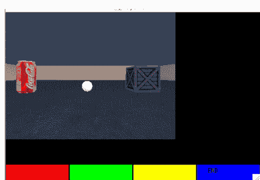

图 2.11：摄像头程序输出

### 2.10 机器人通信

机器人可以通过树莓派内置的 WiFi 模块相互通信。我们实现了一套基本的通信命令，用于在机器人之间、机器人组之间或与基站之间发送消息。这些命令在真实机器人和仿真环境中均有效。最重要的通信命令是

```c
int RADIOInit(void)            // 启动通信
int RADIOGetID(void)           // 获取自身无线电 ID
int RADIOSend(int id, char* buf) // 向目标发送字符串
int RADIOReceive(int *id_no, char* buf, int size) // 接收
int RADIOStatus(int IDlist[])  // 获取机器人 ID 列表
```

一个简单的两机器人乒乓令牌传输示例演示了此接口的用法。机器人 1 将向机器人 2 发送消息 "A"；之后，每个机器人将接收到的消息加一后返回。
在设置 *SIM* 脚本时，我们需要两个机器人协同工作。我们选择了两种不同的机器人类型（S4 和 LabBot），但它们都运行相同的程序 *ping.x*（程序 2.17）。

程序 2.17：用于运行两个机器人的 *SIM* 脚本

```
# robotname x y phi
S4       400  600   0  ping.x
LabBot 1000  600 180  ping.x
```

在程序 2.18 的应用中，我们首先使用 *RADIOInit* 启动通信接口，然后检索机器人在网络中的唯一 ID 号。在仿真中，机器人总是被标记为 1、2、3 等；然而，真实机器人的 ID 号源自其 IP 地址，因此取决于网络设置。
ID 号为 1 的机器人被视为主机⁵，并立即向其伙伴机器人 2 发送消息 "A"。从那时起，两个机器人的程序是相同的。每个机器人使用 *RADIOReceive* 等待下一条消息，将消息中的第一个字符加一（因此机器人 2 将生成 "B"），然后将其发送回去。这将运行 10 次，直到两个程序终止。图 2.12 中的截图并排显示了两个机器人的打印输出。

⁵ 注意，对于真实机器人，我们无法保证具有此编号的机器人确实存在，因此我们需要使用 *RADIOStatus* 函数来查找网络中的所有机器人 ID，并将编号最小的那个设为主机。

## 2 机器人软件

程序 2.18：C 语言无线电通信程序

```c
#include "eyebot.h"
#define MAX 10

int main ()
{ int  i, my_id, partner;
  char buf[MAX];

  RADIOInit();
  my_id = RADIOGetID();
  LCDPrintf("my id %d\n", my_id);
  if (my_id==1)    // 仅主机
  { partner=2;    // 机器人 1 --> 机器人 2
    RADIOPSend(partner, "A");
  }
  else partner=1;  // 机器人 2 --> 机器人 1

  for (i=0; i<10; i++)
  { RADIOPReceive(&partner, buf, MAX);
    LCDPrintf("received from %d text %s\n", partner, buf);
    buf[0]++;     // 将消息的第一个字符加一
    RADIOPSend(partner, buf);
  }
  KEYWait(KEY4);  // 确保窗口不会关闭
}
```

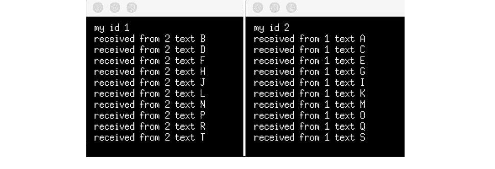

图 2.12：机器人 1（左）和机器人 2（右）的屏幕输出

### 2.11 多任务处理

并行运行多个任务对于机器人应用非常有意义——即使处理器必须将它们串行化。我们通常有几个不同的控制循环，它们必须以不同的速度运行。例如，一个读取 PSD 传感器的循环必须运行得非常快以避免碰撞，而耗时的图像处理可以以较慢的速度运行（见图 2.13）。尽管我们在后续章节的示例中没有使用多任务处理，但它仍然是更复杂机器人程序的基本组成部分。

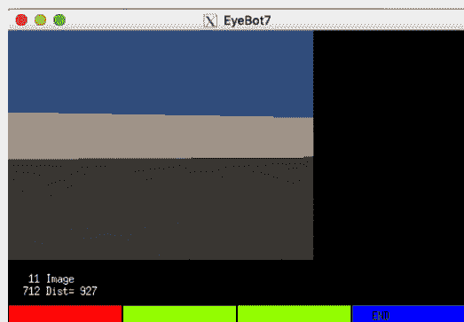

图 2.13：摄像头和 PSD 传感器的独立迭代计数器

我们使用标准的 *pthreads*（POSIX 线程⁶）包进行多任务处理，有许多相关的独立文献可供参考。在程序 2.19 中，我们使用一个 *mutex*（*互斥锁*的缩写）来同步两个并行运行的线程。

主程序初始化线程和互斥锁，然后并行启动两个从线程（*cam* 和 *psd*），最后等待按钮按下以终止整个程序。每个从线程运行一个无限循环，读取传感器数据（*cam* 读取摄像头，*psd* 读取 PSD），并将其与循环计数器（*i* 和 *j*）一起打印到屏幕上。访问 RoBIOS 函数必须包含在 *mutex_lock* 和 *mutex_unlock* 括号内，以防止出现错误结果和不可预测的行为。互斥锁操作只允许一个并行线程通过，而第二个线程必须等待第一个线程执行解锁操作。两个线程都使用 *sleep/usleep* 来释放处理时间。

## 2 机器人软件

程序 2.19：使用 pthreads 的 C 语言多任务程序

```c
#include "eyebot.h"
pthread_mutex_t rob;;

void *cam(void *arg)
{ int i=0;
  QVGACol img;
  while(1)
  { pthread_mutex_lock(&rob);
    CAMGet(img);
    LCDImage(img);
    LCDSetPrintf(19,0, "%4d Image ", i++);
    pthread_mutex_unlock(&rob);
    sleep(1);  // 休眠 1 秒
  }
  return NULL;
}

void *psd(void *arg)
{ int j=0;
  while(1)
  { pthread_mutex_lock(&rob);
    d = PSDGet(PSD_FRONT);
    LCDSetPrintf(20,0, "%4d Dist=%4d ", j++, d);
    pthread_mutex_unlock(&rob);
    usleep(50);  // 休眠 0.1 秒
  }
}

int main()
{ pthread_t t1, t2;
  XInitThreads();
  pthread_mutex_init(&rob, NULL);
  CAMInit(QVGA);
  LCDMenu("", "", "", "END");
  pthread_create(&t2, NULL, cam, (void *) 1);
  pthread_create(&t1, NULL, psd, (void *) 2);
  KEYWait(KEY4);
  pthread_exit(0); // 将终止程序
}
```

### 2.12 使用 IDE

有许多优秀的 IDE（集成开发环境）可供 Python 和 C/C++ 学术使用。这些环境使程序设计和调试变得容易得多。它们允许单步执行源代码、设置断点和检查变量内容，这些是程序开发中不可或缺的工具，可以显著提高生产力。

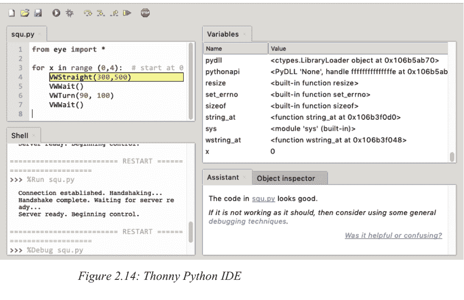

图 2.14：Thonny Python IDE

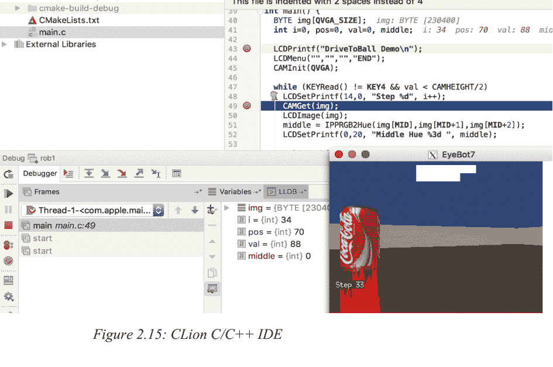

图 2.15：CLion C/C++ IDE

对于 Python，Thonny⁷（小巧的独立包，如图 2.14 所示）或 PyCharm⁸（功能齐全的综合包）是不错的选择。请确保在启动前将 Python 解释器设置为 *Python3*。
对于 C 和 C++，CLion⁹ 是一个很好的选择。在图 2.15 的示例中，CLion 被用于单步执行 C 程序，同时检查变量的变化以及机器人的 LCD 输出。

### 2.13 虚拟现实

基于 EyeSim，我们开发了一个 VR 版本，可在多个平台上运行，但最突出的是在廉价的 Oculus/Meta Quest 系统上。通过它，您可以简单地下载并安装二进制文件，并作为场景中的人物亲身体验本书中的各种机器人应用。您可以拾取和移动机器人、障碍物等，并通过将手放在它们前面来与它们的行驶路径或距离传感器进行交互。

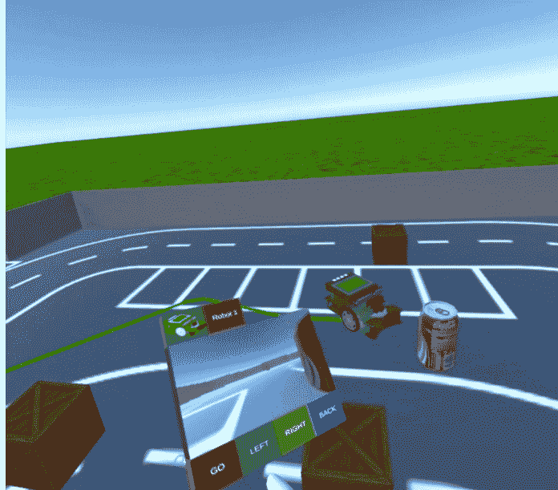

图 2.16：EyeSim VR 场景

⁷ Thonny – 面向初学者的 Python IDE，https://thonny.org
⁸ PyCharm – 面向专业人士和开发者的 Python IDE，https://www.jetbrains.com/pycharm/
⁹ CLion – 用于 C 和 C++ 的跨平台 IDE，https://www.jetbrains.com/clion/

## 任务


左手握持机器人的EyeBot触摸屏面板，所有来自机器人的文本和图形输出都显示在此。四个标准彩色按钮（红/绿/黄/蓝）以及额外的控制按钮，可以轻松地用右手食指手势按下。
新的应用程序可以用C#编写，使用与本书中介绍的C语言API类似的API。图2.16展示了机器人在VR场景中驾驶的画面。手持显示屏显示了所选机器人的输出。

### 2.14 任务

- 用Python、C或C++编写一个程序，让机器人直线行驶，直到距离障碍物或墙壁300mm以内，然后让它转向180°并驶回起点。
- 编写一个程序，让机器人沿着直径为1米的完整圆形行驶。
- 使用RoBIOS函数`RADIOStatus`扩展ping程序，使其适用于任意机器人ID号。
- 设置你首选编程语言的IDE，并单步调试一个机器人程序。

## 驾驶算法

即使前方没有任何障碍物，将机器人从点$A$驾驶到点$B$也可能是一项挑战。我们将首先研究一种漫无目的的*随机驾驶*，然后再探讨几种如何驾驶到特定点的方法。如果我们需要以指定的方向到达目的地，事情会变得更加复杂。

### 3.1 随机驾驶

第一代扫地机器人使用了一个非常简单的算法，在一个无限循环中运行：

- 直线行驶，直到撞到障碍物。
- 随机转动一个角度。

如果你担心这种行为的清洁质量，你可能是对的。但从数学角度来看，只要机器人在物理上能够到达，给定无限的时间，这个算法将覆盖整个清洁区域。

正如你从Evan Ackerman拍摄的附带LED的清洁机器人长曝光照片（图3.1）中看到的，存在大量无效的之字形运动[Ackerman 2010]$^1$ 和 [Ackerman 2016]$^2$。

更先进的清洁机器人可以驾驶更高效的模式，如图3.2所示。机器人沿着主要房间墙壁定位自己，然后驾驶规则的*草坪修剪模式*。

随机驾驶的程序（程序3.1）基本上由一个单独的*while*循环组成，该循环一直运行，直到按下*END*按钮（*KEY4*）。我们在每次循环迭代中等待100ms（0.1秒）以减少计算开销。一个*if*选择检查三个方向是否有足够的空间（300mm）

$^1$ E. Ackerman, *Robot Roomba 560 vs. Neato XV-11*, IEEE Spectrum, June 2010, https://spectrum.ieee.org/automaton/robotics/home-robots/irobot-roomba-560-vs-neato-xv11
$^2$ E. Ackerman, Review: *Neato BotVac Connected*, IEEE Spectrum, May 2016, https://spectrum.ieee.org/automaton/robotics/home-robots/review-neato-botvac-connected

## 3 驾驶算法

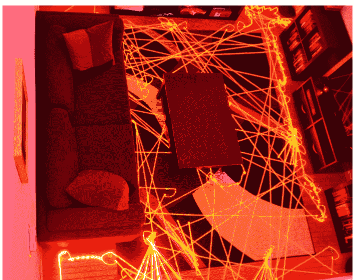

图3.1：Roomba 880清洁模式 [Ackerman 2016] 照片由Evan Ackerman / IEEE Spectrum 2016提供

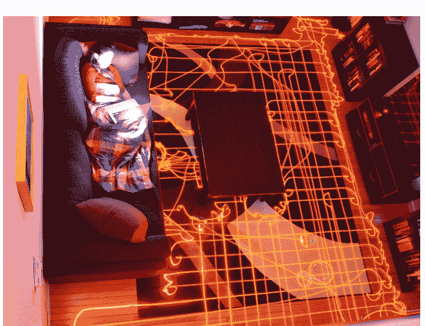

图3.2：Roomba 980清洁模式 [Ackerman 2016] 照片由Evan Ackerman / IEEE Spectrum 2016提供

## 随机驾驶


然后继续向前行驶。如果没有，机器人会后退一小段距离（25mm），然后随机转动一个角度。函数*random()*产生一个0到1之间的数字，因此表达式

180 * (random() - 0.5)

产生一个介于-90到+90之间的值，这定义了我们随机转向的可能范围。在下一次循环迭代中，如果新方向上有足够的空间，机器人将再次直线行驶。

*程序3.1：Python中的随机驾驶程序*

```
1  from eye import *
2  from random import *
3  
4  safe=300
5  LCDMenu("","","","END")
6  
7  while(KEYRead() != KEY4):
8      OSWait(100)
9      if(PSDGet(PSD_FRONT)>safe and PSDGet(PSD_LEFT)>safe
10         and PSDGet(PSD_RIGHT)>safe):
11         VWStraight(100,200)
12     else:
13         VWStraight(-25,50)
14         VWWait()
15         dir=int(180*(random()-0.5))
16         VWTurn(dir,45)
17         VWWait()
```

程序3.2使用了同一算法的扩展版本。它将PSD传感器的数值打印到显示屏上，这需要将它们存储在变量*f*、*l*和*r*中。它还在机器人每次转向时打印一条动作消息（这总是一个好主意），并且它持续读取摄像头图像并将其显示出来。图3.3中的截图显示了机器人在几段直线行驶后的驾驶情况。我们使用了机器人足球场作为此任务的背景。

该程序的C版本与Python实现非常相似；只是使用了不同的语法。驾驶结果完全相同——参见程序3.3。摄像头初始化为QVGA，其图像与前、左、右PSD读数一起显示。需要按下KEY4（END软键）来终止程序。

由于机器人会因任何类型的障碍物而停止，当它遇到另一个机器人时也会停止。因此我们现在可以安全地让多个机器人在相同的编程环境中运行。为此，我们只需在*SIM*脚本中为每个机器人添加一行额外的代码。在程序3.4的脚本中，我们启动了三个不同的机器人——两个*LabBots*和一个*SoccerBot S4*。此示例中的所有机器人都有相同的可执行程序，但你可以通过更改可执行文件名轻松指定不同的程序。

## 3 驾驶算法

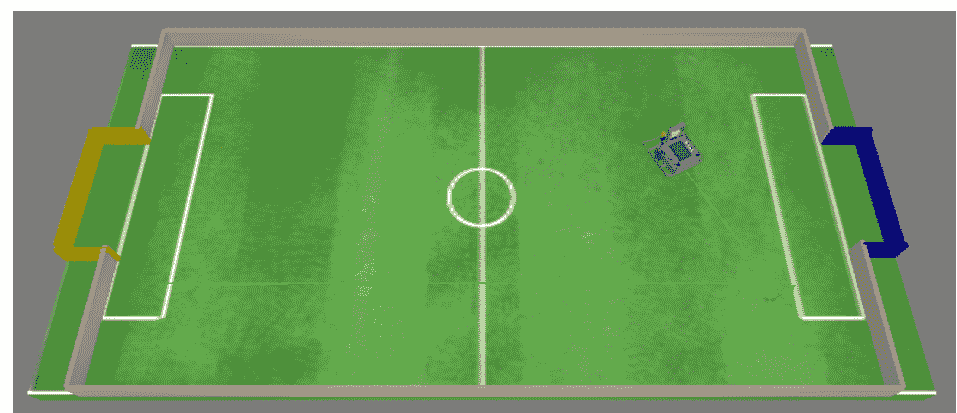

图3.3：执行随机驾驶程序的机器人

程序3.2：带距离传感器输出的Python随机驾驶程序

```
1  from eye import *
2  from random import *
3  
4  safe=300
5  LCDMenu("","","","END")
6  CAMInit(QVGA)
7  
8  while(KEYRead() != KEY4):
9      OSWait(100)
10     img = CAMGet()
11     LCDImage(img)
12     f=PSDGet(PSD_FRONT)
13     l=PSDGet(PSD_LEFT)
14     r=PSDGet(PSD_RIGHT)
15     LCDSetPrintf(18,0,"PSD L%3d",l,f,r)
16 
17     if(l>safe and f>safe and r>safe):
18         VWStraight(100,200)
19     else:
20         VWStraight(-25,50)
21         VWWait()
22         dir = int(180*(random()-0.5))
23         LCDSetPrintf(19,0,"Turn  %d",dir)
24         VWTurn(dir,45)
25         VWWait()
26         LCDSetPrintf(19,0,"      ")
```

## 随机驾驶


程序3.3：C语言随机驾驶程序

```
1  #include "eyebot.h"
2  #define SAFE 300
3  
4  int main ()
5  { BYTE img[QVGA_SIZE];
6    int dir, l, f, r;
7  
8    LCDMenu("", "", "", "END");
9    CAMInit(QVGA);
10 
11   while(KEYRead() != KEY4)
12   { CAMGet(img);    // demo
13     LCDImage(img);  // only
14     l = PSDGet(PSD_LEFT);
15     f = PSDGet(PSD_FRONT);
16     r = PSDGet(PSD_RIGHT);
17     LCDSetPrintf(18,0, "PSD L%3d F%3d R%3d", l, f, r);
18     if (l>SAFE && f>SAFE && r>SAFE)
19       VWStraight(100, 200); // start driving 100mm dist.
20     else
21     { VWStraight(-25, 50); VWWait(); // back up
22       dir = 180 * ((float)rand()/RAND_MAX-0.5);
23       LCDSetPrintf(19,0, "Turn %d", dir);
24       VWTurn(dir, 45); VWWait(); // turn [-90, +90]
25       LCDSetPrintf(19,0, "          ");
26     }
27     OSWait(100);
28   } // while
29   return 0;
30 }
```

程序3.4：用于同一环境中多个机器人的SIM脚本文件

```
1  # Environment
2  world $HOME/worlds/small/Soccer1998.wld
3  
4  settings VIS TRACE
5  
6  # robotname x y phi
7  LabBot  400  400   0 randomdrive.py
8  S4      700  700  45 randomdrive.py
9  LabBot 1000 1000  90 randomdrive.py
```

为每个机器人添加一行额外的代码很容易，但如果你想要，比如说，100个机器人用于群体应用，这也会变得乏味。对于这些应用，有通用的SIM脚本方法，我们将在关于机器人群体的第5章中讨论。三个随机驾驶机器人在它们旅程的不同阶段如图3.4所示。

## 3 驱动算法

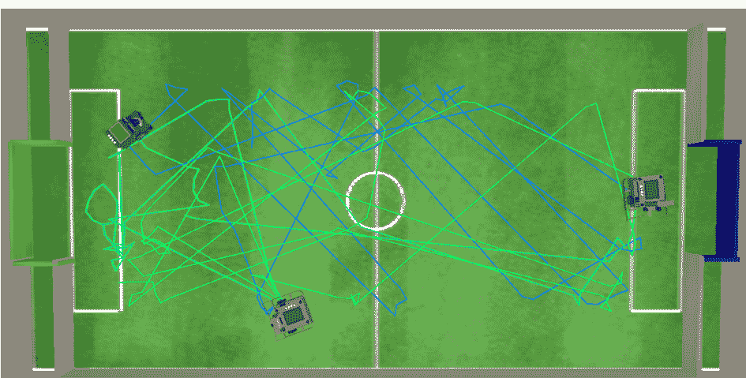

图 3.4：三个机器人在共享环境中执行随机驱动

### 3.2 驱动至目标位置

*随机驱动*的反面是驱动至某个目标或终点。我们现在将介绍几种不同的方法，让我们能从A点行驶到B点，假设这两点之间没有障碍物。在后面的第10章，我们将探讨更复杂的场景，包括需要避开的障碍物。

图3.5展示了从A点（左上角的机器人位置）到B点（右下角的红点）的几种可能方法。

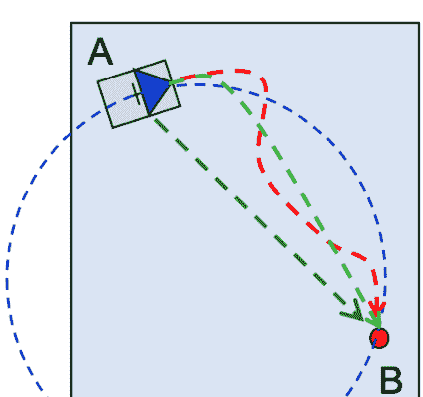

图 3.5：驱动方法：直线、圆弧、狗曲线和样条曲线

### 转向并直线行驶

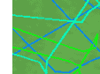

我们可以：

-   原地转向直到获得正确的朝向，然后直线驶向目标（深绿色线），
-   沿着连接A和B的圆弧行驶（蓝色线），
-   持续地、渐进地改变机器人的朝向以接近目标（“狗曲线”，浅绿色线），
-   沿着计算出的三次样条曲线行驶，这同样允许我们在到达目标时指定所需的机器人朝向（红色线）。

我们现在将更详细地探讨每种方法。

### 3.3 转向并直线行驶

原地旋转后直线行驶可能是从A点到B点最简单的方法。尽管机器人行驶的距离最短，但它可能并非以最短时间完成任务，因为它执行了两个独立的动作，并且在完成转向后必须完全停止，然后才能开始直线行驶。

程序3.5展示了该算法。首先，我们使用函数 *atan2* 计算相对于目标的角度。与将商 *dy/dx* 作为单个参数的 *atan* 不同，函数 *atan2* 将值 *dy* 和 *dx* 作为两个独立的参数，因此可以计算出正确的唯一角度
$$goal\_angle = atan2(dy, dx)$$
由于函数返回的结果单位是 *rad*（弧度），我们必须在将其用于 *VWTurn* 函数之前将其转换为度。

对于计算行驶距离，我们使用勾股定理
$$goal\_distance = \sqrt{dx^2+dy^2}$$

*程序 3.5：C语言中的旋转并直线行驶*

```c
#include "eyebot.h"
#define DX 500
#define DY 500

int main()
{ float angle, dist;
  // calculate angle and distance
  angle = atan2(DY, DX) * 180/M_PI;
  dist  = sqrt(DX*DX + DY*DY);

  // rotate and drive straight
  VWTurn(angle, 50);     VWWait();
  VWStraight(dist, 100); VWWait();
}
```

实际的驾驶命令随后变得非常简单。我们使用 *VWTurn* 配合计算出的角度，然后使用 *VWStraight* 配合计算出的距离值。请注意，两个驾驶命令后都必须调用函数 *VWWait*，该函数会暂停主程序执行，直到驾驶命令完成。

图3.6展示了转向-直线方法的结果，在期望的目标位置放置了一个标记。模拟的机器人并未精确地撞到标记，这是由于其转向操作略有不准确，这与真实机器人的行为类似。这个问题最好通过使用传感器输入（如视觉或激光雷达）来持续更新相对目标位置来解决（参见第11章关于机器人视觉的图11.10）。

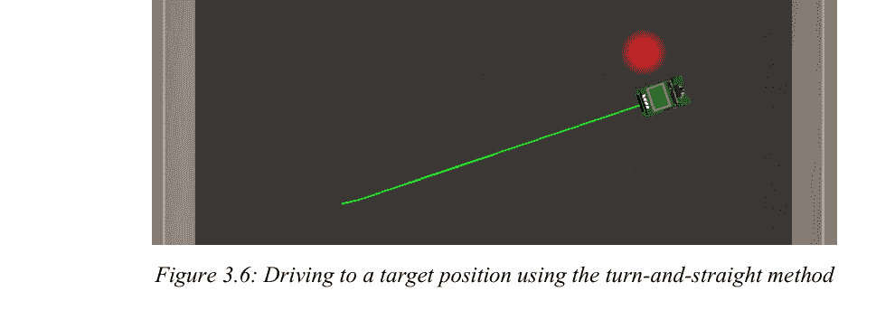

### 3.4 圆弧

我们可以不采用旋转然后直线行驶的方式，而是根据A点和B点之间的距离，结合直线AB与机器人初始朝向之间的角度差，计算出所需的弧长 *s* 和角度 *α*。然后，我们可以发出一个具有恒定曲率的驾驶命令，形成一个圆弧。

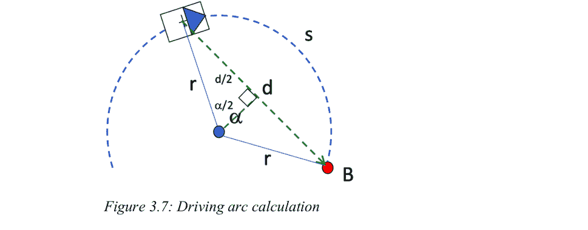

### 圆弧

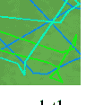

像之前一样，我们使用函数 *atan2* 计算目标方向，使用勾股定理计算直线目标距离 *d*。总旋转角度 *α* 由目标方向减去机器人的初始朝向 *phi* 得出。如图3.7所示，我们可以使用线段 *d* 的一半和角度 *α* 的一半构成一个直角三角形。对 *α/2* 应用正弦公式得到
$$sin(\alpha/2) = (d/2) / r$$
解出半径 *r* 得到
$$r = d / (2*sin(\alpha/2))$$
然后我们可以计算所需的弧长 *s* 为
$$s = r * \alpha$$。

*程序 3.6：C语言中使用VWSetSpeed驾驶圆弧*

```c
#include "eyebot.h"
#define GOALX 1000
#define GOALY 500
#define SPEED 300

int main()
{ float goal_angle, alpha, d, r, s, omega;
  int x,y,phi, dx,dy;

  goal_angle = atan2(GOALY, GOALX); // unit is [rad]
  VWGetPosition(&x,&y,&phi);        // angle in [deg]
  alpha = goal_angle - phi*M_PI/180;// relative to rob.

  d = sqrt(GOALX*GOALX + GOALY*GOALY);// segment length
  r = d / (2*sin(alpha/2));           // radius
  s = r * alpha;                      // arc length

  omega = (alpha * 180/M_PI) / (s/SPEED); // angle/time
  VWSetSpeed(SPEED, round(omega));

  do
  { OSWait(100);
    VWGetPosition(&x,&y,&phi);
    dx = GOALX-x;  dy = GOALY-y;
  } while (sqrt(dx*dx + dy*dy) > 100);
  VWSetSpeed(0, 0);  // stop robot
}
```

我们现在在程序3.6中实现所有这些公式。使用函数 *VWSetSpeed*，我们需要计算一个与所选恒定速度 *v* 匹配的固定角速度 *ω*。我们通过将总转向角度 *α* 除以行驶时间来实现，而行驶时间又是距离 *s* 除以线速度 *v*。
我们只发出一个 *VWSetSpeed* 驾驶命令，然后在循环中检查目标距离。当机器人足够接近时，我们停止它。
尽管原则上正确，但这种方法并不能给出良好的驾驶结果，因为模拟和真实机器人中的转向功能都不完美（并且基于整数而不是浮点数）。一个性能更好且简单得多的解决方案是内置函数 *VWDrive*，它直接实现了沿圆弧行驶的所需功能。程序3.7列出了简单的两行代码，图3.8显示了执行截图。

*程序 3.7：C语言中使用VWDrive驾驶圆弧*

```c
int main()
{ VWDrive(GOALX, GOALY, SPEED);
  VWWait();
}
```

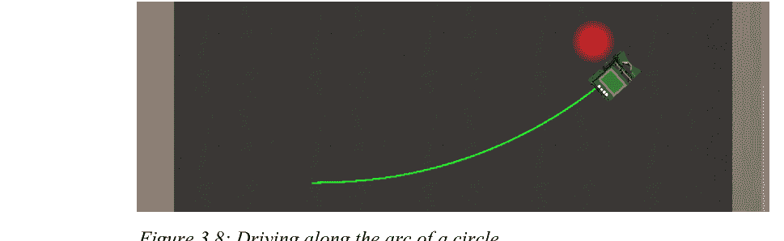

### 3.5 狗曲线

如果一个机器人保持恒定速度，并且最初从其起始朝向直线行驶，但在每一步都将其角度向目标校正，我们最终会得到一个连续的运动，其曲率在每个迭代步骤中都会变化。由此产生的路径通常被称为 *狗曲线*，暗示狗在追逐目标时遵循这个原理。该算法仍然相当简单，如程序3.8所示。

像之前一样，目标坐标以相对于机器人当前位置的偏移量给出（*GOALX*, *GOALY*）。在 *do-while* 循环中，我们计算机器人当前相对于目标的偏移量（*dx*, *dy*），然后使用这些值计算到目标位置的距离和角度。目标角度与机器人当前朝向角度之差以一种非常简单的方式用于确定机器人所需的角速度 ω：

-   如果差值大于5°的阈值，则增加 ω。
-   如果差值小于–5°的阈值，则减少 ω。
-   否则，将 ω 设置为0。

使用这些值，可以使用恒定线速度 *v* 和计算出的角速度 ω 调用 *VWSetSpeed*。当机器人距离目标位置超过100mm时，循环继续，然后发出停止命令，程序终止。图3.9显示了生成的狗曲线。

*程序 3.8：C语言中驾驶狗曲线*

```c
#include "eyebot.h"
#define GOALX 1000
#define GOALY  500

int main()
{ float diff_angle, goal_angle, goal_dist;
  int   steer=0, x,y,phi,  dx,dy;

  do
  { VWGetPosition(&x,&y,&phi);
    dx = GOALX-x;  dy = GOALY-y;
    goal_dist  = sqrt(dx*dx + dy*dy);
    goal_angle = atan2(dy, dx) * 180/M_PI;
    diff_angle = goal_angle - phi;
    if (diff_angle >  5) steer++;
      else if (diff_angle < -5) steer--;
        else steer = 0;
    VWSetSpeed(100, steer/2);
    OSWait(100);
  } while (goal_dist > 100);
  VWSetSpeed(0, 0);  // stop robot
}
```

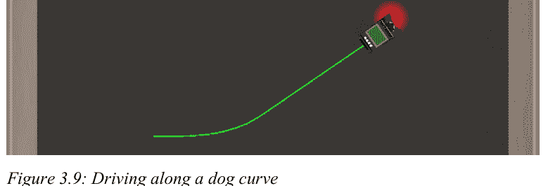

### 3.6 样条曲线

三次样条曲线是一种更复杂的从A点行驶到B点的方法，但它们提供了一个之前所有方法都无法提供的功能。样条曲线允许我们指定在目标点B的朝向，因此机器人将以指定的朝向到达指定的点。这对于许多应用来说非常重要；例如，在机器人足球中，我们希望机器人驶向球，但它应该从一个可以将球踢向对方球门的角度接近球。

## 3 驱动算法

Hermite样条使用一个参数 $u$，该参数在待驱动路径的长度上从0变化到1。它使用四个混合函数 $H_1$ 到 $H_4$，其定义如下 [Wikipedia 2019]$^3$

$H_1(u) = 2u^3 - 3u^2 + 1$
$H_2(u) = -2u^3 + 3u^2$
$H_3(u) = u^3 - 2u^2 + u$
$H_4(u) = u^3 - u^2$

混合函数的图形表示如图3.10所示。可以看出，$H_1$ 从1逐渐减小到0，而 $H_2$ 则相反。$H_3$ 和 $H_4$ 都从0开始并结束于0，且在相反方向上取较低的值。

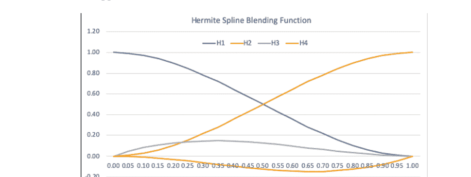

图3.10：Hermite样条混合函数

对于起点 $a$，其局部姿态$^4$为 $[0, 0, 0]$，以及目标点 $b$，其姿态为 $[x, y, \alpha]$，我们将路径长度设置为直接欧几里得距离乘以一个缩放因子 $k$

$len = k * \sqrt{(x^2 + y^2)}$ 。

由此，我们可以初始化起点和终点（$a_x$, $a_y$ 和 $b_x$, $b_y$）以及它们的缩放切向量（$Da_x$, $Da_y$ 和 $Db_x$, $Db_y$）。对于任意点 $p$ 和角度 $\alpha$，缩放切向量将是

$Dp_x = len * \cos(\alpha)$ 和
$Dp_y = len * \sin(\alpha)$ 。

然而，由于机器人起始位置 $a$ 的局部方向始终为 $0^\circ$（且 $\cos(0)=1$，$\sin(0)=0$），起始切向量简化为（$len$, 0）。

起点：$a_x = 0$, $a_y = 0$ $Da_x = len$, $Da_y = 0$
终点：$b_x = x$, $b_y = y$ $Db_x = len*\cos(\alpha)$, $Db_y = len*\sin(\alpha)$

$^3$ Wikipedia, *Cubic Hermite spline*, 2019, en.wikipedia.org/wiki/Cubic_Hermite_spline
$^4$ *姿态*结合了物体的位置和方向。在二维空间中移动的机器人的姿态是 $x$ 和 $y$ 方向的平移，以及一个旋转角度 $\alpha$。

## 样条

接下来，我们使用参数 $u$ 在范围 [0, 1] 内迭代公式，以获得样条曲线的所有中间点 $s(u)$。

$s_x(u) = H_1(u)*a_x + H_2(u)*b_x + H_3(u)*Da_x + H_4(u)*Db_x$
$s_y(u) = H_1(u)*a_y + H_2(u)*b_y + H_3(u)*Da_y + H_4(u)*Db_y$

然后，我们可以使用电子表格应用程序绘制生成的点，如图3.11所示。缩放因子 $k$ 越高，样条曲线偏离 $a$ 和 $b$ 之间直线的程度就越大。

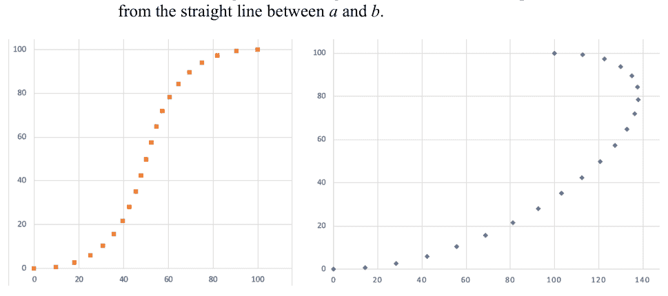

图3.11：目标点为 [100,100, 0°] 缩放因子为1.5（左）和 [100, 100, 180°] 缩放因子为2（右）的样条点

中间样条点的生成实现直接遵循上述定义。程序3.9展示了C语言的编码。

程序3.9：C语言中的样条点生成

```
1  for (float u = 0.0; u <= 1.0; u += INTERVAL) // [0..1]
2  { u2 = u*u;  u3 = u2*u;
3
4      h1 =  2*u3 - 3*u2 + 1;
5      h2 = -2*u3 + 3*u2;
6      h3 =    u3 - 2*u2 + u;
7      h4 =    u3 -   u2;
8
9      sx = ax*h1 + bx*h2 + Dax*h3 + Dbx*h4;
10     sy = ay*h1 + by*h2 + Day*h3 + Dby*h4;
11 }
```

沿着生成的点驱动是另一个完全不同的问题。我们使用机器人当前航向（从其定位函数 $VWGetPosition$ 读取）与期望航向（由前一个和当前样条点之间的连线推导得出）之间的差值来操纵机器人。然后，可以使用 $VWCurve$ 通过中间样条点之间的短距离分段驱动机器人（参见程序3.10）。

程序3.10：C语言中的样条驱动函数

```
1 sphi = round(atan2(sy-lasty, sx-lastx) * 180.0/M_PI);
2 VWGetPosition(&rx,&ry,&rphi);
3 VWCurve(DIST, sphi-rphi, SPEED);
4 VWWait();
5 lastx=sx; lasty=sy;
```

图3.12显示了沿样条曲线驱动到目标姿态 [1450, 650, 0°] 的最终结果。

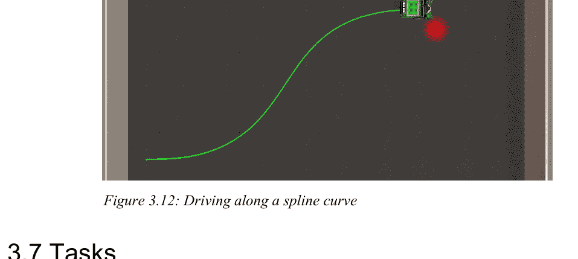

### 3.7 任务

- 编写一个 *SIM* 脚本来启动三个不同的机器人程序。Robot-1 应该从一个目标点左右移动到另一个目标点并返回，Robot-2 应该沿中线上下移动，Robot-3 应该从左上角开始随机移动。所有机器人在遇到障碍物或其他机器人时都应停止并后退。
- 修改 *SIM* 脚本，使所有三个机器人运行相同的可执行文件。将三个源程序合并为一个，并让函数 *OSMachineID* 的调用来决定每个机器人应执行哪部分。
- 完善样条驱动程序，使其通过接受命令行参数来接受任何目标姿态 [x, y, α]，从而变得灵活。
- 通过在迭代的每一步中用基于传感器的物体检测函数替换固定坐标，来改进本章中所有从A到B的驱动例程。

## 激光雷达传感器

激光雷达代表“光探测和测距”。激光雷达传感器有一个或多个旋转激光束，可以在几分之一秒内每转生成数千个距离点。典型的汽车激光雷达传感器有8、16或32个独立的光束，可以更好地解释三维环境。

来自激光雷达传感器的距离数据比来自摄像头的数据处理起来简单得多，因为它直接提供距离信息，而图像数据需要从立体或运动序列中进行复杂的计算才能提取距离。激光雷达传感器安装在大多数自主研究车辆上，包括迄今为止最成功的无人驾驶汽车——Waymo车队（前身为Google X）。不幸的是，激光雷达传感器非常昂贵。即使是用于机器人应用的单束激光雷达也要花费数千美元，而多束汽车激光雷达的成本可能高达10万美元。

高质量的激光雷达传感器测量每束反射光的飞行时间，并据此计算空间距离。由于这些光束以光速传播，这需要高性能的定时电路——这解释了传感器的高成本。仅用于测量单点的激光雷达通常使用更简单的折射位移技术。这些技术实现成本较低，常用于建筑行业的电子测距设备。

### 4.1 激光雷达扫描

我们将机器人放置在一个有一个内角的方形驾驶环境中。对于这种S4机器人类型，默认情况下，激光雷达顺时针扫描完整的360°圆，从机器人的*后方*开始并结束于*后方*。图4.1指示了传感器旋转，而图4.2可视化了传感器范围数据。它生成360个距离值，因此分辨率为1°。

生成激光雷达扫描的软件只是对 *LIDARGet* 的单次函数调用。在我们的C应用程序（程序4.1）中，我们在LCD屏幕上绘制距离值。对于360个值中的每一个，我们从左到右在屏幕上绘制一条相应长度（按因子10缩小）的蓝线，即从x位置0到359。y位置250位于绘图区域的底部，为打印文本和输入按钮行留出了一些空间。

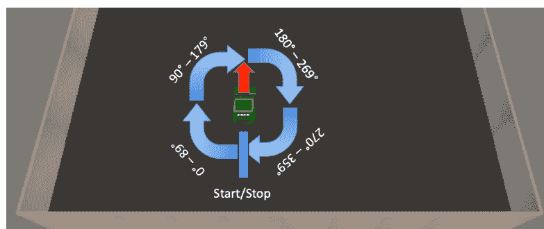

图4.1：激光雷达扫描范围和角度与机器人方向的关系

程序4.1：C语言中的激光雷达扫描和显示

```
1  #include "eyebot.h"
2
3  int main ()
4  { int i, scan[360];
5
6      do
7      { LCDClear();
8        LCDMenu("SCAN", "", "", "END");
9        LIDARGet(scan);
10       for (i=0; i<360; i++)
11           LCDLine(i,250-scan[i]/10, i,250, BLUE);
12   } while (KEYGet() != KEY4);
13 }
```

为了进一步提高图表的可读性，我们还可以在图表中添加90°、180°和270°的不同颜色的固定线（程序4.2）。然而，我们将其标记为相对于机器人前方位置的−90°、0°和+90°。这段额外的代码插入在while循环的末尾。

程序4.2：在C语言中为激光雷达输出显示辅助线和文本

```
1  LCDLine(180,0, 180,250, RED);   // 直行 (0°)
2  LCDLine( 90,0,  90,250, GREEN); // 左转 (-90°)
3  LCDLine(270,0, 270,250, GREEN); // 右转 (+90°)
4  LCDSetPrintf(19,0,"          -90          0          +90");
```

## 激光雷达扫描

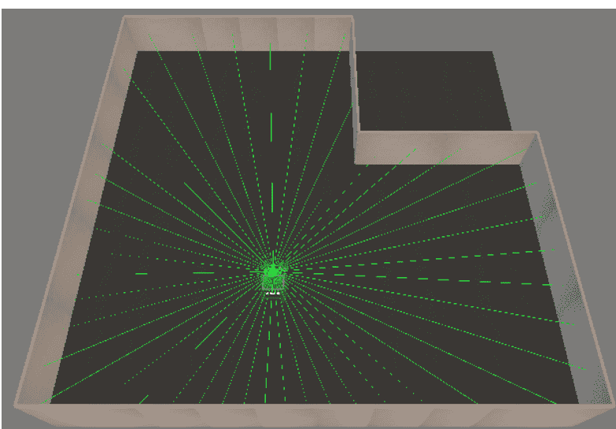

图 4.2：激光雷达扫描可视化

在图 4.3 的 LCD 图中，我们现在可以检测到五个外角，它们在图中表现为五个局部峰值，分别位于大约 −120°、−30°、+10°、+70° 和 +110° 处。内角则是在大约 +30° 处的一个尖锐局部最小值。

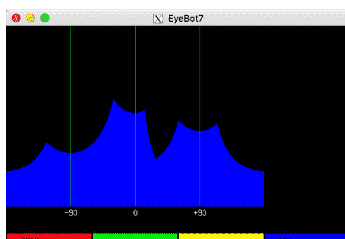

图 4.3：在机器人 LCD 上绘制的激光雷达扫描图

通过程序 4.3，可以在 Python 中实现类似的输出。请注意，Python 循环需要在开始时检查条件。

## 4 激光雷达传感器

程序 4.3：Python 中的激光雷达扫描与显示

```
1  from eye import *
2
3  LCDMenu("SCAN", "", "", "END")
4  while KEYGet() != KEY4:
5      LCDClear()
6      LCDMenu("SCAN", "", "", "END")
7      scan = LIDARGet()
8      for i in range(90,270):
9          LCDLine(i,250-int(scan[i]/10), i,250, BLUE)
```

### 4.2 角落与障碍物

本节展示更多激光雷达示例。首先，在图 4.4 中，一个机器人位于一个简单正方形的中心。激光雷达扫描显示出四个均匀高且均匀分布的峰值——每个角落一个。

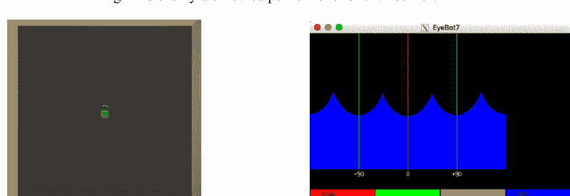

接下来，在图 4.5 中，我们将机器人放置在同一环境的左下角。我们仍然得到四个局部峰值，每个角落一个，但它们的距离不同（在图中表现为不同的高度），并且在图中不再等距（左右方向），因为它们出现在与之前不同的角度。

如果我们把机器人放回正方形的中间，然后在每边放置一个汽罐，我们将得到图 4.6 所示的扫描图。汽罐阻挡了其径向后方的任何信息，这在图 4.6 左侧的激光雷达可视化中可以清楚地看到。在 LCD 上的激光雷达图（图 4.6 右侧）中，汽罐表现为两个清晰可辨的缺口。

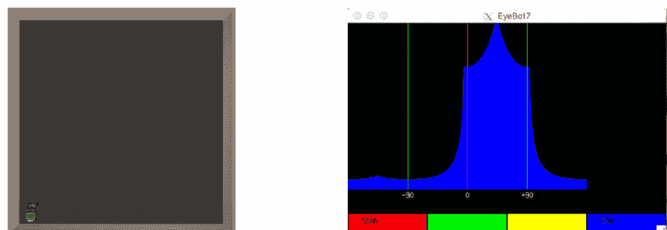

图 4.5：角落位置的机器人放置与激光雷达图

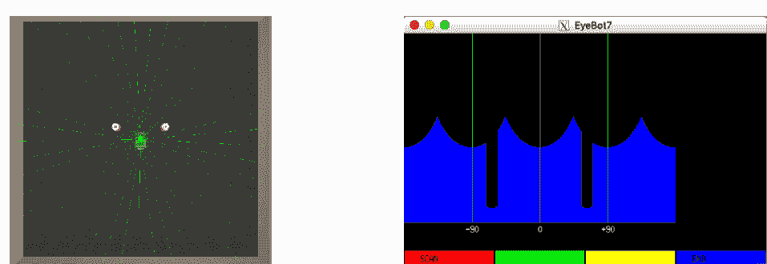

图 4.6：带有两个障碍物的机器人可视化与激光雷达图

### 4.3 任务

- 设计一个简单的驾驶环境世界文件，并将其几何模型存储在机器人上。
- 编写一个激光雷达程序，将激光雷达图像与存储的环境图像进行匹配，并高亮显示所有可能的机器人位置（和方向）。
- 让机器人四处行驶（例如，沿墙行驶或随机行驶），并根据新传入的激光雷达数据，逐步排除越来越多的可能位置/方向，直到剩下唯一正确的位置/方向。

## 5 机器人集群

在前面的章节中，我们展示了多个机器人如何在相同或不同的控制程序下在同一环境中运行。如果机器人数量变得非常大，在 *SIM* 脚本中用一行来指定每个机器人可能会变得冗长。因此，我们引入了一种集群表示法，它通过在迷宫格式的环境文件中使用单字符占位符，并配合相应的 *SIM* 脚本来工作。

### 5.1 设置集群

我们从迷宫环境文件开始。图 5.1 中的示例有 16 个占位符，由字符 *a* 标记，排列成 4×4 的网格。

```
| a a a a |
| a a a a |
| a a a a |
| a a a a |
```

*图 5.1：用于 16 个相同机器人的迷宫环境文件*

在程序 5.1 的 *SIM* 脚本中，我们使用此环境文件，并为每个 *a* 占位符指定使用机器人类型 S4。这里不需要指定 (*x*,*y*) 位置，因为位置已在环境文件中给出。如果我们也不指定初始方向，所有机器人的方向将随机选择。并且，如最后一个参数所指定，所有机器人执行相同的程序 *simple.x*。图 5.2 显示了 16 个相同机器人的最终放置结果。

*程序 5.1：重复环境的 SIM 脚本*

```
1  # Environment
2  world bots16.maz
3
4  # robotname x y phi
5  S4  a simple.x
```

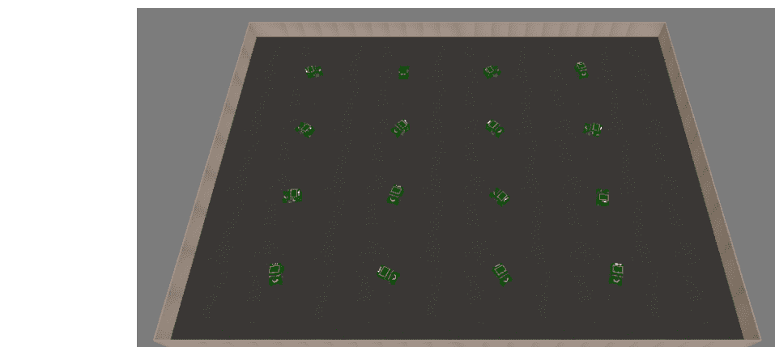

*图 5.2：16 个相同机器人的仿真结果*

在下一个示例（世界文件见图 5.3）中，我们希望使用不同类型的机器人，因此在迷宫环境文件中使用了四个不同的占位符：*a*、*b*、*c* 和 *d*。

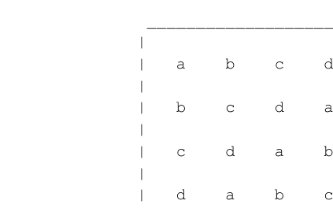

*图 5.3：用于四种类型共 16 个机器人的迷宫环境文件*

在程序 5.2 对应的 SIM 脚本中，我们首先使用“*robot*”结构将四个新的非标准机器人加载到环境中。之后，我们可以像使用预定义类型一样使用它们的名称。因此，所有 *a* 占位符变为 *Cubot*，所有 *b* 占位符变为 *Cubot-r*，依此类推。没有给出方向，因此机器人将具有随机的起始方向。与之前一样，它们都共享同一个可执行程序。图 5.4 显示了在 EyeSim 中的结果。

程序 5.2：用于四组机器人的环境文件

```
1  # Environment
2  world bots4x4.maz
3
4  # robot definitions
5  robot ../../robots/Differential/Cubot.robi
6  robot ../../robots/Differential/Cubot-r.robi
7  robot ../../robots/Differential/Cubot-b.robi
8  robot ../../robots/Differential/Cubot-y.robi
9
10 # robotname placeholder executable
11 Cubot    a  simple.x
12 Cubot-r  b  simple.x
13 Cubot-b  c  simple.x
14 Cubot-y  d  simple.x
```

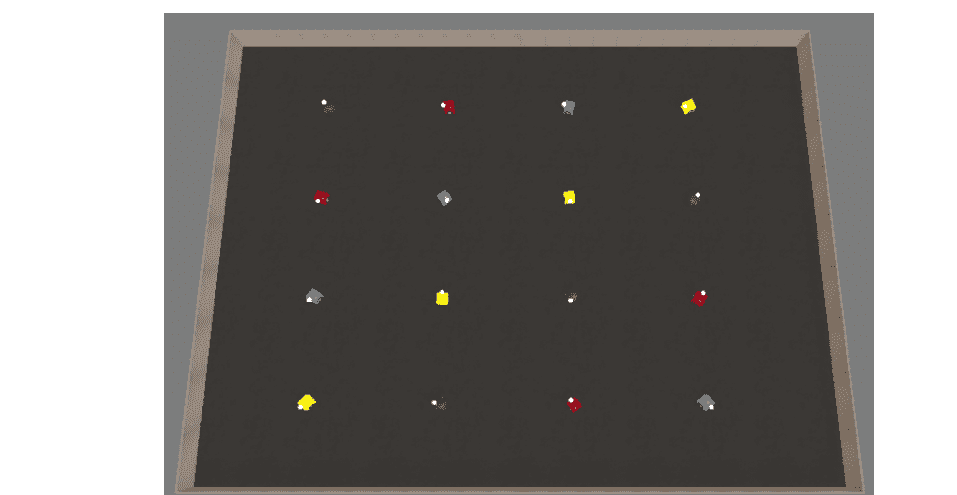

图 5.4：四种不同类型共 16 个机器人的仿真结果

如果我们想设置具有固定方向的机器人，可以使用程序 5.3 中的 *SIM* 脚本。它将多个 S4 和 LabBot 机器人放置在同一环境中。所有 S4 机器人（占位符 *l*）朝左（方向 180°），所有 LabBot 机器人（占位符 *r*）朝右（方向 0°）。机器人的总数和各自的位置由环境文件（世界格式见图 5.5）决定。在这种情况下，如你所见，我们将 S4 和 LabBot 对抗放置，进行一场友好的五人制足球赛。中间的符号“o”将被转换为一个高尔夫球，其尺寸适合这种小型联盟机器人足球赛事。图 5.6 显示了在 EyeSim 中的最终场景。

程序 5.3：用于五人制机器人足球的环境文件

```
1  # Environment
2  world soccer5-5.maz
3
4  # robotname x y phi
5  S4      l 180 swarm.x
6  LabBot  r   0 swarm.x
```

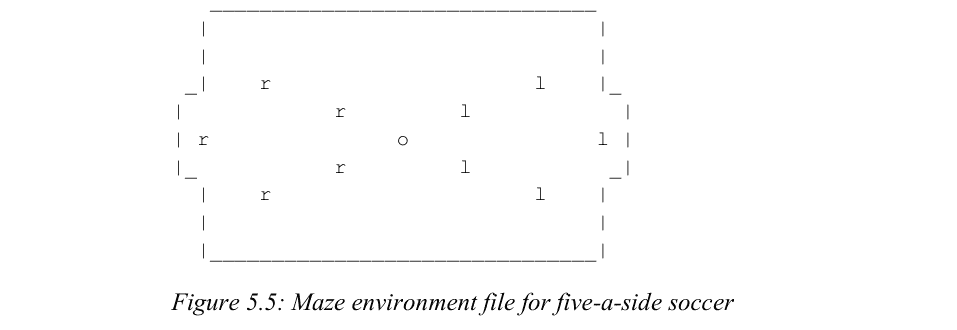

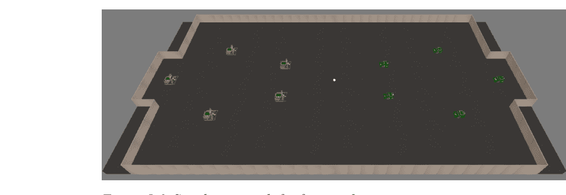

### 5.2 跟随我

一个典型的集群应用是跟随一个领航机器人。我们让领航机器人执行其自己的驾驶程序，然后专注于跟随机器人。程序 5.4 中的 SIM 脚本将一个 LabBot 定义为领航者，一个 S4 SoccerBot 定义为跟随者。对于领航者，我们只需要一个设置曲线速度的单行程序（程序 5.5）。

程序 5.4：领航者与跟随者的 SIM 脚本

```
1  # Environment
2  world Field.wld
3
4  # robots
5  LabBot  2000 500 0  leader.py
6  S4      500 500 0  follower.x
```

程序 5.5：Python 中的领航者程序

```
1  from eye import *
2  VWSetSpeed(300, 15)
```

我们换用 C 语言编写跟随者程序（程序 5.6）。它使用激光雷达扫描而不是更简单的 PSD 距离传感器来精确定位领航机器人的位置。*LIDARGet* 命令（默认情况下）围绕机器人进行 360 次距离测量，并将其放入提供的数组中。然后使用一个简单的循环来找到距离最小的角度，这对于在后续的 *VWSetSpeed* 命令中设置角速度是必需的。我们使用 180° 减去扫描角度，因为我们的激光雷达从机器人后方顺时针工作，因此数组位置 [180] 的值给出了正前方的距离。最后，*OSWait* 语句将更新速率降低到 10Hz。我们需要给机器人一点时间来执行每个驾驶命令，然后再用下一个命令覆盖它。

程序 5.6：C 语言中的跟随者程序

```
1  #include "eyebot.h"
2
3  int main ()
4  { int i, min_pos, scan[360];
5    while (KEYRead() != KEY4)
6    { LCDClear();
7      LCDMenu("", "", "", "END");
8      LIDARGet(scan);
9      min_pos = 0;
10     for (i=0; i<360; i++)
11       if (scan[i] < scan[min_pos]) min_pos = i;
12     VWSetSpeed(300, 180-min_pos);
13     OSWait(100); // 0.1 sec
14   }
15 }
```

## 5 机器人集群

图5.7和图5.8中的截图展示了跟随者机器人成功追逐领导者机器人的过程。关于集群和机器人交互的更多细节，可参阅[Wind, Sawodny, Bräunl 2018]¹。

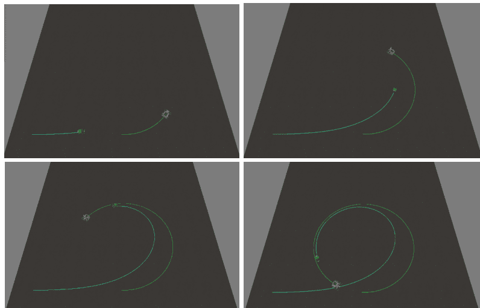

图5.7：仿真中的领导者-跟随者步骤

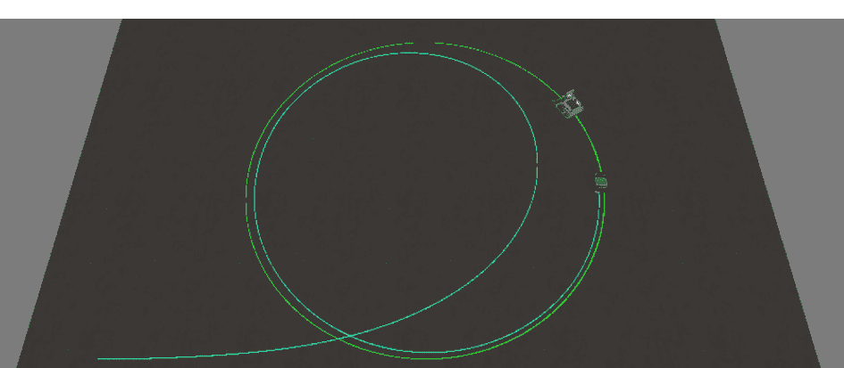

图5.8：领导者-跟随者场景的最终阶段

> ¹ H. Wind, O. Sawodny, T. Bräunl, *Investigation of Formation Control Approaches Considering the Ability of a Mobile Robot*, Intl. Journal of Robotics and Automation, June 2018

### 5.3 多个跟随者

如果我们有多个机器人跟随领导者，情况会变得更复杂。在这种情况下，我们必须考虑跟随者如何识别领导者。这可以通过多种方法实现，例如：

-   无线电通信——如果领导者将其当前位置数据传输给所有跟随者，
-   颜色或形状编码——如果领导者具有所有跟随者都能看到的独特颜色（或形状），或
-   高位激光雷达光束——如果领导者高于所有跟随者，因此可以被倾斜或更高位置的激光雷达传感器检测到。

我们选择了后一种实现方式，如图5.9的最终截图所示。

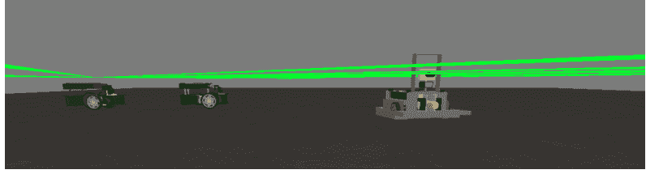

激光雷达位于跟随者机器人高度之上，因此只检测领导者机器人。请注意，在真实机器人上，激光雷达需要略微向上倾斜，以消除与其他跟随者物理传感器的干扰。由于这会将扫描范围缩小到180°，并限制领导者的最大检测范围，我们暂时忽略这一点。

在程序5.7的*SIM*脚本中，我们引用了一个新的机器人类型*LidarBot*，它将具有前面讨论的特殊激光雷达布置。如果需要，我们稍后可以在集群路径中添加一些障碍物，例如

```
can 5000 1400 0
```

程序5.7：自定义机器人类型的环境文件

```
1 # # Environment
2 world field.wld
3 settings VIS
4
5 robot lidarbot.robi
6 ...
```

激光雷达设置是机器人*ROBI*描述文件的一部分，因此我们必须为此应用定义自己的机器人（LidarBot）。描述文件*lidarbot.robi*包含许多其他内容，其中包括程序5.8所示的激光雷达规格。请注意，(x,y,z)位移为(0, 0, 100)，因此激光雷达位于机器人中心但高出100毫米。这样，激光雷达可以避开其自身的机器人底盘和其他S4型机器人，但会检测到领导者LabBot较高的手柄。扫描范围设置为180度（以机器人正前方为中心）和180个数据点，这保持了1°的角分辨率。

程序5.8：机器人定义文件中的激光雷达声明

```
1  # lidar pos relative to robot centre
2  # x y z [mm], rotation x y z [°]
3  # angular range [1, 360], tilt angle [-90, +90], data pts
4  lidar  0 0 100  0 0 0  180 10 180
```

我们还需要PSD距离传感器来避免与其他机器人碰撞。为此，我们定义了四个新的PSD，它们分别指向前方左侧和右侧25°以及45°对角线方向（参见程序5.9和图5.10）。

程序5.9：机器人定义文件中的PSD声明

```
1  # "psd" id, name, pos. to rob-center (right,front,up) [mm]
2  # R,U,F axis rotations in deg [clockwise is positive]
3  psd 1 PSD_FRONT    0  60 30    0  0    0
4  psd 2 PSD_LEFT    45  60 30    0  0  -90
5  psd 3 PSD_RIGHT  -45  60 30    0  0   90
6  psd 4 PSD_BACK     0 -60 30    0  0 -180
7  psd 5 PSD_FL       0  60 30    0  0  -45
8  psd 6 PSD_FR       0  60 30    0  0   45
9  psd 7 PSD_FFL      0  60 30    0  0  -25
10 psd 8 PSD_FFR      0  60 30    0  0   25
```

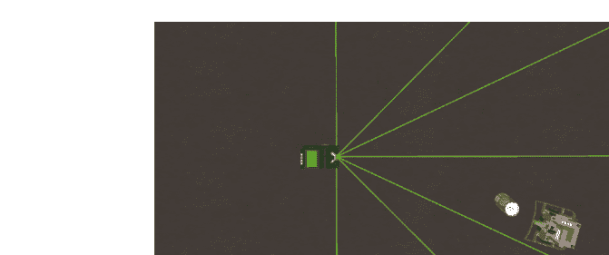

图5.10：用于避碰的附加PSD传感器

在应用程序中，我们让领导者只是直线行驶——同样使用Python（程序5.10）。然后我们在SIM脚本（程序5.11）中将五个跟随者放置在领导者机器人后面。


程序5.10：Python中的原地旋转

```
1  from eye import *
2  VWSetSpeed(300,0)
```

程序5.11：单个领导者与五个跟随者的SIM脚本

```
1  # robots
2  Labbot   2500 1200 0  leader-straight.py
3  LIDARBOT 1500 1500 0  follower.x
4  LIDARBOT 1500 1200 0  follower.x
5  LIDARBOT 1500  900 0  follower.x
6  LIDARBOT  500 1400 0  follower.x
7  LIDARBOT  500 1000 0  follower.x
```

程序5.12中跟随者的主要程序运行一个*while*循环，其中首先使用函数*LIDARGet*扫描机器人前方180°区域。然后它寻找最小值，该值将位于领导者机器人高手柄的方向。变量*min_pos*随后将在[−90°, +90°]范围内显示领导者的方向。我们还使用*LCDLine*将激光雷达图像绘制到屏幕上，类似于之前的单个跟随者场景。

程序5.12：C语言中多个跟随者的集群算法

```
1   while (KEYRead() !=KEY4)
2   { LCDClear();
3     LIDARGet(scan);
4     min_pos = 0;
5     for (i=0; i<SCANSIZE; i++)
6     { if (scan[i] < scan[min_pos]) min_pos = i;
7       LCDLine(i,250-scan[i]/100, i,250, BLUE);
8     }
9     F  =PSDGet(PSD_FRONT);
10    L  =PSDGet(PSD_LEFT); R  =PSDGet(PSD_RIGHT);
11    FL =PSDGet(PSD_FL);   FR =PSDGet(PSD_FR);
12    FFL=PSDGet(PSD_FFL);  FFR=PSDGet(PSD_FFR);
13    if (F<SAFE) VWSetSpeed(0, -90);
14      else if (L<SAFE || FL<SAFE || FFL<SAFE)
15              VWSetSpeed(150, -20);
16        else if (R<SAFE || FR<SAFE || FFR<SAFE)
17                VWSetSpeed(150, +20);
18          else VWSetSpeed(300, 90 - min_pos);
19    OSWait(200); // 0.2 sec
20  }
```

在*while*循环的后半部分，我们需要检查与其他跟随者、领导者机器人或末端墙壁的碰撞。我们本可以使用第二个、位置较低或倾斜的激光雷达光束来完成此操作，但我们决定改用PSD传感器。如前所述，我们在标准方向（前、左、右和后）上增加了四个PSD，以改进在碰撞发生前（即±45°和±25°的*FL*、*FFL*、*FR*、*FFR*）的检测和预防。读取每个传感器值后，我们可以确定新的行驶方向和速度：

-   如果机器人离障碍物太近，则原地旋转。
-   如果左侧或右侧（90°、45°或25°）有障碍物，则向相反方向转弯以较低速度避开。
-   如果一切正常，则全速直线驶向领导者。

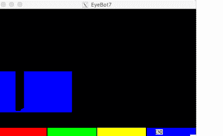

图5.11：跟随者机器人的激光雷达绘图

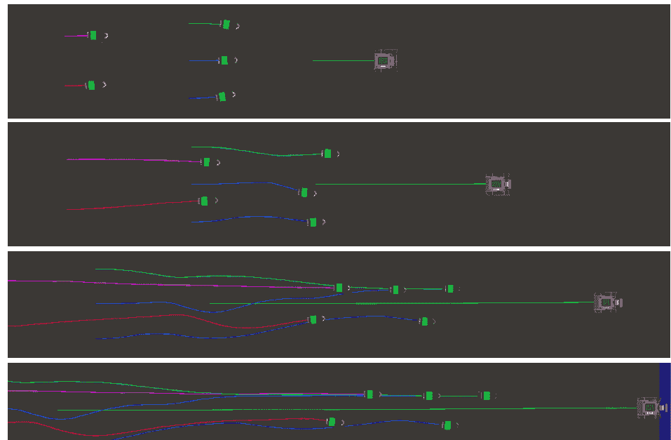

图5.12：集群场景展开

典型的激光雷达扫描如图5.11所示。我们可以看到180条扫描线的蓝色块中有一个明显的缺口，它代表领导者LabBot的高把手，它高耸于所有跟随的S4 SoccerBot之上。这给了我们目标方向，但当然我们必须考虑PSD数据，以避免与其他跟随者或领导者发生碰撞。

图5.12中的截图展示了五个机器人跟随其领导者的运动发展。行驶区域右侧的蓝色墙壁防止机器人从（虚拟）桌子上掉落。

最后（图5.13），在领导者在墙前停止后，跟随者机器人将以不受控制的模式散开，以避免碰撞，同时仍试图驶近。

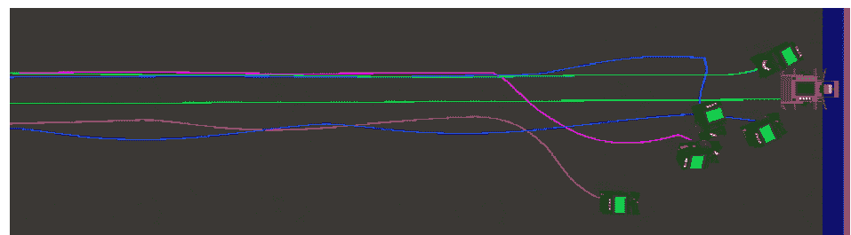

### 5.4 任务

-   扩展跟随者程序，使其以比领导者更快的速度行驶。使用激光雷达和/或PSD保持安全距离并防止碰撞。尝试领导者机器人的不同行驶模式，看看跟随者是否能追上它。
-   在行驶路径中添加障碍物，让领导者避开它们。跟随者必须避开所有障碍物，但仍继续追击。
-   在每个跟随者机器人顶部使用倾斜的激光雷达布置。

## 沿墙行走

沿墙行走是许多机器人任务的良好基础。它不仅涉及机器人避免碰撞的能力，还包括其对周围环境的感知以及在其中的定位。在本练习中，我们使用机器人的三个PSD传感器，它们分别提供前方、左侧和右侧的距离测量值。拥有数百个距离值的激光雷达传感器对此应用也可能有益，但并非必需。考虑到激光雷达的高成本，我们希望仅使用红外PSD传感器来完成此任务。

### 6.1 沿墙行走算法

由于该算法变得有些复杂，我们首先了解沿墙行走算法应如何执行。作为开始，我们假设一个大致为矩形的行驶区域，具有笔直的墙壁和直角拐角。

1.  机器人从场地中央开始，相对于墙壁具有随机朝向。在不知道其相对于环境的朝向的情况下，它首先直线行驶，直到遇到墙壁然后停止。
2.  机器人现在必须转向与墙壁平行，将其置于左侧。

然后重复以下两个步骤：

3.  机器人继续行驶，“紧贴”墙壁，借助左侧PSD传感器持续更新其行驶曲线。
4.  当机器人遇到第一个拐角（由前方PSD传感器检测到）时，执行90°转弯。

因此，一次完美的运行应如图6.1所示。当然，正确执行这些步骤中的每一步都绝非易事。让我们逐一分析。

## 6 沿墙行走

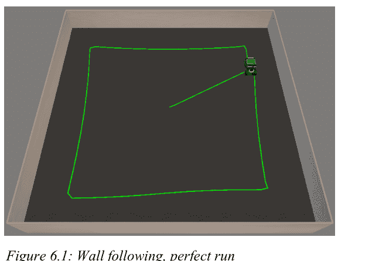

**步骤1：** 直线行驶可以通过函数*VWSetSpeed(x,0)*轻松实现，该函数指定线速度为*x*，旋转速度为零。停止只需读取前方PSD传感器，因此实现这部分很简单。

**步骤2：** 计算机器人相对于墙壁的正确朝向是此步骤的关键。随后的旋转可以使用函数*VWTurn*和*VWWait*轻松执行。

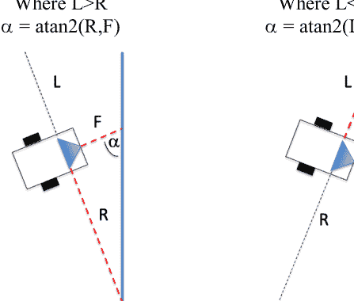

如图6.2中的图表所示，来自前方和右侧PSD（左图）或前方和左侧PSD（右图）的距离读数——取决于接近角度——可用于确定旋转角度。由于前方和右侧PSD（或前方和左侧PSD）相隔90°，我们可以使用反正切函数来计算墙壁角度$\alpha$。在软件中，我们将使用*atan2*数学函数，它接受两个参数（$\Delta y$和$\Delta x$）而不是商，以使结果角度对于所有输入值都是唯一的。

您可能已经意识到，这个规则在大多数情况下有效，但不幸的是并非在所有情况下都有效。如果机器人正好位于两面墙的中间，使得$L=R$怎么办？或者更糟的是，如果机器人离拐角太近，以至于$L$和$F$测量到两面不同的墙怎么办？需要更多的工作。

**步骤3：** 沿着墙壁直线行驶直到下一个拐角听起来与步骤1非常相似，但事实并非如此。只有当步骤2已将机器人完美地与墙壁对齐、墙壁完全笔直且机器人完美直线行驶时才会如此——在现实世界中这些都不会发生，因为总会存在一些不完美和噪声。

相反，我们需要做的是持续监控机器人与墙壁的距离，使用其左侧PSD传感器读数来校正机器人行驶的曲率。但请注意，如果机器人不垂直于墙壁（见图6.3），PSD值$L$可能大于机器人实际的墙壁距离$d$。

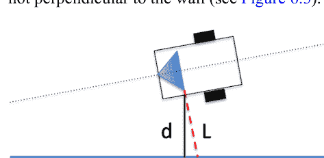

行驶过程中对$L$的后续测量可用于确定机器人与墙壁的角度和正确的墙壁距离。然后可用于校正机器人的行驶角度以进行沿墙行走。

前方PSD可用于像步骤1一样检测下一个拐角。然而，这仅在机器人与墙壁对齐不太差，使得前方传感器不会与正在跟随的墙壁相交时才有效。

**步骤4：** 固定90°角度的转弯可以使用*VWTurn*完成，但我们希望更灵活一些，因为拐角可能不是精确的90°，机器人也可能没有完美对齐。相反，我们建议旋转机器人，直到*PSD_FRONT*前方有足够的间隙（一个恒定值）。

同样，这种方法在大多数情况下有效，但如果存在额外的障碍物或其他机器人，则可能无法成功。这里也需要更多的工作。

### 6.2 简化的沿墙行走程序

我们现在将展示一个简化的程序，它在简单环境中解决沿墙行走问题，但远非完美。其主程序是一个无限循环，依次重复*drive*和*turn*两个步骤（程序6.1）。

程序6.1：C语言中的最小沿墙行走

```c
#include "eyebot.h"
#define SAFE  250

void drive()
{ do { if (PSDGet(PSD_LEFT)<SAFE) VWSetSpeed(200, -3);
       else VWSetSpeed(200, +3); // 向右或向左转
       OSWait(50);
   } while (PSDGet(PSD_FRONT) > SAFE);  // 下一个拐角
}

void turn()
{ VWSetSpeed(0, -100);
  while (PSDGet(PSD_FRONT) < 2*PSDGet(PSD_LEFT))
    OSWait(50);
}

int main()
{ while(1)
  { drive(); turn(); }
}
```

因此，这意味着我们对步骤1和3使用相同的“直线行驶”函数，对步骤2和4使用相同的“转弯”函数。

函数*drive*实际上执行沿墙行走。如果*PSD_LEFT*值变得太低，机器人会行驶一个轻微的右曲线（曲率−3），否则它会行驶一个轻微的左曲线（+3）。所以实际上，机器人从未完美直线行驶。循环内的*OSWait*函数限制了更新速度，并在下一次测量之前给每个方向改变一点时间来产生影响。*PSD_FRONT*测量用于终止沿墙行走例程。此函数不尝试计算机器人与墙壁的真实距离。结果将是一条略微弯曲的沿墙行走路径。

使用此子例程进行初始直线行驶到第一面墙只是为了节省一些代码行。如图6.4中的行驶图所示，初始行驶到墙壁的路径略微弯曲，但这并不重要。

*turn*函数甚至更简单。机器人使用*VWSetSpeed*转弯，直到前方有足够的空间，我们将其定义为到正在跟随的墙壁（左侧PSD）空间的两倍。同样，调用*OSWait*将限制忙等待循环的循环速度。请注意，没有一个函数在终止时停止机器人的运动（例如，通过使用*VWSetSpeed(0,0)*）。它们只是假设下一个函数会将机器人的速度更改为所需的任何值。

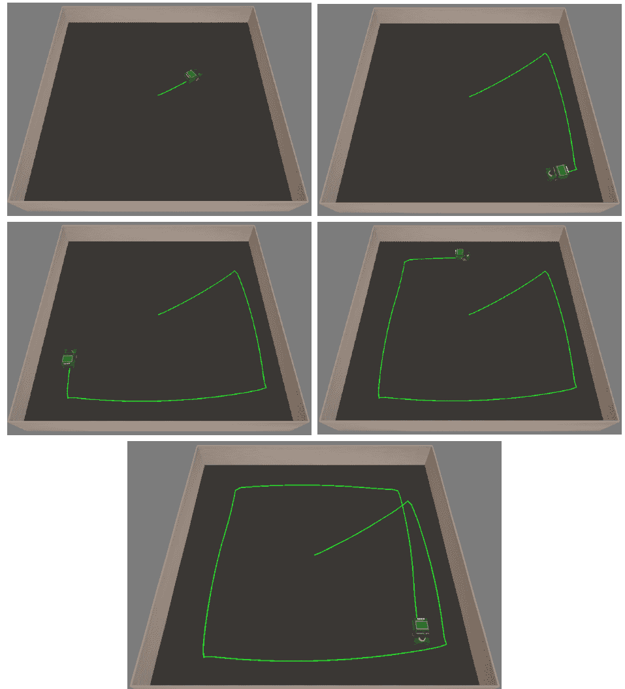

请注意，此算法高度依赖于机器人行驶的环境，绝非完整或完美。它在所有情况下以及从所有起始位置或朝向都不能表现良好。如本章开头所述，应进行多项改进，这甚至不包括处理更复杂形状的墙壁和奇怪的角度。尽管如此，对于一个只有十多行代码的程序来说，表现还不错。

### 6.3 任务

- 重写沿墙行走程序，按照概述的四个步骤正确解决沿墙行走问题。
- 创建一个更复杂的行驶环境，包含凹槽、非90°的角度、弯曲的墙壁等。调整您的程序，使其仍能进行沿墙行走。
- 扩展沿墙行走程序，以驱动空间填充的“割草机”模式，如第3.1节随机驱动中所示的更智能的吸尘机器人。

## 替代驱动系统

到目前为止，我们所使用的车辆类型采用的是*差速驱动*机制。它使用两个独立驱动的轮子，无需转向机构，因为通过让一个轮子比另一个转得更快即可实现转向。差速驱动可以说是最简单的机械驱动布置；因此，大多数移动机器人使用这种系统。然而，在本章中，我们将介绍类车转向、全向轮以及能够在地形上导航的车辆。

### 7.1 阿克曼转向

汽车通常只有一个驱动电机，其动力通过机械差速器分配到两个轮子（后轮或前轮——或在全轮驱动车辆中分配到所有四个轮子）。这使得构建强大的驱动系统成为可能，并避免在转弯时打滑和轮胎磨损。然而，由于驱动只能向前或向后，因此需要一个独立的转向机构，该机构将两个前轮转向所需的行驶方向。这种所谓的*阿克曼转向*用于所有汽车，无论是后轮驱动、前轮驱动还是全轮驱动。

大多数模型车都遵循这一原理，因此可以轻松改装为自动驾驶。如第1章所示，我们可以将模型车直接连接到树莓派控制器，无需任何额外硬件，并使用USB移动电源为控制器供电。我们需要两个PWM（脉冲宽度调制）输出信号，一个用于设置转向角度，另一个用于设置电机速度。作为传感器，我们有树莓派摄像头，如果需要，还可以使用USB激光雷达扫描仪，例如Hokuyo URG-04LX-UG01（图7.1）或经济型传感器Okdo LD06。

模型车与控制器的物理连接方式将决定可以使用哪些驱动命令。如果使用内置电机控制器，驱动系统只需要一个PWM信号，我们在RoBIOS中有*SERVO*命令。然而，如果驱动电机由EyeBot接口板控制，则使用*MOTOR*命令（我们现在假设是后者）。转向始终需要一个PWM信号，该信号由RoBIOS中的*SERVO*命令生成。

程序7.1中的子程序将电机驱动和转向命令组合成一个组合函数调用，假设驱动电机连接到电机端口1，转向连接到EyeBot板上的伺服输出1。如果需要两个PWM信号，可以将它们连接到伺服输出1和2。在RoBIOS库中，*MOTORDrive*接受范围在[−100, +100]内的值，用于以可变速度向后或向前驱动。将速度设置为0将停止电机。*SERVOSet*接受范围在[0, 255]内的单字节值，其中0是转向的最左位置，127是中性中间位置（车轮直行），255是最右位置。

程序7.1：C语言中的驱动与转向命令过程

```c
void Mdrive(int drive, int steer)
{ MOTORDrive(1, drive);
  SERVOSet  (1, steer);
}
```

当将模型车改装为没有接口板的机器人时，可以使用树莓派的两个I/O线直接控制驱动电机和转向。在EyeBot/RoBIOS软件中，我们使用*wiringPi*库中的命令来实现这一点 [Wiring Pi 2019]¹。

然后，我们可以使用程序7.1中的子程序来简化主应用程序（程序7.2）的驾驶命令。每个驱动命令后的*OSWait*语句将让驱动命令控制车辆几秒钟，直到下一个命令接管。

¹ Wiring Pi – 树莓派的GPIO接口库，2019年，http://wiringpi.com

程序7.2：C语言中的主驾驶函数

```c
int main ()
{ Mdrive("Forward",      60, 127);  OSWait(4000);
  Mdrive("Backward",    -60, 127);  OSWait(4000);
  Mdrive("Left Curve",   60,   0);  OSWait(2000);
  Mdrive("Right Curve",  60, 255);  OSWait(2000);
  Mdrive("Stop",          0,   0);
  return 0;
}
```

图7.2中的截图显示了机器人从鸟瞰视角（左）的行驶情况以及模型车的侧面配置（右）。阿克曼驱动车辆可以以一定的最小半径转弯，但不能原地转向。

### 7.2 全向驱动

差速驱动车辆可以向前/向后行驶、沿曲线行驶，并且可以原地转向——但它们不能横向行驶。阿克曼转向车辆甚至不能原地转向，并且受到其最小转弯半径的很大限制。因此，如果有一种全向车辆类型，即可以在任何给定方向行驶的车辆，那将是非常好的。

事实上，确实有可以实现这一点的车辆类型。最突出的是配备所谓麦克纳姆轮的车辆。这些是相当复杂的机械轮组件，可以有效地将轮子的力矢量旋转到驱动表面上。3轮或4轮麦克纳姆配置与多个独立电机的相互作用，允许在任何给定方向行驶，以及原地转向。

最初的麦克纳姆轮由瑞典工程师Bengt Ilon发明，并在美国（US3876255，1972年提交/1975年授权）和德国（DE2354404，1973/1974）获得专利。我们的Omni-1机器人（图7.3，左）就是按照这种车轮设计制造的。

每个轮子的表面都覆盖着许多自由旋转的桶形滚子，这些滚子由左右轮缘的销钉固定。只有桶与驱动表面接触，并且它们在左前和右后轮上与行驶方向成+45°角，在右前和左后轮上成−45°角。这些镜像轮在物理上彼此不同，不能通过旋转相互转换。

这种车轮设计背后的巧妙之处在于，轮子的旋转力被分解为沿桶旋转轴的力（蓝色）和垂直于它的力（红色），如图7.4所示。蓝色力将通过自由滚子的微小运动而消除，因此只剩下±45°的红色力。

在车辆上安装四个麦克纳姆轮后，我们现在可以观察其整体运动，如图7.5所示。

1. 如果所有四个轮子都向前移动，车辆将向前移动。
2. 如果左前和右后轮向后移动，它们的力矢量将被抵消。如果另外两个轮子向前移动，那么车辆的整体运动将是向左横向移动。
3. 如果右前和右后轮向后移动，而另外两个轮子向前移动，车辆将原地顺时针旋转。

通过修改四个轮子的各自速度，可以实现任何可能的行驶角度，结合任何可能的角自转速度。更多细节和运动公式请参见[Bräunl 2022]²。

由于自由滚子只稍微突出于轮缘之上，这种车轮设计仅适用于硬质地板，如混凝土或木材，而不适用于较软的表面。美国海军随后进行了改进，完全消除了轮缘，而是从中间的支柱固定每个滚子。这样，它们也可以在较软的表面上导航。我们的Omni-2机器人就是按照这种更新的车轮设计制造的（见图7.3，右，和图7.6，左）。

我们现在将一个预定义的Omni机器人放置在棋盘格环境中，以便更好地观察其运动（见程序7.3中的SIM脚本和图7.7中的截图）。

程序7.3：Omni机器人SIM脚本

```
# 环境
world ../../worlds/small/Chess.wld

# 机器人放置
Omni 600 600 0 omni-drive.x
```

程序7.4：C语言中的麦克纳姆驱动模式示例

```c
#include "eyebot.h"
void Mdrive(char* txt, int FLeft, int FRight,
            int BLeft, int BRight)
{ LCDPrintf("%s\n", txt);
  MOTORDrive(1, FLeft);
  MOTORDrive(2, FRight);
  MOTORDrive(3, BLeft);
  MOTORDrive(4, BRight);
  OSWait(2000);
}

int main ()
{ Mdrive("Forward",      60, 60, 60, 60);
  Mdrive("Backward",   -60,-60,-60,-60);
  Mdrive("Left",       -60, 60, 60,-60);
  Mdrive("Right",       60,-60,-60, 60);
  Mdrive("Left45",       0, 60, 60,  0);
  Mdrive("Right45",     60,  0,  0, 60);
  Mdrive("Turn Spot L",-60, 60,-60, 60);
  Mdrive("Turn Spot R", 60,-60, 60,-60);
  Mdrive("Stop",         0,  0,  0,  0);
  return 0;
}
```

基本的运动代码只是为四个轮子中的每一个设置单独的轮速。C代码如程序7.4所示；Python版本几乎相同。

## 滑动转向

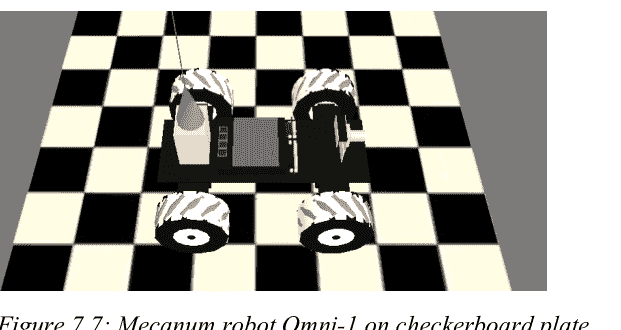

图 7.7：麦克纳姆轮机器人 Omni-1 在棋盘格板上

### 7.3 滑动转向

许多机器人以及建筑行业的一些装载车辆使用四个驱动轮，但只有两个电机信号（总共使用两个或四个电机），因此左侧两个轮子和右侧两个轮子始终执行相同的运动（见图 7.8）。如果轮子本身不可转向，就像某些机器人（如 Pioneer 3-AT）的情况，那么它的运动与链式驱动非常相似，我们将在下一节讨论。

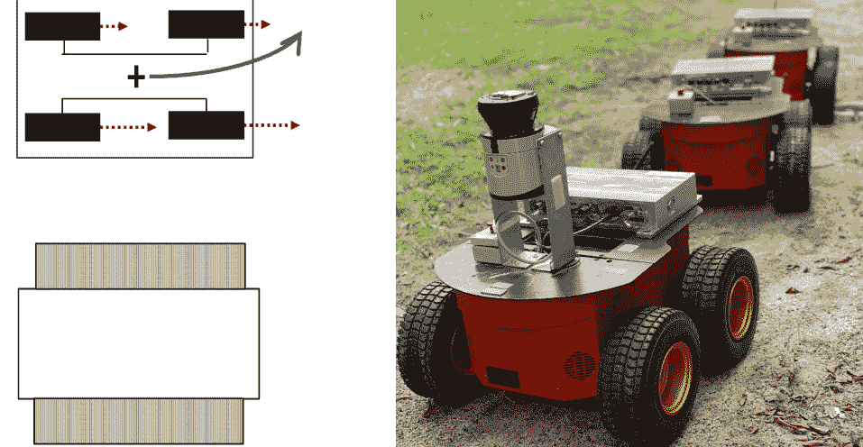

图 7.8：滑动转向与链式原理；Pioneer 3-AT 机器人组

滑动转向的效果是机器人每次转弯都需要车轮打滑，但它比例如阿克曼驱动车辆具有更好的抓地力。这使得滑动转向机器人成为在草地或沙地上户外行驶的良好选择，但在室内实验室环境中行驶则是一个非常糟糕的选择。在实验室测试 Pioneer 3-AT 机器人时，在将其部署到户外之前烧毁了几个电机后，我们的学生现在决定在每个机器人的轮胎轨迹上缠绕几层透明胶带，以允许在室内使用时车轮打滑。

图 7.9 展示了 Pioneer 机器人的一个简单模拟。它使用其三个前向 PSD（真实机器人上的声纳传感器）和驱动函数 *VWCurve* 沿路径行驶，避开所有锥桶。

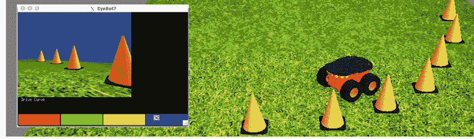

图 7.9：Pioneer 3-AT 机器人模拟

### 7.4 链式驱动与地形

许多移动机器人只能在平坦表面上导航。然而，许多实际的机器人问题要求机器人在不平坦的地板上甚至在任意三维地形中行驶。虽然机器人用于地形行驶的机械改动可能相对简单，但挑战现在也出现在传感器端和软件端。地形中的路径规划需要从二维算法过渡到三维算法。

接下来，我们将在 EyeSim 模拟环境中展示几个在三维地形中行驶的例子。在我们这样做之前，我们应该解释如何构建一个包含三维信息的环境文件。程序 7.5 中的 *SIM* 脚本一如既往地简单。这里，我们引入了一个名为 *Blizzard* 的机器人，它使用履带而不是轮子。它是一辆雪地履带车，作为模型车存在，我们将其改装成了机器人车。我们稍后将查看它的驾驶程序。

程序 7.5：地形定义 SIM 脚本

```
1  # Environment
2  world ../../worlds/aquatic/crater.wld
3  
4  # Robot
5  robot ../../robots/Chains/Blizzard.robi
6  Blizzard 400 400  0 terrain.x
```

火山口世界文件遵循 *Saphira* 世界格式，我们之前采用并扩展了该格式，作为将环境输入 EyeSim 的一种方式。在此示例中，程序 7.6 中显示的 *WLD* 文件指定了 *x*、*y* 和 *z* 维度的世界体积，而每个点的相对高程取自 *crater.png* 灰度图像，将每个图像像素的 [0, 255] 范围映射到指定的世界高度范围 [0, 1000]。此外，我们在特定高度（本例中为 200）定义了水位。这将在后面我们使用潜水艇的章节中派上用场。在这个例子中，它只是在火山口内创建了一个水域障碍。

*程序 7.6：用于地形和水位的环境世界文件*

```
1 terrain 5000 5000 1000 ../heightmap/crater.png
2 water_level 200
```

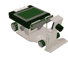

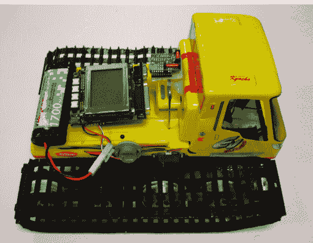

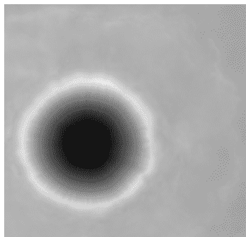

*图 7.10：Blizzard 雪地履带车（左）和火山口图形文件（右）*

用于生成地形的 PNG 图像文件 *crater.png* 只是一个灰度图像（见**图 7.10**）。每个像素值被转换为其在三维空间中所代表点的地形高程。更多细节可以在 EyeSim 文档中找到。**图 7.11** 展示了 *Blizzard* 机器人在火山口景观中行驶的屏幕截图。

*程序 7.7：指定三维环境的 SIM 脚本*

```
1 # Environment
2 world ../../worlds/aquatic/levels-steel.wld
3
4 # robotname x y phi
5 LabBot 1000 1000 0 terrain.x
```

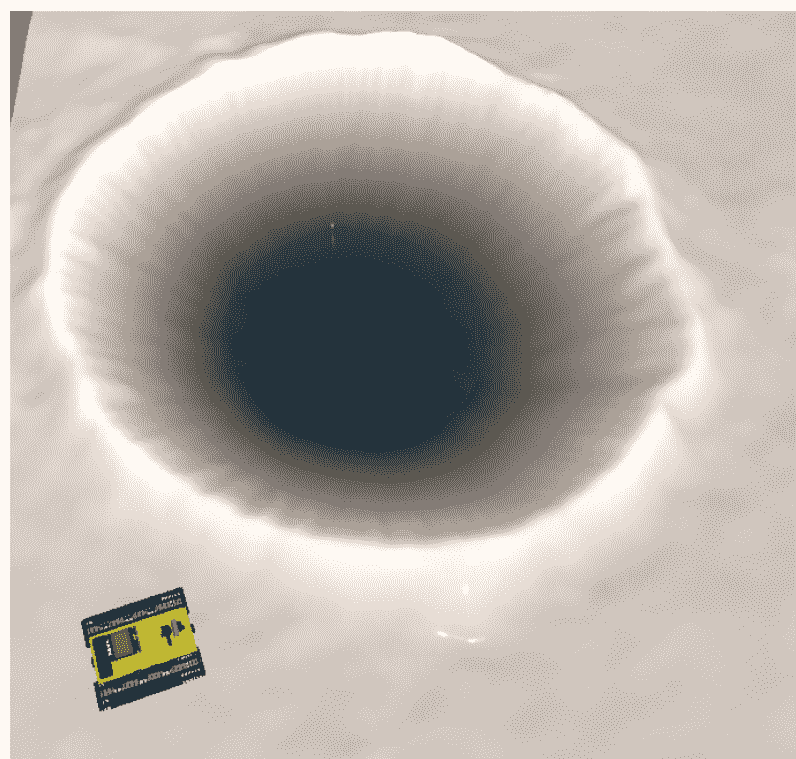

图 7.11：Blizzard 机器人接近注满水的火山口

我们现在想创建一个带有坡道的环境，机器人可以轻松上下，而不是我们之前那种崎岖的山地地形。我们的 *SIM* 脚本看起来很熟悉（程序 7.7）。
在程序 7.8 的世界文件中，我们定义了一个世界，它根据提供的高程图图形文件 *steps.png* 创建连续的三维层级（见图 7.12，左）。使用钢纹理来实现图形效果（图 7.12，中），该纹理将被拉伸覆盖整个环境。

程序 7.8：用于具有高度层级和纹理的环境的世界文件

```
1 floor_texture ../texture/steel.png
2 terrain 4000 4000 200 ../heightmap/steps.png
```

任何图形编辑器都可以用来创建高程图文件，甚至幻灯片演示软件也可以。在图 7.12（左）所示的高程图文件中，黑色是地面层级，白色是最高层级。实际的数值高度在世界文件中指定（程序 7.8 中为 200mm）。因此，我们创建了一个垂直向上的坡道（从暗到亮）、一个高的水平平台（白色）和一个向下的坡道（亮到暗），所有这些都在一个被高墙（白色）包围的方形区域内。


图 7.12：高程图轮廓（左）以及钢和木纹理（右）

更改纹理只需替换世界文件（程序 7.8）中的第一行即可，例如使用图 7.12 右侧所示的木材纹理。图 7.13 展示了最终的三维环境，采用钢纹理，一个 LabBot 试图在坡道周围找到自己的路径。右上角的插图显示了来自机器人车载摄像头的视角——右下角的插图显示了具有*木纹饰面*的相同环境。

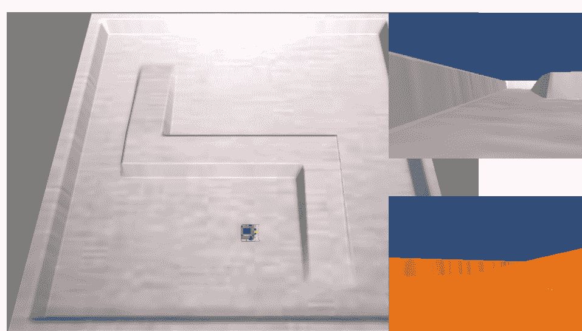

图 7.13：用于地形示例的机器人环境显示

### 7.5 任务

- 编写一个程序，将阿克曼转向机器人从位置 (0,0) 驱动到指定的 (x,y) 目标坐标。可以这样做：
    - 先旋转，然后行驶
    - 沿圆形行驶
    - 沿“狗曲线”行驶
    - 沿埃尔米特样条曲线行驶
- 扩展程序，使机器人到达正确的位置 (x,y) 并且具有指定的朝向 φ。
- 编写一个程序，让全向机器人在不转向的情况下行驶成一个正方形。利用侧向运动。
- 编写一个软件接口，为任何给定的行驶角度计算各个车轮的速度。
- 编写一个程序，让全向机器人在直线行驶的同时持续绕自身旋转。
- 编写一个程序，将履带式机器人驱动到山脉中的最高点。机器人应始终重新定向自己朝向最大梯度方向。使用 PSD 或激光雷达传感器，并创建适中的地形陡度，以便机器人能够应对。
- 编写一个程序，使机器人能够导航通过本章所示的坡道。添加额外的向下指向的 PSD 传感器以检测悬崖——并防止机器人坠落。

## 船只与潜水艇

自主船只和自主水下航行器（AUV）是机器人研究的一个重要领域，具有巨大的商业潜力。由于多项自主船只和潜水艇竞赛，如 RoboBoat[^1] 和 RobotX[^2]，它们在机器人研究中也获得了更大的关注。多年来，我们建造了许多自主船只[^3] 和潜水艇，我们将在本节中介绍它们。

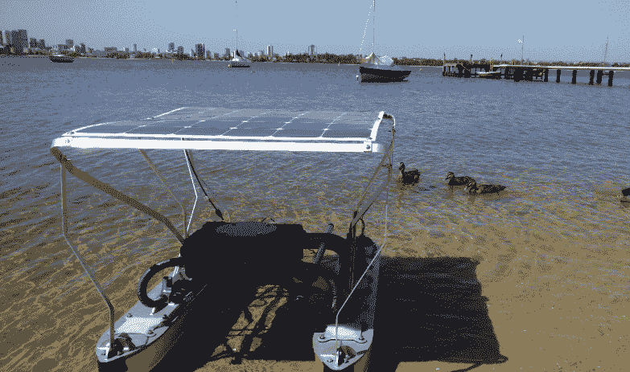

*图 8.1：珀斯天鹅河上的自主太阳能船*

[^1]: RoboBoat, https://roboboat.org
[^2]: Maritime RobotX Challenge, https://robotx.org/programs/robotx-challenge-2022/
[^3]: 自主太阳能船的设计和照片来自西澳大学的 Pierre-Louis Constant

## 8 船舶与潜艇

### 8.1 自主船舶

我们的自主太阳能船采用双体船设计，参见图8.1和图8.2。备用电池和部分传感器放置在两个防水船体中，而其他传感器、控制系统和通信调制解调器则位于船体之间的防水容器内。该船配备了一块100W太阳能电池板，其两个推进电机使其无需舵即可驱动和转向。

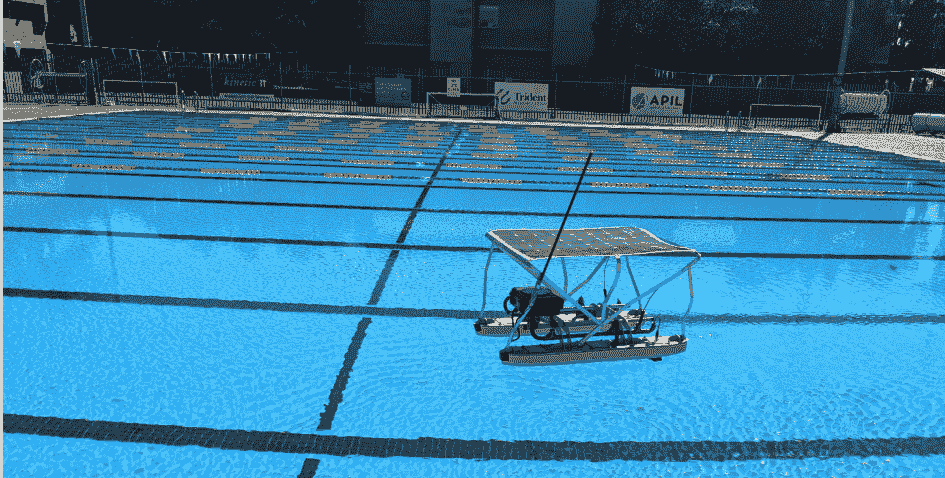

图8.2：自主太阳能船在UWA泳池中训练

该船使用树莓派控制器与高级传感器（如用于深度测量的回声测深仪、GNSS⁴接收器和数码相机）进行接口连接，并配备用于湖泊和沿海水域的4G/5G通信调制解调器，或用于远程任务的卫星调制解调器。额外的ArduPilot控制器主要用于其优越的用户界面和内置导航功能。ArduPilot的硬件基于Arduino处理器，并增强了内置IMU传感器（惯性测量单元）、GPS接口和多个伺服输出。

图8.3显示了太阳能船在珀斯沿海水域的任务计划（白色）和实际路径（绿色）。尽管船只总体上遵循了规划路径，但由于风的影响，它仍然与期望航线存在显著偏差，因此船只的路径控制仍有改进空间。

⁴ 全球导航卫星系统

### 8.2 自主潜艇

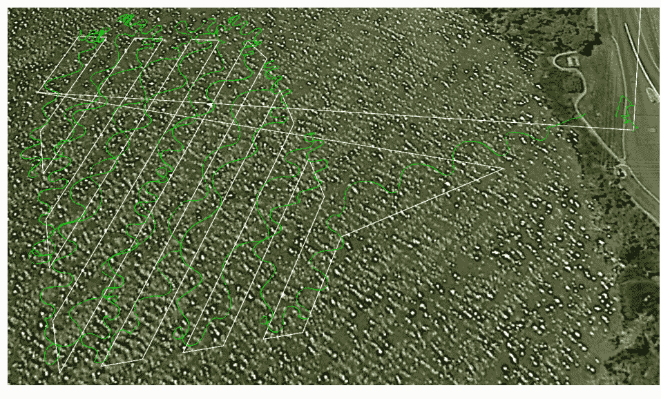

图8.3：自主勘测

我们的第一艘自主水下航行器（AUV）是Mako [Bräunl et al. 2004]⁵，参见图8.4上部。它拥有四个推进器：两个水平推进器用于差速驱动模式下的前进/后退/侧向移动，两个垂直推进器（前部和后部）用于下潜。该AUV具有自然浮力，因此如果两个潜水电机停止工作，它将浮出水面。

我们的第二艘自主水下航行器（AUV）名为USAL（图8.4下部，仿真见图8.8），使用单个尾部推进器配合舵进行转向。下潜通过一个中央垂直推进器和一个船首泵完成，该泵将水从一侧泵送到另一侧，以抵消螺旋桨的旋转动量——类似于直升机的尾部旋翼。

### 8.3 船舶与潜艇仿真

自主太阳能船的仿真如图8.5所示，模拟了一个小型泳池环境。设置它只需在SIM文件中添加三行：一行用于选择环境（此处为pool-s.wld），一行用于引入“Solarboat”机器人类型，一行用于将其放置在水世界中的所需位置和方向（程序8.1）。

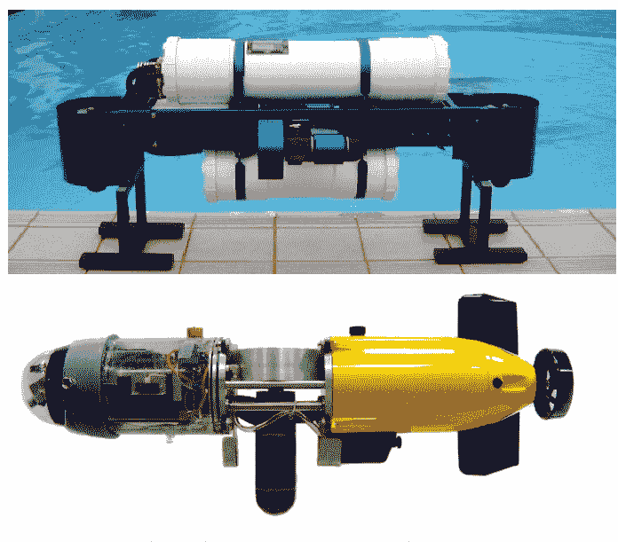

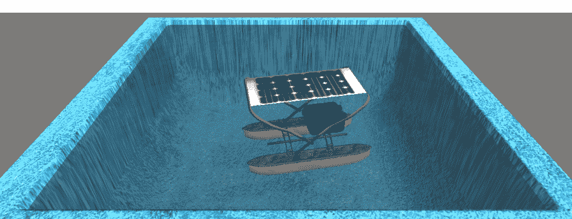

程序8.1：太阳能船的SIM脚本

```
1 world ../../worlds/aquatic/pool-s.wld
1 robot ../../robots/Boats/solarboat.robi
1 Solarboat 3000 3000 0 boat.x
```


引用的世界文件也仅需三行：一行选择蓝色水纹理，一行指定地形图（一个简单的图像文件，其中每个像素代表一个高度），并包含以[mm]为单位的x、y、z尺寸，还有一行指定以[mm]为单位的水位（程序8.2）。

*程序8.2：小型泳池世界文件*

```
1 floor_texture ../texture/rough-blue.jpg
2 terrain 6000 6000 2000 ../heightmap/olympic-pool.png
3 water_level 1900
```

模拟船舶和潜艇所需的所有流体动力学方程都已包含在EyeSim中，我们之前在地形驾驶部分已经了解了如何设置丘陵环境。我们这里所做的只是添加水。地形图是一个灰度图像文件，其中每个像素的值（介于0和255之间）代表一个高度（或者在这种情况下是深度）。对于泳池来说，它可以非常简单（只是黑色背景上的一个白色矩形），也可以是更复杂的海底或河床结构。最后一行中的水位只是一个表示整体深度的数字。你可以通过选择高于水位的地形高度来创建海洋和岛屿的混合体，类似于我们之前构建的注水火山口。

图8.6左侧的示例高度图是一个非常基础的图形文件，只有两种颜色：整个泳池区域为黑色（海拔0），周围是白色墙壁（海拔255，此处等于2米）。图8.6右侧的泳池底部纹理*olympic-pool.png*是一种结构化的水色纹理，表示真实的波纹。

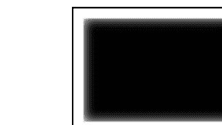

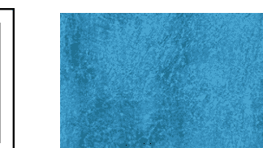

*图8.6：泳池高度图和纹理*

世界文件中的地形参数指定了*x*和*y*的尺寸，以及最大地形高度，在本例中即为泳池周围的墙壁（2,000mm）。水位在世界文件的下一行中设置为1,900mm，因此它比周围的泳池墙壁低100mm。程序8.4中Mako的完整SIM文件现在与之前太阳能船的SIM文件几乎相同。

图8.7显示了Mako潜艇在泳池中游动的场景，其本地摄像头视图作为插图显示。

程序8.3：AUV水下SIM脚本

```
1  # 环境
2  world ../../worlds/aquatic/pool.wld
3
4  # 加载自定义机器人
5  robot ../../robots/Submarines/mako.robi
6
7  # 机器人位置 (x, y, phi) 和可执行文件
8  Mako 12500 5000 0 mako-dive.x
```

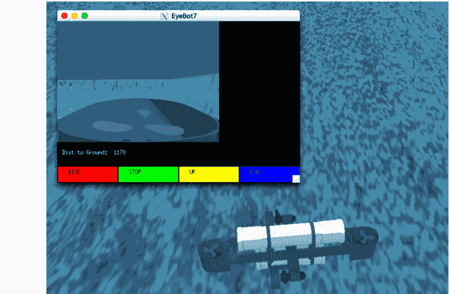

### 8.4 潜艇下潜

程序8.4中的简短示例仅使用了Mako位于前部和后部的两个潜水电机。未使用的是两个侧装差速驱动推进器。我们将在下一节中启用它们。

通过菜单按钮*KEY1*、*KEY2*和*KEY3*，用户可以激活下潜、停止下潜或使潜艇上浮。这将同时驱动两个潜水电机朝下潜方向运动、停止它们或反转它们。按下按钮*KEY4*将终止程序。用户函数*dive*同时激活前部和后部潜水电机，而主程序使用函数*CAMGet*和*LCDImage*读取并显示摄像头图像。


传感器*PSD_DOWN*用于计算并显示潜艇与泳池底部之间的剩余深度。

程序8.4：Mako潜艇下潜的C语言代码

```
1  #include "eyebot.h"
2
3  #define LEFT   1     // 推进器ID
4  #define FRONT  2
5  #define RIGHT  3
6  #define BACK   4
7  #define PSD_DOWN 6   // 新的PSD方向
8
9  void dive(int speed)
10 { MOTORDrive(FRONT, speed);
11   MOTORDrive(BACK,  speed);
12 }
13
14 int main()
15 { BYTE img[QVGA_SIZE];
16   char key;
17
18   LCDMenu("DIVE", "STOP", "UP", "END");
19   CAMInit(QVGA);
20   do { LCDSetPrintf(19,0, "距底部距离:%6d\n",
21                       PSDGet(PSD_DOWN));
22        CAMGet(img);
23        LCDImage(img);
24
25        switch(key=KEYRead())
26        { case KEY1: dive(-100);  break;
27          case KEY2: dive(   0);  break;
28          case KEY3: dive(+100);  break;
29        }
30   } while (key != KEY4);
31   return 0;
32 }
```

### 8.5 潜艇运动

只需更改几行代码即可测试Mako的运动而非其下潜。程序8.5中的函数*drive*现在接受两个参数——左电机和右电机的速度。在主程序中，我们将按键激活与前进和左转或右转相关联。为了实现这些运动，我们只需指定左电机和右电机的速度。在此示例中，我们仅使用全速前进、全速后退和停止的速度值（+100、–100、0）；然而，整个值范围可用于精细调整AUV的运动。

⁵ T. Bräunl, A. Boeing, L. Gonzales, A. Koestler, M. Nguyen, J. Petitt, *自主水下航行器计划 - Mako项目*, 2004 IEEE机器人、自动化与机电一体化会议 (IEEE-RAM), 2004年12月, 新加坡, pp. 446-451

## 8 船与潜艇

程序 8.5：Mako 在 C 语言中向前、向左和向右行驶

```c
void drive(int l_speed, int r_speed)
{ MOTORDrive(LEFT,  l_speed);
  MOTORDrive(RIGHT, r_speed);
}

int main()
{ LCDMenu("FORWARD", "LEFT", "RIGHT", "END");
  ...
      switch(key=KEYRead())
     { case KEY1: drive( 100,  100);  break;
       case KEY2: drive(-100,  100);  break;
       case KEY3: drive( 100, -100);  break;
     }
  ...
}
```

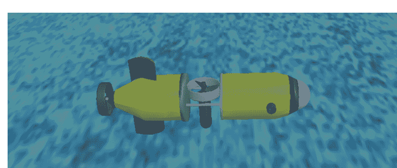

### 8.6 任务

- 编写一个 AUV 程序，使其能够沿着泳池壁进行沿壁行驶。
- 编写一个 AUV 程序，扫描整个泳池区域（或给定范围的海底），并自动生成深度图。
- 将摄像头方向调整为朝下，然后编写一个 AUV 程序，在泳池或海底搜索特定物体，例如使用颜色编码。

## 9 迷宫

探索迷宫会非常有趣——无论是穿越一个全尺寸的迷宫，还是将其作为谜题来解决。在尝试用真实机器人运行之前，先在仿真中解决迷宫问题是非常可取的，因为这有助于大大减少软件开发和调试时间。如果仿真与真实机器人行为之间的差异，即所谓的*现实差距*足够小，那么从仿真到现实的过渡将会相当平滑。

迷宫也是测试机器人技能的绝佳方式。最早的移动机器人竞赛之一是*神奇微鼠迷宫竞赛*（见图 9.1），该竞赛于 1977 年 5 月首次在《IEEE Spectrum》上提出，并在一些试验性活动后，于 1979 年在纽约市举行了首次决赛 [Allan 1979]¹。

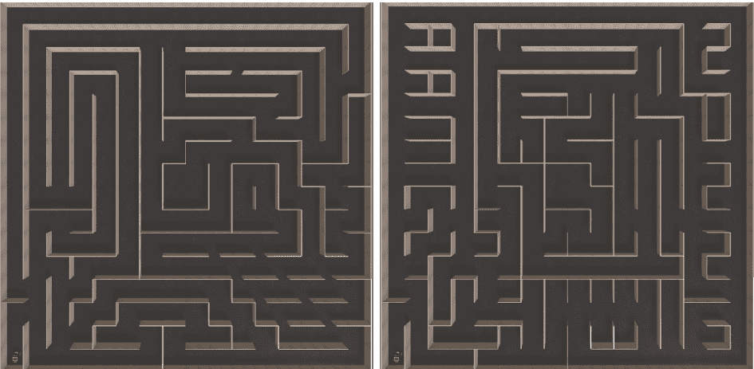

*图 9.1：1986 年伦敦和 2022 年洛杉矶的竞赛迷宫*

¹ R. Allan, *The amazing micromice: see how they won*, IEEE Spectrum, Sept. 1979, vol. 16, no. 9, pp. 62-65 (4)

### 9.1 微鼠

微鼠竞赛一直是几代工程和计算机专业学生的机器人基准。尽管它可以追溯到 1977 年，但至今仍有比赛在举办。
任务听起来很简单：将机器人放在迷宫左下角的起始方格中，让它找到中心的目标方格。从起点到终点行驶最快的机器人获胜。当然，不能告诉机器人最短路径，因此它需要通过先前的运行来探索迷宫并计算最佳路线。每个机器人有有限的迷宫探索时间；每当它返回起始方格时，一个新的运行计时器就会启动——只有最短的运行时间才计入成绩。²
完整的迷宫由 16 × 16 个单元格组成，每个单元格尺寸为 18cm × 18cm。所有墙段高 5cm，厚 1.2cm。
各团队使用了各种方法来赢得这项比赛。最早的机器人是纯机电式的，没有微处理器大脑。它们的技术被称为“贴墙行走”，因为它们总是沿着最左边的墙行驶，这是安全逃离任何平面迷宫的标准方法。尽管它们甚至没有尝试计算最快路径，但它们在 1970 年代比更复杂的智能机器人更快。一项规则变更将目标置于迷宫中央，且没有任何连接墙与其余部分相连，从而淘汰了这种方法。
此后，传感器技术不断发展。从声纳传感器到红外距离传感器，从激光雷达到视觉。甚至允许在墙壁上方安装“舷外式”传感器，这有助于比其他方法更可靠、更准确地检测墙壁。最后，驱动系统和车轮牵引力的改进是使机器人更快所必需的。如果你观看任何最近的微鼠竞赛直播或在线视频，你会对它们的速度感到惊讶 [YouTube 2017]³。

### 9.2 沿壁行驶

如前所述，始终沿着最左边的墙行驶（或始终沿着最右边的墙行驶——但不要在中途改变策略）将让你找到平面迷宫的出口（出口必须在二维迷宫的外部），或者如果入口和出口在同一位置，它将带你回到起点。
我们有一种在 EyeSim 仿真器中通过允许字符图形环境文件来指定迷宫环境的简单方法。图 9.2 中的示例是一个小迷宫，它使用字符 S 作为机器人起始位置的占位符，以便它可以自动居中在起始方格中。

² RoboGames, Maze Solving / Micromouse Rules, 2019, robogames.net/rules/maze.php
³ 2017 All Japan classic micromouse contest 1st prize, www.youtube.com/watch?v=LAYdXIREK2I

使用大写字符（如示例中的 $S$）假定字符下方也会有一堵墙，这是使用字符图形无法绘制的。

```
_______
|  |  |___|
|  |___
|  _  |  |_
|  |  |  |
|S|______|_|
```

*图 9.2：作为字符图形的迷宫输入*

然后可以通过程序 9.1 中的 *SIM* 脚本将此环境（存储为文本文件 *small.maz*）加载到仿真器中。占位符 $S$ 标记机器人的起始位置，并选择 90° 的方向使其朝上（方向 0° 沿 $x$ 轴向右）。

*程序 9.1：迷宫环境 SIM 脚本*

```
# Environment
world small.maz

# Robot description file using "S" as start position
S4 S 90 maze_left.x
```

环境和机器人如图 9.3 的截图所示。机器人已经启用了其标准的三个 PSD 传感器（前、左、右），在可视化中显示为绿色光束。

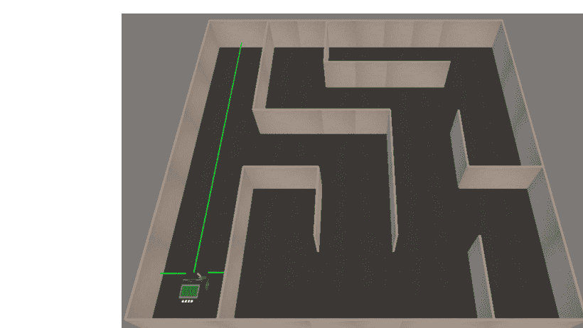

*图 9.3：作为字符图形的迷宫输入*

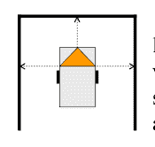

完整的算法（程序 9.2）相当简单，因为它只有大约十行代码，不包括注释和空行。在主 *while* 循环中，我们通过读取相应的 PSD 传感器（如左图所示）来检查前方、左侧和右侧是否有墙。这三个答案只是真或假（1 或 0）。
第二步是进行旋转。如果左侧是空闲的，我们需要左转。函数 *VWTurn* 将执行给定角度的旋转，然后停止。我们需要在 *VWTurn* 之后使用 *VWWait* 来暂停程序执行，直到此运动命令完成。否则，我们的程序将很快进入下一个循环迭代，下一个运动命令将覆盖当前命令。这意味着机器人甚至不会开始移动。

*程序 9.2：C 语言中的左手法则*

```c
#include "eyebot.h"
#define THRES 400

int main ()
{ int Ffree,Lfree,Rfree;
  LCDMenu("","","","END");
  do
  { // 1. Check walls
    Ffree = PSDGet(PSD_FRONT) > THRES;
    Lfree = PSDGet(PSD_LEFT)  > THRES;
    Rfree = PSDGet(PSD_RIGHT) > THRES;

    // 2. Rotations
    if (Lfree)          { VWTurn(+90, 45); VWWait(); }
      else if (Ffree)   { }
        else if (Rfree) { VWTurn(-90, 45); VWWait(); }
          else          { VWTurn(180, 45); VWWait(); }

    // 3. Driving straight 1 square
    VWStraight(360, 180); VWWait();
  } while (KEYRead() != KEY4);
}
```

在 *else* 情况下（当左侧有墙时），我们检查前方是否畅通。如果是，我们应该直行，因此不需要旋转——因此是空括号。第二个 *else* 意味着左侧*和*前方都有墙，所以我们检查是否可以向右走。如果可以，我们向右转（相同的 *VWTurn* 序列，只是方向相反，后跟 *VWWait*）。
最后的 *else* 情况意味着左侧、前方和右侧一定都有墙，所以我们的机器人被困在死胡同里。因此，它必须旋转 180° 才能再次移动。
所有这些旋转之后的第三步是向前移动正好一个方格。函数 *VWStraight* 后跟 *VWWait* 正是执行此操作。线速度和角速度的设置方式使得机器人完成一个

## 沿墙行走

机器人可以沿正方形路径行驶，并在约两秒内完成±90°的转向。还需注意，我们行驶的距离是36厘米，而非微鼠规则规定的18厘米。我们的实体机器人对于这个迷宫尺寸来说太大了，因此我们只是将尺寸加倍了。

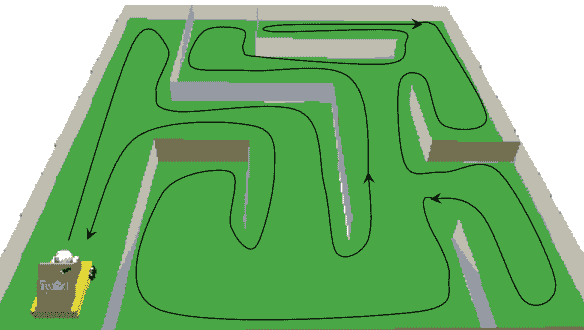

图 9.4：左手法则

从逻辑上看，这个程序非常清晰，应该能完美运行，如图9.4所示。尽可能向左走应该能让我们驶向迷宫的出口（或返回起点）——然而，事实并非如此！

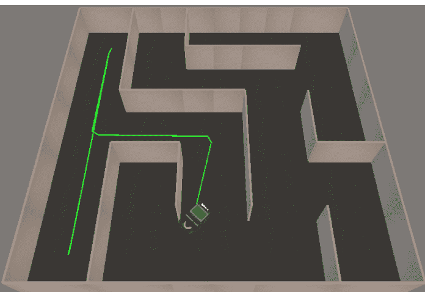

图 9.5：左手法则

如果你看一下图9.5的截图，你就会明白发生了什么。模拟机器人（非常像真实机器人）行驶得并不完全笔直，转向也不是精确的90°。它的小误差会累积，没过多久机器人就会撞墙。随后的车轮打滑使其失去内部方向感，且无法从此事件中恢复。

## 9 迷宫

### 9.3 鲁棒性与控制

我们寻找的关键短语是*鲁棒性*。我们需要一个机器人程序，它不仅能在不切实际的完美模拟世界中工作，也能在真实机器人存在执行器和传感器微小偏差的情况下工作。我们之前的程序只发出驾驶指令，但从未检查其结果。我们需要扩展这个程序，以确保机器人在行驶时保持在两堵墙之间居中，并且轻微的不正确转向能在后续的驾驶指令中得到补偿。

我们需要更改的唯一部分是直线行驶的例程（步骤3）。我们需要一个扩展程序来替代包含*VWSetSpeed*后跟*VWWait*的代码行，如下所述。在这种方法中，我们实现了两个想法：

1. **行驶正确的距离**
   a. 限制行驶距离 –
      在每次迭代中，我们使用勾股定理计算行驶距离
      $drivedist = \sqrt{(x_2-x_1)^2 + (y_2-y_1)^2}$。
      我们只在 $drivedist < MSIZE$（迷宫中一个方格的大小）时继续行驶。
   b. 检查前方墙壁 –
      如果机器人行驶得稍远，前方墙壁变得太近，它也会终止这个“直线行驶”操作。最小前方距离应为方格大小的一半（$MSIZE/2$）减去机器人大小的一半，大约50毫米。因此，我们只在 $freespace F > MSIZE/2 - 50$ 时继续行驶。

2. **保持正确的墙壁距离**
   在每次迭代中，我们测量左右PSD距离值，并且必须区分几种不同的情况。
   a. 左右两侧都有紧邻的墙壁 –
      → 让机器人精确地保持在两堵墙的中间。
   b. 只有左侧有墙，右侧有空隙 –
      → 仅依靠左侧墙壁距离和已知的方格大小来保持机器人与墙壁的期望距离。
   c. 只有右侧有墙，左侧有空隙 –
      → 类似地，仅依靠右侧PSD值。
   d. 左右两侧都有空隙 –
      → 没有紧邻的墙壁用于定向，只需继续直线行驶。

程序9.3在循环前和每次迭代结束时使用*VWGetPosition*来计算到目前为止行驶的距离。如果在方格大小为360毫米时，左侧PSD距离值 $L$ 在[100, 180]范围内，则左侧必定有墙。如果 $L$ 超出此范围，我们假设有空隙；右侧距离 $R$ 同理。

### 鲁棒性与控制

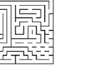

### 程序 9.3：C语言中的受控左手法则

```
1  VWGetPosition(&x1,&y1,&phi1);
2  do
3  { L=PSDGet(PSD_LEFT); F=PSDGet(PSD_FRONT);
4    R=PSDGet(PSD_RIGHT);
5    if (100<L && L<180  && 100<R && R<180) // check space
6      VWSetSpeed(SPEED, L-R);  // drive difference curve
7    else if (100<L && L<180)   // space check LEFT
8      VWSetSpeed(SPEED, L-DIST);// drive left if left>DIST
9    else if (100<R && R<180)   // space check RIGHT
10     VWSetSpeed(SPEED, DIST-R); // drive left if DIST>right
11   else                       // no walls for orientation
12     VWSetSpeed(SPEED, 0);    // just drive straight
13   VWGetPosition(&x2,&y2,&phi2);
14   drivedist = sqrt(sqr(x2-x1)+sqr(y2-y1));
15 } while (drivedist<MSIZE && F>MSIZE/2-50); // terminate
```

四个嵌套的*if-else*选择测试四种情况：两侧墙壁都可用、只有左侧、只有右侧或两侧都没有墙。在每种情况下，我们都使用函数*VWSetSpeed*来驾驶机器人。它的两个参数是线速度（我们只使用一个常数）和角速度，我们将其计算为左右墙壁距离的差值（如果两侧都有墙），或者期望墙壁距离与实际测量距离的差值（如果只有一侧有墙可用）。

如果两侧都有墙，我们希望左侧距离等于右侧距离，这样我们的曲线值就是 *L–R*。如果机器人完美地处于中间，这个值将为零。如果 *L>R*，那么 *L–R* 将为正，机器人将向左转。反之，如果 *R>L*，则向右转。注意，这种转向方法实际上构成了一种比例控制或P控制[Bräunl 2022]⁴。误差越大，控制（转向）值就越大。可以使用比例因子，但在这种情况下，只使用1（或省略它）就能完美工作。

如果只有左侧有墙（第二种情况），我们使用相同的函数，但使用 *L–DIST* 作为期望的控制值（*DIST* 是期望的墙壁距离）。类似地，如果只有右侧有墙（第三种情况），则使用 *R-DIST*。

最后（第四种情况），如果两侧都没有紧邻的墙壁，我们继续直线行驶。

从图9.6中穿越迷宫的截图可以看出，尽管并非总是精确地转向90°，机器人表现得相当好。需要进行一些校正，这导致了摇摆运动。这可以通过更好的控制算法来改进，例如PID控制（比例积分微分控制），以及使用额外的传感器，例如，通过函数*VWGetPosition*从轮式编码器读取计算出的(x,y)位置来找到机器人的位移。我们目前仅使用它来在到达下一个方格单元时终止行驶。

> ⁴ T. Bräunl, *Embedded Robotics – From Mobile Robots to Autonomous Vehicles with Raspberry Pi and Arduino*, 4th Ed., Springer Nature, Singapore, 2022

## 9 迷宫

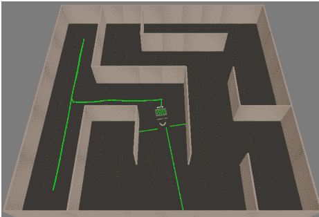

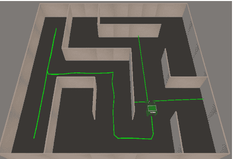

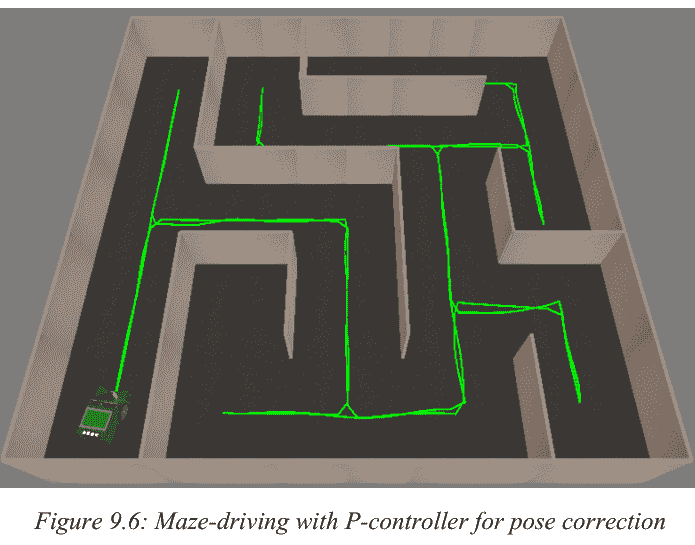

图 9.6：使用P控制器进行姿态校正的迷宫驾驶

### 9.4 使用激光雷达的迷宫驾驶

只有三个数据点（前、左、右的PSD）显然是一个很大的限制。使用激光雷达将为我们提供更丰富的数据量，包含数百到数千个距离点。使用激光雷达驾驶的算法如下，在一个无限循环中：

1. 在机器人左侧进行激光雷达扫描，角度范围[45°, 135°]。
2. 找到最小的扫描值和相应的角度。这定义了左侧墙壁位置的角度α；参见图9.7左图。
3. 使用VWCurve平行于墙壁行驶。
4. 如果机器人靠近前方的墙壁（scan[180] < THRES），则停止并使用VWTurn后跟VWWait向右转90°。

### 使用激光雷达的迷宫驾驶

为了计算正确的行驶角度，我们可以看图9.7右图。机器人扫描其左侧周围总共90°的区域，从机器人前进方向看是角度范围[45°, 135°]。然后我们可以确定最短光束的角度和长度（图9.7中的角度α和长度s）。由于最短光束将以直角（90°）击中墙壁，我们有α + β = 90°。理想情况下，α应为90°，这样β等于0°，这意味着平行于墙壁行驶。如果角度α小于90°，则机器人正转向墙壁，需要向右偏转；如果角度大于90°，则机器人正偏离墙壁，需要向左偏转。

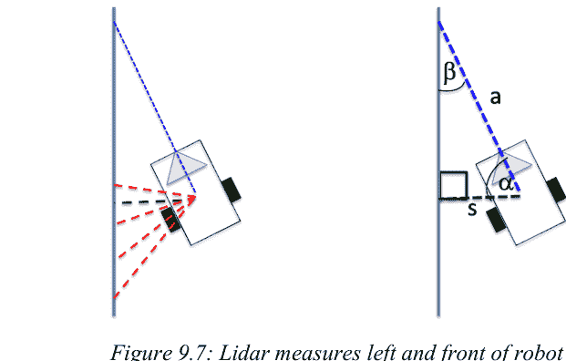

我们需要在这里控制两个变量：

- 机器人与墙壁的角度α，以及
- 机器人与墙壁的距离s。

我们有以下传感器值：

- 到左侧墙壁的最短距离s，以及
- 前方碰撞距离a（仅当α < 90°时）

为了驾驶机器人，我们使用VWCurve函数。使用恒定的距离和线速度，我们只需要控制角速度。我们使用一个组合的比例控制器或P控制器来控制这两个变量[Bräunl 2022]⁵。在P控制器中，较大的误差项将导致较大的输出值——使用比例因子k。

第一项控制机器人的朝向
k₁ · (α – 90°) 。
如果角度正确为90°，则该项为零。较小的角度（机器人转向墙壁）将产生负值，这将使机器人向右转。如果角度大于90°（机器人漂移），正的结果将使其向左转。

> ⁵ T. Bräunl, Embedded Robotics – From Mobile Robots to Autonomous Vehicles with Raspberry Pi and Arduino, 4th Ed., Springer Nature, Singapore, 2022

## 9 迷宫

第二项控制机器人与墙壁的距离 $k_2 \cdot (s - 250\text{mm})$。
如果机器人恰好处于距墙壁250mm的理想距离，则此项为零。机器人离理想距离越远，此项的值就越大，这将使机器人向左转向。如果机器人离墙壁太近，此项变为负值，机器人将向右转向，远离墙壁。

在实践中，我们通过实验发现 $k_1 = 5$ 和 $k_2 = 0.5$ 是较好的取值。当然，也有寻找最优控制参数的正式方法 [Aström, Hägglund 1995]$^6$。

程序 9.4：C语言中的激光雷达迷宫探索

```
1  while (KEYRead() != KEY4)
2  { LIDARGet(scan);
3    if(scan[180] < 300)  // check for front collision
4      VWTurn(-90, 360); VWWait();  // turn right 90°
5    findMin(scan, 45,135, &angle, &s);  // check left
6    printf("min angle %d val %d\n", angle, s);
7    a = 180-angle;
8    VWCurve(50, k1*(a-90) + k2*(s-250), SPEED);
9  }
```

激光雷达扫描和驾驶程序的代码如程序9.4所示。请注意，激光雷达角度从后方顺时针计算（后方 = 0°，前方 = 180°），因此 $\alpha = 180^\circ - angle$。

我们还将检测到的激光雷达点以其正确位置绘制到EyeBot LCD上，生成全局环境地图，如图9.8所示。算法设计和程序实现由西澳大学机器人与自动化实验室的Joel Frewin完成，并由作者进行了改编。

机器人成功穿越了整个迷宫，同时生成了其基于激光雷达的内部表示，如图9.8右侧每个阶段所示。这些表示看起来相当准确，直到迷宫探索阶段进行到大约四分之三。不幸的是，角度航位推算误差随时间累积，导致映射不正确（见图9.8序列中的最终截图）。同样的现象也发生在真实机器人身上，是定位和建图中最大的挑战之一。解决这个问题最流行的方法是一种称为同步定位与建图（SLAM）的统计方法 [Durrant-Whyte, Bailey 2006]$^7$, [Bailey, Durrant-Whyte 2006]$^8$。

$^6$ K. Aström, T. Hägglund, *PID Controllers: Theory, Design, and Tuning*, 2nd Ed., Instrument Society of America, Research Triangle Park, NC, 1995
$^7$ H. Durrant-Whyte, T. Bailey, *Simultaneous Localisation and Mapping (SLAM): Part I*, IEEE Robotics & Automation Magazine, vol. 13, no. 2, June 2006, pp. 99–110
$^8$ T. Bailey, H. Durrant-Whyte, *Simultaneous Localisation and Mapping (SLAM): Part II*, IEEE Robotics & Automation Magazine, vol. 13, no. 3, Sep. 2006, pp. 108–117

## 使用激光雷达驾驶迷宫

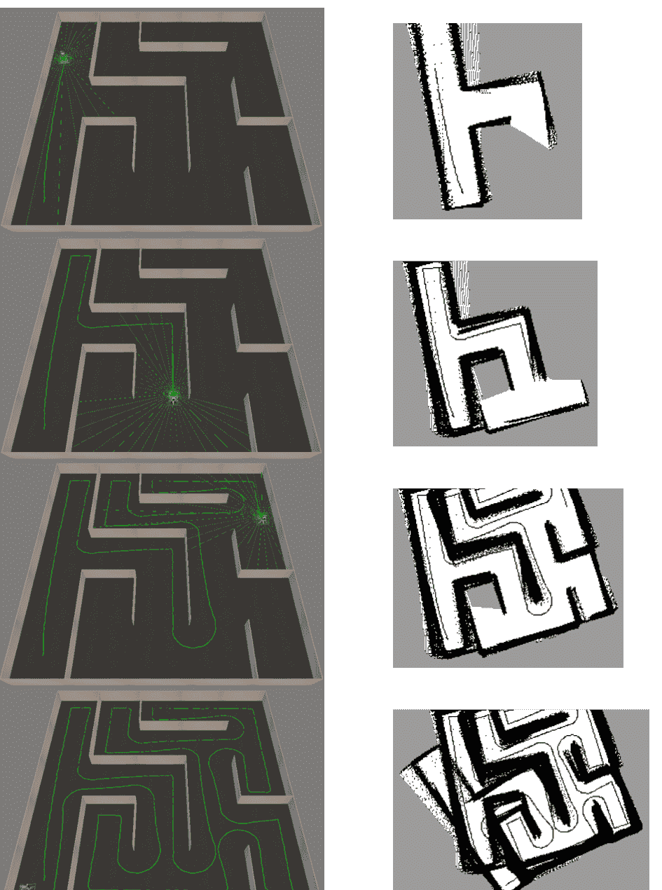

图 9.8：激光雷达迷宫驾驶（左）和内部表示（右）

## 9 迷宫

### 9.5 递归迷宫探索

应用“沿左墙行走”算法无法解决目标位于中心且没有连接到起始方格的墙壁的Micromouse迷宫。这意味着，我们必须使用更复杂的方法来探索*整个*迷宫，而不仅仅是一部分。由于我们知道整个迷宫由16×16个方格单元组成，我们可以创建一个内部数据结构并标记每个被访问过的单元。这样，我们就可以判断是否已经看到了所有单元。请注意，根据迷宫的构造，某些单元可能被墙壁完全封锁，因此永远无法到达。

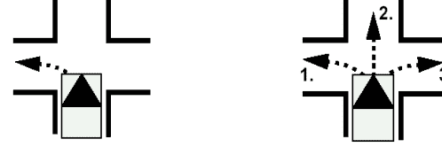

可以说，完全探索迷宫最简单的方法是使用递归算法。因此，在任何新的方格单元处，不是总是向左走（如果可能的话），而是必须探索所有空闲的方向。所以，如果机器人来到一个左、前、右都开放的方格单元（见图9.9，右），那么机器人必须依次探索每个方向（但不一定是左、前、右的顺序）。

函数 *explore* 使用递归来搜索迷宫。

对于左、前、右方向——如果空闲且之前未访问过：

- 向这个空闲的相邻方格行驶一个方格。
- 将新方格标记为已访问。
- 从新位置递归调用函数 *explore*。
- 向后行驶一个方格回到之前的位置和方向。

图9.10中的迷宫显示了机器人的递归路径。在前两个方格单元，探索没有选择，例如第二个单元只有前后的墙壁是开放的，所以机器人只是通过。然而，第三个单元是一个*分支点*，用红色圆圈标记，除了入口点外有两个开口——一个在前方，一个在右方。在这里，我们不是做出选择，而是需要探索两个方向：首先让机器人直行（结果是一个死胡同），然后让它回到带有红点的方格，之后探索另一个方向（原来的右方）。我们使用程序9.5中所示的数据结构。

> 如果子程序的主体调用自身（使用不同的参数或更改的全局变量），则该算法或子程序被称为*递归*的。

## 递归迷宫探索

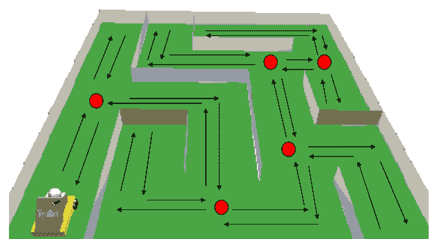

图 9.10：递归探索方法

程序 9.5：C语言中迷宫的全局变量声明

```
1  int mark[MAZESIZE][MAZESIZE];          // 1=visited
2  int wall[MAZESIZE+1][MAZESIZE+1][2];   // 1= wall, 0=free
3  int map [MAZESIZE][MAZESIZE];          // distance to goal
4  int nmap[MAZESIZE][MAZESIZE];          // copy
5  int path[MAZESIZE*MAZESIZE];           // shortest path
```

*main* 程序有若干任务：

1. 初始化变量。
2. 调用递归函数 *explore*。
3. 让用户选择一个目标方格。
4. 计算从起始方格到目标的最短路径。
5. 沿最短路线行驶到目标。
6. 行驶回起点。

程序9.6显示了探索函数代码的第一部分。这是在数组 *mark* 中标记新方格，然后读取所有三个PSD传感器。任何发现的墙壁都通过函数 *maze_entry* 输入到内部数据结构中，然后函数 *check_mark* 检查新数据是否已完成一个尚未完整的方格的所有四边。如果是这样，机器人就知道关于这个方格的所有信息，并将其标记为已访问。这样，机器人就不必在后续阶段驶入这个方格，探索过程可以缩短。

在 *explore* 的第二部分（程序9.7），函数检查前、左、右三个方向中的任何一个或全部是否可访问，并且其后方的方格仍未被探索。如果是这样，函数 *go_to* 将机器人驶向这个方向。在那里，它将递归调用 *explore*，之后 *go_to* 将机器人带回当前位置。这将保证机器人将依次探索所有可能的开放方向。

## 9 迷宫

程序 9.6：C语言中的递归迷宫探索函数（第1部分）

```
1  void explore()
2  { int front_open, left_open, right_open, old_dir;
3
4    mark[rob_y][rob_x] = 1;   /* mark current square */
5    left_open  = PSDGet(PSD_LEFT) > THRES;
6    front_open = PSDGet(PSD_FRONT) > THRES;
7    right_open = PSDGet(PSD_RIGHT) > THRES;
8    maze_entry(rob_x,rob_y,rob_dir,       front_open);
9    maze_entry(rob_x,rob_y,(rob_dir+1)%4, left_open);
10   maze_entry(rob_x,rob_y,(rob_dir+3)%4, right_open);
11   check_mark();
12   old_dir = rob_dir;
13   ...
```

程序 9.7：C语言中的递归迷宫探索函数（第2部分）

```
1  ...
2  if (front_open  && unmarked(rob_y,rob_x,old_dir))
3    { go_to(old_dir);   // go 1 forward
4      explore();        // recursive call
5      go_to(old_dir+2); // go 1 back
6    }
7
8  if (left_open && unmarked(rob_y,rob_x,old_dir+1))
9    { go_to(old_dir+1); // go 1 left
10     explore();        // recursive call
11     go_to(old_dir-1); // go 1 right, (-1 = +3)
12   }
13 if (right_open && unmarked(rob_y,rob_x,old_dir-1))
14   { go_to(old_dir-1); // go 1 right, (-1 = +3)
15     explore();        // recursive call
16     go_to(old_dir+1); // go 1 left
17   }
18 }  // end explore
```

驾驶函数 `go_to` 以期望的方向作为参数，这使得该函数更加有用。方向以 [0, 1, 2, 3] 给出，表示 [北, 西, 南, 东]。
该函数计算期望角度与机器人当前转向角度之间的差值。如果此差值不等于零，机器人将执行所需的90°倍数的旋转。随后，机器人使用先前描述的带P控制器的驾驶方法向前行驶一个方格。
最后，程序9.8中的子程序更新机器人的位置和方向（`rob_x`, `rob_y`, `rob_dir`）。我们没有使用复杂的公式，而是调用我们的子程序 `xneighbor` 和 `yneighbor`，它们使用switch语句处理四种情况来更新每个坐标。

## 递归迷宫探索

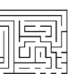

程序 9.8：C语言中转向并驱动一个方格单元

```c
void go_to(int dir)
{ int turn;
  static int cur_x, cur_y, cur_p;

  dir = (dir+4) % 4;           // keep direction in [0, 3]
  turn = dir - rob_dir;
  if (turn)
  { VWTurn(turn*90, ASPEED); VWWait(); }

  Controlled_Straight(DIST, SPEED); // P-contr. straight
  rob_dir = dir;
  rob_x   = xneighbor(rob_x,rob_dir);
  rob_y   = yneighbor(rob_y,rob_dir);
}
```

为了避免在一个方向上进行270°的转向，程序9.9中所示的附加语句被插入，以将其减少为相反方向的90°转向。

程序 9.9：C语言中避免270°转向

```c
if (turn == +3) turn = -1;   // turn shorter angle
if (turn == -3) turn = +1;
```

函数 *explore* 将让机器人遍历迷宫，同时在其内部数据结构中重现它。一个迷宫结构示例如图9.11所示。

```
........................................
._._._._._._._._._._._._._._._._._._._._._._._._._._._._._._._._._._._._._._._._._._._._._._._._._._._._._._._._._._._._._._._._._._._._._._._._._._._._._._._._._._._._._._._._._._._._._._._._._._._._._._._._._._._._._._._._._._._._._._._._._._._._._._._._._._._._._._._._._._._._._._._._._._._._._._._._._._._._._._._._._._._._._._._._._._._._._._._._._._._._._._._._._._._._._._._._._._._._._._._._._._._._._._._._._._._._._._._._._._._._._._._._._._._._._._._._._._._._._._._._._._._._._._._._._._._._._._._._._._._._._._._._._._._._._._._._._._._._._._._._._._._._._._._._._._._._._._._._._._._._._._._._._._._._._._._._._._._._._._._._._._._._._._._._._._._._._._._._._._._._._._._._._._._._._._._._._._._._._._._._._._._._._._._._._._._._._._._._._._._._._._._._._._._._._._._._._._._._._._._._._._._._._._._._._._._._._._._._._._._._._._._._._._._._._._._._._._._._._._._._._._._._._._._._._._._._._._._._._._._._._._._._._._._._._._._._._._._._._._._._._._._._._._._._._._._._._._._._._._._._._._._._._._._._._._._._._._._._._._._._._._._._._._._._._._._._._._._._._._._._._._._._._._._._._._._._._._._._._._._._._._._._._._._._._._._._._._._._._._._._._._._._._._._._._._._._._._._._._._._._._._._._._._._._._._._._._._._._._._._._._._._._._._._._._._._._._._._._._._._._._._._._._._._._._._._._._._._._._._._._._._._._._._._._._._._._._._._._._._._._._._._._._._._._._._._._._._._._._._._._._._._._._._._._._._._._._._._._._._._._._._._._._._._._._._._._._._._._._._._._._._._._._._._._._._._._._._._._._._._._._._._._._._._._._._._._._._._._._._._._._._._._._._._._._._._._._._._._._._._._._._._._._._._._._._._._._._._._._._._._._._._._._._._._._._._._._._._._._._._._._._._._._._._._._._._._._._._._._._._._._._._._._._._._._._._._._._._._._._._._._._._._._._._._._._._._._._._._._._._._._._._._._._._._._._._._._._._._._._._._._._._._._._._._._._._._._._._._._._._._._._._._._._._._._._._._._._._._._._._._._._._._._._._._._._._._._._._._._._._._._._._._._._._._._._._._._._._._._._._._._._._._._._._._._._._._._._._._._._._._._._._._._._._._._._._._._._._._._._._._._._._._._._._._._._._._._._._._._._._._._._._._._._._._._._._._._._._._._._._._._._._._._._._._._._._._._._._._._._._._._._._._._._._._._._._._._._._._._._._._._._._._._._._._._._._._._._._._._._._._._._._._._._._._._._._._._._._._._._._._._._._._._._._._._._._._._._._._._._._._._._._._._._._._._._._._._._._._._._._._._._._._._._._._._._._._._._._._._._._._._._._._._._._._._._._._._._._._._._._._._._._._._._._._._._._._._._._._._._._._._._._._._._._._._._._._._._._._._._._._._._._._._._._._._._._._._._._._._._._._._._._._._._._._._._._._._._._._._._._._._._._._._._._._._._._._._._._._._._._._._._._._._._._._._._._._._._._._._._._._._._._._._._._._._._._._._._._._._._._._._._._._._._._._._._._._._._._._._._._._._._._._._._._._._._._._._._._._._._._._._._._._._._._._._._._._._._._._._._._._._._._._._._._._._._._._._._._._._._._._._._._._._._._._._._._._._._._._._._._._._._._._._._._._._._._._._._._._._._._._._._._._._._._._._._._._._._._._._._._._._._._._._._._._._._._._._._._._._._._._._._._._._._._._._._._._._._._._._._._._._._._._._._._._._._._._._._._._._._._._._._._._._._._._._._._._._._._._._._._._._._._._._._._._._._._._._._._._._._._._._._._._._._._._._._._._._._._._._._._._._._._._._._._._._._._._._._._._._._._._._._._._._._._._._._._._._._._._._._._._._._._._._._._._._._._._._._._._._._._._._._._._._._._._._._._._._._._._._._._._._._._._._._._._._._._._._._._._._._._._._._._._._._._._._._._._._._._._._._._._._._._._._._._._._._._._._._._._._._._._._._._._._._._._._._._._._._._._._._._._._._._._._._._._._._._._._._._._._._._._._._._._._._._._._._._._._._._._._._._._._._._._._._._._._._._._._._._._._._._._._._._._._._._._._._._._._._._._._._._._._._._._._._._._._._._._._._._._._._._._._._._._._._._._._._._._._._._._._._._._._._._._._._._._._._._._._._._._._._._._._._._._._._._._._._._._._._._._._._._._._._._._._._._._._._._._._._._._._._._._._._._._._._._._._._._._._._._._._._._._._._._._._._._._._._._._._._._._._._._._._._._._._._._._._._._._._._._._._._._._._._._._._._._._._._._._._._._._._._._._._._._._._._._._._._._._._._._._._._._._._._._._._._._._._._._._._._._._._._._._._._._._._._._._._._._._._._._._._._._._._._._._._._._._._._._._._._._._._._._._._._._._._._._._._._._._._._._._._._._._._._._._._._._._._._._._._._._._._._._._._._._._._._._._._._._._._._._._._._._._._._._._._._._._._._._._._._._._._._._._._._._._._._._._._._._._._._._._._._._._._._._._._._._._._._._._._._._._._._._._._._._._._._._._._._._._._._._._._._._._._._._._._._._._._._._._._._._._._._._._._._._._._._._._._._._._._._._._._._._._._._._._._._._._._._._._._._._._._._._._._._._._._._._._._._._._._._._._._._._._._._._._._._._._._._._._._._._._._._._._._._._._._._._._._._._._._._._._._._._._._._._._._._._._._._._._._._._._._._._._._._._._._._._._._._._._._._._._._._._._._._._._._._._._._._._._._._._._._._._._._._._._._._._._._._._._._._._._._._._._._._._._._._._._._._._._._._._._._._._._._._._._._._._._._._._._._._._._._._._._._._._._._._._._._._._._._._._._._._._._._._._._._._._._._._._._._._._._._._._._._._._._._._._._._._._._._._._._._._._._._._._._._._._._._._._._._._._._._._._._._._._._._._._._._._._._._._._._._._._._._._._._._._._._._._._._._._._._._._._._._._._._._._._._._._._._._._._._._._._._._._._._._._._._._._._._._._._._._._._._._._._._._._._._._._._._._._._._._._._._._._._._._._._._._._._._._._._._._._._._._._._._._._._._._._._._._._._._._._._._._._._._._._._._._._._._._._._._._._._._._._._._._._._._._._._._._._._._._._._._._._._._._._._._._._._._._._._._._._._._._._._._._._._._._._._._._._._._._._._._._._._._._._._._._._._._._._._._._._._._._._._._._._._._._._._._._._._._._._._._._._._._._._._._._._._._._._._._._._._._._._._._._._._._._._._._._._._._._._._._._._._._._._._._._._._._._._._._._._._._._._._._._._._._._._._._._._._._._._._._._._._._._._._._._._._._._._._._._._._._._._._._._._._._._._._._._._._._._._._._._._._._._._._._._._._._._._._._._._._._._._._._._._._._._._._._._._._._._._._._._._._._._._._._._._._._._._._._._._._._._._._._._._._._._._._._._._._._._._._._._._._._._._._._._._._._._._._._._._._._._._._._._._._._._._._._._._._._._._._._._._._._._._._._._._._._._._._._._._._._._._._._._._._._._._._._._._._._._._._._._._._._._._._._._._._._._._._._._._._._._._._._._._._._._._._._._._._._._._._._._._._._._._._._._._._._._._._._._._._._._._._._._._._._._._._._._._._._._._._._._._._._._._._._._._._._._._._._._._._._._._._._._._._._._._._._._._._._._._._._._._._._._._._._._._._._._._._._._._._._._._._._._._._._._._._._._._._._._._._._._._._._._._._._._._._._._._._._._._._._._._._._._._._._._._._._._._._._._._._._._._._._._._._._._._._._._._._._._._._._._._._._._._._._._._._._._._._._._._._._._._._._._._._._._._._._._._._._._._._._._._._._._._._._._._._._._._._._._._._._._._._._._._._._._._._._._._._._._._._._._._._._._._._._._._._._._._._._._._._._._._._._._._._._._._._._._._._._._._._._._._._._._._._._._._._._._._._._._._._._._._._._._._._._._._._._._._._._._._._._._._._._._._._._._._._._._._._._._._._._._._._._._._._._._._._._._._._._._._._._._._._._._._._._._._._._._._._._._._._._._._._._._._._._._._._._._._._._._._._._._._._._._._._._._._._._._._._._._._._._._._._._._._._._._._._._._._._._._._._._._._._._._._._._._._._._._._._._._._._._._._._._._._._._._._._._._._._._._._._._._._._._._._._._._._._._._._._._._._._._._._._._._._._._._._._._._._._._._._._._._._._._._._._._._._._._._._._._._._._._._._._._._._._._._._._._._._._._._._._._._._._._._._._._._._._._._._._._._._._._._._._._._._._._._._._._._._._._._._._._._._._._._._._._._._._._._._._._._._._._._._._._._._._._._._._._._._._._._._._._._._._._._._._._._._._._._._._._._._._._._._._._._._._._._._._._._._._._._._._._._._._._._._._._._._._._._._._._._._._._._._._._._._._._._._._._._._._._._._._._._._._._._._._._._._._._._._._._._._._._._._._._._._._._._._._._._._._._._._._._._._._._._._._._._._._._._._._._._._._._._._._._._._._._._._._._._._._._._._._._._._._._._._._._._._._._._._._._._._._._._._._._._._._._._._._._._._._._._._._._._._._._._._._._._._._._._._._._._._._._._._._._._._._._._._._._._._._._._._._._._._._._._._._._._._._._._._._._._._._._._._._._._._._._._._._._._._._._._._._._._._._._._._._._._._._._._._._._._._._._._._._._._._._._._._._._._._._._._._._._._._._._._._._._._._._._._._._._._._._._._._._._._._._._._._._._._._._._._._._._._._._._._._._._._._._._._._._._._._._._._._._._._._._._._._._._._._._._._._._._._._._._._._._._._._._._._._._._._._._._._._._._._._._._._._._._._._._._._._._._._._._._._._._._._._._._._._._._._._._._._._._._._._._._._._._._._._._._._._._._._._._._._._._._._._._._._._._._._._._._._._._._._._._._._._._._._._._._._._._._._._._._._._._._._._._._._._._._._._._._._._._._._._._._._._._._._._._._._._._._._._._._._._._._._._._._._._._._._._._._._._._._._._._._._._._._._._._._._._._._._._._._._._._._._._._._._._._._._._._._._._._._._._._._._._._._._._._._._._._._._._._._._._._._._._._._._._._._._._._._._._._._._._._._._._._._._._._._._._._._._._._._._._._._._._._._._._._._._._._._._._._._._._._._._._._._._._._._._._._._._._._._._._._._._._._._._._._._._._._._._._._._._._._._._._._._._._._._._._._._._._._._._._._._._._._._._._._._._._._._._._._._._._._._._._._._._._._._._._._._._._._._._._._._._._._._._._._._._._._._._._._._._._._._._._._._._._._._._._._._._._._._._._._._._._._._._._._._._._._._._._._._._._._._._._._._._._._._._._._._._._._._._._._._._._._._._._._._._._._._._._._._._._._._._._._._._._._._._._._._._._._._._._._._._._._._._._._._._._._._._._._._._._._._._._._._._._._._._._._._._._._._._._._._._._._._._._._._._._._._._._._._._._._._._._._._._._._._._._._._._._._._._._._._._._._._._._._._._._._._._._._._._._._._._._._._._._._._._._._._._._._._._._._._._._._._._._._._._._._._._._._._._._._._._._._._._._._._._._._._._._._._._._._._._._._._._._._._._._._._._._._._._._._._._._._._._._._._._._._._._._._._._._._._._._._._._._._._._._._._._._._._._._._._._._._._._._._._._._._._._._._._._._._._._._._._._._._._._._._._._._._._._._._._._._._._._._._._._._._._._._._._._._._._._._._._._._._._._._._._._._._._._._._._._._._._._._._._._._._._._._._._._._._._._._._._._._._._._._._._._._._._._._._._._._._._._._._._._._._._._._._._._._._._._._._._._._._._._._._._._._._._._._._._._._._._._._._._._._._._._._._._._._._._._._._._._._._._._._._._._._._._._._._._._._._._._._._._._._._._._._._._._._._._._._._._._._._._._._._._._._._._._._._._._._._._._._._._._._._._._._._._._._._._._._._._._._._._._._._._._._._._._._._._._._._._._._._._._._._._._._._._._._._._._._._._._._._._._._._._._._._._._._._._._._._._._._._._._._._._._._._._._._._._._._._._._._._._._._._._._._._._._._._._._._._._._._._._._._._._._._._._._._._._._._._._._._._._._._._._._._._._._._._._._._._._._._._._._._._._._._._._._._._._._._._._._._._._._._._._._._._._._._._._._._._._._._._._._._._._._._._._._._._._._._._._._._._._._._._._._._._._._._._._._._._._._._._._._._._._._._._._._._._._._._._._._._._._._._._._._._._._._._._._._._._._._._._._._._._._._._._._._._._._._._._._._._._._._._._._._._._._._._._._._._._._._._._._._._._._._._._._._._._._._._._._._._._._._._._._._._._._._._._._._._._._._._._._._._._._._._._._._._._._._._._._._._._._._._._._._._._._._._._._._._._._._._._._._._._._._._._._._._._._._._._._._._._._._._._._._._._._._._._._._._._._._._._._._._._._._._._._._._._._._._._._._._._._._._._._._._._._._._._._._._._._._._._._._._._._._._._._._._._._._._._._._._._._._._._._._._._._._._._._._._._._._._._._._._._._._._._._._._._._._._._._._._._._._._._._._._._._._._._._._._._._._._._._._._._._._._._._._._._._._._._._._._._._._._._._._._._._._._._._._._._._._._._._._._._._._._._._._._._._._._._._._._._._._._._._._._._._._._._._._._._._._._._._._._._._._._._._._._._._._._._._._._._._._._._._._._._._._._._._._._._._._._._._._._._._._._._._._._._._._._._._._._._._._._._._._._._._._._._._._._._._._._._._._._._._._._._._._._._._._._._._._._._._._._._._._._._._._._._._._._._._._._._._._._._._._._._._._._._._._._._._._._._._._._._._._._._._._._._._._._._._._._._._._._._._._._._._._._._._._._._._._._._._._._._._._._._._._._._._._._._._._._._._._._._._._._._._._._._._._._._._._._._._._._._._._._._._._._._._._._._._._._._._._._._._._._._._._._._._._._._._._._._._._._._._._._._._._._._._._._._._._._._._._._._._._._._._._._._._._._._._._._._._._._._._._._._._._._._._._._._._._._._._._._._._._._._._._._._._._._._._._._._._._._._._._._._._._._._._._._._._._._._._._._._._._._._._._._._._._._._._._._._._._._._._._._._._._._._._._._._._._._._._._._._._._._._._._._._._._._._._._._._._._._._._._._._._._._._._._._._._._._._._._._._._._._._._._._._._._._._._._._._._._._._._._._._._._._._._._._._._._._._._._._._._._._._._._._._._._._._._._._._._._._._._._._._._._._._._._._._._._._._._._._._._._._._._._._._._._._._._._._._._._._._._._._._._._._._._._._._._._._._._._._._._._._._._._._._._._._._._._._._._._._._._._._._._._._._._._._._._._._._._._._._._._._._._._._._._._._._._._._._._._._._._._._._._._._._._._._._._._._._._._._._._._._._._._._._._._._._._._._._._._._._._._._._._._._._._._._._._._._._._._._._._._._._._._._._._._._._._._._._._._._._._._._._._._._._._._._._._._._._._._._._._._._._._._._._._._._._._._._._._._._._._._._._._._._._._._._._._._._._._._._._._._._._._._._._._._._._._._._._._._._._._._._._._._._._._._._._._._._._._._._._._._._._._._._._._._._._._._._._._._._._._._._._._._._._._._._._._._._._._._._._._._._._._._._._._._._._._._._._._._._._._._._._._._._._._._._._._._._._._._._._._._._._._._._._._._._._._._._._._._._._._._._._._._._._._._._._._._._._._._._._._._._._._._._._._._._._._._._._._._._._._._._._._._._._._._._._._._._._._._._._._._._._._._._._._._._._._._._._._._._._._._._._._._._._._._._._._._._._._._._._._._._._._._._._._._._._._._._._._._._._._._._._._._._._._._._._._._._._._._._._._._._._._._._._._._._._._._._._._._._._._._._._._._._._._._._._._._._._._._._._._._._._._._._._._._._._._._._._._._._._._._._._._._._._._._._._._._._._._._._._._._._._._._._._._._._._._._._._._._._._._._._._._._._._._._._._._._._._._._._._._._._._._._._._._._._._._._._._._._._._._._._._._._._._._._._._._._._._._._._._._._._._._._._._._._._._._._._._._._._._._._._._._._._._._._._._._._._._._._._._._._._._._._._._._._._._._._._._._._._._._._._._._._._._._._._._._._._._._._._._._._._._._._._._._._._._._._._._._._._._._._._._._._._._._._._._._._._._._._._._._._._._._._._._._._._._._._._._._._._._._._._._._._._._._._._._._._._._._._._._._._._._._._._._._._._._._._._._._._._._._._._._._._._._._._._._._._._._._._._._._._._._._._._._._._._._._._._._._._._._._._._._._._._._._._._._._._._._._._._._._._._._._._._._._._._._._._._._._._._._._._._._._._._._._._._._._._._._._._._._._._._._._._._._._._._._._._._._._._._._._._._._._._._._._._._._._._._._._._._._._._._._._._._._._._._._._._._._._._._._._._._._._._._._._._._._._._._._._._._._._._._._._._._._._._._._._._._._._._._._._._._._._._._._._._._._._._._._._._._._._._._._._._._._._._._._._._._._._._._._._._._._._._._._._._._._._._._._._._._._._._._._._._._._._._._._._._._._._._._._._._._._._._._._._._._._._._._._._._._._._._._._._._._._._._._._._._._._._._._._._._._._._._._._._._._._._._._._._._._._._._._._._._._._._._._._._._._._._._._._._._._._._._._._._._._._._._._._._._._._._._._._._._._._._._._._._._._._._._._._._._._._._._._._._._._._._._._._._._._._._._._._._._._._._._._._._._._._._._._._._._._._._._._._._._._._._._._._._._._._._._._._._._._._._._._._._._._._._._._._._._._._._._._._._._._._._._._._._._._._._._._._._._._._._._._._._._._._._._._._._._._._._._._._._._._._._._._._._._._._._._._._._._._._._._._._._._._._._._._._._._._._._._._._._._._._._._._._._._._._._._._._._._._._._._._._._._._._._._._._._._._._._._._._._._._._._._._._._._._._._._._._._._._._._._._._._._._._._._._._._._._._._._._._._._._._._._._._._._._._._._._._._._._._._._._._._._._._._._._._._._._._._._._._._._._._._._._._._._._._._._._._._._._._._._._._._._._._._._._._._._._._._._._._._._._._._._._._._._._._._._._._._._._._._._._._._._._._._._._._._._._._._._._._._._._._._._._._._._._._._._._._._._._._._._._._._._._._._._._._._._._._._._._._._._._._._._._._._._._._._._._._._._._._._._._._._._._._._._._._._._._._._._._._._._._._._._._._._._._._._._._._._._._._._._._._._._._._._._._._._._._._._._._._._._._._._._._._._._._._._._._._._._._._._._._._._._._._._._._._._._._._._._._._._._._._._._._._._._._._._._._._._._._._._._._._._._._._._._._._._._._._._._._._._._._._._._._._._._._._._._._._._._._._._._._._._._._._._._._._._._._._._._._._._._._._._._._._._._._._._._._._._._._._._._._._._._._._._._._._._._._._._._._._._._._._._._._._._._._._._._._._._._._._._._._._._._._._._._._._._._._._._._._._._._._._._._._._._._._._._._._._._._._._._._._._._._._._._._._._._._._._._._._._._._._._._._._._._._._._._._._._._._._._._._._._._._._._._._._._._._._._._._._._._._._._._._._._._._._._._._._._._._._._._._._._._._._._._._._._._._._._._._._._._._._._._._._._._._._._._._._._._._._._._._._._._._._._._._._._._._._._._._._._._._._._._._._._._._._._._._._._._._._._._._._._._._._._._._._._._._._._._._._._._._._._._._._._._._._._._._._._._._._._._._._._._._._._._._._._._._._._._._._._._._._._._._._._._._._._._._._._._._._._._._._._._._._._._._._._._._._._._._._._._._._._._._._._._._._._._._._._._._._._._._._._._._._._._._._._._._._._._._._._._._._._._._._._._._._._._._._._._._._._._._._._._._._._._._._._._._._._._._._._._._._._._._._._._._._._._._._._._._._._._._._._._._._._._._._._._._._._._._._._._._._._._._._._._._._._._._._._._._._._._._._._._._._._._._._._._._._._._._._._._._._._._._._._._._._._._._._._._._._._._._._._._._._._._._._._._._._._._._._._._._._._._._._._._._._._._._._._._._._._._._._._._._._._._._._._._._._._._._._._._._._._._._._._._._._._._._._._._._._._._._._._._._._._._._._._._._._._._._._._._._._._._._._._._._._._._._._._._._._._._._._._._._._._._._._._._._._._._._._._._._._._._._._._._._._._._._._._._._._._._._._._._._._._._._._._._._._._._._._._._._._._._._._._._._._._._._._._._._._._._._._._._._._._._._._._._._._._._._._._._._._._._._._._._._._._._._._._._._._._._._._._._._._._._._._._._._._._._._._._._._._._._._._._._._._._._._._._._._._._._._._._._._._._._._._._._._._._._._._._._._._._._._._._._._._._._._._._._._._._._._._._._._._._._._._._._._._._._._._._._._._._._._._._._._._._._._._._._._._._._._._._._._._._._._._._._._._._._._._._._._._._._._._._._._._._._._._._._._._._._._._._._._._._._._._._._._._._._._._._._._._._._._._._._._._._._._._._._._._._._._._._._._._._._._._._._._._._._._._._._._._._._._._._._._._._._._._._._._._._._._._._._._._._._._._._._._._._._._._._._._._._._._._._._._._._._._._._._._._._._._._._._._._._._._._._._._._._._._._._._._._._._._._._._._._._._._._._._._._._._._._._._._._._._._._._._._._._._._._._._._._._._._._._._._._._._._._._._._._._._._._._._._._._._._._._._._._._._._._._._._._._._._._._._._._._._._._._._._._._._._._._._._._._._._._._._._._._._._._._._._._._._._._._._._._._._._._._._._._._._._._._._._._._._._._._._._._._._._._._._._._._._._._._._._._._._._._._._._._._._._._._._._._._._._._._._._._._._._._._._._._._._._._._._._._._._._._._._._._._._._._._._._._._._._._._._._._._._._._._._._._._._._._._._._._._._._._._._._._._._._._._._._._._._._._._._._._._._._._._._._._._._._._._._._._._._._._._._._._._._._._._._._._._._._._._._._._._._._._._._._._._._._._._._._._._._._._._._._._._._._._._._._._._._._._._._._._._._._._._._._._._._._._._._._._._._._._._._._._._._._._._._._._._._._._._._._._._._._._._._._._._._._._._._._._._._._._._._._._._._._._._._._._._._._._._._._._._._._._._._._._._._._._._._._._._._._._._._._._._._._._._._._._._._._._._._._._._._._._._._._._._._._._._._._._._._._._._._._._._._._._._._._._._._._._._._._._._._._._._._._._._._._._._._._._._._._._._._._._._._._._._._._._._._._._._._._._._._._._._._._._._._._._._._._._._._._._._._._._._._._._._._._._._._._._._._._._._._._._._._._._._._._._._._._._._._._._._._._._._._._._._._._._._._._._._._._._._._._._._._._._._._._._._._._._._._._._._._._._._._._._._._._._._._._._._._._._._._._._._._._._._._._._._._._._._._._._._._._._._._._._._._._._._._._._._._._._._._._._._._._._._._._._._._._._._._._._._._._._._._._._._._._._._._._._._._._._._._._._._._._._._._._._._._._._._._._._._._._._._._._._._._._._._._._._._._._._._._._._._._._._._._._._._._._._._._._._._._._._._._._._._._._._._._._._._._._._._._._._._._._._._._._._._._._._._._._._._._._._._._._._._._._._._._._._._._._._._._._._._._._._._._._._._._._._._._._._._._._._._._._._._._._._._._._._._._._._._._._._._._._._._._._._._._._._._._._._._._._._._._._._._._._._._._._._._._._._._._._._._._._._._._._._._._._._._._._._._._._._._._._._._._._._._._._._._._._._._._._._._._._._._._._._._._._._._._._._._._._._._._._._._._._._._._._._._._._._._._._._._._._._._._._._._._._._._._._._._._._._._._._._._._._._._._._._._._._._._._._._._._._._._._._._._._._._._._._._._._._._._._._._._._._._._._._._._._._._._._._._._._._._._._._._._._._._._._._._._._._._._._._._._._._._._._._._._._._._._._._._._._._._._._._._._._._._._._._._._._._._._._._._._._._._._._._._._._._._._._._._._._._._._._._._._._._._._._._._._._._._._._._._._._._._._._._._._._._._._._._._._._._._._._._._._._._._._._._._._._._._._._._._._._._._._._._._._._._._._._._._._._._._._._._._._._._._._._._._._._._._._._._._._._._._._._._._._._._._._._._._._._._._._._._._._._._._._._._._._._._._._._._._._._._._._._._._._._._._._._._._._._._._._._._._._._._._._._._._._._._._._._._._._._._._._._._._._._._._._._._._._._._._._._._._._._._._._._._._._._._._._._._._._._._._._._._._._._._._._._._._._._._._._._._._._._._._._._._._._._._._._._._._._._._._._._._._._._._._._._._._._._._._._._._._._._._._._._._._._._._._._._._._._._._._._._._._._._._._._._._._._._._._._._._._._._._._._._._._._._._._._._._._._._._._._._._._._._._._._._._._._._._._._._._._._._._._._._._._._._._._._._._._._._._._._._._._._._._._._._._._._._._._._._._._._._._._._._._._._._._._._._._._._._._._._._._._._._._._._._._._._._._._._._._._._._._._._._._._._._._._._._._._._._._._._._._._._._._._._._._._._._._._._._._._._._._._._._._._._._._._._._._._._._._._._._._._._._._._._._._._._._._._._._._._._._._._._._._._._._._._._._._._._._._._._._._._._._._._._._._._._._._._._._._._._._._._._._._._._._._._._._._._._._._._._._._._._._._._._._._._._._._._._._._._._._._._._._._._._._._._._._._._._._._._._._._._._._._._._._._._._._._._._._._._._._._._._._._._._._._._._._._._._._._._._._._._._._._._._._._._._._._._._._._._._._._._._._._._._._._._._._._._._._._._._._._._._._._._._._._._._._._._._._._._._._._._._._._._._._._._._._._._._._._._._._._._._._._._._._._._._._._._._._._._._._._._._._._._._._._._._._._._._._._._._._._._._._._._._._._._._._._._._._._._._._._._._._._._._._._._._._._._._._._._._._._._._._._._._._._._._._._._._._._._._._._._._._._._._._._._._._._._._._._._._._._._._._._._._._._._._._._._._._._._._._._._._._._._._._._._._._._._._._._._._._._._._._._._._._._._._._._._._._._._._._._._._._._._._._._._._._._._._._._._._._._._._._._._._._._._._._._._._._._._._._._._._._._._._._._._._._._._._._._._._._._._._._._._._._._._._._._._._._._._._._._._._._._._._._._._._._._._._._._._._._._._._._._._._._._._._._._._._._._._._._._._._._._._._._._._._._._._._._._._._._._._._._._._._._._._._._._._._._._._._._._._._._._._._._._._._._._._._._._._._._._._._._._._._._._._._._._._._._._._._._._._._._._._._._._._._._._._._._._._._._._._._._._._._._._._._._._._._._._._._._._._._._._._._._._._._._._._._._._._._._._._._._._._._._._._._._._._._._._._._._._._._._._._._._._._._._._._._._._._._._._._._._._._._._._._._._._._._._._._._._._._._._._._._._._._._._._._._._._._._._._._._._._._._._._._._._._._._._._._._._._._._._._._._._._._._._._._._._._._._._._._._._._._._._._._._._._._._._._._._._._._._._._._._._._._._._._._._._._._._._._._._._._._._._._._._._._._._._._._._._._._._._._._._._._._._._._._._._._._._._._._._._._._._._._._._._._._._._._._._._._._._._._._._._._._._._._._._._._._._._._._._._._._._._._._._._._._._._._._._._._._._._._._._._._._._._._._._._._._._._._._._._._._._._._._._._._._._._._._._._._._._._._._._._._._._._._._._._._._._._._._._._._._._._._._._._._._._._._._._._._._._._._._._._._._._._._._._._._._._._._._._._._._._._._._._._._._._._._._._._._._._._._._._._._._._._._._._._._._._._._._._._._._._._._._._._._._._._._._._._._._._._._._._._._._._._._._._._._._._._._._._._._._._._._._._._._._._._._._._._._._._._._._._._._._._._._._._._._._._._._._._._._._._._._._._._._._._._._._._._._._._._._._._._._._._._._._._._._._._._._._._._._._._._._._._._._._._._._._._._._._._._._._._._._._._._._._._._._._._._._._._._._._._._._._._._._._._._._._._._._._._._._._._._._._._._._._._._._._._._._._._._._._._._._._._._._._._._._._._._._._._._._._._._._._._._._._._._._._._._._._._._._._._._._._._._._._._._._._._._._._._._._._._._._._._._._._._._._._._._._._._._._._._._._._._._._._._._._._._._._._._._._._._._._._._._._._._._._._._._._._._._._._._._._._._._._._._._._._._._._._._._._._._._._._._._._._._._._._._._._._._._._._._._._._._._._._._._._._._._._._._._._._._._._._._._._._._._._._._._._._._._._._._._._._._._._._._._._._._._._._._._._._._._._._._._._._._._._._._._._._._._._._._._._._._._._._._._._._._._._._._._._._._._._._._._._._._._._._._._._._._._._._._._._._._._._._._._._._._._._._._._._._._._._._._._._._._._._._._._._._._._._._._._._._._._._._._._._._._._._._._._._._._._._._._._._._._._._._._._._._._._._._._._._._._._._._._._._._._._._._._._._._._._._._._._._._._._._._._._._._._._._._._._._._._._._._._._._._._._._._._._._._._._._._._._._._._._._._._._._._._._._._._._._._._._._._._._._._._._._._._._._._._._._._._._._._._._._._._._._._._._._._._._._._._._._._._._._._._._._._._._._._._._._._._._._._._._._._._._._._._._._._._._._._._._._._._._._._._._._._._._._._._._._._._._._._._._._._._._._._._._._._._._._._._._._._._._._._._._._._._._._._._._._._._._._._._._._._._._._._._._._._._._._._._._._._._._._._._._._._._._._._._._._._._._._._._._._._._._._._._._._._._._._._._._._._._._._._._._._._._._._._._._._._._._._._._._._._._._._._._._._._._._._._._._._._._._._._._._._._._._._._._._._._._._._._._._._._._._._._._._._._._._._._._._._._._._._._._._._._._._._._._._._._._._._._._._._._._._._._._._._._._._._._._._._._._._._._._._._._._._._._._._._._._._._._._._._._._._._._._._._._._._._._._._._._._._._._._._._._._._._._._._._._._._._._._._._._._._._._._._._._._._._._._._._._._._._._._._._._._._._._._._._._._._._._._._._._._._._._._._._._._._._._._._._._._._._._._._._._._._._._._._._._._._._._._._._._._._._._._._._._._._._._._._._._._._._._._._._._._._._._._._._._._._._._._._._._._._._._._._._._._._._._._._._._._._._._._._._._._._._._._._._._._._._._._._._._._._._._._._._._._._._._._._._._._._._._._._._._._._._._._._._._._._._._._._._._._._._._._._._._._._._._._._._._._._._._._._._._._._._._._._._._._._._._._._._._._._._._._._._._._._._._._._._._._._._._._._._._._._._._._._._._._._._._._._._._._._._._._._._._._._._._._._._._._._._._._._._._._._._._._._._._._._._._._._._._._._._._._._._._._._._._._._._._._._._._._._._._._._._._._._._._._._._._._._._._._._._._._._._._._._._._._._._._._._._._._._._._._._._._._._._._._._._._._._._._._._._._._._._._._._._._._._._._._._._._._._._._._._._._._._._._._._._._._._._._._._._._._._._._._._._._._._._._._._._._._._._._._._._._._._._._._._._._._._._._._._._._._._._._._._._._._._._._._._._._._._._._._._._._._._._._._._._._._._._._._._._._._._._._._._._._._._._._._._._._._._._._._._._._._._._._._._._._._._._._._._._._._._._._._._._._._._._._._._._._._._._._._._._._._._._._._._._._._._._._._._._._._._._._._._._._._._._._._._._._._._._._._._._._._._._._._._._._._._._._._._._._._._._._._._._._._._._._._._._._._._._._._._._._._._._._._._._._._._._._._._._._._._._._._._._._._._._._._._._._._._._._._._._._._._._._._._._._._._._._._._._._._._._._._._._._._._._._._._._._._._._._._._._._._._._._._._._._._._._._._._._._._._._._._._._._._._._._._._._._._._._._._._._._._._._._._._._._._._._._._._._._._._._._._._._._._._._._._._._._._._._._._._._._._._._._._._._._._._._._._._._._._._._._._._._._._._._._._._._._._._._._._._._._._._._._._._._._._._._._._._._._._._._._._._._._._._._._._._._._._._._._._._._._._._._._._._._._._._._._._._._._._._._._._._._._._._._._._._._._._._._._._._._._._._._._._._._._._._._._._._._._._._._._._._._._._._._._._._._._._._._._._._._._._._._._._._._._._._._._._._._._._._._._._._._._._._._._._._._._._._._._._._._._._._._._._._._._._._._._._._._._._._._._._._._._._._._._._._._._._._._._._._._._._._._._._._._._._._._._._._._._._._._._._._._._._._._._._._._._._._._._._._._._._._._._._._._._._._._._._._._._._._._._._._._._._._._._._._._._._._._._._._._._._._._._._._._._._._._._._._._._._._._._._._._._._._._._._._._._._._._._._._._._._._._._._._._._._._._._._._._._._._._._._._._._._._._._._._._._._._._._._._._._._._._._._._._._._._._._._._._._._._._._._._._._._._._._._._._._._._._._._._._._._._._._._._._._._._._._._._._._._._._._._._._._._._._._._._._._._._._._._._._._._._._._._._._._._._._._._._._._._._._._._._._._._._._._._._._._._._._._._._._._._._._._._._._._._._._._._._._._._._._._._._._._._._._._._._._._._._._._._._._._._._._._._._._._._._._._._._._._._._._._._._._._._._._._._._._._._._._._._._._._._._._._._._._._._._._._._._._._._._._._._._._._._._._._._._._._._._._._._._._._._._._._._._._._._._._._._._._._._._._._._._._._._._._._._._._._._._._._._._._._._._._._._._._._._._._._._._._._._._._._._._._._._._._._._._._._._._._._._._._._._._._._._._._._._._._._._._._._._._._._._._._._._._._._._._._._._._._._._._._._._._._._._._._._._._._._._._._._._._._._._._._._._._._._._._._._._._._._._._._._._._._._._._._._._._._._._._._._._._._._._._._._._._._._._._._._._._._._._._._._._._._._._._._._._._._._._._._._._._._._._._._._._._._._._._._._._._._._._._._._._._._._._._._._._._._._._._._._._._._._._._._._._._._._._._._._._._._._._._._._._._._._._._._._._._._._._._._._._._._._._._._._._._._._._._._._._._._._._._._._._._._._._._._._._._._._._._._._._._._._._._._._._._._._._._._._._._._._._._._._._._._._._._._._._._._._._._._._._._._._._._._._._._._._._._._._._._._._._._._._._._._._._._._._._._._._._._._._._._._._._._._._._._._._._._._._._._._._._._._._._._._._._._._._._._._._._._._._._._._._._._._._._._._._._._._._._._._._._._._._._._._._._._._._._._._._._._._._._._._._._._._._._._._._._._._._._._._._._._._._._._._._._._._._._._._._._._._._._._._._._._._._._._._._._._._._._._._._._._._._._._._._._._._._._._._._._._._._._._._._._._._._._._._._._._._._._._._._._._._._._._._._._._._._._._._._._._._._._._._._._._._._._._._._._._._._._._._._._._._._._._._._._._._._._._._._._._._._._._._._._._._._._._._._._._._._._._._._._._._._._._._._._._._._._._._._._._._._._._._._._._._._._._._._._._._._._._._._._._._._._._._._._._._._._._._._._._._._._._._._._._._._._._._._._._._._._._._._._._._._._._._._._._._._._._._._._._._._._._._._._._._._._._._._._._._._._._._._._._._._._._._._._._._._._._._._._._._._._._._._._._._._._._._._._._._._._._._._._._._._._._._._._._._._._._._._._._._._._._._._._._._._._._._._._._._._._._._._._._._._._._._._._._._._._._._._._._._._._._._._._._._._._._._._._._._._._._._._._._._._._._._._._._._._._._._._._._._._._._._._._._._._._._._._._._._._._._._._._._._._._._._._._._._._._._._._._._._._._._._._._._._._._._._._._._._._._._._._._._._._._._._._._._._._._._._._._._._._._._._._._._._._._._._._._._._._._._._._._._._._._._._._._._._._._._._._._._._._._._._._._._._._._._._._._._._._._._._._._._._._._._._._._._._._._._._._._._._._._._._._._._._._._._._._._._._._._._._._._._._._._._._._._._._._._._._._._._._._._._._._._._._._._._._._._._._._._._._._._._._._._._._._._._._._._._._._._._._._._._._._._._._._._._._._._._._._._._._._._._._._._._._._._._._._._._._._._._._._._._._._._._._._._._._._._._._._._._._._._._._._._._._._._._._._._._._._._._._._._._._._._._._._._._._._._._._._._._._._._._._._._._._._._._._._._._._._._._._._._._._._._._._._._._._._._._._._._._._._._._._._._._._._._._._._._._._._._._._._._._._._._._._._._._._._._._._._._._._._._._._._._._._._._._._._._._._._._._._._._._._._._._._._._._._._._._._._._._._._._._._._._._._._._._._._._._._._._._._._._._._._._._._._._._._._._._._._._._._._._._._._._._._._._._._._._._._._._._._._._._._._._._._._._._._._._._._._._._._._._._._._._._._._._._._._._._._._._._._._._._._._._._._._._._._._._._._._._._._._._._._._._._._._._._._._._._._._._._._._._._._._._._._._._._._._._._._._._._._._._._._._._._._._._._._._._._._._._._._._._._._._._._._._._._._._._._._._._._._._._._._._._._._._._._._._._._._._._._._._._._._._._._._._._._._._._._._._._._._._._._._._._._._._._._._._._._._._._._._._._._._._._._._._._._._._._._._._._._._._._._._._._._._._._._._._._._._._._._._._._._._._._._._._._._._._._._._._._._._._._._._._._._._._._._._._._._._._._._._._._._._._._._._._._._._._._._._._._._._._._._._._._._._._._._._._._._._._._._._._._._._._._._._._._._._._._._._._._._._._._._._._._._._._._._._._._._._._._._._._._._._._._._._._._._._._._._._._._._._._._._._._._._._._._._._._._._._._._._._._._._._._._._._._._._._._._._._._._._._._._._._._._._._._._._._._._._._._._._._._._._._._._._._._._._._._._._._._._._._._._._._._._._._._._._._._._._._._._._._._._._._._._._._._._._._._._._._._._._._._._._._._._._._._._._._._._._._._._._._._._._._._._._._._._._._._._._._._._._._._._._._._._._._._._._._._._._._._._._._._._._._._._._._._._._._._._._._._._._._._._._._._._._._._._._._._._._._._._._._._._._._._._._._._._._._._._._._._._._._._._._._._._._._._._._._._._._._._._._._._._._._._._._._._._._._._._._._._._._._._._._._._._._._._._._._._._._._._._._._._._._._._._._._._._._._._._._._._._._._._._._._._._._._._._._._._._._._._._._._._._._._._._._._._._._._._._._._._._._._._._._._._._._._._._._._._._._._._._._._._._._._._._._._._._._._._._._._._._._._._._._._._._._._._._._._._._._._._._._._._._._._._._._._._._._._._._._._._._._._._._._._._._._._._._._._._._._._._._._._._._._._._._._._._._._._._._._._._._._._._._._._._._._._._._._._._._._._._._._._._._._._._._._._._._._._._._._._._._._._._._._._._._._._._._._._._._._._._._._._._._._._._._._._._._._._._._._._._._._._._._._._._._._._._._._._._._._._._._._._._._._._._._._._._._._._._._._._._._._._._._._._._._._._._._._._._._._._._._._._._._._._._._._._._._._._._._._._._._._._._._._._._._._._._._._._._._._._._._._._._._._._._._._._._._._._._._._._._._._._._._._._._._._._._._._._._._._._._._._._._._._._._._._._._._._._._._._._._._._._._._._._._._._._._._._._._._._._._._._._._._._._._._._._._._._._._._._._._._._._._._._._._._._._._._._._._._._._._._._._._._._._._._._._._._._._._._._._._._._._._._._._._._._._._._._._._._._._._._._._._._._._._._._._._._._._._._._._._._._._._._._._._._._._._._._._._._._._._._._._._._._._._._._._._._._._._._._._._._._._._._._._._._._._._._._._._._._._._._._._._._._._._._._._._._._._._._._._._._._._._._._._._._._._._._._._._._._._._._._._._._._._._._._._._._._._._._._._._._._._._._._._._._._._._._._._._._._._._._._._._._._._._._._._._._._._._._._._._._._._._._._._._._._._._._._._._._._._._._._._._._._._._._._._._._._._._._._._._._._._._._._._._._._._._._._._._._._._._._._._._._._._._._._._._._._._._._._._._._._._._._._._._._._._._._._._._._._._._._._._._._._._._._._._._._._._._._._._._._._._._._._._._._._._._._._._._._._._._._._._._._._._._._._._._._._._._._._._._._._._._._._._._._._._._._._._._._._._._._._._._._._._._._._._._._._._._._._._._._._._._._._._._._._._._._._._._._._._._._._._._._._._._._._._._._._._._._._._._._._._._._._._._._._._._._._._._._._._._._._._._._._._._._._._._._._._._._._._._._._._._._._._._._._._._._._._._._._._._._._._._._._._._._._._._._._._._._._._._._._._._._._._._._._._._._._._._._._._._._._._._._._._._._._._._._._._._._._._._._._._._._._._._._._._._._._._._._._._._._._._._._._._._._._._._._._._._._._._._._._._._._._._._._._._._._._._._._._._._._._._._._._._._._._._._._._._._._._._._._._._._._._._._._._._._._._._._._._._._._._._._._._._._._._._._._._._._._._._._._._._._._._._._._._._._._._._._._._._._._._._._._._._._._._._._._._._._._._._._._._._._._._._._._._._._._._._._._._._._._._._._._._._._._._._._._._._._._._._._._._._._._._._._._._._._._._._._._._._._._._._._._._._._._._._._._._._._._._._._._._._._._._._._._._._._._._._._._._._._._._._._._._._._._._._._._._._._._._._._._._._._._._._._._._._._._._._._._._._._._._._._._._._._._._._._._._._._._._._._._._._._._._._._._._._._._._._._._._._._._._._._._._._._._._._._._._._._._._._._._._._._._._._._._._._._._._._._._._._._._._._._._._._._._._._._._._._._._._._._._._._._._._._._._._._._._._._._._._._._._._._._._._._._._._._._._._._._._._._._._._._._._._._._._._._._._._._._._._._._._._._._._._._._._._._._._._._._._._._._._._._._._._._._._._._._._._._._._._._._._._._._._._._._._._._._._._._._._._._._._._._._._._._._._._._._._._._._._._._._._._._._._._._._._._._._._._._._._._._._._._._._._._._._._._._._._._._._._._._._._._._._._._._._._._._._._._._._._._._._._._._._._._._._._._._._._._._._._._._._._._._._._._._._._._._._._._._._._._._._._._._._._._._._._._._._._._._._._._._._._._._._._._._._._._._._._._._._._._._._._._._._._._._._._._._._._._._._._._._._._._._._._._._._._._._._._._._._._._._._._._._._._._._._._._._._._._._._._._._._._._._._._._._._._._._._._._._._._._._._._._._._._._._._._._._._._._._._._._._._._._._._._._._._._._._._._._._._._._._._._._._._._._._._._._._._._._._._._._._._._._._._._._._._._._._._._._._._._._._._._._._._._._._._._._._._._._._._._._._._._._._._._._._._._._._._._._._._._._._._._._._._._._._._._._._._._._._._._._._._._._._._._._._._._._._._._._._._._._._._._._._._._._._._._._._._._._._._._._._._._._._._._._._._._._._._._._._._._._._._._._._._._._._._._._._._._._._._._._._._._._._._._._._._._._._._._._._._._._._._._._._._._._._._._._._._._._._._._._._._._._._._._._._._._._._._._._._._._._._._._._._._._._._._._._._._._._._._._._._._._._._._._._._._._._._._._._._._._._._._._._._._._._._._._._._._._._._._._._._._._._._._._._._._._._._._._._._._._._._._._._._._._._._._._._._._._._._._._._._._._._._._._._._._._._._._._._._._._._._._._._._._._._._._._._._._._._._._._._._._._._._._._._._._._._._._._._._._._._._._._._._._._._._._._._._._._._._._._._._._._._._._._._._._._._._._._._._._._._._._._._._._._._._._._._._._._._._._._._._._._._._._._._._._._._._._._._._._._._._._._._._._._._._._._._._._._._._._._._._._._._._._._._._._._._._._._._._._._._._._._._._._._._._._._._._._._._._._._._._._._._._._._._._._._._._._._._._._._._._._._._._._._._._._._._._._._._._._._._._._._._._._._._._._._._._._._._._._._._._._._._._._._._._._._._._._._._._._._._._._._._._._._._._._._._._._._._._._._._._._._._._._._._._._._._._._._._._._._._._._._._._._._._._._._._._._._._._._._._._._._._._._._._._._._._._._._._._._._._._._._._._._._._._._._._._._._._._._._._._._._._._._._._._._._._._._._._._._._._._._._._._._._._._._._._._._._._._._._._._._._._._._._._._._._._._._._._._._._._._._._._._._._._._._._._._._._._._._._._._._._._._._._._._._._._._._._._._._._._._._._._._._._._._._._._._._._._._._._._._._._._._._._._._._._._._._._._._._._._._._._._._._._._._._._._._._._._._._._._._._._._._._._._._._._._._._._._._._._._._._._._._._._._._._._._._._._._._._._._._._._._._._._._._._._._._._._._._._._._._._._._._._._._._._._._._._._._._._._._._._._._._._._._._._._._._._._._._._._._._._._._._._._._._._._._._._._._._._._._._._._._._._._._._._._._._._._._._._._._._._._._._._._._._._._._._._._._._._._._._._._._._._._._._._._._._._._._._._._._._._._._._._._._._._._._._._._._._._._._._._._._._._._._._._._._._._._._._._._._._._._._._._._._._._._._._._._._._._._._._._._._._._._._._._._._._._._._._._._._._._._._._._._._._._._._._._._._._._._._._._._._._._._._._._._._._._._._._._._._._._._._._._._._._._._._._._._._._._._._._._._._._._._._._._._._._._._._._._._._._._._._._._._._._._._._._._._._._._._._._._._._._._._._._._._._._._._._._._._._._._._._._._._._._._._._._._._._._._._._._._._._._._._._._._._._._._._._._._._._._._._._._._._._._._._._._._._._._._._._._._._._._._._._._._._._._._._._._._._._._._._._._._._._._._._._._._._._._._._._._._._._._._._._._._._._._._._._._._._._._._._._._._._._._._._._._._._._._._._._._._._._._._._._._._._._._._._._._._._._._._._._._._._._._._._._._._._._._._._._._._._._._._._._._._._._._._._._._._._._._._._._._._._._._._._._._._._._._._._._._._._._._._._._._._._._._._._._._._._._._._._._._._._._._._._._._._._._._._._._._._._._._._._._._._._._._._._._._._._._._._._._._._._._._._._._._._._._._._._._._._._._._._._._._._._._._._._._._._._._._._._._._._._._._._._._._._._._._._._._._._._._._._._._._._._._._._._._._._._._._._._._._._._._._._._._._._._._._._._._._._._._._._._._._._._._._._._._._._._._._._._._._._._._._._._._._._._._._._._._._._._._._._._._._._._._._._._._._._._._._._._._._._._._._._._._._._._._._._._._._._._._._._._._._._._._._._._._._._._._._._._._._._._._._._._._._._._._._._._._._._._._._._._._._._._._._._._._._._._._._._._._._._._._._._._._._._._._._._._._._._._._._._._._._._._._._._._._._._._._._._._._._._._._._._._._._._._._._._._._._._._._._._._._._._._._._._._._._._._._._._._._._._._._._._._._._._._._._._._._._._._._._._._._._._._._._._._._._._._._._._._._._._._._._._._._._._._._._._._._._._._._._._._._._._._._._._._._._._._._._._._._._._._._._._._._._._._._._._._._._._._._._._._._._._._._._._._._._._._._._._._._._._._._._._._._._._._._._._._._._._._._._._._._._._._._._._._._._._._._._._._._._._._._._._._._._._._._._._._._._._._._._._._._._._._._._._._._._._._._._._._._._._._._._._._._._._._._._._._._._._._._._._._._._._._._._._._._._._._._._._._._._._._._._._._._._._._._._._._._._._._._._._._._._._._._._._._._._._._._._._._._._._._._._._._._._._._._._._._._._._._._._._._._._._._._._._._._._._._._._._._._._._._._._._._._._._._._._._._._._._._._._._._._._._._._._._._._._._._._._._._._._._._._._._._._._._._._._._._._._._._._._._._._._._._._._._._._._._._._._._._._._._._._._._._._._._._._._._._._._._._._._._._._._._._._._._._._._._._._._._._._._._._._._._._._._._._._._._._._._._._._._._._._._._._._._._._._._._._._._._._._._._._._._._._._._._._._._._._._._._._._._._._._._._._._._._._._._._._._._._._._._._._._._._._._._._._._._._._._._._._._._._._._._._._._._._._._._._._._._._._._._._._._._._._._._._._._._._._._._._._._._._._._._._._._._._._._._._._._._._._._._._._._._._._._._._._._._._._._._._._._._._._._._._._._._._._._._._._._._._._._._._._._._._._._._._._._._._._._._._._._._._._._._._._._._._._._._._._._._._._._._._._._._._._._._._._._._._._._._._._._._._._._._._._._._._._._._._._._._._._._._._._._._._._._._._._._._._._._._._._._._._._._._._._._._._._._._._._._._._._._._._._._._._._._._._._._._._._._._._._._._._._._._._._._._._._._._._._._._._._._._._._._._._._._._._._._._._._._._._._._._._._._._._._._._._._._._._._._._._._._._._._._._._._._._._._._._._._._._._._._._._._._._._._._._._._._._._._._._._._._._._._._._._._._._._._._._._._._._._._._._._._._._._._._._._._._._._._._._._._._._._._._._._._._._._._._._._._._._._._._._._._._._._._._._._._._._._._._._._._._._._._._._._._._._._._._._._._._._._._._._._._._._._._._._._._._._._._._._._._._._._._._._._._._._._._._._._._._._._._._._._._._._._._._._._._._._._._._._._._._._._._._._._._._._._._._._._._._._._._._._._._._._._._._._._._._._._._._._._._._._._._._._._._._._._._._._._._._._._._._._._._._._._._._._._._._._._._._._._._._._._._._._._._._._._._._._._._._._._._._._._._._._._._._._._._._._._._._._._._._._._._._._._._._._._._._._._._._._._._._._._._._._._._._._._._._._._._._._._._._._._._._._._._._._._._._._._._._._._._._._._._._._._._._._._._._._._._._._._._._._._._._._._._._._._._._._._._._._._._._._._._._._._._._._._._._._._._._._._._._._._._._._._._._._._._._._._._._._._._._._._._._._._._._._._._._._._._._._._._._._._._._._._._._._._._._._._._._._._._._._._._._._._._._._._._._._._._._._._._._._._._._._._._._._._._._._._._._._._._._._._._._._._._._._._._._._._._._._._._._._._._._._._._._._._._._._._._._._._._._._._._._._._._._._._._._._._._._._._._._._._._._._._._._._._._._._._._._._._._._._._._._._._._._._._._._._._._._._._._._._._._._._._._._._._._._._._._._._._._._._._._._._._._._._._._._._._._._._._._._._._._._._._._._._._._._._._._._._._._._._._._._._._._._._._._._._._._._._._._._._._._._._._._._._._._._._._._._._._._._._._._._._._._._._._._._._._._._._._._._._._._._._._._._._._._._._._._._._._._._._._._._._._._._._._._._._._._._._._._._._._._._._._._._._._._._._._._._._._._._._._._._._._._._._._._._._._._._._._._._._._._._._._._._._._._._._._._._._._._._._._._._._._._._._._._._._._._._._._._._._._._._._._._._._._._._._._._._._._._._._._._._._._._._._._._._._._._._._._._._._._._._._._._._._._._._._._._._._._._._._._._._._._._._._._._._._._._._._._._._._._._._._._._._._._._._._._._._._._._._._._._._._._._._._._._._._._._._._._._._._._._._._._._._._._._._._._._._._._._._._._._._._._._._._._._._._._._._._._._._._._._._._._._._._._._._._._._._._._._._._._._._._._._._._._._._._._._._._._._._._._._._._._._._._._._._._._._._._._._._._._._._._._._._._._._._._._._._._._._._._._._._._._._._._._._._._._._._._._._._._._._._._._._._._._._._._._._._._._._._._._._._._._._._._._._._._._._._._._._._._._._._._._._._._._._._._._._._._._._._._._._._._._._._._._._._._._._._._._._._._._._._._._._._._._._._._._._._._._._._._._._._._._._._._._._._._._._._._._._._._._._._._._._._._._._._._._._._._._._._._._._._._._._._._._._._._._._._._._._._._._._._._._._._._._._._._._._._._._._._._._._._._._._._._._._._._._._._._._._._._._._._._._._._._._._._._._._._._._._._._._._._._._._._._._._._._._._._._._._._._._._._._._._._._._._._._._._._._._._._._._._._._._._._._._._._._._._._._._._._._._._._._._._._._._._._._._._._._._._._._._._._._._._._._._._._._._._._._._._._._._._._._._._._._._._._._._._._._._._._._._._._._._._._._._._._._._._._._._._._._._._._._._._._._._._._._._._._._._._._._._._._._._._._._._._._._._._._._._._._._._._._._._._._._._._._._._._._._._._._._._._._._._._._._._._._._._._._._._._._._._._._._._._._._._._._._._._._._._._._._._._._._._._._._._._._._._._._._._._._._._._._._._._._._._._._._._._._._._._._._._._._._._._._._._._._._._._._._._._._._._._._._._._._._._._._._._._._._._._._._._._._._._._._._._._._._._._._._._._._._._._._._._._._._._._._._._._._._._._._._._._._._._._._._._._._._._._._._._._._._._._._._._._._._._._._._._._._._._._._._._._._._._._._._._._._._._._._._._._._._._._._._._._._._._._._._._._._._._._._._._._._._._._._._._._._._._._._._._._._._._._._._._._._._._._._._._._._._._._._._._._._._._._._._._._._._._._._._._._._._._._._._._._._._._._._._._._._._._._._._._._._._._._._._._._._._._._._._._._._._._._._._._._._._._._._._._._._._._._._._._._._._._._._._._._._._._._._._._._._._._._._._._._._._._._._._._._._._._._._._._._._._._._._._._._._._._._._._._._._._._._._._._._._._._._._._._._._._._._._._._._._._._._._._._._._._._._._._._._._._._._._._._._._._._._._._._._._._._._._._._._._._._._._._._._._._._._._._._._._._._._._._._._._._._._._._._._._._._._._._._._._._._._._._._._._._._._._._._._._._._._._._._._._._._._._._._._._._._._._._._._._._._._._._._._._._._._._._._._._._._._._._._._._._._._._._._._._._._._._._._._._._._._._._._._._._._._._._._._._._._._._._._._._._._._._._._._._._._._._._._._._._._._._._._._._._._._._._._._._._._._._._._._._._._._._._._._._._._._._._._._._._._._._._._._._._._._._._._._._._._._._._._._._._._._._._._._._._._._._._._._._._._._._._._._._._._._._._._._._._._._._._._._._._._._._._._._._._._._._._._._._._._._._._._._._._._._._._._._._._._._._._._._._._._._._._._._._._._._._._._._._._._._._._._._._._._._._._._._._._._._._._._._._._._._._._._._._._._._._._._._._._._._._._._._._._._._._._._._._._._._._._._._._._._._._._._._._._._._._._._._._._._._._._._._._._._._._._._._._._._._._._._._._._._._._._._._._._._._._._._._._._._._._._._._._._._._._._._._._._._._._._._._._._._._._._._._._._._._._._._._._._._._._._._._._._._._._._._._._._._._._._._._._._._._._._._._._._._._._._._._._._._._._._._._._._._._._._._._._._._._._._._._._._._._._._._._._._._._._._._._._._._._._._._._._._._._._._._._._._._._._._._._._._._._._._._._._._._._._._._._._._._._._._._._._._._._._._._._._._._._._._._._._._._._._._._._._._._._._._._._._._._._._._._._._._._._._._._._._._._._._._._._._._._._._._._._._._._._._._._._._._._._._._._._._._._._._._._._._._._._._._._._._._._._._._._._._._._._._._._._._._._._._._._._._._._._._._._._._._._._._._._._._._._._._._._._._._._._._._._._._._._._._._._._._._._._._._._._._._._._._._._._._._._._._._._._._._._._._._._._._._._._._._._._._._._._._._._._._._._._._._._._._._._._._._._._._._._._._._._._._._._._._._._._._._._._._._._._._._._._._._._._._._._._._._._._._._._._._._._._._._._._._._._._._._._._._._._._._._._._._._._._._._._._._._._._._._._._._._._._._._._._._._._._._._._._._._._._._._._._._._._._._._._._._._._._._._._._._._._._._._._._._._._._._._._._._._._._._._._._._._._._._._._._._._._._._._._._._._._._._._._._._._._._._._._._._._._._._._._._._._._._._._._._._._._._._._._._._._._._._._._._._._._._._._._._._._._._._._._._._._._._._._._._._._._._._._._._._._._._._._._._._._._._._._._._._._._._._._._._._._._._._._._._._._._._._._._._._._._._._._._._._._._._._._._._._._._._._._._._._._._._._._._._._._._._._._._._._._._._._._._._._._._._._._._._._._._._._._._._._._._._._._._._._._._._._._._._._._._._._._._._._._._._._._._._._._._._._._._._._._._._._._._._._._._._._._._._._._._._._._._._._._._._._._._._._._._._._._._._._._._._._._._._._._._._._._._._._._._._._._._._._._._._._._._._._._._._._._._._._._._._._._._._._._._._._._._._._._._._._._._._._._._._._._._._._._._._._._._._._._._._._._._._._._._._._._._._._._._._._._._._._._._._._._._._._._._._._._._._._._._._._._._._._._._._._._._._._._._._._._._._._._._._._._._._._._._._._._._._._._._._._._._._._._._._._._._._._._._._._._._._._._._._._._._._._._._._._._._._._._._._._._._._._._._._._._._._._._._._._._._._._._._._._._._._._._._._._._._._._._._._._._._._._._._._._._._._._._._._._._._._._._._._._._._._._._._._._._._._._._._._._._._._._._._._._._._._._._._._._._._._._._._._._._._._._._._._._._._._._._._._._._._._._._._._._._._._._._._._._._._._._._._._._._._._._._._._._._._._._._._._._._._._._._._._._._._._._._._._._._._._._._._._._._._._._._._._._._._._._._._._._._._._._._._._._._._._._._._._._._._._._._._._._._._._._._._._._._._._._._._._._._._._._._._._._._._._._._._._._._._._._._._._._._._._._._._._._._._._._._._._._._._._._._._._._._._._._._._._._._._._._._._._._._._._._._._._._._._._._._._._._._._._._._._._._._._._._._._._._._._._._._._._._._._._._._._._._._._._._._._._._._._._._._._._._._._._._._._._._._._._._._._._._._._._._._._._._._._._._._._._._._._._._._._._._._._._._._._._._._._._._._._._._._._._._._._._._._._._._._._._._._._._._._._._._._._._._._._._._._._._._._._._._._._._._._._._._._._._._._._._._._._._._._._._._._._._._._._._._._._._._._._._._._._._._._._._._._._._._._._._._._._._._._._._._._._._._._._._._._._._._._._._._._._._._._._._._._._._._._._._._._._._._._._._._._._._._._._._._._._._._._._._._._._._._._._._._._._._._._._._._._._._._._._._._._._._._._._._._._._._._._._._._._._._._._._._._._._._._._._._._._._._._._._._._._._._._._._._._._._._._._._._._._._._._._._._._._._._._._._._._._._._._._._._._._._._._._._._._._._._._._._._._._._._._._._._._._._._._._._._._._._._._._._._._._._._._._._._._._._._._._._._._._._._._._._._._._._._._._._._._._._._._._._._._._._._._._._._._._._._._._._._._._._._._._._._._._._._._._._._._._._._._._._._._._._._._._._._._._._._._._._._._._._._._._._._._._._._._._._._._._._._._._._._._._._._._._._._._._._._._._._._._._._._._._._._._._._._._._._._._._._._._._._._._._._._._._._._._._._._._._._._._._._._._._._._._._._._._._._._._._._._._._._._._._._._._._._._._._._._._._._._._._._._._._._._._._._._._._._._._._._._._._._._._._._._._._._._._._._._._._._._._._._._._._._._._._._._._._._._._._._._._._._._._._._._._._._._._._._._._._._._._._._._._._._._._._._._._._._._._._._._._._._._._._._._._._._._._._._._._._._._._._._._._._._._._._._._._._._._._._._._._._._._._._._._._._._._._._._._._._._._._._._._._._._._._._._._._._._._._._._._._._._._._._._._._._._._._._._._._._._._._._._._._._._._._._._._._._._._._._._._._._._._._._._._._._._._._._._._._._._._._._._._._._._._._._._._._._._._._._._._._._._._._._._._._._._._._._._._._._._._._._._._._._._._._._._._._._._._._._._._._._._._._._._._._._._._._._._._._._._._._._._._._._._._._._._._._._._._._._._._._._._._._._._._._._._._._._._._._._._._._._._._._._._._._._._._._._._._._._._._._._._._._._._._._._._._._._._._._._._._._._._._._._._._._._._._._._._._._._._._._._._._._._._._._._._._._._._._._._._._._._._._._._._._._._._._._._._._._._._._._._._._._._._._._._._._._._._._._._._._._._._._._._._._._._._._._._._._._._._._._._._._._._._._._._._._._._._._._._._._._._._._._._._._._._._._._._._._._._._._._._._._._._._._._._._._._._._._._._._._._._._._._._._._._._._._._._._._._._._._._._._._._._._._._._._._._._._._._._._._._._._._._._._._._._._._._._._._._._._._._._._._._._._._._._._._._._._._._._._._._._._._._._._._._._._._._._._._._._._._._._._._._._._._._._._._._._._._._._._._._._._._._._._._._._._._._._._._._._._._._._._._._._._._._._._._._._._._._._._._._._._._._._._._._._._._._._._._._._._._._._._._._._._._._._._._._._._._._._._._._._._._._._._._._._._._._._._._._._._._._._._._._._._._._._._._._._._._._._._._._._._._._._._._._._._._._._._._._._._._._._._._._._._._._._._._._._._._._._._._._._._._._._._._._._._._._._._._._._._._._._._._._._._._._._._._._._._._._._._._._._._._._._._._._._._._._._._._._._._._._._._._._._._._._._._._._._._._._._._._._._._._._._._._._._._._._._._._._._._._._._._._._._._._._._._._._._._._._._._._._._._._._._._._._._._._._._._._._._._._._._._._._._._._._._._._._._._._._._._._._._._._._._._._._._._._._._._._._._._._._._._._._._._._._._._._._._._._._._._._._._._._._._._._._._._._._._._._._._._._._._._._._._._._._._._._._._._._._._._._._._._._._._._._._._._._._._._._._._._._._._._._._._._._._._._._._._._._._._._._._._._._._._._._._._._._._._._._._._._._._._._._._._._._._._._._._._._._._._._._._._._._._._._._._._._._._._._._._._._._._._._._._._._._._._._._._._._._._._._._._._._._._._._._._._._._._._._._._._._._._._._._._._._._._._._._._._._._._._._._._._._._._._._._._._._._._._._._._._._._._._._._._._._._._._._._._._._._._._._._._._._._._._._._._._._._._._._._._._._._._._._._._._._._._._._._._._._._._._._._._._._._._._._._._._._._._._._._._._._._._._._._._._._._._._._._._._._._._._._._._._._._._._._._._._._._._._._._._._._._._._._._._._._._._._._._._._._._._._._._._._._._._._._._._._._._._._._._._._._._._._._._._._._._._._._._._._._._._._._._._._._._._._._._._._._._._._._._._._._._._._._._._._._._._._._._._._._._._._._._._._._._._._._._._._._._._._._._._._._._._._._._._._._._._._._._._._._._._._._._._._._._._._._._._._._._._._._._._._._._._._._._._._._._._._._._._._._._._._._._._._._._._._._._._._._._._._._._._._._._._._._._._._._._._._._._._._._._._._._._._._._._._._._._._._._._._._._._._._._._._._._._._._._._._._._._._._._._._._._._._._._._._._._._._._._._._._._._._._._._._._._._._._._._._._._._._._._._._._._._._._._._._._._._._._._._._._._._._._._._._._._._._._._._._._._._._._._._._._._._._._._._._._._._._._._._._._._._._._._._._._._._._._._._._._._._._._._._._._._._._._._._._._._._._._._._._._._._._._._._._._._._._._._._._._._._._._._._._._._._._._._._._._._._._._._._._._._._._._._._._._._._._._._._._._._._._._._._._._._._._._._._._._._._._._._._._._._._._._._._._._._._._._._._._._._._._._._._._._._._._._._._._._._._._._._._._._._._._._._._._._._._._._._._._._._._._._._._._._._._._._._._._._._._._._._._._._._._._._._._._._._._._._._._._._._._._._._._._._._._._._._._._._._._._._._._._._._._._._._._._._._._._._._._._._._._._._._._._._._._._._._._._._._._._._._._._._._._._._._._._._._._._._._._._._._._._._._._._._._._._._._._._._._._._._._._._._._._._._._._._._._._._._._._._._._._._._._._._._._._._._._._._._._._._._._._._._._._._._._._._._._._._._._._._._._._._._._._._._._._._._._._._._._._._._._._._._._._._._._._._._._._._._._._._._._._._._._._._._._._._._._._._._._._._._._._._._._._._._._._._._._._._._._._._._._._._._._._._._._._._._._._._._._._._._._._._._._._._._._._._._._._._._._._._._._._._._._._._._._._._._._._._._._._._._._._._._._._._._._._._._._._._._._._._._._._._._._._._._._._._._._._._._._._._._._._._._._._._._._._._._._._._._._._._._._._._._._._._._._._._._._._._._._._._._._._._._._._._._._._._._._._._._._._._._._._._._._._._._._._._._._._._._._._._._._._._._._._._._._._._._._._._._._._._._._._._._._._._._._._._._._._._._._._._._._._._._._._._._._._._._._._._._._._._._._._._._._._._._._._._._._._._._._._._._._._._._._._._._._._._._._._._._._._._._._._._._._._._._._._._._._._._._._._._._._._._._._._._._._._._._._._._._._._._._._._._._._._._._._._._._._._._._._._._._._._._._._._._._._._._._._._._._._._._._._._._._._._._._._._._._._._._._._._._._._._._._._._._._._._._._._._._._._._._._._._._._._._._._._._._._._._._._._._._._._._._._._._._._._._._._._._._._._._._._._._._._._._._._._._._._._._._._._._._._._._._._._._._._._._._._._._._._._._._._._._._._._._._._._._._._._._._._._._._._._._._._._._._._._._._._._._._._._._._._._._._._._._._._._._._._._._._._._._._._._._._._._._._._._._._._._._._._._._._._._._._._._._._._._._._._._._._._._._._._._._._._._._._._._._._._._._._._._._._._._._._._._._._._._._._._._._._._._._._._._._._._._._._._._._._._._._._._._._._._._._._._._._._._._._._._._._._._._._._._._._._._._._._._._._._._._._._._._._._._._._._._._._._._._._._._._._._._._._._._._._._._._._._._._._._._._._._._._._._._._._._._._._._._._._._._._._._._._._._._._._._._._._._._._._._._._._._._._._._._._._._._._._._._._._._._._._._._._._._._._._._._._._._._._._._._._._._._._._._._._._._._._._._._._._._._._._._._._._._._._._._._._._._._._._._._._._._._._._._._._._._._._._._._._._._._._._._._._._._._._._._._._._._._._._._._._._._._._._._._._._._._._._._._._._._._._._._._._._._._._._._._._._._._._._._._._._._._._._._._._._._._._._._._._._._._._._._._._._._._._._._._._._._._._._._._._._._._._._._._._._._._._._._._._._._._._._._._._._._._._._._._._._._._._._._._._._._._._._._._._._._._._._._._._._._._._._._._._._._._._._._._._._._._._._._._._._._._._._._._._._._._._._._._._._._._._._._._._._._._._._._._._._._._._._._._._._._._._._._._._._._._._._._._._._._._._._._._._._._._._._._._._._._._._._._._._._._._._._._._._._._._._._._._._._._._._._._._._._._._._._._._._._._._._._._._._._._._._._._._._._._._._._._._._._._._._._._._._._._._._._._._._._._._._._._._._._._._._._._._._._._._._._._._._._._._._._._._._._._._._._._._._._._._._._._._._._._._._._._._._._._._._._._._._._._._._._._._._._._._._._._._._._._._._._._._._._._._._._._._._._._._._._._._._._._._._._._._._._._._._._._._._._._._._._._._._._._._._._._._._._._._._._._._._._._._._._._._._._._._._._._._._._._._._._._._._._._._._._._._._._._._._._._._._._._._._._._._._._._._._._._._._._._._._._._._._._._._._._._._._._._._._._._._._._._._._._._._._._._._._._._._._._._._._._._._._._._._._._._._._._._._._._._._._._._._._._._._._._._._._._._._._._._._._._._._._._._._._._._._._._._._._._._._._._._._._._._._._._._._._._._._._._._._._._._._._._._._._._._._._._._._._._._._._._._._._._._._._._._._._._._._._._._._._._._._._._._._._._._._._._._._._._._._._._._._._._._._._._._._._._._._._._._._._._._._._._._._._._._._._._._._._._._._._._._._._._._._._._._._._._._._._._._._._._._._._._._._._._._._._._._._._._._._._._._._._._._._._._._._._._._._._._._._._._._._._._._._._._._._._._._._._._._._._._._._._._._._._._._._._._._._._._._._._._._._._._._._._._._._._._._._._._._._._._._._._._._._._._._._._._._._._._._._._._._._._._._._._._._._._._._._._._._._._._._._._._._._._._._._._._._._._._._._._._._._._._._._._._._._._._._._._._._._._._._._._._._._._._._._._._._._._._._._._._._._._._._._._._._._._._._._._._._._._._._._._._._._._._._._._._._._._._._._._._._._._._._._._._._._._._._._._._._._._._._._._._._._._._._._._._._._._._._._._._._._._._._._._._._._._._._._._._._._._._._._._._._._._._._._._._._._._._._._._._._._._._._._._._._._._._._._._._._._._._._._._._._._._._._._._._._._._._._._._._._._._._._._._._._._._._._._._._._._._._._._._._._._._._._._._._._._._._._._._._._._._._._._._._._._._._._._._._._._._._._._._._._._._._._._._._._._._._._._._._._._._._._._._._._._._._._._._._._._._._._._._._._._._._._._._._._._._._._._._._._._._._._._._._._._._._._._._._._._._._._._._._._._._._._._._._._._._._._._._._._._._._._._._._._._._._._._._._._._._._._._._._._._._._._._._._._._._._._._._._._._._._._._._._._._._._._._._._._._._._._._._._._._._._._._._._._._._._._._._._._._._._._._._._._._._._._._._._._._._._._._._._._._._._._._._._._._._._._._._._._._._._._._._._._._._._._._._._._._._._._._._._._._._._._._._._._._._._._._._._._._._._._._._._._._._._._._._._._._._._._._._._._._._._._._._._._._._._._._._._._._._._._._._._._._._._._._._._._._._._._._._._._._._._._._._._._._._._._._._._._._._._._._._._._._._._._._._._._._._._._._._._._._._._._._._._._._._._._._._._._._._._._._._._._._._._._._._._._._._._._._._._._._._._._._._._._._._._._._._._._._._._._._._._._._._._._._._._._._._._._._._._._._._._._._._._._._._._._._._._._._._._._._._._._._._._._._._._._._._._._._._._._._._._._._._._._._._._._._._._._._._._._._._._._._._._._._._._._._._._._._._._._._._._._._._._._._._._._._._._._._._._._._._._._._._._._._._._._._._._._._._._._._._._._._._._._._._._._._._._._._._._._._._._._._._._._._._._._._._._._._._._._._._._._._._._._._._._._._._._._._._._._._._._._._._._._._._._._._._._._._._._._._._._._._._._._._._._._._._._._._._._._._._._._._._._._._._._._._._._._._._._._._._._._._._._._._._._._._._._._._._._._._._._._._._._._._._._._._._._._._._._._._._._._._._._._._._._._._._._._._._._._._._._._._._._._._._._._._._._._._._._._._._._._._._._._._._._._._._._._._._._._._._._._._._._._._._._._._._._._._._._._._._._._._._._._._._._._._._._._._._._._._._._._._._._._._._._._._._._._._._._._._._._._._._._._._._._._._._._._._._._._._._._._._._._._._._._._._._._._._._._._._._._._._._._._._._._._._._._._._._._._._._._._._._._._._._._._._._._._._._._._._._._._._._._._._._._._._._._._._._._._._._._._._._._._._._._._._._._._._._._._._._._._._._._._._._._._._._._._._._._._._._._._._._._._._._._._._._._._._._._._._._._._._._._._._._._._._._._._._._._._._._._._._._._._._._._._._._._._._._._._._._._._._._._._._._._._._._._._._._._._._._._._._._._._._._._._._._._._._._._._._._._._._._._._._._._._._._._._._._._._._._._._._._._._._._._._._._._._._._._._._._._._._._._._._._._._._._._._._._._._._._._._._._._._._._._._._._._._._._._._._._._._._._._._._._._._._._._._._._._._._._._._._._._._._._._._._._._._._._._._._._._._._._._._._._._._._._._._._._._._._._._._._._._._._._._._._._._._._._._._._._._._._._._._._._._._._._._._._._._._._._._._._._._._._._._._._._._._._._._._._._._._._._._._._._._._._._._._._._._._._._._._._._._._._._._._._._._._._._._._._._._._._._._._._._._._._._._._._._._._._._._._._._._._._._._._._._._._._._._._._._._._._._._._._._._._._._._._._._._._._._._._._._._._._._._._._._._._._._._._._._._._._._._._._._._._._._._._._._._._._._._._._._._._._._._._._._._._._._._._._._._._._._._._._._._._._._._._._._._._._._._._._._._._._._._._._._._._._._._._._._._._._._._._._._._._._._._._._._._._._._._._._._._._._._._._._._._._._._._._._._._._._._._._._._._._._._._._._._._._._._._._._._._._._._._._._._._._._._._._._._._._._._._._._._._._._._._._._._._._._._._._._._._._._._._._._._._._._._._._._._._._._._._._._._._._._._._._._._._._._._._._._._._._._._._._._._._._._._._._._._._._._._._._._._._._._._._._._._._._._._._._._._._._._._._._._._._._._._._._._._._._._._._._._._._._._._._._._._._._._._._._._._._._._._._._._._._._._._._._._._._._._._._._._._._._._._._._._._._._._._._._._._._._._._._._._._._._._._._._._._._._._._._._._._._._._._._._._._._._._._._._._._._._._._._._._._._._._._._._._._._._._._._._._._._._._._._._._._._._._._._._._._._._._._._._._._._._._._._._._._._._._._._._._._._._._._._._._._._._._._._._._._._._._._._._._._._._._._._._._._._._._._._._._._._._._._._._._._._._._._._._._._._._._._._._._._._._._._._._._._._._._._._._._._._._._._._._._._._._._._._._._._._._._._._._._._._._._._._._._._._._._._._._._._._._._._._._._._._._._._._._._._._._._._._._._._._._._._._._._._._._._._._._._._._._._._._._._._._._._._._._._._._._._._._._._._._._._._._._._._._._._._._._._._._._._._._._._._._._._._._._._._._._._._._._._._._._._._._._._._._._._._._._._._._._._._._._._._._._._._._._._._._._._._._._._._._._._._._._._._._._._._._._._._._._._._._._._._._._._._._._._._._._._._._._._._._._._._._._._._._._._._._._._._._._._._._._._._._._._._._._._._._._._._._._._._._._._._._._._._._._._._._._._._._._._._._._._._._._._._._._._._._._._._._._._._._._._._._._._._._._._._._._._._._._._._._._._._._._._._._._._._._._._._._._._._._._._._._._._._._._._._._._._._._._._._._._._._._._._._._._._._._._._._._._._._._._._._._._._._._._._._._._._._._._._._._._._._._._._._._._._._._._._._._._._._._._._._._._._._._._._._._._._._._._._._._._._._._._._._._._._._._._._._._._._._._._._._._._._._._._._._._._._._._._._._._._._._._._._._._._._._._._._._._._._._._._._._._._._._._._._._._._._._._._._._._._._._._._._._._._._._._._._._._._._._._._._._._._._._._._._._._._._._._._._._._._._._._._._._._._._._._._._._._._._._._._._._._._._._._._._._._._._._._._._._._._._._._._._._._._._._._._._._._._._._._._._._._._._._._._._._._._._._._._._._._._._._._._._._._._._._._._._._._._._._._._._._._._._._._._._._._._._._._._._._._._._._._._._._._._._._._._._._._._._._._._._._._._._._._._._._._._._._._._._._._._._._._._._._._._._._._._._._._._._._._._._._._._._._._._._._._._._._._._._._._._._._._._._._._._._._._._._._._._._._._._._._._._._._._._._._._._._._._._._._._._._._._._._._._._._._._._._._._._._._._._._._._._._._._._._._._._._._._._._._._._._._._._._._._._._._._._._._._._._._._._._._._._._._._._._._._._._._._._._._._._._._._._._._._._._._._._._._._._._._._._._._._._._._._._._._._._._._._._._._._._._._._._._._._._._._._._._._._._._._._._._._._._._._._._._._._._._._._._._._._._._._._._._._._._._._._._._._._._._._._._._._._._._._._._._._._._._._._._._._._._._._._._._._._._._._._._._._._._._._._._._._._._._._._._._._._._._._._._._._._._._._._._._._._._._._._._._._._._._._._._._._._._._._._._._._._._._._._._._._._._._._._._._._._._._._._._._._._._._._._._._._._._._._._._._._._._._._._._._._._._._._._._._._._._._._._._._._._._._._._._._._._._._._._._._._._._._._._._._._._._._._._._._._._._._._._._._._._._._._._._._._._._._._._._._._._._._._._._._._._._._._._._._._._._._._._._._._._._._._._._._._._._._._._._._._._._._._._._._._._._._._._._._._._._._._._._._._._._._._._._._._._._._._._._._._._._._._._._._._._._._._._._._._._._._._._._._._._._._._._._._._._._._._._._._._._._._._._._._._._._._._._._._._._._._._._._._._._._._._._._._._._._._._._._._._._._._._._._._._._._._._._._._._._._._._._._._._._._._._._._._._._._._._._._._._._._._._._._._._._._._._._._._._._._._._._._._._._._._._._._._._._._._._._._._._._._._._._._._._._._._._._._._._._._._._._._._._._._._._._._._._._._._._._._._._._._._._._._._._._._._._._._._._._._._._._._._._._._._._._._._._._._._._._._._._._._._._._._._._._._._._._._._._._._._._._._._._._._._._._._._._._._._._._._._._._._._._._._._._._._._._._._._._._._._._._._._._._._._._._._._._._._._._._._._._._._._._._._._._._._._._._._._._._._._._._._._._._._._._._._._._._._._._._._._._._._._._._._._._._._._._._._._._._._._._._._._._._._._._._._._._._._._._._._._._._._._._._._._._._._._._._._._._._._._._._._._._._._._._._._._._._._._._._._._._._._._._._._._._._._._._._._._._._._._._._._._._._._._._._._._._._._._._._._._._._._._._._._._._._._._._._._._._._._._._._._._._._._._._._._._._._._._._._._._._._._._._._._._._._._._._._._._._._._._._._._._._._._._._._._._._._._._._._._._._._._._._._._._._._._._._._._._._._._._._._._._._._._._._._._._._._._._._._._._._._._._._._._._._._._._._._._._._._._._._._._._._._._._._._._._._._._._._._._._._._._._._._._._._._._._._._._._._._._._._._._._._._._._._._._._._._._._._._._._._._._._._._._._._._._._._._._._._._._._._._._._._._._._._._._._._._._._._._._._._._._._._._._._._._._._._._._._._._._._._._._._._._._._._._._._._._._._._._._._._._._._._._._._._._._._._._._._._._._._._._._._._._._._._._._._._._._._._._._._._._._._._._._._._._._._._._._._._._._._._._._._._._._._._._._._._._._._._._._._._._._._._._._._._._._._._._._._._._._._._._._._._._._._._._._._._._._._._._._._._._._._._._._._._._._._._._._._._._._._._._._._._._._._._._._._._._._._._._._._._._._._._._._._._._._._._._._._._._._._._._._._._._._._._._._._._._._._._._._._._._._._._._._._._._._._._._._._._._._._._._._._._._._._._._._._._._._._._._._._._._._._._._._._._._._._._._._._._._._._._._._._._._._._._._._._._._._._._._._._._._._._._._._._._._._._._._._._._._._._._._._._._._._._._._._._._._._._._._._._._._._._._._._._._._._._._._._._._._._._._._._._._._._._._._._._._._._._._._._._._._._._._._._._._._._._._._._._._._._._._._._._._._._._._._._._._._._._._._._._._._._._._._._._._._._._._._._._._._._._._._._._._._._._._._._._._._._._._._._._._._._._._._._._._._._._._._._._._._._._._._._._._._._._._._._._._._._._._._._._._._._._._._._._._._._._._._._._._._._._._._._._._._._._._._._._._._._._._._._._._._._._._._._._._._._._._._._._._._._._._._._._._._._._._._._._._._._._._._._._._._._._._._._._._._._._._._._._._._._._._._._._._._._._._._._._._._._._._._._._._._._._._._._._._._._._._._._._._._._._._._._._._._._._._._._._._._._._._._._._._._._._._._._._._._._._._._._._._._._._._._._._._._._._._._._._._._._._

## 9 迷宫

### 9.6 洪水填充算法

如果用户给出了目标坐标（或者像在*微型鼠标*竞赛中那样预先定义），我们需要找出如何从起点 $S$ 到达终点 $G$。一个极好的方法是使用*洪水填充*算法来计算迷宫中每个方格距离起点的步数。你可以想象成向迷宫的起始方格倒水，然后观察每个方格单元需要多长时间被浸湿。在图9.12的示例中，起始方格需要零步，它上方的单元需要一步，再下一个需要两步，但随后我们有两个需要三步的单元，一个在上方，一个在右边。它们都被标记为“3”，我们继续如图所示进行。

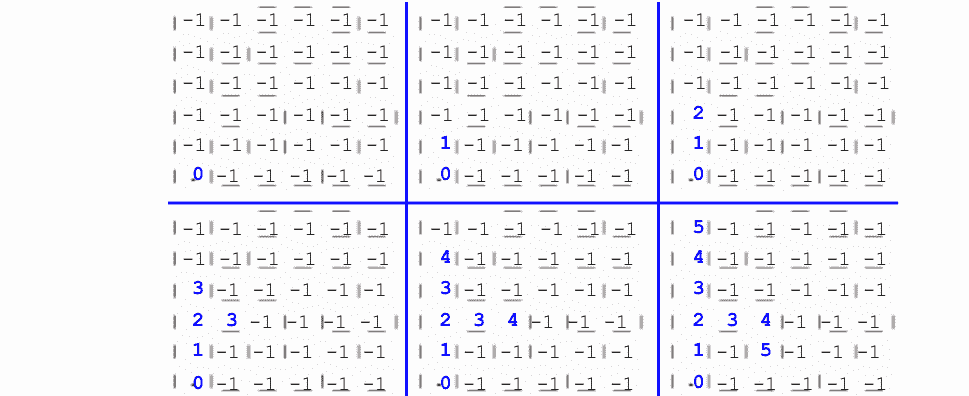

洪水填充算法的核心如程序9.10所示。外层*do循环*只要目标单元格未被到达且循环计数器不超过单元格总数（$MAZESIZE^2$），就会调用内层*for循环*。之后，距离图就完成了。

内层*for循环*遍历迷宫中的所有方格单元。对于每个单元，它检查四个方向（北、西、南、东）。如果有一个未标记的可通行相邻单元格（-1），它将用相邻单元格的距离值加一来标记它。内层循环完成后，我们将距离数组复制回来，以避免在同一步骤中标记更远的单元格。

最终，我们到达目标目的地，在这个例子中是右上角的单元格，其距离值恰好为40（见图9.13）。

所以，到目前为止我们知道两件事：

- 目标位置从起点是可达的，并且
- 从起点到目标的最短路径有40步。

然而，我们还不知道实际路径是什么。我们将在下一个也是最后一个步骤中解决这个问题。

### 最短路径

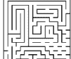

程序9.10：C语言实现的洪水填充算法

```
1  iter=0;
2
3  do
4  { iter++;
5    for (i=0; i<MAZESIZE; i++) for (j=0; j<MAZESIZE; j++)
6    { if (map[i][j] == -1)
7      { if (i>0)
8          if (!wall[i][j][0]   && map[i-1][j] != -1)
9            nmap[i][j] = map[i-1][j] + 1;
10       if (i<MAZESIZE-1)
11         if (!wall[i+1][j][0] && map[i+1][j] != -1)
12           nmap[i][j] = map[i+1][j] + 1;
13       if (j>0)
14         if (!wall[i][j][1]   && map[i][j-1] != -1)
15           nmap[i][j] = map[i][j-1] + 1;
16       if (j<MAZESIZE-1)
17         if (!wall[i][j+1][1] && map[i][j+1] != -1)
18           nmap[i][j] = map[i][j+1] + 1;
19     }
20   }
21
22   for (i=0; i<MAZESIZE; i++) for (j=0; j<MAZESIZE; j++)
23     map[i][j] = nmap[i][j];  // copy back
24 } while ( map[goal_y][goal_x] == -1  &&
25          iter < (MAZESIZE*MAZESIZE) );
```

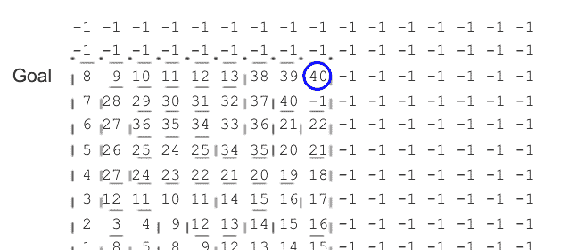

图9.13：洪水填充算法的步骤

### 9.7 最短路径

试图一步一步地找到从起点到目标的路径是行不通的，因为在每个分支点都有多个可能的方向，我们不知道该选择哪一个。例如，如果我们从起点0 → 1 → 2，然后我们有一个向上的3和一个向右的3。我们就迷失了。

反向工作是找到最短路径的关键（图9.14）。如果我们从距离值为40的目标开始，然后寻找一个没有墙隔开的、值为39的相邻单元格，然后是38，依此类推，我们最终会回到起点0。如果在某个点我们有选择（例如，假设有两个值为37的方格单元与38相邻），那么就会有两条不同的最短路径。在这种情况下，我们选择哪一条都无关紧要。

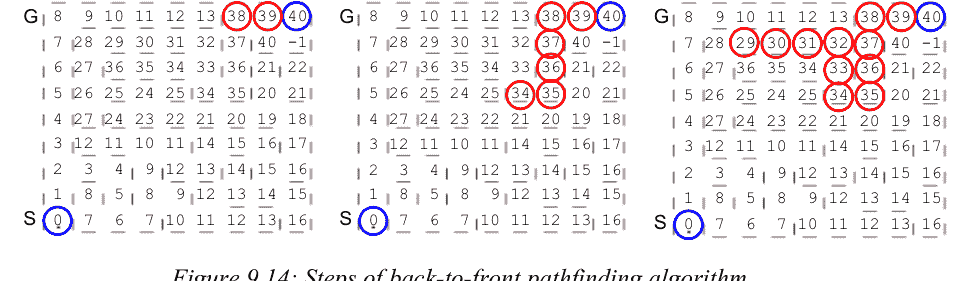

程序9.11：C语言实现的最短路径算法

```
1  void build_path(int i, int j, int len)
2  { int k;
3
4    for (k = len-1; k>=0; k--)
5    { if (i>0 && !wall[i][j][0] && map[i-1][j] == k)
6        { i--;  path[k] = 0; /* north */}
7      else
8        if (i<MAZESIZE-1 && !wall[i+1][j][0]
9            && map[i+1][j]==k)
10         { i++;  path[k] = 2; /* south */}
11       else
12         if (j>0  && !wall[i][j][1] && map[i][j-1] == k)
13           { j--; path[k] = 3; /* east */}
14         else
15           if (j<MAZESIZE-1  && !wall[i][j+1][1]
16               && map[i][j+1] == k)
17             { j++; path[k] = 1; /* west */}
18           else LCDprintf("ERROR");
19    }
20  }
```

计算最短路径的函数如程序9.11所示。我们使用一个倒计数循环，循环次数为已知的最短路径长度（本例中为40），在每一步中，我们寻找一个与当前k值相连（无墙）的相邻单元格。

由于我们现在存储了从目标返回到起点的完整路径，只需按相反顺序读取路径并驱动机器人沿着最短路径从起点到终点就非常容易了（程序9.12）。如果需要，我们还可以扩展此函数，以便在到达目标后驱动返回路径回到起点。

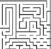

程序9.12：C语言实现的路径重建算法

```
1  void drive_path(int len)
2  { int i;
3    for (i=0; i<len; i++)  go_to(path[i]);
4  }
```

在机器人完成迷宫探索后（见图9.6底部），用户可以选择期望的目标位置，并查看内部迷宫表示、洪水填充算法计算出的距离、计算出的最短路径以及用x标记的已探索单元格地图（见图9.15，从左上到右下）。在这个例子中，我们选择了目标位置(4,4)，即迷宫右上角的方格。距离为–1的节点要么在寻找目标时不需要，要么不可达，因此保留其初始值。图9.16最终显示了机器人沿着最短路线驶向目标。

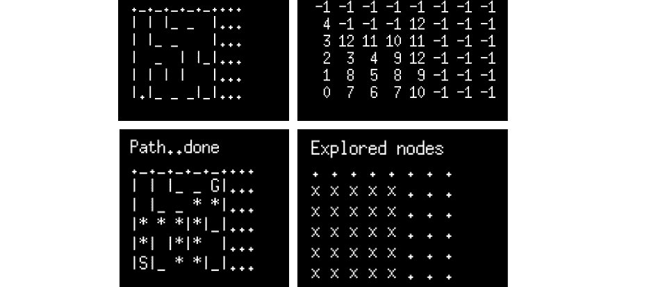

图9.15：内部表示、洪水填充、最短路径和节点

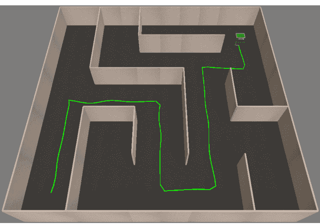

图9.16：机器人沿着最短路线驶向目标

### 9.8 任务

- 将跟随左侧程序的受控驾驶与递归迷宫探索相结合，使机器人能够找到最短路径。
- 通过使用PID传感器以及结合方向控制与位置控制，进一步改进驾驶控制。这应该能产生更平滑的路径。
- 创建一个更小尺寸的机器人，能够通过连续的左/右90°转弯以45°对角线行驶，并优化其驾驶算法以利用这一点。

## 导航

在移动机器人导航中，我们区分已知环境中的导航（我们被提供地图）和未知环境中的导航[Bräunl 2022]¹。在本章中，我们将探索这两种场景的算法。

### 10.1 未知环境中的导航

我们要研究的算法叫做*DistBug*，由[Kamon, Rivlin 1997]²开发。它是更大的*Bug*算法家族的一部分，这些算法有一个很好的、经过证明的特性：如果存在路径，它们会找到一条；或者（在执行搜索后）报告不存在路径。不那么好的特性是，这是一个数学证明，所以它只适用于零尺寸的机器人（我们可以通过偏移来修正）以及零驾驶和感知误差（我们无法修正）。这意味着这些算法存在一些鲁棒性问题，在现实世界中可能无法完美工作，但它们绝对值得探索[Ng, Bräunl 2007]³。

由于此场景中没有地图，机器人将从局部(x,y)坐标(0,0)和方向0°开始。(x,y)目标坐标作为相对于机器人起始位置的偏移量给出，例如(1000,1000)。

下面，我们介绍*DistBug*算法的简化版本：

1.  直接朝目标行驶。
2.  如果到达目标 → *成功完成！*
3.  如果遇到障碍物，记住此位置（*碰撞*位置），然后开始沿着障碍物进行墙壁跟随（始终将其保持在

¹ T. Bräunl, *Embedded Robotics – From Mobile Robots to Autonomous Vehicles with Raspberry Pi and Arduino*, 4th Ed., Springer Nature, Singapore, 2022
² I. Kamon, E. Rivlin, *Sensory-Based Motion Planning with Global Proofs*, IEEE Transactions on Robotics and Automation, vol. 13, no. 6, Dec. 1997, pp. 814–822 (9)
³ J. Ng, T. Bräunl, *Performance Comparison of Bug Navigation Algorithms*, Journal of Intelligent and Robotic Systems, Springer-Verlag, no. 50, 2007, pp. 73-84 (12)

## 10 导航

（右侧）同时持续计算到目标的最小距离。持续此操作，直到满足以下任一条件：

- 如果存在一条通往目标的清晰路径，或者机器人能够向目标前进一段最小距离 → 将此称为*离开*位置，并返回步骤1。
- 如果机器人回到了*碰撞*位置 → *以失败告终！*（无可行路径）。

我们已经使用过激光雷达传感器，这里需要它来测量障碍物距离；我们也做过沿墙行走，这是该算法的一个基本组成部分。在下一节中，我们将把它们结合起来，并分几个部分介绍*DistBug*的实现。

### 10.2 DistBug算法

以下*DistBug*实现由Joel Frewin（西澳大学）提供，并由作者进行了修改。在程序10.1的*SIM*脚本中，我们将机器人起始位置设为(300,300)，并在地面(4500,4500)处放置一个彩色标记作为目标位置。后者仅供观察者使用——机器人通过其起始位置的偏移量来获取目标坐标。

*程序10.1：DistBug环境SIM脚本*

```
1  # World File
2  world obstacles.wld
3
4  settings VIS TRACE
5
6  # Robots
7  S4 300 300 0 distbug.x
8
9  # Objects position x y, color R G B
10 marker 4500 4500  0 255 0
```

我们需要在程序中包含相对于机器人起始位置的目标坐标（4500–300, 4500–300），因为机器人没有其他方式知道目标在哪里（程序10.2）。

*程序10.2：在C中定义相对目标位置*

```
1  #define GOALX (4500-300)   // marker minus start offset
2  #define GOALY (4500-300)   // (relative goal coord.)
```

我们在控制循环中做的第一件事是收集所有数据。我们更新机器人周围的激光雷达扫描数据，通过*VWGetPosition*从轮式编码器获取最新的位置和方向数据，然后计算朝向目标的角度。为此，我们在程序10.3中使用了数学库函数*atan2*，它是反正切（*arctan*）函数的一个变体，使用两个参数*dy*和*dx*而不是商*dy/dx*。函数*atan2*返回一个在[0, 2π]范围内的唯一角度，我们将其转换回度数[0°, 360°]。然后，我们只需要计算目标角度与机器人航向角之间的差值，即可从机器人当前的位姿（位置和方向）找到目标航向。

程序10.3：在C中读取激光雷达数据并计算目标航向的主循环

```
1  while (1)
2  { LIDARGet(dists);   // Read distances from Lidar
3    VWGetPosition(&x, &y, &phi);
4    LCDSetPrintf(0,0,"POS x=%5d y=%5d phi=%4d ", x,y,phi);
5    theta = atan2(GOALY-y, GOALX-x) * 180.0/M_PI;
6    if (theta > 180.0) theta -= 360.0;
7    diff = round(theta-phi);
8    LCDSetPrintf(1,0,"GOAL %5d %5d %6.2f diff=%4d ",
9                  GOALX, GOALY, theta, diff);
```

检查机器人是否到达目标很容易。我们在程序10.4中允许*x*和*y*方向有50mm的偏差。

程序10.4：在C中检查目标位置是否在一定范围内

```
1  if (abs(GOALX - x) < 50 && abs(GOALY - y) < 50)
2  { LCDSetPrintf(3,0, "Goal found          ");
3    VWSetSpeed(0, 0); // Stop robot
4    return 0;         // Program finished
5  }
```

之后，我们区分三种状态：*DRIVING*（初始状态）、*ROTATING*和*FOLLOWING*。程序10.5展示了*DRIVING*状态的代码。

程序10.5：C中的“driving”状态

```
1  switch (state)
2  { case DRIVING: // Drive towards the goal
3    if (dists[180]<400 || dists[150]<300 || dists[210]<300)
4    { VWSetSpeed(0, 0); // stop
5      ...
6      state = ROTATING;
7    } else if (abs(diff) > 1.0) VWSetSpeed(200, diff);
8           else VWSetSpeed(200, 0);
9    break;
```

我们检查前方是否有障碍物以避免碰撞。激光雷达方向180°是正前方（与*PSD_FRONT*相同）；方向150°和210°分别是两侧30°。如果此范围内有障碍物，机器人将停止并进入*ROTATION*模式（程序10.6）。
如果没有障碍物，且朝向目标的角度差在1°以内，机器人将直线行驶；否则，它将走曲线。
这里我们没有执行更复杂的沿墙行走操作，而是简单地将机器人向左旋转90°（误差在5°以内），然后行驶一小段距离远离障碍物。这种行为在图10.1的截图中可以清楚地看到。

程序10.6：C中的“rotating”状态

```
1   case ROTATING: // Rotate perpendicular to obstacle
2       diff = round(phi - perp);
3       if (abs(diff) > 5) VWSetSpeed(0, 50);
4       else { VWSetSpeed(0, 0);
5               ...
6               state = FOLLOWING;
7           }
8       break;
```

之后，机器人进入*FOLLOWING*模式，我们需要检查机器人是否回到了上一个*碰撞*点，这将意味着没有通往目标的路径，需要放弃（程序10.7）。我们使用一个计数器来确保机器人在被记录为新位置之前，已经显著远离了*碰撞*点。这是使算法在存在小误差和噪声的真实机器人环境中工作所需的算法改进之一。

程序10.7：C中的“following”状态

```
1   case FOLLOWING: // Follow along obstacle boundary
2       counter++;
3       if (counter>10 && abs(hit_x-x)<50 && abs(hit_y-y)<50)
4       { VWSetSpeed(0, 0);
5           LCDSetPrintf(3,0, "Goal unreachable ");
6           return 1;  // finish with error
7       }
```

对于*离开*条件（终止沿墙行走行为），我们需要计算到目标的最短距离（*d_min*）和目标方向上的自由空间（*f*）的值。*离开*条件是
$$d - f <= d\_min - STEP$$
如果满足此条件，则从当前位置到目标方向的自由空间（*d*）比当前最佳距离（$d\_min$）更接近目标一个余量（*STEP*）。这将终止物体跟随（*离开点*），算法将重新从步骤1开始，直接朝目标行驶（见程序10.8）。

程序10.8：在C中计算离开条件

```
1  int dx = GOALX - x;
2  int dy = GOALY - y;
3  float d = sqrt(dx*dx + dy*dy);
4
5  // Update minimum distance
6  if (d < d_min) d_min = d;
7
8  // Calculate free space towards goal
9  int angle = 180 - (theta-phi);
10 if (angle<0) angle +=360;
11 int f = dists[angle];
12 LCDSetPrintf(2,0,"a=%d d=%f f=%d m=%f ", angle,d,f,d_min);
13
14 // Check leave condition
15 if (d - f <= d_min - STEP)
16 { VWSetSpeed(0, 0);
17   VWStraight(300, 100);
18   VWWait();
19
20   LCDSetPrintf(3,0, "Leaving obstacle   ");
21   diff = round(theta - phi);
22   VWTurn(diff, 50);
23   VWWait();
24   state = DRIVING
25 }
```

图10.1和图10.2的截图展示了机器人在绕过两个障碍物时的路径寻找过程。

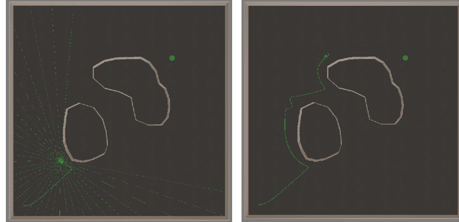

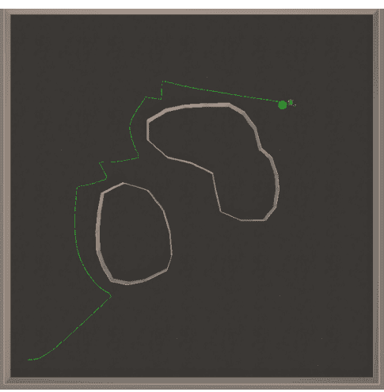

图10.2：在DistBug算法中找到目标

### 10.3 已知环境中的导航

如果我们已经有了机器人环境的地图，那么使用像*DistBug*这样的算法来寻找通往目标的路径就是浪费时间。相反，我们可以使用地图提前规划最短路径，即在实际开始行驶之前*离线*完成。有多种方法可以指定环境地图。这里，我们使用最简单的格式，称为*占用栅格*，它是一个二值图像，其中每个像素代表环境中的一小块区域（例如10cm × 10cm）。如果一个像素为真（黑色），则表示障碍物；如果为假（白色），则表示自由空间。在图10.3中，我们汇集了几个此类环境文件的示例。

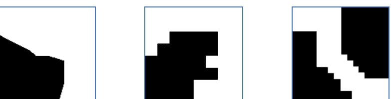

图10.3：占用栅格示例（黑色=障碍物，白色=自由空间）

### 10.4 四叉树

四叉树算法将环境数据细分为四个相等的象限（按逆时针方向标记为1、2、3、4），如图10.4所示。每个象限可以是：

-   完全空闲（可以安全通过），
-   完全阻塞（无法通行），或
-   空闲与阻塞区域的混合（需要进一步调查）。

树结构最适合表示此算法。在图10.4的示例中，象限1完全空闲，象限3完全阻塞，而另外两个象限是混合的。

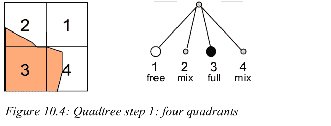

为了进一步调查混合象限，我们对这些节点递归调用相同的算法。仅细分节点2和4将得到更精细的树结构，如图10.5所示。此过程重复进行，直到每个节点完全空闲或完全阻塞，或者直到我们达到最大分辨率级别。

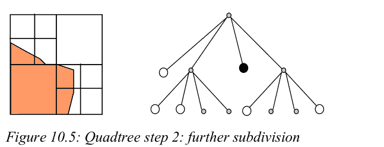

细分完成后，我们将所有空闲空间的中心标记为节点（见图10.6）。一些实现还会将空闲空间正方形的角点和一些边点标记为节点，但这里我们使用更简单的版本。

我们可以轻松计算所有这些中心点$a$到$e$的坐标，然后计算所有节点之间的路径长度。然而，并非所有可能的连接都是有效的路径；例如，路径$c-e$和$b-e$无效，因为它们会穿过阻塞区域，因此必须删除它们。我们示例中剩余路径的距离图如图10.7右侧所示。

## 10 导航

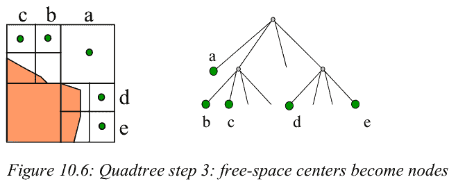

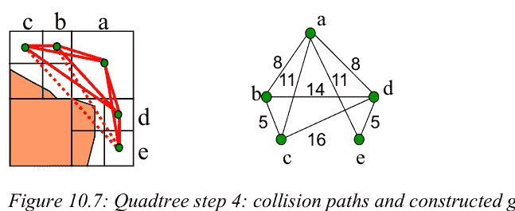

假设机器人被赋予其起始节点和方向作为这些节点之一（否则我们需要解决*定位*问题），再加上目标节点位置，然后我们可以使用*图算法*，如*Dijkstra算法*或*A\**（A星）来找到最短路径[Bräunl 2022]⁴。

因此，总结来说，完整的导航算法需要多个步骤：

-   四叉树分解。
-   确认每条路径无碰撞。
-   计算每条无碰撞路径的长度。
-   对给定的起始和目标节点应用A*算法。
-   沿最短路径行驶。

注意，驾驶问题现在已从低级（处理实际位置）转移到高级（处理节点）。

### 10.5 四叉树实现

主程序将通过调用递归子程序*quad*，从起始位置(0,0)和地图的完整尺寸开始四叉树分解。为简单起见，我们使用尺寸为2的幂的方形地图，例如

```
quad(0, 0, 1024)
```

> ⁴ T. Bräunl, *Embedded Robotics – From Mobile Robots to Autonomous Vehicles with Raspberry Pi and Arduino*, 4th Ed., Springer Nature, Singapore, 2022

## 四叉树实现

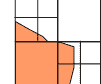


程序10.9中的递归例程*quad*遍历给定方形区域的所有像素，从输入参数(*x*, *y*)开始，在两个方向上运行给定的尺寸，直到(*x*+*size*, *y*+*size*)。算法检查该区域中的每个像素是否空闲（*false*）或是否被占用（*true*），然后相应地设置全局变量*allFree*和*allOcc*。

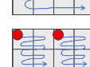

如果*allFree*或*allOcc*为真，则细分完成，过程*quad*终止。仅当*allFree*为真时，我们需要将此位置记录为空闲节点，例如通过打印（如示例中所示）或绘制它；或者更好的方法是，将其输入数组以进行后续处理。

如果*allFree*和*allOcc*都不为真，则该区域是混合的，我们必须进一步细分它。使用*s2* = *size*/2作为缩写，我们将区域(*x*,*y*)分成四个边长减半的象限，起始于
(*x*, *y*), (*x*+*s2*, *y*), (*x*, *y*+*s2*), (*x*+*s2*, *y*+*s2*)。

程序10.9：C语言中的四叉树分解

```c
void quad(int x, int y, int size) // start pos + size
{ bool allFree=true, allOcc = true;
  for (int i=x; i<x+size; i++)
    for (int j=y; j<y+size; j++)
      if (field[i][j]) allFree=false; //at least 1 occ.
                  else allOcc=false;  //at least 1 free
  if (allFree) printf("free %d %d (%d)\n", x, y, size);
  else if (!allOcc  &&  (size>1))
    { int s2 = size/2;
     quad(x,     y,     s2);
     quad(x+s2,  y,     s2);
     quad(x,     y+s2,  s2);
     quad(x+s2,  y+s2,  s2);
   }
}
```

此例程将打印所有找到的空闲区域。

```
free   0   0 ( 32)
free  32   0 ( 32)
free   0  32 (  4)
free   4  32 (  4)
free   0  36 (  1)
free   1  36 (  1)
free   2  36 (  2)
free   4  36 (  2)
...
```

当然，使用*LCDArea*在LCD上图形化显示它们更好，正如我们在图10.8右侧所做的那样。为了使图像清晰，我们只显示最小尺寸为16×16像素的空闲正方形。

为了生成路径，我们需要将空闲正方形的中心点存储在数组中以进行进一步处理。为了生成所有可能的路径，我们

## 10 导航

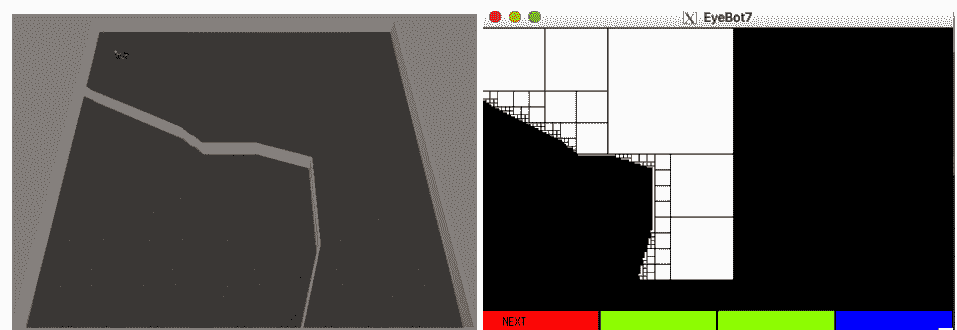

只需从每个空闲正方形的中心向其他每个中心画一条线（见图10.9中的红线）。

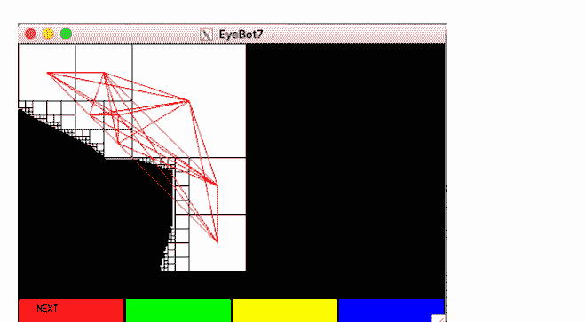

如图所示，一些空闲正方形之间的路径与“禁止”的占用区域相交。在应用最短路径算法之前，我们必须消除这些路径。为此，查看线段如何与正方形相交的一般情况会有所帮助，见图10.10。

[Alejo 2008]⁵给出的相交算法如下：

1.  矩形RSTU的四个角是否都在线段AB的同一侧？
    如果是，我们完成了 → 没有相交！
    对于每个角点P ∈ {R, S, T, U}，计算通过点A和B的直线方程：

> ⁵ Alejo, How to test if a line segment intersects an axis-aligned rectangle in 2D, 2008, https://stackoverflow.com/questions/99353/how-to-test-if-a-line-segment-intersects-an-axis-aligned-rectangle-in-2d

## 四叉树实现

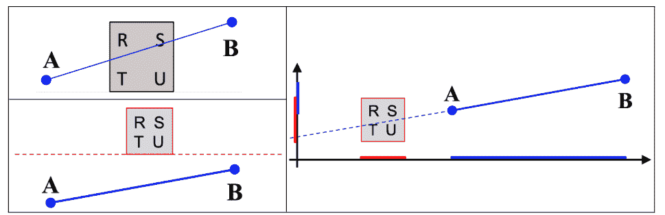

图10.10：线段-矩形相交算法：检查所有角是否在线的同一侧（左下），并检查x、y投影是否重叠（右）

$F(P) = (B_y - A_y) \cdot P_x + (A_x - B_x) \cdot P_y + (B_x \cdot A_y - A_x \cdot B_y)$

-   $F(P) = 0$ 表示点$P$在线段$AB$上
-   $F(P) > 0$ 表示点$P$在线段$AB$上方
-   $F(P) < 0$ 表示点$P$在线段$AB$下方

2.  四个$F$值是否都为正或都为负？

如果是，我们完成了 $\rightarrow$ 没有相交！

如果不是，将$AB$线段端点投影到$x$轴上，检查线段投影是否与正方形投影相交；然后对$y$轴执行相同操作。

-   如果 ($A_x > U_x$ 且 $B_x > U_x$)，则没有相交
-   如果 ($A_x < R_x$ 且 $B_x < R_x$)，则没有相交
-   如果 ($A_y > U_y$ 且 $B_y > U_y$)，则没有相交
-   如果 ($A_y < R_y$ 且 $B_y < R_y$)，则没有相交
-   否则，存在相交

对每个生成的线段（将每个空闲正方形的中心与其他每个中心连接）应用此测试将消除许多线段。在图10.11所示的图中，我们用蓝色绘制了无碰撞路径，而相交路径用红色显示。

实际的距离计算很简单，因为我们拥有所有空闲正方形的中心坐标。两个正方形中心之间的距离由欧几里得公式给出

$distance = \sqrt{[(x_2 - x_1)^2 + (y_2 - y_1)^2]}$。

因此，行驶最短距离仅剩的步骤是应用A*算法并实际执行驾驶命令。

图10.12和本章前面图中的示例环境和地图文件由UWA机器人与自动化实验室的Joel Frewin创建。

## 10 导航

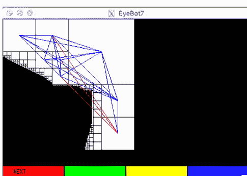

图 10.11：具有不相交路径的四叉树分解

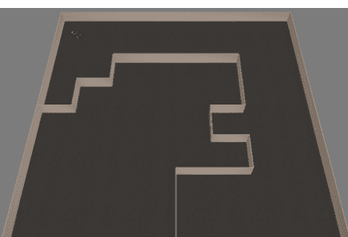

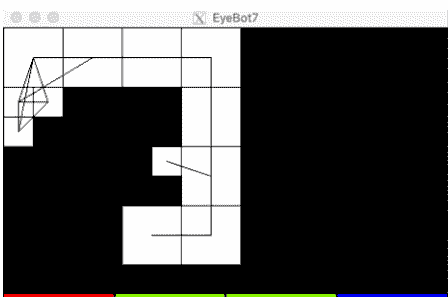

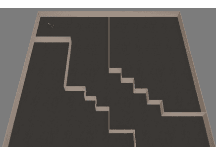

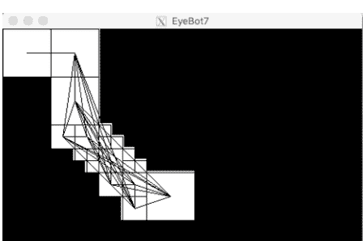

图 10.12：更多具有四叉树分解和路径的环境

### 10.6 最短路径算法

要在给定的距离图中找到最短路径，我们可以使用迪杰斯特拉算法 [Dijkstra 1959]⁶ 或 A*（A星）算法 [Hart, Nilsson, Raphael 1968]⁷。迪杰斯特拉算法找到从起始节点到所有其他节点的最短路径，而 A* 算法仅找到从特定起始节点到特定目标节点的最短路径。A* 算法只能在已知两个节点之间最小距离（通常是欧几里得距离或“直线距离”）的情况下使用。这些额外信息使得 A* 算法在大多数实际应用中效率高得多。

在图 10.13 的 A* 示例中，我们有五个节点，包括起始节点和目标节点。节点之间的实际距离标注在连接它们的边上，我们还知道每个节点到目标的最小距离，写在每个方框内（这作为该算法所需的*下界*）。例如，从起始节点行驶到节点 *a* 需要 10 米，并且我们知道起始节点本身距离目标至少七米。

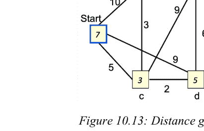

该算法探索从起始节点出发的所有选择，并为它们分配一个距离分数。因此，我们有以下可能的路径：

- S → a 分数：10（路径长度）+ 1（从 *a* 出发的最小剩余距离）= 11
- S → c 分数：5 + 3 = 8
- S → d 分数：9 + 5 = 14

对这三条路径进行排序，我们得到：

- S → c 分数：8
- S → a 分数：11
- S → d 分数：14

## 10 导航

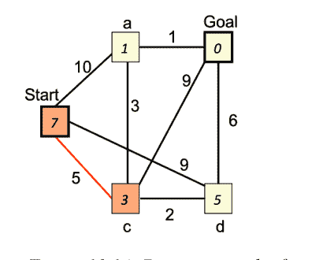

图 10.14：选择子路径 Start–c 后的距离图

作为一个*最佳优先搜索*算法，只有目前找到的最短路径（图 10.14 中以红色显示的 S→c）会被进一步探索。在 A* 算法的下一次迭代中扩展 S→c，我们得到三条新路径：

- S → c → a 分数：5 + 3 + 1 = 9
- S → c → b 分数：5 + 9 + 0 = 14
- S → c → d 分数：5 + 2 + 5 = 12

对目前所有已识别的旧路径和新路径进行排序，得到以下列表：

- S → c → a 分数：9
- S → a 分数：11
- S → c → d 分数：12
- S → c → b 分数：14
- S → d 分数：14

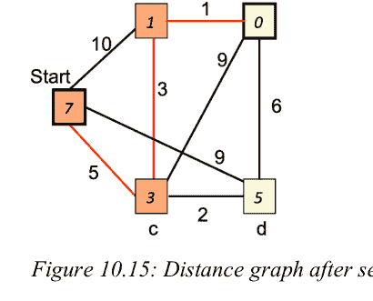

图 10.15：选择子路径 Start–c–a 后的距离图

最短路径 S→c→a 在图 10.15 中以红色高亮显示，并将被进一步扩展。只有一种可能的路径扩展：

- S → c → a → Goal 分数：9

由于这条扩展路径已到达目标，并且仍然具有最低的记录分数，A* 算法终止。我们找到了可能的最短路径！

## 任务

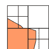

### 10.7 任务

- 实现四叉树分解。
- 实现可行驶路径检测。
- 实现路径长度计算。
- 实现用于寻找最短距离的 A* 算法。
- 实现驾驶算法以整合以上所有功能。

## 机器人视觉

视觉很可能是机器人学中最重要的传感器。尽管与激光雷达传感器相比，它需要更多的计算能力和算法开发来提取环境数据，但它具有巨大的优势，即成本低得多，并且还为我们提供颜色和强度数据，而不仅仅是距离值。

### 11.1 摄像头和屏幕功能

我们的每个真实和模拟机器人都配备了一个数字摄像头。对于真实机器人，这是树莓派摄像头；对于模拟机器人，这是一个具有相似光圈和分辨率特性的虚拟摄像头传感器。

第一个任务将是持续从摄像头读取图像，然后将其原样显示在 LCD 上。为此，我们需要初始化摄像头，告诉它应使用哪种图像分辨率。此初始化还会自动设置 LCD 功能的图像显示大小，并设置图像处理库函数的图像大小，我们稍后会介绍。摄像头分辨率的选择有：

- QQVGA 160 × 120 像素
- QVGA 320 × 240 像素
- VGA 640 × 480 像素
- CAM1MP 1,296 × 730 像素
- CAMHD 1,920 × 1,080 像素
- CAM5MP 2,592 × 1,944 像素

作为第一步，选择一个中等大小的图像可能是个好主意。我们选择 QVGA，因为这个图像分辨率仍然可以完全显示在我们使用的机载 LCD 上。

我们还从模拟器的下拉菜单中填充了一些对象到场景中。图 11.1 显示了机器人环境，其 LCD 上显示了从机器人视角拍摄的相应摄像头图像。

## 11 机器人视觉

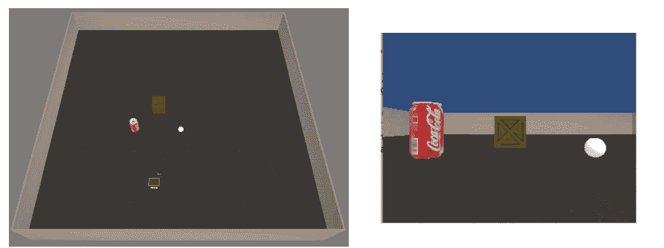

我们在本书开头已经看过读取和显示摄像头图像的程序，但这里是最小版本。首先，我们展示一个无限循环的 Python 程序（程序 11.1），接下来是等效的 C 程序（程序 11.2）。

```
程序 11.1：Python 中的最小摄像头程序

1  from eye import *
2  
3  CAMInit(QVGA)
4  while True:
5      img = CAMGet()
6      LCDImage(img)
```

```
程序 11.2：C 中的最小摄像头程序

1  #include "eyebot.h"
2  
3  int main()
4  { BYTE img[QVGA_SIZE];
5  
6      CAMInit(QVGA);
7      while (1)
8      { CAMGet(img);
9          LCDImage(img);
10     }
11 }
```

### 11.2 边缘检测

读取图像后，我们希望从图像数据中提取一些有意义的信息。我们可以通过以下方式实现：

- 直接在 Python、C 或 C++ 中编程例程。
- 使用小型的 RoBIOS 图像处理库。
- 使用全面的 OpenCV 库或其他一些库 [Kaehler, Bradski 2017]¹。

作为一个例子，我们使用边缘检测 [Bräunl et al. 2001]²，它试图通过寻找灰度不连续性来找到图像中物体（和阴影）的轮廓。最简单实现（但质量不是最好）的是左侧所示的拉普拉斯函数，它以灰度图像作为输入。对于每个像素，边缘值计算为其灰度值的四倍减去四个相邻像素值（上、下、左、右）。因此，在图像的均匀区域中，所有五个值将相似，函数值将接近零。然而，如果像素位于较暗和较亮区域之间的边界上，函数值将是一个高正值或负值——表示一个*边缘*。

请注意，在大多数灰度图像中，每个像素以字节值给出，因此这给了我们一个值范围 [0, 255]。在此方案中，0 表示黑色，255 表示白色，所有其他值都是灰色阴影。

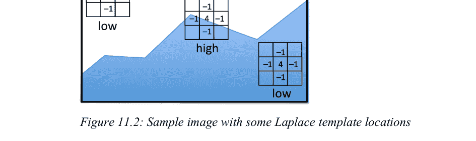

在图 11.2 的示例图像中，我们假设上半部分明亮，下半部分暗。在整个图像上逐像素移动，让我们看到不同的场景。如果模板中的所有像素都是亮的（左上角滤波器放置）或都是暗的（右下角），那么拉普拉斯滤波器的输出值将非常低。然而，如果一些模板像素是亮的，一些是暗的，那么我们将得到一个高正值或高负值，这取决于当前像素是比其周围环境亮还是暗。对于图 11.2 中的三个示例区域，我们在简化环境中计算函数输出值如下：

- 左上角：$4 \cdot 255 - 255 - 255 - 255 - 255 = \mathbf{0}$
- 中间：$4 \cdot 255 - 255 - 0 - 255 - 0 = \mathbf{510}$
- 右下角：$4 \cdot 0 - 0 - 0 - 0 - 0 = \mathbf{0}$

高绝对值表示边缘（从暗到亮区域的过渡，反之亦然）；低绝对值表示没有边缘（均匀亮度区域）。

程序 11.3 中的 C 函数主要是一个遍历所有像素的循环，应用拉普拉斯模板。循环不是在完整的范围 [0, width*height] 上运行。相反，我们从 width 开始，在 width*(height-1) 处停止，因为我们必须避免访问数组边界之外的任何位置。

如果当前像素由 $i$ 引用，那么左边的像素将位于位置 $i-1$，右边的像素位于 $i+1$；上方的像素将位于位置 $i-width$，下方的像素位于 $i+width$。由于两个字节值 [0, 255] 的减法很容易导致超出这些边界的整数，我们使用绝对值函数，然后测试常数 255，以确保每个结果值都在范围 [0, 255] 内。

程序 11.3：不使用库函数在 C 中编程的拉普拉斯滤波器

```
1  #include "eyebot.h"
2
3  void Laplace(BYTE gray_in[], BYTE gray_out[])
4  { int i, delta;
5
6      for (i = IP_WIDTH; i < (IP_HEIGHT-1)*IP_WIDTH; i++)
7      { delta  = abs(4 * gray_in[i]
8                  -gray_in[i-1]       - gray_in[i+1]
9                  -gray_in[i-IP_WIDTH] - gray_in[i+IP_WIDTH]);
10         if (delta > 255) delta = 255;
11         gray_out[i] = (BYTE) delta;
12     }
13 }
14
15 int main()
16 { BYTE img[QVGA_PIXELS], lap[QVGA_PIXELS];
17
18     CAMInit(QVGA);
19     while (1)
20     { CAMGetGray(img);
21         Laplace(img, lap);
22         LCDImageGray(lap);
23     }
24 }
```

我们没有计算 for 循环省略的输出值（第一行和最后一行），因此这些值应设置为零（黑色）。另外，请注意我们

## 边缘检测

| | -1 | |
|---|---|---|
| -1 | 4 | -1 |
| | -1 | |

使用单个循环，不考虑行格式。因此，一行中最右侧像素的拉普拉斯滤波器计算也会使用下一行最左侧的像素。因此，我们应该忽略结果图像周围1像素宽的边框。图11.3的输出现在如预期那样，在黑色背景上以白色显示了物体轮廓。

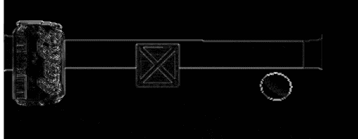

图11.3：拉普拉斯滤波器输出

使用内置的`IPLaplace`函数会使工作变得简单得多，并且输出结果相同。以下两个程序分别展示了在Python（程序11.4）和C（程序11.5）中的实现。Python解决方案一如既往地更紧凑，并遵循略有不同的参数语法。在Python中，我们返回图像值作为结果，例如
`edge = IPLaplace(gray)`
而在C中，我们将其用作第二个（输出）参数
`IPLaplace(img, edge);`

程序11.4：使用RoBIOS库的Python拉普拉斯滤波器程序

```
1  from eye import *
2
3  CAMInit(QVGA)
4  while True:
5      gray = CAMGetGray()
6      edge = IPLaplace(gray)
7      LCDImageGray(edge)
```

一个不错的扩展是将拉普拉斯结果作为颜色叠加层覆盖在原始灰度图像上。函数`IPOverlayGray`将第二个灰度图像叠加到第一个图像上，使用给定的颜色（此处为`RED`）。由于拉普拉斯输出`lap`不仅包含黑白像素，中间还有许多灰度值，我们需要添加一个阈值函数作为中间步骤。这会过滤掉所有“弱边缘”（在本例中为值小于50的边缘）。程序11.6包含完整代码，图11.4显示了程序的输出。
程序11.7在Python中展示了相同的应用。图11.5显示了RoBIOS图像处理函数的完整列表。这只是少量函数，但它们实现了最常用的功能。

## 11 机器人视觉

程序11.5：使用RoBIOS库的C拉普拉斯滤波器程序

```
1  #include "eyebot.h"
2
3  int main()
4  { BYTE img[QVGA_PIXELS], edge[QVGA_PIXELS];
5
6    CAMInit(QVGA);
7    while (1)
8    { CAMGetGray(img);
9      IPLaplace(img, edge);
10     LCDImageGray(edge);
11   }
12 }
```

程序11.6：在C中将拉普拉斯结果叠加到输入图像上的程序

```
1  #include "eyebot.h"
2
3  void Threshold(BYTE gray[])
4  { int i;
5    for (i=0; i<QVGA_PIXELS; i++)
6      gray[i] = (gray[i] > 50);
7  }
8
9  int main()
10 { BYTE img[QVGA_PIXELS], lap[QVGA_PIXELS], col[QVGA_SIZE];
11
12   CAMInit(QVGA);
13   while (1)
14   { CAMGetGray(img);
15     IPLaplace(img, lap);
16     Threshold(lap);
17     IPOverlayGray(img, lap, RED, col);
18     LCDImage(col);
19   }
20 }
```

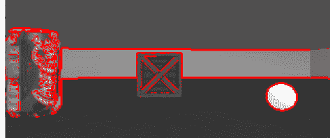

图11.4：叠加在原始图像上的红色拉普拉斯边缘

## OpenCV

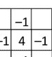

程序11.7：在Python中将拉普拉斯结果叠加到输入图像上的程序

```
1  from eye import *
2
3  def Threshold(gray):
4      for i in range(0, QVGA_PIXELS):
5          if (gray[i] > 50):
6              gray[i]=255
7          else:
8              gray[i]=0
9
10 CAMInit(QVGA)
11 while True:
12     gray = CAMGetGray()
13     edge = IPLaplace(gray)
14     Threshold(edge)
15     col = IPOverlayGray(gray, edge, RED)
16     LCDImage(col)
```

```
int     IPSetSize(int resolution);                     // 设置IP分辨率
int     IPReadFile(char *filename, BYTE* img);          // 读取PNM文件
int     IPWriteFile(char *filename, BYTE* img);         // 写入彩色文件
int     IPWriteFileGray(char *filename, BYTE* gray);    // 写入灰度文件
void    IPLaplace(BYTE* grayIn, BYTE* grayOut);         // 拉普拉斯边缘
void    IPSobel(BYTE* grayIn, BYTE* grayOut);           // Sobel边缘
void    IPCol2Gray(BYTE* imgIn, BYTE* grayOut);         // 彩色转灰度
void    IPGray2Col(BYTE* imgIn, BYTE* colOut);          // 灰度转彩色
void    IPRGB2Col (BYTE* r, BYTE* g, BYTE* b, BYTE* imgOut); // 3*灰度转彩色
void    IPCol2HSI (BYTE* img, BYTE* h, BYTE* s, BYTE* i);    // RGB转HSI
void    IPOverlay(BYTE* c1, BYTE* c2, BYTE* cOut);      // 叠加彩色
void    IPOverlayGray(BYTE* g1, BYTE* g2, COLOR col, BYTE* cOut); // 叠加灰度
COLOR   IPRGB2Col(BYTE r, BYTE g, BYTE b);              // RGB转彩色
void    IPPCol2RGB(COLOR col, BYTE* r, BYTE* g, BYTE* b); // 彩色转RGB
void    IPPCol2HSI(COLOR c, BYTE* h, BYTE* s, BYTE* i);    // RGB转HSI
BYTE    IPRGB2Hue(BYTE r, BYTE g, BYTE b);              // RGB转色调
void    IPRGB2HSI(BYTE r, BYTE g, BYTE b, BYTE* h, BYTE* s, BYTE* i); // 色调
```

图11.5：图像处理库函数

### 11.3 OpenCV

OpenCV$^3$始于1999年的一个英特尔研究项目，如今已成为最常用的图像处理库之一。它提供了Python、C++和Java的绑定，并支持TensorFlow和Caffe等高级AI工具。幸运的是，OpenCV使用与EyeBot/EyeSim/RobIOS相同的彩色和灰度图像文件格式。我们只需要转换函数*frame*来

$^3$ OpenCV网页链接，https://opencv.org

## 11 机器人视觉

传输图像，因为OpenCV将宽度和高度等附加信息与图像数据一起存储在一个结构中。然后，只需通过*myimage.data*访问原始数据，就可以使用RoBIOS函数显示OpenCV图像。程序11.8展示了一个在C++中使用OpenCV函数的示例。

程序11.8：在C++中使用OpenCV库函数的Canny边缘检测

```
1  #include "opencv2/highgui/highgui.hpp"
2  #include "opencv2/imgproc/imgproc.hpp"
3  #include "eyebot++.h"
4  using namespace cv;
5
6  int main()
7  { QVGACol img;
8    Mat edges;
9
10   CAMInit(QVGA);
11   while(1)
12   { CAMGet(img);                          // 获取图像
13     Mat frame(240, 320, CV_8UC3, img); // OpenCV转换
14     cvtColor(frame, edges, COLOR_RGB2GRAY); // RGB-->灰度
15     GaussianBlur(edges, edges, Size(7, 7), 1.5, 1.5);
16     Canny(edges, edges, 50, 100, 3);   // Canny边缘
17     LCDImageGray(edges.data);          // 显示结果
18   }
19 }
```

Canny边缘检测器是一个更复杂的滤波器，通常比我们之前实现的简单拉普拉斯函数给出更好的结果（见图11.6）。

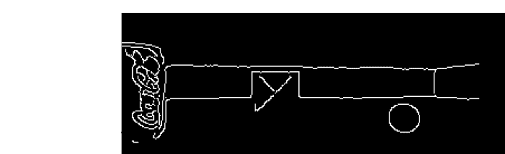

### 11.4 颜色检测

通过颜色检测物体相当简单，前提是图像中只有所需物体具有指定的颜色。相比之下，通过形状检测要复杂得多，并且需要一些数学背景知识。在本节中，我们将以检测一个*红色球*为例。

## 颜色检测

| | -1 | |
|---|---|---|
| -1 | 4 | -1 |
| | -1 | |

大多数图像传感器以RGB格式（红、绿、蓝）的3字节值表示像素。因此，黑色是(0,0,0)，白色是(255,255,255)，“纯”红色是(255,0,0)。具有三个相同分量的值，如(50,50,50)，是灰度阴影，而具有不同分量的颜色是主要颜色的阴影。

由于图像中总是存在一些噪声，我们*不能*简单地通过询问来检查像素是否为红色

```
if (r==255 && g==0 && b==0)
```

并且由于环境光照时刻在变化，我们*也不能*使用这个更宽松的关系

```
if (r>200 && g<50 && b<50)
```

假设，为了论证，我们“红色”像素在阳光明媚的户外场景中的RGB值为

(210, 20, 10)。

如果现在一片云遮住了太阳，环境光照降低了50%，那么同一个像素的RGB值将突然变为

(105, 10, 5)。

所有分量值都减半了，所以简单的比较将不起作用。这个问题的解决方案是将RGB值转换到另一个颜色空间，例如HSI（色调、饱和度、亮度），参见[Bräunl et al. 2001]4。在这种格式中：

- *色调* [0, 255] 将颜色值指定为圆形颜色*彩虹*上的一个位置。
- *饱和度* [0, 255] 指定颜色强度——饱和度越低，白色分量越高。
- *亮度* [0, 255] 指定整体亮度——亮度越低，黑色分量越高。

在HSI中，*白色*是(*,0,255)，*黑色*是(*,*,0)。灰度是(*,0,g)，其中*g*在0（黑色）到255（白色）范围内变化。星号“*”是一个“无关项”，代表任意值。

从RGB到HSI的转换对于*S*和*I*来说很简单，但对于*H*（我们最感兴趣的分量）则需要三角函数。以下公式改编自[Hearn, Baker, Carithers 2010]5：

- *I* = (R+G+B) / 3
- *S* = 255 – min(R,G,B) / I
- *H* = cos⁻¹[ 0.5*(R-G + R-B) / √((R-G)² + (R-B)*(G-B)) ]

我们通常使用简化的近似公式来计算色调，并将整个转换作为RoBIOS函数*IPCol2HSI*提供，这使得转换变得容易得多。由于色调只是一个单字节值，我们现在可以将RGB彩色图像转换为色调图像，该图像看起来像灰度图像，每个像素只有一个字节。

4 T. Bräunl, S. Feyrer, W. Rapf, M. Reinhardt, *Parallel Image Processing*, Springer Verlag, Heidelberg Berlin, 2001
5 D. Hearn, P. Baker, W. Carithers, *Computer Graphics with Open GL*, 4th Ed., Pearson, 2010

## 11 机器人视觉

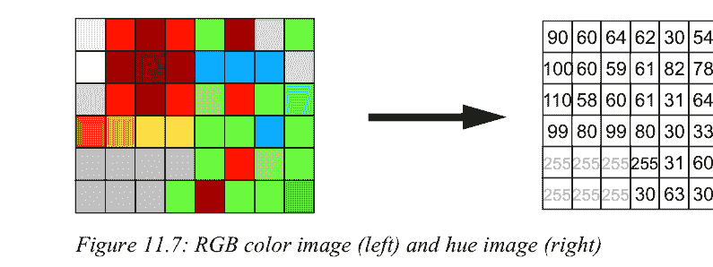

如果亮度或饱和度过低，就无法分配合适的色相。在低光环境下使用数码相机时，你可能会注意到这一点，此时会突然出现不正确的杂散彩色像素。我们将这些值标记为255，表示“无色相”，并在后续处理中排除它们。

从图11.7的示例图像中可以看出，每个RGB值现在都已转换为一个色相值。60左右的值代表红色，这正是本例中我们要检测的颜色。因此，下一步将是为检测过程指定一个色相范围，例如，我们寻找的色相范围是[55, 65]。此值范围内的每个色相像素将变为*真*（1）；此范围外的每个像素将变为*假*（0）。这为我们提供了图11.8⁶中的二值匹配图像。

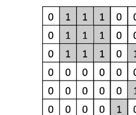

我们已经可以看到1值形成了一个簇或块状图案，但我们仍然需要找到一种算法方法来确定彩色物体的中心。一个非常简单有效的方法是创建所有行的直方图和所有列的直方图。这听起来比实际复杂得多。我们所要做的就是将色相匹配图像中每一列的所有值相加，然后对每一行做同样的操作。如示例所示，对于第一行，我们得到
0+1+1+1+0+0+0+0 = 3
对于第一列，我们得到
0+0+0+0+0+0+0 = 0。

> ⁶ 注意，色相范围可以延伸到0的两侧，例如[250, 5]。这需要特殊考虑，并且还需要排除我们的无色相值255。

## 颜色检测

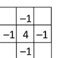

我们将这些值以及所有剩余行和列的值输入到一个额外的向量（一维数组）中，如图11.9所示。

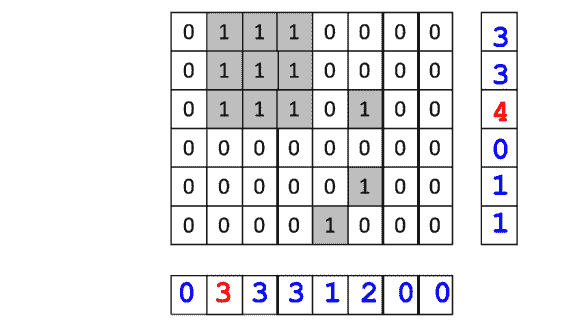

图11.9：带有列和行直方图的二值色相匹配图像

现在我们几乎完成了。我们知道哪些行和列有很多我们期望的物体像素（高值），哪些行和列很少或根本没有匹配像素（低值或零值）。由于期望的物体是一个圆球，我们可以通过确定行和列直方图向量的最大值来找到其中心。在图11.9的示例中，行直方图的最大值是4，出现在第二行（从顶部开始计数，索引从0开始）。列直方图的最大值是3，这个值出现了多次——我们只取第一次出现的位置，即第一列（从左数第二列）。因此，我们计算出的物体中心位于从左上角开始计数的(x,y)位置(1,2)，起始点为(0,0)。

观察上面色相匹配图像中的灰色1值簇（以及原始彩色图像），人们可能会将物体中心放在(x,y)位置(2,1)，但请记住：我们只偏离了“正确”解一个像素，这在图像处理中总是可能发生的，而且我们只是在看一个非常小的6×8像素的样本图像。正如我们即将展示的，在全尺寸图像中检测效果会更好。

为了实现这一点，我们首先用C或Python实现色相匹配和直方图生成。这里，作为简化，我们只生成列直方图。毕竟，如果我们想让机器人驶向一个物体，我们只需要知道它的x位置，而这正是列直方图能提供的。

程序11.9对所有列运行一个循环（for-x），并对所有行运行一个嵌套循环（for-y）。如果当前像素的色相与期望色相的差值低于阈值，则当前列的直方图递增（hist[x]++）。

剩下的步骤是在这个直方图中找到最大值，这相当简单。在程序11.10中，我们对直方图的所有元素运行一个单循环（for-i），并记住最高值。请注意，在此函数结束时，我们不返回找到的最高值val，而是返回其位置pos，因为我们只对彩色物体的位置感兴趣。

## 11 机器人视觉

程序11.9：C语言中的直方图生成

```
1  void GenHist(VGAcol img, int hue, line hist, int thres)
2  { int x,y, pos, diff;
3    for (x=0; x<CAMWIDTH; x++)
4    { hist[x] = 0;
5      for (y=0; y<CAMHEIGHT; y++)
6      { pos  = y*CAMWIDTH + x;
7        diff = abs(img[pos] - hue);
8        if ( ((diff < thres) || (255-diff < thres))
9             && (img[pos] != NO_HUE))
10           hist[x]++;
11      }
12    }
13  }
```

程序11.10：C语言中查找直方图最大值

```
1  int FindMax(line hist)
2  { int i, pos=0, val=hist[0]; // 初始化
3    for (i=1; i<CAMWIDTH; i++)
4      if (hist[i] > val)
5      { pos = i;
6        val = hist[i];
7      }
8    return pos;
9  }
```

返回的值*pos*将在[0, *CAMWIDTH*–1]范围内，这可以很容易地转换为机器人的转向命令。值0应使机器人最大程度左转，*CAMWIDTH*/2直行，*CAMWIDTH* –1最大程度右转。请注意，结果为0也可能意味着没有找到匹配像素。在这种情况下，机器人应该执行另一个搜索命令，例如原地旋转或直行直到遇到障碍物。

程序11.11：C语言中根据直方图输出驾驶机器人

```
1  if (pos < CAMWIDTH/3) VWTurn(10, 30);       // 左转
2    else { if (pos > 2*CAMWIDTH/3) VWTurn(-10, 30); // 右转
3           else VWStraight( 50, 100);       // 直行
4         }
```

我们甚至不需要对转向角度如此精确。在实践中，一个简单的三路选择语句就足够了。如果物体中心在图像的左三分之一区域，则左转；如果在右三分之一区域，则右转；否则直行（参见程序11.11）。

## 颜色检测

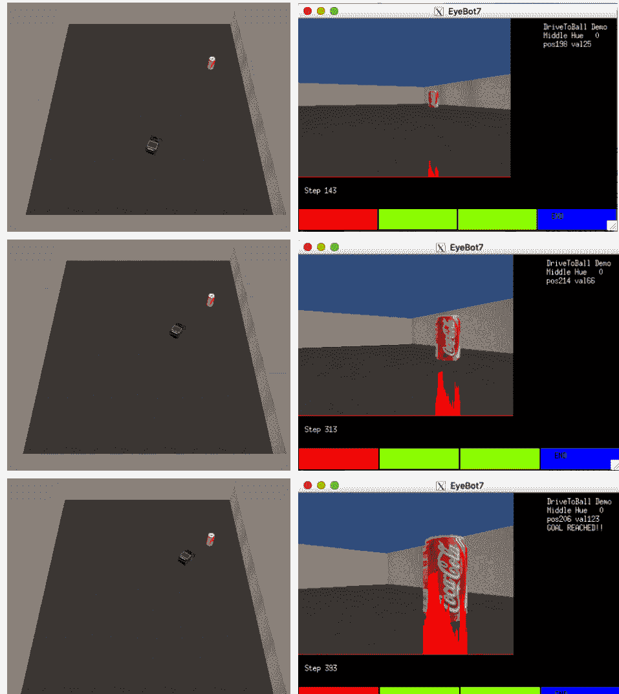

图11.10：机器人驶向带有图像直方图的红色物体

执行结果可以在图11.10的图像序列中看到。由于我们在一个连续循环中运行图像检测和驾驶命令，机器人将不断校正其行驶角度，并逐渐接近红色目标。在本例中，我们使用了一个罐子而不是球，红色物体上的白色文字明显影响了直方图，如截图所示。然而，该算法仍然足够稳健，能让机器人找到红色罐子。

### 11.5 运动检测

运动检测听起来很复杂，但正如我们将在此展示的，它实际上非常简单；事实上，它甚至比颜色检测更简单。我们希望机器人检测其视野中的任何运动。然后它应该旋转其摄像头（如果安装在伺服机构上）或调整自身朝向运动的中心。然而，在感知的同时驶向检测到的运动可能很棘手，因为当机器人运动时，其视野中的每个像素似乎都在向外部边缘移动（看看《星际迷航》的开场序列）。

无论如何，让我们尝试为静止的观察者机器人检测运动。我们的方法是拍摄两张相机图像，一张紧接着另一张，然后通过逐像素地将一张图像减去另一张图像来比较它们。我们使用差值的绝对值，因为我们只对第一张和第二张图像之间发生变化的像素感兴趣。我们不区分像素是变亮还是变暗。

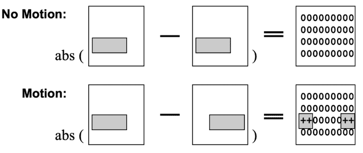

图11.11：通过将图像作为二维矩阵相减进行运动检测

在图11.11的图表中，我们演示了这个原理。在第一种情况下，第一张和第二张图像之间没有运动；因此，除了噪声之外，我们在时间t₁和t₂得到两张基本相同的图像。将这些图像矩阵相减，我们得到一个类似于零矩阵的图像。

然而，如果图像中存在一些运动，如第二个示例中灰色块从左向右移动，我们将在差值图像中得到一个或多个高值区域。然后，如果我们计算所有像素的平均差值并与固定阈值进行比较，我们就可以说“*是的，有运动*”或“*不，没有运动*”在我们的视野中。

*image_diff*和*avg*函数大多是不言自明的，并在Python（程序11.12）和C（程序11.13）中展示。请注意，在Python中声明数组时，出于兼容性原因，我们必须指定*c_byte*类型的值，因为EyeBot Python库函数最终调用的是C库。

## 运动检测

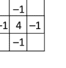

程序 11.12：在 Python 中计算图像差异

```
from eye import *
from ctypes import *

def image_diff(i1, i2):
    diff = (c_byte * QVGA_PIXELS)()
    for i in range(QVGA_PIXELS):
        diff[i] = abs(i1[i] - i2[i])
    return diff

def avg(d):
    sum=0
    for i in range(QVGA_PIXELS):
        sum += d[i]
    return int(sum/QVGA_PIXELS)
```

程序 11.13：在 C 中计算图像差异

```
void image_diff(BYTE i1[SIZE], BYTE i2[SIZE],
                BYTE d[SIZE])
{ for (int i=0; i<SIZE; i++)
    d[i] = abs(i1[i] - i2[i]);
}

int avg(BYTE d[SIZE])
{ int i, sum=0;
  for (i=0; i<SIZE; i++)
     sum += d[i];
  return sum / SIZE;
}
```

程序 11.14（Python 版）和程序 11.15（C 版）中的主函数首先读取间隔 100 毫秒的两幅图像，然后调用 *image_diff* 函数，该函数的结果会显示在屏幕上，接着调用 *avg* 函数。我们将平均差异值打印到屏幕上，并且——如果它超过阈值——就触发警报。

在执行示例中，我们让一个机器人在两个罐子之间持续原地旋转（通过使用 *VWSetSpeed(0,100)* 后接一个无限 *while* 循环），而分析机器人则使用前面讨论的代码观察场景。*SIM* 脚本文件在程序 11.16 中给出。

从图 11.12 的截图中可以看出，分析机器人清晰地看到了另一个移动机器人的运动，但差异图像中没有出现任何静止的周围物体。

在第二步中，我们可以使用与之前颜色检测类似的技术，对输入图像对的左、中、右三分之一部分分别运行相同的算法。这将为我们提供每个区域的真/假运动结果，并可以轻松选择发生运动的区域（如果有的话）（见图 11.13）。如果运动发生在多个区域，我们可以回到阈值处理前的平均距离值进行比较，以找出哪个区域的运动活动最剧烈。

## 11 机器人视觉

程序 11.14：Python 运动检测主程序

```
def main():
    CAMInit(RES)

    while True:
        image1 = CAMGetGray()
        OSWait(100)  # Wait 0.1s
        image2 = CAMGetGray()
        diff = image_diff(image1, image2)
        LCDImageGray(diff)
        avg_diff = avg(diff)
        LCDSetPrintf(0,50, "Avg = %3d", avg_diff)
        if (avg_diff > 15):  # Alarm threshold
            LCDSetPrintf(2,50, "ALARM!!!")
        else:
            LCDSetPrintf(2,50, "          ") # clear text
```

程序 11.15：C 运动检测主程序

```
int main()
{ BYTE image1[SIZE], image2[SIZE], diff[SIZE];
  int avg_diff, delay;

  CAMInit(RES);
  while (1)
  { CAMGetGray(image1);
    OSWait(100); // Wait 0.1s
    CAMGetGray(image2);
    image_diff(image1, image2, diff);
    LCDImageGray(diff);
    avg_diff = avg(diff);
    LCDSetPrintf(0,50, "Avg = %3d", avg_diff);
    if (avg_diff > 15) LCDSetPrintf(2,50, "ALARM!!!");
  }
}
```

程序 11.16：运动检测 SIM 脚本

```
# Environment
world ../../worlds/small/Soccer1998.wld
can   300  600  0
can   300 1000 45

# Robot position (x, y, phi) and executable
S4 300 800   0 turn.x
S4 800 800 180 motion.x
```

## 任务

| | -1 | |
|---|---|---|
| -1 | 4 | -1 |
| | -1 | |

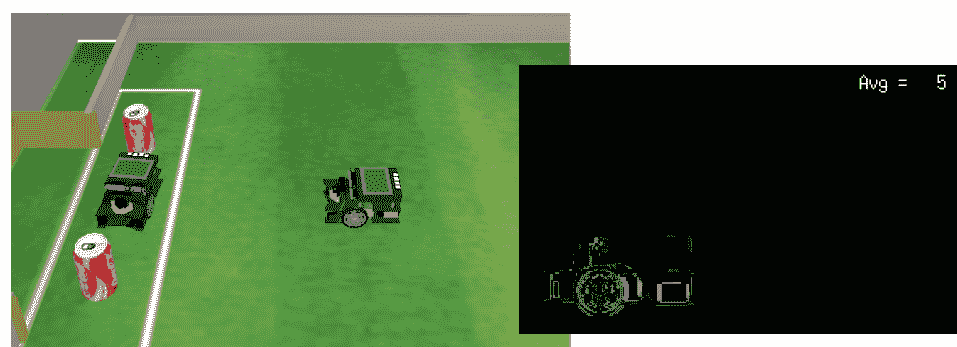

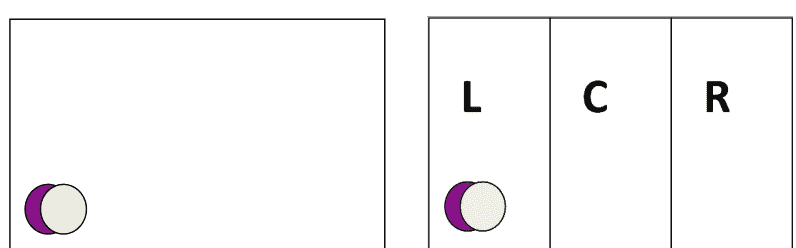

### 11.6 任务

- 编写一个程序，从环境的一个角落开始，搜索一个红色罐子，驶向它，环绕它，然后将其推回其起始位置。
- 通过添加一个函数来扩展前面的程序，该函数在按下按钮时教授所需的色相。这样，就可以搜索任何颜色的物体。
- 尝试将运动检测与驶向运动位置相结合。这需要确定并减去由机器人自身运动引起的图像差异。

## 学习型机器人

我们现在想介绍一个名为 *Starman* 的简单铰接式步行机器人，它最初由 Ngo 和 Marks 于 1994 年描述 [Fukunaga et al. 1994] ¹。

正如原始报告中所描述的，Starman 最初只是一个虚拟的二维机器人，但它是实验学习算法的绝佳工具。事实证明，前进并不那么容易，即使对于一个不会摔倒的五肢圆形二维机器人也是如此。

我们更进一步，将 Starman 带入了真实的三维世界。我们构建了一个物理的 Starman 机器人，其圆柱形身体周围有五个强大的伺服电机驱动的腿——然后在 Eye-Sim 中生成了它的虚拟对应物。每个肢体都可以通过伺服命令 *SERVOSet* 单独移动。

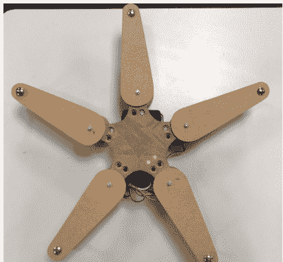

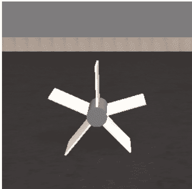

*图 12.1：真实的 Starman 机器人与模拟的 Starman*

> ¹ A. Fukunaga, L. Hsu, P. Reiss, A. Shuman, J. Christensen, J. Marks, J. Ngo, *Motion-Synthesis Techniques for 2D Articulated Figures*, Harvard Computer Science Group Technical Report TR-05-94, 1994

## 12 学习型机器人

### 12.1 Starman

图 12.1 中的截图显示了 Starman 处于其初始中立位置。所有肢体都处于其中间位置——伺服运动范围 [0, 255] 的 128。移动单个肢体将是我们的第一步（见图 12.2）。为此，我们将 Starman 放入我们的默认盒子环境中（程序 12.1）。

程序 12.1：Starman SIM 脚本

```
robot ../../robots/Articulated/starman.robi
Starman 1000 300 1000 90 move.x
```

move 函数让我们通过第一个按键遍历所有五个肢体，而 *KEY2* 和 *KEY3* 让我们上下移动选定的肢体。每个伺服位置都存储在数组 *pos* 中，每个伺服都从中间位置 128 开始。我们还在每次按键时将当前的伺服设置打印到 LCD（见图 12.2 右侧和程序 12.2）。

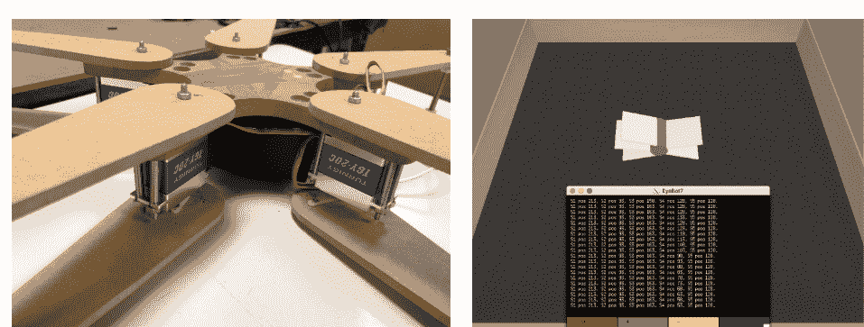

图 12.2：Starman 的肢体运动，真实（左）与模拟（右）

这样，我们可以生成任何 Starman 配置，但这还不够快，无法让它行走。因此，我们编写了一个程序，只来回移动单个支撑肢体（肢体编号三）。利用身体质量和摩擦力，这种运动将使 Starman 缓慢地向左“拖步”（程序 12.3 和图 12.3）。

只移动 Starman 的一条支撑腿不会产生令人信服的行走动作——经济、快速的动作需要多个肢体的协调行动，而最优序列并不容易找到。我们可以使用试错法尝试不同的运动模式，希望 Starman 最终能行走，或者我们可以使用 AI（人工智能）方法，例如遗传算法。如果我们想尝试这个，我们首先需要为 Starman 提出一个运动模型。

## Starman


程序 12.2：在 C 中选择和移动单个肢体

```
#include "eyebot.h"
#define MIN(a,b)  (((a)<(b))?(a):(b))
#define MAX(a,b)  (((a)>(b))?(a):(b))

int main()
{ int pos[5] = {128,128,128,128,128};
  int i,k, leg=0;

  LCDMenu("Leg+", "+", "-", "END");
  do
  { switch(k=KEYGet())
    { case KEY1: leg = (leg+1)%5; break;
      case KEY2: pos[leg] = MIN(pos[leg]+5, 255); break;
      case KEY3: pos[leg] = MAX(pos[leg]-5,   0); break;;
    }
    for (i=0; i<5; i++)
    { LCDPrintf("S%d pos %d, ", i+1, pos[i]);
      SERVOSet(i+1, pos[i]);
    }
    LCDPrintf("\n");
  } while (k != KEY4);
}
```

程序 12.3：在 C 中通过前后移动单个肢体使 Starman 拖步

```
#include "eyebot.h"

int main()
{ int x, y, phi;
  for (int i = 0; i < 10; i++)
  { VWGetPosition(&x, &y, &phi);
    LCDPrintf("x=%4d, y=%4d\n", x, y);
    SERVOSet(3, 128+27); OSWait(1000);
    SERVOSet(3, 128);    OSWait(1000);
  }
}
```

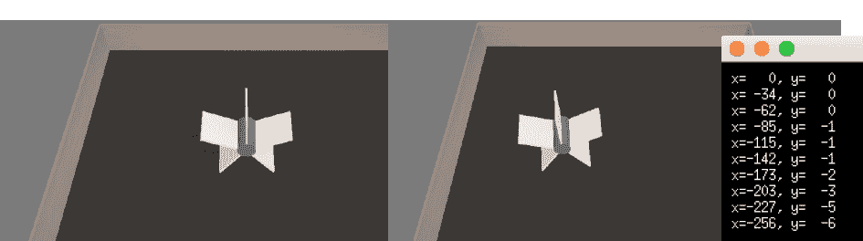

图 12.3：拖步的 Starman 及其位置数据

### 12.2 运动模型

为了更系统地处理问题，我们希望为“星人”建立一个运动模型。为此，我们假设“星人”的运动模式是重复的，因此我们只需要找到五个肢体在相对较短时间（例如两秒）内的运动序列，然后该序列就会重复。由于我们不希望两个肢体发生碰撞，而它们之间仅相隔360°/5 = 60°，考虑到肢体的厚度，我们需要将其运动限制在[−30°, +30°]或稍小的范围内。因此，我们完整的运动方案将类似于图12.4中的图表，其中每个肢体由一条曲线表示。每条曲线（伺服电机）从和结束于中立位置0，代表肢体的笔直方向。

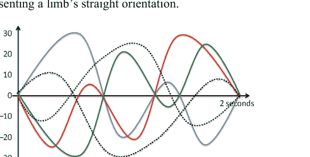

但我们还不知道每条实际的曲线函数应该是什么。我们将把这个问题留到后面，首先通过用一些控制点来表示每条曲线，将此图表数字化。每条曲线（肢体运动）使用大约10个点应该就足够了。控制点之间的运动将由电机硬件自动平滑处理，或通过软件中的代码实现。图12.5中的图表显示了五个肢体中一个的10个控制点。

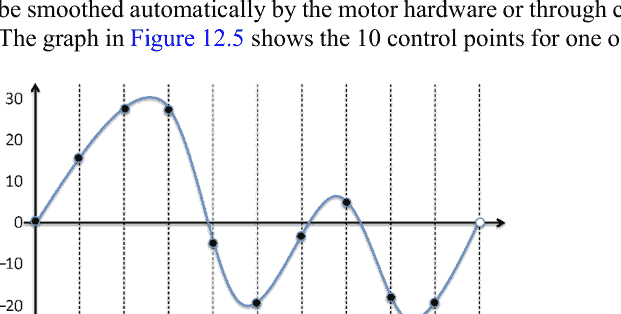

因此，这个解决方案将是一系列整数：
[0, 15, 28, 27, −5, −20, −4, 6, −20, −21]。

## 遗传算法


由于我们处理的是一个真实的物理系统，使用[−30, +30]范围内的整数值可能就足够了，而不是有理数，因此我们可以轻松地用1字节表示每个控制点。那么，任何时间点的完整“星人”配置将是5字节（每个肢体1字节），而完整的运动解决方案将是50字节（10个控制点 · 5字节）。
关于这种方法在更复杂机器人上的细节，可以在[Boeing, Bräunl 2015]²中看到。

### 12.3 遗传算法

遗传算法（GAs）是一种用于解决其他方法难以处理的问题的优化方法。遗传算法维护一组（*种群*）个体（*染色体*或*基因型*），这些个体被编码为字节序列。每个染色体的性能由*适应度*函数在真实或模拟世界中进行评估，该函数会为每个染色体分配一个性能值。这个值将决定每个染色体被选中进行下一代遗传重组的机会。整个迭代过程将在达到最大代数或找到足够好的解决方案后停止（图12.6）。

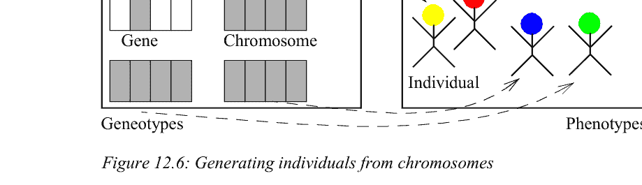

程序12.4显示了主程序中的这个核心循环——它要么在达到最大迭代次数时终止，要么在达到特定行走性能时终止。
在每次迭代中，我们通过调用函数*evaluate*来评估来自*n*个染色体池中的每个个体染色体。表现最好的染色体被原封不动地复制到下一代中。然后我们将进行(*n*−1)/2次迭代，每次调用*selectgene*两次，并使用*crossover*函数从每对旧染色体生成两个新的染色体。最后一步是执行一定数量的变异。

> ² A. Boeing, T. Bräunl, *Dynamic Balancing of Mobile Robots in Simulation and Real Environments*, in Dynamic Balancing of Mechanisms and Synthesizing of Parallel Robots, Dan Zhang, Bin Wei (Eds.), Springer International, Cham, Switzerland, Dec. 2015, pp. 457-474 (18)

## 12 学习机器人

### 程序12.4：C语言中的基因池定义和主遗传算法循环

```
1  BYTE pool[POP][SIZE],
2      next[POP][SIZE]; // POP需要是奇数
3  ...
4  for (iter=0; iter<MAX_ITER && maxfit<FIT_GOAL; iter++)
5    { evaluate();
      memcpy(next[0], pool[maxpos], SIZE); // 保留最佳
      for (pos=1; pos<POP; pos+=2)
        { s1 = selectgene();              // 选择第1个
          s2 = selectgene();              // 选择第2个
10         crossover(s1,s2, pos);           // 交配
11       }
12     for (int m=0; m<MUT; m++)  mutation(); // 变异
13     memcpy(pool, next, POP*SIZE);   // 复制基因池
14   }
```

交叉（图12.7和程序12.5）是一个非常简单的操作。取上一步中选出的两个染色体A和B，确定一个随机的切割位置穿过它们的位串。然后，将染色体A的左半部分与染色体B的右半部分粘合在一起，反之亦然。这两个新的子染色体将进入该过程的下一代。

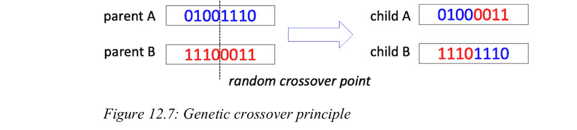

### 程序12.5：C语言中的交叉函数

```
1  void crossover(int g1, int g2, int pos)
2  { int cut = rand()%(SIZE-1) +1; // 范围 [1, SIZE-1]
3    memcpy(next[pos  ], pool[g1], cut);
4    memcpy(next[pos  ]+cut, pool[g2]+cut, SIZE-cut);
5    memcpy(next[pos+1], pool[g2], cut);
6    memcpy(next[pos+1]+cut, pool[g1]+cut, SIZE-cut);
7  }
```

变异操作（图12.8和程序12.6）同样简单。在当前代的一个随机染色体中确定一个随机位置，仅翻转这一位（0→1或1→0）。这一措施背后的想法是确保探索整个搜索空间。例如，如果当前代的所有染色体都以0位开头，那么如果没有变异，以1位开头的解决方案将永远不会被考虑。

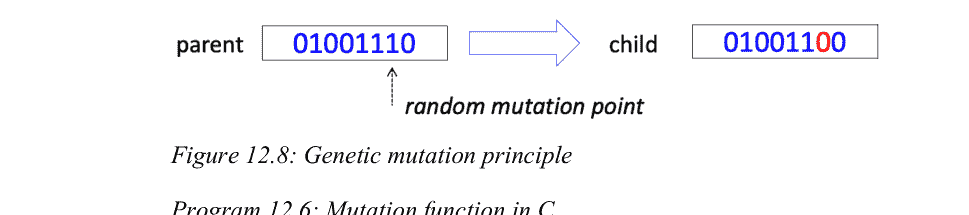

### 程序12.6：C语言中的变异函数

```
1 void mutation()
2 { int ind = rand() % (POP-1) + 1; // [1, POP-1]
3   int pos = rand() % SIZE;
4   int bit = rand() % 8;
5   next[ind][pos] ^= (1<<bit);     // 异或：翻转位
6 }
```

在开始评估过程之前，我们需要用一些随机值（在合理范围内）初始化我们的染色体。我们将所有肢体角度控制点设置为笔直的中间位置（值128），然后为其添加随机值，这将产生±5的变化。
模拟机器人的肢体也必须在开始前初始化。我们通过五次调用SERVOSet函数（程序12.7）来完成此操作。

### 程序12.7：C语言中初始化基因池和设置肢体的函数

```
1  void init()
2  { int i, leg, point, pos, val;
3    for (i=0; i<POP; i++)
4    { pool[i][0]=128; pool[i][1]=128; pool[i][2]=128;
5      pool[i][3]=128; pool[i][4]=128; // 中立初始化
6      for (point=1; point<CPOINTS; point++)
7        for (leg=0; leg<5; leg++)
8        { pos = 5*point+leg;
9          val = pool[i][pos-5] + (rand() & 10) - 5;// 随机 +/-5
10         pool[i][pos] = MAX(0, MIN(255, val));
11       }
12    }
13  }
14
15  void set(chrom c, int pos)
16  { int leg;
17    for (leg=0; leg<5; leg++) SERVOSet(leg+1, c[5*pos+leg]);
18  }
```

## 12 学习机器人

### 程序12.8：C语言中的适应度函数计算

```
1  int fitness(int i)
2  { int rep, point, x, y, phi;
3
4    SIMSetRobot(1, 1000, 1000, 0, 90);
5    VWSetPosition(0,0,0);
6
7    set(pool[i],0);  // 起始位置
8    OSWait(2000);
9    for (rep=0; rep<REP; rep++)
10      for (point=0; point<CPOINTS; point++)
11      { set(pool[i], point);
12        OSWait(250); // 毫秒
13      }
14    VWGetPosition(&x, &y, &phi);
15    return 1 + abs(x) + abs(y);  // 最小适应度为1
16  }
17
18  void evaluate()
19  { fitsum = 0.0;
20    maxfit = 0.0;
21    for (int i=0; i<POP; i++)
22    { fitlist[i] = fitness(i);
23      fitsum += fitlist[i];
24      if (fitlist[i]>maxfit)  // 记录最大适应度
25      { maxfit=fitlist[i]; maxpos=i; }
26    }
27  }
```

程序12.8中的适应度函数只是让机器人根据给定染色体的控制点运行一定次数的迭代——然后检查机器人最终处于什么位置。机器人最终离起点越远，它就“越适应”。

由于在数千或数百万次染色体评估后，机器人会游荡相当远的距离，我们需要在每次模拟运行前将机器人重置回相同的起点。否则，它可能会撞到墙，或者更糟，从虚拟桌子上掉下来。为此，我们可以使用仅限模拟的函数*SIMSetRobot*。

函数*evaluate*调用基因池中每个染色体的适应度评估，并将结果存储在全局变量*fitlist*中。它还将整个代中所有染色体的总适应度求和，我们稍后在选择过程中会用到。

选择函数在主程序的每次迭代中被调用两次。它需要选择一个随机染色体；然而，随机函数需要偏向于反映每个染色体的适应度。如果染色体*A*的适应度值是染色体*B*的两倍，那么*A*被选中的可能性应该是*B*的两倍。

## 进化运行

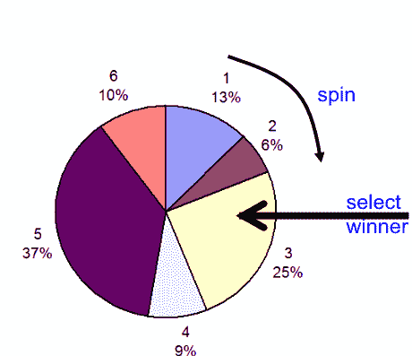

图 12.9：基于“适应度轮盘”的基因（亲本）选择原理

程序 12.9：C语言中的基因（亲本）选择函数

```c
int selectgene()
{ int  i, wheel,count;

    wheel = rand() % fitsum; // range [0, fitsum-1]
    i=0;
    count = fitlist[0];
    while (count < wheel)
    {  i++;
        count += fitlist[i];
    }
    return i;
}
```

我们使用所谓的“适应度轮盘”来解决选择问题（参见图 12.9 和程序 12.9）。只需将选择过程想象成游戏节目中的转盘。轮盘的扇区覆盖着染色体符号，扇区的大小与相对适应度水平相匹配（适应度翻倍意味着面积翻倍）。因此，假设每次旋转都是随机的，它将根据染色体的适应度水平，以期望的偏向随机选择一条染色体。

### 12.4 进化运行

运行遗传算法程序将花费很长时间。种群中每条染色体的位串都会被评估，这在实时运行中大约需要每个机器人10秒。因此，让一个包含100个机器人的种群进化100代将需要10^5秒，大约等于28小时。当然，在更强大的计算机系统上，以“无头模式”运行模拟器，其执行速度快于实时，可以显著加快这一过程。

## 12 学习机器人

图 12.10 中的截图显示了15个“星人”种群在迭代10次（左）和80次（右）后的适应度水平。在此进化过程中，最佳个体的适应度值增加了一倍多（从78增加到128）。

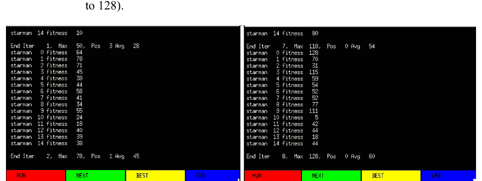

最后，在图 12.11 中，展示了“星人”在其初始位置（由绿色地面标记指示，左图）和执行进化后的步态后的最终位置（右图）。

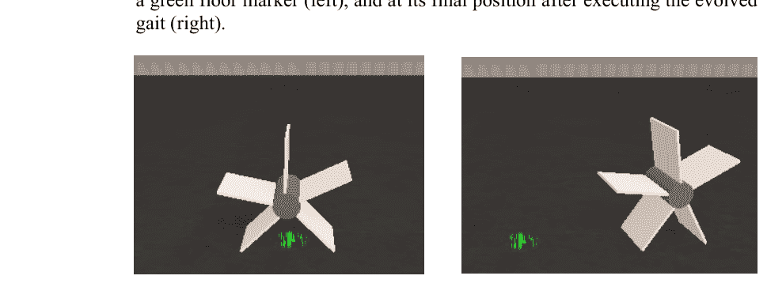

### 12.5 任务

- 优化“星人”的遗传算法实现，并找到最佳行走模式。
- 添加一个初始启动序列，使其能过渡到重复的运动序列，并同样使用遗传算法对其进行进化。
- 将“星人”扩展（甚至进化）成一个更复杂的关节型生物。

## 交通模型

在本章中，我们接近了自动驾驶汽车——只是规模更小。我们使用与之前相同的机器人，但将它们置于一个微型交通场景中，场景包含车道线、交通标志、停车区和其他汽车（或机器人）。还可以加入行人、房屋、树木等模型，以完成额外的检测任务。

### 13.1 自主模型车竞赛

在这个领域至少有两个学生竞赛：由德国布伦瑞克工业大学组织的年度赛事Carolo-Cup$^1$，以及由汽车制造商奥迪组织的非常相似的奥迪自动驾驶杯$^2$。Carolo-Cup直接向所有参赛者开放，而奥迪杯的参赛者首先需要通过预选阶段。成功的团队将获得一辆免费的自主模型车用于比赛。

接下来，我们将重点介绍Carolo-Cup，我们按照2:1的比例将其缩小用于我们的机器人。我们在实验室的大桌子上以及仿真环境中重建了标准的Carolo交叉路口环路（见图13.1）。

Carolo-Cup使我们能够开发和改进一系列与汽车研究相关的任务。为小型机器人车开发的所有算法都可以扩展应用于真实的自动驾驶车辆。涵盖的领域包括：

- 车道检测与车道保持
- 碰撞避免
- 其他车辆和行人检测
- 交通标志识别
- 自动泊车
- 自动超车

$^1$ TU Braunschweig, *Carolo-Cup*, https://wiki.ifr.ing.tu-bs.de/carolocup/carolo-cup
$^2$ Audi AG, *Audi Autonomous Driving Cup*, https://www.audi-autonomous-driving-cup.com

## 13 交通模型

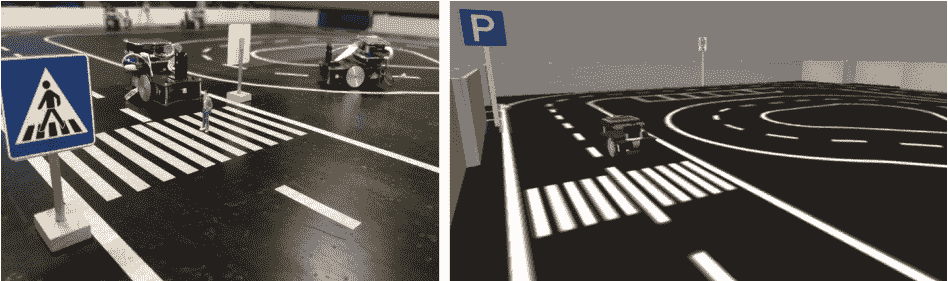

图 13.1：真实环境与仿真环境对比

- 自动交叉路口控制
- 自动斑马线检测
- 根据标志自动控制车速
- 车对车及车对基站通信

这个竞赛的妙处在于，新团队可以从开发一两个功能开始，构建一个可工作的系统，例如车道保持和碰撞避免，然后逐步改进其实现，同时添加新的功能。

### 13.2 Carolo-Cup

Carolo-Cup仿真设置所需的一切，就是从Carolo网站获取标准的Carolo环路图像文件，然后将其转换为真实或仿真环境。我们用一些手工制作的交通标志来完善场景，这些标志的图像文件也可以在Carolo网站上找到。

有了几个交通标志，Carolo *SIM* 脚本看起来就像程序13.1，并将创建图13.2所示的环境。程序13.2中的基本Carolo世界文件（此处没有墙壁）极其简单，因为它只使用了地板的位图。

在图13.2所示的扩展示例中，我们添加了与我们实验室真实机器人设置完全匹配的墙壁——这有助于防止真实和仿真机器人从桌子上掉下去。

以下部分描述的Carolo-Cup系统的软件设计和实现工作，由西澳大学访问学生孙双全、郑景文、林子涵（均来自中国科学技术大学），乔子涵和刘善奇（均来自浙江大学）完成。

## Carolo-Cup

程序 13.1：Carolo-Cup SIM 脚本

```
# Environment
world ../../worlds/small/Carolo.wld

# Objects
object ./objects/ParkingSign/ParkingSign.esObj
object ./objects/SpeedLimitSign/cancelspeedlimitsign.esObj
object ./objects/SpeedLimitSign/speedlimitsign.esObj
object ./objects/StopSign/stopsign.esObj

# Objects
ParkingSign 990  223 192
StopSign    2270 1192 121
StopSign    2301 1922 312
CancelSpeedLimitSign 1899 2861 1
SpeedLimitSign        46 1820 87

# robotname x y phi
S4 1637 352 180 lane.x
```

程序 13.2：Carolo-Cup 世界文件

```
floor_texture carolo-lab.png
width  3100
height 3100
```

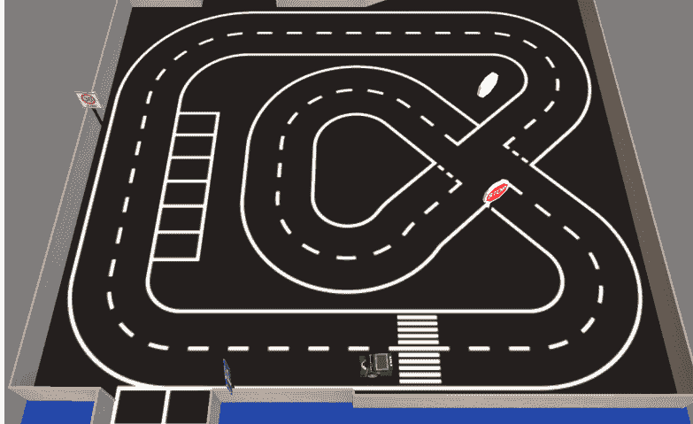

图 13.2：EyeSim 中的 Carolo-Cup 环境

### 13.3 车道保持

第一步是进行图像处理以找到车道线，然后利用这些信息生成最可能的车道曲率模型。我们使用OpenCV（参见第11章机器人视觉）进行所有图像处理，因为它是一个非常通用且全面的库。这也意味着我们的应用程序必须用C++或Python编写，因为OpenCV不支持C语言。处理步骤如图13.3所示。

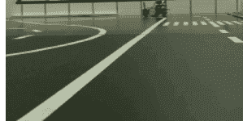

图像采集并转换为OpenCV格式


裁剪感兴趣区域


Canny边缘检测

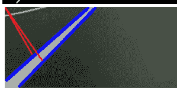

霍夫变换对边缘进行分类（蓝色），然后计算到左上角和右上角的边缘距离（红色）以进行选择


仅选择左右车道的内侧边缘

图 13.3：车道检测算法步骤

需要注意的是，这些操作中有许多计算密集型。这里使用的霍夫变换尤其如此，特征验证、使用拉格朗日插值多项式的曲线拟合以及本项目中未使用的许多其他操作也是如此。我们真实机器人的计算能力相当有限，受限于树莓派控制器，我们不希望将图像传输到“远程大脑”并接收回驾驶指令，因为这会将我们的机器人降级为遥控车。相反，我们有兴趣开发快速计算的替代视觉算法，以便在嵌入式控制器上处理汽车视觉。

## 交叉路口与斑马线

通过前面的步骤，我们现在可以计算车辆相对于车道中心的位置，并修正其行驶路径的曲率，使其保持在车道中间。这种方法在直道上效果相当好。

不幸的是，这种方法在弯道上效果不佳。标准的树莓派摄像头视野非常狭窄，因此当进入弯道时，机器人只能看到外侧车道。当然，这个问题可以通过硬件来解决，例如使用视野更广的替代摄像头（这可能是最简单的解决方案），或者将摄像头安装在伺服电机上，然后旋转摄像头以保持两侧车道都在视野内。我们仍然可以尝试理解下方所示的单条可见车道；然而，这将以降低程序的鲁棒性为代价。这意味着轻微的干扰就可能使自动驾驶车辆偏离轨道，完全驶出车道。

在右转弯时仅检测到左侧车道标线

在左转弯时仅检测到虚线中间车道标线（记住，在澳大利亚我们靠左行驶）

*图 13.4：右/左转弯中的车道标线*

从图 13.4 的示例图像中可以看出，在弯道中可用的边缘数据可能非常少，特别是如果只有虚线中间车道标线可见。我们拥有的边缘像素越少，曲线检测算法就越容易出错。

### 13.4 交叉路口与斑马线

交叉路口和斑马线是 Carolo 程序需要处理的特殊情况。从某种意义上说，它们是图像帧中可见车道标线的两个极端情况。在交叉路口开始处，完全没有可见的垂直车道标线。在斑马线处，则有大量（通常约 15 条）垂直边缘。因此，这可以作为区分这些交通状况的一个良好初步标准。

在交叉路口（见图 13.5 上方），自动驾驶车辆必须检测到水平停止线并完全停下。然后，在驶过交叉路口之前，必须检查是否有任何横向交通（广角镜头绝对有帮助）。

在斑马线（见图 13.5 下方），自动驾驶车辆必须减速并检查是否有行人（我们使用小模型人偶），然后才能驶过斑马线。

交叉路口起点

斑马线（检测到的条纹标记为蓝色）

图 13.5：通过计算垂直边缘来检测交叉路口和斑马线

### 13.5 交通标志识别

交通标志识别要复杂得多，我们为此使用了[Sun et al. 2019]^3 中描述的学习方法组合。我们为此任务使用了方向梯度直方图（HOG）方法 [Dalal, Triggs 2005]^4，该方法可以在树莓派 3 上以合理的帧率运行，对于 QVGA 图像分辨率（320×240 像素）约为 3Hz。图 13.6 显示了一些待检测的标志及其对应的 HOG 模式。

图 13.6：交通标志及推导出的 HOG 模式

^3 S. Sun, J. Zheng, Z. Qiao, S. Liu, Z. Lin, T. Bräunl, *Architecture of a driverless robot car based on EyeBot system*, 3rd International Conference on Robotics: Design and Applications (RDA 2019), Xi'an, China, April 2019

^4 N. Dalal, B. Triggs, *Histograms of oriented gradients for human detection*, IEEE Computer Society Conference on Computer Vision and Pattern Recognition (CVPR'05), 2005, pp. 886-93

在图 13.7 中，我们展示了一些带有叠加标志识别的图像帧示例。请注意，即使在同一图像帧中有多个标志，此方法也有效。

图 13.8 中的图表显示了在树莓派 3 上的执行时间。每个图像帧的平均处理时间为 340 毫秒，但会有所变化。标准的 Raspbian 操作系统不支持实时操作，但只要图像处理时间没有大的异常值，这实际上也并非必需。交通标志识别作为控制器上的一个独立进程运行，因此不会影响其他需要以更高频率运行的控制算法，例如用于碰撞避免的距离传感器评估。

我们实现的测试数据集的精确度（阳性预测值）、召回率（灵敏度）和 F 分数如图 13.9 所示。

| 交通标志 | 精确度 | 召回率 | F |
|---|---|---|---|
| 停车 | 82.61% | 61.29% | 70.37% |
| 行人 | 100% | 73.33% | 84.62% |
| 停车场 | 100% | 50.00% | 66.67% |
| 限速 | 100% | 63.64% | 77.78% |
| 解除限速 | 100% | 42.11% | 59.26% |
| 让行 | 100% | 60.00% | 75.00% |

图 13.9：交通标志识别的精确度、召回率和 F1 分数

### 13.6 端到端学习

神经网络和深度学习在自动驾驶软件中获得了越来越多的关注。本章迄今为止介绍的方法范围从传统的工程方法（应用特定的图像处理功能，例如检测车道标线）到使用学习算法完成特定任务（例如交通标志识别）。然而，学习系统的最终目标是*端到端*学习。其思想是将真实的实时数据（例如来自驾驶员视角的视频流）与正确的期望输出（此处为转向角）一起呈现给深度神经网络，让它一次性学习完整的任务，而无需程序员对输入数据进行分解或预处理。

显然，这样的端到端系统将比传统的 AI（人工智能）系统有巨大的改进，并节省开发学习系统的大量成本。对于自动驾驶，只需要录制一些优秀驾驶员在各种驾驶场景下的视频流和转向角，深度神经网络就能学会如何自动驾驶。Nvidia 的研究人员为一辆实际的线控汽车实现了这样一个场景，使用了他们的并行 GPGPU（通用图形处理器单元）系统之一 [Bojarski et al. 2016]⁵。Google Inc. 实现了一种类似的方法，但仅用于通用目标检测 [Howard et al. 2017]⁶。图 13.10 解释了端到端学习的原理。

Nicholas Burleigh 和 Jordan King 与作者一起，使用基于 Nvidia 和 Google 方法的简化深度网络，训练了一个在 Carolo-Cup 赛道上行驶并检测交通标志的机器人 [Burleigh, King, Bräunl 2019]⁷。我们从运行先前描述的 Carolo-Cup 问题工程解决方案中，录制了 1,000 张测试图像及其正确的转向角。图 13.11 显示了“左转”（左侧两张图像）、“直行”（中间两张图像）和“右转”（右侧两张图像）类别的示例图像。

然后，我们使用 TensorFlow⁸ 和这些数据以及十个可能的转向输出值（从完全左转到直行再到完全右转）训练了一个深度神经网络。训练后的网络足够小，可以在机器人的车载树莓派 3 控制器上以约 9 fps（帧/秒）的速度成功运行并导航 Carolo-Cup 赛道。

⁵ M. Bojarski, D. Del Testa, D. Dworakowski, B. Firner, B. Flepp, P. Goyal, L. Jackel, M. Monfort, U. Muller, J. Zhang, X. Zhang, J. Zhao, K. Zieba, *End to End Learning for Self-Driving Cars*, Nvidia Corporation, Apr. 2016, pp. (9)

⁶ A. Howard, M. Zhu, B. Chen, D. Kalenichenko, W. Wang, T. Weyand, M. Andreetto, H. Adam, *MobileNets: Efficient Convolutional Neural Networks for Mobile Vision Applications*, Google Inc., Apr. 2017, pp. (9)

⁷ N. Burleigh, J. King, T. Bräunl, *Deep Learning for Autonomous Driving*, Intl. Conf. on Digital Image Computing: Techniques and Applications (DICTA), Dec. 2019, Perth, pp. (6)

⁸ TensorFlow, https://www.tensorflow.org

## 13 交通模型

尽管模拟和真实的摄像头图像看起来相似，但为一个系统训练的网络无法直接迁移到另一个系统，因此需要为模拟机器人和真实机器人分别收集输入数据并进行独立的训练。

### 13.7 任务

- 实现你自己的 Carolo-Cup 版本。从一项功能开始，然后逐步添加更多功能，直到你拥有一个全面的自动驾驶系统：
  - 车道检测与车道保持
  - 碰撞避免
  - 其他车辆和行人检测
  - 交通标志识别
  - 自动泊车
  - 自动超车
  - 自动交叉路口控制
  - 自动斑马线检测
  - 根据标志自动控制车速
  - 车对车和车对基站通信
  - 针对上述任务的端到端学习系统

## 自动驾驶汽车

从自主机器人发展到自主车辆/无人驾驶汽车是合乎逻辑的一步。它们需要相同类型的传感器和类似的算法，尽管需要适应道路环境。在过去十年中，自动驾驶取得了巨大进步，这不仅来自汽车公司，也来自IT公司，如Mobileye（现为英特尔的一部分）和Waymo（前身为Google X）。虽然传统的软件工程方法，如图像处理和模式匹配，过去一直是自动驾驶传感器数据处理的主要方法，但基于人工神经网络的学习方法在过去十年中已占据主导地位。拥有数十层神经元的大型深度学习系统，以及甚至不需要传感器预处理步骤的端到端学习系统，已经取得了显著成果。然而，鉴于这些学习系统的本质，即使是专家也很大程度上不清楚这些系统究竟学到了什么，它们关注哪些方面（例如图像特征），以及它们到底有多可靠。如何为自动驾驶的学习系统进行认证仍然是一个价值百万美元的问题。我们在西澳大学的可再生能源汽车项目已经开发了几辆自动驾驶汽车，我们将在本章介绍其中一些。

### 14.1 电驱动系统

每辆车的设计都从底盘和驱动系统开始。图14.1展示了我们的实验车底盘，这是一辆Formula-SAE单座赛车，通过焊接管道从零开始建造。由西澳大学的Ian Hooper设计的驱动系统包括两个直流电机，每个后轮一个。每个电机都有自己的电机控制器，它们通过电子差速器连接以实现转弯，因为曲线中的外轮需要比内轮覆盖更大的距离。

¹ 可再生能源汽车项目，在线：https://REVproject.com

## 14 自动驾驶汽车

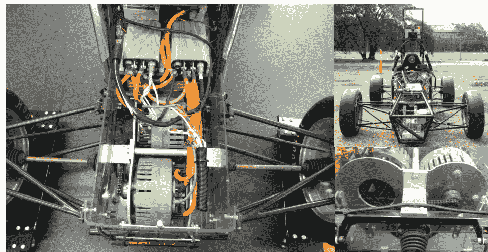

图14.1：车辆底盘和双电机驱动系统

### 14.2 线控驱动

虽然电驱动系统确实有助于实现自动驾驶系统，但从技术上讲，它并不是先决条件。任何自主车辆的第一步都是实现线控驱动系统（参见图14.2，由西澳大学的Jordan Kalinowski设计）。这意味着汽车的三个主要功能：转向、制动和加速都可以由计算机系统控制。一个底层嵌入式处理器将控制这三个功能，并接收来自更高级智能驱动计算机的命令。

**1. 转向**
驱动转向可能是最难的部分。它需要一个强大的电机连接到转向柱，例如通过皮带传动，这样计算机命令就可以改变转向角度。当然，这立即引发了安全问题：
- 驾驶员/乘客的手可能在驱动计算机转动方向盘时被卡住。
- 驾驶员/乘客可能想要干预转向，但可能无法在物理上压过转向柱上的电机。
- 电机/皮带装置可能会卡住或以其他方式干扰手动转向系统。

**2. 制动**
出于安全考虑，我们不想直接干预摩擦制动器，因此我们建造了一个可以从后面拉动制动踏板的杠杆，该杠杆由强大的伺服系统驱动。这使得驾驶员在手动模式和自主模式下都能保持控制。

**3. 加速**
将加速功能计算机化是最简单的部分。所有现代加速踏板已经是电子的，所以我们只需要一个模拟多路复用器，在踏板和计算机输出之间切换，作为电机控制器的输入。

### 14.3 传感器与安全系统

对于自动驾驶，我们需要多种传感器，以便系统能够准确获取车辆的位置、方向和速度以及其环境信息，包括所有障碍物、其他车辆、行人等（参见图14.3）。由此，它需要计算出一条期望路径，然后作为转向/制动/加速命令发送给底层的线控驱动控制器。高级和低级控制器之间的连接可以通过专用数据线或总线系统（如CAN或USB）实现。自动驾驶汽车的典型传感器包括：
- 激光雷达（单层或多层扫描）
- 雷达
- 摄像头（单目、立体或多焦距）
- IMU（惯性测量单元）
- GNSS（全球导航卫星系统，例如GPS）
- 车轮编码器

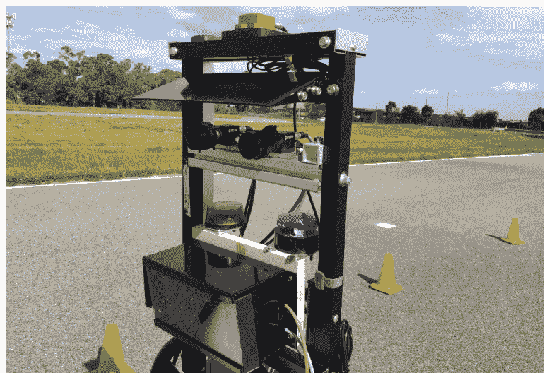

图14.3：REV汽车顶部的传感器堆栈：IMU、立体摄像头、激光雷达

更多细节可以在[Lim et al. 2018]²中找到，关于基于激光雷达的自动驾驶，以及在[Teoh, Bräunl 2012]³中关于基于视觉的自动驾驶。

由于全尺寸车辆对驾驶员/乘客以及旁观者都可能极其危险，我们需要实施多层安全系统，既在车辆上，也在外部基站上。一个单独的专用嵌入式控制器接管车辆上的安全功能实现，参见[Drage, Kalinowski, Bräunl 2014]⁴。

² K. Lim, T. Drage, R. Podolski, G. Meyer-Lee, S. Evans-Thompson, J. Yao-Tsu Lin, G. Channon, M. Poole, T. Bräunl, *A Modular Software Framework for Autonomous Vehicles*, IEEE Intelligent Vehicles Symposium (IV), 2018, Chang Shu China, pp. 1780–1785 (6)
³ S. Teoh, T. Bräunl, *Symmetry-Based Monocular Vehicle Detection System*, Journal of Machine Vision and Applications, Springer, vol. 23, no. 4, July 2012, pp. 831-842 (12)
⁴ T. Drage, J. Kalinowski, T. Bräunl, *Integration of Drive-by-Wire with Navigation Control for a Driverless Electric Race Car*, IEEE Intelligent Transportation Systems Magazine, pp. 23-33 (11), Oct. 2014

## 自动驾驶汽车安全


a. 紧急停止按钮
   - 车载按钮，用于脱离自主模式
   - 车载按钮，用于关闭车辆电源
   - 远程紧急停止按钮
b. 车辆与基站之间的电子心跳
   - 如果数据链路中断，车辆自动停止
c. 地理围栏
   - 如果超出预定义的GPS区域，车辆自动停止
d. 看门狗定时器
   - 如果车辆软件无响应，车辆自动停止
e. 手动覆盖
   - 通过踩刹车覆盖自主操作
   - 通过触摸方向盘覆盖自主操作


### 14.4 Formula-SAE 自动驾驶

美国汽车工程师学会和德国大学生方程式赛车有着悠久的传统，举办大学生建造和驾驶单座赛车的比赛。2017年，SAE和FSG推出了新的赛事*Formula-SAE Autonomous*⁵，其中一辆完全自主的车辆必须在未知的赛道上找到自己的路，赛道由特定距离和特定颜色的交通锥标出（图14.4）。

由于赛道上没有其他障碍物和其他车辆，检测这些锥桶最简单的方法是使用单束激光雷达传感器，该传感器水平安装在车辆前方较低的高度，以便可以扫描180°范围内的所有锥桶。比赛规则要求赛道左右两侧使用不同颜色的锥桶（分别为蓝色和黄色），但这在使用激光雷达时并不重要，因为它只报告距离值而不报告颜色。摄像头系统可用于补充锥桶检测，提高性能和安全性——甚至可以作为唯一传感器，以构建更便宜的自动驾驶系统。

我们的锥桶驾驶算法仅使用激光雷达进行锥桶检测，使用IMU感知车辆运动。我们最终没有使用GPS，因为它在没有使用额外校正服务的情况下往往相当不可靠且不准确。基于摄像头的锥桶检测不如激光雷达可靠，但我们在SAE比赛之外的其他自动驾驶任务中使用了摄像头，例如在没有锥桶的赛道上行驶时的车道检测。自动驾驶软件由Chao Zhang、Craig Brogle、William Lai、Timothy Kelliher、Manuchekhr Adina-Zada和Thomas实现。

⁵ 德国大学生方程式赛车，*Autonomous Driving at Formula Student Germany 2017*, Aug. 2016, https://www.formulastudent.de/pr/news/details/article/autonomous-driving-at-formula-student-germany-2017/

## 14 自动驾驶汽车

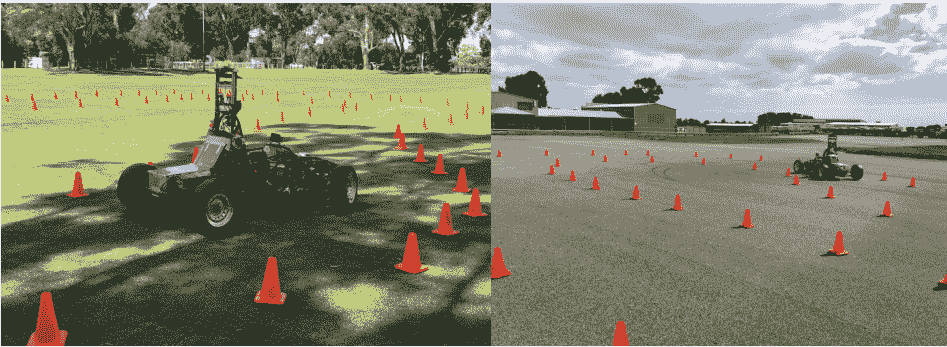

Drage；详细信息列于 [Lim et al. 2019]^6 和 [Brogle et al. 2019]^7 的论文中。驾驶视频可在 REV 网页^8 上观看。

### 14.5 公式-SAE 仿真

由于实际汽车上的驱动系统相当复杂，我们在此希望研究一个可以在 EyeSim 模拟器中运行的简化实现。第一步是重新审视 EyeSim 的激光雷达传感器。默认情况下，它会报告 360 个距离值，覆盖完整的 360° 圆周。然而，这可以在机器人的 *ROBI* 描述文件中进行更改，例如，在 180° 范围内提供 1,000 个值。

程序 14.1：公式-SAE SIM 脚本

```
1 settings VIS
2 # World File
3 world field2.wld
4 # Robots
5 robot "../../robots/Ackermann/SAE.robi"
6 SAE 4000 1200 90 conedrive.x
7 # Objects
8 object "../../objects/ConeOrange/coneorange.esObj"
9 Cone-O 4000 6500 0
10 Cone-O 3000 6100 0
11 Cone-O 5000 6100 0
```

^6 K. Lim, T. Drage, C. Zhang, C. Brogle, W Lai, T. Kelliher, M. Adina-Zada, T. Bräunl, *Evolution of a Reliable and Extensible High-Level Control System for an Autonomous Car*, IEEE Transactions on Intelligent Vehicles, 2019, pp. 396–405 (10)
^7 C. Brogle, C. Zhang, K. Lim, T. Bräunl, *Hardware-in-the-Loop Autonomous Driving Simulation*, IEEE Transactions on Intelligent Vehicles, 2019, pp. 375–384 (10)
^8 REV Project, online: http://REVproject.com

在程序 14.1 中，我们为公式-SAE 赛车在一个仅包含三个橙色锥桶的空旷平面上设置了一个 *SIM* 脚本。我们现在可以点击并拖动赛车在驾驶区域移动，并观察 LCD 上显示的图像和激光雷达数据的变化（图 14.5）。

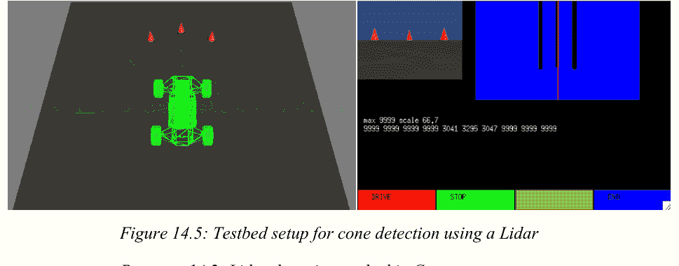

图 14.5：使用激光雷达进行锥桶检测的测试平台设置

程序 14.2：C 语言激光雷达检测测试平台

```
1  int main ()
2  { int  i, k, m;
3    int  scan[POINTS];
4    float scale;
5    BYTE img[QQVGA_SIZE];
6
7    LCDMenu("DRIVE", "STOP", "", "END");
8    CAMInit(QQVGA);
9    LIDARSet(180, 0, POINTS); // range, tilt, points
10   do
11   { k = KEYRead();
12     CAMGet(img);
13     LCDImage(img);
14     if (k==KEY1) VWSetSpeed(200,0);
15     if (k==KEY2) VWSetSpeed(  0,0);
16     LIDARGet(scan);
17     m = getmax(scan);
18     scale = m/150.0;
19     LCDSetPos(13,0);
20     LCDPrintf("max %d scale %3.1f\n", m,scale);
21     for (i=0; i<10; i++)
22       LCDPrintf("%4d ",scan[i*(POINTS/10)]);
23     for (i=0; i<PLOT; i++) // plot distances
24     { LCDLine(180+i,150-scan[SCL*i]/scale,180+i,150,BLUE);
25       LCDLine(180+i,150-scan[SCL*i]/scale,180+i,  0,BLACK);
26     }
27     LCDLine(180+POINTS/(2*SCL),
28            0,180+POINTS/(2*SCL),150, RED);
29   } while (k!=KEY4);
30 }
```

程序 14.2 中用于显示摄像头和激光雷达传感器数据的 *main* 函数是第 4 章激光雷达绘图程序的扩展。函数 *getmax* 是一个小程序，它返回当前激光雷达扫描中的最大距离值。函数 *LIDARSet* 设置激光雷达的扫描角度和角度分辨率。这也可以在赛车的 *ROBI* 文件中指定。

在图 14.5 左侧的屏幕上，我们看到了来自赛车视角的摄像头图像以及 180° 的激光雷达数据。由于没有周围的墙壁（正如你在赛道上所预期的那样），所有未击中锥桶的激光雷达点都会返回最大值（在这种情况下为 9999mm）。三个锥桶中的每一个都在激光雷达图中留下了一个深深的切口，但很明显，中间的锥桶（障碍物）比两侧的锥桶稍远一些（中间的黑色间隙起始位置比两侧的稍高）。

尽管驾驶真实公式-SAE 赛车的完整系统要复杂得多，并且需要许多重要的安全功能，但我们可以在 EyeSim 中实现一个用于锥桶赛道竞赛的简化工作算法，如程序 14.3 所示。这里实现的想法是使用一个安装在车辆前方锥桶高度的单层前向激光雷达传感器。只要车辆的旋转俯仰运动很小，它就能可靠地检测 180° 视场内的锥桶——这一点对于真实车辆来说是无法保证的。我们搜索位于红色中线左右两侧的两个最中心的激光雷达障碍物（见图 14.6 左），以找到一个无碰撞的转向角。此图中的黑色激光雷达阴影看起来几乎像回转滑雪中的旗杆，我们使用类似的技术来避开它们。

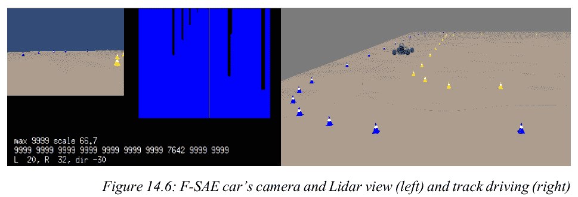

程序 14.3 显示了驾驶例程的主循环，假设赛车以函数 *MOTORDrive* 设定的恒定速度行驶。由于视野中心在转弯时会发生显著偏移，并且我们的摄像头没有电动平移轴，因此在调用辅助函数 *getleftcone* 和 *getrightcone* 时，我们使用变量 *middle*。然后我们更新这两个锥桶之间的中间位置，并将新的转向角计算为偏离直线方向的偏差。函数 *SERVOSet* 用于转向，其范围为 [0, 255]，其中中间值 128 代表直线行驶。将锥桶间隙位置值 *dir* 加到这个中间值上，使我们能够跟随锥桶赛道（见图 14.6 右）。

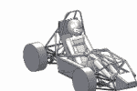

程序 14.3：C 语言简化 SAE 锥桶赛道驾驶的主循环

```
c
do  // car is already running with MOTORDrive(1, SPEED)
{ OSWait(100);  // reduce main loop to 10Hz
    CAMGet(img);
    LCDImage(img);

    LIDARGet(scan); // Lidar set to 180°range at 180 pt.
    m = getmax(scan);
    scale = m/150.0;
    l = getleftcone (scan, middle);  // left-most cone
    r = getrightcone(scan, middle);  // right-most cone
    if (l>0 && r>0 && l<r)
    { middle = (l+r)/2; // middle position of [0..POINTS]
        dir = (POINTS/2 - middle); // range +/-POINTS/2
        SERVOSet(1, 128+dir); // 0=right 128=mid. 255=left
    }

    // plot distances and remove previous line
    for (i=0; i<PLOT; i++)
    { LCDLine(180+i,150-scan[SCL*i]/scale,180+i,150,BLUE);
        LCDLine(180+i,150-scan[SCL*i]/scale,180+i,0,BLACK);
    }       // draw variable middle line
    LCDLine(180+middle/SCL,0, 180+middle/SCL,150, RED);
} while (k!=KEY4);
}
```

程序 14.4：C 语言辅助锥桶赛道函数

```
c
int getleftcone(int a[], int mid)
{ int i;
    for (i=mid-1; i>20; i--)
        if (a[i] < 9000) return i; // cone detected !
    return -1; // no cone
}

int getrightcone(int a[], int mid)
{ int i;
    for (i=mid+1; i<160; i++)
        if (a[i] < 9000) return i; // cone detected !
    return -1; // no cone
}

int getmax(int a[])
{ int i, pos = 0;
    for (i=1; i<POINTS; i++)
        if (a[i] > a[pos]) pos = i;
    return a[pos];
}
```

辅助函数 *getleftcone*、*getrightcone* 和 *getmax* 列于程序 14.4 中。函数 *getleftcone* 接收激光雷达传感器数组以及当前的中间位置。然后，该函数从这个中间位置向左迭代，直到找到第一个障碍物——一个距离小于 9,000mm 的物体。函数随后停止并返回物体位置。函数 *getrightcone* 以相同的方式运行，只是从中间向右侧迭代。函数 *getmax* 用于在将激光雷达数据绘制到屏幕之前对其进行缩放。

图 14.7 中的截图现在显示了锥桶赛道竞赛的实际最终结果。这个模拟本身完全可以作为一个竞赛项目。

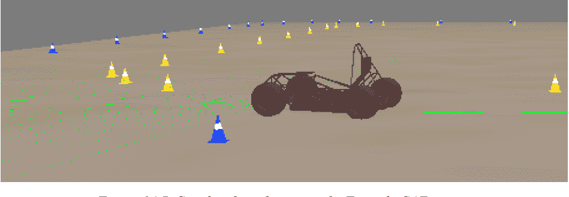

图 14.7：公式-SAE 赛车的模拟赛道竞赛

### 14.6 自动驾驶道路车辆

当离开特定的隔离环境（如赛道）时，自动驾驶突然变得困难得多。当在有行人和自行车的校园内驾驶，甚至在有其他车辆的公共道路上驾驶时，必须考虑许多额外的因素。

由 Kieran Quirke-Brown、Zhihui Lai、Xiangrui Kong、Tim Tan、Jai Castle、Zack Wong、Kyle Carvalho 和 Yuchen Du 组成的 REV 团队，使用 ROS-2⁹ 作为基础系统，为两辆自动驾驶穿梭巴士开发了软件，因为它不仅为软件节点提供了通信中间件，还提供了大量经过充分测试的传感器数据处理、建图、定位和导航算法。

为了在 UWA 校园内导航，我们使用基于激光雷达的导航包。我们能够可靠地检测建筑物，并使用 SLAM（同步定位与建图）进行地图生成和定位。图 14.8 显示了穿梭巴士在校园内以及生成的激光雷达点云。

⁹ ROS-2 Documentation, online: https://docs.ros.org/en/rolling/

## 自主道路车辆

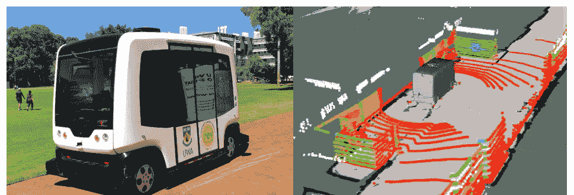

图 14.8：校园内的 nUWAy-1 穿梭巴士，配有激光雷达点云

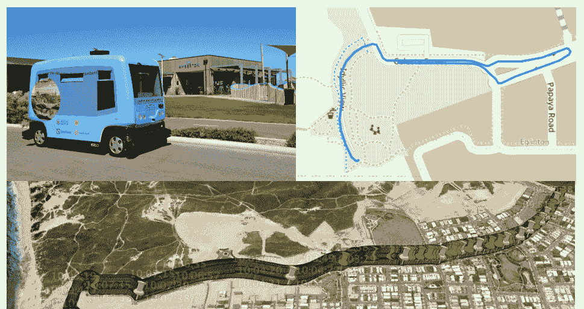

图 14.9：安伯顿海滩的 nUWAy-2 穿梭巴士；记录的行驶路径

对于公共道路上的导航，我们无法使用相同的基于激光雷达的导航方法，因为建筑物要么离道路太远，要么在这个开发区域仍然缺失。因此，我们决定实施一个基于 RTK-GPS（实时动态定位$^{10}$）的航点导航系统，并结合基于神经网络的图像处理进行车道检测，以及基于激光雷达的碰撞避免。图 14.9 显示了安伯顿海滩的穿梭巴士，其行驶路径被投影到地图和卫星视图上。更多关于自主车辆的细节可以在 [Bräunl et al. 2022]^{11} 和 [Bräunl 2022]^{12} 中找到。

$^{10}$ RTK 使用一个 GPS 基站，通过无线链路向移动 GPS 接收器发送校正信号，以提高定位精度。

### 14.7 任务

- 仅使用激光雷达传感器实现你自己的锥桶竞速程序。
- 仅使用摄像头传感器实现你自己的锥桶竞速程序。
- 结合使用激光雷达和摄像头传感器实现你自己的锥桶竞速程序。
- 扩展你的程序以检测其他车辆并避免与它们碰撞。让两辆机器人小车（使用不同的程序）在同一个赛道上比赛。

## 展望

如果你已经完成了本书，我们希望我们已经激励你使用 EyeSim 以及真实的移动机器人或改装的模型车，进一步探索移动机器人的全部算法。对于入门来说，EyeSim 是传统机器人算法开发以及深度学习系统的理想测试平台。

首先，重新实现本书中介绍的算法，然后更深入地进入机器人世界，并自己进行更多实验。EyeSim 仿真环境为你提供了一个在真实、多功能且免费的环境中开发机器人程序的机会。话虽如此，我们认为进展到构建一个物理机器人是至关重要的。这不必很昂贵，正如我们在本书开头所概述的。通过设置一个嵌入式控制器，如树莓派，配备摄像头、显示器、两个电机和一些距离传感器——或者通过改装一辆遥控模型车，可以相当便宜地构建一个机器人。

对于更大的机器人项目，高级用户应该研究更复杂的机器人操作系统（ROS）¹，它最初由 Willow Garage 开发。ROS 是一个免费的开源 Linux 平台，提供了一个全面的高级机器人软件包和实用程序库，例如 SLAM（同步定位与建图）、可视化（*rviz*）、数据记录（*rosbag*）和仿真（*Gazebo*）。大多数市售研究机器人都有 ROS 实现，可用于其程序开发和仿真。

**祝你玩得开心，享受你的机器人编程冒险！**

¹ 机器人操作系统，http://www.ros.org

## 附录

### RoBIOS-7 库函数

版本 7.3，2023年1月 – RoBIOS 是 EyeBot 控制器的操作系统。
以下库可用于用 C 或 C++ 对 EyeBot 控制器进行编程。除非另有说明，成功时返回码为 0，发生错误时返回非零值。

**在应用源文件中包含**

```
#include "eyebot.h"
```

**编译应用以包含 RoBIOS 库**

```
$gccarm myfile.c -o myfile.o
```

- LCD 输出
- 按键输入
- 摄像头
- 图像处理
- 系统功能
- 定时器
- USB/串口
- 音频
- 距离传感器
- 舵机和电机
- V-Omega 驱动接口
- 数字和模拟 I/O
- 红外遥控
- 无线电通信
- 多任务
- 仿真

### LCD 输出

```
int LCDPrintf(const char *format, ...);          // 在 LCD 上打印字符串和参数
int LCDSetPrintf(int row, int column, const char *format, ...);  // 从给定位置开始打印
int LCDClear(void);                              // 清除 LCD 显示和显示缓冲区
int LCDSetPos(int row, int column);              // 为后续的 printf 设置光标位置（以像素为单位）
int LCDGetPos(int *row, int *column);            // 读取当前光标位置
int LCDSetColor(COLOR fg, COLOR bg);             // 为后续的 printf 设置颜色
int LCDSetFont(int font, int variation); // 为后续的打印操作设置字体
int LCDSetFontSize(int fontsize); // 为后续操作设置字体大小（7..18）
int LCDSetMode(int mode); // 设置 LCD 模式（0=默认）
int LCDMenu(char *st1, char *st2, char *st3, char *st4); // 为软按钮设置菜单条目
int LCDMenuI(int pos, char *string, COLOR fg, COLOR bg); // 为第 i 个条目设置带颜色的菜单
int LCDGetSize(int *x, int *y); // 获取 LCD 分辨率（以像素为单位）
int LCDPixel(int x, int y, COLOR col); // 在 LCD 上设置一个像素
COLOR LCDGetPixel (int x, int y); // 从 LCD 读取像素值
int LCDLine(int x1, int y1, int x2, int y2, COLOR col); // 绘制直线
int LCDArea(int x1, int y1, int x2, int y2, COLOR col, int fill); // 绘制填充/空心矩形
int LCDCircle(int x1, int y1, int size, COLOR col, int fill); // 绘制填充/空心圆
int LCDImageSize(int t); // 定义 LCD 的图像类型（默认 QVGA；）
int LCDImageStart(int x, int y, int xs, int ys); // 定义起始位置和大小（默认 0,0; max_x, max_y）
int LCDImage(BYTE *img); // 在屏幕起始位置和大小处打印彩色图像
int LCDImageGray(BYTE *g); // 打印灰度图像 [0..255] 黑..白
int LCDImageBinary(BYTE *b); // 打印二值图像 [0..1] 白..黑
int LCDRefresh(void); // 刷新 LCD 输出
```

**字体名称和变体**
HELVETICA（默认），TIMES，COURIER
NORMAL（默认），BOLD

**颜色常量**（COLOR 是数据类型 "int"，RGB 顺序）
RED (0xFF0000), GREEN (0x00FF00), BLUE (0x0000FF), WHITE (0xFFFFFF), GRAY (0x808080), BLACK (0)
ORANGE, SILVER, LIGHTGRAY, DARKGRAY, NAVY, CYAN, TEAL, MAGENTA, PURPLE, MAROON, YELLOW,
OLIVE

**LCD 模式**
LCD_BGCOL_TRANSPARENT, LCD_BGCOL_NOTRANSPARENT, LCD_BGCOL_INVERSE,
LCD_BGCOL_NOINVERSE, LCD_FGCOL_INVERSE, LCD_FGCOL_NOINVERSE, LCD_AUTOREFRESH,
LCD_NOAUTOREFRESH, LCD_SCROLLING, LCD_NOSCROLLING, LCD_LINEFEED, LCD_NOLINEFEED,
LCD_SHOWMENU, LCD_HIDEMENU, LCD_LISTMENU, LCD_CLASSICMENU, LCD_FB_ROTATE,
LCD_FB_NOROTATION

### 按键

```
int KEYGet(void); // 阻塞式读取（并等待）按键（返回 KEY1...KEY4）
int KEYRead(void); // 非阻塞式读取按键（如果没有按键则返回 NOKEY=0）
int KEYWait(int key); // 等待直到指定的按键被按下
int KEYGetXY (int *x, int *y); // 阻塞式读取任意位置的触摸，返回坐标
int KEYReadXY(int *x, int *y); // 非阻塞式读取任意位置的触摸，返回坐标
```

**按键常量**
KEY1...KEY4, ANYKEY, NOKEY

### 摄像头

```
int CAMInit(int resolution); // 更改摄像头分辨率（包括 IP 分辨率）
int CAMRelease(void); // 停止摄像头流
int CAMGet(BYTE *buf); // 读取一帧彩色摄像头图像
int CAMGetGray(BYTE *buf); // 读取一帧灰度摄像头图像
```

对于以下函数，Python API 略有不同，如所示。
def CAMGet () -> POINTER(c_byte):
def CAMGetGray() -> POINTER(c_byte):

### 分辨率设置

QQVGA(160×120), QVGA(320×240), VGA(640×480), CAM1MP(1296×730), CAMHD(1920×1080), CAM5MP(2592×1944), CUSTOM (仅限 LCD)
变量 CAMWIDTH, CAMHEIGHT, CAMPIXELS (=width*height) 和 CAMSIZE (=3*CAMPIXELS) 将被自动设置（BYTE 是数据类型 "unsigned char"）

**常量大小**（以字节为单位）用于彩色图像和像素数量
QQVGA_SIZE, QVGA_SIZE, VGA_SIZE, CAM1MP_SIZE, CAMHD_SIZE, CAM5MP_SIZE
QQVGA_PIXELS, QVGA_PIXELS, VGA_PIXELS, CAM1MP_PIXELS, CAMHD_PIXELS, CAM5MP_PIXELS

### 数据类型

```
typedef QQVGACol  BYTE [120][160][3];          typedef QQVGAgray  BYTE [120][160];
typedef QVGACol   BYTE [240][320][3];          typedef QVGAgray   BYTE [240][320];
typedef VGACol    BYTE [480][640][3];          typedef VGAgray    BYTE [480][640];
typedef CAM1MPcol BYTE [730][1296][3];         typedef CAM1MPgray BYTE [730][1296];
typedef CAMHDcol  BYTE[1080][1920][3];         typedef CAMHDgray  BYTE[1080][1920];
typedef CAM5MPcol BYTE[1944][2592][3];         typedef CAM5MPgray BYTE[1944][2592];
```

### 图像处理

使用先前设置的摄像头分辨率的基本图像处理函数包含在 RoBIOS 库中。对于更复杂的函数，请参阅 OpenCV 库。

```
int  IPSetSize(int resolution);              // 使用 CAM 常量设置 IP 分辨率
int  IPReadFile(char *filename, BYTE* img);   // 读取 PNM 文件，填充/裁剪；3:彩色，2:灰度，1:二值
int  IPWriteFile(char *filename, BYTE* img);  // 写入彩色 PNM 文件
int  IPWriteFileGray(char *filename, BYTE* gray); // 写入灰度 PGM 文件
void IPLaplace(BYTE* grayIn, BYTE* grayOut);  // 对灰度图像进行拉普拉斯边缘检测
void IPSobel(BYTE* grayIn, BYTE* grayOut);    // 对灰度图像进行 Sobel 边缘检测
void IPCol2Gray(BYTE* imgIn, BYTE* grayOut);  // 将彩色转换为灰度
void IPGray2Col(BYTE* imgIn, BYTE* colOut);   // 将灰度转换为彩色
void IPRGB2Col (BYTE* r, BYTE* g, BYTE* b, BYTE* imgOut);// 将 3 个灰度通道转换为彩色
void IPCol2HSI (BYTE* img, BYTE* h, BYTE* s, BYTE* i);// 将 RGB 图像转换为 HSI
void IPOverlay(BYTE* c1, BYTE* c2, BYTE* cOut);// 将 c2 叠加到 c1 上，所有彩色图像
void IPOverlayGray(BYTE* g1, BYTE* g2, COLOR col, BYTE* cOut); // 叠加灰度图像
COLOR IPPRGB2Col(BYTE r, BYTE g, BYTE b); // 像素：RGB 转彩色
void IPPCol2RGB(COLOR col, BYTE* r, BYTE* g, BYTE* b);// 像素：彩色转 RGB
void IPPCol2HSI(COLOR c, BYTE* h, BYTE* s, BYTE* i);// 像素：RGB 转 HSI（针对像素）
BYTE  IPPRGB2Hue(BYTE r, BYTE g, BYTE b); // 像素：RGB 转色调（灰度值为 0）
void IPPRGB2HSI(BYTE r, BYTE g, BYTE b, BYTE* h, BYTE* s, BYTE* i); // 像素：RGB 转 HSI
```

对于以下函数，Python API 如示例所示：
edge = IPLaplace (gray_img)
edge = IPSobel  (gray_img)
gray = IPCol2Gray(col_img)
col  = IPGray2Col(gray_img)

## 附录

```
[h_gray, s_gray, i_gray] = IPCol2HSI(col_img)
col = IPOverlay(col_source, col_overlay)
col = IPOverlayGray(gray_source, gray_overlay, col_value)
```

### 系统函数

```
char * OSExecute(char* command);    // 在后台执行Linux程序
int OSVersion(char* buf);           // RoBIOS版本
int OSVersionIO(char* buf);         // RoBIOS-IO板版本
int OSMachineSpeed(void);           // 速度（MHz）
int OSMachineType(void);            // 机器类型
int OSMachineName(char* buf);       // 机器名称
int OSMachineID(void);              // 从MAC地址派生的机器ID
```

### 定时器

```
int OSWait(int n);                  // 等待 n/1000 秒
TIMER OSAttachTimer(int scale, void (*fct)(void)); // 将函数添加到 1000Hz/scale 定时器
int OSDetachTimer(TIMER t);         // 从 1000Hz/scale 定时器移除函数
int OSGetTime(int *hrs,int *mins,int *secs,int *ticks); // 获取系统时间（ticks单位为 1/1000 秒）
int OSGetCount(void);               // 自系统启动以来的计数（单位为 1/1000 秒）
```

### USB/串口通信

```
int  SERInit(int interface, int baud,int handshake); // 初始化通信（参见HDT文件）
int  SERSendChar(int interface, char ch);  // 发送单个字符
int  SERSend(int interface, char *buf);    // 发送字符串（以Null结尾）
char SERReceiveChar(int interface);        // 接收单个字符
int  SERReceive(int interface, char *buf, int size); // 接收字符串（以Null结尾），返回大小
int  SERFlush(int interface);              // 清空接口缓冲区
int  SERClose(int interface);              // 关闭接口
```

**通信参数**
波特率：50 ... 230400
握手方式：NONE, RTSCTS
接口：0（串口），1..20（USB设备，名称通过HDT条目分配）

### 音频

```
int AUBeep(void);                    // 播放蜂鸣声
int AUPlay(char* filename);          // 在后台播放音频采样（mp3或wave）
int AUDone(void);                    // 检查AUPlay是否已完成
int AUMicrophone(void);             // 返回麦克风模数转换采样值
```

使用模拟数据函数录制麦克风声音（通道8）。

### 距离传感器

位置敏感器件（PSD）使用红外光束测量距离，需要在HDT中进行校准才能获得正确的距离读数。LIDAR（激光雷达）是单轴旋转激光扫描仪。

```
int PSDGet(int psd); // 从PSD传感器读取距离值（单位：mm）
int PSDGetRaw(int psd); // 从PSD传感器读取原始值 [1..6]
int LIDARGet(int distance[]); // 测量距离（单位：[mm]）；默认360°，360个点
int LIDARSet(int range, int tilt, int points); // 范围 [1..360°]，向下倾斜角度，点数
```

**PSD常量**
PSD_FRONT, PSD_LEFT, PSD_RIGHT, PSD_BACK
这些方向的PSD传感器分别连接到端口1、2、3、4。

**LIDAR常量**
LIDAR_POINTS 返回的总点数
LIDAR_RANGE 覆盖的角度范围，例如180°

### 舵机和电机

电机和舵机位置可以通过HDT条目进行校准。

```
int SERVOSet(int servo, int angle); // 将舵机 [1...14] 位置设置为 [0..255]
int SERVOSetRaw (int servo, int angle); // 设置舵机 [1...14] 位置，绕过HDT
int SERVORange(int servo, int low, int high); // 设置舵机 [1...14] 限制（单位：1/100秒）
int MOTORDrive(int motor, int speed); // 设置电机 [1...4] 速度（百分比 [-100 ...+100]）
int MOTORDriveRaw(int motor, int speed); // 设置电机 [1...4] 速度，绕过HDT
int MOTORPID(int motor, int p, int i, int d); // 设置电机 [1...4] PID控制器值 [1...255]
int MOTORPIDOff(int motor); // 停止PID控制循环
int MOTORSpeed(int motor, int ticks); // 设置受控电机速度（单位：ticks/100秒）
int ENCODERRead(int quad); // 读取四倍频编码器 [1...4]
int ENCODERReset(int quad); // 将编码器值设置为0 [1...4]
```

### V-Omega 驱动接口

这是用于差速驱动的高级轮控制。它始终使用电机1（左）和电机2（右）。电机旋转方向、电机齿轮比和车辆宽度在HDT文件中设置。

```
int VWSetSpeed(int linSpeed, int angSpeed); // 设置固定的线速度 [mm/s] 和角速度 [degrees/s]
int VWGetSpeed(int *linSpeed, int *angSpeed); // 读取当前速度 [mm/s] 和 [degrees/s]
int VWSetPosition(int x, int y, int phi); // 将机器人位置设置为 x, y [mm], phi [degrees]
int VWGetPosition(int *x, int *y, int *phi); // 获取机器人位置 x, y [mm], phi [degrees]
int VWStraight(int dist, int lin_speed); // 直线行驶，距离 [mm]，线速度 [mm/s]
int VWTurn(int angle, int ang_speed); // 原地转弯，角度 [deg]，角速度 [degrees/s]
int VWCurve(int dist, int angle, int lin_speed); // 曲线行驶，距离 [mm]，角度 [deg]，线速度 [mm/s]
int VWDrive(int dx, int dy, int lin_speed); // 直行 x[mm] 并左转 y[mm]，x>|y|
int VWRemain(void); // 返回剩余行驶距离（单位：[mm]）
int VWDone(void); // 非阻塞检查驱动是否完成（1）
int VWWait(void); // 挂起线程直到驱动操作完成
int VWStalled(void); // 停转电机数量 0（无），1，2，3（两者都停转）
```

所有VW函数在成功时返回0，出错时返回1（例如，目的地不可达）。

## 附录

对于以下函数，Python API与示例不同：
[v,w] = VWGetSpeed()
[x,y,p] = VWGetPosition()

### 数字和模拟输入/输出

```
int DIGITALSetup(int io, char direction);    // 将IO线 [1...16] 设置为 in, out, In pull-up, Jn pull-dn
int DIGITALRead(int io);                     // 读取并返回单个输入线 [1...16]
int DIGITALReadAll(void);                    // 读取并返回所有16条IO线
int DIGITALWrite(int io, int state);         // 将单个输出 [1...16] 写入0或1
int ANALOGRead(int channel);                 // 读取模拟通道 [1...8]
int ANALOGVoltage(void);                     // 读取模拟电源电压（单位：[0.01 Volt]）
int ANALOGRecord(int channel, int iterations); // 以1kHz记录模拟数据（非阻塞）
int ANALOGTransfer(BYTE* buffer);            // 传输先前记录的数据；返回大小
```

数字线默认设置：[1...8] 为带上拉电阻的输入，[9...16] 为输出
模拟线默认设置：[0...8]，其中0：电源电压，8：麦克风
IO设置：i：输入，o：输出，I：带上拉电阻的输入，J：带下拉电阻的输入

### 红外遥控

这些命令允许通过标准红外电视遥控器（IRTV）向EyeBot发送命令。IRTV型号可以通过HDT条目启用或禁用。支持的IRTV型号有：Chunghop L960E学习型遥控器。

```
int IRTVGet(void);                          // 阻塞读取IRTV命令
int IRTVRead(void);                         // 非阻塞读取，如果没有则返回0
int IRTVFlush(void);                        // 清空IRTV缓冲区
int IRTVGetStatus(void);                    // 检查IRTV是否已激活（1）或关闭（0）
```

**定义的IRTV按钮常量**：
IRTV_0 ... IRTV_9, IRTV_RED, IRTV_GREEN, IRTV_YELLOW, IRTV_BLUE,
IRTV_LEFT, IRTV_RIGHT, IRTV_UP, IRTV_DOWN, IRTV_OK, IRTV_POWER

### 无线电通信

这些函数需要每个机器人配备WiFi模块，其中一个（或外部路由器）处于DHCP模式，其他所有模块处于从属模式。无线电可以通过HDT条目激活/停用。网络中所有参与节点的名称也可以存储在HDT文件中。

```
int RADIOInit(void);                        // 启动无线电通信
int RADIOGetID(void);                       // 获取自身的无线电ID
int RADIOSend(int id, char* buf);            // 向ID目标发送字符串（以Null结尾）
int RADIOReceive(int *id_no, char* buf, int size); // 从ID源读取字节，返回接收大小
int RADIOCheck(void);                        // 检查是否有消息等待：0或1（非阻塞）
int RADIOStatus(int IDlist[]);               // 返回机器人数量（包括自身）和ID列表
int RADIORelease(void);                      // 终止无线电通信
```

ID号与机器人IP地址的最后一个字节匹配。

对于以下函数，Python API与示例不同：
[partnerid, buf] = RADIOReceive() # 最大1024字节
[total, ids] = RADIOStatus() # 最大256个条目

### 多任务

对于多任务，只需使用pthread函数。在demo/MULTI目录中包含许多多任务示例程序。

### 仅限仿真

这些函数*仅*在仿真环境中运行时可用，以获取真实信息并重复具有相同设置的实验。

```
void SIMGetRobot (int id, int *x, int *y, int *z, int *phi);
void SIMSetRobot (int id, int x, int y, int z, int phi);
void SIMGetObject(int id, int *x, int *y, int *z, int *phi);
void SIMSetObject(int id, int x, int y, int z, int phi);
int  SIMGetRobotCount()
int  SIMGetObjectCount()
```

id=0 表示自身机器人；id编号从1...n

对于以下函数，Python API与示例不同：
[x,y,z,p] = SIMGetRobot(id)
[x,y,z,p] = SIMGetObject(id)

Thomas Bräunl, Remi Keat and Marcus Pham, 1996-2023