# 第三版
针对 Python 3.9 更新

# 马克·罗斯曼

# 面向忙碌的 Python 开发者的现代 Tkinter

快速学习使用 Python 的标准 GUI 工具包，为 Windows、Mac 和 Linux 创建美观的用户界面

# 面向忙碌的 Python 开发者的现代 Tkinter

快速学习使用 Python 的标准 GUI 工具包，为 Windows、Mac 和 Linux 创建美观的用户界面

马克·罗斯曼

Late Afternoon Press

# 面向忙碌的 Python 开发者的现代 Tkinter

## 1. 引言
### 1.1. 本书适合谁
### 1.2. 为什么选择 Tkinter？
### 1.3. 现代最佳实践
### 1.4. 更好的前进方向
### 1.5. 如何使用
## 2. Tk 和 Tkinter 简史
### 2.1. 早期岁月
### 2.2. 中期岁月
### 2.3. 静默的革命
### 2.4. 今日的 Tk
### 2.5. Tkinter
## 3. 安装 Tkinter
### 3.1. 在 macOS 上安装 Tk
### 3.2. 在 Windows 上安装 Tk
### 3.3. 在 Linux 上安装 Tk
### 3.4. 必不可少的第一个程序
## 4. 第一个（真正的）示例
### 4.1. 设计
### 4.2. 代码
### 4.3. 逐步讲解
### 4.4. 缺失的部分
## 5. Tk 概念
### 5.1. 控件
### 5.2. 几何管理
### 5.3. 事件处理
## 6. 基本控件
### 6.1. Frame（框架）
### 6.2. Label（标签）
### 6.3. Button（按钮）
### 6.4. Checkbutton（复选按钮）
### 6.5. Radiobutton（单选按钮）
### 6.6. Entry（输入框）
### 6.7. Combobox（组合框）
## 7. Grid 几何管理器
### 7.1. 列和行
### 7.2. 跨越多个单元格
### 7.3. 单元格内的布局
### 7.4. 处理调整大小
### 7.5. 内边距
### 7.6. 其他 Grid 特性
### 7.7. 嵌套布局
## 8. 更多控件
### 8.1. Listbox（列表框）
### 8.2. Scrollbar（滚动条）
### 8.3. Text（文本）
### 8.4. Scale（滑块）
### 8.5. Spinbox（数字调节框）
### 8.6. Progressbar（进度条）
## 9. 事件循环
### 9.1. 阻塞事件循环
### 9.2. 一次一步
### 9.3. 异步 I/O
### 9.4. 线程或进程
### 9.5. 嵌套事件处理
## 10. 菜单
### 10.1. 菜单栏
### 10.2. 平台菜单
### 10.3. 上下文菜单
## 11. 窗口和对话框
### 11.1. 创建和销毁窗口
### 11.2. 窗口行为和样式
### 11.3. 对话框窗口
## 12. 组织复杂界面
- 12.1. 分隔线
- 12.2. 标签框架
- 12.3. 窗格窗口
- 12.4. 选项卡
## 13. 字体、颜色、图像
- 13.1. 字体
- 13.2. 颜色
- 13.3. 图像
## 14. Canvas（画布）
- 14.1. 创建项目
- 14.2. 事件绑定
- 14.3. 标签
- 14.4. 滚动
## 15. Text（文本）
- 15.1. 基础
- 15.2. 在代码中修改文本
- 15.3. 使用标签进行格式化
- 15.4. 事件和绑定
- 15.5. 选择文本
- 15.6. 标记
- 15.7. 图像和控件
- 15.8. 更多内容
## 16. Treeview（树形视图）
- 16.1. 向树中添加项目
- 16.2. 重新排列项目
- 16.3. 显示每个项目的信息
- 16.4. 项目外观和事件
- 16.5. 自定义显示
## 17. 样式和主题
- 17.1. 使用现有主题
- 17.2. 使用样式
- 17.3. 样式内部是什么？
- 17.4. 操作样式
- 17.5. 觉得很难？
- 17.6. 高级：更多关于元素的内容
## 18. 案例研究：IDLE 现代化
### 18.1. 项目目标
### 18.2. 菜单
### 18.3. 主窗口
### 18.4. 首选项对话框
### 18.5. 其他对话框
### 18.6. 窗口集成
### 18.7. 解决方法、技巧和更多

版权

关于作者

## 1. 引言

本书将帮助你快速上手，并使用 Python 3 和 Tkinter 构建主流的桌面图形用户界面。如你所知，Tkinter 是 Python 对名为 Tk 的 GUI 库的接口。它最初是为 Tcl 语言开发的，但被其他动态语言广泛采用，包括 Ruby、Perl，当然还有 Python。

本书将教你关于 Tkinter 和 Tk，特别是 Tk 8.5 和 8.6 所需知道的一切。Tk 8.5 是一个里程碑式的版本。它标志着与大多数人所熟知和喜爱的旧版 Tk 的显著不同。

不利的一面是，除非你知道一两个关键点，否则它实际上*并不是*一个意义重大的版本。事实上，它看起来好像什么都没变。由于向后兼容性，除非现有程序进行一些简单的更改，否则它们看起来不会有任何不同。（想象一下，如果你刚搬进一个古朴而奇特的历史悠久的房子。你会希望有人指出他们把电灯开关和电源插座藏在哪里，不是吗？）

如果你是 Tk 新手或正在创建一个新程序，本书将确保你以正确的方式开始。如果你以前使用过 Tk，它将帮助你更新知识。如果你正在更新可能多年前编写的代码，你将看到如何将其带入现代时代的分步指南。这是老生常谈，但我简直不敢相信在写这本书的过程中我学到了多少东西，而我已经使用 Tk 超过二十五年了。

Tk 文档的总体状况（除了面向 Tcl 的参考文档，那些文档非常出色）不幸的是目前并不处于高点。这对于使用来自 Tcl 以外语言的 Tk 的开发者，以及在多个平台上工作的开发者来说尤其如此。因此，本书将尽可能针对三个主要平台（Windows、macOS 和 Linux）上的开发者。

它也不是一本参考指南。它不会涵盖所有内容，只涵盖你在 95% 的应用程序中需要的基础知识。其余的你可以在参考文档中找到。

### 1.1. 本书适合谁

本书专为使用 Tk 构建工具和应用程序的开发者设计。它也关注相当主流的图形用户界面，包括按钮、列表、复选框、富文本编辑、2D 图形等。因此，如果你打算修改 Tk 的内部 C 代码或构建下一个伟大的 3D 沉浸式游戏界面，这可能不是适合你的材料。

本书也不教你 Python，所以你应该已经掌握了基本知识。本书完全使用 Python 3，不涉及在 Python 2 中使用 Tkinter。同样，你应该对桌面应用程序有基本的了解。虽然你不必是用户界面设计师，但对 GUI 设计的一些欣赏总是有帮助的。

### 1.2. 为什么选择 Tkinter？

如果你是 Python 桌面图形用户界面开发的新手，为什么可能会使用 Tkinter？毕竟，有很多选择，包括 PyQt、PySide、WxPython、PySimpleGUI 和 Kivy。每个都有各种优缺点。

人们选择 Tkinter 有几个原因。它是 Python 的默认 GUI 工具包，是标准库中唯一包含的工具包。它是跨平台的，因此相同的代码可以在 Windows、macOS 或 Linux 系统上运行。也许最重要的是，它易于学习和使用。它将样板代码和开销保持在最低限度。它是 Pythonic 的；感觉就是对的。与许多作为 C++ 库前端的选项不同，Tkinter 是建立在为动态语言设计的用户界面工具之上的。

如今，许多大型商业应用程序都是基于 Web 的。事实上，Web（和移动）开发吸走了桌面用户界面工具包的大部分活力，这就是为什么许多成熟的工具至今仍被广泛使用的原因。在许多情况下，编写桌面应用程序仍然有意义，无论是开源项目、个人或公司内部工具，还是为特定项目快速组装前端。这些都是 Tkinter 擅长的场景。

### 1.3. 现代最佳实践

本书全部关于使用 Tk 提供的当前工具构建现代用户界面。它全部关于你需要知道的、为此所需的最佳实践。

对于大多数工具，你不会认为你需要说这样的话。但对于 Tk，情况并非如此。Tk 经历了非常漫长的演变，任何演变往往会留下一些陈旧的东西。再加上图形用户界面平台和标准在此期间的发展程度。你可以看到，保持像 GUI 库这样庞大而复杂的东西保持最新（并保持向后兼容）可能具有挑战性。

在 Tk 的大部分生命周期中，它名声不佳，说得委婉一点。其中一些是应得的，但大多数并非如此。像任何 GUI 工具一样，它可用于创建绝对糟糕和过时的用户界面。然而，通过适当的关心和注意，它也可以用于开发非常出色的界面。大多数人知道那些糟糕的界面；大多数好的界面人们甚至不知道是用 Tk 完成的。在本书中，我们将专注于你需要构建良好用户界面的内容。值得庆幸的是，这远没有 Tk 8.5 之前那么困难。

所以总结一下：现代桌面图形用户界面，使用现代惯例和设计感，使用 Tk 8.5 和 8.6 提供的现代工具。

## Tk 扩展

当谈到现代最佳实践时，Tk 扩展值得特别一提。多年来，开发者为 Tk 创建了各种各样的附加组件，例如，添加核心中不可用的新控件（或至少当时不可用）。一些知名且相当流行的 Tk 扩展包括 BLT、Tix、iWidgets、BWidgets；还有很多很多其他扩展。

许多这些扩展是几十年前创建的。因为核心 Tk 一直具有高度的向后兼容性，这些扩展通常能继续在新版本中运行。然而，它们可能无法反映当前的平台惯例或风格。虽然它们“能用”，但可能会让你的应用程序显得极其过时或格格不入。在许多情况下，它们提供的功能已被Tk本身内置的更新、更现代的功能所取代。

如果你决定使用Tk扩展，强烈建议你仔细研究和审查你的选择。

## 1.4. 更好的前进方式

Tk给了你很多选择。至少有六种不同的方式可以在屏幕上布局小部件。多种小部件可以用来完成同一件事，而这还没考虑任何Tk扩展。Tk强调向后兼容，这是一把双刃剑。这些旧的做事方式大多仍然有效，年复一年。但这并不一定意味着你仍然应该使用其中一些。

所以Tk里有很多选择，但坦率地说，所有这些选择反而成了障碍。如果你想学习和使用Tk，你不需要知道十种不同的方式来完成同一件事。你不应该需要做所有的研究，探索所有的选项，然后自己做出选择。你需要知道今天做事的*正确*方式。这就是本书将要给你的。可以把它看作是[固执己见的软件](https://en.wikipedia.org/wiki/Opinionated_software)的文档等价物。

因此，我们经常会使用与其他文档或示例中不同的做事方式。通常，这是因为当那些文档编写时，更好的方式甚至还不存在。（这里有一个Tk文档的试金石：它是否使用了古老的`pack`而不是现代的`grid`？）稍后，一旦你成为专家，并且遇到了一些典型选择不适用的古怪情况，你可以去寻找替代方案。

### 1.5. 如何使用

虽然本书设计为线性使用，但你可以根据需要随意跳转。我们经常会提供链接以获取更多信息，例如某个命令的完整参考。虽然Tk的原生参考文档是基于Tcl的，但它极其准确且写得很好，通常很容易“翻译”成Python。不幸的是，目前还没有质量或完整性接近它的Tkinter参考文档。

你可以在[https://tkdocs.com/code/](https://tkdocs.com/code/)找到一个包含许多较大示例的GitHub仓库。你也会在本书的代码清单下方找到直接链接。

## 约定

按照惯例，代码清单、解释器或shell命令及其响应将用`固定宽度字体`表示。当显示与解释器的交互会话时，你输入的部分将用**`粗体固定宽度`**表示。

在描述过程或方法调用时，字面部分（例如，方法名）将使用普通固定宽度字体，需要你填入实际值的参数将添加斜体，可选参数将用'?'包围，例如`set variable ?value?`。

通常，在文本中引用这些过程或方法调用时，我们会省略Tkinter要求的标点符号（括号、逗号、等号等）。当然，代码片段会显示完整的语法。

你会看到一些与正文分开的段落。这些用于几种不同的目的。每个都用不同的图标标识，如下所示：

> 💡 *本段将帮助指出人们常犯的错误，或就主题提出有用但不一定显而易见的解决方案。*

这表示在Tk 8.5或Tk 8.6中有一种新的做事方式，与以前的方式截然不同。熟悉旧版Tk或使用旧版Tk开发程序的人应特别注意。

本段提供了一些额外的背景信息。它对于学习当前主题并非严格必要，但可能有助于你更多地了解事情为何或如何以这种方式完成。

这表示Tk中一个最善意地可以描述为“粗糙边缘”的领域。它可能表示一个糟糕或缺失的API，需要你在代码中使用变通方法。因为这些事情往往会随着时间的推移得到修复，所以值得在代码中用“TODO”标记它们。这样，你就可以记得稍后回来查看是否有新的API能干净利落地解决问题。

## 2. Tk和Tkinter简史

Tk是一个用户界面工具包，可以轻松构建桌面图形用户界面。Tk是*跨平台*的，意味着相同的代码可以在Windows、macOS或X11（在大量Unix系统下，例如Linux）上运行相同。与许多用户界面工具包相比，Tk也相当*高级*，意味着它为你处理了许多细节。这使你的代码更简单。你不必是专业程序员也能使用它。当你想快速创建用户界面时，比如用于个人项目或公司内部工具，它是理想的选择。

Tk的独特之处还在于，它从一开始就被设计为与高级*动态编程语言*（如Tcl、Python、Ruby、Perl）配对使用，而不是像C或C++这样的低级语言。事实上，你会发现大多数当今可用的动态语言都有Tk绑定。它易于嵌入，并且生成的可执行文件比许多其他GUI库小得多。它也是BSD许可的，对开源和商业开发者都很有吸引力。

这些因素共同使得Tk成为在Windows、macOS或Unix上开发GUI的人们的一个有吸引力的选择，特别是如果他们希望它能在所有三个平台上运行。而且因为Tk是从动态编程语言中使用的，它不仅对核心开发者来说是一个易于使用的工具，对许多没有计算机科学或工程背景的人来说也是如此。

因为它已经存在了很长时间，并且多年来变化很大，所以存在大量极其过时和不正确的信息。如果你只是想弄清楚今天是否以及如何使用Tk，这会让你感到非常不知所措。这就是本书将要帮助解决的问题。

在深入探讨之前，我们将简要介绍它的起源、为何以及如何流行起来，以及事物是如何演变的。这将有助于将许多事情置于背景中。

### 2.1. 早期岁月

Tk大约在1988年由加州大学伯克利分校的计算机科学教授John Ousterhout创建。它被开发为一种从他的Tcl脚本语言轻松构建GUI的方式。Tcl最初仅适用于Unix，因此Tk在X11下运行。第一次开源发布大约在1991年，大约一年后开始迅速普及。你可以在主要的Tcl/Tk开发者网站[www.tcl.tk](http://www.tcl.tk)找到[John对早期岁月的回忆](http://www.tcl.tk)。

Tk之所以流行，是因为在1990年代初，许多大学的人都在使用Unix/X11。像Xt、Xaw和Motif这样的主流X11库使用起来极其痛苦。一个“hello world”应用程序实际上需要几百行C或C++代码。然后Tk出现了，一个漂亮的“hello world”只需一行代码，工具包处理了所有杂务，如重绘、裁剪、命中检测、事件分发等。这是不假思索的选择。

在（非常短暂的）一段时间里，Tcl和Tk是酷炫且令人兴奋的新事物。其他语言的开发者和用户也注意到了，并且开发了许多Tk的语言绑定。Python的Tkinter大约在1994年中期首次出现。

### 2.2. 中期岁月

1994年，John加入了Sun Labs，在那里他组建了一个团队，帮助进一步推动Tcl/Tk的发展。团队的大部分成员转移到了一家名为Scriptics（后来是Ajuba）的初创公司，并继续发展Tcl/Tk，直到该公司在2000年被收购，主要是为了它开发的非Tcl/Tk资产。

对于Tk来说，那些年带来了重大进步，开发了Windows和macOS版本。这意味着产生GUI的相同脚本可以在Unix、Windows或macOS上无需修改即可运行。

Tk（和Tcl）的管理在2000年中期转向了更以社区为中心的模式，以[Tcl/Tk核心团队](https://www.tcl.tk/community/coreteam.html)为中心，但参与范围更广。

Tk继续发展，但步伐放缓。增量增强和对新macOS和Windows版本的支持排除了任何重大飞跃。几乎没有核心工作旨在跟踪Linux上出现的Gnome/KDE用户界面标准之争。尽管Tk一直高度可定制，但除非你知道自己在做什么并付出努力，否则它开始显得越来越过时。

### 2.3. 静默的革命

Tk 8.5.0 于 2007 年 12 月 20 日发布，其重要性堪比十多年前 8.0 版本中针对 Windows 和 macOS 的更新。核心发行版包含了用于树形视图、组合框、标签页笔记本等如今常见组件的“新”控件。在此之前，这些控件只能作为附加组件使用（而且选择过多）。

最重要的是，Tk 8.5 引入了一套新的“主题化”控件集，它补充而非取代了“经典”控件集。经典控件提供了完全的向后兼容性，保留了其近乎无限的灵活性，但外观往往过时。新的主题化控件在各自平台上开箱即用时外观要好得多。其设计初衷是让开发者在几乎所有主流用户界面需求中都使用它们。新控件还支持通过主题更改其外观，使得在适合的应用程序和平台上轻松实现“可换肤”的用户界面。

为什么我称此为 Tk 的“静默革命”？这一切都发生在其鼎盛时期大约十年之后。当时，Web 开发已将桌面 GUI 边缘化，很少有开发者关注 Tk。而如果你不关注，就不会知道发生了任何变化。由于向后兼容性，对大多数人来说，确实没有变化。可悲的是。

## 2.4. Tk 的现状

本文写于 2020 年 9 月。自 8.5.0 发布以来的十几年间，核心 Tcl/Tk 包已发布了大约 30 个新版本，当前版本为 8.6.10。在此期间，尽管新功能的开发有所放缓，但它仍在持续改进。

### 2.5. Tkinter

Python 的 Tkinter 是最早的 Tk 绑定之一，当然也是最受欢迎的之一。Tkinter 最初由 Fredrik Lundh 编写。Tkinter 的工作方式与大多数 Tk 绑定类似，通过在 Python 应用程序内嵌入一个 Tcl 解释器。然后，Tkinter 命令被转换为 Tcl 命令并在该解释器中执行。

2009 年，Guilherme Polo 将 Tk 中较新的“ttk”主题化控件支持添加到了 Tkinter 中，从 Python 2.7（在 2.x 分支上）和 Python 3.1 开始。这为使用 Tkinter 构建更好的用户界面打开了大门。文档仍然是 Python 程序员了解新主题化控件的主要障碍。

## 3. 安装 Tkinter

在本章中，你将把 Tk 和 Tkinter 安装到你的机器上，验证其是否正常工作，然后快速查看一个 Tkinter 程序的示例。

过去，这是一个多步骤的过程。但是，如果你使用的是 Python 3.7 或更新版本，那么你很幸运！[python.org](https://python.org) 上提供的 macOS 和 Windows 的 Python 二进制安装程序现在包含了开箱即用使用 Tkinter 所需的一切，包括底层的 Tcl/Tk 库。

如果你在 Linux 上运行，所有流行的发行版都有可用的软件包，使得安装 Tkinter 也变得轻而易举。

如果你使用的是旧版本的 Python 或从源代码编译，你需要在你的系统上安装 Tcl/Tk。如果你处于这种情况，我们将解释如何使用名为 ActiveTcl（由 [ActiveState](https://www.activestate.com) 制作）的免费发行版来完成此操作。

**请记住，本书假设你使用的是 Python 3，而不是 Python 2。** 两者之间存在一些显著差异。这包括模块命名，这是你尝试使用 Tkinter 时首先会遇到的问题。在 Python 2.x 中，模块名为 `Tkinter`（注意大写的“T”），而在 Python 3.x 中，它名为 `tkinter`（全小写）。

### 3.1. 在 macOS 上安装 Tk

#### 简单方法

如前所述，在你的系统上安装 Tk 和 Tkinter 最简单的方法是使用 [python.org](http://python.org) 上提供的 Python 二进制安装程序。得益于 Python 核心开发者 Ned Deily 的工作，从 3.7 版本开始的二进制安装程序包含了 Tcl 和 Tk。

> 请记住，我们这里使用的是 Python 3.x，而不是 2.x。在撰写本文时，最新的 3.9 安装程序（3.9.0rc1）包含 Tk 8.6.8。

但是，如果你自己编译 Python，你需要做更多的工作。请继续阅读...

#### 安装 Tcl/Tk

Tkinter 模块当然包含在核心 Python 中，但你需要在你的系统上安装一个 Tcl/Tk 版本以进行编译。帮自己一个大忙，获取最新版本。

无论你做什么，*不要依赖 macOS 中包含的 Tk 版本！* 旧版本包含 Tk 8.4.x。即使是较新的 macOS 版本也包含一个早期的 8.5 版本（8.5.9，发布于 2010 年），它有几个严重的错误，很容易被 Tkinter 触发。

虽然有几种不同的方法可以将 Tcl 和 Tk 安装到你的机器上，但最简单且最推荐的方法是使用 ActiveTcl 发行版。

在你的网络浏览器中，访问 [www.activestate.com/products/activetcl](http://www.activestate.com/products/activetcl)。下载 ActiveTcl（在撰写本文时，版本为 8.6.9）。确保下载 8.6.x 版本，而不是更旧的版本！请注意，你需要创建一个 ActiveState 帐户（免费）才能下载它。下载后，运行安装程序以将 Tcl 和 Tk 加载到你的机器上。

> 如果你是个受虐狂，想了解其他 Tcl/Tk 选项和变体以及它们如何与 Python 交互，请参阅 [python.org/download/mac/tcltk](http://python.org/download/mac/tcltk) 上的 [Mac Tcl/Tk](http://Mac Tcl/Tk) 页面。如果你想从源代码编译 Tcl/Tk，请参阅 [www.tcl.tk](http://www.tcl.tk)。

#### 编译 Python

从源代码编译 Python 时，你可能需要告诉它在哪里可以找到 ActiveTcl（或其他）发行版。否则，它可能找不到任何 Tcl/Tk 发行版（因此 Tkinter 将无法工作），或者它可能找到 macOS 附带的（古老且损坏的）Tcl/Tk 版本。

如果你使用的是 Python 3.9 或更新版本，构建系统将在 `/Library/Frameworks` 中查找，ActiveState 和其他自定义构建通常安装在此处。

```
% ./configure
% make
```

> 💡 初始的“%”是 Unix shell 提示符；你不必输入它。其余部分应全部在一行中，不要添加换行符。

编译 3.9 之前的 Python 版本时，你需要在 Python 构建过程的初始 `./configure` 中添加两个新的命令行选项。第一个提供 Tcl 和 Tk 头文件的位置，第二个提供 Tcl 和 Tk 库的位置。它们通常位于两个不同的位置（即 `Tcl.framework` 和 `Tk.framework`）。因此，你需要为头文件提供两个位置，为库提供两个位置。注意下面命令中引号的位置以及分隔 Tcl 和 Tk 路径的空格。

```
% ./configure --with-tcltk-includes="-I/Library/Frameworks/Tcl.framework/Headers -I/Library/Frameworks/Tk.framework/Headers" --with-tcltk-libs="/Library/Frameworks/Tcl.framework/Tcl /Library/Frameworks/Tk.framework/Tk"
% make
```

> 💡 如果你的系统上安装了多个版本的 Tcl/Tk（并且在同一个框架中），你可能需要检查框架内部以确保最新版本被标记为当前版本。如果不是，你可能需要调整路径以指向每个框架内的特定版本（即 Versions/8.x/）。

一切构建完成后，请务必进行测试。从你的终端启动 Python，例如：

```
% ./python.exe
```

这应该会给你 Python 命令提示符。在提示符下，输入以下两个命令：

```
>>> import tkinter
>>> tkinter._test()
```

这应该会弹出一个小窗口；窗口顶部的第一行应该显示“This is Tcl/Tk version 8.6”；确保它不是 8.4 或 8.5！

> 收到错误消息“No module named tkinter”？你可能正在使用 Python 2。本书假设使用 Python 3。

你也可以使用以下命令获取正在使用的 Tcl/Tk 的确切版本：

```
>>> tkinter.Tcl().eval('info patchlevel')
```

它应该返回类似 '8.6.9' 的内容。

> 使用 ActiveTcl 8.6.9.8609.2 和来自 python.org 的 Python 3.90rc1 源代码在 macOS 10.15.6 上验证安装。

### 3.2. 在 Windows 上安装 Tk

Tkinter（以及自 Python 3.1 起引入的 ttk，它是对新版主题化小部件的接口）已包含在 Python 标准库中。我们强烈建议使用 [python.org](https://python.org) 提供的标准二进制发行版来安装 Python。这些发行版会自动安装 Tcl/Tk，而 Tkinter 当然需要它。

如果你是从源代码构建 Python，那么“PCbuild”目录中包含的 Visual Studio 项目可以自动在你的系统上获取并编译 Tcl/Tk。

安装或编译好 Python 后，请测试以确保 Tkinter 正常工作。在 Python 提示符下，输入以下两条命令：

```
>>> import tkinter
>>> tkinter._test()
```

这应该会弹出一个小窗口；窗口顶部的第一行应显示“This is Tcl/Tk version 8.6”；请确保它不是 8.4 或 8.5！

> 收到错误信息“No module named tkinter”？你可能正在使用 Python 2。本书假设使用的是 Python 3。

你也可以使用以下命令获取正在使用的 Tcl/Tk 的确切版本：

```
>>> tkinter.Tcl().eval('info patchlevel')
```

它应该返回类似 '8.6.9' 的内容。

> 使用来自 python.org 的 Python 3.9.0rc1 二进制安装程序（包含 Tcl/Tk 8.6.9）在 Windows 10 版本 1809 上验证。

### 3.3. 在 Linux 上安装 Tk

Tkinter（以及自 Python 3.1 起引入的 ttk，它是对新版主题化小部件的接口）已包含在 Python 标准库中。它依赖于系统上已安装的 Tcl/Tk。根据你安装 Python 的方式，这可能不会自动发生。

> 请记住，我们这里使用的是 Python 3.x，而不是 2.x。

你有几种不同的选择将 Python 和 Tkinter 安装到你的机器上。我们将向你展示两种方法：使用你的发行版的包管理器，或从源代码编译。

### 选项 1. 使用你的 Linux 发行版的包管理器

目前受支持的 Linux 发行版通常默认安装较新版本的 Python 3.x。如果没有，它们会提供一个包（.deb、.rpm 等），你可以使用其包管理器进行安装。这通常是安装 Python 最简单的方法。

但是，在安装完 Python 后，你应该验证 Tkinter 是否正常工作。启动一个 Python shell（例如 `/usr/bin/python3`）并验证安装（见下文）。

你可能会发现，当你尝试 `import tkinter` 时会收到一个错误。有时它会告诉你需要安装另一个包。如果是这样，请按照说明操作，然后重试。它也可能只是给你 Python 的标准错误信息：ModuleNotFoundError: No module named 'tkinter'。

> 如果你收到错误信息“No module named tkinter”（模块名周围没有单引号），你可能正在使用 Python 2。本书假设使用的是 Python 3。

有时 Linux 发行版会将 Tkinter 支持分离到一个单独的包中。这为那些使用 Python 但不使用 Tkinter 的用户节省了安装 Tcl/Tk 库的步骤。如果是这样，你需要找到并安装这个包，这也将确保系统上安装了适当版本的 Tcl/Tk 库。

例如，在运行 Ubuntu 20.04LTS 时，Python 3.8.2 已经安装好了。但是，要使用 Tkinter，你需要安装一个单独的包，名为 `python3-tk`：

```
sudo apt-get install python3-tk
```

在这种情况下，该包提供了与 Python 一起使用的 Tcl/Tk 8.6.x 库。

### 选项 2. 安装 Tcl/Tk 并编译标准 Python 发行版

如果你想使用来自 [python.org](https://www.python.org) 的标准源代码发行版，当然可以这样做。但要做到这一点，你需要先将 Tcl 和 Tk 的头文件和库加载到你的机器上。同样，虽然有几种方法可以做到*这一点*，但最简单的方法是下载并安装 ActiveTcl。

> 另一个选择是通过你的包管理器安装 Tk 开发包，例如 `tk8.6-dev`。

在你的网络浏览器中，访问 [www.activestate.com/products/activetcl](https://www.activestate.com/products/activetcl)。下载适用于 Linux 的最新版本的 ActiveTcl。确保你下载的是 8.6 或更新版本。请注意，你需要在 ActiveState 创建一个账户（免费）才能下载它。下载后，解压它，运行安装程序（`sudo ./install.sh`），并按照提示操作。你最终将得到一个新安装的 ActiveTcl，位于例如 `/opt/ActiveTcl-8.6`。

接下来，从 [python.org](https://www.python.org) 下载当前的 Python 3.x 源代码发行版，并解压它。在你的 configure 命令行中，你需要告诉它如何找到你安装的 Tcl/Tk 版本。然后像往常一样构建：

```
./configure --with-tcltk-includes='-I/opt/ActiveTcl-8.6/include' \
            --with-tcltk-libs='/opt/ActiveTcl-8.6/lib/libtcl8.6.so /opt/ActiveTcl-8.6/lib/libtk8.6.so'
```

```
% make
% make install
```

> 💡 如果你通过包管理器安装了 `tk8.6-dev` 而不是使用 ActiveTcl，头文件应该位于 `/usr/include/tcl8.6`，库 `libtcl8.6.so` 和 `libtk8.6.so` 应该位于 `/usr/lib/x86_64-linux-gnu`。

请务必验证你的安装（见下文）。

> 💡 没有成功？可能是编译 Python 的 tkinter 代码时出错了。要检查，请从 Python 主源代码目录尝试 `touch Modules/_tkinter.c`（注意下划线），然后 `make` 重新编译它。仔细查看错误信息。

最常见的问题是，你指定 Tcl/Tk 头文件和库的方式需要以某种方式更改。或者，如果你收到某些头文件找不到的消息（例如 `X11/Xlib.h`），你可能需要在你的 Linux 发行版上安装额外的包（例如 `apt-get install libx11-dev`）。一旦你让它编译成功，没有错误，别忘了 `make install`。

### 验证你的安装

在 Python 命令提示符下，输入以下两条命令：

```
>>> import tkinter
>>> tkinter._test()
```

这应该会弹出一个小窗口；窗口顶部的第一行应显示“This is Tcl/Tk version 8.6”；请确保它不是 8.4！

如果你尝试 `import tkinter` 时它给你一个错误（例如“If this fails your Python may not be configured for Tk”），说明某些东西没有正确设置。如果你自己编译了 Python，请参阅上文检查编译错误。

> 💡 收到错误信息“No module named tkinter”？你可能正在使用 Python 2。本书假设使用的是 Python 3。

你也可以使用以下命令获取正在使用的 Tcl/Tk 的确切版本：

```
>>> tkinter.Tcl().eval('info patchlevel')
```

它应该返回类似 '8.6.9' 的内容。

> 使用来自 python.org 的 ActiveTcl 8.6.9.8609.2 和 Python 3.9.0rc1 源代码在 Ubuntu 20.04LTS 上验证安装。

### 3.4. 必不可少的第一个程序

为了确保一切确实正常工作，让我们尝试在 Tk 中运行一个“Hello World”程序。虽然对于这么短的代码，你可以直接输入到解释器中，但建议使用你最喜欢的文本编辑器将其放入一个文件中。

```
from tkinter import *
from tkinter import ttk
root = Tk()
ttk.Button(root, text="Hello World").grid()
root.mainloop()
```

[https://tkdocs.com/code/hello.py](https://tkdocs.com/code/hello.py)

将此保存为名为“hello.py”的文件。在命令提示符下，输入：

```
% python hello.py
```

> 找不到 hello.py？你可能在错误的目录中查找。尝试提供 hello.py 的完整路径。

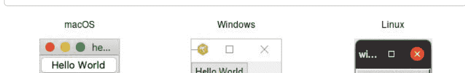

我们的第一个程序。在首次公开募股（IPO）之前还有一些工作要做。

## 4. 第一个（真正的）示例

解决了这个问题后，让我们尝试一个稍微更实质性的示例，这将让你初步了解一个真正的 Tk 程序背后的代码是什么样子的。

### 4.1. 设计

我们将创建一个简单的 GUI 工具，用于将英尺距离转换为等效的米距离。如果我们草绘一下，它可能看起来像这样：

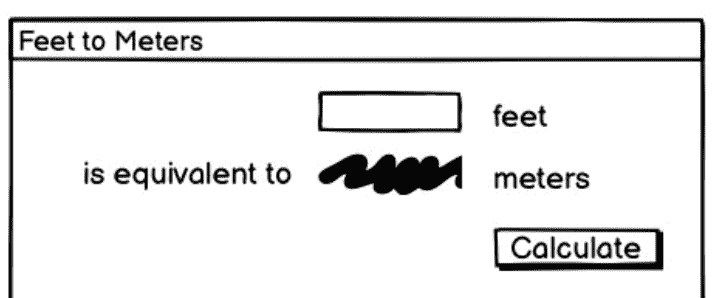

我们的英尺到米转换程序的草图。

所以看起来我们有一个短文本输入小部件，允许我们输入英尺数。一个“计算”按钮将从该输入中获取值，执行计算，并将结果放在输入下方的标签中。我们还有三个静态标签（“feet”、“is equivalent to”和“meters”），它们帮助用户理解如何使用该应用程序。

我们需要做的下一件事是查看布局。我们包含的小部件似乎自然地分成了一个三列三行的网格。在布局方面，事物似乎自然地分成了三列三行，如下图所示：

### 4.2. 代码

现在，这里是使用 Tkinter 创建这个完整应用程序所需的 Python 代码。

```python
from tkinter import *
from tkinter import ttk

def calculate(*args):
    try:
        value = float(feet.get())
        meters.set(int(0.3048 * value * 10000.0 + 0.5)/10000.0)
    except ValueError:
        pass

root = Tk()
root.title("Feet to Meters")

mainframe = ttk.Frame(root, padding="3 3 12 12")
mainframe.grid(column=0, row=0, sticky=(N, W, E, S))
root.columnconfigure(0, weight=1)
root.rowconfigure(0, weight=1)

feet = StringVar()
feet_entry = ttk.Entry(mainframe, width=7, textvariable=feet)
feet_entry.grid(column=2, row=1, sticky=(W, E))

meters = StringVar()
ttk.Label(mainframe, textvariable=meters).grid(column=2, row=2, sticky=(W, E))

ttk.Button(mainframe, text="Calculate", command=calculate).grid(column=3, row=3, sticky=W)

ttk.Label(mainframe, text="feet").grid(column=3, row=1, sticky=W)
ttk.Label(mainframe, text="is equivalent to").grid(column=1, row=2, sticky=E)
ttk.Label(mainframe, text="meters").grid(column=3, row=2, sticky=W)

for child in mainframe.winfo_children():
    child.grid_configure(padx=5, pady=5)

feet_entry.focus()
root.bind("<Return>", calculate)

root.mainloop()
```

[https://tkdocs.com/code/f2m.py](https://tkdocs.com/code/f2m.py)

以及生成的用户界面：

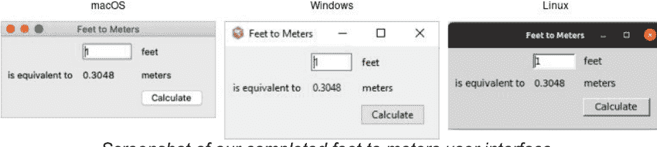

## 关于编码风格的说明

如你所知，较大的 Python 程序几乎总是被组织成对象、类、模块等。由于本书的重点是 Tk 和 Tkinter，我们将尽可能保持简单，通常使用非常直接和过程化的编码风格，而不是将大部分代码包装在函数或对象中。

## 4.3. 逐步解析

让我们更仔细地逐段查看那段代码。目前，我们只是试图对在 Tk 中创建用户界面需要做的事情类型，以及这些事情大致是什么样子有一个基本的了解。我们稍后会深入细节。

### 引入 Tk

我们的程序从引入 Tk 开始。

```python
from tkinter import *
from tkinter import ttk
```

这两行告诉 Python 我们的程序需要两个模块。第一个 `tkinter` 是 Tk 的标准绑定。导入时，它会加载你系统上的 Tk 库。第二个 `ttk` 是 `tkinter` 的一个子模块。它实现了 Python 对 Tk 8.5 中添加的较新的“主题化控件”的绑定。

> 注意，我们从 tkinter 模块导入了所有内容（*）。这样，我们就可以调用 tkinter 函数等，而无需在它们前面加上模块名前缀。这是标准的 Tkinter 实践。

然而，因为我们只导入了 `ttk` 本身，所以我们需要在该子模块中的任何内容前加上前缀。例如，调用 `Entry(...)` 将引用 `tkinter` 模块中的 `Entry` 类（经典控件）。我们需要 `ttk.Entry(...)` 来使用 `ttk` 中的 `Entry` 类（主题化控件）。

正如你将看到的，几个类在两个模块中都有定义。有时你需要这个或那个，具体取决于上下文。明确要求 `ttk` 前缀有助于这一点，并且将是本书中使用的风格。

> 如果你正在迁移 Python 2.x 代码，你会发现的第一件事是 Tkinter 模块的名称现在是小写的，即 `tkinter`，而不是 `Tkinter`。在 Python 2.x 中，`Ttk` 也是一个独立的模块，而不是 `Tkinter` 的子模块。

### 设置主应用程序窗口

接下来，以下代码设置主应用程序窗口，并将其标题设为“Feet to Meters”。

```python
root = Tk()
root.title("Feet to Meters")
```

> 是的，`calculate` 函数出现在此之前。我们将在下面描述它，但需要将其包含在开头附近，因为我们在程序的其他部分引用了它。

### 创建内容框架

接下来，我们创建一个框架控件，它将容纳我们用户界面的内容。

```python
mainframe = ttk.Frame(root, padding="3 3 12 12")
mainframe.grid(column=0, row=0, sticky=(N, W, E, S))
root.columnconfigure(0, weight=1)
root.rowconfigure(0, weight=1)
```

框架创建后，`grid` 将其直接放置在我们的主应用程序窗口内。`columnconfigure`/`rowconfigure` 部分告诉 Tk，如果窗口调整大小，框架应该扩展以填充任何额外的空间。

> 为什么我们要在主窗口内放置一个框架？严格来说，我们可以直接将界面中的其他控件放入主应用程序窗口，而不需要中间的内容框架。这是你在较旧的 Tk 程序中会看到的。

然而，主窗口本身不是较新的“主题化”控件的一部分。它的背景色与我们将放入其中的主题化控件不匹配。使用“主题化”框架控件来容纳内容可确保背景正确。下图说明了这一点。

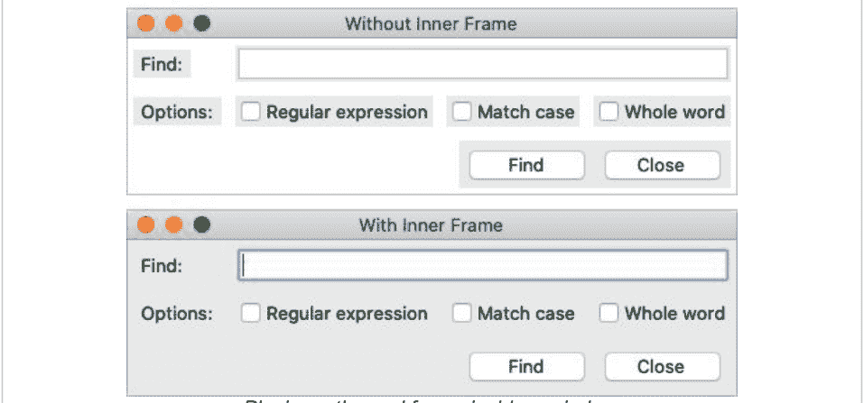

在窗口内放置一个主题化框架。

在 macOS 上，这个问题最为突出，你也可以通过其 `background` 配置选项将窗口的背景色设置为预定义颜色 `systemWindowHeaderBackground`。

### 创建输入框控件

我们将创建的第一个控件是输入框，我们可以在其中输入要转换的英尺数。

```python
feet = StringVar()
feet_entry = ttk.Entry(mainframe, width=7, textvariable=feet)
feet_entry.grid(column=2, row=1, sticky=(W, E))
```

我们需要做两件事：创建控件本身，然后将其放置在屏幕上。

创建控件时，我们需要指定其*父控件*，即该控件将被放置在其中的控件。在本例中，我们希望我们的输入框放置在内容框架内。我们的输入框以及我们稍后将创建的其他控件被称为内容框架的*子控件*。`parent` 始终是实例化控件对象时传递的第一个参数。

创建控件时，我们可以选择为其提供某些*配置选项*。在这里，我们指定了我们希望输入框显示的宽度，即 7 个字符。我们还为其分配了一个神秘的 `textvariable`；我们稍后会看到它的作用。

控件创建时，它们不会自动显示在屏幕上，因为 Tk 不知道你希望它们相对于其他控件如何放置。这就是 `grid` 部分的作用。还记得我们绘制应用程序时的布局网格吗？控件被放置在适当的列（1、2 或 3）和行（也是 1、2 或 3）中。

`grid` 的 `sticky` 选项描述了控件应如何在网格单元格内对齐，使用罗盘方向。因此 `w`（西）表示将控件锚定到单元格的左侧，`(W, E)`（西-东）表示将其附加到左右两侧，依此类推。

### 创建剩余控件

然后我们对剩余的控件做完全相同的事情。我们有一个标签，将显示我们计算出的米数结果。我们有一个“Calculate”按钮，按下它来执行计算。最后，我们有三个静态文本标签，以明确如何使用该应用程序。对于每个控件，我们首先创建它，然后将其放置在网格中适当的单元格中。

```python
meters = StringVar()
ttk.Label(mainframe, textvariable=meters).grid(column=2,
    row=2, sticky=(W, E))

ttk.Button(mainframe, text="Calculate",
    command=calculate).grid(column=3, row=3, sticky=W)

ttk.Label(mainframe, text="feet").grid(column=3, row=1,
    sticky=W)
ttk.Label(mainframe, text="is equivalent to").grid(column=1,
    row=2, sticky=E)
ttk.Label(mainframe, text="meters").grid(column=3, row=2,
    sticky=W)
```

### 添加一些修饰

然后我们对用户界面进行一些最后的修饰。

```python
for child in mainframe.winfo_children():
    child.grid_configure(padx=5, pady=5)

feet_entry.focus()
root.bind("<Return>", calculate)
```

第一部分遍历内容框架中包含的所有控件，并在每个控件周围添加一点内边距，这样它们就不会挤在一起。（我们本可以在最初将控件放在屏幕上时将这些选项添加到每个 `grid` 调用中，但这是一个很好的捷径。）

第二部分告诉 Tk 将焦点放在我们的输入框控件上。这样，光标将从该字段开始，因此用户无需在开始键入之前单击它。

第三行告诉 Tk，如果用户按下回车键（Windows 上的 Enter 键），它应该调用我们的计算例程，就像他们按下 Calculate 按钮一样。

### 执行计算

说到这个，这里我们定义了我们的计算过程。当用户按下 Calculate 按钮或按回车键时调用它。它执行英尺到米的计算。

```python
def calculate(*args):
    try:
        value = float(feet.get())
        meters.set(int(0.3048 * value * 10000.0 + 0.5)/10000.0)
    except ValueError:
        pass
```

正如你清楚地看到的，这个例程从我们的输入框控件中获取英尺数，进行计算，并将结果放入我们的标签控件中。

什么？看起来我们并没有对这些控件做任何事情！这就是我们在创建控件时指定的神奇的 `textvariable` 选项发挥作用的地方。我们指定了全局变量 `feet` 作为输入框的 textvariable，这意味着每当输入框发生变化时，Tk 将*自动*更新全局变量 `feet`。同样，如果我们显式更改与控件关联的 textvariable 的值（就像我们对 `meters` 所做的那样，（与我们的标签关联后），控件将自动更新为变量的当前内容。唯一的注意事项是这些变量必须是 `StringVar` 类的实例。这很巧妙。

> 乘以和除以 10000.0 是为了避免浮点数运算固有的舍入问题。一个简单的计算，例如 `0.3048*1.5`，可能会得到像 `0.45720000000000005` 这样的数字，这在显示时既不正确也不美观。你也可以使用 Python 内置的 `round()` 函数。

## 启动事件循环

最后，我们需要告诉 Tk 进入其事件循环，这是所有内容显示在屏幕上并允许用户与之交互所必需的。

```
root.mainloop()
```

## 4.4. 缺少了什么

我们现在已经了解了如何创建控件、将它们显示在屏幕上以及响应用户与它们的交互。它当然不花哨，可能还需要一些错误检查，但它是一个功能齐全的 GUI 应用程序。

同样值得审视的是，为了让它工作，我们*没有*必须在 Tk 程序中包含什么。例如：

- 我们不必担心随着内容变化而重绘屏幕
- 我们不必担心解析和分派事件、命中检测或处理每个控件上的事件
- 我们在创建控件时不必提供很多选项；默认值似乎处理了大多数事情，所以我们只需要更改按钮显示的文本之类的内容
- 我们不必编写复杂的代码来获取和设置简单控件的值；我们只需将它们附加到变量上
- 我们不必担心用户关闭窗口或调整窗口大小时会发生什么
- 我们不需要编写额外的代码来使这一切跨平台工作

## 还有一件事...

由于本书强调 Tkinter，我们的示例使用独立的脚本代码、全局变量和简单函数。在实践中，你可能会将任何超出最简单脚本的内容组织到函数或类中。有不同的方法可以做到这一点：使用模块、为用户界面的不同部分创建类、从 Tkinter 类继承等。

不过，通常情况下，你只是想做一些简单的事情来封装你的数据，而不是将所有内容放入全局变量空间。这是英尺到米的示例，重写为将主代码封装到一个类中。注意在回调（在全局作用域执行）和 `StringVar` 上使用 `self`。

```python
from tkinter import *
from tkinter import ttk

class FeetToMeters:

    def __init__(self, root):

        root.title("Feet to Meters")

        mainframe = ttk.Frame(root, padding="3 3 12 12")
        mainframe.grid(column=0, row=0, sticky=(N, W, E, S))
        root.columnconfigure(0, weight=1)
        root.rowconfigure(0, weight=1)

        self.feet = StringVar()
        feet_entry = ttk.Entry(mainframe, width=7,
                               textvariable=self.feet)
        feet_entry.grid(column=2, row=1, sticky=(W, E))
        self.meters = StringVar()

        ttk.Label(mainframe,
                  textvariable=self.meters).grid(column=2, row=2,
                                                 sticky=(W, E))
        ttk.Button(mainframe, text="Calculate",
                   command=self.calculate).grid(column=3, row=3,
                                                sticky=W)

        ttk.Label(mainframe, text="feet").grid(column=3,
                                                row=1, sticky=W)
        ttk.Label(mainframe, text="is equivalent").grid(column=1,
                                                        row=2, sticky=E)
        ttk.Label(mainframe, text="meters").grid(column=3,
                                                  row=2, sticky=W)

        for child in mainframe.winfo_children():
            child.grid_configure(padx=5, pady=5)

        feet_entry.focus()
        root.bind("<Return>", self.calculate)

    def calculate(self, *args):
        try:
            value = float(self.feet.get())
            self.meters.set(int(0.3048 * value * 10000.0 +
                                0.5)/10000.0)
        except ValueError:
            pass

root = Tk()
FeetToMeters(root)
root.mainloop()
```

https://tkdocs.com/code/f2mo.py

## 5. Tk 概念

在完成第一个示例之后，你现在对 Tk 程序的样子以及使其工作所需的代码类型有了基本的了解。在本章中，我们将退后一步，看看理解 Tk 所需的三个广泛概念：控件、几何管理和事件处理。

### 5.1. 控件

控件是你在屏幕上看到的所有东西。在我们的示例中，我们有一个按钮、一个输入框、几个标签和一个框架。其他控件包括复选框、树视图、滚动条、文本区域等。控件通常被称为“控件”。你有时也会看到它们被称为“窗口”，特别是在 Tk 的文档中。这是其 X11 根源的遗留（在该术语下，你的顶层应用程序窗口和按钮之类的东西都会被称为窗口）。

这里有一个示例，展示了一些 Tk 控件，我们稍后将逐一介绍。

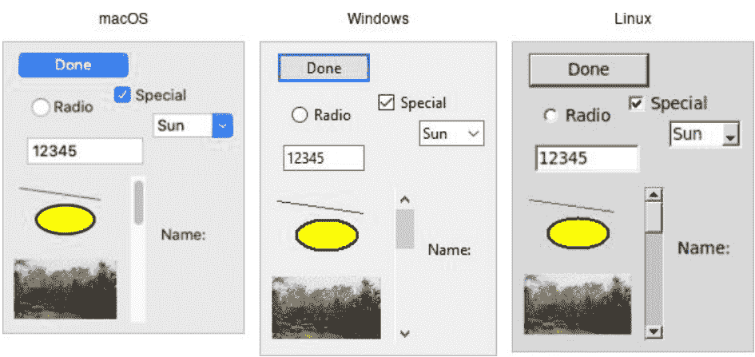

### 控件类

控件是对象，是代表按钮、框架等的类的实例。当你想创建一个控件时，你需要做的第一件事是确定你想要实例化的控件的具体类。本书将对此有所帮助。

### 控件层次结构

除了控件类，你还需要另一条信息来创建它：它的*父控件*。控件不会漂浮在空间中。相反，它们被包含在其他东西中，比如一个窗口。在 Tk 中，所有控件都是*控件（或窗口）层次结构*的一部分，层次结构顶部有一个单一的根。

在我们的公制转换示例中，我们有一个作为根窗口子控件创建的框架，该框架将所有其他控件作为其子控件。根窗口是框架的*容器*，因此是框架的*父控件*。该示例的完整层次结构如下所示：

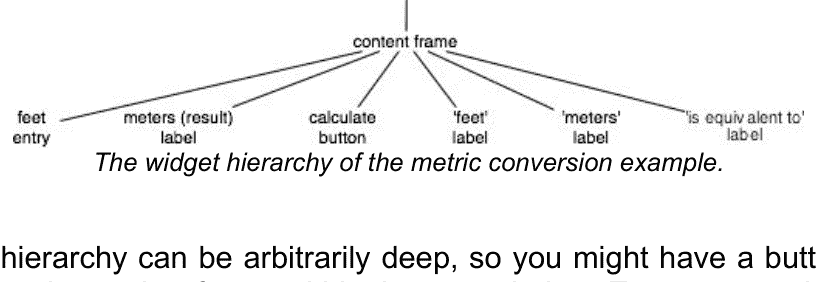

这个层次结构可以任意深，所以你可能有一个按钮在一个框架内，而这个框架又在根窗口内的另一个框架内。即使你应用程序中的一个新窗口（通常称为*顶层窗口*）也是同一层次结构的一部分。该窗口及其所有内容构成了整个控件层次结构的一个子树。

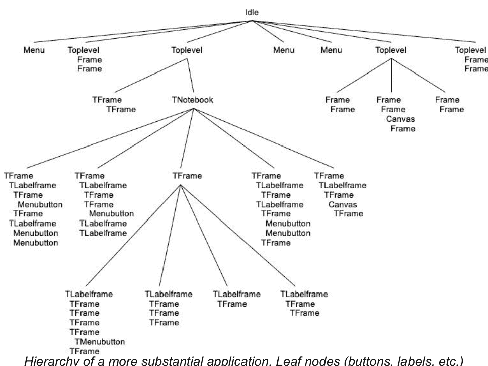

### 创建控件

每个单独的控件都是一个 Python 对象。在实例化控件时，你必须将其父控件作为参数传递给控件类。*唯一*的例外是“根”窗口，它是将包含所有其他内容的顶层窗口。当你实例化 `Tk` 时，它会自动创建。它没有父控件。例如：

```python
root = Tk()
content = ttk.Frame(root)
button = ttk.Button(content)
```

是否将控件对象保存在变量中完全取决于你，取决于你以后是否需要引用它。因为该对象被插入到控件层次结构中，即使你不保留自己的引用，它也不会被垃圾回收。

> 如果你偷偷看看 Tcl 如何管理控件，你会看到每个控件都有一个特定的路径名；你也会在 Tk 参考文档中看到这个路径名。Tkinter 在幕后为你选择和管理所有这些路径名，所以你永远不必担心它们。如果你确实需要，可以通过调用 `str(widget)` 从控件获取路径名。

### 配置选项

所有控件都有几个*配置选项*。这些选项控制控件的显示方式或行为方式。

当然，控件的可用选项取决于控件类。不同的控件类之间有很多一致性，因此功能大致相同的选项往往被命名为相同的名称。例如，按钮和标签都有一个 `text` 选项来调整控件显示的文本，而滚动条则没有 `text` 选项，因为不需要。同样，按钮有一个 `command` 选项来告诉它按下时要做什么，而只包含静态文本的标签则没有。

配置选项可以在控件首次创建时通过指定其名称和值作为可选参数来设置。之后，你可以检索这些选项的当前值，并且除了极少数例外，可以随时更改它们。

如果你不确定控件支持哪些配置选项，你可以要求控件描述它们。这会给你一个包含其所有选项的长列表。

这最好通过以下与解释器的交互对话来说明。

```python
>>> from tkinter import *
>>> from tkinter import ttk
>>> root = Tk()
>>> button = ttk.Button(root, text="Hello",
    command="buttonpressed")
>>> button.grid()
>>> button['text']
'Hello'
```

button['text'] = 'goodbye'
另一种实现相同功能的方式：
button.configure(text='goodbye')
检查 text 选项的当前值：
button['text']
'goodbye'
获取关于 text 选项的所有信息：
button.configure('text')
('text', 'text', 'Text', '', 'goodbye')
获取此控件所有选项的信息：
button.configure()
{'cursor': ('cursor', 'cursor', 'Cursor', '', ''), 'style':
('style', 'style', 'Style', '', ''),
'default': ('default', 'default', 'Default', <index object at
0x00DFFD10>, <index object at 0x00DFFD10>),
'text': ('text', 'text', 'Text', '', 'goodbye'), 'image':
('image', 'image', 'Image', '', ''),
'class': ('class', '', '', '', ''), 'padding': ('padding',
'padding', 'Pad', '', ''),
'width': ('width', 'width', 'Width', '', ''),
'state': ('state', 'state', 'State', <index object at
0x0167FA20>, <index object at 0x0167FA20>),
'command': ('command', 'command', 'Command', '',
'buttonpressed'),
'textvariable': ('textvariable', 'textVariable', 'Variable',
'', ''),
'compound': ('compound', 'compound', 'Compound', <index object
at 0x0167FA08>, <index object at 0x0167FA08>),
'underline': ('underline', 'underline', 'Underline', -1, -1),
'takefocus': ('takefocus', 'takeFocus', 'TakeFocus', '',
'ttk::takefocus')}

如你所见，对于每个选项，Tk 会显示该选项的名称及其当前值（以及另外三个你通常无需关心的属性）。

> 好吧，如果你真的想知道，以下是为每个配置选项提供的五项数据的详细信息。最有用的是第一项（选项的名称）和第五项（选项的当前值）。第四项是选项的默认值，换句话说，就是如果你没有更改它时它会具有的值。另外两项与所谓的选项数据库有关。我们将在讨论菜单时提及它，但这在现代应用程序中并不常用。第二项是数据库中选项的名称，第三项是其类别。

## 控件自省

Tk 暴露了关于每个控件的大量信息，你的应用程序可以利用这些信息。其中大部分可以通过 `winfo` 工具获取；有关完整详情，请参阅 [winfo](https://tkdocs.com/man/winfo) 命令参考。

这个简短的示例遍历控件层次结构，使用每个控件的 `winfo_children` 方法来识别需要检查的任何子控件。对于每个控件，我们打印一些基本信息，包括其类别（button、frame 等）、宽度和高度，以及相对于其父控件的位置。

```
def print_hierarchy(w, depth=0):
    print(' '*depth + w.winfo_class() + ' w=' +
str(w.winfo_width()) + ' h=' + str(w.winfo_height()) + ' x=' +
str(w.winfo_x()) + ' y=' + str(w.winfo_y()))
    for i in w.winfo_children():
        print_hierarchy(i, depth+1)
print_hierarchy(root)
```

以下是一些最有用的方法：

- `winfo_class`：标识控件类型的类别，例如主题按钮的 `TButton`
- `winfo_children`：作为层次结构中某个控件直接子控件的控件列表
- `winfo_parent`：控件在层次结构中的父控件
- `winfo_toplevel`：包含此控件的顶层窗口
- `winfo_width`、`winfo_height`：控件的当前宽度和高度；在显示在屏幕上之前不准确
- `winfo_reqwidth`、`winfo_reqheight`：控件向几何管理器请求的宽度和高度（稍后详述）
- `winfo_x`、`winfo_y`：控件左上角相对于其父控件的位置
- `winfo_rootx`、`winfo_rooty`：控件左上角相对于整个屏幕的位置
- `winfo_vieweable`：控件是显示还是隐藏（其层次结构中的所有祖先都必须可查看，它才可查看）

### 5.2. 几何管理

如果你一直在交互式地运行代码，你可能已经注意到，仅仅创建控件并不会让它们出现在屏幕上。将控件放置在屏幕上，以及精确地*放置*它们的位置，是一个单独的步骤，称为*几何管理*。

在我们的示例中，定位每个控件是通过 `grid` 命令完成的。我们指定了每个控件要放置的列和行，以及网格内的对齐方式等。Grid 是*几何管理器*的一个例子（Tk 中有几种几何管理器，grid 是最有用的）。目前，我们将总体介绍几何管理；我们将在后面的章节中讨论 grid。

几何管理器的工作是精确地确定这些控件将被放置在哪里。这被证明是一个复杂的优化问题，一个好的几何管理器依赖于相当复杂的算法。一个好的几何管理器提供了灵活性、强大功能和易用性，让程序员感到满意。它还使得创建美观的用户界面布局变得容易，而无需费尽周折。毫无疑问，Tk 的 `grid` 是绝对最好的之一。一个糟糕的几何管理器……嗯，所有经历过 "GridBagLayout" 折磨的 Java 程序员请举手。

> 我们将在后面的章节中更详细地介绍，但 `grid` 是在 Tk 流行几年后才引入的。在此之前，一个名为 `pack` 的较旧几何管理器最常用。它功能非常强大，但使用起来要困难得多，并且使得创建在今天看起来吸引人的布局极其困难。不幸的是，许多现有的 Tk 示例代码和文档使用 `pack` 而不是 `grid`（这是判断其时效性的一个好线索）。`pack` 的广泛使用是许多 Tk 用户界面看起来糟糕的一个主要原因。新代码请使用 `grid`，并在可能时升级旧代码。

### 问题

几何管理器面临的问题是：获取程序创建的所有不同控件，加上程序关于每个控件在窗口中位置的指令（显式地，或者更常见地，相对于其他控件），然后实际地将它们定位在窗口中。
在此过程中，几何管理器必须平衡多种约束。考虑以下情况：

- 控件可能有一个*自然*大小，例如，标签的自然宽度取决于它显示的文本和用于显示的字体。如果包含所有这些不同控件的应用程序窗口不够大，无法容纳它们怎么办？几何管理器必须决定缩小哪些控件以适应，缩小多少等。
- 如果应用程序窗口大于所有控件的自然大小，额外的空间如何使用？额外的空间是放在每个控件之间吗？如果是，这些空间如何分配？它是用来使某些控件比它们通常想要的更大吗，例如文本输入框增长以填充更宽的窗口？哪些控件应该增长？
- 如果应用程序窗口被调整大小，其内部每个控件的大小和位置如何变化？某些区域（例如文本输入区域）会扩展或收缩，而其他部分保持大小不变，还是该区域以不同方式分配？某些控件是否有你希望避免低于的最小尺寸？最大尺寸？窗口本身是否有最小或最大尺寸？
- 如何将用户界面不同部分的控件相互对齐？它们之间应该留出多少空间？这对于呈现整洁的布局并遵守特定于平台的用户界面指南是必需的。
- 对于复杂的用户界面，可能有许多框架嵌套在其他框架中，再嵌套在窗口中（等等），如何完成上述所有操作，权衡整个用户界面不同部分的冲突需求？

### 工作原理

Tk 中的几何管理依赖于*主*控件和*从*控件的概念。主控件是一个控件，通常是一个顶层应用程序窗口或一个框架，它包含其他控件，称为从控件。你可以认为几何管理器控制主控件，并决定所有从控件将如何在其中显示。

> 计算界已经接受了更广泛的社会趋势，即更加多元化、敏感，并意识到语言的影响。认识到这一点，Tk 核心将慢慢采用更具包容性的术语集。例如，在适当的地方，将优先使用“父”和“子”而不是“主”和“从”。为了保持向后兼容性，当前术语不会消失。这是未来需要注意的事情。更多详情，请参阅 [TIP #581](https://tip.tcl.tk/581)。

你的程序告诉几何管理器在主控件中管理哪些从控件，即通过调用 `grid`。你的程序还提供关于它希望每个从控件如何显示的提示，例如通过 `column` 和 `row` 选项。你还可以向几何管理器提供其他内容。例如，我们使用了 `columnconfigure` 和 `rowconfigure` 来指示如果窗口中有额外空间可用，我们希望扩展哪些列和行。值得注意的是，所有这些参数和提示都是特定于 `grid` 的；其他几何管理器会使用不同的参数。

几何管理器获取关于主控件中从控件的所有信息，以及关于主控件大小的信息。然后它询问每个从控件其自然大小，即它理想情况下希望显示的大小。几何管理器的内部算法计算分配给每个从控件的区域（如果有的话！）。然后从控件负责在该特定矩形内渲染自身。当然，任何时候主控件的大小发生变化（例如，因为顶层窗口被调整大小），从控件的自然大小发生变化（例如，因为我们更改了标签中的文本），或者任何几何管理器参数发生变化（例如，像 `row`、`column` 或 `sticky`），我们都会重复整个过程。

这一切也是递归工作的。在我们的示例中，我们在顶层应用程序窗口内有一个内容框架，然后在内容框架内还有几个其他控件。因此，我们必须管理两个不同主控件的几何结构。在外层，顶层窗口是主控方，内容框架是其从属方。在内部层级，内容框架是主控方，其他每个控件都是从属方。请注意，同一个控件（例如内容框架）既可以是主控方，也可以是从属方！正如我们之前所见，这种控件层级结构可以嵌套得更深。

> 虽然每个主控方只能由一个几何管理器（例如 `grid`）管理，但不同的主控方可以使用不同的几何管理器。虽然 `grid` 在大多数情况下是正确的选择，但对于用户界面中某个特定部分使用的布局，其他管理器可能更合适。其他 Tk 几何管理器包括我们之前提到的 `pack`，以及将所有布局决策完全交由你决定的 `place`。一些复杂的控件，如 `canvas` 和 `text`，允许你嵌入其他控件，使它们成为事实上的几何管理器。

最后，我们一直假设从属控件是其主控方在控件层级中的直接子控件。虽然通常情况如此，且大多数时候没有充分理由不这样做，但（在某些限制下）也有可能绕过这一点。

### 5.3. 事件处理

Tk 与大多数其他用户界面工具包一样，运行一个从操作系统接收事件的*事件循环*。这些事件包括按钮点击、按键、鼠标移动、窗口大小调整等等。

通常，Tk 会为你管理这个事件循环。它会确定事件适用于哪个控件（用户是否点击了这个按钮？如果按下了键，哪个文本框拥有焦点？），并相应地进行分发。各个控件知道如何响应事件；例如，当鼠标移到按钮上时，按钮可能会变色，当鼠标离开时又会恢复原状。

> 💡 *在事件驱动的应用程序中，事件循环不能被阻塞，这一点至关重要。事件循环应持续运行，通常每秒执行数十个步骤。在每个步骤中，它都会处理一个事件。如果你的程序正在执行一个长时间的操作，它可能会阻塞事件循环。在这种情况下，将不会处理任何事件，不会进行任何绘制，你的应用程序看起来就像冻结了一样。有许多方法可以避免这种情况发生，主要与你的应用程序结构有关。我们将在后面的章节中更详细地讨论这一点。*

### 命令回调

你通常希望你的程序以特定方式处理某些事件，例如，当按钮被按下时执行某些操作。对于那些最常被定制的事件（如果按下按钮时什么都不会发生，那按钮有什么用？），控件将允许你将*回调*指定为控件配置选项。我们在按钮的 `command` 选项示例中看到了这一点。

```
def calculate(*args):
    ...

ttk.Button(mainframe, text="Calculate", command=calculate)
```

Tk 中的回调往往比使用编译语言的用户界面工具包中的回调更简单（在那些工具包中，回调必须是一个具有特定参数集的过程或具有特定签名的对象方法）。相反，回调只是解释器执行的一段普通代码。虽然它可以像你想要的那样复杂，但大多数时候，你只需要你的回调调用其他某个过程。

### 绑定到事件

对于那些没有与控件特定命令回调相关联的事件，你可以使用 Tk 的 `bind` 来捕获任何事件，然后（就像回调一样）执行任意一段代码。
下面是一个（有点傻的）示例，展示了一个标签如何响应不同的事件。当事件发生时，标签中会显示事件的描述。

```
from tkinter import *
from tkinter import ttk
root = Tk()
l = ttk.Label(root, text="Starting...")
l.grid()
l.bind('<Enter>', lambda e: l.configure(text='Moved mouse inside'))
l.bind('<Leave>', lambda e: l.configure(text='Moved mouse outside'))
l.bind('<ButtonPress-1>', lambda e: l.configure(text='Clicked left mouse button'))
l.bind('<3>', lambda e: l.configure(text='Clicked right mouse button'))
l.bind('<Double-1>', lambda e: l.configure(text='Double clicked'))
l.bind('<B3-Motion>', lambda e: l.configure(text='right button drag to %d,%d' % (e.x, e.y)))
root.mainloop()
```

[https://tkdocs.com/code/bindings.py](https://tkdocs.com/code/bindings.py)

前两个绑定非常直接，只是监视简单的事件。`<Enter>` 事件表示鼠标已移到控件上方，而 `<Leave>` 事件在鼠标移出控件到另一个控件时生成。

下一个绑定寻找鼠标点击，具体是 `<ButtonPress-1>` 事件。这里，`<ButtonPress>` 是实际事件，但 `-1` 是一个*事件细节*，指定鼠标上的左键（主键）。绑定仅在涉及主鼠标按钮的 `<ButtonPress>` 事件生成时触发。如果点击了另一个鼠标按钮，此绑定将忽略它。

下一个绑定寻找 `<3>` 事件。这实际上是 `<ButtonPress-3>` 的简写。它将响应点击右鼠标按钮时生成的事件。下一个绑定 `<Double-1>`（`<Double-ButtonPress-1>` 的简写）添加了另一个修饰符 `Double`，因此将响应左鼠标按钮的双击。

最后一个绑定也使用了一个修饰符：捕获鼠标移动（`Motion`），但仅在按住右鼠标按钮（`B3`）时。此绑定还展示了如何使用*事件参数*的示例。许多事件，如鼠标点击或移动，携带额外信息，如鼠标当前位置。Tk 通过使用*百分比替换*在 Tcl 回调脚本中提供对这些参数的访问。这些百分比替换允许你捕获它们，以便在脚本中使用。

Tkinter 抽象了这些百分比替换，而是将所有事件参数封装在一个*事件对象*中。在上面，我们使用了 `x` 和 `y` 字段来检索鼠标位置。我们稍后将在另一个上下文（输入控件验证）中看到百分比替换的使用。

> `lambda` 表达式是怎么回事？Tkinter 期望你提供一个函数作为事件回调，其第一个参数是一个表示触发回调的事件的事件对象。有时，为了一次性的简单回调（如本例所示）而定义常规命名函数不值得麻烦。相反，我们只是通过 `lambda` 使用了 Python 的匿名函数。在实际应用中，你几乎总是会使用常规函数，例如我们英尺转米示例中的 `calculate` 函数，或对象的方法。

### 事件的多重绑定

我们刚刚看到了如何为单个控件设置事件绑定。当该控件接收到匹配的事件时，绑定将触发。但这并不是你能做的全部。
你的绑定不仅可以捕获单个事件，还可以捕获一个短事件序列。`<Double-1>` 绑定在短时间内发生两次鼠标点击时触发。你可以做同样的事情来捕获连续按下的两个键，例如 `<KeyPress-A><KeyPress-B>` 或简写为 `<ab>`。
你也可以在顶层窗口上设置事件绑定。当该窗口中任何位置发生匹配事件时，绑定将被触发。在我们的示例中，我们在主应用程序顶层窗口上为 Return 键设置了一个绑定。如果当顶层窗口中的任何控件拥有焦点时按下了 Return 键，该绑定就会触发。
较少见的是，你可以创建在应用程序中任何位置发生匹配事件时触发的事件绑定，甚至对于给定类别的任何控件接收到的事件，例如所有按钮。

> 一个事件可以触发多个绑定。这使得事件处理程序简洁且作用域有限，意味着更模块化的代码。例如，Tk 中每个控件类的行为本身是通过脚本级事件绑定定义的。这些与你的应用程序中的事件绑定是分开的。事件绑定也可以更改或删除。它们可以被修改以改变某个类别的控件或应用程序某些部分的事件处理。你可以重新排序、扩展或更改每个控件将触发的事件绑定序列；如果你好奇，可以参阅 `bindtags` 命令参考。
https://tkdocs.com/man/bindtags

### 可用事件

最常用的事件描述如下，以及它们生成的情况。有些事件在某些平台上生成，而在其他平台上不生成。要获取所有不同事件名称、修饰符以及每个事件可用的不同事件参数的完整描述，最好的地方是查阅 `bind` 命令参考。

## 6. 基础控件

本章介绍在几乎所有用户界面中都能找到的基础 Tk 控件：框架、标签、按钮、复选按钮、单选按钮、输入框和组合框。学完本章，你将掌握如何使用构建典型表单类用户界面所需的所有控件。

你会发现按顺序阅读本章（以及后续讨论更多控件的章节）最为轻松。因为许多控件之间存在大量共通之处，我们会在描述某个控件时引入一些概念，这些概念同样适用于后续介绍的控件。为了避免重复讲解，我们会回溯到概念首次引入的地方。

在介绍每个控件时，我们会注明用于创建该控件的 Tkinter 类及其 [Tk 参考手册页面](https://www.tcl.tk/man/tcl8.6/TkCmd/contents.htm)。尽管该参考文档描述的是 Tk 的 Tcl 接口，但它却是对每个 Tk 控件最准确、最完整的描述。Python 的 Tkinter 模块内部直接依赖于这个 Tcl 接口。需要提醒的是，本书重点介绍 Tk *最有用的部分* 以及如何使用它们构建高效的现代用户界面。而参考文档则详细说明了 Tk 中*所有*可用的功能，其目的截然不同。

## 6.1. 框架 (Frame)

ttk.Frame
https://tkdocs.com/man/ttk_frame

**框架** 是一个显示为简单矩形的控件。框架有助于组织你的用户界面，通常在视觉和代码层面都起到组织作用。框架通常作为几何管理器（如 `grid`）的主控件，管理包含在其中的子控件。

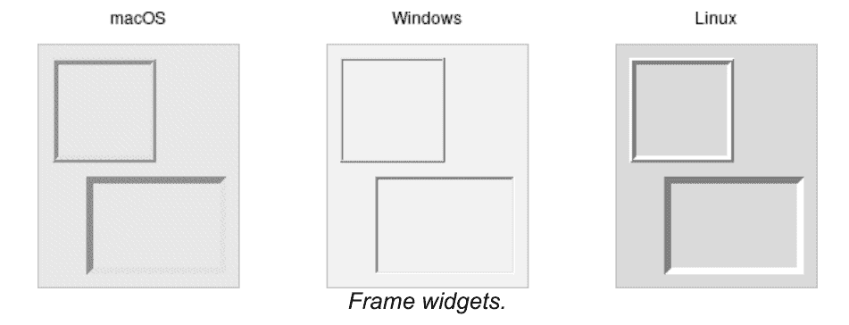

框架使用 `ttk.Frame` 类创建：

```python
frame = ttk.Frame(parent)
```

框架可以接受多种不同的配置选项，这些选项可以改变它们的显示方式。

### 请求尺寸

通常，框架的大小由其内部控件的大小和布局决定。而这又由管理框架内容的几何管理器控制。

如果出于某种原因，你想要一个不包含其他控件的空框架，你可以使用 `width` 和/或 `height` 配置选项显式设置其大小（否则，你最终会得到一个非常小的框架）。

屏幕距离（如宽度和高度）通常以屏幕上的像素数指定。你也可以通过几种后缀之一来指定。例如，`350` 表示 350 像素，`350c` 表示 350 厘米，`350m` 表示 350 毫米，`350i` 表示 350 英寸，`350p` 表示 350 打印点（1/72 英寸）。

> 请记住，如果你请求一个框架（或任何控件）具有给定的大小，几何管理器拥有最终决定权。如果显示效果不符合预期，请务必检查几何管理器的设置。

### 内边距 (Padding)

`padding` 配置选项用于请求控件内部周围的额外空间。如果你在框架内放置其他控件，四周会有一点边距。你可以为所有边指定相同的内边距，为水平和垂直方向指定不同的内边距，或者为每一边单独指定内边距。

```python
f['padding'] = 5              # 所有边均为 5 像素
f['padding'] = (5,10)          # 左右 5，上下 10
f['padding'] = (5,7,10,12)     # 左：5，上：7，右：10，下：12
```

### 边框 (Borders)

你可以为框架控件显示边框，以在视觉上将其与周围环境分隔开。你经常会看到它被用来使用户界面的某一部分看起来凹陷或凸起。为此，你需要设置 `borderwidth` 配置选项（默认为 0，即无边框）和 `relief` 选项，后者指定边框的视觉外观。可以是以下之一：`flat`（默认）、`raised`、`sunken`、`solid`、`ridge` 或 `groove`。

```python
frame['borderwidth'] = 2
frame['relief'] = 'sunken'
```

### 更改样式

框架有一个 `style` 配置选项，这是所有主题控件共有的。这让你可以控制它们外观或行为的许多其他方面。这有点高级，所以我们现在不会详细讨论。但这里有一个快速示例，创建一个红色背景、凸起边框的“危险”框架。

```python
s = ttk.Style()
s.configure('Danger.TFrame', background='red', borderwidth=5,
relief='raised')
ttk.Frame(root, width=200, height=200,
style='Danger.TFrame').grid()
```

> 控件的哪些元素可以通过样式更改，因控件和平台而异。在 Windows 和 Linux 上，它会按预期工作。在当前的 macOS 上，框架将具有红色的凸起边框，但背景将保持默认的灰色。关于原因，我们将在后面的章节中详细说明。

> 样式标志着与“经典” Tk 控件中更改控件视觉外观大多数方面的巨大差异。在经典 Tk 中，你可以提供广泛的选项来精细控制单个控件行为的各个方面，例如前景色、背景色、字体、高亮厚度、选中的前景色和内边距。使用新的主题控件时，这些更改是通过修改样式来完成的，而不是为每个控件添加选项。

因此，你在某些经典控件中可能熟悉的许多选项，在其主题版本中并不存在。然而，过度使用此类选项是破坏 Tk 应用程序外观的一个关键因素，尤其是在跨平台使用时。从经典控件过渡到主题控件，为审查和完善如何（以及是否！）进行此类外观更改提供了绝佳时机。

---

<Activate>:
    窗口已变为活动状态。
<Deactivate>:
    窗口已被停用。
<MouseWheel>:
    鼠标滚轮已移动。
<KeyPress>:
    键盘上的键已被按下。
<KeyRelease>:
    键已被释放。
<ButtonPress>:
    鼠标按钮已被按下。
<ButtonRelease>:
    鼠标按钮已被释放。
<Motion>:
    鼠标已移动。
<Configure>:
    控件的大小或位置已改变。
<Destroy>:
    控件正在被销毁。
<FocusIn>:
    控件已获得键盘焦点。
<FocusOut>:
    控件已失去键盘焦点。
<Enter>:
    鼠标指针进入控件。
<Leave>:
    鼠标指针离开控件。

鼠标事件的事件详情是被按下的按钮，例如 1、2 或 3。对于键盘事件，它是特定的键，例如 A、9、空格、加号、逗号、等号。完整列表可在 keysyms 命令参考中找到。

https://tkdocs.com/man/keysyms

事件修饰符包括，例如 B1 或 Button1 表示按住主鼠标按钮，Double 或 Triple 表示相同事件的序列。键盘修饰符（当键盘上的键被按住时）包括 `Control`、`Shift`、`Alt`、`Option` 和 `Command`。

## 虚拟事件

到目前为止我们看到的事件都是低级操作系统事件，如鼠标点击和窗口调整大小。许多控件还会生成更高级别或语义化的事件，称为*虚拟事件*。这些事件用双尖括号括起来表示，例如 `<<foo>>`。

例如，列表框控件在其选择发生变化时会生成 `<<ListboxSelect>>` 虚拟事件。无论是用户点击项目、使用箭头键移动到项目，还是其他方式，都会生成相同的虚拟事件。虚拟事件避免了为捕获常见更改而设置多个可能特定于平台的事件绑定的问题。控件可用的虚拟事件将在控件类的文档中列出。

Tk 还为在不同平台上以不同方式触发的常见操作定义了虚拟事件。这些包括 `<<Cut>>`、`<<Copy>>` 和 `<<Paste>>`。

你可以定义自己的虚拟事件，这些事件可以特定于你的应用程序。这是一种有用的方式，可以将特定于平台的细节隔离在单个模块中，同时在整个应用程序中使用虚拟事件。你自己的代码可以生成与 Tk 生成的虚拟事件工作方式完全相同的虚拟事件。

```python
root.event_generate("<<MyOwnEvent>>")
```

## 6.2. 标签

`ttk.Label`
https://tkdocs.com/man/ttk_label

**标签**是一种用于显示文本或图像的控件，通常用户只会查看而不会与之交互。标签用于标识控件或用户界面的其他部分、提供文本反馈或结果等。

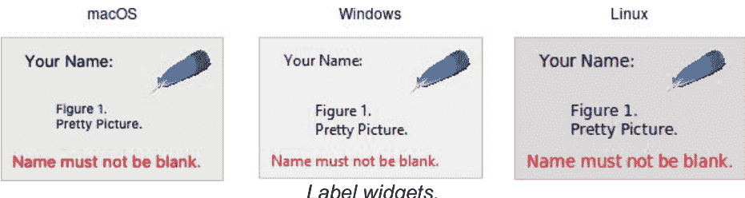

标签使用 `ttk.Label` 类创建。通常，标签将显示的文本或图像会在创建时通过配置选项指定：

```
label = ttk.Label(parent, text='Full name:')
```

与框架类似，标签可以接受多种不同的配置选项，这些选项可以改变其显示方式。

## 显示文本

`text` 配置选项（在创建标签时如上所示）是最常用的，特别是当标签纯粹是装饰性或解释性的时候。你可以通过修改此配置选项来更改显示的文本。这可以在任何时候完成，而不仅仅是在首次创建标签时。

你还可以让控件监视脚本中的一个变量。每当该变量发生变化时，标签就会显示该变量的新值。这通过 `textvariable` 选项实现：

```
resultsContents = StringVar()
label['textvariable'] = resultsContents
resultsContents.set('New value to display')
```

Tkinter 只允许你将控件附加到 `StringVar` 类的实例，而不是任意的 Python 变量。此类包含所有用于监视更改并在变量和 Tk 之间来回通信的逻辑。使用 `get` 和 `set` 方法来读取或写入变量的当前值。

## 显示图像

标签也可以显示图像而不是文本。如果你只想在用户界面中显示图像，这通常是实现方式。我们将在后面的章节中更详细地介绍图像，但现在，假设你想显示存储在磁盘文件中的 GIF 图像。这是一个两步过程。首先，你将创建一个图像“对象”。然后，你可以通过其 `image` 配置选项告诉标签使用该对象：

```
image = PhotoImage(file='myimage.gif')
label['image'] = image
```

标签也可以同时显示图像和文本。你经常会在工具栏按钮中看到这种用法。为此，请使用 `compound` 配置选项。默认值为 `none`，表示如果存在图像则仅显示图像；如果没有图像，则显示由 `text` 或 `textvariable` 选项指定的文本。`compound` 选项的其他可能值包括：`text`（仅文本）、`image`（仅图像）、`center`（文本位于图像中心）、`top`（图像在文本上方）、`left`、`bottom` 和 `right`。

## 字体、颜色等

与框架一样，你通常不希望直接更改字体和颜色等设置。如果需要更改它们（例如，创建特殊类型的标签），首选方法是创建一个新的样式，然后通过 `style` 选项供控件使用。

与大多数主题控件不同，标签控件还提供了显式的控件特定配置选项作为替代方案。同样，你应该仅在特殊的一次性情况下使用这些选项，当使用样式不一定有意义时。

你可以使用 `font` 配置选项指定用于显示标签文本的字体。虽然我们将在后面的章节中更详细地介绍字体，但这里列出了一些你可以使用的预定义字体名称：

- `TkDefaultFont`：所有未另行指定的 GUI 项目的默认字体。
- `TkTextFont`：用于输入控件、列表框等。
- `TkFixedFont`：标准等宽字体。
- `TkMenuFont`：用于菜单项的字体。
- `TkHeadingFont`：用于列表和表格中列标题的字体。
- `TkCaptionFont`：用于窗口和对话框标题栏的字体。
- `TkSmallCaptionFont`：用于子窗口或工具对话框的较小标题字体。
- `TkIconFont`：用于图标标题的字体。
- `TkTooltipFont`：用于工具提示的字体。

> 由于字体选择非常依赖于平台，因此要小心硬编码具体信息（字体系列、大小等）。这是你在许多旧的 Tk 程序中会看到的另一件事，可能会使它们看起来很丑陋。

```
label['font'] = "TkDefaultFont"
```

标签的前景（文本）和背景颜色也可以通过 `foreground` 和 `background` 配置选项进行更改。颜色将在后面详细介绍，但你可以将它们指定为颜色名称（例如，`red`）或十六进制 RGB 代码（例如，`#ff340a`）。

标签还接受为框架讨论的 `relief` 配置选项，使其看起来凹陷或凸起。

## 布局

虽然标签的整体布局（即它在用户界面中的位置以及大小）由几何管理器决定，但有几个选项可以帮助你控制标签在其几何管理器给定的矩形内的显示方式。

如果给标签的框大于标签内容所需的大小，你可以使用 `anchor` 选项指定标签应附着到哪个边缘或角落，这将把任何空白留在相对的边缘或角落。可能的值指定为罗盘方向：`n`（北，或上边缘）、`ne`（东北，或右上角）、`e`、`se`、`s`、`sw`、`w`、`nw` 或 `center`。

> 💡 东西没有出现在你认为应该出现的地方？可能是几何管理器没有将标签放在你认为的位置。例如，如果你使用 `grid`，你可能需要调整 `sticky` 选项。在调试时，更改每个控件的背景颜色会有所帮助，这样你就可以确切知道每个控件的位置。这是我们刚刚提到的那些“一次性”情况的一个很好的例子，你可能会使用配置选项而不是样式来修改外观。

## 多行标签

标签可以显示多行文本。为此，请在 `text`（或 `textvariable`）字符串中嵌入回车符（`\n`）。标签还可以通过 `wraplength` 选项自动将你的文本换行成多行，该选项指定一行的最大长度（以像素、厘米等为单位）。

> 多行标签是经典 Tk 中较旧的 `message` 控件的替代品。


你还可以通过 `justify` 选项控制文本的对齐方式。它可以有 `left`、`center` 或 `right` 值。如果你只有一行文本，你可能更想使用 `anchor` 选项。

## 6.3. 按钮

`ttk.Button`
https://tkdocs.com/man/ttk_button

**按钮**与框架或标签不同，它非常注重交互性。用户按下按钮以执行操作。与标签一样，它们可以显示文本或图像，但接受额外的选项来改变其行为。

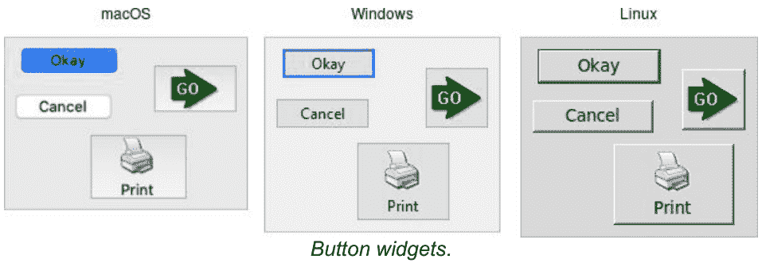

按钮使用 `ttk.Button` 类创建：

```
button = ttk.Button(parent, text='Okay', command=submitForm)
```

通常，它们的内容和命令回调会同时指定。与其他控件一样，按钮可以接受多种不同的配置选项，包括标准的 `style` 选项，它可以改变其外观和行为。

## 文本或图像

按钮接受与标签相同的 `text`、`textvariable`（很少使用）、`image` 和 `compound` 配置选项。这些选项控制按钮是否显示文本和/或图像。

按钮有一个 `default` 配置选项。如果指定为 `active`，这会告诉 Tk 该按钮是用户界面中的默认按钮；否则为 `normal`。默认按钮在用户按下回车键或输入键时被激活。某些平台和样式会使用不同的边框或高亮显示此默认按钮。请注意，设置此选项不会创建使回车键或输入键激活按钮的事件绑定；你必须自己完成。

## 命令回调

`command` 选项将按钮的操作与你的应用程序连接起来。当用户按下按钮时，解释器会评估该选项提供的脚本。

你还可以要求按钮从你的应用程序中调用命令回调。这样，你就不需要在程序中多次重复要调用的命令。如果你更改了附加到按钮的命令，你也不需要在其他地方更改它。听起来这是在我们的默认按钮上添加事件绑定的一种有用方式，不是吗？

```
action = ttk.Button(root, text="Action", default="active",
    command=myaction)
root.bind('<Return>', lambda e: action.invoke())
```

> 大多数平台上对话框和许多其他窗口的标准行为是在窗口上设置回车键（`<Return>` 或 `<Key-Return>`）的绑定，以调用活动按钮（如果存在），就像我们在这里所做的那样。如果有“关闭”或“取消”按钮，请为转义键（`<Key-Escape>`）创建绑定。在 macOS 上，你还应该将键盘上的输入键（`<KP_Enter>`）绑定到活动按钮，并将 Command-句点（`<Command-.>`）绑定到关闭或取消按钮。

## 按钮状态

按钮和许多其他控件最初处于正常状态。按钮会响应鼠标移动，可以被按下，并会调用其命令回调。按钮也可以被置于禁用状态，当按钮变为灰色，不响应鼠标移动且无法被按下时，你的程序应在命令不适用时禁用该按钮。

所有主题控件都维护一个内部状态，该状态由一系列二进制标志表示。每个标志可以被设置（开启）或清除（关闭）。你可以设置或清除这些不同的标志，并使用 `state` 和 `instate` 方法检查当前设置。按钮利用 `disabled` 标志来控制用户是否可以按下按钮。例如：

```
b.state(['disabled'])           # set the disabled flag
b.state(['!disabled'])          # clear the disabled flag
b.instate(['disabled'])         # true if disabled, else false
b.instate(['!disabled'])        # true if not disabled, else false
b.instate(['!disabled'], cmd)   # execute 'cmd' if not disabled
```

> 请注意，这些命令接受一个状态标志**数组**作为其参数。

主题控件可用的完整状态标志列表为：`active`、`disabled`、`focus`、`pressed`、`selected`、`background`、`readonly`、`alternate` 和 `invalid`。这些在 [主题控件参考](https://tkdocs.com/man/ttk_widget) 中有描述。虽然所有控件都具有相同的状态标志集，但并非所有状态对所有控件都有意义。在 `state` 和 `instate` 方法中也可以进行更复杂的操作，同时指定多个状态标志。

https://tkdocs.com/man/ttk_widget

> `state` 和 `instate` 方法取代了旧的 `state` 配置选项（该选项接受 `normal` 或 `disabled` 值）。

该配置选项实际上在 Tk 8.5 的主题控件中仍然可用，但是是“只写”的，这意味着更改该选项会调用相应的 `state` 命令。这主要是为了方便，以便你可以在首次创建控件时指定其应被禁用。但是，使用新的 `state` 命令所做的任何更改都不会更新配置选项。为避免混淆，你应该更新代码，对所有主题控件使用新的状态标志。

## 6.4. 复选按钮

ttk.Checkbutton
https://tkdocs.com/man/ttk_checkbutton

**复选按钮**控件类似于普通按钮，但它还持有一个某种类型的二进制值（即一个开关）。按下时，复选按钮会切换开关，然后调用其回调函数。复选按钮控件常用于允许用户打开或关闭某个选项。

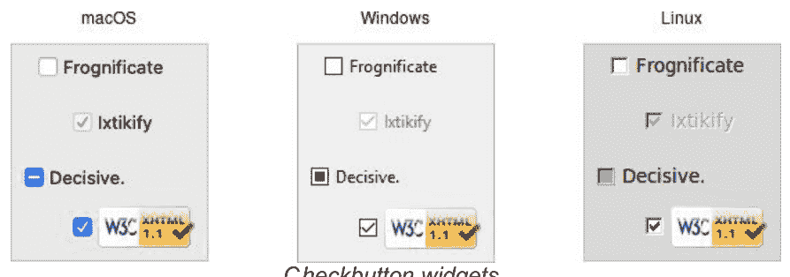

复选按钮使用 `ttk.Checkbutton` 类创建。通常，它们的内容和行为会同时指定：

```
measureSystem = StringVar()
check = ttk.Checkbutton(parent, text='Use Metric',
                       command=metricChanged, variable=measureSystem,
                       onvalue='metric', offvalue='imperial')
```

复选按钮使用许多与普通按钮相同的选项，但增加了一些。`text`、`textvariable`、`image` 和 `compound` 配置选项控制标签（位于复选框本身旁边）的显示。类似地，`command` 选项允许你指定每次用户切换复选按钮时要调用的命令；`invoke` 方法也会执行相同的命令。`state` 和 `instate` 方法允许你操作 `disabled` 状态标志来启用或禁用复选按钮。

### 控件值

与普通按钮不同，复选按钮还持有一个值。我们之前已经看到 `textvariable` 选项如何将控件的标签链接到程序中的一个变量。复选按钮的 `variable` 选项行为类似，只是它将一个变量链接到控件的当前值。每当控件被切换时，该变量就会更新。默认情况下，复选按钮在控件被选中时使用值 `1`，未选中时使用值 `0`。这些可以通过 `onvalue` 和 `offvalue` 选项更改为其他值。

复选按钮不会自动设置（或创建）链接的变量。因此，你的程序需要将其初始化为适当的起始值。

当链接的变量既不包含 `onvalue` 也不包含 `offvalue`（甚至不存在）时会发生什么？在这种情况下，复选按钮会进入一个特殊的“三态”或不确定模式。在此模式下，复选框可能显示单个破折号，而不是为空或显示勾选标记。内部会设置状态标志 `alternate`，你可以通过 `instate` 方法检查：

```
check.instate(['alternate'])
```

虽然我们一直在使用 `StringVar` 类的实例，但 Tkinter 提供了其他变量类，可以保存布尔值、整数或浮点数。你总是可以使用 `StringVar`（因为 Tkinter 使用的 Tcl API 是基于字符串的），但如果要存储的数据类型适合，也可以选择其他类型之一。所有这些都是基类 `Variable` 的子类。

我们在英尺转米的例子中看到，你可以调用 `Variable` 的 `get` 方法来检索其值，或调用 `set` 方法来提供新值。你也可以在实例化时提供一个初始值。

```
s = StringVar(value="abc")    # default value is ''
b = BooleanVar(value=True)   # default is False
i = IntVar(value=10)         # default is 0
d = DoubleVar(value=10.5)    # default is 0.0
```

## 6.5. 单选按钮

ttk.Radiobutton
https://tkdocs.com/man/ttk_radiobutton

**单选按钮**控件允许你在几个互斥的选项中选择一个。与复选按钮不同，它们不限于只有两个选项。单选按钮总是成组使用，其中多个单选按钮控件绑定到一个单一的选择或偏好。当选项数量相对较少时（例如 3-5 个），适合使用它们。

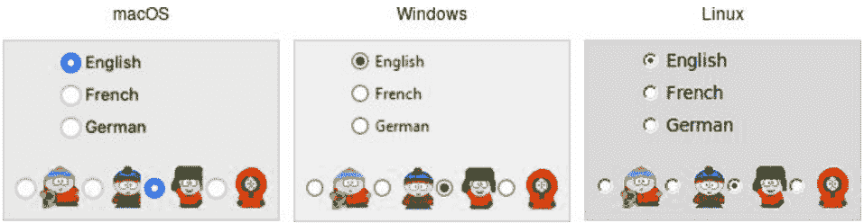

单选按钮使用 `ttk.Radiobutton` 类创建。通常，你会同时创建并初始化几个：

```
phone = StringVar()
home = ttk.Radiobutton(parent, text='Home', variable=phone,
    value='home')
office = ttk.Radiobutton(parent, text='Office',
    variable=phone, value='office')
cell = ttk.Radiobutton(parent, text='Mobile', variable=phone,
    value='cell')
```

单选按钮共享与复选按钮相同的大多数配置选项。一个例外是 `onvalue` 和 `offvalue` 选项被单个 `value` 选项取代。组中的每个单选按钮将具有相同的链接变量，但具有不同的值。

当变量持有匹配的值时，该单选按钮将在视觉上指示其被选中。如果不匹配，单选按钮将未被选中。如果链接的变量不存在，或者你没有使用 `variable` 选项指定一个，单选按钮也会显示为“三态”或不确定。这可以通过 `alternate` 状态标志来检查。

## 6.6. 输入框

ttk.Entry
https://tkdocs.com/man/ttk_entry

**输入框**控件向用户提供一个单行文本字段，他们可以在其中输入字符串值。这些可以是几乎任何东西：姓名、城市、密码、社会安全号码等。

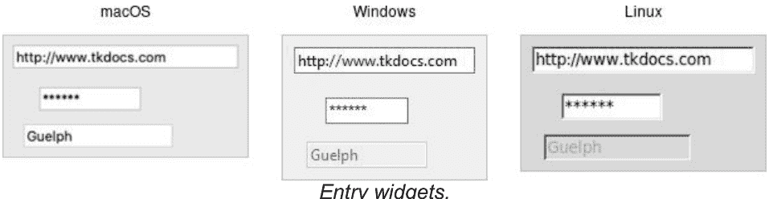

输入框使用 `ttk.Entry` 类创建：

```
username = StringVar()
name = ttk.Entry(parent, textvariable=username)
```

可以指定一个 `width` 配置选项来提供输入框应具有的字符宽度。例如，这允许你为邮政编码显示一个较短的输入框。

### 输入框内容

我们已经看到复选按钮和单选按钮控件都有一个与之关联的值。输入框也是如此，该值通常通过 `textvariable` 配置选项指定的链接变量来访问。

> 与各种按钮不同，输入框旁边没有文本或图像来标识它们。为此，请使用单独的标签控件。

你也可以不通过链接变量来获取或更改输入框控件的值。`get` 方法返回当前值，`delete` 和 `insert` 方法允许你更改内容，例如：

```
print('current value is %s' % name.get())
name.delete(0, 'end')           # delete between two indices, 0-based
name.insert(0, 'your name')     # insert new text at a given index
```

### 监视更改

输入框控件没有 `command` 选项来在输入框更改时调用回调。要监视更改，你应该监视链接变量的更改。另请参阅下面的“验证”。

```
def it_has_been_written(*args):
    ...
username.trace_add("write", it_has_been_written)
```

如果你坚持使用像上面所示的 `trace_add` 的简单用法，你会没问题的。你可能想知道，这只是观察变量并在它们被读取、写入或删除时调用回调的更复杂系统的一小部分。你可以触发多个回调，添加或删除它们（`trace_remove`），以及内省它们（`trace_info`）。

> 这些方法也取代了现已弃用的一组旧方法（`trace`、`trace_variable`、`trace_vdelete` 和 `trace_vinfo`），这些方法不应再使用。

Tkinter 允许你监视 `StringVar`（或 `Variable` 的任何子类）的更改。旧的和新的跟踪工具都是一个非常轻量（且不太符合 Python 风格）的 Tcl [trace](https://tkdocs.com/man/trace) 命令前端。

[https://tkdocs.com/man/trace](https://tkdocs.com/man/trace)

## 密码

输入框可用于密码输入，此时实际内容会显示为圆点或其他符号。为此，请将 `show` 配置选项设置为您希望显示的字符。

```
passwd = ttk.Entry(parent, textvariable=password, show="*")
```

## 控件状态

与各种按钮类似，输入框也可以通过 `state` 命令（并使用 `instate` 查询）设置为禁用状态。输入框还可以使用 `readonly` 状态标志；如果设置，用户无法更改输入框内容，但仍可选择其中的文本（并将其复制到剪贴板）。还有一个 `invalid` 状态，当输入框验证失败时设置，这引出了……

## 验证

用户可以在输入框控件中输入任何他们想要的文本。但是，如果您想限制他们可以在输入框中输入的内容，可以使用*验证*来实现。例如，一个输入框可能只接受整数或有效的邮政编码。

您的程序可以指定什么使输入框有效或无效，以及何时检查其有效性。正如我们即将看到的，这两者是相关的。我们将从一个简单的例子开始：一个只能容纳最多五位整数的输入框。

验证标准通过输入框的 `validatecommand` 配置选项指定。您提供一段代码，其作用是验证输入框。它的功能类似于控件回调或事件绑定，不同之处在于它返回一个值（指示输入框是否有效）。我们将安排在每次按键时验证输入框，这通过向 `validate` 配置选项提供 `key` 值来指定。

```
import re
def check_num(newval):
    return re.match('^[0-9]*$', newval) is not None and len(newval) <= 5
check_num_wrapper = (root.register(check_num), '%P')

num = StringVar()
e = ttk.Entry(root, textvariable=num, validate='key',
              validatecommand=check_num_wrapper)
e.grid(column=0, row=0, sticky='we')
```

[https://tkdocs.com/code/numvalidate.py](https://tkdocs.com/code/numvalidate.py)

有几点值得注意。首先，与事件绑定一样，我们可以通过*百分比替换*访问有关触发验证条件的更多信息。我们在这里使用了其中一个：`%P` 是验证通过时输入框的*新值*。我们将使用一个简单的正则表达式和长度检查来确定更改是否有效。要拒绝更改，我们的验证命令可以返回一个假值，输入框将保持不变。

利用这些百分比替换需要一些技巧。您可能记得 Tkinter 在事件绑定回调中抽象掉了百分比替换。在那里，所有事件参数都被包装到一个事件对象中，该对象始终传递给回调。对于验证回调，没有等效的抽象。相反，我们必须选择我们感兴趣的百分比替换。`register` 方法（可以在任何控件上调用，而不仅仅是 `root`）创建一个 Tcl 过程，该过程将调用我们的 Python 函数。我们选择的百分比替换将作为参数传递给它。

让我们扩展我们的示例，使输入框接受美国邮政编码，格式为 "#####" 或 "#####-####"（"#" 可以是任何数字）。我们仍然会在每次按键时进行一些验证（只允许输入数字或连字符）。但是，我们无法再在每次按键时完全验证输入框；如果用户刚刚输入第一位数字，它还不有效。因此，完全验证只会在输入框失去焦点时发生（例如，用户按 Tab 键离开它）。Tk 将此称为重新验证，与预验证（在每次按键时接受更改）相对。

我们应该如何处理错误？让我们添加一条消息，提醒用户格式要求。如果用户按错键或在输入框未包含有效邮政编码时按 Tab 键离开，该消息将出现。当他们返回输入框或输入有效按键时，我们将移除该消息。我们还将添加一个（虚拟）按钮来“处理”邮政编码，除非邮政编码输入框有效，否则该按钮将被禁用。最后，我们还将添加一个“姓名”输入框，以便您可以按 Tab 键离开邮政编码输入框。

```
import re
errmsg = StringVar()
formatmsg = "Zip should be ##### or #####-####"

def check_zip(newval, op):
    errmsg.set('')
    valid = re.match('^[0-9]{5}(\-[0-9]{4})?$', newval) is not None
    btn.state(['!disabled'] if valid else ['disabled'])
    if op=='key':
        ok_so_far = re.match('^[0-9\-]*$', newval) is not None and len(newval) <= 10
        if not ok_so_far:
            errmsg.set(formatmsg)
        return ok_so_far
    elif op=='focusout':
        if not valid:
            errmsg.set(formatmsg)
    return valid
check_zip_wrapper = (root.register(check_zip), '%P', '%V')

zip = StringVar()
f = ttk.Frame(root)
f.grid(column=0, row=0)
ttk.Label(f, text='Name:').grid(column=0, row=0, padx=5, pady=5)
ttk.Entry(f).grid(column=1, row=0, padx=5, pady=5)
ttk.Label(f, text='Zip:').grid(column=0, row=1, padx=5, pady=5)
e = ttk.Entry(f, textvariable=zip, validate='all', validatecommand=check_zip_wrapper)
e.grid(column=1, row=1, padx=5, pady=5)
btn = ttk.Button(f, text="Process")
btn.grid(column=2, row=1, padx=5, pady=5)
btn.state(['disabled'])
```

```
msg = ttk.Label(f, font='TkSmallCaptionFont',
    foreground='red', textvariable=errmsg)
msg.grid(column=1, row=2, padx=5, pady=5, sticky='w')
```

[https://tkdocs.com/code/validate.py](https://tkdocs.com/code/validate.py)

请注意，`validate` 配置选项已从 `key` 更改为 `all`。这安排了 `validatecommand` 回调不仅在按键时被调用，还在其他触发器时被调用。触发器通过 `%v` 百分比替换传递给回调。回调区分了 `key` 和 `focusout` 触发器（您也可以检查 `focusin`）。

> 关于验证，还有几点需要了解。首先，如果您的 `validatecommand` 产生错误（或未返回布尔值），该控件的验证将被禁用。您的回调可以修改输入框，例如，更改其 textvariable。您可以通过调用控件的 `validate` 方法随时要求控件进行验证，如果验证通过，该方法返回 true（`%v` 替换设置为 `forced`）。

有一个 `invalidcommand` 配置选项（其工作方式类似于 `validatecommand`），每当验证失败时调用。您可以使用它来完成诸如将焦点强制返回到未通过验证的控件等操作。实际上，它很少使用。如前所述，输入框的 `invalid` 状态标志（可以通过 `instate invalid` 方法检查）会随着验证成功或失败而自动更新。

其他百分比替换允许您获取编辑前的输入框内容（`%s`）、区分插入和删除（`%d`）、插入或删除发生的位置（`%i`）、正在插入或删除的内容（`%S`）、`validate` 选项的当前设置（`%v`）以及控件的名称（`%W`）。

## 6.7. 组合框

ttk.Combobox
https://tkdocs.com/man/ttk_combobox

**组合框**控件将输入框与选项列表结合在一起。这允许用户既可以从您提供的一组值（例如，典型设置）中选择，也可以输入自己的值（例如，用于不太常见的情况）。

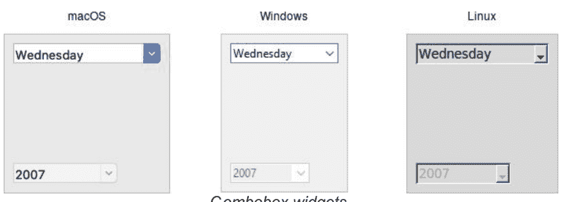

组合框使用 `ttk.Combobox` 类创建：

```
countryvar = StringVar()
country = ttk.Combobox(parent, textvariable=countryvar)
```

与输入框类似，`textvariable` 选项将程序中的变量链接到组合框的当前值。与其他控件一样，您应该在自己的代码中初始化链接的变量。

组合框将生成一个 `<<ComboboxSelected>>` 虚拟事件，您可以在其值更改时绑定到该事件。（您也可以跟踪 `textvariable` 的更改，正如我们在前面几个控件中看到的那样。绑定到事件更直接，因此往往是我们首选的方法。）

## 预定义值

你可以使用 `values` 配置选项提供一个用户可选择的值列表：

```
country['values'] = ('USA', 'Canada', 'Australia')
```

如果设置了 `readonly` 状态标志，将限制用户只能从预定义值列表中进行选择，而不能输入自己的值（不过，如果组合框的当前值不在列表中，则不会被更改）。

```
country.state(["readonly"])
```

> 💡 如果你正在以 `readonly` 模式使用组合框，我建议当值发生变化时（即在 `<<ComboboxSelected>>` 事件上），调用 `selection_clear` 方法。如果不这样做，视觉上看起来会有点奇怪。

你还可以使用 `get` 方法获取当前值，并使用 `set` 方法（它接受一个参数，即新值）来更改当前值。

作为 `get` 和 `set` 方法的补充，你也可以使用 `current` 方法来确定预定义值列表中哪个项目被选中。调用 `current` 时不带参数；它将返回列表中基于 0 的索引，如果当前值不在列表中，则返回 -1。你可以通过调用 `current` 并传入一个基于 0 的索引参数来选择列表中的项目。

> 💡 想要将其他值与列表中的每个项目关联起来，以便你的程序可以在内部使用一个值，但在组合框中显示为其他内容？你可能需要查看几章后讨论列表框时的“保留额外项目数据”部分。

## 7. 网格几何管理器

我们将暂时从讨论不同的小部件（屏幕上放什么）转向专注于几何管理（把这些小部件放在哪里）。我们在“Tk 概念”章节中介绍了几何管理的一般概念。在这里，我们专注于一个特定的几何管理器：`grid`。

正如我们所看到的，`grid` 允许你将小部件按列和行进行布局。如果你熟悉使用 HTML 表格进行布局，你会对此感到非常熟悉。本章说明了你可以调整 `grid` 的各种方式，以提供你对用户界面所需的所有控制。

`grid` 是 Tk 中可用的几种几何管理器之一，但其功能、灵活性和易用性的结合使其成为通用用途的最佳选择。它的约束模型与当今依赖小部件对齐的布局非常契合。Tk 中还有其他几何管理器：`pack` 也相当强大，但更难使用和理解，而 `place` 则让你完全控制每个元素的定位。即使是像窗格窗口、笔记本、画布和文本这样的小部件（我们稍后将探讨）也可以充当几何管理器。

> 值得注意的是，`grid` 是在 1996 年首次引入 Tk 的，比 Tk 流行起来晚了几年，并且花了一段时间才被广泛接受。在此之前，开发者一直使用 `pack` 进行基于约束的几何管理。当 `grid` 出现时，许多开发者继续使用 `pack`，你仍然会在许多 Tk 程序和文档中看到它的使用。虽然 `pack` 在技术上没有问题，但该算法的行为通常难以理解。更重要的是，因为小部件打包的顺序在确定布局时很重要，修改现有布局可能更加困难。在用户界面的不同部分对齐小部件也更加棘手。

`grid` 拥有 `pack` 的所有功能，能产生更好的布局（在水平和垂直方向上对齐小部件），并且更容易学习和使用。因此，我们认为 `grid` 在大多数情况下是大多数开发者的正确选择。在你的新程序中使用 `grid`，并在修改现有用户界面时将旧程序切换到 `grid`。

[grid 的参考文档](https://tkdocs.com/man/grid) 提供了对 `grid`、其行为和所有选项的详尽描述。


[https://tkdocs.com/man/grid](https://tkdocs.com/man/grid)

### 7.1. 列和行

在 `grid` 中，小部件被分配一个 `column`（列）编号和一个 `row`（行）编号。这些编号表示每个小部件相对于其他小部件的位置。同一列中的所有小部件将彼此上下排列。同一行中的小部件将彼此左右排列。

列和行编号必须是正整数（即 0, 1, 2, ...）。你不必从 0 开始，也可以在列和行编号中留出间隔（例如，列 1, 2, 10, 11, 12, 20, 21）。如果你计划稍后在用户界面中间添加更多小部件，这会很有用。

每列的宽度将取决于该列中包含的小部件的宽度。每行的高度也是如此。这意味着在绘制用户界面并将其划分为行和列时，你不需要担心每列或每行的宽度相等。

### 7.2. 跨越多个单元格

小部件可以占据网格中的多个单元格；为此，我们将在使用 `grid` 布局小部件时使用 `columnspan` 和 `rowspan` 选项。这些类似于 HTML 表格的 "colspan" 和 "rowspan" 属性。

这是一个创建包含多个小部件的用户界面的示例，其中一些小部件占据多个单元格。

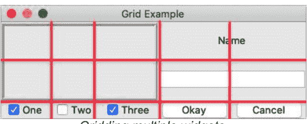

```
from tkinter import *
from tkinter import ttk

root = Tk()

content = ttk.Frame(root)
frame = ttk.Frame(content, borderwidth=5, relief="ridge",
    width=200, height=100)
namelbl = ttk.Label(content, text="Name")
name = ttk.Entry(content)

onevar = BooleanVar(value=True)
twovar = BooleanVar(value=False)
threevar = BooleanVar(value=True)

one = ttk.Checkbutton(content, text="One", variable=onevar,
    onvalue=True)
two = ttk.Checkbutton(content, text="Two", variable=twovar,
    onvalue=True)
three = ttk.Checkbutton(content, text="Three",
    variable=threevar, onvalue=True)

ok = ttk.Button(content, text="Okay")
cancel = ttk.Button(content, text="Cancel")

content.grid(column=0, row=0)
frame.grid(column=0, row=0, columnspan=3, rowspan=2)
namelbl.grid(column=3, row=0, columnspan=2)
name.grid(column=3, row=1, columnspan=2)
one.grid(column=0, row=3)
two.grid(column=1, row=3)
three.grid(column=2, row=3)
ok.grid(column=3, row=3)
cancel.grid(column=4, row=3)

root.mainloop()
```

[https://tkdocs.com/code/gridexample1.py](https://tkdocs.com/code/gridexample1.py)

### 7.3. 单元格内的布局

因为列的宽度（和行的高度）取决于添加到其中的所有小部件，所以很可能至少有一些小部件的宽度或高度小于为其分配的单元格。那么问题就变成了，它应该被放置在单元格内的哪个确切位置？

默认情况下，如果单元格大于其中包含的小部件，小部件将在单元格内水平和垂直居中。主窗口的背景将显示在其周围的空白区域中。在下图中，右上角的小部件小于为其分配的单元格。主窗口的（白色）背景填充了单元格的其余部分。

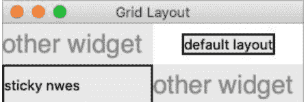

单元格内的布局和 'sticky' 选项。

`sticky` 选项可以改变这种默认行为。它的值是一个包含 0 个或多个罗盘方向 `nsew` 的字符串，指定小部件应“粘附”到单元格的哪些边缘。例如，值为 `n`（北）会将小部件紧贴到顶部，任何额外的垂直空间留在底部；小部件在水平方向上仍然居中。值为 `nw`（西北）意味着小部件将粘附到左上角，额外的空间留在底部和右侧。

> 💡 在 Tkinter 中，你也可以将其指定为包含 N、S、E 和 W 中任意一个的列表。这是一种风格选择，我们在本书中将倾向于使用列表格式。

指定两个相对的边缘，例如 `we`（西，东）意味着小部件将被拉伸。在这种情况下，它将粘附到

## 7.4. 处理尺寸调整

如果你尝试调整示例窗口的大小，你会注意到什么都没有移动，如下图所示。

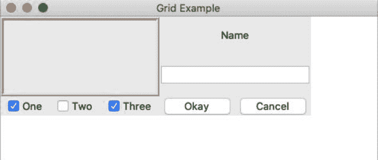

即使你查看了后续内容并为我们的示例添加了额外的 `sticky` 选项，你仍然会看到相同的情况。看起来 `sticky` 可能告诉 Tk *如何*在单元格的行或列调整大小时做出反应，但并没有实际说明如果出现额外空间，行或列*应该*调整大小。让我们来解决这个问题。

网格中的每一列和每一行都有一个与之关联的 `weight` 选项。这告诉 `grid`，如果主窗口中有额外空间需要填充，列或行应该增长多少。默认情况下，每列或每行的权重为 0，这意味着它不会扩展以填充任何额外空间。

因此，为了让用户界面能够调整大小，我们需要为希望扩展的列指定一个正权重。这通过使用 `grid` 的 `columnconfigure` 和 `rowconfigure` 方法来完成。这个权重是相对的。如果两列具有相同的权重，它们将以相同的速率扩展。在我们的示例中，我们将给最左边的三列（包含复选按钮）一个权重 3，最右边的两列一个权重 1。右侧列每增长一个像素，左侧列将增长三个像素。因此，随着窗口变大，大部分额外空间将分配给左侧。

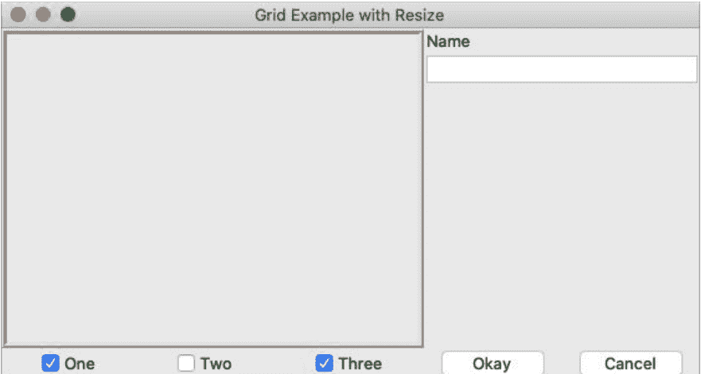

*添加权重后调整窗口大小。*

`columnconfigure` 和 `rowconfigure` 还接受一个 `minsize` 网格选项，该选项指定了你确实不希望列或行缩小到的最小尺寸。

### 7.5. 内边距

通常，每一列或每一行将直接与下一列或下一行相邻，因此小部件将彼此紧挨着。这有时是你想要的（想想列表框及其滚动条），但通常你希望小部件之间有一些空间。在 Tk 中，这被称为内边距，有几种方法可以选择添加它。

我们实际上已经见过一种方法，那就是使用小部件自身的选项在其周围添加额外空间。并非所有小部件都有这个选项，但有一个是框架（frame）；这很有用，因为框架最常被用作网格其他小部件的主窗口。框架的 `padding` 选项允许你指定框架内部的一些额外内边距，可以是四边相同的量，也可以是每边不同的量。

第二种方法是在添加小部件时使用 `padx` 和 `pady` 网格选项。正如你所料，`padx` 在左右添加一些额外空间，而 `pady` 在上下添加额外空间。该选项的单个值会在左右（或上下）放置相同的内边距，而双值列表允许你在左右（或上下）放置不同的量。请注意，这个额外的内边距是在包含小部件的网格单元格内部。

如果你想为整个行或列添加内边距，`columnconfigure` 和 `rowconfigure` 方法接受一个 `pad` 选项，它将为你完成此操作。

让我们为我们的示例添加额外的粘性、调整大小和内边距行为（添加部分以粗体显示）。

```python
from tkinter import *
from tkinter import ttk

root = Tk()

content = ttk.Frame(root, **padding=(3,3,12,12)**)
frame = ttk.Frame(content, borderwidth=5, relief="ridge",
                  width=200, height=100)
namelbl = ttk.Label(content, text="Name")
name = ttk.Entry(content)
onevar = BooleanVar()
twovar = BooleanVar()
threevar = BooleanVar()

onevar.set(True)
twovar.set(False)
threevar.set(True)

one = ttk.Checkbutton(content, text="One", variable=onevar,
    onvalue=True)
two = ttk.Checkbutton(content, text="Two", variable=twovar,
    onvalue=True)
three = ttk.Checkbutton(content, text="Three",
    variable=threevar, onvalue=True)
ok = ttk.Button(content, text="Okay")
cancel = ttk.Button(content, text="Cancel")

content.grid(column=0, row=0, sticky=(N, S, E, W))
frame.grid(column=0, row=0, columnspan=3, rowspan=2, sticky=
    (N, S, E, W))
namelbl.grid(column=3, row=0, columnspan=2, sticky=(N, W),
    padx=5)
name.grid(column=3, row=1, columnspan=2, sticky=(N,E,W),
    pady=5, padx=5)
one.grid(column=0, row=3)
two.grid(column=1, row=3)
three.grid(column=2, row=3)
ok.grid(column=3, row=3)
cancel.grid(column=4, row=3)

root.columnconfigure(0, weight=1)
root.rowconfigure(0, weight=1)
content.columnconfigure(0, weight=3)
content.columnconfigure(1, weight=3)
content.columnconfigure(2, weight=3)
content.columnconfigure(3, weight=1)
content.columnconfigure(4, weight=1)
content.rowconfigure(1, weight=1)

root.mainloop()
```

[https://tkdocs.com/code/gridexample2.py](https://tkdocs.com/code/gridexample2.py)

这看起来更有希望了。尝试操作这个示例，感受一下调整大小的行为。

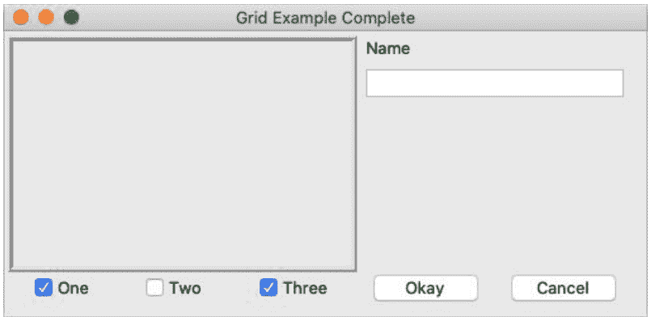

网格示例，处理单元格内布局和调整大小。

## 7.6. 附加网格功能

如果你查看 `grid` 的[参考文档](https://tkdocs.com/man/grid)，你会看到使用网格可以做的许多其他事情。以下是一些更有用的功能。

### 查询和更改网格选项

与小部件本身一样，可以轻松地内省各种网格选项或更改它们。在首次网格化小部件时设置选项当然很方便，但你可以随时更改它们。

`slaves` 方法将告诉你所有已网格化在主窗口内的小部件，或者可选地，仅在特定列或行内的小部件。`info` 方法将返回小部件所有网格选项及其值的列表。最后，`configure` 方法允许你更改小部件上的一个或多个网格选项。

这些在以下交互式会话中进行了说明：

```python
>>> content.grid_slaves()
[<tkinter.ttk.Button object .!frame.!button2>,
<tkinter.ttk.Button object .!frame.!button>,
<tkinter.ttk.Checkbutton object .!frame.!checkbutton3>,
<tkinter.ttk.Checkbutton object .!frame.!checkbutton2>,
<tkinter.ttk.Checkbutton object .!frame.!checkbutton>,
<tkinter.ttk.Entry object .!frame.!entry>,
<tkinter.ttk.Label object .!frame.!label>, <tkinter.ttk.Frame object .!frame.!frame>]
>>> for w in content.grid_slaves(): print(w)
...
.!frame.!button2
.!frame.!button
.!frame.!checkbutton3
.!frame.!checkbutton2
.!frame.!checkbutton
.!frame.!entry
.!frame.!label
.!frame.!frame
>>> for w in content.grid_slaves(row=3): print(w)
...
.!frame.!button2
.!frame.!button
.!frame.!checkbutton3
.!frame.!checkbutton2
.!frame.!checkbutton
>>> for w in content.grid_slaves(column=0): print(w)
...
.!frame.!checkbutton
.!frame.!frame
>>> namelbl.grid_info()
{'in': <tkinter.ttk.Frame object .!frame>, 'column': 3,
'row': 0, 'columnspan': 2, 'rowspan': 1,
'ipadx': 0, 'ipady': 0, 'padx': 5, 'pady': 0, 'sticky': 'nw'}
>>> namelbl.grid_configure(sticky=(E,W))
>>> namelbl.grid_info()
{'in': <tkinter.ttk.Frame object .!frame>, 'column': 3,
'row': 0, 'columnspan': 2, 'rowspan': 1,
'ipadx': 0, 'ipady': 0, 'padx': 5, 'pady': 0, 'sticky': 'ew'}
```

### 内部内边距

你已经看到 `padx` 和 `pady` 网格选项如何在小部件外部添加额外空间。还有一种较少使用的内边距类型，称为“内部内边距”，由网格选项 `ipadx` 和 `ipady` 控制。

区别可能很微妙。假设你有一个 20x20 的框架，并指定每边 5 像素的普通（外部）内边距。框架将向几何管理器请求一个 20x20 的矩形（其自然尺寸）。通常，这就是它将被授予的，因此它将获得一个 20x20 的框架矩形，周围环绕着 5 像素的边框。

使用内部内边距时，几何管理器在计算其自然尺寸时会有效地将额外内边距添加到小部件中，就好像小部件请求了一个 30x30 的矩形。如果框架居中，或附加到单侧或角落（使用 `sticky`），我们将得到一个 20x20 的框架，周围有额外空间。然而，如果框架设置为拉伸（即 `sticky` 值为 `we`、`ns` 或 `nwes`），它将填充额外空间，从而产生一个 30x30 的框架，没有边框。

### 忘记和移除

`grid` 的 `forget` 方法会将子部件从其当前所在的网格中移除。该方法接受一个或多个子部件作为参数。这并不会完全销毁部件，而是将其从屏幕上移除，就像它从未被网格化一样。之后你可以再次对其进行网格化，但最初分配的所有网格选项都将丢失。

`grid` 的 `remove` 方法工作方式相同，不同之处在于，如果你之后再次对其进行 `grid`，网格选项将会被保留。

### 7.7. 嵌套布局

随着用户界面变得越来越复杂，你用来组织所有部件的网格也会变得越来越复杂。这可能会使更改和维护你的程序变得非常困难。

幸运的是，你不必用单个网格来管理整个用户界面。如果你的用户界面中有一个区域相对独立于其他区域，可以创建一个新的框架来容纳该区域，并将该区域内的部件网格化到该框架中。例如，如果你正在构建一个带有多个调色板、工具栏等的图形编辑器，那么这些区域中的每一个都可能适合放入自己的框架中。

理论上，这些各自拥有自己网格的框架可以任意深度地嵌套，尽管在实践中，这通常不会超过几层。这可以极大地帮助你模块化程序。例如，如果你有一个绘图工具调色板，你可以在一个单独的函数或类中创建整个调色板。该函数或类将负责创建所有组件部件、将它们网格化在一起、设置事件绑定等。调色板内部的工作细节可以包含在那一段代码中。从你的主程序的角度来看，它只需要知道包含调色板的单个框架部件即可。

我们的示例已经展示了这一点的一小部分，其中将一个内容框架网格化到主窗口中，然后将所有其他部件网格化到该内容框架中。

随着你自己的程序规模扩大，你可能会遇到这样的情况：更改界面一部分的布局需要修改另一部分布局的代码。这可能是一个提示，让你重新考虑如何使用 `grid`，以及将组件拆分到单独的框架中是否会有帮助。

## 8. 更多部件

本章继续介绍更多部件：列表框、滚动条、文本、刻度、微调框和进度条。其中一些部件开始比我们之前研究的基本部件更强大一些。这里我们还将看到一些使用经典 Tk 部件的实例，这些情况是没有（或不需要）主题化对应部件。

## 8.1. 列表框

列表框
https://tkdocs.com/man/listbox

**列表框**部件显示一个单行文本项的列表，通常很长，并允许用户浏览列表，选择一个或多个项目。
列表框是经典 Tk 部件的一部分；目前主题化 Tk 部件集中没有列表框。

> Tk 的树形视图部件（它是主题化的）也可以用作列表框（一级深度的树），允许你为列表使用图标和样式。
> 多列（表格）列表部件也可能在某个时候进入 Tk，无论是基于树形视图还是其他可用的扩展。

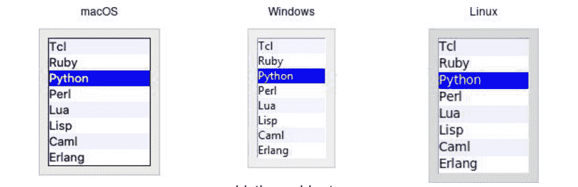

列表框使用 `Listbox` 类创建。`height` 配置选项可以指定列表框在不滚动的情况下一次显示的行数：

```
l = Listbox(parent, height=10)
```

### 填充列表框项目

填充和管理列表框中的所有项目有简单的方法和复杂的方法。

这是简单的方法。每个列表框都有一个 `listvariable` 配置选项，它允许你将一个变量（必须包含一个列表）链接到列表框。该列表的每个元素都是一个字符串，代表列表框中的一个项目。要添加、删除或重新排列列表框中的项目，你可以像修改任何其他列表一样简单地修改这个变量。同样，要找出例如列表框第三行是哪个项目，只需查看列表变量的第三个元素。

实际上，这并不完全*那么简单*。Tkinter 不允许你将常规的 Python 列表链接到 `listbox`。正如我们在 `entry` 等部件中看到的，我们需要使用 `StringVar` 作为中介。它提供了 Python 列表和底层 Tk 部件可以使用的字符串表示之间的映射。这也意味着每当我们更改列表时，都需要更新 `StringVar`。

```
choices = ["apple", "orange", "banana"]
choicesvar = StringVar(value=choices)
l = Listbox(parent, listvariable=choicesvar)
...
choices.append("peach")
choicesvar.set(choices)
```

旧的、更复杂的方法是使用列表框部件本身提供的一组方法。它们操作部件维护的（内部）项目列表：

- `insert idx item ?item...?` 方法用于向列表中添加一个或多个项目；`idx` 是一个从 0 开始的索引，表示应在哪个位置之前添加项目；指定 `end` 可将新项目放在列表末尾。
- 使用 `delete first ?last?` 方法从列表中删除一个或多个项目；`first` 和 `last` 是与 `insert` 方法相同的索引。
- 使用 `get first ?last?` 方法返回给定位置单个项目的内容，或返回 `first` 和 `last` 之间项目的列表。
- `size` 方法返回列表中的项目数量。

>  存在复杂方法的原因是 `listvariable` 选项仅在 Tk 8.3 中引入。在此之前，你只能使用复杂的方法。因为使用列表变量允许你使用所有标准的列表操作，它提供了一个简单得多的 API。如果你有列表框正在使用旧方法，这绝对是一个值得考虑的升级。

### 选择项目

你可以选择用户是否只能一次从 `listbox` 中选择单个项目，或者是否可以同时选择多个项目。这由 `selectmode` 选项控制：默认是只能选择单个项目（`browse`），而 `selectmode` 为 `extended` 则允许用户选择多个项目。

>  `browse` 和 `extended` 这些名称，再次出于向后兼容性的原因，确实很糟糕。更糟糕的是还有另外两种模式，`single` 和 `multiple`，你**不应该使用**它们（它们使用了一种与现代用户界面和平台惯例不一致的旧交互风格）。

要找出列表框中当前选中的是哪个或哪些项目，请使用 `curselection` 方法。它返回当前所有选中项目的索引列表；这可能是一个空列表。对于 `selectmode` 为 `browse` 的列表，它永远不会超过一个项目。你也可以使用 `selection_includes index` 方法检查给定索引的项目是否当前被选中。

```
if lbox.selection_includes(2): ...
```

要以编程方式更改选择，你可以使用 `selection_clear first ?last?` 方法取消选择单个项目或指定索引范围内的任何项目。要选择一个项目或范围内的所有项目，请使用 `selection_set first ?last?` 方法。这两种方法都不会影响指定范围之外的任何项目的选择。

如果你更改了选择，还应确保新选中的项目是可见的（即，它没有被滚动出视图）。为此，请使用 `see index` 方法。

```
lbox.selection_set(idx)
lbox.see(idx)
```

当用户更改选择时，会生成一个 `<<ListboxSelect>>` 虚拟事件。你可以绑定到此事件以执行任何需要的操作。根据你的应用程序，你可能还想绑定双击 `<Double-1>` 事件，并使用它来对当前选中的项目执行操作。

```
lbox.bind("<<ListboxSelect>>", lambda e:
    updateDetails(lbox.curselection()))
lbox.bind("<Double-1>", lambda e:
    invokeAction(lbox.curselection()))
```

### 设置列表样式

与大多数“经典” Tk 部件一样，你在修改列表框外观方面具有极大的灵活性。如[参考手册](https://docs.python.org/3/library/tkinter.html)所述，你可以修改列表框项目显示的字体、项目在正常状态下、被选中时、部件被禁用时的前景（文本）和背景颜色等。还有一个 `itemconfigure` 方法，允许你更改单个项目的前景和背景颜色。

通常情况下，克制是有用的。一般来说，默认值将完全适用，并且与平台惯例很好地匹配。在我们即将看到的示例中，我们将展示如何克制地使用这些选项可以产生良好的效果，在这种情况下，以略微不同的颜色显示列表框的交替行。

### 保留额外的项目数据

`listvariable`（或者如果你使用旧方法管理，则是内部列表）包含将在列表框中显示的字符串。然而，通常情况下，你显示的每个字符串都与与其他数据项关联。这可能是一个对你的程序有意义的内部对象，但并非旨在显示给用户。换句话说，你真正感兴趣的并非列表框中显示的字符串，而是关联的数据项。例如，一个列表框可能向用户显示一系列姓名，但你的程序真正关心的是每个姓名对应的底层用户对象（或ID号码），而非具体的姓名。

我们如何将这个底层值与显示的名称关联起来呢？遗憾的是，列表框控件本身并未提供任何相关功能，因此我们需要单独处理。有几种显而易见的方法。首先，如果显示的字符串保证唯一，你可以使用哈希表将每个名称映射到其关联的底层对象。这种方法对于可能存在重复的人名效果不佳，但对于国家名称（它们是唯一的）则可行。

第二种方法是维护第二个列表，与列表框中显示的字符串列表平行。这个第二个列表将保存与每个显示项关联的底层对象。因此，显示字符串列表中的第一项对应底层对象列表中的第一项，第二项对应第二项，依此类推。你对一个列表所做的任何更改（插入、删除、重新排序），都必须在另一个列表中同步进行。然后，你可以根据列表中的位置，轻松地从显示的列表项映射到底层对象。

## 示例

这里有一个简单的示例，展示了这些列表框技术的几种应用。我们将显示一个国家列表。一次只能选择一个国家。选择时，状态栏将显示该国家的人口。你可以按下一个按钮，向所选国家的领导人发送几种礼物之一（好吧，实际上不会，但请发挥你的想象力）。发送礼物也可以通过双击列表或按回车键来触发。

在后台，我们维护两个平行的列表。第一个是两个字母的国家代码列表。另一个是将在列表框中显示的每个国家对应的名称。我们还有一个简单的哈希表，包含每个国家的人口，以两个字母的国家代码为索引。

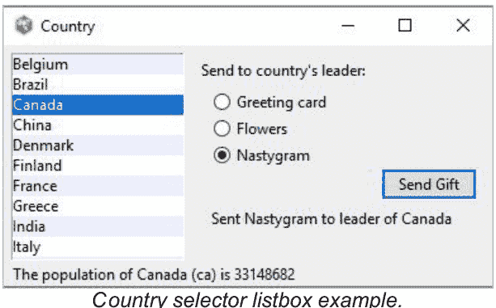

国家选择器列表框示例。

```python
from tkinter import *
from tkinter import ttk
root = Tk()

# Initialize our country "databases":
# - the list of country codes (a subset anyway)
# - parallel list of country names, same order as the country codes
# - a hash table mapping country code to population
countrycodes = ('ar', 'au', 'be', 'br', 'ca', 'cn', 'dk',
                'fi', 'fr', 'gr', 'in', 'it', 'jp', 'mx', 'nl', 'no', 'es',
                'se', 'ch')
countrynames = ('Argentina', 'Australia', 'Belgium',
                'Brazil', 'Canada', 'China', 'Denmark',
                'Finland', 'France', 'Greece', 'India', 'Italy',
                'Japan', 'Mexico', 'Netherlands', 'Norway', 'Spain',
                'Sweden', 'Switzerland')
cnames = StringVar(value=countrynames)
populations = {'ar':41000000, 'au':21179211, 'be':10584534,
               'br':185971537,
               'ca':33148682, 'cn':1323128240, 'dk':5457415,
               'fi':5302000, 'fr':64102140, 'gr':11147000,
               'in':1131043000, 'it':59206382, 'jp':127718000,
               'mx':106535000, 'nl':16402414,
               'no':4738085, 'es':45116894, 'se':9174082,
               'ch':7508700}

# Names of the gifts we can send
gifts = { 'card':'Greeting card', 'flowers':'Flowers',
'nastygram':'Nastygram'}

# State variables
gift = StringVar()
sentmsg = StringVar()
statusmsg = StringVar()

# Called when the selection in the listbox changes; figure
# out
# which country is currently selected, and then lookup its
# country
# code, and from that, its population.  Update the status
# message
# with the new population.  As well, clear the message about
# the
# gift being sent, so it doesn't stick around after we start
# doing
# other things.
def showPopulation(*args):
    idxs = lbox.curselection()
    if len(idxs)==1:
        idx = int(idxs[0])
        code = countrycodes[idx]
        name = countrynames[idx]
        popn = populations[code]
        statusmsg.set("The population of %s (%s) is %d" %
(name, code, popn))
        sentmsg.set('')

# Called when the user double clicks an item in the listbox,
presses
# the "Send Gift" button, or presses the Return key.  In case
the selected
# item is scrolled out of view, make sure it is visible.
#
# Figure out which country is selected, which gift is
selected with the
# radiobuttons, "send the gift", and provide feedback that it
was sent.
def sendGift(*args):
    idxs = lbox.curselection()
    if len(idxs)==1:
        idx = int(idxs[0])
        lbox.see(idx)
        name = countrynames[idx]
        # Gift sending left as an exercise to the reader
        sentmsg.set("Sent %s to leader of %s" %
(gifts[gift.get()], name))

# Create and grid the outer content frame
c = ttk.Frame(root, padding=(5, 5, 12, 0))
c.grid(column=0, row=0, sticky=(N,W,E,S))
root.grid_columnconfigure(0, weight=1)
root.grid_rowconfigure(0,weight=1)

# Create the different widgets; note the variables that many
# of them are bound to, as well as the button callback.
# We're using the StringVar() 'cnames', constructed from
# 'countrynames'
lbox = Listbox(c, listvariable=cnames, height=5)
lbl = ttk.Label(c, text="Send to country's leader:")
g1 = ttk.Radiobutton(c, text=gifts['card'], variable=gift,
    value='card')
g2 = ttk.Radiobutton(c, text=gifts['flowers'], variable=gift,
    value='flowers')
g3 = ttk.Radiobutton(c, text=gifts['nastygram'],
    variable=gift, value='nastygram')
send = ttk.Button(c, text='Send Gift', command=sendGift,
    default='active')
sentlbl = ttk.Label(c, textvariable=sentmsg, anchor='center')
status = ttk.Label(c, textvariable=statusmsg, anchor=W)

# Grid all the widgets
lbox.grid(column=0, row=0, rowspan=6, sticky=(N,S,E,W))
lbl.grid(column=1, row=0, padx=10, pady=5)
g1.grid(column=1, row=1, sticky=W, padx=20)
g2.grid(column=1, row=2, sticky=W, padx=20)
g3.grid(column=1, row=3, sticky=W, padx=20)
send.grid(column=2, row=4, sticky=E)
sentlbl.grid(column=1, row=5, columnspan=2, sticky=N, pady=5,
    padx=5)
status.grid(column=0, row=6, columnspan=2, sticky=(W,E))
c.grid_columnconfigure(0, weight=1)
c.grid_rowconfigure(5, weight=1)

# Set event bindings for when the selection in the listbox
# changes,
# when the user double clicks the list, and when they hit the
# Return key
lbox.bind('<<ListboxSelect>>', showPopulation)
lbox.bind('<Double-1>', sendGift)
root.bind('<Return>', sendGift)

# Colorize alternating lines of the listbox
for i in range(0,len(countrynames),2):
    lbox.itemconfigure(i, background='#f0f0ff')

# Set the starting state of the interface, including selecting the
# default gift to send, and clearing the messages.  Select the first
# country in the list; because the <<ListboxSelect>> event is only
# fired when users makes a change, we explicitly call
# showPopulation.
gift.set('card')
sentmsg.set('')
statusmsg.set('')
lbox.selection_set(0)
showPopulation()

root.mainloop()
```

[https://tkdocs.com/code/country.py](https://tkdocs.com/code/country.py)

这个示例中一个明显的不足是，虽然国家列表可能很长，但一次只能显示其中一部分。要显示列表中更靠后的国家，你必须用鼠标拖动或使用向下箭头键。如果有一个滚动条就好了。让我们来修复这个问题。

## 8.2. 滚动条

ttk.Scrollbar
https://tkdocs.com/man/ttk_scrollbar

**滚动条**控件帮助用户查看另一个控件的所有部分，该控件的内容通常远大于可用屏幕空间所能显示的范围。

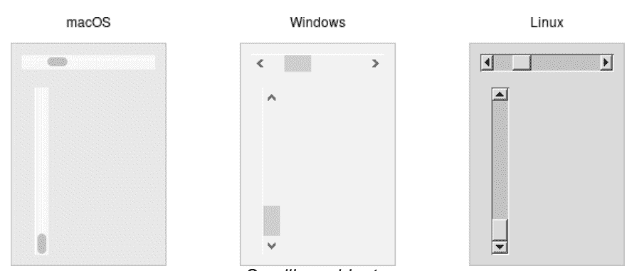

滚动条使用 `ttk.Scrollbar` 类创建：

```
s = ttk.Scrollbar( parent, orient=VERTICAL,
    command=listbox.yview)
listbox.configure(yscrollcommand=s.set)
```

与某些用户界面工具包不同，Tk 滚动条不是另一个控件（例如列表框）的一部分，而是一个完全独立的控件。相反，滚动条通过调用被滚动控件上的方法与*被滚动控件*通信；事实证明，被滚动控件也需要调用滚动条上的方法。

> 如果你使用的是较新的 Linux 发行版，你可能已经注意到许多应用程序中的滚动条外观发生了变化，看起来更

## 8.2. 滚动条

> 类似于你在 macOS 上看到的样式。Tk 的任何默认主题都不支持这种较新的外观。然而，一些第三方主题确实支持它。

`orient` 配置选项决定了滚动条将在 `horizontal`（水平）还是 `vertical`（垂直）维度上滚动被滚动的部件。然后，你需要使用 `command` 配置选项来指定如何与被滚动的部件通信。这是当滚动条移动时，需要在被滚动部件上调用的方法。

每个可以垂直滚动的部件都包含一个名为 `yview` 的方法，而那些可以水平滚动的部件则有一个名为 `xview` 的方法。只要这个方法存在，滚动条就不需要知道关于被滚动部件的任何其他信息。当滚动条被操作时，它会向该方法调用附加几个参数，指示它是如何被滚动的、滚动到什么位置等等。

被滚动的部件也需要与滚动条进行通信，告诉它整个内容区域的百分比现在是可见的。除了 `yview` 和/或 `xview` 方法之外，每个可滚动的部件还有一个 `yscrollcommand` 和/或 `xscrollcommand` 配置选项。这用于指定一个方法调用，该调用必须是滚动条的 `set` 方法。同样，额外的参数会自动附加到方法调用上。

> 💡 如果出于某种原因，你想在程序内部将滚动条移动到特定位置，你可以自己调用 `set first last` 方法。传递两个浮点值（在 0 和 1 之间），表示可见内容区域的起始和结束百分比。

### 示例

列表框是几种可滚动部件类型之一。在这里，我们将构建一个非常简单的用户界面，由一个占据整个窗口的垂直可滚动列表框组成，底部只有一个状态行。

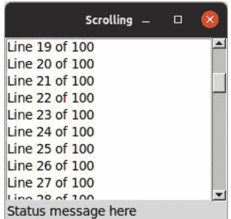

```python
from tkinter import *
from tkinter import ttk

root = Tk()
l = Listbox(root, height=5)
l.grid(column=0, row=0, sticky=(N,W,E,S))
s = ttk.Scrollbar(root, orient=VERTICAL, command=l.yview)
s.grid(column=1, row=0, sticky=(N,S))
l['yscrollcommand'] = s.set
ttk.Label(root, text="Status message here", anchor=(W)).grid(column=0, columnspan=2, row=1, sticky=(W,E))
root.grid_columnconfigure(0, weight=1)
root.grid_rowconfigure(0, weight=1)
for i in range(1,101):
    l.insert('end', 'Line %d of 100' % i)
root.mainloop()
```

[https://tkdocs.com/code/scrollbar.py](https://tkdocs.com/code/scrollbar.py)

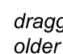

如果你看过本书的早期版本，你可能会记得在这一点上我们介绍了一个 `sizegrip` 部件。它在窗口的右下角放置了一个小手柄，允许用户通过拖动手柄来调整窗口大小。这在一些平台上很常见，包括旧版本的 macOS。一些旧版本的 Tk 甚至会自动为你添加这个手柄。

平台惯例的演变速度往往快于长期存在的开源 GUI 工具包。Mac OS X 10.7 取消了角落的大小调整手柄，转而允许从任何窗口边缘调整大小，最终赶上了世界其他地区。除非有迫切需要与 10 多年前的操作系统在视觉上保持兼容，否则如果你的应用程序中有一个 `sizegrip`（类 `ttk.Sizegrip`），最好将其移除。

## 8.3. 文本

文本
https://tkdocs.com/man/text

**文本**部件为用户提供了一个区域，以便他们可以输入多行文本。文本部件是经典 Tk 部件的一部分，而不是主题化 Tk 部件。

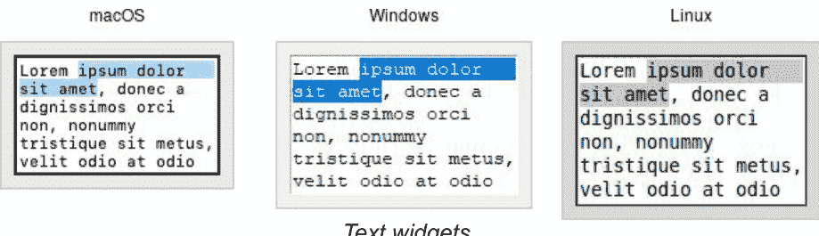

> Tk 的文本部件与画布部件一起，是两个超级强大的部件，提供了惊人深入但易于编程的功能。文本部件构成了完整文字处理器、大纲工具、网络浏览器等的基础。我们将在后面的章节中介绍一些高级内容。在这里，我们将向你展示如何使用文本部件来捕获相当简单的多行文本输入。

文本部件使用 `Text` 类创建：

```python
t = Text(parent, width=40, height=10)
```

`width` 和 `height` 选项分别以字符和行为单位指定文本部件所需的屏幕大小。文本的内容可以任意大。你可以使用 `wrap` 配置选项来控制换行的处理方式：值可以是 `none`（不换行，文本可能水平滚动）、`char`（在任何字符处换行）和 `word`（仅在单词边界处换行）。

文本部件可以被禁用，以防止进行任何编辑。因为文本不是主题化部件，所以通常的 `state` 和 `instate` 方法不可用。相反，使用配置选项 `state`，将其设置为 `disabled` 或 `normal`。

```python
txt['state'] = 'disabled'
```

滚动的工作方式与列表框相同。`xscrollcommand` 和 `yscrollcommand` 配置选项将文本部件连接到水平和/或垂直滚动条，而 `xview` 和 `yview` 方法则从滚动条调用。为确保给定行可见（即，未被滚动出视图），你可以使用 `see index` 方法，其中 `index` 的格式为 `linenum.charnum`，例如，`5.0` 表示第 5 行（从 1 开始计数）的第一个（从 0 开始计数）字符。

### 内容

文本部件不像例如输入部件那样有关联的链接变量。要检索整个文本部件的内容，请调用方法 `get 1.0 end`；`1.0` 是文本中的一个索引，表示第一行的第一个字符，`end` 是最后一行最后一个字符索引的快捷方式。如果需要，可以提供其他索引来检索较小范围的文本。

```python
contents = txt.get('1.0', 'end')
```

可以使用 `insert index string` 方法向部件添加文本；同样，`index` 的格式为 `line.char`，标记文本插入其前的字符；使用 `end` 将文本添加到部件的末尾。你可以使用 `delete start end` 方法删除一段文本，其中 `start` 和 `end` 都是如前所述的文本索引。

我们将在后面的章节中介绍文本部件的许多其他高级功能。

## 8.4. 滑块

ttk.Scale
https://tkdocs.com/man/ttk_scale

**滑块**部件允许用户通过直接操作选择一个数值。

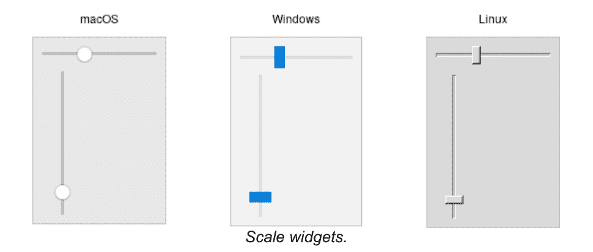

滑块部件使用 `ttk.Scale` 类创建：

```python
s = ttk.Scale(parent, orient=HORIZONTAL, length=200,
              from_=1.0, to=100.0)
```

> 因为 'from' 是 Python 中的保留关键字，所以当它用作配置选项时，我们需要在末尾添加一个下划线。

`orient` 选项可以是 `horizontal` 或 `vertical`。`length` 选项代表水平或垂直滑块的较长轴，以屏幕单位（例如像素）指定。你还应该定义滑块允许用户选择的数字范围；为此，为 `from_` 和 `to` 配置选项各设置一个浮点数。

有几种不同的方法可以设置滑块的当前值（该值必须是介于 `from_` 和 `to` 值之间的浮点值）。你可以设置（或读取以获取当前值）滑块的 `value` 配置选项。你可以使用 `variable` 选项将滑块链接到一个变量。或者，你可以调用滑块的 `set value` 方法来更改值，或调用 `get` 方法来读取当前值。

`command` 配置选项允许你指定一个脚本，每当滑块更改时调用。Tk 每次调用此脚本时，都会将滑块的当前值作为参数附加（我们在滚动条回调中看到过类似的情况，额外的参数被添加到回调中）。

```python
# 标签与滑块绑定到同一个变量，因此会自动更新
num = StringVar()
ttk.Label(root, textvariable=num).grid(column=0, row=0,
sticky='we')

# 我们将通过滑块的 command 回调手动更新的标签
manual = ttk.Label(root)
manual.grid(column=0, row=1, sticky='we')

def update_lbl(val):
    manual['text'] = "Scale at " + val

scale = ttk.Scale(root, orient='horizontal', length=200,
from_=1.0, to=100.0, variable=num, command=update_lbl)
scale.grid(column=0, row=2, sticky='we')
scale.set(20)
```

https://tkdocs.com/code/scale.py

与其他主题化部件一样，你可以使用 `state disabled`、`state !disabled` 和 `instate disabled` 方法来防止用户修改滑块。

> 由于滑块部件不显示实际值，你可能需要单独添加这些值，例如，使用标签部件。

## 8.5. Spinbox

ttk.Spinbox
https://tkdocs.com/man/ttk_spinbox

**Spinbox** 控件允许用户选择数字（或者实际上是从任意列表中选择项目）。它通过组合一个显示当前值的类输入框控件和一对小的上下箭头来实现这一点，这些箭头可用于在可能的选择范围内逐步选择。

> 💡 主题化的 Spinbox 是在 Tk 8.5.9（2010年发布）中添加的。如果你必须运行更旧的版本，经典 Tk 控件中有一个 spinbox，不过其 API 略有不同。

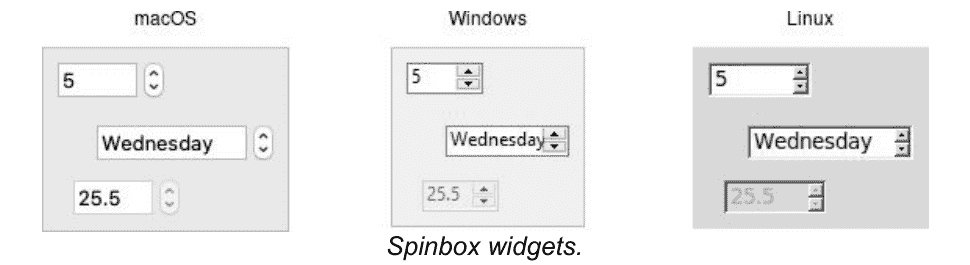

Spinbox 控件使用 `ttk.Spinbox` 类创建：

```python
spinval = StringVar()
s = ttk.Spinbox(parent, from_=1.0, to=100.0,
                textvariable=spinval)
```

与 scale 控件类似，spinbox 让用户在特定范围内选择一个数字（通过 `from_` 和 `to` 配置选项指定），尽管使用的是完全不同的用户界面。你还可以指定一个 `increment`，它控制每次点击向上或向下按钮时值的变化量。

与 listbox 或 combobox 类似，spinbox 也可以用于让用户从任意字符串列表中选择一个项目；这些可以通过 `values` 配置选项指定。其工作方式与 combobox 相同；指定值列表将覆盖 `from_` 和 `to` 设置。
在默认状态下，spinbox 允许用户通过向上和向下按钮选择值，或者直接在显示当前值的输入区域中键入值。如果你想禁用后一项功能，只允许使用向上和向下按钮，可以设置 `readonly` 状态标志。

```python
s.state(['readonly'])
```

与其他主题控件一样，你也可以通过 `disabled` 状态标志禁用 spinbox，或者通过 `instate` 方法检查状态。Spinbox 还以与 entry 控件相同的方式支持验证，使用 `validate` 和 `validatecommand` 配置选项。

> 💡 你可能对何时选择 scale、listbox、combobox、entry 或 spinbox 感到困惑。通常，其中几种都可以用于相同类型的数据。答案实际上取决于你希望用户选择什么、平台用户界面惯例以及该值在用户界面中扮演的角色。

例如，与 listbox 相比，combobox 和 spinbox 占用的空间都相当小。对于更外围的设置，它们可能更有意义。用户界面中更主要、更突出的选择可能值得使用 listbox 占用的额外空间。当项目没有自然且明显的顺序时，spinbox 就没有太大意义了。注意不要在 combobox 和 spinbox 中放入过多的项目。这可能会使选择项目更加耗时。

有一个布尔选项 `wrap`，它决定当值超出起始或结束值时是否应该循环。你还可以为保存 spinbox 当前值的输入框指定一个 `width`。
同样，关于如何设置或获取 spinbox 中的当前值也有多种选择。通常，你会通过 `textvariable` 配置选项指定一个关联变量。与往常一样，对变量的任何更改都会反映在 spinbox 中，而 spinbox 中的任何更改也会反映在关联变量中。此外，`set value` 和 `get` 方法允许你直接设置或获取值。

当用户按下向上（`<<Increment>>`）或向下（`<<Decrement>>`）时，Spinbox 会生成虚拟事件。`command` 配置选项允许你提供一个在任何更改时调用的回调函数。

## 8.6. Progressbar

ttk.Progressbar
https://tkdocs.com/man/ttk_progressbar

**Progressbar** 控件向用户提供关于长时间操作进度的反馈。
在你可以估计操作完成所需时间的情况下，你可以显示已完成的比例。否则，你可以指示操作正在进行，但不暗示还需要多长时间。

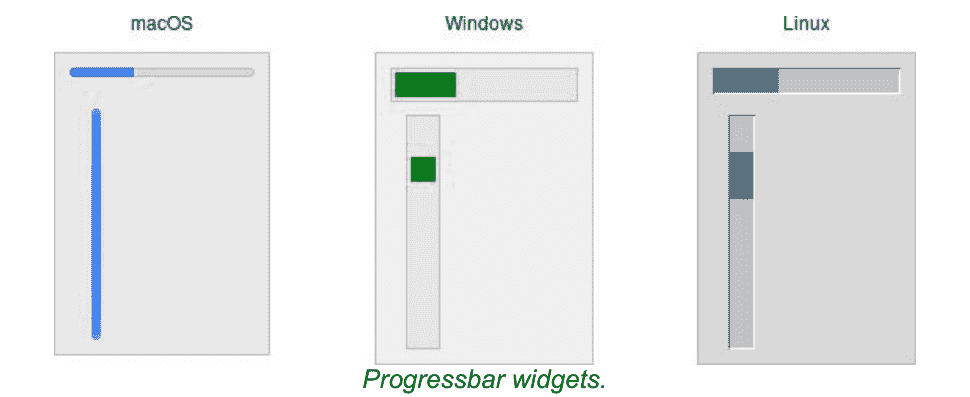

Progressbar 控件使用 `ttk.Progressbar` 类创建：

```python
p = ttk.Progressbar(parent, orient=HORIZONTAL, length=200,
    mode='determinate')
```

与 scale 控件一样，应通过 `orient` 配置选项为其指定方向（`horizontal` 或 `vertical`），并且可以指定可选的 `length`。`mode` 配置选项可以设置为 `determinate`（进度条将显示相对于完成的进度）或 `indeterminate`（显示操作仍在继续，但不显示相对进度）。

### **确定进度**

要使用确定模式，请估计操作完成所需的总“步数”。这可以是时间量，但不必是。使用 `maximum` 配置选项将其提供给进度条。它应该是一个浮点数，默认为 `100.0`（即每一步为 1%）。

在操作过程中，通过 `value` 配置选项告诉进度条你的进度。因此，这将从 0 开始，然后向上计数到你设置的最大值。

> 这里有两个细微的变化。首先，你可以将进度条的当前值存储在一个通过进度条的 `variable` 配置选项与之关联的变量中；这样，当你更改变量时，进度条将更新。另一种选择是调用进度条的 `step ?amount?` 方法。这会将值增加给定的 `amount`（默认为 1.0）。

### **不确定进度**

当你无法轻松估计长时间运行任务的实际进度时，请使用不确定模式。但是，你仍然希望提供反馈，表明操作正在进行（并且你的程序没有崩溃）。在操作开始时，你只需调用进度条的 `start` 方法。在操作结束时，调用其 `stop` 方法。进度条将处理其余部分。

不幸的是，“进度条将处理其余部分”并不那么简单。事实上，如果你 `start` 进度条，调用一个需要几分钟才能完成的函数，然后 `stop` 进度条，你的程序在整个过程中都会显得完全冻结，进度条不会更新。事实上，它可能根本不会出现在屏幕上。哎呀！

要了解原因以及如何解决这个问题，下一章将深入探讨 Tk 的事件循环。

## 9. 事件循环

在上一章的结尾，我们解释了如何使用进度条向用户提供关于长时间运行操作的反馈。进度条本身很简单：调用它的 `start` 方法，执行你的操作，然后调用它的 `stop` 方法。不幸的是，你了解到如果你尝试这样做，你的应用程序很可能会显得完全冻结。

要理解原因，我们需要重新讨论我们在 Tk 概念章节中关于事件处理的讨论。正如我们所看到的，在构建应用程序的初始用户界面之后，它会进入 Tk 事件循环。在事件循环中，它不断地处理从系统事件队列中拉取的事件，通常每秒数十次。它监视鼠标或键盘事件，并根据需要调用命令回调和事件绑定。

不太明显的是，所有屏幕更新仅在事件循环中处理。例如，你可能更改了标签控件的文本。但是，该更改不会立即显示在屏幕上。相反，控件会通知 Tk 它需要重绘。稍后，在处理其他事件之间，Tk 的事件循环会要求控件重绘自身。*所有绘制仅在事件循环中发生。* 这种更改*看起来*立即发生，是因为从对控件进行更改到事件循环中实际重绘之间的时间非常短。

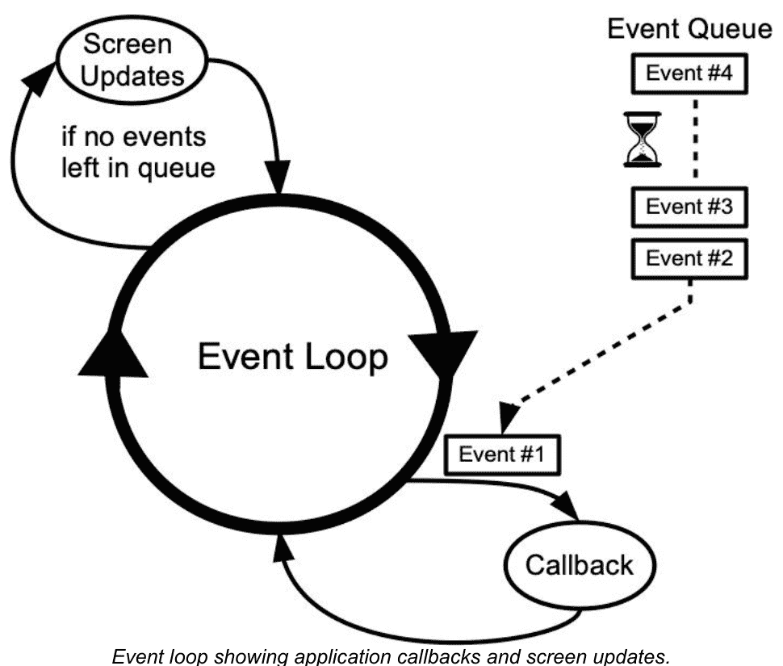

显示应用程序回调和屏幕更新的事件循环。

### 9.1. 阻塞事件循环

当事件循环在长时间内无法处理事件时，就会出现问题。你的应用程序将不会重绘或响应事件，并且看起来像是冻结了。这种情况被称为事件循环被*阻塞*。这会如何发生呢？

让我们首先将事件循环可视化为一个执行时间线。在正常情况下，每次偏离事件循环（回调、屏幕更新）的操作只占用一小部分时间，然后就会将控制权交还给事件循环。

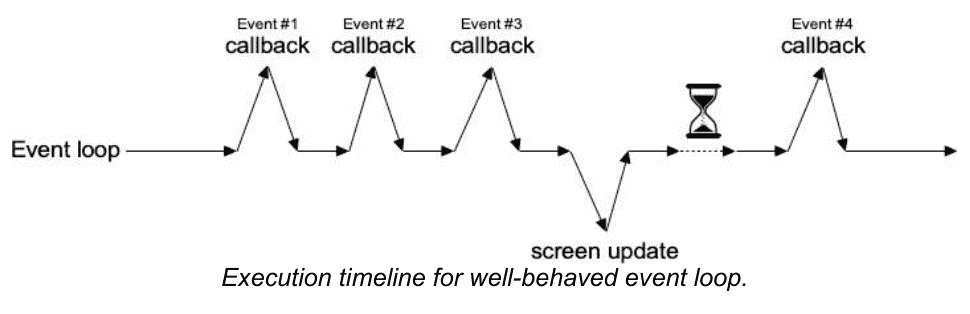

在我们的场景中，整个过程可能始于一个事件，比如用户按下按钮。因此，事件循环调用我们的应用程序代码来处理该事件。我们的代码创建进度条，执行（耗时的）操作，然后停止进度条。只有在那时，我们的代码才会将控制权交还给事件循环。在此期间，没有事件被处理，也没有屏幕重绘发生。它们只是在事件队列中不断堆积。

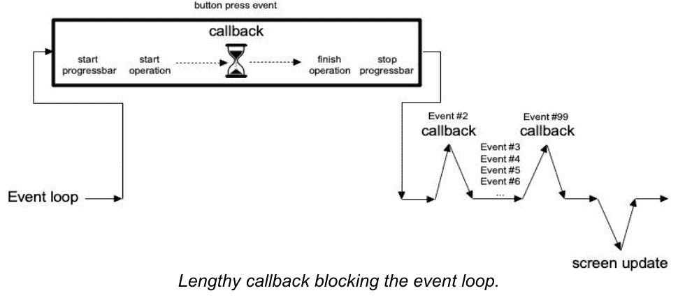

*耗时的回调阻塞了事件循环。*

为了防止阻塞事件循环，事件处理程序必须快速执行并将控制权交还给事件循环，这一点至关重要。

如果你确实有一个长时间运行的操作需要执行，或者任何可能耗时很长的网络 I/O 操作，你可以采取几种不同的方法。

> 对于技术倾向更强的读者，Tk 使用单线程、事件驱动的编程模型。所有 GUI 代码、事件循环和你的应用程序都在同一个线程中运行。因此，任何阻塞事件处理程序的调用或计算都是极不推荐的。一些其他的 GUI 工具包使用不同的模型，允许阻塞代码、在单独的线程中运行 GUI 和事件处理程序（与应用程序代码分离）等。试图将这些模型强行套用到 Tk 中，可能会导致挫败感，并产生脆弱和 hacky 的代码。如果你尊重 Tk 的模型，而不是试图与之对抗，你就不会遇到问题。

## 9.2. 一次一小步

如果可能，你能做的最好的事情就是将你的操作分解成非常小的步骤，每个步骤都能非常快速地执行。你让事件循环负责决定下一步何时发生。这样，事件循环就能继续运行，处理常规事件，更新屏幕，并在所有这些操作之间，调用你的代码来执行操作的下一步。

为此，我们使用*定时器事件*。我们的程序可以要求事件循环在未来某个时间生成一个这样的事件。作为其常规工作的一部分，当事件循环到达那个时间点时，它会回调我们的代码来处理该事件。我们的代码将执行操作的下一步。然后，它为操作的*下一步*安排另一个定时器事件，并立即将控制权交还给事件循环。

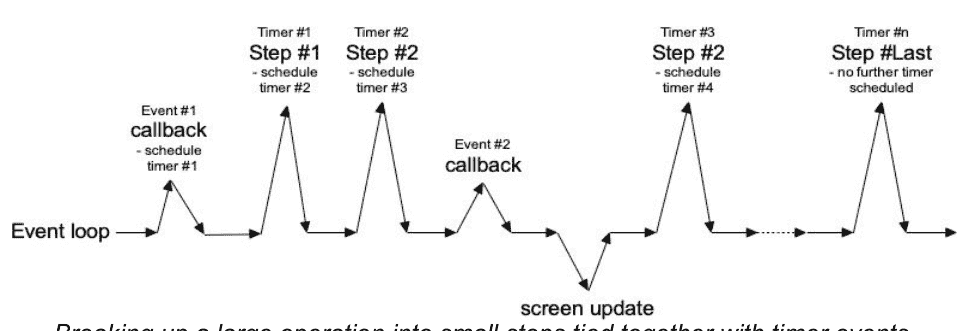

*将一个大操作分解成小步骤，并用定时器事件连接起来。*

Tk 的 `after` 命令可用于生成定时器事件。你提供等待事件触发的毫秒数。如果 Tk 正忙于处理其他事件，它可能会晚于这个时间发生，但不会早于这个时间。你也可以要求生成一个 `idle` 事件；它会在事件队列中没有其他事件需要处理时触发。（Tk 的屏幕更新和重绘发生在空闲事件的上下文中。）你可以在[参考手册](https://tkdocs.com/man/after)中找到更多关于 `after` 的细节。

https://tkdocs.com/man/after

在下面的例子中，我们将执行一个被分解成 20 个小步骤的长时间操作。在执行此操作的同时，我们将更新一个进度条，并允许用户中断该操作。

```
def start():
    b.configure(text='Stop', command=stop)
    l['text'] = 'Working...'
    global interrupt; interrupt = False
    root.after(1, step)

def stop():
    global interrupt; interrupt = True

def step(count=0):
    p['value'] = count
    if interrupt:
        result(None)
        return
    root.after(100)  # next step in our operation; don't take too long!
    if count == 20:  # done!
        result(42)
        return
    root.after(1, lambda: step(count+1))

def result(answer):
    p['value'] = 0
    b.configure(text='Start!', command=start)
    l['text'] = "Answer: " + str(answer) if answer else "No Answer"

f = ttk.Frame(root); f.grid()
b = ttk.Button(f, text="Start!", command=start);
b.grid(column=1, row=0, padx=5, pady=5)
l = ttk.Label(f, text="No Answer"); l.grid(column=0, row=0, padx=5, pady=5)
p = ttk.Progressbar(f, orient="horizontal", mode="determinate", maximum=20);
p.grid(column=0, row=1, padx=5, pady=5)
```

https://tkdocs.com/code/longrunning.py

> 为了中断这个过程，我们只是设置了一个全局变量，该变量在下次定时器事件触发时会被检查。另一个选择是取消待处理的定时器事件。当我们创建定时器事件时，它会返回一个 id 号来唯一标识待处理的定时器。要取消它，我们可以调用 `after_cancel` 方法，并传入该唯一 id。

你还会注意到，我们使用了 `after` 的阻塞形式来模拟执行我们的操作。该调用会阻塞，等待给定的时间后返回，而不是安排一个在未来发生的事件。它的工作方式与 `sleep` 系统调用相同。

### 9.3. 异步 I/O

定时器事件负责分解长时间运行的计算，其中你知道每个步骤都可以保证快速完成，以便你的处理程序能够返回到事件循环。如果你有一个可能无法快速完成的操作呢？当你进行各种操作系统调用时，就可能发生这种情况。最常见的是当我们进行某种 I/O 操作时，无论是写入文件、与数据库通信，还是从远程 Web 服务器检索数据。

大多数 I/O 调用是*阻塞*的。它们在操作完成（或失败）之前不会返回。我们想要使用的是*非阻塞*或*异步* I/O 调用。当你进行异步 I/O 调用时，它会在操作完成之前立即返回。你的代码可以继续运行，或者在这种情况下，返回到事件循环。稍后，当 I/O 操作完成时，你的程序会收到通知，并可以处理 I/O 操作的结果。

如果这听起来像是将 I/O 视为另一种类型的事件，那你就完全正确了。事实上，它也被称为*事件驱动 I/O*。

在 Python 中，异步 I/O 是通过 `asyncio` 模块以及许多在其之上构建的其他模块提供的。

所有 asyncio 应用程序都严重依赖事件循环。多么方便，Tkinter 有一个很棒的事件循环！不幸的是，asyncio 事件循环和 Tkinter 事件循环并不相同。你不能真正让它们同时运行，至少在同一个线程内不行（嗯，你可以让一个反复调用另一个，但这相当 hacky 且脆弱）。

我的建议是：将 Tkinter 保持在主线程中，并在另一个线程中启动你的 asyncio 事件循环。

你的应用程序代码在主线程中运行，可能需要与在另一个线程中运行的 asyncio 事件循环进行协调。你可以使用 asyncio 的 `call_soon_threadsafe` 方法来调用在 asyncio 事件循环线程中运行的函数（即使是从 Tkinter 事件循环中调用，例如在 widget 回调中）。要从 asyncio 事件循环调用 Tkinter，请继续阅读。

### 9.4. 线程或进程

有时，将长时间运行的计算分解成每个都能快速运行的离散部分是不可能的或不切实际的。或者你可能正在使用一个不支持异步操作的库。或者，像 Python 的 `asyncio` 一样，它与 Tk 的事件循环配合得不好。在这些情况下，为了保持你的 Tk GUI 响应，你需要将那些耗时的操作或库调用从你的事件处理程序中移出，并在其他地方运行它们。线程，甚至其他进程，可以提供帮助。

在线程中运行任务、与它们通信等超出了本书的范围。然而，在使用 Tk 与线程时，你应该注意一些限制。主要规则是，你必须只从加载 Tk 的线程进行 Tk 调用。

Tkinter 在内部做了大量工作，以便你可以从多个线程进行 Tkinter 调用。它将这些调用路由到主线程（创建 Tk 实例的那个线程）。它大部分情况下都能工作，但并非总是如此。尽管它尽力而为，但我强烈建议你从单个线程进行所有 Tkinter 调用。

如果你需要从另一个线程与运行 Tkinter 的线程进行通信，请尽可能保持简单。使用 `event_generate` 将一个虚拟事件发布到 Tkinter 事件队列，然后在你的代码中 `bind` 到该事件。

情况可能更加复杂。Tcl/Tk 库可以构建为支持线程或不支持线程。如果你的应用程序中有多个线程，请确保你运行的是线程构建版本。如果你不确定，请检查 Tcl 变量 `tcl_platform(threaded)`；它应该是 1，而不是 0。

```
>>> tkinter.Tcl().eval(' set tcl_platform(threaded)' )
```

> 大多数人都应该运行线程构建版本。在 Tcl/Tk 中创建非线程构建版本的能力在未来可能会消失。如果你在使用线程代码时使用了非线程构建版本，请将此视为你应用程序中的一个 bug，而不是一个需要解决的挑战。

### 9.5. 嵌套事件处理

前三种方法是在保持 Tk GUI 响应性的同时处理长时间运行操作的正确方式。它们的共同点是拥有一个持续处理各类事件的单一事件循环。该事件循环会调用你应用代码中的事件处理器，这些处理器执行其功能后迅速返回。

还有另一种方法。在你的长时间运行操作中，你可以调用事件循环来处理一批事件。你可以通过一个简单的命令 `update` 来实现这一点。无需处理定时器事件或异步 I/O。相反，你只需在操作过程中穿插一些 `update` 调用。如果你只想保持屏幕重绘而不处理其他事件，甚至有一个专门的选项（`update_idletasks`）。

这种方法看似简单诱人。如果你运气好，它可能有效。至少能持续一小会儿。但迟早，你会尝试用这种方式做事时遇到严重困难。某些东西不会更新，本应被调用的事件处理器没有被调用，事件丢失或触发顺序错乱，甚至更糟。你会把程序的逻辑搞得一团糟，为了使其恢复正常而抓狂。

> 供参考：当你使用 `update` 时，你并没有将控制权交还给正在运行的事件循环。你实际上是在现有事件循环内部启动了一个新的嵌套事件循环。记住，事件循环遵循单一的执行线程：没有线程，没有协程。如果你不小心，最终会得到从事件循环内部调用的事件循环，再从……好吧，你明白的。即使你意识到自己在这样做，解开这些事件循环（每个事件循环可能有不同的终止条件）也将是一项有趣的挑战。现实情况不会与你关于简单事件循环独立处理每个事件的心智模型相符。这是与 Tk 模型对抗的经典例子。在非常特定的情况下，它可能有效。但在实践中，你是在自找麻烦。别说没人警告过你……

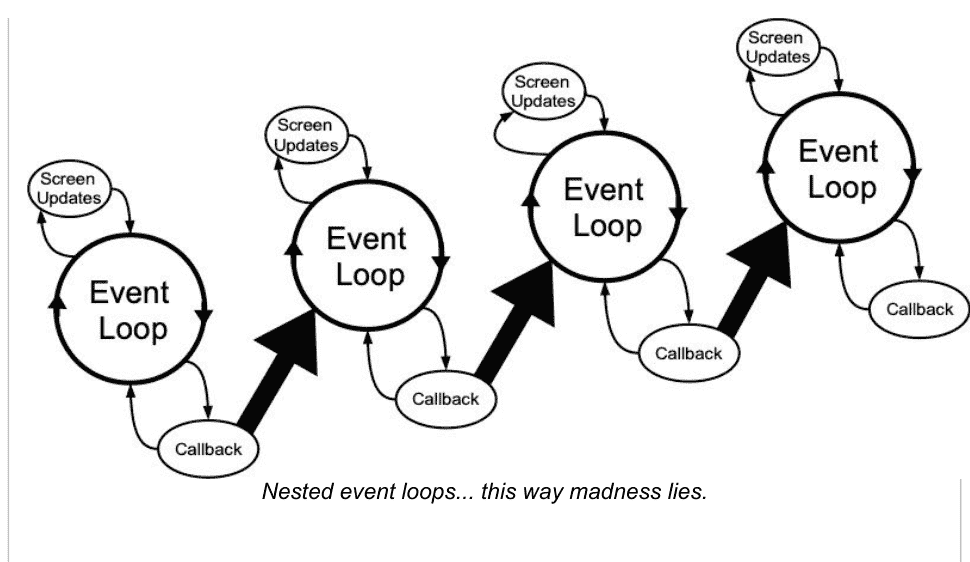

嵌套事件循环……此路通向疯狂。

## 10. 菜单

本章介绍如何在 Tk 中处理菜单栏和弹出菜单。对于一个精致的应用程序，这些是你特别需要关注的方面。如果你想让你的应用程序与用户平台上的其他应用程序保持一致，菜单需要特别注意。
说到平台，推荐的确定运行平台的方法是：

```python
root.tk.call('tk', 'windowingsystem')    # returns x11, win32 or aqua
```

> 💡 Tkinter 没有提供与此调用直接等效的功能。但是，可以使用任何 Tkinter 控件上可用的 `tk.call()` 方法直接执行任意基于 Tcl 的 Tk 命令。这里，我们调用的是 Tcl/Tk 命令 `tk windowingsystem`。

> 🏠 升级提示：这比检查像 `tcl_platform` 或 `sys.platform` 这样的全局变量更有用，使用这些方法的旧检查应该被重新审视。虽然在过去，平台和窗口系统之间有相当好的对应关系，但今天情况已不那么真实。例如，如果你的平台被识别为 Unix，那可能意味着 X11 下的 Linux、Aqua 下的 macOS，甚至是 X11 下的 macOS。

### 10.1. 菜单栏

在本节中，我们将探讨菜单栏：如何创建它们、包含什么内容、如何使用它们等。

正确设计菜单栏及其菜单集超出了本书的范围。但是，如果你正在为他人创建应用程序，这里有一些建议。首先，如果你发现自己有很多菜单、非常长的菜单或深层嵌套的菜单，你可能需要重新思考用户界面的组织方式。其次，许多人使用菜单来探索程序的功能，尤其是在初次学习时，因此请尝试确保主要功能可以通过菜单访问。最后，对于你针对的每个平台，熟悉应用程序如何使用菜单，并查阅平台的人机界面指南，以获取有关设计、术语、快捷方式等的详细信息。这是一个你可能需要为每个平台进行定制的领域。

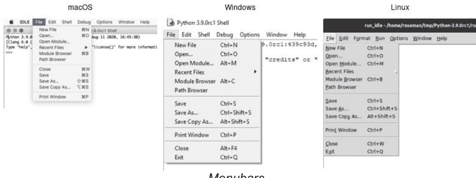

> 你会注意到，在一些较新的 Linux 发行版上，许多应用程序在活动时会在屏幕顶部显示菜单，而不是在窗口本身内。Tk 尚不支持这种菜单样式。

### 菜单控件与层次结构

#### 菜单

https://tkdocs.com/man/menu

菜单在 Tk 中作为控件实现，就像按钮和输入框一样。每个菜单控件由菜单中的多个不同*项*组成。项具有各种属性，例如要显示的项的文本、键盘加速键和要调用的命令。

菜单按层次结构排列。菜单栏本身就是一个菜单控件。它有几个项（“文件”、“编辑”等），每个项都是一个包含更多项的子菜单。这些项可以包括像“文件”菜单中的“打开...”命令，也可以是其他项之间的分隔符。它甚至可以包含打开自己子菜单的项（所谓的*级联*菜单）。正如你从 Tk 中已经看到的其他内容所预期的那样，任何时候你有一个子菜单，它必须作为其父菜单的子项创建。

菜单是经典 Tk 控件的一部分；目前主题化 Tk 控件集中没有菜单。

### 开始之前

在开始创建菜单之前，务必将以下行放在应用程序的某个位置。

```python
root.option_add('*tearOff', FALSE)
```

没有它，你的每个菜单（在 Windows 和 X11 上）都会以一条看起来像虚线的线开始，并允许你“撕下”菜单，使其出现在自己的窗口中。你应该从应用程序中消除撕下菜单，因为它们不是任何现代用户界面风格的一部分。

> 这是对 Tk 原始外观和感觉所基于的 Motif 风格 X11 的怀旧。除非你的应用程序设计为仅在地下室里积灰的旧机器上运行，否则请摆脱它们。我们都期待 Tk 的未来版本能移除这种对向后兼容性的误导性致敬。

说到古老历史，`option_add` 部分使用了选项数据库。在 X11 系统上，这提供了一种通过基于文本的配置文件自定义用户界面某些元素的标准化方法。今天已不再使用。较旧的 Tk 程序可能在内部使用 `option` 命令将样式配置选项与控件创建代码分开。这一切都早于主题化 Tk 样式，而今天应该使用主题化 Tk 样式来实现该目的。然而，使用过时的选项数据库来自动移除过时的撕下菜单，在某种程度上是合适的。

### 创建菜单栏

在 Tk 中，菜单栏与单个窗口相关联；每个顶层窗口最多可以有一个菜单栏。在 Windows 和许多 X11 窗口管理器上，这是显而易见的，因为菜单是每个窗口的一部分，位于顶部标题栏的正下方。

然而，在 macOS 上，屏幕顶部有一个单一的菜单栏，由每个窗口共享。就你的 Tk 程序而言，每个窗口仍然有自己的菜单栏。当你在窗口之间切换时，Tk 会确保显示正确的菜单栏。如果你没有为特定窗口指定菜单栏，Tk 将使用与根窗口关联的菜单栏；你可能已经注意到，当你的 Tk 应用程序启动时，这会自动为你创建。

> 因为在 macOS 上所有窗口都有一个菜单栏，所以为每个窗口定义一个菜单栏，或者为根窗口定义一个备用菜单栏，这一点很重要。否则，你最终会得到“内置”菜单栏，其中包含仅用于直接向解释器输入命令的菜单。

要为窗口创建菜单栏，首先创建一个菜单控件。然后，使用窗口的 `menu` 配置选项将菜单控件附加到窗口。

```python
win = Toplevel(root)
menubar = Menu(win)
win['menu'] = menubar
```

> 你可以将同一个菜单栏用于多个窗口。换句话说，你可以为多个顶层窗口指定相同的菜单栏作为 `menu` 配置选项。这在

## 添加菜单

我们现在有了一个菜单栏，但如果没有菜单，它几乎没什么用。因此，我们将为每个菜单创建一个菜单小部件，每个菜单都是菜单栏的子项。然后，我们将它们全部添加到菜单栏中。

```python
menubar = Menu(parent)
menu_file = Menu(menubar)
menu_edit = Menu(menubar)
menubar.add_cascade(menu=menu_file, label='File')
menubar.add_cascade(menu=menu_edit, label='Edit')
```

> `add_cascade` 方法添加一个菜单项，其本身就是一个菜单（子菜单）。

## 添加菜单项

现在我们的菜单栏中有了几个菜单，我们可以为每个菜单添加一些项目。

### 命令项

在 Tk 中，普通的菜单项被称为 `command` 项。我们很快会看到其他类型的菜单项。请注意，菜单项是菜单本身的一部分；我们不必为每个菜单项创建单独的菜单小部件（子菜单除外）。

```python
menu_file.add_command(label='New', command=newFile)
menu_file.add_command(label='Open...', command=openFile)
menu_file.add_command(label='Close', command=closeFile)
```

> 在 macOS 上，省略号（"..."）实际上是一个特殊字符，比连续三个句点的间距更紧凑。Tk 会自动为你替换此字符。

每个菜单项都关联了几个配置选项，类似于小部件配置选项。每种类型的菜单项都有不同的可用选项集。级联菜单项有一个 `menu` 选项，用于指定子菜单；命令菜单项有一个 `command` 选项，用于指定选择该项时要调用的命令。两者都有一个 `label` 选项，用于指定要为该项显示的文本。

### 子菜单

我们已经看到 `cascade` 菜单项用于向菜单栏添加菜单。毫不奇怪，如果你想向现有菜单添加子菜单，也可以使用完全相同的 `cascade` 菜单项。例如，你可以用它来构建一个“最近打开的文件”子菜单。

```python
menu_recent = Menu(menu_file)
menu_file.add_cascade(menu=menu_recent, label='Open Recent')
for f in recent_files:
    menu_recent.add_command(label=os.path.basename(f),
        command=lambda: openFile(f))
```

https://tkdocs.com/code/recentfiles.py

### 分隔符

第三种类型的菜单项是 `separator`，它会产生你经常在不同菜单项之间看到的分隔线。

```python
menu_file.add_separator()
```

### 复选按钮和单选按钮项

最后，还有 `checkbutton` 和 `radiobutton` 菜单项，它们的行为类似于复选按钮和单选按钮小部件。这些菜单项有一个关联的变量。根据其值，可能会在标签旁边显示一个指示器（即复选标记或选中的单选按钮）。

```python
check = StringVar()
menu_file.add_checkbutton(label='Check', variable=check,
    onvalue=1, offvalue=0)
radio = StringVar()
menu_file.add_radiobutton(label='One', variable=radio,
    value=1)
menu_file.add_radiobutton(label='Two', variable=radio,
    value=2)
```

当用户选择一个未选中的复选按钮项时，它会将关联的变量设置为 `onvalue` 中的值。选择一个已选中的项会将其设置为 `offvalue` 中的值。选择一个单选按钮项会将关联的变量设置为 `value` 中的值。这两种类型的项也会对关联变量的任何更改做出反应。

与命令项一样，复选按钮和单选按钮菜单项支持一个 `command` 配置选项，该选项在选择菜单项时被调用。在调用回调之前，会更新关联的变量和菜单项的状态。

> 单选按钮菜单项不是 Windows 或 macOS 人机界面指南的一部分。在这些平台上，该项的指示器是一个复选标记，就像复选按钮项一样。语义仍然有效。这是在多个项目之间进行选择的好方法，因为它会显示其中一个被选中（已选中）。

## 操作菜单项

除了将项目添加到菜单末尾，你还可以通过 `insert index type ?option value...?` 方法将它们插入到菜单中间；这里的 index 是你想要在其之前插入的项目的位置（0..n-1）。你也可以使用 `delete index ?endidx?` 方法删除一个或多个菜单项。

```python
menu_recent.delete(0, 'end')
```

与 Tk 中的大多数内容一样，你可以随时查看或更改项目的选项值。项目通过索引引用。通常，这是一个数字（0..n-1），表示项目在菜单中的位置。你也可以指定菜单项的标签（或者，实际上，一个用于匹配项目标签的“glob 风格”模式）。

```python
print(menu_file.entrycget(0, 'label'))  # 获取菜单中第一个项目的标签
print(menu_file.entryconfigure(0))  # 显示项目的所有选项
```

### 状态

你可以禁用菜单项，使用户无法选择它。这可以通过 `state` 选项完成，将其设置为值 `disabled`。使用值 `normal` 可以重新启用该项。

菜单应始终反映应用程序的当前状态。如果某个菜单项当前不相关（例如，“复制”项仅在应用程序中选中了某些内容时才适用），你应该禁用它。当你的应用程序状态更改使得该项适用时，请确保启用它。

```python
menu_file.entryconfigure('Close', state=DISABLED)
```

有时，你可能有菜单项的名称会根据应用程序状态的变化而改变，而不是菜单项被禁用。例如，网页浏览器可能有一个菜单项，当书签窗格隐藏或显示时，它会在“显示书签”和“隐藏书签”之间切换。

```python
menu_bookmarks.entryconfigure(3, label="Hide Bookmarks")
``

> 随着你的程序变得复杂，很容易忘记启用或禁用某些项。一种策略是将所有菜单状态更改集中在一个例程中。每当你的应用程序中有状态更改时，它都应该调用此例程。它将检查当前状态并相应地更新菜单。相同的代码也可以处理工具栏、状态栏或其他用户界面组件。

### 快捷键

`accelerator` 选项用于指示与菜单项对应的键盘等效键。这实际上并不*创建*快捷键，而只是将其显示在菜单项旁边。你仍然需要自己为快捷键创建事件绑定。

> 请记住，事件绑定可以设置在*单个小部件*上、某种类型的所有小部件上、包含你感兴趣的小部件的顶层窗口上，或整个应用程序上。由于菜单栏与单个窗口关联，你创建的事件绑定通常会在菜单关联的顶层窗口上。

快捷键非常特定于平台，不仅在于哪些键用于什么操作，还在于菜单快捷键使用哪些修饰键（例如，在 macOS 上是“Command”键，在 Windows 和 X11 上通常是“Control”键）。有效的快捷键选项示例包括 `Command-N`、`Shift+Ctrl+X` 和 `Command-Option-B`。常用的修饰符包括 `Control`、`Ctrl`、`Option`、`Opt`、`Alt`、`Shift`、`Command`、`Cmd` 和 `Meta`。

> 在 macOS 上，修饰符名称会自动映射到菜单中出现的不同修饰符图标，即 `Shift` ⇒ ⇧、`Command` ⇒ ⌘、`Control` ⇒ ⌃ 和 `Option` ⇒ ⌥。

```python
menu_bookmarks.entryconfigure(3, label="Hide Bookmarks")
```

### 下划线

所有平台都支持通过方向键在菜单栏中进行键盘遍历。在 Windows 和 X11 上，你还可以使用其他键跳转到特定的菜单或菜单项。触发这些跳转的键在菜单项标签中以下划线字母标示。要为菜单项添加此功能，请使用该项的 `underline` 配置选项。其值应为你希望加下划线的字符的索引（从 0 到字符串长度减 1）。与加速键不同，菜单会监视按键事件，因此无需单独绑定事件。

```
m.add_command(label='Path Browser', underline=5)  # underline "B"
```

## 图片

也可以在菜单项中使用图片，可以放在菜单项标签旁边，也可以完全替代标签。为此，请使用 `image` 和 `compound` 选项，其用法与标签控件中的相同。`image` 的值必须是一个 Tk 图像对象，而 `compound` 可以取值 `bottom`、`center`、`left`、`right`、`top` 或 `none`。

## 菜单虚拟事件

菜单的平台惯例建议大多数应用程序应提供标准菜单和项目。例如，大多数应用程序都有一个“编辑”菜单，其中包含“复制”、“粘贴”等菜单项。像 entry 或 text 这样的 Tk 控件在选择这些菜单项时会做出适当的反应。但如果你正在构建自己的菜单，如何实现这一点？你会为“复制”菜单项分配什么 `command`？

Tk 通过虚拟事件来处理这个问题。正如你在 Tk 概念章节中回忆的那样，这些是高级应用程序事件，与低级操作系统事件相对。Tk 的控件会监视特定事件。当你构建菜单时，你可以生成这些事件，而不是直接调用回调函数。你的应用程序也可以创建事件绑定来监视这些事件。

> 一些开发者为菜单中的每个项目都创建虚拟事件。他们生成这些事件，而不是直接调用自己代码中的例程。这是将用户界面代码与应用程序其余部分分离的一种方式。请记住，即使你这样做，你仍然需要代码来启用和禁用菜单项、调整它们的标签等，以响应应用程序状态的变化。

下面是一个最小示例，展示如何向“编辑”菜单添加两个项目：标准的“粘贴”项目和一个特定于应用程序的“查找...”项目，该项目将打开一个对话框以查找或搜索某些内容。我们将包含一个 entry 控件，以便我们可以检查“粘贴”是否有效。

```
from tkinter import *
from tkinter import ttk, messagebox

root = Tk()
ttk.Entry(root).grid()
m = Menu(root)
m_edit = Menu(m)
m.add_cascade(menu=m_edit, label="Edit")
m_edit.add_command(label="Paste", command=lambda:
    root.focus_get().event_generate("<<Paste>>"))
m_edit.add_command(label="Find...", command=lambda:
    root.event_generate("<<OpenFindDialog>>"))
root['menu'] = m

def launchFindDialog(*args):
    messagebox.showinfo(message="I hope you find what you're looking for!")

root.bind("<<OpenFindDialog>>", launchFindDialog)
root.mainloop()
```

https://tkdocs.com/code/menu.py

> 当你生成一个虚拟事件时，你需要指定事件应发送到的控件。我们希望“粘贴”事件发送到具有键盘焦点的控件（通常由焦点环指示）。你可以使用 `focus` 命令确定哪个控件具有键盘焦点。试一试，在窗口首次打开时（没有焦点时）选择粘贴项目，然后在点击 entry 控件（使其获得焦点）后再次选择。注意 entry 控件自己处理了 <<Paste>> 事件。我们无需创建事件绑定。

<<OpenFindDialog>> 事件被发送到根窗口，我们正是在那里创建事件绑定。如果我们有多个顶层窗口，我们会将其发送到特定的窗口。

Tk 预定义了以下虚拟事件：<<Clear>>、<<Copy>>、<<Cut>>、<<Paste>>、<<PasteSelection>>、<<PrevWindow>>、<<Redo>> 和 <<Undo>>。有关更多信息，请参阅 [event](https://tkdocs.com/man/event) 命令参考。


### 10.2. 平台菜单

每个平台在每个菜单栏中都有几个由 Tk 特殊处理的菜单。

### macOS

你可能已经注意到，macOS 上的 Tk 提供了自己的默认菜单栏。它包括一个以正在运行的程序命名的菜单（在本例中，是你的编程语言的 shell，“Python”）、一个文件菜单，以及标准的编辑、窗口和帮助菜单，所有这些菜单都包含各种菜单项。
你可以在自己的程序中覆盖此菜单栏，但要获得所需的结果，你需要遵循一些特定的步骤（在某些情况下，需要按特定顺序）。

> 从 Tk 8.5.13 开始，macOS 上特殊菜单的处理发生了变化，因为底层的 Tk 代码从过时的 Carbon API 迁移到了 Cocoa。如果你看到重复的菜单名称、缺失的项目、你没有放置的东西等，请仔细阅读本节。

首先要知道的是，如果你没有为窗口（或其父窗口，例如根窗口）指定菜单栏，你最终会得到 Tk 提供的默认菜单栏，除非你只是自己在捣鼓，否则这几乎肯定不是你想要的。

### 应用程序菜单

每个菜单栏都以系统范围的苹果图标菜单开始。其右侧是当前最前面应用程序的菜单。它总是以正在运行的二进制文件命名。如果你确实提供了菜单栏，*在菜单栏附加到窗口时*，如果*没有*特殊命名的 `.apple` 菜单（见下文），Tk 将提供其默认的应用程序菜单。它将包含一个“关于 Tcl & Tk”项目，后跟标准菜单项：首选项、服务子菜单、隐藏/显示项目和退出。同样，这不是你想要的。

如果你提供了自己的 `.apple` 菜单，当菜单栏附加到窗口时，Tk 会将标准项目（首选项及之后的项目）添加到你添加的任何项目的末尾。完美！你在菜单栏附加到窗口之*后*添加的项目将出现在退出项目之后，这同样不是你想要的。

> 我们在这里处理的应用程序菜单，与苹果菜单（带有苹果图标的那个，就在应用程序菜单的左边）是不同的。尽管如此，我们实际上指的是应用程序菜单，即使 Tk 仍然将其称为“苹果”菜单。这是从 OS X 之前的时代遗留下来的，当时这些项目确实放在实际的苹果菜单中，并且没有单独的应用程序菜单。

所以，换句话说，在你的程序中，确保你：

1.  为每个窗口或根窗口创建一个菜单栏。*不要将菜单栏附加到窗口！*
2.  向菜单栏添加一个名为 `.apple` 的菜单。它将用作应用程序菜单。
3.  该菜单将自动以应用程序二进制文件的名称命名；如果你想更改此名称，请重命名（或复制）用于运行脚本的二进制文件。
4.  添加你希望出现在应用程序菜单顶部的项目，即一个“关于你的应用”项目，后跟一个分隔符。
5.  在完成所有这些操作*之后*，你*然后*可以通过窗口的 `menu` 配置选项将菜单栏附加到窗口。

```
win = Toplevel(root)
menubar = Menu(win)
appmenu = Menu(menubar, name='apple')
menubar.add_cascade(menu=appmenu)
appmenu.add_command(label='About My Application')
appmenu.add_separator()
win['menu'] = menubar
```

> 虽然通常 Tkinter 会为我们选择一个控件路径名，但在创建应用程序菜单时，我们不得不使用 `name` 选项显式提供一个（`apple`）。

### 处理首选项菜单项

正如你所注意到的，应用程序菜单始终包含一个“首选项...”菜单项。如果你的应用程序有一个首选项对话框，此菜单项应该打开它。如果你的应用程序没有首选项对话框，此菜单项应该被禁用，这是默认行为。
要连接你的首选项对话框，你需要定义一个名为 `::tk::mac::ShowPreferences` 的 Tcl 过程。当选择首选项菜单项时，将调用此过程；如果未定义该过程，菜单项将被禁用。

```
def showMyPreferencesDialog():
    ....

root.createcommand('tk::mac::ShowPreferences',
    showMyPreferencesDialog)
```

### 提供帮助菜单

与应用程序菜单一样，你添加到自己菜单栏的任何帮助菜单在 macOS 上都会被特殊处理。与需要特殊名称（`.apple`）的应用程序菜单类似，帮助菜单必须命名为 `.help`。同样，与应用程序菜单类似，帮助菜单也应在*菜单栏附加到窗口之前*添加。
帮助菜单将包含标准的 macOS 搜索框以搜索帮助，以及一个名为“*你的应用* 帮助”的项目。与应用程序菜单的名称一样，这来自你程序的可执行文件，无法更改。类似于首选项对话框的处理方式，要响应此帮助项目，你需要定义一个名为 `::tk::mac::ShowHelp` 的 Tcl 过程。如果未定义此过程，它*不会*禁用菜单项。相反，当选择帮助项目时，它将生成一个错误。

> 💡 *如果你不想包含帮助，请不要向菜单栏添加帮助菜单，这样就不会显示任何帮助菜单。*

## 提供窗口菜单

在 macOS 上，“窗口”菜单包含最小化、缩放、将所有窗口置于前台等项目。它还包括当前打开的窗口列表。在此之前，有时会提供其他特定于应用程序的项目。
通过提供一个名为 `.window` 的菜单，这个标准的窗口菜单将被添加。Tk 会自动将其与你所有的顶层窗口保持同步，无需你编写任何额外代码。你也可以向此菜单添加任何特定于应用程序的命令。这些命令会出现在你的窗口列表之前。

```
windowmenu = Menu(menubar, name='window')
menubar.add_cascade(menu=windowmenu, label='Window')
```

## 其他菜单处理程序

你之前已经看到，处理某些标准菜单项需要你定义 Tcl 回调过程，例如 `tk::mac::ShowPreferences` 和 `tk::mac::ShowHelp`。
还有其他几个你可以定义的回调。例如，你可以拦截“退出”菜单项，提示用户在退出前保存更改。以下是完整列表：

`tk::mac::ShowPreferences`：
当选择“偏好设置...”菜单项时调用。

`tk::mac::ShowHelp`：
用于显示应用程序的主在线帮助。

`tk::mac::Quit`：
当选择退出菜单项时调用，例如用户尝试关闭系统等。

`tk::mac::OnHide`：
当你的应用程序被隐藏时调用。

`tk::mac::OnShow`：
当你的应用程序在被隐藏后显示时调用。

`tk::mac::OpenApplication`：
当你的应用程序首次打开时调用。

`tk::mac::ReopenApplication`：
当用户“重新打开”你已经运行的应用程序时调用（例如，在程序坞中点击它）。

`tk::mac::OpenDocument`：
当 Finder 希望应用程序打开一个或多个文档时调用（例如，拖放到其上的文档）。该过程会接收一个包含要打开的文件路径名的列表。

`tk::mac::PrintDocument`：
与 OpenDocument 类似，但文档应被打印而不是打开。

有关更多信息，请参阅 [tk_mac](https://tkdocs.com/man/tk_mac) 命令参考。

## Windows

在 Windows 上，每个窗口的左上角都有一个“系统”菜单，其中包含你的应用程序的小图标。它包含“关闭”、“最小化”等项目。在 Tk 中，如果你创建一个系统菜单，你可以添加新项目，这些项目将出现在标准项目下方。

```
sysmenu = Menu(menubar, name='system')
menubar.add_cascade(menu=sysmenu)
```

> 虽然通常 Tkinter 会为我们选择一个控件路径名，但我们不得不显式提供一个名为 `system` 的名称；这是 Tk 需要将其识别为系统菜单的提示。

## X11

在 X11 上，如果你创建一个帮助菜单，Tk 将确保它始终是菜单栏中的最后一个菜单。

```
menu_help = Menu(menubar, name='help')
menubar.add_cascade(menu=menu_help, label='Help')
```

> 虽然通常 Tkinter 会为我们选择一个控件路径名，但我们不得不显式提供一个名为 `help` 的名称；这是 Tk 需要将其识别为帮助菜单的提示。

### 10.3. 上下文菜单

上下文菜单（“弹出”菜单）通常通过在应用程序中的对象上单击鼠标右键来调用。菜单会在鼠标光标的位置弹出。然后用户可以从菜单中选择一个项目（或单击菜单外部以在不选择任何项目的情况下关闭它）。
要创建上下文菜单，我们将使用与在菜单栏中创建菜单完全相同的命令。通常，我们会创建一个包含多个命令项目的菜单，以及可能的级联菜单项目及其关联的菜单。
要激活菜单，用户将执行上下文菜单单击。我们必须创建一个事件绑定来捕获该单击。然而，这在不同平台上可能意味着不同的事情。在 Windows 和 X11 上，这是单击鼠标右键（第三个鼠标按钮）。在 macOS 上，这要么是按住控制键单击左键（或唯一按钮），要么是在多按钮鼠标上右键单击。与 Windows 和 X11 不同，macOS 将此称为第二个鼠标按钮，而不是第三个，因此这是我们程序中将看到的事件。

> 大多数早期使用弹出菜单的程序都假设它们只需要担心“按钮 3”。

除了捕获正确的上下文菜单事件外，我们还需要捕获鼠标的位置。事实证明，我们需要相对于整个屏幕（全局坐标）来执行此操作，而不是相对于你单击的窗口或控件（局部坐标）。Tk 事件绑定系统中的 `%X` 和 `%Y` 替换将为我们捕获这些坐标。
最后一步是简单地告诉菜单通过 `post` 方法在特定位置弹出。以下是整个过程的示例，在应用程序的主窗口上使用弹出菜单。

```python
from tkinter import *
root = Tk()
menu = Menu(root)
for i in ('One', 'Two', 'Three'):
    menu.add_command(label=i)
if (root.tk.call('tk', 'windowingsystem')=='aqua'):
    root.bind('<2>', lambda e: menu.post(e.x_root, e.y_root))
    root.bind('<Control-1>', lambda e: menu.post(e.x_root, e.y_root))
else:
    root.bind('<3>', lambda e: menu.post(e.x_root, e.y_root))
root.mainloop()
```

[https://tkdocs.com/code/contextmenu.py](https://tkdocs.com/code/contextmenu.py)

## 11. 窗口和对话框

到目前为止，我们所做的一切都在单个窗口中。在本章中，我们将介绍如何使用多个窗口、更改窗口的各种属性，以及使用 Tk 中可用的一些标准对话框。

### 11.1. 创建和销毁窗口

我们已经看到，所有 Tk 程序都从一个根顶层窗口开始，然后控件作为该根窗口的子项创建。创建新的顶层窗口的工作方式与创建新控件几乎完全相同。

顶层窗口使用 `Toplevel` 类创建：

```python
t = Toplevel(parent)
```

注意：Toplevel 是经典 Tk 控件的一部分，而不是主题控件。

与常规控件不同，我们不必对顶层窗口执行 `grid` 操作才能使其出现在屏幕上。一旦我们创建了一个新的顶层窗口，我们就可以在该顶层窗口内创建其他控件作为其子项，并使用 `grid` 将它们放置在顶层窗口内。新的顶层窗口的行为与自动创建的根窗口完全相同。

要销毁一个窗口，请使用其 `destroy` 方法：

```python
window.destroy()
```

请注意，你可以对任何控件使用 `destroy`，而不仅仅是顶层窗口。当你销毁一个窗口时，该窗口的所有子窗口（控件）也会被销毁。小心！如果你销毁根窗口（所有其他控件都是其后代），这将终止你的应用程序。

> 在典型的面向文档的应用程序中，我们希望能够关闭任何窗口，同时保持其他窗口打开。在这种情况下，我们可能希望为每个窗口创建一个新的顶层窗口，而不是将任何内容直接放入根窗口中。虽然我们不能直接销毁根窗口，但我们可以使用其 `withdraw` 方法将其完全从屏幕上移除，我们稍后会看到这一点。

### 11.2. 窗口行为和样式

关于窗口的行为和外观，有很多方面可以更改。

### 窗口标题

要检查或更改窗口的标题：

```python
oldtitle = window.title()
window.title('New title')
```

### 大小和位置

在 Tk 中，窗口在屏幕上的位置和大小被称为其 *几何*。完整的几何规范如下所示：`widthxheight±x±y`。
宽度和高度（通常以像素为单位）不言自明。*x*（水平位置）通过前导加号或减号指定，因此 `+25` 表示窗口的左边缘应距离屏幕左边缘 25 像素，而 `-50` 表示窗口的右边缘应距离屏幕右边缘 50 像素。类似地，*y*（垂直）位置 `+10` 表示窗口的顶边缘应位于屏幕顶部下方 10 像素处，而 `-100` 表示窗口的底边缘应位于屏幕底部上方 100 像素处。

> 💡 几何规范指定了屏幕上的实际坐标。它没有考虑像 macOS 这样顶部有菜单栏或底部有程序坞的系统。因此，指定位置为 `+0+0` 实际上会将窗口的顶部部分放在系统菜单栏下方。最好与屏幕边缘保持足够的边距（至少 30 像素）。

当你的系统上有多个显示器时，屏幕位置可能与你预期的不同。我们稍后会介绍这一点。

这是一个调整大小和位置的示例。它将窗口放置在屏幕的右上角：

```
window.geometry('300x200-5+40')
```

你可以用同样的方式获取当前的几何信息；只需不提供新的几何值即可。但是，如果你在更改几何信息后立即尝试，你会发现它并不匹配。请记住，所有的绘制实际上都是在后台进行的，通过事件循环响应空闲时间。在绘制发生之前，窗口的内部几何信息不会更新。如果你确实想强制立即更新，可以这样做。

```
window.update_idletasks()
print(window.geometry())
```

> 💡 我们已经看到，窗口默认使用网格布局的部件所请求的大小。如果我们在解释器中交互式地创建和添加新部件，或者我们的程序响应其他事件添加新部件，窗口大小会进行调整。这种行为会持续，直到我们明确提供窗口的几何信息（如上所述）或者用户调整窗口大小。此时，即使我们添加更多部件，窗口也不会改变大小。你需要确保使用 `grid` 的所有功能（例如 `sticky`、`weight`）来使所有内容都合适地排列。

## 调整大小行为

默认情况下，包括根窗口在内的顶级窗口可以由用户调整大小。但是，有时你可能希望阻止用户调整窗口大小。你可以通过 `resizable` 方法来实现。它的第一个参数控制用户是否可以更改宽度，第二个参数控制是否可以更改高度。因此，要禁用所有调整大小的功能：

```
window.resizable(FALSE, FALSE)
```

如果窗口可调整大小，你可以指定希望窗口大小被约束的最小和/或最大尺寸（参数同样是宽度和高度）：

```
window.minsize(200,100)
window.maxsize(500,500)
```

你之前已经看到如何通过几何信息获取窗口的当前大小。想知道如果未指定几何信息或用户未调整大小，它会有多大吗？你可以获取窗口的*请求大小*，即它向几何管理器请求的空间大小。与绘制一样，几何计算仅在事件循环的空闲时间进行，因此在部件出现在屏幕上之前，你不会得到有用的响应。

```
window.winfo_reqwidth()    # 或 winfo_reqheight
```

> 你可以在任何部件上使用 `reqwidth` 和 `reqheight` 方法，而不仅仅是顶级窗口。你还可以在任何部件上调用其他 `winfo` 方法，例如 `width` 和 `height`，以获取实际的（而非请求的）宽度和高度。更多信息，请参阅 `winfo` 命令参考。
> https://tkdocs.com/man/winfo

## 拦截关闭按钮

大多数窗口的标题栏中都有一个关闭按钮。默认情况下，如果用户点击该按钮，Tk 会销毁窗口。但是，你可以提供一个回调函数来代替执行。一个常见的用途是提示用户保存已修改的打开文件。

```
window.protocol("WM_DELETE_WINDOW", callback)
```

> 这个名称有些晦涩的 `WM_DELETE_PROTOCOL` 源自 X11 窗口管理器协议。

## 透明度

可以通过指定 alpha 通道使窗口部分透明，范围从 0.0（完全透明）到 1.0（完全不透明）。

```
window.attributes("-alpha", 0.5)
```

> Tkinter 对底层 wm attributes 命令的封装不进行任何选项解释、处理关键字参数等。

在 macOS 上，你还可以指定 `-transparent` 属性（使用与 `-alpha` 相同的机制），这允许你使窗口背景透明，并移除窗口的阴影。你还应该将窗口和任何框架的背景配置选项设置为颜色 `systemTransparent`。

## 全屏

你可以让窗口扩展以占据整个屏幕：

```
window.attributes("-fullscreen", 1)
```

## 其他 macOS 特定属性

除了上面描述的 `-transparent` 属性外，macOS 窗口还有一些额外的属性。
标题栏中的（红色）关闭部件可以指示窗口内的内容已被修改（例如，文件需要保存）。将 `-modified` 属性设置为 1 表示此状态，或设置为 0 以移除修改指示器。
你可以通过在 macOS 码头中弹跳其图标来吸引用户对窗口的注意。为此，请设置窗口的 `-notify` 属性。
如果窗口包含文档内容，你可以在标题栏中放置一个图标，指定文档所引用的文件。用户可以拖动此图标作为在 Finder 中拖动文件的代理。将窗口的 `-titlepath` 属性设置为文件的完整路径。请注意，这不会更改窗口的标题（你需要单独更改），而只是提供图标。
在 macOS 上，窗口还可以根据不同的目的呈现各种外观，例如实用程序窗口、模态对话框、浮动窗口等。Tk 中有一个不受支持的命令 `MacWindowStyle`，允许你将这些外观之一分配给窗口。与 Tk 中许多可以随时更改的选项不同，这些外观必须在窗口创建之后但在出现在屏幕上之前分配。

```
t = Toplevel(root)
t.tk.call("::tk::unsupported::MacWindowStyle", "style", t._w,
"utility")
```

除了 `utility`，其他有用的外观样式包括 `floating`、`plain` 和 `modal`。

> 虽然官方不支持，但此功能在 Tk 中已存在很长时间。未来可能会迁移到 `wm attributes` 命令。有关更多信息，包括不同外观和可选属性的更多详细信息，请参阅 [MacWindowStyle wiki 页面](https://wiki.tcl-lang.org/page/MacWindowStyle)。

## 图标化和撤回

在大多数系统上，你可以通过图标化临时将窗口从屏幕上移除。在 Tk 中，窗口是否被图标化被称为窗口的 `state`。窗口的可能状态包括 `normal` 和 `iconic`（用于图标化窗口），以及其他几种：`withdrawn`、`icon` 或 `zoomed`。
你可以直接查询或设置当前窗口状态。还有 `iconify`、`deiconify` 和 `withdraw` 方法，它们分别是设置 `iconic`、`normal` 和 `withdrawn` 状态的快捷方式。

```
thestate = window.state()
window.state('normal')
window.iconify()
window.deiconify()
window.withdraw()
```

> 对于以文档为中心的应用程序，你希望允许关闭任何窗口而不会导致应用程序退出（如果销毁根窗口就会发生这种情况），请在根窗口上使用 `withdraw` 将其从屏幕上移除，并使用新的顶级窗口作为用户界面。

## 堆叠顺序

堆叠顺序是指窗口在屏幕上从底部到顶部的“放置”顺序。当两个窗口的位置相互重叠时，更靠近堆叠顺序顶部的窗口将遮挡或覆盖堆叠顺序中较低的窗口。
你可以确保一个窗口始终位于堆叠顺序的顶部（或至少高于所有未设置此属性的其他窗口）：

```
window.attributes("-topmost", 1)
```

你可以找到当前的堆叠顺序，从最低到最高列出：

```
root.tk.eval('wm stackorder '+str(window))
```

> 此方法在 Tkinter 中没有清晰地暴露。它返回每个窗口的内部名称，而不是窗口对象。

你也可以检查一个窗口是在另一个窗口的上方还是下方：

```
if (root.tk.eval('wm stackorder '+str(window)+' isabove '+str(otherwindow))=='1') ...
if (root.tk.eval('wm stackorder '+str(window)+' isbelow '+str(otherwindow))=='1') ...
```

你也可以提升或降低窗口，要么到堆叠顺序的最顶部（底部），要么刚好在指定窗口的上方（下方）：

```
window.lift()
window.lift(otherwin)
window.lower()
window.lower(otherwin)
```

> Tkinter 使用名称 `lift`，因为 `raise` 是 Python 中的保留关键字。

为什么需要传递一个窗口来获取堆叠顺序？堆叠顺序不仅适用于顶级窗口，也适用于任何*同级*部件（具有相同父部件的部件）。如果你有几个网格布局在一起但重叠的部件，你可以相对地提升和降低它们：

```
from tkinter import *
from tkinter import ttk
root = Tk()
little = ttk.Label(root, text="Little")
bigger = ttk.Label(root, text='Much bigger label')
little.grid(column=0,row=0)
bigger.grid(column=0,row=0)
root.after(2000, lambda: little.lift())
root.mainloop()
```

https://tkdocs.com/code/stackorder.py

> 这使用了定时器事件，我们在事件循环章节中已经介绍过。`after` 命令安排一个脚本在未来某个毫秒数后运行，但让事件循环继续。

## 屏幕信息

我们之前使用 `winfo` 命令来获取特定部件的信息。它也可以提供关于整个显示或*屏幕*的信息。同样，请参阅 `winfo` 命令参考以获取完整详情。

https://tkdocs.com/man/winfo

例如，你可以确定屏幕的颜色深度（每像素多少位）和颜色模型（现代显示器上通常是 `truecolor`）、其像素密度和分辨率。

```
print("color depth=" + str(root.winfo_screendepth())+ " (" +
root.winfo_screenvisual() + ")")
```

print("pixels per inch=" + str(root.winfo_pixels('li')))
print("width=", str(root.winfo_screenwidth()) + " height=",
str(root.winfo_screenheight()))

## 多显示器

虽然通常情况下你无需关注此问题，但如果你的系统确实连接了多个显示器，并且希望进行一些自定义设置，Tk 中提供了一些工具来帮助你。

首先，多显示器有两种表示方式。第一种是逻辑上独立的显示。这在 X11 系统上很常见，尽管可以更改，例如使用 `xrandr` 系统工具。这种模型的一个缺点是，一旦窗口在某个屏幕上创建，就无法移动到另一个屏幕。你可以确定 Tk 窗口运行在哪个屏幕上，其格式类似于 `:0.0`（X11 格式的显示名称）。

```
root.winfo_screen()
```

在首次创建 `toplevel` 时，你可以使用 `screen` 配置选项指定其应创建在哪个屏幕上。

> 不同的显示器可能具有不同的分辨率、色深等。你会注意到，我们刚才介绍的所有屏幕信息调用都是在特定小部件上调用的方法。它们将返回该窗口所在屏幕的相关信息。

或者，多显示器也可以表示为一个大的虚拟显示屏，这在 macOS 和 Windows 上就是如此。当你询问屏幕信息时，Tk 将返回*主显示器*的信息。例如，如果你有两个并排的全高清显示器，屏幕分辨率将报告为 1920 x 1080，而不是 3840 x 1080。这可能是件好事；这意味着在定位或调整窗口大小时，我们无需担心多个显示器，一切都会在主显示器上正确显示。

如果用户将窗口从主显示器移动到另一个显示器会怎样？如果你询问其位置，它将是相对于主显示器的。因此，在我们并排的全高清显示器设置中，如果你在一个位于显示器左边缘附近的窗口上调用 `winfo_x` 方法，它可能返回 `100`（如果在主显示器上）、`-1820`（如果在主显示器左侧的显示器上）或 `2020`（如果在主显示器右侧的显示器上）。你仍然可以使用我们之前看到的 `geometry` 方法将窗口定位到另一个显示器上，即使几何规格可能看起来有点奇怪，例如 `+-1820+100`。

你可以找出整个显示屏（跨越多个显示器）的大致大小。为此，请检查顶级小部件的最大尺寸，即用户可以调整其大小的最大值（当然，你不能在已经更改之后执行此操作）。这可能比显示屏的完整尺寸稍小。例如，在 macOS 上，它会因屏幕顶部菜单栏的大小而减小。

```
root.wm_maxsize()
```

### 11.3. 对话框窗口

对话框是应用程序中用于从用户获取信息、通知他们某些事件已发生、确认操作等的一种窗口类型。对话框的外观和用法通常在平台的样式指南中有非常具体的说明。Tk 内置了几个用于常见任务的对话框。这些对话框有助于你遵循特定于平台的样式指南。

## 选择文件和目录

Tk 提供了多个对话框，让用户选择文件或目录。在 Windows 和 macOS 上，这些对话框直接调用底层的操作系统对话框。对话框的“打开”变体用于希望用户选择现有文件时（如“文件 | 打开...”菜单命令），而“保存”变体用于选择要保存到的文件（通常由“文件 | 另存为...”菜单命令使用）。

```
from tkinter import filedialog
filename = filedialog.askopenfilename()
filename = filedialog.asksaveasfilename()
dirname = filedialog.askdirectory()
```

所有这些命令都会产生*模态*对话框。这意味着在用户提交对话框之前，命令不会完成。这些命令返回用户选择的文件或目录的完整路径名，如果用户取消对话框，则返回空字符串。

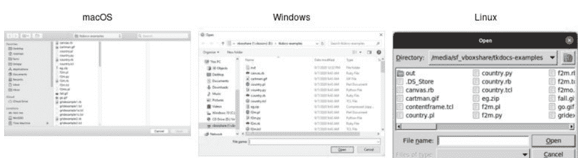

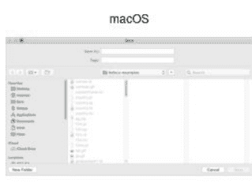

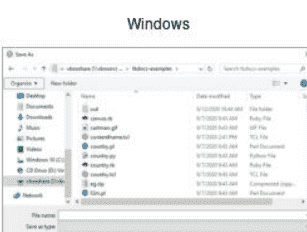

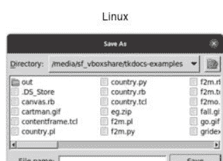

保存文件对话框。

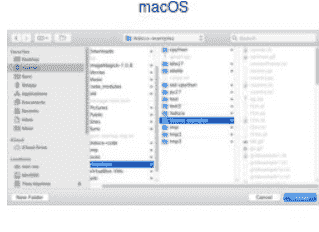

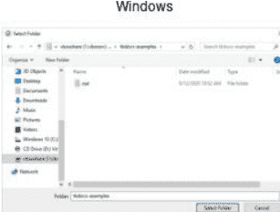

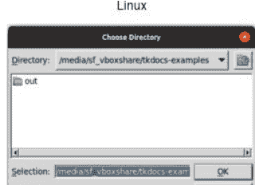

选择目录对话框。

可以向这些对话框传递各种选项，允许你设置允许的文件类型、初始目录、默认文件名等等。这些在 [getOpenFile](https://tkdocs.com/man/getOpenFile)（包括 `getSaveFile`）和 [chooseDirectory](https://tkdocs.com/man/chooseDirectory) 参考手册页面中有详细说明。

- [https://tkdocs.com/man/getOpenFile](https://tkdocs.com/man/getOpenFile)
- [https://tkdocs.com/man/chooseDirectory](https://tkdocs.com/man/chooseDirectory)

## 选择颜色

另一个模态对话框让用户选择颜色。它将返回一个颜色值，例如 `#ff62b8`。该对话框接受一个可选的 `initialcolor` 选项来指定现有颜色，即用户可能想要替换的颜色。更多信息可在 [chooseColor](https://tkdocs.com/man/chooseColor) 参考手册页面中找到。

- [https://tkdocs.com/man/chooseColor](https://tkdocs.com/man/chooseColor)

```
from tkinter import colorchooser
colorchooser.askcolor(initialcolor='#ff0000')
```

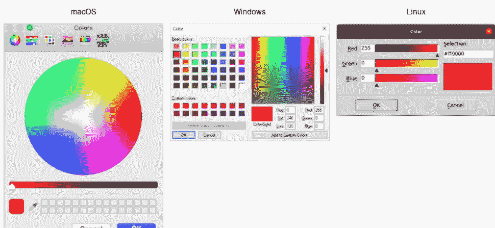

选择颜色对话框。

## 选择字体

Tk 8.6 增加了对另一个系统对话框的支持：字体选择器。虽然文件对话框和颜色选择器是模态对话框，在对话框关闭之前会阻塞并返回结果，但字体选择器的工作方式并非如此。

> 由于字体选择器在 Tk 8.5 中不可用，如果你的代码需要支持旧版本的 Tk，则需要考虑到这一点。

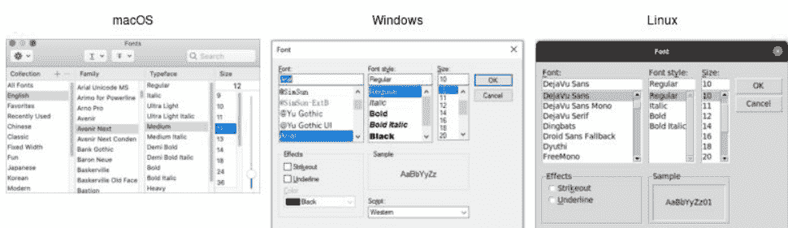

字体选择器对话框。

虽然系统字体对话框在某些平台上是模态的，例如 Windows，但并非所有平台都是如此。在 macOS 上，系统字体选择器的工作方式更像绘图程序中的浮动工具调色板，可以随时更改主应用程序窗口中所选文本的字体。Tk 字体对话框 API 必须适应这两种模型。为此，它使用回调（和虚拟事件）来通知你的应用程序字体更改。更多详细信息可在 [fontchooser](https://tkdocs.com/man/fontchooser) 参考手册页面中找到。

要使用字体对话框，首先为其提供一个初始字体和一个回调函数，该回调函数将在选择字体时被调用。为了说明，我们将让回调函数更改标签上的字体。

```
l = ttk.Label(root, text="Hello World", font="helvetica 24")
l.grid(padx=10, pady=10)

def font_changed(font):
    l['font'] = font

root.tk.call('tk', 'fontchooser', 'configure', '-font',
    'helvetica 24', '-command', root.register(font_changed))
root.tk.call('tk', 'fontchooser', 'show')
```

Tkinter 尚未添加使用此新对话框的便捷方式，因此此示例代码直接使用 Tcl API。你可以在 [bugs.python.org/issue28694](https://bugs.python.org/issue28694) 查看关于适当 Python API 的最新进展并下载代码。

> 你可以随时查询或更改对话框中显示（或将要显示）的字体。

接下来，通过 `show` 方法将对话框显示在屏幕上。在字体对话框为模态的平台上，你的程序将在此处阻塞，直到对话框关闭。在其他平台上，`show` 会立即返回；对话框保持在屏幕上，而你的程序继续运行。此时，尚未选择字体。还有一个 `hide` 方法可以将其从屏幕上移除（当字体对话框是模态时，这用处不大）。

## 警告与确认对话框

许多应用程序使用各种简单的模态警告或对话框来通知用户某个事件、请求确认某个操作，或通过点击按钮做出其他类似选择。Tk 提供了一个通用的“消息框”，它封装了所有这些不同类型的对话框。

```python
from tkinter import messagebox
messagebox.showinfo(message='Have a good day')
```

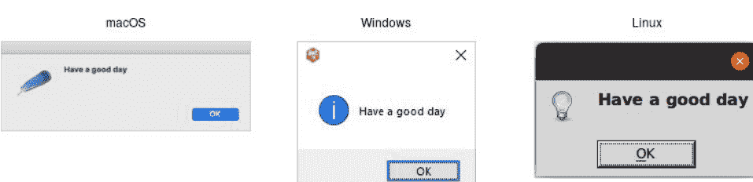

```python
messagebox.askyesno(
    message='Are you sure you want to install SuperVirus?',
    icon='question', title='Install')
```

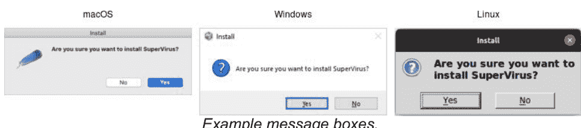

示例消息框。

与我们之前见过的对话框一样，这些是模态的，并将用户操作的结果返回给调用者。Tkinter 不使用 `type` 选项，而是为每种对话框类型使用不同的方法名。返回值因方法而异：

- `showinfo`: ⇒ ok
- `showwarning`: ⇒ ok
- `showerror`: ⇒ ok
- `askokcancel`: ⇒ `True`（点击确定）或 `False`（点击取消）
- `askyesno`: ⇒ `True`（点击是）或 `False`（点击否）
- `askretrycancel`: ⇒ `True`（点击重试）或 `False`（点击取消）
- `askquestion`: ⇒ yes 或 no
- `askyesnocancel`: ⇒ `True`（点击是）、`False`（点击否）或 `None`（点击取消）

> 诚然，Tkinter 的 `messagebox` API 并非最一致。它混合了返回类型（字符串或布尔值），存在一些重复（`askyesno` 和 `askquestion`），并且省略了一种底层对话框类型（`abortretryignore`）。

所有可能的选项完整列表如下：

- `message`: 警告框内显示的主要消息。
- `detail`: 次要消息（如果需要）。
- `title`: 对话框窗口的标题。在 macOS 上不使用。
- `icon`: 图标，可以是 `info`（默认）、`error`、`question` 或 `warning` 之一。
- `default`: 默认按钮，例如 `okcancel` 对话框的 `ok` 或 `cancel`。
- `parent`: 此对话框为其显示的应用程序窗口。

更多详细信息请参阅[参考手册](https://tkdocs.com/man/messageBox)。

> 这些新的 messagebox 对话框取代了旧的 `tk_dialog` 命令，后者不符合当前平台的用户界面规范。

## 自定义对话框

如果你需要创建自己的模态对话框，有几件事需要注意。我们已经在本章前面介绍了其中大部分，例如设置窗口样式、定位窗口等。

首先，你需要确保用户只能与你的对话框交互。你可以使用 `grab_set` 来实现这一点。

如果你希望你的对话框函数阻塞你的应用程序（即，创建对话框的调用在对话框关闭之前不应返回），这也是可能的。没有理由你*必须*这样做，因为你可以在运行正常事件循环时响应回调、事件绑定等，销毁对话框并继续执行。

这个有些晦涩的例子包含了创建模态对话框所需的主要步骤。

```python
ttk.Entry(root).grid()    # something to interact with
def dismiss():
    dlg.grab_release()
    dlg.destroy()

dlg = Toplevel(root)
ttk.Button(dlg, text="Done", command=dismiss).grid()
dlg.protocol("WM_DELETE_WINDOW", dismiss) # intercept close button
dlg.transient(root)    # dialog window is related to main
dlg.wait_visibility()  # can't grab until window appears, so we wait
dlg.grab_set()         # ensure all input goes to our window
dlg.wait_window()      # block until window is destroyed
```

[https://tkdocs.com/code/dialog.py](https://tkdocs.com/code/dialog.py)

> 像这样阻塞应用程序代码是运行嵌套事件循环的一个例子，我们通常不建议这样做，尽管在某些情况下可能更方便。

Tkinter 的标准库包含一个 `simpledialog` 模块，可帮助构建你自己的对话框。因为它使用的是经典的 Tk 小部件而不是更新的主题小部件，我们不建议直接使用它。然而，它确实说明了如何使用我们刚刚介绍的一些使对话框按预期工作的技术。

## 12. 组织复杂界面

如果你有一个复杂的用户界面，你需要找到组织它的方法，以免让用户感到不知所措。有几种不同的方法可以做到这一点。在设计用户界面时，通用和特定平台的人机界面指南都是很好的资源。

在本章中，当我们谈论复杂性时，我们指的不是程序实现的底层技术复杂性。相反，我们指的是它如何呈现给用户。一个用户界面可以由许多不同的模块组合而成，由数百个小部件构建在一个深度嵌套的层次结构中，但这并不意味着用户需要将其感知为复杂。

## 多窗口

在应用程序中使用多窗口的一个好处是可以简化用户界面。如果做得好，它可以要求用户一次只专注于一个窗口的内容来完成任务。强迫他们专注于或在几个窗口之间切换也可能产生相反的效果。同样，只显示相关的小部件与当前任务相关（例如通过 `grid`）的布局方式有助于简化用户界面。

## 空白间距

如果你确实需要在屏幕上同时显示大量控件，请思考如何从视觉上组织它们。我们已经了解了 `grid` 如何轻松地将控件相互对齐。空白间距是另一个有用的辅助手段。将相关的控件彼此靠近放置（可能在其正上方添加一个说明性标签），并用空白间距将它们与其他控件隔开。这有助于用户在脑海中组织用户界面。

> 💡 围绕不同控件、控件组、边框等的推荐空白间距量高度依赖于具体平台。虽然不考虑精确像素数也能完成足够的工作，但如果你想要一个高度精致的用户界面，则需要针对每个平台进行调整。

## 12.1. 分隔符

ttk.Separator
https://tkdocs.com/man/ttk_separator

在单个显示中对控件进行分组的第二种方法是在控件组之间放置一条细的水平或垂直线；通常，这比使用空白间距更节省空间，这在显示空间紧张时可能很有用。Tk 提供了一个简单的 **分隔符** 控件来实现此目的。

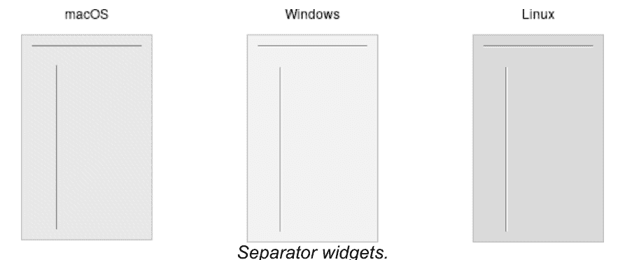

*分隔符控件。*

分隔符使用 `ttk.Separator` 类创建：

```
python
s = ttk.Separator(parent, orient=HORIZONTAL)
```

`orient` 选项可以指定为 `horizontal` 或 `vertical`。

## 12.2. 标签框架

ttk.Labelframe
https://tkdocs.com/man/ttk_labelframe

**标签框架** 控件，通常也称为 *分组框*，提供了另一种对相关组件进行分组的方式。它的作用类似于普通的 `ttk::frame`，即包含其他控件，你可以使用 `grid` 将它们放置在其中。然而，它在视觉上与用户界面的其余部分区分开来。你可以选择提供一个文本标签，显示在标签框架的外部。

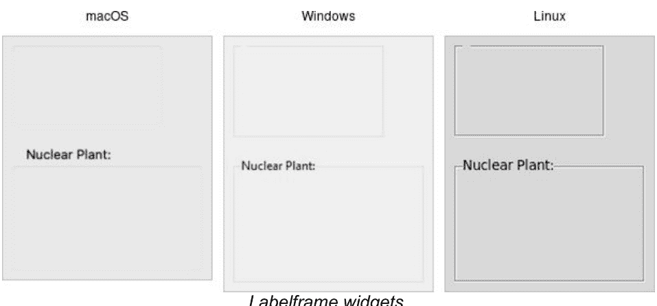

标签框架使用 `ttk.Labelframe` 类创建：

```
lf = ttk.Labelframe(parent, text='Label')
```

## 12.3. 窗格窗口

ttk.Panedwindow
https://tkdocs.com/man/ttk_panedwindow

**窗格窗口** 控件允许你将两个或多个可调整大小的控件上下（或左右）堆叠放置。用户可以通过拖动位于它们之间的 *分隔条* 来调整每个窗格的相对高度（或宽度）。通常，你添加到窗格窗口的控件将是包含许多其他控件的框架。

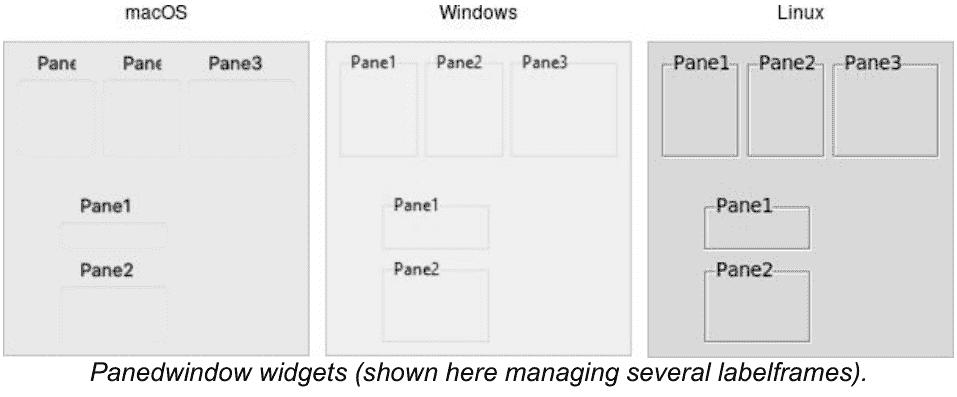

窗格窗口使用 `ttk.Panedwindow` 类创建：

```
p = ttk.Panedwindow(parent, orient=VERTICAL)
# 两个窗格，每个窗格都将包含使用 grid 布局的控件：
f1 = ttk.LabelFrame(p, text='Pane1', width=100, height=100)
f2 = ttk.LabelFrame(p, text='Pane2', width=100, height=100)
p.add(f1)
p.add(f2)
```

窗格窗口可以是 `vertical`（其窗格垂直堆叠）或 `horizontal`。重要的是，你添加到窗格窗口的每个窗格必须是窗格窗口本身的 *直接子控件*。

调用 `add` 方法会在窗格列表的末尾添加一个新窗格。`insert position subwindow` 方法允许你将窗格放置在窗格列表中的给定位置（0..n-1）。如果该窗格已被窗格窗口管理，它将被移动到新位置。你可以使用 `forget subwindow` 从窗格窗口中移除一个窗格（你也可以传递一个位置而不是子窗口）。

你可以为每个窗格分配相对权重，这样如果整个窗格窗口调整大小，某些窗格将比其他窗格分配到更多空间。此外，你可以调整窗格窗口中各项之间每个分隔条的位置。详情请参阅 [命令参考](https://tkdocs.com/man/ttk_panedwindow)。

📋 [https://tkdocs.com/man/ttk_panedwindow](https://tkdocs.com/man/ttk_panedwindow)

## 12.4. 选项卡式笔记本

ttk.Notebook
https://tkdocs.com/man/ttk_notebook

**选项卡式笔记本** 控件使用带标签的笔记本的比喻，让用户通过索引 *标签* 在多个 *页面* 之间切换。与窗格窗口不同，用户一次只能看到一个页面（类似于一个窗格）。

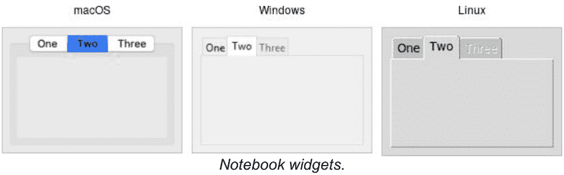

选项卡式笔记本使用 `ttk.Notebook` 类创建：

```
n = ttk.Notebook(parent)
f1 = ttk.Frame(n)    # 第一个页面，将包含使用 grid 布局的控件
f2 = ttk.Frame(n)    # 第二个页面
n.add(f1, text='One')
n.add(f2, text='Two')
```

对选项卡式笔记本的操作类似于对窗格窗口的操作。每个页面通常是一个框架，并且同样必须是笔记本本身的直接子控件（子窗口）。使用 `add subwindow ? option value...?` 方法会在最后一个标签之后添加一个新页面及其关联的标签。`text` 标签选项设置标签上的文本；同样有用的还有 `state` 标签选项，其值可以是 `normal`、`disabled`（不可选择）或 `hidden`。

要在列表末尾以外的位置插入标签，请使用 `insert position subwindow ?option value...?`；要移除给定标签，请使用 `forget` 方法，传递位置（0..n-1）或标签的子窗口。你可以通过 `tabs` 方法检索笔记本中包含的所有子窗口列表。

要检索当前选中的子窗口，请调用 `select` 方法，并通过传递标签的位置或子窗口本身作为参数来更改选中的标签。

要更改标签选项（如标签上的文本标签或其状态），你可以使用 `tab(tabid, option=value)` 方法（其中 `tabid` 同样是标签的位置或子窗口）；省略 `=value` 将返回该选项的当前值。

选项卡式笔记本控件在每次选择新标签时都会生成一个 `<<NotebookTabChanged>>` 虚拟事件。

同样，[命令参考](https://tkdocs.com/man/ttk_notebook) 中详细介绍了各种较少使用的选项和命令。


[https://tkdocs.com/man/ttk_notebook](https://tkdocs.com/man/ttk_notebook)

## 13. 字体、颜色、图像

本章描述了 Tk 如何处理字体、颜色和图像。我们之前已经接触过所有这些内容，但这里我们将提供更深入的讲解。

### 13.1. 字体

Tk 的标签控件允许你通过 `font` 配置选项更改用于显示文本的字体。接下来章节将介绍的画布和文本控件也允许你指定字体。其他显示文本的主题控件可能没有 `font` 配置选项，但它们的字体可以使用样式来更改。

> 我们将在后面详细介绍样式。本质上，它们取代了过去在单个控件上调整多个配置选项的旧方法。相反，控制外观的字体、颜色和其他设置可以捆绑在一个样式中。然后，该样式可以应用于多个控件。这类似于在 HTML 页面中硬编码显示标记与使用 CSS 将显示特定信息分开之间的区别。

与 Tk 中的许多事情一样，默认字体通常是一个不错的选择。如果你需要进行更改，本节将向你展示使用 *命名字体* 的最佳方法。Tk 包含适合在用户界面所有不同组件中使用的命名字体。它们考虑了你运行的特定平台的惯例。当你需要额外的灵活性时，你也可以指定自己的字体。

[字体命令参考](https://tkdocs.com/man/font) 提供了有关指定字体以及其他字体相关操作的完整详细信息。

> 许多较旧的 Tk 程序硬编码字体，使用我们下面将看到的 "family size style" 格式、X11 字体名称或更古老、更晦涩的 X11 字体规范字符串。随着平台的发展，这些应用程序看起来越来越过时。更糟糕的是，字体通常是在每个控件的基础上指定的，导致字体决策分散在整个代码中。命名字体，特别是 Tk 提供的标准字体，是一个好得多的解决方案。审查和更新字体决策是任何现有应用程序中一个简单而重要的更改。

### 标准字体

每个平台都为标准用户界面元素定义了应使用的特定字体。Tk 将许多此类决策封装到一组标准的命名字体中。这些字体在所有平台上都可用，尽管实际使用的字体会有所不同。这有助于抽象掉平台差异。当然，标准控件使用这些命名字体。预定义字体包括：

- **TkDefaultFont：** 未另行指定项目的默认字体。
- **TkTextFont：** 用于输入控件、列表框等。
- **TkFixedFont：** 标准等宽字体。
- **TkMenuFont：** 用于菜单项的字体。
- **TkHeadingFont：** 用于列表和表格中列标题的字体。
- **TkCaptionFont：** 用于窗口和对话框标题栏的字体。
- **TkSmallCaptionFont：** 用于工具对话框的较小标题字体。
- **TkIconFont：** 用于图标标题的字体。
- **TkTooltipFont：** 用于工具提示的字体。

## 特定平台字体

Tk 提供了额外的命名字体，以帮助你遵守特定平台上不太常见的情况。各个平台的指南详细说明了这些字体应如何以及在何处使用。这些字体仅在特定平台上定义。如果你的应用程序需要跨平台运行，你需要考虑到这一点。

在 X11 上，Tk 识别任何有效的 X11 字体名称（例如，参见 `xlsfonts` 命令）。然而，这些字体可能因操作系统、已安装的软件以及单个机器的配置而异。无法保证你的 X11 系统上可用的字体也已安装在任何其他 X11 系统上。

在 Windows 上，Tk 为所有可在“显示”控制面板中设置的字体提供了命名字体。它识别以下字体名称：`system`、`ansi`、`device`、`systemfixed`、`ansifixed` 和 `oemfixed`。

在 macOS 上，Apple 人机界面指南 (HIG) 指定了许多额外的字体。Tk 识别以下名称：`systemSystemFont`、`systemSmallSystemFont`、`systemApplicationFont`、`systemViewsFont`、`systemMenuItemFont`、`systemMenuItemCmdKeyFont`、`systemPushButtonFont`、`systemAlertHeaderFont`、`systemMiniSystemFont`、`systemDetailEmphasizedSystemFont`、`systemEmphasizedSystemFont`、`systemSmallEmphasizedSystemFont`、`systemLabelFont`、`systemMenuTitleFont`、`systemMenuItemMarkFont`、`systemWindowTitleFont`、`systemUtilityWindowTitleFont`、`systemToolbarFont` 和 `systemDetailSystemFont`。

## 使用命名字体

Tk 提供了几个操作来帮助你使用命名字体。你可以从获取所有当前定义的命名字体列表开始。

```
from tkinter import font
font.names()
```

你可以找出抽象命名字体所代表的实际系统字体。这包括 `family`（例如，`Times` 或 `Helvetica`）、`size`（如果为正数则以磅为单位，如果为负数则以像素为单位）、`weight`（`normal` 或 `bold`）、`slant`（`roman` 或 `italic`），以及 `underline` 和 `overstrike` 的布尔属性。你可以找出字体的 `metrics`（字体中字符的高度以及是否为等宽字体），甚至可以 `measure` 以该字体渲染的一段文本的像素宽度。

```
>>> from tkinter import font
>>> f = font.nametofont('TkTextFont')
>>> f.actual()
{'family': '.AppleSystemUIFont', 'size': 13, 'weight': 'normal',
'slant': 'roman', 'underline': 0, 'overstrike': 0}
>>> f.metrics()
{'ascent': 13, 'descent': 3, 'linespace': 16, 'fixed': 0}
>>> f.measure('The quick brown fox')
124
```

Tkinter 提供了一个 `Font` 类来保存命名字体的信息。你可以使用 `nametofont` 函数从字体名称创建此类的实例。当你在应用程序中使用命名字体时（例如，通过标签的 `font` 配置选项），你可以提供字体名称（作为字符串）或 `Font` 实例。

> 💡 *在交互式 shell 中尝试这些操作时遇到错误？即使我们不在屏幕上显示任何内容，在使用各种字体函数之前也需要初始化 Tk。*

你也可以创建自己的字体，然后可以像预定义字体一样使用它们。为此，请为字体选择一个名称，并如上所述指定其字体属性。

```
python
from tkinter import font
highlightFont = font.Font(family='Helvetica',
    name='appHighlightFont', size=12, weight='bold')
ttk.Label(root, text='Attention!', font=highlightFont).grid()
```

如果你不提供名称，Tkinter 将生成一个，你可以通过 `font.name` 或 `str(font)` 检索它。通常最好提供一个名称。

`family` 属性指定字体族。Tk 确保名称 `Courier`、`Times` 和 `Helvetica` 可用（尽管它们可能被映射到适当的等宽、衬线或无衬线字体）。可以使用系统上安装的其他字体，但通常的可移植性注意事项仍然适用。你可以使用以下命令获取所有可用字体族的名称：

```
python
font.families()
```

> 💡 *你可以使用命名字体的 `configure` 方法更改其属性。你可能这样做是为了响应允许用户放大或缩小的菜单选项，即增加或减少字体大小。*

### 字体描述

指定字体的另一种方式是通过属性列表，从字体族开始，然后可选地包括大小和一个或多个样式选项。其中一些示例是 `Helvetica`、`Helvetica 12`、`Helvetica 12 bold` 和 `Helvetica 12 bold italic`。这些字体描述可以在任何可以使用命名字体的地方使用，例如 `font` 配置选项。

> 通常，建议从字体描述切换到命名字体，以便将字体差异隔离在程序中的一个位置。

## 13.2. 颜色

与字体一样，有多种指定颜色的方法。完整详情可在 [colors 命令参考](https://tkdocs.com/man/colors) 中找到。

通常，Tk 控件在大多数情况下默认使用正确的颜色。如果你想更改颜色，你将通过特定于控件的命令或选项进行，例如标签的 `foreground` 和 `background` 配置选项。对于大多数主题控件，颜色更改是通过样式指定的，而不是直接更改控件。

你可以通过 RGB 指定颜色，就像在 HTML 或 CSS 中一样，例如 `#3FF` 或 `#FF016A`。Tk 还识别诸如 `red`、`black`、`grey50`、`light blue` 等名称。

> Tk 识别 X11 定义的标准颜色名称。你可以在命令参考（如上所述）中找到完整列表。

与字体一样，macOS 和 Windows 都指定了许多特定于系统的抽象颜色名称（同样，请参阅参考）。这些颜色对应的实际颜色可能取决于系统设置，并且可能随时间而变化，例如，深色模式、文本高亮颜色、默认背景。

如果需要，你可以使用任何控件上的 `winfo_rgb` 方法查找颜色的 RGB 值（每个值在 0 到 65535 之间）。

```
root.winfo_rgb('red')
```

> 不用说，但强烈建议谨慎使用颜色！

## 13.3. 图像

我们已经了解了如何使用图像的基础知识，例如在标签或按钮中显示它们。我们创建一个图像对象，通常来自磁盘上的文件。

```
imgobj = PhotoImage(file='myimage.gif')
label['image'] = imgobj
```

开箱即用，Tk 8.5 包含对 GIF 和 PPM/PNM 图像的支持。Tk 8.6 将 PNG 添加到这个简短的列表中。然而，有一个名为 `Img` 的 Tk 扩展库，它增加了对许多其他格式的支持：BMP、XBM、XPM、JPEG、PNG（如果你使用的是 8.5）、TIFF 等。虽然没有直接包含在 Tk 核心中，但 Img 通常包含在其他打包发行版中（例如，ActiveTcl）。

Tkinter 没有使用 Tk 的 Img 扩展，而是使用了一个专门为 Python 制作的图像库，称为 `PIL`（Python Imaging Library）。更具体地说，我们将使用一个名为 `pillow` 的更现代的 PIL 分支。由于它没有与 Python 捆绑在一起，你通常需要安装它。你应该能够通过例如 `pip install Pillow` 来安装它。

```
from PIL import ImageTk, Image
myimg = ImageTk.PhotoImage(Image.open('myimage.png'))
```

`ImageTk.PhotoImage` 调用提供了 Tk 的 `PhotoImage` 的直接替代品，但支持更广泛的图像类型。

Tk 的图像实际上相当强大和复杂，并提供了多种检查和修改图像的方法。你可以从 [image 命令参考](https://tkdocs.com/man/image) 和 [photo 命令参考](https://tkdocs.com/man/photo) 中了解更多信息。

- https://tkdocs.com/man/image
- https://tkdocs.com/man/photo

> 我们在这里看到的多色图像类型在 Tk 中被称为 photo 图像。Tk 还提供了第二种类型的图像，即两位位图图像，这在 90 年代广泛使用，当时大多数 Unix 工作站

## 14. Canvas

Canvas
https://tkdocs.com/man/canvas

**canvas** 控件管理一个二维图形对象集合——包括线条、圆形、文本、图像、其他控件等。Tk 的 canvas 是一个功能极其强大且灵活的控件，确实是 Tk 的亮点之一。它适用于广泛的用途，包括绘图或图表绘制、CAD 工具、显示或监控模拟或实际设备，以及用更简单的控件构建更复杂的控件。

注意：Canvas 控件是经典 Tk 控件的一部分，而非主题化 Tk 控件。

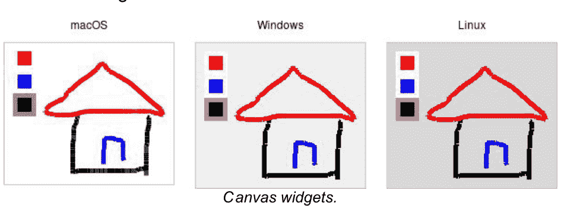

Canvas 控件使用 `Canvas` 类创建：

```
canvas = Canvas(parent, width=500, height=400,
background='gray75')
```

你通常需要提供宽度和高度，可以是像素或任何其他标准距离单位。一如既往，你可以让几何管理器将其扩展以填充窗口中的可用空间。你可能会为 canvas 提供一个默认背景颜色，使用你在上一章学到的任何方式指定颜色。Canvas 控件还支持其他外观选项，如我们之前使用过的 `relief` 和 `borderwidth`。

Canvas 控件拥有大量的功能，我们无法在此一一涵盖。相反，我们将从一个简单的例子开始——一个手绘草图工具，并逐步为其添加新的部分，每个部分展示 canvas 控件的另一个新特性。

## 14.1. 创建项目

当你创建一个新的 canvas 控件时，它本质上是一个上面什么都没有的大矩形，换句话说，是一块真正的空白画布。要对其做任何有用的事情，你需要向其中添加*项目*。你可以添加各种不同*类型*的项目。在这里，我们将向 canvas 添加一个简单的*线条*项目。

要创建一条线，你需要指定其起始和结束*坐标*。坐标表示为距离左上角的像素数，包括水平和垂直方向，即 (x,y)。左上角的像素，称为*原点*，其坐标为 (0,0)。当你向右移动时，"x" 值增加，当你向下移动时，"y" 值增加。一条线由两个点描述，我们称之为 (x0,y0) 和 (x1,y1)。此代码创建一条从 (10,5) 到 (200,50) 的线：

```
canvas.create_line(10, 5, 200, 50)
```

`create_line` 方法返回一个项目 *id*（一个整数），它唯一地引用此项目。我们稍后将看到如何使用它。通常，我们不需要在以后引用该项目，可以忽略返回的 id。

### 一个简单的画板

让我们开始我们的简单画板示例。目前，我们将使用鼠标在 canvas 上实现手绘。我们创建一个 canvas 控件，并为其附加事件绑定以捕获鼠标点击和拖动。当鼠标首次按下时，我们将记住该位置作为下一条线的“起始”坐标。当鼠标在按住鼠标按钮的情况下移动时，我们从这个“起始”位置到当前鼠标位置创建一个线条项目。这个当前位置成为下一个线条项目的“起始”位置。每次鼠标拖动都会创建一个新的线条项目。

```
from tkinter import *
from tkinter import ttk

def savePosn(event):
    global lastx, lasty
    lastx, lasty = event.x, event.y

def addLine(event):
    canvas.create_line((lastx, lasty, event.x, event.y))
    savePosn(event)

root = Tk()
root.columnconfigure(0, weight=1)
root.rowconfigure(0, weight=1)

canvas = Canvas(root)
canvas.grid(column=0, row=0, sticky=(N, W, E, S))
canvas.bind("<Button-1>", savePosn)
canvas.bind("<B1-Motion>", addLine)

root.mainloop()
```

https://tkdocs.com/code/sketch1.py

同样，在这个简单的例子中，我们使用全局变量来存储起始位置。在实践中，我们会将所有这些封装在一个 Python 类中。以下是一种我们可以这样做的方式。请注意，此示例创建了一个 Canvas 的子类，它在代码中被视为任何其他控件。我们同样可以使用一个独立的类，就像我们在“英尺转米”示例中所做的那样。

```
from tkinter import *
from tkinter import ttk

class Sketchpad(Canvas):
    def __init__(self, parent, **kwargs):
        super().__init__(parent, **kwargs)
        self.bind("<Button-1>", self.save_posn)
        self.bind("<B1-Motion>", self.add_line)

    def save_posn(self, event):
        self.lastx, self.lasty = event.x, event.y

    def add_line(self, event):
        self.create_line((self.lastx, self.lasty, event.x,
        event.y))
        self.save_posn(event)

root = Tk()
root.columnconfigure(0, weight=1)
root.rowconfigure(0, weight=1)

sketch = Sketchpad(root)
sketch.grid(column=0, row=0, sticky=(N, W, E, S))

root.mainloop()
```

[https://tkdocs.com/code/sketcho.py](https://tkdocs.com/code/sketcho.py)

试一试——在 canvas 上拖动鼠标来创作你的杰作。

### 项目属性

创建项目时，你还可以为项目指定一个或多个*属性*，影响其显示方式。例如，这里我们将指定线条应为红色且宽度为三个像素。

```
canvas.create_line(10, 10, 200, 50, fill='red', width=3)
```

确切的属性集将根据项目类型而有所不同。一些常用的属性包括：

- **fill:** 绘制对象的颜色
- **width:** 项目的线宽（或其轮廓）
- **outline:** 对于填充形状（如矩形），绘制项目轮廓的颜色
- **dash:** 绘制虚线而非实线，例如，`2 4 6 4` 交替使用短（2像素）和长（6像素）的虚线，间隔为4像素
- **stipple:** 使用图案而非纯色填充，通常是 `gray75`、`gray50`、`gray25` 或 `gray12`；目前 macOS 不支持 stippling
- **state:** 分配一个状态：`normal`（默认）、`disabled`（忽略项目事件绑定）或 `hidden`（从显示中移除）
- **disabledfill**、**disabledwidth**、...：如果项目的 `state` 设置为 `disabled`，项目将使用这些通常属性的变体进行显示
- **activefill**、**activewidth**、...：当鼠标指针悬停在项目上时，它将使用这些通常属性的变体进行显示

> 💡 *如果你有改变状态的 canvas 项目，使用常规和 `disabled*` 属性变体创建项目可以简化你的代码。你只需更改项目的 `state`，而无需编写代码来更改多个显示属性。`active*` 也是如此。两者都鼓励更声明式的风格，可以消除大量样板代码。*

类似于 Tk 控件，在创建 canvas 项目后更改其属性很容易实现。

```
id = canvas.create_line(0, 0, 10, 10, fill='red')
...
canvas.itemconfigure(id, fill='blue', width=2)
```

### 项目类型

Canvas 控件支持多种项目类型。

### 线条

我们的画板创建了简单的线条项目，每个都是一个具有起点和终点的单段线。线条项目也可以由多个段组成。

```
canvas.create_line(10, 10, 200, 50, 90, 150, 50, 80)
```

线条有几个有趣的附加属性，允许绘制曲线、箭头等。

- **arrow:** 在起点（`first`）、终点（`last`）或两端（`both`）放置箭头；默认为 `none`
- **arrowshape:** 允许更改任何箭头的外观
- **capstyle:** 对于没有箭头的宽线，这控制线条末端的绘制方式；可以是 `butt`（默认）、`projecting` 或 `round`
- **joinstyle:** 对于具有多个段的宽线，这控制每个顶点的绘制；可以是 `round`（默认）、`bevel` 或 `miter`
- **smooth:** 如果指定为 `true`（或 `bezier`），则在多个段之间绘制平滑曲线（通过二次样条），而不是使用直线；`raw` 指定不同类型的曲线（三次样条）
- **splinesteps:** 控制曲线的平滑度，即那些设置了 `smooth` 选项的线条

### 矩形

矩形由对角的坐标指定，例如左上角和右下角。它们可以通过 `fill` 用一种颜色填充，并为 `outline` 指定不同的颜色。

```
canvas.create_rectangle(10, 10, 200, 50, fill='red', outline='blue')
```

### 椭圆

椭圆项目的工作方式与矩形完全相同。

```
canvas.create_oval(10, 10, 200, 150, fill='red', outline='blue')
```

## 多边形

多边形项目允许你通过一系列点来创建任意形状。其坐标指定方式与多点线相同。Tk 会确保多边形是“闭合”的，如有需要会将最后一个点与第一个点连接起来。与椭圆和矩形一样，它们可以拥有独立的 `fill`（填充）和 `outline`（轮廓）颜色。它们还支持线条项目的 `joinstyle`（连接样式）、`smooth`（平滑）和 `splinesteps`（样条步数）属性。

```
canvas.create_polygon(10, 10, 200, 50, 90, 150, 50, 80, 120,
55, fill='red', outline='blue')
```

## 弧形

弧形项目绘制椭圆的一部分；可以想象成饼图中的一块。其显示由三个属性控制：

- `start`：弧形在椭圆上开始的位置，以度为单位（0 是3点钟方向）
- `extent`：弧形的“宽度”度数，正值表示从起点逆时针方向，负值表示顺时针方向
- `style`：可以是 `pieslice`（默认值，扇形）、`arc`（仅绘制外轮廓）或 `chord`（绘制连接弧形起点和终点的直线与外轮廓之间的区域）。

```
canvas.create_arc(10, 10, 200, 150, fill='yellow',
outline='black', start=45, extent=135, width=5)
```

## 图像

图像项目可以显示任意图像。默认情况下，项目以你指定的坐标为中心，但可以通过 `anchor` 选项更改，例如 `nw` 表示坐标是放置图像左上角的位置。

```
myimg = PhotoImage(file='pretty.png')
canvas.create_image(10, 10, image=myimg, anchor='nw')
```

还有一种 `bitmap`（位图）项目类型，用于只有两种颜色的图像，可以通过 `foreground`（前景）和 `background`（背景）更改颜色。这在当今并不常用。

## 文本

文本项目可以显示一段文本。文本的定位方式与图像项目相同。使用 `text` 属性指定要显示的文本。项目中的所有文本将具有相同的颜色（由 `fill` 属性指定）和相同的字体（由 `font` 属性指定）。

如果在文本中嵌入 `\n`，文本项目可以显示多行文本。或者，你可以通过提供 `width` 属性（表示一行的最大宽度）让项目自动换行。多行文本的对齐方式可以使用 `justify` 属性设置，该属性可以是 `left`（默认值）、`right` 或 `center`。

```
canvas.create_oval(100, 100, text='A wonderful story',
anchor='nw', font='TkMenuFont', fill='red')
```

## 控件

使用画布控件可以做的最酷的事情之一是将*其他控件*嵌入其中。这可以是一个简单的按钮、一个输入框（想象一下文本项目的就地编辑）、一个列表框、一个本身包含复杂控件集的框架……任何东西！还记得我们很久以前说过画布控件可以充当几何管理器吗？这就是我们的意思。

显示其他控件的画布项目被称为 *window*（窗口）项目（Tk 对控件的长期术语）。它们的定位方式与文本和图像项目相同。你可以为它们指定明确的 `width` 和 `height` 属性；它们默认为控件的首选大小。最后，重要的是，你放置在画布上的控件（通过 `window` 属性）必须是画布的子控件。

```
b = ttk.Button(canvas, text='Implode!')
canvas.create_image(10, 10, anchor='nw', window=b)
```

## 修改项目

我们已经了解了如何修改项目上的配置选项——它的颜色、宽度等。你还可以对项目进行其他几种操作。

要删除项目，请使用 `delete` 方法。

要更改项目的大小和位置，可以使用 `coords` 方法。你为项目提供新的坐标，指定方式与首次创建时相同。在不提供新坐标集的情况下调用此方法将返回项目的当前坐标。要将一个或多个项目从当前位置移动特定的水平或垂直距离，可以使用 `move` 方法。

所有项目都按照所谓的堆叠顺序从上到下排列。如果堆叠顺序中靠后的项目与其下方的项目重叠，第一个项目将绘制在第二个项目之上。`lift` 和 `lower` 方法允许你调整项目在堆叠顺序中的位置。

参考手册中详细介绍了更多操作。它们描述了修改项目和检索有关项目信息的更多方法。

## 14.2. 事件绑定

我们已经看到，整个画布控件，就像任何其他 Tk 控件一样，可以使用 `bind` 命令捕获事件。
你还可以将绑定附加到画布中的单个项目（或它们的组，我们将在下一节中使用标签看到）。因此，如果你想知道某个特定项目是否被点击，你不需要监视整个画布的鼠标点击事件，然后弄清楚该点击是否发生在你的项目上。Tk 会为你处理所有这些。
要捕获这些事件，你需要使用画布内置的 bind 命令。它的工作方式与常规 bind 命令完全相同，接受一个事件模式和一个回调函数。唯一的区别是你需要指定此绑定适用的画布项目。

```
canvas.tag_bind(id, '<1>', ...)
```

> 注意特定于项目的 `tag_bind` 方法与控件级别的 `bind` 方法之间的区别。

让我们在草图板示例中添加一些代码，以允许更改绘图颜色。我们将首先创建几个不同的矩形项目，每个项目填充不同的颜色。然后我们将为每个项目附加一个绑定。当它们被点击时，它们会将一个全局变量设置为新的绘图颜色。我们的鼠标移动绑定在创建线段时会查看该变量。

```
color = "black"
def setColor(newcolor):
    global color
    color = newcolor

def addLine(event):
    global lastx, lasty
    canvas.create_line((lastx, lasty, event.x, event.y),
        fill=color)
    lastx, lasty = event.x, event.y
```

```
id = canvas.create_rectangle((10, 10, 30, 30), fill="red")
canvas.tag_bind(id, "<Button-1>", lambda x: setColor("red"))
id = canvas.create_rectangle((10, 35, 30, 55), fill="blue")
canvas.tag_bind(id, "<Button-1>", lambda x: setColor("blue"))
id = canvas.create_rectangle((10, 60, 30, 80), fill="black")
canvas.tag_bind(id, "<Button-1>", lambda x:
setColor("black"))
```

[https://tkdocs.com/code/sketch2.py](https://tkdocs.com/code/sketch2.py)

## 14.3. 标签

我们已经看到每个画布项目都有一个唯一的 id 号，但还有另一种非常有用且强大的方式来引用画布上的项目，那就是使用 *tags*（标签）。

标签只是你创建的一个标识符，对你的程序有意义。你可以将标签附加到画布项目；每个项目可以有任意数量的标签。与每个项目唯一的 id 号不同，许多项目可以拥有相同的标签。

标签能做什么？我们看到你可以使用项目 id 来修改画布项目（我们很快会看到你还可以对项目进行其他操作，比如移动它们、删除它们等）。任何可以使用项目 id 的地方，你都可以使用标签。例如，你可以更改所有具有特定标签的项目的颜色。

标签是识别画布中某些类型项目的好方法（属于绘制线条的项目、属于调色板的项目等）。你可以使用标签将画布项目与应用程序中的特定对象关联起来（例如，将属于 id 为 #37 的机器人的所有画布项目标记为 "robot37"）。使用标签，你不必跟踪画布项目的 id 来以后引用项目组；标签让 Tk 为你做这件事。

你可以在使用 `tags` 项目配置选项创建项目时分配标签。你可以稍后使用 `addtag` 方法添加标签，或使用 `dtags` 方法删除它们。你可以使用 `gettags` 方法获取项目的标签列表，或使用 `find` 命令返回具有给定标签的项目 id 号列表。

例如：

```
>>> c = Canvas(root)
>>> c.create_line(10, 10, 20, 20, tags=('firstline', 'drawing'))
1
>>> c.create_rectangle(30, 30, 40, 40, tags=('drawing'))
2
>>> c.addtag('rectangle', 'withtag', 2)
>>> c.addtag('polygon', 'withtag', 'rectangle')
>>> c.gettags(2)
```

## 14.4. 滚动

在许多应用中，你可能希望画布的尺寸大于屏幕上显示的区域。你可以通过常规方式，使用 `xview` 和 `yview` 方法为画布添加水平和垂直滚动条。

你可以同时指定画布在屏幕上显示的大小及其完整尺寸（需要滚动才能看到）。画布组件的 `width` 和 `height` 配置选项会向几何管理器请求指定的空间。`scrollregion` 配置选项通过指定画布表面的左、上、右、下坐标来告诉 Tk 画布的实际大小，例如 `0 0 1000 1000`。

根据你已有的知识，你应该能够修改草图程序来添加滚动功能。试一试吧。

完成之后，将画布向下滚动一点，然后尝试绘制。你会看到你正在绘制的线条出现在鼠标指针的*上方*！感到惊讶吗？

这是因为全局的 `bind` 命令并不知道画布已经滚动（它不了解任何特定组件的细节）。所以，如果你将画布向下滚动了 50 像素，然后点击左上角，bind 会报告你点击的位置是 (0,0)。但我们知道，由于滚动，这个位置实际上应该是 (0,50)。

`canvasx` 和 `canvasy` 方法将屏幕上的位置（bind 报告的位置）转换为画布上的实际点（考虑了滚动）。

> 如果你直接将 `canvasx` 和 `canvasy` 方法添加到事件绑定脚本中，请小心。你需要注意引号和替换，以确保在事件触发时进行转换。一如既往，最好将这些代码放在一个独立于事件绑定本身的程序中。

下面是一个完整的示例。我们可能不希望调色板在画布滚动时被滚走，但这留待以后解决。

```python
from tkinter import *
from tkinter import ttk
root = Tk()

h = ttk.Scrollbar(root, orient=HORIZONTAL)
v = ttk.Scrollbar(root, orient=VERTICAL)
canvas = Canvas(root, scrollregion=(0, 0, 1000, 1000),
    yscrollcommand=v.set, xscrollcommand=h.set)
h['command'] = canvas.xview
v['command'] = canvas.yview

canvas.grid(column=0, row=0, sticky=(N,W,E,S))
h.grid(column=0, row=1, sticky=(W,E))
v.grid(column=1, row=0, sticky=(N,S))
root.grid_columnconfigure(0, weight=1)
root.grid_rowconfigure(0, weight=1)

lastx, lasty = 0, 0

def xy(event):
    global lastx, lasty
    lastx, lasty = canvas.canvasx(event.x), canvas.canvasy(event.y)

def setColor(newcolor):
    global color
    color = newcolor
    canvas.dtag('all', 'paletteSelected')
    canvas.itemconfigure('palette', outline='white')
    canvas.addtag('paletteSelected', 'withtag', 'palette%s' % color)
    canvas.itemconfigure('paletteSelected', outline='#999999')

def addLine(event):
    global lastx, lasty
    x, y = canvas.canvasx(event.x), canvas.canvasy(event.y)
    canvas.create_line((lastx, lasty, x, y), fill=color,
        width=5, tags='currentline')
    lastx, lasty = x, y

def doneStroke(event):
    canvas.itemconfigure('currentline', width=1)

canvas.bind("<Button-1>", xy)
canvas.bind("<B1-Motion>", addLine)
canvas.bind("<B1-ButtonRelease>", doneStroke)

id = canvas.create_rectangle((10, 10, 30, 30), fill="red",
    tags=('palette', 'palettered'))
canvas.tag_bind(id, "<Button-1>", lambda x: setColor("red"))
id = canvas.create_rectangle((10, 35, 30, 55), fill="blue",
    tags=('palette', 'paletteblue'))
canvas.tag_bind(id, "<Button-1>", lambda x: setColor("blue"))
id = canvas.create_rectangle((10, 60, 30, 80), fill="black",
    tags=('palette', 'paletteblack', 'paletteSelected'))
canvas.tag_bind(id, "<Button-1>", lambda x: setColor("black"))

setColor('black')
canvas.itemconfigure('palette', width=5)
root.mainloop()
```

[https://tkdocs.com/code/sketch4.py](https://tkdocs.com/code/sketch4.py)

## 15. 文本

**文本**组件管理一个多行文本区域。与画布组件类似，Tk 的文本组件是一个极其灵活和强大的工具，可用于各种任务。它可以作为表单的一部分提供简单的多行文本区域。但文本组件也可以构成样式化代码编辑器、大纲视图、网页浏览器等的基础。

注意：文本组件是经典 Tk 组件的一部分，而不是主题化 Tk 组件。

虽然我们在前面的章节中简要介绍了文本组件，但这里将进行更详细的介绍。你将更好地了解它们所能达到的复杂程度。不过，对于任何涉及文本组件的重要工作，[参考手册](reference manual)组织良好、实用性强，强烈推荐阅读。

文本组件使用 `Text` 类创建：

```python
text = Text(parent, width=40, height=10)
```

你通常会提供宽度（以字符为单位）和高度（以行为单位）。一如既往，你可以要求几何管理器将其扩展以填充窗口中的可用空间。

### 15.1. 基础知识

如果你只需要一个用于表单的多行文本字段，只需关注几件事：创建和调整组件大小（已完成）、提供初始值，以及在用户提交表单后检索文本。

### 提供初始内容

文本组件初始时为空，因此我们需要自己添加任何初始内容。因为文本组件可以容纳比纯文本多得多的内容，简单的机制（如输入组件的 `textvariable` 配置选项）是不够的。相反，我们将使用组件的 `insert` 方法：

```python
text.insert('1.0', 'here is my\ntext to insert')
```

这里的 "1.0" 是插入文本的位置，可以理解为 "第 1 行，第 0 个字符"。这指的是第一行的第一个字符。历史上，尤其是在 Unix 上，程序员倾向于将行号视为从 1 开始，字符位置视为从 0 开始。要插入的文本只是一个字符串。因为组件可以容纳多行文本，我们提供的字符串也可以是多行的。要实现这一点，只需在字符串中的适当位置嵌入 `\n`（换行）字符即可。

### 检索文本

在用户进行任何更改并提交表单（例如）之后，你的程序可以通过 `get` 方法检索组件的内容：

```python
thetext = text.get('1.0', 'end')
```

两个参数是起始和结束位置；`end` 的含义显而易见。如果你想只获取部分文本，可以提供不同的起始和结束位置。你很快会看到更多关于位置的内容。

## 自定义外观

我们之前已经了解了文本部件的 `width` 和 `height` 配置选项。还有其他几个选项可以控制其整体外观。最有用的包括：

- `foreground:` 用于绘制文本的颜色
- `background:` 部件的背景颜色
- `padx, pady:` 部件内部边框的额外内边距
- `borderwidth:` 部件周围边框的宽度
- `relief:` 边框样式：`flat`、`raised`、`sunken`、`solid`、`ridge`、`groove`

## 换行与滚动

如果部件中的某些文本行非常长，超过了部件的宽度怎么办？默认情况下，文本会自动换行到下一行。这种行为可以通过 `wrap` 配置选项来更改。其默认值为 `char`，意味着在任何字符处换行。其他选项包括 `word`（仅在单词分隔符处换行，例如空格）和 `none`（表示根本不换行）。在后一种情况下，较长行的部分文本将不可见，除非我们为部件添加水平滚动条。（即使没有滚动条，用户也可以使用方向键滚动浏览文本）。

滚动条（包括水平和垂直）可以像其他部件（例如画布、列表框）一样附加到文本部件。

```python
t = Text(root, width = 40, height = 5, wrap = "none")
ys = ttk.Scrollbar(root, orient = 'vertical', command = t.yview)
xs = ttk.Scrollbar(root, orient = 'horizontal', command = t.xview)
t['yscrollcommand'] = ys.set
t['xscrollcommand'] = xs.set
t.insert('end', "Lorem ipsum...\n...\n...")
t.grid(column = 0, row = 0, sticky = 'nwes')
xs.grid(column = 0, row = 1, sticky = 'we')
ys.grid(column = 1, row = 0, sticky = 'ns')
```

```python
root.grid_columnconfigure(0, weight = 1)
root.grid_rowconfigure(0, weight = 1)
```

[https://tkdocs.com/code/scrolledtext.py](https://tkdocs.com/code/scrolledtext.py)

我们还可以要求部件确保文本的特定部分可见。例如，假设我们向部件添加了比屏幕能显示的更多的文本（因此它会滚动）。然而，我们希望确保文本的顶部而不是底部可见。我们可以使用 `see` 方法。

```python
text.see('1.0')
```

## 禁用部件

某些表单会临时禁用特定部件的编辑功能，除非满足某些条件（例如，某些其他选项被设置为特定值）。要防止用户更改文本部件，请将 `state` 配置选项设置为 `disabled`。通过将此选项设置回 `normal` 来重新启用编辑。

```python
text['state'] = 'disabled'
```

> 由于文本部件是经典部件的一部分，因此通常的 `state` 和 `instate` 方法不可用。

## 15.2. 在代码中修改文本

虽然用户可以交互式地修改文本部件中的文本，但你的程序也可以进行更改。添加文本使用 `insert` 方法完成，我们之前使用该方法为文本部件提供初始值。

### 文本位置与索引

当我们指定位置 `1.0`（第一行，第一个字符）时，这是一个 *索引* 的例子。它告诉 `insert` 方法将新文本放在哪里（就在第一行、第一个字符之前，即部件的最开头）。索引可以通过多种方式指定。我们在 `get` 方法中使用了另一种方式：`end` 表示 *紧接在* 文本末尾之后。（为什么是“紧接在之后”？文本会插入到给定索引的 *之前*，因此在 `end` 处插入会将文本添加到部件的末尾）。请注意，Tk *总是* 会在文本部件的最末尾添加一个换行符。

以下是一些额外的索引示例及其解释方式：

- `3.end`：第 3 行末尾的换行符。
- `1.0 + 3 chars`：第 1 行开头之后的三个字符。
- `2.end -1 chars`：第 2 行中换行符之前的最后一个字符。
- `end -1 chars`：Tk 总是在文本末尾添加的换行符。
- `end -2 chars`：文本的实际最后一个字符。
- `end -1 lines`：文本最后一行的开头。
- `2.2 + 2 lines`：文本第四行的第三个字符（索引 2）。
- `2.5 linestart`：第 2 行的第一个字符。
- `2.5 lineend`：第 2 行末尾换行符的位置。
- `2.5 wordstart`：索引 2.5 处字符所在单词的第一个字符。
- `2.5 wordend`：索引 2.5 处字符所在单词之后的第一个字符。

需要记住的一些额外事项：

- 术语 `chars` 可以缩写为 `c`，`lines` 可以缩写为 `l`。
- 术语之间的空格可以省略，例如 `1.0+3c`。
- 超出文本末尾的索引（例如 `end + 100c`）将被解释为 `end`。
- 索引会根据需要换行到后续行；例如，在只有五个字符的行上，`1.0 + 10 chars` 将指向第二行上的某个位置。
- 索引中的行号被解释为 *逻辑行*，即每行仅在 "\n" 处结束。对于长行并启用换行时，一个逻辑行可能代表多个 *显示行*。如果你想在显示中向上或向下移动一行，可以将其指定为，例如 "1.0 + 2 display lines"。

要确定索引的 *规范位置*，请使用 `index idx` 方法。向其传递任何索引表达式，它会返回 `line.char` 形式的相应索引。例如，要查找最后一个字符的位置（忽略末尾的自动换行符），请使用：

```python
text.index('end')
```

你可以使用 `compare` 方法比较两个索引，该方法允许你检查相等性、一个索引是否在文本中比另一个更靠后等。

```python
if text.compare(idx1, "==", idx2): # 相同位置
```

有效的运算符是 `==`、`!=`、`<`、`<=`、`>` 和 `>=`。

### 删除文本

虽然 `insert` 方法可以在部件中的任何位置添加新文本，但 `delete start ?end?` 方法则用于删除文本。我们可以删除单个字符（由索引指定）或 *范围* 的字符（由起始和结束索引指定）。在后一种情况下，从起始索引（包括）到 *紧接在* 结束索引之前的字符将被删除（因此结束索引处的字符不会被删除）。因此，如果我们假设对于以下每种情况，文本部件中最初都有 abcd\nefgh：

```python
text.delete('1.2') ⇒ "abd\nefgh"
text.delete('1.1', '1.2') ⇒ "acd\nefgh"
text.delete('1.0', '2.0') ⇒ "efgh"
text.delete('1.2', '2.1') ⇒ "abfgh"
```

还有一个 `replace` 方法，它执行 `delete` 操作，然后在同一位置执行 `insert` 操作。

### 示例：日志窗口

这是一个简短的示例，说明如何将文本部件用作应用程序的 80x24 日志窗口。用户根本不编辑文本部件。相反，程序向其写入日志消息。我们希望显示超过 24 行（因此无需滚动）。如果日志已满，旧消息会从顶部移除，然后在末尾添加新消息。

```python
from tkinter import *
from tkinter import ttk

root = Tk()
log = Text(root, state='disabled', width=80, height=24,
wrap='none')
log.grid()

def writeToLog(msg):
    numlines = int(log.index('end - 1 line').split('.')[0])
    log['state'] = 'normal'
    if numlines==24:
        log.delete(1.0, 2.0)
    if log.index('end-1c')!='1.0':
        log.insert('end', '\n')
    log.insert('end', msg)
    log['state'] = 'disabled'
```

[</>] [https://tkdocs.com/code/logwindow.py](https://tkdocs.com/code/logwindow.py)

> 💡 请注意，由于程序将部件置于禁用状态，我们必须重新启用它才能进行任何更改，即使是从我们的程序中进行更改。

## 15.3. 使用标签进行格式化

到目前为止，我们一直在所有文本都使用单一字体的情况下使用文本部件。现在是时候看看如何添加特殊格式了，例如粗体、斜体、删除线、背景颜色、字体大小等等。Tk 的文本部件使用称为 *标签* 的功能来实现这些。

标签是与文本部件关联的对象。每个标签通过程序员选择的名称来引用。每个标签有几个配置选项。这些是控制格式的字体和颜色等。虽然标签是具有状态的对象，但它们不需要显式创建。它们在第一次使用标签名称时自动创建。

### 向文本添加标签

标签可以与部件中的一个或多个文本范围相关联。与之前一样，范围通过索引指定。单个索引代表单个字符，一对索引代表从起始字符到结束字符之前的一个范围。使用 `tag_add` 方法将标签添加到文本范围。

```python
text.tag_add('highlightline', '5.0', '6.0')
```

标签也可以在首次插入文本时提供。`insert` 方法支持一个可选参数，该参数包含一个或多个标签的列表，这些标签将添加到正在插入的文本中。

```python
text.insert('end', 'new material to insert', ('highlightline',
'recent', 'warning'))
```

随着部件中的文本被修改（无论是由用户还是你的程序），标签会自动调整。例如，如果我们用标签 "nounphrase" 标记了文本 "the quick brown fox"，然后将单词 "quick" 替换为 "speedy"，该标签仍然适用于整个短语。

## 为标签应用格式

格式通过配置选项应用于标签；这些选项的工作方式与整个控件的配置选项类似。例如：

```
text.tag_configure('highlightline', background='yellow',
font='TkFixedFont', relief='raised')
```

标签支持以下配置选项：`background`、`bgstipple`、`borderwidth`、`elide`、`fgstipple`、`font`、`foreground`、`justify`、`lmargin1`、`lmargin2`、`offset`、`overstrike`、`relief`、`rmargin`、`spacing1`、`spacing2`、`spacing3`、`tabs`、`tabstyle`、`underline` 和 `wrap`。请查阅参考手册以获取这些选项的详细描述。`tag_cget tag option` 方法允许我们查询标签的配置选项。

由于多个标签可以应用于同一文本范围，因此可能存在冲突（例如，两个标签指定了不同的字体）。使用优先级顺序来解决这些冲突；最近创建的标签具有最高优先级，但可以使用 `tag_raise tag` 和 `tag_lower tag` 方法重新排列优先级。

## 更多标签操作

要完全删除一个或多个标签，我们可以使用 `tag_delete tags` 方法。这当然也会移除文本中对该标签的所有引用。我们也可以使用 `tag_remove tag start ?end?` 方法从文本范围中移除标签。即使这使得没有文本范围再带有该标签，标签对象本身仍然存在。

`tag_ranges tag` 方法将返回文本中已应用该标签的范围列表。还有 `tag_nextrange tag start ?end?` 和 `tag_prevrange tag start ?end?` 方法，用于从给定位置向前或向后搜索第一个这样的范围。

`tag_names ?idx?` 方法在不带额外参数调用时，将返回文本控件中当前定义的所有标签列表（包括那些可能当前未使用的标签）。如果我们向该方法传递一个索引，它将返回仅应用于该索引处字符的标签列表。

最后，我们可以使用文本中具有给定标签的第一个和最后一个字符作为索引，就像我们可以使用 "end" 或 "2.5" 一样。为此，只需指定 `tagname.first` 或 `tagname.last`。

## Canvas 控件与 Text 控件中标签的区别

Canvas 控件和 Text 控件都支持可以应用于多个对象、设置其样式等的“标签”。然而，canvas 和 text 标签并不相同。有一些重要的区别需要注意。

在 canvas 控件中，只有单个 canvas 项目拥有控制其外观的配置选项。当我们在 canvas 中引用一个标签时，其含义等同于“当前拥有该标签的所有 canvas 项目”。标签本身并不存在为一个独立的对象。因此，在以下代码片段中，最后添加的矩形*不会*被着色为红色。

```
canvas.itemconfigure('important', fill='red')
canvas.create_rectangle(10, 10, 40, 40, tags=('important'))
```

相比之下，在 text 控件中，保留外观状态信息的不是单个字符，而是标签，标签是独立的对象。因此，在此代码片段中，新添加的文本*会*被着色为红色。

```
text.insert('end', 'first text', ('important'))
text.tag_configure('important', foreground='red')
text.insert('end', 'second text', ('important'))
```

## 15.4. 事件与绑定

我们可以做的一件非常酷的事情是定义标签上的事件绑定。这使我们能够轻松识别对特定文本范围的鼠标点击，并弹出菜单或对话框作为响应。不同的标签可以有不同的绑定。这省去了处理诸如“在此位置点击意味着什么？”之类问题的麻烦。标签上的绑定使用 `tag_bind` 方法实现：

```
text.tag_bind('important', '<1>', popupImportantMenu)
```

控件范围内的事件绑定继续像其他所有控件一样工作，例如，捕获文本中任何位置的鼠标点击。除了正常的低级事件外，每当控件内容发生更改时，text 控件会生成一个 `<<Modified>>` 虚拟事件，每当所选文本发生更改时，会生成一个 `<<Selection>>` 虚拟事件。

## 15.5. 选择文本

我们可以识别用户选择的文本范围（如果有的话）。例如，编辑器可能有一个工具栏按钮用于将选中文本加粗。虽然你可以通过 `<<Selection>>` 虚拟事件知道选择何时更改（例如，更新加粗按钮是否激活），但这并不能告诉你选择了什么。

text 控件自动维护一个名为 `sel` 的标签，该标签引用选中的文本。每当选择更改时，`sel` 标签都会更新。因此，我们可以使用 `tag_ranges ?tag?` 方法，将 `sel` 作为要报告的标签传递给它，来查找选中的文本范围。

同样，我们可以使用 `tag_add` 设置新选择，或使用 `tag_remove` 移除选择来更改选择。但是，`sel` 标签不能被删除。

> 尽管默认的控件绑定可以防止这种情况发生，但 `sel` 与其他标签一样，可以支持多个范围，即不连续的选择。为防止这种情况发生，在从代码中更改选择时，请确保在添加新选择之前移除任何旧选择。

text 控件将插入光标（新输入的文本将出现的位置）的概念与选择分开管理。它使用一个称为 `mark` 的新概念来实现这一点。

## 15.6. 标记

标记指示文本中的特定位置。在这方面，它们类似于索引。但是，随着文本的修改，标记会调整以保持在相同的相对位置。这样，它们类似于标签，但引用的是单个位置而不是文本范围。标记实际上并不引用文本中字符占据的位置，而是指定两个字符*之间*的位置。

Tk 自动维护两个不同的标记。第一个名为 `insert`，是插入光标的当前位置。当光标移动（通过鼠标或键盘）时，标记随之移动。第二个标记名为 `current`，跟踪当前鼠标位置下方字符的位置。

要创建自己的标记，请使用控件的 `mark_set name idx` 方法，传递标记的名称和一个索引（标记被定位在给定索引处字符的*之前*）。这也用于将现有标记移动到不同的位置。可以使用 `mark_unset name` 方法移除标记，传递标记的名称。如果你删除包含标记的文本范围，也会移除该标记。

标记的名称也可以用作索引（与 `1.0` 或 `end-1c` 作为索引的方式相同）。你可以使用 `mark_next idx` 或 `mark_previous idx` 方法从文本中的给定索引查找下一个（或上一个）标记。`mark_names` 方法将返回所有标记名称的列表。

标记还有一个*重力*，可以通过 `mark_gravity name ?direction?` 方法修改，这会影响在标记处插入文本时发生的情况。假设我们有文本 "ac"，中间有一个标记，我们用竖线表示，即 "a|c"。如果该标记的重力是 `right`（默认值），则标记附着在 "c" 上。如果在标记处插入新文本 "b"，标记将保持附着在 "c" 上，因此新文本将插入在标记之前，即 "ab|c"。如果重力改为 `left`，则标记附着在 "a" 上，因此新文本将插入在标记之后，即 "a|bc"。

## 15.7. 图像与控件

与 canvas 控件一样，text 控件不仅可以包含文本，还可以包含图像和任何其他 Tk 控件（包括一个框架，其本身包含许多其他控件）。从某种意义上说，这允许 text 控件本身作为几何管理器工作。在文本中添加图像和控件的能力为你的程序开启了无限可能。

图像被添加到 text 控件的特定索引处，图像指定为现有的 Tk 图像。其他选项允许你微调内边距等。

```
flowers = PhotoImage(file='flowers.gif')
text.image_create('sel.first', image=flowers)
```

其他控件以与图像大致相同的方式添加到 text 控件中。被添加的控件必须是控件层次结构中 text 控件的后代。

```
b = ttk.Button(text, text='Push Me')
text.window_create('1.0', window=b)
```

## 15.8. 更多功能

文本组件还能实现更多功能。这里我们仅简要介绍其中几项。如需了解详细信息，请参阅参考手册。

## 搜索

文本组件包含一个强大的 `search` 方法，允许你在组件内定位一段文本。例如，这对于实现“查找”对话框非常有用。你可以从特定位置或在给定范围内向前或向后搜索，使用精确文本、不区分大小写或通过正则表达式指定搜索词，查找搜索词的单个或所有出现位置等。

## 修改、撤销与重做

文本组件会跟踪文本是否已被修改（例如，这对于判断是否需要保存到文件很有用）。我们可以使用 `edit_modified ?bool?` 方法查询（或修改）此状态。还有一个完整的多级撤销/重做机制，当我们将 `undo` 配置选项设置为 `true` 时，该机制由组件自动管理。调用 `edit_undo` 或 `edit_redo` 会使用存储在撤销/重做栈中的信息来修改当前文本。

## 省略文本

文本组件可以包含不显示的文本。这被称为“省略”文本，通过标签的 `elide` 配置选项实现。它可以用于实现大纲视图、“折叠”代码编辑器，甚至可以将额外的元数据隐藏在显示的文本中。在指定省略文本中的位置时，需要格外小心。处理位置的方法有额外的选项，可以选择包含或忽略省略的文本。

## 自省

与大多数 Tk 组件一样，文本组件会尽力暴露其内部状态信息。我们已经通过 `get` 方法、组件配置选项、标签和标记的 `names` 和 `cget` 等看到了这一点。还有更多信息可用于各种任务。请查阅参考手册中的 `debug`、`dlineinfo`、`bbox`、`count` 和 `dump` 方法。

## 对等

Tk 文本组件允许两个或多个不同的文本组件共享相同的底层文本数据结构（包含所有文本、标记、标签、图像等）。这被称为 *对等*，通过 `peer` 方法控制。

## 16. 树形视图

ttk.Treeview
https://tkdocs.com/man/ttk_treeview

**树形视图**组件显示一个项目层次结构，并允许用户浏览。每个项目的一个或多个属性可以作为列显示在树的右侧。它可以用于构建类似于 macOS Finder 或 Windows 资源管理器等文件管理器中的树形显示的用户界面。与大多数 Tk 组件一样，它提供了极大的灵活性，因此可以定制以适应各种情况。

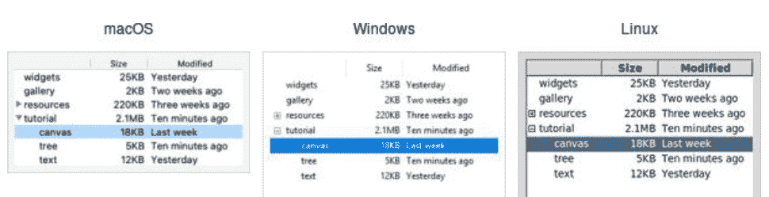

树形视图组件使用 `ttk.Treeview` 类创建：

```
tree = ttk.Treeview(parent)
```

如果需要，可以按照通常的方式添加水平和垂直滚动条。

## 16.1. 向树中添加项目

要对树形视图进行任何有用的操作，我们需要向其中添加一个或多个 *项目*。每个项目代表树中的一个节点，无论是叶节点还是包含其他节点的内部节点。项目通过唯一的 id 引用。你可以在首次创建项目时分配此 id，或者组件可以自动生成一个。

项目通过使用树形视图的 `insert` 方法插入到树中来创建。要插入一个项目，我们需要知道在哪里插入它。这意味着需要指定父项目以及新项目应在父项目现有子项列表中的哪个位置插入。

树形视图组件会自动创建一个根节点（不显示）。其 id 是空字符串。它作为添加的第一级项目的父节点。节点子项列表中的位置通过索引指定（0 表示第一个，`end` 表示在所有现有子项之后插入）。

通常，你还会指定每个项目的 *名称*，即在树中显示的文本。其他选项允许你在名称旁边添加图像、指定节点是打开还是关闭等。

```
# 插入到根节点，程序选择 id：
tree.insert('', 'end', 'widgets', text='Widget Tour')

# 同样的操作，但作为第一个子项插入：
tree.insert('', 0, 'gallery', text='Applications')

# 树形视图选择 id：
id = tree.insert('', 'end', text='Tutorial')

# 插入到现有节点下方：
tree.insert('widgets', 'end', text='Canvas')
tree.insert(id, 'end', text='Tree')
```

插入项目会返回新创建项目的 id。

## 16.2. 重新排列项目

节点（及其所有后代，如果有的话）可以移动到树中的不同位置。唯一的限制是节点不能移动到其某个后代下方，原因显而易见。与之前一样，目标位置通过现有的父节点及其子项列表中的位置来指定。

```
tree.move('widgets', 'gallery', 'end')  # 将 widgets 移动到 gallery 下方
```

项目可以从树中 *分离*，这会将项目及其后代从层次结构中移除，但不会销毁这些项目。这允许我们稍后使用 `move` 重新插入它们。

```
tree.detach('widgets')
```

项目也可以被 *删除*，这会完全销毁该项目及其后代。

```
tree.delete('widgets')
```

要遍历层次结构，有方法可以查找项目的父项（`parent item`）、其下一个或上一个兄弟项（`next item` 和 `prev item`），并返回项目的子项列表（`children item`）。
我们可以通过修改项目的 `open` 配置选项来控制项目是否打开并显示其子项。

```
tree.item('widgets', open=TRUE)
isopen = tree.item('widgets', 'open')
```

## 16.3. 显示每个项目的信息

树形视图可以显示关于每个项目的一个或多个附加信息。这些信息显示在主树形显示右侧的列中。
每列通过我们分配的符号名称引用。我们可以使用树形视图组件的 `columns` 配置选项指定列的列表，可以在首次创建组件时指定，也可以稍后指定。

```
tree = ttk.Treeview(root, columns=('size', 'modified'))
tree['columns'] = ('size', 'modified', 'owner')
```

我们可以指定列的宽度、列中项目信息的显示对齐方式等。我们还可以提供有关列标题的信息，例如要显示的文本、可选的图像、对齐方式以及单击项目时要调用的脚本（例如，用于对树进行排序）。

```
tree.column('size', width=100, anchor='center')
tree.heading('size', text='Size')
```

每个项目在每列中显示的内容可以使用 `set` 方法单独指定。你也可以提供一个列表来描述该项目所有列中要显示的内容。这通过 `values` 项目配置选项完成。它可以在首次插入项目时使用，也可以稍后更新。它接受一个值列表。列表的顺序必须与 `columns` 组件配置选项中的顺序相同。

```
tree.set('widgets', 'size', '12KB')
size = tree.set('widgets', 'size')
tree.insert('', 'end', text='Listbox', values=('15KB',
'Yesterday', 'mark'))
```

## 16.4. 项目外观与事件

与文本和画布组件一样，树形视图组件使用 *标签* 来修改树中项目的外观。我们可以使用 `tags` 项目配置选项（同样，在创建项目时或稍后）为每个项目分配一个标签列表。

然后可以在标签上指定配置选项，这些选项将应用于所有具有该标签的项目。有效的标签选项包括 `foreground`（文本颜色）、`background`、`font` 和 `image`（如果项目指定了自己的图像，则不使用）。

我们还可以在标签上创建事件绑定，这让我们能够捕获鼠标点击、键盘事件等。

```
tree.insert('', 'end', text='button', tags=('ttk', 'simple'))
tree.tag_configure('ttk', background='yellow')
tree.tag_bind('ttk', '<1>', itemClicked)
# 被点击的项目可以通过 tree.focus() 找到
```

树形视图将生成虚拟事件 `<<TreeviewSelect>>`、`<<TreeviewOpen>>` 和 `<<TreeviewClose>>`，这些事件允许我们监控用户对组件所做的更改。我们可以使用 `selection` 方法来确定当前的选择（选择也可以从你的程序中更改）。

## 16.5. 自定义显示

树形视图控件的显示有许多方面可以自定义。我们已经见过其中一些，例如项目文本、字体和颜色、列标题名称等。以下是一些额外的自定义选项。

-   使用 `height` 控件配置选项指定要显示的所需行数。
-   使用列的 `width` 或 `minwidth` 选项控制每列的宽度。持有树的列可以通过符号名 `#0` 访问。控件的总体请求宽度基于各列宽度之和。
-   使用 `displaycolumns` 控件配置选项选择要显示的列及其显示顺序。
-   你可以选择使用 `show` 控件配置选项（默认为 "tree headings"，即同时显示）隐藏列标题或树本身（仅保留列）。
-   你可以通过 `selectmode` 控件配置选项指定用户可以选择单个项目还是多个项目，传递 `browse`（单个项目）、`extended`（多个项目，默认值）或 `none`。

## 17. 样式与主题

现代 Tk 控件的*主题化*方面是新控件集中最强大、最令人兴奋的特性之一。然而，它也是最令人困惑的特性之一。
本章解释样式（控制按钮等控件的外观）和主题（定义应用程序中所有控件外观的样式集合）。更改主题可以让你的应用程序呈现完全不同的外观。

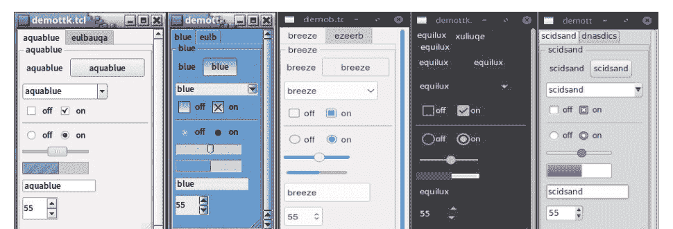

请注意，改变的不仅仅是颜色，还有各个控件的实际形状。样式和主题*极其*灵活。

### 为什么？

然而，在你沉迷于此之前，很少有应用程序会从切换主题中受益。一些游戏或教育程序可能是例外。使用给定平台的标准 Tk 主题将以人们期望的方式显示控件，特别是如果他们运行的是 macOS 和 Windows。

> 在 Linux 系统上，外观和感觉的标准化程度要低得多。用户期望（并且更习惯于）一些变化性和“酷炫感”。由于窗口管理器、控制面板和其他系统实用程序使用不同的控件集（通常是 GTK 和 QT），Tk 无法与任何特定系统上的当前设置无缝融合。本书中的大多数 Linux 截图都使用了 Tk 的 alt 主题。尽管用户习惯于变化性，但大多数用户能接受的程度是有限的。Tk 经典控件集中核心控件的样式，与约 1992 年的 OSF/Motif 相匹配，就是一个典型的例子。

样式和主题，如果以更有针对性且非常克制的方式使用，在现代应用程序中可以发挥作用。本章解释了为什么以及何时你可能想要使用它们，以及如何操作。我们将首先通过将 Tk 的样式和主题与软件开发的另一个领域进行类比来开始。

### 理解样式和主题

如果你熟悉 Web 开发，你就知道层叠样式表（CSS）。有两种方法可以使用它来自定义 HTML 页面中元素的外观。第一种方法是通过 `style` 属性直接在 HTML 代码中的元素上添加一堆样式属性（字体、颜色、边框等）。例如：

```
<label style="color:red; font-size:14pt; font-weight:bold; background-color:yellow; ">Meltdown imminent!</label>
```

使用 CSS 的另一种方法是通过 `class` 属性为每个控件附加一个类。该类元素的外观细节在其他地方提供，通常在一个单独的 CSS 文件中。你可以将相同的类附加到多个元素上，它们都将具有相同的外观。你不需要为每个元素重复完整的细节。更重要的是，你将站点的逻辑内容（HTML）与其外观（CSS）分离开来。

```
<label class="danger">Meltdown imminent!</label>
...
<style type="text/css">
label.danger {color:red; font-size:14pt; font-weight:bold;
background-color:yellow; }
</style>
```

回到 Tk。

-   在经典 Tk 控件中，所有外观自定义都需要在各个控件上指定每个细节，类似于*总是*使用 HTML 的 `style` 属性。
-   在主题化 Tk 控件中，*所有*外观自定义都是通过将样式附加到控件来完成的，类似于使用 HTML 的 `class` 属性。然后，你定义具有该样式的控件将如何显示，类似于编写 CSS。
-   与 HTML 不同，*你不能自由混合搭配*。你不能用样式自定义一些主题化的输入框或按钮，而用直接更改外观选项来处理其他控件。

> 是的，*有一些例外*，比如标签，你可以通过样式和配置选项来自定义字体和颜色。

### 优势

那么为什么要在 Tk 中使用样式和主题呢？它们将外观决策的细粒度细节从控件的各个实例中分离出来。
这使得代码更清晰，重复更少。如果你的应用程序中有 20 个输入框控件，你不需要在每次创建时都重复相同的外观细节（或者编写一个包装函数）。你只需为它们分配一个样式。
样式还将所有外观决策集中在一处。并且因为按钮的样式和控件的样式可以共享公共元素，这促进了代码的一致性并提高了重用性。

> 样式*对控件作者也有许多好处*。控件可以将大多数外观决策委托给样式。控件作者不再需要硬编码类似这样的逻辑：“当状态为禁用时，查阅 'disabledforeground' 配置选项并将其用于前景色。”这不仅使控件编码更长（且更重复），而且还限制了控件根据其状态进行更改的方式。如果控件作者没有编写在状态更改时更改字体的逻辑，那么作为使用该控件的应用程序开发人员，你就无能为力了。

使用样式，控件作者不需要为每个可能的外观选项提供代码。这不仅简化了控件，而且矛盾的是，确保了可以设置更广泛的外观，包括控件作者可能没有预料到的那些。

## 17.1. 使用现有主题

在深入探讨如何有品味且有选择地修改和应用样式以提高应用程序的可用性和代码整洁性这一更重大的问题之前，让我们先处理有趣的部分：使用现有主题来完全重新设计你的应用程序。
主题通过名称标识。你可以获取所有可用主题的名称：

```
>>> s = ttk.Style()
>>> s.theme_names()
('aqua', 'step', 'clam', 'alt', 'default', 'classic')
```

> Tkinter 将所有样式操作封装在 `ttk.Style` 类中。因此，对于此操作和其他操作，我们需要该类的一个实例。

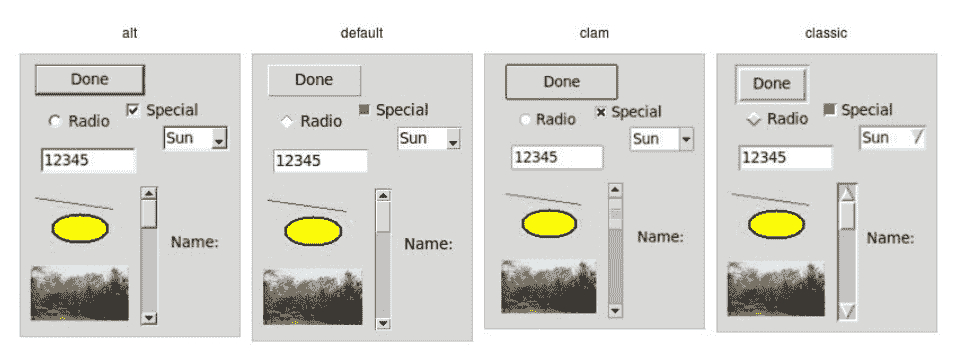

除了内置主题（alt、default、clam 和 classic）外，macOS 包含一个名为 `aqua` 的主题以匹配系统范围的样式，而 Windows 包含名为 `vista`、`winxpnative` 和 `winnative` 的主题。
一次只能激活一个主题。要获取当前使用的主题名称，请使用以下命令：

```
>>> s.theme_use()
'aqua'
```

> 此 API 最初针对 Tk 8.6，后来被移植回 Tk 8.5.9。如果你使用的是更早版本的 Tk，获取此信息会稍微复杂一些。

切换到新主题可以使用：

```
s.theme_use('themename')
```

这实际上做了什么？显然，它将当前主题设置为指定的主题。这样做，因此会用主题定义的样式集替换所有当前可用的样式。最后，它会刷新所有控件，使它们呈现出新主题描述的外观。

### 第三方主题

稍加寻找，你就可以找到一些现有的附加主题可供下载。一个好的起点是 [https://wiki.tcl-lang.org/page/List+of+ttk+Themes](https://wiki.tcl-lang.org/page/List+of+ttk+Themes)。

虽然主题可以用 Tk 支持的任何语言定义，但你找到的大多数都是用 Tcl 编写的。如何安装它们以便在你的应用程序中使用？

例如，让我们使用 "awdark" 主题，可从 [https://sourceforge.net/projects/tcl-awthemes/](https://sourceforge.net/projects/tcl-awthemes/) 获取。将 `awthemes-*.zip` 文件下载并解压到某个地方。你会注意到它包含一堆 `.tcl` 文件，一个子目录 `i`，其中包含更多目录和主题使用的图像等。

其中一个文件名为 `pkgIndex.tcl`。这将其标识为一个 Tcl 包，类似于 Python 模块。如果我们查看内部，你会看到一堆像 `package ifneeded awdark 7.7` 这样的行。这里，`awdark` 是包的名称，`7.7` 是其版本号。像本例中这样，单个 `pkgIndex.tcl` 文件提供多个包的情况并不少见。

要使用它，我们需要告诉 Tcl 在哪里可以找到该包（通过将其目录添加到 Tcl 的 `auto_path`）以及要使用的包的名称。

```
root.tk.call('lappend', 'auto_path', '/full/path/to/awthemes-9.3.1')
root.tk.call('package', 'require', 'awdark')
```

如果主题是作为单个 Tcl 源文件实现，而没有 `pkgIndex.tcl`，你可以这样使其可用：

```
root.tk.call('source', '/full/path/to/themefile.tcl')
```

现在你应该能够在自己的应用程序中使用该主题，就像使用任何内置主题一样。

## 17.2. 使用样式

我们现在将探讨一个更复杂的问题：如何在应用程序中充分利用样式和主题，而不仅仅是使用现有主题重新设计外观。

## 定义

我们首先需要介绍几个基本概念。

## 控件类

*控件类*标识特定控件的类型，无论是按钮、标签、画布等。所有主题控件都有一个默认类。按钮的类是 `TButton`，标签是 `TLabel`，等等。

## 控件状态

*控件状态*允许单个控件根据鼠标位置、应用程序设置的不同状态选项等因素，具有多种外观或行为。

如你所知，所有主题控件都维护一组二进制状态标志，可通过 `state` 和 `instate` 方法访问。这些标志包括：`active`、`disabled`、`focus`、`pressed`、`selected`、`background`、`readonly`、`alternate` 和 `invalid`。所有控件都具有相同的状态标志集，尽管它们可能会忽略其中一些（例如，标签控件可能会忽略 `invalid` 状态标志）。有关每个状态标志的确切含义，请参阅参考手册中的[主题控件](https://tkdocs.com/man/ttk_widget)页面。

## 样式

*样式*描述控件类的外观（或多种外观）。所有具有相同控件类的主题控件将具有相同的外观。

样式以其描述的控件类的名称来引用。例如，样式 `TButton` 定义了所有类为 `TButton` 的控件的外观。
样式了解不同的状态，一个样式可以根据控件的状态定义不同的外观。例如，一个样式可以指定当 `pressed` 状态标志被设置时，控件的外观应如何变化。

## 主题

*主题*是样式的集合。虽然每个样式都是特定于控件的（一个用于按钮，一个用于输入框等），但主题将许多样式集合在一起。同一主题中的所有样式在视觉上都会被设计成相互“协调”。（不幸的是，Tk 在技术上并不限制糟糕的设计或判断！）
在应用程序中使用特定主题实际上意味着，默认情况下，每个控件的外观将由该主题中负责该控件类的样式控制。

## 样式名称

每个样式都有一个名称。如果你要修改样式、创建新样式或为控件使用样式，你需要知道它的名称。
如何知道样式的名称？如果你有一个特定的控件，并且想知道它当前使用的样式，你可以先检查其 `style` 配置选项的值。如果为空，则意味着该控件使用的是该控件的*默认*样式。你可以通过控件的类来检索它。例如：

```
>>> b = ttk.Button()
>>> b['style']
''
>>> b.winfo_class()
'TButton'
```

在这种情况下，使用的样式是 `TButton`。其他主题控件的默认样式命名类似，例如 `TEntry`、`TLabel` 等。

> 始终明智的做法是检查具体细节。例如，树形视图控件的类是 `Treeview`，**而不是** `TTreeview`。

除了默认样式之外，样式可以命名为几乎任何名称。你可能会创建自己的样式（或使用具有该样式的主题），命名为 `FunButton`、`NuclearReactorButton`，甚至 `GuessWhatIAm`（这不是一个明智的选择）。
更常见的是，你会发现像 `Fun.TButton` 或 `NuclearReactor.TButton` 这样的名称，这表示基础样式的变体；正如你将看到的，这是 Tk 支持用于创建和修改样式的一种方式。

> 目前不支持检索所有当前可用样式的列表。这可能会在 Tk 8.7 中以新命令 `ttk::style theme styles` 的形式出现，用于返回主题实现的样式列表。它还提议为所有控件添加一个 `style` 方法，这样你就无需同时检查控件的 `style` 配置选项和其类。参见 [TIP #584](https://tip.tcl.tk/584)。

## 应用样式

使用样式意味着将该样式应用于单个控件。如果你知道要使用的样式名称以及要应用到哪个控件，这很容易。设置样式可以在创建时完成：

```
b = ttk.Button(parent, text='Hello', style='Fun.TButton')
```

同样，控件的样式可以随时通过 `style` 配置选项更改：

```
b['style'] = 'Emergency.TButton'
```

## 创建简单样式

那么我们如何创建像 `Emergency.TButton` 这样的新样式呢？
在这种情况下，你正在创建一个与现有样式相似但在某些方面有所不同的新样式。这是创建新样式的最常见原因。
例如，你希望应用程序中的大多数按钮保持正常外观，但某些“紧急”按钮以不同方式突出显示。创建一个新样式（例如 `Emergency.TButton`），从基础样式（`TButton`）派生，是合适的做法。

在现有样式前添加另一个名称（`Emergency`）后跟一个点，会创建一个从现有样式派生的新样式。新样式将具有与现有样式完全相同的选项，除了指定的差异：

```
s.configure('Emergency.TButton', font='helvetica 24',
            foreground='red', padding=10)
```

然后你可以使用其 `style` 配置选项将该样式应用于单个按钮控件，如前所述。所有其他按钮控件将保留其正常外观。

如何知道给定样式有哪些可用的更改选项？这需要更深入地了解样式内部。

> 

你可能有使用经典控件的现有代码，希望将其迁移到主题控件。通过配置选项对经典控件进行的大多数外观更改可能可以省略。对于那些不能省略的，你可能需要创建一个新样式，如上所示。

特定于状态的外观更改可以类似地处理。在经典 Tk 中，一些控件通过配置选项支持一些状态更改。例如，将按钮的 `state` 选项设置为 `disabled` 会将其绘制为灰色标签。有些允许额外的状态 `active`，这代表不同的外观。你可以通过额外的配置选项（例如 `foreground`、`disabledforeground` 和 `activeforeground`）来控制控件在不同状态下的外观。

通过配置选项进行的状态更改应改为在主题控件上使用 `state` 方法。修改控件在特定状态下外观的配置选项应在样式中处理。

经典 Tk 控件还支持一种非常原始的样式形式，你可能会遇到。这使用了**选项数据库**，这是 X11 风格配置文件的一个现已过时的前端。

在经典 Tk 中，所有按钮都具有相同的类（`Button`），所有标签都具有相同的类（`Label`），等等。你可以将此控件类用于自省和通过选项数据库全局更改选项。它允许你，例如，指定所有按钮都应具有红色背景。

**少数**经典 Tk 控件，包括框架和顶层控件，允许你在首次创建特定控件时通过提供 `class` 配置选项来**更改**其控件类。例如，你可以指定一个特定的框架控件具有类 `SpecialFrame`，而其他控件将具有默认类 `Frame`。你可以使用选项数据库仅更改 SpecialFrame **框架**的外观。

样式和主题采用了这个简单的想法，并为其提供了火箭推进器。

## 17.3. 样式内部是什么？

如果你只想*使用*一个样式，或者通过少量调整创建一个新样式，那么你现在需要知道的都已经掌握了。然而，如果你想进行更实质性的修改，事情就会开始变得“有趣”起来。

## 元素

虽然每个样式控制着一种类型的控件，但每个控件通常由更小的部分组成，这些部分被称为*元素*。样式作者的工作就是用这些更小的元素来构建整个控件。这些元素是什么，取决于具体的控件。

这是一个按钮的示例。它最外面可能有一个边框。这是一个元素。紧挨着边框内部，可能有一个焦点环。通常，它只是背景色，但当用户通过 Tab 键切换到按钮时，它可能会高亮显示。所以这是第二个元素。然后，在焦点环和按钮标签之间可能有一些间距。这个间距是第三个元素。最后，按钮本身的文本标签是第四个元素。

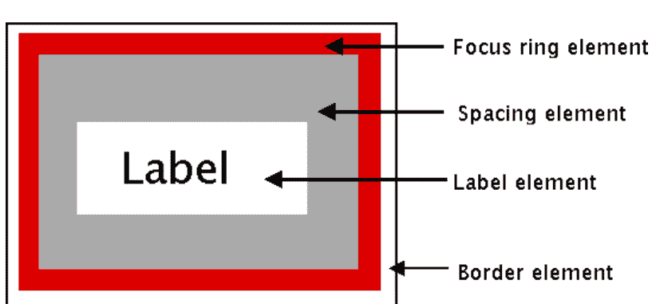

为什么样式作者要这样划分呢？如果你的控件中有一部分可能位于另一部分的不同位置，或者可能与另一部分颜色不同，那么它可能就是一个很好的元素候选。请注意，这只是按钮如何由元素构成的一个例子。不同的样式和主题可以（并且确实）以不同的方式来实现这一点。

这是第二个例子，一个垂直滚动条。它由一个“槽”元素组成，该元素包含其他元素。这些元素包括两端的向上和向下箭头元素，以及中间的“滑块”元素（它可能还有其他元素，比如边框）。

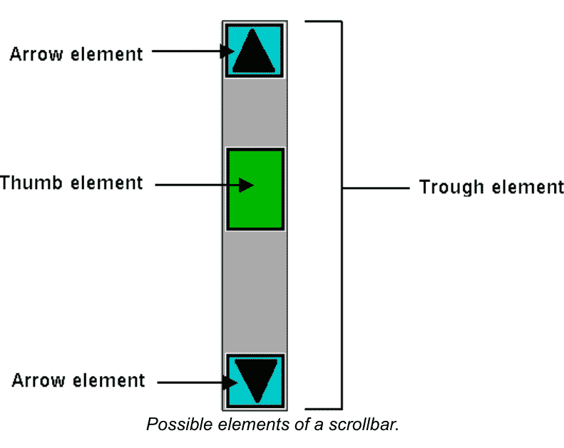

## 布局

除了指定哪些元素构成一个控件外，样式还定义了这些元素在控件内的排列方式。这被称为它们的*布局*。在按钮示例中，我们有一个标签元素位于间距元素内，间距元素位于焦点环元素内，焦点环元素位于边框元素内。其逻辑布局如下：

```
border {
    focus {
        spacing {
            label
        }
    }
}
```

我们可以向 Tk 查询 `TButton` 样式的布局：

```
>>> s.layout('TButton')
[("Button.border", {"children": [("Button.focus", {"children":
[("Button.spacing",
{"children": [("Button.label", {"sticky": "nswe"})], "sticky":
"nswe"})], "sticky": "nswe"})], "sticky": "nswe", "border": "1"})]
```

如果我们将其整理并格式化一下，会得到如下结构：

```
Button.border -sticky nswe -border 1 -children {
    Button.focus -sticky nswe -children {
        Button.spacing -sticky nswe -children {
            Button.label -sticky nswe
        }
    }
}
```

这开始变得清晰了；我们有四个元素，分别命名为 `Button.border`、`Button.focus`、`Button.spacing` 和 `Button.label`。每个元素都有不同的元素选项，例如 `children`、`sticky` 和 `border`，用于指定布局或尺寸。目前无需深入细节，我们可以清楚地看到基于 `children` 和 `sticky` 属性的嵌套布局。

> 样式使用 Tk 的 `pack` 几何管理器的简化版本来指定元素布局。这在 `style` 参考手册页面中有详细说明。[https://tkdocs.com/man/ttk_style](https://tkdocs.com/man/ttk_style)

## 元素选项

这些元素中的每一个都有许多不同的选项。例如，一个标签元素有字体和前景色。一个表示滚动条滑块的元素可能有一个设置其背景色的选项，或者另一个提供边框宽度的选项。这些都可以被自定义，以调整整个控件内元素的外观。

你可以确定每个元素有哪些可用选项吗？这是一个检查按钮内标签选项的例子（我们从 `layout` 方法知道它被标识为 `Button.label`）：

```
>>> s.element_options('Button.label')
('compound', 'space', 'text', 'font', 'foreground', 'underline',
'width', 'anchor', 'justify',
'wraplength', 'embossed', 'image', 'stipple', 'background')
```

在接下来的章节中，我们将探讨处理元素选项的并非完全直接的方法。

## 17.4. 操作样式

在本节中，我们将了解如何通过修改样式选项来改变样式的外观。你可以通过修改现有样式来实现，或者更典型地，通过创建一个新样式来实现。我们之前已经看到了如何创建一个从另一个样式派生的简单样式：

```
s.configure('Emergency.TButton', font='helvetica 24',
foreground='red', padding=10)
```

### 修改样式选项

修改现有样式的选项与修改任何其他配置选项的方式类似，通过指定样式、选项名称和新值：

```
s.configure('TButton', font='helvetica 24')
```

你很快就会了解到哪些是有效的选项。

> 如果你修改一个现有样式，就像我们这里对 `TButton` 所做的那样，该修改将应用于所有使用该样式的控件（因此默认情况下，所有按钮）。这很可能就是你想要做的。

要检索选项的当前值，请使用 `lookup` 方法：

```
>>> s.lookup('TButton', 'font')
'helvetica 24'
```

### 特定状态的样式选项

除了样式的正常配置选项外，控件作者可能还指定了当控件处于特定控件状态时要使用的不同选项。例如，当按钮被禁用时，它可能会将按钮的标签变为灰色。

> 请记住，状态由一个或多个状态标志（或其否定）组成，这些标志由控件的 `state` 方法设置，或通过 `instate` 方法查询。

你可以使用 *map* 为样式的一个或多个配置选项指定特定状态的变化。对于每个配置选项，你可以指定一个控件状态列表，以及当控件处于该状态时应分配给该选项的值。

以下示例提供了按钮正常外观的以下变化：

- 当控件处于禁用状态时，背景色应设置为 `#d9d9d9`
- 当控件处于活动状态（鼠标悬停）时，背景色应设置为 `#ececec`
- 当控件处于禁用状态时，前景色应设置为 `#a3a3a3`（这是在我们已经注意到的背景色变化之外的）
- 当控件处于按钮被按下且控件未被禁用的状态时，浮雕应设置为 `sunken`

```
s.map('TButton',
    background=[('disabled','#d9d9d9'), ('active','#ececec')],
    foreground=[('disabled','#a3a3a3')],
    relief=[('pressed', '!disabled', 'sunken')])
```

> 因为控件状态可以包含多个标志，所以可能不止一个状态匹配一个选项（例如，如果控件的 `pressed` 状态标志被设置，`pressed` 和 `pressed !disabled` 都会匹配）。状态列表按照你在 map 命令中提供的顺序进行评估。列表中第一个匹配的状态将被使用。

## 17.5. 觉得很难吗？

所以你现在知道样式由元素组成，元素有各种选项，并以特定的布局组合在一起。你可以更改样式上的各种选项，使所有使用该样式的控件呈现不同的外观。任何使用该样式的控件都会呈现该样式定义的外观。主题收集了一整套相关的样式，使得轻松更改整个用户界面的外观变得容易。

那么，是什么让样式和主题在实践中如此困难呢？有三件事。首先：

> 你只能修改样式的选项，而不是元素选项（除了有时）。

我们之前讨论了如何通过检查样式的布局来发现样式中使用了哪些元素，以及如何发现每个元素有哪些可用选项。但当我们着手修改样式时，我们似乎是在配置*样式*的选项，而没有指定单个元素。这是怎么回事？

再次使用我们的按钮示例，我们有一个元素 `Button.label`，它除了其他功能外，还有一个 `font` 配置选项。发生的情况是，当绘制 `Button.label` 元素时，它会查看设置在*样式*上的 `font` 配置选项，以确定使用什么字体来绘制自身。

> 要理解原因，你需要知道当样式将一个元素作为其一部分包含时，该元素不维护任何（特定于元素的）存储。特别是，它本身不存储任何配置选项。当它需要检索选项时，它通过包含它的样式来完成，该样式被传递给元素。因此，单个元素是 GoF 模式术语中的“享元”对象。

类似地，任何其他元素也会从设置在样式上的选项中查找其配置选项。如果两个元素使用相同的配置选项（比如背景色）怎么办？因为只有一个背景配置选项存储在样式中，所以两个元素将使用相同的背景色。你不能让一个元素使用一种背景色，而另一个使用不同的背景色。

除非你能做到。在当前实现中，存在一些棘手的、特定于控件的**子布局**，它们有时允许你仅通过配置类似`TButton.Label`（而非控件样式名称`TButton`）的选项来修改单个元素。

一些样式还提供额外的配置选项，允许你指定该选项影响哪个元素。例如，`TCheckbutton`样式为控件主体提供了一个`background`选项，并为显示是否选中的方框提供了一个`indicatorbackground`选项。

这些情况是否有文档记录？是否有某种内省方法来确定何时可以这样做？有时两者都有（信不信由你，这已经是一种改进；过去这两个问题的答案都是明确的“否”）。你有时可以通过调用样式的`configure`方法（不提供任何新的配置选项）来找到该样式的**部分**选项。每个主题控件的参考手册页面现在通常包含一个**样式选项**部分，列出了**可能**可用于更改的选项。

这是主题控件API中一个持续发展的领域。

第二个困难也与修改样式选项有关：

> 可用的选项不一定有效果，修改一个无效的选项也不会产生错误。

你有时会尝试更改一个根据元素选项应该存在的选项，但它不会产生任何效果。例如，你无法修改macOS使用的`aqua`主题中按钮的背景颜色。虽然这些情况有合理的原因，但发现它们并不容易，这有时会让实验变得令人沮丧。

在实验过程中，更令人沮丧的可能是指定一个`不正确`的样式名称或选项名称不会产生错误。事实上，在执行`configure`或`lookup`时，你可以为样式指定任何名称，也可以为选项指定任何名称。所以，如果你厌倦了`background`和`font`选项，可以随意配置一个`dowhatimean`选项。它可能不起作用，但这不是错误。同样，这可能会让你难以知道应该修改什么，不应该修改什么。

> 这是拥有一个非常轻量级和动态系统的缺点之一。你可以在配置样式选项时仅通过提供名称来创建新样式；这意味着你不需要显式创建样式对象。同时，这也确实容易出错。也无法找出当前存在或正在使用的样式。而且由于样式选项实际上只是元素选项的前端，并且样式中的元素可以随时更改，因此不一定明显的是，选项是否应该仅限于当前元素所引用的那些选项，而这些元素本身可能并非全部都可内省。

最后，以下是使样式和主题如此困难的最后一点：

> 可用的元素、这些元素的名称、每个元素可用或有效的选项，以及特定控件使用的选项，在每个主题中都可能不同。

那么？请记住，每个平台（Windows、macOS和Linux）的默认主题是不同的（这是件好事）。这带来了一些影响：

1.  如果你想为你的应用程序定义一种新类型的控件（或现有控件的变体），你需要为你的应用程序使用的每个主题（即，对于跨平台应用程序至少三个）分别且以不同的方式完成。
2.  每个主题/平台可用的元素和选项会有所不同，这意味着你可能需要为每个主题/平台设计出相当不同的自定义方法。
3.  每个主题可用的元素、名称和元素选项通常没有文档记录（除了阅读主题定义文件本身），但通常通过主题内省（我们很快会看到）来识别。因为并非所有主题在所有平台上都可用（例如，`aqua`仅在macOS上可用），你需要能够随时访问你需要运行的每个平台和主题。

考虑尝试自定义一个按钮。你知道它使用`TButton`样式。但该样式在每个平台上使用不同的主题实现。如果你检查该样式在每个主题中的布局，你会发现每个主题使用不同的元素，并且排列方式不同。如果你尝试查找每个元素的可用选项，你会发现这些选项也不同。当然，即使一个选项名义上可用，它也可能没有效果。

关键在于，在经典Tk中，你能够修改单个控件的大量属性中的任何一个，你可以在一个平台上做一些事情，它在其他平台上可能也能工作（但可能需要调整）。在主题Tk中，这个简单的选项不存在了，如果你想让你的应用程序与多个主题/平台兼容，你几乎被迫以正确的方式去做。这需要更多的前期工作。

## 17.6. 高级：更多关于元素的内容

虽然本书关于样式和主题的内容到此为止，但对于好奇的用户和那些想进一步深入创建新主题的人，我们可以提供更多关于元素的有趣细节。

因为元素是样式和主题的构建块，这就引出了“元素从哪里来？”的问题。实际上，我们可以说元素通常是在C代码中创建的，并符合主题引擎理解的特定API。

在最底层，元素来自一种叫做*元素工厂*的东西。目前，有一个默认的工厂，大多数主题都使用它，并使用Tk绘图例程来创建元素。第二个允许你从图像创建元素，实际上可以通过`ttk::style element create`方法（来自Tcl）在脚本级别访问。Tk支持的所有图像格式都可用，包括可缩放的图像格式（如SVG），如果你有合适的扩展。最后，还有一个特定于Windows的引擎，使用底层的“Visual Styles”平台API。

如果一个主题使用通过平台原生控件创建的元素，那么使用这些原生控件的调用通常会出现在该主题的元素规范代码中。当然，其元素依赖于原生控件或API调用的主题只能在支持它们的平台上运行。

然后，主题将使用一组元素来组装控件实际使用的样式。考虑到主题的整个理念是多个样式可以共享相同的外观，不同的样式共享相同的元素也就不足为奇了。

因此，虽然`TButton`样式包含一个`Button.padding`元素，`TEntry`样式包含一个`Entry.padding`元素，但在底层，这些填充元素很可能是同一个。它们可能看起来不同，但那是因为不同的配置选项，正如我们回忆的，这些选项存储在使用该元素的样式中。

发现一个主题可以提供一组通用选项，如果样式没有另行指定，则用作每个样式的默认值，这可能也不足为奇。这意味着如果整个主题中的几乎所有内容都有绿色背景，主题就不需要为每个样式明确说明这一点。这使用了一个名为`.`的根样式。毕竟，如果`Fun.TButton`可以从`TButton`继承，为什么`TButton`不能从`.`继承呢？

最后，值得看看现有主题是如何定义的，既在Tk的C库中的C代码级别，也在Tk的“library/ttk”目录或第三方主题中的Tk脚本中。在Tk的C库中搜索`Ttk_RegisterElementSpec`以查看元素是如何指定的。

## 18. 案例研究：IDLE现代化

本章介绍了一个将基于Tk的大型应用程序外观现代化的案例研究。

> **供参考。** 本章目前（2019年5月）仍在进行中。这里的代码正慢慢进入Python源代码树，但大部分尚未到位。你可以在[GitHub](https://github.com)上找到临时快照。

[IDLE](https://docs.python.org/3/library/idle.html)（集成开发环境）是随每个Python版本捆绑的标准Python开发环境。它包括一个交互式Python shell、带语法高亮的编辑器、调试器等。其用户界面是用Tkinter编写的。

IDLE 从未打算成为功能更全面的开发环境的替代品。由于它相对简单且集成度高，并且随 Python 一起捆绑分发，因此在学习（和教授）这门语言的人群中很受欢迎。

IDLE 最初由 Python 的 BDFL（终身仁慈独裁者）Guido van Rossum 于 1998 年创建，多年来由多位其他开发者逐步添加功能。但由于投入的开发精力有限，它开始显得过时，尤其是在那些改进 IDLE 的开发者不常使用的平台（例如 macOS）上。

[Python Central 对 IDE 的比较](https://www.pythoncentral.io/)这样描述 IDLE：

> 所有这些功能实际上都存在，但它们并没有真正构成一个 IDE。事实上，虽然 IDLE 提供了你期望从 IDE 获得的一些功能，但它甚至算不上一个令人满意的文本编辑器。其界面存在缺陷，没有考虑到 Python 的工作方式，尤其是在交互式 shell 中；自动补全在标准库之外毫无用处；编辑功能非常有限，以至于没有哪个认真的 Python 程序员——天哪，没有哪个认真的打字员——能全天候使用它。

如果你使用 IDE，那它不应该是 IDLE。

由于其充满缺陷且过时的用户界面，IDLE [面临被从 Python 发行版中移除的风险](https://www.python.org/)。然而，由于其相对简单且随 Python 捆绑，仍有许多人，特别是那些教授 Python 的人，热切希望看到 IDLE 能够飞跃发展。

IDLE 显然是一个进行现代化改造的绝佳候选者，可以使用更新的 Tk 特性，如主题化小部件，来推动一些重新设计。但这不仅仅是更换小部件的问题。许多改进可以通过改变“经典”小部件的使用方式来实现，以更好地反映更现代的设计美学。

> 因为 IDLE 作为一个应用程序，是 Python 标准库的一部分（即 99% 的设计目的是供其他代码使用），所以存在许多对于应用程序来说并不真正合适的策略和流程，这使得更改变得困难。移除其中一些障碍（参见 [PEP 434](https://www.python.org/dev/peps/pep-0434/)）是实现此处讨论的更改类型所需的重要一步。

### 18.1. 项目目标

可以想象，对这样一个基于“经典”Tkinter 的大型应用程序进行现代化改造并非完全直截了当。在本章中，我将介绍一些已进行的用户界面更改及其原因。

所有参与人员都希望看到 IDLE 比以前好看得多，尽管没有人幻想它会变成一个令人惊叹的尖端设计范例。但让它更融入环境，使人们在学习 Python 时不会被工具的笨拙所分心，这似乎是可行的。

目标也不是试图与专业程序员更常用的 Python IDE 竞争，例如 [PyCharm](https://www.jetbrains.com/pycharm/)、[WingIDE](https://wingware.com/)、[PyDev](https://www.pydev.org/)、[Komodo](https://www.activestate.com/products/komodo-ide/) 等。尽管一些更有经验的 Python 开发者确实使用 IDLE，无论是偶尔还是定期，但它主要需要吸引这门语言的新手，而且通常是那些对编程本身也很陌生的人。

此前不乏彻底改进 IDLE 的尝试，产生了许多不同的 *分支*，它们都宣称有各种改进。其中许多使用了其他 GUI 工具包或不属于标准库的模块。在这里坚持使用 Tkinter 和标准库很重要，因为我们希望确保每一项改进最终都能进入随 Python 发布的 *官方* 版本，而不是仅仅成为另一个分支。

此外，希望让 IDLE 更易于贡献。这意味着需要精简大量代码，移除一些冗余和不一致之处，清理一些更复杂的部分，简化系统组件之间的交互等。还有一个相当长的已报告错误列表，我们希望能在其中取得一些进展。

虽然同样重要，但我将主要推迟讨论围绕软件架构、向后兼容性（包括运行 Tk 8.4、pre-ttk 的系统，这些系统只接受了少数选择性改进）等的重大问题。

在本章中，你将找到指向 Python 问题跟踪系统中各个问题的链接，这些问题通常提供了关于人们围绕更改的各种思考过程的额外见解。

> 正如你将看到的，本章重点介绍了 IDLE 用户界面的许多缺点。这样做主要是为了强调，因为这里展示的许多问题在许多应用程序和用户界面中都很常见。我对于那些将他们有限的时间和资源捐赠给这个开源项目的人们怀有最高的敬意，他们不得不在时间、功能和用户界面之间做出有意识的权衡，所有这些都在一个绝对非平凡的代码库背景下进行。

### 18.2. 菜单

做出的第一个更改是移除过时的可撕下菜单。macOS 版本的 Tk 甚至不支持它们，但它们在 Windows 和 X11 上仍然存在。参见 [bugs.python.org/issue13884]。

这里的更改是在代码中创建这些菜单的少数几个地方添加了 "tearoff=0" 选项。
至少这很容易。
还有几个错误，当功能不可用时，菜单项没有被正确禁用。这导致要么菜单项不起作用（对学习者来说很困惑），要么错误对话框除了“你不能这样做”之外几乎没说什么。

### 18.3. 主窗口

IDLE 的一个优点是，围绕编辑器和 shell，其大部分内容实际上是一个 Tk 文本小部件，*其* 用户界面需要更改的地方非常少。但即使在主要只是文本小部件的主窗口中，也有改进的空间。

以下图像显示了现代化之前 IDLE shell 窗口的原始版本，就像某人第一次启动程序时看到的那样。

看着它们，你会做出哪些改进？

macOS 上的 IDLE 主窗口。

Windows 上的 IDLE 主窗口。

Linux 上的 IDLE 主窗口。

### 默认字体

做出的第一个更改与默认字体有关。IDLE 硬编码了 10 点 Courier 并在所有平台上使用。这在 Windows 上看起来实际上并不太糟，在 Linux 上还可以，但在 macOS 上看起来很糟糕；参见 [bugs.python.org/issue24745](https://bugs.python.org/issue24745)。当然，这可以通过首选项对话框进行更改，但默认设置肯定没有留下好印象。

虽然一个简单的选择是编写代码根据运行平台选择一个好的字体，但默认值被更改为使用 Tk 的内置 `TkFixedFont`，它在每个平台上都提供了更好的默认值。

你可以在下面的截图中看到差异。注意新字体如何与显示的系统终端窗口更好地匹配。

使用 TkFixedFont 的 IDLE 主窗口 (macOS)。

使用 TkFixedFont 的 IDLE 主窗口 (Windows)。

使用 TkFixedFont 的 IDLE 主窗口 (Linux)。

说到首选项对话框，如果你想更改字体，通常需要知道字体实际是什么（使用 `Font.actual`）。这是 IDLE 首选项对话框中用于确定这一点的新代码：

```
if (family == 'TkFixedFont'):
    f = Font(name = 'TkFixedFont', exists = True, root = root)
    actualFont = Font.actual(f)
    family = actualFont['family']
    size = actualFont['size']
    if size < 0:
        size = 10  # if font in pixels, ignore actual size
    bold = 1 if actualFont['weight']=='bold' else 0
```

作为记录，Tk 为 TkFixedFont 选择的字体是 macOS 上的 Monaco 11，Windows 上的 Courier New 10，以及 Linux（具体是 Ubuntu 14）上的 DejaVu Sans Mono 10。

### 文本小部件周围

主窗口边缘还有一些其他装饰性的东西不太对劲；参见 [bugs.python.org/issue24750](https://bugs.python.org/issue24750)。回顾一下之前 IDLE 主窗口的截图。

注意文本小部件周围有一个边框。这在 macOS 上最明显，是深黑色的，在 Linux 上不那么明显，在 Windows 上几乎察觉不到。这是 Tk 的 "highlightthickness" 属性的结果，当文本小部件获得焦点时会出现。

如果文本小部件没有焦点，例如当窗口变为非活动状态时，高亮显示会消失：

注意在 macOS 截图中，没有高亮显示时，窗口底部的状态栏与文本小部件融为一体。这不好。

正如你从其他应用程序中看到的，文本部件周围的边框已不再是通用惯例。因此，让我们首先移除它，这就像在创建文本部件时添加 `highlightthickness=0` 一样简单。

这仍然留下了状态栏与编辑器融为一体的难题。我们将状态栏更改为 `ttk.Frame` 部件，该部件在所有平台上都有背景阴影。我们还在状态栏上方放置了一个 `ttk.Separator` 部件，以实现清晰的分隔。

行和列指示器之前都是标签，使用以下代码创建：

```
label = Label(self, bd=1, relief=SUNKEN, anchor=W)
```

这被替换为 `ttk.Label`，以确保它与框架匹配。我们还摒弃了 1990 年代那种凹陷的 "3D" 外观。

```
label = ttk.Label(self)
```

最后但同样重要的是，我们可以用较新的 `ttk.Scrollbar` 部件替换原始的 Tk 滚动条。

对主窗口所做的更改如下所示。尽管这些更改相当细微，但它们大大有助于 IDLE 的主窗口看起来更整洁、更现代，并且在所有平台上都 "恰到好处"。

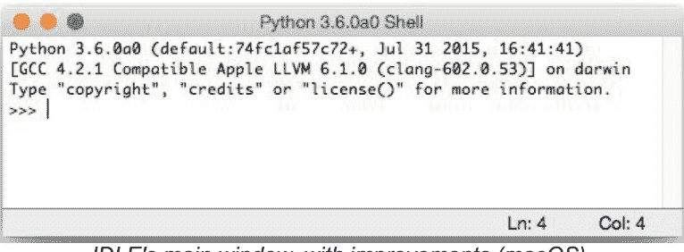

IDLE 的主窗口，已改进（macOS）。

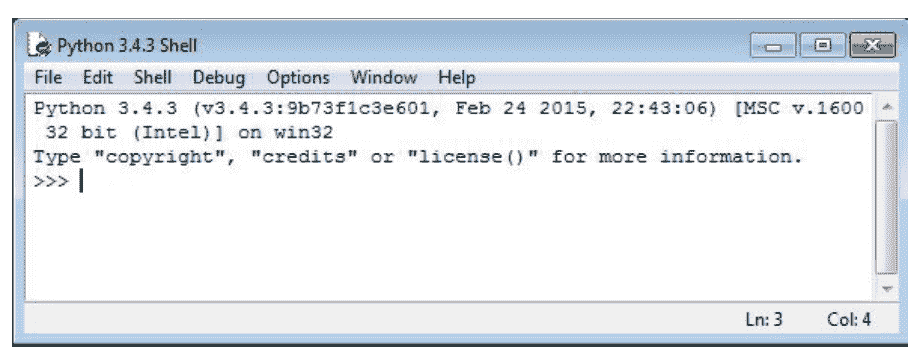

IDLE 的主窗口，已改进（Windows）。

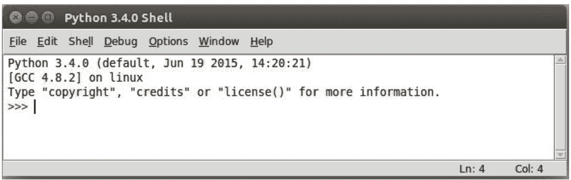

IDLE 的主窗口，已改进（Linux）。

### 18.4. 首选项对话框

一个非常需要改进的可见部分是首选项对话框。同样，以下是三个平台上的截图：

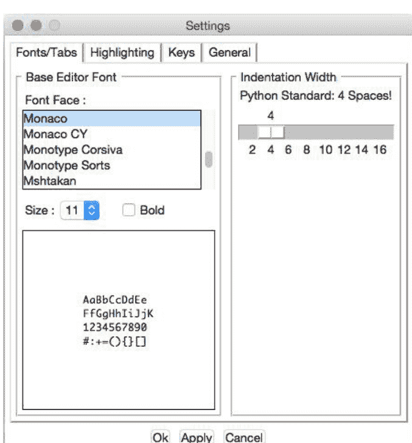

IDLE 的首选项窗口（macOS）。

### 设置

字体/制表符 高亮显示 快捷键 常规

基础编辑器字体

缩进宽度

字体名称：

Python 标准：4 个空格！

+   - Courier New
- Courier New Baltic
- Courier New CE
- Courier New CYR
- Courier New Greek

4

2 4 6 8 10 12 14 16

大小：10

粗体

AaBbCcDdEe
FfGgHhIiJjK
1234567890
#:+= () {} []

确定 应用 取消

IDLE 的首选项窗口（Windows）。

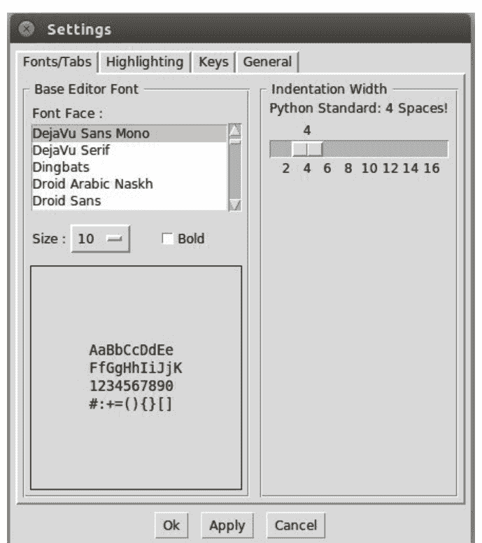

IDLE 的首选项窗口（Linux）。

其他选项卡允许你修改语法高亮的单独颜色、分配给特定操作的快捷键以及其他一些杂项。

虽然对于这个主要作为学习环境的工具是否需要这种级别的配置存在一些争论，但至少让现有的东西看起来和工作得更好似乎是合理的，然后再考虑任何更激进的改动；参见 [bugs.python.org/issue24810](https://bugs.python.org/issue24810)。

除其他事项外，首选项对话框从模态（有趣的是，在 macOS 上这并不完全有效，允许多个副本被创建）更改为非模态，不过我现在不会进一步讨论这一点；参见 [bugs.python.org/issue24760](https://bugs.python.org/issue24760)。

### 选项卡

要解决的第一个问题是用于在四个不同的首选项窗格之间切换的选项卡。原始版本使用了一个自定义的 "巨型部件"，因为经典的 Tk 没有自己的选项卡部件。虽然 Windows 和 Linux 上的看起来还不错，但在 macOS 的较新版本中，有一个内置的选项卡部件，看起来非常不同。

> 实际上，在 macOS 应用程序中，现在更常见的是使用类似工具栏的东西（顶部或侧面的一排带标签的图标）来在首选项窗格之间切换，尽管一些程序仍然使用选项卡。选项卡在 Windows 和 Linux 上非常常见。

代码被修改为使用 `ttk.Notebook` 部件，这不仅在每个平台上看起来更好，而且让我们可以丢弃大量自己管理选项卡的代码。

### 更新部件

下一个明显的步骤是将 "经典" 部件升级为其主题化对应物。在这个屏幕上，这包括按钮、标签、框架、复选框、滚动条等。在其他一些窗格上还有一些其他的部件。通常，这是一个直接的过程，通常涉及移除不再需要或不被主题化部件支持的部件选项。

有时选择不同的部件更有意义。在这个屏幕上，用于字体大小的选项菜单最好用组合框替换。同样，滑块部件在当今的用户界面中并不常见，被更熟悉（且紧凑）的微调框部件替换。

还有一些使用某些部件或指定某些类型数据的非标准方式。这些通常被修改为使用更熟悉的范式。关于这些对话框的设计，讨论了许多一般性问题，例如参见 [bugs.python.org/issue24776](https://bugs.python.org/issue24776) 和 [bugs.python.org/issue24782](https://bugs.python.org/issue24782)。

### 布局

虽然这个对话框是一个不好的例子，仅仅因为左右两半之间的空间不平衡，但总体上花了很多时间来研究对话框中的部件间距和对齐。

一般方法是在其他应用程序中找到类似的例子，并以此作为指导。按钮位于何处？对话框的多个字段如何组织？标签相对于它们所标记的部件位于何处？它们是左对齐还是右对齐，首字母大写，是否有尾随冒号？这些都是需要考虑的问题。

> 💡 一个很好的起点是从使用旧的 `pack` 几何管理器转换为 `grid`。由于其工作方式，基于 `pack` 的布局往往具有奇怪且不一致的对齐和间距，特别是如果它们随着时间的推移被修改过。使用 `grid` 将提高可维护性，既因为它使用了更熟悉的思维模型，也因为它不依赖于部件插入的顺序。

可能不可能想出一个在所有平台上看起来都很棒的布局，但通常你可以想出一个（可能在代码中有一些特定于平台的调整）看起来不错的布局。

下面显示了对话框的修订版本，其中包含此处的许多技术。

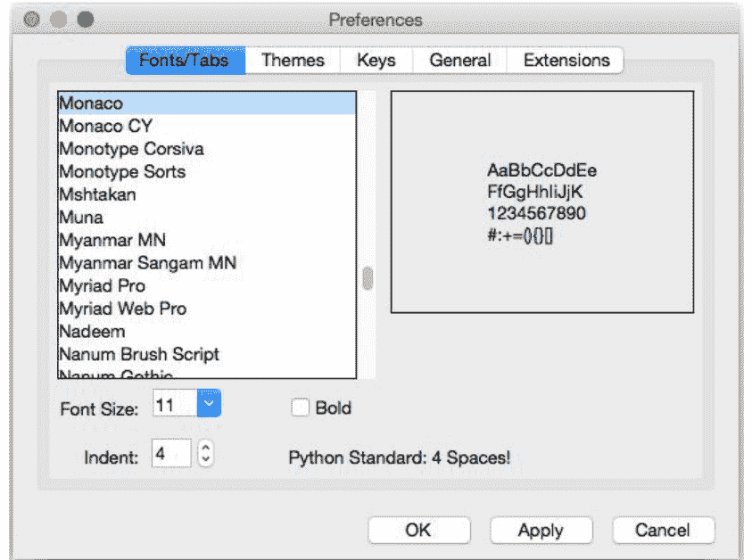

IDLE 首选项，修订版（macOS）。

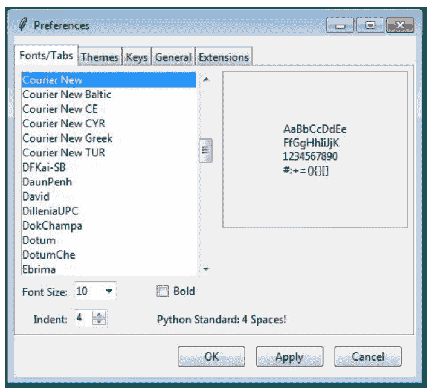

IDLE 首选项，修订版（Windows）。

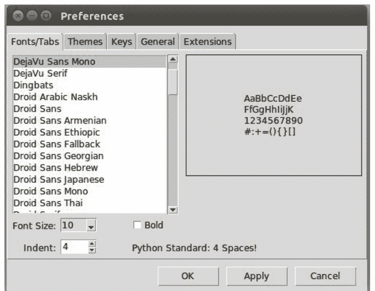

### 另一个例子

下面的截图显示了 IDLE 首选项窗格的前后对比，该窗格控制语法着色；参见 [bugs.python.org/issue24781](https://bugs.python.org/issue24781)。

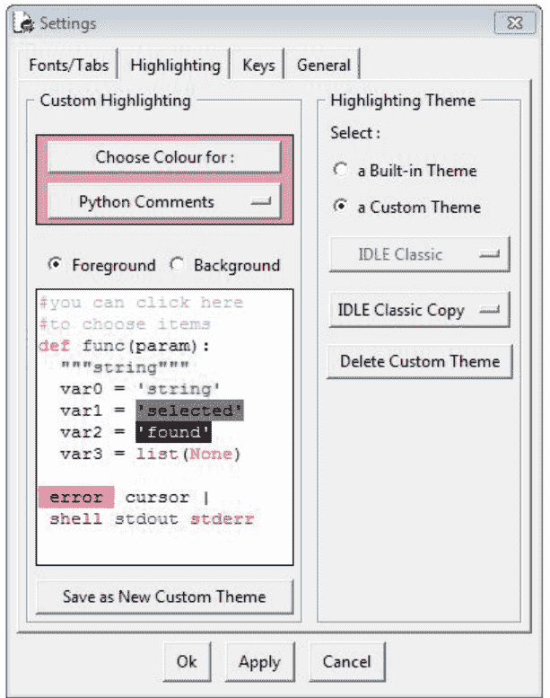

IDLE 主题窗格，之前（Windows）。

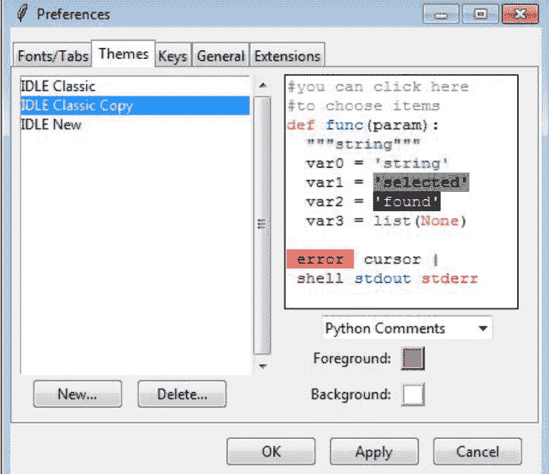

同样，替换部件并使用更熟悉的惯例是其中的一部分。我认为更大的变化与从用户的角度思考问题有关。特别是作为一个初学者工具，如果你在这里，很可能是为了切换主题，而不是调整颜色，这在新版本中更为突出。它还摒弃了 "内置" 和 "自定义" 主题之间的任意区分。
我认为新版本是一个很大的改进，尽管在撰写本文时，我还没有说服一些人。既然是开源的，我们拭目以待！

### 18.5. 其他对话框

IDLE 中还有多个其他对话框；我们将在这里再考虑几个例子。

### 查找对话框

> 计划对这些进行更多更改，可能会将查找和替换合并到一个对话框中。

下面显示了一个查找/搜索对话框，同样是在三个平台上的前后对比；参见 [bugs.python.org/issue23218](https://bugs.python.org/issue23218)。

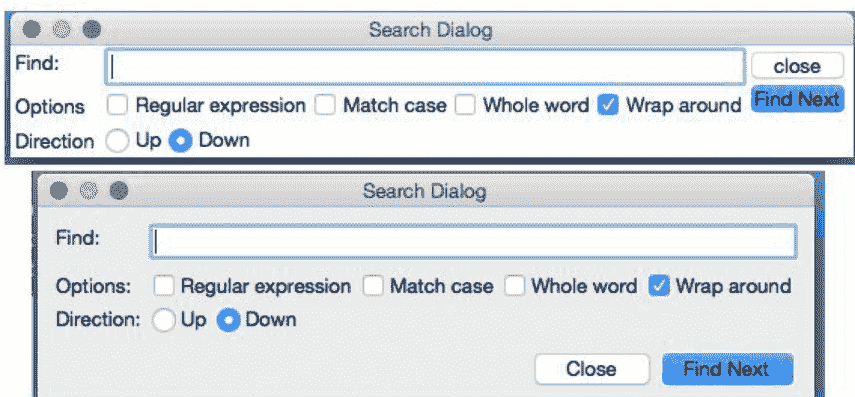

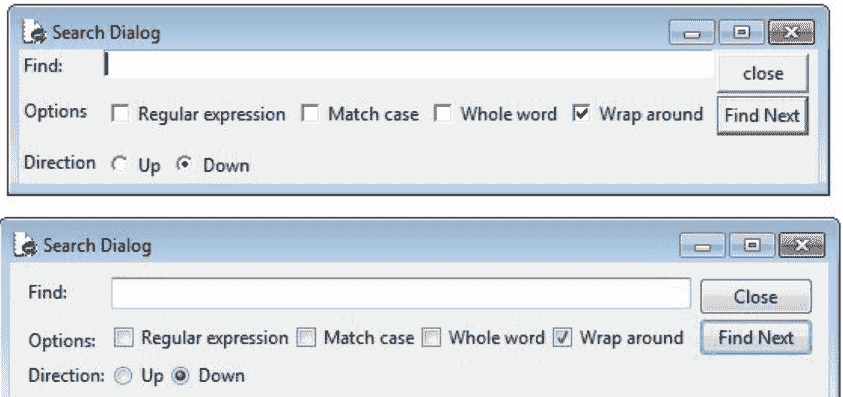

IDLE 查找对话框，前后对比（Windows）。

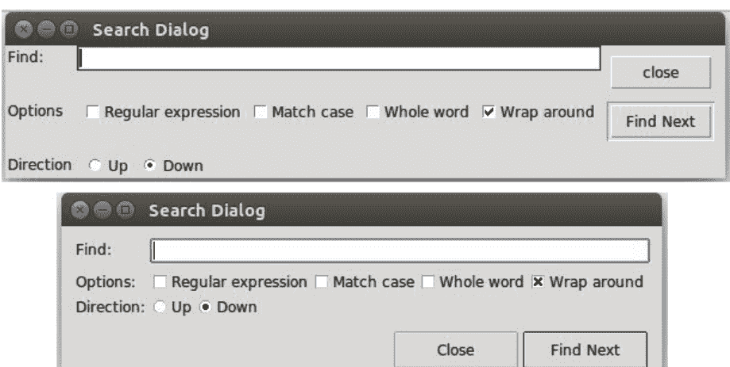

IDLE 查找对话框，前后对比（Linux）。

第一步是将部件升级为使用等效的主题化部件。这在按钮上效果最明显（保持大小写一致也没有坏处）。
说到按钮，注意在新版本中，按钮在 Windows 上位于右侧（之前都在所有平台上），但在 macOS 和 Linux 上位于底部。在检查了多个目标用户可能在每个平台上遇到的不同应用程序后，我们发现这些位置很常见。只需几行为了处理这种布局差异而需要额外编写的特殊处理代码，采用这种方式是合理的。

布局的其他方面也得到了改进。查看原始对话框（特别是按钮与其他控件未能对齐的情况），我最初认为它是用`pack`创建的，并计划将其转换为`grid`。有趣的是，它已经在使用`grid`了。那么，为什么控件仍然不对齐，这难道不是`pack`布局的典型特征吗？

结果发现，这是使用许多*嵌套框架*导致的。例如，按钮被放置在自己的框架中，然后再将该框架放入窗口的其余部分。因此，单个按钮无法与用户界面其余部分的控件对齐。

在使用`pack`时需要嵌套框架，但通常使用`grid`时，最好避免嵌套框架，除非在特殊情况下。这允许你使用户界面的不同部分对齐（代价是需要处理大量的colspan/rowspan调整）。

更彻底的重组可能会移除嵌套框架，但特别是在调整按钮时，这个相对简单的布局只需稍作调整就能正常工作。

> 💡 *你会注意到许多较旧的Tkinter用户界面存在内容延伸到窗口边缘的问题，这通常看起来不太合适。我已经养成了在每个顶级窗口内直接放置一个`ttk.Frame`并添加一些额外内边距的习惯，然后将用户界面的其余部分放在其中。*

与偏好设置一样，查找对话框最初也是模态的，这意味着在编辑文件之前必须先关闭它们，不过至少它们在重新打开时会记住之前的设置。这些最终被改为了常规的非模态窗口。

## 关于对话框

说到模态对话框，“关于”框最初也是模态的。不仅如此，获取更多信息（例如IDLE的README文件）还会启动*另一个*模态对话框，需要关闭它才能返回第一个模态对话框，而第一个又需要……等等。

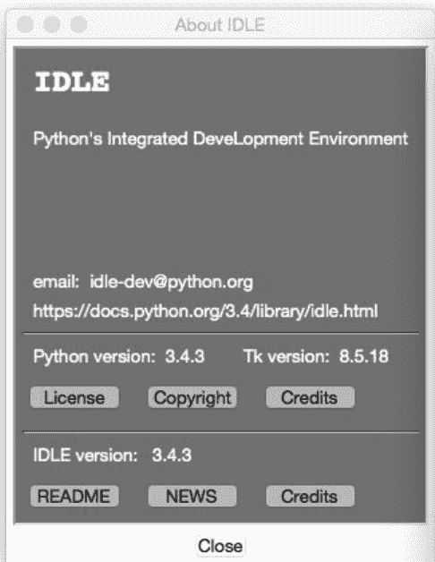

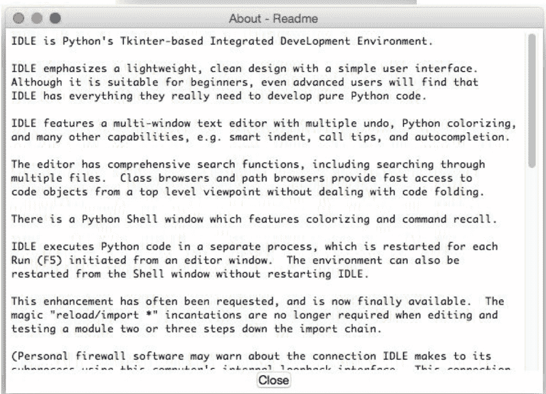

IDLE的双重模态“关于”对话框（macOS）。

使对话框变为非模态是首要任务。其次，使用渐进式披露技术消除了嵌套对话框。启动时对话框相当简洁，但包含一个“更多...”“链接”。点击后，它会扩展窗口以显示其中一个文档文件，并提供切换到其他文件的选项。

“更多...”“链接”实际上扮演了按钮的角色，但利用了每个人对网络浏览器的熟悉度，提供了一种视觉上更简单的替代方案。就实现而言，我们使用了一个（经典的、非主题的）标签控件，将其设置为蓝色，并为其附加了鼠标点击绑定。

> 💡 为了帮助传达链接是可点击的，你可以做的一件事是在鼠标悬停时更改光标（通过许多控件上都有的“cursor”选项）。在macOS上，选择平台特定的“pointinghand”光标，在Windows和Linux上选择“hand2”光标，该光标在这些平台上实际上会被映射为更合适的样式。

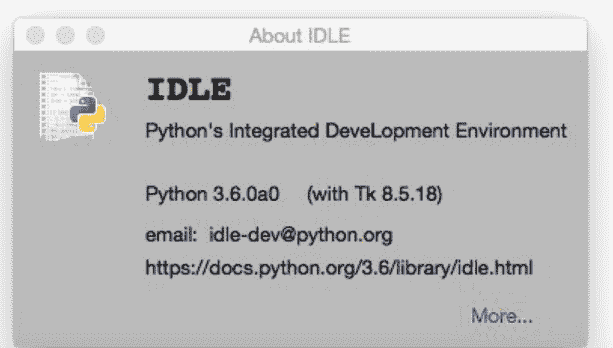

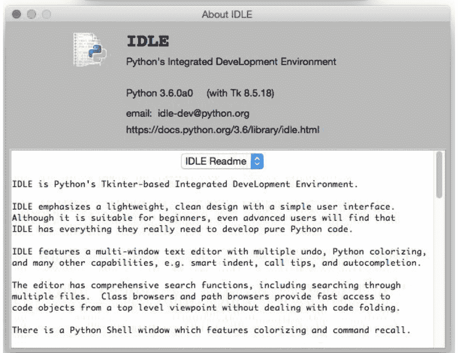

修订后的“关于”对话框（macOS）。

## 在线帮助

IDLE还有一个（不用说，是模态的）帮助对话框，显示有关使用程序的信息。它显示一个纯文本帮助文件，看起来类似于上面的“关于 - 自述文件”窗口。

与此同时，像Python的其他部分一样，也有[参考文档](https://docs.python.org/3/)，它是用“restructured text”创建的，然后可以使用名为[Sphinx](https://www.sphinx-doc.org/)的工具格式化为HTML、文本等。

IDLE帮助对话框中的文档基于一个单独但类似的纯文本文件。保持两者同步是一个问题。它们是分开的，因为Sphinx的纯文本渲染效果并不好，而且HTML渲染中所有额外的导航等对于在线帮助来说并不需要，然后还有打开网络浏览器等麻烦；参见[bugs.python.org/issue16893](https://bugs.python.org/issue16893)。

Tk的文本控件足够智能，可以处理IDLE文档中使用的基本格式，而Python在其标准库中包含一个HTML解析器。将两者结合，使得显示简化版本的HTML参考文档变得容易。

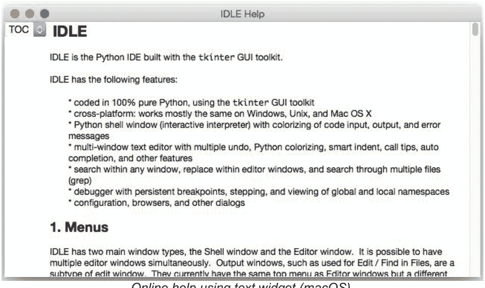

使用文本控件的在线帮助（macOS）。

> 很容易在这里走得太远。早在20世纪90年代中期，一个微小的[Tcl HTML解析器](https://www.tcl.tk/software/tclhtml/)催生了一系列“文本控件中的网络浏览器”冒险，首先在Tcl中，然后在其他语言中，例如Python的Grail。试图跟上大型开发团队在真实网络浏览器中投入的所有功能是徒劳的。然而，对于非常有限和受约束的HTML子集（如在线帮助中可能出现的），这完全是一种合理的方法。

## 查询对话框

仍然围绕模态对话框的主题，IDLE使用了“simpledialog”包，该包作为Tkinter的一部分分发，用于通过模态对话框向用户请求某些小信息。一个例子是“转到行...”命令。下面显示了该命令，以及输入无效内容时显示的警报示例。

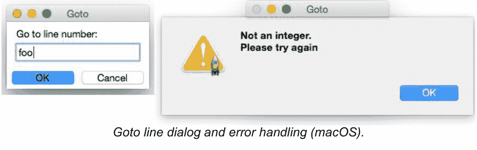

对话框上的警报并不像我们之前看到的对话框上的对话框模式那么糟糕。但这些对话框当然可以进行外观更新，并进行一些其他调整。例如，虽然它们正确地将按回车键或退出键解释为等同于按确定或取消，但它们没有允许macOS的替代约定（数字键盘上的回车键和Command-句点）；参见[bugs.python.org/issue24812](https://bugs.python.org/issue24812)。还有一些其他自定义功能会很好，例如更改确定按钮的名称，但simpledialog不支持。

关于错误处理，在某些情况下处理得更糟。例如，有一个命令可以打开一个包含Python标准库模块源代码的编辑器窗口。看看如果你输入错误会发生什么。

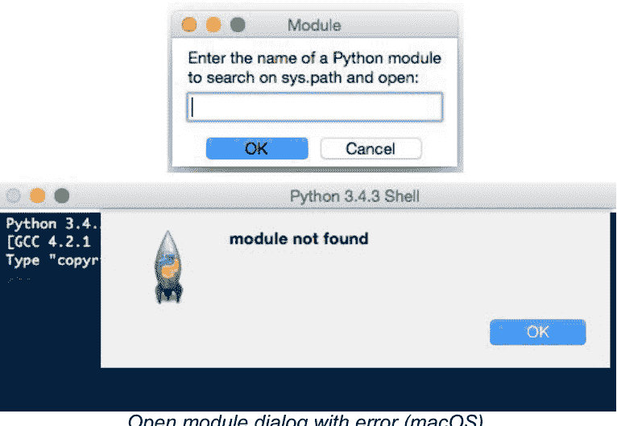

带有错误的打开模块对话框（macOS）。

因为对话框不知道模块名称是否正确，所以验证是在对话框关闭后才进行的。因此，错误警报被附加到另一个窗口。要重试，你必须关闭那个窗口，使用菜单重新打开对话框，然后从头开始重试。

代码中有几个地方确实需要在对话框中进行更多验证。因为“simpledialog”代码是Tkinter的一部分，并且不容易以所需的方式扩展，开发人员不得不诉诸于“通过文本编辑器继承”（即复制整个simpledialog代码并修改副本）。两次，分别进行。

既然外观无论如何都需要更新，我们概括了处理方式，完全忽略了Tkinter的simpledialog模块中的内容。相反，创建了一个单一的通用替代品，可以在整个IDLE中使用（并且仍然导致更少的代码）。

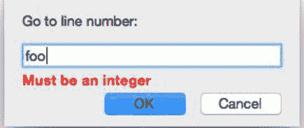

新的查询对话框（macOS）。

除了更新的控件和对齐方式，请注意无效输入的错误消息现在显示在对话框本身中（这种技术在Web应用程序中经常看到），而不是单独的警报。对于macOS，我们还确保为数字键盘回车键和Command-句点添加了按键绑定，并通过这个小技巧确保窗口看起来像模态对话框应有的样子：

```
self.tk.call('::tk::unsupported::MacWindowStyle', 'style',
self._w,
'moveableModal', '')
```

关于验证，查询对话框的结构是接受一个验证回调，然后可以处理任意标准。例如，这是人们输入新主题名称时使用的验证代码。它确保符合某些语法要求，并且尚未被使用。

```
def newtheme(self):
    def validate_theme(s):
        if not s:
            raise ValueError('Cannot be blank')
        if len(s) > 30:
            raise ValueError('Cannot be longer than 30 characters')
        if s in self.all_theme_names():
            raise ValueError('Name already used')
    new_theme = querydialog.askstring(parent=self, prompt='...',
        title='Create New Theme',
        validatecmd=validate_theme)
    if new_theme is not None:
        ...
```

一个通用的“整数”验证回调，带有可选的最小值和最大值，作为查询对话框模块的一部分添加，用于像“转到行...”这样的对话框。

## 对话框位置

几个对话框，包括警报、文件保存等，出现在屏幕中央，而不是靠近它们所属的窗口。

与之相关；参见 [bugs.python.org/issue25173]。

为对话框选择正确的窗口作为其 `parent`（父窗口）非常重要。这能确保对话框窗口出现在该窗口附近。在 macOS 上，这些对话框通常会附加到父窗口的标题栏上（参见上一节中的错误警报）。

> 💡 *Tkinter 中这些对话框的前端同时支持 `master` 和 `parent` 参数。虽然在 Tkinter 中，“master”和“parent”大多数时候可以互换使用，但在这里并非如此。如果你只提供 master，对话框将不会附加到该窗口（但对话框仍然需要一个现有窗口来创建，这就是 master 参数存在的原因）。如果对话框需要与另一个窗口关联，请务必使用 parent 参数。*

### 18.6. 窗口集成

许多人曾希望能在单个窗口中显示所有内容，以避免有时会困扰人们的窗口管理问题，例如参见 [bugs.python.org/issue9262](https://bugs.python.org/issue9262)、[bugs.python.org/issue24826](https://bugs.python.org/issue24826) 和 [bugs.python.org/issue24818](https://bugs.python.org/issue24818)。

下面是一个早期、部分功能的原型图，展示了我们希望实现的一些目标。

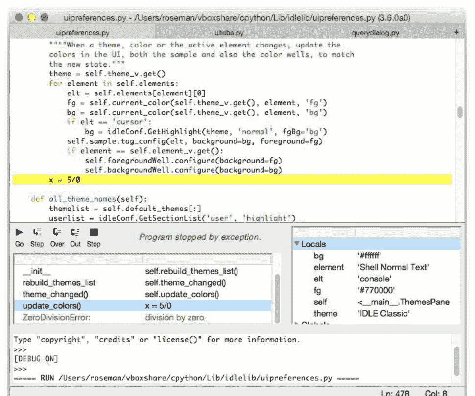

窗口集成的早期原型（macOS）。

> 到目前为止，这里几乎所有的功能都已完成，并且最终效果与原始原型几乎完全一致。看，偶尔也会有这样的好事发生！

## 标签页编辑器

即使是初级程序员也需要同时处理多个不同的源文件。如果每个文件都有自己的窗口，就像 IDLE 最初那样，事情很快就会变得混乱和/或文件容易丢失。使用标签页在单个窗口中组织多个文件是一种熟悉且有效的解决方案。

> 在设计应用程序时，不要将大型组件构建为 Toplevel 的子类，或者假设它们将来会是窗口中的唯一内容。在代码中绕过这个假设需要大量的工作。如果组件被构建为框架（frame），它们可以更容易地插入到顶层窗口、窗格窗口、标签页笔记本、另一个框架等中。

幸运的是，我们可以依赖 ttk.Notebook 小部件来提供标签页用户界面，就像我们在“首选项”中所做的那样。
或者也许不行。
不幸的是，ttk.Notebook 小部件（以及它使用的底层平台小部件）只真正支持显示和切换少量固定的标签页。没有内置功能支持从用户界面添加或关闭标签页，而我们这里绝对需要这个功能。而且每个程序员都知道，需要大量标签页的情况非常可能。
正如你在不同的编辑器和文字处理器中看到的，每个人的做法都略有不同。我们为 IDLE 开发了自己的自定义标签页小部件（唉……）。该设计大量借鉴了 macOS 上的 TextMate 编辑器。它允许创建新标签页、关闭旧标签页、拖动重新排列顺序、每个标签页的工具提示（指示包含的文件是否需要保存）等。当标签页数量增长过多，无法舒适地显示时，其余的标签页可以通过最后一个可见标签页上的弹出菜单访问。

> 标签页小部件的实现依赖于单个 Tkinter 画布来显示标签页行并处理所有交互。实际的窗口内容切换完全在小部件外部处理，使用简单的回调机制来协调一切。

## 调试器

原始调试器的设计，除了自身存在一些缺陷（参见 [bugs.python.org/issue17942](https://bugs.python.org/issue17942)）之外，其高度也太高，无法像我们希望的那样进行集成。

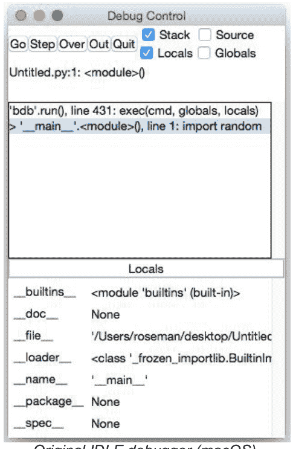

用户界面进行了大幅修订，采用了一种既能在独立窗口中工作，也能在集成时工作的布局。新版本使用窗格窗口将左侧的控件和堆栈与右侧的变量显示分开。堆栈和变量显示都使用树视图小部件实现。这也为控制每个元素将使用多少空间提供了极大的灵活性。

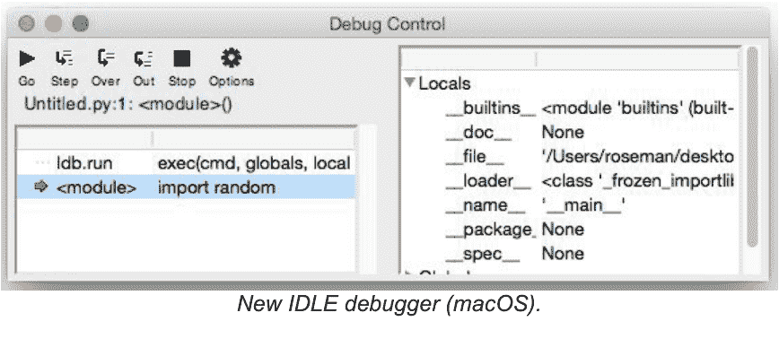

新的 IDLE 调试器（macOS）。

## 集成的 Shell 和调试器

为了实现 shell 和调试器与标签页编辑器的集成，使用了另一个窗格窗口。随着实现的进展，将添加额外的控件来显示/隐藏窗格。
嵌入式 shell 也很有趣。回想一下，IDLE 通常有一个单独的 Python shell 窗口运行另一个 Python 进程；当编辑器中的模块被“运行”时，它们就是通过该 shell 运行的。拥有那个大的 shell 很好，我们不一定想在编辑器中启动一个单独的 shell。
Tk 8.5 中的新功能是，Text 小部件实际上支持创建“对等体”（peers），它们是独立的小部件，但共享相同的文本后端。这意味着当一个中的内容发生变化时，另一个也会随之变化。这是解决我们这里问题的一种无缝方式。

## 18.7. 解决方法、技巧与更多

既然本章是关于现代化一个真实应用程序的实际经验，如果说底层的用户界面工具包（Tk 和 Tkinter 封装）总是完全按预期工作，那将是一个谎言。就像 IDLE 一样，Tkinter 和 Tcl/Tk 是令人难以置信的志愿者努力的成果。话虽如此……

> Tk 和 Tkinter 有一些 bug 和粗糙之处。我知道你很震惊。

在本节中，我将尝试列举一些我们遇到的特定“陷阱”，并提供一些小技巧，这些技巧不一定适合放在其他地方，但有助于为用户界面增添一些润色。

## 工具提示

- macOS 上的工具提示损坏；
  参见 [bugs.python.org/issue24570]
- `MacWindowStyle` 帮助处理工具提示，而其他地方使用 `wm overrideredirect`

## 上下文菜单

- 虚假的文本小部件绑定干扰了弹出点击；
  参见 [bugs.python.org/issue24801]
- macOS 上需要两种不同的弹出点击绑定；
  [bugs.python.org/issue24801]

## 对等文本小部件

- Tkinter 中损坏的对等文本小部件 API；
  参见 [bugs.python.org/issue17945]

## 模态窗口

- macOS 未完全实现模态，加上窗口样式问题；参见 [bugs.python.org/issue24760](https://bugs.python.org/issue24760)

## 版权

*《为忙碌的 Python 开发者准备的现代 Tkinter》*

*快速学习使用 Python 的标准 GUI 工具包为 Windows、Mac 和 Linux 创建美观的用户界面*

第三版。版权所有 © 2012-2020 Mark Roseman

由 Late Afternoon Press 出版。加拿大不列颠哥伦比亚省维多利亚市。[lateaft.com](http://lateaft.com)。

本书汇集了来自 [TkDocs.com](http://TkDocs.com) 网站的各种信息，该网站由 Mark 开发，作为关于 Tk 现代功能的急需文档来源。该网站包含有关通过 Tcl、Ruby、Perl 以及 Python 使用 Tk 的信息。本书应被视为该网站的配套读物，并支持其进一步发展。

ISBN: 978-1-9991495-9-8 (KINDLE)

## 关于作者


**Mark Roseman** 是一位经验丰富的软件开发者、企业家和作家。他此前在用户体验以及支持人群协作的技术相关主题上进行了广泛的工作和发表，并创立了两家软件初创公司。

自 1990 年代初以来，他一直使用 Tcl、Tk 和 Python，并在 Tcl/Tk 社区中具有影响力。

Mark 居住在加拿大不列颠哥伦比亚省维多利亚市。可以通过他的个人网站 [markroseman.com](http://markroseman.com) 联系他。

他在 [tkdocs.com](http://tkdocs.com) 网站上发布了更多与 Tk 和 Tkinter 相关的信息。