# 我的Python计算手册

**阿比吉特·卡尔·古普塔**

版权所有 © 作者保留所有权利

**书名：** 我的Python计算手册 **作者：** 阿比吉特·卡尔·古普塔博士 **封面设计：** 迪潘卡尔·戈什博士

2021年4月，加尔各答

## 前言

每一段迷人的旅程都始于起点。本书为初学者提供了一段愉快而舒适的旅程。核心Python的概念以清晰明了的方式引入。各节和各章辅以数值示例和图形演示。介绍了一些有用的外部包。借助各种外部模块和包，用Python编写简洁、最小化的代码变得非常高效。数据处理的体验变得神奇，科学计算也大大简化。我希望学生、教师以及任何感兴趣的人都能从本书中受益。

在此，我衷心感谢我所有的学生、同事、朋友以及亲朋好友们对我撰写本书这一项目的支持。希望热切的读者们享受阅读的乐趣。

谢谢。

**阿比吉特·卡尔·古普塔**，加尔各答

## Python之禅

优美胜于丑陋。
明了胜于隐晦。
简洁胜于复杂。
复杂胜于繁琐。
扁平胜于嵌套。
稀疏胜于密集。
可读性很重要。
特例不足以特殊到可以打破规则。
尽管实用性胜于纯粹性。
错误不应该被静默地传递。
除非明确地被静默。
面对歧义，拒绝猜测的诱惑。
应该有一种——最好只有一种——显而易见的方法来做它。
尽管这种方法起初可能并不明显，除非你是荷兰人。
现在做总比不做好。
尽管不做好常常比*现在*做好要好。
如果实现难以解释，那它就是个坏主意。
如果实现容易解释，那它可能是个好主意。
命名空间是一个绝妙的主意——让我们多用用它们！

版权

本文档已置于公共领域。来源：https://github.com/python/peps/blob/master/pep-0020.txt

## 简要内容

## 核心Python

- 第1章：基本概念 1
- 第2章：内置模块 53
- 第3章：循环与条件 91
- 第4章：Python函数 115
- 第5章：数据结构 141
- 第6章：类、对象、模块 229
- 第7章：使用Turtle绘图 257

### 使用外部包的Python计算

- 第8章：NumPy：数值Python 297
- 第9章：Matplotlib：绘图库 440
- 第10章：SymPy：符号Python 525
- 第11章：Pandas：结构化数据 563
- 基础Python代码 583

## 附录 661
## 参考文献 675
## 索引 679

##### 目录

## 核心Python

## 第1章：基本概念 1

- 1.1 变量、数字、运算符 5
  - 1.1.1 变量 5
  - 1.1.2 数字 6
  - 1.1.3 运算符 8
- 1.2 在Python解释器上输入 10
  - 1.2.1 编写单行 11
  - 1.2.2 编写多行 14
- 1.3 命名空间 16
- 1.4 Python作为计算器 21
  - 1.4.1 实数运算 21
  - 1.4.2 复数运算 23
  - 1.4.3 布尔数运算 24
  - 1.4.4 数字比较 25
- 1.5 类型与标识 25
  - 1.5.1 类型 26
  - 1.5.2 标识 28
- 1.6 内置函数 31
- 1.7 不同进制的数字 37
- 1.8 输入与输出（I/O） 38
  - 1.8.1 输入样式 38
  - 1.8.2 输出样式 40
  - 1.8.3 从外部输入 41
  - 1.8.4 求值输入字符串 42
  - 1.8.5 格式化输出 44
- 1.9 编写代码 46
- 1.10 读/写数据 49
- 1.11 注释 51
  - 1.11.1 注释单行 51
  - 1.11.2 注释代码块 52

## 第2章：内置模块 53

- 2.1 什么是模块？ 53
- 2.2 导入模块 54
- 2.3 数学模块 58
- 2.4 复数数学模块 66
- 2.5 随机数模块 70
  - 2.5.1 生成随机数 73
  - 2.5.2 随机选择 77
  - 2.5.3 随机抽样 80
  - 2.5.4 随机打乱 81
  - 2.5.5 密码学… 81
- 2.6 时间、日期、日历 83

## 第3章：循环与条件 91

- 3.1 循环 91
  - 3.1.1 For循环 91
  - 3.1.2 While循环 100
- 3.2 条件 102
- 3.3 Try Except 107

## 第4章：Python函数 115

- 4.1 定义函数 115
  - 4.1.1 带文档字符串的函数 119
  - 4.1.2 无返回值函数 121
  - 4.1.3 一些简单函数 123
  - 4.1.4 具有任意数量参数的函数 124
  - 4.1.5 具有关键字参数的函数 125
  - 4.1.6 ...任意数量的关键字参数 127
- 4.2 局部与全局参数 129
- 4.3 函数内部的函数 132
- 4.4 递归函数 133
- 4.5 Lambda函数 134
- 4.6 函数重载 135
- 4.7 关于导入的函数 137
- 4.8 Python Map函数 138
- 4.9 Python Filter函数 138
- 4.10 Python zip函数 140

## 第5章：数据结构 141

- 5.1 列表 142
  - 5.1.1 索引 145
  - 5.1.2 切片 146
  - 5.1.3 列表的内置函数 147
  - 5.1.4 列表方法 150
  - 5.1.5 列表创建器 163
  - 5.1.6 列表推导式 165
  - 5.1.7 嵌套列表 168
- 5.2 字符串 170
  - 5.2.1 索引 171
  - 5.2.2 切片 171
  - 5.2.3 字符串的内置函数… 174
  - 5.2.4 连接 176
  - 5.2.5 字符串中的方法 177
  - 5.2.6 字符串格式化 185
  - 5.2.7 字符串转列表 186
- 5.3 元组 187
  - 5.3.1 内置函数… 187
  - 5.3.2 索引 188
  - 5.3.3 切片 189
  - 5.3.4 连接 189
  - 5.3.5 转换 189
  - 5.3.6 方法 190
- 5.4 集合 192
  - 5.4.1 集合的内置函数 194
  - 5.4.2 方法 194
  - 5.4.3 两个集合相加 197
  - 5.4.4 集合论运算 198
  - 5.4.5 子集 199
  - 5.4.6 冻结集合 200
- 5.5 字典 201
  - 5.5.1 内置函数… 202
  - 5.5.2 字典上的方法 203
  - 5.5.3 创建字典 210
  - 5.5.4 字典推导式 211
  - 5.5.5 嵌套字典 212
- 5.6 打包、解包 214
- 5.7 比较与搜索 216
- 5.8 复制对象 218

## 第6章：类、对象、模块 229

- 6.1 类/对象 230
  - 6.1.1 删除对象 ... 244
  - 6.1.2 继承 246
  - 6.1.3 带迭代器的类 248
- 6.2 模块 251
- 6.3 包 255

## 第7章：使用Turtle绘图 257

### 使用外部包的Python计算

## 第8章：NumPy：数值Python 297

- 8.1 NumPy数组 298
  - 8.1.1 内置函数 ... 300
  - 8.1.2 方法与属性 301
  - 8.1.3 高维数组 302
  - 8.1.4 关于数据类型 305
  - 8.1.5 复数的属性... 312
  - 8.1.6 创建方法... 313
  - 8.1.7 形状、重塑、大小,... 319
  - 8.1.8 展平、拉平 321
  - 8.1.9 唯一元素 324
  - 8.1.10 数组上的迭代器 326
  - 8.1.11 索引 327
  - 8.1.12 切片 328
  - 8.1.13 交换两个元素 332
- 8.2 NumPy数组上的方法 334
  - 8.2.1 检查所有元素 334
  - 8.2.2 元素在哪里？ 335
  - 8.2.3 放置/插入新元素 336
  - 8.2.4 删除元素 340
  - 8.2.5 分割数组 341
  - 8.2.6 追加值 344
  - 8.2.7 连接 346
  - 8.2.8 堆叠数组 348
  - 8.2.9 统计方法 351
  - 8.2.10 乘积、差值 357
  - 8.2.11 迹 362
  - 8.2.12 排序 363
- 8.3 算术运算 367
- 8.4 广播 370
- 8.5 转置、翻转、旋转 372
- 8.6 矩阵对象 374
  - 8.6.1 复数矩阵 375
- 8.7 特殊数组 377
- 8.8 数组乘积 385
  - 8.8.1 多维数组乘积 387
  - 8.8.2 类矩阵乘积 388
  - 8.8.3 张量运算 390
- 8.9 NumPy函数 397
- 8.10 函数向量化 403
- 8.11 NumPy中的多项式 405
  - 8.11.1 算术运算 406
  - 8.11.2 多项式函数 407
  - 8.11.3 多项式的根… 407
  - 8.11.4 导数 408
  - 8.11.5 不定积分 409
- 8.12 NumPy中的科学模块 409
  - 8.12.1 NumPy多项式… 410
  - 8.12.2 线性代数… 411
- 8.13 使用NumPy数组创建网格 419
- 8.14 加载与保存数据文件 422
- 8.15 NumPy中的随机数 425

## 第9章：Matplotlib 440

- 9.1 二维绘图 441
  - 9.1.1 X-Y图 441
  - 9.1.2 极坐标图 465
  - 9.1.3 从文件绘制数据 467
  - 9.1.4 将图形保存到文件 471
  - 9.1.5 希腊字母、符号,... 472
  - 9.1.6 一个图形中的多个绘图... 475
  - 9.1.7 多个图形 482
  - 9.1.8 子图 487
  - 9.1.9 设计网格空间 486
  - 9.1.10 统计图 488
  - 9.1.11 等高线图 500
- 9.2 三维图 514

## 第10章：SymPy：符号Python 525

- 10.1 符号、表达式、计算 ... 527
- 10.2 矩阵 536
- 10.3 微积分 541
  - 10.3.1 极限 541
  - 10.3.2 微分 541
  - 10.3.3 积分 543
- 10.4 绘制函数 544
  - 10.4.1 使用Matplotlib绘图 545
  - 10.4.2 使用SymPy绘图.. 546
- 10.5 几何对象 552
- 10.6 求解微分方程 556

## 第11章：Pandas：结构化数据 563

- 11.1 Series 564
- 11.2 DataFrame 569
  - 11.2.1 ...数据作为DataFrame 577

## 基础Python代码 583

## 附录 661

## 参考文献 675

## 索引 679

## 核心Python

## 第一章

## 基本概念

> “编写Python的乐趣在于看到简短、简洁、可读性强的类，它们用少量清晰的代码表达出丰富的功能——而不是用那些让读者感到乏味的琐碎代码。” - 吉多·范罗苏姆

本书遵循**Python 3**语法。Python是一种高级计算机语言，如今已成为世界上最流行的编程语言之一。其语法非常简单且精炼，使我们能够编写出清晰优美的Python代码。相较于其他现有的高级语言，它还有许多其他优势，我们最终会了解到。

Python已成为我们这个时代适应性极强的语言。在基础科学、工程、数据科学、数据管理、机器学习（ML）、深度学习、网络、Web应用*等*领域都有广泛的应用。已经开发了大量的科学模块。Python是一种开源编程语言，拥有庞大的社区支持。

与FORTRAN、C、C++和其他语言不同，它是一种基于解释器的语言。当我们逐行在Python解释器或Python shell上编写时，代码会被执行（或解释），而大多数其他语言则需要先一次性编译整个程序。当然，很多时候我们需要编写一个标准程序或代码，通常比几行要长。在这种情况下，我们将程序（Python脚本）写在一个文件中，然后执行（“运行”）它。Python计算同时支持函数式编程和面向对象编程（OOP）方式。

为什么选择Python？简而言之：

- 强大的编程语言，易于学习
- 高效的高维数据结构
- 清晰的语法，代码可读性强
- 面向对象、命令式、函数式计算
- 程序可移植。
- 开源
- 强大的社区支持
- 基于解释器的语言

关于Python这个名字？

“Python”这个名字并非来自蛇（尽管Python的标志可能暗示如此）！“Python”这个名字源于著名的BBC喜剧连续剧《蒙提·派森》。Python的创始人*吉多·范罗苏姆*非常喜欢这部流行的喜剧连续剧。因此，吉多在完成编写新计算语言的项目时保留了这个名字。

如何安装Python？

关于Python的安装和版本，请参阅附录。我们可以安装任何版本。从用户的角度来看，两个版本（Python 2.x和Python 3.x）之间只有非常小的差异。附录A中也对此进行了一些讨论。在本书的这一版中，我们遵循**Python 3.x**版本（在第一版中，我们遵循Python 2.x）。人们可以轻松地在机器上安装（和卸载）任何版本，然后开始输入。事实上，两个版本也可以在同一台机器上共存。

您可以直接访问Python的官方网站（www.python.org）下载任何稳定版本。之后，您可以根据需要决定安装外部包。此外，还有一些发行版，如Anaconda、Python (x, y) *等*，它们包含核心Python以及一些常见的外部包（*例如*，NumPy、SciPy、Matplotlib）。

在我们开始编写Python代码之前，我们应该熟悉基本工具——语法、变量、数字、运算符、方法、逻辑和循环结构、数据结构以及其他概念。

## 1.1 变量、数字、运算符

编写Python程序很容易。它非常接近人类语言，并遵循我们理解的逻辑。Python具有最简语法。我们将尝试用Python编写优美而清晰的代码。

### 1.1.1 变量

变量（或任何标识符，如类、函数、模块或其他对象）的名称可以是键盘上字母、数字和一些符号（如下划线_）的任意组合。特殊符号@、$、%、*等以及数学符号（+、-、/等）不能使用。变量必须以字母（A到Z的大写或小写字母）开头，名称不能以数字开头。变量名当然是区分大小写的。变量名‘Xy’、‘xy’、‘xY’都是不同的。但名称不能是下表中给出的单词，这些单词用于系统命令和函数。它们是Python关键字（小写字母），保留供系统使用。

保留字：

and, assert, break, class, continue, def, del, elif, else, except, exec, finally, for, from, global, if, import, in, is, lambda, not, or, pass, print, raise, return, try, while, with, yield

### 1.1.2 数字

计算机程序通常处理三种不同类型的数字：*整数*、*浮点数*（带小数部分的实数）和*复数*（◆◆ + ◆◆◆◆◆，◆◆ =√−1）。Python支持所有这三种类型。

Python 3中的整数大小是无限制的。事实上，任何长度的任何大整数都是可能的，甚至可能占用处理器的整个内存空间。[Python 2有两种整数类型：- **int**和**long**。Python 3中不再有'long integer'类型。]此外，布尔值是普通整数的子类型。

- **整数**
  [示例：236, -123]
- **浮点数**（或浮点数）
  [示例：13.25, 0.0, -13.23, 1.2e-10, 3.85e12 ]
- **复数**
  [示例：5j, 9.8j, 3+2j, 1.2e-10j]
- **长整数**
  [示例：任何以‘l’或‘L’结尾的整数。在Python 2中，123L将被视为长整数。]
- **布尔值**
  True, False

**注意：**

整数是正或负的整数。长整数是大小无限制的整数（写为整数后跟大写或小写L）。Python 2中默认int的最大值是65535，超过这个值的将是长整数。

在计算中，经常会出现各种数字混合的情况。系统会以一种聪明的方式理解结果将以什么数字形式呈现。如果所有数字都是整数，结果就是整数。如果在实数和整数的混合中至少有一个是实数，结果将是实数。如果存在复数，结果将是复数。当然，我们可以显式地将变量的类型设置为‘整数’、‘实数’或‘复数’。

### 1.1.3 运算符

数学运算符
考虑两个变量‘x’和‘y’。以下操作使用x = 10, y = 2

**加法（+）：** x + y = 12
**减法（-）：** x – y = 8
**乘法（*）：** x * y = 20
**除法（/）：** x/y = 5.0
**取模（%）：** x%y = 0 [余数：当x除以y时]
**幂或指数（**）：** x ** y = 100
**整除（//）：**
例如，7.5//2 = 3.0，而7.5/2 = 3.75

除了数学运算符，我们还会遇到其他类型的运算符。

比较运算符

- == 等于
- != 不等于
- <> 小于和大于
- < 小于
- > 大于
- >= 大于等于
- <= 小于等于

成员运算符 in, not, as

## 1.2 在Python解释器上输入 Hello World!

让我们开始在Python IDLE **解释器（>>>）**或命令行[IDLE = 集成开发和学习环境]上输入。我们在解释器上输入一些行或一些指令，然后按‘Enter’键执行。下面出现的行是输出或它返回的某些消息。[有时，没有返回输出，这表示指令被接受且没有错误。否则，我们可能会收到错误消息。]

我们必须在解释器或任何Python shell中从开头（从第一列）输入任何内容。在编写之前不允许按‘空格键’。在后一种情况下，它会引发错误。

每一行都是一个指令。一组Python指令将形成一个Python代码。我们可以将这些行写在一个文件中，通常称为*Python脚本*。Python脚本（程序或代码）会自动保存为扩展名.py。例如：somefile.py

每种计算机语言的学习都从输入**‘Hello World’**开始！让我们也输入：
>>> **print(‘Hello World!’)**
Hello World!

**注意：** print()是一个函数（一个内置函数），我们向其提供字符串‘Hello World!’作为参数。我们得到‘Hello World!’作为输出返回。

### 1.2.1 编写单行

### 1.2.2 编写多行内容

字符串可以使用单引号、双引号或三引号来创建。在解释器中，我们不必总是输入 `print()` 函数来打印或写入。我们可以直接输入字符串（或任何内容）并按回车键。然而，对于不同风格的字符串，我们有时会注意到一些差异。让我们将一些文本作为字符串写出来，看看它们如何返回。

```
>>> print('Hello World!')
Hello World! # 输出：不是一个字符串
>>> 'Hello World!'
'HelloWorld!' # 输出：字符串
#### 不同风格的字符串

##### 双引号
>>> "I am a Pythonista." 'I am a Pythonista.'

##### 三重双引号
>>> """"I am learning Python."""" 'I am learning Python.'

##### 三重单引号
>>> '''I am writing codes in Python.''' 'I am writing codes in Python.'
##### 当引号冲突时
>>> 'I a'm writing codes in Python' SyntaxError: invalid syntax
```

**注意：** 语法错误的出现是因为 Python 将 'I a' 视为上述语句中的一个字符串，它不理解剩余的文本。要在单引号字符串中包含撇号(')，我们需要使用转义字符(\)。

```
##### 正确的写法
>>> 'I a\'m writing codes in Python' "I a'm writing codes in Python"
##### 我们可以通过输入两种不同类型的引号来避免使用这个(\)符号。
>>> "I a'm writing codes in Python" "I a'm writing codes in Python"
##### 连接多行

>>> 'I am a beginner. \nI wish to learn Python.'
'I am a beginner. I wish to learn Python.'
```

```
>>> print('I am a beginner. \ I wish to learn Python.')
I am a beginner. I wish to learn Python.
```

**注意：** 如果我们写完第一行后按回车键写第二行，这将导致错误（不完整的字符串）。转义(\)符号将两行连接起来，使其成为一行。

让我们写下以下两行：

'I am a beginner.
I wish to learn Python.'

```
>>> """I am a beginner.
I wish to learn Python."""
'I am a beginner.\nI wish to learn Python.'
```

```
>>> print("""I am a beginner. I wish to learn Python.""") I am a beginner.
I wish to learn Python.
```

**注意：** 在三重引号下创建新行是可能的。当然，这次我们需要使用 `print()` 函数来正确写入，如下所示。当直接在解释器上写入时，它产生了一行中间带有 \n 的内容。这意味着，它识别了一个新行，但没有 `print()` 就无法正确表示。

在三重引号内，我们可以放置像 \t、\n 这样的转义字符来分别创建水平制表符和新行。

```
>>> print("""\t I am a beginner. \n \t I wish to learn Python.""") I am a beginner.
I wish to learn Python.
```

练习：运用以上知识，以诗歌形式（带有适当的空格和行）写出 *The Zen of Python*。

## 1.3 命名空间

当我们打开解释器 (>>>) 并输入 **dir()** 时，我们在目录中看到以下内容：

```
>>> dir()
['__annotations__',
'__builtins__', '__doc__', '__loader__', '__name__', '__package__', '__spec__']
```

我们看到一些名称两侧带有双下划线 (__)。它们是以 Pythonic 方式编写的内置字典、模块和类。目前，只注意一个名称 '__builtins__'，它是一个内置模块。让我们检查一下它包含什么。

```
>>> dir(__builtins__)
['ArithmeticError', 'AssertionError', 'AttributeError', 'BaseException',
'BlockingIOError', 'BrokenPipeError', 'BufferError', 'BytesWarning',
'ChildProcessError',
'ConnectionAbortedError',
'ConnectionError',
'ConnectionRefusedError',
'ConnectionResetError',
'DeprecationWarning', 'EOFError', 'Ellipsis', 'EnvironmentError', 'Exception',
'False', 'FileExistsError',
'FileNotFoundError',
'FloatingPointError',
'FutureWarning', 'IOError',
'GeneratorExit',

'ImportError', 'ImportWarning', 'IndentationError', 'IndexError',
'InterruptedError', 'IsADirectoryError', 'KeyError', 'KeyboardInterrupt',
'LookupError', 'MemoryError', 'ModuleNotFoundError', 'NameError', 'None',
'NotADirectoryError',
'NotImplemented',
'NotImplementedError', 'OSError', 'OverflowError',
'PendingDeprecationWarning',
'PermissionError',
'ProcessLookupError',
'RecursionError', 'ReferenceError', 'ResourceWarning', 'RuntimeError',
'RuntimeWarning', 'StopAsyncIteration', 'StopIteration',
'SyntaxWarning',
'SystemExit',
'TimeoutError', 'True', 'TypeError', 'UnboundLocalError',
'UnicodeDecodeError',
'UnicodeEncodeError', 'UnicodeError', 'UnicodeTranslateError',
'SyntaxError', 'SystemError',

'TabError',
'UnicodeWarning', 'ValueError',

'UserWarning', 'Warning', 'WindowsError', 'ZeroDivisionError', '_',
'__build_class__', '__debug__',

'__doc__', '__import__', '__loader__', '__name__', '__package__', '__spec__',
'abs', 'all', 'any', 'ascii', 'bin', 'bool', 'breakpoint', 'bytearray', 'bytes', 'callable',
'chr', 'classmethod', 'compile', 'complex', 'copyright', 'credits', 'delattr', 'dict',
'dir', 'divmod', 'enumerate', 'eval', 'exec', 'exit', 'filter', 'float', 'format',
'frozenset', 'getattr', 'globals', 'hasattr', 'hash', 'help', 'hex', 'id', 'input', 'int',
'isinstance', 'issubclass', 'iter', 'len', 'license', 'list', 'locals', 'map', 'max',
'memoryview', 'min', 'next', 'object', 'oct', 'open', 'ord', 'pow', 'print', 'property',
'quit', 'range', 'repr', 'reversed', 'round', 'set', 'setattr', 'slice', 'sorted',
'staticmethod', 'str', 'sum', 'super', 'tuple', 'type', 'vars', 'zip']
```

**注意：** 没有下划线的名称（按字母顺序排列）：abs、dir、id、list、type *等等* 是应用于 Python 对象的方法。我们在编写代码时可以无需引用直接使用它们。两侧带有双下划线(__)的名称是以 Pythonic 方式编写的属性和方法。每个 Python 类（稍后在第 4 章介绍）都保留内置属性，可以通过点运算符访问，就像任何其他属性一样（稍后会看到）。

- **__doc__** 类文档字符串（如果未定义，则为无）。
- **__name__** 类名。
- **__import__** 导入模块的内置函数或方法。

我们在上面的显示中看到了一些名称。它们是对象。在 Python 中，变量、函数或方法都是对象（我们将在后面正式介绍类和对象的概念）。每个对象都有一个名称：有些是内置的，有些是我们创建的。命名空间是一个容器或环境，它包含我们处理的 Python 中每个对象的唯一名称。[简而言之，命名空间是我们的工作台，上面有所有必要的工具。]

为了理解命名空间中如何包含新名称，让我们输入一些名称（通过将两个变量赋值给两个整数），如下所示，

```
>>> x = 2 >>> y = 4
现在让我们输入以下内容：>>> dir()
['__annotations__', '__builtins__', '__doc__', '__loader__', '__name__', '__package__', '__spec__', 'x', 'y']
```

请注意，命名空间（目录）现在包括变量名：x 和 y 以及内置名称。稍后我们将看到，除了 __builtins__ 模块外，还有许多其他模块我们可以导入到我们的命名空间中以用于各种目的。

## 1.4 Python 作为计算器

Python 解释器或 Python shell 可以用作计算器。

### 1.4.1 实数运算

#### 数学运算

```
>>> 5 + 3.4 # 整数和浮点数的和
9.4
>>> 19 – 6 # 减法
13
>>> 12 * 9 # 乘法
108
>>> 5e2*2.0e-4 使用指数形式 0.1
>>> 58/2 # 除法 29.0
>>> 13.5//2 # 地板除法 6.0
>>> (52*5 - 6.1)/4 # 简化 63.475
>>> 2**4 # 幂运算
16
```

除法：Python 3 与 Python 2 的区别

```
>>> 11/2
5.5
[Python 3：返回一个浮点数]

>>> 11/2
5
[Python 2：返回整数（仅商）]
```

#### 取模

```
##### 取模：它返回余数
>>> 13%5
3
>>> 2%5
2
[注意：2 < 5，所以 2 本身就是余数]

##### 负数的取模
>>> -5 % 2
1
>>> -2 % 5
>>> (3 - 5) % 5
3
>>> (1 - 3*2) % 2
1
[通过书写，- 5 = 1 – 3*2]
```

### 1.4.2 复数运算

```
>>> 3 + 9j
(3+9j)

>>> 3 + 2.4j
(3+2.4j)
>>> 3 + (2 + 4j) * 2
(9+12j)
>>> (3 + 2j) * (4 + 5j)
(2+23j)
```

**注意：** Python 以混合模式进行计算。对于涉及整数、浮点数和复数的数学运算，Python 返回复数形式的输出。我们可以认为复数比浮点数更广泛，而浮点数比

## 1.4.3 布尔数的运算

布尔对象，True = 1，False = 0。

```
>>> True + True
2
>>> True + False
1
>>> True - False
1
>>> True * False
0
```

## 1.4.4 数字的比较

```
>>> 2 > 3
False
>>> 3 < 9
True
>>> 5 == 6
False
[双等号 (==) 用于比较]

>>> 6 != 8 # 不等于，结果为 True
>>> 5.0 >= 4.99 # 大于等于，结果为 True
>>> 10%3 == 1
True
```

## 1.5 类型与标识

内置函数 `type()` 用于确定类型，`id()` 用于确定对象的标识。

### 1.5.1 类型

```
>>> type(89) # 整数 <class 'int'>
>>> type(15.67) # 浮点数
<class 'float'>
>>> type(5E2) # 5 × 10² <class 'float'>
>>> type(5.6e-13) # 5.6 × 10⁻¹³
```

[xey 或 xEy = ?? × 10??] <class 'float'>

```
>>> type(3 + 5j) # 复数 <class 'complex'>
```

在 Python 2 中，它是一个 ‘long’ 整数。

```
>>> type(2**80)
<type 'long'>
```

```
>>> z = 2*10 + 5.0 + 3j
>>> type(z)
<class 'complex'>
>>> type(2**80)
<class 'int'>
```

```
>>> type('Guido') # 字符串 <class 'str'>
>>> type('Ananda123') # 字符串 <class 'str'>
```

#### 布尔对象：True 和 False

```
>>> type(True)
<class 'bool'>
>>> type(False)
<class 'bool'>
>>> int(True)
1
[True 的整数表示]
>>> int(False)
0
[False 的整数表示]
```

#### 布尔测试

```
>>> bool(12) # 任何非零参数结果为 True
>>> bool(0.001)
True
>>> bool(-5928)
True
>>> bool('abc182')
True
>>> bool(0) # 零作为参数结果为 False
>>> bool() # 无参数结果为 False
>>> bool('') # 参数为空字符串结果为 False
```

**注意：** 参数为 0、无参数或某些空对象（字符串或任何其他）时返回 False。

### 1.5.2 标识

我们可以测试已赋值变量的标识。原则上，变量名是数字或对象的标签。对于每个输入变量，在内存位置中都有一个标识符。如果我们给这个变量赋值另一个变量，内存中的标识符会获得相同的代码。

```
>>> x = 3
[将数字 3 赋值给 x]
##### 变量存储在哪里？
>>> id(x)
140727110538976 # 内存位置
>>> y = x # 赋值另一个名称

##### 检查新名称的位置
>>> id(y)
140727110538976
[与之前相同的位置，只是标签改变了。]
>>> x = 5 # 新数字，相同的标签

##### 现在存储在哪里？
>>> id(x)
140727110539040 # 一个新的位置
>>> id(y) # y 呢？
140727110538976
[y 的位置没有改变。]

##### 删除一个变量

##### 从位置中移除
>>> del x
>>> id(x)
“Traceback (most recent call last):
File "<pyshell#80>", line 1, in <module>
id(x)
NameError: name 'x' is not defined”
```

**注意：** 变量 ‘x’ 现在已被删除，现在输入 **id(x)** 将导致 **错误消息：** “name 'x' is not defined”。

#### 在 IDLE 解释器上输入

向上 (↑) 和向下 (↓) 键可用于调用历史记录。按回车键可以将上一行带入解释器执行。下划线 (_) 指的是最后输入的对象。

```
>>> 5
5
>>> _ # _ 技巧
5
>>> x = _
```

[ ‘_’ (下划线) 用于引用最后输入的值。]

```
>>> print(x)
5
```

## 1.6 内置函数

从 (**__builtins__**) 模块调用函数名不需要引用。

### 数字：整数、浮点数、复数

```
>>> float(23) # 十进制小数 23.0
>>> int(23.58) # 整数部分 23
>>> complex(2) # 复数 (2+0j)
>>> complex(2, 3)
(2+3j)
```

### 绝对值

```
>>> abs(-23.56) # 绝对值 23.56
>>> int(abs(-23.56))
23
[绝对值的整数部分]
>>> abs(3 + 4j)
5.0
[绝对值：√3²+ 4²]
```

### 幂运算

```
>>> pow(2, 4) # 2^4 16
```

### 最小值、最大值

```
>>> min(0, -2, 1, 10)
-2
[参数中的最小值]
>>> max(0, -2, 1, 10)
10
[参数中的最大值]
```

### 四舍五入

```
>>> round(13.145)
13
[四舍五入到最接近的整数]
>>> round(23.9)
24

>>> round(23.9237, 2)
23.92
[四舍五入到 2 位小数]

>>> round(23.9237, 3)
23.924
[四舍五入到 3 位小数]

>>> round(1/3, 3)
0.333
```

**注意：** 如果未指定任何内容，**round()** 函数会将十进制数四舍五入到最接近的整数（数字的向上取整或向下取整）。

四舍五入规则：当 ( **??** + 1) 位数字 >= 5 时，被四舍五入的最后一位小数位 ( **??** ) 增加 1，否则保持不变。

四舍五入异常：

```
>>> round(2.685, 2)
2.69 # 输出符合预期
>>> round(2.675, 2)
2.67 # 异常
```

最后一个输出是 2.67，但预期应该是 2.68，因为 2.675 的第三位小数是 5。这种异常是由于十进制数表示错误造成的。为了查看处理器对数字 2.685 和 2.675 的实际表示，我们从 **decimal** 模块导入一个函数 **Decimal()**。

十进制数表示：

```
>>> from decimal import Decimal
>>> Decimal(2.685)
Decimal('2.685000000000000053290705182007513940334320068359375')
>>> Decimal(2.675)
Decimal('2.67499999999999982236431605997495353221893310546875')
```

在计算机中 2.675 的十进制数表示中，小数点后的第三位是 4 而不是 5。因此导致了四舍五入异常。在考虑高精度数字时，我们必须注意这种四舍五入或近似。

异常消除：

```
>>> round(Decimal('2.675'), 2)
Decimal('2.68') # 异常消失
```

> [ **注意：** 有时，会考虑通常四舍五入规则的一个例外。如果四舍五入位置旁边的数字是 5，并且其后是 0 或没有数字（例如，在 2.685 或 2.675 中），则不会在四舍五入位置的数字上加 1。有关更多信息，请参见第 0 章，第 14 页。]

### 数字的创建

我们可以使用内置函数 **range()** 创建一个整数集合。

```
>>> x = range(1, 10)
>>> type(x)
<class 'range'>
```

在上面，我们创建了 x，它是一个名为 ‘range’ 的对象。它是一个整数集合：1, 2, 3, ... 9。我们可以将此集合转换为其他特殊类型，如下所示。

### 转换为其他类型

```
>>> list(x)
[1, 2, 3, 4, 5, 6, 7, 8, 9]
>>> tuple(x)
(1, 2, 3, 4, 5, 6, 7, 8, 9)
>>> set(x)
{1, 2, 3, 4, 5, 6, 7, 8, 9}
```

我们有以下数据结构（数据集合的类型）：**list()**、**tuple()**、**set()**。这些函数通常被称为可迭代对象。这意味着它们由元素组成。当我们循环遍历它们时，可以提取元素。[更多内容见第 2 章。]

```
##### 遍历并获取数字。

>>> for i in range(1, 5):
    print(i, end = ' ')
1 2 3 4
```

**注意：**
循环是一个迭代器。上面是编写 for 循环的典型语法。循环以关键字 **for** 开头，后跟一些虚拟索引 ‘i’，然后你放一些可迭代对象，以冒号结尾。下面是一个缩进的打印语句。[我们将在下一章中对此进行更多演示。]

## 1.7 不同进制的数字

```
###### 转换
>>> bin(12) # 十进制转二进制 '0b1100'
>>> 0b1100 # 二进制转十进制 12
>>> oct(48) # 十进制转八进制 '0o60'
>>> 0o60 # 八进制转十进制 48
>>> hex(31) # 十进制转十六进制 '0x1f'
>>> 0x1f # 十六进制转十进制 31
```

**数字系统前缀**
二进制 ‘0b’ 或 ‘0B’
八进制 ‘0o’ 或 ‘0O’
十六进制 ‘0x’ 或 ‘0X’

## 1.8 输入与输出 (I/O)：

### 1.8.1 输入样式

```
x = 15
y = 12.6
z = -10
x, y, z = 15, 12.6, -10
[一行中的多个输入]
a = input(‘Enter value’)
[用于提示]
```

```
a, b, c = input('Enter values \t') # \t 用于空格
a, b, c = input('Enter values \n') [\n 用于换行]
name = 'abhi'
```

**注意：**

- 字母字符放在引号内。任何被引号包围的内容都是字符串。在上面，‘abhi’ 是一个字符串。
- 还要注意，通过 `input()` 函数获取的输入值将作为字符串返回。我们稍后将详细讨论这一点。
- 识别任何后跟括号 () 的名称通常是一个函数。这里，`input()` 是一个 *内置* 函数。在 Python 中，我们会遇到许多这样的内置函数。

```
>>> a = 100
[数字 100 赋值给 ‘a’。]
>>> print(a)
100
>>> a, b, c = 2, 3, 5
[一行中的多个赋值]
>>> a
2
>>> b
3
>>> x, y = 10, 'My name'
[一个数字，一个字符串]
>>> x
10
>>> y
'My name'
```

### 1.8.2 输出样式

语法：
**print(values, sep = ‘ ‘, end = ‘ \n’)**
它打印值并带有间隔（如果未指定分隔符，并且由于默认的 ‘\n’ 光标停在新行上。）

```
x, y = 2, 3
print(x, y)
输出：2 3
```

print('values = ', x, y, sep = ',') 输出：values = 2,3
print(x, y, sep = ',', end = ':') 输出：2,3:

注意：在 Python 2 中，我们写作 ‘print x, y’，其中 print 是一个命令，而不是一个函数。

## 1.8.3 外部输入

很多时候，我们获取的输入数据并非直接写在代码（Python 文件）内部，而是在运行代码时从外部获取。

```
>>> a = input()
I ← 光标在此处等待输入

##### 提示字符串在内部
>>> a = input(‘Enter value’)
Enter value I ← 光标在末尾等待。

>>> a = input(‘Enter value \n’)
Enter value

I ← 光标在此处等待；‘\n’ 创建换行
>>> a = input('Enter value \n')
Enter value

10 ← 输入的值。
>>> a
'10' ← 输入现在是一个字符串。
>>> type(a)
<class 'str'>
```

注意：通过内置函数 `input()` 输入的值是一个字符串。实际上，在 Python 3 中，通过 `input()` 函数输入的任何内容都是字符串。[Python 字符串是不可变的。这对于将输入作为数据字符串是一个重要的考虑因素。] 在 Python 2 中，通过 `input()` 函数输入的数字仍然是数字（而不是字符串）。

## 1.8.4 求值输入字符串

内置函数 `eval()` 用于求值输入字符串。因此，我们可以从数字字符串中取回数字。

```
>>> a = input() # 数据输入
10
>>> a
'10' # 作为字符串输出
>>> a = eval(a) # 求值字符串
>>> a
10 # 输出是一个数字
>>> a = eval(input()) # 直接
10
>>> a
10

##### 对于多个输入
>>> x, y, z = eval(input('Enter the values \n'))
Enter the values
2, -1, 0
>>> x
2
>>> y
-1
>>> z
0
```

**注意：** 提示字符串 ‘Enter the values \n’ 用于显示行：‘Enter the values’。字符串后面的 ‘\n’ 用于在显示中创建一个新行。

## 1.8.5 格式化输出

格式化是指以预定义的样式或格式编写输出字符串/数据。我们可以在两个元素之间给出任意数量的空格，创建新行 *等等*，以我们希望的方式表示输出数据。格式化是通过字符串完成的，因此它被称为 *字符串格式化*。

```
>>> x, y = 4, 5
>>> print(x, y) # 未格式化
4 5

##### 位置：0 和 1
print('{0} and {1}'.format(x, y))
输出：4 and 5

##### 位置改变
print('{1} and {0}'.format(x, y))
输出：5 and 4
```

使用字符串格式样式打印以下浮点数。

```
pi = 3.141592653589793
e = 2.718281828459045

##### 通过 f 固定小数位数
>>> print('{:.3f}'.format(pi))
3.142

>>> print('{0:.4f}, {1:.5f}'.format(pi, e))
3.1416, 2.71828
>>> print('{1:.4f}, {0:.5f}'.format(pi, e))
2.7183, 3.14159

>>> x, y, z = 35.8679, 12.6354, 123.7823
>>> print('{0:.2f}, {1:.2f}, {2:0.2f}'.format(x, y, z))
35.87, 12.64, 123.78
>>> print('{2:.0f}, {1:.2f}, {0:0.1f}'.format(x, y, z))
124, 12.64, 35.9

##### 表示百分比
>>> x = 0.0158976
>>> 'Approx value = {:.2%}'.format(x)
'Approx value = 1.59%'
>>> 'Approx value = {:.2%}'.format(x)
'Approx value = 1.58%'

##### 以指数形式输出
>>> a = 805682.47
>>> '{:.4E}'.format(a)
'8.0568E+05'

>>> '{:.2E}'.format(a)
'8.06E+05'
```

## 1.9 在解释器上编写代码

让我们在 Python 解释器上编写多行 Python 程序（当写在文件中时，我们称之为‘脚本’）。[当我们在解释器上写一行并按回车键时，该行或指令将被解释。然后解释器（命令行）将准备好接受下一条指令。如果语法有错误或存在某些错误，它将返回一些错误消息。我们不需要一次编译整个脚本来检查。]

### 求值表达式

```
>>> x, y = 2, 3
>>> z = x*y - x/y
>>> print(z)
5.333333333333333
```

**注意：** 在 Python 3 中，整数除以整数返回浮点数，而在 Python 2（和其他计算机语言）中，同样的操作返回整数（除法的商）。在 Python 2 中，我们需要将分子或分母中的至少一个作为浮点数。因此，在 Python 2 中，我们必须写 `5.0/3` 或 `5/3.0` 或 `float(5)/3` *等等*。]

```
>>> a, b, c = 2, 3, 5
>>> x = b**2 - 4*a*c
>>> print(‘x = ‘, x)
x = -31 [输出]
```

**注意：** `print()` 内的字符串 ‘x = ‘ 将出现在输出中。`print()` 函数中的两个参数（字符串和变量名）用逗号分隔书写。

```
>>> v0, g, t = 10, 9.81, 0.1
>>> h = v0*t - 0.5*g*t**2
>>> print(round(h, 2))
0.95 # 精确到小数点后 2 位
```

### 写入文件

要将 Python 代码写入文件（通常称为 Python 脚本），可以将指令行写入文件（通过单击解释器窗口上的‘文件’选项，或使用任何 Windows 或 Linux 编辑器创建一个纯文本文件）。然后通过单击解释器窗口上的‘运行’选项，或在 Linux/ DOS 命令行上编写 ‘python something.py’ 来执行该文件（命名为 something.py）。IDLE 解释器上的演示如下：

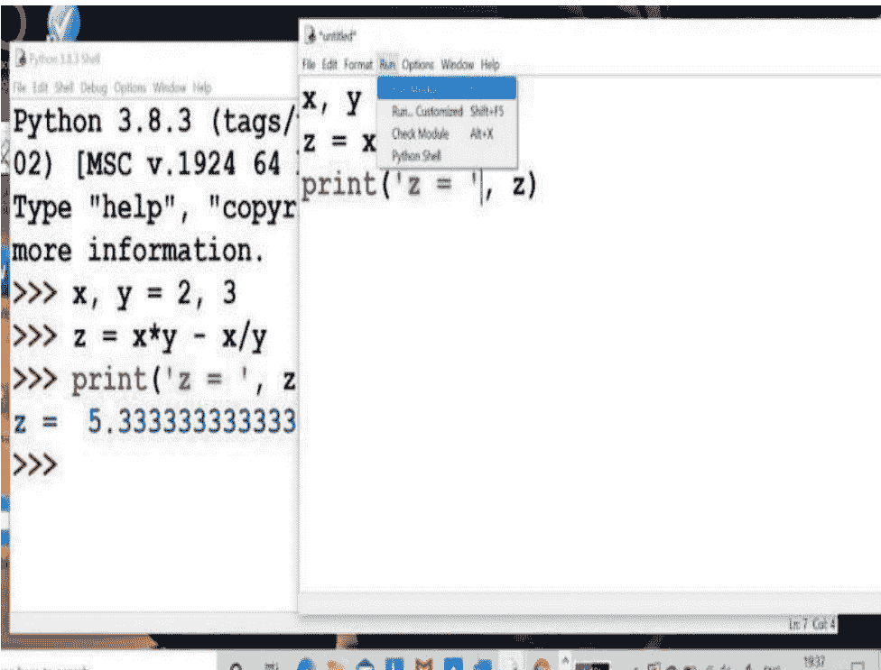

## 1.10 读取/写入数据

在 Python 脚本中打开文件以读取或写入数据：

```
f1 = open(‘filename’, ‘w’)
f2 = open(‘filename’, ‘r’)
[’w’ = 写入， ’r’ = 读取]
```

其他选项

- ‘w’ → 以写入模式打开文件。如果文件存在，则覆盖它，否则创建一个新文件。
- ‘w+’ → 以读写模式打开文件。如果文件存在，则覆盖它。如果文件不存在，则创建一个用于读写的新文件。
- ‘r’ → 以只读模式打开文件。文件指针将放置在文件的开头。
- ‘r+’ → 以读写模式打开文件。指针放置在文件的开头。
- ‘a’ → 以追加模式打开文件。因此，它会在先前存在的行末尾添加行或数据。如果文件不存在，则创建一个用于写入的新文件。

写入文件：
**print(x, y, f1)**
[将 x, y 写入索引为 ‘f1’ 的文件]
关闭文件：
**f1.close()**

**注意：**
我们可以使用某些索引/标识符来引用文件。例如，我们写了 ‘f1’，‘f2’。我们可以使用任何名称。在 `open()` 的参数 ‘filename’ 处，我们可以写任何名称，带或不带扩展名。但是，最好使用带扩展名的文件名，例如 `test.dat`，`my_file.text` *等等*。这有助于维护文件系统。

## 1.11 注释

当我们编写标准的 Python 脚本时，我们会考虑他人的可读性，并且为了我们自己以后更容易阅读。为此，我们在脚本内部编写文档、标题 *等等*。

### 1.11.1 注释单行

如果我们在行前放置一个 #（井号）符号，就可以注释一行。这意味着编译器将忽略此行，但我们仍可以将其保留在代码中。

示例：

```
##### 这是为了计算数字的总和
n = 100
sum = 0
for i in range(n): # 这是一个循环
    sum = sum + i
print(‘sum = ‘, sum) # 打印结果
```

### 1.11.2 注释代码块

此外，我们可以使用三引号注释**文本或代码块**。（在 IDLE 解释器或 Python shell 上，这通常会使该块的文本颜色发生变化，以便于识别。）

```
'''
这部分用于文档。
以下代码是通过欧拉方法求解微分方程。
'''
```

##### 第 2 章 内置模块

> “告诉我，我会忘记。教导我，我会记住。让我参与，我会学习。” - 本杰明·富兰克林

## 2.1 什么是模块？

模块是由函数、类、数据结构、语句 *等等* 组成的 Python 代码。简而言之，模块是有组织的 Python 代码。我们可以将模块视为一个库，从中我们可以导入特定的函数和类用于我们的工作。实际上，我们编写的简单代码（可能包含用户定义的函数）也可以被视为一个模块。

我们可以通过执行 import 语句：‘import module_name’ 将模块导入到我们的命名空间中，其中模块是一个 Python 文件：`module_name.py`。对于每个 Python 脚本或源文件，扩展名 ‘.py’ 是默认的。

一旦我们在解释器（或 Python shell）上导入了一个模块，我们就可以继续从中调用函数和其他模块。只有当我们退出解释器（或 shell）窗口并打开一个新会话时，我们才需要再次导入，因为将创建新的命名空间。

如前所述，除了我们已经看到的内置模块（`__builtins__`）之外，核心 Python 还有几个用于各种目的的模块。下面，我们将利用 **math** 和 **cmath**（用于实数和复数的数学模块）以及其他模块来编写一些简单的代码。

## 2.2 导入模块

```python
>>> import sys  # 导入模块
>>> dir(sys)  # 查看目录

##### 获取特定项目的帮助信息
>>> help(sys.stdin)
........
>>> sys.version
'3.8.3 (tags/v3.8.3:6f8c832, May 13 2020, 22:37:02) [MSC v.1924 64 bit (AMD64)]'
```

**注意：** 导入模块的标准技术是输入 `import` 后跟模块名称。在上面的例子中，**sys** 是被导入的模块。然后，通过点号连接来引用其中的方法和属性。`sys` 模块为我们提供系统信息。

内置函数 `dir()` 用于显示模块包含的内容。[一个模块可以显示其中的字符串、参数、函数和类 *等等*。] 要检查其中任何一项并获取帮助，我们输入另一个内置函数 `help()`。[这为我们提供了在线手册以供阅读，总是很有帮助。] 最后一行 `sys.version` 返回一个字符串，提供关于版本 *等等* 的信息。

让我们来谈谈这首诗：‘Python 之禅’，它捕捉了 Python 计算的核心哲学。我们可以通过以下导入获得这首诗。

```python
>>> import this
```

Python 之禅，作者 Tim Peters

优美胜于丑陋。
明了胜于晦涩。
简洁胜于复杂。
复杂胜于凌乱。
扁平胜于嵌套。
宽松胜于紧凑。
可读性很重要。
特例不足以特殊到违背原则。
虽然实用性胜过纯度。
错误不应被默默传递。
除非明确地被抑制。
面对歧义，拒绝猜测的诱惑。
应该有一种——最好只有一种——显而易见的方法来做它。
虽然这种方式起初可能并不明显，除非你是荷兰人。
现在做总比不做好。
虽然不做好常常比*现在*做好更好。
如果实现难以解释，那它是个坏主意。
如果实现容易解释，那它可能是个好主意。
命名空间是一个绝妙的主意——让我们多做这样的事！

## 核心 Python 中的所有模块

```python
>>> help('modules')
......
请稍等，我正在收集所有可用模块的列表...
```

[注意：输出返回一个巨大的列表，可能需要一些时间才能显示。]

```python
##### 导入模块
>>> import module
##### 查看其中有什么
>>> dir(module)
##### 获取模块中某个名称的帮助
>>> help(module.name)
```

## 2.3 数学模块

在数学模块中，有许多内置数学函数的集合——三角函数、指数函数、对数函数 *等等*，以及一些数学常数（都基于实数）。

### 导入模块并检查

```python
>>> import math
>>> dir(math)
['__doc__', '__loader__', '__name__', '__package__', '__spec__', 'acos',
'acosh', 'asin', 'asinh', 'atan', 'atan2', 'atanh', 'ceil', 'comb', 'copysign', 'cos',
'cosh', 'degrees', 'dist', 'e', 'erf', 'erfc', 'exp', 'expm1', 'fabs', 'factorial', 'floor',
'fmod', 'frexp', 'fsum', 'gamma', 'gcd', 'hypot', 'inf', 'isclose', 'isfinite', 'isinf',
'isnan', 'isqrt', 'ldexp', 'lgamma', 'log', 'log10', 'log1p', 'log2', 'modf', 'nan',
'perm', 'pi', 'pow', 'prod', 'radians', 'remainder', 'sin', 'sinh', 'sqrt', 'tan', 'tanh',
'tau', 'trunc']
```

```python
##### 关于 sin() 函数的在线帮助
>>> help(math.sin)
##### 来自 math 模块的一些函数
>>> math.sqrt(100)
10
>>> math.pow(2, 4)  # 2^4
16.0
>>> math.cos(2)
[参数被视为弧度。]
-0.4161468365471424
>>> math.exp(-2)
0.1353352832366127
##### 一个数的阶乘
>>> math.factorial(100)
9332621544394415268169923885626670049071596826438162146859296389521759999322991560894146397615651828625369792082722375825118521091686400000000000000000000
```

**注意：** 之前我们使用了 `pow()` 函数，它来自内置模块（`__builtins__`）。在这种情况下，我们不需要引用模块名称，因为它是一个内置函数。我们直接写：`pow(2, 4)`。

```python
##### 来自 math 模块的更多函数
##### gcd = 最大公约数
>>> math.gcd(18, 4)
2
>>> math.log(e)
1.0
##### 弧度转角度
>>> math.degrees(pi)
180.0
>>> math.degrees(1.571)
90.01166961505233

##### 角度转弧度
>>> math.radians(180)
3.141592653589793
>>> math.radians(45)
0.7853981633974483

##### 斜边
>>> math.hypot(3, 4)
5.0

##### 小数部分和整数部分
>>> math.modf(12.5)
(0.5, 12.0)
```

应用：斯特林公式用于求大数阶乘的对数的近似值：ln n! ≈ n ln n – n。为了数值验证这个公式，我们使用 ln n! = ∑ ln i=1。事实上，我们不需要为此问题计算阶乘！

**Python 脚本：**

```python
##### 测试斯特林近似
import math
n = eval(input('输入数字 \n'))
lognfac = sum([math.log(i) for i in range(1, n+1)])
approx = n*math.log(n) - n
prop = (lognfac - approx)/lognfac  # 比例误差
print('近似值，精确值，百分比误差')
print(approx, lognfac, prop*100)
```

### 来自 math 模块的常数

```python
>>> math.e
2.718281828459045
>>> math.pi
3.141592653589793
>>> math.cos(math.pi/4)  # cos(π/4)
```

### 其他导入方式

```python
##### 重命名模块
>>> import math as m
##### 通过本地名称调用
>>> m.sin(2)
>>> m.pi
3.141592653589793

##### 导入特定名称
>>> from math import sin, pi
##### 无需引用
>>> sin(pi/4)
0.7071067811865475

##### 导入所有内容
>>> from math import *
##### 无需引用
>>> sin(pi/4)

##### 错误方式
>>> import os, sys, math
```

**注意：** 一行中不能调用多个模块。感兴趣的读者可以查阅 PEP 8 – Python 代码风格指南。

### 应用：

#### #1 圆的面积

```python
import math
r = 5
area = math.pi*r**2
print('面积 = ', area)
```

**注意：** 在 Python 3 中，通过 `input()` 获取的输入数据是字符串。因此，我们需要通过 `eval()` 将字符串求值为数字。

#### #2 sin θ 的值

```python
import math
theta = 45  # 角度（度）
##### 转换为弧度
theta = theta*180/math.pi
print(math.sin(theta))
```

#### #3 用海伦公式计算三角形面积

已知三角形的两条边：a 和 b，以及它们之间的夹角：θ，我们计算第三条边 c = √(a² + b² – 2ab cos θ)。三角形的面积 A = √(s(s – a)(s – b)(s – c))，其中 s = (a + b + c)/2。

**算法：**
1. 输入：a, b 和 θ（以度为单位）
2. 将角度 θ 转换为弧度
3. 根据公式求第三条边 c。
4. 计算 s。
5. 根据公式计算面积并打印输出。

```python
##### Python 脚本：用海伦公式计算三角形面积
from math import pi, sqrt, cos

a, b, theta = eval(input('输入 a, b, 角度（度）: \n'))
##### 转换为弧度
theta = pi*theta/180
##### 第三条边
c = sqrt(a*a + b*b - 2*a*b*cos(theta))
##### 计算 s
s = (a + b + c)*0.5
##### 计算面积
area = sqrt(s*(s - a)*(s - b)*(s - c))
print('面积 = ', area)
```

**注意：** 函数和参数：**cos()**、**sqrt()**、**pi** 是从 **math** 模块导入的。

## 2.4 复数数学模块

```python
>>> import cmath
>>> dir(cmath)
['__doc__', '__loader__', '__name__', '__package__', '__spec__', 'acos',
'acosh', 'asin', 'asinh', 'atan', 'atanh', 'cos', 'cosh', 'e', 'exp', 'inf', 'infj', 'isclose',
'isfinite', 'isinf', 'isnan', 'log', 'log10', 'nan', 'nanj', 'phase', 'pi', 'polar', 'rect',
'sin', 'sinh', 'sqrt', 'tan', 'tanh', 'tau']
```

**注意：** `cmath` 中数学函数的参数可以是实数或复数。但输出总是以复数形式返回。

```python
>>> cmath.sqrt(-1)
1j
>>> cmath.sin(2)
(0.9092974268256817-0j)
>>> cmath.exp(2 + 3j)
(-7.3151100..+1.0427436562359045j)

##### 相位角
>>> cmath.phase(2 + 3j)
0.982793723247329
```

**注意：** 虚数（√-1）是 `1j`。我们可以写 `0j`、`1j`、`1.5j`、`-5.96j` 等等，但没有任何前缀时，Python 会将 `j` 理解为变量名（需要前缀某个数字）。

```python
>>> 0j
0j
>>> 1j
1j
>>> j
Traceback (most recent call last):
  File "<pyshell#137>", line 1, in <module>
    j
NameError: name 'j' is not defined
```

### 数学函数列表

**math** 和 **cmath** 模块中一些常用于科学编程的数学*函数*，

- **sqrt(x)** → √x
  示例：`math.sqrt(5)`、`cmath.sqrt(1+2j)`
- **factorial(n)** → n! = n × (n - 1) × ... × 3 × 2 × 1
- **ceil(x)** → 上取整：大于等于 x 的最小整数。
  示例：`ceil(5.3)` = 6
- **floor(x)** → 下取整：小于等于 x 的最大整数：
  示例：`floor(5.3)` = 5
- **exp(x)** → 指数函数：
  示例：`math.exp(3)`、`cmath.exp(2+1j)`
- **log(x)**、**log10(x)** → 自然对数、以 10 为底的对数
  示例：`math.log(2)`、`cmath.log(1+2j)`
- **sin(x)**、**cos(x)**、**tan(x)**、**cot(x)** 三角函数，参数为弧度。
  示例：`math.sin(2)`、`cmath.sin(2+1j)`
- **asin(x)**、**acos(x)**、**atan(x)**、**acot(x)**

## 反函数

- **sinh(), tanh()** ← 双曲函数
- **pow(x, y)** → ?????

## 2.5 随机数模块

随机数是指那些随机出现且彼此之间没有关联的数。我们在自然界中会遇到随机数。在电噪声、原子振动或分子的布朗运动中，我们测量到的某些量会出现随机变化。它们不遵循任何确定的模式，或者说，没有数学定律能够约束这些数字序列。随机数的出现可能遵循某种分布，但它们是随机出现的。在研究许多自然现象及其计算机建模时，随机数扮演着重要角色。因此，我们需要获取一组随机数用于研究。此外，在密码学领域，随机数也起着重要作用。

如何在计算机中生成随机数？在计算机中，我们通过利用系统固有的数字处理机制来生成伪随机数。我们称它们为伪随机数，因为这些数字在某个范围内是随机的——实际上是一个非常长的范围——但超出这个范围后它们会重复出现。

##### 导入模块

```python
>>> import random
>>> dir(random)
['BPF', 'LOG4', 'RECIP_BPF', 'SG_MAGICCONST', 'TWOPI', '_Sequence', '_Set', '__all__', '__builtins__', '__cached__', '__doc__', '__file__', '__loader__', '__name__', '__package__', '__spec__', '_accumulate', '_acos', '_bisect', '_ceil', '_cos', '_e', '_exp', '_inst', '_log', '_os', '_pi', '_random', '_repeat', '_sha512', 'NV_MAGICCONST', 'Random', 'SystemRandom', '_sin', '_sqrt', '_test', '_test_generator', '_urandom', '_warn', 'betavariate', 'choice', 'choices', 'gammavariate', 'getrandbits', 'lognormvariate', 'paretovariate', 'randint', 'random', 'randrange', 'sample', 'seed', 'setstate', 'shuffle', 'triangular', 'uniform', 'vonmisesvariate', 'weibullvariate', 'expovariate', 'gauss', 'getstate', 'normalvariate']
```

我们看到一个包含各种随机数生成器或函数的列表。我们可以像往常一样进一步查看每个随机数生成器的在线手册。例如，

```python
>>> help(random.random)
Help on built-in function random:

random() method of random.Random instance
    random() -> x in the interval [0, 1).
```

### 2.5.1 生成随机数

模块 `random` 中的函数 `random()` 生成一个介于 0 和 1 之间的均匀随机小数（不包括上限 1）。注意区间：[0, 1)

```python
>>> random.random()
0.5273383762699028
>>> random.random()
0.10447680244370472
```

**注意：** 调用同一函数两次会生成两个不同的随机数。

```python
##### 创建一个包含 10 个 [0, 1) 区间内随机数的列表
>>> [random.random() for i in range(10)]
[0.5350878140843952,
 0.43405195589115175,
 0.3065609996673083,
 0.12325970038943124,
 0.7195962696461913,
 0.06200758778693172,
 0.6430032231626809,
 0.4271828905197539,
 0.26735110979806964,
 0.41317992315825525]
```

**注意：** 我们生成包含 10 个随机数列表的方式，称为列表推导式。我们将在第 3 章中进一步学习。

### 固定种子值，获得特定序列

```python
##### 种子值可以是任意整数。
>>> random.seed(234)
>>> random.random()
0.3418531586584459
>>> random.random()
0.8655952517507371

##### 使用相同的种子，获得相同的序列
##### 相同的种子
>>> random.seed(234)

##### 与之前相同的随机数
>>> random.random()
0.3418531586584459

##### 不同的种子，获得不同的序列
##### 不同的种子
>>> random.seed(547)

##### 不同的随机数
>>> random.random()
0.04534988161204301

##### [a, b] 区间内的随机整数
##### 包含两个端点
>>> random.randint(2, 10)
6
>>> random.randint(2, 10)
9

##### [a, b) 区间内的随机整数
##### 不包含上限
>>> random.randrange(3, 25)
9

##### 限制区间内的均匀随机小数
>>> random.uniform(4, 10)
6.539806620593668
```

注意：`uniform(a, b)` 根据舍入方式生成 [a, b) 或 [a, b] 范围内的随机数。

```python
##### 来自正态分布的随机数
>>> random.normalvariate(1, 2)
0.8681258604003476
```

注意：`normalvariate(mu, sigma)` 生成具有给定 **mu**（均值）和 **sigma**（标准差）的正态分布随机数。

### 2.5.2 随机选择

我们可能有一个预先设计好的数字或项目集合。有时需要从中随机选择项目。

```python
>>> L = range(10)
>>> random.choice(L)
4
>>> random.choice(L)
7
>>> x = ['Apple', 'Banana', 'Grapes', 'Mango']
>>> random.choice(x)
'Banana'
>>> random.choice(x)
'Apple'
```

应用：
让我们想象一个平面上的**随机游走**。

我们可以考虑一个二维方格网格或坐标纸。某人或某个粒子可能在网格上随机地从一个节点移动到另一个节点。在一个单位时间步长内，主体沿以下任一方向移动一个单位长度：东（正 x 轴）、西（负 x 轴）、北（正 y 轴）、南（负 y 轴）。通过应用 `random.choice()`，我们可以轻松生成一系列移动。

位置坐标 (x, y) 的变化：
$x \rightarrow x + \Delta x, y \rightarrow y + \Delta y$
沿 x 轴的步长：$\Delta x = 0, 1, -1$，y 轴同理。
[$\Delta x = 0$ 表示 x 方向无增量，$\Delta x = 1$ 表示正 x 方向一个单位增量，$\Delta x = -1$ 表示负 x 方向一个单位增量。]

选择范围是以下 4 对值：$\Delta x, \Delta y = [(\Delta x, \Delta y)$,
$(-1, 0), (1, 0), (0, 1), (0, -1)]$

```python
##### Python 脚本：二维随机游走
##### 初始位置
x, y = 0, 0

##### 两个空列表
X, Y = [], []
for i in range(1000):
    dx, dy = random.choice([(-1, 0),
    (1, 0), (0, 1), (0, -1)])
    x = x + dx  # 更新 x
    y = y + dy  # 更新 y
    X.append(x)  # 添加到列表
    Y.append(y)

##### 用于绘图
import matplotlib.pyplot as plt
plt.plot(X, Y)
plt.show()
```

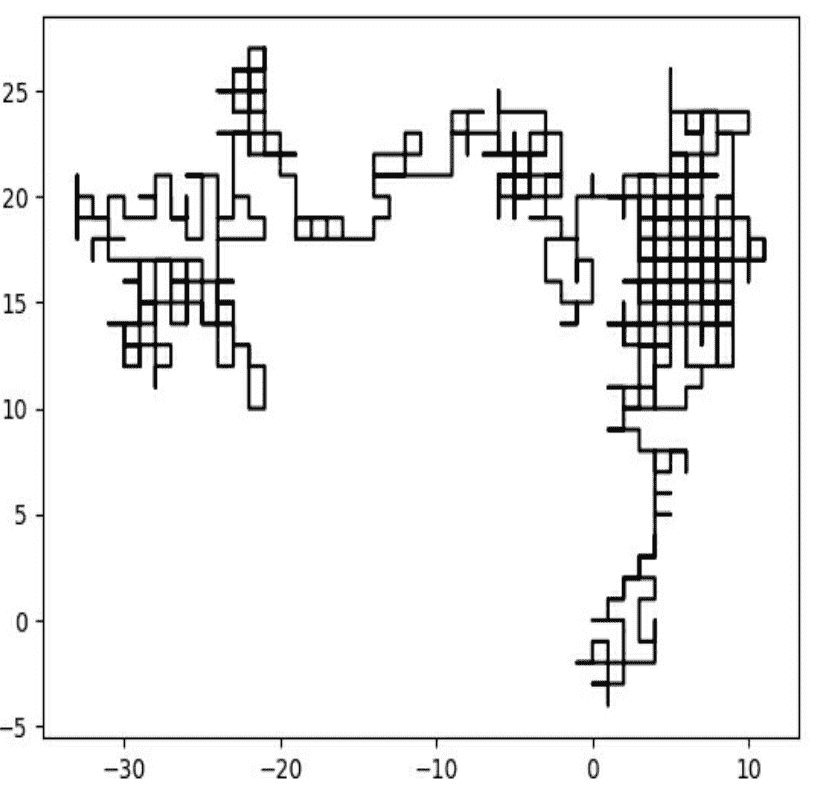

**图 1** 通过 Python 代码生成的方格网格上的随机游走。

### 2.5.3 随机抽样

在某些实地调查等的统计估计中，我们需要从总体中考虑随机样本。我们可以固定样本大小并收集随机样本。

```python
##### 总体：数字 0 到 99
>>> p = range(100)

##### 大小为 5 的随机样本
>>> random.sample(p, 5)
[97, 38, 18, 72, 54]

##### 另一个大小为 5 的样本
>>> random.sample(p, 5)
[72, 84, 14, 90, 17]
```

### 2.5.4 随机打乱

```python
>>> x = [1, 2, 3, 4, 5, 6, 7, 8]
>>> random.shuffle(x)
>>> x
[8, 5, 7, 4, 2, 1, 6, 3]
>>> random.shuffle(x)
>>> x
[8, 1, 2, 3, 5, 7, 4, 6]
```

### 2.5.5 密码学安全的随机数

有一种依赖于系统（特定于机器）的伪随机数，用于数据安全。生成器返回 ASCII 字符串。

```python
>>> import os
>>> r = os.urandom(4)
>>> r
b'\xef\xe2\x1fA'
>>> len(r)
4
[长度为 4 的 ASCII 码字符串]

##### 解码
>>> import struct
>>> struct.unpack('i', r)
(1092608751,)
[整数形式]

>>> struct.unpack('f', r)
(9.992903709411621,)
[浮点数形式]

##### 不同长度的解包索引
>>> struct.unpack('d', os.urandom(8))
(7.233012407285722e-05,)

>>> struct.unpack('h', os.urandom(2))
(-25353,)
```

## 2.6 时间、日期、日历

在 Python 中，时间以秒为单位（浮点数）测量，时钟自 1970 年 1 月 1 日凌晨 12:00 以来的秒数开始计数。要获取时间，我们需要导入 **time** 模块。在下面的例子中，我们使用 **time()** 函数来获取当前时间。

```python
>>> import time
>>> time.time()
1593926900.532799
>>> time.time()
1593926909.4718668
>>> time.time()
1593926914.2176676
```

时间是不断变化的，正如我们从上面在解释器中重复输入相同命令所看到的那样。因此，我们可以计算两个时刻之间的时间差。这对于了解 Python 程序的运行时间非常有用。

如果我们在 Python 脚本中导入 **time** 模块，并跟踪初始时间（程序第一行执行时）和最终时间（程序结束时），我们就可以知道程序运行了多久。通常，

```python
import time
begin = time.time()
指令块
end = time.time()
run_time = end – begin
```

获取本地时间和日期（小时、分钟、秒等）

```python
>>> time.localtime(time.time())
time.struct_time(tm_year=2020, tm_mon=7, tm_mday=5, tm_hour=11, tm_min=5, tm_sec=16, tm_wday=6, tm_yday=187, tm_isdst=0)
```

日历

```python
>>> import calendar
>>> cal = calendar.month(2020, 7)
>>> print(cal)
```

```
    July 2020
Su Mo Tu We Th Fr Sa
          1  2  3  4
 5  6  7  8  9 10 11
12 13 14 15 16 17 18
19 20 21 22 23 24 25
26 27 28 29 30 31
```

## 练习

- 1. 检查以下各项的数据类型：(i) 346.89, (ii) 14/5, (iii) 20/3.0, (iv) 2(3+6j), (v) ‘12345’
- 2. 以下语句是否正确？输入并检查。找出错误（如果有的话）。(i) 6x = 6x, (ii) x8 = x8, (iii) x5 = x*5, (iv) x*3 = 3*x
- 3. 编写一个Python程序来计算 𝑧，其中 𝑧 = 𝑥(𝑥 − 𝑦)/(𝑥 + 𝑦)，且 𝑥 = 5, 𝑦 = 9。打印输出并检查 𝑧 的数据类型。
- 4. 假设我们有三个字符串，x = ‘Hello friends!’, y = ‘That is why I feel good.’, z = ‘I learnt Python.’。你能将这三个字符串一起打印出来，形成一段有意义的对话吗？
- 5. 一个复数 𝑧 的实部和虚部分别是 3.5 和 1.8。构造这个复数并求出 𝑧𝑧* 的值。
- 6. 如果 𝑧₁ = 2 + 𝑖 且 𝑧₂ = 3 − 2𝑖，计算 |3𝑧₁ − 4𝑧₂|。
- 7. 取三个数：一个整数、一个浮点数和一个复数：34, -56.98, 5 + 2j。计算这三个数的乘积，并找出结果的类型。
- 8. 对于任意角度，用数值方法证明以下恒等式：cos5𝜃 = 16cos⁵𝜃 − 20cos³𝜃 + 5cos𝜃
- 9. 已知两个点的笛卡尔坐标：𝑃₁ = (2, 3, 5) 和 𝑃₂ = (9, 0, −1)。编写Python代码计算两点之间的距离。
- 10. 在你的命名空间中导入一个名为‘sys’的模块。检查其目录，并找出目录中一个可能用于检查Python版本的函数。
- 11. 打印2021年3月的日历。
- 12. 将十进制数5983转换为 (i) 二进制数，(ii) 十六进制数，和 (iii) 八进制数。
- 13. 使用内置函数找出以下数字中的最大值和最小值：−1, 2, 10, 13, 3.5, 71.9, 23, −34, 0, 0.98, 11.3, 10
- 14. 从均值 μ = 0.5，标准差 σ = 1 的正态分布中创建5个随机数。
- 15. 创建3个介于2和3之间的随机分数，并求出这些数的平均值。
- 16. 创建3到17之间的所有奇数整数。
- 17. 编写一个Python程序，在等号前后各留2个空格打印‘area = 50’。
- 18. 接受三个数字作为用户输入，然后求出它们的平均值。
- 19. 以指数格式打印0.000053。
- 20. 计算黄金比例 $\sqrt{5+1}$ 的十进制小数，并打印到小数点后5位。
- 21. 从math模块导入特殊数字π和e。将每个数字四舍五入到小数点后3位，然后计算 $\pi^2 + e^2$ 的值。
- 22. 验证著名的欧拉恒等式：$e^{i\pi} + 1 = 0$。[从math模块中取i。]
- 23. 核心Python中有一个名为‘platform’的模块。导入此模块并使用其中的函数system()来检查你正在使用的操作系统。
- 24. 一个正方形内接于半径为5单位的圆内。求圆与正方形之间的面积比。
- 25. 考虑以下10个数字：0.2, 0.4, 0.9, 0.1, −0.3, −0.4, 0.6, 0.4, −0.5, −0.1。从中随机抽取5个数字，并找出其中的最大值。
- 26. 验证：ln 100! ≈ 100 ln 100 − 100。
- 27. 当 n = 7, r = 3 时，计算 $\binom{n}{r} = \frac{n!}{r!(n-r)!}$。[使用math模块中的函数。]
- 28. 当 α = 42° 和 β = 34° 时，验证三角恒等式：tan(α + β) = (tan α + tan β) / (1 - tan α tan β)。
- 29. 验证对于任何实数x和y，x² + y² = 1。
- 30. 编写一个Python脚本，接受用户的名和姓，并以相反的顺序打印它们，中间留有空格。
- 31. 编写一个Python脚本打印2019年3月的日历。[使用calendar模块。]
- 32. 如果 z₁ = 4 – 3i 且 z₂ = -1 + 2i，计算：(a) |z₁ + z₂|, (b) z₁* + z₂*，并找出每种情况下的实部和虚部。
- 33. 打印 *The Zen of Python* 诗。

## 第三章：循环与条件

> “逻辑能让你从A点到达B点。想象力则能带你去任何地方。” - 阿尔伯特·爱因斯坦

要编写遵循某种算法的长而有组织的代码，我们需要学习如何使用循环和逻辑结构来编写指令块。

**注意：** 如果Python程序超过几行，将其写入文件并存储是有利的。我们称之为*Python脚本*。即使我们将代码写在文件中，命令行或解释器（>>>）也总是随时可用，我们可以快速测试每一行指令。

### 3.1 循环

#### 3.1.1 For循环

为了重复计算某些内容，我们将一条指令或一组指令放在循环中。在Python中，这是一个‘for循环’。循环遍历某个可迭代对象。这意味着，我们需要一个可迭代对象，循环将在其上重复运行。[我们可以将可迭代对象视为一个项目/元素的集合。]

##### for循环的结构

```
for i in range(start, end, step):
    instruction 1
    instruction 2
    ......
    print(...)
```

##### 语法说明：

- 循环以关键字‘for’开始，后跟一个虚拟索引（本例中为‘i’），然后是另一个关键字‘in’，其后跟一个可迭代对象。
- 在本例中，range()是一个可迭代对象。循环遍历它。其后跟一个冒号(:)，用于连接下一行指令。
- 指令必须在循环下缩进。此外，所有缩进的指令必须从同一列开始。

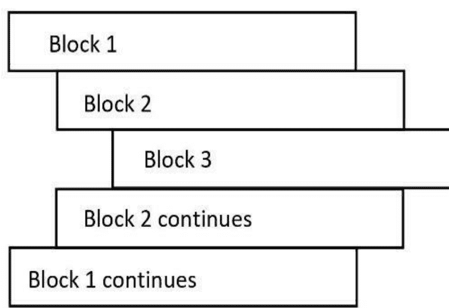

**图 1：** 缩进的概念：嵌套块如何缩进。

##### range()

对象range()是一个可迭代对象。其他一些可迭代对象有：字符串、列表、元组、集合、字典。

内置函数range(start, stop, step)创建一个整数范围，从值‘start’开始，以‘step’为步长，并在‘stop’之前停止（不触及或越过终点）。range对象可以转换为其他类型的可迭代对象。

```
###### 转换
>>> range(1, 10, 2)
range(1, 10, 2)

##### 转换为列表
>>> list(range(1, 10, 2))
[1, 3, 5, 7, 9]

###### stop = 5, start = 0, step = 1
>>> range(5)
range(0, 5)

###### 默认 start = 0, step = 1
>>> list(range(5))
[0, 1, 2, 3, 4]

###### 转换为元组
>>> tuple(range(2, 10, 3))
(2, 5, 8)
```

**注意：** 在Python 2中，range()直接创建一个整数列表，而xrange()等同于Python 3中的range()。

> [在Python中，可迭代对象是一个可以被迭代的对象。其基本机制是，当传递给iter()方法时，它会生成一个迭代器。迭代器是一个对象，用于使用__next__()方法遍历可迭代对象，该方法返回对象的下一个项目。每当我们使用for循环时，next方法会自动被调用以从迭代器获取每个项目，从而完成操作。]

**Python代码 #1**

```
for n in range(1, 4):
    print(‘Very good’)
```

输出：

Very good
Very good
Very good

**注意：** 函数**range(1, 4)**生成从1到3的整数。因此，for循环在n = 1, 2, 3时运行[索引n是一个虚拟索引。我们可以写任何东西。]。

**Python代码 #2**

```
for x in [0, 1, 2]:
    print(x, "\t", 2**x)
```

输出：
0 1
1 2
2 4

**注意：** 在**print()**函数中，“\t”（通过制表符创建一个空格）用于以空格分隔的方式显示输出。

**Python代码 #3**

```
###### 1到100的整数和
s = 0  # 初始值
for n in range(1, 101):
    s = s + n  # 更新值
print(‘Sum = ‘, s)
```

输出：
Sum = 5050

```
###### 一步求和
>>> sum(range(1, 101))
5050
```

**Python代码 #4：数字表（使用字符串格式化打印）**

```
for index in range(1, 6):
    print("{} times 5 is {}".format(index, index*5))
```

输出：

1 times 5 is 5
2 times 5 is 10
3 times 5 is 15
4 times 5 is 20
5 times 5 is 25

**注意：** 循环也可以用其他类型的可迭代对象（如元组、字符串*等*）以相同方式编写。例如，

```
>>> for i in 'ABC':
        print(i, end = ‘ ‘)
A B C
```

**数字的阶乘** n! = 1 × 2 × 3 × … × n

**Python脚本**

```
###### 计算阶乘
n = eval(input(‘Enter the number\n’))
fac = 1
for i in range(2, n+1):
```

## 3.1.2 While 循环

While 循环是一种基于逻辑判断的循环结构。当满足某个条件时，循环会继续执行。

While 循环的结构：
**while 条件:**
**语句**

##### 示例：Python 代码

```
x = 1
while x < 10:
    x += 2
    print(x, end = ' ')
```

输出：
3 5 7 9 11

**注意：** `print(x, end = ' ')` 会将结果打印在一行，每个元素后有一个空格。

```
##### 示例：无限循环
x = 10
while True:
    print(x)
```

**注意：** ‘while True’ 表示无限循环。while 语句接受一个表达式，并在该表达式求值为（布尔值）“真”时执行循环体。True 始终求值为布尔值“真”，因此会无限执行循环体。

## 3.2 条件语句

**if** 语句用于基于一个或多个条件及其下的指令进行逻辑判断。

```
##### 逻辑 if
if x == 10:
    print('x is 10')
##### 单行形式
if x == 10: print('x is 10')
```

应用：

### 完全平方数

我们能否编写一个 Python 代码来检查一个数是否是*完全平方数*？例如，25 = 5² 是一个平方数。

> 一种方法是计算平方根，当是完全平方数时，平方根将是整数（√25 = 5），而当不是完全平方数时，平方根将是浮点数（√26 = 5.0990195135927845）。如果是浮点数（而非整数），可以将整数部分再次平方，然后与原始数字进行比较。

```
nsqrt = int(sqrt(number))
nsq = nsqrt*nsqrt
if nsq == number: print('perfect square')
```

### if...else [寻找替代决策]

```
if x == 10:
    print('x is 10')
else:
    print('x is not 10')
```

应用：

### 奇数或偶数

```
##### Python 脚本：测试一个数
n = 84824727
if n%2 == 0:
    print('Even')
else:
    print('Odd')
```

### 阿姆斯特朗数

```
n = input('Enter the number \n')
x = sum([eval(i)**3 for i in n])
if x == n:
    print('Armstrong Number')
else:
    print('Not Armstrong')
```

练习：

编写一个 Python 代码来检查给定的数字是否是阿姆斯特朗数。你可以为此定义一个函数，比如 **arms()**。现在使用这个函数来找出 **1000000** 以内有多少个阿姆斯特朗数。[你会惊讶地发现数量并不多。]

```
##### if...elif...else
[具有多个条件的决策]

a, b, c = 2, 3, 4
x = b*b - 4*a*c
if x < 0:
    print('x is negative.')
elif x > 0:
    print('x is positive.')
else:
    print('x is zero.')
```

```
##### 嵌套 if
[当一个逻辑 if 嵌套在另一个逻辑 if 内部时。]

if n < 0:
    print('negative')
else:
    print('positive')
    if n > 10:
        print('More than 10')
```

```
##### 多重条件
取列表 x = [1, -1, 0, 9, 3, 4, 5, 6, 7, 11, 100, -3, -5]。

for i in x:
    if i < 10 and i > 0: print(i, end = ' ')
输出：1 9 3 4 5 6 7
for i in x:
    if i > 10 or i < 0: print(i, end = ' ')
输出：-1 11 100 -3 -5
```

## 循环中的 break

关键字 **'break'** 是一个控制语句，放在循环内部，用于在条件满足时跳出循环。

```
##### 示例：使用 ‘break’
for i in [10, 16, 18, 21, 29]:
    if i%2 == 1: # 如果是奇数
        **break** # 立即退出
    print(i, end = ' ')
print('Done!')
```

输出：
10 16 18 Done!

## 3.3 Try Except

- **try** 块让我们测试一段代码是否有错误。
- **except** 块让我们处理错误。
- **finally** 块允许我们执行代码，无论 try 和 except 块的结果如何。

```
try:
    print(x)
except:
    print('Exception Error occurred')
```

输出：
Exception Error occurred

**注意：** 错误发生是因为参数 x 未初始化。

```
输出：
Error: argument not defined
```

```
except:
    print('Unknown Error')
else:
    print('No Error')
```

输出：
Unknown Error

## 修复错误

在代码块之前为 x 赋值。这样就不会再引发错误。它将打印出值。

```
x = 10
try:
    print(x)
except:
    print('Unknown Error')
else:
    print('No Error')
```

输出：10
No Error

## ‘finally’ 的使用

如果存在此块，无论进入 try、except 还是 else 块，它都会被执行。

```
try:
    print(x)
except:
    print('Error: argument not defined')
else:
    print('Unknown error')
finally:
    print('Final block reached')
```

输出：
Error: argument not defined
Final block reached

## 练习

1.  编写一个 Python 脚本，从用户那里获取球体的半径并计算其体积。
2.  编写一个 Python 脚本计算两点 (2, 3, 5) 和 (-1, 2, 9) 之间的距离。
3.  给定一些数据：?? = 87, 91, 85, 75, 28, 122, 66, 56，求变量 ?? 的（算术）平均值和均方根值。
4.  给定以下数字：6, 12, 17, 15, 32, 64, -2, 100, 103, 13, 2, 0。找出这些数字的最大值、最小值和范围。
5.  给定一组 20 个数字：1, 0.1, 5, 3, 10, -1, 4, 20, 1000, -9, 2, 14, 4.5, 0.9, 30, 9.8, 11, 22, 48, -10。编写一个计算机程序来统计 0 到 10 之间有多少个数字。
6.  编写一个计算机程序来计算 ?? !，其中 ?? = 10。
7.  编写一个 Python 脚本来验证斯特林近似公式：ln 100! ≈ 100 ln 100 – 100。
8.  测试以下级数对于足够大的数是否收敛：Σ 1/??
9.  考虑 ?? 是一个复数：?? = 2 + 3??。利用合适模块中的适当函数来找出多值函数 ?? = ?????? ?? 的一些值。
10. 找出 1 的 5 次方根的所有根。[提示：1 1/?? = (????????(2????????)) 1/?? 2?????? = ???^?。现在对于固定的 ??，运行一个 for 循环，?? = 0, 1, 2, ... (?? – 1) 来获得这些根。]
11. 找出 ?? = ?? 的立方根，其中 ?? =√-1。
12. 给定一组 20 个数字：1, 0.1, 5, 3, 10, -1, 4, 20, 1000, -9, 2, 14, 4.5, 0.9, 30, 9.8, 11, 22, 48, -10。编写一个程序来统计 0 到 10 之间的数字个数。
13. 给定一些数据：?? = 87, 91, 85, 75, 28, 122, 66, 56，求变量 ?? 的（算术）平均值和均方根值。
14. 给定递推关系：$\bullet\bullet_{\bullet\bullet+1} = \bullet\bullet_{\bullet\bullet} + \bullet\bullet_{\bullet\bullet-1}$，其中 $\bullet\bullet_0, \bullet\bullet_1 = 0, 1$。编写一个合适的 Python 脚本来生成直到 $\bullet\bullet_{15}$ 的所有值。
15. 从 datetime 模块导入 date() 函数。找出 (2019, 18, 3) 和 (2019, 29, 3) 之间的天数。
16. 编写一个 Python 脚本来计算 $\Gamma(21)$，其中 $\Gamma(\bullet\bullet + 1/2) = 1.3.5....(2\bullet\bullet-1)\sqrt{\bullet\bullet} \cdot 2\bullet\bullet$
17. 编写一个 Python 脚本，用 * 打印字母图案 ‘E’。

```
*****
*
*
*****
*
*
*****
```

18. 为函数 $\bullet\bullet(\bullet\bullet) = (\bullet\bullet - 1)(\bullet\bullet - 2)(\bullet\bullet - 3)(\bullet\bullet - 4)(\bullet\bullet - 5)$ 编写一个计算机程序，然后据此计算 $\bullet\bullet(6)$。
19. 编写一个 Python 脚本，接受任意整数 ($\bullet\bullet$) 并计算：$\bullet\bullet + \bullet\bullet\bullet\bullet\bullet + \bullet\bullet\bullet\bullet\bullet\bullet\bullet + \bullet\bullet\bullet\bullet\bullet\bullet\bullet\bullet\bullet$
20. 从无穷级数中找出 $\bullet\bullet$ 的值：$\bullet\bullet = 4$ $1 - 1^{-1} + 1^{-1} - 1^{+1} + \dots$ 直到 $3579$ 的 $6^{th}$ 位小数精度。
21. 给定递推关系：$\bullet\bullet_{\bullet\bullet+1} = \bullet\bullet_{\bullet\bullet} + \bullet\bullet_{\bullet\bullet-1}$，其中 $\bullet\bullet_0 = \bullet\bullet_1 = 1$。编写一个合适的计算机程序来生成直到 $\bullet\bullet_{15}$ 的所有值。
22. 考虑以下函数：f(x) 返回 x 的哪个函数？

```
def f(x):
    s = 0.0
```

l = [1, 2, 3, 4]
for c in l:
    s = s * x + c
return s

23. 编写一个函数，该函数接受一个系数列表 $a_0, a_1, a_2, ..., a_n$ 作为第一个参数，变量 $x$ 的值作为第二个参数，并返回多项式 $a_0 + a_1x^1 + a_2x^2 + ... + a_nx^n$ 的值。

24. 编写一个程序，使用此函数打印出多项式 $x^3 - 7x^2 + 5$ 在 $x$ 取值 0, 1, 2, ... 10 时的值表。你认为本题中编写的代码相比直接计算 $x ** 3 - 7 * x ** 2 + 5$ 有何优势？

## 第四章 Python 函数

> “头脑就像降落伞——只有在打开时才能工作。” – 托马斯·杜瓦

在计算机程序中构建函数块的理念是为了*可重用性*。一旦定义了一个函数，就可以反复使用。

我们在 `__builtins__` 和其他模块中有各种系统函数。下面，我们将展示如何定义一个函数。这样的函数称为用户定义函数。我们可以在 Python 脚本中定义一个数学（或任何类型的）函数。

### 4.1 定义函数

```
def func_name(args):
    instructions
    return value
```

函数块以关键字 `def` 开头，后跟函数名称，参数位于圆括号 `()` 内，并以冒号 `(:)` 结束。指令（单行或多行）在其下方缩进。关键字 `return` 用于返回可在任何时候使用的值。

示例：f(x) = x²

```
def f(x): return x*x
##### 在解释器上
>>> def f(x):
        return x*x
>>> f(5)
25
##### 示例：Python 脚本中的用户定义函数
```

```
##### 圆的面积
from math import pi

def area(x): return pi*x*x
r = eval(input('Enter radius'))
print('Area of Circle = ', area(r))
```

注意：函数中的参数可以是任何东西。它可以是变量或参数、字符串或任何其他可迭代对象。

```
##### 参数为字符串
def my_name(name):
    return 'My name is ' + name

##### 参数为列表
def prod(x):
    n = 1
    for i in x:
        n = n*i
    return n

##### 在解释器上测试
>>> x = 'Abhijit'
>>> my_name(x)
'My name is Abhijit'  # 两个字符串相加
>>> x = [1, 2, 3, 4]
>>> prod(x)
24
```

**注意：** 我们有时也可能在由一对括号 **def main()** 和 **main()** 括起来的主块内定义一个函数。在它们之间，我们可以在任何地方放置缩进的函数块。

```
def main():
    x = input('Enter x')
    def f(x):
        return x*x
    print(f(x))
main()
```

### 4.1.1 带文档字符串的函数

为了标识，我们可以在函数定义中使用文档字符串。这是一个可选的文档字符串（写在三引号内），它告诉我们函数是关于什么的。当我们运行函数时，文档字符串不会被执行。但是，我们可以通过属性 “**__doc__**”（两侧双下划线）来获取标识符（文档字符串）。

为了演示，我们定义以下两个带和不带文档字符串的函数。让我们看看调用标识符时的区别。

```
##### 不带文档字符串的函数
def f(x):
    return x*x

##### 带文档字符串的函数
def g(x):
    """This is my defined function."""
    return x**3

##### 检查标识符
>>> print(f.__doc__)
None
>>> print(g.__doc__)
'This is my defined function.'
```

当我们对函数调用 help() 时，文档字符串会被打印出来。

```
>>> help(g)
Help on function f in module __main__:

f(x)
    This is my defined function.
```

文档字符串通常写在三引号下，以容纳多行字符串。

- 函数以 **def** 头开始，后跟冒号 **(:)** 结束头。
- 我们可以将变量和参数作为参数编写。
- **文档字符串** 是可选的。
- 函数体可以包含单个或多个语句。
- **return** 语句返回一个值。

### 4.1.2 空函数

return 语句是正式函数定义的一部分。然而，需要注意的是，一些函数定义不包含 return 语句。这些函数（没有 return 语句）称为 **空函数**，它们不返回任何东西（有时是 None，Python 中表示“无”的特殊关键字）。

```
##### 示例：空函数
def func(x):
    x**2 + 1
>>> func(2)  # 不返回任何东西
>>>
```

在空函数中，我们可以包含 print() 来在解释器上打印输出。但它仍然是一个空函数。没有 return 语句，将其放入 Python 脚本中将毫无用处。

```
##### 带 print() 的空函数
def void_func(x):
    print(x**2+1)

##### 带 return 的真正函数
def true_func(x):
    return x**2+1
```

当我们在解释器上调用上述函数时，两者都返回相同的输出。但是，当我们将它们分配给其他变量时，我们看到了区别。

```
>>> void_func(2)
5
>>> true_func(2)
5

>>> x = 2
##### 空函数打印值。
>>> g = void_func(x)
5
>>> g  # 但不返回任何东西。
>>>
>>> f = true_func(x)
>>> f  # 真正函数返回 5
5
```

**注意：** 空函数的赋值对象在再次调用时不返回任何东西。但是，在解释器上，它在赋值时打印值。因此，带 print() 的空函数可能表现得像一个真正的函数，但我们在 Python 脚本中使用它时必须小心。

### 4.1.3 一些简单函数

返回固定值或不返回任何东西的函数可以被视为简单函数。

```
def f():  # 无参数
    return 2*3  # 返回固定答案。

def g(x):  # 不返回或打印任何东西。
    pass

##### 在解释器上测试
>>> f()
6
>>> g(2)
>>> # 没有出现任何内容。
```

### 4.1.4 具有任意数量参数的函数

有时，我们事先不知道将传递给函数的参数数量。Python 允许我们通过定义具有任意数量参数的函数来处理这种情况。在定义中，我们在参数名称前使用星号 (*)。

```
def arbit(*x):
    for i in x:
        print(i**2, end = ' ')
>>> arbit(2, 3, 4)
4 9 16
```

上述函数中的参数 x 可以接受任意数量的值（数字）。让我们也尝试用名称（字符串）做同样的事情。

```
def greet(*names):
    for name in names:
        return 'Hello' + ' ' + name

>>> greet('Tinku', 'Srabani', 'Monish', 'Sima')
Hello Tinku
Hello Srabani
Hello Monish
Hello Sima
```

### 4.1.5 具有关键字参数的函数

可以使用关键字参数调用函数。当我们以这种方式调用函数时，参数的顺序（位置）可以按我们的意愿更改。

```
##### 具有多个参数的函数
def multi(x, y, z):
    return x + y * z
>>> multi(2, 3, 4)
14
```

我们按位置调用了函数。但是，当我们可以通过参数名称 x, y, z 调用时，它们被称为关键字参数。

```
##### 通过关键字传递参数
>>> multi(x = 2, y = 3, z = 4)
14

##### 位置改变，输出相同
>>> multi(y = 3, z = 4, x = 4)
14
```

### 4.1.6 具有任意数量关键字参数的函数

当我们不知道将有多少关键字参数传递给函数时，我们在参数字段中的参数名称前添加两个星号 (**)。我们传递给函数的关键字参数将被放入一个字典中。我们可以检查这个字典的键和值。

```
def arbit_key(**par):
    return par

>>> d = arbit_key(a = 1, b = 2, c = 3)
{'a': 1, 'b': 2, 'c': 3}  # 字典
>>> type(d)
<class 'dict'>
```

注意：输出作为字典返回。[字典是具有相应键和值的项目的集合。]。在上面，函数返回了一个字典，其中 'a', 'b' 和 'c' 是键，1, 2, 3 是相应的值。我们可以通过将键放在方括号内来提取值。例如，输入 d['a'], d['b'], d['c'] 将分别返回 1, 2, 3。

一些混合示例

```
#1 任意数量的参数和关键字参数
def test_func(*args, **kwargs):
    return args, kwargs

>>> test_func(2, 3, 4, a = 5, b = 10)
((2, 3, 4), {'a': 5, 'b': 10})
```

注意：*args 产生一个元组，**kwargs 产生一个字典。

```
#2 带默认参数和任意关键字参数
def my_func(x, **par):
    s = 0
```

for i in par:
    s = s + par[i]*x
return s
>>> my_func(5, a = 1, b = 2, c = 3)
30

注意：上述函数计算的是 5*1 + 5*2 + 5*3。默认参数 x 是通过位置给出的（没有使用名称引用），而参数 **par 的值是通过关键字参数 a = 1, b = 2, c = 3 给出的。

## 4.2 局部参数与全局参数

在函数内部赋值的参数（或变量）属于该函数的*局部作用域*，只能在该函数内部使用。我们可以称之为局部参数（变量）。从外部更改参数值不会影响函数的返回值。

```
def f(x):
    a = 2 # 局部参数
    return a*x
```

即使我们从外部更改了‘a’，函数也只接受局部值。例如，

```
>>> f(5)
10
>>> a = 10
>>> f(5)
10 ← 值未改变。

##### 局部变量在函数外部不可用
>>> print(a)
Traceback (most recent call last):
  File "<pyshell#4>", line 1, in <module>
    print(a)
NameError: name 'a' is not defined
```

在 Python 代码主体中创建的参数（变量）是全局参数（变量），属于*全局作用域*。请注意，全局变量可以从任何作用域（全局和局部）访问。

```
##### 全局参数，放在外部
a = 5 # 全局参数，在外部
def f(x):
    return a*x

>>> f(2)
10
>>> a = 10
>>> f(2)
20

##### 参数放在内部，使其成为全局参数。

def g(x):
    global b
    b = 4
    return b*x

>>> f(5)
20
>>> print(b)
4
```

注意：我们可以使用关键字 **global** 将函数内部的参数或变量设为全局变量，这样它就可以在外部被访问。

## 4.3 函数内部的函数

我们可以在一个函数内部调用另一个函数。例如，

```
def add(x, y):
    return x + y
def cal(x, y, z):
    return z*add(x, y)

>>> cal(2, 3, 4)
20
```

注意：函数 **add()** 在函数 **cal()** 内部被调用。实际上，我们可以在一个函数内部调用任意数量的函数，任意次数。

## 4.4 递归函数

我们知道，一个函数可以调用其他函数。递归函数是调用自身的函数。

```
##### 示例：
阶乘：n! = n × (n - 1) × ... × 3 × 2 × 1

def facto(n):
    if n == 1:
        return 1
    return n*facto(n-1)
```

```
>>> facto(5)
120
```

**注意：** 阶乘，n! = n ×(n – 1)!。这种写法使得通过递归函数定义成为可能。

## 4.5 Lambda 函数

这是在 Python 中定义函数的另一种方式。‘**Lambda 函数**’是单行匿名函数。它可以接受任意数量的参数，但只允许一行代码。

```
##### 单个参数
f = lambda x: x**2
```

```
##### ‘f’ 是给定的名称
>>> f(2)
4
```

**注意：** 名称‘f’是通过关键字 **lambda** 创建的一个对象，后面跟着参数 **x**。可以说，我们创建了一个函数 f(**x**)。

```
##### 多个参数
add = lambda x, y: x + y
>>> add(2, 3)
5
```

```
##### 使用导入的函数。
import math
fun = lambda x: x*math.exp(-x)
```

```
>>> fun(1)
0.36787944117144233
```

## 4.6 函数重载

函数重载是能够容纳多个同名函数的能力。Python 默认不支持函数重载。

在 Python 中，当我们定义两个同名函数时，最后一个函数会覆盖命名空间中的第一个函数。然而，当不同的函数位于不同的类或模块中时，我们可以给它们相同的函数名。[这就像同一个家庭中有两个同名的人会让人困惑，而不同家庭中的两个人同名则没问题。]

但是，我们可以在 Python 中实现函数重载。[基本上，我们创建一个包装类，它包装任何函数，然后通过内置的特殊函数 __call__ 使其可调用，并赋予其不同的虚拟身份。在 Python 中，装饰器函数包装一个函数，允许我们在不修改其结构的情况下为现有函数添加更多功能。本书将不再深入讨论此内容。感兴趣的读者可以随时查阅关于编写包装类和装饰器类的文章和书籍。]

**注意：** Python 中实现了*运算符重载*。例如，‘+’运算符用于两个数字的相加，而相同的运算符也用于两个字符串对象的连接 [‘x’ + ‘y’ = ‘xy’]。

## 4.7 关于导入的函数

到目前为止，我们讨论了用户定义的函数。在 Python 中，我们会遇到从内部和外部模块导入的各种各样的函数。我们可以通过 help() 获取它们的在线帮助。

示例：

让我们从第三方包 **matplotlib** 导入一个模块 **pyplot**，并查看绘图函数 **plot()** 的在线帮助。

```
>>> from matplotlib.pyplot import plot
>>> help(plot)
Help on function plot in module
matplotlib.pyplot:

plot (*args, scalex = True, scaley =True, data = None, **kwargs) …..
```

**注意：** 这里显示了前几行。让我们了解参数。***args** 指任意数量的默认参数，****kwargs** 指任意数量的关键字参数，我们还发现了其他可选参数。

## 4.8 Python map 函数

**map()** 函数返回一个 map 对象（它是一个迭代器），该对象是将给定函数应用于给定可迭代对象（列表、元组*等*）的每个元素后的结果。

```
>>> L = [1, 2, 3, 4]
>>> f = lambda x: x**2
>>> map(f, L)
<map object at 0x0000015A07FD0880>
>>> list(map(f, L))
[1, 4, 9, 16]
```

## 4.9 Python filter 函数

**filter()** 函数返回一个 filter 对象，其中列表（或元组*等*）中的元素通过某个给定条件下的函数进行过滤。只有当我们将其转换为列表或元组*等*时，才能看到过滤后的对象。

```
>>> L = [2, 0, 1.0, 10.2, 0.5, 3.4]
>>> f = lambda x: x > 0.5
>>> filter(f, L)
<filter object at
0x0000015A081953A0>
>>> list(filter(f, L))
[2, 1.0, 10.2]
```

请注意，map() 对此类函数的操作将返回布尔值。

```
>>> list(map(f, L))
[True, False, True, True, False, False]
```

应用：给定一个数字列表，过滤出浮点数并返回整数列表。

```
>>> L = [56, 2.4, 1.1, 3, 10, 9.6,
-0.8, 91]
>>> list(filter(lambda x: type(x) == int, L))
[56, 3, 10, 91]
```

## 4.10 Python zip 函数

这个内置函数创建一个对象，其中两个列表（或元组*等*）中的对应元素被配对。

```
>>> x = ['a', 'b', 'c', 'd']
>>> y = [1, 2, 3, 4]
>>> zip(x, y)
<zip object at 0x0000015A07E955C0> [已创建压缩对象。]

>>> list(zip(x, y))
[('a', 1), ('b', 2), ('c', 3), ('d', 4)]
```

**注意：** 元组中的配对元素由两个列表 (x, y) 的对应元素形成。

##### 第5章 数据结构

> “在拥有数据之前就进行理论化是一个严重的错误” – 夏洛克·福尔摩斯

在本章中，我们将学习一些非常有用的 Python 概念。我们将处理一些 Python 对象，它们基本上是各种形式的数据集合。它们是可迭代对象。核心 Python 中有以下内置数据结构：

- **列表** [1, 2, ‘potato’]
- **字符串** “This is a string”
- **元组** (2, 5, -1)
- **集合** {1, 3, 5}
- **字典** {‘a’:1,‘b’:2,‘c’:3}

数据以各种形式表示。为了理解它们并在我们的研究中使用它们，我们需要对上述数据结构有清晰的认识。处理大数据是数据科学、机器学习以及基础科学和社会科学研究中的重要组成部分，实际上几乎无处不在。Python 能够非常高效地处理结构化数据。

## 5.1 列表

列表是一个可迭代对象。它是由逗号分隔并放在方括号 [ ] 内的元素（数字、字符串或任何其他可迭代对象）的集合。列表是**可变的**，这意味着我们可以更改列表。[基本上，列表是 Python 中的一种数据结构，它是一个**有序的**元素序列，并且是可更改的。]

```
##### 数字列表
>>> A = [3, 2.5, 4.0, -1, 5, 0]
>>> type(A)
<class 'list'>

##### 名称列表
>>> B =
['Sima', 'Zakir', 'Alex', 'Mita']
##### 混合列表
>>> C = [10, [1, 2], 'a2', '*@']
```

**注意：** 字母元素或任何不是纯数字的东西，都必须放在两个引号内。这样的东西是一个字符串。

```
##### 打印或显示

>>> print(A)
[3, 2.5, 4.0, -1, 5, 0]
>>> B
['Sima', 'Zakir', 'Alex', 'Mita']
```

**注意：** 要在解释器上显示，我们不必总是使用 print() 函数。

写在两个方括号之间、用逗号分隔的元素将被视为一个称为列表的对象。任何可迭代对象（元素的集合）都可以通过名为 **list()** 的内置函数转换为列表。

```
##### 通过 list() 函数创建列表

>>> x = 'abc123' # 字符串
>>> list(x) # 字符串转列表
['a', 'b', 'c', '1', '2', '3']
```

## 5.1.1 索引

对于列表，
A = [3, 2.5, 4.0, -1, 5, 0]

列表是一个有序序列。列表中元素的位置从左到右依次索引为 0, 1, 2, 3...。同时，索引也可以从右到左进行，为 -1, -2, -3...，其中最后一个（最右端）元素的位置索引是 -1。[可以想象将列表折叠成一个环，使得数轴上最后一个元素（-1）位于位置 0 的第一个元素的左侧。因此，我们可以从任一端开始计数。]

| 列表项 | 3 | 2.5 | 4.0 | -1 | 5 | 0 |
| :--- | :--- | :--- | :--- | :--- | :--- | :--- |
| 位置 | 0 | 1 | 2 | 3 | 4 | 5 |
| | -6 | -5 | -4 | -3 | -2 | -1 |

```
##### 通过索引获取元素
>>> A[0] # 位置 0
3
>>> A[1] # 位置 1
2.5
>>> A[2]
4.0
>>> A[-1] # 最后一个元素
0
>>> A[-2] # 倒数第二个元素
4
```

## 5.1.2 切片

切片是在保持原列表不变的情况下取出列表的一部分。切片通过索引完成。列表 L 的索引通用规则是写成：

```
L[start : stop : step]
```

切片后的列表从 `start` 开始，以 `step` 为步长前进，直到 `stop`，但不会触及或越过 `stop` [就像在停止信号前停下一样！]。冒号（:）是分隔符。

```
>>> A = [3, 2.5, 4.0, -1, 5, 0] # 项目索引：从 1 到 3，步长为 1
>>> A[1:4:1]
[2.5, 4.0, -1]

##### 步长默认为 1
>>> A[1:4]
[2.5, 4.0, -1]

##### 默认从索引 0 开始
>>> A[:4]
[3, 2.5, 4.0, -1]

##### 从索引 2 到末尾
>>> A[2:]
[4.0, -1, 5, 0]
```

## 5.1.3 列表的内置函数

```
>>> A = [3, 2.5, 4.0, -1, 5, 0]

##### 长度 = 项目总数
>>> len(A)
6

##### 列表 A 中数字的总和
>>> sum(A)
13.5
```

注意：最后一个元素 A[-1] 也可以写成 A[len(A)-1]。

```
##### Python 脚本：数字的平均值
A = [3, 2.5, 4.0, -1, 5, 0]
mean = sum(A)/len(A)
print(mean)
```

注意：我们不再需要使用 for 循环来计算数字的总和。函数 **sum()** 对元素列表执行相同的工作。

```
##### 最大值和最小值
>>> max(A)
5
>>> min(A)
-1
```

```
##### 对列表排序
##### 按升序排序
>>> sorted(A)
[-1, 0, 2.5, 3, 4.0, 5]
##### 按降序排序
>>> sorted(A, reverse = True)
[5, 4.0, 3, 2.5, 0, -1]
>>> A
[3, 2.5, 4.0, -1, 5, 0]
[原始列表未改变。]
```

**注意：** 内置函数 **sorted()** 不会改变原始列表。[在解释器中输入 help(sorted) 可查看在线手册。]

```
>>> B = ['Sima', 'Zakir', 'Alex', 'Mita']

##### 升序，按字母顺序
>>> sorted(B)
['Alex', 'Mita', 'Sima', 'Zakir']

>>> C = ['Good', 10, 'Bad', 50]
>>> sorted(C)
[10, 50, 'Bad', 'Good']
```

**注意：** 对于上面的 **列表 C**，它首先对数字排序，然后对字符串排序。

```
>>> D = ['236', '-105', '925', '1000']
>>> sorted(D)
['-105', '1000', '236', '925']
```

**注意：** D 是一个字符串列表，字符串是纯数字。sorted() 函数首先查找符号，然后从左到右查找数字，而不是引号内的总数。

## 5.1.4 列表方法

方法是设计用于应用于对象的一些特定函数。根据 Python 文档：

**方法**是“属于”一个对象的函数。（在 Python 中，方法一词并非类实例独有：其他对象类型也可以有方法。例如，列表对象有名为 append、insert、remove、sort 等的方法。

```
##### 查看目录
>>> dir(list)
['__add__', '__class__', '__contains__', '__delattr__', '__delitem__', '__dir__',
'__doc__', '__eq__', '__format__', '__ge__', '__getattribute__', '__getitem__',
'__gt__', '__hash__', '__iadd__', '__imul__', '__init__', '__init_subclass__',
'__iter__', '__le__', '__len__', '__lt__', '__mul__', '__ne__', '__new__',
'__reduce__', '__reduce_ex__', '__repr__', '__reversed__', '__rmul__',
'__setattr__', '__setitem__', '__sizeof__', '__str__', '__subclasshook__',
'append', 'clear', 'copy', 'count', 'extend', 'index', 'insert', 'pop', 'remove',
'reverse', 'sort']
```

带有双下划线（__）的名称要么是列表属性，要么是包装类的类型 [包装类是一个其对象包装或包含原始数据类型。]。这些是各种操作的基础。例如，__add__ 为两个列表执行 `+` 操作，即连接。

```
>>> a = [1, 2]
>>> b = [3, 4]

##### 连接 a 和 b
>>> a.__add__(b)
[1, 2, 3, 4]

##### 通过 `+` 运算符连接
>>> a + b
[1, 2, 3, 4]
```

不带下划线的名称指的是适用于列表的函数。这些被称为方法。方法可以作为对象的**属性引用**。这意味着，我们可以引用 list.method_name()，其中 method_name() 成为列表对象的一个属性。

[**类**、**对象**、**属性引用** *等* 的概念将在第 4 章介绍时变得清晰。目前，我们可以理解**类**是一段以某种风格编写的代码块，其下可以有函数、参数 *等*。对象是类的实例。换句话说，类是对象的蓝图。]

我们可以寻求在线帮助来了解任何方法。这称为方法描述符。例如，如果我们想了解对象 list 下的 append() 方法，我们输入：

```
>>> help(list.append)
Help on method_descriptor:
append(self, object, /)
Append object to the end of the list.
```

```
##### 元素的位置
>>> A = [3, 2.5, 4.0, -1, 5, 0]
##### 元素 '2.5' 的位置
>>> A.index(2.5)
1

>>> B = ['Sima', 'Zakir', 'Alex', 'Mita']
##### 'Mita' 的位置
>>> B.index('Mita')
3
```

**注意：** 方法 **index()** 在列表中。因此，我们可以写成 list.index(A, 2.5), list.index(B, 'Mita') *等*，或者作为属性写成 A.index(2.5) 或 B.list('Mita')。

应用：查找列表中最大值的位置。

```
>>> A = [3, 2.5, 4.0, -1, 5, 0]
##### 最大元素的索引
>>> A.index(max(A))
4
```

练习：创建一个包含 1000 个 0 到 1 之间随机数的列表。找出最大值和最小值并定位它们。

```
##### 反转列表
>>> A = [3, 2.5, 4.0, -1, 5, 0]
>>> A.reverse()
>>> A
[0, 5, -1, 4.0, 2.5, 3]
← 反转后的列表
```

```
##### 排序
>>> A = [3, 2.5, 4.0, -1, 5, 0]

##### 升序
>>> A.sort()
>>> A
[-1, 0, 2.5, 3, 4.0, 5]

##### 降序
>>> A.sort(reverse = True)
[5, 4.0, 3, 2.5, 0, -1]
```

**注意：** 内置函数 sorted(list) 返回一个排序后的列表，并保持原始列表不变。但列表方法 sort() 和 reverse() 不返回新列表，而是修改原始列表。

```
##### 添加元素
>>> A = [3, 2.5, 4.0, -1, 5, 0]

##### 将 10 放在末尾
>>> A.append(10)
>>> A # 添加后的新列表
[3, 2.5, 4.0, -1, 5, 0, 10]

>>> B = ['Sima', 'Zakir', 'Alex', 'Mita']
>>> B.append('Ajanta')
>>> B
['Sima', 'Zakir', 'Alex', 'Mita', 'Ajanta']
```

应用：

斐波那契数列可以使用列表的 append() 生成。从两个整数 0 和 1 开始。每个后续整数是前两个整数的和。因此，我们生成一个序列：0, 1, 1, 2, 3, 5, 8.... 公式：$F_n = F_{n-1} + F_{n-2}$

步骤：

1. 初始列表 [0, 1]
2. 将最后两个元素相加以创建下一个元素。
3. 将新元素附加到现有列表。
4. 在循环中重复步骤 2 - 3。

```
##### Python 脚本：斐波那契数列
x = [0, 1]
for i in range(10):
    x.append(x[-2] + x[-1])
print(x)
```

输出：
[0, 1, 1, 2, 3, 5, 8, 13, 21, 34, 55, 89]

```
##### Pop：移除指定索引的项目
>>> A = [3, 2.5, 4.0, -1, 5, 0]
##### 从位置 3 弹出项目
>>> A.pop(3)
-1
← 被移除的元素
>>> A
[3, 2.5, 4.0, 5, 0]
[项目移除后，列表已更改。]
```

```
##### 从末尾弹出
>>> A = [3, 2.5, 4.0, -1, 5, 0]
>>> A.pop() # 无引用
0
← 从末尾移除的项目
>>> A.pop()
5
>>> A
[3, 2.5, 4.0, -1]
[从末尾移除两个项目后]
```

> **注意：** 将列表想象成一叠卡片。我们希望一次从顶部移除一张卡片。

```
##### 移除，按项目
>>> A = [3, 2.5, 4.0, -1, 5, 0]

##### 要移除的项目 -1。
>>> A.remove(-1)
>>> A
[3, 2.5, 4.0, 5, 0]
```

## 5.1.5 列表创建器

在 Python 3 中，**range()** 是一个内置对象：`range(start, stop, step)` 从 `start` 开始，以 `step` 为步长创建整数，并在 `stop` 之前停止。默认起始值为 0，默认步长为 1。该对象可以转换为整数列表。

```python
##### 创建整数列表
>>> x = range(2, 10, 3)
>>> x
range(2, 10, 3)

##### 转换为列表
>>> list(x)
[2, 5, 8]
>>> list(range(10, 0, -2))
[10, 8, 6, 4, 2]

##### 默认步长 = 1
>>> list(range(5, 10))
[5, 6, 7, 8, 9]

##### 默认起始值 = 0，步长 = 1
>>> list(range(5))
[0, 1, 2, 3, 4]

##### 内部可进行数学运算
>>> range(3*4 + 5)
range(0, 17)
>>> range(10, 2)
range(10, 2)
>>> list(range(10, 2))
[]  # 空列表
```

**注意：** `range()` 仅接受整数参数。要在核心 Python 中创建浮点数或分数列表，我们可以借助显式的 for 循环或接下来描述的列表推导式方法。

[在 Python 2 中，`range()` 直接创建一个列表。但 Python 2 中还有一个名为 `xrange()` 的对象，它等同于 Python 3 中的 `range()`。]

## 5.1.6 列表推导式

各种操作、函数的应用以及循环和逻辑结构都可以嵌入到一个列表中。Python 最显著的特性之一就是**列表推导式**，我们可以用它在单行代码中创建强大的功能。

示例 # 1：

假设我们有一个数字列表，需要从中生成另一个列表，其中每个元素是原列表对应元素的平方。我们该如何实现？通常的方法是编写一个 for 循环，如下所示。

```python
x = [1, 2, 3, 4, 5]
y = []  # 从一个空列表开始

for i in x:
    y.append(i**2)  # 追加
print(y)  # 平方元素列表
```

```python
##### 使用列表推导式
>>> x = [1, 2, 3, 4, 5]

##### 循环嵌入列表中
>>> y = [i**2 for i in x]
>>> y
[1, 4, 9, 16, 25]
```

**注意：** for 循环指令的部分：‘**for i in x**’ 现在被嵌入到了列表中。

示例 # 2：
从一个包含正数和负数的列表中，创建一个包含所有数字绝对值的列表。

```python
>>> x = [-1, 2, -3, -4]
>>> y = [abs(i) for i in x]
>>> y
[1, 2, 3, 4]
```

示例 #3：
##### θ 值列表（以弧度为单位）

```python
>>> from math import sin, pi

>>> theta = [i*pi/2 for i in range(4)]
>>> theta
[0.0, 1.5707963267948966, 3.141592653589793, 4.71238898038469]
```

##### 根据 θ 列表生成 sin θ 值列表

```python
>>> [sin(n) for n in theta]
[0.0, 1.0, 1.2246467991473532e-16, -1.0]
```

示例 #4：
分离出正数
##### 使用逻辑 if

```python
>>> x = [-1, 0, 1, 2, -3, 5, -6]
>>> [i for i in x if i > 0]
[1, 2, 5]
```

示例 #5：
分离出偶数

```python
>>> L = [2, 9, 12, 23, 46, 78, 45, 94]
>>> [i for i in L if i%2 == 0]
[2, 12, 46, 78, 94]
```

练习：

1.  创建一个包含 100 个介于 -1 和 +1 之间的随机数的列表，然后从中创建一个仅包含正数的列表。
2.  从数字列表：12, 19, 91, 36, 39, 41, 11, 9, 103 中创建一个奇数列表。
3.  从列表：-12, 91, -0.5, 0.9, 31, -102, 1.4, 23, 50 中创建一个负数列表。

## 5.1.7 嵌套列表

列表内部可以包含列表。例如，考虑以下列表：`M = [[1, 2, 3], [4, 5, 6]]`，其中 `M` 是一个嵌套列表。现在 `M` 有两个元素，每个元素本身都是一个列表。但每个元素内部包含 3 个元素。让我们在解释器中尝试检查一下。

```python
>>> M = [[1, 2, 3], [4, 5, 6]]
>>> len(M)
2
>>> M[0]  # 索引为 0 的元素
[1, 2, 3]
>>> M[1]  # 索引为 1 的元素
[4, 5, 6]
>>> len(M[0])
3

##### M[0] 中索引为 1 的元素
>>> M[0][1]
2

##### M[1] 中索引为 2 的元素
>>> M[1][2]
6
```

嵌套列表 **M** 可以被视为一个具有 2 行 3 列的矩阵。
**M = [[1, 2, 3], [4, 5, 6]]**

## 5.2 字符串

字符串是我们放在两个引号（单引号或双引号）之间的任何内容（数字、字母、符号、空格）。字符串对象可以被视为一种数据类型。请注意，在 Python 3 中，计算机通过 `input()` 函数接收的任何输入都是字符串。

与列表不同，字符串是**不可变的**，*即*，我们无法修改它。我们不能向给定的字符串添加任何元素。我们可以从字符串中切片出一部分，但那是另一个字符串。原始字符串保持不变。

```python
##### 数字字符串
a = '123456'

##### 字母字符串，包含一个空格
b = 'Python Program'

##### 包含混合字符的字符串
c = 'A@23b%C08x'
```

在内置模块（`__builtins__`）中有一个名为 `str()` 的对象。我们可以通过调用此函数将数字集合或任何其他可迭代对象转换为字符串。

```python
>>> str(123)
'123'
>>> str([1, 2, 3])
'[1, 2, 3]'
```

##### 遍历字符串
Python 中的字符串像列表一样是**可迭代的**。在下面的例子中，我们对一个字符串运行 for 循环。

```python
>>> for i in 'abc123': print(i, end = ' ')
a b c 1 2 3
```

## 5.2.1 索引

让我们考虑 'string' 这个词。字符的位置：
**S t r i n g**
0 1 2 3 4 5
-6 -5 -4 -3 -2 -1

**注意：** 字符串中字符的索引或定位方式与列表相同。

```python
>>> x = 'abcd1234'

##### 位置 2 的字符
>>> x[2]
'c'

##### 最后一个字符
>>> x[-1]
'4'

##### 每个字符本身就是一个字符串
>>> type(x[2])
<class 'str'>
```

## 5.2.2 切片

```python
>>> x = 'abcd1234'

>>> x[1:6:2]
'bd2'
[起始 = 1，在 6 之前结束，步长 = 2]

>>> x[2: ]
'cd1234'
[从索引位置 2 到末尾。]

>>> x[ : 6]
'abcd12'
[0, 1, 2, 3, 4, 5 这些元素]

>>> x[ : -1]
'abcd123'
[从开头开始，在末尾之前停止]

>>> x[ : ]  # 完整字符串
'abcd1234'
>>> x[: :]  # 完整字符串
'abcd1234'
>>> x[: : -1]
'4321dcba'
[步长 = -1 使其从右向左。]
```

**注意：** 字符串的切片方式与列表相同。在最后一个条目中，**步长 = -1** 用于反转字符串。

### 应用：

给定任意字符串，判断它是否是*回文*。[回文是一种反转后看起来不变的序列。例如，123454321 是一个回文数，tattarrattattat 是一个回文词。]

```python
##### Python 脚本：检查回文
x = '62543253276277267235234526'
if x == x[::-1]:
    print('Palindrome')
输出：Palindrome
```

## 5.2.3 字符串的内置函数

##### 类型

```python
>>> x = 'abcd1234'
>>> type(x)  # 对象的类型
<class 'str'>
```

##### 长度（大小）

```python
>>> len(x)  # 字符串的长度
8
```

##### 计算数字字符串的值

```python
>>> eval('234')
234
>>> eval('23.56')
23.56
>>> eval('23 + 56')
79
[计算求和字符串的值。]

>>> int('234')  # 用于整数
234
>>> float('23.56')  # 用于浮点数
23.56
```

##### 枚举

内置对象 **enumerate** 作用于一个可迭代对象（列表、字符串或任何东西），并返回一个可迭代的枚举对象。对于字符串，它创建**索引与字符串**字符的对应关系。

## 5.2.4 拼接

拼接是指将两个字符串首尾相连。我们使用 `+` 运算符来实现。

```python
>>> x = 'abcd1234'
>>> x + x + x
'abcd1234abcd1234abcd1234'  # 拼接三个字符串。
>>> 3*x
'abcd1234abcd1234abcd1234'
>>> a = 'This is'
>>> b = ' '  # 空格作为字符串字符
>>> c = 'Python 3.'
>>> a + b + c
'This is Python 3.'
```

### 拼接与求值

```python
##### 对拼接后的字符串求值
>>> eval('123' + '456')
123456
```

```python
##### 对求值后的字符串进行加法运算
>>> eval('123') + eval('456')
579
```

## 5.2.5 字符串方法

```python
##### 查看目录中的方法
>>> dir(str)
['__add__', '__class__', '__contains__', '__delattr__', '__dir__', '__doc__',
'__eq__', '__format__', '__ge__', '__getattribute__', '__getitem__',
'__getnewargs__', '__gt__', '__hash__', '__init__', '__init_subclass__',
'__iter__', '__le__', '__len__', '__lt__', '__mod__', '__mul__', '__ne__',
'__new__', '__reduce__', '__reduce_ex__', '__repr__', '__rmod__', '__rmul__',
'__setattr__', '__sizeof__', '__str__', '__subclasshook__', 'capitalize',
'casefold', 'center', 'count', 'encode', 'endswith', 'expandtabs', 'find', 'format',
'format_map', 'index', 'isalnum', 'isalpha', 'isascii', 'isdecimal', 'isdigit',
'isidentifier', 'islower', 'isnumeric', 'isspace', 'isprintable',
'istitle', 'isupper', 'join', 'ljust', 'lower', 'lstrip', 'maketrans', 'partition', 'replace',
'rfind', 'rindex', 'rjust', 'rpartition', 'rsplit', 'rstrip', 'split', 'splitlines', 'startswith',
'strip', 'swapcase', 'title', 'translate', 'upper', 'zfill']
```

**注意：** 我们可以通过在线帮助（`help()`）来了解这些方法。例如，我们可以在解释器（`>>>`）中输入 `help(str.title)` 来了解此方法。

```python
##### 查找字符的索引
>>> x = 'abcd1234'

##### 特定字符的索引
>>> x.find('d')
3

##### 检查字符串
>>> x = 'abcd1234'

##### 字符串是否仅由数字组成？
>>> x.isdigit()
False
>>> y = '345'
>>> y.isdigit()
True

##### 字面量字符串
>>> s = 'my name is abhijit'

##### 返回全部大写形式
>>> s.upper()
'MY NAME IS ABHIJIT'

##### 每个单词的首字母大写
>>> s.title()
'My Name Is Abhijit'
```

```python
##### 仅首字母大写
>>> s.capitalize()
'My name is abhijit'

>>> S = 'I AM LEARNING PYTHON'

##### 返回全部小写形式
>>> S.lower()
'i am learning python'

>>> A = 'I AM THE MANAGER'

##### 替换一组字符
>>> A.replace('I AM', 'YOU ARE')
'YOU ARE THE MANAGER'

##### 连接字符串元素
>>> L = ['P', 'y', 't', 'h', 'o', 'n', '3.8']

##### 元素之间无间隔连接。
>>> ''.join(L)
'Python3.8'

##### 用字符连接
>>> '-'.join(L)
'P-y-t-h-o-n-3.8'

##### 从列表到字符串
##### 数字列表
>>> x = [1, 2, 3, 4]

##### 将每个数字转换为字符串字符
>>> xx = [str(k) for k in x]
['1', '2', '3', '4']

>>> ''.join(xx)
'1234'

##### 分割字符串
##### 分割通过 **分隔符** 完成，分隔符作为参数放在 **split()** 方法内。
>>> s = 'a,b,c,1,2,3'

##### 分隔符是逗号 (,)
>>> s.split(',')
['a', 'b', 'c', '1', '2', '3']

>>> speech = 'Lockdown at my home'

##### 分隔符是空格
>>> speech.split(' ')
['Lockdown', 'at', 'my', 'home']
```

### 应用：
一个文本中有多少个句子？考虑一个包含许多句子的大文本。我们可以计算句子的数量。

- 将文本作为字符串
- 每个句子以句号结束。因此使用此分隔符（'.'）分割字符串。
- 然后计算分割后的字符串元素。[这里的元素就是句子。]

让我们取一个 *本·奥克里* 故事的摘录：

```python
>>> story = "At the heart of all science – its experiments, its theories, its mathematics, its discoveries, its interpretations – is the story instinct. The scientific mind would be impossible without the story DNA, without the story-seeing brain cells. The mind’s aspects do not operate in isolation. Every human being immersed in the cyclorama of reality is implicated in the cosmic story-making nature of reality. Maybe this story-making quality of reality is what constitutes the heart of our existence. At every moment we are in a micro or macro 'once upon a time' sea of existence. In every moment we are part of the infinite stories that the universe is telling us, and that we are telling the universe."
```

```python
>>> len(story.split('.'))
8  # 该文本有 8 个句子。
```

### 搜索模式
我们可以通过核心 Python 中一个名为 **re**（re = 正则表达式）的模块在字符串中搜索任何模式。

```python
>>> import re

>>> txt = 'This is a short text written as Python String.'
>>> re.search('written', txt)
<re.Match object; span=(21, 28), match='written'>

>>> re.search('rotten', txt)  # [无返回]

>>> help(re.search)
Help on function search in module re:
search(pattern, string, flags=0)
    Scan through string looking for a match to the pattern, returning a Match object, or None if no match was found.
```

**注意：** 查找 **re** 中其他有用的函数，这些函数可用于字符串的其他类型搜索。例如，`re.findall()`、`re.match()`。

## 5.2.6 字符串格式化

风格化书写：

### 顺序/排列

```python
>>> a, b, c, d, e = 'Ronaldo', 'Messi', 'Maradona', 'Pele', 'Zidane'
>>> "{2}, {0}, {1}, {3}, {4}".format(a, b, c, d, e)
'Maradona, Ronaldo, Messi, Pele, Zidane'
>>> "{0}, {2}, {1}, {3}, {4}".format(a, c, b, e, d)
'Ronaldo, Messi, Maradona, Zidane, Pele'
```

### 使用关键字排序

```python
>>> "{y}, {x}, {z}".format(x = '12', y = '56', z = '72')
'56, 12, 72'
```

## 5.2.7 字符串转列表

```python
##### 整数字符串
>>> x = '1234'

##### 字符串字符列表
>>> list(x)
['1', '2', '3', '4']
>>> [int(i) for i in list(x)]
[1, 2, 3, 4]  # 整数列表
```

## 5.3 元组

**元组** 是由逗号分隔并写在两个圆括号 [括号 ()] 之间的元素（数字、字符串或任何其他可迭代对象）的集合。当然，没有括号，由逗号分隔的项目也构成一个元组。它是一个像列表或字符串一样的内置可迭代对象。它是**不可变的**。

### 元组示例

```python
x = (2, 3, 0.5, 0)
subjects = ('phys', 'chem', 'math')
mixed = (12, 'cold', [1, 2], (2, 3))
V = 2, 4, 8  # 无括号
```

**注意：** 空元组写作 `()`，像 **(10, )** 这样的元组是包含单个元素的元组。[逗号是必须的，以表示非空元组。没有逗号，**(10)** 只是一个整数。]

## 5.3.1 元组的内置函数

```python
>>> type(x)
<class 'tuple'>

##### 数字元组
>>> t = (2, 3, 6, 10, -9, 0)

##### 长度：元素总数
>>> len(t)
6

##### 元素之和
>>> sum(t)
12

##### 最大值
>>> max(t)
10

##### 最小值
>>> min(t)
-9
```

## 5.3.2 索引

索引的概念与列表或字符串相同。元素的位置从左到右计为 0, 1, 2,...，从右到左计为 -1, -2, -3,...。

```python
>>> t[2]
6
>>> t[-1]  # 第4个元素
-9
>>> 6 in t  # 搜索元素
True
```

## 5.3.3 切片

```python
>>> t = (2, 3, 6, 10, -9, 0)
>>> t[2: 5]
(6, 10, -9)
>>> t[1: -1: 2]
(3, 10)
```

## 5.3.4 拼接

```python
>>> t1 = (1, 2, 3)
>>> t2 = (4, 5, 6)
>>> t1 + t2
(1, 2, 3, 4, 5, 6)
>>> t1*2
(1, 2, 3, 1, 2, 3)
```

## 5.3.5 转换

```python
>>> x = [1, 2, 3, 4, 5]  # 列表
>>> tuple(x)  # 从列表创建元组
(1, 2, 3, 4, 5)
>>> y = (1, 2, 3, 4, 5)  # 元组
>>> list(y)  # 从元组创建列表
[1, 2, 3, 4, 5]
```

注意：有时将元组转换为列表很有用，因为元组不可变而列表可变。另请注意，内置函数如 **type()**、**len()**、**sum()**、**max()**、**min()** *等* 同样适用于列表、字符串和元组。

## 5.3.6 方法

元组上没有太多方法。但是，可以将元组转换为列表，然后应用列表方法。

### 在线手册

```python
>>> dir(tuple)
['__add__', '__class__', '__contains__', '__delattr__', '__dir__', '__doc__',
'__eq__', '__format__', '__ge__', '__getattribute__', '__getitem__',
```

## 5.4 集合

集合是一个包含**无序**且唯一元素的对象。我们可以从其他可迭代对象（如列表或元组）创建一个元素集合。[在列表或元组中，同一个元素可以重复出现，但集合只返回唯一元素。]

**集合**是通过将唯一元素用逗号分隔，放在花括号或大括号 `{}` 中来构造的。使用集合的主要目的是消除重复条目。集合是**可变的**。我们可以更新一个集合以创建一个新的元素集合。

```python
>>> s = {1, 2, 6, 9} # 一个集合
>>> type(s)
<class 'set'>

##### 将列表转换为集合
>>> set([1, 2, 4, 1, 2])
{1, 2, 4}
>>> t = (1, 2, 4, 1, 2) # 元组
>>> set(t) # 转换为集合
{1, 2, 4}

##### 二进制字符串
>>> b = '110011101001'

##### 元素集合
>>> set(b)
set(['1', '0'])
```

**注意：** `{}` 不是空集合。它是一个不同的类，称为字典。由于集合是无序的，因此不能对集合进行索引和切片操作。

应用：
##### Python 脚本：一个骰子被投掷 100 次。创建一个结果集合。
```python
import random
x = [random.randint(1, 6) for i in range(100)]
print(set(x))
```
输出：{1, 2, 3, 4, 5, 6}

### 5.4.1 集合的内置函数

```python
##### 大小或长度
>>> s = {1, 2, 6, 9}
>>> len(s) # 长度
4
```

### 5.4.2 方法

```python
>>> dir(set)
['__and__', '__class__', '__contains__', '__delattr__', '__dir__', '__doc__',
'__eq__', '__format__', '__ge__', '__getattribute__', '__gt__', '__hash__',
'__iand__', '__init__', '__init_subclass__', '__ior__', '__isub__', '__iter__',
'__ixor__', '__le__', '__len__', '__lt__', '__ne__', '__new__', '__or__',
'__rand__', '__reduce__', '__reduce_ex__', '__repr__', '__ror__', '__rsub__',
'__rxor__', '__setattr__', '__sizeof__', '__str__', '__sub__', '__subclasshook__',
'__xor__', 'add', 'clear', 'copy', 'difference', 'difference_update',
'discard', 'intersection', 'intersection_update', 'isdisjoint', 'issubset',
'issuperset', 'pop', 'remove', 'symmetric_difference',
'symmetric_difference_update', 'union', 'update']
```

##### 更新

我们可以用集合自身的并集或任何其他可迭代对象（元组、字符串、列表、字典）来更新一个集合。

```python
>>> s = {1, 2, 6, 9}

##### 插入一个集合 {10}
>>> s.update({10})
>>> s # 集合已更新
{1, 2, 6, 9, 10}

##### 与另一个集合取并集
>>> s.update({11, 21})
>>> s
{1, 2, 21, 6, 9, 10, 11}

##### 与多种可迭代对象取并集
>>> s.update([10, 11], {21, 31}, 'name')
>>> s
{1, 2, 'e', 6, 9, 10, 11, 'n', 'a', 21, 'm', 31}

##### 弹出元素
>>> s = {2, 1, 6, 'x', '12', 0, 1}
##### 移除并返回一个任意元素
>>> s.pop()
0
>>> s.pop()
1

##### 移除一个元素
>>> s = {2, 1, 6, 'x', '12', 0, 1}
##### 要移除的元素 '6'
>>> s.remove(6)
>>> s # 返回无序集合
{0, 1, 2, 'x', '12', -1}

##### 移除元素 '12'
>>> s.remove('12')
>>> s
{0, 1, 2, 'x', -1}
```

### 5.4.3 两个集合相加

加法通过运算符完成。[通过连接（如 x + y）来合并两个集合是不可能的。]

```python
##### 将 y 加到 x
>>> x |= y
>>> x
{1, 2, 3, 5, 6, 7, 8, 10}

##### 将 x 加到 y
>>> y |= x
>>> y
{1, 2, 3, 5, 6, 7, 8, 10}
```

### 5.4.4 集合论运算

```python
>>> x = {1, 3, 5, 7}
>>> y = {2, 3, 5, 6, 8, 10}
```

##### 并集（取所有唯一元素）

```python
>>> x|y # 使用运算符
{1, 2, 3, 5, 6, 7, 8, 10}
>>> x.union(y) # 也可以使用方法
{1, 2, 3, 5, 6, 7, 8, 10}
>>> y.union(x)
{1, 2, 3, 5, 6, 7, 8, 10}
```

##### 交集（只取共同元素）

```python
>>> x & y # 使用运算符
{3, 5}
>>> x.intersection(y) # 使用方法
{3, 5}
>>> y.intersection(x)
{3, 5}
```

##### 差集

```python
>>> x - y
{1, 7}
>>> y - x
{8, 2, 10, 6}
```

##### 对称差集

```python
>>> x ^ y
{1, 2, 6, 7, 8, 10}
>>> x.symmetric_difference(y)
{1, 2, 6, 7, 8, 10}
>>> y.symmetric_difference(x)
{1, 2, 6, 7, 8, 10}
```

### 5.4.5 子集

```python
>>> x <= y
False  # x 不是 y 的子集
>>> a = {1, 2}
>>> b = {1, 2, 5, 6}
>>> a <= b
True  # a 是 b 的子集
```

### 5.4.6 冻结集合

冻结集合只是 Python 集合对象的**不可变**版本（集合是可变的，这意味着可以添加或删除元素）。`frozenset()` 是一个内置函数，它接受一个可迭代对象作为输入并使其不可变。冻结集合的元素在创建后不能被修改。因此，**冻结集合**可以用作字典的键或另一个**集合**的元素。

可以对冻结集合执行所有集合论运算，并应用与普通集合相同的方法。

```python
>>> s = {1, 2, 5}

##### 普通集合的更新
>>> s.update([7, 9])
>>> s
{1, 2, 5, 7, 9}

##### 冻结集合
>>> s = frozenset(s)

##### 无法更新
>>> s.update([7, 9])
Traceback (most recent call last):
  File "<pyshell#633>", line 1, in <module>
    s.update([7, 9])
AttributeError: 'frozenset' object has no attribute 'update'
```

## 5.5 字典

字典是一个 Python 对象，其中包含**键:值**对，用逗号分隔，放在一对花括号 `{ }` 内。如果我们通过**键**来调用，它将返回相应的**值**。因此，我们可以将值存储在键下，之后可以通过给出键来提取值。内置对象 `dict()` 创建一个字典。字典是**可变的**。

```python
#### 示例
>>> D = {'a':2, 'b':4, 'c':6, 'x':10}
>>> type(D)
<class 'dict'>
```

字典通常是键:值配对元素的无序集合。在上面的示例中，'a'、'b'、'c'、'x' 是键，2、4、6、10 是相应的值。元素是无序的，因此无法对字典对象进行索引和切片操作。

```python
##### 遍历字典
>>> for i in D:
        print(i, end = ' ')
a b c x
```

### 5.5.1 字典的内置函数

##### 配对项的长度

```python
>>> D = {'a':2, 'b':4, 'c':6, 'x':10}
>>> len(D)
4

##### 排序
>>> N = {'abhi':2, 'tapas':1, 'anu':3, 'shyam':5, 'raj':4}
##### 默认按键排序
>>> sorted(N)
['abhi', 'anu', 'raj', 'shyam', 'tapas']
>>> M = {2:10, 5:12, 4:14, -1:6}
>>> sorted(M)
[-1, 2, 4, 5]
```

### 5.5.2 字典的方法

```python
>>> dir(dict)
['__class__', '__delattr__', '__contains__', '__delitem__', '__dir__', '__doc__',
'__eq__', '__format__', '__ge__', '__getattribute__', '__getitem__', '__gt__',
'__hash__', '__init__', '__init_subclass__', '__iter__', '__le__', '__len__',
'__lt__', '__ne__', '__new__', '__reduce__', '__reduce_ex__', '__repr__',
'__reversed__', '__setattr__', '__setitem__', '__sizeof__', '__str__',
'__subclasshook__', 'clear', 'copy', 'fromkeys', 'get', 'items', 'keys',
'pop', 'popitem', 'setdefault', 'update', 'values']
```

##### 项、键、值

```python
>>> D = {'a':2, 'b':4, 'c':6, 'x':10}
##### 构成字典的项
>>> D.items()
dict_items([('a', 2), ('b', 4), ('c', 6), ('x', 10)])

##### 转回字典
>>> dict(D.items())
{'a': 2, 'b': 4, 'c': 6, 'x': 10}
>>> D.keys() # 键
dict_keys(['a', 'b', 'c', 'x'])
>>> D.values() # 值
dict_values([2, 4, 6, 10])
```

注意：属性 `D.items()`、`D.keys()` 和 `D.values()` 分别返回可迭代对象，如 dict_items、dict_keys 和 dict_values。我们可以在 for 循环中打印它们。

```python
##### 遍历字典项
>>> for i in D.items():
        print(i)
('a', 2)
('b', 4)
('c', 6)
('x', 10)

##### 通过键调用
>>> example = {'color': 'red', 'fruit': 'cherry', 'taste': 'good'}
>>> example['fruit']
'cherry'
>>> example['taste']
'good'
```

键和值可以是任何东西——任何数字或可迭代对象。例如，

```python
>>> C = {(0, 0): 10, (0, 1): 20, (1, 0): 30, (1, 1): 30}
>>> C.keys() # 键是元组
dict_keys([(0, 0), (0, 1), (1, 0), (1, 1)])
```

##### pop、popitem、clear

```python
>>> D = {'a':2, 'b':4, 'c':6, 'x':10}
##### 通过键删除一个项
>>> D.pop('b')
4
>>> D
{'a': 2, 'c': 6, 'x': 10}

##### 删除一个随机项（键:值对）
>>> D.popitem()
('c', 6)
>>> D
{'a': 2, 'b': 4}
>>> D.clear() # 清除所有项
{}

##### 更新
>>> D = {'a':2, 'b':4, 'c':6, 'x':10}
>>> D.update({'d': 8, 'e': 12}) # [参数是另一个字典。]
>>> D
{'a': 2, 'b': 4, 'c': 6, 'x': 10, 'd': 8, 'e': 12}
```

## 5.5.3 创建字典

可以通过内置对象 **dict()** 从一个键值对列表 (x, y) 创建字典。这些键值对可以是元组、列表或集合 *等等* 形式。每个键值对都会被转换为一个键:值项。

```python
##### items
>>> a = [(1, 10), (2, 20), (3, 30), (4, 40)]
>>> dict(a)
{1: 10, 2: 20, 3: 30, 4: 40}

>>> x = [('a', 2), ('b', 4), ('c', 6)]
>>> dict(x)
{'a': 2, 'b': 4, 'c': 6}

>>> color = [['red', 2], ['green', 4], ['blue', 6]]
>>> dict(color)
{'red': 2, 'green': 4, 'blue': 6}
```

## 5.5.4 字典推导式

与列表推导式类似，我们也可以使用字典推导式 [for 循环或逻辑结构可以放在花括号内]。

示例

```python
>>> X = {i: i+2 for i in range(5)}
>>> X
{0: 2, 1: 3, 2: 4, 3: 5, 4: 6}

>>> Y = {k: k**2 + k for k in range(1, 6)}
>>> Y
{1: 2, 2: 6, 3: 12, 4: 20, 5: 30}

>>> color = ['red', 'blue', 'green']
>>> {c.upper(): c.lower() for c in color}
{'RED': 'red', 'BLUE': 'blue', 'GREEN': 'green'}
```

应用

创建一个在区间 [-2π, 2π] 内 sin(π) 与 π 的对应字典。

```python
from math import pi, sin
sint = {i*pi: sin(i*pi) for i in range(-2, 3)}
print(sint)
```

输出：（四舍五入后）
{-6.28: 0.0, -3.14: -0.0, 0.0: 0.0, 3.14: 0.0, 6.28: -0.0}

## 5.5.5 嵌套字典

我们可以在字典中包含字典。字典的键或值本身也可以是字典。实际上，键和值可以是任何东西。

```python
>>> X = {'A': {'a': 1, 'b': 2}, 'B': {'c': 3, 'd': 4}}
>>> X.keys()
dict_keys(['A', 'B'])
>>> X.values()
dict_values([{'a': 1, 'b': 2}, {'c': 3, 'd': 4}])
>>> X['A']
{'a': 1, 'b': 2}
>>> X['B']
{'c': 3, 'd': 4}
>>> X['A']['a']
1
>>> X['B'].values()
dict_values([3, 4])
```

问题：给定一个嵌套字典，遍历其项并显示键和值。

```python
people = {101: {'Name': 'Bhola', 'Age': '21', 'Sex': 'Male'}, 102: {'Name': 'Puchi', 'Age': '18', 'Sex': 'Female'}}

for identity, info in people.items():
    print('\nId No.:', identity)
    for key in info:
        print(key + ': ' + info[key])
```

输出：
Id No.: 101

Name: Bhola
Age: 21
Sex: Male

Id No.: 102
Name: Puchi
Age: 18
Sex: Female

## 5.6 打包与解包

这是一个非常有用的 Python 概念，我们经常在代码中使用。任何可迭代对象（列表、字符串、元组、集合或字典）都可以看作是某些元素在某个变量名下的**打包**。

我们可以通过将变量名赋值给数量相等的变量名来**解包**这些元素。这样，对应的元素将被一对一地分配给这些变量。

```python
>>> x = '235'  # 打包为字符串
>>> a, b, c = x  # 解包
>>> a
'2'
>>> b
'3'
>>> c
'5'

>>> t = (2, 3, 5)  # 打包为元组
>>> a, b, c = t  # 解包

>>> L = [2, 3, 5]  # 打包为列表
>>> a, b, c = L  # 解包

##### 打包为字典
>>> D = {'x':2, 'y':3, 'z':5}
>>> a, b, c = D  # 解包
>>> a
'x'
>>> b
'y'
>>> c
'z'
```

**注意：** 对于字典，解包只返回键。

## 5.7 比较与搜索

```python
##### 比较可迭代对象
```

当比较两个元组或列表时，它只检查每个的*第一个元素*。如果两者的第一个元素相等，则考虑*第二个元素*，依此类推。输出以布尔值 True 和 False 返回。

```python
>>> t1 = (2, 7, 1)  # 元组
>>> t2 = (5, 0, 2)
>>> t1 > t2
False
>>> t1 < t2
True

>>> x1 = [2, 7, 1]  # 列表
>>> x2 = [2, 0, 2]
>>> x1 > x2
True
>>> x1 < x2
False
```

```python
##### 搜索
```

通过成员运算符 'in' 进行搜索会返回布尔值 True 和 False。

```python
>>> 5 in x1
False
>>> 0 in t2
True

>>> D = {'a':2, 'b':4, 'c':6}
>>> 2 in D
False

##### 仅通过键搜索
>>> 'c' in D
True
```

```python
##### 使用内置函数检查
```

有时检查一个可迭代对象是否包含元素 0，或者是否为空，是很有用的。

```python
x = [1, 2, 0, 3]
>>> all(x)
False
>>> any(x)
True
```

**注意：**

- 如果所有元素的 bool() 值都为 True，则 all() 返回 True。
- 如果至少有一个元素的 bool() 值为 True，则 any() 返回 True。

空对象（无参数）的 **bool()** 或 bool(0) 返回 False，否则返回 True。

## 5.8 复制对象

无复制
在 Python 中，我们经常如下复制一些对象。

```python
>>> x = 2
>>> y = x
>>> id(x)
140720007485120
>>> id(y)
140720007485120
```

然而，这不是真正的复制。我们为同一个对象创建了一个新的引用，这从两个名称具有相同的标识符可以看出，而我们并未意识到这一点。如果我们现在将 x 赋值为另一个数字，id(x) 会变成新的，但假定的副本 y 保留了旧的值和标识符。

对于像列表、元组 *等等* 这样的可变对象，情况并非如此。让我们创建一个列表 x，将其复制到 y，然后修改 x 看看会发生什么。

```python
>>> x = [1, 2, 3]
>>> y = x
##### 更改 x 中的一个元素
>>> x[0] = 10

##### x 发生了变化
>>> x
[10, 2, 3]
##### y 也发生了变化
>>> y
[10, 2, 3]
```

**注意：** y 并不是 x 的真正副本。要进行真正的复制，我们使用内置的 copy() 或导入 copy 模块。

浅复制

```python
>>> import copy
>>> x = [1, 2, 3]
##### x 的真正副本 y
>>> y = copy.copy(x)
```

我们现在可以更改 x 的任何元素或向其添加新元素，复制的列表 y 保持不变。然而，这只是浅复制。让我们检查一个嵌套列表的情况。

```python
>>> x = [[1, 2], [3, 4]]
>>> y = copy.copy(x)
##### x 中的一个元素被更改
>>> x[0][1] = 0
>>> x  # 新的 x
[[1, 0], [3, 4]]
>>> y
[[1, 0], [3, 4]]
```

[副本 y 也发生了变化。]

浅复制对于像嵌套列表这样的对象存在问题。它创建了一个新的集合对象，但嵌套元素（子对象）实际上并未被复制（这只是一层深度），它们仍然引用旧的对象。因此，更改一个元素也会在副本中显示出来。但是，如果向 x 追加新元素，旧元素不会被更改。那么 y 保持不变。

深复制

真正的深复制是在创建一个新的集合对象时进行的，该对象递归地填充从原始对象中获取的子对象。

```python
>>> x = [[1, 2], [3, 4]]
##### 深复制
>>> y = copy.deepcopy(x)

##### x 中的一个元素被更改
>>> x[0][1] = 0
>>> x  # 新的 x
[[1, 0], [3, 4]]
>>> y
[[1, 2], [3, 4]]
```

[副本 y 未改变。]

练习：

1.  编写一行 Python 指令，找出 1 到 1000 之间所有奇数的和。
2.  通过列表推导式，求和：∑𝑛^3，其中𝑛 = 1, ... 100。
3.  检查以下求和：∑ 2𝑛/3𝑛 是否趋近于 2，如果取𝑛 = 1。
4.  给定一个字典 {‘a’:10, ‘b’: -5, ‘c’:2, ‘d’:0.5, ‘e’: -1.5, ‘f’:13}，找出其中的最大值和最小值。
5.  创建一个包含 1 到 100 之间奇数的列表。计算列表中数字的和。
6.  从一个空列表开始，在一个 for 循环中逐个添加 10 个给定的数字。打印这些数字。计算这些数字的平方和。打印该和。
7.  考虑列表：L = [1, 4, 9, 16, 21, 25, 32, 48, 51]。编写一个简单的 Python 程序（可以是一行）来获取一个仅包含奇数的新列表。
8.  一组音乐家的名字：‘Ravi’, ‘Bikram’, ‘Zakir’, ‘Laksmi’, ‘Bhimsen’, ‘Rashid’ 和 ‘Ajay’，他们的代码编号分别是 001, 002, 003, 004, 005, 006 和 007。用这些信息创建一个字典，并打印出来以检查某位音乐家的代码。
9.  给定数字列表：X = [0, 3, -1, 10, 8, 7, 11, 100, -10, 36]，找出这些数字的平均值和中位数。
10. 在 Python 中用 lambda 函数定义函数 f(x)=x^2+x。使用此函数通过列表推导式生成 x 在 [0, 10] 范围内的值列表。
11. 抛体运动的 y 坐标：y = x tanθ - g/(2v₀²cos²θ)。考虑角度 θ = 49° 和初始速度 v₀ = 2 m/s。为 x 值 0, 1, 2, 3, 4, 5 创建一个 x:y 的字典。
12. 编写 Python 代码计算 87694 的各位数字之和。
13. 给定函数 y = f(x)=2x³exp(-x²)，为 x 范围 (0, 20) 生成两个 (x, y) 数据点的列表，并将数据存储在

## 6 类、对象、模块

> “ *我们构建国家的目标是全体的最大幸福，而非任何一个阶级的幸福。*” - 柏拉图

Python 的核心是面向对象编程语言。Python 中几乎一切都是对象。通常，对于简单且小型的代码，我们编写过程式程序。但对于冗长复杂的代码，将代码块组织成面向对象的形式则更为有利。

类和对象的概念是任何面向对象语言的核心。类是创建单个对象的蓝图。

### 6.1 类/对象

首先，我们创建一个类（*即*蓝图），然后从中创建对象。因此，类可以被视为对象的*构造器*。另一方面，对象是类的*实例*。

一个**类**是由两个基本特征组成的代码块：
- **属性**（变量、参数、字符串）
- **方法**（用户定义的函数、其内部的其他类）

类使用关键字 **class** 创建。我们可以给类起任何名字。为了更好地理解，我们以汽车为例。制造了成千上万种不同类型的汽车。每辆车都是根据同一套蓝图建造的。特定的汽车是**汽车**类的**实例（对象）**。

```python
##### 空类
class Car: pass
>>> type(Car)
<class 'type'>
>>> Car
<class '__main__.Car'>
>>> p = Car()
>>> p
<__main__.Car object at 0x000001DB5F75EB20>
>>> q = Car()
>>> q
<__main__.Car object at 0x000001DB5F75EE50>
```

**注意：**

我们创建了一个简单的空类 Car [想象一下，我们刚刚创建了汽车的结构，还没有添加任何部件]。关键字 **pass** 是 Python 表示“继续”的方式。此外，我们创建了两个对象 p 和 **q**（位于两个不同的内存位置）。请注意，**Car** 是一个类，但 Car() 是一个对象，其中括号内尚未放入任何参数。

接下来，我们在类中包含 `__init__()` 方法。这通常用于通过提供实例属性来创建对象。当从类创建对象时，`__init__()` 方法会被自动调用。我们通过此方法为特定对象（即类的实例）传递属性（变量、参数）。

一个以*双下划线*（`__`）开头（并以双下划线结尾）的类函数被称为内置特殊函数，具有特殊含义。还有内置的类属性，如 `__name__`、`__doc__` 等。

```python
##### 带有 __init__() 方法/构造器的类
class Car:
    def __init__(self): pass
```

**注意：** 在 Python 类中的每个方法中，**self** 用作对类对象的引用。它是默认的/第一个参数。在调用函数（作为对象）时，我们不需要传递 self 作为参数。Python 会自动包含它。

```python
##### 带有属性的类
class Car:
    ' 一个用于四轮汽车的简单类。'
    # 类属性
    wheels = 4

    # 用于初始化的构造器
    def __init__(self, color, model):
        self.color = color
        self.model = model
```

**注意：** 参数 **wheels** 可以称为类属性，因为它对于以后添加的任何方法（或功能）都是通用的。想想所有四轮汽车。每辆四轮汽车都是汽车类的实例或对象。

我们现在通过 **`__init__()`** 方法添加属性 **color** 和 **model**，以便我们可以拥有各种颜色和型号的汽车。在三个参数中，第一个参数 **self** 是通用的，它是一种指针。我们通过这个指针传递另外两个参数 **color** 和 **model**。这些可以被视为*实例*属性，而 **wheels** 则充当*类属性*。

##### 汽车类的文档字符串

```python
>>> Car.__doc__
' 一个用于四轮汽车的简单类。'
```

创建对象：

现在我们创建各种颜色和型号的单个汽车。类的文档字符串与任何对象的文档字符串相同。

```python
##### 创建了一个对象：一辆新汽车
>>> C = Car('blue', ' Sedan')
>>> C.__doc__
' 一个用于四轮汽车的简单类。'
```

```python
##### 访问属性
>>> C.color
blue
>>> C.model
Sedan
```

```python
##### 修改属性
>>> C.color = 'red'
>>> C.color
red
```

```python
##### 向汽车类添加新方法
class Car:
    ' 一个用于四轮汽车的简单类。'
    # 类属性
    wheels = 4

    # 用于初始化的构造器
    def __init__(self, color, model):
        self.color = color
        self.model = model

    # 方法 1
    def display(self):
        print('This is a',
```

14. 编写一个 Python 脚本来计算以下数字的方差：-2.0, 0, 1.2, 6.1, 4.2, 3.5, -1.9, -3.2, 2.8, 5.3, -0.8

15. 给定数字：3, 2, 1, 0, 3, -5, 10, 3, 2, 1, 3, 5, 3，找出 3 出现了多少次。

16. 给定 10 个数字：0, 48, 34.7, -13, 0.5, -10, 100, 305, 9, 23。编写一个 Python 脚本来找出介于 0 和 50 之间的数字个数。

17. 对于字符串 ‘123456809’，打印字符并计算字符的总和。

18. 编写一个 Python 脚本来计算字符串 ‘university’ 中有多少个元音字母。

19. 从外部读取 9, 0, -1, 4 作为输入，然后读取 10, -3, 7, 9 作为另一组外部输入。创建两个列表。将两个列表相加。使用系统函数对合并后的列表进行排序。

20. 编写一个 Python 程序，将元组列表解压为单独的列表。

21. 给定，?? = [1,2,3, [], [1,2,3], 'a', (4,5), {2,3}, {}]。现在，对象?? 的类型是什么？找出 ?? 中每个元素的类型。

22. 找出以下代码行的作用：[i for i in x if i]。

23. ‘Python3.8’ 中有多少个数字和字母？

24. 将数字 3477843 作为字符串读取，并检查它是否是回文数。

25. 找出数字列表（0 < ?? < 100），其中数字的乘积为偶数。

26. 给定一些数字出现次数：10, 20, 50, 50, 10, 20, 100, 30, 100, 100, 200, 30, 40, 10, 20, 100, 50, 10, 200，找出该序列中有多少个不同的数字。

27. 编写一个 Python 脚本来生成一个字典，其中包含 1 到 10 之间的数字作为键，以及 1² 到 10² 之间的值。

28. 编写一个 Python 脚本，从字符串 ‘PYTHON’ 准备一个字典。

29. 给定一个整数列表：[1, 2, 5, 9, 11, 12, 4, 8, 10, 20, 6, 34, 22, 17, 13, 100]。过滤出奇数并创建一个新列表。

30. 考虑两个字典：d1 = {‘a’:10, ‘b’:20, ‘c’:30} 和 d2 = {‘a’:100, ‘b’:200, ‘c’:300}。准备一个合并字典，其中相同键的值相加。[首先，尝试一个基础代码。然后你可以使用 ‘collections’ 模块中的 counter() 函数或任何其他合适的模块。]

31. 给定数字列表：[-1, 4, -3.8, -8.9, -10, 10, 22, 9, -2, 9.2, 3.6, -0.5]，编写一个 Python 脚本来读取该列表并打印两个单独的列表，分别包含正数和负数。

32. 检查以下程序的功能：

```python
def f(x):
    if x == 0:
        return 1
    return x*f(x-1)

x = int(input())
print(f(x))
```

输入 10 并查看输出。列出数字。

33. 以下程序用于生成斐波那契数。

```python
def f(n):
    if n == 0: return 0
    elif n == 1: return 1
    else: return f(n-1) + f(n-2)

n = int(input())
print(f(n))
```

现在修改脚本以生成包含 20 个斐波那契数的列表。

34. 代码：**print(sum[(i**2 for i in range(1, 20))])** 可能会出错。为什么？在你的解释器上输入这个，并尝试从错误消息中理解原因。

35. 编写两个程序，要求用户输入正整数 m 和 n（其中 m < n），并打印出 $\sum_{i=m}^{n} i^{2-1}$。你的第一个程序应该使用显式的 for 循环，第二个应该使用列表推导式。

36. 在 Python 解释器上按给定顺序输入以下代码行。

```python
a = [1, 2, 3, 4]
a.append(7)
a.extend([8])
b = a[1:3]
a.extend(b)
a.reverse()
c = a[-5:-1]
a.append(c[2])
```

现在列表 a、b 和 c 的值是什么？逐步解释。（你可能需要在解释器中查看 **help(list)** 以了解各个命令的作用。）

37. 输入以下代码行并检查你得到的结果。

```python
s = 'He can carry a very big book'
t = s.replace('ry','xyz')
l = [0,1,2]
m = l.append(3)
u = '+'.join(l)
v = eval(u)
w = eval('*'.join([i**2 for i in range(1,5)]))
```

## 6.1.1 删除对象和属性

```python
##### 删除变量
>>> del p.x
>>> p.x
Traceback (most recent call last):
  File "<pyshell#99>", line 1, in <module>
    x
NameError: name 'x' is not defined
>>> p.add()
Traceback (most recent call last):
  File "<pyshell#100>", line 1, in <module>
    p.add()
  File "<pyshell#96>", line 8, in add
    z = arg.x + arg.y
AttributeError: 'Five' object has no attribute 'x'
##### 变量重新赋值
>>> p.x = 6
>>> p.add()
10

##### 对象被删除
>>> del p
>>> p
Traceback (most recent call last):
  File "<pyshell#104>", line 1, in <module>
    p
NameError: name 'p' is not defined

##### 创建另一个对象 w
>>> w = Five(3, 4)
```

**注意：** 在上面的例子中，我们删除了对象 `p`。这样，类本身仍然存在，只是对象被删除了。可以从同一个类创建另一个对象。类是一个蓝图。所以，从某种意义上说，蓝图保持不变，但它的副本可以被创建或销毁。

## 6.1.2 继承

- 父类
- 子类

继承允许我们定义一个类，该类继承另一个类的所有方法和属性。子类是从父类继承而来的。

```python
##### 空的继承类
class Six(Five): pass

>>> p = Six(2, 3)
>>> p.add()
5
>>> p.rms()
3.605551275463989
```

**注意：** 类 `Six` 是父类 `Five` 的子类。

```python
##### 继承变量
class Six(Five):
    "This is a child class."

    def __init__(self, x, y):
        # 来自父类
        Five.__init__(self, x, y)
        self.z = self.x * self.y

>>> p.__doc__
'This is a child class.'
>>> p = Six(2, 3)
>>> p.x, p.y, p.z
(2, 3, 6)
```

```python
##### 添加方法
class Six(Five):
    def __init__(self, x, y, z):
        # x, y 通过 Five 继承
        Five.__init__(self, x, y)
        # z 没有被继承
        self.z = z

    def square(self):
        return self.z

##### 从子类创建对象
>>> q = Six(2, 3, 4)
>>> q.x, q.y, q.z
(2, 3, 4)
>>> q.square()
16
```

## 6.1.3 带迭代器的类

我们已经看到，可以在 for 循环下打印可迭代对象的元素。

有两个内置函数使这种迭代成为可能。它们是 `iter()` 和 `next()`。例如，

```python
>>> x = [2, 4, 6, 8]
##### 创建一个迭代器
>>> xit = iter(x)

##### 获取元素
>>> next(xit)
2
>>> next(xit)
4
>>> next(xit)
6
>>> next(xit)
8
>>> next(xit)
Traceback (most recent call last):
  File "<pyshell#405>", line 1, in <module>
    next(xit)
StopIteration
```

在 Python 中，任何包含 `__iter__()` 和 `next()` 这两个方法的对象都可以充当迭代器。

要创建一个迭代器对象：

```python
class Numbers:
    def __init__(self, n):
        self.i = 0
        self.n = n

    def __iter__(self):
        return self

    def next(self):
        if self.i < self.n:
            i = self.i
            self.i += 1
            return i
        else:
            raise StopIteration()
```

```python
>>> x = Numbers(4)

##### x 现在是一个迭代器对象
>>> x.next()
0
>>> x.next()
1
>>> x.next()
2
>>> x.next()
3
>>> x.next()
Traceback (most recent call last):
  File "<pyshell#103>", line 1, in <module>
    x.next()
  File "<pyshell#96>", line 15, in next
    raise StopIteration()
StopIteration
```

## 6.2 模块

任何 Python 脚本都是一个**模块**。让我们考虑以下保存在我们目录中的简单 Python 脚本。它只包含一个简单的类。

```python
#1 Python 脚本: test.py

class MyClass:
    "This is a test class"
    x = 3
    y = x*x
    s = 'My test Class'
```

```python
##### 导入模块
>>> import test

##### 文件 test.py 现在是一个模块。
>>> type(test)
<class 'module'>
##### 创建对象 p。
>>> p = test.MyClass

##### 属性
>>> p.x
3
>>> p.y
9
>>> p.s
'My test Class'
```

```python
#2 Python 脚本: algebra.py
import math

class vector:
    def __init__(self, vx, vy, vz):
        self.x = vx
        self.y = vy
        self.z = vz

    def norm(self):
        xx = self.x**2
        yy = self.y**2
        zz = self.z**2
        return math.sqrt(xx + yy + zz)
```

```python
##### 导入模块 'algebra'
>>> import algebra
>>> u = algebra.vector(2, 3, 4)

##### 创建对象 u。
>>> type(u)
<class 'algebra.vector'>
>>> u
<algebra.vector object at 0x0000021C83E6FA60>
>>> u.norm()
5.385164807134504
```

在上面的示例代码中，**algebra.py** 是一个模块，其中 `vector` 是一个类，**norm()** 是一个函数。

**注意：** 关键字 '**self**'（可以是任何名称，但按照惯例这样命名）是一种指针（类似于 C++ 中的用法）。我们通过这个引用来整合 **__init__** 函数中的变量。对于 **__init__(self, vx, vy, vz)** 中的参数，除了指针 `self` 外，其余的都作为*属性*传入。

```python
>>> dir(algebra)
['__builtins__', '__cached__', '__doc__', '__file__', '__loader__', '__name__',
 '__package__', '__spec__', 'math', 'vector']
```

```python
>>> help(algebra.vector)
Help on class vector in module algebra:

class vector(builtins.object)
 |  vector(vx, vy, vz)
 |
 |  Methods defined here:
 |
 |  __init__(self, vx, vy, vz)
 |      Initialize self. See help(type(self)) for accurate signature.
 |
 |  norm(self)
 |
 |  ------------------------------
 |  Data descriptors defined here:
 |
 |  __dict__
 |      dictionary for instance variables (if defined)
 |
 |  __weakref__
 |      list of weak references to the object (if defined)
```

## 6.3 包

包是可以包含多个包和模块本身的命名空间。它们本质上是目录，但有一个特殊之处。

Python 中的每个包都是一个包含一个名为 `__init__.py` 的必要文件的目录。这个文件可以为空，它表示其包含的目录是一个 Python 包，因此可以像导入模块一样导入它。

在接下来的章节中，我们将遇到几个为 Python 开发的第三方包，如 **NumPy、SciPy** 和 **Matplotlib、Pandas**，每个包都包含各种模块、类和函数。我们将根据需要导入包或包中的特定模块，并使用其中的函数。

**注意：**

Python 既可以用于编写函数式计算的代码，也可以采用面向对象编程（OOP）的方式。在某些章节中，我们将主要关注编写简短的函数式程序。当然，也会演示如何以 OOP 方式编写代码。然而，Python 中的一切都是对象。因此，我们利用对象来编写简洁、清晰的代码，以满足科学计算的目的。

## 第7章 使用Turtle绘图

> “计算机的内部蠢得要命，但它运行起来却快得发疯！” – 理查德·P·费曼

让我们通过Python模块 **turtle** 来绘制一些几何图形。这个预装的Python库通过提供一个虚拟画布，使用户能够创建图像和形状。想象一下，光标/画笔就是那只‘海龟’。导入模块后，我们就可以使用其中的各种函数来指挥海龟按照我们的意愿移动和绘制。当我们开始输入指令时，一个新的窗口或画布就会打开，图形便被绘制出来。

```
##### 目录
>>> import turtle
>>> dir(turtle)
['Canvas', 'Pen', 'RawPen', 'RawTurtle', 'Screen', 'ScrolledCanvas', 'Shape',
'TK', 'TNavigator', 'TPen', 'Tbuffer', 'Terminator', 'Turtle',
'TurtleGraphicsError',
'TurtleScreen', 'TurtleScreenBase', 'Vec2D', '_CFG', '_LANGUAGE', '_Root',
'_Screen', '_TurtleImage', '__all__', '__builtins__',
'__doc__',
'__forwardmethods', '__loader__',
'__methods',
'__package__',
'__stringBody',
'_make_global_funcs', '_screen_docrevise', '_tg_screen_functions',
'_tg_turtle_functions',
'_tg_utilities', '_turtle_docrevise', '_ver', 'addshape', 'back', 'backward',
'begin_fill', 'begin_poly', 'bgcolor', 'bgpic', 'bk', 'bye', 'circle', 'clear',
'clearscreen', 'clearstamp', '__cached__',
'__file__', '__func_body', '__methodDict', '__name__', '__spec__',
'_alias_list',
'_tg_classes', 'clearstamps', 'clone', 'color', 'colormode', 'config_dict',
'deepcopy', 'degrees', 'delay', 'distance', 'done', 'dot', 'down', 'end_fill',
'end_poly', 'exitonclick', 'fd', 'fillcolor', 'filling', 'forward', 'get_poly',
'get_shapepoly', 'getcanvas', 'getmethparlist', 'getpen', 'getscreen',
'getturtle',
'getshapes',
'goto', 'heading', 'hideturtle', 'home', 'ht', 'inspect', 'isdown', 'isfile', 'isvisible',
'join', 'left', 'listen', 'lt', 'mainloop', 'math', 'mode', 'numinput', 'onclick',
'ondrag', 'onkey', 'onkeypress', 'onkeyrelease', 'onrelease', 'onscreenclick',
'ontimer', 'pd', 'pen', 'pencolor', 'pendown', 'pensize', 'penup', 'pos', 'position',
'pu', 'radians', 'read_docstrings', 'readconfig', 'register_shape', 'reset',
'resetscreen', 'resizemode', 'right', 'rt', 'screensize', 'seth', 'setheading', 'setpos',
'setposition', 'settiltangle', 'setundobuffer', 'setup', 'setworldcoordinates', 'setx',
'sety', 'shape', 'shapesize', 'shapetransform', 'shearfactor', 'showturtle',
'simpledialog', 'speed', 'split', 'st', 'stamp', 'sys', 'textinput', 'tilt', 'tiltangle',
'time', 'title', 'towards', 'tracer', 'turtles', 'turtlesize', 'types', 'undo',
'undobufferentries', 'up', 'update', 'width', 'window_height', 'window_width',
'write', 'write_docstringdict', 'xcor', 'ycor']
```

**注意：** 我们可以在解释器中输入 `help()` 来获取 turtle 中各个函数的帮助信息。我们也可以参考 `Turtle()` 类并链接其中的函数。

```
>>> t = turtle.Turtle() # Turtle() 类重命名为 t
>>> t.forward(100)
```

##### 前进100步的指令

在接下来的演示中，我们将导入所有内容，因此不再进行引用。

##### 导入并绘制

```
>>> from turtle import *
>>> forward(100)
##### 海龟向前移动100像素。
```

假设这是一个画布（仅用于演示，并非实际）。海龟绘制了一条带有默认箭头的线，该箭头沿着x轴（从东到西）从左向右移动了100像素（箭头的长度）。[通常，起始位置在画布的中心 (0, 0)。]

接下来，我们可以指示海龟向左转（箭头向左旋转）某个角度。同样，我们可以指示海龟向前移动若干步，然后向右转，如此反复。从而绘制出各种几何图形。

##### 绘制正方形

```
>>> forward(100)
>>> left(90) # 左转90度
>>> forward(100)
>>> left(90)
>>> forward(100)
>>> left(90)
>>> forward(100)
>>> left(90)
```

##### Python脚本：绘制正方形

```
for i in range(4):
    fd(100)
    lt(90)
```

##### Python函数：square

```
def square(L):
    for i in range(4):
        fd(L)
        lt(90)
    return
```

##### 一些函数

- `fd()` # 前进：forward()
- `bk()` # 后退：backward()
- `lt()` # 左转：left()
- `rt()` # 右转：right()
- `reset()` # 重置绘图画布
- `pos()` # 海龟的位置
- `goto()` # 海龟移动到指定位置
- `home()` # 海龟返回原点。
- `penup()` # 海龟抬起画笔。
- `pendown()` # 海龟放下画笔。
- `reset()` # 重置画布（擦除之前的绘图）

##### 一些顺序步骤

```
##### 海龟移动时不留下痕迹
>>> penup()
##### 移动到位置 (0, -100)
>>> goto(0, -100)
##### 放下画笔开始绘制
>>> pendown()
##### 向前移动200步。
>>> fd(200)
##### 检查位置
>>> pos()
(200.00, -100.00)
##### 移动到位置 (200, 300)
>>> goto(200, 300)
##### 再次检查位置
>>> pos()
(200.00, 30.00)
##### 返回原点
>>> home()
##### 当前位置
>>> pos()
(0.00, 0.00)
```

##### 海龟的形状

```
##### 指针看起来像一只海龟
shape('turtle')
##### 方形头部
shape('square')
##### 默认的箭头头部
shape('classic')
```

##### 速度（海龟绘制的快慢）

```
speed('fastest')
speed('fast')
speed('normal')
speed('slow')
speed('slowest')
```

此外，也可以使用1到10的数字作为参数，来设置不同的绘制和转向动画速度。

##### 可见性

```
##### 可以让海龟不可见。
hideturtle()
showturtle()
```

##### 设置画布

```
##### 设置屏幕
Screen()
##### 设置画布大小
screensize(800, 600)
##### 屏幕/画布大小
setup(width = 600, height = 600)
##### 背景颜色
bgcolor('green')
```

##### Python脚本：绘制十字

```
speed('slowest')
for i in range(4):
    fd(100)
    rt(90)
    fd(100)
    lt(90)
    bk(100)
    rt(90)
```

**注意：** 我们设置 `speed('slowest')` 是为了能清晰地观察绘制过程。

##### Python函数：等边三角形

```
def triangle(L):
    for i in range(3):
        fd(L)
        lt(120)
    return
##### 边长为100的等边三角形
>>> triangle(100)
```

##### Python函数：六边形

```
def hexagon(L):
    for i in range(6):
        fd(L)
        lt(60)
    return
##### 绘制边长为100的六边形
>>> hexagon(100)
```

##### 通用多边形

```
def polygon(L, n):
    angle = int(360/n)
    for i in range(n):
        fd(L)
        lt(angle)
    return
```

##### 绘制多边形

```
polygon(100, 4) # 正方形
polygon(100, 6) # 六边形
polygon(100, 8) # 八边形
```

我们可以用多边形创建图案。函数 `square()` 和 `polygon()` 可用于创建各种设计。我们可以创建背景颜色，用彩色画笔绘图等。

##### 多边形图案

```
speed(10)
for i in range(50):
    polygon(100, 4)
    lt(10) # 多边形左转10度
```

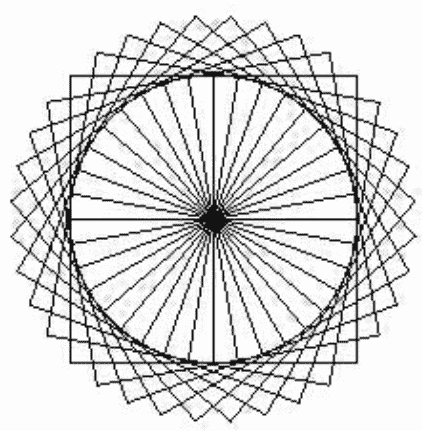

**图.** 多边形图案

##### Python脚本：绘制四个彩色方框。

```
bgcolor('black') # 背景黑色
width(4) # 线条宽度
penup()
goto(-200, 0)
pendown()
colors = ['red', 'yellow', 'orange', 'purple']
for i in range(4):
    color(colors[i]) # 选择颜色
    square(50) # 绘制正方形
    penup()
    fd(100)
    pendown()
```

##### 用颜色填充正方形

```
begin_fill()
##### 用黄色填充
fillcolor('yellow')
##### 边长为100的正方形
square(100)
end_fill()
```

##### Python脚本：绘制盒子

```
from turtle import *
speed('slowest')
square(100)
lt(30)
fd(100)
rt(30)
square(100)
lt(90)
fd(100)
lt(90+30)
fd(100)
rt(30+180)
fd(100)
lt(30)
fd(100)
rt(90+30)
fd(100)
rt(60)
```

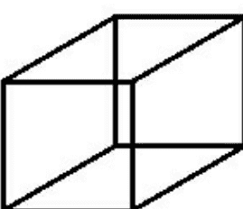

```
fd(100)
```

提示：放慢速度并跟随步骤，以了解立方体是如何被绘制出来的。

##### Python脚本：螺旋正方形

```
bgcolor('black')
pencolor('yellow')
width(3)
for n in range(200, 20, -20):
    for i in range(2):
        fd(n)
        lt(90)
```

**图.** 螺旋正方形

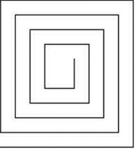

##### 圆形、点

## 半径 = 100 的圆
circle(100)

## 向下的圆
circle(-100)

## 对应 90 度角的弧
circle(100, 90)

## 大小为 100 的实心点
dot(100)

## Python 脚本：圆形图案
```python
for i in range(30):
    circle(5*i)
    circle(-5*i)
    lt(i)
```

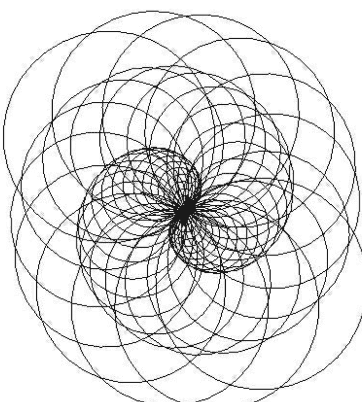

**图. 圆形图案**

## Python 脚本：同心圆
```python
def con_circle():
    for radius in range(100, 20, 20):
        circle(radius)
        lt(90)
        penup()
        fd(20)
        pendown()
        rt(90)
    return

con_circle()
```

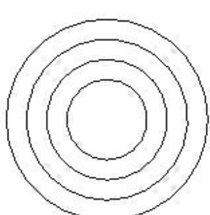

## Python 脚本：星号
```python
width(2)
for i in range(5):
    fd(200)
    rt(144)
```


## Python 脚本：射线星
```python
def star(n, r):
    """ 绘制一个有 n 条射线、长度为 r 的星形"""
    for k in range(0, n):
        pendown()
        fd(r)
        penup()
        bk(r)
        left(360/n)

width(3)
star(6, 100)
```

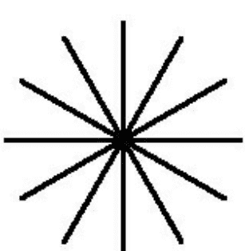

## Python 脚本：黄色星星
```python
begin_fill()
pencolor('black')
while True:
    forward(200)
    left(170)
    if abs(pos()) < 1:
        break
color('yellow')
end_fill()
```

## Python 脚本：鹦鹉螺（正方形的螺旋）
```python
L = 200
for i in range(100):
    square(L)
    lt(10)
    L = L*0.98
```

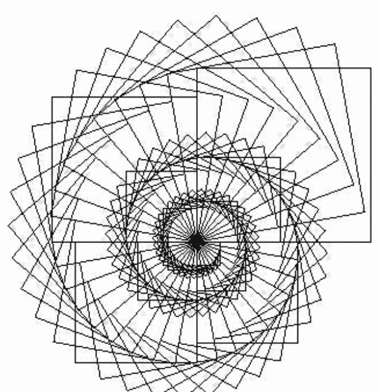

**图. 鹦鹉螺**

## 随机游走

随机游走（RW）的研究在物理学中非常重要。自然界中许多随机现象，包括气体或空气中粒子的随机布朗运动，都可以通过研究随机游走来解释。因此，计算机生成的随机游走可能有助于我们的研究。下面，我们在一个方形网格上生成一个随机游走。

海龟以给定的步长（步长大小已指定）在四个方向（右、左、上、下）中随机移动。要向右或向左移动，海龟通过 `fd()` 或 `bk()` 函数移动。要向上移动，海龟必须左转 90 度，然后向前移动。类似地，要向下移动，它必须右转 90 度，然后向前移动。

## Python 脚本：随机游走
```python
import random
dot(5) # 起点：大小为 5 的点
for i in range(5000):
    # 随机整数 1, 2, 3, 4
    n = random.randint(1, 4)
    if n == 1:
        fd(5)
    if n == 2:
        bk(5)
    if n == 1:
        rt(90)
        fd(5)
    if n == 2:
        lt(90)
        fd(5)
dot(5) # 终点：大小为 5 的点
```

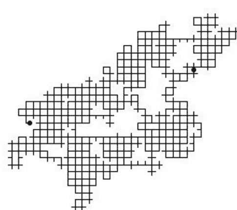

**图.** 方形网格上的随机游走（5000 步）。两个大点分别代表海龟的起点和终点。

## Python 脚本：带随机转向的随机游走
```python
from random import randrange
for i in range(1000):
    # 0 到 360 之间的随机值
    angle = randrange(360)
    rt(angle)
```

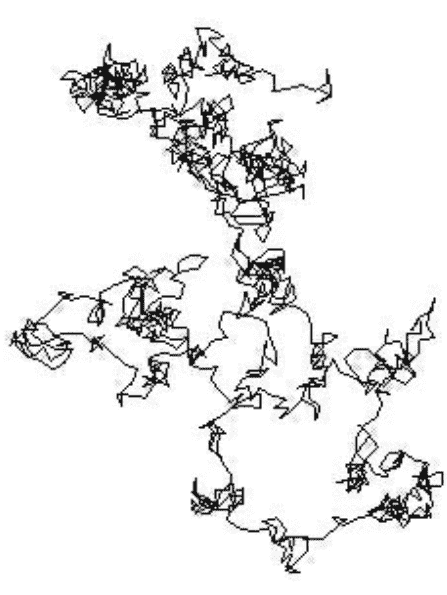

**图.** 带随机转向的随机游走。海龟以固定的步长移动，但可以旋转 0 到 360 度之间的任意角度。显然，这种游走不在方形网格上。

## 彩色随机游走

为了进行更丰富多彩的展示，可以尝试以下方法。以下代码中使用的画笔颜色是三种原色红色（R）、绿色（G）和蓝色（B）的组合：**pencolor((R, G, B))**。每个参数（R, G, B）可以通过均匀随机数生成器 `uniform()` 取 0 到 1 之间的任何值。例如，`pencolor(0.3, 0.5, 0.1)` 会创建一种特定的（混合）颜色。我们可以尝试各种组合。

##### Python 脚本
```python
from random import uniform, randrange
speed('fastest')
bgcolor('black')
for i in range(1000):
    pencolor((uniform(0, 1), uniform(0, 1), uniform(0, 1)))
    angle = randrange(360)
    rt(angle)
```

## 斐波那契螺旋

要生成斐波那契螺旋，我们首先需要生成斐波那契数列。斐波那契数列：0, 1, 1, 2, 3, 5, 8, 13, 21, 34, .. 每个数字都是前两个数字之和。

要绘制斐波那契螺旋，我们需要创建边长遵循斐波那契数列的正方形。

我们绘制一个正方形，然后绘制一个角到角的弧。画笔从上一个位置开始绘制另一个带弧的正方形，依此类推。

## Python 函数：带弧的正方形
```python
def sq_arc(L):
    square(L)
    circle(L, 90)
```

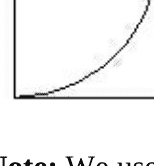

**注意：** 我们使用了 `square(L)` 函数，后面跟着 `circle(L, 90)` 来绘制一个带弧的正方形。当我们按照斐波那契数列的正方形尺寸重复绘制带弧的正方形时，就生成了斐波那契螺旋。这意味着，我们在一个遍历斐波那契数列的循环中迭代上述 `sq_arc()` 函数。

## Python 脚本：斐波那契螺旋
```python
L = [1, 2, 3, 5, 8, 13, 21, 34, 55, 89, 144, 233, 377]
##### 抬起画笔移动
penup()
##### 画布上的起点
goto(-150, 100)
##### 放下画笔开始绘制
pendown()
##### 遍历 L：斐波那契数列
for i in L:
    sq_arc(i)
```

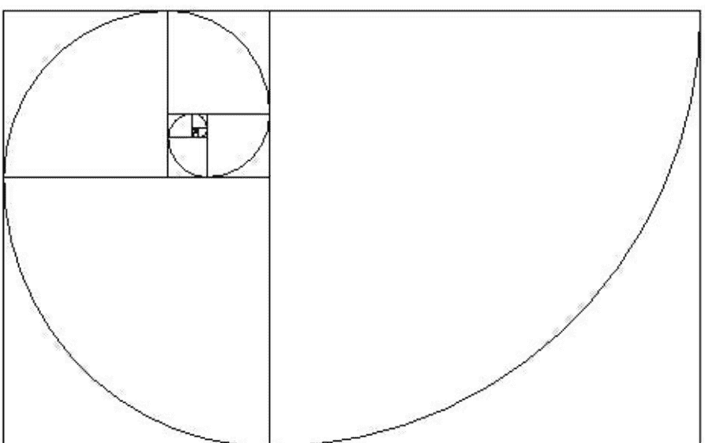

**图.** 斐波那契螺旋

**注意：** 斐波那契螺旋，也称为黄金螺旋，是一个迷人的概念，几个世纪以来横跨科学与文化，体现在建筑和绘画中。黄金螺旋在自然界中比比皆是，从花籽头的排列、贝壳上的图案，到飓风的形成以及螺旋星系。

## 带颜色的斐波那契螺旋
```python
from numpy.random import uniform
screensize(800, 500, bg = 'black')
title('Fibonacci Spiral')
penup()
goto(-150, 100)
pendown()
width(3)
for i in L:
    pencolor('yellow')
    begin_fill()
    fillcolor((uniform(0, 1), uniform(0, 1), uniform(0, 1)))
    sq_arc(i)
    end_fill()
```

## 分形

规则分形是一种自相似的几何对象。这意味着，我们在所有尺度上都能看到相同的模式。我们通过重复相同的规则来创建规则的几何分形。为此，我们使用递归函数。

## 递归函数示例
```python
def fact(n):
    if(n == 0):
        return 1
    return n * fact(n - 1)
```

**注意：** 函数 `fact()` 被定义为计算一个数的阶乘：n! = n × (n - 1)× ... × 2 × 1。这是一个重复性的操作。实际上，我们可以认为 n! = n × (n - 1)! = n × (n - 1)×(n - 2)!... 依此类推。因此，`fact(n) = n × fact(n-1)`。函数 `fact()` 是一个递归函数，因为它在其定义内部调用了自身。如果我们从一个数 n 开始，它在每一步都会减少 1，直到 n = 0。

## 科赫曲线

让我们通过取一条线并对其重复应用某些规则来创建一个分形。假设这条线的长度为 L。将其分成三个相等的部分：L/3。现在取出中间部分，并用两个这样的线段替换它们，这两个线段连接形成一个等边三角形。这个任务在所有线段上重复进行，经过多代演化。下面，我们展示了从左边一条直线演化而来的两代。[以瑞典数学家 Helge von Koch 命名。]

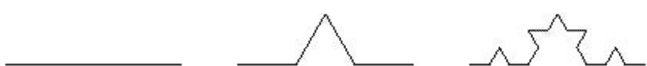

**图.** 从左到右的图形可以称为阶数为 0、1、2 的科赫曲线。

**算法：**
1. 输入一条长度为 L 的线。
2. 海龟向前移动 L/3。
3. 左转 60 度，向前移动 L/3。
4. 右转 120 度，向前移动 L/3。
5. 左转 60 度，向前移动 L/3。
6. 重复步骤 2-5。

## Python 递归函数：科赫曲线
```python
def koch(L, n):
    """
    绘制科赫曲线。L = 尺寸，n = 阶数
    """
    if n == 0:
        fd(L) # 直线
    else:
        koch(L/3, n-1) # 前进 1/3
        lt(60)
        koch(L/3, n-1)
        rt(120)
        koch(L/3, n-1)
        lt(60)
        koch(L/3, n-1)
```

## Python 脚本：绘制科赫曲线
```python
penup() # 抬起画笔
goto(-250, 0) # 将画笔移动到
pendown() # 放下画笔开始绘制
width(2) # 线宽
koch(500, 4) # 科赫曲线，阶数 4
hideturtle() # 隐藏海龟/箭头
```

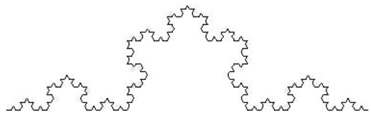

**图.** 4 阶科赫曲线

**练习：** 制作科赫雪花 [mathworld.wolfram.com/EquilateralTriangle.html]。

## 分形树

取一条直线。将其分成两部分：一部分向左，另一部分向右。这些是分支。现在每个分支都类似地被分割以创建更多分支。这个过程持续到某个层级。我们创建一个递归函数来生成这样的结构。

**算法：**
1. 向前移动长度：L
2. 左转 30 度，向前移动 L 的一个固定比例。
3. 右转 60（30 + 30）度，向前移动 L 的比例。
4. 左转 30 度，向后移动 L。
5. 重复步骤 2-4，直到长度 L 减少到 L < 1。

## Python 递归函数：分形树
```python
def fractal_tree(L):
    if L < 1:
        return
    else:
        fd(L)
        lt(30)
        draw(L*f) # 左侧分支
        rt(60)
        draw(L*f) # 右侧分支
        lt(30)
```

## 设置海龟起始位置

```python
penup()
goto(0, -200)
pendown()
lt(90)

##### 长度缩减比例
f = 0.6

##### 调用递归函数
fractal_tree(100)
```

图. 分形树

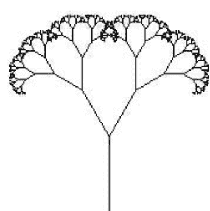

```python
##### Python 脚本：绘制彩色分形树
from turtle import *
from numpy.random import uniform as u
speed('fastest')
bgcolor('black')
f = 0.8

def draw(L):
    if L < 1:
        return
    else:
        fd(L)
        color((u(0, 1), u(0, 1), u(0, 1)))
        dot(5)
        lt(45)
        draw(L*f)
        rt(90)
        draw(L*f)
        lt(45)
        bk(L)
        dot(5)
```

保存图像

```python
##### 黑白图像
getcanvas().postscript(file="tree.eps")
from PIL.Image import open
im = open('c:/Users/xx/tree.eps')
im.save('tree.png')
```

##### 彩色图像

```python
getcanvas().postscript(file="tree.eps")
from PIL.Image import open
im = open('c:/Users/xx/tree.eps')
fig = im.convert('RGBA')
fig.save('tree.png')
```

注意：

- 通过 `getcanvas()` 创建一个 postscript 文件（此处为 'tree.eps'）。
- 使用 `Image` 模块中的 `open()` 函数打开该文件（需提供路径名）。`Image` 是一个模块。PIL = Python Imaging Library。
- 对于**黑白**图像：使用 `save()` 函数将 .eps 文件保存为可打印的图像文件。对于**彩色**图像：将 .eps 文件转换为 RGBA 文件（R = 红色，G = 绿色，B = 蓝色，A = Alpha 通道）。然后保存文件。[Alpha 用于控制不透明度/透明度]。

##### 使用外部包的 Python 计算

296 | 使用外部包的 Python 计算

##### 第 8 章

##### NumPy：数值 Python

> “数统治着宇宙” - 毕达哥拉斯

NumPy 是数值 Python。它是一个外部包（或模块，主要用 C 编写），旨在与核心 Python 协同工作。NumPy 由各种模块组成，包含各种类、函数和参数。简而言之，我们利用 NumPy 库进行科学和数值计算。预编译的数学和数值函数确保了出色的执行速度。强大的数据结构、多维数组和向量化函数丰富了 Python，使其成为一门优秀的编程语言。

如果你使用的是 Python IDLE 解释器，则需要在其上安装 NumPy（以及其他外部包）。具体步骤在附录中讨论。各种 Python 发行版，如 Anaconda、Python (x, y) *等*，都自带 NumPy 以及一些其他常用包，如 SciPy 和 Matplotlib。

一旦 NumPy 安装在系统上，我们通过与导入任何模块相同的方式将其导入到我们的命名空间：`import numpy`。

## 8.1 NumPy 数组

数组是元素的集合，类似于内置对象列表。它是可迭代的。它是可变的。然而，数组在功能上与列表有很大不同。

```python
##### 导入、dir、help
##### 使用本地名称导入
>>> import numpy as np

##### 检查目录
>>> dir(np)

##### 关于 NumPy 数组的帮助
>>> help(np.array)

>>> type(np.array)
<class 'builtin_function_or_method'>

##### 关于数组的详细帮助
>>> np.lookfor('array')

##### 快速帮助
>>> np.info('array')
```

**注意：** `array()` 是 NumPy 中的一个内置函数。我们需要始终加上 `np` 前缀来引用它（因为我们以本地名称 `np` 导入了 NumPy）。

```python
#### 示例

##### 参数为列表
>>> np.array([10, 20, 30])
array([10, 20, 30])

##### 参数为元组
>>> np.array((10, 20, 30))
array([10, 20, 30])
```

**注意：** 参数可以是任何可迭代对象，如列表、元组 *等*。通常，我们使用列表。

```python
##### 数组转换为列表
>>> a = np.array([10, 20, 30])

##### 转换为列表
>>> a.tolist()
[10, 20, 30]
```

### 8.1.1 数组的内置函数

核心 Python 中 `__builtins__` 的函数和方法适用于 NumPy 数组。

```python
>>> type(x)  # 对象类型
<class 'numpy.ndarray'>

>>> len(x)   # 长度：元素数量
3

>>> sum(x)   # 元素之和
60
```

**注意：** 类型 'numpy.ndarray' 表示 n 维 NumPy 数组。可以使用此函数处理更高维度的数组。

### 8.1.2 方法和属性

#### 作为方法：数组大小

```python
>>> np.size(x)
3

##### 作为属性
>>> x.size
3
```

```python
##### 数组维度
>>> np.ndim(x)
1

>>> x.ndim
1
```

```python
##### 数组形状
>>> np.shape(x)
(3,)  # 一个元组（一维）

>>> x.shape
(3,)
```

```python
>>> x.dtype  # 数据类型
dtype('int32')
```

```python
##### 数组中每个元素的大小
>>> x.itemsize
4
```

**注意：** 数组的默认数据类型是 `int32` = 32 位整数。数组中每个元素的大小是 4 字节（= 32 位）。关于上述内容的一点说明。方法 `np.size()`、`np.ndim()` *等* 来自 NumPy，而方法 `type()`、`len()`、`sum()` 来自核心 Python 的内置模块，所有这些本质上都是函数。

### 8.1.3 高维数组

##### 二维数组

```python
>>> M = np.array([[1, 2, 3], [4, 5, 6]])
>>> M
array([[1, 2, 3],
       [4, 5, 6]])
##### [显示类似于一个 2 行 3 列的矩阵。]

>>> M.ndim
2

>>> M.size
6

>>> M.shape
(2, 3)
##### [二维数组的形状，以元组表示]
```

**注意：** 也可以写成 `np.array([(1, 2, 3),(4, 5, 6)])`，参数为元组列表，或者 `np.array(((1, 2, 3),(4, 5, 6)))`，参数为元组的元组。

#### 轴

在二维数组上，我们可以沿着行和列移动。
如果我们沿着不同的行（上下）移动，那就是

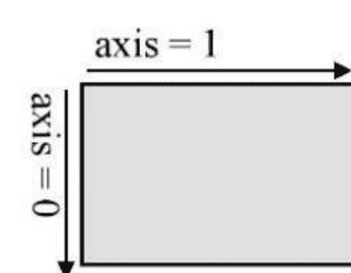

沿着 **axis = 0**，而沿着不同的列（左右）移动则是 **axis = 1**。我们可以通过轴来引用元素或在更高维度的 NumPy 数组上应用方法。

#### 三维数组

```python
>>> D = np.array([[[1, 2], [3, 4]],
                  [[5, 6], [7, 8]]])
>>> D
array([[[1, 2],
        [3, 4]],
       [[5, 6],
        [7, 8]]])
##### [两个 2 × 2 数组的集合]

>>> D.ndim
3

>>> D.shape
(2, 2, 2)
```

**注意：** 三维数组就像一个盒子（或容器），其中包含二维数组（或矩阵）。三维数组的轴如相邻图所示

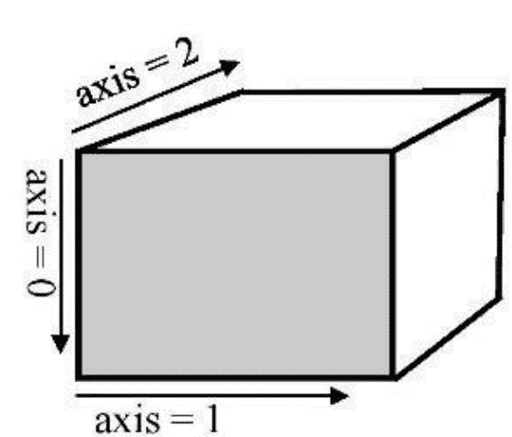

。轴 = 0, 1 沿着阴影平面（这是一个二维数组）的两个方向，而轴 = 2 垂直于该平面。

### 8.1.4 关于数据类型

数据可以是数字或字符串。数组中使用以下数据类型。

- **int8**（1 字节 = 8 位：整数 -128 到 127），**int16**（-32768 到 32767），**int32**，**int64**
- **uint8**（无符号整数：0 到 255），**uint16**，**uint32**，**uint64**
- **float16**（半精度浮点数：符号位，5 位指数，10 位尾数），**float32**（单精度：符号位，8 位指数，10 位尾数），**float64**（双精度：符号位，11 位指数，52 位尾数）
- **complex64**（复数，由两个 32 位浮点数表示：实部和虚部），**complex128**（复数，由两个 64 位浮点数表示：实部和虚部）

缩写：

**整数：** i1 = int8, i2 = int16, i3 = int32, i4 = int64
**浮点数：** f2 = float16, f4 = float32, f8 = float64

#### 示例

```python
##### 全是整数
>>> x = np.array([10, 99, -6])
>>> x.dtype
dtype('int32')

##### 整数、浮点数混合
>>> y = np.array([7.5, 99, -6])
>>> y
array([ 7.5, 99. , -6. ])  # [转换为全浮点数]

>>> y.dtype
dtype('float64')

##### 整数、浮点数、复数
>>> z = np.array([4, 1.5, 2+3j])
>>> z
array([4. +0.j, 1.5+0.j, 2. +3.j])  # [转换为全复数。]

>>> z.dtype
dtype('complex128')

##### 字符串和数字数组
>>> s = np.array(['ab', '101', 99])
>>> s
array(['ab', '101', '99'], dtype='<U3')
##### [转换为全字符串。]
```

**注意：**

- 从上面可以看出，整数的默认 dtype 是 `int32`（32 位），浮点数的默认 dtype 是 `float64`（64 位），而复数的默认 dtype 是 `complex128`（实部 64 位，虚部 64 位）。
- 当遇到混合数据时，Python 总是使用尽可能宽泛的数据类型来处理数据。当浮点数和整数混合时，它会将所有数据视为浮点数。当复数和实数混合时，视为复数。当数字与字符串混合时，视为字符串。这称为**向上转型**。
- `U3` 是长度为 3 的 Unicode 字符串。默认 dtype 由元素的最大大小决定。

我们可以在 `array()` 函数内部通过关键字参数强制指定数据类型。

## 更具体的数据类型

```python
>>> x = np.array([10, 99, -6], dtype = int)
>>> x.dtype
dtype('int32')
>>> x = np.array([10, 99, -6], dtype = float)
>>> x
array([10., 99., -6.])
>>> x.dtype
dtype('float64')
```

```python
>>> x = np.array([10, 99, -6], dtype = complex)
>>> x
array([10.+0.j, 99.+0.j, -6.+0.j])
>>> x.dtype
dtype('complex128')
```

```python
>>> x = np.array([10, 99, -6], dtype = str)
>>> x
array(['10', '99', '-6'],
dtype='<U2')
>>> x.dtype
dtype('<U2')
```

```python
>>> x = np.array([10, 99, -6], dtype = 'float16')
>>> x
array([10., 99., -6.],
dtype=float16)
>>> x = np.array([10, 99, -6], dtype = 'float32')
>>> x
array([10., 99., -6.],
dtype=float32)
>>> x = np.array([10, 99, -6], dtype = 'float64')
>>> x
array([10., 99., -6.])
```

## 使用缩写表示特定数据类型

```python
>>> x = np.array([10, 99, -6], dtype = 'f2')
>>> x
array([10., 99., -6.],
dtype=float16)
>>> x = np.array([10, 99, -6], dtype = 'f4')
>>> x
array([10., 99., -6.],
dtype=float32)
>>> x = np.array([10, 99, -6], dtype = 'f8')
>>> x
array([10., 99., -6.])
```

**注意：** 在我们通过 `dtype = 'float64'` 或 `dtype = 'f8'` 声明数据类型的情况下，它们没有在显示中出现。这是因为数据类型 `float64` 是默认类型。对于复数或其他数据类型也是如此，*即*，只要不是默认类型，它就会显示出来以便我们理解。

```python
>>> x = np.array([10, 99, -6], dtype = 'complex64')
>>> x.dtype
dtype('complex64')
```

```python
>>> s1 = np.array(['ab', '101', 99], dtype = 'S4')
>>> s1
array([b'ab', b'101', b'99'], dtype='|S4')
>>> s2 = np.array(['ab', '101abcd', 990188], dtype = 'S4')
>>> s2
array([b'ab', b'101a', b'9901'], dtype='|S4')
>>> s2.itemsize
4
```

**注意：** 字符串大小被设置为 `dtype = 'S4'`（字符串被截断为大小4）。注意这对第二个数组中字符串元素的影响。在显示中，每个字符串前都有一个 'b'，它代表二进制。

```python
##### 使用 **astype()** 转换为特定类型
>>> a
array([2, 4, 6, 8])

##### 转换为浮点类型
>>> a.astype('float')
array([2., 4., 6., 8.])

##### 复数类型
>>> a.astype('complex')
array([2.+0.j, 4.+0.j, 6.+0.j,
8.+0.j])
>>> a
array([2, 4, 6, 8])
[原始数组未改变。]
```

## 8.1.5 复数数组的属性

```python
>>> z.real # 实部
array([2., 5., 3.])
>>> z.imag # 虚部
array([ 3., 2., -1.])
>>> z.conj() # 复共轭
array([2.-3.j, 5.-2.j, 3.+1.j])
```

## 8.1.6 数组的创建方法

NumPy 中有多种方法来创建数字数组。

### 1 数字范围

`np.arange(start, stop, step)`

```python
>>> help(np.arange)
......
arange(...)

arange([start,] stop[, step,], dtype=None)
Return evenly spaced values within a given interval.

Values are generated within the half-open interval ``[start, stop)``
......
```

**注意：** 数组从 `start` 开始，以 `step` 为步长递进，并在 `stop` 之前停止。我们可以阅读在线手册来理解它的工作原理。注意 `[start]` 和 `[stop]` 写在方括号中，而 `stop` 没有。这意味着参数 `stop` 是必需的。如果未给出 `start` 和 `stop`，它们将采用默认值（`start = 0`, `step = 1`）。

```python
>>> np.arange(2, 10, 3)
array([2, 5, 8])
```

```python
##### 默认步长 = 1
>>> np.arange(2, 10)
array([2, 3, 4, 5, 6, 7, 8, 9])
```

```python
##### 默认起始值 = 0
>>> np.arange(5)
array([0, 1, 2, 3, 4])
```

```python
>>> np.arange(0.2, 2, 0.4)
array([0.2, 0.6, 1. , 1.4, 1.8])
>>> np.arange(5, 10, 2, dtype= 'f')
array([5., 7., 9.], dtype=float32)
```

**注意：** 与核心 Python 中的内置方法 `range()` 不同，这个 NumPy 方法 `arange()` 可以创建小数或浮点数。此外，我们可以通过关键字指定数据类型（默认数据类型为 `None`）。

### 2 线性空间

`linspace(start, end, num)`

```python
>>> help(np.linspace)
Help on function linspace in module numpy:

linspace(start, stop, num=50, endpoint=True, retstep=False, dtype=None, axis=0)
```

Return evenly spaced numbers over a specified interval.
......

**注意：** 方法 `linspace()` 创建一个线性间隔的数组。数组从 `start` 开始，到 `end` 结束，`num` 是要创建的元素数量。

```python
>>> np.linspace(10, 20, 5)
array([10., 12.5, 15., 17.5, 20.])
```

**注意：** 步长 = (20 – 10)/4 = 2.5 [4个间隔]

```python
>>> np.linspace(10, 20, 5, endpoint = True)
array([10., 12.5, 15., 17.5, 20.])
>>> np.linspace(10, 20, 5, endpoint = False)
array([10., 12., 14., 16., 18.])
```

**注意：** 可以通过关键字 `endpoint` 与布尔值 `True`/`False` 来包含或排除端点。默认值为 `endpoint = True`。注意两种情况下步长的变化。

```python
##### 返回步长
>>> A = np.linspace(10, 20, 5, retstep = True)
>>> A
(array([10. , 12.5, 15. , 17.5, 20. ]), 2.5)
[数组和步长的元组]

>>> x, step = A # 解包
>>> x
array([10., 12.5, 15., 17.5, 20. ])
>>> step # retstep = 返回步长
2.5

##### 我们可以设置数据类型。
>>> np.linspace(10, 20, 5, retstep = True, dtype = int)
(array([10, 12, 15, 17, 20]), 2.5)
```

### 3 对数空间

`logspace(start, end, num)`

```python
>>> help(np.logspace)
Help on function logspace in module numpy:
logspace(start, stop, num=50, endpoint=True, base=10.0,
dtype=None, axis=0)
Return numbers spaced evenly on a log scale.......
```

```python
##### 示例：对数刻度
##### 默认底数 = 10
>>> L1 = np.logspace(0.2, 1, 4)
>>> L1
array([1.58489319, 2.92864456,
5.41169527, 10. ])
##### 底数 = 2
>>> L2 = np.logspace(0.2, 1, 4, base = 2)
>>> L2
array([1.14869835, 1.38191288, 1.66247579, 2. ])
```

**注意：** `logspace()` 返回的是幂次值：对于 **L1** 是从 10^0.2 到 10^1 的值，对于 **L2** 是从 2^0.2 到 2^1 的值。[验证，10^0.2=1.58489319 等等。]

```python
##### 转换为线性刻度
>>> np.log10(L1)
array([0.2 , 0.46666667,
0.73333333, 1. ])
>>> np.log2(L2)
array([0.2 , 0.46666667,
0.73333333, 1. ])

##### 线性刻度用于比较
>>> np.linspace(0.2, 1, 4)
array([0.2 , 0.46666667,
0.73333333, 1. ])
```

**注意：** 由于通过 `logspace()` 返回的数字是底数的幂次值。当我们再次取对数时，这些数字就回到了线性刻度。

## 8.1.7 形状、重塑、大小、调整大小

数组可以被重塑为不同的维度。二维数组的行和列通过轴来引用：`axis = 0`，`axis = 1`。对于三维或任何更高维度的数组，可以将轴引用为 `axis = 0, 1, 2` 等等。

```python
##### shape, reshape
>>> A = np.array([2, 4, 6, 8, 10, 12])
>>> A.shape
(6,)
[具有6个元素的一维数组。]
```

```python
##### 转换为二维数组 (2 × 3)
>>> B = A.reshape(2, 3)
>>> B
array([[ 2, 4, 6],
[ 8, 10, 12]])
```

```python
##### 重塑为 3 × 2 数组
>>> A.reshape(3, 2)
array([[ 2, 4],
[ 6, 8],
[10, 12]])
>>> A
array([ 2, 4, 6, 8, 10, 12])
[原始数组未改变。]
```

```python
##### size, resize
>>> A.size
6
>>> B.size
6
>>> A.resize(2, 3)
>>> A
array([[ 2, 4, 6],
[ 8, 10, 12]])
[原始数组被修改。]
```

**注意：** `reshape()` 函数返回一个具有修改后形状的新数组，而 `resize()` 函数则修改数组本身。

## 8.1.8 展平、拉平

方法 `flatten()` 返回一个展平为一维数组的数组副本。

```python
>>> x = np.array([[1, 2, 3], [4, 5, 6], [7, 8, 9]])
>>> x.flatten() # 返回一维数组
array([1, 2, 3, 4, 5, 6, 7, 8, 9])
```

```python
##### 按照C语言的方式展平
>>> x.flatten(order = 'C')
array([1, 2, 3, 4, 5, 6, 7, 8, 9])
```

```python
##### 按照Fortran的方式展平
>>> x.flatten(order = 'F')
array([1, 4, 7, 2, 5, 8, 3, 6, 9])
```

方法 `ravel()` 返回一个展平的数组。

```python
>>> x.ravel() # 返回一维数组
array([1, 2, 3, 4, 5, 6, 7, 8, 9])
>>> x.ravel(order = 'C')
array([1, 2, 3, 4, 5, 6, 7, 8, 9])
>>> x.ravel(order = 'F')
array([1, 4, 7, 2, 5, 8, 3, 6, 9])
```

**注意：** `flatten` 和 `ravel` 之间存在差异，尽管它们执行相同的工作。

- **`x.ravel()`** 只返回原始数组的引用/视图。
- 当我们修改转换后的数组时，原始数组也会被修改。

```python
>>> y = x.ravel()
>>> y
array([1, 2, 3, 4, 5, 6, 7, 8, 9])
>>> y[0] = 100
>>> y
array([100, 2, 3, 4, 5,
6, 7, 8, 9])
>>> x
array([[100, 2, 3],
[ 4, 5, 6],
[ 7, 8, 9]])
[原始数组已更改。]
```

- 另一方面，**`x.flatten()`** 返回原始数组的副本。因此，如果我们修改转换后的数组（展平的数组），原始数组不受影响。

```python
>>> x = np.array([[1, 2, 3], [4, 5, 6], [7, 8, 9]])
>>> y = x.flatten()
>>> y[0] = 100
```

## 8.1.9 唯一元素

```python
>>> X = np.array([2, 0.5, 1, 2, 1, 0.5])
##### 收集唯一元素
>>> np.unique(X)
array([0.5, 1. , 2. ])

>>> Y
array([[1, 0, 1],
       [0, 0, 1],
       [1, 1, 1]])
>>> np.unique(Y)
array([0, 1])
##### 唯一元素返回一维数组。

>>> S = np.array(['a', 'b', 'b', 'c', 'a', 'b'])
>>> np.unique(S)
array(['a', 'b', 'c'], dtype='<U1')
```

应用：

假设我们有一个包含某些数字的大型数组。我们想检查该数组由哪些唯一的数字构成。为了创建一个示例，我们使用 NumPy 的 random 模块生成服从正态分布的随机数。这将在本章末尾讨论。然后，为了符合我们的目的，将数字四舍五入到零位小数。

```python
>>> x = np.round(np.random.randn(100), 0)
>>> x
array([ 1., 1., -1., -0., 0., 1.,
       -1., -1., -1., 1., -2., 0.,
        2., 0., ..., -1., -3., 1., -0.])
>>> np.unique(x)
array([-3., -2., -1., 0., 1., 2.])
```

## 8.1.10 数组迭代器

数组是可迭代的。可以在循环中迭代 NumPy 数组以打印元素。例如，

```python
##### 迭代一维数组
>>> a = np.array([2, 5, 7, 9])
>>> for i in a:
        print(i, end=' ')
2 5 7 9
##### end = ' ' 是为了并排打印。

##### 迭代二维数组
>>> X = np.array([[1, 2, 3], [4, 5, 6]])
>>> for i in X:
        print(i)
[1 2 3]
[4 5 6]

##### 按指定顺序迭代二维数组
>>> for i in np.nditer(X, order='F'):
        print(i, end=' ')
输出: 1 4 2 5 3 6

>>> for i in np.nditer(X, order='C'):
        print(i, end=' ')
输出: 1 2 3 4 5 6
```

**注意：** 迭代器 **np.nditer()** 迭代数组以按顺序获取条目。关键字参数 `order='F'` 表示以 FORTRAN 语言风格读取（按列读取），而 `order='C'` 表示以 C 语言风格读取（按行读取）。

## 8.1.11 索引

元素的索引或位置与列表或元组中的方式相同。索引编号从左到右从 0, 1, 2… 开始，从右到左从 -1, -2, -3… 开始。

```python
>>> x = np.array([2, 5, 8, 11, 14, 17, 21])
>>> x[0]  # 索引为 0 的元素
2
>>> x[1]
5
>>> x[-1]  # 最后一个元素
21
>>> x[-2]
17
```

## 8.1.12 切片

切片通过冒号 [:] 分隔的位置索引完成。例如，

```python
>>> x = np.array([2, 5, 8, 11, 14, 17, 21])

##### 起始 = 1，在 6 之前结束，步长 = 2
>>> x[1:6:2]
array([ 5, 11, 17])
```

**注意：** 在上面的例子中，起始索引 = 1，在索引 = 6 之前停止，步长 = 2。它不会触及或越过结束索引。在此示例中，x[1] = 5, x[3] = 11, x[5] = 17。

```python
##### 步长 = 1，默认值
>>> x[2:5]
array([ 8, 11, 14])

##### 从索引 2 到末尾，步长 = 1
>>> x[2:]
array([ 8, 11, 14, 17, 21])

##### 从索引 0 到 4，步长 = 1
>>> x[:5]
array([ 2, 5, 8, 11, 14])

##### 完整切片
>>> x[:]
array([ 2, 5, 8, 11, 14, 17, 21])

##### 完整切片
>>> x[::]
array([ 2, 5, 8, 11, 14, 17, 21])
```

**注意：** `x[:]` 和 `x[::]` 是相同的。此外，我们可以用 `x[2:]` 代替 `x[2::]`。

```python
##### 从索引 0 开始，在最后一个索引之前停止
>>> x[:-1]
array([ 2, 5, 8, 11, 14, 17])

##### 数组反转，步长 = -1
>>> x[::-1]
array([21, 17, 14, 11, 8, 5, 2])

##### 步长 = -2，从右到左
>>> x[::-2]
array([21, 14, 8, 2])
```

##### 对于更高维度

```python
>>> X  # 二维数组
array([[ 0, 1, 2, 3],
       [ 3, 4, 5, 6],
       [ 6, 7, 8, 9],
       [ 9, 8, 7, 1]])
>>> X[2]  # 行索引 2
array([6, 7, 8, 9])
>>> X[-1]  # 最后一行
array([ 9, 8, 7, 1])
>>> X[2:]  # 行切片
array([[ 6, 7, 8, 9],
       [ 9, 8, 7, 1]])
>>> X[:3]
array([[0, 1, 2, 3],
       [3, 4, 5, 6],
       [6, 7, 8, 9]])
>>> X[::2]
array([[0, 1, 2, 3],
       [6, 7, 8, 9]])
>>> X[:]
array([[ 0, 1, 2, 3],
       [ 3, 4, 5, 6],
       [ 6, 7, 8, 9],
       [ 9, 8, 7, 1]])
>>> X[:, 0]  # 列切片
array([0, 3, 6, 9])
>>> X[:, -1]  # 最后一列
array([ 3, 6, 9, 1])
```

**注意：** 二维数组中行和列的切片通过一组冒号完成，用逗号分隔，即 **X[::, ::]**。

对于行：`X[行, :]`
对于列：`X[:, 列]`

例如，`X[:, 1:3]` 表示所有行和第 1 到第 2 列。

```python
>>> X[:, 1:3]
array([[1, 2],
       [4, 5],
       [7, 8],
       [8, 7]])

>>> X[2:4, 1:3]
array([[7, 8],
       [8, 7]])
```

**注意：** `X[::, 1:3]` 和 `X[:, 1:3]` 是相同的。

## 8.1.13 交换两个元素

```python
>>> a = np.array([10, 20, 30, 40, 50, 60])
>>> a[[1, 2]] = a[[2, 1]]
>>> a
array([10, 30, 20, 40, 50, 60])
```

交换行和列是某些矩阵运算的一部分。正如我们所见，二维数组可以被视为矩阵。在后面章节实现高斯消元法（带部分主元）时，我们将使用行交换。

```python
##### 交换两行
>>> A
array([[1, 2, 3],
       [4, 5, 6],
       [7, 8, 9]])

##### 交换第 1 行和第 2 行
>>> A[[1, 2]] = A[[2, 1]]
>>> A
array([[1, 2, 3],
       [7, 8, 9],
       [4, 5, 6]])

##### 交换两列
>>> A
array([[1, 2, 3],
       [4, 5, 6],
       [7, 8, 9]])

##### 交换第 1 列和第 2 列
>>> A[:, [1, 2]] = A[:, [2, 1]]
>>> A
array([[1, 3, 2],
       [4, 6, 5],
       [7, 9, 8]])
```

## 8.2 数组上的 NumPy 方法

### 8.2.1 检查所有元素

测试沿给定方向的所有数组元素是否都评估为 True。这意味着，检查沿给定轴的所有元素是否非零。

```python
>>> x = np.array([1, 2, 3, 4, 5])
##### 所有元素非零
>>> np.all(x)
True

>>> x = np.array([1, 2, 3, 0, 4])
##### 一个元素为零
>>> np.all(x)
False

>>> A
array([[3, 6, 5],
       [4, 7, 6],
       [5, 0, 2],
       [4, 1, 9]])

##### 沿轴 = 1（行）
>>> np.all(A, 1)
array([ True,  True, False,  True])

##### 沿轴 = 0（列）
>>> np.all(A, 0)
array([ True, False,  True])
```

### 8.2.2 元素在哪里？

搜索特定元素并知道它在数组中的位置通常很有用。

```python
>>> x = np.array([2, 0, 1, -1, 10])
>>> np.where(x == -1)
(array([3], dtype=int64),)
##### 元组中的第一个元素是索引。

>>> A
array([[6, 6, 2, 2],
       [5, 1, 5, 5],
       [8, 0, 6, 0],
       [6, 8, 5, 9]])
>>> np.where(A == 0)
(array([2, 2], dtype=int64), array([1, 3], dtype=int64))
```

**注意：** 最后的输出表示 '0' 出现在两个位置。

### 8.2.3 放置/插入新元素

要在数组中包含新元素，我们可以通过以下两种方式完成。

```python
##### 放置
>>> a = np.array([0, -1, 2, 5, 10])

##### 替换索引 3 处的项
>>> np.put(a, 3, 99)
>>> a
array([0, -1, 2, 99, 10])

>>> a = np.array([0, -1, 2, 5, 10])

##### 作为属性
>>> a.put(3, 99)
>>> a
array([0, -1, 2, 99, 10])
##### 数组被更改。

##### 插入
>>> a = np.array([0, -1, 2, 5, 10])

##### 在索引 3 处插入项
>>> np.insert(a, 3, 99)
array([0, -1, 2, 99, 5, 10])
>>> a
array([0, -1, 2, 5, 10])
##### 原始数组未更改。
```

**注意：** 可以注意到两种方法之间的区别。方法 `np.put()` 不返回任何内容。它会更改数组本身。但通过 `np.insert()` 插入会返回一个新数组，同时保持旧数组不变。

```python
##### 对于更高维度
>>> A
array([[1, 2],
       [3, 4]])
>>> np.insert(A, 1, [10, 12], axis=0)
array([[ 1, 2],
       [10, 12],
       [ 3, 4]])
##### axis = 0 表示沿行 ↓

>>> np.insert(A, 1, [10, 12], axis=1)
array([[ 1, 10, 2],
       [ 3, 12, 4]])
##### axis = 1 表示沿列 →
```

**注意：** 对于更高维度的数组（二维或更多），轴引用很重要。对于二维数组（如矩阵），我们通常通过行和列来引用。在二维数组中，如果我们上下移动（沿行），我们称之为 **axis = 0**；如果我们左右移动（沿列），我们称之为 **axis = 1**。对于更高维度的数组，例如三维数组，我们通过 **axis = 2** 引用另一个方向。轴引用（在所有用于更高维度数组的 NumPy 方法中）通过关键字完成：**axis**。

如果没有轴引用，输出将是一个*展平的*数组（一维数组）。

```python
>>> A = np.array([[1, 2], [3, 4]])
>>> np.insert(A, 1, [10, 12])
array([ 1, 10, ...])
```

## 8.2.4 删除元素

```python
##### 一维数组
>>> x = np.array([3, 5, 7, 9])

##### 删除索引为2的元素
>>> np.delete(x, 2)
array([3, 5, 9])
>>> x
array([3, 5, 7, 9])
[原始数组保持不变。]
```

注意：`np.delete()` 返回一个新数组，而原始数组保持不变。

```python
##### 二维数组
>>> X
array([[ 1, 2, 3, 4],
       [ 5, 6, 7, 8],
       [ 9, 10, 11, 12]])

##### 删除索引为2的行
>>> np.delete(X, 2, axis = 0)
array([[1, 2, 3, 4],
       [5, 6, 7, 8]])

>>> X
array([[ 1, 2, 3, 4],
       [ 5, 6, 7, 8],
       [ 9, 10, 11, 12]])
[原始数组保持不变。]

##### 删除索引为2的列
>>> np.delete(X, 2, axis = 1)
array([[ 1, 2, 4],
       [ 5, 6, 8],
       [ 9, 10, 12]])
```

## 8.2.5 分割数组

将数组分割成相等的部分。

```python
##### 对于一维数组
>>> x = np.array([2, 3, 4, 5])

##### 分割成4部分
>>> np.split(x, 4)
[array([2]), array([3]),
 array([4]), array([5])]

##### 分割成2个相等的部分
>>> np.split(x, 2)
[array([2, 3]), array([4, 5])]

##### 对于二维数组
>>> X
array([[ 1, 2, 3, 4],
       [ 5, 6, 7, 8],
       [ 9, 10, 11, 12]])

>>> np.split(X, 3)
[array([[1, 2, 3, 4]]), array([[5, 6, 7, 8]]), array([[ 9, 10, 11, 12]])]

##### 默认 axis = 0 ↓
>>> np.split(X, 3, axis = 0)
[array([[1, 2, 3, 4]]), array([[5, 6, 7, 8]]), array([[ 9, 10, 11, 12]])]

>>> np.split(X, 4, axis = 1)
[array([[1],[5],[9]]), array([[ 2],[ 6],[10]]), array([[ 3],[ 7], [11]]), array([[ 4],[ 8],[12]])]

>>> np.split(X, 2, axis = 1)
[array([[ 1, 2],[ 5, 6],[ 9, 10]]), array([[ 3, 4],[ 7, 8],[11, 12]])]
```

**注意：** 输出是一个由分割产生的数组列表。每个数组的维度与原始数组相同。

对于任何应用于高维数组的NumPy方法，轴引用都很重要。因此，对于高维数组的分割，轴引用也是必须的。但是，当我们使用 **vsplit(X, 3)** 或 **hsplit(X, 4)** 方法分别进行垂直和水平分割时，不需要轴引用。

```python
##### 垂直分割
>>> np.vsplit(X, 3)
[array([[1, 2, 3, 4]]), array([[5, 6, 7, 8]]), array([[ 9, 10, 11, 12]])]

##### 水平分割
>>> np.hsplit(A, 4)
[array([[1],
        [5],
        [9]]), array([[ 2],
                      [ 6],
                      [10]]), array([[ 3],
                                     [ 7],
                                     [11]]), array([[ 4],
                                                    [ 8],
                                                    [12]])]
```

## 8.2.6 追加值

```python
##### 对于一维数组
>>> x = np.array([1, 3, 5, 7])

##### 在末尾追加数字9
>>> new = np.append(x, 9)
>>> new
array([1, 3, 5, 7, 9])
>>> x
array([1, 3, 5, 7])
[原始数组保持不变。]

>>> y = np.array([10, 20])
>>> np.append(x, y)
array([ 1, 3, 5, 7, 10, 20])
[两个一维数组被追加。]

##### 对于二维数组（带轴引用）
>>> X
array([[1, 2],
       [3, 4]])

>>> np.append(X, [[10, 12]], axis = 0)
array([[ 1, 2],
       [ 3, 4],
       [10, 12]])

>>> np.append(X, [[10], [12]], axis = 1)
array([[ 1, 2, 10],
       [ 3, 4, 12]])
```

**注意：** 数组X保持不变。会创建一个新数组。当指定轴时，要追加的值必须具有正确的形状。否则，将会出错。如果没有轴引用，无论要添加的值的形状如何，它总是返回一个扁平化的数组。

```python
##### 无轴引用，扁平化数组
>>> np.append(X, [10, 12])
array([ 1, 2, 3, 4, 10, 12])
>>> np.append(X, [[10], [12]])
array([ 1, 2, 3, 4, 10, 12])
```

## 8.2.7 连接

沿现有轴连接一系列数组。与列表或元组不同，NumPy数组不能用数学运算符（+）连接。

```python
##### 对于一维数组
>>> a = np.array([10, 20, 30])
>>> b = np.array([40, 50, 60])
>>> np.concatenate((a, b))
array([10, 20, 30, 40, 50, 60])

##### 对于二维数组
>>> x
array([[1, 2],
       [3, 4]])
>>> y
array([[5, 6],
       [7, 8]])

>>> np.concatenate((x, y), axis = 1)
array([[1, 2, 5, 6],
       [3, 4, 7, 8]])

>>> np.concatenate((x, y), axis = 0)
array([[1, 2],
       [3, 4],
       [5, 6],
       [7, 8]])

##### 默认 axis = 0
>>> np.concatenate((x, y))
array([[1, 2],
       [3, 4],
       [5, 6],
       [7, 8]])
```

## 8.2.8 堆叠数组

```python
##### 沿 axis = 0（垂直）堆叠
>>> x
array([[1, 2],
       [3, 4]])
>>> y
array([[5, 6],
       [7, 8]])

##### 默认 axis = 0
>>> z = np.stack((x, y))
>>> z
array([[[1, 2],
        [3, 4]],
       [[5, 6],
        [7, 8]]])

##### 沿 axis = 1（水平）堆叠
>>> z = np.stack((x, y), axis = 1)
>>> z
array([[[1, 2],
        [5, 6]],
       [[3, 4],
        [7, 8]]])
```

**注意：** **stack()** 的参数应该是元组或列表。结果数组会转换为更高维度。可以理解为我们堆叠二维平面来制作一个三维盒子。

```python
>>> x.shape  # 二维 (2, 2)
>>> y.shape  # 二维 (2, 2)
>>> z.shape
(2, 2, 2)
[堆叠后变为三维。]

##### 不改变形状的堆叠

##### 垂直堆叠
>>> np.vstack((x, y))
array([[1, 2],
       [3, 4],
       [5, 6],
       [7, 8]])

##### 水平堆叠
>>> np.hstack((x, y))
array([[1, 2, 5, 6],
       [3, 4, 7, 8]])
```

**注意：** `vstack()` 和 `hstack()` 不会导致任何形状变化（不会转换为更高维度）。它们等效于沿轴连接。对于堆叠，对象在堆叠方向上的形状必须匹配。否则，将会引发错误。使用 `vstack` 或 `hstack`，我们增加数组的大小，但不增加维度。

```python
>>> z = np.array([10, 12])
>>> np.vstack((x, z))
array([[ 1, 2],
       [ 3, 4],
       [10, 12]])

>>> z = np.array([[10],
                  [12]])
>>> np.hstack((x, z))
array([[ 1, 2, 10],
       [ 3, 4, 12]])
```

## 8.2.9 统计方法

```python
##### 元素求和
>>> x = np.array([10, 20, 30, 40, 50, 60, 70, 80, 90])
>>> np.sum(x)
450
>>> x.sum()
450

##### 累积和
>>> np.cumsum(x)
array([10, 30, 60, 100, 150, 210, 280, 360, 450], dtype=int32)

##### 最小值和最大值
>>> x.min()  # 最小值
10
>>> x.max()  # 最大值
90

##### 对于二维数组（带轴引用）
##### 将x重塑为二维数组
>>> y = x.reshape(3, 3)
>>> y
array([[10, 20, 30],
       [40, 50, 60],
       [70, 80, 90]])

##### 每列的和
>>> np.sum(y, axis = 0)
array([120, 150, 180])

##### 每行的和
>>> np.sum(y, axis = 1)
array([ 60, 150, 240])

##### 作为属性的方法
>>> y.sum(0)  # 沿 axis = 0
array([120, 150, 180])
>>> y.sum(1)  # 沿 axis = 1
array([ 60, 150, 240])
>>> y.sum()   # 无轴引用
450
[所有元素的和。]
```

**注意：** 对于任何应用于高维NumPy数组的NumPy方法，轴引用都很重要。

### 均值、中位数

```python
>>> np.mean(y, axis = 0)
array([40., 50., 60.])
[同样，y.mean(0) 作为属性。]

>>> np.mean(y, 1)
array([20., 50., 80.])
>>> np.mean(y)
50.0

>>> np.median(y, 0)
array([40., 50., 60.])
>>> np.median(y, 1)
array([20., 50., 80.])
>>> np.median(y)
50.0
```

**注意：** 可以使用 **np.average()** 方法代替 `np.mean()`。所有方法的轴引用都是相同的。另外，请注意“中位数”不能写成NumPy属性。

应用：对多维数组使用 `np.mean()` 在*机器学习*（ML）算法中经常使用。想象一下，有一簇点，我们需要从中找到一个中心位置。三个点的簇可以对应于一个三角形的顶点。顶点的(x, y)坐标可以由二维NumPy数组的行表示。三角形的质心可以通过沿 axis = 0 取 `np.mean()` 来找到[这意味着，沿行向下：x值的平均值，y值的平均值]。

```python
>>> points = np.array([[1, 1], [2, 3], [3, 1]])
>>> centroid = np.mean(points, axis = 0)
>>> centroid
array([2. , 1.66666667])
```

**图 1** 顶点为：(1, 1), (2, 3), (3, 1) 的三角形

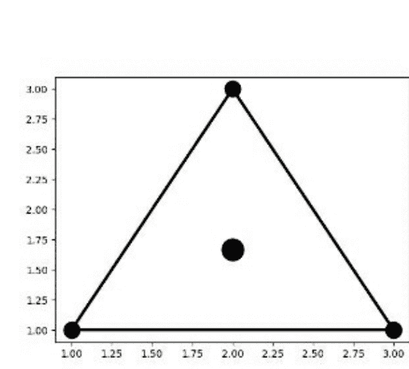

质心也显示在 (2, 1.666 ...) 处。[绘图可以使用 `Polygon(points)` 或 `matplotlib.pyplot` 模块中的 `plot(x, y)` 函数完成。]

```python
##### 方差、标准差、峰峰值
>>> x = np.array([0, 1, -1, 2, 3, -2, 0.5, 1.5, 2.5])
>>> x.var()
2.388888888888889
>>> x.std()
1.5456030825826172

##### 峰峰值：最高值 - 最低值
>>> x.ptp()
5.0

>>> X = x.reshape(3, 3)
>>> X
array([[ 0. , 1. , -1. ],
       [ 2. , 3. , -2. ],
       [ 0.5, 1.5, 2.5]])

>>> X.var(0)  # 沿 axis = 0
array([0.72222222, 0.72222222, 3.72222222])
>>> X.var(1)  # 沿 axis = 1
array([0.66666667,
```

## 8.2.10 积与差

```python
>>> x = np.array([1, 2, -1, 3, -2])

##### 元素的乘积
>>> np.prod(x)
12

##### 本质上是5的阶乘
>>> np.prod(range(1, 6))
120

##### 相邻元素的差
>>> np.diff(x)
array([1, -3, 4, -5])
```

**注意：** 差值数组也可以通过切片获得。

```python
>>> x = np.array([1, 2, -1, 3, -2])
>>> x[1:] - x[:-1]
array([ 1, -3, 4, -5])
```

**注意：** 对于多维数组，`prod()` 或 `diff()` 中的轴引用与其他任何 NumPy 方法类似。对于 `np.add()` 和 `np.divide()` 等用于加法和除法的其他方法也是如此。NumPy 数组是向量化的。NumPy 数组之间的逐元素数学运算可以使用 `+`、`-`、`*`、`/`、`**` 等数学运算符完成。但 NumPy 方法特别有用，因为我们可以指定轴引用并通过其他关键字参数进行操作。

应用：

考虑以下 x 与 y 的数据 [通过 NumPy 函数和数组创建的 S 形曲线，用于演示。]。一阶导数 dy/dx 通过 `np.diff()` 计算。

```python
##### Python 脚本
x = np.linspace(-5, 5, 100)
y = 1.0/(1 + np.exp(-x))
z = np.diff(y)/np.diff(x)

##### 用于绘图
import matplotlib.pyplot as plt
plt.subplot(211)
plt.plot(x, y)

plt.subplot(212)
plt.plot(x[:-1], z)
plt.show()
```

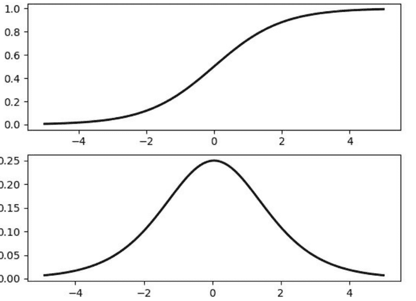

**图 2** 上图是 x-y 曲线，下图是 x-z 曲线（导数）。注意，第二条曲线中的最大值出现在拐点处，这是预期的结果。

**注意：** 在上面的 Python 脚本中，绘制底部图形时使用了切片 **x[:-1]**，因为 `np.diff()` 生成的数组长度比原始数组少一个。[有关绘图样式、子图 *等* 的详细信息，请参见第 9 章关于 Matplotlib 的内容。]

练习：
粒子的位置由以下公式给出：

$x = 1/(1 + e^{-2(t-4)})$，其中时间 $t$ 在 0 到 10 个时间单位之间以相等间隔测量。求该时间间隔内粒子的速度。绘制速度随时间变化的曲线。同时，计算粒子的加速度并绘制其随时间变化的曲线。

> [指导：在计算时间数组和时间差（步长）时，你可以使用
> ```python
> >>> t, dt = np.linspace(0, 10, 100, retstep = True)
> ```
> 速度，v = Δx/Δt，加速度，a = Δ²x/(Δt)²
> 其中 Δx = np.diff(x)，Δ²x = np.diff(np.diff(x))。绘制 v 与 t 的关系图时，你可以考虑使用 t[:-1]。绘制 a 与 t 的关系图时，我们可以考虑使用 t[1:-1]。]

## 8.2.11 迹

二维数组或矩阵的迹是其对角线元素的和。我们可以指定偏移量来选取某条对角线（主对角线或上下方向的任意副对角线）。

```python
>>> A
array([[-1, -4, -2, 6],
       [-8, 3, 6, -4],
       [-6, -4, 4, -6],
       [ 9, -1, 3, -9]])
```

```python
##### 主对角线元素之和
>>> np.trace(A)
-3
```

```python
##### 第一条上副对角线
>>> np.trace(A, offset = 1)
-4
```

```python
##### 第二条上副对角线
>>> np.trace(A, 2)
-6
```

```python
##### 第一条下副对角线
>>> np.trace(A, -1)
-9
```

```python
##### 第二条下副对角线
>>> np.trace(A, -2)
-7
```

## 8.2.12 排序

```python
>>> x = [-2, 0, 3, 1, 10, 5, -7]
```

```python
##### 升序排列
>>> np.sort(x)
array([-7, -2, 0, 1, 3, 5, 10])
```

```python
##### 降序排列
>>> np.sort(x)[::-1]
array([10, 5, 3, 1, 0, -2, -7])
```

**注意：** NumPy 方法 **sort()** 创建一个新的升序排列的列表（或数组）。原始列表保持不变。要获得降序排列的列表，我们使用了 NumPy 切片方法来反转排序后的列表（该列表是升序排列的）。

```python
##### 对于更高维度的数组
>>> L
array([[-6, -4, 7, 5, 6],
       [ 0, 9, 1, 4, -1],
       [ 4, 8, 5, 0, 2],
       [ 8, 1, -2, 3, 6]])
```

```python
##### 对列进行排序，升序
>>> np.sort(L, 0)
array([[-6, -4, -2, 0, -1],
       [ 0, 1, 1, 3, 2],
       [ 4, 8, 5, 4, 6],
       [ 8, 9, 7, 5, 6]])
```

```python
##### 对行进行排序，升序
>>> np.sort(L, 1)
array([[-6, -4, 5, 6, 7],
       [-1, 0, 1, 4, 9],
       [ 0, 2, 4, 5, 8],
       [-2, 1, 3, 6, 8]])
```

```python
##### 注意：np.sort(L) # 默认轴 = 1
```

在下面的例子中，三列（x, y, z）数据由一个二维数组表示。我们的任务是通过某一列对数据/数组进行排序，同时保持其他列中对应的条目相应地重新定位。这意味着，行将根据某一列的条目进行排序。NumPy 方法是 **argsort()**。

```python
>>> x
array([[ 1, 5, 20],
       [ 5, 7, 64],
       [ 3, 9, 97],
       [ 2, 4, 38],
       [ 4, 6, 90]])
>>> x[:, 0] # 第一列
array([1, 5, 3, 2, 4])
##### 索引的排序
>>> ind = np.argsort(x[:, 0])
>>> ind
array([0, 3, 2, 4, 1], dtype=int64)
```

```python
##### 通过第一列对行进行排序
>>> x[ind]
array([[ 1, 5, 20],
       [ 2, 4, 38],
       [ 3, 9, 97],
       [ 4, 6, 90],
       [ 5, 7, 64]])
```

```python
##### 通过第二列对行进行排序
>>> x[np.argsort(x[:, 1])]
array([[ 2, 4, 38],
       [ 1, 5, 20],
       [ 4, 6, 90],
       [ 5, 7, 64],
       [ 3, 9, 97]])
```

方法 **argsort()** 返回将对数组进行排序的索引。

```python
>>> L = np.array([10, 8, 12])
##### 将进行排序的位置索引
>>> ind = np.argsort(L)
>>> ind
array([1, 0, 2], dtype=int64)
```

```python
##### 通过索引位置进行排序
>>> L[ind]
array([8, 10, 12])
```

## 8.3 算术运算

两个数组之间的数学运算对应于数组相应元素之间的运算。

```python
>>> x = np.array([1, 2, 3, 4])
>>> y = np.array([5, 6, 7, 8])
>>> x + y
array([ 6, 8, 10, 12])
>>> x - y
array([-4, -4, -4, -4])
>>> x * y
array([ 5, 12, 21, 32])
>>> x/y
array([0.2 , 0.33333333, 0.42857143, 0.5 ])
>>> x**y
array([ 1, 64, 2187, 65536], dtype=int32)
>>> x**2 + y**3
array([126, 220, 352, 528], dtype=int32)
```

更高维度数组之间的运算以相同的方式进行。两个二维数组的加法可以看作是数学上的矩阵加法。

```python
##### 矩阵加法
>>> A
array([[1, 2],
       [3, 4]])
>>> B
array([[5, 6],
       [7, 8]])
>>> A + B # 矩阵加法
array([[ 6, 8],
       [10, 12]])
>>> np.add(A, B) # 通过 NumPy 方法
array([[ 6, 8],
       [10, 12]])
```

**注意：** 我们可以在 NumPy 数组和其他可迭代对象之间进行运算。可迭代对象的项将与数组的相应元素进行运算。例如，

```python
##### 列表与每一行相加
>>> A + [10, 11]
array([[11, 13],
       [13, 15]])
```

```python
##### 元组与每一行相加
>>> A + (10, 11)
array([[11, 13],
       [13, 15]])
```

各种形状的 NumPy 数组（或一个数组和一个标量）可以通过广播进行加法运算。

## 8.4 广播

广播是指 NumPy 在算术运算期间处理不同形状数组的能力。数组上的算术运算通常在相应元素之间进行。

如果两个数组形状相同，那么这些运算可以顺利执行。但如果两个数组的维度不同，逐元素运算就不可能了。然而，由于广播能力，NumPy 中仍然可以对形状不同的数组进行运算。较小的数组将被**广播**到较大数组的大小，以便它们具有兼容的形状。这里有几个例子。

```python
>>> x
array([[1, 2, 3],
       [4, 5, 6],
       [7, 8, 9]])
>>> y = 10
>>> x + y
array([[11, 12, 13],
       [14, 15, 16],
       [17, 18, 19]])
>>> x
```

## 8.5 转置、翻转、旋转

```
## 转置
>>> M
array([[1, 2, 3],
       [4, 5, 6]])
##### 行列互换
>>> M.T
array([[1, 4],
       [2, 5],
       [3, 6]])
[属性：数组 M 的转置] >>> M.transpose()
array([[1, 4],
       [2, 5],
       [3, 6]])
[通过方法：数组的转置]
```

```
##### 翻转
##### 左右翻转
>>> np.fliplr(M)
array([[3, 2, 1], [6, 5, 4]])
```

```
##### 上下翻转 >>> np.flipud(M) array([[4, 5, 6],
[1, 2, 3]])
```

##### 旋转
在由轴指定的平面内将数组旋转90度。

```
>>> np.rot90(M, axes = (0, 1)) array([[3, 6],
[2, 5],
[1, 4]])
>>> np.rot90(M, axes = (1, 0)) array([[4, 1],
[5, 2],
[6, 3]])
```

```
##### 旋转90度，默认轴 >>> np.rot90(M)
array([[3, 6],
[2, 5],
[1, 4]])
```

## 8.6 矩阵对象

对象 np.**matrix** 从类数组对象或数据字符串返回一个矩阵。

```
>>> A = np.matrix([[1, 2, 3], [4, 5, 6]])
>>> type(A)
<class 'numpy.matrix'>
>>> A
matrix([[1, 2, 3],
[4, 5, 6]])
```

```
>>> B = np.matrix([[1, 2], [3, 4], [5, 6]])
>>> B
matrix([[1, 2],
[3, 4],
[5, 6]])
```

### 矩阵乘积

```
##### 两个矩阵的乘积 >>> A*B
matrix([[22, 28],
[49, 64]])
```

### 8.6.1 复数矩阵

复数矩阵的线性代数在物理学的许多领域都很重要，尤其是在量子力学中，我们处理的是厄米矩阵和幺正矩阵。

```
##### 一个复数矩阵
>>> C
matrix([[1.+2.j, 0.+1.j], [2.-3.j, 0.+4.j]])

>>> C.T # 转置 matrix([[1.+2.j, 2.-3.j],
[0.+1.j, 0.+4.j]])

##### 共轭矩阵
>>> C.conjugate()
matrix([[1.-2.j, 0.-1.j],
[2.+3.j, 0.-4.j]])

##### 伴随矩阵（共轭转置） >>> C.H
matrix([[1.-2.j, 2.+3.j],
[0.-1.j, 0.-4.j]])

##### NumPy 数组中的条件语句
>>> X
array([[ 0. , 0.5, 1. ], [ 2. , 3. , 4. ],
[10. , -3. , 5. ]])

##### 返回展平的数组
>>> X[X > 3]
array([ 4., 10., 5.])
```

## 8.7 特殊数组

```
##### 特定形状的未初始化数组

>>> np.empty(3)
array([8.48798316e-314,
1.69759663e-313, 2.54639495e-313]) >>> np.empty((2, 2), dtype =
'float') array([[5.e-324, 5.e-324],
[0.e+000, 0.e+000]])
##### 用标量值填充数组 >>> A = np.array([1, 2, 3])

##### 用 0 填充，形状与 A 相同。 >>> A.fill(0)
>>> A
array([0, 0, 0])
##### 单位矩阵（单位矩阵）

>>> np.identity(4) # 4阶 array([[1., 0., 0., 0.],
[0., 1., 0., 0.],
[0., 0., 1., 0.],
[0., 0., 0., 1.]])

##### 4阶单位矩阵 >>> np.eye(4)
array([[1., 0., 0., 0.],

[0., 1., 0., 0.], [0., 0., 1., 0.], [0., 0., 0., 1.]])

##### 在第一条上对角线上 >>> np.eye(4, k = 1)
array([[0., 1., 0., 0.],

[0., 0., 1., 0.], [0., 0., 0., 1.], [0., 0., 0., 0.]])

##### 在第一条下对角线上 >>> np.eye(4, k = -1)
array([[0., 0., 0., 0.], [1., 0., 0., 0.], [0., 1., 0., 0.], [0., 0., 1., 0.]])

##### 全 1 数组

##### 全 1 的一维数组 >>> np.ones(3)
array([1., 1., 1.])

##### 全 1 的二维数组 >>> np.ones((3, 4))
array([[1., 1., 1., 1.],
       [1., 1., 1., 1.], [1., 1., 1., 1.]])
##### 全 0 数组（零矩阵）
>>> np.zeros(3)
array([0., 0., 0.])
>>> np.zeros((3, 3)) array([[0., 0., 0.],
       [0., 0., 0.],
       [0., 0., 0.]])
##### 以数组形状填充 0 >>> A
array([[1, 2],
       [3, 4]])
##### 形状与 A 相同 >>> np.zeros_like(A) array([[0, 0],
       [0, 0]])
##### 全填充数组（用一个数字填充数组）
##### 全填充矩阵
>>> np.full((3, 3), 5) array([[5, 5, 5],
       [5, 5, 5],
       [5, 5, 5]])
##### 跟随数组形状，用一个数字填充。
>>> A
array([[1, 2], [3, 4], [5, 6]])
##### 形状与 A 相同 >>> np.full_like(A, 10) array([[10, 10],
       [10, 10],
       [10, 10]])
##### 对角数组
##### 主对角线
>>> np.diag((1, 2, 3)) array([[1, 0, 0],
[0, 2, 0],
[0, 0, 3]])
```

```
##### 第一条上对角线（上方） >>> np.diag((1, 2 ,3), k = 1) array([[0, 1, 0, 0],
[0, 0, 2, 0],
[0, 0, 0, 3],
[0, 0, 0, 0]])
```

```
##### 第二条下对角线（下方） >>> np.diag([1, 2, 3], k = -2) array([[0, 0, 0, 0, 0],
[0, 0, 0, 0, 0],
[1, 0, 0, 0, 0],
[0, 2, 0, 0, 0],
[0, 0, 3, 0, 0]])
```

**注意：** 创建的数组的大小（阶数）由参数自动确定。参数数组的长度就是它所适配的对角线的长度。

```
##### 跟随数组形状，用一个数字填充
>>> A
array([[1, 2, 3], [4, 5, 6],
[7, 8, 9]])
```

```
##### A 的对角线用 0 填充 >>> np.fill_diagonal(A, 0) >>> A
array([[ 0, 2, 3], [4, 0, 6], [7, 8, 0]])
```

```
##### 重复数组元素 # 将 5 重复 8 次
>>> np.repeat(5, 8)
array([5, 5, 5, 5, 5, 5, 5, 5])
```

```
##### 将数组 [1, 2] 重复 4 次 >>> np.repeat([1, 2], 4)
array([1, 1, 1, 1, 2, 2, 2, 2])
```

```
>>> np.repeat([[1, 2], [3, 4]], 3) array([1, 1, 1, 2, 2, 2, 3, 3, 3, 4, 4, 4])
```

应用：

```
>>> x = np.repeat([0, 1, 0], 100) >>> plt.plot(x)
```

**图 3** 通过 np.repeat() 生成的方波。

```
##### 沿某个轴重复元素

>>> np.repeat([[1, 2], [3, 4]], 3, axis = 0)
array([[1, 2],
[1, 2],
[1, 2],
[3, 4],
[3, 4],
[3, 4]])
>>> np.repeat([[1, 2], [3, 4]], 3, axis = 1)
array([[1, 1, 1, 2, 2, 2], [3, 3, 3, 4, 4, 4]])
```

## 8.8 数组的乘积

```
##### 内积
>>> u = np.array([1, 2, 3]) >>> v = np.array([-1, 0, 1]) >>> np.inner(u, v)
2
```

```
##### 叉积
>>> np.cross(u, v) array([ 2, -4, 2])
```

**注意：** 上述方法可以视为两个向量 u 和 v 之间的内积（标量积）和叉积（向量积）。

内积：**u.v** = Σ u_i v_i = 1 ×(-1)+ 2 × 0 + 3 × 1 = 2
叉积：
**u×v** = | 1 2 3 | = i(2)+ j(-4)+ k(2) -1 0 1

应用：
一个平行六面体的体积，其三条边由三个向量给出：
**a** = 2i - 3j, **b** = i + j - k, **c** = 3i - k
体积 = **a**.(**b** × **c**) = 4（任意单位）

```
##### Python 脚本
import numpy as np
A = np.array([2, -3, 0])
B = np.array([1, 1, -1])
C = np.array([3, 0, -1])
vol = np.inner(A, np.cross(B, C)) print(vol)
```

### 8.8.1 多维数组的乘积

```
##### 二维数组与标量之间的内积
>>> np.inner(np.eye(3), 5)) array([[5., 0., 0.],
[0., 5., 0.],
[0., 0., 5.]])
```

```
##### 两个二维数组之间的乘积 >>> A
array([[1, 2],
[3, 4]])
>>> B
array([[5, 6],
[7, 8]])
>>> np.inner(A, B)
array([[17, 23],
[39, 53]])
[各自元素之间的乘积]
```

**注意：** 高维数组之间的内积是各轴上对应元素乘积的和。例如，在上面的例子中，

1 × 5 + 6 × 2 = 17, 1 × 7 + 2 × 8 = 23, 3 × 5 + 4 × 6 = 39, 3 × 7 + 4 × 8 = 53.

### 8.8.2 类矩阵乘积

```
>>> A = np.array([[1, 2], [3, 4]]) >>> B = np.array([[5, 6], [7, 8]])

##### AB（实际的矩阵乘积） >>> np.dot(A, B)
array([[19, 22],
[43, 50]])
>>> np.dot(B, A) # BA array([[23, 34],
[31, 46]])
```

**注意：** 我们也可以写成属性形式，A.dot(B), B.dot(A)。

```
##### 使用特殊符号的乘积 >>> A@B # 类矩阵乘积
array([[19, 22], [43, 50]])
```

**注意：** 对于两个向量（一维数组），np.inner() 的内积和 np.dot() 的矩阵乘积是相同的。

```
##### 向量点积

>>> u = np.array([1, 2, 3]) >>> v = np.array([-1, 0, 1]) >>> np.vdot(u, v)
2
```

**注意：** 向量点积是对应元素乘积的和。对于上面的例子，$1 \times(-1)+ 2 \times 0 + 3 \times 1 = 2$。

##### 高维向量的点积

```
>>> A = np.array([[1, 2], [3, 4]]) >>> B = np.array([[5, 6], [7, 8]]) >>> np.vdot(A, B)
70
```

**注意：** 方法 np.vdot() 总是返回一个标量。在高维情况下，首先将数组展平为一个向量，然后应用内积规则（或向量点积）。

对于上面的例子，$1 \times 5 + 2 \times 6 + 3 \times 7 + 4 \times 8 = 70$（逐元素操作）。

### 8.8.3 张量运算

张量在 NumPy 中可以表示为多维数组（ndarray）。数学张量的元素：

$$\begin{aligned} &\bullet\bullet_{111} \bullet\bullet_{121} \bullet\bullet_{131} \quad \bullet\bullet_{112} \bullet\bullet_{122} \bullet\bullet_{132} \ &\bullet\bullet = (\bullet\bullet_{211} \bullet\bullet_{221} \bullet\bullet_{231} \quad \bullet\bullet_{212} \bullet\bullet_{222} \bullet\bullet_{232}) \bullet\bullet_{311} \bullet\bullet_{321} \ &\bullet\bullet_{331} \bullet\bullet_{312} \bullet\bullet_{322} \bullet\bullet_{332} \end{aligned}$$

用稍微不同的符号表示，可以写成，

$$\begin{aligned} &\bullet\bullet_{111} \bullet\bullet_{121} \bullet\bullet_{131} \ &\bullet\bullet = [[\bullet\bullet_{211} \bullet\bullet_{221} \bullet\bullet_{231}], \ &\bullet\bullet_{311} \bullet\bullet_{321} \bullet\bullet_{331} \end{aligned}$$

$$\begin{aligned} &\bullet\bullet_{112} \bullet\bullet_{122} \bullet\bullet_{132} \ &[\bullet\bullet_{212} \bullet\bullet_{222} \bullet\bullet_{232}] ] \bullet\bullet_{312} \bullet\bullet_{322} \bullet\bullet_{332} \end{aligned}$$

因此，我们可以将其表示为两个矩阵的数组，或者 NumPy 中的三维数组。例如，让我们创建一个张量 **T** 作为 ($2 \times 3 \times 3$) 数组：

```
>>> import numpy as np
>>> T = np.array([[[1, 2, 3], [4, 5, 6], [7, 8, 9]],[[10, 11, 12], [13, 14, 15], [16, 17, 18]]]) >>> T
```

array([[[ 1, 2, 3],
        [ 4, 5, 6],
        [ 7, 8, 9]],
       [[10, 11, 12],
        [13, 14, 15],
        [16, 17, 18]]])

>>> T.shape
(2, 3, 3)

**注意：** 两个张量之间的加法和减法与两个数学矩阵（或二维 NumPy 数组）之间的运算方式相同。如果存在两个形状相同的张量 A 和 B，那么加法（或减法）为 C = A + B，其中 C 是一个形状相同的新张量。

两个维度相同的张量之间的逐元素乘积将产生一个维度相同的新张量。这种乘积称为 *哈达玛积*，符号表示为 C = A ∘ B。在 NumPy 中，如果 A 和 B 是数组（三维数组），那么哈达玛积就是两个数组之间通常的逐元素乘积，写作 C = A * B [张量除法也是如此。]。

## 张量积

张量积与哈达玛积有很大不同。如果两个张量 A 和 B 的维度分别为 m 和 n，那么得到的张量积 C = A ⊗ B 的维度将是 (m + n)。注意，张量积 C 将包含这样的元素：A 的每个元素将与张量 B 相乘。例如，

```
A = (a_{11} a_{12}
     a_{21} a_{22}), B = (b^{11} b^{12}),
```

C = A ⊗ B = (a_{11} * B  a_{12} * B
             a_{21} * B  a_{22} * B) = (a_{11} * (b^{11} b^{12})  a_{12} * (b^{11} b^{12})
                                        a_{21} * (b^{11} b^{12})  a_{22} * (b^{11} b^{12}))

注意，C 在 NumPy 风格中表示为一个三维数组（每个元素是一个矩阵）：

[a_{11} * (b^{11} b^{12})
 a_{21} * (b^{11} b^{12})]

[a_{12} * (b^{11} b^{12})
 a_{22} * (b^{11} b^{12})]

注意，向量是 1 阶张量，矩阵是 2 阶张量 [标量是 0 阶张量。]。张量积在 NumPy 中通过 **tensordot()** 函数实现。对于通常的张量积，**axis** 必须设置为 0。

```
>>> A = np.array([1, 2, 3])
>>> B = np.array([4, 5])
>>> np.tensordot(A, B, axes = 0)

array([[ 4,  5],
       [ 8, 10],
       [12, 15]])
```

**注意：** A 和 B 是 1 阶张量，乘积是 2 阶张量。
解释：(1 2 3) ⊗ (4 5) =

(1 × 4  1 × 5)   (4  5)
(2 × 4  2 × 5) = (8 10)
(3 × 4  3 × 5)   (12 15)

这类似于神经网络中常见的两层全连接网络。

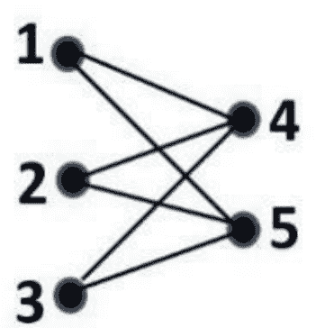

```
>>> A = np.array([[1, 2, 3], [4, 5, 6]])
>>> A # 2 阶张量
array([[1, 2, 3],
       [4, 5, 6]])

>>> B = np.array([[1, 2, 1], [1, 0, 2]])
>>> B # 2 阶张量
array([[1, 2, 1],
       [1, 0, 2]])
>>> np.tensordot(A, B, axes = 0)
array([[[[ 1, 2, 1],
         [ 1, 0, 2]],

        [[ 2, 4, 2],
         [ 2, 0, 4]],
        [[ 3, 6, 3],
         [ 3, 0, 6]]],

       [[[ 4, 8, 4],
         [ 4, 0, 8]],
        [[ 5,10, 5],
         [ 5, 0,10]],
        [[ 6,12, 6],
         [ 6, 0,12]]]]) # 结果是 3 阶张量
```

**注意：** 请查阅 np.tensordot() 的在线帮助，了解通过 axes 关键字设置的其他类型的张量积：**axes = 1** 用于张量点积，**axes = 2** 用于张量双缩并。axes 指的是求和乘积的轴（NumPy 中 ndarray 的常规轴引用）。

```
>>> C = B.reshape(3, 2)
>>> D = np.tensordot(A, C, axes = 1)
>>> D
array([[ 3, 10],
       [ 9, 25]])
[等效矩阵乘积]
```

在线帮助说明：‘当存在多个需要求和的轴时——并且它们不是 A（B）的最后一个（第一个）轴——参数 `axes` 应由两个相同长度的序列组成，第一个序列中首先给出第一个求和轴，第二个序列中首先给出第一个求和轴，第二个轴其次，依此类推。结果的形状由第一个张量的非缩并轴组成，后跟第二个张量的非缩并轴。’

## 多轴（缩并）

```
>>> D = np.tensordot(A, B, axes = ([0, 1], [0, 1]))
>>> D
array(24)
```

应用：

张量和张量代数是数学、物理和工程中广泛使用的重要数学工具。深度学习（机器学习领域）中开发了一些基于此的技术。每一层（神经网络的输入层、输出层或隐藏层）都可以看作一个 NumPy 数组。多层通过加权和连接，其中两个数组（全连接网络）之间的所有元素都以张量积的方式连接。谷歌的旗舰库 **TensorFlow** 就是基于这个思想。

## 8.9 NumPy 函数

NumPy 中的数学函数，如 sin、cos、exp、sqrt 等，被称为“通用函数”（ufunc）。在 NumPy 内部，这些函数对数组进行逐元素操作，产生一个数组作为输出。换句话说，NumPy 中的函数都是 **向量化** 的。通常，用户定义的函数（或我们从 math、cmath 模块导入的函数）作用于标量（默认参数是单个元素）。但在 NumPy 中，函数的参数可以是可迭代对象，如数组、列表、元组。

> [关于 NumPy 文档中的 **通用** 函数：‘通用函数（**或 ufunc**）是一个对 **ndarray** 进行逐元素操作的函数。也就是说，ufunc 是一个函数的“向量化”包装器，该函数接受固定数量的特定输入并产生固定数量的特定输出。在 NumPy 中，通用函数是 numpy.ufunc 类的实例。’]

例如，

```
>>> x = array([1., 1.5, 2., 2.5])

>>> y = np.exp(x)
>>> y
array([ 2.71828183,  4.48168907,  7.3890561 , 12.18249396])
##### 向量化数学运算

>>> a = np.array([1, 2, 3])
>>> a**2
array([1, 4, 9], dtype=int32)
```

**注意：** NumPy 中的所有函数都是向量化的，而核心 Python 中 math 模块中同名的函数则不是。要看到区别，

```
>>> import math
>>> x = array([1., 1.5, 2., 2.5])
>>> math.exp(x) # 未向量化
Traceback (most recent call last):
  File "<pyshell#421>", line 1, in <module>
    math.exp(x)
TypeError: only size-1 arrays can be converted to Python scalars

##### 核心 Python 中的列表
>>> a = [1, 2, 3]

>>> a**2 # 无法进行向量化操作
Traceback (most recent call last):
  File "<pyshell#436>", line 1, in <module>
    a**2
TypeError: unsupported operand type(s) for ** or pow(): 'list' and 'int'
```

应用

```
##### 绘制 NumPy 函数的 Python 脚本

import numpy as np
##### 创建 NumPy 数组
x = np.arange(-2, 2, 0.1)
##### 使用 NumPy 函数创建另一个数组
y = x*np.exp(-x**2)

##### 用于绘图
import matplotlib.pyplot as plt
plt.plot(x, y)
plt.show()
```

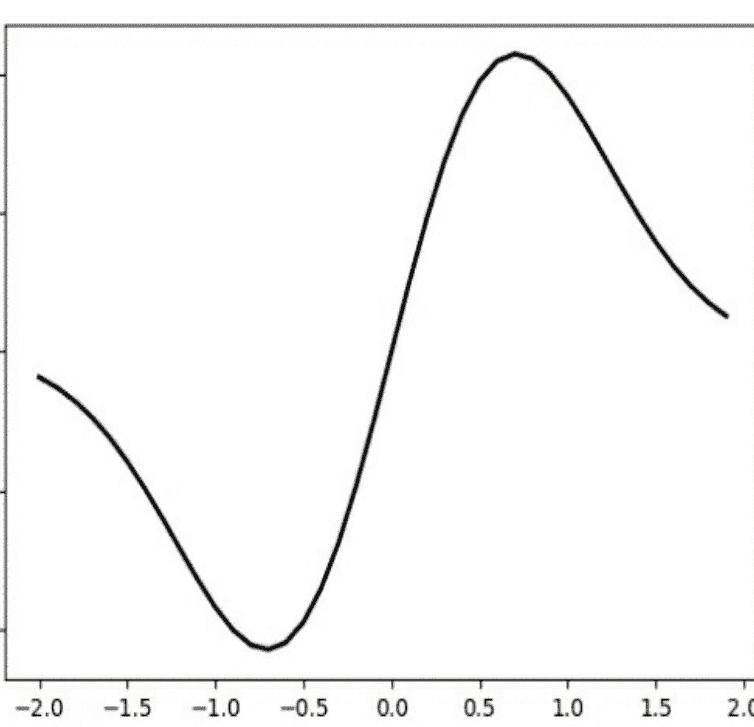

图 4 使用 NumPy 向量化函数绘图。

如前所述，NumPy 函数是向量化的。任何 NumPy 函数的参数可以是任何标量或可迭代对象（列表、元组或 NumPy 数组）。任何参数的维度可以是任何形状。NumPy 函数将作用于每个元素。

```
>>> x = [0, 0.5, 1, 1.5] # 列表
>>> np.sin(x)
array([0.        , 0.47942554, 0.84147098, 0.99749499])
>>> x = (0, 0.5, 1, 1.5) # 元组
>>> np.sin(x)
array([0.        , 0.47942554, 0.84147098, 0.99749499])
>>> x = [2.58, -3.934, 6.91, 12.38]
>>> np.floor(x)
array([ 2., -4.,  6., 12.]) [每个数的向下取整]
>>> np.ceil(x)
array([ 3., -3.,  7., 13.]) [每个数的向上取整]
>>> X
array([[ 0. ,  0.5,  1. ],
       [ 2. ,  3. ,  4. ],
       [10. , -3. ,  5. ]])
>>> np.sin(X)
array([[ 0.        ,  0.47942554,  0.84147098],
       [ 0.90929743,  0.14112001, -0.7568025 ],
       [-0.54402111, -0.14112001, -0.95892427]])
>>> np.ceil(np.sin(X))
array([[ 0.,  1.,  1.],
       [ 1.,  1., -0.],
       [-0., -0., -0.]])
```

## 8.10 向量化函数

用户定义的函数（或核心 Python 中 math 模块中的数学函数）不是向量化的。但我们可以使用 NumPy 的 **vectorize()** 方法对其进行向量化。

```
>>> x = [1, 2, 3, 4]
>>> def f(x):
    return x**2

##### 普通函数，未向量化
>>> f(x)
Traceback (most recent call last):
  File "<pyshell#470>", line 1, in <module>
    f(x)
  File "<pyshell#469>", line 2, in f
    return x**2
TypeError: unsupported operand type(s) for ** or pow(): 'list' and 'int'

##### 向量化函数
>>> f = np.vectorize(f)
>>> type(f)
<class 'numpy.vectorize'>
>>> f(x)
array([ 1,  4,  9, 16])

##### 未向量化
>>> math.sqrt(x)
Traceback (most recent call last):
  File "<pyshell#18>", line 1, in <module>
    math.sqrt(x)
TypeError: must be real number, not list

##### 现在已向量化
>>> s = np.vectorize(math.sqrt)
>>> s(x)
array([1.        , 1.41421356, 1.73205081, 2.        ])
```

## 8.11 NumPy 中的多项式

一维多项式类 **poly1d()** 用于创建一维多项式。要通过该函数构造多项式 $x^2 + 2x + 3$，我们必须将系数列表 [1, 2, 3] 作为参数给出。

## 8.11.1 算术运算

```python
>>> from numpy import poly1d
>>> p = np.poly1d([1, 2, 3])
>>> type(p)
<class 'numpy.poly1d'>

##### 在解释器中显示系数
>>> p
poly1d([1, 2, 3])

##### 显示多项式
>>> print(p)
1x^2 + 2x + 3
>>> p(2)
11
>>> p(-1)
2
```

**注意：** 在上面的例子中，**p** 是一个由 poly1d 类创建的对象。这是一个函数，因此我们可以写成 **p(x)**。我们可以通过以下方式了解对象的属性。

```python
##### 系数
>>> p.c
array([1, 2, 3])

##### 多项式的阶数
>>> p.order
2
```

```python
>>> p1 = poly1d([1, 2, 3])
>>> p2 = poly1d([1, -2])
>>> p1 + p2
poly1d([1, 3, 1])
>>> p1 - p2
poly1d([1, 1, 5])
>>> p1 * p2
poly1d([ 1, 0, -1, -6])
>>> p1/p2
(poly1d([1., 4.]), poly1d([11.]))  # [商和余数的元组]
```

## 8.11.2 多项式函数

```python
##### f(x) = x + 2
>>> f = np.poly1d([1, 2])

>>> f * f  # x^2 + 4x + 4
poly1d([1, 4, 4])

>>> f**2 + np.sin(f)
poly1d([1., 4.841470, 4.909297])
```

## 8.11.3 多项式方程的根

```python
>>> p = np.poly1d([1, -5, 6])
>>> p.r
array([3., 2.])  # 实根：3, 2

>>> p = np.poly1d([1, 2, 3])
>>> p.r
array([-1.+1.41421356j, -1.-1.41421356j])  # [复数根]
```

## Python 脚本：绘制多项式

```python
from numpy import poly1d
import matplotlib.pyplot as plt

p = poly1d([1, -5, 6])
x = np.linspace(1, 4, 100)
plt.plot(x, p(x), lw = 3)
plt.axhline(linestyle = '--',)
plt.show()
```

图 5
多项式：
$x^2 - 5x + 6$
[可以从与坐标轴的交点识别出两个根。]

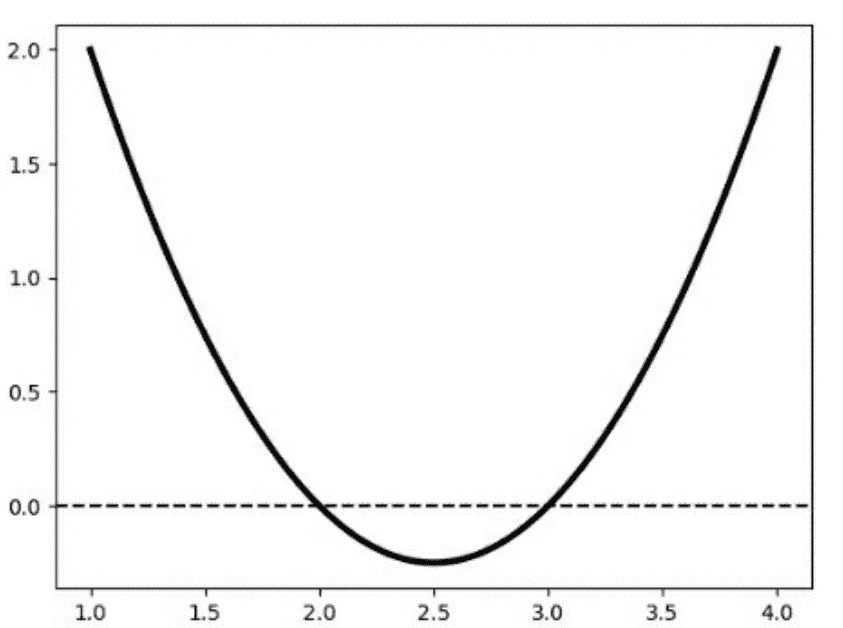

x

## 8.11.4 导数

```python
>>> p = np.poly1d([1, 2, 3])
>>> p.deriv(1)  # 一阶导数
poly1d([2, 2])
>>> p.deriv(2)  # 二阶导数
poly1d([2])
```

## 8.11.5 不定积分

```python
>>> p.integ(1)  # 积分一次
poly1d([0.33333333, 1. , 3. , 0. ])
>>> p.integ(2)  # 积分两次
poly1d([0.08333333, 0.33333333, 1.5, 0., 0. ])
```

## 8.12 NumPy 中的科学模块

NumPy 中有各种用于科学计算的模块。我们将重点介绍以下两个模块：

- **polynomial**
- **linalg**（用于线性代数）

polynomial 模块中的 **polyfit()** 函数将用于曲线拟合。这将在“*数值方法*”章节中详细讨论。

## 8.12.1 NumPy 多项式模块

> “NumPy 中的多项式可以使用 **numpy.polynomial** 包中的便捷类进行*创建*、*操作*甚至*拟合*，该包在 NumPy 1.4 中引入。
>
> 在 NumPy 1.4 之前，**numpy.poly1d** 是首选类，为了保持向后兼容性，它仍然可用。然而，新的 Polynomial 包比 numpy.poly1d 更完整，其便捷类在 NumPy 环境中表现更好。因此，**numpy.polynomial** 被推荐用于新的编码。”

[来自 numpy.org/doc]

```python
>>> import numpy.polynomial as poly
>>> p = poly.Polynomial([1, 2, 3])
>>> p
Polynomial([1., 2., 3.], domain=[-1, 1], window=[-1, 1])
>>> print(p)
poly([1. 2. 3.])
>>> p(2)
17.0
```

**注意：** Polynomial 包中的各种例程都处理系数从零次项开始的级数，这与 Poly1d 的约定*顺序相反*。有多项式幂级数、特殊函数多项式等等，你可以探索。

**numpy.polynomial.polynomial** 中的 Polynomial 类也处理多项式。在这种情况下，多项式的形式为：1 + 2x + 3x²（幂次顺序相反）。

## 8.12.2 NumPy 线性代数

```python
>>> import numpy as np
>>> v = np.array([1, 0, -1, 2])

##### 向量的范数
>>> np.linalg.norm(v)
2.449489742783178

## 行列式
>>> A = np.array([[1, 0, 3], [2, 4, 1], [0, 6, 3]])
>>> A
array([[1, 0, 3],
       [2, 4, 1],
       [0, 6, 3]])
>>> np.linalg.det(A)  # 行列式
42.00000000000001

##### 矩阵的秩
>>> np.linalg.matrix_rank(A)
3

##### 矩阵的逆
>>> B = np.linalg.inv(A)
>>> B
array([[ 0.14285714,  0.42857143, -0.28571429],
       [-0.14285714,  0.07142857,  0.11904762],
       [ 0.28571429, -0.14285714,  0.0952381 ]])

##### 验证
>>> np.dot(A, B)
array([[1., 0., 0.],
       [0., 1., 0.],
       [0., 0., 1.]])
```

[与逆矩阵相乘得到单位矩阵。]

应用：

求解以下线性方程组：
x₁ + 2x₂ - x₃ = 1
2x₁ + x₂ + 4x₃ = 2
3x₁ + 3x₂ + 4x₃ = 1

上述方程组可以写成矩阵形式：**AX = B**，其中

A = [[1, 2, -1], [2, 1, 4], [3, 3, 4]], X = [[x₁], [x₂], [x₃]], B = [[1], [2], [1]]

因此，我们写成 X = A⁻¹B

```python
##### Python 脚本：求解
import numpy as np

A = np.array([[1, 2, -1], [2, 1, 4], [3, 3, 4]])
B = np.array([1, 2, 1])
Ainv = np.linalg.inv(A)
X = np.dot(Ainv, B)
print(X)
```

输出：
array([ 7., -4., -2.])

```python
##### 直接求解
>>> np.linalg.solve(A, B)
array([ 7., -4., -2.])
```

```python
## 特征值、特征向量
>>> A
array([[1, 2],
       [3, 4]])
>>> np.linalg.eig(A)
(array([-0.37228132, 5.37228132]), array([[-0.82456484, -0.41597356],
       [ 0.56576746, -0.90937671]]))
```

**注意：** **eig()** 函数返回一个数组元组。第一个数组是两个**特征值**的集合，第二个数组是两个**特征向量**的集合。第二个数组的两列是两个特征向量。

```python
##### 特征值和特征向量解包
>>> u, v = np.linalg.eig(A)
>>> u  # 特征值
array([-0.37228132, 5.37228132])

>>> v  # 特征向量
array([[-0.82456484, -0.41597356],
       [ 0.56576746, -0.90937671]])

##### 特征值
>>> u1, u2 = u
>>> u1  # 特征值 1
-0.3722813232690143
>>> u2  # 特征值 2
5.372281323269014

##### 用特征值构成对角矩阵
>>> np.diag(u)  # 对角矩阵
array([[-0.37228132, 0. ],
       [ 0. , 5.37228132]])

##### 特征向量
>>> v[:, 0]  # 特征向量 1
array([-0.82456484, 0.56576746])
>>> v[:, 1]  # 特征向量 2
array([-0.41597356, -0.90937671])

##### 仅获取特征值
>>> np.linalg.eigvals(A)
array([-0.37228132, 5.37228132])
```

对于复数矩阵

函数 **eigh()** 计算复数厄米矩阵或实对称矩阵的特征值和特征向量。[厄米矩阵是一个复数方阵，它等于其自身的共轭转置。]

```python
##### 厄米矩阵
>>> M = np.array([[1, 1+1j, 2j], [1-1j, 4, 2-3j], [-2j, 2+3j, 7]])
>>> M
array([[ 1.+0.j,  1.+1.j,  0.+2.j],
       [ 1.-1.j,  4.+0.j,  2.-3.j],
       [-0.-2.j,  2.+3.j,  7.+0.j]])

##### 测试是否为厄米矩阵
>>> M.conj().T == M
array([[ True,  True,  True],
       [ True,  True,  True],
       [ True,  True,  True]])

##### 厄米矩阵的特征值和特征向量
>>> np.linalg.eigh(M)
(array([-0.66765836, 2.91919537, 9.74846299]), array([[ 0.78102045+0.j, 0.59215952+0.j, 0.19837883+0.j],
       [-0.46839474+0.12569175j, 0.6949742 -0.0055707j, 0.23041631+0.47822181j],
       [ 0.1713515 +0.3541944j, 0.34470175-0.21796245j, 0.35431906+0.74385218j]]))
```

**注意：** 函数 **eigh()** 返回的特征值是实数，特征向量是复数，这对于厄米矩阵来说是正确的。

## 厄米共轭

```python
>>> M = np.matrix([[1, 1+1j, 2j], [1-1j, 4, 2-3j], [-2j, 2+3j, 7]])
>>> M.H  # 厄米共轭
matrix([[ 1.-0.j,  1.+1.j, -0.+2.j],
        [ 1.-1.j,  4.-0.j,  2.-3.j],
        [ 0.-2.j,  2.+3.j,  7.-0.j]])
```

**注意：** 要找到厄米共轭，数组必须是矩阵类型。

## 8.13 NumPy 数组网格

NumPy 有从坐标创建数字网格的方法。下面我们考虑 **meshgrid()**，它从坐标向量创建坐标矩阵。

```python
>>> x = np.array([0, 1, 2, 3])
>>> y = np.array([0, 1, 2])
>>> X, Y = np.meshgrid(x, y)
>>> X
array([[0, 1, 2, 3],
       [0, 1, 2, 3],
       [0, 1, 2, 3]])
>>> Y
array([[0, 0, 0, 0],
       [1, 1, 1, 1],
       [2, 2, 2, 2]])
```

**注意：** **meshgrid(x, y)** 创建一个网格，其中网格点的坐标为 (0, 0), (0, 1)....(1, 0), (1, 1)....等等。现在我们可以在每个网格点定义一个函数。

应用：创建等高线图

```python
##### Python 脚本
import numpy as np
import matplotlib.pyplot as plt

x = np.linspace(-1, 1, 100)
y = np.linspace(-1, 1, 100)
X, Y = np.meshgrid(x, y)
Z = np.exp(-X**2 + Y**2)
plt.contour(X, Y, Z)
plt.show()
```

## 8.14 加载和保存数据文件

纯**文本**或**数据文件**是一些以空格或逗号分隔方式写入数据或文本的文件。这些文件可能显示 `.dat` 和 `.txt` 扩展名，其中 `.txt` 通常用于包含纯文本或数据的文件。这些文件可以通过简单的文本编辑器打开和查看。我们可以使用 `.dat` 作为扩展名来表示数据文件。但文件扩展名并非强制性的。在 Windows 中，文件可以保存为文本或 DAT 文件。

NumPy 方法可以处理纯数字的文件。函数 `savetxt()` 用于将数据保存到文件中，而 `loadtxt()` 用于从文件中读取或加载数据。

```
Data File: test.dat
0.74 -0.68 -0.77
0.25 -0.95 0.07
-0.09 0.06 -0.28
-0.68 0.99 0.49
0.78 0.63 -0.02
0.65 0.09 0.19
0.68 0.03 0.09
-0.17 0.28 0.84
```

```
##### 将数据保存到文件
>>> np.savetxt('test.dat', data)

##### 从文件加载数据
>>> x = np.loadtxt('test.dat')
>>> x
array([[ 0.74, -0.68, -0.77],
       [ 0.25, -0.95, 0.07],
       [-0.09, 0.06, -0.28],
       [-0.68, 0.99, 0.49],
       [ 0.78, 0.63, -0.02],
       [ 0.65, 0.09, 0.19],
       [ 0.68, 0.03, 0.09],
       [-0.17, 0.28, 0.84]])
```

```
##### 在特定位置创建数据文件（包含路径）
np.loadtxt('C:/Users/Abhijit/Desktop/Demo/test.dat')

##### 使用分隔符读取文件
np.loadtxt('test.dat', delimiter=',')
```

当数据在文件中以逗号 (,) 分隔方式写入时，我们需要使用 `delimiter = ','` 作为关键字参数。

从数据文件生成 NumPy 数组的另一种方法：`genfromtxt('test.dat')`。

## 8.15 NumPy 中的随机数

NumPy 的 `random` 模块中有各种随机数生成器。均匀分布、正态分布或其他随机变量、用于整数随机数的随机数生成器以及对我们科学计算有用的其他各种类型，都可以从名称列表中看到。像往常一样，我们可以通过输入 `help(np.random.uniform)` 等来在线寻求每个函数的帮助。

重要的是，我们可以通过关键字参数直接创建任意大小和形状的随机数组。

```
>>> dir(np.random)
['BitGenerator', 'Generator', 'MT19937', 'PCG64', 'Philox', 'RandomState',
 'SFC64', 'SeedSequence', '__RandomState_ctor', '__all__', '__builtins__',
 '__cached__', '__doc__', '__file__', '__loader__', '__name__', '__package__',
 '__path__', '__spec__', '_bit_generator', '_bounded_integers', '_common',
 '_generator', '_mt19937', '_pcg64', '_philox', '_pickle', '_sfc64',
 'absolute_import', 'beta', 'binomial', 'bytes', 'chisquare', 'choice', 'default_rng',
 'dirichlet', 'division', 'exponential', 'f', 'gamma', 'geometric', 'get_state',
 'gumbel', 'hypergeometric', 'laplace', 'logistic', 'lognormal', 'logseries',
 'mtrand', 'multinomial', 'multivariate_normal',
 'negative_binomial',
 'noncentral_chisquare',
 'noncentral_f', 'normal', 'pareto', 'permutation', 'poisson', 'power',
 'print_function', 'rand', 'randint', 'randn', 'random', 'random_integers',
 'random_sample', 'ranf', 'rayleigh', 'sample', 'seed', 'set_state', 'shuffle',
 'standard_cauchy', 'standard_exponential',
 'standard_gamma', 'standard_normal', 'standard_t', 'test', 'triangular', 'uniform',
 'vonmises', 'wald', 'weibull', 'zipf']
```

```
##### 0 到 1 之间的随机数
>>> import numpy as np

##### [0.0, 1.0) 区间内的随机数
>>> np.random.random()
0.796924428952941
```

**注意：** `random()` 方法在半开区间 **[0.0, 1.0)** 内随机生成数字，这意味着数字 ≥ 0 且 < 1。

### 随机数数组

```
##### 包含 10 个数字的一维数组
>>> np.random.random(size=10)
array([0.80202971, 0.2630612, 0.33344721, 0.59599463,
       0.73809468, 0.73806876, 0.60964991, 0.16738648,
       0.96946575, 0.6322321])

##### 创建 3 × 4 数组
>>> np.random.random((3, 4))
array([[0.72084356, 0.88093821, 0.83525373, 0.46332243],
       [0.82524178, 0.50718295, 0.89747926, 0.07966796],
       [0.58582415, 0.16378067, 0.08843958, 0.25770781]])
```

### 均匀分布

函数 `uniform(low, high)` 从均匀分布中抽取样本，这些样本在半开区间 [low, high) 上均匀分布（包含 low，但不包含 high）。

```
##### 1 到 2 之间
>>> np.random.uniform(1, 2)
1.9496816388917961

>>> np.random.uniform(-1, 1, 1000)
[创建了 1000 个随机数。]
```

### 应用：蒙特卡洛估计 π

```python
import numpy as np
x = np.random.uniform(-1, 1, 1000)
y = np.random.uniform(-1, 1, 1000)
z = x**2 + y**2 < 1
pi = 4*sum(z)/1000
print('pi = ', pi)
```

输出：`pi = 3.136`

### 正态分布

```
##### 均值 = 0，方差 = 1
>>> np.random.randn(1000)

##### mu = 0.5，sigma = 2
>>> np.random.normal(0.5, 2, 1000)
```

NumPy 函数 `randn()` 返回来自标准正态分布（均值 = 0，标准差 = 1）的样本（或样本集）。函数 `normal(mu, sigma)` 从具有给定均值 (**mu**) 和标准差 (**sigma**) 的正态（高斯）分布中抽取随机数。我们通过这两种方法创建了包含 100000 个随机数的数组。

**图 7** 使用均匀分布和正态分布随机数绘制的直方图。

为了理解随机数是从某些分布中抽取的，我们可以收集由某个随机数生成器生成的随机数，并以直方图（频率分布）的形式绘制它们。直方图显示了分布的特征。对于上述情况，我们通过均匀分布和正态分布随机数生成器生成了两组 100000 个随机数，并将它们并排绘制。

### 随机整数

```
##### 3 × 4 的整数数组
>>> np.random.randint(10, 50, (3, 4))
array([[33, 11, 18, 18],
       [40, 22, 31, 24],
       [34, 30, 25, 35]])
```

**注意：** 10 到 50 之间的随机整数，其中上限被排除（半开区间）。

### 随机选择

```
>>> x = [1, 2, 3, 4, 'a', 'b', 'c', 'd']

##### 选择大小为 3 的样本
>>> np.random.choice(x, 3)
array(['d', '3', 'b'], dtype='<U11')

>>> x = np.arange(10)

##### 从数组 x 中选择
>>> np.random.choice(x, size=(4, 5))
array([[5, 3, 3, 3, 1],
       [2, 4, 1, 3, 2],
       [4, 8, 8, 8, 1],
       [0, 9, 4, 6, 2]])

>>> np.random.choice([0, 1], p=[0.3, 0.7], size=(4, 5))
array([[0, 1, 1, 1, 1],
       [1, 1, 1, 1, 1],
       [0, 0, 1, 1, 1],
       [1, 0, 1, 0, 1]])
```

**注意：** `choice()` 中的默认参数必须是一维数组。这里，`p = [0.3, 0.7]` 是与要选择的数字 0 和 1 对应的概率列表。

### 应用：

考虑系统大小为 100 × 100 的二维 *伊辛模型*（自旋为两态）的蒙特卡洛模拟。在此系统中，80% 的自旋应处于向下状态，其余 20% 的自旋应处于向上状态。此代码仅需以下一行。

```
np.random.choice([0, 1], p=[0.8, 0.2], size=(100, 100))
```

### 随机打乱

通过打乱其内容来就地修改序列。

```
>>> x = array([0, 1, 2, 3, 4, 5, 6, 7, 8, 9])
>>> np.random.shuffle(x)
[数组被重新排列。]

>>> x
array([0, 9, 4, 8, 3, 6, 7, 5, 2, 1])
```

### 随机排列

返回一个新数组。

```
>>> np.random.permutation(x)
array([5, 6, 7, 0, 9, 8, 3, 1, 4, 2])

>>> x
array([0, 1, 2, 3, 4, 5, 6, 7, 8, 9])
[原始数组未更改。]
```

### 使用种子开始以获得相同的序列

```
##### 给出任意种子数
>>> np.random.seed(283)
>>> np.random.random()
0.5974151257398422
>>> np.random.random()
0.32662323744657806

##### 给出相同的种子，得到相同的序列
>>> np.random.seed(283)
>>> np.random.random()
0.5974151257398422
>>> np.random.random()
0.32662323744657806
```

**注意：** 如果我们以任何固定整数作为种子开始，我们将得到相同的（伪）随机数序列。

## 练习

为以下内容编写 Python 脚本。

1.  创建一个包含 0 到 24 之间整数的一维 NumPy 数组。将该数组重塑为 (5, 5) 的数组。
2.  创建一个所有元素都等于 5 的 10 × 10 的满矩阵。
3.  创建一组介于 0 到 1 之间、间隔为 0.125 的数字。
4.  考虑以下 NumPy 数组：`x = [[1, 2, 3], [4, 5, 6]]` 和 `y = [[6, 5, 4], [3, 2, 1]]`。连接这两个数组并检查你的发现。
5.  考虑以下 NumPy 数组：`A = [1, 2, 3, 4, 5, 6, 7, 8, 9]`。将其拆分为三个长度相等的一维 NumPy 数组。
6.  创建一个包含 100 个介于 0 和 1 之间的数字的一维 NumPy 数组。找出最大值并将其替换为 99。[提示：找出最大值及其出现的位置。使用适当的 NumPy 方法。]
7.  创建 100000 个随机整数，值为 0 或 1。将 0 视为硬币的反面，1 视为正面。找出你的数字集合（总试验次数）中出现了多少次“正面”。计算正面和反面的比例。
8.  创建一个 5 × 5 的矩阵（二维数组），其中的随机整数介于 1 和 10 之间。找出 0 值出现的位置。
9.  使用 Numpy 创建一个 3 × 3 × 3 的数组，其中的随机数介于 0 和 1 之间。
10. 生成一个 4 × 5 的数组，其中的随机整数介于 1 和 10 之间。再生成另一个这样的数组，其中的随机数介于 0 和 1 之间。将两个矩阵相加。
11. 创建一个 Numpy 数组，包含 50 个介于 0 和 4π 之间、间隔相等的数字。创建另一个数组，其中每个成员是前一个数组对应成员的余弦值。
12. 使用 Numpy 包创建一个大小为 20 的随机向量，并将最大值替换为 0。[提示：使用 `np.max()` 和 `np.where()` 方法。]
13. 定义一个函数：`f(x) = x² + 2x`。现在考虑 x 来自一个由介于 1 和 5 之间、间隔为 0.1 的数字组成的数组。现在为函数 f(x) 创建一个数组并对其元素求和。
14. 创建两个列表 X 和 Y，每个列表包含 100000 个整数（可以通过某种随机数生成器或 range 函数生成）。现在，尝试使用列表推导式将它们对应的元素相加，形成一个新的列表 Z。导入 ‘time’ 模块以检查花费了多少时间。现在，创建两个类似的 NumPy 数组 X 和 Y 并将两个数组相加。同时，检查这次花费的时间。比较两个过程所用的时间。
15. 创建一个包含 10000 个介于 1 和 100 之间的随机整数的一维 NumPy 数组。将其重塑为 100×100 的二维数组。从中创建另一个数组，该数组将包含最后 10 行和 10 列。从最后一个数组中创建另一个数组，该数组将包含所有偶数。
16. 考虑以下二维数组：$\begin{pmatrix} 9 & 7 & 8 & 4 \\ 9 & 8 & 6 & 4 \\ 4 & 3 & 4 & 8 \\ 6 & 1 & 8 & 5 \end{pmatrix}$。找出该矩阵的特征值和特征向量。根据特征值构成对角矩阵。检查特征向量是否正交。
17. 创建一个 10 × 10 的矩阵，其中的随机整数介于 1 到 10 之间。找出矩阵的行列式、逆矩阵。找出特征值和特征向量。根据特征值构成对角矩阵。
18. 使用 NumPy 找出 $\begin{pmatrix} 0 & 1 & 0 \\ 1 & 0 & 1 \\ 0 & 1 & 0 \end{pmatrix}$ 的特征值和特征向量。
    i) 找出所得特征向量的范数，ii) 证明特征向量是正交的。
19. 对单个数据点进行重复测量，得到以下值：5, 5.5, 4.9, 4.85, 5.25, 5.05, 3.25。找出这组值的均值、方差、标准差、sem（平均值的标准误差）。你可以使用 NumPy 包中的适当函数。

## 第 9 章

## Matplotlib：绘图库

> “在拥有数据之前就进行理论化是一个严重的错误。”- 阿瑟·柯南·道尔

**Matplotlib** 是一个用于在 Python 中创建静态、动画和交互式可视化的综合库。像任何其他（开源）Python 包一样，它可以安装在 Python 目录中并导入到命名空间。

**Anaconda , Python(x,y)** 或其他一些科学 Python 发行版附带了诸如 **NumPy, SciPy** 和 **Matplotlib** 之类的包。在大多数最新版本的 Linux 操作系统中，Python 预装了上述包。如果尚未安装，可以通过常规命令在 Windows 的核心 Python 上安装 Matplotlib：

`pip install matplotlib` [参见附录 A]。在 Linux 上，通过命令完成：`sudo`。有关详细过程、文档和教程，可以查阅 Matplotlib 官方网页：**matplotlib.org**。

### 9.1 二维绘图

#### 9.1.1 X-Y 图

在 matplotlib 的各种模块和函数中，我们这里处理 **pyplot** 模块，该模块包含允许我们生成各种二维图 [(x, y)-图] 的函数。

```python
##### 导入、绘图和显示 [在解释器上]
>>> import matplotlib.pyplot as plt
##### 创建绘图
>>> plt.plot()
##### 显示
>>> plt.show()
##### 查看目录，寻求帮助
##### 查看目录
>>> dir(plt)
##### 关于 plot() 函数的帮助
>>> help(plt.plot)
##### 简单绘图
x = [1, 2, 3, 4, 5]
y = [1, 4, 9, 16, 25]
plot(x, y)
plt.show()
```

**图 1** 简单的 x-y 图。[如果未提及任何内容，默认情况下绘图使用连续线和绿色（此处未重现）。]

x 和 y 数据可以以列表、元组、数组 *等形式* 给出。我们可以写：

```python
##### 数据作为元组
plt.plot((1, 2, 3, 4, 5), (1, 4, 9, 16, 25))
##### 使用 x 作为 0, 1, 2, ..（默认）绘制 y
plt.plot(y)
##### 绘制一系列数字
plt.plot(range(10))
##### 使用其他函数绘制散点图
plt.scatter(x, y)
```

我们可以通过创建图形和坐标轴来创建任何 matplotlib 图。

```python
##### 创建新对象 fig
fig = plt.figure()
ax = plt.axes()
```

“图形”可以被视为一个单独的容器，“坐标轴”创建带有刻度等的坐标轴框架。之后，每次添加内容时，我们都可以引用 ‘fig’ 和 ‘ax’。大多数 plt 函数直接转换为 ax 方法，例如 `plt.plot` —> `ax.plot()`，`plt.xlabel()` —> `ax.xlabel()`，`plt.xlim()` —> `ax.set_xlim()`，`plt.title()` —> `ax.set_title()`。

**使用关键字参数设置样式**

我们可以使用各种关键字（在 plot 函数内）来格式化绘图，例如线型、线宽、标记样式、标记大小等。

```python
##### 使用线、标记、颜色绘图
plt.plot(x, y, linestyle = '-', marker = 'o', color = 'black')
plt.show()
```

**图 2** 对图 1 的修改。绘图使用圆点标记和连续线。颜色为黑色。关键字参数可以使用缩写书写。此外，当参数放置在适当位置时，可以不带关键字名称。例如：

```python
##### 线和圆圈，颜色黑色
plt.plot(x, y, '-o', c = 'k')
##### 使用蓝色、圆圈标记绘图
plt.plot(x, y, 'bo')
##### 使用红色、加号标记绘图
plt.plot(x, y, 'r+')
##### ['-o' = 线和圆圈，c = 颜色，'k' = 黑色，'bo' = 蓝色圆圈，'r+' = 红色加号]
```

我们可以做更多。绘图样式几乎不言自明，如下所示。

```python
##### 使用各种样式绘图
plt.plot(x, y, c = 'r', ls = '-', lw = 3, m = 'o', ms = 16)
plt.show()
```

**图 3** 圆点更大，线宽增加 [颜色在打印中未显示为红色。]

绘图中的缩写：
‘r’ = 红色，ls = 线型，lw = 线宽，m = 标记，‘o’ = 圆点，ms = 标记大小

**Matplotlib 函数**

- `title()` # 在框架上方添加标题
- `suptitle()` # 主标题，在更上方添加标题
- `text()` # 在图形中的给定位置添加文本
- `figtext()` # 在相对坐标中的给定位置添加文本
- `annotate()` # 添加带可选箭头的注释
- `xlabel()` # x 轴标签
- `ylabel()` # y 轴标签
- `xlim()` # 要显示的 x 轴限制
- `ylim()` # 要显示的 y 轴限制
- `xticks()` # 沿 x 轴的刻度线
- `yticks()` # 沿 y 轴的刻度线
- `grid()` # 带网格的绘图

```python
plt.title('给定标题', size = ..)
plt.text(x-pos, y-pos, '文本', size = ..)
plt.xlim(min, max)
plt.ylim(min, max)
plt.grid()
```

**标记颜色**
**b**(蓝色), **r**(红色), **g**(绿色), **y**(黄色), **k**(黑色), **m**(品红色), **c**(青色), **w**(白色)

我们可以通过混合三种原色 **RGB**（红、绿、蓝）来创建颜色。要自定义，我们需要提供 (**r**, **g**, **b**) 作为元组。此外，我们可以设置 **mec** = 标记边缘颜色。

使用方法：
- 对于 **颜色**：`r, g, b = (0.1, 0.3, 0.7)`，元组中的每个值都在 [0, 1] 范围内。
- 对于 **单色**：黑色 (0)，...灰色 (0.5)，...白色 (1)，按此顺序。使用单个数字（介于 0 到 1 之间），我们可以创建各种深度的单色：从黑色，到较浅的黑色，再到灰色...直到白色。

**标记样式**

点 ( .), 加号 (+), 粗加号 (**P**), 叉号 (**x**), 粗叉号 (**X**), 星号 (*), 实心圆 (**o**), 实心上三角 (^), 实心下三角 (**v**), 实心左三角 (<), 实心右三角 (>), 实心正方形 (**s**), 实心五边形 (**p**), 实心六边形 (**h**), 不同方向的实心六边形 (**H**), 实心八边形 (**8**), 实心菱形 (**D**), 实心细菱形 (**d**), 竖线 (|), 横线

## 颜色的应用

### 颜色

```python
plt.plot(x, y, '8', c = (0.9, 0.1, 0.8), ms = 20)
##### 单色
plt.plot(x, y, 'H', c = '0.1', ms = 20)
```

标记样式：8（八边形），‘H’（六边形） c = 颜色，ms = 标记大小

### 图形的名称与大小

Matplotlib 中的‘图形’指的是用户界面中的整个窗口。

```python
plt.figure(1, figsize = (8, 6), dpi = 100)
plt.figure(‘Demo figure’, figsize = (10, 6))
```

注意：参数 dpi（每英寸点数）指的是图像在作为真实物理实体复制时的物理点密度，例如打印到纸上时。

- num：图形编号（默认 = 1）
- figsize：图形尺寸，单位为英寸（宽度，高度）
- dpi：分辨率，单位为每英寸点数
- facecolor：绘图背景颜色
- edgecolor：绘图背景边缘颜色
- frameon：是否绘制图形边框（默认 = True）

`plt.figure()` 中的这些关键字参数决定了图形的外观。

### 示例：带样式的绘图

```python
plt.figure(figsize = (12, 8))
plt.plot(x, y, color = ‘black’, linestyle = ‘-’, lw = 3, marker = ‘o’, ms = 16,
label = ‘Temperature’)

##### x、y轴标签
plt.xlabel(‘X-axis’, size = 20)
plt.ylabel(‘Y-axis’, size = 20)

##### 标题，总标题
plt.title(‘This is my Demo Graph’, size = 20)
plt.suptitle(‘Figure 4’, size = 22)
##### 写入图例（图形内部）
plt.legend(loc = 2, fontsize = 18)
##### 标签在内部的位置
plt.xticks([1, 3, 5], size = 18)

##### 刻度点，大小
plt.yticks([1, 9, 16], size = 18)
plt.tick_params(axis = ‘x’,
labelcolor = ‘g’, labelsize = 16)
##### 显示图形
plt.show()
```

**图 4** 展示了图例（内部文本）、标题、总标题、轴标签和其他样式。[本书中颜色不会显示。]

### 图例

**legend()** 函数在图形上放置一个图例（一个带有标签的框，默认位于‘最佳’位置）。我们可以通过 **loc** =‘upper left’、‘lower right’、‘upper right’、‘lower left’ 或使用数字来定位图例。

| 位置字符串 | 位置代码 |
| :--- | :--- |
| 'best' | 0 |
| 'upper right' | 1 |
| 'upper left' | 2 |
| 'lower left' | 3 |
| 'lower right' | 4 |
| 'right' | 5 |
| 'center left' | 6 |
| 'center right' | 7 |
| 'lower center' | 8 |
| 'upper center' | 9 |
| 'center' | 10 |

## 使用 NumPy 数组和函数绘图

```python
import numpy as np
x = np.arange(0.5, 10, 0.5)
y = np.exp(-x)

##### 带线和点的绘图
plt.plot(x, y, '-o')
##### 带网格的绘图
plt.grid()
plt.show()
```

图 5 带网格的 NumPy 函数绘图。

```python
##### 向量化函数并绘图
##### 用户定义函数
>>> f = lambda x: x**2 – 3

##### 向量化它
>>> f = np.vectorize(f)
>>> x = range(10)

##### 绘图
>>> plt.plot(x, f(x))
```

### 水平线

##### 默认在 y = 0 处的水平线 **plt.axhline()**

```python
##### 在 y = 2 处的水平线
plt.axhline(y = 2, lw = 2, c = 'r')
##### 引入范围设置
plt.axhline(y = 1, xmin = 0, xmax = 4)
```

### 垂直线

**plt.axvline()**

**注意：** 参数，color = 'red' (c = 'r')，线宽 = 2 (lw = 2)。不带参数的 `plt.axhline()` 或 `plt.axvline()` 将使用默认宽度、默认颜色、默认范围绘制线条。

```python
##### 示例：绘制水平线
x = np.linspace(-2*np.pi, 2*np.pi, 100)
plt.plot(x, np.sin(x), lw = 2)
##### 绘制水平轴
plt.axhline(linestyle = '--')
##### 在图中显示 x 轴限制
plt.xlim(-6, 6)
plt.show()
```

**图 6** 带水平线和 x 轴限制的绘图。

```python
##### 填充两者之间的空间
x = np.linspace(0, 4*np.pi, 100)
y = np.sin(x)

plt.plot(x, y, color = 'black', lw = 2)
plt.fill_between(x, 0, y, color = 'gray')
plt.show()
```

**图 7** 函数 `fill_between(x, 0, y)` 填充了两条水平线 y = 0 和 y 之间的空间。空间填充也可以通过关键字参数使用条件来完成。例如，
>>> **plt.fill_between(x, y, 0, where = (y > 0) & (x > 2))**

### 对数刻度

- **semilogx()**：x 轴为对数刻度
- **semilogy()**：y 轴为对数刻度
- **loglog()**：x 和 y 轴均为对数刻度

默认底数为 e
**semilogx(x, y, basex = 2)**
**loglog(x, y, basey = 10)**

##### 在双对数刻度上绘图

```python
x = np.linspace(1, 100, 10)
y = x**3

##### 用于双对数绘图
plt.loglog(x, y, '-^', ms = 12)
plt.xlabel('Time', size = '18')
plt.ylabel('Temperature', size = 18)
```

图 8 双对数刻度绘图

## 在半对数刻度上绘图

```python
import matplotlib.pyplot as plt
import numpy as np
x = np.arange(0, 10, 0.01)
plt.semilogx(x, np.sin(2*np.pi*x),
color = '0.1', lw = 2)
plt.title('Semi-log x', size = 20)
plt.show()
```

```python
##### 半对数 y
plt.semilogy(x, x**2*np.exp(-x), color = '0.1', lw = 2)
plt.title('Semi-log y', size = 20)
```

图 9 半对数 x
图 10 半对数 y

## 来自 SciPy 的电子信号

```python
from scipy.signal import square, sawtooth
x = np.linspace(-10 , 10 , 1000)
plt.plot(x, square(x))
```

**图 11** 来自 SciPy 的方波信号

## 利萨如图形

利萨如图形是由两个正弦信号在相互垂直的轴上相交产生的图案。基本上，这是由参数方程组产生的图形。

```python
t = np.linspace(0,1,100)
wt = 2*np.pi*t
x = np.sin(4*wt)
y = np.cos(wt)

plt.axes().set_aspect('equal')
plt.xlim(-1.0, 1.0)
plt.ylim(-1.0, 1.0)
plt.plot(x, y, lw = 2)
plt.show()
```

**图 12** 利萨如图形（螺旋）

练习：通过改变振幅和相位来生成各种其他类型的利萨如图形。

## 9.1.2 极坐标图

### 极坐标图 1

```python
r = np.linspace(0, 1, 100)
theta = np.linspace(0, 4*np.pi, 100)
plt.polar(theta, r, c = 'k', lw = 3)
```

图 13 极坐标图

### 极坐标图 2（心形线）

```python
a, b = 1, 1
theta = np.linspace(0, 4*np.pi, 100)
r = a + b*np.cos(theta)
plt.polar(theta, r, c = 'k', lw = 3)
plt.xticks([0])
plt.yticks([0])
```

图 14 心形线

### 极坐标图 3（三角函数）

```python
theta = np.linspace(0, 4*np.pi, 100)
r = np.cos(theta)**2
plt.polar(theta, r, c = 'k', lw = 3)
plt.yticks([])
plt.xticks([])
#plt.grid(False)
```

图 15 三角函数的极坐标图

## 9.1.3 从文件绘制数据

假设我们在一个简单的文本/数据文件中写入一些 x-y 数据：test.dat [名称和扩展名无关紧要。] 并将其存储在某个位置。我们需要通过路径名来调用它。数据通常可能如下所示：

```
##### x y
1 2.0
2 4.2
3 5.1
4 9.6
5 3.8
6 2.2
```

```python
##### 加载数据（使用 NumPy）
>>> data = np.loadtxt('C:/Users/Abhijit/Desktop/test.dat')
>>> type(data)
<class 'numpy.ndarray'>
>>> data
array([[1. , 2. ],
       [2. , 4.2],
       [3. , 5.1],
       [4. , 9.6],
       [5. , 3.8],
       [6. , 2.2]])

##### 提取列
>>> x, y = data[:, 0], data[:, 1]
##### 绘制加载的数据
plt.plot(x, y, '-o', c = 'k')
plt.xlim(0, 9)
plt.ylim(1, 10)
plt.text(6, 8.2, 'Peak Value',
color = 'k', size = 16)
plt.xlabel(r'$\rho$', size = 20)
plt.ylabel(r'$\theta^2$', size = 20)
plt.arrow(6, 8.5, -1.8, 1.1, length_includes_head = True, head_width = 0.3)
plt.show()
```

**图 16** 演示了如何在图形内部书写文本和箭头。标签（x 轴和 y 轴上的标签以及图形内部的标签）可以用希腊字母和数学符号表示。

**注意：**

- 我们可以了解每个函数 `xlim()`、`ylim()`、`text()`、`xlabel()`，ylabel()、arrow() 等函数可通过在帮助系统中输入名称来查询。
例如，在解释器中输入 help(arrow)。

-   我们可以通过查阅在线手册来探索默认参数和关键字参数。简而言之，函数 **text(position, label)** 在图形的指定位置写入文本标签。函数 **arrow()** 从点 (x, y) 绘制一条箭头，由 **arrow(x, y, dx, dy)** 等参数指定。
-   同样请注意，我们可以在标签中像在 LaTeX 中一样书写希腊符号和数学表达式。例如，我们使用原始字符串 r'$\theta^2$' 来生成 θ²。

```python
##### Read data from a file (without NumPy)

x, y = [], []
for row in open('test.dat', 'r'):
    a, b = [eval(k) for k in row.split()]
    x.append(a)
    y.append(b)
```

## 9.1.4 将图形保存到文件

plt.savefig('myfig.png')
plt.savefig('myfig.pdf')

**注意：** 要保存图形，也可以在图形窗口上寻找一些可点击的选项（通常在底部）。

```python
##### Various options to save
f = plt.figure()
f.canvas.get_supported_filetypes()
```

{'ps': 'Postscript', 'eps': 'Encapsulated Postscript', 'pdf': 'Portable Document Format', 'pgf': 'PGF code for LaTeX', 'png': 'Portable Network Graphics', 'raw': 'Raw RGBA bitmap', 'rgba': 'Raw RGBA bitmap', 'svg': 'Scalable Vector Graphics', 'svgz': 'Scalable Vector Graphics', 'jpg': 'Joint Photographic Experts Group', 'jpeg': 'Joint Photographic Experts Group', 'tif': 'Tagged Image File Format', 'tiff': 'Tagged Image File Format'}

## 9.1.5 希腊字母、符号、数学公式

要书写希腊字母、符号或数学表达式（作为文本和标签），我们必须将它们写在两个美元符号 ($...$) 之间，并使用反斜杠 (\)，因为它们源自 Tex/LaTeX 排版系统。整个内容需要放在两个引号 ('..') 内，并在前面加上 'r'，将其视为 **原始字符串**。

```python
##### Writes α = 0.5 inside fig
plt.text(r'$\alpha$ = 0.5')
##### Writes α > β as title
plt.title(r'$\psi$ > $\phi$')
```

**注意：**
反斜杠 (\) 是 Tex/LaTeX 排版的一部分，但也用于 Python 字符串中。因此，为了避免冲突，使用 **原始字符串**（在 Python 字符串前加 r）。例如，我们可能使用 Python 字符串，其中 '\n' 创建新行，'\t' 创建新制表符 *等等*。

### 小写希腊字母：

α \alpha, β \beta, γ \gamma, δ \delta, θ \theta, ψ \psi,
φ \phi, ε \epsilon, η \eta, μ \mu, ν \nu, ρ \rho, π \pi,
ζ \zeta, ξ \xi, σ \sigma, κ \kappa, τ \tau

### 大写希腊字母：

Δ \Delta, Γ \Gamma, Λ \Lambda, Ω \Omega, Σ \Sigma, Θ \Theta,
Φ \Phi, Ψ \Psi, Π \Pi, ℧ \mho, ∇ \nabla

### 下标和上标：

α_n = \phi_n
β^k = \beta^k
L^{ijkl} = L^{ijkl}
A_{\rm{max}} = A_{\rm{max}} [ \rm 将文本更改为罗马字体]

### 三角函数：

sin θ = $\sin\theta$
cos π = $\cos\pi$

### 数学符号：

Σ_i \sum \x_i
Π_k \prod \x^k
∞ \infty
ℏ \hbar

### 数学表达式：

\frac{59}{86}
\left(\frac{5}{8}\right)
\sqrt{215}
\sqrt[5]{9}
9.81 \pm 0.02

### 原始字符串示例

r'$\left(\frac{5}{8}\right)$'
r'$9.81 \pm 0.02$'
r'$\sum_{k=0}^\infty \Sigma_k x_k$'

### 字体：

\mathrm{Python}
\mathit{Python}
\mathtt{Python}

'Python' 使用罗马字体
'Python' 使用斜体
'Python' 使用打字机字体

有关各种符号、重音和字体的详细文档，请参阅：
matplotlib.org/users/mathtext.html

## 9.1.6 在一个图形中绘制多个图

```python
x = np.linspace(1, 10, 1000)
y1 = np.sin(x)
y2 = np.sin(x**2)

##### For two plots together
plt.plot(x, y1, x, y2)
plt.show()
```

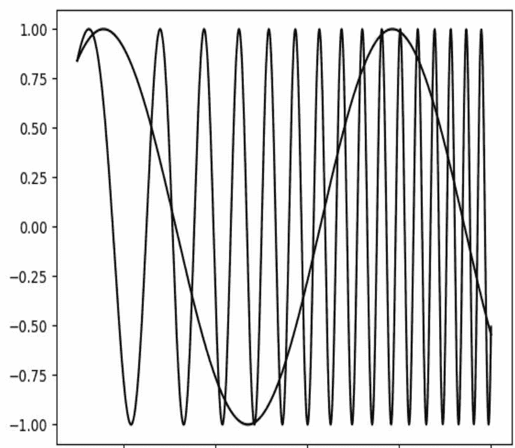

**图 17** 两个函数绘制在同一图形中。

```python
##### Multiple plots with styles

x = np.linspace(1, 10, 100)
lines = ['-', '--', ':']
legends = [r'$\nu = 1$', r'$\nu = 2$', r'$\nu = 3$']
for n in range(3):
    plt.plot(x, np.sin((n+1)*x), lw = 2, linestyle = lines[n])

plt.legend(legends, fontsize = 16, loc = 'best')
plt.show()
```

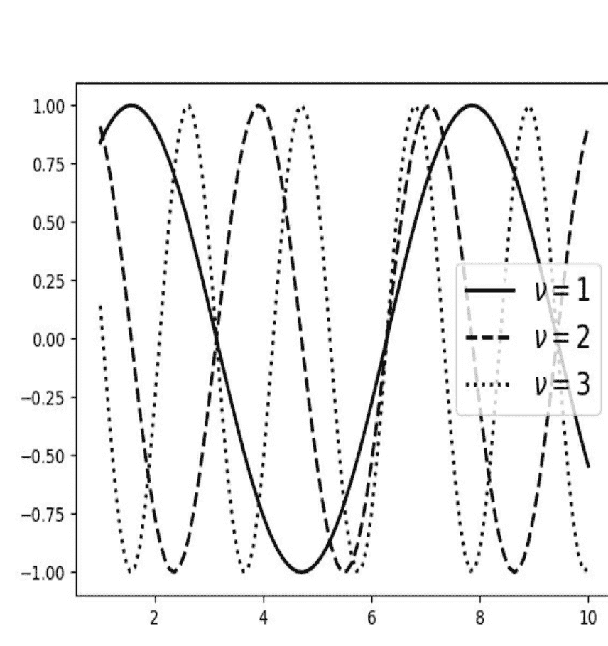

**图 18** 同一图形中带有图例和线型的多个图

```python
##### Multiple plots with texts in Greek, Math
import matplotlib.pyplot as plt
import numpy as np

x = np.arange(0, 2*np.pi, 0.01)
f1 = 0.5*np.sin(x)
f2 = np.exp(-x)*np.cos(2*np.pi*x)

##### c = 0 is darkest black
plt.plot(x, f1, x, f2, c ='0', lw = 2)
plt.xlim(0, 2*np.pi)
plt.text(2.0, 0.55,
    r'$\frac{1}{2}\sin\theta$', size = 18)
plt.text(3.5, 0.1, r'$\exp(x)\cos(2\pi x)$', size = 18)
plt.show()
```

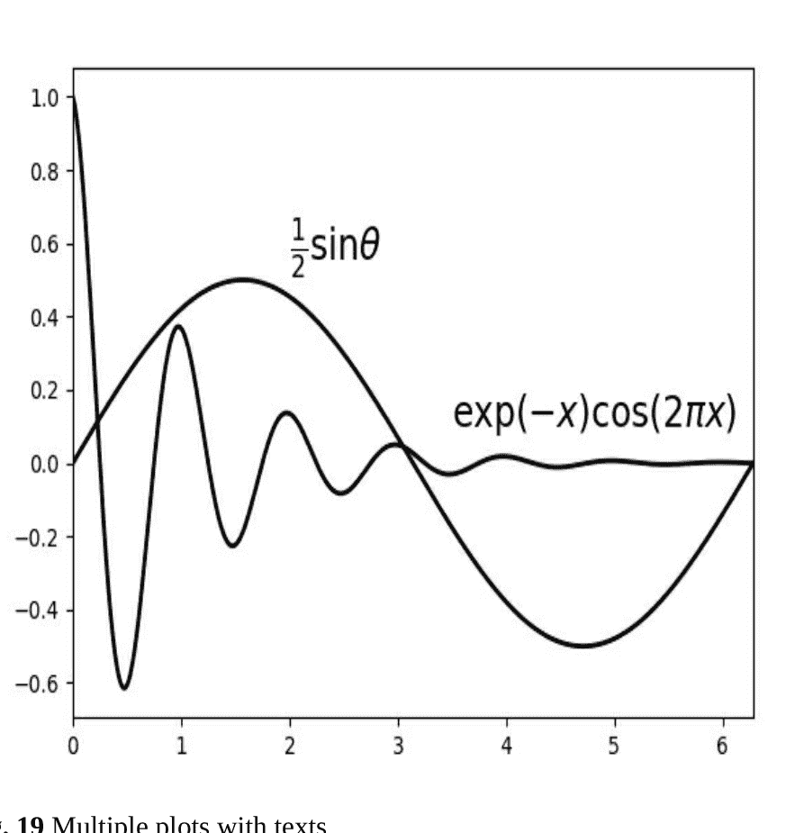

**图 19** 带有文本的多个图

使用 itertools 模块
在 Python 3 中，有一个 '**itertools**' 模块，可以创建各种迭代器函数，如 **count()**、**cycle()**、**repeat()**，用于高效循环。这些函数可以操作列表或字符串。例如，cycle() 创建一个 'itertools cycle object'，可以在其上使用 **next()** 来逐个、循环地、无限地查找元素。在解释器中尝试以下操作。

```python
>>> from itertools import cycle
>>> c = cycle([5, 10, 15])
>>> next(c)
5
>>> next(c)
10
>>> next(c)
15
>>> next(c)
5

>>> c = cycle('ABC')
>>> next(c)
'A'
>>> next(c)
'B'
```

### 多个图：使用 **itertools** 模块

```python
import numpy as np
from scipy.special import legendre
import matplotlib.pyplot as plt
from itertools import cycle

x = np.arange(-1, 1, 0.01)
lines = ['.', '--', '-.', ':', '-']
linecycle = cycle(lines)

for n in range(1, 6):
    p = legendre(n)
    plt.plot(x, p(x),
        next(linecycle), lw = 2, color = 'black')
plt.legend(['$P_1$', '$P_2$',
    '$P_3$', '$P_4$', '$P_5$'])
plt.xlim(-1, 1)
plt.ylim(-1, 1)
plt.title('Legendre Polynomials',
    size = '18')
plt.show()
```

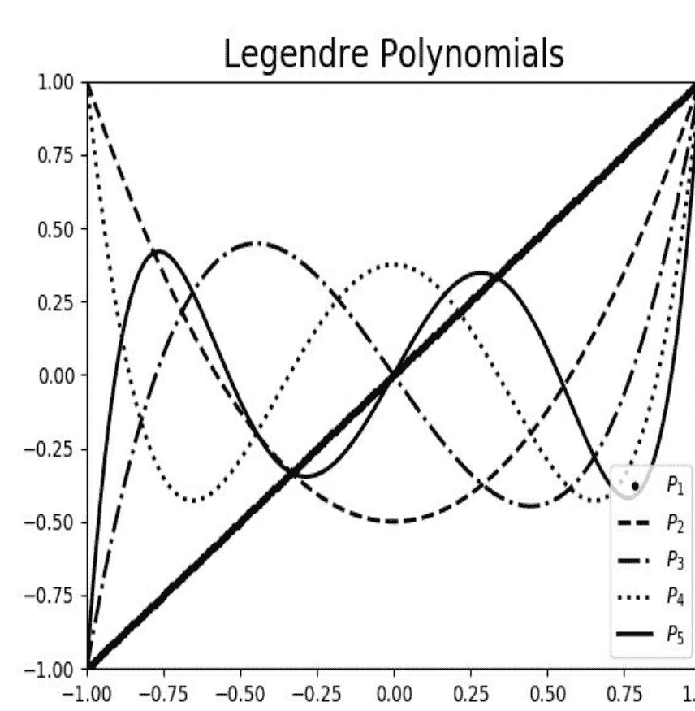

**图 20** 同一图形中的多个图

## 9.1.7 多个图形

```python
x = np.arange(0, 2*np.pi, 0.01)
plt.figure(1)
plt.plot(x, np.sin(x))
plt.figure(2)
plt.plot(x, np.cos(x))
plt.show()
```

**注意：** 两个图形通过两个 plt.figure() 指令分别索引为 **figure(1)** 和 **figure(2)**。如果不这样做，而是只写一次 **plt.figure()**（或不写），我们将在同一图形中得到两个图，如前面的示例所示。如果我们写，例如，plt.figure('My Graph')，'My Graph' 文本将出现在框架的顶部。

通过使用这个 **figure()** 函数作为前导，我们可以在同一个 Python 脚本下创建任意数量的图形。然后我们可以向任何图形添加绘图，或者仅通过引用相应 **figure()** 中的索引或文本来更改。但是，如果我们想在同一个图形中绘制单个或多个图形，则不需要使用 figure() 函数。

## 9.1.8 子图（多个图形在一起）

对于子图，或在同一图形上绘制多个图，我们需要使用以下函数：
**subplot(n, m, plot_number)** [n = 行数，m = 列数]

我们将框架划分为行和列，第三个参数是绘图编号。例如，我们写 **subplot(2, 2, 1)** 或简写为 subplot(221)。这表示我们将空间划分为 2 × 2 个图，此图位于 **图号 1**。图号按行计数，从左到右。

221 222
223 224

子图：2× 2 矩阵中的图号 1 – 4。

```python
##### Python Script for subplot
import matplotlib.pyplot as plt
import numpy as np
x = np.arange(0, 4, 0.01)
plt.subplot(221)
plt.plot(x, x**0.5*np.exp(-x), lw = 2)
plt.subplot(222)
plt.plot(x, np.sin(x**2), lw = 2)
plt.subplot(223)
plt.plot(x, x**2, lw = 2)
plt.subplot(224)
plt.plot(x, x**4*np.exp(-x**2), lw = 2)
plt.show()
```

**注意：** 图被标记为 221、222、223、224，最后一位数字是图号，前两位数字是行数和列数。绘制了四个不同的函数。

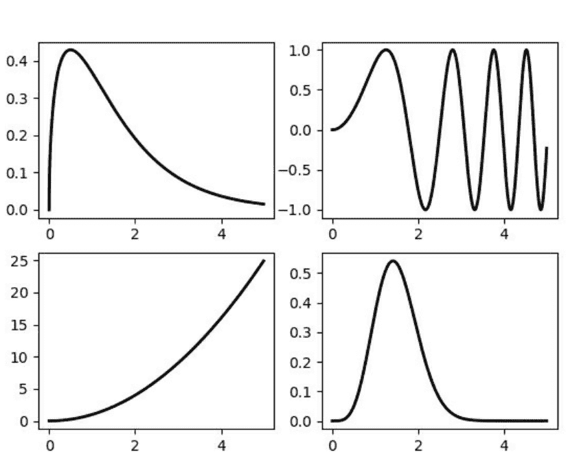

**图 21 子图**
[图 1: $x^{1/2}e^{-x}$, 图 2: $\sin x^2$, 图 3: $x^2$, 图 4: $x^4e^{-x^2}$.]

## 9.1.9 设计网格空间

我们可以使用 matplotlib 中的 'gridspec' 模块创建网格空间。函数 GridSpec() 创建网格布局以放置子图。

```python
>>> import matplotlib.gridspec as grid
>>> g = grid.GridSpec(3, 3)
>>> ax1 = plt.subplot(g[:, 0])
>>> ax2 = plt.subplot(g[:2, 1])
```

## 9.1.10 统计图

```python
##### 带误差棒的图
x = range(5)
y = [1, 4, 16, 25, 42]
plt.errorbar(x, y, fmt = 'o', xerr = 0.2, yerr = 0.3, c = '0.1')
```

**图 23** 带误差棒的图

### 直方图

为演示目的，使用 NumPy 中的 random 模块生成高斯（正态）随机数。pyplot 中的 **hist()** 函数用这些数字创建直方图。plt.hist() 返回一个包含两个数组的元组：第一个数组包含计数或频率，第二个数组包含分箱的边界。例如，

```python
>>> x = [0.2, 1, 0.4, 0.8, 0.5, 1.1]
>>> plt.hist(x, bins = 3)
(array([2., 1., 3.]), array([0.2, 0.5, 0.8, 1.1]), <a list of 3 Patch objects>)
```

```python
##### 绘制直方图
x = np.random.normal(1, 4, 100000)
plt.hist(x, bins = 40, rwidth = 0.8, histtype = 'bar')
```

**注意：** bins = 40 表示创建 40 个分箱；rwidth = 0.8 表示条形的相对宽度占分箱宽度的比例。默认的直方图类型是条形。如果我们写 histtype = 'step'，则只会显示轮廓。hist() 中有许多关键字参数，可以通过 help(plt.hist) 查看，可用于控制显示效果。

**图 24** 由正态随机数创建的直方图。

```python
##### 不同样式的直方图
plt.style.use('ggplot')
plt.hist(x, bins = 40, color = '0.1', rwidth = 0.8, histtype = 'step', lw = 2)
```

**图 25** 以不同样式绘制的直方图。关键字 histtype = 'step' 仅绘制轮廓。

**注意：** 有许多关键字参数可以控制直方图。例如，关键字 normed = 1 将对分布进行归一化。

```python
##### 堆叠直方图
x = np.random.randn(10000, 3)
colors = ['blue', 'green', 'red']
plt.hist(x, bins = 30, color = colors, stacked = True, edgecolor = 'black')
```

**注意：** 使用 random.randn(10000, 3) 创建三个不同的数组，每个包含 10000 个正态随机数。显示效果将由彩色直方图堆叠而成。通过关键字 edgecolor 将每个条形的边缘颜色设为黑色，以便区分。

**图 26** 三个直方图以某种方式堆叠的显示效果。此单色图像使用灰度创建：colors = ['0.3', '0.5', '0.8']

### 堆叠图

```python
import pandas as pd
from numpy.random import uniform as u
data = {'Kolkata': u(0, 1, 20),
        'Delhi': u(0, 1, 20),
        'Mumbai': u(0, 1, 20)}
index = range(20)

##### 数据作为 DataFrame
D = pd.DataFrame(data, index)
print(D.head())
```

```
   Kolkata    Delhi    Mumbai
0  0.384820  0.919648  0.814143
1  0.442323  0.604442  0.913621
2  0.113300  0.137161  0.807373
3  0.645376  0.088518  0.841654
4  0.832507  0.092948  0.869621
```

```python
y = np.vstack([D['Kolkata'],
               D['Delhi'],
               D['Mumbai']])
x = range(20)
labels = ['Kolkata', 'Delhi', 'Mumbai']
#colors = ['red', 'tomato', 'skyblue']
colors = ['0.25', '0.50', '0.75']
plt.stackplot(x, y, labels = labels, colors = colors, edgecolor = 'black')
plt.legend(loc = 2)
```

**图 27** 堆叠图

### 条形图

#### 普通条形图

```python
positions = [0, 1, 2, 3, 4, 5]
heights = [2, 10, 3, 1.5, 6, 0.8]
plt.bar(positions, heights, color = '0.4')
plt.show()
```

**图 28** 条形图

#### 装饰条形图

```python
labels = ['First', 'Second', 'Third']
heights = [20, 10, 5]
bars = plt.bar(labels, heights, color = '0.8', width = 0.8)
bars[0].set_hatch('/')
bars[1].set_hatch('*')
bars[2].set_hatch('o')
plt.show()
```

**图 29** 带装饰的条形

```python
##### 包含两组数据的条形图
men = [80, 50, 75, 60]
women = [90, 62, 50, 65]

##### 条形位置
x = np.arange(len(men))
w = 0.4 # 宽度
plt.bar(x, men, width = w, label = 'Men', color = '0.1')
plt.bar(x + w, women, width = w, label = 'Women', color = '0.7')
plt.legend(fontsize = 14)
```

**图 30** 绘制了不同颜色的条形。

### 饼图

给定一组数字（一组项目的百分比），可以通过 **plt.pie()** 函数制作饼图。

```python
>>> x = [10, 05, 25, 60]
>>> plt.pie(x)
```

作为 **pie()** 的参数，我们可以以列表形式设置相应的 **标签、颜色**。我们还可以提供额外的属性，如突出显示饼图的一部分（**'explode'**）和相应部分的自动百分比（**'autopct'**），以增强视觉效果。

```python
##### 饼图的 Python 脚本
slices = [43, 20, 12, 9, 16]
colors = ['0.7', '0.3', '0.6', '0.4', '0.5']
labels = ['Rice', 'Sugar', 'Wheat', 'Cotton', 'Jute']
ex = (0, 0, 0, 0.1, 0)

plt.pie(slices, labels = labels, explode = ex, shadow = True, autopct = '%1.1f%%', colors = colors)
plt.show()
```

**图 31** 饼图

## 9.1.11 等高线图

等高线图是三维图的二维投影。它可以通过 **contour()** 函数创建。contour() 函数的 3 个参数：x 值的网格、y 值的网格和 z 值的网格。x 和 y 值代表图上的位置，z 值代表等高线级别（高度）。准备 x 和 y 值网格的一种方法是使用 **Numpy** 中的 **meshgrid(x, y)** 函数，该函数从一维数组创建二维网格。

```python
##### 网格准备
x = np.linspace(0, 10, 10)
y = np.linspace(0, 10, 10)
X, Y = np.meshgrid(x, y)

plt.plot(X, Y, '.', ms = 12, c = 'k')
plt.title('X-Y Grid', size = 20)
plt.show()
```

**注意：** **meshgrid()** 函数在 x-y 平面上创建一个二维网格。在这种情况下，x 轴和 y 轴各有 10 个离散点。

**图 32** X-Y 网格

对于**等高线图**，我们需要从网格准备 Z(X, Y)，并绘制 contour(X, Y, Z)。

```python
##### 等高线图
x = np.linspace(0, 10, 100)
y = np.linspace(0, 10, 100)
X, Y = np.meshgrid(x, y)
Z = np.sin(X)**2 + np.cos(Y)**2
plt.contour(X, Y, Z, colors = 'black')
```

**图 33** 等高线图

#### 等高线图：另一个例子

```python
f = lambda x, y: np.sin(X)**3 + np.cos(Y) * np.sin(X)
x = np.linspace(0, 5, 100)
y = np.linspace(0, 5, 100)
X, Y = np.meshgrid(x, y)
Z = f(X, Y)
plt.contour(X, Y, Z, 100, cmap = 'binary')
```

**图 34** 使用二进制映射的等高线图

**注意：** 在 **contour(X, Y, Z, 100, cmap = 'binary')** 函数的参数中，数字 100 用于控制等高线的密度。

#### 连续型等高线图

```python
x = np.linspace(0, 1, 100)
y = x
X, Y = np.meshgrid(x, y)
Z = 2 * np.sin(np.pi*X) * np.sin(np.pi*Y)

plt.contourf(X, Y, Z, cmap = 'gray')
plt.show()
```

**图 35** 使用 contourf() 函数绘制的另一种等高线图。此函数绘制等高线并填充等高线之间的区域。

#### 带数据的等高线图

```python
##### 使用创建的数据进行检查
import numpy as np
import scipy.interpolate as si
import matplotlib.pyplot as plt

##### 由随机数生成器创建的测试数据
x = np.random.uniform(0, 1, 100)
y = np.random.uniform(0, 1, 100)
z = np.random.randn(100)

##### X 和 Y 网格值
xi = np.linspace(x.min(), x.max(), 100)
yi = np.linspace(y.min(), y.max(), 100)
zi = si.griddata((x, y), z, (xi[None, :], yi[:, None]), method = 'cubic')
plt.contour(xi, yi, zi, cmap = 'gray')
```

## 示例 1

我们可以使用 **Pandas** 包中的 csv 文件读取器打开下载的电子表格（Excel 文件）并继续操作。

```python
import pandas as pd
D =
22.5 22.2 21.6 20.8 19.3
0 17.0 16.3 14.4 12.9 12.0
1 12.0 12.0 13.2 13.2 15.7
2 16.1 15.6 15.0 14.7 14.6
3 14.8 15.6 15.0 12.4 13.4
4 13.0 12.8 12.0 11.9 11.7
pd.read_csv(r"C:/Users/Abhijit/ Desktop/data_test.csv") D.head() # DataFrame 的头部
```

```python
##### 将列提取为一维数组 # DataFrame 转为 NumPy 数组
d = D.to_numpy()

x = d[:, 1] # 前三列 y = d[:, 2]
z = d[:, 3]
##### 将数据转换为网格形式以进行等高线图绘制

N = x.size
xi = np.linspace(x.min(), x.max(),
N) yi = np.linspace(y.min(), y.max(),
N) zi = si.griddata((x, y), z, (xi[None, :], yi[:, None]), method = 'cubic')
plt.contour(xi, yi, zi, cmap = 'gray')
```

**图 37** 使用下载数据绘制的等高线图
**注意：** 数据文件可以使用合适的文件读取器读取。对于纯文本/数据文件，我们可以使用 NumPy 中的 loadtxt()。然而，对于可以保存并视为 CSV（逗号分隔值）文件的电子表格（例如 Excel 文件），可以通过 pandas 模块中的 csv 文件读取器 read_csv() 来读取。由 pd.read_csv() 读取的文件是一种称为 DataFrame（一种结构化数据形式）的类型。接下来，我们将 DataFrame 转换为 NumPy 数组。

## 示例 #2

在此演示中，直接访问并绘制来自 **url** 的数据。[以下演示为 jupyter notebook 风格。]

```python
In [1]:

url =
'https://raw.githubusercontent.com /alexmill/website_notebooks/master/data/data_3d_contour.csv'
data = pd.read_csv(url)
type(data)
Out[1]:
pandas.core.frame.DataFrame
```

```python
In[2]:
data.tail()
```

```python
Out[2]:
x y z
51 0.35 1.0 -0.45
52 0.50 1.0 -0.46 53 0.69 1.0 -0.48 54 0.85 1.0 -0.47 55 1.0 1.0 -0.49
```

```python
In[3]:
table =
data.pivot_table(index='x', columns='y', values='z')
```

注意：pd.pivot_table() 返回电子表格风格的表格作为 DataFrame。列和行将按层次顺序排列。可以检查输出以了解数据透视表的样子。可以检查 table.values()、table.values.max()、table.values.min()、table.values.shape 等。

检查 x 和 y 数据的唯一值：data.x.unique(), data.y.unique()

```python
In[4]: x_unique =
np.sort(data.x.unique())

y_unique =
np.sort(data.y.unique())
X, Y = np.meshgrid(x_unique, y_unique)
Z = table.values.T
```

```python
In [5]:
import matplotlib.pyplot as plt import matplotlib.cm as cm
fig = plt.figure()
ax = fig.add_subplot(111)

levels = np.array([-0.4, -0.2, 0, 0.2, 0.4])
cpf = ax.contourf(X, Y, Z,
len(levels), cmap = cm.gray)

line_colors = ['black' for l in cpf.levels]
cp = ax.contour(X, Y, Z,
levels=levels, colors = line_colors) ax.clabel(cp, fontsize=14,
colors=line_colors)
```

图 38 使用电子表格数据绘制的等高线图。

## 9.2 三维图

一旦我们通过 **meshgrid()** 函数准备好了 XY 网格，就需要从 matplotlib 工具包导入三维绘图模块来创建三维图。

```python
from mpl_toolkits.mplot3d import Axes3D from matplotlib import cm
##### 准备图形框架 **fig = plt.figure()**

##### 准备坐标轴
ax = Axes3D(fig)
ax.plot_wireframe(X, Y, Z, color =
'k')
```

**图 39** 三维图（线框结构）

## 连续曲面的颜色映射选项

```python
##### ax.plot_surface(X, Y, Z, cmap = cm.coolwarm)
ax.plot_surface(X, Y, Z, cmap = cm.gray)
```

图 40 带有连续曲面的三维图（灰色映射）

```python
##### 三维图的 Python 脚本（另一种方式）
import numpy as np
import matplotlib.pyplot as plt from mpl_toolkits import mplot3d

x = np.linspace(-10, 10, 100) y = np.linspace(-10, 10, 100)
X, Y = np.meshgrid(x, y)
Z = np.sin(np.sqrt(X**2 + Y**2))

fig = plt.figure()
ax = plt.axes(projection = '3d') ax.contour3D(X, Y, Z, 80, cmap =
'binary') plt.show()
```

**图 41** 三维等高线图
**注意：** 有许多颜色映射选项（**cmap** = 颜色映射）可用于在三维颜色空间中进行良好的表示
[参见：*matplotlib.org/2.0.2/users/colormaps.html*]。

参数 80 用于点的密度。此外，还有其他关键字参数可以调整以创建所需的三维图。我们可以使用 ax.scatter() 创建三维散点图。可以使用 ax.plot_trisurf() 创建三维三角化曲面。

## 三维条形图

```python
fig = plt.figure()
ax = fig.add_subplot(111,
projection = '3d')

xpos = np.arange(1, 11)
ypos = random.randint(1, 10, 10) zpos = np.zeros(10)
dx = np.ones(10)
dy = np.ones(10)
dz = np.linspace(1, 100, 10) # ax.bar3d(xpos, ypos, zpos, dx,
dy, dz, color = '#32CD32') ax.bar3d(xpos, ypos, zpos, dx, dy, dz, color =
'0.3') plt.show()
```

图 42 三维条形图

**注意：**

-   一旦显示了三维图形，就可以用电脑鼠标按住图形并向任意方向旋转以进行检查。

-   彩色等高线和三维彩色曲面可以通过 **cmap**（颜色映射）参数生成。分类项目以及教程和示例在 matplotlib 曲面图文档部分（matplotlib 网站）和其他地方提供。

附加说明：

如果 x 和 y 数组以对应于所有网格点坐标的形式提供，那么我们可以直接绘制它们而无需调用 meshgrid()。唯一的标准是 x、y、z 数组需要重塑为二维数组。例如，

```python
x = [0, 0, 0, 1, 1, 1, 2, 2, 2] y = [0, 1, 2, 0, 1, 2, 0, 1, 2] z = [5, 6, 9, 1, 2, 3, 5, 9, 11] X = np.reshape(x, (3, 3))
Y = np.reshape(y, (3, 3))
Z = np.reshape(z, (3, 3))
fig = plt.figure()
ax = fig.add_subplot(111, projection = '3d')

ax.plot_surface(X, Y, Z)
plt.show()
```

图 43 使用整理好的数据演示曲面图

## 练习：

1.  给定一组以字典形式表示的 (x, y) 数据：{1:0.5, 2:3.8, 3:7.9, 4:16.5, 5:27.5}。绘制 x 对 y 的图，x 轴标签为‘Time’，y 轴标签为‘Temperature’。
2.  给定一个函数，y = f(x) = 2x^3 exp (-x^2)，为 x 范围 (0, 20) 生成一些 (x, y) 数据点，然后使用 matplotlib 包绘图。同时将数据存储到文件中，稍后使用 matplotlib 绘图。
3.  使用 matplotlib 绘制函数 $f(x) = x - x^2/10$ 和 $g(x) = x^2 - x/3$ 在区间 [0, 10] 上的图像。包括 x 轴和 y 轴的标签，以及解释哪条线是哪个图的图例。将图像保存为 .jpg（“Jpeg”）文件。
4.  读取一个两列数据文件 'mydata.d'。(a) 将值存储在数组 X 和 Y 中，(b) 用函数 $y = a + bx$ 拟合数据，(c) 报告 $a$、$b$，(d) 绘制原始数据和叠加的拟合曲线。
5.  在 [0, 5] 范围内生成一个 numpy 数组 X。使用 matplotlib 绘制以下曲线：i) $y = (3x^3 - 2x^4) / (1 + x^2)$，ii) $y = \sin^2 x$，iii) $y = A_1 \exp(-B_1 x) + A_2 \exp(-B_2 x)$，其中 $A_1, A_2, B_1, B_2$ 分别为 $[1, -1, 1, 2], [1, -1, 2, 1], [1, 10, 1, 1]$，并将它们叠加并添加图例。

热情的读者可以探索一个建立在 matplotlib 之上的惊人可视化模块 **seaborn**。它提供了用于绘制信息丰富、有吸引力和统计图表的高级接口。

##### 第 10 章

##### SymPy：符号 Python

> “在我看来，世界不是一张图、一个公式或一个方程。它是一个故事。” – 谢丽尔·斯特雷德

**SymPy** 是 **符号 Python**。我们使用它进行符号计算（就像用纸和笔进行的计算一样）。输出以数学符号的形式返回。[对于模块参考和文档，请查阅：
docs.sympy.org/latest/modules.]

在本章关于 SymPy 的简要介绍中，我们尝试阐述一些核心思想和特性。SymPy 是一个庞大的独立库。许多重要的数学项目都基于它开发。读者可以根据工作需要随时探索它们。以下（方框内内容）摘自 SymPy 文档
www.sympy.org/en/index.html。
关于

> ‘SymPy 是一个用于符号数学的 Python 库。它旨在成为一个功能齐全的计算机代数系统（CAS），同时保持代码尽可能简单，以便易于理解和扩展。SymPy 完全用 Python 编写。’

```
##### Import everything from SymPy
>>> from sympy import *
##### Check the directory
>>> dir(sympy)
##### For fancy printing
>>> init_printing()
```

**注意：** 在命名空间中导入所有内容并非良好实践。但此处我们导入所有内容是为了让后续指令在演示目的下显得更简洁。

## 10.1 符号、表达式、计算

```
##### Symbolic representations
>>> pi
π
>>> sqrt(3)
√3
>>> a = sqrt(3)

##### Evaluate in floating point number
>>> a.evalf()
1.73205080756888
>>> cos(pi)
-1
>>> acos(-1)
π
```

## 代数表达式
##### 定义符号

```
>>> x, y, z = symbols('x, y, z')
>>> y*exp(x) + z**2
y*e^x + z²
```

```
>>> a, b = 19, 38
>>> Rational(a, b) # Ratio
1/2
```

```
>>> x**Rational(2, 3)
x^(2/3)
```

## 包含三角函数、希腊符号的表达式

```
>>> a, b, c = symbols('alpha, beta, gamma')
>>> sin(a) + log(b**c)/sqrt(b)
sin(α) + log(β^γ)/√β
```

## 数学表达式的化简

```
>>> x, y = symbols('x, y')
>>> a = x**3 + 2*x**2 + 5*x
>>> b = 2*x**3 - 2*x**2 + 4*x
>>> c = simplify((b - a)/(b + a))
>>> c
(x² - 4x - 1)/(3(x² + 3))
```

## 表达式求值
##### 将 1 代入 x

```
>>> c.subs(x, 1)
-1/3
```

## 多重替换

## 多个符号

```
>>> x, y, z = symbols('x, y, z')
>>> a = x**2 + x*y + z
>>> a.subs([(x, 2), (y, -1), (z, 1)])
3
```

```
##### Numerical evaluation of a builtin function
>>> x = Symbol('x')
>>> f = lambdify(x, sin(x), 'math')
>>> f(0.5)
0.479425538604
```

**注意：** lambdify() 将从 math 模块获取的函数 sin() 进行转换。

```
##### Simplification of trigonometric and other expressions
>>> simplify(sin(x)**2 + cos(x)**2)
1
>>> simplify(4*sin(x)*sin(pi/3 - x)*sin(pi/3 + x))
sin(3x)
```

```
##### Trigonometric simplifications by trigsimp()
>>> trigsimp(4*sin(x)*sin(pi/3 - x)*sin(pi/3 + x))
sin(3x)
```

```
##### Factor cancellation
>>> cancel((x**2 + 2*x + 1)/(x**2 + x))
(x + 1)/x
```

```
##### Factorization
>>> x = symbols('x')
>>> f = x**2 - 5*x + 6
>>> factor(f)
(x - 3)(x - 2)
```

```
##### Expansion
>>> expand(x*(2*x+3))
2x² + 3x
>>> expand((cos(x) + sin(x))**2)
sin²(x) + 2sin(x)cos(x) + cos²(x)
```

## 三角展开

```
>>> expand_trig(sin(x+y))
sin(x)cos(y) + sin(y)cos(x)
>>> expand_trig(cot(x+y))
(cot(x)cot(y) - 1)/(cot(x) + cot(y))
```

```
##### Rewriting Trigonometric expression
##### tan(x) written in terms of sin(x)
>>> tan(x).rewrite(sin)
2sin²(x)/sin(2x)
```

## 阶乘、二项式组合

```
>>> n, k = symbols('n, k')
>>> factorial(n)
n!
>>> binomial(n, k)
(n, k)
```

## 组合化简

```
>>> combsimp(binomial(n, n-1)/binomial(n, n-2))
2/(n - 1)
```

## Beta 函数、Gamma 函数、超几何函数

```
>>> beta(x, y) # Beta function B(x, y)
>>> beta(x, 1)
1/x
>>> gamma(z) # Gamma function Γ(z)
##### Hypergeometric function
>>> hyper([1,2], [3], z)
₂F₁(1, 2; 3; z)
>>> hyperexpand(hyper([1,2], [3], z))
-2z - 2log(1 - z)
```

**注意：** SymPy 包含各种特殊函数，如狄拉克δ函数、
赫维赛德函数、奇异函数类、各种 Gamma 函数（digamma、trigamma、polygama）、误差积分、菲涅耳积分、正弦积分、对数积分、椭圆积分等等。

```
##### Infinite series: Taylor Series Expansion around x0 = 0
>>> exp(x).series(x, x0 = 0)
1 + x + x²/2 + x³/6 + x⁴/24 + x⁵/120 + O(x⁶)
>>> log(x).series(x, x0 = 2)
log(2) - 1 - (x - 2)²/2 + (x - 2)³/24 - (x - 2)⁴/192 + (x - 2)⁵/1600 + O((x - 2)⁶; x -> 2)
##### Declare function and expand
>>> f = Function('f')
>>> f = sin(x)/x
>>> f.series(x, x0 = 0)
1 - x²/6 + x⁴/120 + O(x⁶)
##### Algebraic equation, solve
>>> Eq(x**2 - 5*x + 3, 0)
x² - 5x + 3 = 0
>>> solve(x**2 - 5*x + 3) # Root finding
[5/2 - sqrt(13)/2, 5/2 + sqrt(13)/2]
##### System of equations, Solve
>>> x, y = symbols('x, y')
>>> solve((x + y - 4, x - y - 2), x, y)
{x: 3, y: 1}
```

## 10.2 矩阵

```
##### Column Matrix
>>> Matrix([1, 2, 3])
[1]
[2]
[3]
>>> Matrix([[1, 2, 3], [4, 5, 6], [7, 8, 9]])
[1 2 3]
[4 5 6]
[7 8 9]
```

矩阵运算：

```
>>> A = Matrix([[1, 2, 3], [4, 5, 6], [7, 8, 9]])
>>> B = Matrix([[1, 0, 1], [1, 2, -1], [3, 1, 4]])
```

```
##### Shape, Rows, Columns
>>> A.shape
(3, 3)
```

```
>>> A.row(1) # Row 1
[4 5 6]
>>> A.col(0) # Column 0
[1]
[4]
[7]
```

```
##### Addition
##### Addition of two matrices
>>> A + B
[2 2 4]
[5 7 5]
[10 9 13]
```

```
##### Product
>>> A * B
[12 7 11]
[27 16 23]
[42 25 35]
```

```
##### Inverse of Matrix
>>> B**-1
[9/4 1/4 -1/4]
[-7/4 1/4 1/2]
[-5/4 -1/4 1/2]
```

```
>>> B*B**-1 # To check
[1 0 0]
[0 1 0]
[0 0 1]
```

## 转置

```
>>> A.T
[1 4 7]
[2 5 8]
[3 6 9]
```

## 矩阵的幂

```
>>> A**2
[30 36 42]
[66 81 96]
[102 126 150]
```

## 行列式

```
>>> A.det()
0
>>> B.det()
4
```

## 特征值、特征向量
>>> B.eigenvals() # Eigenvalues
>>> B.eigenvects() # Eigenvectors
## 矩阵的对角化
方法 diagonalize() 返回一个元组 (P, D)，其中 D 是对角矩阵，且 D = P⁻¹BP。

```
>>> P, D = B.diagonalize()
>>> D
[2 0 0]
[0 5/2 - sqrt(17)/2 0]
[0 0 sqrt(17)/2 + 5/2]
>>> P
[1 -sqrt(17)/4 - 3/4 -3/4 + sqrt(17)/4]
[-5/3 4 + sqrt(17)/4 - sqrt(17)/4]₁₁₁
```

```
##### Special Matrices
>>> diag(3, 4, 1) # Diagonal Matrix
[3 0 0]
[0 4 0]
[0 0 1]
```

```
>>> zeros(3) # Null Matrix
[0 0 0]
[0 0 0]
[0 0 0]
```

```
>>> ones(2, 3)
[1 1 1]
[1 1 1]
```

```
>>> eye(3) # Identity Matrix
[1 0 0]
[0 1 0]
[0 0 1]
```

## 10.3 微积分

### 10.3.1 极限

```
>>> Limit(sin(x)/x, x, 0)
lim(sin(x)/x)
x→0+
```

```
>>> f = Limit(sqrt(x**2+1)/x, x, oo) # oo is infinity.
lim(√(x² + 1)/x)
x → ∞
```

```
##### Evaluate the limit
>>> f.doit()
1
```

```
##### Direct evaluation
>>> limit(sin(x)/x, x, 0)
1
```

### 10.3.2 微分

```
>>> y = Function('y')
>>> t = symbols('t')
```

```
##### Differentiate y w.r.t. t
>>> y(t).diff(t)
dy/dt
```

```
##### Substitute t = 0
>>> y(t).diff(t).subs(t, 0)
dy/dt|_{t=0}
```

```
##### Differentiate twice w.r.t. t
>>> y(t).diff(t, t)
d²y/dt²
```

```
>>> y = t**3 + 2*t**2 + 4
>>> y.diff(t)
3t² + 4t
```

```
>>> y.diff(t).subs(t, 1)
7
Also, one can write:
>>> diff(y, t)
3t² + 4t
```

```
##### Differentiate w.r.t. x
>>> diff(sin(x)*exp(x), x)
e^x sin(x) + e^x cos(x)
```

### 10.3.3 积分

```
##### Indefinite Integration
>>> integrate(exp(x)*sin(x))
e^x sin(x)/2 - e^x cos(x)/2
```

```
##### Representation of definite Integral
>>> Integral(sin(x)*exp(x), (x, 0, 1))
∫₀^1 e^x sin(x) dx
```

```
##### Evaluating a definite Integral
>>> integrate(exp(x)*sin(x), (x, 0, 1))
-½cos(1) + ½sin(1)

>>> integrate(x**2*exp(-x**2), (x, 0, oo))
√π/4

##### Double Integral
>>> x, y = symbols('x, y')
>>> Integral(exp(-x**2 - y**2), (x, 0, oo), (y, 0, oo))
∫∫ e^(-x² - y²) dx dy
0 0

>>> integrate(exp(-x**2 - y**2), (x, 0, oo), (y, 0, oo))
π/4
```

## 10.4 函数绘图

一旦我们定义了一个符号并通过 lambdify() 创建了函数，我们就可以使用 matplotlib 库进行绘图。不过，SymPy 中有一个基于 Matplotlib 的绘图模块，我们可以直接使用。

### 10.4.1 使用 Matplotlib 绘图

```
x = Symbol('x')
f = lambdify(x, sin(x**2), 'numpy')
import numpy as np
import matplotlib.pyplot as plt
xvals = np.arange(0, 10, 0.01)
yvals = f(xvals)
plt.plot(xvals, yvals)
```

**图 1：** 使用 lambdify 和 Matplotlib 库绘制函数。
**注意：** 函数 sin() 取自 NumPy。

### 10.4.2 使用 SymPy 绘图库绘图

绘图模块允许我们创建二维和三维图形。目前，图形使用 Matplotlib 作为后端进行渲染。

```
>>> x = Symbol('x')
##### Directly plots the expression
>>> plot(x**2)
```

## 图 2：使用 SymPy plot 绘制二维图形

```python
>>> x = Symbol('x')
##### 绘制数学函数
>>> plot(sin(x)/x)
```

## 图 3：使用 SymPy plot 绘制二维图形

**注意：** 函数 `plot()` 来自 `sympy.plotting` 模块。我们可以这样写：`from sympy.plotting import plot`。这里我们在开头导入了所有内容，所以不需要再写。默认绘图使用蓝色线条，定义域为：`[-10, 10]`。

`plot` 的在线帮助：
`plot(*args, show=True, **kwargs)` 将单变量函数绘制为曲线。

布尔关键字参数 `show = True` 会立即绘制图形。我们可以在创建绘图时设置 `show = False`，以便稍后显示。

SymPy 文档中的在线帮助和绘图函数参考页面展示了各种可用于控制绘图的参数：`‘line_color’`、`‘title’`、`‘label’`、`‘xlabel’`、`‘ylabel’`、`‘xscale’`、`‘yscale’`、`‘axis_center’`、`‘xlim’`、`‘ylim’`、`‘annotations’`、`‘markers’`、`‘rectangles’`、`‘fill’`、`‘adaptive’`、`‘depth’`、`‘nb_of_points’`、`‘size’` 等。

```python
##### 控制 x 轴比例
>>> plot(x**2*exp(-x), (x, 0, 8))
```

## 图 4：使用 SymPy plot 绘制二维图形

```python
##### 在一个图形中绘制多个函数
>>> plot(sin(x), cos(x))
```

## 图 5：使用 SymPy plot 绘制二维图形。多个图形一起显示。

```python
##### 收集绘图对象，稍后显示
>>> p1 = plot(x**2*exp(-x), (x, 0, 5), show = False)
>>> p2 = plot(abs(sin(x)), (x, 0, 5), show = False)
>>> p1.append(p2[0])
>>> print(p1)
Plot object containing:
[0]: cartesian line: x**2*exp(-x)
for x over (0.0, 5.0)
[1]: cartesian line: Abs(sin(x))
for x over (0.0, 5.0)
>>> p1.show()
```

**注意：** `plot()` 创建一个元组。第 0 个元素是绘图对象。因此，我们使用 `p2[0]` 来追加。

## 图 6：使用 SymPy plot 绘制二维图形。合并绘图并显示。

```python
##### 参数方程绘图（二维）
plot_parametric(sin(x), cos(x))
```

## 图 7：参数方程绘图

```python
t = Symbol('t')
plot_parametric(2*sin(t+3/2*pi) + 4/3*cos(3*t), 2*cos(t + 3/2*pi) + 4/3*sin(3*t), (t, -2*pi, 2*pi))
```

## 图 8：参数方程绘图

### 三维绘图

```python
from sympy.plotting import plot3d
x, y = symbols('x y')
plot3d(cos(x)**2 + sin(y)**2,
(x, -pi, pi), (y, -pi, pi))
```

## 图 9：三维绘图

### 三维参数方程绘图

```python
from sympy.plotting import plot3d_parametric_line
t = Symbol('t')
plot3d_parametric_line(cos(t), sin(t), t)
```

## 图 10：三维参数方程绘图

## 10.5 几何对象

### 点与距离

```python
>>> from sympy import symbols, init_printing
>>> import sympy.geometry as g
>>> x, y = symbols('x, y')
>>> init_printing()
>>> p = g.Point(0, 0)
[在 (0, 0) 处创建了一个点。]
>>> p
Point2D(0, 0)
##### 点 (x, y)
>>> p1 = g.Point(x, y)
##### p1 与 p 之间的距离
>>> p1.distance(p)
√(x² + y²)
##### 三角形 (a, b, c)
>>> a, b, c = g.Point(0, 0), g.Point(4, 1), g.Point(-1, 2)
>>> t = g.Triangle(a, b, c)
##### 三角形的面积
>>> t.area
9/2
##### 椭圆（中心，水平半径，垂直半径）
>>> e = g.Ellipse((0, 0), 5, 2)
>>> e.area
10.π
##### 椭圆的参数
>>> e = g.Ellipse((1, 0), hradius = 5, eccentricity = 0.7)
>>> e.vradius
3.57071421427142
>>> e.apoapsis
17/2
>>> e.circumference
20.E(49/100)
>>> e.equation(x, y)
0.078..x² + (y-1)² - 1 = 0
```

## 10.6 求解微分方程

### 一阶：dy/dx + P(x)y = Q(x)

```python
>>> m, g, k = 1, 9.8, 1
>>> t = Symbol('t')
>>> v = Function('v')
>>> sol = dsolve(Eq(m*v(t).diff(t) + k*v(t), m*g), v(t))
>>> sol # 解 ??(??)= ??_1??^-1.0??+ 9.8
>>> sol.lhs # 左边 ??(??)
>>> sol.rhs # 右边 ??_1??^-1.0??+ 9.8
##### 应用初始条件，求 ??_1
##### 让我们代入 ??(0)= 0。
>>> C1_value = solve(sol.rhs.subs(t, 0))[0]
>>> C1_value # ??_1 的值
-9.8
##### 代入 ??_1 的值，求解
>>> C1 = Symbol('C1')
>>> sol = sol.subs(C1, C1_value)
>>> sol
??(??)= 9.8 - ??_1??^-1.0??
##### 绘制解
>>> from matplotlib import pyplot as plt
>>> import numpy as np
>>> func = lambdify(t, sol.rhs,'numpy')
>>> xvals = np.arange(0, 10, 0.1)
>>> yvals = func(xvals)
>>> plt.plot(xvals, yvals)
```

## 图 11：通过 lambdify 绘图

### 二阶：$\frac{d^2y}{dt^2} + \omega^2(y) = 0_{\omega=2}$

```python
##### 构建方程
>>> t = Symbol('t')
>>> y = Function('y')
>>> equation = Eq(y(t).diff(t,t) + y(t), 0)
>>> equation
$\frac{d^2y}{dt^2} + \omega^2$
$\omega=2 \frac{d^2y}{dt^2} = 0$
##### 求解方程
>>> sol = dsolve(equation, y(t))
>>> sol
$y(t) = C_1\sin(t) + C_2\cos(t)$
##### 通过初始条件求常数 $C_1$ 和 $C_2$
##### 解的导数
>>> y1 = sol.rhs.diff(t)
>>> y1 # $y' = \frac{dy}{dt} = C_1\cos(t) - C_2\sin(t)$
>>> sol.rhs.subs(t, 0)
>>> sol.rhs.diff(t).subs(t, 0) ??_1
##### 取出常数并代入解中。
>>> C1, C2 = symbols('C1, C2')
>>> s = solve((sol.rhs.subs(t, 0) - 0, sol.rhs.diff(t).subs(t, 0) - 1), C1, C2)
>>> s # 以字典形式返回
{??_1: 1, ??_2: 0}
注意：‘sol.rhs.subs(t, 0) – 0’ 表示 ??(0)= 0，‘sol.rhs.diff(t).subs(t, 0) – 1’ 表示 ??’(0) = 1。
##### 解包常数，代入解中
>>> C1_value, C2_value = s.values()
>>> sol = sol.subs({C1:C1_value, C2:C2_value})
>>> sol # 最终解 ??(??)= sin (??)
##### 绘制解
>>> import numpy as np
>>> import matplotlib.pyplot as plt
>>> func = lambdify(t, sol.rhs)
>>> x = np.arange(0, 10, 0.01)
>>> y = func(x)
>>> plt.plot(x, y)
```

## 图 12：绘制解

# 第 11 章

# Pandas：结构化数据

> “所有优秀的艺术在其结构上都是抽象的。” – 保罗·斯特兰德

我们经常以电子表格或其他各种表格形式接收数据。外部模块 Pandas 提供了处理此类结构化数据的机制。

Pandas 处理以下三种数据结构：

- Series
- DataFrame
- Panel

这些数据结构建立在 NumPy 数组之上。在导入模块之前，我们必须在核心 Python 上安装 pandas。安装过程与安装其他外部包（如 NumPy、SciPy *等*）相同。

```python
>>> import pandas as pd
>>> import numpy as np
```

## 11.1 Series

```python
##### 数据
>>> x = np.arange(10, 50, 10)
>>> pd.Series(x)
0 10
1 20
2 30
3 40
dtype: int32
```

**注意：** 行索引：0, 1, 2, 3 是自动给出的。因此，我们从一维数组构建了一个结构。数据类型默认为 `int32`。

```python
##### 指定索引
>>> index = ['a', 'b', 'c', 'd']
>>> s = pd.Series(x, index)
>>> s
a 10
b 20
c 30
d 40
dtype: int32
##### 通过索引搜索
>>> s[0]
10
>>> s['a']
10
##### 方法和属性
>>> s.axes
[Index(['a', 'b', 'c', 'd'], dtype = 'object')]
>>> s.values
array([10, 20, 30, 40])
>>> s.size
4
>>> s.shape
(4,)
>>> s.ndim
1
>>> s.dtype
dtype('int32')
##### 添加索引为 'e' 的新行
>>> s['e'] = 50
>>> s
a 10
b 20
c 30
d 40
e 50
dtype: int64
##### 注意：数据类型改变了
##### 字符串数据
>>> data = ['Raman', 'Guido', 'Ismail', 'Apu']
>>> pd.Series(data)
0 Raman
1 Guido
2 Ismail
3 Apu
dtype: object
##### 标量数据（单个数据）
>>> index = ['a', 'b', 'c', 'd']
>>> pd.Series(10, index, int)
a 10
b 10
c 10
d 10
dtype: int32
##### 从字典创建 Series
>>> data = {'a':10, 'b':20, 'c':30, 'd':40}
>>> pd.Series(data)
a 10
b 20
c 30
d 40
dtype: int64
##### 强制指定新索引
>>> index = ['a', 'b', 'c', 'd', 'e']
>>> pd.Series(data, index)
a 10.0
b 20.0
c 30.0
d 40.0
e NaN
##### 没有与此索引对应的数据
dtype: float64
```

**注意：** `NaN` = Not a Number（非数字）。这是 Python 在数据缺失或无法理解时放置此对象的方式。

数学运算符、内置函数以及所有 NumPy 方法都可以应用于 Series，就像应用于 NumPy 数组一样。同样，索引、切片和其他机制也可以像处理 NumPy 数组那样应用。这是可能的，因为 Pandas 中的 `Series()` 是建立在 NumPy 的 `array()` 之上的。例如，如果 `S` 是 Series，我们可以像处理 NumPy 数组一样检查 `S**2`、`sum(S)`、`max(S)`、`np.sqrt(S)`、`S.mean()`、`S[1]`、`S[::2]` *等*。

## 11.2 DataFrame

```python
##### 参数是一维列表/数组
>>> x = [10, 20, 30, 40]
>>> pd.DataFrame(x)
0
0 10
1 20
```

## 从字典创建DataFrame

```python
>>> data = {'a': 10, 'b': 20, 'c': 30, 'd': 40}
>>> index = [1, 2, 3, 4]
>>> pd.DataFrame(data, index)
   a   b   c   d
1  10  20  30  40
2  10  20  30  40
4  10  20  30  40
```

## 从列表字典创建DataFrame

```python
>>> data = {'a': [10, 15, 20, 25], 'b': [30, 35, 40, 45], 'c': [50, 55, 60, 65],
'd': [70, 75, 80, 85]}

>>> index = [1, 2, 3, 4]

>>> pd.DataFrame(data, index)
   a   b   c   d
1  10  30  50  70
2  15  35  55  75
3  20  40  60  80
4  25  45  65  85
```

## 从字典列表创建DataFrame

```python
>>> data = [{'x':2, 'y':10}, {'x':4, 'y':20}, {'x':6, 'y':30}, {'x':8, 'y':40}]
>>> d = pd.DataFrame(data, index = ['a', 'b', 'c', 'd'])

>>> d
   x   y
a  2  10
b  4  20
c  6  30
d  8  40
```

```python
##### 通过行索引和列名调用

>>> d['x']
a    2
b    4
c    6
d    8
Name: x, dtype: int64

>>> d['x']['b']
4
```

## 从Series字典创建DataFrame

```python
>>> index = ['a', 'b', 'c', 'd']
>>> s1 = pd.Series([5, 8, 9, 11], index)

>>> s2 = pd.Series([7, 6, 4, 3], index)
##### 两个Series组成的字典
>>> d = {'A':s1, 'B':s2}
>>> D = pd.DataFrame(d)
>>> D
    A   B
a   5   7
b   8   6
c   9   4
d  11   3
```

```python
##### 向DataFrame添加新列

>>> D['C'] = pd.Series([10, 20, 30, 40], index)
>>> D
    A   B   C
a   5   7  10
b   8   6  20
c   9   4  30
d  11   3  40
```

```python
##### 我们也可以添加另一个DataFrame。
>>> D['C'] = pd.DataFrame({'C': pd.Series([10, 20, 30, 40], index)})
```

```python
##### 通过索引名称定位
>>> D.loc['b']
A    8
B    6
C   20
```

```python
##### 通过索引位置定位
>>> D.iloc[1]
A    8
B    6
C   20
Name: b, dtype: int64
```

```python
##### 切片
>>> D[1:3]

    A   B   C
b   8   6  20
c   9   4  30

>>> D[1:3]['A']
b    8
c    9
Name: A, dtype: int64
```

```python
##### 追加
>>> D1 = pd.DataFrame([[-1, 0, 2]], index = ['e'], columns = ['A', 'B', 'C'])
>>> D1
   A  B  C
e -1  0 -2

##### 追加DataFrame
>>> D.append(D1)

    A   B   C
a   5   7  10
b   8   6  20
c   9   4  30
d  11   3  40
e  -1   0  -2
```

```python
##### 删除

##### 删除指定索引的行
>>> D.drop('a')
    A   B   C
b   8   6  20
c   9   4  30
d  11   3  40
e  -1   0  -2
```

## 11.2.1 将数据读取为DataFrame

假设我们已经将数据写入电子表格，或者想要从下载的Excel表格中提取数据。我们可以通过Pandas中的CSV读取器`read_csv()`来读取文件。输出结果是一个DataFrame。让我们查看一下Pandas的目录。

```python
>>> import pandas as pd
>>> dir(pd)
['Categorical', 'CategoricalDtype', 'CategoricalIndex', 'DataFrame',
'DateOffset', 'DatetimeIndex', 'read_html',
'read_msgpack', 'read_pickle', 'read_sql',
'read_sql_table', 'read_table',
'DatetimeTZDtype', 'ExcelFile', 'ExcelWriter', .......
......
, 'pivot_table', 'plotting', 'qcut', 'read_clipboard', 'read_csv', 'read_excel',
'read_feather', 'read_fwf', 'read_gbq', 'read_hdf',

'read_json', 'read_parquet', 'read_sas', 'read_sql_query', 'read_stata',
'reset_option', 'set_eng_float_format', 'set_option', 'show_versions', 'test',
'testing', 'timedelta_range',

'to_msgpack',
'to_pickle',

'to_datetime', 'to_numeric', 'to_timedelta', 'tseries', 'unique', 'util',
'value_counts', 'wide_to_long']
```

我们可以通过在解释器中输入来寻求任何文件读取器的帮助。输入示例。现在让我们`help(read_csv)`，读取以下下载的Microsoft Excel表格：

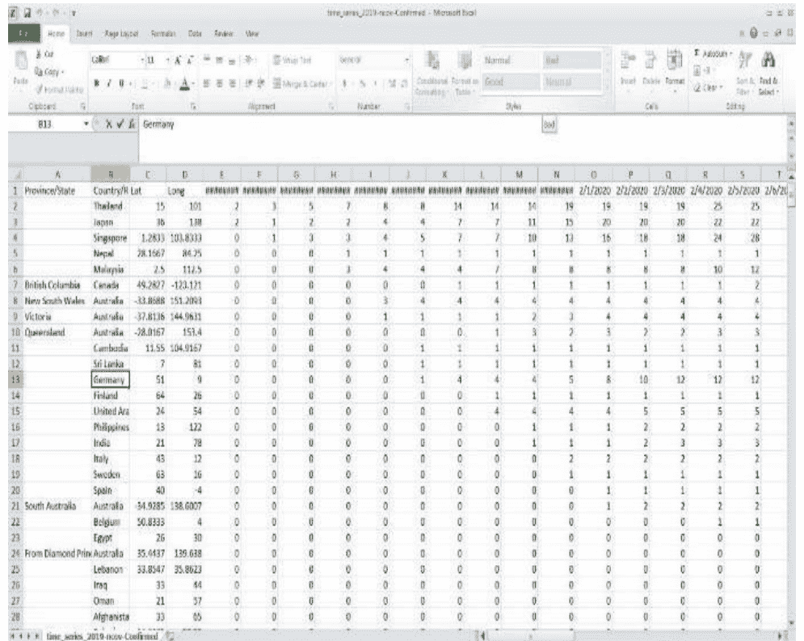

```python
##### 通过Pandas函数读取数据
>>> df = pd.read_csv('C:/Users/Abhijit/Downloads/covid.csv')
>>> type(df)
<class 'pandas.core.frame.DataFrame'>

>>> df.head() # 显示前5行
  Province/State Country/Region      Lat  ...  3/21/20  3/22/20
0            NaN       Thailand  15.0000  ...      411      599
1            NaN          Japan  36.0000  ...     1007     1086
2            NaN      Singapore   1.2833  ...      432      455
3            NaN          Nepal  28.1667  ...        1        2
4            NaN       Malaysia   2.5000  ...     1183     1306
[5 rows x 66 columns]
```

**注意：** 在使用`read_csv()`读取文件之前，Excel表格应保存为csv格式。如果文件不在同一目录下，我们需要写出文件名及其路径：`~/Downloads/covid.csv`。

由csv读取器读取的数据文件是一个DataFrame。我们可以检查DataFrame的头部和尾部[默认为前5行和后5行]。我们可以通过`df.head(10)`、`df.tail(50)`检查从顶部或底部开始的任意行数。

```python
##### 将DataFrame转换为NumPy数组

>>> L = df.to_numpy()
>>> L
array([[nan, 'Thailand', 15.0, ..., 411, 599, 599.0],
       [nan, 'Japan', 36.0, ..., 1007, 1086, 1086.0],
       [nan, 'Singapore', 1.2833, ..., 432, 455, 455.0],
       ...,
       [nan, 'Republic of the Congo', 1.44, ..., 0, 0, 0.0],
       [nan, 'The Bahamas', 24.25, ..., 0, 0, 0.0],
       [nan, 'The Gambia', 13.4667, ..., 0, 0, 0.0]], dtype=object)
```

```python
##### 读取纯文本/数据文件
```

以下数据文件（一个纯文本文件：test.dat）：

```
City Petrol Diesel Tea
Kolkata 80 70 6
Mumbai 85 75 10
Delhi 82 74 8
Begaluru 81 72 11
Pune 84 73 12
Siliguri 76 69 5
```

```python
>>> df = pd.read_csv('test.dat')
>>> df
```

```
      City  Petrol  Diesel  Tea
0  Kolkata      80      70    6
1   Mumbai      85      75   10
2    Delhi      82      74    8
3 Begaluru      81      72   11
4     Pune      84      73   12
5 Siliguri      76      69    5
```

```python
>>> type(df)
<class 'pandas.core.frame.DataFrame'>
```

**注意：** 一旦数据文件被读取为DataFrame，就可以将其转换为NumPy数组或Python列表。[从DataFrame到列表：`df.values.tolist()`]

在结构化数据的层次形式中，**Panel**是一个包含二维DataFrame的盒子。然而，在Python 3中，Panel已被弃用。因此，我们不会对此进行任何讨论。

## 基础Python代码

> “代码被阅读的次数远多于被编写的次数。” – Guido van Rossum

在本章中，我们编写一些遵循各种算法的基础Python功能脚本。我们坚持使用迄今为止所学的Python语法和方法。许多显式的代码块可以简单地用内置函数或从各种模块和包导入的函数来替代。让我们尝试用Python编写简单且最小化的代码。

[编写代码的艺术因人而异。即使遵循的算法相同，计算机代码也可以用多种方式编写。]

## 1 质数

质数是那些除了1和它本身之外不能被任何数整除的整数。例如，3、5、7、11、13....都是质数。

### 使用原始算法

算法：

1.  检查数字**n**是否能被2到n-1之间的任何整数整除。如果是，则该数字不是质数。中断。
2.  在**2**到**n-1**之间运行一个循环来测试步骤1。
3.  循环结束（没有中断）意味着该数字是质数。

```python
##### Python脚本：质数
def prime(n):
    import sys

    for i in range(2, n):
        if n%i == 0:
            return 'Not Prime'
            sys.exit()

    return 'Prime'
```

**注意：** 为了退出循环，我们使用了sys模块中的`sys.exit()`。我们也可以使用内置关键字`break`（在循环下运行）来代替导入sys模块。

```python
def prime(n):
    for i in range(2, n):
        if n%i == 0:
            return 'Not Prime'
            break
    else:
        return 'Prime'
```

**注意：** 在这种情况下，`else`是与`for`循环一起使用的。

### 使用更快的算法

如果我们观察一个数的分解，我们的算法有改进的空间。在下面的演示中，可以注意到分解方案在数字的平方根之后重复。因此，循环应该从2运行到√n，而不是从2运行到n-1。

```
36          12
2 × 18      2 × 6
3 × 12      3 × 4
4 × 9       √12 × √12
6 × 6 ← √36 4 × 3
9 × 4       6 × 2
12 × 3
18 × 2
```

```python
##### Python脚本：
```

## 质数（更快的算法）

```python
from math import sqrt

def prime_fast(n):
    max = int(sqrt(n))
    for i in range(2, max+1):
        if n%i == 0: return False
    return True
```

练习：找出给定范围 [100, 100000] 内有多少个质数。

## 从列表中统计质数

下面编写一个 Python 脚本，用于计算给定范围内的质数数量以及所花费的总时间。为了计时，我们导入 time 模块。

```python
##### Python 脚本：
##### 范围内的质数数量
##### 为了计算到某个数的质数数量，为了更快的计算，我们只统计奇数，因为偶数不是质数。我们从 3 开始，因为 1 不是质数。我们打印 count + 1，因为 2 是偶数但也是质数。同时检查计算机时间。
import time
t1 = time.time() # 计时开始
L = range(3, 100000, 2)
count = sum([prime_fast(n) for n in L])
t2 = time.time() # 计时结束
print(t2 - t1) # 总执行时间
print('No.of primes = ', count + 1)
```

练习：比较两种算法的速度差异。计算 `prime()` 和 `prime_fast()` 所花费的总时间。

## 2 强数

强数是指一个整数，其各位数字的阶乘之和等于该数本身。例如：145 = 1! + 4! + 5!。我们找出 1 到某个大数之间的强数。

算法：

- 1. 将输入数字作为字符串。
- 2. 计算字符串元素的阶乘。
- 3. 在列表推导式中重复步骤 2。
- 4. 计算列表的和。
- 5. 将和与原始数字进行比较。

```python
##### Python 脚本：强数
from math import factorial
N = input('Enter number')
x = sum([factorial(eval(i)) for i in N])
if x == N: print('Strong')
```

练习：找出 1000000 以内有多少个强数。

## 3 最大值、最小值

输入一个数字列表 [或通过 `input()` 函数依次接受数字]。检查每个数字是否大于（或小于）先前假定的最大值（或最小值）。

算法：

- 1. 输入：数字列表
- 2. 将第一个数字赋值为最大值（或最小值）
- 3. 转到下一个数字。如果它大于（或小于）前一个数字，则将其称为最大值（最小值）。
- 4. 在循环中对列表中的所有数字重复步骤 3。

```python
##### Python 脚本：# 查找最大值和最小值
L = [2, 6, 9, 0, -1]
max, min = L[0], L[0]
for i in L[1:]:
    if i >= max: max = i
    if i <= min: min = i
print('Max = ', max, 'Min = ', min)
```

注意：**L[0] = 2**，是列表的第 0 个元素。**L[1:]** 是从索引 1 到末尾的切片列表。

写成 Python 函数：

```python
def maxi(L):
    mx = L[0]
    for i in L[1:]:
        if i >= mx: mx = i
    return mx
```

让我们比较一下我们定义的函数 **maxi()** 与内置函数 **max()** 的性能。我们从一个列表（或元组）中找出最大值。我们记录执行时间。对于小列表，差异可能不明显。但对于非常大的数字列表，两种方式的执行时间差异将是显著的。

```python
##### Python 函数：计算时间
def test_time(L):
    import time
    # 初始时间
    t1 = time.time()
    maximum = maxi(L)
    # 结束时间
    t2 = time.time()
    return maximum, t2 - t1
```

```python
##### 创建一个大的随机数列表并测试
>>> import numpy as np
>>> L = random.uniform(1, 10, 100000000)
>>> test_time(L)
```

练习：
使用 `test_time()` 函数计算用户定义的 `maxi()` 函数和内置的 `max()` 函数所花费的时间差异。

## Python 脚本：查找最大值 [从外部逐个输入数据。]

```python
max = eval(input('Enter a number \n'))
while True:
    num = eval(input('Enter another \n'))
    if num >= max: max = num
    print ('Max = ', max)
```

**注意：**
**while True:** 是一个无限循环。它可以持续到我们想要的时候，或者直到条件满足。这里不需要逻辑条件。只要我们输入数据，就会接受输入。如果我们想中断，只需按回车键或按 ‘control c’ *等*（在解释器上）。例如，我们可以用右边的 ‘while True’ 循环替换左边的无限循环：

```python
x = 1
while x < 5: print('Continue')
while True:
    print('Continue')
```

## 4 列表排序

### 冒泡排序

冒泡排序是最简单的排序算法，它通过重复交换相邻元素（如果它们顺序错误）来工作。让我们看下面的列表演示：**[6, 2, 9, 0, 1]**

**第一轮**
[**6, 2**, 9, 0, 1] → [2, 6, 9, 0, 1] 交换
[2, **6, 9**, 0, 1] → [2, 6, 9, 0, 1] 不交换
[2, 6, **9, 0**, 1] → [2, 6, 0, 9, 1] 交换
[2, 6, 0, **9, 1**] → [2, 6, 0, 1, 9] 交换

**第二轮**
[**2, 6**, 0, 1, 9] → [2, 6, 0, 1, 9] 不交换
[2, **6, 0**, 1, 9] → [2, 0, 6, 1, 9] 交换
[2, 0, **6, 1**, 9] → [2, 0, 1, 6, 9] 交换

**第三轮**
[**2, 0**, 1, 6, 9] → [0, 2, 1, 6, 9] 交换
[0, **2, 1**, 6, 9] → [0, 1, 2, 6, 9] 交换

**第四轮**
[**0, 1**, 2, 6, 9] → [0, 1, 2, 6, 9] 不交换

```python
##### 冒泡排序（升序）
L = [6, 2, 9, 0, 1]

def bubble(L):
    n = len(L)
    for i in range(n):
        for j in range(n-i-1):
            if L[j] > L[j+1]:
                # 交换
                L[j], L[j+1] = L[j+1], L[j]
    return L

print('Sorted list = ', bubble(L))
```

输出：
Sorted list = [0, 1, 2, 6, 9]

**注意：** 要按降序排序，我们需要在 j 循环内写：`L[j] < L[j+1]`。

带标志的冒泡排序：

冒泡排序算法可以用一个标志来实现，该标志将跟踪交换情况。如果后续轮次不再需要交换，就可以中断。这样我们可以节省计算时间。这只是一个优化。

```python
def bubble_flag(L):
    n = len(L)
    for i in range(n):
        flag = 0
        for j in range(n-i-1):
            if L[j] > L[j+1]:
                flag = 1
                L[j], L[j+1] = L[j+1], L[j]
        if flag == 0:
            break
    return L
```

### 插入排序

算法：（升序）

- 1. 从**第 2 个**元素开始。如果它小于**第 1 个**，则交换。
- 2. 转到**第 3 个**元素。首先，将其与**第 2 个**比较，如果更小，则交换。然后，与**第 1 个**比较并执行相同操作。
- 3. 对所有后续元素重复步骤 2。[每个元素必须与所有前面的元素进行比较。]

```python
##### Python 脚本：插入排序
L = [10, -2, 0, 1, 100, 15, 9, -12]

def sort_insert(L):
    n = len(L)
    for i in range(1, n):
        key = L[i]
        j = i - 1
        while j >= 0 and L[j] > key:
            L[j+1] = L[j]
            j = j - 1
        L[j+1] = key
    return(L)

print(sort_insert(L))
##### 使用内置函数排序
>>> L = [10, -2, 0, 1, 100, 15, 9, -12]
##### 默认升序
>>> sorted(L)
[-12, -2, 0, 1, 9, 10, 15, 100]
##### 降序
>>> sorted(L, reverse=True)
[100, 15, 10, 9, 1, 0, -2, -12]
>>> L
[10, -2, 0, 1, 100, 15, 9, -12] [原始列表未改变。]
##### 使用列表方法排序
##### 升序
>>> L.sort()
##### 降序
>>> L.sort(reverse=True)
>>> L
[-12, -2, 0, 1, 9, 10, 15, 100] [原始列表已改变。]
```

我们可以通过比较完成任务所花费的执行时间来测试各种排序函数。让我们使用 NumPy（这个外部包将在下一章介绍）中的随机数生成器创建一个大的数字数组。同时，让我们导入 time 模块来跟踪时间。

```python
##### 用于时间计算
import numpy as np
import time
L = np.random.uniform(-1, 1, 10000)
def test(L):
    t1 = time.time()
    bubble(L)
    t2 = time.time()
    return t2 - t1
```

**注意：** 对于 10000 个随机数，用户定义的冒泡排序函数 `bubble()` 大约需要 22 秒，而插入排序大约需要 9 秒。但在同一台机器上，`sorted()` 和 `list.sort()` 只需要一小部分时间（大约 0.01 秒或更少）。

[显然，用于排序的内置函数和列表方法必须基于比冒泡和插入排序算法更好的算法。有许多高效的排序算法，如快速排序、桶排序、Tim 排序等，它们非常迷人，但超出了本书的范围。]

练习：创建一个包含 100,000 个介于 0.5 和 2.5 之间的随机数的列表，并按升序（和降序）排序。使用定义的冒泡排序、插入排序函数和内置方法。记录各种方法所花费的执行时间并得出结论。

## 5 二次方程的根

二次方程 $ax^2 + bx + c = 0$ 的解由公式给出：$x_1, x_2 = (-b \pm \sqrt{b^2 - 4ac})/2a$。因此，根据平方根内的项，解要么是实数且不相等，要么是相等的实数根，要么是一对共轭复数。

```python
##### Python 脚本：
##### 二次方程的根
from math import sqrt
a, b, c = eval(input('Enter a, b, c \n'))
X = b**2 - 4*a*c
p = sqrt(abs(X))
q = 2*a

if X > 0:
    print('Distinct Real roots = ', (-b + p)/q, (-b - p)/q)
if X == 0:
    print('Equal Real roots = ', b/q, -b/q)
if X < 0:
    print('Complex roots = ', complex(-b, p)/q, complex(b, -p)/q)
```

**注意：** 内置函数 `complex()` 用于创建复数。[我们将在 NumPy 章节中学习如何使用 NumPy 多项式模块来求多项式的根。]

## 6 均值、方差、标准差

均值 = $\frac{1}{n}\sum x_i$，方差 = $\frac{1}{n}\sum x_i^2 - (\frac{1}{n}\sum x_i)^2$

```python
##### Python Script: Mean and Variance
import math
##### List of numbers
x = [2, 3, 0, 1, -2, 5]
##### By List Comprehension
y = [i**2 for i in x]
n = len(x)

mean = sum(x)/n
var = sum(y)/n - mean**2
stdev = math.sqrt(var)

print('Mean, Variance, Standard dev = ', mean, var, stdev)
```

## 7 相关系数

两组变量 $(x_i, y_i)$ 之间的皮尔逊相关系数公式：

$r_{xy} = \frac{\sum(x_i - \bar{x})(y_i - \bar{y})}{\sqrt{\sum(x_i - \bar{x})^2}\sqrt{\sum(y_i - \bar{y})^2}}$

其中，方差 $\sigma_x^2=\frac{1}{n}\sum(x_i - \bar{x})^2$，$\sigma_y^2=\frac{1}{n}\sum(y_i - \bar{y})^2$，协方差 $\sigma_{xy}=\frac{1}{n}\sum(x_i - \bar{x})(y_i - \bar{y})$。由此，相关系数公式为

$\sum(x_i - \bar{x})(y_i - \bar{y})\sigma_{xy} = \sqrt{\sum(x_i - \bar{x})^2}\sqrt{\sum(y_i - \bar{y})^2}$

```python
##### Correlation Coefficient
from math import sqrt
x = [2, 4, 5, 6, 8]
y = [5, 9, 11, 10, 12]

n = len(x)
xav = sum(x)/n
yav = sum(y)/n

sigx = sqrt(sum([(i-xav)**2 for i in x]))
sigy = sqrt(sum([(i-yav)**2 for i in y]))
covxy = sum([(i-xav)*(j-yav) for i,j in zip(x,y)])
corr = covxy/(sigx*sigy)
print('Corr Coefficient = ', corr)
```

输出
Corr Coefficient = 0.910366477463

**注意：** `zip(x,y)` 函数从对应的列表 `x` 和 `y` 中取出各自的元素，组成一个 `(x, y)` 元组的列表。

```python
##### Example: zip()
>>> x = [1, 2, 3]
>>> y = [4, 5, 6]
>>> zip(x, y)
[(1, 4), (2, 5), (3, 6)]
```

```python
##### Corr. Coefficient with NumPy
import numpy as np

x = np.array([2, 4, 5, 6, 8])
y = np.array([5, 9, 11, 10, 12])
r = np.corrcoef(x, y)
print('Corr Coeff = ', r)
```

输出
Corr Coeff =
[[1. 0.91036648]
 [0.91036648 1. ]]

**注意：** 在最后的输出中，矩阵形式的4个元素应读作：$r_{xx}$, $r_{xy}$, $r_{yx}$, $r_{yy}$。

## 8 无穷级数

### 指数级数

泰勒级数展开：
$\exp(x) = 1 + x + \frac{x^2}{2!} + \frac{x^3}{3!} + ... \infty$

算法：

1. 输入：x，容差值（精度级别）
2. 初始值：sum = 0，term = 1.0
3. 循环开始。
4. 循环内：更新 sum，更新 term
   $new = old \times \frac{x}{n}$
5. 循环持续直到满足条件。

```python
##### Python Script: Exponential Series
import math
x, tol = eval(input('Enter x and tolerance \n'))

sum, term = 0.0, 1.0
n = 1
while abs(term) > tol:
    sum += term
    term = term*x/n
    n += 1
print('Calculated Value, Actual Value')
print(sum, math.exp(x))
```

输入/输出

Enter x and tolerance
2, 0.001
Calculated Value, Actual Value 7.38871252205 7.38905609893

### 余弦级数

泰勒级数：
$\cos(x) = 1 - \frac{x^2}{2!} + \frac{x^4}{4!} - \frac{x^6}{6!} + ... \infty$

算法：

1. 输入：x，容差值
2. 初始化第一项，sum
3. 循环开始，持续直到项的绝对值大于容差值。
4. 计算各项之和
5. 更新项
6. 更新项数

```python
##### Python Script: Cosine Series
import math

x, tol = input('Angle in deg, tolerance: \n')
##### Converted to radian
x = x*math.pi/180

sum, term = 0.0, 1.0
n = 1
while abs(term) > tol:
    sum += term
    # term update
    term = term*(-x**2/(2*n*(2*n-1)))
    n += 1
print('Calculated Value, Actual Value')
print(sum, math.cos(x))
```

输入/输出：
Angle in deg, tolerance:
45, 0.001
Calculated Value, Actual Value
0.70742920671 0.707106781187

### 使用列表推导式求和

指数级数：$\sum_{i=0}^{\infty} \frac{x^i}{i!}$

```python
from math import factorial as f
ex = lambda x, n: sum([x**i/f(i) for i in range(n)])

>>> ex(1, 10)
2.7182815255731922
>>> ex(1, 20)
2.7182818284590455
```

### 使用容差值

```python
##### Python Script: with tolerance value
tol = 0.0001
x, n = 1, 2
while abs(ex(x,n)-ex(x,n-1))> tol:
    n = n + 1
print(n, ex(x, n))
```

输出：
3 2.5
4 2.6666666666666665
5 2.708333333333333
6 2.7166666666666663
7 2.7180555555555554
8 2.7182539682539684
9 2.71827876984127

余弦级数：
$\cos(x) = \sum_{i=0}^{\infty} \frac{(-1)^i x^{2i}}{(2i)!}$

```python
##### Python Script: Cosine Series (with tolerance)
from math import factorial, pi
C = lambda x, n: sum([(-1)**i*x**(2*i)/factorial(2*i) for i in range(n)])
theta = 60
x = theta*pi/180
n, tol = 2, 0.00001
while abs(C(x,n) - C(x,n-1)) > tol:
    n = n + 1
print(n, C(x, n))
```

输出：
3 0.501796201500181
4 0.4999645653289127
5 0.500000433432915
6 0.4999999963909432

练习：

编写 Python 代码计算以下级数和。设置容差值 = 0.0001。

1. 正弦级数：
   $\sin(x) = x - \frac{x^3}{3!} + \frac{x^5}{5!} - \frac{x^7}{7!} + ...$

2. 对数级数：
   $\log(1 + x) = x - \frac{x^2}{2} + \frac{x^3}{3} - ...$
   验证：$\log(1 + 1) = 1 - \frac{1}{2} + \frac{1}{3} - \frac{1}{4} + ...$

3. 沃利斯公式：
   $\frac{\pi}{2} = \lim_{n \to \infty} \left( \frac{2}{1} \times \frac{2}{3} \times \frac{4}{3} \times \frac{4}{5} \times \frac{6}{5} \times \frac{6}{7} \times ... \times \frac{2n}{2n-1} \times \frac{2n}{2n+1} \right)$
   数值验证此公式。

4. 验证傅里叶级数：
   $\frac{\pi}{4} = \frac{2}{\pi} \left( \frac{\sin(1)}{1^2} + \frac{\sin(3)}{3^2} + \frac{\sin(5)}{5^2} + ... \right)$

## 9 数字的各位数

在 Python 3 中，通过 `input()` 输入的任何数字都是一个字符串。字符串是可迭代的。因此，我们可以在 for 循环中读取字符（即各位数字）。

```python
##### Input as string, read the digits
>>> n = input('Enter Number \n')
Enter Number
679135
>>> n
'679135'
>>> for i in n:
    print(i, end = " ")
6 7 9 1 3 5
##### Sum of digits of a number (With List Comprehension)
>>> sum([eval(i) for i in n])
31
```

## 10 判断闰年

地球绕太阳公转一周需要365天5小时48分45秒。但我们的公历一年按365天计算。因此，每4年会定期在最短的二月增加一天（闰日），以使其与太阳年同步。100年后，我们的日历会有大约24天的舍入误差。

在公历中，判断闰年需要考虑三个标准：

- 年份能被4整除；
- 如果年份能被100整除，则不是闰年，除非；
- 年份也能被400整除。那么它就是闰年。

这意味着在公历中，2000年和2400年是闰年，而1800年、1900年、2100年、2200年、2300年和2500年不是闰年。

算法：

1. 输入：年份
2. 检查它是否不能被100整除但能被4整除
3. 检查它是否能被400整除
4. 对于步骤2和3，如果满足条件，则该年份是闰年，否则不是。

```python
##### Leap year Calculation
year = eval(input('Enter Year \n'))

if year%100 != 0 and year%4 == 0:
    print('Leap Year')
elif year%400 == 0:
    print('Leap Year')
else:
    print('Not a Leap Year')
```

## 11 考拉兹序列

这是一个简单但迷人的数列，遵循简单的规则。“*考拉兹猜想*是数学中的一个猜想，以*洛塔尔·考拉兹*命名。它涉及一个定义如下的序列：从任意正整数 *n* 开始。然后每一项由前一项得到如下：如果前一项是偶数，则下一项是前一项的一半。否则，下一项是前一项的3倍加1。该猜想是，无论 $n$ 取何值，序列最终总会达到1。” – 维基百科

算法：

1. 输入数字。
2. 如果是偶数，除以2。
3. 如果是奇数，乘以3再加1。
4. 重复步骤2和3，直到数字变为1。

```python
##### Python Script: Collatz Sequence
n = eval(input('Enter Number \n'))
while n > 1:
    if n%2 == 0: # n is even
        n = n/2
    else: # n is odd
        n = n*3 + 1
    print(int(n), end = " ")
```

输入/输出

Enter Number
12
6 3 10 5 16 8 4 2 1

## 12 最大公约数和最小公倍数

这是通过欧几里得算法求两个正整数的最大公约数（GCD）和最小公倍数（LCM）。首先，我们用较大的数除以较小的数，并考虑余数。如果余数为零，则较小的数就是GCD。如果不是这种情况，我们取非零余数作为较小的数，之前的较小数作为较大的数。这个过程持续进行，直到我们得到一个零余数。那么在最后一步，除数就是GCD。LCM则通过将两个原始数的乘积除以GCD得到。

算法：

## 13 勾股数

欧几里得生成勾股数的公式始于一对正整数 m 和 n，它们是互质的。什么是互质？当两个整数 m 和 n 的最大公约数为 1 时，它们被称为互质（或相对质数、互素）。例如，14 和 15 是互质的，但 14 和 21 不是互质的，因为它们都能被 7 整除。给定两个互质数 m 和 n，求勾股数 (a, b, c) 的公式为：a = m^2 - n^2, b = 2mn, c = m^2 + n^2，满足 a^2 + b^2 = c^2。

算法：

1.  输入：一个正整数
2.  在范围 [1, (n - 1)] 内取一个整数 m
3.  求 n 和 m 的最大公约数 (GCD)
4.  测试 GCD 是否等于 1，如果是，则根据公式计算 x, y, z。

```python
##### Pythagorean Triplets by Euclid's formula (m, n -> Coprime)
n = eval(input('Give a number \n'))

for m in range(1, n):
    if gcd(n, m) == 1:
        x = n*n - m*m
        y = 2*n*m
        z = n*n + m*m
        print(x, y, z)
```

输出：

```
Give a number
3
Pythagorean triplets 8 6 10
5 12 13
```

## 14 数制转换

### 十进制整数转二进制

十进制系统 —> 二进制系统。转换时，我们将十进制数除以 2 并持续向下进行，将每个新的商除以 2，并将余数写在每个被除数的右侧。当商为 1 时完成。

例如，十进制数 156₁₀ 转换为二进制数 10011100₂。

算法：（针对整数）

1.  将输入数字作为字符串
2.  将数字除以 2（取模 2），存储余数。
3.  将余数添加到字符串（连接）
4.  取商（整数）用于下一步。
5.  当商大于 0 时，重复步骤 3 - 5。
6.  反转字符串以获得结果二进制数

```python
n = eval(input('Enter the Decimal number \n'))
def bin_int(n):
    b = str() # Empty string
    while n > 0:
        res = n%2
        # Added to the string
        b += str(res)
        n = n//2 # floor division
    return b[::-1] # reversed
print(bin_int(n))
```

### 十进制小数转二进制

对于小数部分的转换，我们需要乘以 2 并收集乘积的整数部分（0 或 1）。分离出小数部分并重复此操作。

```python
##### Decimal Fraction to Binary
from math import modf
n = eval(input('Enter fract \n'))

def bin_frac(n):
    b = str()
    i = 1
    while n > 0:
        n = n*2
        frac, intg = modf(n)
        b += str(int(intg))
        n = frac
        i = i + 1
        # Tried up to 6 digits
        if i > 6:
            break
    return b
```

注意：**math** 模块中的 **modf()** 函数将一个数字的小数部分和整数部分分开。

```python
>>> from math import modf
>>> modf(23.57)
(0.5700000000000003, 23.0)
```

练习：将十进制数：23.57 转换为二进制小数。

> [ 提示：使用 modf() 函数将数字拆分为整数部分和小数部分。然后使用上面定义的两个函数 bin_int() 和 bin_frac()。最后，通过连接两个输出字符串来表示整个二进制数：bin_int(23) + '.' + bin_frac(57)]

### 二进制整数转十进制

在这种情况下，我们必须取每个位置上的数字，并将它们与 2 的该位置次幂相乘后求和。例如，1011011011 → 1 × 2^9 + 0 × 2^8 + 1 × 2^7 + 1 × 2^6 + 0 × 2^5 + 1 × 2^4 + 1 × 2^3 + 0 × 2^2 + 1 × 2^1 + 1 × 2^0。

```python
##### Python Script: Binary to Decimal
n = eval(input('Give the Binary number \n'))

s, i = 0, 0
while n > 0:
    res = n%10
    n = n//10
    # Power of 2 for Binary
    s += (2**i)*res
    i += 1

print('Decimal Number:', s)
```

输入/输出：

```
Give the Binary number 101
Decimal Number: 5
```

**注意：** 对于十进制转八进制，将上述代码中的 2 替换为 8。

```python
##### Conversion by built-in function
>>> bin(12) # Decimal to Binary
'0b1100'
>>> bin(-123)
'-0b1111011'
>>> 0b1100 # Binary to Decimal
12
```

**注意：** 对于上述表达式，二进制字符串中的前缀 ‘b’ 代表字节字符串。

练习：

1.  编写一个 Python 程序，将十进制数（小数）转换为八进制。[提示：遵循上面编写的十进制转二进制的程序，只需在相应位置将 2 替换为 8。取模 8，然后除以 8。尝试一下。] 验证：(110.16)₁₀= (156.121727. .)₈
2.  编写一个程序将八进制数转换为十进制。[提示：你唯一需要做的更改是在两个地方将 2 替换为 8。]

## 15 斐波那契数

斐波那契数列是一个数列，其中每个数字是前两个数字之和：0, 1, 1, 2, 3, 5, 8, 13, 21, 34, 55, 89....
规则：fₙ₊₂ = fₙ₊₁ + fₙ

算法：

1.  用 0 和 1 初始化列表。
2.  通过列表索引将最后两个元素相加，并追加到列表。
3.  在循环中重复步骤 2。

```python
##### Python Script: Fibonacci
f = [0, 1]
for i in range(10):
    # Sum of last two terms appended
    f.append(f[-1] + f[-2])
    print(f)
    print('Golden Ratio = ', f[-1]/f[-2])
```

输出：

```
[0, 1, 1, 2, 3, 5, 8, 13, 21, 34, 55, 89]
Golden Ratio = 1.61818181818
```

## 16 二分查找

二分查找算法用于在*有序列表*中查找任何数字。给定的列表必须首先排序（升序或降序）。如果在有序列表中找到所需数字，则返回其*索引*。这是为了找到数字在列表中的位置。该算法基于*分而治之*原则！

算法：

1.  输入：有序列表
2.  找到有序元素的中间位置
3.  如果该位置对应的元素与给定数字匹配，我们就找到了元素的位置。跳出循环。
4.  如果不匹配，检查该元素属于中点下方还是上方。
5.  取适当的半部分并重复步骤 3 - 4。
6.  搜索持续进行，直到我们到达单个位置并进行检查。

```python
##### Python Script:
##### Binary Search by Algorithm
L = [1, 0, 10, -9, 6, 100, -23, 7]
SL = sorted(L)
x = eval(input('Number to search: \n'))
start = 0
end = len(SL)-1

while start <= end:
    mid = int((start + end)/2)
    if x == SL[mid]:
        print('Position in sorted List:', mid)
        break
    elif x < SL[mid]:
        end = mid - 1
    else:
        start = mid + 1
    print('start = ', start, 'end = ', end, 'mid = ', mid)

if x != SL[mid]:
    print('Not in list')
```

输出：

```
[-23, -9, 0, 1, 6, 7, 10, 100]
Number to search:
6
start = 4 end = 7 mid = 3
start = 4 end = 4 mid = 5
Position in sorted List: 4
```

**注意：** 上述输出显示了通过起始点和结束点的括号化来搜索给定数字位置的步骤。请注意，元素（这里是数字 6）的位置是在有序列表中给出的（而不是在原始列表中）。

### 使用列表方法查找

列表中元素的位置可以通过 list.index() 方法找到。这返回元素的位置索引。

```python
>>> L = [1, 0, 10, -9, 6, 100, -23, 7]
>>> L.index(6)
4
>>> x = [3, 0, 5, 'a', 'b']
>>> x.index('a')
3
```

```python
##### Also, to test if an element is in the list
>>> L.index(50)
Traceback (most recent call last):
  File "<pyshell#4>", line 1, in <module>
    nlist.index(50)
ValueError: 50 is not in list
```

## 17 矩阵运算

二维列表（列表中的列表）和二维 NumPy 数组可以被视为矩阵。[NumPy 数组将在第 7 章 NumPy 中详细介绍。]

### 两个矩阵相加

两个矩阵相加时，它们的行数和列数必须相等。矩阵的第 (i, j) 个元素与另一个矩阵的相同第 (i, j) 个元素相加，得到新矩阵的第 (i, j) 个元素：C[i][j] = A[i][j] + B[i][j]。

算法：

1.  输入：两个以列表形式表示的矩阵。
2.  循环遍历行和列 (i, j)
3.  将两个列表的对应元素相加：C[i][j] = A[i][j] + B[i][j]

```python
##### Matrix addition (with Core Python)
A = [[1, 2, 3], [4, 5, 6]]
B = [[5, 6, 4], [3, 4, 2]]
##### Initialization of matrix C
C = [[0, 0, 0], [0, 0, 0]]
row = len(A)
col = len(A[0])
for i in range(row):
    for j in range(col):
        C[i][j] = A[i][j] + B[i][j]
print('Matrix C')
##### To print in Matrix form
for r in C:
    print(r)
```

输出：

```
Matrix C
[6, 8, 7]
[7, 9, 8]
```

**注意：** 每个二维列表都可以排列成看起来像数学矩阵的形式。例如，
A = [[1, 2, 3],
[4, 5, 6]]

列表 A 有两个元素，每个元素本身是一个列表。列表 A 的大小（元素数量）等于行数。一行的大小等于列数。

嵌套的二维列表 A、B、C 被视为矩阵，它们具有相同的形状。

## 元素数量 = 行数
>>> len(A)

##### 第一个元素
>>> A[0]
[1, 2, 3]

##### 元素数量 = 列数
>>> len(A[0])
3

要创建结果矩阵 C，我们需要创建或初始化矩阵。这可以通过创建一个所有条目为零的二维列表 C 来完成。

```python
##### Python 脚本：矩阵加法（使用列表推导式）

A = [[1, 2, 3], [4, 5, 6]]
B = [[5, 6, 4], [3, 4, 2]]
row, col = len(A), len(A[0])

C = [[A[i][j] + B[i][j] for j in range(col)] for i in range(row)]
print('矩阵 C')
for r in C:
    print(r)
##### 从外部输入

##### m = 行数, n = 列数
m, n = 2, 3
print('矩阵 A 的元素：一次输入一个')
A = [[eval(input()) for j in range(n)] for i in range(m)]
```

## 两个矩阵的乘积

$C_{ij} = (A_{ik} B_{kj}) = \sum A_{ik} B_{kj}$，对于两个矩阵的乘积，第一个矩阵的列数必须等于第二个矩阵的行数。

算法：
1. 输入：两个作为嵌套列表的矩阵
2. 带索引的嵌套循环：i, j, k（假设）
3. 在最内层循环（假设为 k）中，第一个矩阵的（$C_{ij}$, ??）-th 元素与第二个矩阵的（??, ??）-th 元素相乘，然后相加。

```python
##### Python 脚本：矩阵乘积
##### 2×3 矩阵
A = [[1, 2, 3], [4, 5, 6]]
##### 3×2 矩阵
B = [[1, 2], [3, 4], [5, 6]]
C = [[0, 0], [0, 0]] # 2×2 矩阵
for i in range(len(A)):
    for j in range(len(B[0])):
        for k in range(len(B)):
            C[i][j] += A[i][k]*B[k][j]
print('矩阵 C')
for row in C:
    print(row)
```

输出：矩阵 C
[22, 28]
[49, 64]

```python
##### 使用列表推导式计算矩阵乘积
A = [[1, 2, 3], [4, 5, 6]]
B = [[1, 2], [3, 4], [5, 6]]
m, p, n = len(A), len(B), len(B[0])
C = [[sum([A[i][k]*B[k][j] for k in range(p)]) for j in range(n)] for i in range(m)]
for row in C:
    print(row)
##### 使用内置函数 zip() 计算矩阵乘积
A = [[1, 2, 3], [4, 5, 6]]
B = [[1, 2], [3, 4], [5, 6]]
C = [[sum(i*j for i,j in zip(A_row, B_col)) for B_col in zip(*B)] for A_row in A]
for row in C:
    print(row)
```

zip() 是如何工作的？

```python
>>> x = [1, 2, 3]
>>> y = [4, 5, 6]
>>> zip(x, y)
<zip object at 0x0000028B1935AF40>
[来自两个列表的新可迭代对象]
##### 转换为列表
>>> list(zip(x, y))
[(1, 4), (2, 5), (3, 6)]
```

```python
>>> A = [[1, 2, 3], [4, 5, 6]]
##### 来自同一个列表
>>> list(zip(*A))
[(1, 4), (2, 5), (3, 6)]
>>> B = [[1, 2], [3, 4], [5, 6]]
>>> list(zip(*B))
[(1, 3, 5), (2, 4, 6)]
```

##### 矩阵的转置

矩阵 A 的转置是指行变为列，列变为行。如果 B 是转置矩阵：B = B^T，那么两个矩阵的元素关系为 B_{ji} = A_{ij}

算法：
1. 输入：矩阵
2. 找出行数和列数
3. i 和 j 的嵌套循环：i 用于行（外层），j 用于列
4. 在内层循环中：B_{ji} = A_{ij}

```python
##### 矩阵的转置

A = [[1, 2, 3], [4, 5, 6]]
row = len(A)
col = len(A[0])

for i in range(row):
    for j in range(col):
        B[j][i] = A[i][j]
for r in B:
    print(r)
##### 使用列表推导式进行转置
A = [[1, 2, 3], [4, 5, 6]]
row = len(A)
col = len(A[0])
B = [[A[i][j] for i in range(row)] for j in range(col)]
print('转置后的矩阵')
for r in B:
    print(r)
```

输出：
##### 转置后的矩阵
[1, 4]
[2, 5]
[3, 6]

## 使用 NumPy 进行矩阵运算

借助 **NumPy** 中的数组，矩阵运算可以大大简化并加快速度。NumPy 是为 Python 开发的一个外部包，它包含各种有用的模块、函数和其他对象，适合进行高效的数值计算。我们将在下一章详细介绍 NumPy。
在本章中，我们简要演示如何使用 NumPy 包中的 array() 函数进行矩阵运算。与嵌套列表类似，NumPy 数组可以是任意维度的。简要演示如下：

```python
>>> import numpy as np

##### 一维数组
>>> x = np.array([1, 2, 3])
>>> x
array([1, 2, 3])
>>> type(x)
<class 'numpy.ndarray'>
>>> A = np.array([[1, 2, 3], [4, 5, 6]])
>>> A
array([[1, 2, 3],
       [4, 5, 6]])
[二维数组]
##### 数组的形状
>>> x.shape
(3, ) # 单元素元组

##### 二维数组，视为 2 × 3 矩阵
>>> A.shape
(2, 3)
```

NumPy 数组是向量化的。这意味着，对数组进行的数学运算将作用于每个元素。两个数组之间的数学运算将对应于相应元素之间的运算。

## 使用 NumPy 进行矩阵加法

```python
>>> A = np.array([[1, 2, 3], [4, 5, 6]])
>>> B = np.array([[5, 6, 4], [3, 4, 2]])
>>> A + B
array([[6, 8, 7],
       [7, 9, 8]])
```

**注意：** 加法：A + B 对应于它们相应元素的加法。结果数组 (A + B) 在解释器上的显示看起来像一个矩阵。

## 使用 NumPy 进行矩阵乘积

需要注意的是，两个二维数组的乘积不是矩阵乘积。矩阵乘积是一种特殊的操作，我们取左矩阵的行元素与右矩阵的相应列元素相乘。对于矩阵乘积，NumPy 有一个名为 **dot()** 的方法。

(1 2 3 1 2
AB = 4 5 6) (3 4)
5 6

```python
>>> A = np.array([[1, 2, 3], [4, 5, 6]])
>>> B = np.array([[1, 2], [3, 4], [5, 6]])
>>> np.dot(A, B)
array([[22, 28],
       [49, 64]])
```

我们也可以写成，

```python
>>> A.dot(B)
array([[22, 28],
       [49, 64]])
```

```python
##### 使用 NumPy 进行转置

>>> A = np.array([[1, 2, 3], [4, 5, 6]])
##### 数组属性
>>> A.T
array([[1, 4],
       [2, 5],
       [3, 6]])

##### 使用 NumPy 方法
>>> np.transpose(A)
array([[1, 4],
       [2, 5],
       [3, 6]])
##### NumPy 中的矩阵对象
```

为了进行更符合数学形式的运算，我们可以使用 NumPy 中一个名为 **matrix()** 的函数。通过它，二维数组可以转换为矩阵对象。

```python
>>> A = np.matrix([[1, 2, 3], [4, 5, 6]])

>>> B = np.matrix([[1, 2], [3, 4], [5, 6]])
>>> A*B # 矩阵乘积
matrix([[22, 28],
        [49, 64]])
>>> type(A)
<class 'numpy.matrix'>
```

## 练习

为以下问题编写 Python 脚本。

1. 用三种不同的方式编写一个函数 fib(n)，生成小于某个给定整数 n 的斐波那契数。
2. 计算给定自然数的质因数。
3. 给定三角形的三条边，判断它是等边三角形还是等腰三角形。
4. 编写一个程序来确定达到 1 需要多少步。
5. 编写一个函数来添加两个复数。同时，在同一个程序中，编写另一个函数来添加两个复数的绝对值。
6. 将二进制数 ‘100110’ 作为字符串，并将其转换为十进制整数。
7. “哈沙德数”是一个能被其各位数字之和整除的整数。定义一个函数 harshad() 来判断给定的数字是否是哈沙德数。
8. 计算 253 和 837 之间有多少个奇数。
9. 给定一组数字：10, 1, -10, 10, 4, 5, 0, 1, 9, 2, 0，准备一个包含所有重复数字的列表。
10. 计算以下求和：$\sum^{\infty} 1$，其中 $\diamondsuit\diamondsuit=0\diamondsuit\diamondsuit\diamondsuit\diamondsuit\diamondsuit\diamondsuit\diamondsuit\diamondsuit = 2$，精确到小数点后 4 位。
11. 从以下求和中求 $\diamondsuit\diamondsuit$：$\diamondsuit\diamondsuit = 1 -1+1-1+1+ \dots \infty_{43579}$，精确到小数点后第 6 位。
12. 计算以下对数级数，精确到小数点后 3 位：

$\log_{\diamondsuit\diamondsuit} (1-\diamondsuit\diamondsuit) = 2 (\diamondsuit\diamondsuit + \diamondsuit\diamondsuit^3 \diamondsuit\diamondsuit^5(1+\diamondsuit\diamondsuit) +_5+ \dots )_3$

13. 你从银行贷款 10 万卢比，年复利率 10%，贷款期限 10 年。每月等额还款（EMI）为 1000 卢比。需要多少年才能还清全部贷款？编写一个 Python 程序来找出解决方案。
14. 编写一个计算机程序来计算以下数字的标准差（$\diamondsuit\diamondsuit$）：–2, 0, 1, 6, 4, 3, 10, –3.5
15. 找出数字 332 的所有约数。
16. 找出 1 到 1000 之间所有质数的列表。同时找出每个十年区间内的密度。
17. 检查在对应于十进制区间 [1, 100] 的范围内有多少个二进制回文整数。[注意：例如，11, 101, 11011 *等等* 都是回文数。]
18. 从 $\diamondsuit\diamondsuit_1 = 1$, $\diamondsuit\diamondsuit_2 = 1$ 开始，生成 20 个斐波那契数，使用序列 $a_{n+1} = a_n + a_{n-1}$，然后计算以下级数和：
$S = \sum_{n=1}^{20} a_n$

19. *勒让德猜想*：它指出在两个连续自然数的平方之间总有一个素数。例如，2和3是$1^2$和$2^2$之间的素数，5和7是$2^2$和$3^2$之间的素数，依此类推。编写一个代码来测试$n^2$和$n^2 + 1$之间的猜想，其中$n$为任意值。

20. 给定数字列表：[0, 1, 1, 1, 0, 2, 3, 4, 3, 2, 1, -1, 5, 6, 1]，找出出现次数最多的数字。

21. 给定两个列表：a = [1, 2, 7, 9, 11, 0, 21] 和 b = [3, 7, 1, 0, 12]，编写一个Python代码来检查它们之间是否至少有一个共同元素。

22. 编写一个Python函数，将两个列表 ['a', 'b', 'c', 'd'] 和 [1, 2, 3, 4] 合并成一个交替取元素的列表，['a', 1, 'b', 2, 'c', 3, 'd', 4]。

23. 考虑列表：L = [0, 1, 2, 3, 2, 1, 3, -1, 0, 1, 2, 4]，它来自某个测量。创建另一个列表，该列表包含窗口大小为3的数字的移动平均值。

24. 给定字符串，'aaabbaaaaaabbccabbbaa'，编写一个Python函数来找出最长的相同字符序列。

25. 给定文本：'A wiki is publication collaboratively a hypertext edited and managed by its own audience directly using a web browser.'，找出其中出现次数最多的字母。

26. 取任意正整数，无论大小。如果数字是偶数，将其除以2。如果数字是奇数，将其乘以3再加1。继续这样做，并检查最终结果。你会得到一个数字序列。这就是考拉兹序列。打印该数字序列的列表。

27. 玩一个概率游戏：从1000卢比开始。赢了，资金增加1卢比；输了，资金减少1卢比。如果手头资金是3的倍数，则抛掷一枚有偏硬币1，其获胜概率为$\theta_1 = 1/10 - 0.01$。如果不是，则抛掷另一枚有偏硬币，其获胜概率为$\theta_2 = 3/4 - 0.01$。打印10步内，资金如何随抛硬币次数变化。

28. 汉诺塔问题：
汉诺塔是一个数学谜题，我们有三根杆和n个圆盘。开始时，圆盘按大小堆叠（如相邻图像所示），放在一根杆上，最大的在底部，最小的在顶部。谜题的目标是借助中间的一根辅助杆，将整个堆叠移动到第三根杆上。

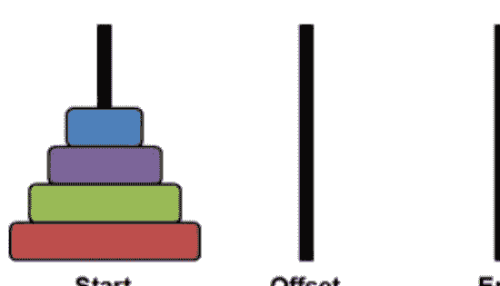

规则：
- 每次移动一个圆盘。
- 只能移动堆叠最顶部的圆盘。
- 不能将较大的圆盘放在较小的圆盘上面。

[图片来源：www.ocf.berkeley.edu/~shidi/cs61a/wiki/Towers_of_Hanoi]

## 关于矩阵

29. 取数组：A = [1, 2, 3, 4, 5, 6, 7, 8, 9, 10, 11, 12]。将数组重塑为3行4列的矩阵。转置该矩阵。

30. 创建一个4 × 4的随机元素矩阵（使用随机数生成器）。

31. 找出第18题中矩阵的迹。

32. 找出上述矩阵所有行的和，并检查哪个和最小。

33. 考虑字符串：‘123456789’。将其转换为整数列表。从该列表创建一个方阵（二维NumPy数组）。

34. 将两个矩阵相乘：A = [[1, -2, 3], [2, 1, 5]] 和 B = [[4], [3], [2]]

35. 考虑二维数组：[[1, 3, 2], [5, 9, 8], [11, 0, 5]]。编写一个Python脚本（不使用NumPy）以矩阵形式显示该数组。同时，打印矩阵的第一列。

36. 给定矩阵：A = [[1, 2, 3], [4, 5, 6], [7, 8, 9]]，创建另一个矩阵B，其元素是A中对应元素的平方根。计算 $B^T \cdot B$。

37. 编写一个Python程序，接受2个数字（7, 8）作为输入，并生成一个二维7 × 8数组，其中 $i = 0, 1, 2, ... 6$ 和 $j = 0, 1, 2, ... 7$，元素为 $i * j$。

38. 使用核心Python编写代码，找出以下矩阵的迹，$trace(A)$：$A = \begin{pmatrix} 3 & 4 & 8 \\ 5 & 9 & 2 \\ 1 & 6 & 0 \end{pmatrix}$

39. 创建两个3 × 3矩阵A和B，其元素由均匀随机数生成器生成。现在验证以下等式：
(i) $(A + B)^T = A^T + B^T$
(ii) $(AB)^T = B^T A^T$

40. 考虑矩阵，$A = \begin{pmatrix} 1 & 2 \\ 3 & 4 \end{pmatrix}$，它满足方程，$A(A) = A^2 - 5A - 2$。求出 $A^4$。

## 多选题测试

### 关于核心Python

1. 以下哪些都是不可变的？ (a)列表，元组 (b)元组，字符串 (c) 字符串，列表 (d) 列表，字典

2. 给定，**X = [-1, 1, 2, 1, 3, 5, 0, -1]**，**X[-1] * X[1]** = ? (a)0 (b) 1 (c) -1 (d) 2

3. 给定，**L = [‘phys’, ‘chem’, ‘math’]**，以下哪项是正确的？ (a)L[0][1] = L[1][1] = L[2][3] (b) L[1][0] = L[1][1] = L[2][3] (c) L[0][1] = L[1][1] = L[3][2] (d) L[1][0] = L[0][1] = L[2][3]

4. 如果我们编写以下列表推导式，输出列表会是什么？
```
x = [i**2 for i in range(6) if i%2 == 0]
```
(a) [2, 4, 16] (b) [0, 4, 16] (c) [0, 4, 6] (d) None

5. 以下程序的输出是什么？ **x = 1234**
```
for n in x:
    print(n)
```
(a)1234 (b) 1, 2, 3, 4 (c) 1 2 3 4 (d) Error

6. **list(range(4, 14)[::3])** 的输出是什么？
(a)[4, 6, 8] (b) [4, 7, 10] (c) [4, 7, 10, 13] (d) Error

7. 给定一个对象：**x = [[([1,2,3])]]**，我们可以写什么来提取数字3？
(a) X[0][2] (b) x[0][0][2] (c) x[0][0][0][2] (d) x[0][0,2]

8. 假设我们在解释器上编写以下内容：**A = [0]**
```
for i in range(4):
    A.append(range(i))
print(A)
```
输出可能是什么？
(a) [[0], [0,1], [1,2], [3,4]] (b) [0, [], [0], [0, 1], [0, 1, 2]] (c) [[0], [0, 1], [0, 1, 2]] (d) [0, [0], [0, 1], [0, 1, 2]]

9. 以下代码的输出：
>>> a = -3.278
>>> from math import ceil, floor
>>> int(a), abs(a), ceil(a), floor(a)
(a) -3, 3.728, -3.0, -4.0 (b) -3, 3.278, -4.0, 3.0 (c) -3, 3.278, 4.0, 3.0 (d) -3, 3.278, 3.0, 4.0

10. 以下代码的输出是什么？ S = ‘abd123’
S[2] = c
print(S)
(a) ‘abcd123’ (b) ‘acbd123’ (c) abcd123 (d) None

11. 我想编写以下内容：
‘Hello! My age is 20.’
以下哪项是正确的？
(a) “Hello!” + “ “ + ”My age is“ + “ “ + “20.”
(b) “Hello!” + ”My age is“ + “20.”
(c) “Hello!” + “ “ + ”My age is“ + “ “ + 20.
(d) “Hello!” + ”My age is “ + “20.”

12. 考虑以下Python脚本：
import math
x = str(round(math.pi, 4))
for k in x:
print(k, end = ‘’)
输出会是什么？
(a) 3.141 (b) 3.1416 (c) 3.14159 (d) 31416

13. 以下代码的输出是什么？
A = [[0.5, 0.4, 0.2], [0.1, 0.2, 0.3], [0.5, 0.6, 0.3]]
print(A[len(A)-1][1])
(a) 0.5 (b) 0.3 (c) 0.6 (d) 0.4

14. 12 == 12.0 的结果会是什么？ (a) True (b) False (c) 12 (d) 12.0

15. 以下Python脚本的输出会是什么？
```
x1, x2 = [0, 1]
for i in range(5):
    x3 = x1 + x2
    x1, x2 = x2, x3
print(x3)
```
(a) 5 (b) 3 (c) 13 (d) 8

16. 以下代码的输出会是什么？ X = [i**2 for i in range(1, 4)]*2
print (X)
(a) [1, 4, 9] (b) [1, 4, 9, 16] (c) [2, 8, 18] (d) None

17. 对象x的类型是什么？
```
x = ((2,3), [2,3], {2,3})
```
(a) set (b) tuple (c) list (d) dictionary

18. 以下Python代码的输出会是什么？
```
for i in range(0):
    print(i)
```
(a) 0 (b) no output (c) error (d) None

19. 以下哪些符号用于Python中的注释？
(a)// (b) “ (c) /**/ (d) #

20. 以下哪种方式不是表示复数的正确方式？
(a)2+3j (b) complex(2,3) (c) 3j+2 (d) complx(2,3)

21. 以下代码的结果？
>>> L = [2, 1, 0, 2.0, 0.5, 1]
>>> list(set(filter(lambda x: x >= 2, L)))
(a) {2} (b) {2, 2.0} (c) [2] (d) [2.0]

22. 以下两行的输出：
>>> f = lambda x: x*x
>>> map(f, [i*0.1 for i in range(4)])
(a) [0, 1, 4, 9] (b) [0.1, 0.2, 0.3, 0.4] (c) [0.0, 0.01, 0.4, 0.09] (d) None

23. 以下代码的输出：
>>> def func(x, y):
    return (x+y)/(x-y)
>>> f = lambda x,y: 5*func(x, y)
>>> f(3, 2)
(a) 25 (b) 5 (c) 0.5 (d) None

24. 以下代码的结果可能是什么？
```
[1, 2, 3] == [1.0, 1.999, 3.0]
```
(a) True (b) False (c) [True, False, True] (d) [True, True, True]

25. 以下代码的输出会是什么？
>>> a, b = {1:4, 2:5}
>>> a, b = b, a
>>> a, b
(a) (1, 2) (b) {1, 2} (c) (4, 5) (d) (2, 1)

## 附录

### Python安装

在Windows上：

**步骤 #1：** 访问官方网站Python ([www.python.org](http://www.python.org)) 并点击‘**Downloads**’。

## 外部 Python 包

**步骤 #1：** 点击 IDLE 窗口左上角的“文件”，点击“打开”以查看已创建的 Python 目录的**路径名**（文件位置）。在本例中，路径为：*C:\Users\Abhijit Kar Gupta\AppData\Local\Programs\Python\Python3 8*。[您可以复制或记下此路径。]

**步骤 #2：** 在 Windows 搜索栏（屏幕左下角）输入“cmd”。一个黑色的 DOS 窗口将出现。现在，复制粘贴路径名或在命令行中输入“cd AppData\Local\Programs\Python\Python38”并按回车键 [cd = 更改目录]。现在，命令行将显示完整路径名：

```
C:\Users\Abhijit Kar Gupta\nAppData\Local\Programs\Python\Python38>
```

**步骤 #3：** 您现在可以输入“dir”来检查 Python 目录下有哪些文件和子目录。现在，通过输入以下命令进入子目录“Scripts”：C:\...> **cd scripts**

**步骤 #4：** 最后一步！
要安装 NumPy，请输入：
C:\...Scripts> **pip install numpy**

同样，您可以使用“pip install”命令安装任何外部包。您可以通过输入 pip install numpy scipy matplotlib 来同时安装多个包。

> [安装期间，机器需要连接到互联网。要退出黑色窗口：输入“exit”或点击关闭按钮。

在 Linux 上：

在大多数 Linux 发行版中，Python 2 是预装的。Python 3.8 在 Ubuntu 或其他 Linux 平台上并非默认安装。要安装，请打开终端应用程序并输入以下命令：

```
$ sudo apt-get update
$ sudo apt-get install python3.8 python3-pip
```

在 Android 手机上：

有多种 Python 应用程序可用。您可以从 Google Play 商店为手机安装任何您选择的应用程序。有些版本更轻量（占用手机空间更少，因此运行更快）。您可以在任何类型的 Android 手机上进行大多数有用的 Python 计算和测试。外部包也可以从应用程序的仓库中安装。一些有用的应用程序包括 *QPython*、*Pydroid* 等。

Python 发行版：

有各种 Python 发行版，它们包含核心 Python 以及一些常见的外部包。例如，**Python(x, y)**、**Anaconda** *等*。您可以根据需要通过谷歌搜索并安装其中任何一个。每个发行版都包含各种 Python 开发环境：IPython Shells、Spyder、Jupyter Notebook *等*。

外部包：

- **NumPy**（数值 Python）用于数组操作等。
- **SciPy**（科学 Python）包含各种科学模块。
- **Matplotlib**（数学绘图库）用于绘制图形。
- **Pandas** 用于处理结构化数据。对于数据科学和机器学习，我们可能会安装“**Scikit-learn**”来访问原始数据并进行测试，安装“**seaborn**”用于数据可视化和统计图形。

有关在 Windows、Mac 和 Linux 上的安装，请参考以下博客文章：
realpython.com/installing-python

## Python 版本

Python 有两个并行版本：**Python 3.x** 和 **Python 2.x**。本书使用 Python 3.x 语法编写。

在 Python 3.x 中，字符串采用 Unicode 编码，而在 Python 2.x 中，字符串以 ASCII 形式存储。在用户层面，这两个版本之间只有少数差异。安装任一版本都不困难。此外，两个并行版本可以在同一台机器上共存。您可以使用任一版本工作，并且可以轻松切换到另一个版本，只需对语法进行少量更改即可。

## 一些用户层面的差异

| 特性 | Python 3.x | Python 2.x |
| :--- | :--- | :--- |
| **print** | print(‘Python String’) | print ‘Python String’ |
| **print(x, y)** | print(x, y) | print x, y |
| **input** | x = input() | x = input() |

input() 返回一个字符串。
input() 返回给定的类型。

另一种类型 **raw_input()** 返回一个字符串。

**除法** 5/2 = 2.5 = 2（仅商）

**range** **range()** 函数创建一个数字范围。

**5.0/2 = 2.5** [要得到分数结果，分子或分母中至少有一个必须是浮点数。]
**range()** 函数返回一个列表。

类型是 range。它可以转换为列表或元组。

另一种类型 **xrange()** 等同于 Python 3.x 中的 range()。

Python 2.x 的大多数版本都是稳定的。Python 3.x 的最新版本/版本仍处于开发阶段。简而言之，Python 2.x 是遗留版本，而 Python 3.x 是未来。

Python 2.x 和 Python 3.x 中的 **input()**：

```
##### Python 2.x

x, y, z = **input('Enter values \n')** Enter values
2, -3, 4.5
```

```
##### Python 3.x

x, y, z = **eval(input('Enter val \n'))** Enter val
2, -3, 4.5
```

在 Python 3.x 中，每个输入都被视为字符串。[Python 2.x 的 **raw_input()** 函数等同于 Python 3.x 中的 **input()**。]

```
>>> a = **input('Enter values \n')** Enter values
2, -3, 4.5
>>> a # 这是一个字符串 '2, -3, 4.5'
```

要获取输入变量的数值，我们需要通过 **eval()** 函数对输入字符串进行求值。此外，对于多个输入，我们需要通过 **split()** 分割字符串，或者应用 **eval()** 然后解包。

```
>>> x, y, z = **eval(a)** >>> x
2
>>> y
-3
>>> z
4.5
```

## 参考文献

1. Python 官方网站：www.python.org
2. NumPy, SciPy, Matplotlib：numpy.org, scipy.org, matplotlib.org
3. 数学相关：mathworld.wolfram.com
4. Python 官方博客：www.python.org/blogs/
5. 各种 Python 博客列表：github.com/mikeyny/awesomepython-blogs
6. 学习 Python 的分类资源：docs.python guide.org/intro/learning/
7. *Python Tutorial Release 3.2.3* – Guido van Rossum, Fred L. Drake, Jr., editor (Python Software Foundation)
8. *Python Tutorial Release 2.4.2* – Guido van Rossum, Fred L. Drake, Jr., editor (Python Software Foundation)
9. *Scientific Computing in Python (1st ed.)* – Abhijit Kar Gupta (Techno World, Kolkata)
10. *Think Python*: How to Think like a Computer Scientist– Allen Downey (Green Tea Press)
11. *Learn Python the Hard Way* – Zed Shaw (www.it-ebooks.info)
12. *Computational Physics with Python* – Dr. Eric Ayars (California State University, Chico)
13. *Computational Physics (Problem Solving with Python)*– Rubin H. Landau, Manuel J. Páez and Cristian C. Bordeianu (WileyVCH), 3rd completely revised edition.
14. *Numerical Mathematical Analysis*– James B. Scarborough (Oxford University Press)
15. *Introductory Methods of Numerical Analysis*– S.S. Sastry (Prentice Hall of India Pvt. Ltd., New Delhi)
16. *Computational Mathematics* – B.P. Demidovich, I.A. Maron (MIR Publishers, Moscow)
17. *Numerical Recipes: The Art of Scientific Computing* - W.H. Press, B.P. Flannery, S.A. Teukolsky, W.T. Vetterling (Cambridge University Press)
18. *Numeric Computing in Fortran* – Sujit Kumar Bose (Narosa Publishing House, India)
19. *Python Programming*– Ch Satyanarayana, M Radhika Mani, B N Jagadesh (Universities Press, India)
20. *Data Science from Scratch* – Joel Grus (O’REILLY)
21. *Numerical Methods in Engineering with Python 3* – Jaan Kiusalaas (CAMBRIDGE)

## 索引

- 二维数组, 345
- 三维条形图, 524
- 三维图, 520, 558

## A

- Anaconda, 446
- append, 158
- Append, 349
- arange, 317
- argsort, 370
- astype, 316
- 属性, 233

## B

- bin, 37
- 二进制, 38
- 二分查找, 634
- 布尔值, 7
- 广播, 374
- 冒泡排序, 599
- builtins, 31

## C

- 计算器, 21
- 微积分, 546
- 日历, 84
- 心形线, 472
- 子类, 249
- 类, 233
- 螺旋正方形, 276
- 考拉兹序列, 621
- 颜色, 455
- 注释, 52
- 数字比较, 25
- complex, 31
- 复数, 7
- 复数数学模块, 67
- 复数矩阵, 422
- 复数矩阵, 380
- 连接, 351
- 拼接, 191
- 等高线图, 506
- 转换, 192
- 相关系数, 609
- 余弦级数, 614
- 叉积, 390

## D

- 数据类型, 309
- DataFrame, 575
- 日期, 84
- decimal, 34
- 深拷贝, 224
- 定义函数, 116
- 删除元素, 344
- 删除对象, 247
- 导数, 414
- diag, 386
- 对角化, 545
- 字典, 203
- 字典推导式, 213
- 微分方程, 562
- 微分, 547
- 文档字符串, 242
- 下载的数据, 516
- dtype, 315

## E

- empty, 382
- 枚举, 177
- 求值, 43
- 指数级数, 612
- eye, 383

## F

- 阶乘, 61
- 斐波那契数, 633
- 斐波那契螺线, 286
- fill, 382
- filter 函数, 140
- 展平, 326
- 翻转, 377
- 浮点数, 7
- 整除, 9
- For 循环, 92
- 格式化, 45
- 分形树, 293
- 分形, 289
- 冻结集合, 202
- 函数重载, 136

## G

- 最大公约数, 623
- 几何, 560
- 全局, 131
- 希腊字母, 478

## H

- Hello World, 10
- hex, 38
- 十六进制, 38
- 直方图, 495
- 水平线, 463
- hsplit, 348
- hstack, 354

## I

- 恒等式, 26
- 单位矩阵, 383
- 恒等, 28
- 不可变, 189
- 导入的函数, 138
- 索引, 147, 173, 190, 332
- 无穷级数, 612
- 继承, 249
- 内积, 390
- 输入与输出, 39
- 外部输入, 42
- insert, 162
- 插入排序, 603
- 整数, 7
- 积分, 414
- 积分, 549
- 解释器, 47
- 交集, 201
- itertools, 486
- 迭代器, 330

## K

- keys, 207
- 科赫曲线, 290

## L

- Lambda 函数, 135
- 最小公倍数, 623
- 闰年, 619
- 图例, 460
- 极限, 546
- linalg, 417
- 线型, 456
- 线性代数, 417
- linspace, 319
- 利萨如图形, 470
- 列表, 144
- 列表推导式, 167
- 列表方法, 152
- loadtxt, 429
- 局部, 131
- logspace, 322
- 长整型, 7
- lookfor, 303
- 循环, 92
- 最大值, 595
- 均值, 608
- meshgrid, 425
- 方法, 192, 196, 233
- 字符串方法, 180
- mgrid, 427
- 最小值, 595
- 模块, 54
- 取模, 9, 23
- 单色, 455
- 多图, 488
- 可变, 204

## M

- map 函数, 139
- 标记, 455
- 标记样式, 456
- 数学模块, 59
- 数学符号, 480
- 数学运算符, 8
- Matplotlib, 446
- 矩阵, 379, 541
- 矩阵运算, 638

## N

- 命名空间, 16
- 嵌套字典, 215
- 嵌套列表, 170
- normalvariate, 77
- 数字转换, 627
- 数字, 6, 24
- NumPy 数组, 302

## O

- 对象, 233
- oct, 38
- 八进制, 38
- ones, 384
- 运算符, 8

## P

- 包, 259
- 打包, 217
- Pandas, 569
- 父类, 249
- 完全平方数, 103
- 饼图, 504
- pivot_table, 517
- 二维绘图, 447
- 极坐标图, 471
- 多边形, 272
- 多项式, 410
- pop, 160
- 质数, 589
- 积, 362
- 勾股数, 625

## Q

- 二次方程, 607

## R

- randint, 437
- 随机选择, 78, 437
- 随机抽样, 81
- 随机打乱, 82
- 随机游走, 79, 281
- randrange, 77
- range, 94, 165
- Ravel, 326
- repeat, 389
- 重塑, 324
- 调整大小, 324
- 根, 412
- 旋转, 377
- round, 33

## S

- 保存图形, 477
- 序列, 570
- 集合, 194
- 浅拷贝, 223
- 形状, 324
- 大小, 324
- 切片, 148, 175, 191, 333
- sorted, 151
- 排序, 368
- 特殊数组, 382
- split, 184, 346
- 分割数组, 346
- 堆叠图, 500
- 堆叠数组, 352
- 统计图, 494
- 统计, 355
- 标准差, 608
- 字符串, 172
- 强数, 594
- 子图, 490
- 子集, 202
- 交换, 337
- SymPy, 531

## T

- 张量, 395
- 张量积, 397
- tensordot, 399
- 时间, 84
- 容差, 616
- 迹, 366
- 转置, 377, 645
- Try Except, 108
- 元组, 189
- 海龟绘图, 261
- 类型, 26
- 类型, 26

## U

- uniform, 77, 434
- 并集, 200
- 唯一元素, 328
- 通用, 403
- 解包, 217
- urandom, 83

## V

- values, 207
- 变量, 5
- 方差, 608
- 向量化, 408
- 版本, 56
- 垂直线, 463
- 空函数, 122
- vsplit, 348
- vstack, 354

## W

- While 循环, 101

## X

- X-Y 图, 447

## Z

- zeros, 384
- zip 函数, 141