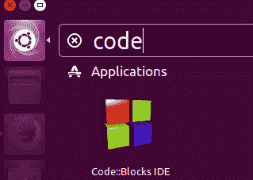

# 安装 Code::Blocks

> 原文：<https://overiq.com/c-programming-101/installing-code-blocks/>

最后更新于 2020 年 7 月 27 日

* * *

要创建和运行程序，您需要两件事:

1.  文字编辑器
2.  编译程序

文本编辑器是您编写程序的地方。编译器把你的程序翻译成计算机能理解的 1 和 0 的二进制流。因此，每当您编译一个程序时，编译器都会创建一个名为可执行文件(having。. exe 扩展名)，计算机可以执行该文件。


编写 C 程序时需要遵循的步骤。

1.  创建程序
2.  编译程序
3.  运行程序

您可以使用默认的文本编辑器(如 Windows 中的记事本或 Linux 中的 vim)来创建程序，但是为了方便起见，我们将安装一个名为 Code::Blocks 的跨平台 IDE(集成开发环境)。

## 为什么要使用 IDE？

集成开发环境允许您从单个环境创建、编译和运行程序。Code::Blocks 附带一个名为 GCC 的编译器，用于编译 C 和 C++程序。如果您没有使用集成开发环境，那么您需要使用文本编辑器创建程序。然后要编译程序，你需要打开命令提示符或终端，输入一些命令。我们将首先学习如何使用集成开发环境编写一个简单的程序，然后我将向您展示如何使用文本编辑器创建程序，并使用 GCC 编译器编译它。

## 在窗口中安装 Code::Blocks

1.  转到[http://www.codeblocks.org/downloads/26](http://www.codeblocks.org/downloads/26)并在“Windows XP / Vista / 7 / 8.x / 10”部分下向下滚动一点:“选择“Code::Blocks-16.01 Ming-nostup . zip”。

    

    对您来说，选择 MinGW 安装程序至关重要，因为这将在您的系统上安装 GCC 编译器。

2.  下载后，双击安装程序运行它，您将看到以下窗口。单击“下一步”继续。

    

3.  接受许可协议，然后单击“下一步”。

    

4.  在下一个窗口中，Code::Blocks 将要求您选择要安装的组件。选择完全安装，它看起来像这样:

    

    确保选择了“MinGW 编译器套件”，因为此选项将在您的系统上安装 GCC。

5.  选择目标文件夹(保持默认)，然后单击下一步。

    

6.  安装程序将继续完成安装。

    

7.  安装完成后，Code::Blocks 将提示您运行它。

    

    单击否，然后单击下一步按钮。

    

    单击“完成”退出安装程序。

    这就完成了 Code::Blocks 在 Windows 上的安装。

## 在 Linux 中安装 Code::Blocks

Code::Blocks 可以在各种 Linux 发行版上运行。例如 Ubuntu、Fedora、CentOS 等。在本节中，我们将学习如何在 Ubuntu 16.04.1 上安装 Code::Blocks。

打开终端并键入以下命令。

```c
x@ubuntu-pc:~$ sudo add-apt-repository ppa:damien-moore/codeblocks-stable

```

输入此命令后，系统会要求您按回车键。按回车键并输入下一个命令:

```c
x@ubuntu-pc:~$ sudo apt-get update

```

该命令将更新系统上的所有包。最后，输入以下命令:

```c
x@ubuntu-pc:~$ sudo apt-get install codeblocks codeblocks-contrib

```

此命令将在您的系统上下载并安装 Code::Blocks。

**注意:**如果是慢速连接，整个过程可能需要一些时间。所以，请耐心等待。

## 第一次跑步

在 Windows 上，转到开始>所有程序>Code::Blocks 以启动 Code::Blocks。或者，双击桌面上 Code::Blocks 的快捷图标。


在 Ubuntu 上，您可以通过发出以下命令从终端打开 Code::Blocks。

```c
x@ubuntu-pc:~$ codeblocks

```

或者，点击启动器的顶部，键入一些关键字，如下图所示:



Code::Blocks 现在将要求您选择默认编译器。Code::Blocks 支持来自不同供应商的几个编译器。如果您的计算机除了 GCC 之外还有其他编译器，Code::Blocks 会检测到所有这些编译器，并在窗口中显示一个列表。这台电脑除了 GCC 没有任何编译器，这就是为什么只检测到 GCC 的原因。选择 GCC 编译器，点击“设为默认”，如下图截图所示:


单击“确定”继续。接下来，您将看到一个 Code::Blocks 闪屏。加载完成后，您将看到以下窗口。


**注意:**如果这是您第一次运行 Code::Blocks，可能会出现一个窗口，要求您选择 Code::Blocks 作为处理 C/C++源文件的默认应用。


选择“否，保持一切原样”，然后单击确定。

**菜单栏和工具栏:**像许多其他图形用户界面程序一样，Code::Blocks 也有菜单栏。工具栏提供了所有常用的命令，如构建、运行、保存、查找等。

**起始页和编辑器:**起始页是启动 Code::Blocks 时的默认页面，编辑器是我们编写代码的地方。

**管理窗口:**该窗口显示项目中所有可用的源文件。

**日志窗口:**在这里你会得到各种各样的日志，比如构建消息、编译错误、警告等等。

* * *

* * *