# 创建和运行第一个 C 程序

> 原文：<https://overiq.com/c-programming-101/creating-and-running-the-first-c-program/>

最后更新于 2020 年 9 月 24 日

* * *

## 创建新项目

要在 Code::Blocks 中创建和运行程序，首先必须创建一个项目。

那么什么是项目呢？

最简单地说，您可以将一个项目视为不同源文件的集合。一个小项目也可以有一个单独的源文件。

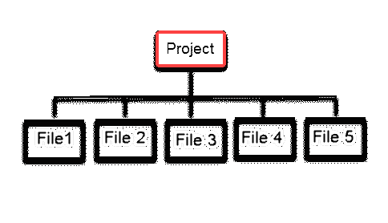

要创建一个新程序，我们必须先创建一个项目。

1)转到文件>新建>项目。将显示一个向导，如下图所示。

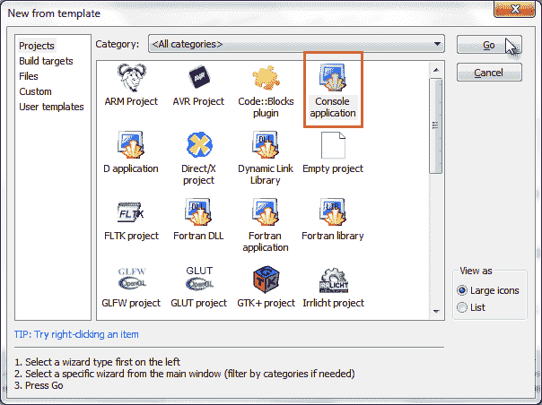

选择控制台应用，然后单击开始。

2)将显示控制台应用向导。点击下一步按钮。

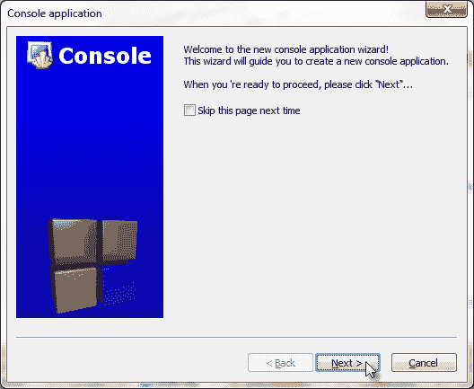

3)在控制台应用向导的下一个窗口中，选择要在项目中使用的语言。

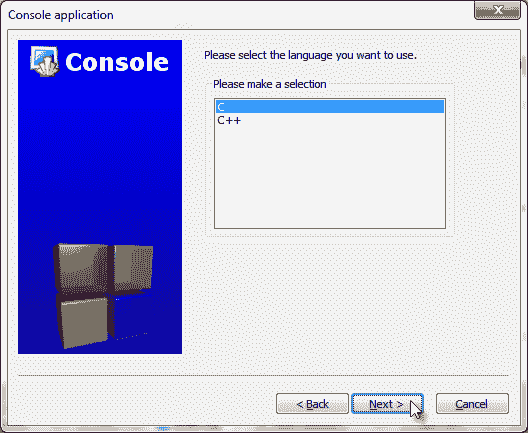

选择 C，然后单击下一步。

4)在下一个窗口中，输入项目标题为“第一个应用”，并选择保存“第一个应用”项目的路径。

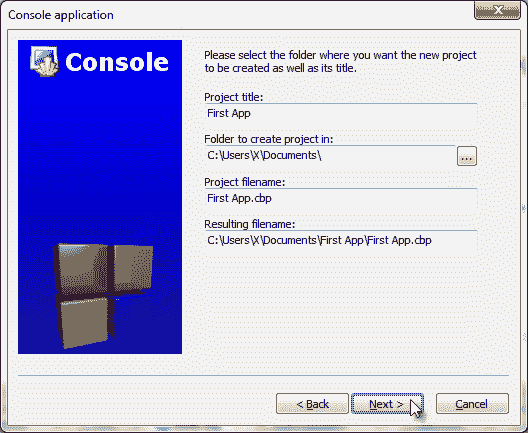

单击“下一步”按钮继续。

5)此窗口允许您为项目选择编译器。选择 GNU GCC 编译器，其他设置保持默认。

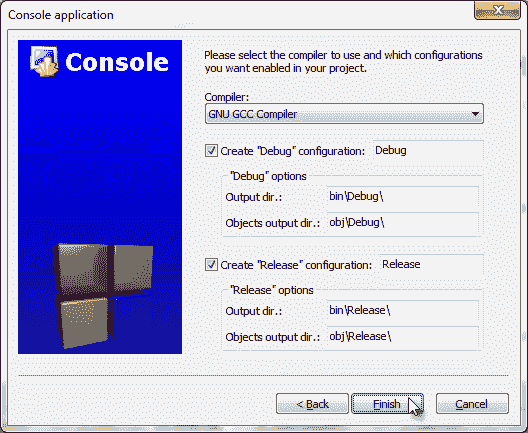

单击完成。将为您创建一个新项目以及一些默认代码。

一旦创建了项目，Code::Blocks 集成开发环境将如下所示:

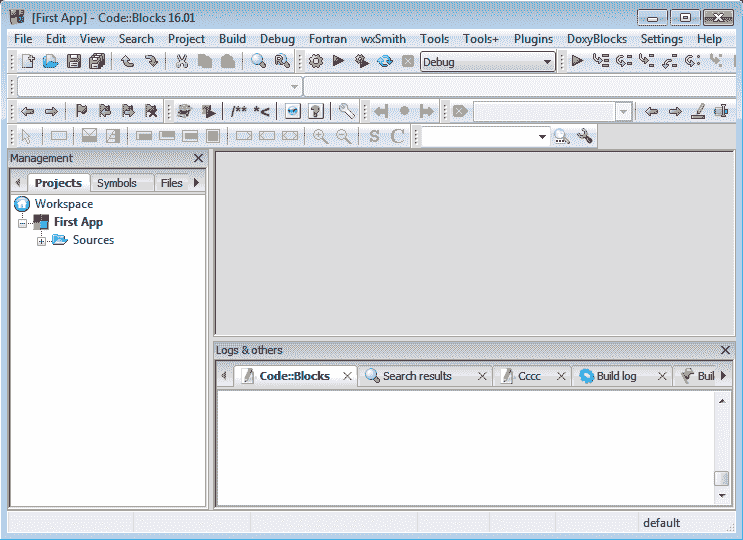

双击“源”文件夹以查看其下的文件。看看已经填充了新创建的项目文件的管理窗口。

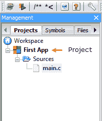

可以看到，此时项目只包含一个文件`main.c`。双击打开编辑器窗口中的`main.c`。

让我们用下面的代码替换默认值。

```c
#include <stdio.h>

int main()
{
    printf("My First App");
    return 0;
}

```

[现在试试](https://overiq.com/c-online-compiler/PYl/)

**注意:**不要复制粘贴程序，只需打字，对你会更有利。我们将在后面的章节中详细讨论这个程序是如何工作的。

通过按 Ctrl + S 或点击工具栏中的保存图标来保存程序。

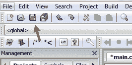

通过从菜单栏中选择`Build > Build`或按 Ctrl + F9 来编译程序。如果编译成功，您将在日志窗口的构建日志选项卡上看到一些消息。

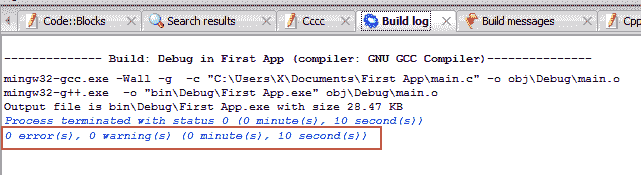

注意日志的最后一行写着`"0 error(s), 0 warning(s) "`。它只是意味着程序编译成功，没有任何错误和警告。

通过从菜单栏中选择构建>运行或按下 Ctrl + F10 来运行程序。当您运行该程序时，您将看到如下窗口:

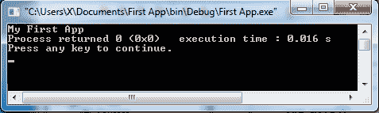

要关闭此窗口，请按键盘上的任意键。

**提示:**也可以按 F9 或 Build > Build and Run 一步编译运行程序。

## 救救我！编译时出错

当您在键入程序时出错时，就会出现编译错误或编译时错误。这些打字错误被称为语法错误。就像英语有语法规则一样，计算机语言也有语法规则。换句话说，语法规定了语言应该如何书写。例如，这样一个规则是:C 中的每个语句都必须以分号(`;`)结束。

编译器会在以下情况下报告语法错误:

*   以不带分号(`;`)的语句结尾。
*   键入错误的关键字。
*   有左大括号(`{`)没有右大括号(`}`)。
*   试图使用未声明的变量。等等...

因此，请确保您已经按原样键入了代码，没有错别字或拼写错误。

编译器在编译程序时遇到语法错误。它报告语法错误消息。此消息包含发现错误的行号和错误描述。

编译器可以在两个级别检测问题:警告和错误。

**警告:**简单来说就是你做错了什么。虽然它在语法上是有效的，但它可能会在将来引起问题。Code::Blocks 以蓝色显示警告消息。警告不会停止编译过程。

**错误:**错误是程序中的致命缺陷。错误停止了程序的编译。要编译程序，您必须首先解决所有错误(语法错误)。Code::Blocks 以红色显示错误。

遇到语法错误时，Code::Blocks 会在构建消息选项卡中显示大量信息。例如:假设错误地将分号留在了第 5 行的末尾。

```c
#include <stdio.h>

int main()
{
    printf("My First App")
    return 0;
}

```

[现在试试](https://overiq.com/c-online-compiler/PYl/)

如果你编译了这个程序，你会得到以下错误。

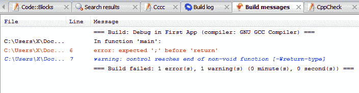

从日志中可以看到，编译器在第 6 行报告了一个关于缺少分号的错误。尽管编译器提供的错误消息无疑是有用的，但它们可能非常准确，也可能不太准确。因此，编译器报告的错误可能不会反映问题的原始原因。例如:在上面的程序中，编译器在第 6 行报告了一个错误，但是我们知道实际问题是在第 5 行，因为缺少分号(`;`)。因此，本次讨论的要点是，当编译器报告语法错误时，不要照原样接受编译器的消息，要找到实际错误，请查看实际报告错误的位置上方或下方的几行。

您程序中的错误现在应该已经解决了，如果没有，请在下面评论，我们将尝试一起解决它。

* * *

* * *