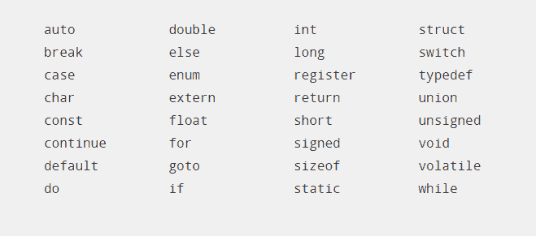

# 关键字和标识符

> 原文：<https://overiq.com/c-programming-101/keywords-and-identifiers/>

最后更新于 2020 年 7 月 27 日

* * *

## C 语言字符集

在 C 语言中，您可以使用以下字符。**字母**

```c
a, b, c, ... z
A, B, C, ... Z

```

**数字**

```c
0,1,2,3,4,5,6,7,8,9

```

**特殊符号**下表显示了 C 语言中广泛使用的一些特殊字符

| 性格；角色；字母 | 意义 |
| --- | --- |
| `+` | 加号 |
| `-` | 减号 |
| `*` | 增加 |
| `/` | 分开 |
| `%` | 百分比符号或模数运算符 |
| `()` | 圆括号 |
| `{}` | 大括号 |
| `[]` | 方括号 |
| `=` | 等号 |
| `,` | 逗号 |
| `;` | 分号 |
| `:` | 结肠 |
| `'` | 单引号 |
| `"` | 双引号 |
| `?` | 问号 |
| `.` | 句点或点符号 |
| `#` | 混杂 |
| `^` | 插入符号 |
| `~` | 颚化符 |
| `!` | 感叹号 |
| `&` | &的记号名称 |
| `&#124;` | 管道字符 |

## 转义序列

转义序列用于打印一些不能用键盘直接打印的特殊字符。例如，换行符、制表符、回车符等。转义序列由一个反斜杠字符(`\\`)后跟一个特定的转义字符组成。下表列出了常见的转义序列。

| 换码顺序 | 意义 | 它有什么作用？ |
| --- | --- | --- |
| `\n` | 新行 | 将光标移动到下一行的开头。 |
| `\t` | 标签 | 将光标移动到下一个制表位。 |
| `\b` | 退格键 | 在当前行上将光标向后移动一个空格。 |
| `\r` | 回车 | 将光标移动到当前行的开头。 |
| `\a` | 铃声(警报) | 发出嘟嘟声。 |
| `\\` | 反斜线符号 | 打印反斜杠()字符。 |
| `\0` | 空 | \0 字符表示空字符。 |
| `\'` | 单引号 | 打印单引号(')字符。 |
| `\"` | 双引号 | 打印双引号(")字符。 |

！换行符(`\n`)、退格符(`\b`)、回车符(`\r`)、制表符(`\t`)、空格(`)被称为空白字符。`

 `## 关键字

关键字是 C 语言用来表示特定事物的一些保留词。在 C 语言中，关键字是用小写字母写的。c 只有 32 个关键字。



## 标识符

标识符是我们用来命名实体的词，如变量、函数、数组、结构、符号常量等。标识符命名规则如下:

1.  标识符只能由字母、数字或下划线(`_`)组成。
2.  第一个字符应该是字母或下划线(`_`)。
3.  标识符不应是关键字。
4.  标识符可以是任何长度。

c 是区分大小写的语言，因此`my_var`和`MY_VAR`是两个不同的标识符。有效标识符的一些示例:`num`、`_address`、`user_name`、`email_1`无效标识符的示例:`1digit`–标识符不能以数字`my var`开头–标识符不能包含空格字符`int`–`int`是关键字`some#`–不允许使用井号(`#`)字符

* * *

* * *`