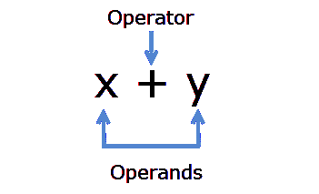

# C 语言中的算术运算符

> 原文：<https://overiq.com/c-programming-101/arithmetic-operators-in-c/>

最后更新于 2020 年 7 月 27 日

* * *

**运算符:**运算符指定对数据的运算，该运算产生一个值。

**操作数:**操作符作用的数据项称为操作数。



有些运算符需要两个操作数，而有些只需要一个。C 语言提供了以下运算符:

1.  算术运算符
2.  关系运算符
3.  逻辑运算符
4.  条件运算符
5.  赋值运算符
6.  按位运算符
7.  运算符的大小
8.  算术运算符

在本章中，我们将讨论算术运算符。下表列出了算术运算符。

| 操作员 | 名字 |
| --- | --- |
| `+` | 添加 |
| `-` | 减法 |
| `*` | 增加 |
| `/` | 分开 |
| `%` | 模数运算符 |

前四个操作员照常工作，但您可能没有遇到`%`操作员。`%`运算符被称为模数运算符或模除法运算符。模数运算符(`%`)用于计算余数。例如`9 % 2`会产生`1`，因为当`9`被`2`除时，它会留下`1`的剩余部分。需要注意的重要一点是，它只对整数起作用，不能在`float`和`double`类型上应用`%`运算符。

上表中列出的所有运算符都是二进制运算符，因为它们需要两个操作数来操作。但是`+`和`-`运算符也有它们的一元版本，例如:

`+x`或`-y`

在这种情况下，`+`运算符对数字`x`没有影响，但是，`-`运算符会更改操作数`y`的符号。

## 整数运算

当两个操作数都是整数时，两个整数操作数之间的算术运算结果产生一个整数值。我们取两个变量`a`和`b`，比如`a = 10`和`b = 4`。下表显示了在`a`和`b`上执行的算术运算的结果。

| 表示 | 结果 |
| --- | --- |
| `a + b` | `14` |
| `a - b` | `6` |
| `a * b` | `40` |
| `a / b` | `2` |
| `a % b` | `2` |

我们知道`10/4 = 2.5`，但是因为两个操作数都是整数，所以十进制值被截断。除法和模数运算符工作时，第二个操作数`b`必须非零，否则程序将崩溃。

下面的程序演示了整数运算:

```c
#include<stdio.h>

int main()
{
    // Declare and initialize variable a and b
    int a = 11, b = 4;

    printf("a + b = %d\n", a + b);

    printf("a - b = %d\n", a - b);

    printf("a * b = %d\n", a * b);

    printf("a / b = %d\n", a / b);
    // because both operands are integer result will be an integer

    printf("a %% b = %d\n", a % b);
    // % operator returns the remainder of 11/4 i.e 3

    // Signal to operating system everything works fine
    return 0;
}

```

**预期输出:**

```c
a + b = 15
a - b = 7
a * b = 44
a / b = 2
a % b = 3

```

密切关注第 17 行`printf()`语句中`%`字符的用法。我们已经知道`%`字符用于指定控制字符串内部的转换规范。要在控制台中打印单个`%`字符，我们必须写`%`两次。

## 浮点运算

两个浮点操作数之间的运算总是产生浮点结果。我们取两个变量`a`和`b`，比如`a = 11.2`和`b = 4.5`。下表显示了在`a`和`b`上执行的算术运算的结果。

| 表示 | 结果 |
| --- | --- |
| `a + b` | `15.7` |
| `a - b` | `6.700000` |
| `a * b` | `50.400000` |
| `a / b` | `2.488889` |

下面的程序演示了浮点运算。

```c
#include<stdio.h>

int main()
{
    // Declare and initialize variable a and b
    double a = 9.2, b = 2.1;

    printf("a + b = %f\n", a + b);
    printf("a - b = %f\n", a - b);
    printf("a * b = %f\n", a * b);
    printf("a / b = %f\n", a / b);

    // Signal to operating system everything works fine
    return 0;
}

```

**预期输出:**

```c
a + b = 11.300000
a - b = 7.100000
a * b = 19.320000
a / b = 4.380952

```

**注意:**`%`模数运算符不能用于浮点常量。

## 混合模式算术

整数和浮点之间的运算产生浮点结果。在此操作中，首先将整数值转换为浮点值，然后执行该操作。我们取两个变量`a`和`b`，比如`a = 14`和`b = 2.5`。下表显示了在`a`和`b`上执行的算术运算。

| 表示 | 结果 |
| --- | --- |
| `a + b` | `16.500000` |
| `a - b` | `12.500000` |
| `a * b` | `35.000000` |
| `a / b` | `5.600000` |

如我们所见，当`14`除以`2.5`时，小数部分不会丢失，因为`int`和`double`之间的算术运算会产生一个`double`值。所以我们可以使用混合模式算法来解决我们在划分`10/4`时遇到的问题。要得到正确答案，只需将操作中涉及的一个操作数设为浮点数。例如，`10/4.0`或`10.0/4`都会给出正确的结果，即`2.5`。

```c
#include<stdio.h>

int main()
{
    printf("%f\n", 10/4.0);
    printf("%f\n", 10.0/4);

    // Signal to operating system everything works fine
    return 0;
}

```

**预期输出:**

```c
2.500000
2.500000

```

* * *

* * *