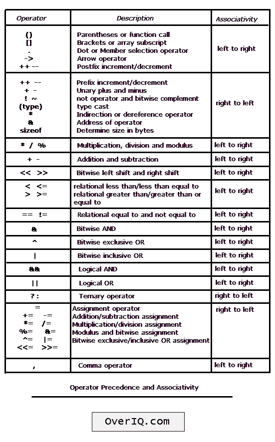
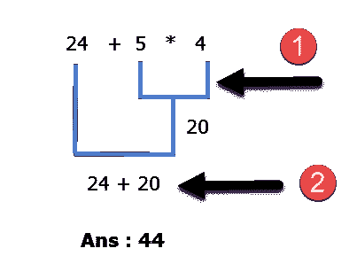
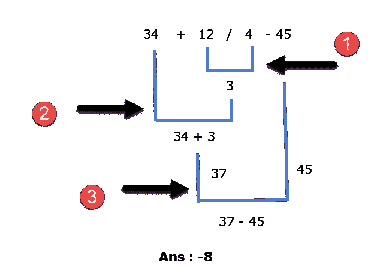
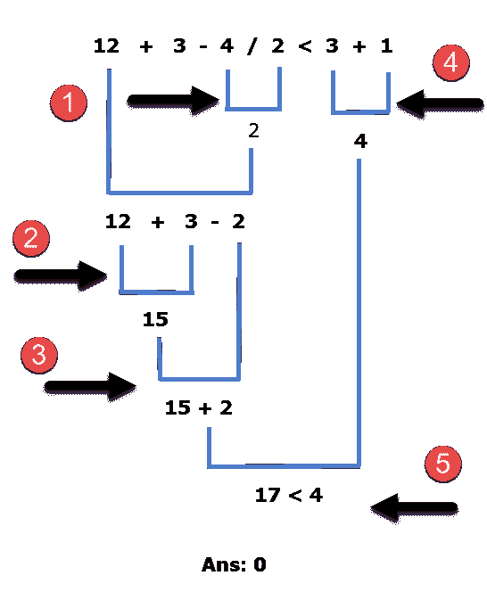

# C 语言中的运算符优先级和关联性

> 原文：<https://overiq.com/c-programming-101/operator-precedence-and-associativity-in-c/>

最后更新于 2020 年 7 月 27 日

* * *

**运算符优先级:**它规定了表达式中运算符的求值顺序。

**结合性:**它定义了在表达式中计算具有相同优先级的运算符的顺序。关联性可以是从左到右或从右到左。

考虑以下示例:

```c
24 + 5 * 4

```

这里我们有两个运算符`+`和`*`，你觉得哪个运算会先求值，加法还是乘法？如果首先应用加法，则答案为`116`，如果应用乘法，则答案为`44`。要回答这样的问题，我们需要查阅运算符优先级表。

在 C 语言中，每个运算符相对于其他运算符都有固定的优先级。因此，优先级较高的运算符在优先级较低的运算符之前计算。出现在同一组中的运算符具有相同的优先级。下表列出了运算符优先级和关联性。



顶部的运算符具有更高的优先级，随着我们向底部移动，优先级会降低。

从优先级表中我们可以得出`*`运算符在`+`运算符之上，因此`*`运算符的优先级高于`+`运算符，因此在表达式`24 + 5 * 4`中，子表达式`5 * 4`将首先被求值。

这里还有一些例子:

**例 1:**

```c
34 + 12/4 - 45

```



这里`/`运算符具有更高的优先级，因此`12/4`首先被求值。操作员`+`和`-`具有相同的优先级，因为它们在同一个组中。那么会先评估哪一个呢？要解决这个问题，您需要参考运算符的关联性。从表中可以看出，运算符`+`和`-`具有相同的优先级，从左到右相关联，因此在我们的表达式`34 + 12/4 - 45`中，除法之后，加法(`+`)将在减法(`-`)之前进行。

**例 2** :

```c
12 + 3 - 4 / 2 < 3 + 1

```



这里`/`运算符具有更高的优先级，因此`4/2`首先被求值。`+`和`-`运算符从左到右具有相同的优先级和关联，因此在我们的表达式`12 + 3 - 4 / 2 < 3 + 1`中，除法之后，`+`运算符将被求值，然后是`-`运算符。从优先级表可以看出`<`运算符的优先级低于`/`、`+`和`-`。因此，最后将对其进行评估。

## 使用括号

如果您查看优先表，您会发现括号(`()`)运算符的优先级最高。因此，就像我们在学校里做的那样，我们可以用括号来改变操作的顺序。考虑以下示例:

```c
3 + 4 * 2

```

这里首先评估`*`运算符，然后评估`+`运算符。

如果你希望加法先发生，然后是乘法呢？

我们可以使用括号来实现这一点，如下所示:

```c
(3 + 4) * 2

```

括号内的内容将首先被计算。因此，在这个表达式中，加法将首先发生，然后是乘法。

您也可以像这样嵌套括号:

```c
(2 + (3 + 2) ) * 10

```

在这种情况下，首先计算最里面括号内的表达式，然后计算下一个最里面的括号，依此类推。

我们还可以使用括号来使复杂的表达式更易读。例如:

```c
age < 18 && height < 48 || age > 60 && height > 72
(age < 18 && height < 48) || (age > 60 && height > 72) // much better than the above

```

这两个表达式给出了相同的结果，但是添加括号使我们的意图更加明确。

我们还没有讨论关系运算符和逻辑运算符。所以上面的表达可能没有完全的意义。关系运算符和逻辑运算符分别在 C 中的[关系运算符和 C](/c-programming-101/relational-operators-in-c/) 中的[逻辑运算符中详细讨论。在下一章中，我们将学习 C 语言中的 if else 语句。](/c-programming-101/logical-operators-in-c/)

* * *

* * *