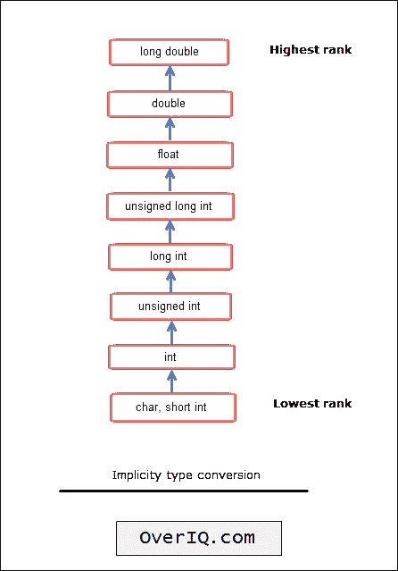

# C 语言中的隐式类型转换

> 原文：<https://overiq.com/c-programming-101/implicit-type-conversion-in-c/>

最后更新于 2020 年 7 月 27 日

* * *

c 允许我们在表达式中混合基本类型。在 C 的[算术运算符一章中讨论混合模式算术时，我们已经看到了这种行为的一瞥。在这样的表达式中，一种类型的操作数被转换成另一种类型。这个过程称为类型转换。](/c-programming-101/arithmetic-operators-in-c/#mixed-mode-arithmetic)

有两种类型的类型转换:

1.  隐式类型转换。
2.  [显式类型转换](/c-programming-101/explicit-type-conversion-in-c/)。

在本章中，我们将讨论隐式类型转换。

## 隐式类型转换

这种类型的转换由编译器根据以下规则完成:

1.  如果一个操作数是类型`long double`，那么另一个操作数将被转换为`long double`，然后运算的结果将是一个`long double`。
2.  否则，如果一个操作数的类型为`double`，那么另一个操作数将被转换为`double`，运算结果将是`double`。
3.  否则，如果一个操作数的类型为`float`，那么另一个操作数将被转换为`float`，运算结果将是`float`。
4.  否则，如果一个操作数的类型为`unsigned long int`，那么另一个操作数将被转换为`unsigned long int`，运算结果将是`unsigned long int`。
5.  否则，如果一个操作数的类型为`long int`，另一个操作数的类型为`unsigned int`，则有两种可能:
    1.  如果`long int`可以表示一个`unsigned int`的所有值，那么类型`unsigned int`的操作数将被转换为`long int`，结果将是一个`long int`。
    2.  否则，如果`long int`不能代表一个`unsigned int`的所有值，则两个操作数的操作数都转换为`unsigned long int`，结果为`unsigned long int`。
6.  否则，如果一个操作数的类型为`long int`，那么另一个操作数将被转换为`long int`，运算结果将是`long int`。
7.  否则，如果一个操作数的类型为`unsigned int`，那么另一个操作数将被转换为`unsigned int`，运算结果将是`unsigned int`。
8.  否则，如果一个操作数的类型为`int`，那么另一个操作数将被转换为`int`，运算结果将是`int`。

我们举几个例子把事情说清楚。

**例 1:**

```c
int a = 100;
double b = 12.5;

a + b;

```

这里一个操作数是类型`int`，另一个是类型`double`。因此根据规则 3，变量`a`将被转换为`double`，整体运算的结果将是一个`double`，即`112.500000`。

**例 2:**

```c
char ch = 'a';
int a = 10;

a + c;

```

根据规则 8，在任何操作之前，`char`将被转换为`int`，并且整体操作的结果将是`int`。因为`ch`的整数值是`97`(即字符`'a'`的 ASCII 值)。因此，`97 + 10 = 107`。

**例 3:**

```c
char ch = 'A';
unsigned int a = 10;

a * b;

```

这里根据规则 7，类型为`char`的变量`ch`将首先转换为`unsigned int`，即`65` (ASCII 值为`'A'`，然后进行加法运算，整体运算结果为`unsigned int`。因此，`65 + 10 = 75`。

下面是更多的例子:

```c
char ch;
short int si;
int i;
unsigned int ui;
float f;
long double ld;

i = ch + si;  // both ch and si will be converted to int before addition - rule 8
i = si + i;   // si will be converted to int before addition - rule 8
ui = i + ui;  // i will be converted to unsigned int before addition - rule 7
f = ui + f;   // ui will be converted to float before addition - rule 3
ld = f + ld;  // f will be converted to long double before addition - rule 1

```

通过给每种类型分配一个等级，可以简化上述所有规则。以下是它的工作原理。

每当表达式中涉及两个不同数据类型的操作数时，较低等级的操作数将被转换为较高等级的数据类型。这个过程叫做型的**提升。**



**注**:为简单起见，图中省略了规则 5。

## 分配中的类型转换

如果赋值表达式中的操作数类型不同，那么右边的操作数将根据以下规则转换为左边的操作数类型。

1.  如果右侧操作数的等级较低，则它将被提升到左侧操作数的等级。这里有一个例子:

    ```c
    int i = 'z';

    ```

    这里右操作数`'z'`是类型`char`，右操作数是类型`int`。根据规则——较低等级的操作数(在本例中为`char`)将被提升到较高等级(在本例中为`int`)。所以赋值前`'z'`即`122` (ASCII 值)会提升到`int`再赋值到`i`。

2.  否则，如果右侧操作数的等级较高，则它将被降级为左侧操作数的等级。例如:

    ```c
    float a = 120.33;

    ```

    回想一下，默认情况下浮点常量的类型是`double`。在这种情况下，右侧操作数即`120.33`为`double`类型，左侧操作数为`float`类型。因此在赋值操作之前`120.33`将被降级为`float`类型，然后赋值将会发生。

赋值中类型转换的一些结果是:

1.  当`long int`转换为`int`或`int`转换为`short int`或`int`转换为`char`时，高阶位可能会丢失。让我们举个例子来清楚地理解这一点。假设我们有以下陈述:

    ```c
    unsigned char ch = 257;

    ```

    这里我们试图将`257` ( `int`类型)分配给一个`char`变量。根据类型转换规则 2:如果右手操作数的等级较高，那么它将被降级为左手操作数的等级。但是有一个问题，回想一下`unsigned char`型只能取`0`到`255`的数值。Cleary，`257`超出变量`ch`的范围。在这种情况下，从范围的另一侧拾取适当的值并存储在`ch`中。所以最终存储在`ch`变量中的是一个带有 ASCII 值`2`的笑脸字符。

2.  从浮点类型(如`double`、`float`)转换为`int`类型时，小数部分将被截断。

3.  当`double`类型转换为`float`类型时，数字四舍五入。

4.  当`int`转换为`float`或`float`转换为`double`时，精度没有增加。

5.  当`signed`类型变为`unsigned`类型时，标志可能会掉落。

下面的示例演示了如何进行类型转换。

```c
#include<stdio.h>

int main()
{
    float f_val1 = 97.12, f_val2;
    int i_val1, i_val2;
    char ch_val1, ch_val2;

    // float is demoted to int, only 97 is assigned to i_val1
    i_val1 = f_val1;

    // int is demoted to char,
    ch_val1 = i_val1;

    // float is demoted to int, only 12 is assigned to i_val2
    i_val2 = 12.45f;

    // char is promoted to int, now
    // i_val1 contains ASCII value of character 'e' i.e 101
    i_val2 = 'e';

    /*
        double is demoted to float, since by
        default floating point constants
        are of type double
    */

    f_val2 = 12.34;

    // Print the value of i
    printf("Value of i_val1 = %d\n", i_val1);

    // Print the character corresponding to ASCII value 97
    printf("Value of ch_val1 = %c\n", ch_val1);

    // Print the ASCII value of character 'e'
    printf("Value of i_val2 = %d\n", i_val2);

    // Print f_val2 with 2 digits of precision
    printf("Value of f_val2 = %.2f\n", f_val2);

    // Signal to operating system everything works fine
    return 0;
}

```

**预期输出:**

```c
Value of i_val1 = 97
Value of ch_val1 = a
Value of i_val2 = 101
Value of f_val2 = 12.34

```

* * *

* * *