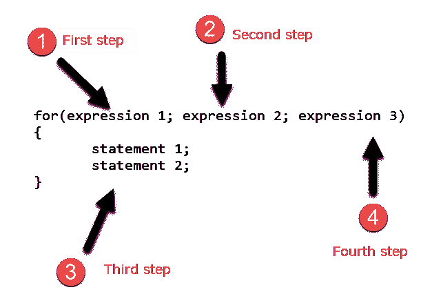

# C 语言中的`for`循环

> 原文：<https://overiq.com/c-programming-101/the-for-loop-in-c/>

最后更新于 2020 年 7 月 27 日

* * *

在前两章中，我们已经学习了 [while](/c-programming-101/the-while-loop-in-c/) 和 [do while loop](/c-programming-101/the-do-while-loop-in-c/) 。在本章中，我们讨论 for 循环:for 循环的语法如下:**语法:**

```c
for(expression1; expression2; expression3)
{
    // body of for loop
    statement1;
    statement2;
}

```

`expression1`是初始化表达式。
`expression2`是测试表达式或条件。
这个`expression3`就是更新表情。

工作原理:

首先执行初始化表达式(即`expression1`)初始化循环变量。当循环开始时，`expression1`只执行一次。然后检查条件(即`expression2`，如果是真的，则执行循环的主体。在执行循环体之后，程序控制被转移到更新表达式(`expression3`)。`expression3`修改循环变量。然后再次检查条件(即`expression2`)。如果条件仍然为真，则再次执行循环体。这个过程一直持续到`expression2`变为假。



如果 for 循环的主体只包含一条语句，那么大括号(`{}`)可以省略。

```c
for(expression1; expression2; expression3)
    statement1;

// The above for loop is equivalent to:

for(expression1; expression2; expression3)
{
    statement1;
}

```

以下程序计算从`1`到`100`的数字总和。

```c
#include<stdio.h>

int main()
{  
    int i;   // loop variable
    int sum = 0;    // variable to accumulate sum

    for(i = 1; i <= 100; i++)
    {
        sum += i;
    }

    printf("Sum = %d", sum);

    // return 0 to operating system
    return 0;
}

```

**预期输出:**

```c
Sum = 5050

```

**工作原理:**

在第 5 行，我们声明了一个名为`i`的循环变量。在第 6 行，我们将名为`sum`的变量声明并初始化为`0`。然后程序控制进入 for 循环。首先执行初始化语句(`i=1`)初始化循环变量`i`。然后检查条件`(i<100)`，如果为真，则执行 for 循环体内部的语句。在执行循环体之后，程序控制转移到更新表达式(`i++`)，并且`i`的值增加`1`。然后再次检查条件`(i<100)`，如果仍然为真，则执行循环体。只要变量`i`小于或等于`100`，该过程就会继续。当`i`到达`101`时，条件`(i<100)`变为假，控制从 for 循环中出来，执行后面的语句。

while 和 for 循环有什么区别吗？

while 和 for 循环本质上是以不同的方式做同样的事情。事实上，除了在极少数情况下，for 循环总是可以被 while 循环替换，反之亦然。

```c
expression1;
while(expression2)
{
    expression3;
}

```

在上面的片段中，`expression1`可以被视为初始化表达式，因为它在 while 循环的开始只执行一次。`expression2`是测试表达式，`expression3`是更新表达式。将这个模式应用到我们前面的 for 循环示例中，让我们使用 while 循环重写它。

```c
#include<stdio.h>

int main()
{
    int i = 1, sum = 0;

    while(i <= 100)
    {
        sum += i;
        i++;
    }

    printf("Sum = %d", sum);

    // return 0 to operating system
    return 0;
}

```

## for 循环中的表达式是可选的

for 循环中的所有三个表达式都是可选的，但两个分号必须始终存在。

*   如果初始化是在 for 循环之外完成的，我们可以省略`expression1`。
*   如果省略`expression2`，那么条件总是真的，导致无限循环的产生——一个永不停止执行的循环。为了避免无限循环，您应该在循环体中包含一个[中断](/c-programming-101/the-break-and-continue-statement-in-c/#break-statement)或[返回](/c-programming-101/the-return-statement-in-c/)语句。我们将在接下来的章节中详细讨论`break`和`return`陈述。
*   如果 for 循环体中存在更新表达式，我们可以省略`expression3`。

以下是基于省略表达式的 for 循环的一些简单变体:

**例 1:** 省略`expression1`。

```c
/*
     1st variation - expression1 is omitted
*/

#include<stdio.h>

int main()
{
    int i = 1, sum = 0;

    //expression 1 is omitted

    for( ; i <= 100; i++)
    {
        sum += i;
    }

    printf("Sum = %d", sum);

    // return 0 to operating system
    return 0;
}

```

**预期输出:**

```c
Sum = 5050

```

在这种情况下，`expression1`被省略，因为循环变量的初始化是在 for 循环之外执行的(第 9 行)。请注意，虽然省略了`expression1`，但分号(`;`)必须存在。

**例 2:** 省略`expression2`。

```c
/*
  2nd variaton - expression2 is omitted
*/

#include<stdio.h>

int main()
{
    int i, sum = 0;

   for(i = 1 ; ; i++)  // expression 2 is omitted
   {
       if(i > 100)
       {
            /* the break statement causes the loop to terminate.
               We will discuss the break statement in detail
               in later chapters.
             */
            break;
        }
        sum += i;
    }
    printf("Sum = %d", sum);

    // return 0 to operating system
    return 0;
}

```

**预期输出:**

```c
Sum = 5050

```

这里省略了条件。为了补偿这种情况，我们添加了 if 语句。当控制进入 for 循环的主体时，检查条件`(i>100)`，如果为假，则省略 if 块中的语句。当`i`到达`100`时，条件`(i>100)`变为真，执行`break`语句，导致循环终止，程序执行随循环后的语句恢复。

**注意:**语句导致退出循环。在章节中的[中断和`continue`语句中有详细讨论。](/c-programming-101/the-break-and-continue-statement-in-c/)

**例 3:** 省略`expression3`。

```c
/*
 3rd variation - expression3 is omitted
*/

#include<stdio.h>

int main()
{
    int i, sum = 0;

    // expression3 is omitted

    for(i = 1 ; i <= 100 ; )
    {
        sum += i;
        i++; // update expression
    }

    printf("Sum = %d", sum);

    // return 0 to operating system
    return 0;
}

```

**预期输出:**

```c
Sum = 5050

```

这里省略了第三个表达式。为了补偿第三个表达式，我们在`sum += i;`语句后添加了`i++;`。

**例 4:**

```c
/*
   4th variation - all the expressions are omitted
*/
#include<stdio.h>

int main()
{    
    int i = 0; // initialization expression
    int sum = 0;

    for( ; ; )
    {
        if(i > 100) // condition
        {
            break; // break out of the for loop
        }
        sum += i;
        i++; // update expression
    }

    printf("Sum = %d", sum);

    // return 0 to operating system
    return 0;
}

```

**预期输出:**

```c
Sum = 5050

```

## 循环的嵌套

正如 [if-else 语句](/c-programming-101/if-else-statements-in-c/)可以嵌套在另一个 if-else 语句中一样，我们可以将任何类型的循环嵌套在任何其他类型的循环中。例如，一个 For 循环可以嵌套在另一个 for 循环中，或者嵌套在 while 或 do while 循环中。同样，while 和 do while 也可以嵌套。

以下程序使用嵌套 for 循环打印半金字塔图案:

```c
#include<stdio.h>

int main()
{
    int row = 0, col = 0;

    for(row = 0; row < 10; row++)  // number of lines
    {
        for(col = 0; col < row; col++)  // num of * in each lines
        {
            printf(" * ");
        }
        printf("\n");
    }

    // return 0 to operating system
    return 0;
}

```

**预期输出:**

```c
*
* *
* * *
* * * *
* * * * *
* * * * * *
* * * * * * *
* * * * * * * *
* * * * * * * * *

```

**工作原理:**

在第 5 行，我们已经声明并初始化了两个整数变量`row`和`col`。

在第 7-14 行，我们有一个嵌套的 for 循环。外部 for 循环控制要打印的行数，内部 for 循环控制每行要打印的`*`数。

当执行外部 for 循环时，`row`变量的值被初始化为`0`，然后条件`(row<10)`被测试，因为它是真的(`0<10`)控制进入外部 for 循环的主体，这是另一个 for 循环。在内部 for 循环中，变量`col`被初始化为`0`，然后检查条件(`col<=row`)，因为它是真的(`0<=0`)。执行内部循环体内部的语句，即`printf(" * ")`。然后，使用更新表达式`col++`将`col`增加`1`(现在`col`的值为`1`)。再次测试条件(`col<=row`)，因为它是假的(`1<=0`)。控件脱离内部 for 循环。第 13 行的`printf()`语句打印一个换行符(`\n`)。由于没有更多的语句可以执行，控制转移到外部 for 循环的更新表达式。`row`的值增加`1`(现在`row`是`1`)。测试条件`(row<10)`，因为它是真的(`1<10`)。再次执行外部 for 循环的主体。这个过程会一直重复直到`row<10`。当`row`到达`10`时，条件`row < 10`变为假，控制从外环出来。

* * *

* * *