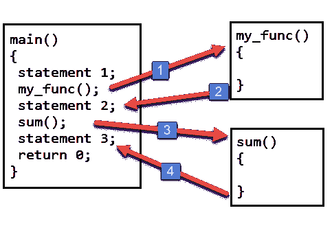

# C 语言中的函数基础

> 原文：<https://overiq.com/c-programming-101/function-basics-in-c/>

最后更新于 2020 年 7 月 27 日

* * *

函数是 C 语句的集合，用来做特定的事情。C 程序由一个或多个函数组成。每个程序都必须有一个名为`main()`的函数。

## 函数优势

*   一个大问题可以分成子问题，然后用函数求解。
*   这些函数是可重用的。一旦你创建了一个函数，你就可以在程序的任何地方调用它，而不需要复制和粘贴整个逻辑。
*   程序变得更容易维护，因为如果你想在以后修改程序，你只需要在一个地方更新你的代码。

## 函数类型

1.  图书馆函数
2.  用户定义函数

## 图书馆函数

c 有很多内置的库函数来执行各种操作，例如:`sqrt()`函数用来求一个数的平方根。同样的，`scanf()`和`printf()`也是库函数，我们从第 1 章-[C 编程入门](/c-programming-101/intro-to-c-programming/)就开始使用了。

要使用库函数，我们必须首先使用`#include`预处理器指令包含相应的头文件。对于`scanf()`和`printf()`对应的头文件是`stdio.h`，对于`sqrt()`等数学相关的函数，则是`math.h`。

```c
// Program to find the square root of a number
#include<stdio.h>
#include<math.h>

int main()
{
    float a;

    printf("Enter number: ");
    scanf("%f", &a);

    printf("Square root of %.2f is %.2f", a, sqrt(a));

    // signal to operating system program ran fine
    return 0;
}

```

**预期输出:**

第一次运行:

```c
Enter number: 441
Square root of 441.00 is 21.0

```

第二次运行:

```c
Enter number: 889
Square root of 889.00 is 29.82

```

## 常见的数学函数

| 函数 | 描述 | 例子 |
| --- | --- | --- |
| `sqrt(x)` | `x`的平方根 | `sqrt(900.0)`是`30.0` |
| `exp(x)` | 指数函数 | `exp(1.0)`是`2.718282` |
| `log(x)` | `x`(以 e 为基数)`&#124;`对数的自然对数(2.718282) `is` 1.0 ` |  |
| `log10(x)` | `x`的对数(以`10`为基数) | `log10(1.0)`是`0.0` |
| `fabs(x)` | `x`作为浮点数的绝对值 | `fabs(13.5)`是`13.5` |
| `ceil(x)` | 将`x`舍入到不小于`x`的最小整数 | `ceil(9.2)`是`10.0` |
| `floor(x)` | 将`x`舍入到不大于`x`的最大整数 | `floor(9.2)`是`9.0` |
| `pow(x,y)` | `x`升至动力`y` | `pow(2, 7)`是`128.0` |
| `sin(x)` | `x` ( `x`以弧度为单位)的三角正弦 | `sin(0.0)`是`0.0` |
| `cos(x)` | `x` ( `x`弧度)的三角余弦 | `cos(0.0)`是`1.0` |
| `tan(x)` | `x` ( `x`弧度)的三角正切 | `tan(0.0)`是`0.0` |

要使用这些函数，您必须首先包含头文件`math.h`。

## 用户定义函数

用户创建的函数称为用户定义函数。要创建自己的函数，你需要知道三件事。

1.  函数定义。
2.  函数调用。
3.  函数声明。

## 函数定义

函数定义由构成函数的代码组成。函数由函数头和函数体两部分组成。下面是函数的一般语法。

```c
return_type function_name(type1 argument1, type2 argument2, ...)
{
    local variables;
    statement1;
    statement2;
    return (expression);
}

```

函数的第一行称为函数头。它由`return_type`、`function_ name`和函数参数组成。

`return_type`表示值函数返回的类型，例如`int`、`float`等。`return_type`是可选的，如果省略，则默认为`int`。一个函数可以返回一个值，也可以不返回任何值，如果一个函数不返回任何值，则使用`void`代替`return_type`。

`function_name`是函数的名称。它可以是任何有效的 C 标识符。在函数名之后，括号内是参数声明。它由参数的类型和名称组成。论点也被称为**正式论点**。一个函数可以有任意数量的参数，甚至没有参数。如果函数没有任何参数，那么括号就留空，或者有时用 void 来表示不接受任何参数的函数。

函数的主体是函数的肉，这是您编写业务逻辑的地方。函数的主体是一个复合语句(或块)，它由任何有效的 C 语句和一个可选的`return`语句组成。函数内部声明的变量称为局部变量，因为它们是函数的局部变量，这意味着您不能从另一个函数访问一个函数内部声明的变量。当一个函数需要向它的调用者传递一些东西时，使用 return 语句。`return`的说法是随意的。如果一个函数没有返回值，那么它的`return_type`必须是`void`，同样，如果一个函数返回一个`int`值，它的`return_type`必须是`int`。

你可以在程序的任何地方写函数定义，但通常是放在`main()`函数之后。

让我们创建一个小函数。

```c
void my_func()
{
    printf("Hello i am my_func()");
}

```

`my_func()`函数不返回值，所以`return_type`是`void`。此外，它不接受任何圆括号为空的论点。

也可以在括号内写`void`，明确表示这个函数不接受任何参数。

```c
void my_func(void)
{
    printf("Hello i am my_func()");
}

```

在整个教程中，我们将使用这种方法。

`my_func()`函数的主体只有一行，每次调用函数时都会打印`"Hello i am my_func()"`。

让我们创建另一个小函数。

```c
int product(int num1, int num2)
{
    int result;
    result = num1 * num2;
    return result;
}

```

该函数接受两个参数并返回一个整数值。变量`result`在函数内部声明，所以它是一个局部变量，只在函数内部可用。第 5 行的`return`语句将`num1`和`num2`的乘积返回给调用方。另外需要注意的一点是，和变量`result`一样，`num1`和`num2`都是局部变量，这意味着我们不能在函数`product()`之外访问它们。

## 函数调用

定义函数后，下一步是使用函数，要使用函数，必须调用它。要调用一个函数，您必须在括号`()`中写下它的名称，后面跟以逗号(`,`)分隔的参数。

例如，下面是我们如何调用上面创建的`product()`函数。

```c
product(12, 10);

```

这里我们将两个参数`12`和`10`传递给函数`product()`。值`12`和`10`将分别分配给变量`num1`和`num2`。

如果我们这样调用`product()`函数:

```c
product(12);

```

我们会得到如下语法错误:

正如您所看到的，编译器抱怨“函数产品的参数太少”，这仅仅意味着调用函数的参数数量少于所需数量。

如果一个函数不接受任何参数，那么它必须使用空括号来调用。

```c
my_func();

```

下图描述了调用函数时发生的情况。

当从 main()调用`my_func()`函数时，控制传递给 my_func()。此时`main()`函数的活动暂停；当 my_func()函数开始工作时，它会进入睡眠状态。当`my_func()`函数完成其任务或者当没有更多的语句要执行时，控制返回到`main()`函数。`main()`唤醒并执行`statement2`。然后在下一行`sum()`函数被调用，控制转到`sum()`。再次暂停`main()`函数的活动，直到`sum()`正在执行。当`sum()`没有要执行的语句时，控制返回到`main()`。函数`main()`再次唤醒，执行`statement3`。需要注意的重点是`main()`函数正在调用`my_func()`和`sum()`，所以`main()`是**调用函数**，而`my_func()`和`sum()`是**调用函数**。

如果一个函数返回值，那么它可以像操作数一样用在任何表达式中。例如:

```c
a = product(34, 89) + 100;
printf( "product is = %d", product(a, b) );

```

你没有义务使用函数的返回值。

```c
product();

```

这里`product()`的返回值被丢弃。

如果一个函数没有返回值，那么我们就不能在表达式中使用它，如下所示:

```c
s = myfunc();

```

还有一点需要注意，函数内部的语句只有在调用函数时才会执行。如果您已经定义了一个函数，但从未调用过它，那么它里面的语句将永远不会被执行。

## 函数声明

调用函数需要一些关于被调用函数的信息。当函数定义先于调用函数时，就不需要函数声明。例如:

```c
#include<stdio.h>

// function definition

int sum(int x, int y)
{
    int s;
    s = x + y;
    return s;
}

int main()
{
    // function call
    printf("sum = %d", sum(10, 10));

    // signal to operating system everything works fine
    return 0;
}

```

注意函数`sum()`的定义在调用函数之前，即`main()`，这就是不需要函数声明的原因。

一般函数定义在`main()`函数之后。在这种情况下，需要函数声明。

函数声明由函数头组成，函数头末尾有一个分号(`;`)。

这里是函数`my_func()`和`sum()`的函数声明。

```c
void my_func(void);

int product(int x, int y);

```

函数声明中的参数名称是可选的，

```c
int product(int x, int y)

```

可以写成:

```c
int product(int , int )

```

请注意，返回类型和参数类型必须与创建函数时定义的类型相同。所以你不能写以下内容:

`float product(int a, int b)`–错误，因为`product()`函数返回类型为`int`。
`int product(float a, int b)`–错误，因为`product()`函数第一个参数是`int`类型。

我想提到的另一个要点是，函数声明中定义的参数名称不必与函数定义中定义的相同。

```c
int sum(int abc, int xyx)  // Function declaration

int sum(int x, int y)      // Function definition
{ 
    int s; 
    s = x + y; 
    return s; 
}

```

这个代码完全有效。

函数声明通常放在预处理器指令的下面。

下面的程序演示了我们在本章中所学的一切。

```c
#include<stdio.h>

// function declaration
int sum(int x, int y);

int main()
{
    // function call
    printf("sum = %d", sum(10, 10));

    // signal to operating system everything works fine
    return 0;
}

// function definition
int sum(int x, int y)
{
    int s;
    s = x + y;
    return s;
}

```

**预期输出:**

```c
sum = 20

```

以下程序使用函数打印最大的数字。

```c
#include<stdio.h>

// function declaration
int max(int x, int y);

int main()
{
    // function call

    max(100, 12);
    max(10, 120);
    max(20, 20);

   // signal to operating system program ran fine
   return 0;
}

// function definition

int max(int x, int y)
{
    if(x > y)
    {
        printf("%d > %d\n", x, y );
    }

    else if(x < y)
    {
        printf("%d < %d\n", x, y );
    }

    else
    {
        printf("%d == %d\n", x, y );
    }
}

```

**预期输出:**

```c
100 > 12
10 < 120
20 == 20

```

* * *

* * *