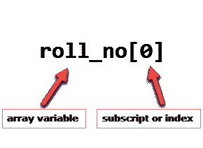
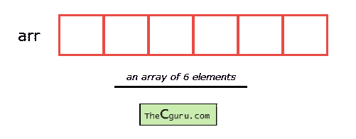

# C 语言的一维数组

> 原文：<https://overiq.com/c-programming-101/one-dimensional-array-in-c/>

最后更新于 2020 年 9 月 23 日

* * *

这个变量允许我们一次存储一个值，如果我们想存储 100 个学生的卷号呢？对于这个任务，我们必须声明 100 个变量，然后给每个变量赋值。如果有 10000 名或更多的学生呢？正如您所看到的，声明单个实体(即学生)的许多变量不是一个好主意。在这种情况下，这些数组提供了更好的数据存储方式。

## 什么是阵列？

数组是一个或多个相同类型的值的集合。每个值称为数组的一个元素。数组的元素共享相同的变量名，但每个元素都有自己唯一的索引号(也称为下标)。数组可以是任何类型，例如:`int`、`float`、`char`等。如果一个数组是`int`类型，那么它的元素只能是`int`类型。

为了存储`100`学生的卷号，我们必须声明一个大小为`100`的数组，即`roll_no[100]`。这里数组的大小是`100`，所以能够存储`100`值。在 C 中，索引或下标从`0`开始，所以`roll_no[0]`是第一个元素，`roll_no[1]`是第二个元素，以此类推。请注意，数组的最后一个元素将位于`roll_no[99]`而不是`roll_no[100]`，因为索引从`0`开始。



数组可以是单个的，也可以是多维的。下标或索引的数量决定了数组的维数。一维数组称为一维数组或一维数组，而二维数组称为二维数组或二维数组。

让我们从一维数组开始。

## 一维阵列

从概念上讲，您可以将一维数组视为一行，其中元素一个接一个地存储。



**语法:** `datatype array_name[size];`

**数据类型:**表示数组中元素的类型。

**数组 _ 名称:**数组的名称。它必须是有效的标识符。

**大小:**数组可以容纳的元素数量。下面是一些数组声明示例:

```c
int num[100];
float temp[20];
char ch[50];

```

`num`是`int`类型的数组，只能存储`int`类型的`100`元素。
`temp`是`float`类型的数组，只能存储`20`类型的`float`元素。
`ch`是`char`类型的数组，只能存储`char`类型的`50`元素。

**注意:**当一个数组被声明时，它包含垃圾值。

数组中的各个元素:

```c
num[0], num[1], num[2], ....., num[99]
temp[0], temp[1], temp[2], ....., temp[19]
ch[0], ch[1], ch[2], ....., ch[49]

```

我们还可以使用变量和符号常量来指定数组的大小。

```c
#define SIZE 10

int main()
{
    int size = 10;

    int my_arr1[SIZE]; // ok
    int my_arr2[size]; // not allowed until C99
    // ...
}

```

**注**:在 C99 标准之前，我们是不允许用变量来指定数组的大小的。如果您使用支持 C99 标准的编译器，上述代码将会编译成功。但是，如果您使用的是像 Turbo C++这样的旧版本的 C 编译器，那么您将会得到一个错误。

符号常量的使用使得程序具有可维护性，因为以后如果你想改变数组的大小，你需要立刻修改它，只需放入`#define`指令即可。

## 访问数组的元素

数组的元素可以通过在方括号内指定数组名后跟下标或索引来访问(即`[]`)。数组下标或索引从`0`开始。如果数组的大小是`10`，那么第一个元素在索引`0`处，而最后一个元素在索引`9`处。第一个有效下标(即`0`)称为*下限*，最后一个有效下标称为*上限*。

```c
int my_arr[5];

```

那么这个数组的元素是；

第一元素–`my_arr[0]`
第二元素–`my_arr[1]`
第三元素–`my_arr[2]`
第四元素–`my_arr[3]`
第五元素–`my_arr[4]`

数组下标或索引可以是任何产生整数值的表达式。例如:

```c
int i = 0, j = 2;
my_arr[i]; // 1st element
my_arr[i+1]; // 2nd element
my_arr[i+j]; // 3rd element

```

在数组`my_arr`中，最后一个元素在`my_arr[4]`处，如果试图访问数组最后一个有效索引以外的元素怎么办？

```c
printf("%d", my_arr[5]); // 6th element
printf("%d", my_arr[10]); // 11th element
printf("%d", my_arr[-1]); // element just before 0

```

确定索引`5`、`10`和`-1`无效，但是 C 编译器不会显示任何错误消息，而是会打印一些垃圾值。C 语言不检查数组的边界。程序员有责任随时检查数组边界。

## 处理一维数组

下面的程序使用 for 循环来获取一维数组的输入和打印元素。

```c
#include<stdio.h>

int main()
{
    int arr[5], i;

    for(i = 0; i < 5; i++)
    {
        printf("Enter a[%d]: ", i);
        scanf("%d", &arr[i]);
    } 

    printf("\nPrinting elements of the array: \n\n");

    for(i = 0; i < 5; i++)
    {
        printf("%d ", arr[i]);
    }

    // signal to operating system program ran fine
    return 0;
}

```

[现在试试](https://overiq.com/c-online-compiler/ql3/)

**预期输出:**

```c
Enter a[0]: 11
Enter a[1]: 22
Enter a[2]: 34
Enter a[3]: 4
Enter a[4]: 34

Printing elements of the array:

11 22 34 4 34

```

**工作原理:**

在第 5 行中，我们已经声明了一个由`int`类型的`5`整数和变量`i`组成的数组。然后使用 for 循环将五个元素输入数组。在`scanf()`中，我们在数组的元素`arr[i]`上使用了`&`运算符(也称为运算符的地址)，就像我们对类型为`int`、`float`、`char`等的变量所做的那样。第 13 行将`"Printing elements of the array"`打印到控制台。第二个 for 循环逐个打印数组的所有元素。

以下程序打印数组元素的总和。

```c
#include<stdio.h>

int main()
{
    int arr[5], i, s = 0;

    for(i = 0; i < 5; i++)
    {
        printf("Enter a[%d]: ", i);
        scanf("%d", &arr[i]);
    }

    for(i = 0; i < 5; i++)
    {
        s += arr[i];
    }

    printf("\nSum of elements = %d ", s);

    // signal to operating system program ran fine
    return 0;
}

```

[现在试试](https://overiq.com/c-online-compiler/rmw/)

**预期输出:**

```c
Enter a[0]: 22
Enter a[1]: 33
Enter a[2]: 56
Enter a[3]: 73
Enter a[4]: 23

Sum of elements = 207

```

**工作原理:**第一个 for 循环要求用户在数组中输入五个元素。第二个 for 循环逐个读取数组的所有元素，并累加变量`s`中所有元素的总和。注意需要将变量`s`初始化为`0`，否则会因为`s`的垃圾值而得到错误的答案。

## 初始化数组

当在函数内部声明数组时，数组的元素具有垃圾值。如果一个数组是全局的或静态的，那么它的元素会自动初始化为`0`。我们可以使用以下语法在声明时显式初始化数组的元素:

**语法:** `datatype array_name[size] = { val1, val2, val3, ..... valN };`

`datatype`是数组的元素类型。

`array_name`是变量名，必须是任何有效的标识符。

`size`是数组的大小。

`val1`、`val2`...被称为初始值设定项的常量。每个值用逗号(`,`)分隔，在右花括号(`}`)后有一个分号(`;`)。

下面是一些例子:

```c
float temp[5] = {12.3, 4.1, 3.8, 9.5, 4.5}; // an array of 5 floats

int arr[9] = {11, 22, 33, 44, 55, 66, 77, 88, 99}; // an array of 9 ints

```

[现在试试](https://overiq.com/c-online-compiler/v8V/)

初始化一维数组时，指定数组的大小是可选的，因此您也可以将上面的语句写成:

```c
float temp[] = {12.3, 4.1, 3.8, 9.5, 4.5}; // an array of 5 floats

int arr[] = {11, 22, 33, 44, 55, 66, 77, 88, 99}; // an array of 9 ints

```

[现在试试](https://overiq.com/c-online-compiler/wKJ/)

如果初始值设定项的数量小于指定的大小，则数组的剩余元素被赋予一个值`0`。

```c
float temp[5] = {12.3, 4.1};

```

这里`temp`数组的大小是`5`但是只有两个初始值设定项。初始化之后，数组的元素如下:

`temp[0]`是`12.3`
`temp[1]`是`4.1`
是`0`
是`temp[3]`是`0`
是`temp[4]`是`0`

[现在试试](https://overiq.com/c-online-compiler/j0z/)

如果初始值设定项的数量大于数组的大小，那么旧的编译器将报告一个错误。然而，大多数新编译器只是发出警告消息。

```c
int num[5] = {1, 2, 3, 4, 5, 6, 7, 8} // Error in old compilers, warning in new ones

```

[现在试试](https://overiq.com/c-online-compiler/krY/)

以下程序查找数组中最高和最低的元素。

```c
#include<stdio.h>
#define SIZE 10

int main()
{
    int my_arr[SIZE] = {34,56,78,15,43,71,89,34,70,91};
    int i, max, min;

    max = min = my_arr[0];

    for(i = 0; i < SIZE; i++)
    {
        // if value of current element is greater than previous value
        // then assign new value to max
        if(my_arr[i] > max)
        {
            max = my_arr[i];
        }

        // if the value of current element is less than previous element
        // then assign new value to min
        if(my_arr[i] < min)
        {
            min = my_arr[i];
        }
     }

    printf("Lowest value = %d\n", min);
    printf("Highest value = %d", max);

    // signal to operating system everything works fine
    return 0;
}

```

[现在试试](https://overiq.com/c-online-compiler/gnl/)

**预期输出:**

```c
Lowest value = 15
Highest value = 91

```

**工作原理:**在第 6 行，首先，我们已经声明并初始化了一个 10 个整数的数组。在下一行中，我们声明了另外三个类型为`int`的变量，即:`i`、`max`和`min`。在第 9 行中，我们将`my_arr`的第一个元素的值分配给了`max`和`min`。for 循环用于迭代数组的所有元素。在 for 循环中，第一个 if 条件(`my_arr[i] > max`)检查当前元素是否大于`max`，如果大于，我们将当前元素的值赋给`max`。

第二个 if 语句检查当前元素的值是否小于`min`的值。如果是，我们将当前元素的值赋给`min`。这个过程一直持续到数组中还有元素需要迭代。

当过程结束时，`max`和`min`变量将分别有最大值和最小值。

* * *

* * *