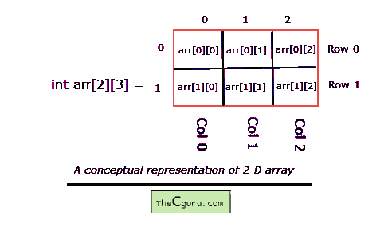
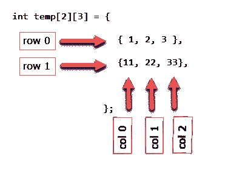

# C 语言中的二维数组

> 原文：<https://overiq.com/c-programming-101/two-dimensional-array-in-c/>

最后更新于 2020 年 7 月 27 日

* * *

## 二维阵列

二维数组的语法声明和一维数组没有太大区别。在二维数组中，要声明和访问二维数组的元素，我们使用 2 个下标而不是 1 个下标。

**语法:** `datatype array_name[ROW][COL];`

二维数组中的元素总数为`ROW*COL`。举个例子吧。

```c
int arr[2][3];

```

这个数组可以存储`2*3=6`元素。您可以将这个二维数组可视化为 2 行 3 列的矩阵。



上述数组的单个元素可以通过使用两个下标而不是一个下标来访问。第一个下标表示行号，第二个下标表示列号。如上图所示，行和列都是从`0`开始索引的。所以这个数组的第一个元素在`arr[0][0]`，最后一个元素在`arr[1][2]`。以下是访问所有其他元素的方法:

`arr[0][0]` -指第一元素
`arr[0][1]` -指第二元素
`arr[0][2]` -指第三元素
`arr[1][0]` -指第四元素
`arr[1][1]` -指第五元素
`arr[1][2]` -指第六元素

如果试图访问有效`ROW`和`COL`之外的元素，C 编译器将不会显示任何类型的错误消息，而是打印一个垃圾值。处理界限是程序员的责任。

`arr[1][3]` -将打印一个垃圾值，因为`COL`的最后一个有效索引是`2`
`arr[2][3]` -将打印一个垃圾值，因为`ROW`和`COL`的最后一个有效索引分别是`1`和`2`

就像一维数组一样，我们也只能用常量和符号常量来指定二维数组的大小。

```c
#define ROW 2
#define COL 3

int i = 4, j = 6;
int arr[ROW][COL]; // OK
int new_arr[i][j]; // ERROR

```

## 处理二维数组的元素

为了处理二维数组的元素，我们使用两个嵌套循环。外部 for 循环遍历所有行，内部 for 循环遍历所有列。以下程序将清除所有内容。

```c
#include<stdio.h>
#define ROW 3
#define COL 4

int main()
{
    int arr[ROW][COL], i, j;

    for(i = 0; i < ROW; i++)
    {
        for(j = 0; j < COL; j++)
        {
            printf("Enter arr[%d][%d]: ", i, j);
            scanf("%d", &arr[i][j]);
        }
    }

    printf("\nEntered 2-D array is: \n\n");

    for(i = 0; i < ROW; i++)
    {
        for(j = 0; j < COL; j++)
        {
            printf("%3d ", arr[i][j] );
        }
        printf("\n");
    }
    // signal to operating system everything works fine
    return 0;
}

```

**预期输出:**

```c
Enter arr[0][0]: 11
Enter arr[0][1]: 35
Enter arr[0][2]: 73
Enter arr[0][3]: 831
Enter arr[1][0]: 3
Enter arr[1][1]: 40
Enter arr[1][2]: 31
Enter arr[1][3]: 93
Enter arr[2][0]: 35
Enter arr[2][1]: 10
Enter arr[2][2]: 52
Enter arr[2][3]: 81

Entered 2-D array is:

11 35 73 831
3 40 31 93
35 10 52 81

```

**工作原理:**

在之前的节目中没有什么值得解释的新内容。我们只是使用两个嵌套的 for 循环。第一个嵌套的 for 循环接受用户的输入。第二个 for 循环像矩阵一样打印二维数组的元素。

## 初始化二维数组

二维数组的初始化类似于一维数组。例如:

```c
int temp[2][3] = {
    { 1, 2, 3 }, // row 0
    {11, 22, 33} // row 1
};

```



初始化后，每个元素如下:

```c
temp[0][0] : 1
temp[0][1] : 2
temp[0][2] : 3
temp[1][0] : 11
temp[1][1] : 22
temp[1][2] : 33

```

考虑另一个初始化。

```c
int my_arr[4][3] = {
                       {10},
                       {77, 92},
                       {33, 89, 44},
                       {12, 11}
                   };

```

`my_arr`的大小是`4*3=12`，但是在初始化的时候，我们只指定了`8`元素的值。在这种情况下，剩余的元素将被赋予`0`的值。

各个要素如下:

```c
my_arr[0][0] : 10
my_arr[0][1] : 0
my_arr[0][2] : 0

my_arr[1][0] : 77
my_arr[1][1] : 92
my_arr[1][2] : 0

my_arr[2][0] : 33
my_arr[2][1] : 89
my_arr[2][2] : 44

my_arr[3][0] : 12
my_arr[3][1] : 11
my_arr[4][2] : 0

```

在二维数组中，指定第一维是可选的，但第二维必须始终存在。只有当您同时声明和初始化数组时，这才有效。例如:

```c
int two_d[][3] = {
                     {13,23,34},
                     {15,27,35}
                 };

```

与...相同

```c
int two_d[2][3] = {
                      {13, 23, 34},
                      {15, 27, 35}
                  };

```

如前所述，您可以将二维数组可视化为矩阵。下面的程序演示了两个矩阵的加法。

```c
#include<stdio.h>
#define ROW 2
#define COL 3

int main()
{
    int mat1[ROW][COL], mat2[ROW][COL], mat3[ROW][COL];
    int i, j;

    printf("Enter first matrix: \n\n");

    for(i = 0; i < ROW; i++)
    {
        for(j = 0; j < COL; j++)
        {
            printf("Enter a[%d][%d]: ", i, j);
            scanf("%d", &mat1[i][j]);
        }
    }

    printf("\nEnter Second matrix: \n\n");

    for(i = 0; i < ROW; i++)
    {
        for(j = 0; j < COL; j++)
        {
            printf("Enter a[%d][%d]: ", i, j);
            scanf("%d", &mat2[i][j]);
        }
    }

    // add mat1 and mat2

    for(i = 0; i < ROW; i++)
    {
        for(j = 0; j < COL; j++)
        {
            mat3[i][j] = mat1[i][j] + mat2[i][j] ;
        }
    }

    printf("\nResultant array: \n\n");

    // print resultant array

    for(i = 0; i < ROW; i++)
    {
        for(j = 0; j < COL; j++)
        {
            printf("%5d ", mat3[i][j]);
        }
        printf("\n");
    }

    // signal to operating system program ran fine
    return 0;
}

```

**预期输出:**

```c
Enter first matrix:

Enter a[0][0]: 12
Enter a[0][1]: 32
Enter a[0][2]: 13
Enter a[1][0]: 35
Enter a[1][1]: 54
Enter a[1][2]: 35

Enter Second matrix:

Enter a[0][0]: 57
Enter a[0][1]: 64
Enter a[0][2]: 58
Enter a[1][0]: 72
Enter a[1][1]: 84
Enter a[1][2]: 29

Resultant array:

mat1 + mat2 =

69 96 71
107 138 64

```

**工作原理:**

只有当两个矩阵具有相同的维数时，它们才能相加或相减。换句话说，一个大小为`2*3`的矩阵可以和另一个 2*3 的矩阵相加，但是不能和`2*4`或`3*2`的矩阵相加或相减。得到的数组将是一个与原始数组相同维数的矩阵。前两个 for 循环要求用户输入两个矩阵。第三个 for 循环在新数组`mat3`中添加了`mat1`和`mat2`的相应元素。第四个为循环打印数组的元素`mat3`。

## 二维以上的数组

你甚至可以创建一个 3 维或更多维的数组，但一般来说，你永远不需要这样做。因此，我们将仅限于三维阵列。

下面是如何声明一个三维数组。

```c
int arr[2][3][2];

```

三维数组使用三个索引或下标。这个数组可以存储`2*3*2=12`元素。

下面是如何初始化一个三维数组。

```c
int three_d[2][3][4] = {
                           {
                               {12,34,56,12},
                               {57,44,62,14},
                               {64,36,91,16},
                           },

                           {
                               {87,11,42,82},
                               {93,44,12,99},
                               {96,34,33,26},
                           }
                      };

```

你可以把这个数组想象成 2 个二维数组，每个二维数组都有`3`行和`4`列；

以下是数组的各个元素:

**第一排**

```c
three_d[0][0][0] : 12
three_d[0][0][1] : 34
three_d[0][0][2] : 56

three_d[0][0][3] : 12
three_d[0][1][0] : 57
three_d[0][1][1] : 44

three_d[0][1][2] : 62
three_d[0][1][3] : 14
three_d[0][2][0] : 64

three_d[0][2][1] : 36
three_d[0][2][2] : 91
three_d[0][2][3] : 16

```

**第二排**

```c
three_d[1][0][0] : 87
three_d[1][0][1] : 11
three_d[1][0][2] : 42

three_d[1][0][3] : 82
three_d[1][1][0] : 93
three_d[1][1][1] : 44

three_d[1][1][2] : 12
three_d[1][1][3] : 99
three_d[1][2][0] : 96

three_d[1][2][1] : 34
three_d[1][2][2] : 33
three_d[1][2][3] : 26

```

## 将多维数组传递给函数

您可以像一维数组一样将多维数组传递给函数，但是您需要指定除第一个维度之外的所有其他维度的大小。例如:

如果需要将`arr[2][3]`传递给一个名为`func_1()`的函数，那么需要这样声明`func_1()`:

```c
void func_1(int my_arr[2][3]) // OK
{
    //...
}

```

或者像这样:

```c
void func_1(int my_arr[][3]) // OK
{
   //...
}

```

宣布正式论点如下是无效的:

```c
void func_1(int my_arr[][]) // error
{
    //...
}

```

类似地，要传递三维数组，您需要声明如下函数:

```c
int arr[2][3][4];

void func_1(int my_arr[][3][4])
{
    //...
}

```

* * *

* * *