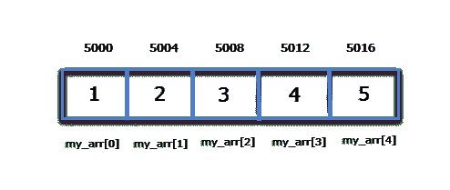

# 指针和一维数组

> 原文：<https://overiq.com/c-programming-101/pointers-and-1-d-arrays/>

最后更新于 2020 年 7 月 27 日

* * *

在 C 语言中，数组的元素存储在连续的存储单元中。例如:如果我们有以下数组。

```c
int my_arr[5] = {1, 2, 3, 4, 5};

```

然后，这就是元素在数组中的存储方式。



这里第一个元素在地址`5000`，因为每个整数占用`4`字节，下一个元素在`5004`等等。

在 C 语言中，指针和数组的关系非常密切。我们可以使用指针访问数组的元素。在幕后，编译器还使用指针表示法而不是下标表示法访问数组元素，因为与下标表示法相比，使用指针访问元素非常有效。关于阵列，需要记住的最重要的事情是:

> 数组的名称是一个常量指针，指向数组第一个元素的地址或数组的基址。

我们可以使用下标符号(即使用方括号)来找到数组元素的地址。例如:

```c
int my_arr[5] = {11, 22, 33, 44, 55};

```

这里`&my_arr[0]`指向数组第一个元素的地址。由于数组的名称是指向数组第一个元素的常量指针，`my_arr`和`&my_arr[0]`代表相同的地址。`&my_arr[1]`指向第二个元素的地址。类似地`&my_arr[2]`指向第三个元素的地址等等。

**注:** `my_arr`为`(int *)`类型或指向`int`的指针。

下面的程序演示了数组的元素存储在连续的内存位置。

```c
#include<stdio.h>

int main()
{
    int my_arr[5] = {1, 2, 3, 4, 5}, i;

    for(i = 0; i < 5; i++)
    {
        printf("Value of a[%d] = %d\t", i, my_arr[i]);
        printf("Address of a[%d] = %u\n", i, &my_arr[i]);
    }

    // signal to operating system program ran fine
    return 0;
}

```

**预期输出:**

```c
Value of a[0] = 1 Address of a[0] = 2293312
Value of a[1] = 2 Address of a[1] = 2293316
Value of a[2] = 3 Address of a[2] = 2293320
Value of a[3] = 4 Address of a[3] = 2293324
Value of a[4] = 5 Address of a[4] = 2293328

```

**注意:**每次运行程序时，内存地址可能会有所不同。

## 使用指针访问数组中的元素和元素地址

我们知道数组的名字是指向第一个元素的常量指针。考虑以下片段:

```c
int arr[] = {1,2,3,4,5};

```

这里`arr`是指向第一个元素的指针。但是，指针`arr`的基本类型是什么？如果你的答案指向`int`或`(int *)`。干得好；).

在这种情况下，`arr`指向一个整数的地址，即整数`1`的地址。所以`arr`的基本类型是指向`int`或`(int*)`的指针。

让我们再举一些例子:

```c
char arr[] = {'A','B','C','D','E'};

```

`arr`指针的类型是什么？。

这里`arr`指向第一个元素的地址，它是一个字符。所以`arr`的类型是指向`char`或`(char *)`的指针。

同样的，

```c
double arr[] = {1.03, 29.3, 3.42, 49.3, 51.2};

```

这里`arr`是指向`double`或`(double *)`的指针类型的指针。

**注意:**这些概念是接下来章节的构建模块，所以不要跳过。如果你还不明白，再看一遍。

现在，您可以使用指针算法轻松访问元素的值和地址。假设`my_arr`是一组`5`整数。

```c
int my_arr[5] = {11, 22, 33, 44, 55};

```

这里`my_arr`是指向`int`或`(int *)`的基类型指针的常量指针，根据指针算法，当一个整数加到一个指针上时，我们得到下一个相同基类型元素的地址。所以在上面的例子中，my_arr 指向第一个元素的地址，`my_arr+1`指向第二个元素的地址，`my_arr + 2`指向第三个元素的地址，以此类推。因此，我们可以得出结论:

`my_arr`同`&my_arr[0]`
`my_arr + 1`同`&my_arr[1]`
`my_arr + 2`同`&my_arr[2]`
`my_arr + 3`同`&my_arr[3]`
`my_arr + 4`同`&my_arr[4]`

总的来说`(my_arr + i)`和写`&my_arr[i]`是一样的。

现在我们知道如何获取数组中每个元素的地址，通过使用间接运算符(`*`)我们可以获取地址处的值。如果我们取消引用`my_arr`，那么我们得到数组的第一个元素，即`*my_arr`。类似地，`*(my_arr + 1)`将返回数组的第二个元素，以此类推。

`*(my_arr)`同`my_arr[0]`
`*(my_arr + 1)`同`my_arr[1]`
`*(my_arr + 2)`同`my_arr[2]`
`*(my_arr + 3)`同`my_arr[3]`
`*(my_arr + 4)`同`my_arr[4]`

总的来说`*(my_arr+i)`和写`my_arr[i]`是一样的。

以下程序使用指针表示法打印数组元素的值和地址。

```c
#include<stdio.h>

int main()
{
    int my_arr[5] = {1, 2, 3, 4, 5}, i;

    for(i = 0; i < 5; i++)
    {
        printf("Value of a[%d] = %d\t", i, *(my_arr + i) );
        printf("Address of a[%d] = %u\n", i, my_arr + i );
    }

    // signal to operating system program ran fine
    return 0;
}

```

**预期输出:**

```c
Value of a[0] = 1 Address of a[0] = 2293312
Value of a[1] = 2 Address of a[1] = 2293316
Value of a[2] = 3 Address of a[2] = 2293320
Value of a[3] = 4 Address of a[3] = 2293324
Value of a[4] = 5 Address of a[4] = 2293328

```

**注意:**每次运行程序时，内存地址可能会有所不同。

## 将一维数组赋给指针变量

是的，您可以将一维数组赋给指针变量。考虑以下示例:

```c
int *p;
int my_arr[] = {11, 22, 33, 44, 55};
p = my_arr;

```

现在，您可以使用指针 p 来访问数组中每个元素的地址和值。需要注意的是，将一维数组分配给指向`int`的指针是可能的，因为`my_arr`和`p`是相同的基类型，即指向`int`的指针。一般来说`(p+i)`表示 ith 元素的地址，`*(p+i)`表示 ith 元素的值。

数组的名字(即`my_arr`)和指针变量(即`p`)有些区别。数组的名字是一个常量指针，因此你不能改变它来指向其他内存位置。你不能给它分配其他地址，也不能像在指针变量中那样应用递增/递减运算符。

```c
my_arr++; // error
my_arr--; // error
my_arr = &i // error

```

但是`p`是一个普通的指针变量，所以你可以应用指针算法，甚至给它分配一个新的地址。

```c
p++; // ok
p--; // ok
p = &i // ok

```

下面的程序演示了如何通过将一维数组的元素赋给指针变量来访问作为其地址的值。

```c
#include<stdio.h>

int main()
{
    int my_arr[5] = {1, 2, 3, 4, 5}, i;
    int *p;
    p = my_arr;
    // p = &my_arr[0]; // you can also do this

    for(i = 0; i < 5; i++)
    {
        printf("Value of a[%d] = %d\t", i, *(p + i) );
        printf("Address of a[%d] = %u\n", i, p + i );
    }

    // signal to operating system program ran fine
    return 0;
}

```

**预期输出:**

```c
Value of a[0] = 1 Address of a[0] = 2293296
Value of a[1] = 2 Address of a[1] = 2293300
Value of a[2] = 3 Address of a[2] = 2293304
Value of a[3] = 4 Address of a[3] = 2293308
Value of a[4] = 5 Address of a[4] = 2293312

```

**注意:**每次运行程序时，内存地址可能会有所不同。

* * *

* * *