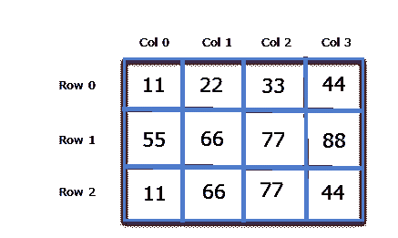

# 指针和二维数组

> 原文：<https://overiq.com/c-programming-101/pointers-and-2-d-arrays/>

最后更新于 2020 年 7 月 27 日

* * *

在最后一章中，我们创建了一个指针，它指向基类型为(`int *`)的数组的第 0 个元素或指向`int`的指针。我们还可以创建一个指针，它可以指向整个数组，而不是数组中的一个元素。这就是所谓的指向数组的指针。下面是如何声明指向数组的指针。

```c
int (*p)[10];

```

这里`p`是一个可以指向`10`整数数组的指针。在这种情况下，`p`的类型或基类型是指向`10`整数数组的指针。

注意`p`周围的圆括号是必须的，所以不能这样做:

```c
int *p[10];

```

这里`p`是`10`整数指针的数组。指针数组将在接下来的章节中讨论。

指向数组第 0 个元素的指针和指向整个数组的指针完全不同。下面的程序演示了这个概念。

```c
#include<stdio.h>

int main()
{
    int *p; // pointer to int
    int (*parr)[5]; // pointer to an array of 5 integers
    int my_arr[5]; // an array of 5 integers

    p = my_arr; 
    parr = my_arr;

    printf("Address of p = %u\n", p );
    printf("Address of parr = %u\n", parr );

    p++;
    parr++;

    printf("\nAfter incrementing p and parr by 1 \n\n");
    printf("Address of p = %u\n", p );
    printf("Address of parr = %u\n", parr );

    printf("Address of parr = %u\n", *parr );

    // signal to operating system program ran fine
    return 0;
}

```

**预期输出:**

```c
Address of p = 2293296
Address of parr = 2293296

After incrementing p and parr by 1

Address of p = 2293300
Address of parr = 2293316

```

**工作原理:**

这里`p`是指向数组第 0 个元素`my_arr`的指针，`parr`是指向整个数组`my_arr`的指针。`p`的基类型是类型(`int *`)或指向`int`的指针，`parr`的基类型是指向`5`整数数组的指针。由于指针算术是相对于指针的基本类型执行的，这就是为什么`parr`增加`20`字节(即`5 x 4 = 20`字节)的原因。另一方面，`p`只增加`4`字节。

关于指向数组的指针，需要记住的重要一点是:

> 每当一个指向数组的指针被取消引用时，我们就会得到它所指向的数组的地址(或基址)。

因此，在取消引用`parr`时，您将获得`*parr`。需要注意的重要一点是虽然`parr`和`*parr`指向同一个地址，但是 parr 的基类型是指向`5`整数数组的指针，而`*parr`基类型是指向 int 的指针。这是一个重要的概念，将用于访问二维数组的元素。

## 指针和二维数组

在前面的章节中讨论二维数组时，我们告诉您将二维数组可视化为矩阵。例如:

```c
int arr[3][4] = {
                    {11,22,33,44},
                    {55,66,77,88},
                    {11,66,77,44}
                };

```

上面的二维数组可以可视化如下:



在讨论数组时，我们使用了行和列这样的术语。这个概念只是理论上的，因为计算机内存是线性的，没有行和列。那么二维数组实际上是如何存储在内存中的呢？在 C 语言中，数组是按行顺序存储的。这仅仅意味着第一行 0 被存储，然后紧挨着它的行 1 被存储，紧挨着它的行 2 被存储，以此类推。

下图显示了二维数组是如何存储在内存中的。


关于多维数组，这里是你需要记住的最重要的概念。

> 二维数组实际上是一维数组，其中每个元素本身就是一维数组。所以 arr 是一个由 3 个元素组成的数组，其中每个元素是一个由 4 个整数组成的一维数组。

在前一章中，我们已经讨论过一维数组的名称是指向第 0 个元素的常量指针。在二维数组的情况下，第 0 个元素是一维数组。因此，在上面的例子中，`arr`的类型或基类型是指向`4`整数数组的指针。因为指针算术是相对于指针的基本大小来执行的。在`arr`的情况下，如果`arr`指向地址`2000`，那么`arr + 1`指向地址`2016`(即`2000 + 4*4`)。

我们知道数组的名称是指向数组第 0 个元素的常量指针。在二维数组的情况下，第 0 个元素是一维数组。因此在二维数组的情况下，数组的名称表示指向第 0 个一维数组的指针。因此在这种情况下`arr`是指向`4`元素数组的指针。如果第 0 个 1-D 的地址是`2000`，那么根据指针算法(`arr + 1`)将代表地址`2016`，同样(`arr + 2`)将代表地址`2032`。

从以上讨论中，我们可以得出结论:

`arr`指向第 0 个一维数组。
`(arr + 1)`指向 1st 一维阵列。
`(arr + 2)`指向第二个一维阵列。


一般来说，我们可以这样写:

`(arr + i)`指向一维数组。

正如我们在本章前面讨论的，对数组指针的解引用给出了数组的基址。所以解引用`arr`我们会得到`*arr`，基础类型`*arr`是`(int*)`。同样，在取消`arr+1`的引用时，我们会得到`*(arr+1)`。总的来说，我们可以说:

`*(arr+i)`指向第 ith 个一维数组的基址。

同样重要的是要注意类型`(arr + i)`和`*(arr+i)`指向相同的地址，但是它们的基本类型完全不同。`(arr + i)`的基类型是指向 4 个整数的数组的指针，而`*(arr + i)`的基类型是指向`int`或(`int*`)的指针。

那么如何使用 arr 来访问二维数组的各个元素呢？

由于`*(arr + i)`指向每个 ith 一维数组的基址，并且是指向`int`的基类型指针，通过使用指针算法，我们应该能够访问 ith 一维数组的元素。

让我们看看如何做到这一点:

`*(arr + i)`指向一维数组第 0 个元素的地址。因此，
`*(arr + i) + 1`指向一维数组第一个元素的地址
`*(arr + i) + 2`指向一维数组第二个元素的地址

因此，我们可以得出结论:

`*(arr + i) + j`指向一维数组 jth 元素的基址。

在解引用`*(arr + i) + j`时，我们将得到一维数组的第一个元素的值。

```c
*( *(arr + i) + j)

```

利用这个表达式，我们可以求出一维数组的 jth 元素的值。

此外，指针符号`*(*(arr + i) + j)`相当于下标符号。

下面的程序演示了如何使用指针表示法访问二维数组元素的值和地址。

```c
#include<stdio.h>

int main()
{
    int arr[3][4] = {
                        {11,22,33,44},
                        {55,66,77,88},
                        {11,66,77,44}
                    };

    int i, j;

    for(i = 0; i < 3; i++)
    {
        printf("Address of %d th array %u \n",i , *(arr + i));
        for(j = 0; j < 4; j++)
        {
             printf("arr[%d][%d]=%d\n", i, j, *( *(arr + i) + j) );
        }
        printf("\n\n");
    }

    // signal to operating system program ran fine
    return 0;
}

```

**预期输出:**

```c
Address of 0 th array 2686736
arr[0][0]=11
arr[0][1]=22
arr[0][2]=33
arr[0][3]=44

Address of 1 th array 2686752
arr[1][0]=55
arr[1][1]=66
arr[1][2]=77
arr[1][3]=88

Address of 2 th array 2686768
arr[2][0]=11
arr[2][1]=66
arr[2][2]=77
arr[2][3]=44

```

## 将二维数组赋给指针变量

您可以将数组的名称分配给指针变量，但与一维数组不同，您需要指向数组的指针，而不是指向`int`或(`int *`)的指针。这里有一个例子:

```c
int arr[2][3] = {
                    {33, 44, 55},
                    {11, 99, 66}
                };

```

请始终记住，二维数组实际上是一维数组，其中每个元素都是一维数组。所以`arr`是一个由`2`个元素组成的数组，其中每个元素是一个由 3 个整数组成的一维`arr`。因此，为了存储`arr`的基址，您需要一个指向`3`整数数组的指针。

同样，如果二维数组有`3`行和`4`列，即`int arr[3][4]`，那么你需要一个指向`4`整数数组的指针。

```c
int (*p)[3];

```

这里`p`是一个指向`3`整数数组的指针。所以根据指针算法`p+i`指向第 I 个一维数组，换句话说，`p+0`指向第 0 个一维数组，`p+1`指向第 1 个一维数组，以此类推。(`p+i`)的基本类型是指向`3`整数数组的指针。如果我们取消引用(`p+i`)，那么我们将得到一维数组的基地址，但是现在`*(p + i)`的基类型是指向`int`或(`int *`)的指针。再次访问具有一维数组的 jth 元素的地址，我们只需将`j`添加到`*(p + i)`。所以`*(p + i) + j`指向一维数组的 jth 元素的地址。因此表达式`*(*(p + i) + j)`给出了一维数组的 jth 元素的值。

下面的程序演示了如何使用指向数组的指针来访问二维数组的元素。

```c
#include<stdio.h>

int main()
{
    int arr[3][4] = {
                        {11,22,33,44},
                        {55,66,77,88},
                        {11,66,77,44}
                    };

    int i, j;
    int (*p)[4];

    p = arr;

    for(i = 0; i < 3; i++)
    {
        printf("Address of %d th array %u \n",i , p + i);
        for(j = 0; j < 4; j++)
        {
            printf("arr[%d][%d]=%d\n", i, j, *( *(p + i) + j) );
        }
        printf("\n\n");
    }

    // signal to operating system program ran fine
    return 0;
}

```

**预期输出:**

```c
Address of 0 th array 2686736
arr[0][0]=11
arr[0][1]=22
arr[0][2]=33
arr[0][3]=44

Address of 1 th array 2686752
arr[1][0]=55
arr[1][1]=66
arr[1][2]=77
arr[1][3]=88

Address of 2 th array 2686768
arr[2][0]=11
arr[2][1]=66
arr[2][2]=77
arr[2][3]=44

```

* * *

* * *