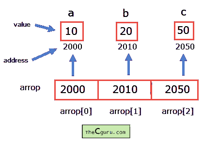

# C 语言中的指针数组

> 原文：<https://overiq.com/c-programming-101/array-of-pointers-in-c/>

最后更新于 2020 年 7 月 27 日

* * *

就像我们可以声明一个由`int`、`float`或`char`等组成的数组一样，我们也可以声明一个指针数组，下面是做同样事情的语法。

**语法:** `datatype *array_name[size];`

让我们举个例子:

```c
int *arrop[5];

```

这里`arrop`是`5`整数指针的数组。这意味着这个数组可以保存`5`整数变量的地址。换句话说，您可以将指向`int`类型指针的`5`指针变量分配给该数组的元素。

下面的程序演示了如何使用指针数组。

```c
#include<stdio.h>
#define SIZE 10

int main()
{
    int *arrop[3];
    int a = 10, b = 20, c = 50, i;

    arrop[0] = &a;
    arrop[1] = &b;
    arrop[2] = &c;

    for(i = 0; i < 3; i++)
    {
        printf("Address = %d\t Value = %d\n", arrop[i], *arrop[i]);
    }

    return 0;
}

```

**预期输出:**

```c
Address = 387130656      Value = 10
Address = 387130660      Value = 20
Address = 387130664      Value = 50

```

**工作原理:**

注意我们如何分配`a`、`b`和`c`的地址。在第 9 行，我们将变量`a`的地址分配给数组的第 0 个元素。类似地，`b`和`c`的地址分别分配给第一和第二元素。此时，`arrop`看起来是这样的:



`arrop[i]`给出数组第 I 个元素的地址。所以`arrop[0]`返回变量`a`的地址，`arrop[1]`返回`b`的地址等等。要获取地址值，请使用间接运算符(`*`)。

```c
*arrop[i]

```

因此，`*arrop[0]`给出地址`arrop[0]`处的值，类似地`*arrop[1]`给出地址`arrop[1]`处的值，以此类推。

* * *

* * *