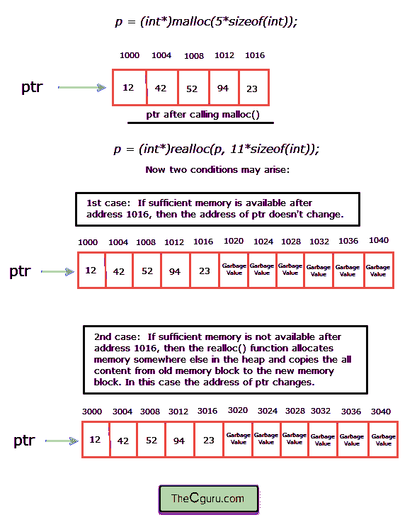

# C 语言中的`realloc()`函数

> 原文：<https://overiq.com/c-programming-101/the-realloc-function-in-c/>

最后更新于 2020 年 7 月 27 日

* * *

假设我们已经使用`malloc()`和`calloc()`分配了一些内存，但是后来我们发现内存太大或太小。realloc()函数用于在不丢失旧数据的情况下调整已分配内存的大小。它的语法是:

**语法:** `void *realloc(void *ptr, size_t newsize);`

`realloc()`函数接受两个参数，第一个参数`ptr`是一个指针，指向先前使用`malloc()`或`calloc()`函数分配的内存的第一个字节。newsize 参数以字节为单位指定块的新大小，该大小可以小于或大于原始大小。而`size_t`只是`stdlib.h`头文件里面定义的`unsigned int`的别名。

让我们举个例子:

```c
int *p;
p = (int*)malloc(5*sizeof(int)); // allocate memory for 5 integers</pre>

```

假设以后有时候我们想增加分配内存的大小来存储`6`更多的整数。为此，我们必须分配额外的`6 x sizeof(int)`字节内存。下面是如何调用`realloc()`函数来分配`6 x sizeof(int)`字节的内存。

```c
// allocate memory for 6 more integers integers i.e a total of 11 integers
p = (int*)realloc(p, 11*sizeof(int));

```

如果在已经使用的字节之后有足够的内存(在这种情况下是`6 * sizeof(int)`字节)可用，那么`realloc()`函数只分配已经使用的字节旁边的`6 * sizeof(int)`字节。在这种情况下，`ptr`指向的记忆不会改变。需要注意的是，这样做不会丢失旧数据，但新分配的字节不会初始化。

另一方面，如果在已经使用的字节之后没有足够的内存(在这种情况下为`6 * sizeof(int)`字节)，则`realloc()`在堆的其他地方重新分配整个`11 * sizeof(int)`字节的内存，并将内容从旧的内存块复制到新的内存块。在这种情况下，`ptr`所指向的地址发生变化。



如果`realloc()`未能按照请求扩展内存，则返回`NULL`，旧内存中的数据不受影响。

以下程序演示了`realloc()`功能。

```c
#include<stdio.h>
#include<stdlib.h>

int main()
{
    int *p, i, n;

    printf("Initial size of the array is 4\n\n");
    p = (int*)calloc(4, sizeof(int));

    if(p==NULL)
    {
        printf("Memory allocation failed");
        exit(1); // exit the program
    }

    for(i = 0; i < 4; i++)
    {
        printf("Enter element at index %d: ", i);
        scanf("%d", p+i);
    }

    printf("\nIncreasing the size of the array by 5 elements ...\n ");

    p = (int*)realloc(p, 9 * sizeof(int));

    if(p==NULL)
    {
        printf("Memory allocation failed");
        exit(1); // exit the program
    }

    printf("\nEnter 5 more integers\n\n");

    for(i = 4; i < 9; i++)
    {
        printf("Enter element at index %d: ", i);
        scanf("%d", p+i);
    }

    printf("\nFinal array: \n\n");

    for(i = 0; i < 9; i++)
    {
        printf("%d ", *(p+i) );
    }

    // signal to operating system program ran fine
    return 0;
}

```

**预期输出:**

```c
Initial size of the array is 4

Enter element at index 0: 11
Enter element at index 1: 22
Enter element at index 2: 33
Enter element at index 3: 44

Increasing the size of the array by 5 elements ...

Enter 5 more integers

Enter element at index 4: 1
Enter element at index 5: 2
Enter element at index 6: 3
Enter element at index 7: 4
Enter element at index 8: 5

Final array:

11 22 33 44 1 2 3 4 5

```

* * *

* * *